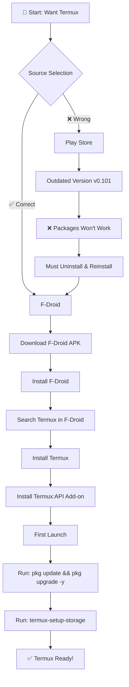
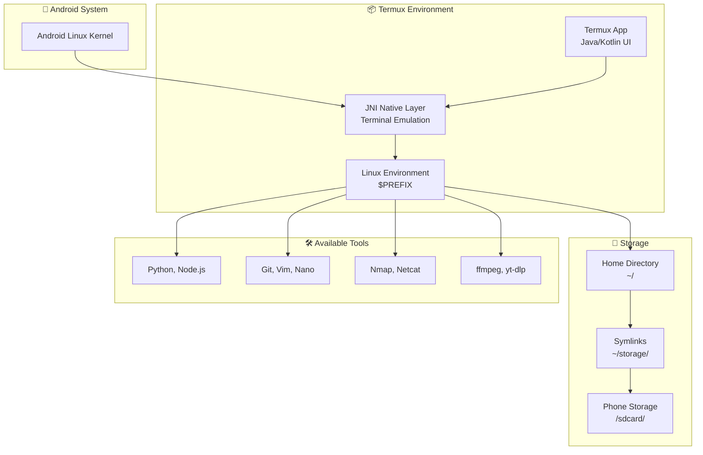
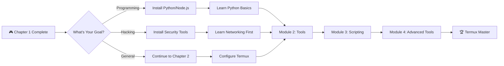

# Chapter 1: Termux Kya Hai & Installation Guide

```
╔═══════════════════════════════════════════════════════════════════════════════╗
║                                                                               ║
║   ████████╗███████╗██████╗ ███╗   ███╗██╗███╗   ██╗ ██████╗ ██████╗ ███████╗  ║
║   ╚══██╔══╝██╔════╝██╔══██╗████╗ ████║██║████╗  ██║██╔════╝██╔═══██╗██╔════╝  ║
║       ██║   █████╗  ██████╔╝██╔████╔██║██║██╔██╗ ██║██║     ██║   ██║███████╗  ║
║       ██║   ██╔══╝  ██╔══██╗██║╚██╔╝██║██║██║╚██╗██║██║     ██║   ██║╚════██║  ║
║       ██║   ███████╗██║  ██║██║ ╚═╝ ██║██║██║ ╚████║╚██████╗╚██████╔╝███████║  ║
║       ╚═╝   ╚══════╝╚═╝  ╚═╝╚═╝     ╚═╝╚═╝╚═╝  ╚═══╝ ╚═════╝ ╚═════╝ ╚══════╝  ║
║                                                                               ║
║   ████████╗ ██████╗  ██████╗ ██╗  ██╗███████╗                                 ║
║   ╚══██╔══╝██╔═══██╗██╔═══██╗██║ ██╔╝██╔════╝                                 ║
║      ██║   ██║   ██║██║   ██║█████╔╝ ███████╗                                 ║
║      ██║   ██║   ██║██║   ██║██╔═██╗ ╚════██║                                 ║
║      ██║   ╚██████╔╝╚██████╔╝██║  ██╗███████║                                 ║
║      ╚═╝    ╚═════╝  ╚═════╝ ╚═╝  ╚═╝╚══════╝                                 ║
║                                                                               ║
║                    📱 COMPLETE TERMUX COURSE 📱                               ║
║                         By T3rmuxk1ng                                         ║
╚═══════════════════════════════════════════════════════════════════════════════╝
```

> **Module:** 1 - Foundation  
> **Chapter:** 1 of 61  
> **Duration:** 15-20 Minutes  
> **Difficulty:** ⭐ Beginner  
> **Prerequisites:** None (Absolute Beginner)  

---

## 📋 Chapter Overview

| Section | Content |
|---------|---------|
| Video Script | Complete Hindi narration with timestamps |
| Technical Guide | Detailed Termux introduction |
| Installation Guide | Step-by-step F-Droid installation |
| Commands Reference | All commands covered in chapter |
| Practice Exercises | Hands-on tasks |
| Troubleshooting | Common installation issues |
| Video Assets | Thumbnail, description, tags |

---

## 🎬 VIDEO SCRIPT (Complete Hindi Narration)

```
═══════════════════════════════════════════════════════════════════════════════
TERMUX FULL COURSE - CHAPTER 1
Title: Termux Kya Hai? | Complete Installation Guide | T3rmuxk1ng
Duration: 15-20 Minutes
═══════════════════════════════════════════════════════════════════════════════

[INTRO - 0:00 to 0:50]
─────────────────────────────────────────────────────────────────────────────

Namaskar Dosto! Welcome to Termux Full Course by T3rmuxk1ng!

Main aapka host hoon aur aaj se shuru ho raha hai ek journey - ek aisi 
journey jo aapke Android phone ko ek powerful hacking aur development 
machine mein badal degi.

Agar aap ethical hacking, programming, cybersecurity, ya sirf Linux 
seekhna chahte ho - aur laptop nahi hai - to Termux aapke liye game 
changer hai.

Ye course 61 chapters ka hai, 10 modules mein divided hai. Har ek cheez 
step by step, from scratch to advanced. Koi prior knowledge chahiye 
nahi - bas ek Android phone aur internet connection.

To bina time waste kiye, chaliye shuru karte hain Chapter 1 se - 
Termux Kya Hai aur Kaise Install Karte Hain.

Play button dabaiye, video like karein, aur channel subscribe karein 
notification bell ke saath - taki koi video miss na ho.

---

[SECTION 1: TERMUX INTRODUCTION - 0:50 to 4:00]
─────────────────────────────────────────────────────────────────────────────

To sabse pehle sawal - Termux kya hai?

Termux ek Android terminal emulator hai. Simple shabdon mein samjhein - 
ye aapke Android phone ko ek mini Linux computer bana deta hai.

Jab aap Android phone use karte ho, to aap buttons dabate ho, apps 
open karte ho, touch karte ho - ye sab GUI hai, Graphical User 
Interface. Graphical interface aapko easy dikhata hai, lekin power 
kam hoti hai.

Termux CLI deta hai - Command Line Interface. Black screen, green 
ya white text, commands type karo, output dekho. Ye professionals 
ka tareeka hai, hackers ka tareeka, developers ka tareeka.

Terminal ki power ye hai ki aap system ko directly control kar sakte 
ho. Files create karo, delete karo, scripts run karo, servers host 
karo, networks scan karo - sab kuch ek command se.

Lekin Termux sirf terminal emulator nahi hai. Ye ek complete Linux 
environment hai Android ke upar. Debian aur Ubuntu jaise packages 
support karta hai. Over 1000 packages available hain free mein.

Termux mein kya kya kar sakte hain? List badi lambi hai:

✓ Programming Languages - Python, Node.js, C, C++, Ruby, Go, Rust
✓ Development Tools - Git, Vim, Nano, Emacs
✓ Networking Tools - Nmap, Netcat, curl, wget
✓ Security Tools - Hydra, John, SQLMap, Metasploit
✓ Media Tools - ffmpeg, ImageMagick, yt-dlp
✓ Databases - MySQL, SQLite, PostgreSQL
✓ Servers - Apache, Nginx, Node.js server, Python server
✓ And much more...

Sabse important baat - Termux ROOT ke bina kaam karta hai!
Haan, aapko phone root karne ki zarurat nahi. Root optional hai 
advanced features ke liye, lekin 90% kaam root ke bina ho jaata hai.

Isliye Termux beginners ke liye perfect hai - safe, powerful, 
aur free.

---

[SECTION 2: TERMUX VS OTHER APPS - 4:00 to 6:00]
─────────────────────────────────────────────────────────────────────────────

Ab sawal aata hai - Play Store pe to bahut saare terminal apps hain.
Kya Termux special hai? Kyun nahi UserLAnd, GNURoot, ya Linux Deploy?

Achha sawal hai. Main explain karta hoon differences:

┌─────────────────────────────────────────────────────────────────────────┐
│                    TERMUX VS OTHER TERMINAL APPS                         │
├────────────────┬──────────────────┬─────────────────────────────────────┤
│ Feature        │ Termux           │ Other Apps                          │
├────────────────┼──────────────────┼─────────────────────────────────────┤
│ Root Required  │ ❌ No            │ Some require root                   │
│ Native Android │ ✅ Yes           │ Many use VM/chroot                 │
│ Performance    │ ⭐⭐⭐⭐⭐ Fast      │ Slower (VM overhead)                │
│ Package Mgmt   │ ✅ pkg/apt        │ Limited or complex                  │
│ Updates        │ ✅ Active         │ Many discontinued                   │
│ Community      │ ✅ Large          │ Smaller                             │
│ APIs           │ ✅ Termux:API     │ Limited                             │
│ Learning Curve │ Easy to Medium   │ Medium to Hard                      │
└────────────────┴──────────────────┴─────────────────────────────────────┘

UserLAnd aur GNURoot VM use karte hain - Virtual Machine. Wo ek 
Linux system ko Android ke upar run karte hain virtualization se. 
Isse performance slow hoti hai, storage zyada lagta hai.

Termux directly Android ke Linux kernel pe kaam karta hai - no VM, 
no overhead. Fast, lightweight, aur native experience.

Linux Deploy root require karta hai. Termux root free hai basic 
usage ke liye.

Aur sabse important - Termux ki community bahut active hai. Regular 
updates aate hain, new packages add hote hain, issues jaldi solve 
hote hain. Documentation excellent hai.

Isliye Termux best choice hai - beginners ke liye bhi, professionals 
ke liye bhi.

---

[SECTION 3: WHY F-DROID, NOT PLAY STORE - 6:00 to 8:00]
─────────────────────────────────────────────────────────────────────────────

Ab installation ki baat aate hain. Yahan ek CRITICAL warning hai.

⚠️ WARNING: Termux ko Play Store se INSTALL NA KAREIN!

Main serious hoon. Play Store wala Termux outdated hai. Google ne 
Termux ke updates band kar diye hain Play Store pe. Last update 
2020 mein tha. Uske baad koi update nahi aaya.

Outdated Termux mein ye problems hongi:

❌ Packages install nahi honge (repository changed)
❌ Python latest version nahi milega
❌ Security vulnerabilities
❌ Many tools won't work
❌ Bugs jo fix ho chuke hain, wo bhi rahenge

Sahi source hai F-Droid. F-Droid ek open-source app store hai 
jo privacy-focused hai aur updates regularly deta hai.

Alternative: GitHub releases se direct APK download kar sakte ho.
Lekin F-Droid recommended hai kyunki automatic updates milte rahte hain.

---

[SECTION 4: INSTALLATION PROCESS - 8:00 to 12:00]
─────────────────────────────────────────────────────────────────────────────

Chaliye ab installation process start karte hain. Main step by step 
bataunga, aap follow karein.

[STEP 1: F-Droid Installation]

Pehle F-Droid app download karein:
1. Browser mein jao: https://f-droid.org
2. "Download F-Droid" button pe click karein
3. APK download hogi
4. APK install karein (Unknown sources permission chahiye hoga)

Android setting mein jao:
Settings → Security → Unknown Sources → Enable

Ya phir Android 10+ mein:
Settings → Apps → Special Access → Install Unknown Apps → 
Browser enable karein

[STEP 2: Install Termux from F-Droid]

1. F-Droid app open karein
2. Search bar mein "Termux" type karein
3. Termux app pe click karein
4. Install button dabayein
5. Wait for installation

[STEP 3: Additional Apps (Recommended)]

F-Droid se ye apps bhi install karein:

┌─────────────────────────────────────────────────────────────────────────┐
│                    RECOMMENDED TERMUX ADD-ONS                            │
├──────────────────────┬──────────────────────────────────────────────────┤
│ App                  │ Purpose                                         │
├──────────────────────┼──────────────────────────────────────────────────┤
│ Termux:API           │ Access Android features (camera, SMS, etc.)     │
│ Termux:Styling       │ Customize Termux colors and fonts               │
│ Termux:Float         │ Floating terminal window                        │
│ Termux:Tasker        │ Tasker integration for automation               │
│ Termux:Widget        │ Home screen shortcuts for scripts               │
│ Termux:Boot          │ Run scripts at boot                             │
└──────────────────────┴──────────────────────────────────────────────────┘

Minimum: Termux + Termux:API install karein
Recommended: Saare add-ons install karein

---

[SECTION 5: FIRST LAUNCH & SETUP - 12:00 to 15:00]
─────────────────────────────────────────────────────────────────────────────

Termux first time open karein.

[SCREEN: Termux loading screen]

Aapko "Installing..." ya "Setting up..." dikhega. Wait karein - 
ye normal hai. Pehli baar Termux apna environment extract kar raha hai.

30 seconds to 1 minute lag sakta hai depending on phone speed.

[SCREEN: Termux terminal ready]

Jab terminal ready ho, aapko welcome message dikhega aur ek 
blinking cursor milega.

Sabse pehla kaam - UPDATE karein:

    pkg update && pkg upgrade -y

Ye command:
- pkg update: Repository list refresh karta hai
- pkg upgrade: Installed packages update karta hai
- && : Do commands ko connect karta hai
- -y: Automatically yes karta hai prompts ka

[SCREEN: Running update command]

Thoda time lagega - internet speed pe depend karta hai. 
Wait karein jab tak complete na ho.

Agar koi error aaye to:
- Internet connection check karein
- Storage permission check karein (next step)
- F-Droid se install kiya hai na? Play Store wala nahi?

---

[SECTION 6: STORAGE ACCESS SETUP - 15:00 to 17:30]
─────────────────────────────────────────────────────────────────────────────

Ab ek important setup baaki hai - Storage Access.

By default Termux ko aapke phone ka internal storage access nahi 
hotas. Photos, downloads, files - sab inaccessible hai.

Access ke liye ye command run karein:

    termux-setup-storage

[SCREEN: Permission popup]

Ek popup aayega: "Allow Termux to access photos, media, and files?"

"Allow" button press karein.

Iske baad Termux ko storage access mil jaayega. Symbolic links 
ban jaayenge:

~/storage/dcim → /sdcard/DCIM
~/storage/downloads → /sdcard/Download
~/storage/music → /sdcard/Music
~/storage/pictures → /sdcard/Pictures
... etc

Test karein:

    ls ~/storage/

Ye command aapko storage folders dikha degi.

    ls /sdcard/

Ye bhi kaam karega - internal storage ka content dikhayega.

Ab aap:
- Files download folder se access kar sakte ho
- Scripts storage mein save kar sakte ho
- Media files work kar sakte ho
- Data backup kar sakte ho

---

[SECTION 7: BASIC COMMANDS TEST - 17:30 to 19:30]
─────────────────────────────────────────────────────────────────────────────

Chaliye ab check karte hain ki sab kuch theek se kaam kar raha hai.

[TEST 1: Check Package Manager]

    pkg

Ye command pkg ke options dikhayega. Agar output aaya to package 
manager kaam kar raha hai.

[TEST 2: Check Python]

    python --version

Agar Python installed hai to version dikhayega. Agar nahi hai to:

    pkg install python -y

Install karein, phir version check karein.

[TEST 3: Run Python Command]

    python -c "print('Hello Termux!')"

Output: Hello Termux! aana chahiye.

[TEST 4: Current Directory]

    pwd

Ye command current directory batati hai - /data/data/com.termux/files/home

[TEST 5: List Files]

    ls

Current directory ke files list hongi.

[TEST 6: Clear Screen]

    clear

Screen clear ho jaayega.

Agar ye saare commands kaam kar rahe hain - CONGRATULATIONS! 🎉

Aapka Termux successfully install aur configured hai!

---

[SECTION 8: SUMMARY & NEXT PREVIEW - 19:30 to 21:00]
─────────────────────────────────────────────────────────────────────────────

To dosto, Chapter 1 complete! Let's summarize:

✅ Termux kya hai - Linux environment Android pe, bina root ke
✅ Termux vs other apps - Kyun Termux best hai
✅ F-Droid installation - Play Store nahi, F-Droid use karein
✅ First setup - pkg update && pkg upgrade -y
✅ Storage access - termux-setup-storage
✅ Basic tests - Commands verify kiye

Important Commands yaad rakhein:

┌─────────────────────────────────────────────────────────────────────────┐
│                    CHAPTER 1 - IMPORTANT COMMANDS                        │
├─────────────────────────────────────────────────────────────────────────┤
│ pkg update && pkg upgrade -y    │ Update Termux packages                │
│ termux-setup-storage            │ Grant storage access                  │
│ pkg install <package>           │ Install new package                   │
│ pkg search <name>               │ Search for package                    │
│ pkg uninstall <package>         │ Remove package                        │
│ python --version                │ Check Python version                  │
│ pwd                             │ Print current directory               │
│ ls                              │ List files                            │
│ clear                           │ Clear screen                          │
└─────────────────────────────────────────────────────────────────────────┘

Next Chapter 2 mein hum seekhenge:
- Termux configuration files
- Environment variables kya hote hain
- .bashrc file customize karna
- Aliases banana - shortcuts commands ke liye
- Welcome message setup

Agar ye video helpful lagi, to:
👍 Like button press karein
🔔 Subscribe karein, notification bell on karein
💬 Koi sawal ho to comment mein poochein
📤 Share karein friends ke saath

Main har comment ka reply karta hoon.

Thank you for watching! See you in Chapter 2!

═══════════════════════════════════════════════════════════════════════════════
```

---

## 📖 TECHNICAL GUIDE

### 1. Termux Architecture

```
┌─────────────────────────────────────────────────────────────────────────┐
│                         TERMUX ARCHITECTURE                              │
├─────────────────────────────────────────────────────────────────────────┤
│                                                                          │
│   ┌─────────────────────────────────────────────────────────────────┐   │
│   │                    Android Application Layer                      │   │
│   │   (Termux App - Java/Kotlin code, UI, User Interaction)          │   │
│   └─────────────────────────────────────────────────────────────────┘   │
│                                   │                                      │
│                                   ▼                                      │
│   ┌─────────────────────────────────────────────────────────────────┐   │
│   │                     JNI Native Layer                             │   │
│   │   (Native C/C++ code, terminal emulation)                        │   │
│   └─────────────────────────────────────────────────────────────────┘   │
│                                   │                                      │
│                                   ▼                                      │
│   ┌─────────────────────────────────────────────────────────────────┐   │
│   │                    Linux Environment                             │   │
│   │   ($PREFIX = /data/data/com.termux/files/usr)                    │   │
│   │                                                                   │   │
│   │   ├── bin/        (executables - python, bash, etc.)            │   │
│   │   ├── lib/        (libraries)                                   │   │
│   │   ├── etc/        (configuration files)                         │   │
│   │   ├── share/      (documentation, data)                         │   │
│   │   ├── tmp/        (temporary files)                             │   │
│   │   └── var/        (variable data)                               │   │
│   └─────────────────────────────────────────────────────────────────┘   │
│                                   │                                      │
│                                   ▼                                      │
│   ┌─────────────────────────────────────────────────────────────────┐   │
│   │                    Android Linux Kernel                          │   │
│   │   (Standard Android kernel - no modification needed)             │   │
│   └─────────────────────────────────────────────────────────────────┘   │
│                                                                          │
└─────────────────────────────────────────────────────────────────────────┘
```

### 2. Key Paths

| Path | Description |
|------|-------------|
| `$HOME` or `~` | `/data/data/com.termux/files/home` - User home directory |
| `$PREFIX` | `/data/data/com.termux/files/usr` - System prefix |
| `$PREFIX/bin` | Executable binaries location |
| `$PREFIX/etc` | Configuration files |
| `~/storage` | Symlinks to shared storage |
| `/sdcard` | Internal storage (after termux-setup-storage) |

### 3. Package Sources

Termux packages come from multiple repositories:

```bash
# Main repository
deb https://packages.termux.dev/termux-main stable main

# Games repository
deb https://packages.termux.dev/termux-games games stable

# Science repository
deb https://packages.termux.dev/termux-science science stable

# Root repository (requires root)
deb https://packages.termux.dev/termux-root root stable

# X11 repository (GUI apps)
deb https://packages.termux.dev/termux-x11 x11 stable
```

Repository files location: `$PREFIX/etc/apt/sources.list`

---

## 🔧 INSTALLATION GUIDE

### Method 1: F-Droid (Recommended)

```
Step 1: Enable Unknown Sources
├── Settings → Security → Unknown Sources (Android < 10)
└── Settings → Apps → Special Access → Install Unknown Apps (Android 10+)

Step 2: Download F-Droid
├── Open browser
├── Go to: https://f-droid.org
├── Tap "Download F-Droid"
└── Install the APK

Step 3: Install Termux
├── Open F-Droid app
├── Wait for repository sync (first time)
├── Search "Termux"
├── Tap Install
└── Wait for installation

Step 4: Install Add-ons
├── Termux:API (Required for API features)
├── Termux:Styling (Optional - themes)
├── Termux:Float (Optional - floating window)
└── Termux:Widget (Optional - home shortcuts)
```

### Method 2: GitHub Releases

```bash
# Direct download links (latest version)
https://github.com/termux/termux-app/releases
https://github.com/termux/termux-api/releases

# Download APK files and install manually
```

### Method 3: Build from Source

```bash
# For developers who want to build themselves
git clone https://github.com/termux/termux-app
cd termux-app
./gradlew assembleDebug
```

---

## 📋 COMMANDS REFERENCE

### Package Management Commands

```bash
# Update package lists
pkg update

# Upgrade all installed packages
pkg upgrade

# Update and upgrade together
pkg update && pkg upgrade -y

# Install a package
pkg install <package-name>

# Install multiple packages
pkg install python nodejs git

# Remove a package
pkg uninstall <package-name>

# Remove package with dependencies
pkg uninstall <package-name> && pkg autoclean

# Search for a package
pkg search <keyword>

# List all installed packages
pkg list-installed

# Show package info
pkg show <package-name>

# Clean cache
pkg clean

# Hold package (prevent upgrade)
pkg hold <package-name>

# Unhold package
pkg unhold <package-name>
```

### Essential First Commands

```bash
# Grant storage permission
termux-setup-storage

# Check current directory
pwd
# Output: /data/data/com.termux/files/home

# List files in current directory
ls

# List files with details
ls -la

# List storage links
ls ~/storage/

# Check disk usage
df -h

# Check memory usage
free -h

# Clear terminal screen
clear

# Exit Termux
exit
```

### System Information Commands

```bash
# Termux version
echo $TERMUX_VERSION

# Android version
getprop ro.build.version.release

# Device model
getprop ro.product.model

# CPU info
cat /proc/cpuinfo

# Memory info
cat /proc/meminfo

# Kernel version
uname -a
```

---

## 💻 PRACTICE EXERCISES

### Exercise 1: Installation Verification

```bash
# Task: Verify Termux is installed correctly

# Step 1: Check Termux is working
echo "Termux is working!"

# Step 2: Check package manager
pkg

# Step 3: Update everything
pkg update && pkg upgrade -y

# Step 4: Install Python
pkg install python -y

# Step 5: Test Python
python -c "print('Hello from Termux!')"

# Step 6: Grant storage
termux-setup-storage
# Press "Allow" on popup

# Step 7: Verify storage
ls ~/storage/

# Expected: You should see dcim, downloads, music, etc.
```

### Exercise 2: Create Your First Script

```bash
# Task: Create and run a simple Python script

# Step 1: Create a Python file
cat > hello.py << 'EOF'
# My first Termux script
import os
import platform

print("=" * 40)
print("Termux System Information")
print("=" * 40)
print(f"Python Version: {platform.python_version()}")
print(f"System: {platform.system()}")
print(f"Machine: {platform.machine()}")
print(f"Home: {os.path.expanduser('~')}")
print("=" * 40)
EOF

# Step 2: Run the script
python hello.py

# Expected: System information output
```

### Exercise 3: Explore Termux

```bash
# Task: Explore Termux environment

# Step 1: Navigate to Termux root
cd $PREFIX

# Step 2: List directories
ls

# Step 3: Check bin folder (executables)
ls bin/ | head -20

# Step 4: Check etc folder (configs)
ls etc/

# Step 5: Go back home
cd ~

# Step 6: Check current path
pwd

# Step 7: List all files including hidden
ls -la

# Step 8: Create a test directory
mkdir test

# Step 9: Navigate into it
cd test

# Step 10: Create a test file
echo "This is a test file" > test.txt

# Step 11: Read the file
cat test.txt

# Step 12: Go back and clean up
cd ~
rm -rf test
```

---

## ⚠️ TROUBLESHOOTING

### Problem 1: "Unable to locate package"

```bash
# Cause: Outdated package lists or wrong repository

# Solution 1: Update package lists
pkg update

# Solution 2: Check internet connection
ping -c 3 google.com

# Solution 3: Check if you installed from F-Droid (not Play Store)
# If Play Store version - uninstall and install from F-Droid

# Solution 4: Reset repositories
pkg upgrade
```

### Problem 2: "Permission denied" for storage

```bash
# Cause: Storage permission not granted

# Solution 1: Run setup command
termux-setup-storage

# If popup doesn't appear:

# Solution 2: Manual permission grant
# Go to: Settings → Apps → Termux → Permissions
# Enable: Storage / Files and Media

# Solution 3: Check if permission granted
ls /sdcard/
# Should show internal storage contents
```

### Problem 3: "Command not found"

```bash
# Cause: Package not installed

# Example: python: command not found
# Solution:
pkg install python -y

# Example: git: command not found
# Solution:
pkg install git -y

# Search for package
pkg search <command-name>
```

### Problem 4: "Segmentation fault" or crashes

```bash
# Cause: Corrupted installation or old version

# Solution 1: Clear cache
pkg clean

# Solution 2: Reinstall problematic package
pkg uninstall <package>
pkg install <package>

# Solution 3: Full reset (WARNING: deletes all data)
# Go to Android Settings → Apps → Termux → Clear Data
# Then reinstall from F-Droid
```

### Problem 5: Slow or hanging installation

```bash
# Cause: Slow internet or mirror issues

# Solution 1: Use different mirror
# Edit sources list
nano $PREFIX/etc/apt/sources.list

# Change mirror URL to:
# deb https://packages.termux.dev/termux-main stable main

# Solution 2: Check internet speed
curl -s https://raw.githubusercontent.com/sivel/speedtest-cli/master/speedtest.py | python -

# Solution 3: Use VPN if your ISP blocks the repo
```

### Problem 6: Play Store Version Issues

```bash
# Symptoms:
# - pkg update fails
# - "old version" errors
# - Packages not found

# Diagnosis:
echo $TERMUX_VERSION
# If version < 0.118, you have Play Store version

# Solution: COMPLETELY UNINSTALL and reinstall from F-Droid
# 1. Settings → Apps → Termux → Uninstall
# 2. Download from F-Droid
# 3. Install fresh
# 4. Run: pkg update && pkg upgrade -y
```

---

## 🎬 VIDEO ASSETS

### Thumbnail Concepts

**Option A: Clean & Professional**
```
┌────────────────────────────────────┐
│  [Green Terminal Background]       │
│                                    │
│   📱 TERMUX                        │
│   COMPLETE INSTALL GUIDE           │
│                                    │
│   ✓ F-Droid Method                 │
│   ✓ No Root Required               │
│                                    │
│   [T3rmuxk1ng Logo]                │
└────────────────────────────────────┘
```

**Option B: Comparison Style**
```
┌────────────────────────────────────┐
│  Play Store ❌  │  F-Droid ✅       │
│  ───────────────┼───────────────── │
│  Outdated       │  Updated         │
│  Broken         │  Working         │
│  Bugs           │  Latest          │
│                                    │
│  USE F-DROID!                      │
│  [T3rmuxk1ng]                      │
└────────────────────────────────────┘
```

**Option C: Eye-Catching**
```
┌────────────────────────────────────┐
│  ⚠️ STOP!                          │
│                                    │
│  Don't Install Termux from         │
│  Play Store!                       │
│                                    │
│  👉 WATCH THIS FIRST 👈            │
│                                    │
│  Chapter 1 | T3rmuxk1ng            │
└────────────────────────────────────┘
```

### Video Description Template

```markdown
📱 Termux Full Course - Chapter 1: Termux Kya Hai? | Complete Installation Guide

🔥 In this video you'll learn:
• Termux kya hai aur kyun use karein
• F-Droid se sahi tarah install karna
• First setup aur configuration
• Storage access setup
• Basic commands test

⏱️ Timestamps:
0:00 - Introduction
0:50 - Termux Introduction
4:00 - Termux vs Other Apps
6:00 - Why F-Droid, Not Play Store
8:00 - Installation Process
12:00 - First Launch Setup
15:00 - Storage Access Setup
17:30 - Basic Commands Test
19:30 - Summary

📥 Download Links:
• F-Droid: https://f-droid.org
• Termux GitHub: https://github.com/termux/termux-app

📝 Commands from this video:
pkg update && pkg upgrade -y
termux-setup-storage
pkg install python -y

📚 Full Course Playlist:
[PLAYLIST LINK]

📱 Follow T3rmuxk1ng:
• YouTube: @T3rmuxk1ng
• Telegram: [LINK]
• GitHub: [LINK]

#Termux #TermuxCourse #T3rmuxk1ng #LinuxOnAndroid #EthicalHacking #TermuxInstallation #TermuxHindi

---
⚠️ Disclaimer: This video is for educational purposes. Use tools responsibly and only on systems you have permission to test.
```

### Tags List

```
termux, termux tutorial, termux installation, termux course, 
termux full course, termux kya hai, termux install kaise kare,
termux f-droid, termux hindi, termux tutorial hindi,
android terminal emulator, linux on android, termux for beginners,
learn termux, termux setup, termux guide, ethical hacking,
cybersecurity, hacking tools, t3rmuxk1ng, termux course hindi,
android hacking, mobile hacking, termux commands, termux basics
```

### Hashtags

```
#Termux #TermuxCourse #TermuxHindi #TermuxTutorial #LinuxOnAndroid 
#AndroidHacking #EthicalHacking #CyberSecurity #TermuxForBeginners 
#T3rmuxk1ng #LearnTermux #TermuxInstallation #HindiTutorial
```

---

## 📚 ADDITIONAL RESOURCES

### Official Resources

| Resource | Link |
|----------|------|
| Termux Wiki | https://wiki.termux.com/ |
| Termux GitHub | https://github.com/termux |
| Termux Packages | https://github.com/termux/termux-packages |
| F-Droid | https://f-droid.org/ |

### Community

| Platform | Link |
|----------|------|
| Reddit | r/termux |
| Telegram | @termux |
| IRC | #termux on Libera.Chat |

### Learning Resources

| Resource | Description |
|----------|-------------|
| Termux Help | Run `pkg help` in Termux |
| Package Info | Run `pkg show <package>` |
| Man Pages | Run `man <command>` (install man first) |
| Command Help | Run `<command> --help` |

---

## ✅ CHAPTER CHECKLIST

Before moving to Chapter 2, verify:

- [ ] Termux installed from F-Droid (not Play Store)
- [ ] `pkg update && pkg upgrade -y` completed successfully
- [ ] `termux-setup-storage` executed and permission granted
- [ ] Python installed and tested
- [ ] Basic commands working: pwd, ls, clear
- [ ] Storage access verified with `ls ~/storage/`
- [ ] Understood why Play Store version is bad

---

## 🎯 NEXT CHAPTER PREVIEW

**Chapter 2: First Setup & Configuration**

- Termux configuration files location
- Understanding environment variables
- Creating and customizing .bashrc
- Setting up useful aliases
- Custom welcome message
- Prompt customization (PS1)

---

## 🎮 INTERACTIVE QUIZ - Test Your Knowledge!

Test your understanding of Termux basics with these 15 questions!

---

### Question 1: What is Termux?

<details>
<summary>🔍 Click to see options</summary>

A) A game for Android  
B) An Android terminal emulator and Linux environment  
C) A photo editing app  
D) A web browser  

</details>

<details>
<summary>✅ Click to see answer</summary>

**Answer: B) An Android terminal emulator and Linux environment**

**Explanation:** Termux is a powerful terminal emulator that provides a complete Linux environment on Android devices without requiring root access. It combines a terminal interface with a package management system, allowing users to run Linux commands and install various tools directly on their Android phones.

</details>

---

### Question 2: Why should you NOT install Termux from Google Play Store?

<details>
<summary>🔍 Click to see options</summary>

A) It costs money on Play Store  
B) The Play Store version is outdated and packages won't work  
C) Play Store doesn't have Termux  
D) Play Store version has viruses  

</details>

<details>
<summary>✅ Click to see answer</summary>

**Answer: B) The Play Store version is outdated and packages won't work**

**Explanation:** Google stopped allowing Termux updates on Play Store since 2020 due to policy changes. The Play Store version (v0.101) is severely outdated and cannot connect to current repositories, making package installation impossible. Always use F-Droid for the latest version (v0.118+).

</details>

---

### Question 3: What does the command `pkg update && pkg upgrade -y` do?

<details>
<summary>🔍 Click to see options</summary>

A) Restarts Termux  
B) Updates package list AND upgrades all installed packages  
C) Only updates the package list  
D) Installs new packages  

</details>

<details>
<summary>✅ Click to see answer</summary>

**Answer: B) Updates package list AND upgrades all installed packages**

**Explanation:** 
- `pkg update` refreshes the local package list from repositories
- `&&` ensures the second command runs only if the first succeeds
- `pkg upgrade` actually updates installed packages to newer versions
- `-y` automatically answers "yes" to all prompts

This is the recommended first command after installing Termux.

</details>

---

### Question 4: What is the purpose of `termux-setup-storage` command?

<details>
<summary>🔍 Click to see options</summary>

A) Sets up Termux internal storage  
B) Creates symlinks to access phone's shared storage  
C) Increases storage space  
D) Formats the storage  

</details>

<details>
<summary>✅ Click to see answer</summary>

**Answer: B) Creates symlinks to access phone's shared storage**

**Explanation:** By default, Termux runs in a sandboxed environment and cannot access your phone's files. The `termux-setup-storage` command requests storage permissions and creates symbolic links in `~/storage/` pointing to directories like Downloads, DCIM, Music, etc. This allows Termux to interact with your phone's shared storage.

</details>

---

### Question 5: Which environment variable shows Termux's main installation path?

<details>
<summary>🔍 Click to see options</summary>

A) $HOME  
B) $PATH  
C) $PREFIX  
D) $TERMUX  

</details>

<details>
<summary>✅ Click to see answer</summary>

**Answer: C) $PREFIX**

**Explanation:** 
- `$PREFIX` points to `/data/data/com.termux/files/usr` where all Termux system files are installed
- `$HOME` points to `/data/data/com.termux/files/home` (user's home directory)
- `$PATH` contains directories where executable commands are searched
- `$PREFIX` is Termux-specific and is equivalent to `/usr` in traditional Linux

</details>

---

### Question 6: What is F-Droid?

<details>
<summary>🔍 Click to see options</summary>

A) A game store  
B) An open-source app repository for Android  
C) A Linux distribution  
D) A programming language  

</details>

<details>
<summary>✅ Click to see answer</summary>

**Answer: B) An open-source app repository for Android**

**Explanation:** F-Droid is a trusted open-source app store for Android that focuses on privacy and freedom. It provides verified, open-source applications including Termux. Unlike Google Play Store, F-Droid allows apps to update freely and maintains the latest versions of privacy-respecting applications.

</details>

---

### Question 7: Which command shows your current directory path?

<details>
<summary>🔍 Click to see options</summary>

A) ls  
B) cd  
C) pwd  
D) whereami  

</details>

<details>
<summary>✅ Click to see answer</summary>

**Answer: C) pwd**

**Explanation:** `pwd` stands for "Print Working Directory". It displays the full path of your current location in the file system. For example, in Termux's home directory, `pwd` would output `/data/data/com.termux/files/home`.

</details>

---

### Question 8: What does the `~` symbol represent in Termux?

<details>
<summary>🔍 Click to see options</summary>

A) Current directory  
B) Parent directory  
C) Home directory  
D) Root directory  

</details>

<details>
<summary>✅ Click to see answer</summary>

**Answer: C) Home directory**

**Explanation:** The tilde (`~`) is a shell shortcut that represents the user's home directory. In Termux, `~` equals `/data/data/com.termux/files/home`. Commands like `cd ~` or `ls ~/storage` use this shortcut for convenience.

</details>

---

### Question 9: Which Termux add-on is REQUIRED for accessing Android features like camera and SMS?

<details>
<summary>🔍 Click to see options</summary>

A) Termux:Styling  
B) Termux:Float  
C) Termux:API  
D) Termux:Widget  

</details>

<details>
<summary>✅ Click to see answer</summary>

**Answer: C) Termux:API**

**Explanation:** Termux:API is an essential add-on that provides access to Android hardware and software features. With it, you can:
- Access camera (`termux-camera-photo`)
- Send SMS (`termux-sms-send`)
- Get device location (`termux-location`)
- Control media volume, make phone calls, and much more
- Without this add-on, API commands won't work

</details>

---

### Question 10: What happens when you run `pkg install python`?

<details>
<summary>🔍 Click to see options</summary>

A) Only Python is installed  
B) Python and its dependencies are installed  
C) Python is downloaded but not installed  
D) All packages are installed  

</details>

<details>
<summary>✅ Click to see answer</summary>

**Answer: B) Python and its dependencies are installed**

**Explanation:** When you install a package, Termux's package manager (apt/dpkg) automatically:
1. Downloads the package from repository
2. Resolves and downloads all dependencies
3. Installs the package and all required dependencies
4. Configures the packages for use

Python requires dependencies like libffi, openssl, readline, ncurses, and zlib.

</details>

---

### Question 11: Which command clears the terminal screen?

<details>
<summary>🔍 Click to see options</summary>

A) clean  
B) clear  
C) cls  
D) reset  

</details>

<details>
<summary>✅ Click to see answer</summary>

**Answer: B) clear**

**Explanation:** `clear` is the standard Linux command to clear the terminal screen. It moves the cursor to the top, giving you a clean workspace. You can also use `Ctrl+L` as a keyboard shortcut to clear the screen without typing a command.

</details>

---

### Question 12: What is the correct order for initial Termux setup?

<details>
<summary>🔍 Click to see options</summary>

A) Install packages → Update → Setup storage  
B) Update → Setup storage → Install packages  
C) Setup storage → Update → Install packages  
D) Any order works  

</details>

<details>
<summary>✅ Click to see answer</summary>

**Answer: B) Update → Setup storage → Install packages**

**Explanation:** The recommended setup order is:
1. `pkg update && pkg upgrade -y` - Ensure system is updated
2. `termux-setup-storage` - Grant storage access
3. `pkg install python git nodejs` - Install needed packages

This order ensures you have the latest package lists, storage access, and a stable base before adding new software.

</details>

---

### Question 13: What does `$PREFIX/bin` contain?

<details>
<summary>🔍 Click to see options</summary>

A) Configuration files  
B) Executable programs/commands  
C) Library files  
D) Documentation  

</details>

<details>
<summary>✅ Click to see answer</summary>

**Answer: B) Executable programs/commands**

**Explanation:** The `$PREFIX/bin` directory (`/data/data/com.termux/files/usr/bin`) contains all executable binaries - the commands you can run. This includes `python`, `git`, `ls`, `cat`, `bash`, and all other installed programs. This directory is included in your `$PATH`.

</details>

---

### Question 14: How do you check if a package exists before installing?

<details>
<summary>🔍 Click to see options</summary>

A) pkg check <name>  
B) pkg search <name>  
C) pkg find <name>  
D) pkg locate <name>  

</details>

<details>
<summary>✅ Click to see answer</summary>

**Answer: B) pkg search <name>**

**Explanation:** `pkg search <keyword>` searches through available packages in the repository. It shows matching package names and descriptions, helping you verify if a package exists and find the correct package name before installation.

</details>

---

### Question 15: What makes Termux different from other terminal apps?

<details>
<summary>🔍 Click to see options</summary>

A) It requires root  
B) It has native package management and works without root  
C) It's only for developers  
D) It's a paid app  

</details>

<details>
<details>
<summary>✅ Click to see answer</summary>

**Answer: B) It has native package management and works without root**

**Explanation:** Termux stands out because:
- **No root required** - Works on any Android device
- **Native package management** - Install tools directly via `pkg/apt`
- **Full Linux environment** - Not just a terminal, but a complete system
- **1000+ packages** - Programming languages, tools, servers, and more
- **Active development** - Regular updates and community support
- **API integration** - Can access Android features

Other terminal apps either require root, use slow virtualization, or lack package management.

</details>

---

## 🎯 INTERVIEW QUESTIONS - Job Preparation

Prepare for technical interviews with these Termux/Linux-related questions!

---

### Q1: Explain the Termux architecture and how it differs from traditional Linux distributions.

<details>
<summary>📖 View Answer</summary>

**Answer:**

Termux has a unique architecture designed for Android:

```
┌─────────────────────────────────────────┐
│          Android Application Layer       │
│         (Java/Kotlin - Termux App)       │
└─────────────────┬───────────────────────┘
                  │
                  ▼
┌─────────────────────────────────────────┐
│           JNI Native Layer               │
│      (C/C++ - Terminal Emulation)        │
└─────────────────┬───────────────────────┘
                  │
                  ▼
┌─────────────────────────────────────────┐
│         Linux Environment                │
│    ($PREFIX = /data/data/com.termux/)    │
│    ┌─────┬─────┬─────┬─────┐            │
│    │ bin │ lib │ etc │ var │            │
│    └─────┴─────┴─────┴─────┘            │
└─────────────────┬───────────────────────┘
                  │
                  ▼
┌─────────────────────────────────────────┐
│       Android Linux Kernel               │
│       (Unmodified, Standard)             │
└─────────────────────────────────────────┘
```

**Key Differences:**
1. **Single-user system** - No multi-user support
2. **Sandboxed environment** - Limited system access
3. **Modified prefix** - Uses `$PREFIX` instead of `/usr`
4. **No systemd** - Uses simpler init system
5. **Android permissions** - Subject to Android security model

**Follow-up Question:** How does Termux run without root?
**Answer:** Termux uses Android's native Linux kernel directly. It runs as a regular Android app within its own sandbox, but has access to execute native Linux binaries through Android's execution capabilities.

</details>

---

### Q2: A user complains that `pkg install` gives "Unable to locate package" error. How would you troubleshoot?

<details>
<summary>📖 View Answer</summary>

**Answer:**

Troubleshooting steps:

1. **Check Termux version:**
```bash
echo $TERMUX_VERSION
# If < 0.118, they have Play Store version
```

2. **Update package lists:**
```bash
pkg update
```

3. **Verify network connectivity:**
```bash
ping -c 3 packages.termux.dev
```

4. **Check repository configuration:**
```bash
cat $PREFIX/etc/apt/sources.list
# Should show: deb https://packages.termux.dev/termux-main stable main
```

5. **Search for the package:**
```bash
pkg search <package-name>
# Might be spelled differently or in different repo
```

**Most common cause:** Using Play Store version (outdated) instead of F-Droid version.

**Follow-up Question:** What if it's a network/firewall issue?
**Answer:** Try using a VPN, checking DNS settings, or manually changing the mirror in sources.list to an alternative mirror.

</details>

---

### Q3: Explain the difference between `$HOME`, `$PREFIX`, and `$PATH` in Termux.

<details>
<summary>📖 View Answer</summary>

**Answer:**

| Variable | Path | Purpose |
|----------|------|---------|
| `$HOME` | `/data/data/com.termux/files/home` | User's personal directory for files, scripts, configs |
| `$PREFIX` | `/data/data/com.termux/files/usr` | System installation root (like `/usr` in Linux) |
| `$PATH` | `$PREFIX/bin:$PREFIX/bin/applets` | Directories searched for executables |

**Practical Example:**
```bash
# Custom script location
~/scripts/myscript.sh     # Personal scripts

# System binaries location
$PREFIX/bin/python        # Installed programs

# PATH allows running programs directly
python                    # Works because $PREFIX/bin is in PATH
```

**Follow-up Question:** How would you add a custom scripts directory to PATH?
**Answer:** Add to `~/.bashrc`:
```bash
export PATH="$HOME/scripts:$PATH"
```

</details>

---

### Q4: How would you set up a Python development environment in Termux?

<details>
<summary>📖 View Answer</summary>

**Answer:**

```bash
# 1. Update system
pkg update && pkg upgrade -y

# 2. Install Python and essential tools
pkg install python python-pip git nodejs -y

# 3. Install development tools
pkg install build-essential clang -y

# 4. Create project structure
mkdir -p ~/projects/python
cd ~/projects/python

# 5. Set up virtual environment
python -m venv venv
source venv/bin/activate

# 6. Install common packages
pip install requests beautifulsoup4 flask django numpy pandas

# 7. Verify installation
python --version
pip list
```

**Follow-up Question:** What limitations might you encounter?
**Answer:** Some Python packages with C extensions may fail to compile. Resource-intensive applications may be limited by mobile hardware. Some packages assume x86 architecture.

</details>

---

### Q5: What security considerations should be taken when using Termux?

<details>
<summary>📖 View Answer</summary>

**Answer:**

**Security Considerations:**

1. **Source Verification:**
   - Always install from F-Droid or official GitHub
   - Never install modified APKs from unknown sources

2. **Package Integrity:**
   - Termux packages are signed and verified
   - Building from source requires trusting the source

3. **Storage Access:**
   - `termux-setup-storage` grants broad access
   - Be cautious with scripts that access personal files

4. **Network Security:**
   - Don't run servers on public networks without firewall
   - SSH should use key-based authentication

5. **Script Safety:**
   - Never run untrusted scripts
   - Review code before execution
   - Use `alias rm='rm -i'` for safety

**Best Practices:**
```bash
# Keep updated
pkg update && pkg upgrade -y

# Use trash instead of rm
pkg install trash-cli
alias rm='trash'

# Secure SSH
pkg install openssh
ssh-keygen -t ed25519
```

**Follow-up Question:** How does Android's sandboxing affect Termux security?
**Answer:** Android sandboxing actually provides additional security - Termux can only access what the user explicitly permits. However, once storage is granted, malicious scripts could potentially access personal files.

</details>

---

### Q6: Compare pkg and apt commands. When would you use each?

<details>
<summary>📖 View Answer</summary>

**Answer:**

| Feature | pkg | apt |
|---------|-----|-----|
| Ease of use | Simpler syntax | More options |
| Default for | Beginners | Advanced users |
| Install | `pkg install` | `apt install` |
| Remove | `pkg uninstall` | `apt remove` |
| Fix broken | ❌ | `apt --fix-broken install` |
| Hold packages | `pkg hold` | `apt-mark hold` |
| Download only | ❌ | `apt download` |

**Use pkg when:**
- Daily operations
- Simple install/remove/update
- Quick package management

**Use apt when:**
- Troubleshooting broken packages
- Package pinning/holding
- Advanced dependency resolution
- Downloading without installing

**Follow-up Question:** Why does Termux have both?
**Answer:** `pkg` is a Termux-specific wrapper around apt that provides simpler commands and automatic handling of Termux-specific operations. It was created to make the tool more accessible to beginners while keeping apt for advanced use cases.

</details>

---

### Q7: How would you backup and restore a Termux installation?

<details>
<summary>📖 View Answer</summary>

**Answer:**

**Backup Method:**
```bash
# Create backup tarball
tar -czf ~/storage/downloads/termux-backup-$(date +%Y%m%d).tar.gz \
    --exclude='~/storage' \
    --exclude='~/.cache' \
    ~/

# Backup installed packages list
pkg list-installed | awk '{print $1}' > ~/storage/downloads/packages.txt
```

**Restore Method:**
```bash
# Fresh Termux install, then:
termux-setup-storage
cd ~
tar -xzf ~/storage/downloads/termux-backup-YYYYMMDD.tar.gz

# Reinstall packages
xargs pkg install -y < ~/storage/downloads/packages.txt
```

**Alternative using Termux packages:**
```bash
pkg install termux-tools
termux-backup  # Creates backup in storage
termux-restore # Restores from backup
```

**Follow-up Question:** What are the limitations of backup/restore?
**Answer:** - Some system configurations may not restore correctly
- Running processes may interfere
- Full restore requires matching Termux version
- Symbolic links to storage need recreation

</details>

---

### Q8: Explain how Termux handles file permissions and user management.

<details>
<summary>📖 View Answer</summary>

**Answer:**

**User Model:**
- Termux runs as a single Android app user (e.g., `u0_a123`)
- No root user by default (unless device is rooted)
- No multi-user support

**Permission Structure:**
```bash
ls -la
# Output: -rw------- 1 u0_a123 u0_a123 1024 Jan 1 file.txt
#              ↑       ↑
#         Permissions  Owner/Group (same user)
```

**Permission Levels:**
| Standard Linux | Termux Behavior |
|---------------|-----------------|
| `chmod 777` | Works normally |
| `chmod 600` | Works normally |
| `chown` | Limited - only your own files |
| `sudo` | Requires rooted device + tsu package |

**Implications:**
- You can modify your own files freely
- Cannot access other apps' data (Android sandbox)
- Cannot modify system files without root

**Follow-up Question:** How would you run commands as root?
**Answer:** Install `tsu` package on a rooted device:
```bash
pkg install tsu
tsu  # Switches to root shell
```

</details>

---

### Q9: Describe the process of setting up a web server in Termux.

<details>
<summary>📖 View Answer</summary>

**Answer:**

**Python HTTP Server (Quick):**
```bash
# Simple server on port 8000
python -m http.server 8000

# Access at http://localhost:8000
# Or http://<device-ip>:8000 from network
```

**Apache Server:**
```bash
# Install Apache
pkg install apache2

# Start server
apachectl start

# Configuration
nano $PREFIX/etc/apache2/httpd.conf
# DocumentRoot: $PREFIX/var/www/html

# Access at http://localhost:8080
```

**Node.js Server:**
```bash
# Install Node.js
pkg install nodejs

# Create server.js
cat > server.js << 'EOF'
const http = require('http');
http.createServer((req, res) => {
  res.writeHead(200, {'Content-Type': 'text/html'});
  res.end('<h1>Hello from Termux!</h1>');
}).listen(3000);
console.log('Server running at http://localhost:3000');
EOF

node server.js
```

**Follow-up Question:** What networking limitations exist?
**Answer:** - Ports below 1024 require root
- Android may kill background processes
- Network discovery depends on firewall settings
- Some ISPs block incoming connections

</details>

---

### Q10: How would you debug a script that isn't working in Termux?

<details>
<summary>📖 View Answer</summary>

**Answer:**

**Debugging Steps:**

1. **Check syntax:**
```bash
bash -n script.sh      # Check syntax errors
shellcheck script.sh   # Linting (install: pkg install shellcheck)
```

2. **Run with debug output:**
```bash
bash -x script.sh      # Show each command executed
bash -v script.sh      # Show input lines as read
bash -xv script.sh     # Both
```

3. **Add debugging in script:**
```bash
#!/bin/bash
set -x                  # Print commands
set -e                  # Exit on error
set -u                  # Error on undefined variable
set -o pipefail        # Pipe failures propagate

echo "Debug: Variable value = $var" >&2
```

4. **Check environment:**
```bash
# Is command available?
which python
type python

# Check PATH
echo $PATH

# Check file permissions
ls -la script.sh
chmod +x script.sh    # Make executable
```

5. **Check dependencies:**
```bash
# Are required packages installed?
pkg list-installed | grep python

# Check versions
python --version
bash --version
```

**Follow-up Question:** What are common Termux-specific issues?
**Answer:**
- Wrong shebang (`#!/bin/bash` should be `#!/data/data/com.termux/files/usr/bin/bash`)
- Missing packages not in default repository
- Termux-specific paths (`$PREFIX` instead of `/usr`)
- Android killing background processes

</details>

---

## 🔥 REAL-WORLD SCENARIOS

Practical scenarios you'll encounter in real Termux usage!

---

### Scenario 1: The "My Packages Won't Install" Emergency

```
┌──────────────────────────────────────────────────────────────────────────────┐
│                          🚨 SCENARIO: INSTALLATION FAILURE                   │
├──────────────────────────────────────────────────────────────────────────────┤
│                                                                              │
│  SITUATION: User tries to install Python but gets error:                     │
│  "E: Unable to locate package python"                                        │
│                                                                              │
│  USER CONTEXT:                                                               │
│  - Just installed Termux from "some website"                                 │
│  - First time opening the app                                                │
│  - Has internet connection                                                   │
│                                                                              │
├──────────────────────────────────────────────────────────────────────────────┤
│                                                                              │
│  🛠️ DIAGNOSIS & SOLUTION:                                                    │
│                                                                              │
│  Step 1: Check Termux Version                                                │
│  ─────────────────────────────                                               │
│  $ echo $TERMUX_VERSION                                                      │
│  0.101                        # ← This is the Play Store version!            │
│                                                                              │
│  Step 2: Identify the Problem                                                │
│  ─────────────────────────────                                               │
│  Version 0.101 = Play Store version (outdated since 2020)                    │
│  Current version should be 0.118+                                            │
│                                                                              │
│  Step 3: Complete Uninstall                                                  │
│  ─────────────────────────────                                               │
│  $ Android Settings → Apps → Termux → Uninstall                             │
│                                                                              │
│  Step 4: Install from F-Droid                                                │
│  ─────────────────────────────                                               │
│  $ Download F-Droid from: https://f-droid.org                               │
│  $ Install F-Droid APK                                                       │
│  $ Open F-Droid → Search "Termux" → Install                                  │
│                                                                              │
│  Step 5: Verify and Update                                                   │
│  ─────────────────────────────                                               │
│  $ echo $TERMUX_VERSION                                                      │
│  0.118.0                      # ← Now correct!                               │
│  $ pkg update && pkg upgrade -y                                              │
│  $ pkg install python                                                        │
│                                                                              │
│  ✅ RESULT: Python installed successfully!                                   │
│                                                                              │
└──────────────────────────────────────────────────────────────────────────────┘
```

---

### Scenario 2: Setting Up a Mobile Development Environment

```
┌──────────────────────────────────────────────────────────────────────────────┐
│                    💻 SCENARIO: MOBILE DEV SETUP                            │
├──────────────────────────────────────────────────────────────────────────────┤
│                                                                              │
│  SITUATION: Developer wants to code Python projects on phone                 │
│  Goal: Full development environment with Git, editor, and project structure  │
│                                                                              │
├──────────────────────────────────────────────────────────────────────────────┤
│                                                                              │
│  🛠️ COMPLETE SETUP COMMANDS:                                                 │
│                                                                              │
│  # === INITIAL SETUP ===                                                     │
│  pkg update && pkg upgrade -y                                                │
│  termux-setup-storage                                                        │
│                                                                              │
│  # === INSTALL DEVELOPMENT TOOLS ===                                         │
│  pkg install python nodejs git vim nano clang build-essential -y            │
│                                                                              │
│  # === CREATE PROJECT STRUCTURE ===                                          │
│  mkdir -p ~/projects/{python,web,scripts,notes}                              │
│  mkdir -p ~/projects/python/{src,tests,docs,data}                            │
│                                                                              │
│  # === CONFIGURE GIT ===                                                     │
│  git config --global user.name "Your Name"                                   │
│  git config --global user.email "your.email@example.com"                     │
│                                                                              │
│  # === CREATE PYTHON VIRTUAL ENV ===                                         │
│  cd ~/projects/python                                                        │
│  python -m venv venv                                                         │
│  echo "source ~/projects/python/venv/bin/activate" >> ~/.bashrc              │
│                                                                              │
│  # === INSTALL ESSENTIAL PYTHON PACKAGES ===                                 │
│  pip install requests beautifulsoup4 flask django numpy pandas               │
│                                                                              │
│  # === CREATE HELLO WORLD TEST ===                                           │
│  cat > ~/projects/python/src/hello.py << 'EOF'                               │
│  #!/usr/bin/env python3                                                      │
│  print("Hello from Termux! 🐍")                                              │
│  import platform                                                             │
│  print(f"Running on {platform.system()} {platform.machine()}")               │
│  EOF                                                                         │
│                                                                              │
│  # === TEST THE SETUP ===                                                    │
│  python ~/projects/python/src/hello.py                                       │
│                                                                              │
│  ✅ RESULT:                                                                  │
│  Hello from Termux! 🐍                                                       │
│  Running on Linux aarch64                                                    │
│                                                                              │
└──────────────────────────────────────────────────────────────────────────────┘
```

---

### Scenario 3: Network Analysis on the Go

```
┌──────────────────────────────────────────────────────────────────────────────┐
│                     🌐 SCENARIO: NETWORK ANALYSIS                            │
├──────────────────────────────────────────────────────────────────────────────┤
│                                                                              │
│  SITUATION: Security tester wants to analyze network from phone              │
│  Goal: Check connectivity, scan ports, analyze traffic                       │
│                                                                              │
├──────────────────────────────────────────────────────────────────────────────┤
│                                                                              │
│  🛠️ NETWORK TOOLS INSTALLATION:                                              │
│                                                                              │
│  # Install network utilities                                                 │
│  pkg install nmap netcat curl wget whois dig -y                              │
│                                                                              │
│  # === CHECK YOUR IP ADDRESS ===                                             │
│  curl -s ifconfig.me                                                         │
│  # Output: 203.0.113.45                                                      │
│                                                                              │
│  # === DNS LOOKUP ===                                                        │
│  dig google.com +short                                                       │
│  # Output: 142.250.195.100                                                   │
│                                                                              │
│  # === QUICK PORT SCAN (Your own network only!) ===                          │
│  nmap -sT -p 22,80,443 192.168.1.1                                           │
│                                                                              │
│  # === CHECK OPEN PORTS ON DEVICE ===                                        │
│  netstat -tulanp                                                             │
│                                                                              │
│  # === DOWNLOAD FILE WITH PROGRESS ===                                       │
│  wget -c https://example.com/largefile.zip                                   │
│                                                                              │
│  # === TEST API ENDPOINT ===                                                 │
│  curl -X GET "https://api.github.com" -H "Accept: application/json"          │
│                                                                              │
│  # === NETWORK SPEED TEST ===                                                │
│  curl -s https://raw.githubusercontent.com/sivel/speedtest-cli/master/       │
│       speedtest.py | python -                                                 │
│                                                                              │
│  ⚠️ SECURITY NOTE: Only scan networks you own or have permission to test!    │
│                                                                              │
│  ✅ RESULT: Network analysis toolkit ready for ethical testing!              │
│                                                                              │
└──────────────────────────────────────────────────────────────────────────────┘
```

---

### Scenario 4: Automating File Organization

```
┌──────────────────────────────────────────────────────────────────────────────┐
│                     📁 SCENARIO: FILE ORGANIZATION AUTOMATION                │
├──────────────────────────────────────────────────────────────────────────────┤
│                                                                              │
│  SITUATION: User's Downloads folder is a mess with mixed file types          │
│  Goal: Automatically sort files into organized folders                       │
│                                                                              │
├──────────────────────────────────────────────────────────────────────────────┤
│                                                                              │
│  🛠️ SOLUTION SCRIPT:                                                         │
│                                                                              │
│  # Create organizer script                                                   │
│  cat > ~/scripts/organize_downloads.sh << 'SCRIPT'                           │
│  #!/bin/bash                                                                 │
│  # Auto-organize Downloads folder by file type                               │
│                                                                              │
│  DOWNLOADS=~/storage/downloads                                               │
│  cd "$DOWNLOADS" || exit 1                                                   │
│                                                                              │
│  # Create category folders                                                   │
│  mkdir -p {Images,Documents,Videos,Music,Archives,Code,Others}               │
│                                                                              │
│  # Move files by extension                                                   │
│  echo "Organizing files..."                                                  │
│                                                                              │
│  # Images                                                                    │
│  find . -maxdepth 1 -type f \( -iname "*.jpg" -o -iname "*.png" \            │
│       -o -iname "*.gif" -o -iname "*.jpeg" -o -iname "*.webp" \)             │
│       -exec mv -v {} Images/ \;                                              │
│                                                                              │
│  # Documents                                                                 │
│  find . -maxdepth 1 -type f \( -iname "*.pdf" -o -iname "*.doc" \            │
│       -o -iname "*.docx" -o -iname "*.txt" -o -iname "*.xlsx" \)             │
│       -exec mv -v {} Documents/ \;                                           │
│                                                                              │
│  # Videos                                                                    │
│  find . -maxdepth 1 -type f \( -iname "*.mp4" -o -iname "*.mkv" \            │
│       -o -iname "*.avi" -o -iname "*.mov" \)                                 │
│       -exec mv -v {} Videos/ \;                                              │
│                                                                              │
│  # Music                                                                     │
│  find . -maxdepth 1 -type f \( -iname "*.mp3" -o -iname "*.wav" \            │
│       -o -iname "*.flac" -o -iname "*.m4a" \)                                │
│       -exec mv -v {} Music/ \;                                               │
│                                                                              │
│  # Archives                                                                  │
│  find . -maxdepth 1 -type f \( -iname "*.zip" -o -iname "*.tar" \            │
│       -o -iname "*.gz" -o -iname "*.rar" -o -iname "*.7z" \)                 │
│       -exec mv -v {} Archives/ \;                                            │
│                                                                              │
│  # Code files                                                                │
│  find . -maxdepth 1 -type f \( -iname "*.py" -o -iname "*.sh" \              │
│       -o -iname "*.js" -o -iname "*.html" -o -iname "*.css" \)               │
│       -exec mv -v {} Code/ \;                                                │
│                                                                              │
│  echo "✅ Organization complete!"                                            │
│  echo "Summary:"                                                             │
│  for dir in Images Documents Videos Music Archives Code; do                  │
│      count=$(ls -1 "$dir" 2>/dev/null | wc -l)                               │
│      echo "  $dir: $count files"                                             │
│  done                                                                        │
│  SCRIPT                                                                      │
│                                                                              │
│  chmod +x ~/scripts/organize_downloads.sh                                    │
│                                                                              │
│  # Run the organizer                                                         │
│  ~/scripts/organize_downloads.sh                                             │
│                                                                              │
│  ✅ RESULT: Downloads folder now organized by file type!                     │
│                                                                              │
└──────────────────────────────────────────────────────────────────────────────┘
```

---

### Scenario 5: Creating a Personal Note-Taking System

```
┌──────────────────────────────────────────────────────────────────────────────┐
│                     📝 SCENARIO: PERSONAL NOTES SYSTEM                       │
├──────────────────────────────────────────────────────────────────────────────┤
│                                                                              │
│  SITUATION: User wants a simple CLI note-taking system                       │
│  Goal: Create, search, and manage notes from terminal                        │
│                                                                              │
├──────────────────────────────────────────────────────────────────────────────┤
│                                                                              │
│  🛠️ NOTES SYSTEM SCRIPT:                                                     │
│                                                                              │
│  # Create notes directory and script                                         │
│  mkdir -p ~/notes                                                            │
│                                                                              │
│  cat > $PREFIX/bin/note << 'SCRIPT'                                          │
│  #!/bin/bash                                                                 │
│  # Simple note-taking system for Termux                                      │
│  NOTES_DIR=~/notes                                                           │
│                                                                              │
│  case "$1" in                                                                │
│      new|n)                                                                  │
│          if [ -z "$2" ]; then                                                │
│              echo "Usage: note new <title>"                                  │
│              exit 1                                                          │
│          fi                                                                  │
│          filename=$(echo "$2" | tr ' ' '_' | tr '[:upper:]' '[:lower:]')     │
│          nano "$NOTES_DIR/${filename}.md"                                    │
│          ;;                                                                  │
│      list|l)                                                                 │
│          echo "📝 Your Notes:"                                               │
│          ls -lh "$NOTES_DIR"/*.md 2>/dev/null || echo "No notes found."      │
│          ;;                                                                  │
│      search|s)                                                               │
│          if [ -z "$2" ]; then                                                │
│              echo "Usage: note search <keyword>"                             │
│              exit 1                                                          │
│          fi                                                                  │
│          echo "🔍 Searching for: $2"                                         │
│          grep -rn "$2" "$NOTES_DIR"/*.md 2>/dev/null || echo "No matches."   │
│          ;;                                                                  │
│      view|v)                                                                 │
│          if [ -z "$2" ]; then                                                │
│              echo "Usage: note view <filename>"                              │
│              exit 1                                                          │
│          fi                                                                  │
│          cat "$NOTES_DIR/${2}.md" 2>/dev/null || echo "Note not found."      │
│          ;;                                                                  │
│      delete|d)                                                               │
│          if [ -z "$2" ]; then                                                │
│              echo "Usage: note delete <filename>"                            │
│              exit 1                                                          │
│          fi                                                                  │
│          rm "$NOTES_DIR/${2}.md" && echo "🗑️ Note deleted."                  │
│          ;;                                                                  │
│      *)                                                                      │
│          echo "Note-taking System v1.0"                                      │
│          echo "Usage: note <command> [args]"                                 │
│          echo ""                                                             │
│          echo "Commands:"                                                    │
│          echo "  new <title>   - Create new note"                            │
│          echo "  list          - List all notes"                             │
│          echo "  search <term> - Search notes"                               │
│          echo "  view <name>   - View a note"                                │
│          echo "  delete <name> - Delete a note"                              │
│          ;;                                                                  │
│  esac                                                                        │
│  SCRIPT                                                                      │
│                                                                              │
│  chmod +x $PREFIX/bin/note                                                   │
│                                                                              │
│  # === USAGE EXAMPLES ===                                                    │
│  note new "Meeting Notes"        # Creates meeting_notes.md                  │
│  note list                       # Lists all notes                           │
│  note search "python"            # Searches for "python" in all notes        │
│  note view meeting_notes         # Displays the note content                 │
│  note delete meeting_notes       # Removes the note                          │
│                                                                              │
│  ✅ RESULT: Personal CLI note-taking system ready!                           │
│                                                                              │
└──────────────────────────────────────────────────────────────────────────────┘
```

---

## 📊 ARCHITECTURE DIAGRAMS

Visual understanding of Termux concepts!

---

### Diagram 1: Termux Installation Flow

```
┌─────────────────────────────────────────────────────────────────────────────┐
│                    TERMUX INSTALLATION FLOW                                  │
├─────────────────────────────────────────────────────────────────────────────┤
│                                                                              │
│    ┌──────────────┐                                                         │
│    │   START      │                                                         │
│    └──────┬───────┘                                                         │
│           │                                                                  │
│           ▼                                                                  │
│    ┌──────────────┐     ┌──────────────────────────────────┐               │
│    │ Download     │────▶│ ❌ DO NOT USE Google Play Store  │               │
│    │ F-Droid      │     │    (Version outdated since 2020)  │               │
│    │ from         │     └──────────────────────────────────┘               │
│    │ f-droid.org  │                                                         │
│    └──────┬───────┘                                                         │
│           │                                                                  │
│           ▼                                                                  │
│    ┌──────────────┐                                                         │
│    │ Enable       │                                                         │
│    │ "Install     │───────▶ Settings → Security → Unknown Sources          │
│    │ Unknown      │         (or Settings → Apps → Special Access for        │
│    │ Apps"        │          Android 10+)                                    │
│    └──────┬───────┘                                                         │
│           │                                                                  │
│           ▼                                                                  │
│    ┌──────────────┐                                                         │
│    │ Install      │                                                         │
│    │ F-Droid      │───────▶ Open F-Droid APK → Install                      │
│    │ APK          │                                                         │
│    └──────┬───────┘                                                         │
│           │                                                                  │
│           ▼                                                                  │
│    ┌──────────────┐                                                         │
│    │ Install      │                                                         │
│    │ Termux from  │───────▶ F-Droid → Search "Termux" → Install             │
│    │ F-Droid      │                                                         │
│    └──────┬───────┘                                                         │
│           │                                                                  │
│           ▼                                                                  │
│    ┌──────────────┐                                                         │
│    │ First        │                                                         │
│    │ Launch       │───────▶ Wait for "Installing..." to complete            │
│    │ Setup        │          (30 sec - 1 min)                                │
│    └──────┬───────┘                                                         │
│           │                                                                  │
│           ▼                                                                  │
│    ┌──────────────┐                                                         │
│    │ Run Initial  │                                                         │
│    │ Commands     │───────▶ $ pkg update && pkg upgrade -y                  │
│    │              │          $ termux-setup-storage                         │
│    └──────┬───────┘                                                         │
│           │                                                                  │
│           ▼                                                                  │
│    ┌──────────────┐                                                         │
│    │    DONE!     │───────▶ Termux ready to use! 🎉                         │
│    └──────────────┘                                                         │
│                                                                              │
└─────────────────────────────────────────────────────────────────────────────┘
```

---

### Diagram 2: Termux File System Structure

```
┌─────────────────────────────────────────────────────────────────────────────┐
│                    TERMUX FILE SYSTEM STRUCTURE                              │
├─────────────────────────────────────────────────────────────────────────────┤
│                                                                              │
│   Android File System                                                       │
│   ═════════════════════                                                     │
│                                                                              │
│   /data/data/com.termux/files/                    ← Termux Root             │
│   │                                                                         │
│   ├── home/                                       ← $HOME (~)               │
│   │   │                                                                     │
│   │   ├── .bashrc                                 ← Shell configuration     │
│   │   ├── .bash_history                           ← Command history         │
│   │   ├── .profile                                ← User profile            │
│   │   │                                                                     │
│   │   ├── .termux/                                ← Termux configs          │
│   │   │   ├── termux.properties                   ← Main settings           │
│   │   │   ├── colors.properties                   ← Color scheme            │
│   │   │   └── font.ttf                            ← Custom font             │
│   │   │                                                                     │
│   │   ├── storage/                                ← Shared storage links    │
│   │   │   ├── dcim → /sdcard/DCIM                 │                         │
│   │   │   ├── downloads → /sdcard/Download        │                         │
│   │   │   ├── music → /sdcard/Music               │                         │
│   │   │   ├── pictures → /sdcard/Pictures         │                         │
│   │   │   └── movies → /sdcard/Movies             │                         │
│   │   │                                                                     │
│   │   └── scripts/                               ← Custom scripts          │
│   │                                                                         │
│   └── usr/                                        ← $PREFIX                 │
│       │                                                                     │
│       ├── bin/                                   ← Executable programs     │
│       │   ├── python                              │                         │
│       │   ├── bash                                │                         │
│       │   ├── git                                 │                         │
│       │   ├── vim                                 │                         │
│       │   └── ... (all installed commands)        │                         │
│       │                                                                     │
│       ├── lib/                                   ← Libraries               │
│       │   ├── python3.x/                          │                         │
│       │   └── lib*.so                             │                         │
│       │                                                                     │
│       ├── etc/                                   ← System configuration    │
│       │   ├── apt/                                │                         │
│       │   │   └── sources.list                    ← Package repositories    │
│       │   ├── bash.bashrc                         │                         │
│       │   └── passwd                              │                         │
│       │                                                                     │
│       ├── share/                                 ← Documentation & data    │
│       │   └── doc/                                │                         │
│       │                                                                     │
│       ├── tmp/                                   ← Temporary files         │
│       │                                                                     │
│       └── var/                                   ← Variable data           │
│           ├── cache/apt/archives/                 ← Package cache           │
│           └── lib/dpkg/                           ← Package database        │
│                                                                              │
│   External Storage (/sdcard/)                                                │
│   ══════════════════════════                                                 │
│   ├── DCIM/                        ← Camera photos                           │
│   ├── Download/                    ← Downloads                               │
│   ├── Music/                       ← Music files                            │
│   ├── Pictures/                    ← Pictures                               │
│   └── Movies/                      ← Videos                                 │
│                                                                              │
└─────────────────────────────────────────────────────────────────────────────┘
```

---

### Diagram 3: Package Management Workflow

```
┌─────────────────────────────────────────────────────────────────────────────┐
│                    PACKAGE MANAGEMENT WORKFLOW                               │
├─────────────────────────────────────────────────────────────────────────────┤
│                                                                              │
│   User Command                                                              │
│   ════════════                                                              │
│        │                                                                     │
│        ▼                                                                     │
│   ┌─────────────┐                                                          │
│   │  pkg/apt    │                                                          │
│   │  Command    │                                                          │
│   └──────┬──────┘                                                          │
│          │                                                                  │
│          ▼                                                                  │
│   ┌──────────────────────────────────────────────────────────────┐         │
│   │                    REPOSITORIES                               │         │
│   │  ┌─────────┐ ┌─────────┐ ┌─────────┐ ┌─────────┐            │         │
│   │  │  Main   │ │  Games  │ │ Science │ │   X11   │            │         │
│   │  │ Repo    │ │  Repo   │ │  Repo   │ │  Repo   │            │         │
│   │  └─────────┘ └─────────┘ └─────────┘ └─────────┘            │         │
│   │       │                                                     │         │
│   │       ▼                                                     │         │
│   │  packages.termux.dev                                        │         │
│   └──────┬───────────────────────────────────────────────────────┘         │
│          │                                                                  │
│          ▼                                                                  │
│   ┌─────────────────┐                                                      │
│   │  Package Index  │───────▶ Download package list                        │
│   │  (Updated)      │                                                      │
│   └────────┬────────┘                                                      │
│            │                                                                │
│            ▼                                                                │
│   ┌─────────────────────────────────────────────────────────────┐          │
│   │               DEPENDENCY RESOLUTION                          │          │
│   │                                                              │          │
│   │   python depends on:                                        │          │
│   │   ├── libffi ──────┐                                        │          │
│   │   ├── openssl  ────┤                                        │          │
│   │   ├── readline  ───┼───────▶ Download all required          │          │
│   │   ├── ncurses  ────┤         packages                       │          │
│   │   └── zlib      ───┘                                        │          │
│   └─────────────────────────────────────────────────────────────┘          │
│            │                                                                │
│            ▼                                                                │
│   ┌─────────────────┐                                                      │
│   │  Download       │───────▶ .deb files saved to                          │
│   │  Packages       │         $PREFIX/var/cache/apt/archives/              │
│   └────────┬────────┘                                                      │
│            │                                                                │
│            ▼                                                                │
│   ┌─────────────────────────────────────────────────────────────┐          │
│   │               DPKG INSTALLATION                              │          │
│   │                                                              │          │
│   │   1. Extract package files                                   │          │
│   │   2. Run pre-install scripts                                 │          │
│   │   3. Copy files to $PREFIX/                                  │          │
│   │   4. Run post-install scripts                                │          │
│   │   5. Update package database                                 │          │
│   └─────────────────────────────────────────────────────────────┘          │
│            │                                                                │
│            ▼                                                                │
│   ┌─────────────────┐                                                      │
│   │  ✅ INSTALLED   │───────▶ Command now available                         │
│   └─────────────────┘         in $PREFIX/bin/                              │
│                                                                              │
└─────────────────────────────────────────────────────────────────────────────┘
```

---

## 🔗 RELATED CHAPTERS

Navigate the course efficiently!

| Previous Chapter | Current Chapter | Next Chapter |
|-----------------|-----------------|--------------|
| None (Start Here) | **Ch 1: Termux Introduction & Installation** | [Ch 2: First Setup & Configuration](./Ch02-First-Setup-Configuration.md) |

### Prerequisites & Learning Path

```
┌─────────────────────────────────────────────────────────────────────────────┐
│                         MODULE 1: FOUNDATION                                 │
│                                                                              │
│  ┌─────────┐     ┌─────────┐     ┌─────────┐     ┌─────────┐              │
│  │  Ch 1   │────▶│  Ch 2   │────▶│  Ch 3   │────▶│  Ch 4   │              │
│  │Intro &  │     │ Setup & │     │ Linux   │     │ Linux   │              │
│  │Install  │     │ Config  │     │Basic 1  │     │Basic 2  │              │
│  └─────────┘     └─────────┘     └─────────┘     └─────────┘              │
│       │                                                   │                  │
│       │                                                   ▼                  │
│       │              ┌─────────┐     ┌─────────┐                          │
│       └─────────────▶│  Ch 5   │────▶│ Ch 6+   │                          │
│                      │ Package │     │Advanced │                          │
│                      │  Mgmt   │     │ Topics  │                          │
│                      └─────────┘     └─────────┘                          │
│                                                                              │
│  🎯 YOU ARE HERE → Ch 1: Termux Introduction & Installation                │
│                                                                              │
└─────────────────────────────────────────────────────────────────────────────┘
```

| Chapter | Title | Topics Covered | Difficulty |
|---------|-------|---------------|------------|
| Ch 1 | Termux Introduction & Installation | What is Termux, F-Droid install, First setup | ⭐ Beginner |
| Ch 2 | First Setup & Configuration | .bashrc, aliases, environment variables | ⭐ Beginner |
| Ch 3 | Linux Basics Part 1 | pwd, ls, cd, mkdir, rm, cp, mv | ⭐ Beginner |
| Ch 4 | Linux Basics Part 2 | cat, touch, grep, find, chmod, pipes | ⭐⭐ Intermediate |
| Ch 5 | Package Management | pkg, apt, dpkg, repositories | ⭐ Beginner |

---

## 🏆 BONUS ADVANCED CONTENT

Advanced techniques beyond the basics!

---

### Advanced 1: Custom Termux Boot Scripts

```bash
# Create a boot script that runs when Termux starts

# Install Termux:Boot add-on from F-Droid first

# Create the boot directory
mkdir -p ~/.termux/boot

# Create a startup script
cat > ~/.termux/boot/startup.sh << 'EOF'
#!/data/data/com.termux/files/usr/bin/bash

# Log boot time
echo "Termux booted at $(date)" >> ~/.termux/boot.log

# Start SSH server automatically
sshd

# Sync time (if rooted)
# ntpdate pool.ntp.org

# Run custom commands
pkg update -y

# Send notification
termux-notification --title "Termux Started" \
    --content "Boot scripts executed successfully"
EOF

chmod +x ~/.termux/boot/startup.sh

# Restart Termux to test
```

---

### Advanced 2: Termux API for Automation

```bash
# Install Termux:API and termux-api package
pkg install termux-api

# === SMS AUTOMATION ===
# Send SMS
termux-sms-send -n 9876543210 "Hello from Termux!"

# Read SMS
termux-sms-list

# === CAMERA AUTOMATION ===
# Take photo
termux-camera-photo -c 1 ~/photo_$(date +%Y%m%d_%H%M%S).jpg

# === LOCATION AUTOMATION ===
# Get GPS coordinates
termux-location -p network
termux-location -p gps  # More accurate but slower

# === BATTERY INFO ===
termux-battery-status

# === NOTIFICATION AUTOMATION ===
termux-notification --title "Task Complete" \
    --content "Your script finished!" \
    --sound \
    --vibrate 500,200,500

# === CLIPBOARD ===
# Copy to clipboard
echo "Copied text" | termux-clipboard-set

# Get from clipboard
termux-clipboard-get

# === PRACTICAL EXAMPLE: Location Logger ===
cat > ~/scripts/location_log.sh << 'EOF'
#!/bin/bash
LOG=~/location_log.txt
location=$(termux-location -p network 2>/dev/null)
echo "$(date): $location" >> $LOG
termux-notification --title "Location Logged" --content "$(date)"
EOF
chmod +x ~/scripts/location_log.sh
```

---

### Advanced 3: Termux with Proot for Full Linux Distros

```bash
# Install proot-distro for running full Linux distributions
pkg install proot-distro

# List available distributions
proot-distro list

# Install Ubuntu
proot-distro install ubuntu

# Login to Ubuntu
proot-distro login ubuntu

# Inside Ubuntu, you can:
# - Use apt instead of pkg
# - Install full desktop environments (with VNC)
# - Run services that need systemd alternatives

# Install Alpine Linux (very lightweight)
proot-distro install alpine
proot-distro login alpine

# Install Arch Linux
proot-distro install archlinux
proot-distro login archlinux

# Create backup of distribution
proot-distro backup ubuntu --output ~/ubuntu-backup.tar.gz

# Restore from backup
proot-distro restore ubuntu --from ~/ubuntu-backup.tar.gz
```

---

## 📝 CHAPTER SUMMARY CHECKLIST

Complete this checklist to verify your learning!

### ✅ Concepts Understood

- [ ] I understand what Termux is and why it's useful
- [ ] I know why F-Droid is preferred over Play Store for Termux
- [ ] I understand the difference between `pkg update` and `pkg upgrade`
- [ ] I know what `termux-setup-storage` does
- [ ] I understand the purpose of `$PREFIX` and `$HOME`
- [ ] I can explain what a package manager does
- [ ] I understand the basic Termux file system structure

### ✅ Skills Acquired

- [ ] I can install Termux from F-Droid correctly
- [ ] I can run the initial setup commands
- [ ] I can install packages using `pkg install`
- [ ] I can search for packages using `pkg search`
- [ ] I can grant storage permissions to Termux
- [ ] I can navigate directories with `cd` and `ls`
- [ ] I can verify my Termux version

### ✅ Practical Tasks Completed

- [ ] Termux installed from F-Droid (not Play Store)
- [ ] Ran `pkg update && pkg upgrade -y`
- [ ] Ran `termux-setup-storage` and granted permission
- [ ] Installed at least one package (e.g., Python)
- [ ] Tested basic commands: `pwd`, `ls`, `clear`
- [ ] Verified storage access with `ls ~/storage/`

### ✅ Troubleshooting Knowledge

- [ ] I know how to fix "Unable to locate package" error
- [ ] I know how to check if I have the correct Termux version
- [ ] I know how to reinstall Termux if needed
- [ ] I know where to find help (wiki, community)

---

## 📊 MERMAID DIAGRAMS

### Diagram 1: Termux Installation Flow



### Diagram 2: Termux Architecture



### Diagram 3: Learning Path Decision Tree



---

## ⚡ COMMAND CHEATSHEET

| Command | Syntax | Example | Output |
|---------|--------|---------|--------|
| `pkg update` | `pkg update` | `pkg update` | Refreshes package list from repositories |
| `pkg upgrade` | `pkg upgrade -y` | `pkg upgrade -y` | Updates all installed packages |
| `pkg install` | `pkg install <package>` | `pkg install python` | Installs specified package |
| `pkg uninstall` | `pkg uninstall <package>` | `pkg uninstall python` | Removes specified package |
| `pkg search` | `pkg search <keyword>` | `pkg search nmap` | Searches for packages |
| `pkg list-installed` | `pkg list-installed` | `pkg list-installed` | Lists all installed packages |
| `pkg show` | `pkg show <package>` | `pkg show python` | Shows package details |
| `pkg clean` | `pkg clean` | `pkg clean` | Clears package cache |
| `termux-setup-storage` | `termux-setup-storage` | `termux-setup-storage` | Grants storage permission |
| `pwd` | `pwd` | `pwd` | Shows current directory |
| `ls` | `ls [options] [path]` | `ls -la ~/storage/` | Lists files and directories |
| `cd` | `cd <directory>` | `cd ~/storage/downloads` | Changes directory |
| `echo` | `echo <text>` | `echo $TERMUX_VERSION` | Prints text/variables |
| `clear` | `clear` | `clear` | Clears terminal screen |
| `exit` | `exit` | `exit` | Exits Termux session |
| `python --version` | `python --version` | `python --version` | Shows Python version |
| `history` | `history` | `history` | Shows command history |
| `cat` | `cat <file>` | `cat ~/.bashrc` | Displays file content |
| `nano` | `nano <file>` | `nano script.py` | Opens file in nano editor |
| `getprop` | `getprop <property>` | `getprop ro.build.version.release` | Gets Android property |

---

## 🎯 LEARNING PATH VISUALIZATION

```
┌─────────────────────────────────────────────────────────────────────────┐
│                    🎯 YOUR LEARNING JOURNEY - MODULE 1                  │
├─────────────────────────────────────────────────────────────────────────┤
│                                                                          │
│  ✅ CHAPTER 1     [████████████████████████████████] 100% COMPLETE      │
│     Termux Introduction & Installation                                  │
│     ↓ You are here - Ready for Chapter 2!                               │
│                                                                          │
│  🔒 CHAPTER 2     [░░░░░░░░░░░░░░░░░░░░░░░░░░░░░░░░]   0% LOCKED        │
│     First Setup & Configuration                                         │
│                                                                          │
│  🔒 CHAPTER 3     [░░░░░░░░░░░░░░░░░░░░░░░░░░░░░░░░]   0% LOCKED        │
│     Linux Basics Part 1                                                 │
│                                                                          │
│  🔒 CHAPTER 4     [░░░░░░░░░░░░░░░░░░░░░░░░░░░░░░░░]   0% LOCKED        │
│     Linux Basics Part 2                                                 │
│                                                                          │
│  🔒 CHAPTER 5     [░░░░░░░░░░░░░░░░░░░░░░░░░░░░░░░░]   0% LOCKED        │
│     Package Management                                                  │
│                                                                          │
├─────────────────────────────────────────────────────────────────────────┤
│  📊 OVERALL MODULE 1 PROGRESS: [████░░░░░░░░░░░░░░░░]  20%              │
│  🏆 Skills Unlocked: Termux Installation, Basic Commands                │
│  🔑 Next Unlock: .bashrc Configuration, Aliases, Customization          │
└─────────────────────────────────────────────────────────────────────────┘
```

### Module Completion Rewards:
```
┌──────────────────────────────────────────────────────────────┐
│  🥇 BRONZE  - Complete Chapter 1    ✅ UNLOCKED!            │
│  🥈 SILVER  - Complete Chapters 1-3  🔒 Locked              │
│  🥇 GOLD    - Complete Module 1      🔒 Locked              │
│  💎 MASTER  - Complete All Modules   🔒 Locked              │
└──────────────────────────────────────────────────────────────┘
```

---

## 🔧 TOOL COMPARISON TABLE

### Terminal Emulators Comparison

| Tool/App | Pros | Cons | Best For |
|----------|------|------|----------|
| **Termux** | ✅ No root required<br/>✅ 1000+ packages<br/>✅ Active development<br/>✅ Native Android | ❌ Learning curve<br/>❌ CLI only | Everyone - Best choice! |
| **UserLAnd** | ✅ Full Linux distros<br/>✅ GUI support | ❌ Requires root for some features<br/>❌ Slower (VM)<br/>❌ Complex setup | Users wanting full Linux |
| **GNURoot** | ✅ Multiple distros<br/>✅ No root | ❌ Outdated<br/>❌ No longer maintained<br/>❌ Performance issues | Legacy users only |
| **Linux Deploy** | ✅ Full Linux install<br/>✅ Desktop support | ❌ Requires root<br/>❌ Complex setup<br/>❌ Risk of system damage | Root users with experience |
| **Maru** | ✅ Desktop experience<br/>✅ Multi-window | ❌ Limited device support<br/>❌ External monitor needed | Desktop replacement |

### Installation Sources Comparison

| Source | Pros | Cons | Recommendation |
|--------|------|------|----------------|
| **F-Droid** | ✅ Latest updates<br/>✅ Privacy focused<br/>✅ Automatic updates | ❌ Separate app needed | ⭐⭐⭐⭐⭐ RECOMMENDED |
| **GitHub Releases** | ✅ Direct APKs<br/>✅ Latest versions<br/>✅ Release notes | ❌ Manual updates<br/>❌ No auto-update | ⭐⭐⭐⭐ Good alternative |
| **Play Store** | ✅ Familiar<br/>✅ Auto-updates | ❌ Outdated (v0.101)<br/>❌ Packages broken<br/>❌ Abandoned since 2020 | ❌ DO NOT USE |

---

## 🚀 PRACTICAL CHALLENGES

### Challenge 1: Installation Verification

**Difficulty:** ⭐ Beginner  
**Time:** 5 minutes  
**Objective:** Verify Termux is correctly installed from F-Droid

**Task:**
1. Check your Termux version
2. Verify it's above 0.118
3. Update all packages
4. Confirm storage access

**Hint:** Use `echo $TERMUX_VERSION` to check version

<details>
<summary>🔓 Click to reveal solution</summary>

```bash
# Step 1: Check Termux version
echo $TERMUX_VERSION
# Expected output: 0.118.0 or higher

# Step 2: Update packages
pkg update && pkg upgrade -y

# Step 3: Setup storage
termux-setup-storage
# Press "Allow" on the popup

# Step 4: Verify storage access
ls ~/storage/
# Should show: dcim, downloads, music, pictures, etc.
```

**Success Criteria:**
- ✅ Version shows 0.118.0 or higher
- ✅ Update completes without errors
- ✅ Storage folders are visible

</details>

---

### Challenge 2: First Script Creation

**Difficulty:** ⭐⭐ Intermediate  
**Time:** 10 minutes  
**Objective:** Create and run your first Python script in Termux

**Task:**
1. Install Python
2. Create a script that displays system information
3. Run the script successfully

**Hint:** Python scripts use `.py` extension and run with `python script.py`

<details>
<summary>🔓 Click to reveal solution</summary>

```bash
# Step 1: Install Python
pkg install python -y

# Step 2: Create script
cat > myinfo.py << 'EOF'
#!/usr/bin/env python3
import os
import platform
import subprocess

print("=" * 50)
print("📊 TERMUX SYSTEM INFORMATION")
print("=" * 50)
print(f"Python Version: {platform.python_version()}")
print(f"System: {platform.system()}")
print(f"Machine: {platform.machine()}")
print(f"Home: {os.path.expanduser('~')}")
print(f"User: {os.getenv('USER', 'unknown')}")

# Get Termux version
try:
    termux_ver = os.getenv('TERMUX_VERSION', 'Unknown')
    print(f"Termux Version: {termux_ver}")
except:
    pass

print("=" * 50)
print("✅ Script executed successfully!")
EOF

# Step 3: Run the script
python myinfo.py

# Expected output: System information displayed
```

**Success Criteria:**
- ✅ Python installs without errors
- ✅ Script file is created
- ✅ Script runs and shows output

</details>

---

### Challenge 3: File System Navigation

**Difficulty:** ⭐ Beginner  
**Time:** 5 minutes  
**Objective:** Navigate Termux file system and understand directory structure

**Task:**
1. Find your current location
2. Navigate to the PREFIX directory
3. List all executables in bin folder
4. Return to home directory
5. List all files including hidden ones

**Hint:** Use `pwd`, `cd`, `ls` commands with appropriate options

<details>
<summary>🔓 Click to reveal solution</summary>

```bash
# Step 1: Find current location
pwd
# Output: /data/data/com.termux/files/home

# Step 2: Navigate to PREFIX directory
cd $PREFIX
# or
cd /data/data/com.termux/files/usr

# Step 3: List executables in bin
ls bin/ | head -20
# Shows first 20 commands available

# Count total executables
ls bin/ | wc -l

# Step 4: Return to home
cd ~
# or simply
cd

# Step 5: List all files including hidden
ls -la
# Shows all files with permissions and sizes

# Bonus: See directory structure
ls -R | head -50
```

**Success Criteria:**
- ✅ Correctly identified home directory
- ✅ Successfully navigated to $PREFIX
- ✅ Found 100+ executables in bin
- ✅ Returned to home directory
- ✅ Can see hidden files (starting with .)

</details>

---

## 📖 GLOSSARY & TERMINOLOGY

| Term | Definition | Example |
|------|------------|---------|
| **Terminal** | Text-based interface for interacting with the operating system | Termux app provides a terminal |
| **Shell** | Program that interprets and executes commands | Bash is the default shell in Termux |
| **CLI** | Command Line Interface - text-based user interface | `pkg install python` is a CLI command |
| **GUI** | Graphical User Interface - visual interface with buttons and windows | Android app icons and menus |
| **Package** | Compressed archive containing software and installation data | `python_3.11.0_aarch64.deb` |
| **Repository** | Server storing packages for download | `packages.termux.dev` |
| **Package Manager** | Tool to install, update, and remove software packages | `pkg` and `apt` in Termux |
| **Root** | Administrative/superuser access on Android | Required for some advanced tools |
| **APK** | Android Package Kit - Android app installation file | Termux APK from F-Droid |
| **F-Droid** | Open-source app store for Android | Alternative to Google Play Store |
| **Environment Variable** | Named value that affects program behavior | `$HOME`, `$PATH`, `$PREFIX` |
| **Path** | Location of a file or directory in the file system | `/data/data/com.termux/files/home` |
| **Absolute Path** | Full path from root directory | `/sdcard/Download/file.txt` |
| **Relative Path** | Path relative to current directory | `../folder/file.txt` |
| **Symbolic Link** | Shortcut pointing to another file or directory | `~/storage/downloads` → `/sdcard/Download` |
| **Dependency** | Package required by another package to function | `libffi` is a dependency of `python` |

---

## 💼 CAREER INSIGHTS

### Job Roles That Use These Skills

| Role | Description | Termux Skills Needed |
|------|-------------|---------------------|
| **Penetration Tester** | Tests systems for security vulnerabilities | Nmap, Metasploit, scripting |
| **Security Analyst** | Monitors and analyzes security threats | Log analysis, network tools |
| **DevOps Engineer** | Manages development and operations | Scripting, automation, servers |
| **Backend Developer** | Builds server-side applications | Python, Node.js, databases |
| **System Administrator** | Maintains computer systems | Package management, configuration |
| **Mobile Developer** | Creates mobile applications | Termux for quick testing |
| **Data Scientist** | Analyzes and interprets data | Python, Jupyter, numpy |
| **Automation Engineer** | Creates automated workflows | Scripting, CLI tools |

### Salary Expectations (India)

| Role | Entry Level (₹/year) | Mid Level (₹/year) | Senior (₹/year) |
|------|---------------------|-------------------|-----------------|
| Penetration Tester | 4-6 LPA | 8-15 LPA | 20-40 LPA |
| Security Analyst | 3-5 LPA | 6-12 LPA | 15-25 LPA |
| DevOps Engineer | 4-7 LPA | 10-18 LPA | 25-45 LPA |
| Backend Developer | 4-8 LPA | 10-20 LPA | 25-50 LPA |
| System Administrator | 3-5 LPA | 6-12 LPA | 12-20 LPA |

### Certifications to Pursue

| Certification | Provider | Focus Area | Difficulty |
|--------------|----------|------------|------------|
| **CEH** (Certified Ethical Hacker) | EC-Council | Ethical Hacking | Intermediate |
| **OSCP** (Offensive Security Certified Professional) | Offensive Security | Penetration Testing | Advanced |
| **CompTIA Security+** | CompTIA | Security Fundamentals | Beginner |
| **AWS Solutions Architect** | Amazon | Cloud Architecture | Intermediate |
| **CKA** (Certified Kubernetes Administrator) | CNCF | Container Orchestration | Intermediate |
| **RHCSA** (Red Hat Certified System Administrator) | Red Hat | Linux Administration | Intermediate |

### Learning Path After Termux

```
Termux Foundation
       ↓
┌──────┴──────┐
↓             ↓
Python        Security Tools
Scripting     (Nmap, Metasploit)
↓             ↓
Automation    Penetration Testing
              ↓
        Cybersecurity Career
```

---

## 💡 PRO TIPS - MASTER THESE!

> 💡 **Pro Tip #1:** Always install Termux from F-Droid, never from Play Store. Play Store version is outdated since 2020 and most packages won't work!

> 💡 **Pro Tip #2:** Run `pkg update && pkg upgrade -y` every few days to keep your system updated with latest packages and security fixes.

> 💡 **Pro Tip #3:** Install all Termux add-ons together (API, Styling, Float, Widget, Boot, Tasker) for maximum functionality.

> 💡 **Pro Tip #4:** Use `termux-setup-storage` immediately after installation - without it, you can't access your phone's files.

> 💡 **Pro Tip #5:** Bookmark `~/storage/downloads` symlink - it's your bridge between Termux and your phone's Download folder.

> 💡 **Pro Tip #6:** Check your Termux version with `echo $TERMUX_VERSION` - if it's below 0.118, you have the wrong version!

> 💡 **Pro Tip #7:** Create an alias `alias update='pkg update && pkg upgrade -y'` in your .bashrc for quick updates.

> 💡 **Pro Tip #8:** Keep F-Droid app installed - it will notify you of Termux updates automatically.

> 💡 **Pro Tip #9:** If installation fails, try `pkg clean` first, then retry - it often fixes cache issues.

> 💡 **Pro Tip #10:** Use `pkg search <keyword>` to find packages before installing - there are 1000+ available!

---

## 🔥 REAL WORLD APPLICATIONS

### Where This Knowledge Applies:

**1. Mobile Development on the Go**
- Install Node.js, Python, Git on your phone
- Code and test applications anywhere
- Perfect for developers without laptops

**2. Ethical Hacking & Security Testing**
- Run Nmap, Netcat, Hydra, SQLMap
- Perform network scanning and analysis
- Learn cybersecurity hands-on

**3. Server Administration**
- SSH into remote servers from your phone
- Run web servers (Apache, Nginx, Python)
- Manage databases (MySQL, SQLite)

**4. Learning Linux**
- Practice Linux commands anywhere
- Prepare for Linux certifications
- Build command-line skills

**5. Automation & Scripting**
- Write Python/Bash scripts
- Automate repetitive tasks
- Create cron jobs for scheduled tasks

```
┌─────────────────────────────────────────────────────────────────────────┐
│                    REAL WORLD USE CASE DIAGRAM                           │
├─────────────────────────────────────────────────────────────────────────┤
│                                                                          │
│                         ┌──────────────┐                                │
│                         │    TERMUX    │                                │
│                         └──────┬───────┘                                │
│                                 │                                        │
│         ┌───────────────────────┼───────────────────────┐               │
│         │                       │                       │                │
│         ▼                       ▼                       ▼                │
│   ┌───────────┐          ┌───────────┐          ┌───────────┐          │
│   │  Coding   │          │  Hacking  │          │  Servers  │          │
│   │  Python   │          │   Nmap    │          │   SSH     │          │
│   │  Node.js  │          │   Hydra   │          │   Apache  │          │
│   │   Git     │          │   Netcat  │          │   Nginx   │          │
│   └───────────┘          └───────────┘          └───────────┘          │
│                                                                          │
└─────────────────────────────────────────────────────────────────────────┘
```

---

## ⚡ QUICK REFERENCE CARD

### Essential Commands Table

| Command | Description | Example |
|---------|-------------|---------|
| `pkg update` | Update package list | `pkg update` |
| `pkg upgrade -y` | Upgrade all packages | `pkg upgrade -y` |
| `pkg install <name>` | Install a package | `pkg install python` |
| `pkg uninstall <name>` | Remove a package | `pkg uninstall python` |
| `pkg search <term>` | Search packages | `pkg search nmap` |
| `pkg list-installed` | List installed packages | `pkg list-installed` |
| `pkg show <name>` | Show package info | `pkg show python` |
| `pkg clean` | Clean package cache | `pkg clean` |
| `termux-setup-storage` | Grant storage access | `termux-setup-storage` |
| `pwd` | Print working directory | `pwd` |
| `ls` | List files | `ls -la` |
| `cd` | Change directory | `cd ~/storage/downloads` |
| `clear` | Clear screen | `clear` |
| `exit` | Exit Termux | `exit` |

### Important Paths

| Path | Description |
|------|-------------|
| `$HOME` or `~` | `/data/data/com.termux/files/home` |
| `$PREFIX` | `/data/data/com.termux/files/usr` |
| `~/storage/downloads` | Link to Download folder |
| `~/storage/dcim` | Link to DCIM/Camera |
| `$PREFIX/bin` | Executable binaries |

---

## 🏆 BONUS: ADVANCED TIPS

### Extra Commands Not Covered in Main Content

```bash
# Check device architecture (for correct package downloads)
uname -m
# Output: aarch64 (most modern phones)

# Get system information
getprop ro.build.version.release    # Android version
getprop ro.product.model            # Device model

# Check disk space
df -h

# Check memory
free -h

# View CPU info
cat /proc/cpuinfo

# See Termux environment variables
env | grep TERMUX

# Reset Termux to factory state (WARNING: deletes everything!)
# Go to: Settings → Apps → Termux → Clear Data

# Backup your Termux setup
tar -czf ~/storage/downloads/termux-backup.tar.gz ~ --exclude=storage

# Install from GitHub releases
pkg install wget
wget https://github.com/termux/termux-app/releases/download/v0.118.0/termux-app_v0.118.0+github-debug_arm64-v8a.apk
```

### Hidden Features

```
┌─────────────────────────────────────────────────────────────────────────┐
│                    TERMUX HIDDEN FEATURES                                │
├─────────────────────────────────────────────────────────────────────────┤
│                                                                          │
│  1. Long press screen → Context menu (Copy, Paste, More)               │
│  2. Volume Up + Q → Show extra keys row                                 │
│  3. Volume Up + K → Show/hide soft keyboard                            │
│  4. Volume Up + M → Show menu                                           │
│  5. Volume Up + V → Paste from clipboard                               │
│  6. Pinch to zoom → Adjust font size                                    │
│  7. Two-finger tap → Toggle extra keys                                  │
│                                                                          │
└─────────────────────────────────────────────────────────────────────────┘
```

---

## 📝 CHAPTER SUMMARY: What You Learned

### ✅ Key Takeaways

- **Termux is a Linux environment** for Android that works without root
- **Always install from F-Droid**, never from Play Store (outdated since 2020)
- **Termux:API add-on** is essential for accessing Android features
- **`pkg update && pkg upgrade -y`** should be your first command
- **`termux-setup-storage`** grants access to phone's internal storage
- **1000+ packages** are available including Python, Node.js, Nmap, Git
- **`$PREFIX`** is Termux's system directory (`/data/data/com.termux/files/usr`)
- **`~/storage/`** contains symlinks to your phone's folders
- Termux supports **programming, security tools, servers, and automation**
- **Tab completion** saves typing - use it!

### 🎯 Skills Acquired

- [ ] Install Termux correctly from F-Droid
- [ ] Update and upgrade packages
- [ ] Grant storage permissions
- [ ] Install packages using `pkg install`
- [ ] Navigate directories with `pwd`, `ls`, `cd`
- [ ] Understand Termux directory structure
- [ ] Verify installation is working correctly

---

## 🎯 INTERVIEW QUESTIONS

### Test Your Knowledge (With Answers)

**Q1: What is Termux and how does it differ from other terminal emulators?**
<details>
<summary>Click to reveal answer</summary>

**Answer:** Termux is an Android terminal emulator and Linux environment that runs without root. Unlike other terminal apps that use VMs or require root, Termux runs natively on Android's Linux kernel, making it faster and more efficient. It includes a package manager (pkg/apt) with 1000+ packages.
</details>

**Q2: Why should you install Termux from F-Droid instead of Play Store?**
<details>
<summary>Click to reveal answer</summary>

**Answer:** The Play Store version of Termux hasn't been updated since 2020 (v0.101). Google changed policies that prevented updates. The F-Droid version is actively maintained (currently v0.118+), has updated packages, security fixes, and working repositories.
</details>

**Q3: What does the command `termux-setup-storage` do?**
<details>
<summary>Click to reveal answer</summary>

**Answer:** It requests storage permission and creates symbolic links in `~/storage/` pointing to your phone's internal storage folders (downloads, dcim, music, pictures, etc). Without this, Termux cannot access your phone's files.
</details>

**Q4: Explain the difference between `pkg update` and `pkg upgrade`.**
<details>
<summary>Click to reveal answer</summary>

**Answer:** `pkg update` refreshes the package list from repositories (downloads metadata about available packages). `pkg upgrade` actually downloads and installs newer versions of installed packages. They're often combined: `pkg update && pkg upgrade -y`
</details>

**Q5: What is `$PREFIX` in Termux and why is it important?**
<details>
<summary>Click to reveal answer</summary>

**Answer:** `$PREFIX` is an environment variable pointing to `/data/data/com.termux/files/usr` - the system directory containing all installed packages, binaries, libraries, and configuration files. It's Termux's equivalent of `/usr` in standard Linux.
</details>

**Q6: How would you install Python and verify it works in Termux?**
<details>
<summary>Click to reveal answer</summary>

**Answer:**
```bash
pkg install python -y
python --version
python -c "print('Hello Termux!')"
```
</details>

**Q7: What are Termux add-ons and name at least 3 useful ones.**
<details>
<summary>Click to reveal answer</summary>

**Answer:** Termux add-ons extend functionality:
- **Termux:API** - Access Android features (camera, SMS, sensors)
- **Termux:Styling** - Customize colors and fonts
- **Termux:Float** - Floating terminal window
- **Termux:Widget** - Home screen shortcuts
- **Termux:Boot** - Run scripts at startup
- **Termux:Tasker** - Tasker automation integration
</details>

**Q8: What does the error "Unable to locate package" usually mean and how do you fix it?**
<details>
<summary>Click to reveal answer</summary>

**Answer:** This error usually means:
1. Package list is outdated → Run `pkg update`
2. You have Play Store version → Reinstall from F-Droid
3. No internet connection → Check connectivity
4. Package name is wrong → Use `pkg search <keyword>`
</details>

**Q9: How would you check your Termux version and why does it matter?**
<details>
<summary>Click to reveal answer</summary>

**Answer:** Use `echo $TERMUX_VERSION`. Version matters because:
- Below 0.118 likely means Play Store version (outdated)
- Older versions have broken repositories
- Security vulnerabilities in old versions
- Many packages require newer Termux versions
</details>

**Q10: Explain the Termux directory structure.**
<details>
<summary>Click to reveal answer</summary>

**Answer:**
```
/data/data/com.termux/files/
├── home/        # User home directory ($HOME, ~)
│   ├── .bashrc  # Shell configuration
│   └── storage/ # Symlinks to phone storage
└── usr/         # System directory ($PREFIX)
    ├── bin/     # Executables
    ├── lib/     # Libraries
    ├── etc/     # Configurations
    └── var/     # Variable data
```
</details>

---

## 🚀 NEXT LEVEL TIPS

### Performance Optimization

```bash
# Use faster mirrors (if slow downloads)
# Edit sources.list
nano $PREFIX/etc/apt/sources.list

# Uncomment or add:
# deb https://grimler.se/termux-packages-24 stable main
```

### Best Practices

1. **Always update before installing packages** - `pkg update && pkg upgrade -y`
2. **Read package info first** - `pkg show <package>` before installing
3. **Use `-y` flag for automation** - Skip confirmation prompts
4. **Clean cache regularly** - `pkg clean` to free space
5. **Backup your setup** - Use tar to backup home directory
6. **Keep Termux in memory** - Enable "Acquire Wake Lock" to prevent killing

### Common Mistakes to Avoid

| ❌ Mistake | ✅ Correct Approach |
|-----------|---------------------|
| Installing from Play Store | Install from F-Droid only |
| Not running `pkg update` | Always update first |
| Skipping `termux-setup-storage` | Run it immediately after install |
| Ignoring storage warnings | Grant permissions when asked |
| Installing too many packages | Only install what you need |
| Not backing up | Backup important scripts regularly |

### Pro Workflow

```
┌─────────────────────────────────────────────────────────────────────────┐
│                    RECOMMENDED FIRST-DAY WORKFLOW                        │
├─────────────────────────────────────────────────────────────────────────┤
│                                                                          │
│   Step 1: Install Termux from F-Droid                                   │
│           ↓                                                              │
│   Step 2: pkg update && pkg upgrade -y                                  │
│           ↓                                                              │
│   Step 3: termux-setup-storage (press Allow)                            │
│           ↓                                                              │
│   Step 4: pkg install python git nano vim -y                            │
│           ↓                                                              │
│   Step 5: Create .bashrc with aliases                                   │
│           ↓                                                              │
│   Step 6: Install Termux:API add-on                                     │
│           ↓                                                              │
│   Step 7: Test: python -c "print('Ready!')"                             │
│                                                                          │
└─────────────────────────────────────────────────────────────────────────┘
```

---

## 🎮 INTERACTIVE ELEMENTS

### 📝 Quiz: Test Your Knowledge

**Score yourself: 10 points per correct answer**

1. What does Termux stand for?
   - a) Terminal for Unix Mobile X
   - b) Terminal Emulator for Android with Linux packages
   - c) Terminal UX
   - d) Terminal Multiplexer

2. Which source should you install Termux from?
   - a) Google Play Store
   - b) F-Droid
   - c) APKMirror
   - d) Any APK website

3. What is the first command you should run in Termux?
   - a) ls
   - b) pwd
   - c) pkg update && pkg upgrade -y
   - d) exit

4. What does `$PREFIX` point to?
   - a) /home
   - b) /sdcard
   - c) /data/data/com.termux/files/usr
   - d) /system

5. Which command grants storage access?
   - a) pkg install storage
   - b) termux-setup-storage
   - c) chmod storage
   - d) mount storage

6. How do you check installed packages?
   - a) pkg list
   - b) pkg list-installed
   - c) pkg show
   - d) dpkg -l

7. What is `~/storage/downloads`?
   - a) A folder inside Termux
   - b) A symbolic link to your phone's Download folder
   - c) A backup folder
   - d) A temporary folder

8. Which is NOT a Termux add-on?
   - a) Termux:API
   - b) Termux:Styling
   - c) Termux:Pro
   - d) Termux:Float

9. Why is Play Store Termux problematic?
   - a) It costs money
   - b) It's outdated (last updated 2020)
   - c) It requires root
   - d) It's in Chinese

10. What architecture does most modern phones use?
    - a) x86
    - b) ARM (aarch64)
    - c) MIPS
    - d) PowerPC

**Answers:** 1-b, 2-b, 3-c, 4-c, 5-b, 6-b, 7-b, 8-c, 9-b, 10-b

---

### 🛠️ Try It Yourself Challenges

**Challenge 1: Installation Verification**
```bash
# Task: Verify your Termux installation is correct
# Steps:
# 1. Check Termux version (should be 0.118+)
echo $TERMUX_VERSION

# 2. Check you can install packages
pkg install cowsay -y

# 3. Test it works
cowsay "Termux is working!"

# Expected: A cow saying "Termux is working!"
```

**Challenge 2: Storage Setup**
```bash
# Task: Set up and verify storage access
# Steps:
# 1. Run storage setup
termux-setup-storage

# 2. List storage links
ls -la ~/storage/

# 3. Navigate to downloads
cd ~/storage/downloads

# 4. Create a test file
echo "Hello from Termux!" > termux-test.txt

# 5. Verify in your phone's Files app
# Go to Download folder and find termux-test.txt
```

**Challenge 3: Package Management**
```bash
# Task: Install and manage packages
# Steps:
# 1. Search for a package
pkg search figlet

# 2. Install it
pkg install figlet -y

# 3. Use it
figlet "TERMUX"

# 4. Check it's installed
pkg list-installed | grep figlet

# 5. View package info
pkg show figlet
```

**Challenge 4: Create a Project Folder**
```bash
# Task: Set up a project workspace
# Steps:
# 1. Create projects directory
mkdir -p ~/projects/my-first-project

# 2. Navigate to it
cd ~/projects/my-first-project

# 3. Create a README
echo "# My First Project" > README.md

# 4. Create a Python script
cat > hello.py << 'EOF'
#!/usr/bin/env python3
print("Hello from my first Termux project!")
EOF

# 5. Run it
python hello.py
```

---

### ✅ Skill Check Checkpoints

**Checkpoint 1: Basic Setup Complete**
- [ ] Termux installed from F-Droid
- [ ] Version 0.118 or higher
- [ ] `pkg update && pkg upgrade -y` executed successfully
- [ ] Termux:API installed

**Checkpoint 2: Storage Configured**
- [ ] `termux-setup-storage` executed
- [ ] Permission granted
- [ ] `ls ~/storage/` shows dcim, downloads, etc.
- [ ] Can create files in downloads

**Checkpoint 3: Package Management**
- [ ] Can search packages: `pkg search`
- [ ] Can install packages: `pkg install`
- [ ] Can list installed: `pkg list-installed`
- [ ] Can remove packages: `pkg uninstall`

**Checkpoint 4: Navigation**
- [ ] Understand `pwd`, `ls`, `cd`
- [ ] Know `$HOME` and `$PREFIX`
- [ ] Can navigate to storage folders
- [ ] Can create and delete directories

---

## 🔗 RELATED CHAPTERS

### Cross-Reference Guide

| This Chapter | Related Chapter | Why Related |
|-------------|-----------------|-------------|
| Ch01: Introduction | **Ch02: Setup & Config** | Continue your setup |
| Ch01: Installation | **Ch05: Package Management** | Learn to install tools |
| Ch01: Basics | **Ch03: Linux Basics Part 1** | Learn essential commands |
| Ch01: Storage | **Ch04: Linux Basics Part 2** | File operations |
| Ch01: Architecture | **Ch06: File System** | Understand Termux structure |

### Next Steps Flowchart

```
┌─────────────────────────────────────────────────────────────────────────┐
│                    YOUR LEARNING PATH                                    │
├─────────────────────────────────────────────────────────────────────────┤
│                                                                          │
│   Chapter 1 ──→ Chapter 2 ──→ Chapter 3 ──→ Chapter 4 ──→ Chapter 5   │
│   (You are    (Setup &    (Linux       (Linux       (Package           │
│    here)       Config)     Basics 1)   Basics 2)    Management)        │
│                                                                          │
│              After Module 1, you'll be ready for:                       │
│              • Module 2: Programming (Python, Bash)                    │
│              • Module 3: Networking Tools                               │
│              • Module 4: Security & Hacking                             │
│                                                                          │
└─────────────────────────────────────────────────────────────────────────┘
```

---

## 📊 VISUAL DIAGRAMS

### Termux Ecosystem

```
┌─────────────────────────────────────────────────────────────────────────┐
│                    TERMUX ECOSYSTEM OVERVIEW                             │
├─────────────────────────────────────────────────────────────────────────┤
│                                                                          │
│                          ┌──────────────┐                               │
│                          │   ANDROID    │                               │
│                          │     OS       │                               │
│                          └──────┬───────┘                               │
│                                 │                                        │
│                    ┌────────────┴────────────┐                          │
│                    │                         │                          │
│                    ▼                         ▼                          │
│           ┌──────────────┐          ┌──────────────┐                   │
│           │   TERMUX     │          │ TERMUX:API   │                   │
│           │   APP        │◄────────►│   ADD-ON     │                   │
│           └──────┬───────┘          └──────────────┘                   │
│                  │                                                       │
│                  ▼                                                       │
│    ┌──────────────────────────────────────┐                            │
│    │         TERMUX ENVIRONMENT            │                            │
│    ├──────────────────────────────────────┤                            │
│    │                                      │                            │
│    │  ┌─────────┐  ┌─────────┐  ┌──────┐ │                            │
│    │  │  BASH   │  │  PKG    │  │ TOOLS│ │                            │
│    │  │  SHELL  │  │  APT    │  │ 1000+│ │                            │
│    │  └─────────┘  └─────────┘  └──────┘ │                            │
│    │                                      │                            │
│    │  Languages: Python, Node, Ruby, Go  │                            │
│    │  Tools: Git, Vim, Nano, wget, curl  │                            │
│    │  Security: Nmap, Netcat, Hydra      │                            │
│    │                                      │                            │
│    └──────────────────────────────────────┘                            │
│                                                                          │
└─────────────────────────────────────────────────────────────────────────┘
```

### Installation Flow

```
┌─────────────────────────────────────────────────────────────────────────┐
│                    INSTALLATION PROCESS FLOW                             │
├─────────────────────────────────────────────────────────────────────────┤
│                                                                          │
│   ┌─────────────┐    ┌─────────────┐    ┌─────────────┐               │
│   │  Download   │───►│   Install   │───►│   First     │               │
│   │  F-Droid    │    │   Termux    │    │   Launch    │               │
│   └─────────────┘    └─────────────┘    └──────┬──────┘               │
│                                                  │                       │
│                                                  ▼                       │
│   ┌─────────────┐    ┌─────────────┐    ┌─────────────┐               │
│   │   Setup     │◄───│   Grant     │◄───│   Pkg       │               │
│   │   Complete  │    │   Storage   │    │   Update    │               │
│   └─────────────┘    └─────────────┘    └─────────────┘               │
│                                                                          │
│   Time Required: 5-10 minutes                                           │
│   Internet Required: Yes                                                │
│   Storage Required: ~500MB (with common packages)                       │
│                                                                          │
└─────────────────────────────────────────────────────────────────────────┘
```

---

**Chapter Complete! 🎉**

*Created by T3rmuxk1ng | Termux Full Course*
