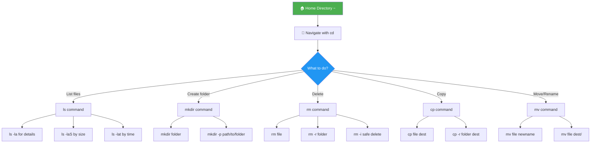
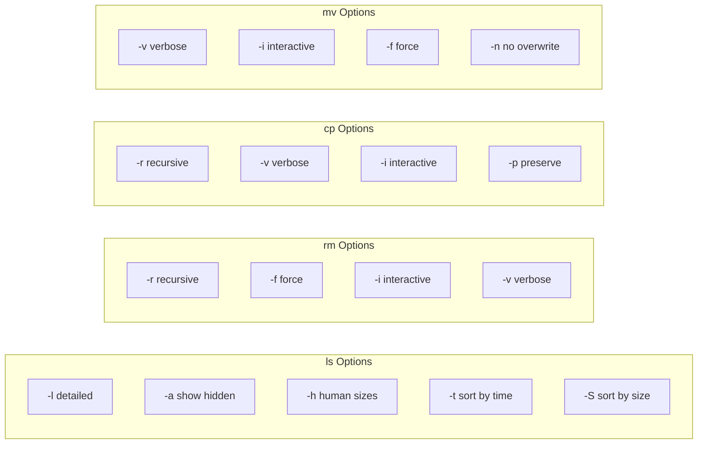
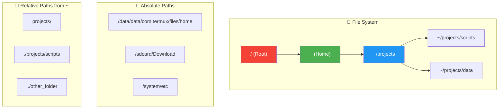

# Chapter 3: Linux Basics - Part 1

```
╔═══════════════════════════════════════════════════════════════════════════════╗
║                                                                               ║
║   ████████╗███████╗██████╗ ███╗   ███╗██╗███╗   ██╗ ██████╗ ██████╗ ███████╗  ║
║   ╚══██╔══╝██╔════╝██╔══██╗████╗ ████║██║████╗  ██║██╔════╝██╔═══██╗██╔════╝  ║
║       ██║   █████╗  ██████╔╝██╔████╔██║██║██╔██╗ ██║██║     ██║   ██║███████╗  ║
║       ██║   ██╔══╝  ██╔══██╗██║╚██╔╝██║██║██║╚██╗██║██║     ██║   ██║╚════██║  ║
║       ██║   ███████╗██║  ██║██║ ╚═╝ ██║██║██║ ╚████║╚██████╗╚██████╔╝███████║  ║
║       ╚═╝   ╚══════╝╚═╝  ╚═╝╚═╝     ╚═╝╚═╝╚═╝  ╚═══╝ ╚═════╝ ╚═════╝ ╚══════╝  ║
║                                                                               ║
║   ██╗      ██████╗ ██╗  ██╗██╗███╗   ██╗ ██████╗                              ║
║   ██║     ██╔═══██╗██║ ██╔╝██║████╗  ██║██╔════╝                              ║
║   ██║     ██║   ██║█████╔╝ ██║██╔██╗ ██║██║  ███╗                             ║
║   ██║     ██║   ██║██╔═██╗ ██║██║╚██╗██║██║   ██║                             ║
║   ███████╗╚██████╔╝██║  ██╗██║██║ ╚████║╚██████╔╝                             ║
║   ╚══════╝ ╚═════╝ ╚═╝  ╚═╝╚═╝╚═╝  ╚═══╝ ╚═════╝                              ║
║                                                                               ║
║                    📁 ESSENTIAL COMMANDS 📁                                   ║
║                         By T3rmuxk1ng                                         ║
╚═══════════════════════════════════════════════════════════════════════════════╝
```

> **Module:** 1 - Foundation  
> **Chapter:** 3 of 61  
> **Duration:** 15-20 Minutes  
> **Difficulty:** ⭐ Beginner  
> **Prerequisites:** Chapters 1-2 (Termux Installation & Setup)  

---

## 📋 Chapter Overview

| Section | Content |
|---------|---------|
| Video Script | Complete Hindi narration with timestamps |
| Technical Guide | Detailed Linux commands guide |
| Commands Reference | All commands with syntax and examples |
| Practice Exercises | 5 hands-on tasks |
| Troubleshooting | Common errors and fixes |
| Video Assets | Thumbnail, description, tags |

---

## 🎬 VIDEO SCRIPT (Complete Hindi Narration)

```
═══════════════════════════════════════════════════════════════════════════════
TERMUX FULL COURSE - CHAPTER 3
Title: Linux Basics Part 1 | Essential Commands | T3rmuxk1ng
Duration: 15-20 Minutes
═══════════════════════════════════════════════════════════════════════════════

[INTRO - 0:00 to 0:45]
─────────────────────────────────────────────────────────────────────────────

Namaskar Dosto! Welcome back to Termux Full Course by T3rmuxk1ng!

Aaj hum Chapter 3 mein Linux ke basic commands seekhenge - jo ki 
Termux ya kisi bhi Linux system ki foundation hain.

Agar aap Termux mein commands ke baare mein confused ho - cd kya karta 
hai, ls kaise kaam karta hai, files kaise copy karein, delete karein - 
to ye video aapke liye hai.

Ye commands nahi sirf Termux mein, balki Ubuntu, Debian, Kali Linux, 
Red Hat - har Linux mein same hain. Ek baar seekh liya to lifetime 
kaam aayega.

Is chapter mein hum cover karenge:
- pwd command - current location kaise pata karein
- cd command - directories mein kaise navigate karein
- ls command - files aur folders kaise dekhein
- mkdir command - naye folders kaise banayein
- rm command - files kaise delete karein
- cp command - files kaise copy karein
- mv command - files kaise move ya rename karein

To chaliye shuru karte hain!

---

[SECTION 1: PWD COMMAND - 0:45 to 2:30]
─────────────────────────────────────────────────────────────────────────────

Sabse pehle command hai PWD - Print Working Directory.

Jab aap Termux mein hain, aap kisi na kisi folder mein hote ho. Lekin 
kaunse folder mein ho? Ye kaise pata karein?

Simple - pwd type karein:

    pwd

Output aayega: /data/data/com.termux/files/home

Ye aapka home directory hai. Ye path batata hai ki aap currently 
kahan ho.

[SCREEN: pwd command output]

Dekho, pwd ne humein poora path diya. Ye absolute path hai - root 
se lekar current location tak ka poora address.

pwd bohot important hai jab aap complex directory structures mein 
kaam kar rahe ho. Kabhi bhi confused ho ki main kahan hoon - bas 
pwd likho aur pata chal jaayega.

Real-world example: Imagine karo aap kisi project mein kaam kar 
rahe ho, bohot saare folders hain, aur aapko current location 
chahiye. pwd se instantly pata chal jaayega.

Iske alawa pwd scripts mein bhi use hota hai - jahan dynamically 
current directory path chahiye ho.

---

[SECTION 2: LS COMMAND - 2:30 to 6:00]
─────────────────────────────────────────────────────────────────────────────

Ab aate hain LS command pe - List command.

Sabse basic command hai files dekhne ke liye. Simple type karein:

    ls

Ye current directory ki files aur folders list kar dega.

[SCREEN: ls output]

Lekin ye basic output hai. LS ke saath bohot saare options hain 
jo powerful banate hain ise.

[OPTION 1: ls -l - Long Format]

    ls -l

Ye detailed output deta hai:
- File permissions (rwx)
- Number of links
- Owner name
- Group name
- File size
- Last modified date/time
- File/folder name

[SCREEN: ls -l output with explanation]

First character:
- d = directory (folder)
- - = regular file
- l = symbolic link

Next 9 characters - permissions:
- First 3: Owner permissions (rwx = read, write, execute)
- Middle 3: Group permissions
- Last 3: Others permissions

[OPTION 2: ls -a - Show All Files]

    ls -a

Linux mein hidden files hoti hain jo dot (.) se start hoti hain.
Jaise .bashrc, .profile - ye files normal ls mein nahi dikhti.

ls -a se saari files dikhti hain including hidden files.

[SCREEN: ls -a output showing hidden files]

Note: . aur .. bhi dikhenge:
- . (single dot) = current directory
- .. (double dot) = parent directory

[OPTION 3: ls -h - Human Readable Sizes]

    ls -lh

Default mein file sizes bytes mein hote hain - difficult to read.
-h option sizes ko human readable format mein convert karta hai:
- 1024 bytes → 1K
- 1048576 bytes → 1M
- 1073741824 bytes → 1G

[SCREEN: ls -lh comparison with ls -l]

[OPTION 4: ls -R - Recursive List]

    ls -R

Ye command current directory ke saath saath uske subdirectories 
bhi list karti hai. Bohot useful jab aapko poora structure dekhna ho.

[OPTION 5: ls -t - Sort by Time]

    ls -lt

Files ko last modified time ke hisaab se sort karta hai - newest first.

[OPTION 6: ls -S - Sort by Size]

    ls -lS

Files ko size ke hisaab se sort karta hai - largest first.

[COMBINING OPTIONS]

Aap multiple options combine kar sakte ho:

    ls -la    # All files with details
    ls -lh    # Details with human-readable sizes
    ls -laS   # All files, details, sorted by size
    ls -lt    # Details, sorted by time

Pro tip: Har din use karo, practice karo - ye commands muscle 
memory ban jaayenge.

---

[SECTION 3: CD COMMAND - 6:00 to 10:00]
─────────────────────────────────────────────────────────────────────────────

Ab aate hain CD command pe - Change Directory.

Ye command aapko ek folder se doosre folder mein le jaati hai.
Navigation ka main tool hai ye.

[BASIC USAGE]

    cd folder_name

Example:
    cd storage
    cd downloads

[SCREEN: cd demonstration]

[ABSOLUTE VS RELATIVE PATHS]

Ismein do concepts hain - Absolute Path aur Relative Path.

ABSOLUTE PATH:
Poora path root se shuru hota hai:
    cd /data/data/com.termux/files/home
    cd /sdcard/Download
    cd /system/etc

Ye path hamesha / (slash) se start hota hai - root directory se.

RELATIVE PATH:
Current location se relative path:
    cd documents    # current folder ke andar documents mein jao
    cd ../photos    # ek level up jao, phir photos mein jao

[SCREEN: Absolute vs Relative path diagram]

SPECIAL CD COMMANDS:

[1. cd .. - Parent Directory]

    cd ..

Ek level up jao - parent directory mein.

[SCREEN: cd .. demonstration]

Multiple levels:
    cd ../..        # 2 levels up
    cd ../../..     # 3 levels up

[2. cd ~ - Home Directory]

    cd ~

Ya simply:
    cd

Ye aapko directly home directory le jaata hai.

[SCREEN: cd ~ demonstration]

[3. cd - - Previous Directory]

    cd -

Ye aapko previous directory mein le jaata hai - jahan pehle the.

Example:
    pwd              # /home
    cd /sdcard
    pwd              # /sdcard
    cd -             # /home (previous location)

[SCREEN: cd - demonstration]

[PRACTICAL NAVIGATION SCENARIOS]

Scenario 1: Downloads folder jao
    cd ~/storage/downloads

Scenario 2: Ek level up jao
    cd ..

Scenario 3: Home se storage ke andar dcim mein jao
    cd ~/storage/dcim

Scenario 4: Previous location pe wapas jao
    cd -

Scenario 5: Root directory jao
    cd /

[TAB COMPLETION TIP]

Important tip: Folder naam type karte waqt TAB key press karein.
Termux automatically complete kar dega naam.

Example:
    cd stor<TAB>     # becomes cd storage/
    cd dow<TAB>      # becomes cd downloads/

Ye bohot time bachata hai aur typing errors prevent karta hai.

---

[SECTION 4: MKDIR COMMAND - 10:00 to 12:00]
─────────────────────────────────────────────────────────────────────────────

MKDIR - Make Directory command se naye folders create hote hain.

[BASIC USAGE]

    mkdir folder_name

Example:
    mkdir projects
    mkdir my_scripts
    mkdir tools

[SCREEN: mkdir demonstration]

[MULTIPLE DIRECTORIES]

Ek hi command mein multiple folders banao:

    mkdir folder1 folder2 folder3

[SCREEN: Multiple mkdir]

[PARENT DIRECTORIES WITH -p OPTION]

Ye bohot useful option hai. Dekho example:

Maan lo aapko ye path banana hai:
    projects/python/scripts

Lekin projects folder bhi nahi hai, python bhi nahi hai.

Normal mkdir error dega. Lekin -p option se:

    mkdir -p projects/python/scripts

Ye automatically parent folders bhi create kar dega.

[SCREEN: mkdir -p demonstration]

-p option:
- Creates parent directories if they don't exist
- No error if directory already exists
- Perfect for nested directory creation

[PRACTICAL EXAMPLES]

Example 1: Project structure banao
    mkdir -p myproject/{src,docs,tests,assets}

Example 2: Dated folder banao
    mkdir backup_$(date +%Y%m%d)

Example 3: Nested structure
    mkdir -p workspace/web/{html,css,js,images}

[VERIFY CREATION]

    ls -la       # Check folders created
    ls -R        # Check nested structure

---

[SECTION 5: RM COMMAND - 12:00 to 14:30]
─────────────────────────────────────────────────────────────────────────────

RM - Remove command se files aur folders delete hote hain.

⚠️ WARNING: Ye command dangerous hai! Deleted files recover 
nahi hote easily. Careful raho.

[BASIC FILE DELETION]

    rm filename

Example:
    rm test.txt
    rm old_script.py

[SCREEN: rm demonstration]

[MULTIPLE FILES DELETE]

    rm file1 file2 file3

[CONFIRM BEFORE DELETE - -i OPTION]

    rm -i filename

-i means interactive - pehle confirm karega then delete karega.

Output:
    rm: remove regular file 'test.txt'? y

y press karo for yes, n for no.

[FORCE DELETE - -f OPTION]

    rm -f filename

-f means force - bina puche delete kar dega. 
Use carefully!

[DELETE DIRECTORIES - -r OPTION]

Normal rm folders delete nahi kar sakta. Folder ke liye -r use karo:

    rm -r foldername

-r means recursive - folder ke saath uski saari content delete hogi.

[SCREEN: rm -r demonstration]

[COMBINED OPTIONS]

    rm -rf folder    # Force delete folder and contents (VERY DANGEROUS)
    rm -ri folder    # Delete with confirmation for each file
    rm -rv folder    # Delete with verbose output

[PRO TIP: SAFE RM]

Dangerous command se bachne ke liye, alias banao:

    alias rm='rm -i'

Ye har delete pe confirm karega.

Ya better - trash command install karo:
    pkg install trash-cli
    trash filename    # Moves to trash instead of deleting

[PRACTICAL EXAMPLES]

Example 1: Old logs delete karo
    rm *.log

Example 2: Empty folder delete karo
    rm -d empty_folder    # -d for empty directories

Example 3: Nested folder structure delete karo
    rm -rf old_project

Example 4: Carefully delete with confirmation
    rm -ri important_folder

Example 5: All .tmp files delete karo
    rm *.tmp

---

[SECTION 6: CP COMMAND - 14:30 to 17:00]
─────────────────────────────────────────────────────────────────────────────

CP - Copy command se files aur folders copy hote hain.

[BASIC FILE COPY]

    cp source destination

Example:
    cp file.txt copy_of_file.txt
    cp script.py backup_script.py

[SCREEN: cp demonstration]

[COPY TO DIRECTORY]

    cp file.txt /path/to/directory/

Example:
    cp notes.txt ~/storage/downloads/
    cp script.py ~/projects/

[COPY MULTIPLE FILES TO DIRECTORY]

    cp file1 file2 file3 destination/

Example:
    cp *.txt ~/storage/downloads/
    cp script.py notes.md readme.txt ~/projects/

[VERBOSE OUTPUT - -v OPTION]

    cp -v source destination

-v means verbose - batata hai kya copy ho raha hai.

Output:
    'file.txt' -> 'backup/file.txt'

[COPY DIRECTORIES - -r OPTION]

Folder copy karne ke liye -r use karo:

    cp -r source_folder destination_folder

Example:
    cp -r projects backup_projects
    cp -r ~/storage/downloads ~/backup_downloads

[SCREEN: cp -r demonstration]

[COMBINED OPTIONS]

    cp -rv folder destination    # Recursive with verbose
    cp -rvi folder destination   # Recursive, verbose, confirm overwrite

[PRESERVE ATTRIBUTES - -p OPTION]

    cp -p source destination

-p preserves:
- Modification time
- Access time
- File mode bits
- Ownership (if possible)

[INTERACTIVE MODE - -i OPTION]

    cp -i source destination

Agar destination pe already file hai, confirm karega:
    cp: overwrite 'file.txt'? y

[PRACTICAL EXAMPLES]

Example 1: File backup banao
    cp important.txt important.txt.bak

Example 2: Folder copy karo
    cp -r project project_backup

Example 3: Saari Python files copy karo
    cp *.py backup/

Example 4: With date in name
    cp data.txt data_$(date +%Y%m%d).txt

Example 5: Hidden files bhi copy karo
    cp -r sourcedir/. destdir/

---

[SECTION 7: MV COMMAND - 17:00 to 19:30]
─────────────────────────────────────────────────────────────────────────────

MV - Move command do kaam karta hai:
1. Files move karna (cut-paste)
2. Files rename karna

[MOVE FILES]

    mv source destination

Example:
    mv file.txt ~/storage/downloads/
    mv script.py ~/projects/

[SCREEN: mv demonstration]

[MOVE MULTIPLE FILES]

    mv file1 file2 file3 destination/

Example:
    mv *.txt ~/documents/
    mv script.py notes.md ~/projects/

[RENAME FILES]

Same location mein move karo = rename:

    mv oldname.txt newname.txt

Example:
    mv draft.txt final.txt
    mv test_script.py main_script.py

[SCREEN: mv rename demonstration]

[MOVE DIRECTORIES]

    mv old_folder new_location/

Example:
    mv projects ~/storage/downloads/

[RENAME DIRECTORIES]

    mv old_foldername new_foldername

Example:
    mv project_v1 project_v2

[VERBOSE MODE - -v OPTION]

    mv -v source destination

Output:
    renamed 'old.txt' -> 'new.txt'

[INTERACTIVE MODE - -i OPTION]

    mv -i source destination

Confirm karega agar destination pe file already hai:
    mv: overwrite 'file.txt'? y

[NO OVERWRITE - -n OPTION]

    mv -n source destination

Agar destination pe file hai, overwrite nahi karega.

[FORCE MOVE - -f OPTION]

    mv -f source destination

Force overwrite bina puche.

[PRACTICAL EXAMPLES]

Example 1: File rename karo
    mv document.txt important_document.txt

Example 2: Folder move karo
    mv old_project ~/backup/

Example 3: Multiple files move karo
    mv *.jpg *.png ~/storage/dcim/

Example 4: Backup aur move
    mv file.txt backup/file_$(date +%Y%m%d).txt

Example 5: Uppercase se lowercase
    mv FILE.txt file.txt

---

[SECTION 8: SUMMARY & PRACTICE - 19:30 to 21:00]
─────────────────────────────────────────────────────────────────────────────

To dosto, Chapter 3 complete! Let's summarize:

✅ pwd - Current directory ka path dikhao
✅ ls - Files aur folders list karo
✅ cd - Directory change karo
✅ mkdir - Naye folders banao
✅ rm - Files delete karo
✅ cp - Files copy karo
✅ mv - Files move ya rename karo

Important Commands yaad rakhein:

┌─────────────────────────────────────────────────────────────────────────┐
│                    CHAPTER 3 - QUICK REFERENCE                          │
├─────────────────────────────────────────────────────────────────────────┤
│ pwd                             │ Current location                      │
│ ls -la                          │ Detailed file list (all files)        │
│ cd folder                       │ Enter folder                          │
│ cd ..                           │ Go up one level                       │
│ cd ~                            │ Go to home                            │
│ cd -                            │ Go to previous location               │
│ mkdir folder                    │ Create folder                         │
│ mkdir -p path/to/folder         │ Create nested folders                 │
│ rm file                         │ Delete file                           │
│ rm -r folder                    │ Delete folder                         │
│ rm -rf folder                   │ Force delete folder                   │
│ cp source dest                  │ Copy file                             │
│ cp -r src_folder dest_folder    │ Copy folder                           │
│ mv source dest                  │ Move or rename                        │
└─────────────────────────────────────────────────────────────────────────┘

Practice karo - daily use karo ye commands. Terminal mein comfortable 
hone ke liye practice hi ek raasta hai.

Next Chapter 4 mein hum seekhenge:
- File permissions (chmod)
- File ownership (chown)
- File searching (find, locate)
- Text viewing (cat, less, head, tail)

Agar ye video helpful lagi, to:
👍 Like button press karein
🔔 Subscribe karein, notification bell on karein
💬 Koi sawal ho to comment mein poochein
📤 Share karein friends ke saath

Main har comment ka reply karta hoon.

Thank you for watching! See you in Chapter 4!

═══════════════════════════════════════════════════════════════════════════════
```

---

## 📖 TECHNICAL GUIDE

### 1. Understanding Linux File System

```
┌─────────────────────────────────────────────────────────────────────────┐
│                    LINUX FILE SYSTEM HIERARCHY                          │
├─────────────────────────────────────────────────────────────────────────┤
│                                                                          │
│   / (Root Directory)                                                    │
│   │                                                                     │
│   ├── bin/        Essential user binaries                              │
│   ├── boot/       Boot loader files                                    │
│   ├── dev/        Device files                                         │
│   ├── etc/        System configuration files                           │
│   ├── home/       User home directories                                │
│   ├── lib/        Shared libraries                                     │
│   ├── media/      Removable media mount points                         │
│   ├── mnt/        Temporary mount points                               │
│   ├── opt/        Optional software packages                           │
│   ├── proc/       Process information (virtual)                        │
│   ├── root/       Root user home directory                             │
│   ├── run/        Runtime variable data                                │
│   ├── sbin/       System binaries                                      │
│   ├── srv/        Service data                                         │
│   ├── sys/        System information (virtual)                         │
│   ├── tmp/        Temporary files                                      │
│   ├── usr/        User programs and data                               │
│   │   ├── bin/   User binaries                                        │
│   │   ├── lib/   Libraries                                            │
│   │   └── share/ Documentation                                         │
│   └── var/        Variable data (logs, spool, etc.)                    │
│                                                                          │
│   TERMUX-SPECIFIC PATHS:                                                │
│   ├── $PREFIX = /data/data/com.termux/files/usr                        │
│   ├── $HOME = /data/data/com.termux/files/home                         │
│   └── ~/storage = Links to shared storage                              │
│                                                                          │
└─────────────────────────────────────────────────────────────────────────┘
```

### 2. Absolute vs Relative Paths

```
┌─────────────────────────────────────────────────────────────────────────┐
│                    PATH TYPES EXPLAINED                                 │
├─────────────────────────────────────────────────────────────────────────┤
│                                                                          │
│   ABSOLUTE PATH:                                                        │
│   ─────────────────                                                     │
│   • Starts with / (root)                                                │
│   • Complete path from root to target                                   │
│   • Works from anywhere in the system                                   │
│   • Example: /data/data/com.termux/files/home                           │
│   • Example: /sdcard/Download/myfile.txt                                │
│                                                                          │
│   RELATIVE PATH:                                                        │
│   ─────────────────                                                     │
│   • Does NOT start with /                                               │
│   • Path relative to current directory                                  │
│   • Changes meaning based on current location                           │
│   • Example: documents/file.txt (from current dir)                      │
│   • Example: ../parent_dir (one level up)                               │
│                                                                          │
│   SPECIAL SYMBOLS:                                                      │
│   ─────────────────                                                     │
│   .     = Current directory                                             │
│   ..    = Parent directory (one level up)                               │
│   ~     = Home directory                                                │
│   -     = Previous directory (with cd command)                          │
│                                                                          │
│   EXAMPLES:                                                             │
│   ─────────────────                                                     │
│   Current Directory: /home/user                                         │
│                                                                          │
│   ./file.txt          = /home/user/file.txt                            │
│   ../file.txt         = /home/file.txt                                 │
│   ~/file.txt          = /home/user/file.txt                            │
│   ../../tmp/file.txt  = /tmp/file.txt                                  │
│                                                                          │
└─────────────────────────────────────────────────────────────────────────┘
```

### 3. File Permissions in ls -l Output

```
┌─────────────────────────────────────────────────────────────────────────┐
│                    UNDERSTANDING FILE PERMISSIONS                       │
├─────────────────────────────────────────────────────────────────────────┤
│                                                                          │
│   Example: drwxr-xr-x 2 user group 4096 Jan 1 12:00 folder             │
│            └─────────┘                                                  │
│               │                                                         │
│               └── Permission string                                     │
│                                                                          │
│   Permission String Breakdown:                                          │
│   ┌───┬─────┬─────┬─────┐                                               │
│   │ 1 │  3  │  3  │  3  │  = Total 10 characters                       │
│   ├───┼─────┼─────┼─────┤                                               │
│   │ d │ rwx │ r-x │ r-x │                                               │
│   │ ↓ │  ↓  │  ↓  │  ↓  │                                               │
│   │   │     │     │     │                                               │
│   │   │     │     │ Others (anyone else)                                │
│   │   │     │ Group members                                             │
│   │   │ Owner (file creator)                                            │
│   │ File type (d=dir, -=file, l=link)                                   │
│   └───┴─────┴─────┴─────┘                                               │
│                                                                          │
│   Permission Meanings:                                                  │
│   ┌──────┬───────────────┬───────────────────────────────────┐          │
│   │ Char │ On File       │ On Directory                      │          │
│   ├──────┼───────────────┼───────────────────────────────────┤          │
│   │ r    │ Read content  │ List directory contents           │          │
│   │ w    │ Modify content│ Create/delete files in directory  │          │
│   │ x    │ Execute file  │ Enter directory (cd)              │          │
│   │ -    │ No permission │ No permission                     │          │
│   └──────┴───────────────┴───────────────────────────────────┘          │
│                                                                          │
│   Common Examples:                                                      │
│   -rw-r--r--  = Regular file, owner can read/write, others read only   │
│   -rwxr-xr-x  = Executable file, everyone can execute                  │
│   drwxr-xr-x  = Directory, owner full, others can read/enter           │
│   drwx------  = Directory, only owner can access                       │
│   -rw-------  = Private file, only owner can read/write                │
│                                                                          │
└─────────────────────────────────────────────────────────────────────────┘
```

### 4. Command Options Quick Reference

```
┌─────────────────────────────────────────────────────────────────────────┐
│                    LS COMMAND OPTIONS                                   │
├─────────────────────────────────────────────────────────────────────────┤
│ -l    Long format (permissions, owner, size, date)                     │
│ -a    Show all files including hidden (dot files)                      │
│ -h    Human-readable sizes (K, M, G)                                   │
│ -R    Recursive listing (subdirectories too)                           │
│ -t    Sort by modification time (newest first)                         │
│ -S    Sort by file size (largest first)                                │
│ -r    Reverse sort order                                               │
│ -i    Show inode number                                                │
│ -n    Show numeric UID/GID instead of names                            │
│ -d    List directory itself, not contents                              │
└─────────────────────────────────────────────────────────────────────────┘

┌─────────────────────────────────────────────────────────────────────────┐
│                    RM COMMAND OPTIONS                                   │
├─────────────────────────────────────────────────────────────────────────┤
│ -r    Recursive (delete directories and contents)                      │
│ -f    Force (no confirmation, ignore non-existent)                     │
│ -i    Interactive (ask before each deletion)                           │
│ -v    Verbose (show what's being deleted)                              │
│ -d    Remove empty directories                                         │
│ -I    Interactive once for more than 3 files                           │
└─────────────────────────────────────────────────────────────────────────┘

┌─────────────────────────────────────────────────────────────────────────┐
│                    CP COMMAND OPTIONS                                   │
├─────────────────────────────────────────────────────────────────────────┤
│ -r    Recursive (copy directories and contents)                        │
│ -v    Verbose (show what's being copied)                               │
│ -i    Interactive (ask before overwrite)                               │
│ -f    Force (overwrite without asking)                                 │
│ -p    Preserve attributes (permissions, timestamps)                    │
│ -n    No overwrite (don't replace existing files)                      │
│ -u    Update (copy only if source is newer)                            │
│ -l    Create hard link instead of copying                              │
│ -s    Create symbolic link instead of copying                          │
└─────────────────────────────────────────────────────────────────────────┘

┌─────────────────────────────────────────────────────────────────────────┐
│                    MV COMMAND OPTIONS                                   │
├─────────────────────────────────────────────────────────────────────────┤
│ -v    Verbose (show what's being moved)                                │
│ -i    Interactive (ask before overwrite)                               │
│ -f    Force (overwrite without asking)                                 │
│ -n    No overwrite (don't replace existing files)                      │
│ -u    Update (move only if source is newer)                            │
│ -b    Backup (create backup before overwrite)                          │
└─────────────────────────────────────────────────────────────────────────┘

┌─────────────────────────────────────────────────────────────────────────┐
│                    MKDIR COMMAND OPTIONS                                │
├─────────────────────────────────────────────────────────────────────────┤
│ -p    Create parent directories if needed                              │
│ -v    Verbose (show what's being created)                              │
│ -m    Set mode (permissions) at creation                               │
└─────────────────────────────────────────────────────────────────────────┘
```

---

## 📋 COMMANDS REFERENCE

### PWD Command

```bash
# Basic usage - show current directory
pwd
# Output: /data/data/com.termux/files/home

# Show physical directory (resolve symlinks)
pwd -P
# Example: If in ~/storage/downloads, shows /sdcard/Download

# Show logical directory (keep symlinks)
pwd -L
# Default behavior

# Store current directory in variable
current_dir=$(pwd)
echo "I am in: $current_dir"

# Use in scripts
echo "Script started in: $(pwd)"
```

### LS Command (15+ Examples)

```bash
# Basic listing
ls
# List files in current directory

ls /sdcard/Download
# List files in specific directory

ls ~/storage/downloads
# List files using home shortcut

# Long format options
ls -l
# Detailed listing with permissions, owner, size, date

ls -la
# Detailed listing including hidden files

ls -lah
# Detailed, all files, human-readable sizes

ls -laS
# Sorted by size (largest first)

ls -lat
# Sorted by modification time (newest first)

ls -lar
# Reverse sort order

# Recursive listing
ls -R
# List all subdirectories

ls -R ~/projects
# Recursive listing of projects folder

# Directory specific
ls -d */
# List only directories

ls -ld foldername
# Show directory info, not contents

# Filter by extension
ls *.py
# List all Python files

ls *.txt *.md
# List txt and md files

ls file*.log
# List files starting with 'file' and ending in '.log'

# Sort options
ls -lX
# Sort by extension

ls -lu
# Sort by access time

ls -lc
# Sort by change time

# Special combinations
ls -la --color=auto
# Colorized output

ls -1
# One file per line (useful in scripts)

ls -li
# Show inode numbers

ls -ln
# Show numeric UID/GID

# Count files
ls -1 | wc -l
# Count files in current directory

ls -la | grep "^-" | wc -l
# Count only regular files

ls -la | grep "^d" | wc -l
# Count only directories
```

### CD Command (15+ Examples)

```bash
# Basic navigation
cd foldername
# Enter a folder

cd /sdcard/Download
# Go to absolute path

cd ~/storage/downloads
# Go to path from home

# Special shortcuts
cd
# Go to home directory

cd ~
# Same as above - go to home

cd ~username
# Go to user's home (if multiple users)

cd -
# Go to previous directory

cd ..
# Go up one level

cd ../..
# Go up two levels

cd ../../..
# Go up three levels

# Relative navigation
cd ./subfolder
# Enter subfolder (explicit current dir)

cd ../sibling_folder
# Go up one level, then into sibling

cd ../../parent/sibling/child
# Complex relative path

# Navigate to previous locations
cd /sdcard
cd ~/projects
cd -
# Back to /sdcard

cd -
# Back to ~/projects

# Practical scenarios
cd ~/storage/downloads
# Go to downloads

cd /data/data/com.termux/files/usr
# Go to Termux system directory

cd $PREFIX
# Same as above using variable

cd /sdcard/DCIM/Camera
# Go to camera photos

# Use in scripts
target_dir="/tmp/myproject"
cd "$target_dir" || exit 1
# Navigate or exit if directory doesn't exist

# Navigate with variables
project="myapp"
cd ~/projects/$project
# Go to specific project
```

### MKDIR Command (15+ Examples)

```bash
# Basic directory creation
mkdir newfolder
# Create single directory

mkdir folder1 folder2 folder3
# Create multiple directories

mkdir my_project
# Create project folder

# Nested directories with -p
mkdir -p path/to/nested/folder
# Create entire path

mkdir -p project/{src,docs,tests}
# Create project with subdirectories

mkdir -p ~/projects/python/scripts
# Create nested path in home

# Verbose output
mkdir -v newfolder
# Show what was created

mkdir -pv path/to/folder
# Verbose nested creation

# Set permissions at creation
mkdir -m 755 public_folder
# Create with specific permissions

mkdir -m 700 private_folder
# Create private folder

# Complex structures
mkdir -p website/{css,js,images,fonts}
# Web project structure

mkdir -p project/{backend/{api,db},frontend/{components,pages}}
# Full stack project structure

mkdir -p backup/{daily,weekly,monthly}/{logs,data}
# Backup directory structure

# Date-based directories
mkdir backup_$(date +%Y%m%d)
# Create dated folder

mkdir -p logs/$(date +%Y/%m/%d)
# Create year/month/day structure

mkdir "project_$(date +%Y%m%d_%H%M%S)"
# Create with timestamp

# Verify creation
ls -la | grep "^d"
# List only directories

ls -d */
# Quick directory list
```

### RM Command (15+ Examples)

```bash
# Basic file deletion
rm file.txt
# Delete single file

rm file1.txt file2.txt file3.txt
# Delete multiple files

rm *.log
# Delete all log files

rm *.tmp *.bak
# Delete multiple file types

# Interactive deletion
rm -i file.txt
# Ask before deleting

rm -I *.txt
# Ask once if more than 3 files

# Verbose deletion
rm -v file.txt
# Show what was deleted

rm -v *.log
# Show all deleted files

# Force deletion
rm -f file.txt
# Force delete without asking

rm -f *.log
# Force delete all logs

# Directory deletion
rm -r foldername
# Delete folder and contents

rm -rf foldername
# Force delete folder (DANGEROUS)

rm -rv foldername
# Verbose recursive delete

rm -ri foldername
# Interactive recursive delete

# Empty directory
rm -d empty_folder
# Delete only if empty

rmdir empty_folder
# Alternative command for empty dirs

# Specific patterns
rm file_*.txt
# Delete files matching pattern

rm [abc]*.txt
# Delete files starting with a, b, or c

rm !important.txt
# Delete all except important.txt (with extglob)

# Safe practices
alias rm='rm -i'
# Always ask before delete

trash-cli install and use:
pkg install trash-cli
trash file.txt
# Move to trash instead of delete

# Clean up examples
rm -rf node_modules/
# Clean npm dependencies

rm -rf __pycache__/
# Clean Python cache

rm -rf .git/
# Remove git repository

rm -rf build/ dist/
# Clean build artifacts
```

### CP Command (15+ Examples)

```bash
# Basic file copy
cp source.txt destination.txt
# Copy file with new name

cp file.txt copy_file.txt
# Create copy in same directory

cp file.txt ~/storage/downloads/
# Copy to different directory

# Copy multiple files
cp file1.txt file2.txt destination/
# Copy multiple files to folder

cp *.txt backup/
# Copy all text files

cp *.py *.sh scripts/
# Copy multiple file types

# Verbose copy
cp -v source.txt dest.txt
# Show copy operation

cp -rv folder/ backup/
# Verbose recursive copy

# Interactive copy
cp -i source.txt dest.txt
# Ask before overwriting

cp -ri folder/ backup/
# Interactive recursive

# Directory copy
cp -r source_folder dest_folder
# Copy folder and contents

cp -r project project_backup
# Create project backup

cp -r ~/storage/downloads backup_downloads
# Backup entire directory

# Preserve attributes
cp -p important.txt important_backup.txt
# Keep original permissions and timestamps

cp -a folder/ backup/
# Archive mode (preserves everything)

# Update only newer files
cp -u source.txt dest.txt
# Copy only if source is newer

# No overwrite
cp -n source.txt dest.txt
# Don't overwrite existing

# Force overwrite
cp -f source.txt dest.txt
# Force overwrite without asking

# Create backup before overwrite
cp -b --backup=numbered file.txt dest/
# Create numbered backups

# Practical backups
cp -r project project_$(date +%Y%m%d)
# Dated backup

cp file.txt file.txt.bak
# Simple backup

cp -r website/ website_backup_$(date +%Y%m%d)/
# Full website backup

# Copy hidden files
cp -r sourcedir/. destdir/
# Copy all including hidden

cp -r sourcedir/* destdir/
# Copy contents (not hidden)

# Copy with patterns
cp images/*.{jpg,png} backup/
# Copy specific extensions
```

### MV Command (15+ Examples)

```bash
# Basic move
mv file.txt destination/
# Move file to directory

mv file.txt ~/storage/downloads/
# Move to specific path

# Move multiple files
mv file1.txt file2.txt destination/
# Move multiple files

mv *.log logs/
# Move all log files

mv *.py *.sh scripts/
# Move multiple file types

# Rename file
mv oldname.txt newname.txt
# Rename file

mv draft.txt final.txt
# Rename in same directory

# Rename directory
mv old_folder new_folder
# Rename folder

mv project_v1 project_v2
# Version rename

# Verbose move
mv -v file.txt destination/
# Show move operation

mv -rv folder/ destination/
# Verbose folder move

# Interactive move
mv -i source.txt dest.txt
# Ask before overwriting

mv -i folder/ destination/
# Interactive folder move

# No overwrite
mv -n source.txt destination/
# Don't overwrite existing

# Force move
mv -f source.txt destination/
# Force overwrite

# Update only newer
mv -u source.txt destination/
# Move only if newer

# Backup before overwrite
mv -b file.txt destination/
# Create backup

# Practical examples
mv *.jpg *.png ~/storage/dcim/
# Move images to gallery

mv download_*.zip archives/
# Move archives

mv temp_* tmp/
# Move temporary files

# Date-based renaming
mv report.txt report_$(date +%Y%m%d).txt
# Add date to filename

mv log.txt log_$(date +%Y%m%d_%H%M%S).txt
# Add timestamp

# Case conversion
mv FILE.txt file.txt
# Rename to lowercase

# Move and rename
mv ~/old_location/file.txt ~/new_location/newname.txt
# Move with rename

# Clean up patterns
mv *.bak backup/
mv *.tmp temp/
mv *.old archive/

# Project organization
mv *.py src/
mv *.html www/
mv *.css www/styles/
```

---

## 💻 PRACTICE EXERCISES

### Exercise 1: Directory Navigation Mastery

```bash
# Task: Master directory navigation

# Step 1: Start from home
cd ~
pwd
# Verify you're in home

# Step 2: Navigate to storage
cd ~/storage
ls -la
# List storage contents

# Step 3: Go to downloads
cd downloads
pwd
# Confirm path

# Step 4: Go back to previous location
cd -
pwd
# Should be back in storage

# Step 5: Go up one level
cd ..
pwd
# Should be in home

# Step 6: Navigate using absolute path
cd /sdcard/Download
pwd
# Verify path

# Step 7: Use cd - to toggle
cd -
cd -
# Toggle between two locations

# Step 8: Create a complex path navigation
cd ~/storage/downloads
cd ../dcim
cd ../music
cd ../pictures
cd ..
pwd
# Should be in storage

# Step 9: Return home
cd
pwd
# Verify home directory

echo "Exercise 1 Complete!"
```

### Exercise 2: File Organization Project

```bash
# Task: Create organized project structure

# Step 1: Go to home
cd ~

# Step 2: Create project directories
mkdir -p my_project/{src,docs,tests,assets/images,assets/css}

# Step 3: Verify structure
ls -R my_project

# Step 4: Create some test files
touch my_project/src/main.py
touch my_project/src/utils.py
touch my_project/docs/readme.md
touch my_project/tests/test_main.py

# Step 5: Create backup
cp -r my_project my_project_backup

# Step 6: Verify backup
ls -la | grep my_project

# Step 7: Rename backup with date
mv my_project_backup my_project_backup_$(date +%Y%m%d)

# Step 8: Check final structure
tree my_project 2>/dev/null || ls -R my_project

echo "Exercise 2 Complete!"
```

### Exercise 3: File Management Practice

```bash
# Task: Practice copy, move, and delete operations

# Step 1: Setup workspace
cd ~
mkdir file_practice
cd file_practice

# Step 2: Create test files
touch file1.txt file2.txt file3.txt
touch script.py program.py
touch image.jpg photo.png

# Step 3: Create subdirectories
mkdir text_files python_files image_files

# Step 4: Copy files
cp file*.txt text_files/
cp *.py python_files/
cp *.jpg *.png image_files/

# Step 5: Verify copies
ls -la text_files/
ls -la python_files/
ls -la image_files/

# Step 6: Move original files to archive
mkdir archive
mv file*.txt archive/
mv *.py archive/
mv *.jpg *.png archive/

# Step 7: Verify moves
ls -la
ls -la archive/

# Step 8: Create numbered backups
cp -r text_files text_files_backup

# Step 9: Clean up
rm -rf archive text_files_backup

# Step 10: Final verification
ls -R

cd ~
rm -rf file_practice

echo "Exercise 3 Complete!"
```

### Exercise 4: Hidden Files and Detailed Listing

```bash
# Task: Explore hidden files and detailed listings

# Step 1: Go to home
cd ~

# Step 2: List visible files only
ls
echo "--- Visible files listed ---"

# Step 3: List all files including hidden
ls -a
echo "--- All files listed ---"

# Step 4: Detailed listing of hidden files only
ls -la | grep "^\." | grep -v "^\.$" | grep -v "^\.\.$"
echo "--- Hidden files only ---"

# Step 5: Check specific hidden file
ls -la .bashrc 2>/dev/null || echo ".bashrc not found"

# Step 6: Create a hidden file
touch .my_hidden_file
echo "This is hidden content" > .my_hidden_file

# Step 7: Verify hidden file exists
ls -la .my_hidden_file
cat .my_hidden_file

# Step 8: Create hidden directory
mkdir .secret_folder
touch .secret_folder/secret.txt

# Step 9: Navigate to hidden folder
cd .secret_folder
pwd
ls -la

# Step 10: Return and clean up
cd ~
rm -rf .my_hidden_file .secret_folder

echo "Exercise 4 Complete!"
```

### Exercise 5: Real-World Scenario

```bash
# Task: Organize a messy downloads folder

# Step 1: Create simulated messy folder
cd ~
mkdir -p messy_downloads
cd messy_downloads

# Step 2: Create various files (simulating downloads)
touch report.pdf document.pdf presentation.pdf
touch photo1.jpg photo2.png screenshot.png
touch song.mp3 video.mp4
touch script.py code.py app.js
touch archive.zip backup.tar data.gz
touch notes.txt readme.md

# Step 3: Create organized folders
mkdir -p organized/{documents,images,media,code,archives,texts}

# Step 4: Sort files by type
mv *.pdf organized/documents/
mv *.jpg *.png organized/images/
mv *.mp3 *.mp4 organized/media/
mv *.py *.js organized/code/
mv *.zip *.tar *.gz organized/archives/
mv *.txt *.md organized/texts/

# Step 5: Verify organization
echo "=== Organized Structure ==="
ls -R organized/

# Step 6: Create a summary
echo "=== File Count per Category ==="
echo "Documents: $(ls organized/documents/ | wc -l)"
echo "Images: $(ls organized/images/ | wc -l)"
echo "Media: $(ls organized/media/ | wc -l)"
echo "Code: $(ls organized/code/ | wc -l)"
echo "Archives: $(ls organized/archives/ | wc -l)"
echo "Texts: $(ls organized/texts/ | wc -l)"

# Step 7: Create dated backup
cp -r organized organized_backup_$(date +%Y%m%d)

# Step 8: Final check
ls -la

# Cleanup
cd ~
rm -rf messy_downloads

echo "Exercise 5 Complete!"
```

---

## ⚠️ TROUBLESHOOTING

### Problem 1: "No such file or directory"

```bash
# Cause: Path or file doesn't exist

# Scenario 1: Wrong directory name
cd projectt  # Typo - should be 'project'
# Error: No such file or directory

# Solution: Check exact name
ls
cd project   # Correct name

# Scenario 2: Wrong path
cd /home/user/projects  # Wrong path for Termux

# Solution: Use correct Termux paths
cd ~/projects
# or
cd /data/data/com.termux/files/home/projects

# Scenario 3: Relative path confusion
cd folder   # But folder is in different location

# Solution: Check current directory
pwd
ls
# Then use correct relative or absolute path

# Scenario 4: Spaces in folder name
cd my folder  # Error - treated as two arguments

# Solution: Quote the path
cd "my folder"
# or escape spaces
cd my\ folder
```

### Problem 2: "Permission denied"

```bash
# Cause: Insufficient permissions

# Scenario 1: System directories
cd /system
# Error: Permission denied

# Solution: Access requires root
# Termux can't access /system without root
# Use paths within Termux or storage

# Scenario 2: Execute permission missing
./script.sh
# Error: Permission denied

# Solution: Add execute permission
chmod +x script.sh
./script.sh

# Scenario 3: Write to read-only location
touch /sdcard/protected_file
# Error: Permission denied

# Solution: Check location permissions
# Android 11+ has scoped storage restrictions
# Use Termux-accessible paths

# Scenario 4: Delete protected file
rm protected_file
# Error: Permission denied

# Solution: Check file permissions
ls -la protected_file
# If needed, change permissions (if you own it)
chmod u+w protected_file
```

### Problem 3: "Is a directory"

```bash
# Cause: Using file command on directory

# Scenario: Copy without -r flag
cp folder destination/
# Error: -r not specified; omitting directory 'folder'

# Solution: Use -r for directories
cp -r folder destination/

# Scenario: Delete directory without -r
rm folder
# Error: cannot remove 'folder': Is a directory

# Solution: Use -r for directories
rm -r folder

# Or for empty directory
rmdir folder
# or
rm -d folder
```

### Problem 4: "Directory not empty"

```bash
# Cause: Trying to remove non-empty directory without -r

rmdir folder_with_files
# Error: failed to remove 'folder_with_files': Directory not empty

# Solution 1: Remove with contents
rm -r folder_with_files

# Solution 2: Check contents first
ls -la folder_with_files
rm -r folder_with_files

# Solution 3: Interactive deletion
rm -ri folder_with_files
# Confirm each deletion

# Solution 4: Force delete (be careful!)
rm -rf folder_with_files
```

### Problem 5: "File exists"

```bash
# Cause: Trying to create directory that exists

mkdir existing_folder
# Error: cannot create directory 'existing_folder': File exists

# Solution 1: Check if it exists
ls -la | grep existing_folder

# Solution 2: Use -p option (no error if exists)
mkdir -p existing_folder

# Solution 3: Remove and recreate
rm -rf existing_folder
mkdir existing_folder

# For file copy with existing destination:
cp file.txt existing_file.txt
# Overwrites by default

# Use -n to not overwrite
cp -n file.txt existing_file.txt

# Use -b to backup
cp -b file.txt existing_file.txt
```

### Problem 6: "Too many arguments"

```bash
# Cause: Too many files for command pattern

rm *.log
# Error: /bin/rm: Argument list too long

# Solution 1: Use find command
find . -name "*.log" -delete

# Solution 2: Use xargs
ls *.log | xargs rm

# Solution 3: Use a loop
for f in *.log; do rm "$f"; done

# Solution 4: Process in batches
ls *.log | xargs -n 100 rm
```

### Problem 7: Command not found

```bash
# Cause: Typo or command not installed

cd..  # No space
# Error: cd..: command not found

# Solution: Add space
cd ..

cdd folder  # Typo
# Solution: Correct spelling
cd folder

ls-la  # No space
# Solution: Add space
ls -la

# If actual command missing:
tree
# Error: tree: command not found

# Solution: Install it
pkg install tree
```

### Problem 8: Filename with special characters

```bash
# Cause: Special characters in filename

# File with spaces
ls -la my file.txt  # Error
ls -la "my file.txt"  # Correct
ls -la my\ file.txt   # Correct (escaped)

# File with dash at start
touch -file.txt  # Error - treated as option
touch -- -file.txt  # Correct (-- ends options)
touch ./-file.txt   # Correct (with path)

# File with special characters
touch "file's name.txt"
ls -la "file's name.txt"
rm "file's name.txt"

# File with newlines (rare)
touch $'file\nwith\nnewlines.txt'
ls -la $'file\nwith\nnewlines.txt'

# Safe deletion of oddly named files
rm -- "-file.txt"
rm -- "--weird--file--"
rm "./file with spaces.txt"
```

---

## 🎬 VIDEO ASSETS

### Thumbnail Concepts

**Option A: Clean & Educational**
```
┌────────────────────────────────────┐
│  [Dark Terminal Background]        │
│                                    │
│   📁 LINUX BASICS - Part 1        │
│   ━━━━━━━━━━━━━━━━━━━━━━━━━━━━━   │
│                                    │
│   pwd | cd | ls | mkdir           │
│   rm | cp | mv                     │
│                                    │
│   [T3rmuxk1ng Logo]                │
│   Chapter 3 | Termux Course        │
└────────────────────────────────────┘
```

**Option B: Command Showcase**
```
┌────────────────────────────────────┐
│  [Green on Black Terminal Style]   │
│                                    │
│   $ ls -la                         │
│   $ cd ~/projects                  │
│   $ mkdir new_folder               │
│   $ cp -r folder backup/           │
│                                    │
│   🚀 7 ESSENTIAL COMMANDS          │
│                                    │
│   T3rmuxk1ng | Chapter 3           │
└────────────────────────────────────┘
```

**Option C: Visual Guide**
```
┌────────────────────────────────────┐
│  📁 ← pwd (Where am I?)            │
│  📂 ← cd (Go there!)               │
│  👁️ ← ls (What's here?)            │
│  ➕ ← mkdir (Create!)              │
│  ❌ ← rm (Delete!)                 │
│  📋 ← cp (Copy!)                   │
│  ✂️ ← mv (Move!)                   │
│                                    │
│  LINUX BASICS PART 1               │
│  [T3rmuxk1ng]                      │
└────────────────────────────────────┘
```

### Video Description Template

```markdown
📁 Termux Full Course - Chapter 3: Linux Basics Part 1 | Essential Commands

🔥 In this video you'll learn:
• pwd command - Current location kaise pata karein
• ls command - Files dekhne ke 7+ tarikay
• cd command - Directory navigation mastery
• mkdir command - Folders create karna
• rm command - Files delete karna safely
• cp command - Files copy karna
• mv command - Files move aur rename karna

⏱️ Timestamps:
0:00 - Introduction
0:45 - PWD Command
2:30 - LS Command (Detailed)
6:00 - CD Command (Navigation)
10:00 - MKDIR Command
12:00 - RM Command (Delete)
14:30 - CP Command (Copy)
17:00 - MV Command (Move/Rename)
19:30 - Summary

📝 Commands from this video:
pwd                  # Current directory
ls -la               # List all files with details
cd folder            # Enter folder
cd ..                # Go up one level
cd ~                 # Go home
mkdir folder         # Create folder
mkdir -p path/to/dir # Create nested folders
rm file              # Delete file
rm -r folder         # Delete folder
cp source dest       # Copy file
cp -r src dest       # Copy folder
mv source dest       # Move/rename file

💡 Pro Tips:
• Use TAB for auto-completion
• Always backup before rm -rf
• Use -i flag for safe deletion
• Learn absolute vs relative paths

📚 Full Course Playlist:
[PLAYLIST LINK]

📱 Follow T3rmuxk1ng:
• YouTube: @T3rmuxk1ng
• Telegram: [LINK]
• GitHub: [LINK]

#Termux #LinuxBasics #LinuxCommands #T3rmuxk1ng #TerminalCommands 
#LearnLinux #LinuxTutorial #TermuxCourse #HindiTutorial

---
⚠️ Disclaimer: This video is for educational purposes. Practice commands responsibly.
```

### Tags List

```
termux, linux basics, linux commands, pwd command, ls command, 
cd command, mkdir command, rm command, cp command, mv command,
terminal commands, command line, linux tutorial, termux tutorial,
linux for beginners, termux course, termux hindi, learn linux,
file management, directory navigation, terminal basics,
t3rmuxk1ng, linux commands hindi, termux commands,
android terminal, linux command line, terminal tutorial,
file operations, copy move delete, linux file system
```

### Hashtags

```
#Termux #LinuxBasics #LinuxCommands #TerminalCommands #Commandline
#TermuxTutorial #LearnLinux #LinuxForBeginners #TermuxCourse
#T3rmuxk1ng #FileManagement #DirectoryNavigation #TerminalBasics
#LinuxHindi #TermuxHindi #CommandLineInterface #TechTutorial
```

### Timestamps for YouTube

```
0:00 - Introduction & Chapter Overview
0:45 - PWD Command - Current Directory
2:30 - LS Command - List Files (Detailed Options)
6:00 - CD Command - Navigation (Absolute/Relative Paths)
10:00 - MKDIR Command - Create Directories
12:00 - RM Command - Delete Files & Folders
14:30 - CP Command - Copy Files & Directories
17:00 - MV Command - Move & Rename Files
19:30 - Summary & Quick Reference
```

---

## 📚 ADDITIONAL RESOURCES

### Command Cheat Sheet

```bash
# Quick Reference Card

# NAVIGATION
pwd                 # Where am I?
cd folder           # Enter folder
cd ..               # Go up
cd ~                # Go home
cd -                # Previous location

# LISTING
ls                  # Basic list
ls -la              # Detailed + hidden
ls -lh              # Human-readable sizes
ls -lt              # Sort by time
ls -lS              # Sort by size

# CREATE
mkdir folder        # Create folder
mkdir -p a/b/c      # Create nested
touch file          # Create file

# DELETE
rm file             # Delete file
rm -r folder        # Delete folder
rm -i file          # Ask before delete
rm -f file          # Force delete

# COPY
cp src dest         # Copy file
cp -r src dest      # Copy folder
cp -p src dest      # Preserve attributes

# MOVE/RENAME
mv src dest         # Move or rename
mv -i src dest      # Ask before overwrite
```

### Related Man Pages

```bash
# View detailed help
man pwd
man ls
man cd
man mkdir
man rm
man cp
man mv

# Quick help
ls --help
cd --help
mkdir --help
rm --help
cp --help
mv --help
```

---

## ✅ CHAPTER CHECKLIST

Before moving to Chapter 4, verify:

- [ ] Can use `pwd` to find current location
- [ ] Can use `ls` with various options (-l, -a, -h, -R)
- [ ] Understand absolute vs relative paths
- [ ] Can navigate with `cd` including .., ~, and -
- [ ] Can create directories with `mkdir` including nested with -p
- [ ] Can delete files and folders with `rm` safely
- [ ] Can copy files and folders with `cp`
- [ ] Can move and rename with `mv`
- [ ] Understand file permissions in ls -l output
- [ ] Completed all 5 practice exercises

---

## 🎯 NEXT CHAPTER PREVIEW

**Chapter 4: Linux Basics - Part 2**

- File permissions (chmod, chown)
- File searching (find, locate, grep basics)
- Text viewing (cat, less, head, tail)
- File editing basics (nano introduction)
- Wildcards and glob patterns
- Standard I/O and pipes introduction

---

## 🎮 INTERACTIVE QUIZ - Test Your Knowledge!

Test your understanding of Linux basic commands with these 15 questions!

---

### Question 1: What does the `pwd` command do?

<details>
<summary>🔍 Click to see options</summary>

A) Prints working directory  
B) Changes directory  
C) Lists files  
D) Creates directory  

</details>

<details>
<summary>✅ Click to see answer</summary>

**Answer: A) Prints working directory**

**Explanation:** `pwd` stands for "Print Working Directory". It displays the full path of your current location in the file system. In Termux, running `pwd` typically shows `/data/data/com.termux/files/home` when you're in your home directory.

</details>

---

### Question 2: What is the difference between `cd ..` and `cd .`?

<details>
<summary>🔍 Click to see options</summary>

A) No difference  
B) `..` goes up one level, `.` stays in current directory  
C) `..` goes to home, `.` goes to root  
D) Both go to parent directory  

</details>

<details>
<summary>✅ Click to see answer</summary>

**Answer: B) `..` goes up one level, `.` stays in current directory**

**Explanation:** 
- `.` (single dot) represents the current directory
- `..` (double dot) represents the parent directory
- `cd ..` navigates up one level in the directory tree
- `cd .` would keep you in the same directory (rarely useful with cd)

</details>

---

### Question 3: Which command shows hidden files?

<details>
<summary>🔍 Click to see options</summary>

A) `ls -h`  
B) `ls -a`  
C) `ls -l`  
D) `ls hidden`  

</details>

<details>
<summary>✅ Click to see answer</summary>

**Answer: B) `ls -a`**

**Explanation:** The `-a` flag means "all" and shows all files including hidden ones (files starting with a dot). Hidden files like `.bashrc` and `.profile` won't show with regular `ls` but will appear with `ls -a` or `ls -la`.

</details>

---

### Question 4: What does `mkdir -p path/to/folder` do?

<details>
<summary>🔍 Click to see options</summary>

A) Creates only the final folder  
B) Creates parent directories if they don't exist  
C) Prints directory info  
D) Password protects the folder  

</details>

<details>
<summary>✅ Click to see answer</summary>

**Answer: B) Creates parent directories if they don't exist**

**Explanation:** The `-p` (parents) flag creates all necessary parent directories in the path. If `path` and `to` don't exist, they will be created automatically. Without `-p`, the command would fail if parent directories are missing.

</details>

---

### Question 5: Which command removes an empty directory?

<details>
<summary>🔍 Click to see options</summary>

A) `rm directory`  
B) `rmdir directory`  
C) `del directory`  
D) `erase directory`  

</details>

<details>
<summary>✅ Click to see answer</summary>

**Answer: B) `rmdir directory`**

**Explanation:** `rmdir` (remove directory) only works on empty directories. For non-empty directories, use `rm -r directory` which recursively removes the directory and all its contents.

</details>

---

### Question 6: What does `rm -rf folder` do?

<details>
<summary>🔍 Click to see options</summary>

A) Renames folder  
B) Moves folder to trash  
C) Force deletes folder and all contents recursively  
D) Reads folder contents  

</details>

<details>
<summary>✅ Click to see answer</summary>

**Answer: C) Force deletes folder and all contents recursively**

**Explanation:**
- `-r` = recursive (delete folder and all contents)
- `-f` = force (no confirmation prompts)
- **WARNING:** This is dangerous! It permanently deletes everything without asking. Use with extreme caution.

</details>

---

### Question 7: How do you copy a directory and all its contents?

<details>
<summary>🔍 Click to see options</summary>

A) `cp dir1 dir2`  
B) `cp -r dir1 dir2`  
C) `copy dir1 dir2`  
D) `mv dir1 dir2`  

</details>

<details>
<summary>✅ Click to see answer</summary>

**Answer: B) `cp -r dir1 dir2`**

**Explanation:** The `-r` (recursive) flag is required to copy directories. Without it, `cp` will skip directories. Use `cp -rv dir1 dir2` for verbose output showing each file being copied.

</details>

---

### Question 8: What is the result of `mv file.txt /sdcard/Download/`?

<details>
<summary>🔍 Click to see options</summary>

A) Copies file.txt to Downloads  
B) Moves file.txt to Downloads folder  
C) Creates a backup  
D) Renames the folder  

</details>

<details>
<summary>✅ Click to see answer</summary>

**Answer: B) Moves file.txt to Downloads folder**

**Explanation:** `mv` moves files from one location to another. If the destination is a directory, the file is moved into that directory. If destination is a filename, the file is renamed. The original file no longer exists at the source location.

</details>

---

### Question 9: Which command lists files sorted by size (largest first)?

<details>
<summary>🔍 Click to see options</summary>

A) `ls -s`  
B) `ls -S`  
C) `ls -z`  
D) `ls size`  

</details>

<details>
<summary>✅ Click to see answer</summary>

**Answer: B) `ls -S`**

**Explanation:** Capital `-S` sorts files by size, largest first. Combine with `-l` for details: `ls -lS`. Use `ls -lSr` to reverse the order (smallest first).

</details>

---

### Question 10: What does `ls -la` show?

<details>
<summary>🔍 Click to see options</summary>

A) Only directories  
B) All files with detailed information  
C) Only hidden files  
D) File sizes only  

</details>

<details>
<summary>✅ Click to see answer</summary>

**Answer: B) All files with detailed information**

**Explanation:**
- `-l` = long format (permissions, owner, size, date)
- `-a` = all files including hidden ones
- Combined `-la` shows all files with full details, including hidden files starting with `.`

</details>

---

### Question 11: How do you rename `old.txt` to `new.txt`?

<details>
<summary>🔍 Click to see options</summary>

A) `ren old.txt new.txt`  
B) `mv old.txt new.txt`  
C) `cp old.txt new.txt`  
D) `rename old.txt new.txt`  

</details>

<details>
<summary>✅ Click to see answer</summary>

**Answer: B) `mv old.txt new.txt`**

**Explanation:** The `mv` command is used for both moving and renaming. When both source and destination are in the same directory, it effectively renames the file. `mv old.txt new.txt` renames the file in place.

</details>

---

### Question 12: What does `cd ~` do?

<details>
<summary>🔍 Click to see options</summary>

A) Goes to root directory  
B) Goes to previous directory  
C) Goes to home directory  
D) Goes up one level  

</details>

<details>
<summary>✅ Click to see answer</summary>

**Answer: C) Goes to home directory**

**Explanation:** The tilde `~` is a shell shortcut representing your home directory. In Termux, `~` equals `/data/data/com.termux/files/home`. `cd ~` or simply `cd` takes you directly to your home directory from anywhere.

</details>

---

### Question 13: Which command shows files sorted by modification time (newest first)?

<details>
<summary>🔍 Click to see options</summary>

A) `ls -time`  
B) `ls -t`  
C) `ls -m`  
D) `ls -date`  

</details>

<details>
<summary>✅ Click to see answer</summary>

**Answer: B) `ls -t`**

**Explanation:** The `-t` flag sorts by modification time, newest files first. Combine with `-l` for details: `ls -lt`. Use `ls -ltr` to show oldest files first (reversed order).

</details>

---

### Question 14: What happens if you run `rm -i important.txt`?

<details>
<summary>🔍 Click to see options</summary>

A) File is deleted immediately  
B) You're asked to confirm before deletion  
C) File is moved to trash  
D) File is encrypted  

</details>

<details>
<summary>✅ Click to see answer</summary>

**Answer: B) You're asked to confirm before deletion**

**Explanation:** The `-i` (interactive) flag makes `rm` ask for confirmation before deleting each file. It shows: `rm: remove regular file 'important.txt'?` Type `y` and Enter to confirm, or `n` to cancel. This is a safety feature.

</details>

---

### Question 15: What does `cd -` do?

<details>
<summary>🔍 Click to see options</summary>

A) Goes to root directory  
B) Goes to home directory  
C) Goes to previous directory  
D) Goes up one level  

</details>

<details>
<summary>✅ Click to see answer</summary>

**Answer: C) Goes to previous directory**

**Explanation:** `cd -` takes you to the directory you were in before the last `cd` command. It's useful for toggling between two directories. For example, if you're in `~/projects` and run `cd /sdcard`, then `cd -` takes you back to `~/projects`.

</details>

---

## 🎯 INTERVIEW QUESTIONS - Job Preparation

Prepare for technical interviews with these Linux basics questions!

---

### Q1: Explain the Linux file system hierarchy and how it differs from Windows.

<details>
<summary>📖 View Answer</summary>

**Answer:**

**Linux File System:**
- Single unified tree starting at root `/`
- No drive letters (C:, D:, etc.)
- Everything is a file (including devices)

```
/ (root)
├── bin/      # Essential binaries
├── etc/      # Configuration files  
├── home/     # User directories
├── var/      # Variable data
├── usr/      # User programs
└── tmp/      # Temporary files
```

**Windows File System:**
- Multiple drive letters (C:, D:, etc.)
- Backslash `\` for paths
- Different system folders (Program Files, Users, etc.)

**Key Differences:**
| Linux | Windows |
|-------|---------|
| Case-sensitive | Case-insensitive |
| Forward slash `/` | Backslash `\` |
| No extensions needed | Extensions matter |
| Everything is a file | Different file types |

**In Termux:**
- Root is `/data/data/com.termux/files/`
- Home is `~` = `/data/data/com.termux/files/home`
- System prefix is `$PREFIX` = `/data/data/com.termux/files/usr`

</details>

---

### Q2: What is the difference between absolute and relative paths? Give examples.

<details>
<summary>📖 View Answer</summary>

**Answer:**

**Absolute Path:**
- Starts from root (`/`)
- Complete path to a file/directory
- Works from anywhere in the system
- Example: `/data/data/com.termux/files/home/projects`

**Relative Path:**
- Starts from current directory
- Path relative to where you are
- Meaning changes based on current location
- Example: `projects/python` or `../documents`

**Examples:**
```bash
# Assuming current directory is /home/user

# Absolute paths (always work the same)
cd /sdcard/Download
ls /data/data/com.termux/files/usr/bin

# Relative paths (depend on current location)
cd projects          # Go into projects folder in current directory
cd ../documents      # Up one level, then into documents
cd ./scripts         # Explicit current directory (same as cd scripts)
```

**Special Symbols:**
| Symbol | Meaning |
|--------|---------|
| `.` | Current directory |
| `..` | Parent directory |
| `~` | Home directory |
| `/` | Root directory (at start of path) |

</details>

---

### Q3: How would you recover from accidentally deleting important files with rm?

<details>
<summary>📖 View Answer</summary>

**Answer:**

**Prevention Strategies (Better than recovery!):**

1. **Use `rm -i` for confirmation:**
```bash
alias rm='rm -i'  # Add to .bashrc
```

2. **Use trash-cli instead of rm:**
```bash
pkg install trash-cli
alias rm='trash'  # Moves to trash instead of deleting
```

3. **Regular backups:**
```bash
tar -czf backup_$(date +%Y%m%d).tar.gz ~/important/
```

**Recovery Methods:**

1. **Check if file is open by a process:**
```bash
lsof | grep deleted
```

2. **Look in /proc (if process still running):**
```bash
ls -la /proc/<pid>/fd/
# Copy from file descriptor
cp /proc/<pid>/fd/<fd> /recovered/file
```

3. **Use file recovery tools (need root):**
```bash
pkg install testdisk
photorec  # Recovers deleted files
```

4. **Restore from backup:**
```bash
tar -xzf backup_20240115.tar.gz
```

**Important:** Linux doesn't have a "recycle bin" for command-line deletions. Once deleted with `rm`, files are gone unless you have backups or can recover them immediately.

</details>

---

### Q4: Explain file permissions in Linux. How do you interpret `drwxr-xr-x`?

<details>
<summary>📖 View Answer</summary>

**Answer:**

**Permission String Breakdown:**

```
drwxr-xr-x
│└──┬──┘
│   │
│   └── Permission triplets (owner, group, others)
│
└── File type (d=directory, -=file, l=link)
```

**Full Breakdown:**

| Position | Meaning | Value |
|----------|---------|-------|
| 1 | File type | `d` = directory |
| 2-4 | Owner permissions | `rwx` = read, write, execute |
| 5-7 | Group permissions | `r-x` = read, execute only |
| 8-10 | Others permissions | `r-x` = read, execute only |

**Permission Meanings:**

| Permission | On File | On Directory |
|------------|---------|--------------|
| r (read) | View contents | List files (`ls`) |
| w (write) | Modify contents | Create/delete files inside |
| x (execute) | Run as program | Enter directory (`cd`) |

**Numeric (Octal) Values:**
- r = 4, w = 2, x = 1
- `rwx` = 7, `r-x` = 5, `r--` = 4
- So `drwxr-xr-x` = directory with permissions 755

**Changing Permissions:**
```bash
chmod 755 script.sh      # Octal notation
chmod +x script.sh       # Add execute for all
chmod u+x script.sh      # Add execute for owner only
chmod go-w file.txt      # Remove write for group and others
```

</details>

---

### Q5: What are inodes in Linux? How do they relate to files?

<details>
<summary>📖 View Answer</summary>

**Answer:**

**Inodes (Index Nodes):**
- Data structures that store file metadata
- Each file has a unique inode number
- Inode contains: permissions, owner, size, timestamps, block pointers
- Does NOT contain: filename or actual data

**Viewing Inodes:**
```bash
ls -i file.txt           # Show inode number
ls -li                   # Show inodes with details
stat file.txt            # Complete inode info
df -i                    # Inode usage for filesystem
```

**Understanding Inodes:**

```
Filename: file.txt  ───┐
                       │    Inode Table
                       ▼    ┌──────────────────┐
                   Inode #12345               │
                   ├── Permissions: rw-r--r-- │
                   ├── Owner: user            │
                   ├── Size: 1024 bytes       │
                   ├── Modified: 2024-01-15   │
                   └── Block pointers ────────┼──▶ Data blocks on disk
```

**Key Concepts:**

1. **Multiple names for same file (hard links):**
```bash
ln file.txt hardlink.txt   # Same inode, different name
ls -li file.txt hardlink.txt  # Same inode number!
```

2. **Deleting file:**
- Removes directory entry (filename)
- Inode deleted when all links removed
- Data blocks freed

3. **Inode exhaustion:**
- Even with free disk space, can run out of inodes
- Common with many small files
- Check with `df -i`

</details>

---

### Q6: How would you find a file you created last week but forgot where?

<details>
<summary>📖 View Answer</summary>

**Answer:**

**Using `find` command:**

```bash
# Find files modified in last 7 days
find ~ -type f -mtime -7

# Find files modified between 7-14 days ago
find ~ -type f -mtime -14 -mtime +7

# Find by name pattern
find ~ -name "*.py" -mtime -7

# Find with detailed output
find ~ -type f -mtime -7 -ls

# Find files you own modified recently
find ~ -type f -user $(whoami) -mtime -7
```

**Using `locate` (faster, uses database):**
```bash
pkg install mlocate
updatedb  # Update database
locate -i "filename"
```

**Combining with other commands:**
```bash
# Find recent Python files and show sizes
find ~ -name "*.py" -mtime -7 -exec ls -lh {} \;

# Find and sort by time
find ~ -type f -mtime -7 -printf '%T@ %p\n' | sort -n

# Find recent files containing specific text
find ~ -type f -mtime -7 -exec grep -l "searchterm" {} \;
```

**Timeline options:**
| Option | Meaning |
|--------|---------|
| `-mtime -n` | Modified less than n days ago |
| `-mtime +n` | Modified more than n days ago |
| `-mmin -n` | Modified less than n minutes ago |
| `-atime -n` | Accessed less than n days ago |
| `-ctime -n` | Status changed less than n days ago |

</details>

---

### Q7: Explain wildcards (glob patterns) in Linux with examples.

<details>
<summary>📖 View Answer</summary>

**Answer:**

**Common Wildcards:**

| Pattern | Meaning | Example |
|---------|---------|---------|
| `*` | Any characters (0 or more) | `*.txt` |
| `?` | Single character | `file?.txt` |
| `[abc]` | Any one of a,b,c | `file[123].txt` |
| `[a-z]` | Range of characters | `file[a-z].txt` |
| `[!abc]` | NOT a, b, or c | `file[!0-9].txt` |

**Examples:**
```bash
# * matches anything
ls *.txt          # All .txt files
ls file*          # Files starting with "file"
ls *backup*       # Files containing "backup"

# ? matches single character
ls file?.txt      # file1.txt, file2.txt, fileA.txt
ls photo??.jpg    # photo01.jpg, photo02.jpg

# [] matches character sets
ls file[123].txt  # file1.txt, file2.txt, file3.txt
ls photo[0-9].jpg # photo0.jpg through photo9.jpg
ls [A-Z]*.txt     # .txt files starting with capital

# [!] negates
ls *[!0-9]*       # Files not containing numbers
ls file[!0-9].txt # fileA.txt but not file1.txt

# Brace expansion (generates patterns)
mkdir dir{1,2,3}       # Creates dir1, dir2, dir3
mkdir project/{src,docs,tests}  # Multiple subdirectories
cp file.txt{,.bak}     # Creates file.txt.bak
```

**Advanced Patterns:**
```bash
# Combined patterns
ls [A-Z]*[0-9].txt     # Starts with capital, ends with number

# Multiple extensions
ls *.{txt,md,py}       # All txt, md, and py files

# Recursive (with shopt)
shopt -s globstar
ls **/*.py             # Python files in all subdirectories
```

</details>

---

### Q8: What is the difference between hard links and soft (symbolic) links?

<details>
<summary>📖 View Answer</summary>

**Answer:**

**Hard Links:**
- Multiple names for same file
- Same inode number
- Data exists until ALL links deleted
- Cannot span filesystems
- Cannot link to directories

**Soft/Symbolic Links:**
- Special file pointing to another path
- Different inode number
- Breaks if target deleted
- Can span filesystems
- Can link to directories

**Creating Links:**
```bash
# Hard link
ln original.txt hardlink.txt

# Soft/symbolic link
ln -s original.txt softlink.txt
```

**Comparison:**
```
$ ls -li original.txt hardlink.txt softlink.txt
12345 -rw-r--r-- 2 user user 100 Jan 15 original.txt
12345 -rw-r--r-- 2 user user 100 Jan 15 hardlink.txt
12346 lrwxrwxrwx 1 user user  12 Jan 15 softlink.txt -> original.txt
     ↑                                                  ↑
  Same inode                                      Different inode
  (hard link)                                     (symbolic link)
```

**When to Use:**

| Hard Links | Symbolic Links |
|------------|----------------|
| Backup within same filesystem | Cross-filesystem links |
| Space-efficient file copies | Linking to directories |
| When target might move | When target name changes |

**Practical Example:**
```bash
# Create original
echo "Hello" > original.txt

# Create hard link
ln original.txt hardlink.txt

# Create soft link
ln -s original.txt softlink.txt

# Delete original
rm original.txt

# Results:
cat hardlink.txt  # Still works! (same inode)
cat softlink.txt  # Broken! (points to nothing)
```

</details>

---

### Q9: How would you create a directory structure like `project/{src,docs,tests}` in one command?

<details>
<summary>📖 View Answer</summary>

**Answer:**

**Using Brace Expansion:**
```bash
# Create multiple directories at once
mkdir -p project/{src,docs,tests}

# Creates:
# project/
# ├── src/
# ├── docs/
# └── tests/

# Nested structure
mkdir -p project/{src/{main,utils},docs/{api,user},tests}

# Creates:
# project/
# ├── src/
# │   ├── main/
# │   └── utils/
# ├── docs/
# │   ├── api/
# │   └── user/
# └── tests/
```

**More Examples:**
```bash
# Numbered directories
mkdir dir{1..5}           # dir1, dir2, dir3, dir4, dir5

# With leading zeros
mkdir file{01..10}        # file01 through file10

# Multiple patterns
mkdir {project,test}_{alpha,beta}  
# project_alpha, project_beta, test_alpha, test_beta

# File creation with brace expansion
touch file{1..3}.txt      # file1.txt, file2.txt, file3.txt
touch {a,b,c}.py          # a.py, b.py, c.py
```

**With Variables:**
```bash
PROJECT="myapp"
mkdir -p "$PROJECT"/{src,lib,docs,config}
```

**Complex Structure in One Command:**
```bash
mkdir -p myproject/{bin,lib,docs/{html,pdf},src/{main,include},tests/{unit,integration}}
```

</details>

---

### Q10: What happens when you press Ctrl+C, Ctrl+D, and Ctrl+Z in terminal?

<details>
<summary>📖 View Answer</summary>

**Answer:**

**Ctrl+C (SIGINT - Interrupt):**
- Sends interrupt signal to running process
- Typically terminates the current command
- Safe way to stop a running program
```bash
$ sleep 100
^C                      # Ctrl+C pressed
$                       # Process terminated
```

**Ctrl+D (EOF - End of File):**
- Sends End-Of-File signal
- Closes standard input
- In shell, logs out or exits
- In programs like `cat`, stops input
```bash
$ cat > file.txt
Hello World
[Ctrl+D]               # Signals end of input
$
```

**Ctrl+Z (SIGTSTP - Suspend):**
- Suspends (pauses) current process
- Process is NOT terminated, just paused
- Can be resumed with `fg` or `bg`
```bash
$ sleep 100
^Z                      # Ctrl+Z pressed
[1]+  Stopped  sleep 100
$ jobs                  # View suspended jobs
[1]+  Stopped  sleep 100
$ fg                    # Resume in foreground
$ bg                    # Resume in background
```

**Summary Table:**
| Shortcut | Signal | Effect |
|----------|--------|--------|
| Ctrl+C | SIGINT | Terminate process |
| Ctrl+D | EOF | Close input/logout |
| Ctrl+Z | SIGTSTP | Suspend process |
| Ctrl+L | - | Clear screen |
| Ctrl+A | - | Go to line start |
| Ctrl+E | - | Go to line end |

**Job Control:**
```bash
$ sleep 100
^Z
[1]+ Stopped  sleep 100
$ jobs
[1]+ Stopped  sleep 100
$ bg %1         # Resume in background
$ fg %1         # Resume in foreground
$ kill %1       # Kill job 1
```

</details>

---

## 🔥 REAL-WORLD SCENARIOS

Practical scenarios you'll encounter when using Linux commands!

---

### Scenario 1: Cleaning Up a Messy Downloads Folder

```
┌──────────────────────────────────────────────────────────────────────────────┐
│                     🧹 SCENARIO: DOWNLOADS CLEANUP                           │
├──────────────────────────────────────────────────────────────────────────────┤
│                                                                              │
│  SITUATION: Downloads folder has 500+ mixed files, needs organization        │
│  Goal: Sort files by type into subfolders, delete old files                  │
│                                                                              │
├──────────────────────────────────────────────────────────────────────────────┤
│                                                                              │
│  🛠️ STEP-BY-STEP SOLUTION:                                                   │
│                                                                              │
│  $ cd ~/storage/downloads                                                    │
│                                                                              │
│  # Step 1: Analyze the mess                                                  │
│  $ ls -la | wc -l                     # Count files                          │
│  $ ls -lhS | head -20                 # Show 20 largest files                │
│                                                                              │
│  # Step 2: Create organization folders                                       │
│  $ mkdir -p {Images,Documents,Videos,Music,Archives,Scripts,Others}          │
│                                                                              │
│  # Step 3: Sort by extension                                                 │
│  $ mv *.jpg *.png *.gif Images/ 2>/dev/null                                  │
│  $ mv *.pdf *.doc *.docx *.txt Documents/ 2>/dev/null                        │
│  $ mv *.mp4 *.mkv *.avi Videos/ 2>/dev/null                                  │
│  $ mv *.mp3 *.wav *.flac Music/ 2>/dev/null                                  │
│  $ mv *.zip *.tar *.gz Archives/ 2>/dev/null                                 │
│  $ mv *.py *.sh *.js Scripts/ 2>/dev/null                                    │
│                                                                              │
│  # Step 4: Find and delete old files (older than 30 days)                    │
│  $ find . -maxdepth 1 -type f -mtime +30                                     │
│  # Review the list first!                                                    │
│  $ find . -maxdepth 1 -type f -mtime +30 -delete                             │
│                                                                              │
│  # Step 5: Find and remove duplicates                                        │
│  $ pkg install fdupes                                                        │
│  $ fdupes -r .                      # Find duplicates                        │
│  $ fdupes -rd .                     # Delete (asks for each)                 │
│                                                                              │
│  # Step 6: View results                                                      │
│  $ ls -la                                                            │
│  $ du -sh */                                                         │
│                                                                              │
│  ✅ RESULT: Clean, organized Downloads folder!                               │
│                                                                              │
└──────────────────────────────────────────────────────────────────────────────┘
```

---

### Scenario 2: Accidentally Deleted Important File

```
┌──────────────────────────────────────────────────────────────────────────────┐
│                     😱 SCENARIO: ACCIDENTAL DELETION                          │
├──────────────────────────────────────────────────────────────────────────────┤
│                                                                              │
│  SITUATION: Just ran `rm important_script.py` - need it back!                │
│                                                                              │
├──────────────────────────────────────────────────────────────────────────────┤
│                                                                              │
│  🛠️ RECOVERY ATTEMPTS:                                                       │
│                                                                              │
│  # Option 1: Check if still in editor buffer                                 │
│  # If you had it open in nano/vim, the swap file might exist                 │
│  $ ls -la .*.swp *.swp                                                       │
│                                                                              │
│  # Option 2: Check git history (if in repo)                                  │
│  $ git status                                                                │
│  $ git checkout HEAD -- important_script.py                                  │
│                                                                              │
│  # Option 3: Look in backup (if you made one)                                │
│  $ ls -la ~/storage/downloads/*.tar.gz                                       │
│  $ tar -tzf backup.tar.gz | grep important_script.py                         │
│                                                                              │
│  # Option 4: Check if process still has file open                            │
│  $ lsof | grep important_script.py                                           │
│                                                                              │
│  # Option 5: Use recovery tool (requires root)                               │
│  $ pkg install testdisk                                                      │
│  $ sudo photorec (won't work without root on Termux)                         │
│                                                                              │
│  ⚠️ PREVENTION FOR NEXT TIME:                                                │
│                                                                              │
│  # Add safety alias                                                          │
│  $ echo "alias rm='rm -i'" >> ~/.bashrc                                      │
│  $ source ~/.bashrc                                                          │
│                                                                              │
│  # Or better, use trash                                                      │
│  $ pkg install trash-cli                                                     │
│  $ echo "alias rm='trash'" >> ~/.bashrc                                       │
│                                                                              │
│  # Create automatic backups                                                  │
│  $ mkdir -p ~/backups                                                        │
│  $ echo "alias backup='tar -czf ~/backups/backup_\$(date +%Y%m%d).tar.gz ~'" │
│                                                                              │
│  💡 KEY LESSON: Linux doesn't have a recycle bin for rm!                     │
│                Always backup important files!                                │
│                                                                              │
└──────────────────────────────────────────────────────────────────────────────┘
```

---

### Scenario 3: Setting Up a Project Structure

```
┌──────────────────────────────────────────────────────────────────────────────┐
│                     🏗️ SCENARIO: PROJECT SETUP                               │
├──────────────────────────────────────────────────────────────────────────────┤
│                                                                              │
│  SITUATION: Starting a new Python project, need proper structure             │
│  Goal: Create standard Python project layout with git                        │
│                                                                              │
├──────────────────────────────────────────────────────────────────────────────┤
│                                                                              │
│  🛠️ COMPLETE SETUP:                                                          │
│                                                                              │
│  # Create project structure                                                  │
│  $ mkdir -p myproject/{src/{main,utils},tests/{unit,integration},docs,config}│
│  $ cd myproject                                                              │
│                                                                              │
│  # Create essential files                                                    │
│  $ touch src/__init__.py src/main/__init__.py src/utils/__init__.py          │
│  $ touch tests/__init__.py tests/unit/__init__.py                            │
│  $ touch requirements.txt README.md .gitignore                               │
│                                                                              │
│  # Add content to key files                                                  │
│  $ cat > README.md << 'EOF'                                                  │
│  # MyProject                                                                 │
│                                                                              │
│  Description of project.                                                     │
│                                                                              │
│  ## Installation                                                             │
│  ```bash                                                                     │
│  pip install -r requirements.txt                                             │
│  ```                                                                         │
│  EOF                                                                         │
│                                                                              │
│  $ cat > .gitignore << 'EOF'                                                 │
│  __pycache__/                                                                │
│  *.pyc                                                                       │
│  .venv/                                                                      │
│  *.egg-info/                                                                 │
│  .env                                                                        │
│  EOF                                                                         │
│                                                                              │
│  $ cat > requirements.txt << 'EOF'                                           │
│  requests>=2.28.0                                                            │
│  pytest>=7.0.0                                                               │
│  EOF                                                                         │
│                                                                              │
│  # Initialize git                                                            │
│  $ git init                                                                  │
│  $ git add .                                                                 │
│  $ git commit -m "Initial project structure"                                 │
│                                                                              │
│  # Verify structure                                                          │
│  $ tree . 2>/dev/null || find . -type f | head -20                           │
│                                                                              │
│  # Create virtual environment                                                │
│  $ python -m venv .venv                                                      │
│  $ source .venv/bin/activate                                                 │
│  $ pip install -r requirements.txt                                           │
│                                                                              │
│  ✅ RESULT: Professional Python project structure ready!                     │
│                                                                              │
└──────────────────────────────────────────────────────────────────────────────┘
```

---

### Scenario 4: Finding Large Files to Free Space

```
┌──────────────────────────────────────────────────────────────────────────────┐
│                     💾 SCENARIO: DISK SPACE RECOVERY                         │
├──────────────────────────────────────────────────────────────────────────────┤
│                                                                              │
│  SITUATION: Termux running out of space, need to find and clean              │
│                                                                              │
├──────────────────────────────────────────────────────────────────────────────┤
│                                                                              │
│  🛠️ SPACE RECOVERY PROCESS:                                                  │
│                                                                              │
│  # Check current disk usage                                                  │
│  $ df -h ~                                                                   │
│  $ du -sh ~/* 2>/dev/null | sort -h                                          │
│                                                                              │
│  # Find top 10 largest files                                                 │
│  $ find ~ -type f -exec du -h {} + 2>/dev/null | sort -rh | head -10         │
│                                                                              │
│  # Find directories over 100MB                                               │
│  $ du -h ~ 2>/dev/null | grep -E '^[0-9.]+G|[0-9]{3,}M' | sort -rh           │
│                                                                              │
│  # Common cleanup targets:                                                   │
│                                                                              │
│  # 1. Package cache                                                          │
│  $ du -sh $PREFIX/var/cache/apt/archives/                                    │
│  $ pkg clean                                                                 │
│                                                                              │
│  # 2. Old backups                                                            │
│  $ ls -lh ~/storage/downloads/*.tar.gz                                       │
│  $ rm ~/storage/downloads/old_backup.tar.gz                                  │
│                                                                              │
│  # 3. Python cache                                                           │
│  $ find ~ -type d -name __pycache__ -exec rm -rf {} + 2>/dev/null            │
│  $ find ~ -name "*.pyc" -delete                                              │
│                                                                              │
│  # 4. npm/yarn cache                                                         │
│  $ rm -rf ~/.npm/_cacache                                                    │
│  $ rm -rf ~/.cache/yarn                                                      │
│                                                                              │
│  # 5. Old logs                                                               │
│  $ find ~ -name "*.log" -mtime +30 -delete                                   │
│                                                                              │
│  # 6. Temporary files                                                        │
│  $ rm -rf /tmp/* 2>/dev/null                                                 │
│  $ rm -rf ~/.cache/* 2>/dev/null                                             │
│                                                                              │
│  # Check results                                                             │
│  $ df -h ~                                                                   │
│                                                                              │
│  ✅ RESULT: Space recovered!                                                 │
│                                                                              │
└──────────────────────────────────────────────────────────────────────────────┘
```

---

### Scenario 5: Batch File Operations

```
┌──────────────────────────────────────────────────────────────────────────────┐
│                     📦 SCENARIO: BATCH RENAMING                              │
├──────────────────────────────────────────────────────────────────────────────┤
│                                                                              │
│  SITUATION: 100 photo files named "IMG_0001.jpg" need to be renamed          │
│  Goal: Rename to "vacation_2024_001.jpg" format                              │
│                                                                              │
├──────────────────────────────────────────────────────────────────────────────┤
│                                                                              │
│  🛠️ BATCH RENAMING METHODS:                                                  │
│                                                                              │
│  # Method 1: Using mv with loop                                              │
│  $ for f in IMG_*.jpg; do                                                    │
│        mv "$f" "vacation_2024_${f#IMG_}"                                     │
│    done                                                                      │
│                                                                              │
│  # Method 2: Using rename command                                            │
│  $ pkg install renameutils                                                   │
│  $ rename 's/^IMG_/vacation_2024_/' *.jpg                                    │
│                                                                              │
│  # Method 3: Numbered files with padding                                     │
│  $ count=1                                                                   │
│  $ for f in *.jpg; do                                                        │
│        mv "$f" "photo_$(printf '%04d' $count).jpg"                           │
│        ((count++))                                                           │
│    done                                                                      │
│                                                                              │
│  # Method 4: Lowercase all filenames                                         │
│  $ for f in *; do                                                            │
│        mv "$f" "$(echo "$f" | tr '[:upper:]' '[:lower:]')"                   │
│    done                                                                      │
│                                                                              │
│  # Method 5: Add date prefix                                                  │
│  $ for f in *.jpg; do                                                        │
│        mv "$f" "$(date +%Y%m%d)_$f"                                          │
│    done                                                                      │
│                                                                              │
│  # Preview changes before executing (dry run)                                 │
│  $ for f in IMG_*.jpg; do                                                    │
│        echo "mv '$f' 'vacation_2024_${f#IMG_}'"                              │
│    done                                                                      │
│  # Review output, then run without echo                                      │
│                                                                              │
│  # Verify results                                                            │
│  $ ls -la *.jpg | head -10                                                   │
│                                                                              │
│  ✅ RESULT: All files renamed according to pattern!                          │
│                                                                              │
└──────────────────────────────────────────────────────────────────────────────┘
```

---

## 📊 ARCHITECTURE DIAGRAMS

Visual understanding of Linux commands!

---

### Diagram 1: Directory Navigation Flow

```
┌─────────────────────────────────────────────────────────────────────────────┐
│                    DIRECTORY NAVIGATION CONCEPTS                             │
├─────────────────────────────────────────────────────────────────────────────┤
│                                                                              │
│   Directory Tree Example                                                    │
│   ════════════════════                                                      │
│                                                                              │
│   / (root)                                                                  │
│   │                                                                         │
│   ├── home/                                                                 │
│   │   └── user/                                                             │
│   │       ├── documents/     ←── pwd shows: /home/user                     │
│   │       │   ├── work/      ←── cd documents/work                          │
│   │       │   └── personal/                                                 │
│   │       ├── downloads/                                                    │
│   │       └── projects/                                                     │
│   │                                                                         │
│   └── sdcard/                                                               │
│       ├── DCIM/                                                             │
│       ├── Download/                                                         │
│       └── Music/                                                            │
│                                                                              │
│   Navigation Commands                                                       │
│   ═══════════════════                                                       │
│                                                                              │
│   ┌──────────────────┐         ┌────────────────────────────────┐          │
│   │    cd /home      │────────▶│ Go to absolute path            │          │
│   └──────────────────┘         │ (from anywhere)                │          │
│                                └────────────────────────────────┘          │
│   ┌──────────────────┐         ┌────────────────────────────────┐          │
│   │    cd documents  │────────▶│ Go to relative path            │          │
│   └──────────────────┘         │ (from current directory)       │          │
│                                └────────────────────────────────┘          │
│   ┌──────────────────┐         ┌────────────────────────────────┐          │
│   │    cd ..         │────────▶│ Go up one level                │          │
│   └──────────────────┘         │ (to parent directory)          │          │
│                                └────────────────────────────────┘          │
│   ┌──────────────────┐         ┌────────────────────────────────┐          │
│   │    cd ~          │────────▶│ Go to home directory           │          │
│   └──────────────────┘         │ (shortcut)                     │          │
│                                └────────────────────────────────┘          │
│   ┌──────────────────┐         ┌────────────────────────────────┐          │
│   │    cd -          │────────▶│ Go to previous directory       │          │
│   └──────────────────┘         │ (toggle between two)           │          │
│                                └────────────────────────────────┘          │
│                                                                              │
└─────────────────────────────────────────────────────────────────────────────┘
```

---

### Diagram 2: File Operations Comparison

```
┌─────────────────────────────────────────────────────────────────────────────┐
│                    FILE OPERATIONS COMPARISON                                │
├─────────────────────────────────────────────────────────────────────────────┤
│                                                                              │
│   COPY (cp)                                                                 │
│   ═════════                                                                 │
│   Original: file.txt ───────────────▶ Copy: file.txt                        │
│              └── /source/                   └── /destination/               │
│                                                                              │
│   Original file REMAINS                                                      │
│                                                                              │
│   ┌────────────────────────────────────────────────────────────┐            │
│   │  cp source.txt dest.txt          # Copy and rename         │            │
│   │  cp file.txt /destination/       # Copy to directory       │            │
│   │  cp -r folder/ dest/             # Copy directory          │            │
│   │  cp *.txt /destination/          # Copy multiple files     │            │
│   └────────────────────────────────────────────────────────────┘            │
│                                                                              │
│   ─────────────────────────────────────────────────────────────────────     │
│                                                                              │
│   MOVE (mv)                                                                 │
│   ═════════                                                                 │
│   Original: file.txt ───────────────▶ Moved: file.txt                       │
│              └── /source/                   └── /destination/               │
│                                                                              │
│   Original file is REMOVED from source                                       │
│                                                                              │
│   ┌────────────────────────────────────────────────────────────┐            │
│   │  mv old.txt new.txt             # Rename file             │            │
│   │  mv file.txt /destination/      # Move to directory       │            │
│   │  mv folder/ dest/               # Move/rename directory   │            │
│   │  mv *.txt /destination/         # Move multiple files     │            │
│   └────────────────────────────────────────────────────────────┘            │
│                                                                              │
│   ─────────────────────────────────────────────────────────────────────     │
│                                                                              │
│   REMOVE (rm)                                                               │
│   ═══════════                                                               │
│   File: file.txt ───────────▶ DELETED (gone forever!)                       │
│          └── /source/                                                        │
│                                                                              │
│   No recycle bin - BE CAREFUL!                                               │
│                                                                              │
│   ┌────────────────────────────────────────────────────────────┐            │
│   │  rm file.txt                     # Delete file             │            │
│   │  rm -i file.txt                  # Delete with confirm     │            │
│   │  rm -r folder/                   # Delete directory        │            │
│   │  rm -rf folder/                  # Force delete (CAREFUL!) │            │
│   └────────────────────────────────────────────────────────────┘            │
│                                                                              │
└─────────────────────────────────────────────────────────────────────────────┘
```

---

### Diagram 3: ls Command Options Decision Tree

```
┌─────────────────────────────────────────────────────────────────────────────┐
│                    LS COMMAND OPTIONS                                        │
├─────────────────────────────────────────────────────────────────────────────┤
│                                                                              │
│   What do you want to see?                                                  │
│   ════════════════════════                                                   │
│                                                                              │
│                           ┌─────────────────┐                               │
│                           │  ls [options]   │                               │
│                           └────────┬────────┘                               │
│                                    │                                         │
│          ┌─────────────────────────┼─────────────────────────┐              │
│          │                         │                         │              │
│          ▼                         ▼                         ▼              │
│   ┌─────────────┐          ┌─────────────┐          ┌─────────────┐         │
│   │   DETAILS   │          │    FILES    │          │    SORT     │         │
│   └──────┬──────┘          └──────┬──────┘          └──────┬──────┘         │
│          │                        │                        │                │
│          ▼                        ▼                        ▼                │
│   ┌─────────────┐          ┌─────────────┐          ┌─────────────┐         │
│   │ -l  : long  │          │ -a  : all   │          │ -t  : time  │         │
│   │ -h  : human │          │    (hidden) │          │ -S  : size  │         │
│   │ -i  : inode │          │ -A  : almost│          │ -r  : reverse│        │
│   └─────────────┘          │    (no .,..)│          │ -X  : extension│       │
│                            └─────────────┘          └─────────────┘         │
│                                                                              │
│   COMMON COMBINATIONS:                                                      │
│   ═══════════════════                                                       │
│                                                                              │
│   ┌─────────────────────────────────────────────────────────────┐          │
│   │ ls -la          → All files with details                    │          │
│   │ ls -lh          → Details with human-readable sizes         │          │
│   │ ls -lt          → Details sorted by time (newest first)     │          │
│   │ ls -lS          → Details sorted by size (largest first)    │          │
│   │ ls -laSh        → Everything: all, details, size, human     │          │
│   │ ls -d */        → List only directories                    │          │
│   │ ls -R           → Recursive (show subdirectories)          │          │
│   └─────────────────────────────────────────────────────────────┘          │
│                                                                              │
└─────────────────────────────────────────────────────────────────────────────┘
```

---

## 🔗 RELATED CHAPTERS

Navigate the course efficiently!

| Previous Chapter | Current Chapter | Next Chapter |
|-----------------|-----------------|--------------|
| [Ch 2: First Setup & Configuration](./Ch02-First-Setup-Configuration.md) | **Ch 3: Linux Basics Part 1** | [Ch 4: Linux Basics Part 2](./Ch04-Linux-Basics-Part2.md) |

### Learning Path

```
┌─────────────────────────────────────────────────────────────────────────────┐
│                         MODULE 1: FOUNDATION                                 │
│                                                                              │
│  ┌─────────┐     ┌─────────┐     ┌─────────┐     ┌─────────┐              │
│  │  Ch 1   │────▶│  Ch 2   │────▶│  Ch 3   │────▶│  Ch 4   │              │
│  │Intro &  │     │ Setup & │     │ Linux   │     │ Linux   │              │
│  │Install  │     │ Config  │     │Basic 1  │     │Basic 2  │              │
│  └─────────┘     └─────────┘     └─────────┘     └─────────┘              │
│                                        │                                    │
│                                        │                                    │
│                                   🎯 YOU ARE HERE                            │
│                                   Ch 3: Linux Basics Part 1                 │
│                                        │                                    │
│                                        ▼                                    │
│                                 ┌─────────┐                                 │
│                                 │  Ch 5   │                                 │
│                                 │ Package │                                 │
│                                 │  Mgmt   │                                 │
│                                 └─────────┘                                 │
│                                                                              │
└─────────────────────────────────────────────────────────────────────────────┘
```

| Chapter | Title | Topics Covered | Difficulty |
|---------|-------|---------------|------------|
| Ch 1 | Termux Introduction & Installation | What is Termux, F-Droid install, First setup | ⭐ Beginner |
| Ch 2 | First Setup & Configuration | .bashrc, aliases, environment variables | ⭐ Beginner |
| Ch 3 | Linux Basics Part 1 | pwd, ls, cd, mkdir, rm, cp, mv | ⭐ Beginner |
| Ch 4 | Linux Basics Part 2 | cat, touch, grep, find, chmod, pipes | ⭐⭐ Intermediate |
| Ch 5 | Package Management | pkg, apt, dpkg, repositories | ⭐ Beginner |

---

## 🏆 BONUS ADVANCED CONTENT

Advanced Linux command techniques beyond the basics!

---

### Advanced 1: Advanced File Searching with find

```bash
# Complex find operations

# Find files larger than 100MB
find ~ -type f -size +100M

# Find empty directories
find ~ -type d -empty

# Find files modified in last hour
find ~ -type f -mmin -60

# Find files by multiple criteria
find ~ -type f \( -name "*.py" -o -name "*.sh" \) -mtime -7

# Find files with specific permissions
find ~ -type f -perm 755

# Find files NOT matching pattern
find ~ -type f ! -name "*.txt"

# Execute command on found files
find ~ -name "*.log" -exec gzip {} \;

# Delete files older than 30 days
find ~/tmp -type f -mtime +30 -delete

# Find and count by extension
find ~ -type f -name "*.py" | wc -l

# Find with interactive prompt
find ~ -name "*.tmp" -ok rm {} \;

# Find files containing specific text
find ~ -type f -name "*.py" -exec grep -l "import" {} \;
```

---

### Advanced 2: Extended Globbing and Brace Expansion

```bash
# Enable extended globbing
shopt -s extglob
shopt -s globstar

# Extended patterns (with extglob)
ls !(*.txt)           # Everything except .txt files
ls @(file1|file2)     # Only file1 or file2
ls *.!(jpg|png)       # All files except images
ls +(*.py|*.sh)       # Files ending in .py or .sh

# Double-star globbing (with globstar)
ls **/*.py            # All .py files recursively
ls **/test_*.py       # All test files in any subdirectory

# Brace expansion for creating structures
mkdir -p project/{src,lib,docs}/{main,test}

# Brace expansion with ranges
touch file{001..100}.txt     # Create 100 files
touch day{1..7}_{am,pm}.log  # 14 files (7 days × 2)

# Combined patterns
cp file{,.bak}               # Backup: file.txt → file.txt.bak
mv {old,new}_name.txt        # Rename old_name.txt to new_name.txt

# Multiple braces
echo {a,b}{1,2}              # a1 a2 b1 b2
mkdir {project,test}_{alpha,beta}  # 4 directories
```

---

### Advanced 3: Directory Stack and Quick Navigation

```bash
# Directory stack commands
dirs                  # Show directory stack
dirs -v               # Show with numbers
dirs -c               # Clear stack

# pushd and popd
pushd /sdcard         # Push current dir, go to /sdcard
pushd ~/projects      # Push /sdcard, go to projects
popd                  # Go back to /sdcard
popd                  # Go back to original

# Quick navigation with stack numbers
pushd /sdcard
pushd ~/downloads
pushd ~/projects

dirs -v
# 0  ~/projects
# 1  ~/downloads
# 2  /sdcard
# 3  ~

cd ~2                 # Go to /sdcard (entry 2)
cd ~3                 # Go to ~ (entry 3)

# Useful aliases for navigation
alias ..='cd ..'
alias ...='cd ../..'
alias ....='cd ../../..'
alias ~='cd ~'
alias -- -='cd -'
alias d='dirs -v'

# Create function for quick bookmarks
mark() {
    export "DIR_$1=$(pwd)"
}
go() {
    cd "$(eval echo \$DIR_$1)"
}

# Usage:
# mark proj     # Save current directory as 'proj'
# cd /somewhere/else
# go proj       # Jump back to saved location
```

---

## 📝 CHAPTER SUMMARY CHECKLIST

Complete this checklist to verify your learning!

### ✅ Commands Mastered

- [ ] `pwd` - Print current directory
- [ ] `ls` with options: `-l`, `-a`, `-h`, `-t`, `-S`
- [ ] `cd` with special paths: `..`, `~`, `-`
- [ ] `mkdir` with `-p` for nested directories
- [ ] `rm` with `-r`, `-f`, `-i`
- [ ] `cp` with `-r` for directories
- [ ] `mv` for moving and renaming

### ✅ Concepts Understood

- [ ] Absolute vs relative paths
- [ ] File system hierarchy
- [ ] Hidden files (dot files)
- [ ] Wildcards and glob patterns
- [ ] Tab completion
- [ ] File permissions basics

### ✅ Practical Skills

- [ ] Navigate directory tree confidently
- [ ] Create directory structures
- [ ] Copy and move files safely
- [ ] Delete files and directories
- [ ] Find files using `find`
- [ ] Use wildcards for batch operations

### ✅ Safety Practices

- [ ] Use `rm -i` for important files
- [ ] Check paths before delete
- [ ] Back up before major operations
- [ ] Use tab completion to avoid typos

---

## 📊 MERMAID DIAGRAMS

### Diagram 1: File System Navigation Flow



### Diagram 2: Command Options Decision Tree



### Diagram 3: Absolute vs Relative Paths



---

## ⚡ COMMAND CHEATSHEET

| Command | Syntax | Example | Output |
|---------|--------|---------|--------|
| `pwd` | `pwd` | `pwd` | `/data/data/com.termux/files/home` |
| `ls` | `ls [options] [path]` | `ls -la ~/storage/` | Lists files with details |
| `cd` | `cd <path>` | `cd ~/storage/downloads` | Changes to downloads folder |
| `cd ..` | `cd ..` | `cd ../..` | Goes up 1 or 2 levels |
| `cd ~` | `cd ~` | `cd` | Goes to home directory |
| `cd -` | `cd -` | `cd -` | Goes to previous directory |
| `mkdir` | `mkdir <folder>` | `mkdir projects` | Creates folder |
| `mkdir -p` | `mkdir -p path/to/folder` | `mkdir -p src/js/components` | Creates nested folders |
| `rm` | `rm <file>` | `rm oldfile.txt` | Deletes file |
| `rm -r` | `rm -r <folder>` | `rm -rf old_project` | Deletes folder recursively |
| `rm -i` | `rm -i <file>` | `rm -i important.txt` | Deletes with confirmation |
| `cp` | `cp <src> <dest>` | `cp file.txt backup/` | Copies file |
| `cp -r` | `cp -r <src> <dest>` | `cp -r project backup/` | Copies folder |
| `mv` | `mv <src> <dest>` | `mv old.txt new.txt` | Renames file |
| `mv` | `mv <file> <dir>` | `mv file.txt ~/docs/` | Moves file to directory |
| `touch` | `touch <file>` | `touch newfile.txt` | Creates empty file |
| `file` | `file <filename>` | `file image.png` | Shows file type |

---

## 🎯 LEARNING PATH VISUALIZATION

```
┌─────────────────────────────────────────────────────────────────────────┐
│                    🎯 YOUR LEARNING JOURNEY - MODULE 1                  │
├─────────────────────────────────────────────────────────────────────────┤
│                                                                          │
│  ✅ CHAPTER 1     [████████████████████████████████] 100% COMPLETE      │
│     Termux Introduction & Installation                                  │
│                                                                          │
│  ✅ CHAPTER 2     [████████████████████████████████] 100% COMPLETE      │
│     First Setup & Configuration                                         │
│                                                                          │
│  ✅ CHAPTER 3     [████████████████████████████████] 100% COMPLETE      │
│     Linux Basics Part 1                                                 │
│     ↓ You are here - Ready for Chapter 4!                               │
│                                                                          │
│  🔒 CHAPTER 4     [░░░░░░░░░░░░░░░░░░░░░░░░░░░░░░░░]   0% LOCKED        │
│     Linux Basics Part 2                                                 │
│                                                                          │
│  🔒 CHAPTER 5     [░░░░░░░░░░░░░░░░░░░░░░░░░░░░░░░░]   0% LOCKED        │
│     Package Management                                                  │
│                                                                          │
├─────────────────────────────────────────────────────────────────────────┤
│  📊 OVERALL MODULE 1 PROGRESS: [████████████░░░░░░░░]  60%              │
│  🏆 Skills Unlocked: Navigation, File Operations, Directory Management  │
│  🔑 Next Unlock: Text Processing, Permissions, Pipes & Redirection      │
└─────────────────────────────────────────────────────────────────────────┘
```

### Commands Mastered:
```
┌──────────────────────────────────────────────────────────────┐
│  ✅ pwd - Print Working Directory                            │
│  ✅ ls - List Directory Contents                             │
│  ✅ cd - Change Directory                                    │
│  ✅ mkdir - Make Directory                                   │
│  ✅ rm - Remove Files & Directories                          │
│  ✅ cp - Copy Files & Directories                            │
│  ✅ mv - Move/Rename Files & Directories                     │
│  ✅ touch - Create Empty Files                               │
│  ✅ Tab Completion - Auto-complete paths                     │
│  ✅ Absolute & Relative Paths                                │
└──────────────────────────────────────────────────────────────┘
```

---

## 🔧 TOOL COMPARISON TABLE

### File Listing Commands

| Command | Best For | Example | Output |
|---------|----------|---------|--------|
| `ls` | Quick listing | `ls` | Simple list |
| `ls -l` | Detailed info | `ls -la` | Permissions, size, date |
| `ls -la` | Everything visible | `ls -la` | All files including hidden |
| `ls -lh` | Human readable | `ls -lh` | Sizes in KB, MB, GB |
| `ls -lt` | Recent first | `ls -lt` | Sorted by modification time |
| `ls -lS` | Largest first | `ls -lS` | Sorted by file size |
| `ls -R` | Tree view | `ls -R` | Recursive listing |
| `tree` | Visual tree | `tree` | ASCII tree (needs install) |

### Delete Commands Comparison

| Command | Use Case | Risk Level | Recovery |
|---------|----------|------------|----------|
| `rm file` | Single file | Medium | Difficult |
| `rm -i file` | Safe delete | Low | Possible |
| `rm -r folder` | Directory | High | Very Difficult |
| `rm -rf folder` | Force delete | Very High | Nearly Impossible |
| `rmdir folder` | Empty folder | Low | Easy |
| `trash-cli` | Trash bin | Low | Easy recovery |

### Copy vs Move

| Operation | Command | Original File | Speed | Use Case |
|-----------|---------|---------------|-------|----------|
| Copy | `cp file dest/` | ✅ Kept | Slower | Backup, duplicate |
| Move | `mv file dest/` | ❌ Removed | Faster | Relocate, rename |
| Hard Link | `ln file link` | ✅ Shared data | Instant | Space saving |
| Soft Link | `ln -s file link` | ✅ Kept | Instant | Shortcuts |

---

## 🚀 PRACTICAL CHALLENGES

### Challenge 1: Directory Structure Creation

**Difficulty:** ⭐ Beginner  
**Time:** 5 minutes  
**Objective:** Create a project directory structure using mkdir commands

**Task:**
1. Create a main project folder called "my_project"
2. Inside it, create: src, docs, tests, assets folders
3. Inside src, create: js, css, html folders
4. Verify the structure with ls -R

**Hint:** Use `mkdir -p` for nested directories

<details>
<summary>🔓 Click to reveal solution</summary>

```bash
# Method 1: Step by step
mkdir my_project
cd my_project
mkdir src docs tests assets
cd src
mkdir js css html
cd ..
ls -R

# Method 2: One-liner with brace expansion
mkdir -p my_project/{src/{js,css,html},docs,tests,assets}

# Verify structure
cd my_project
ls -R

# Expected output:
# .:
# assets  docs  src  tests
#
# ./assets:
#
# ./docs:
#
# ./src:
# css  html  js
#
# ./src/css:
#
# ./src/html:
#
# ./src/js:
#
# ./tests:

# Create some placeholder files
touch src/js/app.js
touch src/css/style.css
touch src/html/index.html
touch docs/README.md
touch tests/test.js

# Check final structure
ls -R
```

**Success Criteria:**
- ✅ Main folder created
- ✅ All subfolders present
- ✅ Nested structure correct
- ✅ Can navigate through all folders

</details>

---

### Challenge 2: File Operations Practice

**Difficulty:** ⭐⭐ Intermediate  
**Time:** 10 minutes  
**Objective:** Practice copy, move, and rename operations

**Task:**
1. Create 5 text files with sample content
2. Copy all .txt files to a backup folder
3. Rename one file and move another to a different location
4. Delete the original files (not backups)

**Hint:** Use wildcards (`*.txt`) for batch operations

<details>
<summary>_UNLOCK Click to reveal solution</summary>

```bash
# Step 1: Create test environment
mkdir -p file_practice/{original,backup,archive}

# Step 2: Create 5 text files with content
cd file_practice/original
echo "This is file 1 - Important notes" > file1.txt
echo "This is file 2 - Meeting minutes" > file2.txt
echo "This is file 3 - Project ideas" > file3.txt
echo "This is file 4 - Task list" > file4.txt
echo "This is file 5 - Contact info" > file5.txt

# Verify files created
ls -la

# Step 3: Copy all txt files to backup
cp *.txt ../backup/

# Verify backup
ls ../backup/

# Step 4: Rename file1.txt to notes.txt
mv file1.txt notes.txt

# Step 5: Move notes.txt to archive folder
mv notes.txt ../archive/

# Step 6: Delete remaining original files (backups exist)
rm *.txt

# Verify cleanup
ls
# Should be empty

# Check all locations
echo "=== Backup folder ===" && ls ../backup/
echo "=== Archive folder ===" && ls ../archive/
echo "=== Original folder ===" && ls

# Navigate back
cd ../..
rm -rf file_practice  # Cleanup for practice
```

**Success Criteria:**
- ✅ Created 5 files with content
- ✅ Copied all to backup folder
- ✅ Renamed file successfully
- ✅ Moved file to archive
- ✅ Cleaned up original location

</details>

---

### Challenge 3: Safe File Management Script

**Difficulty:** ⭐⭐⭐ Advanced  
**Time:** 15 minutes  
**Objective:** Create a function that safely moves files to a "trash" folder instead of deleting

**Task:**
1. Create a trash folder in home directory
2. Write a bash function called `trash`
3. Function should move files to trash with timestamp
4. Include a `restore` function to recover files

**Hint:** Use `mv` command and `date` command for timestamps

<details>
<summary>🔓 Click to reveal solution</summary>

```bash
# Add these functions to your ~/.bashrc

# Create trash directory
mkdir -p ~/.trash

# Trash function - safer alternative to rm
trash() {
    if [ -z "$1" ]; then
        echo "Usage: trash <file_or_folder>"
        return 1
    fi
    
    # Create trash folder if it doesn't exist
    mkdir -p ~/.trash
    
    for item in "$@"; do
        if [ -e "$item" ]; then
            # Get the basename and add timestamp
            local basename=$(basename "$item")
            local timestamp=$(date +%Y%m%d_%H%M%S)
            local trash_name="${basename}_${timestamp}"
            
            # Move to trash
            mv "$item" ~/.trash/"$trash_name"
            echo "✅ Moved '$item' to trash as '$trash_name'"
        else
            echo "❌ '$item' not found"
        fi
    done
}

# Restore function - recover from trash
restore() {
    if [ -z "$1" ]; then
        echo "Usage: restore <file_pattern>"
        echo "Available items in trash:"
        ls -la ~/.trash/
        return 1
    fi
    
    # Find matching file in trash
    local found=$(ls ~/.trash/ | grep "$1" | head -1)
    
    if [ -n "$found" ]; then
        # Extract original name (remove timestamp)
        local original=$(echo "$found" | sed 's/_[0-9]\{8\}_[0-9]\{6\}$//')
        mv ~/.trash/"$found" "./$original"
        echo "✅ Restored '$found' as '$original'"
    else
        echo "❌ No matching file found in trash"
        echo "Available items:"
        ls ~/.trash/
    fi
}

# Empty trash function
empty-trash() {
    echo "⚠️  This will permanently delete all files in trash!"
    read -p "Are you sure? (y/N): " confirm
    if [ "$confirm" = "y" ] || [ "$confirm" = "Y" ]; then
        rm -rf ~/.trash/*
        echo "✅ Trash emptied"
    else
        echo "Cancelled"
    fi
}

# After adding, reload:
# source ~/.bashrc

# Usage examples:
# trash old_file.txt        # Moves to trash
# trash folder1 folder2     # Multiple items
# restore old_file          # Restores from trash
# empty-trash               # Permanently deletes all trash
```

**Testing:**
```bash
# Reload bashrc
source ~/.bashrc

# Test the functions
echo "test content" > testfile.txt
trash testfile.txt
ls ~/.trash/  # Should show the file with timestamp
restore testfile
ls testfile.txt  # Should exist again
```

**Success Criteria:**
- ✅ trash function moves files safely
- ✅ Timestamp added to trashed files
- ✅ restore function recovers files
- ✅ Multiple files can be trashed at once

</details>

---

## 📖 GLOSSARY & TERMINOLOGY

| Term | Definition | Example |
|------|------------|---------|
| **Directory** | A folder that contains files and other directories | `/home/user/documents` |
| **Path** | Location of a file or directory in the filesystem | `/sdcard/Download/file.txt` |
| **Absolute Path** | Full path starting from root directory | `/data/data/com.termux/files/home` |
| **Relative Path** | Path relative to current working directory | `../documents/file.txt` |
| **Parent Directory** | The directory one level above current | `..` in `cd ..` |
| **Current Directory** | The directory you are currently in | `.` (dot) represents current |
| **Home Directory** | User's personal directory, represented by `~` | `~` = `/home/username` |
| **Root Directory** | Top-level directory, represented by `/` | `/` contains all other directories |
| **Wildcard** | Character that matches multiple files | `*.txt` matches all text files |
| **Recursive** | Operation applied to directory and all contents | `rm -r folder` deletes everything inside |
| **Hidden File** | File starting with a dot, not shown by default | `.bashrc`, `.profile` |
| **Symbolic Link** | Shortcut pointing to another file or directory | `~/storage/downloads` → `/sdcard/Download` |
| **Inode** | Data structure storing file metadata | Used internally by filesystem |
| **Tab Completion** | Auto-complete by pressing Tab key | `cd pro<TAB>` → `cd projects/` |
| **Permission** | Access rights for files/directories | `rwx` = read, write, execute |
| **Flag/Option** | Modifier for command behavior | `-l` in `ls -l` |

---

## 💼 CAREER INSIGHTS

### Job Roles That Use These Skills

| Role | Description | File Operations Needed |
|------|-------------|----------------------|
| **System Administrator** | Manages servers and systems | Daily - log management, backups |
| **DevOps Engineer** | Automates deployment pipelines | High - CI/CD scripts, configs |
| **Backend Developer** | Builds server applications | Medium - code organization |
| **Data Engineer** | Manages data pipelines | High - file processing, ETL |
| **Security Analyst** | Analyzes security logs | High - log analysis, reports |
| **Site Reliability Engineer** | Maintains system uptime | High - config management |
| **Cloud Engineer** | Works with cloud infrastructure | Medium - deployment files |
| **QA Engineer** | Tests software quality | Medium - test file management |

### Salary Expectations (India)

| Role | Entry Level (₹/year) | Mid Level (₹/year) | Senior (₹/year) |
|------|---------------------|-------------------|-----------------|
| System Administrator | 3-5 LPA | 6-12 LPA | 12-20 LPA |
| DevOps Engineer | 5-8 LPA | 12-20 LPA | 25-45 LPA |
| Backend Developer | 4-8 LPA | 10-20 LPA | 25-50 LPA |
| Data Engineer | 5-9 LPA | 12-22 LPA | 25-45 LPA |
| Security Analyst | 4-6 LPA | 8-15 LPA | 18-30 LPA |

### Certifications to Pursue

| Certification | Provider | Focus Area | Difficulty |
|--------------|----------|------------|------------|
| **LFCS** | Linux Foundation | Linux System Admin | Intermediate |
| **RHCSA** | Red Hat | Red Hat Admin | Intermediate |
| **LPIC-1** | LPI | Linux Essentials | Beginner |
| **CompTIA Linux+** | CompTIA | Linux Fundamentals | Beginner |
| **AWS SysOps** | Amazon | AWS Operations | Intermediate |

### Learning Path - File Operations

```
Basic File Commands (pwd, ls, cd)
         ↓
    File Operations
    (cp, mv, rm, mkdir)
         ↓
    ┌────┴────┐
    ↓         ↓
Scripting   Automation
    ↓         ↓
Bash/Python  Cron Jobs
    ↓         ↓
    └────┬────┘
         ↓
   System Administration
         ↓
   DevOps / Platform Engineering
```

---

## 💡 PRO TIPS - MASTER THESE!

> 💡 **Pro Tip #1:** Use `cd -` to quickly toggle between your current and previous directory - huge time saver!

> 💡 **Pro Tip #2:** `mkdir -p folder1/folder2/folder3` creates the entire directory tree at once, no need to create each folder separately.

> 💡 **Pro Tip #3:** Use `ls -la | less` for scrolling through large directories - press `q` to exit.

> 💡 **Pro Tip #4:** Tab completion is your best friend! Press Tab twice to see all possible completions.

> 💡 **Pro Tip #5:** `rm -i filename` asks for confirmation before deleting - use this for important files!

> 💡 **Pro Tip #6:** `cp -r source/ dest/` copies directories recursively - don't forget the `-r` flag for folders!

> 💡 **Pro Tip #7:** Use `!!` to repeat the last command, or `!$` to use the last argument from previous command.

> 💡 **Pro Tip #8:** `ls -ltr` shows files sorted by time (oldest first) - add `r` to reverse any sort.

> 💡 **Pro Tip #9:** Create an alias `alias rm='rm -i'` in .bashrc for safer deletions.

> 💡 **Pro Tip #10:** Use `pwd` in scripts to verify your current directory before performing file operations.

---

## 🔥 REAL WORLD APPLICATIONS

### Where This Knowledge Applies:

**1. Web Development**
- Navigate to project directories
- Copy and move files between projects
- Organize code structure

**2. System Administration**
- Manage log files
- Backup configuration files
- Navigate system directories

**3. Data Science**
- Organize datasets
- Move processed files
- Navigate complex folder structures

**4. Mobile Development on Termux**
- Manage app resources
- Copy APK files
- Organize project files

**5. Security Testing**
- Navigate to tool directories
- Move scan results
- Organize payloads and scripts

```
┌─────────────────────────────────────────────────────────────────────────┐
│                    COMMAND USE CASES DIAGRAM                              │
├─────────────────────────────────────────────────────────────────────────┤
│                                                                          │
│   NAVIGATION         FILE OPS           DANGER ZONE                      │
│   ┌─────────┐       ┌─────────┐       ┌─────────┐                       │
│   │   cd    │       │   cp    │       │   rm    │                       │
│   │   pwd   │       │   mv    │       │  rm -r  │                       │
│   │   ls    │       │ mkdir   │       │  rm -f  │                       │
│   └────┬────┘       └────┬────┘       └────┬────┘                       │
│        │                 │                 │                             │
│        └─────────────────┼─────────────────┘                             │
│                          │                                               │
│                          ▼                                               │
│                 ┌─────────────────┐                                      │
│                 │ FILE MANAGEMENT │                                      │
│                 │   MASTERY       │                                      │
│                 └─────────────────┘                                      │
│                                                                          │
└─────────────────────────────────────────────────────────────────────────┘
```

---

## ⚡ QUICK REFERENCE CARD

### Navigation Commands

| Command | Description | Example |
|---------|-------------|---------|
| `pwd` | Print working directory | `pwd` |
| `cd <dir>` | Change to directory | `cd projects` |
| `cd ..` | Go up one level | `cd ..` |
| `cd ~` | Go to home directory | `cd ~` |
| `cd -` | Go to previous directory | `cd -` |
| `cd /` | Go to root directory | `cd /` |

### Listing Commands

| Command | Description |
|---------|-------------|
| `ls` | List files |
| `ls -l` | Long format with details |
| `ls -la` | All files including hidden |
| `ls -lh` | Human-readable sizes |
| `ls -lt` | Sort by time (newest first) |
| `ls -lS` | Sort by size (largest first) |
| `ls -R` | Recursive listing |

### File Operations

| Command | Description | Example |
|---------|-------------|---------|
| `mkdir <name>` | Create directory | `mkdir projects` |
| `mkdir -p <path>` | Create nested directories | `mkdir -p a/b/c` |
| `rm <file>` | Delete file | `rm test.txt` |
| `rm -r <dir>` | Delete directory | `rm -rf folder` |
| `cp <src> <dest>` | Copy file | `cp file.txt backup/` |
| `cp -r <src> <dest>` | Copy directory | `cp -r folder backup/` |
| `mv <src> <dest>` | Move or rename | `mv old.txt new.txt` |

### Wildcards

| Wildcard | Meaning | Example |
|----------|---------|---------|
| `*` | Any characters | `*.txt` (all text files) |
| `?` | Single character | `file?.txt` (file1.txt, file2.txt) |
| `[abc]` | Any of a, b, or c | `file[123].txt` |
| `[a-z]` | Range of characters | `file[a-z].txt` |

---

## 🏆 BONUS: ADVANCED TIPS

### Advanced Commands

```bash
# === ADVANCED MKDIR ===
# Create multiple directories at once
mkdir dir1 dir2 dir3

# Create with brace expansion
mkdir project_{1..10}  # Creates project_1, project_2, ... project_10

# Create dated backup folder
mkdir backup_$(date +%Y%m%d)

# === ADVANCED CP ===
# Copy with progress (install rsync first)
rsync -ah --progress source/ destination/

# Copy only certain file types
cp *.txt destination/
cp **/*.py destination/  # All .py files in subdirectories (with globstar)

# Copy preserving attributes
cp -p source.txt dest.txt

# === ADVANCED MV ===
# Rename with pattern (requires rename utility)
pkg install rename
rename 's/old/new/' *.txt

# Move all except one
mv !(keep_this.txt) destination/

# === ADVANCED RM ===
# Delete all except certain files
rm !(important.txt)

# Delete files older than 7 days
find . -type f -mtime +7 -delete

# Delete empty directories
find . -type d -empty -delete

# === ADVANCED LS ===
# List only directories
ls -d */

# List files sorted by extension
ls -lX

# List files with inode numbers
ls -li

# Tree view of directory
pkg install tree
tree -L 2  # Show 2 levels deep
```

### Path Navigation Shortcuts

```bash
# Go back to previous directory
cd -

# Go up multiple levels
alias ..='cd ..'
alias ...='cd ../..'
alias ....='cd ../../..'

# Bookmark directories
export PROJECTS=~/projects
export SCRIPTS=~/scripts

# Usage: cd $PROJECTS
```

### File Management Functions

```bash
# Add to .bashrc for powerful file management

# Create and enter directory
mkcd() {
    mkdir -p "$1" && cd "$1"
}

# Move up N directories
up() {
    local d=""
    limit=$1
    for ((i=1 ; i <= limit ; i++))
    do
        d=$d/..
    done
    d=$(echo $d | sed 's/^\///')
    if [ -z "$d" ]; then
        d=..
    fi
    cd $d
}

# Quick backup
backup() {
    cp "$1" "$1.bak.$(date +%Y%m%d%H%M%S)"
}

# Directory size
dirsize() {
    du -sh "${1:-.}" 2>/dev/null
}
```

---

## 📝 CHAPTER SUMMARY: What You Learned

### ✅ Key Takeaways

- **`pwd`** shows your current directory location
- **`cd`** navigates between directories (use `cd -` to toggle)
- **`ls`** lists files with many options (`-l`, `-a`, `-h`, `-t`, `-S`)
- **`mkdir -p`** creates nested directories in one command
- **`rm -r`** deletes directories recursively (use carefully!)
- **`cp -r`** copies directories recursively
- **`mv`** moves or renames files and directories
- **Tab completion** saves typing and prevents errors
- **Absolute paths** start with `/`, **relative paths** don't
- **Wildcards** (`*`, `?`, `[]`) match multiple files

### 🎯 Skills Acquired

- [ ] Navigate file system using cd, pwd, ls
- [ ] Create directories with mkdir
- [ ] Delete files and directories safely
- [ ] Copy files and directories
- [ ] Move and rename files
- [ ] Use wildcards for batch operations
- [ ] Understand absolute vs relative paths

---

## 🎯 INTERVIEW QUESTIONS

### Test Your Knowledge (With Answers)

**Q1: What is the difference between `cd /` and `cd ~`?**
<details>
<summary>Click to reveal answer</summary>

**Answer:**
- `cd /` takes you to the root directory (the top of the file system)
- `cd ~` takes you to your home directory (`/data/data/com.termux/files/home` in Termux)
</details>

**Q2: How do you create nested directories like `a/b/c/d` in one command?**
<details>
<summary>Click to reveal answer</summary>

**Answer:** Use `mkdir -p a/b/c/d`
The `-p` flag creates parent directories as needed and doesn't error if they already exist.
</details>

**Q3: What happens when you run `rm -rf directory` and why should you be careful?**
<details>
<summary>Click to reveal answer</summary>

**Answer:** 
- `rm -rf directory` forcibly deletes the directory and all its contents recursively
- `-r` = recursive (deletes contents)
- `-f` = force (no confirmation prompts)
- **Danger:** There's no undo! Files are permanently deleted. Always double-check the path before pressing Enter.
</details>

**Q4: Explain the difference between `cp file.txt folder/` and `cp file.txt folder`**
<details>
<summary>Click to reveal answer</summary>

**Answer:**
- `cp file.txt folder/` - Copies file.txt INTO the folder directory
- `cp file.txt folder` - If `folder` is a directory, same as above. If `folder` doesn't exist, creates a copy named `folder`
- Best practice: Always use trailing `/` for directories to make your intent clear
</details>

**Q5: How can you rename a file from `old.txt` to `new.txt`?**
<details>
<summary>Click to reveal answer</summary>

**Answer:** Use `mv old.txt new.txt`
The `mv` command both moves and renames files. When source and destination are in the same directory, it renames.
</details>

**Q6: What does `ls -la` show that `ls` doesn't?**
<details>
<summary>Click to reveal answer</summary>

**Answer:**
- `-l` shows detailed information: permissions, owner, size, date
- `-a` shows hidden files (those starting with `.`)
- Combined, `ls -la` shows all files including hidden ones with full details
</details>

**Q7: What is the difference between `.` and `..` in directory navigation?**
<details>
<summary>Click to reveal answer</summary>

**Answer:**
- `.` (single dot) refers to the current directory
- `..` (double dot) refers to the parent directory
- Usage: `cd ..` goes up one level, `./script.sh` runs a script in current directory
</details>

**Q8: How would you copy all `.txt` files from one directory to another?**
<details>
<summary>Click to reveal answer</summary>

**Answer:**
```bash
cp *.txt destination/
```
The `*` wildcard matches any characters, so `*.txt` matches all files ending in `.txt`.
</details>

**Q9: What command would show you the 5 largest files in a directory?**
<details>
<summary>Click to reveal answer</summary>

**Answer:**
```bash
ls -lS | head -5
```
- `ls -lS` lists files sorted by size (largest first)
- `head -5` shows only the first 5 lines
</details>

**Q10: How do you safely delete a directory that might contain important files?**
<details>
<summary>Click to reveal answer</summary>

**Answer:** Use `rm -ri directory`
- `-r` for recursive
- `-i` for interactive (prompts before each deletion)
- This gives you a chance to say 'no' to important files

Alternative: First list contents with `ls -la directory`, then use `rm -r directory` if sure.
</details>

---

## 🚀 NEXT LEVEL TIPS

### Performance Optimization

```bash
# Faster navigation with CDPATH
export CDPATH=.:~:~/projects:~/storage

# Now you can cd to any project from anywhere
cd myproject  # Works from any directory if myproject is in ~/projects

# Use pushd and popd for directory stack
pushd /path/to/dir   # Push current dir and cd
popd                 # Return to previous directory

# View directory stack
dirs
```

### Best Practices

1. **Always verify before deleting** - Use `ls` first, then `rm`
2. **Use `-i` flag for important operations** - Interactive mode prevents accidents
3. **Back up before major operations** - `cp -r folder folder.bak`
4. **Use tab completion** - Prevents typos in paths
5. **Quote paths with spaces** - `cp "my file.txt" destination/`
6. **Use `--` to handle files starting with `-`** - `rm -- -filename`
7. **Check disk space before large copies** - `df -h`

### Common Mistakes to Avoid

| ❌ Mistake | ✅ Correct Approach |
|-----------|---------------------|
| `rm -rf /` or `rm -rf ~` | NEVER run this! It deletes everything |
| Spaces in paths without quotes | `cp "my file.txt" dest/` |
| `rm *` in wrong directory | Check `pwd` first, then use `ls` |
| Forgetting `-r` with cp/rm on directories | `cp -r folder/ dest/` |
| Using `rm` instead of `rm -r` for folders | `rm -rf folder` for directories |
| Overwriting files with `mv`/`cp` | Use `-i` flag for confirmation |

### Command Safety Levels

```
┌─────────────────────────────────────────────────────────────────────────┐
│                    COMMAND SAFETY GUIDE                                  │
├─────────────────────────────────────────────────────────────────────────┤
│                                                                          │
│   🟢 SAFE (Can undo/low risk)                                           │
│   ├── ls, pwd, cd                                                       │
│   ├── mkdir                                                             │
│   └── cp (creates copies)                                               │
│                                                                          │
│   🟡 CAUTION (Changes files)                                            │
│   ├── mv (move/rename)                                                  │
│   └── cp with overwrite                                                 │
│                                                                          │
│   🔴 DANGEROUS (No undo!)                                               │
│   ├── rm (single files)                                                 │
│   ├── rm -r (directories)                                               │
│   └── rm -rf (force delete - NO CONFIRMATION!)                          │
│                                                                          │
│   ⛔ NEVER RUN                                                           │
│   ├── rm -rf /                                                          │
│   ├── rm -rf * (without checking pwd)                                   │
│   └── Any rm command you don't fully understand                         │
│                                                                          │
└─────────────────────────────────────────────────────────────────────────┘
```

---

## 🎮 INTERACTIVE ELEMENTS

### 📝 Quiz: Test Your Knowledge

**Score yourself: 10 points per correct answer**

1. What does `pwd` stand for?
   - a) Print Working Directory
   - b) Path Working Directory
   - c) Previous Working Directory
   - d) Present Working Data

2. Which command creates nested directories?
   - a) mkdir -r a/b/c
   - b) mkdir -p a/b/c
   - c) mkdir -n a/b/c
   - d) mkdir -a a/b/c

3. What does `cd ..` do?
   - a) Goes to home directory
   - b) Goes to root directory
   - c) Goes up one directory level
   - d) Goes to previous directory

4. Which flag makes rm ask for confirmation?
   - a) -c
   - b) -a
   - c) -i
   - d) -f

5. How do you copy a directory and all its contents?
   - a) cp directory destination
   - b) cp -r directory destination
   - c) cp -a directory destination
   - d) cp -d directory destination

6. What does `ls -a` show?
   - a) All files sorted alphabetically
   - b) All files including hidden files
   - c) All directories only
   - d) All files with attributes

7. Which wildcard matches any single character?
   - a) *
   - b) ?
   - c) []
   - d) .

8. What command shows the current directory path?
   - a) cd
   - b) ls
   - c) pwd
   - d) path

9. How do you rename file.txt to newfile.txt?
   - a) cp file.txt newfile.txt
   - b) rn file.txt newfile.txt
   - c) mv file.txt newfile.txt
   - d) rename file.txt newfile.txt

10. What does `rm -rf folder` do?
    - a) Moves folder to trash
    - b) Deletes folder and contents without asking
    - c) Archives folder
    - d) Renames folder

**Answers:** 1-a, 2-b, 3-c, 4-c, 5-b, 6-b, 7-b, 8-c, 9-c, 10-b

---

### 🛠️ Try It Yourself Challenges

**Challenge 1: Directory Navigation**
```bash
# Task: Navigate through directories
# Steps:
# 1. Check where you are
pwd

# 2. Go to home directory
cd ~

# 3. List all files including hidden
ls -la

# 4. Go up one level
cd ..

# 5. Return to home
cd ~

# Expected: Comfort with basic navigation
```

**Challenge 2: Create Directory Structure**
```bash
# Task: Create a project structure
# Steps:
# 1. Create nested directories
mkdir -p ~/myproject/{src,docs,tests,assets/images}

# 2. Verify structure
ls -R ~/myproject

# Expected: Directory tree with src, docs, tests, assets/images
```

**Challenge 3: File Operations**
```bash
# Task: Practice file operations
# Steps:
# 1. Create test files
cd ~
touch file1.txt file2.txt file3.txt

# 2. Create backup directory
mkdir backup

# 3. Copy all text files
cp *.txt backup/

# 4. Verify
ls backup/

# 5. Move files to project
mv file*.txt myproject/

# 6. Clean up
rm -rf backup myproject file*.txt

# Expected: Understanding of cp, mv, rm
```

**Challenge 4: Wildcard Practice**
```bash
# Task: Use wildcards effectively
# Steps:
# 1. Create various files
touch report1.txt report2.txt data1.csv data2.csv image.png

# 2. List only text files
ls *.txt

# 3. List only CSV files
ls *.csv

# 4. List files starting with 'report'
ls report*

# 5. Clean up
rm report*.txt data*.csv image.png

# Expected: Wildcard mastery
```

---

### ✅ Skill Check Checkpoints

**Checkpoint 1: Navigation**
- [ ] Can use `pwd` to find current location
- [ ] Can navigate with `cd` to any directory
- [ ] Understand `.`, `..`, `~`, and `-`
- [ ] Can use absolute and relative paths

**Checkpoint 2: Listing Files**
- [ ] Can use basic `ls` command
- [ ] Know `-l`, `-a`, `-h`, `-t`, `-S` flags
- [ ] Can combine flags (`ls -la`)
- [ ] Understand file permissions display

**Checkpoint 3: Directory Management**
- [ ] Can create single directories
- [ ] Can create nested directories with `-p`
- [ ] Can delete empty directories
- [ ] Can delete directories with contents

**Checkpoint 4: File Operations**
- [ ] Can copy single files
- [ ] Can copy directories recursively
- [ ] Can move/rename files
- [ ] Can delete files safely

---

## 🔗 RELATED CHAPTERS

### Cross-Reference Guide

| This Chapter | Related Chapter | Why Related |
|-------------|-----------------|-------------|
| Ch03: Linux Basics 1 | **Ch01: Installation** | Need Termux installed first |
| Ch03: Navigation | **Ch02: Configuration** | Aliases for navigation |
| Ch03: File Ops | **Ch04: Linux Basics 2** | Advanced file operations |
| Ch03: Paths | **Ch05: Package Management** | Package paths |
| Ch03: Commands | **Ch07: Bash Scripting** | Commands in scripts |

### Next Steps Flowchart

```
┌─────────────────────────────────────────────────────────────────────────┐
│                    YOUR LEARNING PATH                                    │
├─────────────────────────────────────────────────────────────────────────┤
│                                                                          │
│   Chapter 1 ──→ Chapter 2 ──→ Chapter 3 ──→ Chapter 4 ──→ Chapter 5   │
│   (Install)    (Config)      (You are     (Linux       (Package         │
│                              here)        Basics 2)    Mgmt)            │
│                                                                          │
│   After this chapter, practice:                                         │
│   • Create a project directory structure                               │
│   • Copy and move files between folders                                │
│   • Use wildcards for batch operations                                  │
│                                                                          │
└─────────────────────────────────────────────────────────────────────────┘
```

---

## 📊 VISUAL DIAGRAMS

### Command Flowchart

```
┌─────────────────────────────────────────────────────────────────────────┐
│                    FILE OPERATION DECISION TREE                          │
├─────────────────────────────────────────────────────────────────────────┤
│                                                                          │
│                         Want to...?                                      │
│                             │                                            │
│              ┌──────────────┼──────────────┐                            │
│              │              │              │                            │
│            CREATE        NAVIGATE       DELETE                          │
│              │              │              │                            │
│              ▼              ▼              ▼                            │
│   ┌─────────────────┐ ┌─────────┐ ┌─────────────────┐                  │
│   │ mkdir for dir   │ │ cd for  │ │ rm for file     │                  │
│   │ touch for file  │ │ dirs    │ │ rm -r for dir   │                  │
│   └─────────────────┘ └─────────┘ └─────────────────┘                  │
│                                                                          │
│              ┌──────────────┼──────────────┐                            │
│              │              │              │                            │
│            COPY           MOVE          VIEW                            │
│              │              │              │                            │
│              ▼              ▼              ▼                            │
│   ┌─────────────────┐ ┌─────────┐ ┌─────────────────┐                  │
│   │ cp for file     │ │ mv for  │ │ ls for listing  │                  │
│   │ cp -r for dir   │ │ move/   │ │ cat for content │                  │
│   │                 │ │ rename  │ │ less for scroll │                  │
│   └─────────────────┘ └─────────┘ └─────────────────┘                  │
│                                                                          │
└─────────────────────────────────────────────────────────────────────────┘
```

### Path Types Explained

```
┌─────────────────────────────────────────────────────────────────────────┐
│                    ABSOLUTE VS RELATIVE PATHS                            │
├─────────────────────────────────────────────────────────────────────────┤
│                                                                          │
│   File System:                                                          │
│   /                                                                      │
│   ├── home/                                                              │
│   │   └── user/                                                          │
│   │       ├── documents/                                                 │
│   │       │   └── file.txt                                               │
│   │       └── downloads/                                                 │
│   │           └── data.csv                                               │
│   └── var/                                                               │
│                                                                          │
│   Current Directory: /home/user                                          │
│                                                                          │
│   ABSOLUTE PATH (starts with /):                                        │
│   /home/user/documents/file.txt                                         │
│                                                                          │
│   RELATIVE PATH (from current location):                                │
│   documents/file.txt                                                    │
│                                                                          │
│   SPECIAL SYMBOLS:                                                      │
│   ./file.txt      = /home/user/file.txt (current dir)                  │
│   ../file.txt     = /home/file.txt (parent dir)                         │
│   ~/file.txt      = /home/user/file.txt (home dir)                      │
│                                                                          │
└─────────────────────────────────────────────────────────────────────────┘
```

---

**Chapter Complete! 🎉**

*Created by T3rmuxk1ng | Termux Full Course*
