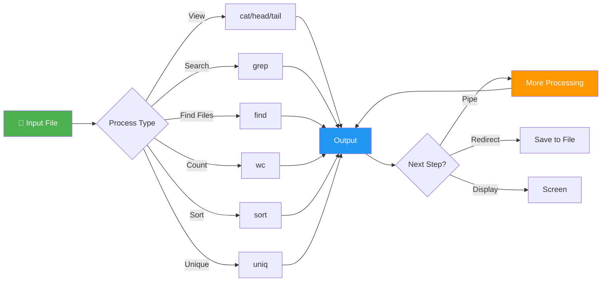
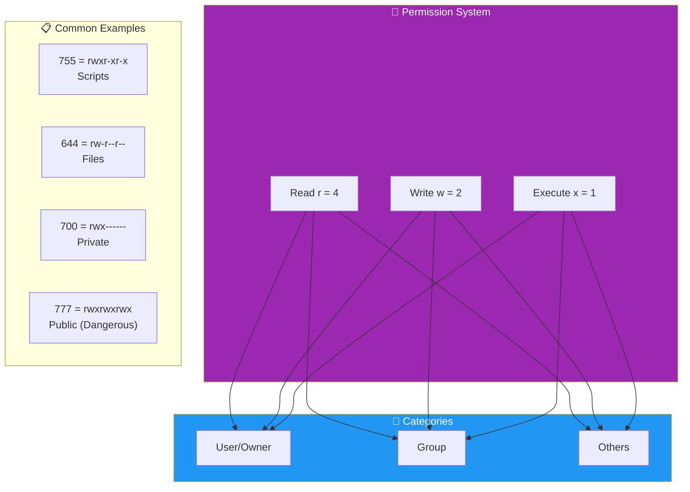
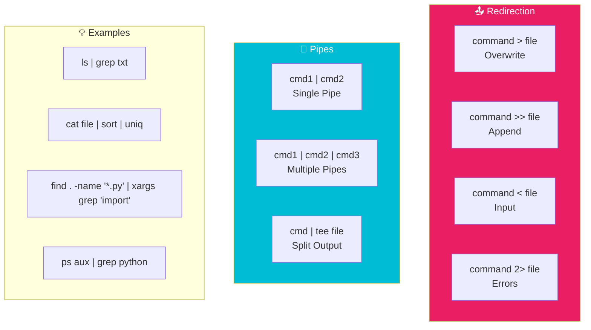

# Chapter 4: Linux Basics - Part 2

```
╔═══════════════════════════════════════════════════════════════════════════════════════════════════╗
║                                                                                                   ║
║   ████████╗███████╗██████╗ ███╗   ███╗██╗███╗   ██╗ ██████╗ ██████╗ ███████╗                      ║
║   ╚══██╔══╝██╔════╝██╔══██╗████╗ ████║██║████╗  ██║██╔════╝██╔═══██╗██╔════╝                      ║
║       ██║   █████╗  ██████╔╝██╔████╔██║██║██╔██╗ ██║██║     ██║   ██║███████╗                      ║
║       ██║   ██╔══╝  ██╔══██╗██║╚██╔╝██║██║██║╚██╗██║██║     ██║   ██║╚════██║                      ║
║       ██║   ███████╗██║  ██║██║ ╚═╝ ██║██║██║ ╚████║╚██████╗╚██████╔╝███████║                      ║
║       ╚═╝   ╚══════╝╚═╝  ╚═╝╚═╝     ╚═╝╚═╝╚═╝  ╚═══╝ ╚═════╝ ╚═════╝ ╚══════╝                      ║
║                                                                                                   ║
║   ██╗      ██████╗ ██╗  ██╗██╗███╗   ██╗ ██████╗     ██████╗ ██████╗ ███████╗ ██████╗ ██╗   ██╗   ║
║   ██║     ██╔═══██╗██║ ██╔╝██║████╗  ██║██╔════╝    ██╔════╝██╔═══██╗██╔════╝██╔═══██╗██║   ██║   ║
║   ██║     ██║   ██║█████╔╝ ██║██╔██╗ ██║██║  ███╗   ██║     ██║   ██║███████╗██║   ██║██║   ██║   ║
║   ██║     ██║   ██║██╔═██╗ ██║██║╚██╗██║██║   ██║   ██║     ██║   ██║╚════██║██║   ██║██║   ██║   ║
║   ███████╗╚██████╔╝██║  ██╗██║██║ ╚████║╚██████╔╝   ╚██████╗╚██████╔╝███████║╚██████╔╝╚██████╔╝   ║
║   ╚══════╝ ╚═════╝ ╚═╝  ╚═╝╚═╝╚═╝  ╚═══╝ ╚═════╝     ╚═════╝ ╚═════╝ ╚══════╝ ╚═════╝  ╚═════╝    ║
║                                                                                                   ║
║   ┏━━━━━━━━━━━━━━━━━━━━━━━━━━━━━━━━━━━━━━━━━━━━━━━━━━━━━━━━━━━━━━━━━━━━━━━━━━━━━━━━━━━━━━━━━━━━┓   ║
║   ┃  ⚡ CHAPTER 4: ADVANCED OPERATIONS - grep • find • chmod • pipes • redirection ⚡        ┃   ║
║   ┃  📚 Module 1: Foundation | ⭐⭐ Difficulty | ⏱️ 15-20 Minutes | By T3rmuxk1ng            ┃   ║
║   ┗━━━━━━━━━━━━━━━━━━━━━━━━━━━━━━━━━━━━━━━━━━━━━━━━━━━━━━━━━━━━━━━━━━━━━━━━━━━━━━━━━━━━━━━━━━━━┛   ║
║                                                                                                   ║
╚═══════════════════════════════════════════════════════════════════════════════════════════════════╝
```

> **Module:** 1 - Foundation  
> **Chapter:** 4 of 61  
> **Duration:** 15-20 Minutes  
> **Difficulty:** ⭐⭐ Beginner-Intermediate  
> **Prerequisites:** Chapters 1-3 (Termux Installation, Setup, Linux Basics Part 1)  

---

## 📋 Chapter Overview

| Section | Content |
|---------|---------|
| Video Script | Complete Hindi narration with timestamps |
| Technical Guide | File operations, permissions, text processing |
| Commands Reference | 20+ practical examples |
| Practice Exercises | 5 hands-on tasks |
| Troubleshooting | Common errors and fixes |
| Video Assets | Thumbnail, description, tags |

---

## 🎬 VIDEO SCRIPT (Complete Hindi Narration)

```
═══════════════════════════════════════════════════════════════════════════════
TERMUX FULL COURSE - CHAPTER 4
Title: Linux Basics Part 2 | Files, Permissions & Text Processing | T3rmuxk1ng
Duration: 15-20 Minutes
═══════════════════════════════════════════════════════════════════════════════

[INTRO - 0:00 to 0:45]
─────────────────────────────────────────────────────────────────────────────

Namaskar Dosto! Welcome back to Termux Full Course!

Main hoon T3rmuxk1ng aur aaj Chapter 4 mein hum Linux ke aur bhi powerful
commands seekhenge jo aapko ek pro user banane ke liye zaroori hain.

Pichle chapter mein humne basics seekhe the - ls, cd, mkdir, rm, cp, mv.
Aaj hum seekhenge:

- Files ko kaise view aur create karein (cat, touch)
- Text mein search kaise karein (grep)
- Files kaise dhundein (find)
- Permissions aur ownership (chmod, chown)
- File content analyze karna (head, tail, wc, sort, uniq, diff)
- Redirection aur pipes - command chaining

Ye sab commands daily use aate hain - scripting mein, hacking tools mein,
automation mein - har jagah.

To chaliye shuru karte hain!

---

[SECTION 1: CAT COMMAND - 0:45 to 4:00]
─────────────────────────────────────────────────────────────────────────────

Sabse pehle cat command - ye ek bahut hi useful command hai.

Cat ka full form hai "concatenate" - matlab jodna. Lekin iske 3 main uses
hain:

┌─────────────────────────────────────────────────────────────────────────┐
│                        CAT COMMAND USES                                  │
├─────────────────────────────────────────────────────────────────────────┤
│ 1. File content dekhna (view)                                           │
│ 2. Naye files create karna                                               │
│ 3. Multiple files jodna (concatenate)                                   │
└─────────────────────────────────────────────────────────────────────────┘

[DEMO: View File Content]

Pehle ek file bana lete hain:
    echo "Hello Termux!" > test.txt

Ab cat se dekhein:
    cat test.txt

Output: Hello Termux!

Simple! File ka content screen pe aa gaya.

[DEMO: View Multiple Files]

    echo "File One" > file1.txt
    echo "File Two" > file2.txt
    cat file1.txt file2.txt

Output:
File One
File Two

Dono files ka content ek saath aa gaya.

[DEMO: Create New File with cat]

    cat > newfile.txt

Ab aap type karein:
    This is line 1
    This is line 2

Ctrl+D dabayein save karne ke liye.

Ab check karein:
    cat newfile.txt

File ban gayi with content!

[DEMO: Append to File]

    cat >> newfile.txt

Type karein:
    This is line 3

Ctrl+D dabayein.

Ab cat newfile.txt karein - teen lines dikhengi.

[DEMO: Concatenate Files into One]

    cat file1.txt file2.txt > merged.txt
    cat merged.txt

Dono files ka content merged.txt mein aa gaya.

[DEMO: Line Numbers with cat]

    cat -n test.txt

Output mein line numbers bhi dikhenge.

    cat -b test.txt

Non-empty lines ka number dikhata hai.

Pro tip: Badi files ke liye cat ke saath use karein:
    cat bigfile.txt | less
    Less se scroll kar sakte ho, q press karke exit karein.

---

[SECTION 2: TOUCH COMMAND - 4:00 to 5:30]
─────────────────────────────────────────────────────────────────────────────

Ab touch command - ye bahut simple hai lekin useful.

Touch ke 2 main uses hain:

1. Empty files create karna
2. File timestamps update karna

[DEMO: Create Empty Files]

    touch myfile.txt

Empty file ban gayi! Check karein:
    ls -la myfile.txt

Size 0 dikhega - empty file.

[DEMO: Multiple Files Create]

    touch file1.txt file2.txt file3.txt

Ek command mein 3 files ban gayi!

    ls *.txt

[DEMO: Update Timestamp]

Pehle file ka timestamp dekhein:
    ls -la myfile.txt

Ab touch karein:
    touch myfile.txt

Phir dekhein:
    ls -la myfile.txt

Timestamp update ho gaya - current time dikhega.

Ye scripts mein use hota hai jab aapko:
- Placeholder files create karni ho
- File modification time change karni ho
- Quick empty files banani ho

---

[SECTION 3: GREP COMMAND - 5:30 to 9:00]
─────────────────────────────────────────────────────────────────────────────

Ab aata hai GREP - ye bahut powerful command hai!

Grep ka full form hai "Global Regular Expression Print".

Ye text files mein search karta hai. Searching ka king hai!

Basic syntax:
    grep "pattern" filename

[DEMO: Basic Search]

Pehle ek file bana lete hain with some content:

    cat > data.txt << 'EOF'
apple
banana
apple pie
APPLE JUICE
grape
pineapple
orange
EOF

Ab search karein:
    grep "apple" data.txt

Output:
apple
apple pie
pineapple

Saari lines jo "apple" contain karti hain, wo aa gayi!

[DEMO: Case Insensitive Search -i]

    grep -i "apple" data.txt

Output:
apple
apple pie
APPLE JUICE
pineapple

-i flag case ignore karta hai - chhota bada sab milega.

[DEMO: Show Line Numbers -n]

    grep -n "apple" data.txt

Output:
1:apple
3:apple pie
6:pineapple

Line numbers bhi dikhenge!

[DEMO: Invert Match -v]

    grep -v "apple" data.txt

Output:
banana
APPLE JUICE
grape
orange

-v flag lines ko EXCLUDE karta hai jo match karti hain.

[DEMO: Recursive Search -r]

Bahut useful! Directory mein saari files mein search:

    mkdir testdir
    cp data.txt testdir/
    echo "secret data" > testdir/secret.txt

    grep -r "secret" testdir/

Output:
testdir/secret.txt:secret data

Saari files mein dhundh ke batayega!

[DEMO: Count Matches -c]

    grep -c "apple" data.txt

Output: 3

Kitni lines match hui, count batayega.

[DEMO: Exact Word Match -w]

    grep -w "apple" data.txt

Sirf exact word match karega - "apple pie" mein "apple" word 
milega, "pineapple" mein nahi milega.

[DEMO: Regular Expression]

    grep "^a" data.txt

^ ka matlab start - sirf a se shuru hone wali lines.

    grep "e$" data.txt

$ ka matlab end - e se khatam hone wali lines.

    grep "a.*e" data.txt

.* ka matlab kuch bhi - a se shuru e se khatam.

Grep bahut powerful hai - isse practice karein!

---

[SECTION 4: FIND COMMAND - 9:00 to 12:00]
─────────────────────────────────────────────────────────────────────────────

Ab find command - ye files dhundhne ke liye use hota hai.

Grep text search karta hai, find files search karta hai!

Basic syntax:
    find [path] [options] [pattern]

[DEMO: Find by Name]

    find . -name "data.txt"

Current directory (.) mein data.txt dhundhega.

    find . -name "*.txt"

Saari .txt files list karega.

[DEMO: Case Insensitive -iname]

    find . -iname "DATA.txt"

Case ignore karega.

[DEMO: Find by Type -type]

    find . -type d

Sirf directories dikhayega.

    find . -type f

Sirf files dikhayega.

    find . -type f -name "*.txt"

Sirf txt files.

[DEMO: Find by Size -size]

    find . -size +1M

1MB se badi files.

    find . -size -100k

100KB se chhoti files.

    find . -size +100k -size -1M

100KB se badi, 1MB se chhoti.

[DEMO: Find by Time -mtime]

    find . -mtime -1

Last 1 din mein modify hui files.

    find . -mtime +7

7 din pehle modify hui files.

    find . -mmin -60

Last 60 minutes mein modify hui files.

[DEMO: Execute Command on Found Files -exec]

    find . -name "*.txt" -exec cat {} \;

Ye saari txt files ka content dikhayega!

{} ka matlab mil gayi file, \; command end karta hai.

    find . -name "*.log" -exec rm {} \;

Saari .log files delete kar dega!

[DEMO: Combine Conditions]

    find . -type f -name "*.txt" -size +1k

Txt files jo 1KB se badi hain.

Find bahut powerful hai - isse daily use karein!

---

[SECTION 5: CHMOD COMMAND - 12:00 to 15:00]
─────────────────────────────────────────────────────────────────────────────

Ab permissions ki baat - ye Linux ka most important concept hai!

Linux mein har file ke 3 types ke permissions hote hain:

┌─────────────────────────────────────────────────────────────────────────┐
│                    FILE PERMISSIONS                                      │
├──────────────┬──────────────────────────────────────────────────────────┤
│ Permission   │ Meaning                                                  │
├──────────────┼──────────────────────────────────────────────────────────┤
│ r (read)     │ File padh sakte, directory list kar sakte                │
│ w (write)    │ File modify kar sakte, directory mein add/delete         │
│ x (execute)  │ File run kar sakte, directory mein enter kar sakte       │
└──────────────┴──────────────────────────────────────────────────────────┘

Aur ye permissions 3 categories ke liye hote hain:

┌─────────────────────────────────────────────────────────────────────────┐
│                    PERMISSION CATEGORIES                                 │
├──────────────┬──────────────────────────────────────────────────────────┤
│ Category     │ Description                                              │
├──────────────┼──────────────────────────────────────────────────────────┤
│ User (u)     │ File ka owner - aap                                      │
│ Group (g)    │ File ki group members                                    │
│ Others (o)   │ Baaki sab users                                          │
└──────────────┴──────────────────────────────────────────────────────────┘

Permissions check karein:
    ls -la

Output kuch aisa dikhega:
-rw------- 1 u0_aXXX u0_aXXX 12 Jan 1 12:00 myfile.txt

Pehla character - (dash) = file, d = directory

Agle 9 characters: rw------- 
- First 3: User permissions (rw-)
- Next 3: Group permissions (---)
- Last 3: Others permissions (---)

[DEMO: Symbolic Notation]

Symbolic notation mein letters use hote hain:

    chmod u+x script.sh

User ko execute permission dena.

    chmod g+w file.txt

Group ko write permission dena.

    chmod o+r file.txt

Others ko read permission dena.

    chmod ugo+rwx file.txt

Sabko saare permissions dena.

    chmod +x script.sh

Sabko execute permission (shortcut).

    chmod -x script.sh

Execute permission lena.

    chmod u=rwx,g=rx,o=r file.txt

Exact permissions set karna.

[DEMO: Octal Notation - Numbers]

Ye thoda confusing lagta hai, lekin bahut fast hai!

┌─────────────────────────────────────────────────────────────────────────┐
│                    OCTAL NOTATION                                        │
├──────────────┬──────────────────────────────────────────────────────────┤
│ Number       │ Permissions                                              │
├──────────────┼──────────────────────────────────────────────────────────┤
│ 0            │ --- (no permissions)                                     │
│ 1            │ --x (execute only)                                       │
│ 2            │ -w- (write only)                                         │
│ 3            │ -wx (write + execute)                                    │
│ 4            │ r-- (read only)                                          │
│ 5            │ r-x (read + execute)                                     │
│ 6            │ rw- (read + write)                                       │
│ 7            │ rwx (all permissions)                                    │
└──────────────┴──────────────────────────────────────────────────────────┘

Examples:

    chmod 755 script.sh

7 = User = rwx (4+2+1)
5 = Group = r-x (4+0+1)
5 = Others = r-x (4+0+1)

Ye scripts ke liye common hai - owner sab kar sakta, baaki read aur execute.

    chmod 644 file.txt

6 = User = rw- (4+2+0)
4 = Group = r-- (4+0+0)
4 = Others = r-- (4+0+0)

Ye normal files ke liye common hai - owner read/write, baaki sirf read.

    chmod 700 secret.txt

7 = User = rwx
0 = Group = ---
0 = Others = ---

Sirf owner - koi aur nahi.

    chmod 777 public.txt

Sab kuch - sabko! (Dangerous - use carefully)

[DEMO: Recursive chmod]

    chmod -R 755 myfolder/

Folder aur uski saari files/folders ka permission change.

Ye bahut important hai - scripts tabhi chalti hain jab execute permission ho!

---

[SECTION 6: CHOWN COMMAND - 15:00 to 16:00]
─────────────────────────────────────────────────────────────────────────────

Chown ka matlab "change owner".

Termux mein normally aap hi owner hote ho, to chown ki zarurat kam hoti hai.
Lekin knowledge hona chahiye.

Syntax:
    chown user:group filename

[DEMO: Change Owner]

    touch testfile.txt
    ls -la testfile.txt

Owner dikhega: u0_aXXX (aapka Termux user ID)

    chown u0_aXXX testfile.txt

(Same owner - demo ke liye)

Recursively:
    chown -R user:group folder/

Termux mein ye command limited hai - root ke saath zyada useful hai.

---

[SECTION 7: HEAD AND TAIL COMMANDS - 16:00 to 17:30]
─────────────────────────────────────────────────────────────────────────────

Head aur tail - file ke parts dekhne ke liye.

Head = Starting se lines
Tail = Ending se lines

[DEMO: Head Command]

    head data.txt

Pehli 10 lines dikhayega (default).

    head -5 data.txt

Pehli 5 lines.

    head -n 20 data.txt

Pehli 20 lines.

    head -c 100 data.txt

Pehle 100 bytes.

[DEMO: Tail Command]

    tail data.txt

Last 10 lines (default).

    tail -5 data.txt

Last 5 lines.

    tail -n 20 data.txt

Last 20 lines.

[DEMO: Tail -f (Follow Mode) - SUPER USEFUL]

    tail -f /var/log/logfile

Ye file ko follow karta hai - naye lines automatically dikhata hai!

Logs monitor karne ke liye best:
    tail -f /data/data/com.termux/files/usr/var/log/*.log

Ctrl+C se exit karein.

---

[SECTION 8: WC, SORT, UNIQ, DIFF - 17:30 to 19:30]
─────────────────────────────────────────────────────────────────────────────

Ye text processing commands hain - data analysis ke liye.

[DEMO: WC - Word Count]

    wc data.txt

Output: 7 7 54 data.txt
- 7 lines
- 7 words
- 54 bytes

    wc -l data.txt

Sirf lines count.

    wc -w data.txt

Sirf words count.

    wc -c data.txt

Sirf bytes count.

[DEMO: Sort]

    sort data.txt

Alphabetical order mein sort karta hai.

    sort -r data.txt

Reverse order.

    sort -n numbers.txt

Numeric sort.

    sort -u data.txt

Unique lines only (duplicates remove).

[DEMO: Uniq]

    cat > duplicates.txt << 'EOF'
apple
apple
banana
banana
banana
cherry
EOF

    uniq duplicates.txt

Duplicates remove karta hai (consecutive).

    sort duplicates.txt | uniq

Pehle sort, phir uniq - perfect!

    sort duplicates.txt | uniq -c

Count bhi dikhata hai:
   2 apple
   3 banana
   1 cherry

[DEMO: Diff - Compare Files]

    cat > file1.txt << 'EOF'
line 1
line 2
line 3
EOF

    cat > file2.txt << 'EOF'
line 1
line 2 modified
line 3
line 4
EOF

    diff file1.txt file2.txt

Output:
2c2
< line 2
---
> line 2 modified
3a4
> line 4

< = file1 mein, > = file2 mein

Side by side diff:
    diff -y file1.txt file2.txt

---

[SECTION 9: REDIRECTION AND PIPES - 19:30 to 21:30]
─────────────────────────────────────────────────────────────────────────────

Ab aata hai command chaining - sabse powerful concept!

[DEMO: Output Redirection >]

    echo "Hello" > file.txt

Output file mein save karna. File overwrite hoti hai!

    echo "Another line" > file.txt

Purana content gayab - file overwrite ho gayi.

[DEMO: Append Redirection >>]

    echo "Line 1" >> file.txt
    echo "Line 2" >> file.txt

Content add hota hai, file overwrite nahi hoti.

[DEMO: Input Redirection <]

    cat < file.txt

File ka content as input dena.

    wc -l < file.txt

File se input leke count karna.

[DEMO: Pipes |]

Pipe ek command ka output doosri command mein bhejta hai!

    cat data.txt | grep "apple"

Pehle file padh lo, phir grep karo.

    ls -la | grep ".txt"

Sirf txt files list karo.

    ls | wc -l

Kitni files hain count karo.

    cat data.txt | sort | uniq

Sort karo, unique lines nikaalo.

    history | grep "python"

History mein python commands dhundho.

    ps aux | grep "termux"

Running processes mein termux dhundho.

    find . -name "*.txt" | wc -l

Kitni txt files hain count karo.

Pipes se complex tasks easy ho jaate hain!

---

[SECTION 10: SUMMARY & NEXT PREVIEW - 21:30 to 22:30]
─────────────────────────────────────────────────────────────────────────────

To dosto, Chapter 4 complete! Let's summarize:

✅ cat - Files view, create, concatenate
✅ touch - Empty files, timestamps
✅ grep - Text search with options -i, -r, -n, -v
✅ find - File search by name, type, size, time
✅ chmod - Permissions (symbolic & octal)
✅ chown - Change ownership
✅ head/tail - File content preview
✅ wc, sort, uniq, diff - Text processing
✅ Redirection > >> < and pipes |

Important Commands yaad rakhein:

┌─────────────────────────────────────────────────────────────────────────┐
│                    CHAPTER 4 - IMPORTANT COMMANDS                        │
├─────────────────────────────────────────────────────────────────────────┤
│ cat file.txt               │ View file content                          │
│ cat file1 file2 > merged   │ Concatenate files                          │
│ touch file.txt             │ Create empty file                          │
│ grep "pattern" file        │ Search text in file                        │
│ grep -r "pattern" dir/     │ Recursive search                           │
│ find . -name "*.txt"       │ Find txt files                             │
│ chmod 755 script.sh        │ Set execute permission                     │
│ chmod +x script.sh         │ Add execute permission                     │
│ head -10 file.txt          │ First 10 lines                             │
│ tail -f logfile            │ Follow log file                            │
│ wc -l file.txt             │ Count lines                                │
│ sort file.txt              │ Sort alphabetically                        │
│ sort file | uniq           │ Unique sorted lines                        │
│ command > file             │ Redirect output to file                    │
│ command >> file            │ Append output to file                      │
│ cmd1 | cmd2                │ Pipe output to next command                │
└─────────────────────────────────────────────────────────────────────────┘

Next Chapter 5 mein hum seekhenge:
- Package management in detail
- pkg, apt commands
- Repository management
- Installing tools and dependencies

Practice karein! Commands tabhi yaad rahenge.

Agar ye video helpful lagi, to:
👍 Like button press karein
🔔 Subscribe karein, notification bell on karein
💬 Koi sawal ho to comment mein poochein
📤 Share karein friends ke saath

Thank you for watching! See you in Chapter 5!

═══════════════════════════════════════════════════════════════════════════════
```

---

## 📖 TECHNICAL GUIDE

### 1. cat Command - Complete Reference

The `cat` command is one of the most frequently used commands in Linux.

```
┌─────────────────────────────────────────────────────────────────────────┐
│                         CAT COMMAND SYNTAX                               │
├─────────────────────────────────────────────────────────────────────────┤
│ cat [OPTIONS] [FILE]...                                                  │
└─────────────────────────────────────────────────────────────────────────┘
```

**Options:**

| Option | Description |
|--------|-------------|
| `-n` | Number all output lines |
| `-b` | Number non-empty lines only |
| `-s` | Suppress repeated empty lines |
| `-T` | Display TAB characters as ^I |
| `-e` | Display $ at end of each line |
| `-A` | Show all (equivalent to -vET) |

**Common Use Cases:**

```bash
# View single file
cat filename.txt

# View multiple files
cat file1.txt file2.txt file3.txt

# Concatenate files into new file
cat file1.txt file2.txt > combined.txt

# Create new file from terminal
cat > newfile.txt
# Type content, press Ctrl+D to save

# Append to existing file
cat >> existing.txt
# Type content, press Ctrl+D to save

# Display with line numbers
cat -n file.txt

# Display non-blank lines with numbers
cat -b file.txt

# Combine multiple files with line numbers
cat -n file1.txt file2.txt > numbered.txt

# View file with special characters visible
cat -A file.txt

# Copy file content to another
cat source.txt > destination.txt

# Display file content in uppercase
cat file.txt | tr 'a-z' 'A-Z'

# Quick file preview
cat file.txt | head -20
```

### 2. touch Command

The `touch` command creates empty files and updates timestamps.

```
┌─────────────────────────────────────────────────────────────────────────┐
│                        TOUCH COMMAND SYNTAX                              │
├─────────────────────────────────────────────────────────────────────────┤
│ touch [OPTIONS] FILE...                                                  │
└─────────────────────────────────────────────────────────────────────────┘
```

**Timestamp Types:**

| Timestamp | Description | Option |
|-----------|-------------|--------|
| Access Time (atime) | Last time file was read | -a |
| Modification Time (mtime) | Last time file content changed | -m |
| Change Time (ctime) | Last time metadata changed | (automatic) |

**Options:**

| Option | Description |
|--------|-------------|
| `-a` | Change only access time |
| `-m` | Change only modification time |
| `-d STRING` | Use specified date |
| `-t STAMP` | Use specified timestamp |
| `-r FILE` | Use another file's timestamps |
| `-c` | Don't create if doesn't exist |

**Examples:**

```bash
# Create single empty file
touch newfile.txt

# Create multiple files
touch file1.txt file2.txt file3.txt

# Create file with specific date
touch -d "2024-01-15" file.txt

# Create file with specific time
touch -t 202401151200 file.txt  # YYYYMMDDhhmm

# Update timestamps to current time
touch existing_file.txt

# Copy timestamps from another file
touch -r source.txt target.txt

# Update only access time
touch -a file.txt

# Update only modification time
touch -m file.txt

# Create numbered files (brace expansion)
touch file{1..10}.txt
# Creates file1.txt, file2.txt, ..., file10.txt

# Create files for multiple extensions
touch script.{py,sh,txt}
# Creates script.py, script.sh, script.txt
```

### 3. grep Command - Complete Reference

The `grep` command searches for patterns in text files.

```
┌─────────────────────────────────────────────────────────────────────────┐
│                        GREP COMMAND SYNTAX                               │
├─────────────────────────────────────────────────────────────────────────┤
│ grep [OPTIONS] PATTERN [FILE...]                                         │
│ grep [OPTIONS] [-e PATTERN]... [-f FILE] [FILE...]                      │
└─────────────────────────────────────────────────────────────────────────┘
```

**Essential Options:**

| Option | Description |
|--------|-------------|
| `-i` | Case insensitive search |
| `-v` | Invert match (exclude matching lines) |
| `-n` | Show line numbers |
| `-r` | Recursive search in directory |
| `-l` | Show only filenames with matches |
| `-c` | Count matching lines |
| `-w` | Match whole word only |
| `-x` | Match whole line only |
| `-o` | Show only matching part |
| `-A NUM` | Show NUM lines after match |
| `-B NUM` | Show NUM lines before match |
| `-C NUM` | Show NUM lines around match |
| `-E` | Extended regex (use +, ?, |) |
| `-F` | Fixed string (no regex) |
| `--color=auto` | Highlight matches |

**Regular Expression Patterns:**

| Pattern | Meaning |
|---------|---------|
| `^pattern` | Line starts with pattern |
| `pattern$` | Line ends with pattern |
| `.` | Any single character |
| `*` | Zero or more of previous |
| `+` | One or more of previous |
| `?` | Zero or one of previous |
| `[abc]` | Any character in set |
| `[^abc]` | Any character NOT in set |
| `[a-z]` | Any character in range |
| `\b` | Word boundary |
| `\d` | Digit [0-9] |
| `\s` | Whitespace |
| `\w` | Word character [a-zA-Z0-9_] |

**Examples:**

```bash
# Basic search
grep "error" logfile.txt

# Case insensitive
grep -i "error" logfile.txt

# Show line numbers
grep -n "error" logfile.txt

# Invert match (exclude lines)
grep -v "debug" logfile.txt

# Recursive search
grep -r "password" /home/user/

# Search in specific file types
grep -r --include="*.py" "import" .

# Count matches
grep -c "error" logfile.txt

# Match whole word
grep -w "cat" file.txt  # Won't match "catalog"

# Show context around match
grep -C 3 "error" logfile.txt  # 3 lines before and after
grep -A 5 "error" logfile.txt  # 5 lines after
grep -B 2 "error" logfile.txt  # 2 lines before

# Multiple patterns (OR)
grep -E "error|warning|fail" logfile.txt

# Show only matching part
grep -o "[0-9]\+" file.txt  # Extract all numbers

# Line starts with pattern
grep "^Error" logfile.txt

# Line ends with pattern
grep "failed$" logfile.txt

# Empty lines
grep "^$" file.txt

# Email addresses
grep -E "[a-zA-Z0-9._%+-]+@[a-zA-Z0-9.-]+\.[a-zA-Z]{2,}" file.txt

# IP addresses
grep -E "[0-9]{1,3}\.[0-9]{1,3}\.[0-9]{1,3}\.[0-9]{1,3}" file.txt

# Combine options
grep -rn --color=auto "function" *.py

# Use with pipe
cat log.txt | grep "error" | grep -v "ignore"
ps aux | grep python
history | grep "apt"
```

### 4. find Command - Complete Reference

The `find` command searches for files in a directory hierarchy.

```
┌─────────────────────────────────────────────────────────────────────────┐
│                        FIND COMMAND SYNTAX                               │
├─────────────────────────────────────────────────────────────────────────┤
│ find [PATH] [EXPRESSION]                                                 │
└─────────────────────────────────────────────────────────────────────────┘
```

**Search Criteria:**

| Criteria | Description | Example |
|----------|-------------|---------|
| `-name` | Match filename (case sensitive) | `-name "*.txt"` |
| `-iname` | Match filename (case insensitive) | `-iname "*.TXT"` |
| `-type` | File type | `-type f` (file), `-type d` (dir) |
| `-size` | File size | `-size +1M` (larger than 1MB) |
| `-mtime` | Modified time (days) | `-mtime -7` (within 7 days) |
| `-mmin` | Modified time (minutes) | `-mmin -60` (within 60 min) |
| `-atime` | Access time (days) | `-atime +30` |
| `-ctime` | Change time (days) | `-ctime -1` |
| `-perm` | Permissions | `-perm 755` |
| `-user` | Owner | `-user root` |
| `-group` | Group | `-group termux` |
| `-empty` | Empty files/dirs | `-empty` |
| `-executable` | Executable files | `-executable` |

**Size Specifications:**

| Suffix | Meaning |
|--------|---------|
| `c` | Bytes |
| `k` | Kilobytes (1024 bytes) |
| `M` | Megabytes (1024 KB) |
| `G` | Gigabytes (1024 MB) |
| `+` | Greater than |
| `-` | Less than |

**Action Options:**

| Action | Description |
|--------|-------------|
| `-print` | Print path (default) |
| `-ls` | ls -dils format |
| `-delete` | Delete found files |
| `-exec CMD {} \;` | Execute command on each file |
| `-exec CMD {} +` | Execute with multiple files |
| `-ok CMD {} \;` | Prompt before execution |

**Examples:**

```bash
# Find by name
find . -name "file.txt"
find /home -name "*.py"
find . -iname "README*"

# Find by type
find . -type f          # Files only
find . -type d          # Directories only
find . -type l          # Symlinks only

# Find by size
find . -size 0          # Empty files
find . -size +100M      # Larger than 100MB
find . -size -1k        # Smaller than 1KB
find . -size +10k -size -100k  # Between 10KB and 100KB

# Find by time
find . -mtime -1        # Modified in last 24 hours
find . -mtime +7        # Modified more than 7 days ago
find . -mmin -60        # Modified in last 60 minutes
find . -atime +30       # Not accessed in 30 days

# Find by permission
find . -perm 755        # Exact permission
find . -perm -111       # Has execute for all
find . -perm /u+x       # Has user execute

# Find empty files/directories
find . -empty
find . -empty -type f   # Empty files only
find . -empty -type d   # Empty directories only

# Find executable files
find . -executable -type f

# Combine conditions (AND is implicit)
find . -name "*.txt" -size +1k

# OR condition
find . -name "*.txt" -o -name "*.md"

# NOT condition
find . -not -name "*.txt"
find . ! -name "*.txt"

# Execute command on results
find . -name "*.log" -exec rm {} \;
find . -name "*.txt" -exec cat {} \;
find . -type f -exec chmod 644 {} \;
find . -type d -exec chmod 755 {} \;

# Find and delete
find . -name "*.tmp" -delete
find . -empty -delete

# Find recent files and copy
find . -mtime -1 -exec cp {} /backup/ \;

# Complex example: Find large old files
find . -type f -size +100M -mtime +30 -ls
```

### 5. chmod Command - Complete Reference

The `chmod` command changes file permissions.

```
┌─────────────────────────────────────────────────────────────────────────┐
│                        CHMOD COMMAND SYNTAX                              │
├─────────────────────────────────────────────────────────────────────────┤
│ chmod [OPTIONS] MODE FILE...                                             │
└─────────────────────────────────────────────────────────────────────────┘
```

**Permission Categories:**

| Category | Letter | Description |
|----------|--------|-------------|
| User/Owner | `u` | File owner |
| Group | `g` | File's group members |
| Others | `o` | Everyone else |
| All | `a` | User + Group + Others |

**Permission Types:**

| Permission | Letter | Octal | Description |
|------------|--------|-------|-------------|
| Read | `r` | 4 | View content / List directory |
| Write | `w` | 2 | Modify content / Create/delete files |
| Execute | `x` | 1 | Run file / Enter directory |

**Octal Permission Values:**

| Octal | Binary | Permissions |
|-------|--------|-------------|
| 0 | 000 | --- (no permissions) |
| 1 | 001 | --x (execute only) |
| 2 | 010 | -w- (write only) |
| 3 | 011 | -wx (write + execute) |
| 4 | 100 | r-- (read only) |
| 5 | 101 | r-x (read + execute) |
| 6 | 110 | rw- (read + write) |
| 7 | 111 | rwx (all permissions) |

**Common Permission Patterns:**

| Octal | Symbolic | Use Case |
|-------|----------|----------|
| 755 | rwxr-xr-x | Executable scripts/programs |
| 644 | rw-r--r-- | Regular files (documents) |
| 600 | rw------- | Private files (keys, configs) |
| 700 | rwx------ | Private scripts |
| 777 | rwxrwxrwx | World-writable (dangerous!) |
| 775 | rwxrwxr-x | Shared directories |
| 750 | rwxr-x--- | Group-accessible scripts |

**Symbolic Mode Operations:**

| Operator | Action |
|----------|--------|
| `+` | Add permission |
| `-` | Remove permission |
| `=` | Set exact permission |

**Examples:**

```bash
# Symbolic notation
chmod u+x script.sh          # Add execute for user
chmod g+w file.txt           # Add write for group
chmod o-r file.txt           # Remove read from others
chmod a+x script.sh          # Add execute for all
chmod +x script.sh           # Same as a+x (default)
chmod u=rw,go=r file.txt     # Set exact permissions
chmod u=rwx,g=rx,o= script.sh  # Owner full, group read/exec, others none

# Octal notation
chmod 755 script.sh          # rwxr-xr-x
chmod 644 document.txt       # rw-r--r--
chmod 600 private.key        # rw-------
chmod 700 secret/            # rwx------ (directory)
chmod 777 public/            # rwxrwxrwx (warning: unsafe)

# Recursive
chmod -R 755 /path/to/directory
chmod -R 644 *.txt           # All txt files

# Using reference file
chmod --reference=source.txt target.txt

# Set execute only if already executable (useful for X)
chmod a+X directory/         # Execute for directories
chmod -R a+X *               # Recursive with X

# Remove all permissions
chmod a= file.txt            # ----------

# Copy permission from one file to many
chmod --reference=template.txt *.txt
```

### 6. chown Command

The `chown` command changes file owner and group.

```
┌─────────────────────────────────────────────────────────────────────────┐
│                        CHOWN COMMAND SYNTAX                              │
├─────────────────────────────────────────────────────────────────────────┤
│ chown [OPTIONS] [OWNER][:[GROUP]] FILE...                               │
└─────────────────────────────────────────────────────────────────────────┘
```

**Examples:**

```bash
# Change owner only
chown user file.txt

# Change group only
chown :group file.txt

# Change both owner and group
chown user:group file.txt

# Recursive
chown -R user:group directory/

# Reference file
chown --reference=source.txt target.txt

# Verbose output
chown -v user file.txt
```

### 7. head and tail Commands

**head Command:**

```bash
head [OPTIONS] [FILE]...
```

| Option | Description |
|--------|-------------|
| `-n NUM` | Output first NUM lines |
| `-c NUM` | Output first NUM bytes |
| `-q` | Never print headers |
| `-v` | Always print headers |

**tail Command:**

```bash
tail [OPTIONS] [FILE]...
```

| Option | Description |
|--------|-------------|
| `-n NUM` | Output last NUM lines |
| `-c NUM` | Output last NUM bytes |
| `-f` | Follow mode (append data) |
| `-F` | Follow with file rotation |
| `-q` | Never print headers |
| `-v` | Always print headers |

**Examples:**

```bash
# Head examples
head file.txt              # First 10 lines
head -n 20 file.txt        # First 20 lines
head -5 file.txt           # First 5 lines (shorthand)
head -c 100 file.txt       # First 100 bytes
head -n -5 file.txt        # All except last 5 lines

# Tail examples
tail file.txt              # Last 10 lines
tail -n 20 file.txt        # Last 20 lines
tail -5 file.txt           # Last 5 lines (shorthand)
tail -c 100 file.txt       # Last 100 bytes
tail -n +5 file.txt        # Start from line 5 to end

# Follow mode (very useful for logs)
tail -f /var/log/app.log
tail -f -n 50 /var/log/app.log  # Last 50 lines then follow

# Follow multiple files
tail -f /var/log/*.log

# Multiple files
head file1.txt file2.txt
tail -n 5 file1.txt file2.txt

# Combine head and tail
head -100 file.txt | tail -20  # Lines 81-100
tail -100 file.txt | head -20  # Lines -100 to -81
```

### 8. wc, sort, uniq, diff Commands

**wc (Word Count):**

```bash
wc [OPTIONS] [FILE]...
```

| Option | Description |
|--------|-------------|
| `-l` | Lines only |
| `-w` | Words only |
| `-c` | Bytes only |
| `-m` | Characters only |
| `-L` | Longest line length |

**sort:**

```bash
sort [OPTIONS] [FILE]...
```

| Option | Description |
|--------|-------------|
| `-r` | Reverse order |
| `-n` | Numeric sort |
| `-h` | Human numeric (1K, 2M) |
| `-k N` | Sort by field N |
| `-t CHAR` | Field separator |
| `-u` | Unique only |
| `-f` | Case insensitive |
| `-V` | Version sort |
| `-o FILE` | Output to file |

**uniq:**

```bash
uniq [OPTIONS] [INPUT [OUTPUT]]
```

| Option | Description |
|--------|-------------|
| `-c` | Count occurrences |
| `-d` | Only duplicate lines |
| `-u` | Only unique lines |
| `-i` | Case insensitive |
| `-f N` | Skip first N fields |
| `-s N` | Skip first N characters |

**diff:**

```bash
diff [OPTIONS] FILE1 FILE2
```

| Option | Description |
|--------|-------------|
| `-y` | Side by side output |
| `-u` | Unified format |
| `-i` | Case insensitive |
| `-w` | Ignore whitespace |
| `-r` | Recursive for directories |
| `-q` | Brief (files differ only) |

**Examples:**

```bash
# wc examples
wc file.txt                # Lines, words, bytes
wc -l file.txt             # Lines only
wc -w file.txt             # Words only
wc -c file.txt             # Bytes only
wc -L file.txt             # Longest line length
wc *.txt                   # Count for multiple files
cat file.txt | wc -l       # Count lines from pipe

# sort examples
sort names.txt             # Alphabetical
sort -r names.txt          # Reverse alphabetical
sort -n numbers.txt        # Numeric sort
sort -h sizes.txt          # Human readable (1K, 2M, etc)
sort -u names.txt          # Unique sorted
sort -k 2 data.txt         # Sort by second field
sort -t ',' -k 2 csv.txt   # Sort CSV by second field
sort -V versions.txt       # Version sort (1.2, 1.10, 2.1)
sort -n -r numbers.txt     # Numeric reverse (highest first)
sort file.txt -o sorted.txt  # Output to file

# uniq examples
sort data.txt | uniq       # Unique lines (must sort first!)
sort data.txt | uniq -c    # Count occurrences
sort data.txt | uniq -d    # Only duplicates
sort data.txt | uniq -u    # Only unique lines
sort -i names.txt | uniq -i  # Case insensitive unique

# diff examples
diff file1.txt file2.txt   # Basic diff
diff -y file1.txt file2.txt  # Side by side
diff -u file1.txt file2.txt  # Unified format
diff -q dir1/ dir2/        # Brief directory comparison
diff -r dir1/ dir2/        # Recursive diff
diff -i file1.txt file2.txt  # Case insensitive

# Combining commands
sort data.txt | uniq -c | sort -rn  # Most common lines first
cat log.txt | grep "error" | wc -l   # Count errors
cut -d',' -f1 data.csv | sort | uniq  # Unique first column values
```

### 9. Redirection and Pipes

**Redirection Operators:**

| Operator | Description |
|----------|-------------|
| `>` | Redirect stdout to file (overwrite) |
| `>>` | Redirect stdout to file (append) |
| `<` | Redirect stdin from file |
| `2>` | Redirect stderr to file |
| `2>&1` | Redirect stderr to stdout |
| `&>` | Redirect both stdout and stderr |
| `|` | Pipe stdout to another command |
| `|&` | Pipe both stdout and stderr |

**File Descriptors:**

| FD | Name | Default |
|----|------|---------|
| 0 | stdin | Keyboard |
| 1 | stdout | Screen |
| 2 | stderr | Screen |

**Examples:**

```bash
# Output redirection
echo "Hello" > file.txt        # Create/overwrite file
echo "World" >> file.txt       # Append to file

# Input redirection
cat < file.txt                 # Read from file
wc -l < file.txt               # Count lines from file

# Error redirection
ls nonexistent 2> errors.txt   # Redirect errors to file
ls /root 2>/dev/null           # Discard error messages

# Redirect both stdout and stderr
command &> output.txt
command > output.txt 2>&1      # Older syntax

# Pipes
cat file.txt | grep "pattern"
ls -la | grep ".txt" | wc -l
ps aux | grep python
history | grep "git"
find . -name "*.txt" | wc -l
cat log.txt | sort | uniq -c | sort -rn

# Here document (multiline input)
cat << 'EOF' > script.sh
#!/bin/bash
echo "Hello World"
echo "This is a test"
EOF

# Here string (single line)
grep "pattern" <<< "search in this string"

# Named pipes (advanced)
mkfifo mypipe
command1 > mypipe &
command2 < mypipe

# Process substitution
diff <(sort file1.txt) <(sort file2.txt)

# Tee - output to both file and screen
command | tee output.txt
command | tee -a output.txt    # Append mode

# Multiple redirections
command 2>&1 | tee log.txt     # Log everything
```

---

## 📋 COMMANDS REFERENCE

### Quick Reference Table (25+ Commands)

```bash
# ═══════════════════════════════════════════════════════════════════════
# CAT COMMAND
# ═══════════════════════════════════════════════════════════════════════
cat file.txt                    # View file content
cat -n file.txt                 # View with line numbers
cat -b file.txt                 # Number non-blank lines
cat file1.txt file2.txt         # View multiple files
cat file1.txt file2.txt > merged.txt  # Concatenate files
cat > newfile.txt               # Create file from input (Ctrl+D to save)
cat >> file.txt                 # Append to file from input
cat -s file.txt                 # Squeeze blank lines

# ═══════════════════════════════════════════════════════════════════════
# TOUCH COMMAND
# ═══════════════════════════════════════════════════════════════════════
touch file.txt                  # Create empty file / update timestamp
touch file1.txt file2.txt file3.txt  # Create multiple files
touch -d "2024-01-15" file.txt  # Set specific date
touch -t 202401151200 file.txt  # Set specific timestamp
touch -r source.txt target.txt  # Copy timestamps from another file
touch -a file.txt               # Update access time only
touch -m file.txt               # Update modification time only

# ═══════════════════════════════════════════════════════════════════════
# GREP COMMAND
# ═══════════════════════════════════════════════════════════════════════
grep "pattern" file.txt         # Basic search
grep -i "pattern" file.txt      # Case insensitive
grep -n "pattern" file.txt      # Show line numbers
grep -v "pattern" file.txt      # Invert match (exclude)
grep -r "pattern" directory/    # Recursive search
grep -l "pattern" *.txt         # Show filenames only
grep -c "pattern" file.txt      # Count matches
grep -w "word" file.txt         # Whole word match
grep -E "pattern1|pattern2" file.txt  # Multiple patterns (OR)
grep -A 3 "pattern" file.txt    # Show 3 lines after match
grep -B 3 "pattern" file.txt    # Show 3 lines before match
grep -C 3 "pattern" file.txt    # Show 3 lines around match
grep --color=auto "pattern" file.txt  # Highlight matches

# ═══════════════════════════════════════════════════════════════════════
# FIND COMMAND
# ═══════════════════════════════════════════════════════════════════════
find . -name "file.txt"         # Find by name
find . -iname "file.txt"        # Find by name (case insensitive)
find . -type f                  # Find files only
find . -type d                  # Find directories only
find . -name "*.txt"            # Find all txt files
find . -size +1M                # Find files larger than 1MB
find . -size -100k              # Find files smaller than 100KB
find . -mtime -7                # Modified in last 7 days
find . -mmin -60                # Modified in last 60 minutes
find . -empty                   # Find empty files/directories
find . -perm 755                # Find by permission
find . -executable              # Find executable files
find . -name "*.log" -delete    # Find and delete
find . -name "*.txt" -exec cat {} \;  # Execute command on results

# ═══════════════════════════════════════════════════════════════════════
# CHMOD COMMAND
# ═══════════════════════════════════════════════════════════════════════
chmod 755 script.sh             # rwxr-xr-x (executable)
chmod 644 file.txt              # rw-r--r-- (readable)
chmod 600 private.key           # rw------- (private)
chmod 700 directory/            # rwx------ (private directory)
chmod +x script.sh              # Add execute permission
chmod -x script.sh              # Remove execute permission
chmod u+x script.sh             # Add execute for user
chmod g+w file.txt              # Add write for group
chmod o-r file.txt              # Remove read from others
chmod a+r file.txt              # Add read for all
chmod -R 755 directory/         # Recursive permission change

# ═══════════════════════════════════════════════════════════════════════
# CHOWN COMMAND
# ═══════════════════════════════════════════════════════════════════════
chown user file.txt             # Change owner
chown :group file.txt           # Change group
chown user:group file.txt       # Change owner and group
chown -R user:group directory/  # Recursive change

# ═══════════════════════════════════════════════════════════════════════
# HEAD AND TAIL
# ═══════════════════════════════════════════════════════════════════════
head file.txt                   # First 10 lines
head -n 20 file.txt             # First 20 lines
head -5 file.txt                # First 5 lines
tail file.txt                   # Last 10 lines
tail -n 20 file.txt             # Last 20 lines
tail -5 file.txt                # Last 5 lines
tail -f logfile.txt             # Follow file (live updates)
tail -f -n 50 logfile.txt       # Last 50 lines then follow

# ═══════════════════════════════════════════════════════════════════════
# WC, SORT, UNIQ, DIFF
# ═══════════════════════════════════════════════════════════════════════
wc file.txt                     # Lines, words, bytes
wc -l file.txt                  # Lines only
wc -w file.txt                  # Words only
wc -c file.txt                  # Bytes only
sort file.txt                   # Alphabetical sort
sort -r file.txt                # Reverse sort
sort -n numbers.txt             # Numeric sort
sort -u file.txt                # Unique sorted
sort file.txt | uniq            # Unique lines
sort file.txt | uniq -c         # Count occurrences
sort file.txt | uniq -d         # Duplicates only
diff file1.txt file2.txt        # Compare files
diff -y file1.txt file2.txt     # Side by side comparison
diff -u file1.txt file2.txt     # Unified format

# ═══════════════════════════════════════════════════════════════════════
# REDIRECTION AND PIPES
# ═══════════════════════════════════════════════════════════════════════
command > file.txt              # Redirect output to file (overwrite)
command >> file.txt             # Redirect output to file (append)
command < file.txt              # Redirect input from file
command 2> errors.txt           # Redirect stderr
command &> output.txt           # Redirect stdout and stderr
command1 | command2             # Pipe output to another command
command | tee output.txt        # Output to file and screen
cat file.txt | grep "pattern"   # Chain commands with pipe
```

---

## 💻 PRACTICE EXERCISES

### Exercise 1: File Content Analysis

```bash
# Task: Create a sample data file and analyze it

# Step 1: Create sample data file
cat > employees.txt << 'EOF'
101,John Doe,Engineering,75000
102,Jane Smith,Marketing,65000
103,Bob Johnson,Engineering,80000
104,Alice Brown,HR,55000
105,Charlie Wilson,Engineering,72000
106,Diana Davis,Marketing,68000
107,Edward Miller,HR,52000
108,Fiona Garcia,Engineering,85000
EOF

# Step 2: Count total lines
wc -l employees.txt

# Step 3: Find all Engineering employees
grep "Engineering" employees.txt

# Step 4: Count employees per department
cut -d',' -f3 employees.txt | sort | uniq -c

# Step 5: Find highest salary (bonus challenge)
sort -t',' -k4 -nr employees.txt | head -1

# Step 6: Extract employee names only
cut -d',' -f2 employees.txt

# Step 7: Find employees with salary above 70000
awk -F',' '$4 > 70000' employees.txt

# Expected: Understanding of text processing
```

### Exercise 2: Permission Management

```bash
# Task: Set up proper file permissions for a project

# Step 1: Create project structure
mkdir -p myproject/{bin,docs,configs}

# Step 2: Create sample files
touch myproject/bin/app.sh
touch myproject/bin/setup.sh
touch myproject/docs/readme.txt
touch myproject/configs/settings.conf
echo "#!/bin/bash" > myproject/bin/app.sh
echo "echo 'Hello World'" >> myproject/bin/app.sh

# Step 3: Check current permissions
ls -laR myproject/

# Step 4: Make scripts executable
chmod +x myproject/bin/*.sh

# Step 5: Make configs readable only by owner
chmod 600 myproject/configs/*.conf

# Step 6: Make docs readable by all
chmod 644 myproject/docs/*.txt

# Step 7: Make directories accessible
chmod 755 myproject myproject/*

# Step 8: Verify permissions
ls -laR myproject/

# Expected: Proper permission structure
```

### Exercise 3: Log File Analysis

```bash
# Task: Analyze a sample log file

# Step 1: Create sample log file
cat > server.log << 'EOF'
2024-01-15 08:00:01 INFO Server started
2024-01-15 08:00:05 INFO Loading configuration
2024-01-15 08:00:10 ERROR Database connection failed
2024-01-15 08:00:15 INFO Retrying database connection
2024-01-15 08:00:20 INFO Database connected
2024-01-15 08:01:00 WARNING High memory usage
2024-01-15 08:02:00 ERROR Request timeout
2024-01-15 08:02:30 INFO Request processed
2024-01-15 08:03:00 ERROR Authentication failed
2024-01-15 08:03:30 WARNING Slow response time
2024-01-15 08:04:00 INFO User logged in
2024-01-15 08:05:00 ERROR File not found
2024-01-15 08:05:30 INFO Cleanup completed
EOF

# Step 2: Count total lines
wc -l server.log

# Step 3: Count errors
grep -c "ERROR" server.log

# Step 4: Show all errors with line numbers
grep -n "ERROR" server.log

# Step 5: Show errors and warnings
grep -E "ERROR|WARNING" server.log

# Step 6: Show 2 lines after each error
grep -A 2 "ERROR" server.log

# Step 7: Count by log level
grep -o "INFO\|ERROR\|WARNING" server.log | sort | uniq -c

# Step 8: View first 5 and last 5 lines
head -5 server.log
tail -5 server.log

# Expected: Log analysis skills
```

### Exercise 4: Find and Organize

```bash
# Task: Find and organize files by type

# Step 1: Create test structure
mkdir -p fileorg/{images,docs,scripts,logs}
touch fileorg/images/{photo1.jpg,photo2.png,logo.gif}
touch fileorg/docs/{report.txt,notes.md,readme.txt}
touch fileorg/scripts/{backup.sh,deploy.py,test.sh}
touch fileorg/logs/{error.log,access.log,debug.log}
touch fileorg/misc.txt fileorg/temp.log fileorg/config.json

# Step 2: Find all shell scripts
find fileorg -name "*.sh"

# Step 3: Find all image files
find fileorg -name "*.jpg" -o -name "*.png" -o -name "*.gif"

# Step 4: Find all files modified today
find fileorg -mtime -1

# Step 5: Count files per extension
find fileorg -type f | sed 's/.*\.//' | sort | uniq -c

# Step 6: Find empty directories
find fileorg -type d -empty

# Step 7: Find and list all log files
find fileorg -name "*.log" -exec ls -la {} \;

# Step 8: Find files larger than 0 bytes
find fileorg -type f -size +0

# Expected: File finding skills
```

### Exercise 5: Redirection and Pipes Mastery

```bash
# Task: Master command chaining

# Step 1: Create sample data
for i in {1..100}; do
    echo "Line $i: $(head /dev/urandom | tr -dc 'a-zA-Z0-9' | head -c 20)"
done > bigdata.txt

# Step 2: View first 10 lines
head bigdata.txt

# Step 3: Count lines containing "Line 5"
grep "Line 5" bigdata.txt | wc -l

# Step 4: Extract line numbers only
grep -o "Line [0-9]*" bigdata.txt | cut -d' ' -f2

# Step 5: Save lines 50-60 to separate file
sed -n '50,60p' bigdata.txt > excerpt.txt

# Step 6: Create sorted unique first words list
cat bigdata.txt | cut -d' ' -f1 | sort | uniq

# Step 7: Find lines with specific pattern and count
grep -c "Line [0-9][0-9]:" bigdata.txt

# Step 8: Combine multiple operations
cat bigdata.txt | grep "Line 1" | sort | head -5 | tee results.txt

# Step 9: Use process substitution
diff <(head -20 bigdata.txt) <(tail -20 bigdata.txt)

# Step 10: Clean up
rm -f bigdata.txt excerpt.txt results.txt

# Expected: Advanced command chaining
```

---

## ⚠️ TROUBLESHOOTING

### Problem 1: Permission Denied

```bash
# Error: bash: ./script.sh: Permission denied

# Cause: File is not executable

# Solution 1: Add execute permission
chmod +x script.sh

# Solution 2: Run with interpreter
bash script.sh
python script.py

# Solution 3: Check current permissions
ls -la script.sh

# Verify with
./script.sh
```

### Problem 2: grep Command Not Finding Pattern

```bash
# Error: No output when pattern exists

# Cause: Case sensitivity or wrong file

# Solution 1: Use case insensitive
grep -i "pattern" file.txt

# Solution 2: Verify file content
cat file.txt

# Solution 3: Check for hidden characters
cat -A file.txt

# Solution 4: Use extended regex
grep -E "pattern1|pattern2" file.txt
```

### Problem 3: find Command Too Slow

```bash
# Error: find taking very long

# Cause: Searching entire filesystem or many files

# Solution 1: Limit search depth
find . -maxdepth 3 -name "*.txt"

# Solution 2: Use specific path
find /specific/path -name "*.txt"

# Solution 3: Combine with grep (faster for content)
grep -r "pattern" --include="*.txt" .

# Solution 4: Exclude directories
find . -name "*.txt" -not -path "*/\.*"
```

### Problem 4: Redirection Overwrites Important File

```bash
# Error: Accidentally overwrote file with >

# Prevention:
# Use >> for append instead of >
# Use set -o noclobber in bash to prevent overwriting

# Recovery attempts:
# Check for backup
ls -la filename.bak
ls -la filename~

# Check git if in repo
git checkout -- filename

# Check Termux backup if exists
ls ~/storage/downloads/backup/

# Enable noclobber to prevent future accidents
set -o noclobber
# Now > will fail if file exists
# Use >| to force overwrite
```

### Problem 5: chown Operation Not Permitted

```bash
# Error: chown: changing ownership: Operation not permitted

# Cause: Not running as root

# In Termux without root:
# You ARE the owner of files you create
# chown is limited

# Solution 1: Check current owner
ls -la file.txt

# Solution 2: Use chmod instead for permissions
chmod 755 file.txt

# Solution 3: If root access needed
# Use tools like tsu (Termux su) or run with root
pkg install tsu
tsudo chown user:group file.txt
```

### Problem 6: tail -f Not Following New File

```bash
# Error: tail -f shows old content, not new

# Cause: File rotation or buffering

# Solution 1: Use -F instead of -f
tail -F logfile.txt

# -F handles file rotation (logrotate)

# Solution 2: Use less +F
less +F logfile.txt
# Press Ctrl+C to pause, F to resume, q to quit

# Solution 3: Check if file exists
ls -la logfile.txt

# Solution 4: Combine with grep
tail -f logfile.txt | grep --line-buffered "pattern"
```

### Problem 7: sort Not Sorting Numbers Correctly

```bash
# Error: Numbers sorted alphabetically (1, 10, 2, 20 instead of 1, 2, 10, 20)

# Cause: Using default sort instead of numeric

# Wrong:
sort numbers.txt
# Output: 1, 10, 2, 20

# Correct:
sort -n numbers.txt
# Output: 1, 2, 10, 20

# For human-readable sizes:
sort -h sizes.txt
# Output: 1K, 2M, 1G in correct order

# For reverse numeric:
sort -rn numbers.txt
# Output: 20, 10, 2, 1
```

---

## 🎬 VIDEO ASSETS

### Thumbnail Concepts

**Option A: Command Showcase**
```
┌────────────────────────────────────┐
│  [Dark Terminal Background]        │
│                                    │
│   LINUX BASICS - PART 2            │
│   ─────────────────────            │
│   grep | find | chmod              │
│   cat | touch | pipes              │
│                                    │
│   🔥 10+ COMMANDS!                 │
│                                    │
│   [T3rmuxk1ng Logo]                │
└────────────────────────────────────┘
```

**Option B: Focus on grep**
```
┌────────────────────────────────────┐
│  [Green on Black Terminal]         │
│                                    │
│   $ grep "secret" files/           │
│   found: 24 matches                │
│                                    │
│   🔍 MASTER GREP & FIND            │
│                                    │
│   Chapter 4 | T3rmuxk1ng           │
└────────────────────────────────────┘
```

**Option C: Permissions Focus**
```
┌────────────────────────────────────┐
│  [Split Design]                    │
│                                    │
│  chmod 777 ❌  │  chmod 755 ✅      │
│  ──────────────┼─────────────────  │
│  Dangerous!    │  Safe!            │
│                                    │
│  PERMISSIONS MASTERCLASS           │
│  Chapter 4 | T3rmuxk1ng            │
└────────────────────────────────────┘
```

### Video Description Template

```markdown
📱 Termux Full Course - Chapter 4: Linux Basics Part 2 | Files, Permissions & Text Processing

🔥 In this video you'll learn:
• cat command - View, create, concatenate files
• touch command - Create empty files
• grep command - Powerful text search
• find command - Search for files
• chmod command - Manage permissions
• head, tail, wc, sort, uniq, diff
• Redirection and pipes - Command chaining

⏱️ Timestamps:
0:00 - Introduction
0:45 - cat Command
4:00 - touch Command
5:30 - grep Command (Text Search)
9:00 - find Command (File Search)
12:00 - chmod Command (Permissions)
15:00 - chown Command (Ownership)
16:00 - head and tail Commands
17:30 - wc, sort, uniq, diff
19:30 - Redirection and Pipes
21:30 - Summary

📝 Commands from this video:
cat file.txt
touch newfile.txt
grep -r "pattern" directory/
find . -name "*.txt"
chmod 755 script.sh
tail -f logfile.txt
command1 | command2

📚 Full Course Playlist:
[PLAYLIST LINK]

📱 Follow T3rmuxk1ng:
• YouTube: @T3rmuxk1ng
• Telegram: [LINK]
• GitHub: [LINK]

#Termux #LinuxBasics #grep #chmod #LinuxCommands #T3rmuxk1ng #TermuxCourse #TerminalCommands #LinuxForBeginners

---
⚠️ Disclaimer: This video is for educational purposes. Use tools responsibly.
```

### Tags List

```
termux, termux tutorial, termux course, linux basics, 
linux commands, grep command, find command, chmod command,
cat command, touch command, linux permissions, 
text processing linux, pipes linux, redirection linux,
head tail commands, wc command, sort command, 
termux hindi, termux tutorial hindi, linux for beginners,
terminal commands, command line, t3rmuxk1ng,
termux course hindi, android terminal, linux on android
```

### Hashtags

```
#Termux #LinuxBasics #LinuxCommands #grep #chmod #TermuxTutorial 
#Commandline #LinuxForBeginners #TerminalCommands #T3rmuxk1ng 
#TermuxHindi #TermuxCourse #TextProcessing #LinuxPermissions
```

---

## 📚 ADDITIONAL RESOURCES

### Command Manuals

```bash
# View manual pages (install man first)
pkg install man -y

man cat
man grep
man find
man chmod

# Quick help
grep --help
find --help
chmod --help
```

### Online Resources

| Resource | Link |
|----------|------|
| GNU grep Manual | https://www.gnu.org/software/grep/manual/ |
| GNU find Manual | https://www.gnu.org/software/findutils/manual/ |
| chmod Calculator | https://chmod-calculator.com/ |
| Regex Tester | https://regex101.com/ |
| Linux Command Library | https://linuxcommandlibrary.com/ |

### Quick Reference Cards

**grep Options:**
```
-i = ignore case
-v = invert match
-n = line numbers
-r = recursive
-l = filenames only
-c = count matches
-w = whole word
-E = extended regex
```

**chmod Octal:**
```
7 = rwx (4+2+1)
6 = rw- (4+2+0)
5 = r-x (4+0+1)
4 = r-- (4+0+0)
0 = --- (0+0+0)

Common: 755, 644, 600, 700
```

**find Options:**
```
-name = by filename
-type f/d = file/directory
-size +N/-N = larger/smaller
-mtime +/-N = days
-exec {} \; = execute command
```

---

## ✅ CHAPTER CHECKLIST

Before moving to Chapter 5, verify:

- [ ] Understand cat for viewing and creating files
- [ ] Can create files with touch
- [ ] Mastered basic grep searches
- [ ] Know grep options: -i, -r, -n, -v
- [ ] Can find files by name and type
- [ ] Understand find options: -name, -type, -size, -mtime
- [ ] Understand file permissions (r, w, x)
- [ ] Can use chmod with octal (755, 644, etc.)
- [ ] Can use chmod with symbolic (u+x, g-w)
- [ ] Know head and tail commands
- [ ] Understand tail -f for live monitoring
- [ ] Can use wc, sort, uniq, diff
- [ ] Understand redirection: >, >>, <
- [ ] Can chain commands with pipes |
- [ ] Completed all practice exercises

---

## 🎯 NEXT CHAPTER PREVIEW

**Chapter 5: Package Management**

- Understanding pkg and apt
- Installing, updating, removing packages
- Repository management
- Finding packages with pkg search
- Handling dependencies
- Package troubleshooting

---

## 🎮 INTERACTIVE QUIZ - Test Your Knowledge!

**Score yourself: 10 points per correct answer (150 points total)**

**Question 1:** What does `grep -i "error" logfile.txt` do?
<details>
<summary>🔍 Click to reveal answer</summary>

**Answer:** Performs a case-insensitive search for "error" in the file. It will match "error", "Error", "ERROR", etc.
</details>

**Question 2:** Which command finds all files larger than 100MB?
<details>
<summary>🔍 Click to reveal answer</summary>

**Answer:** `find . -size +100M`
- The `+` means "greater than"
- `100M` means 100 megabytes
- Use `-size -100M` for smaller than 100MB
</details>

**Question 3:** What permission does `chmod 755` set?
<details>
<summary>🔍 Click to reveal answer</summary>

**Answer:** rwxr-xr-x
- Owner (7): read + write + execute (4+2+1)
- Group (5): read + execute (4+0+1)
- Others (5): read + execute (4+0+1)
- Commonly used for executable scripts
</details>

**Question 4:** What is the difference between `>` and `>>`?
<details>
<summary>🔍 Click to reveal answer</summary>

**Answer:**
- `>` - Overwrites the file (destructive)
- `>>` - Appends to the file (non-destructive)
- Use `>>` for logs and `>` for creating new files
</details>

**Question 5:** How do you make a script executable?
<details>
<summary>🔍 Click to reveal answer</summary>

**Answer:** `chmod +x script.sh`
- Adds execute permission for all users
- Equivalent to `chmod a+x script.sh`
- After this, run with `./script.sh`
</details>

**Question 6:** What does `tail -f logfile.txt` do?
<details>
<summary>🔍 Click to reveal answer</summary>

**Answer:** Follows the file in real-time, showing new lines as they're added.
- Essential for monitoring logs
- Press Ctrl+C to stop following
- Use `-F` instead of `-f` to handle file rotation
</details>

**Question 7:** Which command shows lines 50-60 of a file?
<details>
<summary>🔍 Click to reveal answer</summary>

**Answer:** Multiple approaches:
```bash
sed -n '50,60p' file.txt
head -60 file.txt | tail -11
awk 'NR>=50 && NR<=60' file.txt
```
The `sed` method is most efficient.
</details>

**Question 8:** What does `grep -v "^#" config.txt` do?
<details>
<summary>🔍 Click to reveal answer</summary>

**Answer:** Shows all lines that do NOT start with `#`
- `-v` inverts the match (excludes matching lines)
- `^#` matches lines starting with `#`
- Useful for removing comments from config files
</details>

**Question 9:** How do you find all empty files in a directory?
<details>
<summary>🔍 Click to reveal answer</summary>

**Answer:** `find . -type f -empty`
- `-type f` - Only regular files
- `-empty` - Only empty files
- Add `-delete` to remove them: `find . -type f -empty -delete`
</details>

**Question 10:** What does `cat file.txt | sort | uniq -c` do?
<details>
<summary>🔍 Click to reveal answer</summary>

**Answer:** 
1. `cat file.txt` - Outputs file contents
2. `sort` - Sorts lines alphabetically
3. `uniq -c` - Removes duplicates and shows count
- Result: Unique lines with their occurrence count
</details>

**Question 11:** What is `chmod 600` used for?
<details>
<summary>🔍 Click to reveal answer</summary>

**Answer:** rw------- (read + write for owner only)
- Used for private files like SSH keys, passwords
- No access for group or others
- Maximum security for sensitive data
</details>

**Question 12:** How do you find files modified in the last 24 hours?
<details>
<summary>🔍 Click to reveal answer</summary>

**Answer:** `find . -mtime -1`
- `-mtime` - Modification time in days
- `-1` - Less than 1 day (within last 24 hours)
- Use `-mmin -60` for minutes (last 60 minutes)
</details>

**Question 13:** What does `2>&1` mean in redirection?
<details>
<summary>🔍 Click to reveal answer</summary>

**Answer:** Redirects stderr (file descriptor 2) to stdout (file descriptor 1)
- `2` = stderr (error messages)
- `>` = redirect
- `&1` = to the same place as stdout
- Example: `command > output.txt 2>&1` captures both output and errors
</details>

**Question 14:** What is the purpose of `grep -r "pattern" directory/`?
<details>
<summary>🔍 Click to reveal answer</summary>

**Answer:** Recursively searches for "pattern" in all files within the directory.
- `-r` = recursive
- Searches all subdirectories
- Shows matching lines with file paths
- Use `-l` to show only filenames: `grep -rl "pattern" directory/`
</details>

**Question 15:** What does `wc -l file.txt` output?
<details>
<summary>🔍 Click to reveal answer</summary>

**Answer:** The number of lines in the file.
- `wc` = word count
- `-l` = lines only
- Other options: `-w` (words), `-c` (bytes), `-m` (characters)
- Often used in pipes: `grep "error" log.txt | wc -l`
</details>

---

## 🎯 INTERVIEW QUESTIONS - Job Preparation

**Q1: Explain the difference between `grep` and `find` commands.**
<details>
<summary>💼 Click to reveal detailed answer</summary>

**Answer:**
- **grep** searches for **text patterns** within files
  - Searches file contents
  - Uses regular expressions
  - Example: `grep "error" logfile.txt`

- **find** searches for **files and directories** based on criteria
  - Searches file system
  - Uses file attributes (name, size, time, permissions)
  - Example: `find . -name "*.log" -size +1M`

**Common combination:**
```bash
find . -name "*.txt" -exec grep "pattern" {} \;
# Finds .txt files, then searches for pattern within them
```
</details>

**Q2: How would you troubleshoot a "Permission denied" error when running a script?**
<details>
<summary>💼 Click to reveal detailed answer</summary>

**Answer:**
1. **Check current permissions:**
   ```bash
   ls -la script.sh
   ```

2. **Add execute permission:**
   ```bash
   chmod +x script.sh
   ```

3. **If still failing, check directory permissions:**
   ```bash
   ls -la .  # Current directory
   ls -la ~/bin  # Script location
   ```

4. **Alternative solutions:**
   - Run with interpreter: `bash script.sh` or `python script.py`
   - Check if script owner matches your user: `whoami`
   - Use `chmod 755 script.sh` for proper script permissions

5. **Verify script has shebang:**
   ```bash
   head -1 script.sh  # Should show #!/bin/bash
   ```
</details>

**Q3: Explain the pipe (`|`) operator with a practical example.**
<details>
<summary>💼 Click to reveal detailed answer</summary>

**Answer:**
The pipe operator sends the output of one command as input to another command.

**How it works:**
```
Command1 → [stdout] → | → [stdin] → Command2
```

**Practical example - Log analysis:**
```bash
cat access.log | grep "404" | cut -d' ' -f1 | sort | uniq -c | sort -nr | head -10
```
1. `cat access.log` - Read log file
2. `grep "404"` - Filter lines with 404 errors
3. `cut -d' ' -f1` - Extract IP addresses
4. `sort` - Sort IPs
5. `uniq -c` - Count occurrences
6. `sort -nr` - Sort by count (descending)
7. `head -10` - Show top 10

**Result:** Top 10 IPs causing 404 errors
</details>

**Q4: How do you search for a specific text pattern across multiple files recursively?**
<details>
<summary>💼 Click to reveal detailed answer</summary>

**Answer:**
```bash
# Basic recursive search
grep -r "pattern" /path/to/search/

# With line numbers and case-insensitive
grep -rni "pattern" /path/to/search/

# Show only filenames with matches
grep -rl "pattern" /path/to/search/

# Search specific file types only
grep -r --include="*.py" "import" ./src/

# Exclude certain directories
grep -r --exclude-dir="node_modules" "pattern" ./

# Count matches per file
grep -rc "pattern" ./ | grep -v ":0$"
```

**Useful flags:**
- `-r` - Recursive
- `-n` - Show line numbers
- `-i` - Case insensitive
- `-l` - Filenames only
- `-c` - Count matches
</details>

**Q5: What is the significance of file permissions in Linux security?**
<details>
<summary>💼 Click to reveal detailed answer</summary>

**Answer:**
File permissions are crucial for Linux security:

**1. Access Control:**
- Prevents unauthorized access to sensitive files
- Limits what users can do with files (read/write/execute)

**2. Permission Categories:**
- **User (u)** - File owner
- **Group (g)** - Users in file's group
- **Others (o)** - Everyone else

**3. Security Best Practices:**
- `chmod 600` for private files (keys, passwords)
- `chmod 644` for readable documents
- `chmod 755` for executable scripts
- Never use `chmod 777` unless absolutely necessary

**4. Security Implications:**
```bash
# DANGEROUS - World-writable
chmod 777 secret.txt  # ❌ Anyone can modify

# SECURE - Owner only
chmod 600 secret.txt  # ✅ Only owner can access
```

**5. Real-world scenarios:**
- SSH keys must be 600 or SSH refuses to use them
- Config files with passwords should be 600
- Web content typically 644 (files) and 755 (directories)
</details>

**Q6: How would you monitor a log file in real-time while filtering for errors?**
<details>
<summary>💼 Click to reveal detailed answer</summary>

**Answer:**
```bash
# Basic real-time monitoring
tail -f /var/log/application.log

# Filter for errors only
tail -f /var/log/application.log | grep --line-buffered "ERROR"

# Multiple patterns (ERROR or WARNING)
tail -f /var/log/application.log | grep --line-buffered -E "ERROR|WARNING"

# With timestamps and color
tail -f /var/log/application.log | grep --line-buffered --color=auto "ERROR"

# Handle log rotation
tail -F /var/log/application.log | grep --line-buffered "ERROR"

# Multiple files
tail -f /var/log/*.log | grep --line-buffered "ERROR"
```

**Important flags:**
- `-f` - Follow (real-time)
- `-F` - Follow with rotation handling
- `--line-buffered` - Ensures immediate output in pipes
</details>

**Q7: Explain the difference between symbolic and octal permission notation.**
<details>
<summary>💼 Click to reveal detailed answer</summary>

**Answer:**
Both achieve the same result but use different formats:

**Symbolic Notation (letters):**
```bash
chmod u+x script.sh    # Add execute for user
chmod g-w file.txt     # Remove write from group
chmod o=r file.txt     # Set read-only for others
chmod a+x script.sh    # Add execute for all
chmod u=rwx,g=rx,o=r file.txt  # Set all at once
```

**Octal Notation (numbers):**
```bash
chmod 755 script.sh    # rwxr-xr-x
chmod 644 file.txt     # rw-r--r--
chmod 600 private.key  # rw-------
chmod 700 directory/   # rwx------
```

**When to use each:**
- **Symbolic** - Making incremental changes, more readable
- **Octal** - Setting exact permissions, scripting, faster

**Octal calculation:**
```
r = 4, w = 2, x = 1
rwx = 4+2+1 = 7
rw- = 4+2+0 = 6
r-x = 4+0+1 = 5
r-- = 4+0+0 = 4
```
</details>

**Q8: How would you find and delete all `.tmp` files older than 7 days?**
<details>
<summary>💼 Click to reveal detailed answer</summary>

**Answer:**
```bash
# First, preview what will be deleted
find . -name "*.tmp" -mtime +7 -ls

# Then delete
find . -name "*.tmp" -mtime +7 -delete

# Alternative with -exec
find . -name "*.tmp" -mtime +7 -exec rm -v {} \;

# More efficient (multiple files at once)
find . -name "*.tmp" -mtime +7 -exec rm -v {} +

# For safety, always preview first!
find . -name "*.tmp" -mtime +7 -print0 | xargs -0 rm -v
```

**Explanation:**
- `-name "*.tmp"` - Match .tmp files
- `-mtime +7` - Modified more than 7 days ago
- `-delete` - Delete found files
- `-print0 | xargs -0` - Handle filenames with spaces
</details>

**Q9: What are standard input, output, and error streams in Linux?**
<details>
<summary>💼 Click to reveal detailed answer</summary>

**Answer:**
Linux has three standard streams:

| Stream | File Descriptor | Default | Purpose |
|--------|----------------|---------|---------|
| stdin | 0 | Keyboard | Input to program |
| stdout | 1 | Terminal | Normal output |
| stderr | 2 | Terminal | Error messages |

**Practical redirection examples:**
```bash
# Redirect stdout to file
command > output.txt

# Redirect stderr to file
command 2> errors.txt

# Redirect both stdout and stderr
command > output.txt 2>&1
command &> output.txt  # Bash shorthand

# Redirect stderr to /dev/null (discard)
command 2>/dev/null

# Redirect both to different files
command > output.txt 2> errors.txt

# Pipe stdout and stderr
command 2>&1 | grep "pattern"

# Input redirection
sort < unsorted.txt
```
</details>

**Q10: How would you analyze a large log file to find the most frequent error patterns?**
<details>
<summary>💼 Click to reveal detailed answer</summary>

**Answer:**
```bash
# Extract and count error types
grep "ERROR" application.log | \
  awk '{print $4}' | \
  sort | \
  uniq -c | \
  sort -nr | \
  head -20

# Full analysis pipeline
cat application.log | \
  grep -E "ERROR|FAIL|CRITICAL" | \
  sed 's/.*\] //' | \
  sort | \
  uniq -c | \
  sort -nr | \
  head -10

# Errors by hour
grep "ERROR" application.log | \
  cut -d' ' -f1-2 | \
  cut -d: -f1-2 | \
  sort | \
  uniq -c

# Top 10 error-producing IPs
grep "ERROR" application.log | \
  grep -oE '[0-9]+\.[0-9]+\.[0-9]+\.[0-9]+' | \
  sort | \
  uniq -c | \
  sort -nr | \
  head -10
```

**Tools used:**
- `grep` - Filter errors
- `awk`/`cut` - Extract fields
- `sort` - Sort lines
- `uniq -c` - Count duplicates
- `head` - Limit output
</details>

---

## 🔥 REAL-WORLD SCENARIOS

### Scenario 1: Security Audit - Finding Sensitive Data
```
┌─────────────────────────────────────────────────────────────────────────────┐
│                         🔒 SECURITY AUDIT SCENARIO                          │
├─────────────────────────────────────────────────────────────────────────────┤
│                                                                             │
│  SITUATION: You're auditing a server for exposed credentials                │
│                                                                             │
│  CHALLENGE: Find files containing passwords, API keys, or secrets          │
│                                                                             │
│  SOLUTION:                                                                  │
│  # Search for common credential patterns                                    │
│  grep -rn --include="*.py" --include="*.js" --include="*.env" \            │
│       -E "(password|api_key|secret|token).*=.*['\"][^'\"]+['\"]" .          │
│                                                                             │
│  # Find world-readable files with sensitive names                          │
│  find . -type f \( -name "*.key" -o -name "*.pem" -o -name "*secret*" \) \ │
│       -perm -004 -ls                                                        │
│                                                                             │
│  # Check for hardcoded IPs or internal URLs                                │
│  grep -rn --include="*.py" "192\.168\." .                                   │
│  grep -rn --include="*.js" "api\." .                                        │
│                                                                             │
│  BEST PRACTICE: Always check file permissions on sensitive files!          │
│                                                                             │
└─────────────────────────────────────────────────────────────────────────────┘
```

### Scenario 2: Log Analysis for Performance Issues
```
┌─────────────────────────────────────────────────────────────────────────────┐
│                      ⚡ PERFORMANCE DEBUGGING SCENARIO                       │
├─────────────────────────────────────────────────────────────────────────────┤
│                                                                             │
│  SITUATION: Application is slow, need to identify bottlenecks              │
│                                                                             │
│  CHALLENGE: Analyze 500MB of logs to find slow endpoints                   │
│                                                                             │
│  SOLUTION:                                                                  │
│  # Find slowest requests (response time > 1 second)                        │
│  grep -E "took [0-9]{4,}ms" access.log | \                                 │
│      awk '{print $NF}' | sort -nr | head -20                               │
│                                                                             │
│  # Find most frequent endpoints                                            │
│  cut -d'"' -f2 access.log | cut -d' ' -f2 | \                              │
│      sort | uniq -c | sort -nr | head -10                                  │
│                                                                             │
│  # Find 5xx errors with context                                            │
│  grep " 5[0-9][0-9] " access.log | \                                       │
│      awk '{print $4, $7}' | sort | uniq -c                                 │
│                                                                             │
│  # Real-time monitoring of errors                                          │
│  tail -f access.log | grep --line-buffered -E "(5[0-9][0-9]|ERROR)"        │
│                                                                             │
│  TIP: Pipe to `less` for browsing large results!                           │
│                                                                             │
└─────────────────────────────────────────────────────────────────────────────┘
```

### Scenario 3: Automated Backup with Find and Compression
```
┌─────────────────────────────────────────────────────────────────────────────┐
│                        💾 BACKUP AUTOMATION SCENARIO                         │
├─────────────────────────────────────────────────────────────────────────────┤
│                                                                             │
│  SITUATION: Need to backup all modified files from last 24 hours          │
│                                                                             │
│  CHALLENGE: Create compressed archive of recent changes only               │
│                                                                             │
│  SOLUTION:                                                                  │
│  # Find recently modified files                                            │
│  find /project -type f -mtime -1 -print0 | \                               │
│      tar -czvf backup_$(date +%Y%m%d).tar.gz --null -T -                   │
│                                                                             │
│  # Alternative: Find specific file types                                   │
│  find /project -type f \( -name "*.py" -o -name "*.js" -o -name "*.md" \) \│
│      -mtime -1 -exec tar -rvf backup.tar {} \;                             │
│                                                                             │
│  # Compress after collection                                               │
│  gzip backup.tar                                                           │
│                                                                             │
│  # Verify backup contents                                                  │
│  tar -tzvf backup_$(date +%Y%m%d).tar.gz | head -20                        │
│                                                                             │
│  # Schedule with cron (runs at midnight)                                   │
│  0 0 * * * find /project -mtime -1 -print0 | tar -czvf /backup/daily.tgz   │
│                                                                             │
└─────────────────────────────────────────────────────────────────────────────┘
```

### Scenario 4: Cleaning Up a Messy Project Directory
```
┌─────────────────────────────────────────────────────────────────────────────┐
│                         🧹 PROJECT CLEANUP SCENARIO                          │
├─────────────────────────────────────────────────────────────────────────────┤
│                                                                             │
│  SITUATION: Project has accumulated junk files over time                   │
│                                                                             │
│  CHALLENGE: Remove temporary files, caches, and duplicates                 │
│                                                                             │
│  SOLUTION:                                                                  │
│  # Find and remove Python cache                                            │
│  find . -type d -name "__pycache__" -exec rm -rf {} + 2>/dev/null          │
│  find . -type f -name "*.pyc" -delete                                      │
│                                                                             │
│  # Remove node_modules (reinstall with npm install)                        │
│  find . -type d -name "node_modules" -exec rm -rf {} + 2>/dev/null         │
│                                                                             │
│  # Find and remove empty directories                                       │
│  find . -type d -empty -delete                                             │
│                                                                             │
│  # Find duplicate files (same size first, then compare content)            │
│  find . -type f -exec md5sum {} \; | sort | uniq -w32 -dD                  │
│                                                                             │
│  # Find large files (>100MB) for review                                    │
│  find . -type f -size +100M -exec ls -lh {} \;                             │
│                                                                             │
│  ALWAYS preview with -print before using -delete!                          │
│                                                                             │
└─────────────────────────────────────────────────────────────────────────────┘
```

### Scenario 5: User Activity Investigation
```
┌─────────────────────────────────────────────────────────────────────────────┐
│                        🔍 USER AUDIT SCENARIO                                │
├─────────────────────────────────────────────────────────────────────────────┤
│                                                                             │
│  SITUATION: Need to investigate user activity for security review          │
│                                                                             │
│  CHALLENGE: Find all files created/modified by a specific user             │
│                                                                             │
│  SOLUTION:                                                                  │
│  # In Termux, you are the owner, so check modification times instead       │
│                                                                             │
│  # Find files modified by specific time window (user's work hours)         │
│  find . -type f -newermt "2024-01-15 09:00:00" \                           │
│            ! -newermt "2024-01-15 17:00:00" -ls                            │
│                                                                             │
│  # Find files accessed recently (potential data access)                    │
│  find . -type f -atime -1 -ls                                              │
│                                                                             │
│  # Search command history for patterns                                     │
│  grep -E "(rm|chmod|chown|wget|curl)" ~/.bash_history                      │
│                                                                             │
│  # Find files with specific permissions (security concern)                 │
│  find . -type f -perm -002 -ls  # World-writable files                     │
│  find . -type f -perm -004 -ls  # World-readable files                     │
│                                                                             │
│  TIP: Combine with ls -la for detailed file information!                   │
│                                                                             │
└─────────────────────────────────────────────────────────────────────────────┘
```

---

## 📊 ARCHITECTURE DIAGRAMS

### Diagram 1: Linux Command Pipeline Flow
```
┌─────────────────────────────────────────────────────────────────────────────┐
│                    COMMAND PIPELINE ARCHITECTURE                             │
├─────────────────────────────────────────────────────────────────────────────┤
│                                                                             │
│   USER INPUT                                                                │
│       │                                                                     │
│       ▼                                                                     │
│   ┌─────────────────────────────────────────────────────────────────────┐  │
│   │                        SHELL (bash)                                  │  │
│   │   ┌─────────────────┐    ┌─────────────────┐    ┌────────────────┐ │  │
│   │   │   Parse Input   │───►│  Expand Wildcards│───►│ Execute Command│ │  │
│   │   └─────────────────┘    └─────────────────┘    └────────────────┘ │  │
│   └─────────────────────────────────────────────────────────────────────┘  │
│       │                           │                    │                   │
│       │                           ▼                    ▼                   │
│       │              ┌─────────────────────┐   ┌─────────────────┐        │
│       │              │   FILE OPERATIONS   │   │   DATA FLOW     │        │
│       │              │                     │   │                 │        │
│       │              │  ┌─────┐ ┌─────┐   │   │ stdin  (0) ────►│        │
│       │              │  │ cat │ │find │   │   │                 │        │
│       │              │  └─────┘ └─────┘   │   │ stdout (1) ────►│        │
│       │              │  ┌─────┐ ┌─────┐   │   │                 │        │
│       │              │  │touch│ │chmod│   │   │ stderr (2) ────►│        │
│       │              │  └─────┘ └─────┘   │   │                 │        │
│       │              └─────────────────────┘   └─────────────────┘        │
│       │                           │                    │                   │
│       │                           ▼                    ▼                   │
│       │              ┌─────────────────────┐   ┌─────────────────┐        │
│       │              │   TEXT PROCESSING   │   │   REDIRECTION   │        │
│       │              │                     │   │                 │        │
│       │              │  ┌─────┐ ┌─────┐   │   │  >  (write)     │        │
│       │              │  │grep │ │sort │   │   │  >> (append)    │        │
│       │              │  └─────┘ └─────┘   │   │  <  (input)     │        │
│       │              │  ┌─────┐ ┌─────┐   │   │  |  (pipe)      │        │
│       │              │  │head │ │tail │   │   │  2> (stderr)    │        │
│       │              │  └─────┘ └─────┘   │   │  2>&1 (merge)   │        │
│       │              └─────────────────────┘   └─────────────────┘        │
│       │                           │                    │                   │
│       └───────────────────────────┼────────────────────┘                   │
│                                   ▼                                        │
│                            ┌─────────────┐                                 │
│                            │   OUTPUT    │                                 │
│                            │  Terminal   │                                 │
│                            │    File     │                                 │
│                            │  Next Cmd   │                                 │
│                            └─────────────┘                                 │
│                                                                             │
└─────────────────────────────────────────────────────────────────────────────┘
```

### Diagram 2: File Permission Structure
```
┌─────────────────────────────────────────────────────────────────────────────┐
│                    FILE PERMISSION ARCHITECTURE                              │
├─────────────────────────────────────────────────────────────────────────────┤
│                                                                             │
│   Example: -rwxr-xr-- 1 user group 1234 Jan 15 file.txt                    │
│            │                                                               │
│            ▼                                                               │
│   ┌────────────────────────────────────────────────────────────────────┐  │
│   │  File Type  │  User  │  Group  │  Others  │  Links  Owner  Size   │  │
│   │     -       │  rwx   │  r-x    │   r--    │    1    user  1234    │  │
│   │     │       │   │    │   │     │    │     │                        │  │
│   │   File      │   │    │   │     │    │     │                        │  │
│   │   d=dir     │   │    │   │     │    │     │                        │  │
│   │   l=link    │   ▼    │   ▼     │    ▼     │                        │  │
│   └─────────────┼────────┼─────────┼──────────┼────────────────────────┘  │
│                 │        │         │          │                            │
│                 ▼        ▼         ▼          │                            │
│   ┌─────────────────────────────────────┐    │                            │
│   │         PERMISSION BITS              │    │                            │
│   │                                      │    │                            │
│   │    User (4+2+1=7)  Group (4+1=5)    │    │                            │
│   │    ┌───┬───┬───┐   ┌───┬───┬───┐   │    │                            │
│   │    │ r │ w │ x │   │ r │ - │ x │   │    │                            │
│   │    │ 4 │ 2 │ 1 │   │ 4 │ 0 │ 1 │   │    │                            │
│   │    └───┴───┴───┘   └───┴───┴───┘   │    │                            │
│   │                                      │    │                            │
│   │    Others (4=4)                     │    │                            │
│   │    ┌───┬───┬───┐                    │    │                            │
│   │    │ r │ - │ - │                    │    │                            │
│   │    │ 4 │ 0 │ 0 │                    │    │                            │
│   │    └───┴───┴───┘                    │    │                            │
│   └─────────────────────────────────────┘    │                            │
│                                              │                            │
│   OCTAL NOTATION: chmod 754 file.txt         │                            │
│                                              │                            │
│   SYMBOLIC NOTATION: chmod u=rwx,g=rx,o=r    │                            │
│                                              │                            │
│   ┌──────────────────────────────────────────────────────────────────┐    │
│   │                    COMMON PERMISSIONS                             │    │
│   ├───────────┬─────────────┬────────────────────────────────────────┤    │
│   │  Octal    │  Symbolic   │  Use Case                              │    │
│   ├───────────┼─────────────┼────────────────────────────────────────┤    │
│   │   755     │ rwxr-xr-x   │ Executable scripts, programs           │    │
│   │   644     │ rw-r--r--   │ Regular files, documents               │    │
│   │   600     │ rw-------   │ Private files, keys, credentials       │    │
│   │   700     │ rwx------   │ Private scripts, directories           │    │
│   │   775     │ rwxrwxr-x   │ Shared directories                     │    │
│   └───────────┴─────────────┴────────────────────────────────────────┘    │
│                                                                             │
└─────────────────────────────────────────────────────────────────────────────┘
```

### Diagram 3: Grep Search Decision Tree
```
┌─────────────────────────────────────────────────────────────────────────────┐
│                    GREP SEARCH DECISION FLOW                                 │
├─────────────────────────────────────────────────────────────────────────────┤
│                                                                             │
│                        Start: Need to search?                               │
│                              │                                              │
│              ┌───────────────┼───────────────┐                              │
│              │               │               │                              │
│         In single       In directory    In multiple                         │
│           file              │            files                              │
│              │               │               │                              │
│              ▼               ▼               ▼                              │
│      ┌─────────────┐ ┌─────────────┐ ┌─────────────┐                       │
│      │ grep "pat"  │ │ grep -r     │ │ grep "pat"  │                       │
│      │ file.txt    │ │ "pat" dir/  │ │ file1 file2 │                       │
│      └──────┬──────┘ └──────┬──────┘ └──────┬──────┘                       │
│              │               │               │                              │
│              └───────────────┼───────────────┘                              │
│                              │                                              │
│                              ▼                                              │
│                     Need more options?                                      │
│                              │                                              │
│         ┌────────────────────┼────────────────────┐                        │
│         │                    │                    │                        │
│    Case matters?        Show context?        Exclude lines?               │
│         │                    │                    │                        │
│         ▼                    ▼                    ▼                        │
│   ┌───────────┐       ┌───────────┐        ┌───────────┐                  │
│   │ -i = no   │       │ -A N      │        │ -v "pat"  │                  │
│   │ default   │       │ -B N      │        │ exclude   │                  │
│   │ = yes     │       │ -C N      │        │ matches   │                  │
│   └───────────┘       └───────────┘        └───────────┘                  │
│                                                                             │
│   ┌─────────────────────────────────────────────────────────────────────┐ │
│   │                     USEFUL FLAG COMBINATIONS                         │ │
│   ├─────────────────────────────────────────────────────────────────────┤ │
│   │ grep -rni "pattern" dir/    # Recursive, line numbers, case-insensitive │
│   │ grep -rl "pattern" dir/     # Just filenames with matches            │ │
│   │ grep -rc "pattern" *.txt    # Count matches per file                 │ │
│   │ grep -E "pat1|pat2" file    # Multiple patterns (OR)                │ │
│   │ grep -v "^#" file           # Remove comment lines                   │ │
│   │ grep --color=auto "pat"     # Highlight matches                      │ │
│   └─────────────────────────────────────────────────────────────────────┘ │
│                                                                             │
└─────────────────────────────────────────────────────────────────────────────┘
```

---

## 🔗 RELATED CHAPTERS

### Chapter Dependencies

| Chapter | Type | Description |
|---------|------|-------------|
| **Ch01: Termux Installation** | Prerequisite | Required before using commands |
| **Ch02: Initial Setup** | Prerequisite | Basic Termux configuration |
| **Ch03: Linux Basics Part 1** | Prerequisite | Basic commands (ls, cd, mkdir, rm, cp, mv) |
| **Ch04: Linux Basics Part 2** | **YOU ARE HERE** | File operations, permissions, text processing |
| **Ch05: Package Management** | Next | Installing tools and packages |
| **Ch06: File System Structure** | Next | Understanding Termux directories |
| **Ch07: Bash Scripting Basics** | Advanced | Using these commands in scripts |
| **Ch08: Text Processing** | Advanced | sed, awk, advanced text tools |

### Learning Path

```
┌─────────────────────────────────────────────────────────────────────────────┐
│                         FOUNDATION LEARNING PATH                             │
├─────────────────────────────────────────────────────────────────────────────┤
│                                                                             │
│   Ch01 ──► Ch02 ──► Ch03 ──► Ch04 ──► Ch05 ──► Ch06                         │
│   │        │        │        │        │        │                           │
│   │        │        │        │        │        │                           │
│   ▼        ▼        ▼        ▼        ▼        ▼                           │
│ Install   Setup   Basic   Advanced  Package  File                         │
│  Termux   Config  Cmds    Cmds      Mgmt     System                       │
│                          │                                                   │
│                          ▼                                                   │
│                    ┌───────────┐                                            │
│                    │ MODULE 1  │                                            │
│                    │  COMPLETE │                                            │
│                    └───────────┘                                            │
│                                                                             │
└─────────────────────────────────────────────────────────────────────────────┘
```

---

## 🏆 BONUS ADVANCED CONTENT

### Advanced Technique 1: Process Substitution for Comparing Command Outputs

```bash
# Compare outputs without creating temporary files
diff <(sort file1.txt) <(sort file2.txt)

# Compare directory listings
diff <(ls dir1) <(ls dir2)

# Use with grep for complex filtering
comm -3 <(grep "ERROR" log1.txt | sort) <(grep "ERROR" log2.txt | sort)

# Find unique lines across multiple files
comm -3 <(sort file1.txt | uniq) <(sort file2.txt | uniq)

# Compare package lists before and after
diff <(pkg list-installed) <(pkg list-installed)
```

**Use Case:** DevOps comparison of configurations across environments without temp files.

### Advanced Technique 2: Parallel Processing with xargs

```bash
# Parallel grep (4 processes) - much faster on multi-core
find . -type f -name "*.txt" | xargs -P 4 -I {} grep "pattern" {}

# Parallel file processing
find . -name "*.jpg" | xargs -P 4 -I {} convert {} {}.png

# Batch file operations with progress
find . -name "*.log" -print0 | xargs -0 -P 4 -I {} sh -c '
    echo "Processing: {}"
    gzip "{}"
'

# Count files in parallel across directories
ls -d */ | xargs -P 4 -I {} sh -c 'echo "{}: $(ls -1 {} | wc -l)"'

# Parallel downloads
cat urls.txt | xargs -P 4 -I {} wget {}
```

**Use Case:** Processing thousands of files efficiently using all CPU cores.

### Advanced Technique 3: Complex Log Analysis Pipelines

```bash
# Extract and visualize request timing percentiles
awk '{print $NF}' access.log | \
    grep -oE '[0-9]+' | \
    sort -n | \
    awk '{
        a[NR]=$1;
        if(NR%100==0) print NR, $1, a[int(NR*0.5)], a[int(NR*0.95)]
    }'

# Find anomalous IP behavior (more than 100 requests in a minute)
awk '{print substr($4,2,16), $1}' access.log | \
    sort | uniq -c | \
    awk '$1>100 {print $0}' | \
    sort -nr

# Build a real-time dashboard (simple)
watch -n 1 'echo "=== Last 10 Errors ==="; \
    grep ERROR app.log | tail -10; \
    echo ""; \
    echo "=== Request Rate ==="; \
    tail -100 access.log | grep -c "."; \
    echo ""; \
    echo "=== Top IPs ==="; \
    tail -1000 access.log | cut -d" " -f1 | sort | uniq -c | sort -nr | head -5'

# Detect potential attacks (multiple 4xx from same IP)
grep -E " 4[0-9][0-9] " access.log | \
    awk '{print $1}' | \
    sort | uniq -c | \
    awk '$1>50 {print "Potential attack: " $2 " (" $1 " errors)"}'
```

**Use Case:** Security monitoring and performance analysis for production systems.

---

## 📝 CHAPTER SUMMARY CHECKLIST

### ✅ Commands Mastered

- [ ] **cat** - View, create, and concatenate files
- [ ] **touch** - Create empty files, update timestamps
- [ ] **grep** - Search text patterns with options (-i, -r, -n, -v, -c, -l, -w)
- [ ] **find** - Search files by name, type, size, time, permissions
- [ ] **chmod** - Change permissions (octal: 755, 644, 600, 700)
- [ ] **chmod** - Change permissions (symbolic: u+x, g-w, o=r)
- [ ] **chown** - Change file ownership
- [ ] **head** - View first lines of file
- [ ] **tail** - View last lines, follow files with -f
- [ ] **wc** - Count lines, words, bytes
- [ ] **sort** - Sort lines (alphabetical, numeric, reverse)
- [ ] **uniq** - Remove duplicates, count occurrences
- [ ] **diff** - Compare files

### ✅ Concepts Understood

- [ ] File permissions (r, w, x)
- [ ] Permission categories (user, group, others)
- [ ] Octal permission notation (0-7)
- [ | Symbolic permission notation (u, g, o, a)
- [ ] Standard streams (stdin, stdout, stderr)
- [ ] Output redirection (> and >>)
- [ ] Input redirection (<)
- [ ] Error redirection (2>)
- [ ] Pipes (|)
- [ ] Command chaining

### ✅ Skills Acquired

- [ ] Can search for text patterns in files
- [ ] Can find files by various criteria
- [ ] Can set appropriate file permissions
- [ ] Can view and analyze file contents
- [ ] Can process and transform text data
- [ ] Can chain commands with pipes
- [ ] Can redirect output to files
- [ ] Can monitor log files in real-time

### ✅ Best Practices Learned

- [ ] Use minimum necessary permissions (principle of least privilege)
- [ ] Always preview before destructive operations
- [ ] Use `>>` for logs, `>` for new files
- [ ] Quote patterns to prevent shell expansion
- [ ] Use `--color=auto` to highlight matches
- [ ] Check permissions with `ls -la` before editing

---

## 📊 MERMAID DIAGRAMS

### Diagram 1: Text Processing Pipeline



### Diagram 2: Permission System



### Diagram 3: Pipes and Redirection



---

## ⚡ COMMAND CHEATSHEET

| Command | Syntax | Example | Output |
|---------|--------|---------|--------|
| `cat` | `cat <file>` | `cat file.txt` | Displays file content |
| `cat -n` | `cat -n <file>` | `cat -n script.py` | Shows content with line numbers |
| `touch` | `touch <file>` | `touch newfile.txt` | Creates empty file |
| `grep` | `grep "pattern" <file>` | `grep "error" log.txt` | Finds lines with pattern |
| `grep -i` | `grep -i "pattern" <file>` | `grep -i "ERROR" log.txt` | Case-insensitive search |
| `grep -r` | `grep -r "pattern" <dir>` | `grep -r "TODO" .` | Recursive search |
| `grep -n` | `grep -n "pattern" <file>` | `grep -n "def" script.py` | Shows line numbers |
| `grep -v` | `grep -v "pattern" <file>` | `grep -v "#" config.py` | Excludes matching lines |
| `find` | `find <path> -name <pattern>` | `find . -name "*.txt"` | Finds files by name |
| `find -type` | `find . -type f` | `find . -type d` | Finds files or directories |
| `find -size` | `find . -size +1M` | `find . -size -100k` | Finds by size |
| `chmod` | `chmod <mode> <file>` | `chmod 755 script.sh` | Changes permissions |
| `chmod +x` | `chmod +x <file>` | `chmod +x script.sh` | Makes executable |
| `chown` | `chown user:group <file>` | `chown root:root file` | Changes ownership |
| `head` | `head -n <num> <file>` | `head -20 log.txt` | Shows first N lines |
| `tail` | `tail -n <num> <file>` | `tail -20 log.txt` | Shows last N lines |
| `tail -f` | `tail -f <file>` | `tail -f /var/log/syslog` | Follows file in real-time |
| `wc` | `wc <file>` | `wc file.txt` | Counts lines, words, bytes |
| `sort` | `sort <file>` | `sort names.txt` | Sorts lines alphabetically |
| `uniq` | `uniq <file>` | `sort file | uniq` | Removes duplicate lines |
| `diff` | `diff <file1> <file2>` | `diff old.txt new.txt` | Compares two files |

---

## 🎯 LEARNING PATH VISUALIZATION

```
┌─────────────────────────────────────────────────────────────────────────┐
│                    🎯 YOUR LEARNING JOURNEY - MODULE 1                  │
├─────────────────────────────────────────────────────────────────────────┤
│                                                                          │
│  ✅ CHAPTER 1     [████████████████████████████████] 100% COMPLETE      │
│     Termux Introduction & Installation                                  │
│                                                                          │
│  ✅ CHAPTER 2     [████████████████████████████████] 100% COMPLETE      │
│     First Setup & Configuration                                         │
│                                                                          │
│  ✅ CHAPTER 3     [████████████████████████████████] 100% COMPLETE      │
│     Linux Basics Part 1                                                 │
│                                                                          │
│  ✅ CHAPTER 4     [████████████████████████████████] 100% COMPLETE      │
│     Linux Basics Part 2                                                 │
│     ↓ You are here - Ready for Chapter 5!                               │
│                                                                          │
│  🔒 CHAPTER 5     [░░░░░░░░░░░░░░░░░░░░░░░░░░░░░░░░]   0% LOCKED        │
│     Package Management                                                  │
│                                                                          │
├─────────────────────────────────────────────────────────────────────────┤
│  📊 OVERALL MODULE 1 PROGRESS: [████████████████░░░░]  80%              │
│  🏆 Skills Unlocked: All Basic Commands, Permissions, Text Processing   │
│  🔑 Next Unlock: Package Management - Complete Foundation!              │
└─────────────────────────────────────────────────────────────────────────┘
```

### Commands Mastered in This Chapter:
```
┌──────────────────────────────────────────────────────────────┐
│  ✅ cat - View and create files                              │
│  ✅ touch - Create empty files                               │
│  ✅ grep - Search text in files                              │
│  ✅ find - Search for files                                  │
│  ✅ chmod - Change file permissions                          │
│  ✅ chown - Change file ownership                            │
│  ✅ head/tail - View file portions                           │
│  ✅ wc - Count lines, words, bytes                           │
│  ✅ sort - Sort lines                                        │
│  ✅ uniq - Remove duplicates                                 │
│  ✅ diff - Compare files                                     │
│  ✅ Pipes | - Chain commands                                 │
│  ✅ Redirection > >> < - Control I/O                         │
└──────────────────────────────────────────────────────────────┘
```

---

## 🔧 TOOL COMPARISON TABLE

### Text Search Tools

| Tool | Best For | Speed | Features |
|------|----------|-------|----------|
| `grep` | Text pattern search | Fast | Regex, recursive, context |
| `egrep` | Extended regex | Fast | Same as grep -E |
| `fgrep` | Fixed strings | Fastest | No regex, literal match |
| `ripgrep (rg)` | Modern replacement | Very Fast | Git-aware, colors |
| `ack` | Code search | Fast | File type aware |
| `silver-searcher (ag)` | Code search | Very Fast | Similar to ack |

### File Viewing Tools

| Tool | Best For | Memory | Large Files |
|------|----------|--------|-------------|
| `cat` | Small files, quick view | Low | Not ideal |
| `less` | Large files, scroll | Efficient | ✅ Excellent |
| `more` | Basic paging | Medium | ✅ Good |
| `head` | File beginning | Very Low | ✅ Excellent |
| `tail` | File ending | Very Low | ✅ Excellent |
| `nano` | Edit and view | Low | Medium files |

### Permission Notation

| Notation | User | Group | Others | Use Case |
|----------|------|-------|--------|----------|
| `777` | rwx | rwx | rwx | ❌ Avoid - too open |
| `755` | rwx | r-x | r-x | ✅ Scripts, programs |
| `700` | rwx | --- | --- | ✅ Private scripts |
| `644` | rw- | r-- | r-- | ✅ Config files |
| `600` | rw- | --- | --- | ✅ Private files |
| `744` | rwx | r-- | r-- | Executable, limited read |
| `775` | rwx | rwx | r-x | Group writable directories |
| `750` | rwx | r-x | --- | Group access only |

---

## 🚀 PRACTICAL CHALLENGES

### Challenge 1: Log File Analysis

**Difficulty:** ⭐ Beginner  
**Time:** 10 minutes  
**Objective:** Analyze a log file using grep, sort, and uniq

**Task:**
1. Create a sample log file with various entries
2. Count all ERROR lines
3. Find unique error types
4. Show last 5 error messages

**Hint:** Use grep, wc, sort, uniq, and tail together

<details>
<summary>🔓 Click to reveal solution</summary>

```bash
# Step 1: Create sample log file
cat > app.log << 'EOF'
[2024-01-15 10:00:01] INFO: Application started
[2024-01-15 10:00:05] ERROR: Database connection failed
[2024-01-15 10:00:10] INFO: Retrying connection
[2024-01-15 10:00:15] ERROR: Database connection failed
[2024-01-15 10:00:20] WARNING: High memory usage
[2024-01-15 10:00:25] INFO: Connection restored
[2024-01-15 10:01:00] ERROR: API timeout
[2024-01-15 10:01:30] INFO: User login: admin
[2024-01-15 10:02:00] ERROR: Database connection failed
[2024-01-15 10:02:30] WARNING: Disk space low
[2024-01-15 10:03:00] INFO: Backup completed
[2024-01-15 10:03:30] ERROR: API timeout
[2024-01-15 10:04:00] ERROR: Memory allocation failed
[2024-01-15 10:04:30] INFO: Cache cleared
[2024-01-15 10:05:00] ERROR: File not found
EOF

# Step 2: Count all ERROR lines
echo "Total ERROR count:"
grep -c "ERROR" app.log
# Output: 6

# Step 3: Find unique error types
echo -e "\nUnique error types:"
grep "ERROR" app.log | cut -d']' -f2 | sort | uniq -c | sort -rn
# Output:
#   3  ERROR: Database connection failed
#   2  ERROR: API timeout
#   1  ERROR: Memory allocation failed
#   1  ERROR: File not found

# Step 4: Show last 5 error messages
echo -e "\nLast 5 errors:"
grep "ERROR" app.log | tail -5

# Bonus: Create error summary
echo -e "\n=== ERROR SUMMARY ==="
echo "Total errors: $(grep -c ERROR app.log)"
echo "Unique errors: $(grep ERROR app.log | cut -d: -f3 | sort -u | wc -l)"
echo "Most common: $(grep ERROR app.log | cut -d: -f3 | sort | uniq -c | sort -rn | head -1)"

# Clean up
rm app.log
```

**Success Criteria:**
- ✅ Created log file with various entries
- ✅ Correctly counted error lines
- ✅ Extracted unique error types
- ✅ Displayed last 5 errors

</details>

---

### Challenge 2: Permission Audit Script

**Difficulty:** ⭐⭐ Intermediate  
**Time:** 15 minutes  
**Objective:** Find files with problematic permissions and fix them

**Task:**
1. Create test files with various permissions
2. Find world-writable files (security risk)
3. Find files without owner read permission
4. Fix the permissions using chmod

**Hint:** Use find with -perm option and chmod

<details>
<summary>🔓 Click to reveal solution</summary>

```bash
# Step 1: Create test environment
mkdir -p perm_test
cd perm_test

# Create files with different permissions
touch normal_file.txt          # Default permissions
touch sensitive_file.txt       # Will be restricted
touch risky_file.txt           # World-writable (bad!)
touch script.sh                # Needs execute

# Set various permissions
chmod 644 normal_file.txt      # Normal: rw-r--r--
chmod 600 sensitive_file.txt   # Restricted: rw-------
chmod 666 risky_file.txt       # Bad: rw-rw-rw-
chmod 644 script.sh            # No execute yet

# Step 2: Find world-writable files (security risk!)
echo "=== World-writable files (security risk) ==="
find . -type f -perm /o=w -ls
# Shows risky_file.txt

# Step 3: Find files that owner cannot read
echo -e "\n=== Files owner cannot read ==="
find . -type f ! -readable
# Should show none unless we create one

# Create one for testing
touch unreadable.txt
chmod 000 unreadable.txt
echo "Created unreadable file"
find . -type f ! -readable -ls

# Step 4: Fix the permissions
echo -e "\n=== Fixing permissions ==="

# Fix world-writable files
find . -type f -perm /o=w -exec chmod o-w {} \;
echo "Fixed world-writable files"

# Make script executable
chmod 755 script.sh
echo "Made script.sh executable"

# Fix unreadable file
chmod 644 unreadable.txt
echo "Fixed unreadable.txt"

# Step 5: Verify fixes
echo -e "\n=== Verification ==="
ls -la

echo -e "\nWorld-writable files after fix:"
find . -type f -perm /o=w
# Should output nothing

# Bonus: Create a permission audit function
audit_permissions() {
    echo "=== PERMISSION AUDIT ==="
    echo "World-writable files:"
    find . -type f -perm /o=w 2>/dev/null | wc -l
    echo "Files without owner read:"
    find . -type f ! -readable 2>/dev/null | wc -l
    echo "Executables:"
    find . -type f -executable 2>/dev/null | wc -l
}

audit_permissions

# Cleanup
cd ..
rm -rf perm_test
```

**Success Criteria:**
- ✅ Created test files with various permissions
- ✅ Found world-writable files
- ✅ Identified permission issues
- ✅ Fixed all problematic permissions

</details>

---

### Challenge 3: Data Pipeline

**Difficulty:** ⭐⭐⭐ Advanced  
**Time:** 20 minutes  
**Objective:** Build a data processing pipeline using pipes and redirection

**Task:**
1. Create a CSV-like data file
2. Extract and process specific columns
3. Sort and filter the data
4. Generate a summary report

**Hint:** Combine cat, cut, sort, uniq, grep, and redirection

<details>
<summary>🔓 Click to reveal solution</summary>

```bash
# Step 1: Create sample CSV data
cat > sales_data.csv << 'EOF'
date,product,region,amount
2024-01-01,Laptop,North,50000
2024-01-01,Phone,South,30000
2024-01-02,Laptop,East,45000
2024-01-02,Tablet,West,25000
2024-01-03,Phone,North,35000
2024-01-03,Laptop,South,52000
2024-01-04,Tablet,East,28000
2024-01-04,Phone,West,32000
2024-01-05,Laptop,North,48000
2024-01-05,Phone,South,38000
2024-01-06,Tablet,North,26000
2024-01-06,Laptop,East,55000
EOF

echo "=== RAW DATA ==="
cat sales_data.csv

# Step 2: Extract unique products
echo -e "\n=== UNIQUE PRODUCTS ==="
tail -n +2 sales_data.csv | cut -d',' -f2 | sort -u
# Output:
# Laptop
# Phone
# Tablet

# Step 3: Calculate total sales per product
echo -e "\n=== SALES BY PRODUCT ==="
tail -n +2 sales_data.csv | while IFS=',' read date product region amount; do
    echo "$product,$amount"
done | awk -F',' '{sum[$1]+=$2} END {for(p in sum) print p,sum[p]}' | sort -k2 -rn
# Output:
# Laptop 200000
# Phone 135000
# Tablet 79000

# Step 4: Sales by region
echo -e "\n=== SALES BY REGION ==="
tail -n +2 sales_data.csv | cut -d',' -f3,4 | awk -F',' '{sum[$1]+=$2} END {for(r in sum) print r,sum[r]}' | sort -k2 -rn

# Step 5: Create a complete report
cat > sales_report.txt << 'REPORT'
===========================================
         SALES DATA ANALYSIS REPORT
===========================================

REPORT

echo "Report Generated: $(date)" >> sales_report.txt
echo "" >> sales_report.txt

echo "=== SUMMARY STATISTICS ===" >> sales_report.txt
echo "Total Records: $(tail -n +2 sales_data.csv | wc -l)" >> sales_report.txt
echo "Total Sales: $(tail -n +2 sales_data.csv | cut -d',' -f4 | paste -sd+ | bc)" >> sales_report.txt
echo "Average Sale: $(tail -n +2 sales_data.csv | cut -d',' -f4 | awk '{sum+=$1} END {print sum/NR}')" >> sales_report.txt
echo "" >> sales_report.txt

echo "=== TOP PRODUCTS ===" >> sales_report.txt
tail -n +2 sales_data.csv | cut -d',' -f2 | sort | uniq -c | sort -rn >> sales_report.txt
echo "" >> sales_report.txt

echo "=== REGION BREAKDOWN ===" >> sales_report.txt
tail -n +2 sales_data.csv | cut -d',' -f3 | sort | uniq -c | sort -rn >> sales_report.txt
echo "" >> sales_report.txt

echo "===========================================" >> sales_report.txt
echo "           END OF REPORT" >> sales_report.txt
echo "===========================================" >> sales_report.txt

# Display report
echo -e "\n=== GENERATED REPORT ==="
cat sales_report.txt

# Cleanup
rm sales_data.csv sales_report.txt
```

**Success Criteria:**
- ✅ Created structured data file
- ✅ Extracted and processed columns
- ✅ Generated sorted, filtered output
- ✅ Created formatted report file

</details>

---

## 📖 GLOSSARY & TERMINOLOGY

| Term | Definition | Example |
|------|------------|---------|
| **Permission** | Access rights for files and directories | `rwx` = read, write, execute |
| **chmod** | Command to change file permissions | `chmod 755 script.sh` |
| **chown** | Command to change file ownership | `chown user:group file` |
| **Octal Notation** | Numeric permission representation | `755` = `rwxr-xr-x` |
| **Symbolic Notation** | Letter-based permission representation | `u+x` = add execute for user |
| **grep** | Search text patterns in files | `grep "error" logfile` |
| **Regular Expression** | Pattern matching syntax | `^Error.*failed$` |
| **find** | Search for files and directories | `find . -name "*.txt"` |
| **Pipe** | Connect output of one command to another | `cat file | grep word` |
| **Redirection** | Send output to file instead of screen | `echo "text" > file.txt` |
| **Standard Input (stdin)** | Default input stream, usually keyboard | `<` redirects input |
| **Standard Output (stdout)** | Default output stream, usually screen | `>` redirects output |
| **Standard Error (stderr)** | Error message output stream | `2>` redirects errors |
| **wc** | Word count - counts lines, words, bytes | `wc -l file.txt` |
| **sort** | Sort lines in a file | `sort -n numbers.txt` |
| **uniq** | Remove consecutive duplicate lines | `sort file | uniq` |
| **diff** | Compare two files line by line | `diff old.txt new.txt` |

---

## 💼 CAREER INSIGHTS

### Job Roles That Use These Skills

| Role | Description | Commands Used Daily |
|------|-------------|---------------------|
| **DevOps Engineer** | Automates infrastructure | grep, find, pipes, scripts |
| **Security Analyst** | Analyzes security logs | grep, find, permissions, diff |
| **Data Engineer** | Processes data pipelines | sort, uniq, wc, pipes |
| **System Administrator** | Manages servers | chmod, chown, find, grep |
| **Backend Developer** | Builds server apps | grep, pipes, redirection |
| **QA Engineer** | Tests applications | diff, grep, log analysis |
| **Site Reliability Engineer** | Maintains uptime | tail -f, grep, find |
| **Penetration Tester** | Tests security | grep, find, permissions |

### Salary Expectations (India)

| Role | Entry Level (₹/year) | Mid Level (₹/year) | Senior (₹/year) |
|------|---------------------|-------------------|-----------------|
| DevOps Engineer | 5-8 LPA | 12-20 LPA | 25-45 LPA |
| Security Analyst | 4-6 LPA | 8-15 LPA | 18-30 LPA |
| Data Engineer | 5-9 LPA | 12-22 LPA | 25-45 LPA |
| System Administrator | 3-5 LPA | 6-12 LPA | 12-20 LPA |
| SRE | 6-10 LPA | 15-25 LPA | 30-50 LPA |

### Certifications to Pursue

| Certification | Provider | Focus Area | Difficulty |
|--------------|----------|------------|------------|
| **RHCE** | Red Hat | Advanced Linux | Advanced |
| **LFCS** | Linux Foundation | Linux Admin | Intermediate |
| **CEH** | EC-Council | Ethical Hacking | Intermediate |
| **OSCP** | Offensive Security | Penetration Testing | Advanced |
| **AWS SysOps** | Amazon | Cloud Operations | Intermediate |

### Text Processing Mastery Path

```
Basic Text Viewing (cat, head, tail)
         ↓
    Search & Filter
    (grep, find, sort)
         ↓
    ┌────┴────┐
    ↓         ↓
Pipes &     Permissions
Redirection (chmod, chown)
    ↓         ↓
    └────┬────┘
         ↓
    Data Pipelines
         ↓
   Automation & Scripting
         ↓
   DevOps / Security Career
```

---

## 💡 PRO TIPS - MASTER THESE!

> 💡 **Pro Tip #1:** Use `grep -r "pattern" .` to search recursively through all files in current directory.

> 💡 **Pro Tip #2:** `chmod +x script.sh` is the quick way to make a script executable - works for all users.

> 💡 **Pro Tip #3:** Use `find . -name "*.txt" -exec rm {} \;` to find and delete all .txt files - be careful!

> 💡 **Pro Tip #4:** `grep -i` for case-insensitive search - saves time when you're not sure about case.

> 💡 **Pro Tip #5:** `head -n 20 file` and `tail -n 20 file` show first/last 20 lines - `-n` flag specifies count.

> 💡 **Pro Tip #6:** Use `tail -f logfile` to monitor log files in real-time - essential for debugging.

> 💡 **Pro Tip #7:** `chmod 755` for scripts (owner: all, others: read+execute) and `chmod 644` for data files.

> 💡 **Pro Tip #8:** Pipe multiple commands: `cat file | grep error | wc -l` counts lines with "error".

> 💡 **Pro Tip #9:** Use `grep -v` to exclude lines - great for filtering out comments or blank lines.

> 💡 **Pro Tip #10:** `find . -type f -size +100M` finds files larger than 100MB - useful for disk cleanup.

---

## 🔥 REAL WORLD APPLICATIONS

### Where This Knowledge Applies:

**1. Log Analysis & Debugging**
- Search through application logs
- Filter error messages
- Monitor real-time events

**2. Security Auditing**
- Search for sensitive data in files
- Find permission issues
- Audit file access

**3. Data Processing**
- Extract specific information
- Filter and transform data
- Count and analyze patterns

**4. System Administration**
- Find large or old files
- Set proper permissions
- Manage configurations

**5. Development Workflows**
- Search code patterns
- View configuration files
- Debug application output

```
┌─────────────────────────────────────────────────────────────────────────┐
│                    COMMAND APPLICATION MAP                                │
├─────────────────────────────────────────────────────────────────────────┤
│                                                                          │
│   SEARCHING          VIEWING          PERMISSIONS                        │
│   ┌─────────┐       ┌─────────┐       ┌─────────┐                       │
│   │  grep   │       │  cat    │       │ chmod   │                       │
│   │  find   │       │  head   │       │ chown   │                       │
│   └────┬────┘       │  tail   │       └────┬────┘                       │
│        │            └────┬────┘            │                             │
│        │                 │                 │                             │
│        └─────────────────┼─────────────────┘                             │
│                          │                                               │
│                          ▼                                               │
│                 ┌─────────────────┐                                      │
│                 │  FILE MASTERY   │                                      │
│                 │   PRO LEVEL     │                                      │
│                 └─────────────────┘                                      │
│                                                                          │
│   PROCESSING         REDIRECTION                                          │
│   ┌─────────┐       ┌─────────┐                                          │
│   │  sort   │       │   >     │                                          │
│   │  uniq   │       │   >>    │                                          │
│   │   wc    │       │   |     │                                          │
│   └─────────┘       └─────────┘                                          │
│                                                                          │
└─────────────────────────────────────────────────────────────────────────┘
```

---

## ⚡ QUICK REFERENCE CARD

### Text Viewing Commands

| Command | Description | Example |
|---------|-------------|---------|
| `cat file` | Display entire file | `cat readme.txt` |
| `head -n 10 file` | First 10 lines | `head -n 20 log.txt` |
| `tail -n 10 file` | Last 10 lines | `tail -n 50 error.log` |
| `tail -f file` | Follow file in real-time | `tail -f /var/log/syslog` |
| `less file` | Scroll through file | `less bigfile.txt` |

### Search Commands

| Command | Description | Example |
|---------|-------------|---------|
| `grep "pattern" file` | Search in file | `grep "error" log.txt` |
| `grep -i "pattern" file` | Case-insensitive | `grep -i "ERROR" log.txt` |
| `grep -r "pattern" dir` | Recursive search | `grep -r "TODO" ./src` |
| `grep -v "pattern" file` | Exclude matching | `grep -v "^#" config.conf` |
| `grep -n "pattern" file` | Show line numbers | `grep -n "function" code.py` |
| `grep -c "pattern" file` | Count matches | `grep -c "error" log.txt` |

### Find Commands

| Command | Description |
|---------|-------------|
| `find . -name "*.txt"` | Find by name |
| `find . -type d` | Find directories only |
| `find . -type f` | Find files only |
| `find . -size +10M` | Find files larger than 10MB |
| `find . -mtime -7` | Modified in last 7 days |
| `find . -perm 755` | Find by permission |

### Permission Commands

| Command | Description |
|---------|-------------|
| `chmod 755 file` | rwxr-xr-x |
| `chmod 644 file` | rw-r--r-- |
| `chmod +x script.sh` | Add execute permission |
| `chmod -R 755 dir/` | Recursive permission |
| `chown user:group file` | Change ownership |

### Redirection & Pipes

| Symbol | Description | Example |
|--------|-------------|---------|
| `>` | Redirect output (overwrite) | `ls > filelist.txt` |
| `>>` | Redirect output (append) | `echo "log" >> logfile` |
| `<` | Input from file | `sort < data.txt` |
| `\|` | Pipe to next command | `cat file \| grep "x"` |

---

## 🏆 BONUS: ADVANCED TIPS

### Advanced grep Patterns

```bash
# === REGULAR EXPRESSIONS ===
# Lines starting with "error"
grep "^error" logfile.txt

# Lines ending with "failed"
grep "failed$" logfile.txt

# Lines containing numbers
grep "[0-9]\+" data.txt

# Email addresses
grep -E "[a-zA-Z0-9._%+-]+@[a-zA-Z0-9.-]+\.[a-zA-Z]{2,}" file.txt

# IP addresses
grep -E "[0-9]{1,3}\.[0-9]{1,3}\.[0-9]{1,3}\.[0-9]{1,3}" file.txt

# === CONTEXT SEARCH ===
# Show 3 lines before and after match
grep -C 3 "error" logfile.txt

# Show 5 lines after match
grep -A 5 "error" logfile.txt

# Show 5 lines before match
grep -B 5 "error" logfile.txt

# === MULTIPLE PATTERNS ===
# Match any of multiple patterns
grep -E "error|warning|fail" logfile.txt

# Match all lines NOT containing pattern
grep -v "^#" config.txt | grep -v "^$"  # Remove comments and blank lines
```

### Advanced find Commands

```bash
# === COMPLEX FINDS ===
# Find and delete all .tmp files
find . -name "*.tmp" -type f -delete

# Find and execute command
find . -name "*.log" -exec gzip {} \;

# Find files modified in last hour
find . -mmin -60

# Find empty files and directories
find . -empty

# Find files by multiple criteria
find . -name "*.txt" -size +1k -mtime -7

# Find files with specific permissions
find . -perm 777  # World-writable files (security risk!)

# Find and copy to another directory
find . -name "*.jpg" -exec cp {} /backup/ \;

# Find largest files
find . -type f -exec ls -lh {} \; | sort -k5 -hr | head -10
```

### Permission Shortcuts

```bash
# === COMMON PERMISSIONS ===
# Script (executable)
chmod 755 script.sh    # rwxr-xr-x

# Private file
chmod 600 private.key  # rw-------

# Public read-only
chmod 644 document.txt # rw-r--r--

# Directory (accessible)
chmod 755 directory/   # rwxr-xr-x

# Private directory
chmod 700 secrets/     # rwx------

# === QUICK PERMISSION CHANGES ===
# Add execute for all
chmod +x script.sh

# Remove write for others
chmod o-w file.txt

# Add read for group
chmod g+r file.txt

# Copy permissions from another file
chmod --reference=source.txt dest.txt
```

### Text Processing Pipeline

```bash
# === POWERFUL PIPELINES ===
# Count unique IPs in log
cat access.log | grep -oE '[0-9]+\.[0-9]+\.[0-9]+\.[0-9]+' | sort | uniq -c | sort -nr

# Find most common words
cat document.txt | tr ' ' '\n' | sort | uniq -c | sort -nr | head -20

# Extract email addresses
cat contacts.txt | grep -oE '[a-zA-Z0-9._%+-]+@[a-zA-Z0-9.-]+\.[a-zA-Z]{2,}' | sort -u

# Analyze log by hour
cat syslog | grep -oE '[0-9]{2}:[0-9]{2}' | cut -d: -f1 | sort | uniq -c

# Find large files and sort by size
find . -type f -size +10M -exec ls -lh {} \; | sort -k5 -hr
```

---

## 📝 CHAPTER SUMMARY: What You Learned

### ✅ Key Takeaways

- **`cat`** displays file contents, creates files, and concatenates files
- **`touch`** creates empty files and updates timestamps
- **`grep`** searches text patterns with powerful options
- **`find`** searches for files by name, type, size, time, permissions
- **`chmod`** changes file permissions using symbolic or octal notation
- **`chown`** changes file ownership
- **`head`/`tail`** view beginning/end of files
- **`wc`**, **`sort`**, **`uniq`**, **`diff`** process text data
- **Redirection** (`>`, `>>`, `<`) controls input/output
- **Pipes** (`|`) chain commands together

### 🎯 Skills Acquired

- [ ] Use cat to view and create files
- [ ] Search patterns with grep
- [ ] Find files using various criteria
- [ ] Change file permissions with chmod
- [ ] View file parts with head/tail
- [ ] Process text with wc, sort, uniq
- [ ] Use pipes to combine commands
- [ ] Redirect output to files

---

## 🎯 INTERVIEW QUESTIONS

### Test Your Knowledge (With Answers)

**Q1: What is the difference between `grep "error" file` and `grep -i "error" file`?**
<details>
<summary>Click to reveal answer</summary>

**Answer:**
- `grep "error" file` - Case-sensitive search, matches only "error"
- `grep -i "error" file` - Case-insensitive, matches "error", "Error", "ERROR", etc.
- Use `-i` when you're not sure about the case in the file.
</details>

**Q2: Explain what `chmod 755 script.sh` does.**
<details>
<summary>Click to reveal answer</summary>

**Answer:**
- `7` (owner) = 4+2+1 = read + write + execute (rwx)
- `5` (group) = 4+0+1 = read + execute (r-x)
- `5` (others) = 4+0+1 = read + execute (r-x)
- Final: rwxr-xr-x - Owner can do everything, others can read and execute.
</details>

**Q3: How would you find all `.log` files modified in the last 24 hours?**
<details>
<summary>Click to reveal answer</summary>

**Answer:**
```bash
find . -name "*.log" -mtime -1
```
- `-name "*.log"` - Find files ending in .log
- `-mtime -1` - Modified within the last 24 hours (1 day)
</details>

**Q4: What does `tail -f /var/log/syslog` do and when would you use it?**
<details>
<summary>Click to reveal answer</summary>

**Answer:**
- `-f` flag means "follow" - it shows new lines as they're added
- Used for real-time log monitoring
- Common use cases: Debugging applications, monitoring server logs, watching for errors
- Press Ctrl+C to stop following
</details>

**Q5: What is the difference between `>` and `>>` in redirection?**
<details>
<summary>Click to reveal answer</summary>

**Answer:**
- `>` - Overwrites the file (destructive)
  ```bash
  echo "new" > file.txt  # file.txt now contains only "new"
  ```
- `>>` - Appends to the file (non-destructive)
  ```bash
  echo "added" >> file.txt  # "added" is added to end of file
  ```
- Use `>>` for logs and `>` for creating new files.
</details>

**Q6: How do you count the number of lines containing "error" in a file?**
<details>
<summary>Click to reveal answer</summary>

**Answer:**
```bash
grep -c "error" logfile.txt
```
Or alternatively:
```bash
grep "error" logfile.txt | wc -l
```
The `-c` flag is more efficient as it counts without displaying matches.
</details>

**Q7: What command would find all empty files in a directory?**
<details>
<summary>Click to reveal answer</summary>

**Answer:**
```bash
find . -type f -empty
```
- `-type f` - Only regular files (not directories)
- `-empty` - Only empty files
</details>

**Q8: Explain the pipe (`|`) operator with an example.**
<details>
<summary>Click to reveal answer</summary>

**Answer:**
The pipe takes the output of one command and uses it as input for another:
```bash
cat log.txt | grep "error" | wc -l
```
1. `cat log.txt` outputs file contents
2. `grep "error"` filters lines containing "error"
3. `wc -l` counts the lines

This counts how many lines contain "error" in log.txt.
</details>

**Q9: What does `chmod +x script.sh` do?**
<details>
<summary>Click to reveal answer</summary>

**Answer:**
- Adds execute permission for all users (owner, group, others)
- Equivalent to `chmod a+x script.sh`
- Makes the script runnable with `./script.sh`
- Without this, you'd need to run `bash script.sh`
</details>

**Q10: How would you display lines 10-20 of a large file?**
<details>
<summary>Click to reveal answer</summary>

**Answer:**
```bash
sed -n '10,20p' file.txt
```
Or using head and tail:
```bash
head -n 20 file.txt | tail -n 11
```
The `sed` method is more efficient for large files.
</details>

---

## 🚀 NEXT LEVEL TIPS

### Performance Optimization

```bash
# Use grep -F for fixed strings (faster than regex)
grep -F "exact text" file.txt

# Use grep -E for extended regex
grep -E "pattern1|pattern2" file.txt

# Parallel grep for large directories
find . -type f | xargs -P 4 grep "pattern"

# Use ripgrep (rg) if available - much faster
pkg install ripgrep
rg "pattern" .
```

### Best Practices

1. **Use `grep -i` for case-insensitive search** - More flexible
2. **Quote patterns** - Prevents shell expansion: `grep "*.txt" file`
3. **Use `--color=auto`** - Highlight matches: `grep --color=auto "error" file`
4. **Check permissions before editing** - `ls -la file`
5. **Use `find ... -print0 | xargs -0`** - Handle filenames with spaces
6. **Prefer `>>` over `>`** - Safer for logging
7. **Test with `ls` before `find -delete`** - Verify what you'll delete

### Common Mistakes to Avoid

| ❌ Mistake | ✅ Correct Approach |
|-----------|---------------------|
| `grep *.txt` without quotes | `grep "pattern" *.txt` |
| `chmod 777` (too permissive) | Use minimum needed: `chmod 755` |
| `find . -delete` without checking | `find . -name "*.tmp" -print` first |
| Forgetting `-type f` in find | Use `-type f` for files, `-type d` for dirs |
| Using `cat file \| grep` | Just `grep "pattern" file` (simpler) |
| `chmod -R 777` on directories | Use `chmod -R 755` for directories |

### Command Power Rankings

```
┌─────────────────────────────────────────────────────────────────────────┐
│                    COMMAND POWER RANKINGS                                │
├─────────────────────────────────────────────────────────────────────────┤
│                                                                          │
│   🔥 MOST USED (Daily)                                                  │
│   ├── grep, find, cat                                                   │
│   ├── head, tail, less                                                  │
│   └── chmod, sort, wc                                                   │
│                                                                          │
│   ⚡ MODERATE USE (Weekly)                                               │
│   ├── diff, uniq, tr                                                    │
│   ├── tail -f, grep -r                                                  │
│   └── find -exec, xargs                                                 │
│                                                                          │
│   💪 ADVANCED (As Needed)                                                │
│   ├── sed, awk                                                          │
│   ├── Regular expressions in grep                                       │
│   └── Complex find pipelines                                            │
│                                                                          │
└─────────────────────────────────────────────────────────────────────────┘
```

---

## 🎮 INTERACTIVE ELEMENTS

### 📝 Quiz: Test Your Knowledge

**Score yourself: 10 points per correct answer**

1. What does `grep -i` do?
   - a) Inverts the match
   - b) Case-insensitive search
   - c) Interactive mode
   - d) Includes line numbers

2. Which command shows the last 10 lines of a file?
   - a) head file
   - b) tail file
   - c) end file
   - d) bottom file

3. What permission value is rwxr-xr-x?
   - a) 644
   - b) 755
   - c) 777
   - d) 700

4. How do you make a script executable?
   - a) chmod +x script.sh
   - b) chmod 644 script.sh
   - c) make executable script.sh
   - d) run script.sh

5. What does `find . -name "*.txt"` do?
   - a) Finds files containing ".txt"
   - b) Finds files named exactly ".txt"
   - c) Finds files ending in .txt
   - d) Finds text in .txt files

6. Which redirects output and appends to file?
   - a) >
   - b) >>
   - c) <
   - d) |

7. What does `grep -v "pattern" file` do?
   - a) Verbose output
   - b) Validates pattern
   - c) Shows lines NOT matching
   - d) Variable pattern

8. How do you find files larger than 100MB?
   - a) find . -big 100M
   - b) find . -size +100M
   - c) find . -large 100M
   - d) ls -lS | grep 100M

9. What does `cat file | wc -l` count?
   - a) Words in file
   - b) Characters in file
   - c) Lines in file
   - d) Files in directory

10. Which permission allows read, write, execute for owner only?
    - a) 755
    - b) 700
    - c) 777
    - d) 600

**Answers:** 1-b, 2-b, 3-b, 4-a, 5-c, 6-b, 7-c, 8-b, 9-c, 10-b

---

### 🛠️ Try It Yourself Challenges

**Challenge 1: Search and Count**
```bash
# Task: Count how many times "error" appears in a log
# Steps:
# 1. Create a test file
cat > test.log << 'EOF'
INFO: Server started
ERROR: Connection failed
INFO: Retrying
ERROR: Timeout
WARNING: Slow response
ERROR: Database error
INFO: Processing
EOF

# 2. Count errors
grep -c "ERROR" test.log

# 3. Show only error lines
grep "ERROR" test.log

# Expected: 3 errors counted
```

**Challenge 2: Find Files**
```bash
# Task: Find and list all .txt files
# Steps:
# 1. Create test files
touch file1.txt file2.txt file3.log data.txt

# 2. Find all .txt files
find . -name "*.txt"

# 3. Find .txt files modified in last day
find . -name "*.txt" -mtime -1

# 4. Clean up
rm file*.txt file3.log
# Expected: Found all .txt files
```

**Challenge 3: Permissions Practice**
```bash
# Task: Set up script with proper permissions
# Steps:
# 1. Create a script
cat > test_script.sh << 'EOF'
#!/bin/bash
echo "Hello from script!"
EOF

# 2. Check current permissions
ls -la test_script.sh

# 3. Make executable
chmod +x test_script.sh

# 4. Verify
ls -la test_script.sh

# 5. Run it
./test_script.sh

# 6. Clean up
rm test_script.sh

# Expected: Script runs successfully
```

**Challenge 4: Pipeline Power**
```bash
# Task: Use pipes to process data
# Steps:
# 1. Create data file
cat > data.txt << 'EOF'
apple
banana
apple
cherry
banana
apple
EOF

# 2. Count unique items
sort data.txt | uniq -c

# 3. Find most common
sort data.txt | uniq -c | sort -rn | head -1

# 4. Count total lines
wc -l data.txt

# 5. Clean up
rm data.txt

# Expected: apple appears 3 times
```

---

### ✅ Skill Check Checkpoints

**Checkpoint 1: Text Viewing**
- [ ] Can use cat to view files
- [ ] Can use head and tail
- [ ] Know how to follow files with tail -f
- [ ] Can use less for scrolling

**Checkpoint 2: Searching**
- [ ] Can use basic grep
- [ ] Know grep -i, -v, -n, -c, -r
- [ ] Can use regular expressions
- [ ] Understand context options

**Checkpoint 3: File Finding**
- [ ] Can find by name
- [ ] Can find by type
- [ ] Can find by size and time
- [ ] Can execute commands on results

**Checkpoint 4: Permissions**
- [ ] Understand rwx notation
- [ ] Can use octal permissions
- [ ] Know chmod symbolic mode
- [ ] Can change ownership

---

## 🔗 RELATED CHAPTERS

### Cross-Reference Guide

| This Chapter | Related Chapter | Why Related |
|-------------|-----------------|-------------|
| Ch04: Linux Basics 2 | **Ch03: Linux Basics 1** | Builds on basic commands |
| Ch04: Permissions | **Ch06: File System** | Permission details |
| Ch04: grep/find | **Ch07: Bash Scripting** | Use in scripts |
| Ch04: Pipes | **Ch08: Text Processing** | Advanced text tools |
| Ch04: chmod | **Ch09: Security Basics** | Security implications |

### Next Steps Flowchart

```
┌─────────────────────────────────────────────────────────────────────────┐
│                    YOUR LEARNING PATH                                    │
├─────────────────────────────────────────────────────────────────────────┤
│                                                                          │
│   Chapter 1 ──→ Chapter 2 ──→ Chapter 3 ──→ Chapter 4 ──→ Chapter 5   │
│   (Install)    (Config)      (Linux 1)     (You are     (Package         │
│                              Basics)       here)        Mgmt)           │
│                                                                          │
│   After this chapter, practice:                                         │
│   • Write grep one-liners                                              │
│   • Create find pipelines                                               │
│   • Set up proper file permissions                                      │
│                                                                          │
└─────────────────────────────────────────────────────────────────────────┘
```

---

## 📊 VISUAL DIAGRAMS

### grep Options Flowchart

```
┌─────────────────────────────────────────────────────────────────────────┐
│                    GREP DECISION FLOWCHART                               │
├─────────────────────────────────────────────────────────────────────────┤
│                                                                          │
│                      Need to search?                                     │
│                           │                                              │
│           ┌───────────────┼───────────────┐                             │
│           │               │               │                             │
│        In file      In directory    Case matters?                       │
│           │               │               │                             │
│           ▼               ▼               ▼                             │
│     ┌─────────┐     ┌─────────┐     ┌─────────┐                        │
│     │ grep    │     │ grep -r │     │ -i = no │                        │
│     │ "text"  │     │ "text"  │     │ default │                        │
│     │ file    │     │ dir/    │     │ = yes   │                        │
│     └─────────┘     └─────────┘     └─────────┘                        │
│                                                                          │
│           Common flags:                                                  │
│           -n : show line numbers                                        │
│           -v : invert match                                             │
│           -c : count only                                               │
│           -l : filenames only                                           │
│                                                                          │
└─────────────────────────────────────────────────────────────────────────┘
```

### Permission Structure

```
┌─────────────────────────────────────────────────────────────────────────┐
│                    PERMISSION BREAKDOWN                                  │
├─────────────────────────────────────────────────────────────────────────┤
│                                                                          │
│   Example: chmod 755 file                                               │
│                                                                          │
│   ┌───┬───┬───┐                                                         │
│   │ 7 │ 5 │ 5 │  ← Octal notation                                       │
│   └─┬─┴─┬─┴─┬─┘                                                         │
│     │   │   │                                                            │
│     ▼   ▼   ▼                                                            │
│   Owner Group Others                                                     │
│   (u)   (g)   (o)                                                        │
│                                                                          │
│   Octal to Permission:                                                   │
│   ┌───┬───────────────────────────┐                                      │
│   │ 7 │ rwx = 4+2+1 (all)       │                                       │
│   │ 6 │ rw- = 4+2+0 (read/write)│                                       │
│   │ 5 │ r-x = 4+0+1 (read/exec) │                                       │
│   │ 4 │ r-- = 4+0+0 (read only) │                                       │
│   │ 0 │ --- = 0+0+0 (none)      │                                       │
│   └───┴───────────────────────────┘                                      │
│                                                                          │
│   755 = rwxr-xr-x = Owner: all, Group: read+exec, Others: read+exec    │
│   644 = rw-r--r-- = Owner: read+write, Group/Others: read only          │
│   700 = rwx------ = Owner only, no access for others                     │
│                                                                          │
└─────────────────────────────────────────────────────────────────────────┘
```

---

**Chapter Complete! 🎉**

*Created by T3rmuxk1ng | Termux Full Course*
