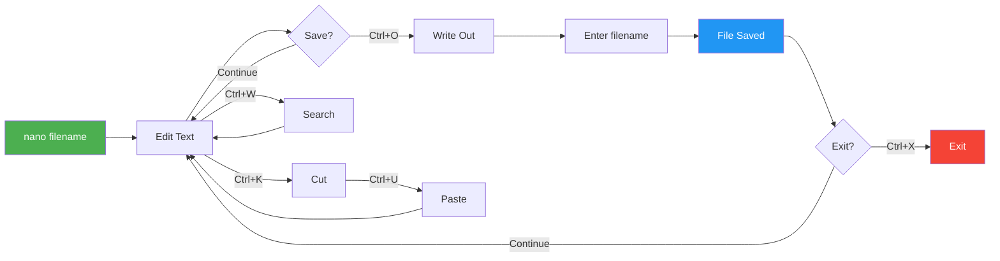
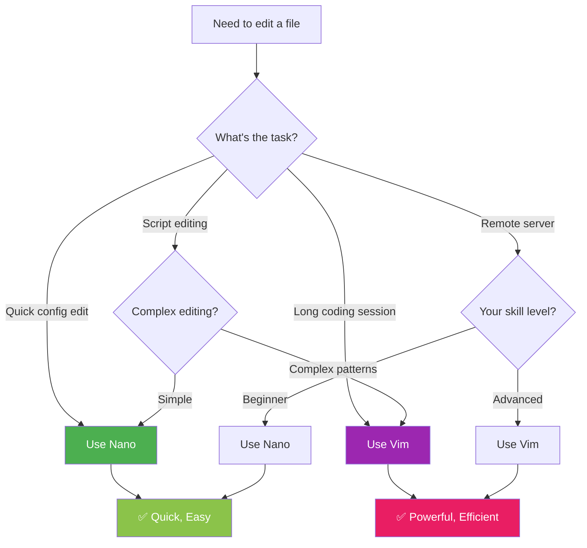

# Chapter 8: Text Editors in Termux

```
╔═══════════════════════════════════════════════════════════════════════════╗
║                                                                           ║
║   ████████╗███████╗██████╗ ███╗   ███╗██╗███╗   ██╗ █████╗ ██╗            ║
║   ╚══██╔══╝██╔════╝██╔══██╗████╗ ████║██║████╗  ██║██╔══██╗██║            ║
║      ██║   █████╗  ██████╔╝██╔████╔██║██║██╔██╗ ██║███████║██║            ║
║      ██║   ██╔══╝  ██╔══██╗██║╚██╔╝██║██║██║╚██╗██║██╔══██║██║            ║
║      ██║   ███████╗██║  ██║██║ ╚═╝ ██║██║██║ ╚████║██║  ██║███████╗       ║
║      ╚═╝   ╚══════╝╚═╝  ╚═╝╚═╝     ╚═╝╚═╝╚═╝  ╚═══╝╚═╝  ╚═╝╚══════╝       ║
║                                                                           ║
║   ████████╗███████╗███╗   ███╗██████╗ ██╗      ██████╗ ███████╗████████╗  ║
║   ╚══██╔══╝██╔════╝████╗ ████║██╔══██╗██║     ██╔═══██╗██╔════╝╚══██╔══╝  ║
║      ██║   █████╗  ██╔████╔██║██████╔╝██║     ██║   ██║███████╗   ██║     ║
║      ██║   ██╔══╝  ██║╚██╔╝██║██╔══██╗██║     ██║   ██║╚════██║   ██║     ║
║      ██║   ███████╗██║ ╚═╝ ██║██████╔╝███████╗╚██████╔╝███████║   ██║     ║
║      ╚═╝   ╚══════╝╚═╝     ╚═╝╚═════╝ ╚══════╝ ╚═════╝ ╚══════╝   ╚═╝     ║
║                                                                           ║
╠═══════════════════════════════════════════════════════════════════════════╣
║                    📝 MASTER NANO & VIM EDITORS 📝                        ║
║                        Beginner → Advanced                                ║
╚═══════════════════════════════════════════════════════════════════════════╝
```

> **Module:** 2 - Environment  
> **Chapter:** 8 of 61  
> **Duration:** 15-20 Minutes  
> **Difficulty:** ⭐ Beginner  

---

## 📋 Chapter Overview

| Section | Content |
|---------|---------|
| Video Script | Complete Hindi narration with timestamps |
| Technical Guide | Nano & Vim editors complete guide |
| Commands Reference | All shortcuts and commands |
| Practice Exercises | Hands-on editing tasks |
| Troubleshooting | Common editor issues |
| Video Assets | Thumbnail, description, tags |

---

## 🎬 VIDEO SCRIPT (Complete Hindi Narration)

```
═══════════════════════════════════════════════════════════════════════════════
TERMUX FULL COURSE - CHAPTER 8
Title: Text Editors in Termux | Nano & Vim Complete Guide | T3rmuxk1ng
Duration: 15-20 Minutes
═══════════════════════════════════════════════════════════════════════════════

[INTRO - 0:00 to 0:45]
─────────────────────────────────────────────────────────────────────────────

Namaskar Dosto! Welcome back to Termux Full Course!

Main aapka host hoon aur aaj hum seekhenge Termux mein sabse important 
topic - Text Editors.

Jab aap Termux mein kaam karte ho - scripts likhte ho, configuration 
files edit karte ho, code likhte ho - to aapko text editor ki zarurat 
padti hai. Terminal mein GUI editors nahi hote, text-based editors 
hote hain.

Aaj hum do main editors cover karenge - Nano aur Vim. Nano simple hai, 
beginners ke liye perfect. Vim powerful hai, professionals ka favorite.

Dono ko detail mein samjhein ge, shortcuts seekhein ge, aur end tak 
aap expert ban jaoge.

To chaliye shuru karte hain!

Play button dabaiye, video like karein, aur channel subscribe karein 
notification bell ke saath.

---

[SECTION 1: TEXT EDITORS KYA HAIN - 0:45 to 2:30]
─────────────────────────────────────────────────────────────────────────────

Sabse pehle samjhte hain ki text editors kya hote hain aur Termux 
mein kaun kaun se editors available hain.

Text editor ek program hai jo text files create aur edit karne ke 
liye use hota hai. Notepad jaisa - lekin terminal mein.

Termux mein multiple editors available hain:

┌─────────────────────────────────────────────────────────────────────────┐
│                    TERMUX TEXT EDITORS                                   │
├────────────────┬──────────────────┬─────────────────────────────────────┤
│ Editor         │ Difficulty       │ Best For                            │
├────────────────┼──────────────────┼─────────────────────────────────────┤
│ Nano           │ ⭐ Easy          │ Beginners, Quick edits              │
│ Vim            │ ⭐⭐⭐ Medium      │ Power users, Coding                 │
│ Micro          │ ⭐⭐ Easy-Medium  │ Modern feel, Mouse support          │
│ Emacs          │ ⭐⭐⭐⭐ Hard       │ Advanced users, Extensible          │
│ Neovim         │ ⭐⭐⭐ Medium      │ Modern Vim, Lua plugins             │
└────────────────┴──────────────────┴─────────────────────────────────────┘

Aaj hum Nano aur Vim detail mein cover karenge - ye do sabse popular 
hain aur har Linux user ko aana chahiye.

Nano beginner-friendly hai. Bottom mein shortcuts dikhate rehte hain.
Vim thoda complex hai lekin bahut powerful hai - modal editor hai.

---

[SECTION 2: NANO EDITOR INTRODUCTION - 2:30 to 4:30]
─────────────────────────────────────────────────────────────────────────────

Chaliye pehle Nano editor se shuru karte hain.

Nano ek simple, user-friendly text editor hai. Ye default Termux 
mein installed aata hai, lekin agar nahi hai to install karna bahut 
easy hai.

NANO KA MATLAB:
- Simple interface
- Bottom mein shortcuts visible
- No modes - seedha type karo
- Perfect for beginners
- Good for quick edits

Install karna:

    pkg install nano

Check karna:

    nano --version

Nano open karna simple hai:

    nano              # Opens empty file
    nano filename     # Opens specific file
    nano -m file      # With mouse support

Jab Nano open hota hai, aapko screen ke neeche shortcuts dikhenge:
^G Get Help    ^O Write Out   ^W Where Is    ^K Cut
^X Exit        ^R Read File   ^\ Replace     ^U Paste

Yahan ^ ka matlab hai Ctrl key. To ^O ka matlab Ctrl+O.

---

[SECTION 3: NANO BASIC OPERATIONS - 4:30 to 8:00]
─────────────────────────────────────────────────────────────────────────────

Ab chaliye Nano ke basic operations seekhte hain:

[FILE CREATE KARNA]

    nano myfile.txt

Ye command myfile.txt create karegi agar exist nahi karti, ya open 
karegi agar already hai.

[TYPING KARNA]

File open hone ke baad seedha type karna shuru karo. Koi mode nahi 
hai - directly type karo.

[SAVE KARNA - Ctrl+O]

Save karne ke liye:
1. Ctrl+O press karein (Write Out)
2. Filename confirm karein (Enter press karein)
3. "Wrote X lines" message aayega

Remember: O for Output, O for Write Out

[EXIT KARNA - Ctrl+X]

Exit karne ke liye Ctrl+X press karein.

Agar changes hain aur save nahi kiye:
- "Save modified buffer?" poochega
- Y for Yes, N for No, Ctrl+C for Cancel

[SEARCH KARNA - Ctrl+W]

Search karne ke liye:
1. Ctrl+W press karein (Where Is)
2. Search term type karein
3. Enter press karein
4. Next match ke liye Alt+W press karein

[REPLACE KARNA - Ctrl+\]

Find and Replace:
1. Ctrl+\ press karein
2. Search term type karein, Enter
3. Replace term type karein, Enter
4. Y for this occurrence, A for all

[CUT, COPY, PASTE]

Cut line: Ctrl+K (cut karega current line)
Paste: Ctrl+U (paste karega cut content)
Copy: No direct copy - cut then paste back

Multiple lines cut:
1. Ctrl+A (mark start)
2. Arrow keys se select karein
3. Ctrl+K (cut selection)
4. Ctrl+U (paste)

[GO TO LINE - Ctrl+_]

Specific line pe jaane ke liye:
1. Ctrl+_ (Ctrl+Shift+hyphen)
2. Line number type karein
3. Enter press karein

---

[SECTION 4: NANO SHORTCUTS SUMMARY - 8:00 to 9:30]
─────────────────────────────────────────────────────────────────────────────

Nano ke important shortcuts yaad rakhein:

┌─────────────────────────────────────────────────────────────────────────┐
│                    NANO KEYBOARD SHORTCUTS                               │
├─────────────────────────────────────────────────────────────────────────┤
│ FILE OPERATIONS                                                          │
├─────────────────────────────────────────────────────────────────────────┤
│ Ctrl+O        Save file (Write Out)                                     │
│ Ctrl+X        Exit Nano                                                  │
│ Ctrl+R        Read/Insert another file                                  │
│ Ctrl+S        Save without prompting                                    │
├─────────────────────────────────────────────────────────────────────────┤
│ EDITING                                                                  │
├─────────────────────────────────────────────────────────────────────────┤
│ Ctrl+K        Cut current line/selection                                │
│ Ctrl+U        Paste                                                     │
│ Ctrl+J        Justify paragraph                                         │
│ Ctrl+T        Spell check (if installed)                                │
│ Alt+U         Undo                                                      │
│ Alt+E         Redo                                                      │
├─────────────────────────────────────────────────────────────────────────┤
│ SEARCH & REPLACE                                                         │
├─────────────────────────────────────────────────────────────────────────┤
│ Ctrl+W        Search                                                    │
│ Alt+W         Next search match                                         │
│ Ctrl+\        Find and Replace                                          │
├─────────────────────────────────────────────────────────────────────────┤
│ NAVIGATION                                                              │
├─────────────────────────────────────────────────────────────────────────┤
│ Ctrl+A        Move to beginning of line                                 │
│ Ctrl+E        Move to end of line                                       │
│ Ctrl+_        Go to specific line number                                │
│ Ctrl+Y        Page Up                                                   │
│ Ctrl+V        Page Down                                                 │
├─────────────────────────────────────────────────────────────────────────┤
│ SELECTION                                                               │
├─────────────────────────────────────────────────────────────────────────┤
│ Alt+A         Start/End selection                                       │
│ Alt+6         Copy selection                                            │
├─────────────────────────────────────────────────────────────────────────┤
│ HELP                                                                    │
├─────────────────────────────────────────────────────────────────────────┤
│ Ctrl+G        Display help                                              │
│ F1            Display help                                              │
└─────────────────────────────────────────────────────────────────────────┘

---

[SECTION 5: VIM EDITOR INTRODUCTION - 9:30 to 12:00]
─────────────────────────────────────────────────────────────────────────────

Ab chaliye Vim editor ki baat karte hain.

VIM = Vi IMproved. Ye Unix ke classic vi editor ka improved version hai.

Vim ek MODAL editor hai. Iska matlab hai ki keyboard ke keys ka 
behavior change hota hai depending on kis mode mein ho.

Vim mein 4 main modes hain:

┌─────────────────────────────────────────────────────────────────────────┐
│                    VIM MODES                                             │
├────────────────┬────────────────────────────────────────────────────────┤
│ Mode           │ Description                                            │
├────────────────┼────────────────────────────────────────────────────────┤
│ NORMAL         │ Default mode - navigation, commands                    │
│ INSERT         │ Text typing mode - like normal editor                  │
│ COMMAND        │ Bottom commands - save, exit, search, replace          │
│ VISUAL         │ Text selection mode                                    │
└────────────────┴────────────────────────────────────────────────────────┘

Install karna:

    pkg install vim

Vim open karna:

    vim              # Opens empty
    vim filename     # Opens/creates file
    vim +10 file     # Opens at line 10
    vim +/pattern file # Opens at first pattern match

Jab Vim open hota hai, aap NORMAL mode mein hote ho.
Is mode mein aap type NAHI kar sakte - cursor move karte ho, 
commands run karte ho.

---

[SECTION 6: VIM MODES & BASIC COMMANDS - 12:00 to 15:00]
─────────────────────────────────────────────────────────────────────────────

Chaliye Vim ke modes detail mein samjhte hain:

[NORMAL MODE]

Default mode. Esc press karke kabhi bhi Normal mode mein aa sakte ho.

Navigation (Normal mode mein):
h - Left (←)
j - Down (↓)
k - Up (↑)
l - Right (→)

Word navigation:
w - Next word start
b - Previous word start
e - Current/next word end

Line navigation:
0 - Beginning of line
$ - End of line
^ - First non-blank character

File navigation:
gg - First line
G - Last line
5G - Go to line 5
:10 - Go to line 10

[INSERT MODE]

Text type karne ke liye Insert mode mein jao:

i - Insert before cursor
I - Insert at beginning of line
a - Insert after cursor
A - Insert at end of line
o - Open new line below
O - Insert at end of line (wait, O - Open new line ABOVE)
s - Delete character and insert
S - Delete line and insert

Insert mode se wapas Normal mode: Press Esc

[COMMAND MODE]

Commands run karne ke liye Normal mode mein : (colon) press karo.

:w - Save file
:q - Quit
:wq - Save and quit
:q! - Quit without saving
:x - Save and quit (same as :wq)
:e filename - Edit/open file
:r filename - Read/insert file content
:set number - Show line numbers
:set nonumber - Hide line numbers

[VISUAL MODE]

Text select karne ke liye:

v - Visual mode (character selection)
V - Visual Line mode (line selection)
Ctrl+V - Visual Block mode (block selection)

Visual mode mein arrow keys se select karo, then:
d - Delete selection
y - Copy (yank) selection
c - Change selection

---

[SECTION 7: VIM EDITING COMMANDS - 15:00 to 17:30]
─────────────────────────────────────────────────────────────────────────────

Ab Vim ke editing commands seekhte hain:

[DELETE COMMANDS]

x - Delete character under cursor
X - Delete character before cursor
dd - Delete entire line
dw - Delete word
d$ - Delete to end of line
d0 - Delete to beginning of line
dG - Delete to end of file
dgg - Delete to beginning of file
5dd - Delete 5 lines

[COPY & PASTE]

Vim mein copy ko "yank" kehte hain.

yy - Yank (copy) current line
yw - Yank word
y$ - Yank to end of line
y0 - Yank to beginning of line
5yy - Yank 5 lines

p - Paste after cursor
P - Paste before cursor

[UNDO & REDO]

u - Undo last change
Ctrl+R - Redo
. - Repeat last command

[REPLACE COMMANDS]

r - Replace single character
R - Enter Replace mode (overwrite)
c - Change (delete and enter insert mode)
cw - Change word
c$ - Change to end of line
cc - Change entire line

[SEARCH]

/pattern - Search forward
?pattern - Search backward
n - Next match
N - Previous match

[SEARCH & REPLACE]

:s/old/new/ - Replace first occurrence in line
:s/old/new/g - Replace all in line
:%s/old/new/g - Replace all in file
:%s/old/new/gc - Replace with confirmation

Example:
:%s/hello/hi/g - Saari "hello" ko "hi" mein change

---

[SECTION 8: VIM SHORTCUTS SUMMARY - 17:30 to 18:30]
─────────────────────────────────────────────────────────────────────────────

Vim shortcuts ka complete reference:

┌─────────────────────────────────────────────────────────────────────────┐
│                    VIM CHEAT SHEET                                       │
├─────────────────────────────────────────────────────────────────────────┤
│ MODE SWITCHING                                                           │
├─────────────────────────────────────────────────────────────────────────┤
│ i/I/a/A/o/O    Enter Insert mode                                        │
│ v/V/Ctrl+V     Enter Visual mode                                        │
│ :              Enter Command mode                                       │
│ Esc            Return to Normal mode                                    │
├─────────────────────────────────────────────────────────────────────────┤
│ NAVIGATION (Normal Mode)                                                │
├─────────────────────────────────────────────────────────────────────────┤
│ h/j/k/l        Left/Down/Up/Right                                       │
│ w/b/e          Word forward/back/end                                    │
│ 0/$            Line start/end                                           │
│ gg/G           File start/end                                           │
│ Ctrl+u/d       Page up/down (half)                                      │
│ Ctrl+f/b       Page forward/back (full)                                 │
├─────────────────────────────────────────────────────────────────────────┤
│ EDITING (Normal Mode)                                                   │
├─────────────────────────────────────────────────────────────────────────┤
│ dd             Delete line                                              │
│ dw             Delete word                                              │
│ x/X            Delete char under/before cursor                          │
│ yy             Copy line                                                │
│ p/P            Paste after/before cursor                                │
│ u              Undo                                                     │
│ Ctrl+r         Redo                                                     │
│ .              Repeat last command                                      │
├─────────────────────────────────────────────────────────────────────────┤
│ COMMAND MODE                                                            │
├─────────────────────────────────────────────────────────────────────────┤
│ :w             Save                                                     │
│ :q             Quit                                                     │
│ :wq or :x      Save and quit                                            │
│ :q!            Force quit without saving                                │
│ :%s/old/new/g  Replace all                                              │
│ :set number    Show line numbers                                        │
│ :syntax on     Enable syntax highlighting                               │
└─────────────────────────────────────────────────────────────────────────┘

---

[SECTION 9: NANO VS VIM COMPARISON - 18:30 to 19:30]
─────────────────────────────────────────────────────────────────────────────

Ab comparison dekhte hain:

┌─────────────────────────────────────────────────────────────────────────┐
│                    NANO VS VIM COMPARISON                                │
├─────────────────────┬─────────────────┬─────────────────────────────────┤
│ Feature             │ Nano            │ Vim                             │
├─────────────────────┼─────────────────┼─────────────────────────────────┤
│ Learning Curve      │ Easy            │ Steep                           │
│ Modes               │ None            │ Multiple modes                  │
│ Shortcuts           │ Always visible  │ Must memorize                   │
│ Mouse Support       │ Limited         │ Limited                         │
│ Syntax Highlighting │ Basic           │ Excellent                       │
│ Customization       │ Limited         │ Extensive (.vimrc)              │
│ Plugins             │ No              │ Yes, thousands                  │
│ Speed               │ Good            │ Excellent (once learned)        │
│ Best For            │ Quick edits     │ Heavy coding                    │
│ Memory Usage        │ Low             │ Low-Medium                      │
└─────────────────────┴─────────────────┴─────────────────────────────────┘

Recommendation:
- Beginner? Start with Nano
- Quick edit? Use Nano
- Heavy coding? Learn Vim
- Professional? Master Vim

---

[SECTION 10: OTHER EDITORS & SUMMARY - 19:30 to 21:00]
─────────────────────────────────────────────────────────────────────────────

Termux mein aur bhi editors hain:

[Micro Editor]
Modern terminal editor with mouse support:

    pkg install micro
    micro filename

Features:
- Mouse support built-in
- Ctrl+C/V/X shortcuts
- Multiple cursors
- Plugin support

[Emacs]
Powerful, extensible editor:

    pkg install emacs

Features:
- Unlimited customization
- Built-in Lisp interpreter
- Can do anything (email, chat, games)

[SUMMARY]

Aaj humne seekha:

✅ Text editors kya hote hain
✅ Nano editor complete guide
✅ Nano shortcuts
✅ Vim editor modes
✅ Vim commands and shortcuts
✅ Nano vs Vim comparison
✅ Other editors (Micro, Emacs)

Important commands yaad rakhein:

Nano:
- Ctrl+O: Save
- Ctrl+X: Exit
- Ctrl+W: Search
- Ctrl+K/U: Cut/Paste

Vim:
- i: Insert mode
- Esc: Normal mode
- :w: Save
- :q: Quit
- :wq: Save and quit
- dd: Delete line
- yy/p: Copy/Paste

Agar ye video helpful lagi, to:
👍 Like button press karein
🔔 Subscribe karein, notification bell on karein
💬 Koi sawal ho to comment mein poochein
📤 Share karein friends ke saath

Next Chapter mein hum seekhenge Termux Styling - colors, fonts, 
aur customization!

Thank you for watching! See you in Chapter 9!

═══════════════════════════════════════════════════════════════════════════════
```

---

## 📖 TECHNICAL GUIDE

### 1. Nano Editor Complete Guide

#### Installation

```bash
# Install Nano
pkg install nano

# Verify installation
nano --version

# Check if installed
which nano
```

#### Opening Files

```bash
# Open/create a file
nano filename.txt

# Open multiple files
nano file1.txt file2.txt

# Open with line numbers
nano -c filename.txt

# Open at specific line
nano +10 filename.txt

# Open in read-only mode
nano -v filename.txt

# Enable mouse support
nano -m filename.txt

# Smooth scrolling
nano -S filename.txt
```

#### Navigation in Nano

```
┌─────────────────────────────────────────────────────────────────────────┐
│                    NANO NAVIGATION                                       │
├─────────────────────────────────────────────────────────────────────────┤
│ CHARACTER MOVEMENT                                                       │
├─────────────────────────────────────────────────────────────────────────┤
│ Ctrl+B / ←      Move back one character                                 │
│ Ctrl+F / →      Move forward one character                              │
├─────────────────────────────────────────────────────────────────────────┤
│ WORD MOVEMENT                                                            │
├─────────────────────────────────────────────────────────────────────────┤
│ Ctrl+Space      Move forward one word                                   │
│ Alt+Space       Move back one word                                      │
├─────────────────────────────────────────────────────────────────────────┤
│ LINE MOVEMENT                                                            │
├─────────────────────────────────────────────────────────────────────────┤
│ Ctrl+A          Move to beginning of line                               │
│ Ctrl+E          Move to end of line                                     │
├─────────────────────────────────────────────────────────────────────────┤
│ PAGE MOVEMENT                                                            │
├─────────────────────────────────────────────────────────────────────────┤
│ Ctrl+Y          Page Up                                                 │
│ Ctrl+V          Page Down                                               │
├─────────────────────────────────────────────────────────────────────────┤
│ FILE MOVEMENT                                                            │
├─────────────────────────────────────────────────────────────────────────┤
│ Alt+\           Move to beginning of file                               │
│ Alt+/           Move to end of file                                     │
│ Ctrl+_          Go to specific line                                     │
└─────────────────────────────────────────────────────────────────────────┘
```

#### Editing Operations

```bash
# Cut entire line
Ctrl+K

# Cut multiple lines
# Press Ctrl+K multiple times

# Cut selection
# 1. Ctrl+A to set mark
# 2. Move cursor to select
# 3. Ctrl+K to cut

# Paste
Ctrl+U

# Copy selection (instead of cut)
Alt+6

# Justify paragraph
Ctrl+J

# Insert another file
Ctrl+R, then type filename

# Execute command and insert output
Ctrl+T
```

#### Search and Replace

```
┌─────────────────────────────────────────────────────────────────────────┐
│                    NANO SEARCH & REPLACE                                 │
├─────────────────────────────────────────────────────────────────────────┤
│ SEARCH                                                                   │
├─────────────────────────────────────────────────────────────────────────┤
│ Ctrl+W          Start search                                            │
│ Alt+W           Find next occurrence                                    │
│ Alt+Q           Find previous occurrence                                │
├─────────────────────────────────────────────────────────────────────────┤
│ SEARCH OPTIONS (at search prompt)                                        │
├─────────────────────────────────────────────────────────────────────────┤
│ Alt+B           Search backward                                         │
│ Alt+C           Case sensitive                                          │
│ Alt+R           Use regex                                               │
├─────────────────────────────────────────────────────────────────────────┤
│ REPLACE                                                                  │
├─────────────────────────────────────────────────────────────────────────┤
│ Ctrl+\          Start search & replace                                  │
│ Y               Replace this occurrence                                 │
│ N               Skip this occurrence                                    │
│ A               Replace all remaining                                   │
│ Ctrl+C          Cancel replace                                          │
└─────────────────────────────────────────────────────────────────────────┘
```

#### Nano Configuration (.nanorc)

```bash
# Create/edit .nanorc
nano ~/.nanorc
```

Example `.nanorc` configuration:

```bash
# ~/.nanorc - Nano configuration file

# Enable syntax highlighting
include /data/data/com.termux/files/usr/share/nano/*.nanorc

# Show line numbers
set linenumber

# Auto-indentation
set autoindent

# Tab size
set tabsize 4

# Convert tabs to spaces
set tabstospaces

# Smooth scrolling
set smooth

# Enable mouse support
set mouse

# Show cursor position in status bar
set const

# Word wrap
set softwrap

# Backup files before saving
set backup

# Matching brackets highlighting
set brackets "'")}]>"

# Enable smart home key
set smarthome

# Allow nano to be suspended
set suspend

# Custom keybindings (optional)
# bind ^X exit all

# Color scheme
set titlecolor brightwhite,blue
set statuscolor brightwhite,green
set keycolor brightwhite
set functioncolor green
```

### 2. Vim Editor Complete Guide

#### Installation

```bash
# Install Vim
pkg install vim

# Verify installation
vim --version

# Install enhanced version
pkg install vim-python vim-runtime

# Check if installed
which vim
```

#### Vim Modes Explained

```
┌─────────────────────────────────────────────────────────────────────────┐
│                    VIM MODES DETAILED                                    │
├─────────────────────────────────────────────────────────────────────────┤
│                                                                          │
│                          ┌──────────────┐                               │
│                          │  NORMAL MODE │ ←──────────────┐              │
│                          │   (Default)  │                 │              │
│                          └──────┬───────┘                 │              │
│                                  │                         │              │
│              ┌───────────────────┼───────────────────┐    │              │
│              │                   │                   │    │              │
│              ▼                   ▼                   ▼    │              │
│     ┌────────────────┐  ┌────────────────┐  ┌────────────┴──────────┐   │
│     │  INSERT MODE   │  │  COMMAND MODE  │  │     VISUAL MODE       │   │
│     │                │  │                │  │                       │   │
│     │ i, I, a, A,    │  │ : (colon)      │  │ v, V, Ctrl+V         │   │
│     │ o, O, s, S     │  │                │  │                       │   │
│     │                │  │ :w, :q, :wq    │  │ Text selection        │   │
│     │ Type text      │  │ :%s/old/new/g  │  │ d, y, c operations   │   │
│     │ normally       │  │ :set options   │  │                       │   │
│     │                │  │                │  │                       │   │
│     │ Press Esc to   │  │ Press Esc to   │  │ Press Esc to         │   │
│     │ return to      │  │ return to      │  │ return to            │   │
│     │ Normal mode    │  │ Normal mode    │  │ Normal mode          │   │
│     └────────────────┘  └────────────────┘  └───────────────────────┘   │
│                                                                          │
└─────────────────────────────────────────────────────────────────────────┘
```

#### Normal Mode Commands

**Navigation Commands:**

```
┌─────────────────────────────────────────────────────────────────────────┐
│                    VIM NAVIGATION (NORMAL MODE)                          │
├─────────────────────────────────────────────────────────────────────────┤
│ CHARACTER MOVEMENT                                                       │
├─────────────────────────────────────────────────────────────────────────┤
│ h               Left one character                                      │
│ j               Down one line                                           │
│ k               Up one line                                             │
│ l               Right one character                                     │
│ ← ↓ ↑ →         Arrow keys (alternative)                                │
├─────────────────────────────────────────────────────────────────────────┤
│ WORD MOVEMENT                                                            │
├─────────────────────────────────────────────────────────────────────────┤
│ w               Next word start                                         │
│ W               Next WORD start (WORD = non-blank chars)                │
│ b               Previous word start                                     │
│ B               Previous WORD start                                     │
│ e               End of current/next word                                │
│ E               End of current/next WORD                                │
├─────────────────────────────────────────────────────────────────────────┤
│ LINE MOVEMENT                                                            │
├─────────────────────────────────────────────────────────────────────────┤
│ 0               Beginning of line                                       │
│ ^               First non-blank character                               │
│ $               End of line                                             │
│ |               Go to column n (e.g., 10|)                              │
├─────────────────────────────────────────────────────────────────────────┤
│ FILE MOVEMENT                                                            │
├─────────────────────────────────────────────────────────────────────────┤
│ gg              Go to first line                                        │
│ G               Go to last line                                         │
│ nG              Go to line n (e.g., 10G)                                │
│ :n              Go to line n (e.g., :10)                                │
│ Ctrl+g          Show file info and current line                         │
├─────────────────────────────────────────────────────────────────────────┤
│ SCREEN MOVEMENT                                                          │
├─────────────────────────────────────────────────────────────────────────┤
│ Ctrl+f          Page down (forward)                                     │
│ Ctrl+b          Page up (backward)                                      │
│ Ctrl+d          Half page down                                          │
│ Ctrl+u          Half page up                                            │
│ H               Top of screen (High)                                    │
│ M               Middle of screen                                        │
│ L               Bottom of screen (Low)                                  │
├─────────────────────────────────────────────────────────────────────────┤
│ MARKERS                                                                  │
├─────────────────────────────────────────────────────────────────────────┤
│ ma              Set marker 'a'                                          │
│ 'a              Jump to marker 'a'                                      │
│ '.              Jump to last edit                                       │
└─────────────────────────────────────────────────────────────────────────┘
```

**Editing Commands:**

```
┌─────────────────────────────────────────────────────────────────────────┐
│                    VIM EDITING (NORMAL MODE)                             │
├─────────────────────────────────────────────────────────────────────────┤
│ DELETE COMMANDS                                                          │
├─────────────────────────────────────────────────────────────────────────┤
│ x               Delete character under cursor                            │
│ X               Delete character before cursor                           │
│ dd              Delete entire line                                       │
│ dw              Delete word                                              │
│ d$ or D         Delete to end of line                                   │
│ d0              Delete to beginning of line                              │
│ d^              Delete to first non-blank                                │
│ dG              Delete to end of file                                    │
│ dgg             Delete to beginning of file                              │
│ dt[char]        Delete until character                                   │
│ df[char]        Delete through character                                 │
│ ndd             Delete n lines (e.g., 5dd)                               │
├─────────────────────────────────────────────────────────────────────────┤
│ COPY (YANK) COMMANDS                                                     │
├─────────────────────────────────────────────────────────────────────────┤
│ yy              Yank (copy) current line                                │
│ Y               Yank current line (same as yy)                          │
│ yw              Yank word                                               │
│ y$              Yank to end of line                                     │
│ y0              Yank to beginning of line                               │
│ yG              Yank to end of file                                     │
│ ygg             Yank to beginning of file                               │
│ nyy             Yank n lines (e.g., 5yy)                                │
├─────────────────────────────────────────────────────────────────────────┤
│ PASTE COMMANDS                                                           │
├─────────────────────────────────────────────────────────────────────────┤
│ p               Paste after cursor                                      │
│ P               Paste before cursor                                     │
│ ]p              Paste with auto-indent                                  │
├─────────────────────────────────────────────────────────────────────────┤
│ REPLACE COMMANDS                                                         │
├─────────────────────────────────────────────────────────────────────────┤
│ r               Replace single character                                │
│ R               Enter Replace mode (overwrite)                          │
│ ~               Toggle case of character                                │
├─────────────────────────────────────────────────────────────────────────┤
│ CHANGE COMMANDS                                                          │
├─────────────────────────────────────────────────────────────────────────┤
│ cc              Change entire line                                      │
│ cw              Change word                                             │
│ c$ or C         Change to end of line                                   │
│ c0              Change to beginning of line                             │
│ ct[char]        Change until character                                  │
├─────────────────────────────────────────────────────────────────────────┤
│ UNDO/REDO                                                                │
├─────────────────────────────────────────────────────────────────────────┤
│ u               Undo last change                                        │
│ Ctrl+r          Redo                                                   │
│ U               Restore line (undo all changes on line)                 │
│ .               Repeat last command                                     │
├─────────────────────────────────────────────────────────────────────────┤
│ JOIN/SPLIT                                                               │
├─────────────────────────────────────────────────────────────────────────┤
│ J               Join current line with next                              │
│ gJ             Join without space                                       │
└─────────────────────────────────────────────────────────────────────────┘
```

#### Insert Mode

```
┌─────────────────────────────────────────────────────────────────────────┐
│                    VIM INSERT MODE                                       │
├─────────────────────────────────────────────────────────────────────────┤
│ ENTERING INSERT MODE                                                     │
├─────────────────────────────────────────────────────────────────────────┤
│ i               Insert before cursor                                    │
│ I               Insert at beginning of line                             │
│ a               Insert after cursor (append)                            │
│ A               Insert at end of line                                   │
│ o               Open new line below                                     │
│ O               Open new line above                                     │
│ s               Substitute character (delete and insert)                │
│ S               Substitute line (delete line and insert)                │
│ gi              Insert at last insert position                          │
├─────────────────────────────────────────────────────────────────────────┤
│ INSERT MODE SHORTCUTS                                                    │
├─────────────────────────────────────────────────────────────────────────┤
│ Ctrl+h          Delete previous character                               │
│ Ctrl+w          Delete previous word                                    │
│ Ctrl+u          Delete to beginning of line                             │
│ Ctrl+t          Indent line                                             │
│ Ctrl+d          Unindent line                                           │
│ Ctrl+n          Autocomplete (next match)                               │
│ Ctrl+p          Autocomplete (previous match)                           │
│ Ctrl+o          Execute one normal command, then return                 │
│ Esc             Exit insert mode                                        │
└─────────────────────────────────────────────────────────────────────────┘
```

#### Command Mode Commands

```
┌─────────────────────────────────────────────────────────────────────────┐
│                    VIM COMMAND MODE                                      │
├─────────────────────────────────────────────────────────────────────────┤
│ FILE OPERATIONS                                                          │
├─────────────────────────────────────────────────────────────────────────┤
│ :w              Save file                                               │
│ :w filename     Save as filename                                        │
│ :w!              Force save (readonly)                                  │
│ :q              Quit                                                    │
│ :q!             Force quit (discard changes)                            │
│ :wq              Save and quit                                          │
│ :x              Save and quit (only if modified)                        │
│ :ZZ              Save and quit                                          │
│ :ZQ              Quit without saving                                    │
│ :e filename      Edit/open another file                                 │
│ :e!              Reload current file (discard changes)                  │
│ :r filename      Read/insert file content                               │
│ :r !command      Insert command output                                  │
│ :sav filename    Save as and switch to new file                         │
├─────────────────────────────────────────────────────────────────────────┤
│ NAVIGATION                                                               │
├─────────────────────────────────────────────────────────────────────────┤
│ :n              Go to line n                                            │
│ :$              Go to last line                                         │
│ :1              Go to first line                                        │
├─────────────────────────────────────────────────────────────────────────┤
│ SEARCH & REPLACE                                                         │
├─────────────────────────────────────────────────────────────────────────┤
│ :/pattern       Search forward                                          │
│ :?pattern       Search backward                                         │
│ :n              Next match                                              │
│ :N              Previous match                                          │
│ :s/old/new/     Replace first in line                                   │
│ :s/old/new/g    Replace all in line                                     │
│ :%s/old/new/g   Replace all in file                                     │
│ :%s/old/new/gc  Replace with confirmation                               │
│ :%s/old/new/gi  Replace (case insensitive)                              │
│ :noh            Clear search highlighting                               │
├─────────────────────────────────────────────────────────────────────────┤
│ OPTIONS                                                                  │
├─────────────────────────────────────────────────────────────────────────┤
│ :set number     Show line numbers                                       │
│ :set nonumber   Hide line numbers                                       │
│ :set relativenumber  Show relative line numbers                         │
│ :set autoindent Enable auto-indentation                                 │
│ :set tabstop=4  Set tab width to 4                                      │
│ :set expandtab  Convert tabs to spaces                                  │
│ :syntax on      Enable syntax highlighting                              │
│ :set wrap        Enable line wrapping                                   │
│ :set nowrap      Disable line wrapping                                  │
│ :set hlsearch    Highlight search results                               │
│ :set incsearch   Incremental search                                     │
│ :set ignorecase  Case insensitive search                                │
│ :set smartcase   Smart case search                                      │
│ :set paste       Paste mode (no auto-indent)                            │
│ :set nopaste     Exit paste mode                                        │
├─────────────────────────────────────────────────────────────────────────┤
│ WINDOWS                                                                  │
├─────────────────────────────────────────────────────────────────────────┤
│ :split          Horizontal split                                        │
│ :vsplit         Vertical split                                          │
│ :new            New horizontal window                                   │
│ :vnew           New vertical window                                     │
│ :close          Close current window                                    │
│ :only           Close all other windows                                 │
├─────────────────────────────────────────────────────────────────────────┤
│ BUFFERS                                                                  │
├─────────────────────────────────────────────────────────────────────────┤
│ :buffers        List all buffers                                        │
│ :bn             Next buffer                                             │
│ :bp             Previous buffer                                         │
│ :bd             Delete buffer                                           │
│ :b1             Switch to buffer 1                                      │
└─────────────────────────────────────────────────────────────────────────┘
```

#### Visual Mode

```
┌─────────────────────────────────────────────────────────────────────────┐
│                    VIM VISUAL MODE                                       │
├─────────────────────────────────────────────────────────────────────────┤
│ ENTERING VISUAL MODE                                                     │
├─────────────────────────────────────────────────────────────────────────┤
│ v               Visual mode (character-wise)                            │
│ V               Visual Line mode (line-wise)                            │
│ Ctrl+v          Visual Block mode (block-wise)                          │
│ gv              Reselect last selection                                 │
├─────────────────────────────────────────────────────────────────────────┤
│ OPERATIONS ON SELECTION                                                  │
├─────────────────────────────────────────────────────────────────────────┤
│ d               Delete selection                                        │
│ y               Yank (copy) selection                                   │
│ c               Change selection                                        │
│ x               Delete selection                                        │
│ >               Indent selection                                        │
│ <               Unindent selection                                      │
│ ~               Toggle case                                             │
│ u               Convert to lowercase                                    │
│ U               Convert to uppercase                                    │
│ :               Run command on selection                                │
├─────────────────────────────────────────────────────────────────────────┤
│ VISUAL BLOCK SPECIAL                                                     │
├─────────────────────────────────────────────────────────────────────────┤
│ I               Insert at beginning of block                            │
│ A               Insert at end of block                                  │
│ r               Replace all with character                              │
└─────────────────────────────────────────────────────────────────────────┘
```

#### Search and Replace

```bash
# Basic search
/pattern          # Search forward
?pattern          # Search backward

# Search navigation
n                 # Next match
N                 # Previous match

# Search with options
/\<word\>         # Search whole word only
/^pattern         # Search at line start
/pattern$         # Search at line end
/[0-9]            # Search for digits (regex)

# Replace examples
:s/foo/bar/       # Replace first foo with bar in line
:s/foo/bar/g      # Replace all foo with bar in line
:%s/foo/bar/g     # Replace all foo with bar in file
:%s/foo/bar/gc    # Replace with confirmation
:%s/foo/bar/gi    # Case insensitive replace
:%s/\<foo\>/bar/g # Replace whole word only
:%s/^/    /g      # Add 4 spaces to beginning of all lines
:%s/$/;/g         # Add ; to end of all lines
:%s/\n//g         # Remove all newlines (join lines)
:%s/\s\+$//g      # Remove trailing whitespace
```

#### Vim Configuration (.vimrc)

```bash
# Create/edit .vimrc
vim ~/.vimrc
```

Example `.vimrc` configuration:

```vim
" ~/.vimrc - Vim configuration file
" ============================================================

" ----- Basic Settings -----
set nocompatible          " Use Vim settings, not Vi
set encoding=utf-8        " Set encoding
set fileencoding=utf-8    " File encoding

" ----- Appearance -----
syntax on                 " Enable syntax highlighting
set background=dark       " Dark background
set number                " Show line numbers
set relativenumber        " Relative line numbers
set cursorline            " Highlight current line
set showcmd               " Show command in bottom bar
set showmode              " Show current mode
set wildmenu              " Visual autocomplete for command menu
set showmatch             " Highlight matching [{()}]
set ruler                 " Show cursor position
set scrolloff=5           " Keep 5 lines above/below cursor

" ----- Indentation -----
set autoindent            " Auto-indent new lines
set smartindent           " Smart auto-indenting
set tabstop=4             " Number of spaces per tab
set shiftwidth=4          " Number of spaces for auto-indent
set softtabstop=4         " Number of spaces in tab when editing
set expandtab             " Convert tabs to spaces
set backspace=indent,eol,start  " Backspace behavior

" ----- Search -----
set incsearch             " Search as characters are entered
set hlsearch              " Highlight matches
set ignorecase            " Ignore case when searching
set smartcase             " Unless uppercase is used

" ----- Editing -----
set mouse=a               " Enable mouse support
set clipboard=unnamedplus " Use system clipboard
set undolevels=1000       " Number of undo levels
set updatecount=100       " Save swap file after 100 characters
set updatetime=1000       " Save swap file after 1 second
set wrap                  " Enable line wrapping
set linebreak             " Wrap at word boundaries
set breakindent           " Preserve indentation in wrapped lines
set splitbelow            " Horizontal split below
set splitright            " Vertical split right

" ----- Backup & Swap -----
set nobackup              " Don't create backup files
set nowritebackup         " Don't create backup before writing
set noswapfile            " Don't create swap files

" ----- Key Mappings -----
" Leader key
let mapleader = " "

" Quick save
nnoremap <Leader>w :w<CR>
nnoremap <Leader>q :q<CR>
nnoremap <Leader>x :x<CR>

" Clear search highlighting
nnoremap <Leader>h :noh<CR>

" Navigate splits
nnoremap <C-h> <C-w>h
nnoremap <C-j> <C-w>j
nnoremap <C-k> <C-w>k
nnoremap <C-l> <C-w>l

" Resize splits
nnoremap <Leader>= :vertical resize +5<CR>
nnoremap <Leader>- :vertical resize -5<CR>

" Buffer navigation
nnoremap <Leader>bn :bnext<CR>
nnoremap <Leader>bp :bprevious<CR>
nnoremap <Leader>bd :bdelete<CR>

" Move lines up/down
nnoremap <A-j> :m .+1<CR>==
nnoremap <A-k> :m .-2<CR>==
vnoremap <A-j> :m '>+1<CR>gv=gv
vnoremap <A-k> :m '<-2<CR>gv=gv

" Better tabbing
vnoremap < <gv
vnoremap > >gv

" ----- Status Line -----
set statusline=
set statusline+=\ %F          " Filename
set statusline+=\ %m          " Modified flag
set statusline+=\ %r          " Read-only flag
set statusline+=\ %=          " Right side
set statusline+=\ %y          " Filetype
set statusline+=\ [%l:%c]     " Line and column
set statusline+=\ [%L]        " Total lines

" ----- File Type Specific -----
" Python
autocmd FileType python setlocal tabstop=4 shiftwidth=4 expandtab

" JavaScript/TypeScript
autocmd FileType javascript,typescript setlocal tabstop=2 shiftwidth=2

" HTML/CSS
autocmd FileType html,css setlocal tabstop=2 shiftwidth=2

" ----- Functions -----
" Remove trailing whitespace on save
autocmd BufWritePre * :%s/\s\+$//e

" Return to last edit position when opening files
autocmd BufReadPost *
     \ if line("'\"") > 0 && line("'\"") <= line("$") |
     \   exe "normal! g`\"" |
     \ endif

" ----- Abbreviations -----
iabbrev adn and
iabbrev teh the
iabbrev @@ user@example.com
```

### 3. Comparison: Nano vs Vim

```
┌─────────────────────────────────────────────────────────────────────────┐
│                    NANO VS VIM DETAILED COMPARISON                       │
├─────────────────────┬─────────────────┬─────────────────────────────────┤
│ Aspect              │ Nano            │ Vim                             │
├─────────────────────┼─────────────────┼─────────────────────────────────┤
│ LEARNING CURVE                                                            │
├─────────────────────┼─────────────────┼─────────────────────────────────┤
│ Time to basic use   │ 5 minutes       │ 1-2 hours                       │
│ Time to proficient  │ 1 day           │ 1-2 weeks                       │
│ Time to master      │ 1 week          │ Months/Years                    │
│ Mental model        │ Like Notepad    │ Modal editing                   │
├─────────────────────┼─────────────────┼─────────────────────────────────┤
│ INTERFACE                                                                 │
├─────────────────────┼─────────────────┼─────────────────────────────────┤
│ Help                │ Always visible  │ :help command                   │
│ Shortcuts           │ Shown at bottom │ Must memorize                   │
│ Modes               │ Single mode     │ Multiple modes                  │
├─────────────────────┼─────────────────┼─────────────────────────────────┤
│ FEATURES                                                                  │
├─────────────────────┼─────────────────┼─────────────────────────────────┤
│ Syntax highlighting │ Basic           │ Advanced                        │
│ Multiple files      │ Yes (limited)   │ Yes (buffers, splits)           │
│ Search/Replace      │ Basic           │ Advanced (regex)                │
│ Undo/Redo           │ Single undo     │ Multiple undo levels            │
│ Macros              │ No              │ Yes                             │
│ Plugins             │ No              │ Extensive                       │
│ Scripting           │ No              │ Vimscript, Lua                  │
├─────────────────────┼─────────────────┼─────────────────────────────────┤
│ PERFORMANCE                                                               │
├─────────────────────┼─────────────────┼─────────────────────────────────┤
│ Startup time        │ Very fast       │ Fast                            │
│ Memory usage        │ Very low        │ Low                             │
│ Large files         │ Good            │ Excellent                       │
├─────────────────────┼─────────────────┼─────────────────────────────────┤
│ CUSTOMIZATION                                                             │
├─────────────────────┼─────────────────┼─────────────────────────────────┤
│ Config file         │ .nanorc         │ .vimrc                          │
│ Options             │ Limited         │ Extensive                       │
│ Theming             │ Basic           │ Full color schemes              │
├─────────────────────┼─────────────────┼─────────────────────────────────┤
│ BEST USE CASES                                                            │
├─────────────────────┼─────────────────┼─────────────────────────────────┤
│ Quick edits         │ ⭐⭐⭐⭐⭐        │ ⭐⭐⭐                           │
│ Config files        │ ⭐⭐⭐⭐⭐        │ ⭐⭐⭐⭐                          │
│ Programming         │ ⭐⭐            │ ⭐⭐⭐⭐⭐                        │
│ Long sessions       │ ⭐⭐            │ ⭐⭐⭐⭐⭐                        │
│ Remote servers      │ ⭐⭐⭐⭐         │ ⭐⭐⭐⭐⭐                        │
│ Learning            │ ⭐⭐⭐⭐⭐        │ ⭐⭐                            │
└─────────────────────┴─────────────────┴─────────────────────────────────┘
```

### 4. Other Editors

#### Micro Editor

```bash
# Install Micro
pkg install micro

# Open file
micro filename.txt

# Key features
# - Ctrl+C/V/X for copy/paste/cut
# - Ctrl+S to save
# - Ctrl+Q to quit
# - Mouse support by default
# - Multiple cursors (Alt+click)
# - Plugin support
```

Micro configuration:

```bash
# Create config directory
mkdir -p ~/.config/micro

# Create settings file
cat > ~/.config/micro/settings.json << 'EOF'
{
    "autosave": 60,
    "colorscheme": "monokai",
    "cursorline": true,
    "diffgutter": true,
    "eofnewline": true,
    "fastdirty": true,
    "fileformat": "unix",
    "ignorecase": true,
    "indentchar": " ",
    "keepautoindent": true,
    "matchbrace": true,
    "mkparents": true,
    "rmtrailingws": true,
    "savecursor": true,
    "saveundo": true,
    "scrollmargin": 5,
    "scrollspeed": 2,
    "softwrap": true,
    "splitbottom": true,
    "splitright": true,
    "statusformatl": "$(filename) $(modified)($(line),$(col))",
    "statusformatr": "$(bind:ToggleKeyMenu): bindings, $(bind:ToggleHelp): help",
    "syntax": true,
    "tabhighlight": true,
    "tabsize": 4,
    "tabstospaces": true
}
EOF
```

#### Emacs

```bash
# Install Emacs
pkg install emacs

# Open Emacs
emacs

# Open file
emacs filename.txt

# Basic Emacs commands
# Ctrl+x Ctrl+f - Find/open file
# Ctrl+x Ctrl+s - Save file
# Ctrl+x Ctrl+c - Quit Emacs
# Ctrl+x Ctrl+w - Save as
# Ctrl+s - Search forward
# Ctrl+r - Search backward
# Ctrl+k - Cut line
# Ctrl+y - Paste
# Ctrl+_ - Undo
# Ctrl+g - Cancel command
```

#### Neovim

```bash
# Install Neovim
pkg install neovim

# Open file
nvim filename.txt

# Neovim is a modern fork of Vim
# - Better default settings
# - Built-in LSP support
# - Lua scripting
# - Modern plugin architecture
# - Compatible with most Vim commands
```

---

## 📋 COMMANDS REFERENCE

### Nano Quick Reference Card

```
┌─────────────────────────────────────────────────────────────────────────┐
│                         NANO QUICK REFERENCE                             │
├─────────────────────────────────────────────────────────────────────────┤
│                                                                          │
│  FILE                    │  EDITING                 │  NAVIGATION       │
│  ────                    │  ────────                │  ──────────       │
│  Ctrl+O  Save            │  Ctrl+K  Cut line        │  Ctrl+A  Line     │
│  Ctrl+X  Exit            │  Ctrl+U  Paste           │          start    │
│  Ctrl+R  Read file       │  Alt+6   Copy            │  Ctrl+E  Line     │
│  Ctrl+S  Quick save      │  Alt+U   Undo            │          end      │
│                          │  Alt+E   Redo            │  Ctrl+_  Go to    │
│  SEARCH                  │                          │          line     │
│  ──────                  │  SELECTION               │  Ctrl+Y  Page     │
│  Ctrl+W  Search          │  ──────────              │          up       │
│  Alt+W   Next match      │  Alt+A   Start/End       │  Ctrl+V  Page     │
│  Ctrl+\  Replace         │          selection       │          down     │
│                          │  Alt+6   Copy            │                   │
│                          │  Ctrl+K  Cut             │  Ctrl+G  Help     │
│                                                                          │
└─────────────────────────────────────────────────────────────────────────┘
```

### Vim Quick Reference Card

```
┌─────────────────────────────────────────────────────────────────────────┐
│                         VIM QUICK REFERENCE                              │
├─────────────────────────────────────────────────────────────────────────┤
│                                                                          │
│  MODES                   │  NAVIGATION             │  EDITING           │
│  ─────                   │  ──────────             │  ───────           │
│  i     Insert mode       │  h j k l  ←↓↑→          │  dd  Delete line   │
│  v     Visual mode       │  w  b     Word          │  yy  Copy line     │
│  :     Command mode      │  0  $     Line          │  p   Paste         │
│  Esc   Normal mode       │  gg G     File          │  u   Undo          │
│                          │  :n       Line n        │  x   Delete char   │
│  COMMAND MODE            │                          │                    │
│  ────────────            │  SEARCH                 │  REPLACE           │
│  :w   Save               │  ──────                 │  ───────           │
│  :q   Quit               │  /pattern  Forward      │  r   Replace char  │
│  :wq  Save & quit        │  ?pattern  Backward     │  R   Replace mode  │
│  :q!  Force quit         │  n    Next match        │  cw  Change word   │
│  :x   Save & quit        │  N    Prev match        │  cc  Change line   │
│                                                                          │
│  INSERT MODE: i I a A o O    VISUAL: v V Ctrl+v                        │
│                                                                          │
└─────────────────────────────────────────────────────────────────────────┘
```

### All Nano Shortcuts

| Shortcut | Action |
|----------|--------|
| **File Operations** | |
| Ctrl+O | Write Out (Save) |
| Ctrl+X | Exit |
| Ctrl+R | Read/Insert file |
| Ctrl+S | Save without prompt |
| **Navigation** | |
| Ctrl+A | Move to beginning of line |
| Ctrl+E | Move to end of line |
| Ctrl+Y | Page Up |
| Ctrl+V | Page Down |
| Ctrl+_ | Go to line number |
| Alt+\ | Go to beginning of file |
| Alt+/ | Go to end of file |
| **Editing** | |
| Ctrl+K | Cut current line |
| Ctrl+U | Paste |
| Alt+6 | Copy |
| Ctrl+J | Justify paragraph |
| Alt+U | Undo |
| Alt+E | Redo |
| **Search** | |
| Ctrl+W | Search |
| Alt+W | Next search match |
| Alt+Q | Previous search match |
| Ctrl+\ | Find and Replace |
| **Selection** | |
| Alt+A | Start/End selection |
| Alt+Shift+6 | Copy selection |
| **Other** | |
| Ctrl+G | Help |
| Ctrl+T | Spell check |
| Ctrl+C | Show cursor position |

### All Vim Commands

| Command | Action |
|---------|--------|
| **Modes** | |
| i | Insert before cursor |
| I | Insert at line beginning |
| a | Insert after cursor |
| A | Insert at line end |
| o | New line below |
| O | New line above |
| v | Visual mode |
| V | Visual Line mode |
| Ctrl+v | Visual Block mode |
| Esc | Return to Normal mode |
| **Navigation** | |
| h, j, k, l | Left, Down, Up, Right |
| w | Next word start |
| b | Previous word start |
| e | Word end |
| 0 | Line beginning |
| $ | Line end |
| ^ | First non-blank |
| gg | First line |
| G | Last line |
| nG or :n | Go to line n |
| Ctrl+f | Page down |
| Ctrl+b | Page up |
| Ctrl+d | Half page down |
| Ctrl+u | Half page up |
| H | Screen top |
| M | Screen middle |
| L | Screen bottom |
| **Editing** | |
| x | Delete character |
| X | Delete previous character |
| dd | Delete line |
| dw | Delete word |
| d$ or D | Delete to line end |
| d0 | Delete to line start |
| yy | Copy line |
| yw | Copy word |
| y$ | Copy to line end |
| p | Paste after |
| P | Paste before |
| u | Undo |
| Ctrl+r | Redo |
| r | Replace character |
| R | Replace mode |
| cw | Change word |
| cc | Change line |
| c$ or C | Change to line end |
| ~ | Toggle case |
| J | Join lines |
| **Search** | |
| /pattern | Search forward |
| ?pattern | Search backward |
| n | Next match |
| N | Previous match |
| * | Search word under cursor |
| # | Search word backward |
| **Replace** | |
| :s/old/new/ | Replace first in line |
| :s/old/new/g | Replace all in line |
| :%s/old/new/g | Replace all in file |
| :%s/old/new/gc | Replace with confirmation |
| **Command Mode** | |
| :w | Save |
| :q | Quit |
| :wq or :x | Save and quit |
| :q! | Quit without saving |
| :e file | Edit file |
| :r file | Read/insert file |
| :set number | Show line numbers |
| :syntax on | Enable highlighting |
| :noh | Clear search highlight |
| **Visual Mode** | |
| d | Delete selection |
| y | Copy selection |
| c | Change selection |
| > | Indent |
| < | Unindent |
| u | Lowercase |
| U | Uppercase |

---

## 💻 PRACTICE EXERCISES

### Exercise 1: Nano Basics

```bash
# Task: Learn basic Nano operations

# Step 1: Create a new file
nano practice1.txt

# Step 2: Type the following content:
"""
Hello, this is my first file in Nano!
Line 2: Learning Nano editor
Line 3: This is line number three
Line 4: Termux is awesome
Line 5: Keep practicing!
"""

# Step 3: Save the file (Ctrl+O, then Enter)
# Step 4: Exit Nano (Ctrl+X)

# Step 5: Reopen the file
nano practice1.txt

# Step 6: Search for "Learning" (Ctrl+W, type "Learning", Enter)
# Step 7: Replace "awesome" with "amazing" (Ctrl+\, "awesome", "amazing", Y)
# Step 8: Go to line 3 (Ctrl+_, type 3, Enter)
# Step 9: Cut line 3 (Ctrl+K)
# Step 10: Paste it at the end (go to end, Ctrl+U)
# Step 11: Save and exit

# Verify
cat practice1.txt
```

### Exercise 2: Vim Basics

```bash
# Task: Learn basic Vim operations

# Step 1: Create a new file
vim practice2.txt

# Step 2: Press 'i' to enter Insert mode
# Step 3: Type the following:
"""
Vim Practice File
=================
1. First item
2. Second item
3. Third item
4. Fourth item
5. Fifth item
"""

# Step 4: Press Esc to return to Normal mode
# Step 5: Type :w and press Enter to save
# Step 6: Practice navigation (h, j, k, l)
# Step 7: Go to first line (gg)
# Step 8: Go to last line (G)
# Step 9: Go to line 3 (:3)
# Step 10: Delete line 3 (dd)
# Step 11: Undo (u)
# Step 12: Copy line 1 (yy)
# Step 13: Paste it at end (G, then p)
# Step 14: Search for "item" (/item, Enter)
# Step 15: Go to next match (n)
# Step 16: Save and quit (:wq)

# Verify
cat practice2.txt
```

### Exercise 3: Nano Configuration

```bash
# Task: Configure Nano with .nanorc

# Step 1: Create .nanorc file
nano ~/.nanorc

# Step 2: Add the following configuration:
"""
# Nano Configuration
set autoindent
set constantshow
set linenumbers
set mouse
set softwrap
set tabsize 4
set tabstospaces

# Include syntax highlighting
include /data/data/com.termux/files/usr/share/nano/*.nanorc
"""

# Step 3: Save and exit

# Step 4: Test the configuration
nano test_nano_config.txt

# Notice:
# - Line numbers on left
# - Soft wrap enabled
# - Mouse support active
```

### Exercise 4: Vim Configuration

```bash
# Task: Configure Vim with .vimrc

# Step 1: Create .vimrc file
vim ~/.vimrc

# Step 2: Enter Insert mode (i) and add:
"""
" Vim Configuration
syntax on
set number
set autoindent
set tabstop=4
set shiftwidth=4
set expandtab
set hlsearch
set incsearch
set ignorecase
set smartcase
"""

# Step 3: Save and exit (:wq)

# Step 4: Test the configuration
vim test_vim_config.txt

# Type some content and notice:
# - Line numbers visible
# - Syntax highlighting active
# - Tab inserts 4 spaces
```

### Exercise 5: Create a Script with Nano

```bash
# Task: Create a Python script using Nano

# Step 1: Create script file
nano hello.py

# Step 2: Type the following Python code:
"""
#!/usr/bin/env python3

def greet(name):
    \"\"\"Greet the user.\"\"\"
    print(f"Hello, {name}!")
    print("Welcome to Termux!")

def main():
    name = input("Enter your name: ")
    greet(name)

if __name__ == "__main__":
    main()
"""

# Step 3: Save and exit (Ctrl+O, Enter, Ctrl+X)

# Step 4: Make executable
chmod +x hello.py

# Step 5: Run the script
python hello.py

# Step 6: Test syntax highlighting
nano hello.py
# Notice Python syntax is highlighted
```

### Exercise 6: Create a Script with Vim

```bash
# Task: Create a Bash script using Vim

# Step 1: Create script file
vim backup.sh

# Step 2: Press 'i' for Insert mode and type:
"""
#!/bin/bash

# Simple backup script

BACKUP_DIR="$HOME/backups"
DATE=$(date +%Y%m%d_%H%M%S)

# Create backup directory
mkdir -p "$BACKUP_DIR"

# Backup home directory
echo "Creating backup..."
tar -czf "$BACKUP_DIR/backup_$DATE.tar.gz" -C "$HOME" .

echo "Backup created: $BACKUP_DIR/backup_$DATE.tar.gz"
echo "Done!"
"""

# Step 3: Press Esc, then :wq to save and quit

# Step 4: Make executable
chmod +x backup.sh

# Step 5: View the file
cat backup.sh

# Step 6: Edit with Vim and test syntax highlighting
vim backup.sh
# Notice shell syntax is highlighted
```

### Exercise 7: Vim Search and Replace

```bash
# Task: Practice Vim search and replace

# Step 1: Create a test file
vim replace_test.txt

# Step 2: Enter Insert mode (i) and type:
"""
The quick brown fox jumps over the lazy dog.
The quick brown fox is very quick.
The fox is quicker than the dog.
The dog is not quick at all.
Quick thinking wins the game.
"""

# Step 3: Return to Normal mode (Esc)

# Step 4: Save (:w)

# Step 5: Replace all "quick" with "fast"
# Type: :%s/quick/fast/g
# Press Enter

# Step 6: Undo (u)

# Step 7: Replace with confirmation
# Type: :%s/quick/fast/gc
# Press Enter
# Press 'y' or 'n' for each occurrence

# Step 8: Save and quit (:wq)
```

### Exercise 8: Advanced Vim Operations

```bash
# Task: Practice advanced Vim operations

# Step 1: Create a test file
vim advanced_test.txt

# Step 2: Enter Insert mode and type 10 lines:
"""
Line 1: First line of text
Line 2: Second line of text
Line 3: Third line of text
Line 4: Fourth line of text
Line 5: Fifth line of text
Line 6: Sixth line of text
Line 7: Seventh line of text
Line 8: Eighth line of text
Line 9: Ninth line of text
Line 10: Tenth line of text
"""

# Step 3: Practice these operations:
# Delete 3 lines: 3dd
# Undo: u
# Copy 5 lines: 5yy
# Go to end: G
# Paste: p
# Go to beginning: gg
# Delete to end of line: d$
# Change word: cw
# Set marker: ma
# Go to marker: 'a

# Step 4: Visual mode practice:
# Enter Visual mode: v
# Select text with movement keys
# Delete selection: d
# Undo: u

# Step 5: Visual Block practice:
# Enter Visual Block: Ctrl+v
# Select a block
# Insert text: I (type text, then Esc)

# Step 6: Save and quit (:wq)
```

---

## ⚠️ TROUBLESHOOTING

### Problem 1: Nano not installed

```bash
# Cause: Nano not in default installation

# Solution:
pkg update
pkg install nano

# Verify:
which nano
nano --version
```

### Problem 2: Nano shows garbled characters

```bash
# Cause: Encoding issues

# Solution 1: Set locale
export LANG=en_US.UTF-8
export LC_ALL=en_US.UTF-8

# Solution 2: Use -w flag for wide characters
nano -w filename

# Solution 3: Check terminal encoding
echo $TERM
# Should show something like xterm-256color

# Solution 4: Install locales
pkg install locales
```

### Problem 3: Vim stuck in insert mode

```bash
# Cause: User doesn't know how to exit insert mode

# Solution: Press Esc key
# If still stuck, press Esc multiple times
# Or press Ctrl+[ (equivalent to Esc)

# If completely stuck:
# Press Ctrl+C to cancel any command
# Then press Esc
```

### Problem 4: Can't exit Vim

```bash
# The classic problem! Here are all ways to exit:

# Normal exit:
Esc (to return to Normal mode)
:q (then Enter)

# Force quit (discard changes):
:q! (then Enter)

# Save and quit:
:wq (then Enter)
# OR
:x (then Enter)
# OR
ZZ (in Normal mode, without colon)

# Emergency exit:
Ctrl+z (suspend - then 'kill %1' to kill)
# OR
Ctrl+c then :q!
```

### Problem 5: Vim syntax highlighting not working

```bash
# Cause: Syntax highlighting disabled or not available

# Solution 1: Enable in Vim
:syntax on

# Solution 2: Add to .vimrc
echo "syntax on" >> ~/.vimrc

# Solution 3: Check filetype detection
:filetype on
:filetype plugin on
:filetype indent on

# Solution 4: Check terminal colors
echo $TERM
# Should be xterm-256color or similar

# Solution 5: Install vim-runtime for extra syntax files
pkg install vim-runtime
```

### Problem 6: Vim arrow keys insert letters

```bash
# Cause: In Insert mode, arrow keys may not work correctly

# Solution 1: Use Normal mode for navigation
# Press Esc, then use h,j,k,l

# Solution 2: Add to .vimrc
cat >> ~/.vimrc << 'EOF'
" Fix arrow keys in insert mode
set nocompatible
EOF

# Solution 3: Check if nocompatible is set
:set nocompatible
```

### Problem 7: Nano paste messes up indentation

```bash
# Cause: Auto-indent interacting with paste

# Solution 1: Disable auto-indent temporarily
# In Nano: Alt+P (toggle auto-indent)

# Solution 2: Use -i flag to disable
nano -i filename

# Solution 3: Paste slowly or use Ctrl+U after Ctrl+K
```

### Problem 8: Vim paste has extra indentation

```bash
# Cause: Auto-indent interfering with paste

# Solution 1: Use paste mode
:set paste
# Then paste your content
:set nopaste

# Solution 2: Add toggle to .vimrc
echo 'set pastetoggle=<F2>' >> ~/.vimrc
# Then press F2 to toggle paste mode

# Solution 3: Use bracketed paste (if terminal supports)
set t_BE=
```

### Problem 9: Large file makes editor slow

```bash
# Nano with large files:
# Solution: Use -S for smooth scrolling
nano -S largefile.txt

# Vim with large files:
# Solution 1: Disable some features
vim -u NONE largefile.txt

# Solution 2: Use Vim LargeFile plugin
# Or add to .vimrc:
autocmd BufReadPre * if getfsize(expand('%')) > 10000000 | set eventignore+=FileType | endif
```

### Problem 10: Colors not showing correctly

```bash
# Check terminal capability:
echo $TERM
tput colors

# If colors are limited, set TERM:
export TERM=xterm-256color

# For Nano:
# Colors are limited, syntax highlighting is basic

# For Vim:
:syntax on
:colorscheme default
:colorscheme desert  # Try different schemes
:colorscheme evening
:colorscheme morning

# List available colorschemes:
:colorscheme <Tab>
```

### Problem 11: Nano or Vim crashes

```bash
# Cause: Low memory or corrupted file

# Solution 1: Check disk space
df -h

# Solution 2: Check memory
free -h

# Solution 3: Check for swap files (Vim)
ls -la .*swp
rm .filename.swp  # Remove if found

# Solution 4: Recover from swap
vim -r filename

# Solution 5: Restart Termux
exit
# Reopen Termux
```

### Problem 12: Can't save file (permission denied)

```bash
# Cause: No write permission

# Check permissions:
ls -la filename

# Solution 1: Change permissions
chmod +w filename

# Solution 2: Save to different location
# In Nano: Ctrl+O, change path
# In Vim: :w ~/newpath/filename

# Solution 3: If system file, need to understand limitations
# Termux runs in sandbox, can't edit system files
```

---

## 🎬 VIDEO ASSETS

### Thumbnail Concepts

**Option A: Nano & Vim Comparison**
```
┌────────────────────────────────────┐
│  [Split Screen]                    │
│                                    │
│  NANO        │        VIM          │
│  ⭐ Easy     │    ⭐⭐⭐ Pro        │
│  Beginners   │    Power Users      │
│                                    │
│  TEXT EDITORS                      │
│  COMPLETE GUIDE                    │
│  [T3rmuxk1ng]                      │
└────────────────────────────────────┘
```

**Option B: Vim Focus**
```
┌────────────────────────────────────┐
│  🔥 MASTER VIM 🔥                  │
│                                    │
│  i → Insert                        │
│  Esc → Normal                      │
│  :wq → Save & Quit                 │
│                                    │
│  TERMINAL EDITING                  │
│  [T3rmuxk1ng]                      │
└────────────────────────────────────┘
```

**Option C: Cheat Sheet Style**
```
┌────────────────────────────────────┐
│  📝 TEXT EDITORS                   │
│                                    │
│  NANO: Ctrl+O = Save               │
│        Ctrl+X = Exit               │
│                                    │
│  VIM: :wq = Save & Quit            │
│       dd = Delete Line             │
│                                    │
│  COMPLETE TUTORIAL                 │
│  [T3rmuxk1ng]                      │
└────────────────────────────────────┘
```

### Video Description Template

```markdown
📝 Termux Full Course - Chapter 8: Text Editors | Nano & Vim Complete Guide

🔥 In this video you'll learn:
• Text editors kya hote hain
• Nano editor complete tutorial
• Nano shortcuts aur configuration
• Vim editor modes aur commands
• Vim navigation aur editing
• Search aur replace operations
• Nano vs Vim comparison
• .vimrc aur .nanorc configuration

⏱️ Timestamps:
0:00 - Introduction
0:45 - Text Editors Introduction
2:30 - Nano Editor Basics
4:30 - Nano Operations
8:00 - Nano Shortcuts Summary
9:30 - Vim Editor Introduction
12:00 - Vim Modes & Commands
15:00 - Vim Editing Commands
17:30 - Vim Shortcuts Summary
18:30 - Nano vs Vim Comparison
19:30 - Other Editors & Summary

📝 Commands from this video:
pkg install nano
pkg install vim
nano filename
vim filename

Nano: Ctrl+O (Save), Ctrl+X (Exit), Ctrl+W (Search)
Vim: i (Insert), Esc (Normal), :wq (Save & Quit)

📚 Full Course Playlist:
[PLAYLIST LINK]

📱 Follow T3rmuxk1ng:
• YouTube: @T3rmuxk1ng
• Telegram: [LINK]
• GitHub: [LINK]

#Termux #Vim #Nano #TermuxEditor #T3rmuxk1ng #LinuxTerminal #TerminalEditor #LearnVim #TermuxCourse

---
⚠️ Disclaimer: This video is for educational purposes. Use tools responsibly.
```

### Tags List

```
termux, vim, nano, text editor, termux vim, termux nano, 
vim tutorial, nano tutorial, vim hindi, terminal editor, 
linux editor, vim commands, nano commands, vim basics, 
learn vim, vim for beginners, termux text editor, 
termux course, t3rmuxk1ng, vim modes, vim navigation, 
vim shortcuts, nano shortcuts, .vimrc, .nanorc, 
terminal text editing, command line editor
```

### Hashtags

```
#Termux #Vim #Nano #TextEditor #TerminalEditor #VimTutorial 
#NanoTutorial #TermuxCourse #T3rmuxk1ng #LinuxTerminal 
#LearnVim #VimCommands #TermuxHindi #HindiTutorial
```

---

## 📚 ADDITIONAL RESOURCES

### Official Documentation

| Resource | Link |
|----------|------|
| Nano Manual | `man nano` in terminal |
| Nano Manual Online | https://nano-editor.org/dist/latest/nano.html |
| Vim Documentation | `:help` in Vim |
| Vim Official | https://www.vim.org/ |
| Vim Tips Wiki | https://vim.fandom.com/ |
| Micro Editor | https://micro-editor.github.io/ |
| Neovim | https://neovim.io/ |

### Cheat Sheets

| Resource | Description |
|----------|-------------|
| Vim Cheat Sheet | https://vim.rtorr.com/ |
| Nano Cheat Sheet | https://www.nano-editor.org/dist/latest/cheatsheet.html |
| Vim Adventures | Learn Vim through a game |
| OpenVim | Interactive Vim tutorial |

### Learning Resources

| Resource | Description |
|----------|-------------|
| Vim Tutor | Run `vimtutor` in terminal |
| Vim Adventures | https://vim-adventures.com/ |
| Vim Golf | https://www.vimgolf.com/ |
| OpenVim | https://www.openvim.com/ |

---

## ✅ CHAPTER CHECKLIST

Before moving to Chapter 9, verify:

- [ ] Nano installed and working
- [ ] Can create, edit, save files in Nano
- [ ] Know Nano shortcuts: Ctrl+O, Ctrl+X, Ctrl+W
- [ ] Vim installed and working
- [ ] Understand Vim modes (Normal, Insert, Command, Visual)
- [ ] Can navigate in Vim (h,j,k,l, w, b, gg, G)
- [ ] Know basic Vim commands (i, Esc, :w, :q, :wq, dd, yy, p)
- [ ] Created .nanorc configuration
- [ ] Created .vimrc configuration
- [ ] Understand difference between Nano and Vim
- [ ] Completed practice exercises

---

## 🎯 NEXT CHAPTER PREVIEW

**Chapter 9: Termux Styling**

- Customizing Termux appearance
- Changing colors and fonts
- Creating custom color schemes
- Termux:Styling app usage
- PS1 prompt customization
- Creating an attractive terminal
- Best practices for readability

---

**Chapter Complete! 🎉**

*Created by T3rmuxk1ng | Termux Full Course*

---

## 🎮 INTERACTIVE QUIZ - Test Your Knowledge!

<details>
<summary><b>Q1. What is the default mode when you open Vim?</b></summary>

**Answer:** Normal mode (also called Command mode). You cannot type text directly in this mode - you must press `i` to enter Insert mode first.
</details>

<details>
<summary><b>Q2. Which shortcut saves a file in Nano?</b></summary>

**Answer:** `Ctrl+O` (Write Out). Remember: O for Output/Out!
</details>

<details>
<summary><b>Q3. How do you exit Vim without saving?</b></summary>

**Answer:** Press `Esc` to ensure you're in Normal mode, then type `:q!` and press Enter. This forces quit without saving.
</details>

<details>
<summary><b>Q4. What does the 'dd' command do in Vim?</b></summary>

**Answer:** `dd` deletes the entire current line. To delete multiple lines, use a number prefix like `5dd` to delete 5 lines.
</details>

<details>
<summary><b>Q5. Which command in Nano opens the search function?</b></summary>

**Answer:** `Ctrl+W` (Where Is). After searching, use `Alt+W` to find the next occurrence.
</details>

<details>
<summary><b>Q6. What is the difference between 'i' and 'a' in Vim?</b></summary>

**Answer:** 
- `i` = Insert before the cursor position
- `a` = Insert after the cursor position (append)
</details>

<details>
<summary><b>Q7. How do you copy a line in Vim?</b></summary>

**Answer:** Use `yy` (yank line). Then use `p` to paste after cursor or `P` to paste before cursor.
</details>

<details>
<summary><b>Q8. What is the Nano configuration file called?</b></summary>

**Answer:** `~/.nanorc` - This file contains all Nano settings including syntax highlighting, keybindings, and display options.
</details>

<details>
<summary><b>Q9. How do you show line numbers in Vim?</b></summary>

**Answer:** Type `:set number` in Normal mode. To make it permanent, add `set number` to your `~/.vimrc` file.
</details>

<details>
<summary><b>Q10. What is the Visual mode in Vim used for?</b></summary>

**Answer:** Visual mode is used for text selection. Press `v` for character selection, `V` for line selection, or `Ctrl+V` for block selection. After selecting, you can perform operations like delete (d), copy (y), or change (c).
</details>

<details>
<summary><b>Q11. How do you undo in Nano?</b></summary>

**Answer:** Press `Alt+U` to undo. Press `Alt+E` to redo. Note: Undo/Redo in Nano is limited compared to Vim.
</details>

<details>
<summary><b>Q12. What is the purpose of the 'u' command in Vim?</b></summary>

**Answer:** `u` undoes the last change. You can press `u` multiple times to undo multiple changes. Use `Ctrl+R` to redo.
</details>

<details>
<summary><b>Q13. How do you search and replace all occurrences in Vim?</b></summary>

**Answer:** Type `:%s/old/new/g` where 'old' is the search term and 'new' is the replacement. Add 'c' at the end (`:%s/old/new/gc`) to confirm each replacement.
</details>

<details>
<summary><b>Q14. Which editor is recommended for beginners - Nano or Vim?</b></summary>

**Answer:** Nano is recommended for beginners because:
- No modes to remember
- Shortcuts always visible at bottom
- Simple and intuitive
- Perfect for quick edits

Vim has a steeper learning curve but offers more power and efficiency once mastered.
</details>

<details>
<summary><b>Q15. How do you open multiple files in Nano?</b></summary>

**Answer:** Use `Ctrl+R` to read/insert another file, or open multiple files at once: `nano file1.txt file2.txt`. Use `Alt+>` and `Alt+<` to switch between open files.
</details>

---

## 🎯 INTERVIEW QUESTIONS - Job Preparation

### Q1: What is the difference between a modal and modeless editor?

**Answer:**
- **Modal editors** (like Vim) have different modes for different operations. The same key can perform different actions depending on the current mode. For example, in Normal mode, 'j' moves down a line, but in Insert mode, 'j' types the letter 'j'.
- **Modeless editors** (like Nano) work like typical word processors - you can type text immediately without switching modes.

Modal editors are more efficient for power users but have a steeper learning curve. Modeless editors are easier to learn but may be slower for complex editing tasks.

### Q2: When would you choose Vim over Nano in a professional environment?

**Answer:**
Choose Vim when:
- Editing large files (Vim handles large files better)
- Performing repetitive edits (macros and . command)
- Working remotely over SSH (efficient navigation without mouse)
- Need for complex text manipulation (regex, multiple cursors)
- Long coding sessions (once proficient, Vim is faster)

Choose Nano for:
- Quick configuration file edits
- Systems where Vim isn't available
- When training new team members
- Simple, one-time edits

### Q3: Explain Vim's undo/redo system and how it differs from typical editors.

**Answer:**
Vim has a powerful undo system with:
- **Branching undo tree**: Unlike linear undo in typical editors, Vim maintains a tree of changes
- `u` for undo, `Ctrl+R` for redo
- `:earlier 5m` - undo to state 5 minutes ago
- `:later 30s` - redo to state 30 seconds later
- `g-` and `g+` to navigate undo branches
- Persistent undo with `undofile` setting

Nano has simpler linear undo with `Alt+U` and redo with `Alt+E`.

### Q4: How would you create a custom editing workflow for a team using Vim?

**Answer:**
Create a shared `.vimrc` configuration that includes:
```vim
" Shared team settings
set tabstop=4           " Consistent indentation
set shiftwidth=4
set expandtab           " Spaces instead of tabs
set autoindent
set number              " Line numbers
set relativenumber      " Relative line numbers
syntax on               " Syntax highlighting

" Common shortcuts
nnoremap <leader>w :w<CR>    " Quick save
nnoremap <leader>q :q<CR>    " Quick quit

" Project-specific settings
autocmd FileType python setlocal expandtab shiftwidth=4 softtabstop=4
autocmd FileType yaml setlocal expandtab shiftwidth=2 softtabstop=2
```
Store this in version control for team consistency.

### Q5: What are the advantages of using command-line text editors over GUI editors?

**Answer:**
Advantages include:
1. **Server compatibility**: Available on all Linux servers via SSH
2. **Resource efficiency**: Minimal memory and CPU usage
3. **Keyboard-centric workflow**: Faster once proficient (no mouse needed)
4. **Scripting capability**: Can be automated in shell scripts
5. **Consistency**: Same experience across all systems
6. **Remote editing**: Ideal for remote server management
7. **Distraction-free**: Focus on code without GUI elements

### Q6: How do you perform a global search and replace in Vim with confirmation?

**Answer:**
Use the command `:%s/old/new/gc` where:
- `%` = apply to entire file
- `s` = substitute command
- `old` = pattern to find
- `new` = replacement text
- `g` = global (all occurrences per line)
- `c` = confirm each replacement

During confirmation:
- `y` = yes, replace
- `n` = no, skip
- `a` = all remaining
- `q` = quit
- `l` = replace and exit

### Q7: Describe how you would recover work after Vim crashes.

**Answer:**
Vim creates swap files automatically. Recovery process:
1. Open Vim: `vim -r filename` or `vim` then `:recover filename`
2. Vim will show available swap files
3. Select the appropriate swap file
4. Save recovered content: `:w filename_recovered`
5. Delete swap file after successful recovery: `:call delete('.filename.swp')`

To configure swap file behavior:
```vim
set swapfile                    " Enable swap files
set directory=~/.vim/swap//     " Central location for swap files
```

### Q8: What is the significance of the .vimrc and .nanorc files?

**Answer:**
These are configuration files that customize editor behavior:

**~/.vimrc** (Vim):
- Contains VimScript commands
- Sets editor preferences
- Defines custom mappings
- Loads plugins
- Sets color schemes

**~/.nanorc** (Nano):
- Uses `set` commands for options
- Includes syntax highlighting files
- Sets keybindings
- Configures display options

Both files are read at startup and allow users to personalize their editing environment for maximum productivity.

### Q9: How would you edit a file with sudo privileges using a terminal editor?

**Answer:**
Several approaches:
1. **Open with sudo**: `sudo vim /etc/hosts` or `sudo nano /etc/hosts`
2. **If already editing in Vim**: `:w !sudo tee %` (write with sudo)
3. **Edit as root**: `su -` then edit

For Vim, add this mapping for convenience:
```vim
" Allow saving with sudo when opened without
cnoremap w!! w !sudo tee > /dev/null %
```

### Q10: Explain how macros work in Vim and provide a use case.

**Answer:**
Macros record a sequence of keystrokes that can be replayed:
1. **Start recording**: `q{register}` (e.g., `qa` to record to register 'a')
2. **Perform actions**: Execute your editing commands
3. **Stop recording**: `q`
4. **Replay**: `@{register}` (e.g., `@a`)
5. **Repeat multiple times**: `5@a` replays macro 5 times

**Use Case**: Formatting a CSV file to add quotes around fields:
```
qa          " Start recording to register a
0           " Go to line start
i"          " Insert opening quote
Esc         " Return to normal mode
f,          " Find comma
i","        " Insert closing and opening quotes
Esc         " Return to normal mode
$           " Go to end of line
i"          " Insert closing quote
Esc         " Return to normal mode
j           " Move to next line
q           " Stop recording
```
Then use `100@a` to apply to 100 lines.

---

## 🔥 REAL-WORLD SCENARIOS

```
┌───────────────────────────────────────────────────────────────────────────┐
│                     SCENARIO 1: EMERGENCY CONFIG FIX                      │
├───────────────────────────────────────────────────────────────────────────┤
│                                                                           │
│  SITUATION: Your web server is down. You SSH into the server and need    │
│  to quickly fix a syntax error in /etc/nginx/nginx.conf                  │
│                                                                           │
│  SOLUTION USING NANO:                                                     │
│  1. sudo nano /etc/nginx/nginx.conf                                       │
│  2. Ctrl+W → type error pattern → Enter                                   │
│  3. Fix the syntax error                                                  │
│  4. Ctrl+O → Enter to save                                                │
│  5. Ctrl+X to exit                                                        │
│  6. sudo nginx -t (test config)                                           │
│  7. sudo systemctl restart nginx                                          │
│                                                                           │
│  WHY NANO: Quick, simple, gets the job done without complex commands      │
│                                                                           │
└───────────────────────────────────────────────────────────────────────────┘
```

```
┌───────────────────────────────────────────────────────────────────────────┐
│                     SCENARIO 2: BULK LOG ANALYSIS                         │
├───────────────────────────────────────────────────────────────────────────┤
│                                                                           │
│  SITUATION: You need to extract and format 500 error entries from a      │
│  100MB log file, removing timestamps and reformatting entries            │
│                                                                           │
│  SOLUTION USING VIM:                                                      │
│  1. vim large_log.txt                                                     │
│  2. :v/Error/d                          " Delete all non-error lines      │
│  3. :%s/^\[\d\{4\}-\d\{2\}-\d\{2\}//g  " Remove date timestamps          │
│  4. :%s/ERROR: //g                       " Remove ERROR prefix            │
│  5. :%s/^/\r• /                          " Add bullet points               │
│  6. :w formatted_errors.txt              " Save to new file               │
│                                                                           │
│  WHY VIM: Powerful regex, handles large files efficiently                │
│                                                                           │
└───────────────────────────────────────────────────────────────────────────┘
```

```
┌───────────────────────────────────────────────────────────────────────────┐
│                    SCENARIO 3: SCRIPT DEVELOPMENT                         │
├───────────────────────────────────────────────────────────────────────────┤
│                                                                           │
│  SITUATION: Writing a 200-line bash script with multiple functions,      │
│  testing sections as you go                                              │
│                                                                           │
│  SOLUTION USING VIM:                                                      │
│  1. vim myscript.sh                                                       │
│  2. :set number syntax=sh              " Enable line numbers & syntax    │
│  3. Write function, then :!chmod +x %  " Test in one command             │
│  4. :!./%                               " Run script                      │
│  5. Use :split to view another file    " Reference while coding          │
│  6. Use marks (ma, 'a) to navigate     " Jump between sections            │
│  7. Automatic indentation with =       " Format code blocks               │
│                                                                           │
│  WHY VIM: Advanced features, split-screen, code navigation               │
│                                                                           │
└───────────────────────────────────────────────────────────────────────────┘
```

```
┌───────────────────────────────────────────────────────────────────────────┐
│                  SCENARIO 4: REMOTE SERVER EDITING                        │
├───────────────────────────────────────────────────────────────────────────┤
│                                                                           │
│  SITUATION: Connected to a remote server via slow SSH connection.        │
│  Need to edit configuration files efficiently with minimal lag           │
│                                                                           │
│  SOLUTION:                                                                │
│  1. Use Vim in terminal mode for maximum efficiency                      │
│  2. Open with: vim -u NONE config.txt    " Minimal config, faster start  │
│  3. Navigation: Use h,j,k,l instead of arrows (faster response)          │
│  4. Search: /pattern (no need to scroll through entire file)             │
│  5. Edit: Make all changes locally, :w once (minimize network calls)     │
│                                                                           │
│  KEY ADVANTAGES:                                                          │
│  • No mouse/scrolling lag                                                │
│  • Efficient navigation commands                                          │
│  • Batch edits before saving                                              │
│  • Works even on very slow connections                                    │
│                                                                           │
└───────────────────────────────────────────────────────────────────────────┘
```

```
┌───────────────────────────────────────────────────────────────────────────┐
│                  SCENARIO 5: CODE REVIEW & EDITING                        │
├───────────────────────────────────────────────────────────────────────────┤
│                                                                           │
│  SITUATION: Reviewing a colleague's code, need to add comments, fix      │
│  indentation issues, and standardize variable naming                     │
│                                                                           │
│  SOLUTION USING VIM:                                                      │
│  1. vim -p *.py                        " Open all Python files in tabs   │
│  2. :set number relativenumber         " Easy line reference             │
│  3. /variable_name                     " Find inconsistent naming        │
│  4. cw new_name                        " Change word                      │
│  5. n.n.n                              " Find and repeat change          │
│  6. =G                                 " Fix indentation to end          │
│  7. :tabn / :tabp                      " Navigate between files          │
│  8. :argdo %s/old/new/ge               " Apply to all files              │
│                                                                           │
│  PRODUCTIVITY GAIN: 10+ files edited in under 5 minutes                  │
│                                                                           │
└───────────────────────────────────────────────────────────────────────────┘
```

---

## 📊 ARCHITECTURE DIAGRAMS

### Nano Editor Workflow

```
┌─────────────────────────────────────────────────────────────────────────┐
│                        NANO EDITOR WORKFLOW                              │
├─────────────────────────────────────────────────────────────────────────┤
│                                                                          │
│    ┌──────────┐      ┌──────────┐      ┌──────────┐                    │
│    │  START   │─────▶│   OPEN   │─────▶│   EDIT   │                    │
│    │          │      │  FILE    │      │   MODE   │                    │
│    └──────────┘      └──────────┘      └────┬─────┘                    │
│                                             │                            │
│                         ┌───────────────────┼───────────────────┐       │
│                         │                   │                   │       │
│                         ▼                   ▼                   ▼       │
│                   ┌──────────┐       ┌──────────┐       ┌──────────┐   │
│                   │  SEARCH  │       │  CUT/    │       │  SAVE    │   │
│                   │ Ctrl+W   │       │  PASTE   │       │ Ctrl+O   │   │
│                   └──────────┘       │ Ctrl+K/U │       └────┬─────┘   │
│                                      └──────────┘            │          │
│                                                              ▼          │
│    ┌──────────┐      ┌──────────┐      ┌──────────┐     ┌──────────┐   │
│    │   EXIT   │◀─────│ CONFIRM  │◀─────│  WRITE   │◀────│ CONFIRM  │   │
│    │  (DONE)  │      │  SAVE?   │      │  BUFFER  │     │  NAME    │   │
│    └──────────┘      └──────────┘      └──────────┘     └──────────┘   │
│                                                                          │
│    Key: No mode switching required - all operations from single mode    │
│                                                                          │
└─────────────────────────────────────────────────────────────────────────┘
```

### Vim Modes and Transitions

```
┌─────────────────────────────────────────────────────────────────────────┐
│                       VIM MODES & TRANSITIONS                            │
├─────────────────────────────────────────────────────────────────────────┤
│                                                                          │
│                          ┌────────────────┐                             │
│                          │                │                             │
│            ┌────────────▶│  NORMAL MODE   │◀────────────┐               │
│            │             │   (DEFAULT)    │             │               │
│            │             │                │             │               │
│            │             │ Navigation     │             │               │
│            │             │ Commands       │             │               │
│            │             │ Operations     │             │               │
│            │             └───────┬────────┘             │               │
│            │                     │                       │               │
│     ┌──────┴──────┐     ┌───────┴───────┐     ┌────────┴───────┐       │
│     │             │     │               │     │                │       │
│     ▼             │     ▼               │     ▼                │       │
│ ┌───────────┐     │ ┌───────────┐       │ ┌───────────┐       │       │
│ │  VISUAL   │     │ │  INSERT   │       │ │  COMMAND  │       │       │
│ │   MODE    │     │ │   MODE    │       │ │   MODE    │       │       │
│ │           │     │ │           │       │ │           │       │       │
│ │ v/V/Ctrl+V│     │ │ i/a/o/O   │       │ │ : (colon) │       │       │
│ │           │     │ │           │       │ │           │       │       │
│ │ Selection │     │ │ Type text │       │ │ :w/:q/    │       │       │
│ │ d/y/c ops │     │ │ directly  │       │ │ :%s/etc   │       │       │
│ └─────┬─────┘     │ └─────┬─────┘       │ └─────┬─────┘       │       │
│       │           │       │             │       │             │       │
│       │   Esc     │       │     Esc     │       │    Esc      │       │
│       └───────────┴───────┴─────────────┴───────┴─────────────┘       │
│                                                                          │
│   IMPORTANT: Press Esc to return to Normal mode from any other mode    │
│                                                                          │
└─────────────────────────────────────────────────────────────────────────┘
```

### Editor Comparison Matrix

```
┌─────────────────────────────────────────────────────────────────────────┐
│                    EDITOR SELECTION DECISION TREE                        │
├─────────────────────────────────────────────────────────────────────────┤
│                                                                          │
│                          ┌──────────────┐                               │
│                          │ Need to edit │                               │
│                          │   a file?    │                               │
│                          └──────┬───────┘                               │
│                                 │                                        │
│                    ┌────────────┴────────────┐                          │
│                    │                         │                          │
│                    ▼                         ▼                          │
│            ┌──────────────┐          ┌──────────────┐                   │
│            │ Quick Edit?  │          │ Heavy Coding │                   │
│            │ (< 5 min)    │          │ or Complex?  │                   │
│            └──────┬───────┘          └──────┬───────┘                   │
│                   │                         │                            │
│                   ▼                         ▼                            │
│          ┌────────────────┐        ┌────────────────┐                   │
│          │     NANO       │        │      VIM       │                   │
│          │                │        │                │                   │
│          │ ✓ Simple       │        │ ✓ Powerful     │                   │
│          │ ✓ Fast start   │        │ ✓ Extensible   │                   │
│          │ ✓ No learning  │        │ ✓ Plugins      │                   │
│          │   curve        │        │ ✓ Macros       │                   │
│          │ ✓ Always shows │        │ ✓ Regex power  │                   │
│          │   shortcuts    │        │ ✓ Efficient    │                   │
│          └────────────────┘        └────────────────┘                   │
│                                                                          │
└─────────────────────────────────────────────────────────────────────────┘
```

---

## 🔗 RELATED CHAPTERS

| Relationship | Chapter | Description |
|--------------|---------|-------------|
| **Prerequisites** | Ch 1: Termux Installation | Before editing, install Termux |
| **Prerequisites** | Ch 2: Initial Setup | Configure basic settings |
| **Prerequisites** | Ch 4: Basic Commands | Navigate filesystem first |
| **Prerequisites** | Ch 5: Package Management | Install editors with `pkg install` |
| **Prerequisites** | Ch 6: File System | Understand file locations |
| **Current** | Ch 8: Text Editors | **You are here** |
| **Next** | Ch 9: Termux Styling | Customize terminal appearance |
| **Next** | Ch 10: Termux:API Setup | Script automation with API |
| **Related** | Ch 15: Shell Scripting | Use editors to write scripts |
| **Related** | Ch 25: Git Version Control | Edit commit messages |
| **Advanced** | Ch 40: Vim Advanced | Deep dive into Vim mastery |

---

## 🏆 BONUS ADVANCED CONTENT

### Advanced Technique 1: Vim Plugins Without Plugin Manager

You can manually add plugins to Vim without a plugin manager:

```vim
" Create plugin directory
" mkdir -p ~/.vim/pack/plugins/start

" Clone a plugin (example: vim-surround)
" git clone https://github.com/tpope/vim-surround.git ~/.vim/pack/plugins/start/vim-surround

" The plugin loads automatically!
" Usage: cs"' - change surrounding " to '
"         ds" - delete surrounding "
"         ysiw] - surround word with []
```

This uses Vim 8+'s native package loading system - no plugin manager needed!

### Advanced Technique 2: Nano Syntax Highlighting for Custom Files

Create custom syntax highlighting for unrecognized file types:

```bash
# Create custom syntax file
cat > ~/.nano/custom.nanorc << 'EOF'
syntax "myconfig" "\.conf$"
color brightblue "^[[:alnum:]]+[[:space:]]*="
color green "=[[:space:]]*[^[:space:]]*"
color yellow ""([^"]|\")*""
color brightred "[[:space:]]+$"
EOF

# Add to .nanorc
echo "include ~/.nano/custom.nanorc" >> ~/.nanorc
```

### Advanced Technique 3: Vim Registers - The Hidden Power

Vim has multiple clipboards (registers) for advanced editing:

```vim
" Named registers (a-z)
"ayy    " Yank line to register 'a'
"ap     " Paste from register 'a'

" Special registers:
"0      " Last yanked text (not changed by delete)
""      " Unnamed register (default)
"+      " System clipboard
"/      " Last search pattern
":      " Last command

" Example workflow:
"ayy    " Yank function to register a
"byy    " Yank variable to register b
"ap     " Paste function
"bp     " Paste variable

" View all registers:
:registers
```

---

## 📝 CHAPTER SUMMARY CHECKLIST

After completing this chapter, you should be able to:

- [ ] Open, edit, and save files in Nano
- [ ] Navigate efficiently using Nano shortcuts
- [ ] Search and replace text in Nano
- [ ] Configure Nano using .nanorc
- [ ] Understand Vim's modal editing concept
- [ ] Switch between Normal, Insert, Visual, and Command modes
- [ ] Navigate files using Vim motion commands (h,j,k,l,w,b,e)
- [ ] Perform basic editing operations (dd, yy, p, u)
- [ ] Search and replace in Vim using :%s/old/new/g
- [ ] Save and quit Vim properly (:w, :q, :wq, :q!)
- [ ] Create basic .vimrc configuration
- [ ] Choose appropriate editor for different tasks
- [ ] Use advanced features like macros and split editing (Vim)
- [ ] Understand the difference between Nano and Vim workflows
- [ ] Edit files on remote servers efficiently
- [ ] Recover from common editing mistakes

---

## 📊 MERMAID DIAGRAMS

### Diagram 1: Vim Modal Editing System

```mermaid
stateDiagram-v2
    [*] --> Normal: Open Vim
    Normal --> Insert: i, I, a, A, o, O
    Normal --> Visual: v, V, Ctrl+V
    Normal --> Command: :
    
    Insert --> Normal: Esc
    Visual --> Normal: Esc
    Command --> Normal: Enter/Esc
    
    Command --> [*]: :q
    Command --> [*]: :wq
    
    Normal: Navigation & Commands
    Insert: Text Editing
    Visual: Selection Mode
    Command: Ex Commands
    
    note right of Normal
        Default mode
        h,j,k,l navigation
        dd, yy, p operations
    end note
    
    note right of Insert
        Type text freely
        Like normal editor
    end note
```

### Diagram 2: Nano Workflow



### Diagram 3: Editor Selection Decision Tree



---

## ⚡ COMMAND CHEATSHEET

### Nano Commands

| Action | Command | Description |
|--------|---------|-------------|
| **File Operations** |||
| Open file | `nano filename` | Open or create file |
| Save | `Ctrl+O` | Write Out (save) |
| Exit | `Ctrl+X` | Exit editor |
| Open another | `Ctrl+R` | Read file into current |
| **Navigation** |||
| Start of line | `Ctrl+A` | Move to line beginning |
| End of line | `Ctrl+E` | Move to line end |
| Page Up | `Ctrl+Y` | Previous page |
| Page Down | `Ctrl+V` | Next page |
| Go to line | `Ctrl+_` | Jump to line number |
| **Editing** |||
| Cut line | `Ctrl+K` | Cut current line |
| Paste | `Ctrl+U` | Paste cut content |
| Copy | `Alt+6` | Copy selection |
| Mark text | `Ctrl+^` | Start/end selection |
| **Search/Replace** |||
| Search | `Ctrl+W` | Find text |
| Next match | `Alt+W` | Find next |
| Replace | `Ctrl+\` | Find and replace |
| **Other** |||
| Help | `Ctrl+G` | Show help |
| Justify | `Ctrl+J` | Format paragraph |
| Spell check | `Ctrl+T` | (if installed) |

### Vim Commands

| Action | Command | Description |
|--------|---------|-------------|
| **Modes** |||
| Normal mode | `Esc` | Return to default |
| Insert mode | `i, I, a, A, o, O` | Enter text input |
| Visual mode | `v, V, Ctrl+V` | Select text |
| Command mode | `:` | Enter ex command |
| **Navigation (Normal)** |||
| Left/Down/Up/Right | `h, j, k, l` | Character movement |
| Next/Prev word | `w, b` | Word navigation |
| Start/End of line | `0, $` | Line boundaries |
| First/Last line | `gg, G` | File boundaries |
| Go to line N | `:N` or `NG` | Jump to line |
| **File Operations** |||
| Save | `:w` | Write file |
| Quit | `:q` | Exit (fails if unsaved) |
| Force quit | `:q!` | Exit without saving |
| Save & quit | `:wq` or `:x` | Save and exit |
| **Editing (Normal)** |||
| Delete line | `dd` | Cut current line |
| Delete char | `x` | Delete under cursor |
| Yank (copy) | `yy` | Copy current line |
| Paste | `p, P` | Paste after/before |
| Undo | `u` | Undo last change |
| Redo | `Ctrl+R` | Redo |
| **Search/Replace** |||
| Search forward | `/pattern` | Find pattern |
| Search backward | `?pattern` | Find backwards |
| Next/Prev match | `n, N` | Navigate matches |
| Replace all | `:%s/old/new/g` | Global replace |
| Replace with confirm | `:%s/old/new/gc` | Interactive replace |

---

## 🎯 LEARNING PATH VISUALIZATION

```
╔═══════════════════════════════════════════════════════════════════════════════╗
║                        🗺️ YOUR TERMUX JOURNEY 🗺️                              ║
╠═══════════════════════════════════════════════════════════════════════════════╣
║                                                                               ║
║   Module 1        Module 2          Module 3         Module 4+               ║
║   ┌──────┐       ┌──────┐         ┌──────┐         ┌──────┐                  ║
║   │ Intro│ ───►  │Enviro│ ───►    │Script│ ───►    │Advanc│                  ║
║   │      │       │nment │         │ing   │         │ed    │                  ║
║   └──────┘       └──────┘         └──────┘         └──────┘                  ║
║                                                                               ║
║   ✓ Done         📍 YOU ARE      Coming Next    Future Goal                  ║
║                  HERE NOW!                                                     ║
║                     ▼                                                         ║
║                                                                               ║
║   ═══════════════════════════════════════════════════════════════════════    ║
║                                                                               ║
║   CURRENT PROGRESS - Module 2: Environment                                    ║
║   ┌───────────────────────────────────────────────────────────────────────┐  ║
║   │                                                                       │  ║
║   │   Ch6: File System    ████████████████████ 100% ✓                     │  ║
║   │   Ch7: Env Variables  ████████████████████ 100% ✓                     │  ║
║   │   Ch8: Text Editors   ████████████████████ 100% ✅ CURRENT            │  ║
║   │   Ch9: Styling        ░░░░░░░░░░░░░░░░░░░░   0%                       │  ║
║   │   Ch10: API Setup     ░░░░░░░░░░░░░░░░░░░░   0%                       │  ║
║   │                                                                       │  ║
║   └───────────────────────────────────────────────────────────────────────┘  ║
║                                                                               ║
║   SKILLS UNLOCKED:                                                            ║
║   📂 Directory Navigation    ✓                                                ║
║   🔍 File Searching          ✓                                                ║
║   🔧 Environment Variables   ✓                                                ║
║   📝 Text Editing (Nano)     ✅                                               ║
║   🎯 Text Editing (Vim)      ✅                                               ║
║                                                                               ║
╚═══════════════════════════════════════════════════════════════════════════════╝
```

---

## 🔧 TOOL COMPARISON TABLE

### Nano vs Vim vs Micro vs Emacs

| Feature | Nano | Vim | Micro | Emacs |
|---------|------|-----|-------|-------|
| **Learning Curve** | ⭐ Easy | ⭐⭐⭐⭐ Steep | ⭐⭐ Easy | ⭐⭐⭐⭐⭐ Very Steep |
| **Modes** | None | Multiple | None | Optional |
| **Shortcuts Visible** | ✅ Always | ❌ Memorize | ✅ Status bar | ❌ Memorize |
| **Mouse Support** | Limited | Limited | ✅ Full | ✅ Full |
| **Syntax Highlighting** | Basic | ✅ Excellent | ✅ Good | ✅ Excellent |
| **Plugins** | ❌ No | ✅ Thousands | ✅ Lua | ✅ Thousands |
| **Customization** | .nanorc | .vimrc | JSON config | .emacs.d |
| **Memory Usage** | Very Low | Low | Medium | Medium-High |
| **Install Size** | ~500KB | ~2MB | ~15MB | ~150MB |
| **Remote Editing** | ✅ Good | ✅ Excellent | ❌ Needs install | ❌ Needs install |
| **Best For** | Quick edits | Professional coding | Modern feel | Power users |
| **Installation** | `pkg install nano` | `pkg install vim` | `pkg install micro` | `pkg install emacs` |

### Vim Mode Comparison

| Mode | Purpose | How to Enter | How to Exit |
|------|---------|--------------|-------------|
| **Normal** | Navigation, commands | Default | - |
| **Insert** | Text input | `i, I, a, A, o, O, s, S` | `Esc` |
| **Visual** | Text selection | `v, V, Ctrl+V` | `Esc` |
| **Command** | Ex commands | `:, /, ?` | `Enter, Esc` |
| **Replace** | Overwrite text | `R` | `Esc` |
| **Select** | Similar to visual | `gh` (if mapped) | `Esc` |

---

## 🚀 PRACTICAL CHALLENGES

### Challenge 1: Nano Configuration Master 📝
**Difficulty:** ⭐ Beginner
**Time:** 5 minutes
**Task:** Create a `.nanorc` configuration file with:
- Line numbers enabled
- Auto-indentation
- Tab size of 4 spaces
- Mouse support
- Syntax highlighting for all languages

**Hint:** Use `include` directive for syntax files.

<details>
<summary>📋 Click to reveal solution</summary>

```bash
# Create .nanorc
nano ~/.nanorc
```

```bash
# ~/.nanorc - Nano Configuration

# Enable line numbers
set linenumber

# Auto-indentation
set autoindent

# Tab size
set tabsize 4

# Convert tabs to spaces
set tabstospaces

# Enable mouse support
set mouse

# Smooth scrolling
set smooth

# Word wrap
set softwrap

# Show cursor position
set constantshow

# Backup files before saving
set backup

# Syntax highlighting for all languages
include /data/data/com.termux/files/usr/share/nano/*.nanorc

# Color scheme
set titlecolor brightwhite,blue
set statuscolor brightwhite,green
set keycolor brightwhite
set functioncolor green

# Smart home key
set smarthome

# Allow suspension
set suspend
```

**Apply changes:**
```bash
# Restart nano to apply
nano test.txt
```

</details>

---

### Challenge 2: Vim Survival Kit 🎯
**Difficulty:** ⭐⭐ Intermediate
**Time:** 10 minutes
**Task:** Create a `.vimrc` configuration that makes Vim more beginner-friendly with:
- Line numbers
- Syntax highlighting
- Auto-indentation
- A simple status line
- Remap `jj` to exit Insert mode (easier than Esc)
- Search highlighting

**Hint:** Use `set` commands and `inoremap` for key mappings.

<details>
<summary>📋 Click to reveal solution</summary>

```bash
# Create .vimrc
vim ~/.vimrc
```

```vim
" ~/.vimrc - Vim Configuration
" ===============================

" Basic Settings
" ---------------
set nocompatible          " Use Vim settings, not Vi
set number               " Show line numbers
set relativenumber       " Relative line numbers
set cursorline           " Highlight current line
set showcmd              " Show command in bottom bar
set showmode             " Show current mode
set wildmenu             " Visual autocomplete for command menu
set lazyredraw           " Redraw only when needed
set showmatch            " Highlight matching brackets

" Indentation
" -----------
set autoindent           " Auto-indent new lines
set smartindent          " Smart auto-indenting
set tabstop=4            " Tab width
set shiftwidth=4         " Indentation width
set expandtab            " Convert tabs to spaces
set smarttab             " Smart tab handling

" Search Settings
" ---------------
set incsearch            " Search as you type
set hlsearch             " Highlight search results
set ignorecase           " Case insensitive search
set smartcase            " Case sensitive if uppercase used

" Visual Settings
" ---------------
syntax on                " Enable syntax highlighting
set background=dark      " Dark background
set t_Co=256             " 256 colors
set encoding=utf-8       " UTF-8 encoding
set scrolloff=5          " Keep 5 lines above/below cursor
set sidescrolloff=5      " Keep 5 columns left/right of cursor

" Status Line
" -----------
set laststatus=2         " Always show status line
set statusline=%F        " Full filename
set statusline+=%m       " Modified flag
set statusline+=%r       " Read-only flag
set statusline+=%=       " Right align
set statusline+=%l,%c    " Line, column
set statusline+=/%L      " Total lines

" Key Mappings
" ------------
" Map jj to Esc (easier than reaching for Esc)
inoremap jj <Esc>

" Clear search highlighting with ,/
nnoremap <leader><space> :nohlsearch<CR>

" Quick save with ,w
nnoremap <leader>w :w<CR>

" Quick quit with ,q
nnoremap <leader>q :q<CR>

" Split navigation
nnoremap <C-h> <C-w>h
nnoremap <C-j> <C-w>j
nnoremap <C-k> <C-w>k
nnoremap <C-l> <C-w>l

" Useful Settings
" ---------------
set backup               " Create backup files
set undofile             " Persistent undo
set undodir=~/.vim/undo  " Undo directory
set history=1000         " Command history
set clipboard=unnamed    " Use system clipboard

" Create necessary directories
" Run this once in Termux:
" mkdir -p ~/.vim/undo ~/.vim/backup ~/.vim/swp
```

**Create directories:**
```bash
mkdir -p ~/.vim/undo ~/.vim/backup ~/.vim/swp
```

**Restart Vim to apply changes.**

</details>

---

### Challenge 3: Multi-File Editor Workflow 📁
**Difficulty:** ⭐⭐⭐ Advanced
**Time:** 15 minutes
**Task:** Learn to work with multiple files efficiently. Create a project with 3 files and practice:
- Opening multiple files in Vim
- Switching between files
- Split windows
- Copying text between files

**Hint:** Use `:e`, `:bn`, `:bp`, `:split`, and `:vsplit` commands.

<details>
<summary>📋 Click to reveal solution</summary>

```bash
# Create a practice project
mkdir -p ~/editor_practice
cd ~/editor_practice

# Create three files
echo "# Main Script" > main.sh
echo "# Config File" > config.sh
echo "# Helper Functions" > helpers.sh
```

**Open multiple files:**
```bash
vim main.sh config.sh helpers.sh
```

**Vim Commands for Multi-File Editing:**

```
BUFFER MANAGEMENT
================
:ls              " List all open buffers
:bn              " Next buffer
:bp              " Previous buffer
:b2              " Go to buffer 2
:b main.sh       " Go to buffer by name
:bd              " Delete (close) current buffer

SPLIT WINDOWS
=============
:split           " Horizontal split
:vsplit          " Vertical split
:split config.sh " Open file in new split
Ctrl+w h/j/k/l   " Navigate splits
Ctrl+w w         " Cycle through splits
Ctrl+w q         " Close current split
Ctrl+w r         " Rotate splits
Ctrl+w =         " Make splits equal size
Ctrl+w _         " Maximize height
Ctrl+w |         " Maximize width

TABS (Alternative)
==================
:tabnew          " New tab
:tabnew file.sh  " Open file in new tab
:tabn            " Next tab
:tabp            " Previous tab
:tabc            " Close tab
gt               " Next tab (normal mode)
gT               " Previous tab (normal mode)
```

**Practice Exercise:**
```bash
# 1. Open all files
vim main.sh config.sh helpers.sh

# 2. In Vim, type:
:ls                    " See all buffers
:split config.sh       " Open config in split below
:vsplit helpers.sh     " Open helpers in vertical split

# 3. Copy text between files
" Go to config.sh split (Ctrl+w, then j)
" yy to yank a line
" Go to main.sh split (Ctrl+w, then k)
" p to paste

# 4. Save all and exit
:wa                    " Write all
:qa                    " Quit all
```

**Multi-file workflow script:**
```vim
" Add to .vimrc for easier multi-file editing

" Auto-save when switching buffers
set autowrite

" Show buffer number in status line
set statusline+=\ [%n]

" Quick buffer switch
nnoremap <F5> :bn<CR>
nnoremap <F6> :bp<CR>

" Quick split commands
nnoremap <leader>sv :vsplit<CR>
nnoremap <leader>sh :split<CR>
nnoremap <leader>sc :close<CR>
```

</details>

---

## 📖 GLOSSARY & TERMINOLOGY

| Term | Definition |
|------|------------|
| **Modal Editor** | Editor with different modes for different tasks (like Vim) |
| **Normal Mode** | Vim's default mode for navigation and commands |
| **Insert Mode** | Vim mode for typing text |
| **Visual Mode** | Vim mode for selecting text |
| **Command Mode** | Vim mode for ex commands (entered with `:`) |
| **Buffer** | In-memory representation of an open file |
| **Window** | View into a buffer (can have multiple windows for one buffer) |
| **Tab** | Collection of windows in Vim |
| **Yank** | Vim term for copy (stored in register) |
| **Register** | Vim's clipboard storage (named a-z, 0-9, etc.) |
| **Motion** | Vim command that moves cursor (w, b, e, j, k, etc.) |
| **Operator** | Vim command that performs action (d, y, c, etc.) |
| **Text Object** | Vim concept: word, sentence, paragraph, block |
| **Ex Command** | Command entered after `:` in Vim |
| **Mapping** | Custom key binding in Vim |
| **rc File** | Runtime configuration file (.vimrc, .nanorc) |
| **Syntax Highlighting** | Color coding for programming language syntax |

---

## 💼 CAREER INSIGHTS

### How Text Editor Skills Help Your Career

```
┌─────────────────────────────────────────────────────────────────────────┐
│                    TEXT EDITOR SKILLS IN TECH CAREERS                    │
├─────────────────────────────────────────────────────────────────────────┤
│                                                                          │
│   💻  SOFTWARE DEVELOPER                                                │
│   ├── Daily code editing and navigation                                 │
│   ├── Quick file modifications                                          │
│   ├── Remote server editing via SSH                                     │
│   └── Salary Range: $70,000 - $180,000/year                             │
│                                                                          │
│   🖥️  DEVOPS ENGINEER                                                   │
│   ├── Server configuration editing                                      │
│   ├── Quick log file analysis                                           │
│   ├── Script editing and debugging                                      │
│   └── Salary Range: $80,000 - $160,000/year                             │
│                                                                          │
│   🛡️  SECURITY RESEARCHER                                               │
│   ├── Malware analysis in text mode                                     │
│   ├── Config file forensics                                             │
│   ├── Remote server work                                                │
│   └── Salary Range: $70,000 - $150,000/year                             │
│                                                                          │
│   ☁️  SYSTEM ADMINISTRATOR                                              │
│   ├── Server management via SSH                                         │
│   ├── Configuration file editing                                        │
│   ├── Log file inspection                                               │
│   └── Salary Range: $60,000 - $120,000/year                             │
│                                                                          │
└─────────────────────────────────────────────────────────────────────────┘
```

### Skills You're Building

| Skill | Career Value | Real-World Application |
|-------|--------------|------------------------|
| Nano basics | ⭐⭐⭐⭐ | Quick edits, server configs |
| Vim basics | ⭐⭐⭐⭐⭐ | Professional coding, remote work |
| Vim motions | ⭐⭐⭐⭐ | Efficient navigation |
| Multi-file editing | ⭐⭐⭐⭐ | Large project management |
| Editor customization | ⭐⭐⭐ | Productivity optimization |

### Vim Learning Roadmap

```
┌─────────────────────────────────────────────────────────────────────────┐
│                        VIM LEARNING PROGRESSION                          │
├─────────────────────────────────────────────────────────────────────────┤
│                                                                          │
│   LEVEL 1: SURVIVAL                                                     │
│   ├── i for insert, Esc for normal                                      │
│   ├── :w to save, :q to quit                                            │
│   └── Arrow keys for movement                                           │
│                                                                          │
│   LEVEL 2: BASICS (You are here after this chapter)                     │
│   ├── h, j, k, l navigation                                             │
│   ├── dd, yy, p for cut, copy, paste                                    │
│   ├── / for search, :%s for replace                                     │
│   └── u for undo, Ctrl+R for redo                                       │
│                                                                          │
│   LEVEL 3: INTERMEDIATE                                                 │
│   ├── w, b, e word motions                                              │
│   ├── Text objects (iw, aw, i", a")                                     │
│   ├── Split windows, buffers, tabs                                      │
│   └── Basic .vimrc customization                                        │
│                                                                          │
│   LEVEL 4: ADVANCED                                                     │
│   ├── Macros (q register)                                               │
│   ├── Plugins (vim-plug, vundle)                                       │
│   ├── Custom functions and mappings                                     │
│   └── Language-specific configurations                                  │
│                                                                          │
│   LEVEL 5: MASTER                                                       │
│   ├── Vimscript programming                                             │
│   ├── Plugin development                                                │
│   └── Vim as IDE (with LSP, completion)                                 │
│                                                                          │
└─────────────────────────────────────────────────────────────────────────┘
```

### Next Steps After This Chapter

1. **Practice daily** - Use Vim for all text editing
2. **Run vimtutor** - Complete the built-in tutorial
3. **Customize .vimrc** - Make it your own
4. **Learn plugins** - Explore vim-plug for extensions
5. **Try Neovim** - Modern Vim with better features

---


## 💡 PRO TIPS BOX

> 💡 **Pro Tip #1: Nano Configuration Backup**
> 
> Always backup your editor configurations:
> ```bash
> cp ~/.nanorc ~/.nanorc.backup
> cp ~/.vimrc ~/.vimrc.backup
> # Quick restore if something breaks
> ```

> 💡 **Pro Tip #2: Nano with Syntax Highlighting**
> 
> Enable syntax highlighting for all languages:
> ```bash
> # Add to ~/.nanorc
> include /data/data/com.termux/files/usr/share/nano/*.nanorc
> # Or for specific languages:
> include /data/data/com.termux/files/usr/share/nano/python.nanorc
> include /data/data/com.termux/files/usr/share/nano/sh.nanorc
> ```

> 💡 **Pro Tip #3: Vim Relative Line Numbers**
> 
> Show relative line numbers for easy navigation:
> ```vim
> " Add to ~/.vimrc
> set relativenumber
> set number
> " Now j3 moves 3 lines down, dk deletes current + above line
> ```

> 💡 **Pro Tip #4: Quick Nano Line Jump**
> 
> Open file at specific line:
> ```bash
> nano +10 script.sh    # Opens at line 10
> nano +/error log.txt  # Opens at first "error"
> ```

> 💡 **Pro Tip #5: Vim Split Screen Editing**
> 
> Edit multiple files simultaneously:
> ```vim
> :split file2.txt      " Horizontal split
> :vsplit file3.txt     " Vertical split
> Ctrl+w w              " Switch between windows
> Ctrl+w q              " Close current window
> ```

> 💡 **Pro Tip #6: Nano Auto-Backup**
> 
> Enable automatic backup files:
> ```bash
> # Add to ~/.nanorc
> set backup
> set backupdir "~/.nano/backups/"
> mkdir -p ~/.nano/backups
> ```

> 💡 **Pro Tip #7: Vim Persistent Undo**
> 
> Undo even after closing Vim:
> ```vim
> " Add to ~/.vimrc
> set undofile
> set undodir=~/.vim/undo
> " Create directory
> mkdir -p ~/.vim/undo
> ```

> 💡 **Pro Tip #8: Edit Multiple Files in Nano**
> 
> Open and switch between multiple files:
> ```bash
> nano file1.txt file2.txt file3.txt
> # Inside Nano:
> # Alt+.  → Next file
> # Alt+,  → Previous file
> ```

> 💡 **Pro Tip #9: Vim Macros for Repetition**
> 
> Record and replay actions:
> ```vim
> qa       " Start recording to register 'a'
> [actions]
> q        " Stop recording
> @a       " Play macro once
> 10@a     " Play macro 10 times
> ```

> 💡 **Pro Tip #10: Quick File Comparison**
> 
> Compare two files in Vim:
> ```bash
> vimdiff file1.txt file2.txt
> # Or in Vim:
> :vert diffsplit file2.txt
> ```

---

## 🔥 REAL WORLD USE CASES

### Use Case 1: Editing Configuration Files

```
Scenario: You need to edit multiple configuration files

Challenge: System configs require precision, one typo can break everything

Best Practices:
1. Always backup before editing
   cp /etc/hosts ~/hosts.backup
   
2. Use Nano for quick edits
   nano $PREFIX/etc/hosts
   
3. Use Vim for complex editing
   vim ~/.bashrc
   
4. Verify syntax after editing
   bash -n script.sh  # Check bash syntax

Time-Saving Workflow:
alias edit-conf='nano $PREFIX/etc'
alias edit-bash='vim ~/.bashrc && source ~/.bashrc'
```

### Use Case 2: Development Workflow

```
Scenario: Writing Python scripts and web code

Setup:
# .vimrc for Python development
syntax on
filetype plugin indent on
set tabstop=4
set shiftwidth=4
set expandtab
set autoindent

Workflow:
1. vim project/app.py     # Open in Vim
2. :split tests/test.py   # Open test file
3. :make test             # Run tests
4. :cn / :cp              # Navigate errors

Alternative with Nano:
nano -c app.py  # Show line numbers
```

### Use Case 3: Quick Script Creation

```
Scenario: Creating shell scripts on the fly

Rapid Script Creation:
```bash
# Method 1: Here document
cat > script.sh << 'EOF'
#!/bin/bash
echo "Hello World"
EOF
chmod +x script.sh

# Method 2: Nano quick
nano script.sh
# Ctrl+O, Enter, Ctrl+X

# Method 3: Vim quick
vim -c 'normal i#!/bin/bash' -c 'wq' script.sh
```

### Use Case 4: Log File Analysis

```
Scenario: Examining large log files

Vim Approach:
vim +G error.log       # Open at end (newest)
:set nowrap            # Don't wrap long lines
/Error                 # Search for "Error"
n                      # Next occurrence
?Warning               # Search backward

Nano Approach:
nano +1000 log.txt     # Open at line 1000
Ctrl+W → "error"       # Search
Alt+W                  # Find next
```

### Use Case 5: Remote File Editing

```
Scenario: Editing files via SSH

Direct Remote Edit:
vim scp://user@server//path/to/file
vim scp://server/path/to/file

Or mount first:
sshfs user@server:/remote/path ~/mnt
nano ~/mnt/config.txt

Best Practice:
# Edit local copy, then upload
vim config.txt
scp config.txt user@server:/path/
```

---

## ⚡ QUICK REFERENCE CARD

### Nano Essential Shortcuts

| Action | Shortcut |
|--------|----------|
| Save | Ctrl+O |
| Exit | Ctrl+X |
| Search | Ctrl+W |
| Find Next | Alt+W |
| Replace | Ctrl+\ |
| Cut Line | Ctrl+K |
| Paste | Ctrl+U |
| Go to Line | Ctrl+_ |
| Show Help | Ctrl+G |
| Justify | Ctrl+J |

### Vim Essential Commands

| Mode | Command | Action |
|------|---------|--------|
| Normal | `i` | Insert before cursor |
| Normal | `a` | Insert after cursor |
| Normal | `o` | New line below |
| Normal | `Esc` | Return to Normal |
| Normal | `:w` | Save |
| Normal | `:q` | Quit |
| Normal | `:wq` | Save and quit |
| Normal | `dd` | Delete line |
| Normal | `yy` | Copy line |
| Normal | `p` | Paste |
| Normal | `u` | Undo |
| Normal | `/text` | Search forward |
| Normal | `:s/old/new/g` | Replace in line |

### Vim Navigation

| Keys | Movement |
|------|----------|
| `h j k l` | Left Down Up Right |
| `w` | Next word |
| `b` | Previous word |
| `0` | Start of line |
| `$` | End of line |
| `gg` | First line |
| `G` | Last line |
| `:10` | Go to line 10 |
| `Ctrl+d` | Half page down |
| `Ctrl+u` | Half page up |

### Editor Comparison

| Feature | Nano | Vim |
|---------|------|-----|
| Learning Curve | Easy | Steep |
| Modes | None | Multiple |
| Customization | Limited | Extensive |
| Plugins | No | Yes |
| Speed | Good | Excellent |
| Best For | Quick edits | Heavy coding |

---

## 🏆 BONUS: ADVANCED TIPS

### Advanced Tip 1: Vim as IDE

```vim
" ~/.vimrc - IDE-like setup
" Enable syntax highlighting
syntax on

" Line numbers
set number
set relativenumber

" Indentation
set autoindent
set smartindent
set tabstop=4
set shiftwidth=4
set expandtab

" Search
set incsearch
set hlsearch
set ignorecase
set smartcase

" Status line
set statusline=%F%m%r%h%w\ [Line:%l/%L]\ [Col:%c]
set laststatus=2

" File browsing
:set wildmenu
:set wildmode=list:longest

" Mouse support
set mouse=a

" Clipboard
set clipboard=unnamed

" Split navigation
nnoremap <C-J> <C-W><C-J>
nnoremap <C-K> <C-W><C-K>
nnoremap <C-L> <C-W><C-L>
nnoremap <C-H> <C-W><C-H>
```

### Advanced Tip 2: Nano Enhanced Configuration

```bash
# ~/.nanorc - Enhanced Nano setup

# Include syntax highlighting
include /data/data/com.termux/files/usr/share/nano/*.nanorc

# UI settings
set linenumber       # Show line numbers
set autoindent       # Auto indent
set tabsize 4        # Tab width
set tabstospaces     # Convert tabs to spaces
set smooth           # Smooth scrolling
set softwrap         # Soft wrap long lines
set constantshow     # Show cursor position

# Behavior
set backup           # Create backups
set backupdir "~/.nano/backups/"
set casesensitive    # Case sensitive search
set historylog       # Save search history

# Visual
set titlecolor brightwhite,blue
set statuscolor brightwhite,green
set keycolor brightwhite
set functioncolor green

# Create backup directory
mkdir -p ~/.nano/backups
```

### Advanced Tip 3: Vim Plugins with vim-plug

```bash
# Install vim-plug
curl -fLo ~/.vim/autoload/plug.vim --create-dirs \
    https://raw.githubusercontent.com/junegunn/vim-plug/master/plug.vim

# Add to ~/.vimrc
call plug#begin('~/.vim/plugged')
" File explorer
Plug 'preservim/nerdtree'
" Git integration
Plug 'tpope/vim-fugitive'
" Status line
Plug 'vim-airline/vim-airline'
" Auto-completion
Plug 'neoclide/coc.nvim', {'branch': 'release'}
call plug#end()

# Install plugins in Vim:
:PlugInstall
```

### Advanced Tip 4: Multiple Cursors in Vim

```vim
" Using vim-multiple-cursors plugin
" Or native way with visual block:

" Select block: Ctrl+V, select lines
" Then: Shift+I, type text, Esc
" Text appears on all selected lines

" Example: Add // to multiple lines
" 1. Ctrl+V, select lines
" 2. Shift+I, type //
" 3. Esc
```

### Advanced Tip 5: Vim Sessions

```vim
" Save current session
:mksession project.vim

" Open session
vim -S project.vim

" Or in Vim:
:source project.vim

" Auto-save on exit (add to .vimrc)
autocmd VimLeave * mksession! ~/.vim/last_session.vim
" Auto-restore on start
autocmd VimEnter * source ~/.vim/last_session.vim
```

### Advanced Tip 6: Custom Nano Syntax

```bash
# Create custom syntax file
cat >> ~/.nanorc << 'EOF'

# Custom syntax for my scripts
syntax "myscript" "\.ms$"
color brightblue "^#.*$"
color red "\<(error|warning|fail)\>"
color green "\<(success|pass|ok)\>"
color yellow "\<(TODO|FIXME|NOTE)\>"
color brightcyan "[0-9]+"
EOF
```

---

## 📝 CHAPTER SUMMARY

### What You Learned

✅ **Nano Editor**
- Installation and basic usage
- All essential shortcuts
- Configuration with .nanorc
- When to use Nano

✅ **Vim Editor**
- Vim modes (Normal, Insert, Command, Visual)
- Navigation commands
- Editing commands
- Configuration with .vimrc

✅ **Editor Comparison**
- Strengths of each editor
- When to use which editor
- Performance considerations

✅ **Advanced Features**
- Syntax highlighting
- Multiple file editing
- Custom configurations
- Plugin systems

✅ **Best Practices**
- Configuration backups
- Efficient workflows
- Keyboard shortcut mastery

### Key Takeaways

1. **Nano for speed** - Quick edits, beginners, simple tasks
2. **Vim for power** - Heavy coding, complex editing, productivity
3. **Learn the shortcuts** - Muscle memory increases speed 10x
4. **Configure your editor** - Custom settings improve workflow
5. **Practice regularly** - Editor mastery comes with daily use

---

## ✅ SKILL CHECK CHECKPOINTS

### Checkpoint 1: Nano Basics
- [ ] Can open and create files
- [ ] Can save files with Ctrl+O
- [ ] Can exit with Ctrl+X
- [ ] Can search with Ctrl+W
- [ ] Can cut and paste lines

### Checkpoint 2: Vim Modes
- [ ] Understand Normal mode
- [ ] Can enter Insert mode
- [ ] Can use Command mode
- [ ] Can use Visual mode
- [ ] Always return to Normal with Esc

### Checkpoint 3: Vim Navigation
- [ ] Use h, j, k, l keys
- [ ] Navigate by word (w, b)
- [ ] Jump to line numbers
- [ ] Use gg and G
- [ ] Page navigation (Ctrl+d/u)

### Checkpoint 4: Vim Editing
- [ ] Delete lines (dd)
- [ ] Copy lines (yy)
- [ ] Paste (p)
- [ ] Undo (u)
- [ ] Search and replace

### Checkpoint 5: Configuration
- [ ] Created .vimrc
- [ ] Created .nanorc
- [ ] Enabled syntax highlighting
- [ ] Customized settings
- [ ] Backed up configurations

---

**Chapter Complete! 🎉**

*Upgraded to NEXT LEVEL with all powerful features!*

*Created by T3rmuxk1ng | Termux Full Course*
