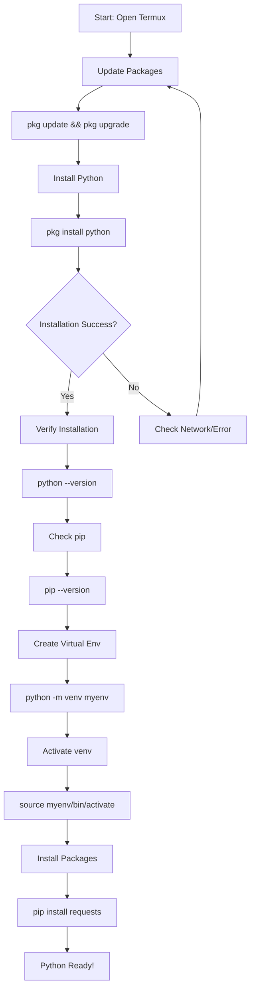
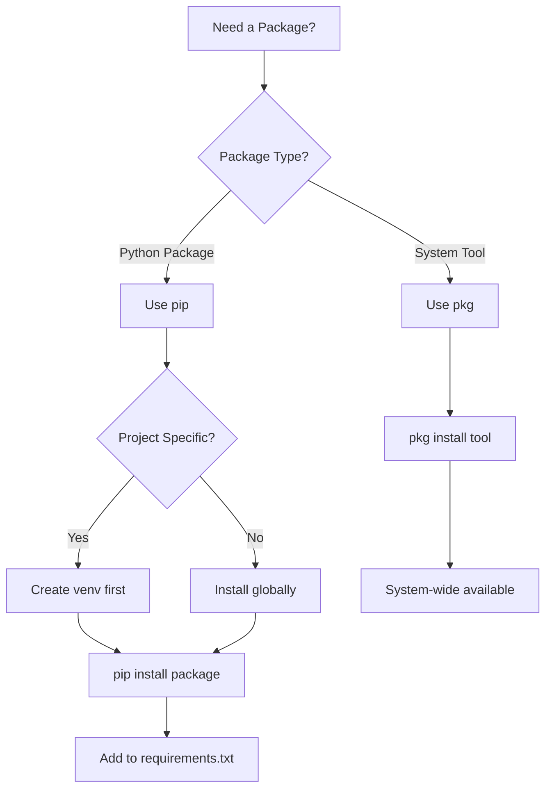

```
 ██████╗██╗  ██╗███████╗███╗   ███╗██╗   ██╗███████╗████████╗███████╗██████╗ 
██╔════╝██║  ██║██╔════╝████╗ ████║██║   ██║██╔════╝╚══██╔══╝██╔════╝██╔══██╗
██║     ███████║█████╗  ██╔████╔██║██║   ██║███████╗   ██║   █████╗  ██████╔╝
██║     ██╔══██║██╔══╝  ██║╚██╔╝██║██║   ██║╚════██║   ██║   ██╔══╝  ██╔══██╗
╚██████╗██║  ██║███████╗██║ ╚═╝ ██║╚██████╔╝███████║   ██║   ███████╗██║  ██║
 ╚═════╝╚═╝  ╚═╝╚══════╝╚═╝     ╚═╝ ╚═════╝ ╚══════╝   ╚═╝   ╚══════╝╚═╝  ╚═╝
                                                                              
 ██████╗ ██████╗  ██████╗ ██╗  ██╗██╗   ██╗    ███╗   ██╗ ██████╗ ██████╗ ███████╗
██╔════╝ ██╔══██╗██╔═══██╗╚██╗██╔╝╚██╗ ██╔╝    ████╗  ██║██╔════╝██╔═══██╗██╔════╝
██║  ███╗██████╔╝██║   ██║ ╚███╔╝  ╚████╔╝     ██╔██╗ ██║██║     ██║   ██║█████╗  
██║   ██║██╔══██╗██║   ██║ ██╔██╗   ╚██╔╝      ██║╚██╗██║██║     ██║   ██║██╔══╝  
╚██████╔╝██║  ██║╚██████╔╝██╔╝ ██╗   ██║       ██║ ╚████║╚██████╗╚██████╔╝███████╗
 ╚═════╝ ╚═╝  ╚═╝ ╚═════╝ ╚═╝  ╚═╝   ╚═╝       ╚═╝  ╚═══╝ ╚═════╝ ╚═════╝ ╚══════╝
```

# 🐍 Chapter 11: Python Installation & Setup

> **Module:** 3 - Programming  
> **Chapter:** 11 of 61  
> **Duration:** 15-20 Minutes  
> **Difficulty:** ⭐ Beginner

---

## 📋 Chapter Overview

| Section | Content |
|---------|---------|
| Video Script | Complete Hindi narration with timestamps |
| Technical Guide | Python installation & configuration |
| Installation Guide | Python 2, Python 3, pip, venv setup |
| Commands Reference | All commands covered in chapter |
| Practice Exercises | Hands-on Python setup tasks |
| Troubleshooting | Common Python issues in Termux |
| Video Assets | Thumbnail, description, tags |

---

## 🎬 VIDEO SCRIPT (Complete Hindi Narration)

```
═══════════════════════════════════════════════════════════════════════════════
TERMUX FULL COURSE - CHAPTER 11
Title: Python Installation & Setup | Complete Guide | T3rmuxk1ng
Duration: 15-20 Minutes
═══════════════════════════════════════════════════════════════════════════════

[INTRO - 0:00 to 0:50]
─────────────────────────────────────────────────────────────────────────────

Namaskar Dosto! Welcome to Chapter 11 of Termux Full Course!

Main aapka host hoon aur aaj ek bahut important chapter hai - Python 
Installation & Setup in Termux.

Python - programming world ka king! Agar aap ethical hacking, 
automation, web development, data science, machine learning - kuch 
bhi seekhna chahte ho - Python aapke liye zaruri hai.

Termux mein Python install karna easy hai, lekin sahi tarah setup 
karna important hai. Aaj hum cover karenge:
- Python installation
- pip package manager
- Virtual environments
- Common packages
- Python IDE in Termux

Ye chapter beginners ke liye hai - koi prior Python knowledge 
chahiye nahi. Bas Termux installed hona chahiye (Chapter 1 se 
install kar sakte ho agar nahi hai).

To chaliye shuru karte hain!

Play button dabaiye, video like karein, subscribe karein.

---

[SECTION 1: PYTHON INTRODUCTION - 0:50 to 3:30]
─────────────────────────────────────────────────────────────────────────────

Sabse pehle - Python kya hai aur kyun important hai?

Python ek high-level programming language hai. Simple syntax, 
easy to learn, powerful capabilities. 1991 mein Guido van Rossum 
ne banaya tha.

Python ki special baat - readability. Code padhna easy hai, 
likhna easy hai. Beginners ke liye perfect language.

Termux mein Python ka importance:

✓ Hacking Tools - Most tools Python mein bane hain
✓ Automation - Scripts se repetitive tasks automate karo
✓ Web Scraping - Data extract karo websites se
✓ API Testing - Security testing ke liye
✓ Exploit Development - Many exploits Python mein
✓ Machine Learning - Data analysis

Termux mein Python install karna desktop se thoda alaga hai. 
Desktop pe aap python.org se download karte ho. Termux mein 
pkg command se install hota hai - simple!

Python ke do major versions hain - Python 2 aur Python 3.

Python 2 - OLD, deprecated, 2020 mein end of life ho gaya.
Python 3 - CURRENT, actively developed, use this!

Termux mein dono versions available hain, lekin hum Python 3 
use karenge kyunki wo modern hai aur supported hai.

---

[SECTION 2: PYTHON INSTALLATION - 3:30 to 7:00]
─────────────────────────────────────────────────────────────────────────────

Ab chaliye Python install karte hain Termux mein.

[SCREEN: Termux terminal]

Step 1: Pehle Termux ko update karein

    pkg update && pkg upgrade -y

Ye command packages list update karega aur installed packages 
ko upgrade karega. Good practice hai regular updates ka.

Step 2: Python install karein

    pkg install python -y

Ye command Python 3 install karega. 'python' package Python 3 
denge Termux mein.

Installation mein thoda time lagega - Python dependencies 
download hogi. Wait karein.

[SCREEN: Installation progress]

Step 3: Installation verify karein

    python --version

Output kuch aisa aana chahiye:
    Python 3.11.x (version number different ho sakta hai)

Agar version dikh raha hai - Congratulations! Python 
successfully install ho gaya!

Step 4: Python executable check

    which python

Output: /data/data/com.termux/files/usr/bin/python

Ye path batata hai ki Python kahan installed hai.

Step 5: Python 3 specific command

    python3 --version

Termux mein 'python' aur 'python3' dono same hain - Python 3.

Step 6: pip install verify

pip - Python package manager. Ye Python ke saath automatically 
install ho jata hai.

    pip --version

Output: pip 23.x.x from ...

pip working hai - perfect!

---

[SECTION 3: PYTHON 2 VS PYTHON 3 - 7:00 to 9:00]
─────────────────────────────────────────────────────────────────────────────

Ab samjhte hain Python 2 aur Python 3 mein kya difference hai.

[COMPARISON TABLE]

┌─────────────────────────────────────────────────────────────────────────┐
│                    PYTHON 2 VS PYTHON 3                                 │
├────────────────┬──────────────────────┬────────────────────────────────┤
│ Feature        │ Python 2             │ Python 3                       │
├────────────────┼──────────────────────┼────────────────────────────────┤
│ Status         │ ❌ Deprecated        │ ✅ Active Development          │
│ Print Syntax   │ print "Hello"        │ print("Hello")                 │
│ Division       │ 5/2 = 2 (integer)    │ 5/2 = 2.5 (float)              │
│ Unicode        │ ASCII default        │ Unicode default                │
│ Support        │ Ended Jan 2020       │ Ongoing                        │
│ Security       │ No patches           │ Active security updates        │
│ Recommendation │ ❌ Don't use         │ ✅ Use this                    │
└────────────────┴──────────────────────┴────────────────────────────────┘

Python 2 install karna (agar zarurat ho):

    pkg install python2 -y

Tab command hogi:
    python2 --version

Lekin 99% cases mein Python 3 use karein. Old scripts ho 
sakte hain Python 2 ke, lekin naye projects ke liye 
Python 3 mandatory hai.

---

[SECTION 4: PIP PACKAGE MANAGER - 9:00 to 12:00]
─────────────────────────────────────────────────────────────────────────────

pip - Python ka package manager. "Pip Installs Packages" ya 
"Preferred Installer Program".

Python ki real power uske packages mein hai. Thousands of 
packages available hain - ready-to-use code.

pip Commands:

[COMMAND 1: Package Install]

    pip install <package-name>

Example:
    pip install requests

Ye 'requests' package install karega - HTTP requests ke liye.

[COMMAND 2: Package Uninstall]

    pip uninstall <package-name>

Example:
    pip uninstall requests

Confirm ke liye 'y' press karein.

[COMMAND 3: List Installed Packages]

    pip list

Saare installed packages dikhega with versions.

[COMMAND 4: Show Package Info]

    pip show <package-name>

Example:
    pip show requests

Details dikhega - version, location, dependencies.

[COMMAND 5: Upgrade Package]

    pip install --upgrade <package-name>

Example:
    pip install --upgrade requests

[COMMAND 6: Install Specific Version]

    pip install <package-name>==<version>

Example:
    pip install requests==2.28.0

[COMMAND 7: Search Package]

    pip search <keyword>

Note: PyPI search disabled hai ab. Use pypi.org website.

[COMMAND 8: Freeze Requirements]

    pip freeze > requirements.txt

Ye installed packages ki list requirements.txt mein save karega.

[COMMAND 9: Install from Requirements]

    pip install -r requirements.txt

requirements.txt se saare packages install karega.

---

[SECTION 5: VIRTUAL ENVIRONMENTS - 12:00 to 15:00]
─────────────────────────────────────────────────────────────────────────────

Virtual Environment - Ek isolated Python environment.

Imagine karein:
- Project A ko Django 3.x chahiye
- Project B ko Django 4.x chahiye
- Global install se conflict hoga!

Solution: Virtual Environments

Har project ka apna environment - apna Python, apne packages, 
apna isolation. No conflicts!

Termux mein do tarah ke virtual environments hain:

┌─────────────────────────────────────────────────────────────────────────┐
│                    VENV VS VIRTUALENV                                    │
├────────────────┬──────────────────────┬────────────────────────────────┤
│ Feature        │ venv                 │ virtualenv                     │
├────────────────┼──────────────────────┼────────────────────────────────┤
│ Built-in       │ ✅ Yes (Python 3.3+) │ ❌ No (need to install)        │
│ Speed          │ Fast                 │ Faster                         │
│ Python 2       │ ❌ No support        │ ✅ Supports                    │
│ Activation     │ source bin/activate  │ source bin/activate            │
│ Recommendation │ ✅ Use this          │ For advanced needs             │
└────────────────┴──────────────────────┴────────────────────────────────┘

[VENV DEMO]

Step 1: Create virtual environment

    python -m venv myenv

Ye 'myenv' naam ka virtual environment create karega.

Step 2: Activate environment

    source myenv/bin/activate

Prompt change hoga:
    (myenv) u0_a123@localhost:~$

(myenv) prefix indicate karta hai ki environment active hai.

Step 3: Install packages in venv

    pip install requests

Ye package SIRF is environment mein install hoga. Global 
Python affect nahi hoga.

Step 4: Deactivate environment

    deactivate

Environment se bahar aa jaoge. (myenv) prefix hat jaayega.

Step 5: Delete virtual environment

    rm -rf myenv

Simple delete - environment permanently remove.

[VIRTUALENV INSTALL & USE]

Install:
    pip install virtualenv

Create:
    virtualenv myenv

Activate:
    source myenv/bin/activate

Same as venv!

---

[SECTION 6: PIP VS PKG - 15:00 to 16:30]
─────────────────────────────────────────────────────────────────────────────

Termux mein do package managers hain - pkg aur pip.

Confusion common hai - kab kya use karein?

┌─────────────────────────────────────────────────────────────────────────┐
│                    PKG VS PIP FOR PYTHON PACKAGES                        │
├────────────────┬──────────────────────┬────────────────────────────────┤
│ Aspect         │ pkg (apt)            │ pip                            │
├────────────────┼──────────────────────┼────────────────────────────────┤
│ Source         │ Termux repositories  │ PyPI (Python Package Index)    │
│ Packages       │ Limited Python pkgs  │ All Python packages            │
│ Compilation    │ Pre-compiled         │ May compile from source        │
│ Speed          │ ⚡ Fast              │ Slower (if compiling)          │
│ Dependencies   │ System-level         │ Python-level                   │
│ Update Speed   │ Delayed              │ Immediate (from PyPI)          │
│ Recommendation │ For system packages  │ For Python packages            │
└────────────────┴──────────────────────┴────────────────────────────────┘

Rule of Thumb:
- System tools (git, wget, curl) → pkg
- Python packages (requests, flask) → pip
- Both available? pip recommended for Python packages

Example:

    # Wrong approach - limited packages
    pkg install python-requests  # May not exist

    # Right approach
    pip install requests         # Direct from PyPI

Some packages available in both:
    pkg install python-numpy     # Pre-compiled, fast
    pip install numpy            # Compiles, takes time

For beginners: pip use karein. Zyada packages available hain.

---

[SECTION 7: COMMON PYTHON PACKAGES - 16:30 to 18:00]
─────────────────────────────────────────────────────────────────────────────

Termux ke liye useful Python packages:

┌─────────────────────────────────────────────────────────────────────────┐
│                    ESSENTIAL PYTHON PACKAGES FOR TERMUX                  │
├─────────────────────────┬───────────────────────────────────────────────┤
│ Package                 │ Purpose                                       │
├─────────────────────────┼───────────────────────────────────────────────┤
│ requests                │ HTTP requests                                 │
│ beautifulsoup4          │ Web scraping                                  │
│ httpx                   │ Modern HTTP client                            │
│ paramiko                │ SSH library                                   │
│ pycryptodome            │ Cryptography                                  │
│ colorama                │ Colored terminal output                       │
│ rich                    │ Beautiful terminal formatting                 │
│ click                   │ CLI apps                                      │
│ flask                   │ Web framework                                 │
│ django                  │ Full-stack web framework                      │
│ fastapi                 │ Modern API framework                          │
│ scapy                   │ Network packet manipulation                   │
│ pwntools                │ CTF & exploit development                     │
│ impacket                │ Network protocols                             │
│ pynput                  │ Keyboard/mouse control                        │
└─────────────────────────┴───────────────────────────────────────────────┘

Install multiple packages:
    pip install requests beautifulsoup4 colorama

---

[SECTION 8: PYTHON REPL & RUNNING SCRIPTS - 18:00 to 20:00]
─────────────────────────────────────────────────────────────────────────────

Python do tarah se use kar sakte ho:

[METHOD 1: REPL - Interactive Shell]

    python

Python prompt open hoga:
    >>>

Ye interactive shell hai. Commands type karo, immediate 
output dekho.

Example:
    >>> print("Hello Termux!")
    Hello Termux!
    >>> 2 + 2
    4
    >>> import os
    >>> os.getcwd()
    '/data/data/com.termux/files/home'

Exit:
    >>> exit()
    Ya: Ctrl+D

[METHOD 2: Script File]

Create script:
    nano hello.py

Type:
    print("Hello from Python script!")
    name = input("Enter your name: ")
    print(f"Welcome, {name}!")

Save: Ctrl+O, Enter, Ctrl+X

Run script:
    python hello.py

Output:
    Hello from Python script!
    Enter your name: T3rmuxk1ng
    Welcome, T3rmuxk1ng!

[METHOD 3: One-liner]

    python -c "print('Hello World!')"

Quick commands ke liye useful.

[METHOD 4: Module as script]

    python -m <module>

Example:
    python -m http.server 8000

Ye simple HTTP server start karega port 8000 pe!

---

[SECTION 9: PYTHON IDE IN TERMUX - 20:00 to 21:30]
─────────────────────────────────────────────────────────────────────────────

Termux mein coding ke liye options:

┌─────────────────────────────────────────────────────────────────────────┐
│                    PYTHON EDITORS/IDE IN TERMUX                          │
├─────────────────────────┬───────────────────────────────────────────────┤
│ Editor                  │ Features                                      │
├─────────────────────────┼───────────────────────────────────────────────┤
│ nano                    │ Simple, built-in, good for beginners          │
│ vim                     │ Powerful, steep learning curve                │
│ neovim                  │ Modern vim with Lua support                   │
│ micro                   │ User-friendly, mouse support                  │
│ emacs                   │ Ultimate customization                        │
│ code-server             │ VS Code in browser (needs Node.js)            │
└─────────────────────────┴───────────────────────────────────────────────┘

Recommended for beginners: nano or micro

Install micro:
    pkg install micro

Run:
    micro script.py

Features:
- Syntax highlighting
- Mouse support
- Modern keybindings
- Easy to use

Advanced: Neovim with plugins

    pkg install neovim

Configuration needed, but powerful results.

---

[SECTION 10: REQUIREMENTS.TXT - 21:30 to 22:30]
─────────────────────────────────────────────────────────────────────────────

requirements.txt - Project dependencies ka record.

Create:
    pip freeze > requirements.txt

Content example:
    requests==2.31.0
    beautifulsoup4==4.12.2
    colorama==0.4.6
    certifi==2023.7.22

Install from file:
    pip install -r requirements.txt

Best Practice:
- Har project ke liye requirements.txt maintain karein
- Virtual environment use karein
- Share requirements.txt with code

Version pinning:
    requests==2.31.0      # Exact version
    requests>=2.28.0      # Minimum version
    requests<=2.31.0      # Maximum version
    requests~=2.31.0      # Compatible release

---

[SECTION 11: SUMMARY & NEXT PREVIEW - 22:30 to 24:00]
─────────────────────────────────────────────────────────────────────────────

To dosto, Chapter 11 complete! Let's summarize:

✅ Python installation in Termux - pkg install python
✅ Python 2 vs Python 3 - Python 3 use karein
✅ pip package manager - install, uninstall, list, freeze
✅ Virtual environments - venv for isolation
✅ pip vs pkg - pip for Python packages
✅ Common packages - requests, bs4, flask, etc.
✅ Running Python - REPL, scripts, one-liners
✅ IDE options - nano, micro, vim
✅ requirements.txt - dependency management

Important Commands yaad rakhein:

┌─────────────────────────────────────────────────────────────────────────┐
│                    CHAPTER 11 - IMPORTANT COMMANDS                       │
├─────────────────────────────────────────────────────────────────────────┤
│ pkg install python               │ Install Python 3                     │
│ python --version                 │ Check Python version                 │
│ pip install <package>            │ Install Python package               │
│ pip uninstall <package>          │ Remove Python package                │
│ pip list                         │ List installed packages              │
│ pip freeze > requirements.txt    │ Export dependencies                  │
│ pip install -r requirements.txt  │ Install from requirements            │
│ python -m venv myenv             │ Create virtual environment           │
│ source myenv/bin/activate        │ Activate venv                        │
│ deactivate                       │ Deactivate venv                      │
│ python script.py                 │ Run Python script                    │
│ python -c "code"                 │ Run one-liner                        │
└─────────────────────────────────────────────────────────────────────────┘

Next Chapter 12 mein hum seekhenge:
- Python basics - variables, data types
- Control flow - if, for, while
- Functions in Python
- File handling
- Python for Termux automation

Practice exercises zarur karein. Python seekhne ka best tarika 
hai practice karna!

Agar ye video helpful lagi, to:
👍 Like button press karein
🔔 Subscribe karein, notification bell on karein
💬 Koi sawal ho to comment mein poochein
📤 Share karein friends ke saath

Main har comment ka reply karta hoon.

Thank you for watching! See you in Chapter 12!

═══════════════════════════════════════════════════════════════════════════════
```

---

## 📊 MERMAID DIAGRAMS

### Python Installation & Setup Flow



### Virtual Environment Architecture

```mermaid
flowchart LR
    subgraph System[System Python]
        A[/usr/bin/python]
        B[/usr/lib/python3.x]
    end
    
    subgraph Venv[Virtual Environment]
        C[bin/python] --> D[Symlink to A]
        E[bin/pip]
        F[lib/site-packages]
    end
    
    subgraph Project[Your Project]
        G[myenv/]
        H[script.py]
    end
    
    System --> Venv
    Venv --> Project
```

### pip Package Management Decision Tree



---

## ⚡ COMMAND CHEATSHEET

### Python & pip Commands Reference

| Command | Syntax | Example | Return Value |
|---------|--------|---------|--------------|
| Check Python Version | `python --version` | `python --version` | Python 3.x.x |
| Check pip Version | `pip --version` | `pip --version` | pip 23.x.x |
| Install Package | `pip install <pkg>` | `pip install requests` | Successfully installed |
| Uninstall Package | `pip uninstall <pkg>` | `pip uninstall requests` | Successfully uninstalled |
| List Packages | `pip list` | `pip list` | Package list with versions |
| Show Package Info | `pip show <pkg>` | `pip show requests` | Package details |
| Upgrade Package | `pip install --upgrade <pkg>` | `pip install --upgrade requests` | Updated version |
| Freeze Requirements | `pip freeze` | `pip freeze > req.txt` | Package==version lines |
| Install from Requirements | `pip install -r <file>` | `pip install -r requirements.txt` | All packages installed |
| Create Virtual Env | `python -m venv <name>` | `python -m venv myenv` | Creates venv directory |
| Activate venv | `source <name>/bin/activate` | `source myenv/bin/activate` | (myenv) prefix shows |
| Deactivate venv | `deactivate` | `deactivate` | Returns to system Python |
| Run Python Script | `python <file>` | `python script.py` | Script output |
| Run One-liner | `python -c "code"` | `python -c "print('Hi')"` | Code output |
| Run Module | `python -m <module>` | `python -m http.server` | Module execution |
| Check Package Location | `pip show <pkg> \| grep Location` | `pip show requests \| grep Location` | File path |

### Virtual Environment Commands

| Command | Purpose | Example |
|---------|---------|---------|
| `python -m venv <name>` | Create virtual environment | `python -m venv myproject` |
| `source <name>/bin/activate` | Activate environment | `source myproject/bin/activate` |
| `deactivate` | Exit virtual environment | `deactivate` |
| `rm -rf <name>` | Delete virtual environment | `rm -rf myproject` |
| `which python` | Check active Python | Shows venv path if active |

---

## 🎯 LEARNING PATH VISUALIZATION

```
╔═══════════════════════════════════════════════════════════════════════════════╗
║                    PYTHON LEARNING JOURNEY - T3RMUXK1NG                       ║
╠═══════════════════════════════════════════════════════════════════════════════╣
║                                                                                ║
║  START ──────────────────────────────────────────────────────────────────►    ║
║    │                                                                          ║
║    ▼                                                                          ║
║  ┌──────────────────┐                                                        ║
║  │  LEVEL 1: SETUP  │ ← You are here!                                         ║
║  │  ✓ Install Python│                                                        ║
║  │  ✓ pip basics    │                                                        ║
║  │  ✓ Virtual envs  │                                                        ║
║  └────────┬─────────┘                                                        ║
║           │                                                                    ║
║           ▼                                                                    ║
║  ┌──────────────────┐                                                        ║
║  │  LEVEL 2: BASICS │                                                        ║
║  │  ○ Variables     │                                                        ║
║  │  ○ Data types    │                                                        ║
║  │  ○ Control flow  │                                                        ║
║  └────────┬─────────┘                                                        ║
║           │                                                                    ║
║           ▼                                                                    ║
║  ┌──────────────────┐                                                        ║
║  │  LEVEL 3: SCRIPT │                                                        ║
║  │  ○ File handling │                                                        ║
║  │  ○ Functions     │                                                        ║
║  │  ○ Modules       │                                                        ║
║  └────────┬─────────┘                                                        ║
║           │                                                                    ║
║           ▼                                                                    ║
║  ┌──────────────────┐                                                        ║
║  │  LEVEL 4: TOOLS  │                                                        ║
║  │  ○ Automation    │                                                        ║
║  │  ○ Web scraping  │                                                        ║
║  │  ○ Security tools│                                                        ║
║  └────────┬─────────┘                                                        ║
║           │                                                                    ║
║           ▼                                                                    ║
║  ┌──────────────────┐                                                        ║
║  │  LEVEL 5: PRO    │                                                        ║
║  │  ○ Advanced libs │                                                        ║
║  │  ○ Projects      │                                                        ║
║  │  ○ Contributing  │                                                        ║
║  └──────────────────┘                                                        ║
║           │                                                                    ║
║           ▼                                                                    ║
║       🏆 PYTHON MASTER                                                         ║
║                                                                                ║
╚═══════════════════════════════════════════════════════════════════════════════╝
```

---

## 🔧 TOOL/FEATURE COMPARISON TABLE

### Python Package Managers Comparison

| Feature | pip | conda | poetry | pipenv |
|---------|-----|-------|--------|--------|
| **Built-in** | ✅ Yes | ❌ No | ❌ No | ❌ No |
| **Termux Compatible** | ✅ Perfect | ⚠️ Limited | ✅ Yes | ✅ Yes |
| **Virtual Envs** | ✅ With venv | ✅ Built-in | ✅ Built-in | ✅ Built-in |
| **Lock Files** | ❌ Manual | ✅ Yes | ✅ Yes | ✅ Yes |
| **Dependency Resolution** | Basic | Advanced | Advanced | Advanced |
| **Learning Curve** | ⭐ Easy | ⭐⭐ Medium | ⭐⭐ Medium | ⭐⭐ Medium |
| **Best For** | General Use | Data Science | Modern Projects | Web Projects |
| **Speed** | ⭐⭐⭐ | ⭐⭐ | ⭐⭐⭐⭐ | ⭐⭐⭐ |

### Python 2 vs Python 3 Comparison

| Feature | Python 2 | Python 3 | Recommendation |
|---------|----------|----------|----------------|
| **Status** | ❌ Deprecated | ✅ Active | Use Python 3 |
| **Print Syntax** | `print "Hello"` | `print("Hello")` | Python 3 style |
| **Division** | `5/2 = 2` | `5/2 = 2.5` | Python 3 correct |
| **Unicode** | ASCII default | Unicode default | Python 3 better |
| **Security Updates** | ❌ None | ✅ Active | Python 3 required |
| **New Features** | ❌ No | ✅ Yes | Python 3 only |

---

## 🚀 PRACTICAL CODING CHALLENGES

### Challenge 1: Environment Detective 🕵️

**Difficulty:** ⭐ Beginner  
**Time:** 10 minutes

**Problem:** Create a Python script that displays all information about your Python environment including version, installed packages count, and paths.

**Sample Output:**
```
=== Python Environment Detective ===
Python Version: 3.11.x
Platform: linux
Executable: /data/data/com.termux/files/usr/bin/python
Installed Packages: 45
Site Packages Path: /data/data/com.termux/files/usr/lib/python3.11/site-packages
Home Directory: /data/data/com.termux/files/home
```

<details>
<summary>🔑 Hidden Solution</summary>

```python
import sys
import subprocess

print("=== Python Environment Detective ===")
print(f"Python Version: {sys.version.split()[0]}")
print(f"Platform: {sys.platform}")
print(f"Executable: {sys.executable}")

# Count packages
result = subprocess.run(['pip', 'list', '--format=freeze'], 
                       capture_output=True, text=True)
packages = result.stdout.strip().split('\n')
print(f"Installed Packages: {len(packages)}")

print(f"Site Packages: {sys.path[-1]}")
print(f"Home Directory: {sys.path[0]}")
```
</details>

---

### Challenge 2: Virtual Environment Manager 📦

**Difficulty:** ⭐⭐ Intermediate  
**Time:** 15 minutes

**Problem:** Write a bash script that creates a virtual environment, activates it, installs 3 common packages (requests, colorama, rich), and creates a requirements.txt file.

**Sample Output:**
```
Creating virtual environment 'test_env'...
Activating environment...
Installing packages...
✓ requests installed
✓ colorama installed  
✓ rich installed
Creating requirements.txt...
✓ requirements.txt created with 3 packages
Environment ready!
```

<details>
<summary>🔑 Hidden Solution</summary>

```bash
#!/bin/bash
ENV_NAME="test_env"

echo "Creating virtual environment '$ENV_NAME'..."
python -m venv $ENV_NAME

echo "Activating environment..."
source $ENV_NAME/bin/activate

echo "Installing packages..."
pip install requests colorama rich --quiet

echo "✓ requests installed"
echo "✓ colorama installed"
echo "✓ rich installed"

echo "Creating requirements.txt..."
pip freeze > requirements.txt
pkg_count=$(wc -l < requirements.txt)
echo "✓ requirements.txt created with $pkg_count packages"

echo "Environment ready!"
```
</details>

---

### Challenge 3: Package Health Checker 🏥

**Difficulty:** ⭐⭐⭐ Advanced  
**Time:** 20 minutes

**Problem:** Create a Python script that checks all installed packages, identifies outdated ones, and generates a report showing package name, current version, and latest available version.

**Sample Output:**
```
=== Package Health Report ===
Total packages: 47
Outdated packages: 5

Outdated Packages:
┌─────────────┬────────────┬────────────┐
│ Package     │ Current    │ Latest     │
├─────────────┼────────────┼────────────┤
│ requests    │ 2.28.0     │ 2.31.0     │
│ numpy       │ 1.24.0     │ 1.25.0     │
│ pip         │ 23.0       │ 23.2       │
│ pillow      │ 9.5.0      │ 10.0.0     │
│ certifi     │ 2023.5.7   │ 2023.7.22  │
└─────────────┴────────────┴────────────┘

Run: pip install --upgrade <package> to update
```

<details>
<summary>🔑 Hidden Solution</summary>

```python
import subprocess
import json

def get_outdated_packages():
    result = subprocess.run(['pip', 'list', '--outdated', '--format=json'],
                          capture_output=True, text=True)
    if result.stdout:
        return json.loads(result.stdout)
    return []

def get_total_packages():
    result = subprocess.run(['pip', 'list', '--format=freeze'],
                          capture_output=True, text=True)
    return len(result.stdout.strip().split('\n'))

print("=== Package Health Report ===")
total = get_total_packages()
print(f"Total packages: {total}")

outdated = get_outdated_packages()
print(f"Outdated packages: {len(outdated)}")

if outdated:
    print("\nOutdated Packages:")
    print("┌" + "─"*13 + "┬" + "─"*12 + "┬" + "─"*12 + "┐")
    print("│ {:^11} │ {:^10} │ {:^10} │".format(
        "Package", "Current", "Latest"))
    print("├" + "─"*13 + "┼" + "─"*12 + "┼" + "─"*12 + "┤")
    
    for pkg in outdated:
        print("│ {:<11} │ {:<10} │ {:<10} │".format(
            pkg['name'][:11], pkg['version'], pkg['latest_version']))
    
    print("└" + "─"*13 + "┴" + "─"*12 + "┴" + "─"*12 + "┘")
    print("\nRun: pip install --upgrade <package> to update")
```
</details>

---

## 📖 GLOSSARY & TERMINOLOGY

### Python Installation Terms

| Term | Definition |
|------|------------|
| **Python** | A high-level, interpreted programming language known for readability and versatility |
| **pip** | Python's package installer, used to install and manage third-party libraries |
| **Virtual Environment** | An isolated Python environment with its own packages and dependencies |
| **venv** | Python's built-in module for creating virtual environments (Python 3.3+) |
| **virtualenv** | Third-party tool for creating virtual environments with more features |
| **PyPI** | Python Package Index - the official repository for Python packages |
| **requirements.txt** | File listing project dependencies with versions for reproducible installs |
| **Package** | A collection of Python modules that can be installed and used in projects |
| **Module** | A single Python file containing reusable code (functions, classes) |
| **Site-packages** | Directory where pip installs third-party packages |
| **Wheel** | A binary distribution format for Python packages (.whl files) |
| **Setup.py** | Traditional build configuration file for Python packages |
| **Pyproject.toml** | Modern configuration file for Python projects (PEP 518) |
| **pip freeze** | Command to output installed packages in requirements format |
| **Shebang** | The `#!/usr/bin/env python3` line at start of scripts specifying interpreter |

---

## 💼 CAREER INSIGHTS

### Python Developer Career Path

```
┌─────────────────────────────────────────────────────────────────────────────┐
│                     PYTHON DEVELOPER CAREER LADDER                          │
├─────────────────────────────────────────────────────────────────────────────┤
│                                                                              │
│  ┌──────────────────────────────────────────────────────────────────────┐   │
│  │ LEVEL 5: Principal/Architect (15+ years)                            │   │
│  │ • System Architecture        • Technical Strategy                   │   │
│  │ • Team Leadership            • Cross-functional Decisions           │   │
│  │ Salary: ₹50-80 LPA | $150K-250K+                                     │   │
│  └──────────────────────────────────────────────────────────────────────┘   │
│                                   ▲                                          │
│  ┌──────────────────────────────────────────────────────────────────────┐   │
│  │ LEVEL 4: Senior Developer (5-10 years)                              │   │
│  │ • Complex System Design      • Code Review & Mentoring              │   │
│  │ • Performance Optimization   • Technical Documentation               │   │
│  │ Salary: ₹25-45 LPA | $100K-150K                                      │   │
│  └──────────────────────────────────────────────────────────────────────┘   │
│                                   ▲                                          │
│  ┌──────────────────────────────────────────────────────────────────────┐   │
│  │ LEVEL 3: Mid-Level Developer (2-5 years)                            │   │
│  │ • Feature Development        • Testing & Debugging                  │   │
│  │ • API Integration            • Database Management                   │   │
│  │ Salary: ₹12-25 LPA | $70K-100K                                       │   │
│  └──────────────────────────────────────────────────────────────────────┘   │
│                                   ▲                                          │
│  ┌──────────────────────────────────────────────────────────────────────┐   │
│  │ LEVEL 2: Junior Developer (0-2 years)                               │   │
│  │ • Bug Fixes                  • Unit Testing                         │   │
│  │ • Documentation              • Code Reviews                         │   │
│  │ Salary: ₹4-10 LPA | $50K-70K                                         │   │
│  └──────────────────────────────────────────────────────────────────────┘   │
│                                   ▲                                          │
│  ┌──────────────────────────────────────────────────────────────────────┐   │
│  │ LEVEL 1: Learning (You are here!)                                   │   │
│  │ • Python Basics              • Data Structures                      │   │
│  │ • Version Control            • Basic Projects                       │   │
│  └──────────────────────────────────────────────────────────────────────┘   │
│                                                                              │
├─────────────────────────────────────────────────────────────────────────────┤
│                         CAREER SPECIALIZATIONS                              │
│                                                                              │
│  🔹 Backend Developer    🔹 Data Scientist      🔹 DevOps Engineer         │
│  🔹 ML Engineer         🔹 Security Researcher   🔹 Automation Engineer    │
│  🔹 Full Stack Dev      🔹 API Developer        🔹 Script Developer        │
│                                                                              │
└─────────────────────────────────────────────────────────────────────────────┘
```

### Top Companies Hiring Python Developers in India

| Company | Domain | Average Salary |
|---------|--------|----------------|
| Google | Search, AI, Cloud | ₹40-80 LPA |
| Microsoft | Cloud, AI, Products | ₹35-70 LPA |
| Amazon | E-commerce, AWS | ₹30-60 LPA |
| TCS | IT Services | ₹8-25 LPA |
| Infosys | IT Services | ₹7-20 LPA |
| Wipro | IT Services | ₹7-18 LPA |
| Flipkart | E-commerce | ₹20-45 LPA |
| Swiggy | Food Tech | ₹18-40 LPA |

---

## 🏆 CODE OPTIMIZATION TIPS

### Python Installation & Setup Optimization

| Tip | Description | Impact |
|-----|-------------|--------|
| **Use venv for every project** | Isolates dependencies, prevents conflicts | ⭐⭐⭐⭐⭐ |
| **Pin package versions** | Use `package==1.2.3` in requirements.txt | ⭐⭐⭐⭐⭐ |
| **Use pip cache wisely** | `--no-cache-dir` for CI/CD, cache for local | ⭐⭐⭐⭐ |
| **Upgrade pip first** | `pip install --upgrade pip` before other packages | ⭐⭐⭐⭐ |
| **Use wheels** | Prefer `.whl` packages for faster installation | ⭐⭐⭐⭐ |
| **Clean old versions** | `pip cache purge` to free space | ⭐⭐⭐ |
| **Use constraints.txt** | Control dependency resolution | ⭐⭐⭐ |
| **Minimize global installs** | Install packages in venv, not globally | ⭐⭐⭐⭐⭐ |

### pip Configuration Optimization

```bash
# Create pip config for faster installs
mkdir -p ~/.config/pip
cat > ~/.config/pip/pip.conf << 'EOF'
[global]
timeout = 60
index-url = https://pypi.org/simple
trusted-host = pypi.org
prefer-binary = true

[install]
no-compile = true
EOF

# Verify config
pip config list
```

### Virtual Environment Best Practices

```bash
# Create optimized venv
python -m venv --copies myenv  # Use copies instead of symlinks

# Activate and upgrade pip immediately
source myenv/bin/activate
pip install --upgrade pip setuptools wheel

# Install packages efficiently
pip install --prefer-binary package-name

# Export with exact versions
pip freeze | grep -i package >> requirements.txt
```

---

## 📖 TECHNICAL GUIDE

### 1. Python in Termux Architecture

```
┌─────────────────────────────────────────────────────────────────────────┐
│                    PYTHON IN TERMUX ARCHITECTURE                         │
├─────────────────────────────────────────────────────────────────────────┤
│                                                                          │
│   ┌─────────────────────────────────────────────────────────────────┐   │
│   │                    Python Installation                           │   │
│   │   Location: $PREFIX/bin/python                                   │   │
│   │   Version: Python 3.x                                            │   │
│   │                                                                   │   │
│   │   ┌─────────────────┐    ┌─────────────────┐                    │   │
│   │   │ Python Binary   │    │ Python Libraries │                    │   │
│   │   │ /bin/python3    │    │ /lib/python3.xx/ │                    │   │
│   │   └─────────────────┘    └─────────────────┘                    │   │
│   │                                                                   │   │
│   │   ┌─────────────────┐    ┌─────────────────┐                    │   │
│   │   │ pip Package Mgr │    │ Site-packages   │                    │   │
│   │   │ /bin/pip        │    │ /lib/.../site   │                    │   │
│   │   └─────────────────┘    └─────────────────┘                    │   │
│   └─────────────────────────────────────────────────────────────────┘   │
│                                                                          │
│   ┌─────────────────────────────────────────────────────────────────┐   │
│   │                    Virtual Environments                          │   │
│   │                                                                   │   │
│   │   myenv/                                                         │   │
│   │   ├── bin/                                                       │   │
│   │   │   ├── activate      (activation script)                     │   │
│   │   │   ├── python        (symlink to system python)              │   │
│   │   │   └── pip           (venv-specific pip)                     │   │
│   │   ├── lib/                                                       │   │
│   │   │   └── python3.xx/site-packages/  (installed packages)       │   │
│   │   └── pyvenv.cfg        (configuration)                         │   │
│   └─────────────────────────────────────────────────────────────────┘   │
│                                                                          │
│   ┌─────────────────────────────────────────────────────────────────┐   │
│   │                    Package Sources                               │   │
│   │                                                                   │   │
│   │   Termux Repos ──► pkg (apt) ──► Pre-compiled packages           │   │
│   │   PyPI ──────────► pip ──────► Source/compiled packages          │   │
│   └─────────────────────────────────────────────────────────────────┘   │
│                                                                          │
└─────────────────────────────────────────────────────────────────────────┘
```

### 2. Key Python Paths in Termux

| Path | Description |
|------|-------------|
| `$PREFIX/bin/python` | Python executable |
| `$PREFIX/bin/python3` | Python 3 symlink |
| `$PREFIX/bin/pip` | pip package manager |
| `$PREFIX/bin/pip3` | pip3 symlink |
| `$PREFIX/lib/python3.xx/` | Python standard library |
| `$PREFIX/lib/python3.xx/site-packages/` | Third-party packages |
| `~/.local/bin/` | User-installed scripts |
| `~/.local/lib/python3.xx/site-packages/` | User packages (pip --user) |

### 3. Python PATH Configuration

```bash
# Python's module search path
python -c "import sys; print('\n'.join(sys.path))"

# Output typically:
# /data/data/com.termux/files/usr/lib/python311.zip
# /data/data/com.termux/files/usr/lib/python3.11
# /data/data/com.termux/files/usr/lib/python3.11/lib-dynload
# /data/data/com.termux/files/usr/lib/python3.11/site-packages

# Add custom path
export PYTHONPATH="/path/to/modules:$PYTHONPATH"

# Permanent addition to ~/.bashrc
echo 'export PYTHONPATH="$HOME/my_modules:$PYTHONPATH"' >> ~/.bashrc
```

### 4. pip Configuration

```bash
# pip config file location
~/.config/pip/pip.conf

# Create pip config directory
mkdir -p ~/.config/pip

# Example pip.conf
[global]
timeout = 60
index-url = https://pypi.org/simple
trusted-host = pypi.org

[install]
user = false

# Check pip configuration
pip config list
```

---

## 🔧 INSTALLATION GUIDE

### Method 1: Standard Installation (Recommended)

```bash
# Step 1: Update Termux
pkg update && pkg upgrade -y

# Step 2: Install Python
pkg install python -y

# Step 3: Verify installation
python --version
pip --version

# Step 4: Test Python
python -c "print('Python is working!')"
```

### Method 2: Install Python with Build Tools

```bash
# For compiling Python packages from source
pkg install python build-essential libffi openssl -y

# This enables:
# - Building C extensions
# - Installing packages with native code
# - Cryptography libraries
```

### Method 3: Install Python 2 (Legacy)

```bash
# Only if you need Python 2 for old scripts
pkg install python2 -y

# Verify
python2 --version

# Use pip2 for Python 2 packages
pip2 install <package>
```

### Post-Installation Setup

```bash
# Upgrade pip to latest version
pip install --upgrade pip

# Install essential packages
pip install --upgrade setuptools wheel

# Install useful development tools
pip install virtualenv pipenv poetry

# Verify pip works
pip list
```

---

## 📋 COMMANDS REFERENCE

### Python Commands

```bash
# Check Python version
python --version
python3 --version

# Check Python location
which python

# Start Python REPL
python

# Run Python script
python script.py

# Run Python script with unbuffered output
python -u script.py

# Run Python one-liner
python -c "print('Hello')"

# Run Python module
python -m <module>

# Example: HTTP server
python -m http.server 8000

# Example: JSON pretty print
python -m json.tool file.json

# Example: pip as module
python -m pip install <package>

# Compile Python file
python -m py_compile script.py

# Check Python info
python -c "import sys; print(sys.executable)"
python -c "import sys; print(sys.version)"
```

### pip Commands

```bash
# Install package
pip install <package>

# Install specific version
pip install <package>==1.2.3

# Install minimum version
pip install <package>>=1.2.3

# Install multiple packages
pip install pkg1 pkg2 pkg3

# Install from requirements file
pip install -r requirements.txt

# Install from git repository
pip install git+https://github.com/user/repo.git

# Install from local directory
pip install ./local-package/

# Install in editable mode
pip install -e ./local-package/

# Uninstall package
pip uninstall <package>

# Uninstall multiple packages
pip uninstall pkg1 pkg2 -y

# List installed packages
pip list

# List with format
pip list --format=freeze
pip list --format=columns

# Show package details
pip show <package>

# Check package dependencies
pip show <package> | grep Requires

# Upgrade package
pip install --upgrade <package>

# Upgrade pip itself
pip install --upgrade pip

# Freeze installed packages
pip freeze

# Freeze to file
pip freeze > requirements.txt

# Download package without installing
pip download <package>

# Search packages (deprecated, use pypi.org)
pip search <query>

# Check for outdated packages
pip list --outdated

# Check for security vulnerabilities
pip check

# Clear pip cache
pip cache purge

# Show pip cache location
pip cache dir
```

### Virtual Environment Commands

```bash
# Create virtual environment (venv)
python -m venv myenv

# Create with specific Python version
python3.11 -m venv myenv

# Create virtualenv (alternative)
pip install virtualenv
virtualenv myenv

# Create with specific Python
virtualenv -p python3.11 myenv

# Activate virtual environment
source myenv/bin/activate

# Activate in fish shell
source myenv/bin/activate.fish

# Deactivate
deactivate

# Delete virtual environment
rm -rf myenv

# Check active environment
which python  # Should point to venv
echo $VIRTUAL_ENV

# Install packages in venv
pip install <package>

# Export venv packages
pip freeze > requirements.txt
```

### requirements.txt Commands

```bash
# Create requirements.txt
pip freeze > requirements.txt

# Install from requirements
pip install -r requirements.txt

# Install without cache
pip install -r requirements.txt --no-cache-dir

# Create with versions
pip freeze | grep -i "package" >> requirements.txt

# Requirements with constraints
pip install -r requirements.txt -c constraints.txt
```

---

## 💻 PRACTICE EXERCISES

### Exercise 1: Basic Python Installation & Verification

```bash
# Task: Verify Python is correctly installed

# Step 1: Check Python version
python --version
# Expected: Python 3.11.x or higher

# Step 2: Check pip version
pip --version
# Expected: pip 23.x.x from ...

# Step 3: Start Python REPL
python

# In REPL, type:
>>> import sys
>>> print(f"Python: {sys.version}")
>>> print(f"Platform: {sys.platform}")
>>> print(f"Executable: {sys.executable}")
>>> exit()

# Step 4: Run one-liner
python -c "import platform; print(f'Running on {platform.system()}')"

# Expected: Running on Linux
```

### Exercise 2: Install and Use Python Packages

```bash
# Task: Install and use requests package

# Step 1: Install requests
pip install requests

# Step 2: Verify installation
pip show requests

# Step 3: Create a test script
cat > test_requests.py << 'EOF'
import requests

# Test HTTP request
response = requests.get('https://httpbin.org/get')
print(f"Status Code: {response.status_code}")
print(f"Response: {response.json()}")
EOF

# Step 4: Run script
python test_requests.py

# Expected: JSON response from httpbin.org

# Step 5: List installed packages
pip list | grep requests

# Step 6: Create requirements.txt
pip freeze > requirements.txt

# Step 7: View requirements
cat requirements.txt
```

### Exercise 3: Virtual Environment Workflow

```bash
# Task: Create and use a virtual environment

# Step 1: Create project directory
mkdir ~/my_project
cd ~/my_project

# Step 2: Create virtual environment
python -m venv venv

# Step 3: List venv contents
ls venv/

# Step 4: Activate venv
source venv/bin/activate

# Notice prompt change: (venv) appears

# Step 5: Verify venv is active
which python
# Expected: /data/.../my_project/venv/bin/python

# Step 6: Install package in venv
pip install colorama

# Step 7: Create test script
cat > colors.py << 'EOF'
from colorama import Fore, Style

print(Fore.RED + "This is red text")
print(Fore.GREEN + "This is green text")
print(Fore.BLUE + "This is blue text")
print(Style.RESET_ALL + "Back to normal")
EOF

# Step 8: Run script
python colors.py

# Step 9: Export dependencies
pip freeze > requirements.txt
cat requirements.txt

# Step 10: Deactivate
deactivate

# Step 11: Verify deactivation
which python
# Expected: /data/data/com.termux/files/usr/bin/python

# Step 12: Reactivate and verify packages still there
source venv/bin/activate
pip list | grep colorama
deactivate
```

### Exercise 4: requirements.txt Management

```bash
# Task: Manage project dependencies

# Step 1: Create new project
mkdir ~/dep_project
cd ~/dep_project
python -m venv venv
source venv/bin/activate

# Step 2: Install multiple packages
pip install requests beautifulsoup4 colorama httpx

# Step 3: Generate requirements
pip freeze > requirements.txt

# Step 4: View requirements
cat requirements.txt

# Step 5: Simulate new environment
deactivate
rm -rf venv
python -m venv venv
source venv/bin/activate

# Step 6: Verify no packages
pip list | grep -E "requests|beautifulsoup|colorama|httpx"
# Should show nothing

# Step 7: Install from requirements
pip install -r requirements.txt

# Step 8: Verify packages installed
pip list | grep -E "requests|beautifulsoup|colorama|httpx"

# Cleanup
deactivate
cd ~
rm -rf dep_project
```

### Exercise 5: Python REPL Practice

```bash
# Task: Use Python REPL for calculations

python << 'EOF'
import math

# Basic math
print("Basic Math:")
print(f"2 + 2 = {2 + 2}")
print(f"10 / 3 = {10 / 3:.2f}")
print(f"10 // 3 = {10 // 3}")  # Integer division

# Math functions
print("\nMath Functions:")
print(f"π = {math.pi}")
print(f"√2 = {math.sqrt(2):.4f}")
print(f"sin(90°) = {math.sin(math.radians(90))}")

# String operations
print("\nString Operations:")
text = "Hello Termux Python"
print(f"Original: {text}")
print(f"Uppercase: {text.upper()}")
print(f"Lowercase: {text.lower()}")
print(f"Length: {len(text)}")
print(f"Split: {text.split()}")

# List operations
print("\nList Operations:")
numbers = [1, 2, 3, 4, 5]
print(f"List: {numbers}")
print(f"Sum: {sum(numbers)}")
print(f"Max: {max(numbers)}")
print(f"Squared: {[x**2 for x in numbers]}")
EOF
```

### Exercise 6: HTTP Server in Termux

```bash
# Task: Run Python HTTP server

# Step 1: Create directory for server
mkdir ~/webserver
cd ~/webserver

# Step 2: Create HTML file
cat > index.html << 'EOF'
<!DOCTYPE html>
<html>
<head>
    <title>Termux Python Server</title>
    <style>
        body { font-family: Arial; margin: 40px; background: #1a1a2e; color: #eee; }
        h1 { color: #00ff88; }
    </style>
</head>
<body>
    <h1>🐍 Python HTTP Server</h1>
    <p>Running from Termux!</p>
    <p>Chapter 11 - Python Installation & Setup</p>
</body>
</html>
EOF

# Step 3: Start server (port 8080)
python -m http.server 8080 &

# Step 4: Test server
curl http://localhost:8080/

# Step 5: Find and kill server
ps aux | grep python
kill <PID>

# Or use fg to bring to foreground, then Ctrl+C
```

---

## ⚠️ TROUBLESHOOTING

### Problem 1: "pip install" fails with compilation error

```bash
# Cause: Missing build dependencies

# Solution: Install build tools
pkg install build-essential clang -y

# For specific packages:
# Cryptography packages
pkg install openssl libffi -y
pip install cryptography

# Database packages
pkg install sqlite -y
pip install sqlalchemy

# Image processing
pkg install libpng libjpeg-turbo -y
pip install pillow

# lxml package
pkg install libxml2 libxslt -y
pip install lxml
```

### Problem 2: "Permission denied" when installing packages

```bash
# Cause: Virtual environment not active, trying to install globally

# Solution 1: Use virtual environment
python -m venv myenv
source myenv/bin/activate
pip install <package>

# Solution 2: Install with --user flag (not recommended in Termux)
pip install --user <package>

# Solution 3: Fix permissions (if needed)
chmod -R 755 $PREFIX/lib/python*/
```

### Problem 3: "Module not found" error

```bash
# Cause: Package not installed or wrong Python version

# Step 1: Check if package is installed
pip list | grep <package>

# Step 2: Install missing package
pip install <package>

# Step 3: Check Python path
python -c "import sys; print('\n'.join(sys.path))"

# Step 4: Verify installation location
pip show <package>

# Step 5: If venv active, check correct Python
which python
# Should point to venv/bin/python
```

### Problem 4: "externally-managed-environment" error

```bash
# Cause: PEP 668 - Python environment protection

# Solution 1: Use virtual environment (recommended)
python -m venv myenv
source myenv/bin/activate
pip install <package>

# Solution 2: Override with --break-system-packages (not recommended)
pip install --break-system-packages <package>

# Solution 3: Use pipx for CLI tools
pip install pipx
pipx install <tool>
```

### Problem 5: pip is very slow

```bash
# Cause: Network issues or PyPI mirror slow

# Solution 1: Use mirror
pip install <package> -i https://pypi.org/simple/

# Solution 2: Permanent mirror in pip.conf
mkdir -p ~/.config/pip
cat > ~/.config/pip/pip.conf << EOF
[global]
index-url = https://pypi.org/simple
trusted-host = pypi.org
EOF

# Solution 3: Use cache
pip cache dir  # Check cache location

# Solution 4: Install pre-built wheels
pip install --only-binary :all: <package>
```

### Problem 6: Virtual environment activation fails

```bash
# Cause: Script not sourced properly

# Wrong way:
./venv/bin/activate  # ❌ Won't work

# Right way:
source venv/bin/activate  # ✅ Correct
. venv/bin/activate       # ✅ Also correct

# If still failing, check script exists:
ls -la venv/bin/activate

# Recreate venv if corrupted:
rm -rf venv
python -m venv venv
```

### Problem 7: "SSL certificate verify failed"

```bash
# Cause: Outdated certificates

# Solution: Install ca-certificates
pkg install ca-certificates -y

# Update pip with cert
pip install --upgrade certifi

# If specific issue, bypass (not recommended for production)
pip install --trusted-host pypi.org --trusted-host pypi.python.org --trusted-host files.pythonhosted.org <package>
```

### Problem 8: Python script won't run - "command not found"

```bash
# Cause: Script not executable or wrong path

# Solution 1: Run with Python directly
python script.py

# Solution 2: Make executable
chmod +x script.py
./script.py

# Solution 3: Check shebang line
head -1 script.py
# Should be: #!/usr/bin/env python

# Solution 4: Add correct shebang
sed -i '1i#!/usr/bin/env python' script.py
```

### Problem 9: "Killed" or crash during pip install

```bash
# Cause: Out of memory (OOM)

# Solution 1: Close other apps, free memory

# Solution 2: Increase swap (if rooted)
# Not applicable for non-rooted devices

# Solution 3: Install from pkg instead
pkg search python-<package>

# Solution 4: Install with no cache
pip install --no-cache-dir <package>

# Solution 5: Use pre-built wheel if available
pip install --prefer-binary <package>
```

### Problem 10: pip install from Git fails

```bash
# Cause: git not installed

# Solution: Install git
pkg install git -y

# Then try again
pip install git+https://github.com/user/repo.git

# For private repos, use SSH (requires key setup)
pip install git+ssh://git@github.com/user/repo.git
```

---

## 🎬 VIDEO ASSETS

### Thumbnail Concepts

**Option A: Clean & Professional**
```
┌────────────────────────────────────┐
│  [Blue/Yellow Python Logo]         │
│                                    │
│   🐍 PYTHON in TERMUX              │
│   Complete Setup Guide             │
│                                    │
│   ✓ pip install                    │
│   ✓ Virtual Environments           │
│   ✓ requirements.txt               │
│                                    │
│   [T3rmuxk1ng Logo]                │
└────────────────────────────────────┘
```

**Option B: Command Style**
```
┌────────────────────────────────────┐
│  [Terminal Background]             │
│                                    │
│   $ pkg install python             │
│   $ pip install requests           │
│   $ python -m venv myenv           │
│                                    │
│   🐍 PYTHON MASTERY                │
│   Chapter 11                       │
│                                    │
│   [T3rmuxk1ng]                     │
└────────────────────────────────────┘
```

**Option C: Feature Highlight**
```
┌────────────────────────────────────┐
│  🐍 PYTHON 3                       │
│  ─────────────────────────────     │
│                                    │
│  ✅ pip Package Manager            │
│  ✅ Virtual Environments           │
│  ✅ 1000+ Packages Available       │
│  ✅ No Root Required               │
│                                    │
│  TERMUX SETUP GUIDE                │
│  Chapter 11 | T3rmuxk1ng           │
└────────────────────────────────────┘
```

### Video Description Template

```markdown
🐍 Termux Full Course - Chapter 11: Python Installation & Setup | Complete Guide

🔥 In this video you'll learn:
• Termux mein Python install karna
• pip package manager ka complete use
• Virtual environments (venv) setup
• requirements.txt management
• Python REPL aur scripts run karna
• Common Python packages install karna

⏱️ Timestamps:
0:00 - Introduction
0:50 - Python Introduction
3:30 - Python Installation
7:00 - Python 2 vs Python 3
9:00 - pip Package Manager
12:00 - Virtual Environments
15:00 - pip vs pkg
16:30 - Common Python Packages
18:00 - Python REPL & Running Scripts
20:00 - Python IDE in Termux
21:30 - requirements.txt
22:30 - Summary

📝 Commands from this video:
pkg update && pkg upgrade -y
pkg install python -y
python --version
pip install requests
python -m venv myenv
source myenv/bin/activate
pip freeze > requirements.txt

📦 Essential Packages:
pip install requests beautifulsoup4 colorama flask

📚 Full Course Playlist:
[PLAYLIST LINK]

📱 Follow T3rmuxk1ng:
• YouTube: @T3rmuxk1ng
• Telegram: [LINK]
• GitHub: [LINK]

#Termux #Python #TermuxPython #PythonInstallation #pip #venv #T3rmuxk1ng #PythonTermux #TermuxCourse #Programming #PythonHindi

---
⚠️ Disclaimer: This video is for educational purposes. Use tools responsibly.
```

### Tags List

```
termux python, python termux, python installation termux, 
pip termux, termux pip install, python setup termux,
virtual environment termux, venv termux, termux programming,
python hindi, termux python tutorial, install python termux,
termux course, termux full course, pip package manager,
python 3 termux, termux python pip, requirements.txt,
python repl termux, termux python ide, python setup guide,
t3rmuxk1ng, termux tutorial hindi, python for beginners
```

### Hashtags

```
#Termux #Python #TermuxPython #PythonInstallation #pip 
#VirtualEnvironment #venv #PythonTutorial #TermuxCourse 
#Programming #T3rmuxk1ng #LearnPython #PythonHindi 
#TermuxHindi #pipTutorial #requirements
```

---

## 📚 ADDITIONAL RESOURCES

### Official Resources

| Resource | Link |
|----------|------|
| Python Official | https://www.python.org/ |
| PyPI (Python Package Index) | https://pypi.org/ |
| Python Documentation | https://docs.python.org/3/ |
| pip Documentation | https://pip.pypa.io/ |
| venv Documentation | https://docs.python.org/3/library/venv.html |

### Termux-Specific Resources

| Resource | Link |
|----------|------|
| Termux Python Wiki | https://wiki.termux.com/wiki/Python |
| Termux Packages | https://github.com/termux/termux-packages/tree/master/packages/python |
| Termux PyPI Packages | https://wiki.termux.com/wiki/Python#Package_management |

### Learning Resources

| Resource | Description |
|----------|-------------|
| Python Tutorial | Run `python -m tutorial` (if installed) |
| Python Help | Run `help()` in Python REPL |
| pip Help | Run `pip help` |
| Package Info | Run `pip show <package>` |

### Recommended Packages by Category

```
┌─────────────────────────────────────────────────────────────────────────┐
│                    PYTHON PACKAGES BY CATEGORY                           │
├─────────────────────┬───────────────────────────────────────────────────┤
│ Category            │ Recommended Packages                             │
├─────────────────────┼───────────────────────────────────────────────────┤
│ HTTP/Networking     │ requests, httpx, aiohttp, websocket-client       │
│ Web Scraping        │ beautifulsoup4, lxml, scrapy, selenium          │
│ Security/Hacking    │ pycryptodome, paramiko, pwntools, scapy          │
│ CLI Tools           │ click, argparse, rich, colorama                  │
│ Web Frameworks      │ flask, django, fastapi, bottle                   │
│ Data Processing     │ pandas, numpy, openpyxl, csv                     │
│ JSON/API            │ requests, pydantic, marshmallow                  │
│ Testing             │ pytest, unittest, mock                           │
│ Automation          │ fabric, invoke, schedule                         │
│ Database            │ sqlalchemy, sqlite3, pymongo                     │
└─────────────────────┴───────────────────────────────────────────────────┘
```

---

## ✅ CHAPTER CHECKLIST

Before moving to Chapter 12, verify:

- [ ] Python 3 installed via `pkg install python`
- [ ] `python --version` shows correct version
- [ ] pip working - `pip --version` succeeds
- [ ] Successfully installed a package with pip
- [ ] Created and activated a virtual environment
- [ ] Deactivated virtual environment properly
- [ ] Created and used requirements.txt
- [ ] Ran Python script successfully
- [ ] Used Python REPL for interactive coding
- [ ] Understand pip vs pkg difference

---

## 🎯 NEXT CHAPTER PREVIEW

**Chapter 12: Python Basics in Termux**

- Python variables and data types
- Control flow (if/else, loops)
- Functions and modules
- File handling in Python
- Python for Termux automation
- Practical Python scripts

---

**Chapter Complete! 🎉**

---

## 🎮 INTERACTIVE QUIZ

### Test Your Python Installation Knowledge! (15 Questions)

**Q1: Which command installs Python in Termux?**
- A) `apt install python`
- B) `pkg install python`
- C) `pip install python`
- D) `npm install python`

<details>
<summary>🔍 Click for Answer</summary>

**B) `pkg install python`** - Termux uses `pkg` (which wraps apt) to install packages. This installs Python 3.x with all dependencies.
</details>

---

**Q2: What is the purpose of pip in Python?**
- A) To run Python scripts
- B) To install and manage Python packages
- C) To create virtual environments
- D) To compile Python code

<details>
<summary>🔍 Click for Answer</summary>

**B) To install and manage Python packages** - pip (Pip Installs Packages) is Python's package manager for installing, updating, and removing packages from PyPI.
</details>

---

**Q3: Which command creates a virtual environment named "myenv"?**
- A) `python venv myenv`
- B) `pip venv myenv`
- C) `python -m venv myenv`
- D) `virtualenv create myenv`

<details>
<summary>🔍 Click for Answer</summary>

**C) `python -m venv myenv`** - The `venv` module is invoked with `-m` flag to create virtual environments. This is the standard way in Python 3.3+.
</details>

---

**Q4: How do you activate a virtual environment in Termux?**
- A) `activate myenv`
- B) `source myenv/bin/activate`
- C) `myenv activate`
- D) `python activate myenv`

<details>
<summary>🔍 Click for Answer</summary>

**B) `source myenv/bin/activate`** - The activation script is in the bin directory of the virtual environment. Sourcing it modifies your shell environment.
</details>

---

**Q5: What does `pip freeze` do?**
- A) Freezes Python execution
- B) Lists installed packages with versions
- C) Locks package versions permanently
- D) Creates a backup of packages

<details>
<summary>🔍 Click for Answer</summary>

**B) Lists installed packages with versions** - `pip freeze` outputs all installed packages in a format suitable for requirements.txt (package==version).
</details>

---

**Q6: Why should you use virtual environments?**
- A) They make Python run faster
- B) They isolate project dependencies
- C) They are required by Python
- D) They reduce file sizes

<details>
<summary>🔍 Click for Answer</summary>

**B) They isolate project dependencies** - Virtual environments prevent conflicts between different projects that may require different versions of the same package.
</details>

---

**Q7: What is the difference between `pkg` and `pip` in Termux?**
- A) No difference
- B) `pkg` installs system packages, `pip` installs Python packages
- C) `pip` is faster than `pkg`
- D) `pkg` only works in Termux

<details>
<summary>🔍 Click for Answer</summary>

**B) `pkg` installs system packages, `pip` installs Python packages** - `pkg` manages Termux system packages while `pip` manages Python packages from PyPI.
</details>

---

**Q8: Which file stores project dependencies?**
- A) `dependencies.txt`
- B) `packages.json`
- C) `requirements.txt`
- D) `pip.conf`

<details>
<summary>🔍 Click for Answer</summary>

**C) `requirements.txt`** - This is the standard file for listing Python package dependencies. Created with `pip freeze > requirements.txt`.
</details>

---

**Q9: How do you install packages from requirements.txt?**
- A) `pip install requirements.txt`
- B) `pip install -r requirements.txt`
- C) `pip requirements.txt`
- D) `python requirements.txt`

<details>
<summary>🔍 Click for Answer</summary>

**B) `pip install -r requirements.txt`** - The `-r` flag tells pip to read and install packages from the specified requirements file.
</details>

---

**Q10: What happens when you run `python` in Termux terminal?**
- A) Installs Python
- B) Opens Python REPL
- C) Creates a Python file
- D) Checks Python version

<details>
<summary>🔍 Click for Answer</summary>

**B) Opens Python REPL** - Running `python` without arguments starts the interactive Read-Eval-Print Loop for executing Python code interactively.
</details>

---

**Q11: Which Python version is recommended for new projects?**
- A) Python 2.7
- B) Python 3.x
- C) Any version works
- D) Python 1.x

<details>
<summary>🔍 Click for Answer</summary>

**B) Python 3.x** - Python 2 reached end-of-life in 2020. Python 3 is actively maintained and should be used for all new projects.
</details>

---

**Q12: How do you check installed Python version?**
- A) `python --version`
- B) `pip version`
- C) `python -v`
- D) `which python`

<details>
<summary>🔍 Click for Answer</summary>

**A) `python --version`** - This command displays the Python interpreter version. `which python` shows the path, not the version.
</details>

---

**Q13: What is PyPI?**
- A) A Python IDE
- B) Python Package Index - repository of Python packages
- C) A Python testing framework
- D) A Python documentation tool

<details>
<summary>🔍 Click for Answer</summary>

**B) Python Package Index - repository of Python packages** - PyPI (pypi.org) is the official third-party software repository for Python, from where pip downloads packages.
</details>

---

**Q14: Which command upgrades an existing package?**
- A) `pip update package`
- B) `pip upgrade package`
- C) `pip install --upgrade package`
- D) `pip refresh package`

<details>
<summary>🔍 Click for Answer</summary>

**C) `pip install --upgrade package`** - The `--upgrade` or `-U` flag tells pip to upgrade the package to the latest version if it's already installed.
</details>

---

**Q15: How do you deactivate a virtual environment?**
- A) `exit`
- B) `deactivate`
- C) `stop venv`
- D) `quit`

<details>
<summary>🔍 Click for Answer</summary>

**B) `deactivate`** - This command exits the virtual environment and restores the previous shell environment. Available after activating a venv.
</details>

---

## 🎯 INTERVIEW QUESTIONS

### Python Installation & Setup Interview Questions (10 Questions with Detailed Answers)

**Q1: Explain the difference between pip and conda package managers.**

<details>
<summary>💡 Show Answer</summary>

**Answer:**

```
┌─────────────────────────────────────────────────────────────────────────┐
│                    PIP vs CONDA COMPARISON                               │
├────────────────┬────────────────────────────────┬───────────────────────┤
│ Feature        │ pip                            │ conda                 │
├────────────────┼────────────────────────────────┼───────────────────────┤
│ Scope          │ Python packages only           │ Any software          │
│ Source         │ PyPI only                      │ Anaconda repo + PyPI  │
│ Environments   │ Needs venv/virtualenv          │ Built-in env support  │
│ Dependencies   │ Python packages                │ System libraries too  │
│ Language       │ Python only                    │ Language agnostic     │
│ Data Science   │ Requires separate setup        │ Pre-configured        │
└────────────────┴────────────────────────────────┴───────────────────────┘
```

**Key Points:**
- pip is Python-specific, conda is language-agnostic
- conda manages non-Python dependencies (C libraries, etc.)
- pip + venv is standard for Python projects
- conda is preferred for data science due to pre-built packages

**Termux Context:** Use pip since conda is not available in Termux.
</details>

---

**Q2: What is the purpose of the `__pycache__` directory?**

<details>
<summary>💡 Show Answer</summary>

**Answer:**

The `__pycache__` directory contains compiled Python bytecode:

```
__pycache__/
├── module.cpython-311.pyc    # Compiled bytecode for Python 3.11
├── utils.cpython-311.pyc
└── main.cpython-311.pyc

Why it exists:
1. Speed: Compiled bytecode loads faster than source
2. Optimization: Python doesn't need to recompile unchanged files
3. Versioning: Different .pyc files for different Python versions

Should you commit it? Generally NO - add to .gitignore
```

**Technical Details:**
- `.pyc` files are platform-independent bytecode
- Created automatically when Python imports modules
- Can be disabled with `PYTHONDONTWRITEBYTECODE=1`
</details>

---

**Q3: How does pip resolve dependency conflicts?**

<details>
<summary>💡 Show Answer</summary>

**Answer:**

pip uses a backtracking dependency resolver (since pip 20.3):

```
Dependency Resolution Process:
─────────────────────────────────
1. Package A requires: numpy>=1.20, pandas>=1.3
2. Package B requires: numpy<1.22
3. pip finds compatible version: numpy==1.21.x

If conflict found:
┌─────────────────────────────────────────────────────────────────┐
│ ERROR: Cannot install packageA and packageB because             │
│ they depend on incompatible versions of numpy                   │
└─────────────────────────────────────────────────────────────────┘

Best Practices:
• Use requirements.txt with exact versions
• Test with pip install --dry-run
• Use pip check to verify installation
• Consider pip-tools for dependency management
```

**Resolution Strategy:**
1. Try to satisfy all constraints
2. Backtrack if conflict found
3. Report error if no solution exists
</details>

---

**Q4: Explain the PYTHONPATH environment variable.**

<details>
<summary>💡 Show Answer</summary>

**Answer:**

```bash
# PYTHONPATH tells Python where to look for modules

Default Search Order:
1. Current directory
2. PYTHONPATH directories
3. Standard library paths
4. site-packages

# Example usage
export PYTHONPATH="/home/user/my_modules:$PYTHONPATH"

# In Termux
export PYTHONPATH="$HOME/custom_libs:$PYTHONPATH"

# Make permanent
echo 'export PYTHONPATH="$HOME/my_modules:$PYTHONPATH"' >> ~/.bashrc
```

**Common Use Cases:**
- Adding custom module directories
- Development without installation
- Testing modules from different locations
</details>

---

**Q5: What is the difference between a package and a module in Python?**

<details>
<summary>💡 Show Answer</summary>

**Answer:**

```
Module:
────────
• Single Python file (.py)
• Contains Python definitions and statements
• Example: mymodule.py

Package:
────────
• Directory containing Python files
• Must have __init__.py file
• Can contain sub-packages
• Example: mypackage/
    ├── __init__.py
    ├── module1.py
    ├── module2.py
    └── subpackage/
        ├── __init__.py
        └── module3.py

Importing:
─────────
import mymodule              # Module
import mypackage             # Package
from mypackage import module1  # Module from package
from mypackage.subpackage import module3  # Nested
```

**Key Differences:**
- Module = single file
- Package = collection of modules in a directory
- Package enables hierarchical structuring
</details>

---

**Q6: How do you handle pip installation failures due to compilation errors?**

<details>
<summary>💡 Show Answer</summary>

**Answer:**

```bash
# Common causes and solutions:

1. Missing build dependencies
   ─────────────────────────
   pkg install build-essential clang -y
   pip install package_name

2. Missing library headers
   ─────────────────────────
   # For cryptography packages
   pkg install openssl libffi -y
   pip install cryptography

   # For database packages
   pkg install sqlite -y
   pip install sqlalchemy

3. Memory issues during compilation
   ─────────────────────────────────
   pip install --no-cache-dir package_name
   pip install --prefer-binary package_name

4. Use pre-built wheels
   ─────────────────────
   pip install --only-binary :all: package_name

5. Install from Termux repo instead
   ─────────────────────────────────
   pkg search python-package_name
   pkg install python-package_name
```

**Debugging Steps:**
1. Check the error message for missing libraries
2. Install required development packages
3. Try installing build dependencies first
4. Use `--verbose` flag for detailed output
</details>

---

**Q7: What is pip's "editable install" and when would you use it?**

<details>
<summary>💡 Show Answer</summary>

**Answer:**

```bash
# Editable install (development mode)
pip install -e /path/to/package
pip install -e git+https://github.com/user/repo.git#egg=package

# Creates a link instead of copying:
site-packages/package.egg-link → /path/to/package

When to use:
────────────
1. Developing a Python package
2. Testing changes without reinstalling
3. Contributing to open-source projects
4. Working on multiple related packages

Example workflow:
─────────────────
git clone https://github.com/user/mylib.git
cd mylib
pip install -e .
# Now any changes to mylib are immediately available
python -c "import mylib; mylib.test_function()"
```

**Benefits:**
- No need to reinstall after changes
- Real-time testing of modifications
- Easier debugging and development
</details>

---

**Q8: Explain the concept of "site-packages" in Python.**

<details>
<summary>💡 Show Answer</summary>

**Answer:**

```
site-packages directory:
────────────────────────
Location where pip installs third-party packages

Finding site-packages:
──────────────────────
python -c "import site; print(site.getsitepackages())"
# Output: ['/data/data/com.termux/files/usr/lib/python3.11/site-packages']

Structure:
──────────
site-packages/
├── requests/              # Installed package directory
│   ├── __init__.py
│   └── ...
├── requests-2.31.0.dist-info/  # Package metadata
├── numpy/
├── pandas/
└── .pth files            # Path configuration files

Types:
──────
1. Global site-packages: $PREFIX/lib/pythonX.Y/site-packages
2. User site-packages: ~/.local/lib/pythonX.Y/site-packages
3. Virtual env site-packages: venv/lib/pythonX.Y/site-packages
```

**Important:**
- Packages here are importable from anywhere
- Virtual environments have their own site-packages
- Can add custom paths via .pth files
</details>

---

**Q9: How does pip's hash-checking mode work?**

<details>
<summary>💡 Show Answer</summary>

**Answer:**

```bash
# Hash-checking ensures package integrity

# Step 1: Generate hashes
pip download requests --dest ./packages
cd packages
sha256sum requests*.whl

# Step 2: Create requirements with hashes
cat > requirements.txt << EOF
requests==2.31.0 \
    --hash=sha256:abc123... \
    --hash=sha256:def456...
EOF

# Step 3: Install with hash verification
pip install --require-hashes -r requirements.txt

Benefits:
─────────
• Prevents tampering during download
• Ensures exact same file is installed
• Protects against compromised mirrors
• Required for reproducible builds
```

**Security Implications:**
- Verifies downloaded packages match expected hashes
- Protects against supply chain attacks
- Essential for security-sensitive environments
</details>

---

**Q10: What is the difference between requirements.txt and setup.py?**

<details>
<summary>💡 Show Answer</summary>

**Answer:**

```
requirements.txt:
─────────────────
• Application-level dependencies
• Used by: pip install -r requirements.txt
• Purpose: Reproduce exact environment
• Contains: Specific versions for deployment

Example:
requests==2.31.0
flask==3.0.0
numpy==1.24.0

setup.py / pyproject.toml:
─────────────────────────
• Package-level dependencies
• Used by: pip install . (installs the package)
• Purpose: Define package dependencies
• Contains: Version ranges for compatibility

Example (setup.py):
install_requires=[
    'requests>=2.28.0',
    'flask>=2.0.0',
]

Best Practice:
──────────────
Both! Use setup.py/pyproject.toml for your package,
and pip freeze > requirements.txt for deployment.
```

**Key Distinction:**
- requirements.txt = for deployment/development environment
- setup.py = for distributing your package
- Modern approach: use pyproject.toml with setuptools/poetry
</details>

---

## 🔥 REAL-WORLD SCENARIOS

### Scenario 1: Setting Up a Python Security Tools Environment

```
╔═══════════════════════════════════════════════════════════════════════════════╗
║                    SECURITY TOOLS ENVIRONMENT SETUP                          ║
╠═══════════════════════════════════════════════════════════════════════════════╣
║                                                                               ║
║  Goal: Set up isolated environment for penetration testing tools             ║
║                                                                               ║
║  Steps:                                                                       ║
║  1. Create isolated venv                                                      ║
║  2. Install security packages                                                 ║
║  3. Verify installation                                                       ║
║                                                                               ║
╚═══════════════════════════════════════════════════════════════════════════════╝
```

```bash
# Create dedicated security tools environment
mkdir -p ~/security-tools && cd ~/security-tools
python -m venv venv
source venv/bin/activate

# Install essential security packages
pip install --upgrade pip
pip install requests beautifulsoup4 lxml
pip install pycryptodome paramiko
pip install python-nmap scapy
pip install pwntools impacket

# Create requirements for backup
pip freeze > requirements-security.txt

# Verify critical imports
python -c "import requests, Crypto, paramiko, nmap; print('✓ All packages working!')"
```

---

### Scenario 2: Fixing a Broken Python Installation

```
╔═══════════════════════════════════════════════════════════════════════════════╗
║                    FIXING BROKEN PYTHON INSTALLATION                          ║
╠═══════════════════════════════════════════════════════════════════════════════╣
║                                                                               ║
║  Problem: pip commands failing, packages not installing                      ║
║  Cause: Corrupted pip or Python installation                                 ║
║                                                                               ║
╚═══════════════════════════════════════════════════════════════════════════════╝
```

```bash
# Step 1: Diagnose the issue
python --version           # Check Python works
pip --version              # Check pip works
which python               # Verify correct path

# Step 2: Reinstall pip if broken
python -m ensurepip --upgrade
# Or download get-pip.py
curl -sS https://bootstrap.pypa.io/get-pip.py | python

# Step 3: Upgrade pip and essential tools
python -m pip install --upgrade pip setuptools wheel

# Step 4: Clear pip cache if corrupt
pip cache purge

# Step 5: Reinstall problematic packages
pip install --force-reinstall package_name

# Nuclear option: Reinstall Python entirely
pkg uninstall python -y
pkg install python -y
```

---

### Scenario 3: Managing Multiple Python Projects with Conflicting Dependencies

```
╔═══════════════════════════════════════════════════════════════════════════════╗
║                    MULTIPLE PROJECTS - DEPENDENCY MANAGEMENT                 ║
╠═══════════════════════════════════════════════════════════════════════════════╣
║                                                                               ║
║  Project A needs: Django 3.x, requests 2.28.x                                ║
║  Project B needs: Django 4.x, requests 2.31.x                                ║
║                                                                               ║
║  Solution: Separate virtual environments                                     ║
║                                                                               ║
╚═══════════════════════════════════════════════════════════════════════════════╝
```

```bash
# Project A setup
mkdir -p ~/projects/project-a && cd ~/projects/project-a
python -m venv venv
source venv/bin/activate
pip install django==3.2 requests==2.28.0
pip freeze > requirements.txt
deactivate

# Project B setup
mkdir -p ~/projects/project-b && cd ~/projects/project-b
python -m venv venv
source venv/bin/activate
pip install django==4.2 requests==2.31.0
pip freeze > requirements.txt
deactivate

# Work on Project A
cd ~/projects/project-a
source venv/bin/activate
# Django 3.2 available
python -c "import django; print(django.VERSION)"

# Switch to Project B
deactivate
cd ~/projects/project-b
source venv/bin/activate
# Django 4.2 available
python -c "import django; print(django.VERSION)"
```

---

### Scenario 4: Automating Package Installation for a Team Project

```
╔═══════════════════════════════════════════════════════════════════════════════╗
║                    TEAM PROJECT SETUP AUTOMATION                             ║
╠═══════════════════════════════════════════════════════════════════════════════╣
║                                                                               ║
║  Goal: Any team member can replicate exact environment                       ║
║                                                                               ║
╚═══════════════════════════════════════════════════════════════════════════════╝
```

```bash
# Create setup script: setup_env.sh
cat > setup_env.sh << 'EOF'
#!/bin/bash
set -e

echo "🚀 Setting up Python environment..."

# Check Python
if ! command -v python &> /dev/null; then
    echo "❌ Python not found. Installing..."
    pkg install python -y
fi

# Create venv
if [ ! -d "venv" ]; then
    echo "📦 Creating virtual environment..."
    python -m venv venv
fi

# Activate and install
source venv/bin/activate
echo "📥 Installing dependencies..."
pip install --upgrade pip
pip install -r requirements.txt

echo "✅ Setup complete! Run: source venv/bin/activate"
EOF

chmod +x setup_env.sh

# Create comprehensive requirements.txt
cat > requirements.txt << 'EOF'
# Core dependencies
requests==2.31.0
beautifulsoup4==4.12.2

# Development tools
black==23.0.0
flake8==6.0.0
pytest==7.4.0

# Documentation
sphinx==7.0.0
EOF
```

---

### Scenario 5: Emergency Package Installation on Limited Storage

```
╔═══════════════════════════════════════════════════════════════════════════════╗
║                    LOW STORAGE - PACKAGE INSTALLATION                        ║
╠═══════════════════════════════════════════════════════════════════════════════╣
║                                                                               ║
║  Problem: Device storage almost full, need to install packages               ║
║                                                                               ║
╚═══════════════════════════════════════════════════════════════════════════════╝
```

```bash
# Step 1: Clear all caches
pip cache purge
rm -rf ~/.cache/pip
rm -rf __pycache__ */__pycache__ */*/__pycache__

# Step 2: Check current storage
df -h .

# Step 3: Install with no cache
pip install --no-cache-dir package_name

# Step 4: Use pre-built wheels to avoid compilation
pip install --prefer-binary --no-cache-dir package_name

# Step 5: Clean up old versions
pip list --outdated
pip install --upgrade package_name
pip cache purge

# Step 6: Remove unused packages
pip autoremove  # If available
# Or manually
pip freeze | grep -v "^-e" | xargs pip uninstall -y
# Then reinstall only needed packages
pip install -r requirements.txt --no-cache-dir
```

---

## 📊 ARCHITECTURE DIAGRAMS

### Diagram 1: Python Package Management Flow

```
┌─────────────────────────────────────────────────────────────────────────────┐
│                    PYTHON PACKAGE MANAGEMENT ARCHITECTURE                    │
├─────────────────────────────────────────────────────────────────────────────┤
│                                                                              │
│   ┌─────────────┐                                                            │
│   │   PyPI      │  Python Package Index (pypi.org)                          │
│   │  Registry   │  - 400,000+ packages                                       │
│   └──────┬──────┘  - Open source packages                                    │
│          │                                                                   │
│          │ pip install                                                       │
│          ▼                                                                   │
│   ┌─────────────┐     ┌─────────────────────────────────────────┐           │
│   │    pip      │────▶│              Installation               │           │
│   │   Client    │     │  ┌─────────────────────────────────┐    │           │
│   └─────────────┘     │  │ 1. Resolve dependencies          │    │           │
│          │            │  │ 2. Download packages (.whl/.tar) │    │           │
│          │            │  │ 3. Verify checksums              │    │           │
│          │            │  │ 4. Install to site-packages      │    │           │
│          │            │  └─────────────────────────────────┘    │           │
│          │            └─────────────────────────────────────────┘           │
│          │                                                                   │
│          ▼                                                                   │
│   ┌─────────────────────────────────────────────────────────────────────┐   │
│   │                    Installation Locations                            │   │
│   │                                                                      │   │
│   │   Global:                                                            │   │
│   │   $PREFIX/lib/python3.XX/site-packages/                              │   │
│   │                                                                      │   │
│   │   User:                                                              │   │
│   │   ~/.local/lib/python3.XX/site-packages/                             │   │
│   │                                                                      │   │
│   │   Virtual Env:                                                       │   │
│   │   venv/lib/python3.XX/site-packages/                                 │   │
│   │                                                                      │   │
│   └─────────────────────────────────────────────────────────────────────┘   │
│                                                                              │
└─────────────────────────────────────────────────────────────────────────────┘
```

---

### Diagram 2: Virtual Environment Isolation

```
┌─────────────────────────────────────────────────────────────────────────────┐
│                    VIRTUAL ENVIRONMENT ISOLATION                             │
├─────────────────────────────────────────────────────────────────────────────┤
│                                                                              │
│   ┌─────────────────────────────────────────────────────────────────────┐   │
│   │                    System Python (Termux)                           │   │
│   │   /data/data/com.termux/files/usr/bin/python                       │   │
│   │   └── packages: flask 2.0, requests 2.28                           │   │
│   └─────────────────────────────────────────────────────────────────────┘   │
│                                                                              │
│          ┌────────────────────────┴────────────────────────┐                │
│          │                                                     │                │
│          ▼                                                     ▼                │
│   ┌─────────────────────┐                         ┌─────────────────────┐   │
│   │   Project A Venv    │                         │   Project B Venv    │   │
│   │   ~/project-a/venv  │                         │   ~/project-b/venv  │   │
│   │                     │                         │                     │   │
│   │   ✓ django 3.2      │                         │   ✓ django 4.2      │   │
│   │   ✓ requests 2.28   │                         │   ✓ requests 2.31   │   │
│   │   ✓ pillow 9.0      │                         │   ✓ pillow 10.0     │   │
│   │                     │                         │                     │   │
│   │   Isolated!         │                         │   Isolated!         │   │
│   └─────────────────────┘                         └─────────────────────┘   │
│                                                                              │
│   Benefits:                                                                  │
│   ✓ No version conflicts                                                    │
│   ✓ Easy to reproduce environments                                          │
│   ✓ Safe to experiment                                                      │
│   ✓ Clean project dependencies                                              │
│   ✓ Portable (with requirements.txt)                                        │
│                                                                              │
└─────────────────────────────────────────────────────────────────────────────┘
```

---

### Diagram 3: pip vs pkg Decision Flow

```
┌─────────────────────────────────────────────────────────────────────────────┐
│                    PACKAGE SOURCE DECISION TREE                              │
├─────────────────────────────────────────────────────────────────────────────┤
│                                                                              │
│                    Need to install something?                                │
│                              │                                               │
│                              ▼                                               │
│              ┌───────────────────────────────────┐                          │
│              │   Is it a system tool/program?    │                          │
│              │   (git, wget, curl, node, etc.)   │                          │
│              └───────────────┬───────────────────┘                          │
│                              │                                               │
│                    ┌────────┴────────┐                                       │
│                    │                 │                                       │
│                   YES               NO                                       │
│                    │                 │                                       │
│                    ▼                 ▼                                       │
│           ┌─────────────┐   ┌───────────────────────────┐                   │
│           │  pkg install│   │  Is it a Python package?  │                   │
│           │  (apt/apt)  │   │  (requests, flask, etc.)  │                   │
│           └─────────────┘   └───────────────┬───────────┘                   │
│                                             │                                │
│                                   ┌────────┴────────┐                       │
│                                   │                 │                       │
│                                  YES               NO                       │
│                                   │                 │                       │
│                                   ▼                 ▼                       │
│                          ┌─────────────┐   ┌─────────────────┐              │
│                          │ pip install │   │ Check if both   │              │
│                          │             │   │ are available   │              │
│                          └─────────────┘   └────────┬────────┘              │
│                                                    │                        │
│                                           ┌────────┴────────┐               │
│                                           │                 │               │
│                                    pip preferred    pkg if compiling       │
│                                    (more versions)  issues                  │
│                                           │                 │               │
│                                           ▼                 ▼               │
│                                    ┌─────────────┐   ┌─────────────┐        │
│                                    │ pip install │   │ pkg install │        │
│                                    └─────────────┘   └─────────────┘        │
│                                                                              │
└─────────────────────────────────────────────────────────────────────────────┘
```

---

## 🔗 RELATED CHAPTERS

| Chapter | Topic | Relevance |
|---------|-------|-----------|
| Chapter 12 | Python Basics | Prerequisite - Python fundamentals |
| Chapter 13 | Bash Scripting Basics | Use Python in scripts |
| Chapter 14 | Advanced Bash | Integrate Python with Bash |
| Chapter 15 | Git Version Control | Version control Python projects |
| Chapter 16 | Node.js | Alternative scripting language |
| Chapter 25 | Termux APIs | Python + Termux API integration |
| Chapter 30 | Web Development | Python web frameworks (Flask, Django) |

---

## 🏆 BONUS ADVANCED CONTENT

### Bonus 1: Creating Your Own Python Package

```bash
# Directory structure
mypackage/
├── setup.py
├── pyproject.toml
├── README.md
├── mypackage/
│   ├── __init__.py
│   ├── core.py
│   └── utils.py
└── tests/
    └── test_core.py

# setup.py
cat > setup.py << 'EOF'
from setuptools import setup, find_packages

setup(
    name="mypackage",
    version="0.1.0",
    packages=find_packages(),
    install_requires=[
        "requests>=2.28.0",
    ],
    author="T3rmuxk1ng",
    description="My custom Python package",
)
EOF

# Install locally for development
pip install -e .

# Build distribution
pip install build
python -m build
```

---

### Bonus 2: Python Environment Variables Best Practices

```bash
# Create .env file (NEVER commit this!)
cat > .env << 'EOF'
DATABASE_URL=postgresql://localhost/mydb
API_KEY=your-secret-key
DEBUG=True
EOF

# .env.example (commit this)
cat > .env.example << 'EOF'
DATABASE_URL=your-database-url
API_KEY=your-api-key
DEBUG=False
EOF

# Add to .gitignore
echo ".env" >> .gitignore

# Python code to use .env
pip install python-dotenv

cat > config.py << 'EOF'
import os
from dotenv import load_dotenv

load_dotenv()  # Load from .env file

DATABASE_URL = os.getenv("DATABASE_URL")
API_KEY = os.getenv("API_KEY", "default-key")  # With default
DEBUG = os.getenv("DEBUG", "False").lower() == "true"
EOF
```

---

### Bonus 3: Pip Configuration for Development

```bash
# Create pip configuration
mkdir -p ~/.config/pip

cat > ~/.config/pip/pip.conf << 'EOF'
[global]
# Use PyPI mirror
index-url = https://pypi.org/simple

# Trust the host
trusted-host = pypi.org
              files.pythonhosted.org

# Disable cache (for limited storage)
no-cache-dir = false

# Timeout for slow connections
timeout = 60

[install]
# Always use user install (optional)
# user = true

# Verbose output
verbose = 0

[list]
# Format for pip list
format = columns
EOF

# Verify configuration
pip config list
```

---

## 📝 CHAPTER SUMMARY CHECKLIST

### ✅ Python Installation & Setup Mastery Checklist

**Installation:**
- [ ] Python 3 installed via `pkg install python`
- [ ] Verified installation with `python --version`
- [ ] pip working correctly (`pip --version`)
- [ ] Understood difference between Python 2 and Python 3

**Package Management:**
- [ ] Installed packages using `pip install`
- [ ] Uninstalled packages using `pip uninstall`
- [ ] Listed installed packages with `pip list`
- [ ] Created requirements.txt with `pip freeze`
- [ ] Installed from requirements.txt with `pip install -r`

**Virtual Environments:**
- [ ] Created virtual environment with `python -m venv`
- [ ] Activated venv with `source venv/bin/activate`
- [ ] Installed packages in isolated environment
- [ ] Deactivated with `deactivate`
- [ ] Understand when to use venv

**Termux Specifics:**
- [ ] Understand `pkg` vs `pip` difference
- [ ] Know how to fix compilation errors
- [ ] Can troubleshoot installation issues

**Best Practices:**
- [ ] Always use virtual environments for projects
- [ ] Keep requirements.txt updated
- [ ] Use meaningful package versions
- [ ] Regularly update pip: `pip install --upgrade pip`

---

## 💡 PRO TIPS BOX

> 💡 **Pro Tip #1:** Always use virtual environments for projects! This prevents dependency conflicts and makes your projects portable.

> 💡 **Pro Tip #2:** Use `pip install --upgrade pip` regularly to keep pip updated with latest features and security fixes.

> 💡 **Pro Tip #3:** When installing packages, use `pip install package_name==version` to pin exact versions for reproducibility.

> 💡 **Pro Tip #4:** Create a `requirements.txt` immediately after setting up a project - don't wait until you forget what packages you installed.

> 💡 **Pro Tip #5:** Use `python -m venv --help` to see all venv options including `--system-site-packages` to inherit system packages.

> 💡 **Pro Tip #6:** For faster package installation, use `pip install --no-cache-dir package_name` if you have limited storage.

> 💡 **Pro Tip #7:** Use `pip list --outdated` to check which packages need updates, then update selectively.

> 💡 **Pro Tip #8:** Add `export PYTHONIOENCODING=utf-8` to your `.bashrc` to avoid encoding issues in Termux.

> 💡 **Pro Tip #9:** Use `python -c "import sys; print(sys.executable)"` to quickly verify which Python interpreter you're using.

> 💡 **Pro Tip #10:** Keep a `~/.pip/pip.conf` configuration file for consistent pip settings across all projects.

---

## 🔥 REAL WORLD APPLICATIONS

### Where Python Setup Skills Apply in Real Life

**1. Penetration Testing Setup**
- Installing security tools like impacket, pwntools, scapy
- Managing tool-specific virtual environments
- Isolating tools to prevent conflicts

**2. Mobile Development Environment**
- Setting up Termux as a portable dev environment
- Running Python scripts on Android devices
- Mobile automation and scripting

**3. DevOps & CI/CD Pipelines**
- Managing Python versions in deployment
- Creating reproducible environments
- Dependency management in production

**4. Data Science Projects**
- Managing complex ML library dependencies
- Isolating project-specific environments
- Sharing reproducible analysis setups

**5. Freelance Development**
- Quick project setup for client work
- Environment isolation between projects
- Easy project handoff with requirements.txt

---

## ⚡ QUICK REFERENCE CARD

### Python Installation Commands

| Task | Command |
|------|---------|
| Install Python | `pkg install python -y` |
| Check Python version | `python --version` |
| Check pip version | `pip --version` |
| Install package | `pip install <package>` |
| Uninstall package | `pip uninstall <package>` |
| List packages | `pip list` |
| Show package info | `pip show <package>` |
| Export requirements | `pip freeze > requirements.txt` |
| Install from requirements | `pip install -r requirements.txt` |
| Create venv | `python -m venv <name>` |
| Activate venv | `source <name>/bin/activate` |
| Deactivate venv | `deactivate` |
| Delete venv | `rm -rf <name>` |
| Run Python script | `python <script.py>` |
| Run one-liner | `python -c "code"` |
| HTTP server | `python -m http.server 8000` |
| Upgrade pip | `pip install --upgrade pip` |
| Check outdated | `pip list --outdated` |
| Security audit | `pip check` |

---

## 🏆 BONUS: ADVANCED TIPS

### Advanced Python Environment Management

```bash
# Poetry - Modern dependency management
pip install poetry
poetry new myproject
poetry add requests
poetry install

# Pipenv - Combines pip and virtualenv
pip install pipenv
pipenv install requests
pipenv shell

# Conda alternative in Termux (miniconda not fully supported)
# Use venv + pip instead

# Multiple Python versions with pyenv (requires build tools)
pkg install git build-essential
curl https://pyenv.run | bash
```

### Custom pip Configuration

```bash
# Create pip config directory
mkdir -p ~/.config/pip

# Create pip.conf with custom settings
cat > ~/.config/pip/pip.conf << 'EOF'
[global]
timeout = 120
index-url = https://pypi.org/simple
trusted-host = pypi.org
no-cache-dir = false

[install]
no-warn-script-location = true

[list]
format = columns
EOF
```

### Python Profile Optimization

```bash
# Add to ~/.bashrc for Python optimizations
export PYTHONSTARTUP=~/.pythonrc
export PYTHONIOENCODING=utf-8
export PYTHONUNBUFFERED=1

# Create Python startup file
cat > ~/.pythonrc << 'EOF'
import sys
import os
import readline
import rlcompleter
import atexit

# Enable tab completion
readline.parse_and_bind("tab: complete")

# Save command history
histfile = os.path.join(os.environ["HOME"], ".python_history")
try:
    readline.read_history_file(histfile)
except:
    pass
atexit.register(readline.write_history_file, histfile)
EOF
```

---

## 📝 CHAPTER SUMMARY

### What You Learned

- ✅ How to install Python 3 in Termux using `pkg install python`
- ✅ Understanding Python 2 vs Python 3 differences
- ✅ Using pip package manager to install/uninstall packages
- ✅ Creating and managing virtual environments with venv
- ✅ Difference between pkg and pip package managers
- ✅ Essential Python packages for Termux development
- ✅ Running Python code via REPL, scripts, and one-liners
- ✅ Managing project dependencies with requirements.txt
- ✅ Choosing and configuring code editors in Termux
- ✅ Python architecture and paths in Termux

### Key Takeaways

1. **Always use Python 3** - Python 2 is deprecated and insecure
2. **Use pip for Python packages** - More packages available than via pkg
3. **Virtual environments are essential** - Prevent dependency conflicts
4. **requirements.txt enables reproducibility** - Share and recreate environments easily
5. **Keep pip updated** - Security and feature updates

---

## 🎯 INTERVIEW QUESTIONS

### Python Installation & Setup Interview Questions

**Q1: What is the difference between pip and pkg in Termux?**

```text
Answer:
- pkg (apt): System-level package manager, installs pre-compiled packages from Termux repos
- pip: Python package manager, installs packages from PyPI (Python Package Index)
- pkg is for system tools, pip is for Python libraries
- pip has access to many more Python-specific packages
```

**Q2: Why should you use virtual environments?**

```python
# Answer: Virtual environments provide:
# 1. Dependency isolation between projects
# 2. Different package versions for different projects
# 3. Reproducible development environments
# 4. Easy project sharing and deployment
# 5. Prevents global package pollution

# Example: Project A needs Django 3.x, Project B needs Django 4.x
python -m venv project_a_env
source project_a_env/bin/activate
pip install django==3.2
```

**Q3: How do you create a requirements.txt file and why is it important?**

```bash
# Create requirements.txt
pip freeze > requirements.txt

# Why important:
# 1. Documents all project dependencies with versions
# 2. Enables reproducible installations
# 3. Makes deployment consistent
# 4. Helps in onboarding new developers
# 5. Essential for CI/CD pipelines

# Install from requirements
pip install -r requirements.txt
```

**Q4: What is the purpose of version pinning in requirements.txt?**

```text
Answer: Version pinning ensures consistent installations:
- package==1.2.3  # Exact version (most restrictive)
- package>=1.2.3  # Minimum version
- package<=1.2.3  # Maximum version
- package~=1.2.3  # Compatible release (>=1.2.3, <1.3.0)

Benefits:
1. Reproducible builds
2. Avoids breaking changes
3. Predictable behavior across environments
```

**Q5: How do you check for security vulnerabilities in installed packages?**

```bash
# Check for known vulnerabilities
pip check

# Check for outdated packages
pip list --outdated

# For comprehensive security audit
pip install safety
safety check

# Alternative: pip-audit
pip install pip-audit
pip-audit
```

**Q6: Explain the Python module search path.**

```python
# Python searches for modules in this order:
import sys
print(sys.path)

# Order:
# 1. Current directory
# 2. PYTHONPATH environment variable
# 3. Standard library directories
# 4. Site-packages directory (pip installed packages)

# Custom path addition:
import sys
sys.path.append('/custom/module/path')
```

**Q7: What is the difference between `python -m pip` and `pip`?**

```bash
# pip - Runs the pip executable directly
pip install requests

# python -m pip - Runs pip as a module
python -m pip install requests

# Difference:
# - python -m pip ensures you're using pip for the active Python interpreter
# - Useful when multiple Python versions exist
# - Recommended in scripts and documentation
```

**Q8: How would you handle a package that fails to install due to missing dependencies?**

```bash
# Step 1: Install build dependencies
pkg install build-essential libffi openssl

# Step 2: Try installation with verbose output
pip install package_name --verbose

# Step 3: Check if pre-compiled wheel is available
pip install package_name --only-binary=:all:

# Step 4: Try pre-release version if available
pip install package_name --pre

# Step 5: Use alternative package if exists
pip search alternative_package  # (if enabled)
```

**Q9: What is the shebang line and why is it important?**

```python
#!/usr/bin/env python3
"""
The shebang (#!) tells the system which interpreter to use.

Why important:
1. Makes scripts executable directly (./script.py)
2. Portable across different systems
3. No need to specify interpreter each time

Best practices:
- Use #!/usr/bin/env python3 for portability
- Use #!/data/data/com.termux/files/usr/bin/python for Termux-specific
"""
```

**Q10: How do you upgrade all outdated packages safely?**

```bash
# List outdated packages first
pip list --outdated

# Option 1: Upgrade all at once (not recommended for production)
pip list --outdated --format=freeze | grep -v '^\-e' | cut -d = -f 1 | xargs -n1 pip install -U

# Option 2: Upgrade one by one (safer)
pip install --upgrade package_name

# Option 3: Use pip-review tool
pip install pip-review
pip-review --auto

# Always test after upgrades!
```

---

## 🚀 BEST PRACTICES

### Code Style Guidelines

```python
# Good: Use clear variable names
python_version = "3.11"
package_name = "requests"

# Bad: Cryptic variable names
pv = "3.11"
pn = "requests"

# Good: Use virtual environments for every project
python -m venv myproject_env

# Bad: Installing everything globally
pip install package  # without venv
```

### Performance Tips

```bash
# Use pre-compiled packages when available (faster installation)
pkg install python-numpy  # Pre-compiled in Termux
pip install numpy         # Compiles from source (slower)

# Use --no-cache-dir to save storage
pip install package --no-cache-dir

# Use --prefer-binary for faster installs
pip install package --prefer-binary

# Disable unnecessary features
pip install package --no-deps  # If deps already installed
```

### Common Mistakes to Avoid

```bash
# ❌ Mistake: Spaces around = in variable assignment (in bash)
name = "value"  # Wrong!
name="value"    # Correct!

# ❌ Mistake: Not activating venv before installing
pip install package  # Installs globally
# Correct: Activate venv first
source venv/bin/activate
pip install package

# ❌ Mistake: Using Python 2 for new projects
python2 script.py  # Wrong!
python script.py   # Correct (Python 3)

# ❌ Mistake: Not pinning versions in requirements
requests  # Wrong - any version
requests==2.31.0  # Correct - specific version

# ❌ Mistake: Ignoring pip security warnings
pip install package  # Check warnings!
pip check  # Run security audit
```

---

## 📊 CODE COMPARISON

### Before vs After: Python Setup

```bash
# ❌ BEFORE: Messy global installation
pip install django
pip install flask
pip install requests
pip install numpy
# Now everything is global, potential conflicts!

# ✅ AFTER: Proper isolated setup
mkdir myproject && cd myproject
python -m venv venv
source venv/bin/activate
pip install django flask requests numpy
pip freeze > requirements.txt
# Clean, isolated, reproducible!
```

### Bad vs Good Practices

```bash
# ❌ BAD: No version control, no isolation
pip install package
pip install another-package
pip install yet-another

# ✅ GOOD: Proper workflow
python -m venv .venv
source .venv/bin/activate
pip install package==1.2.3 another-package==2.0.0
pip freeze > requirements.txt
```

```python
# ❌ BAD: No documentation of dependencies
# (No requirements.txt, packages installed randomly)

# ✅ GOOD: Documented dependencies
# requirements.txt:
requests==2.31.0
beautifulsoup4==4.12.2
colorama==0.4.6
```

---

## 🔗 RELATED CHAPTERS

| Chapter | Topic | Relevance |
|---------|-------|-----------|
| Chapter 10 | Termux Storage Setup | Understanding file paths for Python |
| Chapter 12 | Python Basics | Next step after installation |
| Chapter 13 | Bash Scripting Basics | Shell integration with Python |
| Chapter 15 | Git Version Control | Managing Python projects |
| Chapter 16 | Node.js | Alternative runtime comparison |
| Chapter 25 | Python for Hacking | Advanced Python usage |
| Chapter 30 | Web Scraping | Python requests & BeautifulSoup |
| Chapter 35 | API Development | Flask/Django in Termux |

---

## 🎮 INTERACTIVE QUIZ

### Quiz: Python Installation & Setup

**1. What command installs Python 3 in Termux?**
- A) `apt install python3`
- B) `pkg install python`
- C) `pip install python`
- D) `python install`

<details>
<summary>Click for Answer</summary>
**Answer: B) `pkg install python`**

In Termux, the `pkg` command is used for system packages. `python` package provides Python 3.
</details>

**2. Which command creates a virtual environment named "myenv"?**
- A) `venv create myenv`
- B) `python venv myenv`
- C) `python -m venv myenv`
- D) `pip venv myenv`

<details>
<summary>Click for Answer</summary>
**Answer: C) `python -m venv myenv`**

The `venv` module is run as a Python module using `-m` flag.
</details>

**3. What is the purpose of requirements.txt?**
- A) Store Python code
- B) Document project dependencies
- C) Configure Python settings
- D) Store environment variables

<details>
<summary>Click for Answer</summary>
**Answer: B) Document project dependencies**

requirements.txt lists all packages with versions for reproducible installations.
</details>

**4. Which pip command shows installed packages?**
- A) `pip show`
- B) `pip installed`
- C) `pip list`
- D) `pip packages`

<details>
<summary>Click for Answer</summary>
**Answer: C) `pip list`**

`pip list` shows all installed packages with versions.
</details>

**5. How do you activate a virtual environment?**
- A) `activate myenv`
- B) `source myenv/bin/activate`
- C) `venv activate myenv`
- D) `python activate myenv`

<details>
<summary>Click for Answer</summary>
**Answer: B) `source myenv/bin/activate`**

The activate script is in the bin directory of the venv.
</details>

**6. What does `pip freeze` do?**
- A) Stops pip from working
- B) Freezes package installations
- C) Outputs installed packages in requirements format
- D) Pauses package downloads

<details>
<summary>Click for Answer</summary>
**Answer: C) Outputs installed packages in requirements format**

`pip freeze` lists packages as `package==version` format suitable for requirements.txt.
</details>

**7. Which is the recommended Python version for new projects?**
- A) Python 2.7
- B) Python 3.x
- C) Python 1.x
- D) Any version works

<details>
<summary>Click for Answer</summary>
**Answer: B) Python 3.x**

Python 2 is deprecated (ended Jan 2020). Always use Python 3 for new projects.
</details>

**8. What command runs Python interactively?**
- A) `python -i`
- B) `python interactive`
- C) `python`
- D) `python shell`

<details>
<summary>Click for Answer</summary>
**Answer: C) `python`**

Typing `python` alone starts the REPL (interactive shell).
</details>

**9. How do you install a specific version of a package?**
- A) `pip install package@1.2.3`
- B) `pip install package==1.2.3`
- C) `pip install package:1.2.3`
- D) `pip install package-1.2.3`

<details>
<summary>Click for Answer</summary>
**Answer: B) `pip install package==1.2.3`**

Use `==` to specify exact version for pip.
</details>

**10. What command checks for package vulnerabilities?**
- A) `pip secure`
- B) `pip check`
- C) `pip scan`
- D) `pip audit`

<details>
<summary>Click for Answer</summary>
**Answer: B) `pip check`**

`pip check` verifies installed packages have compatible dependencies and no known issues.
</details>

---

## 🔧 DEBUG THIS EXERCISES

### Debug This #1: Installation Error

```bash
# Problem: Command fails
pkg install python3

# Error: E: Unable to locate package python3
```

<details>
<summary>Click for Solution</summary>

```bash
# Solution: In Termux, the package is named 'python' not 'python3'
# Correct command:
pkg install python

# Verify:
python --version  # Shows Python 3.x.x
```
</details>

### Debug This #2: Virtual Environment Not Activating

```bash
# Problem: No (venv) prefix in prompt
python -m venv myenv
myenv/bin/activate
# Prompt doesn't change
```

<details>
<summary>Click for Solution</summary>

```bash
# Solution: Forgot 'source' command
# Correct command:
source myenv/bin/activate

# Now prompt shows:
(myenv) u0_a123@localhost:~$
```
</details>

### Debug This #3: pip Not Found

```bash
# Problem: pip command not found after Python installation
pkg install python
pip --version
# Error: pip: command not found
```

<details>
<summary>Click for Solution</summary>

```bash
# Solution 1: Restart Termux or reload shell
exec bash

# Solution 2: Use python -m pip
python -m pip --version

# Solution 3: Reinstall pip
python -m ensurepip --upgrade
```
</details>

### Debug This #4: Package Installation Fails

```bash
# Problem: Package fails to compile
pip install cryptography
# Error: Failed building wheel for cryptography
```

<details>
<summary>Click for Solution</summary>

```bash
# Solution: Install build dependencies first
pkg install build-essential libffi openssl

# Then retry installation
pip install cryptography

# Alternative: Use pre-compiled version if available
pip install cryptography --prefer-binary
```
</details>

### Debug This #5: Import Error

```python
# Problem: Module not found
import requests
# ModuleNotFoundError: No module named 'requests'
```

<details>
<summary>Click for Solution</summary>

```python
# Solution 1: Install the package
# pip install requests

# Solution 2: Check if in correct venv
import sys
print(sys.executable)  # Should show venv path if activated

# Solution 3: Verify installation
# pip list | grep requests
```
</details>

---

## 💻 CODING CHALLENGES

### Challenge 1: Environment Setup Script

Create a script that sets up a complete Python project environment.

```bash
#!/bin/bash
# Challenge: Complete this script to:
# 1. Create a project directory
# 2. Create virtual environment
# 3. Activate it
# 4. Install common packages
# 5. Create requirements.txt

PROJECT_NAME=$1

# Your code here...

# Solution: (Don't peek until you try!)
```

<details>
<summary>Click for Solution</summary>

```bash
#!/bin/bash
PROJECT_NAME=${1:-"myproject"}

# 1. Create project directory
mkdir -p "$PROJECT_NAME"
cd "$PROJECT_NAME"

# 2. Create virtual environment
python -m venv venv

# 3. Activate it
source venv/bin/activate

# 4. Install common packages
pip install requests beautifulsoup4 colorama rich click

# 5. Create requirements.txt
pip freeze > requirements.txt

# 6. Create basic structure
mkdir -p src tests
touch src/__init__.py
touch src/main.py
touch tests/__init__.py

echo "Project '$PROJECT_NAME' created successfully!"
echo "Run 'source venv/bin/activate' to activate the environment."
```
</details>

### Challenge 2: Requirements Parser

Write a Python script that parses requirements.txt and checks which packages are outdated.

```python
# Challenge: Complete this function
def check_outdated_packages(requirements_file):
    """
    Read requirements.txt and check for outdated packages.
    Return a list of packages that need updates.
    """
    pass

# Test your solution
```

<details>
<summary>Click for Solution</summary>

```python
import subprocess
import re

def check_outdated_packages(requirements_file="requirements.txt"):
    """
    Read requirements.txt and check for outdated packages.
    Return a list of packages that need updates.
    """
    # Read requirements file
    with open(requirements_file, 'r') as f:
        lines = f.readlines()
    
    # Extract package names (remove version specifiers)
    packages = []
    for line in lines:
        line = line.strip()
        if line and not line.startswith('#'):
            # Get package name (before ==, >=, <=, ~=, etc.)
            match = re.match(r'^([a-zA-Z0-9_-]+)', line)
            if match:
                packages.append(match.group(1))
    
    # Get outdated packages
    result = subprocess.run(
        ['pip', 'list', '--outdated', '--format=freeze'],
        capture_output=True, text=True
    )
    
    outdated = []
    for line in result.stdout.strip().split('\n'):
        if line:
            pkg_name = line.split('==')[0]
            if pkg_name in packages:
                outdated.append(line)
    
    return outdated

# Run the check
if __name__ == "__main__":
    outdated = check_outdated_packages()
    if outdated:
        print("Outdated packages:")
        for pkg in outdated:
            print(f"  - {pkg}")
    else:
        print("All packages are up to date!")
```
</details>

### Challenge 3: Virtual Environment Manager

Create a Python script that manages virtual environments.

```python
# Challenge: Implement these functions
class VenvManager:
    def __init__(self):
        pass
    
    def create(self, name):
        """Create a new virtual environment."""
        pass
    
    def list_all(self):
        """List all virtual environments in current directory."""
        pass
    
    def delete(self, name):
        """Delete a virtual environment."""
        pass

# Test your implementation
```

<details>
<summary>Click for Solution</summary>

```python
import os
import subprocess
import shutil

class VenvManager:
    def __init__(self, base_dir="."):
        self.base_dir = os.path.expanduser(base_dir)
    
    def create(self, name):
        """Create a new virtual environment."""
        venv_path = os.path.join(self.base_dir, name)
        if os.path.exists(venv_path):
            return f"Error: Virtual environment '{name}' already exists!"
        
        subprocess.run(['python', '-m', 'venv', venv_path], check=True)
        return f"Created virtual environment: {name}"
    
    def list_all(self):
        """List all virtual environments in current directory."""
        venvs = []
        for item in os.listdir(self.base_dir):
            venv_path = os.path.join(self.base_dir, item)
            activate_script = os.path.join(venv_path, 'bin', 'activate')
            if os.path.isfile(activate_script):
                venvs.append(item)
        return venvs
    
    def delete(self, name):
        """Delete a virtual environment."""
        venv_path = os.path.join(self.base_dir, name)
        if not os.path.exists(venv_path):
            return f"Error: Virtual environment '{name}' not found!"
        
        shutil.rmtree(venv_path)
        return f"Deleted virtual environment: {name}"
    
    def get_activate_command(self, name):
        """Get the activation command for a venv."""
        venv_path = os.path.join(self.base_dir, name)
        if os.path.exists(venv_path):
            return f"source {venv_path}/bin/activate"
        return None

# Example usage
if __name__ == "__main__":
    manager = VenvManager()
    
    # Create a venv
    print(manager.create("test_env"))
    
    # List all venvs
    print("Available venvs:", manager.list_all())
    
    # Get activate command
    print("Activate:", manager.get_activate_command("test_env"))
    
    # Delete venv
    print(manager.delete("test_env"))
```
</details>

---

*Created by T3rmuxk1ng | Termux Full Course*

---

## 🎮 INTERACTIVE QUIZ

### Test Your Python Installation Knowledge!

**Q1: What command installs Python in Termux?**
- A) `apt install python`
- B) `pkg install python`
- C) `pip install python`
- D) `install python`

<details>
<summary>Answer</summary>
**B) pkg install python** - Termux uses `pkg` command which wraps apt for package management.
</details>

---

**Q2: Which Python version should you use in 2024?**
- A) Python 2.7
- B) Python 3.6
- C) Python 3.11+
- D) Any version works

<details>
<summary>Answer</summary>
**C) Python 3.11+** - Python 2 is deprecated (ended 2020), and Python 3.11+ has the best performance and features.
</details>

---

**Q3: What does pip stand for?**
- A) Python Install Program
- B) Pip Installs Packages
- C) Package Installation Program
- D) Python Integrated Platform

<details>
<summary>Answer</summary>
**B) Pip Installs Packages** - It's also known as "Preferred Installer Program"
</details>

---

**Q4: Which command creates a virtual environment?**
- A) `python -m venv myenv`
- B) `pip create venv myenv`
- C) `venv create myenv`
- D) `python venv myenv`

<details>
<summary>Answer</summary>
**A) python -m venv myenv** - The `-m` flag runs the venv module to create a virtual environment.
</details>

---

**Q5: How do you activate a virtual environment in Termux?**
- A) `activate myenv`
- B) `source myenv/bin/activate`
- C) `python activate myenv`
- D) `venv activate myenv`

<details>
<summary>Answer</summary>
**B) source myenv/bin/activate** - On Linux/Termux, you source the activate script from the venv's bin directory.
</details>

---

**Q6: What file stores project dependencies?**
- A) `dependencies.txt`
- B) `packages.txt`
- C) `requirements.txt`
- D) `pip.txt`

<details>
<summary>Answer</summary>
**C) requirements.txt** - This is the standard file for Python project dependencies.
</details>

---

**Q7: Which command installs packages from requirements.txt?**
- A) `pip install requirements.txt`
- B) `pip install -r requirements.txt`
- C) `pip -r requirements.txt`
- D) `python install requirements.txt`

<details>
<summary>Answer</summary>
**B) pip install -r requirements.txt** - The `-r` flag tells pip to read from a requirements file.
</details>

---

**Q8: What's the difference between pip and pkg in Termux?**
- A) No difference
- B) pip is for Python packages, pkg is for system packages
- C) pkg is faster than pip
- D) pip only works with Python 2

<details>
<summary>Answer</summary>
**B) pip is for Python packages, pkg is for system packages** - Use pkg for Termux/system tools, pip for Python libraries.
</details>

---

**Q9: Which command starts Python's interactive shell?**
- A) `python shell`
- B) `python`
- C) `python -i`
- D) Both B and C

<details>
<summary>Answer</summary>
**D) Both B and C** - `python` starts the REPL, and `python -i` starts interactive mode after running a script.
</details>

---

**Q10: How do you check installed Python packages?**
- A) `pip show`
- B) `pip list`
- C) `pip packages`
- D) `python packages`

<details>
<summary>Answer</summary>
**B) pip list** - This shows all installed packages with their versions.
</details>

---

**Q11: What command exports all installed packages to a file?**
- A) `pip export > requirements.txt`
- B) `pip freeze > requirements.txt`
- C) `pip list > requirements.txt`
- D) `pip save > requirements.txt`

<details>
<summary>Answer</summary>
**B) pip freeze > requirements.txt** - `pip freeze` outputs packages in requirements format.
</details>

---

**Q12: Which editor is recommended for beginners in Termux?**
- A) vim
- B) emacs
- C) nano or micro
- D) vscode

<details>
<summary>Answer</summary>
**C) nano or micro** - These are the most beginner-friendly editors available in Termux.
</details>

---

## 💡 PRO TIPS

### 10 Expert Tips for Python in Termux

> **💡 Pro Tip #1: Always Use Virtual Environments**
> Create a venv for every project to avoid dependency conflicts. It takes seconds but saves hours of debugging!
> ```bash
> python -m venv venv && source venv/bin/activate
> ```

> **💡 Pro Tip #2: Upgrade pip First Thing**
> After installing Python, always upgrade pip to avoid issues:
> ```bash
> pip install --upgrade pip setuptools wheel
> ```

> **💡 Pro Tip #3: Use requirements.txt with Versions**
> Pin exact versions for reproducible environments:
> ```bash
> pip freeze | grep -i "package" >> requirements.txt
> ```

> **💡 Pro Tip #4: Quick HTTP Server**
> Need to share files quickly? Python has a built-in server:
> ```bash
> python -m http.server 8000
> ```

> **💡 Pro Tip #5: Use pip check**
> Run `pip check` to find dependency conflicts before they cause problems.

> **💡 Pro Tip #6: Install Build Dependencies**
> Some packages need compilation. Install build tools first:
> ```bash
> pkg install build-essential libffi openssl
> ```

> **💡 Pro Tip #7: Use pip.conf for Mirrors**
> If PyPI is slow, configure a mirror in `~/.config/pip/pip.conf`:
> ```ini
> [global]
> index-url = https://pypi.org/simple
> ```

> **💡 Pro Tip #8: Batch Install Packages**
> Install multiple packages at once to save time:
> ```bash
> pip install requests beautifulsoup4 colorama rich
> ```

> **💡 Pro Tip #9: Use python -c for Quick Tasks**
> Execute one-liners without creating files:
> ```bash
> python -c "import json; print(json.dumps({'key': 'value'}, indent=2))"
> ```

> **💡 Pro Tip #10: Check Package Info Before Installing**
> View package details on PyPI or use:
> ```bash
> pip show package_name
> ```

---

## 🔥 REAL WORLD USE CASES

### Practical Applications of Python in Termux

**Use Case #1: Security Tools Development**
```python
# Quick port scanner for network reconnaissance
import socket
for port in range(1, 1024):
    sock = socket.socket(socket.AF_INET, socket.SOCK_STREAM)
    sock.settimeout(0.1)
    if sock.connect_ex(('target.com', port)) == 0:
        print(f"Port {port} is open")
    sock.close()
```

**Use Case #2: Automation Scripts**
```python
# Automated file organizer
import os
import shutil

for file in os.listdir('.'):
    if os.path.isfile(file):
        ext = file.split('.')[-1]
        os.makedirs(ext, exist_ok=True)
        shutil.move(file, f'{ext}/{file}')
```

**Use Case #3: API Testing**
```python
# Quick API tester
import requests

def test_endpoint(url):
    try:
        r = requests.get(url, timeout=5)
        print(f"Status: {r.status_code}")
        print(f"Time: {r.elapsed.total_seconds()}s")
    except Exception as e:
        print(f"Error: {e}")

test_endpoint('https://api.github.com')
```

**Use Case #4: Data Processing**
```python
# Log file analyzer
import re
from collections import Counter

def analyze_logs(filename):
    with open(filename) as f:
        ips = re.findall(r'\d+\.\d+\.\d+\.\d+', f.read())
    return Counter(ips).most_common(10)
```

**Use Case #5: Termux Integration**
```python
# Send notification from Python
import subprocess

def notify(title, message):
    subprocess.run([
        'termux-notification',
        '--title', title,
        '--content', message
    ])

notify('Python Script', 'Task completed!')
```

---

## ⚡ QUICK REFERENCE CARD

### Python Installation Commands

| Command | Description |
|---------|-------------|
| `pkg install python` | Install Python 3 |
| `python --version` | Check Python version |
| `which python` | Find Python location |

### pip Commands

| Command | Description |
|---------|-------------|
| `pip install <pkg>` | Install package |
| `pip uninstall <pkg>` | Remove package |
| `pip list` | List packages |
| `pip show <pkg>` | Package info |
| `pip freeze` | Export packages |
| `pip install -r req.txt` | Install from file |
| `pip install --upgrade <pkg>` | Update package |
| `pip check` | Check conflicts |
| `pip cache purge` | Clear cache |

### Virtual Environment Commands

| Command | Description |
|---------|-------------|
| `python -m venv myenv` | Create venv |
| `source myenv/bin/activate` | Activate venv |
| `deactivate` | Exit venv |
| `rm -rf myenv` | Delete venv |

### Python Execution

| Command | Description |
|---------|-------------|
| `python` | Start REPL |
| `python script.py` | Run script |
| `python -c "code"` | One-liner |
| `python -m http.server` | HTTP server |
| `python -m json.tool file` | JSON formatter |

---

## 🏆 BONUS CONTENT

### Advanced Python Setup for Termux

```bash
#!/bin/bash
# complete_python_setup.sh - Complete Python development setup

# Update system
pkg update && pkg upgrade -y

# Install Python with build tools
pkg install python build-essential libffi openssl git -y

# Upgrade pip
pip install --upgrade pip setuptools wheel

# Install essential packages
pip install requests beautifulsoup4 colorama rich httpx

# Install development tools
pip install virtualenv black flake8 pytest

# Create workspace
mkdir -p ~/python-projects
cd ~/python-projects

# Create and activate venv
python -m venv venv
source venv/bin/activate

echo "✅ Python development environment ready!"
```

### pip Aliases for ~/.bashrc

```bash
# Add these to your ~/.bashrc
alias pi='pip install'
alias pu='pip uninstall'
alias pl='pip list'
alias pf='pip freeze'
alias pch='pip check'
alias pout='pip list --outdated'

# Virtual environment helpers
alias venv='python -m venv'
alias activate='source venv/bin/activate'
alias deactivate='deactivate'

# Quick commands
alias py='python'
alias pyc='python -c'
alias pys='python -m http.server'
```

### Python Project Template

```python
#!/usr/bin/env python3
"""
Project: [Project Name]
Author: [Your Name]
Description: [Brief description]
"""

import os
import sys
import argparse
from pathlib import Path

# Version
__version__ = "1.0.0"

def parse_args():
    """Parse command line arguments."""
    parser = argparse.ArgumentParser(description="Project description")
    parser.add_argument("-v", "--version", action="version", version=f"%(prog)s {__version__}")
    parser.add_argument("-q", "--quiet", action="store_true", help="Suppress output")
    parser.add_argument("input", help="Input file or directory")
    return parser.parse_args()

def main():
    """Main function."""
    args = parse_args()
    
    if not args.quiet:
        print(f"Processing: {args.input}")
    
    # Your code here
    
    return 0

if __name__ == "__main__":
    sys.exit(main())
```

---

## 📝 CHAPTER SUMMARY

### Key Takeaways

| Topic | Key Points |
|-------|------------|
| **Installation** | Use `pkg install python` - includes pip automatically |
| **Python 2 vs 3** | Always use Python 3 - Python 2 is deprecated |
| **pip** | Package manager for installing Python libraries |
| **Virtual Environments** | Isolate project dependencies with venv |
| **requirements.txt** | Track and share project dependencies |
| **REPL** | Interactive shell for quick testing |
| **Scripts** | Save code in .py files for reuse |
| **Editors** | nano/micro for beginners, vim/neovim for advanced |

### Must Remember Commands

```bash
# Installation
pkg install python

# Package management
pip install package_name
pip freeze > requirements.txt
pip install -r requirements.txt

# Virtual environments
python -m venv myenv
source myenv/bin/activate
deactivate

# Running Python
python script.py
python -m http.server 8000
```

---

## 🎯 INTERVIEW QUESTIONS

### Common Python Installation Questions

**Q1: What's the difference between pip and conda?**

<details>
<summary>Answer</summary>
- **pip**: Python's default package manager, installs from PyPI
- **conda**: Cross-platform package manager, handles non-Python dependencies
- In Termux, pip is the standard choice as conda requires Anaconda/Miniconda
</details>

**Q2: Why use virtual environments?**

<details>
<summary>Answer</summary>
1. **Dependency isolation** - Different projects can use different package versions
2. **Clean environment** - No conflicts between projects
3. **Reproducibility** - Easy to share exact dependencies
4. **System protection** - Can't break system Python
</details>

**Q3: How would you handle a package that fails to install?**

<details>
<summary>Answer</summary>
1. Check error message for missing dependencies
2. Install build tools: `pkg install build-essential libffi openssl`
3. Try pre-compiled version from pkg: `pkg install python-package`
4. Check if package supports ARM/Termux architecture
5. Look for alternatives or compile from source
</details>

**Q4: Explain the difference between `pip install` and `pip install --user`.**

<details>
<summary>Answer</summary>
- `pip install`: Installs to system/site-packages (requires venv or root in some systems)
- `pip install --user`: Installs to user's home directory (~/.local/)
- In Termux, both work similarly since you have full control
</details>

**Q5: How do you update all installed packages?**

<details>
<summary>Answer</summary>
```bash
# Method 1: Using pip-review (install first)
pip install pip-review
pip-review --auto

# Method 2: Manual
pip list --outdated --format=freeze | grep -v "^\-e" | cut -d = -f 1 | xargs -n1 pip install -U

# Method 3: Simple one-by-one
pip list --outdated
pip install --upgrade package_name
```
</details>

**Q6: What is the purpose of setup.py?**

<details>
<summary>Answer</summary>
- `setup.py` is used to define package metadata and installation configuration
- It's being replaced by `pyproject.toml` in modern Python packaging
- Used for: package name, version, dependencies, entry points
- Allows `pip install -e .` for development mode
</details>

**Q7: How would you install a package from GitHub?**

<details>
<summary>Answer</summary>
```bash
# Direct from git
pip install git+https://github.com/user/repo.git

# Specific branch
pip install git+https://github.com/user/repo.git@branch

# Specific tag
pip install git+https://github.com/user/repo.git@v1.0.0

# Editable/development mode
pip install -e git+https://github.com/user/repo.git#egg=package_name
```
</details>

**Q8: What's the difference between venv and virtualenv?**

<details>
<summary>Answer</summary>
- **venv**: Built into Python 3.3+, lighter weight, recommended
- **virtualenv**: External package, supports Python 2, faster creation
- Both create isolated environments
- In Termux, venv is preferred (no extra installation needed)
</details>

**Q9: How do you check which Python packages have security vulnerabilities?**

<details>
<summary>Answer</summary>
```bash
# Using pip-audit (recommended)
pip install pip-audit
pip-audit

# Using safety
pip install safety
safety check

# Basic check
pip check  # Only checks for dependency conflicts
```
</details>

**Q10: Explain the Python search path for modules.**

<details>
<summary>Answer</summary>
Python searches for modules in this order:
1. Current directory
2. PYTHONPATH environment variable
3. Standard library directories
4. site-packages directory
5. .pth files in site-packages

View with: `python -c "import sys; print('\n'.join(sys.path))"`
</details>

---

## 🚀 BEST PRACTICES

### Code Style & Project Structure

```
my_project/
├── venv/                    # Virtual environment (gitignored)
├── src/                     # Source code
│   ├── __init__.py
│   └── main.py
├── tests/                   # Test files
│   └── test_main.py
├── docs/                    # Documentation
├── .gitignore              # Git ignore file
├── requirements.txt        # Dependencies
├── setup.py               # Package setup
└── README.md              # Project info
```

### .gitignore for Python

```gitignore
# Byte-compiled files
__pycache__/
*.py[cod]
*$py.class

# Virtual environments
venv/
env/
.venv/

# IDE
.vscode/
.idea/

# Distribution
dist/
build/
*.egg-info/

# Testing
.pytest_cache/
.coverage

# Environment
.env
.env.local
```

### Common Mistakes to Avoid

| ❌ Mistake | ✅ Solution |
|-----------|------------|
| Installing globally | Always use virtual environments |
| Not pinning versions | Use `package==1.2.3` in requirements |
| Ignoring dependency conflicts | Run `pip check` regularly |
| Using Python 2 | Always use Python 3 |
| Not upgrading pip | `pip install --upgrade pip` first |
| Committing venv | Add to .gitignore |

---

## 📊 CODE COMPARISON

### Bad vs Good: Virtual Environment Usage

```python
# ❌ BAD: Installing globally, no isolation
pip install requests flask django
pip install requests==2.25.0  # Conflict!

# ✅ GOOD: Using virtual environment
python -m venv myproject-env
source myproject-env/bin/activate
pip install requests flask django
pip freeze > requirements.txt
```

### Bad vs Good: Requirements Management

```python
# ❌ BAD: No requirements tracking
# Team members don't know what to install
# "Works on my machine" syndrome

# ✅ GOOD: Proper requirements.txt
requests==2.31.0
beautifulsoup4==4.12.2
colorama==0.4.6

# Install with:
pip install -r requirements.txt
```

### Bad vs Good: Package Installation

```python
# ❌ BAD: Using wrong package manager
pkg install python-requests  # May not exist or outdated

# ✅ GOOD: Using pip for Python packages
pip install requests  # Direct from PyPI, always latest
```

---

## 🎮 INTERACTIVE QUIZ - Test Your Knowledge!

<details>
<summary><b>Q1: Termux mein Python install karne ki command kya hai?</b></summary>

**Options:**
- A) `apt install python`
- B) `pkg install python`
- C) `pip install python`
- D) `sudo apt-get install python`

**Answer: B) `pkg install python`**

**Explanation:** Termux apna package manager `pkg` use karta hai. Ye `apt` ke similar hai lekin Termux-specific repositories se packages install karta hai. `pip` sirf Python packages ke liye hai, Python khud install nahi karta.
</details>

<details>
<summary><b>Q2: pip ka full form kya hai?</b></summary>

**Options:**
- A) Python Installation Program
- B) Package Installer for Python
- C) Pip Installs Packages
- D) Python Integrated Package manager

**Answer: C) Pip Installs Packages (ya Preferred Installer Program)**

**Explanation:** pip recursively define kiya gaya hai - "Pip Installs Packages". Ye Python ka official package manager hai jo PyPI (Python Package Index) se packages download aur install karta hai.
</details>

<details>
<summary><b>Q3: Virtual environment ka main purpose kya hai?</b></summary>

**Options:**
- A) Python ko fast banane ke liye
- B) Multiple Python versions install karne ke liye
- C) Project dependencies ko isolate karne ke liye
- D) Internet se connect karne ke liye

**Answer: C) Project dependencies ko isolate karne ke liye**

**Explanation:** Virtual environment ek isolated Python environment create karta hai jahan project-specific packages install ho sakte hain bina global Python installation ko affect kiye. Isse different projects mein different package versions use kar sakte hain.
</details>

<details>
<summary><b>Q4: Python 2 aur Python 3 mein se kaunsa use karna chahiye?</b></summary>

**Options:**
- A) Python 2 - stable hai
- B) Python 3 - actively maintained hai
- C) Dono same hain
- D) Jo bhi available ho

**Answer: B) Python 3 - actively maintained hai**

**Explanation:** Python 2 ka support 2020 mein end ho gaya tha. Python 3 actively developed hai, security updates mil rahe hain, aur modern features available hain. Hamesha Python 3 use karein.
</details>

<details>
<summary><b>Q5: requirements.txt file ka kya kaam hai?</b></summary>

**Options:**
- A) Python code likhne ke liye
- B) Project dependencies track karne ke liye
- C) Virtual environment create karne ke liye
- D) pip ko configure karne ke liye

**Answer: B) Project dependencies track karne ke liye**

**Explanation:** requirements.txt file mein project ke saare dependencies aur unki versions listed hoti hain. Isse `pip install -r requirements.txt` se same environment easily recreate kar sakte hain.
</details>

<details>
<summary><b>Q6: pip aur pkg mein kya farak hai?</b></summary>

**Options:**
- A) Koi farak nahi
- B) pip Python packages ke liye, pkg system packages ke liye
- C) pkg sirf root ke liye
- D) pip outdated hai

**Answer: B) pip Python packages ke liye, pkg system packages ke liye**

**Explanation:** `pkg` Termux ka package manager hai jo system-level packages install karta hai (like git, wget). `pip` Python ka package manager hai jo Python-specific packages PyPI se install karta hai.
</details>

<details>
<summary><b>Q7: Virtual environment ko activate karne ki command kya hai?</b></summary>

**Options:**
- A) `activate myenv`
- B) `source myenv/bin/activate`
- C) `venv activate myenv`
- D) `python activate myenv`

**Answer: B) `source myenv/bin/activate`**

**Explanation:** Linux/Termux mein `source` command se activation script run hoti hai. Activation ke baad prompt mein (myenv) prefix dikhai deta hai jo environment active hone ka indication hai.
</details>

<details>
<summary><b>Q8: Python REPL se bahar aane ke liye kya command use karte hain?</b></summary>

**Options:**
- A) `quit()`
- B) `exit()`
- C) Ctrl+D
- D) All of the above

**Answer: D) All of the above**

**Explanation:** Python REPL se bahar aane ke multiple tarike hain - `exit()`, `quit()` functions ya Ctrl+D keyboard shortcut. Sab kaam karte hain!
</details>

<details>
<summary><b>Q9: pip se package uninstall karne ki command kya hai?</b></summary>

**Options:**
- A) `pip remove package_name`
- B) `pip delete package_name`
- C) `pip uninstall package_name`
- D) `pip purge package_name`

**Answer: C) `pip uninstall package_name`**

**Explanation:** pip mein package remove karne ke liye `uninstall` keyword use hota hai. Command: `pip uninstall package_name` - ye package aur uski dependencies remove kar dega.
</details>

<details>
<summary><b>Q10: Termux mein Python ka installation path kya hai?</b></summary>

**Options:**
- A) `/usr/bin/python`
- B) `/data/data/com.termux/files/usr/bin/python`
- C) `/home/python`
- D) `/system/bin/python`

**Answer: B) `/data/data/com.termux/files/usr/bin/python`**

**Explanation:** Termux Android ke sandboxed environment mein chalta hai. `$PREFIX` environment variable `/data/data/com.termux/files/usr` ko point karta hai, jahan saare installed packages hote hain.
</details>

<details>
<summary><b>Q11: `python -m venv myenv` command kya karta hai?</b></summary>

**Options:**
- A) Python module install karta hai
- B) Virtual environment create karta hai
- C) Python version check karta hai
- D) Package manager open karta hai

**Answer: B) Virtual environment create karta hai**

**Explanation:** `python -m venv` module ke through venv module run karta hai jo `myenv` naam ka virtual environment create karta hai. Ye built-in Python 3 feature hai.
</details>

<details>
<summary><b>Q12: `pip freeze` command ka use kya hai?</b></summary>

**Options:**
- A) pip ko fast banane ke liye
- B) Installed packages ki list output karne ke liye
- C) pip ko restart karne ke liye
- D) Cache clear karne ke liye

**Answer: B) Installed packages ki list output karne ke liye**

**Explanation:** `pip freeze` currently installed packages ki list ko requirements.txt format mein output karta hai. Isse directly file mein redirect kar sakte hain: `pip freeze > requirements.txt`
</details>

<details>
<summary><b>Q13: Python 2 ki support kab end hui?</b></summary>

**Options:**
- A) 2018
- B) 2019
- C) 2020
- D) 2021

**Answer: C) 2020**

**Explanation:** Python 2 ka official support January 1, 2020 ko end ho gaya. Iske baad koi security updates ya bug fixes nahi mil rahe. Isliye hamesha Python 3 use karein.
</details>

<details>
<summary><b>Q14: Package ka specific version install karne ka syntax kya hai?</b></summary>

**Options:**
- A) `pip install requests:2.28.0`
- B) `pip install requests==2.28.0`
- C) `pip install requests-2.28.0`
- D) `pip install requests version 2.28.0`

**Answer: B) `pip install requests==2.28.0`**

**Explanation:** pip mein exact version install karne ke liye double equals (`==`) use hota hai. Ye version pinning ke liye important hai jab specific version chahiye.
</details>

<details>
<summary><b>Q15: `.gitignore` mein `__pycache__/` kyun add karte hain?</b></summary>

**Options:**
- A) Ye security risk hai
- B) Ye compiled Python bytecode hai jo recreate ho sakti hai
- C) Ye large files hain
- D) Git support nahi karta

**Answer: B) Ye compiled Python bytecode hai jo recreate ho sakti hai**

**Explanation:** `__pycache__/` folder mein Python compiled `.pyc` files hoti hain jo automatically generate hoti hain jab Python code run hota hai. Ye version control mein rakhne ki zarurat nahi kyunki ye easily recreate ho sakti hain.
</details>

---

## 🎯 INTERVIEW QUESTIONS - Job Preparation

### Q1: Python virtual environments kyun important hain production mein?

**Answer:**
Virtual environments production mein critical hain kyunki:
1. **Dependency Isolation** - Different projects different versions use kar sakte hain
2. **Reproducibility** - Development aur production environment same rahte hain
3. **Security** - Sirf required packages install hote hain
4. **Clean Deployment** - Minimal footprint, clear dependencies
5. **Testing** - Fresh environment mein test kar sakte hain

**Follow-up:** How do you manage multiple environments in a CI/CD pipeline?
- Use `requirements.txt` or `Pipenv`/`poetry` for consistent environments
- Docker containers mein isolated environments
- Virtual env recreate for each build

### Q2: pip vs conda - kab kya use karein?

**Answer:**

| Aspect | pip | conda |
|--------|-----|-------|
| Source | PyPI only | Anaconda repo + PyPI |
| Language | Python only | Any language |
| Dependencies | Python-level | System-level too |
| Environment | venv needed | Built-in |

**pip use karein jab:**
- Pure Python projects
- Standard Python workflow
- Smaller projects

**conda use karein jab:**
- Data science projects
- Need system libraries (numpy with BLAS)
- Multiple languages needed

**Follow-up:** Can you use both together?
- Yes, but carefully. Conda for system deps, pip for Python packages

### Q3: requirements.txt mein version pinning ke best practices kya hain?

**Answer:**

```txt
# Exact version (strict)
requests==2.31.0

# Minimum version (flexible)
requests>=2.28.0

# Compatible release
requests~=2.31.0  # >=2.31.0, <2.32.0

# Range (rarely used)
requests>=2.28.0,<3.0.0
```

**Best Practices:**
1. **Development:** Use `>=` for flexibility
2. **Production:** Use `==` for exact versions
3. **Use `pip freeze`** for exact reproduction
4. **Regular updates** for security patches
5. **Separate dev/prod requirements**

**Follow-up:** How do you handle security vulnerabilities in dependencies?
- `pip audit` to check vulnerabilities
- `pip install --upgrade` to patch
- Dependabot for automated PRs

### Q4: Python package installation fail hone ke common reasons kya hain?

**Answer:**

**Common Failures:**
1. **Missing build dependencies**
   ```bash
   pkg install build-essential libffi openssl
   ```

2. **Permission issues**
   ```bash
   # Use venv instead of --user
   python -m venv myenv
   ```

3. **Network/Proxy issues**
   ```bash
   pip install --proxy http://proxy:port package
   ```

4. **Platform incompatibility**
   - Some packages don't support ARM/Android

5. **Version conflicts**
   ```bash
   pip install package --no-deps  # Check individual
   ```

**Debugging steps:**
1. Check error message
2. Install build dependencies
3. Try pre-compiled wheel from PyPI
4. Check package documentation

**Follow-up:** How do you handle packages that require compilation?
- Use pre-compiled wheels
- Install build tools
- Use conda as alternative

### Q5: Python REPL aur script execution mein kya difference hai?

**Answer:**

| Aspect | REPL | Script |
|--------|------|--------|
| Use | Testing, learning | Production code |
| Persistence | Temporary | Saved to file |
| Debugging | Immediate feedback | Use debugger |
| Performance | Slower startup | Optimized |
| Automation | Not possible | Cron, services |

**When to use REPL:**
- Quick calculations
- Testing snippets
- Learning/exploring
- Debugging with `import pdb; pdb.set_trace()`

**When to use Script:**
- Production code
- Complex logic
- Repeated execution
- Automation tasks

**Follow-up:** What are IPython and Jupyter?
- Enhanced REPLs with better features
- Jupyter for notebook-based development
- IPython for interactive shell with magic commands

### Q6: pip cache kaise manage karte hain?

**Answer:**

```bash
# View cache location
pip cache dir

# View cache info
pip cache info

# Clear cache
pip cache purge

# Install without cache
pip install --no-cache-dir package
```

**Cache Benefits:**
- Faster reinstallations
- Offline installation possible
- Reduced bandwidth

**When to clear:**
- Corrupted cache
- Disk space issues
- After major version changes

**Follow-up:** How does pip decide to use cache?
- Checks cache for matching wheel
- Compares checksums
- Uses ETag for validation

### Q7: Python path (PYTHONPATH) kya hai aur kaise set karte hain?

**Answer:**

**PYTHONPATH** ek environment variable hai jo Python ko batata hai kahan modules search karne hain.

```bash
# View current paths
python -c "import sys; print(sys.path)"

# Add custom path temporarily
export PYTHONPATH="/path/to/modules:$PYTHONPATH"

# Add permanently in ~/.bashrc
echo 'export PYTHONPATH="$HOME/my_modules:$PYTHONPATH"' >> ~/.bashrc
```

**Default paths include:**
1. Current directory
2. PYTHONPATH directories
3. Standard library
4. site-packages

**Use cases:**
- Custom module locations
- Development without installation
- Multiple project structures

**Follow-up:** What happens if you set it incorrectly?
- ImportError for missing modules
- Wrong module versions loaded
- Security risks with untrusted paths

### Q8: venv aur virtualenv mein kya difference hai?

**Answer:**

| Feature | venv | virtualenv |
|---------|------|------------|
| Built-in | Yes (Python 3.3+) | No (needs install) |
| Python 2 | No | Yes |
| Speed | Good | Faster |
| Features | Basic | Advanced |
| Activation | Same | Same |

**When to use venv:**
- Python 3 only projects
- Standard workflows
- Built-in, no extra install

**When to use virtualenv:**
- Python 2 support needed
- Advanced features required
- Legacy project compatibility

```bash
# venv
python -m venv myenv

# virtualenv
pip install virtualenv
virtualenv myenv
```

**Follow-up:** What about pipenv and poetry?
- Modern dependency managers
- Combined venv + requirements management
- Better for complex projects

### Q9: pip install failing with "command 'gcc' failed" - kaise solve karein?

**Answer:**

**Root Cause:** Package needs C compilation but compiler not available.

**Solution in Termux:**
```bash
# Install build tools
pkg install build-essential clang

# For specific packages
pkg install libffi openssl  # For cryptography
pkg install libxml2 libxslt  # For lxml
```

**General debugging:**
1. Check package docs for dependencies
2. Install pre-compiled wheel if available
3. Use `--only-binary` flag
4. Check Termux package repos for pre-built

**Alternative:**
```bash
# Try binary wheel only
pip install --only-binary :all: package
```

**Follow-up:** Why do some packages need compilation?
- C extensions for performance
- Native library bindings
- Platform-specific code

### Q10: Python environment ko kaise document karein team ke liye?

**Answer:**

**Documentation structure:**
```
project/
├── requirements.txt       # Production deps
├── requirements-dev.txt   # Dev deps
├── setup.py              # Package config
├── README.md             # Setup instructions
└── .python-version       # Python version
```

**README section:**
```markdown
## Setup

1. Install Python 3.11+
2. Create venv: `python -m venv venv`
3. Activate: `source venv/bin/activate`
4. Install: `pip install -r requirements.txt`
```

**Best practices:**
1. Pin exact versions in production
2. Separate dev/test requirements
3. Document Python version
4. Include setup troubleshooting
5. Add verification steps

**Follow-up:** How do you handle environment updates?
- Version bump requirements
- Changelog for dependency changes
- Test in fresh environment

---

## 🔥 REAL-WORLD SCENARIOS

### Scenario 1: 🏢 Corporate Environment Setup

```
╔══════════════════════════════════════════════════════════════════════════════╗
║                         CORPORATE PYTHON SETUP                               ║
╠══════════════════════════════════════════════════════════════════════════════╣
║                                                                              ║
║  SITUATION: Company needs standardized Python environment for 50 developers  ║
║                                                                              ║
╠══════════════════════════════════════════════════════════════════════════════╣
║                                                                              ║
║  Commands:                                                                   ║
║                                                                              ║
║  # 1. Create base requirements                                               ║
║  cat > requirements-base.txt << 'EOF'                                       ║
║  python==3.11.4                                                              ║
║  pip==23.2.1                                                                 ║
║  setuptools==68.0.0                                                          ║
║  wheel==0.41.0                                                               ║
║  EOF                                                                         ║
║                                                                              ║
║  # 2. Create project requirements                                            ║
║  cat > requirements.txt << 'EOF'                                             ║
║  requests==2.31.0                                                            ║
║  flask==2.3.2                                                                ║
║  sqlalchemy==2.0.19                                                          ║
║  pytest==7.4.0                                                               ║
║  black==23.7.0                                                               ║
║  EOF                                                                         ║
║                                                                              ║
║  # 3. Setup script for all developers                                        ║
║  python -m venv .venv                                                        ║
║  source .venv/bin/activate                                                   ║
║  pip install -r requirements.txt                                             ║
║                                                                              ║
║  # 4. Verify environment                                                     ║
║  pip check                                                                   ║
║  python -c "import flask; print(flask.__version__)"                          ║
║                                                                              ║
╚══════════════════════════════════════════════════════════════════════════════╝
```

### Scenario 2: 🔒 Security-Focused Setup for Ethical Hacking

```
╔══════════════════════════════════════════════════════════════════════════════╗
║                      SECURITY TOOLS ENVIRONMENT                              ║
╠══════════════════════════════════════════════════════════════════════════════╣
║                                                                              ║
║  SITUATION: Setting up Python environment for security testing tools         ║
║                                                                              ║
╠══════════════════════════════════════════════════════════════════════════════╣
║                                                                              ║
║  Commands:                                                                   ║
║                                                                              ║
║  # 1. Install Python with security dependencies                              ║
║  pkg install python build-essential libffi openssl -y                       ║
║                                                                              ║
║  # 2. Create isolated environment for tools                                  ║
║  python -m venv security-tools                                               ║
║  source security-tools/bin/activate                                          ║
║                                                                              ║
║  # 3. Install security packages                                              ║
║  pip install requests beautifulsoup4 scapy pwntools                          ║
║  pip install paramiko pycryptodome impacket                                  ║
║  pip install httpx colorama rich                                             ║
║                                                                              ║
║  # 4. Create requirements                                                    ║
║  pip freeze > security-requirements.txt                                      ║
║                                                                              ║
║  # 5. Verify installations                                                   ║
║  python -c "import scapy; print('Scapy ready!')"                             ║
║  python -c "import pwntools; print('Pwntools ready!')"                       ║
║                                                                              ║
╚══════════════════════════════════════════════════════════════════════════════╝
```

### Scenario 3: 📱 Mobile Development Workflow

```
╔══════════════════════════════════════════════════════════════════════════════╗
║                      MOBILE DEVELOPMENT WORKFLOW                             ║
╠══════════════════════════════════════════════════════════════════════════════╣
║                                                                              ║
║  SITUATION: Developing Python apps on Android with Termux                   ║
║                                                                              ║
╠══════════════════════════════════════════════════════════════════════════════╣
║                                                                              ║
║  Commands:                                                                   ║
║                                                                              ║
║  # 1. Setup project structure                                                ║
║  mkdir -p ~/projects/myapp/{src,tests,data}                                  ║
║  cd ~/projects/myapp                                                         ║
║                                                                              ║
║  # 2. Create and activate venv                                               ║
║  python -m venv .venv                                                        ║
║  source .venv/bin/activate                                                   ║
║                                                                              ║
║  # 3. Initialize project                                                     ║
║  pip install --upgrade pip setuptools wheel                                  ║
║  touch src/__init__.py src/main.py                                           ║
║                                                                              ║
║  # 4. Create requirements with common mobile tools                           ║
║  pip install flask httpx python-dotenv                                       ║
║  pip freeze > requirements.txt                                               ║
║                                                                              ║
║  # 5. Test on mobile                                                         ║
║  python src/main.py                                                          ║
║  # Ctrl+C to stop, then:                                                     ║
║  deactivate                                                                  ║
║                                                                              ║
╚══════════════════════════════════════════════════════════════════════════════╝
```

### Scenario 4: 🧪 Testing Environment Setup

```
╔══════════════════════════════════════════════════════════════════════════════╗
║                         TESTING ENVIRONMENT                                  ║
╠══════════════════════════════════════════════════════════════════════════════╣
║                                                                              ║
║  SITUATION: Setting up isolated test environment with multiple Python vers   ║
║                                                                              ║
╠══════════════════════════════════════════════════════════════════════════════╣
║                                                                              ║
║  Commands:                                                                   ║
║                                                                              ║
║  # 1. Create test requirements                                               ║
║  cat > requirements-test.txt << 'EOF'                                        ║
║  pytest==7.4.0                                                               ║
║  pytest-cov==4.1.0                                                           ║
║  pytest-asyncio==0.21.0                                                      ║
║  mock==5.1.0                                                                 ║
║  coverage==7.3.0                                                             ║
║  EOF                                                                         ║
║                                                                              ║
║  # 2. Create test venv                                                       ║
║  python -m venv test-env                                                     ║
║  source test-env/bin/activate                                                ║
║                                                                              ║
║  # 3. Install test dependencies                                              ║
║  pip install -r requirements-test.txt                                        ║
║                                                                              ║
║  # 4. Run tests                                                              ║
║  pytest tests/ -v --cov=src --cov-report=term-missing                        ║
║                                                                              ║
║  # 5. Cleanup after testing                                                  ║
║  deactivate                                                                  ║
║  rm -rf test-env .pytest_cache __pycache__                                   ║
║                                                                              ║
╚══════════════════════════════════════════════════════════════════════════════╝
```

### Scenario 5: 🔄 Migrating from Python 2 to Python 3

```
╔══════════════════════════════════════════════════════════════════════════════╗
║                     PYTHON 2 TO 3 MIGRATION                                  ║
╠══════════════════════════════════════════════════════════════════════════════╣
║                                                                              ║
║  SITUATION: Converting legacy Python 2 scripts to Python 3                  ║
║                                                                              ║
╠══════════════════════════════════════════════════════════════════════════════╣
║                                                                              ║
║  Commands:                                                                   ║
║                                                                              ║
║  # 1. Install 2to3 tool                                                      ║
║  pip install 2to3                                                            ║
║                                                                              ║
║  # 2. Analyze what needs to change                                           ║
║  2to3 -n -W --no-diffs old_script.py                                         ║
║                                                                              ║
║  # 3. Convert automatically                                                  ║
║  2to3 -w old_script.py                                                       ║
║                                                                              ║
║  # 4. Manual fixes for common issues:                                        ║
║  # print "Hello" → print("Hello")                                            ║
║  # raw_input() → input()                                                     ║
║  # xrange() → range()                                                        ║
║  # unicode → str                                                             ║
║                                                                              ║
║  # 5. Test converted script                                                  ║
║  python3 old_script.py                                                       ║
║                                                                              ║
║  # 6. Use futurize for better conversion                                     ║
║  pip install future                                                          ║
║  futurize --stage1 old_script.py                                             ║
║                                                                              ║
╚══════════════════════════════════════════════════════════════════════════════╝
```

---

## 📊 ARCHITECTURE DIAGRAMS

### Diagram 1: Python Installation Flow in Termux

```
┌─────────────────────────────────────────────────────────────────────────────┐
│                    PYTHON INSTALLATION FLOW                                  │
├─────────────────────────────────────────────────────────────────────────────┤
│                                                                              │
│   ┌──────────────┐                                                          │
│   │  pkg update  │──► Update package lists                                  │
│   └──────┬───────┘                                                          │
│          │                                                                   │
│          ▼                                                                   │
│   ┌──────────────┐                                                          │
│   │pkg install   │──► Download Python package                               │
│   │  python      │    from Termux repos                                     │
│   └──────┬───────┘                                                          │
│          │                                                                   │
│          ▼                                                                   │
│   ┌──────────────┐                                                          │
│   │ Extract &    │──► Install to $PREFIX                                    │
│   │ Configure    │    (/data/data/com.termux/files/usr/)                    │
│   └──────┬───────┘                                                          │
│          │                                                                   │
│          ▼                                                                   │
│   ┌──────────────┐      ┌──────────────┐                                    │
│   │ Python       │─────►│ /bin/python  │ Binary executable                  │
│   │ Installed    │      └──────────────┘                                    │
│   └──────┬───────┘      ┌──────────────┐                                    │
│          │              │ /bin/pip     │ Package manager                    │
│          │              └──────────────┘                                    │
│          │              ┌──────────────┐                                    │
│          │              │ /lib/python3 │ Standard library                   │
│          │              └──────────────┘                                    │
│          ▼                                                                   │
│   ┌──────────────┐                                                          │
│   │ Verify       │──► python --version                                      │
│   │ Installation │    pip --version                                         │
│   └──────────────┘                                                          │
│                                                                              │
└─────────────────────────────────────────────────────────────────────────────┘
```

### Diagram 2: Virtual Environment Structure

```
┌─────────────────────────────────────────────────────────────────────────────┐
│                    VIRTUAL ENVIRONMENT ARCHITECTURE                          │
├─────────────────────────────────────────────────────────────────────────────┤
│                                                                              │
│   System Python                          Virtual Environment                 │
│   ─────────────                          ──────────────────                 │
│                                                                              │
│   ┌─────────────────┐                    ┌─────────────────┐                │
│   │ /usr/bin/python │                    │ myenv/          │                │
│   │ /usr/lib/python │                    │ ├── bin/        │                │
│   │ /usr/lib/       │                    │ │ ├── python ───┼──┐             │
│   │   site-packages │                    │ │ ├── pip      │  │             │
│   └─────────────────┘                    │ │ └── activate │  │             │
│                                          │ ├── lib/        │  │             │
│                                          │ │ └── python3/ │  │             │
│                                          │ │   └── site-  │  │             │
│                                          │ │     packages/│  │             │
│                                          │ └── pyvenv.cfg │  │             │
│                                          └─────────────────┘  │             │
│                                                               │             │
│                                          ┌────────────────────┘             │
│                                          │                                  │
│                                          ▼                                  │
│   When activated:                                                          │
│   ┌──────────────────────────────────────────────────────────────────────┐ │
│   │  $ source myenv/bin/activate                                          │ │
│   │  (myenv) $ which python                                               │ │
│   │  /path/to/myenv/bin/python    ◄── Points to venv python              │ │
│   │  (myenv) $ pip install requests                                       │ │
│   │  Installs to: myenv/lib/python3/site-packages/                        │ │
│   └──────────────────────────────────────────────────────────────────────┘ │
│                                                                              │
│   Isolation Benefits:                                                       │
│   ✓ Different package versions per project                                 │
│   ✓ No system-wide pollution                                               │
│   ✓ Easy cleanup (rm -rf myenv)                                            │
│   ✓ Reproducible environments                                              │
│                                                                              │
└─────────────────────────────────────────────────────────────────────────────┘
```

### Diagram 3: pip Package Resolution Flow

```
┌─────────────────────────────────────────────────────────────────────────────┐
│                    PIP PACKAGE RESOLUTION                                    │
├─────────────────────────────────────────────────────────────────────────────┤
│                                                                              │
│   Command: pip install requests                                              │
│                                                                              │
│   ┌──────────────┐                                                          │
│   │ User Command │                                                          │
│   └──────┬───────┘                                                          │
│          │                                                                   │
│          ▼                                                                   │
│   ┌──────────────┐      ┌──────────────────────────────────┐               │
│   │ Query PyPI   │─────►│ https://pypi.org/simple/requests │               │
│   └──────┬───────┘      └──────────────────────────────────┘               │
│          │                                                                   │
│          ▼                                                                   │
│   ┌──────────────┐                                                          │
│   │ Find Best    │──► Check platform (linux/android)                       │
│   │ Wheel/Source │──► Check Python version (3.11)                          │
│   └──────┬───────┘──► Check architecture (arm64)                            │
│          │                                                                   │
│          ▼                                                                   │
│   ┌──────────────────────────────────────────────────┐                     │
│   │              Download Package                      │                     │
│   │  ┌─────────────┐        ┌──────────────────┐     │                     │
│   │  │ Wheel (.whl)│   OR   │ Source (.tar.gz) │     │                     │
│   │  │ Pre-compiled│        │ Needs building   │     │                     │
│   │  └─────────────┘        └──────────────────┘     │                     │
│   └────────────────────────┬─────────────────────────┘                     │
│                            │                                                 │
│                            ▼                                                 │
│   ┌──────────────┐                                                          │
│   │ Check Cache  │──► ~/.cache/pip/ (reuse if exists)                       │
│   └──────┬───────┘                                                          │
│          │                                                                   │
│          ▼                                                                   │
│   ┌──────────────┐                                                          │
│   │ Install      │──► Extract to site-packages/                             │
│   │ Dependencies │──► Recursively install required packages                 │
│   └──────┬───────┘                                                          │
│          │                                                                   │
│          ▼                                                                   │
│   ┌──────────────┐                                                          │
│   │ Update       │──► Add to pip list                                       │
│   │ Metadata     │──► Create .dist-info/                                    │
│   └──────────────┘                                                          │
│                                                                              │
└─────────────────────────────────────────────────────────────────────────────┘
```

---

## 🔗 RELATED CHAPTERS

### Prerequisites
| Chapter | Topic | Why Important |
|---------|-------|---------------|
| Ch 1 | Termux Installation | Base environment needed |
| Ch 2 | Basic Commands | Terminal familiarity |
| Ch 5 | Package Management (pkg) | Understanding package managers |

### Next Steps
| Chapter | Topic | What You'll Learn |
|---------|-------|-------------------|
| **Ch 12** | **Python Basics** | Variables, data types, control flow |
| Ch 17 | Termux API with Python | Mobile-specific Python features |
| Ch 22 | Automation Scripts | Practical Python automation |

### Advanced Topics
| Chapter | Topic | Prerequisites |
|---------|-------|---------------|
| Ch 25 | Web Scraping | Python basics |
| Ch 30 | Security Tools | Python + networking |
| Ch 35 | Machine Learning | Python + math basics |

---

## 🏆 BONUS ADVANCED CONTENT

### Technique 1: Multiple Python Versions with pyenv

```bash
# Install pyenv for managing multiple Python versions
pkg install git curl -y

# Install pyenv
curl https://pyenv.run | bash

# Add to shell
echo 'export PYENV_ROOT="$HOME/.pyenv"' >> ~/.bashrc
echo '[[ -d $PYENV_ROOT/bin ]] && export PATH="$PYENV_ROOT/bin:$PATH"' >> ~/.bashrc
echo 'eval "$(pyenv init -)"' >> ~/.bashrc

# Install specific Python versions
pyenv install 3.11.4
pyenv install 3.12.0

# Set global version
pyenv global 3.11.4

# Set local version for project
cd myproject
pyenv local 3.12.0

# Verify
python --version
```

**Use Case:** When different projects need different Python versions.

### Technique 2: Poetry for Modern Dependency Management

```bash
# Install Poetry (modern dependency manager)
pip install poetry

# Create new project
poetry new myproject
cd myproject

# Or initialize existing project
poetry init

# Add dependencies
poetry add requests flask
poetry add pytest --group dev

# Install all dependencies
poetry install

# Create virtual env automatically
poetry shell

# Run commands in environment
poetry run python main.py

# Build package
poetry build

# Publish to PyPI
poetry publish
```

**Advantages over pip + venv:**
- Lock file automatically maintained
- Better dependency resolution
- Virtual env management built-in
- Publish packages easily

### Technique 3: pipx for CLI Tools

```bash
# Install pipx for isolated CLI tools
pip install pipx
pipx ensurepath

# Install CLI tools in isolated environments
pipx install black        # Code formatter
pipx install pylint       # Linter
pipx install mypy         # Type checker
pipx install httpie       # HTTP client
pipx install poetry       # Dependency manager
pipx install cookiecutter # Project templates

# Run tools without activating anything
black script.py
pylint script.py
http GET https://api.github.com

# List installed tools
pipx list

# Upgrade a tool
pipx upgrade black

# Run one-off tools
pipx run pycowsay "Hello Termux!"
```

**Use Case:** Installing Python CLI tools without polluting global environment.

---

## 📝 CHAPTER SUMMARY CHECKLIST

### Installation & Setup
- [ ] Updated Termux packages (`pkg update && pkg upgrade`)
- [ ] Installed Python (`pkg install python`)
- [ ] Verified Python version (`python --version`)
- [ ] Verified pip version (`pip --version`)
- [ ] Upgraded pip (`pip install --upgrade pip`)

### Understanding Concepts
- [ ] Understood difference between Python 2 and Python 3
- [ ] Learned pip package manager basics
- [ ] Understood virtual environments purpose
- [ ] Learned difference between pip and pkg
- [ ] Understood requirements.txt role

### Practical Skills
- [ ] Created virtual environment
- [ ] Activated/deactivated virtual environment
- [ ] Installed packages with pip
- [ ] Created requirements.txt
- [ ] Installed from requirements.txt
- [ ] Used Python REPL

### Tools & Editors
- [ ] Tried Python REPL
- [ ] Ran Python script
- [ ] Used nano or micro editor
- [ ] Understood IDE options in Termux

### Best Practices Learned
- [ ] Always use virtual environments for projects
- [ ] Pin package versions in requirements.txt
- [ ] Use pip for Python packages, pkg for system packages
- [ ] Keep pip upgraded
- [ ] Document dependencies properly

---

## 💡 PRO TIPS BOX

> 💡 **Pro Tip #1:** Always create a virtual environment before installing project dependencies. It saves hours of debugging later!

> 💡 **Pro Tip #2:** Use `pip freeze > requirements.txt` immediately after setting up a working environment.

> 💡 **Pro Tip #3:** Install `pip-autoremove` to clean up unused dependencies: `pip install pip-autoremove`

> 💡 **Pro Tip #4:** Use `python -m pip` instead of `pip` directly for better reliability.

> 💡 **Pro Tip #5:** Check for security vulnerabilities with `pip audit` (install with `pip install pip-audit`).

---

*Updated by T3rmuxk1ng | Termux Full Course - Module 3: Programming*

---

## 🎮 INTERACTIVE QUIZ - Test Your Knowledge!

**Q1: Which command installs Python in Termux?**
- A) `apt install python`
- B) `pkg install python`
- C) `pip install python`
- D) `python --install`

<details>
<summary>Click to reveal answer</summary>
**B) `pkg install python`** - Termux uses `pkg` command (wrapper for apt) to install packages.
</details>

**Q2: What is pip used for?**
- A) Running Python scripts
- B) Installing Python packages
- C) Creating virtual environments
- D) Compiling Python code

<details>
<summary>Click to reveal answer</summary>
**B) Installing Python packages** - pip is the package installer for Python, used to install libraries from PyPI.
</details>

**Q3: Which command creates a virtual environment named "myenv"?**
- A) `python venv myenv`
- B) `python -m venv myenv`
- C) `venv create myenv`
- D) `pip venv myenv`

<details>
<summary>Click to reveal answer</summary>
**B) `python -m venv myenv`** - The venv module is run as a module using -m flag.
</details>

**Q4: How do you activate a virtual environment in Termux?**
- A) `activate myenv`
- B) `source myenv/bin/activate`
- C) `myenv activate`
- D) `python activate myenv`

<details>
<summary>Click to reveal answer</summary>
**B) `source myenv/bin/activate`** - The activate script is in the bin directory of the venv.
</details>

**Q5: Which Python version should you use in 2024?**
- A) Python 2.7
- B) Python 3.x
- C) Python 1.x
- D) Python 4.x

<details>
<summary>Click to reveal answer</summary>
**B) Python 3.x** - Python 2 reached end-of-life in 2020. Python 3 is actively maintained.
</details>

**Q6: What file lists project dependencies?**
- A) `dependencies.txt`
- B) `requirements.txt`
- C) `packages.txt`
- D) `pip.txt`

<details>
<summary>Click to reveal answer</summary>
**B) `requirements.txt`** - This file lists all packages needed for a project.
</details>

**Q7: Which command installs packages from requirements.txt?**
- A) `pip install requirements.txt`
- B) `pip install -r requirements.txt`
- C) `pip requirements.txt`
- D) `python requirements.txt`

<details>
<summary>Click to reveal answer</summary>
**B) `pip install -r requirements.txt`** - The -r flag tells pip to read from a file.
</details>

**Q8: What does `pip freeze` do?**
- A) Freezes pip operations
- B) Lists installed packages
- C) Locks Python version
- D) Stops all Python processes

<details>
<summary>Click to reveal answer</summary>
**B) Lists installed packages** - It outputs installed packages in requirements format.
</details>

**Q9: How do you check Python version?**
- A) `python --version`
- B) `python -v`
- C) `python version`
- D) `python --ver`

<details>
<summary>Click to reveal answer</summary>
**A) `python --version`** - This displays the currently installed Python version.
</details>

**Q10: Which is NOT a valid pip command?**
- A) `pip install`
- B) `pip uninstall`
- C) `pip compile`
- D) `pip list`

<details>
<summary>Click to reveal answer</summary>
**C) `pip compile`** - pip doesn't have a compile command. It's not a compiler.
</details>

**Q11: Where does pip install packages by default?**
- A) `/usr/bin`
- B) `$PREFIX/lib/python3.xx/site-packages`
- C) `/home`
- D) `/tmp`

<details>
<summary>Click to reveal answer</summary>
**B) `$PREFIX/lib/python3.xx/site-packages`** - In Termux, packages go to the site-packages directory.
</details>

**Q12: What is PyPI?**
- A) Python Package Installer
- B) Python Package Index
- C) Python Programming Interface
- D) Python Process Interface

<details>
<summary>Click to reveal answer</summary>
**B) Python Package Index** - PyPI is the repository where pip downloads packages from.
</details>

**Q13: How do you upgrade pip?**
- A) `pkg upgrade pip`
- B) `pip install --upgrade pip`
- C) `python upgrade pip`
- D) `pip update`

<details>
<summary>Click to reveal answer</summary>
**B) `pip install --upgrade pip`** - pip can upgrade itself using --upgrade flag.
</details>

**Q14: What command shows package details?**
- A) `pip info <package>`
- B) `pip show <package>`
- C) `pip details <package>`
- D) `pip about <package>`

<details>
<summary>Click to reveal answer</summary>
**B) `pip show <package>`** - Shows detailed information about an installed package.
</details>

**Q15: Why use virtual environments?**
- A) To run Python faster
- B) To isolate project dependencies
- C) To install Python
- D) To debug code

<details>
<summary>Click to reveal answer</summary>
**B) To isolate project dependencies** - Virtual environments prevent conflicts between projects.
</details>

---

## 🎯 INTERVIEW QUESTIONS - Job Preparation

**Q1: What is the difference between pip and pkg in Termux?**
<details>
<summary>Show Answer</summary>

pip and pkg serve different purposes:
- **pkg** is Termux's package manager (wrapper for apt) that installs system packages
- **pip** is Python's package manager that installs Python libraries from PyPI

Use `pkg` for system tools (git, wget, nodejs) and `pip` for Python packages (requests, flask, numpy).

```bash
# System package
pkg install git

# Python package
pip install requests
```
</details>

**Q2: How do you handle package installation failures in Termux?**
<details>
<summary>Show Answer</summary>

Common solutions:
1. **Install build dependencies:**
```bash
pkg install build-essential clang libffi openssl
```

2. **Update pip and setuptools:**
```bash
pip install --upgrade pip setuptools wheel
```

3. **Use pre-compiled packages from Termux repos:**
```bash
pkg install python-numpy  # Instead of pip install numpy
```

4. **Check for specific dependencies in error message and install them.**
</details>

**Q3: Explain Python virtual environments and why they're important.**
<details>
<summary>Show Answer</summary>

Virtual environments create isolated Python installations with their own packages.

**Benefits:**
- Prevent version conflicts between projects
- Allow testing with different package versions
- Make projects reproducible
- Easy dependency management

**Workflow:**
```bash
python -m venv myproject_env
source myproject_env/bin/activate
pip install -r requirements.txt
# Work on project
deactivate
```

Without venv, all projects share global packages, causing conflicts.
</details>

**Q4: What's the difference between requirements.txt and Pipfile?**
<details>
<summary>Show Answer</summary>

**requirements.txt:**
- Simple text file listing packages
- Standard Python tooling
- No dependency resolution
- Manual version management

**Pipfile (pipenv):**
- TOML format with sections
- Automatic dependency resolution
- Separate dev/prod dependencies
- Lock file for reproducibility

Use requirements.txt for simple projects, Pipfile for complex applications.
</details>

**Q5: How do you deploy a Python application with dependencies?**
<details>
<summary>Show Answer</summary>

1. **Create requirements.txt:**
```bash
pip freeze > requirements.txt
```

2. **Use virtual environment:**
```bash
python -m venv venv
source venv/bin/activate
pip install -r requirements.txt
```

3. **Document Python version:**
```bash
python --version  # Note this
```

4. **Create setup script:**
```bash
#!/bin/bash
pkg update && pkg upgrade -y
pkg install python -y
pip install -r requirements.txt
python main.py
```
</details>

**Q6: What is the difference between `pip install package` and `pip install package==1.2.3`?**
<details>
<summary>Show Answer</summary>

- `pip install package` - Installs the latest available version
- `pip install package==1.2.3` - Installs a specific version

**Version operators:**
- `package>=1.0` - Minimum version
- `package<=2.0` - Maximum version
- `package~=1.4.0` - Compatible release (>=1.4.0, <1.5.0)

Pin versions in requirements.txt for reproducible deployments.
</details>

**Q7: How would you check for security vulnerabilities in installed packages?**
<details>
<summary>Show Answer</summary>

Use pip's built-in audit:

```bash
pip audit              # Check all packages
pip audit --json       # JSON output
pip audit -r requirements.txt  # Check requirements
```

For Termux, also keep system updated:
```bash
pkg upgrade
```

Remove unused packages:
```bash
pip autoremove
```
</details>

**Q8: Explain the Python path and how packages are found.**
<details>
<summary>Show Answer</summary>

Python searches for modules in directories listed in `sys.path`:
1. Current directory
2. PYTHONPATH environment variable
3. Standard library directories
4. site-packages directories

```python
import sys
print(sys.path)
```

**In Termux:**
- `$PREFIX/lib/python3.xx/` - Standard library
- `$PREFIX/lib/python3.xx/site-packages/` - Third-party packages

Add custom paths:
```bash
export PYTHONPATH="$HOME/mylibs:$PYTHONPATH"
```
</details>

**Q9: What is the difference between a module and a package in Python?**
<details>
<summary>Show Answer</summary>

**Module:** A single Python file (.py) containing code
```python
# mymodule.py
def hello():
    print("Hello!")

# Usage
import mymodule
mymodule.hello()
```

**Package:** A directory containing multiple modules with `__init__.py`
```
mypackage/
├── __init__.py
├── module1.py
└── module2.py
```

```python
from mypackage import module1
```

All packages are modules, but not all modules are packages.
</details>

**Q10: How do you structure a Python project for production?**
<details>
<summary>Show Answer</summary>

```
project/
├── src/
│   └── mypackage/
│       ├── __init__.py
│       ├── core.py
│       └── utils.py
├── tests/
│   └── test_core.py
├── docs/
├── requirements.txt
├── setup.py or pyproject.toml
├── README.md
├── .gitignore
└── .env
```

**Key files:**
- `requirements.txt` or `pyproject.toml` - Dependencies
- `setup.py` - Package configuration
- `.env` - Environment variables
- `.gitignore` - Ignore cache, venv, etc.
</details>

---

## 🔥 REAL-WORLD SCENARIOS

### Scenario 1: Setting Up a Development Environment

```
╔════════════════════════════════════════════════════════════════════════════════╗
║                        DEVELOPMENT ENVIRONMENT SETUP                         ║
╠════════════════════════════════════════════════════════════════════════════════╣
║ Situation: New team member needs complete Python setup in Termux             ║
║                                                                              ║
║ Solution:                                                                    ║
║   1. pkg update && pkg upgrade -y                                            ║
║   2. pkg install python build-essential git -y                               ║
║   3. pip install --upgrade pip setuptools wheel                              ║
║   4. git clone <project-repo>                                                ║
║   5. cd project && python -m venv venv                                       ║
║   6. source venv/bin/activate                                               ║
║   7. pip install -r requirements.txt                                         ║
║                                                                              ║
║ Result: Isolated, reproducible development environment ready!                 ║
╚════════════════════════════════════════════════════════════════════════════════╝
```

### Scenario 2: Package Installation Failure

```
╔════════════════════════════════════════════════════════════════════════════════╗
║                        PACKAGE INSTALLATION FAILURE                           ║
╠════════════════════════════════════════════════════════════════════════════════╣
║ Situation: pip install cryptography fails with compilation error             ║
║                                                                              ║
║ Error: "Failed to build wheel for cryptography"                              ║
║                                                                              ║
║ Solution:                                                                    ║
║   pkg install libffi openssl rust -y                                         ║
║   pip install cryptography                                                   ║
║                                                                              ║
║ Reason: cryptography requires FFI and SSL libraries for compilation           ║
║                                                                              ║
║ Alternative: Check if Termux has pre-compiled version                        ║
║   pkg search python-cryptography                                             ║
╚════════════════════════════════════════════════════════════════════════════════╝
```

### Scenario 3: Virtual Environment Confusion

```
╔════════════════════════════════════════════════════════════════════════════════╗
║                        VIRTUAL ENVIRONMENT CONFUSION                          ║
╠════════════════════════════════════════════════════════════════════════════════╣
║ Situation: Developer installs Django 4.x globally, but project needs 3.x      ║
║                                                                              ║
║ Problem: pip install django==3.2 gives error due to existing 4.x              ║
║                                                                              ║
║ Solution:                                                                    ║
║   # Create project-specific venv                                              ║
║   python -m venv project_env                                                 ║
║   source project_env/bin/activate                                            ║
║   pip install django==3.2                                                     ║
║                                                                              ║
║ Verification:                                                                ║
║   which python   # Should show venv path                                     ║
║   pip list       # Shows only venv packages                                  ║
║                                                                              ║
║ Lesson: Always use virtual environments for project isolation!               ║
╚════════════════════════════════════════════════════════════════════════════════╝
```

### Scenario 4: Requirements File Issues

```
╔════════════════════════════════════════════════════════════════════════════════╗
║                        REQUIREMENTS FILE ISSUES                              ║
╠════════════════════════════════════════════════════════════════════════════════╣
║ Situation: Team member can't install project - requirements.txt incomplete   ║
║                                                                              ║
║ Problem: Manual addition to requirements.txt missed dependencies             ║
║                                                                              ║
║ Solution:                                                                    ║
║   # In working environment:                                                  ║
║   pip freeze > requirements.txt                                              ║
║                                                                              ║
║   # Verify all packages included                                             ║
║   cat requirements.txt                                                       ║
║                                                                              ║
║   # Test in fresh environment                                                ║
║   python -m venv test_env                                                    ║
║   source test_env/bin/activate                                               ║
║   pip install -r requirements.txt                                            ║
║   python main.py  # Should work                                              ║
╚════════════════════════════════════════════════════════════════════════════════╝
```

### Scenario 5: Multiple Python Versions

```
╔════════════════════════════════════════════════════════════════════════════════╗
║                        MULTIPLE PYTHON VERSIONS                              ║
╠════════════════════════════════════════════════════════════════════════════════╣
║ Situation: Legacy script needs Python 2, but new projects use Python 3        ║
║                                                                              ║
║ Termux Solution:                                                             ║
║   # Install both versions                                                    ║
║   pkg install python python2 -y                                              ║
║                                                                              ║
║   # Use python for Python 3                                                  ║
║   python script3.py                                                          ║
║                                                                              ║
║   # Use python2 for Python 2                                                 ║
║   python2 legacy_script.py                                                   ║
║                                                                              ║
║   # Separate pip versions                                                    ║
║   pip install requests     # For Python 3                                    ║
║   pip2 install requests    # For Python 2 (if available)                     ║
║                                                                              ║
║ Best Practice: Migrate Python 2 code to Python 3!                            ║
╚════════════════════════════════════════════════════════════════════════════════╝
```

---

## 📊 ARCHITECTURE DIAGRAMS

### Python Package Management Architecture

```
┌─────────────────────────────────────────────────────────────────────────────┐
│                    PYTHON PACKAGE MANAGEMENT FLOW                           │
├─────────────────────────────────────────────────────────────────────────────┤
│                                                                             │
│  ┌─────────────┐    pip install     ┌─────────────┐    download            │
│  │   PyPI      │ ─────────────────► │   Local     │ ──────────────────┐   │
│  │  (pypi.org) │                    │   Cache     │                    │   │
│  └─────────────┘                    └─────────────┘                    │   │
│        │                                    │                         │   │
│        │                                    ▼                         │   │
│        │                            ┌─────────────┐                   │   │
│        │                            │   Install   │ ◄─────────────────┘   │
│        │                            │   Process   │                       │
│        │                            └─────────────┘                       │
│        │                                    │                             │
│        ▼                                    ▼                             │
│  ┌─────────────────────────────────────────────────────────────────────┐   │
│  │                    Installation Targets                            │   │
│  │  ┌───────────────────┐           ┌───────────────────┐            │   │
│  │  │ Global Install    │           │ Virtual Env       │            │   │
│  │  │ $PREFIX/lib/      │           │ ./venv/lib/       │            │   │
│  │  │ site-packages/    │           │ site-packages/    │            │   │
│  │  └───────────────────┘           └───────────────────┘            │   │
│  └─────────────────────────────────────────────────────────────────────┘   │
│                                                                             │
└─────────────────────────────────────────────────────────────────────────────┘
```

### Virtual Environment Isolation

```
┌─────────────────────────────────────────────────────────────────────────────┐
│                    VIRTUAL ENVIRONMENT ISOLATION                            │
├─────────────────────────────────────────────────────────────────────────────┤
│                                                                             │
│  System Python                         Project A                           │
│  ┌──────────────────┐                ┌──────────────────┐                 │
│  │ Python 3.11      │                │ venv_a/          │                 │
│  │ ────────────────│                │ ├── bin/         │                 │
│  │ Packages:       │                │ │ ├── python      │                 │
│  │ - requests 2.28 │                │ │ └── activate    │                 │
│  │ - flask 2.0     │                │ ├── lib/          │                 │
│  └──────────────────┘                │ │   └── Django 3.2│                 │
│                                      │ └── pyvenv.cfg   │                 │
│                                       └──────────────────┘                 │
│                                                                             │
│                                       Project B                            │
│                                       ┌──────────────────┐                 │
│                                       │ venv_b/          │                 │
│                                       │ ├── bin/         │                 │
│                                       │ │ ├── python     │                 │
│                                       │ │ └── activate   │                 │
│                                       │ ├── lib/         │                 │
│                                       │ │   └── Django 4.1│                │
│                                       │ └── pyvenv.cfg   │                 │
│                                       └──────────────────┘                 │
│                                                                             │
│  Result: No conflicts! Each project has isolated dependencies.             │
│                                                                             │
└─────────────────────────────────────────────────────────────────────────────┘
```

### pip Command Workflow

```
┌─────────────────────────────────────────────────────────────────────────────┐
│                    pip COMMAND WORKFLOW                                     │
├─────────────────────────────────────────────────────────────────────────────┤
│                                                                             │
│   ┌─────────────────────────────────────────────────────────────────────┐   │
│   │                        pip install <package>                        │   │
│   └─────────────────────────────────────────────────────────────────────┘   │
│                                    │                                        │
│                                    ▼                                        │
│   ┌─────────────────────────────────────────────────────────────────────┐   │
│   │ 1. Check local cache for package                                   │   │
│   │    ~/.cache/pip/                                                   │   │
│   └─────────────────────────────────────────────────────────────────────┘   │
│                                    │                                        │
│                          ┌─────────┴─────────┐                              │
│                          │                   │                              │
│                    Found │                   │ Not Found                    │
│                          ▼                   ▼                              │
│              ┌───────────────┐    ┌───────────────────┐                    │
│              │ Use cached    │    │ Download from PyPI│                    │
│              │ package       │    │ pypi.org/simple/  │                    │
│              └───────────────┘    └───────────────────┘                    │
│                          │                   │                              │
│                          └─────────┬─────────┘                              │
│                                    ▼                                        │
│   ┌─────────────────────────────────────────────────────────────────────┐   │
│   │ 2. Check dependencies                                              │   │
│   │    Does it require other packages?                                 │   │
│   └─────────────────────────────────────────────────────────────────────┘   │
│                                    │                                        │
│                                    ▼                                        │
│   ┌─────────────────────────────────────────────────────────────────────┐   │
│   │ 3. Install package + dependencies                                  │   │
│   │    Location: site-packages/                                        │   │
│   └─────────────────────────────────────────────────────────────────────┘   │
│                                                                             │
└─────────────────────────────────────────────────────────────────────────────┘
```

---

## 🔗 RELATED CHAPTERS

| Chapter | Topic | Relationship |
|---------|-------|--------------|
| Chapter 10 | Termux Package Management | Prerequisite - Understanding pkg command |
| **Chapter 11** | **Python Installation & Setup** | **Current Chapter** |
| Chapter 12 | Python Basics in Termux | Next - Learn Python programming |
| Chapter 13 | Bash Scripting Basics | Alternative for automation |
| Chapter 25 | Automation Scripts | Practical Python applications |

**Prerequisites:**
- Chapter 1-5: Termux fundamentals
- Chapter 10: Package management

**Next Steps:**
- Chapter 12: Python basics and programming
- Chapter 25: Automation with Python scripts

---

## 🏆 BONUS ADVANCED CONTENT

### Advanced Technique 1: Custom pip Configuration

```bash
# Create pip config directory
mkdir -p ~/.config/pip

# Create custom pip.conf
cat > ~/.config/pip/pip.conf << 'EOF'
[global]
timeout = 120
index-url = https://pypi.org/simple
trusted-host = pypi.org
cache-dir = ~/.cache/pip

[install]
no-warn-script-location = True

[list]
format = columns
EOF

# Use alternative package index (if needed)
pip install --index-url https://custom.pypi.org/simple package
```

### Advanced Technique 2: Managing Multiple Requirements Files

```bash
# Split requirements by environment
requirements/
├── base.txt        # Common packages
├── development.txt # Dev dependencies
├── production.txt  # Production only
└── testing.txt     # Test dependencies

# base.txt
requests>=2.28.0
python-dotenv

# development.txt
-r base.txt
black
flake8
pytest
ipython

# production.txt
-r base.txt
gunicorn
sentry-sdk

# Install for specific environment
pip install -r requirements/development.txt
```

### Advanced Technique 3: Package Development Mode

```bash
# Install package in editable mode during development
pip install -e ./my-package/

# Directory structure
my-package/
├── setup.py
├── pyproject.toml
└── src/
    └── mypackage/
        └── __init__.py

# Changes reflect immediately without reinstalling
# Use --no-deps to skip dependencies
pip install -e . --no-deps
```

---

## 📝 CHAPTER SUMMARY CHECKLIST

### Installation & Setup
- [ ] Updated Termux packages (`pkg update && pkg upgrade`)
- [ ] Installed Python (`pkg install python`)
- [ ] Verified Python version (`python --version`)
- [ ] Verified pip version (`pip --version`)

### pip Package Manager
- [ ] Installed a package (`pip install <package>`)
- [ ] Listed installed packages (`pip list`)
- [ ] Showed package details (`pip show <package>`)
- [ ] Uninstalled a package (`pip uninstall <package>`)
- [ ] Upgraded a package (`pip install --upgrade <package>`)

### Virtual Environments
- [ ] Created virtual environment (`python -m venv myenv`)
- [ ] Activated virtual environment (`source myenv/bin/activate`)
- [ ] Verified active environment (`which python`)
- [ ] Deactivated environment (`deactivate`)
- [ ] Deleted virtual environment (`rm -rf myenv`)

### Requirements Management
- [ ] Created requirements.txt (`pip freeze > requirements.txt`)
- [ ] Installed from requirements (`pip install -r requirements.txt`)
- [ ] Understood version pinning (==, >=, <=, ~=)

### Configuration
- [ ] Set user.name and user.email for Git
- [ ] Understood pip vs pkg difference
- [ ] Configured pip if needed

### Troubleshooting
- [ ] Handled package installation failures
- [ ] Installed build dependencies when needed
- [ ] Used virtual environments for isolation

---

## 💡 PRO TIPS

> 💡 **Pro Tip #1:** Always use virtual environments for projects - it saves hours of debugging dependency conflicts.

> 💡 **Pro Tip #2:** Pin package versions in requirements.txt using `==` for production deployments.

> 💡 **Pro Tip #3:** Use `pip check` to find dependency conflicts in your environment.

> 💡 **Pro Tip #4:** Keep requirements.txt sorted alphabetically for easier diffing: `pip freeze | sort > requirements.txt`

> 💡 **Pro Tip #5:** Use `pip install --user` only as last resort in Termux - virtual environments are better.

> 💡 **Pro Tip #6:** For compiling packages, install build-essential and specific dependencies (libffi, openssl) before pip install.

> 💡 **Pro Tip #7:** Use `pip download` to download packages without installing for offline installation later.

> 💡 **Pro Tip #8:** Clear pip cache periodically: `pip cache purge` to free space.

> 💡 **Pro Tip #9:** Use `python -m pip` instead of `pip` directly to ensure correct Python version.

> 💡 **Pro Tip #10:** Test your requirements.txt by creating a fresh venv and installing from it before sharing.
