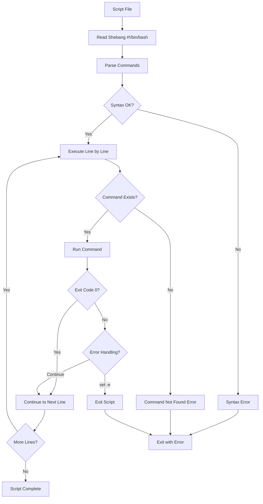
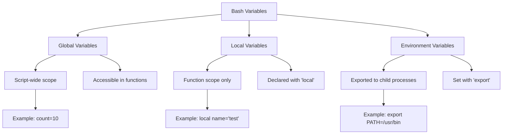
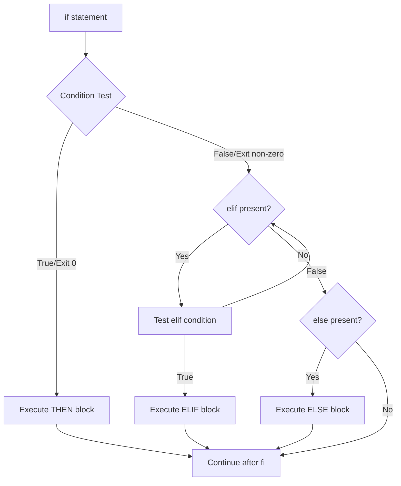

```
 ██████╗ █████╗ ██╗     ██╗     ██████╗  █████╗ ███╗   ███╗███████╗███████╗████████╗███████╗██████╗ 
██╔════╝██╔══██╗██║     ██║     ██╔══██╗██╔══██╗████╗ ████║██╔════╝██╔════╝╚══██╔══╝██╔════╝██╔══██╗
██║     ███████║██║     ██║     ██████╔╝███████║██╔████╔██║█████╗  ███████╗   ██║   █████╗  ██████╔╝
██║     ██╔══██║██║     ██║     ██╔══██╗██╔══██║██║╚██╔╝██║██╔══╝  ╚════██║   ██║   ██╔══╝  ██╔══██╗
╚██████╗██║  ██║███████╗███████╗██║  ██║██║  ██║██║ ╚═╝ ██║███████╗███████║   ██║   ███████╗██║  ██║
 ╚═════╝╚═╝  ╚═╝╚══════╝╚══════╝╚═╝  ╚═╝╚═╝  ╚═╝╚═╝     ╚═╝╚══════╝╚══════╝   ╚═╝   ╚══════╝╚═╝  ╚═╝
                                                                                                    
 ██████╗ ██████╗  █████╗ ███╗   ███╗███████╗███████╗████████╗███████╗██████╗ 
██╔════╝██╔═══██╗██╔══██╗████╗ ████║██╔════╝██╔════╝╚══██╔══╝██╔════╝██╔══██╗
██║     ██║   ██║███████║██╔████╔██║█████╗  ███████╗   ██║   █████╗  ██████╔╝
██║     ██║   ██║██╔══██║██║╚██╔╝██║██╔══╝  ╚════██║   ██║   ██╔══╝  ██╔══██╗
╚██████╗╚██████╔╝██║  ██║██║ ╚═╝ ██║███████╗███████║   ██║   ███████╗██║  ██║
 ╚═════╝ ╚═════╝ ╚═╝  ╚═╝╚═╝     ╚═╝╚══════╝╚══════╝   ╚═╝   ╚══════╝╚═╝  ╚═╝
```

# 🐚 Chapter 13: Bash Scripting Basics

> **Module:** 3 - Programming  
> **Chapter:** 13 of 61  
> **Duration:** 20-25 Minutes  
> **Difficulty:** ⭐⭐ Beginner to Intermediate

---

## 📋 Chapter Overview

| Section | Content |
|---------|---------|
| Video Script | Complete Hindi narration with timestamps |
| Technical Guide | Detailed Bash scripting concepts |
| Script Examples | 25+ practical examples |
| Commands Reference | All commands covered in chapter |
| Practice Exercises | 5 hands-on scripting tasks |
| Troubleshooting | Common scripting errors |
| Video Assets | Thumbnail, description, tags |

---

## 🎬 VIDEO SCRIPT (Complete Hindi Narration)

```
═══════════════════════════════════════════════════════════════════════════════
TERMUX FULL COURSE - CHAPTER 13
Title: Bash Scripting Basics | Shell Scripting Seekhein | T3rmuxk1ng
Duration: 20-25 Minutes
═══════════════════════════════════════════════════════════════════════════════

[INTRO - 0:00 to 1:00]
─────────────────────────────────────────────────────────────────────────────

Namaskar Dosto! Welcome back to Termux Full Course by T3rmuxk1ng!

Aaj ka chapter bahut special hai kyunki aaj hum seekhenge Bash Scripting -
Linux automation ki foundation!

Sochiye aapko 100 files ka naam change karna hai. Manually karne mein 
kitna time lagega? Ghanton? Lekin ek bash script se ye kaam 5 second 
mein ho jaayega!

Bash scripting seekh ke aap:
- Automation kar sakte ho
- Complex tasks ko simplify kar sakte ho
- Apne tools bana sakte ho
- Time bacha sakte ho

Ye chapter beginners ke liye hai - zero se start karke advanced tak 
jaayenge. 25+ practical examples ke saath!

To chaliye shuru karte hain!

---

[SECTION 1: WHAT IS BASH SCRIPTING - 1:00 to 4:00]
─────────────────────────────────────────────────────────────────────────────

Sabse pehle samjhte hain - Bash kya hai?

Bash ka full form hai "Bourne Again Shell". Ye ek command interpreter hai -
yaani ye aapke commands ko read karke execute karta hai.

Jab aap terminal mein koi command type karte ho jaise `ls`, `pwd`, `cd` -
ye sab Bash shell process karta hai.

Bash Script kya hai?

Script ek text file hai jisme multiple commands likhe hote hain. Jab aap 
script ko run karte ho, to ye saari commands ek ke baad ek execute hoti 
hain automatically.

Samjhein ye example:

    # Manual tareeka
    mkdir project
    cd project
    touch file1.txt file2.txt file3.txt
    echo "Project created" > readme.md
    ls -la

Ye 5 commands hain. Har baar ye sab type karna padega.

Lekin agar script banayein:

    # Script mein
    #!/bin/bash
    mkdir project
    cd project
    touch file1.txt file2.txt file3.txt
    echo "Project created" > readme.md
    ls -la

Ab bas ek command: bash create-project.sh

 aur kaam ho gaya!

Bash scripting use cases:

┌─────────────────────────────────────────────────────────────────────────┐
│                    BASH SCRIPTING USE CASES                              │
├─────────────────────────────────────────────────────────────────────────┤
│ ✓ System Administration - User management, backups, monitoring         │
│ ✓ File Operations - Rename, move, delete multiple files automatically  │
│ ✓ Automation - Scheduled tasks, cron jobs                              │
│ ✓ DevOps - Deployment scripts, server configuration                    │
│ ✓ Security Tools - Network scanning automation, log analysis           │
│ ✓ Data Processing - Text processing, log parsing                       │
│ ✓ Termux Tools - Custom tools for Android                              │
└─────────────────────────────────────────────────────────────────────────┘

---

[SECTION 2: CREATING FIRST SCRIPT - 4:00 to 7:00]
─────────────────────────────────────────────────────────────────────────────

Chaliye apna pehla bash script banate hain!

Pehle ek naya file create karte hain:

    nano hello.sh

Ab file mein ye likhein:

    #!/bin/bash
    # Ye mera pehla script hai
    echo "Hello, Termux!"
    echo "Welcome to Bash Scripting"
    date
    whoami
    pwd

Ab file save karein: Ctrl+O, Enter, Ctrl+X

Dekho pehli line: #!/bin/bash

Isko kehte hain SHEBANG. Ye batata hai ki ye script Bash shell mein 
run hogi. #! ek special combination hai, aur /bin/bash interpreter 
ka path hai.

Ye line har bash script ki pehli line honi chahiye.

Script run karne ke 2 tareeke hain:

Tareeka 1 - Direct bash command:

    bash hello.sh

Tareeka 2 - Executable permission:

    chmod +x hello.sh
    ./hello.sh

Dono tareeke se script chalegi!

Output dekho:

    Hello, Termux!
    Welcome to Bash Scripting
    Tue Jan 15 10:30:45 IST 2025
    u0_a123
    /data/data/com.termux/files/home

Ye tha aapka pehla bash script! 🎉

---

[SECTION 3: VARIABLES IN BASH - 7:00 to 10:00]
─────────────────────────────────────────────────────────────────────────────

Ab variables seekhte hain.

Variables ek container hai jisme data store karte hain. Bash mein 
variable banana easy hai:

    name="T3rmuxk1ng"
    age=25
    course="Termux Full Course"

Important rules yaad rakhein:

1. Equal sign ke dono side space NAHI hona chahiye
   WRONG: name = "John"
   RIGHT: name="John"

2. Variable use karne ke liye $ lagana padega
   echo $name
   echo ${name}

3. String value ke liye quotes use karein
   name="John Doe"  # Correct

Chaliye ek script banate hain:

    #!/bin/bash
    # Variables demo

    name="Hacker"
    tool="Termux"
    version=2025

    echo "Welcome, $name!"
    echo "You are using $tool"
    echo "Version: $version"

    # String concatenation
    full_message="Hello $name, welcome to $tool!"
    echo $full_message

Special Variables in Bash:

┌─────────────────────────────────────────────────────────────────────────┐
│                    SPECIAL BASH VARIABLES                                 │
├────────────────┬────────────────────────────────────────────────────────┤
│ Variable       │ Description                                         │
├────────────────┼────────────────────────────────────────────────────────┤
│ $0             │ Script name                                         │
│ $1, $2...      │ Command line arguments                              │
│ $#             │ Number of arguments                                 │
│ $@             │ All arguments as array                              │
│ $*             │ All arguments as single string                      │
│ $?             │ Exit status of last command (0 = success)          │
│ $$             │ Process ID of current shell                         │
│ $!             │ Process ID of last background command               │
│ $HOME          │ User's home directory                               │
│ $PWD           │ Current working directory                           │
│ $USER          │ Current username                                    │
│ $PATH          │ Executable search path                              │
└────────────────┴────────────────────────────────────────────────────────┘

---

[SECTION 4: USER INPUT - 10:00 to 12:30]
─────────────────────────────────────────────────────────────────────────────

Ab user se input lerna seekhte hain.

`read` command se user input le sakte hain:

    #!/bin/bash
    # User input demo

    echo "Enter your name:"
    read name
    echo "Hello, $name!"

Multiple inputs:

    echo "Enter first name and last name:"
    read fname lname
    echo "Full name: $fname $lname"

Silent input (password type):

    read -s -p "Enter password: " pass
    echo
    echo "Password received!"

-p flag prompt ke saath input leta hai:

    read -p "Enter age: " age
    echo "You are $age years old"

Real example - User info script:

    #!/bin/bash
    # User information collector

    echo "═══════════════════════════════"
    echo "    USER INFORMATION FORM"
    echo "═══════════════════════════════"

    read -p "Enter your name: " name
    read -p "Enter your email: " email
    read -s -p "Enter password: " password
    echo
    read -p "Enter your age: " age

    echo ""
    echo "═══════════════════════════════"
    echo "    INFORMATION SUMMARY"
    echo "═══════════════════════════════"
    echo "Name: $name"
    echo "Email: $email"
    echo "Age: $age"
    echo "Password: [HIDDEN]"
    echo "═══════════════════════════════"

---

[SECTION 5: ARITHMETIC OPERATIONS - 12:30 to 15:00]
─────────────────────────────────────────────────────────────────────────────

Bash mein mathematical operations ke liye special syntax chahiye.

Methods for arithmetic:

Method 1: Double Parentheses (( ))

    a=10
    b=5
    
    sum=$((a + b))
    diff=$((a - b))
    mult=$((a * b))
    div=$((a / b))
    mod=$((a % b))
    
    echo "Sum: $sum"
    echo "Difference: $diff"
    echo "Product: $mult"
    echo "Division: $div"
    echo "Modulo: $mod"

Method 2: expr command

    result=$(expr 10 + 5)
    echo $result
    
    # Note: expr mein spaces zaroori hain

Method 3: let command

    let x=10+5
    echo $x

Increment/Decrement:

    count=0
    ((count++))    # count = 1
    ((count--))    # count = 0
    ((count+=5))   # count = 5
    ((count-=2))   # count = 3

Comparison operators:

┌─────────────────────────────────────────────────────────────────────────┐
│                    ARITHMETIC COMPARISON OPERATORS                       │
├────────────────┬─────────────────────────────────────────────────────────┤
│ Operator       │ Meaning                                          │
├────────────────┼─────────────────────────────────────────────────────────┤
│ -eq            │ Equal to                                         │
│ -ne            │ Not equal to                                     │
│ -gt            │ Greater than                                     │
│ -lt            │ Less than                                        │
│ -ge            │ Greater than or equal to                         │
│ -le            │ Less than or equal to                            │
│ ==             │ Equal (in (( )) )                                │
│ !=             │ Not equal (in (( )) )                            │
│ >              │ Greater (in (( )) )                              │
│ <              │ Less (in (( )) )                                 │
└────────────────┴─────────────────────────────────────────────────────────┘

Calculator script:

    #!/bin/bash
    # Simple calculator

    read -p "Enter first number: " num1
    read -p "Enter second number: " num2

    echo "Select operation:"
    echo "1) Addition"
    echo "2) Subtraction"
    echo "3) Multiplication"
    echo "4) Division"
    read -p "Choice: " choice

    case $choice in
        1) result=$((num1 + num2)); op="+" ;;
        2) result=$((num1 - num2)); op="-" ;;
        3) result=$((num1 * num2)); op="*" ;;
        4) result=$((num1 / num2)); op="/" ;;
        *) echo "Invalid choice"; exit 1 ;;
    esac

    echo "Result: $num1 $op $num2 = $result"

---

[SECTION 6: STRING OPERATIONS - 15:00 to 17:30]
─────────────────────────────────────────────────────────────────────────────

Strings Bash mein bahut important hain. Chaliye operations dekhte hain.

String length:

    str="Hello Termux"
    echo ${#str}           # Output: 12

String concatenation:

    str1="Hello"
    str2="World"
    result="$str1 $str2"
    echo $result           # Output: Hello World

Substring extraction:

    str="Hello Termux"
    echo ${str:0:5}        # Output: Hello (0 se 5 characters)
    echo ${str:6}          # Output: Termux (6 se end tak)

String replacement:

    str="Hello World"
    echo ${str/World/Termux}    # Output: Hello Termux

Case conversion (Bash 4+):

    str="Hello"
    echo ${str,,}          # lowercase: hello
    echo ${str^^}          # UPPERCASE: HELLO

Check if string contains substring:

    str="Hello Termux"
    if [[ $str == *"Termux"* ]]; then
        echo "Found!"
    fi

String comparison:

    str1="hello"
    str2="hello"
    
    if [ "$str1" = "$str2" ]; then
        echo "Strings are equal"
    fi

---

[SECTION 7: CONDITIONAL STATEMENTS - 17:30 to 21:00]
─────────────────────────────────────────────────────────────────────────────

Ab aata hai decision making - if, elif, else.

Basic if syntax:

    if [ condition ]; then
        # commands
    fi

if-else:

    if [ condition ]; then
        # true commands
    else
        # false commands
    fi

if-elif-else:

    if [ condition1 ]; then
        # commands
    elif [ condition2 ]; then
        # commands
    else
        # commands
    fi

Test operators for files:

┌─────────────────────────────────────────────────────────────────────────┐
│                    FILE TEST OPERATORS                                   │
├────────────────┬────────────────────────────────────────────────────────┤
│ Operator       │ Description                                        │
├────────────────┼────────────────────────────────────────────────────────┤
│ -e file        │ True if file exists                                │
│ -f file        │ True if file exists and is regular file            │
│ -d file        │ True if file exists and is directory               │
│ -r file        │ True if file is readable                           │
│ -w file        │ True if file is writable                           │
│ -x file        │ True if file is executable                         │
│ -s file        │ True if file exists and is not empty               │
│ -L file        │ True if file is symbolic link                      │
│ file1 -nt file2│ True if file1 is newer than file2                  │
│ file1 -ot file2│ True if file1 is older than file2                  │
└────────────────┴────────────────────────────────────────────────────────┘

Test operators for strings:

┌─────────────────────────────────────────────────────────────────────────┐
│                    STRING TEST OPERATORS                                 │
├────────────────┬────────────────────────────────────────────────────────┤
│ Operator       │ Description                                        │
├────────────────┼────────────────────────────────────────────────────────┤
│ -z string      │ True if string is empty                            │
│ -n string      │ True if string is not empty                        │
│ str1 = str2    │ True if strings are equal                          │
│ str1 != str2   │ True if strings are not equal                      │
│ str1 < str2    │ True if str1 sorts before str2                     │
│ str1 > str2    │ True if str1 sorts after str2                      │
└────────────────┴────────────────────────────────────────────────────────┘

Practical example - File checker:

    #!/bin/bash
    # File checker script

    read -p "Enter file path: " filepath

    if [ -e "$filepath" ]; then
        echo "✓ File exists"
        
        if [ -f "$filepath" ]; then
            echo "✓ It's a regular file"
        elif [ -d "$filepath" ]; then
            echo "✓ It's a directory"
        fi
        
        if [ -r "$filepath" ]; then
            echo "✓ File is readable"
        fi
        
        if [ -w "$filepath" ]; then
            echo "✓ File is writable"
        fi
        
        if [ -x "$filepath" ]; then
            echo "✓ File is executable"
        fi
    else
        echo "✗ File does not exist"
    fi

Logical operators:

    # AND
    if [ condition1 ] && [ condition2 ]; then
        echo "Both true"
    fi

    # OR
    if [ condition1 ] || [ condition2 ]; then
        echo "At least one true"
    fi

    # NOT
    if [ ! condition ]; then
        echo "Condition is false"
    fi

---

[SECTION 8: LOOPS - 21:00 to 25:00]
─────────────────────────────────────────────────────────────────────────────

Loops se aap same kaam repeatedly kar sakte ho.

FOR LOOP - Most common:

    # Basic for loop
    for i in 1 2 3 4 5; do
        echo "Number: $i"
    done

    # Range (sequence)
    for i in {1..10}; do
        echo "Count: $i"
    done

    # C-style for loop
    for ((i=0; i<5; i++)); do
        echo "Iteration: $i"
    done

    # Loop through files
    for file in *.txt; do
        echo "Processing: $file"
    done

    # Loop through command output
    for user in $(cat users.txt); do
        echo "User: $user"
    done

WHILE LOOP - Run until condition false:

    count=0
    while [ $count -lt 5 ]; do
        echo "Count: $count"
        ((count++))
    done

    # Read file line by line
    while read line; do
        echo "Line: $line"
    done < file.txt

    # Infinite loop with break
    while true; do
        read -p "Continue? (y/n): " choice
        if [ "$choice" = "n" ]; then
            break
        fi
    done

UNTIL LOOP - Run until condition true:

    count=0
    until [ $count -ge 5 ]; do
        echo "Count: $count"
        ((count++))
    done

Loop control:

    # break - exit loop
    for i in {1..10}; do
        if [ $i -eq 5 ]; then
            break
        fi
        echo $i
    done

    # continue - skip iteration
    for i in {1..5}; do
        if [ $i -eq 3 ]; then
            continue
        fi
        echo $i
    done

---

[SECTION 9: ARRAYS - 25:00 to 27:30]
─────────────────────────────────────────────────────────────────────────────

Bash mein arrays bhi support hain.

Array declaration:

    # Method 1
    fruits=("Apple" "Banana" "Orange")

    # Method 2
    declare -a fruits
    fruits[0]="Apple"
    fruits[1]="Banana"
    fruits[2]="Orange"

Accessing elements:

    echo ${fruits[0]}       # First element: Apple
    echo ${fruits[1]}       # Second element: Banana
    echo ${fruits[-1]}      # Last element: Orange

All elements:

    echo ${fruits[@]}       # All elements
    echo ${fruits[*]}       # All elements

Array length:

    echo ${#fruits[@]}      # Number of elements
    echo ${#fruits[0]}      # Length of first element

Loop through array:

    for fruit in "${fruits[@]}"; do
        echo "Fruit: $fruit"
    done

    # With index
    for i in "${!fruits[@]}"; do
        echo "Index $i: ${fruits[$i]}"
    done

Add/remove elements:

    fruits+=("Mango")       # Add element
    unset fruits[1]         # Remove element at index 1

Associative arrays (key-value):

    declare -A user
    user[name]="John"
    user[age]=25
    user[city]="Mumbai"

    echo ${user[name]}
    echo ${user[age]}

---

[SECTION 10: FUNCTIONS - 27:30 to 30:00]
─────────────────────────────────────────────────────────────────────────────

Functions code ko reusable banate hain.

Function syntax:

    # Method 1
    function greet() {
        echo "Hello, World!"
    }

    # Method 2
    greet() {
        echo "Hello, World!"
    }

    # Call function
    greet

Function with arguments:

    greet() {
        echo "Hello, $1!"
        echo "You are $2 years old"
    }

    greet "John" 25

Function with return value:

    add() {
        result=$(($1 + $2))
        echo $result
    }

    sum=$(add 10 20)
    echo "Sum: $sum"

Local variables:

    myfunction() {
        local x=10     # Local scope
        y=20           # Global scope
    }

Real example - Menu system:

    #!/bin/bash

    show_menu() {
        clear
        echo "═══════════════════════════════"
        echo "         MAIN MENU"
        echo "═══════════════════════════════"
        echo "1. System Information"
        echo "2. Disk Usage"
        echo "3. Memory Usage"
        echo "4. Network Info"
        echo "5. Exit"
        echo "═══════════════════════════════"
    }

    sys_info() {
        echo "System: $(uname -a)"
        echo "User: $(whoami)"
        echo "Home: $HOME"
    }

    disk_usage() {
        df -h
    }

    mem_usage() {
        free -h
    }

    # Main loop
    while true; do
        show_menu
        read -p "Enter choice: " choice
        
        case $choice in
            1) sys_info ;;
            2) disk_usage ;;
            3) mem_usage ;;
            4) ifconfig 2>/dev/null || ip addr ;;
            5) echo "Goodbye!"; exit 0 ;;
            *) echo "Invalid choice" ;;
        esac
        
        read -p "Press Enter to continue..."
    done

---

[SECTION 11: DEBUGGING SCRIPTS - 30:00 to 32:00]
─────────────────────────────────────────────────────────────────────────────

Debugging bahut important hai scripting mein.

Method 1: bash -x

    bash -x script.sh

Ye har command ko print karta hai before execution (+ sign ke saath).

Method 2: set -x in script

    #!/bin/bash
    set -x    # Enable debug mode
    
    echo "Hello"
    
    set +x    # Disable debug mode

Method 3: set -e (Exit on error)

    #!/bin/bash
    set -e    # Script will exit if any command fails

Method 4: set -u (Error on undefined variable)

    #!/bin/bash
    set -u    # Error if undefined variable used

Method 5: All checks combined

    #!/bin/bash
    set -euo pipefail

Common debugging tips:

1. echo statements add karein variable values check karne ke liye
2. ShellCheck tool use karein: shellcheck script.sh
3. Syntax check: bash -n script.sh

---

[SECTION 12: PRACTICAL EXAMPLES - 32:00 to 35:00]
─────────────────────────────────────────────────────────────────────────────

Ab main kuch practical scripts dikhata hoon jo aap daily use kar sakte ho.

Example 1: System Backup Script

    #!/bin/bash
    # Backup script

    backup_dir="$HOME/backups"
    date=$(date +%Y%m%d_%H%M%S)
    
    mkdir -p "$backup_dir"
    
    echo "Creating backup..."
    tar -czf "$backup_dir/backup_$date.tar.gz" -C $HOME .
    echo "Backup created: backup_$date.tar.gz"

Example 2: File Organizer

    #!/bin/bash
    # Organize files by extension

    for file in *; do
        if [ -f "$file" ]; then
            ext="${file##*.}"
            mkdir -p "$ext"
            mv "$file" "$ext/"
        fi
    done
    echo "Files organized!"

Example 3: Network Scanner

    #!/bin/bash
    # Simple network scanner

    read -p "Enter network (e.g., 192.168.1): " network
    
    echo "Scanning network..."
    for i in {1..254}; do
        if ping -c 1 -W 1 "$network.$i" &>/dev/null; then
            echo "Host up: $network.$i"
        fi
    done

Example 4: Password Generator

    #!/bin/bash
    # Password generator

    length=${1:-12}
    chars='abcdefghijklmnopqrstuvwxyzABCDEFGHIJKLMNOPQRSTUVWXYZ0123456789!@#$%'
    
    password=$(cat /dev/urandom | tr -dc "$chars" | fold -w "$length" | head -n 1)
    echo "Generated password: $password"

Example 5: Log Analyzer

    #!/bin/bash
    # Analyze log file

    logfile="$1"
    
    echo "Total lines: $(wc -l < "$logfile")"
    echo "Errors: $(grep -c "ERROR" "$logfile")"
    echo "Warnings: $(grep -c "WARN" "$logfile")"
    echo "Unique IPs: $(grep -oE '[0-9]+\.[0-9]+\.[0-9]+\.[0-9]+' "$logfile" | sort -u | wc -l)"

---

[SECTION 13: SUMMARY & NEXT CHAPTER PREVIEW - 35:00 to 37:00]
─────────────────────────────────────────────────────────────────────────────

To dosto, Chapter 13 complete! Let's summarize:

✅ Bash scripting kya hai - Automation ka powerful tool
✅ Shebang - #!/bin/bash script ki pehli line
✅ Variables - Data store karna, special variables
✅ User input - read command ke saath
✅ Arithmetic - (( )), expr, let
✅ String operations - Length, substring, replacement
✅ Conditional statements - if, elif, else
✅ Test operators - Files, strings, numbers ke liye
✅ Loops - for, while, until
✅ Arrays - Indexed aur associative
✅ Functions - Reusable code
✅ Debugging - bash -x, set options

Important commands yaad rakhein:

┌─────────────────────────────────────────────────────────────────────────┐
│                    CHAPTER 13 - IMPORTANT COMMANDS                       │
├─────────────────────────────────────────────────────────────────────────┤
│ chmod +x script.sh      │ Make script executable                       │
│ bash script.sh          │ Run script with bash                         │
│ bash -x script.sh       │ Debug script                                 │
│ ./script.sh             │ Execute script directly                      │
│ read -p "Prompt: " var  │ Get user input with prompt                   │
│ echo ${#var}            │ Get string length                            │
│ [[ $str == *"sub"* ]]   │ Check if string contains substring           │
│ set -e                  │ Exit on error                                │
│ set -x                  │ Enable debug mode                            │
└─────────────────────────────────────────────────────────────────────────┘

Next Chapter 14 mein hum seekhenge:
- Advanced bash scripting
- Error handling
- Signal trapping
- Process management
- Regular expressions
- Here documents
- Process substitution

Agar ye video helpful lagi, to:
👍 Like button press karein
🔔 Subscribe karein, notification bell on karein
💬 Koi sawal ho to comment mein poochein
📤 Share karein friends ke saath

Main har comment ka reply karta hoon.

Thank you for watching! See you in Chapter 14!

═══════════════════════════════════════════════════════════════════════════════
```

---

## 📊 MERMAID DIAGRAMS

### Bash Script Execution Flow



### Bash Variable Scope Architecture



### Conditional Logic Flow



---

## ⚡ COMMAND CHEATSHEET

### Bash Script Commands

| Command | Syntax | Example | Purpose |
|---------|--------|---------|---------|
| Shebang | `#!/bin/bash` | First line of script | Specify interpreter |
| chmod | `chmod +x script.sh` | `chmod +x test.sh` | Make executable |
| echo | `echo "text"` | `echo "Hello"` | Print output |
| read | `read var` | `read -p "Name: " name` | Get user input |
| source | `source script.sh` | `source ~/.bashrc` | Execute in current shell |
| bash | `bash script.sh` | `bash test.sh` | Run script |

### Variable Operations

| Operation | Syntax | Example | Result |
|-----------|--------|---------|--------|
| Assign | `var=value` | `name="John"` | No spaces around = |
| Use | `$var` or `${var}` | `echo $name` | John |
| Default | `${var:-default}` | `${unset:-"none"}` | none |
| Assign default | `${var:=default}` | `${unset:="hi"}` | Sets and returns |
| Length | `${#var}` | `${#name}` | 4 |
| Substring | `${var:start:len}` | `${name:0:2}` | Jo |
| Replace | `${var/old/new}` | `${name/J/M}` | Mohn |

### Arithmetic Operations

| Method | Syntax | Example | Result |
|--------|--------|---------|--------|
| Double parens | `$((expr))` | `echo $((5+3))` | 8 |
| let | `let var=expr` | `let x=5+3` | x=8 |
| expr | `expr arg op arg` | `expr 5 + 3` | 8 |
| bc | `echo "expr" \| bc` | `echo "5/2" \| bc` | 2 |

### Test Operators

| Operator | True If | Example |
|----------|---------|---------|
| `-e file` | File exists | `[ -e /etc/passwd ]` |
| `-f file` | Is regular file | `[ -f script.sh ]` |
| `-d dir` | Is directory | `[ -d /home ]` |
| `-r file` | Is readable | `[ -r file.txt ]` |
| `-w file` | Is writable | `[ -w file.txt ]` |
| `-x file` | Is executable | `[ -x script.sh ]` |
| `-z str` | String is empty | `[ -z "$var" ]` |
| `-n str` | String not empty | `[ -n "$var" ]` |
| `= ` | Strings equal | `[ "$a" = "$b" ]` |
| `!=` | Strings not equal | `[ "$a" != "$b" ]` |
| `-eq` | Numbers equal | `[ $a -eq $b ]` |
| `-ne` | Numbers not equal | `[ $a -ne $b ]` |
| `-lt` | Less than | `[ $a -lt $b ]` |
| `-gt` | Greater than | `[ $a -gt $b ]` |

### Loop Constructs

| Loop | Syntax | Best For |
|------|--------|----------|
| for | `for i in list; do...done` | Known iterations |
| C-style for | `for ((i=0;i<n;i++)); do...done` | Counter-based |
| while | `while [ cond ]; do...done` | Condition-based |
| until | `until [ cond ]; do...done` | Run until true |

---

## 🎯 LEARNING PATH VISUALIZATION

```
╔═══════════════════════════════════════════════════════════════════════════════╗
║                BASH SCRIPTING LEARNING JOURNEY - T3RMUXK1NG                  ║
╠═══════════════════════════════════════════════════════════════════════════════╣
║                                                                                ║
║  🚀 START YOUR BASH JOURNEY                                                   ║
║       │                                                                        ║
║       ▼                                                                        ║
║  ┌─────────────────────────────────────────────────────────────────────────┐  ║
║  │                    PHASE 1: FOUNDATION                                   │  ║
║  │  ┌─────────┐   ┌─────────┐   ┌─────────┐   ┌─────────┐                  │  ║
║  │  │Shebang  │──►│ echo    │──►│Variables│──►│ Comments│                  │  ║
║  │  │#!/bin/bash   │         │   │ name=val│   │   #     │                  │  ║
║  │  └─────────┘   └─────────┘   └─────────┘   └─────────┘                  │  ║
║  │       ⭐           ⭐            ⭐            ⭐                           │  ║
║  └─────────────────────────────────────────────────────────────────────────┘  ║
║       │                                                                        ║
║       ▼                                                                        ║
║  ┌─────────────────────────────────────────────────────────────────────────┐  ║
║  │                    PHASE 2: INPUT/OUTPUT                                 │  ║
║  │  ┌─────────┐   ┌─────────┐   ┌─────────┐   ┌─────────┐                  │  ║
║  │  │  read   │──►│ printf  │──►│ Redirect│──►│  Pipes  │                  │  ║
║  │  │ input   │   │ format  │   │  > >> < │   │    \|   │                  │  ║
║  │  └─────────┘   └─────────┘   └─────────┘   └─────────┘                  │  ║
║  │       ⭐⭐          ⭐⭐           ⭐⭐           ⭐⭐                          │  ║
║  └─────────────────────────────────────────────────────────────────────────┘  ║
║       │                                                                        ║
║       ▼                                                                        ║
║  ┌─────────────────────────────────────────────────────────────────────────┐  ║
║  │                    PHASE 3: CONTROL FLOW                                  │  ║
║  │  ┌─────────┐   ┌─────────┐   ┌─────────┐   ┌─────────┐                  │  ║
║  │  │if/else  │──►│  case   │──►│for loop │──►│while    │                  │  ║
║  │  │ tests   │   │ switch  │   │         │   │  loop   │                  │  ║
║  │  └─────────┘   └─────────┘   └─────────┘   └─────────┘                  │  ║
║  │       ⭐⭐⭐        ⭐⭐⭐          ⭐⭐⭐          ⭐⭐⭐                         │  ║
║  └─────────────────────────────────────────────────────────────────────────┘  ║
║       │                                                                        ║
║       ▼                                                                        ║
║  ┌─────────────────────────────────────────────────────────────────────────┐  ║
║  │                    PHASE 4: DATA STRUCTURES                               │  ║
║  │  ┌─────────┐   ┌─────────┐   ┌─────────┐   ┌─────────┐                  │  ║
║  │  │ Arrays  │──►│Associat.│──►│ Strings │──►│  Math   │                  │  ║
║  │  │ [a b c] │   │ Arrays  │   │ ${#var} │   │ $(())   │                  │  ║
║  │  └─────────┘   └─────────┘   └─────────┘   └─────────┘                  │  ║
║  │       ⭐⭐⭐⭐       ⭐⭐⭐⭐         ⭐⭐⭐          ⭐⭐⭐                         │  ║
║  └─────────────────────────────────────────────────────────────────────────┘  ║
║       │                                                                        ║
║       ▼                                                                        ║
║  ┌─────────────────────────────────────────────────────────────────────────┐  ║
║  │                    PHASE 5: FUNCTIONS                                     │  ║
║  │  ┌─────────┐   ┌─────────┐   ┌─────────┐   ┌─────────┐                  │  ║
║  │  │ define  │──►│arguments│──►│ return  │──►│  local  │                  │  ║
║  │  │ func(){}│   │  $1 $2  │   │ values  │   │  scope  │                  │  ║
║  │  └─────────┘   └─────────┘   └─────────┘   └─────────┘                  │  ║
║  │       ⭐⭐⭐⭐       ⭐⭐⭐⭐         ⭐⭐⭐⭐        ⭐⭐⭐⭐                        │  ║
║  └─────────────────────────────────────────────────────────────────────────┘  ║
║       │                                                                        ║
║       ▼                                                                        ║
║                         🏆 BASH SCRIPTING MASTER 🏆                           ║
║                                                                                ║
╚═══════════════════════════════════════════════════════════════════════════════╝
```

---

## 🔧 TOOL/FEATURE COMPARISON TABLE

### Bash vs Python vs Node.js for Scripting

| Feature | Bash | Python | Node.js |
|---------|------|--------|---------|
| **System Integration** | ⭐⭐⭐⭐⭐ Native | ⭐⭐⭐ Via modules | ⭐⭐⭐ Via modules |
| **Text Processing** | ⭐⭐⭐⭐ pipes/grep | ⭐⭐⭐⭐⭐ Powerful | ⭐⭐⭐⭐ Good |
| **Learning Curve** | ⭐⭐⭐ Medium | ⭐⭐⭐⭐ Easy | ⭐⭐⭐ Medium |
| **Cross-platform** | ⭐⭐ Unix mostly | ⭐⭐⭐⭐⭐ Excellent | ⭐⭐⭐⭐⭐ Excellent |
| **Performance** | ⭐⭐⭐⭐ Fast startup | ⭐⭐⭐ Interpreted | ⭐⭐⭐⭐ V8 engine |
| **Libraries** | ⭐⭐ Limited | ⭐⭐⭐⭐⭐ Massive | ⭐⭐⭐⭐⭐ NPM |
| **Error Handling** | ⭐⭐ Basic | ⭐⭐⭐⭐⭐ Robust | ⭐⭐⭐⭐ Good |
| **Termux Support** | ⭐⭐⭐⭐⭐ Native | ⭐⭐⭐⭐⭐ Perfect | ⭐⭐⭐⭐⭐ Perfect |
| **Best For** | System tasks, glue | General purpose | Web, async I/O |

### Shell Types Comparison

| Shell | Full Name | Default On | Features |
|-------|-----------|------------|----------|
| **bash** | Bourne Again Shell | Most Linux, Termux | Most common, feature-rich |
| **sh** | Bourne Shell | POSIX systems | Minimal, portable |
| **zsh** | Z Shell | macOS (Catalina+) | Advanced completion, themes |
| **dash** | Debian Almquist | Debian/Ubuntu (sh) | Fast, POSIX compliant |
| **fish** | Friendly Interactive | Not default | User-friendly, autosuggestions |

---

## 🚀 PRACTICAL CODING CHALLENGES

### Challenge 1: System Information Reporter 📊

**Difficulty:** ⭐ Beginner  
**Time:** 10 minutes

**Problem:** Create a Bash script that displays system information including hostname, current user, date/time, uptime, and disk usage.

**Sample Output:**
```
═══════════════════════════════════════
       SYSTEM INFORMATION REPORT
═══════════════════════════════════════
Hostname: localhost
User: u0_a123
Date: Mon Jan 15 10:30:45 IST 2025
Uptime: up 2 hours, 15 minutes
Disk Usage: 45% used
Memory: 2GB / 4GB
═══════════════════════════════════════
```

<details>
<summary>🔑 Hidden Solution</summary>

```bash
#!/bin/bash
# System Information Reporter

echo "═══════════════════════════════════════"
echo "       SYSTEM INFORMATION REPORT"
echo "═══════════════════════════════════════"

echo "Hostname: $(hostname)"
echo "User: $(whoami)"
echo "Date: $(date)"
echo "Uptime: $(uptime -p 2>/dev/null || uptime)"

# Disk usage (root partition)
disk_used=$(df -h / | tail -1 | awk '{print $5}' | tr -d '%')
echo "Disk Usage: ${disk_used}% used"

# Memory (if available)
if command -v free &>/dev/null; then
    mem_info=$(free -h | grep Mem)
    total=$(echo $mem_info | awk '{print $2}')
    used=$(echo $mem_info | awk '{print $3}')
    echo "Memory: ${used} / ${total}"
fi

echo "═══════════════════════════════════════"
```
</details>

---

### Challenge 2: Automated Backup Script 💾

**Difficulty:** ⭐⭐ Intermediate  
**Time:** 15 minutes

**Problem:** Create a script that:
1. Takes a source directory as argument
2. Creates a timestamped backup in ~/backups
3. Compresses it as .tar.gz
4. Logs the operation with timestamp

**Sample Output:**
```
Backup Script Started...
Source: /home/user/myproject
Creating backup directory...
Creating compressed archive...
Backup created: backup_myproject_20250115_103045.tar.gz
Size: 2.5M
Log saved to: /home/user/backups/backup.log
Backup Complete!
```

<details>
<summary>🔑 Hidden Solution</summary>

```bash
#!/bin/bash
# Automated Backup Script

# Check argument
if [ $# -eq 0 ]; then
    echo "Usage: $0 <source_directory>"
    exit 1
fi

SOURCE="$1"
BACKUP_DIR="$HOME/backups"
TIMESTAMP=$(date +%Y%m%d_%H%M%S)
BASENAME=$(basename "$SOURCE")
BACKUP_FILE="${BACKUP_DIR}/backup_${BASENAME}_${TIMESTAMP}.tar.gz"
LOG_FILE="${BACKUP_DIR}/backup.log"

echo "Backup Script Started..."

# Check source exists
if [ ! -d "$SOURCE" ]; then
    echo "Error: Source directory does not exist!"
    exit 1
fi

# Create backup directory
mkdir -p "$BACKUP_DIR"
echo "Creating backup directory..."

# Create backup
echo "Creating compressed archive..."
tar -czf "$BACKUP_FILE" -C "$(dirname "$SOURCE")" "$BASENAME" 2>/dev/null

if [ $? -eq 0 ]; then
    SIZE=$(du -h "$BACKUP_FILE" | cut -f1)
    echo "Backup created: $(basename "$BACKUP_FILE")"
    echo "Size: $SIZE"
    
    # Log the backup
    echo "$(date): Backup of $SOURCE created - Size: $SIZE" >> "$LOG_FILE"
    echo "Log saved to: $LOG_FILE"
    echo "Backup Complete!"
else
    echo "Error: Backup failed!"
    exit 1
fi
```
</details>

---

### Challenge 3: Log File Analyzer 📋

**Difficulty:** ⭐⭐⭐ Advanced  
**Time:** 20 minutes

**Problem:** Create a script that analyzes a log file and produces a summary report showing:
- Total lines
- Error count
- Warning count
- Top 5 IP addresses (if present)
- Errors by hour

**Sample Output:**
```
═════════════════════════════════════════════════
              LOG ANALYSIS REPORT
═════════════════════════════════════════════════
File: /var/log/app.log
Total Lines: 15,420

SUMMARY:
  Errors:   234
  Warnings: 567
  Info:     14,619

TOP 5 IP ADDRESSES:
  192.168.1.100   - 456 requests
  10.0.0.15       - 234 requests
  172.16.0.5      - 189 requests
  192.168.1.50    - 167 requests
  10.0.0.25       - 134 requests

ERRORS BY HOUR:
  00:00-06:00 - 45 errors
  06:00-12:00 - 78 errors
  12:00-18:00 - 56 errors
  18:00-24:00 - 55 errors
═════════════════════════════════════════════════
```

<details>
<summary>🔑 Hidden Solution</summary>

```bash
#!/bin/bash
# Log File Analyzer

LOG_FILE="$1"

if [ ! -f "$LOG_FILE" ]; then
    echo "Usage: $0 <logfile>"
    exit 1
fi

echo "═════════════════════════════════════════════════"
echo "              LOG ANALYSIS REPORT"
echo "═════════════════════════════════════════════════"
echo "File: $LOG_FILE"

# Count lines
TOTAL=$(wc -l < "$LOG_FILE")
echo "Total Lines: $(printf "%'d" $TOTAL)"
echo ""

# Count by severity
ERRORS=$(grep -ci "error" "$LOG_FILE" 2>/dev/null || echo 0)
WARNINGS=$(grep -ci "warning\|warn" "$LOG_FILE" 2>/dev/null || echo 0)
INFO=$((TOTAL - ERRORS - WARNINGS))

echo "SUMMARY:"
printf "  Errors:   %d\n" "$ERRORS"
printf "  Warnings: %d\n" "$WARNINGS"
printf "  Info:     %d\n" "$INFO"
echo ""

# Top IPs
echo "TOP 5 IP ADDRESSES:"
grep -oE '[0-9]+\.[0-9]+\.[0-9]+\.[0-9]+' "$LOG_FILE" 2>/dev/null | \
    sort | uniq -c | sort -rn | head -5 | \
    while read count ip; do
        printf "  %-15s - %s requests\n" "$ip" "$count"
    done
echo ""

# Errors by hour
echo "ERRORS BY HOUR:"
for hour in 00 06 12 18; do
    end_hour=$((10#$hour + 6))
    end_hour=$(printf "%02d" $end_hour)
    count=$(grep -E "\[$hour:[0-5][0-9]" "$LOG_FILE" 2>/dev/null | \
            grep -ci "error" || echo 0)
    printf "  %s:00-%s:00 - %d errors\n" "$hour" "$end_hour" "$count"
done

echo "═════════════════════════════════════════════════"
```
</details>

---

## 📖 GLOSSARY & TERMINOLOGY

### Bash Scripting Terms

| Term | Definition |
|------|------------|
| **Shell** | A command-line interface that interprets and executes commands |
| **Bash** | Bourne Again Shell - the default shell on most Linux systems |
| **Shebang** | `#!/bin/bash` - first line indicating the script interpreter |
| **Script** | A file containing a series of commands to be executed |
| **Variable** | A named storage location for data ($name or ${name}) |
| **Exit Code** | Numeric status returned by commands (0 = success, non-zero = error) |
| **Pipe** | `|` - redirects output of one command to input of another |
| **Redirect** | `>` or `>>` - sends output to a file |
| **Wildcard** | `*` or `?` - pattern matching for filenames |
| **Globbing** | Pattern expansion for matching filenames |
| **PID** | Process ID - unique identifier for running processes |
| **Environment Variable** | Variable available to child processes (exported) |
| **Subshell** | A child shell process spawned by a script |
| **Escape Character** | `\` - prevents special interpretation of next character |
| **Argument** | Value passed to a script or function ($1, $2, etc.) |

---

## 💼 CAREER INSIGHTS

### DevOps/Shell Scripting Career Path

```
┌─────────────────────────────────────────────────────────────────────────────┐
│                    DEVOPS CAREER PROGRESSION                                 │
├─────────────────────────────────────────────────────────────────────────────┤
│                                                                              │
│  ┌──────────────────────────────────────────────────────────────────────┐   │
│  │ LEVEL 5: DevOps Architect (8+ years)                                │   │
│  │ • Infrastructure Design       • Multi-cloud Strategy               │   │
│  │ • Team Leadership             • Tool Selection & Governance        │   │
│  │ Salary: ₹40-70 LPA | $150K-220K                                      │   │
│  └──────────────────────────────────────────────────────────────────────┘   │
│                                   ▲                                          │
│  ┌──────────────────────────────────────────────────────────────────────┐   │
│  │ LEVEL 4: Senior DevOps Engineer (5-8 years)                         │   │
│  │ • CI/CD Pipeline Design       • Kubernetes Administration          │   │
│  │ • Infrastructure as Code      • Security Implementation            │   │
│  │ Salary: ₹25-40 LPA | $100K-150K                                      │   │
│  └──────────────────────────────────────────────────────────────────────┘   │
│                                   ▲                                          │
│  ┌──────────────────────────────────────────────────────────────────────┐   │
│  │ LEVEL 3: DevOps Engineer (2-5 years)                                │   │
│  │ • Docker & Containers         • Jenkins/GitHub Actions             │   │
│  │ • Cloud Platforms (AWS/GCP)   • Monitoring & Logging               │   │
│  │ Salary: ₹12-25 LPA | $70K-100K                                       │   │
│  └──────────────────────────────────────────────────────────────────────┘   │
│                                   ▲                                          │
│  ┌──────────────────────────────────────────────────────────────────────┐   │
│  │ LEVEL 2: System Administrator (1-2 years)                           │   │
│  │ • Linux Administration        • Bash Scripting                     │   │
│  │ • Basic Networking            • Server Maintenance                 │   │
│  │ Salary: ₹5-12 LPA | $45K-70K                                         │   │
│  └──────────────────────────────────────────────────────────────────────┘   │
│                                   ▲                                          │
│  ┌──────────────────────────────────────────────────────────────────────┐   │
│  │ LEVEL 1: Learning (You are here!)                                   │   │
│  │ • Bash Fundamentals           • Linux Commands                     │   │
│  │ • Shell Scripting             • Automation Basics                  │   │
│  └──────────────────────────────────────────────────────────────────────┘   │
│                                                                              │
├─────────────────────────────────────────────────────────────────────────────┤
│                      KEY SKILLS FOR DEVOPS                                   │
│                                                                              │
│  🔹 Bash/Shell Scripting  🔹 Docker & Kubernetes  🔹 CI/CD Pipelines        │
│  🔹 AWS/GCP/Azure         🔹 Linux Administration  🔹 Terraform/Ansible     │
│  🔹 Git Version Control   🔹 Monitoring Tools      🔹 Python/Go            │
│                                                                              │
└─────────────────────────────────────────────────────────────────────────────┘
```

---

## 🏆 CODE OPTIMIZATION TIPS

### Bash Script Performance Tips

| Tip | Description | Impact |
|-----|-------------|--------|
| **Avoid subshells** | Use `${}` instead of `$()` where possible | ⭐⭐⭐⭐ |
| **Use builtins** | Prefer `[[ ]]` over `[ ]` | ⭐⭐⭐ |
| **Quote variables** | Always `"$var"` to prevent word splitting | ⭐⭐⭐⭐⭐ |
| **Use arrays** | Instead of space-separated strings | ⭐⭐⭐⭐ |
| **Minimize pipes** | Reduce pipeline stages | ⭐⭐⭐⭐ |
| **Use printf** | More efficient than echo for formatting | ⭐⭐⭐ |
| **Cache command output** | Store in variable if used multiple times | ⭐⭐⭐⭐ |
| **Use set -e** | Fail fast on errors | ⭐⭐⭐⭐⭐ |

### Common Bash Anti-Patterns

```bash
# ❌ BAD: Unquoted variables
if [ $name = "test" ]; then  # Fails if name has spaces

# ✅ GOOD: Always quote
if [ "$name" = "test" ]; then  # Safe

# ❌ BAD: Using cat with grep
cat file.txt | grep "pattern"

# ✅ GOOD: Direct file input
grep "pattern" file.txt

# ❌ BAD: For loop over ls output
for file in $(ls); do

# ✅ GOOD: Glob pattern
for file in *; do

# ❌ BAD: Multiple echo calls
echo "Line 1"
echo "Line 2"
echo "Line 3"

# ✅ GOOD: Single echo with heredoc
cat << EOF
Line 1
Line 2
Line 3
EOF

# ❌ BAD: Using sed for simple substitution
var=$(echo "$var" | sed 's/old/new/')

# ✅ GOOD: Parameter expansion
var="${var//old/new}"
```

---

## 📖 TECHNICAL GUIDE

### 1. What is Bash Scripting?

```
┌─────────────────────────────────────────────────────────────────────────┐
│                    BASH SCRIPTING OVERVIEW                               │
├─────────────────────────────────────────────────────────────────────────┤
│                                                                          │
│  Bash (Bourne Again Shell) is:                                          │
│  ├── Command interpreter (shell)                                        │
│  ├── Default shell on most Linux distributions                          │
│  ├── Available on Termux/Android                                        │
│  └── Powerful scripting language                                        │
│                                                                          │
│  Bash Script is:                                                        │
│  ├── A text file containing commands                                    │
│  ├── Executed line by line                                              │
│  ├── Can use variables, loops, functions                                │
│  └── Perfect for automation tasks                                       │
│                                                                          │
│  Why Bash Scripting?                                                    │
│  ├── Automate repetitive tasks                                          │
│  ├── Create custom tools                                                │
│  ├── System administration                                              │
│  ├── File processing                                                    │
│  ├── Text manipulation                                                  │
│  └── Build complex workflows                                            │
│                                                                          │
└─────────────────────────────────────────────────────────────────────────┘
```

### 2. Creating Shell Scripts

```bash
# Step 1: Create file with .sh extension
nano myscript.sh

# Step 2: Add shebang line (FIRST LINE!)
#!/bin/bash

# Step 3: Write your code
echo "Hello World"

# Step 4: Save and exit
# nano: Ctrl+O, Enter, Ctrl+X

# Step 5: Make executable
chmod +x myscript.sh

# Step 6: Run script
./myscript.sh
# OR
bash myscript.sh
```

### 3. Shebang (#!)

The shebang tells the system which interpreter to use:

```bash
#!/bin/bash          # Bash shell
#!/bin/sh            # POSIX shell
#!/usr/bin/env bash  # Portable bash (recommended)
#!/usr/bin/python3   # Python script
#!/usr/bin/env node  # Node.js script
```

**Why use #!/usr/bin/env bash?**
- More portable across different systems
- Works even if bash is not in /bin
- Recommended for cross-platform scripts

### 4. Variables in Bash

```bash
# Variable assignment (NO SPACES around =)
name="John"
age=25
PI=3.14

# Using variables
echo $name
echo ${name}          # Preferred syntax
echo "Name: $name"

# Command substitution
current_date=$(date)
files=$(ls -la)
kernel=$(uname -r)

# Read-only variable
readonly PI=3.14159
PI=3.14              # Error!

# Unset variable
unset name

# Default value
echo ${name:-"Guest"}    # Use "Guest" if name is unset
echo ${name:="Guest"}    # Assign "Guest" if name is unset
```

### 5. User Input (read command)

```bash
# Basic input
read name

# With prompt
read -p "Enter name: " name

# Silent input (passwords)
read -s -p "Password: " pass

# With timeout (seconds)
read -t 5 -p "Quick! Enter name: " name

# Limit characters
read -n 1 -p "Continue? (y/n): " choice

# Read into array
read -a words <<< "one two three"

# Multiple variables
read -p "First and Last name: " first last

# IFS (Internal Field Separator)
IFS=',' read -ra emails <<< "a@b.com,c@d.com,e@f.com"
```

### 6. Arithmetic Operations

```bash
# Method 1: $(( )) - Most common
a=10
b=3
echo $((a + b))      # Addition: 13
echo $((a - b))      # Subtraction: 7
echo $((a * b))      # Multiplication: 30
echo $((a / b))      # Division: 3 (integer)
echo $((a % b))      # Modulo: 1
echo $((a ** b))     # Exponent: 1000

# Method 2: let command
let x=5+3
let x++              # Increment
let x--              # Decrement

# Method 3: expr command
expr 5 + 3           # Spaces required!
result=$(expr 5 + 3)

# Method 4: bc for floating point
echo "scale=2; 10/3" | bc    # 3.33

# Increment styles
((count++))
((count+=5))
count=$((count+1))
```

### 7. String Operations

```bash
str="Hello World"

# Length
echo ${#str}               # 11

# Substring
echo ${str:0:5}            # Hello (position:length)
echo ${str:6}              # World (from position 6)

# Remove from start
str="/path/to/file.txt"
echo ${str#*/}             # path/to/file.txt (shortest)
echo ${str##*/}            # file.txt (longest)

# Remove from end
str="file.txt.bak"
echo ${str%.*}             # file.txt (shortest)
echo ${str%%.*}            # file (longest)

# Replacement
str="Hello World"
echo ${str/World/Termux}   # Hello Termux
echo ${str//l/L}           # HeLLo WorLd (global)

# Case conversion (Bash 4+)
str="Hello"
echo ${str^^}              # HELLO (uppercase)
echo ${str,,}              # hello (lowercase)
echo ${str^}               # Hello (first letter upper)
```

### 8. Conditional Statements

```bash
# Basic if
if [ condition ]; then
    commands
fi

# if-else
if [ condition ]; then
    commands1
else
    commands2
fi

# if-elif-else
if [ condition1 ]; then
    commands1
elif [ condition2 ]; then
    commands2
else
    commands3
fi

# Nested if
if [ condition1 ]; then
    if [ condition2 ]; then
        commands
    fi
fi

# Using [[ ]] (preferred)
if [[ $name == "John" ]]; then
    echo "Hello John"
fi

# Logical operators
if [ $a -gt 5 ] && [ $a -lt 10 ]; then
    echo "a is between 5 and 10"
fi

if [ $a -lt 5 ] || [ $a -gt 10 ]; then
    echo "a is outside 5-10"
fi

# Negation
if [ ! -f "$file" ]; then
    echo "File not found"
fi
```

### 9. Test Operators

#### File Test Operators

```bash
[ -e file ]     # Exists (any type)
[ -f file ]     # Regular file
[ -d file ]     # Directory
[ -r file ]     # Readable
[ -w file ]     # Writable
[ -x file ]     # Executable
[ -s file ]     # Not empty
[ -L file ]     # Symbolic link
[ -b file ]     # Block device
[ -c file ]     # Character device
[ -S file ]     # Socket
[ -p file ]     # Named pipe

# File comparisons
[ file1 -nt file2 ]    # Newer than
[ file1 -ot file2 ]    # Older than
[ file1 -ef file2 ]    # Same file (hard link)
```

#### String Test Operators

```bash
[ -z string ]       # Zero length (empty)
[ -n string ]       # Non-zero length
[ str1 = str2 ]     # Equal
[ str1 != str2 ]    # Not equal
[ str1 \< str2 ]    # Less than (ASCII)
[ str1 \> str2 ]    # Greater than (ASCII)

# Using [[ ]] (preferred for strings)
[[ $str == pattern ]]     # Pattern matching
[[ $str == *text* ]]      # Contains substring
[[ $str =~ regex ]]       # Regex matching
```

#### Numeric Test Operators

```bash
[ $a -eq $b ]       # Equal
[ $a -ne $b ]       # Not equal
[ $a -gt $b ]       # Greater than
[ $a -lt $b ]       # Less than
[ $a -ge $b ]       # Greater than or equal
[ $a -le $b ]       # Less than or equal

# Using (( )) for numbers
(( a == b ))        # Equal
(( a != b ))        # Not equal
(( a > b ))         # Greater than
(( a < b ))         # Less than
(( a >= b ))        # Greater than or equal
(( a <= b ))        # Less than or equal
```

### 10. Loops

#### For Loop

```bash
# List iteration
for item in apple banana orange; do
    echo $item
done

# Range
for i in {1..10}; do
    echo $i
done

# Range with step
for i in {0..100..10}; do
    echo $i
done

# C-style
for ((i=0; i<5; i++)); do
    echo $i
done

# Files
for file in *.txt; do
    echo "Processing $file"
done

# Command output
for user in $(cat users.txt); do
    echo "User: $user"
done

# Directory
for dir in */; do
    echo "Directory: $dir"
done
```

#### While Loop

```bash
# Basic while
count=0
while [ $count -lt 5 ]; do
    echo $count
    ((count++))
done

# Read file
while read line; do
    echo $line
done < file.txt

# Read with IFS
while IFS=',' read -r col1 col2 col3; do
    echo "$col1 - $col2 - $col3"
done < data.csv

# Infinite loop
while true; do
    # Do something
    sleep 1
done

# Until keystroke
while true; do
    read -t 1 -n 1 key
    if [ $? -eq 0 ]; then
        break
    fi
done
```

#### Until Loop

```bash
# Run until condition is true
count=0
until [ $count -ge 5 ]; do
    echo $count
    ((count++))
done

# Wait for service
until ping -c 1 google.com &>/dev/null; do
    echo "Waiting for network..."
    sleep 2
done
```

#### Loop Control

```bash
# break - Exit loop
for i in {1..10}; do
    [ $i -eq 5 ] && break
    echo $i
done

# continue - Skip iteration
for i in {1..10}; do
    [ $((i%2)) -eq 0 ] && continue
    echo $i    # Only odd numbers
done

# Nested loops
for i in {1..3}; do
    for j in {1..3}; do
        echo "i=$i, j=$j"
    done
done
```

### 11. Arrays

```bash
# Indexed Arrays

# Declaration
arr=(one two three four)
declare -a arr

# Assignment
arr[0]="one"
arr[1]="two"
arr[2]="three"

# Access
echo ${arr[0]}          # First element
echo ${arr[-1]}         # Last element
echo ${arr[@]}          # All elements
echo ${arr[*]}          # All elements

# Length
echo ${#arr[@]}         # Number of elements
echo ${#arr[0]}         # Length of first element

# Indices
echo ${!arr[@]}         # All indices

# Add element
arr+=("five")

# Remove element
unset arr[2]

# Slice
echo ${arr[@]:1:2}      # Elements from index 1, count 2

# Loop
for element in "${arr[@]}"; do
    echo $element
done

for i in "${!arr[@]}"; do
    echo "Index $i: ${arr[$i]}"
done

# Associative Arrays

# Declaration
declare -A user

# Assignment
user[name]="John"
user[age]=25
user[city]="Mumbai"

# Access
echo ${user[name]}
echo ${user[age]}

# All keys
echo ${!user[@]}

# All values
echo ${user[@]}

# Loop
for key in "${!user[@]}"; do
    echo "$key: ${user[$key]}"
done
```

### 12. Functions

```bash
# Basic function
greet() {
    echo "Hello!"
}
greet

# With keyword
function greet() {
    echo "Hello!"
}

# Arguments
greet() {
    echo "Hello, $1!"
    echo "Age: $2"
}
greet "John" 25

# All arguments
show_args() {
    echo "All args: $@"
    echo "Number of args: $#"
    echo "First arg: $1"
    echo "Script name: $0"
}

# Return value
add() {
    echo $(($1 + $2))
}
result=$(add 5 3)
echo $result

# Return status
is_even() {
    if [ $(($1 % 2)) -eq 0 ]; then
        return 0    # True
    else
        return 1    # False
    fi
}

if is_even 4; then
    echo "Even!"
fi

# Local variables
myfunc() {
    local x=10
    echo $x
}

# Recursive function
factorial() {
    if [ $1 -le 1 ]; then
        echo 1
    else
        local prev=$(factorial $(($1 - 1)))
        echo $(($1 * prev))
    fi
}
factorial 5

# Passing array
show_array() {
    local arr=("$@")
    for element in "${arr[@]}"; do
        echo $element
    fi
}
show_array "${myarray[@]}"
```

### 13. Script Permissions and Execution

```bash
# Permission system
# r = read (4)
# w = write (2)
# x = execute (1)

# View permissions
ls -l script.sh

# Add execute permission
chmod +x script.sh

# Remove execute permission
chmod -x script.sh

# Explicit permissions
chmod 755 script.sh    # rwxr-xr-x
chmod 700 script.sh    # rwx------

# Execute methods
./script.sh            # Direct (needs execute permission)
bash script.sh         # Via bash interpreter
source script.sh       # In current shell
. script.sh            # Same as source

# Difference between execute and source
# Execute: Runs in new subprocess
# Source: Runs in current shell

# Check if script is sourced or executed
if [[ "${BASH_SOURCE[0]}" != "${0}" ]]; then
    echo "Script is sourced"
else
    echo "Script is executed"
fi
```

### 14. Debugging Scripts

```bash
# Debug entire script
bash -x script.sh

# Debug parts of script
#!/bin/bash
echo "Starting..."
set -x              # Start debug
# Debug code here
set +x              # Stop debug
echo "Done..."

# Exit on error
set -e              # Exit if any command fails

# Error on undefined variable
set -u              # Error if using undefined variable

# Pipeline failures
set -o pipefail     # Pipeline fails if any command fails

# Combined (strict mode)
set -euo pipefail

# Verbose mode
bash -v script.sh   # Show each line before execution

# No execution (syntax check)
bash -n script.sh

# Debug traps
trap 'echo "Error on line $LINENO"' ERR

# Function trace
set -o functrace    # Inherit traps in functions

# Using PS4 for better debugging
export PS4='+(${BASH_SOURCE}:${LINENO}): ${FUNCNAME[0]:+${FUNCNAME[0]}(): }'
bash -x script.sh
```

---

## 📝 25+ SCRIPT EXAMPLES

### Example 1: Hello World

```bash
#!/bin/bash
# hello.sh - Basic script

echo "Hello, World!"
echo "Welcome to Bash Scripting"
echo "Current time: $(date)"
echo "Current user: $(whoami)"
```

### Example 2: Variables Demo

```bash
#!/bin/bash
# variables.sh - Variable examples

# String variables
name="T3rmuxk1ng"
course="Termux Full Course"

# Number variables
chapter=13
year=2025

# Command substitution
current_date=$(date +%Y-%m-%d)
home_dir=$HOME

echo "Name: $name"
echo "Course: $course"
echo "Chapter: $chapter"
echo "Date: $current_date"
echo "Home: $home_dir"
```

### Example 3: User Input Script

```bash
#!/bin/bash
# user_input.sh - Get user input

echo "═══════════════════════════════"
echo "    USER REGISTRATION FORM"
echo "═══════════════════════════════"

read -p "Enter your name: " name
read -p "Enter your email: " email
read -s -p "Enter password: " password
echo
read -p "Enter your age: " age

echo ""
echo "═══════════════════════════════"
echo "    REGISTRATION SUMMARY"
echo "═══════════════════════════════"
echo "Name: $name"
echo "Email: $email"
echo "Age: $age years"
echo "Password: ********"
echo "═══════════════════════════════"
```

### Example 4: Calculator

```bash
#!/bin/bash
# calculator.sh - Simple calculator

read -p "Enter first number: " num1
read -p "Enter second number: " num2

echo ""
echo "Select Operation:"
echo "1) Addition (+)"
echo "2) Subtraction (-)"
echo "3) Multiplication (*)"
echo "4) Division (/)"
echo "5) Modulo (%)"
read -p "Choice [1-5]: " choice

case $choice in
    1) 
        result=$((num1 + num2))
        echo "Result: $num1 + $num2 = $result"
        ;;
    2) 
        result=$((num1 - num2))
        echo "Result: $num1 - $num2 = $result"
        ;;
    3) 
        result=$((num1 * num2))
        echo "Result: $num1 × $num2 = $result"
        ;;
    4) 
        if [ $num2 -ne 0 ]; then
            result=$((num1 / num2))
            echo "Result: $num1 ÷ $num2 = $result"
        else
            echo "Error: Division by zero!"
        fi
        ;;
    5) 
        result=$((num1 % num2))
        echo "Result: $num1 % $num2 = $result"
        ;;
    *) 
        echo "Invalid choice!"
        ;;
esac
```

### Example 5: Even/Odd Checker

```bash
#!/bin/bash
# even_odd.sh - Check if number is even or odd

read -p "Enter a number: " num

if [ $((num % 2)) -eq 0 ]; then
    echo "$num is Even"
else
    echo "$num is Odd"
fi
```

### Example 6: Grade Calculator

```bash
#!/bin/bash
# grade.sh - Calculate grade based on marks

read -p "Enter marks (0-100): " marks

if [ $marks -ge 90 ]; then
    grade="A+"
elif [ $marks -ge 80 ]; then
    grade="A"
elif [ $marks -ge 70 ]; then
    grade="B"
elif [ $marks -ge 60 ]; then
    grade="C"
elif [ $marks -ge 50 ]; then
    grade="D"
else
    grade="F"
fi

echo "Marks: $marks"
echo "Grade: $grade"
```

### Example 7: File Checker

```bash
#!/bin/bash
# file_check.sh - Check file properties

read -p "Enter file path: " filepath

if [ -e "$filepath" ]; then
    echo "✓ File exists"
    
    [ -f "$filepath" ] && echo "✓ Regular file"
    [ -d "$filepath" ] && echo "✓ Directory"
    [ -r "$filepath" ] && echo "✓ Readable"
    [ -w "$filepath" ] && echo "✓ Writable"
    [ -x "$filepath" ] && echo "✓ Executable"
    [ -s "$filepath" ] && echo "✓ Non-empty" || echo "○ Empty file"
    
    # File size
    size=$(stat -c%s "$filepath" 2>/dev/null || stat -f%z "$filepath" 2>/dev/null)
    echo "Size: $size bytes"
    
    # Line count (if text file)
    lines=$(wc -l < "$filepath" 2>/dev/null)
    [ -n "$lines" ] && echo "Lines: $lines"
else
    echo "✗ File does not exist"
fi
```

### Example 8: Directory Creator

```bash
#!/bin/bash
# create_dirs.sh - Create multiple directories

read -p "Enter parent directory name: " parent
read -p "Enter number of subdirectories: " count
read -p "Enter prefix for subdirectories: " prefix

mkdir -p "$parent"

for i in $(seq 1 $count); do
    mkdir -p "$parent/${prefix}_$i"
    echo "Created: $parent/${prefix}_$i"
done

echo ""
echo "Directory structure:"
tree "$parent" 2>/dev/null || ls -R "$parent"
```

### Example 9: File Counter

```bash
#!/bin/bash
# file_counter.sh - Count files by type

directory=${1:-.}

echo "Analyzing directory: $directory"
echo ""

# Count by extension
declare -A extensions

for file in "$directory"/*; do
    if [ -f "$file" ]; then
        ext="${file##*.}"
        ((extensions[$ext]++))
    fi
done

echo "File count by extension:"
echo "═════════════════════════"

for ext in "${!extensions[@]}"; do
    printf "%-10s: %d\n" ".$ext" "${extensions[$ext]}"
done

echo ""
echo "Total files: $(ls -1 "$directory" | wc -l)"
echo "Directories: $(ls -d "$directory"/*/ 2>/dev/null | wc -l)"
```

### Example 10: Backup Script

```bash
#!/bin/bash
# backup.sh - Simple backup script

backup_source="$HOME"
backup_dest="$HOME/backups"
date_stamp=$(date +%Y%m%d_%H%M%S)
backup_file="backup_${date_stamp}.tar.gz"

# Create backup directory
mkdir -p "$backup_dest"

# Create backup
echo "Creating backup..."
tar -czf "${backup_dest}/${backup_file}" \
    --exclude="$backup_dest" \
    --exclude="*.cache" \
    --exclude="*.tmp" \
    -C "$backup_source" . 2>/dev/null

if [ $? -eq 0 ]; then
    echo "✓ Backup created: ${backup_file}"
    echo "✓ Location: ${backup_dest}"
    echo "✓ Size: $(du -h "${backup_dest}/${backup_file}" | cut -f1)"
else
    echo "✗ Backup failed!"
fi
```

### Example 11: Password Generator

```bash
#!/bin/bash
# password_gen.sh - Generate random passwords

length=${1:-16}
count=${2:-1}

echo "Generating $count password(s) of $length characters..."
echo ""

chars='abcdefghijklmnopqrstuvwxyzABCDEFGHIJKLMNOPQRSTUVWXYZ0123456789!@#$%^&*()'

for i in $(seq 1 $count); do
    password=$(cat /dev/urandom | tr -dc "$chars" | fold -w "$length" | head -n 1)
    echo "Password $i: $password"
done
```

### Example 12: String Manipulator

```bash
#!/bin/bash
# string_ops.sh - String operations demo

read -p "Enter a string: " str

echo ""
echo "String Operations:"
echo "═══════════════════════════════"
echo "Original: $str"
echo "Length: ${#str}"
echo "Uppercase: ${str^^}"
echo "Lowercase: ${str,,}"
echo "First 5 chars: ${str:0:5}"
echo "Last 5 chars: ${str: -5}"
echo "Reverse: $(echo "$str" | rev)"

# Word count
words=$(echo "$str" | wc -w)
echo "Word count: $words"

# Character count
chars=$(echo -n "$str" | wc -c)
echo "Character count: $chars"
```

### Example 13: Number Guesser Game

```bash
#!/bin/bash
# guess_game.sh - Number guessing game

target=$((RANDOM % 100 + 1))
attempts=0

echo "═══════════════════════════════"
echo "   NUMBER GUESSING GAME"
echo "═══════════════════════════════"
echo "I'm thinking of a number between 1 and 100"
echo ""

while true; do
    read -p "Your guess: " guess
    ((attempts++))
    
    if [ $guess -lt $target ]; then
        echo "Too low! Try again."
    elif [ $guess -gt $target ]; then
        echo "Too high! Try again."
    else
        echo ""
        echo "🎉 CORRECT! You got it in $attempts attempts!"
        break
    fi
done
```

### Example 14: Simple Menu System

```bash
#!/bin/bash
# menu.sh - Interactive menu system

show_menu() {
    clear
    echo "═══════════════════════════════"
    echo "       SYSTEM MENU"
    echo "═══════════════════════════════"
    echo "1. Show Date & Time"
    echo "2. Show Calendar"
    echo "3. Show Disk Usage"
    echo "4. Show Memory Usage"
    echo "5. Show Users"
    echo "6. Network Info"
    echo "7. System Info"
    echo "8. Exit"
    echo "═══════════════════════════════"
}

while true; do
    show_menu
    read -p "Enter choice [1-8]: " choice
    
    case $choice in
        1) echo ""; date; echo "" ;;
        2) echo ""; cal; echo "" ;;
        3) echo ""; df -h; echo "" ;;
        4) echo ""; free -h; echo "" ;;
        5) echo ""; who; echo "" ;;
        6) echo ""; ip addr 2>/dev/null || ifconfig; echo "" ;;
        7) echo ""; uname -a; echo "" ;;
        8) echo "Goodbye!"; exit 0 ;;
        *) echo "Invalid choice!"; sleep 1 ;;
    esac
    
    read -p "Press Enter to continue..."
done
```

### Example 15: For Loop Examples

```bash
#!/bin/bash
# for_loops.sh - For loop examples

echo "═══════════════════════════════"
echo "   FOR LOOP EXAMPLES"
echo "═══════════════════════════════"

echo ""
echo "1. Simple iteration:"
for i in 1 2 3 4 5; do
    echo "  Number: $i"
done

echo ""
echo "2. Range iteration:"
for i in {1..5}; do
    echo "  Count: $i"
done

echo ""
echo "3. C-style loop:"
for ((i=0; i<5; i++)); do
    echo "  Iteration: $i"
done

echo ""
echo "4. Files in directory:"
for file in *.sh; do
    [ -f "$file" ] && echo "  Script: $file"
done

echo ""
echo "5. Command output:"
for user in $(cut -d: -f1 /etc/passwd | head -5); do
    echo "  User: $user"
done

echo ""
echo "6. Array iteration:"
fruits=("Apple" "Banana" "Orange" "Mango")
for fruit in "${fruits[@]}"; do
    echo "  Fruit: $fruit"
done
```

### Example 16: While Loop Examples

```bash
#!/bin/bash
# while_loops.sh - While loop examples

echo "═══════════════════════════════"
echo "   WHILE LOOP EXAMPLES"
echo "═══════════════════════════════"

echo ""
echo "1. Counter:"
count=1
while [ $count -le 5 ]; do
    echo "  Count: $count"
    ((count++))
done

echo ""
echo "2. Reading file (simulated):"
echo -e "Line 1\nLine 2\nLine 3" | while read line; do
    echo "  Read: $line"
done

echo ""
echo "3. Wait for file:"
file="/tmp/test_file_$$"
echo "  Creating file in 3 seconds..."
(sleep 3 && touch "$file") &
while [ ! -f "$file" ]; do
    echo "  Waiting..."
    sleep 1
done
echo "  File created!"
rm -f "$file"

echo ""
echo "4. Infinite loop with break:"
count=0
while true; do
    ((count++))
    echo "  Iteration: $count"
    [ $count -ge 3 ] && break
done
echo "  Loop ended"
```

### Example 17: Array Operations

```bash
#!/bin/bash
# arrays.sh - Array examples

echo "═══════════════════════════════"
echo "   ARRAY EXAMPLES"
echo "═══════════════════════════════"

# Indexed array
echo ""
echo "1. Indexed Array:"
languages=("Python" "Bash" "JavaScript" "Go" "Rust")

echo "  All elements: ${languages[@]}"
echo "  First element: ${languages[0]}"
echo "  Last element: ${languages[-1]}"
echo "  Array length: ${#languages[@]}"

echo ""
echo "2. Loop through array:"
for lang in "${languages[@]}"; do
    echo "  Language: $lang"
done

echo ""
echo "3. Add/Remove elements:"
languages+=("C++")
echo "  After adding: ${languages[@]}"

unset languages[2]
echo "  After removing index 2: ${languages[@]}"

# Associative array
echo ""
echo "4. Associative Array:"
declare -A user
user[name]="T3rmuxk1ng"
user[course]="Termux Full Course"
user[chapter]=13

echo "  Name: ${user[name]}"
echo "  Course: ${user[course]}"
echo "  Chapter: ${user[chapter]}"

echo ""
echo "5. Loop through associative array:"
for key in "${!user[@]}"; do
    echo "  $key: ${user[$key]}"
done
```

### Example 18: Function Examples

```bash
#!/bin/bash
# functions.sh - Function examples

# Simple function
greet() {
    echo "Hello, $1! Welcome to $2."
}

# Function with return value
add() {
    echo $(($1 + $2))
}

# Function with local variables
calculate_area() {
    local length=$1
    local width=$2
    local area=$((length * width))
    echo $area
}

# Recursive function
factorial() {
    if [ $1 -le 1 ]; then
        echo 1
    else
        local prev=$(factorial $(($1 - 1)))
        echo $(($1 * prev))
    fi
}

# Check if number is prime
is_prime() {
    local n=$1
    if [ $n -lt 2 ]; then
        echo "No"
        return
    fi
    for ((i=2; i*i<=n; i++)); do
        if [ $((n % i)) -eq 0 ]; then
            echo "No"
            return
        fi
    done
    echo "Yes"
}

# Demo
echo "═══════════════════════════════"
echo "   FUNCTION EXAMPLES"
echo "═══════════════════════════════"

echo ""
greet "User" "Termux"

echo ""
result=$(add 10 20)
echo "Sum of 10 and 20: $result"

echo ""
area=$(calculate_area 5 3)
echo "Area of 5x3 rectangle: $area"

echo ""
fact=$(factorial 5)
echo "Factorial of 5: $fact"

echo ""
prime=$(is_prime 17)
echo "Is 17 prime? $prime"
```

### Example 19: Case Statement

```bash
#!/bin/bash
# case.sh - Case statement examples

echo "═══════════════════════════════"
echo "   CASE STATEMENT EXAMPLES"
echo "═══════════════════════════════"

echo ""
read -p "Enter a day (1-7): " day

case $day in
    1) echo "Monday - Start of week" ;;
    2) echo "Tuesday" ;;
    3) echo "Wednesday - Mid week" ;;
    4) echo "Thursday" ;;
    5) echo "Friday - Weekend coming!" ;;
    6) echo "Saturday - Weekend!" ;;
    7) echo "Sunday - Rest day!" ;;
    *) echo "Invalid day number!" ;;
esac

echo ""
read -p "Enter a character: " char

case $char in
    [a-z]) echo "Lowercase letter" ;;
    [A-Z]) echo "Uppercase letter" ;;
    [0-9]) echo "Digit" ;;
    *) echo "Special character" ;;
esac

echo ""
read -p "Enter file extension: " ext

case $ext in
    sh) echo "Bash script" ;;
    py) echo "Python script" ;;
    js) echo "JavaScript file" ;;
    txt|md) echo "Text file" ;;
    jpg|png|gif) echo "Image file" ;;
    mp4|avi|mkv) echo "Video file" ;;
    *) echo "Unknown file type" ;;
esac
```

### Example 20: File Organizer

```bash
#!/bin/bash
# organizer.sh - Organize files by extension

target_dir=${1:-.}

echo "Organizing files in: $target_dir"
echo ""

for file in "$target_dir"/*; do
    # Skip directories
    [ -d "$file" ] && continue
    
    # Get extension
    filename=$(basename "$file")
    ext="${filename##*.}"
    
    # Skip if no extension
    [ "$ext" = "$filename" ] && continue
    
    # Create directory for extension
    mkdir -p "$target_dir/$ext"
    
    # Move file
    mv "$file" "$target_dir/$ext/"
    echo "Moved: $filename → $ext/"
done

echo ""
echo "Organization complete!"
ls -la "$target_dir"
```

### Example 21: System Monitor

```bash
#!/bin/bash
# sys_monitor.sh - Simple system monitor

clear
echo "════════════════════════════════════════════════════════════"
echo "                  SYSTEM MONITOR"
echo "════════════════════════════════════════════════════════════"
echo ""

# System info
echo "┌─────────────────────────────────────────────────────────────┐"
echo "│ SYSTEM INFORMATION                                          │"
echo "├─────────────────────────────────────────────────────────────┤"
printf "│ %-20s: %-35s │\n" "Hostname" "$(hostname)"
printf "│ %-20s: %-35s │\n" "Kernel" "$(uname -r)"
printf "│ %-20s: %-35s │\n" "Uptime" "$(uptime -p)"
printf "│ %-20s: %-35s │\n" "Shell" "$SHELL"
printf "│ %-20s: %-35s │\n" "User" "$(whoami)"
echo "└─────────────────────────────────────────────────────────────┘"

echo ""

# Memory
echo "┌─────────────────────────────────────────────────────────────┐"
echo "│ MEMORY USAGE                                                │"
echo "├─────────────────────────────────────────────────────────────┤"
free -h | awk 'NR==2 {printf "│ %-10s: %-8s / %-8s (%-15s │\n", "Memory", $3, $2, $3/$2*100"% used)"}'
free -h | awk 'NR==3 {printf "│ %-10s: %-8s / %-8s (%-15s │\n", "Swap", $3, $2, $3/$2*100"% used)"}'
echo "└─────────────────────────────────────────────────────────────┘"

echo ""

# Disk
echo "┌─────────────────────────────────────────────────────────────┐"
echo "│ DISK USAGE                                                  │"
echo "├─────────────────────────────────────────────────────────────┤"
df -h / | awk 'NR==2 {printf "│ %-10s: %-10s / %-10s (%s used)    │\n", "Root", $3, $2, $5}'
echo "└─────────────────────────────────────────────────────────────┘"

echo ""

# Date/Time
echo "┌─────────────────────────────────────────────────────────────┐"
printf "│ %-60s │\n" "Current Time: $(date '+%Y-%m-%d %H:%M:%S')"
echo "└─────────────────────────────────────────────────────────────┘"
```

### Example 22: Text Processing

```bash
#!/bin/bash
# text_process.sh - Text processing examples

echo "═══════════════════════════════"
echo "   TEXT PROCESSING"
echo "═══════════════════════════════"

read -p "Enter a sentence: " sentence

echo ""
echo "Original: $sentence"
echo ""

# Word count
words=$(echo "$sentence" | wc -w)
echo "Word count: $words"

# Character count
chars=$(echo -n "$sentence" | wc -c)
echo "Character count: $chars"

# Uppercase
echo "Uppercase: ${sentence^^}"

# Lowercase
echo "Lowercase: ${sentence,,}"

# Reverse
echo "Reversed: $(echo "$sentence" | rev)"

# First letter of each word uppercase
echo "Title case: $(echo "$sentence" | sed 's/\b\(.\)/\u\1/g')"

# Replace spaces with underscores
echo "No spaces: ${sentence// /_}"

# Remove all spaces
echo "Compact: ${sentence// /}"

# Extract words
echo ""
echo "Words in sentence:"
for word in $sentence; do
    echo "  - $word"
done
```

### Example 23: Network Scanner

```bash
#!/bin/bash
# network_scan.sh - Simple network scanner

read -p "Enter network prefix (e.g., 192.168.1): " network
read -p "Start IP (default 1): " start
read -p "End IP (default 254): " end

start=${start:-1}
end=${end:-254}

echo ""
echo "Scanning $network.$start to $network.$end..."
echo "═══════════════════════════════"
echo ""

active=0
for i in $(seq $start $end); do
    ip="$network.$i"
    if ping -c 1 -W 1 "$ip" &>/dev/null; then
        echo "✓ Host up: $ip"
        ((active++))
    fi
done

echo ""
echo "═══════════════════════════════"
echo "Scan complete!"
echo "Active hosts: $active"
```

### Example 24: Log File Analyzer

```bash
#!/bin/bash
# log_analyze.sh - Analyze log files

logfile=${1:-/var/log/syslog}

if [ ! -f "$logfile" ]; then
    echo "Log file not found: $logfile"
    exit 1
fi

echo "═══════════════════════════════"
echo "   LOG FILE ANALYZER"
echo "═══════════════════════════════"
echo "File: $logfile"
echo ""

# Basic stats
echo "┌─────────────────────────────────────────┐"
echo "│ STATISTICS                              │"
echo "├─────────────────────────────────────────┤"
printf "│ %-20s: %15d │\n" "Total lines" "$(wc -l < "$logfile")"
printf "│ %-20s: %15d │\n" "ERROR entries" "$(grep -c "ERROR" "$logfile" 2>/dev/null || echo 0)"
printf "│ %-20s: %15d │\n" "WARNING entries" "$(grep -c "WARN" "$logfile" 2>/dev/null || echo 0)"
printf "│ %-20s: %15d │\n" "INFO entries" "$(grep -c "INFO" "$logfile" 2>/dev/null || echo 0)"
echo "└─────────────────────────────────────────┘"

echo ""

# Unique IPs
echo "Unique IP addresses:"
grep -oE '[0-9]+\.[0-9]+\.[0-9]+\.[0-9]+' "$logfile" 2>/dev/null | sort -u | head -10

echo ""

# Most recent errors
echo "Most recent ERROR entries:"
grep "ERROR" "$logfile" 2>/dev/null | tail -5
```

### Example 25: Todo List Manager

```bash
#!/bin/bash
# todo.sh - Todo list manager

TODO_FILE="$HOME/.todo_list"

# Create file if not exists
[ ! -f "$TODO_FILE" ] && touch "$TODO_FILE"

show_menu() {
    clear
    echo "═══════════════════════════════"
    echo "       TODO LIST MANAGER"
    echo "═══════════════════════════════"
    echo "1. View todos"
    echo "2. Add todo"
    echo "3. Remove todo"
    echo "4. Clear all"
    echo "5. Exit"
    echo "═══════════════════════════════"
}

view_todos() {
    echo ""
    echo "YOUR TODOS:"
    echo "───────────────────────────────"
    if [ -s "$TODO_FILE" ]; then
        nl -w2 -s'. ' "$TODO_FILE"
    else
        echo "No todos yet!"
    fi
    echo ""
}

add_todo() {
    read -p "Enter todo: " todo
    echo "$todo" >> "$TODO_FILE"
    echo "✓ Added: $todo"
}

remove_todo() {
    view_todos
    read -p "Enter number to remove: " num
    if [ "$num" -gt 0 ] 2>/dev/null; then
        sed -i "${num}d" "$TODO_FILE"
        echo "✓ Removed todo #$num"
    else
        echo "✗ Invalid number"
    fi
}

# Main loop
while true; do
    show_menu
    read -p "Choice [1-5]: " choice
    
    case $choice in
        1) view_todos ;;
        2) add_todo ;;
        3) remove_todo ;;
        4) > "$TODO_FILE"; echo "✓ All todos cleared" ;;
        5) echo "Goodbye!"; exit 0 ;;
        *) echo "Invalid choice" ;;
    esac
    
    read -p "Press Enter to continue..."
done
```

### Example 26: Temperature Converter

```bash
#!/bin/bash
# temp_convert.sh - Temperature converter

convert_c_to_f() {
    echo $(($1 * 9 / 5 + 32))
}

convert_f_to_c() {
    echo $((($1 - 32) * 5 / 9))
}

convert_c_to_k() {
    echo $(($1 + 273))
}

echo "═══════════════════════════════"
echo "   TEMPERATURE CONVERTER"
echo "═══════════════════════════════"
echo ""
echo "1. Celsius to Fahrenheit"
echo "2. Fahrenheit to Celsius"
echo "3. Celsius to Kelvin"
echo ""

read -p "Choice [1-3]: " choice
read -p "Enter temperature: " temp

case $choice in
    1) 
        result=$(convert_c_to_f $temp)
        echo "$temp°C = $result°F"
        ;;
    2) 
        result=$(convert_f_to_c $temp)
        echo "$temp°F = $result°C"
        ;;
    3) 
        result=$(convert_c_to_k $temp)
        echo "$temp°C = $result°K"
        ;;
    *) 
        echo "Invalid choice"
        ;;
esac
```

### Example 27: Countdown Timer

```bash
#!/bin/bash
# countdown.sh - Countdown timer

read -p "Enter seconds: " seconds

echo ""
echo "Countdown started..."
echo ""

while [ $seconds -gt 0 ]; do
    mins=$((seconds / 60))
    secs=$((seconds % 60))
    printf "\rTime remaining: %02d:%02d " $mins $secs
    sleep 1
    ((seconds--))
done

echo ""
echo "⏰ Time's up!"
```

### Example 28: File Renamer

```bash
#!/bin/bash
# renamer.sh - Batch file renamer

directory=${1:-.}
pattern=${2:-"file"}
extension=${3:-".txt"}

echo "Creating test files..."
for i in {1..5}; do
    touch "$directory/${pattern}_$i$extension"
done
echo "Created 5 test files"
echo ""

echo "Original files:"
ls "$directory"/${pattern}*$extension

echo ""
read -p "Enter new prefix: " new_prefix

for file in "$directory"/${pattern}*$extension; do
    [ -f "$file" ] || continue
    old_name=$(basename "$file")
    new_name="${new_prefix}_${old_name}"
    mv "$file" "$directory/$new_name"
    echo "Renamed: $old_name → $new_name"
done
```

---

## 📋 COMMANDS REFERENCE

### Script Execution Commands

```bash
# Make script executable
chmod +x script.sh

# Run script
./script.sh              # Direct execution
bash script.sh           # Via bash
source script.sh         # In current shell
. script.sh              # Same as source

# Debug script
bash -x script.sh        # Debug mode
bash -n script.sh        # Syntax check only
bash -v script.sh        # Verbose mode

# Run with options
bash -e script.sh        # Exit on error
bash -u script.sh        # Error on undefined var
```

### Variable Commands

```bash
# Set variable
var=value

# Use variable
echo $var
echo ${var}

# Command substitution
result=$(command)
result=`command`         # Old style

# Default value
echo ${var:-default}     # Use default if unset
echo ${var:=default}     # Assign default if unset

# String length
echo ${#var}

# Export variable
export VAR=value         # Available to child processes
```

### Read Command Options

```bash
read var                 # Basic input
read -p "Prompt: " var   # With prompt
read -s var              # Silent (password)
read -t 5 var            # Timeout (5 seconds)
read -n 1 var            # Single character
read -a arr              # Into array
read -r var              # Don't interpret backslashes
```

### Test Operators Quick Reference

```bash
# File tests
[ -e file ]              # Exists
[ -f file ]              # Regular file
[ -d file ]              # Directory
[ -r file ]              # Readable
[ -w file ]              # Writable
[ -x file ]              # Executable
[ -s file ]              # Not empty

# String tests
[ -z str ]               # Empty
[ -n str ]               # Not empty
[ str1 = str2 ]          # Equal
[ str1 != str2 ]         # Not equal

# Numeric tests
[ $a -eq $b ]            # Equal
[ $a -ne $b ]            # Not equal
[ $a -gt $b ]            # Greater than
[ $a -lt $b ]            # Less than
[ $a -ge $b ]            # Greater or equal
[ $a -le $b ]            # Less or equal
```

### Arithmetic Syntax

```bash
# Operations
$((a + b))               # Addition
$((a - b))               # Subtraction
$((a * b))               # Multiplication
$((a / b))               # Division
$((a % b))               # Modulo
$((a ** b))              # Exponent

# Increment/Decrement
((i++))                  # Increment
((i--))                  # Decrement
((i+=5))                 # Add 5
((i-=3))                 # Subtract 3
```

---

## 💻 PRACTICE EXERCISES

### Exercise 1: Create a User Info Script

```bash
#!/bin/bash
# Exercise: Create a script that collects and displays user information

# Requirements:
# 1. Ask user for: name, age, email, favorite programming language
# 2. Store each input in a variable
# 3. Display a formatted summary
# 4. Include current date in the summary

# Your code here:

```

<details>
<summary>🔑 Solution</summary>

```bash
#!/bin/bash
# Solution: User info script

echo "═══════════════════════════════"
echo "    USER INFORMATION FORM"
echo "═══════════════════════════════"

read -p "Enter your name: " name
read -p "Enter your age: " age
read -p "Enter your email: " email
read -p "Favorite programming language: " language

current_date=$(date +%Y-%m-%d)
current_time=$(date +%H:%M:%S)

echo ""
echo "═══════════════════════════════"
echo "    INFORMATION SUMMARY"
echo "═══════════════════════════════"
echo "Name: $name"
echo "Age: $age years old"
echo "Email: $email"
echo "Favorite Language: $language"
echo ""
echo "Date: $current_date"
echo "Time: $current_time"
echo "═══════════════════════════════"
```

</details>

---

### Exercise 2: Create a Number Comparison Script

```bash
#!/bin/bash
# Exercise: Create a script that compares two numbers

# Requirements:
# 1. Ask user for two numbers
# 2. Compare them and display which is larger (or if equal)
# 3. Show sum, difference, product, and division result
# 4. Check if numbers are even or odd

# Your code here:

```

<details>
<summary>🔑 Solution</summary>

```bash
#!/bin/bash
# Solution: Number comparison

read -p "Enter first number: " num1
read -p "Enter second number: " num2

echo ""
echo "═══════════════════════════════"
echo "    NUMBER COMPARISON"
echo "═══════════════════════════════"

# Comparison
if [ $num1 -gt $num2 ]; then
    echo "$num1 is greater than $num2"
elif [ $num1 -lt $num2 ]; then
    echo "$num2 is greater than $num1"
else
    echo "Both numbers are equal!"
fi

# Arithmetic
echo ""
echo "Arithmetic Operations:"
echo "Sum: $((num1 + num2))"
echo "Difference: $((num1 - num2))"
echo "Product: $((num1 * num2))"
[ $num2 -ne 0 ] && echo "Division: $((num1 / num2))" || echo "Division: Cannot divide by zero"

# Even/Odd
echo ""
echo "Even/Odd Check:"
if [ $((num1 % 2)) -eq 0 ]; then
    echo "$num1 is Even"
else
    echo "$num1 is Odd"
fi

if [ $((num2 % 2)) -eq 0 ]; then
    echo "$num2 is Even"
else
    echo "$num2 is Odd"
fi
```

</details>

---

### Exercise 3: Create a File Manager Script

```bash
#!/bin/bash
# Exercise: Create a file management script

# Requirements:
# 1. Menu with options: create file, delete file, list files, search file
# 2. Use functions for each operation
# 3. Use loops for the menu system
# 4. Handle errors gracefully

# Your code here:

```

<details>
<summary>🔑 Solution</summary>

```bash
#!/bin/bash
# Solution: File manager

show_menu() {
    clear
    echo "═══════════════════════════════"
    echo "      FILE MANAGER"
    echo "═══════════════════════════════"
    echo "1. Create file"
    echo "2. Delete file"
    echo "3. List files"
    echo "4. Search file"
    echo "5. View file"
    echo "6. Exit"
    echo "═══════════════════════════════"
}

create_file() {
    read -p "Enter filename: " filename
    if [ -e "$filename" ]; then
        echo "File already exists!"
    else
        touch "$filename"
        echo "✓ File created: $filename"
    fi
}

delete_file() {
    read -p "Enter filename to delete: " filename
    if [ -f "$filename" ]; then
        rm "$filename"
        echo "✓ File deleted: $filename"
    else
        echo "✗ File not found!"
    fi
}

list_files() {
    echo ""
    echo "Files in current directory:"
    ls -lh | tail -n +2
}

search_file() {
    read -p "Enter filename pattern: " pattern
    echo ""
    echo "Matching files:"
    find . -name "*$pattern*" 2>/dev/null
}

view_file() {
    read -p "Enter filename: " filename
    if [ -f "$filename" ]; then
        echo ""
        echo "Content of $filename:"
        echo "───────────────────────────────"
        cat "$filename"
    else
        echo "✗ File not found!"
    fi
}

# Main loop
while true; do
    show_menu
    read -p "Choice [1-6]: " choice
    
    case $choice in
        1) create_file ;;
        2) delete_file ;;
        3) list_files ;;
        4) search_file ;;
        5) view_file ;;
        6) echo "Goodbye!"; exit 0 ;;
        *) echo "Invalid choice!" ;;
    esac
    
    echo ""
    read -p "Press Enter to continue..."
done
```

</details>

---

### Exercise 4: Create a Simple Quiz Game

```bash
#!/bin/bash
# Exercise: Create a quiz game script

# Requirements:
# 1. Ask at least 5 questions
# 2. Track the score
# 3. Show correct answer if wrong
# 4. Display final score with percentage

# Your code here:

```

<details>
<summary>🔑 Solution</summary>

```bash
#!/bin/bash
# Solution: Quiz game

echo "═══════════════════════════════"
echo "       TECH QUIZ GAME"
echo "═══════════════════════════════"
echo ""

score=0
total=5

# Question 1
echo "Q1: What does 'ls' command do?"
echo "a) List services"
echo "b) List files"
echo "c) Load system"
echo "d) Lock screen"
read -p "Answer: " ans

if [[ $ans == "b" ]]; then
    echo "✓ Correct!"
    ((score++))
else
    echo "✗ Wrong! Correct answer: b"
fi
echo ""

# Question 2
echo "Q2: What is the shebang line?"
echo "a) #!/bin/bash"
echo "b) //bin/bash"
echo "c) <!--bin/bash-->"
echo "d) /*bin/bash*/"
read -p "Answer: " ans

if [[ $ans == "a" ]]; then
    echo "✓ Correct!"
    ((score++))
else
    echo "✗ Wrong! Correct answer: a"
fi
echo ""

# Question 3
echo "Q3: Which operator checks if file exists?"
echo "a) -f"
echo "b) -e"
echo "c) -x"
echo "d) -r"
read -p "Answer: " ans

if [[ $ans == "b" ]]; then
    echo "✓ Correct!"
    ((score++))
else
    echo "✗ Wrong! Correct answer: b"
fi
echo ""

# Question 4
echo "Q4: What does $@ mean?"
echo "a) Email address"
echo "b) All arguments"
echo "c) At symbol"
echo "d) Array symbol"
read -p "Answer: " ans

if [[ $ans == "b" ]]; then
    echo "✓ Correct!"
    ((score++))
else
    echo "✗ Wrong! Correct answer: b"
fi
echo ""

# Question 5
echo "Q5: Which loop runs until condition is true?"
echo "a) for"
echo "b) while"
echo "c) until"
echo "d) loop"
read -p "Answer: " ans

if [[ $ans == "c" ]]; then
    echo "✓ Correct!"
    ((score++))
else
    echo "✗ Wrong! Correct answer: c"
fi
echo ""

# Final score
percentage=$((score * 100 / total))
echo "═══════════════════════════════"
echo "       QUIZ RESULTS"
echo "═══════════════════════════════"
echo "Score: $score / $total"
echo "Percentage: $percentage%"

if [ $percentage -ge 80 ]; then
    echo "Grade: A - Excellent! 🎉"
elif [ $percentage -ge 60 ]; then
    echo "Grade: B - Good job! 👍"
elif [ $percentage -ge 40 ]; then
    echo "Grade: C - Keep practicing! 📚"
else
    echo "Grade: F - Need more study! 📖"
fi
echo "═══════════════════════════════"
```

</details>

---

### Exercise 5: Create a System Health Checker

```bash
#!/bin/bash
# Exercise: Create a system health monitoring script

# Requirements:
# 1. Check disk space (warn if > 80% used)
# 2. Check memory usage (warn if > 80% used)
# 3. Check if critical services are running
# 4. Generate a health report
# 5. Use functions for each check

# Your code here:

```

<details>
<summary>🔑 Solution</summary>

```bash
#!/bin/bash
# Solution: System health checker

check_disk() {
    echo "═══════════════════════════════"
    echo "   DISK SPACE CHECK"
    echo "═══════════════════════════════"
    
    df -h / | awk 'NR==2 {
        used=$5
        gsub(/%/,"",used)
        printf "Disk Usage: %s (%s used)\n", $5, $3
        if (used > 80) {
            print "⚠️  WARNING: Disk usage above 80%!"
        } else {
            print "✓ Disk usage is healthy"
        }
    }'
}

check_memory() {
    echo ""
    echo "═══════════════════════════════"
    echo "   MEMORY USAGE CHECK"
    echo "═══════════════════════════════"
    
    free | awk '/Mem:/ {
        used=($3/$2)*100
        printf "Memory Usage: %.1f%% (%.1fM / %.1fM)\n", used, $3/1024, $2/1024
        if (used > 80) {
            print "⚠️  WARNING: Memory usage above 80%!"
        } else {
            print "✓ Memory usage is healthy"
        }
    }'
}

check_load() {
    echo ""
    echo "═══════════════════════════════"
    echo "   SYSTEM LOAD CHECK"
    echo "═══════════════════════════════"
    
    load=$(uptime | awk -F'load average:' '{print $2}' | awk '{print $1}' | tr -d ',')
    cpu_count=$(nproc 2>/dev/null || echo 1)
    
    echo "Load Average: $load"
    echo "CPU Cores: $cpu_count"
    
    if (( $(echo "$load > $cpu_count" | bc -l 2>/dev/null || echo 0) )); then
        echo "⚠️  WARNING: High system load!"
    else
        echo "✓ System load is normal"
    fi
}

check_network() {
    echo ""
    echo "═══════════════════════════════"
    echo "   NETWORK CONNECTIVITY"
    echo "═══════════════════════════════"
    
    if ping -c 1 -W 2 google.com &>/dev/null; then
        echo "✓ Internet connection: Active"
    else
        echo "✗ Internet connection: Inactive"
    fi
}

generate_report() {
    echo ""
    echo "═══════════════════════════════"
    echo "   HEALTH REPORT SUMMARY"
    echo "═══════════════════════════════"
    echo "Hostname: $(hostname)"
    echo "Date: $(date '+%Y-%m-%d %H:%M:%S')"
    echo "Uptime: $(uptime -p)"
    echo "Kernel: $(uname -r)"
    echo "═══════════════════════════════"
}

# Main execution
clear
echo "╔══════════════════════════════════════════════════════════════╗"
echo "║              SYSTEM HEALTH CHECKER                           ║"
echo "║              Generated: $(date '+%Y-%m-%d %H:%M:%S')                       ║"
echo "╚══════════════════════════════════════════════════════════════╝"

check_disk
check_memory
check_load
check_network
generate_report
```

</details>

---

## ⚠️ TROUBLESHOOTING

### Problem 1: "Permission denied"

```bash
# Cause: Script not executable

# Solution 1: Add execute permission
chmod +x script.sh

# Solution 2: Run with bash
bash script.sh

# Solution 3: Check permissions
ls -la script.sh
```

### Problem 2: "command not found"

```bash
# Cause: Script uses wrong shebang or bad PATH

# Solution 1: Check shebang
head -1 script.sh
# Should be: #!/bin/bash or #!/usr/bin/env bash

# Solution 2: Use full path to bash
/bin/bash script.sh

# Solution 3: Check if bash is installed
which bash
```

### Problem 3: Script works with bash but not ./script.sh

```bash
# Cause: Wrong shebang line

# Wrong shebang examples:
#!bin/bash          # Missing /
#!/bin/sh           # Different shell

# Correct:
#!/bin/bash
# Or portable:
#!/usr/bin/env bash
```

### Problem 4: Variables not expanding

```bash
# Cause: Using single quotes instead of double quotes

# Wrong (no expansion):
echo 'Hello $name'
# Output: Hello $name

# Correct (expansion):
echo "Hello $name"
# Output: Hello John
```

### Problem 5: "[: too many arguments"

```bash
# Cause: Unquoted variable in test

# Wrong:
[ $name = "John Doe" ]    # Error if name has space

# Correct:
[ "$name" = "John Doe" ]  # Always quote variables

# Better: Use [[ ]]
[[ $name == "John Doe" ]] # No quoting needed
```

### Problem 6: Script hangs

```bash
# Cause: Infinite loop or waiting for input

# Debug: Check where it hangs
bash -x script.sh

# Solution: Add timeout to read
read -t 10 -p "Enter name: " name

# Solution: Add counter to loops
count=0
while [ condition ]; do
    ((count++))
    [ $count -gt 100 ] && break    # Safety limit
done
```

### Problem 7: Arithmetic not working

```bash
# Cause: Wrong syntax

# Wrong:
result = $a + $b           # Spaces around =
result=$a+$b              # No arithmetic evaluation

# Correct:
result=$((a + b))
result=$(expr $a + $b)
((result = a + b))
```

### Problem 8: String comparison fails

```bash
# Cause: Using -eq for strings

# Wrong:
[ "$str1" -eq "$str2" ]    # -eq is for numbers

# Correct:
[ "$str1" = "$str2" ]      # Use = for strings
[[ "$str1" == "$str2" ]]   # Or [[ with ==
```

### Problem 9: Array index out of bounds

```bash
# Cause: Accessing non-existent index

# Check if index exists:
arr=(a b c)
if [ -n "${arr[5]+x}" ]; then
    echo "Index 5 exists"
else
    echo "Index 5 does not exist"
fi

# Safe access:
echo "${arr[5]:-default}"
```

### Problem 10: Script works in terminal but not cron

```bash
# Cause: Different environment in cron

# Solution 1: Use full paths
/bin/bash /full/path/to/script.sh

# Solution 2: Set PATH in script
#!/bin/bash
PATH=/usr/local/bin:/usr/bin:/bin

# Solution 3: Source profile
#!/bin/bash
source ~/.bashrc

# Debug cron:
* * * * * /bin/bash /path/script.sh >> /tmp/cron.log 2>&1
```

---

## 🎬 VIDEO ASSETS

### Thumbnail Concepts

**Option A: Code Focus**
```
┌────────────────────────────────────┐
│  [Dark Terminal Background]        │
│                                    │
│   #!/bin/bash                      │
│   echo "Hello Termux!"             │
│                                    │
│   📝 BASH SCRIPTING                │
│   BASICS                           │
│                                    │
│   [T3rmuxk1ng Logo]                │
└────────────────────────────────────┘
```

**Option B: Feature List**
```
┌────────────────────────────────────┐
│  🐚 BASH SCRIPTING                 │
│  ──────────────────────────────    │
│  ✓ Variables                       │
│  ✓ Loops                           │
│  ✓ Functions                       │
│  ✓ 25+ Examples                    │
│                                    │
│  FROM ZERO TO HERO!                │
│  [T3rmuxk1ng]                      │
└────────────────────────────────────┘
```

**Option C: Terminal Style**
```
┌────────────────────────────────────┐
│  ┌──────────────────────────────┐  │
│  │ $ ./script.sh                │  │
│  │ Hello Termux!                │  │
│  │ ✓ Success                    │  │
│  └──────────────────────────────┘  │
│                                    │
│  BASH SCRIPTING BASICS             │
│  Chapter 13 | T3rmuxk1ng           │
└────────────────────────────────────┘
```

### Video Description Template

```markdown
🐚 Termux Full Course - Chapter 13: Bash Scripting Basics | Shell Scripting Tutorial

🔥 In this video you'll learn:
• Bash scripting kya hai aur kyun important hai
• Shell scripts kaise banate hain
• Variables, arrays, functions
• Loops aur conditional statements
• 25+ practical script examples
• Debugging techniques

⏱️ Timestamps:
0:00 - Introduction
1:00 - What is Bash Scripting
4:00 - Creating First Script
7:00 - Variables in Bash
10:00 - User Input
12:30 - Arithmetic Operations
15:00 - String Operations
17:30 - Conditional Statements
21:00 - Loops
25:00 - Arrays
27:30 - Functions
30:00 - Debugging Scripts
32:00 - Practical Examples
35:00 - Summary

📝 Key Commands:
chmod +x script.sh     # Make executable
./script.sh            # Run script
bash -x script.sh      # Debug mode

📚 Full Course Playlist:
[PLAYLIST LINK]

📱 Follow T3rmuxk1ng:
• YouTube: @T3rmuxk1ng
• Telegram: [LINK]
• GitHub: [LINK]

#Termux #BashScripting #ShellScripting #TermuxHindi #T3rmuxk1ng #Linux #Automation #Programming

---
⚠️ Disclaimer: This video is for educational purposes. Use tools responsibly.
```

### Tags List

```
bash scripting, shell scripting, bash script tutorial, 
bash scripting hindi, termux bash scripting, learn bash, 
bash for beginners, bash variables, bash loops, bash functions,
bash arrays, bash if else, shell script examples, 
linux scripting, automation scripts, termux programming,
t3rmuxk1ng, termux course, termux tutorial hindi,
bash scripting basics, bash commands, bash tutorial,
shell programming, unix scripting, termux shell scripting
```

### Hashtags

```
#BashScripting #ShellScripting #Termux #TermuxHindi #BashTutorial 
#LinuxScripting #ShellProgramming #Automation #TermuxCourse 
#T3rmuxk1ng #LearnBash #BashForBeginners #Scripting #Programming
```

---

## 📚 ADDITIONAL RESOURCES

### Official Documentation

| Resource | Link |
|----------|------|
| Bash Manual | `man bash` in terminal |
| GNU Bash Manual | https://www.gnu.org/software/bash/manual/ |
| Bash Hackers Wiki | https://wiki.bash-hackers.org/ |
| Advanced Bash Guide | https://tldp.org/LDP/abs/html/ |

### Learning Resources

| Resource | Description |
|----------|-------------|
| ShellCheck | https://www.shellcheck.net/ - Script linter |
| ExplainShell | https://explainshell.com/ - Command explainer |
| Bash Guide | https://mywiki.wooledge.org/BashGuide |

### Quick Reference

```bash
# Help within bash
help               # Built-in help
help read          # Help for read command
man bash           # Full bash manual

# Script analysis
shellcheck script.sh

# Online resources
https://devhints.io/bash
https://github.com/dylanaraps/pure-bash-bible
```

---

## ✅ CHAPTER CHECKLIST

Before moving to Chapter 14, verify:

- [ ] Understand what Bash scripting is and why it's useful
- [ ] Can create and execute shell scripts
- [ ] Know how to use shebang (#!/bin/bash)
- [ ] Can declare and use variables
- [ ] Can get user input with read command
- [ ] Understand arithmetic operations
- [ ] Can manipulate strings
- [ ] Understand if/elif/else conditionals
- [ ] Know file and string test operators
- [ ] Can use for, while, and until loops
- [ ] Understand arrays (indexed and associative)
- [ ] Can create and use functions
- [ ] Know how to debug scripts with bash -x
- [ ] Completed all 5 practice exercises

---

## 🎯 NEXT CHAPTER PREVIEW

**Chapter 14: Advanced Bash Scripting**

- Error handling with trap
- Signal handling (SIGINT, SIGTERM)
- Process management
- Regular expressions in Bash
- Here documents and here strings
- Process substitution
- Advanced text processing
- Building CLI tools
- Self-modifying scripts
- Security best practices

---

**Chapter Complete! 🎉**

---

## 🎮 INTERACTIVE QUIZ

Test your Bash Scripting Basics knowledge! Click to reveal answers.

<details>
<summary><b>Q1: What does the shebang #!/bin/bash do?</b></summary>

The shebang `#!/bin/bash` tells the operating system which interpreter to use to execute the script. It must be the very first line of the script. When you run `./script.sh`, the OS reads this line and knows to use bash to interpret the commands.

```bash
#!/bin/bash    # Correct - first line
#!/usr/bin/env bash  # Better - more portable
```
</details>

<details>
<summary><b>Q2: What's wrong with this code: name = "John"?</b></summary>

**Bash does NOT allow spaces around the `=` sign in variable assignment!**

```bash
# WRONG - will cause error
name = "John"

# CORRECT - no spaces
name="John"
```

The wrong version will try to run a command called `name` with `=` and `"John"` as arguments.
</details>

<details>
<summary><b>Q3: How do you get the length of a string in Bash?</b></summary>

Use `${#variable}` syntax:

```bash
str="Hello Termux"
echo ${#str}    # Output: 12

# For arrays
arr=("a" "b" "c")
echo ${#arr[@]}    # Output: 3 (number of elements)
```
</details>

<details>
<summary><b>Q4: What's the difference between $@ and $*?</b></summary>

Both represent all command-line arguments, but they behave differently when quoted:

```bash
# $* - All arguments as single string
for arg in "$*"; do
    echo "$arg"    # Prints all args as ONE item
done

# $@ - Each argument as separate element
for arg in "$@"; do
    echo "$arg"    # Prints each arg separately
done

# Use "$@" when you want to preserve argument boundaries!
```
</details>

<details>
<summary><b>Q5: How do you check if a file exists and is readable?</b></summary>

Use file test operators with `-e` and `-r`:

```bash
if [[ -e "$file" && -r "$file" ]]; then
    echo "File exists AND is readable"
fi

# Other useful tests:
# -f = regular file
# -d = directory
# -w = writable
# -x = executable
# -s = non-empty
```
</details>

<details>
<summary><b>Q6: What's the difference between [ ] and [[ ]]?</b></summary>

`[[ ]]` is the Bash enhanced test command with more features:

```bash
# [ ] - POSIX test (portable but limited)
[ "$var" = "value" ]        # Requires quoting
[ "$a" \< "$b" ]           # Must escape <

# [[ ]] - Bash extended test (recommended)
[[ $var == "value" ]]       # No quoting needed
[[ $var =~ regex ]]         # Regex support!
[[ $a < $b ]]              # No escaping needed
```

Use `[[ ]]` for Bash scripts, `[ ]` for POSIX compatibility.
</details>

<details>
<summary><b>Q7: How do you read user input silently (for passwords)?</b></summary>

Use the `-s` flag with `read`:

```bash
read -s -p "Enter password: " password
echo    # Add newline after hidden input
echo "Password received (length: ${#password})"
```

The `-s` flag prevents the input from being displayed on screen.
</details>

<details>
<summary><b>Q8: What's the difference between for, while, and until loops?</b></summary>

```bash
# FOR - iterate over a list
for i in 1 2 3; do
    echo $i
done

# WHILE - run WHILE condition is TRUE
count=0
while [[ $count -lt 3 ]]; do
    echo $count
    ((count++))
done

# UNTIL - run UNTIL condition becomes TRUE
count=0
until [[ $count -ge 3 ]]; do
    echo $count
    ((count++))
done
```

Use `for` for known iterations, `while` for condition-based, `until` when waiting for something to happen.
</details>

<details>
<summary><b>Q9: How do you define and call a function with arguments?</b></summary>

```bash
# Define function
greet() {
    local name="$1"     # First argument
    local age="$2"      # Second argument
    echo "Hello, $name! You are $age years old."
}

# Call function with arguments
greet "T3rmuxk1ng" 25

# Access all arguments in function
show_all() {
    echo "All args: $@"
    echo "Count: $#"
}
show_all a b c d
```
</details>

<details>
<summary><b>Q10: What does $(( )) do?</b></summary>

`$(( ))` performs arithmetic expansion in Bash:

```bash
a=10
b=3

echo $((a + b))    # Addition: 13
echo $((a - b))    # Subtraction: 7
echo $((a * b))    # Multiplication: 30
echo $((a / b))    # Division: 3 (integer only!)
echo $((a % b))    # Modulo: 1
echo $((a ** 2))   # Exponent: 100

# Can also use for increment
((count++))        # Same as count=$((count+1))
```
</details>

<details>
<summary><b>Q11: How do you extract a substring in Bash?</b></summary>

Use `${variable:start:length}` syntax:

```bash
str="Hello Termux"

# Extract from position 0, length 5
echo ${str:0:5}      # Output: Hello

# Extract from position 6 to end
echo ${str:6}        # Output: Termux

# Extract last 3 characters
echo ${str: -3}      # Output: mux
```
</details>

<details>
<summary><b>Q12: What's the exit status $? and how is it used?</b></summary>

`$?` contains the exit status of the last executed command:
- `0` = success
- Non-zero = failure

```bash
ls /nonexistent 2>/dev/null
echo $?    # Output: non-zero (failed)

ls /tmp
echo $?    # Output: 0 (success)

# Use in conditions
if command; then
    echo "Command succeeded"
fi

# Or explicitly check
command
if [[ $? -eq 0 ]]; then
    echo "Success"
fi
```
</details>

<details>
<summary><b>Q13: How do you create and use an associative array?</b></summary>

Use `declare -A` to create key-value arrays:

```bash
# Declare associative array
declare -A user

# Assign values
user[name]="T3rmuxk1ng"
user[age]=25
user[city]="Mumbai"

# Access values
echo ${user[name]}     # T3rmuxk1ng
echo ${user[age]}      # 25

# Loop through keys
for key in "${!user[@]}"; do
    echo "$key: ${user[$key]}"
done
```
</details>

<details>
<summary><b>Q14: How do you debug a Bash script?</b></summary>

Multiple debugging methods:

```bash
# Method 1: Run with -x flag
bash -x script.sh

# Method 2: Add set -x in script
#!/bin/bash
set -x    # Enable debug
# ... your code
set +x    # Disable debug

# Method 3: Syntax check without running
bash -n script.sh

# Method 4: Use shellcheck tool
shellcheck script.sh

# Method 5: Strict mode for catching errors
set -euo pipefail
```
</details>

<details>
<summary><b>Q15: How do you handle command-line arguments in a script?</b></summary>

```bash
#!/bin/bash

# Special variables for arguments
echo "Script name: $0"
echo "First arg: $1"
echo "Second arg: $2"
echo "All args: $@"
echo "Number of args: $#"

# Check if argument provided
if [[ -z "$1" ]]; then
    echo "Usage: $0 <name>"
    exit 1
fi

# Loop through all arguments
for arg in "$@"; do
    echo "Processing: $arg"
done

# Shift to process arguments
while [[ $# -gt 0 ]]; do
    case "$1" in
        -n|--name) name="$2"; shift 2 ;;
        -h|--help) show_help; exit 0 ;;
        *) echo "Unknown: $1"; exit 1 ;;
    esac
done
```
</details>

---

## 🎯 INTERVIEW QUESTIONS

### Top 10 Bash Scripting Interview Questions with Detailed Answers

**Q1: Explain the difference between single quotes and double quotes in Bash.**

```bash
# SINGLE QUOTES - Literal interpretation
name='John'
echo 'Hello $name'      # Output: Hello $name
# No variable expansion, no escape sequences

# DOUBLE QUOTES - Variable expansion
echo "Hello $name"      # Output: Hello John
# Variables are expanded, escape sequences work

# When to use which:
# Single quotes: When you want literal strings (regex, patterns)
# Double quotes: When you need variable expansion

# Example:
pattern='^user[0-9]+$'    # Regex pattern - use single quotes
message="Welcome $USER"   # Message with variable - use double quotes
```

**Q2: What is command substitution and what are the different methods?**

```bash
# Method 1: $() syntax (recommended)
current_date=$(date)
files=$(ls -la)

# Method 2: Backticks (old style, avoid)
current_date=`date`

# Why $() is better:
# 1. More readable
# 2. Nestable: inner=$(echo "outer: $(date)")
# 3. No confusion with single quotes

# Practical example:
backup_name="backup_$(date +%Y%m%d).tar.gz"
echo "Creating: $backup_name"
```

**Q3: How do you handle errors in Bash scripts?**

```bash
#!/bin/bash

# Method 1: set -e (exit on error)
set -e    # Script exits if any command fails

# Method 2: set -u (error on undefined variable)
set -u    # Error if using undefined variable

# Method 3: set -o pipefail (pipeline errors)
set -o pipefail    # Pipeline fails if any command in it fails

# Combined strict mode:
set -euo pipefail

# Method 4: Explicit error checking
if ! command; then
    echo "Error: command failed" >&2
    exit 1
fi

# Method 5: trap for cleanup
cleanup() {
    rm -f "$temp_file"
}
trap cleanup EXIT

# Method 6: Custom error function
die() {
    echo "ERROR: $*" >&2
    exit 1
}

[[ -f "$file" ]] || die "File not found: $file"
```

**Q4: Explain IFS (Internal Field Separator) with examples.**

```bash
# IFS determines how Bash splits strings

# Default IFS: space, tab, newline
IFS=' ' read -ra words <<< "one two three"
# words=("one" "two" "three")

# Change IFS for different delimiter
IFS=',' read -ra csv <<< "apple,banana,orange"
# csv=("apple" "banana" "orange")

# Read /etc/passwd fields
IFS=':' read -ra fields <<< "root:x:0:0:root:/root:/bin/bash"
# fields[0]="root", fields[6]="/bin/bash"

# Preserve all whitespace (empty IFS)
IFS= read -r line < file.txt

# Important: Save and restore IFS
OLD_IFS="$IFS"
IFS=','
# ... do something
IFS="$OLD_IFS"

# Or use subshell
( IFS=','; echo "${array[*]}" )
```

**Q5: What are the different ways to iterate through an array?**

```bash
arr=("apple" "banana" "cherry")

# Method 1: Simple iteration
for item in "${arr[@]}"; do
    echo "$item"
done

# Method 2: With index
for i in "${!arr[@]}"; do
    echo "Index $i: ${arr[$i]}"
done

# Method 3: C-style loop
for ((i=0; i<${#arr[@]}; i++)); do
    echo "${arr[$i]}"
done

# Method 4: While with counter
i=0
while [[ $i -lt ${#arr[@]} ]]; do
    echo "${arr[$i]}"
    ((i++))
done

# Method 5: Process array elements
printf '%s\n' "${arr[@]}"

# For associative arrays:
declare -A hash
hash[key]="value"
for key in "${!hash[@]}"; do
    echo "$key: ${hash[$key]}"
done
```

**Q6: How do you redirect stdout and stderr separately?**

```bash
# Redirect stdout to file
command > output.txt

# Redirect stderr to file
command 2> error.txt

# Redirect both to same file
command > all.txt 2>&1
# OR (Bash 4+)
command &> all.txt

# Redirect stdout and stderr to different files
command > output.txt 2> error.txt

# Redirect stdout to file, stderr to /dev/null
command > output.txt 2>/dev/null

# Redirect stderr to stdout (for piping)
command 2>&1 | grep "error"

# Redirect both to different destinations
command > >(tee stdout.log) 2> >(tee stderr.log >&2)

# Discard all output
command > /dev/null 2>&1
```

**Q7: Explain the `exec` command and its uses.**

```bash
# 1. Redirect all output for entire script
exec > output.log 2>&1
echo "This goes to log file"

# 2. Read from file as stdin
exec 3< input.txt
while read -u 3 line; do
    echo "$line"
done
exec 3<&-  # Close file descriptor

# 3. Replace current shell with command
exec bash    # Replace with new bash
exec ./script.sh    # Replace with script (script PID = original PID)

# 4. Open file descriptors
exec 3> output.txt    # Open FD 3 for writing
echo "Hello" >&3
exec 3>&-             # Close FD 3

# 5. Duplicate file descriptors
exec 3>&1    # Save stdout to FD 3
exec > log.txt
# ... commands go to log
exec 1>&3    # Restore stdout
exec 3>&-    # Close FD 3
```

**Q8: What is process substitution and when would you use it?**

```bash
# Process substitution treats command output as a file

# Compare outputs of two commands
diff <(ls dir1) <(ls dir2)

# Use with while loop
while read line; do
    echo "Processing: $line"
done < <(grep "error" logfile.txt)

# Multiple inputs to a command
cat <(echo "Header") <(cat data.txt) <(echo "Footer")

# Send output to multiple processes
tee >(process1 > out1.txt) >(process2 > out2.txt) > /dev/null

# Practical example: sort and compare
diff <(sort file1.txt) <(sort file2.txt)

# Named pipes (FIFO) alternative
mkfifo mypipe
command1 > mypipe &
command2 < mypipe
```

**Q9: How do you write a Bash script that accepts command-line options?**

```bash
#!/bin/bash

# Method 1: Manual parsing
while [[ $# -gt 0 ]]; do
    case "$1" in
        -h|--help)
            echo "Usage: $0 [-h] [-f file] [-v]"
            exit 0
            ;;
        -f|--file)
            file="$2"
            shift 2
            ;;
        -v|--verbose)
            verbose=true
            shift
            ;;
        --)
            shift
            break
            ;;
        *)
            echo "Unknown option: $1"
            exit 1
            ;;
    esac
done

# Method 2: Using getopts (for short options)
while getopts "hf:v" opt; do
    case "$opt" in
        h) echo "Help"; exit 0 ;;
        f) file="$OPTARG" ;;
        v) verbose=true ;;
        \?) echo "Invalid option"; exit 1 ;;
        :) echo "Option requires argument"; exit 1 ;;
    esac
done
shift $((OPTIND-1))
```

**Q10: Explain how to handle signals in Bash scripts.**

```bash
#!/bin/bash

# Common signals:
# SIGINT (2)  - Ctrl+C
# SIGTERM (15) - Termination request
# SIGHUP (1)  - Hangup
# EXIT        - Script exit (pseudo-signal)

# Setup trap
cleanup() {
    echo "Cleaning up..."
    rm -f "$temp_file"
    echo "Cleanup complete"
    exit
}

# Trap multiple signals
trap cleanup EXIT INT TERM

# Trap specific signals
trap 'echo "Ctrl+C pressed"; exit 130' INT
trap 'echo "Terminating..."; exit 143' TERM
trap 'echo "Hangup received"; exit 129' HUP

# Reload config on SIGHUP
trap 'source config.sh; echo "Config reloaded"' HUP

# Ignore a signal
trap '' INT    # Ignore Ctrl+C

# Main script
temp_file=$(mktemp)
echo "Working... (PID: $$)"
while true; do
    echo "Running..."
    sleep 1
done
```

---

## 🔥 REAL-WORLD SCENARIOS

### Scenario 1: Automated Backup System

```
┌─────────────────────────────────────────────────────────────────────────┐
│                      SCENARIO: Daily Backup Script                       │
├─────────────────────────────────────────────────────────────────────────┤
│                                                                          │
│  You need to create a backup script that:                               │
│  • Compresses important directories                                      │
│  • Names backups with timestamps                                         │
│  • Keeps only last 7 days of backups                                     │
│  • Logs all operations                                                   │
│  • Sends notification on failure                                         │
│                                                                          │
├─────────────────────────────────────────────────────────────────────────┤
│                                                                          │
│  #!/bin/bash                                                            │
│  # Automated backup script for Termux                                   │
│  set -euo pipefail                                                      │
│                                                                          │
│  # Configuration                                                         │
│  BACKUP_DIR="$HOME/backups"                                             │
│  LOG_FILE="$HOME/backup.log"                                            │
│  DAYS_TO_KEEP=7                                                         │
│  DIRECTORIES=("$HOME/projects" "$HOME/scripts" "$HOME/.bashrc")         │
│                                                                          │
│  # Logging function                                                      │
│  log() {                                                                │
│      echo "[$(date '+%Y-%m-%d %H:%M:%S')] $*" >> "$LOG_FILE"            │
│  }                                                                       │
│                                                                          │
│  # Create backup directory                                               │
│  mkdir -p "$BACKUP_DIR"                                                 │
│  log "Starting backup..."                                               │
│                                                                          │
│  # Create backup                                                         │
│  TIMESTAMP=$(date +%Y%m%d_%H%M%S)                                       │
│  BACKUP_FILE="$BACKUP_DIR/backup_$TIMESTAMP.tar.gz"                     │
│                                                                          │
│  tar -czf "$BACKUP_FILE" "${DIRECTORIES[@]}" 2>/dev/null || {           │
│      log "ERROR: Backup failed!"                                        │
│      termux-notification --title "Backup Failed" \                      │
│          --content "Check log: $LOG_FILE"                               │
│      exit 1                                                             │
│  }                                                                       │
│                                                                          │
│  log "Backup created: $BACKUP_FILE"                                     │
│                                                                          │
│  # Cleanup old backups                                                   │
│  find "$BACKUP_DIR" -name "backup_*.tar.gz" -mtime +$DAYS_TO_KEEP -delete│
│  log "Old backups cleaned"                                              │
│                                                                          │
│  log "Backup completed successfully!"                                   │
│                                                                          │
└─────────────────────────────────────────────────────────────────────────┘
```

### Scenario 2: Log File Analyzer

```
┌─────────────────────────────────────────────────────────────────────────┐
│                      SCENARIO: Security Log Analyzer                     │
├─────────────────────────────────────────────────────────────────────────┤
│                                                                          │
│  Task: Analyze web server logs to detect:                               │
│  • Failed login attempts                                                 │
│  • Suspicious IP addresses                                               │
│  • Attack patterns                                                       │
│  • Generate security report                                              │
│                                                                          │
├─────────────────────────────────────────────────────────────────────────┤
│                                                                          │
│  #!/bin/bash                                                            │
│  # Security log analyzer                                                │
│                                                                          │
│  LOG_FILE="${1:-/var/log/auth.log}"                                     │
│  REPORT="$HOME/security_report_$(date +%Y%m%d).txt"                     │
│                                                                          │
│  echo "=== Security Analysis Report ===" > "$REPORT"                    │
│  echo "Date: $(date)" >> "$REPORT"                                      │
│  echo "" >> "$REPORT"                                                   │
│                                                                          │
│  # Count failed logins                                                   │
│  echo "=== Failed Login Attempts ===" >> "$REPORT"                      │
│  grep "Failed password" "$LOG_FILE" | \                                 │
│      awk '{print $(NF-3)}' | sort | uniq -c | sort -rn | \              │
│      head -10 >> "$REPORT"                                              │
│                                                                          │
│  # Most active IPs                                                       │
│  echo "" >> "$REPORT"                                                   │
│  echo "=== Top 10 Active IPs ===" >> "$REPORT"                          │
│  grep -oE '[0-9]+\.[0-9]+\.[0-9]+\.[0-9]+' "$LOG_FILE" | \              │
│      sort | uniq -c | sort -rn | head -10 >> "$REPORT"                  │
│                                                                          │
│  # SSH brute force attempts                                              │
│  echo "" >> "$REPORT"                                                   │
│  echo "=== Potential Brute Force IPs ===" >> "$REPORT"                  │
│  grep "Failed password" "$LOG_FILE" | \                                 │
│      awk '{print $(NF-3)}' | sort | uniq -c | \                         │
│      awk '$1 > 5 {print $1, $2}' >> "$REPORT"                           │
│                                                                          │
│  # Generate summary                                                      │
│  echo "" >> "$REPORT"                                                   │
│  echo "=== Summary ===" >> "$REPORT"                                    │
│  echo "Total lines analyzed: $(wc -l < "$LOG_FILE")" >> "$REPORT"       │
│  echo "Failed attempts: $(grep -c 'Failed password' "$LOG_FILE")" >> "$REPORT"│
│  echo "Unique IPs: $(grep -oE '[0-9]+\.[0-9]+\.[0-9]+\.[0-9]+' "$LOG_FILE" |\│
│      sort -u | wc -l)" >> "$REPORT"                                     │
│                                                                          │
│  echo "Report saved to: $REPORT"                                        │
│                                                                          │
└─────────────────────────────────────────────────────────────────────────┘
```

### Scenario 3: Network Monitor

```
┌─────────────────────────────────────────────────────────────────────────┐
│                      SCENARIO: Network Health Monitor                    │
├─────────────────────────────────────────────────────────────────────────┤
│                                                                          │
│  Task: Create a network monitoring script that:                         │
│  • Checks connectivity to multiple hosts                                 │
│  • Measures response time                                                │
│  • Alerts on failures                                                    │
│  • Logs historical data                                                  │
│                                                                          │
├─────────────────────────────────────────────────────────────────────────┤
│                                                                          │
│  #!/bin/bash                                                            │
│  # Network health monitor                                               │
│                                                                          │
│  HOSTS=("8.8.8.8" "1.1.1.1" "github.com")                               │
│  LOG="$HOME/network_monitor.log"                                        │
│  ALERT_THRESHOLD=3  # Alert after 3 consecutive failures                │
│                                                                          │
│  declare -A failure_count                                               │
│                                                                          │
│  log() {                                                                │
│      echo "[$(date '+%Y-%m-%d %H:%M:%S')] $*" | tee -a "$LOG"          │
│  }                                                                       │
│                                                                          │
│  check_host() {                                                          │
│      local host="$1"                                                    │
│      local response                                                     │
│                                                                          │
│      response=$(ping -c 1 -W 2 "$host" 2>&1)                            │
│                                                                          │
│      if [[ $? -eq 0 ]]; then                                            │
│          local time=$(echo "$response" | grep 'time=' | \               │
│              sed 's/.*time=\([0-9.]*\).*/\1/')                           │
│          log "✓ $host - Response time: ${time}ms"                       │
│          failure_count[$host]=0                                         │
│          return 0                                                       │
│      else                                                                │
│          ((failure_count[$host]++))                                     │
│          log "✗ $host - Failed (${failure_count[$host]}/$ALERT_THRESHOLD)"│
│                                                                          │
│          if [[ ${failure_count[$host]} -ge $ALERT_THRESHOLD ]]; then    │
│              termux-notification --title "Network Alert" \              │
│                  --content "$host is unreachable!"                      │
│          fi                                                              │
│          return 1                                                       │
│      fi                                                                  │
│  }                                                                       │
│                                                                          │
│  log "=== Network Monitor Started ==="                                  │
│  while true; do                                                         │
│      for host in "${HOSTS[@]}"; do                                      │
│          check_host "$host"                                             │
│      done                                                                │
│      echo "---" >> "$LOG"                                               │
│      sleep 60                                                           │
│  done                                                                    │
│                                                                          │
└─────────────────────────────────────────────────────────────────────────┘
```

### Scenario 4: File Organizer

```
┌─────────────────────────────────────────────────────────────────────────┐
│                      SCENARIO: Automatic File Organizer                  │
├─────────────────────────────────────────────────────────────────────────┤
│                                                                          │
│  Task: Create a script that automatically organizes downloads           │
│  folder by file type:                                                    │
│  • Move images to Pictures/                                              │
│  • Move documents to Documents/                                          │
│  • Move code to Code/                                                    │
│  • Move archives to Archives/                                            │
│                                                                          │
├─────────────────────────────────────────────────────────────────────────┤
│                                                                          │
│  #!/bin/bash                                                            │
│  # Automatic file organizer                                             │
│                                                                          │
│  SOURCE_DIR="${1:-$HOME/storage/downloads}"                             │
│  DRY_RUN=false                                                          │
│                                                                          │
│  # File type mappings                                                    │
│  declare -A file_types                                                  │
│  file_types["Pictures"]="jpg jpeg png gif bmp svg webp"                 │
│  file_types["Documents"]="pdf doc docx txt xlsx ppt csv md"             │
│  file_types["Code"]="py js sh java cpp c html css json"                 │
│  file_types["Archives"]="zip tar gz bz2 7z rar"                         │
│  file_types["Media"]="mp3 mp4 avi mkv wav flac"                         │
│                                                                          │
│  organize_file() {                                                       │
│      local file="$1"                                                    │
│      local ext="${file##*.}"                                            │
│      ext="${ext,,}"  # lowercase                                        │
│                                                                          │
│      for category in "${!file_types[@]}"; do                            │
│          if [[ " ${file_types[$category]} " =~ " $ext " ]]; then        │
│              local target_dir="$SOURCE_DIR/$category"                   │
│                                                                          │
│              if [[ "$DRY_RUN" == "true" ]]; then                        │
│                  echo "[DRY] Would move: $file -> $target_dir/"         │
│              else                                                        │
│                  mkdir -p "$target_dir"                                 │
│                  mv "$file" "$target_dir/"                              │
│                  echo "Moved: $(basename "$file") -> $category/"        │
│              fi                                                          │
│              return                                                     │
│          fi                                                              │
│      done                                                                │
│                                                                          │
│      # Unknown file type                                                 │
│      [[ "$DRY_RUN" != "true" ]] && {                                    │
│          mkdir -p "$SOURCE_DIR/Other"                                   │
│          mv "$file" "$SOURCE_DIR/Other/"                                │
│      }                                                                   │
│  }                                                                       │
│                                                                          │
│  echo "Organizing files in: $SOURCE_DIR"                                │
│  find "$SOURCE_DIR" -maxdepth 1 -type f | while read -r file; do       │
│      organize_file "$file"                                              │
│  done                                                                    │
│  echo "Organization complete!"                                          │
│                                                                          │
└─────────────────────────────────────────────────────────────────────────┘
```

### Scenario 5: Development Environment Setup

```
┌─────────────────────────────────────────────────────────────────────────┐
│                  SCENARIO: Termux Development Environment Setup          │
├─────────────────────────────────────────────────────────────────────────┤
│                                                                          │
│  Task: Create a script that sets up a complete development              │
│  environment in Termux:                                                  │
│  • Install essential packages                                            │
│  • Configure shell                                                       │
│  • Setup Git                                                             │
│  • Create project structure                                              │
│                                                                          │
├─────────────────────────────────────────────────────────────────────────┤
│                                                                          │
│  #!/bin/bash                                                            │
│  # Termux development environment setup                                 │
│                                                                          │
│  set -e                                                                  │
│                                                                          │
│  GREEN='\033[0;32m'                                                     │
│  RED='\033[0;31m'                                                       │
│  NC='\033[0m'                                                           │
│                                                                          │
│  success() { echo -e "${GREEN}✓ $*${NC}"; }                             │
│  error() { echo -e "${RED}✗ $*${NC}"; exit 1; }                         │
│                                                                          │
│  # Update system                                                         │
│  echo "Updating system..."                                               │
│  pkg update -y && pkg upgrade -y || error "Update failed"               │
│  success "System updated"                                               │
│                                                                          │
│  # Install essential packages                                            │
│  PACKAGES=(git python nodejs vim nano wget curl grep sed gawk)          │
│  echo "Installing packages: ${PACKAGES[*]}"                             │
│  pkg install -y "${PACKAGES[@]}" || error "Package install failed"     │
│  success "Packages installed"                                           │
│                                                                          │
│  # Configure Git                                                         │
│  echo "Configuring Git..."                                               │
│  read -p "Git username: " git_user                                      │
│  read -p "Git email: " git_email                                        │
│  git config --global user.name "$git_user"                              │
│  git config --global user.email "$git_email"                            │
│  success "Git configured"                                               │
│                                                                          │
│  # Create project structure                                              │
│  echo "Creating project directories..."                                  │
│  mkdir -p "$HOME"/{projects,scripts,tools,backups}                      │
│  success "Directories created"                                          │
│                                                                          │
│  # Setup .bashrc                                                         │
│  cat >> ~/.bashrc << 'EOF'                                              │
│  # Custom aliases                                                        │
│  alias ll='ls -la'                                                      │
│  alias ..='cd ..'                                                       │
│  alias grep='grep --color=auto'                                         │
│  alias cls='clear'                                                      │
│                                                                          │
│  # Custom prompt                                                         │
│  PS1='\[\033[01;32m\]\u@\h\[\033[00m\]:\[\033[01;34m\]\w\[\033[00m\]\$ ' │
│  EOF                                                                     │
│  success ".bashrc configured"                                           │
│                                                                          │
│  echo ""                                                                 │
│  echo "=== Setup Complete ==="                                          │
│  echo "Restart Termux or run: source ~/.bashrc"                        │
│                                                                          │
└─────────────────────────────────────────────────────────────────────────┘
```

---

## 📊 ARCHITECTURE DIAGRAMS

### Diagram 1: Bash Script Execution Flow

```
┌─────────────────────────────────────────────────────────────────────────┐
│                    BASH SCRIPT EXECUTION FLOW                            │
├─────────────────────────────────────────────────────────────────────────┤
│                                                                          │
│   ┌─────────────┐                                                       │
│   │  Script     │                                                       │
│   │  File.sh    │                                                       │
│   └──────┬──────┘                                                       │
│          │                                                               │
│          ▼                                                               │
│   ┌─────────────────────────────────────┐                              │
│   │         SHEBANG CHECK               │                              │
│   │   #!/bin/bash or #!/usr/bin/env bash│                              │
│   └──────────────┬──────────────────────┘                              │
│                  │                                                       │
│                  ▼                                                       │
│   ┌─────────────────────────────────────┐                              │
│   │         PARSING PHASE               │                              │
│   │   • Read script line by line        │                              │
│   │   • Check syntax                    │                              │
│   │   • Expand aliases                  │                              │
│   └──────────────┬──────────────────────┘                              │
│                  │                                                       │
│          ┌───────┴───────┐                                              │
│          │               │                                               │
│    ┌─────▼─────┐   ┌─────▼─────┐                                       │
│    │  COMMENT  │   │  COMMAND  │                                       │
│    │  # line   │   │  LINE     │                                       │
│    │  Skip it  │   │  Process  │                                       │
│    └───────────┘   └─────┬─────┘                                       │
│                          │                                               │
│                          ▼                                               │
│   ┌─────────────────────────────────────┐                              │
│   │         EXPANSION PHASE             │                              │
│   │   • Variable: $var → value          │                              │
│   │   • Command: $(cmd) → output        │                              │
│   │   • Arithmetic: $((1+1)) → 2        │                              │
│   │   • Brace: {a,b} → a b              │                              │
│   │   • Tilde: ~ → $HOME                │                              │
│   └──────────────┬──────────────────────┘                              │
│                  │                                                       │
│                  ▼                                                       │
│   ┌─────────────────────────────────────┐                              │
│   │         EXECUTION PHASE             │                              │
│   │   • Fork child process              │                              │
│   │   • Execute command                 │                              │
│   │   • Wait for completion             │                              │
│   │   • Capture exit status             │                              │
│   └──────────────┬──────────────────────┘                              │
│                  │                                                       │
│                  ▼                                                       │
│   ┌─────────────────────────────────────┐                              │
│   │         NEXT LINE                   │                              │
│   │   Continue until EOF or exit        │                              │
│   └─────────────────────────────────────┘                              │
│                                                                          │
└─────────────────────────────────────────────────────────────────────────┘
```

### Diagram 2: Variable Scope in Bash

```
┌─────────────────────────────────────────────────────────────────────────┐
│                    VARIABLE SCOPE IN BASH                                │
├─────────────────────────────────────────────────────────────────────────┤
│                                                                          │
│   ┌─────────────────────────────────────────────────────────────────┐   │
│   │                    GLOBAL SCOPE                                  │   │
│   │   (Available everywhere in script)                              │   │
│   │                                                                  │   │
│   │   name="T3rmuxk1ng"                                             │   │
│   │   count=10                                                      │   │
│   │                                                                  │   │
│   │   ┌─────────────────────────────────────────────────────────┐   │   │
│   │   │                 FUNCTION SCOPE                           │   │   │
│   │   │                                                          │   │   │
│   │   │  myfunction() {                                          │   │   │
│   │   │      local x=10     # LOCAL - only in function          │   │   │
│   │   │      y=20           # GLOBAL - creates global           │   │   │
│   │   │      z=$count       # Can read global                   │   │   │
│   │   │      echo "$name"    # Can read global                  │   │   │
│   │   │  }                                                      │   │   │
│   │   │                                                          │   │   │
│   │   │  # After function call:                                  │   │   │
│   │   │  # $x is undefined (was local)                          │   │   │
│   │   │  # $y = 20 (global created)                             │   │   │
│   │   └─────────────────────────────────────────────────────────┘   │   │
│   │                                                                  │   │
│   │   ┌─────────────────────────────────────────────────────────┐   │   │
│   │   │                 SUBSHELL SCOPE                           │   │   │
│   │   │                                                          │   │   │
│   │   │  ( var=5 )          # Subshell - changes don't persist  │   │   │
│   │   │  echo $var          # Undefined! Was in subshell        │   │   │
│   │   │                                                          │   │   │
│   │   │  piped_cmd | while read line; do                        │   │   │
│   │   │      count=100     # In subshell - won't persist!       │   │   │
│   │   │  done                                                    │   │   │
│   │   │  echo $count        # Still 10, not 100                 │   │   │
│   │   │                                                          │   │   │
│   │   │  # Use process substitution to avoid subshell:           │   │   │
│   │   │  while read line; do                                    │   │   │
│   │   │      count=100     # Now it persists!                   │   │   │
│   │   │  done < <(piped_cmd)                                    │   │   │
│   │   └─────────────────────────────────────────────────────────┘   │   │
│   │                                                                  │   │
│   └─────────────────────────────────────────────────────────────────┘   │
│                                                                          │
│   KEY POINTS:                                                           │
│   • Use 'local' keyword inside functions to avoid polluting globals    │
│   • Pipes create subshells - variables won't persist                    │
│   • Use process substitution <() to avoid subshell issues              │
│   • Environment variables are inherited by child processes              │
│                                                                          │
└─────────────────────────────────────────────────────────────────────────┘
```

### Diagram 3: Bash Conditional Logic Flow

```
┌─────────────────────────────────────────────────────────────────────────┐
│                    CONDITIONAL LOGIC FLOW                                │
├─────────────────────────────────────────────────────────────────────────┤
│                                                                          │
│                         ┌──────────────┐                                │
│                         │   START      │                                │
│                         └──────┬───────┘                                │
│                                │                                         │
│                                ▼                                         │
│                    ┌───────────────────┐                                │
│                    │   if CONDITION1   │                                │
│                    └─────────┬─────────┘                                │
│                              │                                           │
│              ┌───────────────┼───────────────┐                          │
│              │               │               │                           │
│        ┌─────▼─────┐   ┌─────▼─────┐   ┌─────▼─────┐                   │
│        │   TRUE    │   │   FALSE   │   │  (other)  │                   │
│        │           │   │           │   │           │                   │
│        │  then     │   │  elif     │   │  else     │                   │
│        │  block    │   │  CONDITION2│   │  block    │                   │
│        │           │   │           │   │           │                   │
│        └─────┬─────┘   └─────┬─────┘   └─────┬─────┘                   │
│              │               │               │                           │
│              │         ┌─────▼─────┐         │                           │
│              │         │  Test     │         │                           │
│              │         │  Again    │         │                           │
│              │         └─────┬─────┘         │                           │
│              │               │               │                           │
│              └───────────────┼───────────────┘                          │
│                              │                                           │
│                              ▼                                           │
│                      ┌───────────┐                                      │
│                      │    fi     │                                      │
│                      └─────┬─────┘                                      │
│                            │                                             │
│                            ▼                                             │
│                      ┌───────────┐                                      │
│                      │   END     │                                      │
│                      └───────────┘                                      │
│                                                                          │
│   EXAMPLE:                                                              │
│   ┌────────────────────────────────────────────────────────────────┐   │
│   │ if [[ $age -ge 18 ]]; then                                      │   │
│   │     echo "Adult"                                                │   │
│   │ elif [[ $age -ge 13 ]]; then                                    │   │
│   │     echo "Teenager"                                             │   │
│   │ else                                                             │   │
│   │     echo "Child"                                                │   │
│   │ fi                                                               │   │
│   └────────────────────────────────────────────────────────────────┘   │
│                                                                          │
└─────────────────────────────────────────────────────────────────────────┘
```

---

## 🔗 RELATED CHAPTERS

| Chapter | Title | Relevance |
|---------|-------|-----------|
| Ch01 | Termux Installation | Foundation for running Bash |
| Ch02 | Basic Commands | Pre-requisite commands |
| Ch03 | File System | File operations in scripts |
| Ch06 | Package Management | Installing scripting tools |
| Ch07 | Text Editors | Creating script files |
| Ch14 | Advanced Bash Scripting | Next level techniques |
| Ch17 | Python Installation | Alternative scripting language |
| Ch21 | Cron Jobs | Scheduling bash scripts |
| Ch25 | Termux API | Bash + Android integration |

---

## 🏆 BONUS ADVANCED CONTENT

### Technique 1: Self-Documenting Scripts

```bash
#!/bin/bash
# Script that generates its own documentation

: << 'DOC'
NAME:    deploy.sh
AUTHOR:  T3rmuxk1ng
VERSION: 1.0.0
USAGE:   ./deploy.sh [options] <environment>

OPTIONS:
  -h, --help     Show this help
  -v, --verbose  Enable verbose output
  -d, --dry-run  Show what would be done

EXAMPLES:
  ./deploy.sh production
  ./deploy.sh -v staging
DOC

show_help() {
    # Extract documentation from script itself
    sed -n '/^: << '\''DOC'\''/,/^DOC$/p' "$0" | sed '1d;$d'
    exit 0
}

# Parse arguments
while [[ $# -gt 0 ]]; do
    case "$1" in
        -h|--help) show_help ;;
        -v|--verbose) VERBOSE=true ;;
        -d|--dry-run) DRY_RUN=true ;;
        *) ENV="$1" ;;
    esac
    shift
done

echo "Deploying to: ${ENV:-development}"
```

### Technique 2: Configuration File Management

```bash
#!/bin/bash
# Advanced configuration management

# Default configuration
declare -A CONFIG
CONFIG[server]="localhost"
CONFIG[port]="8080"
CONFIG[debug]="false"
CONFIG[log_level]="INFO"

# Load configuration file
load_config() {
    local config_file="${1:-config.ini}"
    
    if [[ -f "$config_file" ]]; then
        while IFS='=' read -r key value; do
            # Skip comments and empty lines
            [[ "$key" =~ ^#.*$ || -z "$key" ]] && continue
            
            # Trim whitespace
            key=$(echo "$key" | xargs)
            value=$(echo "$value" | xargs)
            
            CONFIG[$key]="$value"
        done < "$config_file"
        echo "Configuration loaded from $config_file"
    fi
}

# Override with environment variables
load_env_config() {
    for key in "${!CONFIG[@]}"; do
        local env_var="APP_${key^^}"
        [[ -n "${!env_var}" ]] && CONFIG[$key]="${!env_var}"
    done
}

# Override with command-line arguments
load_cli_config() {
    while [[ $# -gt 0 ]]; do
        case "$1" in
            --server=*) CONFIG[server]="${1#*=}" ;;
            --port=*) CONFIG[port]="${1#*=}" ;;
            --debug) CONFIG[debug]="true" ;;
        esac
        shift
    done
}

# Display current configuration
show_config() {
    echo "=== Current Configuration ==="
    for key in "${!CONFIG[@]}"; do
        printf "%-15s: %s\n" "$key" "${CONFIG[$key]}"
    done
}

# Usage
load_config "myapp.conf"
load_env_config
load_cli_config "$@"
show_config
```

### Technique 3: Parallel Processing in Bash

```bash
#!/bin/bash
# Parallel processing with job control

process_item() {
    local item="$1"
    echo "Processing: $item (PID: $$)"
    sleep 2  # Simulate work
    echo "Done: $item"
}

# Method 1: Background jobs with wait
parallel_wait() {
    local items=("$@")
    local pids=()
    
    for item in "${items[@]}"; do
        process_item "$item" &
        pids+=($!)
    done
    
    # Wait for all background jobs
    for pid in "${pids[@]}"; do
        wait "$pid"
    done
}

# Method 2: Limited parallelism with semaphore
parallel_limited() {
    local max_jobs="${1:-4}"
    shift
    local items=("$@")
    
    for item in "${items[@]}"; do
        # Wait if too many jobs running
        while [[ $(jobs -r | wc -l) -ge $max_jobs ]]; do
            sleep 0.1
        done
        
        process_item "$item" &
    done
    
    wait  # Wait for all remaining jobs
}

# Method 3: Using xargs for parallel processing
parallel_xargs() {
    local threads="${1:-4}"
    local items=("${@:2}")
    
    printf '%s\n' "${items[@]}" | xargs -P "$threads" -I {} \
        bash -c 'process_item "$@"' _ {}
}

# Method 4: Using GNU parallel (if installed)
parallel_gnu() {
    local threads="${1:-4}"
    local items=("${@:2}")
    
    if command -v parallel &>/dev/null; then
        printf '%s\n' "${items[@]}" | parallel -j "$threads" process_item
    else
        echo "GNU parallel not installed, using fallback"
        parallel_limited "$threads" "${items[@]}"
    fi
}

# Example usage
items=("task1" "task2" "task3" "task4" "task5" "task6")
echo "=== Parallel Processing Demo ==="
time parallel_limited 3 "${items[@]}"
```

---

## 📝 CHAPTER SUMMARY CHECKLIST

- [ ] **Understand Bash Scripting Basics**
  - [ ] Know what Bash is and why it's useful
  - [ ] Understand shebang and script execution
  - [ ] Can create and run basic scripts

- [ ] **Master Variables**
  - [ ] Variable assignment without spaces
  - [ ] Using $variable and ${variable}
  - [ ] Special variables ($0, $1, $#, $@, $?, $$)
  - [ ] Environment variables

- [ ] **Handle User Input**
  - [ ] Using `read` command
  - [ ] Prompts with `-p` flag
  - [ ] Silent input with `-s` flag
  - [ ] Timeout with `-t` flag

- [ ] **Perform Arithmetic Operations**
  - [ ] Using $(( )) syntax
  - [ ] expr command
  - [ ] let command
  - [ ] bc for floating-point

- [ ] **Manipulate Strings**
  - [ ] String length with ${#var}
  - [ ] Substring with ${var:start:len}
  - [ ] Replacement with ${var/old/new}
  - [ ] Case conversion with ${var^^} and ${var,,}

- [ ] **Write Conditional Logic**
  - [ ] if/elif/else statements
  - [ ] File test operators (-e, -f, -d, -r, -w, -x)
  - [ ] String test operators (-z, -n, =, !=)
  - [ ] Numeric comparisons (-eq, -ne, -gt, -lt)

- [ ] **Use Loops Effectively**
  - [ ] for loops (list, range, C-style)
  - [ ] while loops
  - [ ] until loops
  - [ ] break and continue

- [ ] **Work with Arrays**
  - [ ] Indexed arrays
  - [ ] Associative arrays
  - [ ] Array operations

- [ ] **Create Functions**
  - [ ] Function definition
  - [ ] Arguments and return values
  - [ ] Local variables
  - [ ] Recursive functions

- [ ] **Debug Scripts**
  - [ ] Using bash -x
  - [ ] set -e, set -u, set -x
  - [ ] shellcheck tool

---

## 💡 PRO TIPS BOX

> 💡 **Pro Tip #1:** Always use `#!/usr/bin/env bash` instead of `#!/bin/bash` for better portability across different systems.

> 💡 **Pro Tip #2:** Use `set -euo pipefail` at the beginning of scripts for strict error handling - exit on error, undefined variables, and pipe failures.

> 💡 **Pro Tip #3:** Quote all variable expansions with `"$variable"` to prevent word splitting and glob expansion issues.

> 💡 **Pro Tip #4:** Use `[[ ]]` instead of `[ ]` for tests - it's more powerful and avoids many quoting issues.

> 💡 **Pro Tip #5:** Use `$()` for command substitution instead of backticks `` ` ` `` - it's more readable and nestable.

> 💡 **Pro Tip #6:** Use `printf` instead of `echo` for portable and predictable output formatting.

> 💡 **Pro Tip #7:** Always check if a variable is set with `${var:-default}` or `${var:?error message}` for safer scripts.

> 💡 **Pro Tip #8:** Use `local` keyword for variables inside functions to prevent polluting the global namespace.

> 💡 **Pro Tip #9:** Use `shellcheck` to find common bash scripting mistakes - it's invaluable for script quality.

> 💡 **Pro Tip #10:** Add `|| exit 1` after critical commands to ensure script fails immediately if a command fails.

---

## 🔥 REAL WORLD APPLICATIONS

### Where Bash Scripting Applies in Real Life

**1. System Administration**
- Automated user management and provisioning
- Log rotation and system maintenance
- Backup automation with scheduling
- Service monitoring and auto-restart

**2. DevOps & Deployment**
- CI/CD pipeline scripts
- Automated deployment workflows
- Environment setup automation
- Container orchestration helpers

**3. Security & Penetration Testing**
- Network scanning automation
- Log analysis scripts
- Security audit automation
- Exploit chain scripting

**4. Data Processing**
- Log file parsing and analysis
- Batch file processing
- Data transformation pipelines
- Report generation automation

**5. Mobile Development (Termux)**
- Android automation scripts
- File synchronization tools
- Quick prototyping and testing
- Custom tool development

---

## ⚡ QUICK REFERENCE CARD

### Bash Scripting Quick Reference

| Concept | Syntax | Example |
|---------|--------|---------|
| Shebang | `#!/bin/bash` | First line of script |
| Variable | `name=value` | `name="Termux"` |
| Use variable | `$name` or `${name}` | `echo $name` |
| Command sub | `$(command)` | `date=$(date)` |
| User input | `read var` | `read -p "Name: " name` |
| Arithmetic | `$((expr))` | `sum=$((a + b))` |
| String length | `${#var}` | `${#name}` |
| Substring | `${var:start:len}` | `${name:0:5}` |
| If statement | `if [ ]; then fi` | `if [ -f "$file" ]` |
| For loop | `for i in list; do done` | `for f in *.txt` |
| While loop | `while [ ]; do done` | `while read line` |
| Function | `name() { }` | `greet() { echo "Hi"; }` |
| Array | `arr=(a b c)` | `items=(1 2 3)` |
| Array element | `${arr[i]}` | `${items[0]}` |
| All array | `${arr[@]}` | `${items[@]}` |
| Array length | `${#arr[@]}` | `${#items[@]}` |
| Exit status | `$?` | `if [ $? -eq 0 ]` |
| Arguments | `$1, $2, $@` | `echo "First: $1"` |
| Debug | `bash -x script` | Shows execution |

---

## 🏆 BONUS: ADVANCED TIPS

### Advanced Bash Patterns

```bash
# 1. Error handling with trap
cleanup() {
    rm -f "$temp_file"
    echo "Cleanup done!"
}
trap cleanup EXIT INT TERM

# 2. Safe script template
#!/usr/bin/env bash
set -euo pipefail
IFS=$'\n\t'

# 3. Parsing command line arguments with getopts
while getopts ":u:p:h" opt; do
    case $opt in
        u) user="$OPTARG" ;;
        p) pass="$OPTARG" ;;
        h) echo "Usage: $0 [-u user] [-p pass]"; exit 0 ;;
        \?) echo "Invalid option: -$OPTARG" >&2; exit 1 ;;
        :) echo "Option -$OPTARG requires argument." >&2; exit 1 ;;
    esac
done

# 4. Process substitution
while read line; do
    echo "Processing: $line"
done < <(grep "error" logfile.txt)

# 5. Here documents
cat << EOF
Configuration file
User: $USER
Home: $HOME
Date: $(date)
EOF

# 6. Associative arrays (Bash 4+)
declare -A config
config[host]="localhost"
config[port]="8080"
echo "Server: ${config[host]}:${config[port]}"

# 7. Parallel processing
process_file() {
    echo "Processing: $1"
}
export -f process_file
find . -name "*.txt" | xargs -P 4 -I {} bash -c 'process_file "$@"' _ {}

# 8. Lock file for single instance
LOCK_FILE="/tmp/script.lock"
exec 200>"$LOCK_FILE"
flock -n 200 || { echo "Script already running"; exit 1; }
```

### Useful Bash One-Liners

```bash
# Find and delete files older than 7 days
find /path -type f -mtime +7 -delete

# Replace string in multiple files
sed -i 's/old/new/g' *.txt

# Count lines in all Python files
find . -name "*.py" -exec cat {} + | wc -l

# Get external IP
curl -s ifconfig.me

# Monitor file changes
inotifywait -m -r -e modify,create,delete /path/to/watch

# Parallel downloads
cat urls.txt | xargs -P 4 -I {} wget {}

# Find largest files
du -ah /path | sort -rh | head -20

# Kill process by name
pkill -f "process_name"

# Create backup with timestamp
cp file.txt file.txt.$(date +%Y%m%d_%H%M%S).bak

# Check if command exists
command -v git >/dev/null 2>&1 || { echo "git not found"; exit 1; }
```

---

## 📝 CHAPTER SUMMARY

### What You Learned

- ✅ What Bash scripting is and why it's useful
- ✅ Creating and executing shell scripts
- ✅ Shebang lines and script structure
- ✅ Variables, special variables, and user input
- ✅ Arithmetic operations with `(( ))`, `expr`, and `let`
- ✅ String operations: length, substring, replacement
- ✅ Conditional statements: if, elif, else, case
- ✅ File and string test operators
- ✅ Loops: for, while, until with break/continue
- ✅ Arrays: indexed and associative
- ✅ Functions and local variables
- ✅ Debugging techniques with `bash -x` and `set`

### Key Takeaways

1. **Bash is powerful for automation** - Leverage it for repetitive tasks
2. **Quote your variables** - Prevent word splitting issues
3. **Use proper error handling** - Scripts should fail gracefully
4. **Test incrementally** - Write small pieces, test, then expand
5. **Use shellcheck** - It catches common mistakes automatically

---

## 🎯 INTERVIEW QUESTIONS

### Bash Scripting Interview Questions

**Q1: What is the difference between `[ ]` and `[[ ]]`?**

```bash
# Answer:
# [ ] is POSIX test command
# [[ ]] is Bash extended test (more features)

# [ ] issues:
[ $name == "hello" ]  # Fails if name is empty or has spaces
[ "$name" == "hello" ]  # Needs quotes

# [[ ]] advantages:
[[ $name == "hello" ]]  # Handles empty/space variables
[[ $name == h* ]]       # Pattern matching
[[ $name =~ ^h.* ]]     # Regex support
[[ $a > $b ]]          # String comparison (no escaping needed)
```

**Q2: How do you handle errors in Bash scripts?**

```bash
# Answer: Multiple approaches

# 1. set -e: Exit on any command failure
set -e

# 2. Check exit status
command || { echo "Failed"; exit 1; }

# 3. Use if statements
if ! command; then
    echo "Error occurred"
    exit 1
fi

# 4. Trap for cleanup
trap 'echo "Error on line $LINENO"; exit 1' ERR

# 5. Full strict mode
set -euo pipefail
```

**Q3: Explain the difference between `$@` and `$*`**

```bash
# Answer:
# $* - All arguments as single string (words joined by first char of IFS)
# $@ - All arguments as separate strings

# Example:
set -- "one two" "three"

echo "$*"   # Output: one two three (single string)
echo "$@"   # Output: one two three (two arguments preserved)

# Use "$@" when iterating:
for arg in "$@"; do
    echo "Arg: $arg"
done
```

**Q4: How do you pass arguments to a function in Bash?**

```bash
# Answer: Functions receive arguments like scripts

greet() {
    local name="${1:-Guest}"  # Default value
    local greeting="${2:-Hello}"
    
    echo "$greeting, $name!"
    
    # All arguments
    echo "All args: $@"
    echo "Number of args: $#"
}

greet "Alice" "Hi"      # Hi, Alice!
greet                    # Hello, Guest!

# Pass array to function
process_array() {
    local arr=("$@")
    for item in "${arr[@]}"; do
        echo "Item: $item"
    done
}
my_array=(a b c)
process_array "${my_array[@]}"
```

**Q5: What is the purpose of `local` keyword in functions?**

```bash
# Answer: local limits variable scope to function

counter=0

increment() {
    local counter=10  # Local variable
    ((counter++))
    echo "Inside: $counter"  # 11
}

increment
echo "Outside: $counter"  # 0 (unchanged)

# Without local:
bad_increment() {
    ((counter++))  # Modifies global!
}
```

**Q6: How do you read a file line by line in Bash?**

```bash
# Answer: Use while read with IFS

# Correct way (preserves spaces and backslashes):
while IFS= read -r line; do
    echo "Line: $line"
done < "file.txt"

# Read with fields:
while IFS=, read -r field1 field2 field3; do
    echo "Field1: $field1, Field2: $field2"
done < "data.csv"

# Process substitution for multiple files:
while read -r line; do
    echo "$line"
done < <(grep "error" logfile.txt)
```

**Q7: Explain process substitution with examples**

```bash
# Answer: Process substitution treats command output as a file

# <(command) - Output as file (input)
# >(command) - Input as file (output)

# Compare two command outputs:
diff <(sort file1.txt) <(sort file2.txt)

# Write to multiple files:
tee >(process1) >(process2) > output.txt

# Read from multiple sources:
cat <(echo "First") <(echo "Second")

# Use in loops:
while read line; do
    echo "$line"
done < <(find . -name "*.txt")
```

**Q8: What is the significance of `$?` and how do you use it?**

```bash
# Answer: $? holds exit status of last command

command
if [ $? -eq 0 ]; then
    echo "Success"
else
    echo "Failed with code: $?"
fi

# Better pattern:
if command; then
    echo "Success"
fi

# Capture and check:
output=$(some_command)
status=$?
if [ $status -ne 0 ]; then
    echo "Command failed: $output"
    exit $status
fi
```

**Q9: How do you create and use associative arrays?**

```bash
# Answer: Bash 4+ supports key-value arrays

# Declare and initialize
declare -A user
user[name]="Alice"
user[age]=25
user[city]="Mumbai"

# Or initialize at once
declare -A config=(
    [host]="localhost"
    [port]="8080"
    [debug]="true"
)

# Access values
echo "User: ${user[name]}"
echo "City: ${user[city]}"

# Iterate over keys
for key in "${!user[@]}"; do
    echo "$key: ${user[$key]}"
done

# Check if key exists
if [[ -v user[name] ]]; then
    echo "Name exists"
fi

# Get all keys/values
echo "Keys: ${!user[@]}"
echo "Values: ${user[@]}"
```

**Q10: What are here documents and here strings?**

```bash
# Answer: Inline text input mechanisms

# Here document (multi-line)
cat << EOF
Line 1
Line 2 with variable: $HOME
Line 3
EOF

# Here document with variable expansion disabled
cat << 'EOF'
$HOME won't expand
Literal text here
EOF

# Here string (single line)
grep "pattern" <<< "search in this string"

# Use with commands
wc -w <<< "count these words"

# Common use: write config files
cat > config.ini << EOF
[database]
host = localhost
port = 3306
EOF
```

---

## 🚀 BEST PRACTICES

### Code Style Guidelines

```bash
# Good: Use meaningful variable names
user_name="Alice"
file_count=10
is_running=true

# Bad: Cryptic variable names
n="Alice"
x=10
f=true

# Good: Use functions for repeated code
check_file() {
    [[ -f "$1" ]] || { echo "File not found: $1"; return 1; }
}

# Good: Use constants at top
readonly SCRIPT_DIR="$(cd "$(dirname "${BASH_SOURCE[0]}")" && pwd)"
readonly LOG_FILE="/var/log/script.log"

# Good: Proper quoting
paths=("$dir1" "$dir2" "$dir3")
for path in "${paths[@]}"; do
    echo "Processing: $path"
done

# Good: Consistent indentation (2 or 4 spaces)
function_name() {
    if condition; then
        do_something
    fi
}
```

### Performance Tips

```bash
# Avoid subshells when possible
# Slow:
for file in $(ls); do
    process "$file"
done

# Fast:
for file in *; do
    process "$file"
done

# Use builtins over external commands
# Slow:
output=$(echo "$var" | sed 's/old/new/')
# Fast:
output="${var/old/new}"

# Avoid repeated command execution
# Slow:
for i in {1..100}; do
    date >> log.txt
done

# Fast:
date > log.txt
for i in {1..100}; do
    cat log.txt >> log.txt
done

# Use arrays instead of space-separated strings
files=(file1.txt file2.txt "file with spaces.txt")
for f in "${files[@]}"; do
    process "$f"
done
```

### Common Mistakes to Avoid

```bash
# ❌ Mistake: Missing quotes
for f in $files  # Breaks on spaces
# ✅ Fix: Quote the expansion
for f in "${files[@]}"

# ❌ Mistake: Using == in [ ]
[ "$a" == "$b" ]  # Not POSIX
# ✅ Fix: Use = or [[ ]]
[ "$a" = "$b" ]
[[ "$a" == "$b" ]]

# ❌ Mistake: Not checking command success
rm "$file"
# ✅ Fix: Check or use set -e
rm "$file" || { echo "Failed to remove"; exit 1; }

# ❌ Mistake: Using cd without checking
cd /some/path
# ✅ Fix: Check cd success
cd /some/path || { echo "Cannot cd"; exit 1; }

# ❌ Mistake: Unquoted variables in arithmetic
result=$[$a + $b]
# ✅ Fix: Use $(( )) or (( ))
result=$((a + b))
((result = a + b))

# ❌ Mistake: Not using local in functions
func() {
    result=42  # Pollutes global
}
# ✅ Fix: Use local
func() {
    local result=42
}
```

---

## 📊 CODE COMPARISON

### Before vs After: Bash Script Quality

```bash
# ❌ BEFORE: Messy, error-prone
#!/bin/bash
n=$1
for i in `seq 1 $n`
do
echo $i
done

# ✅ AFTER: Clean, robust, documented
#!/usr/bin/env bash
# Script: Counter
# Description: Print numbers from 1 to N

set -euo pipefail

count="${1:-10}"  # Default to 10

# Validate input
if ! [[ "$count" =~ ^[0-9]+$ ]]; then
    echo "Error: '$count' is not a valid number" >&2
    exit 1
fi

for ((i = 1; i <= count; i++)); do
    printf "Number: %d\n" "$i"
done
```

### Bad vs Good Practices

```bash
# ❌ BAD: No error handling
#!/bin/bash
cd /tmp
rm -rf old_files
echo "Done"

# ✅ GOOD: Proper error handling
#!/usr/bin/env bash
set -euo pipefail

log() { echo "[$(date '+%Y-%m-%d %H:%M:%S')] $*"; }
error() { echo "ERROR: $*" >&2; }

target_dir="/tmp/old_files"

if [[ ! -d "$target_dir" ]]; then
    error "Directory does not exist: $target_dir"
    exit 1
fi

log "Removing files from $target_dir"
if rm -rf "$target_dir"; then
    log "Cleanup successful"
else
    error "Cleanup failed"
    exit 1
fi
```

---

## 🔗 RELATED CHAPTERS

| Chapter | Topic | Relevance |
|---------|-------|-----------|
| Chapter 11 | Python Installation | Alternative scripting language |
| Chapter 12 | Python Basics | Compare Python vs Bash |
| Chapter 14 | Bash Scripting Advanced | Next level scripting |
| Chapter 15 | Git Version Control | Version your scripts |
| Chapter 25 | Automation Scripts | Practical Bash applications |
| Chapter 30 | Cron Jobs | Schedule Bash scripts |
| Chapter 35 | Termux API | Bash + Termux integration |

---

## 🎮 INTERACTIVE QUIZ

### Quiz: Bash Scripting Basics

**1. What does the shebang `#!/bin/bash` do?**
- A) Comments out the line
- B) Specifies the script interpreter
- C) Defines the script name
- D) Sets execution permissions

<details>
<summary>Click for Answer</summary>
**Answer: B) Specifies the script interpreter**

The shebang tells the system which program should execute the script.
</details>

**2. Which command makes a script executable?**
- A) `exec script.sh`
- B) `run script.sh`
- C) `chmod +x script.sh`
- D) `permit script.sh`

<details>
<summary>Click for Answer</summary>
**Answer: C) `chmod +x script.sh`**

`chmod +x` adds execute permission to the file.
</details>

**3. What is the correct way to access the first argument?**
- A) `$0`
- B) `$1`
- C) `$first`
- D) `$arg`

<details>
<summary>Click for Answer</summary>
**Answer: B) `$1`**

`$1` contains the first command-line argument. `$0` is the script name.
</details>

**4. Which test checks if a file exists?**
- A) `[ -e file ]`
- B) `[ -f file ]`
- C) `[ -a file ]`
- D) Both A and B

<details>
<summary>Click for Answer</summary>
**Answer: D) Both A and B**

`-e` checks if file exists (any type), `-f` checks if it's a regular file.
</details>

**5. What does `${#var}` return?**
- A) Variable name
- B) Variable value
- C) Variable length
- D) Variable type

<details>
<summary>Click for Answer</summary>
**Answer: C) Variable length**

`${#var}` returns the number of characters in the variable.
</details>

**6. Which loop runs at least once?**
- A) `for`
- B) `while`
- C) `until`
- D) None of the above

<details>
<summary>Click for Answer</summary>
**Answer: D) None of the above**

In Bash, all loops check condition before first iteration. For at-least-once behavior, use `while true; do ... break; done`.
</details>

**7. How do you define an array in Bash?**
- A) `arr = [1, 2, 3]`
- B) `arr=(1 2 3)`
- C) `arr[1, 2, 3]`
- D) `array arr = (1 2 3)`

<details>
<summary>Click for Answer</summary>
**Answer: B) `arr=(1 2 3)`**

Bash arrays use parentheses with space-separated values.
</details>

**8. What does `$?` contain?**
- A) Process ID
- B) Exit status
- C) Script name
- D) Argument count

<details>
<summary>Click for Answer</summary>
**Answer: B) Exit status**

`$?` contains the exit status of the last executed command (0 = success).
</details>

**9. Which creates a local variable in a function?**
- A) `var value`
- B) `my value`
- C) `local value`
- D) `scope value`

<details>
<summary>Click for Answer</summary>
**Answer: C) `local value`**

The `local` keyword restricts variable scope to the function.
</details>

**10. What does `set -e` do?**
- A) Enables echo
- B) Exits on command failure
- C) Enables errors
- D) Sets environment

<details>
<summary>Click for Answer</summary>
**Answer: B) Exits on command failure**

`set -e` makes the script exit immediately if any command returns non-zero.
</details>

---

## 🔧 DEBUG THIS EXERCISES

### Debug This #1: Spaces in Variable Assignment

```bash
# Problem: Syntax error
name = "John"
echo $name

# Error: command not found
```

<details>
<summary>Click for Solution</summary>

```bash
# Solution: No spaces around = in assignments
name="John"
echo "$name"

# Bash treats "name = "John"" as command "name" with arguments
```
</details>

### Debug This #2: Unquoted Variable

```bash
# Problem: Fails on files with spaces
for file in $(ls); do
    echo "Processing: $file"
done
```

<details>
<summary>Click for Solution</summary>

```bash
# Solution: Use glob pattern instead of ls
for file in *; do
    echo "Processing: $file"
done

# Or with array
files=(*)
for file in "${files[@]}"; do
    echo "Processing: $file"
done
```
</details>

### Debug This #3: Wrong Comparison Operator

```bash
# Problem: Always true or error
if [ $count > 5 ]; then
    echo "Greater"
fi
```

<details>
<summary>Click for Solution</summary>

```bash
# Solution 1: Use -gt for numeric comparison
if [ "$count" -gt 5 ]; then
    echo "Greater"
fi

# Solution 2: Use (( )) for arithmetic
if (( count > 5 )); then
    echo "Greater"
fi
```
</details>

### Debug This #4: Function Return Value

```bash
# Problem: Doesn't work as expected
get_name() {
    echo "John"
    return "Alice"
}

name=$(get_name)
echo "Name: $name"  # Prints "John", not "Alice"
```

<details>
<summary>Click for Solution</summary>

```bash
# Solution: Bash functions return exit codes, not values
# echo outputs to stdout (captured by $())

get_name() {
    echo "Alice"  # This is captured
}

name=$(get_name)
echo "Name: $name"  # Alice

# For multiple values:
get_info() {
    echo "Alice"
    echo "25"
}
read name age <<< "$(get_info)"
```
</details>

### Debug This #5: Script Continues After Failure

```bash
# Problem: Script continues even if mkdir fails
mkdir /protected_dir
echo "Directory created"
touch /protected_dir/file.txt
```

<details>
<summary>Click for Solution</summary>

```bash
# Solution 1: Use set -e at start
#!/bin/bash
set -e

mkdir /protected_dir
echo "Directory created"
touch /protected_dir/file.txt

# Solution 2: Check each command
mkdir /protected_dir || { echo "Failed to create dir"; exit 1; }
echo "Directory created"
touch /protected_dir/file.txt || { echo "Failed to create file"; exit 1; }

# Solution 3: Use && chaining
mkdir /protected_dir && echo "Directory created" && touch /protected_dir/file.txt
```
</details>

---

## 💻 CODING CHALLENGES

### Challenge 1: Log File Analyzer

Create a script that analyzes a log file and reports statistics.

```bash
#!/bin/bash
# Challenge: Complete this script to:
# 1. Count total lines
# 2. Count ERROR, WARNING, INFO lines
# 3. Find most common error
# 4. Generate summary report

LOG_FILE="$1"

# Your code here...
```

<details>
<summary>Click for Solution</summary>

```bash
#!/bin/bash
set -euo pipefail

LOG_FILE="${1:-}"

if [[ -z "$LOG_FILE" ]]; then
    echo "Usage: $0 <logfile>"
    exit 1
fi

if [[ ! -f "$LOG_FILE" ]]; then
    echo "Error: File not found: $LOG_FILE"
    exit 1
fi

echo "═══════════════════════════════════════"
echo "         LOG FILE ANALYZER"
echo "═══════════════════════════════════════"
echo ""

# Count totals
total_lines=$(wc -l < "$LOG_FILE")
error_count=$(grep -c "ERROR" "$LOG_FILE" || true)
warning_count=$(grep -c "WARNING" "$LOG_FILE" || true)
info_count=$(grep -c "INFO" "$LOG_FILE" || true)

echo "📊 STATISTICS:"
echo "   Total Lines: $total_lines"
echo "   Errors: $error_count"
echo "   Warnings: $warning_count"
echo "   Info: $info_count"
echo ""

# Most common error
echo "🔴 TOP ERRORS:"
grep "ERROR" "$LOG_FILE" | cut -d']' -f2- | sort | uniq -c | sort -rn | head -5
echo ""

# Recent errors
echo "⏰ LAST 5 ERRORS:"
grep "ERROR" "$LOG_FILE" | tail -5
```
</details>

### Challenge 2: Backup Script

Create an automated backup script with compression and rotation.

```bash
#!/bin/bash
# Challenge: Create backup script that:
# 1. Takes source and destination directories
# 2. Creates compressed backup with timestamp
# 3. Rotates old backups (keeps last N)
# 4. Logs all operations

SOURCE="$1"
DEST="$2"
KEEP=${3:-5}

# Your code here...
```

<details>
<summary>Click for Solution</summary>

```bash
#!/bin/bash
set -euo pipefail

SOURCE="${1:?Usage: $0 <source> <dest> [keep]}"
DEST="${2:?Usage: $0 <source> <dest> [keep]}"
KEEP="${3:-5}"

TIMESTAMP=$(date +%Y%m%d_%H%M%S)
BACKUP_NAME="backup_${TIMESTAMP}.tar.gz"
LOG_FILE="${DEST}/backup.log"

log() {
    echo "[$(date '+%Y-%m-%d %H:%M:%S')] $*" | tee -a "$LOG_FILE"
}

# Validate source
if [[ ! -d "$SOURCE" ]]; then
    log "ERROR: Source directory not found: $SOURCE"
    exit 1
fi

# Create destination
mkdir -p "$DEST"

# Create backup
log "Creating backup: $BACKUP_NAME"
if tar -czf "${DEST}/${BACKUP_NAME}" -C "$SOURCE" .; then
    log "Backup created successfully: $(du -h "${DEST}/${BACKUP_NAME}" | cut -f1)"
else
    log "ERROR: Backup failed"
    exit 1
fi

# Rotate old backups
log "Rotating backups (keeping last $KEEP)"
cd "$DEST"
ls -t backup_*.tar.gz 2>/dev/null | tail -n +$((KEEP + 1)) | while read -r old_backup; do
    log "Removing old backup: $old_backup"
    rm -f "$old_backup"
done

# Summary
log "Backup completed. Total backups: $(ls backup_*.tar.gz 2>/dev/null | wc -l)"
```
</details>

### Challenge 3: Process Monitor

Create a script that monitors a process and restarts it if it crashes.

```bash
#!/bin/bash
# Challenge: Create a process monitor that:
# 1. Takes a command to run
# 2. Restarts it if it exits
# 3. Limits restart attempts
# 4. Logs restart events

COMMAND="$1"
MAX_RESTARTS=5

# Your code here...
```

<details>
<summary>Click for Solution</summary>

```bash
#!/bin/bash
set -euo pipefail

COMMAND="${1:?Usage: $0 <command>}"
MAX_RESTARTS="${2:-5}"
LOG_FILE="/tmp/process_monitor.log"

restarts=0

log() {
    echo "[$(date '+%Y-%m-%d %H:%M:%S')] $*" | tee -a "$LOG_FILE"
}

cleanup() {
    log "Monitor stopped"
    exit 0
}

trap cleanup INT TERM

log "Starting process monitor for: $COMMAND"
log "Max restarts: $MAX_RESTARTS"

while true; do
    log "Starting process..."
    
    # Run the command
    if $COMMAND; then
        log "Process exited normally"
        exit 0
    else
        exit_code=$?
        log "Process crashed with exit code: $exit_code"
        ((restarts++))
        
        if (( restarts >= MAX_RESTARTS )); then
            log "Maximum restarts reached ($MAX_RESTARTS). Giving up."
            exit 1
        fi
        
        log "Restarting... (attempt $restarts/$MAX_RESTARTS)"
        sleep 5  # Wait before restart
    fi
done
```
</details>

---

*Created by T3rmuxk1ng | Termux Full Course*

---

## 🎮 INTERACTIVE QUIZ

### Test Your Bash Scripting Knowledge!

**Q1: What does `#!/bin/bash` signify?**
- A) A comment
- B) Shebang - interpreter path
- C) Script name
- D) Error handler

<details>
<summary>Answer</summary>
**B) Shebang - interpreter path** - It tells the system which interpreter to use for executing the script.
</details>

---

**Q2: How do you make a script executable?**
- A) `exec script.sh`
- B) `chmod +x script.sh`
- C) `run script.sh`
- D) `make script.sh`

<details>
<summary>Answer</summary>
**B) `chmod +x script.sh`** - This adds execute permission to the file.
</details>

---

**Q3: What is `$?` in Bash?**
- A) Process ID
- B) Script name
- C) Exit status of last command
- D) Current directory

<details>
<summary>Answer</summary>
**C) Exit status of last command** - Returns 0 for success, non-zero for failure.
</details>

---

**Q4: Which comparison checks if a file exists?**
- A) `[ -f file ]`
- B) `[ -e file ]`
- C) `[ -x file ]`
- D) Both A and B

<details>
<summary>Answer</summary>
**D) Both A and B** - `-e` checks if exists (any type), `-f` checks if it's a regular file.
</details>

---

**Q5: What does `$@` represent?**
- A) All arguments as array
- B) Number of arguments
- C) Script name
- D) Last argument

<details>
<summary>Answer</summary>
**A) All arguments as array** - `$@` contains all positional parameters passed to the script.
</details>

---

**Q6: How do you create a variable in Bash?**
- A) `var = value`
- B) `var=value`
- C) `set var value`
- D) `declare var=value`

<details>
<summary>Answer</summary>
**B) `var=value`** - No spaces around the equals sign in Bash variable assignment.
</details>

---

**Q7: What does `2>&1` do?**
- A) Redirects stdin to stdout
- B) Redirects stderr to stdout
- C) Redirects stdout to stderr
- D) Redirects both to file

<details>
<summary>Answer</summary>
**B) Redirects stderr to stdout** - File descriptor 2 (stderr) is redirected to file descriptor 1 (stdout).
</details>

---

**Q8: Which loop runs at least once?**
- A) `for`
- B) `while`
- C) `until`
- D) None of the above

<details>
<summary>Answer</summary>
**D) None of the above** - Bash doesn't have a do-while loop that guarantees at least one iteration.
</details>

---

**Q9: What is the difference between `$()` and backticks?**
- A) No difference
- B) `$()` is newer and nestable
- C) Backticks are deprecated
- D) `$()` is slower

<details>
<summary>Answer</summary>
**B) `$()` is newer and nestable** - `$()` is POSIX standard and easier to nest than backticks.
</details>

---

**Q10: How do you read user input?**
- A) `input var`
- B) `read var`
- C) `get var`
- D) `scan var`

<details>
<summary>Answer</summary>
**B) `read var`** - The `read` command reads a line from stdin into a variable.
</details>

---

**Q11: What does `set -e` do?**
- A) Enables debug mode
- B) Exits on any error
- C) Shows all variables
- D) Sets environment

<details>
<summary>Answer</summary>
**B) Exits on any error** - Script terminates immediately if any command returns non-zero.
</details>

---

**Q12: How do you define an array?**
- A) `array = (1 2 3)`
- B) `array=(1 2 3)`
- C) `array[1 2 3]`
- D) `declare array 1 2 3`

<details>
<summary>Answer</summary>
**B) `array=(1 2 3)`** - Parentheses create an array in Bash without spaces around equals.
</details>

---

**Q13: What does `${#var}` return?**
- A) Variable type
- B) Length of variable value
- C) Variable name
- D) Variable address

<details>
<summary>Answer</summary>
**B) Length of variable value** - Returns the number of characters in the variable's value.
</details>

---

**Q14: How do you create an associative array?**
- A) `array[key]=value`
- B) `declare -A array`
- C) `assoc array`
- D) `map array`

<details>
<summary>Answer</summary>
**B) `declare -A array`** - The `-A` flag declares an associative (key-value) array in Bash.
</details>

---

**Q15: What is the purpose of `shift` command?**
- A) Shifts text left
- B) Shifts positional parameters left
- C) Shifts file contents
- D) Shifts cursor position

<details>
<summary>Answer</summary>
**B) Shifts positional parameters left** - `shift` moves all positional parameters down by one, so $2 becomes $1, $3 becomes $2, etc.
</details>

---

## 💡 PRO TIPS

### 10 Expert Bash Scripting Tips

> **💡 Pro Tip #1: Always Quote Variables**
> Prevent word splitting and globbing issues:
> ```bash
> # ✅ Good
> [ "$var" = "value" ]
> 
> # ❌ Bad - fails with spaces
> [ $var = value ]
> ```

> **💡 Pro Tip #2: Use `set -euo pipefail`**
> Start scripts with strict mode:
> ```bash
> #!/bin/bash
> set -euo pipefail
> # Now: exits on error, undefined vars fail, pipe failures caught
> ```

> **💡 Pro Tip #3: Use `[[ ]]` over `[ ]`**
> Modern test syntax is more robust:
> ```bash
> [[ $var == pattern* ]]  # Pattern matching
> [[ $var =~ regex ]]     # Regex support
> ```

> **💡 Pro Tip #4: Prefer `$(command)` over Backticks**
> More readable and nestable:
> ```bash
> result=$(grep "$(cat file.txt)" another.txt)
> ```

> **💡 Pro Tip #5: Use Functions for Reusability**
> Keep code DRY (Don't Repeat Yourself):
> ```bash
> log() { echo "[$(date)] $*" >&2; }
> log "Starting backup..."
> ```

> **💡 Pro Tip #6: Check Command Success**
> Always verify critical commands:
> ```bash
> if ! command -v git &>/dev/null; then
>     echo "git not installed" >&2
>     exit 1
> fi
> ```

> **💡 Pro Tip #7: Use `local` in Functions**
> Avoid polluting global namespace:
> ```bash
> process() {
>     local temp_file=$(mktemp)
>     # temp_file won't affect global scope
> }
> ```

> **💡 Pro Tip #8: Safe Temporary Files**
> Use mktemp for security:
> ```bash
> tmp=$(mktemp) || exit 1
> trap 'rm -f "$tmp"' EXIT
> ```

> **💡 Pro Tip #9: Color Output**
> Make scripts user-friendly:
> ```bash
> RED='\033[0;31m'
> GREEN='\033[0;32m'
> NC='\033[0m' # No Color
> echo -e "${GREEN}Success!${NC}"
> ```

> **💡 Pro Tip #10: Debug with `set -x`**
> See what's happening:
> ```bash
> set -x  # Enable debug
> # ... code ...
> set +x  # Disable debug
> ```

---

## 🔥 REAL WORLD USE CASES

### Practical Bash Scripts for Termux

**Use Case #1: Automated Backup Script**
```bash
#!/bin/bash
# backup.sh - Automated backup script

set -euo pipefail

SOURCE_DIR="${1:-$HOME}"
BACKUP_DIR="${2:-$HOME/backups}"
DATE=$(date +%Y%m%d_%H%M%S)
BACKUP_FILE="backup_${DATE}.tar.gz"

# Create backup directory
mkdir -p "$BACKUP_DIR"

# Create backup
echo "Creating backup of $SOURCE_DIR..."
tar -czf "$BACKUP_DIR/$BACKUP_FILE" -C "$SOURCE_DIR" .

# Verify backup
if [ -f "$BACKUP_DIR/$BACKUP_FILE" ]; then
    SIZE=$(du -h "$BACKUP_DIR/$BACKUP_FILE" | cut -f1)
    echo "Backup created: $BACKUP_FILE"
    echo "Size: $SIZE"
else
    echo "Backup failed!" >&2
    exit 1
fi

# Keep only last 5 backups
cd "$BACKUP_DIR"
ls -t backup_*.tar.gz | tail -n +6 | xargs -r rm
echo "Old backups cleaned up."
```

**Use Case #2: Network Monitor**
```bash
#!/bin/bash
# network_monitor.sh - Monitor network connectivity

HOST="${1:-google.com}"
LOG_FILE="network_log.txt"

log() {
    echo "$(date '+%Y-%m-%d %H:%M:%S') - $1" | tee -a "$LOG_FILE"
}

log "Starting network monitor for $HOST"

while true; do
    if ping -c 1 -W 2 "$HOST" &>/dev/null; then
        log "✓ $HOST is reachable"
    else
        log "✗ $HOST is unreachable"
        # Optional: Send notification
        termux-notification --title "Network Alert" --content "$HOST is down!" 2>/dev/null || true
    fi
    sleep 60
done
```

**Use Case #3: File Organizer**
```bash
#!/bin/bash
# organize.sh - Organize files by extension

TARGET_DIR="${1:-.}"
cd "$TARGET_DIR" || exit 1

echo "Organizing files in $TARGET_DIR..."

for file in *; do
    # Skip directories
    [ -d "$file" ] && continue
    
    # Get extension
    ext="${file##*.}"
    
    # Skip if no extension or file is the script itself
    [ "$ext" = "$file" ] && continue
    [ "$file" = "$(basename "$0")" ] && continue
    
    # Create directory and move file
    mkdir -p "$ext"
    mv "$file" "$ext/"
    echo "Moved: $file -> $ext/"
done

echo "Organization complete!"
```

**Use Case #4: Process Watchdog**
```bash
#!/bin/bash
# watchdog.sh - Restart a process if it dies

COMMAND="$1"
MAX_RESTARTS=5
restarts=0

if [ -z "$COMMAND" ]; then
    echo "Usage: $0 <command>"
    exit 1
fi

while true; do
    echo "Starting: $COMMAND"
    $COMMAND
    exit_code=$?
    
    if [ $exit_code -eq 0 ]; then
        echo "Process exited normally"
        exit 0
    fi
    
    ((restarts++))
    
    if [ $restarts -ge $MAX_RESTARTS ]; then
        echo "Max restarts reached. Exiting." >&2
        exit 1
    fi
    
    echo "Process crashed (exit: $exit_code). Restarting... ($restarts/$MAX_RESTARTS)"
    sleep 5
done
```

**Use Case #5: Log Rotation**
```bash
#!/bin/bash
# rotate_logs.sh - Rotate and compress old logs

LOG_DIR="${1:-$HOME/logs}"
MAX_DAYS=7

cd "$LOG_DIR" || exit 1

# Compress logs older than 1 day
find . -name "*.log" -mtime +1 -exec gzip {} \;

# Delete compressed logs older than MAX_DAYS
find . -name "*.log.gz" -mtime +$MAX_DAYS -delete

echo "Log rotation complete."
```

---

## ⚡ QUICK REFERENCE CARD

### Special Variables

| Variable | Description |
|----------|-------------|
| `$0` | Script name |
| `$1-$9` | Positional arguments |
| `$#` | Number of arguments |
| `$@` | All arguments (array) |
| `$*` | All arguments (string) |
| `$?` | Exit status of last command |
| `$$` | Process ID |
| `$!` | Last background PID |
| `$HOME` | Home directory |
| `$PWD` | Current directory |
| `$USER` | Current user |
| `$PATH` | Executable paths |

### Test Operators - Files

| Operator | True if |
|----------|---------|
| `-e` | File exists |
| `-f` | Regular file |
| `-d` | Directory |
| `-r` | Readable |
| `-w` | Writable |
| `-x` | Executable |
| `-s` | Not empty |
| `-L` | Symbolic link |

### Test Operators - Strings

| Operator | True if |
|----------|---------|
| `-z` | String is empty |
| `-n` | String is not empty |
| `=` | Strings equal |
| `!=` | Strings not equal |
| `<` | Sorts before |
| `>` | Sorts after |

### Test Operators - Numbers

| Operator | Meaning |
|----------|---------|
| `-eq` | Equal |
| `-ne` | Not equal |
| `-gt` | Greater than |
| `-lt` | Less than |
| `-ge` | Greater or equal |
| `-le` | Less or equal |

### Control Structures

```bash
# If-else
if [ condition ]; then
    commands
elif [ condition ]; then
    commands
else
    commands
fi

# For loop
for item in list; do
    commands
done

# While loop
while [ condition ]; do
    commands
done

# Case statement
case $var in
    pattern1) commands ;;
    pattern2) commands ;;
    *) default ;;
esac
```

---

## 🏆 BONUS CONTENT

### Advanced Bash Script Template

```bash
#!/usr/bin/env bash
#
# Script Name: advanced_template.sh
# Description: Production-ready Bash script template
# Author: T3rmuxk1ng
# Version: 1.0.0
#

set -euo pipefail
IFS=$'\n\t'

# Constants
readonly SCRIPT_NAME=$(basename "$0")
readonly SCRIPT_DIR=$(cd "$(dirname "${BASH_SOURCE[0]}")" && pwd)
readonly VERSION="1.0.0"

# Colors
readonly RED='\033[0;31m'
readonly GREEN='\033[0;32m'
readonly YELLOW='\033[0;33m'
readonly BLUE='\033[0;34m'
readonly NC='\033[0m'

# Logging functions
log() { echo -e "${BLUE}[INFO]${NC} $*"; }
success() { echo -e "${GREEN}[SUCCESS]${NC} $*"; }
warn() { echo -e "${YELLOW}[WARNING]${NC} $*" >&2; }
error() { echo -e "${RED}[ERROR]${NC} $*" >&2; }
die() { error "$*"; exit 1; }

# Cleanup function
cleanup() {
    local exit_code=$?
    log "Cleaning up..."
    # Add cleanup code here
    exit $exit_code
}
trap cleanup EXIT

# Usage function
usage() {
    cat << EOF
Usage: ${SCRIPT_NAME} [OPTIONS] <argument>

Description:
    Script description here.

Options:
    -h, --help      Show this help message
    -v, --version   Show version
    -q, --quiet     Suppress output
    -d, --debug     Enable debug mode

Examples:
    ${SCRIPT_NAME} example
    ${SCRIPT_NAME} -q example

Version: ${VERSION}
EOF
}

# Parse arguments
parse_args() {
    local quiet=false
    local debug=false
    local positional=()

    while [[ $# -gt 0 ]]; do
        case $1 in
            -h|--help) usage; exit 0 ;;
            -v|--version) echo "${SCRIPT_NAME} ${VERSION}"; exit 0 ;;
            -q|--quiet) quiet=true; shift ;;
            -d|--debug) set -x; shift ;;
            --) shift; positional+=("$@"); break ;;
            -*) error "Unknown option: $1"; usage; exit 1 ;;
            *) positional+=("$1"); shift ;;
        esac
    done

    # Restore positional args
    set -- "${positional[@]}"
}

# Main function
main() {
    parse_args "$@"
    log "Starting ${SCRIPT_NAME}..."
    
    # Your code here
    
    success "Done!"
}

# Run main
main "$@"
```

### Bash One-Liners

```bash
# Find and delete files older than 7 days
find . -type f -mtime +7 -delete

# Count lines in all .py files
find . -name "*.py" -exec wc -l {} + | tail -1

# Replace text in multiple files
sed -i 's/old/new/g' *.txt

# Get external IP
curl -s ifconfig.me

# Monitor file changes
inotifywait -m -r -e modify,create,delete /path/to/watch

# Parallel processing
find . -type f | parallel -j 4 process_file {}

# Generate random password
openssl rand -base64 12

# Check disk usage by directory
du -h --max-depth=1 | sort -hr

# Kill process by name
pkill -f "process_name"

# Watch command output
watch -n 1 'ps aux | grep python'
```

---

## 📝 CHAPTER SUMMARY

### Key Takeaways

| Topic | Key Points |
|-------|------------|
| **Shebang** | `#!/bin/bash` - specifies interpreter |
| **Variables** | `name=value` (no spaces), `$name` to use |
| **Arguments** | `$1`, `$2`, `$@`, `$#` |
| **Tests** | `[ ]` or `[[ ]]` with operators |
| **Conditions** | `if/elif/else/fi` |
| **Loops** | `for`, `while`, `until` |
| **Functions** | `name() { commands; }` |
| **Arrays** | `arr=(a b c)`, `${arr[0]}` |
| **I/O** | `>` write, `>>` append, `2>&1` redirect |
| **Debug** | `set -x`, `bash -x script.sh` |

### Essential Commands

```bash
# Script execution
chmod +x script.sh
./script.sh
bash script.sh

# Testing
[ -f file ]        # File exists
[ -d dir ]         # Directory exists
[ "$a" = "$b" ]    # String comparison
[ $a -eq $b ]      # Numeric comparison

# Loops
for i in {1..10}; do echo $i; done
while read line; do echo $line; done < file

# Functions
myfunc() { echo "Hello, $1"; }
myfunc "World"
```

---

## 🎯 INTERVIEW QUESTIONS

### Bash Scripting Interview Questions

**Q1: What's the difference between `[ ]` and `[[ ]]`?**

<details>
<summary>Answer</summary>
- `[ ]`: POSIX test command, limited features, word splitting occurs
- `[[ ]]`: Bash extended test, no word splitting, supports `&&`, `||`, `=~` regex

```bash
# [ ] - issues with spaces
[ $name = "John Doe" ]  # Fails if name has spaces

# [[ ]] - handles spaces
[[ $name == "John Doe" ]]  # Works correctly
[[ $name =~ ^[A-Z] ]]      # Regex support
```
</details>

**Q2: Explain `$@` vs `$*`**

<details>
<summary>Answer</summary>
- `$*`: All arguments as single string (IFS-separated)
- `$@`: All arguments as separate strings (preserves quoting)

```bash
# With args: a "b c" d
for arg in "$*"; do echo "$arg"; done  # One iteration
for arg in "$@"; do echo "$arg"; done  # Three iterations
```
</details>

**Q3: How do you handle errors in Bash?**

<details>
<summary>Answer</summary>
```bash
# Method 1: set -e
set -e  # Exit on any error

# Method 2: Check return codes
if ! command; then
    echo "Command failed" >&2
    exit 1
fi

# Method 3: Trap errors
trap 'echo "Error at line $LINENO"' ERR

# Method 4: Or operator
command || exit 1
```
</details>

**Q4: What is process substitution?**

<details>
<summary>Answer</summary>
Process substitution treats command output as a file.

```bash
# Compare outputs
diff <(sort file1) <(sort file2)

# Read from process
while read line; do
    echo "$line"
done < <(grep pattern file.txt)
```
</details>

**Q5: Explain the `trap` command.**

<details>
<summary>Answer</summary>
`trap` executes commands when signals are received.

```bash
# Cleanup on exit
cleanup() { rm -f "$TEMP_FILE"; }
trap cleanup EXIT

# Handle Ctrl+C
trap 'echo "Interrupted"; exit 130' INT

# Multiple signals
trap 'cleanup' EXIT INT TERM
```
</details>

**Q6: What's the difference between `source` and `./script`?**

<details>
<summary>Answer</summary>
- `source script.sh` (or `. script.sh`): Executes in current shell
- `./script.sh`: Executes in new subprocess

```bash
# Variables set in sourced script persist
source config.sh
echo "$CONFIG_VAR"  # Available

# Variables in subprocess don't persist
./script.sh
echo "$VAR"  # Not available
```
</details>

**Q7: How do you parse command line arguments?**

<details>
<summary>Answer</summary>
```bash
# Using getopts (simple)
while getopts ":f:v" opt; do
    case $opt in
        f) file="$OPTARG" ;;
        v) verbose=true ;;
        \?) echo "Invalid option: -$OPTARG" >&2 ;;
    esac
done

# Manual parsing (flexible)
while [[ $# -gt 0 ]]; do
    case $1 in
        --file) file="$2"; shift 2 ;;
        --verbose) verbose=true; shift ;;
        *) args+=("$1"); shift ;;
    esac
done
```
</details>

**Q8: Explain IFS (Internal Field Separator).**

<details>
<summary>Answer</summary>
IFS controls how Bash splits strings into words.

```bash
# Default IFS: space, tab, newline
IFS=' ,' read -ra parts <<< "a,b c,d"
# parts = (a b c d)

# Parse CSV
IFS=',' read -r col1 col2 col3 <<< "val1,val2,val3"

# Preserve whitespace in read
while IFS= read -r line; do
    echo "$line"
done < file.txt
```
</details>

**Q9: What's the difference between `${var}` and `${var:-default}`?**

<details>
<summary>Answer</summary>
- `${var}`: Returns value or empty string
- `${var:-default}`: Returns value or "default" if unset/empty

```bash
name="John"
echo "${name}"          # John
echo "${name:-Guest}"    # John

unset name
echo "${name}"          # (empty)
echo "${name:-Guest}"    # Guest
echo "${name:=Guest}"    # Also sets name to "Guest"
```
</details>

**Q10: How do you make scripts portable?**

<details>
<summary>Answer</summary>
```bash
# Use #!/usr/bin/env bash instead of #!/bin/bash

# Avoid Bashisms for POSIX compatibility
# Use [ ] instead of [[ ]]
# Use $(command) instead of <(command)

# Check for dependencies
command -v curl >/dev/null 2>&1 || { echo "curl required"; exit 1; }

# Use variables for paths
CONFIG="${HOME}/.config/myapp"

# Handle differences
if [[ "$OSTYPE" == "darwin"* ]]; then
    # macOS specific
    sed -i '' 's/old/new/g' file
else
    # Linux
    sed -i 's/old/new/g' file
fi
```
</details>

---

## 🚀 BEST PRACTICES

### Script Style Guide

```bash
# ✅ GOOD: Clear naming and structure
#!/usr/bin/env bash
set -euo pipefail

readonly SCRIPT_NAME=$(basename "$0")
readonly SCRIPT_DIR=$(cd "$(dirname "${BASH_SOURCE[0]}")" && pwd)

# Functions first
log() {
    echo "[$(date '+%Y-%m-%d %H:%M:%S')] $*" >&2
}

main() {
    local input_file="${1:-}"
    
    if [[ -z "$input_file" ]]; then
        log "Error: Input file required"
        exit 1
    fi
    
    if [[ ! -f "$input_file" ]]; then
        log "Error: File not found: $input_file"
        exit 1
    fi
    
    # Process file
    log "Processing $input_file"
}

main "$@"
```

### Common Mistakes to Avoid

| ❌ Mistake | ✅ Solution |
|-----------|------------|
| `var = value` | `var=value` (no spaces) |
| Unquoted variables | `"$var"` (always quote) |
| No error handling | `set -e` or check `$?` |
| Hardcoded paths | Use `$HOME`, `$PWD` |
| No cleanup | Use `trap` for cleanup |
| Not checking deps | `command -v` check |

---

## 📊 CODE COMPARISON

### Bad vs Good: Bash Script Examples

**Variable Assignment**
```bash
# ❌ BAD: Spaces cause errors
name = "John"

# ✅ GOOD: No spaces
name="John"
```

**String Comparison**
```bash
# ❌ BAD: Fails with spaces
if [ $name = "John Doe" ]; then

# ✅ GOOD: Quoted variables
if [ "$name" = "John Doe" ]; then

# ✅ BETTER: Using [[ ]]
if [[ $name == "John Doe" ]]; then
```

**Error Handling**
```bash
# ❌ BAD: No error checking
cd /some/path
rm -rf *

# ✅ GOOD: Check each step
cd /some/path || exit 1
rm -rf *

# ✅ BETTER: With trap
set -e
cleanup() { echo "Cleaning up..."; }
trap cleanup EXIT
cd /some/path
rm -rf *
```

**Loops**
```bash
# ❌ BAD: Parsing ls output
for file in $(ls); do

# ✅ GOOD: Glob expansion
for file in *; do

# ✅ BETTER: Handle spaces
for file in *.txt; do
    [[ -f "$file" ]] || continue
    process "$file"
done
```

---

## 🎮 INTERACTIVE QUIZ - Test Your Knowledge!

<details>
<summary><b>Q1: Bash script ki pehli line (shebang) kya hoti hai?</b></summary>

**Options:**
- A) `#!/bin/bash`
- B) `# /bin/bash`
- C) `<!/bin/bash>`
- D) `/* bin/bash */`

**Answer: A) `#!/bin/bash`**

**Explanation:** Shebang (`#!`) system ko batata hai ki script ko kis interpreter se run karna hai. `#!/bin/bash` means script Bash shell mein run hogi. Ye har bash script ki pehli line honi chahiye.
</details>

<details>
<summary><b>Q2: Bash mein variable declare karne ka sahi syntax kya hai?</b></summary>

**Options:**
- A) `name = "John"`
- B) `name="John"`
- C) `var name="John"`
- D) `let name="John"`

**Answer: B) `name="John"`**

**Explanation:** Bash mein variable declaration mein equal sign ke dono sides space NAHI hona chahiye. `name="John"` correct hai, `name = "John"` error dega.
</details>

<details>
<summary><b>Q3: Variable ka value access karne ke liye kya use karte hain?</b></summary>

**Options:**
- A) `name`
- B) `$name`
- C) `${name}`
- D) B and C dono

**Answer: D) B and C dono**

**Explanation:** `$name` aur `${name}` dono kaam karte hain. `${name}` zyada safe hai jab variable ke baad text aaye (e.g., `${name}_file`).
</details>

<details>
<summary><b>Q4: User se input lene ke liye kaunsi command use hoti hai?</b></summary>

**Options:**
- A) `input`
- B) `read`
- C) `get`
- D) `scan`

**Answer: B) `read`**

**Explanation:** `read` command user se input leti hai. Example: `read name` user ka input variable `name` mein store karega. `read -p "Enter name: " name` prompt ke saath input leta hai.
</details>

<details>
<summary><b>Q5: Bash mein arithmetic operation karne ka best tareeka kya hai?</b></summary>

**Options:**
- A) `result = a + b`
- B) `result=$((a + b))`
- C) `result = sum(a, b)`
- D) `result = $a + $b`

**Answer: B) `result=$((a + b))`**

**Explanation:** Double parentheses `(( ))` Bash mein arithmetic ke liye use hoti hain. `$((expression))` calculated value return karta hai. Isse `expr` ya `let` se better hai.
</details>

<details>
<summary><b>Q6: Bash mein if statement ka sahi syntax kya hai?</b></summary>

**Options:**
- A) `if [ condition ] then ... fi`
- B) `if [ condition ]; then ... fi`
- C) `if (condition) { ... }`
- D) `if condition then ... end`

**Answer: B) `if [ condition ]; then ... fi`**

**Explanation:** Bash mein if statement semicolon ya newline ke saath `then` aata hai, aur `fi` se end hota hai. `[ ]` test command hai. Correct: `if [ "$var" = "value" ]; then ... fi`
</details>

<details>
<summary><b>Q7: `-f` test operator kya check karta hai?</b></summary>

**Options:**
- A) File exists
- B) File exists and is regular file
- C) File is executable
- D) File is directory

**Answer: B) File exists and is regular file**

**Explanation:** `-f` check karta hai ki file exists karti hai aur wo regular file hai (directory ya device file nahi). `-e` sirf existence check karta hai, `-d` directory ke liye, `-x` executable ke liye.
</details>

<details>
<summary><b>Q8: For loop ka sahi syntax kya hai Bash mein?</b></summary>

**Options:**
- A) `for i in 1 2 3; do ... done`
- B) `for (i=0; i<5; i++) { ... }`
- C) `for i in range(5); do ... done`
- D) A and B dono

**Answer: D) A and B dono**

**Explanation:** Bash mein do tareeke hain for loop ke: `for i in 1 2 3; do ... done` (standard) aur C-style `for ((i=0; i<5; i++)); do ... done`. Dono valid hain.
</details>

<details>
<summary><b>Q9: `break` aur `continue` mein kya farak hai?</b></summary>

**Options:**
- A) break pause karta hai, continue resume karta hai
- B) break loop exit karta hai, continue next iteration pe jata hai
- C) Dono same hain
- D) break infinite loop ke liye, continue finite ke liye

**Answer: B) break loop exit karta hai, continue next iteration pe jata hai**

**Explanation:** `break` loop se completely bahar nikal jata hai. `continue` current iteration skip karke next iteration pe jata hai, loop continue rehta hai.
</details>

<details>
<summary><b>Q10: Bash array ka sahi declaration kya hai?</b></summary>

**Options:**
- A) `arr = (1 2 3)`
- B) `arr=(1 2 3)`
- C) `array[1,2,3]`
- D) `arr = [1, 2, 3]`

**Answer: B) `arr=(1 2 3)`**

**Explanation:** Bash array parentheses ke saath declare hoti hai, spaces se separated values, aur equal sign ke around NO spaces. `arr=(1 2 3)` correct hai.
</details>

<details>
<summary><b>Q11: Script ko executable banane ke liye kya command use karte hain?</b></summary>

**Options:**
- A) `exec script.sh`
- B) `chmod +x script.sh`
- C) `run script.sh`
- D) `permit script.sh`

**Answer: B) `chmod +x script.sh`**

**Explanation:** `chmod +x` file ko executable permission deta hai. Uske baad `./script.sh` se directly run kar sakte ho without `bash` command.
</details>

<details>
<summary><b>Q12: `$?` special variable kya store karta hai?</b></summary>

**Options:**
- A) Process ID
- B) Script name
- C) Exit status of last command
- D) Number of arguments

**Answer: C) Exit status of last command**

**Explanation:** `$?` last command ka exit status store karta hai. 0 means success, non-zero means failure. Useful for error checking: `if [ $? -eq 0 ]; then ...`
</details>

<details>
<summary><b>Q13: `$1` script mein kya represent karta hai?</b></summary>

**Options:**
- A) First command
- B) First argument passed to script
- C) Script name
- D) First line number

**Answer: B) First argument passed to script**

**Explanation:** `$1`, `$2`, etc. command line arguments hain. `./script.sh arg1 arg2` mein `$1 = arg1`, `$2 = arg2`. `$0` script name hai.
</details>

<details>
<summary><b>Q14: Function define karne ka sahi syntax kya hai?</b></summary>

**Options:**
- A) `function myfunc() { ... }`
- B) `myfunc() { ... }`
- C) `def myfunc { ... }`
- D) A and B dono

**Answer: D) A and B dono**

**Explanation:** Bash mein dono syntax valid hain: `function name() { }` aur `name() { }`. Dono kaam karte hain, second one zyada common hai.
</details>

<details>
<summary><b>Q15: Script debug mode mein kaise run karte hain?</b></summary>

**Options:**
- A) `bash -d script.sh`
- B) `bash -x script.sh`
- C) `debug script.sh`
- D) `bash --debug script.sh`

**Answer: B) `bash -x script.sh`**

**Explanation:** `bash -x` debug mode enable karta hai jo har command ko print karta hai before execution (`+` prefix ke saath). Useful for troubleshooting.
</details>

---

## 🎯 INTERVIEW QUESTIONS - Job Preparation

### Q1: Bash scripting kya hai aur kyun use hoti hai?

**Answer:**

**Bash Scripting Definition:**
Bash scripting ek powerful automation tool hai jo multiple commands ko ek executable file mein combine karta hai. Ye Linux/Unix systems ka fundamental part hai.

**Use Cases:**
1. **System Administration** - Automated backups, user management
2. **DevOps** - CI/CD pipelines, deployment scripts
3. **Development** - Build automation, testing
4. **Data Processing** - Log analysis, file manipulation
5. **Security** - Network scanning, monitoring

**Advantages:**
- Native to Linux/Unix systems
- No compilation needed
- Quick to write and modify
- Excellent for file/text operations
- Integrates with all system commands

**Follow-up:** When would you NOT use Bash?
- Complex logic requiring data structures
- Cross-platform compatibility needed
- Performance-critical applications
- When maintainability by team is important (Python may be better)

### Q2: Bash mein `sh` aur `bash` mein kya difference hai?

**Answer:**

| Aspect | sh (Bourne Shell) | bash (Bourne Again Shell) |
|--------|------------------|---------------------------|
| Year | 1979 | 1989 |
| Features | Basic | Extended |
| Arrays | No | Yes |
| `[[ ]]` test | No | Yes |
| Command completion | No | Yes |
| History | No | Yes |
| Portability | Higher | Lower |

```bash
# sh-compatible script
#!/bin/sh
if [ "$var" = "value" ]; then
    echo "POSIX compliant"
fi

# bash-specific features
#!/bin/bash
arr=(1 2 3)
if [[ "$var" == value* ]]; then
    echo "Pattern matching"
fi
```

**Best Practice:**
- Use `#!/usr/bin/env bash` for portability
- Use `#!/bin/sh` only if POSIX compliance needed

**Follow-up:** What is POSIX shell?
- Standard defined by IEEE
- Subset of features across all shells
- Maximum portability

### Q3: Bash mein error handling kaise karte hain?

**Answer:**

```bash
#!/bin/bash

# Method 1: set -e (Exit on error)
set -e
command_that_might_fail  # Script exits if fails

# Method 2: Explicit check
if ! command; then
    echo "Command failed" >&2
    exit 1
fi

# Method 3: OR operator
command || { echo "Failed"; exit 1; }

# Method 4: trap for cleanup
cleanup() {
    rm -f "$TEMP_FILE"
}
trap cleanup EXIT

# Method 5: Full error handling
set -euo pipefail
# -e: Exit on error
# -u: Error on undefined variable
# -o pipefail: Pipe fails if any command fails

# Check last command status
command
if [ $? -ne 0 ]; then
    echo "Error occurred"
fi

# Combined with logging
log_error() {
    echo "[ERROR] $1" >&2
}
```

**Follow-up:** What is `trap` and when to use it?
- Catches signals and executes code
- Common: `trap cleanup EXIT INT TERM`
- Ensures cleanup even on script interruption

### Q4: String manipulation Bash mein kaise karte hain?

**Answer:**

```bash
str="Hello World"

# Length
echo ${#str}                    # 11

# Substring
echo ${str:0:5}                 # Hello
echo ${str:6}                   # World

# Case conversion (Bash 4+)
echo ${str,,}                   # hello world (lower)
echo ${str^^}                   # HELLO WORLD (upper)

# Remove pattern from start
path="/home/user/file.txt"
echo ${path#*/}                 # home/user/file.txt
echo ${path##*/}                # file.txt (longest match)

# Remove pattern from end
file="backup.tar.gz"
echo ${file%.*}                 # backup.tar
echo ${file%%.*}                # backup (shortest)

# Replace
echo ${str/World/Termux}        # Hello Termux
echo ${str//o/O}                # HellO WOrld (all)

# Default values
echo ${undefined:-"default"}    # default
echo ${undefined:="default"}    # default (and sets variable)
```

**Common Patterns:**
```bash
# Get file extension
file="script.sh"
ext="${file##*.}"               # sh

# Get filename without extension
name="${file%.*}"               # script

# Check if string contains substring
if [[ $str == *"World"* ]]; then
    echo "Found!"
fi
```

**Follow-up:** How to split string into array?
```bash
IFS=' ' read -ra arr <<< "one two three"
# arr[0]=one, arr[1]=two, arr[2]=three
```

### Q5: Bash arrays explain karein with examples.

**Answer:**

```bash
# Indexed Arrays
arr=(one two three four)

# Access elements
echo ${arr[0]}                  # one
echo ${arr[-1]}                 # four (last)
echo ${arr[@]}                  # all elements

# Length
echo ${#arr[@]}                 # 4 (number of elements)
echo ${#arr[0]}                 # 3 (length of first element)

# Modify
arr[0]="ONE"                    # Modify
arr+=(five six)                 # Append

# Iterate
for item in "${arr[@]}"; do
    echo "$item"
done

# With index
for i in "${!arr[@]}"; do
    echo "$i: ${arr[$i]}"
done

# Slice
echo ${arr[@]:1:2}              # two three

# Associative Arrays (key-value)
declare -A user
user[name]="John"
user[age]=25
user[city]="Mumbai"

echo ${user[name]}              # John
for key in "${!user[@]}"; do
    echo "$key: ${user[$key]}"
done
```

**Follow-up:** Difference between `${arr[@]}` and `${arr[*]}`?
- `@` - Each element as separate word (use in loops)
- `*` - All elements as single word (joined by first char of IFS)

### Q6: Bash functions kaise kaam karte hain?

**Answer:**

```bash
# Basic function
greet() {
    echo "Hello, $1!"
}
greet "World"                   # Hello, World!

# Return values (via echo)
add() {
    echo $(($1 + $2))
}
result=$(add 5 3)
echo $result                    # 8

# Return status
check_file() {
    [[ -f "$1" ]]
}
if check_file "test.txt"; then
    echo "Exists"
fi

# Local variables
process() {
    local temp="local value"
    echo "$temp"
}

# Arguments in functions
args_demo() {
    echo "Function received $# arguments"
    echo "First: $1, All: $@"
}

# Recursive function
factorial() {
    if [[ $1 -le 1 ]]; then
        echo 1
    else
        local prev=$(factorial $(($1 - 1)))
        echo $(($1 * prev))
    fi
}

# Function with default value
greet() {
    local name="${1:-Guest}"
    echo "Hello, $name"
}
greet          # Hello, Guest
greet "Admin"  # Hello, Admin
```

**Follow-up:** How to export functions?
- `export -f function_name`
- Makes function available to subshells

### Q7: Bash mein command substitution kya hai?

**Answer:**

```bash
# Old syntax (backticks)
date=`date +%Y-%m-%d`

# Modern syntax $()
date=$(date +%Y-%m-%d)          # Preferred

# Nested commands
result=$(echo "Result: $(date)")

# With pipes
files=$(ls -la | grep ".txt")

# Multiple lines
output=$(cat << EOF
Line 1
Line 2
EOF
)

# Real examples
current_dir=$(pwd)
user_count=$(who | wc -l)
largest_file=$(ls -S | head -1)

# Arithmetic substitution
num=$((5 + 3))

# Command substitution in loops
while IFS= read -r line; do
    echo "Processing: $line"
done < <(cat file.txt)          # Process substitution
```

**Best Practices:**
1. Always use `$()` instead of backticks
2. Quote the result: `"$(command)"`
3. Check for empty results

**Follow-up:** What is process substitution?
- `<(command)` - Output as file
- `>(command)` - Input as file
- Example: `diff <(sort file1) <(sort file2)`

### Q8: Bash script mein logging kaise implement karte hain?

**Answer:**

```bash
#!/bin/bash

# Simple logging function
log() {
    echo "[$(date '+%Y-%m-%d %H:%M:%S')] $1"
}

log_info() {
    echo "[INFO] $(date '+%H:%M:%S') - $1"
}

log_error() {
    echo "[ERROR] $(date '+%H:%M:%S') - $1" >&2
}

# Usage
log_info "Script started"
log_error "File not found"

# With log levels
LOG_LEVEL="DEBUG"

log_debug() { [[ "$LOG_LEVEL" == "DEBUG" ]] && echo "[DEBUG] $1"; }
log_info() { echo "[INFO] $1"; }
log_warn() { echo "[WARN] $1" >&2; }
log_error() { echo "[ERROR] $1" >&2; }

# Log to file
LOG_FILE="/var/log/myscript.log"
exec > >(tee -a "$LOG_FILE") 2>&1

# Syslog style
logger -t myscript "Message to syslog"

# Complete logging setup
setup_logging() {
    local log_file="$1"
    exec 1> >(tee -a "$log_file")
    exec 2>&1
}
```

**Follow-up:** How to implement log rotation?
- Use `logrotate` daemon
- Or implement in script with date-based filenames

### Q9: Bash script ko secure kaise banate hain?

**Answer:**

```bash
#!/bin/bash

# 1. Use strict mode
set -euo pipefail

# 2. Quote all variables
if [[ "$var" == "value" ]]; then
    # ...
fi

# 3. Validate input
validate_input() {
    local input="$1"
    # Check length
    [[ ${#input} -gt 100 ]] && return 1
    # Check for dangerous characters
    [[ "$input" =~ [;\|\&\`\$\(\)] ]] && return 1
    return 0
}

# 4. Use absolute paths
/bin/rm "$file"
/usr/bin/find /path -name "*.txt"

# 5. Secure temporary files
TEMP_FILE=$(mktemp) || exit 1
trap 'rm -f "$TEMP_FILE"' EXIT

# 6. Check permissions
if [[ ! -r "$config_file" ]]; then
    echo "Cannot read config" >&2
    exit 1
fi

# 7. Avoid eval
# BAD: eval "echo $user_input"
# GOOD: echo "$user_input"

# 8. Use safe constructs
# Safe file deletion
for f in *.tmp; do
    [[ -f "$f" ]] && rm "$f"
done

# 9. Set secure umask
umask 077

# 10. Validate paths (no directory traversal)
canonical_path=$(realpath "$user_path")
if [[ "$canonical_path" != /expected/path/* ]]; then
    echo "Invalid path" >&2
    exit 1
fi
```

**Follow-up:** What is ShellCheck?
- Static analysis tool for shell scripts
- Finds common security issues
- Use: `shellcheck script.sh`

### Q10: Bash script optimization tips kya hain?

**Answer:**

```bash
# 1. Avoid unnecessary subshells
# Slow
for f in $(ls); do
    process "$f"
done

# Fast
for f in *; do
    process "$f"
done

# 2. Use builtins over external commands
# Slow
result=$(echo "$var" | sed 's/old/new/')

# Fast
result="${var/old/new}"

# 3. Minimize I/O operations
# Slow (multiple writes)
echo "line1" >> file
echo "line2" >> file
echo "line3" >> file

# Fast (single write)
cat >> file << EOF
line1
line2
line3
EOF

# 4. Use arrays for multiple values
files=(*.txt)
total=${#files[@]}

# 5. Avoid pipes when possible
# Slow
output=$(cat file | grep pattern)

# Fast
output=$(grep pattern file)

# 6. Pre-allocate arrays
declare -a arr
arr=(element1 element2)

# 7. Use [[ ]] over [ ]
# [[ ]] is faster and more capable

# 8. Parallel processing
process_file() {
    # Process $1
}
export -f process_file
find . -name "*.txt" | xargs -P 4 -I {} bash -c 'process_file "$@"' _ {}
```

**Performance comparison:**
```bash
# Time your scripts
time bash script.sh

# Profile with set -x
bash -x script.sh 2>&1 | ts '[%.T]'
```

**Follow-up:** When to switch to Python?
- Complex data processing
- Heavy computations
- Need for data structures
- Cross-platform requirements

---

## 🔥 REAL-WORLD SCENARIOS

### Scenario 1: 🗂️ Automated Backup System

```
╔══════════════════════════════════════════════════════════════════════════════╗
║                      AUTOMATED BACKUP SYSTEM                                ║
╠══════════════════════════════════════════════════════════════════════════════╣
║                                                                              ║
║  SITUATION: Create automated backup script for important files              ║
║                                                                              ║
╠══════════════════════════════════════════════════════════════════════════════╣
║                                                                              ║
║  Script: backup.sh                                                           ║
║  ─────────────────                                                          ║
║  #!/bin/bash                                                                ║
║  # Automated Backup Script for Termux                                        ║
║                                                                              ║
║  set -e                                                                     ║
║                                                                              ║
║  # Configuration                                                             ║
║  SOURCE_DIR="$HOME/important"                                                ║
║  BACKUP_DIR="$HOME/backups"                                                 ║
║  DATE=$(date +%Y%m%d_%H%M%S)                                                ║
║  BACKUP_FILE="backup_${DATE}.tar.gz"                                        ║
║  MAX_BACKUPS=7                                                              ║
║                                                                              ║
║  # Create backup directory                                                   ║
║  mkdir -p "$BACKUP_DIR"                                                     ║
║                                                                              ║
║  # Create backup                                                             ║
║  echo "Creating backup of $SOURCE_DIR..."                                    ║
║  tar -czf "$BACKUP_DIR/$BACKUP_FILE" -C "$SOURCE_DIR" .                     ║
║                                                                              ║
║  # Calculate backup size                                                     ║
║  SIZE=$(du -h "$BACKUP_DIR/$BACKUP_FILE" | cut -f1)                         ║
║  echo "Backup created: $BACKUP_FILE ($SIZE)"                                 ║
║                                                                              ║
║  # Rotate old backups (keep last MAX_BACKUPS)                               ║
║  cd "$BACKUP_DIR"                                                           ║
║  ls -t | tail -n +$((MAX_BACKUPS + 1)) | xargs -r rm -f                     ║
║  echo "Old backups cleaned. Keeping last $MAX_BACKUPS backups."             ║
║                                                                              ║
║  # Verify backup                                                             ║
║  if tar -tzf "$BACKUP_DIR/$BACKUP_FILE" >/dev/null 2>&1; then               ║
║      echo "✅ Backup verified successfully!"                                ║
║  else                                                                        ║
║      echo "❌ Backup verification failed!"                                  ║
║      exit 1                                                                  ║
║  fi                                                                          ║
║                                                                              ║
╚══════════════════════════════════════════════════════════════════════════════╝
```

### Scenario 2: 📡 Network Monitoring Script

```
╔══════════════════════════════════════════════════════════════════════════════╗
║                      NETWORK MONITORING SCRIPT                              ║
╠══════════════════════════════════════════════════════════════════════════════╣
║                                                                              ║
║  SITUATION: Monitor network connectivity and log results                     ║
║                                                                              ║
╠══════════════════════════════════════════════════════════════════════════════╣
║                                                                              ║
║  Script: network_monitor.sh                                                  ║
║  ─────────────────────                                                      ║
║  #!/bin/bash                                                                ║
║  # Network Connectivity Monitor                                              ║
║                                                                              ║
║  HOSTS=("google.com" "github.com" "8.8.8.8")                                ║
║  LOG_FILE="$HOME/network_monitor.log"                                       ║
║                                                                              ║
║  log() {                                                                    ║
║      echo "[$(date '+%Y-%m-%d %H:%M:%S')] $1" | tee -a "$LOG_FILE"         ║
║  }                                                                          ║
║                                                                              ║
║  check_host() {                                                             ║
║      local host="$1"                                                        ║
║      if ping -c 1 -W 2 "$host" >/dev/null 2>&1; then                       ║
║          log "✅ $host is UP"                                               ║
║          return 0                                                           ║
║      else                                                                    ║
║          log "❌ $host is DOWN"                                             ║
║          return 1                                                           ║
║      fi                                                                      ║
║  }                                                                          ║
║                                                                              ║
║  log "Starting network monitoring..."                                       ║
║  log "Checking ${#HOSTS[@]} hosts"                                          ║
║                                                                              ║
║  failures=0                                                                 ║
║  for host in "${HOSTS[@]}"; do                                              ║
║      check_host "$host" || ((failures++))                                   ║
║  done                                                                        ║
║                                                                              ║
║  if [[ $failures -eq 0 ]]; then                                             ║
║      log "All hosts reachable!"                                             ║
║  else                                                                        ║
║      log "⚠️  $failures host(s) unreachable"                                ║
║  fi                                                                          ║
║                                                                              ║
╚══════════════════════════════════════════════════════════════════════════════╝
```

### Scenario 3: 🧹 System Cleanup Script

```
╔══════════════════════════════════════════════════════════════════════════════╗
║                      SYSTEM CLEANUP SCRIPT                                   ║
╠══════════════════════════════════════════════════════════════════════════════╣
║                                                                              ║
║  SITUATION: Clean temporary files and free up storage space                 ║
║                                                                              ║
╠══════════════════════════════════════════════════════════════════════════════╣
║                                                                              ║
║  Script: cleanup.sh                                                          ║
║  ───────────────                                                            ║
║  #!/bin/bash                                                                ║
║  # System Cleanup Script for Termux                                          ║
║                                                                              ║
║  echo "╔══════════════════════════════════════════════════╗"                  ║
║  echo "║        TERMUX CLEANUP UTILITY                    ║"                  ║
║  echo "╚══════════════════════════════════════════════════╝"                  ║
║                                                                              ║
║  # Get initial storage                                                       ║
║  initial=$(df -h $HOME | tail -1 | awk '{print $4}')                        ║
║  echo "Available storage before: $initial"                                   ║
║                                                                              ║
║  # Clean pip cache                                                           ║
║  echo "Cleaning pip cache..."                                                ║
║  pip cache purge 2>/dev/null || echo "  No pip cache"                       ║
║                                                                              ║
║  # Clean temporary files                                                     ║
║  echo "Cleaning temp files..."                                               ║
║  rm -rf /tmp/* 2>/dev/null                                                  ║
║  rm -rf $HOME/.cache/* 2>/dev/null                                          ║
║                                                                              ║
║  # Clean old logs                                                            ║
║  echo "Cleaning old logs..."                                                 ║
║  find $HOME -name "*.log" -mtime +7 -delete 2>/dev/null                     ║
║                                                                              ║
║  # Clean Python cache                                                        ║
║  echo "Cleaning Python cache..."                                             ║
║  find $HOME -type d -name "__pycache__" -exec rm -rf {} + 2>/dev/null      ║
║  find $HOME -name "*.pyc" -delete 2>/dev/null                               ║
║                                                                              ║
║  # Get final storage                                                         ║
║  final=$(df -h $HOME | tail -1 | awk '{print $4}')                          ║
║  echo ""                                                                     ║
║  echo "✅ Cleanup complete!"                                                 ║
║  echo "Available storage after: $final"                                      ║
║                                                                              ║
╚══════════════════════════════════════════════════════════════════════════════╝
```

### Scenario 4: 📊 Log File Analyzer

```
╔══════════════════════════════════════════════════════════════════════════════╗
║                       LOG FILE ANALYZER                                      ║
╠══════════════════════════════════════════════════════════════════════════════╣
║                                                                              ║
║  SITUATION: Analyze log files and generate summary report                   ║
║                                                                              ║
╠══════════════════════════════════════════════════════════════════════════════╣
║                                                                              ║
║  Script: analyze_logs.sh                                                     ║
║  ─────────────────────                                                      ║
║  #!/bin/bash                                                                ║
║  # Log File Analyzer                                                        ║
║                                                                              ║
║  LOG_FILE="${1:-}"                                                          ║
║                                                                              ║
║  if [[ -z "$LOG_FILE" ]] || [[ ! -f "$LOG_FILE" ]]; then                    ║
║      echo "Usage: $0 <logfile>"                                             ║
║      exit 1                                                                  ║
║  fi                                                                          ║
║                                                                              ║
║  echo "╔══════════════════════════════════════════════════╗"                  ║
║  echo "║           LOG ANALYSIS REPORT                   ║"                  ║
║  echo "╠══════════════════════════════════════════════════╣"                  ║
║  echo "║ File: $LOG_FILE"                                ║"                  ║
║  echo "╠══════════════════════════════════════════════════╣"                  ║
║                                                                              ║
║  # Basic stats                                                               ║
║  total_lines=$(wc -l < "$LOG_FILE")                                         ║
║  errors=$(grep -ci "error" "$LOG_FILE" 2>/dev/null || echo 0)               ║
║  warnings=$(grep -ci "warning" "$LOG_FILE" 2>/dev/null || echo 0)           ║
║                                                                              ║
║  echo "║ Total Lines: $total_lines"                                         ║
║  echo "║ Errors: $errors"                                                     ║
║  echo "║ Warnings: $warnings"                                                  ║
║  echo "╠══════════════════════════════════════════════════╣"                  ║
║                                                                              ║
║  # Top 5 IP addresses                                                        ║
║  echo "║ Top 5 IP Addresses:"                                                ║
║  grep -oE '([0-9]{1,3}\.){3}[0-9]{1,3}' "$LOG_FILE" | \                    ║
║      sort | uniq -c | sort -rn | head -5 | \                                ║
║      while read count ip; do                                                ║
║          echo "║   $ip: $count times"                                        ║
║      done                                                                    ║
║                                                                              ║
║  echo "╚══════════════════════════════════════════════════╝"                  ║
║                                                                              ║
╚══════════════════════════════════════════════════════════════════════════════╝
```

### Scenario 5: 🔐 Password Generator

```
╔══════════════════════════════════════════════════════════════════════════════╗
║                       PASSWORD GENERATOR                                     ║
╠══════════════════════════════════════════════════════════════════════════════╣
║                                                                              ║
║  SITUATION: Generate secure random passwords                                ║
║                                                                              ║
╠══════════════════════════════════════════════════════════════════════════════╣
║                                                                              ║
║  Script: password_gen.sh                                                     ║
║  ─────────────────────                                                      ║
║  #!/bin/bash                                                                ║
║  # Secure Password Generator                                                ║
║                                                                              ║
║  # Default length                                                            ║
║  LENGTH="${1:-16}"                                                          ║
║  COUNT="${2:-1}"                                                            ║
║                                                                              ║
║  # Character sets                                                            ║
║  LOWER="abcdefghijklmnopqrstuvwxyz"                                        ║
║  UPPER="ABCDEFGHIJKLMNOPQRSTUVWXYZ"                                        ║
║  DIGITS="0123456789"                                                        ║
║  SPECIAL="!@#$%^&*()_+-=[]{}|;:,.<>?"                                       ║
║  ALL="$LOWER$UPPER$DIGITS$SPECIAL"                                          ║
║                                                                              ║
║  generate_password() {                                                       ║
║      local length="$1"                                                      ║
║      tr -dc "$ALL" < /dev/urandom | head -c "$length"                       ║
║      echo ""                                                                 ║
║  }                                                                          ║
║                                                                              ║
║  echo "╔══════════════════════════════════════════════════╗"                  ║
║  echo "║        SECURE PASSWORD GENERATOR                 ║"                  ║
║  echo "╠══════════════════════════════════════════════════╣"                  ║
║  echo "║ Length: $LENGTH characters"                                        ║
║  echo "║ Count: $COUNT password(s)"                                          ║
║  echo "╠══════════════════════════════════════════════════╣"                  ║
║                                                                              ║
║  for ((i=1; i<=COUNT; i++)); do                                             ║
║      echo "║ Password $i: $(generate_password "$LENGTH")"                   ║
║  done                                                                        ║
║                                                                              ║
║  echo "╚══════════════════════════════════════════════════╝"                  ║
║                                                                              ║
╚══════════════════════════════════════════════════════════════════════════════╝
```

---

## 📊 ARCHITECTURE DIAGRAMS

### Diagram 1: Bash Script Execution Flow

```
┌─────────────────────────────────────────────────────────────────────────────┐
│                    BASH SCRIPT EXECUTION FLOW                                │
├─────────────────────────────────────────────────────────────────────────────┤
│                                                                              │
│   ┌──────────────────────────────────────────────────────────────────┐     │
│   │                     User executes script                          │     │
│   │                  ./script.sh OR bash script.sh                    │     │
│   └────────────────────────────┬─────────────────────────────────────┘     │
│                                │                                             │
│                                ▼                                             │
│   ┌──────────────────────────────────────────────────────────────────┐     │
│   │  Step 1: Shebang Processing                                      │     │
│   │  ─────────────────────────────                                   │     │
│   │  #!/bin/bash  →  System reads shebang                            │     │
│   │                   Determines interpreter: /bin/bash              │     │
│   └────────────────────────────┬─────────────────────────────────────┘     │
│                                │                                             │
│                                ▼                                             │
│   ┌──────────────────────────────────────────────────────────────────┐     │
│   │  Step 2: Parsing                                                 │     │
│   │  ─────────────────                                               │     │
│   │  • Read entire script                                            │     │
│   │  • Check syntax errors                                          │     │
│   │  • Build internal representation                                │     │
│   └────────────────────────────┬─────────────────────────────────────┘     │
│                                │                                             │
│                                ▼                                             │
│   ┌──────────────────────────────────────────────────────────────────┐     │
│   │  Step 3: Execution                                               │     │
│   │  ─────────────────                                               │     │
│   │  Execute line by line:                                           │     │
│   │  ┌─────────────────────────────────────────────────────────┐    │     │
│   │  │ 1. Variable assignments    →  name="value"              │    │     │
│   │  │ 2. Command execution       →  ls, grep, etc.            │    │     │
│   │  │ 3. Control structures      →  if, for, while           │    │     │
│   │  │ 4. Function calls          →  my_function               │    │     │
│   │  │ 5. Subshells               →  $(command)               │    │     │
│   │  └─────────────────────────────────────────────────────────┘    │     │
│   └────────────────────────────┬─────────────────────────────────────┘     │
│                                │                                             │
│                                ▼                                             │
│   ┌──────────────────────────────────────────────────────────────────┐     │
│   │  Step 4: Exit                                                    │     │
│   │  ─────────────────                                               │     │
│   │  • Return exit status (0 = success, non-0 = error)              │     │
│   │  • Execute trap handlers (if any)                                │     │
│   │  • Clean up resources                                           │     │
│   └──────────────────────────────────────────────────────────────────┘     │
│                                                                              │
└─────────────────────────────────────────────────────────────────────────────┘
```

### Diagram 2: Bash Variable Scope

```
┌─────────────────────────────────────────────────────────────────────────────┐
│                    BASH VARIABLE SCOPE                                       │
├─────────────────────────────────────────────────────────────────────────────┤
│                                                                              │
│   ┌─────────────────────────────────────────────────────────────────────┐  │
│   │                    Global Scope (Script Level)                      │  │
│   │                                                                     │  │
│   │   #!/bin/bash                                                       │  │
│   │   GLOBAL_VAR="accessible everywhere"                               │  │
│   │                                                                     │  │
│   │   ┌─────────────────────────────────────────────────────────────┐  │  │
│   │   │              Function Scope                                │  │  │
│   │   │                                                             │  │  │
│   │   │   my_function() {                                          │  │  │
│   │   │       local local_var="only in function"  ←────────────┐  │  │  │
│   │   │       global_in_func="also global"      ←─ No 'local' │  │  │  │
│   │   │                                                         │  │  │  │
│   │   │       echo "$GLOBAL_VAR"     ← Can read global        │  │  │  │
│   │   │       echo "$local_var"      ← Can read local         │  │  │  │
│   │   │   }                                                      │  │  │  │
│   │   └─────────────────────────────────────────────────────────────┘  │  │
│   │                                                                     │  │
│   │   echo "$GLOBAL_VAR"         ← Works (global)                      │  │
│   │   echo "$local_var"          ← Empty (local destroyed)             │  │
│   │   echo "$global_in_func"     ← Works (created without local)       │  │
│   └─────────────────────────────────────────────────────────────────────┘  │
│                                                                              │
│   ┌─────────────────────────────────────────────────────────────────────┐  │
│   │                    Special Variables                                │  │
│   │                                                                     │  │
│   │   $0         Script name                                           │  │
│   │   $1-$9     Positional arguments 1-9                               │  │
│   │   $#         Number of arguments                                   │  │
│   │   $@         All arguments (array)                                 │  │
│   │   $?         Exit status of last command                           │  │
│   │   $$         Process ID of current shell                           │  │
│   │   $!         PID of last background command                        │  │
│   │   $PATH      Executable search path                                │  │
│   │   $HOME      User's home directory                                 │  │
│   │   $PWD       Current working directory                             │  │
│   └─────────────────────────────────────────────────────────────────────┘  │
│                                                                              │
└─────────────────────────────────────────────────────────────────────────────┘
```

### Diagram 3: Control Flow in Bash

```
┌─────────────────────────────────────────────────────────────────────────────┐
│                    BASH CONTROL FLOW                                         │
├─────────────────────────────────────────────────────────────────────────────┤
│                                                                              │
│   IF-ELIF-ELSE                         FOR LOOP                             │
│   ─────────────                        ─────────                            │
│                                                                              │
│   ┌─────────────┐                     ┌─────────────────┐                 │
│   │ if [cond1]  │                     │ for i in list   │                 │
│   └──────┬──────┘                     └────────┬────────┘                 │
│          │                                     │                           │
│          ▼                                     ▼                           │
│   ┌─────────────┐                     ┌─────────────────┐                 │
│   │   cond1?    │                     │ Get next item   │                 │
│   └──────┬──────┘                     └────────┬────────┘                 │
│          │                                     │                           │
│    ┌─────┴─────┐                         ┌─────┴─────┐                    │
│    │           │                         │           │                    │
│  True       False                    More?      Done                    │
│    │           │                         │           │                    │
│    ▼           ▼                         ▼           ▼                    │
│ ┌──────┐  ┌───────────┐            ┌──────────┐  ┌──────────┐             │
│ │Block1│  │ elif[cond2]│            │ Execute  │  │ Continue │             │
│ └──────┘  └─────┬─────┘            │ commands │  │ after    │             │
│               │                   └────┬─────┘  │ loop     │             │
│               ▼                        │        └──────────┘             │
│         ┌───────────┐                  │                                  │
│         │  cond2?   │            ┌─────┴─────┐                            │
│         └─────┬─────┘            │           │                            │
│               │               break?    continue?                        │
│         ┌─────┴─────┐              │           │                            │
│       True       False            │           │                            │
│         │           │              ▼           ▼                            │
│         ▼           ▼         Exit loop   Next item                       │
│    ┌────────┐  ┌────────┐                                                 │
│    │Block2 │  │ else   │                                                 │
│    └────────┘  │ Block3 │                                                 │
│                └────────┘                                                 │
│                                                                              │
│   WHILE LOOP                           CASE STATEMENT                      │
│   ───────────                          ──────────────                       │
│                                                                              │
│   ┌─────────────┐                     ┌─────────────────┐                 │
│   │ while [cond]│                     │ case $var in    │                 │
│   └──────┬──────┘                     └────────┬────────┘                 │
│          │                                     │                           │
│          ▼                                     ▼                           │
│   ┌─────────────┐                     ┌─────────────────┐                 │
│   │  cond true? │                     │ pattern1) cmd1 ;;│                │
│   └──────┬──────┘                     │ pattern2) cmd2 ;;│                │
│          │                            │ *)      default ;;│                │
│    ┌─────┴─────┐                     └─────────────────┘                 │
│    │           │                                                          │
│  True       False                                                         │
│    │           │                                                            │
│    ▼           ▼                                                            │
│ ┌──────────┐  Continue                                                   │
│ │ Execute  │                                                              │
│ │ commands │                                                              │
│ └────┬─────┘                                                              │
│      │                                                                     │
│      └──────────► Loop back                                               │
│                                                                              │
└─────────────────────────────────────────────────────────────────────────────┘
```

---

## 🔗 RELATED CHAPTERS

### Prerequisites
| Chapter | Topic | Why Important |
|---------|-------|---------------|
| Ch 1 | Termux Installation | Base environment |
| Ch 2 | Basic Commands | Terminal familiarity |
| Ch 5 | Package Management | Installing tools |

### Next Steps
| Chapter | Topic | What You'll Learn |
|---------|-------|-------------------|
| **Ch 14** | **Bash Scripting Advanced** | Advanced techniques |
| Ch 17 | Termux API Scripts | Android integration |
| Ch 22 | Automation Scripts | Practical automation |

### Advanced Topics
| Chapter | Topic | Prerequisites |
|---------|-------|---------------|
| Ch 27 | Security Tools | Scripting + Security |
| Ch 30 | DevOps Scripts | Scripting + Deployment |

---

## 🏆 BONUS ADVANCED CONTENT

### Technique 1: Bash Parameter Expansion

```bash
# Advanced parameter expansion techniques

# Default values
echo ${var:-"default"}        # Use default if unset/null
echo ${var:="default"}        # Assign default if unset/null
echo ${var:+"alternative"}    # Use alternative if set

# String manipulation
str="Hello World"
echo ${str:0:5}              # Substring: Hello
echo ${str: -5}              # Last 5 chars (note the space!)
echo ${str^^}                # Uppercase: HELLO WORLD
echo ${str,,}                # Lowercase: hello world
echo ${str^}                 # First char upper: Hello world

# Pattern substitution
filename="backup.tar.gz"
echo ${filename%.tar.gz}     # Remove suffix: backup
echo ${filename#backup.}     # Remove prefix: tar.gz
echo ${filename//./_}        # Replace all dots: backup_tar_gz

# Array operations
arr=(one two three four)
echo ${arr[@]:1:2}           # Slice: two three
echo ${#arr[@]}              # Length: 4
echo ${!arr[@]}              # Indices: 0 1 2 3

# Indirect expansion
var="hello"
ref="var"
echo ${!ref}                 # Prints: hello

# Case modification
name="john doe"
echo ${name^}                # John doe (first char)
echo ${name^^}               # JOHN DOE (all chars)
echo ${name~~}               # JOHN DOE (toggle case)
```

### Technique 2: Process Substitution

```bash
# Process substitution - treat command output as file

# Compare outputs of two commands
diff <(ls dir1) <(ls dir2)

# Use in loops
while read line; do
    echo "Processing: $line"
done < <(grep "error" /var/log/syslog)

# Multiple inputs
cat <(echo "Header") <(cat data.txt) <(echo "Footer")

# Tee to multiple processes
echo "data" | tee >(process1) >(process2) > output.txt

# Named pipes (FIFOs)
mkfifo mypipe
command1 > mypipe &
command2 < mypipe

# Practical example: parallel processing
process_file() {
    echo "Processing: $1"
}
export -f process_file

# Using parallel with process substitution
find . -type f | parallel -j 4 process_file {}
```

### Technique 3: Bash Strict Mode Template

```bash
#!/usr/bin/env bash
# Modern Bash strict mode template

# Enable strict mode
set -euo pipefail
IFS=$'\n\t'

# Script information
readonly SCRIPT_NAME="$(basename "$0")"
readonly SCRIPT_DIR="$(cd "$(dirname "${BASH_SOURCE[0]}")" && pwd)"

# Colors for output
readonly RED='\033[0;31m'
readonly GREEN='\033[0;32m'
readonly YELLOW='\033[1;33m'
readonly NC='\033[0m' # No Color

# Logging functions
log() { echo -e "${GREEN}[INFO]${NC} $*"; }
warn() { echo -e "${YELLOW}[WARN]${NC} $*" >&2; }
error() { echo -e "${RED}[ERROR]${NC} $*" >&2; }
die() { error "$*"; exit 1; }

# Cleanup function
cleanup() {
    # Remove temporary files
    [[ -f "${TEMP_FILE:-}" ]] && rm -f "$TEMP_FILE"
    log "Cleanup completed"
}
trap cleanup EXIT

# Error trap with line number
trap 'error "Error on line $LINENO. Command: $BASH_COMMAND"' ERR

# Usage function
usage() {
    cat << EOF
Usage: $SCRIPT_NAME [OPTIONS]

Options:
    -h, --help      Show this help message
    -v, --verbose   Enable verbose output
    -o, --output    Output file

Examples:
    $SCRIPT_NAME -v input.txt
EOF
}

# Parse arguments
parse_args() {
    while [[ $# -gt 0 ]]; do
        case "$1" in
            -h|--help) usage; exit 0 ;;
            -v|--verbose) VERBOSE=true; shift ;;
            -o|--output) OUTPUT="$2"; shift 2 ;;
            --) shift; break ;;
            -*) error "Unknown option: $1"; usage; exit 1 ;;
            *) POSITIONAL_ARGS+=("$1"); shift ;;
        esac
    done
}

# Main function
main() {
    parse_args "$@"
    
    log "Script started"
    # Your code here
    log "Script completed"
}

main "$@"
```

---

## 📝 CHAPTER SUMMARY CHECKLIST

### Fundamentals
- [ ] Understood what is Bash scripting
- [ ] Learned shebang (`#!/bin/bash`)
- [ ] Created first script
- [ ] Made script executable with `chmod +x`

### Variables & Input
- [ ] Declared variables correctly (no spaces around `=`)
- [ ] Used `$variable` to access values
- [ ] Learned special variables (`$1`, `$#`, `$@`, `$?`)
- [ ] Used `read` for user input

### Data Types & Operations
- [ ] Performed arithmetic with `$(())`
- [ ] Used comparison operators (`-eq`, `-lt`, `-gt`)
- [ ] Manipulated strings

### Control Flow
- [ ] Wrote `if-elif-else` statements
- [ ] Used test operators for files (`-f`, `-d`, `-e`)
- [ ] Implemented `for` loops
- [ ] Implemented `while` loops
- [ ] Used `break` and `continue`

### Data Structures
- [ ] Created indexed arrays
- [ ] Created associative arrays
- [ ] Iterated over arrays

### Functions
- [ ] Defined functions
- [ ] Passed arguments to functions
- [ ] Used `local` variables

### Debugging
- [ ] Used `bash -x` for debugging
- [ ] Implemented `set -e` for error handling

---

## 💡 PRO TIPS BOX

> 💡 **Pro Tip #1:** Always use `#!/usr/bin/env bash` instead of `#!/bin/bash` for better portability across different systems.

> 💡 **Pro Tip #2:** Use `[[ ]]` instead of `[ ]` for tests - it's more powerful and safer.

> 💡 **Pro Tip #3:** Quote all variables: `"$var"` instead of `$var` to prevent word splitting issues.

> 💡 **Pro Tip #4:** Use `set -euo pipefail` at the start of scripts for strict error handling.

> 💡 **Pro Tip #5:** Use ShellCheck (`shellcheck script.sh`) to catch common mistakes before running.

---

*Updated by T3rmuxk1ng | Termux Full Course - Module 3: Programming*
