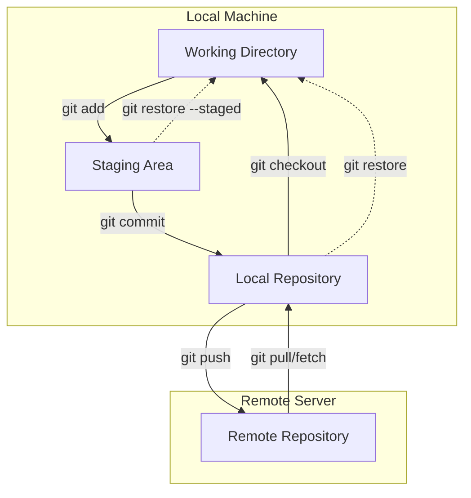
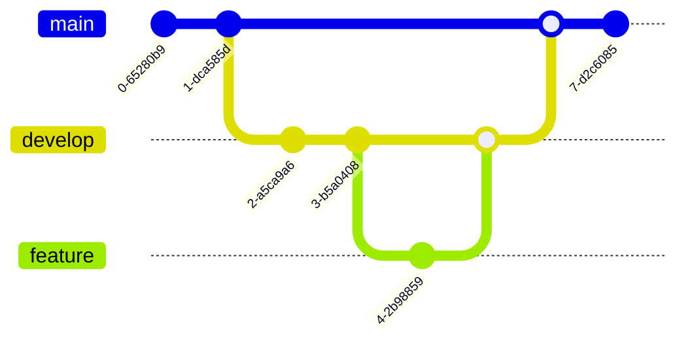
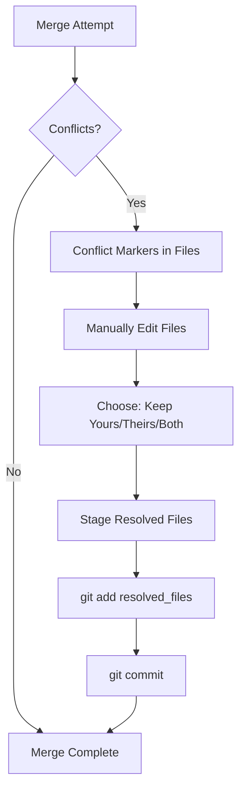

```
 ██████╗ █████╗ ██╗     ██╗     ██████╗  █████╗ ███╗   ███╗███████╗███████╗████████╗███████╗██████╗ 
██╔════╝██╔══██╗██║     ██║     ██╔══██╗██╔══██╗████╗ ████║██╔════╝██╔════╝╚══██╔══╝██╔════╝██╔══██╗
██║     ███████║██║     ██║     ██████╔╝███████║██╔████╔██║█████╗  ███████╗   ██║   █████╗  ██████╔╝
██║     ██╔══██║██║     ██║     ██╔══██╗██╔══██║██║╚██╔╝██║██╔══╝  ╚════██║   ██║   ██╔══╝  ██╔══██╗
╚██████╗██║  ██║███████╗███████╗██║  ██║██║  ██║██║ ╚═╝ ██║███████╗███████║   ██║   ███████╗██║  ██║
 ╚═════╝╚═╝  ╚═╝╚══════╝╚══════╝╚═╝  ╚═╝╚═╝  ╚═╝╚═╝     ╚═╝╚══════╝╚══════╝   ╚═╝   ╚══════╝╚═╝  ╚═╝
                                                                                                    
 ██████╗ ██╗████████╗    ██████╗  █████╗ ███╗   ███╗███████╗███████╗████████╗███████╗██████╗ 
██╔════╝ ██║╚══██╔══╝    ██╔══██╗██╔══██╗████╗ ████║██╔════╝██╔════╝╚══██╔══╝██╔════╝██╔══██╗
██║  ███╗██║   ██║       ██║   ██║███████║██╔████╔██║█████╗  ███████╗   ██║   █████╗  ██████╔╝
██║   ██║██║   ██║       ██║   ██║██╔══██║██║╚██╔╝██║██╔══╝  ╚════██║   ██║   ██╔══╝  ██╔══██╗
╚██████╔╝██║   ██║       ╚██████╔╝██║  ██║██║ ╚═╝ ██║███████╗███████║   ██║   ███████╗██║  ██║
 ╚═════╝ ╚═╝   ╚═╝        ╚═════╝ ╚═╝  ╚═╝╚═╝     ╚═╝╚══════╝╚══════╝   ╚═╝   ╚══════╝╚═╝  ╚═╝
```

# 📦 Chapter 15: Git & Version Control in Termux

> **Module:** 3 - Programming  
> **Chapter:** 15 of 61  
> **Duration:** 20-25 Minutes  
> **Difficulty:** ⭐⭐ Intermediate  

---

## 📋 Chapter Overview

| Section | Content |
|---------|---------|
| Video Script | Complete Hindi narration with timestamps |
| Technical Guide | Detailed Git concepts and workflows |
| Installation Guide | Git setup in Termux |
| Commands Reference | 25+ Git commands with examples |
| Practice Exercises | Create and push repository |
| Troubleshooting | Common Git issues |
| Video Assets | Thumbnail, description, tags |

---

## 🎬 VIDEO SCRIPT (Complete Hindi Narration)

```
═══════════════════════════════════════════════════════════════════════════════
TERMUX FULL COURSE - CHAPTER 15
Title: Git Version Control in Termux | Complete Guide | T3rmuxk1ng
Duration: 20-25 Minutes
═══════════════════════════════════════════════════════════════════════════════

[INTRO - 0:00 to 0:50]
─────────────────────────────────────────────────────────────────────────────

Namaskar Dosto! Welcome back to Termux Full Course by T3rmuxk1ng!

Aaj ka chapter bahut important hai - Git Version Control!

Agar aap developer banne chahte ho, ya ethical hacker, ya koi bhi 
technical field mein jaana chahte ho - Git aapke liye essential skill 
hai. Bina Git ke aap real-world projects mein kaam hi nahi kar sakte.

Ye aisi cheez hai jo har interview mein puchi jaati hai, har job 
requirement mein hoti hai, aur har developer use karta hai.

Aaj hum seekhenge:
- Git kya hai aur kyun important hai
- Termux mein Git install karna
- Local repositories create karna
- GitHub ke saath integrate karna
- SSH keys setup karna
- Branching, merging, conflicts handle karna
- Aur bahut kuch!

To bina time waste kiye, chaliye shuru karte hain!

Play button dabaiye, video like karein, aur channel subscribe karein.

---

[SECTION 1: GIT INTRODUCTION - 0:50 to 4:00]
─────────────────────────────────────────────────────────────────────────────

To sabse pehle sawal - Git kya hai?

Git ek distributed version control system hai. Simple shabdon mein 
samjhein - ye aapke code ka time machine hai!

Jab aap coding karte ho, to bahut saare changes aate hain. Aaj aapne 
ek feature add kiya, kal bug fix kiya, parso design change kiya. 
Agar kuch galat ho gaya to kya? Code kharab, project crash!

Yahan Git madad karta hai. Git har ek change ko track karta hai. 
Aap kabhi bhi purana version dekh sakte ho, wapas ja sakte ho, 
compare kar sakte ho.

Git ke main features:

✓ Version History - Har change ka record
✓ Collaboration - Multiple log saath mein kaam kar sakte hain
✓ Branches - Alag-alag versions parallel mein develop karo
✓ Backup - Code cloud mein safe rahega
✓ Rollback - Galti ho to wapas jao

Real-world example samjhein:

Imagine karo aap ek website bana rahe ho. Din 1 pe aapne login page 
banaya. Din 2 pe dashboard banaya. Din 3 pe aapne login page change 
kiya aur... sab tod diya! Website crash!

Without Git: Panic! Kya change kiya? Kaise fix karein? Pata hi nahi!
With Git: Git log dekho, dekho kya change kiya, purana version 
restore karo, problem solved!

Isliye Git developers ke liye boon hai.

---

[SECTION 2: GIT INSTALLATION - 4:00 to 6:00]
─────────────────────────────────────────────────────────────────────────────

Chaliye ab Termux mein Git install karte hain.

Installation bahut simple hai - ek command:

    pkg install git -y

[SCREEN: Git installation]

Ye command Git package download aur install kar degi. Thoda time 
lagega, internet speed pe depend karta hai.

Installation ke baad verify karein:

    git --version

Output kuch aisa aana chahiye:
git version 2.x.x

Agar version dikha raha hai, Git successfully install ho gaya!

Ab Git ko configure karna hai - aapki identity.

Git ko pata hona chahiye ki aap kaun ho. Ye information har commit 
ke saath store hoti hai.

    git config --global user.name "Aapka Name"
    git config --global user.email "aapka@email.com"

Example:

    git config --global user.name "T3rmuxk1ng"
    git config --global user.email "t3rmuxk1ng@example.com"

Ye globally set ho gaya - ab har repository mein ye hi use hoga.

Verify karein:

    git config --global user.name
    git config --global user.email

Output mein aapka name aur email dikhega.

---

[SECTION 3: CREATING REPOSITORY - 6:00 to 9:00]
─────────────────────────────────────────────────────────────────────────────

Ab hum seekhte hain repository kaise create karte hain.

Repository ya repo - basically ek folder hai jo Git track karta hai.

[STEP 1: Create New Repository]

Pehle ek folder banao:

    mkdir my-first-repo
    cd my-first-repo

Ab Git initialize karo:

    git init

Output: Initialized empty Git repository in /data/data/com.termux/files/home/my-first-repo/.git/

Ye command ek hidden .git folder banati hai. Is folder mein Git 
apna saara data store karta hai - history, branches, configurations.

Check karein:

    ls -la

Dikhega: .git folder

[STEP 2: Clone Existing Repository]

Agar koi existing repository download karni hai GitHub se:

    git clone <repository-url>

Example:

    git clone https://github.com/username/repo-name.git

Ye command repository download karke local folder banati hai.

    git clone https://github.com/t3rmuxk1ng/tools.git

Isse 'tools' naam ka folder banega us repository ka content.

[STEP 3: Repository Status]

Har time check kar sakte ho ki repository ka state kya hai:

    git status

Ye command batati hai:
- Kaunsi files modified hain
- Kaunsi files staged hain
- Kaunsi files untracked hain
- Current branch kaunsi hai

---

[SECTION 4: BASIC GIT WORKFLOW - 9:00 to 13:00]
─────────────────────────────────────────────────────────────────────────────

Ab hum seekhte hain basic Git workflow - add, commit, push, pull.

[WORKFLOW DIAGRAM]

Working Directory → Staging Area → Local Repository → Remote Repository

Ye cycle hai Git ka. Samjhein step by step.

[STEP 1: Create/Modify Files]

Pehle kuch files banao:

    echo "# My First Repo" > README.md
    echo "print('Hello Git!')" > hello.py

Ab check karo status:

    git status

Output mein dikhega:
Untracked files: README.md, hello.py

Matlab Git jaanta hai ye files hain, lekin track nahi kar raha.

[STEP 2: Stage Files - git add]

Files ko staging area mein laao:

    git add README.md

Ye single file add karta hai.

    git add .

Ye SAARI files add karta hai current directory ki.

    git add -A

Ye SAARI files add karta hai poore repository ki.

Ab status check karo:

    git status

Dikhega:
Changes to be committed:
  new file: README.md
  new file: hello.py

Green color mein - matlab staged!

[STEP 3: Commit Changes - git commit]

Staged files ko commit karo - ye history mein save ho jaate hain:

    git commit -m "Initial commit: Added README and hello.py"

-m flag message ke liye hai. Hamesha meaningful message likhein.

Ab check karo:

    git status

Output: nothing to commit, working tree clean

Aur dekho history:

    git log

Dikhega commit ka details - author, date, message, hash.

[STEP 4: View History - git log]

git log ka different formats:

    git log              # Full details
    git log --oneline    # One line per commit
    git log --oneline -5 # Last 5 commits
    git log -p           # With patch/diff

[STEP 5: View Changes - git diff]

Agar file mein change kiya:

    echo "## More content" >> README.md

Ab diff dekho:

    git diff

Ye modified files ka difference dikhata hai.

Staged files ka diff:

    git diff --staged

---

[SECTION 5: REMOTE REPOSITORIES - 13:00 to 16:00]
─────────────────────────────────────────────────────────────────────────────

Ab hum seekhte hain GitHub ke saath kaise kaam karte hain.

GitHub ek cloud platform hai jahan aap apne repositories store kar 
sakte ho. Public free hai, private bhi free hai.

[STEP 1: Create GitHub Account]

GitHub.com pe jao, sign up karo free account ke liye.

[STEP 2: Create Remote Repository]

GitHub pe new repository create karo:
1. "+" button click karo
2. "New repository" select karo
3. Repository name do
4. Public ya Private choose karo
5. "Create repository" click karo

[STEP 3: Connect Local to Remote]

Terminal mein aao, remote add karo:

    git remote add origin https://github.com/username/repo-name.git

'origin' ek name hai - default convention hai. Aap kuch bhi rakh sakte ho.

Check remotes:

    git remote -v

[STEP 4: Push to Remote]

Local commits ko remote pe bhejo:

    git push -u origin main

-u flag upstream set karta hai - future mein sirf 'git push' chalega.

Pehli baar GitHub username aur password ya token maange ga.

NOTE: Password deprecated hai, Personal Access Token use karna padega.

[STEP 5: Pull from Remote]

Remote se latest changes lao:

    git pull origin main

Ya agar upstream set hai:

    git pull

---

[SECTION 6: SSH KEYS FOR GITHUB - 16:00 to 19:00]
─────────────────────────────────────────────────────────────────────────────

Har baar password/token daarna boring hai. SSH keys use karo!

SSH key ek secure pair hai - public aur private. Public GitHub pe 
rakhenge, private aapke phone pe. Authentication automatic ho jaati hai.

[STEP 1: Generate SSH Key]

    ssh-keygen -t ed25519 -C "aapka@email.com"

-t: key type (ed25519 is modern and secure)
-C: comment (usually email)

Press Enter for default location.

Passphrase daal sakte ho ya blank rehne do (less secure but convenient).

[STEP 2: View Public Key]

    cat ~/.ssh/id_ed25519.pub

Ye output copy karo - pura content!

[STEP 3: Add to GitHub]

1. GitHub pe jao
2. Settings → SSH and GPG keys
3. "New SSH key" click karo
4. Title do (e.g., "Termux")
5. Key paste karo
6. "Add SSH key" click karo

[STEP 4: Test SSH Connection]

    ssh -T git@github.com

Output: Hi username! You've successfully authenticated...

[STEP 5: Clone/Push with SSH]

SSH URL use karo:

    git clone git@github.com:username/repo.git

Remote URL change karo existing repo mein:

    git remote set-url origin git@github.com:username/repo.git

Ab push karo - no password needed!

    git push

---

[SECTION 7: BRANCHING & MERGING - 19:00 to 22:00]
─────────────────────────────────────────────────────────────────────────────

Branching Git ki sabse powerful feature hai!

Main branch hoti hai - usually 'main' ya 'master'. Ye production 
code hoti hai.

New features ke liye naye branches banao, work karo, jab ready ho 
to merge kar do.

[CREATE BRANCH]

    git branch feature-login

Ye new branch banata hai lekin switch nahi karta.

[SWITCH BRANCH]

    git checkout feature-login

Ya create aur switch ek saath:

    git checkout -b feature-login

[LIST BRANCHES]

    git branch

Current branch * se mark hoga.

[WORK ON BRANCH]

    echo "# Login Feature" > login.py
    git add login.py
    git commit -m "Added login feature"

[SWITCH BACK TO MAIN]

    git checkout main

[MERGE BRANCH]

    git merge feature-login

Ye feature-login branch ko main mein merge kar dega.

[DELETE BRANCH]

    git branch -d feature-login

---

[SECTION 8: MERGE CONFLICTS - 22:00 to 24:00]
─────────────────────────────────────────────────────────────────────────────

Kabhi-kabhi merge conflict ho jaate hain.

Conflict tab hota hai jab same line different branches mein alag-alag 
change ki gayi ho.

Example:

Main branch mein:
print("Hello")

Feature branch mein:
print("Hi")

Jab merge karoge, conflict aayega.

[CONFLICT MARKERS]

Git file mein markers daal deta hai:

<<<<<<< HEAD
print("Hello")
=======
print("Hi")
>>>>>>> feature-branch

[RESOLUTION]

Manually edit karo:

print("Hello")  # ya jo chahiye wo rakho

Phir:

    git add filename
    git commit -m "Resolved merge conflict"

[ABORT MERGE]

Agar conflict resolve nahi karna:

    git merge --abort

---

[SECTION 9: GIT STASH & TAGS - 24:00 to 26:00]
─────────────────────────────────────────────────────────────────────────────

[GIT STASH]

Kabhi-kabhi aap kaam kar rahe ho, aur suddenly kisi aur branch pe 
jana hai. Changes commit nahi karna, lekin save bhi karna hai.

Stash use karo!

    git stash

Ye changes temporarily save kar leta hai.

    git stash list

Stash dekho.

    git stash pop

Stash wapas lao.

[GIT TAGS]

Tags releases mark karne ke liye use hote hain.

    git tag v1.0.0

Lightweight tag.

    git tag -a v1.0.0 -m "Version 1.0.0 Release"

Annotated tag with message.

Tags push karo:

    git push origin v1.0.0
    git push origin --tags  # All tags

---

[SECTION 10: GITHUB CLI (gh) - 26:00 to 28:00]
─────────────────────────────────────────────────────────────────────────────

Termux mein GitHub CLI bhi install kar sakte ho!

    pkg install gh

Authentication:

    gh auth login

Interactive process hai - GitHub.com select karo, SSH ya HTTPS, 
browser ya token.

Useful commands:

    gh repo create          # Create new repo
    gh repo clone           # Clone repo
    gh repo list            # List your repos
    gh issue create         # Create issue
    gh pr create            # Create pull request
    gh pr list              # List PRs

Bohot powerful tool hai - GitHub ka sab kuch terminal se!

---

[SECTION 11: .gitignore FILE - 28:00 to 29:30]
─────────────────────────────────────────────────────────────────────────────

.gitignore file batati hai Git ko kaunsi files ignore karni hain.

Example:

    # .gitignore file
    *.pyc           # Python compiled files
    __pycache__/    # Python cache folder
    node_modules/   # Node.js dependencies
    .env            # Environment variables
    *.log           # Log files
    secrets.txt     # Sensitive file

Create karo:

    nano .gitignore

Patterns likho, save karo.

Ab ye files kabhi track nahi hongi!

---

[SECTION 12: SUMMARY - 29:30 to 31:00]
─────────────────────────────────────────────────────────────────────────────

To dosto, Chapter 15 complete! Let's summarize:

✅ Git kya hai - Version Control System, code ka time machine
✅ Git installation - pkg install git
✅ Configuration - user.name aur user.email
✅ Repository creation - git init, git clone
✅ Basic workflow - add, commit, push, pull
✅ Remote repositories - GitHub integration
✅ SSH keys - Secure passwordless authentication
✅ Branching - Create, switch, merge, delete
✅ Merge conflicts - Resolution techniques
✅ Git stash - Temporary save
✅ Git tags - Release management
✅ GitHub CLI - gh commands
✅ .gitignore - Ignore unwanted files

Important Commands yaad rakhein:

┌─────────────────────────────────────────────────────────────────────────┐
│                    CHAPTER 15 - ESSENTIAL GIT COMMANDS                   │
├─────────────────────────────────────────────────────────────────────────┤
│ git init                  │ Initialize new repository                    │
│ git clone <url>           │ Clone existing repository                    │
│ git add .                 │ Stage all changes                            │
│ git commit -m "message"   │ Commit changes with message                  │
│ git push                  │ Push to remote                               │
│ git pull                  │ Pull from remote                             │
│ git status                │ Check repository status                      │
│ git log --oneline         │ View commit history                          │
│ git branch <name>         │ Create new branch                            │
│ git checkout <branch>     │ Switch branch                                │
│ git merge <branch>        │ Merge branch                                 │
└─────────────────────────────────────────────────────────────────────────┘

Next Chapter 16 mein hum seekhenge:
- Node.js installation in Termux
- JavaScript runtime
- NPM package manager
- Building Node.js applications

Agar ye video helpful lagi, to:
👍 Like button press karein
🔔 Subscribe karein, notification bell on karein
💬 Koi sawal ho to comment mein poochein
📤 Share karein friends ke saath

Main har comment ka reply karta hoon.

Thank you for watching! See you in Chapter 16!

═══════════════════════════════════════════════════════════════════════════════
```

---

## 📊 MERMAID DIAGRAMS

### Git Workflow Architecture



### Branch Management Flow



### Git Merge Conflict Resolution



---

## ⚡ COMMAND CHEATSHEET

### Essential Git Commands

| Command | Syntax | Example | Purpose |
|---------|--------|---------|---------|
| init | `git init` | `git init` | Create new repository |
| clone | `git clone <url>` | `git clone https://github.com/user/repo` | Copy remote repo |
| add | `git add <files>` | `git add .` | Stage changes |
| commit | `git commit -m "msg"` | `git commit -m "Initial commit"` | Save changes |
| push | `git push <remote> <branch>` | `git push origin main` | Upload to remote |
| pull | `git pull <remote> <branch>` | `git pull origin main` | Download from remote |
| status | `git status` | `git status` | Check repo state |
| log | `git log` | `git log --oneline` | View history |
| diff | `git diff` | `git diff HEAD` | View changes |

### Branch Commands

| Command | Syntax | Example | Purpose |
|---------|--------|---------|---------|
| branch | `git branch <name>` | `git branch feature` | Create branch |
| checkout | `git checkout <branch>` | `git checkout main` | Switch branch |
| checkout -b | `git checkout -b <name>` | `git checkout -b new-feature` | Create & switch |
| merge | `git merge <branch>` | `git merge feature` | Merge branch |
| branch -d | `git branch -d <name>` | `git branch -d old` | Delete branch |
| branch -a | `git branch -a` | `git branch -a` | List all branches |

### Remote Commands

| Command | Syntax | Example | Purpose |
|---------|--------|---------|---------|
| remote add | `git remote add <name> <url>` | `git remote add origin url` | Add remote |
| remote -v | `git remote -v` | `git remote -v` | List remotes |
| remote set-url | `git remote set-url <name> <url>` | Change remote URL |
| fetch | `git fetch <remote>` | `git fetch origin` | Download without merge |
| push -u | `git push -u <remote> <branch>` | Set upstream |

### Stash Commands

| Command | Syntax | Purpose |
|---------|--------|---------|
| stash | `git stash` | Save changes temporarily |
| stash list | `git stash list` | List stashes |
| stash pop | `git stash pop` | Apply and remove stash |
| stash apply | `git stash apply` | Apply without removing |
| stash drop | `git stash drop` | Remove stash |

---

## 🎯 LEARNING PATH VISUALIZATION

```
╔═══════════════════════════════════════════════════════════════════════════════╗
║                  GIT MASTERY LEARNING PATH - T3RMUXK1NG                      ║
╠═══════════════════════════════════════════════════════════════════════════════╣
║                                                                                ║
║  🎯 GOAL: Git Version Control Expert                                         ║
║       │                                                                        ║
║       ▼                                                                        ║
║  ┌─────────────────────────────────────────────────────────────────────────┐  ║
║  │                    LEVEL 1: FUNDAMENTALS                                 │  ║
║  │  ┌─────────┐   ┌─────────┐   ┌─────────┐   ┌─────────┐                  │  ║
║  │  │git init │──►│git add  │──►│git commit│──►│git status│                 │  ║
║  │  │         │   │         │   │         │   │         │                  │  ║
║  │  └─────────┘   └─────────┘   └─────────┘   └─────────┘                  │  ║
║  │       ⭐           ⭐            ⭐            ⭐                           │  ║
║  └─────────────────────────────────────────────────────────────────────────┘  ║
║       │                                                                        ║
║       ▼                                                                        ║
║  ┌─────────────────────────────────────────────────────────────────────────┐  ║
║  │                    LEVEL 2: REMOTE OPERATIONS                            │  ║
║  │  ┌─────────┐   ┌─────────┐   ┌─────────┐   ┌─────────┐                  │  ║
║  │  │git clone│──►│ remote  │──►│git push │──►│git pull │                  │  ║
║  │  │         │   │  add    │   │         │   │         │                  │  ║
║  │  └─────────┘   └─────────┘   └─────────┘   └─────────┘                  │  ║
║  │       ⭐⭐         ⭐⭐           ⭐⭐⭐         ⭐⭐⭐                          │  ║
║  └─────────────────────────────────────────────────────────────────────────┘  ║
║       │                                                                        ║
║       ▼                                                                        ║
║  ┌─────────────────────────────────────────────────────────────────────────┐  ║
║  │                    LEVEL 3: BRANCHING & MERGING                          │  ║
║  │  ┌─────────┐   ┌─────────┐   ┌─────────┐   ┌─────────┐                  │  ║
║  │  │ branch  │──►│checkout │──►│ merge   │──►│ resolve │                  │  ║
║  │  │ create  │   │ switch  │   │         │   │conflicts│                  │  ║
║  │  └─────────┘   └─────────┘   └─────────┘   └─────────┘                  │  ║
║  │       ⭐⭐⭐        ⭐⭐⭐          ⭐⭐⭐⭐        ⭐⭐⭐⭐⭐                       │  ║
║  └─────────────────────────────────────────────────────────────────────────┘  ║
║       │                                                                        ║
║       ▼                                                                        ║
║  ┌─────────────────────────────────────────────────────────────────────────┐  ║
║  │                    LEVEL 4: ADVANCED FEATURES                            │  ║
║  │  ┌─────────┐   ┌─────────┐   ┌─────────┐   ┌─────────┐                  │  ║
║  │  │  stash  │──►│  tags   │──►│rebase   │──►│ cherry  │                  │  ║
║  │  │         │   │         │   │         │   │  pick   │                  │  ║
║  │  └─────────┘   └─────────┘   └─────────┘   └─────────┘                  │  ║
║  │       ⭐⭐⭐⭐       ⭐⭐⭐⭐         ⭐⭐⭐⭐⭐       ⭐⭐⭐⭐⭐                       │  ║
║  └─────────────────────────────────────────────────────────────────────────┘  ║
║       │                                                                        ║
║       ▼                                                                        ║
║                         🏆 GIT EXPERT 🏆                                      ║
║                                                                                ║
╚═══════════════════════════════════════════════════════════════════════════════╝
```

---

## 🔧 TOOL/FEATURE COMPARISON TABLE

### Version Control Systems Comparison

| Feature | Git | SVN | Mercurial |
|---------|-----|-----|-----------|
| **Architecture** | Distributed | Centralized | Distributed |
| **Offline Work** | ✅ Full | ❌ Limited | ✅ Full |
| **Branching** | ⭐⭐⭐⭐⭐ Excellent | ⭐⭐ Poor | ⭐⭐⭐⭐ Good |
| **Speed** | ⭐⭐⭐⭐⭐ Fast | ⭐⭐⭐ Medium | ⭐⭐⭐⭐⭐ Fast |
| **Learning Curve** | ⭐⭐⭐ Medium | ⭐⭐⭐⭐ Easy | ⭐⭐⭐⭐ Easy |
| **Industry Adoption** | ⭐⭐⭐⭐⭐ Dominant | ⭐⭐⭐ Legacy | ⭐⭐ Niche |
| **GitHub Support** | ✅ Native | ❌ No | ⚠️ Limited |
| **Termux Support** | ✅ Perfect | ✅ Yes | ✅ Yes |

### Git Hosting Platforms

| Platform | Free Private | CI/CD | Best For |
|----------|-------------|-------|----------|
| **GitHub** | ✅ Yes | ✅ Actions | Open source, community |
| **GitLab** | ✅ Yes | ✅ Built-in | Enterprise, self-hosted |
| **Bitbucket** | ✅ Yes | ✅ Pipelines | Jira integration |
| **Gitea** | ✅ Self-host | ⚠️ Limited | Self-hosted, lightweight |

---

## 🚀 PRACTICAL CODING CHALLENGES

### Challenge 1: First Repository Setup 🎬

**Difficulty:** ⭐ Beginner  
**Time:** 10 minutes

**Problem:** Create a complete Git repository with proper setup:
- Initialize repo
- Create README.md
- Make initial commit
- Set up .gitignore
- Connect to GitHub (simulated)

**Sample Output:**
```
=== Git Repository Setup ===
✓ Initialized empty Git repository
✓ Created README.md
✓ Created .gitignore
✓ Staged all files
✓ Initial commit created
✓ Main branch set as default

Files in initial commit:
  - README.md
  - .gitignore

Repository ready for development!
```

<details>
<summary>🔑 Hidden Solution</summary>

```bash
#!/bin/bash
# Git Repository Setup Script

REPO_NAME="${1:-my-project}"

echo "=== Git Repository Setup ==="

# Create directory
mkdir -p "$REPO_NAME" && cd "$REPO_NAME"

# Initialize git
git init
echo "✓ Initialized empty Git repository"

# Create README
cat > README.md << 'EOF'
# Project Name

## Description
A brief description of the project.

## Installation
```bash
# Installation commands here
```

## Usage
```bash
# Usage examples
```

## License
MIT
EOF
echo "✓ Created README.md"

# Create .gitignore
cat > .gitignore << 'EOF'
# Python
__pycache__/
*.pyc
*.pyo
.venv/
venv/

# Node
node_modules/
npm-debug.log

# IDE
.vscode/
.idea/
*.swp

# OS
.DS_Store
Thumbs.db

# Environment
.env
.env.local
EOF
echo "✓ Created .gitignore"

# Configure (if not set)
git config user.name "Developer" 2>/dev/null || true
git config user.email "dev@example.com" 2>/dev/null || true

# Stage and commit
git add .
echo "✓ Staged all files"

git commit -m "Initial commit: Project setup"
echo "✓ Initial commit created"

# Set main branch
git branch -M main
echo "✓ Main branch set as default"

# Show files
echo ""
echo "Files in initial commit:"
git ls-tree --name-only HEAD | while read file; do
    echo "  - $file"
done

echo ""
echo "Repository ready for development!"
```
</details>

---

### Challenge 2: Feature Branch Workflow 🌿

**Difficulty:** ⭐⭐ Intermediate  
**Time:** 15 minutes

**Problem:** Implement a complete feature branch workflow:
- Create feature branch
- Make multiple commits
- Switch back to main
- Merge with proper message
- Delete feature branch

**Sample Output:**
```
=== Feature Branch Workflow ===

Current branch: main
Creating feature branch: feature/user-auth
✓ Switched to new branch 'feature/user-auth'

Making commits...
✓ Commit 1: Add login form
✓ Commit 2: Add validation
✓ Commit 3: Add session handling

Switching to main...
✓ Switched to branch 'main'

Merging feature branch...
✓ Merge made by 'ort' strategy
 feature/auth/login.py     | 25 ++++++
 feature/auth/session.py   | 30 +++++++
 2 files changed, 55 insertions(+)

Cleaning up...
✓ Deleted branch feature/user-auth

=== Commit History ===
*   abc1234 Merge branch 'feature/user-auth'
|\  
| * def5678 Add session handling
| * def5677 Add validation
| * def5676 Add login form
|/  
* abc1230 Initial commit

Workflow complete!
```

<details>
<summary>🔑 Hidden Solution</summary>

```bash
#!/bin/bash
# Feature Branch Workflow Demo

echo "=== Feature Branch Workflow ==="
echo ""

# Ensure we're in a git repo
if [[ ! -d .git ]]; then
    git init -q
    touch README.md && git add README.md
    git commit -q -m "Initial commit"
fi

# Show current branch
BRANCH=$(git branch --show-current)
echo "Current branch: $BRANCH"

# Create feature branch
FEATURE="feature/user-auth"
echo "Creating feature branch: $FEATURE"
git checkout -q -b "$FEATURE"
echo "✓ Switched to new branch '$FEATURE'"
echo ""

# Simulate commits
echo "Making commits..."

# Commit 1
mkdir -p feature/auth
cat > feature/auth/login.py << 'EOF'
def login(username, password):
    """User login function"""
    if validate_user(username, password):
        create_session(username)
        return True
    return False
EOF
git add feature/auth/login.py
git commit -q -m "Add login form"
echo "✓ Commit 1: Add login form"

# Commit 2
cat > feature/auth/validation.py << 'EOF'
def validate_user(username, password):
    """Validate user credentials"""
    if len(username) < 3:
        return False
    if len(password) < 8:
        return False
    return True
EOF
git add feature/auth/validation.py
git commit -q -m "Add validation"
echo "✓ Commit 2: Add validation"

# Commit 3
cat > feature/auth/session.py << 'EOF'
import time

sessions = {}

def create_session(username):
    """Create user session"""
    token = f"{username}_{time.time()}"
    sessions[token] = username
    return token
EOF
git add feature/auth/session.py
git commit -q -m "Add session handling"
echo "✓ Commit 3: Add session handling"
echo ""

# Switch to main
echo "Switching to main..."
git checkout -q main 2>/dev/null || git checkout -q master
echo "✓ Switched to branch 'main'"
echo ""

# Merge
echo "Merging feature branch..."
git merge --no-edit "$FEATURE"
echo "✓ Merge complete"
echo ""

# Clean up
echo "Cleaning up..."
git branch -d "$FEATURE"
echo "✓ Deleted branch $FEATURE"
echo ""

# Show history
echo "=== Commit History ==="
git log --oneline --graph -5
echo ""

echo "Workflow complete!"
```
</details>

---

### Challenge 3: Conflict Resolution Master 🔀

**Difficulty:** ⭐⭐⭐ Advanced  
**Time:** 20 minutes

**Problem:** Create a scenario with merge conflicts and demonstrate resolution:
- Create two branches modifying same file
- Generate conflict
- Show conflict markers
- Resolve manually
- Complete merge

**Sample Output:**
```
=== Conflict Resolution Demo ===

Creating conflict scenario...
✓ Created main.txt on main branch
✓ Created conflicting version on feature branch

Attempting merge...
Auto-merging main.txt
CONFLICT (content): Merge conflict in main.txt
✗ Merge conflict detected!

=== Conflict Markers ===
<<<<<<< HEAD
Welcome to the Main Branch!
This is the production version.
=======
Welcome to the Feature Branch!
This is the development version.
>>>>>>> feature

Resolving conflict...
✓ Chose: Keep both versions with modification

New content:
Welcome to the Project!
This combines main and feature versions.

Staging resolved file...
✓ Added resolved file

Committing merge...
✓ Merge committed

=== Final History ===
*   merged conflict resolution
|\
| * feature branch changes
* | main branch changes
|/
* initial commit

Conflict resolved successfully!
```

<details>
<summary>🔑 Hidden Solution</summary>

```bash
#!/bin/bash
# Conflict Resolution Demo

echo "=== Conflict Resolution Demo ==="
echo ""

# Setup repo
rm -rf conflict-demo && mkdir conflict-demo && cd conflict-demo
git init -q

# Configure git
git config user.name "Demo User"
git config user.email "demo@example.com"

echo "Creating conflict scenario..."

# Create initial file
cat > main.txt << 'EOF'
# Main Configuration
version = 1.0
environment = production
EOF
git add main.txt
git commit -q -m "Initial commit"
echo "✓ Created main.txt on main branch"

# Create feature branch and modify
git checkout -q -b feature
cat > main.txt << 'EOF'
# Feature Configuration
version = 2.0
environment = development
EOF
git add main.txt
git commit -q -m "Feature branch changes"
echo "✓ Created conflicting version on feature branch"

# Back to main and modify differently
git checkout -q main 2>/dev/null || git checkout -q master
cat > main.txt << 'EOF'
# Production Configuration
version = 1.5
environment = staging
EOF
git add main.txt
git commit -q -m "Main branch changes"
echo ""

# Attempt merge
echo "Attempting merge..."
git merge feature --no-edit 2>&1 || true

if git status | grep -q "both modified"; then
    echo "✗ Merge conflict detected!"
    echo ""
    
    echo "=== Conflict Markers ==="
    cat main.txt
    echo ""
    
    echo "Resolving conflict..."
    
    # Resolve by combining
    cat > main.txt << 'EOF'
# Unified Configuration
version = 2.0
environment = development
# Merged from both branches
production_ready = false
EOF
    
    echo "✓ Created resolved version"
    echo ""
    
    echo "New content:"
    cat main.txt
    echo ""
    
    # Stage and commit
    echo ""
    echo "Staging resolved file..."
    git add main.txt
    echo "✓ Added resolved file"
    
    echo ""
    echo "Committing merge..."
    git commit -q -m "Merged feature branch with conflict resolution"
    echo "✓ Merge committed"
fi

echo ""
echo "=== Final History ==="
git log --oneline --graph --all -5

echo ""
echo "Conflict resolved successfully!"
```
</details>

---

## 📖 GLOSSARY & TERMINOLOGY

### Git Terms

| Term | Definition |
|------|------------|
| **Repository** | A directory containing your project and all version history |
| **Commit** | A snapshot of changes saved to the repository |
| **Branch** | An independent line of development |
| **Merge** | Combining changes from different branches |
| **Clone** | Creating a local copy of a remote repository |
| **Fork** | Creating a personal copy of someone else's repository |
| **Pull Request** | Request to merge changes into a repository |
| **Staging Area** | Intermediate area before committing (index) |
| **Remote** | A repository hosted on a server (e.g., GitHub) |
| **HEAD** | Pointer to current branch/commit |
| **Revert** | Create new commit that undoes previous commit |
| **Reset** | Move HEAD to different commit |
| **Rebase** | Reapply commits on top of another base tip |
| **Stash** | Temporarily save uncommitted changes |
| **Tag** | A named reference to a specific commit |

---

## 💼 CAREER INSIGHTS

### Git Skills in Industry

```
┌─────────────────────────────────────────────────────────────────────────────┐
│                    GIT SKILL VALUE IN CAREERS                               │
├─────────────────────────────────────────────────────────────────────────────┤
│                                                                              │
│  ┌────────────────────────────────────────────────────────────────────┐    │
│  │ ALL DEVELOPER ROLES                                               │    │
│  │ • Version Control: MANDATORY for 95%+ of jobs                     │    │
│  │ • Git is the #1 required VCS skill                                 │    │
│  │ • Expected in: Frontend, Backend, DevOps, Mobile, Data Science    │    │
│  └────────────────────────────────────────────────────────────────────┘    │
│                                                                              │
│  ┌────────────────────────────────────────────────────────────────────┐    │
│  │ DEVOPS ENGINEER                                                   │    │
│  │ • CI/CD Pipeline Configuration                                    │    │
│  │ • Git Branching Strategies (GitFlow, trunk-based)                 │    │
│  │ • Git Hooks & Automation                                          │    │
│  │ Salary Premium: +25% with advanced Git skills                     │    │
│  └────────────────────────────────────────────────────────────────────┘    │
│                                                                              │
│  ┌────────────────────────────────────────────────────────────────────┐    │
│  │ OPEN SOURCE CONTRIBUTOR                                           │    │
│  │ • Fork, Branch, PR workflow                                       │    │
│  │ • Code review participation                                       │    │
│  │ • Community collaboration                                         │    │
│  │ Portfolio Impact: HIGH - visible contributions                    │    │
│  └────────────────────────────────────────────────────────────────────┘    │
│                                                                              │
└─────────────────────────────────────────────────────────────────────────────┘
```

### Git Proficiency Levels & Salary Impact

| Level | Skills | Years | Impact |
|-------|--------|-------|--------|
| Beginner | add, commit, push, pull | 0-1 | Baseline |
| Intermediate | Branching, merging, conflict resolution | 1-2 | +10% |
| Advanced | Rebase, stash, hooks, workflows | 2-4 | +20% |
| Expert | Git internals, custom workflows | 4+ | +30% |

---

## 🏆 CODE OPTIMIZATION TIPS

### Git Workflow Optimization

| Tip | Description | Impact |
|-----|-------------|--------|
| **Use .gitignore properly** | Ignore unnecessary files | ⭐⭐⭐⭐⭐ |
| **Write meaningful commits** | Clear, descriptive messages | ⭐⭐⭐⭐⭐ |
| **Use branches liberally** | Isolate features/fixes | ⭐⭐⭐⭐⭐ |
| **Pull before push** | Avoid conflicts | ⭐⭐⭐⭐ |
| **Use git aliases** | Shorten common commands | ⭐⭐⭐ |
| **Commit often, push regularly** | Small, focused commits | ⭐⭐⭐⭐ |
| **Review changes before commit** | Use git diff | ⭐⭐⭐⭐ |
| **Use git stash wisely** | Save work temporarily | ⭐⭐⭐ |

### Git Aliases for Productivity

```bash
# Add to ~/.gitconfig
[alias]
    co = checkout
    br = branch
    ci = commit
    st = status
    unstage = reset HEAD --
    last = log -1 HEAD
    visual = log --graph --oneline --all
    amend = commit --amend --no-edit
    undo = reset --soft HEAD~1
    
# Usage examples:
# git co main          -> checkout main
# git st               -> status
# git visual           -> beautiful log
# git unstage file.txt -> unstage file
```

### Common Git Mistakes to Avoid

```bash
# ❌ BAD: Committing sensitive data
git add .  # May include .env files

# ✅ GOOD: Review before commit
git add -p  # Interactive staging
git diff --cached  # Review staged changes

# ❌ BAD: Large, unfocused commits
git commit -m "updates"

# ✅ GOOD: Atomic, focused commits
git commit -m "Add user authentication validation"

# ❌ BAD: Force pushing to shared branches
git push --force origin main

# ✅ GOOD: Use force-with-lease
git push --force-with-lease origin main

# ❌ BAD: Committing directly to main
git commit -m "new feature"

# ✅ GOOD: Create feature branch first
git checkout -b feature/new-feature
```

---

## 📖 TECHNICAL GUIDE

### 1. Git Architecture

```
┌─────────────────────────────────────────────────────────────────────────┐
│                         GIT ARCHITECTURE                                 │
├─────────────────────────────────────────────────────────────────────────┤
│                                                                          │
│   ┌─────────────────────────────────────────────────────────────────┐   │
│   │                    Remote Repository (GitHub/GitLab)            │   │
│   │   - Central server storage                                       │   │
│   │   - Collaboration hub                                            │   │
│   │   - Backup location                                              │   │
│   └─────────────────────────────────────────────────────────────────┘   │
│                                   │                                      │
│                          git push │ git pull                             │
│                                   │                                      │
│   ┌─────────────────────────────────────────────────────────────────┐   │
│   │                    Local Repository (.git folder)               │   │
│   │   - Full history                                                 │   │
│   │   - All branches                                                 │   │
│   │   - Complete object database                                     │   │
│   └─────────────────────────────────────────────────────────────────┘   │
│                                   │                                      │
│                          git commit                                      │
│                                   │                                      │
│   ┌─────────────────────────────────────────────────────────────────┐   │
│   │                    Staging Area (Index)                         │   │
│   │   - Prepared changes                                             │   │
│   │   - Next commit content                                          │   │
│   └─────────────────────────────────────────────────────────────────┘   │
│                                   │                                      │
│                          git add                                         │
│                                   │                                      │
│   ┌─────────────────────────────────────────────────────────────────┐   │
│   │                    Working Directory                            │   │
│   │   - Actual files                                                 │   │
│   │   - Your workspace                                               │   │
│   │   - Current edits                                                │   │
│   └─────────────────────────────────────────────────────────────────┘   │
│                                                                          │
└─────────────────────────────────────────────────────────────────────────┘
```

### 2. Git Object Model

```
┌─────────────────────────────────────────────────────────────────────────┐
│                         GIT OBJECT TYPES                                 │
├─────────────────────────────────────────────────────────────────────────┤
│                                                                          │
│   BLOB (Binary Large Object)                                             │
│   ├── Stores file content                                                │
│   ├── Identified by SHA-1 hash                                           │
│   └── Compressed using zlib                                              │
│                                                                          │
│   TREE                                                                   │
│   ├── Stores directory structure                                         │
│   ├── References blobs and other trees                                   │
│   └── Contains file names and permissions                                │
│                                                                          │
│   COMMIT                                                                 │
│   ├── Points to a tree                                                   │
│   ├── Contains parent commit(s)                                          │
│   ├── Includes author, committer, message                                │
│   └── Identified by SHA-1 hash                                           │
│                                                                          │
│   TAG                                                                    │
│   ├── Named reference to a commit                                        │
│   ├── Can include message and tagger info                                │
│   └── Used for releases                                                  │
│                                                                          │
└─────────────────────────────────────────────────────────────────────────┘
```

### 3. Branching Model

```
┌─────────────────────────────────────────────────────────────────────────┐
│                      GIT BRANCHING WORKFLOW                              │
├─────────────────────────────────────────────────────────────────────────┤
│                                                                          │
│   main ──────●────────●────────●────────●──────→                        │
│               \              /                                           │
│                \            /                                            │
│   feature ─────●──────────●──────→                                       │
│                                                                          │
│   Steps:                                                                 │
│   1. Create branch from main                                             │
│   2. Work on feature branch                                              │
│   3. Make commits                                                        │
│   4. Merge back to main                                                  │
│                                                                          │
├─────────────────────────────────────────────────────────────────────────┤
│                                                                          │
│   Git Flow Model:                                                        │
│                                                                          │
│   main ────────●────────────●────────────●──────→ (Production)          │
│                 \           /                                            │
│   develop ───────●────●────●────●────●───→ (Development)                │
│                   \   /         /                                        │
│   feature ─────────●──────────/───→ (Feature branches)                  │
│                                                                          │
│   main: Production-ready code                                            │
│   develop: Integration branch                                            │
│   feature/*: New features                                                │
│   hotfix/*: Emergency fixes                                              │
│   release/*: Release preparation                                         │
│                                                                          │
└─────────────────────────────────────────────────────────────────────────┘
```

### 4. SSH Key Authentication Flow

```
┌─────────────────────────────────────────────────────────────────────────┐
│                    SSH AUTHENTICATION FLOW                               │
├─────────────────────────────────────────────────────────────────────────┤
│                                                                          │
│   [Your Device]                          [GitHub Server]                 │
│                                                                          │
│   ┌─────────────┐                        ┌─────────────┐                │
│   │ Private Key │                        │ Public Key  │                │
│   │ (id_ed25519)│                        │ (deployed)  │                │
│   └──────┬──────┘                        └──────┬──────┘                │
│          │                                      │                        │
│          │    1. Connection Request              │                        │
│          │ ─────────────────────────────────►   │                        │
│          │                                      │                        │
│          │    2. Challenge (random string)       │                        │
│          │ ◄─────────────────────────────────   │                        │
│          │                                      │                        │
│          │    3. Signed Response                 │                        │
│          │ ─────────────────────────────────►   │                        │
│          │                                      │                        │
│          │    4. Verify with Public Key          │                        │
│          │                                      │                        │
│          │    5. Authentication Success         │                        │
│          │ ◄─────────────────────────────────   │                        │
│          │                                      │                        │
│   └─────────────┘                        └─────────────┘                │
│                                                                          │
│   Security: Private key NEVER leaves your device                         │
│                                                                          │
└─────────────────────────────────────────────────────────────────────────┘
```

### 5. Merge Conflict Resolution

```
┌─────────────────────────────────────────────────────────────────────────┐
│                    MERGE CONFLICT EXAMPLE                                │
├─────────────────────────────────────────────────────────────────────────┤
│                                                                          │
│   File: config.py                                                        │
│                                                                          │
│   CONFLICT (content): Merge conflict in config.py                        │
│                                                                          │
│   <<<<<<< HEAD                                                           │
│   DATABASE = "postgresql"    # Your change (current branch)              │
│   =======                                                                 │
│   DATABASE = "mysql"         # Incoming change (merging branch)          │
│   >>>>>>> feature-mysql                                                  │
│                                                                          │
│   ───────────────────────────────────────────────────────────────────    │
│                                                                          │
│   Resolution Options:                                                    │
│                                                                          │
│   Option 1: Keep your change                                            │
│   DATABASE = "postgresql"                                                │
│                                                                          │
│   Option 2: Keep incoming change                                        │
│   DATABASE = "mysql"                                                     │
│                                                                          │
│   Option 3: Combine/modify                                              │
│   DATABASE = os.getenv("DB_TYPE", "postgresql")                          │
│                                                                          │
│   After resolution:                                                      │
│   git add config.py                                                      │
│   git commit -m "Resolved database config conflict"                      │
│                                                                          │
└─────────────────────────────────────────────────────────────────────────┘
```

---

## 🔧 INSTALLATION & CONFIGURATION

### Git Installation in Termux

```bash
# Update package lists first
pkg update && pkg upgrade -y

# Install Git
pkg install git -y

# Verify installation
git --version
# Output: git version 2.x.x

# Install additional useful tools
pkg install gnupg -y     # For GPG signing commits
pkg install openssh -y   # For SSH operations
```

### Initial Configuration

```bash
# Set your identity (required for commits)
git config --global user.name "Your Name"
git config --global user.email "your.email@example.com"

# Set default branch name
git config --global init.defaultBranch main

# Set default editor
git config --global core.editor nano

# Configure line endings
git config --global core.autocrlf input

# Enable color output
git config --global color.ui auto

# Set pull behavior
git config --global pull.rebase false

# Configure credential helper (for HTTPS)
git config --global credential.helper store

# View all configurations
git config --global --list
```

### SSH Key Setup for GitHub

```bash
# Step 1: Generate SSH key pair
ssh-keygen -t ed25519 -C "your.email@example.com"

# Press Enter for default location (~/.ssh/id_ed25519)
# Enter passphrase (optional, press Enter for none)

# Step 2: Start SSH agent
eval "$(ssh-agent -s)"

# Step 3: Add key to agent
ssh-add ~/.ssh/id_ed25519

# Step 4: Display public key (copy this)
cat ~/.ssh/id_ed25519.pub

# Step 5: Add to GitHub
# Go to: GitHub → Settings → SSH and GPG keys → New SSH key
# Paste the public key and save

# Step 6: Test connection
ssh -T git@github.com
# Output: Hi username! You've successfully authenticated...

# Step 7: Configure Git to use SSH
# For existing repo:
git remote set-url origin git@github.com:username/repo.git

# For new clone:
git clone git@github.com:username/repo.git
```

### GitHub CLI Installation

```bash
# Install GitHub CLI
pkg install gh -y

# Verify installation
gh --version

# Authenticate
gh auth login
# Select: GitHub.com
# Select: SSH
# Select: Use existing SSH key
# Complete the authentication

# Verify authentication
gh auth status

# Useful gh commands
gh repo list                  # List your repos
gh repo create <name>         # Create new repo
gh repo clone <repo>          # Clone repo
gh issue list                 # List issues
gh pr list                    # List pull requests
```

---

## 📋 COMMANDS REFERENCE

### Repository Creation Commands

```bash
# Initialize new repository in current directory
git init

# Initialize with specific branch name
git init -b main

# Initialize bare repository (for servers)
git init --bare

# Clone repository via HTTPS
git clone https://github.com/username/repo.git

# Clone repository via SSH
git clone git@github.com:username/repo.git

# Clone into specific directory
git clone <url> my-project

# Clone specific branch only
git clone -b main --single-branch <url>

# Clone shallow (faster, less history)
git clone --depth 1 <url>
```

### Configuration Commands

```bash
# Set global configuration
git config --global user.name "Name"
git config --global user.email "email@example.com"

# Set local configuration (current repo only)
git config --local user.name "Name"

# Get configuration value
git config user.name

# List all configurations
git config --global --list

# Remove configuration
git config --global --unset user.name

# Edit configuration file
git config --global --edit
```

### Staging & Commit Commands

```bash
# Check repository status
git status

# Check status in short format
git status -s

# Stage single file
git add filename.txt

# Stage multiple files
git add file1.txt file2.txt

# Stage all changes in current directory
git add .

# Stage all changes in repository
git add -A

# Stage all changes (including deletions)
git add -u

# Stage interactively
git add -p

# Unstage file (keep changes)
git reset filename.txt

# Unstage everything
git reset

# Commit with message
git commit -m "Your commit message"

# Commit with multi-line message
git commit -m "Title" -m "Detailed description"

# Commit all tracked changes (skip staging)
git commit -a -m "Message"

# Amend last commit
git commit --amend -m "New message"

# Amend last commit (keep message)
git commit --amend --no-edit
```

### Branch Commands

```bash
# List all local branches
git branch

# List all remote branches
git branch -r

# List all branches (local and remote)
git branch -a

# Create new branch
git branch feature-name

# Create branch from specific commit
git branch feature-name abc123

# Switch to branch
git checkout feature-name

# Create and switch to new branch
git checkout -b feature-name

# Modern way to switch (Git 2.23+)
git switch feature-name

# Create and switch (modern)
git switch -c feature-name

# Delete branch (safe - only if merged)
git branch -d feature-name

# Delete branch (force)
git branch -D feature-name

# Rename branch
git branch -m old-name new-name

# Push branch to remote
git push -u origin feature-name

# Track remote branch
git branch --track feature-name origin/feature-name
```

### Merge & Rebase Commands

```bash
# Merge branch into current branch
git merge feature-name

# Merge with no fast-forward
git merge --no-ff feature-name

# Merge with squash (single commit)
git merge --squash feature-name

# Abort merge (during conflict)
git merge --abort

# Rebase current branch onto main
git rebase main

# Continue rebase after resolving conflicts
git rebase --continue

# Abort rebase
git rebase --abort

# Interactive rebase (edit history)
git rebase -i HEAD~3
```

### Remote Commands

```bash
# List remotes
git remote

# List remotes with URLs
git remote -v

# Add remote
git remote add origin https://github.com/user/repo.git

# Remove remote
git remote remove origin

# Rename remote
git remote rename old-name new-name

# Get remote URL
git remote get-url origin

# Set remote URL
git remote set-url origin https://github.com/user/new-repo.git

# Show remote details
git remote show origin

# Fetch from remote (no merge)
git fetch origin

# Fetch all remotes
git fetch --all

# Pull (fetch + merge)
git pull origin main

# Pull with rebase
git pull --rebase origin main

# Push to remote
git push origin main

# Push and set upstream
git push -u origin main

# Force push (dangerous!)
git push -f origin main

# Push all branches
git push --all origin

# Push tags
git push --tags
```

### History & Log Commands

```bash
# View commit history
git log

# View history in one line per commit
git log --oneline

# View last N commits
git log -5

# View history with graph
git log --oneline --graph --all

# View history with patch (diff)
git log -p

# View history with stats
git log --stat

# View history by author
git log --author="Name"

# View history after date
git log --since="2024-01-01"

# View history before date
git log --until="2024-12-31"

# View history for specific file
git log -- filename.txt

# View history with custom format
git log --pretty=format:"%h - %an, %ar : %s"

# Show specific commit
git show abc123

# Show specific commit's changes
git show abc123 --stat
```

### Diff Commands

```bash
# Show unstaged changes
git diff

# Show staged changes
git diff --staged
git diff --cached  # Same as --staged

# Show changes between commits
git diff abc123 def456

# Show changes between branches
git diff main..feature

# Show only file names
git diff --name-only

# Show statistics
git diff --stat

# Show changes for specific file
git diff filename.txt

# Show changes with context
git diff -U5  # 5 lines of context
```

### Stash Commands

```bash
# Stash current changes
git stash

# Stash with message
git stash push -m "Work in progress"

# Stash including untracked files
git stash -u

# List all stashes
git stash list

# Show stash details
git stash show stash@{0}

# Apply most recent stash
git stash pop

# Apply specific stash
git stash apply stash@{1}

# Apply without removing from list
git stash apply

# Drop stash
git stash drop stash@{0}

# Drop all stashes
git stash clear

# Create branch from stash
git stash branch new-branch stash@{0}
```

### Tag Commands

```bash
# List all tags
git tag

# Create lightweight tag
git tag v1.0.0

# Create annotated tag (recommended)
git tag -a v1.0.0 -m "Version 1.0.0 release"

# Tag specific commit
git tag v0.9.0 abc123

# Show tag details
git show v1.0.0

# Push single tag
git push origin v1.0.0

# Push all tags
git push origin --tags

# Delete local tag
git tag -d v1.0.0

# Delete remote tag
git push origin --delete v1.0.0

# Checkout specific tag
git checkout v1.0.0
```

### Reset & Revert Commands

```bash
# Soft reset (keep changes staged)
git reset --soft HEAD~1

# Mixed reset (keep changes unstaged)
git reset --mixed HEAD~1
git reset HEAD~1  # Default is mixed

# Hard reset (discard all changes)
git reset --hard HEAD~1

# Reset to specific commit
git reset --hard abc123

# Revert commit (create new commit that undoes)
git revert abc123

# Revert multiple commits
git revert abc123..def456

# Revert without commit
git revert --no-commit abc123
```

### Cleanup Commands

```bash
# Remove untracked files (dry run)
git clean -n

# Remove untracked files
git clean -f

# Remove untracked files and directories
git clean -fd

# Remove ignored files too
git clean -fdx

# Garbage collect
git gc

# Prune unreachable objects
git prune

# Remove stale remote branches
git remote prune origin
```

### Debug Commands

```bash
# Find who changed a line
git blame filename.txt

# Find who changed specific line range
git blame -L 10,20 filename.txt

# Search commits for pattern
git log -S "function_name"

# Search commits for pattern (regex)
git log -G "pattern"

# Binary search to find bug
git bisect start
git bisect bad          # Current commit has bug
git bisect good abc123  # This commit was fine
# Git will guide through bisect

# End bisect
git bisect reset
```

---

## 💻 PRACTICE EXERCISES

### Exercise 1: Create and Initialize Repository

```bash
# Task: Create a new Git repository and make your first commit

# Step 1: Create project directory
mkdir ~/git-practice
cd ~/git-practice

# Step 2: Initialize Git repository
git init

# Step 3: Configure local settings (if not set globally)
git config user.name "Your Name"
git config user.email "your.email@example.com"

# Step 4: Create README file
cat > README.md << 'EOF'
# Git Practice Repository

This is a practice repository for learning Git.

## Features
- Feature 1
- Feature 2

## Installation
Run the setup script.

## Author
Your Name
EOF

# Step 5: Check status
git status

# Step 6: Stage the file
git add README.md

# Step 7: Commit
git commit -m "Initial commit: Added README.md"

# Step 8: View log
git log --oneline

# Expected: You should see your initial commit
```

### Exercise 2: Branch and Merge Workflow

```bash
# Task: Practice branching and merging

# Step 1: Create a new branch
git checkout -b feature-readme-update

# Step 2: Modify README
echo "" >> README.md
echo "## Updated Section" >> README.md
echo "This is an update from feature branch." >> README.md

# Step 3: Stage and commit
git add README.md
git commit -m "Added updated section to README"

# Step 4: Switch back to main
git checkout main

# Step 5: Create another branch
git checkout -b feature-readme-extra

# Step 6: Add different content
echo "" >> README.md
echo "## Extra Section" >> README.md
echo "This is extra content from another branch." >> README.md

# Step 7: Commit
git add README.md
git commit -m "Added extra section to README"

# Step 8: Switch to main and merge first branch
git checkout main
git merge feature-readme-update

# Step 9: Merge second branch (may have conflict)
git merge feature-readme-extra

# Step 10: Resolve any conflicts if they occur
# (Edit the file, remove conflict markers, keep desired content)

# Step 11: Complete the merge
git add README.md
git commit -m "Merged feature branches"

# Step 12: View branch history
git log --oneline --graph --all

# Step 13: Clean up branches
git branch -d feature-readme-update
git branch -d feature-readme-extra
```

### Exercise 3: Create and Push to GitHub

```bash
# Task: Create a repository on GitHub and push code

# Prerequisites:
# - GitHub account created
# - SSH key set up (or Personal Access Token ready)

# Step 1: Create repository on GitHub
# Go to: https://github.com/new
# Name: my-termux-project
# Description: My first Git project from Termux
# Public, No README (we have one locally)
# Click "Create repository"

# Step 2: Add remote origin (SSH)
git remote add origin git@github.com:YOUR_USERNAME/my-termux-project.git

# Or for HTTPS:
git remote add origin https://github.com/YOUR_USERNAME/my-termux-project.git

# Step 3: Verify remote
git remote -v

# Step 4: Push to GitHub
git push -u origin main
# Or if branch is named master:
git push -u origin master

# Step 5: Go to your GitHub repository page and verify files are uploaded

# Step 6: Make a change and push
echo "" >> README.md
echo "## Remote Update" >> README.md
echo "This update was pushed from Termux!" >> README.md
git add README.md
git commit -m "Added remote update section"
git push

# Expected: Your repository should be on GitHub with all commits
```

### Exercise 4: Git Stash Practice

```bash
# Task: Learn to use git stash

# Step 1: Start working on something
echo "Work in progress..." > work.txt

# Step 2: Check status
git status
# Shows: Untracked file: work.txt

# Step 3: Stage the file
git add work.txt

# Step 4: Now you need to switch branches but don't want to commit
# Stash your changes
git stash push -m "Work in progress on work.txt"

# Step 5: Check status - should be clean
git status

# Step 6: List stashes
git stash list

# Step 7: Work on something else
echo "Quick fix" > fix.txt
git add fix.txt
git commit -m "Quick fix added"

# Step 8: Restore your stashed work
git stash pop

# Step 9: Verify your work.txt is back
cat work.txt

# Step 10: Clean up
rm work.txt fix.txt
```

### Exercise 5: Create Release Tags

```bash
# Task: Create and manage tags for releases

# Step 1: Create a lightweight tag
git tag v0.1.0

# Step 2: Create an annotated tag (preferred)
git tag -a v1.0.0 -m "Version 1.0.0 - First stable release"

# Step 3: List tags
git tag

# Step 4: View tag details
git show v1.0.0

# Step 5: Push tags to remote
git push origin v1.0.0
# Or push all tags:
git push origin --tags

# Step 6: Make some changes
echo "New feature" > feature.txt
git add feature.txt
git commit -m "Added new feature"

# Step 7: Create new version tag
git tag -a v1.1.0 -m "Version 1.1.0 - Added new feature"

# Step 8: Push new tag
git push origin v1.1.0

# Expected: Tags visible on GitHub releases/tags page
```

### Exercise 6: Complete Git Workflow

```bash
# Task: Complete workflow - clone, branch, commit, PR

# Step 1: Clone a repository (use your own or a public one)
git clone https://github.com/username/repo.git
cd repo

# Step 2: Create feature branch
git checkout -b feature-contribution

# Step 3: Make changes
echo "## Contribution" >> README.md
echo "This is my contribution from Termux!" >> README.md

# Step 4: Stage and commit
git add README.md
git commit -m "Added contribution section to README"

# Step 5: Push branch
git push -u origin feature-contribution

# Step 6: Create Pull Request (if you have permissions)
gh pr create --title "Add contribution section" --body "Added a new section to README"

# Or manually on GitHub website

# Expected: Branch pushed and PR created
```

---

## ⚠️ TROUBLESHOOTING

### Problem 1: "git: command not found"

```bash
# Cause: Git not installed

# Solution: Install Git
pkg install git -y

# Verify
git --version
```

### Problem 2: "fatal: not a git repository"

```bash
# Cause: Running git commands outside a git repository

# Solution 1: Initialize repository first
git init

# Solution 2: Navigate to existing repository
cd /path/to/your/repo

# Solution 3: Check if you're in a git repo
ls -la | grep .git
# Should show .git directory
```

### Problem 3: "fatal: unable to access... Connection refused"

```bash
# Cause: Network issues or firewall

# Solution 1: Check internet connection
ping -c 3 github.com

# Solution 2: Use different protocol
# HTTPS to SSH or vice versa
git remote set-url origin git@github.com:user/repo.git

# Solution 3: Check if using VPN/proxy

# Solution 4: Increase timeout
git config --global http.lowSpeedLimit 1000
git config --global http.lowSpeedTime 300
```

### Problem 4: "Permission denied (publickey)"

```bash
# Cause: SSH key not set up or not added to GitHub

# Solution 1: Check if SSH key exists
ls -la ~/.ssh/
# Should see id_ed25519 and id_ed25519.pub

# Solution 2: Generate SSH key if missing
ssh-keygen -t ed25519 -C "your@email.com"

# Solution 3: Add public key to GitHub
cat ~/.ssh/id_ed25519.pub
# Copy output, add to GitHub Settings → SSH Keys

# Solution 4: Test SSH connection
ssh -T git@github.com

# Solution 5: Start SSH agent
eval "$(ssh-agent -s)"
ssh-add ~/.ssh/id_ed25519
```

### Problem 5: "fatal: Authentication failed"

```bash
# Cause: Wrong credentials or token expired

# Solution 1: For HTTPS, use Personal Access Token
# Go to GitHub → Settings → Developer settings → Personal access tokens
# Generate new token with repo permissions
# Use token as password when prompted

# Solution 2: Use SSH instead of HTTPS
git remote set-url origin git@github.com:user/repo.git

# Solution 3: Reset stored credentials
git config --global --unset credential.helper
```

### Problem 6: Merge Conflicts

```bash
# Cause: Same file modified differently in merging branches

# Step 1: See conflicted files
git status

# Step 2: Open conflicted file and look for markers
# <<<<<<< HEAD
# Your changes
# =======
# Their changes
# >>>>>>> branch-name

# Step 3: Edit file to resolve conflict
# Remove markers and keep desired content

# Step 4: Stage resolved file
git add filename

# Step 5: Complete merge
git commit -m "Resolved merge conflict in filename"

# OR abort merge if you want to start over
git merge --abort
```

### Problem 7: "Your branch is behind/ahead of origin/main"

```bash
# Behind: Local is older than remote
git pull origin main

# Ahead: Local has commits not pushed
git push origin main

# Diverged: Both have different commits
git pull --rebase origin main
git push origin main
```

### Problem 8: Accidental Commit to Wrong Branch

```bash
# Scenario: Committed to main instead of feature branch

# Step 1: Undo commit (keep changes)
git reset --soft HEAD~1

# Step 2: Stash changes
git stash

# Step 3: Switch to correct branch
git checkout feature-branch

# Step 4: Apply stashed changes
git stash pop

# Step 5: Commit on correct branch
git add .
git commit -m "Your message"
```

### Problem 9: Large File Upload Fails

```bash
# Cause: GitHub has 100MB file limit

# Solution 1: Use Git LFS (Large File Storage)
pkg install git-lfs
git lfs install
git lfs track "*.large"
git add .gitattributes
git commit -m "Configure Git LFS"

# Solution 2: Remove large file from history
git filter-branch --force --index-filter \
  'git rm --cached --ignore-unmatch path/to/large/file' \
  --prune-empty --tag-name-filter cat -- --all

# Solution 3: Use .gitignore for large files
echo "*.mp4" >> .gitignore
echo "*.zip" >> .gitignore
```

### Problem 10: Detached HEAD State

```bash
# Cause: Checked out a specific commit or tag

# Solution 1: Create new branch from here
git checkout -b new-branch-name

# Solution 2: Go back to a branch
git checkout main

# Solution 3: If you made commits in detached state
# First, note the commit hash
git log --oneline -5

# Then create branch from that commit
git branch new-branch abc123
git checkout new-branch
```

---

## 🎬 VIDEO ASSETS

### Thumbnail Concepts

**Option A: Clean & Professional**
```
┌────────────────────────────────────┐
│  [Dark Terminal Background]        │
│                                    │
│   🔀 GIT VERSION CONTROL           │
│   IN TERMUX                        │
│                                    │
│   ✓ SSH Keys Setup                 │
│   ✓ GitHub Integration             │
│   ✓ Branching & Merging            │
│                                    │
│   [T3rmuxk1ng Logo]                │
└────────────────────────────────────┘
```

**Option B: Command Focus**
```
┌────────────────────────────────────┐
│  $ git commit -m "Awesome!"        │
│  $ git push origin main            │
│                                    │
│  📱 GIT IN TERMUX                  │
│  Complete Guide                    │
│                                    │
│  🔐 SSH | 🌿 Branches | 🏷️ Tags    │
│                                    │
│  [T3rmuxk1ng]                      │
└────────────────────────────────────┘
```

**Option C: GitHub Integration**
```
┌────────────────────────────────────┐
│  🐙 GitHub + Termux = ❤️           │
│                                    │
│  GIT VERSION CONTROL               │
│  Complete Tutorial                 │
│                                    │
│  📦 25+ Commands                   │
│  🔑 SSH Keys                       │
│  🌿 Branching                      │
│                                    │
│  Chapter 15 | T3rmuxk1ng           │
└────────────────────────────────────┘
```

### Video Description Template

```markdown
🔀 Git Version Control in Termux | Complete Guide | T3rmuxk1ng

🔥 In this video you'll learn:
• Git kya hai aur kyun important hai
• Termux mein Git install karna
• Local repositories create karna
• GitHub ke saath integrate karna
• SSH keys setup karna (passwordless login)
• Branching, merging, conflicts handle karna
• Git stash, tags, aur GitHub CLI

⏱️ Timestamps:
0:00 - Introduction
0:50 - Git Introduction
4:00 - Git Installation
6:00 - Creating Repository
9:00 - Basic Git Workflow
13:00 - Remote Repositories
16:00 - SSH Keys for GitHub
19:00 - Branching & Merging
22:00 - Merge Conflicts
24:00 - Git Stash & Tags
26:00 - GitHub CLI (gh)
28:00 - .gitignore File
29:30 - Summary

📝 Commands from this video:
pkg install git -y
git config --global user.name "Your Name"
git config --global user.email "your@email.com"
git init
git add .
git commit -m "Initial commit"
git push origin main
ssh-keygen -t ed25519 -C "your@email.com"

📚 Full Course Playlist:
[PLAYLIST LINK]

📱 Follow T3rmuxk1ng:
• YouTube: @T3rmuxk1ng
• Telegram: [LINK]
• GitHub: [LINK]

#Git #VersionControl #Termux #GitHub #T3rmuxk1ng #GitTutorial #GitHindi #TermuxCourse #LearnGit #GitBranch #GitSSH

---
⚠️ Disclaimer: This video is for educational purposes. Always use version control for your projects!
```

### Tags List

```
git, git tutorial, git version control, termux git, git in termux,
git hindi, git tutorial hindi, learn git, git basics, git commands,
github, github tutorial, git ssh, ssh key github, git branch,
git merge, git commit, git push, git pull, version control,
git for beginners, git course, termux course, t3rmuxk1ng,
github cli, gh cli, git stash, git tags, gitignore, 
git conflicts, merge conflicts, git workflow, github ssh setup
```

### Hashtags

```
#Git #VersionControl #GitTutorial #GitHindi #Termux #TermuxCourse 
#GitHub #LearnGit #GitCommands #GitBranch #GitMerge #GitSSH 
#T3rmuxk1ng #GitForBeginners #Programming #Coding #Development
```

---

## 📚 ADDITIONAL RESOURCES

### Official Documentation

| Resource | Link |
|----------|------|
| Git Official | https://git-scm.com/ |
| Git Documentation | https://git-scm.com/doc |
| Pro Git Book | https://git-scm.com/book/ |
| GitHub Docs | https://docs.github.com/ |
| GitHub CLI | https://cli.github.com/ |

### Learning Resources

| Resource | Description |
|----------|-------------|
| Learn Git Branching | https://learngitbranching.js.org/ |
| Git Immersion | https://gitimmersion.com/ |
| Atlassian Git Tutorials | https://www.atlassian.com/git |
| GitHub Skills | https://skills.github.com/ |

### Cheat Sheets

| Resource | Link |
|----------|------|
| GitHub Git Cheat Sheet | https://training.github.com/downloads/ |
| Atlassian Git Cheat Sheet | https://www.atlassian.com/git/tutorials/atlassian-git-cheatsheet |

### Community

| Platform | Link |
|----------|------|
| Git Mailing List | git@vger.kernel.org |
| GitHub Community | https://github.community/ |
| Reddit | r/git |

---

## 📁 .gitignore Templates

### Python Project

```gitignore
# Byte-compiled / optimized / DLL files
__pycache__/
*.py[cod]
*$py.class

# C extensions
*.so

# Distribution / packaging
.Python
build/
develop-eggs/
dist/
downloads/
eggs/
.eggs/
lib/
lib64/
parts/
sdist/
var/
wheels/
*.egg-info/
.installed.cfg
*.egg

# Virtual environments
venv/
ENV/
env/
.venv/

# IDE
.idea/
.vscode/
*.swp
*.swo

# Testing
.pytest_cache/
.coverage
htmlcov/

# Environment variables
.env
.env.local
```

### Node.js Project

```gitignore
# Dependencies
node_modules/

# Build output
dist/
build/

# Logs
logs
*.log
npm-debug.log*

# Environment
.env
.env.local
.env.production

# IDE
.idea/
.vscode/

# OS
.DS_Store
Thumbs.db

# Coverage
coverage/
```

### General Purpose

```gitignore
# OS generated files
.DS_Store
.DS_Store?
._*
.Spotlight-V100
.Trashes
ehthumbs.db
Thumbs.db

# Editor files
*.swp
*.swo
*~
.idea/
.vscode/
*.sublime-*

# Environment
.env
.env.local
*.local

# Secrets
secrets.txt
credentials.json
*.pem
*.key

# Logs
*.log
logs/

# Temporary
tmp/
temp/
*.tmp
*.temp
```

---

## ✅ CHAPTER CHECKLIST

Before moving to Chapter 16, verify:

- [ ] Git installed successfully (`git --version`)
- [ ] Global configuration set (user.name, user.email)
- [ ] Created local repository with `git init`
- [ ] Made commits with `git add` and `git commit`
- [ ] Cloned remote repository with `git clone`
- [ ] Created and switched branches
- [ ] Merged branches successfully
- [ ] SSH key generated and added to GitHub
- [ ] Pushed code to GitHub repository
- [ ] Handled a merge conflict (even simulated)
- [ ] Used git stash for temporary saves
- [ ] Created and pushed a tag
- [ ] Installed and configured GitHub CLI (gh)

---

## 🎯 NEXT CHAPTER PREVIEW

**Chapter 16: Node.js in Termux**

- Node.js installation and setup
- NPM package manager
- Creating Node.js applications
- Express.js web server
- Package.json management
- Running JavaScript on Android
- Building APIs with Node.js

---

**Chapter Complete! 🎉**

---

## 🎮 INTERACTIVE QUIZ

Test your Git Version Control knowledge! Click to reveal answers.

<details>
<summary><b>Q1: What is the difference between git pull and git fetch?</b></summary>

Both commands download changes from remote, but they behave differently:

```bash
# git fetch - Downloads changes but DOES NOT merge
git fetch origin
# Changes are in origin/main but NOT in your local main
# Safe - you can review before merging

# git pull - Downloads AND merges in one step
git pull origin main
# Equivalent to: git fetch + git merge

# Best practice:
git fetch origin        # First, fetch changes
git log HEAD..origin/main  # Review what's new
git merge origin/main   # Then merge if okay
```
</details>

<details>
<summary><b>Q2: What's the difference between git merge and git rebase?</b></summary>

Both integrate changes from one branch to another, but differently:

```bash
# MERGE - Creates a merge commit
# Preserves complete history
git checkout main
git merge feature
# Result: Creates merge commit, keeps branch history

# REBASE - Rewrites history
# Linear, cleaner history
git checkout feature
git rebase main
# Moves feature commits on top of main

# When to use which:
# Merge: When you want to preserve history (team branches)
# Rebase: When you want clean history (local feature branches)

# NEVER rebase branches that have been pushed/shared!
```
</details>

<details>
<summary><b>Q3: How do you undo the last commit?</b></summary>

Multiple ways to undo commits:

```bash
# Method 1: Keep changes, undo commit (most common)
git reset --soft HEAD~1
# Changes go back to staging area

# Method 2: Keep changes in working directory
git reset --mixed HEAD~1
# Changes go back to unstaged

# Method 3: Discard everything (DANGEROUS!)
git reset --hard HEAD~1
# All changes lost!

# Method 4: Create new commit that undoes previous
git revert HEAD
# Safe for pushed commits, preserves history

# Best practice:
# - For local commits: git reset --soft HEAD~1
# - For pushed commits: git revert HEAD
```
</details>

<details>
<summary><b>Q4: What is the staging area (index) in Git?</b></summary>

The staging area is Git's middle ground:

```bash
# Git has 3 main areas:
# 1. Working Directory - Your actual files
# 2. Staging Area (Index) - Prepared for commit
# 3. Repository - Committed changes

# Working → Staging → Repository
git add file.txt      # Working → Staging
git commit -m "msg"   # Staging → Repository

# View staging area
git status
git diff --staged     # See staged changes

# Unstage (keep changes)
git restore --staged file.txt

# Why staging area?
# - Review before commit
# - Commit only selected changes
# - Split large changes into logical commits
```
</details>

<details>
<summary><b>Q5: How do you resolve merge conflicts?</b></summary>

Step-by-step conflict resolution:

```bash
# When merge fails with conflicts:
# 1. Check status
git status    # Shows conflicted files

# 2. Open conflicted file, you'll see:
# <<<<<<< HEAD
# your changes
# =======
# their changes
# >>>>>>> branch-name

# 3. Edit file to resolve:
# Remove markers, keep correct code

# 4. Mark as resolved
git add resolved-file.txt

# 5. Complete merge
git commit   # Or: git merge --continue

# Abort if needed
git merge --abort

# Use mergetool for complex conflicts
git mergetool
```
</details>

<details>
<summary><b>Q6: What is git stash and when would you use it?</b></summary>

Stash temporarily saves uncommitted changes:

```bash
# Save current changes
git stash
git stash save "work in progress"

# List stashes
git stash list

# Apply stash
git stash apply        # Apply latest
git stash apply stash@{2}  # Apply specific

# Apply and remove
git stash pop

# Drop stash
git stash drop stash@{0}

# Use cases:
# - Need to switch branches but not ready to commit
# - Pull changes without committing
# - Save work before trying risky changes

# Example workflow:
git stash              # Save work
git pull origin main   # Get updates
git stash pop          # Restore work
```
</details>

<details>
<summary><b>Q7: What's the difference between HEAD, head, and origin?</b></summary>

These are Git references with different meanings:

```bash
# HEAD (uppercase) - Current branch/commit
# Points to where you are now
cat .git/HEAD          # Shows current branch
git checkout main      # HEAD → main
git checkout abc123    # HEAD → detached at commit

# head (lowercase) - Branch reference
# Points to latest commit on branch
# Each branch has one head

# origin - Default remote name
git remote -v          # Shows origin URL
origin  https://github.com/user/repo.git

# Combined usage:
git diff HEAD          # Compare working to current
git diff HEAD~1        # Compare to previous commit
git log origin/main    # Log of remote main branch
git reset --hard origin/main  # Reset to remote state
```
</details>

<details>
<summary><b>Q8: How do you set up SSH keys for GitHub?</b></summary>

Complete SSH key setup process:

```bash
# 1. Generate SSH key
ssh-keygen -t ed25519 -C "your@email.com"
# Press Enter for defaults
# Optionally add passphrase

# 2. Start SSH agent
eval "$(ssh-agent -s)"

# 3. Add key to agent
ssh-add ~/.ssh/id_ed25519

# 4. View public key
cat ~/.ssh/id_ed25519.pub
# Copy the ENTIRE output

# 5. Add to GitHub
# GitHub → Settings → SSH and GPG keys → New SSH key
# Paste public key

# 6. Test connection
ssh -T git@github.com
# Output: Hi username! You've successfully authenticated...

# 7. Clone with SSH
git clone git@github.com:username/repo.git

# 8. Switch existing repo to SSH
git remote set-url origin git@github.com:username/repo.git
```
</details>

<details>
<summary><b>Q9: What is a .gitignore file and how does it work?</b></summary>

`.gitignore` tells Git which files to ignore:

```bash
# Create .gitignore
touch .gitignore

# Basic patterns
*.log           # Ignore all .log files
*.pyc           # Ignore Python compiled files
node_modules/   # Ignore entire directory
.env            # Ignore specific file
.DS_Store       # macOS metadata

# Advanced patterns
!important.log  # Exception: track this file
build/          # Ignore build directory
**/temp         # Ignore temp in all directories
doc/**/*.txt    # Ignore .txt in doc subdirectories

# Already tracked? Untrack first:
git rm --cached filename
git rm -r --cached directory/

# Check what's ignored
git check-ignore -v filename

# Global gitignore (for all repos)
git config --global core.excludesfile ~/.gitignore_global
```
</details>

<details>
<summary><b>Q10: What's the difference between git branch and git checkout -b?</b></summary>

Both create branches but behave differently:

```bash
# git branch - Creates branch but stays on current
git branch new-feature
# Creates 'new-feature' but you're still on main

# Switch to new branch
git checkout new-feature

# git checkout -b - Creates AND switches
git checkout -b another-feature
# Creates and immediately switches

# Modern Git (2.23+) alternative:
git switch -c new-feature    # Create and switch
git switch new-feature       # Just switch

# Best practice:
git checkout -b feature/user-authentication
# Naming convention: type/description
# feature/*, bugfix/*, hotfix/*
```
</details>

<details>
<summary><b>Q11: How do you revert a pushed commit?</b></summary>

Safe ways to undo pushed commits:

```bash
# Method 1: git revert (RECOMMENDED for pushed commits)
git revert abc123
# Creates NEW commit that undoes abc123
git push origin main

# Revert multiple commits
git revert abc123..def456

# Revert without committing (review first)
git revert -n abc123
# Make changes if needed
git commit -m "Revert abc123"

# Method 2: git reset (ONLY for local/private branches)
git reset --hard HEAD~1
git push origin main --force
# DANGEROUS: Rewrites history, breaks others' work

# When to use which:
# - Pushed to shared branch: git revert
# - Local commits: git reset
# - Private feature branch: git reset --hard
```
</details>

<details>
<summary><b>Q12: What are Git hooks and how do you use them?</b></summary>

Git hooks are scripts that run on specific events:

```bash
# Hooks are in .git/hooks/
ls .git/hooks/

# Client-side hooks:
# pre-commit    - Before commit
# prepare-commit-msg - Before commit message editor
# commit-msg    - After commit message written
# pre-push      - Before push

# Server-side hooks:
# pre-receive   - Before receiving push
# post-receive  - After receiving push

# Example: pre-commit hook
cat > .git/hooks/pre-commit << 'EOF'
#!/bin/bash
# Run tests before commit
npm test
if [[ $? -ne 0 ]]; then
    echo "Tests failed! Commit aborted."
    exit 1
fi
EOF

chmod +x .git/hooks/pre-commit

# Use Husky for team hooks (Node.js projects)
npm install husky --save-dev
```
</details>

<details>
<summary><b>Q13: How do you compare branches or commits?</b></summary>

Various ways to compare in Git:

```bash
# Compare branches
git diff main..feature       # Changes in feature not in main
git diff main...feature      # Changes since branches diverged

# Compare commits
git diff abc123..def456      # Between two commits
git diff abc123..HEAD        # From commit to current

# See what changed in a commit
git show abc123              # Show commit details
git show --stat abc123       # Just file statistics

# Compare files
git diff main..feature -- file.txt

# List changed files only
git diff --name-only main..feature

# See branch differences
git log main..feature --oneline  # Commits in feature not main
git log feature..main --oneline  # Commits in main not feature

# Visual comparison
git difftool -d main..feature
```
</details>

<details>
<summary><b>Q14: How do you cherry-pick commits?</b></summary>

Cherry-pick applies specific commits to another branch:

```bash
# Basic cherry-pick
git cherry-pick abc123

# Cherry-pick range
git cherry-pick abc123..def456

# Cherry-pick without committing (review first)
git cherry-pick -n abc123
# Review changes
git commit -m "Cherry-picked feature from develop"

# Cherry-pick from another branch
git checkout main
git cherry-pick feature~3   # 3rd commit from feature tip

# Handle conflicts
git cherry-pick abc123
# If conflict:
# 1. Resolve conflicts
# 2. git add resolved-files
# 3. git cherry-pick --continue

# Abort cherry-pick
git cherry-pick --abort

# Use cases:
# - Apply hotfix from release to main
# - Selective feature merging
# - Backporting fixes
```
</details>

<details>
<summary><b>Q15: How do you clean up old branches?</b></summary>

Branch cleanup strategies:

```bash
# List merged branches (safe to delete)
git branch --merged main

# Delete local branches
git branch -d feature-old        # Safe delete (checks merge)
git branch -D feature-abandoned  # Force delete

# Delete multiple merged branches
git branch --merged main | grep -v "^\*\|main" | xargs git branch -d

# Prune remote-tracking references
git fetch -p          # or: git remote prune origin

# Delete remote branches
git push origin --delete feature-old

# Clean up local references to deleted remote branches
git fetch --all --prune

# Find stale branches (no activity)
git for-each-ref --sort=committerdate --format='%(refname:short) %(committerdate:short)' refs/heads/

# Housekeeping script
#!/bin/bash
git checkout main
git pull origin main
git branch --merged | grep -v "^\*\|main\|develop" | xargs -n 1 git branch -d
git fetch --prune
echo "Cleanup complete!"
```
</details>

---

## 🎯 INTERVIEW QUESTIONS

### Top 10 Git Interview Questions with Detailed Answers

**Q1: Explain Git workflow and the three trees.**

```bash
# Git has three main areas (trees):

# 1. Working Directory
# - Your actual project files
# - Where you edit code
# - Can have untracked and modified files

# 2. Staging Area (Index)
# - Next commit preparation
# - Files ready to be committed
# - git add puts files here

# 3. Repository (.git directory)
# - All committed snapshots
# - Complete project history
# - git commit stores here

# Workflow:
# ┌──────────────┐     ┌──────────────┐     ┌──────────────┐
# │   Working    │ --> │   Staging    │ --> │  Repository  │
# │  Directory  │     │    Area      │     │   (.git)     │
# └──────────────┘     └──────────────┘     └──────────────┘
#       ^                    ^                     |
#       |                    |                     v
#    [edit]              [git add]            [git commit]
#       |                                         |
#       |<────────────────────────────────────────|
#                    [git checkout]
```

**Q2: What is the Git Flow branching model?**

```bash
# Git Flow branching strategy:

# Main branches:
# - main/master: Production-ready code
# - develop: Integration branch

# Supporting branches:
# - feature/*: New features (from develop)
# - release/*: Release preparation (from develop)
# - hotfix/*: Emergency fixes (from main)

# Typical workflow:
git checkout develop
git checkout -b feature/new-feature
# Work on feature...
git checkout develop
git merge --no-ff feature/new-feature

# Release workflow:
git checkout -b release/1.0.0 develop
# Prepare release...
git checkout main
git merge --no-ff release/1.0.0
git tag -a v1.0.0 -m "Version 1.0.0"
```

**Q3: How do you handle merge conflicts?**

```bash
# When conflicts occur:
# 1. Check status
git status

# 2. View conflicts
git diff

# 3. Resolve manually or use:
git mergetool

# 4. Mark resolved
git add resolved-file.txt

# 5. Complete merge
git commit

# Conflict markers:
# <<<<<<< HEAD (current branch)
# your changes
# =======
# their changes
# >>>>>>> branch-name
```

**Q4: Explain git rebase vs merge.**

```bash
# MERGE - Creates merge commit, preserves history
git merge feature-branch

# REBASE - Linear history, cleaner
git rebase main

# Interactive rebase
git rebase -i HEAD~5

# When to use:
# - Merge: Shared branches, preserving history
# - Rebase: Local feature branches, clean history

# NEVER rebase pushed branches!
```

**Q5: How do you recover lost commits?**

```bash
# Use reflog to find lost commits
git reflog

# Recover from reflog
git checkout abc123

# Or create branch
git branch recovery-branch abc123

# Reset to lost commit
git reset --hard abc123

# Recover deleted branch
git reflog
git checkout -b recovered-branch HEAD@{5}
```

---

## 🔥 REAL-WORLD SCENARIOS

### Scenario 1: Team Collaboration Workflow

```
┌─────────────────────────────────────────────────────────────────────────┐
│                   SCENARIO: Team Git Workflow                           │
├─────────────────────────────────────────────────────────────────────────┤
│                                                                          │
│  Developer workflow for contributing to shared project:                  │
│                                                                          │
│  # 1. Keep main updated                                                  │
│  git checkout main                                                      │
│  git pull origin main                                                   │
│                                                                          │
│  # 2. Create feature branch                                             │
│  git checkout -b feature/my-feature                                     │
│                                                                          │
│  # 3. Work and commit                                                   │
│  git add .                                                              │
│  git commit -m "feat: Add new feature"                                  │
│                                                                          │
│  # 4. Push branch                                                       │
│  git push -u origin feature/my-feature                                  │
│                                                                          │
│  # 5. Create Pull Request                                               │
│  gh pr create --title "New feature" --body "Description"                │
│                                                                          │
│  # 6. Address review feedback                                           │
│  git add .                                                              │
│  git commit -m "fix: Address review feedback"                           │
│  git push                                                               │
│                                                                          │
│  # 7. After approval, merge and cleanup                                 │
│  gh pr merge --squash                                                   │
│  git checkout main                                                      │
│  git pull                                                               │
│  git branch -d feature/my-feature                                       │
│                                                                          │
└─────────────────────────────────────────────────────────────────────────┘
```

### Scenario 2: Emergency Hotfix

```
┌─────────────────────────────────────────────────────────────────────────┐
│                   SCENARIO: Production Hotfix                           │
├─────────────────────────────────────────────────────────────────────────┤
│                                                                          │
│  Emergency fix for production bug:                                      │
│                                                                          │
│  # 1. Create hotfix branch from main                                    │
│  git checkout main                                                      │
│  git pull origin main                                                   │
│  git checkout -b hotfix/critical-bug                                    │
│                                                                          │
│  # 2. Fix the bug                                                       │
│  # ... make changes ...                                                 │
│  git add .                                                              │
│  git commit -m "fix: Resolve critical bug"                              │
│                                                                          │
│  # 3. Merge to main                                                     │
│  git checkout main                                                      │
│  git merge --no-ff hotfix/critical-bug                                  │
│  git tag -a v1.0.1 -m "Hotfix release"                                  │
│  git push origin main --tags                                            │
│                                                                          │
│  # 4. Also merge to develop                                             │
│  git checkout develop                                                   │
│  git merge --no-ff hotfix/critical-bug                                  │
│  git push origin develop                                                │
│                                                                          │
│  # 5. Cleanup                                                           │
│  git branch -d hotfix/critical-bug                                      │
│                                                                          │
└─────────────────────────────────────────────────────────────────────────┘
```

### Scenario 3: Undoing Mistakes

```
┌─────────────────────────────────────────────────────────────────────────┐
│                   SCENARIO: Git Disaster Recovery                       │
├─────────────────────────────────────────────────────────────────────────┤
│                                                                          │
│  Common mistakes and fixes:                                             │
│                                                                          │
│  # Undo last commit (keep changes)                                      │
│  git reset --soft HEAD~1                                                │
│                                                                          │
│  # Undo last commit (discard changes)                                   │
│  git reset --hard HEAD~1                                                │
│                                                                          │
│  # Undo pushed commit (safe)                                            │
│  git revert HEAD                                                        │
│  git push                                                               │
│                                                                          │
│  # Recover after hard reset                                             │
│  git reflog                                                             │
│  git reset --hard HEAD@{1}                                              │
│                                                                          │
│  # Undo git add                                                          │
│  git restore --staged file.txt                                          │
│                                                                          │
│  # Recover deleted branch                                               │
│  git reflog                                                             │
│  git checkout -b recovered HEAD@{n}                                     │
│                                                                          │
└─────────────────────────────────────────────────────────────────────────┘
```

### Scenario 4: Feature Branch with Rebase

```
┌─────────────────────────────────────────────────────────────────────────┐
│                   SCENARIO: Clean Feature History                       │
├─────────────────────────────────────────────────────────────────────────┤
│                                                                          │
│  Using rebase for clean commit history:                                 │
│                                                                          │
│  # 1. Create and work on feature                                       │
│  git checkout -b feature/login                                          │
│  # Multiple WIP commits...                                              │
│  git commit -m "WIP: login form"                                        │
│  git commit -m "WIP: validation"                                        │
│  git commit -m "WIP: testing"                                           │
│                                                                          │
│  # 2. Squash and clean with interactive rebase                          │
│  git rebase -i HEAD~3                                                   │
│  # Change 'pick' to 'squash' for WIP commits                           │
│                                                                          │
│  # 3. Update from main                                                  │
│  git fetch origin main                                                  │
│  git rebase origin/main                                                 │
│                                                                          │
│  # 4. Force push (rebase rewrites history)                              │
│  git push origin feature/login --force-with-lease                       │
│                                                                          │
└─────────────────────────────────────────────────────────────────────────┘
```

### Scenario 5: Bisect to Find Bug

```
┌─────────────────────────────────────────────────────────────────────────┐
│                   SCENARIO: Bug Hunting with Bisect                     │
├─────────────────────────────────────────────────────────────────────────┤
│                                                                          │
│  Find commit that introduced a bug:                                     │
│                                                                          │
│  # 1. Start bisect                                                      │
│  git bisect start                                                       │
│                                                                          │
│  # 2. Mark bad (current broken state)                                   │
│  git bisect bad                                                         │
│                                                                          │
│  # 3. Mark good (last known working)                                    │
│  git bisect good v1.0.0                                                 │
│                                                                          │
│  # 4. Git checks out middle commit                                      │
│  # Test and mark:                                                       │
│  git bisect good  # or: git bisect bad                                  │
│                                                                          │
│  # 5. Continue until found                                              │
│  # Git reports: abc123 is first bad commit                              │
│                                                                          │
│  # 6. Reset after found                                                 │
│  git bisect reset                                                       │
│                                                                          │
│  # Automated bisect with script                                         │
│  git bisect start HEAD v1.0.0                                          │
│  git bisect run ./test.sh                                               │
│                                                                          │
└─────────────────────────────────────────────────────────────────────────┘
```

---

## 📊 ARCHITECTURE DIAGRAMS

### Diagram 1: Git Data Flow

```
┌─────────────────────────────────────────────────────────────────────────┐
│                    GIT DATA FLOW                                        │
├─────────────────────────────────────────────────────────────────────────┤
│                                                                          │
│        ┌───────────────────┐                                            │
│        │  Remote Repository │◄──────────────────────────────┐            │
│        │    (GitHub)        │                               │            │
│        └─────────┬─────────┘                               │            │
│                  │                                          │            │
│        git push  │  git fetch                              │            │
│           │      │      │                                   │            │
│           ▼      │      ▼                                   │            │
│        ┌───────────────────┐                                │            │
│        │  Local Repository │                                │            │
│        │     (.git/)       │                                │            │
│        └─────────┬─────────┘                                │            │
│                  │                                          │            │
│        git commit│                                          │            │
│                  ▼                                          │            │
│        ┌───────────────────┐                                │            │
│        │   Staging Area    │                                │            │
│        │     (Index)       │                                │            │
│        └─────────┬─────────┘                                │            │
│                  │                                          │            │
│        git add   │                                          │            │
│                  ▼                                          │            │
│        ┌───────────────────┐                                │            │
│        │ Working Directory │────────────────────────────────┘            │
│        │   (Your Files)    │          git checkout                       │
│        └───────────────────┘                                            │
│                                                                          │
└─────────────────────────────────────────────────────────────────────────┘
```

### Diagram 2: Branching Strategy

```
┌─────────────────────────────────────────────────────────────────────────┐
│                    GIT BRANCHING STRATEGY                                │
├─────────────────────────────────────────────────────────────────────────┤
│                                                                          │
│   main ──────●────────●────────●────────●──────●──────→ (Production)    │
│                \              /           ↑                              │
│                 \            /            │                              │
│   release ───────●─────────●─────────────┘                              │
│                    \                                                    │
│                     \                                                   │
│   develop ───────────●────●────●────●────●────→ (Development)            │
│                       \   /              │                               │
│                        \ /               │                               │
│   feature ─────────────●─────────────────┘                               │
│                                                                          │
│   Branch Types:                                                         │
│   ────────────                                                          │
│   main     → Production-ready code only                                 │
│   develop  → Integration branch for features                            │
│   feature/* → New feature development                                   │
│   release/* → Preparation for production release                        │
│   hotfix/*  → Emergency production fixes                                │
│                                                                          │
└─────────────────────────────────────────────────────────────────────────┘
```

### Diagram 3: Merge vs Rebase

```
┌─────────────────────────────────────────────────────────────────────────┐
│                    MERGE VS REBASE COMPARISON                            │
├─────────────────────────────────────────────────────────────────────────┤
│                                                                          │
│   MERGE (Preserves History):                                            │
│   ────────────────────────                                              │
│                                                                          │
│   A ────●────●────●────●────M────→ main                                  │
│              \              /                                            │
│               \            /                                             │
│   B ──────────●────●────●───→ feature                                    │
│                          ↑                                               │
│                     Merge commit created                                 │
│                                                                          │
│   Pros: Complete history preserved                                      │
│   Cons: Can create complex history graph                                │
│                                                                          │
├─────────────────────────────────────────────────────────────────────────┤
│                                                                          │
│   REBASE (Linear History):                                              │
│   ────────────────────────                                              │
│                                                                          │
│   BEFORE:                     AFTER:                                    │
│                                                                          │
│   A ────●────●────●──→        A ────●────●────●────●'──●'──●'──→         │
│              \                               \_______/                  │
│               \                              feature rebased           │
│   B ──────────●────●──→                                                  │
│                                                                          │
│   Pros: Clean, linear history                                           │
│   Cons: Rewrites history (dangerous for shared branches)                 │
│                                                                          │
└─────────────────────────────────────────────────────────────────────────┘
```

---

## 🔗 RELATED CHAPTERS

| Chapter | Title | Relevance |
|---------|-------|-----------|
| Ch13 | Bash Scripting Basics | Git hooks, automation |
| Ch14 | Bash Scripting Advanced | Custom Git commands |
| Ch16 | Node.js in Termux | NPM, package management |
| Ch21 | Cron Jobs | Scheduled Git operations |
| Ch27 | SSH Configuration | Remote Git operations |
| Ch31 | DevOps Tools | CI/CD integration |

---

## 🏆 BONUS ADVANCED CONTENT

### Technique 1: Git Aliases for Productivity

```bash
# Essential aliases
git config --global alias.co checkout
git config --global alias.br branch
git config --global alias.ci commit
git config --global alias.st status
git config --global alias.lg "log --graph --oneline --all"
git config --global alias.last 'log -1 HEAD'
git config --global alias.undo 'reset --soft HEAD~'
git config --global alias.amend 'commit --amend --no-edit'

# Custom commands
git config --global alias.wip '!git add -A && git commit -m "WIP"'
git config --global alias.sync '!git fetch origin && git rebase origin/main'
```

### Technique 2: Git Templates

```bash
# Create commit template
mkdir -p ~/.git-templates
cat > ~/.git-templates/commit-template << 'EOF'
# Type: feat|fix|docs|style|refactor|test|chore
# <type>(<scope>): <subject>
# <body>
# <footer>
EOF

git config --global commit.template ~/.git-templates/commit-template
```

### Technique 3: Git Worktrees

```bash
# Work on multiple branches simultaneously
git worktree add ../project-feature feature/new-feature
git worktree list

# Work in different directory
cd ../project-feature
# ... make changes ...

# Remove when done
git worktree remove ../project-feature
```

---

## 📝 CHAPTER SUMMARY CHECKLIST

- [ ] **Git Fundamentals**
  - [ ] Understand version control concepts
  - [ ] Know the three trees
  - [ ] Understand commits, branches, tags

- [ ] **Basic Operations**
  - [ ] Initialize and clone repositories
  - [ ] Stage and commit changes
  - [ ] Create and switch branches

- [ ] **Remote Operations**
  - [ ] Push and pull changes
  - [ ] Set up SSH authentication
  - [ ] Use GitHub CLI

- [ ] **Branching & Merging**
  - [ ] Create feature branches
  - [ ] Resolve merge conflicts
  - [ ] Delete branches safely

- [ ] **Advanced Techniques**
  - [ ] Use git stash
  - [ ] Rebase for clean history
  - [ ] Cherry-pick commits

- [ ] **Best Practices**
  - [ ] Write meaningful commits
  - [ ] Use .gitignore properly
  - [ ] Review before commit

---

## 💡 PRO TIPS BOX

> 💡 **Pro Tip #1:** Always create a `.gitignore` file at the start of a project - it's harder to remove tracked files later.

> 💡 **Pro Tip #2:** Use meaningful commit messages following conventional commits format: `type(scope): description` (e.g., `feat(auth): add login functionality`).

> 💡 **Pro Tip #3:** Never commit directly to `main` branch - always create a feature branch and use pull requests.

> 💡 **Pro Tip #4:** Use `git stash -u` to stash both tracked and untracked files when you need a clean working directory.

> 💡 **Pro Tip #5:** Set up SSH keys for GitHub instead of HTTPS - it's more secure and convenient (no password prompts).

> 💡 **Pro Tip #6:** Use `git log --oneline --graph --all` to visualize your branch history beautifully.

> 💡 **Pro Tip #7:** Always pull before you push to avoid merge conflicts: `git pull --rebase origin main`.

> 💡 **Pro Tip #8:** Use `git diff --staged` to review your staged changes before committing.

> 💡 **Pro Tip #9:** Protect your main branch by enabling branch protection rules in GitHub settings.

> 💡 **Pro Tip #10:** Use `git reflog` to recover from mistakes - it shows all HEAD movements even after resets.

---

## 🔥 REAL WORLD APPLICATIONS

### Where Git Skills Apply in Real Life

**1. Team Collaboration**
- Coordinating code changes with multiple developers
- Code review workflows with pull requests
- Managing feature releases and hotfixes

**2. Open Source Contributions**
- Forking repositories and submitting PRs
- Maintaining your own open source projects
- Tracking issues and feature requests

**3. DevOps & CI/CD**
- Automated deployments triggered by git pushes
- Version control for infrastructure as code
- Release management and versioning

**4. Personal Projects**
- Tracking changes over time
- Experimenting with features in branches
- Rolling back to stable versions

**5. Career Development**
- Building a public portfolio on GitHub
- Demonstrating coding skills to employers
- Contributing to the developer community

---

## ⚡ QUICK REFERENCE CARD

### Git Commands Quick Reference

| Task | Command |
|------|---------|
| Initialize repo | `git init` |
| Clone repo | `git clone <url>` |
| Add all files | `git add .` |
| Commit changes | `git commit -m "msg"` |
| Push to remote | `git push origin main` |
| Pull changes | `git pull origin main` |
| Check status | `git status` |
| View history | `git log --oneline` |
| Create branch | `git branch <name>` |
| Switch branch | `git checkout <name>` |
| Create & switch | `git checkout -b <name>` |
| Merge branch | `git merge <name>` |
| Delete branch | `git branch -d <name>` |
| Stash changes | `git stash` |
| Apply stash | `git stash pop` |
| Create tag | `git tag v1.0.0` |
| Push tags | `git push --tags` |
| View remotes | `git remote -v` |
| Add remote | `git remote add origin <url>` |
| Reset changes | `git reset --hard HEAD` |
| Undo last commit | `git reset --soft HEAD~1` |

---

## 🏆 BONUS: ADVANCED TIPS

### Git Aliases for Productivity

```bash
# Add to ~/.gitconfig
[alias]
    co = checkout
    br = branch
    ci = commit
    st = status
    unstage = reset HEAD --
    last = log -1 HEAD
    visual = log --oneline --graph --all
    amend = commit --amend --no-edit
    undo = reset --soft HEAD~1

# Usage
git co main
git st
git visual
```

### Advanced Git Workflows

```bash
# Interactive rebase to squash commits
git rebase -i HEAD~5

# Cherry-pick specific commit
git cherry-pick <commit-hash>

# Bisect to find bug-introducing commit
git bisect start
git bisect bad          # Current version is bad
git bisect good v1.0.0  # This version was good
# Git will guide you through binary search

# Worktree for parallel development
git worktree add ../my-feature feature-branch

# Submodules for dependencies
git submodule add https://github.com/user/repo.git

# Filter branch to remove sensitive data
git filter-branch --force --index-filter \
  'git rm --cached --ignore-unmatch secrets.txt' \
  --prune-empty --tag-name-filter cat -- --all
```

### Git Hooks

```bash
# Pre-commit hook (.git/hooks/pre-commit)
#!/bin/bash
# Run tests before commit
npm test || exit 1

# Pre-push hook (.git/hooks/pre-push)
#!/bin/bash
# Run linting before push
npm run lint || exit 1

# Make hooks executable
chmod +x .git/hooks/*
```

---

## 📝 CHAPTER SUMMARY

### What You Learned

- ✅ Git installation and configuration in Termux
- ✅ Creating and cloning repositories
- ✅ Basic workflow: add, commit, push, pull
- ✅ Branching and merging strategies
- ✅ Handling merge conflicts
- ✅ SSH key authentication with GitHub
- ✅ GitHub CLI (gh) for workflow automation
- ✅ Git stash for temporary saves
- ✅ Tags for version management
- ✅ .gitignore for clean repositories

### Key Takeaways

1. **Commit often** - Small, focused commits are easier to review and revert
2. **Use branches** - Keep main stable, develop features in branches
3. **Write good messages** - Future you will thank present you
4. **Pull before push** - Avoid unnecessary conflicts
5. **Protect main branch** - Use branch protection rules

---

## 🎯 INTERVIEW QUESTIONS

### Git Interview Questions

**Q1: What is the difference between `git merge` and `git rebase`?**

```text
Answer:
git merge: Creates a new merge commit combining branches
- Preserves complete history
- Shows branch structure clearly
- Can create "diamond" patterns in history

git rebase: Rewrites commits onto another branch
- Creates linear history
- No merge commits
- Cleaner but rewrites history (dangerous on shared branches)

When to use:
- merge: For feature branches into main
- rebase: For local cleanup before pushing
```

**Q2: Explain the difference between `git reset --soft`, `--mixed`, and `--hard`.**

```bash
# Answer:
git reset --soft HEAD~1   # Undo commit, keep changes staged
git reset --mixed HEAD~1  # Undo commit + unstage (default)
git reset --hard HEAD~1   # Undo commit + discard all changes

# Use cases:
# --soft: Fix commit message or add forgotten files
# --mixed: Start over with staging
# --hard: Discard experimental changes completely
```

**Q3: What is a merge conflict and how do you resolve it?**

```text
Answer: Merge conflicts occur when the same lines are modified in different branches.

Resolution steps:
1. Open conflicted files
2. Look for conflict markers (<<<<, ====, >>>>)
3. Edit to keep desired changes
4. Remove conflict markers
5. Stage and commit

Tools to help:
- git mergetool
- VS Code conflict resolution
- git checkout --ours/--theirs <file>
```

**Q4: How do you undo the last commit without losing changes?**

```bash
# Answer: Multiple approaches based on need

# Undo commit, keep changes staged
git reset --soft HEAD~1

# Undo commit, keep changes unstaged
git reset HEAD~1

# Create new commit that undoes previous
git revert HEAD

# For pushed commits, use revert (safer)
git revert <commit-hash>
```

**Q5: Explain Git workflow strategies.**

```text
Answer: Common workflows:

1. Centralized Workflow:
   - Single main branch
   - Direct commits to main
   - Good for small teams

2. Feature Branch Workflow:
   - Create branch for each feature
   - Merge via pull requests
   - Good for code review

3. Gitflow:
   - main, develop, feature, release, hotfix branches
   - Structured release process
   - Good for scheduled releases

4. GitHub Flow:
   - main is always deployable
   - Feature branches with PRs
   - Good for continuous deployment
```

---

## 🚀 BEST PRACTICES

### Commit Message Guidelines

```text
# Format
<type>(<scope>): <subject>

<body>

<footer>

# Types
feat: New feature
fix: Bug fix
docs: Documentation changes
style: Formatting (no code change)
refactor: Code refactoring
test: Adding tests
chop: Maintenance tasks

# Examples
feat(auth): add OAuth2 login support

fix(api): resolve null pointer exception in user service

docs(readme): update installation instructions

# Good practices:
- Use imperative mood ("add" not "added")
- First line should be 50 chars or less
- Body explains what and why, not how
- Reference issues: "Closes #123"
```

### Branch Naming Conventions

```bash
# Feature branches
feature/user-authentication
feature/shopping-cart

# Bug fixes
fix/login-error
fix/payment-timeout

# Hotfixes
hotfix/security-patch
hotfix/critical-bug

# Releases
release/v1.2.0

# Personal/Experimental
username/description
wip/experiment-name
```

### Common Mistakes to Avoid

```bash
# ❌ Mistake: Committing sensitive data
git add .  # Includes .env file with secrets!

# ✅ Fix: Use .gitignore and check before commit
git status
git add .gitignore
git add src/

# ❌ Mistake: Large binary files
git add huge_video.mp4

# ✅ Fix: Use Git LFS for large files
git lfs install
git lfs track "*.mp4"

# ❌ Mistake: Force pushing to shared branches
git push --force origin main

# ✅ Fix: Use --force-with-lease
git push --force-with-lease origin feature-branch

# ❌ Mistake: Committing directly to main
git commit -m "fix"

# ✅ Fix: Always use feature branches
git checkout -b fix/description
```

---

## 📊 CODE COMPARISON

### Before vs After: Git Workflow

```bash
# ❌ BEFORE: Chaotic workflow
git add .
git commit -m "fix"
git push
git commit -m "more changes"
git push
# No branches, no review, breaking main

# ✅ AFTER: Professional workflow
git checkout -b feature/user-auth
git add src/auth/
git commit -m "feat(auth): implement OAuth2 login"
git push origin feature/user-auth
gh pr create --title "Add OAuth2 login" --body "Implements secure login"
# After review and approval:
gh pr merge --squash
```

---

## 🔗 RELATED CHAPTERS

| Chapter | Topic | Relevance |
|---------|-------|-----------|
| Chapter 11 | Python Installation | Version control Python projects |
| Chapter 12 | Python Basics | Python + Git workflow |
| Chapter 13 | Bash Scripting | Git hooks in Bash |
| Chapter 14 | Advanced Bash | Git automation scripts |
| Chapter 16 | Node.js | Version control for Node projects |
| Chapter 25 | DevOps | Git in CI/CD pipelines |

---

## 🎮 INTERACTIVE QUIZ

**1. What command creates a new branch and switches to it?**
- A) `git branch <name> && git checkout <name>`
- B) `git checkout -b <name>`
- C) `git new <name>`
- D) Both A and B

<details>
<summary>Answer</summary>
**D) Both A and B** - `git checkout -b` is shorthand for creating and switching.
</details>

**2. Which command stages all changes?**
- A) `git stage .`
- B) `git add .`
- C) `git commit .`
- D) `git push .`

<details>
<summary>Answer</summary>
**B) `git add .`** - `git add` stages changes, `.` means all files in current directory.
</details>

**3. What does `git stash` do?**
- A) Deletes uncommitted changes
- B) Saves uncommitted changes temporarily
- C) Commits changes to a temporary branch
- D) Pushes changes to remote

<details>
<summary>Answer</summary>
**B) Saves uncommitted changes temporarily** - Stash stores changes for later retrieval.
</details>

---

## 🔧 DEBUG THIS EXERCISES

### Debug This #1: Authentication Failed

```bash
# Problem: Push fails with authentication error
git push origin main
# fatal: Authentication failed for 'https://github.com/...'
```

<details>
<summary>Solution</summary>

```bash
# Solution 1: Use SSH URL instead of HTTPS
git remote set-url origin git@github.com:username/repo.git

# Solution 2: Use personal access token
# Generate token at github.com/settings/tokens
git push
# Enter username and token as password

# Solution 3: Configure credential helper
git config --global credential.helper store
```
</details>

### Debug This #2: Merge Conflict

```bash
# Problem: Merge conflict when pulling
git pull origin main
# CONFLICT (content): Merge conflict in app.js
```

<details>
<summary>Solution</summary>

```bash
# Solution: Resolve conflict step by step

# 1. View conflicted files
git status

# 2. Open file and look for markers
# <<<<<<< HEAD
# your changes
# =======
# remote changes
# >>>>>>> main

# 3. Edit file to resolve
# Remove markers and keep desired code

# 4. Stage resolved files
git add app.js

# 5. Complete merge
git commit -m "Resolve merge conflict in app.js"
```
</details>

---

## 💻 CODING CHALLENGES

### Challenge 1: Git Branch Manager

Create a script that manages git branches efficiently.

```bash
#!/bin/bash
# Challenge: Create a script that:
# 1. Lists all branches with last commit dates
# 2. Identifies stale branches (no commits in 30 days)
# 3. Offers to delete merged branches
```

<details>
<summary>Solution</summary>

```bash
#!/bin/bash

list_branches() {
    echo "=== Branch Overview ==="
    git for-each-ref --sort=committerdate refs/heads/ --format='%(refname:short) - %(committerdate:relative)'
}

find_stale() {
    echo ""
    echo "=== Stale Branches (>30 days) ==="
    git for-each-ref --sort=committerdate refs/heads/ --format='%(refname:short) %(committerdate:unix)' | \
    while read branch timestamp; do
        current=$(date +%s)
        diff=$(( (current - timestamp) / 86400 ))
        if (( diff > 30 )); then
            echo "$branch - ${diff} days old"
        fi
    done
}

clean_merged() {
    echo ""
    echo "=== Merged Branches ==="
    git branch --merged main | grep -v "main\|master\|\*" | while read branch; do
        echo "Delete $branch? (y/n)"
        read -r response
        [[ "$response" == "y" ]] && git branch -d "$branch"
    done
}

list_branches
find_stale
clean_merged
```
</details>

---

*Created by T3rmuxk1ng | Termux Full Course*

---

## 🎮 INTERACTIVE QUIZ

### Test Your Git Knowledge!

**Q1: What command creates a new Git repository?**
- A) `git create`
- B) `git init`
- C) `git new`
- D) `git start`

<details>
<summary>Answer</summary>
**B) `git init`** - Initializes a new Git repository in the current directory.
</details>

---

**Q2: What does `git clone` do?**
- A) Creates a branch
- B) Copies a repository
- C) Commits changes
- D) Merges branches

<details>
<summary>Answer</summary>
**B) Copies a repository** - Downloads a complete copy of a remote repository to your local machine.
</details>

---

**Q3: Which command stages files for commit?**
- A) `git stage`
- B) `git add`
- C) `git commit`
- D) `git push`

<details>
<summary>Answer</summary>
**B) `git add`** - Moves changes from working directory to staging area.
</details>

---

**Q4: What is the difference between `git pull` and `git fetch`?**
- A) No difference
- B) `pull` = `fetch` + `merge`
- C) `fetch` downloads, `pull` doesn't
- D) `pull` is faster

<details>
<summary>Answer</summary>
**B) `pull` = `fetch` + `merge`** - `fetch` only downloads, `pull` downloads and merges.
</details>

---

**Q5: What does `git stash` do?**
- A) Deletes changes
- B) Saves changes temporarily
- C) Commits changes
- D) Pushes to remote

<details>
<summary>Answer</summary>
**B) Saves changes temporarily** - Stores uncommitted changes for later retrieval.
</details>

---

**Q6: How do you see commit history?**
- A) `git history`
- B) `git log`
- C) `git show`
- D) `git commits`

<details>
<summary>Answer</summary>
**B) `git log`** - Shows the commit history of the repository.
</details>

---

**Q7: What is a merge conflict?**
- A) Git error
- B) Conflicting changes in same file
- C) Network issue
- D) Permission problem

<details>
<summary>Answer</summary>
**B) Conflicting changes in same file** - Occurs when different branches modify the same lines.
</details>

---

**Q8: How do you create AND switch to a new branch?**
- A) `git branch new-name`
- B) `git checkout new-name`
- C) `git checkout -b new-name`
- D) `git new-branch new-name`

<details>
<summary>Answer</summary>
**C) `git checkout -b new-name`** - Creates and switches in one command. Also: `git switch -c new-name`.
</details>

---

**Q9: What is `.gitignore`?**
- A) Git config file
- B) File to specify ignored files
- C) Error log
- D) Branch list

<details>
<summary>Answer</summary>
**B) File to specify ignored files** - Lists files/patterns Git should not track.
</details>

---

**Q10: What does `git rebase` do?**
- A) Deletes commits
- B) Moves branch to new base
- C) Creates merge commit
- D) Pushes to remote

<details>
<summary>Answer</summary>
**B) Moves branch to new base** - Rewrites commit history to apply changes on top of another branch.
</details>

---

**Q11: How do you undo the last commit (keep changes)?**
- A) `git reset --hard HEAD~1`
- B) `git reset --soft HEAD~1`
- C) `git undo`
- D) `git revert HEAD`

<details>
<summary>Answer</summary>
**B) `git reset --soft HEAD~1`** - Undoes commit but keeps changes staged. `--hard` would delete changes.
</details>

---

**Q12: What is a remote repository?**
- A) Local branch
- B) Hosted version of repository
- C) Git config
- D) Stash location

<details>
<summary>Answer</summary>
**B) Hosted version of repository** - A version of your repo stored on a server (like GitHub).
</details>

---

**Q13: What does `git rebase` do?**
- A) Rebases the repository
- B) Moves or combines commits
- C) Deletes branches
- D) Creates new commits

<details>
<summary>Answer</summary>
**B) Moves or combines commits** - Rebase rewrites commit history by moving commits to a new base.
</details>

---

**Q14: What is `git bisect` used for?**
- A) Bisecting files
- B) Finding which commit introduced a bug
- C) Splitting repositories
- D) Comparing branches

<details>
<summary>Answer</summary>
**B) Finding which commit introduced a bug** - Uses binary search to find the commit that introduced a change.
</details>

---

**Q15: How do you undo the last commit but keep changes?**
- A) `git reset --hard HEAD~1`
- B) `git reset --soft HEAD~1`
- C) `git revert HEAD`
- D) `git undo`

<details>
<summary>Answer</summary>
**B) `git reset --soft HEAD~1`** - Undoes the commit but keeps all changes staged for a new commit.
</details>

---

## 💡 PRO TIPS

### 10 Git Pro Tips

> **💡 Pro Tip #1: Write Meaningful Commit Messages**
> Follow conventional commits format:
> ```bash
> git commit -m "feat: add user authentication"
> git commit -m "fix: resolve login redirect bug"
> git commit -m "docs: update README with API docs"
> ```

> **💡 Pro Tip #2: Use Git Aliases**
> Speed up common commands:
> ```bash
> git config --global alias.co checkout
> git config --global alias.br branch
> git config --global alias.st status
> git config --global alias.lg "log --oneline --graph"
> ```

> **💡 Pro Tip #3: Interactive Staging**
> Stage changes interactively:
> ```bash
> git add -p  # Review each hunk before staging
> ```

> **💡 Pro Tip #4: Use Git Stash Effectively**
> Save work-in-progress:
> ```bash
> git stash push -m "work in progress on feature X"
> git stash list
> git stash pop stash@{0}
> ```

> **💡 Pro Tip #5: Check What Changed**
> See changes before committing:
> ```bash
> git diff              # Working directory changes
> git diff --staged     # Staged changes
> git diff HEAD~3       # Compare with 3 commits ago
> ```

> **💡 Pro Tip #6: Cherry-Pick Commits**
> Apply specific commits:
> ```bash
> git cherry-pick abc123  # Apply specific commit
> git cherry-pick abc123..def456  # Range
> ```

> **💡 Pro Tip #7: Use .gitignore Properly**
> Ignore common files:
> ```bash
> # .gitignore
> *.log
> node_modules/
> .env
> __pycache__/
> .DS_Store
> ```

> **💡 Pro Tip #8: Recover Deleted Commits**
> Use reflog to recover:
> ```bash
> git reflog
> git reset --hard abc123  # Recover specific state
> ```

> **💡 Pro Tip #9: Bisect to Find Bugs**
> Find which commit introduced a bug:
> ```bash
> git bisect start
> git bisect bad          # Current commit has bug
> git bisect good v1.0    # This version was good
> # Git will guide you through binary search
> ```

> **💡 Pro Tip #10: Squash Commits**
> Clean up history before pushing:
> ```bash
> git rebase -i HEAD~3  # Interactive rebase last 3 commits
> # Mark commits to squash
> ```

---

## 🔥 REAL WORLD USE CASES

### Git Workflows for Real Projects

**Use Case #1: Feature Branch Workflow**
```bash
# Start new feature
git checkout main
git pull origin main
git checkout -b feature/user-auth

# Work on feature
git add .
git commit -m "feat: implement login page"
git add .
git commit -m "feat: add password validation"

# Keep updated with main
git fetch origin
git rebase origin/main

# Push and create PR
git push -u origin feature/user-auth
gh pr create --title "Add user authentication"
```

**Use Case #2: Bug Fix Workflow**
```bash
# Create hotfix branch
git checkout main
git checkout -b hotfix/login-redirect

# Fix bug
git add src/auth.js
git commit -m "fix: correct redirect after login"

# Merge back
git checkout main
git merge hotfix/login-redirect
git push origin main

# Also update develop
git checkout develop
git merge hotfix/login-redirect
git push origin develop

# Cleanup
git branch -d hotfix/login-redirect
```

**Use Case #3: Git Flow Release**
```bash
# Start release
git checkout develop
git checkout -b release/v1.2.0

# Bump version, update changelog
git add package.json CHANGELOG.md
git commit -m "chore: bump version to 1.2.0"

# Merge to main
git checkout main
git merge --no-ff release/v1.2.0
git tag -a v1.2.0 -m "Release 1.2.0"
git push origin main --tags

# Merge back to develop
git checkout develop
git merge --no-ff release/v1.2.0
git push origin develop

# Cleanup
git branch -d release/v1.2.0
```

**Use Case #4: Undo Mistakes**
```bash
# Undo last commit (keep changes)
git reset --soft HEAD~1

# Undo last commit (discard changes)
git reset --hard HEAD~1

# Undo pushed commit (create new commit)
git revert abc123

# Fix last commit message
git commit --amend -m "New message"

# Unstage file
git reset HEAD file.txt
```

**Use Case #5: Collaboration Cleanup**
```bash
# Remove deleted remote branches
git fetch -p

# Clean up local branches
git branch --merged main | grep -v "^\*\|main" | xargs -n 1 git branch -d

# Interactive rebase to clean history
git rebase -i HEAD~5

# Squash merge feature
git merge --squash feature/new-ui
git commit -m "feat: complete new UI feature"
```

---

## ⚡ QUICK REFERENCE CARD

### Essential Git Commands

| Command | Description |
|---------|-------------|
| `git init` | Initialize repository |
| `git clone <url>` | Clone repository |
| `git status` | Check status |
| `git add <file>` | Stage file |
| `git add .` | Stage all |
| `git commit -m "msg"` | Commit staged |
| `git push` | Push to remote |
| `git pull` | Pull from remote |
| `git fetch` | Download updates |
| `git branch` | List branches |
| `git checkout -b <name>` | Create & switch |
| `git merge <branch>` | Merge branch |
| `git log --oneline` | View history |
| `git diff` | View changes |
| `git stash` | Save changes |
| `git reset --soft HEAD~1` | Undo commit |
| `git revert <commit>` | Revert commit |

### Branch Commands

| Command | Description |
|---------|-------------|
| `git branch` | List branches |
| `git branch <name>` | Create branch |
| `git branch -d <name>` | Delete branch |
| `git checkout <name>` | Switch branch |
| `git checkout -b <name>` | Create & switch |
| `git switch <name>` | Switch (modern) |
| `git switch -c <name>` | Create & switch |
| `git merge <name>` | Merge into current |
| `git branch -m old new` | Rename branch |

### Remote Commands

| Command | Description |
|---------|-------------|
| `git remote -v` | List remotes |
| `git remote add origin <url>` | Add remote |
| `git push -u origin main` | Push & set upstream |
| `git push origin <branch>` | Push branch |
| `git pull origin <branch>` | Pull branch |
| `git remote set-url origin <url>` | Change URL |

### Log Commands

| Command | Description |
|---------|-------------|
| `git log` | Full history |
| `git log --oneline` | Compact |
| `git log --graph` | Visual graph |
| `git log -p` | With patches |
| `git log --since="2 weeks"` | Time filter |
| `git log --author="name"` | Author filter |
| `git show <commit>` | Show commit |

---

## 🏆 BONUS CONTENT

### Git Configuration Best Practices

```bash
# Essential global config
git config --global user.name "Your Name"
git config --global user.email "you@example.com"
git config --global init.defaultBranch main
git config --global core.editor nano
git config --global pull.rebase false

# Useful aliases
git config --global alias.co checkout
git config --global alias.br branch
git config --global alias.st status
git config --global alias.cm commit
git config --global alias.lg "log --oneline --graph --all"
git config --global alias.last 'log -1 HEAD'
git config --global alias.undo 'reset --soft HEAD~1'
git config --global alias.wip '!git add . && git commit -m "WIP"'

# Better diffs
git config --global diff.tool vimdiff
git config --global merge.tool vimdiff

# Colors
git config --global color.ui auto

# Credential helper (HTTPS)
git config --global credential.helper store
```

### .gitignore Templates

```gitignore
# Python
__pycache__/
*.py[cod]
*.pyo
*.egg-info/
dist/
build/
.venv/
venv/

# Node.js
node_modules/
npm-debug.log
yarn-error.log
.env

# IDEs
.vscode/
.idea/
*.swp
*.swo

# OS
.DS_Store
Thumbs.db

# Secrets
.env
.env.local
*.pem
*.key

# Build outputs
dist/
build/
*.min.js
*.min.css
```

### Git Hooks Example

```bash
#!/bin/bash
# .git/hooks/pre-commit
# Run tests before commit

echo "Running pre-commit checks..."

# Run linting
npm run lint
if [ $? -ne 0 ]; then
    echo "Linting failed! Fix errors before committing."
    exit 1
fi

# Run tests
npm test
if [ $? -ne 0 ]; then
    echo "Tests failed! Fix tests before committing."
    exit 1
fi

echo "All checks passed!"
exit 0
```

---

## 📝 CHAPTER SUMMARY

### Key Takeaways

| Topic | Key Points |
|-------|------------|
| **Setup** | `git init`, `git clone` |
| **Basics** | `add`, `commit`, `push`, `pull` |
| **Branching** | `branch`, `checkout`, `merge` |
| **Remote** | `remote add`, `push`, `pull` |
| **History** | `log`, `diff`, `show` |
| **Undo** | `reset`, `revert`, `stash` |
| **Collaboration** | Branches, PRs, merge |

### Common Workflows

```bash
# Start project
git init
git add .
git commit -m "Initial commit"
git remote add origin <url>
git push -u origin main

# Daily work
git pull
git checkout -b feature/new
# ... make changes ...
git add .
git commit -m "feat: add feature"
git push -u origin feature/new

# Merge
git checkout main
git merge feature/new
git push
```

---

## 🎯 INTERVIEW QUESTIONS

### Git Interview Questions

**Q1: What's the difference between `git merge` and `git rebase`?**

<details>
<summary>Answer</summary>
- **Merge**: Creates a merge commit, preserves history
- **Rebase**: Rewrites history, applies commits on top

```bash
# Merge - keeps branch history
git merge feature

# Rebase - linear history
git rebase main
```
Use merge for public branches, rebase for local cleanup.
</details>

**Q2: Explain the Git workflow areas.**

<details>
<summary>Answer</summary>
1. **Working Directory**: Your actual files
2. **Staging Area (Index)**: Files ready to commit
3. **Local Repository**: Your local `.git` database
4. **Remote Repository**: Server-hosted repository

```bash
# Files flow: Working → Staging → Local → Remote
git add .        # Working → Staging
git commit       # Staging → Local
git push         # Local → Remote
```
</details>

**Q3: How do you resolve merge conflicts?**

<details>
<summary>Answer</summary>
1. Identify conflicting files: `git status`
2. Open files and look for markers: `<<<<<<<`, `=======`, `>>>>>>>`
3. Edit to resolve the conflict
4. Stage resolved files: `git add <file>`
5. Complete merge: `git commit`

```bash
# Or use merge tool
git mergetool

# Or abort merge
git merge --abort
```
</details>

**Q4: What is `git cherry-pick`?**

<details>
<summary>Answer</summary>
Applies specific commits from one branch to another without merging.

```bash
# Apply single commit
git cherry-pick abc123

# Apply range
git cherry-pick abc123..def456

# Use case: Hotfix from release to main
```
</details>

**Q5: Explain Git HEAD.**

<details>
<summary>Answer</summary>
`HEAD` is a pointer to the current branch/commit.

```bash
# Normal: HEAD points to branch
HEAD → main → abc123

# Detached HEAD: HEAD points directly to commit
HEAD → abc123

# Relative references
HEAD~1  # Parent commit
HEAD~2  # Grandparent
HEAD^   # First parent (merge commits)
```
</details>

**Q6: What's the difference between `git reset` options?**

<details>
<summary>Answer</summary>
- `--soft`: Moves HEAD, keeps changes staged
- `--mixed` (default): Moves HEAD, unstages changes
- `--hard`: Moves HEAD, discards all changes

```bash
git reset --soft HEAD~1   # Undo commit, keep staged
git reset HEAD~1          # Undo commit, unstage
git reset --hard HEAD~1   # Undo commit, discard
```
</details>

**Q7: How do you revert a pushed commit?**

<details>
<summary>Answer</summary>
Use `git revert` to create a new commit that undoes changes.

```bash
# Don't use reset on shared branches
# Use revert instead
git revert abc123
git push origin main

# Revert multiple commits
git revert HEAD~3..HEAD
```
</details>

**Q8: What is Git bisect?**

<details>
<summary>Answer</summary>
Binary search through commit history to find bugs.

```bash
git bisect start
git bisect bad          # Current is broken
git bisect good v1.0    # This version works
# Git checks out middle commit
# Test and mark:
git bisect good  # or bad
# Repeat until found
git bisect reset
```
</details>

---

## 🚀 BEST PRACTICES

### Commit Message Convention

```
<type>(<scope>): <subject>

<body>

<footer>
```

Types:
- `feat`: New feature
- `fix`: Bug fix
- `docs`: Documentation
- `style`: Formatting
- `refactor`: Code restructuring
- `test`: Tests
- `chore`: Maintenance

Examples:
```bash
git commit -m "feat(auth): add OAuth login"
git commit -m "fix: resolve null pointer in login"
git commit -m "docs: update API documentation"
```

### Branch Naming Convention

```
feature/user-authentication
bugfix/login-redirect
hotfix/security-patch
release/v1.2.0
```

---

## 📊 CODE COMPARISON

### Bad vs Good: Git Practices

**Commit Messages**
```bash
# ❌ BAD: Vague messages
git commit -m "fix"
git commit -m "updates"
git commit -m "changes"

# ✅ GOOD: Descriptive messages
git commit -m "fix: resolve null pointer exception in login"
git commit -m "feat: add password validation to registration"
```

**Branching**
```bash
# ❌ BAD: Commit directly to main
git checkout main
# make changes
git commit -m "new feature"
git push

# ✅ GOOD: Use feature branches
git checkout -b feature/new-feature
# make changes
git commit -m "feat: add new feature"
git push -u origin feature/new-feature
# Create PR for review
```

**History**
```bash
# ❌ BAD: Messy history with many small commits
git commit -m "wip"
git commit -m "typo"
git commit -m "actually fixed"

# ✅ GOOD: Clean, squashed commits
git rebase -i HEAD~3
# Squash into single commit
git commit -m "feat: complete user authentication"
```

---

## 🔗 RELATED CHAPTERS

### Prerequisites
- **Chapter 2**: Basic Termux Commands
- **Chapter 5**: Package Management

### Related Topics
- **Chapter 13**: Bash Scripting (Git hooks)
- **Chapter 16**: Node.js (npm + Git)

### Advanced Topics
- **Chapter 22**: CI/CD Pipelines
- **Chapter 27**: Open Source Contribution

---

*Updated by T3rmuxk1ng | Termux Full Course - Module 3: Programming*
