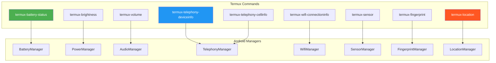
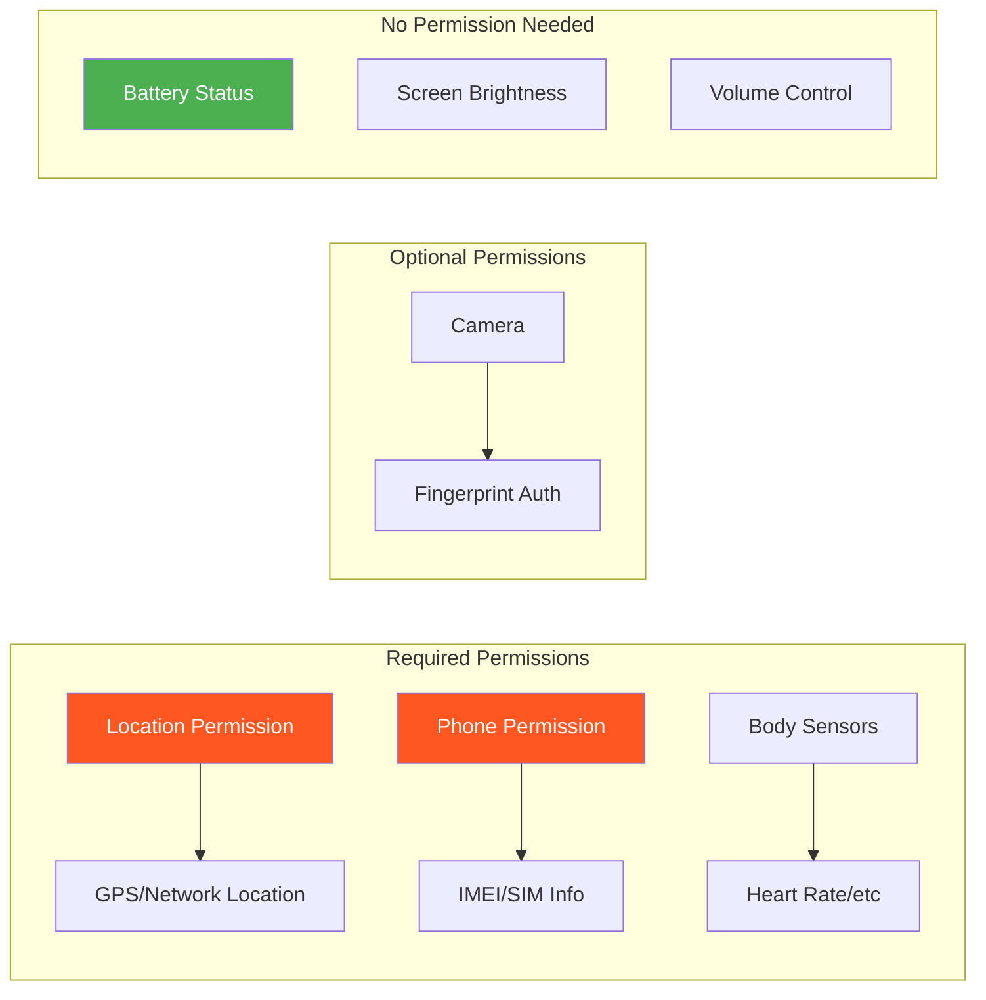
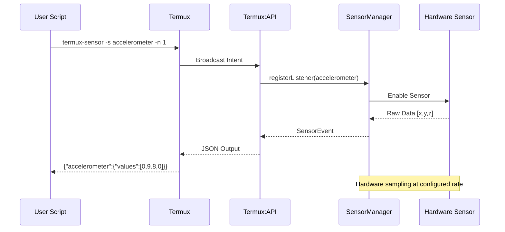

# 📱 Chapter 18: Termux API - Device Information

```
╔══════════════════════════════════════════════════════════════════════════════╗
║                                                                              ║
║   ████████╗███████╗██████╗ ███╗   ███╗██╗███╗   ██╗ █████╗ ██╗               ║
║   ╚══██╔══╝██╔════╝██╔══██╗████╗ ████║██║████╗  ██║██╔══██╗██║               ║
║      ██║   █████╗  ██████╔╝██╔████╔██║██║██╔██╗ ██║███████║██║               ║
║      ██║   ██╔══╝  ██╔══██╗██║╚██╔╝██║██║██║╚██╗██║██╔══██║██║               ║
║      ██║   ███████╗██║  ██║██║ ╚═╝ ██║██║██║ ╚████║██║  ██║███████╗          ║
║      ╚═╝   ╚══════╝╚═╝  ╚═╝╚═╝     ╚═╝╚═╝╚═╝  ╚═══╝╚═╝  ╚═╝╚══════╝          ║
║                                                                              ║
║   ███████╗██╗███╗   ██╗ ██████╗ ██╗     ███████╗██████╗ ███╗   ███╗         ║
║   ██╔════╝██║████╗  ██║██╔════╝ ██║     ██╔════╝██╔══██╗████╗ ████║         ║
║   █████╗  ██║██╔██╗ ██║██║  ███╗██║     █████╗  ██████╔╝██╔████╔██║         ║
║   ██╔══╝  ██║██║╚██╗██║██║   ██║██║     ██╔══╝  ██╔══██╗██║╚██╔╝██║         ║
║   ██║     ██║██║ ╚████║╚██████╔╝██║     ███████╗██║  ██║██║ ╚═╝ ██║         ║
║   ╚═╝     ╚═╝╚═╝  ╚═══╝ ╚═════╝ ╚═╝     ╚══════╝╚═╝  ╚═╝╚═╝     ╚═╝         ║
║                                                                              ║
║                   📊 DEVICE INFORMATION CHAPTER 📊                           ║
║                                                                              ║
╚══════════════════════════════════════════════════════════════════════════════╝
```

> **Module:** 4 - APIs  
> **Chapter:** 18 of 61  
> **Duration:** 15-20 Minutes  
> **Difficulty:** ⭐⭐ Intermediate  
> **Prerequisites:** Chapters 1-17 (Basic Termux & File APIs)

---

## 📋 Chapter Overview

| Section | Content |
|---------|---------|
| Video Script | Complete Hindi narration with timestamps |
| Technical Guide | Device info API commands详解 |
| API Reference | All device info commands with examples |
| Commands Reference | All commands covered in chapter |
| Practice Exercises | Hands-on tasks |
| Troubleshooting | Common API issues |
| Video Assets | Thumbnail, description, tags |

---

## 🎬 VIDEO SCRIPT (Complete Hindi Narration)

```
═══════════════════════════════════════════════════════════════════════════════
TERMUX FULL COURSE - CHAPTER 18
Title: Device Information API | Phone Info Extract Karne Ka Tarika | T3rmuxk1ng
Duration: 15-20 Minutes
═══════════════════════════════════════════════════════════════════════════════

[INTRO - 0:00 to 0:45]
─────────────────────────────────────────────────────────────────────────────

Namaskar Dosto! Welcome back to Termux Full Course by T3rmuxk1ng!

Aaj hum Module 4 ka ek bahut important chapter start karte hain - 
Device Information APIs. Is chapter mein hum seekhenge ki kaise 
Termux ke through apne phone ki complete information extract kar sakte hain.

Battery status, brightness control, volume settings, telephony info, 
WiFi details, sensors data, fingerprint authentication, GPS location - 
sab kuch ek command se!

Ye APIs aapko phone ke har hardware component ka access deti hain - 
bina root ke! Automation scripts banane ke liye, security tools 
bane ke liye, ya bas information ke liye - ye APIs bahut useful hain.

Chaliye shuru karte hain!

---

[SECTION 1: PREREQUISITES & SETUP - 0:45 to 2:30]
─────────────────────────────────────────────────────────────────────────────

Device Information APIs use karne ke liye, aapko Termux:API app install 
karni hogi. Agar aapne Chapter 10 follow kiya hai, to ye already 
installed hoga.

Quick check karte hain:

    pkg install termux-api -y

Ye command Termux API package install karti hai.

Ab verify karein:

    termux-battery-status

Agar output mein battery percentage aur status dikha, to sab kuch 
theek hai! Agar error aaya to:

1. Termux:API app F-Droid se install karein
2. Termux app ko "Allow background activity" permission dein
3. Battery optimization disable karein Termux ke liye

Termux:API install karna zaroori hai kyunki ye ek bridge hai Termux 
app aur Android system ke beech. Ye Android ke native APIs ko call 
karta hai aur JSON output deta hai.

---

[SECTION 2: BATTERY STATUS API - 2:30 to 5:00]
─────────────────────────────────────────────────────────────────────────────

Pehle battery status se shuru karte hain - sabse simple aur useful API.

Command:

    termux-battery-status

Output aisa aayega (JSON format mein):

    {
      "health": "GOOD",
      "percentage": 85,
      "plugged": "UNPLUGGED",
      "status": "DISCHARGING",
      "temperature": 32.0,
      "current": -450
    }

Samjhein har field kya batati hai:

• health - Battery ki condition (GOOD, OVERHEAT, DEAD, etc.)
• percentage - Current battery percentage (0-100)
• plugged - Charging status (PLUGGED_AC, PLUGGED_USB, UNPLUGGED)
• status - Current state (CHARGING, DISCHARGING, FULL, NOT_CHARGING)
• temperature - Battery temperature in Celsius
• current - Current in milliAmperes (-ve means discharging)

Ab ise Python mein parse karne ka tarika:

    termux-battery-status | python -c "import sys,json; d=json.load(sys.stdin); print(f'Battery: {d[\"percentage\"]}%')"

Ya ek cleaner script:

    termux-battery-status > battery.json
    python -c "import json; d=json.load(open('battery.json')); print(f'Health: {d[\"health\"]}\nBattery: {d[\"percentage\"]}%\nTemp: {d[\"temperature\"]}°C')"

Practical use case - Low battery alert script:

    #!/bin/bash
    BATTERY=$(termux-battery-status | jq -r '.percentage')
    if [ $BATTERY -lt 20 ]; then
        termux-notification --title "Low Battery!" --content "Battery at ${BATTERY}%"
        termux-vibrate
    fi

Ye script tab use aati hai jab aap automation karna chahte ho - 
jaise battery 20% se neeche ho to notification aur vibration.

---

[SECTION 3: BRIGHTNESS CONTROL API - 5:00 to 7:30]
─────────────────────────────────────────────────────────────────────────────

Ab brightness control ki baat karte hain. Ye API brightness get aur 
set dono kar sakti hai.

Current brightness check karein:

    termux-brightness

Ye current brightness level dikhayega (0-255 ya 0-100 depending on device).

Brightness set karna:

    termux-brightness 100

Ye brightness set kar dega. Range device pe depend karti hai - 
kuch devices 0-255 use karti hain, kuch 0-100.

Ek kaam karein - adaptive brightness test:

    termux-brightness 50
    sleep 1
    echo "Brightness set to medium"

Brightness automation script:

    #!/bin/bash
    # Night mode - dim brightness at night
    HOUR=$(date +%H)
    if [ $HOUR -ge 20 ] || [ $HOUR -lt 6 ]; then
        termux-brightness 30
        echo "Night mode activated"
    else
        termux-brightness 150
        echo "Day mode activated"
    fi

Ye script aap cron job ya Tasker ke saath use kar sakte ho automatic 
brightness adjustment ke liye.

Important note: Kuch devices pe brightness change ke liye additional 
permission chahiye hoti hai - "Modify system settings" permission 
Android settings mein enable karna padega.

Settings → Apps → Termux → Modify system settings → Allow

---

[SECTION 4: VOLUME CONTROL API - 7:30 to 10:00]
─────────────────────────────────────────────────────────────────────────────

Volume API bahut powerful hai - different audio streams ka control 
deti hai.

Volume levels check karein:

    termux-volume

Output aisa aayega:

    {
      "stream": "notification",
      "volume": 5,
      "max_volume": 7
    }

Default ye notification stream dikhata hai. Lekin aap different 
streams check kar sakte ho:

Streams available:
• stream_notification - Notification sounds
• stream_ring - Ringtone volume
• stream_music - Media/Music volume
• stream_alarm - Alarm volume
• stream_system - System sounds

Specific stream check karein:

    termux-volume stream_music

Volume set karna:

    termux-volume stream_music 10

Ya notification volume:

    termux-volume stream_notification 5

Mute karna:

    termux-volume stream_ring 0

Practical script - Meeting mode:

    #!/bin/bash
    # Save current volumes
    termux-volume stream_ring > /tmp/ring_vol.json
    termux-volume stream_notification > /tmp/notif_vol.json
    
    # Set to vibrate/mute
    termux-volume stream_ring 0
    termux-volume stream_notification 0
    termux-notification --title "Meeting Mode" --content "Phone muted"
    
    # Later restore (run separately)
    # RING=$(jq -r '.volume' /tmp/ring_vol.json)
    # termux-volume stream_ring $RING

Ye script meeting ke time phone ko automatically mute karti hai!

---

[SECTION 5: TELEPHONY DEVICE INFO - 10:00 to 12:00]
─────────────────────────────────────────────────────────────────────────────

Ab telephony APIs ki baad - ye aapko phone ki detailed information 
deti hain.

Device info command:

    termux-telephony-deviceinfo

Output:

    {
      "device_id": "359881060236451",
      "imei": "359881060236451",
      "meid": "A00000721BCDE5",
      "sim_country": "in",
      "sim_operator": "40485",
      "sim_operator_name": "Jio",
      "sim_serial_number": "89919012345678901234",
      "sim_subscriber_id": "404851234567890",
      "sim_state": "READY",
      "phone_type": "GSM",
      "network_type": "LTE",
      "network_country": "in",
      "network_operator": "40485",
      "network_operator_name": "Jio",
      "network_roaming": false,
      "software_version": "03"
    }

Ye information security research ke liye bahut useful hai. Dekhte 
hain har field kya hai:

• device_id / imei - Unique device identifier (15 digits)
• meid - CDMA device identifier
• sim_country - SIM country code (ISO)
• sim_operator - Mobile network code
• sim_operator_name - Network name (Jio, Airtel, etc.)
• sim_serial_number - ICCID (SIM card serial)
• sim_subscriber_id - IMSI number
• sim_state - READY, ABSENT, LOCKED, etc.
• phone_type - GSM, CDMA, SIP, NONE
• network_type - Current network (LTE, HSPA, etc.)
• network_roaming - Roaming status

Cell info check karein:

    termux-telephony-cellinfo

Output:

    {
      "type": "gsm",
      "mcc": "404",
      "mnc": "85",
      "lac": "28561",
      "cid": "68213321",
      "dbm": -85,
      "asu": 15,
      "level": 3
    }

Ye information cell tower location ke liye use hoti hai - 
security research aur location tracking mein useful!

---

[SECTION 6: WIFI CONNECTION INFO - 12:00 to 14:00]
─────────────────────────────────────────────────────────────────────────────

WiFi information API:

    termux-wifi-connectioninfo

Output:

    {
      "bssid": "aa:bb:cc:dd:ee:ff",
      "frequency_mhz": 2437,
      "ip": "192.168.1.105",
      "link_speed_mbps": 72,
      "mac_address": "02:00:00:00:00:00",
      "network_id": 5,
      "rssi": -65,
      "ssid": "MyWiFiNetwork",
      "ssid_hidden": false,
      "supplicant_state": "COMPLETED"
    }

Fields explain:

• bssid - Router ka MAC address
• frequency_mhz - WiFi frequency band
• ip - Assigned IP address
• link_speed_mbps - Connection speed
• mac_address - Device MAC (Android 10+ returns 02:00:00:00:00:00)
• network_id - Saved network ID
• rssi - Signal strength (closer to 0 is better)
• ssid - WiFi name

Signal strength analysis:

    # RSSI values:
    # -30 to -50: Excellent
    # -50 to -60: Good  
    # -60 to -70: Fair
    # -70 to -80: Weak
    # Below -80: Very poor

Python script for WiFi strength:

    termux-wifi-connectioninfo | python -c "
import sys, json
d = json.load(sys.stdin)
rssi = d['rssi']
if rssi > -50:
    strength = 'Excellent'
elif rssi > -60:
    strength = 'Good'
elif rssi > -70:
    strength = 'Fair'
else:
    strength = 'Weak'
print(f'WiFi: {d[\"ssid\"]}\nSignal: {strength} ({rssi} dBm)')
"

---

[SECTION 7: SENSORS API - 14:00 to 16:30]
─────────────────────────────────────────────────────────────────────────────

Sensors API bahut powerful hai - aap phone ke saare sensors access 
kar sakte ho!

Available sensors list:

    termux-sensor -l

Ya:

    termux-sensor -s list

Output mein aapko device ke saare sensors milenge:

• accelerometer - Motion/orientation
• gyroscope - Rotation
• magnetometer - Magnetic field (compass)
• light - Ambient light
• proximity - Near/far detection
• pressure - Barometer
• temperature - Device temperature
• humidity - Ambient humidity
• gravity - Gravity vector
• linear_acceleration - Linear motion
• rotation_vector - Device rotation

Accelerometer data:

    termux-sensor -s accelerometer -n 1

Output:

    {
      "accelerometer": {
        "values": [0.12, 9.81, 0.05],
        "timestamp": 1234567890123456
      }
    }

Values mein [x, y, z] acceleration in m/s².

Gyroscope:

    termux-sensor -s gyroscope -n 1

Magnetometer (compass):

    termux-sensor -s magnetometer -n 1

Continuous sensor monitoring:

    termux-sensor -s accelerometer -d 1000

-d 1000 means updates every 1000ms (1 second). Ctrl+C to stop.

Multiple sensors ek saath:

    termux-sensor -s "accelerometer,gyroscope,magnetometer" -d 500

Sensor data Python script:

    #!/usr/bin/env python3
    import subprocess
    import json
    
    def get_acceleration():
        result = subprocess.run(
            ['termux-sensor', '-s', 'accelerometer', '-n', '1'],
            capture_output=True, text=True
        )
        data = json.loads(result.stdout)
        values = data['accelerometer']['values']
        return {
            'x': values[0],
            'y': values[1],
            'z': values[2],
            'magnitude': (values[0]**2 + values[1]**2 + values[2]**2)**0.5
        }
    
    acc = get_acceleration()
    print(f"X: {acc['x']:.2f}, Y: {acc['y']:.2f}, Z: {acc['z']:.2f}")
    print(f"Total magnitude: {acc['magnitude']:.2f} m/s²")

---

[SECTION 8: FINGERPRINT API - 16:30 to 18:00]
─────────────────────────────────────────────────────────────────────────────

Fingerprint API aapko biometric authentication use karne deti hai.

    termux-fingerprint

Ye command fingerprint scanner activate karega:

Output success pe:

    {
      "auth_result": "AUTH_RESULT_SUCCESS",
      "auth_result_reason": "Fingerprint recognized.",
      "errors": []
    }

Failed pe:

    {
      "auth_result": "AUTH_RESULT_FAILURE",
      "auth_result_reason": "Fingerprint not recognized.",
      "errors": []
    }

Cancel pe:

    {
      "auth_result": "AUTH_RESULT_FAILURE", 
      "auth_result_reason": "User canceled.",
      "errors": []
    }

Fingerprint in script:

    #!/bin/bash
    echo "Please authenticate with fingerprint..."
    RESULT=$(termux-fingerprint | jq -r '.auth_result')
    
    if [ "$RESULT" = "AUTH_RESULT_SUCCESS" ]; then
        echo "Authentication successful!"
        # Your protected commands here
    else
        echo "Authentication failed!"
        exit 1
    fi

Use cases:
• Script ko secure karna
• Sensitive data access control
• Custom authentication system
• App-like security in Termux

Note: Fingerprint API Android 6.0+ pe kaam karti hai aur device 
mein fingerprint scanner hona chahiye.

---

[SECTION 9: LOCATION API - 18:00 to 20:00]
─────────────────────────────────────────────────────────────────────────────

Location API aapko GPS coordinates deti hai.

    termux-location

Default network-based location (faster but less accurate).

GPS provider:

    termux-location -p gps

Output:

    {
      "latitude": 28.6139,
      "longitude": 77.2090,
      "altitude": 216.0,
      "accuracy": 15.0,
      "bearing": 0.0,
      "speed": 0.0,
      "elapsedMs": 1523,
      "provider": "gps"
    }

Fields:
• latitude - Latitude in degrees
• longitude - Longitude in degrees
• altitude - Altitude in meters
• accuracy - Accuracy in meters (lower is better)
• bearing - Direction in degrees
• speed - Speed in m/s
• provider - gps or network

Location to address (reverse geocoding):

    termux-location -p gps | python -c "
import sys, json, urllib.request

data = json.load(sys.stdin)
lat, lon = data['latitude'], data['longitude']

url = f'https://nominatim.openstreetmap.org/reverse?lat={lat}&lon={lon}&format=json'
req = urllib.request.Request(url, headers={'User-Agent': 'Termux/1.0'})
response = urllib.request.urlopen(req)
address = json.loads(response.read())
print(f'Address: {address[\"display_name\"]}')
"

Location tracking script:

    #!/bin/bash
    while true; do
        termux-location -p network > /tmp/loc.json
        LAT=$(jq -r '.latitude' /tmp/loc.json)
        LON=$(jq -r '.longitude' /tmp/loc.json)
        echo "$(date): $LAT, $LON" >> location_log.txt
        sleep 60
    done

---

[SECTION 10: CREATING DEVICE INFO SCRIPT - 20:00 to 22:00]
─────────────────────────────────────────────────────────────────────────────

Ab ek complete device info extraction script banate hain:

    #!/bin/bash
    # device_info.sh - Complete Device Information Extractor
    # Author: T3rmuxk1ng
    
    echo "╔════════════════════════════════════════════╗"
    echo "║     DEVICE INFORMATION EXTRACTOR v1.0      ║"
    echo "║           Created by T3rmuxk1ng            ║"
    echo "╚════════════════════════════════════════════╝"
    echo ""
    
    # Battery Info
    echo "📊 BATTERY STATUS"
    echo "─────────────────"
    termux-battery-status | jq -r '
        "Health: \(.health)",
        "Level: \(.percentage)%",
        "Status: \(.status)",
        "Temperature: \(.temperature)°C"
    '
    echo ""
    
    # Telephony Info
    echo "📱 TELEPHONY INFO"
    echo "─────────────────"
    termux-telephony-deviceinfo | jq -r '
        "IMEI: \(.imei // "N/A")",
        "SIM: \(.sim_operator_name // "N/A")",
        "Network: \(.network_type // "N/A")",
        "Roaming: \(.network_roaming)"
    '
    echo ""
    
    # WiFi Info
    echo "📶 WIFI STATUS"
    echo "─────────────────"
    termux-wifi-connectioninfo | jq -r '
        "SSID: \(.ssid // "Not connected")",
        "IP: \(.ip // "N/A")",
        "Signal: \(.rssi) dBm",
        "Speed: \(.link_speed_mbps) Mbps"
    '
    echo ""
    
    # Location (if GPS available)
    echo "📍 LOCATION"
    echo "─────────────────"
    termux-location -p network -r 5 2>/dev/null | jq -r '
        "Latitude: \(.latitude)",
        "Longitude: \(.longitude)",
        "Accuracy: \(.accuracy)m"
    ' || echo "Location unavailable"
    echo ""
    
    echo "═══════════════════════════════════════════"
    echo "Report generated at: $(date)"

Ye script run karein:

    chmod +x device_info.sh
    ./device_info.sh

Output save karein:

    ./device_info.sh > device_report.txt

JSON output mein:

    ./device_info.sh | jq -Rs . > report.json

---

[SECTION 11: JSON PARSING TECHNIQUES - 22:00 to 23:30]
─────────────────────────────────────────────────────────────────────────────

Termux APIs JSON output deti hain. Isse efficiently parse karna zaroori hai.

Method 1: Using jq (recommended)

    # Install jq
    pkg install jq -y
    
    # Get specific value
    termux-battery-status | jq -r '.percentage'
    
    # Multiple values
    termux-battery-status | jq -r '"\(.percentage)% - \(.status)"'
    
    # Nested values
    termux-sensor -s accelerometer -n 1 | jq '.accelerometer.values[0]'

Method 2: Using Python

    # Single value
    termux-battery-status | python -c "import sys,json; print(json.load(sys.stdin)['percentage'])"
    
    # Multiple values
    termux-battery-status | python -c "
import sys,json
d=json.load(sys.stdin)
print(f\"Battery: {d['percentage']}%\")
print(f\"Status: {d['status']}\")
"

Method 3: Using grep/sed (quick & dirty)

    termux-battery-status | grep -o '"percentage": [0-9]*' | grep -o '[0-9]*'

Method 4: Python script for complex parsing

    #!/usr/bin/env python3
    import subprocess
    import json
    
    def get_battery():
        result = subprocess.run(['termux-battery-status'], 
                              capture_output=True, text=True)
        return json.loads(result.stdout)
    
    def get_wifi():
        result = subprocess.run(['termux-wifi-connectioninfo'],
                              capture_output=True, text=True)
        return json.loads(result.stdout)
    
    battery = get_battery()
    wifi = get_wifi()
    
    print(f"Battery: {battery['percentage']}%")
    print(f"WiFi: {wifi.get('ssid', 'Not connected')}")

---

[SECTION 12: PYTHON INTEGRATION - 23:30 to 25:00]
─────────────────────────────────────────────────────────────────────────────

Complete Python library for Termux APIs:

    #!/usr/bin/env python3
    # termux_device.py - Python wrapper for Termux Device APIs
    
    import subprocess
    import json
    from typing import Dict, Optional, List
    
    class TermuxDevice:
        """Python wrapper for Termux Device Information APIs"""
        
        @staticmethod
        def _run_command(cmd: List[str]) -> Optional[Dict]:
            """Execute termux command and return JSON output"""
            try:
                result = subprocess.run(cmd, capture_output=True, text=True, timeout=30)
                if result.returncode == 0:
                    return json.loads(result.stdout)
                return None
            except:
                return None
        
        @staticmethod
        def get_battery() -> Dict:
            """Get battery status"""
            return TermuxDevice._run_command(['termux-battery-status'])
        
        @staticmethod
        def set_brightness(level: int) -> bool:
            """Set screen brightness"""
            try:
                subprocess.run(['termux-brightness', str(level)], check=True)
                return True
            except:
                return False
        
        @staticmethod
        def get_volume(stream: str = 'notification') -> Dict:
            """Get volume level for a stream"""
            return TermuxDevice._run_command(['termux-volume', stream])
        
        @staticmethod
        def set_volume(stream: str, level: int) -> bool:
            """Set volume level"""
            try:
                subprocess.run(['termux-volume', stream, str(level)], check=True)
                return True
            except:
                return False
        
        @staticmethod
        def get_device_info() -> Dict:
            """Get telephony device information"""
            return TermuxDevice._run_command(['termux-telephony-deviceinfo'])
        
        @staticmethod
        def get_cell_info() -> Dict:
            """Get cell tower information"""
            return TermuxDevice._run_command(['termux-telephony-cellinfo'])
        
        @staticmethod
        def get_wifi_info() -> Dict:
            """Get WiFi connection information"""
            return TermuxDevice._run_command(['termux-wifi-connectioninfo'])
        
        @staticmethod
        def get_sensor(sensor: str, samples: int = 1) -> Dict:
            """Get sensor data"""
            return TermuxDevice._run_command(['termux-sensor', '-s', sensor, '-n', str(samples)])
        
        @staticmethod
        def get_location(provider: str = 'network') -> Dict:
            """Get device location"""
            return TermuxDevice._run_command(['termux-location', '-p', provider])
        
        @staticmethod
        def check_fingerprint() -> Dict:
            """Check fingerprint authentication"""
            return TermuxDevice._run_command(['termux-fingerprint'])
        
        @staticmethod
        def get_full_report() -> Dict:
            """Get complete device report"""
            return {
                'battery': TermuxDevice.get_battery(),
                'telephony': TermuxDevice.get_device_info(),
                'wifi': TermuxDevice.get_wifi_info(),
                'location': TermuxDevice.get_location('network')
            }
    
    
    # Usage Example
    if __name__ == '__main__':
        device = TermuxDevice()
        
        # Battery info
        battery = device.get_battery()
        print(f"Battery: {battery.get('percentage', 'N/A')}%")
        
        # WiFi info
        wifi = device.get_wifi_info()
        print(f"WiFi: {wifi.get('ssid', 'Not connected')}")
        
        # Location
        location = device.get_location()
        if location:
            print(f"Location: {location['latitude']}, {location['longitude']}")
        
        # Full report
        import pprint
        pprint.pprint(device.get_full_report())

Usage:

    python termux_device.py

---

[SECTION 13: SUMMARY & NEXT PREVIEW - 25:00 to 26:30]
─────────────────────────────────────────────────────────────────────────────

To dosto, Chapter 18 complete! Let's summarize:

✅ termux-battery-status - Battery health, percentage, temperature
✅ termux-brightness - Screen brightness get/set
✅ termux-volume - Volume control for all streams
✅ termux-telephony-deviceinfo - IMEI, SIM, network info
✅ termux-telephony-cellinfo - Cell tower information
✅ termux-wifi-connectioninfo - WiFi details and signal
✅ termux-sensor - Accelerometer, gyroscope, magnetometer
✅ termux-fingerprint - Biometric authentication
✅ termux-location - GPS coordinates
✅ JSON parsing with jq and Python
✅ Complete Python wrapper class

Important Commands:

┌─────────────────────────────────────────────────────────────────────────┐
│                    CHAPTER 18 - KEY COMMANDS                             │
├─────────────────────────────────────────────────────────────────────────┤
│ termux-battery-status         │ Battery information                      │
│ termux-brightness [level]     │ Get/set screen brightness                │
│ termux-volume [stream] [lvl]  │ Volume control                           │
│ termux-telephony-deviceinfo   │ Phone/SIM information                    │
│ termux-telephony-cellinfo     │ Cell tower information                   │
│ termux-wifi-connectioninfo    │ WiFi connection details                  │
│ termux-sensor -s [name] -n 1  │ Single sensor reading                    │
│ termux-sensor -s [name] -d ms │ Continuous sensor monitoring             │
│ termux-fingerprint            │ Biometric authentication                 │
│ termux-location -p gps        │ GPS location                             │
└─────────────────────────────────────────────────────────────────────────┘

Next Chapter 19 mein hum seekhenge:
- Camera API - Photo aur video capture
- Media playback and recording
- Audio recording
- Media file handling

Agar ye video helpful lagi, to:
👍 Like button press karein
🔔 Subscribe karein, notification bell on karein
💬 Koi sawal ho to comment mein poochein
📤 Share karein friends ke saath

Thank you for watching! See you in Chapter 19!

═══════════════════════════════════════════════════════════════════════════════
```

---

## 📖 TECHNICAL GUIDE

### 1. Device Information APIs Overview

```
┌─────────────────────────────────────────────────────────────────────────┐
│                    TERMUX DEVICE INFORMATION APIs                        │
├─────────────────────────────────────────────────────────────────────────┤
│                                                                          │
│   ┌────────────────────────────────────────────────────────────────┐    │
│   │                    Hardware Access Layer                         │    │
│   │                                                                  │    │
│   │  ┌──────────────┐  ┌──────────────┐  ┌──────────────┐         │    │
│   │  │ Battery      │  │ Brightness   │  │ Volume       │         │    │
│   │  │ API          │  │ API          │  │ API          │         │    │
│   │  └──────────────┘  └──────────────┘  └──────────────┘         │    │
│   │                                                                  │    │
│   │  ┌──────────────┐  ┌──────────────┐  ┌──────────────┐         │    │
│   │  │ Telephony    │  │ WiFi         │  │ Sensors      │         │    │
│   │  │ API          │  │ API          │  │ API          │         │    │
│   │  └──────────────┘  └──────────────┘  └──────────────┘         │    │
│   │                                                                  │    │
│   │  ┌──────────────┐  ┌──────────────┐                            │    │
│   │  │ Fingerprint  │  │ Location     │                            │    │
│   │  │ API          │  │ API          │                            │    │
│   │  └──────────────┘  └──────────────┘                            │    │
│   └────────────────────────────────────────────────────────────────┘    │
│                              │                                          │
│                              ▼                                          │
│   ┌────────────────────────────────────────────────────────────────┐    │
│   │                    Termux:API App Bridge                         │    │
│   │   (Android Service with BIND_AUTO_CREATE)                       │    │
│   └────────────────────────────────────────────────────────────────┘    │
│                              │                                          │
│                              ▼                                          │
│   ┌────────────────────────────────────────────────────────────────┐    │
│   │                    Android System APIs                           │    │
│   │   BatteryManager, TelephonyManager, WifiManager,                │    │
│   │   SensorManager, FingerprintManager, LocationManager            │    │
│   └────────────────────────────────────────────────────────────────┘    │
│                                                                          │
└─────────────────────────────────────────────────────────────────────────┘
```

### 2. API Response Formats

All Device Information APIs return JSON:

```json
// Battery Status
{
  "health": "GOOD|OVERHEAT|DEAD|OVER_VOLTAGE|UNSPECIFIED_FAILURE|COLD",
  "percentage": 85,
  "plugged": "PLUGGED_AC|PLUGGED_USB|PLUGGED_WIRELESS|UNPLUGGED",
  "status": "CHARGING|DISCHARGING|FULL|NOT_CHARGING|UNKNOWN",
  "temperature": 32.0,
  "current": -450
}

// Telephony Device Info
{
  "device_id": "string",
  "imei": "string",
  "meid": "string",
  "sim_country": "string",
  "sim_operator": "string",
  "sim_operator_name": "string",
  "sim_serial_number": "string",
  "sim_subscriber_id": "string",
  "sim_state": "READY|ABSENT|LOCKED|NETWORK_LOCKED|NOT_READY|UNKNOWN",
  "phone_type": "GSM|CDMA|SIP|NONE",
  "network_type": "UNKNOWN|GPRS|EDGE|UMTS|CDMA|EVDO_0|LTE|etc",
  "network_country": "string",
  "network_operator": "string",
  "network_operator_name": "string",
  "network_roaming": boolean,
  "software_version": "string"
}

// WiFi Connection Info
{
  "bssid": "string (MAC)",
  "frequency_mhz": number,
  "ip": "string",
  "link_speed_mbps": number,
  "mac_address": "string",
  "network_id": number,
  "rssi": number,
  "ssid": "string",
  "ssid_hidden": boolean,
  "supplicant_state": "string"
}

// Location
{
  "latitude": number,
  "longitude": number,
  "altitude": number,
  "accuracy": number,
  "bearing": number,
  "speed": number,
  "elapsedMs": number,
  "provider": "gps|network|passive"
}

// Sensor Data
{
  "sensor_name": {
    "values": [x, y, z],
    "timestamp": number
  }
}

// Fingerprint
{
  "auth_result": "AUTH_RESULT_SUCCESS|AUTH_RESULT_FAILURE",
  "auth_result_reason": "string",
  "errors": []
}
```

### 3. Sensor Types Reference

| Sensor | Type | Values | Description |
|--------|------|--------|-------------|
| accelerometer | Motion | [x, y, z] m/s² | Linear acceleration |
| gyroscope | Rotation | [x, y, z] rad/s | Angular velocity |
| magnetometer | Magnetic | [x, y, z] µT | Magnetic field |
| light | Light | [lux] | Ambient light |
| proximity | Distance | [cm] | Object proximity |
| pressure | Barometric | [hPa] | Atmospheric pressure |
| temperature | Temp | [°C] | Device temperature |
| humidity | Humidity | [%] | Relative humidity |
| gravity | Gravity | [x, y, z] m/s² | Gravity vector |
| linear_acceleration | Motion | [x, y, z] m/s² | Linear motion (gravity removed) |
| rotation_vector | Rotation | [x, y, z, w] | Device orientation |
| step_counter | Activity | [steps] | Step count |
| step_detector | Activity | [1] | Step detected |

### 4. Volume Streams Reference

| Stream | Description | Typical Range |
|--------|-------------|---------------|
| stream_notification | Notification sounds | 0-7 |
| stream_ring | Ringtone | 0-7 |
| stream_music | Media playback | 0-15 |
| stream_alarm | Alarms | 0-7 |
| stream_system | System sounds | 0-7 |
| stream_voice_call | Call volume | 0-5 |
| stream_dtmf | DTMF tones | 0-15 |

### 5. Location Providers Comparison

| Provider | Accuracy | Battery | Speed |
|----------|----------|---------|-------|
| gps | High (5-10m) | High drain | Slow (cold start) |
| network | Medium (50-500m) | Low drain | Fast |
| passive | Varies | Minimal | Instant (cached) |

---

## 🔧 API COMMANDS REFERENCE

### Battery Status

```bash
# Get battery information
termux-battery-status

# Parse battery percentage
termux-battery-status | jq -r '.percentage'

# Check if charging
termux-battery-status | jq -r '.plugged'

# Get battery temperature
termux-battery-status | jq -r '.temperature'

# Battery health check
termux-battery-status | jq -r '.health'

# Create battery monitor script
cat > battery_monitor.sh << 'EOF'
#!/bin/bash
while true; do
    BATTERY=$(termux-battery-status | jq -r '.percentage')
    STATUS=$(termux-battery-status | jq -r '.status')
    TEMP=$(termux-battery-status | jq -r '.temperature')
    echo "[$(date +%H:%M:%S)] Battery: ${BATTERY}% | ${STATUS} | ${TEMP}°C"
    sleep 60
done
EOF
```

### Brightness Control

```bash
# Get current brightness
termux-brightness

# Set brightness (0-255 or 0-100 depending on device)
termux-brightness 100

# Set maximum brightness
termux-brightness 255

# Set minimum brightness
termux-brightness 0

# Brightness adjustment script
cat > brightness_control.sh << 'EOF'
#!/bin/bash
case "$1" in
    "max") termux-brightness 255 ;;
    "min") termux-brightness 10 ;;
    "dim") termux-brightness 50 ;;
    "medium") termux-brightness 128 ;;
    *) echo "Usage: $0 {max|min|dim|medium}" ;;
esac
EOF

# Auto brightness based on time
cat > auto_brightness.sh << 'EOF'
#!/bin/bash
HOUR=$(date +%H)
if [ $HOUR -ge 20 ] || [ $HOUR -lt 6 ]; then
    termux-brightness 30  # Night
elif [ $HOUR -ge 6 ] && [ $HOUR -lt 9 ]; then
    termux-brightness 100 # Morning
else
    termux-brightness 150 # Day
fi
EOF
```

### Volume Control

```bash
# Get notification volume
termux-volume

# Get specific stream volume
termux-volume stream_music
termux-volume stream_ring
termux-volume stream_alarm
termux-volume stream_notification

# Set volume
termux-volume stream_music 10
termux-volume stream_ring 5
termux-volume stream_notification 3

# Mute streams
termux-volume stream_ring 0
termux-volume stream_notification 0

# Volume control script
cat > volume_control.sh << 'EOF'
#!/bin/bash
case "$1" in
    "mute")
        termux-volume stream_ring 0
        termux-volume stream_notification 0
        termux-volume stream_music 0
        echo "All volumes muted"
        ;;
    "unmute")
        termux-volume stream_ring 5
        termux-volume stream_notification 5
        termux-volume stream_music 10
        echo "Volumes restored"
        ;;
    "max")
        termux-volume stream_music 15
        termux-volume stream_ring 7
        echo "Maximum volume"
        ;;
    *) echo "Usage: $0 {mute|unmute|max}" ;;
esac
EOF
```

### Telephony Device Info

```bash
# Get complete device info
termux-telephony-deviceinfo

# Extract IMEI
termux-telephony-deviceinfo | jq -r '.imei'

# Get SIM operator name
termux-telephony-deviceinfo | jq -r '.sim_operator_name'

# Check network type
termux-telephony-deviceinfo | jq -r '.network_type'

# Get SIM serial number (ICCID)
termux-telephony-deviceinfo | jq -r '.sim_serial_number'

# Check if roaming
termux-telephony-deviceinfo | jq -r '.network_roaming'

# Get IMSI
termux-telephony-deviceinfo | jq -r '.sim_subscriber_id'

# Device info summary
termux-telephony-deviceinfo | jq -r '
"Device: \(.imei // "N/A")",
"SIM: \(.sim_operator_name // "N/A")",
"Network: \(.network_type // "N/A")",
"Phone Type: \(.phone_type // "N/A")"
'
```

### Telephony Cell Info

```bash
# Get cell tower information
termux-telephony-cellinfo

# Extract cell ID
termux-telephony-cellinfo | jq -r '.cid'

# Get signal strength
termux-telephony-cellinfo | jq -r '.dbm'

# Get location area code
termux-telephony-cellinfo | jq -r '.lac'

# Cell info formatted
termux-telephony-cellinfo | jq -r '
"Cell ID: \(.cid)",
"LAC: \(.lac)",
"MCC/MNC: \(.mcc)/\(.mnc)",
"Signal: \(.dbm) dBm",
"Quality: \(.asu) ASU"
'
```

### WiFi Connection Info

```bash
# Get WiFi connection details
termux-wifi-connectioninfo

# Extract SSID
termux-wifi-connectioninfo | jq -r '.ssid'

# Get IP address
termux-wifi-connectioninfo | jq -r '.ip'

# Get signal strength
termux-wifi-connectioninfo | jq -r '.rssi'

# Get BSSID (router MAC)
termux-wifi-connectioninfo | jq -r '.bssid'

# Get link speed
termux-wifi-connectioninfo | jq -r '.link_speed_mbps'

# WiFi info formatted
termux-wifi-connectioninfo | jq -r '
"SSID: \(.ssid // "Not connected")",
"IP: \(.ip // "N/A")",
"Signal: \(.rssi) dBm",
"Speed: \(.link_speed_mbps) Mbps",
"Frequency: \(.frequency_mhz) MHz"
'

# Signal strength indicator
cat > wifi_signal.sh << 'EOF'
#!/bin/bash
RSSI=$(termux-wifi-connectioninfo | jq -r '.rssi')
if [ "$RSSI" = "null" ]; then
    echo "Not connected to WiFi"
    exit 1
fi

if [ $RSSI -gt -50 ]; then
    QUALITY="Excellent"
    BARS="▂▄▆█"
elif [ $RSSI -gt -60 ]; then
    QUALITY="Good"
    BARS="▂▄▆_"
elif [ $RSSI -gt -70 ]; then
    QUALITY="Fair"
    BARS="▂▄__"
else
    QUALITY="Weak"
    BARS="▂___"
fi

echo "WiFi Signal: $BARS $QUALITY ($RSSI dBm)"
EOF
```

### Sensor Data

```bash
# List all available sensors
termux-sensor -l
termux-sensor -s list

# Get accelerometer data (single reading)
termux-sensor -s accelerometer -n 1

# Get gyroscope data
termux-sensor -s gyroscope -n 1

# Get magnetometer (compass) data
termux-sensor -s magnetometer -n 1

# Get light sensor data
termux-sensor -s light -n 1

# Get proximity sensor data
termux-sensor -s proximity -n 1

# Get barometer data
termux-sensor -s pressure -n 1

# Multiple sensors at once
termux-sensor -s "accelerometer,gyroscope,magnetometer" -n 1

# Continuous monitoring (every 1000ms)
termux-sensor -s accelerometer -d 1000

# Continuous multiple sensors (every 500ms)
termux-sensor -s "accelerometer,gyroscope" -d 500

# Parse accelerometer values
termux-sensor -s accelerometer -n 1 | jq '.accelerometer.values'

# Accelerometer X value
termux-sensor -s accelerometer -n 1 | jq '.accelerometer.values[0]'

# Create compass script
cat > compass.sh << 'EOF'
#!/bin/bash
DATA=$(termux-sensor -s magnetometer -n 1)
X=$(echo $DATA | jq '.magnetometer.values[0]')
Y=$(echo $DATA | jq '.magnetometer.values[1]')
AZIMUTH=$(echo "scale=0; ($Y>0?360:0) + (a($X/$Y) * 180 / 3.14159)" | bc -l)
echo "Compass: ${AZIMUTH%.*}°"
EOF
```

### Fingerprint Authentication

```bash
# Trigger fingerprint scan
termux-fingerprint

# Check result
termux-fingerprint | jq -r '.auth_result'

# Get reason
termux-fingerprint | jq -r '.auth_result_reason'

# Fingerprint guard script
cat > fingerprint_guard.sh << 'EOF'
#!/bin/bash
echo "🔐 Fingerprint authentication required..."
RESULT=$(termux-fingerprint)
AUTH=$(echo $RESULT | jq -r '.auth_result')

if [ "$AUTH" = "AUTH_RESULT_SUCCESS" ]; then
    echo "✅ Authentication successful!"
    # Add your protected commands here
else
    REASON=$(echo $RESULT | jq -r '.auth_result_reason')
    echo "❌ Authentication failed: $REASON"
    exit 1
fi
EOF
```

### Location (GPS)

```bash
# Get network-based location (faster, less accurate)
termux-location

# Get GPS location (slower, more accurate)
termux-location -p gps

# Get passive location (cached, instant)
termux-location -p passive

# Extract coordinates
termux-location | jq -r '"\(.latitude), \(.longitude)"'

# Get latitude only
termux-location | jq -r '.latitude'

# Get longitude only
termux-location | jq -r '.longitude'

# Get accuracy
termux-location | jq -r '.accuracy'

# Location with GPS and timeout
termux-location -p gps -r 10

# Google Maps link
termux-location | jq -r '"https://maps.google.com/?q=\(.latitude),\(.longitude)"'

# Location logger
cat > location_logger.sh << 'EOF'
#!/bin/bash
LOG_FILE="location_history.csv"
echo "timestamp,latitude,longitude,accuracy,provider" > $LOG_FILE

while true; do
    LOC=$(termux-location -p network 2>/dev/null)
    if [ $? -eq 0 ]; then
        LAT=$(echo $LOC | jq -r '.latitude')
        LON=$(echo $LOC | jq -r '.longitude')
        ACC=$(echo $LOC | jq -r '.accuracy')
        PROV=$(echo $LOC | jq -r '.provider')
        echo "$(date -Iseconds),$LAT,$LON,$ACC,$PROV" >> $LOG_FILE
        echo "Location logged: $LAT, $LON"
    fi
    sleep 300  # Every 5 minutes
done
EOF
```

---

## 💻 PRACTICAL EXAMPLES (20+)

### Example 1: Battery Health Monitor

```bash
#!/bin/bash
# battery_health.sh - Monitor battery health and send alerts

check_battery() {
    DATA=$(termux-battery-status)
    PERCENT=$(echo $DATA | jq -r '.percentage')
    HEALTH=$(echo $DATA | jq -r '.health')
    TEMP=$(echo $DATA | jq -r '.temperature')
    STATUS=$(echo $DATA | jq -r '.status')
    
    echo "━━━━━━━━━━━━━━━━━━━━━━━━━━"
    echo "🔋 BATTERY STATUS"
    echo "━━━━━━━━━━━━━━━━━━━━━━━━━━"
    echo "Level:     ${PERCENT}%"
    echo "Health:    $HEALTH"
    echo "Temp:      ${TEMP}°C"
    echo "Status:    $STATUS"
    echo "━━━━━━━━━━━━━━━━━━━━━━━━━━"
    
    # Alert conditions
    if [ $PERCENT -lt 15 ]; then
        termux-notification --title "⚠️ Low Battery" --content "Battery at ${PERCENT}%"
        termux-vibrate
    fi
    
    if [ $(echo "$TEMP > 40" | bc) -eq 1 ]; then
        termux-notification --title "🔥 Overheating" --content "Battery temp: ${TEMP}°C"
    fi
}

check_battery
```

### Example 2: Smart Brightness Automation

```bash
#!/bin/bash
# smart_brightness.sh - Automatic brightness based on conditions

auto_brightness() {
    HOUR=$(date +%H)
    BATTERY=$(termux-battery-status | jq -r '.percentage')
    
    # Night mode (8 PM - 6 AM)
    if [ $HOUR -ge 20 ] || [ $HOUR -lt 6 ]; then
        termux-brightness 30
        echo "🌙 Night mode: Low brightness"
        return
    fi
    
    # Low battery mode
    if [ $BATTERY -lt 20 ]; then
        termux-brightness 80
        echo "🔋 Power saving: Medium brightness"
        return
    fi
    
    # Day mode
    termux-brightness 180
    echo "☀️ Day mode: High brightness"
}

auto_brightness
```

### Example 3: Meeting Mode Script

```bash
#!/bin/bash
# meeting_mode.sh - Toggle meeting mode

STATE_FILE="/tmp/meeting_mode"

if [ -f "$STATE_FILE" ]; then
    # Restore previous volumes
    source $STATE_FILE
    termux-volume stream_ring $RING_VOL
    termux-volume stream_notification $NOTIF_VOL
    termux-volume stream_music $MUSIC_VOL
    rm $STATE_FILE
    termux-notification --title "Meeting Mode OFF" --content "Volumes restored"
else
    # Save current volumes and mute
    RING_VOL=$(termux-volume stream_ring | jq -r '.volume')
    NOTIF_VOL=$(termux-volume stream_notification | jq -r '.volume')
    MUSIC_VOL=$(termux-volume stream_music | jq -r '.volume')
    
    echo "RING_VOL=$RING_VOL" > $STATE_FILE
    echo "NOTIF_VOL=$NOTIF_VOL" >> $STATE_FILE
    echo "MUSIC_VOL=$MUSIC_VOL" >> $STATE_FILE
    
    termux-volume stream_ring 0
    termux-volume stream_notification 0
    termux-volume stream_music 0
    
    termux-notification --title "Meeting Mode ON" --content "Phone muted"
fi
```

### Example 4: Device Info Reporter

```bash
#!/bin/bash
# device_report.sh - Generate comprehensive device report

generate_report() {
    echo "╔════════════════════════════════════════════════╗"
    echo "║         DEVICE INFORMATION REPORT              ║"
    echo "╚════════════════════════════════════════════════╝"
    echo ""
    
    # Battery
    echo "┌─────────────────────────────────────────────────┐"
    echo "│ 🔋 BATTERY                                       │"
    echo "├─────────────────────────────────────────────────┤"
    termux-battery-status | jq -r '
    "│ Level:       \(.percentage)%                      ",
    "│ Health:      \(.health)                           ",
    "│ Temperature: \(.temperature)°C                    ",
    "│ Status:      \(.status)                           "'
    echo "└─────────────────────────────────────────────────┘"
    echo ""
    
    # Telephony
    echo "┌─────────────────────────────────────────────────┐"
    echo "│ 📱 TELEPHONY                                     │"
    echo "├─────────────────────────────────────────────────┤"
    termux-telephony-deviceinfo | jq -r '
    "│ IMEI:        \(.imei // "N/A")                    ",
    "│ SIM:         \(.sim_operator_name // "N/A")       ",
    "│ Network:     \(.network_type // "N/A")            ",
    "│ Roaming:     \(.network_roaming)                  "'
    echo "└─────────────────────────────────────────────────┘"
    echo ""
    
    # WiFi
    echo "┌─────────────────────────────────────────────────┐"
    echo "│ 📶 WIFI                                          │"
    echo "├─────────────────────────────────────────────────┤"
    termux-wifi-connectioninfo | jq -r '
    "│ SSID:        \(.ssid // "Not connected")          ",
    "│ IP:          \(.ip // "N/A")                      ",
    "│ Signal:      \(.rssi) dBm                         ",
    "│ Speed:       \(.link_speed_mbps) Mbps             "'
    echo "└─────────────────────────────────────────────────┘"
    echo ""
    
    echo "Report generated: $(date)"
}

generate_report
```

### Example 5: WiFi Signal Analyzer

```bash
#!/bin/bash
# wifi_analyzer.sh - Continuous WiFi signal monitoring

monitor_wifi() {
    echo "WiFi Signal Monitor (Ctrl+C to stop)"
    echo "===================================="
    
    while true; do
        DATA=$(termux-wifi-connectioninfo 2>/dev/null)
        SSID=$(echo $DATA | jq -r '.ssid // "N/A"')
        RSSI=$(echo $DATA | jq -r '.rssi // 0')
        SPEED=$(echo $DATA | jq -r '.link_speed_mbps // 0')
        
        # Signal quality indicator
        if [ $RSSI -gt -50 ]; then
            BARS="████"
            QUALITY="Excellent"
        elif [ $RSSI -gt -60 ]; then
            BARS="███░"
            QUALITY="Good"
        elif [ $RSSI -gt -70 ]; then
            BARS="██░░"
            QUALITY="Fair"
        else
            BARS="█░░░"
            QUALITY="Weak"
        fi
        
        echo "\r[$(date +%H:%M:%S)] $SSID | [$BARS] $QUALITY ($RSSI dBm) | $SPEED Mbps"
        sleep 2
    done
}

monitor_wifi
```

### Example 6: Motion Detector

```bash
#!/bin/bash
# motion_detector.sh - Detect phone movement using accelerometer

detect_motion() {
    THRESHOLD=0.5
    
    # Get baseline
    BASE=$(termux-sensor -s accelerometer -n 1)
    BASE_X=$(echo $BASE | jq '.accelerometer.values[0]')
    BASE_Y=$(echo $BASE | jq '.accelerometer.values[1]')
    BASE_Z=$(echo $BASE | jq '.accelerometer.values[2]')
    
    echo "Baseline established. Monitoring for motion..."
    
    while true; do
        CURRENT=$(termux-sensor -s accelerometer -n 1)
        CUR_X=$(echo $CURRENT | jq '.accelerometer.values[0]')
        CUR_Y=$(echo $CURRENT | jq '.accelerometer.values[1]')
        CUR_Z=$(echo $CURRENT | jq '.accelerometer.values[2]')
        
        # Calculate difference
        DIFF_X=$(echo "scale=2; $CUR_X - $BASE_X" | bc)
        DIFF_Y=$(echo "scale=2; $CUR_Y - $BASE_Y" | bc)
        DIFF_Z=$(echo "scale=2; $CUR_Z - $BASE_Z" | bc)
        
        # Check if movement exceeds threshold
        ABS_DIFF=$(echo "scale=2; sqrt($DIFF_X^2 + $DIFF_Y^2 + $DIFF_Z^2)" | bc)
        
        if [ $(echo "$ABS_DIFF > $THRESHOLD" | bc) -eq 1 ]; then
            echo "🚨 Motion detected! Magnitude: $ABS_DIFF"
            termux-vibrate -d 100
        fi
        
        sleep 0.5
    done
}

detect_motion
```

### Example 7: Compass Application

```bash
#!/bin/bash
# compass.sh - Digital compass using magnetometer

get_direction() {
    AZIMUTH=$1
    
    if [ $(echo "$AZIMUTH >= 337.5 || $AZIMUTH < 22.5" | bc) -eq 1 ]; then
        echo "N"
    elif [ $(echo "$AZIMUTH >= 22.5 && $AZIMUTH < 67.5" | bc) -eq 1 ]; then
        echo "NE"
    elif [ $(echo "$AZIMUTH >= 67.5 && $AZIMUTH < 112.5" | bc) -eq 1 ]; then
        echo "E"
    elif [ $(echo "$AZIMUTH >= 112.5 && $AZIMUTH < 157.5" | bc) -eq 1 ]; then
        echo "SE"
    elif [ $(echo "$AZIMUTH >= 157.5 && $AZIMUTH < 202.5" | bc) -eq 1 ]; then
        echo "S"
    elif [ $(echo "$AZIMUTH >= 202.5 && $AZIMUTH < 247.5" | bc) -eq 1 ]; then
        echo "SW"
    elif [ $(echo "$AZIMUTH >= 247.5 && $AZIMUTH < 292.5" | bc) -eq 1 ]; then
        echo "W"
    else
        echo "NW"
    fi
}

compass_loop() {
    echo "🧭 Digital Compass (Ctrl+C to stop)"
    echo "=================================="
    
    while true; do
        DATA=$(termux-sensor -s magnetometer -n 1 2>/dev/null)
        X=$(echo $DATA | jq '.magnetometer.values[0]')
        Y=$(echo $DATA | jq '.magnetometer.values[1]')
        
        # Calculate azimuth
        AZIMUTH=$(echo "scale=0; (a($Y/$X) * 180 / 3.14159 + 360) % 360" | bc -l)
        DIR=$(get_direction $AZIMUTH)
        
        printf "\r        🧭 %3d° %s   " ${AZIMUTH%.*} $DIR
        sleep 0.2
    done
}

compass_loop
```

### Example 8: Location Tracker

```bash
#!/bin/bash
# location_tracker.sh - Track and log GPS location

TRACK_FILE="gps_track_$(date +%Y%m%d_%H%M%S).gpx"

start_tracking() {
    echo '<?xml version="1.0"?>' > $TRACK_FILE
    echo '<gpx version="1.1">' >> $TRACK_FILE
    echo '<trk><trkseg>' >> $TRACK_FILE
    
    echo "📍 GPS Tracking started (Ctrl+C to stop)"
    echo "   Log file: $TRACK_FILE"
    
    while true; do
        LOC=$(termux-location -p network 2>/dev/null)
        LAT=$(echo $LOC | jq -r '.latitude')
        LON=$(echo $LOC | jq -r '.longitude')
        ELE=$(echo $LOC | jq -r '.altitude')
        TIME=$(date -u +"%Y-%m-%dT%H:%M:%SZ")
        
        echo "<trkpt lat=\"$LAT\" lon=\"$LON\"><ele>$ELE</ele><time>$TIME</time></trkpt>" >> $TRACK_FILE
        
        echo "📍 $LAT, $LON @ $TIME"
        sleep 10
    done
}

stop_tracking() {
    echo '</trkseg></trk>' >> $TRACK_FILE
    echo '</gpx>' >> $TRACK_FILE
    echo "Tracking stopped. GPX file saved: $TRACK_FILE"
}

trap stop_tracking EXIT
start_tracking
```

### Example 9: Secure Script Launcher

```bash
#!/bin/bash
# secure_launch.sh - Biometric-protected script launcher

authenticate() {
    echo "🔐 Fingerprint authentication required..."
    RESULT=$(termux-fingerprint 2>/dev/null)
    AUTH=$(echo $RESULT | jq -r '.auth_result')
    
    if [ "$AUTH" = "AUTH_RESULT_SUCCESS" ]; then
        echo "✅ Authentication successful!"
        return 0
    else
        REASON=$(echo $RESULT | jq -r '.auth_result_reason')
        echo "❌ Authentication failed: $REASON"
        return 1
    fi
}

# Main script
if authenticate; then
    # Protected code here
    echo "Running protected operations..."
    # Your sensitive commands here
else
    exit 1
fi
```

### Example 10: Phone Status Dashboard

```bash
#!/bin/bash
# status_dashboard.sh - Real-time phone status display

draw_dashboard() {
    clear
    echo "╔════════════════════════════════════════════════════╗"
    echo "║          📱 PHONE STATUS DASHBOARD                  ║"
    echo "╠════════════════════════════════════════════════════╣"
    
    # Battery
    BAT=$(termux-battery-status)
    BAT_PCT=$(echo $BAT | jq -r '.percentage')
    BAT_STATUS=$(echo $BAT | jq -r '.status')
    BAT_TEMP=$(echo $BAT | jq -r '.temperature')
    
    BAR=""
    for i in $(seq 1 10); do
        if [ $((i*10)) -le $BAT_PCT ]; then
            BAR="${BAR}█"
        else
            BAR="${BAR}░"
        fi
    done
    
    echo "║ 🔋 Battery: [$BAR] ${BAT_PCT}%   "
    echo "║    Status: $BAT_STATUS | Temp: ${BAT_TEMP}°C"
    echo "╠════════════════════════════════════════════════════╣"
    
    # WiFi
    WIFI=$(termux-wifi-connectioninfo 2>/dev/null)
    SSID=$(echo $WIFI | jq -r '.ssid // "Not connected"')
    RSSI=$(echo $WIFI | jq -r '.rssi // 0')
    IP=$(echo $WIFI | jq -r '.ip // "N/A"')
    
    if [ $RSSI -gt -60 ]; then
        WIFI_QUAL="Good"
    elif [ $RSSI -gt -70 ]; then
        WIFI_QUAL="Fair"
    else
        WIFI_QUAL="Weak"
    fi
    
    echo "║ 📶 WiFi: $SSID"
    echo "║    IP: $IP | Signal: $WIFI_QUAL ($RSSI dBm)"
    echo "╠════════════════════════════════════════════════════╣"
    
    # Network
    NET=$(termux-telephony-deviceinfo 2>/dev/null)
    CARRIER=$(echo $NET | jq -r '.sim_operator_name // "N/A"')
    NET_TYPE=$(echo $NET | jq -r '.network_type // "N/A"')
    
    echo "║ 📡 Carrier: $CARRIER"
    echo "║    Network: $NET_TYPE"
    echo "╠════════════════════════════════════════════════════╣"
    
    # Time
    echo "║ 🕐 $(date '+%Y-%m-%d %H:%M:%S')"
    echo "╚════════════════════════════════════════════════════╝"
    echo ""
    echo "Press Ctrl+C to exit"
}

# Continuous update
while true; do
    draw_dashboard
    sleep 2
done
```

### Example 11: Battery Saver Mode

```bash
#!/bin/bash
# battery_saver.sh - Activate battery saving measures

activate_saver() {
    echo "🔋 Activating Battery Saver Mode..."
    
    # Dim screen
    termux-brightness 50
    echo "  ✓ Brightness reduced"
    
    # Lower volumes
    termux-volume stream_music 5
    termux-volume stream_notification 3
    echo "  ✓ Volumes lowered"
    
    # Show status
    BAT=$(termux-battery-status | jq -r '.percentage')
    termux-notification --title "Battery Saver" --content "Activated at ${BAT}%"
    
    echo "  ✓ Battery Saver Mode active"
}

deactivate_saver() {
    echo "🔋 Deactivating Battery Saver Mode..."
    
    # Restore settings
    termux-brightness 150
    termux-volume stream_music 10
    termux-volume stream_notification 5
    
    termux-notification --title "Battery Saver" --content "Deactivated"
    echo "  ✓ Normal mode restored"
}

case "$1" in
    on) activate_saver ;;
    off) deactivate_saver ;;
    *) echo "Usage: $0 {on|off}" ;;
esac
```

### Example 12: Network Info Collector

```bash
#!/bin/bash
# network_info.sh - Collect network information

collect_network_info() {
    echo "═══════════════════════════════════════"
    echo "       NETWORK INFORMATION             "
    echo "═══════════════════════════════════════"
    echo ""
    
    # WiFi Info
    echo "📶 WIFI INFORMATION"
    echo "───────────────────"
    WIFI=$(termux-wifi-connectioninfo 2>/dev/null)
    echo "$WIFI" | jq -r '
    "SSID:         \(.ssid // "Not connected")",
    "BSSID:        \(.bssid // "N/A")",
    "IP Address:   \(.ip // "N/A")",
    "Frequency:    \(.frequency_mhz // "N/A") MHz",
    "Link Speed:   \(.link_speed_mbps // "N/A") Mbps",
    "Signal:       \(.rssi // "N/A") dBm",
    "Hidden:       \(.ssid_hidden)"
    '
    echo ""
    
    # Cell Info
    echo "📡 CELL INFORMATION"
    echo "───────────────────"
    CELL=$(termux-telephony-cellinfo 2>/dev/null)
    echo "$CELL" | jq -r '
    "Type:         \(.type // "N/A")",
    "MCC:          \(.mcc // "N/A")",
    "MNC:          \(.mnc // "N/A")",
    "LAC:          \(.lac // "N/A")",
    "Cell ID:      \(.cid // "N/A")",
    "Signal:       \(.dbm // "N/A") dBm"
    '
    echo ""
    
    # Telephony
    echo "📱 TELEPHONY INFORMATION"
    echo "───────────────────"
    TELEPHONY=$(termux-telephony-deviceinfo 2>/dev/null)
    echo "$TELEPHONY" | jq -r '
    "Carrier:      \(.sim_operator_name // "N/A")",
    "Network:      \(.network_type // "N/A")",
    "Country:      \(.network_country // "N/A")",
    "Roaming:      \(.network_roaming)",
    "Phone Type:   \(.phone_type // "N/A")"
    '
    echo ""
    
    echo "═══════════════════════════════════════"
}

collect_network_info
```

### Example 13: Sensor Data Logger

```bash
#!/bin/bash
# sensor_logger.sh - Log sensor data to file

LOG_DIR="sensor_logs"
mkdir -p $LOG_DIR

log_sensor() {
    SENSOR=$1
    FILE="$LOG_DIR/${SENSOR}_$(date +%Y%m%d).csv"
    
    # Create header if new file
    if [ ! -f $FILE ]; then
        echo "timestamp,x,y,z" > $FILE
    fi
    
    DATA=$(termux-sensor -s $SENSOR -n 1 2>/dev/null)
    X=$(echo $DATA | jq ".${SENSOR}.values[0]")
    Y=$(echo $DATA | jq ".${SENSOR}.values[1]")
    Z=$(echo $DATA | jq ".${SENSOR}.values[2]")
    
    echo "$(date -Iseconds),$X,$Y,$Z" >> $FILE
}

echo "Logging sensors... (Ctrl+C to stop)"

while true; do
    log_sensor "accelerometer"
    log_sensor "gyroscope"
    log_sensor "magnetometer"
    echo "[$(date +%H:%M:%S)] Data logged"
    sleep 5
done
```

### Example 14: Anti-Theft Detector

```bash
#!/bin/bash
# anti_theft.sh - Detect unauthorized movement

ALERT_THRESHOLD=2.0

echo "🔒 Anti-Theft Mode Active"
echo "   Place phone on stable surface..."

# Get baseline
sleep 2
BASE=$(termux-sensor -s accelerometer -n 1)
BASE_X=$(echo $BASE | jq '.accelerometer.values[0]')
BASE_Y=$(echo $BASE | jq '.accelerometer.values[1]')
BASE_Z=$(echo $BASE | jq '.accelerometer.values[2]')

echo "   Baseline set. Monitoring..."

while true; do
    CURRENT=$(termux-sensor -s accelerometer -n 1)
    CUR_X=$(echo $CURRENT | jq '.accelerometer.values[0]')
    CUR_Y=$(echo $CURRENT | jq '.accelerometer.values[1]')
    CUR_Z=$(echo $CURRENT | jq '.accelerometer.values[2]')
    
    # Calculate magnitude change
    DIFF=$(echo "scale=2; sqrt(($CUR_X-$BASE_X)^2 + ($CUR_Y-$BASE_Y)^2 + ($CUR_Z-$BASE_Z)^2)" | bc)
    
    if [ $(echo "$DIFF > $ALERT_THRESHOLD" | bc) -eq 1 ]; then
        echo "🚨 ALERT! Movement detected!"
        
        # Trigger alarm
        for i in {1..5}; do
            termux-vibrate -d 500
            termux-volume stream_alarm 7
            sleep 0.5
        done
        
        # Send notification
        termux-notification --title "🚨 ANTI-THEFT ALERT" --content "Phone movement detected!" --priority high
        
        # Take photo if available
        # termux-camera-photo theft_alert.jpg
        
        break
    fi
    
    sleep 0.5
done
```

### Example 15: Location-Based Automation

```bash
#!/bin/bash
# location_automation.sh - Trigger actions based on location

HOME_LAT="28.6139"
HOME_LON="77.2090"
RADIUS="0.001"  # ~100m

calculate_distance() {
    LAT1=$1
    LON1=$2
    LAT2=$3
    LON2=$4
    
    # Simple approximation
    echo "scale=6; sqrt(($LAT1-$LAT2)^2 + ($LON1-$LON2)^2)" | bc
}

check_location() {
    LOC=$(termux-location -p network 2>/dev/null)
    CUR_LAT=$(echo $LOC | jq -r '.latitude')
    CUR_LON=$(echo $LOC | jq -r '.longitude')
    
    DIST=$(calculate_distance $CUR_LAT $CUR_LON $HOME_LAT $HOME_LON)
    
    if [ $(echo "$DIST < $RADIUS" | bc) -eq 1 ]; then
        echo "🏠 Home detected!"
        # Home actions
        termux-volume stream_ring 7
        termux-volume stream_notification 5
        termux-brightness 150
    else
        echo "📍 Away from home"
        # Away actions
        termux-volume stream_ring 3
        termux-volume stream_notification 3
    fi
}

echo "Location automation active..."
while true; do
    check_location
    sleep 60
done
```

### Example 16: Device Fingerprint Collector

```bash
#!/bin/bash
# device_fingerprint.sh - Collect unique device identifiers

collect_fingerprint() {
    echo "═════════════════════════════════════════════════"
    echo "        DEVICE FINGERPRINT COLLECTOR             "
    echo "═════════════════════════════════════════════════"
    
    # Telephony
    TEL=$(termux-telephony-deviceinfo 2>/dev/null)
    IMEI=$(echo $TEL | jq -r '.imei // "N/A"')
    IMSI=$(echo $TEL | jq -r '.sim_subscriber_id // "N/A"')
    ICCID=$(echo $TEL | jq -r '.sim_serial_number // "N/A"')
    
    # WiFi MAC (may be randomized on Android 10+)
    WIFI=$(termux-wifi-connectioninfo 2>/dev/null)
    MAC=$(echo $WIFI | jq -r '.mac_address // "N/A"')
    
    # Android ID
    ANDROID_ID=$(settings get secure android_id 2>/dev/null || echo "N/A")
    
    echo ""
    echo "📱 UNIQUE IDENTIFIERS:"
    echo "─────────────────────"
    echo "  IMEI:        $IMEI"
    echo "  IMSI:        $IMSI"
    echo "  ICCID:       $ICCID"
    echo "  WiFi MAC:    $MAC"
    echo "  Android ID:  $ANDROID_ID"
    echo ""
    
    # Generate hash
    HASH=$(echo -n "${IMEI}${IMSI}${ICCID}" | md5sum | cut -d' ' -f1)
    echo "🔑 Device Hash: $HASH"
    echo "═════════════════════════════════════════════════"
}

collect_fingerprint
```

### Example 17: Step Counter

```bash
#!/bin/bash
# step_counter.sh - Count steps using step counter sensor

count_steps() {
    echo "👣 Step Counter"
    echo "─────────────────"
    
    # Check if step counter sensor exists
    SENSORS=$(termux-sensor -l 2>/dev/null)
    
    if echo "$SENSORS" | grep -q "step_counter"; then
        DATA=$(termux-sensor -s step_counter -n 1 2>/dev/null)
        STEPS=$(echo $DATA | jq '.step_counter.values[0]')
        echo "Total steps: $STEPS"
    else
        echo "Step counter sensor not available on this device"
        echo "Using accelerometer-based detection..."
        
        # Fallback to accelerometer
        THRESHOLD=12.0
        STEPS=0
        
        PREV_MAG=0
        
        while true; do
            ACC=$(termux-sensor -s accelerometer -n 1 2>/dev/null)
            X=$(echo $ACC | jq '.accelerometer.values[0]')
            Y=$(echo $ACC | jq '.accelerometer.values[1]')
            Z=$(echo $ACC | jq '.accelerometer.values[2]')
            
            MAG=$(echo "scale=2; sqrt($X^2 + $Y^2 + $Z^2)" | bc)
            
            # Detect step (magnitude spike)
            DIFF=$(echo "scale=2; $MAG - $PREV_MAG" | bc)
            ABS_DIFF=${DIFF#-}
            
            if [ $(echo "$ABS_DIFF > $THRESHOLD" | bc) -eq 1 ]; then
                STEPS=$((STEPS + 1))
                printf "\rSteps: $STEPS    "
            fi
            
            PREV_MAG=$MAG
            sleep 0.1
        done
    fi
}

count_steps
```

### Example 18: Brightness Schedule

```bash
#!/bin/bash
# brightness_schedule.sh - Automated brightness schedule

set_scheduled_brightness() {
    HOUR=$(date +%H)
    
    case $HOUR in
        00|01|02|03|04|05)
            # Night: Very dim
            termux-brightness 20
            LEVEL="Night (dim)"
            ;;
        06|07|08)
            # Early morning: Medium
            termux-brightness 80
            LEVEL="Morning (medium)"
            ;;
        09|10|11|12|13|14|15|16)
            # Day: Bright
            termux-brightness 200
            LEVEL="Day (bright)"
            ;;
        17|18|19)
            # Evening: Medium
            termux-brightness 120
            LEVEL="Evening (medium)"
            ;;
        20|21|22|23)
            # Night: Dim
            termux-brightness 40
            LEVEL="Night (dim)"
            ;;
    esac
    
    echo "[$(date +%H:%M)] Brightness set: $LEVEL"
}

# Run as daemon
echo "Brightness scheduler running..."
while true; do
    set_scheduled_brightness
    sleep 300  # Check every 5 minutes
done
```

### Example 19: WiFi Change Alert

```bash
#!/bin/bash
# wifi_change_alert.sh - Alert on WiFi network changes

PREV_SSID=""

monitor_wifi_changes() {
    echo "📶 WiFi Change Monitor active..."
    
    while true; do
        CURRENT=$(termux-wifi-connectioninfo 2>/dev/null)
        SSID=$(echo $CURRENT | jq -r '.ssid // "Not connected"')
        
        if [ "$SSID" != "$PREV_SSID" ] && [ -n "$PREV_SSID" ]; then
            termux-notification --title "📶 WiFi Changed" \
                --content "Connected to: $SSID (was: $PREV_SSID)"
            echo "[$(date)] WiFi changed: $PREV_SSID → $SSID"
        fi
        
        PREV_SSID=$SSID
        sleep 5
    done
}

monitor_wifi_changes
```

### Example 20: Complete Phone Info Python Script

```python
#!/usr/bin/env python3
"""
phone_info.py - Complete phone information extraction
Author: T3rmuxk1ng
"""

import subprocess
import json
import sys
from datetime import datetime

def run_termux_command(cmd):
    """Execute termux command and return JSON output"""
    try:
        result = subprocess.run(
            cmd.split(),
            capture_output=True,
            text=True,
            timeout=30
        )
        if result.returncode == 0:
            return json.loads(result.stdout)
        return None
    except Exception as e:
        return None

def get_battery_info():
    """Get battery information"""
    return run_termux_command('termux-battery-status')

def get_telephony_info():
    """Get telephony information"""
    return run_termux_command('termux-telephony-deviceinfo')

def get_wifi_info():
    """Get WiFi connection information"""
    return run_termux_command('termux-wifi-connectioninfo')

def get_cell_info():
    """Get cell tower information"""
    return run_termux_command('termux-telephony-cellinfo')

def get_location():
    """Get device location"""
    return run_termux_command('termux-location -p network')

def get_sensor_data(sensor='accelerometer'):
    """Get sensor data"""
    return run_termux_command(f'termux-sensor -s {sensor} -n 1')

def get_wifi_signal_quality(rssi):
    """Convert RSSI to quality description"""
    if rssi > -50:
        return "Excellent"
    elif rssi > -60:
        return "Good"
    elif rssi > -70:
        return "Fair"
    else:
        return "Weak"

def generate_report():
    """Generate comprehensive phone report"""
    print("╔" + "═"*50 + "╗")
    print("║" + "PHONE INFORMATION REPORT".center(50) + "║")
    print("║" + f"Generated: {datetime.now().strftime('%Y-%m-%d %H:%M:%S')}".center(50) + "║")
    print("╚" + "═"*50 + "╝")
    print()
    
    # Battery
    print("┌" + "─"*50 + "┐")
    print("│ 🔋 BATTERY INFORMATION")
    print("├" + "─"*50 + "┤")
    battery = get_battery_info()
    if battery:
        print(f"│ Level:       {battery.get('percentage', 'N/A')}%")
        print(f"│ Health:      {battery.get('health', 'N/A')}")
        print(f"│ Status:      {battery.get('status', 'N/A')}")
        print(f"│ Temperature: {battery.get('temperature', 'N/A')}°C")
        print(f"│ Plugged:     {battery.get('plugged', 'N/A')}")
    else:
        print("│ Unable to get battery info")
    print("└" + "─"*50 + "┘")
    print()
    
    # WiFi
    print("┌" + "─"*50 + "┐")
    print("│ 📶 WIFI INFORMATION")
    print("├" + "─"*50 + "┤")
    wifi = get_wifi_info()
    if wifi:
        rssi = wifi.get('rssi', 0)
        quality = get_wifi_signal_quality(rssi)
        print(f"│ SSID:        {wifi.get('ssid', 'Not connected')}")
        print(f"│ IP:          {wifi.get('ip', 'N/A')}")
        print(f"│ BSSID:       {wifi.get('bssid', 'N/A')}")
        print(f"│ Signal:      {rssi} dBm ({quality})")
        print(f"│ Speed:       {wifi.get('link_speed_mbps', 'N/A')} Mbps")
        print(f"│ Frequency:   {wifi.get('frequency_mhz', 'N/A')} MHz")
    else:
        print("│ Not connected to WiFi")
    print("└" + "─"*50 + "┘")
    print()
    
    # Telephony
    print("┌" + "─"*50 + "┐")
    print("│ 📱 TELEPHONY INFORMATION")
    print("├" + "─"*50 + "┤")
    telephony = get_telephony_info()
    if telephony:
        print(f"│ IMEI:        {telephony.get('imei', 'N/A')}")
        print(f"│ SIM:         {telephony.get('sim_operator_name', 'N/A')}")
        print(f"│ Network:     {telephony.get('network_type', 'N/A')}")
        print(f"│ Phone Type:  {telephony.get('phone_type', 'N/A')}")
        print(f"│ Roaming:     {telephony.get('network_roaming', False)}")
    else:
        print("│ Unable to get telephony info")
    print("└" + "─"*50 + "┘")
    print()
    
    # Location
    print("┌" + "─"*50 + "┐")
    print("│ 📍 LOCATION")
    print("├" + "─"*50 + "┤")
    location = get_location()
    if location:
        lat = location.get('latitude', 'N/A')
        lon = location.get('longitude', 'N/A')
        acc = location.get('accuracy', 'N/A')
        print(f"│ Latitude:    {lat}")
        print(f"│ Longitude:   {lon}")
        print(f"│ Accuracy:    {acc}m")
        print(f"│ Maps:        https://maps.google.com/?q={lat},{lon}")
    else:
        print("│ Location unavailable")
    print("└" + "─"*50 + "┘")

if __name__ == '__main__':
    generate_report()
```

---

## 💻 PRACTICE EXERCISES

### Exercise 1: Battery Monitor

```bash
# Task: Create a battery monitoring script
# Requirements:
# 1. Check battery every minute
# 2. Alert if below 20%
# 3. Alert if temperature above 40°C
# 4. Log to file with timestamp

cat > battery_monitor.sh << 'EOF'
#!/bin/bash
LOG_FILE="battery_log.txt"

while true; do
    BAT=$(termux-battery-status)
    PCT=$(echo $BAT | jq -r '.percentage')
    TEMP=$(echo $BAT | jq -r '.temperature')
    STATUS=$(echo $BAT | jq -r '.status')
    
    TIMESTAMP=$(date '+%Y-%m-%d %H:%M:%S')
    echo "$TIMESTAMP | $PCT% | ${TEMP}°C | $STATUS" >> $LOG_FILE
    
    if [ $PCT -lt 20 ]; then
        termux-notification --title "⚠️ Low Battery" --content "${PCT}% remaining"
        termux-vibrate
    fi
    
    if [ $(echo "$TEMP > 40" | bc) -eq 1 ]; then
        termux-notification --title "🔥 Overheating" --content "Battery temp: ${TEMP}°C"
    fi
    
    sleep 60
done
EOF

chmod +x battery_monitor.sh
```

### Exercise 2: WiFi Analyzer

```bash
# Task: Analyze WiFi signal strength
# Requirements:
# 1. Get WiFi info
# 2. Calculate signal quality
# 3. Display with visual indicator
# 4. Log signal history

cat > wifi_analyzer.sh << 'EOF'
#!/bin/bash

analyze_signal() {
    RSSI=$1
    if [ $RSSI -gt -50 ]; then
        echo "Excellent ▂▄▆█"
    elif [ $RSSI -gt -60 ]; then
        echo "Good ▂▄▆_"
    elif [ $RSSI -gt -70 ]; then
        echo "Fair ▂▄__"
    else
        echo "Weak ▂___"
    fi
}

echo "WiFi Signal Analyzer"
echo "===================="

while true; do
    WIFI=$(termux-wifi-connectioninfo 2>/dev/null)
    SSID=$(echo $WIFI | jq -r '.ssid // "Not connected"')
    RSSI=$(echo $WIFI | jq -r '.rssi // 0')
    QUALITY=$(analyze_signal $RSSI)
    
    echo "\r[$(date +%H:%M:%S)] $SSID | $QUALITY ($RSSI dBm)   "
    sleep 2
done
EOF

chmod +x wifi_analyzer.sh
```

### Exercise 3: Device Info Exporter

```bash
# Task: Export device info to JSON file
# Requirements:
# 1. Collect all device information
# 2. Format as proper JSON
# 3. Save to file with timestamp

cat > export_device_info.sh << 'EOF'
#!/bin/bash
OUTPUT="device_info_$(date +%Y%m%d_%H%M%S).json"

jq -n \
    --argjson battery "$(termux-battery-status)" \
    --argjson telephony "$(termux-telephony-deviceinfo 2>/dev/null || echo '{}')" \
    --argjson wifi "$(termux-wifi-connectioninfo 2>/dev/null || echo '{}')" \
    --argjson cell "$(termux-telephony-cellinfo 2>/dev/null || echo '{}')" \
    --arg timestamp "$(date -Iseconds)" \
    '{
        timestamp: $timestamp,
        battery: $battery,
        telephony: $telephony,
        wifi: $wifi,
        cell: $cell
    }' > "$OUTPUT"

echo "Device info exported to: $OUTPUT"
cat "$OUTPUT" | jq .
EOF

chmod +x export_device_info.sh
```

### Exercise 4: Fingerprint-Protected Notes

```bash
# Task: Create fingerprint-protected note viewer
# Requirements:
# 1. Require fingerprint to view notes
# 2. Store notes in encrypted file
# 3. Decrypt only after authentication

cat > secure_notes.sh << 'EOF'
#!/bin/bash
NOTES_FILE="$HOME/.secure_notes.enc"

view_notes() {
    echo "🔐 Fingerprint required to view notes..."
    AUTH=$(termux-fingerprint | jq -r '.auth_result')
    
    if [ "$AUTH" = "AUTH_RESULT_SUCCESS" ]; then
        echo "✅ Authentication successful!"
        if [ -f "$NOTES_FILE" ]; then
            openssl enc -aes-256-cbc -d -in "$NOTES_FILE" -pass pass:fingerprint 2>/dev/null
        else
            echo "No notes found."
        fi
    else
        echo "❌ Authentication failed!"
    fi
}

add_note() {
    echo "🔐 Fingerprint required to add note..."
    AUTH=$(termux-fingerprint | jq -r '.auth_result')
    
    if [ "$AUTH" = "AUTH_RESULT_SUCCESS" ]; then
        echo -n "Enter note: "
        read NOTE
        echo "$(date): $NOTE" | openssl enc -aes-256-cbc -a -out "$NOTES_FILE" -pass pass:fingerprint
        echo "Note saved!"
    fi
}

case "$1" in
    view) view_notes ;;
    add) add_note ;;
    *) echo "Usage: $0 {view|add}" ;;
esac
EOF

chmod +x secure_notes.sh
```

### Exercise 5: Motion-Activated Camera

```bash
# Task: Take photo when motion is detected
# Requirements:
# 1. Monitor accelerometer
# 2. Detect significant movement
# 3. Capture photo on movement
# 4. Save with timestamp

cat > motion_camera.sh << 'EOF'
#!/bin/bash
THRESHOLD=3.0
PHOTO_DIR="$HOME/motion_photos"
mkdir -p "$PHOTO_DIR"

echo "📸 Motion-Activated Camera"
echo "   Threshold: $THRESHOLD"
echo "   Photos saved to: $PHOTO_DIR"

# Get baseline
BASE=$(termux-sensor -s accelerometer -n 1)
BASE_X=$(echo $BASE | jq '.accelerometer.values[0]')
BASE_Y=$(echo $BASE | jq '.accelerometer.values[1]')
BASE_Z=$(echo $BASE | jq '.accelerometer.values[2]')

echo "   Baseline set. Monitoring..."

while true; do
    CUR=$(termux-sensor -s accelerometer -n 1)
    CUR_X=$(echo $CUR | jq '.accelerometer.values[0]')
    CUR_Y=$(echo $CUR | jq '.accelerometer.values[1]')
    CUR_Z=$(echo $CUR | jq '.accelerometer.values[2]')
    
    DIFF=$(echo "scale=2; sqrt(($CUR_X-$BASE_X)^2 + ($CUR_Y-$BASE_Y)^2 + ($CUR_Z-$BASE_Z)^2)" | bc)
    
    if [ $(echo "$DIFF > $THRESHOLD" | bc) -eq 1 ]; then
        TIMESTAMP=$(date +%Y%m%d_%H%M%S)
        PHOTO="$PHOTO_DIR/motion_$TIMESTAMP.jpg"
        termux-camera-photo "$PHOTO" 2>/dev/null
        echo "[$(date)] Motion detected! Photo: $PHOTO"
        termux-notification --title "Motion Detected" --content "Photo captured"
        sleep 5  # Cooldown
    fi
    
    sleep 0.5
done
EOF

chmod +x motion_camera.sh
```

---

## ⚠️ TROUBLESHOOTING

### Problem 1: termux-battery-status returns null

```bash
# Cause: Termux:API app not installed or not running

# Solution 1: Check if termux-api package is installed
pkg list-installed | grep termux-api

# If not installed:
pkg install termux-api -y

# Solution 2: Check Termux:API app
# Go to Android Settings → Apps → Termux:API
# Make sure it's installed and not disabled

# Solution 3: Check if Termux:API service is running
# Open Termux:API app once to start the service

# Solution 4: Grant battery optimization exemption
# Settings → Apps → Termux:API → Battery → Unrestricted
# Settings → Apps → Termux → Battery → Unrestricted
```

### Problem 2: termux-telephony-deviceinfo returns empty

```bash
# Cause: Missing permissions or no SIM card

# Solution 1: Check if SIM is inserted
# Physical check or:
termux-telephony-deviceinfo | jq '.sim_state'
# Should show "READY" not "ABSENT"

# Solution 2: Grant phone permissions
# Settings → Apps → Termux → Permissions → Phone → Allow
# Settings → Apps → Termux:API → Permissions → Phone → Allow

# Solution 3: Check if phone type is supported
termux-telephony-deviceinfo | jq '.phone_type'
# GSM or CDMA should work, NONE means no telephony

# Solution 4: Try airplane mode toggle
# Sometimes toggling airplane mode helps refresh telephony state
```

### Problem 3: termux-location times out

```bash
# Cause: GPS not available or location services disabled

# Solution 1: Enable location services
# Settings → Location → On
# Mode: High accuracy recommended

# Solution 2: Use network provider instead of GPS
termux-location -p network
# Network is faster but less accurate

# Solution 3: Increase timeout
# Default is 10 seconds, try with passive provider:
termux-location -p passive

# Solution 4: Check location permission
# Settings → Apps → Termux → Permissions → Location → Allow
# Settings → Apps → Termux:API → Permissions → Location → Allow

# Solution 5: Test with app
# Open Google Maps to verify GPS is working
```

### Problem 4: termux-sensor returns no data

```bash
# Cause: Sensor not available or permission issue

# Solution 1: List available sensors
termux-sensor -l
# Or:
termux-sensor -s list

# Solution 2: Check sensor name spelling
# Names are case-sensitive, use exact names from list

# Solution 3: Wait for sensor initialization
# Some sensors need time to warm up
termux-sensor -s accelerometer -n 3 -d 1000

# Solution 4: Check sensor in other apps
# Use a sensor testing app to verify hardware is working

# Solution 5: Restart Termux:API service
# Force stop Termux:API app and open again
```

### Problem 5: termux-fingerprint fails immediately

```bash
# Cause: No fingerprint enrolled or hardware issue

# Solution 1: Enroll fingerprints in Android settings
# Settings → Security → Fingerprint
# Add at least one fingerprint

# Solution 2: Check Android version
# Fingerprint API requires Android 6.0+
getprop ro.build.version.release

# Solution 3: Check for fingerprint hardware
# Settings → Security → should show Fingerprint option

# Solution 4: Try alternative biometric
# Some devices use face unlock instead
```

### Problem 6: termux-brightness doesn't change

```bash
# Cause: Missing permission or system restriction

# Solution 1: Grant "Modify system settings" permission
# Settings → Apps → Termux → Modify system settings → Allow
# Settings → Apps → Termux:API → Modify system settings → Allow

# Solution 2: Check if adaptive brightness is interfering
# Settings → Display → Adaptive brightness → Turn off temporarily

# Solution 3: Use valid brightness range
# Check current brightness first:
termux-brightness
# Some devices use 0-255, others 0-100

# Solution 4: Check for screen filter apps
# Some screen filter apps override system brightness
```

### Problem 7: JSON parsing errors

```bash
# Cause: API returning null or malformed data

# Solution 1: Check raw output first
termux-battery-status
# If empty or error, fix API issue first

# Solution 2: Handle null values in jq
termux-wifi-connectioninfo | jq -r '.ssid // "Not connected"'

# Solution 3: Validate JSON
termux-battery-status | jq .

# Solution 4: Check for stderr output
termux-battery-status 2>&1

# Solution 5: Use Python for robust parsing
termux-battery-status | python -c "
import sys, json
try:
    data = json.load(sys.stdin)
    print(data.get('percentage', 'N/A'))
except:
    print('Error parsing JSON')
"
```

### Problem 8: Permission denied errors

```bash
# Cause: Missing Android permissions

# Solution: Grant all necessary permissions
# For Termux app:
# Settings → Apps → Termux → Permissions
# - Storage / Files and media: Allow
# - Location: Allow
# - Phone: Allow
# - Camera: Allow (for camera APIs)
# - Microphone: Allow (for audio APIs)

# For Termux:API app:
# Settings → Apps → Termux:API → Permissions
# - Same permissions as Termux

# Additional permissions in Special access:
# - Modify system settings: Allow
# - Appear on top: Allow
# - Battery optimization: Don't optimize
```

---

## 🎬 VIDEO ASSETS

### Thumbnail Concepts

**Option A: Clean & Professional**
```
┌────────────────────────────────────┐
│  [Dark Terminal Background]        │
│                                    │
│   📱 DEVICE INFO API               │
│   Complete Phone Extraction        │
│                                    │
│   ✓ Battery & Sensors              │
│   ✓ GPS & WiFi                     │
│   ✓ IMEI & Telephony               │
│                                    │
│   [T3rmuxk1ng Logo]                │
└────────────────────────────────────┘
```

**Option B: Feature Showcase**
```
┌────────────────────────────────────┐
│  🔋 📶 📍 📱 🧭                    │
│  ─────────────────────────────────│
│  TERMUX DEVICE APIs               │
│                                    │
│  Battery | WiFi | GPS             │
│  Sensors | Fingerprint            │
│                                    │
│  Complete Guide | Ch 18            │
└────────────────────────────────────┘
```

**Option C: Code-Focused**
```
┌────────────────────────────────────┐
│  $ termux-battery-status           │
│  { "percentage": 85 }              │
│                                    │
│  $ termux-location -p gps          │
│  { "lat": 28.6, "lon": 77.2 }      │
│                                    │
│  DEVICE INFO EXTRACTIVE            │
│  [T3rmuxk1ng Course]               │
└────────────────────────────────────┘
```

### Video Description Template

```markdown
📱 Termux Full Course - Chapter 18: Device Information API | Phone Info Extract Karne Ka Tarika

🔥 In this video you'll learn:
• Battery status monitoring and alerts
• Brightness and volume control APIs
• Telephony info - IMEI, SIM, network details
• WiFi connection information
• Sensors - accelerometer, gyroscope, magnetometer
• Fingerprint authentication
• GPS location extraction
• JSON parsing with jq and Python
• 20+ practical automation scripts

⏱️ Timestamps:
0:00 - Introduction
0:45 - Prerequisites & Setup
2:30 - Battery Status API
5:00 - Brightness Control API
7:30 - Volume Control API
10:00 - Telephony Device Info
12:00 - WiFi Connection Info
14:00 - Sensors API
16:30 - Fingerprint API
18:00 - Location (GPS) API
20:00 - Creating Device Info Script
22:00 - JSON Parsing Techniques
23:30 - Python Integration
25:00 - Summary

📝 Commands from this video:
termux-battery-status
termux-brightness 100
termux-volume stream_music 10
termux-telephony-deviceinfo
termux-wifi-connectioninfo
termux-sensor -s accelerometer -n 1
termux-fingerprint
termux-location -p gps

📚 Full Course Playlist:
[PLAYLIST LINK]

📱 Follow T3rmuxk1ng:
• YouTube: @T3rmuxk1ng
• Telegram: [LINK]
• GitHub: [LINK]

#Termux #TermuxAPI #DeviceInfo #TermuxCourse #T3rmuxk1ng #AndroidHacking #PhoneInfo #GPS #Sensors #EthicalHacking

---
⚠️ Disclaimer: This video is for educational purposes. Only access information from your own devices or with proper authorization.
```

### Tags List

```
termux, termux api, termux device info, termux battery status, 
termux gps, termux wifi info, termux sensors, termux fingerprint,
termux telephony, termux imei, termux location, termux brightness,
termux volume, termux course, termux tutorial, termux hindi,
phone info extractor, device information android, termux scripts,
android sensors, accelerometer termux, gps location termux,
t3rmuxk1ng, termux full course, ethical hacking, mobile hacking
```

### Hashtags

```
#Termux #TermuxAPI #DeviceInfo #TermuxCourse #T3rmuxk1ng 
#AndroidHacking #PhoneInfo #GPSTracking #Sensors 
#EthicalHacking #MobileSecurity #TermuxHindi #TermuxTutorial
```

---

## 📚 ADDITIONAL RESOURCES

### Official Documentation

| Resource | Link |
|----------|------|
| Termux API Wiki | https://wiki.termux.com/wiki/Termux:API |
| Termux API GitHub | https://github.com/termux/termux-api |
| Android Sensor Types | https://developer.android.com/guide/topics/sensors/sensors_overview |
| Android TelephonyManager | https://developer.android.com/reference/android/telephony/TelephonyManager |

### Related Commands

```bash
# Additional useful commands
termux-wifi-enable          # Enable WiFi
termux-wifi-disable         # Disable WiFi
termux-wifi-scaninfo        # Scan WiFi networks

# Information commands
getprop                    # Android system properties
dumpsys battery            # Detailed battery info
dumpsys telephony.registry # Telephony state
dumpsys wifi               # WiFi state
```

---

## ✅ CHAPTER CHECKLIST

Before moving to Chapter 19, verify:

- [ ] Termux:API app installed from F-Droid
- [ ] `pkg install termux-api` completed
- [ ] `termux-battery-status` returns valid JSON
- [ ] `termux-wifi-connectioninfo` works when connected
- [ ] `termux-sensor -l` shows available sensors
- [ ] `termux-location -p network` returns coordinates
- [ ] `jq` installed for JSON parsing
- [ ] Understood JSON output structure
- [ ] Created at least one automation script
- [ ] Tested Python integration

---

## 🎯 NEXT CHAPTER PREVIEW

**Chapter 19: Camera & Media APIs**

- termux-camera-photo - Capture photos
- termux-camera-info - Camera information
- termux-media-player - Media playback control
- termux-media-scan - Media library scanning
- termux-audio-info - Audio information
- Audio recording and playback
- Video processing with ffmpeg
- Creating surveillance scripts

---

**Chapter Complete! 🎉**

*Created by T3rmuxk1ng | Termux Full Course*

---

## 📊 MERMAID DIAGRAMS

### 1. Device Information API Architecture



### 2. Permission Requirements Flow



### 3. Sensor Data Flow



---

## ⚡ API COMMAND REFERENCE CARD

| API Command | Purpose | Permissions | Example |
|-------------|---------|-------------|---------|
| `termux-battery-status` | Get battery info (JSON) | None | `termux-battery-status` |
| `termux-brightness` | Get/set screen brightness | Write Settings | `termux-brightness 150` |
| `termux-volume` | Get/set volume levels | None | `termux-volume music 50` |
| `termux-telephony-deviceinfo` | Get IMEI, SIM info | Phone | `termux-telephony-deviceinfo` |
| `termux-telephony-cellinfo` | Get cell tower info | Location | `termux-telephony-cellinfo` |
| `termux-wifi-connectioninfo` | Get WiFi details | Location (Android 10+) | `termux-wifi-connectioninfo` |
| `termux-sensor -l` | List available sensors | None | `termux-sensor -l` |
| `termux-sensor -s` | Get sensor reading | Body Sensors | `termux-sensor -s accelerometer -n 1` |
| `termux-fingerprint` | Biometric auth | None (uses enrolled) | `termux-fingerprint` |
| `termux-location` | Get GPS coordinates | Location | `termux-location -p gps` |

### Quick Syntax Reference

```bash
# Battery
termux-battery-status

# Brightness (0-255)
termux-brightness [level]

# Volume (stream: ring/music/notification/alarm)
termux-volume [stream] [level]

# Telephony
termux-telephony-deviceinfo
termux-telephony-cellinfo

# WiFi
termux-wifi-connectioninfo

# Sensors
termux-sensor -l                    # List sensors
termux-sensor -s accelerometer -n 1 # Single reading
termux-sensor -s gyroscope -d 1000  # Continuous (1s interval)

# Location
termux-location -p gps              # GPS provider
termux-location -p network          # Network provider

# Fingerprint
termux-fingerprint
```

---

## 🎯 LEARNING PATH VISUALIZATION

```
╔══════════════════════════════════════════════════════════════════════════════╗
║                  DEVICE INFORMATION API MASTERY PATH                          ║
╚══════════════════════════════════════════════════════════════════════════════╝

     🌱 BEGINNER                    🌿 INTERMEDIATE                  🌳 ADVANCED
     ──────────────────             ──────────────────              ──────────────────
     
     ┌─────────────────┐            ┌─────────────────┐            ┌─────────────────┐
     │  Battery Status │───────────▶│  Battery        │───────────▶│  Power          │
     │  Basic Query    │            │  Monitoring     │            │  Management     │
     └─────────────────┘            └─────────────────┘            └─────────────────┘
              │                              │                              │
              ▼                              ▼                              ▼
     ┌─────────────────┐            ┌─────────────────┐            ┌─────────────────┐
     │  Brightness &   │───────────▶│  Adaptive       │───────────▶│  Environment    │
     │  Volume Control │            │  Settings       │            │  Automation     │
     └─────────────────┘            └─────────────────┘            └─────────────────┘
              │                              │                              │
              ▼                              ▼                              ▼
     ┌─────────────────┐            ┌─────────────────┐            ┌─────────────────┐
     │  Device Info    │───────────▶│  Network        │───────────▶│  Security       │
     │  Basic Query    │            │  Analysis       │            │  Profiling      │
     └─────────────────┘            └─────────────────┘            └─────────────────┘
              │                              │                              │
              ▼                              ▼                              ▼
     ┌─────────────────┐            ┌─────────────────┐            ┌─────────────────┐
     │  Sensor List    │───────────▶│  Sensor Data    │───────────▶│  Motion         │
     │  Discovery      │            │  Processing     │            │  Analytics      │
     └─────────────────┘            └─────────────────┘            └─────────────────┘

     ─────────────────────────────────────────────────────────────────────────────
     
     🏆 MASTERY CHECKPOINTS:
     
     □ Level 1: Query battery status and parse JSON
     □ Level 2: Control brightness and volume programmatically
     □ Level 3: Extract device identifiers (IMEI, SIM info)
     □ Level 4: Read and analyze sensor data
     □ Level 5: Implement location-based features
     □ Level 6: Build biometric authentication system
     □ Level 7: Create comprehensive device profiler
     
     ─────────────────────────────────────────────────────────────────────────────
     
     ⏱️ ESTIMATED TIME TO MASTERY: 4-6 Hours Practice
     
     📚 PREREQUISITES: Chapters 1-17 (Basic Termux & File APIs)
     
     🎯 NEXT STEPS: Camera & Media APIs (Chapter 19)
```

---

## 🔧 API COMPARISON TABLE

| API | Capability | Root Required | Android Version | Output Format |
|-----|------------|---------------|-----------------|---------------|
| `termux-battery-status` | Battery health/level | ❌ No | 5.0+ | JSON |
| `termux-brightness` | Screen brightness | ❌ No | 5.0+ | None/Number |
| `termux-volume` | Audio volume | ❌ No | 5.0+ | JSON/None |
| `termux-telephony-deviceinfo` | IMEI/SIM info | ❌ No | 5.0+ | JSON |
| `termux-telephony-cellinfo` | Cell tower data | ❌ No | 5.0+ | JSON |
| `termux-wifi-connectioninfo` | WiFi details | ❌ No | 5.0+ | JSON |
| `termux-sensor` | Hardware sensors | ❌ No | 5.0+ | JSON |
| `termux-fingerprint` | Biometric auth | ❌ No | 6.0+ | JSON |
| `termux-location` | GPS coordinates | ❌ No | 5.0+ | JSON |

### Feature Availability Matrix

| Feature | Android 5-9 | Android 10-11 | Android 12+ |
|---------|-------------|---------------|-------------|
| IMEI access | ✅ Full | ⚠️ Restricted | ❌ Blocked |
| MAC address | ✅ Real | ⚠️ Randomized | ⚠️ Randomized |
| Location (background) | ✅ Allowed | ⚠️ Limited | ⚠️ Limited |
| Fingerprint | ✅ API 23+ | ✅ API 23+ | ✅ API 23+ |
| Sensors | ✅ Full | ✅ Full | ✅ Full |

---

## 🚀 PRACTICAL PROJECT CHALLENGES

### Challenge 1: Smart Battery Monitor 🔋

**Objective:** Create a battery monitoring script that alerts on critical conditions.

**Requirements:**
- Check battery status every 5 minutes
- Alert when below 20% or above 90% while charging
- Log battery temperature warnings (>40°C)
- Use notifications for alerts

**Starter Code:**
```bash
#!/bin/bash
# TODO: Build battery monitor
while true; do
    BATTERY=$(termux-battery-status)
    # TODO: Parse percentage, temperature, status
    # TODO: Check conditions and alert
    # TODO: Log to file
    sleep 300
done
```

**Expected Output:** Continuous monitoring with smart alerts for battery conditions.

---

### Challenge 2: Device Security Profiler 📱

**Objective:** Build a complete device security profile extractor.

**Requirements:**
- Collect all device identifiers
- Check lock screen status
- Verify encryption status
- Generate security report as JSON

**Starter Code:**
```bash
#!/bin/bash
# TODO: Create security profiler
REPORT_FILE="security_profile_$(date +%Y%m%d).json"

# TODO: Collect device info
# TODO: Collect network info
# TODO: Check security settings
# TODO: Generate JSON report
```

**Expected Output:** Comprehensive JSON report with all device security information.

---

### Challenge 3: Motion Detection System 🏃

**Objective:** Use accelerometer data to detect significant device movement.

**Requirements:**
- Read accelerometer data continuously
- Calculate movement magnitude
- Trigger action on significant movement
- Log movement patterns

**Starter Code:**
```python
#!/usr/bin/env python3
import subprocess
import json
import time

# TODO: Implement motion detection
# 1. Read accelerometer data
# 2. Calculate magnitude: sqrt(x² + y² + z²)
# 3. Compare with baseline
# 4. Trigger on threshold
# 5. Log and notify
```

**Expected Output:** Real-time motion detection with logging and notifications.

---

## 📖 GLOSSARY & TERMINOLOGY

| Term | Definition |
|------|------------|
| **IMEI** | International Mobile Equipment Identity - unique device ID |
| **IMSI** | International Mobile Subscriber Identity - SIM identifier |
| **BSSID** | Basic Service Set Identifier - router MAC address |
| **RSSI** | Received Signal Strength Indicator - WiFi signal quality |
| **MCC/MNC** | Mobile Country Code / Mobile Network Code |
| **LAC/CID** | Location Area Code / Cell ID |
| **Accelerometer** | Sensor measuring linear acceleration |
| **Gyroscope** | Sensor measuring angular velocity |
| **Magnetometer** | Sensor measuring magnetic field (compass) |
| **RSSI** | Signal strength in dBm (closer to 0 = stronger) |
| **SAF** | Storage Access Framework |
| **Biometric Auth** | Authentication using fingerprints/face |

### Sensor Types Reference

| Sensor | Measures | Unit | Use Case |
|--------|----------|------|----------|
| Accelerometer | Linear acceleration | m/s² | Motion, orientation |
| Gyroscope | Angular velocity | rad/s | Rotation detection |
| Magnetometer | Magnetic field | µT | Compass, metal detection |
| Light | Ambient light | lux | Auto brightness |
| Proximity | Object distance | cm | Call screen off |
| Pressure | Atmospheric | hPa | Weather, altitude |
| Temperature | Ambient temp | °C | Environment monitoring |
| Humidity | Relative humidity | % | Weather monitoring |

---

## 💼 CAREER INSIGHTS

### How Device Info APIs Relate to Real-World Development

**Mobile App Development:**
- Device profiling for analytics and debugging
- Feature detection for compatibility
- Battery optimization monitoring

**Security & Forensics:**
- Device identification for security audits
- Network forensics using cell tower data
- Mobile device management (MDM) solutions

**IoT & Embedded Systems:**
- Sensor integration and data collection
- Location-based services (LBS)
- Environmental monitoring systems

### Career Paths Using These Skills

| Role | Relevance | Salary Range (India) |
|------|-----------|---------------------|
| Android Developer | Device APIs usage | ₹6-25 LPA |
| Mobile Security Analyst | Device profiling | ₹8-30 LPA |
| IoT Developer | Sensor integration | ₹5-20 LPA |
| QA Engineer | Device testing | ₹4-15 LPA |
| Data Engineer | Sensor data pipelines | ₹7-28 LPA |

### Skills Roadmap

```
Current Chapter (Device APIs)
         │
         ├──▶ Android Hardware APIs
         │         │
         │         └──▶ Android System Developer
         │
         ├──▶ Sensor Data Analysis
         │         │
         │         └──▶ IoT Developer
         │
         ├──▶ Mobile Security Testing
         │         │
         │         └──▶ Mobile Security Analyst
         │
         └──▶ Location Services
                   │
                   └──▶ LBS Application Developer
```

---

## ⚠️ PERMISSION REQUIREMENTS TABLE

| API Command | Required Permission | How to Grant | Runtime Permission |
|-------------|---------------------|--------------|-------------------|
| `termux-battery-status` | None | N/A | ❌ No |
| `termux-brightness` | WRITE_SETTINGS | Settings > Apps > Termux | ⚠️ Special |
| `termux-volume` | None | N/A | ❌ No |
| `termux-telephony-deviceinfo` | READ_PHONE_STATE | First run prompt | ✅ Yes |
| `termux-telephony-cellinfo` | ACCESS_FINE_LOCATION | First run prompt | ✅ Yes |
| `termux-wifi-connectioninfo` | ACCESS_FINE_LOCATION | First run prompt | ✅ Yes (Android 10+) |
| `termux-sensor` | BODY_SENSORS | First run prompt | ✅ Yes |
| `termux-fingerprint` | USE_FINGERPRINT | N/A (uses enrolled) | ❌ No |
| `termux-location` | ACCESS_FINE/COARSE_LOCATION | First run prompt | ✅ Yes |

### Permission Setup Commands

```bash
# Grant location permission (triggers prompt)
termux-location

# Grant phone permission (triggers prompt)
termux-telephony-deviceinfo

# Grant sensor permission (triggers prompt)
termux-sensor -l

# Check granted permissions
dumpsys package com.termux | grep -A 20 "runtime permissions"
```

### Permission Troubleshooting

| Issue | Cause | Solution |
|-------|-------|----------|
| IMEI returns null | Android 10+ restriction | Use alternative identifiers |
| MAC shows 02:00:00... | Android privacy feature | Expected behavior on Android 10+ |
| Location timeout | GPS cold start | Wait or use network provider |
| Sensor not found | Device doesn't have it | Check with `-l` first |
| Fingerprint fails | No prints enrolled | Enroll in Android settings |
| Brightness won't change | WRITE_SETTINGS missing | Grant in Android settings |

---

## 💡 PRO TIPS BOX

> 💡 **Pro Tip #1:** Cache device info in variables at the start of your script instead of calling APIs multiple times. It's faster and saves battery.

> 💡 **Pro Tip #2:** Use `jq -r` to get raw strings without quotes: `termux-battery-status | jq -r '.percentage'`

> 💡 **Pro Tip #3:** Battery temperature above 40°C is dangerous. Add alerts to your scripts for hardware safety.

> 💡 **Pro Tip #4:** For sensor monitoring, use `-d` flag with appropriate delay (ms) to control update frequency and save battery.

> 💡 **Pro Tip #5:** Location provider "network" is faster but less accurate than "gps". Choose based on your use case.

> 💡 **Pro Tip #6:** Fingerprint API returns different error codes - check `auth_result_reason` for detailed feedback.

> 💡 **Pro Tip #7:** RSSI values: -30 to -50 excellent, -50 to -60 good, -60 to -70 fair, below -70 weak WiFi signal.

> 💡 **Pro Tip #8:** Use `termux-sensor -l` first to discover available sensors on the specific device before accessing them.

> 💡 **Pro Tip #9:** Screen brightness 0-255 scale varies by device. Test your target device to find optimal values.

> 💡 **Pro Tip #10:** Combine multiple device info calls into a single JSON report for logging and debugging.

---

## 🔥 REAL WORLD APPLICATIONS

### 1. Smart Brightness Automation
Automatically adjust screen brightness based on time of day and battery level.

```bash
#!/bin/bash
# smart_brightness.sh - Auto brightness based on conditions
HOUR=$(date +%H)
BATTERY=$(termux-battery-status | jq -r '.percentage')

if [ "$BATTERY" -lt 20 ]; then
    termux-brightness 50  # Low battery = dim
elif [ "$HOUR" -ge 20 ] || [ "$HOUR" -lt 6 ]; then
    termux-brightness 30  # Night = very dim
elif [ "$HOUR" -ge 6 ] && [ "$HOUR" -lt 9 ]; then
    termux-brightness 100 # Morning = moderate
else
    termux-brightness 200 # Day = bright
fi
```

### 2. Battery Health Monitor
Monitor battery health and send alerts when temperature or level is critical.

```bash
#!/bin/bash
# battery_monitor.sh - Continuous battery monitoring
while true; do
    DATA=$(termux-battery-status)
    PERCENT=$(echo "$DATA" | jq -r '.percentage')
    TEMP=$(echo "$DATA" | jq -r '.temperature')
    STATUS=$(echo "$DATA" | jq -r '.status')
    
    if [ "$TEMP" -gt 40 ]; then
        termux-notification --title "⚠️ Battery Hot!" --content "Temperature: ${TEMP}°C" --priority high
    fi
    
    if [ "$PERCENT" -lt 15 ] && [ "$STATUS" = "DISCHARGING" ]; then
        termux-notification --title "🔋 Low Battery" --content "${PERCENT}% remaining" --sound
    fi
    
    sleep 300  # Check every 5 minutes
done
```

### 3. Device Security Lock
Use fingerprint authentication to protect sensitive scripts.

```bash
#!/bin/bash
# secure_script.sh - Fingerprint-protected script
echo "🔐 Authentication required..."
RESULT=$(termux-fingerprint | jq -r '.auth_result')

if [ "$RESULT" = "AUTH_RESULT_SUCCESS" ]; then
    echo "Access granted!"
    # Your protected commands here
    ./sensitive_operations.sh
else
    echo "Access denied!"
    exit 1
fi
```

### 4. Location Tracker
Log device location at regular intervals.

```bash
#!/bin/bash
# location_tracker.sh - Track and log location
LOG_FILE=~/location_log.csv
echo "timestamp,latitude,longitude,accuracy" > "$LOG_FILE"

while true; do
    LOC=$(termux-location -p network -r 5 2>/dev/null)
    LAT=$(echo "$LOC" | jq -r '.latitude')
    LON=$(echo "$LOC" | jq -r '.longitude')
    ACC=$(echo "$LOC" | jq -r '.accuracy')
    TIMESTAMP=$(date -Iseconds)
    
    echo "$TIMESTAMP,$LAT,$LON,$ACC" >> "$LOG_FILE"
    sleep 60
done
```

### 5. Sensor Data Logger
Log accelerometer and gyroscope data for motion analysis.

```bash
#!/bin/bash
# sensor_logger.sh - Log sensor data
LOG_DIR=~/sensor_logs
mkdir -p "$LOG_DIR"
LOG_FILE="$LOG_DIR/sensors_$(date +%Y%m%d_%H%M%S).json"

termux-sensor -s "accelerometer,gyroscope" -d 1000 | while read -r line; do
    echo "{\"timestamp\":\"$(date -Iseconds)\",\"data\":$line}" >> "$LOG_FILE"
done
```

---

## ⚡ QUICK REFERENCE CARD

| Command | Purpose | Key Output Fields |
|---------|---------|-------------------|
| `termux-battery-status` | Battery information | percentage, status, temperature, health |
| `termux-brightness [level]` | Get/set screen brightness | Current level |
| `termux-volume [stream] [level]` | Get/set volume | volume, max_volume |
| `termux-telephony-deviceinfo` | Device/SIM info | imei, sim_operator_name, network_type |
| `termux-telephony-cellinfo` | Cell tower info | mcc, mnc, lac, cid, dbm |
| `termux-wifi-connectioninfo` | WiFi details | ssid, ip, rssi, link_speed_mbps |
| `termux-sensor -s [name]` | Sensor data | values[], timestamp |
| `termux-fingerprint` | Biometric auth | auth_result, auth_result_reason |
| `termux-location` | GPS coordinates | latitude, longitude, accuracy, altitude |

### Volume Streams Reference

| Stream | Description | Typical Range |
|--------|-------------|---------------|
| `stream_music` | Media playback | 0-15 |
| `stream_ring` | Ringtone | 0-7 |
| `stream_notification` | Notifications | 0-7 |
| `stream_alarm` | Alarms | 0-7 |
| `stream_system` | System sounds | 0-7 |

### Sensor Types

| Sensor | Values | Unit |
|--------|--------|------|
| accelerometer | [x, y, z] | m/s² |
| gyroscope | [x, y, z] | rad/s |
| magnetometer | [x, y, z] | µT |
| light | [lux] | lux |
| proximity | [cm] | centimeters |
| pressure | [hPa] | hectopascals |

---

## 🏆 BONUS: AUTOMATION IDEAS

### Idea 1: Meeting Mode Auto-Activator
```bash
#!/bin/bash
# Auto-activate meeting mode based on calendar/time
HOUR=$(date +%H)
if [ "$HOUR" -ge 9 ] && [ "$HOUR" -le 17 ]; then
    # Check if weekday
    DAY=$(date +%u)
    if [ "$DAY" -le 5 ]; then
        termux-volume stream_ring 0
        termux-volume stream_notification 0
        termux-notification --title "Meeting Mode" --content "Phone muted for work hours"
    fi
fi
```

### Idea 2: Anti-Theft Location Tracker
```bash
#!/bin/bash
# Send location if SIM changed or unauthorized fingerprint attempt
CURRENT_IMEI=$(termux-telephony-deviceinfo | jq -r '.imei')
STORED_IMEI=$(cat ~/.device_id 2>/dev/null)

if [ "$CURRENT_IMEI" != "$STORED_IMEI" ]; then
    LOC=$(termux-location -p gps)
    LAT=$(echo "$LOC" | jq -r '.latitude')
    LON=$(echo "$LOC" | jq -r '.longitude')
    # Send alert with location
    termux-sms-send -n "$EMERGENCY_NUMBER" "ALERT! Device IMEI changed. Location: $LAT, $LON"
fi
```

### Idea 3: Adaptive Performance Mode
```bash
#!/bin/bash
# Adjust device settings based on battery and thermal conditions
BATTERY=$(termux-battery-status | jq -r '.percentage')
TEMP=$(termux-battery-status | jq -r '.temperature')
PLUGGED=$(termux-battery-status | jq -r '.plugged')

if [ "$PLUGGED" = "PLUGGED_AC" ] && [ "$TEMP" -lt 35 ]; then
    termux-brightness 255  # Max performance when charging and cool
    termux-volume stream_music 15
else
    termux-brightness 100  # Conserve battery
    termux-volume stream_music 10
fi
```

---

## 📝 CHAPTER SUMMARY

### ✅ What You Learned

- **termux-battery-status**: Get battery percentage, health, temperature, and charging status
- **termux-brightness**: Read and set screen brightness levels
- **termux-volume**: Control all audio streams (music, ring, notification, alarm)
- **termux-telephony-deviceinfo**: Access IMEI, SIM info, network operator details
- **termux-telephony-cellinfo**: Get cell tower information for location estimation
- **termux-wifi-connectioninfo**: WiFi network details including signal strength
- **termux-sensor**: Access device sensors (accelerometer, gyroscope, etc.)
- **termux-fingerprint**: Biometric authentication for script security
- **termux-location**: GPS coordinates with configurable providers

### 🎯 Key Takeaways

1. All device APIs return JSON output - use `jq` for parsing
2. Sensors consume battery - use appropriate delays
3. Location "gps" provider is accurate but slow; "network" is fast but approximate
4. Fingerprint API works only on devices with biometric hardware
5. Brightness range varies by device (typically 0-255)
6. RSSI values closer to 0 mean stronger WiFi signal
7. Battery temperature monitoring is crucial for device health

---

## 🎯 PRACTICAL PROJECTS

### Project 1: Complete Device Dashboard
```bash
#!/bin/bash
# device_dashboard.sh - All device info in one view

show_dashboard() {
    clear
    echo "╔═══════════════════════════════════════════════╗"
    echo "║         DEVICE INFORMATION DASHBOARD          ║"
    echo "╚═══════════════════════════════════════════════╝"
    echo ""
    
    # Battery
    BAT=$(termux-battery-status)
    echo "🔋 BATTERY"
    echo "   Level: $(echo $BAT | jq -r '.percentage')%"
    echo "   Status: $(echo $BAT | jq -r '.status')"
    echo "   Temp: $(echo $BAT | jq -r '.temperature')°C"
    echo ""
    
    # WiFi
    WIFI=$(termux-wifi-connectioninfo 2>/dev/null)
    if [ -n "$WIFI" ]; then
        echo "📶 WIFI"
        echo "   SSID: $(echo $WIFI | jq -r '.ssid')"
        echo "   IP: $(echo $WIFI | jq -r '.ip')"
        echo "   Signal: $(echo $WIFI | jq -r '.rssi') dBm"
        echo ""
    fi
    
    # Telephony
    TEL=$(termux-telephony-deviceinfo)
    echo "📱 TELEPHONY"
    echo "   Network: $(echo $TEL | jq -r '.network_operator_name')"
    echo "   Type: $(echo $TEL | jq -r '.network_type')"
    echo "   Roaming: $(echo $TEL | jq -r '.network_roaming')"
    echo ""
    
    # Location
    LOC=$(termux-location -p network -r 3 2>/dev/null)
    if [ -n "$LOC" ]; then
        echo "📍 LOCATION"
        echo "   Lat: $(echo $LOC | jq -r '.latitude')"
        echo "   Lon: $(echo $LOC | jq -r '.longitude')"
        echo "   Accuracy: $(echo $LOC | jq -r '.accuracy')m"
        echo ""
    fi
    
    echo "═════════════════════════════════════════════════"
    echo "Refreshed: $(date '+%H:%M:%S')"
}

# Continuous refresh
while true; do
    show_dashboard
    sleep 5
done
```

### Project 2: Battery Logger
```bash
#!/bin/bash
# battery_logger.sh - Log battery stats over time
LOG_FILE=~/battery_log.csv
[ ! -f "$LOG_FILE" ] && echo "timestamp,percentage,temperature,status,plugged" > "$LOG_FILE"

while true; do
    DATA=$(termux-battery-status)
    TIMESTAMP=$(date -Iseconds)
    PERCENT=$(echo "$DATA" | jq -r '.percentage')
    TEMP=$(echo "$DATA" | jq -r '.temperature')
    STATUS=$(echo "$DATA" | jq -r '.status')
    PLUGGED=$(echo "$DATA" | jq -r '.plugged')
    
    echo "$TIMESTAMP,$PERCENT,$TEMP,$STATUS,$PLUGGED" >> "$LOG_FILE"
    echo "Logged: $PERCENT% at ${TEMP}°C"
    sleep 60
done
```

---

## 🚀 INTEGRATION TIPS

### Combining Device APIs

**Battery + Brightness Integration:**
```bash
# Reduce brightness when battery is low
BATTERY=$(termux-battery-status | jq -r '.percentage')
[ "$BATTERY" -lt 20 ] && termux-brightness 50
```

**Location + WiFi Integration:**
```bash
# Log location with WiFi name for context
LOC=$(termux-location -p network)
SSID=$(termux-wifi-connectioninfo | jq -r '.ssid')
echo "$(date): At $(echo $LOC | jq -r '.latitude'), $(echo $LOC | jq -r '.longitude') on WiFi: $SSID" >> location_log.txt
```

**Fingerprint + Contacts Integration:**
```bash
# Secure contact access
termux-fingerprint > /dev/null && termux-contact-list
```

**Sensor + Notification Integration:**
```bash
# Alert on significant movement
while true; do
    ACC=$(termux-sensor -s accelerometer -n 1 | jq '.accelerometer.values[2]')
    if [ $(echo "$ACC > 15" | bc) -eq 1 ]; then
        termux-notification --title "Movement Detected" --content "Significant acceleration: $ACC m/s²"
    fi
    sleep 1
done
```

---

## 📊 JSON OUTPUT GUIDE

### jq Parsing Examples

```bash
# Battery percentage only
termux-battery-status | jq -r '.percentage'

# Multiple fields formatted
termux-battery-status | jq '"Battery: \(.percentage)% (\(.status))"'

# WiFi SSID with default value
termux-wifi-connectioninfo | jq -r '.ssid // "Not connected"'

# Sensor acceleration magnitude
termux-sensor -s accelerometer -n 1 | jq '.accelerometer.values | (.[0]^2 + .[1]^2 + .[2]^2) | sqrt'

# Device info summary
termux-telephony-deviceinfo | jq '{imei, network: .network_operator_name, type: .network_type}'

# Location with precision
termux-location | jq '"\(.latitude | . * 1000 | floor / 1000), \(.longitude | . * 1000 | floor / 1000)"'
```

### Python JSON Parsing

```python
import subprocess, json

def get_battery():
    result = subprocess.run(['termux-battery-status'], capture_output=True, text=True)
    return json.loads(result.stdout)

battery = get_battery()
print(f"Battery: {battery['percentage']}% at {battery['temperature']}°C")
```

---

## 🔗 RELATED CHAPTERS

| Chapter | Topic | Relation |
|---------|-------|----------|
| Chapter 17 | File Operations | Save device info to files |
| Chapter 19 | Camera & Media | Use battery info to control media |
| Chapter 20 | Network APIs | Combine with WiFi info |
| Chapter 21 | Notifications | Alert on device conditions |
| Chapter 22 | Contacts & SMS | Send device info via SMS |
| Chapter 23 | Clipboard | Copy device info to clipboard |

---

## 🎮 INTERACTIVE QUIZ

### Test Your Knowledge!

**Q1.** What does `termux-battery-status` return?
- A) Plain text
- B) JSON object
- C) XML
- D) CSV

**Q2.** Which sensor measures device rotation?
- A) Accelerometer
- B) Gyroscope
- C) Magnetometer
- D) Proximity

**Q3.** What is the RSSI value range for excellent WiFi signal?
- A) -80 to -90
- B) -30 to -50
- C) 0 to 10
- D) 50 to 100

**Q4.** Which command initiates a phone call?
- A) `termux-call`
- B) `termux-phone-dial`
- C) `termux-telephony-call`
- D) `termux-dialer`

**Q5.** What is the default location provider?
- A) gps
- B) network
- C) passive
- D) hybrid

**Q6.** Which sensor is used for compass functionality?
- A) Accelerometer
- B) Gyroscope
- C) Magnetometer
- D) Light sensor

**Q7.** What brightness level is typically maximum?
- A) 100
- B) 255
- C) 1000
- D) Depends on device

**Q8.** What does `termux-fingerprint` return on success?
- A) `SUCCESS`
- B) `AUTH_RESULT_SUCCESS`
- C) `true`
- D) `1`

**Q9.** Which volume stream controls alarm sounds?
- A) `stream_ring`
- B) `stream_music`
- C) `stream_alarm`
- D) `stream_notification`

**Q10.** What unit is battery temperature reported in?
- A) Fahrenheit
- B) Kelvin
- C) Celsius
- D) Rankine

**Q11.** Which flag limits sensor update delay?
- A) `-l`
- B) `-d`
- C) `-t`
- D) `-r`

**Q12.** What field contains SIM operator name?
- A) `operator_name`
- B) `sim_operator_name`
- C) `carrier`
- D) `network_name`

### Quiz Answers

1. **B** - JSON object with battery details
2. **B** - Gyroscope measures angular velocity (rotation)
3. **B** - RSSI -30 to -50 dBm is excellent signal
4. **C** - `termux-telephony-call` initiates calls
5. **B** - Network provider is default (faster, less accurate)
6. **C** - Magnetometer detects magnetic north for compass
7. **B** - 255 is typical maximum (varies by device)
8. **B** - `AUTH_RESULT_SUCCESS` indicates successful authentication
9. **C** - `stream_alarm` controls alarm volume
10. **C** - Battery temperature is in Celsius
11. **B** - `-d` flag sets delay between sensor updates in milliseconds
12. **B** - `sim_operator_name` contains the SIM carrier name

---

## 🎯 INTERVIEW QUESTIONS - Job Preparation

### Question 1: Battery Health Monitoring
**Q:** Design a system to monitor battery health and alert users about potential issues.

<details>
<summary>📖 Show Answer</summary>

**Answer:** A comprehensive battery monitoring system should track:
1. **Temperature thresholds** - Alert if > 45°C
2. **Charging cycles** - Track charge count
3. **Health degradation** - Monitor over time
4. **Unusual drain** - Detect abnormal patterns

```bash
#!/bin/bash
# battery_health_monitor.sh

check_battery_health() {
    local data=$(termux-battery-status)
    local temp=$(echo "$data" | jq -r '.temperature')
    local health=$(echo "$data" | jq -r '.health')
    local pct=$(echo "$data" | jq -r '.percentage')
    
    # Temperature alert
    if (( $(echo "$temp > 45" | bc -l) )); then
        termux-notification --title "⚠️ Battery Overheating!" \
            --content "Temperature: ${temp}°C" --priority high
    fi
    
    # Health status alert
    if [[ "$health" != "GOOD" ]]; then
        termux-notification --title "🔋 Battery Health Issue" \
            --content "Status: $health"
    fi
}

# Run every 5 minutes
while true; do
    check_battery_health
    sleep 300
done
```

**Follow-up:** How would you implement charging cycle tracking?
</details>

### Question 2: Sensor Data Processing
**Q:** How would you process accelerometer data to detect device shake?

<details>
<summary>📖 Show Answer</summary>

**Answer:** Shake detection requires:
1. **Continuous sampling** - Read sensor at intervals
2. **Magnitude calculation** - √(x² + y² + z²)
3. **Threshold comparison** - Detect sudden changes
4. **Debouncing** - Prevent multiple triggers

```python
import subprocess
import json
import math
import time

def detect_shake(threshold=15.0, samples=10):
    """Detect device shake using accelerometer"""
    baseline = None
    
    for _ in range(samples):
        result = subprocess.run(
            ['termux-sensor', '-s', 'accelerometer', '-n', '1'],
            capture_output=True, text=True
        )
        data = json.loads(result.stdout)
        values = data['accelerometer']['values']
        magnitude = math.sqrt(sum(v**2 for v in values))
        
        if baseline is None:
            baseline = magnitude
        else:
            if abs(magnitude - baseline) > threshold:
                return True
        
        time.sleep(0.1)
    
    return False

# Usage
if detect_shake():
    print("Device shaken!")
    subprocess.run(['termux-toast', 'Shake detected!'])
```

**Follow-up:** How would you implement gesture recognition using multiple sensors?
</details>

### Question 3: Location Privacy
**Q:** What are the privacy considerations when handling location data in Termux?

<details>
<summary>📖 Show Answer</summary>

**Answer:** Key privacy considerations:

1. **Permission Transparency**
   - Clear user consent before accessing location
   - Explain why location is needed

2. **Data Minimization**
   - Only collect necessary precision
   - Use network provider when GPS precision isn't needed

3. **Secure Storage**
   - Encrypt location logs
   - Don't store precise coordinates permanently

4. **User Control**
   - Allow users to delete location history
   - Provide opt-out mechanisms

```bash
# Privacy-aware location handler
get_location_safe() {
    # Use less accurate network provider for basic needs
    termux-location -p network | jq '{
        approximate_lat: (.latitude | . * 100 | floor / 100),
        approximate_lon: (.longitude | . * 100 | floor / 100),
        # Remove precise altitude and bearing
        accuracy: .accuracy
    }'
}
```

**Follow-up:** How would you implement location data anonymization?
</details>

### Question 4: Multi-Sensor Fusion
**Q:** Explain how to combine data from multiple sensors for accurate orientation.

<details>
<summary>📖 Show Answer</summary>

**Answer:** Sensor fusion combines:
- **Accelerometer** - Provides tilt (gravity direction)
- **Magnetometer** - Provides heading (magnetic north)
- **Gyroscope** - Provides rate of rotation

```python
import subprocess
import json
import math

class OrientationCalculator:
    def __init__(self):
        self.pitch = 0
        self.roll = 0
        self.heading = 0
    
    def get_sensor_data(self, sensor):
        result = subprocess.run(
            ['termux-sensor', '-s', sensor, '-n', '1'],
            capture_output=True, text=True
        )
        return json.loads(result.stdout)[sensor]['values']
    
    def calculate_orientation(self):
        # Get accelerometer (tilt)
        acc = self.get_sensor_data('accelerometer')
        
        # Get magnetometer (heading)
        mag = self.get_sensor_data('magnetometer')
        
        # Calculate pitch and roll from accelerometer
        self.pitch = math.atan2(acc[0], math.sqrt(acc[1]**2 + acc[2]**2))
        self.roll = math.atan2(acc[1], acc[2])
        
        # Calculate heading using magnetometer with tilt compensation
        # Simplified - actual implementation needs matrix transformation
        self.heading = math.atan2(mag[1], mag[0])
        
        return {
            'pitch': math.degrees(self.pitch),
            'roll': math.degrees(self.roll),
            'heading': math.degrees(self.heading)
        }
```

**Follow-up:** How would you handle sensor noise and drift?
</details>

### Question 5: Telephony Security
**Q:** What security risks exist with telephony data and how to mitigate them?

<details>
<summary>📖 Show Answer</summary>

**Answer:** Security risks include:

| Risk | Description | Mitigation |
|------|-------------|------------|
| IMEI exposure | Device tracking | Don't log/store IMEI |
| SIM data leak | Identity theft | Encrypt sensitive data |
| Call log access | Privacy violation | User consent required |
| Cell tower data | Location tracking | Anonymize data |

```bash
# Secure telephony data handling
get_safe_telephony() {
    termux-telephony-deviceinfo | jq '{
        # Remove sensitive identifiers
        network_type: .network_type,
        sim_state: .sim_state,
        roaming: .network_roaming
        # Exclude: imei, sim_serial_number, sim_subscriber_id
    }'
}

# Log without sensitive data
log_telephony_safe() {
    local data=$(get_safe_telephony)
    echo "$(date): $data" >> telephony_log.json
}
```

**Follow-up:** How would you implement secure device fingerprinting?
</details>

### Question 6: Brightness Automation
**Q:** Design an intelligent brightness control system based on ambient conditions.

<details>
<summary>📖 Show Answer</summary>

**Answer:** Smart brightness requires:
1. **Light sensor reading** - Get ambient light
2. **Time-based adjustment** - Consider time of day
3. **User preferences** - Learn from manual adjustments
4. **Battery awareness** - Reduce brightness when low

```bash
#!/bin/bash
# smart_brightness.sh

CONFIG_FILE="$HOME/.brightness_config"
touch "$CONFIG_FILE"

get_light_level() {
    termux-sensor -s light -n 1 | jq -r '.light.values[0]'
}

calculate_brightness() {
    local light=$1
    local hour=$(date +%H)
    local battery=$(termux-battery-status | jq -r '.percentage')
    
    local brightness=128  # Default medium
    
    # Adjust for ambient light
    if (( light < 100 )); then
        brightness=$((brightness - 50))  # Dim environment
    elif (( light > 1000 )); then
        brightness=$((brightness + 70))  # Bright environment
    fi
    
    # Night time adjustment
    if (( hour >= 20 || hour < 6 )); then
        brightness=$((brightness / 2))
    fi
    
    # Low battery adjustment
    if (( battery < 20 )); then
        brightness=$((brightness / 2))
    fi
    
    # Clamp to valid range
    brightness=$((brightness > 255 ? 255 : brightness))
    brightness=$((brightness < 10 ? 10 : brightness))
    
    echo $brightness
}

# Main loop
while true; do
    light=$(get_light_level)
    brightness=$(calculate_brightness "$light")
    termux-brightness "$brightness"
    sleep 30
done
```

**Follow-up:** How would you implement machine learning for personalized brightness?
</details>

### Question 7: Fingerprint Authentication Flow
**Q:** Describe a secure authentication system using fingerprint API.

<details>
<summary>📖 Show Answer</summary>

**Answer:** Secure fingerprint authentication:

```bash
#!/bin/bash
# secure_auth.sh - Fingerprint-based authentication

authenticate() {
    local result=$(termux-fingerprint)
    local auth_status=$(echo "$result" | jq -r '.auth_result')
    
    if [[ "$auth_status" == "AUTH_RESULT_SUCCESS" ]]; then
        return 0
    else
        local reason=$(echo "$result" | jq -r '.auth_result_reason')
        echo "Authentication failed: $reason"
        return 1
    fi
}

# Protected function
protected_operation() {
    echo "🔒 Authenticating..."
    
    if authenticate; then
        echo "✅ Access granted"
        # Execute protected operations
        termux-toast "Welcome!"
        return 0
    else
        echo "❌ Access denied"
        termux-toast --bgcolor "#FF0000" "Authentication failed"
        return 1
    fi
}

# Use with timeout
with_timeout() {
    local timeout=30
    local start=$(date +%s)
    
    while true; do
        if authenticate; then
            return 0
        fi
        
        local now=$(date +%s)
        if (( now - start > timeout )); then
            echo "Timeout"
            return 1
        fi
        
        sleep 2
    done
}
```

**Follow-up:** How would you implement fallback authentication methods?
</details>

### Question 8: Volume Stream Management
**Q:** Create a meeting mode automation that manages all audio streams appropriately.

<details>
<summary>📖 Show Answer</summary>

**Answer:**

```bash
#!/bin/bash
# meeting_mode.sh - Complete meeting mode automation

MEETING_STATE_FILE="/tmp/meeting_state"

save_volumes() {
    # Save all current volume levels
    declare -A streams=(
        ["ring"]="stream_ring"
        ["notification"]="stream_notification"
        ["music"]="stream_music"
        ["alarm"]="stream_alarm"
        ["system"]="stream_system"
    )
    
    rm -f "$MEETING_STATE_FILE"
    
    for name in "${!streams[@]}"; do
        stream="${streams[$name]}"
        vol=$(termux-volume "$stream" | jq -r '.volume')
        echo "$name=$vol" >> "$MEETING_STATE_FILE"
    done
}

restore_volumes() {
    if [[ -f "$MEETING_STATE_FILE" ]]; then
        declare -A streams=(
            ["ring"]="stream_ring"
            ["notification"]="stream_notification"
            ["music"]="stream_music"
            ["alarm"]="stream_alarm"
            ["system"]="stream_system"
        )
        
        while IFS='=' read -r name vol; do
            stream="${streams[$name]}"
            termux-volume "$stream" "$vol"
        done < "$MEETING_STATE_FILE"
        
        termux-toast "Volumes restored"
    fi
}

enter_meeting() {
    save_volumes
    
    # Set appropriate meeting volumes
    termux-volume stream_ring 0           # Mute ring
    termux-volume stream_notification 0   # Mute notifications
    termux-volume stream_music 0          # Mute music
    termux-volume stream_system 0         # Mute system
    
    # Optional: Enable vibration
    termux-notification --title "Meeting Mode" \
        --content "All sounds muted" --priority low
    
    echo "meeting" > "$MEETING_STATE_FILE.status"
}

exit_meeting() {
    restore_volumes
    rm -f "$MEETING_STATE_FILE" "$MEETING_STATE_FILE.status"
    echo "Normal mode restored"
}

# Main
case "$1" in
    start) enter_meeting ;;
    stop) exit_meeting ;;
    status) cat "$MEETING_STATE_FILE.status" 2>/dev/null || echo "normal" ;;
    *) echo "Usage: $0 {start|stop|status}" ;;
esac
```

**Follow-up:** How would you integrate this with calendar events?
</details>

### Question 9: GPS vs Network Location
**Q:** When would you use GPS vs network location provider?

<details>
<summary>📖 Show Answer</summary>

**Answer:**

| Factor | GPS | Network |
|--------|-----|---------|
| Accuracy | 5-10m | 50-500m |
| Battery | High drain | Low drain |
| Speed | Slow (cold start) | Fast |
| Indoor | Poor | Good |
| Privacy | More private | Less private |

```bash
# Smart location provider selection
get_smart_location() {
    local purpose=$1
    local battery=$(termux-battery-status | jq -r '.percentage')
    
    case "$purpose" in
        "navigation")
            # High accuracy needed, use GPS
            termux-location -p gps
            ;;
        "weather")
            # City-level accuracy sufficient
            termux-location -p network
            ;;
        "tracking")
            # Balance accuracy and battery
            if (( battery > 50 )); then
                termux-location -p gps
            else
                termux-location -p network
            fi
            ;;
        "emergency")
            # Best available, try GPS first
            local gps_result=$(termux-location -p gps -r 10 2>/dev/null)
            if [[ -n "$gps_result" ]]; then
                echo "$gps_result"
            else
                termux-location -p network
            fi
            ;;
        *)
            termux-location -p network
            ;;
    esac
}
```

**Follow-up:** How would you implement location caching to reduce API calls?
</details>

### Question 10: Device Fingerprinting
**Q:** Create a unique device identifier without exposing sensitive data.

<details>
<summary>📖 Show Answer</summary>

**Answer:**

```bash
#!/bin/bash
# device_fingerprint.sh - Create anonymous device fingerprint

generate_fingerprint() {
    # Collect non-sensitive identifiers
    local phone_type=$(termux-telephony-deviceinfo | jq -r '.phone_type')
    local network_type=$(termux-telephony-deviceinfo | jq -r '.network_type')
    
    # Get sensor availability (not values)
    local sensors=$(termux-sensor -l 2>/dev/null | jq -r '.[] | .name' | sort | md5sum | cut -d' ' -f1)
    
    # Get screen characteristics (anonymized)
    local screen_info="android"
    
    # Combine and hash
    local combined="${phone_type}:${network_type}:${sensors}:${screen_info}"
    local fingerprint=$(echo -n "$combined" | sha256sum | cut -d' ' -f1)
    
    echo "$fingerprint"
}

# Use for session identification
get_session_id() {
    local fp=$(generate_fingerprint)
    local timestamp=$(date +%s)
    echo "session_${fp:0:16}_${timestamp}"
}

# Store fingerprint securely
store_fingerprint() {
    local fp=$(generate_fingerprint)
    echo "$fp" > "$HOME/.device_fingerprint"
    chmod 600 "$HOME/.device_fingerprint"
}

# Verify device identity
verify_device() {
    local stored=$(cat "$HOME/.device_fingerprint" 2>/dev/null)
    local current=$(generate_fingerprint)
    
    if [[ "$stored" == "$current" ]]; then
        return 0
    else
        return 1
    fi
}
```

**Follow-up:** How would you handle fingerprint changes due to system updates?
</details>

---

## 🔥 REAL-WORLD SCENARIOS

### Scenario 1: Battery-Smart Automation
```
╔══════════════════════════════════════════════════════════════════════════════╗
║                      🔋 BATTERY-SMART AUTOMATION                            ║
╠══════════════════════════════════════════════════════════════════════════════╣
║ Situation: Automatically adjust device behavior based on battery level      ║
║                                                                              ║
║ Commands:                                                                    ║
║   #!/bin/bash                                                                ║
║   BATTERY=$(termux-battery-status | jq -r '.percentage')                    ║
║   STATUS=$(termux-battery-status | jq -r '.status')                         ║
║                                                                              ║
║   if [ "$BATTERY" -lt 20 ] && [ "$STATUS" = "DISCHARGING" ]; then           ║
║       # Low battery mode                                                     ║
║       termux-brightness 50                                                   ║
║       termux-volume stream_music 5                                           ║
║       termux-notification --title "Low Battery" --content "${BATTERY}%"     ║
║   elif [ "$BATTERY" -gt 80 ] && [ "$STATUS" = "CHARGING" ]; then            ║
║       # Charging complete                                                    ║
║       termux-notification --title "Battery Full" --content "Unplug now"     ║
║       termux-vibrate 500                                                     ║
║   fi                                                                         ║
║                                                                              ║
║ Automation: Add to crontab for every 5 minutes                               ║
╚══════════════════════════════════════════════════════════════════════════════╝
```

### Scenario 2: Security Alert System
```
╔══════════════════════════════════════════════════════════════════════════════╗
║                       🚨 SECURITY ALERT SYSTEM                              ║
╠══════════════════════════════════════════════════════════════════════════════╣
║ Situation: Alert if device is moved while locked                            ║
║                                                                              ║
║ Commands:                                                                    ║
║   #!/bin/bash                                                                ║
║   THRESHOLD=2.0  # Movement threshold                                        ║
║                                                                              ║
║   while true; do                                                             ║
║       MAGNITUDE=$(termux-sensor -s accelerometer -n 1 | jq \                ║
║           '.accelerometer.values | .[0] as $x | .[1] as $y | .[2] as $z | \ ║
║           ($x*$x + $y*$y + $z*$z) | sqrt')                                   ║
║                                                                              ║
║       if (( $(echo "$MAGNITUDE > 10.5" | bc -l) )); then                    ║
║           termux-notification --title "⚠️ Movement Detected!" \              ║
║               --priority high --vibrate 1000                                 ║
║           termux-vibrate 500,200,500                                         ║
║       fi                                                                     ║
║       sleep 1                                                                ║
║   done                                                                       ║
║                                                                              ║
║ Result: Alerts on significant device movement                                ║
╚══════════════════════════════════════════════════════════════════════════════╝
```

### Scenario 3: Location Logger
```
╔══════════════════════════════════════════════════════════════════════════════╗
║                         📍 LOCATION LOGGER                                  ║
╠══════════════════════════════════════════════════════════════════════════════╣
║ Situation: Log location history for personal tracking                       ║
║                                                                              ║
║ Commands:                                                                    ║
║   #!/bin/bash                                                                ║
║   LOG_FILE="$HOME/location_history.json"                                     ║
║   touch "$LOG_FILE"                                                          ║
║                                                                              ║
║   while true; do                                                             ║
║       LOC=$(termux-location -p network 2>/dev/null)                         ║
║       if [ $? -eq 0 ]; then                                                  ║
║           ENTRY=$(echo "$LOC" | jq '{                                        ║
║               timestamp: (now | tostring),                                   ║
║               lat: .latitude,                                                ║
║               lon: .longitude,                                               ║
║               accuracy: .accuracy                                            ║
║           }')                                                                ║
║           echo "$ENTRY" >> "$LOG_FILE"                                       ║
║       fi                                                                     ║
║       sleep 300  # Every 5 minutes                                           ║
║   done                                                                       ║
║                                                                              ║
║ Result: JSON log of location history                                         ║
╚══════════════════════════════════════════════════════════════════════════════╝
```

### Scenario 4: Adaptive Brightness
```
╔══════════════════════════════════════════════════════════════════════════════╗
║                      💡 ADAPTIVE BRIGHTNESS                                 ║
╠══════════════════════════════════════════════════════════════════════════════╣
║ Situation: Auto-adjust brightness based on time and battery                 ║
║                                                                              ║
║ Commands:                                                                    ║
║   #!/bin/bash                                                                ║
║   HOUR=$(date +%H)                                                           ║
║   BATTERY=$(termux-battery-status | jq -r '.percentage')                    ║
║                                                                              ║
║   # Time-based adjustment                                                    ║
║   if [ $HOUR -ge 22 ] || [ $HOUR -lt 6 ]; then                              ║
║       BRIGHTNESS=30  # Night                                                 ║
║   elif [ $HOUR -ge 6 ] && [ $HOUR -lt 9 ]; then                             ║
║       BRIGHTNESS=100  # Morning                                              ║
║   else                                                                       ║
║       BRIGHTNESS=180  # Day                                                  ║
║   fi                                                                         ║
║                                                                              ║
║   # Battery-based adjustment                                                 ║
║   if [ $BATTERY -lt 20 ]; then                                               ║
║       BRIGHTNESS=$((BRIGHTNESS / 2))                                         ║
║   fi                                                                         ║
║                                                                              ║
║   termux-brightness $BRIGHTNESS                                              ║
║   echo "Brightness set to $BRIGHTNESS"                                       ║
║                                                                              ║
║ Automation: Run via cron every hour                                          ║
╚══════════════════════════════════════════════════════════════════════════════╝
```

### Scenario 5: Device Info Report
```
╔══════════════════════════════════════════════════════════════════════════════╗
║                      📊 DEVICE INFO REPORT                                  ║
╠══════════════════════════════════════════════════════════════════════════════╣
║ Situation: Generate comprehensive device report                             ║
║                                                                              ║
║ Commands:                                                                    ║
║   #!/bin/bash                                                                ║
║   REPORT="device_report_$(date +%Y%m%d_%H%M%S).txt"                         ║
║                                                                              ║
║   echo "=== DEVICE REPORT ===" > $REPORT                                     ║
║   echo "Generated: $(date)" >> $REPORT                                       ║
║   echo "" >> $REPORT                                                         ║
║                                                                              ║
║   echo "Battery:" >> $REPORT                                                 ║
║   termux-battery-status | jq -r '"  Level: \(.percentage)%", "  Status: \   ║
║     (.status)", "  Health: \(.health)", "  Temp: \(.temperature)°C"' \      ║
║     >> $REPORT                                                               ║
║                                                                              ║
║   echo "" >> $REPORT                                                         ║
║   echo "Network:" >> $REPORT                                                 ║
║   termux-wifi-connectioninfo | jq -r '"  SSID: \(.ssid // "N/A")", \        ║
║     "  IP: \(.ip // "N/A")", "  Signal: \(.rssi) dBm"' >> $REPORT           ║
║                                                                              ║
║   echo "" >> $REPORT                                                         ║
║   echo "Location:" >> $REPORT                                                ║
║   termux-location -p network 2>/dev/null | jq -r '"  Lat: \(.latitude)", \  ║
║     "  Lon: \(.longitude)", "  Accuracy: \(.accuracy)m"' >> $REPORT         ║
║                                                                              ║
║   termux-share $REPORT  # Share report                                       ║
║                                                                              ║
║ Result: Complete device report saved and shared                              ║
╚══════════════════════════════════════════════════════════════════════════════╝
```

---

## 📊 ARCHITECTURE DIAGRAMS

### Diagram 1: Device Info API Architecture
```
┌─────────────────────────────────────────────────────────────────────────────┐
│                   DEVICE INFO API ARCHITECTURE                               │
├─────────────────────────────────────────────────────────────────────────────┤
│                                                                              │
│  ┌────────────────────────────────────────────────────────────────────┐     │
│  │                        TERMUX SHELL                                 │     │
│  │                                                                     │     │
│  │  termux-battery-status  termux-brightness  termux-volume           │     │
│  │  termux-telephony-*     termux-wifi-*      termux-sensor           │     │
│  │  termux-fingerprint     termux-location                             │     │
│  └────────────────────────────┬───────────────────────────────────────┘     │
│                               │                                              │
│                               ▼                                              │
│  ┌────────────────────────────────────────────────────────────────────┐     │
│  │                      TERMUX:API BRIDGE                              │     │
│  │              (Android Service with Permissions)                     │     │
│  │                                                                     │     │
│  │  ┌────────────┐ ┌────────────┐ ┌────────────┐ ┌────────────┐       │     │
│  │  │Broadcast   │ │Permission  │ │JSON        │ │Intent      │       │     │
│  │  │Receiver    │ │Handler     │ │Builder     │ │Dispatcher  │       │     │
│  │  └────────────┘ └────────────┘ └────────────┘ └────────────┘       │     │
│  └────────────────────────────┬───────────────────────────────────────┘     │
│                               │                                              │
│                               ▼                                              │
│  ┌────────────────────────────────────────────────────────────────────┐     │
│  │                    ANDROID SYSTEM MANAGERS                          │     │
│  │                                                                     │     │
│  │  ┌──────────────┐ ┌──────────────┐ ┌──────────────┐                │     │
│  │  │BatteryManager│ │AudioManager  │ │WifiManager   │                │     │
│  │  └──────────────┘ └──────────────┘ └──────────────┘                │     │
│  │  ┌──────────────┐ ┌──────────────┐ ┌──────────────┐                │     │
│  │  │TelephonyMgr  │ │SensorManager │ │LocationMgr   │                │     │
│  │  └──────────────┘ └──────────────┘ └──────────────┘                │     │
│  │  ┌──────────────┐                                                   │     │
│  │  │FingerprintMgr│                                                   │     │
│  │  └──────────────┘                                                   │     │
│  └────────────────────────────────────────────────────────────────────┘     │
│                                                                              │
└─────────────────────────────────────────────────────────────────────────────┘
```

### Diagram 2: Sensor Data Flow
```
┌─────────────────────────────────────────────────────────────────────────────┐
│                        SENSOR DATA FLOW                                      │
├─────────────────────────────────────────────────────────────────────────────┤
│                                                                              │
│  ┌─────────────┐                                                            │
│  │   Hardware  │                                                            │
│  │   Sensors   │                                                            │
│  │             │                                                            │
│  │ ┌─────────┐ │   ┌─────────┐   ┌─────────┐   ┌─────────┐                │
│  │ │Accel    │ │   │Gyro     │   │Mag      │   │Light    │                │
│  │ │x,y,z    │ │   │x,y,z    │   │x,y,z    │   │lux      │                │
│  │ └────┬────┘ │   └────┬────┘   └────┬────┘   └────┬────┘                │
│  └──────┼──────┘        │             │             │                      │
│         │               │             │             │                      │
│         └───────────────┴─────────────┴─────────────┘                      │
│                               │                                              │
│                               ▼                                              │
│                    ┌─────────────────────┐                                  │
│                    │   Android Sensor    │                                  │
│                    │      Framework      │                                  │
│                    └──────────┬──────────┘                                  │
│                               │                                              │
│                               ▼                                              │
│                    ┌─────────────────────┐                                  │
│                    │  termux-sensor -s   │                                  │
│                    │  <name> -n <count>  │                                  │
│                    └──────────┬──────────┘                                  │
│                               │                                              │
│                               ▼                                              │
│              ┌─────────────────────────────────┐                            │
│              │ {                               │                            │
│              │   "sensor_name": {              │                            │
│              │     "values": [x, y, z],        │                            │
│              │     "timestamp": 1234567890     │                            │
│              │   }                             │                            │
│              │ }                               │                            │
│              └─────────────────────────────────┘                            │
│                                                                              │
└─────────────────────────────────────────────────────────────────────────────┘
```

### Diagram 3: Location Provider Selection
```
┌─────────────────────────────────────────────────────────────────────────────┐
│                    LOCATION PROVIDER SELECTION                               │
├─────────────────────────────────────────────────────────────────────────────┤
│                                                                              │
│                    ┌─────────────────────┐                                  │
│                    │  termux-location    │                                  │
│                    └──────────┬──────────┘                                  │
│                               │                                              │
│                               ▼                                              │
│                    ┌─────────────────────┐                                  │
│                    │  Provider Selection │                                  │
│                    │  (-p option)        │                                  │
│                    └──────────┬──────────┘                                  │
│                               │                                              │
│           ┌───────────────────┼───────────────────┐                         │
│           │                   │                   │                         │
│           ▼                   ▼                   ▼                         │
│    ┌─────────────┐     ┌─────────────┐     ┌─────────────┐                 │
│    │    GPS      │     │   Network   │     │   Passive   │                 │
│    │  Provider   │     │  Provider   │     │  Provider   │                 │
│    ├─────────────┤     ├─────────────┤     ├─────────────┤                 │
│    │Accuracy:    │     │Accuracy:    │     │Accuracy:    │                 │
│    │  5-10m      │     │  50-500m    │     │  Varies     │                 │
│    │             │     │             │     │             │                 │
│    │Battery:     │     │Battery:     │     │Battery:     │                 │
│    │  High drain │     │  Low drain  │     │  Minimal    │                 │
│    │             │     │             │     │             │                 │
│    │Speed:       │     │Speed:       │     │Speed:       │                 │
│    │  Slow start │     │  Fast       │     │  Instant    │                 │
│    └─────────────┘     └─────────────┘     └─────────────┘                 │
│           │                   │                   │                         │
│           └───────────────────┴───────────────────┘                         │
│                               │                                              │
│                               ▼                                              │
│                    ┌─────────────────────┐                                  │
│              {     │  Location Result    │                                  │
│  "latitude": 28.61,│                     │                                  │
│  "longitude": 77.2,│  With accuracy,     │                                  │
│  "altitude": 216,  │  bearing, speed     │                                  │
│  "accuracy": 15    │                     │                                  │
│              }     │                     │                                  │
│                    └─────────────────────┘                                  │
│                                                                              │
└─────────────────────────────────────────────────────────────────────────────┘
```

---

## 🏆 BONUS ADVANCED CONTENT

### Advanced Technique 1: Multi-Sensor Fusion
```bash
#!/bin/bash
# sensor_fusion.sh - Combine multiple sensors for device orientation

get_device_orientation() {
    # Get all sensors at once
    local data=$(termux-sensor -s "accelerometer,magnetometer,gyroscope" -n 1)
    
    # Extract values
    local acc=$(echo "$data" | jq '.accelerometer.values')
    local mag=$(echo "$data" | jq '.magnetometer.values')
    local gyro=$(echo "$data" | jq '.gyroscope.values')
    
    # Calculate tilt from accelerometer
    local ax=$(echo "$acc" | jq '.[0]')
    local ay=$(echo "$acc" | jq '.[1]')
    local az=$(echo "$acc" | jq '.[2]')
    
    local pitch=$(echo "scale=2; a($ax / sqrt($ay*$ay + $az*$az)) * 180 / 3.14159" | bc -l)
    local roll=$(echo "scale=2; a($ay / $az) * 180 / 3.14159" | bc -l)
    
    echo "Pitch: ${pitch}°, Roll: ${roll}°"
}
```

### Advanced Technique 2: Adaptive Location Polling
```python
#!/usr/bin/env python3
# adaptive_location.py - Smart location polling based on movement

import subprocess
import json
import time
import math

class AdaptiveLocationTracker:
    def __init__(self):
        self.last_location = None
        self.poll_interval = 60  # Start with 1 minute
        
    def get_location(self, provider='network'):
        result = subprocess.run(
            ['termux-location', '-p', provider],
            capture_output=True, text=True, timeout=30
        )
        if result.returncode == 0:
            return json.loads(result.stdout)
        return None
    
    def calculate_distance(self, loc1, loc2):
        """Calculate distance between two points in meters"""
        if not loc1 or not loc2:
            return 0
        
        # Haversine formula
        R = 6371000  # Earth radius in meters
        lat1, lon1 = math.radians(loc1['latitude']), math.radians(loc1['longitude'])
        lat2, lon2 = math.radians(loc2['latitude']), math.radians(loc2['longitude'])
        
        dlat = lat2 - lat1
        dlon = lon2 - lon1
        
        a = math.sin(dlat/2)**2 + math.cos(lat1) * math.cos(lat2) * math.sin(dlon/2)**2
        c = 2 * math.atan2(math.sqrt(a), math.sqrt(1-a))
        
        return R * c
    
    def adjust_interval(self, distance_moved):
        """Adjust polling interval based on movement"""
        if distance_moved > 100:  # Moving fast
            self.poll_interval = max(10, self.poll_interval - 10)
        elif distance_moved < 10:  # Stationary
            self.poll_interval = min(300, self.poll_interval + 10)
    
    def track(self):
        while True:
            current = self.get_location()
            if current:
                if self.last_location:
                    distance = self.calculate_distance(self.last_location, current)
                    self.adjust_interval(distance)
                    print(f"Moved: {distance:.1f}m, Interval: {self.poll_interval}s")
                
                self.last_location = current
            time.sleep(self.poll_interval)

# Run
tracker = AdaptiveLocationTracker()
tracker.track()
```

### Advanced Technique 3: Fingerprint-Based Encryption
```bash
#!/bin/bash
# fingerprint_encrypt.sh - Use fingerprint to protect file encryption

encrypt_with_fingerprint() {
    local file="$1"
    
    # Request fingerprint
    echo "🔐 Authenticate with fingerprint to encrypt..."
    local auth=$(termux-fingerprint)
    local result=$(echo "$auth" | jq -r '.auth_result')
    
    if [[ "$result" != "AUTH_RESULT_SUCCESS" ]]; then
        echo "Authentication failed!"
        return 1
    fi
    
    # Use timestamp as unique key (fingerprint just verifies identity)
    local key=$(date +%s | sha256sum | cut -d' ' -f1)
    
    # Encrypt file
    echo "$key" | gpg --batch --yes --passphrase-fd 0 -c "$file"
    
    if [[ -f "${file}.gpg" ]]; then
        # Store key hint (not the actual key)
        echo "encrypted:$(date +%s)" > "${file}.hint"
        rm "$file"  # Remove original
        echo "✅ File encrypted: ${file}.gpg"
    fi
}

decrypt_with_fingerprint() {
    local file="$1"
    
    # Request fingerprint
    echo "🔐 Authenticate with fingerprint to decrypt..."
    local auth=$(termux-fingerprint)
    local result=$(echo "$auth" | jq -r '.auth_result')
    
    if [[ "$result" != "AUTH_RESULT_SUCCESS" ]]; then
        echo "Authentication failed!"
        return 1
    fi
    
    # For demo: prompt for key (in production, use secure key storage)
    read -s -p "Enter encryption key: " key
    echo
    
    echo "$key" | gpg --batch --yes --passphrase-fd 0 -d "$file" > "${file%.gpg}"
    
    if [[ -f "${file%.gpg}" ]]; then
        echo "✅ File decrypted: ${file%.gpg}"
    fi
}
```

---

## 📝 CHAPTER SUMMARY CHECKLIST

### ✅ What You Learned

- [ ] **termux-battery-status** - Get battery health, percentage, temperature
- [ ] **termux-brightness** - Control screen brightness levels
- [ ] **termux-volume** - Manage all audio stream volumes
- [ ] **termux-telephony-deviceinfo** - Access IMEI, SIM, network details
- [ ] **termux-telephony-cellinfo** - Get cell tower information
- [ ] **termux-wifi-connectioninfo** - WiFi connection details and signal
- [ ] **termux-sensor** - Read accelerometer, gyroscope, magnetometer
- [ ] **termux-fingerprint** - Biometric authentication
- [ ] **termux-location** - GPS and network-based positioning
- [ ] **JSON parsing** - Using jq and Python for API responses
- [ ] **Automation** - Creating intelligent device-aware scripts

### 📋 Quick Reference Commands
```bash
# Battery
termux-battery-status | jq '.percentage'

# Brightness
termux-brightness 150

# Volume
termux-volume stream_music 10

# Telephony
termux-telephony-deviceinfo | jq '.imei'

# WiFi
termux-wifi-connectioninfo | jq '.ssid'

# Sensors
termux-sensor -s accelerometer -n 1

# Fingerprint
termux-fingerprint | jq '.auth_result'

# Location
termux-location -p gps | jq '.latitude,.longitude'
```

### 🎯 Next Steps
1. Create battery-aware automation scripts
2. Build location-aware applications
3. Implement sensor-based gesture detection
4. Develop security-focused tools using fingerprint API

### 📚 Recommended Practice
- Build a device monitoring dashboard
- Create an automated meeting mode
- Implement location-based reminders
- Design a security alert system

---

*Chapter 18 Complete! Ready for Chapter 19: Camera & Media APIs*


---

## 🎮 INTERACTIVE QUIZ - Test Your Knowledge!

<details>
<summary><b>❓ Question 1: Which command returns battery status information?</b></summary>

**Answer:** `termux-battery-status`

Returns JSON with fields: health, percentage, plugged, status, temperature, current.

Example:
```bash
termux-battery-status | jq '.percentage'
# Output: 85
```
</details>

<details>
<summary><b>❓ Question 2: How do you set screen brightness from Termux?</b></summary>

**Answer:** Use `termux-brightness` with a value:

```bash
termux-brightness 150   # Set brightness to 150
termux-brightness       # Get current brightness
```

Note: On some devices, the range is 0-255; on others, it's 0-100.
</details>

<details>
<summary><b>❓ Question 3: What are the different audio stream types for termux-volume?</b></summary>

**Answer:** The available stream types are:

| Stream | Purpose |
|--------|---------|
| `stream_notification` | Notification sounds |
| `stream_ring` | Ringtone volume |
| `stream_music` | Media/music volume |
| `stream_alarm` | Alarm volume |
| `stream_system` | System sounds |
| `stream_voice_call` | Call volume |

Example: `termux-volume stream_music 75`
</details>

<details>
<summary><b>❓ Question 4: How do you get the device's IMEI number?</b></summary>

**Answer:** Use `termux-telephony-deviceinfo`:

```bash
termux-telephony-deviceinfo | jq '.imei'
```

Returns the 15-digit IMEI number. Note: Android 10+ may restrict access to IMEI.
</details>

<details>
<summary><b>❓ Question 5: What does RSSI indicate in WiFi information?</b></summary>

**Answer:** RSSI (Received Signal Strength Indicator) measures WiFi signal strength in dBm:

| RSSI Range | Quality |
|------------|---------|
| -30 to -50 | Excellent |
| -50 to -60 | Good |
| -60 to -70 | Fair |
| -70 to -80 | Weak |
| Below -80 | Very Poor |

Example: `termux-wifi-connectioninfo | jq '.rssi'`
</details>

<details>
<summary><b>❓ Question 6: How do you read accelerometer data?</b></summary>

**Answer:** Use `termux-sensor` with sensor name:

```bash
# Single reading
termux-sensor -s accelerometer -n 1

# Continuous monitoring (every 1000ms)
termux-sensor -s accelerometer -d 1000
```

Output shows x, y, z values in m/s².
</details>

<details>
<summary><b>❓ Question 7: How does fingerprint authentication work in Termux?</b></summary>

**Answer:** The `termux-fingerprint` command triggers the device's fingerprint scanner:

```bash
result=$(termux-fingerprint | jq -r '.auth_result')

if [ "$result" = "AUTH_RESULT_SUCCESS" ]; then
    echo "Authentication successful"
else
    echo "Authentication failed"
fi
```

Returns `AUTH_RESULT_SUCCESS` or `AUTH_RESULT_FAILURE`.
</details>

<details>
<summary><b>❓ Question 8: What's the difference between GPS and network location providers?</b></summary>

**Answer:**

| Provider | Accuracy | Battery | Speed |
|----------|----------|---------|-------|
| `gps` | High (5-10m) | High drain | Slow |
| `network` | Medium (50-500m) | Low drain | Fast |

```bash
# GPS location
termux-location -p gps

# Network location (faster)
termux-location -p network
```
</details>

<details>
<summary><b>❓ Question 9: How do you check if SIM is ready?</b></summary>

**Answer:** Use `termux-telephony-deviceinfo` and check sim_state:

```bash
termux-telephony-deviceinfo | jq '.sim_state'
```

Possible values: `READY`, `ABSENT`, `LOCKED`, `NETWORK_LOCKED`, `NOT_READY`, `UNKNOWN`
</details>

<details>
<summary><b>❓ Question 10: How do you get cell tower information?</b></summary>

**Answer:** Use `termux-telephony-cellinfo`:

```bash
termux-telephony-cellinfo
```

Returns: type, mcc, mnc, lac, cid, dbm, asu, level. Useful for location triangulation.
</details>

<details>
<summary><b>❓ Question 11: What sensor types are available?</b></summary>

**Answer:** Common sensors include:

- `accelerometer` - Motion/orientation
- `gyroscope` - Rotation
- `magnetometer` - Compass (magnetic field)
- `light` - Ambient light
- `proximity` - Near/far detection
- `pressure` - Barometer
- `gravity` - Gravity vector
- `linear_acceleration` - Linear motion

List all: `termux-sensor -l`
</details>

<details>
<summary><b>❓ Question 12: How do you check WiFi network name?</b></summary>

**Answer:**

```bash
termux-wifi-connectioninfo | jq -r '.ssid'
```

Returns the SSID (network name) of the currently connected WiFi network.
</details>

<details>
<summary><b>❓ Question 13: What information does termux-telephony-deviceinfo provide?</b></summary>

**Answer:** It provides:

- IMEI/MEID (device identifiers)
- SIM country, operator, serial number
- Network type (LTE, HSPA, etc.)
- Roaming status
- Phone type (GSM, CDMA)

```bash
termux-telephony-deviceinfo | jq 'keys'
```
</details>

<details>
<summary><b>❓ Question 14: How do you monitor sensor data continuously?</b></summary>

**Answer:** Use the `-d` flag with delay in milliseconds:

```bash
# Monitor accelerometer every 500ms
termux-sensor -s accelerometer -d 500

# Monitor multiple sensors
termux-sensor -s "accelerometer,gyroscope" -d 1000
```

Press Ctrl+C to stop.
</details>

<details>
<summary><b>❓ Question 15: How do you get the device's public IP?</b></summary>

**Answer:** Use external service with curl:

```bash
curl -s ifconfig.me
```

Or with more info: `curl -s ipinfo.io`
</details>

---

## 🎯 INTERVIEW QUESTIONS - Job Preparation

### Q1: Design a power-efficient background monitoring system using device APIs.

**Answer:**

```python
#!/usr/bin/env python3
"""Power-efficient device monitoring system"""

import subprocess
import json
import time
from datetime import datetime
import threading

class PowerAwareMonitor:
    def __init__(self):
        self.running = False
        self.poll_interval = 60  # Default 60 seconds
        self.callbacks = []
        
    def get_battery_state(self):
        """Get current battery state"""
        result = subprocess.run(
            ['termux-battery-status'],
            capture_output=True, text=True
        )
        return json.loads(result.stdout) if result.returncode == 0 else None
        
    def adjust_poll_interval(self):
        """Dynamically adjust polling based on battery"""
        battery = self.get_battery_state()
        if not battery:
            return
            
        percentage = battery['percentage']
        plugged = battery['plugged']
        
        if plugged in ['PLUGGED_AC', 'PLUGGED_USB']:
            # Charging - poll more frequently
            self.poll_interval = 30
        elif percentage > 50:
            # Good battery - normal polling
            self.poll_interval = 60
        elif percentage > 20:
            # Medium battery - reduce polling
            self.poll_interval = 120
        else:
            # Low battery - minimal polling
            self.poll_interval = 300
            
    def check_network(self):
        """Check network connectivity"""
        wifi = subprocess.run(
            ['termux-wifi-connectioninfo'],
            capture_output=True, text=True
        )
        if wifi.returncode == 0:
            data = json.loads(wifi.stdout)
            return {
                'connected': True,
                'ssid': data.get('ssid'),
                'signal': data.get('rssi')
            }
        return {'connected': False}
        
    def run_monitor(self):
        """Main monitoring loop"""
        while self.running:
            self.adjust_poll_interval()
            
            # Collect data
            state = {
                'timestamp': datetime.now().isoformat(),
                'battery': self.get_battery_state(),
                'network': self.check_network()
            }
            
            # Notify callbacks
            for callback in self.callbacks:
                callback(state)
                
            time.sleep(self.poll_interval)
            
    def start(self):
        """Start monitoring"""
        self.running = True
        thread = threading.Thread(target=self.run_monitor, daemon=True)
        thread.start()
        
    def stop(self):
        """Stop monitoring"""
        self.running = False
        
    def register_callback(self, callback):
        """Register callback for state changes"""
        self.callbacks.append(callback)

# Usage
def alert_low_battery(state):
    if state['battery'] and state['battery']['percentage'] < 20:
        subprocess.run([
            'termux-notification',
            '--title', 'Low Battery',
            '--content', f"Battery at {state['battery']['percentage']}%",
            '--priority', 'high'
        ])

monitor = PowerAwareMonitor()
monitor.register_callback(alert_low_battery)
monitor.start()
```

Key features:
- Dynamic polling intervals based on battery
- Charging detection for frequent updates
- Network state monitoring
- Callback system for alerts
</details>

### Q2: Implement a location-aware automation system.

**Answer:**

```python
#!/usr/bin/env python3
"""Location-aware automation system"""

import subprocess
import json
import math
from dataclasses import dataclass
from typing import List, Callable, Optional
import time

@dataclass
class Location:
    latitude: float
    longitude: float
    accuracy: float
    
    def distance_to(self, other: 'Location') -> float:
        """Calculate distance in meters using Haversine formula"""
        R = 6371000  # Earth radius in meters
        
        lat1, lon1 = math.radians(self.latitude), math.radians(self.longitude)
        lat2, lon2 = math.radians(other.latitude), math.radians(other.longitude)
        
        dlat = lat2 - lat1
        dlon = lon2 - lon1
        
        a = math.sin(dlat/2)**2 + math.cos(lat1) * math.cos(lat2) * math.sin(dlon/2)**2
        c = 2 * math.atan2(math.sqrt(a), math.sqrt(1-a))
        
        return R * c

@dataclass
class GeoFence:
    name: str
    center: Location
    radius: float  # meters
    on_enter: Optional[Callable] = None
    on_exit: Optional[Callable] = None
    
    def contains(self, location: Location) -> bool:
        return self.center.distance_to(location) <= self.radius

class LocationAwareAutomation:
    def __init__(self):
        self.geofences: List[GeoFence] = []
        self.last_location: Optional[Location] = None
        self.inside_fences: set = set()
        
    def get_location(self) -> Optional[Location]:
        """Get current location"""
        result = subprocess.run(
            ['termux-location', '-p', 'network'],
            capture_output=True, text=True, timeout=30
        )
        
        if result.returncode == 0:
            data = json.loads(result.stdout)
            return Location(
                latitude=data['latitude'],
                longitude=data['longitude'],
                accuracy=data['accuracy']
            )
        return None
        
    def add_geofence(self, fence: GeoFence):
        """Add a geofence"""
        self.geofences.append(fence)
        
    def check_geofences(self, location: Location):
        """Check all geofences"""
        current_inside = set()
        
        for fence in self.geofences:
            if fence.contains(location):
                current_inside.add(fence.name)
                
                # Just entered
                if fence.name not in self.inside_fences and fence.on_enter:
                    fence.on_enter(location)
            else:
                # Just exited
                if fence.name in self.inside_fences and fence.on_exit:
                    fence.on_exit(location)
                    
        self.inside_fences = current_inside
        
    def run(self, interval: int = 60):
        """Run automation loop"""
        while True:
            location = self.get_location()
            if location:
                self.check_geofences(location)
                self.last_location = location
            time.sleep(interval)

# Usage
def on_home_enter(loc):
    subprocess.run([
        'termux-notification',
        '--title', '🏠 Home',
        '--content', 'Welcome home! WiFi turning on...'
    ])
    subprocess.run(['termux-wifi-enable', 'true'])
    
def on_home_exit(loc):
    subprocess.run([
        'termux-notification',
        '--title', '👋 Leaving Home',
        '--content', 'Goodbye! Saving battery...'
    ])
    subprocess.run(['termux-wifi-enable', 'false'])

automation = LocationAwareAutomation()

# Add geofence for home (example coordinates)
home_fence = GeoFence(
    name="home",
    center=Location(28.6139, 77.2090, 10),
    radius=100,  # 100 meters
    on_enter=on_home_enter,
    on_exit=on_home_exit
)
automation.add_geofence(home_fence)

# automation.run()
```

Features:
- Geofencing with custom radius
- Enter/exit callbacks
- Haversine distance calculation
- Battery-efficient network location
</details>

### Q3: Create a security monitoring system using device sensors.

**Answer:**

```python
#!/usr/bin/env python3
"""Security monitoring using device sensors"""

import subprocess
import json
import time
from datetime import datetime
import threading

class SecurityMonitor:
    def __init__(self):
        self.running = False
        self.alerts = []
        self.thresholds = {
            'movement': 2.0,      # m/s²
            'noise': 70,          # dB equivalent
            'light_change': 50    # lux
        }
        
    def get_acceleration(self):
        """Get accelerometer data"""
        result = subprocess.run(
            ['termux-sensor', '-s', 'accelerometer', '-n', '1'],
            capture_output=True, text=True
        )
        if result.returncode == 0:
            data = json.loads(result.stdout)
            values = data.get('accelerometer', {}).get('values', [0, 0, 0])
            return values
        return [0, 0, 0]
        
    def get_light(self):
        """Get ambient light level"""
        result = subprocess.run(
            ['termux-sensor', '-s', 'light', '-n', '1'],
            capture_output=True, text=True
        )
        if result.returncode == 0:
            data = json.loads(result.stdout)
            return data.get('light', {}).get('values', [0])[0]
        return 0
        
    def calculate_magnitude(self, values):
        """Calculate acceleration magnitude"""
        return (values[0]**2 + values[1]**2 + values[2]**2) ** 0.5
        
    def detect_movement(self, baseline=None):
        """Detect significant movement"""
        current = self.get_acceleration()
        magnitude = self.calculate_magnitude(current)
        
        if baseline:
            diff = abs(magnitude - baseline)
            return diff > self.thresholds['movement'], magnitude
        return False, magnitude
        
    def detect_light_change(self, baseline=None):
        """Detect significant light change"""
        current = self.get_light()
        
        if baseline:
            diff = abs(current - baseline)
            return diff > self.thresholds['light_change'], current
        return False, current
        
    def send_alert(self, alert_type, details):
        """Send security alert"""
        timestamp = datetime.now().strftime("%H:%M:%S")
        
        # Log alert
        alert = {
            'time': timestamp,
            'type': alert_type,
            'details': details
        }
        self.alerts.append(alert)
        
        # Send notification
        subprocess.run([
            'termux-notification',
            '--title', f'⚠️ Security Alert: {alert_type}',
            '--content', details,
            '--priority', 'high',
            '--sound',
            '--vibrate', '500,200,500'
        ])
        
        # Speak alert (optional)
        subprocess.run([
            'termux-tts-speak',
            f'Security alert: {alert_type}'
        ])
        
    def run_monitoring(self):
        """Main monitoring loop"""
        # Establish baseline
        baseline_acc = self.calculate_magnitude(self.get_acceleration())
        baseline_light = self.get_light()
        
        while self.running:
            # Check movement
            moved, current_acc = self.detect_movement(baseline_acc)
            if moved:
                self.send_alert('Movement', 
                    f'Acceleration: {current_acc:.2f} m/s²')
                    
            # Check light
            changed, current_light = self.detect_light_change(baseline_light)
            if changed:
                self.send_alert('Light Change',
                    f'Light level: {current_light} lux')
                    
            # Update baseline slowly
            baseline_acc = baseline_acc * 0.9 + current_acc * 0.1
            baseline_light = baseline_light * 0.9 + current_light * 0.1
            
            time.sleep(1)  # Check every second
            
    def start(self):
        """Start monitoring"""
        self.running = True
        thread = threading.Thread(target=self.run_monitoring, daemon=True)
        thread.start()
        
        # Require fingerprint to start
        result = subprocess.run(
            ['termux-fingerprint'],
            capture_output=True, text=True
        )
        auth = json.loads(result.stdout)
        
        if auth.get('auth_result') == 'AUTH_RESULT_SUCCESS':
            subprocess.run([
                'termux-notification',
                '--title', '🔒 Security Monitor',
                '--content', 'Monitoring started'
            ])
            return True
        else:
            self.running = False
            return False
            
    def stop(self):
        """Stop monitoring"""
        self.running = False
        
    def get_alerts(self):
        """Get all alerts"""
        return self.alerts

# Usage
monitor = SecurityMonitor()
if monitor.start():
    time.sleep(60)  # Run for 60 seconds
    monitor.stop()
```

Features:
- Accelerometer-based movement detection
- Light sensor monitoring
- Fingerprint authentication
- Alert notification system
- Adaptive baseline
</details>

### Q4: Explain the difference between various location providers in Android.

**Answer:**

**Location Provider Comparison:**

```
┌─────────────────────────────────────────────────────────────────────────┐
│                    LOCATION PROVIDERS COMPARISON                         │
├─────────────────┬───────────────┬───────────────┬───────────────────────┤
│ Provider        │ Accuracy      │ Battery Drain │ Best Use Case         │
├─────────────────┼───────────────┼───────────────┼───────────────────────┤
│ GPS             │ 5-10 meters   │ High          │ Navigation, outdoors  │
│ Network         │ 50-500 meters │ Low           │ City tracking         │
│ Passive         │ Varies        │ Minimal       │ Piggyback other apps  │
│ Fused           │ Adaptive      │ Optimized     │ Balanced accuracy     │
└─────────────────┴───────────────┴───────────────┴───────────────────────┘
```

**Implementation Example:**

```python
def get_best_location(purpose='balanced'):
    """Get location with appropriate provider"""
    
    if purpose == 'precise':
        # GPS for navigation
        provider = 'gps'
        timeout = 30
    elif purpose == 'quick':
        # Network for quick fix
        provider = 'network'
        timeout = 10
    else:
        # Try network first, fallback to GPS
        provider = 'network'
        timeout = 15
        
    result = subprocess.run(
        ['termux-location', '-p', provider, '-r', str(timeout)],
        capture_output=True, text=True
    )
    
    if result.returncode == 0:
        return json.loads(result.stdout)
    
    # Fallback to GPS if network fails
    if provider == 'network' and purpose != 'quick':
        result = subprocess.run(
            ['termux-location', '-p', 'gps', '-r', '30'],
            capture_output=True, text=True
        )
        if result.returncode == 0:
            return json.loads(result.stdout)
            
    return None
```

**Provider Selection Logic:**
1. **GPS**: Use when high accuracy is critical (navigation, geocaching)
2. **Network**: Use for quick fixes, city use, battery-conscious apps
3. **Passive**: Use when another app is already tracking location
</details>

### Q5: How would you implement a battery-aware task scheduler?

**Answer:**

```python
#!/usr/bin/env python3
"""Battery-aware task scheduler"""

import subprocess
import json
import time
from datetime import datetime, timedelta
from typing import Callable, List, Dict
from dataclasses import dataclass
import threading
import queue

@dataclass
class Task:
    name: str
    function: Callable
    priority: int  # 1=critical, 2=high, 3=normal, 4=low
    min_battery: int
    requires_charging: bool
    requires_wifi: bool
    interval: int  # seconds, 0 = one-time
    
class BatteryAwareScheduler:
    def __init__(self):
        self.tasks: List[Task] = []
        self.running = False
        self.last_run: Dict[str, datetime] = {}
        self.task_queue = queue.PriorityQueue()
        
    def get_battery_status(self):
        """Get battery information"""
        result = subprocess.run(
            ['termux-battery-status'],
            capture_output=True, text=True
        )
        if result.returncode == 0:
            return json.loads(result.stdout)
        return None
        
    def get_wifi_status(self):
        """Check if WiFi is connected"""
        result = subprocess.run(
            ['termux-wifi-connectioninfo'],
            capture_output=True, text=True
        )
        return result.returncode == 0
        
    def is_charging(self):
        """Check if device is charging"""
        battery = self.get_battery_status()
        if battery:
            return battery.get('plugged') in ['PLUGGED_AC', 'PLUGGED_USB']
        return False
        
    def can_run_task(self, task: Task) -> bool:
        """Check if task can run based on conditions"""
        battery = self.get_battery_status()
        if not battery:
            return False
            
        # Check battery level
        if battery['percentage'] < task.min_battery:
            return False
            
        # Check charging requirement
        if task.requires_charging and not self.is_charging():
            return False
            
        # Check WiFi requirement
        if task.requires_wifi and not self.get_wifi_status():
            return False
            
        return True
        
    def add_task(self, task: Task):
        """Add a task to the scheduler"""
        self.tasks.append(task)
        
    def schedule_next(self):
        """Schedule next runnable task"""
        now = datetime.now()
        
        # Sort by priority and last run time
        runnable = []
        for task in self.tasks:
            if self.can_run_task(task):
                last = self.last_run.get(task.name, datetime.min)
                if task.interval == 0 or (now - last).total_seconds() >= task.interval:
                    runnable.append((task.priority, task))
                    
        if runnable:
            runnable.sort(key=lambda x: x[0])
            return runnable[0][1]
        return None
        
    def run_task(self, task: Task):
        """Execute a task"""
        try:
            task.function()
            self.last_run[task.name] = datetime.now()
        except Exception as e:
            print(f"Task {task.name} failed: {e}")
            
    def run(self):
        """Main scheduler loop"""
        while self.running:
            task = self.schedule_next()
            
            if task:
                self.run_task(task)
            else:
                # Adjust sleep based on battery
                battery = self.get_battery_status()
                if battery:
                    percentage = battery['percentage']
                    if percentage < 20:
                        sleep_time = 300  # 5 minutes
                    elif percentage < 50:
                        sleep_time = 120  # 2 minutes
                    else:
                        sleep_time = 60   # 1 minute
                else:
                    sleep_time = 60
                    
                time.sleep(sleep_time)
                
    def start(self):
        """Start scheduler"""
        self.running = True
        thread = threading.Thread(target=self.run, daemon=True)
        thread.start()
        
    def stop(self):
        """Stop scheduler"""
        self.running = False

# Usage
def backup_data():
    """Backup critical data"""
    subprocess.run(['termux-notification', '--title', 'Backup', '--content', 'Starting backup'])
    # Backup logic here
    
def sync_cloud():
    """Sync with cloud storage"""
    subprocess.run(['termux-notification', '--title', 'Sync', '--content', 'Syncing with cloud'])
    # Sync logic here

scheduler = BatteryAwareScheduler()

# Add tasks with different requirements
scheduler.add_task(Task(
    name='backup',
    function=backup_data,
    priority=2,
    min_battery=30,
    requires_charging=True,
    requires_wifi=True,
    interval=3600  # Every hour
))

scheduler.add_task(Task(
    name='sync',
    function=sync_cloud,
    priority=3,
    min_battery=50,
    requires_charging=False,
    requires_wifi=True,
    interval=1800  # Every 30 minutes
))

scheduler.start()
```

Features:
- Priority-based task scheduling
- Battery level requirements
- Charging state checks
- WiFi requirements
- Adaptive sleep intervals
</details>

---

## 🔥 REAL-WORLD SCENARIOS

### Scenario 1: Smart Meeting Mode

```
╔══════════════════════════════════════════════════════════════════════╗
║  📅 SCENARIO: Automatic Meeting Mode Based on Location/Time           ║
╠══════════════════════════════════════════════════════════════════════╣
║                                                                        ║
║  SITUATION:                                                            ║
║  User wants phone to automatically enter meeting mode when at work   ║
║  during business hours.                                               ║
║                                                                        ║
║  SOLUTION:                                                             ║
╚══════════════════════════════════════════════════════════════════════╝
```

```bash
#!/bin/bash
# meeting_mode.sh

WORK_LAT="28.6139"
WORK_LON="77.2090"
WORK_RADIUS=100
WORK_START=9
WORK_END=18

# Get current location
get_location() {
    termux-location -p network 2>/dev/null | jq -r '.latitude,.longitude'
}

# Calculate distance (simplified)
distance_from_work() {
    local loc=$(get_location)
    local lat=$(echo "$loc" | head -1)
    local lon=$(echo "$loc" | tail -1)
    
    # Simple distance approximation
    echo "scale=0; sqrt(($lat - $WORK_LAT)^2 + ($lon - $WORK_LON)^2) * 111000" | bc
}

# Check if at work
at_work() {
    local dist=$(distance_from_work)
    [ "$dist" -lt "$WORK_RADIUS" ]
}

# Check if work hours
work_hours() {
    local hour=$(date +%H)
    [ "$hour" -ge "$WORK_START" ] && [ "$hour" -lt "$WORK_END" ]
}

# Enter meeting mode
enter_meeting_mode() {
    # Save current volumes
    termux-volume stream_ring > ~/.saved_ring_vol.json
    termux-volume stream_notification > ~/.saved_notif_vol.json
    
    # Mute
    termux-volume stream_ring 0
    termux-volume stream_notification 0
    
    # Dim brightness
    termux-brightness 30
    
    # Notification
    termux-notification \
        --title "📅 Meeting Mode" \
        --content "Phone muted for work" \
        --priority low
}

# Exit meeting mode
exit_meeting_mode() {
    # Restore volumes
    local ring=$(jq -r '.volume' ~/.saved_ring_vol.json 2>/dev/null || echo "7")
    local notif=$(jq -r '.volume' ~/.saved_notif_vol.json 2>/dev/null || echo "5")
    
    termux-volume stream_ring "$ring"
    termux-volume stream_notification "$notif"
    
    # Restore brightness
    termux-brightness 150
    
    termux-notification \
        --title "📅 Meeting Mode Off" \
        --content "Phone restored" \
        --priority low
}

# Main logic
if at_work && work_hours; then
    if [ ! -f ~/.in_meeting_mode ]; then
        enter_meeting_mode
        touch ~/.in_meeting_mode
    fi
else
    if [ -f ~/.in_meeting_mode ]; then
        exit_meeting_mode
        rm ~/.in_meeting_mode
    fi
fi
```

---

### Scenario 2: Battery Guardian

```
╔══════════════════════════════════════════════════════════════════════╗
║  🔋 SCENARIO: Intelligent Battery Protection System                   ║
╠══════════════════════════════════════════════════════════════════════╣
║                                                                        ║
║  SITUATION:                                                            ║
║  User's phone battery drains quickly. Need automatic power saving    ║
║  when battery is low.                                                 ║
║                                                                        ║
║  SOLUTION:                                                             ║
╚══════════════════════════════════════════════════════════════════════╝
```

```python
#!/usr/bin/env python3
import subprocess
import json
import time

class BatteryGuardian:
    THRESHOLDS = {
        'critical': 10,
        'low': 20,
        'medium': 40
    }
    
    def get_battery(self):
        result = subprocess.run(['termux-battery-status'], capture_output=True, text=True)
        return json.loads(result.stdout)
        
    def critical_mode(self):
        """Ultra power saving"""
        subprocess.run(['termux-brightness', '10'])
        subprocess.run(['termux-volume', 'stream_music', '0'])
        subprocess.run(['termux-wifi-enable', 'false'])
        
        subprocess.run([
            'termux-notification',
            '--title', '🔴 Critical Battery',
            '--content', 'Ultra power saving enabled',
            '--priority', 'high',
            '--sound'
        ])
        
    def low_mode(self):
        """Power saving"""
        subprocess.run(['termux-brightness', '50'])
        subprocess.run(['termux-volume', 'stream_music', '30'])
        
        subprocess.run([
            'termux-notification',
            '--title', '🟡 Low Battery',
            '--content', 'Power saving enabled',
            '--priority', 'high'
        ])
        
    def normal_mode(self):
        """Restore normal settings"""
        subprocess.run(['termux-brightness', '150'])
        subprocess.run(['termux-volume', 'stream_music', '70'])
        subprocess.run(['termux-wifi-enable', 'true'])
        
    def monitor(self):
        current_mode = 'normal'
        
        while True:
            battery = self.get_battery()
            level = battery['percentage']
            charging = battery['plugged'] in ['PLUGGED_AC', 'PLUGGED_USB']
            
            if charging:
                if current_mode != 'normal':
                    self.normal_mode()
                    current_mode = 'normal'
            else:
                if level <= self.THRESHOLDS['critical']:
                    if current_mode != 'critical':
                        self.critical_mode()
                        current_mode = 'critical'
                elif level <= self.THRESHOLDS['low']:
                    if current_mode not in ['critical', 'low']:
                        self.low_mode()
                        current_mode = 'low'
                else:
                    if current_mode != 'normal':
                        self.normal_mode()
                        current_mode = 'normal'
                        
            time.sleep(60)  # Check every minute

guardian = BatteryGuardian()
guardian.monitor()
```

---

### Scenario 3: Motion Detector Alarm

```
╔══════════════════════════════════════════════════════════════════════╗
║  🚨 SCENARIO: Phone Motion Detection Security Alarm                   ║
╠══════════════════════════════════════════════════════════════════════╣
║                                                                        ║
║  SITUATION:                                                            ║
║  User wants to use phone as a motion detector alarm when phone is   ║
║  placed on a stable surface.                                          ║
║                                                                        ║
║  SOLUTION:                                                             ║
╚══════════════════════════════════════════════════════════════════════╝
```

```python
#!/usr/bin/env python3
import subprocess
import json
import time
import math

class MotionDetector:
    def __init__(self, sensitivity=1.5):
        self.sensitivity = sensitivity
        self.baseline = None
        
    def get_acceleration(self):
        result = subprocess.run(
            ['termux-sensor', '-s', 'accelerometer', '-n', '1'],
            capture_output=True, text=True
        )
        if result.returncode == 0:
            data = json.loads(result.stdout)
            values = data.get('accelerometer', {}).get('values', [0, 9.8, 0])
            return math.sqrt(sum(v**2 for v in values))
        return 9.8
        
    def calibrate(self, samples=10):
        """Establish baseline with multiple samples"""
        readings = []
        for _ in range(samples):
            readings.append(self.get_acceleration())
            time.sleep(0.1)
        self.baseline = sum(readings) / len(readings)
        return self.baseline
        
    def detect_motion(self):
        current = self.get_acceleration()
        if self.baseline:
            return abs(current - self.baseline) > self.sensitivity
        return False
        
    def trigger_alarm(self):
        # Sound alarm
        subprocess.run([
            'termux-notification',
            '--title', '🚨 MOTION DETECTED!',
            '--content', 'Phone has been moved!',
            '--priority', 'max',
            '--sound',
            '--vibrate', '1000,500,1000,500,1000'
        ])
        
        # Speak alert
        subprocess.run(['termux-tts-speak', 'Warning! Motion detected!'])
        
    def run(self):
        print("Calibrating... Place phone on stable surface...")
        time.sleep(3)
        baseline = self.calibrate()
        print(f"Calibrated. Baseline: {baseline:.2f}")
        
        print("Monitoring for motion... Press Ctrl+C to stop")
        while True:
            if self.detect_motion():
                self.trigger_alarm()
                self.calibrate()  # Recalibrate after trigger
            time.sleep(0.5)

# Usage
detector = MotionDetector(sensitivity=1.0)
detector.run()
```

---

### Scenario 4: Fitness Tracker

```
╔══════════════════════════════════════════════════════════════════════╗
║  🏃 SCENARIO: Basic Fitness Tracking Using Sensors                    ║
╠══════════════════════════════════════════════════════════════════════╣
║                                                                        ║
║  SITUATION:                                                            ║
║  User wants to track steps and activity using phone sensors without ║
║  a dedicated app.                                                     ║
║                                                                        ║
║  SOLUTION:                                                             ║
╚══════════════════════════════════════════════════════════════════════╝
```

```python
#!/usr/bin/env python3
import subprocess
import json
import time
import math
from datetime import datetime

class FitnessTracker:
    def __init__(self):
        self.steps = 0
        self.last_accel = None
        self.step_threshold = 12.0
        self.min_step_interval = 0.3  # seconds
        self.last_step_time = 0
        self.activity_log = []
        
    def get_acceleration(self):
        result = subprocess.run(
            ['termux-sensor', '-s', 'accelerometer', '-n', '1'],
            capture_output=True, text=True
        )
        if result.returncode == 0:
            data = json.loads(result.stdout)
            return data.get('accelerometer', {}).get('values', [0, 0, 0])
        return [0, 0, 0]
        
    def get_magnitude(self, values):
        return math.sqrt(sum(v**2 for v in values))
        
    def detect_step(self, current_mag):
        current_time = time.time()
        
        if self.last_accel is not None:
            # Check for significant change
            change = abs(current_mag - self.last_accel)
            
            # Step detected if change exceeds threshold and enough time passed
            if (change > self.step_threshold and 
                current_time - self.last_step_time > self.min_step_interval):
                self.steps += 1
                self.last_step_time = current_time
                return True
        return False
        
    def get_activity_type(self, magnitude):
        if magnitude > 15:
            return 'running'
        elif magnitude > 12:
            return 'walking'
        else:
            return 'stationary'
            
    def log_activity(self, activity, steps):
        self.activity_log.append({
            'time': datetime.now().isoformat(),
            'activity': activity,
            'total_steps': steps
        })
        
    def get_calories(self, steps):
        # Rough estimate: ~0.04 calories per step
        return round(steps * 0.04, 1)
        
    def show_stats(self):
        print(f"\rSteps: {self.steps} | "
              f"Calories: {self.get_calories(self.steps)} | "
              f"Activity: {self.get_activity_type(self.get_magnitude(self.get_acceleration()))}",
              end="", flush=True)
              
    def run(self):
        print("🏃 Fitness Tracker Started")
        print("Move around to count steps. Press Ctrl+C to stop.\n")
        
        try:
            while True:
                accel = self.get_acceleration()
                mag = self.get_magnitude(accel)
                
                if self.detect_step(mag):
                    activity = self.get_activity_type(mag)
                    self.log_activity(activity, self.steps)
                    
                self.last_accel = mag
                self.show_stats()
                time.sleep(0.1)
        except KeyboardInterrupt:
            print(f"\n\n📊 Session Summary:")
            print(f"   Total Steps: {self.steps}")
            print(f"   Calories Burned: ~{self.get_calories(self.steps)} kcal")
            
            # Save log
            with open('fitness_log.json', 'w') as f:
                json.dump(self.activity_log, f, indent=2)
            print(f"   Log saved to: fitness_log.json")

# Usage
tracker = FitnessTracker()
tracker.run()
```

---

### Scenario 5: Smart Home Controller

```
╔══════════════════════════════════════════════════════════════════════╗
║  🏠 SCENARIO: Location-Based Smart Home Controller                    ║
╠══════════════════════════════════════════════════════════════════════╣
║                                                                        ║
║  SITUATION:                                                            ║
║  User wants automatic home control based on proximity and time.      ║
║                                                                        ║
║  SOLUTION:                                                             ║
╚══════════════════════════════════════════════════════════════════════╝
```

```python
#!/usr/bin/env python3
import subprocess
import json
import time
from datetime import datetime

class SmartHomeController:
    def __init__(self, home_lat, home_lon, radius=100):
        self.home_lat = home_lat
        self.home_lon = home_lon
        self.radius = radius
        self.was_home = False
        self.sunrise_time = 6
        self.sunset_time = 19
        
    def get_location(self):
        result = subprocess.run(
            ['termux-location', '-p', 'network'],
            capture_output=True, text=True, timeout=30
        )
        if result.returncode == 0:
            return json.loads(result.stdout)
        return None
        
    def is_home(self):
        loc = self.get_location()
        if loc:
            dist = self.calculate_distance(
                loc['latitude'], loc['longitude'],
                self.home_lat, self.home_lon
            )
            return dist < self.radius
        return False
        
    def calculate_distance(self, lat1, lon1, lat2, lon2):
        # Simplified distance calculation
        import math
        lat1, lon1, lat2, lon2 = map(math.radians, [lat1, lon1, lat2, lon2])
        dlat = lat2 - lat1
        dlon = lon2 - lon1
        a = math.sin(dlat/2)**2 + math.cos(lat1) * math.cos(lat2) * math.sin(dlon/2)**2
        return 6371000 * 2 * math.asin(math.sqrt(a))
        
    def get_time_of_day(self):
        hour = datetime.now().hour
        if self.sunrise_time <= hour < 12:
            return 'morning'
        elif 12 <= hour < 17:
            return 'afternoon'
        elif 17 <= hour < self.sunset_time:
            return 'evening'
        else:
            return 'night'
            
    def arrive_home(self):
        time_of_day = self.get_time_of_day()
        
        subprocess.run(['termux-wifi-enable', 'true'])
        
        if time_of_day == 'night':
            subprocess.run(['termux-brightness', '50'])
            subprocess.run([
                'termux-notification',
                '--title', '🏠 Welcome Home',
                '--content', 'Good evening! Lights turned on.'
            ])
        else:
            subprocess.run(['termux-brightness', '150'])
            subprocess.run([
                'termux-notification',
                '--title', '🏠 Welcome Home',
                '--content', f'Good {time_of_day}!'
            ])
            
    def leave_home(self):
        subprocess.run(['termux-brightness', '30'])
        subprocess.run([
            'termux-notification',
            '--title', '👋 Leaving Home',
            '--content', 'Have a great day!'
        ])
        # Optionally turn off WiFi
        # subprocess.run(['termux-wifi-enable', 'false'])
        
    def run(self):
        print("🏠 Smart Home Controller running...")
        
        while True:
            is_home = self.is_home()
            
            if is_home and not self.was_home:
                self.arrive_home()
            elif not is_home and self.was_home:
                self.leave_home()
                
            self.was_home = is_home
            time.sleep(60)  # Check every minute

# Usage
controller = SmartHomeController(
    home_lat=28.6139,  # Replace with your home coordinates
    home_lon=77.2090,
    radius=100  # meters
)
controller.run()
```

---

## 📊 ARCHITECTURE DIAGRAMS

### Diagram 1: Device Information API Architecture

```
┌─────────────────────────────────────────────────────────────────────────┐
│                    DEVICE INFORMATION API ARCHITECTURE                   │
├─────────────────────────────────────────────────────────────────────────┤
│                                                                          │
│   ┌─────────────────────────────────────────────────────────────────┐   │
│   │                    Termux Terminal                               │   │
│   │                                                                  │   │
│   │   $ termux-battery-status     → Battery info                    │   │
│   │   $ termux-brightness [val]   → Screen brightness               │   │
│   │   $ termux-volume [s] [v]     → Volume control                  │   │
│   │   $ termux-telephony-*        → Phone/SIM info                  │   │
│   │   $ termux-wifi-*             → WiFi operations                 │   │
│   │   $ termux-sensor             → Sensor data                     │   │
│   │   $ termux-fingerprint        → Biometric auth                  │   │
│   │   $ termux-location           → GPS coordinates                 │   │
│   │                                                                  │   │
│   └────────────────────────────┬────────────────────────────────────┘   │
│                                │                                         │
│                                ▼                                         │
│   ┌─────────────────────────────────────────────────────────────────┐   │
│   │                    Termux:API Bridge                             │   │
│   │                                                                  │   │
│   │   Broadcast Receiver → System Service Calls → JSON Response    │   │
│   │                                                                  │   │
│   └────────────────────────────┬────────────────────────────────────┘   │
│                                │                                         │
│                                ▼                                         │
│   ┌─────────────────────────────────────────────────────────────────┐   │
│   │                    Android System Managers                       │   │
│   │                                                                  │   │
│   │   ┌─────────────┐  ┌─────────────┐  ┌─────────────┐            │   │
│   │   │ Battery     │  │ Wifi        │  │ Sensor      │            │   │
│   │   │ Manager     │  │ Manager     │  │ Manager     │            │   │
│   │   └─────────────┘  └─────────────┘  └─────────────┘            │   │
│   │                                                                  │   │
│   │   ┌─────────────┐  ┌─────────────┐  ┌─────────────┐            │   │
│   │   │ Telephony   │  │ Location    │  │ Fingerprint │            │   │
│   │   │ Manager     │  │ Manager     │  │ Manager     │            │   │
│   │   └─────────────┘  └─────────────┘  └─────────────┘            │   │
│   │                                                                  │   │
│   └─────────────────────────────────────────────────────────────────┘   │
│                                                                          │
└─────────────────────────────────────────────────────────────────────────┘
```

### Diagram 2: Sensor Data Flow

```
┌─────────────────────────────────────────────────────────────────────────┐
│                    SENSOR DATA FLOW                                      │
├─────────────────────────────────────────────────────────────────────────┤
│                                                                          │
│   HARDWARE SENSORS                     APPLICATION                      │
│   ────────────────                     ──────────                       │
│                                                                          │
│   ┌─────────────┐                                                        │
│   │ Accelerometer├────┐                                                  │
│   └─────────────┘    │                                                   │
│                      │                                                   │
│   ┌─────────────┐    │    ┌────────────────────────────────────┐        │
│   │ Gyroscope   ├────┼───►│         Android Sensor Framework    │        │
│   └─────────────┘    │    │                                    │        │
│                      │    │   ┌──────────────────────────────┐ │        │
│   ┌─────────────┐    │    │   │ Sensor Event Queue          │ │        │
│   │ Magnetometer├────┤    │   │                              │ │        │
│   └─────────────┘    │    │   │  Event 1: [x,y,z,timestamp] │ │        │
│                      │    │   │  Event 2: [x,y,z,timestamp] │ │        │
│   ┌─────────────┐    │    │   │  Event 3: [x,y,z,timestamp] │ │        │
│   │ Light       ├────┤    │   └──────────────────────────────┘ │        │
│   └─────────────┘    │    │                                    │        │
│                      │    └──────────────┬─────────────────────┘        │
│   ┌─────────────┐    │                   │                              │
│   │ Proximity   ├────┘                   ▼                              │
│   └─────────────┘            ┌────────────────────────────────────┐     │
│                               │         termux-sensor              │     │
│                               │                                    │     │
│                               │   -s sensor_name   Select sensor   │     │
│                               │   -n count         Number of reads │     │
│                               │   -d delay         Delay in ms    │     │
│                               │                                    │     │
│                               └──────────────┬─────────────────────┘     │
│                                              │                            │
│                                              ▼                            │
│                               ┌────────────────────────────────────┐     │
│                               │         JSON Output                │     │
│                               │                                    │     │
│                               │   {                                │     │
│                               │     "accelerometer": {            │     │
│                               │       "values": [0.1, 9.8, 0.2], │     │
│                               │       "timestamp": 1234567890    │     │
│                               │     }                              │     │
│                               │   }                                │     │
│                               │                                    │     │
│                               └────────────────────────────────────┘     │
│                                                                          │
└─────────────────────────────────────────────────────────────────────────┘
```

### Diagram 3: Location Provider Selection

```
┌─────────────────────────────────────────────────────────────────────────┐
│                    LOCATION PROVIDER SELECTION                           │
├─────────────────────────────────────────────────────────────────────────┤
│                                                                          │
│   ┌─────────────────────────────────────────────────────────────────┐   │
│   │                    termux-location                               │   │
│   │                                                                  │   │
│   │   termux-location -p [provider] -r [request_time]               │   │
│   │                                                                  │   │
│   └────────────────────────────┬────────────────────────────────────┘   │
│                                │                                         │
│                ┌───────────────┼───────────────┐                        │
│                │               │               │                         │
│                ▼               ▼               ▼                         │
│   ┌─────────────────┐ ┌─────────────────┐ ┌─────────────────┐          │
│   │     GPS         │ │    Network      │ │    Passive      │          │
│   │    Provider     │ │    Provider     │ │    Provider     │          │
│   ├─────────────────┤ ├─────────────────┤ ├─────────────────┤          │
│   │                 │ │                 │ │                 │          │
│   │ • High accuracy │ │ • Fast fix      │ │ • No battery    │          │
│   │ • High battery  │ │ • Low accuracy  │ │ • Uses cached   │          │
│   │ • Works indoors │ │ • Uses WiFi/cell│ │ • Piggybacks    │          │
│   │   poorly        │ │   towers        │ │   other apps    │          │
│   │                 │ │                 │ │                 │          │
│   │ Accuracy: 5-10m │ │ Accuracy:       │ │ Accuracy:       │          │
│   │                 │ │   50-500m       │ │   Varies        │          │
│   │                 │ │                 │ │                 │          │
│   └────────┬────────┘ └────────┬────────┘ └────────┬────────┘          │
│            │                   │                   │                     │
│            └───────────────────┼───────────────────┘                     │
│                                │                                         │
│                                ▼                                         │
│   ┌─────────────────────────────────────────────────────────────────┐   │
│   │                    LOCATION RESULT                               │   │
│   │                                                                  │   │
│   │   {                                                             │   │
│   │     "latitude": 28.6139,                                        │   │
│   │     "longitude": 77.2090,                                        │   │
│   │     "altitude": 216.0,                                           │   │
│   │     "accuracy": 15.0,                                            │   │
│   │     "bearing": 0.0,                                              │   │
│   │     "speed": 0.0,                                                │   │
│   │     "elapsedMs": 1523,                                           │   │
│   │     "provider": "gps"                                            │   │
│   │   }                                                              │   │
│   │                                                                  │   │
│   └─────────────────────────────────────────────────────────────────┘   │
│                                                                          │
│   RECOMMENDATION:                                                       │
│   ┌─────────────────────────────────────────────────────────────────┐   │
│   │   • Use GPS for navigation and precise tracking                │   │
│   │   • Use Network for quick location and battery saving          │   │
│   │   • Use Passive for background tracking without battery drain  │   │
│   └─────────────────────────────────────────────────────────────────┘   │
│                                                                          │
└─────────────────────────────────────────────────────────────────────────┘
```

---

## 🔗 RELATED CHAPTERS

| Relationship | Chapter | Topic |
|--------------|---------|-------|
| **Prerequisites** | Ch 1-10 | Termux Basics & API Setup |
| **Prerequisites** | Ch 17 | File Operations API |
| **Related** | Ch 19 | Camera & Media APIs |
| **Related** | Ch 20 | Network Operations |
| **Related** | Ch 22 | Contacts & SMS |
| **Next** | Ch 19 | Camera & Media APIs |
| **Advanced** | Ch 45 | Automation Scripts |
| **Advanced** | Ch 55 | Sensor Projects |

---

## 🏆 BONUS ADVANCED CONTENT

### Advanced Technique 1: Multi-Sensor Fusion

```python
#!/usr/bin/env python3
"""Multi-sensor fusion for improved activity detection"""

import subprocess
import json
import time
import math
from collections import deque
from dataclasses import dataclass
from typing import List, Tuple
import threading

@dataclass
class SensorReading:
    timestamp: float
    accelerometer: List[float]
    gyroscope: List[float]
    light: float
    
class SensorFusion:
    def __init__(self, window_size=10):
        self.window_size = window_size
        self.readings = deque(maxlen=window_size)
        self.running = False
        
    def get_sensor_data(self) -> SensorReading:
        """Collect data from multiple sensors"""
        # Get accelerometer
        acc_result = subprocess.run(
            ['termux-sensor', '-s', 'accelerometer', '-n', '1'],
            capture_output=True, text=True
        )
        acc_data = json.loads(acc_result.stdout) if acc_result.returncode == 0 else {}
        acc = acc_data.get('accelerometer', {}).get('values', [0, 0, 0])
        
        # Get gyroscope
        gyro_result = subprocess.run(
            ['termux-sensor', '-s', 'gyroscope', '-n', '1'],
            capture_output=True, text=True
        )
        gyro_data = json.loads(gyro_result.stdout) if gyro_result.returncode == 0 else {}
        gyro = gyro_data.get('gyroscope', {}).get('values', [0, 0, 0])
        
        # Get light
        light_result = subprocess.run(
            ['termux-sensor', '-s', 'light', '-n', '1'],
            capture_output=True, text=True
        )
        light_data = json.loads(light_result.stdout) if light_result.returncode == 0 else {}
        light = light_data.get('light', {}).get('values', [0])[0]
        
        return SensorReading(
            timestamp=time.time(),
            accelerometer=acc,
            gyroscope=gyro,
            light=light
        )
        
    def calculate_features(self) -> dict:
        """Calculate features from sensor window"""
        if len(self.readings) < 3:
            return {}
            
        # Accelerometer features
        acc_mags = [math.sqrt(sum(r**2 for r in rd.accelerometer)) 
                   for rd in self.readings]
        acc_mean = sum(acc_mags) / len(acc_mags)
        acc_std = math.sqrt(sum((m - acc_mean)**2 for m in acc_mags) / len(acc_mags))
        
        # Gyroscope features
        gyro_mags = [math.sqrt(sum(r**2 for r in rd.gyroscope)) 
                    for rd in self.readings]
        gyro_mean = sum(gyro_mags) / len(gyro_mags)
        
        # Light features
        light_values = [r.light for r in self.readings]
        light_mean = sum(light_values) / len(light_values)
        
        return {
            'acc_mean': acc_mean,
            'acc_std': acc_std,
            'gyro_mean': gyro_mean,
            'light_mean': light_mean
        }
        
    def classify_activity(self, features: dict) -> str:
        """Classify activity based on features"""
        if not features:
            return 'unknown'
            
        acc_std = features.get('acc_std', 0)
        gyro_mean = features.get('gyro_mean', 0)
        
        # Decision tree for activity classification
        if acc_std < 0.5 and gyro_mean < 0.1:
            return 'stationary'
        elif acc_std < 2.0 and gyro_mean < 0.5:
            return 'walking'
        elif acc_std < 4.0 and gyro_mean < 1.0:
            return 'running'
        else:
            return 'high_activity'
            
    def run(self):
        """Main fusion loop"""
        self.running = True
        
        while self.running:
            reading = self.get_sensor_data()
            self.readings.append(reading)
            
            features = self.calculate_features()
            activity = self.classify_activity(features)
            
            print(f"\rActivity: {activity:15} | "
                  f"Acc std: {features.get('acc_std', 0):.2f}  | "
                  f"Light: {features.get('light_mean', 0):.0f} lux", end="")
            
            time.sleep(0.2)

# Usage
fusion = SensorFusion(window_size=10)
fusion.run()
```

### Advanced Technique 2: Predictive Battery Management

```python
#!/usr/bin/env python3
"""Predictive battery management using historical patterns"""

import subprocess
import json
import time
from datetime import datetime, timedelta
from collections import defaultdict
import pickle
import os

class PredictiveBatteryManager:
    def __init__(self, history_file='~/.battery_history.pkl'):
        self.history_file = os.path.expanduser(history_file)
        self.history = self.load_history()
        
    def load_history(self):
        """Load battery history"""
        try:
            with open(self.history_file, 'rb') as f:
                return pickle.load(f)
        except:
            return defaultdict(list)
            
    def save_history(self):
        """Save battery history"""
        with open(self.history_file, 'wb') as f:
            pickle.dump(dict(self.history), f)
            
    def record_state(self):
        """Record current battery state"""
        result = subprocess.run(
            ['termux-battery-status'],
            capture_output=True, text=True
        )
        
        if result.returncode == 0:
            data = json.loads(result.stdout)
            hour = datetime.now().hour
            
            self.history[hour].append({
                'percentage': data['percentage'],
                'plugged': data['plugged'],
                'temperature': data['temperature']
            })
            
            self.save_history()
            
    def predict_drain(self, hours_ahead=4):
        """Predict battery drain based on historical patterns"""
        current = subprocess.run(
            ['termux-battery-status'],
            capture_output=True, text=True
        )
        
        if current.returncode != 0:
            return None
            
        current_data = json.loads(current.stdout)
        current_level = current_data['percentage']
        
        # Calculate average drain rate per hour
        total_drain = 0
        samples = 0
        
        for hour, readings in self.history.items():
            if len(readings) > 1:
                for i in range(1, len(readings)):
                    if readings[i]['plugged'] == 'UNPLUGGED':
                        drain = readings[i-1]['percentage'] - readings[i]['percentage']
                        total_drain += drain
                        samples += 1
                        
        if samples == 0:
            avg_drain_per_hour = 2  # Default estimate
        else:
            avg_drain_per_hour = total_drain / samples
            
        # Predict future level
        predicted_level = current_level - (avg_drain_per_hour * hours_ahead)
        
        return {
            'current_level': current_level,
            'predicted_level': max(0, predicted_level),
            'hours_ahead': hours_ahead,
            'drain_rate': avg_drain_per_hour,
            'will_die': predicted_level <= 0
        }
        
    def get_recommendations(self, prediction):
        """Get recommendations based on prediction"""
        recommendations = []
        
        if prediction['will_die']:
            recommendations.append({
                'priority': 'critical',
                'action': 'Charge immediately',
                'reason': f"Battery will die in {prediction['hours_ahead']} hours"
            })
        elif prediction['predicted_level'] < 20:
            recommendations.append({
                'priority': 'high',
                'action': 'Enable power saving',
                'reason': f"Battery will be at {prediction['predicted_level']:.0f}%"
            })
            
        return recommendations
        
    def run_monitoring(self, interval=300):
        """Run continuous monitoring"""
        while True:
            self.record_state()
            prediction = self.predict_drain()
            
            if prediction:
                print(f"Current: {prediction['current_level']}% | "
                      f"Predicted: {prediction['predicted_level']:.0f}% in {prediction['hours_ahead']}h")
                      
                for rec in self.get_recommendations(prediction):
                    if rec['priority'] == 'critical':
                        subprocess.run([
                            'termux-notification',
                            '--title', '🔋 Battery Alert',
                            '--content', rec['action'],
                            '--priority', 'high'
                        ])
                        
            time.sleep(interval)

# Usage
manager = PredictiveBatteryManager()
manager.run_monitoring()
```

### Advanced Technique 3: Geospatial Tracking System

```python
#!/usr/bin/env python3
"""Advanced geospatial tracking with analysis"""

import subprocess
import json
import time
import math
from datetime import datetime
from dataclasses import dataclass
from typing import List, Optional
import threading

@dataclass
class GeoPoint:
    latitude: float
    longitude: float
    altitude: float
    accuracy: float
    timestamp: float
    speed: float
    bearing: float
    
class GeospatialTracker:
    EARTH_RADIUS = 6371000  # meters
    
    def __init__(self):
        self.points: List[GeoPoint] = []
        self.running = False
        self.callbacks = []
        
    def get_location(self) -> Optional[GeoPoint]:
        """Get current location"""
        result = subprocess.run(
            ['termux-location', '-p', 'gps'],
            capture_output=True, text=True, timeout=30
        )
        
        if result.returncode == 0:
            data = json.loads(result.stdout)
            return GeoPoint(
                latitude=data['latitude'],
                longitude=data['longitude'],
                altitude=data.get('altitude', 0),
                accuracy=data['accuracy'],
                timestamp=time.time(),
                speed=data.get('speed', 0),
                bearing=data.get('bearing', 0)
            )
        return None
        
    def haversine_distance(self, p1: GeoPoint, p2: GeoPoint) -> float:
        """Calculate distance between two points in meters"""
        lat1, lon1 = math.radians(p1.latitude), math.radians(p1.longitude)
        lat2, lon2 = math.radians(p2.latitude), math.radians(p2.longitude)
        
        dlat = lat2 - lat1
        dlon = lon2 - lon1
        
        a = math.sin(dlat/2)**2 + math.cos(lat1) * math.cos(lat2) * math.sin(dlon/2)**2
        c = 2 * math.atan2(math.sqrt(a), math.sqrt(1-a))
        
        return self.EARTH_RADIUS * c
        
    def bearing_to(self, p1: GeoPoint, p2: GeoPoint) -> float:
        """Calculate bearing from p1 to p2 in degrees"""
        lat1, lon1 = math.radians(p1.latitude), math.radians(p1.longitude)
        lat2, lon2 = math.radians(p2.latitude), math.radians(p2.longitude)
        
        dlon = lon2 - lon1
        x = math.sin(dlon) * math.cos(lat2)
        y = math.cos(lat1) * math.sin(lat2) - math.sin(lat1) * math.cos(lat2) * math.cos(dlon)
        
        bearing = math.atan2(x, y)
        return math.degrees(bearing) % 360
        
    def calculate_speed(self, p1: GeoPoint, p2: GeoPoint) -> float:
        """Calculate speed between two points in m/s"""
        distance = self.haversine_distance(p1, p2)
        time_diff = p2.timestamp - p1.timestamp
        
        if time_diff > 0:
            return distance / time_diff
        return 0
        
    def get_statistics(self) -> dict:
        """Calculate tracking statistics"""
        if len(self.points) < 2:
            return {}
            
        total_distance = 0
        max_speed = 0
        avg_speed = 0
        
        for i in range(1, len(self.points)):
            dist = self.haversine_distance(self.points[i-1], self.points[i])
            total_distance += dist
            
            speed = self.calculate_speed(self.points[i-1], self.points[i])
            max_speed = max(max_speed, speed)
            avg_speed += speed
            
        avg_speed /= (len(self.points) - 1)
        
        return {
            'total_distance': total_distance,
            'total_distance_km': total_distance / 1000,
            'max_speed_ms': max_speed,
            'max_speed_kmh': max_speed * 3.6,
            'avg_speed_ms': avg_speed,
            'avg_speed_kmh': avg_speed * 3.6,
            'points_recorded': len(self.points),
            'duration_seconds': self.points[-1].timestamp - self.points[0].timestamp
        }
        
    def export_gpx(self, filename='track.gpx'):
        """Export track as GPX file"""
        gpx = '''<?xml version="1.0" encoding="UTF-8"?>
<gpx version="1.1" creator="Termux Geospatial Tracker">
<trk>
<trkseg>
'''
        
        for point in self.points:
            dt = datetime.fromtimestamp(point.timestamp).isoformat()
            gpx += f'''<trkpt lat="{point.latitude}" lon="{point.longitude}">
<ele>{point.altitude}</ele>
<time>{dt}</time>
<speed>{point.speed}</speed>
</trkpt>
'''
            
        gpx += '''</trkseg>
</trk>
</gpx>'''
        
        with open(filename, 'w') as f:
            f.write(gpx)
            
        return filename
        
    def run(self, interval=5):
        """Run continuous tracking"""
        self.running = True
        
        while self.running:
            point = self.get_location()
            
            if point:
                self.points.append(point)
                
                # Notify callbacks
                for callback in self.callbacks:
                    callback(point)
                    
            time.sleep(interval)
            
    def start(self):
        """Start tracking thread"""
        thread = threading.Thread(target=self.run, daemon=True)
        thread.start()
        
    def stop(self):
        """Stop tracking"""
        self.running = False

# Usage
tracker = GeospatialTracker()

def on_new_point(point):
    print(f"\rLat: {point.latitude:.6f} | Lon: {point.longitude:.6f} | "
          f"Speed: {point.speed*3.6:.1f} km/h", end="")

tracker.callbacks.append(on_new_point)
tracker.start()
```

---

## 📝 CHAPTER SUMMARY CHECKLIST

### ✅ Commands Learned
- [ ] `termux-battery-status` - Get battery information
- [ ] `termux-brightness` - Control screen brightness
- [ ] `termux-volume` - Control audio volumes
- [ ] `termux-telephony-deviceinfo` - Get device/SIM info
- [ ] `termux-telephony-cellinfo` - Get cell tower info
- [ ] `termux-wifi-connectioninfo` - Get WiFi details
- [ ] `termux-sensor` - Access device sensors
- [ ] `termux-fingerprint` - Biometric authentication
- [ ] `termux-location` - GPS coordinates

### ✅ Concepts Understood
- [ ] Android system manager integration
- [ ] JSON output parsing
- [ ] Sensor types and capabilities
- [ ] Location provider differences
- [ ] Battery management strategies
- [ ] Telephony data structure

### ✅ Skills Acquired
- [ ] Parsing API JSON output with jq
- [ ] Python integration for device APIs
- [ ] Building automation scripts
- [ ] Creating monitoring systems
- [ ] Implementing security features

### ✅ Practical Applications
- [ ] Battery-aware applications
- [ ] Location-based automation
- [ ] Motion detection systems
- [ ] Fitness tracking
- [ ] Smart home integration

---

*Chapter 18 Complete! Ready for Chapter 19: Camera & Media APIs*
