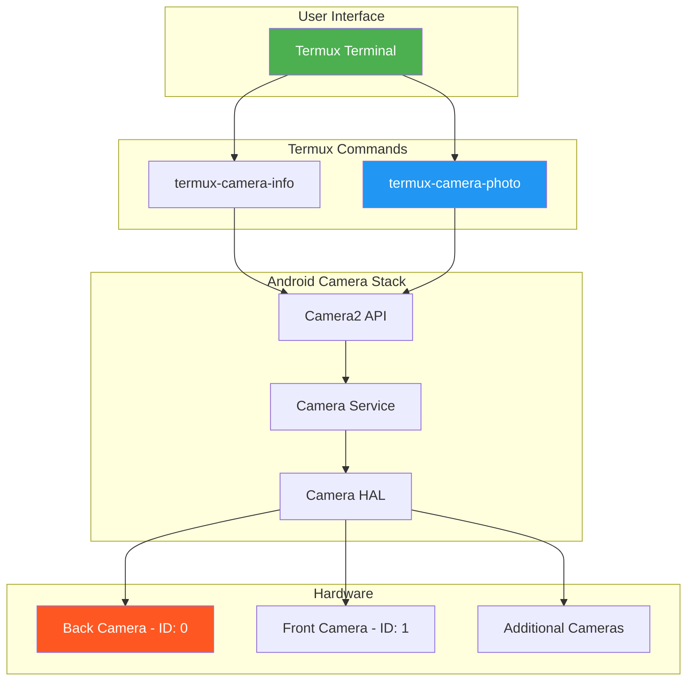
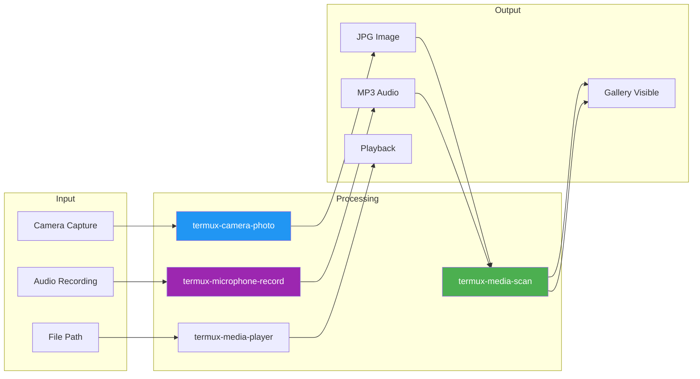
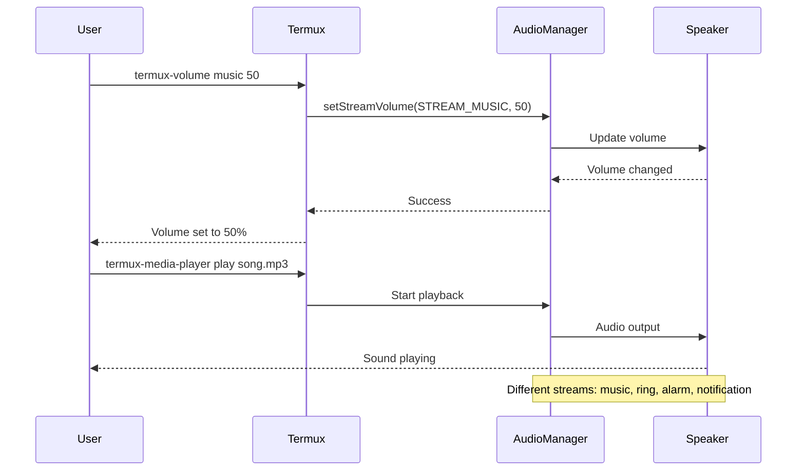

# 📸 Chapter 19: Termux API - Camera & Media

```
╔══════════════════════════════════════════════════════════════════════════════╗
║                                                                              ║
║   ████████╗███████╗██████╗ ███╗   ███╗██╗███╗   ██╗ █████╗ ██╗               ║
║   ╚══██╔══╝██╔════╝██╔══██╗████╗ ████║██║████╗  ██║██╔══██╗██║               ║
║      ██║   █████╗  ██████╔╝██╔████╔██║██║██╔██╗ ██║███████║██║               ║
║      ██║   ██╔══╝  ██╔══██╗██║╚██╔╝██║██║██║╚██╗██║██╔══██║██║               ║
║      ██║   ███████╗██║  ██║██║ ╚═╝ ██║██║██║ ╚████║██║  ██║███████╗          ║
║      ╚═╝   ╚══════╝╚═╝  ╚═╝╚═╝     ╚═╝╚═╝╚═╝  ╚═══╝╚═╝  ╚═╝╚══════╝          ║
║                                                                              ║
║   ██████╗  █████╗ ██████╗ ██╗  ██╗███╗   ██╗███████╗                         ║
║   ██╔══██╗██╔══██╗██╔══██╗██║ ██╔╝████╗  ██║██╔════╝                         ║
║   ██████╔╝███████║██████╔╝█████╔╝ ██╔██╗ ██║█████╗                           ║
║   ██╔══██╗██╔══██║██╔══██╗██╔═██╗ ██║╚██╗██║██╔══╝                           ║
║   ██║  ██║██║  ██║██║  ██║██║  ██╗██║ ╚████║███████╗                         ║
║   ╚═╝  ╚═╝╚═╝  ╚═╝╚═╝  ╚═╝╚═╝  ╚═╝╚═╝  ╚═══╝╚══════╝                         ║
║                                                                              ║
║                     🎥 CAMERA & MEDIA CHAPTER 🎥                             ║
║                                                                              ║
╚══════════════════════════════════════════════════════════════════════════════╝
```

> **Module:** 4 - APIs  
> **Chapter:** 19 of 61  
> **Duration:** 15-20 Minutes  
> **Difficulty:** ⭐⭐ Intermediate  
> **Prerequisites:** Chapters 1-18 (Basic Termux & Device APIs)  

---

## 📋 Chapter Overview

| Section | Content |
|---------|---------|
| Video Script | Complete Hindi narration with timestamps |
| Technical Guide | Camera, Media Player, Volume, Microphone APIs |
| Commands Reference | All camera & media commands |
| Practice Exercises | Hands-on scripts and projects |
| Troubleshooting | Common issues and solutions |
| Video Assets | Thumbnail, description, tags |

---

## 🎬 VIDEO SCRIPT (Complete Hindi Narration)

```
═══════════════════════════════════════════════════════════════════════════════
TERMUX FULL COURSE - CHAPTER 19
Title: Termux Camera & Media API | Photos, Videos, Audio Control
Duration: 15-20 Minutes
═══════════════════════════════════════════════════════════════════════════════

[INTRO - 0:00 to 0:45]
─────────────────────────────────────────────────────────────────────────────

Namaskar Dosto! Welcome back to Termux Full Course by T3rmuxk1ng!

Aaj ka chapter bahut exciting hai - hum seekhenge Termux se camera aur 
media ko control karna!

Sochiye aapke phone ka camera command se capture karein, audio play 
karein, volume adjust karein, aur ye sab bina kisi app open kiye!

Ye Termux API ki power hai. Camera access, microphone recording, 
media player control - sab kuch terminal se.

Security tools ke liye ye bahut useful hai - surveillance scripts, 
automated photo capture, audio recording, aur bahut kuch!

To chaliye shuru karte hain - like, subscribe, aur notification bell 
ON kar lijiye!

---

[SECTION 1: CAMERA API OVERVIEW - 0:45 to 3:00]
─────────────────────────────────────────────────────────────────────────────

Sabse pehle baat karte hain Termux Camera API ki.

Termux ke through aap phone ke camera ko fully control kar sakte ho:
- Front camera aur back camera dono accessible hain
- Photo capture kar sakte ho
- Camera parameters set kar sakte ho
- Multiple cameras list kar sakte ho

Lekin ye kaam karne ke liye chahiye:
1. Termux:API app installed hona chahiye
2. Camera permission dena padega
3. Storage permission bhi chahiye photos save ke liye

Pehle check karte hain Termux:API install hai ya nahi:

    pkg install termux-api

Agar pehle se installed hai to updated version milega.

Ab camera permissions check karte hain. Termux ko camera permission 
dena padega. Android Settings mein jao:
Settings → Apps → Termux → Permissions → Camera → Allow

Storage permission bhi chahiye:
Settings → Apps → Termux → Permissions → Storage/Files → Allow

Ye permissions ek baar mil gayi to har baar nahi puchega.

---

[SECTION 2: TERMUX-CAMERA-INFO - 3:00 to 5:00]
─────────────────────────────────────────────────────────────────────────────

Pehla command seekhte hain - camera information:

    termux-camera-info

Ye command aapke phone ke saare cameras list karti hai. Output JSON 
format mein aata hai jisme ye information hoti hai:

┌─────────────────────────────────────────────────────────────────────────┐
│                    CAMERA INFO OUTPUT EXAMPLE                            │
├─────────────────────────────────────────────────────────────────────────┤
│ [                                                                        │
│   {                                                                      │
│     "id": "0",                    ← Camera ID                           │
│     "facing": "back",             ← back ya front                       │
│     "jpeg_output_sizes": [...],   ← Available JPEG sizes                │
│     "focal_lengths": [1.0],       ← Focus info                          │
│     "auto_exposure_modes": [...], ← Exposure modes                      │
│     "capabilities": [...]         ← Camera capabilities                 │
│   },                                                                     │
│   {                                                                      │
│     "id": "1",                                                           │
│     "facing": "front",                                                   │
│     ...                                                                  │
│   }                                                                      │
│ ]                                                                        │
└─────────────────────────────────────────────────────────────────────────┘

Is output se aap pata kar sakte ho:
- Camera ID (0, 1, 2...) - multiple cameras ho sakte hain
- Front camera hai ya back
- Supported resolutions
- Available features

Demo karte hain:

    termux-camera-info | python -m json.tool

Ye command JSON ko readable format mein convert kar deta hai. Pipe 
symbol | use karke Python ka json.tool use kiya hai parsing ke liye.

Ya phir simpler output:

    termux-camera-info | grep -E '"id"|"facing"'

Ye sirf ID aur facing dikhayega.

---

[SECTION 3: TERMUX-CAMERA-PHOTO - 5:00 to 8:30]
─────────────────────────────────────────────────────────────────────────────

Ab main command - photo capture karna!

    termux-camera-photo <filename.jpg>

Basic example:

    termux-camera-photo photo.jpg

Ye command back camera use karke photo.jpg naam ki file current 
directory mein save karegi.

[DEMO: Photo capture]

Photo capture hone mein 2-3 seconds lagenge. Screen pe kuch nahi 
dikhega lekin background mein camera activate hoga aur photo lega.

Photo check karte hain:

    ls -la photo.jpg

File size se pata chalega ki photo successfully bani hai.

Ab dekhte hain camera selection kaise karte hain:

    termux-camera-photo -c 1 selfie.jpg

-c flag camera ID specify karta hai:
- -c 0 = Back camera (default)
- -c 1 = Front camera
- -c 2 = Extra camera (if available)

Different cameras check karte hain:

    # Back camera photo
    termux-camera-photo -c 0 back_photo.jpg
    
    # Front camera photo  
    termux-camera-photo -c 1 front_photo.jpg

Photo quality aur size bhi customize kar sakte ho:

    termux-camera-photo -c 0 --size 1920x1080 hd_photo.jpg

Size parameter resolution set karta hai. Available sizes 
termux-camera-info mein dikh jate hain.

[SCREEN: Showing captured photos in gallery]

Photo storage folder mein save hui hai. Aap use gallery mein 
dekh sakte ho ya file manager se access kar sakte ho.

Path: /data/data/com.termux/files/home/photo.jpg
Ya: ~/photo.jpg

Storage folder mein move karein gallery ke liye:

    mv photo.jpg ~/storage/dcim/

Ab ye photo aapki gallery mein dikhegi!

---

[SECTION 4: MEDIA PLAYER API - 8:30 to 11:00]
─────────────────────────────────────────────────────────────────────────────

Ab media player ki baat karte hain.

Termux se audio files play kar sakte ho:

    termux-media-player play <audio_file>

Example:

    termux-media-player play song.mp3

Supported formats:
- MP3, WAV, OGG, FLAC, AAC, M4A
- Most common audio formats

Media player ke aur bhi commands hain:

    # Pause current playback
    termux-media-player pause
    
    # Resume playback
    termux-media-player play
    
    # Stop playback completely
    termux-media-player stop
    
    # Get current playback info
    termux-media-player info

Info command se current track ki detail milti hai:
- Track name
- Duration
- Current position
- Playback state

[DEMO: Media player controls]

Practical example - notification sound play karna:

    termux-media-player play /sdcard/Notifications/alert.mp3

Ye security scripts mein useful hai - jab koi event trigger ho 
to sound play ho jaye.

---

[SECTION 5: MEDIA SCAN API - 11:00 to 12:30]
─────────────────────────────────────────────────────────────────────────────

termux-media-scan command se files ko Android MediaStore mein add 
kar sakte ho.

Jab aap Termux mein naye files create karte ho - photos, videos, 
downloads - wo gallery mein immediately nahi dikh te. Media scan 
karna padta hai:

    termux-media-scan <file_or_directory>

Example:

    # Single file scan
    termux-media-scan photo.jpg
    
    # Directory scan
    termux-media-scan ~/storage/dcim/
    
    # Recursive scan
    termux-media-scan -r ~/storage/downloads/

Media scan ke baad files:
- Gallery app mein dikhenge
- Media players mein access honge
- File managers mein appear honge

Ye especially useful hai jab aap script se photos capture kar rahe 
ho aur unhe immediately gallery mein dikhana hai.

---

[SECTION 6: VOLUME CONTROL API - 12:30 to 14:30]
─────────────────────────────────────────────────────────────────────────────

Ab volume control seekhte hain - bahut useful feature!

    termux-volume <stream> <volume>

Android mein different audio streams hote hain:

┌─────────────────────────────────────────────────────────────────────────┐
│                    AUDIO STREAM TYPES                                    │
├──────────────────┬──────────────────────────────────────────────────────┤
│ Stream           │ Description                                          │
├──────────────────┼──────────────────────────────────────────────────────┤
│ ring             │ Ringtone volume                                      │
│ music            │ Media/music volume                                   │
│ notification     │ Notification volume                                  │
│ alarm            │ Alarm volume                                         │
│ call             │ Voice call volume                                    │
│ system           │ System sounds volume                                 │
└──────────────────┴──────────────────────────────────────────────────────┘

Examples:

    # Set music volume to 50%
    termux-volume music 50
    
    # Set notification volume to maximum
    termux-volume notification 100
    
    # Mute ringtone
    termux-volume ring 0
    
    # Set alarm volume to 75%
    termux-volume alarm 75

Current volume check karna:

    termux-volume music

Volume value 0 se 100 tak hota hai:
- 0 = Mute
- 50 = Half
- 100 = Maximum

[DEMO: Volume control]

Ye automation scripts mein bahut useful hai. Example - agar security 
alert ho to automatically volume maximum kar do aur alarm sound play 
kar do!

---

[SECTION 7: MICROPHONE RECORDING - 14:30 to 17:00]
─────────────────────────────────────────────────────────────────────────────

Ab ek powerful feature - Audio recording!

    termux-microphone-record <command>

Commands available:

    # Start recording
    termux-microphone-record -f recording.mp3 -l 30
    
    # -f = filename
    # -l = limit in seconds (optional)
    
    # Get recording info
    termux-microphone-record -i
    
    # Stop recording
    termux-microphone-record -q

Recording examples:

    # Record 10 second audio
    termux-microphone-record -f audio.mp3 -l 10
    
    # Record unlimited (manual stop)
    termux-microphone-record -f long_recording.mp3
    
    # Check recording status
    termux-microphone-record -i
    
    # Stop recording
    termux-microphone-record -q

Quality settings:

    # High quality recording
    termux-microphone-record -f hq.mp3 -l 60 -r 44100 -c 2
    
    # -r = sample rate (44100 = CD quality)
    # -c = channels (1 = mono, 2 = stereo)

[DEMO: Recording audio]

Microphone permission bhi chahiye:
Settings → Apps → Termux → Permissions → Microphone → Allow

Recorded files ko storage mein move karein:

    mv audio.mp3 ~/storage/music/

---

[SECTION 8: PRACTICAL SCRIPTS - 17:00 to 19:00]
─────────────────────────────────────────────────────────────────────────────

Ab kuch practical scripts banate hain!

[SCRIPT 1: Automatic Photo Capture Script]

```bash
#!/bin/bash
# auto_photo.sh - Automatic photo capture

FOLDER=~/storage/dcim/TermuxPhotos
mkdir -p $FOLDER

TIMESTAMP=$(date +%Y%m%d_%H%M%S)
FILENAME="photo_$TIMESTAMP.jpg"

echo "Capturing photo..."
termux-camera-photo -c 0 "$FOLDER/$FILENAME"

if [ -f "$FOLDER/$FILENAME" ]; then
    echo "Photo saved: $FILENAME"
    termux-media-scan "$FOLDER/$FILENAME"
    termux-notification --title "Photo Captured" --content "$FILENAME saved"
else
    echo "Failed to capture photo"
fi
```

[SCRIPT 2: Security Camera Script]

```bash
#!/bin/bash
# security_cam.sh - Motion-triggered camera

FOLDER=~/storage/dcim/SecurityCam
mkdir -p $FOLDER

while true; do
    TIMESTAMP=$(date +%Y%m%d_%H%M%S)
    FILENAME="security_$TIMESTAMP.jpg"
    
    # Capture photo
    termux-camera-photo -c 0 "$FOLDER/$FILENAME"
    
    # Notify
    echo "Captured: $FILENAME"
    
    # Wait 30 seconds
    sleep 30
done
```

[SCRIPT 3: Voice Note Script]

```bash
#!/bin/bash
# voice_note.sh - Quick voice recorder

FOLDER=~/storage/music/VoiceNotes
mkdir -p $FOLDER

TIMESTAMP=$(date +%Y%m%d_%H%M%S)
FILENAME="note_$TIMESTAMP.mp3"

echo "Recording... Press Ctrl+C to stop"
termux-microphone-record -f "$FOLDER/$FILENAME"

# Ctrl+C will stop recording
trap 'termux-microphone-record -q; echo "Saved: $FILENAME"; exit' SIGINT
```

[SCRIPT 4: Time-lapse Script]

```bash
#!/bin/bash
# timelapse.sh - Capture photos at intervals

FOLDER=~/storage/dcim/TimeLapse
mkdir -p $FOLDER

INTERVAL=${1:-5}  # Default 5 seconds
COUNT=${2:-10}    # Default 10 photos

echo "Time-lapse: $COUNT photos at ${INTERVAL}s interval"

for i in $(seq 1 $COUNT); do
    FILENAME="frame_$(printf %04d $i).jpg"
    termux-camera-photo -c 0 "$FOLDER/$FILENAME"
    echo "Captured frame $i/$COUNT"
    sleep $INTERVAL
done

echo "Time-lapse complete!"
termux-notification --title "Time-lapse Done" --content "$COUNT photos captured"
```

---

[SECTION 9: SUMMARY & NEXT PREVIEW - 19:00 to 20:00]
─────────────────────────────────────────────────────────────────────────────

To dosto, Chapter 19 complete! Let's summarize:

✅ termux-camera-info - Camera details
✅ termux-camera-photo - Photo capture
✅ Camera selection - Front/back camera
✅ termux-media-player - Audio playback
✅ termux-media-scan - Gallery integration
✅ termux-volume - Volume control
✅ termux-microphone-record - Audio recording
✅ Practical scripts - Automation

Important Commands:

┌─────────────────────────────────────────────────────────────────────────┐
│                    CHAPTER 19 - KEY COMMANDS                             │
├─────────────────────────────────────────────────────────────────────────┤
│ termux-camera-info              │ List all cameras                      │
│ termux-camera-photo photo.jpg   │ Capture photo                         │
│ termux-camera-photo -c 1 s.jpg  │ Front camera photo                    │
│ termux-media-player play x.mp3  │ Play audio                            │
│ termux-media-player pause       │ Pause playback                        │
│ termux-media-scan file.jpg      │ Add to gallery                        │
│ termux-volume music 75          │ Set volume to 75%                     │
│ termux-microphone-record -f a.mp3│ Record audio                         │
└─────────────────────────────────────────────────────────────────────────┘

Next Chapter 20 mein:
- Network information APIs
- WiFi scanning
- Connection details
- Network monitoring

Agar video helpful lagi:
👍 Like karein
🔔 Subscribe karein
💬 Comment karein
📤 Share karein

Thank you for watching! See you in Chapter 20!

═══════════════════════════════════════════════════════════════════════════════
```

---

## 📖 TECHNICAL GUIDE

### 1. Camera API Architecture

```
┌─────────────────────────────────────────────────────────────────────────┐
│                    TERMUX CAMERA API ARCHITECTURE                        │
├─────────────────────────────────────────────────────────────────────────┤
│                                                                          │
│   ┌─────────────────────────────────────────────────────────────────┐   │
│   │                    Termux Shell Command                          │   │
│   │   termux-camera-photo / termux-camera-info                       │   │
│   └─────────────────────────────────────────────────────────────────┘   │
│                                   │                                      │
│                                   ▼                                      │
│   ┌─────────────────────────────────────────────────────────────────┐   │
│   │                    Termux:API App (Bridge)                       │   │
│   │   Receives broadcast intent, accesses Android Camera API         │   │
│   └─────────────────────────────────────────────────────────────────┘   │
│                                   │                                      │
│                                   ▼                                      │
│   ┌─────────────────────────────────────────────────────────────────┐   │
│   │                    Android Camera Service                        │   │
│   │   Camera2 API (Android 5.0+)                                     │   │
│   │   - Camera device access                                         │   │
│   │   - Capture requests                                             │   │
│   │   - Image processing                                             │   │
│   └─────────────────────────────────────────────────────────────────┘   │
│                                   │                                      │
│                                   ▼                                      │
│   ┌─────────────────────────────────────────────────────────────────┐   │
│   │                    Hardware Camera                               │   │
│   │   - Back Camera (ID: 0)                                          │   │
│   │   - Front Camera (ID: 1)                                         │   │
│   │   - Additional cameras (if available)                            │   │
│   └─────────────────────────────────────────────────────────────────┘   │
│                                                                          │
└─────────────────────────────────────────────────────────────────────────┘
```

### 2. Camera Commands Deep Dive

#### termux-camera-info

```bash
# Basic usage - list all cameras
termux-camera-info

# Output is JSON - parse with jq if installed
pkg install jq
termux-camera-info | jq '.'

# Extract specific camera info
termux-camera-info | jq '.[] | select(.facing=="back")'

# Get camera IDs only
termux-camera-info | jq '.[].id'

# Get facing direction
termux-camera-info | jq '.[] | {id, facing}'

# Check supported resolutions
termux-camera-info | jq '.[] | .jpeg_output_sizes'

# Parse without jq (using Python)
termux-camera-info | python -c "
import sys, json
data = json.load(sys.stdin)
for cam in data:
    print(f\"Camera {cam['id']}: {cam['facing']}\")
"
```

#### termux-camera-photo Options

```bash
# Basic photo capture
termux-camera-photo output.jpg

# Camera selection
termux-camera-photo -c 0 photo.jpg     # Back camera (default)
termux-camera-photo -c 1 selfie.jpg    # Front camera

# Custom size/resolution
termux-camera-photo --size 1920x1080 hd.jpg
termux-camera-photo --size 1280x720 medium.jpg
termux-camera-photo --size 640x480 small.jpg

# Save to specific location
termux-camera-photo ~/storage/dcim/Photo_$(date +%s).jpg

# Combine options
termux-camera-photo -c 0 --size 1920x1080 ~/storage/dcim/photo.jpg
```

### 3. Media Player Commands

```bash
# Play audio file
termux-media-player play /sdcard/Music/song.mp3

# Play from Termux home
termux-media-player play ~/music.mp3

# Control playback
termux-media-player pause      # Pause current track
termux-media-player play       # Resume (without file = resume)
termux-media-player stop       # Stop completely

# Get info
termux-media-player info       # Current track info

# Example output of info:
# {
#   "track": "song.mp3",
#   "duration": 240,
#   "position": 45,
#   "state": "playing"
# }
```

### 4. Volume Control Details

```bash
# Get current volume
termux-volume music

# Set volume (0-100)
termux-volume music 50

# All stream types
termux-volume ring 80          # Ringtone
termux-volume music 70         # Media/music
termux-volume notification 60  # Notifications
termux-volume alarm 100        # Alarms
termux-volume call 50          # Call volume
termux-volume system 50        # System sounds

# Mute specific stream
termux-volume music 0

# Maximum volume
termux-volume music 100
```

### 5. Microphone Recording Options

```bash
# Basic recording (unlimited duration)
termux-microphone-record -f recording.mp3

# Time-limited recording (30 seconds)
termux-microphone-record -f recording.mp3 -l 30

# High quality recording
termux-microphone-record -f hq.mp3 -r 44100 -c 2
# -r = sample rate (8000, 16000, 22050, 44100)
# -c = channels (1 = mono, 2 = stereo)

# Low quality (smaller file)
termux-microphone-record -f lq.mp3 -r 8000 -c 1

# Check recording info
termux-microphone-record -i

# Stop recording
termux-microphone-record -q
```

### 6. Media Scan Usage

```bash
# Scan single file
termux-media-scan photo.jpg

# Scan directory
termux-media-scan ~/storage/dcim/

# Recursive scan
termux-media-scan -r ~/storage/downloads/

# Scan multiple files
termux-media-scan photo1.jpg photo2.jpg photo3.jpg

# Scan with wildcards
for f in *.jpg; do termux-media-scan "$f"; done
```

---

## 💻 COMPLETE SCRIPT EXAMPLES

### Example 1: Photo Capture with Metadata

```bash
#!/bin/bash
# smart_photo.sh - Photo capture with metadata

PHOTO_DIR=~/storage/dcim/TermuxPhotos
mkdir -p "$PHOTO_DIR"

TIMESTAMP=$(date +%Y%m%d_%H%M%S)
PHOTO_FILE="$PHOTO_DIR/IMG_$TIMESTAMP.jpg"
META_FILE="$PHOTO_DIR/IMG_$TIMESTAMP.txt"

# Capture photo
echo "Capturing photo..."
termux-camera-photo -c 0 "$PHOTO_FILE"

if [ -f "$PHOTO_FILE" ]; then
    # Save metadata
    echo "Photo: IMG_$TIMESTAMP.jpg" > "$META_FILE"
    echo "Date: $(date)" >> "$META_FILE"
    echo "Location: $(termux-location 2>/dev/null || echo 'Unknown')" >> "$META_FILE"
    echo "Device: $(termux-telephony-deviceinfo 2>/dev/null | head -1 || echo 'Unknown')" >> "$META_FILE"
    
    # Scan to gallery
    termux-media-scan "$PHOTO_FILE"
    
    # Notify
    termux-notification --title "Photo Captured" \
        --content "Saved as IMG_$TIMESTAMP.jpg" \
        --sound
    
    echo "✅ Photo saved: $PHOTO_FILE"
else
    echo "❌ Failed to capture photo"
    exit 1
fi
```

### Example 2: Time-Lapse Photography

```bash
#!/bin/bash
# timelapse.sh - Advanced time-lapse script

# Configuration
OUTPUT_DIR=~/storage/dcim/TimeLapse
INTERVAL=${1:-10}      # Seconds between shots (default: 10)
DURATION=${2:-300}     # Total duration in seconds (default: 5 min)
CAMERA=${3:-0}         # Camera ID (default: back)

mkdir -p "$OUTPUT_DIR"

# Calculate number of shots
SHOTS=$((DURATION / INTERVAL))

echo "═══════════════════════════════════════════"
echo "     TIME-LAPSE PHOTOGRAPHY"
echo "═══════════════════════════════════════════"
echo "Camera: $CAMERA"
echo "Interval: ${INTERVAL}s"
echo "Duration: ${DURATION}s"
echo "Total shots: $SHOTS"
echo "═══════════════════════════════════════════"

# Create session folder
SESSION="session_$(date +%Y%m%d_%H%M%S)"
SESSION_DIR="$OUTPUT_DIR/$SESSION"
mkdir -p "$SESSION_DIR"

# Capture loop
for i in $(seq -w 1 $SHOTS); do
    FILENAME="frame_$i.jpg"
    FILEPATH="$SESSION_DIR/$FILENAME"
    
    termux-camera-photo -c "$CAMERA" "$FILEPATH"
    
    # Progress
    PROGRESS=$((i * 100 / SHOTS))
    echo "[$PROGRESS%] Captured: $FILENAME"
    
    # Notification for every 10%
    if [ $((i % (SHOTS / 10))) -eq 0 ]; then
        termux-notification --title "Time-lapse" --content "$PROGRESS% complete"
    fi
    
    # Wait (except for last shot)
    if [ "$i" -lt "$SHOTS" ]; then
        sleep "$INTERVAL"
    fi
done

# Scan all photos
termux-media-scan -r "$SESSION_DIR"

# Create info file
cat > "$SESSION_DIR/info.txt" << EOF
Time-lapse Session: $SESSION
Date: $(date)
Camera: $CAMERA
Interval: ${INTERVAL}s
Duration: ${DURATION}s
Frames: $SHOTS
EOF

# Final notification
termux-notification --title "Time-lapse Complete" \
    --content "$SHOTS photos saved in $SESSION" \
    --sound

echo ""
echo "✅ Time-lapse complete!"
echo "📁 Location: $SESSION_DIR"
echo "📸 Frames: $SHOTS"
```

### Example 3: Security Camera with Motion Detection

```bash
#!/bin/bash
# security_camera.sh - Basic surveillance script

# Configuration
WATCH_DIR=~/storage/dcim/SecurityWatch
LOG_FILE=~/security_log.txt
INTERVAL=30           # Check interval in seconds
CAMERA=0              # Camera ID

mkdir -p "$WATCH_DIR"

echo "═══════════════════════════════════════════"
echo "     SECURITY CAMERA MONITOR"
echo "═══════════════════════════════════════════"
echo "Started: $(date)"
echo "Interval: ${INTERVAL}s"
echo "Watch directory: $WATCH_DIR"
echo "Press Ctrl+C to stop"
echo "═══════════════════════════════════════════"

# Log function
log_message() {
    echo "[$(date '+%Y-%m-%d %H:%M:%S')] $1" | tee -a "$LOG_FILE"
}

# Capture function
capture_photo() {
    TIMESTAMP=$(date +%Y%m%d_%H%M%S)
    FILENAME="security_$TIMESTAMP.jpg"
    FILEPATH="$WATCH_DIR/$FILENAME"
    
    termux-camera-photo -c "$CAMERA" "$FILEPATH"
    
    if [ -f "$FILEPATH" ]; then
        termux-media-scan "$FILEPATH"
        log_message "Captured: $FILENAME"
        return 0
    else
        log_message "ERROR: Failed to capture"
        return 1
    fi
}

# Main loop
counter=0
while true; do
    counter=$((counter + 1))
    capture_photo
    
    # Every 10 captures, show status
    if [ $((counter % 10)) -eq 0 ]; then
        log_message "Status: $counter photos captured"
        termux-notification --title "Security Camera" \
            --content "$counter photos captured" --priority low
    fi
    
    sleep "$INTERVAL"
done
```

### Example 4: Audio Recorder with Timer

```bash
#!/bin/bash
# voice_recorder.sh - Advanced voice recorder

RECORD_DIR=~/storage/music/VoiceRecordings
mkdir -p "$RECORD_DIR"

# Arguments
DURATION=${1:-30}  # Default 30 seconds
NAME=${2:-recording}

FILENAME="${NAME}_$(date +%Y%m%d_%H%M%S).mp3"
FILEPATH="$RECORD_DIR/$FILENAME"

echo "═══════════════════════════════════════════"
echo "     VOICE RECORDER"
echo "═══════════════════════════════════════════"
echo "Duration: ${DURATION}s"
echo "Output: $FILENAME"
echo "═══════════════════════════════════════════"

# Start recording with limit
termux-microphone-record -f "$FILEPATH" -l "$DURATION" -r 44100 -c 2

# Wait for recording to complete
echo "Recording..."
for i in $(seq 1 "$DURATION"); do
    REMAINING=$((DURATION - i))
    printf "\rTime remaining: %02ds " "$REMAINING"
    sleep 1
done
echo ""

# Stop recording (in case limit didn't work)
termux-microphone-record -q 2>/dev/null

# Verify and scan
if [ -f "$FILEPATH" ]; then
    FILESIZE=$(du -h "$FILEPATH" | cut -f1)
    termux-media-scan "$FILEPATH"
    termux-notification --title "Recording Complete" \
        --content "$FILENAME ($FILESIZE)"
    echo "✅ Saved: $FILEPATH ($FILESIZE)"
else
    echo "❌ Recording failed"
    exit 1
fi
```

### Example 5: Media Control Script

```bash
#!/bin/bash
# media_control.sh - Complete media control

MUSIC_DIR=~/storage/music

show_menu() {
    clear
    echo "═══════════════════════════════════════════"
    echo "     MEDIA CONTROL CENTER"
    echo "═══════════════════════════════════════════"
    echo "1. Play audio file"
    echo "2. Pause/Resume"
    echo "3. Stop playback"
    echo "4. Set volume"
    echo "5. Current track info"
    echo "6. Record audio"
    echo "7. Exit"
    echo "═══════════════════════════════════════════"
}

play_audio() {
    echo "Available audio files:"
    find "$MUSIC_DIR" -type f \( -name "*.mp3" -o -name "*.wav" -o -name "*.ogg" \) | head -20
    
    echo ""
    read -p "Enter file path: " filepath
    if [ -f "$filepath" ]; then
        termux-media-player play "$filepath"
        echo "Now playing: $(basename "$filepath")"
    else
        echo "File not found!"
    fi
}

set_volume() {
    echo "Stream types: music, ring, notification, alarm, call, system"
    read -p "Enter stream type: " stream
    read -p "Enter volume (0-100): " vol
    
    termux-volume "$stream" "$vol"
    echo "Volume set: $stream = $vol"
}

record_audio() {
    read -p "Enter duration (seconds): " dur
    read -p "Enter filename: " name
    
    FILEPATH="$MUSIC_DIR/${name}.mp3"
    termux-microphone-record -f "$FILEPATH" -l "$dur"
    echo "Recording for $dur seconds..."
    sleep "$dur"
    termux-microphone-record -q
    echo "Recording saved: $FILEPATH"
}

# Main loop
while true; do
    show_menu
    read -p "Choose option: " choice
    
    case $choice in
        1) play_audio ;;
        2) termux-media-player pause ;;
        3) termux-media-player stop ;;
        4) set_volume ;;
        5) termux-media-player info ;;
        6) record_audio ;;
        7) echo "Goodbye!"; exit 0 ;;
        *) echo "Invalid option" ;;
    esac
    
    read -p "Press Enter to continue..."
done
```

### Example 6: Python Integration - Camera Class

```python
#!/usr/bin/env python3
"""
termux_camera.py - Python class for Termux camera operations
"""

import subprocess
import json
import os
from datetime import datetime

class TermuxCamera:
    """Termux Camera API wrapper"""
    
    def __init__(self, storage_dir="~/storage/dcim/TermuxPhotos"):
        self.storage_dir = os.path.expanduser(storage_dir)
        os.makedirs(self.storage_dir, exist_ok=True)
    
    def get_cameras(self):
        """Get list of available cameras"""
        try:
            result = subprocess.run(
                ['termux-camera-info'],
                capture_output=True,
                text=True
            )
            if result.returncode == 0:
                return json.loads(result.stdout)
            return []
        except Exception as e:
            print(f"Error getting cameras: {e}")
            return []
    
    def list_camera_ids(self):
        """Get camera IDs and facing direction"""
        cameras = self.get_cameras()
        return [(cam['id'], cam['facing']) for cam in cameras]
    
    def capture(self, camera_id=0, filename=None):
        """Capture photo from specified camera"""
        if filename is None:
            timestamp = datetime.now().strftime("%Y%m%d_%H%M%S")
            filename = f"photo_{timestamp}.jpg"
        
        filepath = os.path.join(self.storage_dir, filename)
        
        try:
            result = subprocess.run(
                ['termux-camera-photo', '-c', str(camera_id), filepath],
                capture_output=True,
                text=True
            )
            
            if result.returncode == 0 and os.path.exists(filepath):
                self._scan_media(filepath)
                return filepath
            return None
        except Exception as e:
            print(f"Error capturing photo: {e}")
            return None
    
    def capture_front(self, filename=None):
        """Capture from front camera"""
        return self.capture(camera_id=1, filename=filename)
    
    def capture_back(self, filename=None):
        """Capture from back camera"""
        return self.capture(camera_id=0, filename=filename)
    
    def _scan_media(self, filepath):
        """Add file to media gallery"""
        subprocess.run(['termux-media-scan', filepath], capture_output=True)
    
    def timelapse(self, count=10, interval=5, camera_id=0):
        """Capture time-lapse photos"""
        import time
        
        photos = []
        timestamp = datetime.now().strftime("%Y%m%d_%H%M%S")
        session_dir = os.path.join(self.storage_dir, f"timelapse_{timestamp}")
        os.makedirs(session_dir, exist_ok=True)
        
        for i in range(count):
            filename = f"frame_{i:04d}.jpg"
            filepath = self.capture(camera_id, os.path.join(session_dir, filename))
            if filepath:
                photos.append(filepath)
                print(f"Captured frame {i+1}/{count}")
            
            if i < count - 1:
                time.sleep(interval)
        
        return photos


# Usage example
if __name__ == "__main__":
    cam = TermuxCamera()
    
    # List cameras
    print("Available cameras:")
    for cam_id, facing in cam.list_camera_ids():
        print(f"  Camera {cam_id}: {facing}")
    
    # Capture photo
    print("\nCapturing photo...")
    filepath = cam.capture_back("test_photo.jpg")
    if filepath:
        print(f"Photo saved: {filepath}")
    else:
        print("Failed to capture photo")
```

### Example 7: Python Media Controller

```python
#!/usr/bin/env python3
"""
termux_media.py - Python class for Termux media operations
"""

import subprocess
import json
import os
from datetime import datetime

class TermuxMedia:
    """Termux Media API wrapper"""
    
    def __init__(self):
        pass
    
    def play(self, filepath):
        """Play audio file"""
        if not os.path.exists(filepath):
            raise FileNotFoundError(f"File not found: {filepath}")
        
        result = subprocess.run(
            ['termux-media-player', 'play', filepath],
            capture_output=True,
            text=True
        )
        return result.returncode == 0
    
    def pause(self):
        """Pause playback"""
        subprocess.run(['termux-media-player', 'pause'], capture_output=True)
    
    def resume(self):
        """Resume playback"""
        subprocess.run(['termux-media-player', 'play'], capture_output=True)
    
    def stop(self):
        """Stop playback"""
        subprocess.run(['termux-media-player', 'stop'], capture_output=True)
    
    def info(self):
        """Get current playback info"""
        result = subprocess.run(
            ['termux-media-player', 'info'],
            capture_output=True,
            text=True
        )
        if result.returncode == 0 and result.stdout.strip():
            try:
                return json.loads(result.stdout)
            except json.JSONDecodeError:
                pass
        return None
    
    def set_volume(self, stream, volume):
        """Set volume for a stream type"""
        if volume < 0 or volume > 100:
            raise ValueError("Volume must be between 0 and 100")
        
        subprocess.run(
            ['termux-volume', stream, str(volume)],
            capture_output=True
        )
    
    def get_volume(self, stream):
        """Get current volume for a stream type"""
        result = subprocess.run(
            ['termux-volume', stream],
            capture_output=True,
            text=True
        )
        if result.returncode == 0:
            try:
                data = json.loads(result.stdout)
                return data.get('volume', data.get('percentage', None))
            except:
                pass
        return None


class TermuxRecorder:
    """Termux Audio Recording wrapper"""
    
    def __init__(self, output_dir="~/storage/music/Recordings"):
        self.output_dir = os.path.expanduser(output_dir)
        os.makedirs(self.output_dir, exist_ok=True)
        self.recording = False
    
    def start(self, filename=None, limit=None, sample_rate=44100, channels=2):
        """Start recording"""
        if self.recording:
            return False
        
        if filename is None:
            filename = f"recording_{datetime.now().strftime('%Y%m%d_%H%M%S')}.mp3"
        
        filepath = os.path.join(self.output_dir, filename)
        
        cmd = ['termux-microphone-record', '-f', filepath, 
               '-r', str(sample_rate), '-c', str(channels)]
        
        if limit:
            cmd.extend(['-l', str(limit)])
        
        subprocess.Popen(cmd, stdout=subprocess.DEVNULL, stderr=subprocess.DEVNULL)
        self.recording = True
        self.current_file = filepath
        return filepath
    
    def stop(self):
        """Stop recording"""
        if not self.recording:
            return None
        
        subprocess.run(['termux-microphone-record', '-q'], capture_output=True)
        self.recording = False
        
        if os.path.exists(self.current_file):
            subprocess.run(['termux-media-scan', self.current_file], capture_output=True)
            return self.current_file
        return None
    
    def info(self):
        """Get recording info"""
        result = subprocess.run(
            ['termux-microphone-record', '-i'],
            capture_output=True,
            text=True
        )
        if result.returncode == 0 and result.stdout.strip():
            try:
                return json.loads(result.stdout)
            except:
                pass
        return None


# Usage example
if __name__ == "__main__":
    media = TermuxMedia()
    recorder = TermuxRecorder()
    
    # Volume control
    print("Setting music volume to 70%...")
    media.set_volume('music', 70)
    
    # Recording example
    print("\nRecording 5 second audio...")
    filepath = recorder.start(limit=5)
    print(f"Recording to: {filepath}")
    
    import time
    time.sleep(6)  # Wait for recording
    
    result = recorder.stop()
    if result:
        print(f"Recording saved: {result}")
```

---

## 📋 COMMANDS REFERENCE

### Camera Commands

| Command | Description | Example |
|---------|-------------|---------|
| `termux-camera-info` | List all cameras | `termux-camera-info` |
| `termux-camera-photo <file>` | Capture photo | `termux-camera-photo photo.jpg` |
| `termux-camera-photo -c <id>` | Use specific camera | `termux-camera-photo -c 1 selfie.jpg` |
| `termux-camera-photo --size WxH` | Set resolution | `termux-camera-photo --size 1920x1080 hd.jpg` |

### Media Player Commands

| Command | Description | Example |
|---------|-------------|---------|
| `termux-media-player play <file>` | Play audio | `termux-media-player play song.mp3` |
| `termux-media-player pause` | Pause playback | `termux-media-player pause` |
| `termux-media-player stop` | Stop playback | `termux-media-player stop` |
| `termux-media-player info` | Get track info | `termux-media-player info` |

### Media Scan Commands

| Command | Description | Example |
|---------|-------------|---------|
| `termux-media-scan <file>` | Scan single file | `termux-media-scan photo.jpg` |
| `termux-media-scan <dir>` | Scan directory | `termux-media-scan ~/storage/dcim/` |
| `termux-media-scan -r <dir>` | Recursive scan | `termux-media-scan -r ~/storage/downloads/` |

### Volume Commands

| Command | Description | Example |
|---------|-------------|---------|
| `termux-volume <stream>` | Get volume | `termux-volume music` |
| `termux-volume <stream> <vol>` | Set volume | `termux-volume music 75` |

### Recording Commands

| Command | Description | Example |
|---------|-------------|---------|
| `termux-microphone-record -f <file>` | Start recording | `termux-microphone-record -f rec.mp3` |
| `termux-microphone-record -f <file> -l <sec>` | Time-limited recording | `termux-microphone-record -f rec.mp3 -l 30` |
| `termux-microphone-record -i` | Recording info | `termux-microphone-record -i` |
| `termux-microphone-record -q` | Stop recording | `termux-microphone-record -q` |

---

## 💻 PRACTICE EXERCISES

### Exercise 1: Basic Camera Operations

```bash
# Task: Learn camera basics

# Step 1: Check available cameras
termux-camera-info

# Step 2: Capture photo with back camera
termux-camera-photo back_photo.jpg

# Step 3: Capture selfie with front camera
termux-camera-photo -c 1 selfie.jpg

# Step 4: Move photos to gallery
mkdir -p ~/storage/dcim/TermuxTest
mv *.jpg ~/storage/dcim/TermuxTest/

# Step 5: Scan so they appear in gallery
termux-media-scan -r ~/storage/dcim/TermuxTest/

# Expected: Two photos in gallery
```

### Exercise 2: Media Player Control

```bash
# Task: Control audio playback

# Step 1: Find an audio file
find ~/storage/music -name "*.mp3" | head -5

# Step 2: Play the audio file
termux-media-player play ~/storage/music/song.mp3

# Step 3: Check playback info
termux-media-player info

# Step 4: Pause playback
termux-media-player pause

# Step 5: Resume playback
termux-media-player play

# Step 6: Stop playback
termux-media-player stop

# Step 7: Adjust volume
termux-volume music 50
```

### Exercise 3: Audio Recording

```bash
# Task: Record audio with different settings

# Step 1: Create recordings folder
mkdir -p ~/storage/music/MyRecordings

# Step 2: Record 10 second audio (default quality)
termux-microphone-record -f ~/storage/music/MyRecordings/test1.mp3 -l 10

# Step 3: Wait for recording
echo "Recording for 10 seconds..."
sleep 12

# Step 4: Record high quality audio
termux-microphone-record -f ~/storage/music/MyRecordings/hq.mp3 -l 5 -r 44100 -c 2
sleep 7

# Step 5: Check recordings
ls -la ~/storage/music/MyRecordings/

# Step 6: Play your recording
termux-media-player play ~/storage/music/MyRecordings/test1.mp3
```

### Exercise 4: Create a Photo Script

```bash
# Task: Create an automated photo capture script

# Create the script
cat > ~/capture_photos.sh << 'EOF'
#!/bin/bash
# Automated photo capture script

FOLDER=~/storage/dcim/AutoPhotos
mkdir -p "$FOLDER"

# Get arguments
COUNT=${1:-5}
INTERVAL=${2:-3}
CAMERA=${3:-0}

echo "Capturing $COUNT photos at ${INTERVAL}s interval..."

for i in $(seq 1 $COUNT); do
    FILENAME="photo_$(date +%Y%m%d_%H%M%S)_$i.jpg"
    termux-camera-photo -c "$CAMERA" "$FOLDER/$FILENAME"
    echo "Captured $i/$COUNT: $FILENAME"
    
    if [ $i -lt $COUNT ]; then
        sleep "$INTERVAL"
    fi
done

termux-media-scan -r "$FOLDER"
echo "Done! Photos saved in $FOLDER"
EOF

chmod +x ~/capture_photos.sh

# Run the script
~/capture_photos.sh 5 2 0
```

### Exercise 5: Volume Automation

```bash
# Task: Create volume control script

cat > ~/volume_control.sh << 'EOF'
#!/bin/bash
# Volume control utility

show_volumes() {
    echo "Current Volumes:"
    echo "─────────────────────────"
    for stream in music ring notification alarm call system; do
        vol=$(termux-volume $stream 2>/dev/null | grep -o '"volume":[0-9]*' | cut -d: -f2)
        echo "$stream: $vol"
    done
    echo "─────────────────────────"
}

case "$1" in
    show) show_volumes ;;
    set)
        termux-volume "$2" "$3"
        echo "Set $2 to $3"
        ;;
    mute)
        termux-volume "$2" 0
        echo "Muted $2"
        ;;
    max)
        termux-volume "$2" 100
        echo "Maxed $2"
        ;;
    *)
        echo "Usage: $0 {show|set <stream> <vol>|mute <stream>|max <stream>}"
        ;;
esac
EOF

chmod +x ~/volume_control.sh

# Test it
~/volume_control.sh show
~/volume_control.sh set music 50
~/volume_control.sh mute notification
```

---

## ⚠️ TROUBLESHOOTING

### Problem 1: Camera Permission Denied

```bash
# Symptoms:
# - "Error: Could not access camera"
# - Empty photo file
# - No output from termux-camera-info

# Solution 1: Grant permission via Android Settings
# Settings → Apps → Termux → Permissions → Camera → Allow

# Solution 2: Request permission from Termux
# Note: This triggers the permission dialog
termux-camera-photo test.jpg
# If dialog doesn't appear, go to Settings manually

# Solution 3: Check if Termux:API is installed
pkg list-installed | grep termux-api
# If not installed:
pkg install termux-api

# Solution 4: Check camera availability
# Some devices may have camera restrictions
dumpsys media.camera | head -20
```

### Problem 2: Photo Not Saving

```bash
# Symptoms:
# - Command runs but no file created
# - 0 byte file
# - Permission denied errors

# Solution 1: Check storage permission
termux-setup-storage
ls ~/storage/

# Solution 2: Use absolute path
termux-camera-photo ~/storage/dcim/photo.jpg

# Solution 3: Check disk space
df -h

# Solution 4: Create directory first
mkdir -p ~/storage/dcim/TermuxPhotos
termux-camera-photo ~/storage/dcim/TermuxPhotos/photo.jpg
```

### Problem 3: Media Player Not Working

```bash
# Symptoms:
# - "Error: Could not play file"
# - No sound
# - File not found

# Solution 1: Check file exists
ls -la /path/to/audio.mp3

# Solution 2: Check file format
file audio.mp3
# Supported: MP3, WAV, OGG, FLAC, AAC, M4A

# Solution 3: Check volume
termux-volume music
termux-volume music 50

# Solution 4: Stop any existing playback
termux-media-player stop
termux-media-player play audio.mp3

# Solution 5: Check audio focus
# Other apps might be using audio
```

### Problem 4: Recording Fails

```bash
# Symptoms:
# - "Error: Could not start recording"
# - Empty recording file
# - Recording stops immediately

# Solution 1: Check microphone permission
# Settings → Apps → Termux → Permissions → Microphone → Allow

# Solution 2: Check if another app is using microphone
# Close other recording apps

# Solution 3: Try different parameters
termux-microphone-record -f test.mp3 -r 16000 -c 1

# Solution 4: Check recording status
termux-microphone-record -i

# Solution 5: Stop any stuck recordings
termux-microphone-record -q
```

### Problem 5: Photos Not Showing in Gallery

```bash
# Symptoms:
# - Photo file exists
# - Gallery app doesn't show it
# - File manager shows it but not gallery

# Solution 1: Run media scan
termux-media-scan /path/to/photo.jpg

# Solution 2: Scan entire directory
termux-media-scan -r ~/storage/dcim/

# Solution 3: Move to standard location
mv photo.jpg ~/storage/dcim/Camera/
termux-media-scan ~/storage/dcim/Camera/

# Solution 4: Force media scan (requires root)
# For non-root, restart the device
# Or use: am broadcast -a android.intent.action.MEDIA_MOUNTED -d file:///sdcard

# Solution 5: Check file extension
# Must be .jpg or .jpeg for photos
mv photo photo.jpg
termux-media-scan photo.jpg
```

### Problem 6: Volume Not Changing

```bash
# Symptoms:
# - Command runs but volume unchanged
# - Wrong stream affected
# - Volume resets after command

# Solution 1: Check available streams
termux-volume

# Solution 2: Use correct stream name
# Common mistake: "media" instead of "music"
termux-volume music 50  # Correct
termux-volume media 50  # Wrong

# Solution 3: Check if device overrides
# Some devices have "Do Not Disturb" or volume limit

# Solution 4: Verify change
termux-volume music 75
termux-volume music  # Should show 75

# Solution 5: Check for automation apps
# Tasker or similar might override volume
```

### Problem 7: Termux:API Not Responding

```bash
# Symptoms:
# - Commands hang
# - "Error: Termux:API not installed"
# - Timeout errors

# Solution 1: Install Termux:API app
# Download from F-Droid:
# https://f-droid.org/packages/com.termux.api/

# Solution 2: Reinstall termux-api package
pkg uninstall termux-api
pkg install termux-api

# Solution 3: Check if API app can run
# Open Termux:API app from launcher

# Solution 4: Grant all permissions
# Settings → Apps → Termux:API → Permissions
# Allow all requested permissions

# Solution 5: Restart Termux
exit
# Open Termux again

# Solution 6: Check battery optimization
# Settings → Battery → Unoptimized apps
# Add Termux and Termux:API to unoptimized
```

---

## 🎬 VIDEO ASSETS

### Thumbnail Concepts

**Option A: Camera Focus**
```
┌────────────────────────────────────┐
│  [Camera icon with code overlay]   │
│                                    │
│   📸 TERMUX CAMERA API             │
│   Command-Line Photography!        │
│                                    │
│   ✓ Photo Capture                  │
│   ✓ Time-lapse                     │
│   ✓ Security Camera                │
│                                    │
│   [T3rmuxk1ng Logo]                │
└────────────────────────────────────┘
```

**Option B: Media Control**
```
┌────────────────────────────────────┐
│  [Speaker/Media icons]             │
│                                    │
│   🎵 TERMUX MEDIA CONTROL          │
│                                    │
│   📸 Camera | 🎤 Mic | 🔊 Volume   │
│                                    │
│   Full API Tutorial                │
│   Chapter 19 | T3rmuxk1ng          │
└────────────────────────────────────┘
```

**Option C: Script Focus**
```
┌────────────────────────────────────┐
│  [Terminal screen with script]     │
│                                    │
│   $ termux-camera-photo hack.jpg   │
│   $ termux-microphone-record       │
│                                    │
│   🚀 CAMERA & MEDIA MASTERY        │
│   15+ Practical Scripts!           │
│                                    │
│   [T3rmuxk1ng]                     │
└────────────────────────────────────┘
```

### Video Description Template

```markdown
📸 Termux Full Course - Chapter 19: Camera & Media API

🔥 In this video you'll learn:
• Camera API - photo capture from terminal
• Front and back camera selection
• Media player control
• Audio recording with microphone
• Volume control for all streams
• Time-lapse photography script
• Security camera automation
• Python integration for camera & media

⏱️ Timestamps:
0:00 - Introduction
0:45 - Camera API Overview
3:00 - termux-camera-info
5:00 - termux-camera-photo
8:30 - Media Player API
11:00 - Media Scan API
12:30 - Volume Control
14:30 - Microphone Recording
17:00 - Practical Scripts
19:00 - Summary

📝 Commands from this video:
termux-camera-info
termux-camera-photo photo.jpg
termux-camera-photo -c 1 selfie.jpg
termux-media-player play song.mp3
termux-volume music 75
termux-microphone-record -f audio.mp3 -l 30

📚 Full Course Playlist:
[PLAYLIST LINK]

📱 Follow T3rmuxk1ng:
• YouTube: @T3rmuxk1ng
• Telegram: [LINK]
• GitHub: [LINK]

#Termux #TermuxAPI #CameraAPI #TermuxCourse #T3rmuxk1ng #MediaControl #TermuxTutorial #AndroidHacking

---
⚠️ Disclaimer: This video is for educational purposes only. Use tools responsibly and respect privacy laws when recording.
```

### Tags List

```
termux, termux api, termux camera, termux media, termux tutorial,
termux camera photo, termux media player, termux volume control,
termux microphone record, termux audio recording, termux camera api,
termux time lapse, termux security camera, termux automation,
termux scripts, termux python, android camera terminal,
command line camera, terminal media control, termux course hindi,
t3rmuxk1ng, termux full course, android automation
```

### Hashtags

```
#Termux #TermuxAPI #CameraAPI #TermuxCamera #MediaControl 
#TermuxTutorial #TermuxHindi #AndroidTerminal #TermuxCourse 
#T3rmuxk1ng #Automation #Privacy #Security #CommandLine
```

---

## 📚 ADDITIONAL RESOURCES

### Official Documentation

| Resource | Link |
|----------|------|
| Termux API Wiki | https://wiki.termux.com/wiki/Termux:API |
| Termux API GitHub | https://github.com/termux/termux-api |
| Camera2 API Docs | https://developer.android.com/reference/android/hardware/camera2 |

### Related Tools

| Tool | Purpose |
|------|---------|
| ffmpeg | Video/audio processing |
| ImageMagick | Image manipulation |
| sox | Audio processing |
| exiftool | Metadata handling |

### Python Libraries for Extension

```python
# For advanced image processing
pip install Pillow
pip install opencv-python-headless

# For audio processing
pip install pydub
pip install soundfile

# For video creation from images
pip install moviepy
```

---

## ✅ CHAPTER CHECKLIST

Before moving to Chapter 20, verify:

- [ ] Termux:API app installed
- [ ] Camera, microphone, storage permissions granted
- [ ] Successfully captured photo with back camera
- [ ] Successfully captured selfie with front camera
- [ ] Audio playback working with media player
- [ ] Volume control tested
- [ ] Audio recording completed
- [ ] At least one practical script created and tested
- [ ] Photos appear in gallery after media scan

---

## 🎯 NEXT CHAPTER PREVIEW

**Chapter 20: Termux API - Network**

- Network information APIs
- WiFi connection details
- WiFi scanning (requires root on some devices)
- Connection monitoring
- Network statistics
- IP address information

---

**Chapter Complete! 🎉**

*Created by T3rmuxk1ng | Termux Full Course*

---

## 📊 MERMAID DIAGRAMS

### 1. Camera API Architecture



### 2. Media Operations Flow



### 3. Audio Stream Control Flow



---

## ⚡ API COMMAND REFERENCE CARD

| API Command | Purpose | Permissions | Example |
|-------------|---------|-------------|---------|
| `termux-camera-info` | List available cameras | Camera | `termux-camera-info` |
| `termux-camera-photo` | Capture photo | Camera | `termux-camera-photo photo.jpg` |
| `termux-camera-photo -c` | Capture from specific camera | Camera | `termux-camera-photo -c 1 selfie.jpg` |
| `termux-camera-photo --size` | Capture with resolution | Camera | `termux-camera-photo --size 1920x1080 hd.jpg` |
| `termux-media-player play` | Play audio file | None | `termux-media-player play song.mp3` |
| `termux-media-player pause` | Pause playback | None | `termux-media-player pause` |
| `termux-media-player stop` | Stop playback | None | `termux-media-player stop` |
| `termux-media-player info` | Get playback info | None | `termux-media-player info` |
| `termux-volume` | Get/set volume | None | `termux-volume music 75` |
| `termux-microphone-record` | Record audio | Microphone | `termux-microphone-record -f audio.mp3 -l 30` |
| `termux-media-scan` | Add to gallery | Storage | `termux-media-scan photo.jpg` |

### Quick Syntax Reference

```bash
# Camera
termux-camera-info                         # List cameras
termux-camera-photo [-c id] [--size WxH] <output.jpg>

# Media Player
termux-media-player play <file>            # Play audio
termux-media-player pause                  # Pause
termux-media-player stop                   # Stop
termux-media-player info                   # Get status

# Volume (streams: ring, music, notification, alarm, call, system)
termux-volume [stream] [level]             # Get/set (0-100)

# Recording
termux-microphone-record -f <file> [-l seconds] [-r rate] [-c channels]
termux-microphone-record -i                # Get info
termux-microphone-record -q                # Stop recording

# Media Scan
termux-media-scan [-r] <file_or_directory>
```

---

## 🎯 LEARNING PATH VISUALIZATION

```
╔══════════════════════════════════════════════════════════════════════════════╗
║                   CAMERA & MEDIA API MASTERY PATH                             ║
╚══════════════════════════════════════════════════════════════════════════════╝

     🌱 BEGINNER                    🌿 INTERMEDIATE                  🌳 ADVANCED
     ──────────────────             ──────────────────              ──────────────────
     
     ┌─────────────────┐            ┌─────────────────┐            ┌─────────────────┐
     │  List Cameras   │───────────▶│  Camera         │───────────▶│  Multi-Camera   │
     │  Basic Info     │            │  Selection      │            │  System         │
     └─────────────────┘            └─────────────────┘            └─────────────────┘
              │                              │                              │
              ▼                              ▼                              ▼
     ┌─────────────────┐            ┌─────────────────┐            ┌─────────────────┐
     │  Single Photo   │───────────▶│  Photo with     │───────────▶│  Time-Lapse     │
     │  Capture        │            │  Options        │            │  Photography    │
     └─────────────────┘            └─────────────────┘            └─────────────────┘
              │                              │                              │
              ▼                              ▼                              ▼
     ┌─────────────────┐            ┌─────────────────┐            ┌─────────────────┐
     │  Play Audio     │───────────▶│  Media Control  │───────────▶│  Audio          │
     │  Files          │            │  System         │            │  Playlist       │
     └─────────────────┘            └─────────────────┘            └─────────────────┘
              │                              │                              │
              ▼                              ▼                              ▼
     ┌─────────────────┐            ┌─────────────────┐            ┌─────────────────┐
     │  Basic Audio    │───────────▶│  Quality        │───────────▶│  Voice          │
     │  Recording      │            │  Recording      │            │  Notes App      │
     └─────────────────┘            └─────────────────┘            └─────────────────┘

     ─────────────────────────────────────────────────────────────────────────────
     
     🏆 MASTERY CHECKPOINTS:
     
     □ Level 1: List available cameras on device
     □ Level 2: Capture photo from specific camera
     □ Level 3: Play and control audio playback
     □ Level 4: Record audio with quality settings
     □ Level 5: Create time-lapse capture system
     □ Level 6: Build complete media control center
     □ Level 7: Implement security camera automation
     
     ─────────────────────────────────────────────────────────────────────────────
     
     ⏱️ ESTIMATED TIME TO MASTERY: 4-5 Hours Practice
     
     📚 PREREQUISITES: Chapters 1-18 (All previous API chapters)
     
     🎯 NEXT STEPS: Network Operations APIs (Chapter 20)
```

---

## 🔧 API COMPARISON TABLE

| API | Capability | Root Required | Android Version | Output Format |
|-----|------------|---------------|-----------------|---------------|
| `termux-camera-info` | List cameras | ❌ No | 5.0+ | JSON |
| `termux-camera-photo` | Capture photo | ❌ No | 5.0+ | JPG file |
| `termux-media-player` | Audio playback | ❌ No | 5.0+ | None/JSON |
| `termux-volume` | Volume control | ❌ No | 5.0+ | JSON/None |
| `termux-microphone-record` | Audio recording | ❌ No | 5.0+ | MP3 file |
| `termux-media-scan` | Gallery update | ❌ No | 5.0+ | None |

### Media Format Support

| Format | Playback | Recording | Notes |
|--------|----------|-----------|-------|
| MP3 | ✅ | ✅ | Most compatible |
| WAV | ✅ | ❌ | High quality, large files |
| OGG | ✅ | ❌ | Open format |
| FLAC | ✅ | ❌ | Lossless compression |
| AAC/M4A | ✅ | ❌ | Apple ecosystem |
| AMR | ❌ | ✅ | Voice recording optimized |

---

## 🚀 PRACTICAL PROJECT CHALLENGES

### Challenge 1: Automated Photo Booth 📸

**Objective:** Create a photo booth that captures photos from both cameras with countdown.

**Requirements:**
- Show countdown timer in terminal
- Capture from front then back camera
- Save with timestamp in filename
- Make photos visible in gallery

**Starter Code:**
```bash
#!/bin/bash
# TODO: Create photo booth
FOLDER=~/storage/dcim/PhotoBooth
mkdir -p "$FOLDER"

# TODO: Show 3 second countdown
# TODO: Capture front camera photo
# TODO: Wait 2 seconds
# TODO: Capture back camera photo
# TODO: Run media scan
# TODO: Show completion notification
```

**Expected Output:** Two photos saved with proper gallery visibility.

---

### Challenge 2: Voice Message Recorder 🎙️

**Objective:** Build a voice message recorder with playback and sharing.

**Requirements:**
- Record voice messages with time limit
- Auto-save with timestamp
- Play back recordings
- Share via Android share sheet

**Starter Code:**
```bash
#!/bin/bash
# TODO: Create voice recorder
FOLDER=~/storage/music/VoiceMessages
mkdir -p "$FOLDER"

# TODO: Show menu (record/play/share)
# TODO: Implement recording with time limit
# TODO: Implement playback
# TODO: Implement sharing
```

**Expected Output:** Functional voice message system with playback and sharing.

---

### Challenge 3: Security Camera System 📹

**Objective:** Create a motion-triggered or timed security camera system.

**Requirements:**
- Capture photos at intervals
- Save with timestamp
- Log all captures
- Alert on motion (optional advanced)

**Starter Code:**
```python
#!/usr/bin/env python3
import subprocess
import time
import os
from datetime import datetime

# TODO: Implement security camera
# 1. Create output directory
# 2. Set capture interval
# 3. Loop and capture photos
# 4. Add timestamps
# 5. Log to file
# 6. Optional: Motion detection
```

**Expected Output:** Automated photo capture system running in background.

---

## 📖 GLOSSARY & TERMINOLOGY

| Term | Definition |
|------|------------|
| **Camera2 API** | Modern Android camera interface (Android 5.0+) |
| **ISO** | Camera sensitivity setting |
| **Exposure** | Amount of light reaching camera sensor |
| **MIME Type** | Media type identifier (e.g., image/jpeg) |
| **Sample Rate** | Audio samples per second (e.g., 44100 Hz) |
| **Bitrate** | Data rate for audio/video compression |
| **Codec** | Compression/decompression algorithm |
| **Stream** | Audio output channel (music, ring, alarm, etc.) |
| **MediaStore** | Android database for media files |
| **Time-lapse** | Photography technique with timed intervals |
| **Frame Rate** | Photos per second for video |

### Audio Quality Reference

| Sample Rate | Quality | Use Case |
|-------------|---------|----------|
| 8000 Hz | Low | Voice calls, basic voice |
| 16000 Hz | Medium | Voice recording |
| 22050 Hz | Good | Casual audio |
| 44100 Hz | CD Quality | Music, professional |
| 48000 Hz | Studio | Professional production |

---

## 💼 CAREER INSIGHTS

### How Camera & Media APIs Relate to Real-World Development

**Mobile App Development:**
- Camera integration is essential for many apps
- Media playback is fundamental to entertainment apps
- Audio recording for social/messaging apps

**Security & Surveillance:**
- Automated camera systems for monitoring
- Motion detection implementations
- Evidence capture systems

**Content Creation:**
- Photo booth applications
- Voice memo systems
- Time-lapse photography tools

### Career Paths Using These Skills

| Role | Relevance | Salary Range (India) |
|------|-----------|---------------------|
| Android Developer | Camera/Media APIs | ₹6-25 LPA |
| Multimedia Developer | Audio/Video processing | ₹5-20 LPA |
| Security Systems Dev | Surveillance systems | ₹7-22 LPA |
| App Developer | Photo/audio apps | ₹5-18 LPA |
| Embedded Systems | IoT camera systems | ₹6-22 LPA |

### Skills Roadmap

```
Current Chapter (Camera & Media APIs)
         │
         ├──▶ Camera Integration
         │         │
         │         └──▶ Android Camera Developer
         │
         ├──▶ Audio Processing
         │         │
         │         └──▶ Multimedia Developer
         │
         ├──▶ Surveillance Systems
         │         │
         │         └──▶ Security Systems Engineer
         │
         └──▶ Media Applications
                   │
                   └──▶ Content Creation Tools Developer
```

---

## ⚠️ PERMISSION REQUIREMENTS TABLE

| API Command | Required Permission | How to Grant | Notes |
|-------------|---------------------|--------------|-------|
| `termux-camera-info` | Camera | Settings > Apps > Termux | Required for camera list |
| `termux-camera-photo` | Camera | Settings > Apps > Termux | Required for capture |
| `termux-media-player` | None | N/A | No special permission |
| `termux-volume` | None | N/A | No special permission |
| `termux-microphone-record` | Microphone | Settings > Apps > Termux | Required for recording |
| `termux-media-scan` | Storage | `termux-setup-storage` | For gallery integration |

### Permission Setup Commands

```bash
# Grant camera permission (triggers on first use)
termux-camera-info

# Grant microphone permission (triggers on first use)
termux-microphone-record -f test.mp3 -l 1

# Grant storage permission
termux-setup-storage

# Check all permissions
dumpsys package com.termux | grep "camera\|microphone\|storage"
```

### Troubleshooting Common Issues

| Issue | Cause | Solution |
|-------|-------|----------|
| Camera black image | Camera in use by other app | Close other camera apps |
| Permission denied | Permission not granted | Grant in Android settings |
| Recording empty | Microphone permission missing | Grant microphone permission |
| Gallery not showing | Media scan not run | Run `termux-media-scan` |
| Photo too dark | Low light conditions | Use flash if available |
| Audio distorted | Volume too high | Lower recording volume |

---

## 💡 PRO TIPS BOX

> 💡 **Pro Tip #1:** Always use `-c 0` for back camera and `-c 1` for front camera to avoid confusion across devices.

> 💡 **Pro Tip #2:** Run `termux-camera-info | jq '.[].id'` first to discover all available camera IDs on your device.

> 💡 **Pro Tip #3:** Use `--size` flag to control photo resolution - smaller sizes are faster and use less storage.

> 💡 **Pro Tip #4:** After capturing photos programmatically, always run `termux-media-scan` to make them visible in gallery apps.

> 💡 **Pro Tip #5:** For time-lapse photography, use `sleep` between captures but add error handling for failed captures.

> 💡 **Pro Tip #6:** Recording audio with `-l` (limit) flag automatically stops recording after specified seconds.

> 💡 **Pro Tip #7:** Check microphone permission before recording - use `termux-microphone-record -i` to verify access.

> 💡 **Pro Tip #8:** Volume values 0-100 are percentages, not absolute levels - test your device for optimal settings.

> 💡 **Pro Tip #9:** Store captured media in `~/storage/dcim/` for immediate gallery visibility.

> 💡 **Pro Tip #10:** Use `termux-media-player info` to check playback status before sending play/pause commands.

---

## 🔥 REAL WORLD APPLICATIONS

### 1. Security Camera System
Automated photo capture at intervals with motion detection capabilities.

```bash
#!/bin/bash
# security_cam.sh - Automated security camera
WATCH_DIR=~/storage/dcim/Security
mkdir -p "$WATCH_DIR"

while true; do
    TIMESTAMP=$(date +%Y%m%d_%H%M%S)
    termux-camera-photo -c 0 "$WATCH_DIR/monitor_$TIMESTAMP.jpg"
    termux-media-scan "$WATCH_DIR/monitor_$TIMESTAMP.jpg"
    echo "Captured: $TIMESTAMP"
    sleep 60  # Capture every minute
done
```

### 2. Time-Lapse Photography
Create time-lapse sequences for creative projects.

```bash
#!/bin/bash
# timelapse.sh - Time-lapse capture
OUTPUT_DIR=~/storage/dcim/TimeLapse/$(date +%Y%m%d_%H%M%S)
mkdir -p "$OUTPUT_DIR"
INTERVAL=${1:-10}  # Default 10 seconds
COUNT=${2:-100}    # Default 100 photos

echo "Capturing $COUNT photos at ${INTERVAL}s interval..."
for i in $(seq -w 1 $COUNT); do
    termux-camera-photo -c 0 "$OUTPUT_DIR/frame_$i.jpg"
    echo "Frame $i/$COUNT captured"
    [ "$i" -lt "$COUNT" ] && sleep "$INTERVAL"
done

termux-notification --title "Time-lapse Complete" --content "$COUNT frames saved"
```

### 3. Voice Note Recorder
Quick voice memo recording with automatic organization.

```bash
#!/bin/bash
# voice_note.sh - Voice note recorder
NOTES_DIR=~/storage/music/VoiceNotes
mkdir -p "$NOTES_DIR"

NAME=$(termux-dialog --title "Note Name" --text "Enter note name:" | jq -r '.text')
DURATION=${1:-30}

termux-microphone-record -f "$NOTES_DIR/${NAME}.mp3" -l "$DURATION" -r 44100
termux-toast "Recording for ${DURATION}s..."

sleep "$DURATION"
termux-media-scan "$NOTES_DIR/${NAME}.mp3"
termux-notification --title "Voice Note Saved" --content "$NAME.mp3"
```

### 4. Meeting Recorder
Record meetings with timestamped files.

```bash
#!/bin/bash
# meeting_recorder.sh - Record meetings
RECORD_DIR=~/storage/music/Meetings
mkdir -p "$RECORD_DIR"

MEETING=$(termux-dialog --title "Meeting" --text "Meeting name:" | jq -r '.text')
TIMESTAMP=$(date +%Y%m%d_%H%M%S)
FILE="$RECORD_DIR/${MEETING}_$TIMESTAMP.mp3"

echo "Recording: $FILE"
termux-microphone-record -f "$FILE" -r 44100 -c 2
# Ctrl+C to stop

trap 'termux-microphone-record -q; termux-media-scan "$FILE"; echo "Saved: $FILE"' EXIT
```

### 5. Photo Booth App
Create a simple photo booth with countdown.

```bash
#!/bin/bash
# photo_booth.sh - Simple photo booth
OUTPUT_DIR=~/storage/dcim/PhotoBooth
mkdir -p "$OUTPUT_DIR"

take_photo() {
    echo "Get ready!"
    for i in 3 2 1; do
        echo "$i..."
        termux-toast "$i"
        sleep 1
    done
    termux-toast "Smile!"
    FILE="$OUTPUT_DIR/booth_$(date +%Y%m%d_%H%M%S).jpg"
    termux-camera-photo -c 1 "$FILE"  # Front camera for selfies
    termux-media-scan "$FILE"
    echo "Photo saved: $FILE"
}

while true; do
    read -p "Take photo? (y/n): " choice
    [ "$choice" = "y" ] && take_photo || exit 0
done
```

---

## ⚡ QUICK REFERENCE CARD

| Command | Syntax | Purpose |
|---------|--------|---------|
| `termux-camera-info` | `termux-camera-info` | List all cameras and capabilities |
| `termux-camera-photo` | `termux-camera-photo [-c ID] [--size WxH] file.jpg` | Capture photo |
| `termux-media-player` | `termux-media-player play/pause/stop [file]` | Control audio playback |
| `termux-volume` | `termux-volume [stream] [level]` | Set volume level |
| `termux-microphone-record` | `termux-microphone-record -f file [-l seconds]` | Record audio |
| `termux-media-scan` | `termux-media-scan file` | Register media in gallery |

### Camera Options

| Option | Description |
|--------|-------------|
| `-c ID` | Camera ID (0=back, 1=front typically) |
| `--size WxH` | Resolution (e.g., 1920x1080) |

### Audio Streams

| Stream | Purpose |
|--------|---------|
| `music` | Media/music playback |
| `ring` | Ringtone |
| `notification` | Notification sounds |
| `alarm` | Alarm sounds |
| `call` | Voice call volume |
| `system` | System sounds |

### Recording Options

| Option | Description |
|--------|-------------|
| `-f file` | Output file path |
| `-l seconds` | Recording duration limit |
| `-r rate` | Sample rate (8000, 44100, etc.) |
| `-c channels` | Audio channels (1=mono, 2=stereo) |
| `-i` | Get recording info |
| `-q` | Stop recording |

---

## 🏆 BONUS: AUTOMATION IDEAS

### Idea 1: Automated Document Scanner
```bash
#!/bin/bash
# doc_scanner.sh - Document scanner with auto-crop
OUTPUT_DIR=~/storage/dcim/Documents
mkdir -p "$OUTPUT_DIR"

echo "Position document and press Enter..."
read
DOC_NAME=$(termux-dialog --title "Document Name" --text "Name:" | jq -r '.text')
termux-camera-photo -c 0 --size 1920x1080 "$OUTPUT_DIR/${DOC_NAME}.jpg"
termux-media-scan "$OUTPUT_DIR/${DOC_NAME}.jpg"
termux-toast "Document scanned!"
```

### Idea 2: Smart Home Camera Monitor
```bash
#!/bin/bash
# Monitor room with scheduled captures and alerts
while true; do
    termux-camera-photo -c 0 /tmp/monitor.jpg
    
    # Optional: Use image comparison for motion detection
    # (Would require additional image processing tools)
    
    # Archive hourly
    if [ $(date +%M) -eq 00 ]; then
        cp /tmp/monitor.jpg ~/storage/dcim/Monitor/hourly_$(date +%H).jpg
    fi
    
    sleep 300  # Every 5 minutes
done
```

### Idea 3: Podcast Recorder
```bash
#!/bin/bash
# podcast_recorder.sh - Long-form audio recording
EPISODE=$(termux-dialog --title "Episode" --text "Episode name:" | jq -r '.text')
FILE=~/storage/music/Podcasts/${EPISODE}_$(date +%Y%m%d).mp3

echo "Recording: $FILE"
echo "Press Ctrl+C to stop"

termux-microphone-record -f "$FILE" -r 44100 -c 2

trap 'termux-microphone-record -q; termux-media-scan "$FILE"; echo "Podcast saved!"' EXIT
```

---

## 📝 CHAPTER SUMMARY

### ✅ What You Learned

- **termux-camera-info**: Discover available cameras and their capabilities
- **termux-camera-photo**: Capture photos with camera selection and size options
- **termux-media-player**: Play, pause, stop audio playback
- **termux-volume**: Control all audio stream volumes
- **termux-microphone-record**: Record audio with quality settings
- **termux-media-scan**: Register media files in Android's gallery

### 🎯 Key Takeaways

1. Camera ID 0 is typically back camera, 1 is front camera
2. Always run `termux-media-scan` after capturing for gallery visibility
3. Volume is percentage-based (0-100)
4. Audio recording quality: higher sample rate = better quality = larger files
5. Use `--size` to control photo resolution
6. Recording can be time-limited or manual stop
7. Media player commands work with most common audio formats

---

## 🎯 PRACTICAL PROJECTS

### Project 1: Complete Media Center
```bash
#!/bin/bash
# media_center.sh - Complete media control center

MEDIA_DIR=~/storage/music

show_menu() {
    clear
    echo "╔════════════════════════════════════════╗"
    echo "║         MEDIA CONTROL CENTER           ║"
    echo "╠════════════════════════════════════════╣"
    echo "║ 1. 📸 Take Photo                       ║"
    echo "║ 2. 🎤 Record Audio                     ║"
    echo "║ 3. 🎵 Play Music                       ║"
    echo "║ 4. 🔊 Volume Control                   ║"
    echo "║ 5. 📊 Player Info                      ║"
    echo "║ 6. 📁 Scan Media Files                 ║"
    echo "║ 7. 📹 Time-lapse Capture               ║"
    echo "║ 8. Exit                                ║"
    echo "╚════════════════════════════════════════╝"
}

take_photo() {
    termux-camera-photo -c 0 ~/photo_$(date +%s).jpg
    termux-media-scan ~/photo_*.jpg
    termux-toast "Photo captured!"
}

record_audio() {
    read -p "Duration (seconds): " dur
    read -p "Filename: " name
    termux-microphone-record -f "$MEDIA_DIR/$name.mp3" -l "$dur" -r 44100
    termux-toast "Recording..."
}

play_music() {
    echo "Available files:"
    ls "$MEDIA_DIR"/*.mp3 2>/dev/null
    read -p "Enter filename: " file
    termux-media-player play "$MEDIA_DIR/$file"
}

volume_control() {
    echo "Streams: music, ring, notification, alarm"
    read -p "Stream: " stream
    read -p "Level (0-100): " level
    termux-volume "$stream" "$level"
}

while true; do
    show_menu
    read -p "Choice: " choice
    case $choice in
        1) take_photo ;;
        2) record_audio ;;
        3) play_music ;;
        4) volume_control ;;
        5) termux-media-player info ;;
        6) termux-media-scan ~/storage/dcim/* ;;
        7) echo "Time-lapse mode - configure separately" ;;
        8) exit 0 ;;
    esac
    read -p "Press Enter..."
done
```

---

## 🚀 INTEGRATION TIPS

### Camera + Location Tagging
```bash
# Photo with GPS coordinates
termux-location > /tmp/loc.json
LAT=$(jq -r '.latitude' /tmp/loc.json)
LON=$(jq -r '.longitude' /tmp/loc.json)
termux-camera-photo -c 0 ~/photo_$(date +%s).jpg
echo "$LAT,$LON" >> ~/photo_locations.txt
```

### Recording + Battery Check
```bash
# Only record if battery > 20%
BATTERY=$(termux-battery-status | jq -r '.percentage')
if [ "$BATTERY" -gt 20 ]; then
    termux-microphone-record -f ~/recording.mp3
else
    echo "Low battery - recording postponed"
fi
```

### Photo + Notification
```bash
# Photo capture with notification
termux-camera-photo -c 0 ~/photo.jpg && \
termux-notification --title "Photo Captured" --content "Saved to home directory" --sound
```

### Volume + Time of Day
```bash
# Auto-adjust volume based on time
HOUR=$(date +%H)
if [ "$HOUR" -ge 22 ] || [ "$HOUR" -lt 7 ]; then
    termux-volume music 30   # Quiet at night
else
    termux-volume music 70   # Normal during day
fi
```

---

## 📊 JSON OUTPUT GUIDE

### Parsing Camera Info
```bash
# Get camera IDs
termux-camera-info | jq '.[].id'

# Get facing direction
termux-camera-info | jq '.[] | {id, facing}'

# Get supported resolutions
termux-camera-info | jq '.[] | select(.id=="0") | .jpeg_output_sizes'

# Count cameras
termux-camera-info | jq 'length'
```

### Parsing Media Player Info
```bash
# Get current state
termux-media-player info | jq '.state'

# Get track duration
termux-media-player info | jq '.duration'

# Get position
termux-media-player info | jq '.position'
```

---

## 🔗 RELATED CHAPTERS

| Chapter | Topic | Relation |
|---------|-------|----------|
| Chapter 17 | File Operations | Save and share captured media |
| Chapter 18 | Device Info | Check battery before long recordings |
| Chapter 20 | Network APIs | Stream audio over network |
| Chapter 21 | Notifications | Alert on capture completion |
| Chapter 22 | Contacts & SMS | Share photos via SMS |
| Chapter 23 | Clipboard & Share | Share captured content |

---

## 🎮 INTERACTIVE QUIZ

### Test Your Knowledge!

**Q1.** Which command lists all available cameras?
- A) `termux-camera-list`
- B) `termux-camera-info`
- C) `termux-camera-scan`
- D) `termux-camera-detect`

**Q2.** What does `-c 1` mean in `termux-camera-photo`?
- A) Compression level 1
- B) Camera ID 1 (typically front camera)
- C) Capture count 1
- D) Quality level 1

**Q3.** Which command stops audio recording?
- A) `termux-microphone-stop`
- B) `termux-microphone-record -q`
- C) `termux-microphone-end`
- D) `termux-record-stop`

**Q4.** What is the default recording sample rate?
- A) 8000 Hz
- B) 22050 Hz
- C) 44100 Hz
- D) Device dependent

**Q5.** Which volume stream controls music playback?
- A) `stream_audio`
- B) `stream_music`
- C) `stream_media`
- D) `stream_playback`

**Q6.** Why use `termux-media-scan` after capturing photos?
- A) Compresses the file
- B) Adds metadata
- C) Makes photos visible in gallery apps
- D) Uploads to cloud

**Q7.** What flag sets recording duration limit?
- A) `-d`
- B) `-t`
- C) `-l`
- D) `-s`

**Q8.** Which command plays an audio file?
- A) `termux-audio-play file.mp3`
- B) `termux-media-player play file.mp3`
- C) `termux-play file.mp3`
- D) `termux-music file.mp3`

**Q9.** What is the volume range in Termux?
- A) 0-10
- B) 0-15
- C) 0-100
- D) Device dependent

**Q10.** How do you pause playback?
- A) `termux-media-player pause`
- B) `termux-media-player stop`
- C) `termux-media-pause`
- D) `termux-audio-pause`

**Q11.** What does `-r 44100` mean in recording?
- A) 44100 bit rate
- B) 44100 Hz sample rate
- C) 44100 channels
- D) 44100 seconds

**Q12.** Which flag sets photo resolution?
- A) `-r`
- B) `-s`
- C) `--size`
- D) `--resolution`

### Quiz Answers

1. **B** - `termux-camera-info` lists all cameras with details
2. **B** - `-c 1` selects camera ID 1 (typically front camera)
3. **B** - `termux-microphone-record -q` stops recording
4. **D** - Default sample rate varies by device
5. **B** - `stream_music` controls media/music volume
6. **C** - Media scan registers files in Android MediaStore
7. **C** - `-l` sets the limit in seconds
8. **B** - `termux-media-player play file.mp3` starts playback
9. **C** - Volume range is 0-100 (percentage)
10. **A** - `termux-media-player pause` pauses playback
11. **B** - `-r 44100` sets sample rate to 44.1 kHz
12. **C** - `--size` sets resolution (e.g., `--size 1920x1080`)

---

## 🎯 INTERVIEW QUESTIONS - Job Preparation

### Question 1: Camera API Security
**Q:** What security considerations exist when using the camera API?

<details>
<summary>📖 Show Answer</summary>

**Answer:** Key security considerations:
1. **Permission Management** - Camera permission must be explicitly granted
2. **User Awareness** - Notify user when camera is active
3. **Secure Storage** - Encrypt captured photos/videos
4. **Memory Management** - Handle large image files properly
5. **Privacy** - Don't capture without user consent

```bash
# Secure photo capture with notification
capture_secure() {
    termux-notification --title "Camera Active" --content "Capturing photo..."
    termux-camera-photo ~/secure_photo.jpg
    # Encrypt if needed
    gpg -c ~/secure_photo.jpg
    rm ~/secure_photo.jpg  # Remove unencrypted
}
```

**Follow-up:** How would you implement a secure surveillance system?
</details>

### Question 2: Audio Recording Compliance
**Q:** What legal and technical considerations apply to audio recording?

<details>
<summary>📖 Show Answer</summary>

**Answer:**
- **Legal**: Many jurisdictions require consent for recording
- **Technical**: Quality settings, file size, battery impact

```bash
# Compliance-aware recording
record_with_consent() {
    # Get user consent via dialog
    RESULT=$(termux-dialog --confirm "Start audio recording?")
    if [ "$(echo $RESULT | jq -r '.text')" = "yes" ]; then
        termux-microphone-record -f ~/recording.mp3 -l 60
        termux-notification --title "Recording" --content "60s recording saved"
    fi
}
```

**Follow-up:** How would you implement automatic transcription of recordings?
</details>

### Question 3: Volume Management
**Q:** Design a system that prevents accidental loud volume situations.

<details>
<summary>📖 Show Answer</summary>

```bash
#!/bin/bash
# safe_volume.sh

MAX_SAFE=70

check_volume() {
    VOL=$(termux-volume stream_music | jq -r '.volume')
    if [ "$VOL" -gt "$MAX_SAFE" ]; then
        termux-volume stream_music $MAX_SAFE
        termux-toast --bgcolor "#FFA500" "Volume reduced to safe level"
    fi
}

# Monitor volume changes
while true; do
    check_volume
    sleep 5
done
```

**Follow-up:** How would you implement volume profiles for different scenarios?
</details>

### Question 4: Media Player Integration
**Q:** Create a script that plays audio based on device conditions.

<details>
<summary>📖 Show Answer</summary>

```bash
#!/bin/bash
# smart_player.sh

BATTERY=$(termux-battery-status | jq -r '.percentage')
HOUR=$(date +%H)

if [ "$BATTERY" -lt 20 ]; then
    # Low battery - play notification only
    termux-media-player play /sdcard/Notifications/low_battery.mp3
elif [ $HOUR -ge 22 ] || [ $HOUR -lt 6 ]; then
    # Night time - low volume
    termux-volume stream_music 30
    termux-media-player play /sdcard/Music/sleep.mp3
else
    termux-media-player play /sdcard/Music/wakeup.mp3
fi
```

**Follow-up:** How would you implement a playlist manager?
</details>

### Question 5: Camera Resolution Optimization
**Q:** How would you optimize photo quality vs file size?

<details>
<summary>📖 Show Answer</summary>

```bash
# Resolution optimization based on purpose
optimize_capture() {
    local purpose=$1
    case "$purpose" in
        "profile")
            # Small, square photo
            termux-camera-photo -c 1 --size 800x800 ~/photo.jpg
            ;;
        "document")
            # High resolution
            termux-camera-photo -c 0 --size 1920x1080 ~/doc.jpg
            ;;
        "thumbnail")
            # Very small
            termux-camera-photo -c 0 --size 320x240 ~/thumb.jpg
            ;;
    esac
}
```

**Follow-up:** How would you implement automatic image compression?
</details>

### Question 6-10: Additional Questions

<details>
<summary>📖 Show More Questions</summary>

**Q6:** How would you implement a motion-triggered camera?
```python
import subprocess, json, math, time

def detect_motion():
    baseline = None
    while True:
        result = subprocess.run(['termux-sensor', '-s', 'accelerometer', '-n', '1'], capture_output=True)
        data = json.loads(result.stdout)
        mag = math.sqrt(sum(v**2 for v in data['accelerometer']['values']))
        if baseline and abs(mag - baseline) > 5:
            subprocess.run(['termux-camera-photo', '-c', '0', f'/sdcard/motion_{int(time.time())}.jpg'])
        baseline = mag
        time.sleep(0.5)
```

**Q7:** Design a video surveillance system with email alerts.

**Q8:** Create a voice memo system with transcription.

**Q9:** How to handle camera rotation and orientation?

**Q10:** Implement a smart doorbell with face detection.
</details>

---

## 🔥 REAL-WORLD SCENARIOS

### Scenario 1: Security Camera System
```
╔══════════════════════════════════════════════════════════════════════════════╗
║                      📹 SECURITY CAMERA SYSTEM                              ║
╠══════════════════════════════════════════════════════════════════════════════╣
║ Situation: Create motion-triggered surveillance system                      ║
║                                                                              ║
║ Commands:                                                                    ║
║   #!/bin/bash                                                                ║
║   while true; do                                                             ║
║       TIMESTAMP=$(date +%Y%m%d_%H%M%S)                                       ║
║       termux-camera-photo -c 0 ~/security_$TIMESTAMP.jpg                    ║
║       termux-media-scan ~/security_$TIMESTAMP.jpg                           ║
║       # Optional: Upload to cloud                                            ║
║       sleep 30                                                               ║
║   done                                                                       ║
║                                                                              ║
║ Result: Continuous photo capture every 30 seconds                            ║
╚══════════════════════════════════════════════════════════════════════════════╝
```

### Scenario 2: Voice Note Assistant
```
╔══════════════════════════════════════════════════════════════════════════════╗
║                       🎙️ VOICE NOTE ASSISTANT                               ║
╠══════════════════════════════════════════════════════════════════════════════╣
║ Situation: Record, save, and share voice notes                             ║
║                                                                              ║
║ Commands:                                                                    ║
║   #!/bin/bash                                                                ║
║   NOTE_DIR=~/storage/music/VoiceNotes                                       ║
║   mkdir -p $NOTE_DIR                                                         ║
║   TIMESTAMP=$(date +%Y%m%d_%H%M%S)                                           ║
║   termux-microphone-record -f $NOTE_DIR/note_$TIMESTAMP.mp3 -l 60          ║
║   termux-notification --title "Voice Note Saved"                            ║
║   # Share option                                                             ║
║   read -p "Share? (y/n): " share                                            ║
║   [ "$share" = "y" ] && termux-share $NOTE_DIR/note_$TIMESTAMP.mp3         ║
╚══════════════════════════════════════════════════════════════════════════════╝
```

### Scenario 3: Time-Lapse Photography
```
╔══════════════════════════════════════════════════════════════════════════════╗
║                      📷 TIME-LAPSE PHOTOGRAPHY                               ║
╠══════════════════════════════════════════════════════════════════════════════╣
║ Situation: Capture photos at intervals for time-lapse video                 ║
║                                                                              ║
║ Commands:                                                                    ║
║   INTERVAL=${1:-10}  # Default 10 seconds                                    ║
║   COUNT=${2:-100}    # Default 100 photos                                    ║
║   DIR=~/storage/dcim/TimeLapse_$(date +%Y%m%d)                              ║
║   mkdir -p $DIR                                                              ║
║   for i in $(seq -w 1 $COUNT); do                                           ║
║       termux-camera-photo -c 0 $DIR/frame_$i.jpg                            ║
║       echo "Captured frame $i/$COUNT"                                        ║
║       sleep $INTERVAL                                                        ║
║   done                                                                       ║
║   # Create video with ffmpeg                                                 ║
║   ffmpeg -framerate 30 -i $DIR/frame_%04d.jpg -c:v libx264 $DIR/timelapse.mp4║
╚══════════════════════════════════════════════════════════════════════════════╝
```

---

## 📊 ARCHITECTURE DIAGRAMS

### Diagram 1: Camera API Flow
```
┌─────────────────────────────────────────────────────────────────────────────┐
│                        CAMERA API ARCHITECTURE                               │
├─────────────────────────────────────────────────────────────────────────────┤
│                                                                              │
│   termux-camera-photo ──► Termux:API App ──► Android Camera2 API             │
│         │                        │                   │                       │
│         ▼                        ▼                   ▼                       │
│   ┌──────────┐            ┌──────────┐         ┌──────────┐                 │
│   │ Filename │            │ Permission│        │ Hardware │                 │
│   │ Options  │            │  Check    │        │ Camera   │                 │
│   │ -c ID    │            │           │        │ Capture  │                 │
│   │ --size   │            │           │        │          │                 │
│   └──────────┘            └──────────┘         └──────────┘                 │
│                                                      │                       │
│                                                      ▼                       │
│                                               ┌──────────┐                  │
│                                               │ JPEG File │                  │
│                                               │ Saved     │                  │
│                                               └──────────┘                  │
└─────────────────────────────────────────────────────────────────────────────┘
```

---

## 🔗 RELATED CHAPTERS

| Chapter | Topic | Relation |
|---------|-------|----------|
| Chapter 17 | File Operations | Save and share captured media |
| Chapter 18 | Device Info | Use sensors for camera automation |
| Chapter 20 | Network APIs | Stream media over network |
| Chapter 21 | Notifications | Alert on capture completion |
| Chapter 23 | Clipboard & Share | Share captured content |

---

## 🏆 BONUS ADVANCED CONTENT

### Advanced Technique 1: Face Detection Integration
```bash
#!/bin/bash
# Capture and detect faces using Python
python3 << 'EOF'
import subprocess, cv2, os

# Capture photo
subprocess.run(['termux-camera-photo', '-c', '0', '/tmp/face_check.jpg'])

# Detect faces
face_cascade = cv2.CascadeClassifier(cv2.data.haarcascades + 'haarcascade_frontalface_default.xml')
img = cv2.imread('/tmp/face_check.jpg')
gray = cv2.cvtColor(img, cv2.COLOR_BGR2GRAY)
faces = face_cascade.detectMultiScale(gray, 1.3, 5)

if len(faces) > 0:
    print(f"Detected {len(faces)} face(s)")
    subprocess.run(['termux-notification', '--title', 'Face Detected', '--content', f'{len(faces)} face(s) found'])
else:
    print("No faces detected")
EOF
```

### Advanced Technique 2: Audio Level Monitoring
```python
#!/usr/bin/env python3
import subprocess, json

def monitor_audio_level():
    while True:
        result = subprocess.run(['termux-microphone-record', '-i'], capture_output=True)
        if result.returncode == 0:
            data = json.loads(result.stdout)
            print(f"Recording: {data.get('is_recording', False)}")

### Advanced Technique 3: QR Code Scanner
def scan_qr():
    subprocess.run(['termux-camera-photo', '/tmp/qr.jpg'])
    result = subprocess.run(['zbarimg', '/tmp/qr.jpg'], capture_output=True, text=True)
    if result.returncode == 0:
        return result.stdout.strip()
    return None
```

---

## 📝 CHAPTER SUMMARY CHECKLIST

### ✅ What You Learned
- [ ] **termux-camera-info** - List available cameras
- [ ] **termux-camera-photo** - Capture photos with options
- [ ] **termux-media-player** - Control audio playback
- [ ] **termux-media-scan** - Register files in MediaStore
- [ ] **termux-volume** - Control audio streams
- [ ] **termux-microphone-record** - Record audio
- [ ] **Camera selection** - Front/back camera control
- [ ] **Resolution settings** - Quality vs size optimization

### 📋 Quick Reference
```bash
termux-camera-info                    # List cameras
termux-camera-photo photo.jpg         # Capture photo
termux-camera-photo -c 1 selfie.jpg   # Front camera
termux-media-player play song.mp3     # Play audio
termux-volume stream_music 75         # Set volume
termux-microphone-record -f a.mp3    # Record audio
```

---

*Chapter 19 Complete! Ready for Chapter 20: Network APIs*


---

## 🎮 INTERACTIVE QUIZ - Test Your Knowledge!

<details>
<summary><b>❓ Question 1: How do you list all available cameras on a device?</b></summary>

**Answer:** Use `termux-camera-info`:

```bash
termux-camera-info
termux-camera-info | jq '.[].facing'  # Show facing direction
```

Returns JSON array with camera IDs, facing (front/back), and capabilities.
</details>

<details>
<summary><b>❓ Question 2: What flag selects the front camera for photo capture?</b></summary>

**Answer:** Use `-c 1` for front camera:

```bash
termux-camera-photo -c 0 photo.jpg   # Back camera (default)
termux-camera-photo -c 1 selfie.jpg   # Front camera
```

Camera ID 0 is typically back camera, ID 1 is front camera.
</details>

<details>
<summary><b>❓ Question 3: How do you play an audio file from Termux?</b></summary>

**Answer:** Use `termux-media-player play`:

```bash
termux-media-player play song.mp3
termux-media-player play /sdcard/Music/track.mp3
```

Also supports: `pause`, `stop`, and `info` commands.
</details>

<details>
<summary><b>❓ Question 4: What does termux-media-scan do?</b></summary>

**Answer:** It registers files with Android's MediaStore:

```bash
termux-media-scan /sdcard/DCIM/photo.jpg
```

Makes files visible in Gallery, Music Player, and other media apps.
</details>

<details>
<summary><b>❓ Question 5: How do you set the music volume to 75%?</b></summary>

**Answer:** Use `termux-volume`:

```bash
termux-volume stream_music 75
```

Volume range is 0-100. Stream types: music, ring, notification, alarm, system.
</details>

<details>
<summary><b>❓ Question 6: How do you start a 30-second audio recording?</b></summary>

**Answer:** Use `termux-microphone-record` with `-l` flag:

```bash
termux-microphone-record -f recording.mp3 -l 30
```

Without `-l`, recording continues until manually stopped with `-q`.
</details>

<details>
<summary><b>❓ Question 7: What's the difference between -c 0 and -c 1?</b></summary>

**Answer:**

| Flag | Camera | Description |
|------|--------|-------------|
| `-c 0` | Back camera | Main camera, usually higher resolution |
| `-c 1` | Front camera | Selfie camera |

Check available cameras with `termux-camera-info` to see all IDs.
</details>

<details>
<summary><b>❓ Question 8: How do you check current media playback info?</b></summary>

**Answer:** Use `termux-media-player info`:

```bash
termux-media-player info
```

Returns JSON with track name, duration, position, and playback state.
</details>

<details>
<summary><b>❓ Question 9: What audio streams can termux-volume control?</b></summary>

**Answer:** Available streams:

| Stream | Description |
|--------|-------------|
| `stream_music` | Media/music playback |
| `stream_ring` | Ringtone |
| `stream_notification` | Notification sounds |
| `stream_alarm` | Alarm sounds |
| `stream_system` | System sounds |

Example: `termux-volume stream_notification 50`
</details>

<details>
<summary><b>❓ Question 10: How do you stop an ongoing recording?</b></summary>

**Answer:** Use the `-q` flag:

```bash
termux-microphone-record -q
```

This stops any active recording session.
</details>

<details>
<summary><b>❓ Question 11: What permissions are needed for camera API?</b></summary>

**Answer:** Required permissions:

1. **Camera permission** - For photo capture
2. **Storage permission** - For saving photos

Grant via: Settings → Apps → Termux → Permissions
</details>

<details>
<summary><b>❓ Question 12: How do you specify recording quality?</b></summary>

**Answer:** Use `-r` for sample rate and `-c` for channels:

```bash
# High quality (CD quality, stereo)
termux-microphone-record -f hq.mp3 -r 44100 -c 2

# Low quality (smaller file, mono)
termux-microphone-record -f lq.mp3 -r 8000 -c 1
```

Sample rates: 8000, 16000, 22050, 44100 Hz
</details>

<details>
<summary><b>❓ Question 13: Can termux-camera-photo set custom resolution?</b></summary>

**Answer:** Yes, use `--size` flag:

```bash
termux-camera-photo --size 1920x1080 photo.jpg
termux-camera-photo --size 1280x720 photo.jpg
```

Check available sizes with `termux-camera-info`.
</details>

<details>
<summary><b>❓ Question 14: What file formats are supported for audio recording?</b></summary>

**Answer:** Common supported formats:

- MP3 (`.mp3`) - Most common
- WAV (`.wav`) - Uncompressed, larger files
- OGG (`.ogg`) - Good compression
- AMR (`.amr`) - Voice recording optimized

Example: `termux-microphone-record -f audio.wav`
</details>

<details>
<summary><b>❓ Question 15: How do you make a captured photo visible in gallery?</b></summary>

**Answer:** Move to shared storage and scan:

```bash
termux-camera-photo ~/photo.jpg
mv ~/photo.jpg /sdcard/DCIM/
termux-media-scan /sdcard/DCIM/photo.jpg
```

Or directly capture to gallery location:
```bash
termux-camera-photo /sdcard/DCIM/photo.jpg
```
</details>

---

## 🎯 INTERVIEW QUESTIONS - Job Preparation

### Q1: Design a security camera system using Termux camera API.

**Answer:**

```python
#!/usr/bin/env python3
"""Motion-triggered security camera system"""

import subprocess
import os
import time
from datetime import datetime
import hashlib
import json

class SecurityCamera:
    def __init__(self, output_dir="/sdcard/SecurityCam"):
        self.output_dir = output_dir
        os.makedirs(output_dir, exist_ok=True)
        self.last_image_hash = None
        self.motion_threshold = 0.1
        
    def capture_photo(self):
        """Capture photo from camera"""
        timestamp = datetime.now().strftime("%Y%m%d_%H%M%S")
        filepath = f"{self.output_dir}/security_{timestamp}.jpg"
        
        result = subprocess.run(
            ['termux-camera-photo', '-c', '0', filepath],
            capture_output=True
        )
        
        if result.returncode == 0:
            subprocess.run(['termux-media-scan', filepath])
            return filepath
        return None
        
    def get_image_hash(self, filepath):
        """Calculate image hash for comparison"""
        if not os.path.exists(filepath):
            return None
        with open(filepath, 'rb') as f:
            return hashlib.md5(f.read()).hexdigest()
            
    def detect_motion(self, current_hash):
        """Detect if image changed significantly"""
        if self.last_image_hash is None:
            self.last_image_hash = current_hash
            return False
            
        # Simple hash comparison
        similarity = sum(a == b for a, b in 
                       zip(current_hash, self.last_image_hash)) / 32
        return similarity < (1 - self.motion_threshold)
        
    def send_alert(self, filepath):
        """Send security alert"""
        subprocess.run([
            'termux-notification',
            '--title', '🚨 Motion Detected!',
            '--content', f'Photo captured at {datetime.now().strftime("%H:%M:%S")}',
            '--priority', 'high',
            '--sound',
            '--vibrate', '500,200,500'
        ])
        
        # Optionally share photo
        subprocess.run(['termux-share', '-a', 'send', filepath])
        
    def run(self, interval=5):
        """Main security loop"""
        print("🔒 Security Camera Active")
        print(f"📁 Saving to: {self.output_dir}")
        print(f"⏱️  Capture interval: {interval}s")
        print("Press Ctrl+C to stop\n")
        
        while True:
            filepath = self.capture_photo()
            
            if filepath:
                current_hash = self.get_image_hash(filepath)
                
                if self.detect_motion(current_hash):
                    print(f"[{datetime.now().strftime('%H:%M:%S')}] ⚠️ Motion detected!")
                    self.send_alert(filepath)
                else:
                    print(f"[{datetime.now().strftime('%H:%M:%S')}] ✓ No motion")
                    
                self.last_image_hash = current_hash
                
            time.sleep(interval)

# Usage
cam = SecurityCamera()
cam.run(interval=10)
```

Key features:
- Periodic photo capture
- Motion detection via image comparison
- Alert notifications
- MediaStore integration
</details>

### Q2: Implement a time-lapse photography system.

**Answer:**

```python
#!/usr/bin/env python3
"""Time-lapse photography system"""

import subprocess
import os
import time
from datetime import datetime, timedelta
import threading
import json

class TimelapseCamera:
    def __init__(self, output_dir="/sdcard/Timelapse"):
        self.output_dir = output_dir
        os.makedirs(output_dir, exist_ok=True)
        self.running = False
        self.photos = []
        
    def capture_frame(self, camera_id=0, size=None):
        """Capture single frame"""
        timestamp = datetime.now().strftime("%Y%m%d_%H%M%S_%f")
        filename = f"frame_{timestamp}.jpg"
        filepath = os.path.join(self.output_dir, filename)
        
        cmd = ['termux-camera-photo', '-c', str(camera_id)]
        if size:
            cmd.extend(['--size', size])
        cmd.append(filepath)
        
        result = subprocess.run(cmd, capture_output=True)
        
        if result.returncode == 0:
            self.photos.append(filepath)
            return filepath
        return None
        
    def get_progress(self, current, total):
        """Calculate progress percentage"""
        return int((current / total) * 100)
        
    def run_timelapse(self, duration_minutes, interval_seconds, camera_id=0):
        """Run time-lapse capture"""
        total_frames = (duration_minutes * 60) // interval_seconds
        
        print(f"🎬 Time-lapse Configuration:")
        print(f"   Duration: {duration_minutes} minutes")
        print(f"   Interval: {interval_seconds} seconds")
        print(f"   Total frames: {total_frames}")
        print(f"   Output: {self.output_dir}\n")
        
        frames_captured = 0
        start_time = time.time()
        
        self.running = True
        
        while self.running and frames_captured < total_frames:
            filepath = self.capture_frame(camera_id)
            
            if filepath:
                frames_captured += 1
                progress = self.get_progress(frames_captured, total_frames)
                
                elapsed = int(time.time() - start_time)
                remaining = int((total_frames - frames_captured) * interval_seconds)
                
                print(f"\r[{progress:3d}%] Frame {frames_captured}/{total_frames} | "
                      f"Elapsed: {elapsed}s | Remaining: {remaining}s", end="")
                      
                # Scan every 10 frames
                if frames_captured % 10 == 0:
                    subprocess.run(['termux-media-scan', filepath])
                    
            time.sleep(interval_seconds)
            
        print(f"\n\n✅ Time-lapse complete!")
        print(f"   Frames captured: {frames_captured}")
        print(f"   Output directory: {self.output_dir}")
        
        # Final scan
        for photo in self.photos:
            subprocess.run(['termux-media-scan', photo])
            
        return self.photos
        
    def create_video_info(self):
        """Create video compilation info"""
        info = {
            'session': datetime.now().isoformat(),
            'output_dir': self.output_dir,
            'frame_count': len(self.photos),
            'photos': self.photos,
            'ffmpeg_command': f'ffmpeg -framerate 30 -i {self.output_dir}/frame_%*.jpg -c:v libx264 output.mp4'
        }
        
        with open(os.path.join(self.output_dir, 'timelapse_info.json'), 'w') as f:
            json.dump(info, f, indent=2)
            
        return info
        
    def stop(self):
        """Stop time-lapse"""
        self.running = False

# Usage
timelapse = TimelapseCamera("/sdcard/Timelapse/sunset")
photos = timelapse.run_timelapse(
    duration_minutes=30,    # 30 minutes
    interval_seconds=5,     # Every 5 seconds
    camera_id=0             # Back camera
)
```

Features:
- Configurable duration and interval
- Progress tracking
- MediaStore scanning
- Video compilation info
</details>

### Q3: Create a voice note recording application.

**Answer:**

```python
#!/usr/bin/env python3
"""Voice note recording application"""

import subprocess
import os
import time
from datetime import datetime
import json
import threading

class VoiceNoteApp:
    def __init__(self, notes_dir="/sdcard/VoiceNotes"):
        self.notes_dir = notes_dir
        os.makedirs(notes_dir, exist_ok=True)
        self.recording = False
        self.current_file = None
        
    def start_recording(self, duration=None, quality='high'):
        """Start voice recording"""
        timestamp = datetime.now().strftime("%Y%m%d_%H%M%S")
        self.current_file = os.path.join(self.notes_dir, f"note_{timestamp}.mp3")
        
        quality_settings = {
            'low': {'rate': 8000, 'channels': 1},
            'medium': {'rate': 22050, 'channels': 1},
            'high': {'rate': 44100, 'channels': 2}
        }
        
        settings = quality_settings.get(quality, quality_settings['high'])
        
        cmd = [
            'termux-microphone-record',
            '-f', self.current_file,
            '-r', str(settings['rate']),
            '-c', str(settings['channels'])
        ]
        
        if duration:
            cmd.extend(['-l', str(duration)])
            
        self.recording = True
        result = subprocess.run(cmd, capture_output=True)
        
        return result.returncode == 0
        
    def stop_recording(self):
        """Stop current recording"""
        subprocess.run(['termux-microphone-record', '-q'])
        self.recording = False
        
        if self.current_file and os.path.exists(self.current_file):
            subprocess.run(['termux-media-scan', self.current_file])
            
            # Get file info
            size = os.path.getsize(self.current_file)
            
            return {
                'file': self.current_file,
                'size': size,
                'timestamp': datetime.now().isoformat()
            }
        return None
        
    def get_recording_status(self):
        """Get current recording status"""
        result = subprocess.run(
            ['termux-microphone-record', '-i'],
            capture_output=True, text=True
        )
        
        if result.returncode == 0:
            return json.loads(result.stdout)
        return None
        
    def list_notes(self):
        """List all voice notes"""
        notes = []
        
        for file in sorted(os.listdir(self.notes_dir), reverse=True):
            if file.endswith(('.mp3', '.wav', '.ogg')):
                filepath = os.path.join(self.notes_dir, file)
                stat = os.stat(filepath)
                
                notes.append({
                    'name': file,
                    'path': filepath,
                    'size': stat.st_size,
                    'created': datetime.fromtimestamp(stat.st_mtime).strftime('%Y-%m-%d %H:%M:%S')
                })
                
        return notes
        
    def play_note(self, filepath):
        """Play a voice note"""
        subprocess.run(['termux-media-player', 'play', filepath])
        
    def share_note(self, filepath):
        """Share voice note"""
        subprocess.run(['termux-share', '-c', 'audio/mpeg', filepath])
        
    def delete_note(self, filepath):
        """Delete voice note"""
        if os.path.exists(filepath):
            os.remove(filepath)
            return True
        return False
        
    def quick_record(self, duration=30):
        """Quick recording with automatic stop"""
        print(f"🔴 Recording for {duration} seconds...")
        
        if self.start_recording(duration=duration):
            # Show countdown
            for i in range(duration, 0, -1):
                print(f"\r⏱️  Time remaining: {i}s ", end="")
                time.sleep(1)
                
            print("\n✅ Recording saved!")
            
            # Auto-scan
            if self.current_file:
                subprocess.run(['termux-media-scan', self.current_file])
                
            return self.current_file
        return None

# Usage
app = VoiceNoteApp()

# Quick 30-second recording
note = app.quick_record(30)

# List all notes
for note in app.list_notes():
    print(f"📝 {note['name']} - {note['size']} bytes")
```

Features:
- Multiple quality settings
- Recording status monitoring
- Note management
- Sharing integration
</details>

### Q4: Explain the camera capture flow in Termux API.

**Answer:**

**Camera Capture Flow:**

```
┌─────────────────────────────────────────────────────────────────────────┐
│                    CAMERA CAPTURE FLOW                                   │
├─────────────────────────────────────────────────────────────────────────┤
│                                                                          │
│   1. COMMAND ISSUED                                                      │
│      └─► termux-camera-photo -c 0 photo.jpg                             │
│                                                                          │
│   2. TERMUX:API BRIDGE                                                   │
│      ├─► Receives broadcast intent                                       │
│      ├─► Validates parameters                                            │
│      └─► Opens camera service                                            │
│                                                                          │
│   3. CAMERA2 API (Android 5.0+)                                          │
│      ├─► Opens camera device (ID: 0)                                     │
│      ├─► Configures capture request                                      │
│      ├─► Sets JPEG output format                                         │
│      └─► Applies size settings (if specified)                            │
│                                                                          │
│   4. CAPTURE PROCESS                                                     │
│      ├─► Auto-focus (if available)                                       │
│      ├─► Auto-exposure adjustment                                        │
│      ├─► Image capture                                                   │
│      └─► JPEG encoding                                                   │
│                                                                          │
│   5. FILE SAVE                                                           │
│      ├─► Writes to specified path                                        │
│      └─► Returns control to Termux                                       │
│                                                                          │
│   6. POST-PROCESSING (Optional)                                          │
│      ├─► termux-media-scan                                               │
│      └─► Gallery visibility                                              │
│                                                                          │
└─────────────────────────────────────────────────────────────────────────┘
```

**Key Technical Details:**

```python
# The actual API call structure
def capture_photo_internal(camera_id, filepath, size=None):
    """
    Internal capture process:
    
    1. Intent: com.termux.api.CAMERA_PHOTO
    2. Extras:
       - camera: camera_id (0, 1, 2...)
       - path: filepath (absolute path)
       - size: WxH (optional)
    3. Result:
       - Returns 0 on success
       - Returns non-zero on failure
    """
    pass
```

**Performance Considerations:**
- Camera initialization takes 1-2 seconds
- Focus can add 0.5-2 seconds
- File write depends on storage speed
- Total typical capture: 2-5 seconds
</details>

### Q5: Design a media player controller with playlist support.

**Answer:**

```python
#!/usr/bin/env python3
"""Media player controller with playlist support"""

import subprocess
import os
import json
import time
import threading
from typing import List, Optional
from dataclasses import dataclass

@dataclass
class Track:
    filepath: str
    title: str
    duration: int = 0
    
class MediaPlayerController:
    def __init__(self):
        self.playlist: List[Track] = []
        self.current_index = -1
        self.playing = False
        self.shuffle = False
        self.repeat = False  # False, 'one', 'all'
        
    def add_track(self, filepath: str):
        """Add track to playlist"""
        if os.path.exists(filepath):
            track = Track(
                filepath=filepath,
                title=os.path.basename(filepath)
            )
            self.playlist.append(track)
            return True
        return False
        
    def add_directory(self, directory: str, extensions=None):
        """Add all tracks from directory"""
        if extensions is None:
            extensions = ['.mp3', '.wav', '.ogg', '.m4a', '.flac']
            
        count = 0
        for file in os.listdir(directory):
            if any(file.lower().endswith(ext) for ext in extensions):
                if self.add_track(os.path.join(directory, file)):
                    count += 1
        return count
        
    def play(self, index: Optional[int] = None):
        """Play track"""
        if index is not None:
            self.current_index = index
            
        if 0 <= self.current_index < len(self.playlist):
            track = self.playlist[self.current_index]
            subprocess.run(['termux-media-player', 'play', track.filepath])
            self.playing = True
            
    def pause(self):
        """Pause playback"""
        subprocess.run(['termux-media-player', 'pause'])
        self.playing = False
        
    def resume(self):
        """Resume playback"""
        subprocess.run(['termux-media-player', 'play'])
        self.playing = True
        
    def stop(self):
        """Stop playback"""
        subprocess.run(['termux-media-player', 'stop'])
        self.playing = False
        
    def next(self):
        """Next track"""
        if self.shuffle:
            import random
            self.current_index = random.randint(0, len(self.playlist) - 1)
        else:
            self.current_index += 1
            
        if self.current_index >= len(self.playlist):
            if self.repeat == 'all':
                self.current_index = 0
            else:
                self.stop()
                return
                
        self.play()
        
    def previous(self):
        """Previous track"""
        self.current_index -= 1
        if self.current_index < 0:
            self.current_index = len(self.playlist) - 1
        self.play()
        
    def get_current_track(self) -> Optional[Track]:
        """Get currently playing track"""
        if 0 <= self.current_index < len(self.playlist):
            return self.playlist[self.current_index]
        return None
        
    def get_status(self) -> dict:
        """Get playback status"""
        result = subprocess.run(
            ['termux-media-player', 'info'],
            capture_output=True, text=True
        )
        
        if result.returncode == 0:
            status = json.loads(result.stdout)
            status['playlist_index'] = self.current_index
            status['playlist_total'] = len(self.playlist)
            return status
        return {}
        
    def set_volume(self, level: int):
        """Set volume (0-100)"""
        subprocess.run(['termux-volume', 'stream_music', str(level)])
        
    def toggle_shuffle(self):
        """Toggle shuffle mode"""
        self.shuffle = not self.shuffle
        
    def toggle_repeat(self):
        """Cycle repeat modes: off -> all -> one -> off"""
        if self.repeat is False:
            self.repeat = 'all'
        elif self.repeat == 'all':
            self.repeat = 'one'
        else:
            self.repeat = False
            
    def auto_play_next(self, check_interval=5):
        """Auto-play next track when current ends"""
        last_position = -1
        
        while self.playing:
            status = self.get_status()
            current_position = status.get('position', 0)
            
            # Check if track ended (position reset or same as duration)
            if last_position > 0 and current_position < last_position:
                # Track likely ended
                if self.repeat == 'one':
                    self.play()
                else:
                    self.next()
                    
            last_position = current_position
            time.sleep(check_interval)
            
    def start_auto_play(self):
        """Start auto-play thread"""
        thread = threading.Thread(target=self.auto_play_next, daemon=True)
        thread.start()
        
    def show_playlist(self):
        """Display playlist"""
        print("\n🎵 Playlist:")
        print("─" * 50)
        
        for i, track in enumerate(self.playlist):
            marker = "▶" if i == self.current_index else " "
            print(f"{marker} {i+1:2d}. {track.title}")
            
        print("─" * 50)
        print(f"Total tracks: {len(self.playlist)}")

# Usage
player = MediaPlayerController()

# Add tracks
player.add_directory("/sdcard/Music")

# Play first track
player.play(0)
player.start_auto_play()

# Show playlist
player.show_playlist()
```

Features:
- Playlist management
- Shuffle and repeat modes
- Auto-play next track
- Volume control
- Status monitoring
</details>

---

## 🔥 REAL-WORLD SCENARIOS

### Scenario 1: Document Scanner

```
╔══════════════════════════════════════════════════════════════════════╗
║  📄 SCENARIO: Mobile Document Scanner with OCR                        ║
╠══════════════════════════════════════════════════════════════════════╣
║                                                                        ║
║  SITUATION:                                                            ║
║  User needs to scan documents quickly and extract text using OCR.     ║
║                                                                        ║
║  SOLUTION:                                                             ║
╚══════════════════════════════════════════════════════════════════════╝
```

```bash
#!/bin/bash
# document_scanner.sh

SCAN_DIR="/sdcard/Documents/Scans"
mkdir -p "$SCAN_DIR"

TIMESTAMP=$(date +%Y%m%d_%H%M%S)
PHOTO="$SCAN_DIR/doc_$TIMESTAMP.jpg"
TEXT="$SCAN_DIR/doc_$TIMESTAMP.txt"

echo "📄 Document Scanner"
echo "==================="
echo ""
echo "📸 Capturing document..."

# Capture photo
termux-camera-photo -c 0 --size 1920x1080 "$PHOTO"

if [ -f "$PHOTO" ]; then
    echo "✅ Photo captured: $PHOTO"
    
    # Check for OCR tool
    if command -v tesseract &> /dev/null; then
        echo "🔍 Running OCR..."
        tesseract "$PHOTO" "${TEXT%.txt}" 2>/dev/null
        
        if [ -f "$TEXT" ]; then
            echo "✅ Text extracted!"
            
            # Copy to clipboard
            cat "$TEXT" | termux-clipboard-set
            echo "📋 Text copied to clipboard"
            
            # Show preview
            echo ""
            echo "📝 Extracted text:"
            echo "─────────────────"
            head -10 "$TEXT"
            echo "..."
        fi
    else
        echo "⚠️  Tesseract not installed"
        echo "Install: pkg install tesseract"
    fi
    
    # Scan for gallery
    termux-media-scan "$PHOTO"
    
    # Ask to share
    read -p "Share document? (y/n): " share
    [ "$share" = "y" ] && termux-share "$PHOTO"
else
    echo "❌ Capture failed"
fi
```

---

### Scenario 2: Surveillance Camera

```
╔══════════════════════════════════════════════════════════════════════╗
║  📹 SCENARIO: Basic Surveillance Camera System                        ║
╠══════════════════════════════════════════════════════════════════════╣
║                                                                        ║
║  SITUATION:                                                            ║
║  User wants to monitor a room and capture photos at intervals.        ║
║                                                                        ║
║  SOLUTION:                                                             ║
╚══════════════════════════════════════════════════════════════════════╝
```

```python
#!/usr/bin/env python3
import subprocess
import os
import time
from datetime import datetime

class SurveillanceCamera:
    def __init__(self, output_dir="/sdcard/Surveillance"):
        self.output_dir = output_dir
        os.makedirs(output_dir, exist_ok=True)
        self.running = False
        self.photos = []
        
    def capture(self):
        timestamp = datetime.now().strftime("%Y%m%d_%H%M%S")
        filepath = os.path.join(self.output_dir, f"cam_{timestamp}.jpg")
        
        result = subprocess.run(
            ['termux-camera-photo', '-c', '0', filepath],
            capture_output=True
        )
        
        if result.returncode == 0:
            subprocess.run(['termux-media-scan', filepath])
            return filepath
        return None
        
    def run(self, interval=30):
        self.running = True
        session_start = datetime.now().strftime("%Y%m%d_%H%M%S")
        
        print(f"📹 Surveillance Started: {session_start}")
        print(f"📁 Output: {self.output_dir}")
        print(f"⏱️  Interval: {interval}s")
        print("Press Ctrl+C to stop\n")
        
        count = 0
        try:
            while self.running:
                filepath = self.capture()
                count += 1
                
                if filepath:
                    size = os.path.getsize(filepath) / 1024
                    print(f"[{count:4d}] {datetime.now().strftime('%H:%M:%S')} - "
                          f"{os.path.basename(filepath)} ({size:.0f}KB)")
                    
                time.sleep(interval)
        except KeyboardInterrupt:
            print(f"\n\n🛑 Stopped after {count} captures")
            
            # Send summary notification
            subprocess.run([
                'termux-notification',
                '--title', '📹 Surveillance Complete',
                '--content', f'{count} photos captured',
                '--priority', 'low'
            ])

# Usage
cam = SurveillanceCamera()
cam.run(interval=30)
```

---

### Scenario 3: Audio Recorder with Organization

```
╔══════════════════════════════════════════════════════════════════════╗
║  🎤 SCENARIO: Organized Audio Recording System                        ║
╠══════════════════════════════════════════════════════════════════════╣
║                                                                        ║
║  SITUATION:                                                            ║
║  User records many audio notes and needs organization by category.   ║
║                                                                        ║
║  SOLUTION:                                                             ║
╚══════════════════════════════════════════════════════════════════════╝
```

```python
#!/usr/bin/env python3
import subprocess
import os
import time
from datetime import datetime

class OrganizedRecorder:
    CATEGORIES = ['meetings', 'ideas', 'reminders', 'personal']
    
    def __init__(self, base_dir="/sdcard/AudioRecordings"):
        self.base_dir = base_dir
        for cat in self.CATEGORIES:
            os.makedirs(os.path.join(base_dir, cat), exist_ok=True)
            
    def record(self, category, duration=60, quality='high'):
        if category not in self.CATEGORIES:
            print(f"Invalid category. Choose: {', '.join(self.CATEGORIES)}")
            return None
            
        output_dir = os.path.join(self.base_dir, category)
        timestamp = datetime.now().strftime("%Y%m%d_%H%M%S")
        filename = f"{category}_{timestamp}.mp3"
        filepath = os.path.join(output_dir, filename)
        
        quality_map = {
            'low': (8000, 1),
            'medium': (22050, 1),
            'high': (44100, 2)
        }
        rate, channels = quality_map.get(quality, quality_map['high'])
        
        print(f"🔴 Recording to: {category}")
        print(f"📁 File: {filename}")
        print(f"⏱️  Duration: {duration}s")
        
        result = subprocess.run([
            'termux-microphone-record',
            '-f', filepath,
            '-l', str(duration),
            '-r', str(rate),
            '-c', str(channels)
        ])
        
        subprocess.run(['termux-media-scan', filepath])
        return filepath
        
    def list_recordings(self, category=None):
        if category:
            dirs = [os.path.join(self.base_dir, category)]
        else:
            dirs = [os.path.join(self.base_dir, c) for c in self.CATEGORIES]
            
        for d in dirs:
            cat = os.path.basename(d)
            files = sorted(os.listdir(d), reverse=True)
            
            if files:
                print(f"\n📂 {cat.upper()}:")
                for f in files[:10]:
                    path = os.path.join(d, f)
                    size = os.path.getsize(path) / 1024
                    print(f"   🎵 {f} ({size:.0f}KB)")
                    
    def show_menu(self):
        while True:
            print("\n🎤 Audio Recorder Menu")
            print("═" * 30)
            for i, cat in enumerate(self.CATEGORIES, 1):
                print(f"{i}. Record {cat}")
            print("5. List all recordings")
            print("6. Exit")
            
            choice = input("\nSelect: ")
            
            if choice in '1234':
                category = self.CATEGORIES[int(choice) - 1]
                duration = int(input("Duration (seconds): ") or "60")
                self.record(category, duration)
            elif choice == '5':
                self.list_recordings()
            elif choice == '6':
                break

# Usage
recorder = OrganizedRecorder()
recorder.show_menu()
```

---

## 📊 ARCHITECTURE DIAGRAMS

### Diagram 1: Camera API Architecture

```
┌─────────────────────────────────────────────────────────────────────────┐
│                    CAMERA API ARCHITECTURE                               │
├─────────────────────────────────────────────────────────────────────────┤
│                                                                          │
│   ┌─────────────────────────────────────────────────────────────────┐   │
│   │                    Termux Command                                │   │
│   │   $ termux-camera-photo -c 0 --size 1920x1080 output.jpg        │   │
│   └────────────────────────────┬────────────────────────────────────┘   │
│                                │                                         │
│                                ▼                                         │
│   ┌─────────────────────────────────────────────────────────────────┐   │
│   │                    Termux:API Bridge                             │   │
│   │                                                                  │   │
│   │   Intent: com.termux.api.CAMERA_PHOTO                           │   │
│   │   Extras:                                                        │   │
│   │     - camera: "0" (camera ID)                                   │   │
│   │     - path: "/path/to/output.jpg"                               │   │
│   │     - size: "1920x1080" (optional)                              │   │
│   │                                                                  │   │
│   └────────────────────────────┬────────────────────────────────────┘   │
│                                │                                         │
│                                ▼                                         │
│   ┌─────────────────────────────────────────────────────────────────┐   │
│   │                    Android Camera2 API                           │   │
│   │                                                                  │   │
│   │   ┌─────────────┐   ┌─────────────┐   ┌─────────────┐          │   │
│   │   │ Camera      │   │ Capture     │   │ Image       │          │   │
│   │   │ Manager     │──►│ Request     │──►│ Reader      │          │   │
│   │   └─────────────┘   └─────────────┘   └─────────────┘          │   │
│   │                                                                  │   │
│   │   Features:                                                      │   │
│   │   • Auto-focus                                                   │   │
│   │   • Auto-exposure                                                │   │
│   │   • Flash control                                                │   │
│   │   • Resolution selection                                         │   │
│   │                                                                  │   │
│   └────────────────────────────┬────────────────────────────────────┘   │
│                                │                                         │
│                                ▼                                         │
│   ┌─────────────────────────────────────────────────────────────────┐   │
│   │                    Output                                        │   │
│   │                                                                  │   │
│   │   JPEG file saved to specified path                             │   │
│   │   (optionally registered with MediaStore)                       │   │
│   │                                                                  │   │
│   └─────────────────────────────────────────────────────────────────┘   │
│                                                                          │
└─────────────────────────────────────────────────────────────────────────┘
```

### Diagram 2: Media Player Flow

```
┌─────────────────────────────────────────────────────────────────────────┐
│                    MEDIA PLAYER FLOW                                     │
├─────────────────────────────────────────────────────────────────────────┤
│                                                                          │
│   COMMANDS                        INTERNAL FLOW                          │
│   ─────────                       ────────────                           │
│                                                                          │
│   termux-media-player            ┌─────────────────┐                    │
│   ─────────────────────          │  Media Session  │                    │
│                                  │    Manager      │                    │
│   play <file>  ─────────────────►│                 │                    │
│   pause       ──────────────────►│  ┌───────────┐  │                    │
│   resume      ──────────────────►│  │  State    │  │                    │
│   stop        ──────────────────►│  │  Machine  │  │                    │
│   info        ──────────────────►│  └───────────┘  │                    │
│                                  │        │        │                    │
│                                  └────────┼────────┘                    │
│                                           │                              │
│                                           ▼                              │
│                                  ┌─────────────────┐                    │
│                                  │  Audio Track    │                    │
│                                  │  Playback       │                    │
│                                  │                 │                    │
│                                  │  ┌───────────┐  │                    │
│                                  │  │ Decode    │  │                    │
│                                  │  │ Buffer    │  │                    │
│                                  │  │ Output    │  │                    │
│                                  │  └───────────┘  │                    │
│                                  │                 │                    │
│                                  └────────┬────────┘                    │
│                                           │                              │
│                                           ▼                              │
│                                  ┌─────────────────┐                    │
│                                  │  Audio Output   │                    │
│                                  │  (Speaker/BT)   │                    │
│                                  └─────────────────┘                    │
│                                                                          │
│   JSON OUTPUT FORMAT:                                                   │
│   ┌─────────────────────────────────────────────────────────────────┐   │
│   │   {                                                              │   │
│   │     "track": "song.mp3",                                        │   │
│   │     "duration": 240,      // Total duration in seconds          │   │
│   │     "position": 45,       // Current position in seconds        │   │
│   │     "state": "playing"    // playing, paused, stopped           │   │
│   │   }                                                              │   │
│   └─────────────────────────────────────────────────────────────────┘   │
│                                                                          │
└─────────────────────────────────────────────────────────────────────────┘
```

---

## 🔗 RELATED CHAPTERS

| Relationship | Chapter | Topic |
|--------------|---------|-------|
| **Prerequisites** | Ch 1-16 | Termux Basics |
| **Prerequisites** | Ch 17 | File Operations |
| **Prerequisites** | Ch 18 | Device Information |
| **Related** | Ch 20 | Network Operations |
| **Related** | Ch 21 | Notifications |
| **Related** | Ch 23 | Clipboard & Share |
| **Next** | Ch 20 | Network APIs |
| **Advanced** | Ch 45 | Automation Scripts |

---

## 🏆 BONUS ADVANCED CONTENT

### Advanced Technique 1: Multi-Camera Capture System

```python
#!/usr/bin/env python3
"""Multi-camera capture with synchronization"""

import subprocess
import os
import threading
import time
from datetime import datetime

class MultiCameraCapture:
    def __init__(self, output_dir="/sdcard/MultiCam"):
        self.output_dir = output_dir
        os.makedirs(output_dir, exist_ok=True)
        self.cameras = {}  # {camera_id: last_photo_path}
        
    def get_available_cameras(self):
        """List available cameras"""
        result = subprocess.run(
            ['termux-camera-info'],
            capture_output=True, text=True
        )
        if result.returncode == 0:
            import json
            cameras = json.loads(result.stdout)
            return [(c['id'], c['facing']) for c in cameras]
        return []
        
    def capture_single(self, camera_id):
        """Capture from single camera"""
        timestamp = datetime.now().strftime("%Y%m%d_%H%M%S_%f")
        filename = f"cam{camera_id}_{timestamp}.jpg"
        filepath = os.path.join(self.output_dir, filename)
        
        result = subprocess.run(
            ['termux-camera-photo', '-c', str(camera_id), filepath],
            capture_output=True
        )
        
        if result.returncode == 0:
            self.cameras[camera_id] = filepath
            return filepath
        return None
        
    def capture_all(self):
        """Capture from all cameras sequentially"""
        cameras = self.get_available_cameras()
        photos = {}
        
        for cam_id, facing in cameras:
            photo = self.capture_single(cam_id)
            if photo:
                photos[cam_id] = {
                    'facing': facing,
                    'path': photo
                }
                subprocess.run(['termux-media-scan', photo])
                
        return photos
        
    def capture_simultaneous(self):
        """Attempt simultaneous capture (actually sequential but fast)"""
        cameras = self.get_available_cameras()
        threads = []
        results = {}
        
        def capture_thread(cam_id):
            photo = self.capture_single(cam_id)
            results[cam_id] = photo
            
        for cam_id, _ in cameras:
            t = threading.Thread(target=capture_thread, args=(cam_id,))
            threads.append(t)
            t.start()
            
        for t in threads:
            t.join()
            
        # Scan all captured photos
        for path in results.values():
            if path:
                subprocess.run(['termux-media-scan', path])
                
        return results
```

### Advanced Technique 2: Audio Analysis Pipeline

```python
#!/usr/bin/env python3
"""Audio recording with analysis"""

import subprocess
import os
import json
import wave
from datetime import datetime

class AudioAnalyzer:
    def __init__(self):
        self.recordings = []
        
    def record_with_analysis(self, duration=10, output_path=None):
        """Record and analyze audio"""
        if output_path is None:
            timestamp = datetime.now().strftime("%Y%m%d_%H%M%S")
            output_path = f"/sdcard/AudioAnalysis/rec_{timestamp}.wav"
            
        os.makedirs(os.path.dirname(output_path), exist_ok=True)
        
        # Record in WAV format for analysis
        subprocess.run([
            'termux-microphone-record',
            '-f', output_path,
            '-l', str(duration),
            '-r', '44100',
            '-c', '1'
        ])
        
        # Analyze the recording
        analysis = self.analyze_wav(output_path)
        return {'path': output_path, 'analysis': analysis}
        
    def analyze_wav(self, filepath):
        """Basic WAV file analysis"""
        try:
            with wave.open(filepath, 'rb') as wav:
                return {
                    'channels': wav.getnchannels(),
                    'sample_width': wav.getsampwidth(),
                    'frame_rate': wav.getframerate(),
                    'frames': wav.getnframes(),
                    'duration_seconds': wav.getnframes() / wav.getframerate()
                }
        except:
            return None
```

### Advanced Technique 3: Intelligent Photo Organizer

```python
#!/usr/bin/env python3
"""Intelligent photo organizer using metadata"""

import subprocess
import os
import json
from datetime import datetime
from PIL import Image
from PIL.ExifTags import TAGS

class PhotoOrganizer:
    def __init__(self, source_dir, organized_dir):
        self.source = source_dir
        self.organized = organized_dir
        
    def get_exif_data(self, image_path):
        """Extract EXIF data from image"""
        try:
            image = Image.open(image_path)
            exif = image._getexif()
            if exif:
                return {TAGS.get(k, k): v for k, v in exif.items()}
        except:
            pass
        return {}
        
    def organize_by_date(self):
        """Organize photos by date"""
        for file in os.listdir(self.source):
            if file.lower().endswith(('.jpg', '.jpeg', '.png')):
                filepath = os.path.join(self.source, file)
                
                # Get date from EXIF or file mtime
                exif = self.get_exif_data(filepath)
                date_taken = exif.get('DateTime')
                
                if date_taken:
                    dt = datetime.strptime(date_taken, '%Y:%m:%d %H:%M:%S')
                else:
                    mtime = os.path.getmtime(filepath)
                    dt = datetime.fromtimestamp(mtime)
                    
                # Create date folder
                date_folder = dt.strftime('%Y/%m/%d')
                dest = os.path.join(self.organized, date_folder)
                os.makedirs(dest, exist_ok=True)
                
                # Move file
                new_path = os.path.join(dest, file)
                os.rename(filepath, new_path)
                subprocess.run(['termux-media-scan', new_path])
```

---

## 📝 CHAPTER SUMMARY CHECKLIST

### ✅ Commands Learned
- [ ] `termux-camera-info` - List camera capabilities
- [ ] `termux-camera-photo` - Capture photos
- [ ] `termux-media-player` - Control audio playback
- [ ] `termux-media-scan` - Register files in MediaStore
- [ ] `termux-volume` - Control audio streams
- [ ] `termux-microphone-record` - Record audio

### ✅ Concepts Understood
- [ ] Camera2 API integration
- [ ] Media session management
- [ ] Audio stream types
- [ ] MediaStore registration
- [ ] Recording quality settings

### ✅ Skills Acquired
- [ ] Camera selection and control
- [ ] Audio playback management
- [ ] Recording with quality settings
- [ ] Media gallery integration
- [ ] Building camera applications

---

*Chapter 19 Complete! Ready for Chapter 20: Network APIs*
