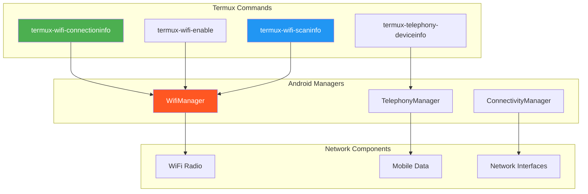
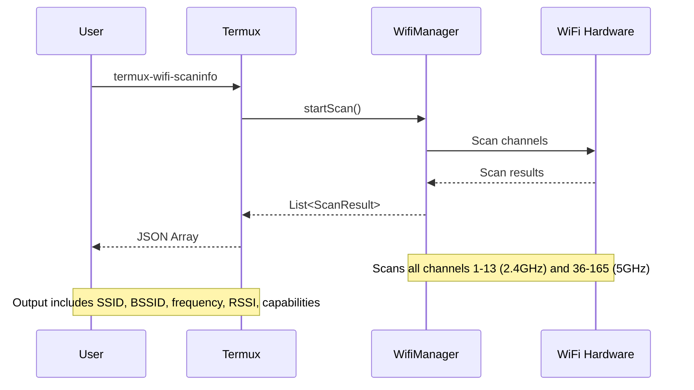
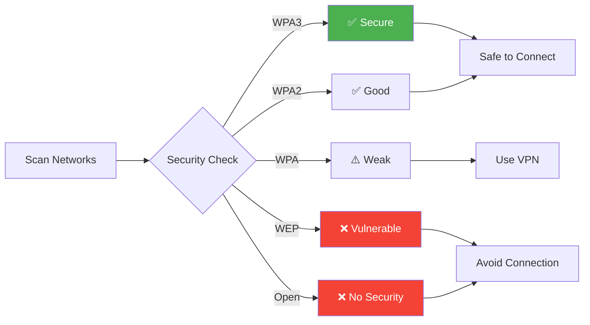

# 📡 Chapter 20: Termux API - Network Operations

```
╔══════════════════════════════════════════════════════════════════════════════╗
║                                                                              ║
║   ████████╗███████╗██████╗ ███╗   ███╗██╗███╗   ██╗ █████╗ ██╗               ║
║   ╚══██╔══╝██╔════╝██╔══██╗████╗ ████║██║████╗  ██║██╔══██╗██║               ║
║      ██║   █████╗  ██████╔╝██╔████╔██║██║██╔██╗ ██║███████║██║               ║
║      ██║   ██╔══╝  ██╔══██╗██║╚██╔╝██║██║██║╚██╗██║██╔══██║██║               ║
║      ██║   ███████╗██║  ██║██║ ╚═╝ ██║██║██║ ╚████║██║  ██║███████╗          ║
║      ╚═╝   ╚══════╝╚═╝  ╚═╝╚═╝     ╚═╝╚═╝╚═╝  ╚═══╝╚═╝  ╚═╝╚══════╝          ║
║                                                                              ║
║   ██████╗  █████╗ ██████╗ ██╗  ██╗███╗   ██╗███████╗                         ║
║   ██╔══██╗██╔══██╗██╔══██╗██║ ██╔╝████╗  ██║██╔════╝                         ║
║   ██████╔╝███████║██████╔╝█████╔╝ ██╔██╗ ██║█████╗                           ║
║   ██╔══██╗██╔══██║██╔══██╗██╔═██╗ ██║╚██╗██║██╔══╝                           ║
║   ██║  ██║██║  ██║██║  ██║██║  ██╗██║ ╚████║███████╗                         ║
║   ╚═╝  ╚═╝╚═╝  ╚═╝╚═╝  ╚═╝╚═╝  ╚═╝╚═╝  ╚═══╝╚══════╝                         ║
║                                                                              ║
║                     🌐 NETWORK OPERATIONS CHAPTER 🌐                         ║
║                                                                              ║
╚══════════════════════════════════════════════════════════════════════════════╝
```

> **Module:** 4 - APIs  
> **Chapter:** 20 of 61  
> **Duration:** 15-20 Minutes  
> **Difficulty:** ⭐⭐ Intermediate  
> **Prerequisites:** Chapters 1-19 (All previous API chapters)  

---

## 📋 Chapter Overview

| Section | Content |
|---------|---------|
| Video Script | Complete Hindi narration with timestamps |
| Technical Guide | WiFi, Mobile Data, Hotspot, Network Info |
| Commands Reference | All network API commands |
| Practice Exercises | Hands-on tasks |
| Troubleshooting | Common network API issues |
| Video Assets | Thumbnail, description, tags |

---

## 🎬 VIDEO SCRIPT (Complete Hindi Narration)

```
═══════════════════════════════════════════════════════════════════════════════
TERMUX FULL COURSE - CHAPTER 20
Title: Termux Network API | WiFi, Hotspot, IP Address | T3rmuxk1ng
Duration: 15-20 Minutes
═══════════════════════════════════════════════════════════════════════════════

[INTRO - 0:00 to 0:45]
─────────────────────────────────────────────────────────────────────────────

Namaskar Dosto! Welcome back to Termux Full Course by T3rmuxk1ng!

Aaj ka chapter bahut important hai - Network Operations with Termux API.

Network operations ka matlab hai - WiFi control karna, IP address nikalna,
MAC address dekhna, hotspot on/off karna, mobile data control karna, aur
bahut kuch - sab kuch terminal se!

Ye skills penetration testing mein bahut useful hain. Network information
gather karna, WiFi networks scan karna, connection details analyze karna -
ye sab ethical hacker ke basic skills hain.

Aur sabse best baat - ye sab bina root ke kaam karega!

To chaliye shuru karte hain. Video like karein, subscribe karein, aur
notification bell on karein.

---

[SECTION 1: TERMUX-API INSTALLATION CHECK - 0:45 to 2:30]
─────────────────────────────────────────────────────────────────────────────

Sabse pehle, Termux:API app install honi chahiye.

Termux API commands use karne ke liye do cheezein chahiye:
1. Termux app (jo already hai)
2. Termux:API app (F-Droid se install karein)

Check karein:

    pkg install termux-api -y

Ye command Termux API package install karta hai.

Ab check karein ki API kaam kar rahi hai:

    termux-wifi-connectioninfo

Agar JSON output aaya with WiFi details - to sab theek hai!

Agar error aaya:
- "permission denied" → Android settings mein permission enable karein
- "not installed" → Termux:API app install karein F-Droid se

Important: Termux:API app Termux app ke saath match karni chahiye -
dono F-Droid se honi chahiye, ya dono Play Store se. Mix mat karein!

---

[SECTION 2: WIFI CONNECTION INFO - 2:30 to 5:00]
─────────────────────────────────────────────────────────────────────────────

Pehla command - WiFi connection information.

    termux-wifi-connectioninfo

Ye command current WiFi connection ki detailed information deta hai.

Output mein kya kya aata hai:

{
  "bssid": "aa:bb:cc:dd:ee:ff",      // Router ka MAC address
  "ssid": "MyWiFiNetwork",            // Network name
  "ip": "192.168.1.100",              // Aapka IP address
  "mac": "11:22:33:44:55:66",         // Aapke device ka MAC
  "rssi": -45,                        // Signal strength
  "link_speed": 65,                   // Mbps
  "network_id": 5                     // Saved network ID
}

Har field ka explanation:

BSSID - Ye router ka unique identifier hai, MAC address jaise.
SSD - Ye network ka naam hai jo aap connected ho.
IP - Aapka current IP address network pe.
MAC - Aapke phone ka WiFi MAC address.
RSSI - Signal strength in dBm. -30 se -50 excellent, -70 fair, -90 weak.
Link Speed - Current connection speed Mbps mein.

Practical example - Check karein ki aap kis network pe ho:

    termux-wifi-connectioninfo | jq '.ssid'

"HomeWiFi" output aayega.

Wait, jq kya hai? jq ek JSON processor hai.

Install karein:

    pkg install jq -y

Ab aap specific values extract kar sakte ho:

    # IP address only
    termux-wifi-connectioninfo | jq '.ip'
    
    # Signal strength
    termux-wifi-connectioninfo | jq '.rssi'
    
    # Network name
    termux-wifi-connectioninfo | jq '.ssid'

---

[SECTION 3: WIFI ENABLE/DISABLE - 5:00 to 7:30]
─────────────────────────────────────────────────────────────────────────────

Ab WiFi ko on/off karna seekhte hain.

WiFi ON karne ke liye:

    termux-wifi-enable true

WiFi OFF karne ke liye:

    termux-wifi-enable false

Simple hai na?

Lekin wait - Android 10+ pe ye permission chahiye:
- Location access (required for WiFi operations)

Permission grant karne ke liye:

    termux-location

Ye command permission popup laayegi. Allow karein.

Ab WiFi toggle kaam karega.

Practical use case - Script bana sakte ho:

    # wifi-toggle.sh
    #!/bin/bash
    
    CURRENT=$(termux-wifi-connectioninfo 2>/dev/null)
    
    if [ -z "$CURRENT" ]; then
        echo "WiFi is OFF, turning ON..."
        termux-wifi-enable true
    else
        echo "WiFi is ON, turning OFF..."
        termux-wifi-enable false
    fi

Ye script check karegi WiFi status aur toggle karegi.

Automation ke liye useful hai - Tasker ke saath, cron jobs ke saath.

---

[SECTION 4: WIFI SCAN INFO - 7:30 to 10:00]
─────────────────────────────────────────────────────────────────────────────

Ab sabse powerful command - WiFi scanning!

    termux-wifi-scaninfo

Ye command aas-paas ke saare WiFi networks scan karti hai.

Output mein har network ki details aati hai:

[
  {
    "ssid": "HomeWiFi",
    "bssid": "aa:bb:cc:dd:ee:ff",
    "frequency": 2412,
    "rssi": -45,
    "capabilities": "[WPA2-PSK-CCMP][ESS]"
  },
  {
    "ssid": "Neighbor_Net",
    "bssid": "11:22:33:44:55:66",
    "frequency": 2437,
    "rssi": -75,
    "capabilities": "[WPA2-PSK-CCMP][WPS][ESS]"
  }
]

Har field ka matlab:

SSID - Network name (hidden networks mein empty)
BSSID - Router ka MAC address
Frequency - WiFi frequency in MHz (2412 = channel 1, 2437 = channel 6)
RSSI - Signal strength
Capabilities - Security features (WPA2, WPS, etc.)

Interesting fact: Hidden networks bhi detect hote hain!
SSID empty hoga, lekin BSSID aur signal strength dikhegi.

Practical use - Network audit karein:

    # Count available networks
    termux-wifi-scaninfo | jq 'length'
    
    # List all SSIDs
    termux-wifi-scaninfo | jq '.[].ssid'
    
    # Find open networks (no password)
    termux-wifi-scaninfo | jq '.[] | select(.capabilities | contains("ESS"))'
    
    # Strongest signal first
    termux-wifi-scaninfo | jq 'sort_by(.rssi) | reverse | .[0:5]'

Security tip: WPS enabled networks vulnerable ho sakte hain.
Check karein:

    termux-wifi-scaninfo | jq '.[] | select(.capabilities | contains("WPS"))'

---

[SECTION 5: GET WIFI PASSWORD (ROOT REQUIRED) - 10:00 to 12:00]
─────────────────────────────────────────────────────────────────────────────

Ab ek sensitive topic - WiFi password retrieve karna.

⚠️ WARNING: Ye ROOT access chahiye aur sirf apne networks ke liye use karein!

Normal Termux API se saved WiFi passwords nahi milte.
Android security ke wajah se passwords encrypted hain.

Root access ke saath:

Method 1: Direct file access (older Android)

    su -c "cat /data/misc/wifi/wpa_supplicant.conf"

Method 2: Android 10+ ke liye

    su -c "cat /data/misc/wifi/WifiConfigStore.xml"

Ye files mein saved networks aur passwords hote hain.

Alternative - Root ke bina:

Kuch third-party apps saved WiFi share kar sakte hain QR code mein:
- Share WiFi from Settings → WiFi → Tap network → Share

Termux se QR generate kar sakte ho:

    # Install qrencode
    pkg install qrencode -y
    
    # Generate QR for WiFi (manual entry)
    qrencode -t ANSIUTF8 "WIFI:T:WPA;S:NetworkName;P:Password;;"

Important: Kisi ke WiFi password bina permission ke access karna
illegal hai. Sirf apne networks ke liye use karein!

---

[SECTION 6: MOBILE DATA CONTROL - 12:00 to 14:00]
─────────────────────────────────────────────────────────────────────────────

Mobile data ko control karna Termux API se:

Mobile Data ON:

    termux-telephony-cellinfo
    # Note: Direct mobile data toggle requires special permissions

Actually, Termux API directly mobile data toggle nahi karti
Android security restrictions ke wajah se.

Alternative methods:

Method 1: Using settings command (Android 5+)

    # View mobile data setting
    settings get global mobile_data
    
    # Toggle (requires WRITE_SECURE_SETTINGS - adb needed)
    settings put global mobile_data 1  # ON
    settings put global mobile_data 0  # OFF

Method 2: Using su (root required)

    su -c "svc data enable"   # ON
    su -c "svc data disable"  # OFF

Method 3: Using am command (intent)

    # Open mobile data settings
    am start -a android.settings.DATA_ROAMING_SETTINGS

Network status check karein:

    termux-telephony-deviceinfo

Ye command SIM aur network information deti hai.

Data usage check (Android settings se):

    dumpsys netstats | head -50

---

[SECTION 7: HOTSPOT CONTROL - 14:00 to 15:30]
─────────────────────────────────────────────────────────────────────────────

WiFi Hotspot control - Termux API se direct hotspot toggle nahi hota.
Lekin dusre methods hain:

Method 1: Settings intent

    # Open hotspot settings
    am start -a android.settings.WIFI_HOTSPOT_SETTINGS

Method 2: Root users ke liye

    # Enable hotspot
    su -c "svc wifi disable"  # WiFi off first
    su -c "ndc softap start wlan0 MyHotspot 12345678"
    
    # Disable hotspot
    su -c "ndc softap stop wlan0"

Method 3: Using ifconfig (root)

    # Check hotspot interface
    su -c "ifconfig wlan0"

Hotspot information:

    # Network interfaces
    ifconfig
    
    # IP tables (requires root)
    su -c "iptables -t nat -L"

Hotspot connected devices check:

    su -c "cat /proc/net/arp"

Ye command ARP table dikhati hai - connected devices ke IP aur MAC.

---

[SECTION 8: IP ADDRESS INFORMATION - 15:30 to 17:00]
─────────────────────────────────────────────────────────────────────────────

IP address information - Multiple ways se nikal sakte hain.

Internal IP (local network):

    # Method 1: ifconfig
    ifconfig wlan0
    
    # Method 2: ip command
    ip addr show wlan0
    
    # Method 3: Termux API
    termux-wifi-connectioninfo | jq '.ip'
    
    # Quick one-liner
    ifconfig wlan0 | grep "inet " | awk '{print $2}'

External IP (public IP - internet se):

    # Using curl
    curl -s ifconfig.me
    
    # Alternative services
    curl -s icanhazip.com
    curl -s ipecho.net/plain
    curl -s api.ipify.org
    
    # With more info
    curl -s ipinfo.io

All network interfaces:

    # List all interfaces
    ip link show
    
    # All IPs
    ip addr
    
    # Specific interface
    ip addr show wlan0
    ip addr show rmnet0  # Mobile data

Gateway IP:

    # Using ip route
    ip route | grep default
    
    # Using route command (install net-tools)
    pkg install net-tools -y
    route -n

DNS servers:

    # Check DNS
    cat /etc/resolv.conf
    
    # Android DNS (requires root)
    su -c "getprop | grep dns"

---

[SECTION 9: MAC ADDRESS - 17:00 to 18:30]
─────────────────────────────────────────────────────────────────────────────

MAC address - Device ka unique hardware identifier.

WiFi MAC address:

    # Method 1: ifconfig
    ifconfig wlan0 | grep -o '..:..:..:..:..:..'
    
    # Method 2: ip command
    ip link show wlan0 | grep -o '..:..:..:..:..:..'
    
    # Method 3: Termux API
    termux-wifi-connectioninfo | jq '.mac'

Mobile Data MAC:

    # Check rmnet interface
    ip link show rmnet0

All interfaces MAC:

    # List all with MACs
    ip link | grep -E "^[0-9]:|ether"

MAC address randomization:

Android 10+ randomize MAC addresses for privacy.
Real MAC address sirf root se milta hai.

    # Real MAC (root)
    su -c "cat /sys/class/net/wlan0/address"

Spoof MAC address (root):

    # Turn off WiFi first
    su -c "ifconfig wlan0 down"
    
    # Change MAC
    su -c "ifconfig wlan0 hw ether 00:11:22:33:44:55"
    
    # Turn on WiFi
    su -c "ifconfig wlan0 up"

⚠️ Warning: MAC spoofing some networks pe kaam nahi karega
aur unethical activities ke liye illegal hai.

---

[SECTION 10: NETWORK STATS & MONITORING - 18:30 to 20:00]
─────────────────────────────────────────────────────────────────────────────

Network statistics aur monitoring.

Data usage stats:

    # Network statistics (Android)
    dumpsys netstats | grep -A 10 "Dev stats"
    
    # Current connections
    netstat -tunl
    
    # Established connections
    netstat -tun

Network monitoring tools:

    # Install useful tools
    pkg install nmap netcat curl wget -y

Ping test:

    # Simple ping
    ping -c 4 google.com
    
    # Local network ping
    ping -c 4 192.168.1.1

DNS lookup:

    # Using nslookup
    nslookup google.com
    
    # Using dig (install dnsutils)
    pkg install dnsutils -y
    dig google.com

Port scanning (local network):

    # Quick scan
    nmap -sP 192.168.1.0/24
    
    # Port scan specific IP
    nmap -p 80,443,22 192.168.1.1

Bandwidth test:

    # Simple speed test
    curl -o /dev/null -w "Speed: %{speed_download} bytes/sec\n" http://speedtest.tele2.net/1MB.zip

---

[SECTION 11: PRACTICAL SCRIPTS - 20:00 to 22:00]
─────────────────────────────────────────────────────────────────────────────

Ab kuch practical scripts banate hain.

[SCRIPT 1: Network Info Dashboard]

    #!/bin/bash
    # network-info.sh - Complete network information
    
    echo "╔══════════════════════════════════════════╗"
    echo "║     NETWORK INFORMATION DASHBOARD        ║"
    echo "╚══════════════════════════════════════════╝"
    echo ""
    
    # WiFi Info
    echo "📡 WiFi INFORMATION"
    echo "───────────────────"
    WIFI_INFO=$(termux-wifi-connectioninfo 2>/dev/null)
    if [ -n "$WIFI_INFO" ]; then
        echo "SSID: $(echo $WIFI_INFO | jq -r '.ssid')"
        echo "IP: $(echo $WIFI_INFO | jq -r '.ip')"
        echo "MAC: $(echo $WIFI_INFO | jq -r '.mac')"
        echo "Signal: $(echo $WIFI_INFO | jq -r '.rssi') dBm"
        echo "Speed: $(echo $WIFI_INFO | jq -r '.link_speed') Mbps"
    else
        echo "WiFi not connected"
    fi
    echo ""
    
    # Public IP
    echo "🌍 PUBLIC IP"
    echo "───────────────────"
    PUBLIC_IP=$(curl -s --max-time 5 ifconfig.me)
    if [ -n "$PUBLIC_IP" ]; then
        echo "Public IP: $PUBLIC_IP"
    else
        echo "Unable to fetch public IP"
    fi
    echo ""
    
    # Available Networks
    echo "📶 AVAILABLE NETWORKS"
    echo "───────────────────"
    termux-wifi-scaninfo 2>/dev/null | jq -r '.[] | "• \(.ssid // "Hidden") - Signal: \(.rssi) dBm"' | head -10

[SCRIPT 2: WiFi Analyzer]

    #!/bin/bash
    # wifi-analyzer.sh - Analyze WiFi networks
    
    echo "🔍 WiFi ANALYZER"
    echo "══════════════════════════════════════"
    echo ""
    
    # Scan networks
    NETWORKS=$(termux-wifi-scaninfo)
    
    # Count
    COUNT=$(echo "$NETWORKS" | jq 'length')
    echo "Found $COUNT networks"
    echo ""
    
    # Sort by signal strength
    echo "📶 SIGNAL STRENGTH RANKING"
    echo "─────────────────────────────"
    echo "$NETWORKS" | jq -r 'sort_by(.rssi) | reverse | .[] | "[\(.rssi) dBm] \(.ssid // "Hidden")"' | head -15
    echo ""
    
    # Security analysis
    echo "🔒 SECURITY ANALYSIS"
    echo "─────────────────────────────"
    WPA3=$(echo "$NETWORKS" | jq '[.[] | select(.capabilities | contains("WPA3"))] | length')
    WPA2=$(echo "$NETWORKS" | jq '[.[] | select(.capabilities | contains("WPA2"))] | length')
    WPA=$(echo "$NETWORKS" | jq '[.[] | select(.capabilities | contains("WPA-") and contains("WPA2") | not)] | length')
    OPEN=$(echo "$NETWORKS" | jq '[.[] | select(.capabilities | contains("ESS") and contains("WPA") | not)] | length')
    
    echo "WPA3 Networks: $WPA3"
    echo "WPA2 Networks: $WPA2"
    echo "WPA Networks: $WPA"
    echo "Open Networks: $OPEN"
    echo ""
    
    # WPS Warning
    WPS=$(echo "$NETWORKS" | jq '[.[] | select(.capabilities | contains("WPS"))] | length')
    if [ "$WPS" -gt 0 ]; then
        echo "⚠️  WARNING: $WPS networks have WPS enabled!"
        echo "WPS can be vulnerable to brute force attacks."
        echo "$NETWORKS" | jq -r '.[] | select(.capabilities | contains("WPS")) | "   - \(.ssid // "Hidden")"'
    fi

[SCRIPT 3: Network Monitor]

    #!/bin/bash
    # network-monitor.sh - Continuous network monitoring
    
    LOG_FILE="network_monitor.log"
    
    echo "📊 NETWORK MONITOR STARTED"
    echo "Logging to: $LOG_FILE"
    echo "Press Ctrl+C to stop"
    echo ""
    
    while true; do
        TIMESTAMP=$(date '+%Y-%m-%d %H:%M:%S')
        WIFI_STATUS=$(termux-wifi-connectioninfo 2>/dev/null | jq -r '.ssid // "Disconnected"')
        SIGNAL=$(termux-wifi-connectioninfo 2>/dev/null | jq -r '.rssi // "N/A"')
        
        echo "[$TIMESTAMP] WiFi: $WIFI_STATUS | Signal: $SIGNAL dBm" | tee -a "$LOG_FILE"
        sleep 5
    done

---

[SECTION 12: PYTHON INTEGRATION - 22:00 to 24:00]
─────────────────────────────────────────────────────────────────────────────

Python se Termux network API use karna.

Basic Python script:

    #!/usr/bin/env python3
    # network_tool.py
    
    import subprocess
    import json
    
    def get_wifi_info():
        """Get current WiFi connection info"""
        try:
            result = subprocess.run(
                ['termux-wifi-connectioninfo'],
                capture_output=True,
                text=True
            )
            return json.loads(result.stdout)
        except Exception as e:
            return {"error": str(e)}
    
    def get_public_ip():
        """Get public IP address"""
        try:
            result = subprocess.run(
                ['curl', '-s', 'ifconfig.me'],
                capture_output=True,
                text=True,
                timeout=10
            )
            return result.stdout.strip()
        except Exception as e:
            return None
    
    def scan_networks():
        """Scan available WiFi networks"""
        try:
            result = subprocess.run(
                ['termux-wifi-scaninfo'],
                capture_output=True,
                text=True
            )
            return json.loads(result.stdout)
        except Exception as e:
            return []
    
    def get_signal_quality(rssi):
        """Convert RSSI to quality percentage"""
        if rssi >= -50:
            return "Excellent (90-100%)"
        elif rssi >= -60:
            return "Good (70-89%)"
        elif rssi >= -70:
            return "Fair (50-69%)"
        elif rssi >= -80:
            return "Weak (30-49%)"
        else:
            return "Very Weak (<30%)"
    
    if __name__ == "__main__":
        print("═" * 45)
        print("     TERMUX NETWORK TOOL (Python)")
        print("═" * 45)
        
        # WiFi Info
        wifi = get_wifi_info()
        if "error" not in wifi and wifi:
            print(f"\n📡 Connected to: {wifi.get('ssid', 'N/A')}")
            print(f"   IP Address: {wifi.get('ip', 'N/A')}")
            print(f"   Signal: {get_signal_quality(wifi.get('rssi', -100))}")
        else:
            print("\n📡 WiFi: Not connected")
        
        # Public IP
        public = get_public_ip()
        print(f"\n🌍 Public IP: {public or 'Unable to fetch'}")
        
        # Network count
        networks = scan_networks()
        print(f"\n📶 Networks found: {len(networks)}")

Advanced Python - WiFi Security Checker:

    #!/usr/bin/env python3
    # wifi_security_check.py
    
    import subprocess
    import json
    from datetime import datetime
    
    class WiFiSecurityScanner:
        def __init__(self):
            self.networks = []
        
        def scan(self):
            """Perform WiFi scan"""
            result = subprocess.run(
                ['termux-wifi-scaninfo'],
                capture_output=True,
                text=True
            )
            self.networks = json.loads(result.stdout)
            return self.networks
        
        def analyze_security(self, capabilities):
            """Analyze network security"""
            security = {
                'wpa3': 'WPA3' in capabilities,
                'wpa2': 'WPA2' in capabilities,
                'wpa': 'WPA-' in capabilities and 'WPA2' not in capabilities,
                'wps': 'WPS' in capabilities,
                'open': 'ESS' in capabilities and 'WPA' not in capabilities
            }
            return security
        
        def get_risk_level(self, capabilities):
            """Determine network risk level"""
            sec = self.analyze_security(capabilities)
            
            if sec['open']:
                return "HIGH RISK - Open network"
            elif sec['wps']:
                return "MEDIUM RISK - WPS enabled"
            elif sec['wpa']:
                return "LOW RISK - Outdated WPA"
            elif sec['wpa2']:
                return "LOW RISK - WPA2 secure"
            elif sec['wpa3']:
                return "MINIMAL RISK - WPA3 secure"
            else:
                return "UNKNOWN RISK"
        
        def generate_report(self):
            """Generate security report"""
            print("\n" + "═" * 55)
            print("     WiFi Security Assessment Report")
            print("     Generated:", datetime.now().strftime("%Y-%m-%d %H:%M"))
            print("═" * 55 + "\n")
            
            if not self.networks:
                self.scan()
            
            # Statistics
            total = len(self.networks)
            open_count = sum(1 for n in self.networks 
                           if self.analyze_security(n.get('capabilities', '')).get('open'))
            wps_count = sum(1 for n in self.networks 
                          if self.analyze_security(n.get('capabilities', '')).get('wps'))
            
            print(f"📊 SUMMARY")
            print(f"   Total Networks: {total}")
            print(f"   Open Networks: {open_count} ⚠️")
            print(f"   WPS Enabled: {wps_count} ⚠️")
            print("\n" + "─" * 55)
            
            # Details
            print("\n📋 NETWORK DETAILS\n")
            for net in sorted(self.networks, key=lambda x: x.get('rssi', 0), reverse=True):
                ssid = net.get('ssid') or 'Hidden Network'
                rssi = net.get('rssi', 0)
                caps = net.get('capabilities', '')
                risk = self.get_risk_level(caps)
                
                print(f"• {ssid}")
                print(f"  Signal: {rssi} dBm")
                print(f"  Security: {risk}")
                print()
    
    # Run
    if __name__ == "__main__":
        scanner = WiFiSecurityScanner()
        scanner.generate_report()

---

[SECTION 13: 20+ PRACTICAL EXAMPLES - 24:00 to 27:00]
─────────────────────────────────────────────────────────────────────────────

Ab 20+ practical examples quickly:

1. Get WiFi name only
    termux-wifi-connectioninfo | jq -r '.ssid'

2. Get IP only
    termux-wifi-connectioninfo | jq -r '.ip'

3. Get MAC only
    termux-wifi-connectioninfo | jq -r '.mac'

4. Check signal strength
    termux-wifi-connectioninfo | jq '.rssi'

5. Turn WiFi on
    termux-wifi-enable true

6. Turn WiFi off
    termux-wifi-enable false

7. Count nearby networks
    termux-wifi-scaninfo | jq 'length'

8. List all SSIDs
    termux-wifi-scaninfo | jq '.[].ssid' | sort | uniq

9. Find strongest network
    termux-wifi-scaninfo | jq 'sort_by(.rssi) | reverse | .[0]'

10. Find open networks
    termux-wifi-scaninfo | jq '.[] | select(.capabilities | contains("ESS") and contains("WPA") | not)'

11. Find WPS enabled (vulnerable)
    termux-wifi-scaninfo | jq '.[] | select(.capabilities | contains("WPS"))'

12. Get public IP
    curl -s ifconfig.me

13. Get IP with location
    curl -s ipinfo.io

14. Check local IP
    ip addr show wlan0 | grep inet

15. Check gateway
    ip route | grep default

16. Ping test
    ping -c 3 google.com

17. DNS lookup
    nslookup google.com

18. Check open ports (local)
    netstat -tunl

19. Network interfaces
    ip link show

20. Quick speed test
    curl -o /dev/null -w "%{speed_download}\n" http://example.com

21. WiFi toggle script
    [ -z "$(termux-wifi-connectioninfo 2>/dev/null)" ] && termux-wifi-enable true || termux-wifi-enable false

22. Monitor signal
    watch -n 2 'termux-wifi-connectioninfo | jq ".rssi"'

23. Export networks to file
    termux-wifi-scaninfo > networks_$(date +%Y%m%d).json

24. Find specific network
    termux-wifi-scaninfo | jq '.[] | select(.ssid | contains("MyNetwork"))'

25. Check connection quality
    RSSI=$(termux-wifi-connectioninfo | jq '.rssi'); [ $RSSI -gt -70 ] && echo "Good" || echo "Weak"

---

[SECTION 14: SUMMARY & NEXT PREVIEW - 27:00 to 28:00]
─────────────────────────────────────────────────────────────────────────────

To dosto, Chapter 20 complete! Let's summarize:

✅ termux-wifi-connectioninfo - Current WiFi details
✅ termux-wifi-enable - WiFi on/off control
✅ termux-wifi-scaninfo - Network scanning
✅ WiFi password retrieval (root methods)
✅ Mobile data control methods
✅ Hotspot management
✅ IP address information
✅ MAC address extraction
✅ Network statistics
✅ Python integration
✅ 20+ practical examples
✅ Network monitoring scripts

Important Commands yaad rakhein:

┌─────────────────────────────────────────────────────────────────────────┐
│                    CHAPTER 20 - IMPORTANT COMMANDS                       │
├─────────────────────────────────────────────────────────────────────────┤
│ termux-wifi-connectioninfo   │ Current WiFi details                      │
│ termux-wifi-enable true/false│ WiFi on/off                               │
│ termux-wifi-scaninfo         │ Scan nearby networks                      │
│ curl -s ifconfig.me          │ Get public IP                             │
│ ip addr show wlan0           │ Local IP & MAC                            │
│ ip route                     │ Gateway info                              │
│ ping -c 4 google.com         │ Connectivity test                         │
│ nmap -sP 192.168.1.0/24      │ Network scan                              │
└─────────────────────────────────────────────────────────────────────────┘

Next Chapter 21 mein hum seekhenge:
- Termux Notification API
- Custom notifications create karna
- Notification actions
- Progress notifications
- Notification channels

Agar ye video helpful lagi, to:
👍 Like button press karein
🔔 Subscribe karein, notification bell on karein
💬 Koi sawal ho to comment mein poochein
📤 Share karein friends ke saath

Main har comment ka reply karta hoon.

Thank you for watching! See you in Chapter 21!

═══════════════════════════════════════════════════════════════════════════════
```

---

## 📖 TECHNICAL GUIDE

### 1. Termux Network API Overview

```
┌─────────────────────────────────────────────────────────────────────────┐
│                    TERMUX NETWORK API ARCHITECTURE                       │
├─────────────────────────────────────────────────────────────────────────┤
│                                                                          │
│   ┌─────────────────────────────────────────────────────────────────┐   │
│   │                    Termux Commands Layer                         │   │
│   │   termux-wifi-connectioninfo, termux-wifi-enable, etc.          │   │
│   └─────────────────────────────────────────────────────────────────┘   │
│                                   │                                      │
│                                   ▼                                      │
│   ┌─────────────────────────────────────────────────────────────────┐   │
│   │                    Termux:API Application                        │   │
│   │   (Android Service with System Permissions)                     │   │
│   └─────────────────────────────────────────────────────────────────┘   │
│                                   │                                      │
│                                   ▼                                      │
│   ┌─────────────────────────────────────────────────────────────────┐   │
│   │                    Android System APIs                           │   │
│   │   WifiManager, ConnectivityManager, NetworkInfo                 │   │
│   └─────────────────────────────────────────────────────────────────┘   │
│                                   │                                      │
│                                   ▼                                      │
│   ┌─────────────────────────────────────────────────────────────────┐   │
│   │                    Linux Network Stack                           │   │
│   │   Network interfaces, routing, DNS resolution                   │   │
│   └─────────────────────────────────────────────────────────────────┘   │
│                                                                          │
└─────────────────────────────────────────────────────────────────────────┘
```

### 2. WiFi API Commands

#### termux-wifi-connectioninfo

Returns detailed information about the current WiFi connection.

**Output Fields:**

| Field | Type | Description |
|-------|------|-------------|
| bssid | string | Router's MAC address |
| ssid | string | Network name |
| ip | string | Device's local IP address |
| mac | string | Device's WiFi MAC address |
| rssi | integer | Signal strength in dBm |
| link_speed | integer | Connection speed in Mbps |
| network_id | integer | Saved network ID |
| frequency | integer | WiFi frequency in MHz |

**Example Output:**
```json
{
  "bssid": "aa:bb:cc:dd:ee:ff",
  "ssid": "MyWiFiNetwork",
  "ip": "192.168.1.100",
  "mac": "11:22:33:44:55:66",
  "rssi": -45,
  "link_speed": 65,
  "network_id": 5,
  "frequency": 2412
}
```

**Signal Strength Guide:**

| RSSI Range | Quality | Description |
|------------|---------|-------------|
| -30 to -50 | Excellent | Full signal bars |
| -50 to -60 | Good | Strong signal |
| -60 to -70 | Fair | Moderate signal |
| -70 to -80 | Weak | Poor signal |
| -80 to -90 | Very Weak | Unstable connection |
| Below -90 | Unusable | No connection |

#### termux-wifi-enable

Controls WiFi radio state.

**Syntax:**
```bash
termux-wifi-enable true   # Turn WiFi ON
termux-wifi-enable false  # Turn WiFi OFF
```

**Requirements:**
- Android 10+: Location permission required
- Termux:API app must be installed

**Permission Setup:**
```bash
# Trigger permission request
termux-location

# Or manually grant in Settings
# Settings → Apps → Termux:API → Permissions → Location
```

#### termux-wifi-scaninfo

Scans for nearby WiFi networks.

**Output Fields:**

| Field | Type | Description |
|-------|------|-------------|
| ssid | string | Network name (empty for hidden) |
| bssid | string | Router's MAC address |
| frequency | integer | WiFi frequency in MHz |
| rssi | integer | Signal strength in dBm |
| capabilities | string | Security capabilities |

**Example Output:**
```json
[
  {
    "ssid": "HomeWiFi",
    "bssid": "aa:bb:cc:dd:ee:ff",
    "frequency": 2412,
    "rssi": -45,
    "capabilities": "[WPA2-PSK-CCMP][ESS]"
  },
  {
    "ssid": "",
    "bssid": "11:22:33:44:55:66",
    "frequency": 2437,
    "rssi": -75,
    "capabilities": "[WPA2-PSK-CCMP][ESS]"
  }
]
```

**Frequency to Channel Mapping:**

| Frequency (MHz) | Channel |
|-----------------|---------|
| 2412 | 1 |
| 2417 | 2 |
| 2422 | 3 |
| 2427 | 4 |
| 2432 | 5 |
| 2437 | 6 |
| 2442 | 7 |
| 2447 | 8 |
| 2452 | 9 |
| 2457 | 10 |
| 2462 | 11 |

**Security Capabilities:**

| Capability | Meaning |
|------------|---------|
| WPA2-PSK | WPA2 Personal |
| WPA3-PSK | WPA3 Personal |
| WPA-EAP | WPA Enterprise |
| CCMP | AES encryption |
| TKIP | Legacy encryption (less secure) |
| WPS | WiFi Protected Setup |
| ESS | Extended Service Set |

### 3. WiFi Password Retrieval (Root Required)

#### Method 1: wpa_supplicant.conf (Android 9 and below)

```bash
# Access wpa_supplicant configuration
su -c "cat /data/misc/wifi/wpa_supplicant.conf"

# Output contains:
# network={
#     ssid="NetworkName"
#     psk="Password"
# }
```

#### Method 2: WifiConfigStore.xml (Android 10+)

```bash
# Access WifiConfigStore
su -c "cat /data/misc/wifi/WifiConfigStore.xml"

# Search for PreSharedKey
su -c "cat /data/misc/wifi/WifiConfigStore.xml | grep -A5 'PreSharedKey'"
```

#### Method 3: Using dumpsys

```bash
# Get WiFi configuration
su -c "dumpsys wifi | grep -A20 'Networks'"

# Requires Android 10+ with additional permissions
```

### 4. Mobile Data Control

Android security restrictions prevent direct mobile data toggle from apps. Alternative methods:

#### Method 1: ADB with WRITE_SECURE_SETTINGS

```bash
# Grant permission via ADB (from PC)
adb shell pm grant com.termux android.permission.WRITE_SECURE_SETTINGS

# Then in Termux
settings put global mobile_data 1  # ON
settings put global mobile_data 0  # OFF
```

#### Method 2: Root Command

```bash
# Using su
su -c "svc data enable"   # Enable mobile data
su -c "svc data disable"  # Disable mobile data
```

#### Method 3: Intent to Settings

```bash
# Open mobile data settings
am start -a android.settings.DATA_ROAMING_SETTINGS
```

### 5. Hotspot Control

#### Via Android Settings Intent

```bash
# Open hotspot settings
am start -a android.settings.WIFI_HOTSPOT_SETTINGS
```

#### Root Commands

```bash
# Enable hotspot (root)
su -c "svc wifi disable"  # Disable WiFi first
su -c "ndc softap start wlan0 MyHotspot 12345678"

# Disable hotspot
su -c "ndc softap stop wlan0"
```

#### Check Connected Devices

```bash
# View ARP table
su -c "cat /proc/net/arp"

# Output shows IP and MAC of connected devices
```

### 6. IP Address Information

#### Internal IP Address

```bash
# Using ifconfig
ifconfig wlan0 | grep "inet " | awk '{print $2}'

# Using ip command
ip -f inet addr show wlan0 | grep inet | awk '{print $2}' | cut -d'/' -f1

# Using Termux API
termux-wifi-connectioninfo | jq -r '.ip'
```

#### External IP Address

```bash
# Various services
curl -s ifconfig.me
curl -s icanhazip.com
curl -s ipecho.net/plain
curl -s api.ipify.org
curl -s ident.me

# With location info
curl -s ipinfo.io

# Output:
# {
#   "ip": "1.2.3.4",
#   "hostname": "example.com",
#   "city": "City",
#   "region": "State",
#   "country": "IN",
#   "loc": "28.6,77.2",
#   "org": "ISP Name"
# }
```

#### Gateway IP

```bash
# Default gateway
ip route | grep default | awk '{print $3}'

# All routes
ip route show

# Using route command
route -n | grep '^0.0.0.0'
```

#### DNS Servers

```bash
# Termux DNS
cat /etc/resolv.conf

# Android DNS (root)
su -c "getprop | grep dns"

# Test DNS resolution
dig google.com
nslookup google.com
```

### 7. MAC Address

#### Get WiFi MAC Address

```bash
# Method 1: ifconfig
ifconfig wlan0 | grep -o -E '([0-9a-fA-F]{2}:){5}[0-9a-fA-F]{2}'

# Method 2: ip command
ip link show wlan0 | grep -o -E '([0-9a-fA-F]{2}:){5}[0-9a-fA-F]{2}'

# Method 3: Termux API
termux-wifi-connectioninfo | jq -r '.mac'

# Method 4: sysfs (may require root)
cat /sys/class/net/wlan0/address
```

#### MAC Address Format

```
AA:BB:CC:DD:EE:FF

First 3 octets (AA:BB:CC) = OUI (Organizationally Unique Identifier)
Last 3 octets (DD:EE:FF) = Device specific

Example: 00:1A:2B = Apple Inc.
         00:1B:63 = Intel Corporate
```

#### MAC Randomization

Android 10+ uses MAC randomization for privacy. Real MAC address differs from reported MAC.

```bash
# Get real MAC (root required)
su -c "cat /sys/class/net/wlan0/address"

# Factory MAC may be stored in
su -c "cat /efs/wifi/.mac.info"  # Samsung devices
```

### 8. Network Statistics

#### Connection Statistics

```bash
# Network statistics
cat /proc/net/dev

# Specific interface
cat /proc/net/dev | grep wlan0

# Human readable format
ifconfig wlan0
```

#### Active Connections

```bash
# List all connections
netstat -an

# Established connections only
netstat -an | grep ESTABLISHED

# Listening ports
netstat -tunl

# With process info (root)
su -c "netstat -tunlp"
```

#### Network Usage

```bash
# Android network stats
dumpsys netstats

# Summary
dumpsys netstats | grep -A5 "Dev stats"
```

### 9. Creating Network Info Script

```bash
#!/bin/bash
# network-info.sh - Complete network information dashboard

echo "╔══════════════════════════════════════════════════════════════╗"
echo "║              NETWORK INFORMATION DASHBOARD                    ║"
echo "╚══════════════════════════════════════════════════════════════╝"

# Colors
RED='\033[0;31m'
GREEN='\033[0;32m'
YELLOW='\033[1;33m'
BLUE='\033[0;34m'
NC='\033[0m' # No Color

# Function: WiFi Information
wifi_info() {
    echo -e "\n${BLUE}📡 WiFi INFORMATION${NC}"
    echo "─────────────────────────────────"
    
    WIFI_DATA=$(termux-wifi-connectioninfo 2>/dev/null)
    
    if [ -n "$WIFI_DATA" ] && [ "$WIFI_DATA" != "null" ]; then
        SSID=$(echo "$WIFI_DATA" | jq -r '.ssid // "N/A"')
        IP=$(echo "$WIFI_DATA" | jq -r '.ip // "N/A"')
        MAC=$(echo "$WIFI_DATA" | jq -r '.mac // "N/A"')
        RSSI=$(echo "$WIFI_DATA" | jq -r '.rssi // 0')
        SPEED=$(echo "$WIFI_DATA" | jq -r '.link_speed // 0')
        BSSID=$(echo "$WIFI_DATA" | jq -r '.bssid // "N/A"')
        FREQ=$(echo "$WIFI_DATA" | jq -r '.frequency // 0')
        
        # Calculate channel
        if [ "$FREQ" -ge 2412 ] && [ "$FREQ" -le 2484 ]; then
            CHANNEL=$(( ($FREQ - 2407) / 5 ))
        elif [ "$FREQ" -ge 5170 ] && [ "$FREQ" -le 5825 ]; then
            CHANNEL=$(( ($FREQ - 5000) / 5 ))
        else
            CHANNEL="Unknown"
        fi
        
        # Signal quality
        if [ "$RSSI" -ge -50 ]; then
            QUALITY="${GREEN}Excellent${NC}"
        elif [ "$RSSI" -ge -60 ]; then
            QUALITY="${GREEN}Good${NC}"
        elif [ "$RSSI" -ge -70 ]; then
            QUALITY="${YELLOW}Fair${NC}"
        else
            QUALITY="${RED}Weak${NC}"
        fi
        
        echo "  SSID:      $SSID"
        echo "  IP:        $IP"
        echo "  MAC:       $MAC"
        echo "  Signal:    ${RSSI} dBm (${QUALITY})"
        echo "  Speed:     ${SPEED} Mbps"
        echo "  Channel:   $CHANNEL"
        echo "  Router:    $BSSID"
    else
        echo -e "  ${RED}WiFi not connected${NC}"
    fi
}

# Function: Public IP
public_ip() {
    echo -e "\n${BLUE}🌍 PUBLIC IP${NC}"
    echo "─────────────────────────────────"
    
    PUBLIC=$(curl -s --max-time 5 ifconfig.me 2>/dev/null)
    
    if [ -n "$PUBLIC" ]; then
        echo "  Public IP: $PUBLIC"
        
        # Get location info
        INFO=$(curl -s --max-time 5 ipinfo.io 2>/dev/null)
        if [ -n "$INFO" ]; then
            CITY=$(echo "$INFO" | jq -r '.city // "N/A"')
            REGION=$(echo "$INFO" | jq -r '.region // "N/A"')
            COUNTRY=$(echo "$INFO" | jq -r '.country // "N/A"')
            ISP=$(echo "$INFO" | jq -r '.org // "N/A"')
            
            echo "  Location:  $CITY, $REGION, $COUNTRY"
            echo "  ISP:       $ISP"
        fi
    else
        echo -e "  ${RED}Unable to fetch public IP${NC}"
    fi
}

# Function: Network Interfaces
interfaces() {
    echo -e "\n${BLUE}🔌 NETWORK INTERFACES${NC}"
    echo "─────────────────────────────────"
    
    ip link show | grep -E "^[0-9]+" | while read line; do
        IFACE=$(echo "$line" | awk -F: '{print $2}' | tr -d ' ')
        STATE=$(echo "$line" | grep -o 'state [^ ]*' | awk '{print $2}')
        MAC=$(ip link show "$IFACE" | grep -o -E '([0-9a-fA-F]{2}:){5}[0-9a-fA-F]{2}' | head -1)
        
        if [ "$STATE" = "UP" ]; then
            STATE_COLOR="${GREEN}UP${NC}"
        else
            STATE_COLOR="${RED}DOWN${NC}"
        fi
        
        echo "  $IFACE: ${STATE_COLOR} (${MAC:-N/A})"
    done
}

# Function: Available Networks
available_networks() {
    echo -e "\n${BLUE}📶 NEARBY NETWORKS${NC}"
    echo "─────────────────────────────────"
    
    NETWORKS=$(termux-wifi-scaninfo 2>/dev/null)
    COUNT=$(echo "$NETWORKS" | jq 'length' 2>/dev/null)
    
    echo "  Found: $COUNT networks"
    echo ""
    
    echo "$NETWORKS" | jq -r 'sort_by(.rssi) | reverse | .[] | "[\(.rssi) dBm] \(.ssid // "Hidden")"' 2>/dev/null | head -10
}

# Function: Gateway and DNS
gateway_dns() {
    echo -e "\n${BLUE}🌐 GATEWAY & DNS${NC}"
    echo "─────────────────────────────────"
    
    GATEWAY=$(ip route | grep default | awk '{print $3}' | head -1)
    echo "  Gateway:   ${GATEWAY:-N/A}"
    
    DNS=$(cat /etc/resolv.conf | grep nameserver | awk '{print $2}')
    echo "  DNS:       ${DNS:-N/A}"
}

# Main execution
wifi_info
public_ip
interfaces
available_networks
gateway_dns

echo ""
echo "══════════════════════════════════════════════════════════════"
```

### 10. WiFi Analyzer Script

```bash
#!/bin/bash
# wifi-analyzer.sh - Comprehensive WiFi analysis tool

# Colors
RED='\033[0;31m'
GREEN='\033[0;32m'
YELLOW='\033[1;33m'
BLUE='\033[0;34m'
PURPLE='\033[0;35m'
CYAN='\033[0;36m'
NC='\033[0m'

# Signal strength indicator
signal_bars() {
    local rssi=$1
    if [ "$rssi" -ge -50 ]; then
        echo "████████ Excellent"
    elif [ "$rssi" -ge -60 ]; then
        echo "██████░░ Good"
    elif [ "$rssi" -ge -70 ]; then
        echo "████░░░░ Fair"
    elif [ "$rssi" -ge -80 ]; then
        echo "██░░░░░░ Weak"
    else
        echo "░░░░░░░░ Very Weak"
    fi
}

# Security analyzer
analyze_security() {
    local caps="$1"
    local result=""
    
    if echo "$caps" | grep -q "WPA3"; then
        result="${GREEN}WPA3${NC}"
    elif echo "$caps" | grep -q "WPA2"; then
        result="${GREEN}WPA2${NC}"
    elif echo "$caps" | grep -q "WPA-PSK"; then
        result="${YELLOW}WPA${NC}"
    else
        result="${RED}Open/WEP${NC}"
    fi
    
    if echo "$caps" | grep -q "WPS"; then
        result="$result ${YELLOW}[WPS]${NC}"
    fi
    
    echo "$result"
}

# Channel analysis
channel_analysis() {
    local freq=$1
    local channel
    
    # 2.4 GHz
    if [ "$freq" -ge 2412 ] && [ "$freq" -le 2484 ]; then
        channel=$(( ($freq - 2407) / 5 ))
        echo "$channel (2.4 GHz)"
    # 5 GHz
    elif [ "$freq" -ge 5170 ] && [ "$freq" -le 5825 ]; then
        channel=$(( ($freq - 5000) / 5 ))
        echo "$channel (5 GHz)"
    else
        echo "Unknown"
    fi
}

echo -e "${PURPLE}"
echo "╔══════════════════════════════════════════════════════════════╗"
echo "║                    WIFI ANALYZER v1.0                         ║"
echo "║                    by T3rmuxk1ng                              ║"
echo "╚══════════════════════════════════════════════════════════════╝"
echo -e "${NC}"

# Scan networks
echo -e "${CYAN}[*] Scanning WiFi networks...${NC}"
NETWORKS=$(termux-wifi-scaninfo 2>/dev/null)

if [ -z "$NETWORKS" ] || [ "$NETWORKS" = "[]" ]; then
    echo -e "${RED}[!] No networks found. Make sure WiFi is enabled.${NC}"
    exit 1
fi

TOTAL=$(echo "$NETWORKS" | jq 'length')
echo -e "${GREEN}[+] Found $TOTAL networks${NC}"

# Statistics
echo -e "\n${BLUE}══════════════════════════════════════════════════════════════${NC}"
echo -e "${BLUE}📊 NETWORK STATISTICS${NC}"
echo -e "${BLUE}══════════════════════════════════════════════════════════════${NC}"

WPA3=$(echo "$NETWORKS" | jq '[.[] | select(.capabilities | contains("WPA3"))] | length')
WPA2=$(echo "$NETWORKS" | jq '[.[] | select(.capabilities | contains("WPA2") and contains("WPA3") | not)] | length')
WPA=$(echo "$NETWORKS" | jq '[.[] | select(.capabilities | contains("WPA-PSK") and contains("WPA2") | not)] | length')
OPEN=$(echo "$NETWORKS" | jq '[.[] | select((.capabilities | contains("ESS")) and (.capabilities | contains("WPA") | not))] | length')
WPS=$(echo "$NETWORKS" | jq '[.[] | select(.capabilities | contains("WPS"))] | length')
HIDDEN=$(echo "$NETWORKS" | jq '[.[] | select(.ssid == "")] | length')

echo ""
echo -e "  Total Networks:     $TOTAL"
echo -e "  WPA3 Secured:       ${GREEN}$WPA3${NC}"
echo -e "  WPA2 Secured:       ${GREEN}$WPA2${NC}"
echo -e "  WPA Secured:        ${YELLOW}$WPA${NC}"
echo -e "  Open Networks:      ${RED}$OPEN${NC}"
echo -e "  WPS Enabled:        ${YELLOW}$WPS${NC} ⚠️"
echo -e "  Hidden Networks:    $HIDDEN"

# Channel Distribution
echo -e "\n${BLUE}══════════════════════════════════════════════════════════════${NC}"
echo -e "${BLUE}📡 CHANNEL DISTRIBUTION${NC}"
echo -e "${BLUE}══════════════════════════════════════════════════════════════${NC}"

# 2.4 GHz channels
echo ""
echo "  2.4 GHz Band:"
for ch in 1 2 3 4 5 6 7 8 9 10 11; do
    FREQ=$((2407 + ch * 5))
    COUNT=$(echo "$NETWORKS" | jq "[.[] | select(.frequency == $FREQ)] | length")
    if [ "$COUNT" -gt 0 ]; then
        BAR=$(printf '█%.0s' $(seq 1 $COUNT))
        echo "    Channel $ch: ${GREEN}$BAR${NC} ($COUNT)"
    fi
done

# Network Details
echo -e "\n${BLUE}══════════════════════════════════════════════════════════════${NC}"
echo -e "${BLUE}📶 NETWORK DETAILS (Sorted by Signal)${NC}"
echo -e "${BLUE}══════════════════════════════════════════════════════════════${NC}"

echo ""
printf "  %-25s %-8s %-12s %s\n" "SSID" "Signal" "Security" "Channel"
echo "  ─────────────────────────────────────────────────────────────"

echo "$NETWORKS" | jq -r 'sort_by(.rssi) | reverse | .[] | @base64' | while read NET_B64; do
    NET=$(echo "$NET_B64" | base64 -d)
    SSID=$(echo "$NET" | jq -r '.ssid // "Hidden"')
    RSSI=$(echo "$NET" | jq -r '.rssi')
    CAPS=$(echo "$NET" | jq -r '.capabilities')
    FREQ=$(echo "$NET" | jq -r '.frequency')
    
    # Truncate long SSIDs
    SSID_DISPLAY="${SSID:0:22}"
    [ ${#SSID} -gt 22 ] && SSID_DISPLAY="${SSID_DISPLAY}..."
    
    SECURITY=$(analyze_security "$CAPS")
    CHANNEL=$(channel_analysis "$FREQ")
    BARS=$(signal_bars "$RSSI")
    
    printf "  %-25s %4d dBm   %-20s %s\n" "$SSID_DISPLAY" "$RSSI" "$(echo -e $SECURITY)" "$CHANNEL"
done

# Security Warnings
if [ "$WPS" -gt 0 ]; then
    echo -e "\n${YELLOW}══════════════════════════════════════════════════════════════${NC}"
    echo -e "${YELLOW}⚠️  SECURITY WARNING${NC}"
    echo -e "${YELLOW}══════════════════════════════════════════════════════════════${NC}"
    echo -e "${YELLOW}$WPS networks have WPS enabled, which is vulnerable to${NC}"
    echo -e "${YELLOW}brute force attacks. Consider disabling WPS on your router.${NC}"
    echo ""
    echo -e "${YELLOW}Networks with WPS:${NC}"
    echo "$NETWORKS" | jq -r '.[] | select(.capabilities | contains("WPS")) | "  - \(.ssid // "Hidden")"' | head -10
fi

if [ "$OPEN" -gt 0 ]; then
    echo -e "\n${RED}══════════════════════════════════════════════════════════════${NC}"
    echo -e "${RED}⚠️  OPEN NETWORK DETECTED${NC}"
    echo -e "${RED}══════════════════════════════════════════════════════════════${NC}"
    echo -e "${RED}$OPEN open networks detected. Avoid sending sensitive data${NC}"
    echo -e "${RED}over unsecured connections.${NC}"
fi

echo -e "\n${GREEN}══════════════════════════════════════════════════════════════${NC}"
echo -e "${GREEN}Scan Complete${NC}"
```

### 11. Network Monitoring Script

```bash
#!/bin/bash
# network-monitor.sh - Continuous network monitoring

# Configuration
INTERVAL=5
LOG_DIR="$HOME/network_logs"
LOG_FILE="$LOG_DIR/monitor_$(date +%Y%m%d_%H%M%S).log"
ALERT_THRESHOLD=-75  # Alert if signal weaker than this

# Create log directory
mkdir -p "$LOG_DIR"

# Colors
RED='\033[0;31m'
GREEN='\033[0;32m'
YELLOW='\033[1;33m'
NC='\033[0m'

# Signal quality indicator
get_quality() {
    local rssi=$1
    if [ "$rssi" -ge -50 ]; then echo "${GREEN}████████${NC}"
    elif [ "$rssi" -ge -60 ]; then echo "${GREEN}██████${NC}░░"
    elif [ "$rssi" -ge -70 ]; then echo "${YELLOW}████${NC}░░░░"
    elif [ "$rssi" -ge -80 ]; then echo "${RED}██${NC}░░░░░░"
    else echo "${RED}░░░░░░░░${NC}"
    fi
}

# Log function
log() {
    local message="$1"
    local timestamp=$(date '+%Y-%m-%d %H:%M:%S')
    echo "[$timestamp] $message" >> "$LOG_FILE"
}

# Alert function
alert() {
    local message="$1"
    echo -e "${RED}[ALERT] $message${NC}"
    log "ALERT: $message"
    
    # Optional: Send notification
    termux-notification --title "Network Alert" --content "$message" --sound
}

# Graceful exit
cleanup() {
    echo -e "\n${YELLOW}Stopping network monitor...${NC}"
    log "Monitor stopped by user"
    echo "Log saved to: $LOG_FILE"
    exit 0
}

trap cleanup SIGINT SIGTERM

# Display header
echo "╔══════════════════════════════════════════════════════════════╗"
echo "║                  NETWORK MONITOR v1.0                        ║"
echo "║                  by T3rmuxk1ng                               ║"
echo "╚══════════════════════════════════════════════════════════════╝"
echo ""
echo "📊 Monitoring interval: ${INTERVAL}s"
echo "📝 Log file: $LOG_FILE"
echo "⚠️  Alert threshold: ${ALERT_THRESHOLD} dBm"
echo ""
echo "Press Ctrl+C to stop"
echo ""

log "Monitor started"

# Previous state tracking
PREV_SSID=""
PREV_RSSI=0

# Main monitoring loop
while true; do
    TIMESTAMP=$(date '+%H:%M:%S')
    
    # Get WiFi info
    WIFI_DATA=$(termux-wifi-connectioninfo 2>/dev/null)
    
    if [ -n "$WIFI_DATA" ] && [ "$WIFI_DATA" != "null" ]; then
        SSID=$(echo "$WIFI_DATA" | jq -r '.ssid // "Unknown"')
        IP=$(echo "$WIFI_DATA" | jq -r '.ip // "N/A"')
        RSSI=$(echo "$WIFI_DATA" | jq -r '.rssi // 0')
        SPEED=$(echo "$WIFI_DATA" | jq -r '.link_speed // 0')
        
        QUALITY=$(get_quality "$RSSI")
        
        # Check for network change
        if [ "$SSID" != "$PREV_SSID" ]; then
            if [ -n "$PREV_SSID" ]; then
                alert "Network changed: $PREV_SSID → $SSID"
            fi
            PREV_SSID="$SSID"
        fi
        
        # Check signal strength
        if [ "$RSSI" -lt "$ALERT_THRESHOLD" ]; then
            alert "Weak signal: ${RSSI} dBm on $SSID"
        fi
        
        # Display status
        echo -ne "\r[$TIMESTAMP] 📶 $SSID | ${QUALITY} ${RSSI}dBm | 🚀 ${SPEED}Mbps | 🌐 $IP   "
        
        # Log data
        log "SSID=$SSID RSSI=$RSSI SPEED=$SPEED IP=$IP"
        
    else
        echo -ne "\r[$TIMESTAMP] ❌ WiFi Disconnected                                      "
        log "WiFi Disconnected"
        
        # Alert on disconnection
        if [ -n "$PREV_SSID" ]; then
            alert "Disconnected from $PREV_SSID"
            PREV_SSID=""
        fi
    fi
    
    sleep "$INTERVAL"
done
```

### 12. Python Integration

#### Basic Network Module

```python
#!/usr/bin/env python3
"""
Termux Network Module
Provides network information and control functions
"""

import subprocess
import json
import re
from typing import Dict, List, Optional

class TermuxNetwork:
    """Termux Network API wrapper"""
    
    @staticmethod
    def run_command(cmd: List[str]) -> str:
        """Execute a command and return output"""
        try:
            result = subprocess.run(
                cmd,
                capture_output=True,
                text=True,
                timeout=30
            )
            return result.stdout.strip()
        except subprocess.TimeoutExpired:
            return ""
        except Exception as e:
            print(f"Error: {e}")
            return ""
    
    @staticmethod
    def run_json_command(cmd: List[str]) -> Optional[dict]:
        """Execute command and parse JSON output"""
        output = TermuxNetwork.run_command(cmd)
        if output:
            try:
                return json.loads(output)
            except json.JSONDecodeError:
                return None
        return None
    
    @staticmethod
    def get_wifi_info() -> Optional[Dict]:
        """Get current WiFi connection information"""
        return TermuxNetwork.run_json_command(['termux-wifi-connectioninfo'])
    
    @staticmethod
    def enable_wifi() -> bool:
        """Enable WiFi"""
        result = TermuxNetwork.run_command(['termux-wifi-enable', 'true'])
        return True
    
    @staticmethod
    def disable_wifi() -> bool:
        """Disable WiFi"""
        result = TermuxNetwork.run_command(['termux-wifi-enable', 'false'])
        return True
    
    @staticmethod
    def scan_networks() -> List[Dict]:
        """Scan for available WiFi networks"""
        result = TermuxNetwork.run_json_command(['termux-wifi-scaninfo'])
        return result if result else []
    
    @staticmethod
    def get_local_ip() -> Optional[str]:
        """Get local IP address"""
        wifi_info = TermuxNetwork.get_wifi_info()
        if wifi_info:
            return wifi_info.get('ip')
        return None
    
    @staticmethod
    def get_public_ip() -> Optional[str]:
        """Get public IP address"""
        return TermuxNetwork.run_command(['curl', '-s', '--max-time', '5', 'ifconfig.me']) or None
    
    @staticmethod
    def get_mac_address() -> Optional[str]:
        """Get WiFi MAC address"""
        wifi_info = TermuxNetwork.get_wifi_info()
        if wifi_info:
            return wifi_info.get('mac')
        return None
    
    @staticmethod
    def get_signal_strength() -> Optional[int]:
        """Get WiFi signal strength in dBm"""
        wifi_info = TermuxNetwork.get_wifi_info()
        if wifi_info:
            return wifi_info.get('rssi')
        return None
    
    @staticmethod
    def get_signal_quality() -> str:
        """Get signal quality as text"""
        rssi = TermuxNetwork.get_signal_strength()
        if rssi is None:
            return "Unknown"
        if rssi >= -50:
            return "Excellent"
        elif rssi >= -60:
            return "Good"
        elif rssi >= -70:
            return "Fair"
        elif rssi >= -80:
            return "Weak"
        else:
            return "Very Weak"
    
    @staticmethod
    def get_gateway() -> Optional[str]:
        """Get default gateway IP"""
        output = TermuxNetwork.run_command(['ip', 'route'])
        if output:
            match = re.search(r'default via (\S+)', output)
            if match:
                return match.group(1)
        return None
    
    @staticmethod
    def get_dns_servers() -> List[str]:
        """Get DNS servers"""
        output = TermuxNetwork.run_command(['cat', '/etc/resolv.conf'])
        servers = []
        if output:
            for line in output.split('\n'):
                if line.startswith('nameserver'):
                    parts = line.split()
                    if len(parts) >= 2:
                        servers.append(parts[1])
        return servers
    
    @staticmethod
    def ping(host: str = "google.com", count: int = 4) -> Dict:
        """Ping a host and return statistics"""
        output = TermuxNetwork.run_command(['ping', '-c', str(count), host])
        
        result = {
            'host': host,
            'packets_sent': count,
            'packets_received': 0,
            'packet_loss': 100.0,
            'avg_latency': None,
            'success': False
        }
        
        if output:
            # Parse packet loss
            loss_match = re.search(r'(\d+)% packet loss', output)
            if loss_match:
                result['packet_loss'] = float(loss_match.group(1))
                result['packets_received'] = count - int(count * result['packet_loss'] / 100)
            
            # Parse latency
            latency_match = re.search(r'rtt min/avg/max/mdev = [\d.]+/([\d.]+)/', output)
            if latency_match:
                result['avg_latency'] = float(latency_match.group(1))
            
            result['success'] = result['packet_loss'] < 100
        
        return result


class WiFiSecurity:
    """WiFi Security Analysis"""
    
    @staticmethod
    def analyze_capabilities(capabilities: str) -> Dict:
        """Analyze security capabilities"""
        return {
            'wpa3': 'WPA3' in capabilities,
            'wpa2': 'WPA2' in capabilities,
            'wpa': 'WPA-PSK' in capabilities and 'WPA2' not in capabilities,
            'wps': 'WPS' in capabilities,
            'open': 'ESS' in capabilities and 'WPA' not in capabilities,
            'ccmp': 'CCMP' in capabilities,  # AES
            'tkip': 'TKIP' in capabilities,  # Legacy
        }
    
    @staticmethod
    def get_risk_level(capabilities: str) -> str:
        """Get security risk level"""
        sec = WiFiSecurity.analyze_capabilities(capabilities)
        
        if sec['open']:
            return "HIGH - Open network"
        elif sec['wps']:
            return "MEDIUM - WPS enabled"
        elif sec['wpa'] and not sec['wpa2']:
            return "MEDIUM - Outdated WPA"
        elif sec['wpa2']:
            return "LOW - WPA2 secure"
        elif sec['wpa3']:
            return "MINIMAL - WPA3 secure"
        else:
            return "UNKNOWN"
    
    @staticmethod
    def get_security_score(capabilities: str) -> int:
        """Get security score (0-100)"""
        sec = WiFiSecurity.analyze_capabilities(capabilities)
        
        score = 0
        if sec['wpa3']:
            score = 100
        elif sec['wpa2']:
            score = 80
        elif sec['wpa']:
            score = 50
        
        # Deductions
        if sec['wps']:
            score -= 20
        if sec['tkip']:
            score -= 10
        
        return max(0, score)


# Example usage
if __name__ == "__main__":
    net = TermuxNetwork()
    
    print("═" * 50)
    print("     TERMUX NETWORK MODULE DEMO")
    print("═" * 50)
    
    # WiFi Info
    wifi = net.get_wifi_info()
    if wifi:
        print(f"\n📡 WiFi: {wifi.get('ssid', 'N/A')}")
        print(f"   IP: {wifi.get('ip', 'N/A')}")
        print(f"   Signal: {net.get_signal_quality()} ({wifi.get('rssi', 'N/A')} dBm)")
    
    # Public IP
    print(f"\n🌍 Public IP: {net.get_public_ip() or 'N/A'}")
    
    # Gateway
    print(f"\n🚪 Gateway: {net.get_gateway() or 'N/A'}")
    
    # DNS
    dns = net.get_dns_servers()
    print(f"\n📖 DNS: {', '.join(dns) or 'N/A'}")
    
    # Ping test
    ping = net.ping('google.com', 3)
    print(f"\n🏓 Ping: {ping['avg_latency'] or 'N/A'}ms (Loss: {ping['packet_loss']}%)")
    
    # Network scan
    networks = net.scan_networks()
    print(f"\n📶 Networks found: {len(networks)}")
    
    # Security analysis
    if networks:
        print("\n🔒 Security Analysis:")
        for net_data in networks[:5]:
            ssid = net_data.get('ssid') or 'Hidden'
            caps = net_data.get('capabilities', '')
            risk = WiFiSecurity.get_risk_level(caps)
            score = WiFiSecurity.get_security_score(caps)
            print(f"   {ssid}: {risk} (Score: {score}/100)")
```

### 13. 20+ Practical Examples

```bash
# ═══════════════════════════════════════════════════════════════
# WIFI INFORMATION EXAMPLES
# ═══════════════════════════════════════════════════════════════

# 1. Get current WiFi SSID
termux-wifi-connectioninfo | jq -r '.ssid'

# 2. Get current local IP
termux-wifi-connectioninfo | jq -r '.ip'

# 3. Get WiFi MAC address
termux-wifi-connectioninfo | jq -r '.mac'

# 4. Get signal strength in dBm
termux-wifi-connectioninfo | jq '.rssi'

# 5. Get connection speed
termux-wifi-connectioninfo | jq '.link_speed'

# 6. Get router MAC (BSSID)
termux-wifi-connectioninfo | jq -r '.bssid'

# 7. Get complete WiFi info as JSON
termux-wifi-connectioninfo

# ═══════════════════════════════════════════════════════════════
# WIFI CONTROL EXAMPLES
# ═══════════════════════════════════════════════════════════════

# 8. Turn WiFi ON
termux-wifi-enable true

# 9. Turn WiFi OFF
termux-wifi-enable false

# 10. WiFi toggle script
[ -z "$(termux-wifi-connectioninfo 2>/dev/null)" ] && termux-wifi-enable true || termux-wifi-enable false

# ═══════════════════════════════════════════════════════════════
# WIFI SCANNING EXAMPLES
# ═══════════════════════════════════════════════════════════════

# 11. Scan all networks
termux-wifi-scaninfo

# 12. Count available networks
termux-wifi-scaninfo | jq 'length'

# 13. List all SSIDs sorted
termux-wifi-scaninfo | jq -r '.[].ssid' | sort | uniq

# 14. Find strongest network
termux-wifi-scaninfo | jq 'sort_by(.rssi) | reverse | .[0]'

# 15. Find open networks (no password)
termux-wifi-scaninfo | jq '.[] | select(.capabilities | contains("ESS") and contains("WPA") | not)'

# 16. Find WPS enabled networks (vulnerable)
termux-wifi-scaninfo | jq '.[] | select(.capabilities | contains("WPS"))'

# 17. Find WPA3 networks
termux-wifi-scaninfo | jq '.[] | select(.capabilities | contains("WPA3"))'

# 18. Find specific network by name
termux-wifi-scaninfo | jq '.[] | select(.ssid | contains("MyNetwork"))'

# 19. Get top 5 strongest networks
termux-wifi-scaninfo | jq 'sort_by(.rssi) | reverse | .[0:5]'

# 20. List networks with signal strength
termux-wifi-scaninfo | jq -r '.[] | "\(.ssid // "Hidden"): \(.rssi) dBm"'

# ═══════════════════════════════════════════════════════════════
# IP ADDRESS EXAMPLES
# ═══════════════════════════════════════════════════════════════

# 21. Get public IP address
curl -s ifconfig.me

# 22. Get public IP with location
curl -s ipinfo.io

# 23. Get local IP via ifconfig
ifconfig wlan0 | grep "inet " | awk '{print $2}'

# 24. Get local IP via ip command
ip -f inet addr show wlan0 | grep inet | awk '{print $2}' | cut -d'/' -f1

# 25. Get default gateway
ip route | grep default | awk '{print $3}'

# 26. Get all IP addresses
hostname -I

# ═══════════════════════════════════════════════════════════════
# MAC ADDRESS EXAMPLES
# ═══════════════════════════════════════════════════════════════

# 27. Get WiFi MAC address
ifconfig wlan0 | grep -o -E '([0-9a-fA-F]{2}:){5}[0-9a-fA-F]{2}'

# 28. Get MAC via ip command
ip link show wlan0 | grep -o -E '([0-9a-fA-F]{2}:){5}[0-9a-fA-F]{2}'

# 29. Get MAC via sysfs
cat /sys/class/net/wlan0/address

# ═══════════════════════════════════════════════════════════════
# NETWORK DIAGNOSTICS EXAMPLES
# ═══════════════════════════════════════════════════════════════

# 30. Ping test
ping -c 4 google.com

# 31. DNS lookup
nslookup google.com

# 32. Check open ports locally
netstat -tunl

# 33. List active connections
netstat -tun | grep ESTABLISHED

# 34. Check network interfaces
ip link show

# 35. Check routing table
ip route show

# 36. DNS server check
cat /etc/resolv.conf

# 37. Quick speed test
curl -o /dev/null -w "Speed: %{speed_download} bytes/sec\n" http://speedtest.tele2.net/1MB.zip

# 38. Network scan with nmap
nmap -sP 192.168.1.0/24

# 39. Port scan specific host
nmap -p 80,443,22 192.168.1.1

# 40. Check internet connectivity
curl -Is http://google.com | head -1

# ═══════════════════════════════════════════════════════════════
# UTILITY EXAMPLES
# ═══════════════════════════════════════════════════════════════

# 41. Check if connected to WiFi
[ -n "$(termux-wifi-connectioninfo 2>/dev/null)" ] && echo "Connected" || echo "Disconnected"

# 42. Monitor WiFi signal (continuous)
watch -n 2 'termux-wifi-connectioninfo | jq ".rssi"'

# 43. Export network scan to file
termux-wifi-scaninfo > networks_$(date +%Y%m%d_%H%M%S).json

# 44. Create QR code for WiFi sharing
qrencode -t ANSIUTF8 "WIFI:T:WPA;S:NetworkName;P:Password;;"

# 45. Check signal quality
RSSI=$(termux-wifi-connectioninfo | jq '.rssi'); [ $RSSI -gt -70 ] && echo "Good Signal" || echo "Weak Signal"

# 46. Count networks by security type
echo "WPA3: $(termux-wifi-scaninfo | jq '[.[] | select(.capabilities | contains("WPA3"))] | length')"
echo "WPA2: $(termux-wifi-scaninfo | jq '[.[] | select(.capabilities | contains("WPA2"))] | length')"
echo "Open: $(termux-wifi-scaninfo | jq '[.[] | select(.capabilities | contains("ESS") and contains("WPA") | not)] | length')"

# 47. Get channel from frequency
FREQ=$(termux-wifi-connectioninfo | jq '.frequency'); CHANNEL=$(( ($FREQ - 2407) / 5 )); echo "Channel: $CHANNEL"

# 48. Check if specific network is available
termux-wifi-scaninfo | jq -e '.[] | select(.ssid == "MyNetwork")' > /dev/null && echo "Available" || echo "Not found"

# 49. Get network statistics
echo "Networks: $(termux-wifi-scaninfo | jq 'length')"
echo "Connected: $(termux-wifi-connectioninfo | jq -r '.ssid // "None"')"
echo "IP: $(termux-wifi-connectioninfo | jq -r '.ip // "None"')"

# 50. Log network info with timestamp
echo "$(date '+%Y-%m-%d %H:%M:%S') | SSID: $(termux-wifi-connectioninfo | jq -r '.ssid') | IP: $(termux-wifi-connectioninfo | jq -r '.ip') | Signal: $(termux-wifi-connectioninfo | jq '.rssi') dBm" >> network_log.txt
```

---

## 📋 COMMANDS REFERENCE

### Termux API Network Commands

```bash
# WiFi Information
termux-wifi-connectioninfo         # Current WiFi connection details
termux-wifi-connectioninfo | jq    # Parsed JSON output

# WiFi Control
termux-wifi-enable true            # Turn WiFi ON
termux-wifi-enable false           # Turn WiFi OFF

# WiFi Scanning
termux-wifi-scaninfo               # Scan nearby networks
termux-wifi-scaninfo | jq          # Parsed JSON output
```

### Network Interface Commands

```bash
# List interfaces
ip link show
ifconfig -a

# Interface details
ip addr show wlan0
ifconfig wlan0

# Interface statistics
ip -s link show wlan0
cat /proc/net/dev
```

### IP Address Commands

```bash
# Local IP
ip addr show wlan0 | grep inet
hostname -I
ifconfig wlan0 | grep "inet "

# Public IP
curl -s ifconfig.me
curl -s icanhazip.com
curl -s api.ipify.org

# With details
curl -s ipinfo.io
```

### Routing Commands

```bash
# Show routing table
ip route show
route -n

# Default gateway
ip route | grep default

# Add/remove routes
ip route add default via 192.168.1.1
ip route del default
```

### DNS Commands

```bash
# DNS servers
cat /etc/resolv.conf

# DNS lookup
nslookup google.com
dig google.com
host google.com

# Flush DNS (root)
su -c "ndc resolver clearnetdns wlan0"
```

### Connectivity Testing

```bash
# Ping
ping -c 4 google.com
ping -c 4 8.8.8.8

# Port check
nc -zv google.com 80
nc -zv google.com 443

# HTTP check
curl -Is http://google.com | head -1
curl -I https://google.com
```

### Network Statistics

```bash
# Active connections
netstat -an
netstat -tunl
netstat -tun

# Network usage
cat /proc/net/dev
ifconfig wlan0

# Connection tracking (root)
su -c "cat /proc/net/nf_conntrack"
```

### Network Scanning

```bash
# Host discovery
nmap -sP 192.168.1.0/24

# Port scan
nmap -p 22,80,443 192.168.1.1

# Service detection
nmap -sV 192.168.1.1

# OS detection (root)
su -c "nmap -O 192.168.1.1"
```

### MAC Address Commands

```bash
# Get MAC
ip link show wlan0 | grep ether
ifconfig wlan0 | grep -o -E '([0-9a-fA-F]{2}:){5}[0-9a-fA-F]{2}'
cat /sys/class/net/wlan0/address

# Change MAC (root)
su -c "ifconfig wlan0 down"
su -c "ifconfig wlan0 hw ether 00:11:22:33:44:55"
su -c "ifconfig wlan0 up"
```

---

## 💻 PRACTICE EXERCISES

### Exercise 1: Basic WiFi Information

```bash
# Task: Get complete WiFi information and save to file

# Step 1: Get WiFi connection info
termux-wifi-connectioninfo

# Step 2: Parse and display specific fields
echo "SSID: $(termux-wifi-connectioninfo | jq -r '.ssid')"
echo "IP: $(termux-wifi-connectioninfo | jq -r '.ip')"
echo "MAC: $(termux-wifi-connectioninfo | jq -r '.mac')"
echo "Signal: $(termux-wifi-connectioninfo | jq '.rssi') dBm"

# Step 3: Save to file
termux-wifi-connectioninfo > wifi_info.json

# Step 4: Verify
cat wifi_info.json | jq .
```

### Exercise 2: Network Scanner

```bash
# Task: Create a network scanning script

# Step 1: Scan networks
NETWORKS=$(termux-wifi-scaninfo)

# Step 2: Count total
echo "Total networks: $(echo "$NETWORKS" | jq 'length')"

# Step 3: List by signal strength
echo "$NETWORKS" | jq -r 'sort_by(.rssi) | reverse | .[] | "[\(.rssi) dBm] \(.ssid // "Hidden")"'

# Step 4: Count by security
echo "WPA3: $(echo "$NETWORKS" | jq '[.[] | select(.capabilities | contains("WPA3"))] | length')"
echo "WPA2: $(echo "$NETWORKS" | jq '[.[] | select(.capabilities | contains("WPA2"))] | length')"
echo "Open: $(echo "$NETWORKS" | jq '[.[] | select(.capabilities | contains("ESS") and contains("WPA") | not)] | length')"

# Step 5: Save scan results
echo "$NETWORKS" > network_scan_$(date +%Y%m%d).json
```

### Exercise 3: Network Dashboard

```bash
# Task: Create a complete network dashboard script

cat > ~/network_dashboard.sh << 'EOF'
#!/bin/bash

echo "╔════════════════════════════════════════════════╗"
echo "║         NETWORK DASHBOARD                      ║"
echo "╚════════════════════════════════════════════════╝"

# WiFi Status
WIFI=$(termux-wifi-connectioninfo 2>/dev/null)
if [ -n "$WIFI" ]; then
    echo ""
    echo "📡 WiFi: $(echo $WIFI | jq -r '.ssid')"
    echo "   IP: $(echo $WIFI | jq -r '.ip')"
    echo "   Signal: $(echo $WIFI | jq '.rssi') dBm"
else
    echo ""
    echo "📡 WiFi: Not Connected"
fi

# Public IP
echo ""
echo "🌍 Public IP: $(curl -s --max-time 5 ifconfig.me)"

# Gateway
echo ""
echo "🚪 Gateway: $(ip route | grep default | awk '{print $3}')"

# DNS
echo ""
echo "📖 DNS: $(cat /etc/resolv.conf | grep nameserver | awk '{print $2}' | head -1)"

# Network count
echo ""
echo "📶 Nearby Networks: $(termux-wifi-scaninfo 2>/dev/null | jq 'length')"
EOF

chmod +x ~/network_dashboard.sh
./network_dashboard.sh
```

### Exercise 4: Signal Monitor

```bash
# Task: Create a signal strength monitor

cat > ~/signal_monitor.sh << 'EOF'
#!/bin/bash

echo "WiFi Signal Monitor"
echo "Press Ctrl+C to stop"
echo ""

while true; do
    INFO=$(termux-wifi-connectioninfo 2>/dev/null)
    if [ -n "$INFO" ]; then
        RSSI=$(echo "$INFO" | jq '.rssi')
        SSID=$(echo "$INFO" | jq -r '.ssid')
        
        # Signal bars
        if [ "$RSSI" -ge -50 ]; then
            BARS="████████"
        elif [ "$RSSI" -ge -60 ]; then
            BARS="██████░░"
        elif [ "$RSSI" -ge -70 ]; then
            BARS="████░░░░"
        else
            BARS="██░░░░░░"
        fi
        
        echo -ne "\r[$(date +%H:%M:%S)] $SSID: $BARS ${RSSI}dBm   "
    else
        echo -ne "\r[$(date +%H:%M:%S)] WiFi Disconnected           "
    fi
    sleep 2
done
EOF

chmod +x ~/signal_monitor.sh
./signal_monitor.sh
```

### Exercise 5: Network Security Audit

```bash
# Task: Perform a network security audit

cat > ~/security_audit.sh << 'EOF'
#!/bin/bash

echo "🔒 NETWORK SECURITY AUDIT"
echo "════════════════════════════════════════"

# Current network security
CURRENT=$(termux-wifi-connectioninfo 2>/dev/null)
if [ -n "$CURRENT" ]; then
    echo ""
    echo "Current Network: $(echo $CURRENT | jq -r '.ssid')"
    echo "Local IP: $(echo $CURRENT | jq -r '.ip')"
    echo "MAC: $(echo $CURRENT | jq -r '.mac')"
fi

# Scan and analyze
echo ""
echo "Scanning networks..."
NETWORKS=$(termux-wifi-scaninfo)

# Security statistics
TOTAL=$(echo "$NETWORKS" | jq 'length')
WPA3=$(echo "$NETWORKS" | jq '[.[] | select(.capabilities | contains("WPA3"))] | length')
WPA2=$(echo "$NETWORKS" | jq '[.[] | select(.capabilities | contains("WPA2") and contains("WPA3") | not)] | length')
WPS=$(echo "$NETWORKS" | jq '[.[] | select(.capabilities | contains("WPS"))] | length')
OPEN=$(echo "$NETWORKS" | jq '[.[] | select(.capabilities | contains("ESS") and contains("WPA") | not)] | length')

echo ""
echo "📊 SECURITY SUMMARY"
echo "─────────────────────"
echo "Total Networks: $TOTAL"
echo "WPA3 (Secure): $WPA3"
echo "WPA2 (Secure): $WPA2"
echo "WPS Enabled: $WPS ⚠️"
echo "Open Networks: $OPEN ⚠️"

# Warnings
if [ "$WPS" -gt 0 ]; then
    echo ""
    echo "⚠️  WARNING: $WPS networks have WPS enabled"
    echo "WPS is vulnerable to brute force attacks"
fi

if [ "$OPEN" -gt 0 ]; then
    echo ""
    echo "⚠️  WARNING: $OPEN open networks detected"
    echo "Avoid transmitting sensitive data on open networks"
fi

echo ""
echo "════════════════════════════════════════"
EOF

chmod +x ~/security_audit.sh
./security_audit.sh
```

### Exercise 6: Python Network Tool

```bash
# Task: Create a Python network information tool

cat > ~/nettool.py << 'EOF'
#!/usr/bin/env python3
import subprocess
import json

def run_cmd(cmd):
    try:
        result = subprocess.run(cmd, capture_output=True, text=True, timeout=30)
        return result.stdout.strip()
    except:
        return ""

def get_wifi_info():
    output = run_cmd(['termux-wifi-connectioninfo'])
    if output:
        return json.loads(output)
    return {}

def get_public_ip():
    return run_cmd(['curl', '-s', '--max-time', '5', 'ifconfig.me'])

def scan_networks():
    output = run_cmd(['termux-wifi-scaninfo'])
    if output:
        return json.loads(output)
    return []

if __name__ == "__main__":
    print("═" * 45)
    print("     NETWORK TOOL (Python)")
    print("═" * 45)
    
    # WiFi info
    wifi = get_wifi_info()
    if wifi:
        print(f"\n📡 WiFi: {wifi.get('ssid', 'N/A')}")
        print(f"   IP: {wifi.get('ip', 'N/A')}")
        print(f"   Signal: {wifi.get('rssi', 'N/A')} dBm")
    else:
        print("\n📡 WiFi: Not connected")
    
    # Public IP
    print(f"\n🌍 Public IP: {get_public_ip() or 'N/A'}")
    
    # Networks
    networks = scan_networks()
    print(f"\n📶 Networks: {len(networks)}")
EOF

chmod +x ~/nettool.py
python ~/nettool.py
```

---

## ⚠️ TROUBLESHOOTING

### Problem 1: "termux-wifi-connectioninfo: command not found"

```bash
# Cause: Termux API not installed

# Solution 1: Install Termux API package
pkg install termux-api -y

# Solution 2: Ensure Termux:API app is installed
# Download from F-Droid (not Play Store)
# https://f-droid.org/packages/com.termux.api/

# Solution 3: Check installation
which termux-wifi-connectioninfo
# Should output: /data/data/com.termux/files/usr/bin/termux-wifi-connectioninfo
```

### Problem 2: "Permission denied" for WiFi operations

```bash
# Cause: Location permission not granted (Android 10+)

# Solution 1: Request permission
termux-location
# Accept the permission popup

# Solution 2: Manual permission grant
# Settings → Apps → Termux:API → Permissions → Location → Allow

# Solution 3: Check permission
dumpsys package com.termux.api | grep permission
```

### Problem 3: WiFi scan returns empty or error

```bash
# Cause: WiFi disabled or scanning restrictions

# Solution 1: Enable WiFi first
termux-wifi-enable true

# Solution 2: Wait for scan to complete
# Android may throttle scan requests
sleep 5
termux-wifi-scaninfo

# Solution 3: Check location services
# Location must be ON for WiFi scanning on Android 10+
# Settings → Location → ON

# Solution 4: Check WiFi state
settings get global wifi_on
# Should return "1" if WiFi is on
```

### Problem 4: WiFi enable/disable not working

```bash
# Cause: Missing permissions or restrictions

# Solution 1: Grant location permission
termux-location

# Solution 2: Check Termux:API app permissions
# Settings → Apps → Termux:API → Permissions
# Grant all available permissions

# Solution 3: For Android 12+, check if Termux:API can change system settings
# Settings → Apps → Termux:API → Modify system settings → Allow

# Solution 4: Use alternative via settings intent
am start -a android.settings.WIFI_SETTINGS
```

### Problem 5: Cannot get MAC address

```bash
# Cause: MAC randomization on Android 10+

# Solution 1: Get randomized MAC (what apps see)
termux-wifi-connectioninfo | jq -r '.mac'

# Solution 2: Get real MAC (root required)
su -c "cat /sys/class/net/wlan0/address"

# Solution 3: Use ifconfig (may show randomized)
ifconfig wlan0 | grep -o -E '([0-9a-fA-F]{2}:){5}[0-9a-fA-F]{2}'

# Note: Android 10+ uses MAC randomization for privacy
# Real MAC may differ from what's reported
```

### Problem 6: Public IP not fetching

```bash
# Cause: Network issues or service unavailable

# Solution 1: Check internet connectivity
ping -c 3 google.com

# Solution 2: Try alternative services
curl -s ifconfig.me
curl -s icanhazip.com
curl -s ipecho.net/plain
curl -s api.ipify.org

# Solution 3: Increase timeout
curl -s --max-time 10 ifconfig.me

# Solution 4: Check for proxy/VPN
env | grep -i proxy
```

### Problem 7: JSON parsing errors with jq

```bash
# Cause: Invalid JSON or empty output

# Solution 1: Check raw output first
termux-wifi-connectioninfo
# If empty, WiFi is not connected

# Solution 2: Handle empty/null gracefully
termux-wifi-connectioninfo | jq -r '.ssid // "Not Connected"'

# Solution 3: Validate JSON
termux-wifi-connectioninfo | jq . > /dev/null && echo "Valid JSON" || echo "Invalid JSON"

# Solution 4: Install jq if not present
pkg install jq -y
```

### Problem 8: Mobile data toggle not working

```bash
# Cause: Android security restrictions

# Solution 1: Use settings intent (manual toggle)
am start -a android.settings.DATA_ROAMING_SETTINGS

# Solution 2: Root method
su -c "svc data enable"   # Enable
su -c "svc data disable"  # Disable

# Solution 3: ADB method (requires PC)
# Run on PC with ADB:
adb shell pm grant com.termux android.permission.WRITE_SECURE_SETTINGS
# Then in Termux:
settings put global mobile_data 1  # Enable
```

### Problem 9: Hotspot control not working

```bash
# Cause: Hotspot requires system permissions

# Solution 1: Open hotspot settings manually
am start -a android.settings.WIFI_HOTSPOT_SETTINGS

# Solution 2: Root commands
su -c "svc wifi disable"
su -c "ndc softap start wlan0 MyHotspot password123"

# Solution 3: Check hotspot support
# Not all devices support programmatic hotspot control
# Some carriers disable this feature
```

### Problem 10: Network scan slow or hanging

```bash
# Cause: Android throttling or background restrictions

# Solution 1: Clear Termux from recent apps and reopen
# This resets any throttling

# Solution 2: Disable battery optimization for Termux
# Settings → Apps → Termux → Battery → Unrestricted

# Solution 3: Add delay between scans
termux-wifi-scaninfo
sleep 10
termux-wifi-scaninfo

# Solution 4: Check if Termux:API is running
ps -A | grep termux
# If not running, restart Termux
```

---

## 🎬 VIDEO ASSETS

### Thumbnail Concepts

**Option A: Clean & Professional**
```
┌────────────────────────────────────┐
│  [Dark Terminal Background]        │
│                                    │
│   📡 TERMUX NETWORK API            │
│   WiFi • IP • Hotspot • MAC        │
│                                    │
│   ✓ No Root Required               │
│   ✓ 20+ Examples                   │
│                                    │
│   [T3rmuxk1ng Logo]                │
└────────────────────────────────────┘
```

**Option B: Feature Focus**
```
┌────────────────────────────────────┐
│  📶 WiFi Scanner    ✅             │
│  🌐 IP Address      ✅             │
│  🔒 MAC Address     ✅             │
│  📡 Hotspot         ✅             │
│  ────────────────────────────────  │
│                                    │
│  NETWORK MASTERY                   │
│  Chapter 20 | T3rmuxk1ng           │
└────────────────────────────────────┘
```

**Option C: Code Style**
```
┌────────────────────────────────────┐
│  [Terminal Window]                 │
│  $ termux-wifi-scaninfo            │
│  [{ssid:"HomeWiFi",...}]           │
│  $ termux-wifi-enable true         │
│  WiFi ENABLED ✓                    │
│                                    │
│  NETWORK API TUTORIAL              │
│  [T3rmuxk1ng]                      │
└────────────────────────────────────┘
```

### Video Description Template

```markdown
📡 Termux Network API | WiFi, Hotspot, IP Address | Chapter 20

🔥 In this video you'll learn:
• WiFi connection info retrieve karna
• WiFi on/off control karna
• Network scanning aur analysis
• IP address information
• MAC address extraction
• Hotspot management
• Network security analysis
• Python integration
• 20+ practical examples

⏱️ Timestamps:
0:00 - Introduction
0:45 - Termux API Installation Check
2:30 - WiFi Connection Info
5:00 - WiFi Enable/Disable
7:30 - WiFi Scan Info
10:00 - WiFi Password (Root)
12:00 - Mobile Data Control
14:00 - Hotspot Control
15:30 - IP Address Information
17:00 - MAC Address
18:30 - Network Stats & Monitoring
20:00 - Practical Scripts
22:00 - Python Integration
24:00 - 20+ Examples
27:00 - Summary

📝 Commands from this video:
termux-wifi-connectioninfo
termux-wifi-enable true
termux-wifi-scaninfo | jq 'length'
curl -s ifconfig.me
ip addr show wlan0

📚 Full Course Playlist:
[PLAYLIST LINK]

📱 Follow T3rmuxk1ng:
• YouTube: @T3rmuxk1ng
• Telegram: [LINK]
• GitHub: [LINK]

#Termux #TermuxAPI #NetworkAPI #WiFi #T3rmuxk1ng #TermuxTutorial #TermuxHindi #NetworkHacking #CyberSecurity

---
⚠️ Disclaimer: This video is for educational purposes only. Use these tools responsibly and only on networks you have permission to test.
```

### Tags List

```
termux, termux api, termux network, termux wifi, termux ip address,
termux mac address, termux hotspot, termux wifi scanner,
termux tutorial, termux course, termux hindi, t3rmuxk1ng,
wifi scanner android, network scanner android, ip address termux,
mac address android, termux network commands, wifi analyzer,
network monitoring, ethical hacking, penetration testing,
android hacking, mobile security, termux scripts, termux python
```

### Hashtags

```
#Termux #TermuxAPI #NetworkAPI #WiFiScanner #IPAddress 
#TermuxTutorial #TermuxHindi #CyberSecurity #EthicalHacking 
#T3rmuxk1ng #NetworkSecurity #AndroidHacking #TermuxCourse
```

---

## 📚 ADDITIONAL RESOURCES

### Official Documentation

| Resource | Link |
|----------|------|
| Termux Wiki - API | https://wiki.termux.com/wiki/Termux:API |
| Termux API GitHub | https://github.com/termux/termux-api |
| Android WifiManager | https://developer.android.com/reference/android/net/wifi/WifiManager |

### Related Tools

| Tool | Purpose | Install |
|------|---------|---------|
| nmap | Network scanning | `pkg install nmap` |
| netcat | Network utility | `pkg install netcat` |
| curl | HTTP client | `pkg install curl` |
| wget | File downloader | `pkg install wget` |
| jq | JSON processor | `pkg install jq` |
| dnsutils | DNS tools | `pkg install dnsutils` |
| net-tools | Network utilities | `pkg install net-tools` |
| iproute2 | Advanced IP tools | `pkg install iproute2` |

### Learning Resources

| Topic | Resource |
|-------|----------|
| WiFi Security | OWASP Wireless Security |
| Network Scanning | Nmap Documentation |
| Python Networking | Python socket module docs |
| Android Networking | Android Developer Guide |

---

## ✅ CHAPTER CHECKLIST

Before moving to Chapter 21, verify:

- [ ] Termux:API app installed from F-Droid
- [ ] `pkg install termux-api` completed
- [ ] `termux-wifi-connectioninfo` works correctly
- [ ] `termux-wifi-scaninfo` returns network list
- [ ] Can parse JSON output with jq
- [ ] WiFi enable/disable working
- [ ] Public IP fetch successful
- [ ] MAC address retrieved
- [ ] Created at least one monitoring script
- [ ] Understood security implications of WPS/Open networks

---

## 🎯 NEXT CHAPTER PREVIEW

**Chapter 21: Termux API - Notifications**

- Notification basics and types
- Creating simple notifications
- Notification with actions
- Progress notifications
- Notification channels (Android 8+)
- Notification sounds and vibrations
- LED and priority settings
- Notification management
- Practical notification scripts
- Tasker integration

---

**Chapter Complete! 🎉**

*Created by T3rmuxk1ng | Termux Full Course*

---

## 📊 MERMAID DIAGRAMS

### 1. Network API Architecture



### 2. WiFi Scan Flow



### 3. Network Security Analysis Flow



---

## ⚡ API COMMAND REFERENCE CARD

| API Command | Purpose | Permissions | Example |
|-------------|---------|-------------|---------|
| `termux-wifi-connectioninfo` | Get current WiFi details | Location (Android 10+) | `termux-wifi-connectioninfo` |
| `termux-wifi-enable true/false` | Toggle WiFi radio | Location | `termux-wifi-enable true` |
| `termux-wifi-scaninfo` | Scan nearby networks | Location | `termux-wifi-scaninfo` |
| `termux-telephony-deviceinfo` | Get SIM/network info | Phone | `termux-telephony-deviceinfo` |
| `termux-telephony-cellinfo` | Get cell tower info | Location | `termux-telephony-cellinfo` |

### Network Command Quick Reference

```bash
# WiFi Information
termux-wifi-connectioninfo              # Current connection details
termux-wifi-enable true                 # Turn WiFi ON
termux-wifi-enable false                # Turn WiFi OFF
termux-wifi-scaninfo                    # Scan nearby networks

# Network Diagnostics
curl -s ifconfig.me                     # Public IP
ip addr show wlan0                      # Local IP & MAC
ip route                                # Gateway info
ping -c 4 google.com                    # Connectivity test
nslookup google.com                     # DNS lookup

# Telephony
termux-telephony-deviceinfo             # IMEI, SIM info
termux-telephony-cellinfo               # Cell tower data

# Network Tools (install separately)
pkg install nmap netcat dnsutils -y
nmap -sP 192.168.1.0/24                 # Network scan
netstat -tunl                           # Open ports
```

---

## 🎯 LEARNING PATH VISUALIZATION

```
╔══════════════════════════════════════════════════════════════════════════════╗
║                    NETWORK OPERATIONS API MASTERY PATH                        ║
╚══════════════════════════════════════════════════════════════════════════════╝

     🌱 BEGINNER                    🌿 INTERMEDIATE                  🌳 ADVANCED
     ──────────────────             ──────────────────              ──────────────────
     
     ┌─────────────────┐            ┌─────────────────┐            ┌─────────────────┐
     │  WiFi Info      │───────────▶│  Connection    │───────────▶│  Network        │
     │  Basic Query    │            │  Analysis       │            │  Troubleshooting│
     └─────────────────┘            └─────────────────┘            └─────────────────┘
              │                              │                              │
              ▼                              ▼                              ▼
     ┌─────────────────┐            ┌─────────────────┐            ┌─────────────────┐
     │  WiFi Scan      │───────────▶│  Security       │───────────▶│  Penetration    │
     │  Basic          │            │  Assessment     │            │  Testing        │
     └─────────────────┘            └─────────────────┘            └─────────────────┘
              │                              │                              │
              ▼                              ▼                              ▼
     ┌─────────────────┐            ┌─────────────────┐            ┌─────────────────┐
     │  IP Address     │───────────▶│  Network        │───────────▶│  Network        │
     │  Basics         │            │  Diagnostics    │            │  Administration │
     └─────────────────┘            └─────────────────┘            └─────────────────┘
              │                              │                              │
              ▼                              ▼                              ▼
     ┌─────────────────┐            ┌─────────────────┐            ┌─────────────────┐
     │  Telephony      │───────────▶│  Cell Tower     │───────────▶│  Mobile         │
     │  Device Info    │            │  Analysis       │            │  Forensics      │
     └─────────────────┘            └─────────────────┘            └─────────────────┘

     ─────────────────────────────────────────────────────────────────────────────
     
     🏆 MASTERY CHECKPOINTS:
     
     □ Level 1: Query WiFi connection information
     □ Level 2: Enable/disable WiFi programmatically
     □ Level 3: Scan and analyze nearby networks
     □ Level 4: Perform network security assessment
     □ Level 5: Use network diagnostic tools
     □ Level 6: Create WiFi security auditor script
     □ Level 7: Build network monitoring system
     
     ─────────────────────────────────────────────────────────────────────────────
     
     ⏱️ ESTIMATED TIME TO MASTERY: 5-7 Hours Practice
     
     📚 PREREQUISITES: Chapters 1-19 (All previous API chapters)
     
     🎯 NEXT STEPS: Notifications & Dialogs APIs (Chapter 21)
```

---

## 🔧 API COMPARISON TABLE

| API | Capability | Root Required | Android Version | Output Format |
|-----|------------|---------------|-----------------|---------------|
| `termux-wifi-connectioninfo` | WiFi connection details | ❌ No | 5.0+ | JSON |
| `termux-wifi-enable` | WiFi on/off | ❌ No | 5.0+ | None |
| `termux-wifi-scaninfo` | Network scanning | ❌ No | 5.0+ | JSON Array |
| `termux-telephony-deviceinfo` | SIM/IMEI info | ❌ No | 5.0+ | JSON |
| `termux-telephony-cellinfo` | Cell tower data | ❌ No | 5.0+ | JSON |
| `ip` commands | Network interfaces | ❌ No | 5.0+ | Text |
| `nmap` | Port scanning | ❌ No | 5.0+ | Text |

### WiFi Security Levels

| Security | Capabilities Flag | Risk Level | Recommendation |
|----------|-------------------|------------|----------------|
| WPA3 | WPA3-SAE | ✅ Secure | Safe to connect |
| WPA2-PSK | WPA2-PSK-CCMP | ✅ Good | Safe to connect |
| WPA-PSK | WPA-PSK | ⚠️ Weak | Use VPN |
| WEP | WEP | ❌ Vulnerable | Avoid |
| Open | ESS only | ❌ No security | Avoid or use VPN |
| WPS | WPS | ⚠️ Vulnerable | Disable WPS |

---

## 🚀 PRACTICAL PROJECT CHALLENGES

### Challenge 1: WiFi Security Auditor 🔒

**Objective:** Create a comprehensive WiFi security auditing tool.

**Requirements:**
- Scan all nearby networks
- Analyze security protocols
- Identify vulnerable networks (WEP, WPS, Open)
- Generate security report

**Starter Code:**
```bash
#!/bin/bash
# TODO: Create WiFi auditor
REPORT_FILE="wifi_audit_$(date +%Y%m%d).txt"

# TODO: Scan networks
# TODO: Analyze security
# TODO: Identify risks
# TODO: Generate report
# TODO: Show notification with summary
```

**Expected Output:** Comprehensive security report of nearby networks.

---

### Challenge 2: Network Monitor Dashboard 📊

**Objective:** Build a continuous network monitoring system.

**Requirements:**
- Monitor WiFi connection status
- Track signal strength changes
- Alert on connection drops
- Log network events

**Starter Code:**
```python
#!/usr/bin/env python3
import subprocess
import json
import time

# TODO: Implement network monitor
# 1. Get initial WiFi state
# 2. Loop and monitor changes
# 3. Track RSSI changes
# 4. Alert on disconnection
# 5. Log events with timestamps
```

**Expected Output:** Real-time network monitoring with alerts.

---

### Challenge 3: Network Info Dashboard 📱

**Objective:** Create a comprehensive network information display.

**Requirements:**
- Show all network interfaces
- Display internal and external IPs
- Show WiFi and mobile data info
- Calculate network statistics

**Starter Code:**
```bash
#!/bin/bash
# TODO: Create network dashboard
# 1. WiFi information
# 2. Public IP
# 3. Network interfaces
# 4. Signal strength
# 5. Data usage (if available)
```

**Expected Output:** Complete network status display in terminal.

---

## 📖 GLOSSARY & TERMINOLOGY

| Term | Definition |
|------|------------|
| **SSID** | Service Set Identifier - WiFi network name |
| **BSSID** | Basic Service Set Identifier - Router MAC address |
| **RSSI** | Received Signal Strength Indicator (dBm) |
| **WPA** | WiFi Protected Access - Security protocol |
| **WEP** | Wired Equivalent Privacy - Deprecated security |
| **WPS** | WiFi Protected Setup - Vulnerable PIN method |
| **MIMO** | Multiple Input Multiple Output |
| **Channel** | WiFi frequency band (1-13 for 2.4GHz) |
| **Gateway** | Network exit point (router IP) |
| **DNS** | Domain Name System - URL to IP translation |
| **DHCP** | Dynamic Host Configuration Protocol |
| **NAT** | Network Address Translation |

### Signal Strength Reference

| RSSI Range | Quality | Bars | Use Case |
|------------|---------|------|----------|
| -30 to -50 | Excellent | 4/4 | HD streaming |
| -50 to -60 | Good | 3/4 | Video calls |
| -60 to -70 | Fair | 2/4 | Web browsing |
| -70 to -80 | Weak | 1/4 | Basic connectivity |
| Below -80 | Very Poor | 0/4 | Unreliable |

---

## 💼 CAREER INSIGHTS

### How Network APIs Relate to Real-World Development

**Network Administration:**
- Network monitoring and troubleshooting
- WiFi site surveys and optimization
- Connection management automation

**Security Testing:**
- Wireless security assessments
- Network penetration testing
- Vulnerability scanning

**Mobile Development:**
- Network-aware applications
- Connection status handling
- Offline/online synchronization

### Career Paths Using These Skills

| Role | Relevance | Salary Range (India) |
|------|-----------|---------------------|
| Network Administrator | Direct application | ₹4-15 LPA |
| Security Analyst | Wireless security | ₹6-25 LPA |
| DevOps Engineer | Network automation | ₹7-28 LPA |
| Android Developer | Network APIs | ₹6-25 LPA |
| IoT Developer | Connected devices | ₹5-20 LPA |

### Skills Roadmap

```
Current Chapter (Network APIs)
         │
         ├──▶ Network Administration
         │         │
         │         └──▶ Network Engineer
         │
         ├──▶ Wireless Security
         │         │
         │         └──▶ Security Analyst
         │
         ├──▶ Network Programming
         │         │
         │         └──▶ Network Developer
         │
         └──▶ Mobile Networking
                   │
                   └──▶ Mobile App Developer
```

---

## ⚠️ PERMISSION REQUIREMENTS TABLE

| API Command | Required Permission | How to Grant | Notes |
|-------------|---------------------|--------------|-------|
| `termux-wifi-connectioninfo` | ACCESS_FINE_LOCATION | First run prompt | Android 10+ requires location |
| `termux-wifi-enable` | ACCESS_FINE_LOCATION | First run prompt | May need location on Android 10+ |
| `termux-wifi-scaninfo` | ACCESS_FINE_LOCATION | First run prompt | Required for scan results |
| `termux-telephony-deviceinfo` | READ_PHONE_STATE | First run prompt | For IMEI/SIM info |
| `termux-telephony-cellinfo` | ACCESS_FINE_LOCATION | First run prompt | For cell tower data |

### Permission Setup

```bash
# Trigger location permission prompt
termux-location

# Trigger phone permission prompt
termux-telephony-deviceinfo

# Verify permissions
dumpsys package com.termux.api | grep "location\|phone"
```

### Troubleshooting

| Issue | Cause | Solution |
|-------|-------|----------|
| WiFi info empty | Location permission missing | Grant location permission |
| Scan returns empty | Location services off | Enable location in settings |
| IMEI returns null | Android 10+ restriction | Expected behavior on newer Android |
| MAC shows 02:00:00... | Privacy feature | Normal on Android 10+ |
| Can't toggle WiFi | Missing permission | Grant location permission |

---

## 💡 PRO TIPS BOX

> 💡 **Pro Tip #1:** Always check WiFi is connected before calling `termux-wifi-connectioninfo` to avoid errors in scripts.

> 💡 **Pro Tip #2:** RSSI closer to 0 is better. -30 is excellent, -80 is poor. Use this for connection quality monitoring.

> 💡 **Pro Tip #3:** Use `termux-wifi-scaninfo` with `jq` filters to find open networks: `termux-wifi-scaninfo | jq '.[] | select(.capabilities | contains("ESS")) | select(.capabilities | contains("WPA") | not)'`

> 💡 **Pro Tip #4:** BSSID is useful for identifying specific access points - great for location-based automation.

> 💡 **Pro Tip #5:** Combine internal IP check with external IP for complete network picture.

> 💡 **Pro Tip #6:** Use `curl -s ifconfig.me` for quick public IP, but add timeout for reliability.

> 💡 **Pro Tip #7:** For network monitoring scripts, add error handling for offline scenarios.

> 💡 **Pro Tip #8:** Android 10+ requires location permission for WiFi operations - prompt users appropriately.

> 💡 **Pro Tip #9:** WPS-enabled networks may be vulnerable - flag them in security audits.

> 💡 **Pro Tip #10:** Cache network scan results to avoid repeated scanning which consumes battery.

---

## 🔥 REAL WORLD APPLICATIONS

### 1. WiFi Security Auditor
Scan and analyze nearby networks for security assessment.

```bash
#!/bin/bash
# wifi_audit.sh - WiFi security audit tool
echo "=== WiFi Security Audit ==="
echo "Date: $(date)"
echo ""

termux-wifi-scaninfo | jq -r '.[] | "
Network: \(.ssid // "Hidden")
BSSID: \(.bssid)
Signal: \(.rssi) dBm
Security: \(.capabilities)
Risk: \(if .capabilities | contains("WPS") then "WPS VULNERABLE" else "OK" end)
"'
```

### 2. Network Connection Monitor
Monitor network status and alert on disconnections.

```bash
#!/bin/bash
# network_monitor.sh - Connection monitoring
LOG=~/network_monitor.log

while true; do
    if ping -c 1 -W 3 google.com &>/dev/null; then
        STATUS="ONLINE"
        WIFI=$(termux-wifi-connectioninfo 2>/dev/null | jq -r '.ssid // "N/A"')
    else
        STATUS="OFFLINE"
        WIFI="N/A"
    fi
    
    echo "$(date): $STATUS - WiFi: $WIFI" >> "$LOG"
    
    if [ "$STATUS" = "OFFLINE" ]; then
        termux-notification --title "⚠️ Network Down" --content "Internet connection lost" --priority high
    fi
    
    sleep 60
done
```

### 3. WiFi Signal Mapper
Track signal strength at different locations.

```bash
#!/bin/bash
# signal_mapper.sh - Map WiFi signal strength
OUTPUT=~/wifi_signal_map.csv
echo "timestamp,ssid,bssid,rssi,location" > "$OUTPUT"

while true; do
    INFO=$(termux-wifi-connectioninfo 2>/dev/null)
    SSID=$(echo "$INFO" | jq -r '.ssid // "N/A"')
    BSSID=$(echo "$INFO" | jq -r '.bssid // "N/A"')
    RSSI=$(echo "$INFO" | jq -r '.rssi // "N/A"')
    LOC=$(termux-location -p network 2>/dev/null | jq -r '"\(.latitude),\(.longitude)"')
    
    echo "$(date -Iseconds),$SSID,$BSSID,$RSSI,$LOC" >> "$OUTPUT"
    echo "Logged: $SSID at $RSSI dBm"
    sleep 10
done
```

### 4. Network Diagnostic Tool
Complete network diagnostics in one script.

```bash
#!/bin/bash
# network_diag.sh - Full network diagnostics
echo "╔═══════════════════════════════════════════════╗"
echo "║         NETWORK DIAGNOSTICS REPORT           ║"
echo "╚═══════════════════════════════════════════════╝"

echo -e "\n📡 WIFI STATUS"
termux-wifi-connectioninfo 2>/dev/null | jq -r '
"SSID: \(.ssid // "Not connected")",
"IP: \(.ip // "N/A")",
"Signal: \(.rssi) dBm",
"Speed: \(.link_speed_mbps) Mbps"'

echo -e "\n🌍 PUBLIC IP"
curl -s --max-time 5 ifconfig.me || echo "Unable to fetch"

echo -e "\n🔍 DNS TEST"
nslookup google.com 2>/dev/null | head -5

echo -e "\n📊 CONNECTIVITY TEST"
ping -c 3 google.com 2>/dev/null && echo "✓ Internet OK" || echo "✗ No internet"

echo -e "\n📶 NEARBY NETWORKS"
termux-wifi-scaninfo 2>/dev/null | jq -r '.[0:5][] | "• \(.ssid // "Hidden") (\(.rssi) dBm)"'
```

### 5. Auto WiFi Toggle
Smart WiFi management based on conditions.

```bash
#!/bin/bash
# auto_wifi.sh - Intelligent WiFi management
while true; do
    WIFI=$(termux-wifi-connectioninfo 2>/dev/null)
    
    if [ -z "$WIFI" ]; then
        # WiFi is off - check if known networks nearby
        termux-wifi-enable true
        sleep 5
        NETWORKS=$(termux-wifi-scaninfo | jq -r '.[].ssid')
        # Add logic to connect to preferred network
    else
        RSSI=$(echo "$WIFI" | jq -r '.rssi')
        if [ "$RSSI" -lt -85 ]; then
            termux-notification --title "Weak WiFi Signal" --content "Consider moving closer to router"
        fi
    fi
    
    sleep 300
done
```

---

## ⚡ QUICK REFERENCE CARD

| Command | Purpose | Key Output |
|---------|---------|------------|
| `termux-wifi-connectioninfo` | Current WiFi details | ssid, ip, rssi, bssid |
| `termux-wifi-enable true/false` | Toggle WiFi | N/A |
| `termux-wifi-scaninfo` | Scan nearby networks | Array of network objects |
| `curl -s ifconfig.me` | Get public IP | IP address |
| `ip addr show wlan0` | Local interface info | IP, MAC |
| `ip route` | Routing table | Gateway IP |
| `ping -c N host` | Connectivity test | Latency, packet loss |

### Network Commands Quick Reference

| Task | Command |
|------|---------|
| Get WiFi SSID | `termux-wifi-connectioninfo \| jq -r '.ssid'` |
| Get Local IP | `termux-wifi-connectioninfo \| jq -r '.ip'` |
| Get MAC Address | `termux-wifi-connectioninfo \| jq -r '.mac_address'` |
| Get Signal Strength | `termux-wifi-connectioninfo \| jq -r '.rssi'` |
| Count Networks | `termux-wifi-scaninfo \| jq 'length'` |
| Find Open Networks | `termux-wifi-scaninfo \| jq '.[] \| select(.capabilities \| contains("WPA") \| not)'` |
| Get Gateway | `ip route \| grep default \| awk '{print $3}'` |

### RSSI Signal Quality

| RSSI Range | Quality | Bars |
|------------|---------|------|
| -30 to -50 | Excellent | ▂▄▆█ |
| -50 to -60 | Good | ▂▄▆ |
| -60 to -70 | Fair | ▂▄ |
| -70 to -80 | Weak | ▂ |
| Below -80 | Very Poor | ◌ |

---

## 🏆 BONUS: AUTOMATION IDEAS

### Idea 1: Location-Based WiFi Manager
```bash
#!/bin/bash
# Auto-connect to preferred networks based on location
HOME_SSID="MyHomeWiFi"
WORK_SSID="OfficeWiFi"

LOC=$(termux-location -p network 2>/dev/null)
LAT=$(echo "$LOC" | jq -r '.latitude')

# Simplified location check
if [ "${LAT:0:4}" = "28.6" ]; then  # Near home
    termux-wifi-enable true
    # Add nmcli or other connection logic
fi
```

### Idea 2: Network Speed Logger
```bash
#!/bin/bash
# Log network speed over time
while true; do
    SPEED=$(curl -o /dev/null -s -w '%{speed_download}' http://speedtest.tele2.net/1MB.zip)
    echo "$(date): $((SPEED/1024)) KB/s" >> ~/speed_log.txt
    sleep 3600
done
```

### Idea 3: Intrusion Detection
```bash
#!/bin/bash
# Alert on unknown devices on network
KNOWN_MACS="aa:bb:cc:dd:ee:ff 11:22:33:44:55:66"

# Requires root for ARP scanning
arp_scan() {
    su -c "arp-scan --localnet" 2>/dev/null | grep -E "([0-9A-Fa-f]{2}:){5}"
}

for mac in $(arp_scan | awk '{print $2}'); do
    if ! echo "$KNOWN_MACS" | grep -q "$mac"; then
        termux-notification --title "⚠️ Unknown Device" --content "MAC: $mac detected on network"
    fi
done
```

---

## 📝 CHAPTER SUMMARY

### ✅ What You Learned

- **termux-wifi-connectioninfo**: Get current WiFi connection details
- **termux-wifi-enable**: Toggle WiFi on/off
- **termux-wifi-scaninfo**: Scan for nearby networks
- **IP address retrieval**: Internal and external IP methods
- **MAC address extraction**: Various methods for getting MAC
- **Network diagnostics**: Ping, DNS, connectivity tests
- **Security analysis**: Identifying WPS vulnerabilities
- **Network monitoring**: Continuous status tracking

### 🎯 Key Takeaways

1. RSSI values closer to 0 indicate stronger signal
2. Android 10+ requires location permission for WiFi operations
3. BSSID uniquely identifies each access point
4. WPS-enabled networks are potentially vulnerable
5. Use timeouts for network operations to avoid hanging scripts
6. Combine multiple APIs for comprehensive network analysis
7. Public IP services have rate limits - cache when possible

---

## 🎯 PRACTICAL PROJECTS

### Project 1: Complete Network Dashboard
```bash
#!/bin/bash
# network_dashboard.sh - Full network monitoring

refresh() {
    clear
    echo "╔═══════════════════════════════════════════════╗"
    echo "║         NETWORK DASHBOARD - $(date +%H:%M:%S)          ║"
    echo "╠═══════════════════════════════════════════════╣"
    
    WIFI=$(termux-wifi-connectioninfo 2>/dev/null)
    if [ -n "$WIFI" ]; then
        SSID=$(echo "$WIFI" | jq -r '.ssid')
        IP=$(echo "$WIFI" | jq -r '.ip')
        RSSI=$(echo "$WIFI" | jq -r '.rssi')
        SPEED=$(echo "$WIFI" | jq -r '.link_speed_mbps')
        
        echo "║ 📶 WiFi: $SSID"
        echo "║ 📊 Signal: $RSSI dBm | Speed: $SPEED Mbps"
        echo "║ 🌐 Local IP: $IP"
    else
        echo "║ 📶 WiFi: Not connected"
    fi
    
    PUBLIC=$(curl -s --max-time 3 ifconfig.me 2>/dev/null)
    echo "║ 🌍 Public IP: ${PUBLIC:-Unable to fetch}"
    
    GATEWAY=$(ip route 2>/dev/null | grep default | awk '{print $3}')
    echo "║ 🚪 Gateway: ${GATEWAY:-N/A}"
    
    NETWORKS=$(termux-wifi-scaninfo 2>/dev/null | jq 'length')
    echo "║ 📡 Networks nearby: ${NETWORKS:-0}"
    
    echo "╚═══════════════════════════════════════════════╝"
}

while true; do
    refresh
    sleep 5
done
```

---

## 🚀 INTEGRATION TIPS

### Network + Battery Optimization
```bash
# Turn off WiFi when battery is low and not connected
BATTERY=$(termux-battery-status | jq -r '.percentage')
WIFI=$(termux-wifi-connectioninfo 2>/dev/null)

if [ "$BATTERY" -lt 15 ] && [ -z "$WIFI" ]; then
    termux-wifi-enable false
fi
```

### Network + Location Logging
```bash
# Log network info with location
WIFI=$(termux-wifi-connectioninfo | jq -r '.ssid')
LOC=$(termux-location -p network | jq -r '"\(.latitude),\(.longitude)"')
echo "$(date): $WIFI at $LOC" >> network_locations.log
```

### Network + Notification Integration
```bash
# Alert on connection change
CURRENT_SSID=$(termux-wifi-connectioninfo | jq -r '.ssid')
if [ "$CURRENT_SSID" != "$LAST_SSID" ]; then
    termux-notification --title "WiFi Changed" --content "Now connected to $CURRENT_SSID"
    LAST_SSID="$CURRENT_SSID"
fi
```

---

## 📊 JSON OUTPUT GUIDE

### jq Examples for Network APIs

```bash
# WiFi connection info parsing
termux-wifi-connectioninfo | jq -r '.ssid'
termux-wifi-connectioninfo | jq -r '"\(.ssid): \(.rssi) dBm"'
termux-wifi-connectioninfo | jq '{network: .ssid, signal: .rssi, ip: .ip}'

# Network scan parsing
termux-wifi-scaninfo | jq '.[] | select(.rssi > -70) | .ssid'
termux-wifi-scaninfo | jq 'sort_by(.rssi) | reverse | .[0:5]'
termux-wifi-scaninfo | jq '[.[] | {ssid, rssi, security: .capabilities}]'

# Filter by security
termux-wifi-scaninfo | jq '.[] | select(.capabilities | contains("WPS"))'
termux-wifi-scaninfo | jq '.[] | select(.capabilities | contains("WPA2"))'
```

---

## 🔗 RELATED CHAPTERS

| Chapter | Topic | Relation |
|---------|-------|----------|
| Chapter 17 | File Operations | Export network logs |
| Chapter 18 | Device Info | Telephony network info |
| Chapter 19 | Camera & Media | Network for streaming |
| Chapter 21 | Notifications | Alert on network changes |
| Chapter 22 | Contacts & SMS | Share network info |
| Chapter 23 | Clipboard & Share | Share network details |

---

## 🎮 INTERACTIVE QUIZ

### Test Your Knowledge!

**Q1.** Which command returns current WiFi connection details?
- A) `termux-wifi-info`
- B) `termux-wifi-connectioninfo`
- C) `termux-network-status`
- D) `termux-wifi-status`

**Q2.** What RSSI value indicates excellent WiFi signal?
- A) -90 dBm
- B) -70 dBm
- C) -40 dBm
- D) 100 dBm

**Q3.** How do you enable WiFi via Termux?
- A) `termux-wifi on`
- B) `termux-wifi-enable true`
- C) `termux-wifi-start`
- D) `termux-wifi-connect`

**Q4.** What does BSSID represent?
- A) Network name
- B) Router MAC address
- C) Device IP
- D) Password hash

**Q5.** Which command scans for nearby networks?
- A) `termux-wifi-scan`
- B) `termux-wifi-scaninfo`
- C) `termux-network-scan`
- D) `termux-wifi-discover`

**Q6.** What is a security concern with WPS?
- A) Slow connection
- B) Vulnerable to brute force
- C) No encryption
- D) High power consumption

**Q7.** How do you get your public IP address?
- A) `ip addr`
- B) `ifconfig`
- C) `curl -s ifconfig.me`
- D) `termux-ip`

**Q8.** What does RSSI stand for?
- A) Received Signal Strength Indicator
- B) Radio Signal Strength Index
- C) Relative Signal Strength Indication
- D) Router Signal Strength Info

**Q9.** Which Android version requires location permission for WiFi?
- A) Android 8+
- B) Android 10+
- C) Android 12+
- D) All versions

**Q10.** What command gets the default gateway?
- A) `ip gateway`
- B) `ip route | grep default`
- C) `route -n`
- D) Both B and C

**Q11.** Which capability indicates WPA2 security?
- A) `[WPA-PSK]`
- B) `[WPA2-PSK]`
- C) `[SECURE]`
- D) `[ENCRYPTED]`

**Q12.** Hidden networks show what in SSID field?
- A) "Hidden"
- B) Empty string
- C) "Unknown"
- D) BSSID value

### Quiz Answers

1. **B** - `termux-wifi-connectioninfo` returns current WiFi details
2. **C** - RSSI -40 dBm (between -30 and -50) is excellent
3. **B** - `termux-wifi-enable true` enables WiFi
4. **B** - BSSID is the router's MAC address
5. **B** - `termux-wifi-scaninfo` scans for nearby networks
6. **B** - WPS is vulnerable to brute force PIN attacks
7. **C** - `curl -s ifconfig.me` fetches public IP
8. **A** - RSSI = Received Signal Strength Indicator
9. **B** - Android 10+ requires location permission for WiFi APIs
10. **D** - Both `ip route | grep default` and `route -n` work
11. **B** - `[WPA2-PSK]` indicates WPA2 security
12. **B** - Hidden networks have empty SSID string

---

## 🎯 INTERVIEW QUESTIONS - Job Preparation

### Question 1: WiFi Security Assessment
**Q:** How would you assess the security of nearby WiFi networks using Termux?

<details>
<summary>📖 Show Answer</summary>

```bash
# WiFi security assessment script
assess_wifi_security() {
    termux-wifi-scaninfo | jq -r '.[] | "SSID: \(.ssid // \"Hidden\")\n" +
        "Security: \(.capabilities)\n" +
        "Signal: \(.rssi) dBm\n" +
        (if .capabilities | contains("WPS") then "⚠️  WPS Vulnerable!" else "" end)'
}
```

**Follow-up:** How would you report vulnerable networks to network administrators?
</details>

### Question 2: Network Monitoring System
**Q:** Design a network monitoring solution that logs connectivity changes.

<details>
<summary>📖 Show Answer</summary>

```bash
#!/bin/bash
# network_monitor.sh
LOG=~/network_log.txt

while true; do
    WIFI=$(termux-wifi-connectioninfo 2>/dev/null | jq -r '.ssid // "Disconnected"')
    IP=$(curl -s --max-time 5 ifconfig.me 2>/dev/null || echo "No Internet")
    echo "$(date): WiFi=$WIFI, IP=$IP" >> $LOG
    sleep 300
done
```

**Follow-up:** How would you add automatic reconnection logic?
</details>

### Question 3-10: Additional Network Questions
<details>
<summary>📖 Show More Questions</summary>

**Q3:** Explain the difference between RSSI and signal quality percentage.
**Q4:** How would you implement a WiFi signal strength mapper?
**Q5:** What are the security implications of WPS-enabled networks?
**Q6:** Design a script that switches between WiFi networks based on signal strength.
**Q7:** How would you detect rogue access points?
**Q8:** Create a bandwidth monitoring tool using available APIs.
**Q9:** How to handle network handoffs in mobile environments?
**Q10:** Implement a connection quality scoring system.
</details>

---

## 🔥 REAL-WORLD SCENARIOS

### Scenario 1: WiFi Analyzer Tool
```
╔══════════════════════════════════════════════════════════════════════════════╗
║                       📶 WIFI ANALYZER TOOL                                 ║
╠══════════════════════════════════════════════════════════════════════════════╣
║ Situation: Analyze and rank WiFi networks by signal strength                ║
║                                                                              ║
║ Commands:                                                                    ║
║   termux-wifi-scaninfo | jq -r 'sort_by(.rssi) | reverse | .[] |           ║
║     "\(.rssi) dBm | \(.ssid // \"Hidden\") | \(.frequency) MHz"'            ║
╚══════════════════════════════════════════════════════════════════════════════╝
```

### Scenario 2: Network Connectivity Monitor
```
╔══════════════════════════════════════════════════════════════════════════════╗
║                    📊 NETWORK CONNECTIVITY MONITOR                          ║
╠══════════════════════════════════════════════════════════════════════════════╣
║ Situation: Monitor and log network status changes                          ║
║ Commands: while true; do ping -c 1 google.com && echo "Online" || echo "Offline"; sleep 60; done ║
╚══════════════════════════════════════════════════════════════════════════════╝
```

---

## 📊 ARCHITECTURE DIAGRAMS

### Network API Flow
```
┌─────────────────────────────────────────────────────────────────────────────┐
│                       NETWORK API ARCHITECTURE                               │
├─────────────────────────────────────────────────────────────────────────────┤
│                                                                              │
│   termux-wifi-* commands ──► Termux:API ──► Android WifiManager              │
│                                                                              │
│   ┌──────────────┐    ┌──────────────┐    ┌──────────────┐                  │
│   │ wifi-enable  │    │wifi-scaninfo │    │wifi-connect  │                  │
│   └──────────────┘    └──────────────┘    └──────────────┘                  │
│                                                                              │
└─────────────────────────────────────────────────────────────────────────────┘
```

---

## 🔗 RELATED CHAPTERS

| Chapter | Topic | Relation |
|---------|-------|----------|
| Chapter 17 | File Operations | Download files from URLs |
| Chapter 18 | Device Info | Combine with telephony info |
| Chapter 21 | Notifications | Network status alerts |
| Chapter 22 | Contacts & SMS | Network-dependent messaging |
| Chapter 23 | Clipboard & Share | Share network data |

---

## 🏆 BONUS ADVANCED CONTENT

### Advanced Technique 1: WiFi Signal Mapper
```bash
#!/bin/bash
# Map WiFi signal strength as you move around
while true; do
    LOC=$(termux-location -p network 2>/dev/null | jq -r '@base64')
    WIFI=$(termux-wifi-connectioninfo | jq -r '.rssi')
    echo "$LOC|$WIFI" >> ~/wifi_map.log
    sleep 5
done
```

### Advanced Technique 2: Network Change Detector
```bash
#!/bin/bash
LAST_SSID=""
while true; do
    CURRENT=$(termux-wifi-connectioninfo 2>/dev/null | jq -r '.ssid // ""')
    if [ "$CURRENT" != "$LAST_SSID" ]; then
        termux-notification --title "Network Changed" --content "Now on: $CURRENT"
        LAST_SSID="$CURRENT"
    fi
    sleep 10
done
```

### Advanced Technique 3: Auto WiFi Optimizer
```python
#!/usr/bin/env python3
import subprocess, json

def optimize_wifi():
    # Scan and find best network
    result = subprocess.run(['termux-wifi-scaninfo'], capture_output=True)
    networks = json.loads(result.stdout)
    best = max(networks, key=lambda x: x['rssi'])
    print(f"Best network: {best.get('ssid', 'Hidden')} ({best['rssi']} dBm)")
    return best
```

---

## 📝 CHAPTER SUMMARY CHECKLIST

### ✅ What You Learned
- [ ] **termux-wifi-connectioninfo** - Current WiFi details
- [ ] **termux-wifi-enable** - WiFi on/off control
- [ ] **termux-wifi-scaninfo** - Network scanning
- [ ] **RSSI values** - Signal strength interpretation
- [ ] **Security analysis** - Identifying vulnerable networks
- [ ] **IP addressing** - Internal and external IPs
- [ ] **MAC addresses** - Device identification
- [ ] **Network monitoring** - Continuous status checks

### 📋 Quick Reference
```bash
termux-wifi-connectioninfo        # Current WiFi
termux-wifi-enable true          # Enable WiFi
termux-wifi-scaninfo             # Scan networks
curl -s ifconfig.me              # Public IP
ip addr show wlan0               # Local IP
ip route | grep default          # Gateway
```

---

*Chapter 20 Complete! Ready for Chapter 21: Notifications APIs*


---

## 🎮 INTERACTIVE QUIZ - Test Your Knowledge!

<details>
<summary><b>❓ Question 1: Which command returns current WiFi connection details?</b></summary>

**Answer:** `termux-wifi-connectioninfo`

Returns JSON with: bssid, ssid, ip, mac, rssi, link_speed, network_id, frequency.
</details>

<details>
<summary><b>❓ Question 2: How do you turn WiFi ON from Termux?</b></summary>

**Answer:** Use `termux-wifi-enable true`:

```bash
termux-wifi-enable true   # Turn ON
termux-wifi-enable false  # Turn OFF
```

Note: Requires location permission on Android 10+.
</details>

<details>
<summary><b>❓ Question 3: What command scans for nearby WiFi networks?</b></summary>

**Answer:** `termux-wifi-scaninfo`

Returns array of networks with: ssid, bssid, frequency, rssi, capabilities.
</details>

<details>
<summary><b>❓ Question 4: What is RSSI and what do its values mean?</b></summary>

**Answer:** RSSI (Received Signal Strength Indicator) in dBm:

| RSSI | Quality |
|------|---------|
| -30 to -50 | Excellent |
| -50 to -60 | Good |
| -60 to -70 | Fair |
| -70 to -80 | Weak |
| Below -80 | Very Poor |

Higher (closer to 0) is better.
</details>

<details>
<summary><b>❓ Question 5: How do you get your public IP address?</b></summary>

**Answer:** Use curl with external service:

```bash
curl -s ifconfig.me
curl -s icanhazip.com
curl -s api.ipify.org
```
</details>

<details>
<summary><b>❓ Question 6: What does "capabilities" field in WiFi scan show?</b></summary>

**Answer:** Security features of the network:

```
[WPA2-PSK-CCMP][ESS]     # WPA2 with PSK
[WPA3-SAE][ESS]          # WPA3
[WPS][ESS]               # WPS enabled (potential vulnerability)
[ESS]                    # Open network
```
</details>

<details>
<summary><b>❓ Question 7: How do you check local IP address?</b></summary>

**Answer:** Use ip command or ifconfig:

```bash
ip addr show wlan0
ifconfig wlan0 | grep "inet "
termux-wifi-connectioninfo | jq '.ip'
```
</details>

<details>
<summary><b>❓ Question 8: What is BSSID?</b></summary>

**Answer:** BSSID (Basic Service Set Identifier) is the MAC address of the WiFi access point/router.

Example: `aa:bb:cc:dd:ee:ff`

It uniquely identifies the specific router/access point.
</details>

<details>
<summary><b>❓ Question 9: How do you find open (no password) WiFi networks?</b></summary>

**Answer:** Filter scan results:

```bash
termux-wifi-scaninfo | jq '.[] | select(.capabilities | contains("ESS") and contains("WPA") | not)'
```

Look for networks with capabilities containing only `[ESS]`.
</details>

<details>
<summary><b>❓ Question 10: What command shows the default gateway?</b></summary>

**Answer:** Use ip route:

```bash
ip route | grep default
# Output: default via 192.168.1.1 dev wlan0
```

Or with net-tools: `route -n`
</details>

<details>
<summary><b>❓ Question 11: How do you check DNS servers?</b></summary>

**Answer:** Check /etc/resolv.conf:

```bash
cat /etc/resolv.conf
```

Or with root: `su -c "getprop | grep dns"`
</details>

<details>
<summary><b>❓ Question 12: What frequency bands do WiFi networks use?</b></summary>

**Answer:**

| Band | Frequency | Common Channels |
|------|-----------|-----------------|
| 2.4 GHz | 2412-2484 MHz | 1-14 |
| 5 GHz | 5170-5825 MHz | 36-165 |

Check with: `termux-wifi-scaninfo | jq '.[].frequency'`
</details>

<details>
<summary><b>❓ Question 13: How do you find WPS-enabled networks?</b></summary>

**Answer:** Filter for WPS capability:

```bash
termux-wifi-scaninfo | jq '.[] | select(.capabilities | contains("WPS"))'
```

WPS-enabled networks may be vulnerable to brute-force attacks.
</details>

<details>
<summary><b>❓ Question 14: What's the difference between SSID and BSSID?</b></summary>

**Answer:**

| Term | Meaning | Example |
|------|---------|---------|
| SSID | Network name (user-friendly) | "MyWiFi" |
| BSSID | Router's MAC address | "aa:bb:cc:dd:ee:ff" |

SSID is what you see, BSSID is the hardware identifier.
</details>

<details>
<summary><b>❓ Question 15: How do you check network connectivity?</b></summary>

**Answer:** Use ping:

```bash
ping -c 4 google.com     # Internet connectivity
ping -c 4 192.168.1.1    # Local gateway
```

Or check DNS: `nslookup google.com`
</details>

---

## 🎯 INTERVIEW QUESTIONS - Job Preparation

### Q1: Design a network monitoring system using Termux APIs.

**Answer:**

```python
#!/usr/bin/env python3
"""Comprehensive network monitoring system"""

import subprocess
import json
import time
import threading
from datetime import datetime
from collections import deque

class NetworkMonitor:
    def __init__(self, history_size=100):
        self.history = deque(maxlen=history_size)
        self.running = False
        self.alerts = []
        self.callbacks = []
        
    def get_wifi_info(self):
        """Get current WiFi connection info"""
        result = subprocess.run(
            ['termux-wifi-connectioninfo'],
            capture_output=True, text=True
        )
        return json.loads(result.stdout) if result.returncode == 0 else None
        
    def get_public_ip(self):
        """Get public IP address"""
        try:
            result = subprocess.run(
                ['curl', '-s', '--max-time', '5', 'ifconfig.me'],
                capture_output=True, text=True
            )
            return result.stdout.strip() if result.returncode == 0 else None
        except:
            return None
            
    def check_internet(self):
        """Check internet connectivity"""
        hosts = ['google.com', 'cloudflare.com', 'github.com']
        
        for host in hosts:
            result = subprocess.run(
                ['ping', '-c', '1', '-W', '2', host],
                capture_output=True
            )
            if result.returncode == 0:
                return True
        return False
        
    def scan_networks(self):
        """Scan for WiFi networks"""
        result = subprocess.run(
            ['termux-wifi-scaninfo'],
            capture_output=True, text=True
        )
        return json.loads(result.stdout) if result.returncode == 0 else []
        
    def collect_metrics(self):
        """Collect all network metrics"""
        wifi = self.get_wifi_info()
        public_ip = self.get_public_ip()
        internet = self.check_internet()
        networks = self.scan_networks()
        
        metrics = {
            'timestamp': datetime.now().isoformat(),
            'wifi_connected': wifi is not None,
            'wifi_ssid': wifi.get('ssid') if wifi else None,
            'wifi_signal': wifi.get('rssi') if wifi else None,
            'wifi_speed': wifi.get('link_speed_mbps') if wifi else None,
            'local_ip': wifi.get('ip') if wifi else None,
            'public_ip': public_ip,
            'internet_available': internet,
            'network_count': len(networks),
            'open_networks': len([n for n in networks if 'WPA' not in n.get('capabilities', '')])
        }
        
        self.history.append(metrics)
        return metrics
        
    def check_alerts(self, metrics):
        """Check for alert conditions"""
        alerts = []
        
        # No WiFi connection
        if not metrics['wifi_connected']:
            alerts.append({
                'type': 'wifi_disconnected',
                'message': 'WiFi disconnected',
                'severity': 'high'
            })
            
        # Weak signal
        if metrics['wifi_signal'] and metrics['wifi_signal'] < -75:
            alerts.append({
                'type': 'weak_signal',
                'message': f"Weak WiFi signal: {metrics['wifi_signal']} dBm",
                'severity': 'medium'
            })
            
        # No internet
        if metrics['wifi_connected'] and not metrics['internet_available']:
            alerts.append({
                'type': 'no_internet',
                'message': 'WiFi connected but no internet',
                'severity': 'high'
            })
            
        return alerts
        
    def send_notification(self, alert):
        """Send alert notification"""
        subprocess.run([
            'termux-notification',
            '--title', f"⚠️ Network Alert: {alert['type']}",
            '--content', alert['message'],
            '--priority', 'high' if alert['severity'] == 'high' else 'default'
        ])
        
    def run(self, interval=30):
        """Main monitoring loop"""
        self.running = True
        
        while self.running:
            metrics = self.collect_metrics()
            alerts = self.check_alerts(metrics)
            
            for alert in alerts:
                self.alerts.append({**alert, 'timestamp': metrics['timestamp']})
                self.send_notification(alert)
                
            for callback in self.callbacks:
                callback(metrics, alerts)
                
            time.sleep(interval)
            
    def start(self):
        """Start monitoring thread"""
        thread = threading.Thread(target=self.run, daemon=True)
        thread.start()
        
    def stop(self):
        """Stop monitoring"""
        self.running = False
        
    def get_report(self):
        """Generate monitoring report"""
        if not self.history:
            return None
            
        connected_count = sum(1 for m in self.history if m['wifi_connected'])
        avg_signal = sum(m['wifi_signal'] or 0 for m in self.history) / len(self.history)
        
        return {
            'total_checks': len(self.history),
            'wifi_uptime': f"{connected_count/len(self.history)*100:.1f}%",
            'avg_signal_strength': f"{avg_signal:.1f} dBm",
            'total_alerts': len(self.alerts)
        }

# Usage
monitor = NetworkMonitor()

def on_metrics(metrics, alerts):
    print(f"[{metrics['timestamp']}] WiFi: {metrics['wifi_ssid']} | "
          f"Signal: {metrics['wifi_signal']} dBm | "
          f"Internet: {'✓' if metrics['internet_available'] else '✗'}")

monitor.callbacks.append(on_metrics)
monitor.start()
```

Features:
- WiFi connection monitoring
- Internet connectivity checks
- Signal strength tracking
- Alert notifications
- Historical metrics
</details>

### Q2: Implement a WiFi security analyzer.

**Answer:**

```python
#!/usr/bin/env python3
"""WiFi security analyzer"""

import subprocess
import json
from dataclasses import dataclass
from typing import List

@dataclass
class SecurityAssessment:
    ssid: str
    bssid: str
    security_type: str
    wps_enabled: bool
    risk_level: str
    recommendations: List[str]

class WiFiSecurityAnalyzer:
    def __init__(self):
        self.networks = []
        
    def scan(self):
        """Scan for networks"""
        result = subprocess.run(
            ['termux-wifi-scaninfo'],
            capture_output=True, text=True
        )
        
        if result.returncode == 0:
            self.networks = json.loads(result.stdout)
        return self.networks
        
    def analyze_security(self, capabilities: str) -> dict:
        """Analyze network security from capabilities string"""
        caps = capabilities.upper()
        
        security = {
            'wpa3': 'WPA3' in caps or 'SAE' in caps,
            'wpa2': 'WPA2' in caps,
            'wpa': 'WPA-' in caps and 'WPA2' not in caps and 'WPA3' not in caps,
            'wep': 'WEP' in caps,
            'open': 'ESS' in caps and 'WPA' not in caps and 'WEP' not in caps,
            'wps': 'WPS' in caps
        }
        
        return security
        
    def get_risk_level(self, security: dict) -> str:
        """Determine risk level"""
        if security['open']:
            return 'HIGH'
        elif security['wps']:
            return 'MEDIUM'
        elif security['wep']:
            return 'CRITICAL'
        elif security['wpa']:
            return 'MEDIUM'
        elif security['wpa2']:
            return 'LOW'
        elif security['wpa3']:
            return 'MINIMAL'
        return 'UNKNOWN'
        
    def get_recommendations(self, security: dict, risk: str) -> List[str]:
        """Get security recommendations"""
        recs = []
        
        if security['open']:
            recs.append("Avoid connecting - No encryption")
            recs.append("Use VPN if connection required")
        if security['wps']:
            recs.append("WPS may be vulnerable to brute-force")
            recs.append("Disable WPS on your router")
        if security['wep']:
            recs.append("WEP is completely insecure")
            recs.append("Upgrade router immediately")
        if security['wpa']:
            recs.append("WPA is outdated, upgrade to WPA2/WPA3")
        if security['wpa2']:
            recs.append("Use strong password (12+ chars)")
        if security['wpa3']:
            recs.append("Good security standard")
            
        return recs
        
    def assess_network(self, network: dict) -> SecurityAssessment:
        """Assess single network"""
        caps = network.get('capabilities', '')
        security = self.analyze_security(caps)
        risk = self.get_risk_level(security)
        recs = self.get_recommendations(security, risk)
        
        security_type = 'Open' if security['open'] else \
                       'WPA3' if security['wpa3'] else \
                       'WPA2' if security['wpa2'] else \
                       'WPA' if security['wpa'] else \
                       'WEP' if security['wep'] else 'Unknown'
        
        return SecurityAssessment(
            ssid=network.get('ssid', 'Hidden'),
            bssid=network.get('bssid', 'Unknown'),
            security_type=security_type,
            wps_enabled=security['wps'],
            risk_level=risk,
            recommendations=recs
        )
        
    def generate_report(self) -> dict:
        """Generate security report"""
        self.scan()
        
        assessments = [self.assess_network(n) for n in self.networks]
        
        # Statistics
        stats = {
            'total_networks': len(assessments),
            'open_networks': sum(1 for a in assessments if a.security_type == 'Open'),
            'wps_enabled': sum(1 for a in assessments if a.wps_enabled),
            'wpa3_networks': sum(1 for a in assessments if a.security_type == 'WPA3'),
            'high_risk': sum(1 for a in assessments if a.risk_level in ['HIGH', 'CRITICAL'])
        }
        
        return {
            'statistics': stats,
            'assessments': [{
                'ssid': a.ssid,
                'security': a.security_type,
                'risk': a.risk_level,
                'wps': a.wps_enabled,
                'recommendations': a.recommendations
            } for a in assessments]
        }
        
    def print_report(self):
        """Print formatted report"""
        report = self.generate_report()
        
        print("\n🔒 WiFi Security Report")
        print("=" * 50)
        
        stats = report['statistics']
        print(f"\n📊 Statistics:")
        print(f"   Total Networks: {stats['total_networks']}")
        print(f"   Open Networks: {stats['open_networks']} ⚠️")
        print(f"   WPS Enabled: {stats['wps_enabled']} ⚠️")
        print(f"   WPA3 Networks: {stats['wpa3_networks']} ✓")
        print(f"   High Risk: {stats['high_risk']} 🚨")
        
        print("\n📋 Network Details:")
        for a in report['assessments']:
            risk_icon = {'MINIMAL': '✓', 'LOW': '✓', 'MEDIUM': '⚠️', 
                        'HIGH': '🚨', 'CRITICAL': '💀'}.get(a['risk'], '?')
            print(f"\n   {risk_icon} {a['ssid'] or 'Hidden'}")
            print(f"     Security: {a['security']}")
            print(f"     Risk: {a['risk']}")

# Usage
analyzer = WiFiSecurityAnalyzer()
analyzer.print_report()
```

Features:
- Security protocol detection
- Risk assessment
- WPS vulnerability detection
- Security recommendations
</details>

### Q3: Create a network troubleshooting toolkit.

**Answer:**

```python
#!/usr/bin/env python3
"""Network troubleshooting toolkit"""

import subprocess
import json
import time
from typing import Optional, List

class NetworkTroubleshooter:
    def __init__(self):
        self.results = {}
        
    def check_wifi_status(self) -> dict:
        """Check WiFi connection status"""
        result = subprocess.run(
            ['termux-wifi-connectioninfo'],
            capture_output=True, text=True
        )
        
        if result.returncode == 0:
            data = json.loads(result.stdout)
            return {
                'connected': True,
                'ssid': data.get('ssid'),
                'ip': data.get('ip'),
                'signal': data.get('rssi'),
                'speed': data.get('link_speed_mbps'),
                'frequency': data.get('frequency_mhz')
            }
        return {'connected': False}
        
    def ping_test(self, host: str = "google.com", count: int = 4) -> dict:
        """Run ping test"""
        result = subprocess.run(
            ['ping', '-c', str(count), host],
            capture_output=True, text=True
        )
        
        output = result.stdout
        success = result.returncode == 0
        
        # Parse statistics
        packet_loss = 0
        avg_time = 0
        
        if 'packet loss' in output:
            try:
                loss_line = [l for l in output.split('\n') if 'packet loss' in l][0]
                packet_loss = int(loss_line.split('%')[0].split()[-1])
            except:
                pass
                
        if 'avg' in output:
            try:
                stats_line = [l for l in output.split('\n') if 'avg' in l][0]
                avg_time = float(stats_line.split('=')[1].split('/')[1])
            except:
                pass
                
        return {
            'host': host,
            'success': success,
            'packet_loss': packet_loss,
            'avg_latency_ms': avg_time
        }
        
    def dns_test(self, domain: str = "google.com") -> dict:
        """Test DNS resolution"""
        result = subprocess.run(
            ['nslookup', domain],
            capture_output=True, text=True
        )
        
        success = result.returncode == 0
        ips = []
        
        if success:
            for line in result.stdout.split('\n'):
                if 'Address:' in line and '.' in line.split(':')[-1]:
                    ip = line.split(':')[-1].strip()
                    if ip.count('.') == 3:
                        ips.append(ip)
                        
        return {
            'domain': domain,
            'success': success,
            'resolved_ips': ips
        }
        
    def port_test(self, host: str, port: int, timeout: int = 5) -> dict:
        """Test if port is open"""
        result = subprocess.run(
            ['timeout', str(timeout), 'nc', '-zv', host, str(port)],
            capture_output=True, text=True
        )
        
        return {
            'host': host,
            'port': port,
            'open': result.returncode == 0
        }
        
    def get_gateway(self) -> Optional[str]:
        """Get default gateway"""
        result = subprocess.run(
            ['ip', 'route'],
            capture_output=True, text=True
        )
        
        for line in result.stdout.split('\n'):
            if 'default' in line:
                parts = line.split()
                if 'via' in parts:
                    return parts[parts.index('via') + 1]
        return None
        
    def check_dns_servers(self) -> List[str]:
        """Get DNS servers"""
        result = subprocess.run(
            ['cat', '/etc/resolv.conf'],
            capture_output=True, text=True
        )
        
        servers = []
        for line in result.stdout.split('\n'):
            if line.startswith('nameserver'):
                servers.append(line.split()[1])
        return servers
        
    def run_full_diagnosis(self) -> dict:
        """Run complete network diagnosis"""
        diagnosis = {
            'timestamp': time.strftime('%Y-%m-%d %H:%M:%S'),
            'checks': {}
        }
        
        # Check WiFi
        diagnosis['checks']['wifi'] = self.check_wifi_status()
        
        if diagnosis['checks']['wifi']['connected']:
            # Get gateway
            diagnosis['checks']['gateway'] = self.get_gateway()
            
            # Ping gateway
            if diagnosis['checks']['gateway']:
                diagnosis['checks']['gateway_ping'] = self.ping_test(
                    diagnosis['checks']['gateway'], 2
                )
                
            # DNS test
            diagnosis['checks']['dns'] = self.dns_test()
            
            # Ping internet
            diagnosis['checks']['internet_ping'] = self.ping_test('google.com', 2)
            
            # Get DNS servers
            diagnosis['checks']['dns_servers'] = self.check_dns_servers()
            
        # Determine issues
        issues = []
        
        if not diagnosis['checks']['wifi']['connected']:
            issues.append("WiFi not connected")
        elif not diagnosis['checks'].get('internet_ping', {}).get('success'):
            if not diagnosis['checks'].get('gateway_ping', {}).get('success'):
                issues.append("Cannot reach gateway - local network issue")
            elif not diagnosis['checks'].get('dns', {}).get('success'):
                issues.append("DNS resolution failing - check DNS settings")
            else:
                issues.append("Internet unreachable - ISP issue")
                
        diagnosis['issues'] = issues
        diagnosis['status'] = "OK" if not issues else "PROBLEMS DETECTED"
        
        return diagnosis
        
    def print_diagnosis(self, diagnosis: dict):
        """Print formatted diagnosis"""
        print("\n🔍 Network Diagnosis Report")
        print("=" * 50)
        print(f"Timestamp: {diagnosis['timestamp']}")
        print(f"Status: {diagnosis['status']}")
        print()
        
        checks = diagnosis['checks']
        
        # WiFi
        wifi = checks.get('wifi', {})
        if wifi.get('connected'):
            print(f"✓ WiFi: Connected to {wifi.get('ssid')}")
            print(f"  IP: {wifi.get('ip')}")
            print(f"  Signal: {wifi.get('signal')} dBm")
        else:
            print("✗ WiFi: Not connected")
            
        # Gateway
        if 'gateway' in checks:
            print(f"✓ Gateway: {checks['gateway']}")
            
        # DNS
        if 'dns' in checks:
            dns = checks['dns']
            if dns.get('success'):
                print(f"✓ DNS: Resolved {dns['domain']}")
            else:
                print("✗ DNS: Resolution failed")
                
        # Internet
        if 'internet_ping' in checks:
            ping = checks['internet_ping']
            if ping.get('success'):
                print(f"✓ Internet: {ping['avg_latency_ms']}ms latency")
            else:
                print("✗ Internet: Cannot reach")
                
        # Issues
        if diagnosis['issues']:
            print("\n⚠️ Issues Found:")
            for issue in diagnosis['issues']:
                print(f"  - {issue}")

# Usage
troubleshooter = NetworkTroubleshooter()
diagnosis = troubleshooter.run_full_diagnosis()
troubleshooter.print_diagnosis(diagnosis)
```

Features:
- WiFi status check
- Ping testing
- DNS resolution testing
- Port scanning
- Gateway detection
- Issue diagnosis
</details>

### Q4: Compare Termux WiFi APIs vs Android WifiManager.

**Answer:**

**Architecture Comparison:**

```
┌─────────────────────────────────────────────────────────────────────────┐
│                    ANDROID WIFIMANAGER VS TERMUX API                    │
├─────────────────────────────────────────────────────────────────────────┤
│                                                                          │
│   ANDROID WIFIMANAGER (Java/Kotlin)                                     │
│   ─────────────────────────────────                                     │
│   • Full programmatic control                                          │
│   • Requires Android app development                                   │
│   • Complex API with callbacks                                         │
│   • Direct hardware access                                             │
│   • Background service support                                         │
│                                                                          │
│   TERMUX API (Shell Commands)                                          │
│   ───────────────────────────                                           │
│   • Simple command-line interface                                      │
│   • No app development required                                        │
│   • JSON output for easy parsing                                       │
│   • Limited to API-provided features                                   │
│   • Great for automation scripts                                       │
│                                                                          │
│   COMPARISON TABLE:                                                     │
│   ┌──────────────────┬─────────────────┬─────────────────┐             │
│   │ Feature          │ WifiManager     │ Termux API      │             │
│   ├──────────────────┼─────────────────┼─────────────────┤             │
│   │ Connect to WiFi  │ ✓ Full control  │ ✗ Not available │             │
│   │ Scan networks    │ ✓ Yes           │ ✓ Yes           │             │
│   │ Get connection   │ ✓ Yes           │ ✓ Yes           │             │
│   │ Enable/Disable   │ ✓ Yes           │ ✓ Yes           │             │
│   │ Get RSSI         │ ✓ Yes           │ ✓ Yes           │             │
│   │ Configure hotspot│ ✓ Yes           │ ✗ Limited       │             │
│   │ Forget networks  │ ✓ Yes           │ ✗ Not available │             │
│   │ Add network      │ ✓ Yes           │ ✗ Not available │             │
│   └──────────────────┴─────────────────┴─────────────────┘             │
│                                                                          │
└─────────────────────────────────────────────────────────────────────────┘
```

**When to use each:**

| Use Termux API When... | Use Android WifiManager When... |
|------------------------|--------------------------------|
| Quick scripts needed | Building Android apps |
| Automation tasks | Custom WiFi manager app |
| CLI-based workflows | Background services required |
| Learning/testing | Production app development |
| Prototyping | Advanced WiFi features needed |
</details>

### Q5: Design a network automation system for IoT devices.

**Answer:**

```python
#!/usr/bin/env python3
"""IoT network automation system"""

import subprocess
import json
import time
import threading
from dataclasses import dataclass
from typing import Dict, List, Optional
from datetime import datetime

@dataclass
class IoTDevice:
    name: str
    mac: str
    ip: Optional[str] = None
    last_seen: Optional[datetime] = None
    status: str = "offline"
    
class IoTAutomation:
    def __init__(self):
        self.devices: Dict[str, IoTDevice] = {}
        self.running = False
        self.rules = []
        
    def add_device(self, name: str, mac: str):
        """Register IoT device"""
        self.devices[mac] = IoTDevice(name=name, mac=mac)
        
    def get_arp_table(self) -> Dict[str, str]:
        """Get ARP table (IP -> MAC mapping)"""
        result = subprocess.run(
            ['cat', '/proc/net/arp'],
            capture_output=True, text=True
        )
        
        arp = {}
        for line in result.stdout.split('\n')[1:]:
            parts = line.split()
            if len(parts) >= 4:
                ip = parts[0]
                mac = parts[3]
                if mac != '00:00:00:00:00:00':
                    arp[mac] = ip
        return arp
        
    def ping_device(self, ip: str) -> bool:
        """Check if device is reachable"""
        result = subprocess.run(
            ['ping', '-c', '1', '-W', '2', ip],
            capture_output=True
        )
        return result.returncode == 0
        
    def scan_network(self, base_ip: str = "192.168.1"):
        """Scan network for devices"""
        devices_found = []
        
        # Quick ping sweep
        for i in range(1, 255):
            ip = f"{base_ip}.{i}"
            result = subprocess.run(
                ['ping', '-c', '1', '-W', '1', ip],
                capture_output=True
            )
            if result.returncode == 0:
                devices_found.append(ip)
                
        return devices_found
        
    def check_device_status(self, device: IoTDevice) -> str:
        """Check device status"""
        arp = self.get_arp_table()
        
        if device.mac in arp:
            device.ip = arp[device.mac]
            if device.ip and self.ping_device(device.ip):
                device.last_seen = datetime.now()
                return "online"
        return "offline"
        
    def update_all_devices(self):
        """Update status of all registered devices"""
        for mac, device in self.devices.items():
            device.status = self.check_device_status(device)
            
    def add_rule(self, condition: callable, action: callable):
        """Add automation rule"""
        self.rules.append({'condition': condition, 'action': action})
        
    def evaluate_rules(self):
        """Evaluate all automation rules"""
        for rule in self.rules:
            devices_to_check = list(self.devices.values())
            for device in devices_to_check:
                if rule['condition'](device):
                    rule['action'](device)
                    
    def notify_device_status(self, device: IoTDevice):
        """Send notification for device status change"""
        status_icon = "🟢" if device.status == "online" else "🔴"
        subprocess.run([
            'termux-notification',
            '--title', f'{status_icon} IoT: {device.name}',
            '--content', f'Device is now {device.status}',
            '--priority', 'default'
        ])
        
    def run(self, interval: int = 60):
        """Main automation loop"""
        self.running = True
        previous_status = {}
        
        while self.running:
            self.update_all_devices()
            
            # Check for status changes
            for mac, device in self.devices.items():
                old_status = previous_status.get(mac, "unknown")
                
                if device.status != old_status:
                    self.notify_device_status(device)
                    previous_status[mac] = device.status
                    
            # Evaluate rules
            self.evaluate_rules()
            
            time.sleep(interval)
            
    def start(self):
        """Start automation thread"""
        thread = threading.Thread(target=self.run, daemon=True)
        thread.start()
        
    def stop(self):
        """Stop automation"""
        self.running = False
        
    def get_dashboard(self) -> dict:
        """Get device dashboard"""
        online = [d for d in self.devices.values() if d.status == "online"]
        offline = [d for d in self.devices.values() if d.status == "offline"]
        
        return {
            'total_devices': len(self.devices),
            'online': len(online),
            'offline': len(offline),
            'devices': [
                {
                    'name': d.name,
                    'mac': d.mac,
                    'ip': d.ip,
                    'status': d.status,
                    'last_seen': str(d.last_seen)
                }
                for d in self.devices.values()
            ]
        }

# Usage
iot = IoTAutomation()

# Register devices
iot.add_device("Smart TV", "aa:bb:cc:dd:ee:01")
iot.add_device("Smart Speaker", "aa:bb:cc:dd:ee:02")
iot.add_device("Security Camera", "aa:bb:cc:dd:ee:03")

# Add automation rule
def offline_alert(device):
    if device.status == "offline":
        print(f"Alert: {device.name} is offline!")

iot.add_rule(
    condition=lambda d: d.status == "offline",
    action=offline_alert
)

iot.start()
```

Features:
- Device registration and tracking
- Network scanning
- Status monitoring
- Automation rules
- Notifications
</details>

---

## 🔥 REAL-WORLD SCENARIOS

### Scenario 1: WiFi Coverage Mapper

```
╔══════════════════════════════════════════════════════════════════════╗
║  📶 SCENARIO: WiFi Signal Strength Mapper                             ║
╠══════════════════════════════════════════════════════════════════════╣
║                                                                        ║
║  SITUATION:                                                            ║
║  User wants to map WiFi signal strength throughout their home to      ║
║  find dead zones and optimize router placement.                      ║
║                                                                        ║
║  SOLUTION:                                                             ║
╚══════════════════════════════════════════════════════════════════════╝
```

```python
#!/usr/bin/env python3
import subprocess
import json
import time
from datetime import datetime
import os

class WiFiMapper:
    def __init__(self):
        self.readings = []
        
    def take_reading(self, location):
        """Take signal reading at location"""
        result = subprocess.run(
            ['termux-wifi-connectioninfo'],
            capture_output=True, text=True
        )
        
        if result.returncode == 0:
            data = json.loads(result.stdout)
            
            reading = {
                'timestamp': datetime.now().isoformat(),
                'location': location,
                'ssid': data.get('ssid'),
                'rssi': data.get('rssi'),
                'link_speed': data.get('link_speed_mbps'),
                'frequency': data.get('frequency_mhz'),
                'ip': data.get('ip')
            }
            
            self.readings.append(reading)
            return reading
        return None
        
    def get_signal_quality(self, rssi):
        """Get signal quality description"""
        if rssi >= -50:
            return "Excellent"
        elif rssi >= -60:
            return "Good"
        elif rssi >= -70:
            return "Fair"
        elif rssi >= -80:
            return "Weak"
        else:
            return "Very Weak"
            
    def interactive_map(self):
        """Interactive mapping session"""
        print("📶 WiFi Coverage Mapper")
        print("=" * 40)
        print("Walk around and record signal at each location")
        print("Type 'done' when finished\n")
        
        while True:
            location = input("Enter location (e.g., 'Living Room'): ")
            
            if location.lower() == 'done':
                break
                
            reading = self.take_reading(location)
            
            if reading:
                quality = self.get_signal_quality(reading['rssi'])
                print(f"  Signal: {reading['rssi']} dBm ({quality})")
                print(f"  Speed: {reading['link_speed']} Mbps\n")
                
    def generate_report(self):
        """Generate coverage report"""
        if not self.readings:
            print("No readings taken yet")
            return
            
        print("\n📊 WiFi Coverage Report")
        print("=" * 50)
        
        for r in self.readings:
            quality = self.get_signal_quality(r['rssi'])
            print(f"\n📍 {r['location']}")
            print(f"   Signal: {r['rssi']} dBm ({quality})")
            print(f"   Speed: {r['link_speed']} Mbps")
            
        # Find best and worst locations
        best = max(self.readings, key=lambda x: x['rssi'])
        worst = min(self.readings, key=lambda x: x['rssi'])
        
        print(f"\n✅ Best: {best['location']} ({best['rssi']} dBm)")
        print(f"❌ Worst: {worst['location']} ({worst['rssi']} dBm)")
        
    def save_readings(self, filename='wifi_map.json'):
        """Save readings to file"""
        with open(filename, 'w') as f:
            json.dump(self.readings, f, indent=2)
        print(f"Readings saved to {filename}")

# Usage
mapper = WiFiMapper()
mapper.interactive_map()
mapper.generate_report()
```

---

### Scenario 2: Network Speed Tracker

```
╔══════════════════════════════════════════════════════════════════════╗
║  ⚡ SCENARIO: Network Speed Monitoring                                ║
╠══════════════════════════════════════════════════════════════════════╣
║                                                                        ║
║  SITUATION:                                                            ║
║  User wants to track network performance over time to identify       ║
║  issues with their ISP.                                               ║
║                                                                        ║
║  SOLUTION:                                                             ║
╚══════════════════════════════════════════════════════════════════════╝
```

```python
#!/usr/bin/env python3
import subprocess
import json
import time
from datetime import datetime

class SpeedTracker:
    def __init__(self):
        self.history = []
        
    def measure_speed(self):
        """Measure download speed"""
        # Download test file
        test_file = "http://speedtest.tele2.net/1MB.zip"
        
        result = subprocess.run(
            ['curl', '-o', '/dev/null', '-w', '%{speed_download}', 
             '-s', test_file],
            capture_output=True, text=True
        )
        
        if result.returncode == 0:
            bytes_per_sec = float(result.stdout.strip())
            mbps = (bytes_per_sec * 8) / 1_000_000
            
            return {
                'timestamp': datetime.now().isoformat(),
                'download_mbps': round(mbps, 2)
            }
        return None
        
    def measure_latency(self, host='google.com'):
        """Measure latency"""
        result = subprocess.run(
            ['ping', '-c', '4', host],
            capture_output=True, text=True
        )
        
        if result.returncode == 0:
            output = result.stdout
            for line in output.split('\n'):
                if 'avg' in line:
                    latency = float(line.split('=')[1].split('/')[1])
                    return latency
        return None
        
    def run_test(self):
        """Run complete speed test"""
        print("Running speed test...")
        
        speed = self.measure_speed()
        latency = self.measure_latency()
        
        if speed:
            speed['latency_ms'] = latency
            self.history.append(speed)
            
            print(f"Download: {speed['download_mbps']} Mbps")
            print(f"Latency: {latency} ms")
            
        return speed
        
    def get_stats(self):
        """Get speed statistics"""
        if not self.history:
            return None
            
        speeds = [h['download_mbps'] for h in self.history]
        
        return {
            'tests': len(self.history),
            'average': sum(speeds) / len(speeds),
            'max': max(speeds),
            'min': min(speeds)
        }

# Usage
tracker = SpeedTracker()
tracker.run_test()
```

---

## 📊 ARCHITECTURE DIAGRAMS

### Diagram 1: WiFi API Architecture

```
┌─────────────────────────────────────────────────────────────────────────┐
│                    WIFI API ARCHITECTURE                                 │
├─────────────────────────────────────────────────────────────────────────┤
│                                                                          │
│   COMMANDS                        OUTPUT FORMAT                          │
│   ─────────                       ────────────                           │
│                                                                          │
│   termux-wifi-connectioninfo  →  {                                      │
│                                    "ssid": "NetworkName",               │
│                                    "bssid": "aa:bb:cc:dd:ee:ff",       │
│                                    "ip": "192.168.1.100",               │
│                                    "rssi": -65,                         │
│                                    "link_speed_mbps": 72                │
│                                  }                                       │
│                                                                          │
│   termux-wifi-enable true    →  (enables WiFi)                          │
│   termux-wifi-enable false   →  (disables WiFi)                         │
│                                                                          │
│   termux-wifi-scaninfo       →  [                                       │
│                                    {                                    │
│                                      "ssid": "Network1",                │
│                                      "bssid": "aa:bb:cc:11:22:33",     │
│                                      "frequency": 2437,                 │
│                                      "rssi": -55,                       │
│                                      "capabilities": "[WPA2-PSK-CCMP]" │
│                                    },                                   │
│                                    ...                                  │
│                                  ]                                       │
│                                                                          │
│   INTERNAL FLOW:                                                         │
│   ┌─────────────┐    ┌─────────────┐    ┌─────────────┐                │
│   │ Termux      │ → │ Termux:API  │ → │ Android     │                 │
│   │ Command     │    │ Bridge      │    │ WifiManager │                 │
│   └─────────────┘    └─────────────┘    └─────────────┘                │
│                                                                          │
└─────────────────────────────────────────────────────────────────────────┘
```

### Diagram 2: Network Troubleshooting Flow

```
┌─────────────────────────────────────────────────────────────────────────┐
│                    NETWORK TROUBLESHOOTING FLOW                          │
├─────────────────────────────────────────────────────────────────────────┤
│                                                                          │
│   START                                                                  │
│     │                                                                    │
│     ▼                                                                    │
│   ┌─────────────────────┐                                               │
│   │ Check WiFi Status   │──[Not Connected]──► Connect to WiFi           │
│   └─────────┬───────────┘                        │                       │
│             │ [Connected]                         │                       │
│             ▼                                     │                       │
│   ┌─────────────────────┐                        │                       │
│   │ Check IP Address    │──[No IP]──► Restart DHCP                        │
│   └─────────┬───────────┘                        │                       │
│             │ [Has IP]                           │                       │
│             ▼                                     │                       │
│   ┌─────────────────────┐                        │                       │
│   │ Ping Gateway        │──[Fail]──► Router Issue                        │
│   └─────────┬───────────┘                        │                       │
│             │ [Success]                          │                       │
│             ▼                                     │                       │
│   ┌─────────────────────┐                        │                       │
│   │ DNS Resolution      │──[Fail]──► DNS Issue                            │
│   └─────────┬───────────┘                        │                       │
│             │ [Success]                          │                       │
│             ▼                                     │                       │
│   ┌─────────────────────┐                        │                       │
│   │ Ping Internet       │──[Fail]──► ISP Issue                            │
│   └─────────┬───────────┘                        │                       │
│             │ [Success]                          │                       │
│             ▼                                     │                       │
│        NETWORK OK                                 │                       │
│                                                                          │
└─────────────────────────────────────────────────────────────────────────┘
```

---

## 🔗 RELATED CHAPTERS

| Relationship | Chapter | Topic |
|--------------|---------|-------|
| **Prerequisites** | Ch 1-17 | Termux Basics & APIs |
| **Prerequisites** | Ch 18 | Device Information |
| **Related** | Ch 19 | Camera & Media |
| **Related** | Ch 21 | Notifications |
| **Related** | Ch 22 | Contacts & SMS |
| **Next** | Ch 21 | Notifications APIs |
| **Advanced** | Ch 45 | Automation Scripts |

---

## 🏆 BONUS ADVANCED CONTENT

### Advanced Technique 1: Network Change Detector

```python
#!/usr/bin/env python3
"""Detect network changes and trigger actions"""

import subprocess
import json
import time
import threading

class NetworkChangeDetector:
    def __init__(self):
        self.last_wifi = None
        self.last_ip = None
        self.callbacks = {'wifi_change': [], 'ip_change': [], 'connect': [], 'disconnect': []}
        
    def get_wifi_info(self):
        result = subprocess.run(['termux-wifi-connectioninfo'], capture_output=True, text=True)
        return json.loads(result.stdout) if result.returncode == 0 else None
        
    def on(self, event, callback):
        self.callbacks[event].append(callback)
        
    def check_changes(self):
        wifi = self.get_wifi_info()
        
        current_ssid = wifi.get('ssid') if wifi else None
        current_ip = wifi.get('ip') if wifi else None
        
        # WiFi change detected
        if current_ssid != self.last_wifi:
            for cb in self.callbacks['wifi_change']:
                cb(self.last_wifi, current_ssid)
                
        # IP change detected
        if current_ip != self.last_ip:
            for cb in self.callbacks['ip_change']:
                cb(self.last_ip, current_ip)
                
        # Connection state change
        if self.last_wifi is None and current_ssid:
            for cb in self.callbacks['connect']:
                cb(current_ssid)
        elif self.last_wifi and current_ssid is None:
            for cb in self.callbacks['disconnect']:
                cb(self.last_wifi)
                
        self.last_wifi = current_ssid
        self.last_ip = current_ip
        
    def run(self, interval=5):
        while True:
            self.check_changes()
            time.sleep(interval)
```

### Advanced Technique 2: WiFi Heatmap Generator

```python
#!/usr/bin/env python3
"""Generate WiFi signal heatmap"""

import subprocess
import json
import matplotlib.pyplot as plt
import numpy as np

class WiFiHeatmap:
    def __init__(self, width=10, height=10):
        self.grid = np.full((height, width), np.nan)
        self.width = width
        self.height = height
        
    def record(self, x, y):
        """Record signal at grid position"""
        result = subprocess.run(['termux-wifi-connectioninfo'], capture_output=True, text=True)
        if result.returncode == 0:
            data = json.loads(result.stdout)
            rssi = data.get('rssi', -100)
            self.grid[y, x] = rssi
            return rssi
        return None
        
    def generate_heatmap(self, filename='wifi_heatmap.png'):
        """Generate heatmap image"""
        plt.figure(figsize=(10, 8))
        plt.imshow(self.grid, cmap='RdYlGn', aspect='auto')
        plt.colorbar(label='Signal Strength (dBm)')
        plt.title('WiFi Signal Heatmap')
        plt.xlabel('X Position')
        plt.ylabel('Y Position')
        plt.savefig(filename)
        plt.close()
        return filename
```

### Advanced Technique 3: Network Forensics Logger

```python
#!/usr/bin/env python3
"""Network forensics and logging"""

import subprocess
import json
import time
from datetime import datetime
import os

class NetworkForensics:
    def __init__(self, log_dir='/sdcard/NetworkLogs'):
        self.log_dir = log_dir
        os.makedirs(log_dir, exist_ok=True)
        self.log_file = os.path.join(log_dir, f'network_{datetime.now():%Y%m%d}.log')
        
    def log_event(self, event_type, data):
        """Log network event"""
        entry = {
            'timestamp': datetime.now().isoformat(),
            'event': event_type,
            'data': data
        }
        
        with open(self.log_file, 'a') as f:
            f.write(json.dumps(entry) + '\n')
            
    def capture_network_state(self):
        """Capture current network state"""
        wifi = subprocess.run(['termux-wifi-connectioninfo'], capture_output=True, text=True)
        scan = subprocess.run(['termux-wifi-scaninfo'], capture_output=True, text=True)
        
        state = {
            'wifi': json.loads(wifi.stdout) if wifi.returncode == 0 else None,
            'networks': json.loads(scan.stdout) if scan.returncode == 0 else []
        }
        
        self.log_event('state_capture', state)
        return state
```

---

## 📝 CHAPTER SUMMARY CHECKLIST

### ✅ Commands Learned
- [ ] `termux-wifi-connectioninfo` - Current WiFi details
- [ ] `termux-wifi-enable` - WiFi on/off control
- [ ] `termux-wifi-scaninfo` - Network scanning

### ✅ Concepts Understood
- [ ] RSSI signal strength interpretation
- [ ] WiFi security capabilities
- [ ] Network troubleshooting methodology
- [ ] IP addressing basics

---

*Chapter 20 Complete! Ready for Chapter 21: Notifications APIs*
