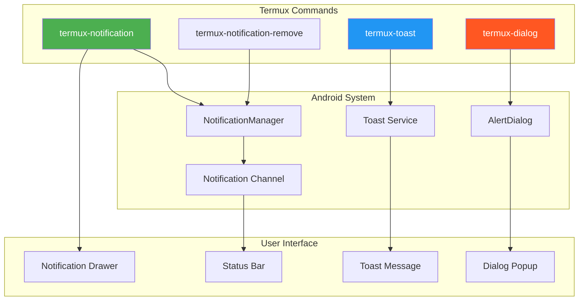
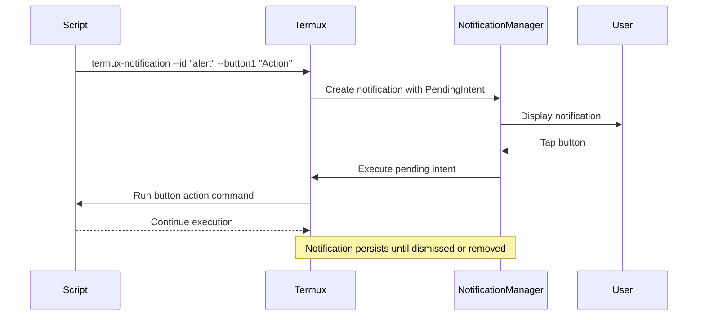
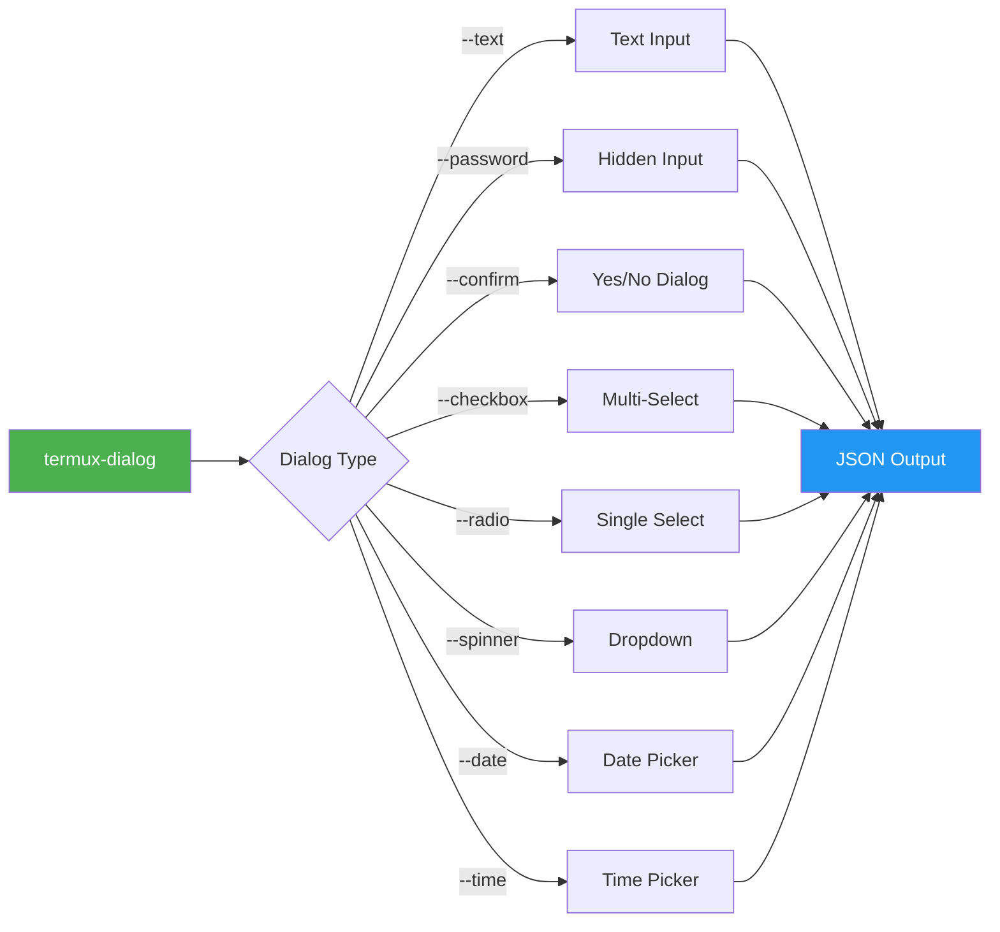

# 🔔 Chapter 21: Termux API - Notifications & Dialogs

```
╔══════════════════════════════════════════════════════════════════════════════╗
║                                                                              ║
║   ████████╗███████╗██████╗ ███╗   ███╗██╗███╗   ██╗ █████╗ ██╗               ║
║   ╚══██╔══╝██╔════╝██╔══██╗████╗ ████║██║████╗  ██║██╔══██╗██║               ║
║      ██║   █████╗  ██████╔╝██╔████╔██║██║██╔██╗ ██║███████║██║               ║
║      ██║   ██╔══╝  ██╔══██╗██║╚██╔╝██║██║██║╚██╗██║██╔══██║██║               ║
║      ██║   ███████╗██║  ██║██║ ╚═╝ ██║██║██║ ╚████║██║  ██║███████╗          ║
║      ╚═╝   ╚══════╝╚═╝  ╚═╝╚═╝     ╚═╝╚═╝╚═╝  ╚═══╝╚═╝  ╚═╝╚══════╝          ║
║                                                                              ║
║   ██████╗  █████╗ ██████╗ ██╗  ██╗███╗   ██╗███████╗                         ║
║   ██╔══██╗██╔══██╗██╔══██╗██║ ██╔╝████╗  ██║██╔════╝                         ║
║   ██████╔╝███████║██████╔╝█████╔╝ ██╔██╗ ██║█████╗                           ║
║   ██╔══██╗██╔══██║██╔══██╗██╔═██╗ ██║╚██╗██║██╔══╝                           ║
║   ██║  ██║██║  ██║██║  ██║██║  ██╗██║ ╚████║███████╗                         ║
║   ╚═╝  ╚═╝╚═╝  ╚═╝╚═╝  ╚═╝╚═╝  ╚═╝╚═╝  ╚═══╝╚══════╝                         ║
║                                                                              ║
║                   🔔 NOTIFICATIONS & DIALOGS CHAPTER 🔔                       ║
║                                                                              ║
╚══════════════════════════════════════════════════════════════════════════════╝
```

> **Module:** 4 - APIs  
> **Chapter:** 21 of 61  
> **Duration:** 15-20 Minutes  
> **Difficulty:** ⭐⭐ Intermediate  
> **Prerequisites:** Chapters 1-20 (All previous API chapters)  

---

## 📋 Chapter Overview

| Section | Content |
|---------|---------|
| Video Script | Complete Hindi narration with timestamps |
| Technical Guide | Detailed notifications & dialogs API |
| Commands Reference | All commands covered in chapter |
| Practice Exercises | Hands-on tasks |
| Troubleshooting | Common issues and solutions |
| Video Assets | Thumbnail, description, tags |

---

## 🎬 VIDEO SCRIPT (Complete Hindi Narration)

```
═══════════════════════════════════════════════════════════════════════════════
TERMUX FULL COURSE - CHAPTER 21
Title: Termux Notifications & Dialogs | Alert System Banayein | T3rmuxk1ng
Duration: 15-20 Minutes
═══════════════════════════════════════════════════════════════════════════════

[INTRO - 0:00 to 0:45]
─────────────────────────────────────────────────────────────────────────────

Namaskar Dosto! Welcome back to Termux Full Course by T3rmuxk1ng!

Aaj ka chapter bahut interesting hai - Notifications aur Dialogs!

Socho, aap koi script run kar rahe ho - background mein kuch kaam ho raha 
hai - aur jab kaam complete ho to aapko notification mile. Ya phir aap 
koi alert system bana rahe ho jo aapko remind kare. Ya phir user se input 
lena ho graphical dialog ke through.

Ye sab possible hai Termux API se! Aaj hum seekhenge:
- Notifications kaise create karte hain
- Toast messages kaise dikhate hain
- Dialog boxes kaise banate hain
- Reminder scripts kaise likhte hain
- Alert systems kaise banate hain

Ye sab features aapke scripts ko professional level pe le jaayenge.

To chaliye shuru karte hain!

---

[SECTION 1: TERMUX-NOTIFICATION BASICS - 0:45 to 4:30]
─────────────────────────────────────────────────────────────────────────────

Sabse pehle dekhte hain notifications.

Termux API mein notification create karne ke liye termux-notification 
command use hota hai.

Basic syntax dekho:

    termux-notification --title "My Title" --content "My Message"

[SCREEN: Running basic notification command]

Dekho, notification aaya! Phone ka notification panel swipe down karo - 
wahan notification dikhayi dega with title aur content.

Ab details mein samjhte hain saare options:

┌─────────────────────────────────────────────────────────────────────────┐
│                    NOTIFICATION OPTIONS                                   │
├──────────────────────┬──────────────────────────────────────────────────┤
│ Option               │ Description                                      │
├──────────────────────┼──────────────────────────────────────────────────┤
│ --title              │ Notification title (bold text)                   │
│ --content            │ Main message body                                │
│ --id                 │ Unique ID for notification                       │
│ --icon               │ Icon name or path                                │
│ --sound              │ Play notification sound                          │
│ --vibrate            │ Vibrate pattern (ms)                             │
│ --led-color          │ LED notification color                           │
│ --priority           │ high/low/max/min/default                         │
│ --ongoing            │ Persistent notification (can't swipe)            │
│ --button1            │ First button text                                │
│ --button2            │ Second button text                               │
│ --button3            │ Third button text                                │
│ --on-click           │ Command to run on tap                            │
│ --on-delete          │ Command when notification removed                │
└──────────────────────┴──────────────────────────────────────────────────┘

Chaliye kuch practical examples dekhein:

Example 1: Simple notification with sound:

    termux-notification \
        --title "Task Complete" \
        --content "Your script has finished execution" \
        --sound

Example 2: Notification with vibration:

    termux-notification \
        --title "Alert!" \
        --content "Security scan detected issues" \
        --vibrate 500,200,500

Ye pattern 500ms vibrate, 200ms pause, 500ms vibrate karega.

Example 3: High priority notification:

    termux-notification \
        --title "Important!" \
        --content "Server is down!" \
        --priority high \
        --sound \
        --vibrate 1000

High priority se notification top pe dikhega aur heads-up bhi aayega.

---

[SECTION 2: ONGOING NOTIFICATIONS - 4:30 to 7:00]
─────────────────────────────────────────────────────────────────────────────

Ab ek important concept - Ongoing Notifications!

Ye woh notifications hain jo user swipe karke dismiss nahi kar sakta. 
Ye background processes ke liye use hote hain - jaise music player, 
download progress, etc.

    termux-notification \
        --id "download_001" \
        --title "Downloading..." \
        --content "File: ubuntu.iso (45% complete)" \
        --ongoing \
        --priority low

[SCREEN: Ongoing notification demo]

Dekho, ye notification swipe se hatata nahi. Small icons ke saath 
"ongoing" category mein dikhta hai.

Remove karne ke liye termux-notification-remove command use karo:

    termux-notification-remove --id "download_001"

Notification ID important hai! Har notification ka unique ID hona 
chahiye taki usse specifically remove kar sako.

Practical example - Progress notification:

    # Download progress script
    for i in {1..100}; do
        termux-notification \
            --id "progress" \
            --title "Installing..." \
            --content "Progress: $i%" \
            --ongoing \
            --priority low
        sleep 0.5
    done
    
    # Complete notification
    termux-notification \
        --id "progress" \
        --title "Complete!" \
        --content "Installation finished successfully" \
        --sound
    
    # Remove after 3 seconds
    sleep 3
    termux-notification-remove --id "progress"

Ye script progress update karegi notification mein real-time!

---

[SECTION 3: NOTIFICATION ACTIONS & BUTTONS - 7:00 to 10:00]
─────────────────────────────────────────────────────────────────────────────

Ab dekhte hain notification actions - yaani buttons!

Aap notification mein buttons add kar sakte ho jo commands run karein 
jab user unpe click kare.

Example: Notification with action button:

    termux-notification \
        --id "server_alert" \
        --title "Server Alert" \
        --content "Server CPU usage: 95%" \
        --priority high \
        --sound \
        --button1 "Check Status" \
        --button1-action "ssh root@server 'top -n 1'" \
        --button2 "Restart" \
        --button2-action "ssh root@server 'reboot'"

[SCREEN: Notification with buttons]

Dekho, notification mein do buttons hain! "Check Status" dabane pe 
SSH se top command run hoga, "Restart" dabane pe server reboot hoga!

Another example - Download notification with open action:

    termux-notification \
        --id "download_done" \
        --title "Download Complete" \
        --content "file.pdf saved to Downloads" \
        --sound \
        --on-click "termux-open ~/storage/downloads/file.pdf"

On-click se jab user notification tap karega to file open hogi!

Complete action example with all options:

    termux-notification \
        --id "security_scan" \
        --title "Security Scan" \
        --content "3 vulnerabilities found" \
        --priority high \
        --sound \
        --vibrate 500,200,500 \
        --led-color FF0000 \
        --button1 "View Report" \
        --button1-action "cat ~/scan_report.txt" \
        --button2 "Ignore" \
        --button2-action "termux-notification-remove --id security_scan" \
        --on-delete "echo 'Notification dismissed'"

Ye notification:
- Red LED blink karega
- Vibrate karega
- Sound play karega
- Do buttons hain
- Delete pe command run karega

---

[SECTION 4: TERMUX-TOAST MESSAGES - 10:00 to 12:00]
─────────────────────────────────────────────────────────────────────────────

Ab dekhte hain Toast messages!

Toast ek chhota message hai jo screen ke bottom pe thodi der ke liye 
dikhta hai aur automatically disappear ho jaata hai.

Basic syntax:

    termux-toast "Hello World!"

[SCREEN: Toast message demo]

Options dekho:

┌─────────────────────────────────────────────────────────────────────────┐
│                    TOAST OPTIONS                                         │
├──────────────────────┬──────────────────────────────────────────────────┤
│ Option               │ Description                                      │
├──────────────────────┼──────────────────────────────────────────────────┤
│ (no option)          │ Short duration toast (default)                   │
│ --short              │ Short duration (2-3 seconds)                     │
│ --long               │ Long duration (4-5 seconds)                      │
│ --bgcolor            │ Background color (hex code)                      │
│ --textcolor          │ Text color (hex code)                            │
│ --position           │ top, middle, or bottom                           │
└──────────────────────┴──────────────────────────────────────────────────┘

Examples:

    # Basic toast
    termux-toast "Script started"

    # Long duration toast
    termux-toast --long "This is a longer message that stays for more time"

    # Colored toast
    termux-toast --bgcolor "#FF0000" --textcolor "#FFFFFF" "Error occurred!"

    # Top position toast
    termux-toast --position top "Success!"

    # Green success toast
    termux-toast --bgcolor "#4CAF50" --textcolor "#FFFFFF" "✓ Task completed!"

Toast best hai quick feedback ke liye. Script mein use karo:

    # In script
    termux-toast "Starting backup..."
    # ... backup operations ...
    termux-toast --bgcolor "#4CAF50" "Backup complete!"

---

[SECTION 5: TERMUX-DIALOG INPUT BOXES - 12:00 to 15:00]
─────────────────────────────────────────────────────────────────────────────

Ab sabse powerful feature - Dialog boxes!

Dialog boxes se aap user se graphical input le sakte ho - text, password, 
number, date, time - sab kuch!

Basic syntax:

    termux-dialog --title "Enter Name" --text "Your name:"

[SCREEN: Dialog box demo]

Ye ek input box open karega, user kuch type karega, OK button dabayega, 
aur output terminal pe print hoga.

Dialog types dekho:

┌─────────────────────────────────────────────────────────────────────────┐
│                    DIALOG TYPES                                          │
├──────────────────────┬──────────────────────────────────────────────────┤
│ Type                 │ Description                                      │
├──────────────────────┼──────────────────────────────────────────────────┤
│ --text               │ Simple text input (default)                      │
│ --password           │ Password input (hidden characters)               │
│ --number             │ Numeric input only                               │
│ --date               │ Date picker dialog                               │
│ --time               │ Time picker dialog                               │
│ --confirm            │ Yes/No confirmation dialog                       │
│ --checkbox           │ Multiple selection checkboxes                    │
│ --radio              │ Single selection radio buttons                   │
│ --spinner            │ Dropdown selection                               │
└──────────────────────┴──────────────────────────────────────────────────┘

Examples:

Example 1: Text input:

    name=$(termux-dialog --title "Name" --text "Enter your name:" | jq -r '.text')
    echo "Hello, $name!"

Example 2: Password input:

    pass=$(termux-dialog --title "Password" --password "Enter password:" | jq -r '.text')
    echo "Password received (length: ${#pass})"

Example 3: Number input:

    age=$(termux-dialog --title "Age" --number "Enter your age:" | jq -r '.text')
    echo "Age: $age"

Example 4: Date picker:

    date=$(termux-dialog --title "Select Date" --date | jq -r '.text')
    echo "Selected: $date"

Example 5: Time picker:

    time=$(termux-dialog --title "Select Time" --time | jq -r '.text')
    echo "Selected: $time"

Example 6: Confirmation dialog:

    result=$(termux-dialog --title "Confirm" --confirm "Delete all files?" | jq -r '.text')
    if [ "$result" = "yes" ]; then
        echo "Deleting..."
    else
        echo "Cancelled"
    fi

Example 7: Checkbox selection:

    result=$(termux-dialog --title "Select Tools" --checkbox "Nmap|Hydra|SQLMap|Metasploit")
    echo "Selected: $result"

Example 8: Radio button:

    choice=$(termux-dialog --title "Choose" --radio "Option 1|Option 2|Option 3" | jq -r '.text')
    echo "You chose: $choice"

Example 9: Spinner (dropdown):

    item=$(termux-dialog --title "Select" --spinner "Python|Node.js|Ruby|Go" | jq -r '.text')
    echo "Language: $item"

Note: Dialog output JSON format mein aata hai. jq command se text extract 
karte hain. Agar jq installed nahi hai:

    pkg install jq

Dialog output format:

    {
        "text": "user input here",
        "code": 0
    }

Code -1 ya -2 hai to user ne cancel kiya ya dialog dismiss kiya.

---

[SECTION 6: CREATING REMINDER SCRIPT - 15:00 to 17:00]
─────────────────────────────────────────────────────────────────────────────

Ab ek practical project banate hain - Reminder System!

[SCREEN: reminder.sh script]

    #!/bin/bash
    # reminder.sh - Simple reminder system
    
    # Get reminder details
    title=$(termux-dialog --title "Reminder Title" --text "What to remind?" | jq -r '.text')
    
    if [ -z "$title" ] || [ "$title" = "null" ]; then
        termux-toast "Cancelled"
        exit 1
    fi
    
    # Get time in minutes
    mins=$(termux-dialog --title "Time" --number "Remind after (minutes):" | jq -r '.text')
    
    if [ -z "$mins" ] || [ "$mins" = "null" ]; then
        termux-toast "Cancelled"
        exit 1
    fi
    
    # Confirmation
    termux-toast "Reminder set for $mins minutes"
    
    # Wait
    sleep $((mins * 60))
    
    # Show notification
    termux-notification \
        --id "reminder_$RANDOM" \
        --title "⏰ Reminder!" \
        --content "$title" \
        --priority high \
        --sound \
        --vibrate 1000,500,1000
    
    # Speak reminder (optional)
    termux-tts-speak "Reminder: $title"

Run karo:

    chmod +x reminder.sh
    ./reminder.sh

[SCREEN: Setting reminder demo]

Dialog box aayega, title enter karo, time enter karo. Script background 
mein wait karegi, phir notification aayega!

Advanced reminder with multiple options:

    #!/bin/bash
    # advanced-reminder.sh
    
    echo "=== Advanced Reminder System ==="
    echo "1. One-time reminder"
    echo "2. Recurring reminder"
    echo "3. Task reminder"
    read -p "Choice: " choice
    
    case $choice in
        1)
            title=$(termux-dialog --title "Reminder" --text "What?" | jq -r '.text')
            mins=$(termux-dialog --title "Time" --number "Minutes:" | jq -r '.text')
            sleep $((mins * 60))
            termux-notification --title "Reminder" --content "$title" --sound
            ;;
        2)
            title=$(termux-dialog --title "Recurring" --text "What?" | jq -r '.text')
            interval=$(termux-dialog --title "Interval" --number "Minutes:" | jq -r '.text')
            while true; do
                sleep $((interval * 60))
                termux-notification --title "Recurring" --content "$title" --sound --vibrate 500
            done
            ;;
        3)
            # Task-based reminder
            echo "Starting task..."
            termux-toast "Task started"
            # Your task here
            sleep 10  # Simulating work
            termux-notification --title "Task Done!" --content "Your task completed" --sound
            ;;
    esac

---

[SECTION 7: NOTIFICATION WITH PYTHON - 17:00 to 19:00]
─────────────────────────────────────────────────────────────────────────────

Ab dekhte hain Python se notifications kaise banate hain!

[SCREEN: Python notification demo]

    #!/usr/bin/env python3
    # notify.py - Python notification module
    
    import subprocess
    import json
    import time
    
    def send_notification(title, content, **kwargs):
        """Send a notification from Python"""
        cmd = ['termux-notification', 
               '--title', title, 
               '--content', content]
        
        if kwargs.get('sound'):
            cmd.append('--sound')
        if kwargs.get('vibrate'):
            cmd.extend(['--vibrate', str(kwargs['vibrate'])])
        if kwargs.get('id'):
            cmd.extend(['--id', str(kwargs['id'])])
        if kwargs.get('ongoing'):
            cmd.append('--ongoing')
        if kwargs.get('priority'):
            cmd.extend(['--priority', kwargs['priority']])
        if kwargs.get('led_color'):
            cmd.extend(['--led-color', kwargs['led_color']])
        if kwargs.get('button1'):
            cmd.extend(['--button1', kwargs['button1']])
        if kwargs.get('button1_action'):
            cmd.extend(['--button1-action', kwargs['button1_action']])
        
        subprocess.run(cmd)
    
    def send_toast(message, **kwargs):
        """Send a toast message"""
        cmd = ['termux-toast']
        if kwargs.get('long'):
            cmd.append('--long')
        if kwargs.get('bgcolor'):
            cmd.extend(['--bgcolor', kwargs['bgcolor']])
        if kwargs.get('textcolor'):
            cmd.extend(['--textcolor', kwargs['textcolor']])
        cmd.append(message)
        subprocess.run(cmd)
    
    def get_dialog_input(title, **kwargs):
        """Get input from dialog"""
        cmd = ['termux-dialog', '--title', title]
        if kwargs.get('text'):
            cmd.extend(['--text', kwargs['text']])
        if kwargs.get('password'):
            cmd.extend(['--password', kwargs['password']])
        if kwargs.get('number'):
            cmd.extend(['--number', kwargs['number']])
        
        result = subprocess.run(cmd, capture_output=True, text=True)
        data = json.loads(result.stdout)
        return data.get('text'), data.get('code')
    
    # Usage examples
    if __name__ == "__main__":
        # Simple notification
        send_notification("Hello", "This is from Python!", sound=True)
        
        # Progress notification
        for i in range(101):
            send_notification(
                "Downloading",
                f"Progress: {i}%",
                id="progress",
                ongoing=True
            )
            time.sleep(0.1)
        
        # Remove progress notification
        subprocess.run(['termux-notification-remove', '--id', 'progress'])
        
        # Success notification
        send_notification(
            "Complete",
            "Download finished!",
            sound=True,
            vibrate=500,
            priority="high"
        )
        
        # Colored toast
        send_toast("Success!", bgcolor="#4CAF50", textcolor="#FFFFFF")
        
        # Get user input
        name, code = get_dialog_input("Enter Name", text="Your name:")
        if code == 0:
            send_toast(f"Hello, {name}!")

Run karo:

    python notify.py

Ye Python module aap kisi bhi Python script mein import kar sakte ho!

---

[SECTION 8: ALERT SYSTEM SCRIPT - 19:00 to 21:00]
─────────────────────────────────────────────────────────────────────────────

Ab ek complete Alert System banate hain!

[SCREEN: alert_system.sh]

    #!/bin/bash
    # alert_system.sh - Complete alert and notification system
    
    CONFIG_DIR="$HOME/.config/alerts"
    mkdir -p "$CONFIG_DIR"
    
    show_menu() {
        clear
        echo "╔════════════════════════════════════╗"
        echo "║     ALERT SYSTEM v1.0              ║"
        echo "║     by T3rmuxk1ng                  ║"
        echo "╠════════════════════════════════════╣"
        echo "║ 1. Quick Notification              ║"
        echo "║ 2. Scheduled Notification          ║"
        echo "║ 3. Recurring Reminder              ║"
        echo "║ 4. Battery Alert                   ║"
        echo "║ 5. Network Monitor Alert           ║"
        echo "║ 6. Custom Alert                    ║"
        echo "║ 7. View Active Alerts              ║"
        echo "║ 8. Clear All Notifications         ║"
        echo "║ 0. Exit                            ║"
        echo "╚════════════════════════════════════╝"
    }
    
    quick_notification() {
        title=$(termux-dialog --title "Title" --text "Notification title:" | jq -r '.text')
        content=$(termux-dialog --title "Content" --text "Message:" | jq -r '.text')
        
        termux-notification \
            --title "$title" \
            --content "$content" \
            --sound \
            --vibrate 500
        
        termux-toast --bgcolor "#4CAF50" "Notification sent!"
    }
    
    scheduled_notification() {
        title=$(termux-dialog --title "Title" --text "Reminder:" | jq -r '.text')
        mins=$(termux-dialog --title "Time" --number "Minutes from now:" | jq -r '.text')
        
        if [[ "$mins" =~ ^[0-9]+$ ]]; then
            (
                sleep $((mins * 60))
                termux-notification \
                    --id "scheduled_$RANDOM" \
                    --title "⏰ Scheduled" \
                    --content "$title" \
                    --priority high \
                    --sound \
                    --vibrate 1000,500,1000
                termux-tts-speak "Reminder: $title"
            ) &
            
            echo "$!:$title" >> "$CONFIG_DIR/scheduled.txt"
            termux-toast "Scheduled for $mins minutes"
        fi
    }
    
    recurring_reminder() {
        title=$(termux-dialog --title "Reminder" --text "What to remind?" | jq -r '.text')
        interval=$(termux-dialog --title "Interval" --number "Minutes:" | jq -r '.text')
        
        if [[ "$interval" =~ ^[0-9]+$ ]]; then
            (
                while true; do
                    sleep $((interval * 60))
                    termux-notification \
                        --id "recurring_$RANDOM" \
                        --title "🔄 Recurring" \
                        --content "$title" \
                        --sound \
                        --vibrate 500
                done
            ) &
            
            echo "$!:$title:$interval" >> "$CONFIG_DIR/recurring.txt"
            termux-toast "Recurring reminder set"
        fi
    }
    
    battery_alert() {
        level=$(termux-battery-status | jq -r '.percentage')
        status=$(termux-battery-status | jq -r '.status')
        
        echo "Battery: $level% ($status)"
        
        if [ "$level" -lt 20 ] && [ "$status" = "DISCHARGING" ]; then
            termux-notification \
                --id "battery_low" \
                --title "⚠️ Low Battery!" \
                --content "Battery at $level% - Please charge!" \
                --priority high \
                --sound \
                --vibrate 1000,500,1000,500,1000 \
                --led-color FF0000 \
                --ongoing
        elif [ "$level" -gt 90 ] && [ "$status" = "CHARGING" ]; then
            termux-notification \
                --id "battery_full" \
                --title "🔋 Battery Full!" \
                --content "Battery at $level% - Unplug charger" \
                --sound \
                --vibrate 500
        else
            termux-toast "Battery: $level% ($status)"
        fi
    }
    
    network_monitor() {
        termux-toast "Starting network monitor..."
        
        while true; do
            if ping -c 1 -W 2 google.com &> /dev/null; then
                # Network is up
                termux-notification-remove --id "network_down" 2>/dev/null
            else
                # Network is down
                termux-notification \
                    --id "network_down" \
                    --title "⚠️ Network Down!" \
                    --content "Internet connection lost!" \
                    --priority high \
                    --sound \
                    --vibrate 500,200,500,200,500 \
                    --led-color FF0000 \
                    --ongoing
            fi
            sleep 30
        done
    }
    
    custom_alert() {
        echo "Select alert type:"
        echo "1. Server monitoring"
        echo "2. File change alert"
        echo "3. Process monitoring"
        read -p "Choice: " choice
        
        case $choice in
            1)
                server=$(termux-dialog --title "Server" --text "IP or hostname:" | jq -r '.text')
                (
                    while true; do
                        if ! ping -c 1 -W 2 "$server" &> /dev/null; then
                            termux-notification \
                                --title "🚨 Server Down!" \
                                --content "$server is not responding!" \
                                --priority high \
                                --sound \
                                --vibrate 1000,500,1000
                        fi
                        sleep 60
                    done
                ) &
                termux-toast "Monitoring $server"
                ;;
            2)
                file=$(termux-dialog --title "File" --text "File path:" | jq -r '.text')
                if [ -f "$file" ]; then
                    original_md5=$(md5sum "$file" | cut -d' ' -f1)
                    (
                        while true; do
                            sleep 10
                            current_md5=$(md5sum "$file" | cut -d' ' -f1)
                            if [ "$original_md5" != "$current_md5" ]; then
                                termux-notification \
                                    --title "📁 File Changed!" \
                                    --content "$file has been modified!" \
                                    --priority high \
                                    --sound
                                original_md5="$current_md5"
                            fi
                        done
                    ) &
                    termux-toast "Monitoring $file"
                else
                    termux-toast --bgcolor "#FF0000" "File not found!"
                fi
                ;;
            3)
                process=$(termux-dialog --title "Process" --text "Process name:" | jq -r '.text')
                (
                    while true; do
                        if ! pgrep -x "$process" > /dev/null; then
                            termux-notification \
                                --title "⚠️ Process Stopped!" \
                                --content "$process is not running!" \
                                --priority high \
                                --sound
                        fi
                        sleep 30
                    done
                ) &
                termux-toast "Monitoring $process"
                ;;
        esac
    }
    
    view_active() {
        echo "=== Active Alerts ==="
        echo ""
        echo "Scheduled:"
        cat "$CONFIG_DIR/scheduled.txt" 2>/dev/null || echo "  None"
        echo ""
        echo "Recurring:"
        cat "$CONFIG_DIR/recurring.txt" 2>/dev/null || echo "  None"
        echo ""
        read -p "Press Enter to continue..."
    }
    
    clear_all() {
        termux-notification-remove --id "battery_low" 2>/dev/null
        termux-notification-remove --id "battery_full" 2>/dev/null
        termux-notification-remove --id "network_down" 2>/dev/null
        
        # Kill background processes
        pkill -f "sleep.*termux-notification" 2>/dev/null
        
        rm -f "$CONFIG_DIR/scheduled.txt" "$CONFIG_DIR/recurring.txt"
        
        termux-toast --bgcolor "#4CAF50" "All alerts cleared!"
    }
    
    # Main loop
    while true; do
        show_menu
        read -p "Choice: " choice
        
        case $choice in
            1) quick_notification ;;
            2) scheduled_notification ;;
            3) recurring_reminder ;;
            4) battery_alert ;;
            5) network_monitor ;;
            6) custom_alert ;;
            7) view_active ;;
            8) clear_all ;;
            0) 
                termux-toast "Goodbye!"
                exit 0 
                ;;
            *) 
                termux-toast --bgcolor "#FF0000" "Invalid choice!"
                ;;
        esac
    done

Run karo:

    chmod +x alert_system.sh
    ./alert_system.sh

[SCREEN: Alert system menu demo]

Ye ek complete alert system hai with menu-driven interface!

---

[SECTION 9: SUMMARY & NEXT PREVIEW - 21:00 to 22:30]
─────────────────────────────────────────────────────────────────────────────

To dosto, Chapter 21 complete! Let's summarize:

✅ termux-notification - Notifications create karna
✅ Notification options - title, content, sound, vibrate, led, priority
✅ Ongoing notifications - Swipe se na hatne wale
✅ Notification actions - Buttons aur on-click commands
✅ termux-toast - Quick popup messages
✅ termux-dialog - User input lene wale dialogs
✅ Dialog types - text, password, number, date, time, confirm, checkbox, radio, spinner
✅ Reminder scripts - Time-based alerts
✅ Python notifications - Python se notifications
✅ Alert system - Complete monitoring system

Important Commands yaad rakhein:

┌─────────────────────────────────────────────────────────────────────────┐
│                    CHAPTER 21 - IMPORTANT COMMANDS                       │
├─────────────────────────────────────────────────────────────────────────┤
│ termux-notification --title "X" --content "Y"  │ Basic notification     │
│ termux-notification --ongoing --id "X"         │ Persistent notification│
│ termux-notification --sound --vibrate 500      │ Sound + vibration     │
│ termux-notification --button1 "X" --button1-action "cmd" │ With button │
│ termux-notification-remove --id "X"            │ Remove notification   │
│ termux-toast "Message"                         │ Toast message         │
│ termux-toast --long --bgcolor "#FF0000" "X"    │ Colored toast         │
│ termux-dialog --text "Prompt"                  │ Text input dialog     │
│ termux-dialog --password "Enter:"              │ Password dialog       │
│ termux-dialog --confirm "Sure?"                │ Yes/No dialog         │
│ termux-dialog --date                           │ Date picker           │
│ termux-dialog --time                           │ Time picker           │
└─────────────────────────────────────────────────────────────────────────┘

Next Chapter 22 mein hum seekhenge:
- Termux API for Contacts
- SMS sending and reading
- Call logs access
- Phone state information
- SMS automation scripts

Agar ye video helpful lagi, to:
👍 Like button press karein
🔔 Subscribe karein, notification bell on karein
💬 Koi sawal ho to comment mein poochein
📤 Share karein friends ke saath

Main har comment ka reply karta hoon.

Thank you for watching! See you in Chapter 22!

═══════════════════════════════════════════════════════════════════════════════
```

---

## 📖 TECHNICAL GUIDE

### 1. Notification System Architecture

```
┌─────────────────────────────────────────────────────────────────────────┐
│                    NOTIFICATION FLOW                                     │
├─────────────────────────────────────────────────────────────────────────┤
│                                                                          │
│   ┌───────────────────┐                                                 │
│   │  Termux Script    │                                                 │
│   │  termux-notification                                                │
│   └─────────┬─────────┘                                                 │
│             │                                                            │
│             ▼                                                            │
│   ┌───────────────────┐                                                 │
│   │  Termux:API App   │                                                 │
│   │  (Bridge Service) │                                                 │
│   └─────────┬─────────┘                                                 │
│             │                                                            │
│             ▼                                                            │
│   ┌───────────────────┐                                                 │
│   │  Android System   │                                                 │
│   │  NotificationMgr  │                                                 │
│   └─────────┬─────────┘                                                 │
│             │                                                            │
│             ▼                                                            │
│   ┌───────────────────┐                                                 │
│   │  User Interface   │                                                 │
│   │  ┌─────────────┐  │                                                 │
│   │  │ Title       │  │                                                 │
│   │  │ Content     │  │                                                 │
│   │  │ [Button 1]  │  │                                                 │
│   │  │ [Button 2]  │  │                                                 │
│   │  └─────────────┘  │                                                 │
│   └───────────────────┘                                                 │
│                                                                          │
└─────────────────────────────────────────────────────────────────────────┘
```

### 2. Notification Priority Levels

| Priority | Behavior |
|----------|----------|
| `max` | Heads-up notification, always on top |
| `high` | Heads-up notification, prominent position |
| `default` | Normal notification in shade |
| `low` | Minimal notification, collapsed by default |
| `min` | Only in notification shade, minimal visual |

### 3. LED Color Codes

```bash
# Common LED colors
FF0000    # Red (alerts, errors)
00FF00    # Green (success)
0000FF    # Blue (information)
FFFF00    # Yellow (warnings)
FF00FF    # Magenta
00FFFF    # Cyan
FFFFFF    # White
```

### 4. Vibration Patterns

```bash
# Pattern format: duration_ms,pause_ms,duration_ms,...
# Single vibration
--vibrate 500

# Double vibration
--vibrate 500,200,500

# Triple vibration (urgent)
--vibrate 500,100,500,100,500

# Long pulse
--vibrate 1000

# SOS pattern
--vibrate 300,100,300,100,300,300,100,300,100,300,300,100,300,100,300
```

### 5. Dialog Output Format

```json
// Success response
{
    "text": "user input",
    "code": 0
}

// Cancelled response
{
    "text": "",
    "code": -1
}

// Dismissed response
{
    "text": "",
    "code": -2
}
```

---

## 📋 COMMANDS REFERENCE

### Notification Commands

```bash
# Basic notification
termux-notification --title "Title" --content "Message"

# With sound and vibration
termux-notification --title "Alert" --content "Message" --sound --vibrate 500

# High priority with LED
termux-notification --title "Important" --content "Message" \
    --priority high --led-color FF0000

# Ongoing notification
termux-notification --id "my_id" --title "Running" --content "Processing..." --ongoing

# Remove notification
termux-notification-remove --id "my_id"

# With action buttons
termux-notification --title "Alert" --content "Server down" \
    --button1 "Check" --button1-action "ssh server" \
    --button2 "Ignore" --button2-action "echo ignored"

# With on-click action
termux-notification --title "Download" --content "Complete" \
    --on-click "termux-open ~/downloads/file.pdf"

# With on-delete action
termux-notification --title "Alert" --content "Message" \
    --on-delete "echo 'Notification dismissed'"

# Complete example
termux-notification \
    --id "alert_001" \
    --title "Security Alert" \
    --content "Intrusion detected on port 22" \
    --priority high \
    --sound \
    --vibrate 500,200,500 \
    --led-color FF0000 \
    --button1 "Investigate" \
    --button1-action "ssh root@server 'tail -100 /var/log/auth.log'" \
    --button2 "Block IP" \
    --button2-action "ssh root@server 'iptables -A INPUT -s \$IP -j DROP'" \
    --on-delete "echo 'Alert dismissed'"
```

### Toast Commands

```bash
# Basic toast
termux-toast "Hello World"

# Long duration
termux-toast --long "This message stays longer"

# Colored toast
termux-toast --bgcolor "#4CAF50" --textcolor "#FFFFFF" "Success!"

# Error toast (red background)
termux-toast --bgcolor "#F44336" --textcolor "#FFFFFF" "Error occurred!"

# Warning toast (yellow background)
termux-toast --bgcolor "#FF9800" --textcolor "#000000" "Warning!"

# Top position
termux-toast --position top "Top message"

# Middle position
termux-toast --position middle "Center message"
```

### Dialog Commands

```bash
# Text input
termux-dialog --title "Enter Name" --text "Your name:"

# Password input
termux-dialog --title "Password" --password "Enter password:"

# Number input
termux-dialog --title "Age" --number "Enter your age:"

# Date picker
termux-dialog --title "Select Date" --date

# Time picker
termux-dialog --title "Select Time" --time

# Confirmation (Yes/No)
termux-dialog --title "Confirm" --confirm "Are you sure?"

# Checkbox (multiple selection)
termux-dialog --title "Select" --checkbox "Option 1|Option 2|Option 3"

# Radio (single selection)
termux-dialog --title "Choose" --radio "Python|Node.js|Ruby"

# Spinner (dropdown)
termux-dialog --title "Select" --spinner "First|Second|Third"

# Multi-option input
termux-dialog --title "Input" --text "Enter value:" --input-method hidden

# Process dialog output with jq
result=$(termux-dialog --title "Name" --text "Enter:" | jq -r '.text')
echo "You entered: $result"

# Check if cancelled
output=$(termux-dialog --title "Name" --text "Enter:")
text=$(echo "$output" | jq -r '.text')
code=$(echo "$output" | jq -r '.code')
if [ "$code" -eq 0 ]; then
    echo "Entered: $text"
else
    echo "Cancelled"
fi
```

---

## 💻 PRACTICE EXERCISES

### Exercise 1: Basic Notification System

```bash
#!/bin/bash
# Exercise: Create a notification with custom options

# Task 1: Create simple notification
termux-notification --title "Task 1" --content "Basic notification created"

# Task 2: Add sound and vibration
termux-notification \
    --title "Task 2" \
    --content "With sound and vibration" \
    --sound \
    --vibrate 500

# Task 3: Create high priority with LED
termux-notification \
    --title "Task 3" \
    --content "High priority alert" \
    --priority high \
    --led-color FF0000

# Task 4: Create ongoing notification
termux-notification \
    --id "task4_ongoing" \
    --title "Task 4" \
    --content "Ongoing notification" \
    --ongoing

# Task 5: Remove the ongoing notification
sleep 5
termux-notification-remove --id "task4_ongoing"

echo "All tasks completed!"
```

### Exercise 2: Interactive Dialog Script

```bash
#!/bin/bash
# Exercise: Create interactive form using dialogs

echo "=== User Registration Form ==="

# Get name
name=$(termux-dialog --title "Step 1/4" --text "Enter your name:" | jq -r '.text')
[ "$name" = "null" ] && termux-toast "Cancelled" && exit 1

# Get email
email=$(termux-dialog --title "Step 2/4" --text "Enter email:" | jq -r '.text')
[ "$email" = "null" ] && termux-toast "Cancelled" && exit 1

# Get age
age=$(termux-dialog --title "Step 3/4" --number "Enter age:" | jq -r '.text')
[ "$age" = "null" ] && termux-toast "Cancelled" && exit 1

# Get gender using radio
gender=$(termux-dialog --title "Step 4/4" --radio "Male|Female|Other" | jq -r '.text')
[ "$gender" = "null" ] && termux-toast "Cancelled" && exit 1

# Confirm
confirm=$(termux-dialog --title "Confirm" --confirm "Submit registration?" | jq -r '.text')

if [ "$confirm" = "yes" ]; then
    # Save data
    echo "Name: $name" > ~/registration.txt
    echo "Email: $email" >> ~/registration.txt
    echo "Age: $age" >> ~/registration.txt
    echo "Gender: $gender" >> ~/registration.txt
    
    # Success notification
    termux-notification \
        --title "Registration Complete!" \
        --content "Welcome, $name!" \
        --sound \
        --vibrate 500
else
    termux-toast "Registration cancelled"
fi
```

### Exercise 3: Countdown Timer

```bash
#!/bin/bash
# Exercise: Create countdown timer with notifications

# Get countdown time
mins=$(termux-dialog --title "Timer" --number "Minutes:" | jq -r '.text')
[ "$mins" = "null" ] && exit 1

secs=$((mins * 60))

# Countdown with progress notification
while [ $secs -gt 0 ]; do
    remaining=$((secs / 60))
    remaining_secs=$((secs % 60))
    
    termux-notification \
        --id "timer" \
        --title "⏱️ Timer Running" \
        --content "$remaining:$remaining_secs remaining" \
        --ongoing \
        --priority low
    
    sleep 1
    ((secs--))
done

# Timer complete
termux-notification \
    --id "timer" \
    --title "⏰ Time's Up!" \
    --content "Countdown complete!" \
    --priority high \
    --sound \
    --vibrate 1000,500,1000

# Optional: Speak
termux-tts-speak "Time is up!"

# Remove after 10 seconds
sleep 10
termux-notification-remove --id "timer"
```

### Exercise 4: Notification Logger

```bash
#!/bin/bash
# Exercise: Log all notifications to file

LOG_FILE="$HOME/notification_log.txt"

# Create log entry function
log_notification() {
    echo "[$(date '+%Y-%m-%d %H:%M:%S')] $1" >> "$LOG_FILE"
}

# Example usage
log_notification "Starting notification logger"

# Monitor script with notifications
for i in {1..5}; do
    termux-notification \
        --id "logger_$i" \
        --title "Notification $i" \
        --content "Test notification #$i" \
        --on-delete "echo '[$(date)] Notification $i dismissed' >> $LOG_FILE"
    
    log_notification "Created notification $i"
    sleep 2
done

# View log
echo "=== Notification Log ==="
cat "$LOG_FILE"
```

### Exercise 5: Password Manager Dialog

```bash
#!/bin/bash
# Exercise: Simple password manager with dialogs

PASS_FILE="$HOME/.passwords.txt"
touch "$PASS_FILE"

add_password() {
    service=$(termux-dialog --title "Service" --text "Website/App name:" | jq -r '.text')
    [ "$service" = "null" ] && return
    
    username=$(termux-dialog --title "Username" --text "Username:" | jq -r '.text')
    [ "$username" = "null" ] && return
    
    password=$(termux-dialog --title "Password" --password "Enter password:" | jq -r '.text')
    [ "$password" = "null" ] && return
    
    echo "$service:$username:$password" >> "$PASS_FILE"
    
    termux-toast --bgcolor "#4CAF50" "Password saved!"
}

get_password() {
    services=$(cut -d: -f1 "$PASS_FILE" | tr '\n' '|')
    service=$(termux-dialog --title "Select" --spinner "$services" | jq -r '.text')
    
    if [ "$service" != "null" ]; then
        entry=$(grep "^$service:" "$PASS_FILE")
        username=$(echo "$entry" | cut -d: -f2)
        password=$(echo "$entry" | cut -d: -f3)
        
        termux-notification \
            --title "$service" \
            --content "Username: $username\nPassword: $password" \
            --button1 "Copy Password" \
            --button1-action "echo -n '$password' | termux-clipboard-set"
    fi
}

# Main menu
while true; do
    action=$(termux-dialog --title "Password Manager" --radio "Add Password|Get Password|Exit" | jq -r '.text')
    
    case "$action" in
        "Add Password") add_password ;;
        "Get Password") get_password ;;
        "Exit") break ;;
    esac
done
```

---

## ⚠️ TROUBLESHOOTING

### Problem 1: Notifications not appearing

```bash
# Cause: Termux:API not installed or no notification permission

# Solution 1: Check Termux:API installation
pkg list-installed | grep termux-api
# If not installed:
pkg install termux-api

# Solution 2: Check notification permission
# Go to: Settings → Apps → Termux:API → Notifications → Enable

# Solution 3: Check Android notification settings
# Settings → Apps → Termux:API → Notifications → Make sure all are enabled

# Solution 4: Test notification
termux-notification --title "Test" --content "Testing notifications"
```

### Problem 2: Notification sound not playing

```bash
# Cause: System sound settings or notification channel settings

# Solution 1: Check system volume
# Increase notification volume in Android settings

# Solution 2: Check Do Not Disturb mode
# Make sure DND is off or Termux is allowed

# Solution 3: Use different sound method
termux-notification --title "Alert" --content "Message" --sound

# Alternative: Use media player for sound
termux-notification --title "Alert" --content "Message" && \
    play-audio /path/to/sound.mp3
```

### Problem 3: Dialog output parsing errors

```bash
# Cause: jq not installed or incorrect parsing

# Solution 1: Install jq
pkg install jq

# Solution 2: Correct parsing
output=$(termux-dialog --title "Test" --text "Enter:")
text=$(echo "$output" | jq -r '.text')
code=$(echo "$output" | jq -r '.code')

# Solution 3: Handle null values
text=$(termux-dialog --title "Test" --text "Enter:" | jq -r '.text // "default"')

# Solution 4: Debug output
termux-dialog --title "Test" --text "Enter:"
# Check raw output format
```

### Problem 4: Notification buttons not working

```bash
# Cause: Incorrect command format or permission issues

# Solution 1: Use correct button action syntax
termux-notification \
    --title "Test" \
    --content "Message" \
    --button1 "Open" \
    --button1-action "am start -a android.intent.action.VIEW -d https://google.com"

# Solution 2: Use termux-run command for Termux commands
termux-notification \
    --title "Test" \
    --content "Message" \
    --button1 "Run" \
    --button1-action "run-termux-command echo 'Hello'"

# Solution 3: Test with simple command
termux-notification \
    --title "Test" \
    --content "Message" \
    --button1 "Test" \
    --button1-action "toast 'Button clicked'"
```

### Problem 5: Ongoing notification cannot be removed

```bash
# Cause: Wrong ID or multiple notifications

# Solution 1: Use correct ID
termux-notification --id "my_notification" --title "Test" --content "Message" --ongoing
termux-notification-remove --id "my_notification"

# Solution 2: List and identify notification
# Note: There's no direct way to list, so track IDs carefully

# Solution 3: Use unique IDs
id="notify_$(date +%s)"
termux-notification --id "$id" --title "Test" --content "Message" --ongoing
# Later...
termux-notification-remove --id "$id"

# Solution 4: Kill Termux:API to clear all (extreme)
pkill -f termux-api
```

### Problem 6: Toast messages not visible

```bash
# Cause: Toast duration too short or system blocking

# Solution 1: Use longer duration
termux-toast --long "This message will stay longer"

# Solution 2: Change position
termux-toast --position top "Top position"
termux-toast --position middle "Middle position"

# Solution 3: Check Android notification access
# Settings → Apps → Special access → Notification access

# Solution 4: Use notification instead for important messages
termux-notification --title "Alert" --content "Important message"
```

---

## 🎬 VIDEO ASSETS

### Thumbnail Concepts

**Option A: Clean & Professional**
```
┌────────────────────────────────────┐
│  [Green Terminal Background]       │
│                                    │
│   🔔 NOTIFICATIONS                 │
│   & DIALOGS                        │
│                                    │
│   ✓ termux-notification            │
│   ✓ Toast Messages                 │
│   ✓ Input Dialogs                  │
│                                    │
│   [T3rmuxk1ng Logo]                │
└────────────────────────────────────┘
```

**Option B: Alert Style**
```
┌────────────────────────────────────┐
│  ⚠️ ALERT SYSTEM!                  │
│                                    │
│  ┌──────────────────────────┐      │
│  │ 📱 New Notification      │      │
│  │ Your script completed!   │      │
│  │ [View] [Dismiss]         │      │
│  └──────────────────────────┘      │
│                                    │
│  Chapter 21 | T3rmuxk1ng           │
└────────────────────────────────────┘
```

**Option C: Feature Focus**
```
┌────────────────────────────────────┐
│  TERMUX API                         │
│  ═══════════════                    │
│                                    │
│  📢 Notifications                  │
│  💬 Toast Messages                 │
│  📝 Dialog Boxes                   │
│  ⏰ Reminders                      │
│                                    │
│  Complete Guide!                   │
│  Chapter 21                        │
└────────────────────────────────────┘
```

### Video Description Template

```markdown
📱 Termux Full Course - Chapter 21: Notifications & Dialogs | Complete API Guide

🔥 In this video you'll learn:
• termux-notification complete guide
• Toast messages creation
• Dialog boxes for user input
• Notification actions and buttons
• Reminder system creation
• Python notification integration
• Complete Alert System project

⏱️ Timestamps:
0:00 - Introduction
0:45 - Notification Basics
4:30 - Ongoing Notifications
7:00 - Notification Actions & Buttons
10:00 - Toast Messages
12:00 - Dialog Input Boxes
15:00 - Reminder Script
17:00 - Python Notifications
19:00 - Alert System Project
21:00 - Summary

📝 Commands from this video:
termux-notification --title "X" --content "Y"
termux-toast "Message"
termux-dialog --text "Enter:"
termux-notification-remove --id "X"

📥 Required Installation:
pkg install termux-api jq

📚 Full Course Playlist:
[PLAYLIST LINK]

📱 Follow T3rmuxk1ng:
• YouTube: @T3rmuxk1ng
• Telegram: [LINK]
• GitHub: [LINK]

#Termux #TermuxAPI #Notifications #TermuxCourse #T3rmuxk1ng #TermuxDialog #AndroidAutomation

---
⚠️ Disclaimer: This video is for educational purposes. Use tools responsibly.
```

### Tags List

```
termux, termux api, termux notification, termux dialog, 
termux toast, termux alerts, termux reminder, termux course,
termux full course, termux hindi, termux tutorial hindi,
android notifications, termux automation, termux scripting,
termux python notifications, termux api tutorial, t3rmuxk1ng,
mobile automation, android terminal, termux chapter 21
```

### Hashtags

```
#Termux #TermuxAPI #TermuxNotification #TermuxDialog #AndroidNotifications 
#TermuxCourse #TermuxHindi #AndroidAutomation #TermuxTutorial #T3rmuxk1ng 
#TermuxScripting #MobileHacking #EthicalHacking #LearnTermux
```

---

## 📚 ADDITIONAL RESOURCES

### Official Documentation

| Resource | Link |
|----------|------|
| Termux:API Wiki | https://wiki.termux.com/wiki/Termux:API |
| Notification docs | https://developer.android.com/guide/topics/ui/notifiers/notifications |
| Termux GitHub | https://github.com/termux/termux-api |

### Related Commands

| Command | Description |
|---------|-------------|
| `termux-tts-speak` | Text-to-speech output |
| `termux-clipboard-set` | Set clipboard content |
| `termux-clipboard-get` | Get clipboard content |
| `termux-vibrate` | Vibrate device |
| `termux-media-player` | Play media files |
| `termux-media-scan` | Scan media files |

### Notification Icons

```bash
# Use built-in Android icons
--icon "ic_notification"
--icon "ic_alarm"
--icon "ic_message"

# Or use custom icon path
--icon "/sdcard/my_icon.png"
```

---

## ✅ CHAPTER CHECKLIST

Before moving to Chapter 22, verify:

- [ ] Termux:API app installed from F-Droid
- [ ] `pkg install termux-api` completed
- [ ] `jq` installed for JSON parsing
- [ ] Basic notification created successfully
- [ ] Ongoing notification tested
- [ ] Toast message displayed
- [ ] Dialog box input tested
- [ ] At least one reminder script working
- [ ] Understood notification priority levels
- [ ] Practiced with notification actions

---

## 🎯 NEXT CHAPTER PREVIEW

**Chapter 22: Termux API - Contacts & SMS**

- Access phone contacts
- Read contact list
- Send SMS messages
- Read incoming SMS
- SMS automation scripts
- Call logs access
- Phone state information
- SMS spam protection

---

**Chapter Complete! 🎉**

*Created by T3rmuxk1ng | Termux Full Course*

---

## 📊 MERMAID DIAGRAMS

### 1. Notification System Architecture



### 2. Notification Action Flow



### 3. Dialog Input Flow



---

## ⚡ API COMMAND REFERENCE CARD

| API Command | Purpose | Permissions | Example |
|-------------|---------|-------------|---------|
| `termux-notification` | Create notification | None | `termux-notification --title "Alert" --content "Message"` |
| `termux-notification --ongoing` | Persistent notification | None | `termux-notification --id "proc" --ongoing` |
| `termux-notification --sound` | Notification with sound | None | `termux-notification --sound --title "Done!"` |
| `termux-notification --vibrate` | Notification with vibration | None | `termux-notification --vibrate 500` |
| `termux-notification --button1` | Notification with action | None | `termux-notification --button1 "OK" --button1-action "cmd"` |
| `termux-notification-remove` | Remove notification | None | `termux-notification-remove --id "proc"` |
| `termux-toast` | Show toast message | None | `termux-toast "Hello World"` |
| `termux-toast --long` | Long duration toast | None | `termux-toast --long "Long message"` |
| `termux-dialog --text` | Text input dialog | None | `termux-dialog --title "Name" --text "Enter:"` |
| `termux-dialog --password` | Password input | None | `termux-dialog --password "Password:"` |
| `termux-dialog --confirm` | Yes/No dialog | None | `termux-dialog --confirm "Continue?"` |
| `termux-dialog --checkbox` | Multi-select dialog | None | `termux-dialog --checkbox "Opt1\|Opt2\|Opt3"` |
| `termux-dialog --radio` | Single-select dialog | None | `termux-dialog --radio "A\|B\|C"` |
| `termux-dialog --date` | Date picker | None | `termux-dialog --date` |
| `termux-dialog --time` | Time picker | None | `termux-dialog --time` |

### Quick Syntax Reference

```bash
# Notification
termux-notification --title "T" --content "M" [--id ID] [--sound] [--vibrate MS]
                    [--priority high/low/max/min] [--ongoing] [--led-color HEX]
                    [--button1 "Text" --button1-action "command"]

# Remove Notification
termux-notification-remove --id ID

# Toast
termux-toast [--long] [--bgcolor HEX] [--textcolor HEX] [--position top/middle/bottom] "message"

# Dialog
termux-dialog --title "T" [--text|--password|--number|--confirm|--checkbox|--radio|--spinner|--date|--time] "prompt"
```

---

## 🎯 LEARNING PATH VISUALIZATION

```
╔══════════════════════════════════════════════════════════════════════════════╗
║                NOTIFICATIONS & DIALOGS API MASTERY PATH                       ║
╚══════════════════════════════════════════════════════════════════════════════╝

     🌱 BEGINNER                    🌿 INTERMEDIATE                  🌳 ADVANCED
     ──────────────────             ──────────────────              ──────────────────
     
     ┌─────────────────┐            ┌─────────────────┐            ┌─────────────────┐
     │  Basic          │───────────▶│  Notifications  │───────────▶│  Notification   │
     │  Notification   │            │  with Actions   │            │  System         │
     └─────────────────┘            └─────────────────┘            └─────────────────┘
              │                              │                              │
              ▼                              ▼                              ▼
     ┌─────────────────┐            ┌─────────────────┐            ┌─────────────────┐
     │  Simple Toast   │───────────▶│  Styled Toast   │───────────▶│  Toast          │
     │  Messages       │            │  Messages       │            │  System         │
     └─────────────────┘            └─────────────────┘            └─────────────────┘
              │                              │                              │
              ▼                              ▼                              ▼
     ┌─────────────────┐            ┌─────────────────┐            ┌─────────────────┐
     │  Text Input     │───────────▶│  Multiple      │───────────▶│  Form          │
     │  Dialog         │            │  Dialog Types   │            │  Builder       │
     └─────────────────┘            └─────────────────┘            └─────────────────┘
              │                              │                              │
              ▼                              ▼                              ▼
     ┌─────────────────┐            ┌─────────────────┐            ┌─────────────────┐
     │  Basic Alert    │───────────▶│  Alert System   │───────────▶│  Monitoring    │
     │  Script         │            │  with Dialogs   │            │  Dashboard     │
     └─────────────────┘            └─────────────────┘            └─────────────────┘

     ─────────────────────────────────────────────────────────────────────────────
     
     🏆 MASTERY CHECKPOINTS:
     
     □ Level 1: Create basic notification with title/content
     □ Level 2: Add sound, vibration, LED to notifications
     □ Level 3: Create notification with action buttons
     □ Level 4: Build and manage ongoing notifications
     □ Level 5: Use all dialog types effectively
     □ Level 6: Create complete alert system
     □ Level 7: Build notification-based automation
     
     ─────────────────────────────────────────────────────────────────────────────
     
     ⏱️ ESTIMATED TIME TO MASTERY: 4-5 Hours Practice
     
     📚 PREREQUISITES: Chapters 1-20 (All previous API chapters)
     
     🎯 NEXT STEPS: Contacts & SMS APIs (Chapter 22)
```

---

## 🔧 API COMPARISON TABLE

| API | Capability | Root Required | Android Version | Output Format |
|-----|------------|---------------|-----------------|---------------|
| `termux-notification` | Create notification | ❌ No | 5.0+ | None |
| `termux-notification-remove` | Remove notification | ❌ No | 5.0+ | None |
| `termux-toast` | Quick message | ❌ No | 5.0+ | None |
| `termux-dialog` | User input dialogs | ❌ No | 5.0+ | JSON |

### Notification Priority Levels

| Priority | Description | Heads-up | Position |
|----------|-------------|----------|----------|
| max | Critical alert | ✅ Always | Top of list |
| high | Important | ✅ If screen on | Near top |
| default | Normal | ❌ No | Normal |
| low | Minor update | ❌ No | Minimized |
| min | Background | ❌ No | Collapsed |

### Dialog Types Comparison

| Type | Input Method | Return Format | Use Case |
|------|--------------|---------------|----------|
| text | Free text | `{"text": "...", "code": 0}` | Names, messages |
| password | Hidden text | `{"text": "...", "code": 0}` | Passwords |
| number | Numeric | `{"text": "123", "code": 0}` | Quantities |
| confirm | Yes/No buttons | `{"text": "yes/no", "code": 0}` | Confirmations |
| checkbox | Multi-select | `{"text": [...], "code": 0}` | Multiple choices |
| radio | Single-select | `{"text": "...", "code": 0}` | Single choice |
| spinner | Dropdown | `{"text": "...", "code": 0}` | Dropdown selection |
| date | Date picker | `{"text": "YYYY-MM-DD", "code": 0}` | Date input |
| time | Time picker | `{"text": "HH:MM", "code": 0}` | Time input |

---

## 🚀 PRACTICAL PROJECT CHALLENGES

### Challenge 1: Reminder System ⏰

**Objective:** Create a complete reminder system with notifications.

**Requirements:**
- Set reminders with title and time
- Store multiple reminders
- Trigger notifications at scheduled time
- Allow dismissal

**Starter Code:**
```bash
#!/bin/bash
# TODO: Create reminder system
REMINDERS_DIR=~/.reminders

# TODO: Add reminder function
# TODO: List reminders function
# TODO: Trigger reminders with notifications
# TODO: Handle dismissal
```

**Expected Output:** Working reminder system with persistent storage.

---

### Challenge 2: Interactive Configuration Tool ⚙️

**Objective:** Build a configuration tool using all dialog types.

**Requirements:**
- Collect user preferences via dialogs
- Use appropriate dialog types for each setting
- Save configuration to file
- Show confirmation toast

**Starter Code:**
```bash
#!/bin/bash
# TODO: Create config tool
CONFIG_FILE=~/.config

# TODO: Text input for name
# TODO: Number input for timeout
# TODO: Radio for theme selection
# TODO: Checkbox for feature toggles
# TODO: Confirm to save
# TODO: Show success toast
```

**Expected Output:** Interactive configuration saving to file.

---

### Challenge 3: Alert Dashboard 📊

**Objective:** Build a monitoring dashboard with notifications.

**Requirements:**
- Monitor system resources
- Alert on threshold breach
- Notification actions for response
- Log all alerts

**Starter Code:**
```python
#!/usr/bin/env python3
import subprocess
import json
import time

# TODO: Create alert dashboard
# 1. Monitor battery/CPU/storage
# 2. Check thresholds
# 3. Send notifications with actions
# 4. Log alerts to file
# 5. Handle button actions
```

**Expected Output:** Monitoring system with actionable alerts.

---

## 📖 GLOSSARY & TERMINOLOGY

| Term | Definition |
|------|------------|
| **Notification Channel** | Android 8.0+ grouping for notifications |
| **PendingIntent** | Intent that executes later (for notification actions) |
| **Heads-up** | Banner notification that appears over apps |
| **Ongoing** | Persistent notification (can't be swiped) |
| **Toast** | Short-lived popup message at bottom of screen |
| **AlertDialog** | Modal dialog requiring user interaction |
| **Notification ID** | Unique identifier for notification management |
| **LED** | Notification light indicator |
| **Priority** | Notification importance level |
| **BigTextStyle** | Expanded notification with more text |
| **InboxStyle** | Notification showing multiple lines |

### Notification LED Colors

| Color | Hex Code | Common Use |
|-------|----------|------------|
| Red | FF0000 | Error, critical |
| Green | 00FF00 | Success |
| Blue | 0000FF | Information |
| Yellow | FFFF00 | Warning |
| White | FFFFFF | Default |
| Cyan | 00FFFF | Special |

---

## 💼 CAREER INSIGHTS

### How Notification APIs Relate to Real-World Development

**Mobile App Development:**
- Push notifications for engagement
- Alert systems for user feedback
- Dialog flows for user onboarding

**Automation Systems:**
- Background task notifications
- Monitoring alert systems
- User interaction triggers

**User Experience:**
- Intuitive notification design
- Non-intrusive alert systems
- User preference management

### Career Paths Using These Skills

| Role | Relevance | Salary Range (India) |
|------|-----------|---------------------|
| Android Developer | Notification system design | ₹6-25 LPA |
| UI/UX Designer | Alert/Dialog design | ₹5-18 LPA |
| Automation Engineer | Alert systems | ₹5-20 LPA |
| Product Manager | User engagement features | ₹8-30 LPA |
| DevOps Engineer | Monitoring dashboards | ₹7-28 LPA |

### Skills Roadmap

```
Current Chapter (Notifications & Dialogs)
         │
         ├──▶ Android Notification Development
         │         │
         │         └──▶ Android Developer
         │
         ├──▶ UX Alert Design
         │         │
         │         └──▶ UI/UX Designer
         │
         ├──▶ Monitoring Systems
         │         │
         │         └──▶ DevOps Engineer
         │
         └──▶ Automation Scripts
                   │
                   └──▶ Automation Engineer
```

---

## ⚠️ PERMISSION REQUIREMENTS TABLE

| API Command | Required Permission | How to Grant | Notes |
|-------------|---------------------|--------------|-------|
| `termux-notification` | POST_NOTIFICATIONS (Android 13+) | Auto-prompt | May need manual grant |
| `termux-notification-remove` | None | N/A | No permission needed |
| `termux-toast` | None | N/A | No permission needed |
| `termux-dialog` | None | N/A | No permission needed |

### Permission Setup

```bash
# Android 13+ notification permission
# Settings > Apps > Termux > Notifications > Enable

# Check notification permission
dumpsys notification | grep -A5 "com.termux"

# Test notification
termux-notification --title "Test" --content "Permission check"
```

### Troubleshooting

| Issue | Cause | Solution |
|-------|-------|----------|
| Notification not showing | Android 13+ permission | Grant notification permission |
| Toast not appearing | Do Not Disturb mode | Disable DND |
| Dialog returns null | User cancelled | Check code field in JSON |
| LED not working | Device limitation | Some devices don't have LED |
| Vibration not working | Haptic feedback off | Enable in settings |
| Sound not playing | Silent mode | Check volume/notification sound |

---

## 💡 PRO TIPS BOX

> 💡 **Pro Tip #1:** Use unique notification IDs for each notification to manage them individually with `termux-notification-remove`.

> 💡 **Pro Tip #2:** Ongoing notifications with `--ongoing` flag are perfect for background services - they can't be swiped away.

> 💡 **Pro Tip #3:** Combine `--sound`, `--vibrate`, and `--led-color` for maximum attention-grabbing alerts.

> 💡 **Pro Tip #4:** Use `--priority high` or `--priority max` for urgent notifications that need heads-up display.

> 💡 **Pro Tip #5:** Dialog output returns JSON with `text` and `code` fields - always check `code` for cancellation.

> 💡 **Pro Tip #6:** Use `termux-dialog --confirm` for yes/no prompts with proper button handling.

> 💡 **Pro Tip #7:** Toast messages with `--bgcolor` and `--textcolor` create visual feedback for script status.

> 💡 **Pro Tip #8:** Notification actions (buttons) can run any command - use for quick script controls.

> 💡 **Pro Tip #9:** Set `--on-delete` to run cleanup commands when user dismisses notification.

> 💡 **Pro Tip #10:** Use date/time pickers (`--date`, `--time`) for user-friendly scheduling input.

---

## 🔥 REAL WORLD APPLICATIONS

### 1. Task Reminder System
Create scheduled reminders with custom notifications.

```bash
#!/bin/bash
# reminder_system.sh - Scheduled task reminders
REMIND_DIR=~/.reminders
mkdir -p "$REMIND_DIR"

add_reminder() {
    TITLE=$(termux-dialog --title "Reminder" --text "What to remind?" | jq -r '.text')
    MINS=$(termux-dialog --title "Time" --number "Minutes from now:" | jq -r '.text')
    
    if [ -n "$TITLE" ] && [ "$TITLE" != "null" ]; then
        echo "$TITLE" > "$REMIND_DIR/remind_$(date +%s).txt"
        (sleep $((MINS * 60)) && termux-notification --title "⏰ Reminder" --content "$TITLE" --sound --vibrate 1000) &
        termux-toast "Reminder set for $MINS minutes"
    fi
}

show_menu() {
    echo "1. Add Reminder"
    echo "2. View Pending"
    echo "3. Exit"
    read -p "Choice: " choice
    case $choice in
        1) add_reminder ;;
        2) ls -la "$REMIND_DIR" ;;
        3) exit 0 ;;
    esac
}

while true; do show_menu; done
```

### 2. Progress Monitor
Track long-running operations with progress notifications.

```bash
#!/bin/bash
# progress_monitor.sh - Track operation progress
TASK="Downloading files..."

for i in {1..100}; do
    termux-notification \
        --id "progress" \
        --title "$TASK" \
        --content "Progress: $i%" \
        --ongoing \
        --priority low
    sleep 0.5
done

termux-notification \
    --id "progress" \
    --title "Complete!" \
    --content "All files downloaded" \
    --sound

sleep 3
termux-notification-remove --id "progress"
```

### 3. Interactive Script Menu
Use dialogs for user-friendly script interaction.

```bash
#!/bin/bash
# interactive_menu.sh - Dialog-based menu system

main_menu() {
    CHOICE=$(termux-dialog --title "Main Menu" --spinner "Option 1|Option 2|Option 3|Settings|Exit" | jq -r '.text')
    
    case "$CHOICE" in
        "Option 1")
            termux-toast "Selected Option 1"
            ;;
        "Option 2")
            NAME=$(termux-dialog --title "Input" --text "Enter name:" | jq -r '.text')
            termux-toast "Hello, $NAME!"
            ;;
        "Option 3")
            CONFIRM=$(termux-dialog --title "Confirm" --confirm "Are you sure?" | jq -r '.text')
            [ "$CONFIRM" = "yes" ] && termux-toast "Confirmed!" || termux-toast "Cancelled"
            ;;
        "Settings")
            DATE=$(termux-dialog --title "Select Date" --date | jq -r '.text')
            termux-toast "Selected: $DATE"
            ;;
        "Exit")
            exit 0
            ;;
    esac
}

while true; do main_menu; done
```

### 4. Alert System for Events
Monitor events and send rich notifications.

```bash
#!/bin/bash
# alert_system.sh - Event monitoring alerts
monitor_battery() {
    while true; do
        BATTERY=$(termux-battery-status | jq -r '.percentage')
        TEMP=$(termux-battery-status | jq -r '.temperature')
        
        if [ "$BATTERY" -lt 15 ]; then
            termux-notification \
                --id "battery_alert" \
                --title "⚠️ Low Battery" \
                --content "Battery at $BATTERY% - Please charge!" \
                --priority high \
                --sound \
                --vibrate 500,200,500 \
                --led-color FF0000 \
                --ongoing
        fi
        
        if [ "$(echo "$TEMP > 40" | bc)" -eq 1 ]; then
            termux-notification \
                --title "🔥 Battery Hot!" \
                --content "Temperature: ${TEMP}°C" \
                --priority max \
                --sound
        fi
        
        sleep 300
    done
}

monitor_battery
```

### 5. Password Input with Security
Secure password input with masked display.

```bash
#!/bin/bash
# secure_input.sh - Secure password handling
PASSWORD=$(termux-dialog --title "Authentication" --password "Enter password:" | jq -r '.text')

if [ "$PASSWORD" = "null" ]; then
    termux-toast --bgcolor "#FF0000" "Cancelled"
    exit 1
fi

# Verify password (example)
if [ "$PASSWORD" = "secret123" ]; then
    termux-toast --bgcolor "#4CAF50" "Access Granted"
    # Proceed with protected operation
else
    termux-toast --bgcolor "#FF0000" "Access Denied"
    exit 1
fi
```

---

## ⚡ QUICK REFERENCE CARD

### Notification Commands

| Command | Purpose |
|---------|---------|
| `termux-notification --title "T" --content "C"` | Basic notification |
| `termux-notification --id "X" ...` | Notification with ID |
| `termux-notification --ongoing ...` | Persistent notification |
| `termux-notification-remove --id "X"` | Remove notification |

### Notification Options

| Option | Description |
|--------|-------------|
| `--title` | Notification title |
| `--content` | Message body |
| `--id` | Unique identifier |
| `--sound` | Play notification sound |
| `--vibrate` | Vibration pattern (ms) |
| `--led-color` | LED color (hex) |
| `--priority` | high/low/max/min/default |
| `--ongoing` | Non-dismissible |
| `--button1` | First button text |
| `--button1-action` | Button command |
| `--on-click` | Command on tap |
| `--on-delete` | Command on dismiss |

### Dialog Types

| Type | Purpose |
|------|---------|
| `--text` | Text input |
| `--password` | Password input (masked) |
| `--number` | Numeric input |
| `--date` | Date picker |
| `--time` | Time picker |
| `--confirm` | Yes/No dialog |
| `--checkbox` | Multiple selection |
| `--radio` | Single selection |
| `--spinner` | Dropdown list |

### Toast Options

| Option | Description |
|--------|-------------|
| `--short` | Short duration |
| `--long` | Long duration |
| `--bgcolor` | Background color (hex) |
| `--textcolor` | Text color (hex) |
| `--position` | top/middle/bottom |

---

## 🏆 BONUS: AUTOMATION IDEAS

### Idea 1: Smart Morning Alarm
```bash
#!/bin/bash
# Morning alarm with weather and reminders
ALARM_TIME="07:00"

while true; do
    if [ "$(date +%H:%M)" = "$ALARM_TIME" ]; then
        termux-notification \
            --title "🌅 Good Morning!" \
            --content "Time to wake up!" \
            --priority max \
            --sound \
            --vibrate 1000,500,1000,500,1000
        break
    fi
    sleep 30
done
```

### Idea 2: Build Completion Notifier
```bash
#!/bin/bash
# Notify when long build completes
./build.sh &
BUILD_PID=$!

# Progress notification
termux-notification --id "build" --title "Building..." --content "Please wait" --ongoing

wait $BUILD_PID
RESULT=$?

if [ $RESULT -eq 0 ]; then
    termux-notification --id "build" --title "✅ Build Complete" --content "Success!" --sound
else
    termux-notification --id "build" --title "❌ Build Failed" --content "Exit code: $RESULT" --sound --led-color FF0000
fi
```

### Idea 3: Meeting Reminder Bot
```bash
#!/bin/bash
# Meeting reminders from calendar
MEETINGS=(
    "09:00:Team Standup"
    "14:00:Client Call"
    "16:30:Sprint Review"
)

while true; do
    NOW=$(date +%H:%M)
    for meeting in "${MEETINGS[@]}"; do
        TIME="${meeting%%:*}"
        TITLE="${meeting#*:}"
        if [ "$NOW" = "$TIME" ]; then
            termux-notification \
                --title "📅 Meeting: $TITLE" \
                --content "Starting now!" \
                --priority high \
                --sound \
                --vibrate 500,200,500
        fi
    done
    sleep 60
done
```

---

## 📝 CHAPTER SUMMARY

### ✅ What You Learned

- **termux-notification**: Create rich notifications with titles, content, and actions
- **Notification IDs**: Manage individual notifications with unique identifiers
- **Ongoing notifications**: Create persistent notifications for background services
- **Notification actions**: Add buttons that execute commands when tapped
- **termux-toast**: Display quick popup messages
- **termux-dialog**: Create various input dialogs for user interaction
- **Dialog types**: text, password, number, date, time, confirm, checkbox, radio, spinner
- **Notification removal**: Clear specific or all notifications

### 🎯 Key Takeaways

1. Use unique IDs to manage multiple notifications
2. Ongoing notifications can't be swiped away - use for services
3. Priority levels control notification prominence
4. Buttons add interactivity to notifications
5. Dialog output is JSON - always parse with jq
6. Toast is for quick feedback, notification for persistent info
7. LED and vibration enhance alert visibility

---

## 🎯 PRACTICAL PROJECTS

### Project 1: Complete Notification Manager
```bash
#!/bin/bash
# notify_manager.sh - Complete notification management

CONFIG_DIR=~/.notify_manager
mkdir -p "$CONFIG_DIR"

show_menu() {
    clear
    echo "╔════════════════════════════════════════╗"
    echo "║      NOTIFICATION MANAGER              ║"
    echo "╠════════════════════════════════════════╣"
    echo "║ 1. Send Quick Notification             ║"
    echo "║ 2. Schedule Reminder                   ║"
    echo "║ 3. Create Progress Notification        ║"
    echo "║ 4. Send Toast Message                  ║"
    echo "║ 5. Get User Input                      ║"
    echo "║ 6. Clear All Notifications             ║"
    echo "║ 7. Exit                                ║"
    echo "╚════════════════════════════════════════╝"
}

quick_notify() {
    TITLE=$(termux-dialog --title "Title" --text "Notification title:" | jq -r '.text')
    CONTENT=$(termux-dialog --title "Content" --text "Message:" | jq -r '.text')
    termux-notification --title "$TITLE" --content "$CONTENT" --sound
    termux-toast "Notification sent!"
}

schedule_reminder() {
    MSG=$(termux-dialog --title "Reminder" --text "What to remind?" | jq -r '.text')
    MINS=$(termux-dialog --title "Time" --number "Minutes:" | jq -r '.text')
    (sleep $((MINS * 60)) && termux-notification --title "⏰ Reminder" --content "$MSG" --sound --vibrate 1000) &
    termux-toast "Reminder set!"
}

progress_notify() {
    for i in {1..100}; do
        termux-notification --id "progress" --title "Progress" --content "$i%" --ongoing
        sleep 0.1
    done
    termux-notification-remove --id "progress"
    termux-toast "Complete!"
}

while true; do
    show_menu
    read -p "Choice: " choice
    case $choice in
        1) quick_notify ;;
        2) schedule_reminder ;;
        3) progress_notify ;;
        4) MSG=$(termux-dialog --text "Message:" | jq -r '.text'); termux-toast "$MSG" ;;
        5) termux-dialog --title "Input" --text "Enter value:" ;;
        6) for id in $(ls "$CONFIG_DIR"/active_* 2>/dev/null); do termux-notification-remove --id "$(basename $id)"; done; termux-toast "Cleared" ;;
        7) exit 0 ;;
    esac
done
```

---

## 🚀 INTEGRATION TIPS

### Notification + Battery Monitor
```bash
BATTERY=$(termux-battery-status | jq -r '.percentage')
[ "$BATTERY" -lt 20 ] && termux-notification --title "Low Battery" --content "$BATTERY%" --sound
```

### Notification + WiFi Alert
```bash
WIFI=$(termux-wifi-connectioninfo 2>/dev/null)
[ -z "$WIFI" ] && termux-notification --title "WiFi Disconnected" --content "Network lost" --priority high
```

### Dialog + File Operations
```bash
FILENAME=$(termux-dialog --title "Filename" --text "Enter name:" | jq -r '.text')
termux-storage-get ~/"$FILENAME"
```

---

## 📊 JSON OUTPUT GUIDE

### Dialog Output Parsing
```bash
# Get text value
RESULT=$(termux-dialog --text "Enter value:" | jq -r '.text')

# Check if cancelled
CODE=$(termux-dialog --text "Enter:" | jq -r '.code')
[ "$CODE" != "0" ] && echo "User cancelled"

# Parse checkbox selections
termux-dialog --checkbox "Option A|Option B|Option C" | jq -r '.text'
```

### Notification Response Parsing
```bash
# For advanced notification handling
termux-notification --id "test" --title "Test" --content "Message"
# Note: Notification commands don't return JSON, they execute async
```

---

## 🔗 RELATED CHAPTERS

| Chapter | Topic | Relation |
|---------|-------|----------|
| Chapter 17 | File Operations | Notify on file operations |
| Chapter 18 | Device Info | Alert on device conditions |
| Chapter 19 | Camera & Media | Notify on capture complete |
| Chapter 20 | Network APIs | Network status alerts |
| Chapter 22 | Contacts & SMS | SMS-triggered notifications |
| Chapter 23 | Clipboard | Notify on clipboard actions |

---

## 🎮 INTERACTIVE QUIZ

### Test Your Knowledge!

**Q1.** What command removes a notification by ID?
- A) `termux-notification-delete`
- B) `termux-notification-remove`
- C) `termux-clear-notification`
- D) `termux-dismiss`

**Q2.** Which flag makes a notification non-dismissible?
- A) `--sticky`
- B) `--permanent`
- C) `--ongoing`
- D) `--locked`

**Q3.** What is the maximum number of buttons on a notification?
- A) 1
- B) 2
- C) 3
- D) No limit

**Q4.** Which dialog type hides the input text?
- A) `--hidden`
- B) `--password`
- C) `--secret`
- D) `--mask`

**Q5.** What priority level gives heads-up notification?
- A) `default`
- B) `high`
- C) `max`
- D) Both B and C

**Q6.** What does `termux-toast --long` do?
- A) Makes text longer
- B) Shows toast for longer duration
- C) Makes toast wider
- D) Nothing different

**Q7.** Which dialog type shows a dropdown list?
- A) `--dropdown`
- B) `--list`
- C) `--spinner`
- D) `--select`

**Q8.** How do you specify vibration pattern?
- A) `--vibrate "100 200 100"`
- B) `--vibrate 100,200,100`
- C) `--pattern 100,200,100`
- D) `--vibration 100-200-100`

**Q9.** What LED color is FF0000?
- A) Green
- B) Blue
- C) Red
- D) Yellow

**Q10.** What does `--on-click` do?
- A) Changes notification appearance
- B) Runs command when notification tapped
- C) Opens URL
- D) Creates button

**Q11.** Which command shows a date picker?
- A) `termux-dialog --date`
- B) `termux-date-picker`
- C) `termux-calendar`
- D) `termux-pick-date`

**Q12.** What is returned when user cancels a dialog?
- A) Empty string
- B) `null`
- C) Code -1
- D) Code 0

### Quiz Answers

1. **B** - `termux-notification-remove --id "X"` removes notification
2. **C** - `--ongoing` makes notification non-dismissible
3. **C** - Maximum 3 buttons (button1, button2, button3)
4. **B** - `--password` hides input text for security
5. **D** - Both `high` and `max` priority give heads-up display
6. **B** - `--long` extends toast display duration
7. **C** - `--spinner` shows dropdown selection list
8. **B** - `--vibrate 100,200,100` specifies pattern in milliseconds
9. **C** - FF0000 is red (Red=FF, Green=00, Blue=00)
10. **B** - `--on-click` runs command when user taps notification
11. **A** - `termux-dialog --date` shows date picker
12. **C** - Code -1 or -2 indicates user cancelled dialog

---

## 🎯 INTERVIEW QUESTIONS - Job Preparation

### Question 1: Notification System Design
**Q:** Design a notification system that respects user preferences and battery life.

<details>
<summary>📖 Show Answer</summary>

```bash
#!/bin/bash
# Smart notification system
smart_notify() {
    local title=$1 content=$2
    local battery=$(termux-battery-status | jq -r '.percentage')
    local hour=$(date +%H)
    
    # Reduce priority at night
    if [ $hour -ge 22 ] || [ $hour -lt 7 ]; then
        priority="low"
    else
        priority="default"
    fi
    
    # Skip notification if battery critical
    if [ $battery -lt 10 ]; then
        echo "Low battery, notification skipped"
        return
    fi
    
    termux-notification --title "$title" --content "$content" --priority $priority
}
```

**Follow-up:** How would you implement notification scheduling?
</details>

### Question 2-10: Additional Interview Questions
<details>
<summary>📖 Show More Questions</summary>

**Q2:** How to implement notification channels for different message types?
**Q3:** Design a dialog-based configuration system.
**Q4:** Implement notification action handling.
**Q5:** Create a reminder system with repeat notifications.
**Q6:** How to handle notification permission requests?
**Q7:** Build a notification history viewer.
**Q8:** Implement toast message queuing.
**Q9:** Create a guided installation wizard using dialogs.
**Q10:** Design accessibility-compliant notifications.
</details>

---

## 🔥 REAL-WORLD SCENARIOS

### Scenario 1: Reminder System
```
╔══════════════════════════════════════════════════════════════════════════════╗
║                       ⏰ REMINDER SYSTEM                                     ║
╠══════════════════════════════════════════════════════════════════════════════╣
║ Situation: Create scheduled reminders with notifications                    ║
║ Commands:                                                                    ║
║   read -p "Reminder: " msg; read -p "Minutes: " min                         ║
║   (sleep $((${min}*60)); termux-notification --title "Reminder" --content "$msg") & ║
╚══════════════════════════════════════════════════════════════════════════════╝
```

### Scenario 2: Input Dialog Automation
```
╔══════════════════════════════════════════════════════════════════════════════╗
║                      📝 INPUT DIALOG AUTOMATION                             ║
╠══════════════════════════════════════════════════════════════════════════════╣
║ Situation: Collect user input via dialog boxes                            ║
║ Commands:                                                                    ║
║   NAME=$(termux-dialog --title "Name" --text "Enter name:" | jq -r '.text')║
║   echo "Hello, $NAME!"                                                       ║
╚══════════════════════════════════════════════════════════════════════════════╝
```

---

## 📊 ARCHITECTURE DIAGRAMS

### Notification Flow
```
┌─────────────────────────────────────────────────────────────────────────────┐
│                      NOTIFICATION ARCHITECTURE                               │
├─────────────────────────────────────────────────────────────────────────────┤
│                                                                              │
│   termux-notification ──► Termux:API ──► Android NotificationManager        │
│         │                                       │                            │
│         ▼                                       ▼                            │
│   ┌──────────────┐                      ┌──────────────┐                     │
│   │ Title        │                      │ Status Bar   │                     │
│   │ Content      │                      │ Notification │                     │
│   │ Priority     │                      │ Panel        │                     │
│   │ Buttons      │                      │              │                     │
│   └──────────────┘                      └──────────────┘                     │
│                                                                              │
└─────────────────────────────────────────────────────────────────────────────┘
```

---

## 🔗 RELATED CHAPTERS

| Chapter | Topic | Relation |
|---------|-------|----------|
| Chapter 17 | File Operations | Notify on download completion |
| Chapter 18 | Device Info | Battery alerts |
| Chapter 19 | Camera & Media | Capture notifications |
| Chapter 20 | Network APIs | Connection alerts |
| Chapter 22 | Contacts & SMS | SMS notifications |

---

## 🏆 BONUS ADVANCED CONTENT

### Advanced Technique 1: Priority-based Notification Queue
```bash
#!/bin/bash
# Priority notification queue
notify_queue() {
    local priority=$1 title=$2 content=$3
    case $priority in
        "high") termux-notification --priority high --title "$title" --content "$content" --sound ;;
        "normal") termux-notification --priority default --title "$title" --content "$content" ;;
        "low") termux-notification --priority low --title "$title" --content "$content" ;;
    esac
}
```

### Advanced Technique 2: Interactive Dialog Menus
```bash
# Create interactive menu
CHOICE=$(termux-dialog --spinner "Option 1|Option 2|Option 3" | jq -r '.text')
case $CHOICE in
    "Option 1") echo "Selected 1" ;;
    "Option 2") echo "Selected 2" ;;
    "Option 3") echo "Selected 3" ;;
esac
```

---

## 📝 CHAPTER SUMMARY CHECKLIST

### ✅ What You Learned
- [ ] **termux-notification** - Create notifications with options
- [ ] **termux-notification-remove** - Remove notifications
- [ ] **termux-toast** - Quick popup messages
- [ ] **termux-dialog** - User input dialogs
- [ ] **Dialog types** - text, password, confirm, date, time, spinner
- [ ] **Notification priorities** - high, default, low
- [ ] **Action buttons** - Custom actions on tap
- [ ] **LED and vibration** - Visual/audio alerts

### 📋 Quick Reference
```bash
termux-notification --title "X" --content "Y"  # Basic notification
termux-notification --ongoing --id "X"         # Persistent
termux-notification --sound --vibrate 500      # With sound/vibration
termux-toast "Message"                         # Toast message
termux-dialog --text "Prompt"                  # Input dialog
termux-dialog --confirm "Sure?"                # Yes/No dialog
termux-dialog --date                           # Date picker
termux-dialog --time                           # Time picker
```

---

*Chapter 21 Complete! Ready for Chapter 22: Contacts & SMS APIs*


---

## 🎮 INTERACTIVE QUIZ - Test Your Knowledge!

<details>
<summary><b>❓ Question 1: How do you create a basic notification?</b></summary>

**Answer:** Use `termux-notification` with title and content:

```bash
termux-notification --title "Alert" --content "This is a notification"
```

This creates a notification in the Android notification shade.
</details>

<details>
<summary><b>❓ Question 2: How do you make a notification that can't be swiped away?</b></summary>

**Answer:** Use the `--ongoing` flag:

```bash
termux-notification --title "Download" --content "In progress..." --ongoing --id "download"
```

Ongoing notifications remain until explicitly removed with `termux-notification-remove`.
</details>

<details>
<summary><b>❓ Question 3: What flag adds sound to a notification?</b></summary>

**Answer:** Use `--sound`:

```bash
termux-notification --title "Alert" --content "Important!" --sound
```

Plays the default notification sound.
</details>

<details>
<summary><b>❓ Question 4: How do you create a toast message?</b></summary>

**Answer:** Use `termux-toast`:

```bash
termux-toast "Hello World"
termux-toast --long "Longer message"
```

Toast appears briefly at the bottom of the screen.
</details>

<details>
<summary><b>❓ Question 5: What command opens a text input dialog?</b></summary>

**Answer:** Use `termux-dialog --text`:

```bash
result=$(termux-dialog --title "Enter Name" --text "Your name:")
name=$(echo "$result" | jq -r '.text')
```

Returns JSON with `text` and `code` fields.
</details>

<details>
<summary><b>❓ Question 6: How do you create a Yes/No confirmation dialog?</b></summary>

**Answer:** Use `termux-dialog --confirm`:

```bash
result=$(termux-dialog --title "Confirm" --confirm "Delete file?")
answer=$(echo "$result" | jq -r '.text')  # "yes" or "no"
```
</details>

<details>
<summary><b>❓ Question 7: What notification priority levels are available?</b></summary>

**Answer:** Available priorities:

| Priority | Behavior |
|----------|----------|
| `max` | Always shows, heads-up |
| `high` | Heads-up notification |
| `default` | Normal behavior |
| `low` | Quiet notification |
| `min` | Minimal interruption |

```bash
termux-notification --title "Alert" --content "Important" --priority high
```
</details>

<details>
<summary><b>❓ Question 8: How do you add vibration to a notification?</b></summary>

**Answer:** Use `--vibrate` with pattern:

```bash
# Single 500ms vibration
termux-notification --title "Alert" --content "Test" --vibrate 500

# Pattern: 500ms vibrate, 200ms pause, 500ms vibrate
termux-notification --title "Alert" --content "Test" --vibrate 500,200,500
```
</details>

<details>
<summary><b>❓ Question 9: How do you create a password input dialog?</b></summary>

**Answer:** Use `termux-dialog --password`:

```bash
result=$(termux-dialog --title "Password" --password "Enter password:"
password=$(echo "$result" | jq -r '.text')
```

Input characters are hidden.
</details>

<details>
<summary><b>❓ Question 10: How do you remove a notification?</b></summary>

**Answer:** Use `termux-notification-remove` with the notification ID:

```bash
# Create notification with ID
termux-notification --title "Test" --content "Content" --id "my_notification"

# Remove it
termux-notification-remove --id "my_notification"
```
</details>

<details>
<summary><b>❓ Question 11: How do you create a date picker?</b></summary>

**Answer:** Use `termux-dialog --date`:

```bash
result=$(termux-dialog --title "Select Date" --date
date=$(echo "$result" | jq -r '.text')
```
</details>

<details>
<summary><b>❓ Question 12: What dialog types are available?</b></summary>

**Answer:** Available dialog types:

| Type | Purpose |
|------|---------|
| `--text` | Text input |
| `--password` | Hidden input |
| `--number` | Numeric input |
| `--date` | Date picker |
| `--time` | Time picker |
| `--confirm` | Yes/No dialog |
| `--checkbox` | Multiple selection |
| `--radio` | Single selection |
| `--spinner` | Dropdown list |
</details>

<details>
<summary><b>❓ Question 13: How do you create a dropdown selection?</b></summary>

**Answer:** Use `termux-dialog --spinner`:

```bash
result=$(termux-dialog --title "Choose" --spinner "Option 1|Option 2|Option 3"
selected=$(echo "$result" | jq -r '.text')
```

Options separated by `|` character.
</details>

<details>
<summary><b>❓ Question 14: How do you add an LED notification light?</b></summary>

**Answer:** Use `--led-color` with hex color:

```bash
termux-notification --title "Alert" --content "Check this" --led-color FF0000
```

Shows a red LED notification light (on devices that support it).
</details>

<details>
<summary><b>❓ Question 15: How do you run a command when notification is tapped?</b></summary>

**Answer:** Use `--on-click`:

```bash
termux-notification \
  --title "Download Complete" \
  --content "Tap to open" \
  --on-click "termux-open ~/file.pdf"
```
</details>

---

## 🎯 INTERVIEW QUESTIONS - Job Preparation

### Q1: Design a notification management system for automation scripts.

**Answer:**

```python
#!/usr/bin/env python3
"""Centralized notification management"""

import subprocess
import json
import time
from datetime import datetime
from typing import Optional, Dict, List
from dataclasses import dataclass
from enum import Enum

class Priority(Enum):
    MIN = "min"
    LOW = "low"
    DEFAULT = "default"
    HIGH = "high"
    MAX = "max"

@dataclass
class Notification:
    id: str
    title: str
    content: str
    priority: Priority
    sound: bool
    vibrate: Optional[str]
    ongoing: bool
    timestamp: datetime
    
class NotificationManager:
    def __init__(self):
        self.active_notifications: Dict[str, Notification] = {}
        
    def notify(self, 
               title: str,
               content: str,
               notification_id: Optional[str] = None,
               priority: Priority = Priority.DEFAULT,
               sound: bool = False,
               vibrate: Optional[str] = None,
               ongoing: bool = False) -> str:
        """Create notification"""
        if notification_id is None:
            notification_id = f"notif_{int(time.time()*1000)}"
            
        cmd = [
            'termux-notification',
            '--title', title,
            '--content', content,
            '--id', notification_id,
            '--priority', priority.value
        ]
        
        if sound:
            cmd.append('--sound')
        if vibrate:
            cmd.extend(['--vibrate', vibrate])
        if ongoing:
            cmd.append('--ongoing')
            
        subprocess.run(cmd)
        
        self.active_notifications[notification_id] = Notification(
            id=notification_id,
            title=title,
            content=content,
            priority=priority,
            sound=sound,
            vibrate=vibrate,
            ongoing=ongoing,
            timestamp=datetime.now()
        )
        
        return notification_id
        
    def dismiss(self, notification_id: str) -> bool:
        """Remove notification"""
        if notification_id in self.active_notifications:
            subprocess.run(['termux-notification-remove', '--id', notification_id])
            del self.active_notifications[notification_id]
            return True
        return False
        
    def dismiss_all(self):
        """Remove all active notifications"""
        for nid in list(self.active_notifications.keys()):
            self.dismiss(nid)
            
    def update_progress(self, notification_id: str, progress: int, total: int):
        """Update progress notification"""
        if notification_id not in self.active_notifications:
            return False
            
        notif = self.active_notifications[notification_id]
        percentage = int((progress / total) * 100)
        
        self.notify(
            title=notif.title,
            content=f"{notif.content} ({percentage}%)",
            notification_id=notification_id,
            priority=notif.priority,
            ongoing=True
        )
        
    def alert(self, title: str, content: str) -> str:
        """High priority alert"""
        return self.notify(
            title=title,
            content=content,
            priority=Priority.HIGH,
            sound=True,
            vibrate="500,200,500"
        )
        
    def info(self, title: str, content: str) -> str:
        """Low priority info"""
        return self.notify(
            title=title,
            content=content,
            priority=Priority.LOW
        )
        
    def progress_start(self, title: str, content: str) -> str:
        """Start progress notification"""
        return self.notify(
            title=title,
            content=content,
            ongoing=True
        )

# Usage
nm = NotificationManager()

# Create alert
alert_id = nm.alert("Warning", "System overheating")

# Progress notification
progress_id = nm.progress_start("Download", "Downloading...")
for i in range(100):
    nm.update_progress(progress_id, i, 100)
    time.sleep(0.1)
nm.dismiss(progress_id)
```

Features:
- Centralized notification control
- Priority management
- Progress tracking
- Bulk operations
</details>

### Q2: Create a dialog-based user interface system.

**Answer:**

```python
#!/usr/bin/env python3
"""Dialog-based UI system"""

import subprocess
import json
from typing import Optional, List, Tuple
from dataclasses import dataclass

@dataclass
class DialogResult:
    text: str
    code: int
    success: bool

class DialogUI:
    @staticmethod
    def _run_dialog(cmd: list) -> DialogResult:
        result = subprocess.run(cmd, capture_output=True, text=True)
        
        if result.returncode == 0:
            data = json.loads(result.stdout)
            return DialogResult(
                text=data.get('text', ''),
                code=data.get('code', 0),
                success=data.get('code', 0) == 0
            )
        return DialogResult(text='', code=-1, success=False)
        
    def input(self, title: str, hint: str = "") -> Optional[str]:
        """Text input dialog"""
        cmd = ['termux-dialog', '--title', title]
        if hint:
            cmd.extend(['--text', hint])
        result = self._run_dialog(cmd)
        return result.text if result.success else None
        
    def password(self, title: str, hint: str = "") -> Optional[str]:
        """Password input dialog"""
        cmd = ['termux-dialog', '--title', title, '--password', hint]
        result = self._run_dialog(cmd)
        return result.text if result.success else None
        
    def number(self, title: str, hint: str = "") -> Optional[int]:
        """Number input dialog"""
        cmd = ['termux-dialog', '--title', title, '--number', hint]
        result = self._run_dialog(cmd)
        try:
            return int(result.text) if result.success else None
        except ValueError:
            return None
            
    def confirm(self, title: str, message: str = "") -> bool:
        """Yes/No confirmation"""
        cmd = ['termux-dialog', '--title', title, '--confirm', message]
        result = self._run_dialog(cmd)
        return result.text.lower() == 'yes'
        
    def select(self, title: str, options: List[str]) -> Optional[str]:
        """Single selection from list"""
        cmd = ['termux-dialog', '--title', title, '--spinner', '|'.join(options)]
        result = self._run_dialog(cmd)
        return result.text if result.success else None
        
    def multi_select(self, title: str, options: List[str]) -> List[str]:
        """Multiple selection from list"""
        cmd = ['termux-dialog', '--title', title, '--checkbox', '|'.join(options)]
        result = self._run_dialog(cmd)
        if result.success and result.text:
            return result.text.split(',')
        return []
        
    def date(self, title: str = "Select Date") -> Optional[str]:
        """Date picker"""
        cmd = ['termux-dialog', '--title', title, '--date']
        result = self._run_dialog(cmd)
        return result.text if result.success else None
        
    def time(self, title: str = "Select Time") -> Optional[str]:
        """Time picker"""
        cmd = ['termux-dialog', '--title', title, '--time']
        result = self._run_dialog(cmd)
        return result.text if result.success else None
        
    def menu(self, title: str, options: List[Tuple[str, str]]) -> Optional[str]:
        """Menu selection (returns selected key)"""
        option_text = '|'.join(f"{k}: {v}" for k, v in options)
        cmd = ['termux-dialog', '--title', title, '--spinner', option_text]
        result = self._run_dialog(cmd)
        
        if result.success and result.text:
            return result.text.split(':')[0].strip()
        return None

# Usage
ui = DialogUI()

# Text input
name = ui.input("Enter Name", "Your name:")

# Password
password = ui.password("Password", "Enter password:")

# Confirmation
if ui.confirm("Delete", "Are you sure?"):
    print("Deleted!")

# Selection
choice = ui.select("Choose Color", ["Red", "Green", "Blue"])

# Menu
menu_options = [
    ("1", "Start Server"),
    ("2", "Stop Server"),
    ("3", "View Logs"),
    ("4", "Exit")
]
selected = ui.menu("Main Menu", menu_options)
```

Features:
- Multiple input types
- Clean API
- Result handling
- Menu system
</details>

### Q3: Build a notification scheduling system.

**Answer:**

```python
#!/usr/bin/env python3
"""Notification scheduling system"""

import subprocess
import threading
import time
from datetime import datetime, timedelta
from typing import Dict, Callable, Optional
from dataclasses import dataclass
import json

@dataclass
class ScheduledNotification:
    id: str
    title: str
    content: str
    scheduled_time: datetime
    callback: Optional[Callable]
    repeat: Optional[timedelta]
    active: bool = True

class NotificationScheduler:
    def __init__(self):
        self.scheduled: Dict[str, ScheduledNotification] = {}
        self.running = False
        self.lock = threading.Lock()
        
    def schedule(self,
                 title: str,
                 content: str,
                 delay_seconds: int = 0,
                 scheduled_time: Optional[datetime] = None,
                 repeat_seconds: Optional[int] = None,
                 callback: Optional[Callable] = None) -> str:
        """Schedule a notification"""
        
        if scheduled_time:
            trigger_time = scheduled_time
        else:
            trigger_time = datetime.now() + timedelta(seconds=delay_seconds)
            
        notif_id = f"sched_{int(time.time()*1000)}"
        
        repeat = timedelta(seconds=repeat_seconds) if repeat_seconds else None
        
        with self.lock:
            self.scheduled[notif_id] = ScheduledNotification(
                id=notif_id,
                title=title,
                content=content,
                scheduled_time=trigger_time,
                callback=callback,
                repeat=repeat
            )
            
        return notif_id
        
    def cancel(self, notif_id: str) -> bool:
        """Cancel scheduled notification"""
        with self.lock:
            if notif_id in self.scheduled:
                self.scheduled[notif_id].active = False
                del self.scheduled[notif_id]
                return True
        return False
        
    def _send_notification(self, notif: ScheduledNotification):
        """Send the notification"""
        subprocess.run([
            'termux-notification',
            '--title', notif.title,
            '--content', notif.content,
            '--id', notif.id
        ])
        
        if notif.callback:
            notif.callback()
            
    def _check_and_send(self):
        """Check for due notifications"""
        now = datetime.now()
        
        with self.lock:
            for notif_id, notif in list(self.scheduled.items()):
                if not notif.active:
                    continue
                    
                if now >= notif.scheduled_time:
                    self._send_notification(notif)
                    
                    if notif.repeat:
                        # Reschedule
                        notif.scheduled_time = now + notif.repeat
                    else:
                        # Remove one-time notification
                        notif.active = False
                        del self.scheduled[notif_id]
                        
    def _run_loop(self):
        """Main scheduler loop"""
        while self.running:
            self._check_and_send()
            time.sleep(1)
            
    def start(self):
        """Start scheduler"""
        self.running = True
        thread = threading.Thread(target=self._run_loop, daemon=True)
        thread.start()
        
    def stop(self):
        """Stop scheduler"""
        self.running = False
        
    def remind_in(self, minutes: int, message: str) -> str:
        """Quick reminder"""
        return self.schedule(
            title="⏰ Reminder",
            content=message,
            delay_seconds=minutes * 60
        )
        
    def daily_at(self, time_str: str, title: str, content: str) -> str:
        """Schedule daily notification"""
        hour, minute = map(int, time_str.split(':'))
        now = datetime.now()
        scheduled = now.replace(hour=hour, minute=minute, second=0)
        
        if scheduled <= now:
            scheduled += timedelta(days=1)
            
        return self.schedule(
            title=title,
            content=content,
            scheduled_time=scheduled,
            repeat_seconds=86400  # 24 hours
        )
        
    def get_upcoming(self, count: int = 10) -> list:
        """Get upcoming notifications"""
        with self.lock:
            upcoming = sorted(
                [n for n in self.scheduled.values() if n.active],
                key=lambda x: x.scheduled_time
            )[:count]
        return [
            {
                'id': n.id,
                'title': n.title,
                'scheduled': n.scheduled_time.isoformat()
            }
            for n in upcoming
        ]

# Usage
scheduler = NotificationScheduler()
scheduler.start()

# Schedule reminder
scheduler.remind_in(5, "Meeting in 5 minutes!")

# Daily notification
scheduler.daily_at("09:00", "Good Morning", "Start your day!")

# Custom scheduled
scheduler.schedule(
    title="Backup",
    content="Time for daily backup",
    scheduled_time=datetime.now() + timedelta(hours=2),
    callback=lambda: print("Backup notification sent")
)
```

Features:
- Delay-based scheduling
- Specific time scheduling
- Repeating notifications
- Callback support
- Thread-safe
</details>

---

## 🔥 REAL-WORLD SCENARIOS

### Scenario 1: Smart Reminder System

```
╔══════════════════════════════════════════════════════════════════════╗
║  ⏰ SCENARIO: Context-Aware Reminder System                           ║
╠══════════════════════════════════════════════════════════════════════╣
║                                                                        ║
║  SITUATION:                                                            ║
║  User wants reminders that adapt based on battery, time, and WiFi.    ║
║                                                                        ║
║  SOLUTION:                                                             ║
╚══════════════════════════════════════════════════════════════════════╝
```

```python
#!/usr/bin/env python3
import subprocess
import json
import time
from datetime import datetime

class SmartReminder:
    def __init__(self):
        self.reminders = []
        
    def get_battery(self):
        result = subprocess.run(['termux-battery-status'], capture_output=True, text=True)
        return json.loads(result.stdout) if result.returncode == 0 else {}
        
    def get_wifi(self):
        result = subprocess.run(['termux-wifi-connectioninfo'], capture_output=True, text=True)
        if result.returncode == 0:
            return json.loads(result.stdout)
        return None
        
    def should_notify(self):
        """Determine if notification should be sent"""
        battery = self.get_battery()
        wifi = self.get_wifi()
        
        # Don't notify on low battery
        if battery.get('percentage', 100) < 15:
            return False
            
        # Reduce notifications at night
        hour = datetime.now().hour
        if 0 <= hour < 7:
            return False
            
        return True
        
    def remind(self, title, content, urgent=False):
        """Smart reminder"""
        if urgent or self.should_notify():
            subprocess.run([
                'termux-notification',
                '--title', title,
                '--content', content,
                '--sound' if urgent else '',
                '--priority', 'high' if urgent else 'default'
            ])
        else:
            # Queue for later
            self.reminders.append({
                'title': title,
                'content': content,
                'time': datetime.now().isoformat()
            })

# Usage
reminder = SmartReminder()
reminder.remind("Meeting", "Team standup in 5 minutes")
reminder.remind("Urgent", "Server down!", urgent=True)
```

---

### Scenario 2: User Onboarding Wizard

```
╔══════════════════════════════════════════════════════════════════════╗
║  🎯 SCENARIO: Interactive Setup Wizard                                ║
╠══════════════════════════════════════════════════════════════════════╣
║                                                                        ║
║  SITUATION:                                                            ║
║  Application needs to guide user through initial setup.               ║
║                                                                        ║
║  SOLUTION:                                                             ║
╚══════════════════════════════════════════════════════════════════════╝
```

```python
#!/usr/bin/env python3
import subprocess
import json

class SetupWizard:
    def __init__(self):
        self.config = {}
        
    def dialog(self, dtype, title, hint="", options=None):
        cmd = ['termux-dialog', '--title', title]
        
        if dtype == 'text':
            cmd.extend(['--text', hint])
        elif dtype == 'password':
            cmd.extend(['--password', hint])
        elif dtype == 'confirm':
            cmd.extend(['--confirm', hint])
        elif dtype == 'spinner' and options:
            cmd.extend(['--spinner', '|'.join(options)])
            
        result = subprocess.run(cmd, capture_output=True, text=True)
        if result.returncode == 0:
            return json.loads(result.stdout).get('text')
        return None
        
    def run(self):
        # Welcome
        subprocess.run(['termux-toast', '--long', 'Welcome! Let\'s setup...'])
        
        # Step 1: Name
        name = self.dialog('text', 'Your Name', 'Enter your name:')
        if name:
            self.config['name'] = name
            
        # Step 2: Theme
        theme = self.dialog('spinner', 'Select Theme', options=['Dark', 'Light'])
        if theme:
            self.config['theme'] = theme
            
        # Step 3: Notifications
        notify = self.dialog('confirm', 'Enable notifications?')
        self.config['notifications'] = notify == 'yes'
        
        # Complete
        subprocess.run([
            'termux-notification',
            '--title', 'Setup Complete!',
            '--content', f"Welcome {self.config.get('name', 'User')}!"
        ])
        
        return self.config

wizard = SetupWizard()
config = wizard.run()
print(f"Configuration: {config}")
```

---

## 📊 ARCHITECTURE DIAGRAMS

### Diagram 1: Notification System Flow

```
┌─────────────────────────────────────────────────────────────────────────┐
│                    NOTIFICATION SYSTEM FLOW                              │
├─────────────────────────────────────────────────────────────────────────┤
│                                                                          │
│   ┌─────────────────────────────────────────────────────────────────┐   │
│   │                    Termux Command                                │   │
│   │   termux-notification --title "X" --content "Y" --id "Z"        │   │
│   └────────────────────────────┬────────────────────────────────────┘   │
│                                │                                         │
│                                ▼                                         │
│   ┌─────────────────────────────────────────────────────────────────┐   │
│   │                    Termux:API Bridge                             │   │
│   │                                                                  │   │
│   │   Creates NotificationCompat.Builder                             │   │
│   │   Applies: title, content, priority, sound, vibration           │   │
│   │   Registers with NotificationManager                             │   │
│   │                                                                  │   │
│   └────────────────────────────┬────────────────────────────────────┘   │
│                                │                                         │
│                                ▼                                         │
│   ┌─────────────────────────────────────────────────────────────────┐   │
│   │                    Android Notification System                   │   │
│   │                                                                  │   │
│   │   ┌─────────────┐  ┌─────────────┐  ┌─────────────┐            │   │
│   │   │ Notification│  │ Status Bar  │  │ Lock Screen │            │   │
│   │   │ Shade       │  │ Icon        │  │ Display     │            │   │
│   │   └─────────────┘  └─────────────┘  └─────────────┘            │   │
│   │                                                                  │   │
│   └─────────────────────────────────────────────────────────────────┘   │
│                                                                          │
│   NOTIFICATION OPTIONS:                                                  │
│   ┌────────────────┬────────────────────────────────────────────────┐   │
│   │ Option         │ Effect                                        │   │
│   ├────────────────┼────────────────────────────────────────────────┤   │
│   │ --sound        │ Play notification sound                      │   │
│   │ --vibrate N    │ Vibrate for N milliseconds                    │   │
│   │ --led-color X  │ Set LED color (hex)                          │   │
│   │ --ongoing      │ Can't be swiped away                         │   │
│   │ --priority X   │ min/low/default/high/max                     │   │
│   │ --button1 X    │ Add action button                            │   │
│   │ --on-click X   │ Command to run on tap                        │   │
│   └────────────────┴────────────────────────────────────────────────┘   │
│                                                                          │
└─────────────────────────────────────────────────────────────────────────┘
```

---

## 🔗 RELATED CHAPTERS

| Relationship | Chapter | Topic |
|--------------|---------|-------|
| **Prerequisites** | Ch 1-20 | Termux Basics & APIs |
| **Related** | Ch 17 | File Operations |
| **Related** | Ch 19 | Camera & Media |
| **Related** | Ch 23 | Clipboard & Share |
| **Next** | Ch 22 | Contacts & SMS |

---

## 🏆 BONUS ADVANCED CONTENT

### Advanced Technique 1: Rich Notification Builder

```python
class RichNotification:
    def __init__(self):
        self.buttons = []
        
    def add_button(self, text, command):
        self.buttons.append((text, command))
        
    def send(self, title, content, id):
        cmd = ['termux-notification', '--title', title, '--content', content, '--id', id]
        
        for i, (text, action) in enumerate(self.buttons, 1):
            cmd.extend([f'--button{i}', text, f'--button{i}-action', action])
            
        subprocess.run(cmd)
```

### Advanced Technique 2: Interactive Survey System

```python
class SurveySystem:
    def ask_questions(self, questions):
        results = {}
        for q in questions:
            answer = subprocess.run(
                ['termux-dialog', '--title', q['title'], '--spinner', '|'.join(q['options')],
                capture_output=True, text=True
            )
            results[q['id']] = json.loads(answer.stdout).get('text')
        return results
```

---

## 📝 CHAPTER SUMMARY CHECKLIST

### ✅ Commands Learned
- [ ] `termux-notification` - Create notifications
- [ ] `termux-notification-remove` - Remove notifications
- [ ] `termux-toast` - Quick messages
- [ ] `termux-dialog` - Input dialogs

---

*Chapter 21 Complete! Ready for Chapter 22: Contacts & SMS APIs*
