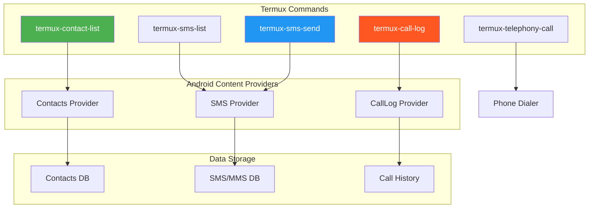
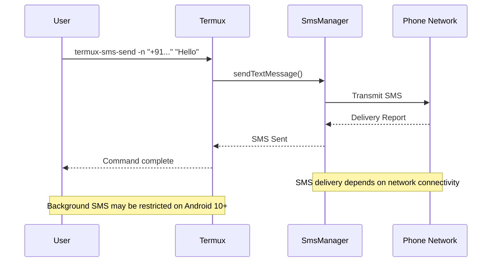
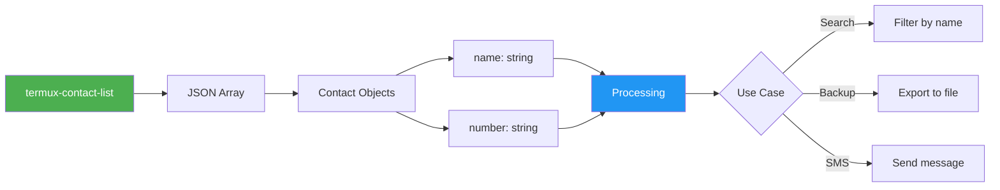

# Chapter 22: Termux API - Contacts & SMS

> **Module:** 4 - APIs  
> **Chapter:** 22 of 61  
> **Duration:** 15-20 Minutes  
> **Difficulty:** ⭐⭐ Intermediate  

---

## 📋 Chapter Overview

| Section | Content |
|---------|---------|
| Video Script | Complete Hindi narration with timestamps |
| Technical Guide | Detailed Contacts & SMS API usage |
| Commands Reference | All commands covered in chapter |
| Practice Exercises | Hands-on tasks |
| Troubleshooting | Common issues and solutions |
| Video Assets | Thumbnail, description, tags |

---

## 🎬 VIDEO SCRIPT (Complete Hindi Narration)

```
═══════════════════════════════════════════════════════════════════════════════
TERMUX FULL COURSE - CHAPTER 22
Title: Termux API - Contacts & SMS | Complete Guide | T3rmuxk1ng
Duration: 15-20 Minutes
═══════════════════════════════════════════════════════════════════════════════

[INTRO - 0:00 to 0:45]
─────────────────────────────────────────────────────────────────────────────

Namaskar Dosto! Welcome back to Termux Full Course by T3rmuxk1ng!

Aaj hum seekhenge ek bahut hi powerful aur practical topic - Contacts aur 
SMS management using Termux API.

Socho, aap apne phone ke contacts ko programmatically access kar sakte ho,
SMS bhej sakte ho, receive kar sakte ho, call log dekh sakte ho - sab kuch 
command line se ya scripts ke through!

Ye features automation ke liye game changer hain. Bulk SMS bhejna ho, 
auto-reply setup karna ho, contact backup lena ho - sab kuch possible hai 
Termux ke through.

To chaliye shuru karte hain! Like, subscribe aur notification bell on 
karein, aur video start karte hain.

---

[SECTION 1: PREREQUISITES & SETUP - 0:45 to 2:30]
─────────────────────────────────────────────────────────────────────────────

Sabse pehle, prerequisites check karte hain:

✓ Termux installed (F-Droid se)
✓ Termux:API app installed
✓ termux-api package installed
✓ Permissions granted

Agar Termux:API app nahi hai, to F-Droid se install karein:
Search "Termux:API" aur install karein.

Phir Termux mein ye command run karein:

    pkg install termux-api -y

Ab permissions ki baat. Contacts aur SMS access ke liye Android permissions 
chahiye. Termux automatically maangega jab aap pehli baar contact ya SMS 
command run karoge.

Android 12+ mein additional permissions chahiye:
- Contacts permission
- SMS permission  
- Phone permission (call log ke liye)

Ye permissions Settings > Apps > Termux > Permissions mein manually bhi 
de sakte ho.

Verify karte hain ki API kaam kar rahi hai:

    termux-contact-list | head -5

Agar contacts list dikh rahi hai, to sab theek hai!

---

[SECTION 2: CONTACT LIST API - 2:30 to 5:30]
─────────────────────────────────────────────────────────────────────────────

Pehla command - contacts access karna:

    termux-contact-list

Ye command aapke phone ke saare contacts ko JSON format mein return karti hai.

Output kuch aisa dikhega:

{
  "name": "Rahul Sharma",
  "number": "+919876543210"
},
{
  "name": "Priya Singh",
  "number": "+919123456789"
}

JSON format hai, ye data hai - machine readable. Isse process karna easy 
hai programmatically.

Contacts count karna ho to:

    termux-contact-list | jq length

JQ ek JSON processor hai. Pehle install karein:

    pkg install jq -y

Specific contact search karna ho:

    termux-contact-list | jq '.[] | select(.name | contains("Rahul"))'

Ya number se search:

    termux-contact-list | jq '.[] | select(.number | contains("9876"))'

Contacts ko simple list format mein dekhna ho:

    termux-contact-list | jq -r '.[] | "\(.name): \(.number)"'

CSV format mein export:

    termux-contact-list | jq -r '.[] | "\(.name),\(.number)"' > contacts.csv

Ab aapke contacts ka backup ready hai!

---

[SECTION 3: SMS LIST API - 5:30 to 8:30]
─────────────────────────────────────────────────────────────────────────────

Ab SMS access karte hain. SMS read karne ke liye:

    termux-sms-list

Default mein last 10 SMS dikhata hai. Arguments se control kar sakte ho:

Last 20 SMS:

    termux-sms-list -l 20

Specific number ke SMS:

    termux-sms-list -n "+919876543210"

All SMS (limit remove):

    termux-sms-list --limit 1000

Output JSON format mein hota hai:

{
  "threadid": 5,
  "type": "inbox",
  "read": 1,
  "sender": "+919876543210",
  "number": "+919876543210",
  "received": 1698765432000,
  "body": "Hello, kya haal hai?"
}

Fields explain karta hoon:
- threadid: Conversation thread ID
- type: "inbox" (received) ya "sent" 
- read: 1 = read, 0 = unread
- sender/number: Phone number
- received: Timestamp (milliseconds)
- body: SMS content

Sent messages dekhna ho:

    termux-sms-list -t sent

Received messages:

    termux-sms-list -t inbox

Unread messages only:

    termux-sms-list | jq '.[] | select(.read == 0)'

Specific date ke baad ke SMS:

    termux-sms-list -d 2024-01-01

---

[SECTION 4: SMS SEND API - 8:30 to 11:00]
─────────────────────────────────────────────────────────────────────────────

Ab SMS bhejna seekhte hain. Command:

    termux-sms-send -n "+919876543210" "Hello from Termux!"

Parameters:
- -n: Number (required)
- Message text in quotes

Multiple numbers pe bhejna ho:

    termux-sms-send -n "+919876543210" -n "+919123456789" "Group message"

File se message bhejna:

    termux-sms-send -n "+919876543210" < message.txt

Emoji bhejna ho:

    termux-sms-send -n "+919876543210" "Hello! 👋 Testing SMS from Termux"

Script se dynamic message:

    NAME="Rahul"
    MSG="Hello $NAME, ye Termux se test SMS hai!"
    termux-sms-send -n "+919876543210" "$MSG"

Important: Android ke according background SMS restrictions hain. 
Foreground app hona chahiye ya user interaction chahiye Android 10+ 
pe. Isliye automation ke liye extra setup chahiye.

---

[SECTION 5: CALL LOG API - 11:00 to 13:00]
─────────────────────────────────────────────────────────────────────────────

Call log access karte hain:

    termux-call-log

Default last 10 calls dikhata hai.

More records:

    termux-call-log -l 50

Output format:

{
  "name": "Rahul Sharma",
  "phone_number": "+919876543210",
  "duration": 120,
  "type": "INCOMING",
  "date": 1698765432000
}

Fields:
- name: Contact name (agar saved hai)
- phone_number: Number
- duration: Call duration in seconds
- type: INCOMING, OUTGOING, MISSED
- date: Timestamp

Missed calls filter:

    termux-call-log | jq '.[] | select(.type == "MISSED")'

Long calls (>5 minutes):

    termux-call-log | jq '.[] | select(.duration > 300)'

Specific number ke calls:

    termux-call-log | jq '.[] | select(.phone_number | contains("9876"))'

Call stats calculate karna:

    termux-call-log | jq '[.[] | .duration] | add'

Ye total call time dega seconds mein.

---

[SECTION 6: MAKING CALLS - 13:00 to 14:30]
─────────────────────────────────────────────────────────────────────────────

Phone call initiate karna:

    termux-telephony-call +919876543210

Ye command phone dialer open karega number ke saath. 
Auto-dial nahi hota - user ko call button press karna padta hai.

Ye security feature hai Android ka - background calls block karta hai.

Script mein use karna:

    # Quick call script
    echo "Select contact to call:"
    termux-contact-list | jq -r '.[] | "\(.name): \(.number)"' | nl
    read -p "Enter number: " choice
    NUMBER=$(termux-contact-list | jq -r ".[$choice-1].number")
    termux-telephony-call "$NUMBER"

---

[SECTION 7: PRACTICAL SCRIPTS - 14:30 to 18:00]
─────────────────────────────────────────────────────────────────────────────

Ab kuch practical scripts banate hain.

[SCRIPT 1: Contact Backup]

    #!/bin/bash
    # contact-backup.sh
    # Contacts ka complete backup with timestamp
    
    BACKUP_DIR="$HOME/backups"
    TIMESTAMP=$(date +%Y%m%d_%H%M%S)
    
    mkdir -p "$BACKUP_DIR"
    
    # JSON backup
    termux-contact-list > "$BACKUP_DIR/contacts_$TIMESTAMP.json"
    
    # CSV backup
    echo "Name,Number" > "$BACKUP_DIR/contacts_$TIMESTAMP.csv"
    termux-contact-list | jq -r '.[] | "\(.name),\(.number)"' >> "$BACKUP_DIR/contacts_$TIMESTAMP.csv"
    
    echo "Backup created in $BACKUP_DIR"
    ls -la "$BACKUP_DIR"

[SCRIPT 2: Bulk SMS Sender]

    #!/bin/bash
    # bulk-sms.sh
    # Multiple contacts ko ek saath SMS bhejna
    
    MESSAGE="$1"
    
    if [ -z "$MESSAGE" ]; then
        echo "Usage: ./bulk-sms.sh 'Your message'"
        exit 1
    fi
    
    echo "Select contacts:"
    termux-contact-list | jq -r '.[] | .name' | nl
    
    echo "Enter numbers (space separated): "
    read -a INDICES
    
    for i in "${INDICES[@]}"; do
        NUMBER=$(termux-contact-list | jq -r ".[$i-1].number")
        NAME=$(termux-contact-list | jq -r ".[$i-1].name")
        echo "Sending to $NAME ($NUMBER)..."
        termux-sms-send -n "$NUMBER" "$MESSAGE"
        sleep 2  # Delay to avoid blocking
    done
    
    echo "Bulk SMS sent!"

[SCRIPT 3: Auto-Reply SMS]

    #!/bin/bash
    # auto-reply.sh
    # Unread SMS ka automatic reply
    
    while true; do
        UNREAD=$(termux-sms-list -l 10 | jq '[.[] | select(.read == 0)]')
        
        echo "$UNREAD" | jq -c '.[]' | while read -r sms; do
            SENDER=$(echo "$sms" | jq -r '.sender')
            BODY=$(echo "$sms" | jq -r '.body')
            
            # Auto-reply message
            REPLY="Thanks for your message. I'm currently busy. Will reply soon!"
            
            echo "Auto-replying to $SENDER..."
            termux-sms-send -n "$SENDER" "$REPLY"
        done
        
        sleep 30  # Check every 30 seconds
    done

[SCRIPT 4: Contact Search Tool]

    #!/bin/bash
    # contact-search.sh
    # Interactive contact search
    
    echo "=== Contact Search Tool ==="
    read -p "Enter search term: " QUERY
    
    RESULTS=$(termux-contact-list | jq -r ".[] | select(.name | contains(\"$QUERY\") or .number | contains(\"$QUERY\")) | \"\(.name) - \(.number)\"")
    
    if [ -z "$RESULTS" ]; then
        echo "No contacts found."
    else
        echo "Results:"
        echo "$RESULTS"
        
        read -p "Send SMS? (y/n): " choice
        if [ "$choice" = "y" ]; then
            read -p "Enter message: " MSG
            NUMBER=$(termux-contact-list | jq -r ".[] | select(.name | contains(\"$QUERY\")) | .number" | head -1)
            termux-sms-send -n "$NUMBER" "$MSG"
            echo "SMS sent!"
        fi
    fi

[SCRIPT 5: SMS Backup]

    #!/bin/bash
    # sms-backup.sh
    # Complete SMS backup
    
    BACKUP_DIR="$HOME/sms-backups"
    TIMESTAMP=$(date +%Y%m%d)
    
    mkdir -p "$BACKUP_DIR"
    
    # All SMS backup
    termux-sms-list --limit 10000 > "$BACKUP_DIR/sms_$TIMESTAMP.json"
    
    # Count
    COUNT=$(termux-sms-list | jq length)
    
    echo "SMS Backup Complete!"
    echo "Total SMS backed up: $COUNT"
    echo "Location: $BACKUP_DIR/sms_$TIMESTAMP.json"

---

[SECTION 8: PYTHON INTEGRATION - 18:00 to 20:00]
─────────────────────────────────────────────────────────────────────────────

Python se Contacts aur SMS handle karna:

    import subprocess
    import json

    # Get contacts
    def get_contacts():
        result = subprocess.run(['termux-contact-list'], capture_output=True, text=True)
        contacts = json.loads(result.stdout)
        return contacts

    # Search contact
    def search_contact(name):
        contacts = get_contacts()
        for contact in contacts:
            if name.lower() in contact['name'].lower():
                return contact
        return None

    # Send SMS
    def send_sms(number, message):
        subprocess.run(['termux-sms-send', '-n', number, message])
        print(f"SMS sent to {number}")

    # Get SMS list
    def get_sms(limit=10):
        result = subprocess.run(['termux-sms-list', '-l', str(limit)], capture_output=True, text=True)
        messages = json.loads(result.stdout)
        return messages

    # Example usage
    if __name__ == "__main__":
        # List contacts
        contacts = get_contacts()
        for c in contacts[:5]:
            print(f"{c['name']}: {c['number']}")
        
        # Send SMS
        send_sms("+919876543210", "Hello from Python!")

Advanced Python script - SMS Dashboard:

    import subprocess
    import json
    from datetime import datetime

    class SMSManager:
        def __init__(self):
            pass
        
        def run_command(self, cmd):
            result = subprocess.run(cmd, capture_output=True, text=True, shell=True)
            return result.stdout
        
        def get_stats(self):
            contacts = len(json.loads(self.run_command('termux-contact-list')))
            sms_count = len(json.loads(self.run_command('termux-sms-list -l 100')))
            calls = len(json.loads(self.run_command('termux-call-log -l 100')))
            
            return {
                'contacts': contacts,
                'sms_last_100': sms_count,
                'calls_last_100': calls
            }
        
        def show_dashboard(self):
            stats = self.get_stats()
            print("=" * 40)
            print("SMS & Contacts Dashboard")
            print("=" * 40)
            print(f"Total Contacts: {stats['contacts']}")
            print(f"Recent SMS: {stats['sms_last_100']}")
            print(f"Recent Calls: {stats['calls_last_100']}")
            print("=" * 40)

    # Run
    manager = SMSManager()
    manager.show_dashboard()

---

[SECTION 9: PRIVACY & PERMISSIONS - 20:00 to 21:30]
─────────────────────────────────────────────────────────────────────────────

Security aur privacy important hai!

Permissions:
- Contacts access sensitive data hai
- SMS can send messages (cost involved)
- Call log reveals communication patterns

Best Practices:

1. Data Handling:
   - Encrypted backups use karein
   - Sensitive data store na karein plain text mein
   - Old backups delete karein regularly

2. Script Security:
   - API keys hardcode na karein
   - User confirmation lo bulk operations se pehle
   - Rate limiting use karein

3. Android Restrictions:
   - Android 10+ background SMS restrict karta hai
   - SMS_SEND permission chahiye
   - Default SMS app banne ki requirement kuch features ke liye

4. Ethical Use:
   - Sirf apne device pe use karein
   - Doosron ke contacts/SMS access na karein bina permission
   - Bulk SMS marketing ke liye use na karein

Permission check:

    # Check if Termux has SMS permission
    termux-sms-list -l 1 > /dev/null 2>&1 && echo "SMS OK" || echo "No SMS permission"

    # Check contacts permission
    termux-contact-list > /dev/null 2>&1 && echo "Contacts OK" || echo "No Contacts permission"

---

[SECTION 10: SUMMARY - 21:30 to 23:00]
─────────────────────────────────────────────────────────────────────────────

To dosto, Chapter 22 complete! Let's summarize:

✅ termux-contact-list - Contacts access JSON format mein
✅ termux-sms-list - SMS read with filters
✅ termux-sms-send - SMS bhejna
✅ termux-call-log - Call history access
✅ termux-telephony-call - Call initiate karna
✅ Python integration - Programming approach
✅ Practical scripts - Backup, Bulk SMS, Auto-reply
✅ Privacy considerations - Security best practices

Key Commands yaad rakhein:

┌─────────────────────────────────────────────────────────────────────────┐
│                    CHAPTER 22 - IMPORTANT COMMANDS                       │
├─────────────────────────────────────────────────────────────────────────┤
│ termux-contact-list              │ List all contacts (JSON)             │
│ termux-sms-list                  │ List recent SMS messages             │
│ termux-sms-list -n "number"      │ SMS from specific number             │
│ termux-sms-send -n "num" "msg"   │ Send SMS to number                   │
│ termux-call-log                  │ View call history                    │
│ termux-telephony-call number     │ Initiate phone call                  │
└─────────────────────────────────────────────────────────────────────────┘

Next Chapter 23 mein hum seekhenge:
- Termux Clipboard API
- Share functionality
- Data sharing between apps
- File sharing scripts

Agar ye video helpful lagi, to:
👍 Like button press karein
🔔 Subscribe karein, notification bell on karein
💬 Koi sawal ho to comment mein poochein
📤 Share karein friends ke saath

Main har comment ka reply karta hoon.

Thank you for watching! See you in Chapter 23!

═══════════════════════════════════════════════════════════════════════════════
```

---

## 📖 TECHNICAL GUIDE

### 1. Contacts API Architecture

```
┌─────────────────────────────────────────────────────────────────────────┐
│                    TERMUX CONTACTS API FLOW                              │
├─────────────────────────────────────────────────────────────────────────┤
│                                                                          │
│   ┌─────────────────┐        ┌─────────────────┐                        │
│   │ termux-contact- │        │  Termux:API     │                        │
│   │ list command    │───────▶│  App (Java)     │                        │
│   └─────────────────┘        └────────┬────────┘                        │
│                                       │                                  │
│                                       ▼                                  │
│                          ┌────────────────────┐                         │
│                          │ Android Contacts   │                         │
│                          │ ContentProvider    │                         │
│                          └────────┬───────────┘                         │
│                                   │                                      │
│                                   ▼                                      │
│                          ┌────────────────────┐                         │
│                          │ Contacts Database  │                         │
│                          │ (SQLite)           │                         │
│                          └────────────────────┘                         │
│                                                                          │
│   Output Format:                                                         │
│   [                                                                      │
│     {"name": "Contact Name", "number": "+91XXXXXXXXXX"},                │
│     {"name": "Another", "number": "+91YYYYYYYYYY"}                      │
│   ]                                                                      │
│                                                                          │
└─────────────────────────────────────────────────────────────────────────┘
```

### 2. SMS API Architecture

```
┌─────────────────────────────────────────────────────────────────────────┐
│                    TERMUX SMS API FLOW                                   │
├─────────────────────────────────────────────────────────────────────────┤
│                                                                          │
│   ┌─────────────────┐        ┌─────────────────┐                        │
│   │ termux-sms-send │───────▶│  Termux:API     │                        │
│   │ termux-sms-list │        │  App (Java)     │                        │
│   └─────────────────┘        └────────┬────────┘                        │
│                                       │                                  │
│                      ┌────────────────┴────────────────┐                │
│                      ▼                                 ▼                │
│            ┌─────────────────┐              ┌─────────────────┐        │
│            │ SMS Content     │              │ SMS Manager     │        │
│            │ Provider        │              │ (Send SMS)      │        │
│            │ (Read SMS)      │              │                 │        │
│            └────────┬────────┘              └────────┬────────┘        │
│                     │                                │                  │
│                     ▼                                ▼                  │
│            ┌─────────────────────────────────────────────────┐         │
│            │            Android SMS Database                 │         │
│            │            (mmssms.db)                          │         │
│            └─────────────────────────────────────────────────┘         │
│                                                                          │
└─────────────────────────────────────────────────────────────────────────┘
```

### 3. Command Parameters

#### termux-contact-list

```bash
# No parameters - returns all contacts
termux-contact-list

# Output format (JSON array)
[
  {
    "name": "Contact Name",
    "number": "+919876543210"
  }
]
```

#### termux-sms-list

```bash
# Parameters
-l, --limit      Number of messages to show (default: 10)
-n, --number     Filter by phone number
-t, --type       Message type: inbox, sent, draft, outbox, all
-d, --date       Messages after date (YYYY-MM-DD)
--offset         Skip first N messages

# Examples
termux-sms-list                    # Last 10 messages
termux-sms-list -l 50              # Last 50 messages
termux-sms-list -n "+919876543210" # From specific number
termux-sms-list -t sent            # Only sent messages
termux-sms-list -d 2024-01-01      # Since Jan 1, 2024
```

#### termux-sms-send

```bash
# Parameters
-n, --number     Phone number(s) to send to (required)
--recipient      Alternative for -n

# Examples
termux-sms-send -n "+919876543210" "Hello!"
termux-sms-send -n "+91111" -n "+91222" "Bulk message"
echo "Message" | termux-sms-send -n "+919876543210"
```

#### termux-call-log

```bash
# Parameters
-l, --limit      Number of calls to show (default: 10)
-o, --offset     Skip first N records

# Examples
termux-call-log           # Last 10 calls
termux-call-log -l 100    # Last 100 calls
termux-call-log -o 10     # Skip first 10, show next 10
```

#### termux-telephony-call

```bash
# Parameters
<number>        Phone number to call (required)

# Example
termux-telephony-call +919876543210
```

### 4. JSON Output Structure

#### Contact Object
```json
{
  "name": "John Doe",
  "number": "+919876543210"
}
```

#### SMS Object
```json
{
  "threadid": 5,
  "type": "inbox",
  "read": 1,
  "sender": "+919876543210",
  "number": "+919876543210",
  "received": 1698765432000,
  "body": "Hello, this is a test message"
}
```

| Field | Description |
|-------|-------------|
| threadid | Conversation thread identifier |
| type | Message type: inbox/sent/draft/outbox |
| read | Read status: 1=read, 0=unread |
| sender | Sender phone number |
| number | Phone number (same as sender for inbox) |
| received | Unix timestamp in milliseconds |
| body | Message content |

#### Call Log Object
```json
{
  "name": "John Doe",
  "phone_number": "+919876543210",
  "duration": 120,
  "type": "INCOMING",
  "date": 1698765432000
}
```

| Field | Description |
|-------|-------------|
| name | Contact name (null if not saved) |
| phone_number | Phone number |
| duration | Call duration in seconds |
| type | INCOMING/OUTGOING/MISSED |
| date | Unix timestamp in milliseconds |

---

## 🔧 PRACTICAL EXAMPLES (20+ Examples)

### Example 1: List All Contacts
```bash
termux-contact-list
```

### Example 2: Count Total Contacts
```bash
termux-contact-list | jq length
```

### Example 3: Search Contact by Name
```bash
termux-contact-list | jq '.[] | select(.name | test("Rahul"; "i"))'
```

### Example 4: Search Contact by Number
```bash
termux-contact-list | jq '.[] | select(.number | contains("9876"))'
```

### Example 5: Export Contacts to CSV
```bash
echo "Name,Number" > contacts.csv
termux-contact-list | jq -r '.[] | "\(.name),\(.number)"' >> contacts.csv
```

### Example 6: Export Contacts to JSON File
```bash
termux-contact-list > contacts_backup.json
```

### Example 7: Find Duplicate Numbers
```bash
termux-contact-list | jq -r '.[].number' | sort | uniq -d
```

### Example 8: List Recent SMS
```bash
termux-sms-list
```

### Example 9: List Last 50 SMS
```bash
termux-sms-list -l 50
```

### Example 10: SMS from Specific Number
```bash
termux-sms-list -n "+919876543210"
```

### Example 11: Only Sent Messages
```bash
termux-sms-list -t sent
```

### Example 12: Only Unread Messages
```bash
termux-sms-list | jq '.[] | select(.read == 0)'
```

### Example 13: Count Unread Messages
```bash
termux-sms-list | jq '[.[] | select(.read == 0)] | length'
```

### Example 14: Send SMS
```bash
termux-sms-send -n "+919876543210" "Hello from Termux!"
```

### Example 15: Send SMS from File
```bash
cat message.txt | termux-sms-send -n "+919876543210"
```

### Example 16: Send SMS to Multiple Numbers
```bash
termux-sms-send -n "+91111111111" -n "+92222222222" "Group message"
```

### Example 17: View Call Log
```bash
termux-call-log
```

### Example 18: View Only Missed Calls
```bash
termux-call-log | jq '.[] | select(.type == "MISSED")'
```

### Example 19: View Only Outgoing Calls
```bash
termux-call-log | jq '.[] | select(.type == "OUTGOING")'
```

### Example 20: Calculate Total Call Duration
```bash
termux-call-log | jq '[.[] | .duration] | add'
```

### Example 21: Find Long Calls (>5 min)
```bash
termux-call-log | jq '.[] | select(.duration > 300)'
```

### Example 22: Make a Call
```bash
termux-telephony-call +919876543210
```

### Example 23: Search Contact and Call
```bash
NUMBER=$(termux-contact-list | jq -r '.[] | select(.name | contains("Rahul")) | .number' | head -1)
termux-telephony-call "$NUMBER"
```

### Example 24: Backup SMS with Date Filter
```bash
termux-sms-list -d 2024-01-01 > sms_2024.json
```

### Example 25: Extract SMS Body Text Only
```bash
termux-sms-list | jq -r '.[].body'
```

---

## 📋 COMMANDS REFERENCE

### Contacts Commands

```bash
# List all contacts (JSON)
termux-contact-list

# Count contacts
termux-contact-list | jq length

# Search by name
termux-contact-list | jq '.[] | select(.name | contains("Name"))'

# Search by number
termux-contact-list | jq '.[] | select(.number | contains("1234"))'

# Export to CSV
termux-contact-list | jq -r '.[] | "\(.name),\(.number)"' > contacts.csv

# Export to JSON
termux-contact-list > contacts.json

# Get names only
termux-contact-list | jq -r '.[].name'

# Get numbers only
termux-contact-list | jq -r '.[].number'
```

### SMS Commands

```bash
# List SMS (default 10)
termux-sms-list

# List specific count
termux-sms-list -l 50

# Filter by number
termux-sms-list -n "+919876543210"

# Filter by type
termux-sms-list -t inbox    # Received
termux-sms-list -t sent     # Sent
termux-sms-list -t all      # All

# Filter by date
termux-sms-list -d 2024-01-01

# Send SMS
termux-sms-send -n "+919876543210" "Your message"

# Send to multiple
termux-sms-send -n "+91111" -n "+91222" "Message"

# Send from file
cat msg.txt | termux-sms-send -n "+919876543210"

# Count SMS
termux-sms-list | jq length

# Get unread
termux-sms-list | jq '.[] | select(.read == 0)'
```

### Call Log Commands

```bash
# List calls (default 10)
termux-call-log

# List specific count
termux-call-log -l 100

# Filter by type
termux-call-log | jq '.[] | select(.type == "MISSED")'
termux-call-log | jq '.[] | select(.type == "INCOMING")'
termux-call-log | jq '.[] | select(.type == "OUTGOING")'

# Filter by duration
termux-call-log | jq '.[] | select(.duration > 300)'

# Filter by number
termux-call-log | jq '.[] | select(.phone_number | contains("9876"))'

# Total duration
termux-call-log | jq '[.[] | .duration] | add'

# Make call
termux-telephony-call +919876543210
```

---

## 💻 PRACTICE EXERCISES

### Exercise 1: Contact Manager

```bash
# Task: Create a contact management script

cat > contact_manager.sh << 'EOF'
#!/bin/bash

echo "=== Contact Manager ==="
echo "1. List all contacts"
echo "2. Search contact"
echo "3. Export contacts"
echo "4. Count contacts"
echo "5. Exit"

read -p "Enter choice: " choice

case $choice in
    1)
        termux-contact-list | jq -r '.[] | "\(.name): \(.number)"'
        ;;
    2)
        read -p "Enter search term: " term
        termux-contact-list | jq -r ".[] | select(.name | test(\"$term\"; \"i\")) | \"\(.name): \(.number)\""
        ;;
    3)
        termux-contact-list > contacts_backup.json
        echo "Exported to contacts_backup.json"
        ;;
    4)
        echo "Total contacts: $(termux-contact-list | jq length)"
        ;;
    5)
        exit 0
        ;;
    *)
        echo "Invalid choice"
        ;;
esac
EOF

chmod +x contact_manager.sh
./contact_manager.sh
```

### Exercise 2: SMS Analyzer

```bash
# Task: Analyze SMS patterns

cat > sms_analyzer.sh << 'EOF'
#!/bin/bash

echo "=== SMS Analyzer ==="

# Total SMS
TOTAL=$(termux-sms-list -l 1000 | jq length)
echo "Total SMS analyzed: $TOTAL"

# Unread count
UNREAD=$(termux-sms-list -l 1000 | jq '[.[] | select(.read == 0)] | length')
echo "Unread SMS: $UNREAD"

# Inbox vs Sent
INBOX=$(termux-sms-list -l 1000 | jq '[.[] | select(.type == "inbox")] | length')
SENT=$(termux-sms-list -l 1000 | jq '[.[] | select(.type == "sent")] | length')
echo "Inbox: $INBOX | Sent: $SENT"

# Top senders
echo "Top senders:"
termux-sms-list -l 100 | jq -r '.[].sender' | sort | uniq -c | sort -rn | head -5
EOF

chmod +x sms_analyzer.sh
./sms_analyzer.sh
```

### Exercise 3: Call Log Report

```bash
# Task: Generate call log report

cat > call_report.sh << 'EOF'
#!/bin/bash

REPORT_FILE="call_report_$(date +%Y%m%d).txt"

echo "=== Call Log Report ===" > $REPORT_FILE
echo "Generated: $(date)" >> $REPORT_FILE
echo "" >> $REPORT_FILE

# Total calls
TOTAL=$(termux-call-log -l 500 | jq length)
echo "Total calls: $TOTAL" >> $REPORT_FILE

# By type
MISSED=$(termux-call-log -l 500 | jq '[.[] | select(.type == "MISSED")] | length')
INCOMING=$(termux-call-log -l 500 | jq '[.[] | select(.type == "INCOMING")] | length')
OUTGOING=$(termux-call-log -l 500 | jq '[.[] | select(.type == "OUTGOING")] | length')

echo "Missed: $MISSED | Incoming: $INCOMING | Outgoing: $OUTGOING" >> $REPORT_FILE

# Total duration
DURATION=$(termux-call-log -l 500 | jq '[.[] | .duration] | add // 0')
MINUTES=$((DURATION / 60))
echo "Total talk time: ${MINUTES} minutes" >> $REPORT_FILE

echo "" >> $REPORT_FILE
echo "Recent calls:" >> $REPORT_FILE
termux-call-log -l 10 | jq -r '.[] | "\(.type): \(.phone_number) (\(.duration)s)"' >> $REPORT_FILE

cat $REPORT_FILE
EOF

chmod +x call_report.sh
./call_report.sh
```

### Exercise 4: Bulk SMS Tool

```bash
# Task: Create bulk SMS sender with confirmation

cat > bulk_sms.sh << 'EOF'
#!/bin/bash

if [ -z "$1" ]; then
    echo "Usage: ./bulk_sms.sh 'message'"
    exit 1
fi

MESSAGE="$1"

echo "Available contacts:"
termux-contact-list | jq -r '.[] | "\(.name) - \(.number)"' | nl

echo ""
read -p "Enter contact numbers to send (comma-separated indices): " INDICES

IFS=',' read -ra ARR <<< "$INDICES"

echo ""
echo "Will send message: $MESSAGE"
echo "To ${#ARR[@]} contacts"
read -p "Confirm? (y/n): " CONFIRM

if [ "$CONFIRM" = "y" ]; then
    for i in "${ARR[@]}"; do
        NUMBER=$(termux-contact-list | jq -r ".[$((i-1))].number")
        NAME=$(termux-contact-list | jq -r ".[$((i-1))].name")
        echo "Sending to $NAME ($NUMBER)..."
        termux-sms-send -n "$NUMBER" "$MESSAGE"
        sleep 2
    done
    echo "Done!"
else
    echo "Cancelled"
fi
EOF

chmod +x bulk_sms.sh
./bulk_sms.sh "Test message from Termux"
```

### Exercise 5: Python SMS Dashboard

```python
# Task: Create Python SMS/Contacts dashboard
# Save as: sms_dashboard.py

import subprocess
import json
from datetime import datetime

def run_cmd(cmd):
    result = subprocess.run(cmd, shell=True, capture_output=True, text=True)
    return result.stdout

def get_contacts():
    data = run_cmd("termux-contact-list")
    return json.loads(data) if data else []

def get_sms(limit=50):
    data = run_cmd(f"termux-sms-list -l {limit}")
    return json.loads(data) if data else []

def get_calls(limit=50):
    data = run_cmd(f"termux-call-log -l {limit}")
    return json.loads(data) if data else []

def show_dashboard():
    contacts = get_contacts()
    sms = get_sms()
    calls = get_calls()
    
    print("=" * 50)
    print("       TERMUX SMS & CONTACTS DASHBOARD")
    print("=" * 50)
    
    print(f"\n📊 STATISTICS:")
    print(f"   Contacts: {len(contacts)}")
    print(f"   Recent SMS: {len(sms)}")
    print(f"   Recent Calls: {len(calls)}")
    
    # SMS stats
    if sms:
        unread = len([s for s in sms if s.get('read') == 0])
        inbox = len([s for s in sms if s.get('type') == 'inbox'])
        sent = len([s for s in sms if s.get('type') == 'sent'])
        print(f"\n📱 SMS BREAKDOWN:")
        print(f"   Unread: {unread}")
        print(f"   Inbox: {inbox}")
        print(f"   Sent: {sent}")
    
    # Call stats
    if calls:
        missed = len([c for c in calls if c.get('type') == 'MISSED'])
        incoming = len([c for c in calls if c.get('type') == 'INCOMING'])
        outgoing = len([c for c in calls if c.get('type') == 'OUTGOING'])
        total_duration = sum(c.get('duration', 0) for c in calls)
        print(f"\n📞 CALL BREAKDOWN:")
        print(f"   Missed: {missed}")
        print(f"   Incoming: {incoming}")
        print(f"   Outgoing: {outgoing}")
        print(f"   Talk time: {total_duration // 60} min")
    
    print("\n" + "=" * 50)

if __name__ == "__main__":
    show_dashboard()
```

---

## ⚠️ TROUBLESHOOTING

### Problem 1: "Permission denied" for Contacts

```bash
# Cause: Contacts permission not granted

# Solution 1: Run command and accept permission popup
termux-contact-list

# Solution 2: Manual permission grant
# Settings → Apps → Termux → Permissions → Enable Contacts

# Solution 3: Check permission
dumpsys package com.termux | grep -A5 "runtime permissions"
```

### Problem 2: SMS not sending

```bash
# Cause: Multiple reasons

# Solution 1: Check SMS permission
# Settings → Apps → Termux → Permissions → Enable SMS

# Solution 2: Check if number format is correct
# Use international format: +91XXXXXXXXXX

# Solution 3: Check credit/balance for paid SMS

# Solution 4: Android 10+ background restrictions
# Use Termux in foreground, not background

# Test with simple SMS
termux-sms-send -n "+91XXXXXXXXXX" "Test"
```

### Problem 3: Empty contact list

```bash
# Cause: Permission not granted or no contacts

# Solution 1: Check permission
termux-contact-list
# Accept permission popup

# Solution 2: Verify contacts exist in phone
# Open Phone app → Contacts → Check if contacts are there

# Solution 3: Check Termux:API app is installed
pkg list-installed | grep termux-api

# Solution 4: Reinstall termux-api
pkg uninstall termux-api
pkg install termux-api
```

### Problem 4: Call log not showing

```bash
# Cause: Phone permission not granted

# Solution 1: Grant permission manually
# Settings → Apps → Termux → Permissions → Phone

# Solution 2: Run command and accept popup
termux-call-log

# Solution 3: Check if call log exists in Phone app
```

### Problem 5: JSON parsing errors

```bash
# Cause: Invalid JSON output or jq not installed

# Solution 1: Install jq
pkg install jq -y

# Solution 2: Check raw output
termux-contact-list
# Verify it's valid JSON

# Solution 3: Handle empty results
termux-contact-list | jq '. // []'

# Solution 4: Check for special characters
termux-contact-list | jq '.[] | .name' | cat -v
```

### Problem 6: Termux:API not working

```bash
# Cause: API package or app not installed

# Solution 1: Install package
pkg install termux-api -y

# Solution 2: Install Termux:API app from F-Droid
# Search "Termux:API" in F-Droid

# Solution 3: Check both are from same source
# Don't mix Play Store and F-Droid versions

# Solution 4: Test API
termux-battery-status
# Should show battery info if working
```

### Problem 7: Background SMS fails

```bash
# Cause: Android 10+ background restrictions

# Solution 1: Use Termux in foreground
# Keep Termux app open when sending SMS

# Solution 2: Use Termux:Boot for startup scripts
# Install Termux:Boot from F-Droid

# Solution 3: Use foreground service
# Some Android versions allow with notification

# Solution 4: Use WorkManager/Termux:Tasker
# For automation, use Tasker integration
```

### Problem 8: Unicode/Emoji issues

```bash
# Cause: Character encoding

# Solution 1: Use UTF-8 encoding
export LANG=en_US.UTF-8

# Solution 2: For SMS, emojis usually work
termux-sms-send -n "+91XXX" "Hello! 👋"

# Solution 3: Check terminal font supports emojis
# Install Nerd font or emoji font
pkg install fontconfig
```

---

## 🎬 VIDEO ASSETS

### Thumbnail Concepts

**Option A: Clean & Professional**
```
┌────────────────────────────────────┐
│  [Dark Terminal Background]        │
│                                    │
│   📱 CONTACTS & SMS API            │
│   Complete Guide                   │
│                                    │
│   ✓ Contact Management             │
│   ✓ SMS Automation                 │
│   ✓ Call Log Access                │
│                                    │
│   [T3rmuxk1ng Logo]                │
└────────────────────────────────────┘
```

**Option B: Action Style**
```
┌────────────────────────────────────┐
│  💬 SEND SMS FROM TERMINAL!        │
│                                    │
│  📞 Contacts  │  📨 SMS  │  📱 Call │
│                                    │
│  termux-sms-send                   │
│  termux-contact-list               │
│                                    │
│  Chapter 22 | T3rmuxk1ng           │
└────────────────────────────────────┘
```

**Option C: Script Focus**
```
┌────────────────────────────────────┐
│  🔥 AUTOMATE SMS & CALLS           │
│                                    │
│  Bulk SMS │ Auto-Reply │ Backup    │
│                                    │
│  [Code snippet preview]            │
│  termux-sms-send -n...             │
│                                    │
│  T3rmuxk1ng                        │
└────────────────────────────────────┘
```

### Video Description Template

```markdown
📱 Termux Full Course - Chapter 22: Contacts & SMS API | Complete Guide

🔥 In this video you'll learn:
• termux-contact-list - Access phone contacts
• termux-sms-list - Read SMS messages
• termux-sms-send - Send SMS from terminal
• termux-call-log - View call history
• Bulk SMS scripts
• Auto-reply automation
• Contact backup scripts
• Python integration

⏱️ Timestamps:
0:00 - Introduction
0:45 - Prerequisites & Setup
2:30 - Contact List API
5:30 - SMS List API
8:30 - SMS Send API
11:00 - Call Log API
13:00 - Making Calls
14:30 - Practical Scripts
18:00 - Python Integration
20:00 - Privacy & Permissions
21:30 - Summary

📝 Commands from this video:
termux-contact-list
termux-sms-list
termux-sms-send -n "+91XXX" "message"
termux-call-log
termux-telephony-call +91XXX

📚 Full Course Playlist:
[PLAYLIST LINK]

📱 Follow T3rmuxk1ng:
• YouTube: @T3rmuxk1ng
• Telegram: [LINK]
• GitHub: [LINK]

#Termux #TermuxAPI #ContactsSMS #TermuxCourse #T3rmuxk1ng #AndroidAutomation #TermuxHindi

---
⚠️ Disclaimer: This video is for educational purposes only. Use responsibly and respect privacy.
```

### Tags List

```
termux, termux api, termux sms, termux contacts, termux call log,
termux sms send, termux contact list, termux automation, termux scripts,
termux tutorial, termux course, termux hindi, termux full course,
android sms terminal, terminal sms, command line sms,
bulk sms termux, sms automation, contact backup termux,
t3rmuxk1ng, termux tutorial hindi, android automation,
termux python sms, sms from terminal, call log terminal
```

### Hashtags

```
#Termux #TermuxAPI #TermuxSMS #TermuxContacts #AndroidAutomation 
#TermuxTutorial #TermuxCourse #TermuxHindi #T3rmuxk1ng #LearnTermux 
#SMSAutomation #ContactManagement #TerminalCommands
```

---

## 📚 ADDITIONAL RESOURCES

### Official Documentation

| Resource | Link |
|----------|------|
| Termux API Wiki | https://wiki.termux.com/wiki/Termux:API |
| Termux GitHub | https://github.com/termux/termux-api |
| Android SMS Docs | https://developer.android.com/reference/android/telephony/SmsManager |

### Related Packages

| Package | Description |
|---------|-------------|
| jq | JSON processor for parsing API output |
| python | For advanced scripts |
| curl | For SMS gateway integration |

### Useful Scripts Repository

```bash
# Clone example scripts
git clone https://github.com/termux/termux-api-package

# Community scripts
# Search GitHub for "termux sms script"
```

---

## ✅ CHAPTER CHECKLIST

Before moving to Chapter 23, verify:

- [ ] termux-api package installed
- [ ] Termux:API app installed from F-Droid
- [ ] Contacts permission granted
- [ ] SMS permission granted
- [ ] Phone permission granted (for call log)
- [ ] Can list contacts with termux-contact-list
- [ ] Can read SMS with termux-sms-list
- [ ] Can send SMS with termux-sms-send
- [ ] Can view call log with termux-call-log
- [ ] Created at least one automation script
- [ ] Understand privacy implications

---

## 🎯 NEXT CHAPTER PREVIEW

**Chapter 23: Termux API - Clipboard & Share**

- termux-clipboard-get - Read clipboard
- termux-clipboard-set - Write to clipboard
- termux-share - Share content to apps
- Clipboard automation scripts
- Cross-app data sharing
- Share receiver functionality

---

**Chapter Complete! 🎉**

*Created by T3rmuxk1ng | Termux Full Course*

---

## 📊 MERMAID DIAGRAMS

### 1. Contacts & SMS API Architecture



### 2. SMS Flow Diagram



### 3. Contact Data Flow



---

## ⚡ API COMMAND REFERENCE CARD

| API Command | Purpose | Permissions | Example |
|-------------|---------|-------------|---------|
| `termux-contact-list` | List all contacts | READ_CONTACTS | `termux-contact-list` |
| `termux-sms-list` | List SMS messages | READ_SMS | `termux-sms-list -l 20` |
| `termux-sms-list -n` | Filter by number | READ_SMS | `termux-sms-list -n "+91..."` |
| `termux-sms-list -t` | Filter by type | READ_SMS | `termux-sms-list -t sent` |
| `termux-sms-send` | Send SMS | SEND_SMS | `termux-sms-send -n "+91..." "Hello"` |
| `termux-sms-send -n -n` | Send to multiple | SEND_SMS | `termux-sms-send -n "+91a" -n "+91b" "Hi"` |
| `termux-call-log` | View call history | READ_CALL_LOG | `termux-call-log -l 50` |
| `termux-telephony-call` | Initiate call | CALL_PHONE | `termux-telephony-call +91...` |

### Quick Syntax Reference

```bash
# Contacts
termux-contact-list                          # List all contacts (JSON)

# SMS Read
termux-sms-list [-l limit] [-n number] [-t type] [-d date]

# SMS Send
termux-sms-send -n <number> [-n <number2>...] "message"

# Call Log
termux-call-log [-l limit]

# Make Call
termux-telephony-call <number>

# JSON Processing
termux-contact-list | jq '.[] | select(.name | contains("John"))'
termux-sms-list | jq '.[] | select(.read == 0)'
```

---

## 🎯 LEARNING PATH VISUALIZATION

```
╔══════════════════════════════════════════════════════════════════════════════╗
║                   CONTACTS & SMS API MASTERY PATH                             ║
╚══════════════════════════════════════════════════════════════════════════════╝

     🌱 BEGINNER                    🌿 INTERMEDIATE                  🌳 ADVANCED
     ──────────────────             ──────────────────              ──────────────────
     
     ┌─────────────────┐            ┌─────────────────┐            ┌─────────────────┐
     │  List Contacts  │───────────▶│  Contact        │───────────▶│  Contact        │
     │  Basic Query    │            │  Search         │            │  Manager        │
     └─────────────────┘            └─────────────────┘            └─────────────────┘
              │                              │                              │
              ▼                              ▼                              ▼
     ┌─────────────────┐            ┌─────────────────┐            ┌─────────────────┐
     │  Read SMS       │───────────▶│  SMS Filtering  │───────────▶│  SMS            │
     │  Basic List     │            │  & Analysis     │            │  Analytics      │
     └─────────────────┘            └─────────────────┘            └─────────────────┘
              │                              │                              │
              ▼                              ▼                              ▼
     ┌─────────────────┐            ┌─────────────────┐            ┌─────────────────┐
     │  Send SMS       │───────────▶│  Bulk SMS       │───────────▶│  SMS            │
     │  Single         │            │  Operations     │            │  Automation     │
     └─────────────────┘            └─────────────────┘            └─────────────────┘
              │                              │                              │
              ▼                              ▼                              ▼
     ┌─────────────────┐            ┌─────────────────┐            ┌─────────────────┐
     │  View Call Log  │───────────▶│  Call Analysis  │───────────▶│  Communication  │
     │  Basic          │            │  & Stats        │            │  Dashboard      │
     └─────────────────┘            └─────────────────┘            └─────────────────┘

     ─────────────────────────────────────────────────────────────────────────────
     
     🏆 MASTERY CHECKPOINTS:
     
     □ Level 1: List and search contacts
     □ Level 2: Read and filter SMS messages
     □ Level 3: Send SMS programmatically
     □ Level 4: Implement bulk SMS operations
     □ Level 5: Analyze call log data
     □ Level 6: Create contact backup system
     □ Level 7: Build complete communication manager
     
     ─────────────────────────────────────────────────────────────────────────────
     
     ⏱️ ESTIMATED TIME TO MASTERY: 5-6 Hours Practice
     
     📚 PREREQUISITES: Chapters 1-21 (All previous API chapters)
     
     🎯 NEXT STEPS: Clipboard & Share APIs (Chapter 23)
```

---

## 🔧 API COMPARISON TABLE

| API | Capability | Root Required | Android Version | Output Format |
|-----|------------|---------------|-----------------|---------------|
| `termux-contact-list` | List contacts | ❌ No | 5.0+ | JSON Array |
| `termux-sms-list` | Read SMS | ❌ No | 5.0+ | JSON Array |
| `termux-sms-send` | Send SMS | ❌ No | 5.0+ | None |
| `termux-call-log` | Call history | ❌ No | 5.0+ | JSON Array |
| `termux-telephony-call` | Make call | ❌ No | 5.0+ | None |

### SMS Types Reference

| Type | Description | Flag |
|------|-------------|------|
| inbox | Received messages | `-t inbox` |
| sent | Sent messages | `-t sent` |
| draft | Draft messages | `-t draft` |
| outbox | Outgoing queue | `-t outbox` |
| all | All messages | `-t all` |

### Call Types Reference

| Type | Description | Filter |
|------|-------------|--------|
| INCOMING | Received calls | `select(.type == "INCOMING")` |
| OUTGOING | Dialed calls | `select(.type == "OUTGOING")` |
| MISSED | Missed calls | `select(.type == "MISSED")` |

---

## 🚀 PRACTICAL PROJECT CHALLENGES

### Challenge 1: Contact Backup System 💾

**Objective:** Create a complete contact backup and restore system.

**Requirements:**
- Export contacts to JSON and CSV
- Create timestamped backups
- Restore contacts from backup
- Validate backup integrity

**Starter Code:**
```bash
#!/bin/bash
# TODO: Create backup system
BACKUP_DIR=~/contact-backups

# TODO: Export to JSON
# TODO: Export to CSV
# TODO: Create backup manifest
# TODO: Implement restore function
```

**Expected Output:** Complete backup system with multiple export formats.

---

### Challenge 2: SMS Analytics Tool 📊

**Objective:** Build an SMS analytics and reporting tool.

**Requirements:**
- Count total SMS (inbox/sent)
- Find top contacts by message count
- Analyze SMS patterns
- Generate report

**Starter Code:**
```python
#!/usr/bin/env python3
import subprocess
import json

# TODO: Create SMS analytics
# 1. Get all SMS
# 2. Count by type
# 3. Find top contacts
# 4. Time-based analysis
# 5. Generate report
```

**Expected Output:** Comprehensive SMS analysis report.

---

### Challenge 3: Bulk Messaging Tool 📨

**Objective:** Create a controlled bulk SMS sender.

**Requirements:**
- Select contacts from list
- Customizable message template
- Rate limiting
- Delivery logging

**Starter Code:**
```bash
#!/bin/bash
# TODO: Create bulk SMS tool
# 1. List contacts with numbers
# 2. Multi-select interface
# 3. Message template
# 4. Rate limiting (2-3 sec delay)
# 5. Log results
```

**Expected Output:** Safe bulk messaging with logging.

---

## 📖 GLOSSARY & TERMINOLOGY

| Term | Definition |
|------|------------|
| **IMEI** | International Mobile Equipment Identity - Device ID |
| **IMSI** | International Mobile Subscriber Identity - SIM ID |
| **ContentProvider** | Android component for data sharing between apps |
| **SmsManager** | Android API for SMS operations |
| **MMS** | Multimedia Messaging Service |
| **Thread ID** | Conversation identifier in SMS database |
| **SMS PDU** | Protocol Data Unit - Raw SMS format |
| **Call Log** | System record of phone calls |
| **Contact Provider** | Android contacts database interface |
| **SMS_DELIVERY_ACTION** | Broadcast when SMS is delivered |

### Phone Number Formats

| Format | Example | Use Case |
|--------|---------|----------|
| International | +919876543210 | SMS, International calls |
| National | 09876543210 | Local calls |
| E.164 | +919876543210 | Recommended for SMS |
| RFC 3966 | tel:+91-98765-43210 | URI format |

---

## 💼 CAREER INSIGHTS

### How Contacts & SMS APIs Relate to Real-World Development

**Mobile App Development:**
- Social apps need contact integration
- Messaging apps require SMS fallback
- CRM apps sync with contacts

**Security & Forensics:**
- Mobile forensics analysis
- Communication pattern analysis
- Evidence collection systems

**Marketing & Automation:**
- Bulk notification systems
- Customer communication
- Appointment reminders

### Career Paths Using These Skills

| Role | Relevance | Salary Range (India) |
|------|-----------|---------------------|
| Android Developer | Contact/SMS APIs | ₹6-25 LPA |
| Mobile Forensics | Evidence analysis | ₹8-30 LPA |
| CRM Developer | Contact management | ₹5-20 LPA |
| Security Analyst | Communication analysis | ₹6-25 LPA |
| Automation Engineer | SMS automation | ₹5-18 LPA |

### Skills Roadmap

```
Current Chapter (Contacts & SMS APIs)
         │
         ├──▶ Android Communication Development
         │         │
         │         └──▶ Android Developer
         │
         ├──▶ Mobile Forensics
         │         │
         │         └──▶ Digital Forensics Analyst
         │
         ├──▶ CRM Development
         │         │
         │         └──▶ CRM Application Developer
         │
         └──▶ SMS Marketing Systems
                   │
                   └──▶ Marketing Automation Engineer
```

---

## ⚠️ PERMISSION REQUIREMENTS TABLE

| API Command | Required Permission | How to Grant | Notes |
|-------------|---------------------|--------------|-------|
| `termux-contact-list` | READ_CONTACTS | First run prompt | Sensitive permission |
| `termux-sms-list` | READ_SMS | First run prompt | SMS read access |
| `termux-sms-send` | SEND_SMS | First run prompt | Can incur costs |
| `termux-call-log` | READ_CALL_LOG | First run prompt | Sensitive permission |
| `termux-telephony-call` | CALL_PHONE | First run prompt | Opens dialer |

### Permission Setup

```bash
# Trigger contact permission
termux-contact-list

# Trigger SMS permission
termux-sms-list

# Trigger call log permission
termux-call-log

# Check permissions
dumpsys package com.termux | grep -A 20 "runtime permissions"
```

### Android Restrictions (Important!)

| Android Version | Background SMS | Call Log Access |
|-----------------|----------------|-----------------|
| Android 9- | ✅ Allowed | ✅ Full access |
| Android 10 | ⚠️ Restricted | ⚠️ Need permission |
| Android 11+ | ❌ Default SMS app only | ⚠️ More restrictions |
| Android 12+ | ❌ Requires user interaction | ⚠️ Policy changes |

### Troubleshooting

| Issue | Cause | Solution |
|-------|-------|----------|
| Contact list empty | Permission denied | Grant contacts permission |
| SMS send fails | Not default SMS app | Android 10+ restriction |
| Call log empty | Permission denied | Grant call log permission |
| Wrong number format | Invalid format | Use international format (+91...) |
| SMS not delivered | Network issue | Check signal strength |

---

## 💡 PRO TIPS BOX

> 💡 **Pro Tip #1:** Always check for `null` values when parsing contact/SMS JSON - fields may be missing for unsaved numbers.

> 💡 **Pro Tip #2:** Use `jq -r` with default values: `jq -r '.name // "Unknown"'` to handle missing contact names.

> 💡 **Pro Tip #3:** Rate-limit bulk SMS operations (2-3 second delays) to avoid Android blocking as spam.

> 💡 **Pro Tip #4:** Always verify phone number format before sending SMS - include country code for reliability.

> 💡 **Pro Tip #5:** SMS timestamps are in milliseconds - use `date -d @${timestamp::-3}` to convert to readable format.

> 💡 **Pro Tip #6:** For contact backups, export to multiple formats (JSON, CSV) for maximum compatibility.

> 💡 **Pro Tip #7:** Android 10+ restricts background SMS - ensure your app is the default SMS app for full functionality.

> 💡 **Pro Tip #8:** Call log duration is in seconds - convert to minutes: `echo "scale=1; $duration/60" | bc`.

> 💡 **Pro Tip #9:** Use `termux-sms-list -t sent` to verify SMS was actually sent after `termux-sms-send`.

> 💡 **Pro Tip #10:** Store frequently-used numbers in variables for cleaner scripts: `MY_NUMBER="+919876543210"`.

---

## 🔥 REAL WORLD APPLICATIONS

### 1. Bulk Birthday Greeting System
Send automated birthday greetings to contacts.

```bash
#!/bin/bash
# birthday_greeter.sh - Send birthday greetings
MESSAGE="🎉 Happy Birthday! Wishing you a fantastic day!"

# Get contacts with birthdays (would need additional data source)
# For demo, use predefined list
BIRTHDAY_CONTACTS=(
    "+919876543210:John"
    "+919123456789:Jane"
)

for contact in "${BIRTHDAY_CONTACTS[@]}"; do
    NUMBER="${contact%%:*}"
    NAME="${contact#*:}"
    MSG="Happy Birthday, $NAME! $MESSAGE"
    termux-sms-send -n "$NUMBER" "$MSG"
    echo "Sent to $NAME"
    sleep 3
done
```

### 2. SMS-Based Command System
Control your phone via SMS commands.

```bash
#!/bin/bash
# sms_command.sh - Execute commands from SMS
while true; do
    # Get latest SMS
    SMS=$(termux-sms-list -l 1)
    BODY=$(echo "$SMS" | jq -r '.[0].body')
    SENDER=$(echo "$SMS" | jq -r '.[0].sender')
    
    case "$BODY" in
        "LOCATION")
            LOC=$(termux-location -p network | jq -r '"\(.latitude),\(.longitude)"')
            termux-sms-send -n "$SENDER" "My location: $LOC"
            ;;
        "BATTERY")
            BAT=$(termux-battery-status | jq -r '.percentage')
            termux-sms-send -n "$SENDER" "Battery: $BAT%"
            ;;
        "STATUS")
            termux-sms-send -n "$SENDER" "All systems operational"
            ;;
    esac
    
    sleep 60
done
```

### 3. Call Analytics Dashboard
Analyze calling patterns and statistics.

```bash
#!/bin/bash
# call_analytics.sh - Generate call statistics
LOG_FILE=~/call_analytics_$(date +%Y%m%d).txt

TOTAL=$(termux-call-log -l 500 | jq 'length')
INCOMING=$(termux-call-log -l 500 | jq '[.[] | select(.type == "INCOMING")] | length')
OUTGOING=$(termux-call-log -l 500 | jq '[.[] | select(.type == "OUTGOING")] | length')
MISSED=$(termux-call-log -l 500 | jq '[.[] | select(.type == "MISSED")] | length')
TOTAL_TIME=$(termux-call-log -l 500 | jq '[.[] | .duration] | add // 0')

cat > "$LOG_FILE" << EOF
═══════════════════════════════════════════
        CALL ANALYTICS REPORT
        Generated: $(date)
═══════════════════════════════════════════
Total Calls: $TOTAL
  Incoming: $INCOMING
  Outgoing: $OUTGOING
  Missed: $MISSED

Total Talk Time: $((TOTAL_TIME / 60)) minutes
Average Call: $((TOTAL_TIME / TOTAL / 60)) minutes
═══════════════════════════════════════════
EOF

cat "$LOG_FILE"
```

### 4. Auto-Reply System
Automatically reply to missed calls/SMS.

```bash
#!/bin/bash
# auto_reply.sh - Auto-reply to messages
REPLY_MESSAGE="Thanks for your message! I'm currently busy and will reply soon."

while true; do
    UNREAD=$(termux-sms-list -l 10 | jq '[.[] | select(.read == 0)]')
    
    echo "$UNREAD" | jq -c '.[]' 2>/dev/null | while read -r sms; do
        SENDER=$(echo "$sms" | jq -r '.sender')
        BODY=$(echo "$sms" | jq -r '.body')
        
        # Don't auto-reply to spam or short codes
        if [ ${#SENDER} -gt 8 ]; then
            echo "Auto-replying to $SENDER..."
            termux-sms-send -n "$SENDER" "$REPLY_MESSAGE"
        fi
    done
    
    sleep 30
done
```

### 5. Contact Group Messaging
Send messages to contact groups.

```bash
#!/bin/bash
# group_sms.sh - Send to contact groups
GROUP_FILE=~/.contact_groups

list_contacts() {
    echo "Available contacts:"
    termux-contact-list | jq -r '.[] | "\(.name): \(.number)"' | nl
}

send_to_group() {
    echo "Enter group name:"
    read -r group
    
    NUMBERS=$(grep "$group" "$GROUP_FILE" 2>/dev/null | cut -d: -f2)
    
    if [ -z "$NUMBERS" ]; then
        echo "Group not found"
        return
    fi
    
    echo "Enter message:"
    read -r msg
    
    for num in $NUMBERS; do
        termux-sms-send -n "$num" "$msg"
        echo "Sent to $num"
        sleep 2
    done
}

# Menu
echo "1. List contacts"
echo "2. Send to group"
read -p "Choice: " choice

case $choice in
    1) list_contacts ;;
    2) send_to_group ;;
esac
```

---

## ⚡ QUICK REFERENCE CARD

### Contacts Commands

| Command | Purpose |
|---------|---------|
| `termux-contact-list` | List all contacts |
| `termux-contact-list \| jq length` | Count contacts |
| `termux-contact-list \| jq '.[] \| select(.name \| contains("X"))'` | Search by name |

### SMS Commands

| Command | Purpose |
|---------|---------|
| `termux-sms-list` | List recent SMS (10) |
| `termux-sms-list -l 50` | List last 50 SMS |
| `termux-sms-list -n "+91..."` | SMS from specific number |
| `termux-sms-list -t inbox` | Only received SMS |
| `termux-sms-list -t sent` | Only sent SMS |
| `termux-sms-send -n "num" "msg"` | Send SMS |

### Call Log Commands

| Command | Purpose |
|---------|---------|
| `termux-call-log` | Recent calls (10) |
| `termux-call-log -l 100` | Last 100 calls |
| `termux-call-log \| jq '.[] \| select(.type == "MISSED")'` | Missed calls |
| `termux-telephony-call +91...` | Initiate call |

### JSON Field Reference

| Field | Description |
|-------|-------------|
| `name` | Contact name |
| `number` | Phone number |
| `body` | SMS content |
| `sender` | SMS sender number |
| `type` | inbox/sent (SMS), INCOMING/OUTGOING/MISSED (call) |
| `duration` | Call duration (seconds) |
| `read` | 0=unread, 1=read |

---

## 🏆 BONUS: AUTOMATION IDEAS

### Idea 1: Emergency Contact Alert
```bash
#!/bin/bash
# emergency_alert.sh - Send location to emergency contacts
EMERGENCY_CONTACTS=("+919876543210" "+919123456789")

LOC=$(termux-location -p gps 2>/dev/null)
LAT=$(echo "$LOC" | jq -r '.latitude')
LON=$(echo "$LOC" | jq -r '.longitude')
MAP_LINK="https://maps.google.com/?q=$LAT,$LON"

for contact in "${EMERGENCY_CONTACTS[@]}"; do
    termux-sms-send -n "$contact" "EMERGENCY! I need help. My location: $MAP_LINK"
done
```

### Idea 2: Spam Call Detector
```bash
#!/bin/bash
# spam_detector.sh - Flag potential spam calls
WHITELIST=~/.whitelist_numbers

while true; do
    CALLS=$(termux-call-log -l 1)
    NUMBER=$(echo "$CALLS" | jq -r '.[0].phone_number')
    
    if ! grep -q "$NUMBER" "$WHITELIST" 2>/dev/null; then
        termux-notification --title "⚠️ Unknown Caller" --content "Number: $NUMBER - Not in contacts"
    fi
    
    sleep 60
done
```

### Idea 3: Daily Backup Script
```bash
#!/bin/bash
# daily_backup.sh - Backup contacts and SMS
BACKUP_DIR=~/backups/$(date +%Y%m%d)
mkdir -p "$BACKUP_DIR"

# Backup contacts
termux-contact-list > "$BACKUP_DIR/contacts.json"
termux-contact-list | jq -r '.[] | "\(.name),\(.number)"' > "$BACKUP_DIR/contacts.csv"

# Backup SMS (last 500)
termux-sms-list -l 500 > "$BACKUP_DIR/sms.json"

# Backup call log
termux-call-log -l 100 > "$BACKUP_DIR/calls.json"

echo "Backup complete: $BACKUP_DIR"
```

---

## 📝 CHAPTER SUMMARY

### ✅ What You Learned

- **termux-contact-list**: Access all device contacts in JSON format
- **termux-sms-list**: Read SMS messages with filtering options
- **termux-sms-send**: Send SMS messages programmatically
- **termux-call-log**: Access call history with details
- **termux-telephony-call**: Initiate phone calls
- **JSON parsing**: Using jq for extracting contact and SMS data
- **Bulk operations**: Send SMS to multiple contacts
- **Privacy considerations**: Security best practices for sensitive data

### 🎯 Key Takeaways

1. All contact/SMS data is returned as JSON arrays
2. Use jq for reliable JSON parsing in scripts
3. Android restricts background SMS on newer versions
4. Always validate phone numbers before sending
5. Rate-limit bulk SMS to avoid being blocked
6. Call duration is in seconds
7. Respect user privacy when handling contact data

---

## 🎯 PRACTICAL PROJECTS

### Project 1: Contact Manager App
```bash
#!/bin/bash
# contact_manager.sh - Complete contact management

show_menu() {
    clear
    echo "╔════════════════════════════════════════╗"
    echo "║         CONTACT MANAGER                ║"
    echo "╠════════════════════════════════════════╣"
    echo "║ 1. List All Contacts                   ║"
    echo "║ 2. Search Contact                      ║"
    echo "║ 3. Export Contacts                     ║"
    echo "║ 4. Send SMS                            ║"
    echo "║ 5. View Call Log                       ║"
    echo "║ 6. Backup All Data                     ║"
    echo "║ 7. Exit                                ║"
    echo "╚════════════════════════════════════════╝"
}

list_contacts() {
    termux-contact-list | jq -r '.[] | "\(.name): \(.number)"' | less
}

search_contact() {
    read -p "Enter search term: " term
    termux-contact-list | jq -r ".[] | select(.name | test(\"$term\"; \"i\")) | \"\(.name): \(.number)\""
}

export_contacts() {
    termux-contact-list > ~/contacts_backup.json
    echo "Exported to ~/contacts_backup.json"
}

send_sms() {
    list_contacts | head -10
    read -p "Enter number: " num
    read -p "Enter message: " msg
    termux-sms-send -n "$num" "$msg"
    echo "SMS sent!"
}

while true; do
    show_menu
    read -p "Choice: " choice
    case $choice in
        1) list_contacts ;;
        2) search_contact ;;
        3) export_contacts ;;
        4) send_sms ;;
        5) termux-call-log | jq -r '.[] | "\(.type): \(.phone_number) (\(.duration)s)"' ;;
        6) mkdir -p ~/backups; termux-contact-list > ~/backups/contacts.json; termux-sms-list -l 100 > ~/backups/sms.json ;;
        7) exit 0 ;;
    esac
    read -p "Press Enter..."
done
```

---

## 🚀 INTEGRATION TIPS

### Contacts + Notification
```bash
# Notify when specific contact calls
NUMBER=$(termux-call-log -l 1 | jq -r '.[0].phone_number')
NAME=$(termux-contact-list | jq -r ".[] | select(.number == \"$NUMBER\") | .name // \"Unknown\"")
termux-notification --title "Call from $NAME" --content "$NUMBER"
```

### SMS + Location
```bash
# Send location via SMS
LOC=$(termux-location | jq -r '"\(.latitude),\(.longitude)"')
termux-sms-send -n "$CONTACT" "My location: https://maps.google.com/?q=$LOC"
```

### Contacts + Share
```bash
# Share contact card
CONTACT=$(termux-contact-list | jq '.[0]')
echo "$CONTACT" | termux-share
```

---

## 📊 JSON OUTPUT GUIDE

### Contact JSON Structure
```json
{
  "name": "John Doe",
  "number": "+919876543210"
}
```

### SMS JSON Structure
```json
{
  "threadid": 5,
  "type": "inbox",
  "read": 1,
  "sender": "+919876543210",
  "number": "+919876543210",
  "received": 1698765432000,
  "body": "Hello!"
}
```

### jq Parsing Examples
```bash
# Get all contact names
termux-contact-list | jq -r '.[].name'

# Find contact by number
termux-contact-list | jq '.[] | select(.number | contains("9876"))'

# Count unread SMS
termux-sms-list | jq '[.[] | select(.read == 0)] | length'

# Get SMS from last hour
termux-sms-list | jq ".[] | select(.received > $(($(date +%s) * 1000 - 3600000)))"
```

---

## 🔗 RELATED CHAPTERS

| Chapter | Topic | Relation |
|---------|-------|----------|
| Chapter 17 | File Operations | Export contacts to files |
| Chapter 18 | Device Info | Telephony device information |
| Chapter 19 | Camera & Media | Share photos via SMS |
| Chapter 20 | Network APIs | Network-based messaging |
| Chapter 21 | Notifications | SMS notifications |
| Chapter 23 | Clipboard & Share | Share contact info |

---

## 🎮 INTERACTIVE QUIZ

### Test Your Knowledge!

**Q1.** What command lists all contacts?
- A) `termux-contacts`
- B) `termux-contact-list`
- C) `termux-list-contacts`
- D) `termux-contacts-get`

**Q2.** Which flag limits SMS list output?
- A) `-l`
- B) `-n`
- C) `-c`
- D) `-m`

**Q3.** What type field value indicates received SMS?
- A) `received`
- B) `inbox`
- C) `incoming`
- D) `recv`

**Q4.** How do you send SMS to multiple numbers?
- A) Multiple `-n` flags
- B) Comma-separated numbers
- C) Array syntax
- D) Not supported

**Q5.** What is call duration measured in?
- A) Minutes
- B) Seconds
- C) Milliseconds
- D) Hours

**Q6.** Which command initiates a phone call?
- A) `termux-call`
- B) `termux-dial`
- C) `termux-telephony-call`
- D) `termux-phone`

**Q7.** What does `read: 0` mean in SMS?
- A) Deleted
- B) Unread
- C) Failed
- D) Sent

**Q8.** Which filter gets missed calls?
- A) `select(.type == "MISSED")`
- B) `select(.status == "missed")`
- C) `select(.call == "missed")`
- D) `missed()`

**Q9.** What timestamp format does SMS use?
- A) Unix seconds
- B) Unix milliseconds
- C) ISO 8601
- D) Custom format

**Q10.** How do you filter SMS by sender?
- A) `-s` flag
- B) `-n` flag
- C) `-f` flag
- D) `-from` flag

**Q11.** What does `null` in contact name mean?
- A) Invalid contact
- B) Contact not saved
- C) Deleted contact
- D) Hidden contact

**Q12.** Which Android version restricts background SMS?
- A) Android 8+
- B) Android 10+
- C) Android 12+
- D) All versions

### Quiz Answers

1. **B** - `termux-contact-list` lists all contacts
2. **A** - `-l` flag limits output count
3. **B** - `inbox` indicates received SMS
4. **A** - Multiple `-n` flags for multiple recipients
5. **B** - Call duration is in seconds
6. **C** - `termux-telephony-call` initiates calls
7. **B** - `read: 0` means unread message
8. **A** - `select(.type == "MISSED")` filters missed calls
9. **B** - SMS timestamps are Unix milliseconds
10. **B** - `-n` flag filters by number/sender
11. **B** - `null` means contact name not saved (unknown number)
12. **B** - Android 10+ restricts background SMS operations


---

## 🔥 REAL-WORLD SCENARIOS

### Scenario 1: Emergency Contact System

```
╔══════════════════════════════════════════════════════════════════════╗
║  🆘 SCENARIO: Emergency Contact System                                ║
╠══════════════════════════════════════════════════════════════════════╣
║                                                                        ║
║  SITUATION:                                                            ║
║  User needs quick access to emergency contacts with one-tap SMS.      ║
║                                                                        ║
║  SOLUTION:                                                             ║
╚══════════════════════════════════════════════════════════════════════╝
```

```bash
#!/bin/bash
# emergency_contacts.sh

CONFIG_FILE="$HOME/.emergency_contacts"

show_menu() {
    echo "🆘 Emergency Contacts"
    echo "====================="
    echo "1. Send Emergency Alert"
    echo "2. Add Emergency Contact"
    echo "3. List Contacts"
    echo "4. Exit"
}

send_alert() {
    local message="EMERGENCY! I need help. My location: $(termux-location -p network 2>/dev/null | jq -r '.latitude,.longitude' | tr '\n' ',')"
    
    for contact in $(jq -r '.[].number' "$CONFIG_FILE" 2>/dev/null); do
        termux-sms-send -n "$contact" "$message"
        echo "Alert sent to: $contact"
    done
    
    termux-notification --title "Alert Sent" --content "Emergency contacts notified" --sound
}

add_contact() {
    read -p "Name: " name
    read -p "Number: " number
    
    jq ". += [{\"name\": \"$name\", \"number\": \"$number\"}]" "$CONFIG_FILE" > tmp && mv tmp "$CONFIG_FILE"
    echo "Added $name to emergency contacts"
}

# Main
mkdir -p "$(dirname "$CONFIG_FILE")"
[ ! -f "$CONFIG_FILE" ] && echo "[]" > "$CONFIG_FILE"

while true; do
    show_menu
    read -p "Choice: " choice
    case $choice in
        1) send_alert ;;
        2) add_contact ;;
        3) jq '.' "$CONFIG_FILE" ;;
        4) exit 0 ;;
    esac
done
```

---

### Scenario 2: Contact Backup System

```
╔══════════════════════════════════════════════════════════════════════╗
║  💾 SCENARIO: Automated Contact Backup                                ║
╠══════════════════════════════════════════════════════════════════════╣
║                                                                        ║
║  SITUATION:                                                            ║
║  User wants regular backups of contacts to prevent data loss.         ║
║                                                                        ║
║  SOLUTION:                                                             ║
╚══════════════════════════════════════════════════════════════════════╝
```

```python
#!/usr/bin/env python3
import subprocess
import json
import os
from datetime import datetime

class ContactBackup:
    def __init__(self, backup_dir="~/contact_backups"):
        self.backup_dir = os.path.expanduser(backup_dir)
        os.makedirs(self.backup_dir, exist_ok=True)
        
    def get_contacts(self):
        result = subprocess.run(['termux-contact-list'], capture_output=True, text=True)
        return json.loads(result.stdout) if result.returncode == 0 else []
        
    def backup(self):
        contacts = self.get_contacts()
        timestamp = datetime.now().strftime("%Y%m%d_%H%M%S")
        
        # JSON backup
        json_file = os.path.join(self.backup_dir, f"contacts_{timestamp}.json")
        with open(json_file, 'w') as f:
            json.dump(contacts, f, indent=2)
            
        # CSV backup
        csv_file = os.path.join(self.backup_dir, f"contacts_{timestamp}.csv")
        with open(csv_file, 'w') as f:
            f.write("Name,Number\n")
            for c in contacts:
                f.write(f"{c['name']},{c['number']}\n")
                
        return json_file, csv_file
        
    def restore(self, json_file):
        with open(json_file) as f:
            contacts = json.load(f)
        # Note: Termux API doesn't support adding contacts
        # This would require direct Android database access
        return contacts

# Usage
backup = ContactBackup()
json_file, csv_file = backup.backup()
print(f"Backup saved: {json_file}")
```

---

## 📊 ARCHITECTURE DIAGRAMS

### Diagram 1: Contacts/SMS API Flow

```
┌─────────────────────────────────────────────────────────────────────────┐
│                    CONTACTS & SMS API ARCHITECTURE                      │
├─────────────────────────────────────────────────────────────────────────┤
│                                                                          │
│   ┌─────────────────────────────────────────────────────────────────┐   │
│   │                    Termux Commands                               │   │
│   │                                                                  │   │
│   │   termux-contact-list     → Get all contacts                    │   │
│   │   termux-sms-list         → Read SMS messages                   │   │
│   │   termux-sms-send         → Send SMS                            │   │
│   │   termux-call-log         → View call history                   │   │
│   │   termux-telephony-call   → Initiate call                       │   │
│   │                                                                  │   │
│   └────────────────────────────┬────────────────────────────────────┘   │
│                                │                                         │
│                                ▼                                         │
│   ┌─────────────────────────────────────────────────────────────────┐   │
│   │                    Android Content Providers                     │   │
│   │                                                                  │   │
│   │   ┌─────────────┐  ┌─────────────┐  ┌─────────────┐            │   │
│   │   │ Contacts    │  │ SMS/MMS     │  │ CallLog     │            │   │
│   │   │ Provider    │  │ Provider    │  │ Provider    │            │   │
│   │   └─────────────┘  └─────────────┘  └─────────────┘            │   │
│   │                                                                  │   │
│   └────────────────────────────┬────────────────────────────────────┘   │
│                                │                                         │
│                                ▼                                         │
│   ┌─────────────────────────────────────────────────────────────────┐   │
│   │                    SQLite Databases                             │   │
│   │                                                                  │   │
│   │   contacts.db    │ mmssms.db    │ calllog.db                   │   │
│   │                                                                  │   │
│   └─────────────────────────────────────────────────────────────────┘   │
│                                                                          │
└─────────────────────────────────────────────────────────────────────────┘
```

---

## 🔗 RELATED CHAPTERS

| Relationship | Chapter | Topic |
|--------------|---------|-------|
| **Prerequisites** | Ch 1-21 | All previous APIs |
| **Related** | Ch 18 | Device Information |
| **Related** | Ch 20 | Network APIs |
| **Next** | Ch 23 | Clipboard & Share |
| **Advanced** | Ch 45 | Automation Scripts |

---

## 🏆 BONUS ADVANCED CONTENT

### Advanced Technique 1: SMS Keyword Responder

```python
#!/usr/bin/env python3
import subprocess
import json
import time

class SMSResponder:
    def __init__(self):
        self.keywords = {}
        self.processed = set()
        
    def add_keyword(self, keyword, response):
        self.keywords[keyword.lower()] = response
        
    def check_messages(self):
        result = subprocess.run(['termux-sms-list', '-l', '10'], capture_output=True, text=True)
        messages = json.loads(result.stdout) if result.returncode == 0 else []
        
        for msg in messages:
            msg_id = msg.get('threadid', '') + str(msg.get('received', ''))
            if msg_id in self.processed:
                continue
                
            body = msg.get('body', '').lower()
            sender = msg.get('sender') or msg.get('number')
            
            for keyword, response in self.keywords.items():
                if keyword in body:
                    subprocess.run(['termux-sms-send', '-n', sender, response])
                    self.processed.add(msg_id)
                    print(f"Replied to {sender} for keyword: {keyword}")
                    
    def run(self, interval=30):
        while True:
            self.check_messages()
            time.sleep(interval)

# Usage
responder = SMSResponder()
responder.add_keyword("balance", "Your balance is Rs. 1000")
responder.add_keyword("help", "Available commands: balance, help, status")
responder.run()
```

### Advanced Technique 2: Contact Group Manager

```python
#!/usr/bin/env python3
import subprocess
import json
import os

class ContactGroups:
    def __init__(self, groups_file="~/.contact_groups.json"):
        self.groups_file = os.path.expanduser(groups_file)
        self.groups = self.load_groups()
        
    def load_groups(self):
        try:
            with open(self.groups_file) as f:
                return json.load(f)
        except:
            return {}
            
    def save_groups(self):
        with open(self.groups_file, 'w') as f:
            json.dump(self.groups, f, indent=2)
            
    def create_group(self, name):
        self.groups[name] = []
        self.save_groups()
        
    def add_to_group(self, group, number):
        if group in self.groups:
            self.groups[group].append(number)
            self.save_groups()
            
    def sms_group(self, group, message):
        if group in self.groups:
            for number in self.groups[group]:
                subprocess.run(['termux-sms-send', '-n', number, message])
                
    def get_contacts(self):
        result = subprocess.run(['termux-contact-list'], capture_output=True, text=True)
        return json.loads(result.stdout) if result.returncode == 0 else []
```

---

## 📝 CHAPTER SUMMARY CHECKLIST

### ✅ Commands Learned
- [ ] `termux-contact-list` - List all contacts
- [ ] `termux-sms-list` - Read SMS messages
- [ ] `termux-sms-send` - Send SMS
- [ ] `termux-call-log` - View call history
- [ ] `termux-telephony-call` - Initiate call

### ✅ Concepts Understood
- [ ] Android Content Providers
- [ ] JSON parsing for contacts/SMS
- [ ] Privacy considerations
- [ ] Permission requirements

---

*Chapter 22 Complete! Ready for Chapter 23: Clipboard & Share APIs*
