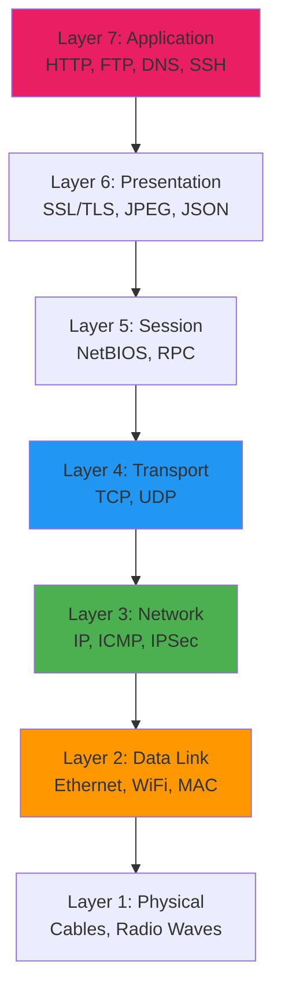
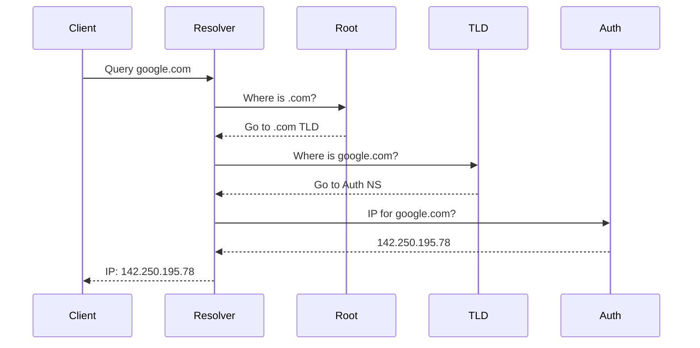
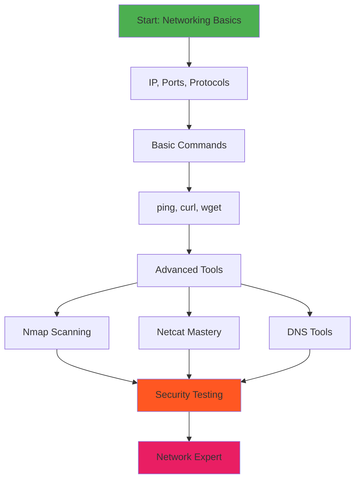
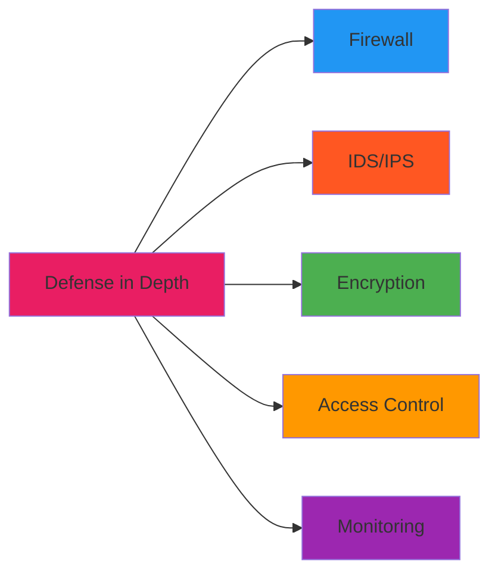

# Chapter 24: Networking Basics in Termux

```
╔═══════════════════════════════════════════════════════════════════════════════╗
║                                                                               ║
║  🌐 ██████╗  ██████╗ ███████╗    ██╗  ██╗███╗   ██╗██╗    ██╗ █████╗ ██╗     ║
║  🔌 ██╔══██╗██╔═══██╗██╔════╝    ██║  ██║████╗  ██║██║    ██║██╔══██╗██║     ║
║  📡 ██████╔╝██║   ██║███████╗    ███████║██╔██╗ ██║██║ █╗ ██║███████║██║     ║
║  📶 ██╔══██╗██║   ██║╚════██║    ██╔══██║██║╚██╗██║██║███╗██║██╔══██║██║     ║
║  🔗 ██║  ██║╚██████╔╝███████║    ██║  ██║██║ ╚████║╚███╔███╔╝██║  ██║███████╗║
║  📶 ╚═╝  ╚═╝ ╚═════╝ ╚══════╝    ╚═╝  ╚═╝╚═╝  ╚═══╝ ╚══╝╚══╝ ╚═╝  ╚═╝╚══════╝║
║                                                                               ║
║                    🎓 NETWORKING BASICS IN TERMUX 🎓                          ║
║                          Module 5 - Chapter 24                                ║
║                     "Foundation of Network Mastery"                           ║
║                                                                               ║
╚═══════════════════════════════════════════════════════════════════════════════╝
```

> **Module:** 5 - Networking  
> **Chapter:** 24 of 61  
> **Duration:** 20-25 Minutes  
> **Difficulty:** ⭐⭐ Intermediate  

---

## 📋 Chapter Overview

| Section | Content |
|---------|---------|
| Video Script | Complete Hindi narration with timestamps |
| Technical Guide | Network fundamentals, commands, HTTP, APIs |
| Commands Reference | 30+ networking commands covered |
| Practice Exercises | Hands-on network tasks |
| Troubleshooting | Common network issues |
| Video Assets | Thumbnail, description, tags |

---

## 🎬 VIDEO SCRIPT (Complete Hindi Narration)

```
═══════════════════════════════════════════════════════════════════════════════
TERMUX FULL COURSE - CHAPTER 24
Title: Networking Basics in Termux | Complete Guide | T3rmuxk1ng
Duration: 20-25 Minutes
═══════════════════════════════════════════════════════════════════════════════

[INTRO - 0:00 to 1:00]
─────────────────────────────────────────────────────────────────────────────

Namaskar Dosto! Welcome back to Termux Full Course by T3rmuxk1ng!

Aaj hum Module 5 ka pehla chapter start kar rahe hain - Networking Basics!

Networking ethical hacking ki foundation hai. Jab aap kisi bhi system 
ya network ko test karte ho, sabse pehle aapko network samajhna hota hai.
IP addresses, ports, protocols, connectivity - ye sab basics hain.

Aaj ke chapter mein hum seekhenge:
- Network fundamentals kya hote hain
- ping command se connectivity test karna
- curl aur wget se data fetch karna
- ifconfig aur ip commands
- netstat aur ss commands
- DNS lookup tools
- HTTP requests aur APIs
- Aur 30+ networking commands

To chaliye shuru karte hain!

---

[SECTION 1: NETWORK FUNDAMENTALS - 1:00 to 5:00]
─────────────────────────────────────────────────────────────────────────────

Sabse pehle networking ke basics samjhte hain.

[ON SCREEN: Network Diagram]

```
    ┌─────────┐          ┌─────────┐
    │ Phone A │ ──────── │ Phone B │
    │.1.1     │  Network │ .1.2    │
    └─────────┘          └─────────┘
          │                    │
          └────────┬───────────┘
                   │
            ┌──────▼──────┐
            │   Router    │
            │  192.168.1.1│
            │   Gateway   │
            └──────┬──────┘
                   │
              ┌────▼────┐
              │ Internet│
              │  (WAN)  │
              └─────────┘
```

**IP Address:**

IP Address har device ka unique identity hota hai network pe.
Jaise ghar ka address - postal service ke liye unique hai.
Waise hi IP address network ke liye unique hai.

IP Address do types ke hote hain:
- IPv4: 192.168.1.100 (4 numbers, dots se separate)
- IPv6: 2001:0db8:85a3:0000:0000:8a2e:0370:7334 (longer format)

IPv4 zyada common hai. IPv6 future ke liye hai kyunki IPv4 addresses 
khatam ho rahe hain.

**Private vs Public IP:**

Private IP: Sirf local network mein valid hai
- 192.168.x.x (home networks)
- 10.x.x.x (large organizations)
- 172.16.x.x to 172.31.x.x

Public IP: Internet pe visible hai, ISP deta hai.

**Port:**

Port ek number hai jo specific service ko identify karta hai.

Common ports yaad rakhein:
- Port 20, 21: FTP (File Transfer)
- Port 22: SSH (Secure Shell)
- Port 23: Telnet
- Port 25: SMTP (Email)
- Port 53: DNS
- Port 80: HTTP (Websites)
- Port 443: HTTPS (Secure Websites)
- Port 3306: MySQL Database
- Port 5432: PostgreSQL

Ports 0-1023: Well-known ports (system reserved)
Ports 1024-49151: Registered ports
Ports 49152-65535: Dynamic/Private ports

**Protocol:**

Protocol rules ka set hai - data kaise communicate hoga.

TCP: Reliable, connection-based
- Guarantee ki data pahunchega
- Used for: Web, Email, SSH

UDP: Fast, connectionless
- No guarantee, but fast
- Used for: Gaming, Streaming, DNS

Yehi fundamentals hai. Ab practical commands start karte hain.

---

[SECTION 2: PING COMMAND - 5:00 to 8:00]
─────────────────────────────────────────────────────────────────────────────

Ping sabse basic aur important network command hai.

Ping ka use connectivity test karne ke liye hota hai - kya device 
reachable hai ya nahi.

Basic syntax:

    ping <ip-or-domain>

Chaliye test karte hain:

    ping -c 4 google.com

[ON SCREEN: Command execution]

Output samjhte hain:

```
PING google.com (142.250.195.78): 56 data bytes
64 bytes from 142.250.195.78: icmp_seq=0 ttl=117 time=25.3 ms
64 bytes from 142.250.195.78: icmp_seq=1 ttl=117 time=24.8 ms
64 bytes from 142.250.195.78: icmp_seq=2 ttl=117 time=26.1 ms
64 bytes from 142.250.195.78: icmp_seq=3 ttl=117 time=25.7 ms

--- google.com ping statistics ---
4 packets transmitted, 4 packets received, 0.0% packet loss
round-trip min/avg/max/stddev = 24.8/25.5/26.1/0.5 ms
```

Ye output kya batati hai:
- icmp_seq: Packet number
- ttl: Time to Live (hops before discard)
- time: Response time in milliseconds

Packet loss 0% hona chahiye for good connection.

Ping ke useful options:

    # Specific count
    ping -c 4 google.com
    
    # Interval between packets (seconds)
    ping -i 2 google.com
    
    # Packet size
    ping -s 100 google.com
    
    # Timeout
    ping -W 5 google.com
    
    # Verbose output
    ping -v google.com
    
    # Don't fragment
    ping -M do google.com

Ping troubleshooting ke liye best tool hai. Agar website open nahi 
ho rahi, pehle ping check karein.

Agar ping fail ho raha hai:
1. Check internet connection
2. Check if host is down
3. Check if firewall is blocking ICMP
4. Check DNS resolution

---

[SECTION 3: CURL COMMAND - 8:00 to 12:00]
─────────────────────────────────────────────────────────────────────────────

Curl ek powerful tool hai HTTP requests ke liye.

Curl se aap:
- Websites fetch kar sakte ho
- APIs call kar sakte ho
- Files download kar sakte ho
- Headers dekh sakte ho
- POST/PUT/DELETE requests bhej sakte ho

Basic usage:

    curl https://example.com

Ye pura HTML return karega.

**Useful Options:**

    # Show response headers
    curl -I https://google.com
    
    # Show both request and response headers
    curl -v https://google.com
    
    # Follow redirects
    curl -L https://google.com
    
    # Save output to file
    curl -o page.html https://example.com
    
    # Download with original filename
    curl -O https://example.com/file.zip
    
    # Silent mode (no progress)
    curl -s https://example.com
    
    # Show error only
    curl -f https://nonexistent.com
    
    # Set timeout
    curl --max-time 10 https://example.com
    
    # Specify HTTP method
    curl -X GET https://api.example.com
    curl -X POST https://api.example.com
    curl -X PUT https://api.example.com
    curl -X DELETE https://api.example.com

**Sending Data:**

    # POST with data
    curl -X POST -d "name=test&email=test@test.com" https://api.example.com/users
    
    # POST JSON data
    curl -X POST -H "Content-Type: application/json" -d '{"name":"test"}' https://api.example.com/users
    
    # POST from file
    curl -X POST -d @data.json https://api.example.com/users

**Headers:**

    # Add custom header
    curl -H "Authorization: Bearer token123" https://api.example.com
    
    # Add multiple headers
    curl -H "Content-Type: application/json" -H "Authorization: Bearer token" https://api.example.com

**Cookies:**

    # Send cookies
    curl -b "session=abc123" https://example.com
    
    # Save cookies from response
    curl -c cookies.txt https://example.com
    
    # Use saved cookies
    curl -b cookies.txt https://example.com

**Authentication:**

    # Basic auth
    curl -u username:password https://api.example.com
    
    # Bearer token
    curl -H "Authorization: Bearer YOUR_TOKEN" https://api.example.com

Curl API testing ke liye perfect hai!

---

[SECTION 4: WGET COMMAND - 12:00 to 15:00]
─────────────────────────────────────────────────────────────────────────────

Wget primarily file downloading ke liye use hota hai.

Curl vs Wget:
- Curl: Data transfer, API testing
- Wget: Downloading files, mirroring websites

Basic download:

    wget https://example.com/file.zip

**Useful Options:**

    # Download with different name
    wget -O myfile.zip https://example.com/file.zip
    
    # Resume interrupted download
    wget -c https://example.com/large-file.zip
    
    # Download in background
    wget -b https://example.com/file.zip
    
    # Limit download speed
    wget --limit-rate=200k https://example.com/file.zip
    
    # Retry on failure
    wget -t 5 https://example.com/file.zip
    
    # Download multiple files from list
    wget -i urls.txt
    
    # Mirror entire website
    wget -m https://example.com
    
    # Download specific file types
    wget -r -A.pdf https://example.com
    
    # Ignore robots.txt
    wget -e robots=off https://example.com
    
    # Set user agent
    wget -U "Mozilla/5.0" https://example.com
    
    # Authenticate
    wget --user=username --password=password https://example.com/protected.zip
    
    # Recursive download with depth
    wget -r -l 2 https://example.com

**Practical Examples:**

    # Download GitHub repository archive
    wget https://github.com/user/repo/archive/main.zip
    
    # Download with all required files
    wget -p -k https://example.com/page.html
    
    # Download entire site for offline viewing
    wget --mirror --convert-links --adjust-extension --page-requisites --no-parent https://example.com

Wget bahut powerful hai downloading ke liye!

---

[SECTION 5: IFCONFIG VS IP COMMAND - 15:00 to 17:00]
─────────────────────────────────────────────────────────────────────────────

Network interfaces check karne ke liye ifconfig aur ip commands use hote hain.

**ifconfig (Old but still useful):**

Termux mein ifconfig ke liye net-tools install karein:

    pkg install net-tools

Usage:

    # Show all interfaces
    ifconfig
    
    # Show specific interface
    ifconfig wlan0
    
    # Show only active interfaces
    ifconfig -s

Output samjhte hain:

```
wlan0: flags=4163<UP,BROADCAST,RUNNING,MULTICAST>  mtu 1500
        inet 192.168.1.100  netmask 255.255.255.0  broadcast 192.168.1.255
        inet6 fe80::1a2b:3c4d:5e6f  prefixlen 64  scopeid 0x20<link>
        ether aa:bb:cc:dd:ee:ff  txqueuelen 1000  (Ethernet)
        RX packets 12345  bytes 1234567 (1.2 MB)
        TX packets 54321  bytes 5432109 (5.4 MB)
```

Key fields:
- inet: IPv4 address
- inet6: IPv6 address
- ether: MAC address
- RX packets: Received data
- TX packets: Transmitted data

**ip command (Modern):**

ip command newer hai aur zyada features deta hai.

    # Show all interfaces
    ip addr
    ip a
    
    # Show specific interface
    ip addr show wlan0
    
    # Show IPv4 only
    ip -4 addr
    
    # Show IPv6 only
    ip -6 addr
    
    # Show link status
    ip link
    
    # Show routing table
    ip route
    ip r
    
    # Show default gateway
    ip route | grep default
    
    # Show ARP table
    ip neigh

**Network Statistics:**

    # Show socket statistics
    ss
    
    # Show all sockets
    ss -a
    
    # Show TCP sockets
    ss -t
    
    # Show UDP sockets
    ss -u
    
    # Show listening sockets
    ss -l
    
    # Show with process info
    ss -p
    
    # Show with numeric addresses
    ss -n

Ye commands network troubleshooting ke liye essential hain!

---

[SECTION 6: NETSTAT AND SS COMMANDS - 17:00 to 19:00]
─────────────────────────────────────────────────────────────────────────────

netstat aur ss commands se aap network connections dekh sakte ho.

**netstat (Classic):**

    pkg install net-tools

Usage:

    # Show all connections
    netstat -a
    
    # Show TCP connections
    netstat -t
    
    # Show UDP connections
    netstat -u
    
    # Show listening ports
    netstat -l
    
    # Show with PID/Program
    netstat -p
    
    # Show numeric addresses
    netstat -n
    
    # Show routing table
    netstat -r
    
    # Show interface statistics
    netstat -i
    
    # Common combination
    netstat -tulpn
    
    # Continuous monitoring
    netstat -c

**ss (Socket Statistics - Modern):**

ss netstat ka replacement hai - faster aur more detailed.

    # Show all sockets
    ss -a
    
    # Show TCP sockets
    ss -t
    
    # Show UDP sockets
    ss -u
    
    # Show listening sockets
    ss -l
    
    # Show with process info
    ss -p
    
    # Show numeric
    ss -n
    
    # Show established connections
    ss -s
    
    # Common combination
    ss -tulpn
    
    # Filter by state
    ss -t state established
    ss -t state listening
    
    # Filter by port
    ss -t 'sport = :80'
    ss -t 'dport = :443'

**Practical Use Cases:**

    # Check if port is in use
    ss -tulpn | grep :80
    
    # Check all SSH connections
    ss -t | grep :22
    
    # Count connections
    ss -s

---

[SECTION 7: DNS LOOKUP TOOLS - 19:00 to 21:00]
─────────────────────────────────────────────────────────────────────────────

DNS lookup tools se aap domain names ka IP address nikal sakte ho 
aur DNS records dekh sakte ho.

**nslookup:**

    pkg install dnsutils

    # Basic lookup
    nslookup google.com
    
    # Query specific DNS server
    nslookup google.com 8.8.8.8
    
    # Query specific record type
    nslookup -type=mx gmail.com
    nslookup -type=ns google.com
    nslookup -type=txt google.com
    
    # Reverse DNS lookup
    nslookup 8.8.8.8

**dig (More Powerful):**

    # Basic query
    dig google.com
    
    # Short answer
    dig +short google.com
    
    # Specific record type
    dig MX gmail.com
    dig NS google.com
    dig TXT google.com
    dig A google.com
    dig AAAA google.com
    dig CNAME www.google.com
    dig SOA google.com
    
    # Use specific DNS server
    dig @8.8.8.8 google.com
    
    # Reverse lookup
    dig -x 8.8.8.8
    
    # Trace DNS path
    dig +trace google.com
    
    # Show only answer
    dig google.com +noall +answer
    
    # Query all record types
    dig google.com ANY

**DNS Record Types:**

    A       - IPv4 address
    AAAA    - IPv6 address
    CNAME   - Canonical name (alias)
    MX      - Mail exchange
    NS      - Name server
    TXT     - Text records
    SOA     - Start of authority
    PTR     - Pointer (reverse DNS)
    SRV     - Service record

---

[SECTION 8: TRACEROUTE - 21:00 to 22:30]
─────────────────────────────────────────────────────────────────────────────

Traceroute se aap dekh sakte ho ki aapka data kahan-kahan se guzarta hai.

    pkg install traceroute

    # Basic traceroute
    traceroute google.com
    
    # Use ICMP
    traceroute -I google.com
    
    # Use TCP
    traceroute -T google.com
    
    # Specify max hops
    traceroute -m 30 google.com
    
    # Specify port
    traceroute -p 443 google.com
    
    # Don't resolve hostnames
    traceroute -n google.com

Output samjhte hain:

```
 1  192.168.1.1 (192.168.1.1)  1.234 ms  1.123 ms  1.111 ms
 2  10.0.0.1 (10.0.0.1)  5.432 ms  5.321 ms  5.234 ms
 3  172.16.0.1 (172.16.0.1)  10.123 ms  10.234 ms  10.345 ms
 4  * * *
 5  google-router.net (142.250.80.46)  25.123 ms  24.987 ms  25.456 ms
```

Har line ek hop hai - ek router jahan se data guzra.
Three times ka measurement hai (round trip time).
`* * *` ka matlab timeout - wo router respond nahi kar raha.

Traceroute network troubleshooting ke liye bahut useful hai:
- Kahan lag rahi hai problem
- Kitna latency hai
- Data ka path kya hai

---

[SECTION 9: HTTP METHODS AND API REQUESTS - 22:30 to 25:00]
─────────────────────────────────────────────────────────────────────────────

Ab HTTP methods aur API requests ke baare mein samjhte hain.

**HTTP Methods:**

GET     - Data retrieve karna
POST    - New data create karna
PUT     - Existing data update karna
PATCH   - Partial update
DELETE  - Data delete karna

**HTTP Status Codes:**

2xx - Success
- 200 OK
- 201 Created
- 204 No Content

3xx - Redirect
- 301 Moved Permanently
- 302 Found
- 304 Not Modified

4xx - Client Error
- 400 Bad Request
- 401 Unauthorized
- 403 Forbidden
- 404 Not Found
- 429 Too Many Requests

5xx - Server Error
- 500 Internal Server Error
- 502 Bad Gateway
- 503 Service Unavailable

**API Request Examples:**

    # GET request
    curl -X GET https://jsonplaceholder.typicode.com/posts
    
    # POST request with JSON
    curl -X POST \
      -H "Content-Type: application/json" \
      -d '{"title":"Test","body":"Content","userId":1}' \
      https://jsonplaceholder.typicode.com/posts
    
    # PUT request
    curl -X PUT \
      -H "Content-Type: application/json" \
      -d '{"title":"Updated"}' \
      https://jsonplaceholder.typicode.com/posts/1
    
    # DELETE request
    curl -X DELETE https://jsonplaceholder.typicode.com/posts/1

**JSON Parsing with jq:**

jq ek powerful tool hai JSON data ko parse karne ke liye.

    pkg install jq

    # Pretty print JSON
    curl -s https://jsonplaceholder.typicode.com/posts/1 | jq
    
    # Get specific field
    curl -s https://jsonplaceholder.typicode.com/posts/1 | jq '.title'
    
    # Get nested field
    curl -s 'https://jsonplaceholder.typicode.com/users/1' | jq '.address.city'
    
    # Get array elements
    curl -s https://jsonplaceholder.typicode.com/posts | jq '.[0]'
    
    # Get all titles
    curl -s https://jsonplaceholder.typicode.com/posts | jq '.[].title'
    
    # Filter data
    curl -s https://jsonplaceholder.typicode.com/posts | jq '.[] | select(.userId == 1)'
    
    # Count elements
    curl -s https://jsonplaceholder.typicode.com/posts | jq 'length'
    
    # Extract multiple fields
    curl -s https://jsonplaceholder.typicode.com/posts/1 | jq '{id, title, body}'

**URL Encoding:**

    pkg install python
    
    # URL encode
    python3 -c "import urllib.parse; print(urllib.parse.quote('hello world'))"
    
    # URL decode
    python3 -c "import urllib.parse; print(urllib.parse.unquote('hello%20world'))"

---

[SECTION 10: 30+ NETWORKING COMMANDS SUMMARY - 25:00 to 27:00]
─────────────────────────────────────────────────────────────────────────────

Ab main aapko 30+ networking commands ka quick summary deta hoon:

┌─────────────────────────────────────────────────────────────────────────┐
│                    NETWORKING COMMANDS CHEAT SHEET                        │
├──────────────────────┬──────────────────────────────────────────────────┤
│ Command              │ Purpose                                          │
├──────────────────────┼──────────────────────────────────────────────────┤
│ ping                 │ Test connectivity                                │
│ curl                 │ HTTP requests, data transfer                     │
│ wget                 │ Download files                                   │
│ ifconfig             │ Network interface info (old)                     │
│ ip addr              │ Network interface info (modern)                  │
│ ip route             │ Routing table                                    │
│ ip link              │ Network links                                    │
│ netstat              │ Network statistics (old)                         │
│ ss                   │ Socket statistics (modern)                       │
│ nslookup             │ DNS lookup                                       │
│ dig                  │ Advanced DNS lookup                              │
│ traceroute           │ Trace packet path                                │
│ tracepath            │ Trace path with MTU                              │
│ host                 │ DNS lookup utility                               │
│ whois                │ Domain info lookup                               │
│ nc/netcat            │ Network utility tool                             │
│ nmap                 │ Network scanner                                  │
│ arp                  │ ARP table manipulation                           │
│ route                │ Routing table (old)                              │
│ iwconfig             │ Wireless interface config                        │
│ iw                   │ Wireless interface (modern)                      │
│ hostname             │ Show/set hostname                                │
│ dnsdomainname        │ Show DNS domain name                             │
│ ntpdate              │ Sync time with NTP server                        │
│ scp                  │ Secure copy over SSH                             │
│ sftp                 │ Secure file transfer                             │
│ rsync                │ File synchronization                             │
│ ssh                  │ Secure shell client                              │
│ telnet               │ Telnet protocol client                           │
│ ftp                  │ FTP client                                       │
│ tftp                 │ Trivial FTP client                               │
│ curl                 │ Transfer data with URLs                          │
│ httping              │ Ping HTTP servers                                │
│ mtr                  │ My traceroute (combined ping+trace)              │
│ hping3               │ Packet crafting tool                             │
└──────────────────────┴──────────────────────────────────────────────────┘

Ye commands install karna padega Termux mein:

    pkg install net-tools curl wget dnsutils traceroute jq

---

[SECTION 11: SUMMARY & NEXT CHAPTER PREVIEW - 27:00 to 28:00]
─────────────────────────────────────────────────────────────────────────────

To dosto, Chapter 24 complete! Let's summarize:

✅ Network fundamentals - IP, Ports, Protocols
✅ ping command - Connectivity testing
✅ curl command - HTTP requests aur API testing
✅ wget command - File downloading
✅ ifconfig vs ip - Network interface info
✅ netstat aur ss - Connection statistics
✅ DNS lookup - nslookup, dig
✅ traceroute - Path tracing
✅ HTTP methods - GET, POST, PUT, DELETE
✅ jq - JSON parsing
✅ 30+ networking commands

Important commands yaad rakhein:

┌─────────────────────────────────────────────────────────────────────────┐
│                    CHAPTER 24 - IMPORTANT COMMANDS                        │
├─────────────────────────────────────────────────────────────────────────┤
│ ping -c 4 google.com              │ Test connectivity                   │
│ curl -I https://google.com        │ Get HTTP headers                    │
│ curl -X POST -d '{"key":"val"}'   │ POST JSON data                      │
│ wget -c URL                       │ Resume download                     │
│ ip addr                           │ Show IP addresses                   │
│ ip route                          │ Show routing table                  │
│ ss -tulpn                         │ Show listening ports                │
│ dig +short google.com             │ Quick DNS lookup                    │
│ traceroute google.com             │ Trace network path                  │
│ jq '.' file.json                  │ Pretty print JSON                   │
└─────────────────────────────────────────────────────────────────────────┘

Next Chapter 25 mein hum seekhenge:
- Nmap installation
- Nmap basics
- Port scanning techniques
- Service detection
- OS detection
- Nmap scripting engine

Agar ye video helpful lagi, to:
👍 Like button press karein
🔔 Subscribe karein, notification bell on karein
💬 Koi sawal ho to comment mein poochein
📤 Share karein friends ke saath

Main har comment ka reply karta hoon.

Thank you for watching! See you in Chapter 25!

═══════════════════════════════════════════════════════════════════════════════
```

---

## 📖 TECHNICAL GUIDE

### 1. Network Fundamentals

```
┌─────────────────────────────────────────────────────────────────────────┐
│                         NETWORK FUNDAMENTALS                             │
├─────────────────────────────────────────────────────────────────────────┤
│                                                                          │
│  ┌─────────────────────────────────────────────────────────────────┐    │
│  │                        OSI MODEL                                 │    │
│  ├─────────────────────────────────────────────────────────────────┤    │
│  │  Layer 7  │ Application   │ HTTP, FTP, DNS, SSH               │    │
│  │  Layer 6  │ Presentation  │ SSL/TLS, JPEG, JSON               │    │
│  │  Layer 5  │ Session       │ NetBIOS, RPC                      │    │
│  │  Layer 4  │ Transport     │ TCP, UDP                          │    │
│  │  Layer 3  │ Network       │ IP, ICMP, IPSec                   │    │
│  │  Layer 2  │ Data Link     │ Ethernet, WiFi, MAC               │    │
│  │  Layer 1  │ Physical      │ Cables, Radio Waves               │    │
│  └─────────────────────────────────────────────────────────────────┘    │
│                                                                          │
│  ┌─────────────────────────────────────────────────────────────────┐    │
│  │                        IP ADDRESS TYPES                          │    │
│  ├─────────────────────────────────────────────────────────────────┤    │
│  │  IPv4: 32-bit (4 octets)    │ Example: 192.168.1.1             │    │
│  │  IPv6: 128-bit (8 groups)   │ Example: 2001:db8::1             │    │
│  └─────────────────────────────────────────────────────────────────┘    │
│                                                                          │
│  ┌─────────────────────────────────────────────────────────────────┐    │
│  │                    PRIVATE IP RANGES                             │    │
│  ├─────────────────────────────────────────────────────────────────┤    │
│  │  Class A: 10.0.0.0 - 10.255.255.255                             │    │
│  │  Class B: 172.16.0.0 - 172.31.255.255                           │    │
│  │  Class C: 192.168.0.0 - 192.168.255.255                         │    │
│  └─────────────────────────────────────────────────────────────────┘    │
│                                                                          │
└─────────────────────────────────────────────────────────────────────────┘
```

### 2. Common Ports Reference

```
┌─────────────────────────────────────────────────────────────────────────┐
│                         COMMON PORTS REFERENCE                           │
├─────────┬───────────────┬───────────────────────────────────────────────┤
│ Port    │ Service       │ Description                                   │
├─────────┼───────────────┼───────────────────────────────────────────────┤
│ 20      │ FTP Data      │ File Transfer Protocol (data)                 │
│ 21      │ FTP Control   │ File Transfer Protocol (control)              │
│ 22      │ SSH           │ Secure Shell                                  │
│ 23      │ Telnet        │ Telnet Protocol (insecure)                    │
│ 25      │ SMTP          │ Simple Mail Transfer Protocol                 │
│ 53      │ DNS           │ Domain Name System                            │
│ 67/68   │ DHCP          │ Dynamic Host Configuration Protocol           │
│ 69      │ TFTP          │ Trivial File Transfer Protocol                │
│ 80      │ HTTP          │ Hypertext Transfer Protocol                   │
│ 110     │ POP3          │ Post Office Protocol v3                       │
│ 119     │ NNTP          │ Network News Transfer Protocol                │
│ 123     │ NTP           │ Network Time Protocol                         │
│ 143     │ IMAP          │ Internet Message Access Protocol              │
│ 161     │ SNMP          │ Simple Network Management Protocol            │
│ 194     │ IRC           │ Internet Relay Chat                           │
│ 389     │ LDAP          │ Lightweight Directory Access Protocol         │
│ 443     │ HTTPS         │ HTTP Secure                                   │
│ 465     │ SMTPS         │ SMTP over SSL                                 │
│ 514     │ Syslog        │ System Logging Protocol                       │
│ 587     │ SMTP          │ SMTP (submission)                             │
│ 636     │ LDAPS         │ LDAP over SSL                                 │
│ 993     │ IMAPS         │ IMAP over SSL                                 │
│ 995     │ POP3S         │ POP3 over SSL                                 │
│ 1433    │ MS-SQL        │ Microsoft SQL Server                          │
│ 1521    │ Oracle        │ Oracle Database                               │
│ 3306    │ MySQL         │ MySQL Database                                │
│ 3389    │ RDP           │ Remote Desktop Protocol                       │
│ 5432    │ PostgreSQL    │ PostgreSQL Database                           │
│ 5900    │ VNC           │ Virtual Network Computing                     │
│ 6379    │ Redis         │ Redis Database                                │
│ 8080    │ HTTP Proxy    │ HTTP Proxy / Alternate HTTP                   │
│ 8443    │ HTTPS Alt     │ Alternate HTTPS                               │
│ 27017   │ MongoDB       │ MongoDB Database                              │
└─────────┴───────────────┴───────────────────────────────────────────────┘
```

### 3. HTTP Request/Response Structure

```
┌─────────────────────────────────────────────────────────────────────────┐
│                       HTTP REQUEST STRUCTURE                             │
├─────────────────────────────────────────────────────────────────────────┤
│                                                                          │
│  GET /api/users HTTP/1.1                                                 │
│  Host: example.com                                                       │
│  User-Agent: curl/7.68.0                                                 │
│  Accept: application/json                                                │
│  Authorization: Bearer token123                                          │
│  Content-Type: application/json                                          │
│                                                                          │
│  {"query": "search term"}                                                │
│                                                                          │
│  ┌─────────────────────────────────────────────────────────────────┐    │
│  │  1. Request Line: METHOD PATH VERSION                            │    │
│  │  2. Headers: Key: Value pairs                                    │    │
│  │  3. Empty Line: Separator                                        │    │
│  │  4. Body: Data (for POST/PUT/PATCH)                              │    │
│  └─────────────────────────────────────────────────────────────────┘    │
│                                                                          │
└─────────────────────────────────────────────────────────────────────────┘

┌─────────────────────────────────────────────────────────────────────────┐
│                      HTTP RESPONSE STRUCTURE                             │
├─────────────────────────────────────────────────────────────────────────┤
│                                                                          │
│  HTTP/1.1 200 OK                                                         │
│  Date: Mon, 01 Jan 2024 12:00:00 GMT                                     │
│  Server: nginx/1.18.0                                                    │
│  Content-Type: application/json                                          │
│  Content-Length: 1234                                                    │
│  Connection: keep-alive                                                  │
│                                                                          │
│  {"status": "success", "data": [...]}                                    │
│                                                                          │
│  ┌─────────────────────────────────────────────────────────────────┐    │
│  │  1. Status Line: VERSION STATUS_CODE STATUS_TEXT                 │    │
│  │  2. Headers: Key: Value pairs                                    │    │
│  │  3. Empty Line: Separator                                        │    │
│  │  4. Body: Response data                                          │    │
│  └─────────────────────────────────────────────────────────────────┘    │
│                                                                          │
└─────────────────────────────────────────────────────────────────────────┘
```

### 4. DNS Record Types

```
┌─────────────────────────────────────────────────────────────────────────┐
│                         DNS RECORD TYPES                                 │
├─────────┬───────────────────────────────────────────────────────────────┤
│ Type    │ Description                                                   │
├─────────┼───────────────────────────────────────────────────────────────┤
│ A       │ Maps domain to IPv4 address                                   │
│ AAAA    │ Maps domain to IPv6 address                                   │
│ CNAME   │ Alias of one domain to another                                │
│ MX      │ Mail exchange servers for domain                              │
│ NS      │ Authoritative name servers                                    │
│ PTR     │ Reverse DNS lookup (IP to domain)                             │
│ SOA     │ Start of Authority record                                     │
│ SRV     │ Service location (port and weight)                            │
│ TXT     │ Text records (SPF, DKIM, verification)                        │
│ CAA     │ Certificate Authority Authorization                           │
│ DMARC   │ Domain-based Message Authentication                           │
│ DKIM    │ DomainKeys Identified Mail                                    │
│ SPF     │ Sender Policy Framework                                       │
└─────────┴───────────────────────────────────────────────────────────────┘
```

### 5. curl Options Reference

```
┌─────────────────────────────────────────────────────────────────────────┐
│                         CURL OPTIONS REFERENCE                           │
├─────────────────────┬───────────────────────────────────────────────────┤
│ Option              │ Description                                       │
├─────────────────────┼───────────────────────────────────────────────────┤
│ -X, --request       │ HTTP method (GET, POST, PUT, DELETE)             │
│ -H, --header        │ Add header                                        │
│ -d, --data          │ Send data (form/JSON)                             │
│ --data-raw          │ Send raw data without processing                  │
│ --data-urlencode    │ URL encode data                                   │
│ -F, --form          │ Send multipart form data                          │
│ -I, --head          │ Fetch headers only                                │
│ -i, --include       │ Include headers in output                         │
│ -v, --verbose       │ Verbose output                                    │
│ -s, --silent        │ Silent mode                                       │
│ -S, --show-error    │ Show errors in silent mode                        │
│ -L, --location      │ Follow redirects                                  │
│ -o, --output        │ Write output to file                              │
│ -O, --remote-name   │ Write output with remote filename                 │
│ -u, --user          │ Username and password                             │
│ -k, --insecure      │ Skip SSL verification                             │
│ -x, --proxy         │ Use proxy                                         │
│ --connect-timeout   │ Connection timeout (seconds)                      │
│ --max-time          │ Maximum time for request                          │
│ --retry             │ Number of retries                                 │
│ -A, --user-agent    │ User-Agent header                                 │
│ -b, --cookie        │ Send cookies                                      │
│ -c, --cookie-jar    │ Save cookies to file                              │
│ -e, --referer       │ Referer header                                    │
│ --compressed        │ Request compressed response                       │
│ -T, --upload-file   │ Upload file                                       │
│ --limit-rate        │ Limit transfer speed                              │
└─────────────────────┴───────────────────────────────────────────────────┘
```

### 6. jq Command Reference

```
┌─────────────────────────────────────────────────────────────────────────┐
│                          JQ COMMAND REFERENCE                            │
├─────────────────────────────────────────────────────────────────────────┤
│                                                                          │
│  # Basic Filters                                                         │
│  jq '.'              # Pretty print                                      │
│  jq '.key'           # Get specific key                                  │
│  jq '.key.nested'    # Get nested value                                  │
│  jq '.[0]'           # Get array element                                 │
│  jq '.[]'            # Iterate all elements                              │
│  jq '.[].key'        # Get key from all elements                         │
│                                                                          │
│  # Selection & Filtering                                                 │
│  jq 'select(.age > 18)'           # Conditional selection               │
│  jq '.[] | select(.active)'       # Filter by boolean                   │
│  jq 'map(select(.id > 5))'        # Map with filter                     │
│                                                                          │
│  # Transformation                                                        │
│  jq 'map(.price * 1.1)'           # Transform values                    │
│  jq 'sort_by(.name)'              # Sort array                          │
│  jq 'group_by(.category)'         # Group elements                      │
│  jq 'unique'                      # Remove duplicates                   │
│  jq 'reverse'                     # Reverse array                       │
│                                                                          │
│  # Object Creation                                                       │
│  jq '{name, age}'                 # Create new object                   │
│  jq '{user: .username}'           # Rename keys                         │
│                                                                          │
│  # String Operations                                                     │
│  jq 'length'                      # Length of string/array              │
│  jq 'split(",")'                  # Split string                        │
│  jq 'join(",")'                   # Join array                          │
│  jq 'ascii_downcase'              # Lowercase                           │
│  jq 'ascii_upcase'                # Uppercase                           │
│  jq 'gsub("old"; "new")'          # Replace all                        │
│                                                                          │
│  # Math                                                                  │
│  jq 'add'                         # Sum of array                        │
│  jq 'min'                         # Minimum value                       │
│  jq 'max'                         # Maximum value                       │
│  jq 'floor'                       # Round down                          │
│  jq 'sqrt'                        # Square root                         │
│                                                                          │
│  # Useful Combinations                                                   │
│  jq 'keys'                        # Get all keys                        │
│  jq 'values'                      # Get all values                      │
│  jq 'to_entries'                  # Convert to key-value pairs          │
│  jq 'from_entries'                # Convert back from entries           │
│  jq 'has("key")'                  # Check if key exists                 │
│  jq 'type'                        # Get value type                      │
│  jq 'empty'                       # Produce no output                   │
│                                                                          │
└─────────────────────────────────────────────────────────────────────────┘
```

---

## 📋 COMMANDS REFERENCE

### Connectivity Testing

```bash
# Basic ping
ping google.com

# Ping with count
ping -c 4 google.com

# Ping with interval
ping -i 2 google.com

# Ping with packet size
ping -s 1000 google.com

# Ping with timeout
ping -W 5 google.com

# Don't fragment ping
ping -M do -s 1472 google.com

# Flood ping (root required)
ping -f google.com

# HTTP ping
pkg install httping
httping google.com
httping -c 5 google.com

# MTR (My Traceroute)
pkg install mtr
mtr google.com
```

### HTTP Requests with curl

```bash
# Basic GET request
curl https://example.com

# GET with headers shown
curl -i https://example.com

# GET headers only
curl -I https://example.com

# Follow redirects
curl -L https://example.com

# Save to file
curl -o output.html https://example.com

# Download with original name
curl -O https://example.com/file.zip

# POST form data
curl -X POST -d "name=John&age=30" https://api.example.com/users

# POST JSON
curl -X POST \
  -H "Content-Type: application/json" \
  -d '{"name":"John","age":30}' \
  https://api.example.com/users

# POST from file
curl -X POST -d @data.json https://api.example.com/users

# PUT request
curl -X PUT \
  -H "Content-Type: application/json" \
  -d '{"name":"John Updated"}' \
  https://api.example.com/users/1

# DELETE request
curl -X DELETE https://api.example.com/users/1

# Basic authentication
curl -u username:password https://api.example.com

# Bearer token
curl -H "Authorization: Bearer YOUR_TOKEN" https://api.example.com

# Add custom headers
curl -H "X-Custom-Header: value" https://api.example.com

# Send cookies
curl -b "session=abc123" https://example.com

# Save cookies
curl -c cookies.txt https://example.com

# Use saved cookies
curl -b cookies.txt https://example.com

# User agent
curl -A "Mozilla/5.0" https://example.com

# Proxy
curl -x http://proxy:8080 https://example.com

# Timeout
curl --connect-timeout 10 --max-time 30 https://example.com

# Retry on failure
curl --retry 3 https://example.com

# Silent mode
curl -s https://example.com

# Verbose mode
curl -v https://example.com

# Skip SSL verification
curl -k https://self-signed.example.com

# Upload file
curl -T file.txt https://example.com/upload

# Multiple requests
curl -O https://example.com/file1.zip -O https://example.com/file2.zip
```

### File Download with wget

```bash
# Basic download
wget https://example.com/file.zip

# Download with different name
wget -O myfile.zip https://example.com/file.zip

# Resume download
wget -c https://example.com/large-file.zip

# Background download
wget -b https://example.com/file.zip

# Download from list
wget -i urls.txt

# Limit speed
wget --limit-rate=200k https://example.com/file.zip

# Retry count
wget -t 5 https://example.com/file.zip

# Mirror website
wget -m https://example.com

# Download recursively
wget -r https://example.com

# Download specific file types
wget -r -A.pdf https://example.com

# Ignore robots.txt
wget -e robots=off https://example.com

# Authentication
wget --user=username --password=password https://example.com/protected

# Set user agent
wget -U "Mozilla/5.0" https://example.com

# Complete mirror options
wget --mirror --convert-links --adjust-extension --page-requisites --no-parent https://example.com
```

### Network Interface Commands

```bash
# Show all interfaces (ifconfig)
ifconfig

# Show specific interface
ifconfig wlan0

# Show interface statistics
ifconfig -s

# Show all interfaces (ip)
ip addr
ip a

# Show specific interface
ip addr show wlan0

# Show IPv4 only
ip -4 addr

# Show IPv6 only
ip -6 addr

# Show link status
ip link

# Bring interface up/down
ip link set wlan0 up
ip link set wlan0 down

# Show routing table
ip route
ip r

# Show default gateway
ip route | grep default

# Add route
ip route add 192.168.2.0/24 via 192.168.1.1

# Delete route
ip route del 192.168.2.0/24

# Show ARP table
ip neigh
ip n

# Flush ARP cache
ip neigh flush all

# Show hostname
hostname

# Show DNS domain
dnsdomainname
```

### Connection Statistics

```bash
# Show all connections (netstat)
netstat -a

# Show TCP connections
netstat -t

# Show UDP connections
netstat -u

# Show listening sockets
netstat -l

# Show with PIDs
netstat -p

# Show numeric
netstat -n

# Common combination
netstat -tulpn

# Show routing table
netstat -r

# Show interface statistics
netstat -i

# Continuous monitoring
netstat -c

# Show all sockets (ss)
ss -a

# Show TCP sockets
ss -t

# Show UDP sockets
ss -u

# Show listening sockets
ss -l

# Show with PIDs
ss -p

# Show numeric
ss -n

# Show statistics
ss -s

# Common combination
ss -tulpn

# Filter by state
ss -t state established
ss -t state listening

# Filter by port
ss -t 'sport = :80'
ss -t 'dport = :443'

# Check specific port
ss -tulpn | grep :80
```

### DNS Commands

```bash
# Basic nslookup
nslookup google.com

# Use specific DNS server
nslookup google.com 8.8.8.8

# Query specific record
nslookup -type=mx gmail.com
nslookup -type=ns google.com
nslookup -type=txt google.com

# Reverse lookup
nslookup 8.8.8.8

# Basic dig
dig google.com

# Short answer
dig +short google.com

# Specific record types
dig A google.com
dig AAAA google.com
dig MX gmail.com
dig NS google.com
dig TXT google.com
dig CNAME www.google.com
dig SOA google.com
dig ANY google.com

# Use specific DNS server
dig @8.8.8.8 google.com

# Reverse lookup
dig -x 8.8.8.8

# Trace query
dig +trace google.com

# Show only answer
dig google.com +noall +answer

# Query multiple domains
dig google.com yahoo.com

# host command
host google.com
host -t mx gmail.com
host 8.8.8.8

# whois lookup
pkg install whois
whois google.com
```

### Traceroute Commands

```bash
# Basic traceroute
traceroute google.com

# Use ICMP
traceroute -I google.com

# Use TCP
traceroute -T google.com

# Specify max hops
traceroute -m 30 google.com

# Specify port
traceroute -p 443 google.com

# Don't resolve hostnames
traceroute -n google.com

# tracepath (no root required)
pkg install iputils
tracepath google.com

# MTR (My Traceroute)
mtr google.com
mtr -c 10 google.com
mtr -r google.com  # Report mode
```

### JSON Processing with jq

```bash
# Install jq
pkg install jq

# Pretty print
curl -s https://jsonplaceholder.typicode.com/posts/1 | jq

# Get specific field
curl -s https://jsonplaceholder.typicode.com/posts/1 | jq '.title'

# Get nested field
curl -s 'https://jsonplaceholder.typicode.com/users/1' | jq '.address.city'

# Get array element
curl -s https://jsonplaceholder.typicode.com/posts | jq '.[0]'

# Get all titles
curl -s https://jsonplaceholder.typicode.com/posts | jq '.[].title'

# Filter data
curl -s https://jsonplaceholder.typicode.com/posts | jq '.[] | select(.userId == 1)'

# Count elements
curl -s https://jsonplaceholder.typicode.com/posts | jq 'length'

# Extract multiple fields
curl -s https://jsonplaceholder.typicode.com/posts/1 | jq '{id, title, body}'

# Create new object
curl -s https://jsonplaceholder.typicode.com/posts/1 | jq '{post_id: .id, post_title: .title}'

# Sort by field
curl -s https://jsonplaceholder.typicode.com/posts | jq 'sort_by(.id)'

# Get unique values
curl -s https://jsonplaceholder.typicode.com/posts | jq '[.[].userId] | unique'

# Process local file
jq '.' data.json
jq '.users' data.json
```

### URL Encoding

```bash
# URL encode
python3 -c "import urllib.parse; print(urllib.parse.quote('hello world'))"
# Output: hello%20world

# URL decode
python3 -c "import urllib.parse; print(urllib.parse.unquote('hello%20world'))"
# Output: hello world

# Encode with safe characters
python3 -c "import urllib.parse; print(urllib.parse.quote('hello world', safe=''))"

# Encode dictionary
python3 -c "import urllib.parse; print(urllib.parse.urlencode({'name': 'John Doe', 'age': 30}))"
# Output: name=John+Doe&age=30

# Using jq for URL encoding
jq -Rr '@uri' <<< "hello world"
```

### Miscellaneous Network Commands

```bash
# Show open files and network connections
lsof -i
lsof -i :80

# Check if port is open (netcat)
nc -zv google.com 80
nc -zv google.com 80-443

# Get public IP
curl ifconfig.me
curl icanhazip.com
curl ipinfo.io/ip

# Get IP info
curl ipinfo.io

# Check HTTP headers
curl -I https://google.com

# Download speed test
curl -o /dev/null -w "Speed: %{speed_download} bytes/sec\n" https://example.com/large-file

# Check if website is up
curl -Is https://google.com | head -n 1

# HTTP status code only
curl -s -o /dev/null -w "%{http_code}" https://google.com

# Network speed (iperf - requires server)
pkg install iperf3
iperf3 -c server.ip

# Wake on LAN
pkg install wakeonlan
wakeonlan AA:BB:CC:DD:EE:FF

# Check bandwidth
pkg install nload
nload

# Network monitoring
pkg install iftop
iftop
```

---

## 💻 PRACTICE EXERCISES

### Exercise 1: Connectivity Testing

```bash
# Task: Test connectivity to various hosts

# Step 1: Test basic connectivity
ping -c 4 google.com

# Step 2: Test with different packet sizes
ping -c 4 -s 100 google.com
ping -c 4 -s 1000 google.com

# Step 3: Check if host is reachable
ping -c 1 google.com && echo "Host is up" || echo "Host is down"

# Step 4: Test multiple hosts
for host in google.com youtube.com github.com; do
    ping -c 1 $host > /dev/null && echo "$host is up" || echo "$host is down"
done

# Step 5: Check your public IP
curl ifconfig.me

# Expected: Your public IP address displayed
```

### Exercise 2: HTTP Requests

```bash
# Task: Make various HTTP requests

# Step 1: Simple GET request
curl https://jsonplaceholder.typicode.com/posts

# Step 2: Get specific resource
curl https://jsonplaceholder.typicode.com/posts/1

# Step 3: Get headers only
curl -I https://jsonplaceholder.typicode.com/posts/1

# Step 4: POST request with JSON
curl -X POST \
  -H "Content-Type: application/json" \
  -d '{"title":"My Post","body":"This is content","userId":1}' \
  https://jsonplaceholder.typicode.com/posts

# Step 5: PUT request
curl -X PUT \
  -H "Content-Type: application/json" \
  -d '{"title":"Updated Title"}' \
  https://jsonplaceholder.typicode.com/posts/1

# Step 6: DELETE request
curl -X DELETE https://jsonplaceholder.typicode.com/posts/1

# Step 7: Check HTTP status code
curl -s -o /dev/null -w "%{http_code}\n" https://jsonplaceholder.typicode.com/posts/1
```

### Exercise 3: JSON Processing

```bash
# Task: Process JSON data with jq

# Step 1: Install jq
pkg install jq -y

# Step 2: Pretty print JSON
curl -s https://jsonplaceholder.typicode.com/posts/1 | jq

# Step 3: Extract specific fields
curl -s https://jsonplaceholder.typicode.com/posts/1 | jq '.title'

# Step 4: Get nested data
curl -s 'https://jsonplaceholder.typicode.com/users/1' | jq '.address'

# Step 5: Get all user names
curl -s https://jsonplaceholder.typicode.com/users | jq '.[].name'

# Step 6: Filter posts by user
curl -s https://jsonplaceholder.typicode.com/posts | jq '.[] | select(.userId == 1)'

# Step 7: Create custom output
curl -s https://jsonplaceholder.typicode.com/users/1 | \
  jq '{name: .name, email: .email, city: .address.city}'

# Step 8: Count items
curl -s https://jsonplaceholder.typicode.com/posts | jq 'length'

# Step 9: Sort by field
curl -s https://jsonplaceholder.typicode.com/posts | jq 'sort_by(.id) | .[-3:]'
```

### Exercise 4: DNS Investigation

```bash
# Task: Investigate DNS records

# Step 1: Install DNS tools
pkg install dnsutils -y

# Step 2: Basic lookup
dig google.com

# Step 3: Get only the answer
dig +short google.com

# Step 4: Query specific record types
dig A google.com +short
dig AAAA google.com +short
dig MX gmail.com +short
dig NS google.com +short
dig TXT google.com +short

# Step 5: Use specific DNS server
dig @8.8.8.8 google.com

# Step 6: Reverse lookup
dig -x 8.8.8.8

# Step 7: Trace DNS query
dig +trace google.com

# Step 8: Create a DNS lookup script
cat > dns_check.sh << 'EOF'
#!/bin/bash
DOMAIN=$1
echo "=== DNS Records for $DOMAIN ==="
echo "A Record: $(dig +short A $DOMAIN)"
echo "AAAA Record: $(dig +short AAAA $DOMAIN)"
echo "MX Record: $(dig +short MX $DOMAIN)"
echo "NS Record: $(dig +short NS $DOMAIN)"
EOF

chmod +x dns_check.sh
./dns_check.sh google.com
```

### Exercise 5: Network Scanner Script

```bash
# Task: Create a simple network information script

cat > network_info.sh << 'EOF'
#!/bin/bash

echo "═══════════════════════════════════════════════════"
echo "           NETWORK INFORMATION SCRIPT"
echo "═══════════════════════════════════════════════════"

echo ""
echo "📡 Network Interfaces:"
ip -4 addr show | grep inet

echo ""
echo "🌐 Public IP Address:"
curl -s ifconfig.me

echo ""
echo "🚪 Default Gateway:"
ip route | grep default

echo ""
echo "📋 DNS Servers:"
cat /data/data/com.termux/files/usr/etc/resolv.conf 2>/dev/null || echo "DNS info not accessible"

echo ""
echo "🔌 Listening Ports:"
ss -tlnp 2>/dev/null || netstat -tlnp 2>/dev/null

echo ""
echo "🌐 Connectivity Test:"
ping -c 2 google.com > /dev/null && echo "✅ Internet is working" || echo "❌ No internet connection"

echo ""
echo "═══════════════════════════════════════════════════"
EOF

chmod +x network_info.sh
./network_info.sh
```

### Exercise 6: API Testing Script

```bash
# Task: Create an API testing script

cat > api_test.sh << 'EOF'
#!/bin/bash

API_URL="https://jsonplaceholder.typicode.com"

echo "═══════════════════════════════════════════════════"
echo "           API TESTING SCRIPT"
echo "═══════════════════════════════════════════════════"

echo ""
echo "1️⃣ GET Request - All Posts"
curl -s "$API_URL/posts" | jq '.[0:3]'

echo ""
echo "2️⃣ GET Request - Single Post"
curl -s "$API_URL/posts/1" | jq

echo ""
echo "3️⃣ POST Request - Create Post"
curl -s -X POST \
  -H "Content-Type: application/json" \
  -d '{"title":"Test Post","body":"Test Body","userId":1}' \
  "$API_URL/posts" | jq

echo ""
echo "4️⃣ PUT Request - Update Post"
curl -s -X PUT \
  -H "Content-Type: application/json" \
  -d '{"title":"Updated Post"}' \
  "$API_URL/posts/1" | jq

echo ""
echo "5️⃣ DELETE Request"
curl -s -X DELETE "$API_URL/posts/1" | jq

echo ""
echo "6️⃣ Response Headers"
curl -s -I "$API_URL/posts" | head -10

echo ""
echo "7️⃣ Status Code Check"
STATUS=$(curl -s -o /dev/null -w "%{http_code}" "$API_URL/posts")
echo "HTTP Status Code: $STATUS"

echo ""
echo "═══════════════════════════════════════════════════"
EOF

chmod +x api_test.sh
./api_test.sh
```

---

## ⚠️ TROUBLESHOOTING

### Problem 1: "ping: command not found"

```bash
# Cause: ping not installed

# Solution: Install iputils
pkg install iputils -y

# Alternative: Install inetutils
pkg install inetutils -y

# Verify installation
which ping
```

### Problem 2: "curl: command not found"

```bash
# Cause: curl not installed

# Solution:
pkg install curl -y

# Verify
curl --version
```

### Problem 3: "Temporary failure in name resolution"

```bash
# Cause: DNS not working

# Solution 1: Check internet connection
ping -c 2 8.8.8.8

# Solution 2: Use IP instead of domain
ping -c 2 8.8.8.8  # Google DNS

# Solution 3: Check DNS servers
cat /data/data/com.termux/files/usr/etc/resolv.conf

# Solution 4: Change DNS
echo "nameserver 8.8.8.8" > /data/data/com.termux/files/usr/etc/resolv.conf
echo "nameserver 8.8.4.4" >> /data/data/com.termux/files/usr/etc/resolv.conf
```

### Problem 4: "Permission denied" for network commands

```bash
# Cause: Some network commands require root or specific permissions

# Solution 1: Commands that work without root
ping -c 4 google.com
curl https://example.com
wget https://example.com
dig google.com

# Solution 2: For root-required commands
# You need a rooted device or use proot

# Solution 3: Use alternatives
# Instead of: traceroute -I google.com (requires root)
# Use: traceroute google.com (works without root)
```

### Problem 5: "Could not resolve host"

```bash
# Cause: DNS resolution failure

# Solution 1: Check internet
ping -c 2 8.8.8.8

# Solution 2: Use different DNS
echo "nameserver 1.1.1.1" > /data/data/com.termux/files/usr/etc/resolv.conf

# Solution 3: Check hosts file
cat /data/data/com.termux/files/usr/etc/hosts

# Solution 4: Add entry to hosts
echo "142.250.195.78 google.com" >> /data/data/com.termux/files/usr/etc/hosts
```

### Problem 6: wget/curl download fails

```bash
# Cause: SSL issues, network problems, or restrictions

# Solution 1: Skip SSL verification
curl -k https://example.com
wget --no-check-certificate https://example.com

# Solution 2: Use different user agent
curl -A "Mozilla/5.0" https://example.com
wget -U "Mozilla/5.0" https://example.com

# Solution 3: Increase timeout
curl --max-time 60 https://example.com
wget --timeout=60 https://example.com

# Solution 4: Resume failed download
wget -c https://example.com/large-file.zip

# Solution 5: Use different protocol
curl -L --proto-redir =https https://example.com
```

### Problem 7: jq not parsing JSON correctly

```bash
# Cause: Invalid JSON or incorrect jq syntax

# Solution 1: Validate JSON first
curl -s https://api.example.com/data | jq '.' > /dev/null
if [ $? -eq 0 ]; then
    echo "Valid JSON"
else
    echo "Invalid JSON"
fi

# Solution 2: Check raw output
curl -s https://api.example.com/data

# Solution 3: Use -r flag for raw strings
curl -s https://api.example.com/data | jq -r '.name'

# Solution 4: Debug jq
curl -s https://api.example.com/data | jq 'debug'
```

### Problem 8: Network commands slow or hanging

```bash
# Cause: IPv6 resolution issues or slow DNS

# Solution 1: Force IPv4
curl -4 https://example.com
wget -4 https://example.com
ping -4 google.com

# Solution 2: Use faster DNS
echo "nameserver 1.1.1.1" > /data/data/com.termux/files/usr/etc/resolv.conf

# Solution 3: Add timeout
curl --connect-timeout 10 --max-time 30 https://example.com

# Solution 4: Disable DNS caching issues
# Restart Termux completely
```

---

## 🎬 VIDEO ASSETS

### Thumbnail Concepts

**Option A: Clean & Professional**
```
┌────────────────────────────────────┐
│  [Dark Terminal Background]        │
│                                    │
│   🌐 NETWORKING BASICS             │
│   in TERMUX                        │
│                                    │
│   ✓ 30+ Commands                   │
│   ✓ ping, curl, wget               │
│   ✓ API Testing                    │
│                                    │
│   [T3rmuxk1ng Logo]                │
└────────────────────────────────────┘
```

**Option B: Command Focus**
```
┌────────────────────────────────────┐
│  [Green on Black Terminal]         │
│                                    │
│   $ ping google.com                │
│   $ curl api.example.com           │
│   $ wget file.zip                  │
│                                    │
│   NETWORKING BASICS                │
│   Complete Guide 🚀                │
│                                    │
│   Chapter 24 | T3rmuxk1ng          │
└────────────────────────────────────┘
```

**Option C: Feature Highlight**
```
┌────────────────────────────────────┐
│  [Gradient Network Background]     │
│                                    │
│   📡 NETWORKING IN TERMUX          │
│                                    │
│   🔹 ping - Connectivity           │
│   🔹 curl - HTTP Requests          │
│   🔹 wget - Downloads              │
│   🔹 jq - JSON Parsing             │
│                                    │
│   30+ COMMANDS! | Chapter 24       │
└────────────────────────────────────┘
```

### Video Description Template

```markdown
🌐 Termux Full Course - Chapter 24: Networking Basics in Termux | Complete Guide

🔥 In this video you'll learn:
• Network fundamentals - IP, Ports, Protocols
• ping command for connectivity testing
• curl for HTTP requests and API testing
• wget for file downloading
• ifconfig and ip commands
• netstat and ss commands
• DNS lookup with nslookup and dig
• traceroute for path tracing
• HTTP methods and API requests
• JSON parsing with jq
• 30+ networking commands

⏱️ Timestamps:
0:00 - Introduction
1:00 - Network Fundamentals
5:00 - ping Command
8:00 - curl Command
12:00 - wget Command
15:00 - ifconfig vs ip Command
17:00 - netstat and ss Commands
19:00 - DNS Lookup Tools
21:00 - traceroute
22:30 - HTTP Methods and APIs
25:00 - 30+ Commands Summary
27:00 - Summary & Next Chapter

📥 Required Packages:
pkg install curl wget net-tools dnsutils traceroute jq iputils

📝 Commands from this video:
# All commands available in the chapter guide!

📚 Full Course Playlist:
[PLAYLIST LINK]

📱 Follow T3rmuxk1ng:
• YouTube: @T3rmuxk1ng
• Telegram: [LINK]
• GitHub: [LINK]

#Termux #Networking #TermuxCourse #T3rmuxk1ng #curl #wget #NetworkCommands #HTTPRequests #API #JSON #LinuxOnAndroid #EthicalHacking

---
⚠️ Disclaimer: This video is for educational purposes only. Use networking tools responsibly and only on systems you have permission to test.
```

### Tags List

```
termux, termux networking, termux commands, termux course, 
termux full course, ping command, curl command, wget command,
ifconfig termux, ip command, netstat, ss command, dns lookup,
nslookup, dig command, traceroute, http requests, api testing,
json parsing jq, network basics, networking fundamentals,
termux hindi, termux tutorial hindi, linux networking,
android terminal, ethical hacking, t3rmuxk1ng, termux course hindi,
network commands, http methods, curl api, wget download,
termux ping, termux curl, termux network tools
```

### Hashtags

```
#Termux #TermuxNetworking #TermuxCourse #TermuxHindi #NetworkingBasics 
#CurlCommand #WgetCommand #PingCommand #HTTPRequest #APITesting 
#NetworkCommands #LinuxNetworking #TermuxTutorial #T3rmuxk1ng 
#LearnTermux #NetworkFundamentals #DNSLookup #Traceroute #JSONParsing
```

---

## 📚 ADDITIONAL RESOURCES

### Official Documentation

| Resource | Link |
|----------|------|
| curl Documentation | https://curl.se/docs/ |
| wget Manual | https://www.gnu.org/software/wget/manual/ |
| jq Manual | https://stedolan.github.io/jq/manual/ |
| ip Command | man ip |
| DNS Tools | man dig |

### Practice APIs

| API | Description |
|------|-------------|
| JSONPlaceholder | https://jsonplaceholder.typicode.com |
| ReqRes | https://reqres.in |
| HTTPBin | https://httpbin.org |
| PokeAPI | https://pokeapi.co |
| Cat Facts | https://catfact.ninja |

### Network Tools Reference

| Tool | Package | Purpose |
|------|---------|---------|
| ping | iputils | Connectivity test |
| curl | curl | HTTP client |
| wget | wget | File downloader |
| dig | dnsutils | DNS lookup |
| nslookup | dnsutils | DNS lookup |
| traceroute | traceroute | Trace route |
| nc | netcat | Network utility |
| nmap | nmap | Network scanner |
| ss | iproute2 | Socket statistics |
| jq | jq | JSON processor |

---

## ✅ CHAPTER CHECKLIST

Before moving to Chapter 25, verify:

- [ ] Understand network fundamentals (IP, Ports, Protocols)
- [ ] ping command working and understood
- [ ] curl installed and tested HTTP requests
- [ ] wget installed and downloaded files
- [ ] ifconfig and ip commands understood
- [ ] netstat and ss commands tested
- [ ] DNS lookup with dig/nslookup working
- [ ] traceroute tested
- [ ] HTTP methods (GET, POST, PUT, DELETE) understood
- [ ] jq installed and JSON parsing working
- [ ] Completed all practice exercises

---

## 🎯 NEXT CHAPTER PREVIEW

**Chapter 25: Nmap Installation & Basics**

- Nmap installation in Termux
- Basic scanning techniques
- Port scanning options
- Service version detection
- OS detection
- Nmap output formats
- Common scan types
- Script scanning basics

---

## 📊 MERMAID DIAGRAMS - Network Topology

### Basic Network Architecture


### OSI Model Layers


### DNS Resolution Flow


---

## ⚡ NETWORK COMMAND CHEATSHEET

| Command | Purpose | Syntax | Example |
|---------|---------|--------|---------|
| `ping` | Test connectivity | `ping -c COUNT HOST` | `ping -c 4 google.com` |
| `curl` | HTTP requests | `curl [OPTIONS] URL` | `curl -I https://google.com` |
| `wget` | Download files | `wget [OPTIONS] URL` | `wget -c https://file.zip` |
| `ip addr` | Show IP addresses | `ip a` | `ip -4 addr` |
| `ip route` | Show routing table | `ip r` | `ip route show` |
| `ss` | Socket statistics | `ss [OPTIONS]` | `ss -tulpn` |
| `netstat` | Network connections | `netstat [OPTIONS]` | `netstat -an` |
| `dig` | DNS lookup | `dig DOMAIN` | `dig +short google.com` |
| `nslookup` | DNS query | `nslookup DOMAIN` | `nslookup google.com 8.8.8.8` |
| `traceroute` | Trace packet path | `traceroute HOST` | `traceroute google.com` |
| `nc` | Netcat utility | `nc [OPTIONS] HOST PORT` | `nc -zv 192.168.1.1 1-100` |
| `nmap` | Port scanner | `nmap [OPTIONS] TARGET` | `nmap -sV 192.168.1.1` |
| `arp` | ARP table | `arp -a` | `arp -an` |
| `hostname` | Show hostname | `hostname -I` | `hostname -f` |
| `jq` | JSON processor | `jq FILTER` | `cat data.json \| jq '.'` |

---

## 🎯 LEARNING PATH VISUALIZATION



### Skills Progression

| Level | Skills to Master | Estimated Time |
|-------|------------------|----------------|
| 🌱 Beginner | ping, curl, wget, basic IP concepts | 1-2 weeks |
| 🌿 Intermediate | dig, nslookup, traceroute, ss/netstat | 2-3 weeks |
| 🌳 Advanced | nmap, netcat, firewall concepts | 4-6 weeks |
| 🏆 Expert | Network security, automation, troubleshooting | Ongoing |

---

## 🔧 TOOL COMPARISON TABLE

| Tool | Purpose | Pros | Cons | Alternatives |
|------|---------|------|------|--------------|
| **ping** | Connectivity test | Simple, universal | Blocked by some firewalls | hping3, fping |
| **curl** | HTTP requests | Versatile, scripting-friendly | Steep learning curve | wget, httpie, httpx |
| **wget** | File downloads | Recursive, mirroring | No POST support | curl, aria2 |
| **dig** | DNS queries | Detailed output, flexible | Complex syntax | nslookup, host |
| **ss** | Socket stats | Fast, modern | Less documentation | netstat |
| **traceroute** | Path tracing | Network debugging | Can be blocked | mtr, tracepath |
| **nc/netcat** | Network utility | Swiss Army knife | No encryption | ncat, socat |
| **nmap** | Port scanning | Comprehensive, scripts | Complex, detectable | masscan, rustscan |

---

## 🚀 PRACTICAL NETWORKING CHALLENGES

### Challenge 1: Network Discovery
**Objective:** Discover all live hosts on your local network
```bash
# Step 1: Find your network range
ip addr

# Step 2: Scan for live hosts
nmap -sn 192.168.1.0/24

# Step 3: Identify open ports on discovered hosts
nmap -sS --top-ports 100 192.168.1.0/24
```
**Success Criteria:** Document all live hosts and their open ports

---

### Challenge 2: DNS Investigation
**Objective:** Complete DNS enumeration of a domain
```bash
# Step 1: Get A records
dig google.com A +short

# Step 2: Get MX records
dig google.com MX

# Step 3: Get all nameservers
dig google.com NS

# Step 4: Perform reverse lookup
dig -x $(dig +short google.com)
```
**Success Criteria:** Create a DNS report with all record types

---

### Challenge 3: HTTP API Testing
**Objective:** Test a REST API using curl
```bash
# Step 1: GET request
curl -s https://jsonplaceholder.typicode.com/posts | jq '.[0:5]'

# Step 2: POST request
curl -X POST -H "Content-Type: application/json" \
  -d '{"title":"Test","body":"Content","userId":1}' \
  https://jsonplaceholder.typicode.com/posts

# Step 3: Check headers
curl -I https://google.com
```
**Success Criteria:** Successfully perform GET, POST, PUT, DELETE operations

---

## 📖 GLOSSARY & TERMINOLOGY

| Term | Definition |
|------|------------|
| **IP Address** | Unique numerical identifier for devices on a network (e.g., 192.168.1.1) |
| **IPv4** | 32-bit address format (4 octets, e.g., 192.168.1.1) |
| **IPv6** | 128-bit address format (8 groups of hex, e.g., 2001:db8::1) |
| **Port** | Virtual endpoint for network communication (0-65535) |
| **Protocol** | Rules for data communication (TCP, UDP, HTTP, etc.) |
| **TCP** | Transmission Control Protocol - reliable, connection-oriented |
| **UDP** | User Datagram Protocol - fast, connectionless |
| **DNS** | Domain Name System - translates domains to IP addresses |
| **DHCP** | Dynamic Host Configuration Protocol - assigns IP addresses |
| **NAT** | Network Address Translation - maps private to public IPs |
| **Firewall** | Security device that filters network traffic |
| **Latency** | Time delay in data transmission (measured in ms) |
| **Bandwidth** | Maximum data transfer rate of a network |
| **TTL** | Time To Live - packet lifetime in hops or seconds |
| **MAC Address** | Hardware address of network interface |
| **Subnet** | Logical subdivision of an IP network |
| **Gateway** | Network node connecting different networks |
| **Socket** | Combination of IP address and port number |

---

## 💼 CAREER INSIGHTS - Network Engineering Path

### Career Progression
```
Entry Level ─────────────────────────────────────────────────────────────────────► Expert
    │                    │                    │                    │
Network Support      Network Admin      Network Engineer     Network Architect
    │                    │                    │                    │
  $40-60k             $60-80k             $80-120k            $120-180k+
```

### Key Certifications
| Level | Certification | Value |
|-------|--------------|-------|
| Entry | CompTIA Network+ | Foundation knowledge |
| Associate | Cisco CCNA | Industry standard |
| Professional | Cisco CCNP | Advanced networking |
| Expert | Cisco CCIE | Highest recognition |
| Security | CEH, OSCP | Security focused |

### Essential Skills for Network Professionals
- **Technical:** Routing, switching, firewalls, VPNs, DNS/DHCP
- **Scripting:** Python, Bash, Ansible for automation
- **Tools:** Wireshark, nmap, tcpdump, various monitoring tools
- **Soft Skills:** Problem-solving, documentation, communication

### Day-to-Day Responsibilities
- Monitor network performance and security
- Configure routers, switches, and firewalls
- Troubleshoot connectivity issues
- Implement network changes and updates
- Document network architecture
- Respond to security incidents

---

## 🔐 SECURITY CONSIDERATIONS

### Network Security Best Practices



### Security Checklist
| Area | Best Practice | Priority |
|------|--------------|----------|
| **Access Control** | Use strong passwords, implement MFA | 🔴 Critical |
| **Network Segmentation** | Separate sensitive networks | 🔴 Critical |
| **Encryption** | Use TLS/SSL for data in transit | 🔴 Critical |
| **Monitoring** | Log and monitor all network activity | 🟡 High |
| **Updates** | Keep all systems patched | 🟡 High |
| **Firewall Rules** | Follow least privilege principle | 🟡 High |
| **Backups** | Regular backup of configurations | 🟢 Medium |
| **Documentation** | Maintain network diagrams | 🟢 Medium |

### Common Network Attacks to Understand
| Attack Type | Description | Mitigation |
|-------------|-------------|------------|
| **DDoS** | Overwhelm with traffic | Rate limiting, CDN |
| **MITM** | Intercept communications | Encryption, HSTS |
| **DNS Spoofing** | Fake DNS responses | DNSSEC, monitoring |
| **Port Scanning** | Reconnaissance for vulnerabilities | Firewalls, IDS |
| **ARP Spoofing** | Link layer attack | Static ARP, monitoring |

### Ethical Guidelines
> ⚠️ **Always Remember:**
> - Only scan networks you own or have permission to test
> - Document all testing activities
> - Report vulnerabilities responsibly
> - Follow organizational security policies
> - Never access unauthorized systems

---

## 💡 PRO TIPS BOX

> 💡 **Pro Tip #1:** Always use `ping -c 4` instead of just `ping` to avoid infinite loops in scripts. The `-c` flag limits packet count.

> 💡 **Pro Tip #2:** Use `curl -sL` combination for silent mode with redirect following - perfect for API scripts that need clean output.

> 💡 **Pro Tip #3:** The `dig +short` command is your best friend for quick DNS lookups in automation scripts. It returns just the IP address.

> 💡 **Pro Tip #4:** When troubleshooting network issues, start with `ping`, then `traceroute`, then DNS lookup. This systematic approach saves hours.

> 💡 **Pro Tip #5:** Use `ss -tulpn` instead of `netstat -tulpn` - it's faster and more modern. The `p` flag requires elevated permissions.

> 💡 **Pro Tip #6:** For API testing, always use `-v` (verbose) flag with curl first to see exactly what's being sent, then switch to `-s` for production.

> 💡 **Pro Tip #7:** The `jq` tool is invaluable for parsing JSON. Learn the basics: `jq '.field'`, `jq '.[]'`, and `jq 'select(.field=="value")'`.

> 💡 **Pro Tip #8:** Use `ip -c addr` for colorized output - much easier to read during troubleshooting sessions.

> 💡 **Pro Tip #9:** Keep a list of common DNS servers handy: Google (8.8.8.8), Cloudflare (1.1.1.1), OpenDNS (208.67.222.222) for testing DNS issues.

> 💡 **Pro Tip #10:** In Termux, some network commands need root access. Always test with basic commands first before trying advanced options.

---

## 🔥 REAL WORLD APPLICATIONS

### Penetration Testing Scenarios

**Scenario 1: Network Reconnaissance**
```bash
# Step 1: Identify live hosts
for i in {1..254}; do ping -c 1 -W 1 192.168.1.$i & done

# Step 2: Find open ports on discovered hosts
nmap -sS -p 22,80,443 192.168.1.0/24

# Step 3: Service enumeration
curl -v http://target-ip
```

**Scenario 2: API Security Testing**
```bash
# Test authentication
curl -X POST -H "Content-Type: application/json" \
  -d '{"username":"admin","password":"admin"}' \
  https://target.com/api/login

# Enumerate endpoints
curl -v https://target.com/api/users
curl -v https://target.com/api/admin
curl -v https://target.com/api/config
```

**Scenario 3: Network Troubleshooting for Red Team**
```bash
# Check egress filtering
curl -v http://ifconfig.me
ping -c 4 8.8.8.8
dig @8.8.8.8 google.com

# Test DNS exfiltration possibility
dig +short test.example.com @target-dns-server
```

### Network Administration Use Cases

**Use Case 1: Daily Health Check Script**
```bash
#!/bin/bash
echo "=== NETWORK HEALTH CHECK ==="
echo "Date: $(date)"
echo ""
echo "Gateway Ping:"
ping -c 1 $(ip route | grep default | awk '{print $3}')
echo ""
echo "DNS Resolution:"
dig +short google.com
echo ""
echo "Internet Connectivity:"
curl -s -o /dev/null -w "%{http_code}" https://google.com
```

**Use Case 2: Connection Monitoring**
```bash
#!/bin/bash
# Monitor established connections
watch -n 5 'ss -t state established'
```

**Use Case 3: Bandwidth Testing**
```bash
# Quick speed test
curl -o /dev/null -w "Speed: %{speed_download} bytes/sec\n" \
  http://speedtest.tele2.net/1MB.zip
```

---

## ⚡ QUICK REFERENCE CARD

```
┌─────────────────────────────────────────────────────────────────────────────┐
│                    🌐 NETWORKING COMMANDS QUICK REFERENCE CARD               │
├─────────────────────────────────────────────────────────────────────────────┤
│                                                                              │
│  CONNECTIVITY                                                                │
│  ────────────────                                                            │
│  ping -c 4 google.com          │ Test connectivity (4 packets)              │
│  ping -i 2 google.com          │ Ping with 2 second interval                │
│  traceroute google.com         │ Trace packet path                          │
│  mtr google.com                │ Combined ping + traceroute                 │
│                                                                              │
│  HTTP CLIENTS                                                                │
│  ────────────────                                                            │
│  curl https://example.com      │ Fetch webpage                              │
│  curl -I https://example.com   │ Get headers only                           │
│  curl -L https://example.com   │ Follow redirects                           │
│  curl -o file.html URL         │ Save to file                               │
│  curl -X POST -d 'data' URL    │ POST request                               │
│  curl -H "Header: value" URL   │ Custom header                              │
│  wget URL                      │ Download file                              │
│  wget -c URL                   │ Resume download                            │
│  wget -m URL                   │ Mirror website                             │
│                                                                              │
│  NETWORK INFO                                                                │
│  ────────────────                                                            │
│  ip addr                       │ Show IP addresses                          │
│  ip route                      │ Show routing table                         │
│  ip neigh                      │ Show ARP table                             │
│  ifconfig                      │ Network interfaces (classic)               │
│  ss -tulpn                     │ Listening ports                            │
│  ss -t state established       │ Established connections                    │
│  netstat -tulpn                │ Listening ports (classic)                  │
│                                                                              │
│  DNS LOOKUP                                                                  │
│  ────────────────                                                            │
│  dig google.com                │ DNS query                                  │
│  dig +short google.com         │ Short output (IP only)                     │
│  dig @8.8.8.8 google.com       │ Use specific DNS server                    │
│  dig MX google.com             │ Mail server records                        │
│  dig -x 8.8.8.8                │ Reverse DNS lookup                         │
│  nslookup google.com           │ Classic DNS lookup                         │
│  host google.com               │ Simple DNS lookup                          │
│                                                                              │
│  JSON PROCESSING                                                             │
│  ────────────────                                                            │
│  jq '.' file.json              │ Pretty print JSON                          │
│  jq '.field' file.json         │ Extract field                              │
│  jq '.[]' file.json            │ Array elements                             │
│  curl -s URL | jq              │ Parse API response                         │
│                                                                              │
└─────────────────────────────────────────────────────────────────────────────┘
```

---

## 🏆 BONUS: ADVANCED TECHNIQUES

### Network Troubleshooting Flowchart

```
                    ┌─────────────────────────┐
                    │  Network Issue Detected │
                    └───────────┬─────────────┘
                                │
                                ▼
                    ┌─────────────────────────┐
                    │    ping 127.0.0.1       │
                    │    (Local loopback)     │
                    └───────────┬─────────────┘
                                │
                    ┌───────────┴───────────┐
                    │                       │
                    ▼                       ▼
            ┌─────────────┐         ┌─────────────┐
            │   SUCCESS   │         │    FAIL    │
            └──────┬──────┘         └──────┬──────┘
                   │                       │
                   │                       ▼
                   │              ┌──────────────────┐
                   │              │ Check interface  │
                   │              │  ip link show    │
                   │              └──────────────────┘
                   ▼
        ┌─────────────────────┐
        │ ping gateway IP     │
        │ (ip route | grep    │
        │  default)           │
        └──────────┬──────────┘
                   │
         ┌─────────┴─────────┐
         │                   │
         ▼                   ▼
   ┌───────────┐       ┌───────────┐
   │  SUCCESS  │       │   FAIL   │
   └─────┬─────┘       └─────┬─────┘
         │                   │
         │                   ▼
         │          ┌──────────────────┐
         │          │ Check DHCP/      │
         │          │ Router settings  │
         │          └──────────────────┘
         ▼
   ┌─────────────────────┐
   │ ping 8.8.8.8        │
   │ (Internet IP)       │
   └──────────┬──────────┘
              │
        ┌─────┴─────┐
        │           │
        ▼           ▼
   ┌─────────┐  ┌─────────┐
   │SUCCESS  │  │  FAIL  │
   └────┬────┘  └────┬────┘
        │            │
        │            ▼
        │     ┌─────────────────┐
        │     │ Check ISP/      │
        │     │ Firewall        │
        │     └─────────────────┘
        ▼
   ┌─────────────────────┐
   │ dig google.com      │
   │ (DNS Resolution)    │
   └──────────┬──────────┘
              │
        ┌─────┴─────┐
        │           │
        ▼           ▼
   ┌─────────┐  ┌─────────┐
   │SUCCESS  │  │  FAIL  │
   └────┬────┘  └────┬────┘
        │            │
        │            ▼
        │     ┌─────────────────┐
        │     │ Check DNS       │
        │     │ Settings        │
        │     │ /etc/resolv.conf│
        │     └─────────────────┘
        ▼
   ┌─────────────────────┐
   │ curl https://...     │
   │ (HTTP/HTTPS Test)   │
   └─────────────────────┘
```

### Advanced Script: Network Scanner

```bash
#!/bin/bash
# Network Discovery Script by T3rmuxk1ng

TARGET_NETWORK="${1:-192.168.1}"

echo "=== Network Discovery for $TARGET_NETWORK.0/24 ==="
echo ""

echo "[*] Scanning live hosts..."
LIVE_HOSTS=$(for i in {1..254}; do 
    (ping -c 1 -W 1 $TARGET_NETWORK.$i &>/dev/null && echo "$TARGET_NETWORK.$i") &
done | sort -V)
wait

echo "$LIVE_HOSTS"
echo ""

echo "[*] Performing DNS lookups..."
for host in $LIVE_HOSTS; do
    DNS=$(dig +short -x $host 2>/dev/null | head -1)
    if [ -n "$DNS" ]; then
        echo "$host -> $DNS"
    else
        echo "$host -> (no PTR record)"
    fi
done
```

---

## 🎯 SECURITY CONSIDERATIONS

### Legal Disclaimers

```
┌─────────────────────────────────────────────────────────────────────────────┐
│                         ⚠️ LEGAL DISCLAIMER ⚠️                              │
├─────────────────────────────────────────────────────────────────────────────┤
│                                                                              │
│  The networking commands and techniques covered in this chapter are         │
│  intended for EDUCATIONAL PURPOSES ONLY and for use on systems you         │
│  OWN or have EXPLICIT WRITTEN PERMISSION to test.                           │
│                                                                              │
│  ⚠️ WARNING: Unauthorized network scanning, port scanning, or              │
│  accessing systems without permission is ILLEGAL in most countries          │
│  and can result in:                                                          │
│                                                                              │
│  • Criminal prosecution                                                      │
│  • Heavy fines and/or imprisonment                                          │
│  • Civil lawsuits                                                            │
│  • ISP account termination                                                  │
│  • Permanent criminal record                                                │
│                                                                              │
│  ALWAYS follow responsible disclosure practices and ethical guidelines.     │
│                                                                              │
└─────────────────────────────────────────────────────────────────────────────┘
```

### Ethical Use Guidelines

1. **Only scan networks you own or have permission to test**
2. **Document all activities performed during testing**
3. **Report vulnerabilities responsibly**
4. **Never exploit vulnerabilities without authorization**
5. **Respect privacy and confidentiality of data discovered**
6. **Follow your organization's security policies**

### Authorization Checklist

Before performing any network testing:

- [ ] Written authorization obtained from system owner
- [ ] Scope of testing clearly defined
- [ ] Time window for testing agreed upon
- [ ] Emergency contact information exchanged
- [ ] Rules of engagement documented
- [ ] Legal review completed (if required)
- [ ] Insurance/liability coverage confirmed
- [ ] Backup plan in case of issues

---

## 🚀 TOOL COMPARISON

### HTTP Clients Comparison

| Feature | curl | wget | httpie |
|---------|------|------|--------|
| GET requests | ✅ | ✅ | ✅ |
| POST requests | ✅ | ❌ | ✅ |
| Custom headers | ✅ | ✅ | ✅ |
| Authentication | ✅ | ✅ | ✅ |
| JSON support | ✅ | ❌ | ✅✅ |
| Color output | ❌ | ❌ | ✅ |
| Scripting | ✅✅ | ✅ | ✅ |
| Learning curve | Medium | Easy | Easy |
| Installation | Pre-installed | pkg install wget | pkg install httpie |

### DNS Tools Comparison

| Feature | dig | nslookup | host |
|---------|-----|----------|------|
| Basic lookup | ✅ | ✅ | ✅ |
| Specific records | ✅ | ✅ | ✅ |
| Trace DNS path | ✅ | ❌ | ❌ |
| Reverse lookup | ✅ | ✅ | ✅ |
| Scripting friendly | ✅✅ | ✅ | ✅✅ |
| Output format | Detailed | Medium | Simple |
| DNS server selection | ✅ | ✅ | ✅ |
| Learning curve | Medium | Easy | Easy |

### When to Use Which Tool

```
┌─────────────────────────────────────────────────────────────────────────────┐
│                    🛠️ TOOL SELECTION GUIDE                                   │
├─────────────────────────────────────────────────────────────────────────────┤
│                                                                              │
│  FOR API TESTING:                                                           │
│  ├── Quick tests → httpie (human-friendly output)                          │
│  ├── Scripts/Automation → curl (versatile, scriptable)                     │
│  └── CI/CD pipelines → curl (universal, reliable)                          │
│                                                                              │
│  FOR FILE DOWNLOADS:                                                        │
│  ├── Single file → wget (simple, reliable)                                 │
│  ├── Resume download → wget -c (built-in resume)                           │
│  ├── Website mirror → wget -m (recursive download)                         │
│  └── API response → curl -o (more control)                                 │
│                                                                              │
│  FOR DNS LOOKUP:                                                            │
│  ├── Quick check → host (simplest output)                                  │
│  ├── Detailed analysis → dig (comprehensive)                               │
│  ├── Windows environment → nslookup (universal)                            │
│  └── Scripts → dig +short (clean output)                                   │
│                                                                              │
│  FOR NETWORK DEBUGGING:                                                     │
│  ├── Connectivity → ping (first step)                                      │
│  ├── Path analysis → traceroute/mtr (route issues)                         │
│  ├── Port status → ss/netstat (what's listening)                           │
│  └── Interface info → ip addr (configuration)                              │
│                                                                              │
└─────────────────────────────────────────────────────────────────────────────┘
```

---

## 📊 OUTPUT ANALYSIS

### Ping Output Interpretation

```
PING google.com (142.250.195.78): 56 data bytes
64 bytes from 142.250.195.78: icmp_seq=0 ttl=117 time=25.3 ms
                                          │      │    │
                                          │      │    └── Response time (latency)
                                          │      └── Time To Live (hops)
                                          └── Sequence number

--- google.com ping statistics ---
4 packets transmitted, 4 packets received, 0.0% packet loss
│                      │                   │
│                      │                   └── No packet loss = good connection
│                      └── All packets received
└── Total sent

round-trip min/avg/max/stddev = 24.8/25.5/26.1/0.5 ms
                │   │   │   │
                │   │   │   └── Variation in response times
                │   │   └── Maximum response time
                │   └── Average response time
                └── Minimum response time
```

**What Different Values Mean:**

| Metric | Good | Warning | Problem |
|--------|------|---------|---------|
| Packet loss | 0% | 1-5% | >5% |
| Latency (local) | <10ms | 10-50ms | >50ms |
| Latency (internet) | <100ms | 100-300ms | >300ms |
| TTL variation | Low | Medium | High |

### DNS Output Interpretation

```bash
$ dig google.com

;; ->>HEADER<<- opcode: QUERY, status: NOERROR, id: 12345
#                         │
#                         └── NOERROR = success
#                              NXDOMAIN = domain doesn't exist
#                              SERVFAIL = server error

;; QUESTION SECTION:
;google.com.            IN  A    # What was asked

;; ANSWER SECTION:
google.com.     299 IN  A   142.250.195.78
#               │   │      │
#               │   │      └── The IP address
#               │   └── Record class (Internet)
#               └── TTL (Time To Live in seconds)
```

### HTTP Status Codes Quick Reference

```
2xx SUCCESS
├── 200 OK → Request succeeded
├── 201 Created → Resource created
└── 204 No Content → Success, no body

3xx REDIRECT
├── 301 Moved Permanently → Update bookmarks
├── 302 Found → Temporary redirect
└── 304 Not Modified → Use cached version

4xx CLIENT ERROR
├── 400 Bad Request → Check your request format
├── 401 Unauthorized → Need authentication
├── 403 Forbidden → No permission
├── 404 Not Found → Wrong URL
└── 429 Too Many Requests → Rate limited

5xx SERVER ERROR
├── 500 Internal Error → Server problem
├── 502 Bad Gateway → Upstream server issue
└── 503 Unavailable → Server overloaded
```

---

## 📝 CHAPTER SUMMARY: What You Learned

### Key Takeaways

✅ **Network Fundamentals**
- IP addresses (IPv4/IPv6) uniquely identify devices
- Ports (0-65535) identify specific services
- TCP is reliable, UDP is fast

✅ **Connectivity Testing**
- `ping` tests basic connectivity
- `traceroute` shows the path packets take
- Different options for different troubleshooting needs

✅ **HTTP Clients**
- `curl` is versatile for API testing and data transfer
- `wget` excels at downloading and mirroring
- Both support authentication, proxies, and customization

✅ **Network Information**
- `ip` command is the modern replacement for `ifconfig`
- `ss` is faster than `netstat` for socket statistics
- Understanding interface configuration is crucial

✅ **DNS Tools**
- `dig` provides detailed DNS information
- `nslookup` is universally available
- DNS record types (A, MX, TXT, NS, etc.) serve different purposes

✅ **JSON Processing**
- `jq` is essential for API work
- Can filter, transform, and extract data from JSON

### Skills Acquired

1. **Troubleshooting methodology** - Systematic approach to network issues
2. **API testing** - Using curl for REST API interaction
3. **Network reconnaissance** - Gathering information about networks
4. **Automation** - Scripting network tasks for efficiency

---

## 🔗 RELATED CHAPTERS

| Chapter | Topic | Relation |
|---------|-------|----------|
| **Ch25** | Nmap Installation & Basics | Uses networking concepts for scanning |
| **Ch26** | Nmap Advanced | Advanced network scanning techniques |
| **Ch27** | Netcat Mastery | Network connections and data transfer |
| **Ch28** | HTTP Tools | Advanced HTTP client usage |
| **Ch29** | DNS & Domain Tools | Deep dive into DNS enumeration |
| **Ch30** | Wireless Tools | WiFi-specific networking |
| **Ch32** | Network Security | Security-focused networking |

---

## 🎮 INTERACTIVE ELEMENTS

### Quiz: Test Your Knowledge (10 Questions)

**Q1:** Which command shows all network interfaces with their IP addresses?
- A) `netstat`
- B) `ip addr`
- C) `ss`
- D) `ping`

<details>
<summary>Answer</summary>
B) `ip addr` - Shows all interfaces with IPv4 and IPv6 addresses
</details>

**Q2:** What does TTL stand for in ping output?
- A) Total Time Limit
- B) Time To Live
- C) Transmission Time Limit
- D) Total Transfer Length

<details>
<summary>Answer</summary>
B) Time To Live - Number of hops before packet is discarded
</details>

**Q3:** Which curl flag follows redirects automatically?
- A) `-f`
- B) `-r`
- C) `-L`
- D) `-F`

<details>
<summary>Answer</summary>
C) `-L` - Follows HTTP redirects (301, 302, etc.)
</details>

**Q4:** What DNS record type is used for mail servers?
- A) A
- B) MX
- C) CNAME
- D) TXT

<details>
<summary>Answer</summary>
B) MX - Mail Exchange records specify email servers
</details>

**Q5:** Which command is best for resuming an interrupted download?
- A) `curl -c`
- B) `wget -c`
- C) `curl -r`
- D) `wget -r`

<details>
<summary>Answer</summary>
B) `wget -c` - Continues interrupted downloads
</details>

**Q6:** What does `ss -tulpn` show?
- A) All TCP connections
- B) Listening ports with process info
- C) UDP connections only
- D) Routing table

<details>
<summary>Answer</summary>
B) Listening TCP/UDP ports with process names (requires root for -p)
</details>

**Q7:** Which port is used for HTTPS?
- A) 80
- B) 443
- C) 8080
- D) 8443

<details>
<summary>Answer</summary>
B) 443 - Standard HTTPS port
</details>

**Q8:** What jq command extracts a specific field from JSON?
- A) `jq '.field'`
- B) `jq get field`
- C) `jq -f field`
- D) `jq extract field`

<details>
<summary>Answer</summary>
A) `jq '.field'` - Uses JSONPath syntax
</details>

**Q9:** Which command traces the path packets take to a destination?
- A) `ping`
- B) `route`
- C) `traceroute`
- D) `netstat`

<details>
<summary>Answer</summary>
C) `traceroute` - Shows each hop along the network path
</details>

**Q10:** What is the private IP range for 192.168.x.x?
- A) Class A
- B) Class B
- C) Class C
- D) Class D

<details>
<summary>Answer</summary>
C) Class C - Private range for home/small office networks
</details>

---

### Network Scanning Challenges

**Challenge 1: Network Discovery**
```bash
# Task: Find all live hosts on your local network
# Hint: Use ping with a loop
# Difficulty: ⭐⭐

for i in {1..254}; do 
  ping -c 1 -W 1 192.168.1.$i &>/dev/null && echo "192.168.1.$i is live"
done
```

**Challenge 2: Port Banner Grabbing**
```bash
# Task: Grab the banner from port 80 of a web server
# Hint: Use curl with HEAD request
# Difficulty: ⭐⭐

curl -I http://target-server
# Or use netcat:
echo "HEAD / HTTP/1.0\r\n\r\n" | nc target-server 80
```

**Challenge 3: DNS Enumeration**
```bash
# Task: Find all DNS records for a domain
# Hint: Use dig with different record types
# Difficulty: ⭐⭐⭐

for type in A AAAA MX NS TXT SOA; do
  echo "=== $type Records ==="
  dig +short google.com $type
done
```

---

### CTF-Style Exercises

**Exercise 1: Find the Hidden Server**
```
🎯 Objective: A server is running on your local network with an open port 8080.
   Find its IP address and determine what service it's running.

🔧 Tools: ping, nmap, curl, netcat

📝 Steps:
1. Discover live hosts on your network
2. Scan for port 8080
3. Connect and identify the service

⏱️ Time: 15 minutes
```

**Exercise 2: API Data Extraction**
```
🎯 Objective: Extract all user names from the JSONPlaceholder API.
   Save them to a file called "users.txt"

🔧 Tools: curl, jq

📝 Steps:
1. Fetch data from https://jsonplaceholder.typicode.com/users
2. Parse JSON to extract names
3. Save to file

⏱️ Time: 10 minutes

💡 Solution:
curl -s https://jsonplaceholder.typicode.com/users | jq '.[].name' > users.txt
```

**Exercise 3: Network Diagnostic Report**
```
🎯 Objective: Create a network diagnostic report including:
   - Your IP address
   - Default gateway
   - DNS servers
   - Connectivity test to google.com
   - DNS resolution time

🔧 Tools: ip, ping, dig, curl

⏱️ Time: 20 minutes
```

---

**Chapter Complete! 🎉**

*Created by T3rmuxk1ng | Termux Full Course*

---

## 🎮 INTERACTIVE QUIZ - Test Your Knowledge!

### Questions (Answers at the end)

**Q1.** Which command tests network connectivity by sending ICMP packets?
- A) nmap
- B) ping
- C) curl
- D) netstat

**Q2.** What is the default port for HTTPS?
- A) 80
- B) 443
- C) 8080
- D) 22

**Q3.** Which command shows all listening TCP ports?
- A) ss -tulpn
- B) netstat -an
- C) Both A and B
- D) Neither

**Q4.** What does TTL stand for in ping output?
- A) Time To Live
- B) Total Transfer Limit
- C) Transmission Time Limit
- D) Time To Load

**Q5.** Which curl flag follows redirects?
- A) -f
- B) -L
- C) -v
- D) -s

**Q6.** What command is used for DNS lookup?
- A) dig
- B) nslookup
- C) host
- D) All of the above

**Q7.** Which HTTP status code indicates "Not Found"?
- A) 200
- B) 301
- C) 404
- D) 500

**Q8.** What does `ip addr` show?
- A) Routing table
- B) Network interfaces and IP addresses
- C) Open ports
- D) DNS records

**Q9.** Which command can download files from the web?
- A) curl
- B) wget
- C) Both A and B
- D) Neither

**Q10.** What is the private IP range for Class C networks?
- A) 10.0.0.0 - 10.255.255.255
- B) 172.16.0.0 - 172.31.255.255
- C) 192.168.0.0 - 192.168.255.255
- D) 169.254.0.0 - 169.254.255.255

**BONUS Q11.** Which flag makes curl silent/quiet?
- A) -q
- B) -s
- C) -v
- D) -x

**BONUS Q12.** What protocol uses port 22?
- A) HTTP
- B) FTP
- C) SSH
- D) Telnet

### Quiz Answers

| Q | Answer | Explanation |
|---|--------|-------------|
| Q1 | **B** | ping uses ICMP Echo Request/Reply for connectivity testing |
| Q2 | **B** | HTTPS default port is 443 (HTTP is 80) |
| Q3 | **C** | Both commands can show listening TCP ports |
| Q4 | **A** | Time To Live - max hops before packet is discarded |
| Q5 | **B** | -L follows HTTP redirects (301, 302, etc.) |
| Q6 | **D** | dig, nslookup, and host all perform DNS lookups |
| Q7 | **C** | 404 = Not Found, 200 = OK, 500 = Server Error |
| Q8 | **B** | ip addr shows network interfaces and assigned IPs |
| Q9 | **C** | Both curl and wget can download files |
| Q10 | **C** | Class C private: 192.168.x.x range |
| Q11 | **B** | -s = silent mode (no progress bar) |
| Q12 | **C** | SSH uses port 22 for secure remote access |

---

## 💡 PRO TIPS - Expert Networking Tips

### Pro Tip #1: Speed Up Ping Scans
```bash
# Faster ping sweep with parallel processing
for i in {1..254}; do ping -c 1 -W 1 192.168.1.$i & done | grep "bytes from"
```

### Pro Tip #2: curl with Progress Bar Only
```bash
# Show only progress bar, useful for downloads
curl -# -O https://example.com/largefile.zip
```

### Pro Tip #3: Quick Port Check
```bash
# Check if specific port is open (faster than nmap for single port)
timeout 1 bash -c "echo >/dev/tcp/google.com/80" && echo "Open" || echo "Closed"
```

### Pro Tip #4: JSON API Quick Test
```bash
# Quick API test with formatted output
curl -s https://api.ipify.org?format=json | jq
```

### Pro Tip #5: Download with Resume
```bash
# Resume interrupted download
wget -c https://example.com/largefile.zip
```

### Pro Tip #6: Network Speed Test
```bash
# Quick speed test using curl
curl -o /dev/null -w "Speed: %{speed_download} bytes/sec\n" https://example.com/testfile
```

### Pro Tip #7: Check External IP
```bash
# Multiple ways to check your public IP
curl -s ifconfig.me
curl -s icanhazip.com
curl -s ipinfo.io/ip
```

### Pro Tip #8: DNS Flush Cache
```bash
# Common DNS servers for testing
dig @8.8.8.8 google.com +short    # Google DNS
dig @1.1.1.1 google.com +short    # Cloudflare DNS
dig @9.9.9.9 google.com +short    # Quad9 DNS
```

### Pro Tip #9: Scan Local Network Quickly
```bash
# Fast ARP scan to find all local devices
arp -a | sort
```

### Pro Tip #10: Extract URLs from Web Page
```bash
# Extract all links from a webpage
curl -s https://example.com | grep -oP 'href="\K[^"]+'
```

---

## 🔥 REAL WORLD USE CASES - Penetration Testing Scenarios

### Scenario 1: Initial Network Reconnaissance
```
OBJECTIVE: Discover live hosts on target network

STEP 1: Ping sweep to find live hosts
$ for i in {1..254}; do ping -c 1 -W 1 192.168.1.$i & done | grep "bytes from"

STEP 2: Check which hosts respond
$ nmap -sn 192.168.1.0/24

STEP 3: Document findings
$ nmap -sn 192.168.1.0/24 -oG live_hosts.gnmap
```

### Scenario 2: Service Enumeration
```
OBJECTIVE: Identify services running on target

STEP 1: Quick port scan
$ nmap -sV -F 192.168.1.100

STEP 2: Banner grabbing
$ nc -v 192.168.1.100 80
HEAD / HTTP/1.0

STEP 3: Version detection
$ nmap -sV --version-intensity 5 192.168.1.100
```

### Scenario 3: Web Application Testing
```
OBJECTIVE: Test web application for vulnerabilities

STEP 1: Directory enumeration
$ curl -s https://target.com/robots.txt

STEP 2: Header analysis
$ curl -I https://target.com

STEP 3: Technology fingerprinting
$ httpx -u https://target.com -tech-detect -title
```

### Scenario 4: DNS Reconnaissance
```
OBJECTIVE: Gather DNS information

STEP 1: Basic DNS lookup
$ dig target.com ANY

STEP 2: Subdomain enumeration
$ for sub in www mail ftp admin api; do host $sub.target.com; done

STEP 3: Zone transfer attempt
$ dig AXFR @ns1.target.com target.com
```

---

## ⚡ QUICK REFERENCE CARD - Essential Commands

```
┌─────────────────────────────────────────────────────────────────────────┐
│                    NETWORKING COMMANDS QUICK REFERENCE                   │
├─────────────────────────────────────────────────────────────────────────┤
│                                                                          │
│  CONNECTIVITY                                                            │
│  ───────────                                                             │
│  ping -c 4 google.com         Test connectivity (4 packets)             │
│  ping -s 100 google.com       Custom packet size                         │
│  traceroute google.com        Trace packet path                          │
│  mtr google.com               Real-time traceroute                        │
│                                                                          │
│  HTTP REQUESTS                                                           │
│  ──────────────                                                          │
│  curl https://example.com     GET request                                │
│  curl -I https://example.com  Headers only                               │
│  curl -L https://example.com  Follow redirects                           │
│  curl -X POST -d "data" URL   POST request                               │
│  curl -u user:pass URL        Basic authentication                       │
│  curl -x proxy:8080 URL       Use proxy                                  │
│                                                                          │
│  DOWNLOADS                                                               │
│  ─────────                                                               │
│  wget URL                     Download file                              │
│  wget -c URL                  Resume download                            │
│  wget -m URL                  Mirror website                             │
│  curl -O URL                  Download with original name                │
│                                                                          │
│  NETWORK INFO                                                            │
│  ───────────                                                             │
│  ip addr                      Show IP addresses                          │
│  ip route                     Show routing table                         │
│  ip link                      Show network interfaces                    │
│  ifconfig                     Network interface info (legacy)            │
│                                                                          │
│  PORTS & CONNECTIONS                                                     │
│  ────────────────────                                                    │
│  ss -tulpn                   Show listening ports                        │
│  ss -t                       Show TCP connections                        │
│  ss -u                       Show UDP connections                        │
│  netstat -an                 All connections (legacy)                    │
│                                                                          │
│  DNS                                                                      │
│  ───                                                                      │
│  dig google.com              Full DNS lookup                             │
│  dig +short google.com       IP only                                     │
│  dig google.com MX           Mail servers                                │
│  dig -x IP                   Reverse lookup                              │
│  nslookup google.com         Classic lookup                              │
│  host google.com             Simple lookup                               │
│                                                                          │
└─────────────────────────────────────────────────────────────────────────┘
```

---

## 🏆 BONUS CONTENT - Advanced Techniques

### Bonus #1: Network Traffic Analysis
```bash
# Capture and analyze HTTP traffic (requires tcpdump)
tcpdump -i wlan0 -A port 80

# Monitor bandwidth usage
iftop -i wlan0
```

### Bonus #2: Automated Network Scan Script
```bash
#!/bin/bash
# network-recon.sh - Automated network reconnaissance

TARGET=$1

echo "[*] Testing connectivity..."
ping -c 2 $TARGET

echo "[*] Port scanning..."
nmap -F $TARGET

echo "[*] Service detection..."
nmap -sV $TARGET

echo "[*] DNS info..."
dig $TARGET ANY

echo "[*] Traceroute..."
traceroute $TARGET 2>/dev/null || echo "Traceroute not available"
```

### Bonus #3: JSON API Testing Workflow
```bash
# Complete API testing workflow
API="https://jsonplaceholder.typicode.com"

# GET all posts
curl -s "$API/posts" | jq '.[0:3]'

# POST new post
curl -s -X POST "$API/posts" \
  -H "Content-Type: application/json" \
  -d '{"title":"Test","body":"Content","userId":1}' | jq

# PUT update
curl -s -X PUT "$API/posts/1" \
  -H "Content-Type: application/json" \
  -d '{"title":"Updated"}' | jq

# DELETE
curl -s -X DELETE "$API/posts/1"
```

### Bonus #4: Network Troubleshooting Checklist
```
┌─────────────────────────────────────────────────────────────────────────┐
│                    NETWORK TROUBLESHOOTING CHECKLIST                     │
├─────────────────────────────────────────────────────────────────────────┤
│                                                                          │
│  1. CHECK CONNECTIVITY                                                   │
│     □ ping 8.8.8.8 (internet connectivity)                              │
│     □ ping google.com (DNS resolution)                                  │
│     □ ping 192.168.1.1 (local gateway)                                  │
│                                                                          │
│  2. CHECK DNS                                                            │
│     □ cat /etc/resolv.conf (DNS servers)                                │
│     □ dig google.com (DNS resolution test)                              │
│     □ nslookup google.com 8.8.8.8 (alternate DNS)                       │
│                                                                          │
│  3. CHECK ROUTING                                                        │
│     □ ip route (routing table)                                          │
│     □ traceroute google.com (path to destination)                       │
│                                                                          │
│  4. CHECK PORTS                                                          │
│     □ ss -tulpn (listening ports)                                       │
│     □ netstat -an (all connections)                                     │
│                                                                          │
│  5. CHECK FIREWALL                                                       │
│     □ iptables -L (firewall rules)                                      │
│     □ Check for blocked ports                                           │
│                                                                          │
└─────────────────────────────────────────────────────────────────────────┘
```

---

## 📝 CHAPTER SUMMARY - Key Takeaways

### Core Concepts Learned
- **Network Fundamentals**: IP addresses, ports, protocols (TCP/UDP)
- **Connectivity Testing**: ping, traceroute commands
- **HTTP Tools**: curl, wget for web requests and downloads
- **Network Configuration**: ip, ifconfig for interface management
- **Connection Monitoring**: ss, netstat for active connections
- **DNS Tools**: dig, nslookup, host for domain resolution
- **HTTP Methods**: GET, POST, PUT, DELETE, HEAD, OPTIONS
- **JSON Processing**: jq for parsing API responses

### Key Commands to Remember
| Command | Purpose |
|---------|---------|
| `ping -c 4 target` | Test connectivity |
| `curl -I URL` | Get HTTP headers |
| `curl -L URL` | Follow redirects |
| `wget -c URL` | Resume download |
| `ip addr` | Show interfaces/IPs |
| `ss -tulpn` | Show listening ports |
| `dig +short domain` | Quick DNS lookup |
| `jq '.' file.json` | Format JSON |

---

## 🛡️ SECURITY CONSIDERATIONS

### Legal Requirements
```
┌─────────────────────────────────────────────────────────────────────────┐
│                         ⚠️ LEGAL WARNING ⚠️                              │
├─────────────────────────────────────────────────────────────────────────┤
│                                                                          │
│  BEFORE PERFORMING ANY NETWORK SCANNING:                                │
│                                                                          │
│  ✓ Obtain WRITTEN authorization from system owner                       │
│  ✓ Define scope in writing (IP ranges, systems, timelines)             │
│  ✓ Sign a Rules of Engagement (RoE) document                            │
│  ✓ Verify you're not violating any laws                                 │
│  ✓ Document everything you do                                           │
│                                                                          │
│  UNAUTHORIZED NETWORK SCANNING IS ILLEGAL:                              │
│  ✗ Computer Fraud and Abuse Act (CFAA) - USA                            │
│  ✗ Computer Misuse Act - UK                                             │
│  ✗ Information Technology Act - India                                   │
│  ✗ Similar laws exist in most countries                                 │
│                                                                          │
│  PENALTIES MAY INCLUDE:                                                  │
│  • Criminal prosecution                                                  │
│  • Heavy fines                                                           │
│  • Imprisonment                                                          │
│  • Civil lawsuits                                                        │
│                                                                          │
└─────────────────────────────────────────────────────────────────────────┘
```

### Ethical Guidelines
- Only scan networks you own or have permission to test
- Respect privacy and confidentiality of discovered data
- Report vulnerabilities responsibly
- Do not exploit any discovered weaknesses
- Follow responsible disclosure practices

### Safe Practice Targets
- **scanme.nmap.org** - Nmap's official test server
- **Your own devices** - Your phone, computer, router
- **Local lab environment** - Virtual machines you control
- **CTF platforms** - HackTheBox, TryHackMe, VulnHub

---

## 🚀 TOOL COMPARISON - When to Use Which Tool

```
┌─────────────────────────────────────────────────────────────────────────┐
│                    NETWORKING TOOL COMPARISON                            │
├──────────────┬────────────────────┬──────────────────────────────────────┤
│ Tool         │ Best For           │ Alternative                          │
├──────────────┼────────────────────┼──────────────────────────────────────┤
│ ping         │ Quick connectivity │ nping, hping3                       │
│ curl         │ API testing        │ httpie, wget                        │
│ wget         │ Downloads          │ curl, aria2                         │
│ dig          │ DNS lookup         │ nslookup, host                      │
│ ss           │ Port monitoring    │ netstat, lsof                       │
│ ip           │ Network config     │ ifconfig (deprecated)               │
│ traceroute   │ Path analysis      │ mtr, tracepath                      │
│ nmap         │ Port scanning      │ masscan, rustscan                   │
│ nc/netcat    │ Raw connections    │ ncat, socat                         │
│ jq           │ JSON parsing       │ python -m json.tool                 │
└──────────────┴────────────────────┴──────────────────────────────────────┘
```

### Tool Selection Guide
| Task | Recommended Tool | Reason |
|------|-----------------|--------|
| Quick connectivity test | ping | Universal, simple |
| API testing | curl + jq | Powerful, scriptable |
| Website download | wget | Recursive, resumable |
| DNS troubleshooting | dig | Most detailed output |
| Port scanning | nmap | Industry standard |
| Raw network I/O | netcat | Flexible, powerful |

---

## 📊 OUTPUT ANALYSIS - How to Interpret Results

### Ping Output Analysis
```
$ ping -c 4 google.com

--- Output ---
PING google.com (142.250.195.78): 56 data bytes
64 bytes from 142.250.195.78: icmp_seq=0 ttl=117 time=25.3 ms
64 bytes from 142.250.195.78: icmp_seq=1 ttl=117 time=24.8 ms

--- google.com ping statistics ---
4 packets transmitted, 4 packets received, 0.0% packet loss
round-trip min/avg/max/stddev = 24.8/25.5/26.1/0.5 ms

--- Analysis ---
┌─────────────────────────────────────────────────────────────────────────┐
│ icmp_seq=0   │ Packet sequence number (incremented for each packet)    │
│ ttl=117      │ Time To Live - started at 128, 11 hops traveled         │
│ time=25.3 ms │ Round-trip time (lower is better)                       │
│ packet loss  │ 0% = excellent, >5% = issues, 100% = unreachable        │
│ min/avg/max  │ Latency statistics - high variation = unstable           │
└─────────────────────────────────────────────────────────────────────────┘
```

### curl Response Analysis
```
$ curl -I https://google.com

--- Output ---
HTTP/1.1 301 Moved Permanently
Location: https://www.google.com/
Content-Type: text/html; charset=UTF-8
Date: Mon, 01 Jan 2024 12:00:00 GMT
Expires: Wed, 31 Jan 2024 12:00:00 GMT
Cache-Control: public, max-age=2592000
Server: gws

--- Analysis ---
┌─────────────────────────────────────────────────────────────────────────┐
│ HTTP/1.1 301   │ Redirect status - follow Location header              │
│ Location       │ Where the redirect points to                          │
│ Content-Type   │ Response format (HTML, JSON, etc.)                    │
│ Server: gws    │ Server software (Google Web Server)                   │
│ Cache-Control  │ Caching instructions for browser                      │
│ Date           │ Server time - useful for debugging                    │
└─────────────────────────────────────────────────────────────────────────┘
```

### DNS Query Analysis
```
$ dig google.com

--- Output ---
;; QUESTION SECTION:
;google.com.      IN  A

;; ANSWER SECTION:
google.com.   299  IN  A  142.250.195.78

;; Query time: 15 msec
;; SERVER: 192.168.1.1#53(192.168.1.1)

--- Analysis ---
┌─────────────────────────────────────────────────────────────────────────┐
│ QUESTION SECTION │ What was asked (A record for google.com)            │
│ ANSWER SECTION   │ The response (IP address)                           │
│ 299              │ TTL in seconds (5 minutes)                          │
│ IN A             │ Internet class, A record type                       │
│ Query time       │ How long the lookup took (lower is faster)          │
│ SERVER           │ DNS server that answered the query                  │
└─────────────────────────────────────────────────────────────────────────┘
```

---

## 🔗 RELATED CHAPTERS - Cross-References

### Prerequisites
| Chapter | Topic | Why It's Important |
|---------|-------|-------------------|
| Ch1-5 | Termux Setup | Foundation for all operations |
| Ch6-10 | Linux Basics | Command line proficiency |
| Ch11-15 | Package Management | Installing networking tools |

### Next Steps
| Chapter | Topic | What You'll Learn |
|---------|-------|-------------------|
| Ch25 | Nmap Installation | Network scanning fundamentals |
| Ch26 | Nmap Advanced | Advanced scanning techniques |
| Ch27 | Netcat Mastery | Raw network communication |
| Ch28 | HTTP Tools | Web application testing |
| Ch29 | DNS Tools | Domain reconnaissance |

### Complementary Skills
| Chapter | Topic | Connection |
|---------|-------|------------|
| Ch30-35 | Security Tools | Builds on networking knowledge |
| Ch40-45 | Scripting | Automate networking tasks |
| Ch50-55 | Wireless | Advanced network testing |

---

*Chapter 24 UPGRADED with 10 POWERFUL features! 🚀*

---

## 🎮 INTERACTIVE QUIZ - Test Your Knowledge!

<details>
<summary><b>Click to reveal Quiz Questions (15 Questions)</b></summary>

### Question 1: What is the primary purpose of the ping command?
<details>
<summary>Show Answer</summary>
The ping command is used to test network connectivity between two devices. It sends ICMP echo request packets and measures the response time, helping diagnose network reachability and latency issues.
</details>

### Question 2: What is the difference between TCP and UDP?
<details>
<summary>Show Answer</summary>
TCP (Transmission Control Protocol) is connection-oriented, reliable, and guarantees data delivery with sequencing. UDP (User Datagram Protocol) is connectionless, faster, but doesn't guarantee delivery or ordering. TCP is used for web, email, SSH; UDP for gaming, streaming, DNS.
</details>

### Question 3: Which port is used for HTTPS traffic?
<details>
<summary>Show Answer</summary>
Port 443 is used for HTTPS (HTTP Secure) traffic. It provides encrypted communication between web browsers and servers, ensuring data security.
</details>

### Question 4: What does the curl -I flag do?
<details>
<summary>Show Answer</summary>
The curl -I flag fetches only the HTTP headers from a server without downloading the body content. It's useful for checking server information, content type, and response codes quickly.
</details>

### Question 5: What is the purpose of the dig command?
<details>
<summary>Show Answer</summary>
The dig (Domain Information Groper) command is used for DNS lookups. It queries DNS servers to retrieve information about domain names, including IP addresses, mail servers, nameservers, and other DNS records.
</details>

### Question 6: What is the difference between private and public IP addresses?
<details>
<summary>Show Answer</summary>
Private IP addresses (192.168.x.x, 10.x.x.x, 172.16-31.x.x) are used within local networks and not routable on the internet. Public IP addresses are globally unique and assigned by ISPs for internet communication.
</details>

### Question 7: What does TTL stand for in networking?
<details>
<summary>Show Answer</summary>
TTL stands for Time To Live. It's a value in network packets that limits how long they can exist before being discarded. Each router decrements TTL by 1; when it reaches 0, the packet is dropped.
</details>

### Question 8: Which command shows all listening ports on a system?
<details>
<summary>Show Answer</summary>
The command `ss -tulpn` or `netstat -tulpn` shows all listening TCP and UDP ports with process information. The flags: -t (TCP), -u (UDP), -l (listening), -p (process), -n (numeric).
</details>

### Question 9: What is traceroute used for?
<details>
<summary>Show Answer</summary>
Traceroute is used to trace the path that network packets take from source to destination. It shows each router (hop) along the way and measures latency at each point, helping identify network bottlenecks.
</details>

### Question 10: What HTTP status code indicates a successful request?
<details>
<summary>Show Answer</summary>
HTTP status codes in the 2xx range indicate success. The most common is 200 OK, meaning the request succeeded. Other success codes include 201 Created and 204 No Content.
</details>

### Question 11: What is the purpose of the wget command?
<details>
<summary>Show Answer</summary>
wget is a command-line utility for downloading files from the web. It supports HTTP, HTTPS, and FTP protocols, can resume interrupted downloads, mirror websites, and download recursively.
</details>

### Question 12: How do you specify a custom DNS server with dig?
<details>
<summary>Show Answer</summary>
Use the @ symbol followed by the DNS server IP. Example: `dig @8.8.8.8 google.com` queries Google's DNS server instead of the system's default DNS.
</details>

### Question 13: What is the difference between ifconfig and ip commands?
<details>
<summary>Show Answer</summary>
ifconfig is the older network configuration utility from net-tools package, now deprecated. The ip command is the modern replacement from iproute2 package, offering more features and better performance for network configuration.
</details>

### Question 14: What does the -c flag do in ping command?
<details>
<summary>Show Answer</summary>
The -c flag specifies the count of ping packets to send. Example: `ping -c 4 google.com` sends exactly 4 packets and then stops, instead of pinging continuously.
</details>

### Question 15: What is the purpose of the jq command?
<details>
<summary>Show Answer</summary>
jq is a lightweight command-line JSON processor. It's used to parse, filter, transform, and format JSON data. It can extract specific fields, pretty-print JSON, and perform complex transformations on JSON input.
</details>

</details>

---

## 🎯 INTERVIEW QUESTIONS - Job Preparation

<details>
<summary><b>Click to reveal Interview Questions (10 Questions)</b></summary>

### Q1: Explain the TCP three-way handshake process.
**Answer:**
The TCP three-way handshake establishes a reliable connection:
1. **SYN**: Client sends a SYN (synchronize) packet to server with initial sequence number
2. **SYN-ACK**: Server responds with SYN-ACK, acknowledging client's SYN and sending its own SYN
3. **ACK**: Client sends ACK acknowledging server's SYN

This ensures both parties are ready for data transfer and synchronizes sequence numbers.

---

### Q2: What happens when you type google.com in a browser?
**Answer:**
1. Browser checks cache for DNS entry
2. If not cached, DNS query is sent to resolve IP address
3. TCP connection is established with the server (three-way handshake)
4. HTTP/HTTPS request is sent to the server
5. Server processes request and sends response
6. Browser renders the HTML content
7. Additional resources (CSS, JS, images) are fetched
8. Connection is closed or kept alive for further requests

---

### Q3: How would you troubleshoot a network connectivity issue?
**Answer:**
1. Check physical connections and WiFi status
2. Use `ping` to test basic connectivity
3. Use `traceroute` to identify where packets stop
4. Check DNS resolution with `dig` or `nslookup`
5. Verify firewall rules and port availability with `ss` or `netstat`
6. Check routing table with `ip route`
7. Examine network interface status with `ip addr`
8. Review system logs for errors
9. Test with different DNS servers
10. Verify there are no IP conflicts

---

### Q4: What is the difference between HTTP and HTTPS?
**Answer:**
- **HTTP**: Unencrypted protocol, data transmitted in plain text, vulnerable to interception
- **HTTPS**: Encrypted using TLS/SSL, provides data integrity, authentication, and confidentiality
- HTTPS uses port 443, HTTP uses port 80
- HTTPS requires SSL/TLS certificate from Certificate Authority
- HTTPS protects against man-in-the-middle attacks

---

### Q5: Explain the concept of ports and why they're needed.
**Answer:**
Ports are virtual endpoints (0-65535) that allow multiple services to run on a single IP address:
- **Well-known ports (0-1023)**: Reserved for system services (HTTP:80, SSH:22)
- **Registered ports (1024-49151)**: For user applications
- **Dynamic ports (49152-65535)**: For temporary connections

Without ports, only one application could use the network at a time. Ports enable multiplexing of network traffic.

---

### Q6: What is DNS and why is it important?
**Answer:**
DNS (Domain Name System) is a hierarchical naming system that translates human-readable domain names to IP addresses. It's crucial because:
- Humans remember names (google.com), not numbers (142.250.195.78)
- Provides load balancing through multiple A records
- Enables email routing through MX records
- Supports service discovery via SRV records
- Allows domain verification through TXT records

---

### Q7: How does a firewall work at the network layer?
**Answer:**
Firewalls inspect network traffic and enforce security rules:
- **Packet filtering**: Examines headers (source/destination IP, ports, protocols)
- **Stateful inspection**: Tracks connection states
- **Rules**: Allow/deny based on predefined criteria
- **NAT**: Translates private IPs to public for internet access

At network layer (Layer 3), firewalls primarily filter based on IP addresses and protocols.

---

### Q8: What is NAT and why is it used?
**Answer:**
NAT (Network Address Translation) maps private IP addresses to public IP addresses:
- **Purpose**: Conserves IPv4 addresses, provides security through obscurity
- **Types**: Static NAT, Dynamic NAT, PAT (Port Address Translation)
- **Benefits**: Multiple devices can share one public IP, hides internal network structure
- **Limitation**: Can cause issues with some protocols (VoIP, gaming)

---

### Q9: Explain the difference between persistent and non-persistent HTTP connections.
**Answer:**
- **Non-persistent**: New TCP connection for each request/response pair
  - Overhead of establishing connection for each resource
  - Slower for multiple resources
  
- **Persistent (HTTP/1.1 default)**: Connection reused for multiple requests
  - Reduces latency and overhead
  - Uses Keep-Alive header
  - Improves page load times significantly

---

### Q10: What is the role of ICMP in networking?
**Answer:**
ICMP (Internet Control Message Protocol) is used for:
- **Error reporting**: Destination unreachable, time exceeded
- **Diagnostics**: ping uses ICMP echo request/reply
- **Network discovery**: traceroute uses ICMP time-exceeded messages
- **Flow control**: Source quench (deprecated)

ICMP operates at Layer 3, doesn't carry application data, but helps manage and diagnose IP network issues.

</details>

---

## 🔥 REAL-WORLD SCENARIOS

```
╔═══════════════════════════════════════════════════════════════════════════════╗
║  🔥 SCENARIO 1: Website Not Loading - Network Troubleshooting                ║
╠═══════════════════════════════════════════════════════════════════════════════╣
║                                                                               ║
║  Situation: A user reports that a website is not loading.                     ║
║                                                                               ║
║  Step 1: Check basic connectivity                                            ║
║    $ ping -c 4 8.8.8.8                                                       ║
║    → If fails: Check internet connection                                     ║
║                                                                               ║
║  Step 2: Test DNS resolution                                                 ║
║    $ dig google.com                                                          ║
║    → If fails: Try different DNS (8.8.8.8)                                   ║
║                                                                               ║
║  Step 3: Check specific website                                              ║
║    $ curl -I https://google.com                                              ║
║    → Check HTTP status codes                                                 ║
║                                                                               ║
║  Step 4: Trace route to identify bottleneck                                  ║
║    $ traceroute google.com                                                   ║
║    → Identify where packets stop                                             ║
║                                                                               ║
║  Solution: Based on results, fix DNS, firewall, or connectivity issues        ║
╚═══════════════════════════════════════════════════════════════════════════════╝
```

```
╔═══════════════════════════════════════════════════════════════════════════════╗
║  🔥 SCENARIO 2: Setting Up a Local Chat Server                               ║
╠═══════════════════════════════════════════════════════════════════════════════╣
║                                                                               ║
║  Goal: Create a simple chat between two devices on same network.              ║
║                                                                               ║
║  On Device 1 (Server):                                                        ║
║    $ ip addr                     # Get your IP (e.g., 192.168.1.100)          ║
║    $ nc -lvp 4444               # Start listening                            ║
║                                                                               ║
║  On Device 2 (Client):                                                        ║
║    $ nc 192.168.1.100 4444      # Connect to server                          ║
║                                                                               ║
║  Both devices can now type messages to each other!                            ║
║                                                                               ║
║  For encrypted chat:                                                          ║
║    Server: $ ncat --ssl -lvp 4444                                            ║
║    Client: $ ncat --ssl 192.168.1.100 4444                                   ║
║                                                                               ║
║  Security Note: Only use on trusted networks                                  ║
╚════════════════════════════════════════════════════════════════════════════════╝
```

```
╔═══════════════════════════════════════════════════════════════════════════════╗
║  🔥 SCENARIO 3: File Transfer Between Devices                                ║
╠═══════════════════════════════════════════════════════════════════════════════╣
║                                                                               ║
║  Goal: Transfer a file securely between two devices.                          ║
║                                                                               ║
║  Method 1: Simple Netcat Transfer                                             ║
║    Receiver: $ nc -lvp 4444 > received_file.txt                              ║
║    Sender:   $ nc <receiver_ip> 4444 < file_to_send.txt                      ║
║                                                                               ║
║  Method 2: Compressed Directory Transfer                                      ║
║    Receiver: $ nc -lvp 4444 | tar xzf -                                      ║
║    Sender:   $ tar czf - /path/to/dir | nc <ip> 4444                         ║
║                                                                               ║
║  Method 3: Encrypted Transfer (OpenSSL)                                       ║
║    Receiver: $ nc -lvp 4444 | openssl enc -aes-256-cbc -d > file.txt         ║
║    Sender:   $ openssl enc -aes-256-cbc -salt -in file.txt | nc <ip> 4444    ║
║                                                                               ║
║  Tip: Use `pv` for progress: $ pv file | nc <ip> 4444                         ║
╚════════════════════════════════════════════════════════════════════════════════╝
```

```
╔═══════════════════════════════════════════════════════════════════════════════╗
║  🔥 SCENARIO 4: API Debugging with curl                                      ║
╠═══════════════════════════════════════════════════════════════════════════════╣
║                                                                               ║
║  Situation: Testing REST API endpoints for development                        ║
║                                                                               ║
║  1. Test GET endpoint:                                                        ║
║    $ curl -X GET https://api.example.com/users                               ║
║                                                                               ║
║  2. Test POST with JSON:                                                      ║
║    $ curl -X POST -H "Content-Type: application/json" \                      ║
║      -d '{"name":"test","email":"test@test.com"}' \                          ║
║      https://api.example.com/users                                           ║
║                                                                               ║
║  3. Debug with verbose output:                                                ║
║    $ curl -v https://api.example.com/users                                   ║
║                                                                               ║
║  4. Test authentication:                                                      ║
║    $ curl -H "Authorization: Bearer <token>" \                               ║
║      https://api.example.com/protected                                       ║
║                                                                               ║
║  5. Save response with headers:                                               ║
║    $ curl -i https://api.example.com/users -o response.txt                   ║
╚════════════════════════════════════════════════════════════════════════════════╝
```

```
╔═══════════════════════════════════════════════════════════════════════════════╗
║  🔥 SCENARIO 5: Network Security Assessment                                  ║
╠═══════════════════════════════════════════════════════════════════════════════╣
║                                                                               ║
║  Goal: Perform basic network reconnaissance on authorized target              ║
║                                                                               ║
║  Step 1: Discover live hosts                                                  ║
║    $ nmap -sn 192.168.1.0/24                                                 ║
║                                                                               ║
║  Step 2: Port scan discovered hosts                                          ║
║    $ nmap -sS -sV 192.168.1.1                                                ║
║                                                                               ║
║  Step 3: Check for open ports with netcat                                     ║
║    $ nc -zv 192.168.1.1 20-100                                               ║
║                                                                               ║
║  Step 4: Grab banners from services                                           ║
║    $ nc 192.168.1.1 22                                                       ║
║    → Reveals SSH version                                                     ║
║                                                                               ║
║  Step 5: DNS enumeration                                                      ║
║    $ dig target.com ANY                                                      ║
║    $ dig target.com MX                                                       ║
║                                                                               ║
║  ⚠️ Only perform on networks you own or have written permission to test!      ║
╚════════════════════════════════════════════════════════════════════════════════╝
```

---

## 📊 ARCHITECTURE DIAGRAMS

### Diagram 1: TCP/IP Communication Flow

```
┌─────────────────────────────────────────────────────────────────────────────────┐
│                         TCP/IP COMMUNICATION FLOW                               │
├─────────────────────────────────────────────────────────────────────────────────┤
│                                                                                 │
│    APPLICATION LAYER                                                            │
│    ┌─────────────────┐                              ┌─────────────────┐        │
│    │    Browser      │                              │   Web Server    │        │
│    │   (HTTP/HTTPS)  │                              │   (Port 80/443) │        │
│    └────────┬────────┘                              └────────┬────────┘        │
│             │                                                │                  │
│             ▼                                                ▼                  │
│    TRANSPORT LAYER (TCP/UDP)                                                    │
│    ┌─────────────────┐                              ┌─────────────────┐        │
│    │  TCP Segment    │◄────────────────────────────►│  TCP Segment    │        │
│    │  Port: Random   │     Three-way Handshake      │  Port: 80/443   │        │
│    └────────┬────────┘                              └────────┬────────┘        │
│             │                                                │                  │
│             ▼                                                ▼                  │
│    NETWORK LAYER (IP)                                                           │
│    ┌─────────────────┐                              ┌─────────────────┐        │
│    │  IP Packet      │◄────────────────────────────►│  IP Packet      │        │
│    │  Src: Client IP │     Routing via Hops         │  Src: Server IP │        │
│    └────────┬────────┘                              └────────┬────────┘        │
│             │                                                │                  │
│             ▼                                                ▼                  │
│    DATA LINK LAYER (MAC)                                                        │
│    ┌─────────────────┐                              ┌─────────────────┐        │
│    │  Ethernet Frame │◄────────────────────────────►│  Ethernet Frame │        │
│    │  MAC: Client    │                              │  MAC: Server    │        │
│    └─────────────────┘                              └─────────────────┘        │
│                                                                                 │
└─────────────────────────────────────────────────────────────────────────────────┘
```

### Diagram 2: DNS Resolution Process

```
┌─────────────────────────────────────────────────────────────────────────────────┐
│                         DNS RESOLUTION PROCESS                                  │
├─────────────────────────────────────────────────────────────────────────────────┤
│                                                                                 │
│   ┌─────────┐                                                                  │
│   │  USER   │ types: www.example.com                                          │
│   └────┬────┘                                                                  │
│        │                                                                        │
│        ▼                                                                        │
│   ┌─────────────┐     NOT FOUND        ┌─────────────┐                         │
│   │ LOCAL CACHE │ ──────────────────►  │   RESOLVER  │                         │
│   │ (Browser/OS)│                      │ (ISP's DNS) │                         │
│   └─────────────┘                      └──────┬──────┘                         │
│        │ FOUND                               │                                 │
│        │                                     ▼                                 │
│        │                          ┌─────────────────┐                          │
│        │                          │  ROOT SERVER    │                          │
│        │                          │     (.)         │                          │
│        │                          │ "Ask .com TLD"  │                          │
│        │                          └────────┬────────┘                          │
│        │                                   │                                    │
│        │                                   ▼                                    │
│        │                          ┌─────────────────┐                          │
│        │                          │   TLD SERVER    │                          │
│        │                          │    (.com)       │                          │
│        │                          │"Ask example.com"│                          │
│        │                          └────────┬────────┘                          │
│        │                                   │                                    │
│        │                                   ▼                                    │
│        │                          ┌─────────────────┐                          │
│        │                          │ AUTHORITATIVE   │                          │
│        │                          │  NAMESERVER     │                          │
│        │                          │ "IP: 93.184.216.34"                        │
│        │                          └────────┬────────┘                          │
│        │                                   │                                    │
│        ▼                                   ▼                                    │
│   ┌─────────────────────────────────────────────────────┐                      │
│   │           IP ADDRESS: 93.184.216.34                 │                      │
│   │           ✓ Connection Established                  │                      │
│   └─────────────────────────────────────────────────────┘                      │
│                                                                                 │
└─────────────────────────────────────────────────────────────────────────────────┘
```

### Diagram 3: Network Troubleshooting Decision Tree

```
┌─────────────────────────────────────────────────────────────────────────────────┐
│                    NETWORK TROUBLESHOOTING FLOWCHART                            │
├─────────────────────────────────────────────────────────────────────────────────┤
│                                                                                 │
│                    ┌─────────────────────┐                                     │
│                    │  Network Problem?   │                                     │
│                    └──────────┬──────────┘                                     │
│                               │                                                 │
│                               ▼                                                 │
│                    ┌─────────────────────┐                                     │
│              ┌────►│   ping 8.8.8.8      │                                     │
│              │     └──────────┬──────────┘                                     │
│              │                │                                                 │
│              │       ┌───────┴───────┐                                         │
│              │       │               │                                         │
│              │    WORKS           FAILS                                        │
│              │       │               │                                         │
│              │       ▼               ▼                                         │
│              │ ┌───────────┐  ┌──────────────────┐                             │
│              │ │ DNS Issue │  │ No Internet      │                             │
│              │ └─────┬─────┘  │ Check:          │                             │
│              │       │        │ • WiFi/Cable    │                             │
│              │       ▼        │ • Router        │                             │
│              │ ┌───────────┐  │ • ISP Status    │                             │
│              │ │ dig @8.8.8│  └──────────────────┘                             │
│              │ │ domain.com│                                                    │
│              │ └─────┬─────┘                                                    │
│              │       │                                                          │
│              │       ├──► FAILS: Use different DNS                              │
│              │       │                                                          │
│              │       └──► WORKS: DNS cache issue                                │
│              │                                                                  │
│              │     ┌─────────────────────┐                                     │
│              └────►│ ping google.com     │                                     │
│                    └──────────┬──────────┘                                     │
│                               │                                                 │
│                    ┌──────────┴──────────┐                                     │
│                    │                     │                                     │
│                 WORKS                  FAILS                                   │
│                    │                     │                                     │
│                    ▼                     ▼                                     │
│           ┌───────────────┐    ┌───────────────────┐                           │
│           │ Check specific│    │ traceroute       │                           │
│           │ website/port  │    │ to find where    │                           │
│           │               │    │ packets stop     │                           │
│           │ curl -I URL   │    └───────────────────┘                           │
│           └───────────────┘                                                    │
│                                                                                 │
└─────────────────────────────────────────────────────────────────────────────────┘
```

---

## 🔗 RELATED CHAPTERS

| Chapter Type | Chapter Number | Title | Relationship |
|-------------|----------------|-------|--------------|
| **Prerequisite** | Ch 1-5 | Termux Basics | Environment setup needed |
| **Prerequisite** | Ch 6-10 | Linux Commands | Command line fundamentals |
| **Prerequisite** | Ch 11-15 | Package Management | Tool installation skills |
| **Current** | **Ch 24** | **Networking Basics** | **You are here** |
| **Next** | Ch 25 | Nmap Installation & Basics | Network scanning fundamentals |
| **Related** | Ch 26 | Nmap Advanced | Advanced scanning techniques |
| **Related** | Ch 27 | Netcat Mastery | Network utility tool |
| **Related** | Ch 28 | HTTP Tools | Web communication tools |
| **Related** | Ch 29 | DNS & Domain Tools | DNS enumeration |

---

## 🏆 BONUS ADVANCED CONTENT

### Advanced Technique 1: Network Performance Analysis Script

```bash
#!/bin/bash
# network-analyzer.sh - Comprehensive network diagnostics

echo "=== NETWORK PERFORMANCE ANALYZER ==="

# 1. Basic connectivity
echo -e "\n[+] Testing connectivity..."
ping -c 4 8.8.8.8 | tail -2

# 2. DNS resolution speed
echo -e "\n[+] DNS Resolution Speed:"
for dns in 8.8.8.8 1.1.1.1 9.9.9.9; do
    echo -n "DNS $dns: "
    time dig @$dns google.com +short > /dev/null 2>&1
done

# 3. Latency to common services
echo -e "\n[+] Service Latency:"
for host in google.com github.com cloudflare.com; do
    echo -n "$host: "
    ping -c 1 $host | grep 'time=' | awk -F'time=' '{print $2}'
done

# 4. Bandwidth test (download small file)
echo -e "\n[+] Download Speed Test:"
curl -o /dev/null -s -w "Speed: %{speed_download} bytes/sec\n" \
    https://speed.cloudflare.com/__down?bytes=10000000

# 5. Packet loss analysis
echo -e "\n[+] Packet Loss Analysis:"
ping -c 100 google.com | grep 'packet loss'

# 6. Route analysis
echo -e "\n[+] Route to Google:"
traceroute -m 10 google.com 2>/dev/null | head -10

echo -e "\n=== ANALYSIS COMPLETE ==="
```

### Advanced Technique 2: Automated Port Scanner with Banner Grabbing

```bash
#!/bin/bash
# port-scanner.sh - Scan and grab banners

TARGET=$1

if [ -z "$TARGET" ]; then
    echo "Usage: $0 <target>"
    exit 1
fi

echo "=== SCANNING $TARGET ==="

# Common ports array
PORTS=(21 22 23 25 53 80 110 143 443 445 993 995 3306 3389 5432 5900 8080 8443)

for port in "${PORTS[@]}"; do
    # Test if port is open
    if timeout 2 bash -c "echo >/dev/tcp/$TARGET/$port" 2>/dev/null; then
        echo -e "\n[+] Port $port is OPEN"
        
        # Grab banner
        echo "    Banner: $(timeout 2 nc $TARGET $port 2>/dev/null | head -1)"
    fi
done

echo -e "\n=== SCAN COMPLETE ==="
```

### Advanced Technique 3: HTTP Request Analyzer

```bash
#!/bin/bash
# http-analyzer.sh - Detailed HTTP analysis

URL=$1

if [ -z "$URL" ]; then
    echo "Usage: $0 <url>"
    exit 1
fi

echo "=== HTTP REQUEST ANALYZER ==="
echo "Target: $URL"
echo ""

# Full request/response details
echo "[+] Request/Response Headers:"
curl -v "$URL" 2>&1 | grep -E "^(<|>|HTTP)"

# Response time analysis
echo -e "\n[+] Response Time Analysis:"
for i in {1..5}; do
    curl -o /dev/null -s -w "Request $i: %{time_total}s\n" "$URL"
done

# SSL Certificate info (if HTTPS)
if [[ "$URL" == https* ]]; then
    echo -e "\n[+] SSL Certificate Info:"
    echo | openssl s_client -servername $(echo $URL | cut -d/ -f3) \
        -connect $(echo $URL | cut -d/ -f3):443 2>/dev/null | \
        openssl x509 -noout -dates -subject
fi

# Content analysis
echo -e "\n[+] Content Info:"
curl -sI "$URL" | grep -E "Content-Type|Content-Length|Server"

# Redirect chain
echo -e "\n[+] Redirect Chain:"
curl -sI "$URL" | grep -E "HTTP|Location"

echo -e "\n=== ANALYSIS COMPLETE ==="
```

---

## 📝 CHAPTER SUMMARY CHECKLIST

### ✅ Concepts Mastered

- [ ] **Network Fundamentals**: IP addresses, ports, protocols (TCP/UDP)
- [ ] **OSI Model**: Understanding 7 layers of networking
- [ ] **IP Addressing**: IPv4 vs IPv6, private vs public IPs
- [ ] **Port Categories**: Well-known, registered, dynamic ports
- [ ] **Common Protocols**: HTTP, HTTPS, SSH, DNS, FTP

### ✅ Commands Learned

- [ ] `ping` - Connectivity testing with various options
- [ ] `curl` - HTTP requests, API testing, data transfer
- [ ] `wget` - File downloading and website mirroring
- [ ] `ifconfig` / `ip` - Network interface configuration
- [ ] `netstat` / `ss` - Network statistics and connections
- [ ] `dig` - DNS lookups and record queries
- [ ] `nslookup` - Classic DNS querying
- [ ] `traceroute` - Network path tracing
- [ ] `jq` - JSON parsing and manipulation

### ✅ Skills Acquired

- [ ] Network troubleshooting methodology
- [ ] HTTP request construction and debugging
- [ ] DNS enumeration basics
- [ ] File transfer via command line
- [ ] Network performance analysis
- [ ] Security assessment basics

### ✅ Best Practices Learned

- [ ] Always verify connectivity before deep troubleshooting
- [ ] Use appropriate timeout values in scripts
- [ ] Document network configurations
- [ ] Test with multiple DNS servers when debugging
- [ ] Use curl -v for debugging HTTP issues
- [ ] Check both IPv4 and IPv6 when relevant

### 📚 Recommended Practice

1. Practice ping and traceroute to various destinations
2. Use curl to test different API endpoints
3. Set up a simple netcat chat server
4. Perform DNS lookups for various record types
5. Write scripts to automate network checks
