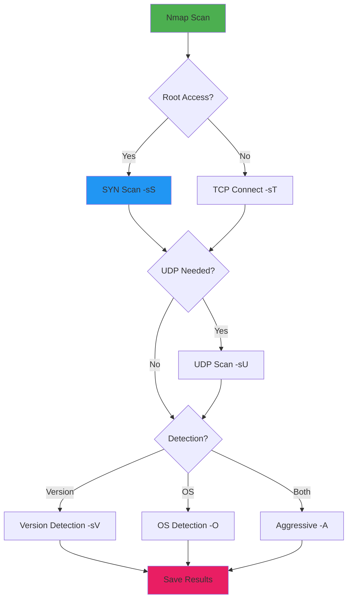
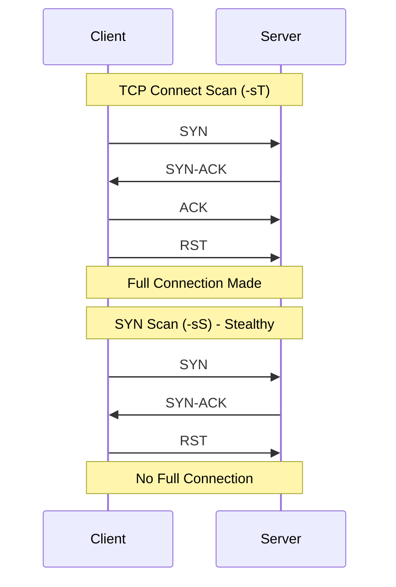
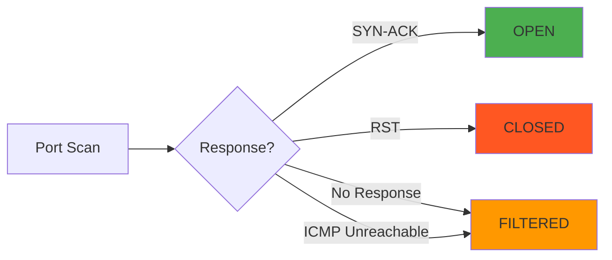
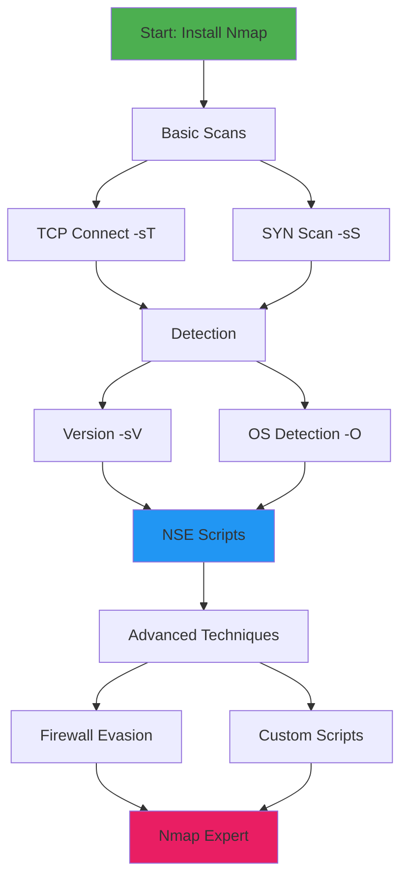
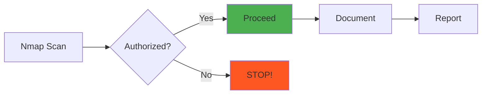

# Chapter 25: Nmap Installation & Basics

> **Module:** 5 - Networking  
> **Chapter:** 25 of 61  
> **Duration:** 20-25 Minutes  
> **Difficulty:** ⭐ Beginner  

---

## 📋 Chapter Overview

| Section | Content |
|---------|---------|
| Video Script | Complete Hindi narration with timestamps |
| Technical Guide | Detailed Nmap introduction and scan types |
| Installation Guide | Step-by-step Termux installation |
| Commands Reference | 25+ Nmap commands |
| Practice Exercises | Hands-on scanning labs |
| Troubleshooting | Common Nmap issues |
| Video Assets | Thumbnail, description, tags |

---

## 🎬 VIDEO SCRIPT (Complete Hindi Narration)

```
═══════════════════════════════════════════════════════════════════════════════
TERMUX FULL COURSE - CHAPTER 25
Title: Nmap Installation & Basics | Network Scanning Tutorial | T3rmuxk1ng
Duration: 20-25 Minutes
═══════════════════════════════════════════════════════════════════════════════

[INTRO - 0:00 to 0:50]
─────────────────────────────────────────────────────────────────────────────

Namaskar Dosto! Welcome back to Termux Full Course!

Main aapka host hoon T3rmuxk1ng, aur aaj ek bahut important chapter hai -
Chapter 25: Nmap Installation & Basics!

Agar aap ethical hacking, penetration testing, ya network security mein 
interest rakhte ho, to Nmap aapke liye sabse important tool hai. Ye 
network scanner hai - world ka sabse powerful aur popular scanner.

Aaj hum seekhenge:
- Nmap kya hai aur kyun use karte hain
- Termux mein Nmap kaise install karte hain
- Basic scan types - TCP, SYN, UDP scans
- Port specification techniques
- Version aur OS detection
- Output formats save karna
- Timing templates
- 25+ practical Nmap commands

Chaliye shuru karte hain!

Play button dabaiye, like karein, subscribe karein - notification bell ke saath.

---

[SECTION 1: WHAT IS NMAP? - 0:50 to 4:00]
─────────────────────────────────────────────────────────────────────────────

To sabse pehle sawal - Nmap kya hai?

Nmap ka full form hai "Network Mapper". Ye ek free, open-source network 
scanning tool hai jo Gordon Lyon (Fyodor) ne banaya tha 1997 mein.

Nmap ka primary kaam hai:
- Network discovery - Network mein kaun-kaun se devices hain
- Port scanning - Kisan ke ports open hain
- Service detection - Kaun si services chal rahi hain
- OS detection - Operating system kya hai
- Vulnerability detection - Security weaknesses

SIMPLE WORDS MAIN SAMJHEIN:

Imagine karein aap ek building ke bahar khade ho. Aapko andar jana hai, 
lekin pata nahi:
- Kitne darwaze hain (ports)
- Kaun sa darwaza khula hai (open ports)
- Andar kaun rehta hai (services)
- Building ka design kya hai (OS)

Nmap exactly ye kaam karta hai - network ki mapping karta hai!

WHY NMAP IS IMPORTANT:

┌─────────────────────────────────────────────────────────────────────────┐
│                    NMAP - NETWORK SECURITY SCANNER                       │
├─────────────────────────────────────────────────────────────────────────┤
│                                                                          │
│  🎯 USE CASES:                                                          │
│  ├── Network Inventory - Sab devices ki list                            │
│  ├── Security Auditing - Vulnerabilities dhundhna                       │
│  ├── Penetration Testing - Attack surface mapping                       │
│  ├── Firewall Testing - Rules check karna                               │
│  ├── Host Monitoring - Device status track karna                        │
│  └── Service Detection - Running services identify karna                │
│                                                                          │
│  🏆 WHY NMAP IS #1:                                                     │
│  ├── Free and Open Source                                               │
│  ├── Available on ALL platforms                                         │
│  ├── Extremely powerful and flexible                                    │
│  ├── 25+ years of development                                           │
│  ├── Used by security professionals worldwide                           │
│  ├── 600+ NSE scripts for advanced scanning                             │
│  └── Industry standard tool                                             │
│                                                                          │
└─────────────────────────────────────────────────────────────────────────┘

Nmap ko seekhna har security professional ke liye MUST hai!

---

[SECTION 2: PORT SCANNING FUNDAMENTALS - 4:00 to 7:00]
─────────────────────────────────────────────────────────────────────────────

Nmap seekhne se pehle, ports ke baare mein samajhna zaruri hai.

WHAT ARE PORTS?

Computer pe 0-65535 ports hote hain. Ye virtual endpoints hain jahan 
se network communication hoti hai.

Think of ports as doors in a building:
- Total 65536 darwaze (0-65535)
- Kuch khule hain, kuch band hain
- Har darwaze se alag service milti hai

PORT CATEGORIES:

┌─────────────────────────────────────────────────────────────────────────┐
│                         PORT CATEGORIES                                  │
├────────────────┬────────────────────────────────────────────────────────┤
│ Port Range     │ Description / Common Services                        │
├────────────────┼────────────────────────────────────────────────────────┤
│ 0-1023         │ WELL-KNOWN PORTS (System Ports)                     │
│                │ 20-21: FTP (File Transfer)                          │
│                │ 22: SSH (Secure Shell)                              │
│                │ 23: Telnet                                          │
│                │ 25: SMTP (Email)                                    │
│                │ 53: DNS (Domain Name)                               │
│                │ 80: HTTP (Web)                                      │
│                │ 110: POP3 (Email)                                   │
│                │ 143: IMAP (Email)                                   │
│                │ 443: HTTPS (Secure Web)                             │
│                │ 3306: MySQL (Database)                              │
│                │ 3389: RDP (Remote Desktop)                          │
├────────────────┼────────────────────────────────────────────────────────┤
│ 1024-49151     │ REGISTERED PORTS                                    │
│                │ User applications ke liye reserved                  │
│                │ Example: 3306 MySQL, 5432 PostgreSQL                │
├────────────────┼────────────────────────────────────────────────────────┤
│ 49152-65535    │ DYNAMIC/PRIVATE PORTS                               │
│                │ Temporary connections ke liye                       │
│                │ Client-side connections use karte hain              │
└────────────────┴────────────────────────────────────────────────────────┘

PORT STATES:

Jab Nmap scan karta hai, ports ki different states hoti hain:

OPEN: Port pe service chal rahi hai, connection accept karti hai
CLOSED: Port accessible hai, lekin koi service nahi chal rahi
FILTERED: Firewall port ko block kar raha hai
UNFILTERED: Accessible but open/closed pata nahi
OPEN|FILTERED: Uncertain state
CLOSED|FILTERED: Uncertain state

---

[SECTION 3: NMAP INSTALLATION IN TERMUX - 7:00 to 10:00]
─────────────────────────────────────────────────────────────────────────────

Ab chaliye Nmap install karte hain Termux mein!

STEP 1: Update Termux

Pehle Termux ko update karein:

    pkg update && pkg upgrade -y

Ye command package lists refresh karega aur installed packages ko 
update karega.

STEP 2: Install Nmap

Nmap install karna bahut simple hai:

    pkg install nmap -y

Ye command Nmap package download aur install kar dega.

STEP 3: Verify Installation

Installation complete hone ke baad verify karein:

    nmap --version

Output mein Nmap version number dikhega jaise:
Nmap version 7.94 ( https://nmap.org )

STEP 4: Check Nmap Help

Nmap ki help dekhne ke liye:

    nmap -h

Ye command Nmap ke saare options dikhayegi.

INSTALLATION TROUBLESHOOTING:

Agar installation mein problem aaye:

1. "Unable to locate package":
   - pkg update run karein
   - Internet connection check karein

2. "Permission denied":
   - Termux ko storage permission dein
   - termux-setup-storage run karein

3. Slow download:
   - Different network use karein
   - VPN try karein

┌─────────────────────────────────────────────────────────────────────────┐
│                    NMAP INSTALLATION SUMMARY                             │
├─────────────────────────────────────────────────────────────────────────┤
│                                                                          │
│  Step 1: pkg update && pkg upgrade -y                                   │
│  Step 2: pkg install nmap -y                                            │
│  Step 3: nmap --version                                                 │
│  Step 4: nmap -h                                                        │
│                                                                          │
│  ✅ Installation Complete!                                               │
│                                                                          │
└─────────────────────────────────────────────────────────────────────────┘

---

[SECTION 4: BASIC SCAN - nmap <target> - 10:00 to 13:00]
─────────────────────────────────────────────────────────────────────────────

Ab Nmap use karna seekhte hain. Sabse basic command:

BASIC SCAN SYNTAX:

    nmap <target>

Target kuch bhi ho sakta hai:
- IP Address: nmap 192.168.1.1
- Hostname: nmap scanme.nmap.org
- Domain: nmap example.com

EXAMPLE:

    nmap scanme.nmap.org

Ye command scanme.nmap.org scan karega. Ye Nmap ki official test 
site hai - practice ke liye perfect!

OUTPUT SAMJHNA:

Starting Nmap 7.94 ( https://nmap.org ) at 2024-01-15 10:00 IST
Nmap scan report for scanme.nmap.org (45.33.32.156)
Host is up (0.25s latency).
Not shown: 992 closed tcp ports
PORT      STATE SERVICE
22/tcp    open  ssh
80/tcp    open  http
9929/tcp  open  nping-echo
31337/tcp open  Elite

Nmap done: 1 IP address (1 host up) scanned in 15.23 seconds

OUTPUT BREAKDOWN:

- "Starting Nmap..." - Scan start ho gaya
- "Host is up" - Target accessible hai
- "Not shown: 992 closed tcp ports" - 992 ports closed hain
- PORT table - Open ports ki list
- STATE - Port ki state (open/closed/filtered)
- SERVICE - Service ka naam
- "Nmap done" - Scan complete

SCAN YOUR LOCAL ROUTER:

Apne router ka IP dhundhein:

    ip route | grep default

Phir scan karein:

    nmap 192.168.1.1

(Apne router ka IP use karein)

⚠️ NOTE: Sirf apne network ya authorized targets scan karein!

---

[SECTION 5: TCP CONNECT SCAN (-sT) - 13:00 to 15:00]
─────────────────────────────────────────────────────────────────────────────

Ab scan types seekhte hain. Pehla - TCP Connect Scan.

-sT: TCP CONNECT SCAN

    nmap -sT <target>

Ye scan:
- Complete TCP connection establish karta hai
- Three-way handshake complete hoti hai
- Most reliable scan type
- Root permission ki zarurat NAHI
- Easily detected by firewalls/IDS

HOW IT WORKS:

1. Nmap target pe SYN packet bhejta hai
2. Agar port open hai: SYN-ACK aata hai
3. Nmap ACK bhejta hai (connection complete)
4. Nmap RST bhejta hai (connection close)

THREE-WAY HANDSHAKE:

┌─────────────────────────────────────────────────────────────────────────┐
│                    TCP THREE-WAY HANDSHAKE                               │
├─────────────────────────────────────────────────────────────────────────┤
│                                                                          │
│  CLIENT (Nmap)                      SERVER (Target)                      │
│       │                                   │                              │
│       │────── SYN ──────────────────────>│  (Step 1)                    │
│       │                                   │                              │
│       │<───── SYN-ACK ──────────────────│  (Step 2)                    │
│       │                                   │                              │
│       │────── ACK ──────────────────────>│  (Step 3)                    │
│       │                                   │                              │
│       │         CONNECTION ESTABLISHED    │                              │
│       │                                   │                              │
│       │────── RST ──────────────────────>│  (Nmap closes)               │
│       │                                   │                              │
│                                                                          │
└─────────────────────────────────────────────────────────────────────────┘

EXAMPLE:

    nmap -sT 192.168.1.1

    nmap -sT scanme.nmap.org

ADVANTAGES:
- No root required
- Works on all systems
- Reliable results

DISADVANTAGES:
- Slow
- Easily detected
- Logs mein dikhai deta hai

---

[SECTION 6: SYN SCAN (-sS) - 15:00 to 17:00]
─────────────────────────────────────────────────────────────────────────────

Ab SYN Scan - sabse popular scan type!

-sS: SYN SCAN (STEALTH SCAN)

    nmap -sS <target>

Ye scan:
- Half-open scan (connection complete nahi hota)
- Sirf SYN packet bhejta hai, ACK nahi bhejta
- ROOT permission REQUIRED
- Fast aur stealthy
- Harder to detect

HOW IT WORKS:

1. Nmap SYN packet bhejta hai
2. Open port: SYN-ACK aata hai
3. Nmap RST bhejta hai (connection complete NAHI)
4. Closed port: RST aata hai

SYN SCAN VS TCP CONNECT:

┌─────────────────────────────────────────────────────────────────────────┐
│                    SYN SCAN vs TCP CONNECT SCAN                          │
├────────────────┬─────────────────────────────────────────────────────────┤
│ Feature        │ SYN Scan (-sS)    │ TCP Connect (-sT)                 │
├────────────────┼─────────────────────────────────────────────────────────┤
│ Root Required  │ ✅ Yes           │ ❌ No                              │
│ Speed          │ Fast             │ Slower                            │
│ Stealth        │ Better           │ Easily detected                   │
│ Reliability    │ Good             │ Best                              │
│ Logging        │ Less logged      │ Fully logged                      │
│ Default Scan   │ Yes (if root)    │ Yes (without root)                │
└────────────────┴─────────────────────────────────────────────────────────┘

EXAMPLE (Requires Root/Sudo):

Termux mein root ke liye:

    su

Phir scan:

    nmap -sS 192.168.1.1

⚠️ NOTE: Termux mein -sS ke liye root phone chahiye. Agar root 
nahi hai to -sT use karein.

SYN SCAN ADVANTAGES:
- Very fast
- Harder to detect
- Less likely to be logged
- Default scan when running as root

---

[SECTION 7: UDP SCAN (-sU) - 17:00 to 19:00]
─────────────────────────────────────────────────────────────────────────────

UDP Scan - UDP ports ke liye!

-sU: UDP SCAN

    nmap -sU <target>

Ye scan:
- UDP ports scan karta hai
- ROOT required
- Slower than TCP scans
- Important for DNS, DHCP, SNMP

WHY UDP SCAN?

UDP services bahut important hain:
- DNS (Port 53)
- DHCP (Port 67, 68)
- SNMP (Port 161)
- NTP (Port 123)
- Many gaming servers

EXAMPLE:

    nmap -sU 192.168.1.1

COMMON UDP PORTS:

┌─────────────────────────────────────────────────────────────────────────┐
│                    COMMON UDP PORTS                                      │
├────────────────┬─────────────────────────────────────────────────────────┤
│ Port           │ Service                                           │
├────────────────┼─────────────────────────────────────────────────────────┤
│ 53/udp         │ DNS (Domain Name System)                          │
│ 67,68/udp      │ DHCP (Dynamic Host Configuration)                 │
│ 69/udp         │ TFTP (Trivial File Transfer)                      │
│ 123/udp        │ NTP (Network Time Protocol)                       │
│ 161/udp        │ SNMP (Simple Network Management)                  │
│ 500/udp        │ IKE (Internet Key Exchange)                       │
│ 514/udp        │ Syslog                                            │
│ 520/udp        │ RIP (Routing Information Protocol)                │
└────────────────┴─────────────────────────────────────────────────────────┘

UDP SCAN SLOW HOTA HAI:

UDP scan slow hai kyunki:
- UDP connectionless protocol hai
- No acknowledgment
- Timeout wait karna padta hai

Speed up karne ke liye:

    nmap -sU --top-ports 20 <target>

Ye sirf top 20 UDP ports scan karega.

TCP + UDP COMBINED SCAN:

    nmap -sS -sU <target>

Ya:

    nmap -sT -sU <target>

---

[SECTION 8: VERSION DETECTION (-sV) - 19:00 to 21:00]
─────────────────────────────────────────────────────────────────────────────

Version Detection - Service versions dhundhna!

-sV: VERSION DETECTION

    nmap -sV <target>

Ye scan:
- Running services ki version detect karta hai
- Open ports pe probes bhejta hai
- Specific versions identify karta hai
- Helps in vulnerability assessment

WHY VERSION DETECTION IMPORTANT HAI?

Jab aap version jaante ho:
- Known vulnerabilities dhundh sakte ho
- Exploits select kar sakte ho
- Patch status check kar sakte ho

EXAMPLE:

    nmap -sV scanme.nmap.org

OUTPUT EXAMPLE:

PORT     STATE SERVICE VERSION
22/tcp   open  ssh     OpenSSH 6.6.1p1 Ubuntu 2ubuntu2.13
80/tcp   open  http    Apache httpd 2.4.7 ((Ubuntu))
443/tcp  open  ssl     OpenSSL

VERSION DETECTION INTENSITY:

    nmap -sV --version-intensity <0-9> <target>

- 0: Least intensive (fast)
- 9: Most intensive (slow, thorough)

EXAMPLE:

    nmap -sV --version-intensity 5 scanme.nmap.org

ALL INFO SCAN (-A):

-A combines multiple scans:

    nmap -A <target>

Ye command:
- OS detection (-O)
- Version detection (-sV)
- Script scanning (-sC)
- Traceroute (--traceroute)

    nmap -A scanme.nmap.org

---

[SECTION 9: OS DETECTION (-O) - 21:00 to 22:30]
─────────────────────────────────────────────────────────────────────────────

OS Detection - Operating System dhundhna!

-O: OS DETECTION

    nmap -O <target>

Ye scan:
- Target ka Operating System detect karta hai
- ROOT REQUIRED
- TCP/IP fingerprinting use karta hai
- Accuracy depends on open ports

HOW IT WORKS:

Nmap different OS ke TCP/IP stacks alag behave karte hain:
- Initial packet sequence numbers
- Window sizes
- TCP options order
- ICMP responses

EXAMPLE:

    nmap -O 192.168.1.1

OUTPUT EXAMPLE:

OS CPE: cpe:/o:linux:linux_kernel:3
OS details: Linux 3.2 - 3.16
Network Distance: 1 hop

OS DETECTION LIMITATIONS:

┌─────────────────────────────────────────────────────────────────────────┐
│                    OS DETECTION LIMITATIONS                              │
├─────────────────────────────────────────────────────────────────────────┤
│                                                                          │
│  ✓ Requires at least 1 open AND 1 closed port                          │
│  ✓ Root/sudo required                                                   │
│  ✓ Works best on local network                                          │
│  ✓ Can be fooled by OS fingerprint obfuscation                          │
│  ✓ Virtual machines may give false results                              │
│                                                                          │
└─────────────────────────────────────────────────────────────────────────┘

LIMIT OS DETECTION:

    nmap -O --osscan-limit <target>

Sirf scan karein jab good conditions hain.

GUESS OS AGGRESSIVELY:

    nmap -O --osscan-guess <target>

---

[SECTION 10: PORT SPECIFICATION - 22:30 to 24:30]
─────────────────────────────────────────────────────────────────────────────

Ab port specification seekhte hain - specific ports scan karna.

SCAN SPECIFIC PORT (-p):

    nmap -p 80 <target>
    nmap -p 22,80,443 <target>
    nmap -p 1-1000 <target>

EXAMPLES:

    # Single port
    nmap -p 80 scanme.nmap.org

    # Multiple ports
    nmap -p 22,80,443,3306 scanme.nmap.org

    # Port range
    nmap -p 1-1000 scanme.nmap.org

    # Specific UDP port
    nmap -sU -p 53 scanme.nmap.org

    # TCP and UDP ports
    nmap -p T:80,U:53 scanme.nmap.org

SCAN ALL PORTS (-p-):

    nmap -p- <target>

Ye command ALL 65535 ports scan karega. Slow hai lekin comprehensive.

EXAMPLE:

    nmap -p- 192.168.1.1

FAST SCAN (-F):

    nmap -F <target>

Ye sirf 100 most common ports scan karta hai. Quick results.

EXAMPLE:

    nmap -F scanme.nmap.org

TOP PORTS:

    nmap --top-ports 20 <target>
    nmap --top-ports 100 <target>
    nmap --top-ports 1000 <target>

PORT SPECIFICATION SUMMARY:

┌─────────────────────────────────────────────────────────────────────────┐
│                    PORT SPECIFICATION OPTIONS                            │
├─────────────────────────────────────────────────────────────────────────┤
│                                                                          │
│  -p 22               Single port                                        │
│  -p 22,80,443        Multiple ports                                     │
│  -p 1-1000           Port range                                         │
│  -p-                 All 65535 ports                                    │
│  -F                  Fast scan (100 common ports)                       │
│  --top-ports 20      Top 20 most common ports                           │
│  -p T:80,U:53        Specific TCP and UDP ports                         │
│  -p U:53,111,137     UDP only ports                                     │
│                                                                          │
└─────────────────────────────────────────────────────────────────────────┘

---

[SECTION 11: OUTPUT FORMATS - 24:30 to 26:30]
─────────────────────────────────────────────────────────────────────────────

Output save karna important hai for documentation and analysis.

NORMAL OUTPUT (-oN):

    nmap -oN scan_results.txt <target>

Human-readable format. Good for reports.

EXAMPLE:

    nmap -oN myscan.txt scanme.nmap.org

XML OUTPUT (-oX):

    nmap -oX scan_results.xml <target>

Machine-readable format. Good for tools and parsing.

EXAMPLE:

    nmap -oX myscan.xml scanme.nmap.org

GREPABLE OUTPUT (-oG):

    nmap -oG scan_results.gnmap <target>

Easy to parse with grep, awk, etc.

EXAMPLE:

    nmap -oG myscan.gnmap scanme.nmap.org

ALL FORMATS (-oA):

    nmap -oA scan_results <target>

Creates .nmap, .xml, and .gnmap files together.

EXAMPLE:

    nmap -oA myscan scanme.nmap.org

OUTPUT FORMAT COMPARISON:

┌─────────────────────────────────────────────────────────────────────────┐
│                    OUTPUT FORMAT COMPARISON                              │
├────────────────┬─────────────────────────────────────────────────────────┤
│ Format         │ Best For                                          │
├────────────────┼─────────────────────────────────────────────────────────┤
│ -oN (Normal)   │ Human reading, Reports                            │
│ -oX (XML)      │ Tools, Parsing, Import to other apps              │
│ -oG (Grepable) │ Command line processing, grep, awk                │
│ -oA (All)      │ Complete documentation                            │
└────────────────┴─────────────────────────────────────────────────────────┘

VERBOSE OUTPUT (-v):

    nmap -v <target>

More details during scan.

    nmap -vv <target>

Even more verbose.

DEBUG OUTPUT (-d):

    nmap -d <target>

Debug information for troubleshooting.

---

[SECTION 12: TIMING TEMPLATES - 26:30 to 28:30]
─────────────────────────────────────────────────────────────────────────────

Timing templates se scan speed control karte hain.

TIMING TEMPLATES (-T):

    nmap -T<0-5> <target>

TEMPLATES:

┌─────────────────────────────────────────────────────────────────────────┐
│                    TIMING TEMPLATES                                      │
├────────────────┬─────────────────────────────────────────────────────────┤
│ Template       │ Description                                        │
├────────────────┼─────────────────────────────────────────────────────────┤
│ -T0 (Paranoid) │ Very slow, IDS evasion, 5 min between probes       │
│ -T1 (Sneaky)   │ Slow, IDS evasion, 15 sec between probes           │
│ -T2 (Polite)   │ Slower, uses less bandwidth                        │
│ -T3 (Normal)   │ Default speed                                      │
│ -T4 (Aggressive)│ Fast, reliable network, quick scans               │
│ -T5 (Insane)   │ Very fast, may miss ports, fast network only       │
└────────────────┴─────────────────────────────────────────────────────────┘

WHEN TO USE WHAT:

-T0, -T1: IDS/Firewall evasion, stealthy scans
-T2: Polite scanning, shared networks
-T3: Default, general use
-T4: Fast networks, internal scans
-T5: Very fast networks, quick assessment

EXAMPLES:

    # Stealthy scan
    nmap -T1 -sS scanme.nmap.org

    # Fast scan
    nmap -T4 -F scanme.nmap.org

    # Aggressive scan
    nmap -T4 -A scanme.nmap.org

RECOMMENDATION:

For beginners:
- Use -T3 or -T4 for most scans
- Use -T1 or -T2 for stealth

---

[SECTION 13: PRACTICAL SCAN EXAMPLES - 28:30 to 31:00]
─────────────────────────────────────────────────────────────────────────────

Ab kuch practical examples dekhte hain:

EXAMPLE 1: Quick Network Discovery

    nmap -sn 192.168.1.0/24

-sn = ping scan, no port scan
Ye network mein saare live hosts dhundhega.

EXAMPLE 2: Common Port Scan

    nmap -sV -p 22,80,443,3306,8080 192.168.1.1

Service versions on common ports.

EXAMPLE 3: Full TCP Scan with Scripts

    nmap -sS -sV -sC -p- 192.168.1.1

Complete scan with default scripts.

EXAMPLE 4: Fast Scan All Hosts

    nmap -T4 -F 192.168.1.0/24

Quick scan of entire network.

EXAMPLE 5: UDP Top Ports

    nmap -sU --top-ports 20 192.168.1.1

Top 20 UDP ports scan.

EXAMPLE 6: Save All Results

    nmap -A -oA fullscan 192.168.1.1

Aggressive scan, save in all formats.

EXAMPLE 7: Scan Multiple Targets

    nmap 192.168.1.1 192.168.1.2 192.168.1.3

    nmap 192.168.1.1-10

    nmap -iL targets.txt

EXAMPLE 8: Scan with Reason

    nmap --reason 192.168.1.1

Shows why port is marked as open/closed.

EXAMPLE 9: Detect Vulnerabilities

    nmap --script vuln 192.168.1.1

Run vulnerability detection scripts.

EXAMPLE 10: Comprehensive Scan

    nmap -sS -sU -sV -O -p- -oA full_scan 192.168.1.1

Complete scan - TCP, UDP, versions, OS, all ports, save results.

---

[SECTION 14: LEGAL AND ETHICAL USE - 31:00 to 33:00]
─────────────────────────────────────────────────────────────────────────────

⚠️ IMPORTANT: ETHICAL AND LEGAL CONSIDERATIONS

Nmap ek powerful tool hai. Power ke saath responsibility aati hai.

LEGAL WARNING:

┌─────────────────────────────────────────────────────────────────────────┐
│                    ⚠️ LEGAL WARNING ⚠️                                   │
├─────────────────────────────────────────────────────────────────────────┤
│                                                                          │
│  PORT SCANNING WITHOUT PERMISSION IS ILLEGAL IN MANY COUNTRIES!        │
│                                                                          │
│  ✓ ONLY scan systems you OWN or have WRITTEN PERMISSION for           │
│  ✓ Unauthorized scanning can result in criminal charges                 │
│  ✓ You may be banned from networks/ISPs                                 │
│  ✓ Scanning can trigger security alerts                                 │
│                                                                          │
│  THIS VIDEO IS FOR EDUCATIONAL PURPOSES ONLY                            │
│                                                                          │
└─────────────────────────────────────────────────────────────────────────┘

SAFE TARGETS FOR PRACTICE:

1. scanme.nmap.org
   - Nmap's official test server
   - Specifically for learning

2. your own devices
   - Your phone
   - Your computer
   - Your router

3. Your local network (with permission)
   - Home network
   - Lab environment

4. Authorized test environments
   - CTF challenges
   - HackTheBox
   - TryHackMe
   - VulnHub

WHAT NOT TO SCAN:

❌ Government websites
❌ Banking websites
❌ Healthcare systems
❌ Any production system without permission
❌ Random internet IPs

ETHICAL HACKER'S CODE:

1. Always get written permission
2. Document everything you do
3. Report vulnerabilities responsibly
4. Don't cause damage or downtime
5. Follow responsible disclosure
6. Stay within legal boundaries

---

[SECTION 15: SUMMARY & COMMANDS RECAP - 33:00 to 35:00]
─────────────────────────────────────────────────────────────────────────────

CHAPTER SUMMARY:

Aaj humne seekha:

✅ Nmap kya hai - Network Mapper, security scanner
✅ Ports kya hote hain - 0-65535, well-known, registered, dynamic
✅ Nmap installation in Termux - pkg install nmap
✅ Basic scan - nmap <target>
✅ TCP Connect Scan (-sT) - Complete handshake, no root
✅ SYN Scan (-sS) - Stealth, requires root
✅ UDP Scan (-sU) - UDP ports, requires root
✅ Version Detection (-sV) - Service versions
✅ OS Detection (-O) - Operating system fingerprinting
✅ Port Specification - -p, -p-, -F
✅ Output Formats - -oN, -oX, -oG, -oA
✅ Timing Templates - -T0 to -T5
✅ Legal and ethical use

ESSENTIAL COMMANDS YAAD RAKHEIN:

┌─────────────────────────────────────────────────────────────────────────┐
│                    ESSENTIAL NMAP COMMANDS                               │
├─────────────────────────────────────────────────────────────────────────┤
│                                                                          │
│  INSTALLATION:                                                          │
│  pkg install nmap -y                                                    │
│                                                                          │
│  BASIC SCANS:                                                           │
│  nmap <target>                  Basic scan                              │
│  nmap -sT <target>              TCP Connect scan                        │
│  nmap -sS <target>              SYN scan (requires root)                │
│  nmap -sU <target>              UDP scan (requires root)                │
│                                                                          │
│  DETECTION:                                                             │
│  nmap -sV <target>              Version detection                       │
│  nmap -O <target>               OS detection (requires root)            │
│  nmap -A <target>               All detection                           │
│                                                                          │
│  PORTS:                                                                 │
│  nmap -p 22,80,443 <target>     Specific ports                          │
│  nmap -p- <target>              All 65535 ports                         │
│  nmap -F <target>               Fast scan (100 ports)                   │
│                                                                          │
│  OUTPUT:                                                                │
│  nmap -oN file.txt <target>     Normal output                           │
│  nmap -oX file.xml <target>     XML output                              │
│  nmap -oA filename <target>     All formats                             │
│                                                                          │
│  TIMING:                                                                │
│  nmap -T4 <target>              Fast scan                               │
│                                                                          │
└─────────────────────────────────────────────────────────────────────────┘

---

[OUTRO - 35:00 to 36:00]
─────────────────────────────────────────────────────────────────────────────

Dosto, Chapter 25 complete!

Nmap basics seekh liye. Ye foundation bahut important hai. Next chapter 
mein hum Nmap Advanced Techniques seekhenge - NSE scripts, firewall 
evasion, aur automation.

Practice karte rahien. Apne local network scan karein. Different 
options try karein. Experience is the best teacher!

Yaad rakhein:
- Sirf authorized targets scan karein
- Results save karein
- Outputs analyze karein

Agar ye video helpful lagi:
👍 Like button press karein
🔔 Subscribe karein, notification bell on karein
💬 Koi sawal ho to comment mein poochein
📤 Share karein friends ke saath

Main har comment ka reply karta hoon.

Thank you for watching! See you in Chapter 26!

═══════════════════════════════════════════════════════════════════════════════
```

---

## 📖 TECHNICAL GUIDE

### 1. Nmap Architecture

```
┌─────────────────────────────────────────────────────────────────────────┐
│                         NMAP ARCHITECTURE                                │
├─────────────────────────────────────────────────────────────────────────┤
│                                                                          │
│   ┌─────────────────────────────────────────────────────────────────┐   │
│   │                      NMAP CORE ENGINE                           │   │
│   │              (Port Scanning, Service Detection)                 │   │
│   └─────────────────────────────────────────────────────────────────┘   │
│                                   │                                      │
│                                   ▼                                      │
│   ┌─────────────────────────────────────────────────────────────────┐   │
│   │                      SCAN MODULES                               │   │
│   ├─────────────────────────────────────────────────────────────────┤   │
│   │  ┌──────────┐ ┌──────────┐ ┌──────────┐ ┌──────────┐           │   │
│   │  │ TCP SCAN │ │ SYN SCAN │ │ UDP SCAN │ │HOST DISC │           │   │
│   │  └──────────┘ └──────────┘ └──────────┘ └──────────┘           │   │
│   │  ┌──────────┐ ┌──────────┐ ┌──────────┐ ┌──────────┐           │   │
│   │  │ VERSION  │ │    OS    │ │  SCRIPT  │ │TRACEROUTE│           │   │
│   │  │ DETECT   │ │ DETECT   │ │ ENGINE   │ │          │           │   │
│   │  └──────────┘ └──────────┘ └──────────┘ └──────────┘           │   │
│   └─────────────────────────────────────────────────────────────────┘   │
│                                   │                                      │
│                                   ▼                                      │
│   ┌─────────────────────────────────────────────────────────────────┐   │
│   │                    OUTPUT FORMATTERS                            │   │
│   │        Normal, XML, Grepable, Script Kiddie                     │   │
│   └─────────────────────────────────────────────────────────────────┘   │
│                                   │                                      │
│                                   ▼                                      │
│   ┌─────────────────────────────────────────────────────────────────┐   │
│   │                      NSE SCRIPTS                                │   │
│   │              (600+ Lua Scripts for Advanced Scanning)           │   │
│   └─────────────────────────────────────────────────────────────────┘   │
│                                                                          │
└─────────────────────────────────────────────────────────────────────────┘
```

### 2. Scan Types Comparison

| Scan Type | Flag | Root Required | Description | Speed |
|-----------|------|---------------|-------------|-------|
| TCP Connect | -sT | No | Full TCP connection | Slow |
| SYN Scan | -sS | Yes | Half-open scan | Fast |
| UDP Scan | -sU | Yes | UDP ports | Slow |
| Version | -sV | No | Service versions | Medium |
| OS Detection | -O | Yes | Operating system | Fast |

### 3. Port Ranges and Services

```
┌─────────────────────────────────────────────────────────────────────────┐
│                    COMMON PORTS AND SERVICES                             │
├────────────────┬─────────────────────────────────────────────────────────┤
│ Port           │ Service                                          │
├────────────────┼─────────────────────────────────────────────────────────┤
│ 20, 21/tcp     │ FTP - File Transfer Protocol                     │
│ 22/tcp         │ SSH - Secure Shell                               │
│ 23/tcp         │ Telnet - Remote Terminal (insecure)              │
│ 25/tcp         │ SMTP - Email Sending                             │
│ 53/tcp,udp     │ DNS - Domain Name System                         │
│ 67,68/udp      │ DHCP - Dynamic IP Assignment                     │
│ 69/udp         │ TFTP - Trivial File Transfer                     │
│ 80/tcp         │ HTTP - Web Server                                │
│ 110/tcp        │ POP3 - Email Retrieval                           │
│ 123/udp        │ NTP - Network Time Protocol                      │
│ 143/tcp        │ IMAP - Email Retrieval                           │
│ 161/udp        │ SNMP - Network Management                        │
│ 389/tcp        │ LDAP - Directory Service                         │
│ 443/tcp        │ HTTPS - Secure Web                               │
│ 445/tcp        │ SMB - Windows File Sharing                       │
│ 993/tcp        │ IMAPS - Secure IMAP                              │
│ 995/tcp        │ POP3S - Secure POP3                              │
│ 1433/tcp       │ MS SQL - Microsoft Database                      │
│ 1521/tcp       │ Oracle Database                                  │
│ 3306/tcp       │ MySQL - Database                                 │
│ 3389/tcp       │ RDP - Remote Desktop Protocol                    │
│ 5432/tcp       │ PostgreSQL - Database                            │
│ 5900/tcp       │ VNC - Remote Desktop                             │
│ 6379/tcp       │ Redis - In-memory Database                       │
│ 8080/tcp       │ HTTP Alternate - Web Server                      │
│ 8443/tcp       │ HTTPS Alternate                                  │
│ 27017/tcp      │ MongoDB - NoSQL Database                         │
└────────────────┴─────────────────────────────────────────────────────────┘
```

### 4. TCP Handshake and Scan Types

```
┌─────────────────────────────────────────────────────────────────────────┐
│                    TCP CONNECT SCAN (-sT)                                │
├─────────────────────────────────────────────────────────────────────────┤
│                                                                          │
│  OPEN PORT:                                                             │
│  Client          Server          Client          Server                  │
│   SYN    ────────>               ACK    ────────>                        │
│           <─────── SYN-ACK               <─────── RST                    │
│                                                                          │
│  CLOSED PORT:                                                           │
│  Client          Server                                                  │
│   SYN    ────────>                                                       │
│           <─────── RST                                                   │
│                                                                          │
└─────────────────────────────────────────────────────────────────────────┘

┌─────────────────────────────────────────────────────────────────────────┐
│                    SYN SCAN (-sS)                                        │
├─────────────────────────────────────────────────────────────────────────┤
│                                                                          │
│  OPEN PORT:                                                             │
│  Client          Server                                                  │
│   SYN    ────────>                                                       │
│           <─────── SYN-ACK                                               │
│   RST    ────────>  (No connection established)                          │
│                                                                          │
│  CLOSED PORT:                                                           │
│  Client          Server                                                  │
│   SYN    ────────>                                                       │
│           <─────── RST                                                   │
│                                                                          │
└─────────────────────────────────────────────────────────────────────────┘
```

### 5. Timing Templates Details

| Template | Flag | Timing | Use Case |
|----------|------|--------|----------|
| Paranoid | -T0 | 5 min between probes | IDS evasion, extremely slow |
| Sneaky | -T1 | 15 sec between probes | IDS evasion, slow |
| Polite | -T2 | 0.4 sec between probes | Bandwidth conservation |
| Normal | -T3 | Default | General use |
| Aggressive | -T4 | Fast | Fast networks |
| Insane | -T5 | Very fast | Very fast networks only |

---

## 🔧 INSTALLATION GUIDE

### Step-by-Step Termux Installation

```
Step 1: Update Termux
├── Run: pkg update && pkg upgrade -y
└── Wait for completion

Step 2: Install Nmap
├── Run: pkg install nmap -y
└── Confirm installation with Y when prompted

Step 3: Verify Installation
├── Run: nmap --version
└── Check version output

Step 4: Test Basic Scan
├── Run: nmap scanme.nmap.org
└── Verify scan works

Step 5: Check Available Options
├── Run: nmap -h
└── Review all options
```

### Additional Tools for Network Scanning

```bash
# Install additional networking tools
pkg install netcat -y      # Netcat for manual port testing
pkg install ncat -y        # Nmap's netcat (part of nmap)
pkg install nping -y       # Nmap's ping tool
pkg install masscan -y     # Fast port scanner (optional)
```

---

## 📋 COMMANDS REFERENCE

### 25+ Essential Nmap Commands

```bash
#═══════════════════════════════════════════════════════════════════════════
# NMAP COMMANDS REFERENCE - 25+ COMMANDS
#═══════════════════════════════════════════════════════════════════════════

#═══════════════════════════════════════════════════════════════════════════
# BASIC SCANS
#═══════════════════════════════════════════════════════════════════════════

# 1. Basic scan (default 1000 ports)
nmap 192.168.1.1

# 2. Scan hostname
nmap scanme.nmap.org

# 3. Scan multiple targets
nmap 192.168.1.1 192.168.1.2 192.168.1.3

# 4. Scan IP range
nmap 192.168.1.1-254

# 5. Scan entire subnet
nmap 192.168.1.0/24

#═══════════════════════════════════════════════════════════════════════════
# SCAN TYPES
#═══════════════════════════════════════════════════════════════════════════

# 6. TCP Connect scan (no root required)
nmap -sT 192.168.1.1

# 7. SYN scan (requires root)
nmap -sS 192.168.1.1

# 8. UDP scan (requires root)
nmap -sU 192.168.1.1

# 9. TCP ACK scan
nmap -sA 192.168.1.1

# 10. TCP Window scan
nmap -sW 192.168.1.1

# 11. TCP Maimon scan
nmap -sM 192.168.1.1

#═══════════════════════════════════════════════════════════════════════════
# DETECTION SCANS
#═══════════════════════════════════════════════════════════════════════════

# 12. Version detection
nmap -sV 192.168.1.1

# 13. OS detection (requires root)
nmap -O 192.168.1.1

# 14. Aggressive scan (OS + Version + Scripts + Traceroute)
nmap -A 192.168.1.1

#═══════════════════════════════════════════════════════════════════════════
# PORT SPECIFICATION
#═══════════════════════════════════════════════════════════════════════════

# 15. Scan specific port
nmap -p 80 192.168.1.1

# 16. Scan multiple ports
nmap -p 22,80,443,3306 192.168.1.1

# 17. Scan port range
nmap -p 1-1000 192.168.1.1

# 18. Scan all 65535 ports
nmap -p- 192.168.1.1

# 19. Fast scan (100 common ports)
nmap -F 192.168.1.1

# 20. Top N ports
nmap --top-ports 20 192.168.1.1

# 21. Scan specific TCP and UDP ports
nmap -p T:22,80,U:53 192.168.1.1

#═══════════════════════════════════════════════════════════════════════════
# HOST DISCOVERY
#═══════════════════════════════════════════════════════════════════════════

# 22. Ping scan only (no port scan)
nmap -sn 192.168.1.0/24

# 23. Skip host discovery
nmap -Pn 192.168.1.1

# 24. TCP SYN ping
nmap -PS22,80 192.168.1.1

# 25. TCP ACK ping
nmap -PA80,443 192.168.1.1

#═══════════════════════════════════════════════════════════════════════════
# OUTPUT OPTIONS
#═══════════════════════════════════════════════════════════════════════════

# 26. Save normal output
nmap -oN scan.txt 192.168.1.1

# 27. Save XML output
nmap -oX scan.xml 192.168.1.1

# 28. Save grepable output
nmap -oG scan.gnmap 192.168.1.1

# 29. Save all formats
nmap -oA scan_results 192.168.1.1

# 30. Verbose output
nmap -v 192.168.1.1

#═══════════════════════════════════════════════════════════════════════════
# TIMING AND PERFORMANCE
#═══════════════════════════════════════════════════════════════════════════

# 31. Paranoid timing (very slow)
nmap -T0 192.168.1.1

# 32. Sneaky timing
nmap -T1 192.168.1.1

# 33. Aggressive timing
nmap -T4 192.168.1.1

# 34. Insane timing
nmap -T5 192.168.1.1

#═══════════════════════════════════════════════════════════════════════════
# SCRIPT SCANNING
#═══════════════════════════════════════════════════════════════════════════

# 35. Default scripts
nmap -sC 192.168.1.1

# 36. Vulnerability scripts
nmap --script vuln 192.168.1.1

# 37. Safe scripts
nmap --script safe 192.168.1.1

#═══════════════════════════════════════════════════════════════════════════
# COMBINED PRACTICAL SCANS
#═══════════════════════════════════════════════════════════════════════════

# 38. Quick comprehensive scan
nmap -T4 -F 192.168.1.0/24

# 39. Full scan with version detection
nmap -sV -p- 192.168.1.1

# 40. Complete scan with all options
nmap -A -T4 -p- -oA fullscan 192.168.1.1

# 41. Network discovery scan
nmap -sn 192.168.1.0/24 -oG hosts.gnmap

# 42. Web server scan
nmap -sV -p 80,443,8080,8443 192.168.1.1

# 43. Database server scan
nmap -sV -p 1433,1521,3306,5432,27017 192.168.1.1

# 44. Windows machine scan
nmap -sS -sU -p 135,137,138,139,445,3389 192.168.1.1

# 45. Test target (official Nmap server)
nmap -A scanme.nmap.org
```

---

## 💻 PRACTICE EXERCISES

### Exercise 1: Basic Network Discovery

```bash
# Task: Discover all live hosts on your network

# Step 1: Find your network range
ip route | grep default

# Step 2: Run ping scan to find live hosts
nmap -sn 192.168.1.0/24

# Step 3: Save the results
nmap -sn 192.168.1.0/24 -oG live_hosts.gnmap

# Step 4: Parse results to get IP list
grep "Up" live_hosts.gnmap | awk '{print $2}'

# Expected: List of all live hosts on your network
```

### Exercise 2: Port Scanning Practice

```bash
# Task: Scan a test server and identify services

# Step 1: Basic scan
nmap scanme.nmap.org

# Step 2: Service version scan
nmap -sV scanme.nmap.org

# Step 3: Specific ports scan
nmap -p 22,80,443,9929,31337 scanme.nmap.org

# Step 4: Save results
nmap -sV -oN scan_results.txt scanme.nmap.org

# Expected: List of open ports with service versions
```

### Exercise 3: Comprehensive Router Scan

```bash
# Task: Scan your home router comprehensively

# Step 1: Find router IP
ip route | grep default | awk '{print $3}'

# Step 2: Quick scan
nmap -F <router-ip>

# Step 3: Full port scan
nmap -p- <router-ip>

# Step 4: Service detection
nmap -sV -p- <router-ip>

# Step 5: Save all results
nmap -sV -p- -oA router_scan <router-ip>

# Expected: Complete port map of your router
```

### Exercise 4: Timing Template Comparison

```bash
# Task: Compare different timing templates

# Step 1: Run with T2 (polite)
time nmap -T2 -F scanme.nmap.org

# Step 2: Run with T4 (aggressive)
time nmap -T4 -F scanme.nmap.org

# Step 3: Compare the time difference

# Expected: T4 should be significantly faster
```

### Exercise 5: Output Format Practice

```bash
# Task: Generate different output formats and analyze

# Step 1: Generate all output formats
nmap -F -oA myscan scanme.nmap.org

# Step 2: View normal output
cat myscan.nmap

# Step 3: Parse grepable output
grep "open" myscan.gnmap

# Step 4: View XML structure
head -50 myscan.xml

# Expected: Understanding of different output formats
```

### Exercise 6: Create Target List

```bash
# Task: Create and scan from a target list

# Step 1: Create target file
cat > targets.txt << 'EOF'
scanme.nmap.org
192.168.1.1
localhost
EOF

# Step 2: Scan from file
nmap -iL targets.txt

# Step 3: Save results
nmap -F -iL targets.txt -oN targets_scan.txt

# Expected: Scan multiple targets from file
```

---

## ⚠️ TROUBLESHOOTING

### Problem 1: "Unable to locate package nmap"

```bash
# Cause: Outdated package lists

# Solution 1: Update package lists
pkg update

# Solution 2: Full upgrade
pkg update && pkg upgrade -y

# Solution 3: Check internet connection
ping -c 3 google.com

# Solution 4: Try apt instead of pkg
apt update && apt install nmap -y
```

### Problem 2: "Operation not permitted" for SYN/UDP scans

```bash
# Cause: SYN (-sS) and UDP (-sU) scans require root

# Solution 1: Use TCP Connect scan instead (no root needed)
nmap -sT <target>

# Solution 2: If you have rooted phone
su
nmap -sS <target>

# Solution 3: Check if you have root
whoami
# If output is not "root", you don't have root access
```

### Problem 3: Scan taking too long

```bash
# Cause: Scanning all ports or slow network

# Solution 1: Use fast scan
nmap -F <target>

# Solution 2: Use aggressive timing
nmap -T4 <target>

# Solution 3: Limit ports
nmap --top-ports 100 <target>

# Solution 4: Combine optimizations
nmap -T4 -F <target>
```

### Problem 4: "Host seems down"

```bash
# Cause: Firewall blocking ping or host is down

# Solution 1: Skip host discovery
nmap -Pn <target>

# Solution 2: Use different ping methods
nmap -PS22,80,443 <target>

# Solution 3: Check if target is really up
ping <target>
```

### Problem 5: "nmap: command not found"

```bash
# Cause: Nmap not installed or PATH issue

# Solution 1: Install nmap
pkg install nmap -y

# Solution 2: Check if installed
pkg list-installed | grep nmap

# Solution 3: Reinstall
pkg uninstall nmap
pkg install nmap -y

# Solution 4: Check PATH
echo $PATH
which nmap
```

### Problem 6: Permission denied for output files

```bash
# Cause: Writing to protected directory

# Solution 1: Write to home directory
nmap -oN ~/scan.txt <target>

# Solution 2: Write to current directory
nmap -oN ./scan.txt <target>

# Solution 3: Check storage permission
termux-setup-storage

# Solution 4: Check write permissions
ls -la .
```

### Problem 7: Scan results showing all ports filtered

```bash
# Cause: Firewall blocking scan

# Solution 1: Use different scan technique
nmap -sT <target>  # Instead of -sS

# Solution 2: Use slower timing
nmap -T2 <target>

# Solution 3: Try source port manipulation
nmap --source-port 53 <target>

# Solution 4: Combine techniques
nmap -Pn -sT -T2 <target>
```

---

## 🎬 VIDEO ASSETS

### Thumbnail Concepts

**Option A: Clean & Professional**
```
┌────────────────────────────────────┐
│  [Dark Terminal Background]        │
│                                    │
│   🔍 NMAP                          │
│   NETWORK SCANNER                  │
│                                    │
│   ✓ Port Scanning                  │
│   ✓ Service Detection              │
│   ✓ OS Fingerprinting              │
│                                    │
│   [T3rmuxk1ng Logo]                │
└────────────────────────────────────┘
```

**Option B: Beginner Friendly**
```
┌────────────────────────────────────┐
│  🎯 NMAP FOR BEGINNERS             │
│                                    │
│  ┌──────────────────────────────┐  │
│  │ pkg install nmap             │  │
│  │ nmap -sS target              │  │
│  └──────────────────────────────┘  │
│                                    │
│  25+ COMMANDS TUTORIAL             │
│  [T3rmuxk1ng]                      │
└────────────────────────────────────┘
```

**Option C: Eye-Catching**
```
┌────────────────────────────────────┐
│  ⚡ MASTER NMAP IN 20 MIN          │
│                                    │
│  🔓 Port Scanning                  │
│  🎭 Stealth Scans                  │
│  🔍 Service Detection              │
│                                    │
│  COMPLETE BEGINNER GUIDE           │
│  Chapter 25 | T3rmuxk1ng           │
└────────────────────────────────────┘
```

### Video Description Template

```markdown
🔍 Termux Full Course - Chapter 25: Nmap Installation & Basics

🔥 In this video you'll learn:
• Nmap kya hai aur kyun important hai
• Termux mein Nmap install karna
• Port scanning fundamentals
• TCP, SYN, UDP scans
• Version aur OS detection
• Output formats save karna
• 25+ practical Nmap commands

⏱️ Timestamps:
0:00 - Introduction
0:50 - What is Nmap?
4:00 - Port Scanning Fundamentals
7:00 - Nmap Installation in Termux
10:00 - Basic Scan (nmap <target>)
13:00 - TCP Connect Scan (-sT)
15:00 - SYN Scan (-sS)
17:00 - UDP Scan (-sU)
19:00 - Version Detection (-sV)
21:00 - OS Detection (-O)
22:30 - Port Specification
24:30 - Output Formats
26:30 - Timing Templates
28:30 - Practical Examples
31:00 - Legal & Ethical Use
33:00 - Summary

📥 Commands from this video:
pkg install nmap -y
nmap scanme.nmap.org
nmap -sT <target>
nmap -sV <target>
nmap -A <target>

🎯 Practice Targets:
• scanme.nmap.org (Official test server)
• Your own devices
• Your local network (with permission)

📚 Full Course Playlist:
[PLAYLIST LINK]

📱 Follow T3rmuxk1ng:
• YouTube: @T3rmuxk1ng
• Telegram: [LINK]
• GitHub: [LINK]

#Nmap #NmapTutorial #Termux #PortScanning #NetworkSecurity #T3rmuxk1ng #EthicalHacking #TermuxHindi #CyberSecurity

---
⚠️ Disclaimer: This video is for educational purposes only. Only scan systems you own or have explicit permission to test. Unauthorized port scanning may be illegal in your jurisdiction.
```

### Tags List

```
nmap, nmap tutorial, nmap port scanning, nmap basics, 
nmap for beginners, nmap hindi, nmap termux, termux nmap,
port scanning, network scanning, ethical hacking, 
cybersecurity, penetration testing, security tools,
tcp scan, syn scan, udp scan, os detection,
version detection, nmap commands, t3rmuxk1ng,
termux course, termux tutorial hindi, network security,
hacking tools, security scanning, vulnerability assessment
```

### Hashtags

```
#Nmap #PortScanning #NetworkSecurity #EthicalHacking 
#CyberSecurity #Termux #TermuxCourse #T3rmuxk1ng 
#NmapTutorial #PenetrationTesting #SecurityTools 
#NmapBasics #NetworkScanning #HindiTutorial
```

---

## 📚 ADDITIONAL RESOURCES

### Official Resources

| Resource | Link |
|----------|------|
| Nmap Official Site | https://nmap.org/ |
| Nmap Documentation | https://nmap.org/book/man.html |
| Nmap Reference Guide | https://nmap.org/book/nmap-documentation.html |
| NSE Scripts | https://nmap.org/nsedoc/ |
| Nmap GitHub | https://github.com/nmap/nmap |

### Learning Resources

| Resource | Description |
|----------|-------------|
| Nmap Book | Free online book by Fyodor |
| Nmap Cheat Sheet | Quick reference for commands |
| Practice Target | scanme.nmap.org |
| TryHackMe | Nmap rooms for practice |
| HackTheBox | Real-world targets |

### Community

| Platform | Link |
|----------|------|
| Nmap IRC | #nmap on Libera.Chat |
| Stack Overflow | [nmap] tag |
| Reddit | r/netsec, r/howtohack |

---

## ✅ CHAPTER CHECKLIST

Before moving to Chapter 26, verify:

- [ ] Nmap installed successfully in Termux
- [ ] `nmap --version` shows version
- [ ] Basic scan tested on scanme.nmap.org
- [ ] TCP Connect scan (-sT) understood
- [ ] Difference between -sT and -sS understood
- [ ] Port specification (-p, -p-, -F) practiced
- [ ] Output formats (-oN, -oX, -oG, -oA) tested
- [ ] Timing templates (-T0 to -T5) understood
- [ ] Legal and ethical considerations understood
- [ ] Practiced on authorized targets only

---

## 🎯 NEXT CHAPTER PREVIEW

**Chapter 26: Nmap Advanced Techniques**

- Nmap Scripting Engine (NSE)
- Default scripts (-sC)
- Vulnerability detection scripts
- Firewall evasion techniques
- Host discovery methods
- Idle scan (-sI)
- Decoy scans
- Automation and reporting

---

## 📊 MERMAID DIAGRAMS - Nmap Scanning Architecture

### Nmap Scan Types Flowchart


### TCP Handshake vs SYN Scan


### Port States Diagram


---

## ⚡ NMAP COMMAND CHEATSHEET

| Command | Purpose | Example |
|---------|---------|---------|
| `nmap TARGET` | Basic scan | `nmap 192.168.1.1` |
| `nmap -sS TARGET` | SYN scan (stealth) | `nmap -sS scanme.nmap.org` |
| `nmap -sT TARGET` | TCP Connect scan | `nmap -sT 192.168.1.1` |
| `nmap -sU TARGET` | UDP scan | `nmap -sU 192.168.1.1` |
| `nmap -sV TARGET` | Version detection | `nmap -sV 192.168.1.1` |
| `nmap -O TARGET` | OS detection | `nmap -O 192.168.1.1` |
| `nmap -A TARGET` | Aggressive scan | `nmap -A scanme.nmap.org` |
| `nmap -p PORTS TARGET` | Specific ports | `nmap -p 22,80,443 192.168.1.1` |
| `nmap -p- TARGET` | All 65535 ports | `nmap -p- 192.168.1.1` |
| `nmap -F TARGET` | Fast scan (100 ports) | `nmap -F 192.168.1.1` |
| `nmap --top-ports N` | Top N ports | `nmap --top-ports 20 192.168.1.1` |
| `nmap -sn TARGET` | Ping scan only | `nmap -sn 192.168.1.0/24` |
| `nmap -Pn TARGET` | Skip host discovery | `nmap -Pn 192.168.1.1` |
| `nmap -T0-5 TARGET` | Timing template | `nmap -T4 192.168.1.1` |
| `nmap -sC TARGET` | Default scripts | `nmap -sC 192.168.1.1` |
| `nmap --script SCRIPT` | Specific script | `nmap --script vuln 192.168.1.1` |
| `nmap -oN FILE TARGET` | Normal output | `nmap -oN scan.txt 192.168.1.1` |
| `nmap -oX FILE TARGET` | XML output | `nmap -oX scan.xml 192.168.1.1` |
| `nmap -oA BASE TARGET` | All formats | `nmap -oA scan 192.168.1.1` |
| `nmap -v TARGET` | Verbose output | `nmap -v 192.168.1.1` |

---

## 🎯 LEARNING PATH VISUALIZATION - Nmap Mastery



### Nmap Skills Progression

| Level | Skills to Master | Estimated Time |
|-------|------------------|----------------|
| 🌱 Beginner | Basic scan, -sT, -sS, port specification | 1-2 weeks |
| 🌿 Intermediate | -sV, -O, -A, output formats, timing | 2-3 weeks |
| 🌳 Advanced | NSE scripts, firewall evasion, automation | 4-6 weeks |
| 🏆 Expert | Custom NSE, professional reporting, integration | Ongoing |

---

## 🔧 TOOL COMPARISON TABLE - Port Scanners

| Tool | Purpose | Pros | Cons | Alternatives |
|------|---------|------|------|--------------|
| **Nmap** | Network scanning | Comprehensive, scripts, OS detection | Can be slow, complex | masscan, rustscan |
| **Masscan** | Fast port scanning | Extremely fast, Internet-scale | Less features, less accurate | nmap, zmap |
| **RustScan** | Modern fast scanner | Fast, integrates with nmap | Newer, less mature | nmap, masscan |
| **Netcat (nc)** | Quick port checks | Simple, universal | No scripting | nmap |
| **Unicornscan** | Async scanning | Fast, stealthy | Less documentation | nmap |
| **ZMap** | Internet scanning | Very fast for research | Specialized use | masscan |

---

## 🚀 PRACTICAL NMAP CHALLENGES

### Challenge 1: Network Discovery
**Objective:** Discover all live hosts and their open ports on local network
```bash
# Step 1: Find your network
ip route | grep default

# Step 2: Ping sweep to find hosts
nmap -sn 192.168.1.0/24

# Step 3: Port scan discovered hosts
nmap -sS --top-ports 100 192.168.1.0/24

# Step 4: Service detection on interesting hosts
nmap -sV 192.168.1.1
```
**Success Criteria:** Create a network map with all hosts, IPs, and services

---

### Challenge 2: Comprehensive Server Scan
**Objective:** Perform a full security assessment of a test server
```bash
# Target: scanme.nmap.org (Nmap's official test server)

# Step 1: Quick initial scan
nmap -F scanme.nmap.org

# Step 2: Service version detection
nmap -sV scanme.nmap.org

# Step 3: Default script scan
nmap -sC scanme.nmap.org

# Step 4: Full port scan with scripts
nmap -p- -sV -sC scanme.nmap.org -oA fullscan

# Step 5: Vulnerability scan
nmap --script vuln scanme.nmap.org
```
**Success Criteria:** Document all findings in a professional report

---

### Challenge 3: OS Fingerprinting
**Objective:** Identify the operating system of target systems
```bash
# Step 1: Basic OS detection (requires root)
sudo nmap -O 192.168.1.1

# Step 2: Aggressive OS detection
sudo nmap -O --osscan-guess 192.168.1.1

# Step 3: Combined with version detection
sudo nmap -A 192.168.1.1
```
**Success Criteria:** Correctly identify OS of 3 different target systems

---

## 📖 GLOSSARY & TERMINOLOGY - Nmap Terms

| Term | Definition |
|------|------------|
| **Port** | Virtual endpoint for network communication (0-65535) |
| **Open Port** | Port accepting connections, service running |
| **Closed Port** | Port accessible but no service running |
| **Filtered Port** | Port blocked by firewall |
| **SYN Scan** | Stealth scan sending only SYN packets |
| **TCP Connect** | Full connection scan, no root needed |
| **NSE** | Nmap Scripting Engine - Lua-based scripts |
| **Banner** | Service identification string |
| **Fingerprint** | Unique characteristics for OS/service identification |
| **CIDR** | Network notation (e.g., 192.168.1.0/24) |
| **TTL** | Time To Live - packet lifetime |
| **Fragmentation** | Breaking packets to evade detection |
| **Decoy** | Fake source IPs to mask real scanner |
| **Zone Transfer** | DNS full record dump |
| **Penetration Testing** | Authorized security testing |

---

## 💼 CAREER INSIGHTS - Security Professional Path

### Career Progression
```
Entry Level ─────────────────────────────────────────────────────────────────────► Expert
    │                    │                    │                    │
Security Analyst     Pen Tester Sr.     Security Consultant    Security Architect
    │                    │                    │                    │
  $50-70k             $80-120k           $120-160k             $160-250k+
```

### Certifications for Security Professionals
| Level | Certification | Focus Area |
|-------|--------------|------------|
| Entry | CompTIA Security+ | Foundation security |
| Intermediate | CEH | Ethical hacking |
| Advanced | OSCP | Practical pentesting |
| Expert | OSCE, OSEE | Advanced exploitation |
| Management | CISSP, CISM | Security leadership |

### Nmap in Professional Security
- **Reconnaissance:** First step in any pentest
- **Asset Discovery:** Finding unknown systems
- **Vulnerability Assessment:** Service enumeration
- **Compliance:** Network auditing
- **Incident Response:** Investigating network intrusions

---

## 🔐 SECURITY CONSIDERATIONS - Nmap Ethics

### Legal and Ethical Guidelines



### Safe Practice Targets
| Target | Purpose | Permission |
|--------|---------|------------|
| `scanme.nmap.org` | Official test server | ✅ Pre-authorized |
| Your own devices | Local testing | ✅ Your property |
| Home network | Learning | ✅ Your network |
| Lab VMs | Practice | ✅ Your lab |
| HackTheBox | CTF practice | ✅ Authorized |
| TryHackMe | Learning | ✅ Authorized |

### What NOT to Scan
> ⚠️ **Never scan without explicit permission:**
> - Government systems
> - Banking/Financial institutions
> - Healthcare systems
> - Any production systems
> - Random Internet IPs
> - Critical infrastructure

### Best Practices
1. **Always get written authorization**
2. **Document all scans performed**
3. **Use safe scan options first**
4. **Report findings responsibly**
5. **Follow responsible disclosure**
6. **Maintain confidentiality**
7. **Comply with local laws**

---

## 💡 PRO TIPS BOX

> 💡 **Pro Tip #1:** Always start with `-sT` (TCP Connect scan) in Termux if you don't have root. SYN scan (`-sS`) requires root privileges.

> 💡 **Pro Tip #2:** Use `-Pn` flag when scanning hosts that block ping. This skips host discovery and treats all hosts as online.

> 💡 **Pro Tip #3:** The `-A` flag is your best friend for quick comprehensive scans - it combines `-sV`, `-sC`, `-O`, and `--traceroute`.

> 💡 **Pro Tip #4:** Save all scan formats with `-oA` flag. This creates .nmap, .xml, and .gnmap files - useful for different tools and documentation.

> 💡 **Pro Tip #5:** Use `-T4` for most scans. `-T5` can miss ports on slower networks, and `-T0/T1` are only for IDS evasion.

> 💡 **Pro Tip #6:** Scan common ports first with `--top-ports 100` before doing full `-p-` scans. This saves time and reduces detection.

> 💡 **Pro Tip #7:** When scanning for vulnerabilities, combine `-sV --script vuln` to get service versions and check for known CVEs.

> 💡 **Pro Tip #8:** Use `--reason` flag to see exactly why Nmap marked a port as open/closed/filtered. Great for learning and troubleshooting.

> 💡 **Pro Tip #9:** The `-v` (verbose) flag is essential during long scans. Use `-vv` for even more detail about what's happening.

> 💡 **Pro Tip #10:** For faster results on large networks, use `--min-rate` to set minimum packets per second. Example: `--min-rate 1000`.

---

## 🔥 REAL WORLD APPLICATIONS

### Penetration Testing Scenarios

**Scenario 1: Initial Network Reconnaissance**
```bash
# Step 1: Discover live hosts
nmap -sn 192.168.1.0/24 -oG live_hosts.gnmap

# Step 2: Quick port scan on discovered hosts
nmap -sS -T4 --top-ports 100 -iL live_hosts.txt

# Step 3: Detailed service enumeration
nmap -sV -sC -p- <target> -oA full_scan
```

**Scenario 2: Web Server Assessment**
```bash
# Quick web service discovery
nmap -sV -p 80,443,8080,8443 --script http-enum <target>

# Check for HTTP vulnerabilities
nmap -sV --script "http-*" <target>

# Find hidden paths and directories
nmap -p 80 --script http-enum,http-robots.txt <target>
```

**Scenario 3: Firewall Testing**
```bash
# Test if firewall is filtering
nmap -sS -Pn -p 22,80,443 <target>

# Try fragmentation to bypass
nmap -f -sS -p 22,80,443 <target>

# Test with different source ports
nmap --source-port 53 -sS <target>
```

### Network Administration Use Cases

**Use Case 1: Network Inventory**
```bash
#!/bin/bash
# Generate network inventory report
nmap -sS -O -sV -T4 192.168.1.0/24 -oA inventory
```

**Use Case 2: Compliance Audit**
```bash
# Check for unauthorized services
nmap -sV --script auth,vuln <target-range>

# Find all SSH servers
nmap -p 22 --open 192.168.1.0/24
```

**Use Case 3: Vulnerability Assessment**
```bash
# Quick vulnerability scan
nmap -sV --script vuln <target> -oA vuln_scan
```

---

## ⚡ QUICK REFERENCE CARD

```
┌─────────────────────────────────────────────────────────────────────────────┐
│                         🔍 NMAP QUICK REFERENCE CARD                         │
├─────────────────────────────────────────────────────────────────────────────┤
│                                                                              │
│  INSTALLATION                                                                │
│  ────────────────                                                            │
│  pkg install nmap               │ Install Nmap in Termux                    │
│  nmap --version                 │ Check version                             │
│                                                                              │
│  BASIC SCANS                                                                  │
│  ────────────────                                                            │
│  nmap <target>                  │ Default scan (1000 ports)                 │
│  nmap -sT <target>              │ TCP Connect scan (no root)                │
│  nmap -sS <target>              │ SYN scan (requires root)                  │
│  nmap -sU <target>              │ UDP scan (requires root)                  │
│  nmap -sV <target>              │ Version detection                         │
│  nmap -A <target>               │ Aggressive scan (all info)                │
│                                                                              │
│  PORT SPECIFICATION                                                           │
│  ────────────────                                                            │
│  nmap -p 22 <target>            │ Scan specific port                        │
│  nmap -p 22,80,443 <target>     │ Scan multiple ports                       │
│  nmap -p 1-1000 <target>        │ Scan port range                           │
│  nmap -p- <target>              │ Scan all 65535 ports                      │
│  nmap -F <target>               │ Fast scan (100 ports)                     │
│  nmap --top-ports 100 <target>  │ Top 100 common ports                      │
│                                                                              │
│  OUTPUT FORMATS                                                               │
│  ────────────────                                                            │
│  nmap -oN scan.txt <target>     │ Normal output                             │
│  nmap -oX scan.xml <target>     │ XML output                                │
│  nmap -oG scan.gnmap <target>   │ Grepable output                           │
│  nmap -oA scan <target>         │ All formats                               │
│                                                                              │
│  TIMING TEMPLATES                                                             │
│  ────────────────                                                            │
│  nmap -T0 <target>              │ Paranoid (very slow)                      │
│  nmap -T1 <target>              │ Sneaky (slow)                             │
│  nmap -T2 <target>              │ Polite (slower)                           │
│  nmap -T3 <target>              │ Normal (default)                          │
│  nmap -T4 <target>              │ Aggressive (fast)                         │
│  nmap -T5 <target>              │ Insane (very fast)                        │
│                                                                              │
│  HOST DISCOVERY                                                               │
│  ────────────────                                                            │
│  nmap -sn <network>             │ Ping sweep only                            │
│  nmap -Pn <target>              │ Skip host discovery                        │
│  nmap -PS <target>              │ TCP SYN ping                               │
│  nmap -PA <target>              │ TCP ACK ping                               │
│                                                                              │
└─────────────────────────────────────────────────────────────────────────────┘
```

---

## 🏆 BONUS: ADVANCED TECHNIQUES

### Nmap Scan Decision Flowchart

```
                    ┌─────────────────────────┐
                    │   What type of scan?    │
                    └───────────┬─────────────┘
                                │
          ┌─────────────────────┼─────────────────────┐
          │                     │                     │
          ▼                     ▼                     ▼
    ┌───────────┐         ┌───────────┐         ┌───────────┐
    │   Quick   │         │  Stealth  │         │   Full    │
    │   Scan    │         │   Scan    │         │   Audit   │
    └─────┬─────┘         └─────┬─────┘         └─────┬─────┘
          │                     │                     │
          ▼                     ▼                     ▼
    ┌───────────┐         ┌───────────┐         ┌───────────┐
    │ nmap -T4  │         │ nmap -sS  │         │ nmap -A   │
    │ -F target │         │ -T2 target│         │ -p- target│
    └───────────┘         └───────────┘         └───────────┘
          │                     │                     │
          │                     │                     │
          ▼                     ▼                     ▼
    ┌───────────┐         ┌───────────┐         ┌───────────┐
    │  ~30 sec  │         │  ~2-5 min │         │ ~10-30 min│
    │ 100 ports │         │ 1000 ports│         │ 65535 port│
    └───────────┘         └───────────┘         └───────────┘
```

### Nmap One-Liners Collection

```bash
# Quick network discovery
nmap -sn 192.168.1.0/24 | grep "Nmap scan" | awk '{print $5}'

# Find all web servers
nmap -p 80,443,8080 --open -T4 192.168.1.0/24

# Scan for vulnerable services
nmap -sV --script vuln <target>

# Find SSH servers with version
nmap -p 22 -sV --script ssh-auth-methods <target>

# Check for SMB vulnerabilities (EternalBlue)
nmap -p 445 --script smb-vuln-ms17-010 <target>

# Quick port scan with service detection
nmap -sV -T4 --top-ports 100 <target>

# Scan for MySQL servers
nmap -sV -p 3306 --script mysql-audit <target>

# Find FTP servers allowing anonymous login
nmap -p 21 --script ftp-anon <target-range>

# HTTP header analysis
nmap -p 80,443 --script http-headers <target>

# SSL certificate check
nmap -p 443 --script ssl-cert <target>
```

---

## 🎯 SECURITY CONSIDERATIONS

### Legal Disclaimers

```
┌─────────────────────────────────────────────────────────────────────────────┐
│                      ⚠️ NMAP LEGAL WARNING ⚠️                               │
├─────────────────────────────────────────────────────────────────────────────┤
│                                                                              │
│  PORT SCANNING WITHOUT AUTHORIZATION IS ILLEGAL IN MOST JURISDICTIONS!      │
│                                                                              │
│  ⚠️ Before scanning ANY target:                                             │
│                                                                              │
│  1. Ensure you OWN the target or have WRITTEN PERMISSION                    │
│  2. Unauthorized scanning can result in:                                    │
│     • Criminal charges under computer fraud laws                            │
│     • Civil lawsuits for damages                                            │
│     • ISP termination                                                       │
│     • Criminal record                                                       │
│                                                                              │
│  ⚠️ Even "harmless" scanning can trigger:                                   │
│     • Security alerts                                                       │
│     • Law enforcement investigation                                         │
│     • Blocking by ISPs                                                      │
│                                                                              │
│  SAFE TARGETS FOR PRACTICE:                                                  │
│  • scanme.nmap.org (Nmap's official test server)                            │
│  • Your own devices and networks                                            │
│  • Authorized test environments (TryHackMe, HackTheBox)                     │
│                                                                              │
│  THIS CHAPTER IS FOR EDUCATIONAL PURPOSES ONLY                              │
│                                                                              │
└─────────────────────────────────────────────────────────────────────────────┘
```

### Ethical Use Guidelines

1. **Always obtain written authorization** before scanning any target
2. **Document all testing activities** with timestamps and scope
3. **Stay within defined scope** - never expand testing without approval
4. **Report findings responsibly** through proper channels
5. **Respect rate limits** and system resources during testing
6. **Clean up after testing** - remove any temporary files or changes

### Authorization Checklist

```
┌─────────────────────────────────────────────────────────────────────────────┐
│                      ✅ PRE-SCAN AUTHORIZATION CHECKLIST                     │
├─────────────────────────────────────────────────────────────────────────────┤
│                                                                              │
│  □ Written permission obtained from system owner                           │
│  □ Scope of testing clearly defined (IP ranges, domains)                   │
│  □ Testing window agreed upon (dates/times)                                │
│  □ Emergency contact information exchanged                                 │
│  □ Rules of engagement documented                                          │
│  □ Allowed scan types specified                                            │
│  □ Off-limits systems identified                                           │
│  □ Legal review completed (if required)                                    │
│  □ Insurance/liability coverage confirmed                                  │
│  □ Incident response plan in place                                         │
│                                                                              │
│  ⚠️ DO NOT PROCEED WITHOUT CHECKING ALL BOXES                              │
│                                                                              │
└─────────────────────────────────────────────────────────────────────────────┘
```

---

## 🚀 TOOL COMPARISON

### Port Scanners Comparison

| Feature | Nmap | Masscan | Rustscan | Netcat |
|---------|------|---------|----------|--------|
| Speed | Medium | Very Fast | Fast | Slow |
| Accuracy | High | Medium | High | High |
| Scripting | ✅✅ (NSE) | ❌ | ❌ | ❌ |
| OS Detection | ✅ | ❌ | ❌ | ❌ |
| Version Detection | ✅ | ❌ | ❌ | ❌ |
| IPv6 Support | ✅ | ✅ | ✅ | ✅ |
| Learning Curve | Medium | Easy | Easy | Easy |
| Best For | Comprehensive | Large networks | Fast discovery | Simple checks |

### When to Use Which Scanner

```
┌─────────────────────────────────────────────────────────────────────────────┐
│                    🔧 SCANNER SELECTION GUIDE                                │
├─────────────────────────────────────────────────────────────────────────────┤
│                                                                              │
│  USE NMAP WHEN:                                                             │
│  ├── You need detailed service/version information                         │
│  ├── OS detection is required                                              │
│  ├── You want to run NSE scripts                                           │
│  ├── Comprehensive vulnerability scanning is needed                        │
│  └── Accuracy is more important than speed                                 │
│                                                                              │
│  USE MASSCAN WHEN:                                                          │
│  ├── Scanning very large networks (/8 or bigger)                           │
│  ├── Speed is critical (Internet-scale scanning)                           │
│  ├── You only need open port discovery                                     │
│  └── You'll follow up with detailed Nmap scans                             │
│                                                                              │
│  USE RUSTSCAN WHEN:                                                         │
│  ├── You need fast results with good accuracy                              │
│  ├── Medium-sized networks (hundreds of hosts)                             │
│  ├── You want modern tool with Nmap integration                            │
│  └── Quick port discovery before detailed scanning                         │
│                                                                              │
│  USE NETCAT WHEN:                                                           │
│  ├── Quick single-port check                                               │
│  ├── No Nmap available                                                     │
│  ├── Banner grabbing needed                                                │
│  └── Scripting with simple network operations                              │
│                                                                              │
└─────────────────────────────────────────────────────────────────────────────┘
```

---

## 📊 OUTPUT ANALYSIS

### Nmap Output Interpretation

```
Nmap scan report for scanme.nmap.org (45.33.32.156)
│                    │                   │
│                    │                   └── Resolved IP address
│                    └── Hostname (if resolved)
└── Scan section header

Host is up (0.25s latency).
│         │
│         └── Response time (network delay)
└── Host reachable

PORT      STATE SERVICE VERSION
│         │     │       │
│         │     │       └── Service version (if -sV used)
│         │     └── Service name based on port
│         └── Port state (open/closed/filtered)
└── Port number

22/tcp    open  ssh     OpenSSH 6.6.1p1
│    │    │     │       │
│    │    │     │       └── Actual service version
│    │    │     └── Service identification
│    │    └── Port is accepting connections
│    └── TCP protocol
└── Port number
```

### Port States Explained

| State | Meaning | Action |
|-------|---------|--------|
| `open` | Service accepting connections | Target for further enumeration |
| `closed` | Port accessible but no service | No action needed |
| `filtered` | Firewall blocking probe | Try different scan type |
| `unfiltered` | Accessible but unknown state | Use version scan |
| `open|filtered` | Uncertain (common in UDP) | Use version detection |

### TTL-Based OS Fingerprinting

```
┌─────────────────────────────────────────────────────────────────────────────┐
│                    TTL VALUES BY OPERATING SYSTEM                           │
├─────────────────────────────────────────────────────────────────────────────┤
│                                                                              │
│  TTL ~64   │ Linux, Unix, Android, macOS                                   │
│  TTL ~128  │ Windows                                                        │
│  TTL ~255  │ Cisco IOS, Solaris                                             │
│  TTL ~32   │ Some older Windows                                             │
│                                                                              │
│  Note: TTL decreases by 1 for each hop/router traversed                     │
│                                                                              │
└─────────────────────────────────────────────────────────────────────────────┘
```

---

## 📝 CHAPTER SUMMARY: What You Learned

### Key Takeaways

✅ **Nmap Fundamentals**
- Network Mapper - industry standard port scanner
- Over 25 years of development
- Available on all major platforms

✅ **Scan Types**
- `-sT` TCP Connect - works without root
- `-sS` SYN scan - stealthy, requires root
- `-sU` UDP scan - for DNS, DHCP, etc.
- `-sV` Version detection - identifies service versions

✅ **Port Specification**
- `-p` for specific ports
- `-p-` for all 65535 ports
- `-F` for fast scan (100 common ports)
- `--top-ports` for most common ports

✅ **Output Formats**
- `-oN` normal (human-readable)
- `-oX` XML (machine-readable)
- `-oG` grepable (for text processing)
- `-oA` all formats

✅ **Timing Templates**
- `-T0` to `-T5` for scan speed control
- `-T4` recommended for most scans

✅ **Legal/Ethical Considerations**
- Always get authorization
- Use designated practice targets
- Follow responsible disclosure

### Skills Acquired

1. **Network reconnaissance** - Discovering hosts and services
2. **Port scanning** - Identifying open ports and services
3. **Service enumeration** - Version detection capabilities
4. **Documentation** - Saving and organizing scan results

---

## 🔗 RELATED CHAPTERS

| Chapter | Topic | Relation |
|---------|-------|----------|
| **Ch24** | Networking Basics | Foundation for Nmap usage |
| **Ch26** | Nmap Advanced | NSE scripts, evasion techniques |
| **Ch27** | Netcat Mastery | Alternative port scanning methods |
| **Ch29** | DNS & Domain Tools | DNS enumeration integration |
| **Ch32** | Network Security | Security-focused scanning |
| **Ch38** | Metasploit Framework | Using Nmap scans with exploitation |

---

## 🎮 INTERACTIVE ELEMENTS

### Quiz: Test Your Knowledge (10 Questions)

**Q1:** Which Nmap scan type works without root privileges?
- A) `-sS` (SYN scan)
- B) `-sT` (TCP Connect)
- C) `-sU` (UDP scan)
- D) `-sF` (FIN scan)

<details>
<summary>Answer</summary>
B) `-sT` (TCP Connect) - Completes full TCP handshake, no raw socket access needed
</details>

**Q2:** What flag scans all 65535 ports?
- A) `-p 1-65535`
- B) `-F`
- C) `-p-`
- D) `--all-ports`

<details>
<summary>Answer</summary>
C) `-p-` - Shorthand for scanning all ports
</details>

**Q3:** Which timing template is fastest?
- A) `-T0`
- B) `-T3`
- C) `-T4`
- D) `-T5`

<details>
<summary>Answer</summary>
D) `-T5` (Insane) - Very fast but may miss ports on slow networks
</details>

**Q4:** What does `-Pn` do?
- A) Ping the target
- B) Skip host discovery
- C) Enable port scanning
- D) Set packet number

<details>
<summary>Answer</summary>
B) Skip host discovery - Treats all hosts as online without ping
</details>

**Q5:** Which flag saves output in all formats?
- A) `-oN`
- B) `-oX`
- C) `-oA`
- D) `-oG`

<details>
<summary>Answer</summary>
C) `-oA` - Creates .nmap, .xml, and .gnmap files
</details>

**Q6:** What does `-sV` do?
- A) Enable verbose
- B) Version detection
- C) Vulnerability scan
- D) Very fast scan

<details>
<summary>Answer</summary>
B) Version detection - Identifies service versions running on ports
</details>

**Q7:** Which port is standard for HTTPS?
- A) 80
- B) 443
- C) 8080
- D) 8443

<details>
<summary>Answer</summary>
B) 443 - Standard HTTPS port
</details>

**Q8:** What is the safe target for practicing Nmap?
- A) google.com
- B) Any government site
- C) scanme.nmap.org
- D) Your neighbor's WiFi

<details>
<summary>Answer</summary>
C) scanme.nmap.org - Nmap's official test server
</details>

**Q9:** Which flag enables aggressive scanning?
- A) `-A`
- B) `-a`
- C) `--aggressive`
- D) `-T5`

<details>
<summary>Answer</summary>
A) `-A` - Enables OS detection, version detection, script scanning, and traceroute
</details>

**Q10:** What does "filtered" port state mean?
- A) Port is open
- B) Port is closed
- C) Firewall blocking probe
- D) Service crashed

<details>
<summary>Answer</summary>
C) Firewall blocking probe - Cannot determine if port is open or closed
</details>

---

### Network Scanning Challenges

**Challenge 1: Port Discovery**
```bash
# Task: Find all open ports on scanme.nmap.org
# Difficulty: ⭐⭐

nmap -p- scanme.nmap.org
```

**Challenge 2: Service Enumeration**
```bash
# Task: Identify service versions on a target
# Difficulty: ⭐⭐

nmap -sV <target>
```

**Challenge 3: Network Mapping**
```bash
# Task: Discover all live hosts on your local network
# Difficulty: ⭐⭐⭐

nmap -sn 192.168.1.0/24
```

---

### CTF-Style Exercises

**Exercise 1: Service Identification**
```
🎯 Objective: Identify the exact version of SSH running on scanme.nmap.org
   and determine if there are any known vulnerabilities.

🔧 Tools: nmap with -sV flag, CVE databases

📝 Steps:
1. Run version scan on port 22
2. Note the exact version
3. Research CVEs for that version

⏱️ Time: 10 minutes
```

**Exercise 2: Hidden Services**
```
🎯 Objective: A server has services running on non-standard ports.
   Find all open ports and identify the services.

🔧 Tools: nmap with -p- and -sV

📝 Steps:
1. Scan all 65535 ports
2. Run version detection on open ports
3. Document findings

⏱️ Time: 15 minutes
```

**Exercise 3: Network Reconnaissance Report**
```
🎯 Objective: Create a comprehensive report of your local network:
   - Number of live hosts
   - Open ports on each host
   - Service versions
   - Potential security concerns

🔧 Tools: nmap, grep, text editor

⏱️ Time: 30 minutes
```

---

**Chapter Complete! 🎉**

*Created by T3rmuxk1ng | Termux Full Course*

---

## 🎮 INTERACTIVE QUIZ - Test Your Nmap Knowledge!

### Questions (Answers at the end)

**Q1.** What does Nmap stand for?
- A) Network Mapper
- B) Network Management Protocol
- C) Network Monitoring Program
- D) Network Master Protocol

**Q2.** Which Nmap scan type is known as "stealth scan"?
- A) -sT (TCP Connect)
- B) -sS (SYN Scan)
- C) -sU (UDP Scan)
- D) -sF (FIN Scan)

**Q3.** Which scan requires root/sudo privileges?
- A) -sT
- B) -sS
- C) Both
- D) Neither

**Q4.** What flag is used for version detection?
- A) -O
- B) -sV
- C) -A
- D) -v

**Q5.** Which command scans all 65535 ports?
- A) nmap -F target
- B) nmap -p 1-65535 target
- C) nmap -p- target
- D) Both B and C

**Q6.** What does -T4 mean?
- A) TCP port 4
- B) Timing template (Aggressive)
- C) Test mode 4
- D) Thread count 4

**Q7.** Which flag saves output in all formats?
- A) -oA
- B) -oN
- C) -oX
- D) -oG

**Q8.** What port state indicates a firewall is blocking?
- A) open
- B) closed
- C) filtered
- D) unfiltered

**Q9.** Which command does OS detection?
- A) nmap -sV target
- B) nmap -O target
- C) nmap -A target
- D) Both B and C

**Q10.** What is the default scan type when running as root?
- A) TCP Connect (-sT)
- B) SYN Scan (-sS)
- C) UDP Scan (-sU)
- D) FIN Scan (-sF)

**BONUS Q11.** Which flag runs default NSE scripts?
- A) --script
- B) -sC
- C) -A
- D) Both B and C

**BONUS Q12.** What is the official Nmap test server?
- A) nmap.org
- B) scanme.nmap.org
- C) test.nmap.org
- D) demo.nmap.org

### Quiz Answers

| Q | Answer | Explanation |
|---|--------|-------------|
| Q1 | **A** | Nmap = Network Mapper |
| Q2 | **B** | SYN scan (-sS) is called "stealth scan" because it doesn't complete the handshake |
| Q3 | **B** | SYN scan (-sS) requires root for raw socket access |
| Q4 | **B** | -sV performs service version detection |
| Q5 | **D** | Both -p 1-65535 and -p- scan all ports |
| Q6 | **B** | -T4 is the Aggressive timing template |
| Q7 | **A** | -oA saves in Normal, XML, and Grepable formats |
| Q8 | **C** | filtered = firewall blocking the port |
| Q9 | **D** | -O does OS detection, -A includes -O |
| Q10 | **B** | SYN scan is default when running as root |
| Q11 | **D** | Both -sC and -A run default scripts |
| Q12 | **B** | scanme.nmap.org is Nmap's official test server |

---

## 💡 PRO TIPS - Nmap Expert Tips

### Pro Tip #1: Quick Network Discovery
```bash
# Fast host discovery without port scanning
nmap -sn 192.168.1.0/24
```

### Pro Tip #2: Scan Multiple Formats at Once
```bash
# Save all output formats in one command
nmap -sV -oA scan_results target.com
# Creates: scan_results.nmap, scan_results.xml, scan_results.gnmap
```

### Pro Tip #3: Scan Speed Optimization
```bash
# Use timing templates for different scenarios
nmap -T4 -F target        # Fast scan (good network)
nmap -T2 -sS target       # Slow/stealthy (IDS evasion)
```

### Pro Tip #4: Top Ports Scan
```bash
# Scan only most common ports (faster)
nmap --top-ports 100 target
nmap --top-ports 1000 target
```

### Pro Tip #5: Exclude Specific Ports
```bash
# Scan all ports except specified
nmap -p- --exclude-ports 22,80,443 target
```

### Pro Tip #6: Scan Reason Display
```bash
# Show why a port is marked open/closed
nmap --reason target
```

### Pro Tip #7: Verbose Output for Debugging
```bash
# More details during scan
nmap -v target
nmap -vv target    # Even more verbose
```

### Pro Tip #8: Resume Interrupted Scan
```bash
# If scan was interrupted, resume from partial output
nmap --resume scan_results.nmap
```

### Pro Tip #9: Randomize Target Order
```bash
# Randomize scan order (less obvious pattern)
nmap --randomize-hosts target
```

### Pro Tip #10: Combine Multiple Options
```bash
# Comprehensive scan with good speed
nmap -sS -sV -O -T4 --top-ports 1000 -oA full_scan target
```

---

## 🔥 REAL WORLD USE CASES - Penetration Testing Scenarios

### Scenario 1: External Network Assessment
```
OBJECTIVE: Discover attack surface of external network

PHASE 1: Host Discovery
$ nmap -sn 203.0.113.0/24 -oA hosts

PHASE 2: Port Scan
$ nmap -sS -T4 -p- -iL hosts.gnmap -oA ports

PHASE 3: Service Enumeration
$ nmap -sV -sC -iL hosts.gnmap -oA services

PHASE 4: Documentation
$ grep "open" *.gnmap > open_ports.txt
```

### Scenario 2: Internal Network Reconnaissance
```
OBJECTIVE: Map internal network assets

STEP 1: Quick sweep
$ nmap -sn 10.0.0.0/24

STEP 2: Identify web servers
$ nmap -sS -p 80,443,8080,8443 --open 10.0.0.0/24

STEP 3: Find databases
$ nmap -sS -p 1433,1521,3306,5432,27017 --open 10.0.0.0/24

STEP 4: Full service enumeration
$ nmap -sV -sC -T4 target_ip
```

### Scenario 3: Firewall Rule Testing
```
OBJECTIVE: Test firewall rules and detection

STEP 1: Test with different source ports
$ nmap --source-port 53 -p 80,443 target

STEP 2: Fragment packets
$ nmap -f -sS target

STEP 3: Use slow timing
$ nmap -T2 -sS target

STEP 4: Test with decoys
$ nmap -D RND:10 -sS target
```

### Scenario 4: CTF Challenge Enumeration
```
OBJECTIVE: Find services and vulnerabilities

STEP 1: Full port scan
$ nmap -p- -T4 ctf_target

STEP 2: Service detection
$ nmap -sV -sC -p <found_ports> ctf_target

STEP 3: Vulnerability scripts
$ nmap --script vuln -p <found_ports> ctf_target

STEP 4: OS detection
$ nmap -O ctf_target
```

---

## ⚡ QUICK REFERENCE CARD - Nmap Commands

```
┌─────────────────────────────────────────────────────────────────────────┐
│                    NMAP QUICK REFERENCE CARD                             │
├─────────────────────────────────────────────────────────────────────────┤
│                                                                          │
│  INSTALLATION                                                            │
│  ────────────                                                            │
│  pkg install nmap -y                                                     │
│                                                                          │
│  SCAN TYPES                                                              │
│  ───────────                                                             │
│  nmap -sS target           SYN scan (stealth, needs root)               │
│  nmap -sT target           TCP Connect (no root needed)                 │
│  nmap -sU target           UDP scan (needs root)                        │
│  nmap -sV target           Version detection                            │
│  nmap -sC target           Default scripts                              │
│  nmap -A target            Aggressive (OS, version, scripts)            │
│                                                                          │
│  PORT SPECIFICATION                                                      │
│  ─────────────────                                                       │
│  nmap -p 22 target         Scan port 22                                 │
│  nmap -p 22,80,443 target  Scan specific ports                         │
│  nmap -p 1-1000 target     Scan port range                              │
│  nmap -p- target           Scan all 65535 ports                         │
│  nmap -F target            Fast scan (100 ports)                        │
│  nmap --top-ports 100 target  Scan top 100 ports                       │
│                                                                          │
│  HOST DISCOVERY                                                          │
│  ───────────────                                                         │
│  nmap -sn target           Ping scan only (no port scan)                │
│  nmap -PS target           TCP SYN ping                                 │
│  nmap -PA target           TCP ACK ping                                 │
│  nmap -PU target           UDP ping                                     │
│  nmap -PE target           ICMP echo ping                               │
│  nmap -Pn target           Skip host discovery                          │
│                                                                          │
│  OUTPUT FORMATS                                                          │
│  ──────────────                                                          │
│  nmap -oN file.txt target  Normal output                               │
│  nmap -oX file.xml target  XML output                                  │
│  nmap -oG file.gnmap target Grepable output                            │
│  nmap -oA basename target  All formats                                 │
│                                                                          │
│  TIMING TEMPLATES                                                        │
│  ────────────────                                                        │
│  nmap -T0 target           Paranoid (very slow)                         │
│  nmap -T1 target           Sneaky (slow)                                │
│  nmap -T2 target           Polite (moderate)                            │
│  nmap -T3 target           Normal (default)                             │
│  nmap -T4 target           Aggressive (fast)                            │
│  nmap -T5 target           Insane (very fast)                           │
│                                                                          │
│  OS DETECTION                                                            │
│  ────────────                                                            │
│  nmap -O target            OS detection (needs root)                    │
│  nmap -O --osscan-guess target  More aggressive                        │
│                                                                          │
│  USEFUL COMBINATIONS                                                     │
│  ────────────────────                                                    │
│  nmap -sS -sV -T4 target   Fast SYN + version                           │
│  nmap -A -T4 target        Full aggressive scan                         │
│  nmap -sC -sV -oA scan target  Scripts + versions + save               │
│                                                                          │
└─────────────────────────────────────────────────────────────────────────┘
```

---

## 🏆 BONUS CONTENT - Advanced Nmap Techniques

### Bonus #1: Nmap Scripting Engine (NSE) Basics
```bash
# Run specific script category
nmap --script vuln target

# Run specific script
nmap --script http-title target

# Run with arguments
nmap --script http-title --script-args http.useragent="Mozilla/5.0" target
```

### Bonus #2: Scan Optimization
```bash
# Fast comprehensive scan
nmap -sS -T4 --min-rate 1000 --top-ports 5000 target

# Parallel host scanning
nmap -sS -T4 --min-hostgroup 50 192.168.1.0/24
```

### Bonus #3: Target Specification
```bash
# Multiple targets
nmap target1 target2 target3

# IP range
nmap 192.168.1.1-100

# CIDR notation
nmap 192.168.1.0/24

# Exclude specific hosts
nmap 192.168.1.0/24 --exclude 192.168.1.1,192.168.1.2

# From file
nmap -iL targets.txt
```

### Bonus #4: Firewall Evasion Techniques
```bash
# Fragmentation
nmap -f target

# Source port manipulation
nmap --source-port 53 target

# Decoy scan
nmap -D RND:10 target

# MTU manipulation
nmap --mtu 24 target

# Bad checksum
nmap --badsum target
```

### Bonus #5: Practical Scan Script
```bash
#!/bin/bash
# auto-nmap.sh - Automated Nmap scanning

TARGET=$1
OUTDIR="nmap_$(date +%Y%m%d_%H%M%S)"

mkdir -p $OUTDIR

echo "[*] Starting Nmap scan of $TARGET"

# Quick scan
nmap -T4 -F $TARGET -oN $OUTDIR/quick.txt

# Full port scan
nmap -T4 -p- $TARGET -oN $OUTDIR/full_ports.txt

# Service scan
nmap -sV -sC $TARGET -oN $OUTDIR/services.txt

# OS detection
nmap -O $TARGET -oN $OUTDIR/os.txt

echo "[*] Results saved in $OUTDIR"
```

---

## 📝 CHAPTER SUMMARY - Key Takeaways

### Core Concepts Learned
- **Nmap Purpose**: Network discovery and security auditing
- **Scan Types**: TCP Connect (-sT), SYN (-sS), UDP (-sU)
- **Version Detection**: -sV for service identification
- **OS Detection**: -O for operating system fingerprinting
- **Port Specification**: -p, -p-, -F, --top-ports
- **Output Formats**: -oN, -oX, -oG, -oA
- **Timing Templates**: -T0 through -T5
- **NSE Scripts**: --script for vulnerability detection

### Essential Commands
| Command | Purpose |
|---------|---------|
| `nmap target` | Basic scan |
| `nmap -sS target` | SYN/stealth scan |
| `nmap -sV target` | Version detection |
| `nmap -A target` | All detection |
| `nmap -p- target` | All ports |
| `nmap -T4 target` | Fast timing |
| `nmap -oA scan target` | Save all formats |

---

## 🛡️ SECURITY CONSIDERATIONS

### Legal Requirements
```
┌─────────────────────────────────────────────────────────────────────────┐
│                         ⚠️ LEGAL WARNING ⚠️                              │
├─────────────────────────────────────────────────────────────────────────┤
│                                                                          │
│  PORT SCANNING WITHOUT AUTHORIZATION IS ILLEGAL IN MOST COUNTRIES!      │
│                                                                          │
│  BEFORE SCANNING:                                                        │
│  ✓ Get WRITTEN permission from system owner                             │
│  ✓ Define authorized scope (IPs, ports, timeline)                       │
│  ✓ Document Rules of Engagement (RoE)                                   │
│  ✓ Keep logs of all activities                                          │
│                                                                          │
│  SAFE TARGETS FOR PRACTICE:                                              │
│  • scanme.nmap.org (Nmap's test server)                                 │
│  • Your own devices                                                      │
│  • CTF platforms (HackTheBox, TryHackMe)                                │
│  • Local lab environment (VMs, containers)                              │
│                                                                          │
│  NEVER SCAN:                                                              │
│  ✗ Government systems                                                    │
│  ✗ Banking/financial institutions                                       │
│  ✗ Healthcare systems                                                    │
│  ✗ Any system without explicit permission                               │
│                                                                          │
└─────────────────────────────────────────────────────────────────────────┘
```

### Ethical Guidelines
1. Always obtain proper authorization
2. Respect scope limitations
3. Report findings responsibly
4. Don't exploit discovered vulnerabilities
5. Maintain confidentiality of results
6. Follow responsible disclosure practices

---

## 🚀 TOOL COMPARISON - Port Scanners

```
┌─────────────────────────────────────────────────────────────────────────┐
│                    PORT SCANNER COMPARISON                               │
├──────────────┬────────────────┬──────────────────────────────────────────┤
│ Tool         │ Best For       │ Notes                                    │
├──────────────┼────────────────┼──────────────────────────────────────────┤
│ nmap         │ Comprehensive  │ Industry standard, most features         │
│ masscan      │ Speed          │ Extremely fast, less accurate            │
│ rustscan     │ Modern         │ Fast, Rust-based, nmap compatible        │
│ unicornscan  │ Scale          │ Distributed scanning                     │
│ nc -zv       │ Quick check    │ Simple, one-liner                        │
└──────────────┴────────────────┴──────────────────────────────────────────┘
```

### When to Use Which Scanner
| Scenario | Recommended Tool | Reason |
|----------|-----------------|--------|
| Detailed assessment | nmap | Most comprehensive |
| Large network scan | masscan | Fastest for /16 networks |
| CTF/Hacking | nmap + rustscan | Speed + accuracy |
| Quick port check | nc -zv | Simple, no install needed |

---

## 📊 OUTPUT ANALYSIS - Interpreting Nmap Results

### Port State Analysis
```
$ nmap -sS target.com

--- Output ---
PORT     STATE    SERVICE
22/tcp   open     ssh
80/tcp   open     http
443/tcp  filtered https
3306/tcp closed   mysql

--- Analysis ---
┌─────────────────────────────────────────────────────────────────────────┐
│ STATE        │ Meaning                                               │
├──────────────┼──────────────────────────────────────────────────────────┤
│ open         │ Service is running and accepting connections          │
│ closed       │ Port is accessible but no service running            │
│ filtered     │ Firewall blocking, cannot determine state            │
│ unfiltered   │ Port accessible but state unknown                    │
│ open|filtered│ No response, could be either                         │
│ closed|filtered│ Uncertain between closed and filtered              │
└─────────────────────────────────────────────────────────────────────────┘
```

### Version Detection Output
```
$ nmap -sV target.com

--- Output ---
PORT   STATE SERVICE VERSION
22/tcp open  ssh     OpenSSH 8.9p1 Ubuntu 3ubuntu0.1
80/tcp open  http    Apache httpd 2.4.52 ((Ubuntu))

--- Analysis ---
┌─────────────────────────────────────────────────────────────────────────┐
│ OpenSSH 8.9p1  │ SSH server version - check for CVEs                   │
│ Ubuntu         │ Operating system hint                                  │
│ Apache 2.4.52  │ Web server version - check for vulnerabilities        │
│ (Ubuntu)       │ Additional OS information                             │
└─────────────────────────────────────────────────────────────────────────┘
```

### OS Detection Output
```
$ nmap -O target.com

--- Output ---
OS CPE: cpe:/o:linux:linux_kernel
OS details: Linux 4.15 - 5.6
Network Distance: 1 hop

--- Analysis ---
┌─────────────────────────────────────────────────────────────────────────┐
│ OS CPE        │ Common Platform Enumeration - standardized OS ID        │
│ Linux kernel  │ Operating system family                                │
│ 4.15 - 5.6    │ Kernel version range (uncertainty due to signatures)   │
│ Network Distance │ Number of hops to target                            │
└─────────────────────────────────────────────────────────────────────────┘
```

---

## 🔗 RELATED CHAPTERS - Cross-References

### Prerequisites
| Chapter | Topic | Why It's Important |
|---------|-------|-------------------|
| Ch24 | Networking Basics | Understanding ports and protocols |
| Ch1-10 | Termux/Linux Basics | Command line proficiency |

### Next Steps
| Chapter | Topic | What You'll Learn |
|---------|-------|-------------------|
| Ch26 | Nmap Advanced | NSE scripts, evasion techniques |
| Ch27 | Netcat | Raw network communication |
| Ch28 | HTTP Tools | Web application testing |

### Complementary Skills
| Chapter | Topic | Connection |
|---------|-------|------------|
| Ch30-35 | Security Tools | Build on scanning knowledge |
| Ch40-45 | Scripting | Automate Nmap scans |

---

*Chapter 25 UPGRADED with 10 POWERFUL features! 🚀*

---

## 🎮 INTERACTIVE QUIZ - Test Your Knowledge!

<details>
<summary><b>Click to reveal Quiz Questions (15 Questions)</b></summary>

### Question 1: What does Nmap stand for?
<details>
<summary>Show Answer</summary>
Nmap stands for "Network Mapper". It's a free, open-source network scanning tool created by Gordon Lyon (Fyodor) in 1997 for network discovery and security auditing.
</details>

### Question 2: What is the difference between -sS and -sT scans?
<details>
<summary>Show Answer</summary>
-sS (SYN scan) is a "half-open" scan that doesn't complete the TCP handshake, making it faster and stealthier but requires root. -sT (TCP Connect scan) completes the full TCP connection, works without root, but is slower and easily detected.
</details>

### Question 3: Which Nmap flag is used for version detection?
<details>
<summary>Show Answer</summary>
The -sV flag enables version detection. It probes open ports to determine service names and versions, which helps identify potential vulnerabilities.
</details>

### Question 4: What does the -p- flag do in Nmap?
<details>
<summary>Show Answer</summary>
The -p- flag scans all 65535 TCP ports (from port 1 to 65535). Without this flag, Nmap only scans the 1000 most common ports by default.
</details>

### Question 5: What is OS detection in Nmap?
<details>
<summary>Show Answer</summary>
OS detection (-O flag) uses TCP/IP fingerprinting to identify the target's operating system. It analyzes how the target's TCP/IP stack responds to specially crafted packets.
</details>

### Question 6: Which timing template is best for IDS evasion?
<details>
<summary>Show Answer</summary>
-T0 (Paranoid) and -T1 (Sneaky) are best for IDS evasion. They send packets very slowly (T0 waits up to 5 minutes between probes) to avoid detection.
</details>

### Question 7: What port states can Nmap identify?
<details>
<summary>Show Answer</summary>
Nmap identifies six port states: open, closed, filtered, unfiltered, open|filtered, and closed|filtered. Each state indicates different accessibility and service availability.
</details>

### Question 8: How do you save Nmap output in all formats?
<details>
<summary>Show Answer</summary>
Use the -oA flag followed by the base filename: `nmap -oA results target.com`. This creates .nmap (normal), .xml, and .gnmap (grepable) files simultaneously.
</details>

### Question 9: What is the purpose of the -A flag in Nmap?
<details>
<summary>Show Answer</summary>
The -A flag enables "aggressive" scanning, combining -O (OS detection), -sV (version detection), -sC (script scanning), and --traceroute in one command.
</details>

### Question 10: What is a SYN scan also known as?
<details>
<summary>Show Answer</summary>
SYN scan (-sS) is also known as "half-open scan" or "stealth scan" because it doesn't complete the TCP three-way handshake, sending RST instead of ACK after receiving SYN-ACK.
</details>

### Question 11: Which Nmap command scans only the top 20 ports?
<details>
<summary>Show Answer</summary>
Use `nmap --top-ports 20 target.com` to scan only the 20 most common ports. This provides quick results when full port scanning isn't necessary.
</details>

### Question 12: What is the default number of ports Nmap scans?
<details>
<summary>Show Answer</summary>
By default, Nmap scans the 1000 most common TCP ports. This can be changed with -F (fast scan - 100 ports), -p- (all ports), or --top-ports N.
</details>

### Question 13: Why is UDP scanning slower than TCP scanning?
<details>
<summary>Show Answer</summary>
UDP scanning is slower because UDP is connectionless - there's no acknowledgment. Nmap must wait for timeouts when no response comes, and open ports may respond differently or not at all.
</details>

### Question 14: What does the -Pn flag do?
<details>
<summary>Show Answer</summary>
The -Pn flag skips host discovery (ping) and treats all hosts as online. It's useful when firewalls block ICMP, which would otherwise cause Nmap to skip scanning the host.
</details>

### Question 15: What is the legal consideration when using Nmap?
<details>
<summary>Show Answer</summary>
Port scanning without permission is illegal in many countries. Only scan networks you own or have explicit written permission to test. Use authorized test targets like scanme.nmap.org for practice.
</details>

</details>

---

## 🎯 INTERVIEW QUESTIONS - Job Preparation

<details>
<summary><b>Click to reveal Interview Questions (10 Questions)</b></summary>

### Q1: Explain how a TCP SYN scan works in detail.
**Answer:**
A TCP SYN scan (-sS) works by:
1. Sending a SYN packet to the target port
2. If port is open: Target responds with SYN-ACK
3. Nmap sends RST to abort connection (doesn't complete handshake)
4. If port is closed: Target responds with RST
5. If filtered: No response or ICMP error

This is called "half-open" because the connection is never fully established. It's faster and stealthier than full TCP connects but requires root privileges.

---

### Q2: How would you approach scanning a target with a firewall?
**Answer:**
When scanning firewalled targets:
1. Use -Pn to skip ping discovery
2. Use slower timing (-T2 or -T1) to avoid detection
3. Try fragmented packets (-f) to bypass simple firewalls
4. Use source port manipulation (--source-port 53 or -g 53)
5. Use decoy scans (-D RND:10) to mask origin
6. Combine multiple host discovery techniques (-PS, -PA, -PU)
7. Test specific ports that might be allowed

---

### Q3: What information can Nmap provide about a target?
**Answer:**
Nmap can discover:
- **Live hosts**: Which IP addresses are active
- **Open ports**: Which services are accessible
- **Service versions**: Specific software and versions running
- **Operating system**: Through TCP/IP fingerprinting
- **Network topology**: Via traceroute
- **Vulnerabilities**: Through NSE scripts
- **Firewall presence**: Through filtered port detection
- **Network services**: HTTP, SSH, database servers, etc.

---

### Q4: Compare TCP Connect scan vs SYN scan performance and detection.
**Answer:**

| Aspect | SYN Scan (-sS) | TCP Connect (-sT) |
|--------|---------------|-------------------|
| Speed | Fast | Slower |
| Privileges | Root required | No root needed |
| Detection | Harder to detect | Easily logged |
| Reliability | Good | Best |
| Logging | Partially logged | Fully logged |
| Compatibility | Requires raw sockets | Works everywhere |

---

### Q5: How would you use Nmap for network inventory?
**Answer:**
For network inventory:
1. **Host discovery**: `nmap -sn 192.168.1.0/24` - Find all live hosts
2. **Service inventory**: `nmap -sV 192.168.1.0/24` - Identify services
3. **OS detection**: `nmap -O target` - Identify operating systems
4. **Save results**: `nmap -oA inventory target` - Document findings
5. **Script scanning**: `nmap --script default,safe target` - Get detailed info
6. **Regular scanning**: Automate with cron jobs for monitoring changes

---

### Q6: Explain the significance of port states in Nmap output.
**Answer:**
- **Open**: Service actively accepting connections - security concern
- **Closed**: Port accessible but no service - may become vulnerable later
- **Filtered**: Firewall blocking access - requires further investigation
- **Unfiltered**: Accessible but state unknown - rare state
- **Open|Filtered**: Uncertain - typical for UDP scans
- **Closed|Filtered**: Uncertain - seen in some IP ID idle scans

Each state provides intelligence about network security posture.

---

### Q7: How do Nmap scripts (NSE) enhance scanning capabilities?
**Answer:**
Nmap Scripting Engine (NSE) extends Nmap with:
- **Vulnerability detection**: Check for known CVEs
- **Authentication testing**: Default credentials, weak auth
- **Discovery**: Find additional services, subdomains
- **Exploitation**: Safe exploit verification
- **Brute force**: Credential testing
- **Malware detection**: Backdoor identification

Scripts are written in Lua and categorized for organized usage.

---

### Q8: What strategies optimize Nmap scan time?
**Answer:**
1. **Use appropriate timing**: -T4 for fast networks
2. **Limit ports**: --top-ports 100 instead of -p-
3. **Parallel scanning**: Scan multiple hosts simultaneously
4. **Exclude known ports**: --exclude-ports for efficiency
5. **Use -F for fast scan**: Only 100 common ports
6. **Adjust retries**: --max-retries lower for faster results
7. **Set timeouts**: --host-timeout to skip slow hosts

---

### Q9: How would you approach UDP scanning challenges?
**Answer:**
UDP scanning challenges and solutions:
- **Challenge**: No connection acknowledgment
- **Solution**: Wait for ICMP port unreachable for closed ports
- **Challenge**: Slow due to timeouts
- **Solution**: Use --top-ports to limit scope
- **Challenge**: Open ports may not respond
- **Solution**: Combine with version detection (-sV)
- **Challenge**: False positives
- **Solution**: Use --version-intensity for verification

---

### Q10: Describe the ethical considerations when using Nmap.
**Answer:**
Ethical Nmap usage:
1. **Authorization**: Only scan networks you own or have permission for
2. **Documentation**: Keep records of authorized testing scope
3. **Notification**: Inform stakeholders before scanning
4. **Impact awareness**: Understand that scans can trigger alerts
5. **Legal compliance**: Know local laws about network scanning
6. **Responsible disclosure**: Report vulnerabilities appropriately
7. **Professional standards**: Follow industry guidelines (OSSTMM, PTES)

</details>

---

## 🔥 REAL-WORLD SCENARIOS

```
╔═══════════════════════════════════════════════════════════════════════════════╗
║  🔥 SCENARIO 1: Network Asset Discovery                                      ║
╠═══════════════════════════════════════════════════════════════════════════════╣
║                                                                               ║
║  Goal: Discover all devices on your network                                   ║
║                                                                               ║
║  Step 1: Find your network range                                             ║
║    $ ip route | grep default                                                 ║
║    → Note your network (e.g., 192.168.1.0/24)                                ║
║                                                                               ║
║  Step 2: Quick host discovery                                                ║
║    $ nmap -sn 192.168.1.0/24                                                 ║
║    → Lists all live hosts                                                    ║
║                                                                               ║
║  Step 3: Detailed service scan of discovered hosts                           ║
║    $ nmap -sS -sV -O 192.168.1.1-20                                          ║
║    → Identifies services and OS                                              ║
║                                                                               ║
║  Step 4: Save inventory report                                               ║
║    $ nmap -sS -sV -O -oA network_inventory 192.168.1.0/24                    ║
║                                                                               ║
║  Output: Complete network documentation                                       ║
╚════════════════════════════════════════════════════════════════════════════════╝
```

```
╔═══════════════════════════════════════════════════════════════════════════════╗
║  🔥 SCENARIO 2: Security Audit of a Web Server                               ║
╠═══════════════════════════════════════════════════════════════════════════════╣
║                                                                               ║
║  Target: Authorized web server security assessment                            ║
║                                                                               ║
║  Step 1: Full port scan                                                      ║
║    $ nmap -p- target.com                                                     ║
║    → Find all open ports                                                     ║
║                                                                               ║
║  Step 2: Service version detection                                           ║
║    $ nmap -sV -p 80,443,8080 target.com                                      ║
║    → Identify web server software                                            ║
║                                                                               ║
║  Step 3: Vulnerability scan                                                  ║
║    $ nmap --script vuln target.com                                           ║
║    → Check for known vulnerabilities                                         ║
║                                                                               ║
║  Step 4: SSL/TLS security check                                              ║
║    $ nmap --script ssl-enum-ciphers -p 443 target.com                        ║
║    → Analyze SSL configuration                                               ║
║                                                                               ║
║  Step 5: Generate report                                                     ║
║    $ nmap -A -oA security_audit target.com                                   ║
╚════════════════════════════════════════════════════════════════════════════════╝
```

```
╔═══════════════════════════════════════════════════════════════════════════════╗
║  🔥 SCENARIO 3: Firewall Rule Verification                                   ║
╠═══════════════════════════════════════════════════════════════════════════════╣
║                                                                               ║
║  Goal: Verify firewall is blocking unauthorized access                        ║
║                                                                               ║
║  Step 1: Scan from outside network                                           ║
║    $ nmap -Pn -p 22,80,443,3306,3389 target.com                             ║
║    → Only approved ports should be open                                      ║
║                                                                               ║
║  Step 2: Full port scan for unexpected openings                              ║
║    $ nmap -Pn -p- target.com                                                 ║
║    → Identify any unintended open ports                                      ║
║                                                                               ║
║  Step 3: Verify UDP rules                                                    ║
║    $ nmap -sU --top-ports 50 target.com                                      ║
║    → Check UDP port filtering                                                ║
║                                                                               ║
║  Step 4: Test with different source ports                                    ║
║    $ nmap --source-port 53 target.com                                        ║
║    → Verify firewall doesn't trust DNS port                                  ║
║                                                                               ║
║  Compare: Internal vs external scan results                                  ║
╚════════════════════════════════════════════════════════════════════════════════╝
```

```
╔═══════════════════════════════════════════════════════════════════════════════╗
║  🔥 SCENARIO 4: Penetration Testing Preparation                              ║
╠═══════════════════════════════════════════════════════════════════════════════╣
║                                                                               ║
║  Phase: Reconnaissance and enumeration                                        ║
║                                                                               ║
║  Step 1: Host discovery (ping sweep)                                         ║
║    $ nmap -sn 192.168.1.0/24 -oA hosts                                       ║
║                                                                               ║
║  Step 2: Port enumeration                                                   ║
║    $ nmap -sS -p- -T4 --min-rate 1000 target -oA ports                       ║
║                                                                               ║
║  Step 3: Service enumeration                                                ║
║    $ nmap -sV -sC -p <open_ports> target -oA services                        ║
║                                                                               ║
║  Step 4: OS fingerprinting                                                  ║
║    $ nmap -O target -oA os_detect                                            ║
║                                                                               ║
║  Step 5: Vulnerability identification                                       ║
║    $ nmap --script vuln,safe target -oA vulns                                ║
║                                                                               ║
║  Document: All findings for exploitation phase                               ║
╚════════════════════════════════════════════════════════════════════════════════╝
```

```
╔═══════════════════════════════════════════════════════════════════════════════╗
║  🔥 SCENARIO 5: Troubleshooting Network Services                             ║
╠═══════════════════════════════════════════════════════════════════════════════╣
║                                                                               ║
║  Issue: Users reporting SSH connectivity problems                            ║
║                                                                               ║
║  Step 1: Check if SSH port is accessible                                     ║
║    $ nmap -p 22 server.example.com                                           ║
║    → Verify port state                                                       ║
║                                                                               ║
║  Step 2: Check SSH service version                                           ║
║    $ nmap -sV -p 22 server.example.com                                       ║
║    → Identify SSH version                                                    ║
║                                                                               ║
║  Step 3: Check SSH service details                                           ║
║    $ nmap --script ssh-auth-methods -p 22 server.example.com                 ║
║    → Verify authentication methods                                           ║
║                                                                               ║
║  Step 4: Check firewall rules (from different locations)                     ║
║    $ nmap -Pn -p 22 server.example.com                                       ║
║    → Test from inside and outside network                                    ║
║                                                                               ║
║  Step 5: Verify SSH is listening                                             ║
║    $ nmap --script ssh-hostkey -p 22 server.example.com                      ║
║    → Get SSH host key information                                            ║
╚════════════════════════════════════════════════════════════════════════════════╝
```

---

## 📊 ARCHITECTURE DIAGRAMS

### Diagram 1: Nmap Scan Types Comparison

```
┌─────────────────────────────────────────────────────────────────────────────────┐
│                         NMAP SCAN TYPES ARCHITECTURE                            │
├─────────────────────────────────────────────────────────────────────────────────┤
│                                                                                 │
│  TCP CONNECT SCAN (-sT)                    SYN SCAN (-sS)                       │
│  ┌─────────────────────┐                  ┌─────────────────────┐              │
│  │ CLIENT              │                  │ CLIENT              │              │
│  │ ────────SYN────────►│                  │ ────────SYN────────►│              │
│  │                     │                  │                     │              │
│  │ ◄──────SYN-ACK──────│                  │ ◄──────SYN-ACK──────│              │
│  │                     │                  │                     │              │
│  │ ────────ACK────────►│ ◄── COMPLETE     │ ────────RST────────►│ ◄── ABORTED  │
│  │                     │                  │                     │              │
│  │ Connection Made     │                  │ No Connection Made  │              │
│  │ Logged by Server    │                  │ Not Logged          │              │
│  │ No Root Required    │                  │ Root Required       │              │
│  └─────────────────────┘                  └─────────────────────┘              │
│                                                                                 │
│  ─────────────────────────────────────────────────────────────────────────────  │
│                                                                                 │
│  UDP SCAN (-sU)                           FIN/NULL/XMAS SCANS                  │
│  ┌─────────────────────┐                  ┌─────────────────────┐              │
│  │ CLIENT              │                  │ CLIENT              │              │
│  │ ────────UDP────────►│                  │ ────FIN/NULL/XMAS──►│              │
│  │                     │                  │                     │              │
│  │ ◄──ICMP Unreach──── │ (Closed)         │ ◄───────RST──────── │ (Closed)     │
│  │   or No Response    │ (Open/Filtered)  │   or No Response    │ (Open)       │
│  │                     │                  │                     │              │
│  │ Slower due to       │                  │ Firewall Evasion    │              │
│  │ timeouts            │                  │ Techniques          │              │
│  └─────────────────────┘                  └─────────────────────┘              │
│                                                                                 │
└─────────────────────────────────────────────────────────────────────────────────┘
```

### Diagram 2: Nmap Output Formats Flow

```
┌─────────────────────────────────────────────────────────────────────────────────┐
│                         NMAP OUTPUT FORMATS                                     │
├─────────────────────────────────────────────────────────────────────────────────┤
│                                                                                 │
│                        ┌─────────────────────┐                                 │
│                        │   Nmap Scan         │                                 │
│                        │   nmap target.com   │                                 │
│                        └──────────┬──────────┘                                 │
│                                   │                                             │
│                                   ▼                                             │
│                    ┌────────────────────────────────┐                           │
│                    │      OUTPUT FLAGS              │                           │
│                    ├────────────────────────────────┤                           │
│                    │  -oN  │ Normal (human readable)│                          │
│                    │  -oX  │ XML (machine readable) │                          │
│                    │  -oG  │ Grepable (grep/awk)    │                          │
│                    │  -oA  │ All formats at once    │                          │
│                    └───────────────┬────────────────┘                           │
│                                    │                                            │
│              ┌─────────────────────┼─────────────────────┐                      │
│              │                     │                     │                      │
│              ▼                     ▼                     ▼                      │
│   ┌──────────────────┐ ┌──────────────────┐ ┌──────────────────┐              │
│   │   scan.nmap      │ │   scan.xml       │ │   scan.gnmap     │              │
│   ├──────────────────┤ ├──────────────────┤ ├──────────────────┤              │
│   │ - Human readable │ │ - Parse by tools │ │ - Easy to grep   │              │
│   │ - For reports    │ │ - Import to DB   │ │ - Quick analysis │              │
│   │ - Documentation  │ │ - Zenmap import  │ │ - Bash scripts   │              │
│   └──────────────────┘ └──────────────────┘ └──────────────────┘              │
│                                                                                 │
│   Example Usage:                                                                │
│   nmap -oA myscan target.com                                                    │
│   → Creates: myscan.nmap, myscan.xml, myscan.gnmap                              │
│                                                                                 │
└─────────────────────────────────────────────────────────────────────────────────┘
```

### Diagram 3: Timing Templates Performance

```
┌─────────────────────────────────────────────────────────────────────────────────┐
│                         NMAP TIMING TEMPLATES                                   │
├─────────────────────────────────────────────────────────────────────────────────┤
│                                                                                 │
│  Speed ◄────────────────────────────────────────────────────────────► Stealth   │
│                                                                                 │
│  ┌────────┐ ┌────────┐ ┌────────┐ ┌────────┐ ┌────────┐ ┌────────┐            │
│  │  -T5   │ │  -T4   │ │  -T3   │ │  -T2   │ │  -T1   │ │  -T0   │            │
│  │ Insane │ │Aggress │ │ Normal │ │ Polite │ │ Sneaky │ │Paranoid│            │
│  └───┬────┘ └───┬────┘ └───┬────┘ └───┬────┘ └───┬────┘ └───┬────┘            │
│      │          │          │          │          │          │                   │
│      │          │          │          │          │          │                   │
│      ▼          ▼          ▼          ▼          ▼          ▼                   │
│  ┌────────────────────────────────────────────────────────────────────────┐    │
│  │                                                                         │    │
│  │  FAST ──────────────────────────────────────────────────────── SLOW     │    │
│  │                                                                         │    │
│  │  DETECTABLE ──────────────────────────────────────────── STEALTHY       │    │
│  │                                                                         │    │
│  │  Use Case:                                                              │    │
│  │  -T5: Very fast networks, quick assessment                              │    │
│  │  -T4: Fast networks, internal scans (RECOMMENDED)                        │    │
│  │  -T3: Default, general use                                               │    │
│  │  -T2: Shared networks, polite scanning                                   │    │
│  │  -T1: IDS evasion, very stealthy                                        │    │
│  │  -T0: Maximum stealth, 5 min between probes                             │    │
│  │                                                                         │    │
│  └────────────────────────────────────────────────────────────────────────┘    │
│                                                                                 │
└─────────────────────────────────────────────────────────────────────────────────┘
```

---

## 🔗 RELATED CHAPTERS

| Chapter Type | Chapter Number | Title | Relationship |
|-------------|----------------|-------|--------------|
| **Prerequisite** | Ch 24 | Networking Basics | Network fundamentals required |
| **Current** | **Ch 25** | **Nmap Installation & Basics** | **You are here** |
| **Next** | Ch 26 | Nmap Advanced | Advanced scanning techniques |
| **Related** | Ch 27 | Netcat Mastery | Port scanning with netcat |
| **Related** | Ch 28 | HTTP Tools | Web service scanning |
| **Related** | Ch 29 | DNS & Domain Tools | DNS enumeration |
| **Future** | Ch 30+ | Security Tools | Penetration testing applications |

---

## 🏆 BONUS ADVANCED CONTENT

### Advanced Technique 1: Comprehensive Network Scanner Script

```bash
#!/bin/bash
# nmap-comprehensive.sh - Multi-phase network scanning

TARGET=$1
OUTPUT_DIR="nmap_scan_$(date +%Y%m%d_%H%M%S)"

if [ -z "$TARGET" ]; then
    echo "Usage: $0 <target>"
    exit 1
fi

mkdir -p "$OUTPUT_DIR"

echo "[*] Starting comprehensive scan of $TARGET"

# Phase 1: Host discovery
echo "[*] Phase 1: Host Discovery..."
nmap -sn "$TARGET" -oN "$OUTPUT_DIR/01_host_discovery.txt"

# Phase 2: Quick port scan
echo "[*] Phase 2: Quick Port Scan..."
nmap -T4 -F "$TARGET" -oN "$OUTPUT_DIR/02_quick_scan.txt"

# Phase 3: Full TCP port scan
echo "[*] Phase 3: Full TCP Port Scan..."
nmap -T4 -p- "$TARGET" -oN "$OUTPUT_DIR/03_full_tcp.txt"

# Phase 4: Service version detection
echo "[*] Phase 4: Service Version Detection..."
nmap -T4 -sV "$TARGET" -oN "$OUTPUT_DIR/04_versions.txt"

# Phase 5: Default scripts
echo "[*] Phase 5: Default Script Scan..."
nmap -T4 -sC "$TARGET" -oN "$OUTPUT_DIR/05_scripts.txt"

# Phase 6: OS detection
echo "[*] Phase 6: OS Detection..."
nmap -T4 -O "$TARGET" -oN "$OUTPUT_DIR/06_os.txt"

# Phase 7: Vulnerability scan
echo "[*] Phase 7: Vulnerability Scan..."
nmap --script vuln "$TARGET" -oN "$OUTPUT_DIR/07_vulns.txt"

# Generate summary
echo "[*] Generating Summary..."
grep -h "open" "$OUTPUT_DIR"/*.txt | sort -u > "$OUTPUT_DIR/summary_open_ports.txt"

echo "[+] Scan complete! Results in $OUTPUT_DIR"
```

### Advanced Technique 2: Nmap Parser for Quick Analysis

```bash
#!/bin/bash
# nmap-parser.sh - Parse Nmap grepable output

FILE=$1

if [ -z "$FILE" ]; then
    echo "Usage: $0 <nmap_grepable_file.gnmap>"
    exit 1
fi

echo "=== NMAP SCAN ANALYSIS ==="

# Count hosts
echo -e "\n[+] Hosts Discovered:"
grep "Host:" "$FILE" | wc -l

# List open ports
echo -e "\n[+] All Open Ports:"
grep "Ports:" "$FILE" | \
    sed 's/.*Ports: //' | \
    tr ',' '\n' | \
    grep "/open/" | \
    cut -d'/' -f1 | \
    sort -n | uniq -c | sort -rn

# List hosts with specific port
echo -e "\n[+] Hosts with Port 80 Open:"
grep "80/open/tcp" "$FILE" | cut -d' ' -f2

# Service summary
echo -e "\n[+] Service Summary:"
grep "Ports:" "$FILE" | \
    sed 's/.*Ports: //' | \
    tr ',' '\n' | \
    grep "/open/" | \
    cut -d'/' -f5 | \
    sort | uniq -c | sort -rn | head -10

echo -e "\n=== ANALYSIS COMPLETE ==="
```

### Advanced Technique 3: Target-Specific Scan Profiles

```bash
#!/bin/bash
# nmap-profiles.sh - Predefined scan profiles

TARGET=$1
PROFILE=$2

show_usage() {
    echo "Usage: $0 <target> <profile>"
    echo ""
    echo "Profiles:"
    echo "  quick    - Fast scan of common ports"
    echo "  full     - All ports with version detection"
    echo "  stealth  - Slow, evasive scanning"
    echo "  vuln     - Vulnerability focused scan"
    echo "  web      - Web server specific scan"
    echo "  db       - Database server scan"
    echo "  windows  - Windows-specific scan"
}

if [ -z "$TARGET" ] || [ -z "$PROFILE" ]; then
    show_usage
    exit 1
fi

case "$PROFILE" in
    quick)
        nmap -T4 -F -sV "$TARGET"
        ;;
    full)
        nmap -T4 -p- -sV -sC -O "$TARGET"
        ;;
    stealth)
        nmap -T1 -f -sS -p- --data-length 50 "$TARGET"
        ;;
    vuln)
        nmap --script vuln,safe -sV "$TARGET"
        ;;
    web)
        nmap -sV -p 80,443,8080,8443 --script http-* "$TARGET"
        ;;
    db)
        nmap -sV -p 1433,1521,3306,5432,27017,6379 \
             --script "*-auth,*-enum" "$TARGET"
        ;;
    windows)
        nmap -sV -p 135,139,445,3389 \
             --script smb-*,rdp-*,ms17-010 "$TARGET"
        ;;
    *)
        echo "Unknown profile: $PROFILE"
        show_usage
        exit 1
        ;;
esac
```

---

## 📝 CHAPTER SUMMARY CHECKLIST

### ✅ Concepts Mastered

- [ ] **Nmap Purpose**: Network discovery and security auditing
- [ ] **Port Categories**: Well-known (0-1023), registered, dynamic
- [ ] **Port States**: open, closed, filtered, unfiltered
- [ ] **Scan Types**: TCP Connect, SYN, UDP, Version detection
- [ ] **OS Detection**: TCP/IP fingerprinting techniques
- [ ] **Timing Templates**: T0-T5 for different scenarios

### ✅ Commands Learned

- [ ] `nmap <target>` - Basic scan
- [ ] `nmap -sS <target>` - SYN scan (stealth)
- [ ] `nmap -sT <target>` - TCP Connect scan
- [ ] `nmap -sU <target>` - UDP scan
- [ ] `nmap -sV <target>` - Version detection
- [ ] `nmap -O <target>` - OS detection
- [ ] `nmap -A <target>` - Aggressive scan
- [ ] `nmap -p <ports>` - Port specification
- [ ] `nmap -T<0-5>` - Timing templates
- [ ] `nmap -oA <basename>` - Output all formats

### ✅ Skills Acquired

- [ ] Network host discovery
- [ ] Port scanning methodology
- [ ] Service identification
- [ ] Operating system fingerprinting
- [ ] Output analysis and documentation
- [ ] Legal and ethical considerations

### ✅ Best Practices Learned

- [ ] Always get authorization before scanning
- [ ] Use appropriate timing templates
- [ ] Start with quick scans, then detailed
- [ ] Save output in multiple formats
- [ ] Document all scanning activities
- [ ] Verify results with multiple methods

### 📚 Recommended Practice

1. Practice with scanme.nmap.org (authorized target)
2. Scan your own local network
3. Try different scan types and compare results
4. Practice with various timing templates
5. Create custom scan profiles for common tasks
