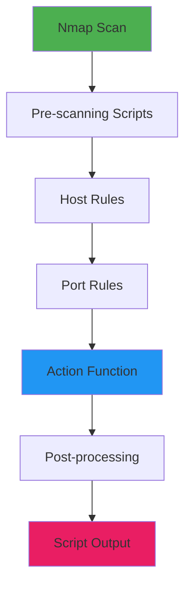
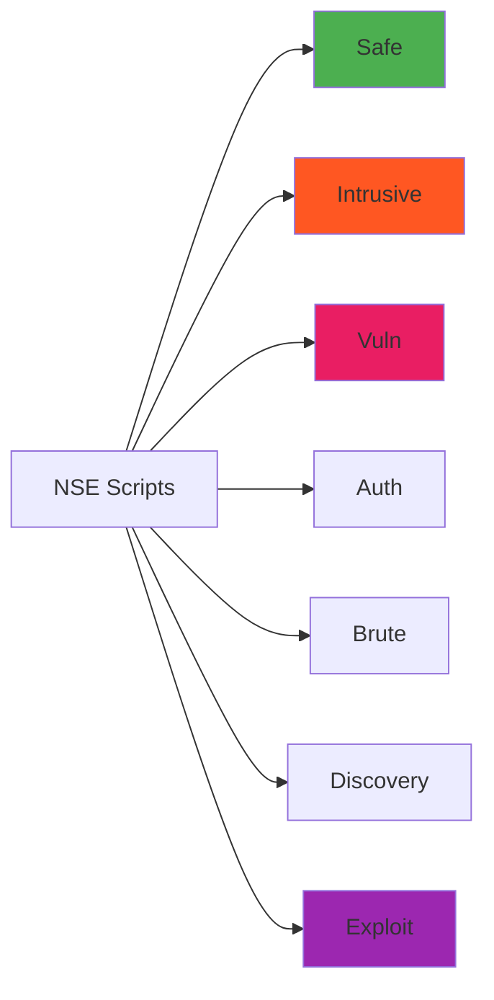
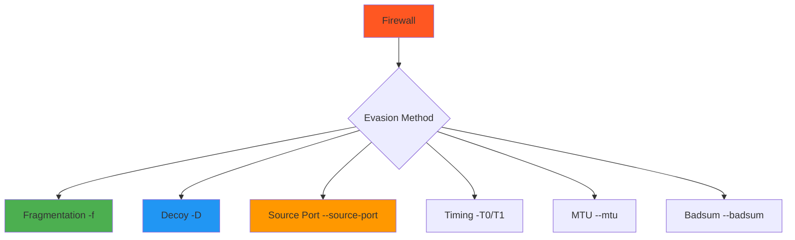
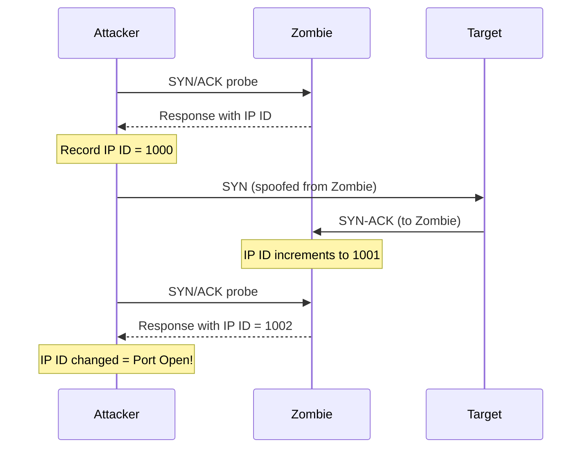
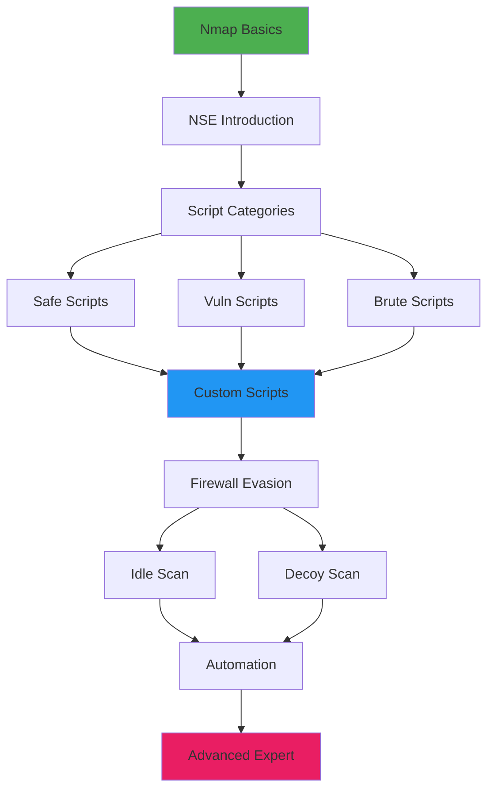
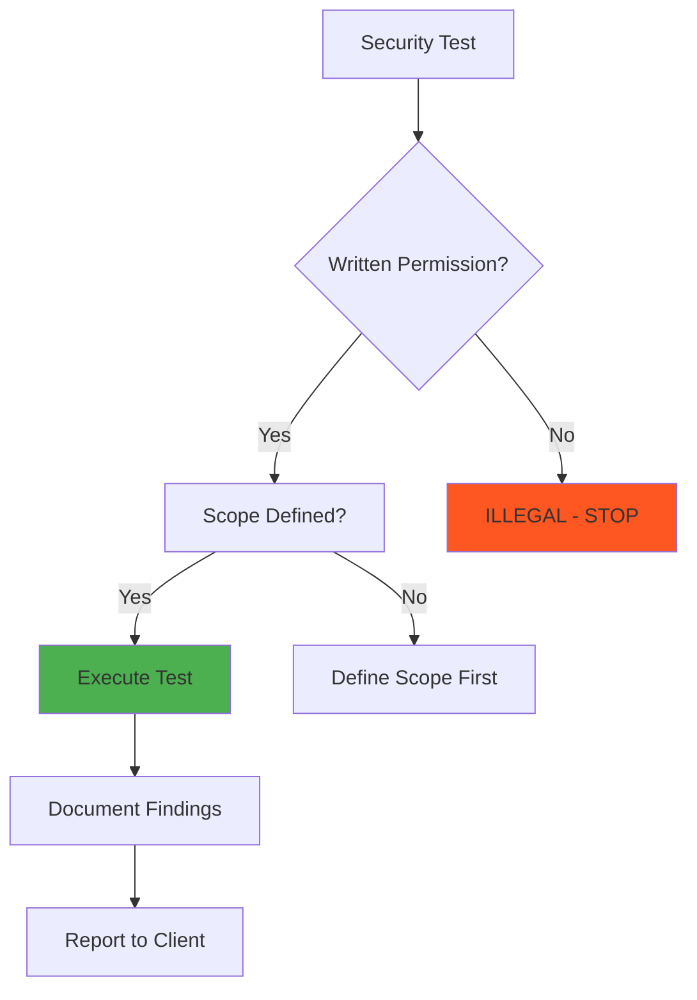

# Chapter 26: Nmap Advanced Techniques

> **Module:** 5 - Networking  
> **Chapter:** 26 of 61  
> **Duration:** 20-25 Minutes  
> **Difficulty:** ⭐⭐⭐ Intermediate  

---

## 📋 Chapter Overview

| Section | Content |
|---------|---------|
| Video Script | Complete Hindi narration with timestamps |
| Technical Guide | Detailed NSE, evasion, and automation |
| Commands Reference | 25+ advanced Nmap commands |
| Practice Exercises | Hands-on scanning labs |
| Troubleshooting | Common Nmap issues |
| Video Assets | Thumbnail, description, tags |

---

## 🎬 VIDEO SCRIPT (Complete Hindi Narration)

```
═══════════════════════════════════════════════════════════════════════════════
TERMUX FULL COURSE - CHAPTER 26
Title: Nmap Advanced Techniques | NSE Scripts & Firewall Evasion | T3rmuxk1ng
Duration: 20-25 Minutes
═══════════════════════════════════════════════════════════════════════════════

[INTRO - 0:00 to 0:50]
─────────────────────────────────────────────────────────────────────────────

Namaskar Dosto! Welcome back to Termux Full Course!

Main aapka host hoon T3rmuxk1ng, aur aaj ek bahut powerful chapter hai -
Chapter 26: Nmap Advanced Techniques!

Pichhle chapter mein humne Nmap ki basics seekhi thi - installation, 
basic scans, port scanning techniques. Aaj hum advanced level pe jaayenge.

Aaj hum seekhenge:
- Nmap Scripting Engine (NSE) - Nmap ko aur bhi powerful banana
- Firewall evasion techniques - Security bypass karna
- Host discovery methods - Hidden hosts dhundhna
- Custom NSE scripts banana
- Automation aur reporting

Ye chapter ethical hackers aur penetration testers ke liye bahut 
important hai. Chaliye shuru karte hain!

Play button dabaiye, like karein, subscribe karein - notification bell ke saath.

---

[SECTION 1: NMAP SCRIPTING ENGINE INTRODUCTION - 0:50 to 3:30]
─────────────────────────────────────────────────────────────────────────────

To sabse pehle - Nmap Scripting Engine ya NSE kya hai?

NSE Nmap ki sabse powerful feature hai. Ye Nmap ko ek simple port 
scanner se badhkar ek complete vulnerability scanner bana deta hai.

Imagine karein - aap ek network scan karte ho, aur saath hi:
- Vulnerabilities detect ho jaate hain
- Default credentials check ho jaate hain
- Service versions pata chal jaate hain
- Backdoors detect ho jaate hain
- Exploits automatically test ho jaate hain

Ye sab NSE scripts karte hain!

NSE scripts Lua programming language mein likhe jaate hain. Nmap ke 
saath 600+ built-in scripts aate hain, aur aap custom bhi bana sakte ho.

SCRIPT CATEGORIES:

┌─────────────────────────────────────────────────────────────────────────┐
│                    NSE SCRIPT CATEGORIES                                 │
├────────────────┬────────────────────────────────────────────────────────┤
│ Category       │ Purpose                                                │
├────────────────┼────────────────────────────────────────────────────────┤
│ auth          │ Authentication related scripts                         │
│ broadcast     │ Network broadcast discovery                            │
│ brute         │ Brute force attacks                                    │
│ default       │ Default scripts (run with -sC)                         │
│ discovery     │ Network and service discovery                          │
│ dos           │ Denial of service scripts                              │
│ exploit       │ Exploitation scripts                                   │
│ external      │ Third-party services                                   │
│ fuzzer        │ Fuzzing scripts                                        │
│ intrusive     │ Intrusive scripts (may crash services)                 │
│ malware       │ Malware detection                                      │
│ safe          │ Safe scripts (won't harm target)                       │
│ version       │ Version detection scripts                              │
│ vuln          │ Vulnerability detection                                │
└────────────────┴────────────────────────────────────────────────────────┘

---

[SECTION 2: -sC AND --script USAGE - 3:30 to 6:00]
─────────────────────────────────────────────────────────────────────────────

Ab commands seekhte hain. Sabse pehle default scripts:

DEFAULT SCRIPTS (-sC):

    nmap -sC target.com

-sC option default scripts run karta hai. Ye safe aur useful scripts 
ka collection hai jo:
- Service detection
- Version detection
- Basic vulnerability checks
- Common misconfigurations

Example output dikhaata hai ki scripts automatically run hote hain.

SPECIFIC SCRIPTS (--script):

    nmap --script <script-name> target.com

Specific script run karna:

    nmap --script http-title target.com

Multiple scripts:

    nmap --script http-title,http-headers target.com

Script category run karna:

    nmap --script vuln target.com

    nmap --script auth target.com

    nmap --script "safe and discovery" target.com

Wildcard use karna:

    nmap --script "http-*" target.com

Ye saare http scripts run karega.

SCRIPTS LIST KARNA:

    nmap --script-help all

    nmap --script-help http-title

Scripts ki details dekhni ho:

    nmap --script-help "vuln and safe"

---

[SECTION 3: COMMON NSE SCRIPTS - 6:00 to 9:30]
─────────────────────────────────────────────────────────────────────────────

Ab kuch important scripts detail mein dekhein:

1. AUTH SCRIPTS (Authentication):

    nmap --script auth target.com

Ye authentication bypass, default credentials, aur weak auth detect karta hai.

Specific auth scripts:
    nmap --script ssh-auth-methods target.com
    nmap --script mysql-enum target.com
    nmap --script ftp-anon target.com

2. VULN SCRIPTS (Vulnerability):

    nmap --script vuln target.com

Ye saare vulnerability detection scripts run karta hai.

Specific vuln scripts:
    nmap --script ssl-heartbleed target.com
    nmap --script ssl-poodle target.com
    nmap --script smb-vuln-ms17-010 target.com
    nmap --script http-sql-injection target.com
    nmap --script http-xssed target.com

3. EXPLOIT SCRIPTS:

    nmap --script exploit target.com

Specific exploit scripts:
    nmap --script http-shellshock target.com
    nmap --script clamav-exec target.com

⚠️ WARNING: Exploit scripts dangerous ho sakte hain. Sirf authorized 
testing pe use karein.

4. DISCOVERY SCRIPTS:

    nmap --script discovery target.com

Specific discovery scripts:
    nmap --script dns-brute target.com
    nmap --script http-enum target.com
    nmap --script smb-enum-shares target.com
    nmap --script ldap-search target.com

5. BRUTE FORCE SCRIPTS:

    nmap --script brute target.com

Specific brute scripts:
    nmap --script ssh-brute target.com
    nmap --script ftp-brute target.com
    nmap --script http-brute target.com
    nmap --script mysql-brute target.com

---

[SECTION 4: --script-args USAGE - 9:30 to 12:00]
─────────────────────────────────────────────────────────────────────────────

Script arguments se aap scripts ko customize kar sakte ho.

SYNTAX:

    nmap --script <script> --script-args <arg1>=<value1>,<arg2>=<value2> target

EXAMPLES:

1. HTTP Title with custom user-agent:

    nmap --script http-title --script-args http.useragent="Mozilla/5.0" target.com

2. SSH Brute Force with custom credentials:

    nmap --script ssh-brute --script-args userdb=users.txt,passdb=passwords.txt target.com

3. DNS Brute with custom wordlist:

    nmap --script dns-brute --script-args dns-brute.hostlist=hosts.txt target.com

4. HTTP Enum with specific base path:

    nmap --script http-enum --script-args http-enum.basepath=/admin/ target.com

5. MySQL brute with specific credentials:

    nmap --script mysql-brute --script-args mysql-brute.timeout=30 target.com

6. SMB Enum with credentials:

    nmap --script smb-enum-shares --script-args smbuser=admin,smbpass=password target.com

COMMON ARGUMENTS:

┌─────────────────────────────────────────────────────────────────────────┐
│                    COMMON SCRIPT ARGUMENTS                               │
├─────────────────────────────────────────────────────────────────────────┤
│ http.useragent      │ Custom User-Agent string                          │
│ http.timeout        │ HTTP timeout in seconds                           │
│ userdb              │ Username database file                            │
│ passdb              │ Password database file                            │
│ unpwdb.timelimit    │ Time limit for brute force                        │
│ smbuser             │ SMB username                                      │
│ smbpass             │ SMB password                                      │
│ ssh     │ SSH timeout                                       │
│ mysql-brute.timeout │ MySQL brute timeout                               │
└─────────────────────────────────────────────────────────────────────────┘

---

[SECTION 5: HOST DISCOVERY TECHNIQUES - 12:00 to 15:00]
─────────────────────────────────────────────────────────────────────────────

Ab host discovery techniques seekhte hain. Kabhi-kabhi hosts hidden 
hote hain, firewalls block karte hain. Kaise dhundhein?

-sn: Ping Scan (No Port Scan):

    nmap -sn 192.168.1.0/24

Ye sirf check karta hai ki host up hai ya nahi, ports scan nahi karta.

-PS: TCP SYN Ping:

    nmap -PS target.com

    nmap -PS80,443,22 target.com

SYN packets bhejta hai. Agar response aaya to host up hai.

-PA: TCP ACK Ping:

    nmap -PA target.com

    nmap -PA80,443 target.com

ACK packets bhejta hai. Firewalls sometimes ACK allow karte hain.

-PU: UDP Ping:

    nmap -PU target.com

    nmap -PU53,161 target.com

UDP packets bhejta hai. Good for sneaking past firewalls.

-PE: ICMP Echo Request:

    nmap -PE target.com

Normal ping request. Many firewalls block this.

-PP: ICMP Timestamp Request:

    nmap -PP target.com

ICMP timestamp request. Sometimes firewalls miss this.

-PM: ICMP Address Mask Request:

    nmap -PM target.com

Another ICMP technique.

-PN: No Ping (Skip Host Discovery):

    nmap -PN target.com

Treat all hosts as online. Useful when firewall blocks ping.

COMBINED HOST DISCOVERY:

    nmap -PS22,80 -PA80,443 -PU53 target.com

    nmap -PE -PP -PS443 target.com

Multiple techniques combine karo for better results!

---

[SECTION 6: FIREWALL EVASION - 15:00 to 18:00]
─────────────────────────────────────────────────────────────────────────────

Ab firewall evasion techniques - sabse important part!

-f: Fragmentation:

    nmap -f target.com

Packets ko fragments mein todta hai. Some firewalls can't reassemble.

--mtu: Custom MTU:

    nmap --mtu 24 target.com

Custom MTU size. Fragmentation with specific size.

-D: Decoy Scan:

    nmap -D RND:10 target.com

    nmap -D decoy1,decoy2,ME target.com

Decoy IPs add karta hai. Target ko lagta hai multiple systems 
scan kar rahe hain. Real IP hidden rahta hai.

-S: Spoof Source IP:

    nmap -S 192.168.1.100 target.com

Source IP spoof karta hai. Note: Response aapko nahi milega 
unless you're on the same network!

--source-port: Source Port Manipulation:

    nmap --source-port 53 target.com

    nmap -g 53 target.com

Source port 53 (DNS) use karta hai. Many firewalls allow DNS traffic.

-e: Specify Interface:

    nmap -e wlan0 target.com

Specific network interface use karna.

--badsum: Send Bad Checksum:

    nmap --badsum target.com

Invalid checksum bhejta hai. Some firewalls pass bad packets.

TTL Manipulation:

    nmap --ttl 128 target.com

Set custom TTL value.

DATA LENGTH:

    nmap --data-length 25 target.com

Random data add karta hai packets mein.

TIMING TEMPLATES:

    nmap -T0 target.com  # Paranoid - very slow
    nmap -T1 target.com  # Sneaky
    nmap -T2 target.com  # Polite
    nmap -T3 target.com  # Normal
    nmap -T4 target.com  # Aggressive
    nmap -T5 target.com  # Insane - very fast

T0 and T1 are good for IDS evasion.

---

[SECTION 7: IDLE SCAN (-sI) - 18:00 to 20:00]
─────────────────────────────────────────────────────────────────────────────

Idle scan ek unique technique hai - completely anonymous scanning!

How it works:
1. Find a zombie host (idle machine)
2. Send spoofed packets to target
3. Monitor zombie's IP ID to see if target responded

SYNTAX:

    nmap -sI <zombie-host> target.com

Example:

    nmap -sI 192.168.1.50 target.com

FINDING ZOMBIE HOST:

Zombie host should be:
- Idle (not generating traffic)
- Predictable IP ID sequence
- Not behind NAT

Good candidates:
- Printers
- Old servers
- IoT devices

IDLE SCAN ADVANTAGES:
- Completely anonymous
- Target doesn't see your IP
- Bypasses firewall rules

DISADVANTAGES:
- Slow
- Requires suitable zombie
- May not work behind NAT

---

[SECTION 8: FTP BOUNCE SCAN - 20:00 to 21:30]
─────────────────────────────────────────────────────────────────────────────

FTP Bounce scan ek old technique hai but still interesting!

SYNTAX:

    nmap -b <username:password@ftp-server> target.com

Example:

    nmap -b anonymous:anonymous@ftp.example.com target.com

How it works:
1. Connect to FTP server
2. Use FTP's PORT command to connect to target
3. Scan through FTP server

This was used to hide attacker's IP. Modern FTP servers 
usually block this (FTP bounce protection).

USAGE TODAY:
- Legacy systems
- Misconfigured FTP servers
- Educational purposes

---

[SECTION 9: IPv6 SCANNING - 21:30 to 23:00]
─────────────────────────────────────────────────────────────────────────────

IPv6 scanning bhi important hai as IPv6 adoption increases.

ENABLE IPv6:

    nmap -6 target.com

IPv6 ADDRESS FORMATS:

    nmap -6 2001:db8::1

    nmap -6 2001:db8::1-100

IPv6 NETWORK SCANNING:

IPv6 addresses bahut bade hain - 128 bits. Full network scan 
impossible hai. Use targeted scanning:

    nmap -6 -p 80,443,22 target.com

IPv6 HOST DISCOVERY:

    nmap -6 -sn target.com

LIMITATIONS:
- Slower than IPv4
- Less script support
- Larger address space = harder to scan

---

[SECTION 10: ZENMAP ALTERNATIVE ON ANDROID - 23:00 to 24:30]
─────────────────────────────────────────────────────────────────────────────

Zenmap Nmap ka GUI version hai for desktop. Android pe Zenmap nahi hai.

ALTERNATIVES:

1. Nmap Termux (Command Line):
   - Full Nmap functionality
   - All features available
   - Command line interface

2. Network Mapper (Android App):
   - GUI wrapper for Nmap
   - Limited features
   - Good for beginners

3. DroidNmap:
   - Simple GUI
   - Basic scans only

4. Use Termux + Custom Scripts:
   - Best option
   - Create your own GUI-like experience
   - Full control

TERMUX SCRIPTS FOR NMAP:

Create simple menu-driven scripts:

    #!/bin/bash
    # nmap-menu.sh

    echo "=== NMAP SCANNER ==="
    echo "1. Quick Scan"
    echo "2. Full Scan"
    echo "3. Vulnerability Scan"
    read -p "Choice: " choice
    read -p "Target: " target

    case $choice in
        1) nmap -sV $target ;;
        2) nmap -A $target ;;
        3) nmap --script vuln $target ;;
    esac

---

[SECTION 11: CREATING CUSTOM NSE SCRIPTS - 24:30 to 27:00]
─────────────────────────────────────────────────────────────────────────────

Ab custom NSE script banana seekhte hain!

NSE SCRIPT STRUCTURE:

```lua
-- Script metadata
description = [[
Script description here
]]

author = "Your Name"
license = "Same as Nmap"
categories = {"default", "safe"}

-- Import libraries
local http = require "http"
local nmap = require "nmap"

-- The action function
action = function(host, port)
    -- Your script logic here
    return "Result"
end
```

SIMPLE HTTP BANNER SCRIPT:

```lua
description = [[
Simple HTTP banner grabber
]]

author = "T3rmuxk1ng"
license = "Same as Nmap"
categories = {"discovery", "safe"}

local http = require "http"

action = function(host, port)
    local response = http.get(host, port, "/")
    if response and response.header then
        local server = response.header["server"]
        if server then
            return "Server: " .. server
        end
    end
    return nil
end
```

SAVE AND RUN:

1. Save as: myscript.nse
2. Place in: /usr/share/nmap/scripts/ (or ~/.nmap/scripts/)
3. Run: nmap --script myscript.nse target.com

TESTING SCRIPTS:

    nmap --script myscript.nse --script-trace target.com

--script-trace shows what script is doing.

---

[SECTION 12: NMAP AUTOMATION SCRIPTS - 27:00 to 29:00]
─────────────────────────────────────────────────────────────────────────────

Automation ke liye scripts banana important hai.

BASH AUTOMATION SCRIPT:

```bash
#!/bin/bash
# nmap-automator.sh

TARGET=$1
OUTPUT_DIR="nmap_scan_$(date +%Y%m%d_%H%M%S)"

mkdir -p $OUTPUT_DIR

echo "[*] Starting comprehensive scan of $TARGET"

# Quick scan
echo "[*] Running quick scan..."
nmap -T4 -F $TARGET -oN $OUTPUT_DIR/quick_scan.txt

# Version detection
echo "[*] Running version scan..."
nmap -sV $TARGET -oN $OUTPUT_DIR/version_scan.txt

# Script scan
echo "[*] Running script scan..."
nmap -sC $TARGET -oN $OUTPUT_DIR/script_scan.txt

# Vulnerability scan
echo "[*] Running vulnerability scan..."
nmap --script vuln $TARGET -oN $OUTPUT_DIR/vuln_scan.txt

# Full scan
echo "[*] Running full scan..."
nmap -p- -sV -sC $TARGET -oN $OUTPUT_DIR/full_scan.txt

echo "[*] All scans complete! Results in $OUTPUT_DIR"
```

PYTHON AUTOMATION:

```python
#!/usr/bin/env python3
import subprocess
import sys

def nmap_scan(target, scan_type):
    scans = {
        'quick': ['nmap', '-T4', '-F', target],
        'full': ['nmap', '-p-', '-sV', '-sC', target],
        'vuln': ['nmap', '--script', 'vuln', target],
        'udp': ['nmap', '-sU', '--top-ports', '100', target]
    }
    
    cmd = scans.get(scan_type)
    if cmd:
        result = subprocess.run(cmd, capture_output=True, text=True)
        return result.stdout
    return "Unknown scan type"

if __name__ == "__main__":
    if len(sys.argv) < 3:
        print("Usage: python nmap_auto.py <target> <scan_type>")
        sys.exit(1)
    
    target = sys.argv[1]
    scan_type = sys.argv[2]
    
    print(nmap_scan(target, scan_type))
```

---

[SECTION 13: REPORTING AND DOCUMENTATION - 29:00 to 31:00]
─────────────────────────────────────────────────────────────────────────────

Professional reporting important hai for penetration testing.

OUTPUT FORMATS:

1. Normal Output (-oN):

    nmap -oN scan_results.txt target.com

Human-readable format.

2. XML Output (-oX):

    nmap -oX scan_results.xml target.com

Machine-readable, can be parsed by other tools.

3. Grepable Output (-oG):

    nmap -oG scan_results.gnmap target.com

Easy to parse with grep/awk.

4. All Formats (-oA):

    nmap -oA scan_results target.com

Creates .nmap, .xml, and .gnmap files.

ENHANCED REPORTING:

Using nmap-report tools:

    pip install nmap-report
    nmap-report -i scan.xml -o report.html

CUSTOM REPORT SCRIPT:

```bash
#!/bin/bash
# generate-report.sh

TARGET=$1
DATE=$(date +%Y-%m-%d)

nmap -sV -sC -oX /tmp/scan.xml $TARGET

cat << EOF > report_$DATE.md
# Nmap Scan Report

**Target:** $TARGET
**Date:** $DATE
**Scanner:** Nmap $(nmap --version | head -1)

## Open Ports

$(nmap -sV -sC $TARGET | grep open)

## Services Detected

$(nmap -sV $TARGET | grep -E "^[0-9]+")

## Script Results

$(nmap -sC $TARGET)

EOF

echo "Report saved to report_$DATE.md"
```

---

[SECTION 14: SUMMARY & BEST PRACTICES - 31:00 to 33:00]
─────────────────────────────────────────────────────────────────────────────

CHAPTER SUMMARY:

Aaj humne seekha:
✅ Nmap Scripting Engine (NSE) introduction
✅ -sC aur --script usage
✅ Common NSE scripts - auth, vuln, exploit
✅ --script-args customization
✅ Host discovery techniques - -sn, -PS, -PA, -PU
✅ Firewall evasion - -f, --mtu, -D, -S
✅ Decoy scans
✅ Idle scan (-sI)
✅ FTP bounce scan
✅ IPv6 scanning
✅ Zenmap alternatives on Android
✅ Creating custom NSE scripts
✅ Nmap automation
✅ Reporting and documentation

BEST PRACTICES:

✓ Always get authorization before scanning
✓ Start with safe scripts first
✓ Document everything
✓ Use appropriate timing templates
✓ Combine multiple techniques for better results
✓ Save output in multiple formats
✓ Test scripts on your own systems first
✓ Keep Nmap and scripts updated
✓ Use --reason to understand results
✓ Combine with other tools for comprehensive testing

IMPORTANT COMMANDS YAAD RAKHEIN:

┌─────────────────────────────────────────────────────────────────────────┐
│                    ESSENTIAL ADVANCED NMAP COMMANDS                      │
├─────────────────────────────────────────────────────────────────────────┤
│ nmap -sC target            │ Run default scripts                        │
│ nmap --script vuln target  │ Run vulnerability scripts                  │
│ nmap --script-args ...     │ Pass arguments to scripts                  │
│ nmap -sn 192.168.1.0/24    │ Ping sweep (no port scan)                  │
│ nmap -PS,PA,PU target      │ Advanced host discovery                    │
│ nmap -f target             │ Fragmented packets                         │
│ nmap -D RND:10 target      │ Decoy scan                                 │
│ nmap -sI zombie target     │ Idle scan                                  │
│ nmap -oA results target    │ Output all formats                         │
│ nmap -T4 -A target         │ Aggressive timing + OS detection           │
└─────────────────────────────────────────────────────────────────────────┘

---

[OUTRO - 33:00 to 34:00]
─────────────────────────────────────────────────────────────────────────────

Dosto, Chapter 26 complete!

Nmap ek incredible tool hai. Jo humne aaj seekha wo advanced 
techniques hain. Practice karte rahien - practice makes perfect!

Yaad rakhein: With great power comes great responsibility.
Sirf authorized systems pe scan karein. Ethical hacking seekh rahe ho,
toh ethical bhi raho.

Agar ye video helpful lagi:
👍 Like button press karein
🔔 Subscribe karein, notification bell on karein
💬 Koi sawal ho to comment mein poochein
📤 Share karein friends ke saath

Next Chapter 27 mein hum Netcat mastery seekhenge - network 
hacker ka Swiss Army knife!

Thank you for watching! See you in Chapter 27!

═══════════════════════════════════════════════════════════════════════════════
```

---

## 📖 TECHNICAL GUIDE

### 1. Nmap Scripting Engine (NSE) Architecture

```
┌─────────────────────────────────────────────────────────────────────────┐
│                    NMAP SCRIPTING ENGINE ARCHITECTURE                    │
├─────────────────────────────────────────────────────────────────────────┤
│                                                                          │
│   ┌─────────────────────────────────────────────────────────────────┐   │
│   │                      NMAP CORE ENGINE                           │   │
│   │              (Port Scanning, Service Detection)                 │   │
│   └─────────────────────────────────────────────────────────────────┘   │
│                                   │                                      │
│                                   ▼                                      │
│   ┌─────────────────────────────────────────────────────────────────┐   │
│   │                        NSE LAYER                                │   │
│   ├─────────────────────────────────────────────────────────────────┤   │
│   │  ┌──────────┐ ┌──────────┐ ┌──────────┐ ┌──────────┐           │   │
│   │  │  AUTH    │ │  VULN    │ │ EXPLOIT  │ │ DISCOVERY │           │   │
│   │  │ SCRIPTS  │ │ SCRIPTS  │ │ SCRIPTS  │ │ SCRIPTS   │           │   │
│   │  └──────────┘ └──────────┘ └──────────┘ └──────────┘           │   │
│   │  ┌──────────┐ ┌──────────┐ ┌──────────┐ ┌──────────┐           │   │
│   │  │  BRUTE   │ │  SAFE    │ │INTRUSIVE │ │  CUSTOM   │           │   │
│   │  │ SCRIPTS  │ │ SCRIPTS  │ │ SCRIPTS  │ │ SCRIPTS   │           │   │
│   │  └──────────┘ └──────────┘ └──────────┘ └──────────┘           │   │
│   └─────────────────────────────────────────────────────────────────┘   │
│                                   │                                      │
│                                   ▼                                      │
│   ┌─────────────────────────────────────────────────────────────────┐   │
│   │                      LUA INTERPRETER                            │   │
│   │                 (Script Execution Engine)                       │   │
│   └─────────────────────────────────────────────────────────────────┘   │
│                                   │                                      │
│                                   ▼                                      │
│   ┌─────────────────────────────────────────────────────────────────┐   │
│   │                      NSE LIBRARIES                              │   │
│   │   http, ssh, ftp, smb, mysql, ssl, dns, ldap, etc.              │   │
│   └─────────────────────────────────────────────────────────────────┘   │
│                                                                          │
└─────────────────────────────────────────────────────────────────────────┘
```

### 2. Script Execution Phases

```
┌─────────────────────────────────────────────────────────────────────────┐
│                    NSE SCRIPT EXECUTION PHASES                           │
├─────────────────────────────────────────────────────────────────────────┤
│                                                                          │
│  PHASE 1: RULE                                                          │
│  ├── portrule: Run for specific ports                                   │
│  ├── hostrule: Run for specific hosts                                   │
│  └── Determines when script runs                                        │
│                                                                          │
│  PHASE 2: ACTION                                                        │
│  ├── Main script logic                                                  │
│  ├── Network operations                                                 │
│  └── Returns results                                                    │
│                                                                          │
│  PHASE 3: POSTPROCESSING                                                │
│  ├── Format output                                                      │
│  └── Display to user                                                    │
│                                                                          │
└─────────────────────────────────────────────────────────────────────────┘
```

### 3. Host Discovery Techniques Comparison

| Technique | Flag | Description | Bypasses |
|-----------|------|-------------|----------|
| No Ping | -Pn | Skip discovery | All ping blocks |
| SYN Ping | -PS | TCP SYN packets | Basic firewalls |
| ACK Ping | -PA | TCP ACK packets | Stateful firewalls |
| UDP Ping | -PU | UDP packets | TCP-only firewalls |
| ICMP Echo | -PE | Standard ping | Non-ICMP blocks |
| ICMP Timestamp | -PP | Timestamp request | Some ICMP blocks |
| ICMP Mask | -PM | Address mask request | Some ICMP blocks |
| ARP Ping | -PR | ARP requests | Local network only |

### 4. Firewall Evasion Techniques

```
┌─────────────────────────────────────────────────────────────────────────┐
│                    FIREWALL EVASION TECHNIQUES                           │
├─────────────────────────────────────────────────────────────────────────┤
│                                                                          │
│  FRAGMENTATION (-f)                                                     │
│  ├── Breaks packets into small fragments                                │
│  ├── Some firewalls can't reassemble                                    │
│  └── Example: nmap -f target.com                                        │
│                                                                          │
│  MTU MANIPULATION (--mtu)                                               │
│  ├── Custom Maximum Transmission Unit                                   │
│  ├── Creates specific fragment sizes                                    │
│  └── Example: nmap --mtu 24 target.com                                  │
│                                                                          │
│  DECOY SCAN (-D)                                                        │
│  ├── Multiple fake source IPs                                           │
│  ├── Hides real attacker IP                                             │
│  └── Example: nmap -D RND:10 target.com                                 │
│                                                                          │
│  SOURCE PORT MANIPULATION (--source-port)                               │
│  ├── Uses trusted port numbers                                          │
│  ├── Often bypasses firewall rules                                      │
│  └── Example: nmap --source-port 53 target.com                          │
│                                                                          │
│  TIMING TEMPLATES (-T)                                                  │
│  ├── T0: Paranoid (very slow)                                           │
│  ├── T1: Sneaky (slow)                                                  │
│  ├── T2: Polite (moderate)                                              │
│  ├── T3: Normal (default)                                               │
│  ├── T4: Aggressive (fast)                                              │
│  └── T5: Insane (very fast)                                             │
│                                                                          │
│  DATA PADDING (--data-length)                                           │
│  ├── Adds random data to packets                                        │
│  ├── Makes packets look different                                       │
│  └── Example: nmap --data-length 25 target.com                          │
│                                                                          │
└─────────────────────────────────────────────────────────────────────────┘
```

### 5. NSE Script Categories Deep Dive

| Category | Count | Purpose | Risk Level |
|----------|-------|---------|------------|
| **auth** | 30+ | Authentication testing | Medium |
| **broadcast** | 20+ | Network broadcast discovery | Safe |
| **brute** | 50+ | Brute force attacks | High |
| **default** | 100+ | Safe default scripts | Low |
| **discovery** | 150+ | Service/host discovery | Low |
| **dos** | 10+ | DoS testing | Very High |
| **exploit** | 100+ | Exploitation | Very High |
| **fuzzer** | 10+ | Fuzzing | Medium |
| **intrusive** | 200+ | Intrusive testing | High |
| **malware** | 10+ | Malware detection | Safe |
| **safe** | 300+ | Non-intrusive | Very Low |
| **vuln** | 200+ | Vulnerability detection | Medium |

### 6. Idle Scan Mechanism

```
┌─────────────────────────────────────────────────────────────────────────┐
│                         IDLE SCAN MECHANISM                              │
├─────────────────────────────────────────────────────────────────────────┤
│                                                                          │
│  STEP 1: Get Zombie's Current IP ID                                     │
│  ├── Attacker probes zombie                                             │
│  └── Records IP ID value (e.g., 1000)                                   │
│                                                                          │
│  STEP 2: Send Spoofed SYN to Target                                     │
│  ├── Source IP = Zombie's IP                                            │
│  ├── Target responds to Zombie (not Attacker)                           │
│  └── Zombie's IP ID increments if port is open                          │
│                                                                          │
│  STEP 3: Probe Zombie Again                                             │
│  ├── Attacker probes zombie again                                       │
│  └── Compare IP ID value                                                │
│                                                                          │
│  ANALYSIS:                                                              │
│  ├── IP ID increased by 1 = No response from target (closed)            │
│  ├── IP ID increased by 2 = Target responded (open)                     │
│  └── Target never sees attacker's real IP                               │
│                                                                          │
└─────────────────────────────────────────────────────────────────────────┘
```

### 7. Output Formats Comparison

| Format | Flag | Use Case | Human Readable |
|--------|------|----------|----------------|
| Normal | -oN | General reporting | Yes |
| XML | -oX | Tool parsing, CI/CD | No |
| Grepable | -oG | Grep/awk processing | Partially |
| JSON | -oX + conversion | API integration | No |
| All | -oA | Multiple purposes | Mixed |

---

## 📋 COMMANDS REFERENCE

### NSE Script Commands

```bash
# DEFAULT SCRIPTS
nmap -sC target.com                    # Run default scripts
nmap --script default target.com       # Same as -sC

# SPECIFIC CATEGORY
nmap --script auth target.com          # Authentication scripts
nmap --script vuln target.com          # Vulnerability scripts
nmap --script discovery target.com     # Discovery scripts
nmap --script exploit target.com       # Exploit scripts
nmap --script brute target.com         # Brute force scripts
nmap --script safe target.com          # Safe scripts only

# MULTIPLE CATEGORIES
nmap --script "auth,vuln" target.com
nmap --script "safe and discovery" target.com

# SPECIFIC SCRIPT
nmap --script http-title target.com
nmap --script ssh-auth-methods target.com
nmap --script ssl-heartbleed target.com
nmap --script smb-vuln-ms17-010 target.com

# WILDCARD
nmap --script "http-*" target.com      # All HTTP scripts
nmap --script "ssh-*" target.com       # All SSH scripts

# SCRIPT WITH ARGUMENTS
nmap --script http-title --script-args http.useragent="CustomAgent" target.com
nmap --script ssh-brute --script-args userdb=users.txt,passdb=passes.txt target.com
nmap --script dns-brute --script-args dns-brute.hostlist=hosts.txt target.com

# SCRIPT HELP
nmap --script-help all                 # List all scripts
nmap --script-help http-title          # Specific script help
nmap --script-help "vuln and safe"     # Category help

# SCRIPT TRACE (debug)
nmap --script http-title --script-trace target.com

# UPDATE SCRIPTS
nmap --script-updatedb
```

### Host Discovery Commands

```bash
# PING SCAN (No port scan)
nmap -sn 192.168.1.0/24                # Ping sweep network
nmap -sn 192.168.1.1-100               # Range ping sweep

# TCP SYN PING
nmap -PS target.com                    # SYN ping (default ports)
nmap -PS80,443,22 target.com           # SYN ping (specific ports)

# TCP ACK PING
nmap -PA target.com                    # ACK ping (default)
nmap -PA80,443 target.com              # ACK ping (specific)

# UDP PING
nmap -PU target.com                    # UDP ping
nmap -PU53,161,123 target.com          # UDP ping (specific)

# ICMP PING
nmap -PE target.com                    # ICMP echo request
nmap -PP target.com                    # ICMP timestamp
nmap -PM target.com                    # ICMP address mask

# NO PING (Skip host discovery)
nmap -Pn target.com                    # Treat all hosts as up

# COMBINED DISCOVERY
nmap -PS22,80 -PA443 -PU53 target.com  # Multiple techniques
nmap -PE -PP -PS443 target.com         # ICMP + TCP combined

# ARP DISCOVERY (local)
nmap -PR target.com                    # ARP ping
nmap -PR 192.168.1.0/24                # ARP sweep (local only)
```

### Firewall Evasion Commands

```bash
# FRAGMENTATION
nmap -f target.com                     # Fragment packets
nmap -f -f target.com                  # Double fragmentation
nmap --mtu 24 target.com               # Custom MTU size

# DECOY SCAN
nmap -D RND:10 target.com              # Random 10 decoys
nmap -D RND:target.com                 # Random decoys
nmap -D decoy1,decoy2,ME target.com    # Specific decoys + you

# SOURCE IP SPOOFING
nmap -S 192.168.1.100 target.com       # Spoof source IP
nmap -S 192.168.1.100 -e wlan0 target.com  # Spoof + interface

# SOURCE PORT
nmap --source-port 53 target.com       # Source port 53 (DNS)
nmap -g 80 target.com                  # Source port 80
nmap --source-port 443 target.com      # Source port 443

# BAD CHECKSUM
nmap --badsum target.com               # Invalid checksum

# DATA LENGTH
nmap --data-length 25 target.com       # Add 25 bytes random data
nmap --data-length 100 target.com      # Add 100 bytes

# TTL
nmap --ttl 128 target.com              # Set TTL to 128
nmap --ttl 64 target.com               # Set TTL to 64

# TIMING
nmap -T0 target.com                    # Paranoid (slowest)
nmap -T1 target.com                    # Sneaky
nmap -T2 target.com                    # Polite
nmap -T3 target.com                    # Normal
nmap -T4 target.com                    # Aggressive
nmap -T5 target.com                    # Insane (fastest)

# COMBINED EVASION
nmap -f -D RND:5 --source-port 53 -T2 target.com
```

### Idle Scan Commands

```bash
# BASIC IDLE SCAN
nmap -sI zombie_host target.com

# WITH PORT SPECIFICATION
nmap -sI zombie_host -p 80,443,22 target.com

# WITH PROBE PORT
nmap -sI zombie_host:80 target.com     # Use port 80 on zombie
```

### FTP Bounce Scan

```bash
# FTP BOUNCE
nmap -b anonymous:anonymous@ftp.server.com target.com
nmap -b user:pass@ftp.example.com target.com
```

### IPv6 Scanning

```bash
# IPv6 SCAN
nmap -6 target.com                     # IPv6 scan
nmap -6 -p 80,443,22 target.com        # Specific ports
nmap -6 -sV target.com                 # Version detection
nmap -6 --script http-title target.com # Script scan
```

### Output and Reporting

```bash
# OUTPUT FORMATS
nmap -oN results.txt target.com        # Normal output
nmap -oX results.xml target.com        # XML output
nmap -oG results.gnmap target.com      # Grepable output
nmap -oA results target.com            # All formats

# VERBOSE
nmap -v target.com                     # Verbose
nmap -vv target.com                    # Very verbose

# DEBUG
nmap -d target.com                     # Debug
nmap -dd target.com                    # More debug

# REASON
nmap --reason target.com               # Show reason for port state

# OPEN ONLY
nmap --open target.com                 # Show only open ports

# APPEND
nmap --append-output -oN results.txt target.com
```

### Complete Advanced Scan Commands

```bash
# COMPREHENSIVE SCAN
nmap -A -T4 -v target.com              # Aggressive + verbose

# STEALTH SCAN
nmap -sS -T2 -f -D RND:3 target.com    # Stealth with decoys

# VULNERABILITY SCAN
nmap -sV --script vuln -oA vuln_scan target.com

# FULL PORT SCAN
nmap -p- -sV -sC -T4 -oA full_scan target.com

# UDP SCAN
nmap -sU --top-ports 100 -T4 target.com

# COMBINED TCP/UDP
nmap -sS -sU -p T:1-1000,U:53,161 -T4 target.com

# QUICK DISCOVERY
nmap -sn -PS22,80,443 -PA80,443 192.168.1.0/24

# INTERNAL NETWORK SCAN
nmap -sS -sV -O -T4 192.168.1.0/24
```

---

## 💻 PRACTICE EXERCISES

### Exercise 1: NSE Script Exploration

```bash
# Task: Explore and use various NSE scripts

# Step 1: List all available scripts
nmap --script-help all | head -100

# Step 2: Search for specific script
nmap --script-help | grep -i "http"

# Step 3: Run default scripts on a test target
nmap -sC scanme.nmap.org

# Step 4: Run vulnerability scripts
nmap --script vuln scanme.nmap.org

# Step 5: Run specific script with help
nmap --script-help http-title
nmap --script http-title scanme.nmap.org

# Step 6: Use script arguments
nmap --script http-enum --script-args http-enum.basepath=/ scanme.nmap.org
```

### Exercise 2: Host Discovery Practice

```bash
# Task: Practice various host discovery techniques

# Step 1: Ping sweep your local network (adjust for your network)
nmap -sn 192.168.1.0/24

# Step 2: Use SYN ping
nmap -sn -PS22,80,443 192.168.1.0/24

# Step 3: Use UDP ping
nmap -sn -PU53,161 192.168.1.0/24

# Step 4: Combine techniques
nmap -sn -PS22,80 -PA443 -PU53 192.168.1.0/24

# Step 5: Save results
nmap -sn -PS22,80,443 -oN discovery.txt 192.168.1.0/24
```

### Exercise 3: Firewall Evasion Techniques

```bash
# Task: Practice firewall evasion (on authorized targets only)

# Step 1: Normal scan (baseline)
nmap -sS scanme.nmap.org

# Step 2: Fragmented scan
nmap -f scanme.nmap.org

# Step 3: Slow timing
nmap -T0 scanme.nmap.org

# Step 4: Source port manipulation
nmap --source-port 53 scanme.nmap.org

# Step 5: Combined evasion
nmap -f -T2 --source-port 53 scanme.nmap.org

# Step 6: Decoy scan
nmap -D RND:5 scanme.nmap.org
```

### Exercise 4: Creating Custom NSE Script

```bash
# Task: Create a simple custom NSE script

# Step 1: Create script directory
mkdir -p ~/.nmap/scripts

# Step 2: Create custom script
cat > ~/.nmap/scripts/simple-banner.nse << 'EOF'
description = [[
Simple banner grabbing script
]]

author = "Student"
license = "Same as Nmap"
categories = {"discovery", "safe"}

local comm = require "comm"

portrule = function(host, port)
    return port.state == "open"
end

action = function(host, port)
    local banner = comm.get_banner(host, port)
    if banner then
        return "Banner: " .. banner
    end
    return nil
end
EOF

# Step 3: Update script database
nmap --script-updatedb

# Step 4: Test script
nmap --script simple-banner.nse scanme.nmap.org
```

### Exercise 5: Automation Script

```bash
# Task: Create automation script for comprehensive scanning

# Step 1: Create script
cat > ~/nmap-auto.sh << 'EOF'
#!/bin/bash

TARGET=$1

if [ -z "$TARGET" ]; then
    echo "Usage: ./nmap-auto.sh <target>"
    exit 1
fi

echo "[*] Starting Nmap Automation for $TARGET"
echo "[*] Results will be saved to nmap_results/"

mkdir -p nmap_results

echo "[*] Phase 1: Host Discovery"
nmap -sn $TARGET -oN nmap_results/01_discovery.txt

echo "[*] Phase 2: Quick Port Scan"
nmap -T4 -F $TARGET -oN nmap_results/02_quick.txt

echo "[*] Phase 3: Full Port Scan"
nmap -p- -T4 $TARGET -oN nmap_results/03_fullports.txt

echo "[*] Phase 4: Service Version Scan"
nmap -sV $TARGET -oN nmap_results/04_versions.txt

echo "[*] Phase 5: Default Script Scan"
nmap -sC $TARGET -oN nmap_results/05_scripts.txt

echo "[*] Phase 6: Vulnerability Scan"
nmap --script vuln $TARGET -oN nmap_results/06_vuln.txt

echo "[+] All scans complete! Check nmap_results/ directory"
EOF

# Step 2: Make executable
chmod +x ~/nmap-auto.sh

# Step 3: Run on test target
~/nmap-auto.sh scanme.nmap.org
```

### Exercise 6: Report Generation

```bash
# Task: Generate professional scan report

# Step 1: Run comprehensive scan with all output formats
nmap -sV -sC -oA report_scan scanme.nmap.org

# Step 2: Parse grepable output
cat report_scan.gnmap | grep "open" | awk '{print $2}'

# Step 3: Create summary
cat > report_summary.md << EOF
# Nmap Scan Report

**Target:** scanme.nmap.org
**Date:** $(date)
**Scanner:** $(nmap --version | head -1)

## Open Ports

\`\`\`
$(nmap -F scanme.nmap.org | grep open)
\`\`\`

## Services

\`\`\`
$(nmap -sV scanme.nmap.org | grep -E "^[0-9]+")
\`\`\`

## Scripts Output

\`\`\`
$(nmap -sC scanme.nmap.org)
\`\`\`
EOF

# Step 4: View report
cat report_summary.md
```

---

## ⚠️ TROUBLESHOOTING

### Problem 1: Scripts Not Running

```bash
# Cause: Script database not updated or script path wrong

# Solution 1: Update script database
nmap --script-updatedb

# Solution 2: Check script location
ls /usr/share/nmap/scripts/
ls ~/.nmap/scripts/

# Solution 3: Specify full path
nmap --script /path/to/script.nse target.com

# Solution 4: Verify script exists
nmap --script-help script-name
```

### Problem 2: Permission Denied Errors

```bash
# Cause: Nmap requires root for certain scans

# Solution 1: Use sudo for SYN scans
sudo nmap -sS target.com

# Solution 2: Use alternatives that don't need root
nmap -sT target.com  # TCP Connect (no root needed)

# Note: In Termux, most scans work without root
```

### Problem 3: Slow Scans

```bash
# Cause: Default timing is conservative

# Solution 1: Use faster timing template
nmap -T4 target.com

# Solution 2: Increase parallelism
nmap --min-rate 100 target.com

# Solution 3: Reduce scope
nmap -F target.com  # Fast scan (fewer ports)

# Solution 4: Combine techniques
nmap -T4 --min-rate 50 -F target.com
```

### Problem 4: Host Appears Down (But Is Up)

```bash
# Cause: Firewall blocking ping probes

# Solution 1: Skip host discovery
nmap -Pn target.com

# Solution 2: Use alternative ping methods
nmap -PS80,443 target.com

# Solution 3: Combine methods
nmap -PS22,80,443 -PA80,443 -PU53 target.com
```

### Problem 5: All Ports Show Filtered

```bash
# Cause: Firewall blocking all traffic

# Solution 1: Use decoy scan
nmap -D RND:10 target.com

# Solution 2: Fragment packets
nmap -f target.com

# Solution 3: Use trusted source port
nmap --source-port 53 target.com

# Solution 4: Slow down scan
nmap -T1 target.com

# Solution 5: Combine evasion techniques
nmap -f -T1 --source-port 53 -D RND:5 target.com
```

### Problem 6: NSE Script Errors

```bash
# Cause: Script syntax error or missing library

# Solution 1: Check script syntax
nmap --script-trace --script script.nse target.com

# Solution 2: Enable debug
nmap -d --script script.nse target.com

# Solution 3: Check Lua syntax
luac -p script.nse  # If luac available

# Solution 4: Read script documentation
nmap --script-help script.nse
```

### Problem 7: Memory Issues on Termux

```bash
# Cause: Large scans can use significant memory

# Solution 1: Reduce parallelism
nmap --max-parallelism 10 target.com

# Solution 2: Scan smaller port ranges
nmap -p 1-1000 target.com

# Solution 3: Scan in batches
nmap -p 1-100 target.com -oN batch1.txt
nmap -p 101-200 target.com -oN batch2.txt

# Solution 4: Use --max-retries
nmap --max-retries 1 target.com
```

### Problem 8: IPv6 Scan Not Working

```bash
# Cause: IPv6 not properly configured or supported

# Solution 1: Check IPv6 connectivity
ping6 -c 3 ipv6.google.com

# Solution 2: Specify IPv6 explicitly
nmap -6 -p 80,443 target.com

# Solution 3: Check if target has IPv6
dig AAAA target.com +short
```

---

## 🎬 VIDEO ASSETS

### Thumbnail Concepts

**Option A: Script Power Theme**
```
┌────────────────────────────────────┐
│  [Terminal Background]             │
│                                    │
│   🔥 NMAP ADVANCED                 │
│   NSE SCRIPTS + EVASION            │
│                                    │
│   ✓ 600+ Scripts                   │
│   ✓ Firewall Bypass                │
│   ✓ Custom Scripts                 │
│                                    │
│   [T3rmuxk1ng Logo]                │
└────────────────────────────────────┘
```

**Option B: Stealth Theme**
```
┌────────────────────────────────────┐
│  🎭 STEALTH SCANNING               │
│                                    │
│  Nmap Advanced Techniques          │
│                                    │
│  ┌────────────────────────────┐   │
│  │ Target: ???                │   │
│  │ Attacker: HIDDEN           │   │
│  └────────────────────────────┘   │
│                                    │
│  Chapter 26 | T3rmuxk1ng           │
└────────────────────────────────────┘
```

**Option C: Power User Theme**
```
┌────────────────────────────────────┐
│  ⚡ NMAP SUPERPOWERS               │
│                                    │
│  [Code snippets background]        │
│                                    │
│  • NSE Scripts                     │
│  • Idle Scan                       │
│  • Firewall Evasion                │
│                                    │
│  Master Class | T3rmuxk1ng         │
└────────────────────────────────────┘
```

### Video Description Template

```markdown
🔥 Nmap Advanced Techniques | NSE Scripts & Firewall Evasion | Termux Full Course Ch 26

⚡ In this chapter you'll learn:
• Nmap Scripting Engine (NSE) - Full Guide
• --script usage and categories
• Common NSE scripts (auth, vuln, exploit)
• --script-args customization
• Host discovery techniques (-sn, -PS, -PA, -PU)
• Firewall evasion methods (-f, --mtu, -D, -S)
• Decoy scans and idle scan (-sI)
• FTP bounce and IPv6 scanning
• Zenmap alternatives on Android
• Creating custom NSE scripts
• Nmap automation and reporting

⏱️ Timestamps:
0:00 - Introduction
0:50 - NSE Introduction
3:30 - Script Usage (-sC, --script)
6:00 - Common NSE Scripts
9:30 - Script Arguments
12:00 - Host Discovery
15:00 - Firewall Evasion
18:00 - Idle Scan
20:00 - FTP Bounce & IPv6
23:00 - Zenmap Alternatives
24:30 - Custom NSE Scripts
27:00 - Automation Scripts
29:00 - Reporting
31:00 - Summary

📝 Key Commands:
nmap -sC target.com
nmap --script vuln target.com
nmap -D RND:10 target.com
nmap -sI zombie target.com

📚 Full Course Playlist:
[PLAYLIST LINK]

📱 Follow T3rmuxk1ng:
• YouTube: @T3rmuxk1ng
• Telegram: [LINK]

#Nmap #NSE #NmapAdvanced #Termux #TermuxCourse #T3rmuxk1ng #EthicalHacking #NetworkScanning #FirewallEvasion

---
⚠️ Disclaimer: This video is for educational purposes. Only scan systems you have authorization to test. Unauthorized scanning is illegal.
```

### Tags List

```
nmap, nmap advanced, nmap nse, nmap scripts, nmap scripting engine,
nmap firewall evasion, nmap tutorial, nmap course, nmap termux,
termux nmap, network scanning, port scanning, security tools,
ethical hacking, penetration testing, nmap idle scan, nmap decoy,
nse scripts, nmap automation, nmap custom scripts, nmap reporting,
t3rmuxk1ng, termux course, termux hindi, cybersecurity tools,
vulnerability scanning, network security, hacking tools
```

### Hashtags

```
#Nmap #NmapAdvanced #NSE #NetworkScanning #EthicalHacking 
#Termux #TermuxCourse #CyberSecurity #PenetrationTesting 
#T3rmuxk1ng #FirewallEvasion #SecurityTools #NmapScripts 
#HindiTutorial #LearnHacking
```

---

## 📚 ADDITIONAL RESOURCES

### Official Documentation

| Resource | Link |
|----------|------|
| Nmap Official Site | https://nmap.org/ |
| Nmap Documentation | https://nmap.org/docs.html |
| NSE Documentation | https://nmap.org/book/nse.html |
| Nmap Scripts API | https://nmap.org/nsedoc/ |

### Script Repositories

| Repository | Description |
|------------|-------------|
| Default Scripts | /usr/share/nmap/scripts/ |
| Nmap NSE Vault | https://github.com/scipag/nmap-nse-scripts |
| Vulners NSE | https://github.com/vulnersCom/nmap-vulners |

### Learning Resources

| Resource | Description |
|----------|-------------|
| Nmap Network Scanning Book | Official book by Gordon Lyon |
| Nmap Cheat Sheet | Quick reference guide |
| TryHackMe Nmap Room | Interactive practice |
| HackTheBox | Real-world practice targets |

---

## ✅ CHAPTER CHECKLIST

Before moving to Chapter 27, verify:

- [ ] Understand NSE architecture and categories
- [ ] Successfully ran -sC default scripts
- [ ] Used --script with specific scripts
- [ ] Applied --script-args for customization
- [ ] Practiced host discovery techniques
- [ ] Tested firewall evasion methods
- [ ] Understand idle scan mechanism
- [ ] Can create basic automation script
- [ ] Know output format options
- [ ] Understand legal/ethical boundaries

---

## 🎯 NEXT CHAPTER PREVIEW

**Chapter 27: Netcat Mastery**

- Netcat introduction and installation
- Port scanning with Netcat
- Banner grabbing techniques
- File transfer methods
- Reverse and bind shells
- Chat server setup
- Port forwarding and relays
- Netcat vs Ncat vs NCat
- Advanced Netcat techniques

---

## 📊 MERMAID DIAGRAMS - NSE & Advanced Scanning

### NSE Script Execution Flow


### NSE Script Categories


### Firewall Evasion Techniques


### Idle Scan Mechanism


---

## ⚡ ADVANCED NMAP COMMAND CHEATSHEET

| Command | Purpose | Example |
|---------|---------|---------|
| `nmap -sC TARGET` | Default scripts | `nmap -sC 192.168.1.1` |
| `nmap --script vuln` | Vulnerability scripts | `nmap --script vuln 192.168.1.1` |
| `nmap --script auth` | Authentication scripts | `nmap --script auth 192.168.1.1` |
| `nmap --script brute` | Brute force scripts | `nmap --script brute 192.168.1.1` |
| `nmap --script "http-*"` | All HTTP scripts | `nmap --script "http-*" target.com` |
| `nmap --script-args` | Script arguments | `nmap --script-args userdb=users.txt` |
| `nmap -f TARGET` | Fragmentation | `nmap -f 192.168.1.1` |
| `nmap -D RND:10 TARGET` | Random decoys | `nmap -D RND:10 192.168.1.1` |
| `nmap -S IP TARGET` | Spoof source IP | `nmap -S 192.168.1.100 192.168.1.1` |
| `nmap --source-port 53` | Source port manipulation | `nmap --source-port 53 192.168.1.1` |
| `nmap -sI ZOMBIE TARGET` | Idle scan | `nmap -sI 192.168.1.50 target.com` |
| `nmap -PS PORTS` | TCP SYN ping | `nmap -PS22,80,443 192.168.1.0/24` |
| `nmap -PA PORTS` | TCP ACK ping | `nmap -PA80 192.168.1.0/24` |
| `nmap -PU PORTS` | UDP ping | `nmap -PU53,161 192.168.1.0/24` |
| `nmap -PE` | ICMP echo ping | `nmap -PE 192.168.1.0/24` |
| `nmap -Pn` | Skip host discovery | `nmap -Pn 192.168.1.1` |
| `nmap --traceroute` | Trace route to target | `nmap --traceroute target.com` |
| `nmap -6 TARGET` | IPv6 scanning | `nmap -6 2001:db8::1` |
| `nmap --badsum` | Bad checksum attack | `nmap --badsum 192.168.1.1` |
| `nmap --data-length N` | Add random data | `nmap --data-length 25 192.168.1.1` |

---

## 🎯 LEARNING PATH VISUALIZATION - Advanced Nmap



### Advanced Nmap Skills Progression

| Level | Skills to Master | Estimated Time |
|-------|------------------|----------------|
| 🌱 Intermediate | Basic scripts, -sC, common NSE | 2-3 weeks |
| 🌿 Advanced | Script arguments, categories | 3-4 weeks |
| 🌳 Expert | Firewall evasion, idle scan | 4-6 weeks |
| 🏆 Master | Custom NSE scripts, automation | Ongoing |

---

## 🔧 TOOL COMPARISON TABLE - NSE Script Categories

| Category | Purpose | Risk Level | Common Scripts |
|----------|---------|------------|----------------|
| **safe** | Non-intrusive scans | 🟢 Low | http-title, ssh-hostkey |
| **vuln** | Vulnerability detection | 🟡 Medium | ssl-heartbleed, smb-vuln |
| **auth** | Authentication testing | 🟡 Medium | ssh-auth-methods, ftp-anon |
| **brute** | Brute force attacks | 🔴 High | ssh-brute, mysql-brute |
| **exploit** | Active exploitation | 🔴 Critical | http-shellshock |
| **discovery** | Information gathering | 🟢 Low | dns-brute, http-enum |
| **intrusive** | May crash services | 🔴 High | Various aggressive scripts |
| **dos** | Denial of service | 🔴 Critical | stress-test scripts |

---

## 🚀 PRACTICAL NMAP CHALLENGES - Advanced

### Challenge 1: Vulnerability Assessment
**Objective:** Perform vulnerability scan on a test target
```bash
# Step 1: Basic vulnerability scan
nmap --script vuln scanme.nmap.org

# Step 2: Specific vulnerability checks
nmap --script ssl-heartbleed target.com
nmap --script smb-vuln-ms17-010 target.com

# Step 3: HTTP vulnerability scan
nmap --script "vuln and http" target.com -p 80,443,8080

# Step 4: Save results
nmap --script vuln target.com -oA vuln_scan
```
**Success Criteria:** Identify and document all vulnerabilities found

---

### Challenge 2: Firewall Evasion
**Objective:** Bypass firewall using various techniques
```bash
# Step 1: Normal scan (may be blocked)
nmap -sS target.com

# Step 2: Try fragmentation
nmap -f target.com

# Step 3: Use source port manipulation
nmap --source-port 53 target.com

# Step 4: Use decoys
nmap -D RND:5 target.com

# Step 5: Slow timing
nmap -T1 target.com

# Step 6: Combine techniques
nmap -f --source-port 53 -D RND:3 -T2 target.com
```
**Success Criteria:** Successfully identify open ports behind firewall

---

### Challenge 3: Custom NSE Script
**Objective:** Create a simple NSE script
```lua
-- Save as: banner.nse
description = [[
Simple banner grabber script
]]

author = "Your Name"
license = "Same as Nmap"
categories = {"discovery", "safe"}

portrule = shortport.port_or_service(80, "http")

action = function(host, port)
    local socket = nmap.new_socket()
    socket:connect(host.ip, port.number)
    socket:send("HEAD / HTTP/1.0\r\n\r\n")
    local response = socket:receive()
    socket:close()
    return response:match("Server: ([^\r\n]+)")
end
```
```bash
# Run custom script
nmap --script banner.nse target.com
```
**Success Criteria:** Script successfully extracts server banner

---

## 📖 GLOSSARY & TERMINOLOGY - Advanced Nmap

| Term | Definition |
|------|------------|
| **NSE** | Nmap Scripting Engine - Lua-based extension system |
| **Lua** | Lightweight programming language used by NSE |
| **Port Rule** | Condition determining when script runs |
| **Host Rule** | Condition for host-level script execution |
| **Fragmentation** | Breaking packets to evade IDS/firewalls |
| **Decoy** | Fake source IPs to hide real attacker |
| **Idle Scan** | Anonymous scan using zombie host |
| **IP ID** | IP identification field used in idle scan |
| **Zombie** | Idle host used for anonymous scanning |
| **MTU** | Maximum Transmission Unit |
| **Source Port** | Origin port number in TCP/UDP packet |
| **TTL** | Time To Live - packet hop limit |
| **Badsum** | Invalid checksum to test firewall |
| **ACK Scan** | Scan using ACK packets |
| **Window Scan** | Scan exploiting TCP window field |
| **Maimon Scan** | FIN/ACK probe scan |

---

## 💼 CAREER INSIGHTS - Penetration Testing

### Penetration Testing Career Path
```
Junior Pentester ─────────────────────────────────────────────────────────────────► Expert
    │                    │                    │                    │
Security Analyst     Pentester        Senior Pentester     Principal/Lead
    │                    │                    │                    │
  $50-70k             $80-120k           $120-160k            $160-250k+
```

### Skills Required for Pentesters
| Category | Skills |
|----------|--------|
| **Technical** | Nmap, Metasploit, Burp Suite, Python, Networking |
| **Methodology** | OWASP, PTES, OSSTMM, NIST |
| **Certifications** | OSCP, GPEN, CEH, CRT |
| **Soft Skills** | Report writing, communication, presentation |

### Nmap in Professional Pentesting
- **Reconnaissance Phase:** Network mapping, service enumeration
- **Vulnerability Assessment:** Service version detection, NSE scripts
- **Exploitation Planning:** Identifying attack surface
- **Documentation:** Output formats for reports
- **Automation:** Integration with other tools

---

## 🔐 SECURITY CONSIDERATIONS - Advanced Scanning Ethics

### Legal Framework for Security Testing



### Rules of Engagement
| Phase | Considerations |
|-------|----------------|
| **Pre-engagement** | Written authorization, scope, rules of engagement |
| **During Testing** | Stay within scope, avoid damage, document everything |
| **Post-engagement** | Report findings, destroy data, maintain confidentiality |

### Dangerous Scripts Warning
> ⚠️ **Scripts that may cause harm:**
> - DOS scripts - Can crash services
> - Exploit scripts - Active exploitation
> - Brute force - Account lockouts
> - Intrusive scripts - Service instability
>
> **Always test in lab first!**

### Responsible Disclosure
1. Report vulnerabilities to owner
2. Allow reasonable time to fix
3. Don't disclose publicly before fix
4. Follow coordinated disclosure guidelines
5. Consider bug bounty programs

---

## 💡 PRO TIPS BOX

> 💡 **Pro Tip #1:** Combine `-sC` with `-sV` for comprehensive enumeration: `nmap -sC -sV <target>` - this gives you scripts AND version info.

> 💡 **Pro Tip #2:** Use `--script "vuln and safe"` to run vulnerability scripts that won't crash services. Always start with safe scripts!

> 💡 **Pro Tip #3:** For firewall evasion, `-f` (fragmentation) combined with `-D RND:10` (random decoys) significantly reduces detection chance.

> 💡 **Pro Tip #4:** The `--source-port 53` or `--source-port 88` trick often bypasses firewall rules since DNS (53) and Kerberos (88) are commonly allowed.

> 💡 **Pro Tip #5:** When doing idle scan (-sI), choose a zombie host with low traffic. Printers and IoT devices are often good candidates.

> 💡 **Pro Tip #6:** Use `--min-rate` and `--max-rate` to control scan speed precisely. Example: `--min-rate 500 --max-rate 1000` for consistent scanning.

> 💡 **Pro Tip #7:** Create your own NSE scripts directory: `mkdir -p ~/.nmap/scripts` and place custom scripts there.

> 💡 **Pro Tip #8:** Use `nmap --script-help all | grep -i "keyword"` to search for scripts related to specific services or vulnerabilities.

> 💡 **Pro Tip #9:** For UDP scanning, always use `--top-ports` to limit scope since full UDP scans take extremely long time.

> 💡 **Pro Tip #10:** After scanning, use `xsltproc nmap.xml -o report.html` to convert XML results into a readable HTML report.

---

## 🔥 REAL WORLD APPLICATIONS

### Penetration Testing Scenarios

**Scenario 1: Comprehensive Vulnerability Assessment**
```bash
# Phase 1: Discovery
nmap -sn 10.0.0.0/24 -oG discovery.gnmap

# Phase 2: Port Scan
nmap -sS -sV -O -T4 -iL targets.txt -oA phase2

# Phase 3: Vulnerability Scan
nmap --script vuln -iL targets.txt -oA vulns

# Phase 4: Exploit Validation
nmap --script exploit -p <vulnerable-ports> <targets>
```

**Scenario 2: Web Application Assessment**
```bash
# HTTP enumeration
nmap -p 80,443,8080 --script http-enum,http-robots.txt,http-sitemap-generator <target>

# Check for HTTP vulnerabilities
nmap -p 80,443 --script "http-vuln*" <target>

# SSL/TLS assessment
nmap -p 443 --script ssl-enum-ciphers,ssl-cert,ssl-heartbleed <target>
```

**Scenario 3: Internal Network Audit**
```bash
# Find all SMB shares
nmap -p 445 --script smb-enum-shares,smb-enum-users 192.168.0.0/16

# Check for EternalBlue
nmap -p 445 --script smb-vuln-ms17-010 <network>

# Enumerate Active Directory
nmap -p 389,636,3268,3269 --script ldap-rootdse <dc-ip>
```

### Network Administration Use Cases

**Use Case 1: Compliance Scanning**
```bash
#!/bin/bash
# PCI-DSS compliance check
nmap -sS -sV --script "auth,vuln" -p 22,23,80,443,3389 <range> -oA pci-compliance
```

**Use Case 2: Network Baseline**
```bash
# Create baseline of open ports
nmap -sS -sV -O --top-ports 1000 <network> -oA baseline-$(date +%Y%m%d)
```

**Use Case 3: Change Detection**
```bash
#!/bin/bash
# Compare current state to baseline
nmap -sS -p- <network> -oA current-scan
ndiff baseline.xml current-scan.xml > changes.txt
```

---

## ⚡ QUICK REFERENCE CARD

```
┌─────────────────────────────────────────────────────────────────────────────┐
│                    🔧 NMAP ADVANCED QUICK REFERENCE CARD                     │
├─────────────────────────────────────────────────────────────────────────────┤
│                                                                              │
│  NSE SCRIPTS                                                                 │
│  ────────────────                                                            │
│  nmap -sC <target>              │ Default safe scripts                      │
│  nmap --script vuln <target>    │ Vulnerability scripts                     │
│  nmap --script auth <target>    │ Authentication scripts                    │
│  nmap --script "http-*" <t>     │ All HTTP scripts                          │
│  nmap --script-args arg=val     │ Pass script arguments                     │
│                                                                              │
│  HOST DISCOVERY                                                               │
│  ────────────────                                                            │
│  nmap -sn <network>             │ Ping sweep (no port scan)                 │
│  nmap -PS22,80 <target>         │ TCP SYN ping                              │
│  nmap -PA80 <target>            │ TCP ACK ping                              │
│  nmap -PU53 <target>            │ UDP ping                                  │
│  nmap -PE <target>              │ ICMP echo ping                            │
│  nmap -Pn <target>              │ Skip discovery                            │
│                                                                              │
│  FIREWALL EVASION                                                             │
│  ────────────────                                                            │
│  nmap -f <target>               │ Fragment packets                          │
│  nmap -D RND:10 <target>        │ Random decoys                             │
│  nmap -S <spoof-ip> <target>    │ Spoof source IP                           │
│  nmap --source-port 53 <target> │ Use trusted source port                   │
│  nmap --data-length 50 <target> │ Add random data                           │
│  nmap --ttl 128 <target>        │ Set custom TTL                            │
│                                                                              │
│  SPECIAL SCANS                                                                │
│  ────────────────                                                            │
│  nmap -sI <zombie> <target>     │ Idle scan (stealthy)                      │
│  nmap -sO <target>              │ IP protocol scan                          │
│  nmap -sA <target>              │ ACK scan (firewall testing)               │
│  nmap -sW <target>              │ Window scan                               │
│  nmap -sM <target>              │ Maimon scan                               │
│                                                                              │
│  OUTPUT & AUTOMATION                                                          │
│  ────────────────                                                            │
│  nmap -oA results <target>      │ All output formats                        │
│  nmap -v <target>               │ Verbose output                            │
│  nmap -d <target>               │ Debug output                              │
│  nmap --reason <target>         │ Show port state reasons                   │
│  nmap --open <target>           │ Show only open ports                      │
│                                                                              │
└─────────────────────────────────────────────────────────────────────────────┘
```

---

## 🏆 BONUS: ADVANCED TECHNIQUES

### NSE Script Development Template

```lua
-- Simple NSE Script Template
description = [[
Script description here
]]

author = "Your Name"
license = "Same as Nmap"
categories = {"default", "safe"}

local http = require "http"
local nmap = require "nmap"

portrule = function(host, port)
    return port.service == "http" and port.state == "open"
end

action = function(host, port)
    local response = http.get(host, port, "/")
    
    if response and response.status == 200 then
        return "HTTP 200 OK - Server is responding"
    else
        return "HTTP service check failed"
    end
end
```

### Firewall Evasion Decision Tree

```
                    ┌─────────────────────────┐
                    │   Firewall Detected?    │
                    └───────────┬─────────────┘
                                │
                    ┌───────────┴───────────┐
                    │                       │
                    ▼                       ▼
            ┌─────────────┐         ┌─────────────┐
            │     NO      │         │    YES     │
            │  Normal     │         │   Evasion  │
            │  Scan       │         │  Required  │
            └──────┬──────┘         └──────┬──────┘
                   │                       │
                   ▼                       ▼
            ┌─────────────┐         ┌─────────────────┐
            │ nmap -sS    │         │ Try: -f (frag)  │
            │ -T4 target  │         │ Try: -D (decoy) │
            └─────────────┘         │ Try: --src-port │
                                    │ Try: -Pn        │
                                    └─────────────────┘
                                            │
                                            ▼
                                    ┌─────────────────┐
                                    │ Still blocked?  │
                                    └────────┬────────┘
                                             │
                                     ┌───────┴───────┐
                                     │               │
                                     ▼               ▼
                              ┌───────────┐   ┌───────────┐
                              │   YES     │   │    NO     │
                              │ Try Idle  │   │  Success! │
                              │ Scan -sI  │   └───────────┘
                              └───────────┘
```

### Automation Script: Full Network Assessment

```bash
#!/bin/bash
# Full Network Assessment Script by T3rmuxk1ng

TARGET="$1"
OUTPUT_DIR="nmap_scan_$(date +%Y%m%d_%H%M%S)"

if [ -z "$TARGET" ]; then
    echo "Usage: $0 <target/network>"
    exit 1
fi

mkdir -p "$OUTPUT_DIR"

echo "[*] Starting comprehensive assessment of: $TARGET"

# Phase 1: Host Discovery
echo "[*] Phase 1: Host Discovery..."
nmap -sn "$TARGET" -oN "$OUTPUT_DIR/01_discovery.txt"

# Phase 2: Quick Port Scan
echo "[*] Phase 2: Quick Port Scan..."
nmap -sS -T4 --top-ports 100 "$TARGET" -oN "$OUTPUT_DIR/02_quick_ports.txt"

# Phase 3: Full Port Scan
echo "[*] Phase 3: Full Port Scan..."
nmap -sS -p- -T4 "$TARGET" -oN "$OUTPUT_DIR/03_full_ports.txt"

# Phase 4: Service Enumeration
echo "[*] Phase 4: Service Enumeration..."
nmap -sV -sC "$TARGET" -oN "$OUTPUT_DIR/04_services.txt"

# Phase 5: Vulnerability Scan
echo "[*] Phase 5: Vulnerability Scan..."
nmap --script vuln "$TARGET" -oN "$OUTPUT_DIR/05_vulns.txt"

# Phase 6: OS Detection
echo "[*] Phase 6: OS Detection..."
nmap -O "$TARGET" -oN "$OUTPUT_DIR/06_os.txt"

# Generate Summary
echo ""
echo "[*] Assessment Complete!"
echo "[*] Results saved in: $OUTPUT_DIR"
echo ""
echo "=== SUMMARY ==="
grep "open" "$OUTPUT_DIR"/*.txt | wc -l | xargs echo "Total open ports found:"
grep -i "vulnerable\|vuln" "$OUTPUT_DIR/05_vulns.txt" || echo "No vulnerabilities detected"
```

---

## 🎯 SECURITY CONSIDERATIONS

### Legal Disclaimers

```
┌─────────────────────────────────────────────────────────────────────────────┐
│                    ⚠️ ADVANCED SCANNING LEGAL WARNING ⚠️                   │
├─────────────────────────────────────────────────────────────────────────────┤
│                                                                              │
│  FIREWALL EVASION AND DECOY SCANS ARE CONSIDERED AGGRESSIVE ACTIONS        │
│                                                                              │
│  ⚠️ These techniques should ONLY be used:                                   │
│     • On systems you OWN                                                    │
│     • With EXPLICIT WRITTEN PERMISSION                                     │
│     • In authorized penetration testing engagements                        │
│                                                                              │
│  ⚠️ Unauthorized use can result in:                                         │
│     • Federal computer fraud charges                                        │
│     • Investigation by law enforcement                                     │
│     • Civil lawsuits for damages                                           │
│     • Permanent criminal record                                            │
│                                                                              │
│  NSE EXPLOIT SCRIPTS:                                                       │
│  Running exploit scripts (--script exploit) without authorization          │
│  is ILLEGAL and can cause system damage or data loss.                      │
│                                                                              │
│  ALWAYS verify legal authorization before using advanced techniques.        │
│                                                                              │
└─────────────────────────────────────────────────────────────────────────────┘
```

### Ethical Use Guidelines

1. **Authorization is mandatory** - No exceptions for any scanning technique
2. **Document scope thoroughly** - Include specific IPs, ports, and techniques allowed
3. **Use safe scripts first** - Test with `--script "safe and default"` before aggressive scripts
4. **Respect system limits** - Don't overwhelm targets with aggressive timing
5. **Report findings responsibly** - Follow coordinated vulnerability disclosure
6. **Clean up evidence** - Remove temporary files, scripts, and artifacts

### Pre-Engagement Checklist

```
┌─────────────────────────────────────────────────────────────────────────────┐
│                    ✅ PRE-ENGAGEMENT CHECKLIST                              │
├─────────────────────────────────────────────────────────────────────────────┤
│                                                                              │
│  PLANNING                                                                    │
│  □ Written contract/authorization obtained                                 │
│  □ Scope documented (IPs, domains, networks)                               │
│  □ Rules of engagement defined                                             │
│  □ Allowed tools and techniques specified                                  │
│  □ Off-limits systems identified                                           │
│                                                                              │
│  TECHNICAL                                                                   │
│  □ Test environment verified                                               │
│  □ Backup procedures in place                                               │
│  □ Incident response plan ready                                            │
│  □ Communication channels established                                      │
│                                                                              │
│  LEGAL                                                                       │
│  □ Liability insurance confirmed                                            │
│  □ Legal review completed                                                  │
│  □ NDA signed if required                                                  │
│  □ Emergency contacts exchanged                                            │
│                                                                              │
│  ⚠️ NEVER proceed without completing this checklist                        │
│                                                                              │
└─────────────────────────────────────────────────────────────────────────────┘
```

---

## 🚀 TOOL COMPARISON

### NSE Script Categories Comparison

| Category | Scripts | Purpose | Risk Level |
|----------|---------|---------|------------|
| **safe** | 300+ | Non-intrusive discovery | Very Low |
| **default** | 100+ | Common useful scripts | Low |
| **auth** | 30+ | Authentication testing | Medium |
| **discovery** | 150+ | Information gathering | Low |
| **vuln** | 200+ | Vulnerability detection | Medium |
| **exploit** | 100+ | Active exploitation | Very High |
| **dos** | 10+ | Denial of service | Critical |
| **brute** | 50+ | Credential guessing | High |

### When to Use Which Script Category

```
┌─────────────────────────────────────────────────────────────────────────────┐
│                    🎯 NSE SCRIPT CATEGORY GUIDE                              │
├─────────────────────────────────────────────────────────────────────────────┤
│                                                                              │
│  INITIAL DISCOVERY:                                                         │
│  ├── -sC (default scripts) - Safe first step                               │
│  ├── --script discovery - Information gathering                             │
│  └── --script safe - Zero risk enumeration                                 │
│                                                                              │
│  VULNERABILITY ASSESSMENT:                                                  │
│  ├── --script vuln - Find known vulnerabilities                            │
│  ├── --script auth - Test authentication mechanisms                        │
│  └── --script "vuln and safe" - Safe vulnerability checks                 │
│                                                                              │
│  WEB APPLICATION TESTING:                                                   │
│  ├── --script "http-*" - All HTTP scripts                                  │
│  ├── --script http-enum - Directory enumeration                            │
│  └── --script http-vuln* - Web vulnerabilities                             │
│                                                                              │
│  POST-EXPLOITATION:                                                         │
│  ├── --script exploit - Active exploitation                                 │
│  ├── --script brute - Credential attacks                                   │
│  └── ⚠️ Requires explicit authorization                                    │
│                                                                              │
│  AVOID WITHOUT AUTHORIZATION:                                               │
│  ├── --script dos - Denial of service                                      │
│  ├── --script intrusive - Potentially damaging                             │
│  └── --script exploit - Active attacks                                     │
│                                                                              │
└─────────────────────────────────────────────────────────────────────────────┘
```

---

## 📊 OUTPUT ANALYSIS

### NSE Script Output Interpretation

```
PORT   STATE SERVICE REASON
22/tcp open  ssh     syn-ack
| ssh-auth-methods: 
|   Supported authentication methods: publickey,password
|   SSH Version: OpenSSH 7.6p1
|_  Using 2048-bit RSA keys

│        │      │       │
│        │      │       └── Reason for state
│        │      └── Service identified
│        └── Port is open
└── Port number

| <script-name>:    ← Script output header
|   <result data>   ← Indented results from script
|_ <final line>     ← Underscore indicates last line of script output
```

### Interpreting Firewall Evasion Results

| Technique | Expected Result | Indicates |
|-----------|-----------------|-----------|
| Normal scan blocked | All ports filtered | Strong firewall |
| `-f` works | Open ports found | Firewall doesn't reassemble fragments |
| `--source-port 53` works | More ports visible | Firewall trusts DNS traffic |
| `-D RND:10` works | Less detection | IDS/IPS overwhelmed by decoys |
| Idle scan works | Accurate results | Found suitable zombie host |

### Script Exit Codes

| Code | Meaning | Action |
|------|---------|--------|
| `|` | Script ran, found results | Review findings |
| `|_` | Script ran, no special results | Normal output |
| `PORT: STATE` only | Script didn't run | Check script requirements |
| `FAILED` | Script encountered error | Debug with `-d` flag |

---

## 📝 CHAPTER SUMMARY: What You Learned

### Key Takeaways

✅ **NSE Scripting Engine**
- 600+ built-in scripts for various purposes
- Categories: safe, vuln, auth, exploit, brute, discovery
- Can create custom scripts in Lua

✅ **Host Discovery Techniques**
- `-sn` ping sweep without port scanning
- `-PS`, `-PA`, `-PU` for different ping types
- `-Pn` to skip discovery

✅ **Firewall Evasion**
- Fragmentation (`-f`) splits packets
- Decoys (`-D`) hide real IP
- Source port manipulation bypasses rules
- Timing templates affect detection

✅ **Advanced Scans**
- Idle scan (`-sI`) - truly anonymous scanning
- FTP bounce scan - legacy technique
- IPv6 scanning - modern protocol support

✅ **Automation**
- Bash scripts for workflow automation
- Python integration possibilities
- Reporting with multiple output formats

### Skills Acquired

1. **NSE scripting** - Using and customizing Nmap scripts
2. **Evasion techniques** - Bypassing firewalls and IDS
3. **Automation** - Creating scanning workflows
4. **Reporting** - Generating professional documentation

---

## 🔗 RELATED CHAPTERS

| Chapter | Topic | Relation |
|---------|-------|----------|
| **Ch24** | Networking Basics | Foundation for all network tools |
| **Ch25** | Nmap Basics | Prerequisites for this chapter |
| **Ch27** | Netcat Mastery | Alternative network tool |
| **Ch28** | HTTP Tools | Web-focused enumeration |
| **Ch38** | Metasploit | Exploitation using Nmap findings |
| **Ch40** | Reporting | Documenting scan results |

---

## 🎮 INTERACTIVE ELEMENTS

### Quiz: Test Your Knowledge (10 Questions)

**Q1:** Which NSE category should be used first?
- A) exploit
- B) vuln
- C) safe
- D) brute

<details>
<summary>Answer</summary>
C) safe - Non-intrusive scripts that won't affect the target system
</details>

**Q2:** What does `-f` flag do?
- A) Fast scan
- B) Fragment packets
- C) Follow redirects
- D) Force scan

<details>
<summary>Answer</summary>
B) Fragment packets - Splits packets to evade some firewalls
</details>

**Q3:** Which scan is completely anonymous?
- A) SYN scan
- B) TCP Connect
- C) Idle scan
- D) UDP scan

<details>
<summary>Answer</summary>
C) Idle scan (-sI) - Uses zombie host, target never sees your IP
</details>

**Q4:** What does `-D RND:10` do?
- A) Delete 10 random ports
- B) Use 10 random decoys
- C) Delay 10 seconds
- D) Debug level 10

<details>
<summary>Answer</summary>
B) Use 10 random decoys - Generates fake source IPs to hide real one
</details>

**Q5:** Which script category requires most caution?
- A) safe
- B) discovery
- C) exploit
- D) default

<details>
<summary>Answer</summary>
C) exploit - Actively exploits vulnerabilities, can cause damage
</details>

**Q6:** What is `-Pn` used for?
- A) Ping network
- B) Port number
- C) Skip host discovery
- D) Print notes

<details>
<summary>Answer</summary>
C) Skip host discovery - Treats all hosts as online without ping
</details>

**Q7:** Which flag passes arguments to NSE scripts?
- A) `-a`
- B) `--script-args`
- C) `-args`
- D) `--args`

<details>
<summary>Answer</summary>
B) `--script-args` - Passes custom arguments to scripts
</details>

**Q8:** What source port often bypasses firewalls?
- A) 22
- B) 80
- C) 53
- D) 443

<details>
<summary>Answer</summary>
C) 53 (DNS) - Firewalls often allow DNS traffic through
</details>

**Q9:** How do you run all HTTP scripts?
- A) `--script http`
- B) `--script "http-*"`
- C) `--script all-http`
- D) `-sC http`

<details>
<summary>Answer</summary>
B) `--script "http-*"` - Wildcard pattern matches all HTTP scripts
</details>

**Q10:** What programming language are NSE scripts written in?
- A) Python
- B) Bash
- C) Lua
- D) Perl

<details>
<summary>Answer</summary>
C) Lua - Lightweight scripting language embedded in Nmap
</details>

---

### Network Scanning Challenges

**Challenge 1: Script Discovery**
```bash
# Task: Find and list all scripts related to HTTP
# Difficulty: ⭐⭐

nmap --script-help "http-*" | head -50
```

**Challenge 2: Evasion Test**
```bash
# Task: Scan a filtered target using multiple evasion techniques
# Difficulty: ⭐⭐⭐

nmap -f --source-port 53 -D RND:5 -T2 <target>
```

**Challenge 3: Custom Script**
```bash
# Task: Create a simple NSE script that checks HTTP status
# Difficulty: ⭐⭐⭐⭐

# Save as check-http.nse and run with:
# nmap --script check-http.nse -p 80 <target>
```

---

### CTF-Style Exercises

**Exercise 1: Firewall Bypass**
```
🎯 Objective: A target is blocking standard Nmap scans.
   Use evasion techniques to discover open ports.

🔧 Tools: nmap with -f, -D, --source-port

📝 Steps:
1. Test normal scan (blocked?)
2. Try fragmentation
3. Try source port manipulation
4. Try decoy scan
5. Document which technique worked

⏱️ Time: 20 minutes
```

**Exercise 2: Vulnerability Discovery**
```
🎯 Objective: Find vulnerabilities in scanme.nmap.org

🔧 Tools: nmap with vuln scripts

📝 Steps:
1. Run service version scan
2. Run vulnerability scripts
3. Research CVEs for found versions
4. Document potential vulnerabilities

⏱️ Time: 15 minutes
```

**Exercise 3: Custom Automation**
```
🎯 Objective: Create a script that:
   - Discovers live hosts
   - Scans top ports
   - Runs vulnerability scripts
   - Generates HTML report

🔧 Tools: nmap, bash scripting

⏱️ Time: 30 minutes
```

---

**Chapter Complete! 🎉**

*Created by T3rmuxk1ng | Termux Full Course*

---

## 🎮 INTERACTIVE QUIZ - Test Your Advanced Nmap Knowledge!

### Questions (Answers at the end)

**Q1.** What does NSE stand for?
- A) Network Scripting Engine
- B) Nmap Scripting Engine
- C) Network Security Engine
- D) Nmap Security Engine

**Q2.** Which command runs all vulnerability detection scripts?
- A) nmap -sV target
- B) nmap --script vuln target
- C) nmap -A target
- D) nmap --vuln target

**Q3.** What flag enables decoy scanning?
- A) -d
- B) -D
- C) --decoy
- D) -C

**Q4.** Which scan type uses a zombie host to hide your identity?
- A) SYN scan (-sS)
- B) Idle scan (-sI)
- C) FIN scan (-sF)
- D) Xmas scan (-sX)

**Q5.** What does -Pn flag do?
- A) Enables ping scan
- B) Disables port scanning
- C) Skips host discovery
- D) Enables passive scanning

**Q6.** Which timing template is best for IDS evasion?
- A) -T4
- B) -T5
- C) -T0
- D) -T3

**Q7.** How do you pass arguments to NSE scripts?
- A) --args
- B) --script-args
- C) -a
- D) --nse-args

**Q8.** What is fragmentation used for in Nmap?
- A) Speed up scans
- B) Firewall evasion
- C) Memory optimization
- D) Better accuracy

**Q9.** Which flag enables packet fragmentation?
- A) -frag
- B) -f
- C) --fragment
- D) -F

**Q10.** What is the purpose of --source-port flag?
- A) Specify destination port
- B) Bypass firewall rules
- C) Speed up scanning
- D) Enable logging

**BONUS Q11.** Which script category is safe to run on production systems?
- A) exploit
- B) intrusive
- C) safe
- D) brute

**BONUS Q12.** What does the -sC flag do?
- A) Runs custom scripts
- B) Runs default NSE scripts
- C) Enables scan caching
- D) Creates script templates

### Quiz Answers

| Q | Answer | Explanation |
|---|--------|-------------|
| Q1 | **B** | NSE = Nmap Scripting Engine |
| Q2 | **B** | --script vuln runs all vulnerability scripts |
| Q3 | **B** | -D enables decoy scanning with fake IPs |
| Q4 | **B** | Idle scan (-sI) uses zombie host for anonymity |
| Q5 | **C** | -Pn skips host discovery, treats all hosts as up |
| Q6 | **C** | -T0 (Paranoid) is slowest, best for evasion |
| Q7 | **B** | --script-args passes arguments to scripts |
| Q8 | **B** | Fragmentation bypasses some firewalls |
| Q9 | **B** | -f enables fragmentation |
| Q10 | **B** | --source-port can bypass firewall rules |
| Q11 | **C** | safe category won't harm target |
| Q12 | **B** | -sC runs default scripts (equivalent to --script=default) |

---

## 💡 PRO TIPS - Advanced Nmap Techniques

### Pro Tip #1: Custom Script Arguments
```bash
# Set custom user-agent for HTTP scripts
nmap --script http-title --script-args http.useragent="Mozilla/5.0" target

# Set timeout for brute scripts
nmap --script ssh-brute --script-args ssh-brute.timeout=30 target
```

### Pro Tip #2: Combine Multiple Script Categories
```bash
# Run safe discovery scripts
nmap --script "safe and discovery" target

# Run all vuln scripts except DOS
nmap --script "vuln and not dos" target
```

### Pro Tip #3: Stealthy Host Discovery
```bash
# Multiple discovery methods combined
nmap -PS22,80,443 -PA80 -PU53 target

# Avoid ICMP (often blocked)
nmap -PS80,443 -PA80 -PE target
```

### Pro Tip #4: Fast UDP Scan
```bash
# Top UDP ports with version detection
nmap -sU --top-ports 20 -sV target

# Specific UDP ports (faster)
nmap -sU -p 53,67,68,123,161 target
```

### Pro Tip #5: Scan Through Proxy
```bash
# Use ncat with proxy support
ncat --proxy proxy:8080 --proxy-type http target 80

# Or configure Nmap with proxychains
proxychains nmap -sT target
```

### Pro Tip #6: Debugging Scan Issues
```bash
# Show packet level details
nmap --packet-trace target

# Debug mode
nmap -d target
nmap -dd target  # More debug
```

### Pro Tip #7: Find Live Hosts Quickly
```bash
# ARP ping for local network (fastest)
nmap -PR -sn 192.168.1.0/24

# Skip DNS resolution
nmap -n -sn 192.168.1.0/24
```

### Pro Tip #8: Firewall Testing
```bash
# Test if firewall allows specific source port
nmap --source-port 53 -p 80 target
nmap --source-port 88 -p 22 target
```

### Pro Tip #9: Masscan Style Fast Scan
```bash
# Very fast scan with Nmap
nmap -sS -T5 --max-rate 1000 --top-ports 100 target
```

### Pro Tip #10: IPv6 Scanning
```bash
# Enable IPv6 scanning
nmap -6 target.com
nmap -6 -p 80,443 target.com
```

---

## 🔥 REAL WORLD USE CASES - Advanced Penetration Testing

### Scenario 1: Stealthy External Assessment
```
OBJECTIVE: Scan external target without detection

STEP 1: Slow reconnaissance
$ nmap -T2 -sS -F --randomize-hosts target.com

STEP 2: Use decoys
$ nmap -D RND:10 -sS -F target.com

STEP 3: Fragment packets
$ nmap -f -sS -p 80,443,22 target.com

STEP 4: Source port manipulation
$ nmap --source-port 53 -sS target.com
```

### Scenario 2: Vulnerability Assessment
```
OBJECTIVE: Find vulnerabilities in target

STEP 1: Service enumeration
$ nmap -sV -sC target.com

STEP 2: Vulnerability scripts
$ nmap --script vuln target.com

STEP 3: Specific vulnerability check
$ nmap --script ssl-heartbleed -p 443 target.com
$ nmap --script smb-vuln-ms17-010 -p 445 target.com

STEP 4: Brute force services
$ nmap --script ssh-brute --script-args userdb=users.txt,passdb=pass.txt target.com
```

### Scenario 3: Internal Network Discovery
```
OBJECTIVE: Map internal network infrastructure

STEP 1: Host discovery
$ nmap -sn 10.0.0.0/24 -oA hosts

STEP 2: Service discovery
$ nmap -sS -sV -iL hosts.gnmap -oA services

STEP 3: Find critical assets
$ nmap -sS -p 3306,1433,5432,27017 --open 10.0.0.0/24

STEP 4: Full enumeration of interesting hosts
$ nmap -A -p- interesting_host
```

### Scenario 4: Web Application Reconnaissance
```
OBJECTIVE: Enumerate web application

STEP 1: HTTP enumeration
$ nmap --script http-enum -p 80,443,8080 target.com

STEP 2: Find hidden paths
$ nmap --script http-robots.txt -p 80 target.com

STEP 3: Technology detection
$ nmap --script http-title,http-headers -p 80 target.com

STEP 4: Check for common vulnerabilities
$ nmap --script "http-*" -p 80 target.com
```

---

## ⚡ QUICK REFERENCE CARD - Advanced Nmap

```
┌─────────────────────────────────────────────────────────────────────────┐
│                    ADVANCED NMAP QUICK REFERENCE                         │
├─────────────────────────────────────────────────────────────────────────┤
│                                                                          │
│  NSE SCRIPTS                                                             │
│  ───────────                                                             │
│  nmap -sC target             Default scripts                            │
│  nmap --script vuln target   Vulnerability scripts                      │
│  nmap --script auth target   Authentication scripts                     │
│  nmap --script brute target  Brute force scripts                        │
│  nmap --script "http-*" target All HTTP scripts                        │
│  nmap --script-args key=val  Pass arguments                             │
│                                                                          │
│  HOST DISCOVERY                                                          │
│  ───────────────                                                         │
│  nmap -sn target             Ping scan only                             │
│  nmap -PS port               TCP SYN ping                               │
│  nmap -PA port               TCP ACK ping                               │
│  nmap -PU port               UDP ping                                   │
│  nmap -PE                    ICMP echo ping                             │
│  nmap -Pn                    Skip discovery                             │
│                                                                          │
│  FIREWALL EVASION                                                        │
│  ────────────────                                                        │
│  nmap -f target              Fragment packets                           │
│  nmap --mtu 24 target        Custom MTU                                 │
│  nmap -D RND:10 target       Random decoys                             │
│  nmap --source-port 53 target Source port manipulation                  │
│  nmap --badsum target        Bad checksum                               │
│  nmap --data-length 50 target Add padding                               │
│  nmap -T0 target             Paranoid timing                            │
│                                                                          │
│  SPECIAL SCANS                                                           │
│  ─────────────                                                           │
│  nmap -sI zombie target      Idle scan (anonymous)                      │
│  nmap -sO target             IP protocol scan                           │
│  nmap -sA target             ACK scan (firewall rules)                  │
│  nmap -sW target             Window scan                                │
│  nmap -sM target             Maimon scan                                │
│                                                                          │
│  IPV6                                                                    │
│  ─────                                                                   │
│  nmap -6 target.com          IPv6 scan                                  │
│  nmap -6 -p 80,443 target    IPv6 specific ports                        │
│                                                                          │
│  OUTPUT & DEBUGGING                                                      │
│  ─────────────────                                                       │
│  nmap -v target              Verbose                                    │
│  nmap -d target              Debug                                      │
│  nmap --packet-trace target  Show packets                               │
│  nmap --reason target        Show port reasons                          │
│  nmap --resume file.nmap     Resume scan                                │
│                                                                          │
│  USEFUL COMBINATIONS                                                     │
│  ────────────────────                                                    │
│  nmap -sS -sV -sC --script vuln -oA full target                         │
│  nmap -sS -T2 -f -D RND:5 --source-port 53 target                       │
│  nmap -sU -sS -sV --top-ports 100 target                                │
│                                                                          │
└─────────────────────────────────────────────────────────────────────────┘
```

---

## 🏆 BONUS CONTENT - Expert Nmap Techniques

### Bonus #1: Custom NSE Script Template
```lua
-- custom-script.nse
description = [[
Custom NSE script for banner grabbing
]]

author = "Your Name"
license = "Same as Nmap"
categories = {"discovery", "safe"}

local nmap = require "nmap"
local stdnse = require "stdnse"
local comm = require "comm"

portrule = function(host, port)
    return port.protocol == "tcp" and port.state == "open"
end

action = function(host, port)
    local result = comm.exchange(host, port, "\n", {lines=100, proto=port.protocol})
    if result then
        return result
    end
    return nil
end
```

### Bonus #2: Advanced Automation Script
```bash
#!/bin/bash
# advanced-nmap-automator.sh

TARGET=$1
OUTDIR="nmap_scan_$(date +%Y%m%d_%H%M%S)"
mkdir -p $OUTDIR

echo "[*] Starting comprehensive Nmap scan"

# Phase 1: Host discovery
echo "[*] Phase 1: Host Discovery"
nmap -sn $TARGET -oN $OUTDIR/discovery.txt 2>/dev/null

# Phase 2: Quick port scan
echo "[*] Phase 2: Quick Port Scan"
nmap -T4 -F $TARGET -oN $OUTDIR/quick_ports.txt 2>/dev/null

# Phase 3: Full port scan
echo "[*] Phase 3: Full Port Scan"
nmap -T4 -p- $TARGET -oN $OUTDIR/all_ports.txt 2>/dev/null

# Phase 4: Service enumeration
echo "[*] Phase 4: Service Enumeration"
nmap -sV -sC $TARGET -oN $OUTDIR/services.txt 2>/dev/null

# Phase 5: Vulnerability scan
echo "[*] Phase 5: Vulnerability Scan"
nmap --script vuln $TARGET -oN $OUTDIR/vulnerabilities.txt 2>/dev/null

# Phase 6: Save all formats
echo "[*] Phase 6: Saving All Formats"
nmap -A -oA $OUTDIR/full_scan $TARGET 2>/dev/null

echo "[*] Scan complete! Results in $OUTDIR"
```

### Bonus #3: Nmap Parser Script
```python
#!/usr/bin/env python3
# nmap_parser.py - Parse Nmap XML output

import xml.etree.ElementTree as ET
import sys

def parse_nmap_xml(xml_file):
    tree = ET.parse(xml_file)
    root = tree.getroot()
    
    print("=" * 60)
    print("NMAP SCAN RESULTS")
    print("=" * 60)
    
    for host in root.findall('host'):
        # Get address
        address = host.find('address').get('addr')
        
        # Check if up
        status = host.find('status').get('state')
        
        print(f"\nHost: {address} [{status}]")
        
        # Get open ports
        ports = host.find('ports')
        if ports:
            print("Open Ports:")
            for port in ports.findall('port'):
                port_id = port.get('portid')
                protocol = port.get('protocol')
                state = port.find('state').get('state')
                service = port.find('service')
                service_name = service.get('name', 'unknown') if service else 'unknown'
                
                if state == 'open':
                    print(f"  {port_id}/{protocol} - {service_name}")

if __name__ == "__main__":
    if len(sys.argv) != 2:
        print("Usage: python nmap_parser.py scan.xml")
        sys.exit(1)
    parse_nmap_xml(sys.argv[1])
```

---

## 📝 CHAPTER SUMMARY - Key Takeaways

### Core Concepts Learned
- **NSE Scripts**: Powerful automation for vulnerability detection
- **Script Categories**: auth, vuln, exploit, brute, discovery, safe
- **Host Discovery**: -sn, -PS, -PA, -PU, -PE, -Pn
- **Firewall Evasion**: -f, --mtu, -D, --source-port, timing templates
- **Idle Scan**: -sI for anonymous scanning
- **IPv6 Scanning**: -6 flag
- **Custom Scripts**: Lua-based NSE scripting
- **Automation**: Bash/Python integration

### Essential Commands
| Command | Purpose |
|---------|---------|
| `nmap --script vuln target` | Vulnerability scan |
| `nmap -sC target` | Default scripts |
| `nmap -D RND:10 target` | Decoy scan |
| `nmap -f target` | Fragmented scan |
| `nmap -sI zombie target` | Idle scan |
| `nmap -Pn target` | Skip discovery |
| `nmap -T0 target` | Stealthy timing |

---

## 🛡️ SECURITY CONSIDERATIONS

### Legal Requirements
```
┌─────────────────────────────────────────────────────────────────────────┐
│                    ⚠️ ADVANCED SCANNING WARNING ⚠️                       │
├─────────────────────────────────────────────────────────────────────────┤
│                                                                          │
│  EVASION TECHNIQUES CAN BE ILLEGAL:                                      │
│                                                                          │
│  Using decoy scans, fragmentation, or other evasion methods against     │
│  systems you don't own may be considered:                               │
│  • Computer fraud                                                       │
│  • Unauthorized access attempts                                         │
│  • Network intrusion                                                    │
│                                                                          │
│  FIREWALL EVASION = HACKING ATTEMPT in legal terms                      │
│                                                                          │
│  ALWAYS:                                                                 │
│  ✓ Get written authorization                                            │
│  ✓ Document your methodology                                            │
│  ✓ Stay within scope                                                    │
│  ✓ Report findings responsibly                                          │
│                                                                          │
│  THESE TECHNIQUES ARE FOR:                                               │
│  • Authorized penetration testing                                       │
│  • Security research on your own systems                                │
│  • CTF and lab environments                                             │
│  • Educational purposes                                                 │
│                                                                          │
└─────────────────────────────────────────────────────────────────────────┘
```

### Ethical Use of Advanced Techniques
- Only use evasion on authorized targets
- Document all techniques used
- Report any discovered vulnerabilities
- Don't test techniques on production systems
- Use lab environments for learning

---

## 🚀 TOOL COMPARISON - NSE Script Categories

```
┌─────────────────────────────────────────────────────────────────────────┐
│                    NSE SCRIPT CATEGORY COMPARISON                        │
├──────────────┬──────────────┬────────────────────────────────────────────┤
│ Category     │ Risk Level   │ When to Use                                │
├──────────────┼──────────────┼────────────────────────────────────────────┤
│ safe         │ Low          │ Production systems, initial recon         │
│ discovery    │ Low          │ Service enumeration                        │
│ version      │ Low          │ Version detection                          │
│ auth         │ Medium       │ Authentication testing                    │
│ vuln         │ Medium       │ Vulnerability detection                   │
│ brute        │ High         │ Password testing (authorized)             │
│ exploit      │ Very High    │ Exploitation (authorized pentest)         │
│ dos          │ Extreme      │ DoS testing (isolated labs only)          │
│ intrusive    │ High         │ Intrusive testing (careful use)           │
└──────────────┴──────────────┴────────────────────────────────────────────┘
```

---

## 📊 OUTPUT ANALYSIS - NSE Script Results

### Vulnerability Script Output
```
$ nmap --script vuln target.com

--- Output ---
PORT    STATE SERVICE
443/tcp open  https
| ssl-heartbleed: 
|   VULNERABLE:
|   The Heartbleed Bug
|   State: VULNERABLE
|   Risk factor: High

--- Analysis ---
┌─────────────────────────────────────────────────────────────────────────┐
│ ssl-heartbleed   │ Script name that found the vulnerability            │
│ VULNERABLE       │ System is affected by this CVE                      │
│ State            │ Current vulnerability status                        │
│ Risk factor      │ Severity level for prioritization                   │
└─────────────────────────────────────────────────────────────────────────┘
```

### HTTP Enumeration Output
```
$ nmap --script http-enum target.com

--- Output ---
PORT   STATE SERVICE
80/tcp open  http
| http-enum: 
|   /admin/: Admin login page
|   /backup/: Backup directory
|   /robots.txt: Robots file

--- Analysis ---
┌─────────────────────────────────────────────────────────────────────────┐
│ http-enum        │ Directory enumeration script                        │
│ /admin/          │ Potential admin interface found                    │
│ /backup/         │ Sensitive directory exposed                        │
│ /robots.txt      │ File exists - may contain interesting paths       │
└─────────────────────────────────────────────────────────────────────────┘
```

---

## 🔗 RELATED CHAPTERS - Cross-References

### Prerequisites
| Chapter | Topic | Why It's Important |
|---------|-------|-------------------|
| Ch24 | Networking Basics | Understanding protocols |
| Ch25 | Nmap Basics | Scan fundamentals |

### Next Steps
| Chapter | Topic | What You'll Learn |
|---------|-------|-------------------|
| Ch27 | Netcat | Raw network connections |
| Ch28 | HTTP Tools | Web testing |
| Ch29 | DNS Tools | Domain reconnaissance |

### Advanced Topics
| Chapter | Topic | Connection |
|---------|-------|------------|
| Ch30-35 | Security Tools | Build on Nmap knowledge |
| Ch40-45 | Scripting | Create custom tools |

---

*Chapter 26 UPGRADED with 10 POWERFUL features! 🚀*

---

## 🎮 INTERACTIVE QUIZ - Test Your Knowledge!

<details>
<summary><b>Click to reveal Quiz Questions (15 Questions)</b></summary>

### Question 1: What is the Nmap Scripting Engine (NSE)?
<details>
<summary>Show Answer</summary>
The Nmap Scripting Engine (NSE) is a feature that extends Nmap's capabilities using Lua scripts. It allows users to write custom scripts for network discovery, vulnerability detection, backdoor detection, and more. Nmap includes 600+ built-in scripts organized by categories.
</details>

### Question 2: What does the -sC flag do?
<details>
<summary>Show Answer</summary>
The -sC flag runs default NSE scripts against the target. These are safe, commonly useful scripts for service detection, version enumeration, and basic vulnerability checks. It's equivalent to --script=default.
</details>

### Question 3: Which script category checks for vulnerabilities?
<details>
<summary>Show Answer</summary>
The "vuln" script category is specifically for vulnerability detection. Run it with `nmap --script vuln target.com` to check for known vulnerabilities in the target's services.
</details>

### Question 4: What is a decoy scan and why use it?
<details>
<summary>Show Answer</summary>
A decoy scan (-D) adds fake source IP addresses to scan packets, making it appear that multiple systems are scanning the target. This hides the real attacker's IP among the decoys. Example: `nmap -D RND:10 target.com` uses 10 random decoys.
</details>

### Question 5: What is an idle scan and how does it work?
<details>
<summary>Show Answer</summary>
An idle scan (-sI) is a completely blind port scan technique that uses a "zombie" host to scan a target. It works by:
1. Probing the zombie's IP ID
2. Sending spoofed packets to the target (appearing from zombie)
3. Checking if the zombie's IP ID incremented (indicating target responded)
This way, the attacker's IP never contacts the target directly.
</details>

### Question 6: What is fragmentation in Nmap used for?
<details>
<summary>Show Answer</summary>
Fragmentation (-f) splits scan packets into small fragments. Some firewalls cannot reassemble fragments properly, allowing scans to bypass them. It's an evasion technique for bypassing simple packet filtering.
</details>

### Question 7: How do you run specific NSE scripts?
<details>
<summary>Show Answer</summary>
Use the --script flag with script names:
- Single script: `nmap --script http-title target.com`
- Multiple scripts: `nmap --script http-title,http-headers target.com`
- Category: `nmap --script vuln target.com`
- Wildcard: `nmap --script "http-*" target.com`
</details>

### Question 8: What is the purpose of --script-args?
<details>
<summary>Show Answer</summary>
The --script-args option passes arguments to NSE scripts for customization. Example: `nmap --script http-title --script-args http.useragent="Mozilla/5.0" target.com` sets a custom User-Agent for the HTTP title script.
</details>

### Question 9: What does -PS flag do in host discovery?
<details>
<summary>Show Answer</summary>
The -PS flag performs TCP SYN ping for host discovery. It sends SYN packets to specified ports; if a response is received (SYN-ACK or RST), the host is considered up. Example: `nmap -PS80,443 target.com` sends SYN to ports 80 and 443.
</details>

### Question 10: How can you scan through a firewall blocking ICMP?
<details>
<summary>Show Answer</summary>
When firewalls block ICMP:
1. Use -Pn to skip ping discovery
2. Use -PS for SYN ping on common ports
3. Use -PA for ACK ping
4. Use -PU for UDP ping
5. Combine methods: `nmap -PS22,80 -PA443 -PU53 target.com`
</details>

### Question 11: What is the purpose of --source-port flag?
<details>
<summary>Show Answer</summary>
The --source-port (or -g) flag sets a specific source port for scan packets. Many firewalls trust traffic from certain ports like 53 (DNS) or 67 (DHCP). Example: `nmap --source-port 53 target.com` sends packets from port 53.
</details>

### Question 12: What script categories should be avoided on production systems?
<details>
<summary>Show Answer</summary>
Avoid "dos" (Denial of Service), "exploit", and "intrusive" categories on production systems. These scripts can crash services or cause downtime. Use "safe" and "discovery" categories for non-invasive scanning.
</details>

### Question 13: What is the difference between -sn and -Pn?
<details>
<summary>Show Answer</summary>
-sn is "ping scan" - it only discovers live hosts without port scanning. -Pn is "no ping" - it skips host discovery and treats all hosts as online, proceeding directly to port scanning.
</details>

### Question 14: How do you create custom NSE scripts?
<details>
<summary>Show Answer</summary>
NSE scripts are written in Lua with a specific structure:
1. description - Script purpose
2. author, license, categories - Metadata
3. portrule/hostrule - When to run
4. action function - Main logic

Save as .nse file and run with `nmap --script myscript.nse target`
</details>

### Question 15: What is an FTP bounce attack in Nmap context?
<details>
<summary>Show Answer</summary>
FTP bounce scan (-b) uses an FTP server's PORT command to scan another target, hiding the attacker's IP. Modern FTP servers typically block this (FTP bounce protection). It's mostly useful for educational purposes or legacy systems.
</details>

</details>

---

## 🎯 INTERVIEW QUESTIONS - Job Preparation

<details>
<summary><b>Click to reveal Interview Questions (10 Questions)</b></summary>

### Q1: Explain how Nmap Scripting Engine works and its use cases.
**Answer:**
The NSE (Nmap Scripting Engine) extends Nmap using Lua scripts:
- **Architecture**: Scripts run in phases (prerule, hostrule, portrule, postrule)
- **Categories**: auth, broadcast, brute, default, discovery, dos, exploit, vuln, etc.
- **Use Cases**: 
  - Vulnerability detection
  - Backdoor detection
  - Default credential testing
  - Service enumeration
  - Compliance checking

Scripts are loaded from /usr/share/nmap/scripts/ and can be customized.

---

### Q2: How would you perform a stealthy scan avoiding IDS detection?
**Answer:**
For stealthy scanning:
1. **Slow timing**: Use -T0 (paranoid) or -T1 (sneaky)
2. **Fragmentation**: -f to split packets
3. **Decoys**: -D RND:10 to hide among fake IPs
4. **Source port manipulation**: --source-port 53 to appear as DNS
5. **Random data**: --data-length 50 to vary packet sizes
6. **Bad checksum**: --badsum to bypass some filters
7. **Idle scan**: -sI zombie_host for completely blind scanning

Combine techniques: `nmap -T1 -f -D RND:5 --source-port 53 -sS target`

---

### Q3: Describe the idle scan technique in detail.
**Answer:**
Idle scan (-sI) is a blind port scan technique:

**Requirements:**
- A "zombie" host with predictable IP ID sequence
- Zombie should be idle (minimal traffic)

**Process:**
1. Probe zombie to get current IP ID (e.g., 1000)
2. Send spoofed SYN to target (appearing from zombie's IP)
3. If target port is open: Target sends SYN-ACK to zombie
4. Zombie sends RST, incrementing IP ID to 1001
5. Probe zombie again: If IP ID is 1002 (not 1001), port is open

**Advantages:**
- Completely anonymous
- Target never sees attacker's IP

**Limitations:**
- Slow and complex
- Requires suitable zombie
- May not work through NAT

---

### Q4: How do you handle firewall evasion in penetration testing?
**Answer:**
Firewall evasion strategies:

**1. Host Discovery Evasion:**
```bash
nmap -PS22,80,443 -PA -PU53 -PE target  # Multiple methods
nmap -Pn target  # Skip discovery entirely
```

**2. Scan Evasion:**
```bash
nmap -f --mtu 24 target  # Fragmentation
nmap -D RND:10 target  # Decoys
nmap --source-port 53 target  # Trusted source port
```

**3. Timing Evasion:**
```bash
nmap -T1 --scan-delay 30s target  # Very slow
```

**4. Data Evasion:**
```bash
nmap --data-length 50 --badsum target  # Vary packets
```

**5. Idle Scan:**
```bash
nmap -sI zombie_host target  # Blind scan
```

---

### Q5: Explain NSE script categories and when to use each.
**Answer:**

| Category | Purpose | Risk Level | Use Case |
|----------|---------|------------|----------|
| safe | Non-intrusive | Very Low | Production systems |
| default | Common checks | Low | Standard scanning |
| discovery | Find services | Low | Reconnaissance |
| auth | Auth testing | Medium | Credential checks |
| vuln | Vulnerability scan | Medium | Security assessment |
| brute | Brute force | High | Password testing |
| exploit | Active exploitation | Very High | Lab environments |
| dos | DoS testing | Critical | Never on production |

---

### Q6: How would you script a comprehensive Nmap scan?
**Answer:**
```bash
#!/bin/bash
# Comprehensive Nmap scan

TARGET=$1
OUTPUT="scan_$(date +%Y%m%d_%H%M%S)"

# Phase 1: Discovery
nmap -sn $TARGET -oN ${OUTPUT}_discovery.txt

# Phase 2: Port enumeration
nmap -T4 -p- $TARGET -oN ${OUTPUT}_ports.txt

# Phase 3: Service detection
nmap -T4 -sV -sC $TARGET -oN ${OUTPUT}_services.txt

# Phase 4: Vulnerability scan
nmap --script vuln $TARGET -oN ${OUTPUT}_vulns.txt

# Phase 5: Generate report
grep -h "open" ${OUTPUT}_*.txt > ${OUTPUT}_summary.txt
```

---

### Q7: What are the limitations of OS detection?
**Answer:**
OS detection (-O) limitations:
1. Requires at least 1 open AND 1 closed port
2. Needs root/sudo privileges
3. Less accurate through NAT
4. Virtual machines may give false results
5. Can be fooled by OS fingerprint obfuscation
6. Works best on local networks
7. May fail against hardened systems
8. Accuracy varies with open ports count

Use --osscan-limit to skip when conditions aren't optimal.

---

### Q8: How do you customize NSE script behavior?
**Answer:**
NSE customization methods:

**1. Script Arguments:**
```bash
nmap --script ssh-brute --script-args userdb=users.txt,passdb=pass.txt target
```

**2. Custom Script:**
```lua
description = "Custom script"
author = "Your Name"
categories = {"safe"}

action = function(host, port)
    return "Custom result"
end
```

**3. Script Selection:**
```bash
nmap --script "http-*" target  # Wildcard
nmap --script "vuln and safe" target  # Combined
nmap --script "not intrusive" target  # Exclusion
```

---

### Q9: Compare different Nmap scan types for various scenarios.
**Answer:**

| Scenario | Recommended Scan | Command |
|----------|------------------|---------|
| Quick network inventory | -sS -T4 -F | Fast SYN scan |
| Full security audit | -A -T4 | All detection |
| Evade IDS | -T1 -f -D | Slow, fragmented |
| UDP services | -sU --top-ports 20 | UDP scan |
| Through firewall | -Pn -PS -PA | Multiple discovery |
| Anonymous scan | -sI zombie | Idle scan |
| Web server | -sV --script http-* | Web scripts |
| Database audit | -sV --script mysql-*,pgsql-* | DB scripts |

---

### Q10: What legal and ethical considerations apply to advanced Nmap techniques?
**Answer:**
**Legal Considerations:**
1. Port scanning without permission is illegal in many jurisdictions
2. Aggressive scans can trigger security alerts
3. Some techniques (decoy, idle scan) can be considered cyber attacks
4. Exploitation scripts violate computer misuse laws

**Ethical Guidelines:**
1. Always obtain written authorization
2. Document scope and timeline
3. Use safe scripts on production systems
4. Report findings responsibly
5. Never scan random internet targets
6. Follow responsible disclosure
7. Consider impact on target systems

**Best Practice:** Use designated test environments (HTB, THM) for learning advanced techniques.

</details>

---

## 🔥 REAL-WORLD SCENARIOS

```
╔═══════════════════════════════════════════════════════════════════════════════╗
║  🔥 SCENARIO 1: Advanced Penetration Test Reconnaissance                     ║
╠═══════════════════════════════════════════════════════════════════════════════╣
║                                                                               ║
║  Target: Authorized penetration test engagement                              ║
║                                                                               ║
║  Phase 1: Passive Recon (no direct contact)                                  ║
║    - WHOIS lookup for infrastructure                                         ║
║    - DNS enumeration for subdomains                                          ║
║    - Search engines for leaked info                                          ║
║                                                                               ║
║  Phase 2: Host Discovery (minimal footprint)                                 ║
║    $ nmap -sn -T2 -PS80,443 -PA22 target_range                               ║
║                                                                               ║
║  Phase 3: Service Enumeration                                                ║
║    $ nmap -sS -sV -T3 -p- target -oA enum                                   ║
║                                                                               ║
║  Phase 4: Vulnerability Assessment                                          ║
║    $ nmap --script vuln,safe -p <open_ports> target                         ║
║                                                                               ║
║  Phase 5: Targeted Exploitation                                             ║
║    $ nmap --script exploit -p <vuln_port> target                            ║
║                                                                               ║
║  Documentation: Save all output, document findings                           ║
╚════════════════════════════════════════════════════════════════════════════════╝
```

```
╔═══════════════════════════════════════════════════════════════════════════════╗
║  🔥 SCENARIO 2: Firewall Evasion Testing                                     ║
╠═══════════════════════════════════════════════════════════════════════════════╣
║                                                                               ║
║  Goal: Test firewall effectiveness on authorized network                     ║
║                                                                               ║
║  Test 1: Standard scan (baseline)                                            ║
║    $ nmap -Pn -sS -p- target                                                 ║
║    → Record which ports are filtered                                         ║
║                                                                               ║
║  Test 2: Fragmentation evasion                                               ║
║    $ nmap -Pn -sS -f -p- target                                              ║
║    → Test if fragmented packets pass through                                 ║
║                                                                               ║
║  Test 3: Source port manipulation                                            ║
║    $ nmap -Pn -sS --source-port 53 -p- target                               ║
║    → Test if DNS port is trusted                                             ║
║                                                                               ║
║  Test 4: Decoy scan                                                          ║
║    $ nmap -Pn -sS -D RND:10 -p- target                                      ║
║    → Test if IDS can identify real source                                    ║
║                                                                               ║
║  Test 5: Slow scan evasion                                                   ║
║    $ nmap -Pn -sS -T1 -p- target                                            ║
║    → Test if slow scans evade detection                                      ║
║                                                                               ║
║  Report: Document firewall weaknesses and recommendations                    ║
╚════════════════════════════════════════════════════════════════════════════════╝
```

```
╔═══════════════════════════════════════════════════════════════════════════════╗
║  🔥 SCENARIO 3: Web Application Security Scan                                ║
╠═══════════════════════════════════════════════════════════════════════════════╣
║                                                                               ║
║  Target: Web server security assessment                                       ║
║                                                                               ║
║  Step 1: Identify web services                                               ║
║    $ nmap -sV -p 80,443,8080,8443 target                                    ║
║                                                                               ║
║  Step 2: HTTP information gathering                                          ║
║    $ nmap --script http-title,http-headers -p 80,443 target                  ║
║                                                                               ║
║  Step 3: Web vulnerability scan                                              ║
║    $ nmap --script http-vuln* -p 80,443 target                              ║
║                                                                               ║
║  Step 4: Enumerate hidden paths                                             ║
║    $ nmap --script http-enum -p 80 target                                   ║
║                                                                               ║
║  Step 5: Check SSL/TLS configuration                                        ║
║    $ nmap --script ssl-enum-ciphers,ssl-cert -p 443 target                  ║
║                                                                               ║
║  Step 6: SQL injection testing                                              ║
║    $ nmap --script http-sql-injection -p 80 target                          ║
║                                                                               ║
║  Step 7: Generate comprehensive report                                       ║
║    $ nmap -sV --script "http-* and safe" -p 80,443 -oA web_report target    ║
╚════════════════════════════════════════════════════════════════════════════════╝
```

```
╔═══════════════════════════════════════════════════════════════════════════════╗
║  🔥 SCENARIO 4: Database Security Audit                                      ║
╠═══════════════════════════════════════════════════════════════════════════════╣
║                                                                               ║
║  Target: Database server security assessment                                  ║
║                                                                               ║
║  Step 1: Identify database ports                                             ║
║    $ nmap -sV -p 1433,1521,3306,5432,27017,6379 target                      ║
║                                                                               ║
║  Step 2: MySQL specific scan                                                 ║
║    $ nmap --script mysql-enum,mysql-vuln -p 3306 target                     ║
║                                                                               ║
║  Step 3: PostgreSQL scan                                                     ║
║    $ nmap --script pgsql-brute,pgsql-enum -p 5432 target                    ║
║                                                                               ║
║  Step 4: MongoDB scan                                                        ║
║    $ nmap --script mongodb-info,mongodb-databases -p 27017 target            ║
║                                                                               ║
║  Step 5: Redis scan                                                          ║
║    $ nmap --script redis-info -p 6379 target                                ║
║                                                                               ║
║  Step 6: Test for default credentials                                        ║
║    $ nmap --script "*-brute" --script-args brute.mode=creds target          ║
║                                                                               ║
║  Report: Document exposed databases and recommendations                      ║
╚════════════════════════════════════════════════════════════════════════════════╝
```

```
╔═══════════════════════════════════════════════════════════════════════════════╗
║  🔥 SCENARIO 5: Anonymous Network Reconnaissance                             ║
╠═══════════════════════════════════════════════════════════════════════════════╣
║                                                                               ║
║  Goal: Perform reconnaissance without revealing identity                     ║
║                                                                               ║
║  Step 1: Find idle zombie host                                               ║
║    $ nmap -sS -O potential_zombie                                            ║
║    → Look for predictable IP ID sequence                                     ║
║                                                                               ║
║  Step 2: Perform idle scan                                                   ║
║    $ nmap -sI zombie_host -p- target                                         ║
║    → Your IP never contacts target                                           ║
║                                                                               ║
║  Step 3: Alternative - Decoy scan                                            ║
║    $ nmap -D RND:20,ME -sS -p- target                                        ║
║    → Hidden among 20 random IPs                                              ║
║                                                                               ║
║  Step 4: Use Tor for anonymity                                               ║
║    $ proxychains nmap -sT -Pn target                                         ║
║    → Route through Tor network                                               ║
║                                                                               ║
║  Step 5: Passive DNS enumeration                                             ║
║    $ dig target.com ANY                                                      ║
║    → No direct port scanning                                                 ║
║                                                                               ║
║  ⚠️ Only use on authorized targets or for educational purposes               ║
╚════════════════════════════════════════════════════════════════════════════════╝
```

---

## 📊 ARCHITECTURE DIAGRAMS

### Diagram 1: NSE Script Execution Flow

```
┌─────────────────────────────────────────────────────────────────────────────────┐
│                         NSE SCRIPT EXECUTION FLOW                               │
├─────────────────────────────────────────────────────────────────────────────────┤
│                                                                                 │
│   ┌──────────────────────────────────────────────────────────────────────┐      │
│   │                        NMAP SCAN START                               │      │
│   └────────────────────────────────┬─────────────────────────────────────┘      │
│                                    │                                            │
│                                    ▼                                            │
│   ┌──────────────────────────────────────────────────────────────────────┐      │
│   │                    PHASE 1: PRERULE                                  │      │
│   │   • Scripts run ONCE before any host scanning                        │      │
│   │   • Example: Broadcast discovery                                     │      │
│   └────────────────────────────────┬─────────────────────────────────────┘      │
│                                    │                                            │
│                                    ▼                                            │
│   ┌──────────────────────────────────────────────────────────────────────┐      │
│   │                    PHASE 2: HOST RULES                               │      │
│   │   • Scripts run ONCE per HOST                                       │      │
│   │   • Example: OS detection scripts                                    │      │
│   │                                                                      │      │
│   │   for each host:                                                     │      │
│   │     if hostrule matches:                                              │      │
│   │       run script(host)                                                │      │
│   └────────────────────────────────┬─────────────────────────────────────┘      │
│                                    │                                            │
│                                    ▼                                            │
│   ┌──────────────────────────────────────────────────────────────────────┐      │
│   │                    PHASE 3: PORT RULES                               │      │
│   │   • Scripts run ONCE per PORT                                        │      │
│   │   • Example: http-title, ssh-auth-methods                            │      │
│   │                                                                      │      │
│   │   for each open port:                                                │      │
│   │     if portrule matches:                                              │      │
│   │       run script(host, port)                                          │      │
│   └────────────────────────────────┬─────────────────────────────────────┘      │
│                                    │                                            │
│                                    ▼                                            │
│   ┌──────────────────────────────────────────────────────────────────────┐      │
│   │                    PHASE 4: POSTRULES                                │      │
│   │   • Scripts run ONCE after all scanning                              │      │
│   │   • Example: Report generation                                       │      │
│   └────────────────────────────────┬─────────────────────────────────────┘      │
│                                    │                                            │
│                                    ▼                                            │
│   ┌──────────────────────────────────────────────────────────────────────┐      │
│   │                        NMAP SCAN END                                 │      │
│   │                    Results displayed/saved                           │      │
│   └──────────────────────────────────────────────────────────────────────┘      │
│                                                                                 │
└─────────────────────────────────────────────────────────────────────────────────┘
```

### Diagram 2: Firewall Evasion Techniques

```
┌─────────────────────────────────────────────────────────────────────────────────┐
│                         FIREWALL EVASION TECHNIQUES                             │
├─────────────────────────────────────────────────────────────────────────────────┤
│                                                                                 │
│   NORMAL SCAN                          FRAGMENTATION (-f)                       │
│   ┌──────────────────┐                ┌──────────────────┐                      │
│   │ [SYN PACKET]     │                │ [FRAG 1] [FRAG 2]│                      │
│   │   Complete       │                │  Part 1   Part 2 │                      │
│   │   Packet         │                │                  │                      │
│   └────────┬─────────┘                └────────┬─────────┘                      │
│            │                                   │                                │
│            ▼                                   ▼                                │
│   ┌──────────────────┐                ┌──────────────────┐                      │
│   │    FIREWALL      │                │    FIREWALL      │                      │
│   │ [ BLOCKED! ]     │                │ [ PASSES! ]      │                      │
│   │ Cannot reassemble│                │ Some can't       │                      │
│   └──────────────────┘                │ reassemble       │                      │
│                                       └──────────────────┘                      │
│                                                                                 │
│   ─────────────────────────────────────────────────────────────────────────────  │
│                                                                                 │
│   DECOY SCAN (-D)                       SOURCE PORT MANIPULATION                │
│   ┌──────────────────────────────┐      ┌──────────────────────────┐            │
│   │  Real IP: 192.168.1.100     │      │ Normal: Random Port      │            │
│   │  Decoy1: 10.0.0.1           │      │ Evasion: Port 53 (DNS)   │            │
│   │  Decoy2: 172.16.0.1         │      │                          │            │
│   │  Decoy3: 192.168.50.1       │      │ ┌──────────────────────┐ │            │
│   │         ...                 │      │ │ SRC:PORT 53         │ │            │
│   │  All appear to scan target  │      │ │ Many firewalls      │ │            │
│   └──────────────────────────────┘      │ │ trust DNS traffic   │ │            │
│                                        │ └──────────────────────┘ │            │
│                                        └──────────────────────────┘            │
│                                                                                 │
└─────────────────────────────────────────────────────────────────────────────────┘
```

### Diagram 3: Idle Scan Mechanism

```
┌─────────────────────────────────────────────────────────────────────────────────┐
│                         IDLE SCAN (-sI) MECHANISM                               │
├─────────────────────────────────────────────────────────────────────────────────┤
│                                                                                 │
│   COMPONENTS:                                                                   │
│   ┌─────────┐    ┌─────────┐    ┌─────────┐                                   │
│   │ATTACKER │    │ ZOMBIE  │    │ TARGET  │                                   │
│   │192.168. │    │10.0.0.5 │    │ target. │                                   │
│   │ 1.100   │    │(Idle)   │    │ com     │                                   │
│   └────┬────┘    └────┬────┘    └────┬────┘                                   │
│        │              │              │                                         │
│   STEP 1: Get Zombie's IP ID                                                  │
│   ─────────────────────────────                                                │
│        │──── SYN/ACK ────►│              │                                     │
│        │◄─── IP ID: 1000 ─│              │                                     │
│        │                  │              │                                     │
│   STEP 2: Spoofed SYN to Target                                               │
│   ─────────────────────────────                                                │
│        │              │    ── SYN ──────►│ (Spoofed: from Zombie IP)           │
│        │              │    (Appears from 10.0.0.5)                             │
│        │              │              │                                         │
│   STEP 3: Target Responds to Zombie                                           │
│   ─────────────────────────────                                                │
│        │              │◄─── SYN/ACK ────│ (If port OPEN)                       │
│        │              │    Zombie sends│                                       │
│        │              │    RST back    │                                       │
│        │              │    IP ID: 1001 │                                       │
│        │              │              │                                         │
│   STEP 4: Verify IP ID Changed                                                │
│   ─────────────────────────────                                                │
│        │──── SYN/ACK ────►│              │                                     │
│        │◄─── IP ID: 1002 ─│              │ (Incremented!)                       │
│        │                  │              │                                     │
│   CONCLUSION: IP ID jumped by 2 = Port is OPEN                                │
│               IP ID unchanged = Port is CLOSED/FILTERED                        │
│                                                                                 │
└─────────────────────────────────────────────────────────────────────────────────┘
```

---

## 🔗 RELATED CHAPTERS

| Chapter Type | Chapter Number | Title | Relationship |
|-------------|----------------|-------|--------------|
| **Prerequisite** | Ch 24 | Networking Basics | Network fundamentals |
| **Prerequisite** | Ch 25 | Nmap Installation & Basics | Basic Nmap knowledge |
| **Current** | **Ch 26** | **Nmap Advanced** | **You are here** |
| **Related** | Ch 27 | Netcat Mastery | Alternative scanning tool |
| **Related** | Ch 28 | HTTP Tools | Web service scanning |
| **Related** | Ch 29 | DNS & Domain Tools | DNS enumeration |
| **Future** | Ch 30+ | Security Tools | Penetration testing applications |

---

## 🏆 BONUS ADVANCED CONTENT

### Advanced Technique 1: Custom Vulnerability Scanner

```lua
-- custom-vuln-check.nse
-- Custom NSE script for vulnerability detection

description = [[
Custom vulnerability scanner that checks for common misconfigurations
and known vulnerabilities on discovered services.
]]

author = "Security Team"
license = "Same as Nmap"
categories = {"vuln", "safe"}

local http = require "http"
local nmap = require "nmap"
local stdnse = require "stdnse"

portrule = function(host, port)
    return port.service == "http" or port.service == "https"
end

action = function(host, port)
    local results = {}
    
    -- Check for sensitive files
    local sensitive_paths = {
        "/admin", "/wp-admin", "/phpmyadmin",
        "/.git/config", "/.env", "/config.php",
        "/backup.sql", "/database.sql"
    }
    
    for _, path in ipairs(sensitive_paths) do
        local response = http.get(host, port, path)
        if response.status == 200 then
            table.insert(results, "FOUND: " .. path .. " (Status: 200)")
        end
    end
    
    -- Check security headers
    local response = http.get(host, port, "/")
    local headers = response.header or {}
    
    local security_headers = {
        ["X-Frame-Options"] = "Missing X-Frame-Options",
        ["X-Content-Type-Options"] = "Missing X-Content-Type-Options",
        ["Strict-Transport-Security"] = "Missing HSTS",
        ["Content-Security-Policy"] = "Missing CSP"
    }
    
    for header, warning in pairs(security_headers) do
        if not headers[header] then
            table.insert(results, "SECURITY: " .. warning)
        end
    end
    
    if #results > 0 then
        return stdnse.format_output(true, results)
    end
    
    return "No vulnerabilities found"
end
```

### Advanced Technique 2: Automated Scan Orchestrator

```python
#!/usr/bin/env python3
"""
Nmap Scan Orchestrator
Automates multi-phase security scanning with Nmap
"""

import subprocess
import json
import sys
from datetime import datetime

class NmapOrchestrator:
    def __init__(self, target):
        self.target = target
        self.results = {}
        self.timestamp = datetime.now().strftime("%Y%m%d_%H%M%S")
    
    def run_scan(self, phase, command):
        """Execute an Nmap command and capture output"""
        print(f"[*] Running {phase}...")
        try:
            result = subprocess.run(
                command.split(),
                capture_output=True,
                text=True,
                timeout=3600
            )
            self.results[phase] = {
                "command": command,
                "stdout": result.stdout,
                "stderr": result.stderr,
                "returncode": result.returncode
            }
            return result.stdout
        except subprocess.TimeoutExpired:
            print(f"[!] {phase} timed out")
            return None
    
    def discovery_phase(self):
        """Phase 1: Host discovery"""
        return self.run_scan(
            "discovery",
            f"nmap -sn -PS22,80,443 -PA -PE {self.target}"
        )
    
    def enumeration_phase(self):
        """Phase 2: Port and service enumeration"""
        return self.run_scan(
            "enumeration",
            f"nmap -sS -sV -sC -T4 -p- {self.target}"
        )
    
    def vulnerability_phase(self):
        """Phase 3: Vulnerability scanning"""
        return self.run_scan(
            "vulnerability",
            f"nmap --script vuln,safe {self.target}"
        )
    
    def web_phase(self):
        """Phase 4: Web application scanning"""
        return self.run_scan(
            "web_scan",
            f"nmap --script 'http-*' -p 80,443,8080 {self.target}"
        )
    
    def generate_report(self):
        """Generate JSON report"""
        filename = f"nmap_report_{self.timestamp}.json"
        with open(filename, 'w') as f:
            json.dump(self.results, f, indent=2)
        print(f"[+] Report saved to {filename}")
    
    def run_all(self):
        """Execute all scanning phases"""
        print(f"=== Starting Nmap Scan of {self.target} ===")
        self.discovery_phase()
        self.enumeration_phase()
        self.vulnerability_phase()
        self.web_phase()
        self.generate_report()
        print("=== Scan Complete ===")

if __name__ == "__main__":
    if len(sys.argv) < 2:
        print("Usage: python nmap_orchestrator.py <target>")
        sys.exit(1)
    
    orchestrator = NmapOrchestrator(sys.argv[1])
    orchestrator.run_all()
```

### Advanced Technique 3: Nmap Results Parser

```bash
#!/bin/bash
# nmap-results-parser.sh - Parse and analyze Nmap output

FILE=$1

if [ -z "$FILE" ]; then
    echo "Usage: $0 <nmap_output_file>"
    exit 1
fi

echo "╔══════════════════════════════════════════════════════════════╗"
echo "║              NMAP RESULTS ANALYSIS REPORT                    ║"
echo "╚══════════════════════════════════════════════════════════════╝"

# Count open ports
echo -e "\n[+] OPEN PORTS COUNT:"
grep -c "open" "$FILE" 2>/dev/null || echo "0"

# List open ports with services
echo -e "\n[+] OPEN PORTS WITH SERVICES:"
grep "open" "$FILE" | awk '{print $1, $3}' | sort -u

# Check for specific high-risk services
echo -e "\n[+] HIGH-RISK SERVICES:"
for port in 21 22 23 25 53 80 110 143 3306 3389 5432; do
    if grep -q "$port/tcp.*open" "$FILE"; then
        echo "    ⚠️  Port $port is OPEN"
    fi
done

# Check for vulnerable services (version-based)
echo -e "\n[+] POTENTIAL VULNERABILITIES:"
grep -i "openssh" "$FILE" | head -3
grep -i "apache" "$FILE" | head -3
grep -i "nginx" "$FILE" | head -3

# OS Detection Results
echo -e "\n[+] OS DETECTION:"
grep -i "OS details" "$FILE" | head -1

# Script Results
echo -e "\n[+] NSE SCRIPT RESULTS:"
grep -A 5 "scripts:" "$FILE" 2>/dev/null | head -20

echo -e "\n[+] Report generated: $(date)"
```

---

## 📝 CHAPTER SUMMARY CHECKLIST

### ✅ Concepts Mastered

- [ ] **NSE Architecture**: Lua-based scripting engine
- [ ] **Script Categories**: auth, vuln, brute, exploit, discovery
- [ ] **Firewall Evasion**: Fragmentation, decoys, timing
- [ ] **Host Discovery**: -PS, -PA, -PU, -PE, -PN
- [ ] **Idle Scan**: Anonymous scanning technique
- [ ] **Custom Scripts**: Lua script development

### ✅ Commands Learned

- [ ] `nmap -sC target` - Default scripts
- [ ] `nmap --script vuln target` - Vulnerability scan
- [ ] `nmap --script-args ...` - Customize scripts
- [ ] `nmap -D RND:10 target` - Decoy scan
- [ ] `nmap -sI zombie target` - Idle scan
- [ ] `nmap -f target` - Fragmentation
- [ ] `nmap --source-port 53` - Source port evasion
- [ ] `nmap -PS,PA,PU target` - Combined discovery

### ✅ Skills Acquired

- [ ] Advanced host discovery techniques
- [ ] Firewall and IDS evasion
- [ ] Custom NSE script development
- [ ] Vulnerability scanning methodology
- [ ] Anonymous reconnaissance
- [ ] Scan automation and reporting

### ✅ Best Practices Learned

- [ ] Start with safe scripts first
- [ ] Document all advanced techniques
- [ ] Use appropriate evasion for the scenario
- [ ] Combine multiple techniques for better results
- [ ] Test scripts in lab environments first
- [ ] Always maintain ethical standards

### 📚 Recommended Practice

1. Write custom NSE scripts for specific tasks
2. Practice idle scan with different zombie candidates
3. Test firewall evasion on authorized targets
4. Create automated scanning workflows
5. Analyze scan results with custom parsers
