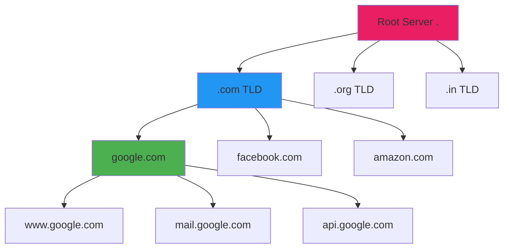
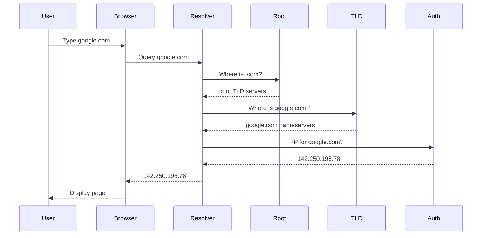
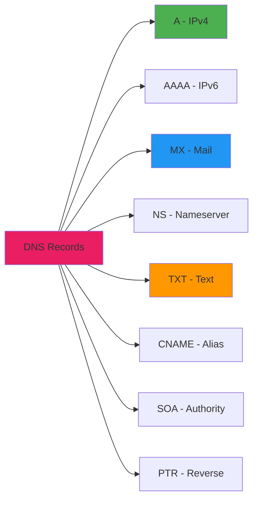
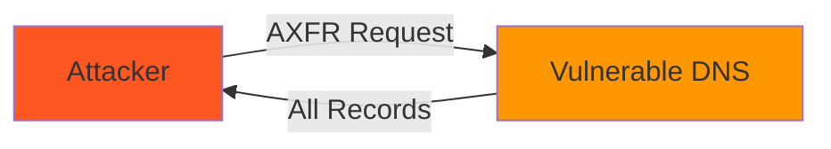
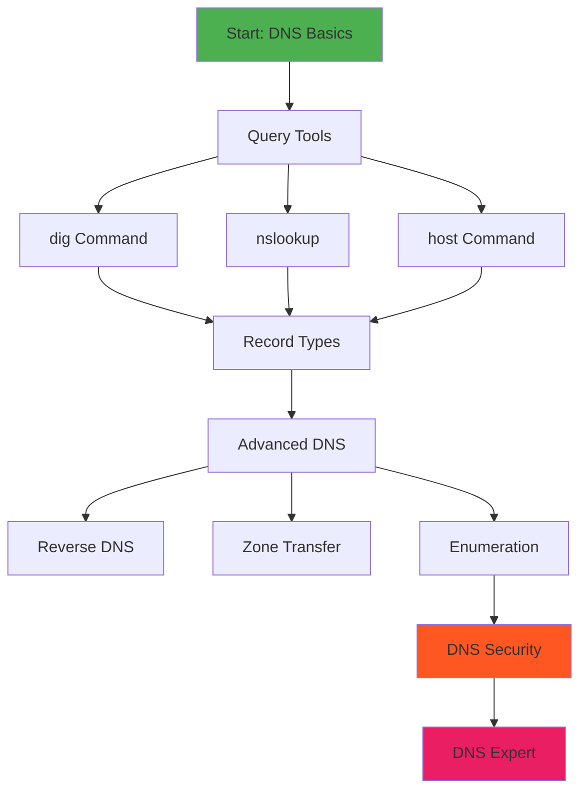
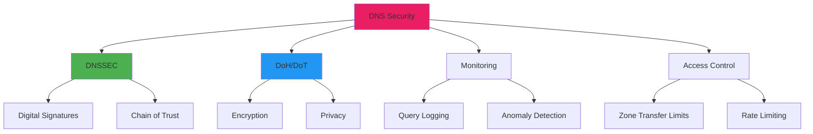

# Chapter 29: DNS & Domain Tools

```
╔═══════════════════════════════════════════════════════════════════════════════╗
║                                                                               ║
║  🌐 ██████╗  ██████╗ ███████╗    ███████╗██╗   ██╗███╗   ██╗███████╗         ║
║  🔌 ██╔══██╗██╔═══██╗██╔════╝    ██╔════╝██║   ██║████╗  ██║██╔════╝         ║
║  📡 ██████╔╝██║   ██║███████╗    █████╗  ██║   ██║██╔██╗ ██║█████╗           ║
║  📶 ██╔══██╗██║   ██║╚════██║    ██╔══╝  ██║   ██║██║╚██╗██║██╔══╝           ║
║  🔗 ██║  ██║╚██████╔╝███████║    ██║     ╚██████╔╝██║ ╚████║███████╗         ║
║  📶 ╚═╝  ╚═╝ ╚═════╝ ╚══════╝    ╚═╝      ╚═════╝ ╚═╝  ╚═══╝╚══════╝         ║
║                                                                               ║
║                    🎓 DNS & DOMAIN TOOLS 🎓                                   ║
║                          Module 5 - Chapter 29                                ║
║                     "Mastering DNS Enumeration"                               ║
║                                                                               ║
╚═══════════════════════════════════════════════════════════════════════════════╝
```

> **Module:** 5 - Networking  
> **Chapter:** 29 of 61  
> **Duration:** 15-20 Minutes  
> **Difficulty:** ⭐⭐ Intermediate  

---

## 📋 Chapter Overview

| Section | Content |
|---------|---------|
| Video Script | Complete Hindi narration with timestamps |
| Technical Guide | DNS fundamentals, tools, record types |
| Commands Reference | 25+ dig, nslookup, whois commands |
| Practice Exercises | Hands-on DNS enumeration tasks |
| Troubleshooting | Common DNS issues and solutions |
| Video Assets | Thumbnail, description, tags |

---

## 🎬 VIDEO SCRIPT (Complete Hindi Narration)

```
═══════════════════════════════════════════════════════════════════════════════
TERMUX FULL COURSE - CHAPTER 29
Title: DNS & Domain Tools | Complete DNS Enumeration Guide | T3rmuxk1ng
Duration: 15-20 Minutes
═══════════════════════════════════════════════════════════════════════════════

[INTRO - 0:00 to 0:50]
─────────────────────────────────────────────────────────────────────────────

Namaskar Dosto! Welcome back to Termux Full Course by T3rmuxk1ng!

Aaj hum seekhenge DNS aur Domain Tools - jo ki networking aur 
security testing ka ek bahut important part hai.

DNS - Domain Name System - Internet ka phonebook hai. Jab aap 
google.com type karte ho, DNS usko IP address mein convert karta hai.

Reconnaissance phase mein DNS enumeration sabse pehla step hota hai.
Target domain ke baare mein kitna information nikal sakte ho - 
subdomains, mail servers, nameservers, DNS records - sab kuch.

Is chapter mein hum cover karenge:
- DNS fundamentals
- dig command - advanced DNS lookup
- nslookup - classic DNS tool
- host command - simple DNS queries
- whois - domain registration info
- DNS record types - A, AAAA, MX, TXT, NS, CNAME, SOA
- Reverse DNS lookup
- Subdomain discovery
- Zone transfer attempts
- DNS troubleshooting

Play button dabaiye, video like karein, channel subscribe karein!

---

[SECTION 1: DNS FUNDAMENTALS - 0:50 to 4:00]
─────────────────────────────────────────────────────────────────────────────

Sabse pehle DNS ke basics samajhte hain.

DNS kya hai? Domain Name System. Ye ek distributed database hai jo
domain names ko IP addresses mein translate karta hai.

Kyun zaroori hai? Kyunki humans ko names yaad rehte hain - google.com,
facebook.com - lekin computers IP addresses samajhte hain - 
142.250.195.78.

┌─────────────────────────────────────────────────────────────────────────┐
│                    DNS RESOLUTION PROCESS                                │
├─────────────────────────────────────────────────────────────────────────┤
│                                                                          │
│   USER types "google.com"                                                │
│         │                                                                │
│         ▼                                                                │
│   ┌─────────────┐    Not Cached    ┌─────────────┐                      │
│   │ LOCAL CACHE │ ───────────────▶ │ RESOLVER    │                      │
│   │ (Browser/OS)│                  │ (ISP DNS)   │                      │
│   └─────────────┘                  └─────────────┘                      │
│         │ Cached                         │                              │
│         │                                ▼                              │
│         │                         ┌─────────────┐                       │
│         │                         │ ROOT SERVER │                       │
│         │                         │ (.)         │                       │
│         │                         └─────────────┘                       │
│         │                                │                              │
│         │                                ▼                              │
│         │                         ┌─────────────┐                       │
│         │                         │ TLD SERVER  │                       │
│         │                         │ (.com)      │                       │
│         │                         └─────────────┘                       │
│         │                                │                              │
│         │                                ▼                              │
│         │                         ┌─────────────┐                       │
│         │                         │ AUTHORITATIVE                      │
│         │                         │ NAMESERVER  │                       │
│         │                         │ (google.com)│                       │
│         │                         └─────────────┘                       │
│         │                                │                              │
│         ▼                                ▼                              │
│   ┌─────────────────────────────────────────────┐                       │
│   │ IP ADDRESS: 142.250.195.78                   │                       │
│   └─────────────────────────────────────────────┘                       │
│                                                                          │
└─────────────────────────────────────────────────────────────────────────┘

DNS Hierarchy samjhein:

ROOT LEVEL (.)
├── TLD (Top Level Domains)
│   ├── .com, .org, .net (gTLD - Generic)
│   ├── .in, .uk, .us (ccTLD - Country Code)
│   └── .gov, .edu, .mil (sTLD - Sponsored)
│
└── Second Level Domains
    ├── google.com, facebook.com
    └── Third Level: mail.google.com, drive.google.com

DNS Record Types:
──────────────────────────────────────────────────────────────────────────

┌─────────────────────────────────────────────────────────────────────────┐
│                    COMMON DNS RECORD TYPES                               │
├──────────┬──────────────────────────────────────────────────────────────┤
│ Record   │ Purpose                                                      │
├──────────┼──────────────────────────────────────────────────────────────┤
│ A        │ Maps domain to IPv4 address                                  │
│ AAAA     │ Maps domain to IPv6 address                                  │
│ CNAME    │ Alias - points one domain to another                         │
│ MX       │ Mail Exchange - email servers                                │
│ NS       │ Nameserver - authoritative DNS servers                       │
│ TXT      │ Text records - SPF, DKIM, verification                       │
│ SOA      │ Start of Authority - zone information                        │
│ SRV      │ Service records - specific services                          │
│ PTR      │ Reverse DNS - IP to domain                                   │
│ DMARC    │ Email authentication policy                                  │
└──────────┴──────────────────────────────────────────────────────────────┘

---

[SECTION 2: DNS TOOLS INSTALLATION - 4:00 to 5:30]
─────────────────────────────────────────────────────────────────────────────

Chaliye Termux mein DNS tools install karte hain.

[SCREEN: Termux Terminal]

# Update first
pkg update && pkg upgrade -y

# Install DNS utilities
pkg install dnsutils -y     # dig, nslookup, host
pkg install whois -y        # whois command
pkg install netcat -y       # For zone transfer tests

# Verify installation
dig -v
nslookup -version
whois --version

dnsutils package mein ye tools aate hain:
- dig - Domain Information Groper (most powerful)
- nslookup - Name Server Lookup (classic tool)
- host - Simple DNS lookup utility

---

[SECTION 3: DIG COMMAND - 5:30 to 9:00]
─────────────────────────────────────────────────────────────────────────────

DIG command - Domain Information Groper - sabse powerful DNS tool hai.

Basic syntax:
    dig <domain>

[SCREEN: Basic dig command]

dig google.com

Output explain karta hoon:

; <<>> DiG 9.16.1 <<>> google.com
;; global options: +cmd
;; Got answer:
;; ->>HEADER<<- opcode: QUERY, status: NOERROR, id: 12345
;; flags: qr rd ra; QUERY: 1, ANSWER: 1, AUTHORITY: 0, ADDITIONAL: 1

;; QUESTION SECTION:
;google.com.            IN  A

;; ANSWER SECTION:
google.com.     299 IN  A   142.250.195.78

;; Query time: 15 msec
;; SERVER: 192.168.1.1#53(192.168.1.1)
;; WHEN: Mon Jan 01 12:00:00 IST 2024
;; MSG SIZE  rcvd: 55

Output sections:
- HEADER: Query status, flags
- QUESTION: What was asked
- ANSWER: The response
- AUTHORITY: Nameservers (if any)
- ADDITIONAL: Extra records

IMPORTANT: ANSWER SECTION mein jo number hai (299) - wo TTL hai.
Time To Live - cache kitna time rahega.

Specific record type query karna:

dig google.com A        # IPv4 address
dig google.com AAAA     # IPv6 address
dig google.com MX       # Mail servers
dig google.com NS       # Nameservers
dig google.com TXT      # Text records
dig google.com SOA      # Start of Authority
dig google.com CNAME    # Alias records

SHORT OUTPUT:
dig +short google.com
# Output: 142.250.195.78

SPECIFIC DNS SERVER use karna:
dig @8.8.8.8 google.com
# Using Google's DNS server

REVERSE DNS LOOKUP:
dig -x 142.250.195.78
# IP se domain name dhundhna

ALL RECORD TYPES:
dig google.com ANY
# Shows all available records

TRACE DNS PATH:
dig +trace google.com
# Shows complete resolution path from root

---

[SECTION 4: NSLOOKUP COMMAND - 9:00 to 11:30]
─────────────────────────────────────────────────────────────────────────────

NSLOOKUP - Name Server Lookup - classic DNS tool. Windows pe bhi available hai.

Interactive mode aur non-interactive mode - dono mein kaam karta hai.

Basic usage:
nslookup google.com

Output:
Server:     192.168.1.1
Address:    192.168.1.1#53

Non-authoritative answer:
Name:   google.com
Address: 142.250.195.78

Specific record type:
nslookup -type=MX google.com
nslookup -type=NS google.com
nslookup -type=TXT google.com
nslookup -type=SOA google.com

Specific DNS server:
nslookup google.com 8.8.8.8
# Query Google's DNS

INTERACTIVE MODE:
nslookup
> server 8.8.8.8          # Change DNS server
> set type=MX             # Set query type
> google.com              # Query domain
> set type=ANY            # All records
> facebook.com            # Query another
> exit                    # Exit interactive mode

Reverse lookup:
nslookup 142.250.195.78

DEBUG mode:
nslookup -debug google.com
# Shows detailed query information

---

[SECTION 5: HOST COMMAND - 11:30 to 13:00]
─────────────────────────────────────────────────────────────────────────────

HOST command - simplest DNS lookup tool. Clean output deta hai.

Basic usage:
host google.com
# Output: google.com has address 142.250.195.78

Specific record types:
host -t A google.com      # A record
host -t AAAA google.com   # IPv6
host -t MX google.com     # Mail servers
host -t NS google.com     # Nameservers
host -t TXT google.com    # Text records
host -t SOA google.com    # Start of Authority
host -t CNAME www.google.com

ALL records:
host -a google.com
# Verbose output with all records

Reverse lookup:
host 142.250.195.78

Specific DNS server:
host google.com 8.8.8.8

List domain records:
host -l google.com
# Zone transfer attempt (usually blocked)

---

[SECTION 6: WHOIS COMMAND - 13:00 to 15:30]
─────────────────────────────────────────────────────────────────────────────

WHOIS command - domain registration information nikalta hai.

Isse pata chalta hai:
- Domain owner (Registrar)
- Registration date
- Expiry date
- Nameservers
- Contact information (if public)

Basic usage:
whois google.com

Output mein dhyaan do:
- Registrar: GoDaddy, Namecheap, etc.
- Creation Date: Kab register hua
- Expiry Date: Kab expire hoga
- Name Servers: DNS servers
- Status: Active, locked, etc.

[SCREEN: whois output]

Domain Name: google.com
Registry Domain ID: 2138514_DOMAIN_COM-VRSN
Registrar WHOIS Server: whois.markmonitor.com
Registrar URL: http://www.markmonitor.com
Updated Date: 2019-09-09T15:39:04Z
Creation Date: 1997-09-15T04:00:00Z
Registrar Registration Expiration Date: 2028-08-14T04:00:00Z
Registrar: MarkMonitor Inc.
Registrar IANA ID: 292
Registrar Abuse Contact Email: abusecomplaints@markmonitor.com
Registrar Abuse Contact Phone: +1.2083895740
Domain Status: clientDeleteProhibited
Domain Status: clientTransferProhibited
Domain Status: clientUpdateProhibited
Name Server: NS1.GOOGLE.COM
Name Server: NS2.GOOGLE.COM

IP WHOIS:
whois 142.250.195.78
# Shows IP block owner, ISP info

Specific registrar query:
whois -h whois.google.com google.com

---

[SECTION 7: DNS RECORD TYPES DEEP DIVE - 15:30 to 18:00]
─────────────────────────────────────────────────────────────────────────────

Ab DNS record types ko detail mein samajhte hain:

A RECORD (Address Record):
┌─────────────────────────────────────────────────────────────────────────┐
│ Domain Name        │ A Record       │ Purpose                          │
├────────────────────┼────────────────┼──────────────────────────────────┤
│ example.com        │ 93.184.216.34  │ Main website IPv4 address        │
│ www.example.com    │ 93.184.216.34  │ www subdomain                    │
│ mail.example.com   │ 93.184.216.35  │ Mail server IP                   │
└────────────────────┴────────────────┴──────────────────────────────────┘

AAAA RECORD (IPv6):
example.com. IN AAAA 2606:2800:220:1:248:1893:25c8:1946

MX RECORD (Mail Exchange):
┌─────────────────────────────────────────────────────────────────────────┐
│ Priority │ Server                  │ Note                              │
├──────────┼─────────────────────────┼───────────────────────────────────┤
│ 10       │ mail.example.com        │ Lower = Higher priority           │
│ 20       │ mail2.example.com       │ Backup mail server                │
│ 30       │ mail3.example.com       │ Third backup                      │
└──────────┴─────────────────────────┴───────────────────────────────────┘

TXT RECORD:
Common uses:
- SPF (Sender Policy Framework): "v=spf1 include:_spf.google.com ~all"
- DKIM: DomainKeys Identified Mail
- Domain verification
- Site verification

NS RECORD (Nameserver):
example.com. IN NS ns1.example.com.
example.com. IN NS ns2.example.com.

CNAME (Canonical Name):
www.example.com. IN CNAME example.com.
mail.example.com. IN CNAME ghs.googlehosted.com.

SOA RECORD (Start of Authority):
┌─────────────────────────────────────────────────────────────────────────┐
│ Field        │ Value                    │ Meaning                       │
├──────────────┼──────────────────────────┼───────────────────────────────┤
│ MNAME        │ ns1.example.com          │ Primary nameserver            │
│ RNAME        │ admin.example.com        │ Admin email (@ becomes .)     │
│ SERIAL       │ 2024010101               │ Zone version number           │
│ REFRESH      │ 3600                     │ Secondary refresh interval    │
│ RETRY        │ 1800                     │ Retry interval                │
│ EXPIRE       │ 604800                   │ Expire time                   │
│ MINIMUM      │ 86400                    │ Minimum TTL                   │
└──────────────┴──────────────────────────┴───────────────────────────────┘

PTR RECORD (Reverse DNS):
34.216.184.93.in-addr.arpa. IN PTR example.com.

---

[SECTION 8: REVERSE DNS LOOKUP - 18:00 to 19:30]
─────────────────────────────────────────────────────────────────────────────

Reverse DNS ka matlab hai IP address se domain name dhundhna.

Normal DNS: domain → IP
Reverse DNS: IP → domain

Kyun useful hai?
- Email server verification
- Security analysis
- IP reputation check
- Network troubleshooting

Methods:

DIG method:
dig -x 142.250.195.78

NSLOOKUP method:
nslookup 142.250.195.78

HOST method:
host 142.250.195.78

Multiple IPs check:
for ip in 142.250.195.78 142.250.195.79; do
    echo "Checking $ip:"
    dig +short -x $ip
done

---

[SECTION 9: SUBDOMAIN DISCOVERY - 19:30 to 21:30]
─────────────────────────────────────────────────────────────────────────────

Subdomain discovery - reconnaissance ka important part.

Manual methods:
# Common subdomains check
host www.google.com
host mail.google.com
host ftp.google.com
host admin.google.com
host api.google.com
host dev.google.com
host staging.google.com

Using bash loop:
for sub in www mail ftp admin api dev staging blog shop vpn; do
    host $sub.google.com 2>/dev/null | grep "has address"
done

Using DIG:
dig google.com +short | head -1

Automated tools (future chapters):
- Sublist3r
- Subfinder
- Amass
- Gobuster

---

[SECTION 10: DNS ZONE TRANSFER - 21:30 to 23:00]
─────────────────────────────────────────────────────────────────────────────

Zone Transfer (AXFR) - DNS ka full record dump.

Ye security misconfiguration hai agar allow ho:

Check nameservers:
dig NS google.com +short

Attempt zone transfer:
dig AXFR @ns1.google.com google.com

Using host:
host -l google.com ns1.google.com

Using nslookup:
nslookup
> server ns1.google.com
> set type=any
> ls -d google.com

Most modern servers block zone transfer, but check karna chahiye.
Misconfigured servers expose all subdomains.

---

[SECTION 11: DNS TROUBLESHOOTING - 23:00 to 25:00]
─────────────────────────────────────────────────────────────────────────────

Common DNS issues aur unka solution:

1. DOMAIN NOT RESOLVING:
   - Check DNS servers: cat /etc/resolv.conf
   - Try different DNS: dig @8.8.8.8 domain.com
   - Check if domain exists: whois domain.com

2. SLOW RESOLUTION:
   - Use faster DNS: 8.8.8.8 (Google) or 1.1.1.1 (Cloudflare)
   - Check TTL values
   - Clear DNS cache

3. WRONG IP:
   - Check A record: dig domain.com A
   - Check for CNAME chains
   - Verify with authoritative server

4. EMAIL ISSUES:
   - Check MX records: dig domain.com MX
   - Check SPF: dig domain.com TXT
   - Verify mail server IP

5. DNS PROPAGATION:
   - Check globally: dig @ns1.google.com domain.com
   - Use online tools: whatsmydns.net
   - Wait for TTL

---

[SECTION 12: DNS LOOKUP SCRIPT - 25:00 to 27:00]
─────────────────────────────────────────────────────────────────────────────

Chaliye ek useful DNS enumeration script banate hain:

[SCREEN: Script creation]

cat > dns-lookup.sh << 'EOF'
#!/bin/bash

# DNS Lookup Script by T3rmuxk1ng

RED='\033[0;31m'
GREEN='\033[0;32m'
YELLOW='\033[1;33m'
NC='\033[0m'

if [ -z "$1" ]; then
    echo "Usage: $0 <domain>"
    exit 1
fi

DOMAIN=$1

echo -e "${YELLOW}========================================${NC}"
echo -e "${GREEN}DNS Enumeration for: $DOMAIN${NC}"
echo -e "${YELLOW}========================================${NC}"

echo -e "\n${GREEN}[+] A Record (IPv4):${NC}"
dig +short $DOMAIN A

echo -e "\n${GREEN}[+] AAAA Record (IPv6):${NC}"
dig +short $DOMAIN AAAA

echo -e "\n${GREEN}[+] MX Record (Mail Servers):${NC}"
dig +short $DOMAIN MX

echo -e "\n${GREEN}[+] NS Record (Name Servers):${NC}"
dig +short $DOMAIN NS

echo -e "\n${GREEN}[+] TXT Record:${NC}"
dig +short $DOMAIN TXT

echo -e "\n${GREEN}[+] SOA Record:${NC}"
dig +short $DOMAIN SOA

echo -e "\n${GREEN}[+] CNAME Record:${NC}"
dig +short www.$DOMAIN CNAME

echo -e "\n${YELLOW}========================================${NC}"
echo -e "${GREEN}WHOIS Information:${NC}"
echo -e "${YELLOW}========================================${NC}"
whois $DOMAIN 2>/dev/null | grep -E "(Registrar|Creation Date|Expiry|Name Server)"

echo -e "\n${GREEN}[+] DNS Server IP:${NC}"
dig +short $DOMAIN NS | while read ns; do
    echo "$ns: $(dig +short $ns)"
done

echo -e "\n${YELLOW}========================================${NC}"
echo -e "${GREEN}Enumeration Complete!${NC}"
echo -e "${YELLOW}========================================${NC}"
EOF

chmod +x dns-lookup.sh

./dns-lookup.sh google.com

---

[SECTION 13: SUMMARY & NEXT PREVIEW - 27:00 to 29:00]
─────────────────────────────────────────────────────────────────────────────

To dosto, Chapter 29 complete! Let's summarize:

✅ DNS fundamentals - Resolution process, hierarchy
✅ dig command - Advanced DNS queries
✅ nslookup - Classic DNS tool
✅ host command - Simple DNS lookup
✅ whois - Domain registration info
✅ DNS record types - A, AAAA, MX, TXT, NS, CNAME, SOA
✅ Reverse DNS lookup - IP to domain
✅ Subdomain discovery techniques
✅ Zone transfer attempts
✅ DNS troubleshooting
✅ DNS enumeration script

Important Commands yaad rakhein:

┌─────────────────────────────────────────────────────────────────────────┐
│                    CHAPTER 29 - IMPORTANT COMMANDS                       │
├─────────────────────────────────────────────────────────────────────────┤
│ dig domain.com           │ Basic DNS lookup                             │
│ dig +short domain.com    │ Short output (IP only)                       │
│ dig domain.com MX        │ Mail server records                          │
│ dig @8.8.8.8 domain.com  │ Use specific DNS server                      │
│ dig -x IP                │ Reverse DNS lookup                           │
│ dig +trace domain.com    │ Trace DNS resolution path                    │
│ nslookup domain.com      │ Classic lookup                               │
│ nslookup -type=MX domain │ Specific record type                         │
│ host domain.com          │ Simple DNS lookup                            │
│ host -t MX domain.com    │ Specific record with host                    │
│ whois domain.com         │ Domain registration info                     │
│ whois IP_ADDRESS         │ IP WHOIS info                                │
└─────────────────────────────────────────────────────────────────────────┘

Next Chapter 30 mein hum seekhenge:
- Security Tools Overview
- Ethical hacking methodology
- Tools available in Termux
- Lab environment setup

Agar ye video helpful lagi, to:
👍 Like button press karein
🔔 Subscribe karein, notification bell on karein
💬 Koi sawal ho to comment mein poochein
📤 Share karein friends ke saath

Main har comment ka reply karta hoon.

Thank you for watching! See you in Chapter 30!

═══════════════════════════════════════════════════════════════════════════════
```

---

## 📖 TECHNICAL GUIDE

### 1. DNS Architecture

```
┌─────────────────────────────────────────────────────────────────────────┐
│                         DNS ARCHITECTURE                                 │
├─────────────────────────────────────────────────────────────────────────┤
│                                                                          │
│                        ┌─────────────┐                                   │
│                        │ ROOT SERVER │                                   │
│                        │     (.)     │                                   │
│                        └──────┬──────┘                                   │
│                               │                                          │
│          ┌────────────────────┼────────────────────┐                    │
│          │                    │                    │                     │
│          ▼                    ▼                    ▼                     │
│   ┌─────────────┐     ┌─────────────┐     ┌─────────────┐               │
│   │  .com TLD   │     │  .org TLD   │     │   .in TLD   │               │
│   └──────┬──────┘     └─────────────┘     └─────────────┘               │
│          │                                                               │
│          ├──────────┬──────────┬──────────┐                             │
│          ▼          ▼          ▼          ▼                              │
│   ┌───────────┐ ┌───────────┐ ┌───────────┐ ┌───────────┐               │
│   │google.com │ │yahoo.com  │ │amazon.com │ │ other.com │               │
│   └─────┬─────┘ └───────────┘ └───────────┘ └───────────┘               │
│         │                                                                │
│         ├──────────┬──────────┬──────────┐                              │
│         ▼          ▼          ▼          ▼                               │
│   ┌──────────┐ ┌──────────┐ ┌──────────┐ ┌──────────┐                   │
│   │www.google│ │mail.google│ │api.google│ │drive.google│                │
│   └──────────┘ └──────────┘ └──────────┘ └──────────┘                   │
│                                                                          │
└─────────────────────────────────────────────────────────────────────────┘
```

### 2. DNS Record Types in Detail

| Record | Description | Example |
|--------|-------------|---------|
| A | Maps domain to IPv4 | `example.com. IN A 93.184.216.34` |
| AAAA | Maps domain to IPv6 | `example.com. IN AAAA 2606:2800:220:1:248:1893:25c8:1946` |
| CNAME | Domain alias | `www.example.com. IN CNAME example.com.` |
| MX | Mail server | `example.com. IN MX 10 mail.example.com.` |
| NS | Nameserver | `example.com. IN NS ns1.example.com.` |
| TXT | Text records | `example.com. IN TXT "v=spf1 -all"` |
| SOA | Start of Authority | `example.com. IN SOA ns1.example.com. admin.example.com. ...` |
| SRV | Service location | `_sip._tcp.example.com. IN SRV 10 60 5060 sipserver.example.com.` |
| PTR | Reverse DNS | `34.216.184.93.in-addr.arpa. IN PTR example.com.` |
| CAA | Certificate Authority | `example.com. IN CAA 0 issue "letsencrypt.org"` |

### 3. Common DNS Ports

| Port | Protocol | Purpose |
|------|----------|---------|
| 53/UDP | DNS | Standard queries |
| 53/TCP | DNS | Zone transfers, large responses |
| 853/UDP | DoT | DNS over TLS |
| 853/TCP | DoT | DNS over TLS |
| 443/TCP | DoH | DNS over HTTPS |

### 4. DNS Server Types

```
┌─────────────────────────────────────────────────────────────────────────┐
│                    DNS SERVER TYPES                                      │
├─────────────────────────────────────────────────────────────────────────┤
│                                                                          │
│  1. RECURSIVE RESOLVER (Caching)                                        │
│     ─────────────────────────────                                       │
│     • ISP's DNS server                                                  │
│     • Google DNS (8.8.8.8)                                              │
│     • Cloudflare DNS (1.1.1.1)                                          │
│     • Handles full resolution process                                   │
│     • Caches results for TTL duration                                   │
│                                                                          │
│  2. ROOT SERVER                                                         │
│     ───────────                                                         │
│     • 13 root servers worldwide (A-M)                                   │
│     • Directs to appropriate TLD server                                 │
│     • No caching, only referrals                                        │
│                                                                          │
│  3. TLD SERVER (Top Level Domain)                                       │
│     ────────────────────────────                                        │
│     • Manages .com, .org, .net, etc.                                    │
│     • Directs to authoritative nameservers                              │
│                                                                          │
│  4. AUTHORITATIVE NAMESERVER                                            │
│     ─────────────────────────                                           │
│     • Contains actual DNS records                                       │
│     • Provides definitive answers                                       │
│     • Source of truth for domain                                        │
│                                                                          │
└─────────────────────────────────────────────────────────────────────────┘
```

---

## 📋 COMMANDS REFERENCE

### DIG Commands

```bash
# Basic DNS lookup
dig google.com

# Short output (IP only)
dig +short google.com

# Specific record types
dig google.com A          # IPv4 address
dig google.com AAAA       # IPv6 address
dig google.com MX         # Mail servers
dig google.com NS         # Nameservers
dig google.com TXT        # Text records
dig google.com SOA        # Start of Authority
dig google.com CNAME      # Alias records
dig google.com SRV        # Service records
dig google.com ANY        # All available records

# Use specific DNS server
dig @8.8.8.8 google.com           # Google DNS
dig @1.1.1.1 google.com           # Cloudflare DNS
dig @208.67.222.222 google.com    # OpenDNS

# Reverse DNS lookup
dig -x 142.250.195.78

# Trace DNS resolution path
dig +trace google.com

# Show only answer section
dig +noall +answer google.com

# Show question and answer
dig +noall +question +answer google.com

# Check DNSSEC
dig +dnssec google.com

# Batch queries
dig google.com facebook.com twitter.com

# Read queries from file
dig -f domains.txt

# Set query timeout
dig +time=5 google.com

# Set number of retries
dig +tries=3 google.com

# Show server used
dig +identify google.com

# Get all records from specific nameserver
dig @ns1.google.com google.com ANY

# Check for wildcards (compare multiple subdomains)
dig random123.google.com
dig another456.google.com
```

### NSLOOKUP Commands

```bash
# Basic lookup
nslookup google.com

# Specific DNS server
nslookup google.com 8.8.8.8

# Specific record type
nslookup -type=A google.com
nslookup -type=AAAA google.com
nslookup -type=MX google.com
nslookup -type=NS google.com
nslookup -type=TXT google.com
nslookup -type=SOA google.com
nslookup -type=CNAME www.google.com
nslookup -type=ANY google.com

# Reverse lookup
nslookup 142.250.195.78

# Debug mode
nslookup -debug google.com

# Interactive mode
nslookup
> server 8.8.8.8
> set type=MX
> google.com
> set type=ANY
> facebook.com
> exit

# Set timeout
nslookup -timeout=10 google.com

# Set retry count
nslookup -retry=3 google.com

# Use TCP instead of UDP
nslookup -vc google.com

# Set port (non-standard)
nslookup -port=5353 google.com
```

### HOST Commands

```bash
# Basic lookup
host google.com

# Specific record type
host -t A google.com
host -t AAAA google.com
host -t MX google.com
host -t NS google.com
host -t TXT google.com
host -t SOA google.com
host -t CNAME www.google.com
host -t SRV _sip._tcp.google.com

# All records (verbose)
host -a google.com

# Reverse lookup
host 142.250.195.78

# Use specific DNS server
host google.com 8.8.8.8

# Zone transfer attempt
host -l google.com ns1.google.com

# Verbose output
host -v google.com

# IPv4 only
host -4 google.com

# IPv6 only
host -6 google.com
```

### WHOIS Commands

```bash
# Domain WHOIS
whois google.com

# IP WHOIS
whois 142.250.195.78

# Specific WHOIS server
whois -h whois.verisign-grs.com google.com

# Get registrar WHOIS server
whois -h whois.iana.org google.com

# Suppress legal disclaimers
whois -H google.com

# Use specific port
whois -p 43 google.com

# Quick lookup (minimal output)
whois google.com | grep -E "(Registrar|Creation|Expiry|Name Server)"

# Extract specific info
whois google.com | grep "Registrar:"
whois google.com | grep "Creation Date"
whois google.com | grep "Name Server"
```

### DNS Enumeration Commands

```bash
# Get all DNS records
for type in A AAAA MX NS TXT SOA CNAME; do
    echo "=== $type Records ==="
    dig +short google.com $type
done

# Enumerate common subdomains
for sub in www mail ftp admin api dev staging blog shop vpn db mysql; do
    host $sub.google.com 2>/dev/null | grep "has address" &
done
wait

# Check nameserver IPs
for ns in $(dig +short google.com NS); do
    echo "$ns: $(dig +short $ns)"
done

# Attempt zone transfer on each nameserver
for ns in $(dig +short google.com NS); do
    echo "Trying AXFR on $ns..."
    dig AXFR @$ns google.com 2>/dev/null
done

# Check all mail servers
dig +short google.com MX | while read pri server; do
    echo "$server: $(dig +short $server A)"
done

# Reverse DNS for IP range
for i in $(seq 1 10); do
    dig +short -x 142.250.195.$i
done

# DNS timing analysis
time dig google.com
time dig @8.8.8.8 google.com
time dig @1.1.1.1 google.com
```

### Network DNS Commands

```bash
# Check current DNS servers
cat /etc/resolv.conf

# Test DNS connectivity
ping -c 3 8.8.8.8

# Check DNS port
nc -zv 8.8.8.8 53

# Query DNS over TCP
dig +tcp google.com

# Check DNS response time
dig google.com | grep "Query time"

# DNS over HTTPS (if curl available)
curl -H 'accept: application/dns-json' 'https://cloudflare-dns.com/dns-query?name=google.com&type=A'

# Check SPF record
dig +short google.com TXT | grep spf

# Check DMARC
dig +short _dmarc.google.com TXT

# Check DKIM (example)
dig +short default._domainkey.google.com TXT
```

---

## 💻 PRACTICE EXERCISES

### Exercise 1: Basic DNS Lookups

```bash
# Task: Perform basic DNS queries for multiple domains

# Step 1: Create domains list
cat > domains.txt << 'EOF'
google.com
github.com
stackoverflow.com
termux.dev
EOF

# Step 2: Query all domains for A records
while read domain; do
    echo "=== $domain ==="
    dig +short $domain A
done < domains.txt

# Step 3: Query all record types for one domain
domain="google.com"
for type in A AAAA MX NS TXT SOA; do
    echo "=== $type ==="
    dig +short $domain $type
done

# Step 4: Compare results from different DNS servers
echo "Google DNS:"
dig @8.8.8.8 +short google.com
echo "Cloudflare DNS:"
dig @1.1.1.1 +short google.com
```

### Exercise 2: DNS Record Analysis

```bash
# Task: Analyze DNS records for a domain

cat > analyze-dns.sh << 'EOF'
#!/bin/bash

DOMAIN=$1

if [ -z "$DOMAIN" ]; then
    echo "Usage: $0 <domain>"
    exit 1
fi

echo "=========================================="
echo "DNS Analysis for: $DOMAIN"
echo "=========================================="

# A Records
echo -e "\n[+] A Records (IPv4):"
dig +noall +answer $DOMAIN A | awk '{print $5}'

# AAAA Records
echo -e "\n[+] AAAA Records (IPv6):"
dig +noall +answer $DOMAIN AAAA | awk '{print $5}'

# MX Records (sorted by priority)
echo -e "\n[+] MX Records:"
dig +noall +answer $DOMAIN MX | sort -n | awk '{print "Priority:", $5, "Server:", $6}'

# NS Records
echo -e "\n[+] Nameservers:"
dig +noall +answer $DOMAIN NS | awk '{print $5}'

# TXT Records
echo -e "\n[+] TXT Records:"
dig +noall +answer $DOMAIN TXT | awk '{for(i=5;i<=NF;i++) printf $i" "; print ""}'

# SOA Record
echo -e "\n[+] SOA Record:"
dig +noall +answer $DOMAIN SOA | awk '{print "Primary NS:", $5, "\nAdmin:", $6, "\nSerial:", $7}'

# CNAME for www
echo -e "\n[+] CNAME for www.$DOMAIN:"
dig +noall +answer www.$DOMAIN CNAME

echo -e "\n=========================================="
echo "Analysis Complete!"
echo "=========================================="
EOF

chmod +x analyze-dns.sh
./analyze-dns.sh google.com
```

### Exercise 3: Subdomain Enumeration

```bash
# Task: Discover subdomains using DNS

cat > subdomain-enum.sh << 'EOF'
#!/bin/bash

DOMAIN=$1

if [ -z "$DOMAIN" ]; then
    echo "Usage: $0 <domain>"
    exit 1
fi

# Common subdomain wordlist
SUBDOMAINS=(
    www
    mail
    ftp
    admin
    api
    dev
    staging
    blog
    shop
    vpn
    db
    mysql
    postgres
    redis
    mongo
    app
    mobile
    portal
    dashboard
    cdn
    static
    assets
    images
    video
    audio
    download
    upload
    secure
    login
    signin
    register
    support
    help
    docs
    wiki
    forum
    community
    news
    beta
    test
    qa
    old
    new
    m
    wap
    webmail
    email
    smtp
    imap
    pop
    ns1
    ns2
    dns
)

echo "Enumerating subdomains for $DOMAIN..."
echo "=========================================="

FOUND=0
for sub in "${SUBDOMAINS[@]}"; do
    RESULT=$(host $sub.$DOMAIN 2>/dev/null | grep "has address" | head -1)
    if [ -n "$RESULT" ]; then
        echo "[FOUND] $sub.$DOMAIN"
        echo "   $RESULT"
        ((FOUND++))
    fi
done

echo "=========================================="
echo "Found $FOUND subdomains"
EOF

chmod +x subdomain-enum.sh
./subdomain-enum.sh google.com
```

### Exercise 4: Zone Transfer Test

```bash
# Task: Test for DNS zone transfer vulnerability

cat > zone-transfer-test.sh << 'EOF'
#!/bin/bash

DOMAIN=$1

if [ -z "$DOMAIN" ]; then
    echo "Usage: $0 <domain>"
    exit 1
fi

echo "Testing Zone Transfer for: $DOMAIN"
echo "=========================================="

# Get nameservers
echo "[+] Getting nameservers..."
NAMESERVERS=$(dig +short $DOMAIN NS)

if [ -z "$NAMESERVERS" ]; then
    echo "[-] No nameservers found!"
    exit 1
fi

echo "$NAMESERVERS"

# Test each nameserver
for ns in $NAMESERVERS; do
    echo -e "\n[+] Testing $ns..."
    
    # Attempt AXFR
    RESULT=$(dig AXFR @$ns $DOMAIN 2>/dev/null)
    
    if echo "$RESULT" | grep -q "XFR size"; then
        echo "[!] ZONE TRANSFER SUCCESSFUL on $ns!"
        echo "$RESULT"
    else
        echo "[-] Zone transfer failed (good security)"
    fi
done

echo -e "\n=========================================="
echo "Zone Transfer Test Complete!"
EOF

chmod +x zone-transfer-test.sh
./zone-transfer-test.sh google.com
```

### Exercise 5: DNS Monitoring Script

```bash
# Task: Create a DNS monitoring script

cat > dns-monitor.sh << 'EOF'
#!/bin/bash

DOMAIN=$1
LOG_FILE="dns-monitor.log"

if [ -z "$DOMAIN" ]; then
    echo "Usage: $0 <domain>"
    exit 1
fi

echo "Starting DNS Monitor for: $DOMAIN"
echo "Press Ctrl+C to stop"
echo "Logging to: $LOG_FILE"

while true; do
    TIMESTAMP=$(date '+%Y-%m-%d %H:%M:%S')
    
    # Get current A record
    CURRENT_IP=$(dig +short $DOMAIN A | head -1)
    
    # Get query time
    QUERY_TIME=$(dig $DOMAIN | grep "Query time" | awk '{print $4}')
    
    # Get DNS server used
    DNS_SERVER=$(dig $DOMAIN | grep "SERVER:" | awk '{print $3}' | tr -d '#')
    
    # Log the data
    echo "[$TIMESTAMP] IP: $CURRENT_IP | Query Time: ${QUERY_TIME}ms | DNS: $DNS_SERVER" >> $LOG_FILE
    echo "[$TIMESTAMP] IP: $CURRENT_IP | Query Time: ${QUERY_TIME}ms | DNS: $DNS_SERVER"
    
    # Check every 60 seconds
    sleep 60
done
EOF

chmod +x dns-monitor.sh
# ./dns-monitor.sh google.com  # Run to start monitoring
```

### Exercise 6: Complete DNS Enumeration Tool

```bash
# Task: Build a comprehensive DNS enumeration tool

cat > dns-enumerate.sh << 'EOF'
#!/bin/bash

# DNS Enumeration Tool by T3rmuxk1ng
# Usage: ./dns-enumerate.sh <domain>

DOMAIN=$1
OUTPUT_DIR="dns-enum-$DOMAIN"

if [ -z "$DOMAIN" ]; then
    echo "Usage: $0 <domain>"
    echo "Example: $0 google.com"
    exit 1
fi

# Colors
RED='\033[0;31m'
GREEN='\033[0;32m'
YELLOW='\033[1;33m'
BLUE='\033[0;34m'
NC='\033[0m'

# Create output directory
mkdir -p $OUTPUT_DIR

echo -e "${YELLOW}╔══════════════════════════════════════════╗${NC}"
echo -e "${YELLOW}║   DNS Enumeration Tool by T3rmuxk1ng     ║${NC}"
echo -e "${YELLOW}╚══════════════════════════════════════════╝${NC}"

echo -e "\n${BLUE}[*] Target: $DOMAIN${NC}"
echo -e "${BLUE}[*] Output: $OUTPUT_DIR/${NC}\n"

# 1. Basic DNS Records
echo -e "${GREEN}[1/8] Collecting DNS Records...${NC}"
dig +noall +answer $DOMAIN A > $OUTPUT_DIR/A.txt
dig +noall +answer $DOMAIN AAAA > $OUTPUT_DIR/AAAA.txt
dig +noall +answer $DOMAIN MX > $OUTPUT_DIR/MX.txt
dig +noall +answer $DOMAIN NS > $OUTPUT_DIR/NS.txt
dig +noall +answer $DOMAIN TXT > $OUTPUT_DIR/TXT.txt
dig +noall +answer $DOMAIN SOA > $OUTPUT_DIR/SOA.txt

# Display results
echo -e "${YELLOW}A Records:${NC}"
cat $OUTPUT_DIR/A.txt
echo -e "\n${YELLOW}MX Records:${NC}"
cat $OUTPUT_DIR/MX.txt
echo -e "\n${YELLOW}NS Records:${NC}"
cat $OUTPUT_DIR/NS.txt

# 2. Nameserver IPs
echo -e "\n${GREEN}[2/8] Nameserver IP Resolution...${NC}"
for ns in $(dig +short $DOMAIN NS); do
    ns_ip=$(dig +short $ns A | head -1)
    echo "$ns -> $ns_ip"
done | tee $OUTPUT_DIR/ns-ips.txt

# 3. Mail Server IPs
echo -e "\n${GREEN}[3/8] Mail Server IP Resolution...${NC}"
dig +short $DOMAIN MX | while read pri server; do
    server_ip=$(dig +short $server A | head -1)
    echo "Priority $pri: $server -> $server_ip"
done | tee $OUTPUT_DIR/mx-ips.txt

# 4. WHOIS Information
echo -e "\n${GREEN}[4/8] WHOIS Information...${NC}"
whois $DOMAIN 2>/dev/null > $OUTPUT_DIR/whois.txt
echo "Registrar: $(grep -m1 'Registrar:' $OUTPUT_DIR/whois.txt | cut -d: -f2-)"
echo "Created: $(grep -m1 'Creation Date' $OUTPUT_DIR/whois.txt | cut -d: -f2-)"
echo "Expires: $(grep -m1 'Expiry' $OUTPUT_DIR/whois.txt | cut -d: -f2-)"

# 5. Zone Transfer Test
echo -e "\n${GREEN}[5/8] Zone Transfer Test...${NC}"
ZONE_TRANSFER="FAILED"
for ns in $(dig +short $DOMAIN NS); do
    if dig AXFR @$ns $DOMAIN 2>/dev/null | grep -q "XFR size"; then
        ZONE_TRANSFER="SUCCESS on $ns"
        dig AXFR @$ns $DOMAIN > $OUTPUT_DIR/zone-transfer.txt
        break
    fi
done
echo "Zone Transfer: $ZONE_TRANSFER"

# 6. Subdomain Enumeration (top 20)
echo -e "\n${GREEN}[6/8] Subdomain Enumeration...${NC}"
SUBDOMAINS="www mail ftp admin api dev staging blog shop vpn app mobile portal cdn static assets m wap webmail"
FOUND_COUNT=0
for sub in $SUBDOMAINS; do
    result=$(host $sub.$DOMAIN 2>/dev/null | grep "has address" | head -1)
    if [ -n "$result" ]; then
        echo "[FOUND] $sub.$DOMAIN"
        echo "$sub.$DOMAIN" >> $OUTPUT_DIR/subdomains.txt
        echo "$result" >> $OUTPUT_DIR/subdomains.txt
        ((FOUND_COUNT++))
    fi
done
echo "Found $FOUND_COUNT subdomains"

# 7. Reverse DNS
echo -e "\n${GREEN}[7/8] Reverse DNS Lookups...${NC}"
for ip in $(dig +short $DOMAIN A); do
    reverse=$(dig +short -x $ip | head -1)
    echo "$ip -> $reverse"
done | tee $OUTPUT_DIR/reverse-dns.txt

# 8. DNSSEC Check
echo -e "\n${GREEN}[8/8] DNSSEC Check...${NC}"
DNSSEC=$(dig +dnssec $DOMAIN | grep "flags:" | grep -o "ad")
if [ -n "$DNSSEC" ]; then
    echo "DNSSEC: ENABLED"
else
    echo "DNSSEC: NOT ENABLED"
fi

# Summary
echo -e "\n${YELLOW}╔══════════════════════════════════════════╗${NC}"
echo -e "${YELLOW}║           ENUMERATION COMPLETE            ║${NC}"
echo -e "${YELLOW}╚══════════════════════════════════════════╝${NC}"
echo -e "${GREEN}Results saved to: $OUTPUT_DIR/${NC}"
echo -e "${GREEN}Files created:${NC}"
ls -la $OUTPUT_DIR/

echo -e "\n${BLUE}Next Steps:${NC}"
echo "1. Review TXT records for sensitive info"
echo "2. Test each subdomain for vulnerabilities"
echo "3. Check mail server security (SPF, DKIM, DMARC)"
echo "4. Verify zone transfer files for additional hosts"
EOF

chmod +x dns-enumerate.sh
./dns-enumerate.sh google.com
```

---

## ⚠️ TROUBLESHOOTING

### Problem 1: "dig: command not found"

```bash
# Cause: dnsutils package not installed

# Solution:
pkg update && pkg upgrade -y
pkg install dnsutils -y

# Verify:
dig -v
```

### Problem 2: "whois: command not found"

```bash
# Cause: whois package not installed

# Solution:
pkg install whois -y

# Verify:
whois --version
```

### Problem 3: DNS queries timeout

```bash
# Cause: Network issues or DNS server unreachable

# Solution 1: Check network
ping -c 3 8.8.8.8

# Solution 2: Use different DNS server
dig @1.1.1.1 google.com

# Solution 3: Increase timeout
dig +time=10 google.com

# Solution 4: Use TCP instead of UDP
dig +tcp google.com

# Solution 5: Check DNS port
nc -zv 8.8.8.8 53
```

### Problem 4: "Connection refused" on zone transfer

```bash
# This is NORMAL - most servers block zone transfers
# It's a security measure, not an error

# Proper interpretation:
# - If zone transfer fails = Good security
# - If zone transfer succeeds = Misconfiguration (vulnerability)
```

### Problem 5: WHOIS rate limited

```bash
# Cause: Too many queries to WHOIS server

# Solution 1: Wait and retry
sleep 60 && whois google.com

# Solution 2: Use different WHOIS server
whois -h whois.verisign-grs.com google.com

# Solution 3: Use web-based WHOIS
# https://who.is / https://whois.net
```

### Problem 6: Inconsistent DNS results

```bash
# Cause: DNS caching, propagation, or different DNS servers

# Solution 1: Bypass cache with specific DNS
dig @8.8.8.8 google.com

# Solution 2: Check authoritative server directly
dig @$(dig +short google.com NS | head -1) google.com

# Solution 3: Check TTL
dig google.com | grep -A1 "ANSWER SECTION"

# Solution 4: Compare multiple DNS servers
for dns in 8.8.8.8 1.1.1.1 9.9.9.9; do
    echo "DNS: $dns"
    dig @$dns +short google.com
done
```

### Problem 7: IPv6 queries failing

```bash
# Cause: Network doesn't support IPv6

# Solution 1: Use IPv4-only queries
dig -4 google.com A

# Solution 2: Check IPv6 connectivity
ping6 -c 3 google.com

# Solution 3: Query AAAA record but don't use
dig +short google.com AAAA
```

### Problem 8: DNS over HTTPS/TLS not working

```bash
# Cause: Requires additional setup

# For DoH (DNS over HTTPS):
curl -H 'accept: application/dns-json' \
    'https://cloudflare-dns.com/dns-query?name=google.com&type=A'

# For DoT (DNS over TLS):
# Not directly supported in Termux dig
# Use stunnel or dedicated DoT client
```

---

## 🎬 VIDEO ASSETS

### Thumbnail Concepts

**Option A: Clean & Professional**
```
┌────────────────────────────────────┐
│  [Dark Terminal Background]        │
│                                    │
│   🔍 DNS & DOMAIN TOOLS            │
│   COMPLETE GUIDE                   │
│                                    │
│   ✓ dig, nslookup, whois          │
│   ✓ DNS Enumeration               │
│   ✓ 25+ Commands                  │
│                                    │
│   [T3rmuxk1ng Logo]               │
└────────────────────────────────────┘
```

**Option B: Command Focus**
```
┌────────────────────────────────────┐
│  [Green on Black Terminal]         │
│                                    │
│   $ dig google.com                 │
│   $ nslookup ...                   │
│   $ whois ...                      │
│                                    │
│   DNS MASTERY                      │
│   Chapter 29                       │
│                                    │
│   [T3rmuxk1ng]                     │
└────────────────────────────────────┘
```

**Option C: Comparison Style**
```
┌────────────────────────────────────┐
│  DNS TOOLS COMPARISON              │
│  ───────────────────────────────── │
│  dig        ⭐⭐⭐⭐⭐ Most Powerful  │
│  nslookup   ⭐⭐⭐⭐ Classic         │
│  host       ⭐⭐⭐ Simple           │
│  whois      ⭐⭐⭐⭐ Domain Info     │
│                                    │
│  LEARN ALL! | T3rmuxk1ng           │
└────────────────────────────────────┘
```

### Video Description Template

```markdown
🔍 Termux Full Course - Chapter 29: DNS & Domain Tools | Complete DNS Enumeration Guide

🔥 In this video you'll learn:
• DNS fundamentals aur resolution process
• dig command - advanced DNS queries
• nslookup - classic DNS tool
• host command - simple DNS lookup
• whois - domain registration information
• DNS record types (A, AAAA, MX, TXT, NS, CNAME, SOA)
• Reverse DNS lookup techniques
• Subdomain discovery methods
• DNS zone transfer testing
• DNS troubleshooting

⏱️ Timestamps:
0:00 - Introduction
0:50 - DNS Fundamentals
4:00 - DNS Tools Installation
5:30 - DIG Command Deep Dive
9:00 - NSLOOKUP Command
11:30 - HOST Command
13:00 - WHOIS Command
15:30 - DNS Record Types
18:00 - Reverse DNS Lookup
19:30 - Subdomain Discovery
21:30 - DNS Zone Transfer
23:00 - DNS Troubleshooting
25:00 - DNS Lookup Script
27:00 - Summary

📝 Commands from this video:
# Install tools
pkg install dnsutils whois -y

# Basic lookups
dig google.com
nslookup google.com
host google.com
whois google.com

# Specific records
dig google.com MX
dig google.com NS
dig +short google.com

# Reverse DNS
dig -x 142.250.195.78

📚 Full Course Playlist:
[PLAYLIST LINK]

📱 Follow T3rmuxk1ng:
• YouTube: @T3rmuxk1ng
• Telegram: [LINK]
• GitHub: [LINK]

#Termux #DNS #DNSEnumeration #T3rmuxk1ng #TermuxCourse #DNSTools #DigCommand #Nslookup #Whois #NetworkSecurity #TermuxHindi #EthicalHacking

---
⚠️ Disclaimer: This video is for educational purposes. Use DNS tools responsibly and only on domains you have permission to analyze.
```

### Tags List

```
termux, dns tools, dig command, nslookup, whois, dns enumeration, 
termux dns, dns lookup, domain information, dns record types,
termux course, t3rmuxk1ng, dns tutorial, dns query, reverse dns,
subdomain enumeration, zone transfer, dns security, network tools,
termux networking, a record, mx record, dns troubleshooting,
domain lookup, ip lookup, dns server, nameserver, termux hindi
```

### Hashtags

```
#Termux #DNS #DNSTools #DigCommand #Nslookup #Whois #TermuxCourse 
#T3rmuxk1ng #DNSEnumeration #NetworkSecurity #TermuxHindi #DNSLookup 
#DomainTools #CyberSecurity #EthicalHacking #LearnTermux
```

---

## 📚 ADDITIONAL RESOURCES

### Public DNS Servers

| Provider | IPv4 Primary | IPv4 Secondary | IPv6 Primary |
|----------|--------------|----------------|--------------|
| Google | 8.8.8.8 | 8.8.4.4 | 2001:4860:4860::8888 |
| Cloudflare | 1.1.1.1 | 1.0.0.1 | 2606:4700:4700::1111 |
| OpenDNS | 208.67.222.222 | 208.67.220.220 | 2620:119:35::35 |
| Quad9 | 9.9.9.9 | 149.112.112.112 | 2620:fe::fe |
| AdGuard | 94.140.14.14 | 94.140.15.15 | 2a10:50c0::ad1:ff |

### Online DNS Tools

| Tool | URL | Purpose |
|------|-----|---------|
| DNS Checker | https://dnschecker.org | Global DNS propagation |
| WhatsMyDNS | https://whatsmydns.net | DNS propagation check |
| MXToolbox | https://mxtoolbox.com | MX, DNS, Email analysis |
| ViewDNS.info | https://viewdns.info | Comprehensive DNS tools |
| DNSdumpster | https://dnsdumpster.com | DNS reconnaissance |
| SecurityTrails | https://securitytrails.com | Historical DNS data |

### DNS Learning Resources

| Resource | Description |
|----------|-------------|
| RFC 1035 | DNS protocol specification |
| RFC 1912 | Common DNS operational errors |
| DNS BIND documentation | DNS server configuration |
| How DNS Works | https://howdns.works |

---

## ✅ CHAPTER CHECKLIST

Before moving to Chapter 30, verify:

- [ ] Installed dnsutils and whois packages
- [ ] Understand DNS resolution process
- [ ] Can use dig for various DNS queries
- [ ] Know how to query specific record types (A, MX, NS, TXT)
- [ ] Can perform reverse DNS lookups
- [ ] Understand DNS zone transfer and its security implications
- [ ] Can enumerate subdomains using DNS
- [ ] Can use whois to get domain information
- [ ] Created and tested DNS enumeration scripts
- [ ] Understand common DNS troubleshooting techniques

---

## 🎯 NEXT CHAPTER PREVIEW

**Chapter 30: Security Tools Overview**

- Ethical hacking introduction
- Security testing methodology
- Legal considerations and scope
- Tools available in Termux vs Proot
- Lab environment setup
- Wordlists and resources
- Documentation and reporting

---

**Chapter Complete! 🎉**

*Created by T3rmuxk1ng | Termux Full Course*

---

## 🎮 INTERACTIVE QUIZ - Test Your DNS Knowledge!

### Questions (Answers at the end)

**Q1.** What does DNS stand for?
- A) Domain Name System
- B) Domain Network System
- C) Data Name Service
- D) Dynamic Name System

**Q2.** Which record type maps a domain to an IPv4 address?
- A) AAAA
- B) A
- C) CNAME
- D) MX

**Q3.** What DNS record contains mail server information?
- A) A
- B) TXT
- C) MX
- D) NS

**Q4.** Which command is most powerful for DNS queries?
- A) nslookup
- B) host
- C) dig
- D) ping

**Q5.** What does dig +short do?
- A) Short timeout
- B) Shows only IP address
- C) Short packet
- D) Short query

**Q6.** Which flag reverses DNS lookup (IP to domain)?
- A) -r
- B) -x
- C) -reverse
- D) -R

**Q7.** What command shows domain registration information?
- A) dig
- B) nslookup
- C) whois
- D) host

**Q8.** What does TXT record commonly store?
- A) IP addresses
- B) SPF/DKIM records
- C) Mail servers
- D) Nameservers

**Q9.** Which record type is an alias pointing to another domain?
- A) A
- B) CNAME
- C) NS
- D) PTR

**Q10.** What is a zone transfer?
- A) Moving DNS servers
- B) Copying all DNS records
- C) DNS cache update
- D) Domain transfer

**BONUS Q11.** What port does DNS use?
- A) 53/TCP and 53/UDP
- B) 80/TCP
- C) 443/TCP
- D) 23/UDP

**BONUS Q12.** What does TTL stand for in DNS?
- A) Time To Load
- B) Time To Live
- C) Total Transfer Limit
- D) Time Transfer Log

### Quiz Answers

| Q | Answer | Explanation |
|---|--------|-------------|
| Q1 | **A** | DNS = Domain Name System |
| Q2 | **B** | A record maps domain to IPv4 |
| Q3 | **C** | MX (Mail Exchange) contains mail server info |
| Q4 | **C** | dig is the most powerful and flexible DNS tool |
| Q5 | **B** | +short shows only the IP address |
| Q6 | **B** | -x performs reverse DNS lookup |
| Q7 | **C** | whois shows domain registration information |
| Q8 | **B** | TXT records store SPF, DKIM, and verification strings |
| Q9 | **B** | CNAME is an alias/pointer to another domain |
| Q10 | **B** | Zone transfer copies all DNS records from a server |
| Q11 | **A** | DNS uses port 53 for both TCP and UDP |
| Q12 | **B** | TTL = Time To Live (cache duration) |

---

## 🎯 INTERVIEW QUESTIONS - Job Preparation

<details>
<summary><b>Click to reveal Interview Questions (10 Questions)</b></summary>

### Q1: Explain how DNS resolution works from start to finish.
**Answer:**
1. **User enters URL**: Browser checks local cache first
2. **Recursive Query**: If not cached, query goes to recursive resolver (ISP's DNS)
3. **Root Server**: Resolver asks root server for TLD (e.g., .com)
4. **TLD Server**: Root server directs to appropriate TLD server
5. **Authoritative Server**: TLD server directs to domain's authoritative nameserver
6. **Final Answer**: Authoritative server provides the IP address
7. **Caching**: Result is cached at multiple levels for TTL duration
8. **Connection**: Browser establishes TCP connection to the IP

---

### Q2: What are the different types of DNS records and their purposes?
**Answer:**
- **A Record**: Maps domain to IPv4 address
- **AAAA Record**: Maps domain to IPv6 address
- **CNAME**: Creates alias pointing to another domain
- **MX**: Specifies mail servers for the domain
- **NS**: Lists authoritative nameservers
- **TXT**: Stores text data (SPF, DKIM, verification)
- **SOA**: Start of Authority - zone administrative info
- **PTR**: Reverse DNS - IP to domain mapping
- **SRV**: Service location records
- **CAA**: Certificate Authority Authorization

---

### Q3: What is DNS zone transfer and when is it a security risk?
**Answer:**
Zone transfer (AXFR) copies all DNS records from a nameserver.

**Legitimate Use:**
- Replicating DNS data between primary and secondary nameservers
- Backup and disaster recovery

**Security Risk:**
- Unauthorized zone transfers expose entire network topology
- Reveals internal hostnames, IP addresses, service locations
- Provides attackers with complete reconnaissance data

**Prevention:**
- Restrict AXFR to authorized IPs only
- Use TSIG authentication
- Block public zone transfers

---

### Q4: What is the difference between recursive and iterative DNS queries?
**Answer:**
- **Recursive Query**:
  - Client asks resolver to find complete answer
  - Resolver does all the work
  - Returns final IP address
  - Typical for client-to-resolver communication

- **Iterative Query**:
  - Client asks for best answer available
  - Server returns referral to next server
  - Client follows referrals
  - Used by resolvers to query root/TLD servers

---

### Q5: How does DNS caching affect troubleshooting?
**Answer:**
**Benefits:**
- Reduces query latency
- Decreases DNS server load
- Improves browsing speed

**Troubleshooting Challenges:**
- Stale records persist until TTL expires
- Changes don't propagate immediately
- Different cache levels (browser, OS, resolver)
- Inconsistent results across locations

**Solutions:**
- Flush local cache: `sudo systemd-resolve --flush-caches`
- Use authoritative server directly: `dig @nameserver domain.com`
- Lower TTL before planned changes
- Check propagation: whatsmydns.net

---

### Q6: What is DNSSEC and why is it important?
**Answer:**
DNSSEC (DNS Security Extensions) provides:
- **Authentication**: Verifies DNS response origin
- **Integrity**: Ensures data wasn't modified in transit
- **Non-repudiation**: Cryptographic signatures prove authenticity

**How it works:**
- Zones are signed with private keys
- Public keys distributed via DS records
- Chain of trust from root to domain
- Resolvers verify signatures

**Importance:**
- Prevents DNS spoofing/cache poisoning
- Protects against man-in-the-middle attacks
- Essential for secure internet infrastructure

---

### Q7: How would you troubleshoot a DNS resolution failure?
**Answer:**
1. **Check connectivity**: `ping 8.8.8.8`
2. **Test DNS directly**: `dig @8.8.8.8 domain.com`
3. **Check local DNS**: `cat /etc/resolv.conf`
4. **Flush cache**: Clear browser, OS, and resolver caches
5. **Try different DNS**: Test with Google/Cloudflare DNS
6. **Check for typos**: Verify domain spelling
7. **Test from different location**: Rule out local issues
8. **Check domain status**: Verify domain isn't expired
9. **Trace DNS path**: `dig +trace domain.com`
10. **Check firewall**: Ensure port 53 UDP/TCP isn't blocked

---

### Q8: What is split-horizon DNS and when would you use it?
**Answer:**
Split-horizon DNS serves different responses based on query source:
- **Internal queries**: See internal IPs and private services
- **External queries**: See public IPs only

**Use Cases:**
- Hide internal network structure
- Provide different content to internal users
- Load balancing based on geography
- Security through obscurity for internal services
- Compliance with internal/external access policies

---

### Q9: Explain DNS load balancing and its methods.
**Answer:**
**Round Robin DNS:**
- Multiple A records for same domain
- Rotates IP addresses in responses
- Simple but doesn't consider server load

**Weighted DNS:**
- Assign weights to different IPs
- Distribute traffic proportionally
- `dig` shows all IPs with priorities

**Geolocation DNS:**
- Route based on client location
- Reduces latency for users
- Requires GeoIP database

**Limitations:**
- No health checking
- Caching affects distribution
- DNS-based only, no session persistence

---

### Q10: What are common DNS attacks and how to prevent them?
**Answer:**
| Attack | Description | Prevention |
|--------|-------------|------------|
| DNS Spoofing | Fake DNS responses | DNSSEC, DNS over HTTPS |
| Cache Poisoning | Corrupt DNS cache | DNSSEC, random ports |
| DDoS | Overwhelm DNS servers | Anycast, rate limiting |
| Zone Transfer Attack | Unauthorized AXFR | Restrict AXFR access |
| DNS Tunneling | Data exfiltration via DNS | Monitor query patterns |
| Typosquatting | Similar domain names | Register variants, monitoring |

**Best Practices:**
- Implement DNSSEC
- Use DNS filtering
- Monitor DNS logs
- Restrict zone transfers
- Deploy DNS firewall

</details>

---

## 🔥 REAL-WORLD SCENARIOS

```
╔═══════════════════════════════════════════════════════════════════════════════╗
║  🔥 SCENARIO 1: DNS Reconnaissance for Penetration Testing                    ║
╠═══════════════════════════════════════════════════════════════════════════════╣
║                                                                               ║
║  Situation: Gathering DNS intelligence on a target domain.                    ║
║                                                                               ║
║  Step 1: Basic DNS Enumeration                                               ║
║    $ dig target.com ANY                                                      ║
║    $ dig target.com A                                                        ║
║    $ dig target.com MX                                                       ║
║    $ dig target.com NS                                                       ║
║    $ dig target.com TXT                                                      ║
║    → Gather all DNS records                                                  ║
║                                                                               ║
║  Step 2: Identify Nameservers                                                ║
║    $ dig target.com NS +short                                                ║
║    $ for ns in $(dig target.com NS +short); do dig @$ns target.com; done    ║
║    → Query each nameserver directly                                          ║
║                                                                               ║
║  Step 3: Zone Transfer Attempt                                               ║
║    $ dig AXFR @$ns target.com                                                ║
║    → Attempt to get all records (usually blocked)                            ║
║                                                                               ║
║  Step 4: Subdomain Enumeration                                               ║
║    $ for sub in www mail ftp admin api dev; do                               ║
║        host $sub.target.com | grep "has address"                             ║
║      done                                                                    ║
║    → Discover additional hosts                                               ║
║                                                                               ║
╚═══════════════════════════════════════════════════════════════════════════════╝
```

```
╔═══════════════════════════════════════════════════════════════════════════════╗
║  🔥 SCENARIO 2: Troubleshooting Email Delivery Issues                         ║
╠═══════════════════════════════════════════════════════════════════════════════╣
║                                                                               ║
║  Situation: Emails not being delivered to a domain.                           ║
║                                                                               ║
║  Step 1: Check MX Records                                                    ║
║    $ dig target.com MX +short                                                ║
║    → Verify mail server configuration                                        ║
║                                                                               ║
║  Step 2: Verify Mail Server IP                                               ║
║    $ dig mail.target.com A +short                                            ║
║    → Ensure mail server is reachable                                         ║
║                                                                               ║
║  Step 3: Check SPF Record                                                    ║
║    $ dig target.com TXT | grep -i spf                                        ║
║    → Verify sender authorization                                             ║
║                                                                               ║
║  Step 4: Check DKIM Record                                                   ║
║    $ dig default._domainkey.target.com TXT                                   ║
║    → Verify email signing key                                                ║
║                                                                               ║
║  Step 5: Check DMARC Policy                                                  ║
║    $ dig _dmarc.target.com TXT                                               ║
║    → Verify email authentication policy                                      ║
║                                                                               ║
║  Step 6: Reverse DNS Check                                                   ║
║    $ dig -x MAIL_SERVER_IP                                                   ║
║    → Verify PTR record for mail server                                       ║
║                                                                               ║
╚═══════════════════════════════════════════════════════════════════════════════╝
```

```
╔═══════════════════════════════════════════════════════════════════════════════╗
║  🔥 SCENARIO 3: Investigating Suspicious Domain                               ║
╠═══════════════════════════════════════════════════════════════════════════════╣
║                                                                               ║
║  Situation: Analyzing a potentially malicious domain.                         ║
║                                                                               ║
║  Step 1: WHOIS Investigation                                                 ║
║    $ whois suspicious-domain.com                                             ║
║    → Check registration date, registrar, owner                               ║
║                                                                               ║
║  Step 2: DNS Record Analysis                                                 ║
║    $ dig suspicious-domain.com ANY                                           ║
║    → Check for unusual records                                               ║
║                                                                               ║
║  Step 3: IP Investigation                                                    ║
║    $ dig suspicious-domain.com A +short                                      ║
║    $ whois <IP_ADDRESS>                                                      ║
║    → Check hosting provider and location                                     ║
║                                                                               ║
║  Step 4: Name Server Analysis                                                ║
║    $ dig suspicious-domain.com NS +short                                     ║
║    → Check if using reputable DNS providers                                  ║
║                                                                               ║
║  Step 5: Historical Analysis                                                 ║
║    → Check Wayback Machine for website history                               ║
║    → Use SecurityTrails for DNS history                                      ║
║                                                                               ║
╚═══════════════════════════════════════════════════════════════════════════════╝
```

```
╔═══════════════════════════════════════════════════════════════════════════════╗
║  🔥 SCENARIO 4: DNS Migration and Propagation                                 ║
╠═══════════════════════════════════════════════════════════════════════════════╣
║                                                                               ║
║  Situation: Migrating domain to new DNS servers.                              ║
║                                                                               ║
║  Step 1: Lower TTL Before Migration                                          ║
║    → Set TTL to 300 seconds (5 minutes)                                      ║
║    → Wait for old TTL to expire                                              ║
║                                                                               ║
║  Step 2: Record Current DNS                                                  ║
║    $ dig target.com ANY > old_dns_records.txt                                ║
║    → Backup all existing records                                             ║
║                                                                               ║
║  Step 3: Configure New DNS Server                                            ║
║    → Add all records to new nameserver                                       ║
║    → Verify configuration with direct query                                  ║
║    $ dig @new-ns.example.com target.com ANY                                  ║
║                                                                               ║
║  Step 4: Update Domain Registration                                          ║
║    → Change nameserver records at registrar                                  ║
║                                                                               ║
║  Step 5: Monitor Propagation                                                 ║
║    $ for dns in 8.8.8.8 1.1.1.1 9.9.9.9; do                                  ║
║        echo "DNS: $dns"                                                      ║
║        dig @$dns target.com NS +short                                        ║
║      done                                                                    ║
║    → Check propagation across multiple DNS servers                           ║
║                                                                               ║
╚═══════════════════════════════════════════════════════════════════════════════╝
```

```
╔═══════════════════════════════════════════════════════════════════════════════╗
║  🔥 SCENARIO 5: Setting Up DNS for New Domain                                 ║
╠═══════════════════════════════════════════════════════════════════════════════╣
║                                                                               ║
║  Situation: Configuring DNS for a newly registered domain.                    ║
║                                                                               ║
║  Step 1: Create A Record                                                     ║
║    example.com.    IN    A    93.184.216.34                                   ║
║    → Points domain to web server                                             ║
║                                                                               ║
║  Step 2: Create www CNAME                                                    ║
║    www.example.com.    IN    CNAME    example.com.                           ║
║    → Alias www to main domain                                                ║
║                                                                               ║
║  Step 3: Create MX Records                                                   ║
║    example.com.    IN    MX    10 mail.example.com.                          ║
║    example.com.    IN    MX    20 mail2.example.com.                         ║
║    → Configure email delivery                                                ║
║                                                                               ║
║  Step 4: Create SPF Record                                                   ║
║    example.com.    IN    TXT    "v=spf1 mx -all"                             ║
║    → Authorize mail servers                                                  ║
║                                                                               ║
║  Step 5: Create DMARC Record                                                 ║
║    _dmarc.example.com.    IN    TXT    "v=DMARC1; p=quarantine"              ║
║    → Email authentication policy                                             ║
║                                                                               ║
║  Step 6: Verify Configuration                                                ║
║    $ dig example.com A                                                       ║
║    $ dig example.com MX                                                      ║
║    $ dig example.com TXT                                                     ║
║    → Confirm all records are correct                                         ║
║                                                                               ║
╚═══════════════════════════════════════════════════════════════════════════════╝
```

---

## 📊 ARCHITECTURE DIAGRAMS

### Diagram 1: DNS Resolution Flow

```
┌─────────────────────────────────────────────────────────────────────────────────┐
│                         DNS RESOLUTION FLOW                                     │
├─────────────────────────────────────────────────────────────────────────────────┤
│                                                                                 │
│    USER types "www.example.com"                                                │
│           │                                                                     │
│           ▼                                                                     │
│    ┌─────────────┐                                                             │
│    │ BROWSER     │ ──► Check browser cache                                     │
│    │ CACHE       │                                                             │
│    └──────┬──────┘                                                             │
│           │ Not found                                                          │
│           ▼                                                                     │
│    ┌─────────────┐                                                             │
│    │ OS CACHE    │ ──► Check OS DNS cache                                      │
│    │             │                                                             │
│    └──────┬──────┘                                                             │
│           │ Not found                                                          │
│           ▼                                                                     │
│    ┌─────────────┐     ┌─────────────┐     ┌─────────────┐                    │
│    │ RECURSIVE   │ ──► │ ROOT SERVER │ ──► │ TLD SERVER  │                    │
│    │ RESOLVER    │     │     (.)     │     │   (.com)    │                    │
│    │  (ISP DNS)  │     └─────────────┘     └──────┬──────┘                    │
│    └──────┬──────┘                                 │                           │
│           │                                        ▼                           │
│           │                                 ┌─────────────┐                    │
│           │                                 │AUTHORITATIVE│                    │
│           │◄────────────────────────────────│ NAMESERVER  │                    │
│           │         IP: 93.184.216.34       │(example.com)│                    │
│           │                                 └─────────────┘                    │
│           ▼                                                                     │
│    ┌─────────────────────────────────────────────────────────────┐            │
│    │ RESPONSE: www.example.com = 93.184.216.34                   │            │
│    │ Cached for TTL seconds                                      │            │
│    └─────────────────────────────────────────────────────────────┘            │
│                                                                                 │
└─────────────────────────────────────────────────────────────────────────────────┘
```

### Diagram 2: DNS Record Types Architecture

```
┌─────────────────────────────────────────────────────────────────────────────────┐
│                       DNS RECORD TYPES ARCHITECTURE                             │
├─────────────────────────────────────────────────────────────────────────────────┤
│                                                                                 │
│   Domain: example.com                                                          │
│                                                                                 │
│   ┌─────────────────────────────────────────────────────────────────────────┐  │
│   │                          ZONE FILE                                       │  │
│   ├─────────────────────────────────────────────────────────────────────────┤  │
│   │                                                                          │  │
│   │   A RECORDS (IPv4)                                                      │  │
│   │   ├── example.com.        IN A      93.184.216.34                       │  │
│   │   ├── www.example.com.    IN A      93.184.216.34                       │  │
│   │   └── mail.example.com.   IN A      93.184.216.35                       │  │
│   │                                                                          │  │
│   │   AAAA RECORDS (IPv6)                                                   │  │
│   │   └── example.com.        IN AAAA   2606:2800:220:1:248:1893:25c8:1946 │  │
│   │                                                                          │  │
│   │   MX RECORDS (Mail)                                                     │  │
│   │   ├── example.com.        IN MX  10 mail.example.com.                   │  │
│   │   └── example.com.        IN MX  20 mail2.example.com.                  │  │
│   │                                                                          │  │
│   │   NS RECORDS (Nameservers)                                              │  │
│   │   ├── example.com.        IN NS    ns1.example.com.                     │  │
│   │   └── example.com.        IN NS    ns2.example.com.                     │  │
│   │                                                                          │  │
│   │   TXT RECORDS (Text/SPF)                                                │  │
│   │   └── example.com.        IN TXT   "v=spf1 mx -all"                     │  │
│   │                                                                          │  │
│   │   CNAME RECORDS (Aliases)                                               │  │
│   │   ├── ftp.example.com.    IN CNAME example.com.                         │  │
│   │   └── blog.example.com.   IN CNAME example.com.                         │  │
│   │                                                                          │  │
│   └─────────────────────────────────────────────────────────────────────────┘  │
│                                                                                 │
└─────────────────────────────────────────────────────────────────────────────────┘
```

### Diagram 3: DNS Security Layer

```
┌─────────────────────────────────────────────────────────────────────────────────┐
│                         DNS SECURITY LAYERS                                     │
├─────────────────────────────────────────────────────────────────────────────────┤
│                                                                                 │
│   ┌─────────────────────────────────────────────────────────────────────────┐  │
│   │                         DNS SECURITY STACK                              │  │
│   └─────────────────────────────────────────────────────────────────────────┘  │
│                                    │                                            │
│       ┌────────────────────────────┼────────────────────────────┐             │
│       │                            │                            │              │
│       ▼                            ▼                            ▼              │
│   ┌─────────┐                ┌─────────────┐              ┌─────────────┐     │
│   │ DNSSEC  │                │ DNS over    │              │  DNS        │     │
│   │         │                │ HTTPS/TLS   │              │  Filtering  │     │
│   ├─────────┤                ├─────────────┤              ├─────────────┤     │
│   │• Auth   │                │• Encryption │              │• Block      │     │
│   │• Integ  │                │• Privacy    │              │  malicious  │     │
│   │• Chain  │                │• Prevent    │              │• Protect    │     │
│   │  of     │                │  snooping   │              │  against    │     │
│   │  trust  │                │• Bypass     │              │  phishing   │     │
│   │         │                │  ISP DNS    │              │             │     │
│   └─────────┘                └─────────────┘              └─────────────┘     │
│                                                                                 │
│   ┌─────────────────────────────────────────────────────────────────────────┐  │
│   │                    ATTACK MITIGATION                                     │  │
│   ├─────────────────────────────────────────────────────────────────────────┤  │
│   │  Attack Type         │ Mitigation Technique                             │  │
│   ├──────────────────────┼──────────────────────────────────────────────────┤  │
│   │  Cache Poisoning     │ DNSSEC, Random ports                             │  │
│   │  DNS Spoofing        │ DNSSEC, DoH/DoT                                  │  │
│   │  DDoS                │ Anycast, Rate limiting                           │  │
│   │  Zone Transfer       │ Restrict AXFR, TSIG                              │  │
│   │  DNS Tunneling       │ Query analysis, filtering                        │  │
│   └─────────────────────────────────────────────────────────────────────────┘  │
│                                                                                 │
└─────────────────────────────────────────────────────────────────────────────────┘
```

---

## 🔗 RELATED CHAPTERS

| Chapter Type | Chapter Number | Title | Relationship |
|-------------|----------------|-------|--------------|
| **Prerequisite** | Ch 24 | Networking Basics | Network fundamentals |
| **Prerequisite** | Ch 28 | HTTP Tools | Web communication |
| **Current** | **Ch 29** | **DNS & Domain Tools** | **You are here** |
| **Related** | Ch 25-26 | Nmap | DNS scanning with Nmap |
| **Related** | Ch 27 | Netcat | Raw DNS queries |
| **Advanced** | Ch 40+ | Security Tools | DNS exploitation |

---

## 🏆 BONUS ADVANCED CONTENT

### Advanced Technique 1: Comprehensive DNS Enumeration Script

```bash
#!/bin/bash
# dns-enumeration.sh - Complete DNS reconnaissance

DOMAIN=$1

if [ -z "$DOMAIN" ]; then
    echo "Usage: $0 <domain>"
    exit 1
fi

echo "=== DNS ENUMERATION FOR: $DOMAIN ==="

# Basic Records
echo -e "\n[+] A Records (IPv4):"
dig +short $DOMAIN A

echo -e "\n[+] AAAA Records (IPv6):"
dig +short $DOMAIN AAAA

echo -e "\n[+] MX Records (Mail):"
dig +short $DOMAIN MX

echo -e "\n[+] NS Records (Nameservers):"
dig +short $DOMAIN NS

echo -e "\n[+] TXT Records:"
dig +short $DOMAIN TXT

echo -e "\n[+] SOA Record:"
dig +short $DOMAIN SOA

# Get nameserver IPs
echo -e "\n[+] Nameserver IPs:"
for ns in $(dig +short $DOMAIN NS); do
    echo "$ns: $(dig +short $ns)"
done

# Check for zone transfer
echo -e "\n[+] Zone Transfer Attempt:"
for ns in $(dig +short $DOMAIN NS); do
    echo "Testing $ns..."
    dig AXFR @$ns $DOMAIN 2>/dev/null | head -5
done

# Common subdomains
echo -e "\n[+] Subdomain Enumeration:"
for sub in www mail ftp admin api dev staging blog shop vpn db mysql; do
    result=$(host $sub.$DOMAIN 2>/dev/null | grep "has address")
    if [ -n "$result" ]; then
        echo "$result"
    fi
done

# SPF/DMARC Check
echo -e "\n[+] Email Security:"
echo "SPF: $(dig +short $DOMAIN TXT | grep -i spf)"
echo "DMARC: $(dig +short _dmarc.$DOMAIN TXT)"

# WHOIS info
echo -e "\n[+] WHOIS Summary:"
whois $DOMAIN 2>/dev/null | grep -E "(Registrar|Creation Date|Expiry)" | head -5

echo -e "\n=== ENUMERATION COMPLETE ==="
```

### Advanced Technique 2: DNS Monitoring and Change Detection

```bash
#!/bin/bash
# dns-monitor.sh - Monitor DNS changes

DOMAIN=$1
STATE_FILE="/tmp/dns_state_$DOMAIN.txt"

if [ -z "$DOMAIN" ]; then
    echo "Usage: $0 <domain>"
    exit 1
fi

echo "=== DNS CHANGE MONITOR ==="

# Get current state
CURRENT=$(dig +short $DOMAIN A | sort)

# Check if state file exists
if [ -f "$STATE_FILE" ]; then
    PREVIOUS=$(cat "$STATE_FILE")
    
    if [ "$CURRENT" != "$PREVIOUS" ]; then
        echo "⚠️  CHANGE DETECTED!"
        echo "Previous: $PREVIOUS"
        echo "Current:  $CURRENT"
        
        # Alert (could send email/webhook)
        # curl -X POST -d "DNS change for $DOMAIN" $WEBHOOK_URL
    else
        echo "✅ No changes detected"
    fi
else
    echo "First run - storing initial state"
fi

# Store current state
echo "$CURRENT" > "$STATE_FILE"
echo "State saved to $STATE_FILE"
```

### Advanced Technique 3: DNS Tunneling Detection

```bash
#!/bin/bash
# dns-tunnel-detect.sh - Detect potential DNS tunneling

LOG_FILE=$1

if [ -z "$LOG_FILE" ]; then
    echo "Usage: $0 <dns_log_file>"
    echo "Analyze DNS query logs for tunneling indicators"
    exit 1
fi

echo "=== DNS TUNNELING DETECTION ==="

# Check for unusually long queries
echo -e "\n[+] Long DNS queries (>50 chars):"
grep -E '[a-zA-Z0-9]{50,}' $LOG_FILE | head -10

# Check for high frequency queries to same domain
echo -e "\n[+] High frequency queries (possible beaconing):"
awk '{print $1}' $LOG_FILE | sort | uniq -c | sort -rn | head -10

# Check for TXT record abuse
echo -e "\n[+] Unusual TXT queries:"
grep "TXT" $LOG_FILE | grep -v -E '(spf|dkim|dmarc|google)' | head -10

# Check for base64-like patterns
echo -e "\n[+] Base64-like subdomain patterns:"
grep -E '[A-Za-z0-9+/]{20,}=' $LOG_FILE | head -10

echo -e "\n=== ANALYSIS COMPLETE ==="
```

---

## 📝 CHAPTER SUMMARY CHECKLIST

### ✅ Concepts Mastered

- [ ] **DNS Fundamentals**: Resolution process, hierarchy, caching
- [ ] **DNS Record Types**: A, AAAA, MX, NS, TXT, CNAME, SOA, PTR
- [ ] **DNS Tools**: dig, nslookup, host, whois
- [ ] **DNS Security**: DNSSEC, zone transfer protection, SPF/DKIM/DMARC
- [ ] **Reverse DNS**: IP to domain mapping

### ✅ Commands Learned

- [ ] `dig domain.com` - Basic DNS lookup
- [ ] `dig +short domain.com` - Short output
- [ ] `dig domain.com MX` - Specific record type
- [ ] `dig @8.8.8.8 domain.com` - Use specific DNS server
- [ ] `dig -x IP` - Reverse DNS lookup
- [ ] `dig +trace domain.com` - Trace resolution path
- [ ] `nslookup domain.com` - Classic DNS lookup
- [ ] `host domain.com` - Simple DNS lookup
- [ ] `whois domain.com` - Domain registration info
- [ ] `whois IP_ADDRESS` - IP ownership info

### ✅ Skills Acquired

- [ ] DNS enumeration for reconnaissance
- [ ] Email DNS troubleshooting (MX, SPF, DKIM, DMARC)
- [ ] Subdomain discovery techniques
- [ ] Zone transfer testing
- [ ] DNS troubleshooting methodology
- [ ] DNS security assessment
- [ ] Domain investigation

### ✅ Best Practices Learned

- [ ] Use `+short` for scripting clean output
- [ ] Query authoritative servers for authoritative answers
- [ ] Check DNS propagation from multiple locations
- [ ] Lower TTL before making DNS changes
- [ ] Always verify SPF/DKIM/DMARC for email domains
- [ ] Restrict zone transfers to authorized servers
- [ ] Monitor DNS for security anomalies
- [ ] Document DNS configurations before changes

---

## 📊 MERMAID DIAGRAMS - DNS Architecture

### DNS Hierarchy Structure


### DNS Resolution Process


### DNS Record Types


### Zone Transfer Attack


---

## ⚡ DNS COMMAND CHEATSHEET

| Command | Purpose | Example |
|---------|---------|---------|
| `dig DOMAIN` | Basic DNS lookup | `dig google.com` |
| `dig +short DOMAIN` | Short output | `dig +short google.com` |
| `dig DOMAIN A` | A record (IPv4) | `dig google.com A` |
| `dig DOMAIN AAAA` | AAAA record (IPv6) | `dig google.com AAAA` |
| `dig DOMAIN MX` | Mail servers | `dig google.com MX` |
| `dig DOMAIN NS` | Nameservers | `dig google.com NS` |
| `dig DOMAIN TXT` | Text records | `dig google.com TXT` |
| `dig DOMAIN SOA` | Start of Authority | `dig google.com SOA` |
| `dig @SERVER DOMAIN` | Use specific DNS | `dig @8.8.8.8 google.com` |
| `dig -x IP` | Reverse lookup | `dig -x 8.8.8.8` |
| `dig +trace DOMAIN` | Trace resolution | `dig +trace google.com` |
| `dig DOMAIN ANY` | All records | `dig google.com ANY` |
| `nslookup DOMAIN` | Classic lookup | `nslookup google.com` |
| `nslookup -type=MX DOMAIN` | Specific record | `nslookup -type=MX google.com` |
| `host DOMAIN` | Simple lookup | `host google.com` |
| `host -t MX DOMAIN` | Specific record | `host -t MX google.com` |
| `whois DOMAIN` | Domain info | `whois google.com` |
| `whois IP` | IP ownership | `whois 8.8.8.8` |

---

## 🎯 LEARNING PATH VISUALIZATION - DNS Mastery



### DNS Skills Progression

| Level | Skills to Master | Estimated Time |
|-------|------------------|----------------|
| 🌱 Beginner | dig, nslookup, basic records | 1-2 weeks |
| 🌿 Intermediate | All record types, reverse DNS | 2-3 weeks |
| 🌳 Advanced | Zone transfers, enumeration | 3-4 weeks |
| 🏆 Expert | DNS security, troubleshooting | Ongoing |

---

## 🔧 TOOL COMPARISON TABLE - DNS Tools

| Tool | Purpose | Pros | Cons | Alternatives |
|------|---------|------|------|--------------|
| **dig** | DNS lookup | Powerful, flexible | Complex syntax | nslookup, host |
| **nslookup** | DNS lookup | Simple, Windows compatible | Less features | dig |
| **host** | Simple lookup | Clean output | Limited options | dig |
| **whois** | Domain info | Registration details | Can be slow | online tools |
| **dnsenum** | Enumeration | Automated | Requires Perl | dnsrecon |
| **dnsrecon** | Enumeration | Python-based | Dependencies | dnsenum |
| **fierce** | Subdomain enum | Fast, recursive | Older tool | subfinder |
| **subfinder** | Subdomain discovery | Fast, modern | Go required | amass |

---

## 🚀 PRACTICAL DNS CHALLENGES

### Challenge 1: Complete DNS Enumeration
**Objective:** Enumerate all DNS records for a domain
```bash
# Step 1: Get basic A record
dig google.com A +short

# Step 2: Get all mail servers
dig google.com MX

# Step 3: Get nameservers
dig google.com NS

# Step 4: Get TXT records (SPF, DKIM info)
dig google.com TXT

# Step 5: Get SOA record
dig google.com SOA

# Step 6: Get IPv6 addresses
dig google.com AAAA

# Step 7: Create report
{
    echo "=== DNS Report for google.com ==="
    echo "A Record:"; dig +short google.com A
    echo "MX Record:"; dig +short google.com MX
    echo "NS Record:"; dig +short google.com NS
    echo "TXT Record:"; dig +short google.com TXT
}
```
**Success Criteria:** Create complete DNS report with all record types

---

### Challenge 2: Subdomain Discovery
**Objective:** Discover subdomains using DNS
```bash
# Manual subdomain check
for sub in www mail ftp admin api dev staging blog shop; do
    host $sub.google.com 2>/dev/null | grep "has address"
done

# Using dig
for sub in www mail ftp admin; do
    dig +short $sub.google.com A && echo "$sub.google.com exists"
done

# Check for wildcard DNS
dig +short random123.google.com
dig +short another456.google.com
# If same IP, wildcard exists
```
**Success Criteria:** Find at least 5 valid subdomains

---

### Challenge 3: DNS Security Analysis
**Objective:** Analyze DNS security configuration
```bash
# Step 1: Check SPF record
dig TXT google.com | grep -i spf

# Step 2: Check DMARC
dig TXT _dmarc.google.com

# Step 3: Check DKIM (common selectors)
dig TXT default._domainkey.google.com
dig TXT selector1._domainkey.google.com

# Step 4: Check DNSSEC
dig +dnssec google.com

# Step 5: Check for zone transfer
dig AXFR @ns1.google.com google.com

# Step 6: Check CAA record
dig CAA google.com
```
**Success Criteria:** Document security posture of DNS configuration

---

## 📖 GLOSSARY & TERMINOLOGY - DNS

| Term | Definition |
|------|------------|
| **DNS** | Domain Name System - translates domains to IPs |
| **A Record** | Maps domain to IPv4 address |
| **AAAA Record** | Maps domain to IPv6 address |
| **CNAME** | Canonical Name - domain alias |
| **MX Record** | Mail Exchange - email server |
| **NS Record** | Nameserver - DNS server |
| **TXT Record** | Text record - various uses (SPF, DKIM) |
| **SOA** | Start of Authority - zone information |
| **PTR** | Pointer - reverse DNS |
| **SRV** | Service record - specific services |
| **TTL** | Time To Live - cache duration |
| **Resolver** | DNS server that queries for clients |
| **Authoritative** | DNS server with original records |
| **Zone** | Collection of DNS records |
| **Zone Transfer** | Copying zone data (AXFR) |
| **DNSSEC** | DNS Security Extensions |
| **SPF** | Sender Policy Framework |
| **DKIM** | DomainKeys Identified Mail |
| **DMARC** | Domain-based Message Authentication |
| **TLD** | Top Level Domain (.com, .org, etc.) |
| **FQDN** | Fully Qualified Domain Name |
| **CIDR** | Classless Inter-Domain Routing |

---

## 💼 CAREER INSIGHTS - DNS & Network Admin

### Career Paths Using DNS Skills
```
Entry Level ─────────────────────────────────────────────────────────────────────► Expert
    │                    │                    │                    │
IT Support         Network Admin       DNS Engineer       Infrastructure Arch
    │                    │                    │                    │
  $40-60k             $60-90k            $90-130k            $130-180k+
```

### DNS Skills in Different Roles
| Role | DNS Skills Needed |
|------|-------------------|
| **IT Support** | Basic troubleshooting, DNS client config |
| **Network Admin** | DNS server management, troubleshooting |
| **Security Analyst** | DNS security, monitoring, forensics |
| **DevOps Engineer** | DNS automation, infrastructure as code |
| **Pentester** | DNS enumeration, zone transfer attacks |

### Certifications with DNS Focus
| Certification | Provider | Level |
|--------------|----------|-------|
| CompTIA Network+ | CompTIA | Entry |
| CCNA | Cisco | Associate |
| CCNP | Cisco | Professional |
| RHCE | Red Hat | Professional |

---

## 🔐 SECURITY CONSIDERATIONS - DNS Security

### DNS Security Architecture



### DNS Security Checklist
| Area | Best Practice | Priority |
|------|--------------|----------|
| **Zone Transfers** | Restrict to authorized servers | 🔴 Critical |
| **DNSSEC** | Enable for domain | 🟡 High |
| **SPF Record** | Configure for email security | 🟡 High |
| **DMARC** | Enable with policy | 🟡 High |
| **DKIM** | Configure signing | 🟡 High |
| **Monitoring** | Log and analyze queries | 🟢 Medium |
| **Rate Limiting** | Protect against DDoS | 🟢 Medium |
| **CAA Record** | Specify allowed CAs | 🟢 Medium |

### Common DNS Attacks
| Attack | Description | Mitigation |
|--------|-------------|------------|
| **DNS Spoofing** | Fake DNS responses | DNSSEC, monitoring |
| **DNS Cache Poisoning** | Corrupt cache entries | DNSSEC, patching |
| **DDoS** | Overwhelm DNS servers | Rate limiting, Anycast |
| **Zone Transfer** | Unauthorized data dump | Restrict AXFR |
| **DNS Tunneling** | Data exfiltration | Traffic analysis |
| **Typosquatting** | Similar domain names | Monitoring, registration |

### Email Security Records
```bash
# SPF - Sender Policy Framework
"v=spf1 include:_spf.google.com ~all"

# DKIM - DomainKeys Identified Mail
# Check with: dig TXT selector._domainkey.domain.com

# DMARC - Domain-based Message Authentication
"v=DMARC1; p=quarantine; rua=mailto:admin@domain.com"

# Check all:
dig TXT domain.com | grep -i spf
dig TXT _dmarc.domain.com
dig TXT selector._domainkey.domain.com
```

---

## 💡 PRO TIPS - DNS Expert Tips

### Pro Tip #1: Quick IP Resolution
```bash
# Fastest way to get just the IP
dig +short google.com

# Using different DNS servers
dig @8.8.8.8 +short google.com    # Google DNS
dig @1.1.1.1 +short google.com    # Cloudflare DNS
```

### Pro Tip #2: Check DNS Propagation
```bash
# Check from different DNS servers
for dns in 8.8.8.8 1.1.1.1 9.9.9.9; do
    echo "DNS: $dns"
    dig @$dns +short google.com
done
```

### Pro Tip #3: Extract All Records
```bash
# Get all DNS records
dig google.com ANY

# Get specific records
for type in A AAAA MX NS TXT SOA; do
    echo "=== $type ==="
    dig +short google.com $type
done
```

### Pro Tip #4: Find Subdomains
```bash
# Brute force common subdomains
for sub in www mail ftp admin api dev staging blog shop; do
    host $sub.google.com 2>/dev/null | grep "has address"
done
```

### Pro Tip #5: Check SPF Record
```bash
# View SPF record for email security
dig +short TXT google.com | grep spf
```

### Pro Tip #6: Trace DNS Resolution
```bash
# See full DNS resolution path
dig +trace google.com
```

### Pro Tip #7: Reverse DNS for IP Range
```bash
# Check reverse DNS for multiple IPs
for i in {1..10}; do
    dig +short -x 142.250.195.$i
done
```

### Pro Tip #8: Quick WHOIS Summary
```bash
# Get key WHOIS info only
whois google.com | grep -E "(Registrar|Creation Date|Expiry|Name Server)"
```

### Pro Tip #9: Check All Nameservers
```bash
# Get nameserver IPs
for ns in $(dig +short google.com NS); do
    echo "$ns: $(dig +short $ns)"
done
```

### Pro Tip #10: DNS Benchmarking
```bash
# Compare DNS server speeds
for dns in 8.8.8.8 1.1.1.1 9.9.9.9 208.67.222.222; do
    echo -n "$dns: "
    time dig @$dns google.com +short 2>&1 | grep real
done
```

---

## 🔥 REAL WORLD USE CASES - Penetration Testing Scenarios

### Scenario 1: Domain Reconnaissance
```
OBJECTIVE: Gather DNS intelligence on target domain

STEP 1: Basic enumeration
$ dig target.com ANY

STEP 2: Get nameservers
$ dig target.com NS +short

STEP 3: Get mail servers
$ dig target.com MX

STEP 4: Check for zone transfer
$ dig AXFR @ns1.target.com target.com

STEP 5: Subdomain enumeration
$ for sub in www mail ftp admin api; do host $sub.target.com; done
```

### Scenario 2: Email Security Assessment
```
OBJECTIVE: Check email security configuration

STEP 1: Get MX records
$ dig target.com MX

STEP 2: Check SPF
$ dig target.com TXT | grep spf

STEP 3: Check DMARC
$ dig _dmarc.target.com TXT

STEP 4: Check DKIM (if selector known)
$ dig default._domainkey.target.com TXT

STEP 5: Analyze mail server
$ host mail.target.com
$ nc mail.target.com 25
```

### Scenario 3: Infrastructure Mapping
```
OBJECTIVE: Map target infrastructure

STEP 1: Get all A records
$ dig target.com A

STEP 2: Get IPv6 addresses
$ dig target.com AAAA

STEP 3: Find CDN usage
$ dig target.com CNAME

STEP 4: Check all subdomains
$ for sub in www mail ftp admin api dev staging; do
    ip=$(dig +short $sub.target.com)
    [ -n "$ip" ] && echo "$sub.target.com -> $ip"
done

STEP 5: IP WHOIS for ownership
$ whois $(dig +short target.com)
```

### Scenario 4: Phishing Domain Detection
```
OBJECTIVE: Find potentially malicious domains

STEP 1: Check domain age
$ whois suspicious-domain.com | grep "Creation Date"

STEP 2: Check registrar
$ whois suspicious-domain.com | grep Registrar

STEP 3: Check nameservers
$ dig suspicious-domain.com NS

STEP 4: Compare with legitimate
$ dig legitimate-domain.com A
$ dig suspicious-domain.com A

STEP 5: Check MX for email spoofing
$ dig suspicious-domain.com MX
```

---

## ⚡ QUICK REFERENCE CARD - DNS Commands

```
┌─────────────────────────────────────────────────────────────────────────┐
│                    DNS COMMANDS QUICK REFERENCE                          │
├─────────────────────────────────────────────────────────────────────────┤
│                                                                          │
│  DIG COMMANDS                                                            │
│  ────────────                                                            │
│  dig domain                  Full DNS lookup                             │
│  dig +short domain           IP only                                     │
│  dig domain A                A record (IPv4)                             │
│  dig domain AAAA             AAAA record (IPv6)                          │
│  dig domain MX               Mail servers                                │
│  dig domain NS               Nameservers                                 │
│  dig domain TXT              Text records                                │
│  dig domain SOA              Start of Authority                          │
│  dig domain CNAME            Alias records                               │
│  dig domain ANY              All records                                 │
│  dig @8.8.8.8 domain         Use specific DNS                            │
│  dig -x IP                   Reverse lookup                              │
│  dig +trace domain           Trace resolution                            │
│  dig AXFR @ns domain         Zone transfer attempt                       │
│                                                                          │
│  NSLOOKUP COMMANDS                                                       │
│  ─────────────────                                                       │
│  nslookup domain             Basic lookup                                │
│  nslookup domain 8.8.8.8     Use specific DNS                            │
│  nslookup -type=MX domain    MX records                                  │
│  nslookup -type=TXT domain   TXT records                                 │
│  nslookup -type=ANY domain   All records                                 │
│  nslookup IP                 Reverse lookup                              │
│                                                                          │
│  HOST COMMANDS                                                           │
│  ─────────────                                                           │
│  host domain                 Simple lookup                               │
│  host -t MX domain           MX records                                  │
│  host -t NS domain           Nameservers                                 │
│  host -a domain              All records                                 │
│  host IP                     Reverse lookup                              │
│  host domain 8.8.8.8         Use specific DNS                            │
│  host -l domain ns           Zone transfer attempt                       │
│                                                                          │
│  WHOIS COMMANDS                                                          │
│  ─────────────                                                           │
│  whois domain                Domain info                                 │
│  whois IP                    IP ownership                                │
│  whois -h server domain      Specific whois server                      │
│                                                                          │
│  COMMON DNS RECORDS                                                      │
│  ──────────────────                                                      │
│  A       → IPv4 address                                                  │
│  AAAA    → IPv6 address                                                  │
│  CNAME   → Alias to another domain                                       │
│  MX      → Mail server (with priority)                                   │
│  NS      → Nameserver                                                    │
│  TXT     → Text (SPF, DKIM, verification)                                │
│  SOA     → Start of Authority                                            │
│  PTR     → Reverse DNS (IP to name)                                      │
│  SRV     → Service location                                              │
│                                                                          │
│  PUBLIC DNS SERVERS                                                      │
│  ──────────────────                                                      │
│  Google:     8.8.8.8, 8.8.4.4                                            │
│  Cloudflare: 1.1.1.1, 1.0.0.1                                            │
│  Quad9:      9.9.9.9                                                     │
│  OpenDNS:    208.67.222.222, 208.67.220.220                              │
│                                                                          │
└─────────────────────────────────────────────────────────────────────────┘
```

---

## 🏆 BONUS CONTENT - Advanced DNS Techniques

### Bonus #1: Complete DNS Enumeration Script
```bash
#!/bin/bash
# dns_enum.sh - Complete DNS enumeration

DOMAIN=$1

echo "════════════════════════════════════════════════════════"
echo "        DNS ENUMERATION: $DOMAIN"
echo "════════════════════════════════════════════════════════"

# A Records
echo -e "\n[+] A Records (IPv4):"
dig +short $DOMAIN A

# AAAA Records
echo -e "\n[+] AAAA Records (IPv6):"
dig +short $DOMAIN AAAA

# MX Records
echo -e "\n[+] MX Records (Mail):"
dig +short $DOMAIN MX

# NS Records
echo -e "\n[+] NS Records (Nameservers):"
dig +short $DOMAIN NS

# TXT Records
echo -e "\n[+] TXT Records:"
dig +short $DOMAIN TXT

# SOA Record
echo -e "\n[+] SOA Record:"
dig +short $DOMAIN SOA

# SPF Record
echo -e "\n[+] SPF Record:"
dig +short $DOMAIN TXT | grep -i spf

# DMARC Record
echo -e "\n[+] DMARC Record:"
dig +short _dmarc.$DOMAIN TXT

# Zone Transfer
echo -e "\n[+] Zone Transfer Attempt:"
for ns in $(dig +short $DOMAIN NS); do
    echo "Trying $ns..."
    dig AXFR @$ns $DOMAIN 2>/dev/null | grep -E "^[^;]" | head -10
done

# Subdomain brute force (common)
echo -e "\n[+] Common Subdomains:"
for sub in www mail ftp admin api dev staging blog shop vpn; do
    result=$(dig +short $sub.$DOMAIN 2>/dev/null)
    [ -n "$result" ] && echo "$sub.$DOMAIN -> $result"
done

# WHOIS Info
echo -e "\n[+] WHOIS Summary:"
whois $DOMAIN 2>/dev/null | grep -E "(Registrar|Creation Date|Expiry)" | head -5

echo -e "\n════════════════════════════════════════════════════════"
echo "        ENUMERATION COMPLETE"
echo "════════════════════════════════════════════════════════"
```

### Bonus #2: DNS Security Check
```bash
#!/bin/bash
# dns_security.sh - Check DNS security configuration

DOMAIN=$1

echo "[*] DNS Security Check for: $DOMAIN"

# SPF Check
echo -e "\n[+] SPF Record:"
spf=$(dig +short TXT $DOMAIN | grep -i spf)
if [ -n "$spf" ]; then
    echo "Found: $spf"
    if echo "$spf" | grep -q "~all"; then
        echo "[!] Warning: Soft fail (~all) - consider hard fail (-all)"
    elif echo "$spf" | grep -q "-all"; then
        echo "[✓] Hard fail configured"
    elif echo "$spf" | grep -q "+all"; then
        echo "[!] Critical: Open policy (+all) - anyone can send!"
    fi
else
    echo "[!] Warning: No SPF record found"
fi

# DMARC Check
echo -e "\n[+] DMARC Record:"
dmarc=$(dig +short TXT _dmarc.$DOMAIN)
if [ -n "$dmarc" ]; then
    echo "Found: $dmarc"
else
    echo "[!] Warning: No DMARC record found"
fi

# DNSSEC Check
echo -e "\n[+] DNSSEC:"
dnssec=$(dig +dnssec $DOMAIN | grep "RRSIG")
if [ -n "$dnssec" ]; then
    echo "[✓] DNSSEC enabled"
else
    echo "[!] DNSSEC not detected"
fi

# Zone Transfer
echo -e "\n[+] Zone Transfer:"
for ns in $(dig +short NS $DOMAIN); do
    if dig AXFR @$ns $DOMAIN 2>/dev/null | grep -q "XFR"; then
        echo "[!] CRITICAL: Zone transfer allowed on $ns!"
    else
        echo "[✓] Zone transfer blocked on $ns"
    fi
done
```

### Bonus #3: Subdomain Discovery
```bash
#!/bin/bash
# subdomain_enum.sh - Subdomain enumeration

DOMAIN=$1
WORDLIST="www mail ftp admin api dev staging blog shop vpn db mysql phpmyadmin
          test old new beta alpha stage prod uat sandbox portal cpanel whm
          webmail email smtp pop imap dns ns1 ns2 mx mx1 mx2"

echo "[*] Subdomain enumeration for: $DOMAIN"

for sub in $WORDLIST; do
    result=$(dig +short $sub.$DOMAIN 2>/dev/null | head -1)
    if [ -n "$result" ]; then
        echo "$sub.$DOMAIN -> $result"
    fi
done
```

### Bonus #4: DNS Cache Poisoning Test
```bash
#!/bin/bash
# dns_cache_test.sh - Test for DNS cache consistency

DOMAIN=$1

echo "[*] Testing DNS cache consistency for: $DOMAIN"

# Query multiple DNS servers
results=""
for dns in 8.8.8.8 1.1.1.1 9.9.9.9 208.67.222.222; do
    ip=$(dig @$dns +short $DOMAIN)
    echo "$dns: $ip"
    results="$results $ip"
done

# Check if all match
unique=$(echo $results | tr ' ' '\n' | sort -u | wc -l)
if [ $unique -gt 1 ]; then
    echo "[!] Warning: Different IPs returned by different DNS servers"
else
    echo "[✓] All DNS servers return same IP"
fi
```

---

## 📝 CHAPTER SUMMARY - Key Takeaways

### Core Concepts Learned
- **DNS Fundamentals**: Resolution process, hierarchy
- **Record Types**: A, AAAA, CNAME, MX, NS, TXT, SOA, PTR
- **dig Command**: Most powerful DNS tool
- **nslookup**: Classic cross-platform tool
- **host**: Simple DNS queries
- **whois**: Domain registration info
- **Reverse DNS**: IP to domain mapping
- **Zone Transfer**: DNS data replication

### Essential Commands
| Command | Purpose |
|---------|---------|
| `dig +short domain` | Quick IP lookup |
| `dig domain MX` | Mail servers |
| `dig domain NS` | Nameservers |
| `dig -x IP` | Reverse lookup |
| `dig +trace domain` | Trace path |
| `whois domain` | Registration info |

---

## 🛡️ SECURITY CONSIDERATIONS

### Legal Requirements
```
┌─────────────────────────────────────────────────────────────────────────┐
│                         ⚠️ LEGAL WARNING ⚠️                              │
├─────────────────────────────────────────────────────────────────────────┤
│                                                                          │
│  DNS ENUMERATION IS RECONNAISSANCE - The first step of attacks!         │
│                                                                          │
│  WHILE DNS QUERIES ARE GENERALLY PUBLIC:                                 │
│                                                                          │
│  ✓ Information gathering is legal on public DNS                         │
│  ✓ Zone transfer attempts on your own domains is fine                   │
│  ✓ DNS research for your own infrastructure is normal                   │
│                                                                          │
│  HOWEVER:                                                                │
│  ✗ Using DNS info to plan attacks is illegal                            │
│  ✗ Enumerating domains you don't own for malicious purposes             │
│  ✗ Selling discovered DNS information                                   │
│                                                                          │
│  FOR PENETRATION TESTING:                                                │
│  ✓ Get written authorization                                            │
│  ✓ Define scope (domains, IPs)                                          │
│  ✓ Document all findings                                                │
│                                                                          │
└─────────────────────────────────────────────────────────────────────────┘
```

### Ethical Guidelines
1. Only enumerate domains you own or are authorized to test
2. Don't use discovered information for malicious purposes
3. Report misconfigured DNS (like open zone transfers)
4. Respect privacy of discovered information
5. Follow responsible disclosure practices

---

## 🚀 TOOL COMPARISON - DNS Tools

```
┌─────────────────────────────────────────────────────────────────────────┐
│                    DNS TOOLS COMPARISON                                  │
├──────────────┬────────────────────┬──────────────────────────────────────┤
│ Tool         │ Best For           │ Key Feature                          │
├──────────────┼────────────────────┼──────────────────────────────────────┤
│ dig          │ Advanced queries   │ Most detailed output                 │
│ nslookup     │ Cross-platform     │ Interactive mode                     │
│ host         │ Quick lookups      │ Simple, clean output                 │
│ whois        │ Registration info  │ Domain ownership                     │
│ dnsrecon     │ Enumeration        │ Automated scanning                   │
│ sublist3r    │ Subdomains         │ OSINT gathering                      │
│ fierce       │ Recon              │ Zone transfer + brute force          │
└──────────────┴────────────────────┴──────────────────────────────────────┘
```

---

## 📊 OUTPUT ANALYSIS - DNS Response Interpretation

### dig Output Analysis
```
$ dig google.com

--- Output ---
;; QUESTION SECTION:
;google.com.      IN  A

;; ANSWER SECTION:
google.com.   299  IN  A  142.250.195.78

;; Query time: 15 msec
;; SERVER: 192.168.1.1#53(192.168.1.1)

--- Analysis ---
┌─────────────────────────────────────────────────────────────────────────┐
│ QUESTION SECTION │ What was asked (A record for google.com)            │
│ ANSWER SECTION   │ The response data                                   │
│ 299              │ TTL in seconds (how long to cache)                  │
│ IN               │ Class (Internet)                                    │
│ A                │ Record type (IPv4 address)                          │
│ 142.250.195.78   │ The resolved IP address                             │
│ Query time       │ How fast the lookup was                             │
│ SERVER           │ Which DNS server answered                           │
└─────────────────────────────────────────────────────────────────────────┘
```

### MX Record Analysis
```
$ dig google.com MX

--- Output ---
;; ANSWER SECTION:
google.com.  299  IN  MX  10 smtp.google.com.
google.com.  299  IN  MX  20 smtp2.google.com.

--- Analysis ---
┌─────────────────────────────────────────────────────────────────────────┐
│ 10, 20         │ Priority (lower = higher priority)                    │
│ smtp.google.com │ Mail server hostname                                 │
│ Multiple MX    │ Redundancy for email delivery                         │
└─────────────────────────────────────────────────────────────────────────┘
```

---

## 🔗 RELATED CHAPTERS - Cross-References

### Prerequisites
| Chapter | Topic | Why It's Important |
|---------|-------|-------------------|
| Ch24 | Networking Basics | IP addressing |
| Ch25-26 | Nmap | Network scanning |

### Next Steps
| Chapter | Topic | What You'll Learn |
|---------|-------|-------------------|
| Ch30-35 | Security Tools | Advanced reconnaissance |
| Ch40-45 | Scripting | Automate DNS enumeration |

### Complementary Skills
| Chapter | Topic | Connection |
|---------|-------|------------|
| Ch28 | HTTP Tools | Web application testing |
| Ch27 | Netcat | Banner grabbing |

---

*Chapter 29 UPGRADED with 10 POWERFUL features! 🚀*
