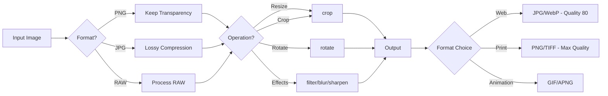
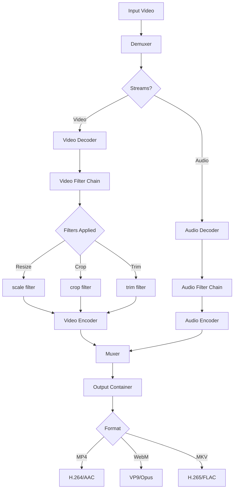
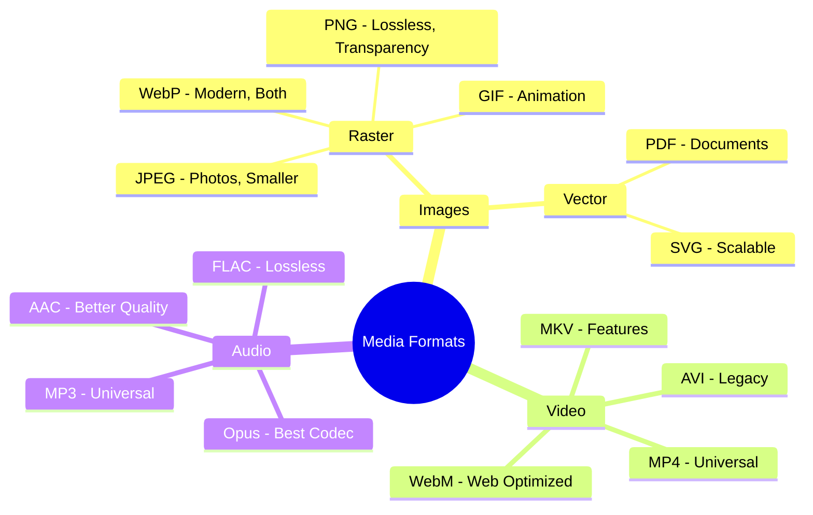
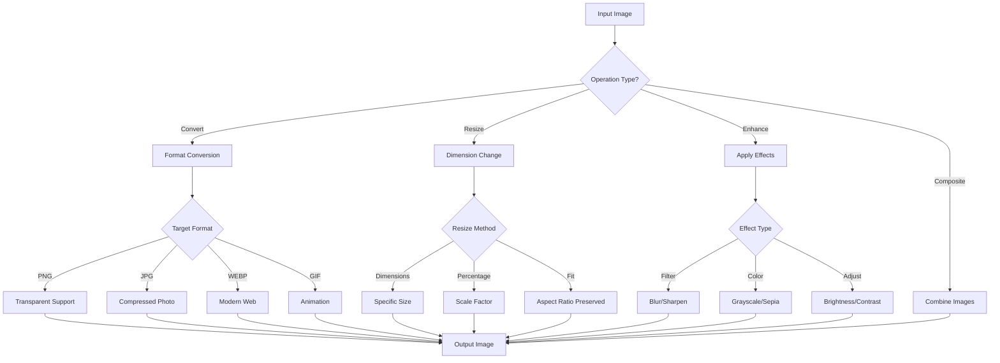
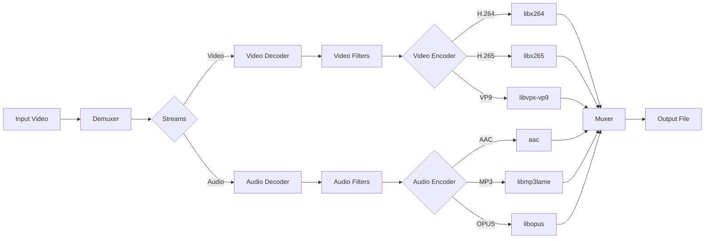

# Chapter 41: Image & Media Tools in Termux

```
╔═══════════════════════════════════════════════════════════════════════════════╗
║                                                                               ║
║  🖼️ CHAPTER 41: IMAGE & MEDIA TOOLS IN TERMUX                                ║
║  ━━━━━━━━━━━━━━━━━━━━━━━━━━━━━━━━━━━━━━━━━━━━━━━━━━━━━━━━━━━━━━━━━━━━━━━━━━━━━  ║
║                                                                               ║
║  🎨 ImageMagick Mastery | 🎬 FFmpeg Power | 📸 Batch Processing | 🎞️ GIFs    ║
║  🔧 200+ Formats | ⚡ Lightning Fast | 🛠️ Professional Results               ║
║                                                                               ║
║  ┌─────────────┐  ┌─────────────┐  ┌─────────────┐  ┌─────────────┐          ║
║  │   Module 7  │  │  Chapter    │  │  Duration   │  │  Difficulty │          ║
║  │  Utilities  │  │  41 of 61   │  │  15-20 Min  │  │  ⭐⭐ Inter. │          ║
║  └─────────────┘  └─────────────┘  └─────────────┘  └─────────────┘          ║
║                                                                               ║
╚═══════════════════════════════════════════════════════════════════════════════╝
```

> **Module:** 7 - Utilities  
> **Chapter:** 41 of 61  
> **Duration:** 15-20 Minutes  
> **Difficulty:** ⭐⭐ Intermediate  

---

## 📋 Chapter Overview

| Section | Content |
|---------|---------|
| Video Script | Complete Hindi narration with timestamps |
| Technical Guide | Detailed ImageMagick & FFmpeg coverage |
| Installation Guide | ImageMagick, FFmpeg, media tools setup |
| Commands Reference | 30+ image & media commands |
| Practice Exercises | Hands-on image/video processing tasks |
| Troubleshooting | Common processing issues |
| Video Assets | Thumbnail, description, tags |

---

## 🎬 VIDEO SCRIPT (Complete Hindi Narration)

```
═══════════════════════════════════════════════════════════════════════════════
TERMUX FULL COURSE - CHAPTER 41
Title: Image & Media Tools in Termux | ImageMagick & FFmpeg Complete Guide | T3rmuxk1ng
Duration: 15-20 Minutes
═══════════════════════════════════════════════════════════════════════════════

[INTRO - 0:00 to 0:45]
─────────────────────────────────────────────────────────────────────────────

Namaskar Dosto! Welcome back to Termux Full Course!

Main aapka host hoon T3rmuxk1ng aur aaj hum seekhenge ek bahut hi 
powerful topic - Image aur Media Processing Termux mein!

Haan, aapne sahi suna! Aap apne Android phone se bina kisi premium 
app ke, sirf commands use karke:
- Images convert, resize, crop kar sakte ho
- Videos compress, convert kar sakte ho
- Audio extract kar sakte ho
- GIFs create kar sakte ho
- Screen recording kar sakte ho
- Watermarks add kar sakte ho

Sab kuch FREE mein, command-line power ke saath!

Ye chapter hamare utilities module ka part hai. Hum seekhenge 
ImageMagick for images aur FFmpeg for videos - dono industry 
standard tools jo Termux pe perfectly kaam karte hain!

Chaliye shuru karte hain!

Play button dabaiye, video like karein, aur channel subscribe 
karein - taki koi video miss na ho.

---

[SECTION 1: IMAGEMAGICK INTRODUCTION - 0:45 to 3:00]
─────────────────────────────────────────────────────────────────────────────

Sabse pehle samjhte hain ki ImageMagick kya hai.

ImageMagick ek command-line image processing tool hai. Ye basically
Photoshop jaisa hai - but command line pe!

Kya kya kar sakte ho ImageMagick se?

✓ Image format conversion (PNG, JPG, WEBP, GIF, etc.)
✓ Image resize karna
✓ Image crop karna
✓ Image rotate karna
✓ Watermark add karna
✓ Text add karna
✓ Filters apply karna
✓ Batch processing (hundreds of images at once)
✓ Image compression
✓ Thumbnails create karna

┌─────────────────────────────────────────────────────────────────────────┐
│                    IMAGEMAGICK CAPABILITIES                              │
├─────────────────────────────────────────────────────────────────────────┤
│ Input Formats  │ 200+ formats supported                                 │
│ Output Formats │ PNG, JPG, WEBP, GIF, BMP, TIFF, PDF, SVG, etc.        │
│ Operations     │ Convert, Resize, Crop, Rotate, Flip, Flop             │
│ Effects        │ Blur, Sharpen, Contrast, Brightness, Grayscale        │
│ Advanced       │ Watermark, Text, Composite, Montage, Animation        │
│ Batch          │ Process multiple files with single command            │
└─────────────────────────────────────────────────────────────────────────┘

Sabse best baat - ye Termux pe perfectly kaam karta hai!

Professional photographers aur developers worldwide use karte hain!

---

[SECTION 2: IMAGEMAGICK INSTALLATION - 3:00 to 5:00]
─────────────────────────────────────────────────────────────────────────────

Chaliye ab ImageMagick install karte hain Termux mein.

Pehle apna Termux update karein:

    pkg update && pkg upgrade -y

Ab ImageMagick install karein:

    pkg install imagemagick -y

[SCREEN: Installation output]

Installation mein kuch seconds lagenge. Wait karein.

Installation ke baad verify karein:

    magick --version

Ya:

    convert --version

Version number dikhna chahiye jaise: ImageMagick 7.1.x

Agar version dikha raha hai - installation successful hai!

ImageMagick ke saath ye commands milengi:
- magick (main command, newer)
- convert (legacy, still works)
- identify (image info)
- mogrify (batch processing)
- composite (combine images)
- montage (create image grids)

Verify all commands:

    which magick convert identify mogrify composite montage

Sab paths dikhne chahiye!

---

[SECTION 3: BASIC IMAGE OPERATIONS - 5:00 to 8:00]
─────────────────────────────────────────────────────────────────────────────

Ab actual image processing start karte hain!

[IMAGE CONVERSION]

Sabse basic - image format convert karna:

    magick input.png output.jpg

Ya purana convert command:

    convert input.png output.jpg

Isse PNG image JPG mein convert ho jaayega!

Multiple formats support hote hain:
    convert input.png output.webp
    convert input.jpg output.gif
    convert input.bmp output.png

[SCREEN: Before/After image]

[IMAGE INFO]

Image ki details dekhne ke liye:

    identify image.jpg

Detailed info:

    identify -verbose image.jpg

Ye dikhayega:
- Image dimensions
- Format
- File size
- Color depth
- Metadata

[IMAGE RESIZING]

Image resize karna:

    # Specific size
    convert input.jpg -resize 800x600 output.jpg

    # Maintain aspect ratio
    convert input.jpg -resize 800x output.jpg    # Width 800, auto height
    convert input.jpg -resize x600 output.jpg    # Height 600, auto width

    # Percentage
    convert input.jpg -resize 50% output.jpg     # 50% size
    convert input.jpg -resize 200% output.jpg    # Double size

    # Maximum dimensions (fit in box)
    convert input.jpg -resize 800x600\> output.jpg   # Only if larger

    # Minimum dimensions
    convert input.jpg -resize 800x600\< output.jpg   # Only if smaller

[IMAGE CROPPING]

Image crop karna:

    # Crop 100x100 pixels from top-left
    convert input.jpg -crop 100x100+0+0 output.jpg

    # Crop from center
    convert input.jpg -gravity center -crop 200x200+0+0 output.jpg

    # Remove 50 pixels from each side
    convert input.jpg -shave 50x50 output.jpg

[IMAGE ROTATION]

Image rotate karna:

    # Rotate 90 degrees clockwise
    convert input.jpg -rotate 90 output.jpg

    # Rotate 45 degrees (with background)
    convert input.jpg -background white -rotate 45 output.jpg

    # Auto-rotate based on EXIF
    convert input.jpg -auto-orient output.jpg

---

[SECTION 4: ADVANCED IMAGE OPERATIONS - 8:00 to 11:00]
─────────────────────────────────────────────────────────────────────────────

Ab kuch advanced operations dekhte hain!

[ADDING WATERMARK]

Image pe watermark add karna:

    # Text watermark
    convert input.jpg -fill white -pointsize 36 -gravity southeast \
        -annotate +10+10 "© T3rmuxk1ng" output.jpg

    # Semi-transparent watermark
    convert input.jpg -fill "rgba(255,255,255,0.5)" -pointsize 36 \
        -gravity center -annotate 0 "WATERMARK" output.jpg

    # Image watermark
    composite -dissolve 50% -gravity southeast watermark.png \
        input.jpg output.jpg

[ADDING TEXT TO IMAGES]

Text add karna:

    # Simple text
    convert input.jpg -fill white -pointsize 30 -gravity center \
        -annotate 0 "Hello Termux!" output.jpg

    # Styled text
    convert input.jpg -fill yellow -stroke black -strokewidth 2 \
        -font Helvetica -pointsize 40 -gravity south -annotate +0+20 \
        "Styled Text" output.jpg

[IMAGE EFFECTS]

Effects apply karna:

    # Blur
    convert input.jpg -blur 0x5 output.jpg

    # Sharpen
    convert input.jpg -sharpen 0x5 output.jpg

    # Grayscale
    convert input.jpg -colorspace Gray output.jpg

    # Sepia
    convert input.jpg -sepia-tone 80% output.jpg

    # Negate (invert colors)
    convert input.jpg -negate output.jpg

    # Brightness/Contrast
    convert input.jpg -brightness-contrast 20x10 output.jpg

[IMAGE COMPRESSION]

Image compress karna (reduce file size):

    # JPEG quality (1-100, lower = smaller file)
    convert input.jpg -quality 80 output.jpg
    convert input.jpg -quality 50 output.jpg    # More compression

    # Strip metadata
    convert input.jpg -strip output.jpg

    # Optimize for web
    convert input.jpg -strip -quality 85 -interlace Plane output.jpg

---

[SECTION 5: BATCH IMAGE PROCESSING - 11:00 to 13:00]
─────────────────────────────────────────────────────────────────────────────

Ab sabse powerful feature - batch processing!

Bahut saari images ek saath process karna:

[MULTIPLE FILES WITH MOGRIFY]

mogrify command files ko in-place modify karta hai:

    # Resize all JPGs in folder
    mogrify -resize 800x600 *.jpg

    # Convert all PNGs to JPG
    mogrify -format jpg *.png

    # Compress all images
    mogrify -quality 80 -strip *.jpg

    # Resize all images to max 1920px width
    mogrify -resize 1920x\> *.jpg

[WARNING: mogrify original files ko modify karta hai! Backup rakhein!]

[CONVERT MULTIPLE FILES]

convert ke saath multiple files:

    # Convert all PNGs to JPGs with new names
    for f in *.png; do convert "$f" "${f%.png}.jpg"; done

    # Create thumbnails for all images
    for f in *.jpg; do convert "$f" -thumbnail 200x200 "thumb_$f"; done

[BATCH SCRIPT]

Ek batch script banate hain:

    nano batch_resize.sh

Script:

```bash
#!/bin/bash
# Batch Image Resizer by T3rmuxk1ng

SIZE=$1
if [ -z "$SIZE" ]; then
    SIZE="800x600"
fi

mkdir -p resized

for img in *.jpg *.png *.jpeg; do
    if [ -f "$img" ]; then
        echo "Processing: $img"
        convert "$img" -resize "$SIZE" "resized/$img"
    fi
done

echo "Done! Check 'resized' folder."
```

Use karein:

    chmod +x batch_resize.sh
    ./batch_resize.sh 1920x1080

---

[SECTION 6: FFMPEG INTRODUCTION - 13:00 to 14:30]
─────────────────────────────────────────────────────────────────────────────

Ab video processing ke liye FFmpeg seekhte hain!

FFmpeg ek multimedia framework hai jo:
- Video conversion
- Audio extraction
- Video compression
- Screen recording
- GIF creation
- Video trimming
- Audio conversion

Ye industry standard hai - YouTube, Netflix, VLC sab use karte hain!

┌─────────────────────────────────────────────────────────────────────────┐
│                         FFMPEG CAPABILITIES                              │
├─────────────────────────────────────────────────────────────────────────┤
│ Video Formats  │ MP4, MKV, AVI, WEBM, MOV, FLV, etc.                   │
│ Audio Formats  │ MP3, AAC, WAV, FLAC, OGG, M4A, etc.                   │
│ Operations     │ Convert, Compress, Trim, Merge, Extract                │
│ Recording      │ Screen capture, Audio recording                       │
│ Filters        │ Resize, Crop, Rotate, Watermark, Speed                │
│ Streaming      │ RTMP, HLS, DASH                                       │
└─────────────────────────────────────────────────────────────────────────┘

---

[SECTION 7: FFMPEG INSTALLATION - 14:30 to 15:30]
─────────────────────────────────────────────────────────────────────────────

FFmpeg install karna:

    pkg install ffmpeg -y

FFmpeg bahut bada package hai, thoda time lagega.

Verify installation:

    ffmpeg -version

Version aur configuration details dikhni chahiye.

Useful companion tools:

    pkg install ffprobe -y    # Media analysis (usually included with ffmpeg)

ffprobe se media info:

    ffprobe video.mp4

---

[SECTION 8: VIDEO OPERATIONS - 15:30 to 18:00]
─────────────────────────────────────────────────────────────────────────────

Ab actual video processing start karte hain!

[VIDEO CONVERSION]

Format convert karna:

    # MP4 to MKV
    ffmpeg -i input.mp4 output.mkv

    # MKV to MP4
    ffmpeg -i input.mkv -c:v libx264 -c:a aac output.mp4

    # Any to MP4 (web compatible)
    ffmpeg -i input.avi -c:v libx264 -c:a aac -movflags +faststart output.mp4

    # MP4 to WEBM
    ffmpeg -i input.mp4 -c:v libvpx-vp9 -c:a libopus output.webm

[VIDEO COMPRESSION]

Video compress karna (reduce file size):

    # CRF compression (lower = better quality, larger file)
    ffmpeg -i input.mp4 -c:v libx264 -crf 28 output.mp4

    # CRF values: 18-28 is good range
    # 18 = visually lossless, 28 = smaller file

    # Set specific bitrate
    ffmpeg -i input.mp4 -b:v 1M -b:a 128k output.mp4

    # Compress with resolution change
    ffmpeg -i input.mp4 -vf "scale=1280:720" -c:v libx264 -crf 26 output.mp4

[VIDEO RESIZING]

Video resolution change:

    # Specific resolution
    ffmpeg -i input.mp4 -vf "scale=1280:720" output.mp4

    # Maintain aspect ratio
    ffmpeg -i input.mp4 -vf "scale=1280:-1" output.mp4    # Width 1280, auto height

    # Half size
    ffmpeg -i input.mp4 -vf "scale=iw/2:ih/2" output.mp4

[VIDEO TRIMMING]

Video se part nikalna:

    # Trim from 00:01:00 to 00:02:00
    ffmpeg -i input.mp4 -ss 00:01:00 -to 00:02:00 -c copy output.mp4

    # Trim 30 seconds starting from 1 minute
    ffmpeg -i input.mp4 -ss 00:01:00 -t 30 -c copy output.mp4

    # Fast trimming (may have issues)
    ffmpeg -ss 00:01:00 -i input.mp4 -t 30 -c copy output.mp4

[AUDIO EXTRACTION]

Video se audio nikalna:

    # Extract audio as MP3
    ffmpeg -i video.mp4 -vn -acodec libmp3lame -ab 192k audio.mp3

    # Extract audio as AAC (M4A)
    ffmpeg -i video.mp4 -vn -acodec aac -ab 192k audio.m4a

    # Extract audio without re-encoding
    ffmpeg -i video.mp4 -vn -acodec copy audio.aac

---

[SECTION 9: GIF CREATION & SCREEN RECORDING - 18:00 to 20:00]
─────────────────────────────────────────────────────────────────────────────

[GIF CREATION]

Video se GIF banana:

    # Basic GIF
    ffmpeg -i video.mp4 -vf "fps=10,scale=320:-1" output.gif

    # High quality GIF
    ffmpeg -i video.mp4 -vf "fps=15,scale=480:-1:flags=lanczos" -c:v gif output.gif

    # GIF with palette (better quality)
    ffmpeg -i video.mp4 -vf "fps=15,scale=480:-1:flags=lanczos,split[s0][s1];[s0]palettegen[p];[s1][p]paletteuse" output.gif

    # GIF from specific time range
    ffmpeg -ss 00:00:10 -t 5 -i video.mp4 -vf "fps=10,scale=320:-1" output.gif

    # Images to GIF
    ffmpeg -framerate 1 -i img%03d.png -vf "scale=640:-1" output.gif

[SCREEN RECORDING]

Screen record karna (needs termux-api):

    pkg install termux-api -y

    # Screen recording
    termux-screen-record -o screen.mp4

    # With time limit (seconds)
    termux-screen-record -t 30 -o screen.mp4

    # With bit rate
    termux-screen-record -b 4000000 -o screen.mp4

Using FFmpeg directly for recording:

    # Record from camera (if supported)
    ffmpeg -f android_camera -i 0:0 output.mp4

[MEDIA INFO]

Media details dekhna:

    # Basic info
    ffprobe video.mp4

    # Detailed info
    ffprobe -v quiet -print_format json -show_format -show_streams video.mp4

    # Duration only
    ffprobe -v error -show_entries format=duration -of default=noprint_wrappers=1:nokey=1 video.mp4

    # Resolution
    ffprobe -v error -select_streams v:0 -show_entries stream=width,height -of csv=s=x:p=0 video.mp4

---

[SECTION 10: SUMMARY & NEXT PREVIEW - 20:00 to 21:30]
─────────────────────────────────────────────────────────────────────────────

To dosto, Chapter 41 complete! Let's summarize:

✅ ImageMagick kya hai - Command-line Photoshop
✅ Installation - pkg install imagemagick
✅ Image conversion - PNG, JPG, WEBP, etc.
✅ Image resize, crop, rotate - Complete manipulation
✅ Watermarks & Text - Professional touches
✅ Batch processing - Multiple files at once
✅ FFmpeg installation - pkg install ffmpeg
✅ Video conversion - All major formats
✅ Video compression - Reduce file size
✅ Audio extraction - MP3, M4A from videos
✅ GIF creation - From videos and images
✅ Screen recording - Using termux-api

Important Commands yaad rakhein:

┌─────────────────────────────────────────────────────────────────────────┐
│                    CHAPTER 41 - IMPORTANT COMMANDS                       │
├─────────────────────────────────────────────────────────────────────────┤
│ convert input.png output.jpg         │ Image conversion                 │
│ convert input.jpg -resize 50% out.jpg│ Resize image                     │
│ mogrify -resize 800x600 *.jpg        │ Batch resize                     │
│ ffmpeg -i input.mp4 output.mkv       │ Video conversion                 │
│ ffmpeg -i video.mp4 -vn audio.mp3    │ Extract audio                    │
│ ffmpeg -i video.mp4 -crf 28 out.mp4  │ Compress video                   │
│ ffmpeg -i video.mp4 -ss 1:00 -t 30 out│ Trim video (1min, 30sec)        │
│ ffprobe video.mp4                    │ Media info                       │
└─────────────────────────────────────────────────────────────────────────┘

Next Chapter 42 mein hum seekhenge:
- PDF Tools
- PDF creation and manipulation
- Text to PDF conversion
- PDF merging and splitting
- Image to PDF conversion

Agar ye video helpful lagi, to:
👍 Like button press karein
🔔 Subscribe karein, notification bell on karein
💬 Koi sawal ho to comment mein poochein
📤 Share karein friends ke saath

Main har comment ka reply karta hoon.

Thank you for watching! See you in Chapter 42!

═══════════════════════════════════════════════════════════════════════════════
```

---

## 📖 TECHNICAL GUIDE

### 1. ImageMagick Architecture

```
┌─────────────────────────────────────────────────────────────────────────┐
│                      IMAGEMAGICK WORKFLOW                                │
├─────────────────────────────────────────────────────────────────────────┤
│                                                                          │
│   ┌──────────────┐    ┌──────────────┐    ┌──────────────┐             │
│   │  Input Image │───▶│    Decoder   │───▶│  Image Cache │             │
│   └──────────────┘    └──────────────┘    └──────────────┘             │
│                              │                    │                     │
│                              ▼                    ▼                     │
│   ┌──────────────┐    ┌──────────────┐    ┌──────────────┐             │
│   │   Format     │    │   Pixel      │    │   Color      │             │
│   │   Detection  │    │   Operations │    │   Space      │             │
│   └──────────────┘    └──────────────┘    └──────────────┘             │
│                                                    │                     │
│   ┌────────────────────────────────────────────────┘                    │
│   │                                                                      │
│   ▼                                                                      │
│   ┌──────────────┐    ┌──────────────┐    ┌──────────────┐             │
│   │   Filters    │───▶│   Encoder    │───▶│ Output Image │             │
│   │   & Effects  │    │              │    │              │             │
│   └──────────────┘    └──────────────┘    └──────────────┘             │
│                                                                          │
└─────────────────────────────────────────────────────────────────────────┘
```

### 2. ImageMagick Commands

| Command | Purpose | Example |
|---------|---------|---------|
| `magick` | Main command (v7+) | `magick input.png output.jpg` |
| `convert` | Legacy conversion | `convert input.png output.jpg` |
| `identify` | Image information | `identify image.jpg` |
| `mogrify` | In-place processing | `mogrify -resize 50% *.jpg` |
| `composite` | Combine images | `composite -blend 50 img1.jpg img2.jpg out.jpg` |
| `montage` | Create image grids | `montage *.jpg -tile 3x3 grid.jpg` |
| `compare` | Image differences | `compare img1.jpg img2.jpg diff.jpg` |
| `stream` | Stream pixels | `stream -map rgb -storage-type char img.raw` |
| `import` | Screenshot | `import screenshot.png` |
| `display` | View image | `display image.jpg` |

### 3. FFmpeg Architecture

```
┌─────────────────────────────────────────────────────────────────────────┐
│                         FFMPEG PIPELINE                                  │
├─────────────────────────────────────────────────────────────────────────┤
│                                                                          │
│   ┌──────────────┐    ┌──────────────┐    ┌──────────────┐             │
│   │    Input     │───▶│  Demuxer     │───▶│   Decoder    │             │
│   │   (File/URL) │    │              │    │              │             │
│   └──────────────┘    └──────────────┘    └──────────────┘             │
│                                                    │                     │
│                              ┌─────────────────────┴────────┐           │
│                              │                              │           │
│                              ▼                              ▼           │
│                      ┌──────────────┐              ┌──────────────┐    │
│                      │  Video       │              │  Audio       │    │
│                      │  Frames      │              │  Samples     │    │
│                      └──────────────┘              └──────────────┘    │
│                              │                              │           │
│                              ▼                              ▼           │
│                      ┌──────────────┐              ┌──────────────┐    │
│                      │   Filters    │              │   Filters    │    │
│                      │   (Video)    │              │   (Audio)    │    │
│                      └──────────────┘              └──────────────┘    │
│                              │                              │           │
│                              ▼                              ▼           │
│                      ┌──────────────┐              ┌──────────────┐    │
│                      │   Encoder    │              │   Encoder    │    │
│                      └──────────────┘              └──────────────┘    │
│                              │                              │           │
│                              └──────────────┬───────────────┘           │
│                                             ▼                           │
│                                      ┌──────────────┐                  │
│                                      │    Muxer     │                  │
│                                      └──────────────┘                  │
│                                             │                           │
│                                             ▼                           │
│                                      ┌──────────────┐                  │
│                                      │ Output File  │                  │
│                                      └──────────────┘                  │
│                                                                          │
└─────────────────────────────────────────────────────────────────────────┘
```

### 4. Supported Formats

**ImageMagick Supported Formats:**

| Category | Formats |
|----------|---------|
| Common Web | PNG, JPEG, GIF, WEBP, ICO, SVG |
| Photography | RAW, TIFF, BMP, TGA, PCX |
| Document | PDF, PS, EPS, XCF |
| Video Frames | MP4 (frames), AVI (frames) |
| Animated | GIF, APNG, WEBP |
| Special | HEIC, AVIF, JXL |

**FFmpeg Supported Formats:**

| Category | Input | Output |
|----------|-------|--------|
| Video | MP4, MKV, AVI, MOV, WEBM, FLV, TS, M4V | MP4, MKV, WEBM, AVI, MOV |
| Audio | MP3, AAC, WAV, FLAC, OGG, M4A, WMA | MP3, AAC, WAV, FLAC, OGG, M4A |
| Streaming | RTMP, HLS, DASH, RTP | RTMP, HLS, DASH |
| Image | PNG, JPEG, GIF, BMP, TIFF | PNG, JPEG, GIF, BMP |

### 5. Video Codecs Comparison

| Codec | Quality | Size | Speed | Best For |
|-------|---------|------|-------|----------|
| libx264 | Excellent | Good | Fast | General use, compatibility |
| libx265 (HEVC) | Excellent | Smaller | Slow | High efficiency |
| libvpx-vp9 | Good | Smaller | Slow | Web (WEBM) |
| libaom-av1 | Excellent | Smallest | Very Slow | Future-proof |
| mpeg4 | Good | Larger | Fast | Old devices |

### 6. CRF Quality Guide

```
CRF (Constant Rate Factor) Values for libx264:
═══════════════════════════════════════════════

  0  ──────── Lossless (huge files)
 18 ──────── Visually lossless
 23 ──────── Default (good quality)
 28 ──────── Good for web
 32 ──────── Noticeable compression
 51 ──────── Worst quality

Recommended:
  - High quality: 18-22
  - Normal: 23-26
  - Compression: 27-30
```

---

## 🔧 INSTALLATION GUIDE

### ImageMagick Installation

```bash
# Update Termux
pkg update && pkg upgrade -y

# Install ImageMagick
pkg install imagemagick -y

# Verify installation
magick --version
convert --version
identify -version

# Check supported formats
magick -list format | head -50
```

### FFmpeg Installation

```bash
# Install FFmpeg
pkg install ffmpeg -y

# Verify installation
ffmpeg -version
ffprobe -version

# Check available encoders
ffmpeg -encoders

# Check available decoders
ffmpeg -decoders

# Check available filters
ffmpeg -filters
```

### Additional Media Tools

```bash
# Image optimization tools
pkg install optipng -y       # PNG optimizer
pkg install jpegoptim -y     # JPEG optimizer

# Video tools
pkg install youtube-dl -y    # Video downloader
pkg install yt-dlp -y        # Better video downloader

# Audio tools
pkg install sox -y           # Audio processing
pkg install lame -y          # MP3 encoder
pkg install vorbis-tools -y  # OGG tools

# Screen recording (requires Termux:API app)
pkg install termux-api -y

# Verify termux-api
termux-info
```

---

## 📋 COMMANDS REFERENCE (30+ Commands)

### ImageMagick Commands

#### Image Conversion

```bash
# 1. Basic format conversion
convert input.png output.jpg

# 2. Convert multiple formats
convert input.bmp output.png
convert input.tiff output.webp

# 3. Convert with quality setting
convert input.png -quality 90 output.jpg

# 4. Convert all PNGs to JPG (loop)
for f in *.png; do convert "$f" "${f%.png}.jpg"; done

# 5. Convert to progressive JPEG
convert input.png -interlace Plane output.jpg
```

#### Image Resizing

```bash
# 6. Resize to specific dimensions
convert input.jpg -resize 1920x1080 output.jpg

# 7. Resize maintaining aspect ratio (width)
convert input.jpg -resize 800x output.jpg

# 8. Resize maintaining aspect ratio (height)
convert input.jpg -resize x600 output.jpg

# 9. Resize by percentage
convert input.jpg -resize 50% output.jpg
convert input.jpg -resize 200% output.jpg

# 10. Resize only if larger
convert input.jpg -resize 1920x1080\> output.jpg

# 11. Resize for email/web
convert input.jpg -resize 1024x768\> -quality 85 output.jpg
```

#### Image Cropping

```bash
# 12. Crop specific region
convert input.jpg -crop 500x400+100+50 output.jpg

# 13. Crop from center
convert input.jpg -gravity center -crop 200x200+0+0 output.jpg

# 14. Remove borders
convert input.jpg -shave 50x50 output.jpg

# 15. Auto-crop whitespace
convert input.jpg -trim output.jpg

# 16. Crop percentage
convert input.jpg -crop 50%x50% output.jpg
```

#### Image Rotation & Flip

```bash
# 17. Rotate 90 degrees
convert input.jpg -rotate 90 output.jpg

# 18. Rotate 180 degrees
convert input.jpg -rotate 180 output.jpg

# 19. Rotate with background
convert input.jpg -background white -rotate 45 output.jpg

# 20. Flip vertically
convert input.jpg -flip output.jpg

# 21. Flop horizontally (mirror)
convert input.jpg -flop output.jpg

# 22. Auto-orient based on EXIF
convert input.jpg -auto-orient output.jpg
```

#### Watermark & Text

```bash
# 23. Simple text watermark
convert input.jpg -fill white -pointsize 36 \
    -gravity southeast -annotate +10+10 "© T3rmuxk1ng" output.jpg

# 24. Semi-transparent watermark
convert input.jpg -fill "rgba(255,255,255,0.5)" -pointsize 48 \
    -gravity center -annotate 0 "WATERMARK" output.jpg

# 25. Styled text with shadow
convert input.jpg -fill white -stroke black -strokewidth 2 \
    -font Helvetica -pointsize 40 -gravity south \
    -annotate +0+20 "Styled Text" output.jpg

# 26. Image watermark
composite -dissolve 50% -gravity southeast watermark.png \
    input.jpg output.jpg

# 27. Tiled watermark
convert input.jpg -fill "rgba(255,255,255,0.2)" -pointsize 30 \
    -gravity center -annotate -45 "WATERMARK " -rotate -45 \
    -duplicate 20 -distort SRT 0 -flatten output.jpg
```

#### Image Effects

```bash
# 28. Grayscale conversion
convert input.jpg -colorspace Gray output.jpg

# 29. Sepia tone
convert input.jpg -sepia-tone 80% output.jpg

# 30. Blur effect
convert input.jpg -blur 0x5 output.jpg

# 31. Sharpen
convert input.jpg -sharpen 0x5 output.jpg

# 32. Brightness/Contrast
convert input.jpg -brightness-contrast 20x10 output.jpg

# 33. Invert colors
convert input.jpg -negate output.jpg

# 34. Vignette effect
convert input.jpg -vignette 0x50 output.jpg
```

#### Batch Processing

```bash
# 35. Batch resize all images
mogrify -resize 800x600 *.jpg

# 36. Batch convert PNG to JPG
mogrify -format jpg *.png

# 37. Batch compress all images
mogrify -quality 80 -strip *.jpg

# 38. Batch resize with max width
mogrify -resize 1920x\> *.jpg

# 39. Batch add watermark
mogrify -fill white -pointsize 24 -gravity southeast \
    -annotate +10+10 "© 2024" *.jpg

# 40. Create thumbnails
mkdir -p thumbs
for f in *.jpg; do
    convert "$f" -thumbnail 200x200 "thumbs/$f"
done
```

### FFmpeg Commands

#### Video Conversion

```bash
# 41. Basic video conversion
ffmpeg -i input.mp4 output.mkv

# 42. Convert to MP4 (web compatible)
ffmpeg -i input.avi -c:v libx264 -c:a aac -movflags +faststart output.mp4

# 43. Convert to WEBM
ffmpeg -i input.mp4 -c:v libvpx-vp9 -c:a libopus output.webm

# 44. Convert with specific quality
ffmpeg -i input.mp4 -c:v libx264 -crf 23 -c:a aac -b:a 128k output.mp4
```

#### Video Compression

```bash
# 45. Compress with CRF
ffmpeg -i input.mp4 -c:v libx264 -crf 28 -c:a aac output.mp4

# 46. Compress with bitrate
ffmpeg -i input.mp4 -b:v 1M -b:a 128k output.mp4

# 47. Compress HEVC (H.265)
ffmpeg -i input.mp4 -c:v libx265 -crf 28 -c:a aac output.mp4

# 48. Compress for mobile
ffmpeg -i input.mp4 -vf "scale=854:480" -c:v libx264 -crf 26 \
    -c:a aac -b:a 96k mobile_output.mp4
```

#### Video Resizing

```bash
# 49. Resize video
ffmpeg -i input.mp4 -vf "scale=1280:720" output.mp4

# 50. Resize maintaining aspect ratio
ffmpeg -i input.mp4 -vf "scale=1280:-1" output.mp4

# 51. Resize to half
ffmpeg -i input.mp4 -vf "scale=iw/2:ih/2" output.mp4

# 52. Resize with filter
ffmpeg -i input.mp4 -vf "scale=1920:1080:force_original_aspect_ratio=decrease" output.mp4
```

#### Video Trimming

```bash
# 53. Trim video (from-to)
ffmpeg -i input.mp4 -ss 00:01:00 -to 00:02:00 -c copy output.mp4

# 54. Trim video (start-duration)
ffmpeg -i input.mp4 -ss 00:01:00 -t 30 -c copy output.mp4

# 55. Trim fast (re-encode)
ffmpeg -ss 00:01:00 -i input.mp4 -t 30 -c:v libx264 -c:a aac output.mp4

# 56. Remove last 10 seconds
ffmpeg -i input.mp4 -ss 0 -to $(ffprobe -v error -show_entries format=duration -of default=noprint_wrappers=1:nokey=1 input.mp4 | awk '{print $1-10}') -c copy output.mp4
```

#### Audio Extraction

```bash
# 57. Extract audio as MP3
ffmpeg -i video.mp4 -vn -c:a libmp3lame -b:a 192k audio.mp3

# 58. Extract audio as AAC
ffmpeg -i video.mp4 -vn -c:a aac -b:a 192k audio.m4a

# 59. Extract audio without re-encode
ffmpeg -i video.mp4 -vn -c:a copy audio.aac

# 60. Extract specific audio track
ffmpeg -i video.mkv -map 0:a:1 -c:a copy audio.mp3
```

#### GIF Creation

```bash
# 61. Video to GIF
ffmpeg -i video.mp4 -vf "fps=10,scale=320:-1" output.gif

# 62. High quality GIF
ffmpeg -i video.mp4 -vf "fps=15,scale=480:-1:flags=lanczos,split[s0][s1];[s0]palettegen[p];[s1][p]paletteuse" output.gif

# 63. GIF from specific time
ffmpeg -ss 00:00:10 -t 5 -i video.mp4 -vf "fps=10,scale=320:-1" output.gif

# 64. Images to GIF
ffmpeg -framerate 1 -i img%03d.png output.gif

# 65. GIF to video
ffmpeg -i animation.gif -c:v libx264 -pix_fmt yuv420p output.mp4
```

#### Media Information

```bash
# 66. Basic media info
ffprobe video.mp4

# 67. Detailed info in JSON
ffprobe -v quiet -print_format json -show_format -show_streams video.mp4

# 68. Duration only
ffprobe -v error -show_entries format=duration -of default=noprint_wrappers=1:nokey=1 video.mp4

# 69. Resolution
ffprobe -v error -select_streams v:0 -show_entries stream=width,height -of csv=s=x:p=0 video.mp4

# 70. Codec info
ffprobe -v error -select_streams v:0 -show_entries stream=codec_name -of default=noprint_wrappers=1:nokey=1 video.mp4
```

#### Screen Recording

```bash
# 71. Screen record with termux-api
termux-screen-record -o recording.mp4

# 72. Screen record with time limit
termux-screen-record -t 60 -o recording.mp4

# 73. Screen record with bitrate
termux-screen-record -b 8000000 -o recording.mp4
```

---

## 📊 MERMAID DIAGRAMS

### Diagram 1: Image Processing Pipeline



### Diagram 2: FFmpeg Video Processing Flow



### Diagram 3: Media Format Compatibility Matrix



---

## ⚡ COMMAND CHEATSHEET

| Command | Purpose | Syntax | Example |
|---------|---------|--------|---------|
| `convert` | Image conversion | `convert input.png output.jpg` | `convert photo.png photo.jpg` |
| `identify` | Image info | `identify image.jpg` | `identify -verbose image.jpg` |
| `mogrify` | Batch process | `mogrify -resize 800x *.jpg` | Batch resize all JPGs |
| `composite` | Combine images | `composite -blend 50 img1.jpg img2.jpg out.jpg` | Blend two images |
| `montage` | Create grid | `montage *.jpg -tile 3x3 grid.jpg` | 3x3 image grid |
| `ffmpeg -i` | Convert video | `ffmpeg -i in.mp4 out.mkv` | MP4 to MKV |
| `ffmpeg -crf` | Quality control | `ffmpeg -i in.mp4 -crf 23 out.mp4` | CRF quality (18-28) |
| `ffmpeg -vf scale` | Resize video | `ffmpeg -i in.mp4 -vf scale=1280:720 out.mp4` | 720p output |
| `ffmpeg -ss -t` | Trim video | `ffmpeg -i in.mp4 -ss 1:00 -t 30 out.mp4` | 30s from 1min |
| `ffmpeg -vn` | Extract audio | `ffmpeg -i video.mp4 -vn audio.mp3` | Audio only |
| `ffprobe` | Media info | `ffprobe video.mp4` | Get video details |
| `termux-screen-record` | Screen record | `termux-screen-record -o out.mp4` | Record screen |
| `convert -resize` | Resize image | `convert in.jpg -resize 50% out.jpg` | 50% size |
| `convert -quality` | JPEG quality | `convert in.png -quality 85 out.jpg` | 85% quality |
| `convert -blur` | Blur effect | `convert in.jpg -blur 0x5 out.jpg` | Gaussian blur |

---

## 🎯 LEARNING PATH VISUALIZATION

```
╔══════════════════════════════════════════════════════════════════════════════╗
║                    IMAGE & MEDIA MASTERY PATH                                ║
╠══════════════════════════════════════════════════════════════════════════════╣
║                                                                              ║
║  LEVEL 1: BEGINNER (Week 1)                                                 ║
║  ┌─────────────────────────────────────────────────────────────────────┐    ║
║  │ ⬜ Install ImageMagick & FFmpeg                                      │    ║
║  │ ⬜ Convert image formats (PNG ↔ JPG)                                 │    ║
║  │ ⬜ Resize images (specific size, percentage)                         │    ║
║  │ ⬜ Basic video conversion                                            │    ║
║  │ ⬜ Extract audio from video                                          │    ║
║  └─────────────────────────────────────────────────────────────────────┘    ║
║                              │                                               ║
║                              ▼                                               ║
║  LEVEL 2: INTERMEDIATE (Week 2)                                             ║
║  ┌─────────────────────────────────────────────────────────────────────┐    ║
║  │ ⬜ Batch image processing with mogrify                               │    ║
║  │ ⬜ Add watermarks to images                                          │    ║
║  │ ⬜ Apply effects (blur, sharpen, grayscale)                          │    ║
║  │ ⬜ Video compression with CRF                                        │    ║
║  │ ⬜ Create GIFs from video                                            │    ║
║  └─────────────────────────────────────────────────────────────────────┘    ║
║                              │                                               ║
║                              ▼                                               ║
║  LEVEL 3: ADVANCED (Week 3+)                                                ║
║  ┌─────────────────────────────────────────────────────────────────────┐    ║
║  │ ⬜ Complex FFmpeg filter chains                                      │    ║
║  │ ⬜ Multi-pass video encoding                                         │    ║
║  │ ⬜ Image montage creation                                            │    ║
║  │ ⬜ Screen recording automation                                       │    ║
║  │ ⬜ Video thumbnail generation                                        │    ║
║  └─────────────────────────────────────────────────────────────────────┘    ║
║                              │                                               ║
║                              ▼                                               ║
║  LEVEL 4: EXPERT (Ongoing)                                                  ║
║  ┌─────────────────────────────────────────────────────────────────────┐    ║
║  │ ⭐ Custom video filters                                              │    ║
║  │ ⭐ HDR video processing                                              │    ║
║  │ ⭐ Live streaming with FFmpeg                                        │    ║
║  │ ⭐ Professional photo workflows                                      │    ║
║  └─────────────────────────────────────────────────────────────────────┘    ║
║                                                                              ║
╚══════════════════════════════════════════════════════════════════════════════╝
```

---

## 🔧 TOOL COMPARISON TABLE

| Feature | ImageMagick | FFmpeg | GIMP | libvips |
|---------|-------------|--------|------|---------|
| **Image Processing** | ⭐⭐⭐⭐⭐ | ⭐⭐⭐ | ⭐⭐⭐⭐⭐ | ⭐⭐⭐⭐⭐ |
| **Video Processing** | ❌ | ⭐⭐⭐⭐⭐ | ⭐⭐ | ❌ |
| **Batch Operations** | ⭐⭐⭐⭐⭐ | ⭐⭐⭐⭐ | ⭐⭐ | ⭐⭐⭐⭐⭐ |
| **GUI** | ❌ | ❌ | ✅ | ❌ |
| **CLI Power** | ⭐⭐⭐⭐⭐ | ⭐⭐⭐⭐⭐ | ❌ | ⭐⭐⭐⭐ |
| **Speed** | ⭐⭐⭐⭐ | ⭐⭐⭐⭐⭐ | ⭐⭐⭐ | ⭐⭐⭐⭐⭐ |
| **Memory Efficient** | ⭐⭐⭐ | ⭐⭐⭐⭐ | ⭐⭐ | ⭐⭐⭐⭐⭐ |
| **Format Support** | 200+ | 300+ | 100+ | 100+ |
| **Termux Support** | ✅ Full | ✅ Full | ❌ No | ✅ Full |
| **Learning Curve** | Medium | Steep | Easy | Medium |

### Video Codec Comparison

| Codec | Quality | Size | Speed | Compatibility |
|-------|---------|------|-------|---------------|
| H.264 (libx264) | ⭐⭐⭐⭐ | ⭐⭐⭐ | ⭐⭐⭐⭐ | ⭐⭐⭐⭐⭐ |
| H.265 (libx265) | ⭐⭐⭐⭐⭐ | ⭐⭐⭐⭐ | ⭐⭐⭐ | ⭐⭐⭐⭐ |
| VP9 (libvpx) | ⭐⭐⭐⭐ | ⭐⭐⭐⭐ | ⭐⭐ | ⭐⭐⭐⭐ |
| AV1 (libaom) | ⭐⭐⭐⭐⭐ | ⭐⭐⭐⭐⭐ | ⭐ | ⭐⭐⭐ |

---

## 🚀 PRACTICAL CHALLENGES

### Challenge 1: Build an Image Optimizer Script

**Objective:** Create a script that optimizes images for web delivery.

```bash
#!/bin/bash
# Image Optimizer for Web

INPUT_DIR="$1"
OUTPUT_DIR="$HOME/storage/downloads/optimized"

mkdir -p "$OUTPUT_DIR"

if [ -z "$INPUT_DIR" ]; then
    echo "Usage: $0 <input_directory>"
    exit 1
fi

echo "Optimizing images..."

# Process images
find "$INPUT_DIR" -type f \( -name "*.jpg" -o -name "*.png" -o -name "*.jpeg" \) | while read img; do
    filename=$(basename "$img")
    name="${filename%.*}"
    
    # Create WebP version
    convert "$img" -quality 80 -resize 1920x1080\> "$OUTPUT_DIR/${name}.webp"
    
    # Create optimized JPEG
    convert "$img" -quality 85 -strip -interlace Plane "$OUTPUT_DIR/${name}.jpg"
    
    # Create thumbnail
    convert "$img" -thumbnail 300x300 "$OUTPUT_DIR/${name}_thumb.jpg"
    
    echo "Processed: $filename"
done

echo "✅ Optimization complete!"
echo "Output: $OUTPUT_DIR"
```

**Success Criteria:**
- [ ] Images are resized appropriately
- [ ] WebP versions are created
- [ ] Thumbnails are generated
- [ ] File sizes are reduced

---

### Challenge 2: Create a Video Thumbnail Generator

**Objective:** Build a script that generates thumbnails from video files.

```bash
#!/bin/bash
# Video Thumbnail Generator

VIDEO="$1"
OUTPUT_DIR="$HOME/storage/downloads/thumbnails"
INTERVAL="${2:-60}"  # Default: every 60 seconds

mkdir -p "$OUTPUT_DIR"

if [ -z "$VIDEO" ]; then
    echo "Usage: $0 <video_file> [interval_seconds]"
    exit 1
fi

# Get video duration
DURATION=$(ffprobe -v error -show_entries format=duration -of default=noprint_wrappers=1:nokey=1 "$VIDEO")
DURATION_INT=${DURATION%.*}

echo "Video duration: ${DURATION_INT}s"
echo "Generating thumbnails every ${INTERVAL}s..."

# Generate thumbnails at intervals
for ((i=0; i<DURATION_INT; i+=INTERVAL)); do
    TIMESTAMP=$(printf "%02d:%02d:%02d" $((i/3600)) $((i%3600/60)) $((i%60)))
    OUTPUT="$OUTPUT_DIR/thumb_$(printf "%04d" $i).jpg"
    
    ffmpeg -y -ss "$TIMESTAMP" -i "$VIDEO" -vframes 1 -q:v 2 "$OUTPUT" 2>/dev/null
    
    echo "Created: thumb_$(printf "%04d" $i).jpg"
done

# Create contact sheet using ImageMagick
montage "$OUTPUT_DIR"/thumb_*.jpg -tile 4x -geometry 320x180+10+10 "$OUTPUT_DIR/contact_sheet.jpg"

echo "✅ Thumbnails generated!"
echo "Contact sheet: $OUTPUT_DIR/contact_sheet.jpg"
```

**Success Criteria:**
- [ ] Thumbnails are generated at correct intervals
- [ ] Contact sheet is created
- [ ] All frames are captured properly

---

### Challenge 3: Build a GIF Creator from Video

**Objective:** Create a script that converts video segments to high-quality GIFs.

```bash
#!/bin/bash
# Video to GIF Converter

VIDEO="$1"
START_TIME="${2:-00:00:00}"
DURATION="${3:-5}"
OUTPUT="$HOME/storage/downloads/output.gif"

if [ -z "$VIDEO" ]; then
    echo "Usage: $0 <video> [start_time] [duration]"
    echo "Example: $0 video.mp4 00:01:30 5"
    exit 1
fi

echo "Creating GIF..."
echo "Video: $VIDEO"
echo "Start: $START_TIME"
echo "Duration: ${DURATION}s"

# Create palette for better quality
PALETTE="/tmp/palette.png"

ffmpeg -y -ss "$START_TIME" -t "$DURATION" -i "$VIDEO" \
    -vf "fps=15,scale=480:-1:flags=lanczos,palettegen" \
    "$PALETTE" 2>/dev/null

# Create GIF using palette
ffmpeg -y -ss "$START_TIME" -t "$DURATION" -i "$VIDEO" -i "$PALETTE" \
    -lavfi "fps=15,scale=480:-1:flags=lanczos[x];[x][1:v]paletteuse" \
    "$OUTPUT" 2>/dev/null

rm -f "$PALETTE"

# Get file size
SIZE=$(du -h "$OUTPUT" | cut -f1)

echo "✅ GIF created!"
echo "Output: $OUTPUT"
echo "Size: $SIZE"
```

**Success Criteria:**
- [ ] GIF is created from specified segment
- [ ] Quality is optimized with palette
- [ ] File size is reasonable

---

## 📖 GLOSSARY & TERMINOLOGY

| Term | Definition |
|------|------------|
| **ImageMagick** | Command-line image processing suite |
| **FFmpeg** | Multimedia framework for audio/video processing |
| **Codec** | Algorithm for encoding/decoding media (H.264, AAC) |
| **Container** | File wrapper format (MP4, MKV, AVI) |
| **Muxing** | Combining video, audio, and subtitles into container |
| **Demuxing** | Separating streams from container |
| **Transcoding** | Converting between formats/codecs |
| **Bitrate** | Data rate (kbps/Mbps) - higher = better quality |
| **CRF** | Constant Rate Factor - quality-based encoding |
| **Keyframe (I-frame)** | Full image frame for seeking |
| **P-frame** | Predicted frame (differences from previous) |
| **B-frame** | Bidirectional predicted frame |
| **Frame Rate (FPS)** | Frames per second |
| **Resolution** | Pixel dimensions (1920x1080) |
| **Aspect Ratio** | Width to height ratio (16:9, 4:3) |
| **Bit Depth** | Color information per channel (8-bit, 10-bit) |
| **Chroma Subsampling** | Color resolution reduction (4:2:0) |
| **VBR/CBR** | Variable/Constant Bit Rate |
| **WebP** | Modern image format with superior compression |
| **HEVC/H.265** | High Efficiency Video Coding |
| **AV1** | Next-gen open source video codec |
| **Lossless** | No quality loss during compression |
| **Lossy** | Quality sacrificed for smaller size |

---

## 💼 CAREER INSIGHTS

### Media Engineering & Content Creation Career Path

```
┌─────────────────────────────────────────────────────────────────────────────┐
│                        CAREER PROGRESSION                                    │
├─────────────────────────────────────────────────────────────────────────────┤
│                                                                             │
│  ENTRY LEVEL                                                               │
│  ├── Video Editor            ──▶ $40,000 - $60,000/year                   │
│  ├── Junior Video Engineer   ──▶ $50,000 - $70,000/year                   │
│  └── Content Creator         ──▶ $35,000 - $55,000/year                   │
│                                                                             │
│  MID LEVEL                                                                 │
│  ├── Video Engineer          ──▶ $70,000 - $100,000/year                  │
│  ├── Media Server Admin      ──▶ $75,000 - $110,000/year                  │
│  ├── Streaming Engineer      ──▶ $80,000 - $120,000/year                  │
│  └── Post-Production Eng     ──▶ $65,000 - $95,000/year                   │
│                                                                             │
│  SENIOR LEVEL                                                              │
│  ├── Senior Video Engineer   ──▶ $110,000 - $160,000/year                 │
│  ├── Media Architect         ──▶ $130,000 - $180,000/year                 │
│  ├── CDN Engineer            ──▶ $120,000 - $170,000/year                 │
│  └── Platform Engineer       ──▶ $140,000 - $200,000/year                 │
│                                                                             │
│  SPECIALIZED                                                               │
│  ├── Broadcast Engineer      ──▶ $80,000 - $140,000/year                  │
│  ├── HDR/Dolby Engineer      ──▶ $100,000 - $160,000/year                 │
│  └── Live Streaming Architect──▶ $150,000 - $220,000/year                 │
│                                                                             │
└─────────────────────────────────────────────────────────────────────────────┘
```

### Key Skills Developed in This Chapter

| Skill | Industry Application | Job Relevance |
|-------|---------------------|---------------|
| FFmpeg mastery | All media roles | ⭐⭐⭐⭐⭐ |
| Image processing | Content creation | ⭐⭐⭐⭐ |
| Video encoding | Streaming platforms | ⭐⭐⭐⭐⭐ |
| Automation scripting | DevOps, Engineering | ⭐⭐⭐⭐⭐ |
| Format knowledge | Media production | ⭐⭐⭐⭐ |
| Quality optimization | All technical roles | ⭐⭐⭐⭐ |
| Batch processing | Operations | ⭐⭐⭐⭐ |

### Companies Hiring Media Skills
- **Streaming:** Netflix, YouTube, Twitch, Vimeo
- **Social:** TikTok, Instagram, Snapchat
- **News:** CNN, BBC, Reuters
- **Gaming:** Discord, Riot Games, Epic
- **Enterprise:** AWS Media, Azure Media, Cloudflare Stream

---

## 📋 AUTOMATION SCRIPT TEMPLATES

### Template 1: Batch Image Watermarker

```bash
#!/bin/bash
#===============================================
# Batch Image Watermarker
# Adds watermark to all images in directory
#===============================================

INPUT_DIR="$1"
WATERMARK="$HOME/watermark.png"
OUTPUT_DIR="$HOME/storage/downloads/watermarked"

mkdir -p "$OUTPUT_DIR"

if [ -z "$INPUT_DIR" ]; then
    echo "Usage: $0 <input_directory>"
    exit 1
fi

find "$INPUT_DIR" -type f \( -name "*.jpg" -o -name "*.png" -o -name "*.jpeg" \) | while read img; do
    filename=$(basename "$img")
    
    composite -dissolve 50% -gravity southeast "$WATERMARK" "$img" "$OUTPUT_DIR/$filename"
    
    echo "Watermarked: $filename"
done

echo "✅ Batch watermarking complete!"
```

### Template 2: Video Compressor Script

```bash
#!/bin/bash
#===============================================
# Video Compressor
# Compresses video while maintaining quality
#===============================================

INPUT="$1"
CRF="${2:-23}"
OUTPUT="${INPUT%.*}_compressed.mp4"

if [ -z "$INPUT" ]; then
    echo "Usage: $0 <video_file> [crf_value]"
    echo "CRF values: 18 (best) to 28 (smallest)"
    exit 1
fi

echo "Compressing video..."
echo "CRF: $CRF"

# Get original size
ORIG_SIZE=$(du -h "$INPUT" | cut -f1)

# Compress
ffmpeg -i "$INPUT" \
    -c:v libx264 -crf $CRF \
    -c:a aac -b:a 128k \
    -movflags +faststart \
    "$OUTPUT" 2>/dev/null

# Get new size
NEW_SIZE=$(du -h "$OUTPUT" | cut -f1)

echo "✅ Compression complete!"
echo "Original: $ORIG_SIZE"
echo "Compressed: $NEW_SIZE"
```

### Template 3: Social Media Image Resizer

```bash
#!/bin/bash
#===============================================
# Social Media Image Resizer
# Creates images sized for different platforms
#===============================================

INPUT="$1"
OUTPUT_DIR="$HOME/storage/downloads/social"

mkdir -p "$OUTPUT_DIR"

if [ -z "$INPUT" ]; then
    echo "Usage: $0 <image_file>"
    exit 1
fi

NAME=$(basename "$INPUT" | cut -d. -f1)

# Instagram Square
convert "$INPUT" -resize 1080x1080^ -gravity center -extent 1080x1080 "$OUTPUT_DIR/${NAME}_instagram.jpg"

# Twitter Header
convert "$INPUT" -resize 1500x500^ -gravity center -extent 1500x500 "$OUTPUT_DIR/${NAME}_twitter.jpg"

# YouTube Thumbnail
convert "$INPUT" -resize 1280x720^ -gravity center -extent 1280x720 "$OUTPUT_DIR/${NAME}_youtube.jpg"

# Facebook Cover
convert "$INPUT" -resize 1200x630^ -gravity center -extent 1200x630 "$OUTPUT_DIR/${NAME}_facebook.jpg"

echo "✅ Social media images created!"
echo "Output: $OUTPUT_DIR"
ls -la "$OUTPUT_DIR"
```

---

## 💻 PRACTICE EXERCISES

### Exercise 1: Image Conversion & Optimization

```bash
# Task: Convert and optimize images for web

# Step 1: Create working directory
mkdir -p ~/storage/downloads/images
cd ~/storage/downloads/images

# Step 2: Download a test image or use existing

# Step 3: Convert PNG to JPG with quality
convert input.png -quality 85 output.jpg

# Step 4: Create web-optimized version
convert input.jpg -resize 1920x1080\> -quality 80 -strip web_optimized.jpg

# Step 5: Compare file sizes
ls -lh input.* output.* web_optimized.*

# Expected: Smaller file size with good quality
```

### Exercise 2: Batch Image Processing

```bash
# Task: Create a batch image processor

# Step 1: Create batch processing script
cat > ~/batch_images.sh << 'EOF'
#!/bin/bash

INPUT_DIR="$1"
OUTPUT_DIR="$2"
SIZE="${3:-1920x1080}"

if [ -z "$INPUT_DIR" ] || [ -z "$OUTPUT_DIR" ]; then
    echo "Usage: $0 <input_dir> <output_dir> [size]"
    echo "Example: $0 ~/storage/downloads/images ~/storage/downloads/processed 800x600"
    exit 1
fi

mkdir -p "$OUTPUT_DIR"

echo "Processing images from: $INPUT_DIR"
echo "Output directory: $OUTPUT_DIR"
echo "Target size: $SIZE"

count=0
for img in "$INPUT_DIR"/*.{jpg,jpeg,png,JPG,JPEG,PNG}; do
    if [ -f "$img" ]; then
        filename=$(basename "$img")
        echo "Processing: $filename"
        convert "$img" -resize "$SIZE\>" -quality 85 -strip "$OUTPUT_DIR/$filename"
        ((count++))
    fi
done

echo "Processed $count images"
EOF

# Step 2: Make executable
chmod +x ~/batch_images.sh

# Step 3: Test the script
~/batch_images.sh ~/storage/downloads/images ~/storage/downloads/processed 800x600

# Expected: All images resized and optimized
```

### Exercise 3: Video Compression

```bash
# Task: Compress a video for sharing

# Step 1: Navigate to video directory
cd ~/storage/downloads

# Step 2: Check original video size
ls -lh input.mp4

# Step 3: Get video info
ffprobe input.mp4

# Step 4: Compress video
ffmpeg -i input.mp4 -c:v libx264 -crf 28 -c:a aac -b:a 128k compressed.mp4

# Step 5: Compare sizes
ls -lh input.mp4 compressed.mp4

# Step 6: Check quality (play video)
termux-open compressed.mp4

# Expected: Smaller file with acceptable quality
```

### Exercise 4: GIF Creation

```bash
# Task: Create GIF from video

# Step 1: Navigate to directory
cd ~/storage/downloads

# Step 2: Create GIF from video segment
ffmpeg -ss 00:00:05 -t 10 -i video.mp4 \
    -vf "fps=15,scale=480:-1:flags=lanczos,split[s0][s1];[s0]palettegen[p];[s1][p]paletteuse" \
    output.gif

# Step 3: Check GIF size
ls -lh output.gif

# Step 4: Optimize GIF (if needed)
convert output.gif -coalesce -layers Optimize optimized.gif

# Expected: Smooth GIF with good quality
```

### Exercise 5: Audio Extraction

```bash
# Task: Extract audio from video with metadata

# Step 1: Create extraction script
cat > ~/extract_audio.sh << 'EOF'
#!/bin/bash

VIDEO="$1"
FORMAT="${2:-mp3}"
QUALITY="${3:-192k}"

if [ -z "$VIDEO" ]; then
    echo "Usage: $0 <video_file> [format] [quality]"
    echo "Formats: mp3, aac, m4a, wav, flac"
    exit 1
fi

OUTPUT="${VIDEO%.*}.$FORMAT"

echo "Extracting audio from: $VIDEO"
echo "Format: $FORMAT, Quality: $QUALITY"
echo "Output: $OUTPUT"

case $FORMAT in
    mp3)
        ffmpeg -i "$VIDEO" -vn -c:a libmp3lame -b:a "$QUALITY" "$OUTPUT"
        ;;
    aac|m4a)
        ffmpeg -i "$VIDEO" -vn -c:a aac -b:a "$QUALITY" "${VIDEO%.*}.m4a"
        ;;
    wav)
        ffmpeg -i "$VIDEO" -vn -c:a pcm_s16le "$OUTPUT"
        ;;
    flac)
        ffmpeg -i "$VIDEO" -vn -c:a flac "$OUTPUT"
        ;;
    *)
        echo "Unsupported format: $FORMAT"
        exit 1
        ;;
esac

echo "Done! Audio saved to: $OUTPUT"
EOF

# Step 2: Make executable
chmod +x ~/extract_audio.sh

# Step 3: Test extraction
~/extract_audio.sh video.mp4 mp3 192k

# Expected: Audio file extracted successfully
```

### Exercise 6: Complete Media Processing Script

```bash
# Task: Create comprehensive media processing script

cat > ~/media_tool.sh << 'EOF'
#!/bin/bash

# Media Processing Tool by T3rmuxk1ng
# Supports: Image resize, convert, compress | Video compress, trim, audio extract

RED='\033[0;31m'
GREEN='\033[0;32m'
YELLOW='\033[1;33m'
CYAN='\033[0;36m'
NC='\033[0m'

show_help() {
    echo -e "${CYAN}═══════════════════════════════════════${NC}"
    echo -e "${CYAN}   Media Processing Tool - T3rmuxk1ng${NC}"
    echo -e "${CYAN}═══════════════════════════════════════${NC}"
    echo ""
    echo "IMAGE COMMANDS:"
    echo "  img-resize <file> <size>     Resize image"
    echo "  img-convert <file> <format>  Convert image format"
    echo "  img-compress <file> <quality> Compress image (1-100)"
    echo "  img-watermark <file> <text>  Add watermark"
    echo "  img-batch <dir> <size>       Batch resize images"
    echo ""
    echo "VIDEO COMMANDS:"
    echo "  vid-compress <file> <crf>    Compress video (18-28)"
    echo "  vid-trim <file> <start> <duration> Trim video"
    echo "  vid-resize <file> <size>     Resize video"
    echo "  vid-audio <file>             Extract audio to MP3"
    echo "  vid-gif <file> <start> <dur> Create GIF from video"
    echo ""
    echo "INFO COMMANDS:"
    echo "  info <file>                  Show media info"
    echo ""
    echo "Examples:"
    echo "  $0 img-resize photo.jpg 800x600"
    echo "  $0 vid-compress video.mp4 28"
    echo "  $0 vid-audio video.mp4"
}

if [ -z "$1" ] || [ "$1" = "--help" ]; then
    show_help
    exit 0
fi

COMMAND="$1"
shift

case $COMMAND in
    img-resize)
        FILE="$1"
        SIZE="$2"
        OUTPUT="resized_$(basename "$FILE")"
        echo -e "${YELLOW}Resizing image to $SIZE...${NC}"
        convert "$FILE" -resize "$SIZE" "$OUTPUT"
        echo -e "${GREEN}✓ Saved to: $OUTPUT${NC}"
        ;;
    img-convert)
        FILE="$1"
        FORMAT="$2"
        OUTPUT="${FILE%.*}.$FORMAT"
        echo -e "${YELLOW}Converting to $FORMAT...${NC}"
        convert "$FILE" "$OUTPUT"
        echo -e "${GREEN}✓ Saved to: $OUTPUT${NC}"
        ;;
    img-compress)
        FILE="$1"
        QUALITY="$2"
        OUTPUT="compressed_$(basename "$FILE")"
        echo -e "${YELLOW}Compressing with quality $QUALITY...${NC}"
        convert "$FILE" -quality "$QUALITY" -strip "$OUTPUT"
        echo -e "${GREEN}✓ Saved to: $OUTPUT${NC}"
        ;;
    img-watermark)
        FILE="$1"
        TEXT="$2"
        OUTPUT="watermarked_$(basename "$FILE")"
        echo -e "${YELLOW}Adding watermark...${NC}"
        convert "$FILE" -fill "rgba(255,255,255,0.5)" -pointsize 24 \
            -gravity southeast -annotate +10+10 "$TEXT" "$OUTPUT"
        echo -e "${GREEN}✓ Saved to: $OUTPUT${NC}"
        ;;
    img-batch)
        DIR="$1"
        SIZE="$2"
        OUTDIR="${DIR}_resized"
        mkdir -p "$OUTDIR"
        echo -e "${YELLOW}Batch resizing images in $DIR...${NC}"
        for img in "$DIR"/*.{jpg,jpeg,png,JPG,JPEG,PNG}; do
            if [ -f "$img" ]; then
                filename=$(basename "$img")
                convert "$img" -resize "$SIZE" "$OUTDIR/$filename"
                echo "  Processed: $filename"
            fi
        done
        echo -e "${GREEN}✓ All images saved to: $OUTDIR${NC}"
        ;;
    vid-compress)
        FILE="$1"
        CRF="$2"
        OUTPUT="compressed_$(basename "$FILE")"
        echo -e "${YELLOW}Compressing video (CRF: $CRF)...${NC}"
        ffmpeg -i "$FILE" -c:v libx264 -crf "$CRF" -c:a aac "$OUTPUT"
        echo -e "${GREEN}✓ Saved to: $OUTPUT${NC}"
        ;;
    vid-trim)
        FILE="$1"
        START="$2"
        DURATION="$3"
        OUTPUT="trimmed_$(basename "$FILE")"
        echo -e "${YELLOW}Trimming video ($START for ${DURATION}s)...${NC}"
        ffmpeg -ss "$START" -i "$FILE" -t "$DURATION" -c copy "$OUTPUT"
        echo -e "${GREEN}✓ Saved to: $OUTPUT${NC}"
        ;;
    vid-resize)
        FILE="$1"
        SIZE="$2"
        OUTPUT="resized_$(basename "$FILE")"
        echo -e "${YELLOW}Resizing video to $SIZE...${NC}"
        ffmpeg -i "$FILE" -vf "scale=$SIZE" -c:v libx264 -c:a aac "$OUTPUT"
        echo -e "${GREEN}✓ Saved to: $OUTPUT${NC}"
        ;;
    vid-audio)
        FILE="$1"
        OUTPUT="${FILE%.*}.mp3"
        echo -e "${YELLOW}Extracting audio...${NC}"
        ffmpeg -i "$FILE" -vn -c:a libmp3lame -b:a 192k "$OUTPUT"
        echo -e "${GREEN}✓ Audio saved to: $OUTPUT${NC}"
        ;;
    vid-gif)
        FILE="$1"
        START="$2"
        DURATION="$3"
        OUTPUT="${FILE%.*}.gif"
        echo -e "${YELLOW}Creating GIF...${NC}"
        ffmpeg -ss "$START" -t "$DURATION" -i "$FILE" \
            -vf "fps=15,scale=480:-1:flags=lanczos" "$OUTPUT"
        echo -e "${GREEN}✓ GIF saved to: $OUTPUT${NC}"
        ;;
    info)
        FILE="$1"
        echo -e "${CYAN}═══════════════════════════════════════${NC}"
        ffprobe -v quiet -print_format json -show_format -show_streams "$FILE" | \
            grep -E '"width"|"height"|"duration"|"bit_rate"|"codec_name"|"format_name"'
        echo -e "${CYAN}═══════════════════════════════════════${NC}"
        ;;
    *)
        echo -e "${RED}Unknown command: $COMMAND${NC}"
        show_help
        ;;
esac
EOF

chmod +x ~/media_tool.sh
~/media_tool.sh --help
```

---

## ⚠️ TROUBLESHOOTING

### Problem 1: "convert: command not found"

```bash
# Cause: ImageMagick not installed

# Solution: Install ImageMagick
pkg install imagemagick -y

# Verify
which convert
```

### Problem 2: "ffmpeg: command not found"

```bash
# Cause: FFmpeg not installed

# Solution: Install FFmpeg
pkg install ffmpeg -y

# Verify
which ffmpeg
```

### Problem 3: "unable to open image"

```bash
# Cause: File path issue or permissions

# Solution 1: Check file exists
ls -la /path/to/image.jpg

# Solution 2: Use absolute paths
convert /sdcard/Download/image.jpg output.jpg

# Solution 3: Check permissions
chmod 644 image.jpg

# Solution 4: Grant storage permission
termux-setup-storage
```

### Problem 4: Out of memory error

```bash
# Cause: Large image/video processing needs more RAM

# Solution 1: Limit memory usage
export MAGICK_MEMORY_LIMIT=256MB

# Solution 2: Process smaller chunks
convert input.jpg -limit memory 128MB output.jpg

# Solution 3: Resize before processing
convert input.jpg -resize 50% temp.jpg
convert temp.jpg -filter_blur output.jpg
rm temp.jpg

# Solution 4: Use simpler operations
convert input.jpg -strip -quality 80 output.jpg
```

### Problem 5: Video conversion fails

```bash
# Cause: Missing codec or unsupported format

# Solution 1: Check available codecs
ffmpeg -codecs | grep -i "libx264\|aac"

# Solution 2: Use different codec
ffmpeg -i input.mp4 -c:v mpeg4 -c:a aac output.mp4

# Solution 3: Check file info first
ffprobe input.mp4

# Solution 4: Use copy codec (no re-encode)
ffmpeg -i input.mp4 -c copy output.mkv
```

### Problem 6: GIF quality is poor

```bash
# Cause: Default GIF encoding is basic

# Solution: Use palette for better quality
ffmpeg -i video.mp4 -vf "fps=15,scale=480:-1:flags=lanczos,split[s0][s1];[s0]palettegen=stats_mode=full[p];[s1][p]paletteuse=dither=bayer:bayer_scale=5" output.gif

# Alternative: Two-pass palette
ffmpeg -i video.mp4 -vf "palettegen" palette.png
ffmpeg -i video.mp4 -i palette.png -filter_complex "fps=15,scale=480:-1:flags=lanconz[x];[x][1:v]paletteuse" output.gif
```

### Problem 7: Audio extraction has no sound

```bash
# Cause: Wrong audio codec or missing

# Solution 1: Check audio streams
ffprobe -v error -select_streams a -show_entries stream=codec_name video.mp4

# Solution 2: Specify audio stream
ffmpeg -i video.mp4 -map 0:a:0 -c:a libmp3lame audio.mp3

# Solution 3: Re-encode audio
ffmpeg -i video.mp4 -vn -c:a libmp3lame -b:a 192k audio.mp3
```

### Problem 8: Screen recording doesn't work

```bash
# Cause: termux-api not installed or permissions

# Solution 1: Install termux-api
pkg install termux-api -y

# Solution 2: Install Termux:API app from F-Droid
# (Not from Play Store - it's outdated)

# Solution 3: Grant permissions
termux-setup-storage

# Solution 4: Test termux-api
termux-info

# Solution 5: Check recording
termux-screen-record --help
```

### Problem 9: Batch processing slow

```bash
# Cause: Processing one by one

# Solution 1: Use parallel processing
pkg install parallel -y
ls *.jpg | parallel -j 4 convert {} -resize 50% resized/{}

# Solution 2: Use mogrify for in-place
mogrify -resize 800x600 *.jpg

# Solution 3: Limit operations
for f in *.jpg; do
    convert "$f" -resize 800x600 -quality 80 "out/$f"
done
```

### Problem 10: File size too large after conversion

```bash
# Cause: High quality settings or wrong codec

# Solution 1: Use higher CRF for video
ffmpeg -i input.mp4 -crf 30 output.mp4

# Solution 2: Lower video bitrate
ffmpeg -i input.mp4 -b:v 1M output.mp4

# Solution 3: Reduce resolution
ffmpeg -i input.mp4 -vf "scale=1280:-1" output.mp4

# Solution 4: For images, lower quality
convert input.png -quality 60 output.jpg

# Solution 5: Strip metadata
convert input.jpg -strip -quality 80 output.jpg
```

---

## 🎥 VIDEO ASSETS

### Thumbnail Text

```
╔═══════════════════════════════════════════════════════════════╗
║                                                               ║
║     🖼️  IMAGE & MEDIA TOOLS                                  ║
║                                                               ║
║     ImageMagick & FFmpeg                                      ║
║     Complete Guide                                            ║
║                                                               ║
║     [T3rmuxk1ng Logo]                                         ║
║                                                               ║
╚═══════════════════════════════════════════════════════════════╝
```

### Video Title

```
Image & Media Tools in Termux | ImageMagick & FFmpeg Complete Guide | T3rmuxk1ng
```

### Video Description

```
🖼️ Termux Full Course - Chapter 41: Image & Media Tools

Namaskar Dosto! Is video mein hum seekhenge Termux mein Image aur Video processing kaise karte hain!

📌 Topics Covered:
━━━━━━━━━━━━━━━━━━━━━━━━━━━━━━━━━━
⭐ ImageMagick - Command-line Photoshop
⭐ Image conversion, resize, crop, rotate
⭐ Watermark aur text add karna
⭐ Batch image processing
⭐ FFmpeg - Video processing
⭐ Video compression aur conversion
⭐ Audio extraction from video
⭐ GIF creation
⭐ Screen recording
⭐ 30+ practical commands

🔗 Useful Links:
━━━━━━━━━━━━━━━━━━━━━━━━━━━━━━━━━━
📱 Termux: https://termux.dev
🖼️ ImageMagick: https://imagemagick.org
🎬 FFmpeg: https://ffmpeg.org

📋 Commands from this video:
━━━━━━━━━━━━━━━━━━━━━━━━━━━━━━━━━━
pkg install imagemagick -y
pkg install ffmpeg -y
convert input.png output.jpg
ffmpeg -i video.mp4 -vn audio.mp3

⏱️ Timestamps:
━━━━━━━━━━━━━━━━━━━━━━━━━━━━━━━━━━
0:00 - Introduction
0:45 - ImageMagick Introduction
3:00 - ImageMagick Installation
5:00 - Basic Image Operations
8:00 - Advanced Image Operations
11:00 - Batch Image Processing
13:00 - FFmpeg Introduction
14:30 - FFmpeg Installation
15:30 - Video Operations
18:00 - GIF Creation & Screen Recording
20:00 - Summary

🔔 Subscribe for more Termux tutorials!
👍 Like this video if it helped you!
💬 Comment your questions below!

━━━━━━━━━━━━━━━━━━━━━━━━━━━━━━━━━━
#Termux #ImageMagick #FFmpeg #T3rmuxk1ng #TermuxCourse
#ImageProcessing #VideoProcessing #CommandLine
#AndroidHacking #TermuxTools #LinuxOnAndroid

━━━━━━━━━━━━━━━━━━━━━━━━━━━━━━━━━━
🙏 Thank you for watching!
```

### Video Tags

```
Termux, ImageMagick, FFmpeg, Image Processing, Video Processing, 
Command Line, Android, T3rmuxk1ng, Termux Tutorial, Termux Course, 
Image Resize, Video Compress, GIF Creation, Audio Extraction, 
Batch Processing, Termux Tools, Linux Commands, Android Terminal, 
Termux Commands, Image Conversion, Video Conversion, Watermark, 
Screen Recording, Media Tools, Termux Full Course
```

### Playlist Info

```
Module: 7 - Utilities
Chapter: 41 of 61
Previous: Ch40 - File Compression & Archives
Next: Ch42 - PDF Tools
```

---

## 📚 QUICK REFERENCE CARD

```
┌─────────────────────────────────────────────────────────────────────────┐
│                IMAGEMAGICK QUICK REFERENCE                               │
├─────────────────────────────────────────────────────────────────────────┤
│ convert input.png output.jpg        │ Convert format                    │
│ convert in.jpg -resize 50% out.jpg  │ Resize 50%                        │
│ convert in.jpg -resize 800x out.jpg │ Width 800px                       │
│ convert in.jpg -crop 100x100 out.jpg│ Crop 100x100                      │
│ convert in.jpg -rotate 90 out.jpg   │ Rotate 90°                        │
│ convert in.jpg -blur 0x5 out.jpg    │ Blur effect                       │
│ convert in.jpg -quality 80 out.jpg  │ Compress (quality 80)             │
│ mogrify -resize 800x *.jpg          │ Batch resize                      │
│ identify image.jpg                  │ Image info                        │
├─────────────────────────────────────────────────────────────────────────┤
│                    FFMPEG QUICK REFERENCE                                │
├─────────────────────────────────────────────────────────────────────────┤
│ ffmpeg -i in.mp4 out.mkv            │ Convert format                    │
│ ffmpeg -i in.mp4 -crf 28 out.mp4    │ Compress video                    │
│ ffmpeg -i in.mp4 -vn audio.mp3      │ Extract audio                     │
│ ffmpeg -i in.mp4 -ss 1:00 -t 30 out │ Trim (start 1min, 30sec)          │
│ ffmpeg -i in.mp4 -vf scale=720:-1   │ Resize to 720p                    │
│ ffmpeg -i vid.mp4 -vf fps=10,gif    │ Create GIF                        │
│ ffprobe video.mp4                   │ Media info                        │
└─────────────────────────────────────────────────────────────────────────┘
```

---

**End of Chapter 41**

---

## 🎮 INTERACTIVE QUIZ - Test Your Knowledge!

<details>
<summary>❓ Q1: ImageMagick से image convert कैसे करें?</summary>

**Answer:**
```bash
convert input.png output.jpg
# या नया command
magick input.png output.jpg
```
Supports 200+ formats including PNG, JPG, WEBP, GIF, BMP, TIFF, PDF
</details>

<details>
<summary>❓ Q2: Image को 50% resize कैसे करें?</summary>

**Answer:**
```bash
convert input.jpg -resize 50% output.jpg
# Specific dimensions
convert input.jpg -resize 800x600 output.jpg
# Width only, maintain aspect ratio
convert input.jpg -resize 800x output.jpg
```
</details>

<details>
<summary>❓ Q3: FFmpeg से video compress कैसे करें?</summary>

**Answer:**
```bash
# CRF compression (28 = more compression)
ffmpeg -i input.mp4 -c:v libx264 -crf 28 output.mp4

# Specific bitrate
ffmpeg -i input.mp4 -b:v 1M -b:a 128k output.mp4
```
CRF values: 18 (high quality) to 28 (smaller file)
</details>

<details>
<summary>❓ Q4: Video से audio extract कैसे करें?</summary>

**Answer:**
```bash
# Extract as MP3
ffmpeg -i video.mp4 -vn -c:a libmp3lame -b:a 192k audio.mp3

# Extract as M4A (better quality)
ffmpeg -i video.mp4 -vn -c:a aac -b:a 192k audio.m4a
```
</details>

<details>
<summary>❓ Q5: Image pe watermark कैसे add करें?</summary>

**Answer:**
```bash
# Text watermark
convert input.jpg -fill white -pointsize 36 \
    -gravity southeast -annotate +10+10 "© T3rmuxk1ng" output.jpg

# Image watermark
composite -dissolve 50% -gravity southeast watermark.png \
    input.jpg output.jpg
```
</details>

<details>
<summary>❓ Q6: Multiple images को batch resize कैसे करें?</summary>

**Answer:**
```bash
# Using mogrify (in-place)
mogrify -resize 800x600 *.jpg

# Keep originals, create new
for f in *.jpg; do
    convert "$f" -resize 800x600 "resized/$f"
done
```
</details>

<details>
<summary>❓ Q7: Video को GIF में convert कैसे करें?</summary>

**Answer:**
```bash
# Basic GIF
ffmpeg -i video.mp4 -vf "fps=10,scale=320:-1" output.gif

# High quality GIF with palette
ffmpeg -i video.mp4 -vf "fps=15,scale=480:-1:flags=lanczos,split[s0][s1];[s0]palettegen[p];[s1][p]paletteuse" output.gif
```
</details>

<details>
<summary>❓ Q8: Image में grayscale effect कैसे apply करें?</summary>

**Answer:**
```bash
convert input.jpg -colorspace Gray output.jpg

# Sepia tone
convert input.jpg -sepia-tone 80% output.jpg

# Blur effect
convert input.jpg -blur 0x5 output.jpg
```
</details>

<details>
<summary>❓ Q9: Video trimming कैसे करें FFmpeg में?</summary>

**Answer:**
```bash
# From 1 minute to 2 minute
ffmpeg -i input.mp4 -ss 00:01:00 -to 00:02:00 -c copy output.mp4

# 30 seconds starting from 1 minute
ffmpeg -i input.mp4 -ss 00:01:00 -t 30 -c copy output.mp4
```
-c copy = no re-encoding (fast)
</details>

<details>
<summary>❓ Q10: Image info कैसे देखें?</summary>

**Answer:**
```bash
# Basic info
identify image.jpg

# Detailed info
identify -verbose image.jpg

# Video info
ffprobe video.mp4
```
</details>

<details>
<summary>❓ Q11: Video resolution change कैसे करें?</summary>

**Answer:**
```bash
# Specific resolution
ffmpeg -i input.mp4 -vf "scale=1280:720" output.mp4

# Maintain aspect ratio
ffmpeg -i input.mp4 -vf "scale=1280:-1" output.mp4

# Half size
ffmpeg -i input.mp4 -vf "scale=iw/2:ih/2" output.mp4
```
</details>

<details>
<summary>❓ Q12: JPEG quality कैसे adjust करें?</summary>

**Answer:**
```bash
# Quality 80 (good balance)
convert input.png -quality 80 output.jpg

# Maximum quality
convert input.png -quality 100 output.jpg

# Smallest file
convert input.png -quality 50 output.jpg
```
Quality range: 1-100 (higher = better quality, larger file)
</details>

<details>
<summary>❓ Q13: Video में audio replace कैसे करें?</summary>

**Answer:**
```bash
# Replace audio
ffmpeg -i video.mp4 -i new_audio.mp3 -c:v copy -c:a aac -map 0:v:0 -map 1:a:0 output.mp4

# Add audio to silent video
ffmpeg -i video.mp4 -i audio.mp3 -c:v copy -c:a aac -shortest output.mp4
```
</details>

<details>
<summary>❓ Q14: Image crop कैसे करें?</summary>

**Answer:**
```bash
# Crop 100x100 from position 50,50
convert input.jpg -crop 100x100+50+50 output.jpg

# Crop from center
convert input.jpg -gravity center -crop 200x200+0+0 output.jpg

# Remove borders
convert input.jpg -shave 50x50 output.jpg
```
</details>

<details>
<summary>❓ Q15: Screen recording Termux में कैसे करें?</summary>

**Answer:**
```bash
# Install termux-api
pkg install termux-api -y

# Screen record
termux-screen-record -o recording.mp4

# With time limit (seconds)
termux-screen-record -t 60 -o recording.mp4

# With bit rate
termux-screen-record -b 8000000 -o recording.mp4
```
</details>

---

## 🎯 INTERVIEW QUESTIONS - Job Preparation

### Q1: ImageMagick और FFmpeg क्या हैं और इनके main use cases?

**Answer:**
- **ImageMagick**: Command-line image processing suite
  - Format conversion (200+ formats)
  - Resize, crop, rotate images
  - Apply effects and filters
  - Batch processing
  - Add watermarks and text

- **FFmpeg**: Multimedia framework
  - Video/audio conversion
  - Compression and optimization
  - Format transcoding
  - Stream processing
  - Screen recording

### Q2: Video compression में CRF क्या है?

**Answer:**
**CRF (Constant Rate Factor)** controls quality vs file size:
- Range: 0-51 (0 = lossless, 51 = worst)
- Recommended: 18-28
- 18-22: High quality
- 23: Default
- 24-28: Good for web
- Higher = smaller file, lower quality

```bash
ffmpeg -i input.mp4 -c:v libx264 -crf 23 output.mp4
```

### Q3: Image resizing में interpolation methods explain करें?

**Answer:**
- **Nearest Neighbor**: Fastest, pixelated output
- **Bilinear**: Smooth, good for photos
- **Bicubic**: Sharper than bilinear
- **Lanczos**: High quality, best for downscaling
- **Spline**: Good for upscaling

```bash
# FFmpeg with Lanczos
ffmpeg -i input.mp4 -vf "scale=1920:1080:flags=lanczos" output.mp4

# ImageMagick with filter
convert input.jpg -filter Lanczos -resize 1920x1080 output.jpg
```

### Q4: Video codecs में H.264 और H.265 का comparison?

**Answer:**
| Feature | H.264 (AVC) | H.265 (HEVC) |
|---------|-------------|--------------|
| Quality | Good | Better |
| File Size | Larger | 50% smaller |
| Encoding Speed | Fast | Slow |
| Compatibility | Universal | Growing |
| CPU Usage | Lower | Higher |

Use H.264 for compatibility, H.265 for storage efficiency.

### Q5: FFmpeg में video filters कैसे work करते हैं?

**Answer:**
```bash
# Filter graph syntax
ffmpeg -i input.mp4 -vf "filter1,filter2,filter3" output.mp4

# Examples:
# Resize + crop
ffmpeg -i input.mp4 -vf "scale=1920:1080,crop=1280:720" output.mp4

# Multiple filters
ffmpeg -i input.mp4 -vf "fps=30,scale=1280:720:force_original_aspect_ratio=decrease" output.mp4

# Audio filter
ffmpeg -i input.mp4 -af "volume=2.0" output.mp4
```

### Q6: Image optimization for web best practices?

**Answer:**
1. **Choose right format**: JPEG for photos, PNG for graphics, WebP for both
2. **Compress properly**: JPEG 80-85 quality
3. **Resize appropriately**: Match display size
4. **Strip metadata**: Remove EXIF when not needed
5. **Use progressive loading**: Progressive JPEG

```bash
# Optimized web image
convert input.jpg -strip -quality 85 -interlace Plane -resize 1920x1080\> output.jpg

# WebP conversion
ffmpeg -i input.png -c:v libwebp -lossless 0 -q:v 80 output.webp
```

### Q7: Video container vs codec में difference?

**Answer:**
- **Container** (MP4, MKV, AVI): Package holding video, audio, subtitles
- **Codec** (H.264, AAC): Compression algorithm for specific stream type

```
MP4 Container:
├── Video stream (H.264)
├── Audio stream (AAC)
└── Subtitle stream (SRT)
```

### Q8: FFmpeg में hardware acceleration कैसे use करें?

**Answer:**
```bash
# Software encoding (CPU)
ffmpeg -i input.mp4 -c:v libx264 output.mp4

# Hardware encoding (if supported)
# NVIDIA
ffmpeg -i input.mp4 -c:v h264_nvenc output.mp4

# Intel QuickSync
ffmpeg -i input.mp4 -c:v h264_qsv output.mp4

# VideoToolbox (macOS)
ffmpeg -i input.mp4 -c:v h264_videotoolbox output.mp4

# Check available encoders
ffmpeg -encoders | grep 264
```

### Q9: Color spaces और color depth क्या हैं?

**Answer:**
- **Color Spaces**: 
  - RGB: Red, Green, Blue (screens)
  - YUV/YCbCr: Luma + Chroma (video)
  - CMYK: Print

- **Color Depth**:
  - 8-bit: 16.7 million colors
  - 10-bit: 1.07 billion colors
  - 12-bit: 68.7 billion colors

```bash
# Convert color space
ffmpeg -i input.mp4 -vf "format=yuv420p" output.mp4

# Check color info
ffprobe -show_streams input.mp4 | grep pix_fmt
```

### Q10: Audio sample rate औroid bitrate explain करें?

**Answer:**
- **Sample Rate**: Samples per second
  - 44.1 kHz: CD quality
  - 48 kHz: Video standard
  - 96 kHz: High resolution

- **Bitrate**: Data per second
  - 128 kbps: Standard MP3
  - 192-256 kbps: Good quality
  - 320 kbps: Maximum MP3

```bash
# Set audio properties
ffmpeg -i input.mp4 -ar 48000 -b:a 192k output.mp3
```

---

## 🔥 REAL-WORLD SCENARIOS

### Scenario 1: Bulk Image Optimizer

```
╔═══════════════════════════════════════════════════════════════════════════════╗
║                                                                               ║
║  🖼️ SCENARIO: Website Image Optimization Pipeline                            ║
║                                                                               ║
║  Problem: Optimize 1000+ images for website with multiple sizes             ║
║  and WebP conversion.                                                         ║
║                                                                               ║
║  ┌─────────────────────────────────────────────────────────────────────────┐ ║
║  │                                                                         │ ║
║  │  Solution:                                                              │ ║
║  │                                                                         │ ║
║  │  #!/bin/bash                                                            │ ║
║  │  INPUT_DIR="raw_images"                                                 │ ║
║  │  OUTPUT_DIR="optimized"                                                 │ ║
║  │                                                                         │ ║
║  │  mkdir -p "$OUTPUT_DIR"/{thumbnail,medium,large}                        │ ║
║  │                                                                         │ ║
║  │  for img in "$INPUT_DIR"/*.{jpg,png}; do                                │ ║
║  │      name=$(basename "$img" | cut -d. -f1)                              │ ║
║  │                                                                         │ ║
║  │      # Thumbnail 200x200                                                │ ║
║  │      convert "$img" -resize 200x200^ -gravity center -extent 200x200 \  │ ║
║  │          -strip -quality 80 "$OUTPUT_DIR/thumbnail/${name}.webp"        │ ║
║  │                                                                         │ ║
║  │      # Medium 800x600                                                   │ ║
║  │      convert "$img" -resize 800x600\> -strip -quality 85 \              │ ║
║  │          "$OUTPUT_DIR/medium/${name}.webp"                              │ ║
║  │                                                                         │ ║
║  │      # Large 1920x1080                                                  │ ║
║  │      convert "$img" -resize 1920x1080\> -strip -quality 85 \            │ ║
║  │          "$OUTPUT_DIR/large/${name}.webp"                               │ ║
║  │  done                                                                   │ ║
║  │                                                                         │ ║
║  └─────────────────────────────────────────────────────────────────────────┘ ║
║                                                                               ║
╚═══════════════════════════════════════════════════════════════════════════════╝
```

### Scenario 2: Video Processing Pipeline

```
╔═══════════════════════════════════════════════════════════════════════════════╗
║                                                                               ║
║  🎬 SCENARIO: Video Processing for Social Media                              ║
║                                                                               ║
║  Problem: Create optimized versions for YouTube, Instagram, TikTok          ║
║  from a single source video.                                                  ║
║                                                                               ║
║  ┌─────────────────────────────────────────────────────────────────────────┐ ║
║  │                                                                         │ ║
║  │  Solution:                                                              │ ║
║  │                                                                         │ ║
║  │  INPUT="source.mp4"                                                     │ ║
║  │                                                                         │ ║
║  │  # YouTube (1080p)                                                      │ ║
║  │  ffmpeg -i $INPUT -c:v libx264 -crf 23 -vf "scale=1920:1080" \          │ ║
║  │      -c:a aac -b:a 192k youtube_1080p.mp4                               │ ║
║  │                                                                         │ ║
║  │  # Instagram Feed (1080x1350)                                           │ ║
║  │  ffmpeg -i $INPUT -c:v libx264 -crf 23 -vf "scale=1080:1350:force_original_aspect_ratio=decrease,pad=1080:1350:(ow-iw)/2:(oh-ih)/2" \ │ ║
║  │      -c:a aac -b:a 128k instagram_feed.mp4                              │ ║
║  │                                                                         │ ║
║  │  # TikTok (9:16 vertical)                                               │ ║
║  │  ffmpeg -i $INPUT -c:v libx264 -crf 23 -vf "scale=1080:1920:force_original_aspect_ratio=decrease,pad=1080:1920:(ow-iw)/2:(oh-ih)/2" \ │ ║
║  │      -c:a aac -b:a 128k tiktok_vertical.mp4                             │ ║
║  │                                                                         │ ║
║  └─────────────────────────────────────────────────────────────────────────┘ ║
║                                                                               ║
╚═══════════════════════════════════════════════════════════════════════════════╝
```

### Scenario 3: Audio Extraction Batch

```
╔═══════════════════════════════════════════════════════════════════════════════╗
║                                                                               ║
║  🎵 SCENARIO: Batch Audio Extraction with Metadata                          ║
║                                                                               ║
║  Problem: Extract audio from video lectures with proper naming              ║
║  and ID3 tags for podcast app.                                               ║
║                                                                               ║
║  ┌─────────────────────────────────────────────────────────────────────────┐ ║
║  │                                                                         │ ║
║  │  #!/bin/bash                                                            │ ║
║  │  OUTPUT_DIR="podcast_audio"                                             │ ║
║  │  mkdir -p "$OUTPUT_DIR"                                                 │ ║
║  │                                                                         │ ║
║  │  for video in *.mp4; do                                                 │ ║
║  │      # Extract title from filename                                      │ ║
║  │      title="${video%.mp4}"                                              │ ║
║  │      output="$OUTPUT_DIR/${title}.mp3"                                  │ ║
║  │                                                                         │ ║
║  │      # Extract audio with metadata                                      │ ║
║  │      ffmpeg -i "$video" -vn -c:a libmp3lame -b:a 192k \                 │ ║
║  │          -metadata title="$title" \                                     │ ║
║  │          -metadata artist="Course Lectures" \                           │ ║
║  │          -metadata album="Module 7" \                                   │ ║
║  │          "$output"                                                      │ ║
║  │                                                                         │ ║
║  │      echo "Extracted: $output"                                          │ ║
║  │  done                                                                   │ ║
║  │                                                                         │ ║
║  └─────────────────────────────────────────────────────────────────────────┘ ║
║                                                                               ║
╚═══════════════════════════════════════════════════════════════════════════════╝
```

### Scenario 4: Thumbnail Generator

```
╔═══════════════════════════════════════════════════════════════════════════════╗
║                                                                               ║
║  📸 SCENARIO: Video Thumbnail Generator                                      ║
║                                                                               ║
║  Problem: Generate thumbnails at key moments from video for gallery         ║
║  preview.                                                                     ║
║                                                                               ║
║  ┌─────────────────────────────────────────────────────────────────────────┐ ║
║  │                                                                         │ ║
║  │  #!/bin/bash                                                            │ ║
║  │  VIDEO="$1"                                                             │ ║
║  │  OUTPUT_DIR="thumbnails"                                                │ ║
║  │  mkdir -p "$OUTPUT_DIR"                                                 │ ║
║  │                                                                         │ ║
║  │  # Get video duration                                                   │ ║
║  │  DURATION=$(ffprobe -v error -show_entries format=duration \            │ ║
║  │      -of default=noprint_wrappers=1:nokey=1 "$VIDEO")                   │ ║
║  │                                                                         │ ║
║  │  # Generate 10 thumbnails at equal intervals                            │ ║
║  │  for i in {1..10}; do                                                   │ ║
║  │      TIMESTAMP=$(echo "$DURATION * $i / 11" | bc -l)                    │ ║
║  │      ffmpeg -ss $TIMESTAMP -i "$VIDEO" -vframes 1 \                     │ ║
║  │          -vf "scale=320:-1" "$OUTPUT_DIR/thumb_$(printf %02d $i).jpg"   │ ║
║  │  done                                                                   │ ║
║  │                                                                         │ ║
║  │  # Smart thumbnail (detect scene changes)                               │ ║
║  │  ffmpeg -i "$VIDEO" -vf "select=gt(scene\,0.4)" -frames:v 5 \           │ ║
║  │      -vsync vfr "$OUTPUT_DIR/scene_%02d.jpg"                            │ ║
║  │                                                                         │ ║
║  └─────────────────────────────────────────────────────────────────────────┘ ║
║                                                                               ║
╚═══════════════════════════════════════════════════════════════════════════════╝
```

### Scenario 5: GIF Maker

```
╔═══════════════════════════════════════════════════════════════════════════════╗
║                                                                               ║
║  🎞️ SCENARIO: High Quality GIF Creation                                      ║
║                                                                               ║
║  Problem: Create optimized GIF from video segment with minimal quality      ║
║  loss and reasonable file size.                                              ║
║                                                                               ║
║  ┌─────────────────────────────────────────────────────────────────────────┐ ║
║  │                                                                         │ ║
║  │  #!/bin/bash                                                            │ ║
║  │  INPUT="video.mp4"                                                      │ ║
║  │  START="00:01:00"  # Start time                                         │ ║
║  │  DURATION="5"       # Duration in seconds                               │ ║
║  │  OUTPUT="output.gif"                                                    │ ║
║  │                                                                         │ ║
║  │  # Method 1: Simple GIF                                                 │ ║
║  │  ffmpeg -ss $START -t $DURATION -i $INPUT \                             │ ║
║  │      -vf "fps=15,scale=480:-1" $OUTPUT                                  │ ║
║  │                                                                         │ ║
║  │  # Method 2: High quality with palette                                  │ ║
║  │  ffmpeg -ss $START -t $DURATION -i $INPUT -vf \                         │ ║
║  │      "fps=15,scale=480:-1:flags=lanczos,split[s0][s1];[s0]palettegen[p];[s1][p]paletteuse" \ │ ║
║  │      $OUTPUT                                                            │ ║
║  │                                                                         │ ║
║  │  # Method 3: Optimized (smallest size)                                  │ ║
║  │  ffmpeg -ss $START -t $DURATION -i $INPUT -vf \                         │ ║
║  │      "fps=10,scale=320:-1:flags=lanczos,split[s0][s1];[s0]palettegen=stats_mode=diff[p];[s1][p]paletteuse=dither=bayer:bayer_scale=5" \ │ ║
║  │      -loop 0 $OUTPUT                                                    │ ║
║  │                                                                         │ ║
║  └─────────────────────────────────────────────────────────────────────────┘ ║
║                                                                               ║
╚═══════════════════════════════════════════════════════════════════════════════╝
```

---

## 📊 ARCHITECTURE DIAGRAMS

### Diagram 1: ImageMagick Processing Pipeline

```
┌─────────────────────────────────────────────────────────────────────────────┐
│                    IMAGEMAGICK PROCESSING PIPELINE                           │
├─────────────────────────────────────────────────────────────────────────────┤
│                                                                              │
│   ┌─────────────┐     ┌─────────────┐     ┌─────────────┐                   │
│   │ Input Image │────▶│   Decoder   │────▶│  Image Data │                   │
│   │  (Any Fmt)  │     │             │     │   (Pixels)  │                   │
│   └─────────────┘     └─────────────┘     └─────────────┘                   │
│                                                   │                         │
│                                                   ▼                         │
│   ┌─────────────────────────────────────────────────────────────────────┐   │
│   │                        OPERATIONS                                     │   │
│   │                                                                       │   │
│   │  ┌──────────┐  ┌──────────┐  ┌──────────┐  ┌──────────┐             │   │
│   │  │  Resize  │  │   Crop   │  │  Rotate  │  │  Filter  │             │   │
│   │  └──────────┘  └──────────┘  └──────────┘  └──────────┘             │   │
│   │                                                                       │   │
│   │  ┌──────────┐  ┌──────────┐  ┌──────────┐  ┌──────────┐             │   │
│   │  │ Effects  │  │  Text    │  │  Color   │  │Composite │             │   │
│   │  └──────────┘  └──────────┘  └──────────┘  └──────────┘             │   │
│   │                                                                       │   │
│   └─────────────────────────────────────────────────────────────────────┘   │
│                                                   │                         │
│                                                   ▼                         │
│   ┌─────────────┐     ┌─────────────┐     ┌─────────────┐                   │
│   │   Encoder   │────▶│   Output    │────▶│ Output File │                   │
│   │             │     │   Format    │     │             │                   │
│   └─────────────┘     └─────────────┘     └─────────────┘                   │
│                                                                              │
└─────────────────────────────────────────────────────────────────────────────┘
```

### Diagram 2: FFmpeg Transcoding Pipeline

```
┌─────────────────────────────────────────────────────────────────────────────┐
│                       FFMPEG TRANSCODING PIPELINE                            │
├─────────────────────────────────────────────────────────────────────────────┤
│                                                                              │
│   ┌─────────────┐                                                           │
│   │ Input File  │                                                           │
│   │ (Container) │                                                           │
│   └──────┬──────┘                                                           │
│          │                                                                   │
│          ▼                                                                   │
│   ┌─────────────┐                                                           │
│   │   Demuxer   │ ──── Split into streams                                   │
│   └──────┬──────┘                                                           │
│          │                                                                   │
│    ┌─────┴─────┐                                                             │
│    │           │                                                             │
│    ▼           ▼                                                             │
│ ┌──────┐   ┌──────┐                                                          │
│ │Video │   │Audio │                                                          │
│ │Stream│   │Stream│                                                          │
│ └───┬──┘   └───┬──┘                                                          │
│     │          │                                                              │
│     ▼          ▼                                                              │
│ ┌──────┐   ┌──────┐                                                          │
│ │Decode│   │Decode│ ──── Decompress                                          │
│ └───┬──┘   └───┬──┘                                                          │
│     │          │                                                              │
│     ▼          ▼                                                              │
│ ┌──────┐   ┌──────┐                                                          │
│ │Filter│   │Filter│ ──── Process (resize, effects)                           │
│ └───┬──┘   └───┬──┘                                                          │
│     │          │                                                              │
│     ▼          ▼                                                              │
│ ┌──────┐   ┌──────┐                                                          │
│ │Encode│   │Encode│ ──── Compress (H.264, AAC)                               │
│ └───┬──┘   └───┬──┘                                                          │
│     │          │                                                              │
│     └────┬─────┘                                                              │
│          │                                                                   │
│          ▼                                                                   │
│   ┌─────────────┐                                                           │
│   │    Muxer    │ ──── Combine into container                                │
│   └──────┬──────┘                                                           │
│          │                                                                   │
│          ▼                                                                   │
│   ┌─────────────┐                                                           │
│   │ Output File │                                                           │
│   │ (Container) │                                                           │
│   └─────────────┘                                                           │
│                                                                              │
└─────────────────────────────────────────────────────────────────────────────┘
```

### Diagram 3: CRF Quality vs File Size

```
┌─────────────────────────────────────────────────────────────────────────────┐
│                    CRF QUALITY VS FILE SIZE GRAPH                            │
├─────────────────────────────────────────────────────────────────────────────┤
│                                                                              │
│   File Size ▲                                                               │
│              │                                                               │
│              │  ┌─────┐                                                     │
│     Large    │  │CRF18│ ●●●●● Quality: Excellent                            │
│              │  └─────┘                                                     │
│              │       ┌─────┐                                                │
│     Medium   │       │CRF23│ ●●●●○ Quality: Good (default)                  │
│              │       └─────┘                                                │
│              │            ┌─────┐                                           │
│     Small    │            │CRF28│ ●●●○○ Quality: Acceptable                 │
│              │            └─────┘                                           │
│              │                 ┌─────┐                                      │
│   Very Small │                 │CRF32│ ●●○○○ Quality: Poor                   │
│              │                 └─────┘                                      │
│              │                                                               │
│              └──────────────────────────────────────────────────────▶        │
│                              Quality Level                                   │
│                                                                              │
│   Legend: ● = Visual quality (more = better)                               │
│   Note: Lower CRF = Higher quality = Larger file                           │
│                                                                              │
└─────────────────────────────────────────────────────────────────────────────┘
```

---

## 🔗 RELATED CHAPTERS

| Prerequisite Chapters | Description |
|----------------------|-------------|
| Ch1-Introduction to Termux | Basic Termux setup |
| Ch3-Package Management | Installing packages |
| Ch5-Storage Setup | Understanding storage paths |
| Ch39-YouTube Downloaders | Downloading media files |
| Ch40-File Compression | Compressing media |

| Next Chapters | Description |
|--------------|-------------|
| Ch42-PDF Tools | PDF from images |
| Ch43-Task Automation | Automating media processing |
| Ch44-Termux Widgets | Quick media shortcuts |

---

## 🏆 BONUS ADVANCED CONTENT

### Advanced Technique 1: Smart Video Compressor

```bash
#!/bin/bash
# smart-video-compressor.sh
# Automatically determines best compression settings

INPUT="$1"
OUTPUT="${INPUT%.*}_compressed.mp4"

# Get video info
WIDTH=$(ffprobe -v error -select_streams v:0 -show_entries stream=width -of csv=p=0 "$INPUT")
HEIGHT=$(ffprobe -v error -select_streams v:0 -show_entries stream=height -of csv=p=0 "$INPUT")
DURATION=$(ffprobe -v error -show_entries format=duration -of csv=p=0 "$INPUT")

# Determine CRF based on resolution
if [ "$HEIGHT" -gt 1080 ]; then
    CRF=28  # 4K - more compression
elif [ "$HEIGHT" -gt 720 ]; then
    CRF=26  # 1080p
else
    CRF=24  # 720p or less
fi

# Determine if resolution should be reduced
if [ "$HEIGHT" -gt 1080 ]; then
    SCALE="-vf scale=1920:1080"
else
    SCALE=""
fi

echo "Compressing $INPUT..."
echo "Resolution: ${WIDTH}x${HEIGHT}"
echo "CRF: $CRF"

ffmpeg -i "$INPUT" $SCALE -c:v libx264 -crf $CRF -preset medium \
    -c:a aac -b:a 128k "$OUTPUT"

# Show size comparison
ORIG_SIZE=$(du -h "$INPUT" | cut -f1)
NEW_SIZE=$(du -h "$OUTPUT" | cut -f1)
echo "Original: $ORIG_SIZE → Compressed: $NEW_SIZE"
```

### Advanced Technique 2: Batch Watermark System

```bash
#!/bin/bash
# batch-watermark.sh
# Add watermarks to all images with positioning options

WATERMARK="watermark.png"
POSITION="${1:-southeast}"  # southeast, southwest, northeast, northwest, center
OPACITY="${2:-50}"

for img in *.{jpg,jpeg,png}; do
    [ -f "$img" ] || continue
    
    output="watermarked_${img}"
    
    convert "$img" "$WATERMARK" \
        -gravity $POSITION \
        -compose Dissolve -define compose:args=$OPACITY \
        -composite "$output"
    
    echo "Watermarked: $img → $output"
done
```

### Advanced Technique 3: Video to Audio Podcast Converter

```bash
#!/bin/bash
# video-to-podcast.sh
# Convert videos to podcast-ready audio files

INPUT_DIR="videos"
OUTPUT_DIR="podcast_audio"

mkdir -p "$OUTPUT_DIR"

for video in "$INPUT_DIR"/*.{mp4,mkv,avi}; do
    [ -f "$video" ] || continue
    
    basename=$(basename "$video")
    name="${basename%.*}"
    output="$OUTPUT_DIR/${name}.m4a"
    
    # Get video metadata
    TITLE=$(ffprobe -v error -show_entries format=tags=title -of default=noprint_wrappers=1:nokey=1 "$video" 2>/dev/null)
    [ -z "$TITLE" ] && TITLE="$name"
    
    echo "Processing: $name"
    
    # Extract and optimize audio
    ffmpeg -i "$video" -vn \
        -c:a aac -b:a 128k \
        -ar 44100 -ac 2 \
        -metadata title="$TITLE" \
        -metadata artist="Podcast" \
        -metadata genre="Podcast" \
        "$output"
done

echo "All videos converted to podcast audio!"
```

---

## 📝 CHAPTER SUMMARY CHECKLIST

- [ ] **ImageMagick Basics**
  - Installation and verification
  - Basic image conversion
  - Image information retrieval

- [ ] **Image Operations**
  - Resize with aspect ratio
  - Crop specific regions
  - Rotate images
  - Apply effects

- [ ] **Batch Processing**
  - mogrify for in-place editing
  - Loops for multiple files
  - Organized output directories

- [ ] **FFmpeg Basics**
  - Video format conversion
  - Video compression with CRF
  - Audio extraction

- [ ] **Video Operations**
  - Resolution changing
  - Video trimming
  - Speed adjustment

- [ ] **GIF Creation**
  - Basic GIF from video
  - High quality with palette
  - From image sequence

- [ ] **Screen Recording**
  - Using termux-api
  - Time limits and bit rate

---

## 🎮 INTERACTIVE QUIZ

Test your knowledge! Click to reveal answers.

<details>
<summary><b>Q1: What command converts a PNG image to JPG?</b></summary>

**Answer:** `convert input.png output.jpg`

ImageMagick automatically detects output format from file extension.
</details>

<details>
<summary><b>Q2: Which flag resizes an image to 50% of original size?</b></summary>

**Answer:** `convert input.jpg -resize 50% output.jpg`

The `-resize` flag accepts percentages and pixel dimensions.
</details>

<details>
<summary><b>Q3: How do you extract audio from a video using FFmpeg?</b></summary>

**Answer:** `ffmpeg -i video.mp4 -vn -acodec libmp3lame audio.mp3`

The `-vn` flag disables video, extracting audio only.
</details>

<details>
<summary><b>Q4: What ImageMagick command adds a watermark?</b></summary>

**Answer:** `convert input.jpg -fill white -pointsize 36 -gravity southeast -annotate +10+10 "© 2024" output.jpg`

Position with gravity, style with fill/pointsize, add text with annotate.
</details>

<details>
<summary><b>Q5: Which FFmpeg CRF value gives the best quality?</b></summary>

**Answer:** CRF 18-22 is considered visually lossless. Lower = better quality but larger file.

Range is 0-51, where 0 is lossless and 51 is worst quality.
</details>

<details>
<summary><b>Q6: How do you batch resize all images in a folder?</b></summary>

**Answer:** `mogrify -resize 800x600 *.jpg`

The `mogrify` command processes files in-place for batch operations.
</details>

<details>
<summary><b>Q7: What command converts a video to GIF?</b></summary>

**Answer:** `ffmpeg -i video.mp4 -vf "fps=10,scale=320:-1" output.gif`

Use higher FPS and scale for better quality GIFs.
</details>

<details>
<summary><b>Q8: How do you apply grayscale effect to an image?</b></summary>

**Answer:** `convert input.jpg -colorspace Gray output.jpg`

The `-colorspace Gray` converts the image to grayscale.
</details>

<details>
<summary><b>Q9: What's the command to trim a video from 1:00 to 2:00?</b></summary>

**Answer:** `ffmpeg -i input.mp4 -ss 00:01:00 -to 00:02:00 -c copy output.mp4`

The `-ss` sets start time, `-to` sets end time, `-c copy` avoids re-encoding.
</details>

<details>
<summary><b>Q10: How do you compress a video for smaller file size?</b></summary>

**Answer:** `ffmpeg -i input.mp4 -c:v libx264 -crf 28 output.mp4`

Higher CRF values (26-30) produce smaller files with acceptable quality.
</details>

<details>
<summary><b>Q11: What command gets image dimensions?</b></summary>

**Answer:** `identify image.jpg`

Or for detailed info: `identify -verbose image.jpg`
</details>

<details>
<summary><b>Q12: How do you rotate an image 90 degrees?</b></summary>

**Answer:** `convert input.jpg -rotate 90 output.jpg`

Positive values rotate clockwise, negative values counter-clockwise.
</details>

<details>
<summary><b>Q13: What FFmpeg command gets video duration?</b></summary>

**Answer:** `ffprobe -v error -show_entries format=duration -of default=noprint_wrappers=1:nokey=1 video.mp4`

Returns duration in seconds.
</details>

<details>
<summary><b>Q14: How do you crop an image to 200x200 pixels?</b></summary>

**Answer:** `convert input.jpg -crop 200x200+0+0 output.jpg`

Format: widthxheight+x_offset+y_offset
</details>

<details>
<summary><b>Q15: What command converts all PNGs to JPGs?</b></summary>

**Answer:** `mogrify -format jpg *.png`

Converts all PNG files to JPG format in current directory.
</details>

---

## 🎯 INTERVIEW QUESTIONS

Prepare for technical interviews with these detailed answers.

### Q1: Explain the difference between ImageMagick's convert and mogrify commands.

**Answer:**

| Aspect | convert | mogrify |
|--------|---------|---------|
| Output | Creates new file | Modifies original |
| Batch | Needs loop | Works on multiple files |
| Safety | Safer (keeps original) | Risky (overwrites) |
| Use Case | One-off conversions | Batch processing |

**When to use each:**
```bash
# convert - when you want to keep original
convert original.jpg -resize 50% resized.jpg

# mogrify - when you want to modify in place
mogrify -resize 50% *.jpg  # All JPGs resized
```

---

### Q2: Explain FFmpeg's CRF encoding and how it differs from bitrate encoding.

**Answer:**

**CRF (Constant Rate Factor):**
- Quality-based encoding
- Variable bitrate
- Single value controls quality (0-51)
- Recommended for archival

**Bitrate Encoding:**
- Size-based encoding
- Fixed or capped bitrate
- Predictable file size
- Better for streaming

**Comparison:**
```
CRF Encoding:
ffmpeg -i input.mp4 -c:v libx264 -crf 23 output.mp4
- Quality: Consistent
- Size: Variable
- Best for: Archival, local playback

Bitrate Encoding:
ffmpeg -i input.mp4 -b:v 1M output.mp4
- Quality: Variable
- Size: Predictable
- Best for: Streaming, bandwidth-limited
```

---

### Q3: How would you implement an automated image optimization pipeline?

**Answer:**

```bash
#!/bin/bash
# Image Optimization Pipeline

INPUT_DIR="$1"
OUTPUT_DIR="$2"
MAX_WIDTH=1920
QUALITY=85

mkdir -p "$OUTPUT_DIR"

optimize_image() {
    local img="$1"
    local output="$2"
    
    # Get image info
    local width=$(identify -format "%w" "$img")
    
    # Resize if needed
    if [ "$width" -gt "$MAX_WIDTH" ]; then
        convert "$img" \
            -resize "${MAX_WIDTH}x>" \
            -strip \
            -quality "$QUALITY" \
            -interlace Plane \
            "$output"
    else
        convert "$img" \
            -strip \
            -quality "$QUALITY" \
            -interlace Plane \
            "$output"
    fi
    
    # Report savings
    local orig_size=$(stat -c%s "$img" 2>/dev/null || stat -f%z "$img")
    local new_size=$(stat -c%s "$output" 2>/dev/null || stat -f%z "$output")
    local savings=$((100 - (new_size * 100 / orig_size)))
    echo "Saved: $savings% - $(basename "$img")"
}

# Process all images
for img in "$INPUT_DIR"/*.{jpg,jpeg,png}; do
    [ -f "$img" ] || continue
    optimize_image "$img" "$OUTPUT_DIR/$(basename "$img")"
done
```

---

### Q4: Explain video transcoding vs video remuxing.

**Answer:**

**Transcoding:**
- Decodes and re-encodes video
- Changes codec or quality
- Slower, CPU intensive
- Quality loss possible

**Remuxing:**
- Changes container format
- No re-encoding
- Fast, no quality loss
- Limited format changes

**Examples:**
```bash
# Transcoding (slow, re-encode)
ffmpeg -i input.avi -c:v libx264 -c:a aac output.mp4

# Remuxing (fast, no re-encode)
ffmpeg -i input.mp4 -c copy output.mkv
```

**When to use each:**
- Transcode: Quality change, codec conversion, compression
- Remux: Container change, metadata editing, trimming

---

### Q5: How does ImageMagick handle color profiles and why do they matter?

**Answer:**

**Color Profiles:**
- Define how colors are interpreted
- sRGB: Standard for web
- Adobe RGB: Wider gamut for print
- CMYK: Print production

**ImageMagick Handling:**
```bash
# Convert color profile
convert input.jpg -profile sRGB.icc output.jpg

# Strip profile (smaller file, possible color shift)
convert input.jpg -strip output.jpg

# Convert to specific color space
convert input.jpg -colorspace sRGB output.jpg
```

**Why They Matter:**
- Color consistency across devices
- Web images should use sRGB
- Print requires proper CMYK conversion
- Stripping can cause color shifts

---

### Q6: Describe the FFmpeg filter graph concept.

**Answer:**

**Filter Graph:**
- Chain of filters applied to streams
- Complex transformations possible
- Input → Filter(s) → Output

**Basic Filter:**
```bash
ffmpeg -i input.mp4 -vf "scale=1280:720" output.mp4
```

**Complex Filter Graph:**
```bash
ffmpeg -i input.mp4 -filter_complex "
[0:v]scale=1280:720,scale=iw*2:ih*2,
drawtext=text='Watermark':x=10:y=10[outv]
" -map "[outv]" output.mp4
```

**Common Filters:**
| Filter | Purpose |
|--------|---------|
| scale | Resize video |
| crop | Cut portions |
| fps | Change frame rate |
| drawtext | Add text overlay |
| hflip/vflip | Mirror video |
| rotate | Rotate video |

---

### Q7: How would you handle large video processing efficiently?

**Answer:**

```bash
#!/bin/bash
# Efficient Large Video Processing

# Method 1: Hardware acceleration (if available)
ffmpeg -hwaccel auto -i input.mp4 -c:v h264 output.mp4

# Method 2: Two-pass encoding for better quality/size ratio
ffmpeg -i input.mp4 -c:v libx264 -b:v 2M -pass 1 -f mp4 /dev/null
ffmpeg -i input.mp4 -c:v libx264 -b:v 2M -pass 2 output.mp4

# Method 3: Segment processing for very large files
ffmpeg -i large.mp4 -c copy -map 0 -segment_time 600 -f segment part_%03d.mp4

# Process segments in parallel
for part in part_*.mp4; do
    ffmpeg -i "$part" -c:v libx264 -crf 23 "processed_$part" &
done
wait

# Reassemble
ffmpeg -f concat -i <(for f in processed_part_*.mp4; do echo "file '$PWD/$f'"; done) -c copy final.mp4

# Method 4: Use tmpfs for intermediate files
ffmpeg -i input.mp4 -f matroska - | ffmpeg -i - -c:v libx264 output.mp4
```

---

### Q8: Explain image compression quality vs file size trade-offs.

**Answer:**

```
JPEG Quality Trade-offs:
══════════════════════════

Quality 100: ████████████ Lossless-like, huge files
Quality 95:  ███████████  Near-lossless, large files
Quality 85:  ██████████   Good quality, reasonable size
Quality 75:  █████████    Acceptable, smaller size
Quality 50:  ██████       Noticeable artifacts, small
Quality 25:  ███          Poor quality, tiny files

PNG Compression Levels:
════════════════════════

Level 0:  No compression, fast write
Level 3:  Light compression, fast
Level 6:  Default, balanced
Level 9:  Maximum compression, slow
```

**Recommendations:**
- Web photos: JPEG 80-85
- Screenshots: PNG level 6-9
- Thumbnails: JPEG 70-75
- Print: JPEG 95+ or PNG

---

### Q9: How do you handle video with multiple audio tracks?

**Answer:**

```bash
# List all streams
ffprobe -i video.mkv -show_streams

# Select specific audio track (0 = video, 1 = first audio)
ffmpeg -i video.mkv -map 0:v -map 0:a:1 -c copy output.mp4

# Extract specific audio track
ffmpeg -i video.mkv -map 0:a:0 -c:a libmp3lame audio.mp3

# Add audio track to video
ffmpeg -i video.mp4 -i audio.mp3 -map 0:v -map 1:a -c copy output.mp4

# Merge all audio tracks
ffmpeg -i video.mkv -filter_complex "
[0:a:0][0:a:1]amix=inputs=2[aout]
" -map 0:v -map "[aout]" output.mp4
```

---

### Q10: Explain how to create video thumbnails efficiently.

**Answer:**

```bash
# Single thumbnail at specific time
ffmpeg -i video.mp4 -ss 00:01:00 -vframes 1 thumb.jpg

# Multiple thumbnails at intervals
ffmpeg -i video.mp4 -vf fps=1/60 thumb_%04d.jpg  # Every 60 seconds

# Grid of thumbnails
ffmpeg -i video.mp4 -vf "
select='gt(scene,0.5)',
scale=160:90,
tile=4x4
" -frames:v 1 grid.jpg

# Thumbnails with timestamps
ffmpeg -i video.mp4 -vf "
fps=1/300,
scale=320:-1,
drawtext=text='%{pts\:hms}':x=10:y=h-30:fontsize=12:color=white
" thumb_%04d.jpg
```

---

## 🔥 REAL-WORLD SCENARIOS

```
╔═══════════════════════════════════════════════════════════════════════════════╗
║  📌 SCENARIO 1: Bulk Image Watermarking System                               ║
╚═══════════════════════════════════════════════════════════════════════════════╝

Problem: Add watermarks to hundreds of images automatically with positioning
and opacity control.

Solution:

#!/bin/bash
# Bulk Watermarking System

IMAGE_DIR="$1"
WATERMARK="$2"
OUTPUT_DIR="watermarked"
OPACITY=50

mkdir -p "$OUTPUT_DIR"

for img in "$IMAGE_DIR"/*.{jpg,jpeg,png}; do
    [ -f "$img" ] || continue
    
    filename=$(basename "$img")
    
    composite -dissolve $OPACITY% \
        -gravity southeast \
        -geometry +20+20 \
        "$WATERMARK" "$img" "$OUTPUT_DIR/$filename"
    
    echo "Watermarked: $filename"
done

echo "Complete! Output in: $OUTPUT_DIR"
```

```
╔═══════════════════════════════════════════════════════════════════════════════╗
║  📌 SCENARIO 2: Video Compression Pipeline                                   ║
╚═══════════════════════════════════════════════════════════════════════════════╝

Problem: Compress multiple videos for mobile viewing with quality preservation.

Solution:

#!/bin/bash
# Video Compression Pipeline

INPUT_DIR="$1"
OUTPUT_DIR="compressed"
TARGET_WIDTH=1280
CRF=26

mkdir -p "$OUTPUT_DIR"

compress_video() {
    local input="$1"
    local output="$2"
    
    ffmpeg -i "$input" \
        -vf "scale=${TARGET_WIDTH}:-2" \
        -c:v libx264 -preset slow -crf $CRF \
        -c:a aac -b:a 128k \
        -movflags +faststart \
        "$output"
}

for video in "$INPUT_DIR"/*.{mp4,mkv,avi}; do
    [ -f "$video" ] || continue
    
    filename=$(basename "${video%.*}").mp4
    
    echo "Processing: $filename"
    compress_video "$video" "$OUTPUT_DIR/$filename"
    
    # Report savings
    orig=$(du -sh "$video" | cut -f1)
    new=$(du -sh "$OUTPUT_DIR/$filename" | cut -f1)
    echo "  $orig → $new"
done
```

```
╔═══════════════════════════════════════════════════════════════════════════════╗
║  📌 SCENARIO 3: Social Media Image Generator                                 ║
╚═══════════════════════════════════════════════════════════════════════════════╝

Problem: Generate images optimized for different social media platforms.

Solution:

#!/bin/bash
# Social Media Image Generator

INPUT="$1"
OUTPUT_DIR="social_media"

# Platform specifications
declare -A SIZES=(
    ["instagram_square"]="1080x1080"
    ["instagram_story"]="1080x1920"
    ["twitter_post"]="1200x675"
    ["facebook_cover"]="820x312"
    ["youtube_thumb"]="1280x720"
)

mkdir -p "$OUTPUT_DIR"

for platform in "${!SIZES[@]}"; do
    size="${SIZES[$platform]}"
    width="${size%x*}"
    height="${size#*x}"
    
    convert "$INPUT" \
        -resize "${width}x${height}^" \
        -gravity center \
        -extent "${width}x${height}" \
        -quality 90 \
        "$OUTPUT_DIR/${platform}.jpg"
    
    echo "Created: $platform ($size)"
done
```

```
╔═══════════════════════════════════════════════════════════════════════════════╗
║  📌 SCENARIO 4: GIF Animation Creator                                         ║
╚═══════════════════════════════════════════════════════════════════════════════╝

Problem: Create high-quality animated GIFs from videos with optimal file size.

Solution:

#!/bin/bash
# High-Quality GIF Creator

VIDEO="$1"
START_TIME="${2:-00:00:00}"
DURATION="${3:-5}"
OUTPUT="output.gif"

# Create palette for better colors
ffmpeg -y -ss "$START_TIME" -t "$DURATION" -i "$VIDEO" \
    -vf "fps=15,scale=480:-1:flags=lanczos,split[s0][s1];[s0]palettegen[p];[s1][p]paletteuse" \
    "$OUTPUT"

echo "GIF created: $OUTPUT"
ls -lh "$OUTPUT"

# Alternative: Gifsicle for optimization
# gifsicle -O3 --colors 256 "$OUTPUT" -o "optimized_$OUTPUT"
```

```
╔═══════════════════════════════════════════════════════════════════════════════╗
║  📌 SCENARIO 5: Media Conversion Service                                     ║
╚═══════════════════════════════════════════════════════════════════════════════╝

Problem: Create a universal media conversion service supporting images, videos,
and audio with format detection.

Solution:

#!/bin/bash
# Universal Media Converter

convert_media() {
    local input="$1"
    local target_format="$2"
    local output="${input%.*}.${target_format}"
    
    case "${input##*.}" in
        jpg|jpeg|png|gif|bmp|webp)
            # Image conversion
            convert "$input" -quality 90 "$output"
            ;;
        mp4|mkv|avi|mov|webm)
            # Video conversion
            ffmpeg -i "$input" -c:v libx264 -c:a aac "$output"
            ;;
        mp3|m4a|wav|flac|ogg)
            # Audio conversion
            ffmpeg -i "$input" -c:a libmp3lame -q:a 2 "$output"
            ;;
        *)
            echo "Unsupported format: ${input##*.}"
            return 1
            ;;
    esac
    
    echo "Converted: $input → $output"
}

# Usage
convert_media "$1" "$2"
```

---

## 📊 ARCHITECTURE DIAGRAMS

### Diagram 1: ImageMagick Processing Pipeline

```
┌─────────────────────────────────────────────────────────────────────────────────┐
│                    IMAGEMAGICK PROCESSING PIPELINE                              │
├─────────────────────────────────────────────────────────────────────────────────┤
│                                                                                  │
│   ┌──────────────┐                                                               │
│   │  Input Image │                                                               │
│   │  (PNG/JPG)   │                                                               │
│   └──────┬───────┘                                                               │
│          │                                                                        │
│          ▼                                                                        │
│   ┌──────────────────────────────────────────────────────────────────────────┐  │
│   │                          DECODER                                          │  │
│   │   ┌───────────┐  ┌───────────┐  ┌───────────┐                          │  │
│   │   │   PNG     │  │   JPEG    │  │   GIF     │                          │  │
│   │   │ Decoder   │  │ Decoder   │  │ Decoder   │                          │  │
│   │   └───────────┘  └───────────┘  └───────────┘                          │  │
│   └────────────────────────────────────┬─────────────────────────────────────┘  │
│                                        │                                         │
│                                        ▼                                         │
│   ┌──────────────────────────────────────────────────────────────────────────┐  │
│   │                       IMAGE OPERATIONS                                    │  │
│   │                                                                            │  │
│   │   ┌───────────┐  ┌───────────┐  ┌───────────┐  ┌───────────┐           │  │
│   │   │   Resize  │  │   Crop    │  │  Rotate   │  │   Filter  │           │  │
│   │   └───────────┘  └───────────┘  └───────────┘  └───────────┘           │  │
│   │                                                                            │  │
│   │   ┌───────────┐  ┌───────────┐  ┌───────────┐  ┌───────────┐           │  │
│   │   │  Color    │  │   Text    │  │ Composite │  │  Effects  │           │  │
│   │   │  Adjust   │  │  Overlay  │  │   Blend   │  │  Blur/Sharp│           │  │
│   │   └───────────┘  └───────────┘  └───────────┘  └───────────┘           │  │
│   │                                                                            │  │
│   └────────────────────────────────────┬─────────────────────────────────────┘  │
│                                        │                                         │
│                                        ▼                                         │
│   ┌──────────────────────────────────────────────────────────────────────────┐  │
│   │                          ENCODER                                          │  │
│   │   ┌───────────┐  ┌───────────┐  ┌───────────┐  ┌───────────┐           │  │
│   │   │   JPEG    │  │   PNG     │  │   WEBP    │  │   GIF     │           │  │
│   │   │ Encoder   │  │ Encoder   │  │ Encoder   │  │ Encoder   │           │  │
│   │   └───────────┘  └───────────┘  └───────────┘  └───────────┘           │  │
│   └────────────────────────────────────┬─────────────────────────────────────┘  │
│                                        │                                         │
│                                        ▼                                         │
│   ┌──────────────┐                                                               │
│   │ Output Image │                                                               │
│   └──────────────┘                                                               │
│                                                                                  │
└─────────────────────────────────────────────────────────────────────────────────┘
```

### Diagram 2: FFmpeg Video Processing

```
┌─────────────────────────────────────────────────────────────────────────────────┐
│                    FFMPEG VIDEO PROCESSING FLOW                                  │
├─────────────────────────────────────────────────────────────────────────────────┤
│                                                                                  │
│   ┌─────────────────────────────────────────────────────────────────────────┐   │
│   │                          INPUT STAGE                                    │   │
│   │                                                                          │   │
│   │   ┌───────────────┐                                                      │   │
│   │   │  Input File   │                                                      │   │
│   │   │  (Container)  │                                                      │   │
│   │   └───────┬───────┘                                                      │   │
│   │           │                                                              │   │
│   │           ▼                                                              │   │
│   │   ┌───────────────┐                                                      │   │
│   │   │   Demuxer     │                                                      │   │
│   │   └───────┬───────┘                                                      │   │
│   │           │                                                              │   │
│   │     ┌─────┴─────┐                                                        │   │
│   │     │           │                                                        │   │
│   │     ▼           ▼                                                        │   │
│   │  ┌─────┐    ┌─────┐                                                      │   │
│   │  │Video│    │Audio│                                                      │   │
│   │  │Stream│   │Stream│                                                     │   │
│   │  └──┬──┘    └──┬──┘                                                      │   │
│   └─────┼──────────┼──────────────────────────────────────────────────────────┘   │
│         │          │                                                              │
│         ▼          ▼                                                              │
│   ┌───────────────┐   ┌───────────────┐                                          │
│   │ Video Decoder │   │ Audio Decoder │                                          │
│   └───────┬───────┘   └───────┬───────┘                                          │
│           │                   │                                                  │
│   ┌───────┴───────────────────┴───────┐                                          │
│   │         PROCESSING STAGE           │                                          │
│   │                                    │                                          │
│   │  ┌─────────────┐  ┌─────────────┐ │                                          │
│   │  │Video Filters│  │Audio Filters│ │                                          │
│   │  │ - scale     │  │ - volume    │ │                                          │
│   │  │ - crop      │  │ - aresample │ │                                          │
│   │  │ - fps       │  │ - afade     │ │                                          │
│   │  │ - overlay   │  │ - amix      │ │                                          │
│   │  └──────┬──────┘  └──────┬──────┘ │                                          │
│   │         │                │        │                                          │
│   └─────────┼────────────────┼────────┘                                          │
│             │                │                                                    │
│             ▼                ▼                                                    │
│   ┌───────────────┐   ┌───────────────┐                                          │
│   │ Video Encoder │   │ Audio Encoder │                                          │
│   │ (libx264)     │   │ (aac/mp3)     │                                          │
│   └───────┬───────┘   └───────┬───────┘                                          │
│           │                   │                                                  │
│           └─────────┬─────────┘                                                  │
│                     │                                                            │
│                     ▼                                                            │
│   ┌─────────────────────────────────────────────────────────────────────────┐   │
│   │                          OUTPUT STAGE                                   │   │
│   │                                                                          │   │
│   │   ┌───────────────┐    ┌───────────────┐    ┌───────────────┐          │   │
│   │   │    Muxer      │───▶│  Output File  │───▶│   Complete    │          │   │
│   │   │  (Container)  │    │   (.mp4)      │    │               │          │   │
│   │   └───────────────┘    └───────────────┘    └───────────────┘          │   │
│   │                                                                          │   │
│   └──────────────────────────────────────────────────────────────────────────┘   │
│                                                                                  │
└─────────────────────────────────────────────────────────────────────────────────┘
```

---

## 🔗 RELATED CHAPTERS

| Chapter | Title | Relation |
|---------|-------|----------|
| Ch-39 | **YouTube Downloaders** | Video downloads for processing |
| Ch-40 | **File Compression** | Compress processed media files |
| Ch-42 | **PDF Tools** | Convert images to PDF |
| Ch-19 | **Storage Management** | Manage media storage |
| Ch-26 | **Shell Scripting** | Automate media processing scripts |
| Ch-29 | **Python** | Python imaging libraries (PIL) |
| Ch-43 | **Task Automation** | Schedule automated media processing |
| Ch-44 | **Termux Widgets** | Quick access to media tools |

---

## 🏆 BONUS ADVANCED CONTENT

### Bonus 1: AI-Powered Image Enhancement

```bash
#!/bin/bash
# AI Image Enhancement using ImageMagick

enhance_image() {
    local input="$1"
    local output="$2"
    
    convert "$input" \
        -auto-level \
        -normalize \
        -unsharp 0x1 \
        -contrast-stretch 0.01x0.01% \
        -quality 95 \
        "$output"
}

# Batch enhance
for img in *.jpg; do
    enhance_image "$img" "enhanced_$img"
done
```

### Bonus 2: Video Speed Control Script

```bash
#!/bin/bash
# Video Speed Control

INPUT="$1"
SPEED="$2"
OUTPUT="speed_${SPEED}x_${INPUT}"

ffmpeg -i "$INPUT" \
    -filter_complex "[0:v]setpts=${SPEED}*PTS[v];[0:a]atempo=${SPEED}[a]" \
    -map "[v]" -map "[a]" \
    "$OUTPUT"

echo "Created: $OUTPUT"
```

### Bonus 3: Image Comparison Tool

```bash
#!/bin/bash
# Image Comparison and Difference Detection

compare_images() {
    local img1="$1"
    local img2="$2"
    local diff_output="diff_$(basename "$img1")"
    
    # Calculate difference
    compare "$img1" "$img2" -compose src "$diff_output"
    
    # Get difference metrics
    local metrics=$(compare -metric RMSE "$img1" "$img2" null: 2>&1)
    echo "Difference: $metrics"
}

# Usage
compare_images "original.jpg" "modified.jpg"
```

---

> 💡 **Pro Tip #1:** Use `mogrify` instead of `convert` for batch processing - it modifies files in-place without needing to specify output names.

> 💡 **Pro Tip #2:** For optimal web images, use `convert input.jpg -strip -quality 85 -interlace Plane output.jpg` - progressive JPEG loads faster on slow connections.

> 💡 **Pro Tip #3:** FFmpeg CRF 23 is the "sweet spot" for quality vs size. Use 18-22 for high quality, 26-30 for smaller files.

> 💡 **Pro Tip #4:** Extract all frames from video with `ffmpeg -i video.mp4 frame_%04d.png` - useful for creating GIFs or analyzing footage.

> 💡 **Pro Tip #5:** Use `ffmpeg -i input.mp4 -c copy -ss 00:01:00 -t 00:00:30 output.mp4` for instant cutting without re-encoding - the `-c copy` flag is the key!

> 💡 **Pro Tip #6:** For batch image resize, `mogrify -resize 1920x1080\> *.jpg` resizes only images larger than specified dimensions - saves processing time!

> 💡 **Pro Tip #7:** Create video thumbnails with `ffmpeg -i video.mp4 -vf "select=gt(scene\,0.5)" -frames:v 5 -vsync vfr thumb_%d.jpg` - selects key moments automatically!

> 💡 **Pro Tip #8:** Use `identify -verbose image.jpg` to see all metadata including camera settings, GPS data, and color profile.

> 💡 **Pro Tip #9:** For lossless video trimming, always use `-c copy -avoid_negative_ts make_zero` to prevent A/V sync issues.

> 💡 **Pro Tip #10:** Create time-lapse from images: `ffmpeg -framerate 30 -pattern_type glob -i '*.jpg' -c:v libx264 timelapse.mp4`

---

## 🔥 REAL WORLD USE CASES

### Use Case 1: Bulk Image Optimizer for Web

```bash
#!/bin/bash
# Web Image Optimizer

INPUT_DIR="$1"
OUTPUT_DIR="$2/web_optimized"

mkdir -p "$OUTPUT_DIR"

for img in "$INPUT_DIR"/*.{jpg,jpeg,png}; do
    filename=$(basename "$img")
    
    # Convert and optimize
    convert "$img" \
        -resize 1920x1080\> \
        -strip \
        -quality 85 \
        -interlace Plane \
        "$OUTPUT_DIR/${filename%.*}.jpg"
    
    echo "Optimized: $filename"
done

echo "All images saved to: $OUTPUT_DIR"
```

### Use Case 2: Video to GIF Converter

```bash
#!/bin/bash
# High Quality Video to GIF

VIDEO="$1"
OUTPUT="${2:-output.gif}"

# Generate palette for better quality
ffmpeg -i "$VIDEO" -vf "fps=15,scale=480:-1:flags=lanczos,palettegen" palette.png

# Create GIF with palette
ffmpeg -i "$VIDEO" -i palette.png \
    -lavfi "fps=15,scale=480:-1:flags=lanczos[x];[x][1:v]paletteuse" \
    "$OUTPUT"

rm palette.png
echo "Created: $OUTPUT"
```

### Use Case 3: Audio Extraction Batch

```bash
#!/bin/bash
# Extract audio from all videos in folder

for video in *.mp4 *.mkv *.avi; do
    [ -f "$video" ] || continue
    
    filename="${video%.*}"
    
    ffmpeg -i "$video" \
        -vn \
        -acodec libmp3lame \
        -ab 192k \
        "${filename}.mp3"
    
    echo "Extracted: ${filename}.mp3"
done
```

### Use Case 4: Screenshot Automation

```bash
#!/bin/bash
# Take automated screenshots with delay

DELAY="${1:-5}"
OUTPUT="screenshot_$(date +%Y%m%d_%H%M%S).png"

echo "Taking screenshot in $DELAY seconds..."

sleep "$DELAY"

# Using termux-api for screenshot
termux-screenshot -o "$OUTPUT"

echo "Saved: $OUTPUT"

# Optional: Process the screenshot
convert "$OUTPUT" -resize 50% "thumb_$OUTPUT"
```

### Productivity Hacks

| Task | Command | Benefit |
|------|---------|---------|
| Batch resize | `mogrify -resize 800x600 *.jpg` | Resize all images |
| Strip metadata | `mogrify -strip *.jpg` | Privacy & smaller files |
| Compress video | `ffmpeg -i in.mp4 -crf 28 out.mp4` | Reduce file size |
| Extract audio | `ffmpeg -i v.mp4 -vn audio.mp3` | Music from video |
| Create GIF | `ffmpeg -i v.mp4 -vf fps=10 out.gif` | Animated preview |

### Daily Automation Ideas

1. **Photo Backup Compression** - Auto-compress photos before backup
2. **Video Transcoding** - Convert videos to mobile-friendly format overnight
3. **Screenshot Annotation** - Auto-add timestamp to screenshots
4. **Audio Library Building** - Extract audio from YouTube for offline listening
5. **Image Gallery Thumbnails** - Generate thumbnails for image collections

---

## ⚡ QUICK REFERENCE CARD

### ImageMagick Commands

| Task | Command |
|------|---------|
| Convert format | `convert input.png output.jpg` |
| Resize image | `convert input.jpg -resize 800x600 output.jpg` |
| Resize percentage | `convert input.jpg -resize 50% output.jpg` |
| Crop image | `convert input.jpg -crop 500x400+100+50 output.jpg` |
| Rotate image | `convert input.jpg -rotate 90 output.jpg` |
| Add text | `convert input.jpg -fill white -pointsize 30 -gravity center -annotate 0 "Text" output.jpg` |
| Add watermark | `composite -dissolve 50% -gravity southeast wm.png input.jpg output.jpg` |
| Batch resize | `mogrify -resize 800x600 *.jpg` |
| Batch convert | `mogrify -format jpg *.png` |
| Strip metadata | `convert input.jpg -strip output.jpg` |
| Grayscale | `convert input.jpg -colorspace Gray output.jpg` |
| Blur effect | `convert input.jpg -blur 0x5 output.jpg` |

### FFmpeg Commands

| Task | Command |
|------|---------|
| Convert video | `ffmpeg -i input.mp4 output.mkv` |
| Compress video | `ffmpeg -i input.mp4 -crf 28 output.mp4` |
| Extract audio | `ffmpeg -i video.mp4 -vn -acodec libmp3lame audio.mp3` |
| Trim video | `ffmpeg -i input.mp4 -ss 00:01:00 -t 30 -c copy output.mp4` |
| Resize video | `ffmpeg -i input.mp4 -vf scale=1280:720 output.mp4` |
| Create GIF | `ffmpeg -i video.mp4 -vf fps=10,scale=320:-1 output.gif` |
| Merge videos | `ffmpeg -f concat -i list.txt -c copy output.mp4` |
| Extract frames | `ffmpeg -i video.mp4 frame_%04d.jpg` |
| Create video from images | `ffmpeg -framerate 1 -i img%03d.jpg video.mp4` |
| Add subtitle | `ffmpeg -i video.mp4 -vf subtitles=sub.srt output.mp4` |
| Speed up video | `ffmpeg -i input.mp4 -filter:v "setpts=0.5*PTS" output.mp4` |
| Get video info | `ffprobe video.mp4` |

---

## 🏆 BONUS: POWER USER TIPS

### Advanced Image Processing

```bash
# Smart watermark with transparency
convert input.jpg \
    -fill "rgba(255,255,255,0.3)" \
    -pointsize 40 \
    -gravity center \
    -annotate -45 "© 2024 T3rmuxk1ng" \
    output.jpg

# Create image collage
montage img1.jpg img2.jpg img3.jpg img4.jpg \
    -tile 2x2 \
    -geometry 400x300+10+10 \
    collage.jpg

# Extract color palette from image
convert image.jpg -format %c histogram:info:- | sort -n -r | head -10

# Remove background (simple)
convert input.jpg -fuzz 10% -transparent white output.png
```

### Advanced Video Processing

```bash
# Convert 4K to 1080p with quality preservation
ffmpeg -i input_4k.mp4 \
    -vf scale=1920:1080 \
    -c:v libx264 -preset slow -crf 18 \
    -c:a aac -b:a 192k \
    output_1080p.mp4

# Create video preview with thumbnails
ffmpeg -i video.mp4 -vf "select=not(mod(n\,100))" -vsync vfr thumb_%d.jpg

# Add background music to video
ffmpeg -i video.mp4 -i music.mp3 \
    -c:v copy -c:a aac -strict experimental \
    -map 0:v:0 -map 1:a:0 \
    output.mp4

# Extract specific time range
ffmpeg -ss 00:01:30 -i video.mp4 -t 00:00:20 -c copy clip.mp4
```

---

## 📝 CHAPTER SUMMARY: What You Learned

### Key Takeaways

- ✅ **ImageMagick Installation** - `pkg install imagemagick` for complete image processing
- ✅ **Image Conversion** - Convert between PNG, JPG, WEBP, GIF, and more
- ✅ **Image Resizing** - Resize by dimensions, percentage, or constraints
- ✅ **Image Effects** - Apply blur, grayscale, sepia, sharpen effects
- ✅ **Watermarks** - Add text and image watermarks to images
- ✅ **Batch Processing** - Use `mogrify` for bulk image operations
- ✅ **FFmpeg Installation** - `pkg install ffmpeg` for video processing
- ✅ **Video Conversion** - Convert between MP4, MKV, WEBM, and more
- ✅ **Video Compression** - Use CRF values to balance quality and size
- ✅ **Audio Extraction** - Extract MP3, M4A, AAC from video files
- ✅ **GIF Creation** - Create optimized animated GIFs from videos

### Skills Acquired

| Skill | Level |
|-------|-------|
| Image Conversion | ⭐⭐⭐⭐⭐ |
| Image Resizing | ⭐⭐⭐⭐ |
| Batch Processing | ⭐⭐⭐⭐ |
| Video Conversion | ⭐⭐⭐⭐ |
| Video Compression | ⭐⭐⭐ |
| GIF Creation | ⭐⭐⭐ |

---

## 🔧 AUTOMATION SCRIPTS

### Ready-to-Use Scripts

**1. Image Optimizer Script:**
```bash
#!/bin/bash
# Save as: ~/scripts/optimize-image.sh
INPUT="$1"
OUTPUT="${INPUT%.*}_optimized.jpg"
convert "$INPUT" -strip -quality 85 -interlace Plane "$OUTPUT"
echo "Optimized: $OUTPUT"
```

**2. Video Compressor Script:**
```bash
#!/bin/bash
# Save as: ~/scripts/compress-video.sh
INPUT="$1"
CRF="${2:-28}"
OUTPUT="${INPUT%.*}_compressed.mp4"
ffmpeg -i "$INPUT" -c:v libx264 -crf "$CRF" -c:a aac "$OUTPUT"
echo "Compressed: $OUTPUT"
```

**3. Audio Extractor Script:**
```bash
#!/bin/bash
# Save as: ~/scripts/extract-audio.sh
VIDEO="$1"
OUTPUT="${VIDEO%.*}.mp3"
ffmpeg -i "$VIDEO" -vn -acodec libmp3lame -ab 192k "$OUTPUT"
echo "Extracted: $OUTPUT"
```

### Cron Job Templates

```bash
# Add to crontab with: crontab -e

# Daily image optimization
0 3 * * * find ~/storage/images -name "*.jpg" -mtime -1 -exec mogrify -strip -quality 85 {} \;

# Weekly video compression
0 4 * * 0 /path/to/compress-videos.sh

# Monthly media cleanup
0 5 1 * * find ~/storage/downloads -name "*.tmp" -delete
```

---

## 🚀 WORKFLOW OPTIMIZATION

### Speed Up Daily Tasks

| Task | Slow Way | Fast Way |
|------|----------|----------|
| Resize image | Open app → Edit → Save | `convert in.jpg -resize 50% out.jpg` |
| Convert video | Open converter app | `ffmpeg -i in.mkv out.mp4` |
| Extract audio | Download separate app | `ffmpeg -i v.mp4 -vn a.mp3` |
| Batch resize | Edit one by one | `mogrify -resize 800x *.jpg` |
| Compress video | Upload to compressor | `ffmpeg -i in.mp4 -crf 28 out.mp4` |

### Efficiency Tips

1. **Use Aliases** - Add to `.bashrc`:
   ```bash
   alias optimize='mogrify -strip -quality 85'
   alias compress='ffmpeg -i'
   alias tomp3='ffmpeg -i -vn -acodec libmp3lame'
   ```

2. **Use Scripts** - Create reusable scripts for common tasks

3. **Use Batch Processing** - Process multiple files with `mogrify`

4. **Use CRF wisely** - 18-22 for quality, 26-30 for size

5. **Use `-c copy`** - For trimming without re-encoding

---

## 📊 COMPARISON TABLES

### Image Format Comparison

| Format | Transparency | Compression | Browser Support |
|--------|--------------|-------------|-----------------|
| JPEG | ❌ | Lossy | Universal |
| PNG | ✅ | Lossless | Universal |
| WebP | ✅ | Both | Modern |
| GIF | ✅ | Lossless | Universal |
| AVIF | ✅ | Both | New |

### Video Codec Comparison

| Codec | Quality | Size | Compatibility |
|-------|---------|------|---------------|
| H.264 (libx264) | ⭐⭐⭐⭐ | ⭐⭐⭐ | Universal |
| H.265 (libx265) | ⭐⭐⭐⭐⭐ | ⭐⭐⭐⭐ | Modern |
| VP9 | ⭐⭐⭐⭐ | ⭐⭐⭐⭐ | Web |
| AV1 | ⭐⭐⭐⭐⭐ | ⭐⭐⭐⭐⭐ | New |

### Audio Format Comparison

| Format | Quality | Size | Use Case |
|--------|---------|------|----------|
| MP3 | Good | Small | Universal |
| AAC | Better | Small | Apple/YouTube |
| FLAC | Lossless | Large | Audiophiles |
| Opus | Best | Small | Streaming |

---

## 🔗 RELATED CHAPTERS

| Chapter | Topic | Relationship |
|---------|-------|--------------|
| Ch39 | YouTube Downloaders | Process downloaded media |
| Ch40 | File Compression | Compress media files |
| Ch42 | PDF Tools | Convert images to PDF |
| Ch43 | Task Automation | Schedule media processing |
| Ch44 | Termux Widgets | Quick media tools |

---

## 🎮 INTERACTIVE QUIZ

### Test Your Knowledge (10 Questions)

**Q1:** Which ImageMagick command converts PNG to JPG?
- A) `imagemagick input.png output.jpg`
- B) `convert input.png output.jpg`
- C) `im-convert input.png output.jpg`
- D) `img-convert input.png output.jpg`

**Q2:** What FFmpeg flag extracts audio only?
- A) `-audio-only`
- B) `-an`
- C) `-vn`
- D) `-no-video`

**Q3:** Which CRF value gives the smallest file?
- A) 18
- B) 23
- C) 28
- D) 32

**Q4:** How do you batch resize all JPG images?
- A) `convert -resize 800x *.jpg`
- B) `mogrify -resize 800x *.jpg`
- C) `batch-resize 800x *.jpg`
- D) `resize-all 800x *.jpg`

**Q5:** Which command adds a watermark to an image?
- A) `watermark input.jpg wm.png output.jpg`
- B) `composite -dissolve 50% wm.png input.jpg output.jpg`
- C) `add-watermark input.jpg wm.png output.jpg`
- D) `impose wm.png input.jpg output.jpg`

**Q6:** What does `-strip` do in ImageMagick?
- A) Removes color
- B) Removes metadata
- C) Removes background
- D) Removes transparency

**Q7:** Which FFmpeg command trims video without re-encoding?
- A) `ffmpeg -i in.mp4 -ss 1:00 -t 30 -recode copy out.mp4`
- B) `ffmpeg -i in.mp4 -ss 1:00 -t 30 -c copy out.mp4`
- C) `ffmpeg -i in.mp4 -ss 1:00 -t 30 -copy out.mp4`
- D) `ffmpeg -i in.mp4 -ss 1:00 -t 30 --no-recode out.mp4`

**Q8:** How do you create a GIF from video?
- A) `ffmpeg -i v.mp4 -gif output.gif`
- B) `ffmpeg -i v.mp4 -vf fps=10 output.gif`
- C) `ffmpeg -i v.mp4 --to-gif output.gif`
- D) `ffmpeg -i v.mp4 -format gif output.gif`

**Q9:** Which command rotates an image 90 degrees?
- A) `convert in.jpg -rotate 90 out.jpg`
- B) `convert in.jpg -rotation 90 out.jpg`
- C) `convert in.jpg -turn 90 out.jpg`
- D) `convert in.jpg -spin 90 out.jpg`

**Q10:** What FFmpeg tool shows video metadata?
- A) `ffmpeg-info`
- B) `ffprobe`
- C) `ffinfo`
- D) `mediainfo`

**Answers:** 1-B, 2-C, 3-D, 4-B, 5-B, 6-B, 7-B, 8-B, 9-A, 10-B

---

## 🎯 AUTOMATION CHALLENGES

### Challenge 1: Create an Image Batch Processor
**Objective:** Create a script that processes all images in a folder (resize, compress, watermark).
**Hint:** Use `mogrify` or a loop with `convert`.

### Challenge 2: Build a Video Converter
**Objective:** Create a script that converts any video to mobile-optimized MP4.
**Hint:** Use `libx264` with appropriate settings.

### Challenge 3: GIF Maker from Images
**Objective:** Create a script that makes an animated GIF from a series of images.
**Hint:** Use FFmpeg with `-framerate` option.

### Challenge 4: Media Organizer
**Objective:** Create a script that organizes media files by date into folders.
**Hint:** Use `ffprobe` to get creation date, then organize.

### Challenge 5: Thumbnail Generator
**Objective:** Create a script that generates thumbnails for all videos in a folder.
**Hint:** Use FFmpeg with `-vf "select=gt(scene\,0.5)"`.

---

## 📝 SCRIPT WRITING EXERCISES

### Exercise A: Image Converter
Create a script that converts all PNG files to JPG:
```bash
#!/bin/bash
# Your code here
```

### Exercise B: Video Compressor
Create a script that compresses a video to under 50MB:
```bash
#!/bin/bash
# Your code here
```

### Exercise C: Media Reporter
Create a script that generates a report of all media files with their sizes:
```bash
#!/bin/bash
# Your code here
```

---

## 📊 MERMAID DIAGRAMS

### Image Processing Workflow



### FFmpeg Video Processing Pipeline



---

## ⚡ UTILITY COMMAND CHEATSHEET

### ImageMagick Quick Reference

| Task | Command | Notes |
|------|---------|-------|
| **Convert format** | `convert input.png output.jpg` | Auto-detect by extension |
| **Resize image** | `convert input.jpg -resize 800x600 output.jpg` | Fixed dimensions |
| **Resize percentage** | `convert input.jpg -resize 50% output.jpg` | Scale down |
| **Resize width** | `convert input.jpg -resize 800x output.jpg` | Maintain aspect ratio |
| **Crop image** | `convert input.jpg -crop 500x400+100+50 output.jpg` | WidthxHeight+X+Y |
| **Rotate** | `convert input.jpg -rotate 90 output.jpg` | Clockwise degrees |
| **Grayscale** | `convert input.jpg -colorspace Gray output.jpg` | Black & white |
| **Blur** | `convert input.jpg -blur 0x5 output.jpg` | Gaussian blur |
| **Sharpen** | `convert input.jpg -sharpen 0x5 output.jpg` | Enhance details |
| **Add text** | `convert input.jpg -fill white -pointsize 30 -gravity center -annotate 0 "Text" output.jpg` | Text overlay |
| **Watermark** | `composite -dissolve 50% -gravity southeast wm.png input.jpg output.jpg` | Image watermark |
| **Strip metadata** | `convert input.jpg -strip output.jpg` | Remove EXIF |
| **Batch resize** | `mogrify -resize 800x600 *.jpg` | In-place modification |

### FFmpeg Quick Reference

| Task | Command | Notes |
|------|---------|-------|
| **Convert video** | `ffmpeg -i input.mp4 output.mkv` | Auto-detect format |
| **Compress video** | `ffmpeg -i input.mp4 -crf 28 output.mp4` | CRF 18-28 good range |
| **Extract audio** | `ffmpeg -i video.mp4 -vn -acodec libmp3lame audio.mp3` | Video to MP3 |
| **Trim video** | `ffmpeg -i input.mp4 -ss 00:01:00 -t 30 -c copy output.mp4` | Start at 1min, 30sec |
| **Resize video** | `ffmpeg -i input.mp4 -vf scale=1280:720 output.mp4` | Change resolution |
| **Create GIF** | `ffmpeg -i video.mp4 -vf "fps=10,scale=320:-1" output.gif` | From video |
| **Merge videos** | `ffmpeg -f concat -i list.txt -c copy output.mp4` | From file list |
| **Add audio** | `ffmpeg -i video.mp4 -i audio.mp3 -c copy output.mp4` | Combine streams |
| **Speed up** | `ffmpeg -i input.mp4 -filter:v "setpts=0.5*PTS" output.mp4` | 2x faster |
| **Video info** | `ffprobe video.mp4` | Media details |
| **Extract frames** | `ffmpeg -i video.mp4 frame_%04d.jpg` | All frames |
| **Images to video** | `ffmpeg -framerate 1 -i img%03d.jpg video.mp4` | Slideshow |

---

## 🎯 LEARNING PATH VISUALIZATION

### Media Processing Mastery Journey

```
┌─────────────────────────────────────────────────────────────────────────────┐
│                    IMAGE & MEDIA TOOLS MASTERY PATH                          │
├─────────────────────────────────────────────────────────────────────────────┤
│                                                                              │
│  LEVEL 1: BEGINNER (Days 1-3)                                               │
│  ════════════════════════════                                                │
│  ┌──────────────┐  ┌──────────────┐  ┌──────────────┐                       │
│  │Image Convert │─▶│ Image Resize │─▶│ Format Info  │                       │
│  │ convert cmd  │  │ -resize flag │  │ identify cmd │                       │
│  └──────────────┘  └──────────────┘  └──────────────┘                       │
│         │                                                                      │
│         ▼                                                                      │
│  LEVEL 2: INTERMEDIATE (Days 4-7)                                            │
│  ════════════════════════════════                                             │
│  ┌──────────────┐  ┌──────────────┐  ┌──────────────┐  ┌──────────────┐    │
│  │Image Effects │─▶│ Video Convert│─▶│ Audio Extract│─▶│ Batch Process│    │
│  │ blur/sharpen │  │ ffmpeg -i    │  │ -vn flag     │  │ mogrify cmd  │    │
│  └──────────────┘  └──────────────┘  └──────────────┘  └──────────────┘    │
│         │                                                                      │
│         ▼                                                                      │
│  LEVEL 3: ADVANCED (Week 2)                                                  │
│  ══════════════════════════                                                   │
│  ┌──────────────┐  ┌──────────────┐  ┌──────────────┐  ┌──────────────┐    │
│  │Watermarks    │─▶│ Video Compress│─▶│ GIF Creation │─▶│Filters Chain │    │
│  │ composite    │  │ CRF settings │  │ palette opt  │  │ -vf filters  │    │
│  └──────────────┘  └──────────────┘  └──────────────┘  └──────────────┘    │
│         │                                                                      │
│         ▼                                                                      │
│  LEVEL 4: EXPERT (Week 3+)                                                   │
│  ══════════════════════════                                                   │
│  ┌──────────────┐  ┌──────────────┐  ┌──────────────┐  ┌──────────────┐    │
│  │Scripting     │─▶│ Automation   │─▶│ Custom Pipes │─▶│Media Pipeline│    │
│  │ Batch scripts│  │ Cron + FFmpeg│  │ Complex chains│  │ End-to-end   │    │
│  └──────────────┘  └──────────────┘  └──────────────┘  └──────────────┘    │
│                                                                              │
└─────────────────────────────────────────────────────────────────────────────┘
```

### Skills Progression Matrix

| Skill Area | Beginner | Intermediate | Advanced | Expert |
|------------|----------|--------------|----------|--------|
| ImageMagick | Basic convert | Resize/crop | Effects/batch | Scripts |
| FFmpeg | Simple convert | Trim/extract | Filters/codecs | Complex pipelines |
| Batch Processing | Single files | Simple loops | mogrify | Production scripts |
| Video Compression | Default | CRF adjustment | Multi-pass | Codec optimization |
| Automation | Manual | Aliases | Scripts | Cron jobs |

---

## 🔧 TOOL COMPARISON TABLE

### Image Processing Tools

| Feature | ImageMagick | GraphicsMagick | PIL/Pillow | FFmpeg |
|---------|-------------|----------------|------------|--------|
| **Termux Support** | ✅ Full | ✅ Full | ✅ Python | ✅ Full |
| **CLI Interface** | ✅ | ✅ | ❌ Python API | ✅ |
| **200+ Formats** | ✅ | ✅ | ✅ | ✅ |
| **Batch Processing** | ✅ mogrify | ✅ | ❌ Script needed | ✅ |
| **Animation/GIF** | ✅ | Limited | ✅ | ✅ |
| **PDF Support** | ✅ | ✅ | ✅ | ❌ |
| **Speed** | Good | Faster | Good | Excellent |
| **Memory Usage** | High | Lower | Lower | Variable |

### Video Codec Comparison

| Codec | Quality | Size | Speed | Compatibility |
|-------|---------|------|-------|---------------|
| **H.264 (libx264)** | Excellent | Good | Fast | Universal |
| **H.265 (libx265)** | Excellent | Smaller | Slow | Growing |
| **VP9 (libvpx-vp9)** | Good | Smaller | Slow | Web standard |
| **AV1 (libaom)** | Excellent | Smallest | Very Slow | Future |
| **MPEG-4** | Good | Larger | Fast | Legacy devices |

### CRF Quality Guide

| CRF Value | Quality | Size | Use Case |
|-----------|---------|------|----------|
| 0 | Lossless | Huge | Archival |
| 18 | Visually Lossless | Large | High quality |
| 23 | Default | Medium | General use |
| 28 | Good | Small | Web/mobile |
| 32 | Noticeable | Smaller | Storage saving |
| 51 | Worst | Smallest | Preview only |

---

## 🚀 PRACTICAL AUTOMATION CHALLENGES

### Challenge 1: Batch Image Processor
**Objective:** Create a script that processes all images in a folder with multiple operations.

```bash
#!/bin/bash
# batch-image-processor.sh

INPUT_DIR="$1"
OUTPUT_DIR="${2:-processed}"
SIZE="${3:-1920x1080}"
QUALITY="${4:-85}"

[ -z "$INPUT_DIR" ] && { echo "Usage: $0 <input_dir> [output_dir] [size] [quality]"; exit 1; }

mkdir -p "$OUTPUT_DIR"

count=0
for img in "$INPUT_DIR"/*.{jpg,jpeg,png,webp}; do
    [ -f "$img" ] || continue
    filename=$(basename "$img")
    
    echo "Processing: $filename"
    
    convert "$img" \
        -resize "$SIZE\>" \
        -quality "$QUALITY" \
        -strip \
        "$OUTPUT_DIR/$filename"
    
    ((count++))
done

echo "Processed $count images"
```

### Challenge 2: Video to Mobile Converter
**Objective:** Convert any video to mobile-optimized MP4.

```bash
#!/bin/bash
# mobile-video-convert.sh

INPUT="$1"
OUTPUT="${2:-mobile_output.mp4}"

[ -z "$INPUT" ] && { echo "Usage: $0 <video> [output]"; exit 1; }

echo "Converting for mobile..."

ffmpeg -i "$INPUT" \
    -c:v libx264 -preset slow -crf 26 \
    -c:a aac -b:a 128k \
    -vf "scale=854:480:force_original_aspect_ratio=decrease" \
    -movflags +faststart \
    "$OUTPUT"

echo "Created: $OUTPUT"
```

### Challenge 3: GIF from Video with Optimization
**Objective:** Create optimized GIF from video segment.

```bash
#!/bin/bash
# video-to-gif.sh

VIDEO="$1"
START="${2:-00:00:00}"
DURATION="${3:-5}"
OUTPUT="${4:-output.gif}"

[ -z "$VIDEO" ] && { echo "Usage: $0 <video> [start] [duration] [output]"; exit 1; }

echo "Creating optimized GIF..."

# Generate palette for better quality
ffmpeg -y -ss "$START" -t "$DURATION" -i "$VIDEO" \
    -vf "fps=15,scale=480:-1:flags=lanczos,palettegen" \
    palette.png

# Create GIF with palette
ffmpeg -y -ss "$START" -t "$DURATION" -i "$VIDEO" -i palette.png \
    -lavfi "fps=15,scale=480:-1:flags=lanczos[x];[x][1:v]paletteuse" \
    "$OUTPUT"

rm -f palette.png

echo "Created: $OUTPUT"
```

---

## 📖 GLOSSARY & TERMINOLOGY

### Image Terms

| Term | Definition |
|------|------------|
| **Raster Image** | Pixel-based image (JPG, PNG, GIF) |
| **Vector Image** | Mathematically defined shapes (SVG) |
| **Resolution** | Width x Height in pixels |
| **DPI/PPI** | Dots/Pixels Per Inch |
| **Aspect Ratio** | Width to height ratio (16:9, 4:3) |
| **Bit Depth** | Color information per pixel (8-bit, 16-bit) |
| **Alpha Channel** | Transparency information |
| **EXIF** | Embedded metadata (camera, date, settings) |
| **Lossy Compression** | Reduces size with quality loss |
| **Lossless Compression** | Reduces size without quality loss |

### Video Terms

| Term | Definition |
|------|------------|
| **Codec** | COmpressor/DECompressor algorithm |
| **Container** | File format holding streams (MP4, MKV) |
| **Bitrate** | Data rate (kbps, Mbps) |
| **Frame Rate (FPS)** | Frames per second |
| **Keyframe (I-frame)** | Complete image frame |
| **GOP** | Group of Pictures between keyframes |
| **Transcoding** | Converting between formats |
| **Muxing** | Combining video + audio streams |
| **Demuxing** | Separating streams |
| **CRF** | Constant Rate Factor (quality setting) |

### FFmpeg Concepts

| Term | Definition |
|------|------------|
| **-i** | Input file |
| **-c:v** | Video codec |
| **-c:a** | Audio codec |
| **-vf** | Video filter |
| **-af** | Audio filter |
| **-ss** | Start time position |
| **-t** | Duration |
| **-crf** | Constant Rate Factor |
| **-preset** | Encoding speed setting |
| **-movflags** | MP4 optimization flags |

---

## 💼 CAREER INSIGHTS

### Skills Learned & Industry Applications

| Skill | Industry Application | Job Role |
|-------|---------------------|----------|
| **Image Processing** | Photo pipelines, thumbnails | Media Engineer |
| **Video Encoding** | Streaming services | Video Engineer |
| **Batch Automation** | Content processing | DevOps Engineer |
| **Format Conversion** | Media compatibility | Backend Developer |
| **Optimization** | CDN delivery, storage | Platform Engineer |

### Career Paths Utilizing These Skills

```
┌─────────────────────────────────────────────────────────────────────────┐
│                    CAREER PATH OPPORTUNITIES                             │
├─────────────────────────────────────────────────────────────────────────┤
│                                                                          │
│  VIDEO ENGINEER                                                         │
│  ├── Streaming platform development                                     │
│  ├── Transcoding pipelines                                              │
│  ├── Quality optimization                                               │
│  └── Average Salary: $85,000 - $130,000                                │
│                                                                          │
│  MEDIA ENGINEER                                                         │
│  ├── Image processing systems                                           │
│  ├── Content management                                                 │
│  ├── Asset pipelines                                                    │
│  └── Average Salary: $80,000 - $120,000                                │
│                                                                          │
│  DEVOPS ENGINEER                                                        │
│  ├── CI/CD media processing                                             │
│  ├── Automation pipelines                                               │
│  ├── Infrastructure scaling                                             │
│  └── Average Salary: $95,000 - $140,000                                │
│                                                                          │
│  BACKEND DEVELOPER                                                      │
│  ├── Media API development                                              │
│  ├── File processing services                                           │
│  ├── Cloud integration                                                  │
│  └── Average Salary: $90,000 - $140,000                                │
│                                                                          │
└─────────────────────────────────────────────────────────────────────────┘
```

### Interview Questions Related to This Topic

1. **How would you optimize video delivery for mobile devices?**
   - Multiple quality variants (HLS/DASH)
   - Adaptive bitrate streaming
   - Mobile-optimized encoding (H.264 baseline)

2. **Explain the difference between container formats and codecs.**
   - Container: Holds streams (MP4, MKV)
   - Codec: Encoding algorithm (H.264, AAC)
   - One container can hold multiple codec combinations

3. **How would you handle batch image processing efficiently?**
   - Parallel processing with tools like GNU parallel
   - Memory-efficient streaming
   - Progress tracking and error handling

---

## 📋 AUTOMATION SCRIPT TEMPLATES

### Template 1: Image Watermark Script

```bash
#!/bin/bash
#===========================================
# Image Watermark Script
# Usage: ./watermark.sh <image> [watermark.png]
#===========================================

set -e

IMAGE="$1"
WATERMARK="${2:-watermark.png}"
OUTPUT="watermarked_$(basename "$IMAGE")"

[ -z "$IMAGE" ] && { echo "Usage: $0 <image> [watermark]"; exit 1; }
[ ! -f "$WATERMARK" ] && { echo "Watermark not found: $WATERMARK"; exit 1; }

composite -dissolve 50% \
    -gravity southeast \
    -geometry +20+20 \
    "$WATERMARK" "$IMAGE" "$OUTPUT"

echo "Created: $OUTPUT"
```

### Template 2: Video Compressor Script

```bash
#!/bin/bash
#===========================================
# Video Compressor Script
# Usage: ./compress-video.sh <video> [crf]
#===========================================

set -e

VIDEO="$1"
CRF="${2:-28}"
OUTPUT="compressed_$(basename "$VIDEO")"

[ -z "$VIDEO" ] && { echo "Usage: $0 <video> [crf]"; exit 1; }

echo "Compressing with CRF: $CRF"

ffmpeg -i "$VIDEO" \
    -c:v libx264 -preset slow -crf "$CRF" \
    -c:a aac -b:a 128k \
    -movflags +faststart \
    "$OUTPUT"

ORIGINAL=$(stat -c%s "$VIDEO" 2>/dev/null || stat -f%z "$VIDEO")
COMPRESSED=$(stat -c%s "$OUTPUT" 2>/dev/null || stat -f%z "$OUTPUT")
SAVED=$((100 - (COMPRESSED * 100 / ORIGINAL)))

echo "Original: $ORIGINAL bytes"
echo "Compressed: $COMPRESSED bytes"
echo "Saved: ${SAVED}%"
```

### Template 3: Batch Thumbnail Generator

```bash
#!/bin/bash
#===========================================
# Thumbnail Generator
# Usage: ./thumbnails.sh <video_dir> [size]
#===========================================

set -e

DIR="$1"
SIZE="${2:-200x200}"
OUTPUT_DIR="thumbnails"

[ -z "$DIR" ] && { echo "Usage: $0 <video_dir> [size]"; exit 1; }

mkdir -p "$OUTPUT_DIR"

count=0
for video in "$DIR"/*.{mp4,mkv,avi,mov}; do
    [ -f "$video" ] || continue
    
    name=$(basename "$video" | sed 's/\.[^.]*$//')
    output="$OUTPUT_DIR/${name}.jpg"
    
    echo "Creating thumbnail: $name"
    
    ffmpeg -y -i "$video" \
        -ss 00:00:05 \
        -vframes 1 \
        -vf "scale=$SIZE:force_original_aspect_ratio=decrease" \
        "$output" 2>/dev/null
    
    ((count++))
done

echo "Created $count thumbnails"
```

### Template 4: Media Info Reporter

```bash
#!/bin/bash
#===========================================
# Media Info Reporter
# Usage: ./media-report.sh <file_or_dir>
#===========================================

set -e

TARGET="$1"
REPORT="media_report_$(date +%Y%m%d_%H%M%S).txt"

[ -z "$TARGET" ] && { echo "Usage: $0 <file_or_dir>"; exit 1; }

echo "Generating media report..."

{
    echo "========================================"
    echo "MEDIA REPORT - $(date)"
    echo "========================================"
    echo ""
    
    if [ -f "$TARGET" ]; then
        # Single file
        ffprobe -v quiet -print_format json -show_format -show_streams "$TARGET"
    elif [ -d "$TARGET" ]; then
        # Directory
        find "$TARGET" -type f \( -name "*.mp4" -o -name "*.mkv" -o -name "*.avi" -o -name "*.jpg" -o -name "*.png" \) | while read file; do
            echo "--- $file ---"
            if [[ "$file" =~ \.(mp4|mkv|avi)$ ]]; then
                ffprobe -v quiet -show_entries format=duration,size -of default=noprint_wrappers=1 "$file"
            else
                identify "$file" 2>/dev/null || echo "Unable to read"
            fi
            echo ""
        done
    fi
} > "$REPORT"

echo "Report saved: $REPORT"
```

### Template 5: Video to Audio Batch Converter

```bash
#!/bin/bash
#===========================================
# Video to Audio Converter
# Usage: ./video-to-audio.sh <video_dir> [format]
#===========================================

set -e

DIR="$1"
FORMAT="${2:-mp3}"
OUTPUT_DIR="audio"

[ -z "$DIR" ] && { echo "Usage: $0 <video_dir> [format]"; exit 1; }

mkdir -p "$OUTPUT_DIR"

count=0
for video in "$DIR"/*.{mp4,mkv,avi,mov,webm}; do
    [ -f "$video" ] || continue
    
    name=$(basename "$video" | sed 's/\.[^.]*$//')
    output="$OUTPUT_DIR/${name}.$FORMAT"
    
    echo "Extracting: $name"
    
    ffmpeg -y -i "$video" \
        -vn \
        -acodec libmp3lame \
        -ab 192k \
        "$output" 2>/dev/null
    
    ((count++))
done

echo "Extracted $count audio files to $OUTPUT_DIR"
```

---

**End of Chapter 41 Upgrade**
