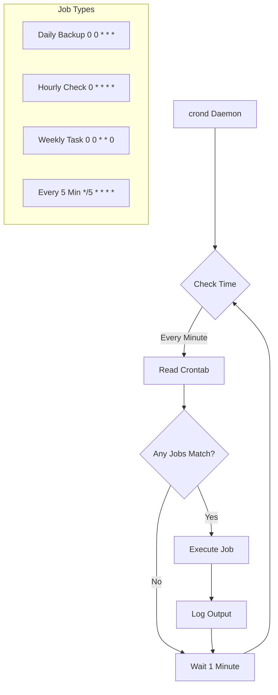
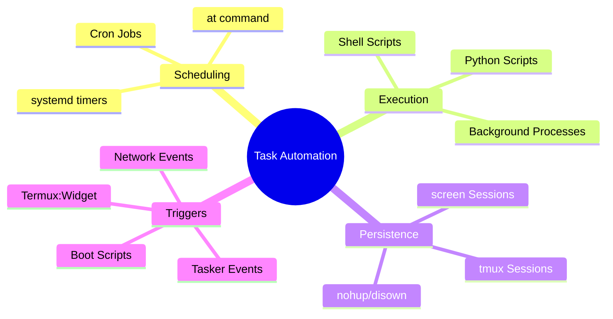
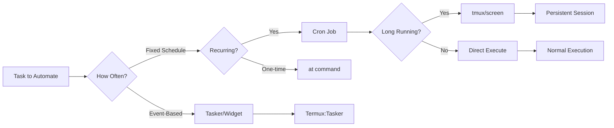
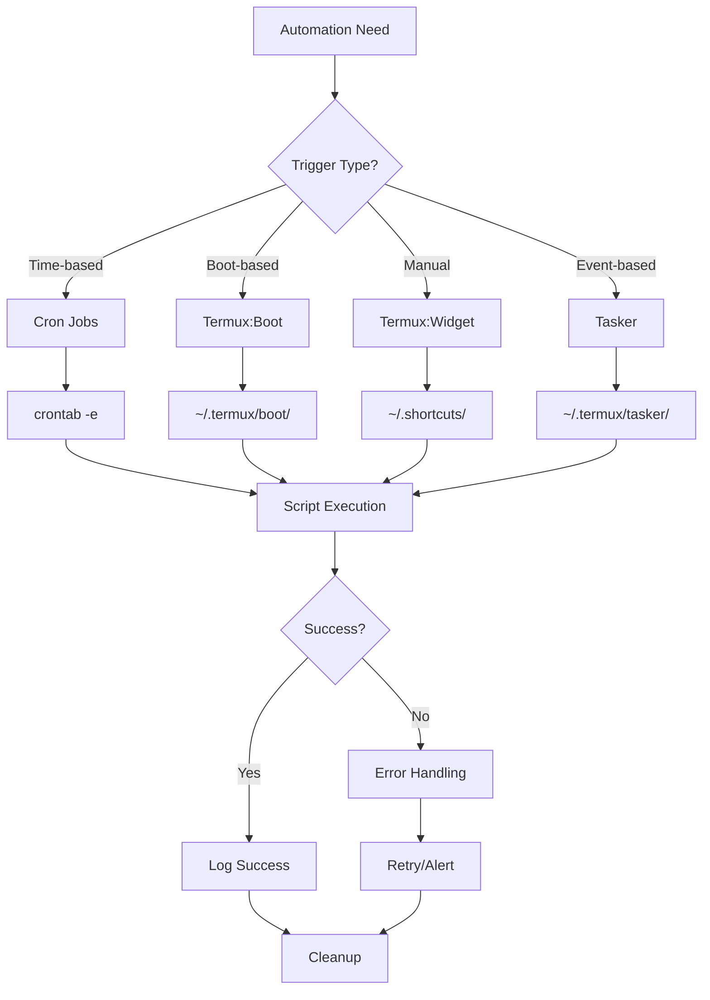
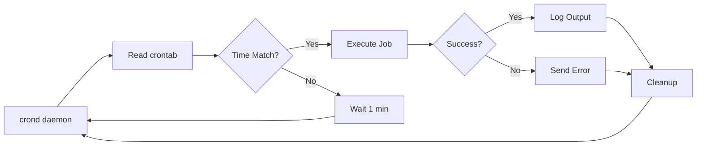

# Chapter 43: Task Automation in Termux

```
╔═══════════════════════════════════════════════════════════════════════════════╗
║                                                                               ║
║  ⚙️ CHAPTER 43: TASK AUTOMATION IN TERMUX                                    ║
║  ━━━━━━━━━━━━━━━━━━━━━━━━━━━━━━━━━━━━━━━━━━━━━━━━━━━━━━━━━━━━━━━━━━━━━━━━━━━━━  ║
║                                                                               ║
║  ⏰ Cron Jobs | 🚀 Boot Scripts | 📱 tmux Sessions | 🔄 Background Processes  ║
║  🎯 Scheduled Tasks | 🤖 Auto-Execution | 💪 Power User Skills               ║
║                                                                               ║
║  ┌─────────────┐  ┌─────────────┐  ┌─────────────┐  ┌─────────────┐          ║
║  │   Module 7  │  │  Chapter    │  │  Duration   │  │  Difficulty │          ║
║  │  Utilities  │  │  43 of 61   │  │  20-25 Min  │  │  ⭐⭐⭐ Adv.  │          ║
║  └─────────────┘  └─────────────┘  └─────────────┘  └─────────────┘          ║
║                                                                               ║
╚═══════════════════════════════════════════════════════════════════════════════╝
```

> **Module:** 7 - Utilities  
> **Chapter:** 43 of 61  
> **Duration:** 20-25 Minutes  
> **Difficulty:** ⭐⭐⭐ Intermediate  

---

## 📋 Chapter Overview

| Section | Content |
|---------|---------|
| Video Script | Complete Hindi narration with timestamps |
| Technical Guide | Cron, crontab, termux-boot, tmux, screen, automation |
| Commands Reference | All automation commands covered |
| Practice Exercises | Hands-on automation tasks |
| Troubleshooting | Common automation issues |
| Video Assets | Thumbnail, description, tags |

---

## 🎬 VIDEO SCRIPT (Complete Hindi Narration)

```
═══════════════════════════════════════════════════════════════════════════════
TERMUX FULL COURSE - CHAPTER 43
Title: Task Automation in Termux | Cron Jobs | tmux | Background Processes
Duration: 20-25 Minutes
═══════════════════════════════════════════════════════════════════════════════

[INTRO - 0:00 to 1:00]
─────────────────────────────────────────────────────────────────────────────

Namaskar Dosto! Welcome back to Termux Full Course by T3rmuxk1ng!

Aaj ka chapter bahut important hai - Task Automation!

Socho, agar aapko rozana same kaam karna pade - backup lena, files 
download karna, logs check karna, scripts run karna - har baar manually 
karna padega? Boring aur time-consuming, na?

Automation ka matlab hai - aap ek baar setup karo, aur phir cheezein 
apne aap hoti rahein. Computer aapke liye kaam kare, aap busy ho 
jaao!

Aaj hum seekhenge:
✓ Cron jobs - Time-based task scheduling
✓ crontab syntax - Har 5 minute, har din, har hafte
✓ termux-boot - Boot pe scripts run karna
✓ tmux aur screen - Background sessions
✓ nohup - Processes ko alive rakhna
✓ Termux:Widget - Home screen shortcuts
✓ Termux:Tasker integration
✓ 25+ automation examples

Chaliye shuru karte hain!

---

[SECTION 1: WHAT IS AUTOMATION - 1:00 to 3:30]
─────────────────────────────────────────────────────────────────────────────

Sabse pehle samjhte hain - Automation kya hai aur kyun zaroori hai?

Automation ka simple matlab hai - repetitive tasks ko automatic bana dena.

Example dekho:

Manual Process:
1. Subah utho
2. Termux open karo
3. Backup command run karo
4. Wait karo complete hone ka
5. Termux band karo

Automated Process:
1. Subah 6 baje automatic backup ho jaata hai
2. Aap so rahe ho, kaam ho raha hai!

Termux mein automation ke kayi tareeke hain:

┌─────────────────────────────────────────────────────────────────────────┐
│                    AUTOMATION METHODS IN TERMUX                          │
├──────────────────────┬──────────────────────────────────────────────────┤
│ Method               │ Use Case                                        │
├──────────────────────┼──────────────────────────────────────────────────┤
│ Cron Jobs            │ Time-based scheduling (daily, hourly, etc.)     │
│ termux-boot          │ Run scripts when device boots                   │
│ Termux:Widget        │ Home screen shortcuts for quick execution       │
│ Termux:Tasker        │ Integration with Tasker automation app          │
│ tmux/screen          │ Persistent background sessions                  │
│ nohup/disown         │ Keep processes running after terminal close     │
│ at command           │ One-time scheduled tasks                        │
│ systemd (proot)      │ Service management in proot environments        │
└──────────────────────┴──────────────────────────────────────────────────┘

Real-world examples:
• Automatic backup at 2 AM daily
• Download new videos from YouTube playlist every hour
• Clean cache files weekly
• Send automated notifications
• Monitor server health every 5 minutes
• Rotate logs when they get big

Automation = Time Saving + Error Reduction + Consistency!

---

[SECTION 2: CRON JOBS IN TERMUX - 3:30 to 8:00]
─────────────────────────────────────────────────────────────────────────────

Ab sabse powerful tool ki baat karte hain - Cron Jobs!

Cron ek time-based job scheduler hai Linux mein. Termux mein bhi 
ye available hai.

Pehle cron install karein:

    pkg install cronie -y

Cronie package mein ye aata hai:
- crond (cron daemon)
- crontab (table editor)
- cron相关的 commands

Installation ke baad, cron service start karein:

    crond

Ya phir foreground mein debug ke saath:

    crond -f -d 8

Ab dekhte hain crontab syntax:

┌─────────────────────────────────────────────────────────────────────────┐
│                      CRONTAB SYNTAX BREAKDOWN                            │
├─────────────────────────────────────────────────────────────────────────┤
│                                                                          │
│     * * * * * command                                                   │
│     │ │ │ │ │                                                           │
│     │ │ │ │ └─── Day of week (0-7) (0 and 7 = Sunday)                  │
│     │ │ │ └───── Month (1-12)                                           │
│     │ │ └─────── Day of month (1-31)                                    │
│     │ └───────── Hour (0-23)                                            │
│     └─────────── Minute (0-59)                                          │
│                                                                          │
└─────────────────────────────────────────────────────────────────────────┘

Examples samjhte hain:

    # Har minute run karo
    * * * * * /home/user/script.sh

    # Har 5 minute
    */5 * * * * /home/user/check-status.sh

    # Har ghante (0th minute pe)
    0 * * * * /home/user/hourly-task.sh

    # Har din subah 6 baje
    0 6 * * * /home/user/morning-backup.sh

    # Har din raat 10 baje
    0 22 * * * /home/user/nightly-task.sh

    # Har Sunday subah 8 baje
    0 8 * * 0 /home/user/weekly-task.sh

    # Har mahine 1st tarik ko
    0 0 1 * * /home/user/monthly-task.sh

    # Har weekday (Mon-Fri) subah 9 baje
    0 9 * * 1-5 /home/user/workday-task.sh

Crontab edit karne ke liye:

    crontab -e

First time mein editor choose karna padega. Nano easy hai beginners 
ke liye.

Crontab dekhne ke liye:

    crontab -l

Crontab delete karne ke liye:

    crontab -r

Important: Termux mein cron tab file path:
    ~/var/spool/cron/crontabs/

---

[SECTION 3: CRON EXAMPLES - 8:00 to 11:00]
─────────────────────────────────────────────────────────────────────────────

Ab practical examples dekhte hain:

[EXAMPLE 1: Automatic Backup]

Pehle ek backup script banao:

    mkdir -p ~/scripts
    nano ~/scripts/auto-backup.sh

Script content:

    #!/bin/bash
    # Auto Backup Script
    
    BACKUP_DIR="/sdcard/Backups"
    DATE=$(date +%Y%m%d_%H%M%S)
    
    mkdir -p $BACKUP_DIR
    
    # Backup important directories
    tar -czf $BACKUP_DIR/termux_backup_$DATE.tar.gz \
        --exclude='*.log' \
        ~/scripts ~/projects 2>/dev/null
    
    # Keep only last 7 backups
    ls -t $BACKUP_DIR/termux_backup_*.tar.gz | tail -n +8 | xargs rm -f 2>/dev/null
    
    echo "Backup completed: $DATE" >> ~/backup.log

Script ko executable banao:

    chmod +x ~/scripts/auto-backup.sh

Ab crontab mein add karo:

    crontab -e

Add this line (har din raat 11 baje):

    0 23 * * * /data/data/com.termux/files/home/scripts/auto-backup.sh

[EXAMPLE 2: System Health Monitor]

    nano ~/scripts/health-check.sh

    #!/bin/bash
    # Health Check Script
    
    LOG_FILE=~/logs/health.log
    mkdir -p ~/logs
    
    echo "=== $(date) ===" >> $LOG_FILE
    echo "Memory: $(free -h | grep Mem)" >> $LOG_FILE
    echo "Disk: $(df -h / | tail -1)" >> $LOG_FILE
    echo "CPU: $(top -bn1 | head -3)" >> $LOG_FILE
    echo "" >> $LOG_FILE

Crontab mein har 15 minute:

    */15 * * * * /data/data/com.termux/files/home/scripts/health-check.sh

[EXAMPLE 3: YouTube Playlist Download]

    nano ~/scripts/yt-playlist.sh

    #!/bin/bash
    # YouTube Playlist Auto-Download
    
    PLAYLIST="https://youtube.com/playlist?list=YOUR_PLAYLIST_ID"
    OUTPUT_DIR="/sdcard/Downloads/YouTube"
    
    mkdir -p $OUTPUT_DIR
    
    yt-dlp --download-archive $OUTPUT_DIR/archive.txt \
           -o "$OUTPUT_DIR/%(title)s.%(ext)s" \
           $PLAYLIST >> ~/logs/yt-dl.log 2>&1

Har Sunday subah 7 baje:

    0 7 * * 0 /data/data/com.termux/files/home/scripts/yt-playlist.sh

---

[SECTION 4: TERMUX-BOOT - 11:00 to 14:00]
─────────────────────────────────────────────────────────────────────────────

Agar aap chahte hain ki Termux device boot hone ke baad automatic 
scripts run kare, to termux-boot app use karein.

Installation:
1. F-Droid se Termux:Boot install karein
2. Play Store wale ko mat use karein!

Setup:

    # Boot scripts directory create karein
    mkdir -p ~/.termux/boot

    # Scripts ko is folder mein rakhein
    # Scripts automatically boot pe run hongi

Important: Scripts ko executable banana zaroori hai:

    chmod +x ~/.termux/boot/*.sh

Example boot script:

    nano ~/.termux/boot/startup.sh

    #!/bin/bash
    # Startup Script
    
    # Wait for system to be ready
    sleep 10
    
    # Start cron daemon
    crond
    
    # Start SSH server
    sshd
    
    # Run any custom scripts
    ~/scripts/boot-tasks.sh
    
    # Log boot time
    echo "Boot completed: $(date)" >> ~/logs/boot.log

Script ka naam alphabetical order mein run hota hai:
- 01-first.sh (runs first)
- 02-second.sh (runs second)
- 99-last.sh (runs last)

Pro tip: Filename ke saath numbers use karein ordering ke liye.

Boot scripts ke use cases:
- Cron daemon auto-start
- SSH server auto-start
- Background services start
- Log cleanup on boot
- Network connectivity check
- Notification on boot

Note: Android battery optimization Termux:Boot ko affect kar sakti hai.
Settings mein Termux ko battery optimization exempt karein.

---

[SECTION 5: TMUX - PERSISTENT SESSIONS - 14:00 to 17:30]
─────────────────────────────────────────────────────────────────────────────

Ek common problem - Long running script chal raha hai, aap Termux 
close kar diye, script band ho gayi!

Solution - tmux ya screen!

tmux ek terminal multiplexer hai. Ye sessions create karta hai jo 
background mein chalti rahti hain, chahe Termux close ho jaaye.

Installation:

    pkg install tmux -y

Basic tmux commands:

    # Naya session start karo
    tmux

    # Named session start karo
    tmux new -s mysession

    # Session detach karo (background mein chalayi rahegi)
    # Press: Ctrl+b, then d

    # Sessions list dekho
    tmux ls

    # Session attach karo (wapas lao)
    tmux attach -t mysession
    # Ya simple
    tmux a

    # Specific session attach
    tmux attach -t 0

    # Session kill karo
    tmux kill-session -t mysession

    # Saare sessions kill
    tmux kill-server

tmux ke andar useful shortcuts:

┌─────────────────────────────────────────────────────────────────────────┐
│                    TMUX KEYBOARD SHORTCUTS                               │
├─────────────────────────────────────────────────────────────────────────┤
│ Prefix key: Ctrl+b (press these first, then the command key)            │
├─────────────────────────────────────────────────────────────────────────┤
│ d          │ Detach from session                                        │
│ c          │ Create new window                                          │
│ n          │ Next window                                                │
│ p          │ Previous window                                            │
│ 0-9        │ Switch to window number                                    │
│ %          │ Split pane vertically                                      │
│ "          │ Split pane horizontally                                    │
│ Arrow keys │ Navigate between panes                                     │
│ x          │ Kill current pane                                          │
│ [          │ Enter copy mode (scroll)                                   │
│ ]          │ Paste                                                      │
│ ?          │ List all shortcuts                                         │
│ :          │ Command mode                                               │
└─────────────────────────────────────────────────────────────────────────┘

Practical example - Long download:

    # Named session mein download start karo
    tmux new -s downloads
    
    # Inside tmux
    wget https://example.com/large-file.iso
    
    # Detach: Ctrl+b, d
    
    # Termux close kar do, download continue hoga
    
    # Wapas aao jab chahiye
    tmux attach -t downloads

tmux configuration file:

    nano ~/.tmux.conf

    # Basic config
    set -g mouse on
    set -g history-limit 5000
    set -g base-index 1
    setw -g pane-base-index 1
    
    # Easier split keys
    bind | split-window -h
    bind - split-window -v
    
    # Status bar customization
    set -g status-bg black
    set -g status-fg green

---

[SECTION 6: SCREEN COMMAND - 17:30 to 19:30]
─────────────────────────────────────────────────────────────────────────────

screen bhi tmux jaisa hai, thoda older lekin powerful.

Installation:

    pkg install screen -y

Basic screen commands:

    # Naya screen session
    screen

    # Named session
    screen -S mysession

    # Detach: Ctrl+a, d

    # Sessions list
    screen -ls

    # Session attach
    screen -r mysession

    # Force attach (if "attached")
    screen -d -r mysession

    # Kill session
    screen -X -S mysession quit

screen shortcuts:

┌─────────────────────────────────────────────────────────────────────────┐
│                    SCREEN KEYBOARD SHORTCUTS                             │
├─────────────────────────────────────────────────────────────────────────┤
│ Prefix key: Ctrl+a (press these first, then the command key)            │
├─────────────────────────────────────────────────────────────────────────┤
│ d          │ Detach from session                                        │
│ c          │ Create new window                                          │
│ n          │ Next window                                                │
│ p          │ Previous window                                            │
│ k          │ Kill current window                                        │
│ "          │ List windows                                               │
│ A          │ Rename window                                              │
│ S          │ Split horizontally                                         │
│ |          │ Split vertically                                           │
│ Tab        │ Switch between splits                                      │
│ [          │ Copy/scroll mode                                           │
│ ?          │ Help                                                       │
└─────────────────────────────────────────────────────────────────────────┘

tmux vs screen:

┌─────────────────────────────────────────────────────────────────────────┐
│                    TMUX VS SCREEN COMPARISON                             │
├────────────────┬──────────────────────┬─────────────────────────────────┤
│ Feature        │ tmux                 │ screen                          │
├────────────────┼──────────────────────┼─────────────────────────────────┤
│ Modern         │ ✅ Yes               │ Older                           │
│ Config         │ More customizable    │ Less options                    │
│ Key prefix     │ Ctrl+b               │ Ctrl+a                          │
│ Unicode        │ ✅ Better support    │ Limited                         │
│ Learning curve │ Slightly steeper     │ Easier                          │
│ Memory usage   │ Slightly more        │ Less                            │
│ Active dev     │ ✅ Yes               │ Minimal                         │
└────────────────┴──────────────────────┴─────────────────────────────────┘

Recommendation: Beginners ke liye screen easy hai, power users ke liye tmux.

---

[SECTION 7: NOHUP & BACKGROUND PROCESSES - 19:30 to 21:30]
─────────────────────────────────────────────────────────────────────────────

Agar tmux/screen nahi chahiye, simple background process ke liye 
nohup use karein.

nohup = "No Hang Up"
Ye process ko SIGHUP signal se bachata hai jab terminal close ho.

Basic syntax:

    nohup command &

Example:

    nohup wget https://example.com/file.zip &

Output nohup.out file mein jaata hai:

    # Check output
    cat nohup.out
    
    # Custom output file
    nohup wget https://example.com/file.zip > download.log 2>&1 &

Process check karein:

    # Running processes
    ps aux | grep wget
    
    # Jobs in current shell
    jobs
    
    # Process tree
    pstree

Process control:

    # Background mein bhejo (Ctrl+Z ke baad)
    bg
    
    # Foreground lao
    fg %1
    
    # Process kill karo
    kill <PID>
    kill -9 <PID>  # Force kill

disown command:

    # Job ko shell se detach karo
    disown %1
    
    # All jobs detach
    disown -a

& vs nohup vs disown:

┌─────────────────────────────────────────────────────────────────────────┐
│                    BACKGROUND PROCESS METHODS                            │
├────────────────┬────────────────────────────────────────────────────────┤
│ Method         │ Description                                            │
├────────────────┼────────────────────────────────────────────────────────┤
│ command &      │ Background mein run, terminal close pe band            │
│ nohup cmd &    │ Terminal close ke baad bhi chalta rahega               │
│ disown         │ Existing background job ko shell se detach              │
│ tmux/screen    │ Full session management with reattach capability       │
└────────────────┴────────────────────────────────────────────────────────┘

---

[SECTION 8: TERMUX:WIDGET - 21:30 to 23:00]
─────────────────────────────────────────────────────────────────────────────

Termux:Widget se aap home screen pe shortcuts bana sakte ho apne 
scripts ke liye!

Installation:
1. F-Droid se Termux:Widget install karein
2. Termux mein setup:

    mkdir -p ~/.termux/shortcuts

Scripts add karein:

    # Simple script
    nano ~/.termux/shortcuts/backup-now.sh

    #!/bin/bash
    echo "Starting backup..."
    ~/scripts/auto-backup.sh
    echo "Backup complete!"
    sleep 2

    # Make executable
    chmod +x ~/.termux/shortcuts/backup-now.sh

Widget add karein:
1. Home screen long press
2. Widgets → Termux:Widget
3. Drag to home screen
4. Widget pe scripts list dikhengi

Widget folder structure:

    ~/.termux/shortcuts/           # Normal scripts
    ~/.termux/shortcuts/tasks/     # Tasker integration

Pro tip: Folder names ke saath organize karein:

    ~/.termux/shortcuts/
    ├── backups/
    │   ├── full-backup.sh
    │   └── quick-backup.sh
    ├── network/
    │   ├── check-ip.sh
    │   └── speed-test.sh
    └── system/
        ├── clear-cache.sh
        └── health-check.sh

---

[SECTION 9: TERMUX:TASKER INTEGRATION - 23:00 to 24:30]
─────────────────────────────────────────────────────────────────────────────

Tasker ek powerful automation app hai Android ke liye. Termux:Tasker 
se dono ko integrate kar sakte ho.

Installation:
1. Tasker app install karein (Play Store)
2. Termux:Tasker install karein (F-Droid)

Setup in Termux:

    # Tasker scripts directory
    mkdir -p ~/.termux/tasker

    # Example script
    nano ~/.termux/tasker/check-battery.sh

    #!/bin/bash
    termux-battery-status

Tasker mein Termux script call:

1. Tasker → Tasks → New Task
2. Add Action → Plugin → Termux:Tasker
3. Select script from dropdown
4. Configure parameters if needed

Example use cases:
- Battery low pe automatic backup
- WiFi connect hone pe certain script run
- Time-based automation with Tasker conditions
- Location-based script triggers

---

[SECTION 10: PROCESS MONITORING - 24:30 to 26:00]
─────────────────────────────────────────────────────────────────────────────

Automation ke saath monitoring bhi zaroori hai!

Process monitoring commands:

    # All processes
    ps aux
    
    # Filter specific process
    ps aux | grep python
    
    # Process tree
    pstree
    
    # Top processes (interactive)
    top
    
    # Better top (install htop)
    pkg install htop -y
    htop

Resource monitoring:

    # Memory usage
    free -h
    
    # Disk usage
    df -h
    
    # Directory size
    du -sh ~/scripts
    
    # I/O stats
    iostat

Log monitoring:

    # Real-time log viewing
    tail -f ~/logs/backup.log
    
    # Last 50 lines
    tail -n 50 ~/logs/backup.log
    
    # Search in logs
    grep "error" ~/logs/*.log

Create monitoring script:

    nano ~/scripts/monitor.sh

    #!/bin/bash
    # System Monitor Script
    
    echo "=== SYSTEM MONITOR ==="
    echo "Time: $(date)"
    echo ""
    echo "=== MEMORY ==="
    free -h
    echo ""
    echo "=== DISK ==="
    df -h /
    echo ""
    echo "=== TOP 5 CPU PROCESSES ==="
    ps aux --sort=-%cpu | head -6
    echo ""
    echo "=== TOP 5 MEMORY PROCESSES ==="
    ps aux --sort=-%mem | head -6

---

[SECTION 11: SUMMARY & HOMEWORK - 26:00 to 27:30]
─────────────────────────────────────────────────────────────────────────────

To dosto, Task Automation ka chapter complete! Let's summarize:

✅ Cron Jobs - Time-based scheduling
✅ crontab Syntax - * * * * * command
✅ termux-boot - Boot pe scripts
✅ tmux - Persistent sessions
✅ screen - Alternative to tmux
✅ nohup - Background processes
✅ Termux:Widget - Home shortcuts
✅ Termux:Tasker - Tasker integration
✅ Process monitoring - ps, top, htop

Important Commands:

┌─────────────────────────────────────────────────────────────────────────┐
│                    CHAPTER 43 - IMPORTANT COMMANDS                       │
├─────────────────────────────────────────────────────────────────────────┤
│ pkg install cronie tmux screen         │ Install automation tools       │
│ crond                                  │ Start cron daemon              │
│ crontab -e                             │ Edit cron jobs                 │
│ crontab -l                             │ List cron jobs                 │
│ tmux new -s name                       │ Create tmux session            │
│ tmux attach -t name                    │ Attach to session              │
│ screen -S name                         │ Create screen session          │
│ screen -r name                         │ Attach to screen               │
│ nohup command &                        │ Run in background              │
│ ps aux                                 │ List all processes             │
│ top/htop                               │ Interactive process monitor    │
└─────────────────────────────────────────────────────────────────────────┘

HOMEWORK:
1. Ek cron job banao jo har din backup le
2. tmux session mein ek long download start karo
3. Termux:Widget se ek home shortcut banao
4. boot script banao jo cron auto-start kare

Next Chapter 44 mein hum Termux Widgets detail mein seekhenge!

Agar video helpful lagi:
👍 Like karein
🔔 Subscribe karein
💬 Questions comment mein poochein

Thank you for watching! See you in Chapter 44!

═══════════════════════════════════════════════════════════════════════════════
```

---

## 📖 TECHNICAL GUIDE

### 1. Cron Jobs in Termux

Cron is a time-based job scheduler that enables users to schedule jobs (commands or scripts) to run periodically at fixed times, dates, or intervals.

```
┌─────────────────────────────────────────────────────────────────────────┐
│                         CRON ARCHITECTURE                                │
├─────────────────────────────────────────────────────────────────────────┤
│                                                                          │
│   ┌─────────────────────────────────────────────────────────────────┐   │
│   │                      crontab file                                │   │
│   │   ~/var/spool/cron/crontabs/<username>                           │   │
│   │                                                                   │   │
│   │   Contains: Job definitions with timing                          │   │
│   └─────────────────────────────────────────────────────────────────┘   │
│                                   │                                      │
│                                   ▼                                      │
│   ┌─────────────────────────────────────────────────────────────────┐   │
│   │                      crond daemon                                │   │
│   │   - Reads crontab every minute                                   │   │
│   │   - Checks for scheduled jobs                                    │   │
│   │   - Executes matching jobs                                       │   │
│   │   - Logs execution to syslog                                     │   │
│   └─────────────────────────────────────────────────────────────────┘   │
│                                   │                                      │
│                                   ▼                                      │
│   ┌─────────────────────────────────────────────────────────────────┐   │
│   │                      Job Execution                               │   │
│   │   - Shell: /bin/sh                                               │   │
│   │   - PATH: Limited (use full paths)                               │   │
│   │   - Output: Mailed to user (if configured)                       │   │
│   └─────────────────────────────────────────────────────────────────┘   │
│                                                                          │
└─────────────────────────────────────────────────────────────────────────┘
```

#### Installation

```bash
# Install cronie package (includes crond and crontab)
pkg install cronie -y

# Start cron daemon
crond

# Start with debug output
crond -f -d 8

# Check if running
pgrep crond
```

### 2. Crontab Syntax

```
┌─────────────────────────────────────────────────────────────────────────┐
│                      CRONTAB COMPLETE SYNTAX                             │
├─────────────────────────────────────────────────────────────────────────┤
│                                                                          │
│  MIN  HOUR  DOM  MONTH  DOW  COMMAND                                    │
│  │    │     │    │      │    │                                          │
│  │    │     │    │      │    └── Command to execute                     │
│  │    │     │    │      └─────── Day of Week (0-7, 0=Sun, 7=Sun)       │
│  │    │     │    └────────────── Month (1-12)                           │
│  │    │     └─────────────────── Day of Month (1-31)                    │
│  │    └───────────────────────── Hour (0-23)                            │
│  └──────────────────────────── Minute (0-59)                            │
│                                                                          │
│  SPECIAL CHARACTERS:                                                     │
│  *      - Any value                                                     │
│  ,      - Value list separator                                          │
│  -      - Range of values                                               │
│  /      - Step values                                                   │
│                                                                          │
│  EXAMPLES:                                                               │
│  */5 * * * *     - Every 5 minutes                                      │
│  0 */2 * * *     - Every 2 hours                                        │
│  30 4 * * *      - Every day at 4:30 AM                                 │
│  0 0 * * 0       - Every Sunday at midnight                             │
│  0 0 1 * *       - First day of month at midnight                       │
│  0 9-17 * * 1-5  - Hourly 9-5 on weekdays                               │
│  0 0 1 1 *       - January 1st at midnight                              │
│  @reboot          - Run at startup (limited in Termux)                  │
│  @yearly          - Once a year (0 0 1 1 *)                             │
│  @monthly         - Once a month (0 0 1 * *)                            │
│  @weekly          - Once a week (0 0 * * 0)                             │
│  @daily           - Once a day (0 0 * * *)                              │
│  @hourly          - Once an hour (0 * * * *)                            │
│                                                                          │
└─────────────────────────────────────────────────────────────────────────┘
```

#### Crontab Management

```bash
# Edit crontab
crontab -e

# List crontab entries
crontab -l

# Remove all crontab entries
crontab -r

# Remove without confirmation
crontab -ri

# Edit specific user's crontab (requires root)
crontab -u username -e

# Crontab file location
~/var/spool/cron/crontabs/
```

### 3. termux-boot App

Termux:Boot allows scripts to run when the device boots.

```
┌─────────────────────────────────────────────────────────────────────────┐
│                    TERMUX:BOOT ARCHITECTURE                              │
├─────────────────────────────────────────────────────────────────────────┤
│                                                                          │
│   Device Boot                                                            │
│       │                                                                  │
│       ▼                                                                  │
│   Android Boot Complete                                                  │
│       │                                                                  │
│       ▼                                                                  │
│   Termux:Boot App Receives BOOT_COMPLETED intent                        │
│       │                                                                  │
│       ▼                                                                  │
│   Execute scripts from ~/.termux/boot/                                   │
│       │                                                                  │
│       ├── 01-first.sh    (alphabetical order)                           │
│       ├── 02-second.sh                                                   │
│       └── 99-last.sh                                                     │
│                                                                          │
└─────────────────────────────────────────────────────────────────────────┘
```

#### Setup

```bash
# Create boot directory
mkdir -p ~/.termux/boot

# Example boot script
cat > ~/.termux/boot/01-startup.sh << 'EOF'
#!/bin/bash
# Termux Boot Script

# Wait for system to stabilize
sleep 15

# Start cron daemon
crond

# Start SSH if installed
if command -v sshd &> /dev/null; then
    sshd
fi

# Log boot
echo "Boot completed: $(date)" >> ~/.termux/boot.log

# Optional: Send notification
termux-notification --title "Termux Boot" --content "Boot scripts completed"
EOF

# Make executable
chmod +x ~/.termux/boot/01-startup.sh
```

### 4. Running Scripts at Startup

Multiple methods for startup scripts:

```bash
# Method 1: termux-boot (Recommended)
# As shown above

# Method 2: .bashrc (Runs when shell starts)
echo '~/scripts/startup.sh &' >> ~/.bashrc

# Method 3: .profile (Runs on login)
echo '~/scripts/startup.sh' >> ~/.profile

# Method 4: Using Termux services
pkg install termux-services
sv-enable <service-name>
```

### 5. Termux:Widget for Shortcuts

```
┌─────────────────────────────────────────────────────────────────────────┐
│                    TERMUX:WIDGET STRUCTURE                               │
├─────────────────────────────────────────────────────────────────────────┤
│                                                                          │
│   ~/.termux/shortcuts/                                                   │
│   │                                                                      │
│   ├── backup.sh          → Shows in widget as "backup"                  │
│   ├── clear-cache.sh     → Shows in widget as "clear-cache"             │
│   ├── network/           → Shows as folder "network"                    │
│   │   ├── check-ip.sh                                                    │
│   │   └── speed-test.sh                                                  │
│   └── system/                                                            │
│       └── health-check.sh                                                │
│                                                                          │
│   ~/.termux/shortcuts/tasks/   (For Tasker integration)                 │
│   │                                                                      │
│   └── task-handler.sh                                                    │
│                                                                          │
└─────────────────────────────────────────────────────────────────────────┘
```

#### Widget Script Examples

```bash
# Create shortcuts directory
mkdir -p ~/.termux/shortcuts

# Example: Quick backup
cat > ~/.termux/shortcuts/backup-now.sh << 'EOF'
#!/bin/bash
echo "Starting backup..."
termux-notification --title "Backup" --content "Starting backup..."
~/scripts/auto-backup.sh
termux-notification --title "Backup" --content "Backup complete!"
EOF
chmod +x ~/.termux/shortcuts/backup-now.sh

# Example: Network info
cat > ~/.termux/shortcuts/network-info.sh << 'EOF'
#!/bin/bash
IP=$(curl -s ifconfig.me)
termux-notification --title "Network Info" --content "IP: $IP"
echo "Public IP: $IP"
EOF
chmod +x ~/.termux/shortcuts/network-info.sh

# Example: Quick note
cat > ~/.termux/shortcuts/quick-note.sh << 'EOF'
#!/bin/bash
NOTE_DIR="/sdcard/Notes"
mkdir -p $NOTE_DIR
echo "$(date): " >> $NOTE_DIR/quick-notes.txt
termux-dialog text --title "Quick Note" --hint "Enter note" | \
    jq -r '.text' >> $NOTE_DIR/quick-notes.txt
EOF
chmod +x ~/.termux/shortcuts/quick-note.sh
```

### 6. Termux:Tasker Integration

```bash
# Tasker scripts directory
mkdir -p ~/.termux/tasker

# Example: Battery status for Tasker
cat > ~/.termux/tasker/battery-check.sh << 'EOF'
#!/bin/bash
termux-battery-status | jq -r '.percentage'
EOF
chmod +x ~/.termux/tasker/battery-check.sh

# Example: Send SMS via Tasker trigger
cat > ~/.termux/tasker/send-sms.sh << 'EOF'
#!/bin/bash
NUMBER=$1
MESSAGE=$2
termux-sms-send -n "$NUMBER" "$MESSAGE"
EOF
chmod +x ~/.termux/tasker/send-sms.sh

# Example: Location check
cat > ~/.termux/tasker/location.sh << 'EOF'
#!/bin/bash
termux-location | jq -r '"\(.latitude),\(.longitude)"'
EOF
chmod +x ~/.termux/tasker/location.sh
```

### 7. Background Processes

```
┌─────────────────────────────────────────────────────────────────────────┐
│                    BACKGROUND PROCESS METHODS                            │
├─────────────────────────────────────────────────────────────────────────┤
│                                                                          │
│   ┌─────────────┐     ┌─────────────┐     ┌─────────────┐              │
│   │   &         │     │   nohup     │     │   disown    │              │
│   │   Simple    │     │   Robust    │     │   Detach    │              │
│   └─────────────┘     └─────────────┘     └─────────────┘              │
│          │                   │                   │                      │
│          ▼                   ▼                   ▼                      │
│   command &           nohup cmd &         cmd &                        │
│   (in shell)          (ignores HUP)        disown %1                   │
│                                                                          │
│   ┌─────────────────────────────────────────────────────────────────┐   │
│   │                    tmux / screen                                 │   │
│   │                    Full session management                        │   │
│   │                    Can reattach to session                        │   │
│   │                    Multiple windows/panes                         │   │
│   └─────────────────────────────────────────────────────────────────┘   │
│                                                                          │
└─────────────────────────────────────────────────────────────────────────┘
```

#### nohup Usage

```bash
# Basic nohup
nohup command &

# With custom output
nohup command > output.log 2>&1 &

# Append to existing log
nohup command >> output.log 2>&1 &

# Get PID
nohup command > output.log 2>&1 &
echo $!

# Example: Background download
nohup wget https://example.com/large-file.zip > download.log 2>&1 &
```

#### Process Management

```bash
# List processes
ps aux

# Find specific process
pgrep -f "script_name"

# Process tree
pstree -p

# Kill by PID
kill 1234
kill -9 1234  # Force kill

# Kill by name
pkill -f "script_name"
killall script_name

# Job control
jobs           # List jobs
fg %1          # Bring job 1 to foreground
bg %1          # Send job 1 to background
disown %1      # Detach job 1 from shell
wait           # Wait for all background jobs
wait %1        # Wait for specific job
```

### 8. tmux for Sessions

```bash
# Installation
pkg install tmux -y

# Session Management
tmux                    # New session
tmux new -s name        # Named session
tmux new -s name -d     # Detached session
tmux ls                 # List sessions
tmux attach             # Attach to last session
tmux attach -t name     # Attach to named session
tmux a                  # Short form
tmux kill-session -t name
tmux kill-server        # Kill all sessions

# Inside tmux
Ctrl+b d                # Detach
Ctrl+b c                # New window
Ctrl+b n                # Next window
Ctrl+b p                # Previous window
Ctrl+b 0-9              # Window number
Ctrl+b %                # Vertical split
Ctrl+b "                # Horizontal split
Ctrl+b arrows           # Navigate panes
Ctrl+b x                # Kill pane
Ctrl+b [                # Copy mode
Ctrl+b ]                # Paste
Ctrl+b ?                # Help
Ctrl+b :                # Command mode
```

#### tmux Configuration

```bash
# Create config file
cat > ~/.tmux.conf << 'EOF'
# Enable mouse
set -g mouse on

# Increase history
set -g history-limit 10000

# Start windows at 1
set -g base-index 1
setw -g pane-base-index 1

# Renumber windows when closed
set -g renumber-windows on

# Easier split keys
bind | split-window -h -c "#{pane_current_path}"
bind - split-window -v -c "#{pane_current_path}"

# Status bar
set -g status-bg black
set -g status-fg green
set -g status-right '#[fg=yellow]#(whoami)@#H #[fg=white]%H:%M'

# Activity monitoring
setw -g monitor-activity on
set -g visual-activity on

# Faster key repetition
set -s escape-time 0

# Vi mode
setw -g mode-keys vi
bind -T copy-mode-vi v send -X begin-selection
bind -T copy-mode-vi y send -X copy-selection
EOF
```

### 9. screen Command

```bash
# Installation
pkg install screen -y

# Session Management
screen                  # New session
screen -S name          # Named session
screen -ls              # List sessions
screen -r name          # Attach to session
screen -d -r name       # Detach and attach
screen -X -S name quit  # Kill session

# Inside screen
Ctrl+a d                # Detach
Ctrl+a c                # New window
Ctrl+a n                # Next window
Ctrl+a p                # Previous window
Ctrl+a k                # Kill window
Ctrl+a "                # List windows
Ctrl+a A                # Rename window
Ctrl+a S                # Horizontal split
Ctrl+a |                # Vertical split (if supported)
Ctrl+a Tab              # Switch splits
Ctrl+a [                # Copy mode
Ctrl+a ?                # Help
```

### 10. Process Monitoring

```bash
# Basic monitoring
ps aux                  # All processes
ps aux | grep name      # Filter processes
pgrep name              # Get PID by name
pstree                  # Process tree

# Interactive monitors
top                     # Basic monitor
htop                    # Better monitor (install first)
pkg install htop -y

# Resource monitoring
free -h                 # Memory
df -h                   # Disk
du -sh directory        # Directory size
iostat                  # I/O statistics

# Log monitoring
tail -f logfile         # Real-time log
tail -n 100 logfile     # Last 100 lines
head -n 20 logfile      # First 20 lines
grep "error" logfile    # Search in log
watch -n 5 'command'    # Repeat every 5 seconds
```

### 11. Automated Backups

```bash
# Full backup script
cat > ~/scripts/full-backup.sh << 'EOF'
#!/bin/bash
# Full Termux Backup Script

BACKUP_DIR="/sdcard/TermuxBackups"
DATE=$(date +%Y%m%d_%H%M%S)
BACKUP_FILE="$BACKUP_DIR/termux_full_$DATE.tar.gz"

mkdir -p $BACKUP_DIR

# Create backup
tar -czf $BACKUP_FILE \
    --exclude='*.log' \
    --exclude='*.tmp' \
    --exclude='__pycache__' \
    --exclude='node_modules' \
    -C /data/data/com.termux/files home

# Keep only last 10 backups
ls -t $BACKUP_DIR/termux_full_*.tar.gz 2>/dev/null | tail -n +11 | xargs rm -f 2>/dev/null

# Get size
SIZE=$(du -h $BACKUP_FILE | cut -f1)

# Notify
termux-notification --title "Backup Complete" --content "Size: $SIZE"

echo "$(date): Backup completed - $SIZE" >> $BACKUP_DIR/backup.log
EOF
chmod +x ~/scripts/full-backup.sh
```

### 12. Scheduled Downloads

```bash
# YouTube playlist downloader
cat > ~/scripts/yt-scheduler.sh << 'EOF'
#!/bin/bash
# Scheduled YouTube Downloader

PLAYLIST_URL="YOUR_PLAYLIST_URL"
OUTPUT_DIR="/sdcard/YouTubeDownloads"
LOG_FILE=~/logs/yt-download.log

mkdir -p $OUTPUT_DIR
mkdir -p ~/logs

yt-dlp \
    --download-archive $OUTPUT_DIR/archive.txt \
    -o "$OUTPUT_DIR/%(playlist_index)s-%(title)s.%(ext)s" \
    --no-playlist-reverse \
    $PLAYLIST_URL >> $LOG_FILE 2>&1

echo "$(date): Download check completed" >> $LOG_FILE
EOF
chmod +x ~/scripts/yt-scheduler.sh

# Add to crontab - Every Sunday at 8 AM
# 0 8 * * 0 /data/data/com.termux/files/home/scripts/yt-scheduler.sh
```

### 13. Log Rotation

```bash
# Log rotation script
cat > ~/scripts/log-rotate.sh << 'EOF'
#!/bin/bash
# Log Rotation Script

LOG_DIR=~/logs
MAX_SIZE=10M  # 10 MB
MAX_FILES=5

for log in $LOG_DIR/*.log; do
    if [ -f "$log" ]; then
        SIZE=$(du -b "$log" | cut -f1)
        
        if [ $SIZE -gt 10485760 ]; then  # 10MB in bytes
            # Rotate
            for i in $(seq $((MAX_FILES-1)) -1 1); do
                [ -f "${log}.$i" ] && mv "${log}.$i" "${log}.$((i+1))"
            done
            mv "$log" "${log}.1"
            touch "$log"
            
            # Compress old logs
            gzip "${log}.$MAX_FILES" 2>/dev/null
        fi
    fi
done
EOF
chmod +x ~/scripts/log-rotate.sh
```

### 14. Creating Automation Scripts

```bash
# Template for automation scripts
cat > ~/scripts/template.sh << 'EOF'
#!/bin/bash
# Script Name: 
# Description: 
# Author: T3rmuxk1ng
# Date: 

# Configuration
SCRIPT_NAME=$(basename "$0")
LOG_FILE=~/logs/${SCRIPT_NAME%.sh}.log
LOCK_FILE=/tmp/${SCRIPT_NAME%.sh}.lock

# Logging function
log() {
    echo "$(date '+%Y-%m-%d %H:%M:%S') - $1" >> "$LOG_FILE"
}

# Error handling
error_exit() {
    log "ERROR: $1"
    rm -f "$LOCK_FILE"
    exit 1
}

# Lock to prevent multiple instances
if [ -f "$LOCK_FILE" ]; then
    log "Script already running"
    exit 1
fi
echo $$ > "$LOCK_FILE"

# Main logic
main() {
    log "Script started"
    
    # Your code here
    
    log "Script completed"
}

# Run main
main

# Cleanup
rm -f "$LOCK_FILE"
exit 0
EOF
chmod +x ~/scripts/template.sh
```

### 15. 25+ Automation Examples

```bash
# ============================================
# AUTOMATION EXAMPLES COLLECTION
# ============================================

# 1. DAILY BACKUP
# crontab: 0 2 * * *
tar -czf /sdcard/Backup/termux_$(date +%Y%m%d).tar.gz ~/scripts ~/projects

# 2. CLEAR CACHE WEEKLY
# crontab: 0 3 * * 0
rm -rf ~/.cache/* ~/tmp/* 2>/dev/null

# 3. UPDATE PACKAGES WEEKLY
# crontab: 0 4 * * 0
pkg update && pkg upgrade -y

# 4. CHECK IP AND NOTIFY
# crontab: 0 */6 * * *
IP=$(curl -s ifconfig.me)
termux-notification --title "Current IP" --content "$IP"

# 5. BATTERY ALERT
# crontab: */15 * * * *
BATTERY=$(termux-battery-status | jq -r '.percentage')
if [ "$BATTERY" -lt 20 ]; then
    termux-notification --title "Low Battery" --content "Battery at ${BATTERY}%"
fi

# 6. WEATHER NOTIFICATION
# crontab: 0 7 * * *
WEATHER=$(curl -s wttr.in?format=3)
termux-notification --title "Weather" --content "$WEATHER"

# 7. CLEAN OLD LOGS
# crontab: 0 0 * * *
find ~/logs -name "*.log" -mtime +30 -delete

# 8. SYNC FILES TO CLOUD
# crontab: 0 3 * * *
rclone sync /sdcard/Documents remote:backup

# 9. CHECK WEBSITE STATUS
# crontab: */5 * * * *
curl -s -o /dev/null -w "%{http_code}" https://example.com | grep -q "200" || \
    termux-notification --title "Site Down" --content "example.com not responding"

# 10. DOWNLOAD PODCAST
# crontab: 0 6 * * 1
yt-dlp -x --audio-format mp3 -o "/sdcard/Podcasts/%(title)s.%(ext)s" $PODCAST_URL

# 11. DATABASE BACKUP
# crontab: 0 1 * * *
sqlite3 ~/data/mydb.db ".backup /sdcard/Backup/db_$(date +%Y%m%d).db"

# 12. SEND DAILY REPORT
# crontab: 0 18 * * *
echo "Daily Report $(date)" | termux-sms-send -n $PHONE_NUMBER

# 13. CLEAN DOWNLOADS FOLDER
# crontab: 0 0 1 * *
find /sdcard/Download -type f -mtime +30 -delete

# 14. NETWORK SPEED TEST
# crontab: 0 12 * * *
speedtest-cli --simple > ~/logs/speedtest_$(date +%Y%m%d).log

# 15. MONITOR DISK SPACE
# crontab: 0 */4 * * *
USAGE=$(df / | tail -1 | awk '{print $5}' | tr -d '%')
[ "$USAGE" -gt 80 ] && termux-notification --title "Disk Warning" --content "Usage: ${USAGE}%"

# 16. AUTO GIT COMMIT
# crontab: 0 23 * * *
cd ~/projects/myrepo && git add . && git commit -m "Auto commit $(date)" && git push

# 17. GENERATE REPORT
# crontab: 0 8 * * 1
echo "Weekly Report\n$(date)" > /sdcard/Reports/weekly_$(date +%Y%m%d).txt

# 18. RENAME PHOTOS BY DATE
# crontab: 0 2 * * *
for f in /sdcard/DCIM/Camera/*.jpg; do
    exiftool "-FileName<CreateDate" -d "%Y%m%d_%H%M%S%%-c.%%e" "$f"
done

# 19. CHECK FOR UPDATES
# crontab: 0 5 * * *
pkg list-upgradable | grep -q "upgradable" && \
    termux-notification --title "Updates Available" --content "Packages need upgrade"

# 20. BACKUP CONTACTS
# crontab: 0 0 15 * *
termux-contact-list > /sdcard/Backup/contacts_$(date +%Y%m%d).json

# 21. ROTATE SCREENSHOTS
# crontab: 0 3 * * *
find /sdcard/Pictures/Screenshots -type f -mtime +7 -exec mv {} /sdcard/Archive/Screenshots/ \;

# 22. CLEAN RECYCLE BIN
# crontab: 0 4 * * 0
rm -rf /sdcard/.Trash-1000/*

# 23. MONITOR CPU TEMPERATURE
# crontab: */10 * * * *
TEMP=$(cat /sys/class/thermal/thermal_zone0/temp 2>/dev/null)
[ -n "$TEMP" ] && [ "$TEMP" -gt 50000 ] && \
    termux-notification --title "High Temperature" --content "CPU: $((TEMP/1000))°C"

# 24. AUTO REPLY SMS
# Trigger via Tasker when driving
termux-sms-send -n "$SENDER" "Auto-reply: Currently busy, will respond later."

# 25. COMPRESS OLD FILES
# crontab: 0 2 1 * *
find ~/projects -name "*.log" -mtime +30 -exec gzip {} \;

# 26. CHECK SSL CERTIFICATE
# crontab: 0 0 * * *
echo | openssl s_client -servername example.com -connect example.com:443 2>/dev/null | \
    openssl x509 -noout -dates | grep notAfter

# 27. SYNC TIME
# crontab: 0 * * * *
ntpdate -s pool.ntp.org 2>/dev/null

# 28. NETWORK DIAGNOSTICS
# crontab: 0 */2 * * *
ping -c 1 google.com > /dev/null || \
    termux-notification --title "Network Issue" --content "Internet not reachable"

# 29. CLEAN PYTHON CACHE
# crontab: 0 3 * * 0
find ~ -type d -name "__pycache__" -exec rm -rf {} + 2>/dev/null

# 30. BACKUP CRONTAB
# crontab: 0 0 * * 0
crontab -l > ~/backup/crontab_$(date +%Y%m%d).txt
```

---

## 📋 COMMANDS REFERENCE

### Cron Commands

```bash
# Install cron
pkg install cronie -y

# Start cron daemon
crond

# Start with debug
crond -f -d 8

# Check if running
pgrep crond

# Edit crontab
crontab -e

# List crontab
crontab -l

# Remove crontab
crontab -r

# Edit with specific editor
EDITOR=nano crontab -e

# Crontab file location
~/var/spool/cron/crontabs/
```

### tmux Commands

```bash
# Install
pkg install tmux -y

# New session
tmux
tmux new -s name
tmux new -s name -d    # Detached

# List sessions
tmux ls

# Attach
tmux attach
tmux attach -t name
tmux a -t name

# Kill session
tmux kill-session -t name
tmux kill-server

# Inside tmux (Ctrl+b then key)
d    # Detach
c    # New window
n    # Next window
p    # Previous window
%    # Vertical split
"    # Horizontal split
x    # Kill pane
[    # Copy mode
]    # Paste
?    # Help
```

### screen Commands

```bash
# Install
pkg install screen -y

# New session
screen
screen -S name

# List sessions
screen -ls

# Attach
screen -r name
screen -d -r name    # Detach others first

# Kill session
screen -X -S name quit

# Inside screen (Ctrl+a then key)
d    # Detach
c    # New window
n    # Next window
p    # Previous window
k    # Kill window
"    # List windows
A    # Rename
S    # Horizontal split
|    # Vertical split
[    # Copy mode
?    # Help
```

### Process Management

```bash
# View processes
ps aux
ps aux | grep name
pgrep name
pgrep -f "full command"
pstree
pstree -p

# Interactive monitors
top
htop

# Kill processes
kill PID
kill -9 PID           # Force
pkill name
killall name

# Background jobs
command &             # Run in background
jobs                  # List jobs
fg %1                 # Foreground
bg %1                 # Background
disown %1             # Detach from shell
wait                  # Wait for all

# nohup
nohup command &
nohup command > log.txt 2>&1 &
```

### System Monitoring

```bash
# Memory
free -h
cat /proc/meminfo

# Disk
df -h
du -sh directory

# CPU
cat /proc/cpuinfo
top -n 1 | head -20

# I/O
iostat

# Network
netstat -tulpn
ss -tulpn

# Logs
tail -f file.log
tail -n 100 file.log
head -n 20 file.log
grep "error" file.log
watch -n 5 'command'
```

---

## 📊 MERMAID DIAGRAMS

### Diagram 1: Cron Job Scheduling Flow



### Diagram 2: Task Automation Architecture



### Diagram 3: Automation Decision Tree



---

## ⚡ COMMAND CHEATSHEET

| Command | Purpose | Syntax | Example |
|---------|---------|--------|---------|
| `crond` | Start cron daemon | `crond` | Background scheduler |
| `crontab -e` | Edit cron jobs | `crontab -e` | Opens editor |
| `crontab -l` | List cron jobs | `crontab -l` | Show all jobs |
| `crontab -r` | Remove all jobs | `crontab -r` | Delete crontab |
| `tmux new -s` | Create named session | `tmux new -s name` | Persistent terminal |
| `tmux attach` | Reattach session | `tmux attach -t name` | Restore session |
| `tmux ls` | List sessions | `tmux ls` | Show all sessions |
| `screen -S` | Create screen session | `screen -S name` | Alternative to tmux |
| `screen -r` | Reattach screen | `screen -r name` | Restore screen |
| `nohup` | Persist after close | `nohup command &` | Background process |
| `disown` | Detach from shell | `disown %1` | Detach job |
| `bg` | Background a job | `bg` | Send to background |
| `fg` | Foreground a job | `fg %1` | Bring to front |
| `jobs` | List background jobs | `jobs` | Show current jobs |
| `ps aux` | List processes | `ps aux` | All running processes |
| `kill` | Terminate process | `kill PID` | End process |

---

## 🎯 LEARNING PATH VISUALIZATION

```
╔══════════════════════════════════════════════════════════════════════════════╗
║                    TASK AUTOMATION MASTERY PATH                              ║
╠══════════════════════════════════════════════════════════════════════════════╣
║                                                                              ║
║  LEVEL 1: BEGINNER (Week 1)                                                 ║
║  ┌─────────────────────────────────────────────────────────────────────┐    ║
║  │ ⬜ Understand cron syntax (* * * * *)                               │    ║
║  │ ⬜ Create first cron job                                            │    ║
║  │ ⬜ Use nohup for background processes                               │    ║
║  │ ⬜ Basic shell scripting for automation                             │    ║
║  │ ⬜ List and manage running processes                                │    ║
║  └─────────────────────────────────────────────────────────────────────┘    ║
║                              │                                               ║
║                              ▼                                               ║
║  LEVEL 2: INTERMEDIATE (Week 2)                                             ║
║  ┌─────────────────────────────────────────────────────────────────────┐    ║
║  │ ⬜ Master tmux sessions                                             │    ║
║  │ ⬜ Use termux-boot for startup scripts                              │    ║
║  │ ⬜ Create Termux:Widget shortcuts                                   │    ║
║  │ ⬜ Complex cron schedules                                           │    ║
║  │ ⬜ Process monitoring with htop                                     │    ║
║  └─────────────────────────────────────────────────────────────────────┘    ║
║                              │                                               ║
║                              ▼                                               ║
║  LEVEL 3: ADVANCED (Week 3+)                                                ║
║  ┌─────────────────────────────────────────────────────────────────────┐    ║
║  │ ⬜ Tasker integration                                               │    ║
║  │ ⬜ Complex automation pipelines                                     │    ║
║  │ ⬜ Log rotation and monitoring                                      │    ║
║  │ ⬜ Error handling in scripts                                        │    ║
║  │ ⬅️ Conditional task execution                                      │    ║
║  └─────────────────────────────────────────────────────────────────────┘    ║
║                              │                                               ║
║                              ▼                                               ║
║  LEVEL 4: EXPERT (Ongoing)                                                  ║
║  ┌─────────────────────────────────────────────────────────────────────┐    ║
║  │ ⭐ Enterprise automation systems                                    │    ║
║  │ ⭐ CI/CD pipeline automation                                       │    ║
║  │ ⭐ Self-healing systems                                            │    ║
║  │ ⭐ Distributed task scheduling                                     │    ║
║  └─────────────────────────────────────────────────────────────────────┘    ║
║                                                                              ║
╚══════════════════════════════════════════════════════════════════════════════╝
```

---

## 🔧 TOOL COMPARISON TABLE

| Feature | Cron | tmux | screen | nohup | Tasker |
|---------|------|------|--------|-------|--------|
| **Schedule Tasks** | ✅ | ❌ | ❌ | ❌ | ✅ |
| **Persistent Sessions** | ❌ | ✅ | ✅ | ❌ | ❌ |
| **Reattach Capability** | ❌ | ✅ | ✅ | ❌ | ❌ |
| **Event Triggers** | ❌ | ❌ | ❌ | ❌ | ✅ |
| **Background Processes** | ✅ | ✅ | ✅ | ✅ | ✅ |
| **Termux Support** | ✅ | ✅ | ✅ | ✅ | ✅ |
| **Learning Curve** | Medium | Medium | Easy | Easy | Steep |
| **GUI** | ❌ | ❌ | ❌ | ❌ | ✅ |

### Cron Schedule Examples

| Expression | Meaning |
|------------|---------|
| `* * * * *` | Every minute |
| `*/5 * * * *` | Every 5 minutes |
| `0 * * * *` | Every hour |
| `0 0 * * *` | Every day at midnight |
| `0 6 * * *` | Every day at 6 AM |
| `0 0 * * 0` | Every Sunday at midnight |
| `0 0 1 * *` | First day of every month |
| `0 9-17 * * 1-5` | Hourly 9-5 on weekdays |
| `*/10 9-17 * * *` | Every 10 min, 9AM-5PM |

---

## 🚀 PRACTICAL CHALLENGES

### Challenge 1: Build a System Health Monitor

**Objective:** Create a cron-based system monitoring solution.

```bash
#!/bin/bash
# System Health Monitor with Alerts

LOG_DIR="$HOME/logs"
ALERT_THRESHOLD=90  # CPU/Memory percentage

mkdir -p "$LOG_DIR"

check_cpu() {
    cpu_usage=$(top -bn1 | grep "CPU" | head -1 | awk '{print $2}' | cut -d'%' -f1)
    echo "CPU: ${cpu_usage}%"
    
    if (( $(echo "$cpu_usage > $ALERT_THRESHOLD" | bc -l) )); then
        echo "⚠️ HIGH CPU: ${cpu_usage}%" >> "$LOG_DIR/alerts.log"
        termux-notification --title "High CPU Alert" --content "CPU at ${cpu_usage}%"
    fi
}

check_memory() {
    mem_usage=$(free | grep Mem | awk '{printf "%.1f", $3/$2 * 100}')
    echo "Memory: ${mem_usage}%"
    
    if (( $(echo "$mem_usage > $ALERT_THRESHOLD" | bc -l) )); then
        echo "⚠️ HIGH MEMORY: ${mem_usage}%" >> "$LOG_DIR/alerts.log"
    fi
}

check_disk() {
    disk_usage=$(df -h / | tail -1 | awk '{print $5}' | cut -d'%' -f1)
    echo "Disk: ${disk_usage}%"
}

# Main execution
echo "=== $(date) ===" >> "$LOG_DIR/health.log"
check_cpu >> "$LOG_DIR/health.log"
check_memory >> "$LOG_DIR/health.log"
check_disk >> "$LOG_DIR/health.log"
echo "" >> "$LOG_DIR/health.log"
```

**Success Criteria:**
- [ ] CPU, Memory, Disk are monitored
- [ ] Alerts are generated for high usage
- [ ] Logs are maintained properly

---

### Challenge 2: Create a Session Manager Script

**Objective:** Build a script to manage tmux sessions for different tasks.

```bash
#!/bin/bash
# Tmux Session Manager

create_session() {
    local name="$1"
    local command="$2"
    
    if tmux has-session -t "$name" 2>/dev/null; then
        echo "Session '$name' already exists"
        return 1
    fi
    
    tmux new-session -d -s "$name"
    
    if [ -n "$command" ]; then
        tmux send-keys -t "$name" "$command" Enter
    fi
    
    echo "✅ Created session: $name"
}

list_sessions() {
    echo "Active tmux sessions:"
    tmux list-sessions 2>/dev/null || echo "No active sessions"
}

attach_session() {
    local name="$1"
    
    if [ -z "$name" ]; then
        tmux attach
    else
        tmux attach -t "$name"
    fi
}

kill_session() {
    local name="$1"
    tmux kill-session -t "$name"
    echo "✅ Killed session: $name"
}

# Usage examples
case "$1" in
    create)
        create_session "$2" "$3"
        ;;
    list|ls)
        list_sessions
        ;;
    attach)
        attach_session "$2"
        ;;
    kill)
        kill_session "$2"
        ;;
    *)
        echo "Usage: $0 {create|list|attach|kill} [session_name] [command]"
        ;;
esac
```

**Success Criteria:**
- [ ] Sessions can be created with commands
- [ ] Listing works correctly
- [ ] Attach and kill functions work

---

### Challenge 3: Build an Automated Backup System

**Objective:** Create a comprehensive backup automation with rotation.

```bash
#!/bin/bash
# Comprehensive Backup System

BACKUP_CONFIG="$HOME/.backup_config"
BACKUP_DIR="/sdcard/TermuxBackups"
DATE=$(date +%Y%m%d_%H%M%S)
LOG_FILE="$HOME/logs/backup.log"

# Create config if not exists
if [ ! -f "$BACKUP_CONFIG" ]; then
    cat > "$BACKUP_CONFIG" << EOF
# Backup Configuration
# Format: source_directory:retention_days

$HOME/scripts:7
$HOME/projects:14
$HOME/.bashrc:30
EOF
    echo "Created config at $BACKUP_CONFIG"
fi

mkdir -p "$BACKUP_DIR" "$(dirname "$LOG_FILE")"

log() {
    echo "[$(date '+%Y-%m-%d %H:%M:%S')] $1" >> "$LOG_FILE"
}

perform_backup() {
    local source="$1"
    local retention="$2"
    local name=$(basename "$source")
    
    log "Backing up: $source"
    
    # Create backup
    local archive="$BACKUP_DIR/${name}_${DATE}.tar.gz"
    tar -czf "$archive" "$source" 2>/dev/null
    
    if [ $? -eq 0 ]; then
        log "✅ Created: $archive"
        
        # Rotate old backups
        find "$BACKUP_DIR" -name "${name}_*.tar.gz" -mtime +$retention -delete 2>/dev/null
        log "🧹 Cleaned backups older than $retention days"
    else
        log "❌ Failed to backup: $source"
    fi
}

# Main execution
log "=== Backup Started ==="

while IFS=':' read -r source retention || [ -n "$source" ]; do
    # Skip comments and empty lines
    [[ "$source" =~ ^#.*$ ]] && continue
    [ -z "$source" ] && continue
    
    # Trim whitespace
    source=$(echo "$source" | xargs)
    retention=$(echo "$retention" | xargs)
    
    if [ -d "$source" ] || [ -f "$source" ]; then
        perform_backup "$source" "${retention:-7}"
    else
        log "⚠️ Source not found: $source"
    fi
done < "$BACKUP_CONFIG"

log "=== Backup Completed ==="
echo "Backup complete. See log: $LOG_FILE"
```

**Success Criteria:**
- [ ] Multiple sources are backed up
- [ ] Retention policy is enforced
- [ ] Logs are maintained

---

## 📖 GLOSSARY & TERMINOLOGY

| Term | Definition |
|------|------------|
| **Cron** | Time-based job scheduler in Unix/Linux |
| **Crontab** | Table of cron jobs for a user |
| **Daemon** | Background process that runs continuously |
| **tmux** | Terminal multiplexer for persistent sessions |
| **screen** | GNU terminal multiplexer (alternative to tmux) |
| **nohup** | Command to run process immune to hangups |
| **disown** | Remove job from shell's job table |
| **Job Control** | Managing background/foreground processes |
| **PID** | Process ID - unique identifier for running process |
| **Session** | A terminal session that can be detached/reattached |
| **Window** | A virtual terminal within a tmux/screen session |
| **Pane** | A split section within a tmux window |
| **Scheduling** | Planning when tasks should run |
| **Retention** | How long to keep backup files |
| **Rotation** | Cycling through backup files, deleting old ones |
| **Boot Script** | Script that runs when system/device starts |
| **Event Trigger** | Action that causes automated task to run |
| **Tasker** | Android automation app |
| **Widget** | Home screen shortcut for quick actions |

---

## 💼 CAREER INSIGHTS

### DevOps & Automation Engineering Career Path

```
┌─────────────────────────────────────────────────────────────────────────────┐
│                        CAREER PROGRESSION                                    │
├─────────────────────────────────────────────────────────────────────────────┤
│                                                                             │
│  ENTRY LEVEL                                                               │
│  ├── IT Support              ──▶ $40,000 - $55,000/year                   │
│  ├── Junior SysAdmin         ──▶ $50,000 - $70,000/year                   │
│  └── Script Developer        ──▶ $45,000 - $65,000/year                   │
│                                                                             │
│  MID LEVEL                                                                 │
│  ├── DevOps Engineer         ──▶ $80,000 - $130,000/year                  │
│  ├── Automation Engineer     ──▶ $85,000 - $135,000/year                  │
│  ├── Systems Engineer        ──▶ $75,000 - $115,000/year                  │
│  └── Release Engineer        ──▶ $80,000 - $120,000/year                  │
│                                                                             │
│  SENIOR LEVEL                                                              │
│  ├── Senior DevOps Engineer  ──▶ $130,000 - $180,000/year                 │
│  ├── Platform Engineer       ──▶ $140,000 - $200,000/year                 │
│  ├── SRE Engineer            ──▶ $150,000 - $220,000/year                 │
│  └── Infrastructure Lead     ──▶ $120,000 - $170,000/year                 │
│                                                                             │
│  SPECIALIZED                                                               │
│  ├── CI/CD Architect         ──▶ $160,000 - $230,000/year                 │
│  ├── Cloud Automation        ──▶ $140,000 - $200,000/year                 │
│  └── Kubernetes Engineer     ──▶ $150,000 - $220,000/year                 │
│                                                                             │
└─────────────────────────────────────────────────────────────────────────────┘
```

### Key Skills Developed in This Chapter

| Skill | Industry Application | Job Relevance |
|-------|---------------------|---------------|
| Cron/job scheduling | All infrastructure roles | ⭐⭐⭐⭐⭐ |
| Shell scripting | DevOps, SRE | ⭐⭐⭐⭐⭐ |
| Process management | Systems administration | ⭐⭐⭐⭐⭐ |
| Session management | Remote work | ⭐⭐⭐⭐ |
| Automation design | DevOps engineering | ⭐⭐⭐⭐⭐ |
| Error handling | All engineering | ⭐⭐⭐⭐⭐ |
| Monitoring/logging | SRE, DevOps | ⭐⭐⭐⭐ |

### Companies Hiring These Skills
- **Tech Giants:** Google, Amazon, Microsoft, Meta
- **Cloud:** AWS, Azure, GCP, Cloudflare
- **Startups:** All tech startups need DevOps
- **Enterprise:** IBM, Oracle, SAP
- **Finance:** Banks, Trading firms

---

## 📋 AUTOMATION SCRIPT TEMPLATES

### Template 1: Cron Job Manager

```bash
#!/bin/bash
#===============================================
# Cron Job Manager
# Add, remove, and list cron jobs easily
#===============================================

add_job() {
    local schedule="$1"
    local command="$2"
    
    (crontab -l 2>/dev/null; echo "$schedule $command") | crontab -
    echo "✅ Added cron job"
}

remove_job() {
    local pattern="$1"
    crontab -l | grep -v "$pattern" | crontab -
    echo "✅ Removed matching jobs"
}

list_jobs() {
    echo "Current cron jobs:"
    crontab -l 2>/dev/null || echo "No jobs configured"
}

case "$1" in
    add)
        add_job "$2" "$3"
        ;;
    remove)
        remove_job "$2"
        ;;
    list)
        list_jobs
        ;;
    *)
        echo "Usage: $0 {add|remove|list}"
        echo "  add: $0 add '0 0 * * *' '/path/to/script.sh'"
        echo "  remove: $0 remove 'script.sh'"
        echo "  list: $0 list"
        ;;
esac
```

### Template 2: Log Rotation Script

```bash
#!/bin/bash
#===============================================
# Log Rotation Script
# Compress and rotate old log files
#===============================================

LOG_DIR="$1"
MAX_SIZE_MB="${2:-10}"
KEEP_COUNT="${3:-5}"

if [ -z "$LOG_DIR" ]; then
    echo "Usage: $0 <log_directory> [max_size_mb] [keep_count]"
    exit 1
fi

cd "$LOG_DIR" || exit 1

for log in *.log; do
    [ -f "$log" ] || continue
    
    size_mb=$(du -m "$log" | cut -f1)
    
    if [ "$size_mb" -gt "$MAX_SIZE_MB" ]; then
        # Compress old rotated logs
        for old in "${log}".*.gz; do
            [ -f "$old" ] || continue
            # Increment rotation number
            base="${old%.gz}"
            num="${base##*.}"
            new_num=$((num + 1))
            mv "$old" "${log}.${new_num}.gz"
        done
        
        # Rotate current log
        gzip -c "$log" > "${log}.1.gz"
        > "$log"  # Truncate
        
        echo "Rotated: $log (${size_mb}MB)"
        
        # Remove old rotations
        ls -t "${log}".*.gz 2>/dev/null | tail -n +$((KEEP_COUNT + 1)) | xargs rm -f
    fi
done
```

### Template 3: Process Watchdog

```bash
#!/bin/bash
#===============================================
# Process Watchdog
# Monitor and restart processes if they die
#===============================================

PROCESS_NAME="$1"
START_COMMAND="$2"
CHECK_INTERVAL="${3:-60}"

if [ -z "$PROCESS_NAME" ] || [ -z "$START_COMMAND" ]; then
    echo "Usage: $0 <process_name> <start_command> [check_interval]"
    echo "Example: $0 sshd 'sshd' 60"
    exit 1
fi

LOG_FILE="$HOME/logs/watchdog_${PROCESS_NAME}.log"
mkdir -p "$(dirname "$LOG_FILE")"

log() {
    echo "[$(date '+%Y-%m-%d %H:%M:%S')] $1" >> "$LOG_FILE"
}

log "Watchdog started for: $PROCESS_NAME"

while true; do
    if ! pgrep -x "$PROCESS_NAME" > /dev/null; then
        log "⚠️ Process not running, starting..."
        eval "$START_COMMAND"
        
        sleep 5
        
        if pgrep -x "$PROCESS_NAME" > /dev/null; then
            log "✅ Process restarted successfully"
        else
            log "❌ Failed to start process"
        fi
    fi
    
    sleep "$CHECK_INTERVAL"
done
```

---

## 💻 PRACTICE EXERCISES

### Exercise 1: Set Up Daily Backup with Cron

```bash
# Task: Create a cron job that backs up your scripts daily at midnight

# Step 1: Create backup script
mkdir -p ~/scripts
cat > ~/scripts/daily-backup.sh << 'EOF'
#!/bin/bash
BACKUP_DIR="/sdcard/TermuxBackups"
DATE=$(date +%Y%m%d)
mkdir -p $BACKUP_DIR
tar -czf $BACKUP_DIR/scripts_$DATE.tar.gz ~/scripts
# Keep only last 7 backups
ls -t $BACKUP_DIR/scripts_*.tar.gz | tail -n +8 | xargs rm -f 2>/dev/null
echo "Backup completed: $DATE"
EOF
chmod +x ~/scripts/daily-backup.sh

# Step 2: Install cron
pkg install cronie -y

# Step 3: Start crond
crond

# Step 4: Add cron job
(crontab -l 2>/dev/null; echo "0 0 * * * /data/data/com.termux/files/home/scripts/daily-backup.sh") | crontab -

# Step 5: Verify
crontab -l

# Expected: You should see your new cron job listed
```

### Exercise 2: Create tmux Session for Long Task

```bash
# Task: Start a long download in tmux, detach, and reattach

# Step 1: Install tmux
pkg install tmux -y

# Step 2: Create named session
tmux new -s downloads

# Step 3: Start a download (example)
wget --spider https://example.com/largefile.zip
# (This is a dry run for practice)

# Step 4: Detach from session
# Press: Ctrl+b, then d

# Step 5: List sessions
tmux ls

# Step 6: Reattach
tmux attach -t downloads

# Step 7: Kill session when done
tmux kill-session -t downloads

# Expected: You successfully managed a tmux session
```

### Exercise 3: Create Home Screen Widget Shortcut

```bash
# Task: Create a widget shortcut that shows system info

# Step 1: Create shortcuts directory
mkdir -p ~/.termux/shortcuts

# Step 2: Create widget script
cat > ~/.termux/shortcuts/system-info.sh << 'EOF'
#!/bin/bash
echo "=== System Info ==="
echo "Date: $(date)"
echo "Uptime: $(uptime)"
echo "Memory:"
free -h
echo "Disk:"
df -h /
echo "Press Enter to close..."
read
EOF
chmod +x ~/.termux/shortcuts/system-info.sh

# Step 3: Add Termux:Widget to home screen
# (Manual step: Long press home → Widgets → Termux:Widget)

# Expected: Widget appears on home screen with your script
```

### Exercise 4: Background Process with nohup

```bash
# Task: Run a script in background and monitor it

# Step 1: Create a long-running script
cat > ~/scripts/counter.sh << 'EOF'
#!/bin/bash
for i in {1..100}; do
    echo "Count: $i at $(date)"
    sleep 2
done
EOF
chmod +x ~/scripts/counter.sh

# Step 2: Run with nohup
nohup ~/scripts/counter.sh > ~/logs/counter.log 2>&1 &

# Step 3: Get the PID
echo $!

# Step 4: Monitor the output
tail -f ~/logs/counter.log

# (Ctrl+C to stop viewing)

# Step 5: Check if still running
ps aux | grep counter

# Step 6: Kill when done
pkill -f counter.sh

# Expected: Script runs in background, survives terminal close
```

### Exercise 5: Boot Script Setup

```bash
# Task: Create a boot script that starts cron

# Step 1: Create boot directory
mkdir -p ~/.termux/boot

# Step 2: Create boot script
cat > ~/.termux/boot/01-start-cron.sh << 'EOF'
#!/bin/bash
# Wait for system
sleep 10
# Start cron daemon
crond
# Log boot
echo "Cron started at $(date)" >> ~/.termux/boot.log
EOF
chmod +x ~/.termux/boot/01-start-cron.sh

# Step 3: Create second boot script
cat > ~/.termux/boot/02-welcome.sh << 'EOF'
#!/bin/bash
sleep 15
termux-notification --title "Termux Started" --content "Boot scripts completed"
EOF
chmod +x ~/.termux/boot/02-welcome.sh

# Step 4: List boot scripts
ls -la ~/.termux/boot/

# Note: Requires Termux:Boot app to be installed
# Expected: Scripts will run when device boots (with Termux:Boot app)
```

### Exercise 6: Process Monitoring Dashboard

```bash
# Task: Create a monitoring script and run it periodically

# Step 1: Create monitoring script
cat > ~/scripts/monitor.sh << 'EOF'
#!/bin/bash
LOG_DIR=~/logs
mkdir -p $LOG_DIR

LOG_FILE=$LOG_DIR/monitor.log

echo "=== $(date) ===" >> $LOG_FILE

# Memory usage
free -h | grep Mem >> $LOG_FILE

# Disk usage
df -h / | tail -1 >> $LOG_FILE

# Top CPU processes
ps aux --sort=-%cpu | head -4 >> $LOG_FILE

# Active connections
echo "Active connections: $(netstat -an | grep ESTABLISHED | wc -l)" >> $LOG_FILE

echo "" >> $LOG_FILE
EOF
chmod +x ~/scripts/monitor.sh

# Step 2: Run every 15 minutes via cron
(crontab -l 2>/dev/null; echo "*/15 * * * * /data/data/com.termux/files/home/scripts/monitor.sh") | crontab -

# Step 3: Test immediately
~/scripts/monitor.sh

# Step 4: Check log
cat ~/logs/monitor.log

# Expected: Monitoring log populated with system info
```

---

## ⚠️ TROUBLESHOOTING

### Problem 1: Cron Jobs Not Running

```bash
# Symptoms: Cron job scheduled but not executing

# Cause 1: Cron daemon not running
# Solution:
pgrep crond || crond

# Cause 2: Script not executable
# Solution:
chmod +x /path/to/script.sh

# Cause 3: Wrong path in crontab
# Solution: Use absolute paths
# Wrong: ~/scripts/backup.sh
# Right: /data/data/com.termux/files/home/scripts/backup.sh

# Cause 4: Script has errors
# Solution: Check with manual run
bash -x /path/to/script.sh

# Cause 5: Environment variables missing
# Solution: Set PATH in crontab or script
crontab -e
# Add:
PATH=/data/data/com.termux/files/usr/bin:/bin
* * * * * /full/path/to/script.sh
```

### Problem 2: tmux Session Lost After Reboot

```bash
# Symptoms: tmux sessions disappear after device restart

# Cause: tmux sessions are not persistent across reboots

# Solution 1: Use termux-boot to recreate session
mkdir -p ~/.termux/boot
cat > ~/.termux/boot/00-tmux.sh << 'EOF'
#!/bin/bash
sleep 20
tmux new -s main -d
tmux send-keys -t main 'cd ~' C-m
EOF
chmod +x ~/.termux/boot/00-tmux.sh

# Solution 2: Save session info to file and restore
# In your scripts, handle restarts gracefully
```

### Problem 3: termux-boot Not Working

```bash
# Symptoms: Boot scripts don't run

# Cause 1: Termux:Boot app not installed
# Solution: Install from F-Droid (not Play Store)

# Cause 2: Battery optimization killing Termux
# Solution:
# Settings → Battery → Battery Optimization → All Apps
# Find Termux and Termux:Boot → Select "Don't optimize"

# Cause 3: Scripts not executable
# Solution:
chmod +x ~/.termux/boot/*.sh

# Cause 4: Script has errors
# Solution: Test manually
bash ~/.termux/boot/script.sh

# Cause 5: Android restrictions
# Solution: Enable "Allow background activity" for Termux
# Settings → Apps → Termux → Battery → Unrestricted
```

### Problem 4: Background Process Killed

```bash
# Symptoms: Process stops when Termux closes

# Cause 1: Using just & without nohup
# Solution:
nohup command &

# Cause 2: Shell sends SIGHUP
# Solution: Use disown
command &
disown

# Cause 3: Android killing background apps
# Solution: Use tmux or screen
tmux new -s name
command
# Ctrl+b d to detach

# Cause 4: Battery optimization
# Solution: Disable battery optimization for Termux
```

### Problem 5: Widget Not Showing Scripts

```bash
# Symptoms: Widget is empty or doesn't show scripts

# Cause 1: Wrong directory
# Solution:
mkdir -p ~/.termux/shortcuts
# Scripts must be in this exact path

# Cause 2: Scripts not executable
# Solution:
chmod +x ~/.termux/shortcuts/*.sh

# Cause 3: Termux:Widget not installed
# Solution: Install from F-Droid

# Cause 4: Need to refresh widget
# Solution: Remove and re-add widget to home screen

# Cause 5: Script has no shebang
# Solution: Add shebang to scripts
#!/bin/bash
# rest of script
```

### Problem 6: crontab -e Opens Wrong Editor

```bash
# Symptoms: Opens vi instead of nano

# Solution 1: Set EDITOR variable
export EDITOR=nano
crontab -e

# Solution 2: Add to .bashrc for permanent
echo 'export EDITOR=nano' >> ~/.bashrc
source ~/.bashrc

# Solution 3: Specify inline
EDITOR=nano crontab -e

# Solution 4: Select editor (if available)
select-editor
```

### Problem 7: Permission Denied in Cron

```bash
# Symptoms: Cron job fails with permission denied

# Cause 1: Script not executable
# Solution:
chmod +x /path/to/script.sh

# Cause 2: File/directory permissions
# Solution: Check and fix permissions
ls -la /path/to/
chmod 755 /path/to/directory
chmod 644 /path/to/file

# Cause 3: Storage access
# Solution: Ensure storage permission
termux-setup-storage

# Cause 4: Running as wrong user
# Solution: Ensure script paths use correct home
# Use $HOME or full path in scripts
```

### Problem 8: tmux Colors Not Working

```bash
# Symptoms: tmux looks wrong, no colors

# Cause: Terminal doesn't report proper colors

# Solution 1: Set TERM
echo 'export TERM=xterm-256color' >> ~/.bashrc
source ~/.bashrc

# Solution 2: Configure tmux
cat >> ~/.tmux.conf << 'EOF'
set -g default-terminal "screen-256color"
set -ga terminal-overrides ",*256col*:Tc"
EOF

# Solution 3: Restart tmux
tmux kill-server
tmux
```

---

## 🎬 VIDEO ASSETS

### Thumbnail Concepts

**Option A: Automation Theme**
```
┌────────────────────────────────────┐
│  [Dark Terminal Background]        │
│                                    │
│  ⚙️ TASK AUTOMATION                │
│  IN TERMUX                         │
│                                    │
│  ✓ Cron Jobs                       │
│  ✓ tmux Sessions                   │
│  ✓ Boot Scripts                    │
│                                    │
│  [T3rmuxk1ng Logo]                 │
└────────────────────────────────────┘
```

**Option B: Clock Theme**
```
┌────────────────────────────────────┐
│  [Clock Icon] ⏰                   │
│                                    │
│  AUTO-EXECUTE SCRIPTS              │
│  ON SCHEDULE                       │
│                                    │
│  * * * * * command                 │
│                                    │
│  Chapter 43 | T3rmuxk1ng           │
└────────────────────────────────────┘
```

**Option C: Before/After**
```
┌────────────────────────────────────┐
│  WITHOUT AUTOMATION    ❌          │
│  Manual • Repetitive • Boring      │
│  ─────────────────────────────     │
│  WITH AUTOMATION       ✅          │
│  Auto • Scheduled • Efficient      │
│                                    │
│  LEARN NOW! | T3rmuxk1ng           │
└────────────────────────────────────┘
```

### Video Description Template

```markdown
⚙️ Termux Full Course - Chapter 43: Task Automation | Cron Jobs | tmux | Background Processes

🔥 In this video you'll learn:
• Cron jobs aur crontab syntax
• Time-based task scheduling
• termux-boot se auto-start scripts
• tmux aur screen sessions
• Background processes with nohup
• Termux:Widget home shortcuts
• Process monitoring
• 25+ automation examples

⏱️ Timestamps:
0:00 - Introduction
1:00 - What is Automation
3:30 - Cron Jobs in Termux
8:00 - Cron Examples
11:00 - termux-boot App
14:00 - tmux Sessions
17:30 - screen Command
19:30 - nohup & Background
21:30 - Termux:Widget
23:00 - Termux:Tasker
24:30 - Process Monitoring
26:00 - Summary & Homework

📝 Commands from this video:
pkg install cronie tmux screen -y
crond
crontab -e
tmux new -s name
nohup command &

📚 Full Course Playlist:
[PLAYLIST LINK]

📱 Follow T3rmuxk1ng:
• YouTube: @T3rmuxk1ng
• Telegram: [LINK]
• GitHub: [LINK]

#Termux #TaskAutomation #CronJobs #tmux #TermuxTutorial #T3rmuxk1ng #LinuxOnAndroid #TermuxHindi

---
⚠️ Disclaimer: This video is for educational purposes. Use tools responsibly.
```

### Tags List

```
termux, termux automation, cron jobs, crontab, tmux tutorial,
screen command, nohup, background processes, termux-boot,
termux widget, task scheduler, termux hindi, termux tutorial,
linux automation, scheduling tasks, termux course, t3rmuxk1ng,
termux cron, termux tmux, termux background, android automation,
scheduled tasks, boot scripts, process monitoring, termux tips
```

### Hashtags

```
#Termux #TaskAutomation #CronJobs #tmux #TermuxTutorial 
#LinuxOnAndroid #TermuxHindi #Automation #Crontab #BackgroundProcess 
#T3rmuxk1ng #TermuxCourse #ScheduledTasks #TermuxWidget
```

---

## 📚 ADDITIONAL RESOURCES

### Official Documentation

| Resource | Link |
|----------|------|
| Cron Wikipedia | https://en.wikipedia.org/wiki/Cron |
| tmux Manual | `man tmux` |
| screen Manual | `man screen` |
| Termux Wiki | https://wiki.termux.com/ |

### Related Tools

| Tool | Purpose |
|------|---------|
| at | One-time scheduled tasks |
| batch | Queue jobs for later execution |
| systemd | Service management (proot) |
| supervisord | Process control system |

### Quick Reference Cards

```
┌─────────────────────────────────────────────────────────────────────────┐
│                    CRON QUICK REFERENCE                                  │
├─────────────────────────────────────────────────────────────────────────┤
│                                                                          │
│  MIN HOUR DOM MONTH DOW COMMAND                                         │
│   *   *    *     *    *   /path/to/script                               │
│                                                                          │
│  Special:                                                                │
│  @reboot  - Run at startup                                              │
│  @yearly  - Once a year (0 0 1 1 *)                                     │
│  @monthly - Once a month (0 0 1 * *)                                    │
│  @weekly  - Once a week (0 0 * * 0)                                     │
│  @daily   - Once a day (0 0 * * *)                                      │
│  @hourly  - Once an hour (0 * * * *)                                    │
│                                                                          │
└─────────────────────────────────────────────────────────────────────────┘

┌─────────────────────────────────────────────────────────────────────────┐
│                    TMUX QUICK REFERENCE                                  │
├─────────────────────────────────────────────────────────────────────────┤
│                                                                          │
│  Sessions:                           Windows:                            │
│  tmux new -s name                    Ctrl+b c (new)                     │
│  tmux ls                             Ctrl+b n (next)                    │
│  tmux attach -t name                 Ctrl+b p (prev)                    │
│  Ctrl+b d (detach)                   Ctrl+b 0-9 (select)                │
│                                                                          │
│  Panes:                              Misc:                              │
│  Ctrl+b % (v-split)                  Ctrl+b ? (help)                    │
│  Ctrl+b " (h-split)                  Ctrl+b [ (copy mode)               │
│  Ctrl+b arrows (navigate)            Ctrl+b : (command)                 │
│  Ctrl+b x (kill pane)                                                    │
│                                                                          │
└─────────────────────────────────────────────────────────────────────────┘
```

---

## ✅ CHAPTER CHECKLIST

Before moving to Chapter 44, verify:

- [ ] Cron installed and working (`pkg install cronie -y`)
- [ ] Cron daemon running (`pgrep crond`)
- [ ] Created at least one cron job
- [ ] tmux installed and tested session detach/attach
- [ ] Understood difference between nohup, &, and tmux
- [ ] Created ~/.termux/boot directory (for termux-boot)
- [ ] Created at least one widget shortcut (if Termux:Widget installed)
- [ ] Can monitor processes with ps, top, or htop
- [ ] Created at least one automation script

---

## 🎯 NEXT CHAPTER PREVIEW

**Chapter 44: Termux Widgets**

- Widget creation in detail
- Custom widget layouts
- Widget with user input
- Advanced widget examples
- Widget organization
- Quick actions with widgets

---

**Chapter Complete! 🎉**

*Created by T3rmuxk1ng | Termux Full Course*

---

## 🎮 INTERACTIVE QUIZ - Test Your Knowledge!

<details>
<summary>❓ Q1: Cron job क्या है और यह कैसे काम करता है?</summary>

**Answer:** Cron एक time-based job scheduler है जो scheduled tasks को automatically run करता है।
```bash
# Cron syntax
* * * * * command
│ │ │ │ │
│ │ │ │ └── Day of week (0-7)
│ │ │ └──── Month (1-12)
│ │ └────── Day of month (1-31)
│ └───────── Hour (0-23)
└─────────── Minute (0-59)
```
</details>

<details>
<summary>❓ Q2: Termux में cron कैसे install और start करें?</summary>

**Answer:**
```bash
# Install cronie package
pkg install cronie -y

# Start cron daemon
crond

# Start with debug output
crond -f -d 8

# Check if running
pgrep crond
```
</details>

<details>
<summary>❓ Q3: tmux और screen में क्या difference है?</summary>

**Answer:**
| Feature | tmux | screen |
|---------|------|--------|
| Modern | ✅ Yes | Older |
| Key prefix | Ctrl+b | Ctrl+a |
| Config | More options | Limited |
| Unicode | Better | Limited |
| Memory | Slightly more | Less |

दोनों persistent sessions provide करते हैं जो terminal close होने के बाद भी चलती रहती हैं।
</details>

<details>
<summary>❓ Q4: tmux में session create और detach कैसे करें?</summary>

**Answer:**
```bash
# Create new session
tmux new -s mysession

# Detach from session
# Press: Ctrl+b, then d

# List sessions
tmux ls

# Attach to session
tmux attach -t mysession

# Kill session
tmux kill-session -t mysession
```
</details>

<details>
<summary>❓ Q5: nohup का use कब करें?</summary>

**Answer:**
nohup = "No Hang Up" - Process को terminal close होने के बाद भी alive रखता है।
```bash
# Run in background
nohup ./script.sh &

# With output file
nohup ./script.sh > output.log 2>&1 &

# Check process
ps aux | grep script
```
</details>

<details>
<summary>❓ Q6: termux-boot कैसे setup करें?</summary>

**Answer:**
```bash
# Create boot directory
mkdir -p ~/.termux/boot

# Create script (must be executable)
cat > ~/.termux/boot/startup.sh << 'EOF'
#!/bin/bash
sleep 10
crond
sshd
echo "Boot completed: $(date)" >> ~/boot.log
EOF

chmod +x ~/.termux/boot/startup.sh
# Scripts alphabetical order में run होते हैं
```
</details>

<details>
<summary>❓ Q7: Har 5 minute पर script run करने का cron syntax?</summary>

**Answer:**
```bash
# Edit crontab
crontab -e

# Add line
*/5 * * * * /path/to/script.sh

# Every hour
0 * * * * /path/to/script.sh

# Every day at 6 AM
0 6 * * * /path/to/script.sh

# Every Sunday at 8 AM
0 8 * * 0 /path/to/script.sh
```
</details>

<details>
<summary>❓ Q8: Background process को foreground में कैसे लाएं?</summary>

**Answer:**
```bash
# Start process in background
./script.sh &

# List jobs
jobs

# Bring to foreground
fg %1

# Send to background (Ctrl+Z first)
bg %1

# Disown from shell
disown %1
```
</details>

<details>
<summary>❓ Q9: Process monitoring के commands?</summary>

**Answer:**
```bash
# All processes
ps aux

# Interactive monitor
top

# Better monitor (install htop)
pkg install htop
htop

# Process tree
pstree

# Filter process
ps aux | grep python

# Kill process
kill <PID>
kill -9 <PID>  # Force kill
```
</details>

<details>
<summary>❓ Q10: Termux:Widget setup कैसे करें?</summary>

**Answer:**
```bash
# Create shortcuts directory
mkdir -p ~/.shortcuts

# Create widget script
cat > ~/.shortcuts/backup.sh << 'EOF'
#!/bin/bash
echo "Starting backup..."
# Your backup commands
EOF

chmod +x ~/.shortcuts/backup.sh

# Add widget to home screen
# Long press → Widgets → Termux:Widget
```
</details>

<details>
<summary>❓ Q11: Log file को real-time में कैसे देखें?</summary>

**Answer:**
```bash
# Real-time log viewing
tail -f /var/log/syslog

# Last 50 lines
tail -n 50 logfile.log

# Search in log
grep "error" /var/log/*.log

# Watch with grep
tail -f logfile.log | grep "pattern"
```
</details>

<details>
<summary>❓ Q12: Crontab में full path क्यों use करना चाहिए?</summary>

**Answer:** Cron minimal environment में run होता है with limited PATH variable.
```bash
# ❌ Wrong
* * * * * script.sh

# ✅ Correct
* * * * * /data/data/com.termux/files/home/scripts/script.sh

# Or set PATH in crontab
PATH=/data/data/com.termux/files/usr/bin:/bin
* * * * * script.sh
```
</details>

<details>
<summary>❓ Q13: Script को executable कैसे बनाएं?</summary>

**Answer:**
```bash
# Make executable
chmod +x script.sh

# Make all scripts executable
chmod +x ~/.shortcuts/*.sh

# Verify permissions
ls -la script.sh
# Output: -rwxr-xr-x 1 user user ...
```
</details>

<details>
<summary>❓ Q14: Automated backup script कैसे बनाएं?</summary>

**Answer:**
```bash
#!/bin/bash
DATE=$(date +%Y%m%d)
BACKUP_DIR="/sdcard/backups"
mkdir -p $BACKUP_DIR

tar -czvf "$BACKUP_DIR/backup_$DATE.tar.gz" ~/important/

# Keep only last 7 backups
find $BACKUP_DIR -name "*.tar.gz" -mtime +7 -delete

# Cron: Daily at 11 PM
# 0 23 * * * /path/to/backup.sh
```
</details>

<details>
<summary>❓ Q15: tmux में window split कैसे करें?</summary>

**Answer:**
```bash
# In tmux session:
# Split vertically
Ctrl+b %

# Split horizontally
Ctrl+b "

# Navigate panes
Ctrl+b Arrow Keys

# Kill pane
Ctrl+b x

# Resize pane
Ctrl+b Ctrl+Arrow Keys
```
</details>

---

## 🎯 INTERVIEW QUESTIONS - Job Preparation

### Q1: Cron daemon कैसे काम करता है?

**Answer:**
1. Cron daemon (crond) background में continuously run होता है
2. हर minute यह crontab files check करता है
3. Matching scheduled jobs को execute करता है
4. Output को user को mail करता है (if configured)
5. System logs में entries लिखता है

```
crond → Read crontab → Check time → Execute → Log
                ↑                              |
                └──────── Loop every minute ←─┘
```

### Q2: Process management में zombie process क्या है?

**Answer:**
Zombie process = Dead process जो parent द्वारा clean नहीं किया गया।
- Process complete हो गया है
- Parent ने exit status read नहीं किया
- PID table में entry रहती है
- Resources occupied रहते हैं

```bash
# Find zombies
ps aux | awk '$8 ~ /Z/ {print}'

# Parent को signal भेजें
kill -SIGCHLD <parent_pid>
```

### Q3: tmux sessions को persistent कैसे बनाएं?

**Answer:**
```bash
# Named session
tmux new -s work

# Inside session, start long process
./long_running_script.sh

# Detach: Ctrl+b, d

# Terminal close करें, session चलती रहेगी

# Wapas attach
tmux attach -t work

# Auto-start tmux on shell launch
# Add to ~/.bashrc
if [ -z "$TMUX" ]; then
    tmux attach -t default || tmux new -s default
fi
```

### Q4: Signal handling in automation scripts?

**Answer:**
```bash
#!/bin/bash
# Signal handling example

cleanup() {
    echo "Cleaning up..."
    rm -f /tmp/mylock
    exit
}

# Trap signals
trap cleanup SIGINT SIGTERM EXIT

# Create lock file
echo $$ > /tmp/mylock

# Main work
echo "Working..."
sleep 100

# cleanup() automatically runs on exit
```

### Q5: Resource limiting for automated tasks?

**Answer:**
```bash
# Limit CPU time (60 seconds)
ulimit -t 60

# Limit memory
ulimit -v 1048576  # 1GB

# Limit file size
ulimit -f 1048576  # 1GB

# In script
#!/bin/bash
ulimit -t 300  # 5 min CPU
ulimit -v 524288  # 512MB RAM
./intensive_task.sh
```

### Q6: Error handling in cron jobs?

**Answer:**
```bash
# Redirect output
0 * * * * /script.sh >> /var/log/script.log 2>&1

# With error checking
#!/bin/bash
set -e  # Exit on error
set -u  # Error on undefined variable

log() {
    echo "[$(date)] $1" >> /var/log/myapp.log
}

log "Starting job"

if ! command -v yt-dlp &> /dev/null; then
    log "Error: yt-dlp not found"
    exit 1
fi

log "Job completed successfully"
```

### Q7: Distributed task scheduling concepts?

**Answer:**
- **Central scheduler**: One system manages all jobs
- **Task queues**: Jobs stored in queue (Redis, RabbitMQ)
- **Worker processes**: Execute tasks from queue
- **Load balancing**: Distribute across multiple workers
- **Failure recovery**: Retry failed tasks

Tools: Celery, Sidekiq, Bull, AWS SQS

### Q8: Monitoring automated tasks?

**Answer:**
```bash
#!/bin/bash
# Task with monitoring

TASK_NAME="backup_job"
LOG_FILE="/var/log/$TASK_NAME.log"
ALERT_EMAIL="admin@example.com"

log() {
    echo "[$(date '+%Y-%m-%d %H:%M:%S')] $1" | tee -a "$LOG_FILE"
}

send_alert() {
    echo "$1" | mail -s "Alert: $TASK_NAME" "$ALERT_EMAIL"
}

start_time=$(date +%s)
log "=== Starting $TASK_NAME ==="

# Run task
if ./backup.sh; then
    end_time=$(date +%s)
    duration=$((end_time - start_time))
    log "✓ Completed in ${duration}s"
else
    log "✗ Failed!"
    send_alert "Task $TASK_NAME failed. Check $LOG_FILE"
fi
```

### Q9: idempotency in automation क्या है?

**Answer:** Idempotent = Multiple runs same result produce करते हैं।
```bash
#!/bin/bash
# Idempotent backup script

BACKUP_DIR="/backups"
DATE=$(date +%Y%m%d)
BACKUP_FILE="$BACKUP_DIR/backup_$DATE.tar.gz"

# Check if already done today
if [ -f "$BACKUP_FILE" ]; then
    echo "Backup already exists for today"
    exit 0
fi

# Create backup
tar -czf "$BACKUP_FILE" ~/data/

# Verify
if [ -f "$BACKUP_FILE" ] && tar -tzf "$BACKUP_FILE" >/dev/null; then
    echo "Backup successful"
else
    rm -f "$BACKUP_FILE"
    exit 1
fi
```

### Q10: Security considerations for cron jobs?

**Answer:**
1. **File permissions**: Scripts should be readable only by owner
```bash
chmod 700 ~/scripts/backup.sh
```

2. **Environment variables**: Don't hardcode secrets
```bash
# Use config file with restricted access
source ~/.config/backup_config
# chmod 600 ~/.config/backup_config
```

3. **Input validation**: Validate all inputs
4. **Logging**: Log all actions
5. **Rate limiting**: Prevent runaway processes
6. **Principle of least privilege**: Minimal permissions

---

## 🔥 REAL-WORLD SCENARIOS

### Scenario 1: Automated Backup System

```
╔═══════════════════════════════════════════════════════════════════════════════╗
║                                                                               ║
║  💾 SCENARIO: Complete Automated Backup System                               ║
║                                                                               ║
║  Problem: Daily backups with rotation, encryption, and notification.         ║
║                                                                               ║
║  ┌─────────────────────────────────────────────────────────────────────────┐ ║
║  │                                                                         │ ║
║  │  #!/bin/bash                                                            │ ║
║  │  # comprehensive-backup.sh                                              │ ║
║  │                                                                         │ ║
║  │  BACKUP_DIR="/sdcard/backups"                                           │ ║
║  │  SOURCE_DIRS=("/sdcard/important" "/sdcard/projects")                    │ ║
║  │  KEEP_DAYS=30                                                           │ ║
║  │  DATE=$(date +%Y%m%d_%H%M%S)                                            │ ║
║  │                                                                         │ ║
║  │  mkdir -p "$BACKUP_DIR"                                                 │ ║
║  │                                                                         │ ║
║  │  # Create backup                                                        │ ║
║  │  tar -czvf "$BACKUP_DIR/backup_$DATE.tar.gz" "${SOURCE_DIRS[@]}"         │ ║
║  │                                                                         │ ║
║  │  # Encrypt                                                              │ ║
║  │  gpg -c "$BACKUP_DIR/backup_$DATE.tar.gz"                               │ ║
║  │  rm "$BACKUP_DIR/backup_$DATE.tar.gz"                                   │ ║
║  │                                                                         │ ║
║  │  # Rotate old backups                                                   │ ║
║  │  find "$BACKUP_DIR" -name "*.gpg" -mtime +$KEEP_DAYS -delete            │ ║
║  │                                                                         │ ║
║  │  # Notify                                                               │ ║
║  │  termux-notification --title "Backup Complete" \                        │ ║
║  │      --content "backup_$DATE.tar.gz.gpg created"                        │ ║
║  │                                                                         │ ║
║  │  # Cron: Daily at 11 PM                                                 │ ║
║  │  # 0 23 * * * /path/to/comprehensive-backup.sh                           │ ║
║  │                                                                         │ ║
║  └─────────────────────────────────────────────────────────────────────────┘ ║
║                                                                               ║
╚═══════════════════════════════════════════════════════════════════════════════╝
```

### Scenario 2: Server Health Monitor

```
╔═══════════════════════════════════════════════════════════════════════════════╗
║                                                                               ║
║  📊 SCENARIO: Automated Server Health Monitoring                             ║
║                                                                               ║
║  Problem: Monitor server health every 5 minutes and alert on issues.         ║
║                                                                               ║
║  ┌─────────────────────────────────────────────────────────────────────────┐ ║
║  │                                                                         │ ║
║  │  #!/bin/bash                                                            │ ║
║  │  # health-monitor.sh                                                    │ ║
║  │                                                                         │ ║
║  │  LOG_FILE=~/logs/health.log                                             │ ║
║  │  ALERT_THRESHOLD=90  # CPU/Memory percentage                            │ ║
║  │                                                                         │ ║
║  │  check_cpu() {                                                          │ ║
║  │      cpu=$(top -bn1 | grep "CPU" | awk '{print $2}' | cut -d. -f1)      │ ║
║  │      if [ "$cpu" -gt "$ALERT_THRESHOLD" ]; then                         │ ║
║  │          termux-notification --title "High CPU" --content "$cpu%"       │ ║
║  │      fi                                                                 │ ║
║  │  }                                                                      │ ║
║  │                                                                         │ ║
║  │  check_memory() {                                                       │ ║
║  │      mem=$(free | grep Mem | awk '{print int($3/$2 * 100)}')           │ ║
║  │      if [ "$mem" -gt "$ALERT_THRESHOLD" ]; then                         │ ║
║  │          termux-notification --title "High Memory" --content "$mem%"    │ ║
║  │      fi                                                                 │ ║
║  │  }                                                                      │ ║
║  │                                                                         │ ║
║  │  echo "=== $(date) ===" >> "$LOG_FILE"                                  │ ║
║  │  check_cpu                                                              │ ║
║  │  check_memory                                                           │ ║
║  │                                                                         │ ║
║  │  # Cron: Every 5 minutes                                                │ ║
║  │  # */5 * * * * /path/to/health-monitor.sh                               │ ║
║  │                                                                         │ ║
║  └─────────────────────────────────────────────────────────────────────────┘ ║
║                                                                               ║
╚═══════════════════════════════════════════════════════════════════════════════╝
```

### Scenario 3: Download Scheduler

```
╔═══════════════════════════════════════════════════════════════════════════════╗
║                                                                               ║
║  📥 SCENARIO: Off-Peak Download Scheduler                                    ║
║                                                                               ║
║  Problem: Schedule large downloads for off-peak hours to save bandwidth.    ║
║                                                                               ║
║  ┌─────────────────────────────────────────────────────────────────────────┐ ║
║  │                                                                         │ ║
║  │  #!/bin/bash                                                            │ ║
║  │  # download-scheduler.sh                                                │ ║
║  │                                                                         │ ║
║  │  DOWNLOAD_DIR="/sdcard/downloads"                                       │ ║
║  │  URLS_FILE="~/download_queue.txt"                                       │ ║
║  │                                                                         │ ║
║  │  if [ ! -f "$URLS_FILE" ]; then                                         │ ║
║  │      echo "No downloads scheduled"                                      │ ║
║  │      exit 0                                                             │ ║
║  │  fi                                                                     │ ║
║  │                                                                         │ ║
║  │  while read url; do                                                    │ ║
║  │      [ -z "$url" ] && continue                                          │ ║
║  │      yt-dlp -o "$DOWNLOAD_DIR/%(title)s.%(ext)s" "$url"                 │ ║
║  │  echo "Downloaded: $url"                                                │ ║
║  │  done < "$URLS_FILE"                                                    │ ║
║  │                                                                         │ ║
║  │  # Clear queue after download                                           │ ║
║  │  > "$URLS_FILE"                                                         │ ║
║  │                                                                         │ ║
║  │  termux-notification --title "Downloads Complete" \                     │ ║
║  │      --content "Queue processed"                                        │ ║
║  │                                                                         │ ║
║  │  # Cron: Night at 2 AM                                                  │ ║
║  │  # 0 2 * * * /path/to/download-scheduler.sh                             │ ║
║  │                                                                         │ ║
║  └─────────────────────────────────────────────────────────────────────────┘ ║
║                                                                               ║
╚═══════════════════════════════════════════════════════════════════════════════╝
```

### Scenario 4: Log Rotation System

```
╔═══════════════════════════════════════════════════════════════════════════════╗
║                                                                               ║
║  📋 SCENARIO: Automated Log Rotation                                         ║
║                                                                               ║
║  Problem: Prevent log files from growing too large with automatic rotation.  ║
║                                                                               ║
║  ┌─────────────────────────────────────────────────────────────────────────┐ ║
║  │                                                                         │ ║
║  │  #!/bin/bash                                                            │ ║
║  │  # log-rotation.sh                                                      │ ║
║  │                                                                         │ ║
║  │  LOG_DIR=~/logs                                                         │ ║
║  │  MAX_SIZE=10M  # 10 MB                                                  │ ║
║  │  KEEP_LOGS=7   # Keep 7 days                                            │ ║
║  │                                                                         │ ║
║  │  for log in "$LOG_DIR"/*.log; do                                        │ ║
║  │      [ ! -f "$log" ] && continue                                        │ ║
║  │                                                                         │ ║
║  │      size=$(du -b "$log" | cut -f1)                                     │ ║
║  │      max_bytes=$((10 * 1024 * 1024))                                    │ ║
║  │                                                                         │ ║
║  │      if [ "$size" -gt "$max_bytes" ]; then                              │ ║
║  │          # Compress and rename                                          │ ║
║  │          gzip -c "$log" > "${log}.$(date +%Y%m%d).gz"                   │ ║
║  │          > "$log"  # Truncate                                           │ ║
║  │      fi                                                                 │ ║
║  │  done                                                                   │ ║
║  │                                                                         │ ║
║  │  # Delete old compressed logs                                           │ ║
║  │  find "$LOG_DIR" -name "*.gz" -mtime +$KEEP_LOGS -delete                │ ║
║  │                                                                         │ ║
║  │  # Cron: Every 6 hours                                                  │ ║
║  │  # 0 */6 * * * /path/to/log-rotation.sh                                 │ ║
║  │                                                                         │ ║
║  └─────────────────────────────────────────────────────────────────────────┘ ║
║                                                                               ║
╚═══════════════════════════════════════════════════════════════════════════════╝
```

### Scenario 5: Task Queue Processor

```
╔═══════════════════════════════════════════════════════════════════════════════╗
║                                                                               ║
║  ⚡ SCENARIO: Task Queue Processor                                           ║
║                                                                               ║
║  Problem: Process tasks from a queue file with rate limiting.                ║
║                                                                               ║
║  ┌─────────────────────────────────────────────────────────────────────────┐ ║
║  │                                                                         │ ║
║  │  #!/bin/bash                                                            │ ║
║  │  # task-queue.sh                                                        │ ║
║  │                                                                         │ ║
║  │  QUEUE_DIR=~/tasks                                                      │ ║
║  │  DONE_DIR=~/tasks/done                                                  │ ║
║  │  FAIL_DIR=~/tasks/failed                                                │ ║
║  │  PROCESS_DELAY=5  # Seconds between tasks                                │ ║
║  │                                                                         │ ║
║  │  mkdir -p "$DONE_DIR" "$FAIL_DIR"                                       │ ║
║  │                                                                         │ ║
║  │  for task in "$QUEUE_DIR"/*.sh; do                                      │ ║
║  │      [ ! -f "$task" ] && continue                                       │ ║
║  │                                                                         │ ║
║  │      echo "Processing: $(basename "$task")"                             │ ║
║  │                                                                         │ ║
║  │      if bash "$task"; then                                              │ ║
║  │          mv "$task" "$DONE_DIR/"                                        │ ║
║  │      else                                                               │ ║
║  │          mv "$task" "$FAIL_DIR/"                                        │ ║
║  │      fi                                                                 │ ║
║  │                                                                         │ ║
║  │      sleep "$PROCESS_DELAY"                                             │ ║
║  │  done                                                                   │ ║
║  │                                                                         │ ║
║  │  # Cron: Every 15 minutes                                               │ ║
║  │  # */15 * * * * /path/to/task-queue.sh                                  │ ║
║  │                                                                         │ ║
║  └─────────────────────────────────────────────────────────────────────────┘ ║
║                                                                               ║
╚═══════════════════════════════════════════════════════════════════════════════╝
```

---

## 📊 ARCHITECTURE DIAGRAMS

### Diagram 1: Task Automation Stack

```
┌─────────────────────────────────────────────────────────────────────────────┐
│                      TASK AUTOMATION STACK                                  │
├─────────────────────────────────────────────────────────────────────────────┤
│                                                                              │
│   ┌─────────────────────────────────────────────────────────────────────┐   │
│   │                    SCHEDULING LAYER                                  │   │
│   │                                                                       │   │
│   │   ┌──────────┐  ┌──────────┐  ┌──────────┐  ┌──────────┐            │   │
│   │   │   Cron   │  │  Boot    │  │  Widget  │  │  Tasker  │            │   │
│   │   │  Jobs    │  │ Scripts  │  │ Triggers │  │  Hooks   │            │   │
│   │   └──────────┘  └──────────┘  └──────────┘  └──────────┘            │   │
│   └─────────────────────────────────────────────────────────────────────┘   │
│                                   │                                         │
│                                   ▼                                         │
│   ┌─────────────────────────────────────────────────────────────────────┐   │
│   │                    EXECUTION LAYER                                  │   │
│   │                                                                       │   │
│   │   ┌──────────┐  ┌──────────┐  ┌──────────┐  ┌──────────┐            │   │
│   │   │  Scripts │  │ Commands │  │   APIs   │  │   Jobs   │            │   │
│   │   └──────────┘  └──────────┘  └──────────┘  └──────────┘            │   │
│   └─────────────────────────────────────────────────────────────────────┘   │
│                                   │                                         │
│                                   ▼                                         │
│   ┌─────────────────────────────────────────────────────────────────────┐   │
│   │                    SESSION MANAGEMENT                               │   │
│   │                                                                       │   │
│   │   ┌──────────┐  ┌──────────┐  ┌──────────┐  ┌──────────┐            │   │
│   │   │   tmux   │  │  screen  │  │  nohup   │  │  disown  │            │   │
│   │   └──────────┘  └──────────┘  └──────────┘  └──────────┘            │   │
│   └─────────────────────────────────────────────────────────────────────┘   │
│                                   │                                         │
│                                   ▼                                         │
│   ┌─────────────────────────────────────────────────────────────────────┐   │
│   │                    MONITORING LAYER                                 │   │
│   │                                                                       │   │
│   │   ┌──────────┐  ┌──────────┐  ┌──────────┐  ┌──────────┐            │   │
│   │   │   logs   │  │   ps     │  │   top    │  │  alerts  │            │   │
│   │   └──────────┘  └──────────┘  └──────────┘  └──────────┘            │   │
│   └─────────────────────────────────────────────────────────────────────┘   │
│                                                                              │
└─────────────────────────────────────────────────────────────────────────────┘
```

### Diagram 2: Cron Job Flow

```
┌─────────────────────────────────────────────────────────────────────────────┐
│                        CRON JOB EXECUTION FLOW                              │
├─────────────────────────────────────────────────────────────────────────────┤
│                                                                              │
│   ┌─────────────┐                                                           │
│   │  crontab -e │                                                           │
│   │   (Edit)    │                                                           │
│   └──────┬──────┘                                                           │
│          │                                                                   │
│          ▼                                                                   │
│   ┌─────────────┐                                                           │
│   │ Crontab File│                                                           │
│   │ * * * * * cmd│                                                          │
│   └──────┬──────┘                                                           │
│          │                                                                   │
│          ▼                                                                   │
│   ┌─────────────┐     ┌─────────────┐                                       │
│   │   crond     │────▶│ Check Time  │                                       │
│   │   Daemon    │     │   Match     │                                       │
│   └─────────────┘     └──────┬──────┘                                       │
│                              │                                               │
│                              ▼                                               │
│                       ┌─────────────┐                                       │
│                       │  Execute    │                                       │
│                       │  Command    │                                       │
│                       └──────┬──────┘                                       │
│                              │                                               │
│              ┌───────────────┼───────────────┐                               │
│              │               │               │                               │
│              ▼               ▼               ▼                               │
│       ┌──────────┐    ┌──────────┐    ┌──────────┐                          │
│       │  Script  │    │  Command │    │   Mail   │                          │
│       │  Runs    │    │  Output  │    │  Output  │                          │
│       └──────────┘    └──────────┘    └──────────┘                          │
│                                                                              │
└─────────────────────────────────────────────────────────────────────────────┘
```

### Diagram 3: tmux Session Management

```
┌─────────────────────────────────────────────────────────────────────────────┐
│                      TMUX SESSION MANAGEMENT                                │
├─────────────────────────────────────────────────────────────────────────────┤
│                                                                              │
│   ┌─────────────────────────────────────────────────────────────────────┐   │
│   │                         TMUX SERVER                                  │   │
│   │                                                                       │   │
│   │   ┌─────────────────┐    ┌─────────────────┐                        │   │
│   │   │    Session 1    │    │    Session 2    │                        │   │
│   │   │                 │    │                 │                        │   │
│   │   │  ┌─────────┐    │    │  ┌─────────┐    │                        │   │
│   │   │  │ Window1 │    │    │  │ Window1 │    │                        │   │
│   │   │  │ ┌─────┐ │    │    │  │         │    │                        │   │
│   │   │  │ │Pane1│ │    │    │  │         │    │                        │   │
│   │   │  │ └─────┘ │    │    │  │         │    │                        │   │
│   │   │  │ ┌─────┐ │    │    │  └─────────┘    │                        │   │
│   │   │  │ │Pane2│ │    │    │                 │                        │   │
│   │   │  │ └─────┘ │    │    └─────────────────┘                        │   │
│   │   │  └─────────┘    │                                                │   │
│   │   └─────────────────┘                                                │   │
│   │                                                                       │   │
│   └─────────────────────────────────────────────────────────────────────┘   │
│                                                                              │
│   KEY COMMANDS:                                                              │
│   ┌──────────────────────────────────────────────────────────────────────┐  │
│   │ Prefix: Ctrl+b                                                      │  │
│   │                                                                      │  │
│   │ Session: new, attach, detach (d), kill-session                       │  │
│   │ Window:  new (c), next (n), prev (p), kill (&)                      │  │
│   │ Pane:    split-v (%), split-h ("), navigate (arrows), kill (x)     │  │
│   └──────────────────────────────────────────────────────────────────────┘  │
│                                                                              │
└─────────────────────────────────────────────────────────────────────────────┘
```

---

## 🔗 RELATED CHAPTERS

| Prerequisite Chapters | Description |
|----------------------|-------------|
| Ch1-Introduction to Termux | Basic Termux setup |
| Ch3-Package Management | Installing packages |
| Ch10-Bash Scripting Basics | Script creation |
| Ch11-Advanced Bash | Complex scripts |

| Next Chapters | Description |
|--------------|-------------|
| Ch44-Termux Widgets | Quick automation shortcuts |
| Ch39-YouTube Downloaders | Download automation |
| Ch40-File Compression | Backup automation |

---

## 🏆 BONUS ADVANCED CONTENT

### Advanced Technique 1: Self-Healing Scripts

```bash
#!/bin/bash
# self-healing-backup.sh
# Script that monitors and restarts itself if needed

LOCKFILE="/tmp/backup.lock"
PIDFILE="/tmp/backup.pid"
MAX_RUNTIME=3600  # 1 hour max
LOG_FILE=~/logs/backup.log

log() {
    echo "[$(date)] $1" >> "$LOG_FILE"
}

# Check for stale lock
if [ -f "$LOCKFILE" ]; then
    OLD_PID=$(cat "$PIDFILE" 2>/dev/null)
    if [ -n "$OLD_PID" ] && kill -0 "$OLD_PID" 2>/dev/null; then
        # Check runtime
        START_TIME=$(stat -c %Y "$LOCKFILE")
        NOW=$(date +%s)
        RUNTIME=$((NOW - START_TIME))
        
        if [ "$RUNTIME" -gt "$MAX_RUNTIME" ]; then
            log "Killing hung process $OLD_PID"
            kill -9 "$OLD_PID"
            rm -f "$LOCKFILE"
        else
            log "Backup already running (PID: $OLD_PID)"
            exit 0
        fi
    else
        rm -f "$LOCKFILE"
    fi
fi

# Create lock
echo $$ > "$PIDFILE"
touch "$LOCKFILE"

# Cleanup on exit
trap 'rm -f "$LOCKFILE" "$PIDFILE"' EXIT

# Main backup logic
log "Starting backup..."
# Your backup commands here

log "Backup complete"
```

### Advanced Technique 2: Parallel Task Execution

```bash
#!/bin/bash
# parallel-tasks.sh
# Execute multiple tasks in parallel

MAX_JOBS=4
TASKS=("backup.sh" "sync.sh" "cleanup.sh" "report.sh")

run_task() {
    local task=$1
    echo "Starting: $task"
    ./tasks/$task
    echo "Finished: $task"
}

# Run tasks in parallel with job limit
for task in "${TASKS[@]}"; do
    # Wait if max jobs running
    while [ $(jobs -r | wc -l) -ge $MAX_JOBS ]; do
        sleep 1
    done
    
    run_task "$task" &
done

# Wait for all to complete
wait
echo "All tasks completed"
```

### Advanced Technique 3: Smart Cron Wrapper

```bash
#!/bin/bash
# cron-wrapper.sh
# Wrapper for cron jobs with logging, locking, and alerts

SCRIPT_NAME=$(basename "$0")
LOG_DIR=~/logs/cron
LOCK_DIR=/tmp/cron-locks
ALERT_EMAIL=""

# Setup
mkdir -p "$LOG_DIR" "$LOCK_DIR"

LOG_FILE="$LOG_DIR/${SCRIPT_NAME}.log"
LOCK_FILE="$LOCK_DIR/${SCRIPT_NAME}.lock"

# Logging function
log() {
    echo "[$(date '+%Y-%m-%d %H:%M:%S')] $1" | tee -a "$LOG_FILE"
}

# Lock management
acquire_lock() {
    if [ -f "$LOCK_FILE" ]; then
        PID=$(cat "$LOCK_FILE")
        if kill -0 "$PID" 2>/dev/null; then
            log "ERROR: Another instance is running (PID: $PID)"
            exit 1
        else
            log "Removing stale lock"
            rm -f "$LOCK_FILE"
        fi
    fi
    echo $$ > "$LOCK_FILE"
}

release_lock() {
    rm -f "$LOCK_FILE"
}

# Error handler
error_handler() {
    log "ERROR: Script failed at line $1"
    [ -n "$ALERT_EMAIL" ] && echo "Script $SCRIPT_NAME failed" | mail "$ALERT_EMAIL"
    release_lock
    exit 1
}

# Set traps
trap 'error_handler $LINENO' ERR
trap 'release_lock' EXIT

# Main execution
log "=== Starting $SCRIPT_NAME ==="
acquire_lock

# Your main logic here
log "Executing main tasks..."

log "=== Completed $SCRIPT_NAME ==="
```

---

## 📝 CHAPTER SUMMARY CHECKLIST

- [ ] **Cron Jobs**
  - Install cronie package
  - Start crond daemon
  - Understand crontab syntax
  - Create scheduled tasks

- [ ] **tmux Sessions**
  - Create named sessions
  - Detach and attach
  - Manage windows and panes
  - Configure tmux

- [ ] **Background Processes**
  - Use nohup for detached processes
  - Use & for background execution
  - Manage jobs with bg/fg
  - Use disown for permanent detachment

- [ ] **termux-boot**
  - Install Termux:Boot app
  - Create boot scripts
  - Understand boot order

- [ ] **Termux:Widget**
  - Create shortcuts directory
  - Make executable scripts
  - Add widget to home screen

- [ ] **Monitoring**
  - Use ps, top, htop
  - Monitor processes
  - Check logs

- [ ] **Automation Scripts**
  - Create backup scripts
  - Add error handling
  - Implement logging

---

## 🎮 INTERACTIVE QUIZ

Test your Task Automation knowledge! Click to reveal answers.

<details>
<summary><b>Q1: What is the correct crontab syntax for running a script every 5 minutes?</b></summary>

**Answer: */5 * * * ***

`*/5 * * * * /path/to/script.sh` - The `*/5` in the minute field means "every 5 minutes."
</details>

<details>
<summary><b>Q2: Which command starts the cron daemon in Termux?</b></summary>

**Answer: crond**

`crond` starts the cron daemon. Use `crond -f -d 8` for foreground mode with debug output.
</details>

<details>
<summary><b>Q3: How do you detach from a tmux session without closing it?</b></summary>

**Answer: Ctrl+b, then d**

Press Ctrl+b (prefix key), then press d for "detach." The session continues running in the background.
</details>

<details>
<summary><b>Q4: What directory contains Termux boot scripts?</b></summary>

**Answer: ~/.termux/boot/**

Scripts in `~/.termux/boot/` execute automatically when the device boots (requires Termux:Boot app).
</details>

<details>
<summary><b>Q5: Which command runs a process that survives terminal closure?</b></summary>

**Answer: nohup command &**

`nohup command &` runs the command immune to hangup signals. Output goes to nohup.out by default.
</details>

<details>
<summary><b>Q6: What is the crontab field order?</b></summary>

**Answer: Minute Hour Day-of-Month Month Day-of-Week**

`* * * * *` = MIN HOUR DOM MONTH DOW
- Minute: 0-59
- Hour: 0-23
- Day of Month: 1-31
- Month: 1-12
- Day of Week: 0-7 (0 and 7 = Sunday)
</details>

<details>
<summary><b>Q7: How do you list all tmux sessions?</b></summary>

**Answer: tmux ls**

`tmux ls` or `tmux list-sessions` shows all running tmux sessions with their names and window counts.
</details>

<details>
<summary><b>Q8: What does the screen command Ctrl+a, d do?</b></summary>

**Answer: Detach from screen session**

Ctrl+a is the prefix key for screen. Pressing d after it detaches from the session, leaving it running in background.
</details>

<details>
<summary><b>Q9: How do you edit the crontab file?</b></summary>

**Answer: crontab -e**

`crontab -e` opens the crontab file in your default editor. Use `crontab -l` to list entries.
</details>

<details>
<summary><b>Q10: What is the @reboot cron special string used for?</b></summary>

**Answer: Run command at startup**

`@reboot /path/to/script.sh` runs the command once when cron starts (limited in Termux; use Termux:Boot instead).
</details>

<details>
<summary><b>Q11: How do you attach to a specific tmux session named "backup"?</b></summary>

**Answer: tmux attach -t backup**

`tmux attach -t backup` or `tmux a -t backup` attaches to the session named "backup."
</details>

<details>
<summary><b>Q12: What is the difference between & and nohup?</b></summary>

**Answer: & runs in background but dies with terminal; nohup survives terminal closure**

- `command &` - Background process, but killed when terminal closes
- `nohup command &` - Background process that survives terminal closure
</details>

<details>
<summary><b>Q13: How do you create a named tmux session?</b></summary>

**Answer: tmux new -s sessionname**

`tmux new -s mysession` creates a new tmux session named "mysession" for easy identification.
</details>

<details>
<summary><b>Q14: What command kills a screen session named "download"?</b></summary>

**Answer: screen -X -S download quit**

`screen -X -S download quit` sends the quit command to the named session.
</details>

<details>
<summary><b>Q15: How do you schedule a cron job to run every Sunday at 8 AM?</b></summary>

**Answer: 0 8 * * 0 /path/to/script.sh**

- `0` = minute 0
- `8` = hour 8 (8 AM)
- `*` = every day of month
- `*` = every month
- `0` = Sunday (day of week)
</details>

---

## 🎯 INTERVIEW QUESTIONS

### Q1: Explain the difference between cron, anacron, and systemd timers.

**Answer:**
- **cron**: Traditional time-based job scheduler. Best for systems running 24/7. Misses jobs when system is off.
- **anacron**: Runs commands at intervals, catches up missed runs. Good for systems that aren't always on.
- **systemd timers**: Modern replacement with better logging, dependencies, and randomization. Requires systemd.

In Termux, we use **cron** (cronie package) since systemd requires root/proot.

### Q2: How would you set up a robust backup system using cron?

**Answer:**
```bash
#!/bin/bash
# robust-backup.sh - Production backup script

set -e  # Exit on error

LOG_FILE=~/logs/backup.log
BACKUP_DIR=/sdcard/Backups
DATE=$(date +%Y%m%d_%H%M%S)
MAX_BACKUPS=7

log() {
    echo "[$(date '+%Y-%m-%d %H:%M:%S')] $1" >> "$LOG_FILE"
}

# Lock file to prevent duplicate runs
LOCK_FILE=/tmp/backup.lock
if [ -f "$LOCK_FILE" ]; then
    log "ERROR: Backup already running (lock file exists)"
    exit 1
fi
touch "$LOCK_FILE"
trap 'rm -f "$LOCK_FILE"' EXIT

# Create backup
log "Starting backup..."
mkdir -p "$BACKUP_DIR"
tar -czf "$BACKUP_DIR/backup_$DATE.tar.gz" ~/scripts ~/projects 2>/dev/null || {
    log "ERROR: Backup failed"
    exit 1
}

# Rotate old backups
ls -t "$BACKUP_DIR"/backup_*.tar.gz 2>/dev/null | tail -n +$((MAX_BACKUPS + 1)) | xargs rm -f
log "Completed. Size: $(du -h "$BACKUP_DIR/backup_$DATE.tar.gz" | cut -f1)"
```

Crontab: `0 2 * * * /data/data/com.termux/files/home/scripts/robust-backup.sh`

### Q3: What are the common pitfalls when using cron in Termux?

**Answer:**
1. **Limited PATH**: Cron runs with minimal environment. Always use full paths.
   - Bad: `python script.py`
   - Good: `/data/data/com.termux/files/usr/bin/python /path/to/script.py`

2. **No environment variables**: Set them explicitly in scripts or crontab.
   ```bash
   TERMUX_ROOT=/data/data/com.termux/files
   PATH=$TERMUX_ROOT/usr/bin:$PATH
   ```

3. **Cron daemon not running**: Must start with `crond` after boot (add to Termux:Boot).

4. **Android battery optimization**: Can kill background processes. Exempt Termux in settings.

5. **No output handling**: Redirect stdout/stderr to log files.
   `0 * * * * /path/script.sh >> /path/cron.log 2>&1`

### Q4: Compare tmux vs screen vs nohup for background processes.

**Answer:**
| Feature | tmux | screen | nohup |
|---------|------|--------|-------|
| Session management | Full | Full | None |
| Reattach capability | Yes | Yes | No |
| Multiple windows | Yes | Yes | No |
| Split panes | Yes | Yes | No |
| Configuration | Rich | Basic | N/A |
| Memory usage | Higher | Lower | Minimal |
| Learning curve | Medium | Low | None |

**When to use each:**
- **tmux**: Long-running interactive sessions, multiple windows needed
- **screen**: Simple background sessions, legacy scripts
- **nohup**: One-off commands, fire-and-forget tasks

### Q5: How would you monitor and debug cron job failures?

**Answer:**
```bash
# Method 1: Run cron in debug mode
crond -f -d 8  # Foreground with debug level 8

# Method 2: Log all cron output
# In crontab:
0 * * * * /path/script.sh 2>&1 | logger -t cron_script

# Method 3: Check syslog
logcat -s cron:*  # Android logcat for cron messages

# Method 4: Custom logging wrapper
#!/bin/bash
SCRIPT=$1
LOG=~/logs/cron_debug.log
echo "=== $(date) ===" >> $LOG
echo "Running: $SCRIPT" >> $LOG
echo "PATH: $PATH" >> $LOG
echo "User: $(whoami)" >> $LOG
$SCRIPT >> $LOG 2>&1
echo "Exit code: $?" >> $LOG
```

### Q6: Explain how Termux:Boot works and its limitations.

**Answer:**
**How it works:**
1. Termux:Boot app registers for BOOT_COMPLETED broadcast
2. When Android boots, the intent is received
3. Scripts in `~/.termux/boot/` are executed in alphabetical order
4. Scripts must be executable (`chmod +x`)

**Setup:**
```bash
mkdir -p ~/.termux/boot
echo '#!/bin/bash
sleep 10  # Wait for system
crond
sshd' > ~/.termux/boot/01-startup.sh
chmod +x ~/.termux/boot/01-startup.sh
```

**Limitations:**
- Requires F-Droid version (Play Store version won't work)
- Android battery optimization can block it
- "Run at startup" permission needed
- May be delayed by Android's lazy loading
- Not guaranteed execution if device was force-stopped

### Q7: How do you implement a job queue system in Termux?

**Answer:**
```bash
#!/bin/bash
# job-queue.sh - Simple job queue processor

QUEUE_DIR=~/queue/pending
PROCESSING_DIR=~/queue/processing
COMPLETED_DIR=~/queue/completed
MAX_PARALLEL=2

mkdir -p "$QUEUE_DIR" "$PROCESSING_DIR" "$COMPLETED_DIR"

process_job() {
    local job="$1"
    local jobname=$(basename "$job")
    
    echo "Processing: $jobname"
    
    # Move to processing
    mv "$job" "$PROCESSING_DIR/"
    
    # Execute the job script
    if bash "$PROCESSING_DIR/$jobname"; then
        mv "$PROCESSING_DIR/$jobname" "$COMPLETED_DIR/"
        echo "Completed: $jobname"
    else
        echo "Failed: $jobname"
        mv "$PROCESSING_DIR/$jobname" "$COMPLETED_DIR/failed_$jobname"
    fi
}

# Process jobs with parallel limit
running=0
for job in "$QUEUE_DIR"/*; do
    [ -f "$job" ] || continue
    
    process_job "$job" &
    ((running++))
    
    if [ $running -ge $MAX_PARALLEL ]; then
        wait -n
        ((running--))
    fi
done
wait
```

### Q8: Design a health monitoring system using cron and tmux.

**Answer:**
```bash
# health-monitor.sh - Continuous health monitoring

#!/bin/bash
LOG_FILE=~/logs/health.log
ALERT_THRESHOLD_CPU=80
ALERT_THRESHOLD_MEM=90

check_health() {
    local timestamp=$(date '+%Y-%m-%d %H:%M:%S')
    
    # CPU usage
    local cpu=$(top -bn1 | grep "CPU:" | awk '{print $2}' | cut -d'%' -f1)
    
    # Memory usage
    local mem_used=$(free | grep Mem | awk '{print int($3/$2 * 100)}')
    
    # Disk usage
    local disk=$(df -h / | tail -1 | awk '{print $5}' | tr -d '%')
    
    # Log metrics
    echo "$timestamp CPU:$cpu% MEM:$mem_used% DISK:$disk%" >> "$LOG_FILE"
    
    # Alert conditions
    if [ "$cpu" -gt "$ALERT_THRESHOLD_CPU" ]; then
        termux-notification --title "High CPU" --content "CPU at ${cpu}%"
    fi
    
    if [ "$mem_used" -gt "$ALERT_THRESHOLD_MEM" ]; then
        termux-notification --title "High Memory" --content "Memory at ${mem_used}%"
    fi
}

# Continuous monitoring loop
while true; do
    check_health
    sleep 300  # Check every 5 minutes
done
```

**Run in tmux:**
```bash
tmux new -d -s monitor "~/scripts/health-monitor.sh"
```

**Cron for startup:**
```bash
@reboot tmux new -d -s monitor ~/scripts/health-monitor.sh
```

### Q9: How would you implement a distributed task scheduler across multiple devices?

**Answer:**
```bash
# distributed-scheduler.sh - Uses shared storage for coordination

SHARED_DIR=/sdcard/SharedTasks
DEVICE_ID=$(getprop ro.serialno)
CLAIM_DIR="$SHARED_DIR/claimed_$DEVICE_ID"

claim_task() {
    for task in "$SHARED_DIR"/pending/*.task; do
        [ -f "$task" ] || continue
        
        # Atomic claim using mkdir
        mkdir "$task.lock" 2>/dev/null || continue
        
        echo "$DEVICE_ID" > "$task.lock/owner"
        
        # Execute task
        echo "Executing: $(basename $task)"
        bash "$task" && mv "$task" "$SHARED_DIR/completed/" || mv "$task" "$SHARED_DIR/failed/"
        
        rmdir "$task.lock"
        return 0
    done
    return 1
}

# Run as daemon
while true; do
    claim_task || sleep 60
done
```

**Architecture:**
```
┌─────────────┐     ┌─────────────┐     ┌─────────────┐
│  Device A   │     │  Device B   │     │  Device C   │
│  (Worker)   │     │  (Worker)   │     │  (Worker)   │
└──────┬──────┘     └──────┬──────┘     └──────┬──────┘
       │                   │                   │
       └───────────────────┼───────────────────┘
                           │
                    ┌──────▼──────┐
                    │ Shared      │
                    │ Storage     │
                    │ (Task Queue)│
                    └─────────────┘
```

### Q10: What strategies do you use for handling cron job failures and retries?

**Answer:**
```bash
#!/bin/bash
# retry-wrapper.sh - Retry logic for cron jobs

MAX_RETRIES=3
RETRY_DELAY=60
SCRIPT=$1

run_with_retry() {
    local attempt=1
    local exit_code=0
    
    while [ $attempt -le $MAX_RETRIES ]; do
        echo "Attempt $attempt of $MAX_RETRIES: $SCRIPT"
        
        if bash "$SCRIPT"; then
            echo "Success on attempt $attempt"
            return 0
        fi
        
        exit_code=$?
        
        if [ $attempt -lt $MAX_RETRIES ]; then
            echo "Failed with exit $exit_code. Retrying in ${RETRY_DELAY}s..."
            sleep $RETRY_DELAY
            RETRY_DELAY=$((RETRY_DELAY * 2))  # Exponential backoff
        fi
        
        ((attempt++))
    done
    
    echo "All attempts failed"
    
    # Send alert
    termux-notification --title "Cron Job Failed" \
        --content "$SCRIPT failed after $MAX_RETRIES attempts"
    
    return $exit_code
}

run_with_retry
```

**Usage in crontab:**
```bash
0 3 * * * /path/retry-wrapper.sh /path/important-job.sh
```

---

## 🔥 REAL-WORLD SCENARIOS

### Scenario 1: Automated Backup System with Retention

```
┌──────────────────────────────────────────────────────────────────────────┐
│                                                                          │
│  SITUATION: Implement reliable automated backups with retention policy  │
│                                                                          │
├──────────────────────────────────────────────────────────────────────────┤
|                                                                          │
│  PROBLEM:                                                                │
│  • Need daily backups of scripts and configs                            │
│  • Keep 7 daily, 4 weekly, and 12 monthly backups                       │
│  • Handle failures gracefully                                            │
│  • Send notifications on failure                                        │
|                                                                          │
│  SOLUTION:                                                               │
|  ┌────────────────────────────────────────────────────────────────────┐ │
│  │ #!/bin/bash                                                         │ │
│  │ # retention-backup.sh - Backup with retention policy               │ │
│  │                                                                     │ │
│  │ set -e                                                              │ │
│  │ BACKUP_ROOT=/sdcard/Backups                                         │ │
│  │ DATE=$(date +%Y%m%d)                                                │ │
│  │ LOG=~/logs/backup.log                                               │ │
│  │                                                                     │ │
│  │ # Create directories                                                │ │
│  │ mkdir -p $BACKUP_ROOT/{daily,weekly,monthly}                        │ │
│  │                                                                     │ │
│  │ # Daily backup                                                      │ │
│  │ tar -czf $BACKUP_ROOT/daily/backup_$DATE.tar.gz \                  │ │
│  │     ~/scripts ~/.bashrc ~/.tmux.conf 2>/dev/null                   │ │
│  │                                                                     │ │
│  │ # Retention: Keep last 7 daily                                      │ │
│  │ ls -t $BACKUP_ROOT/daily/*.tar.gz | tail -n +8 | xargs rm -f       │ │
│  │                                                                     │ │
│  │ # Weekly backup (Sunday)                                            │ │
│  │ if [ $(date +%u) -eq 7 ]; then                                     │ │
│  │     cp $BACKUP_ROOT/daily/backup_$DATE.tar.gz \                    │ │
│  │        $BACKUP_ROOT/weekly/                                         │ │
│  │     ls -t $BACKUP_ROOT/weekly/*.tar.gz | tail -n +5 | xargs rm -f  │ │
│  │ fi                                                                  │ │
│  │                                                                     │ │
│  │ # Monthly backup (1st of month)                                     │ │
│  │ if [ $(date +%d) -eq 01 ]; then                                    │ │
│  │     cp $BACKUP_ROOT/daily/backup_$DATE.tar.gz \                    │ │
│  │        $BACKUP_ROOT/monthly/                                        │ │
│  │     ls -t $BACKUP_ROOT/monthly/*.tar.gz | tail -n +13 | xargs rm -f│ │
│  │ fi                                                                  │ │
│  │                                                                     │ │
│  │ echo "$(date): Backup completed" >> $LOG                           │ │
│  └────────────────────────────────────────────────────────────────────┘ │
|                                                                          │
│  CRONTAB: 0 2 * * * /path/retention-backup.sh                            │
|                                                                          │
│  RESULT: Automated backups with 7/4/12 retention policy                 │
│                                                                          │
└──────────────────────────────────────────────────────────────────────────┘
```

### Scenario 2: Development Environment Auto-Start

```
┌──────────────────────────────────────────────────────────────────────────┐
│                                                                          │
│  SITUATION: Auto-start development services on device boot              │
│                                                                          │
├──────────────────────────────────────────────────────────────────────────┤
|                                                                          │
│  PROBLEM:                                                                │
│  • Need multiple services running after boot                            │
│  • Services include: SSH, HTTP server, cron, Python scripts             │
│  • Must handle dependencies                                             │
│  • Need logging for debugging                                           │
|                                                                          │
│  SOLUTION:                                                               │
|  ┌────────────────────────────────────────────────────────────────────┐ │
│  │ #!/bin/bash                                                         │ │
│  │ # ~/.termux/boot/01-dev-environment.sh                              │ │
│  │                                                                     │ │
│  │ LOG=~/logs/boot.log                                                 │ │
│  │ echo "=== Boot started: $(date) ===" >> $LOG                       │ │
│  │                                                                     │ │
│  │ # Wait for system to stabilize                                      │ │
│  │ sleep 15                                                            │ │
│  │                                                                     │ │
│  │ # Start cron daemon                                                 │ │
│  │ crond && echo "Cron started" >> $LOG                               │ │
│  │ sleep 2                                                             │ │
│  │                                                                     │ │
│  │ # Start SSH server                                                  │ │
│  │ sshd && echo "SSH started on port 8022" >> $LOG                    │ │
│  │ sleep 2                                                             │ │
│  │                                                                     │ │
│  │ # Start development server in tmux                                  │ │
│  │ tmux has-session -t dev 2>/dev/null || \                          │ │
│  │     tmux new -d -s dev -c ~/projects/myapp                        │ │
│  │ tmux send -t dev "cd ~/projects/myapp && python manage.py runserver"│
│  │ echo "Dev server started in tmux session 'dev'" >> $LOG           │ │
│  │                                                                     │ │
│  │ # Start background monitoring                                       │ │
│  │ nohup ~/scripts/monitor.sh > ~/logs/monitor.log 2>&1 &             │ │
│  │ echo "Monitor started" >> $LOG                                     │ │
│  │                                                                     │ │
│  │ # Notify on successful boot                                         │ │
│  │ termux-notification --title "Dev Environment Ready" \              │ │
│  │     --content "All services started successfully"                  │ │
│  │                                                                     │ │
│  │ echo "=== Boot completed: $(date) ===" >> $LOG                     │ │
│  └────────────────────────────────────────────────────────────────────┘ │
|                                                                          │
│  RESULT: Full development environment ready 30 seconds after boot       │
│                                                                          │
└──────────────────────────────────────────────────────────────────────────┘
```

### Scenario 3: YouTube Playlist Auto-Downloader

```
┌──────────────────────────────────────────────────────────────────────────┐
│                                                                          │
│  SITUATION: Automatically download new videos from YouTube playlists    │
│                                                                          │
├──────────────────────────────────────────────────────────────────────────┤
|                                                                          │
│  PROBLEM:                                                                │
│  • Subscribe to multiple YouTube playlists                              │
│  • Download new videos automatically when available                     │
│  • Organize by playlist                                                 │
│  • Run during off-peak hours (night)                                    │
|                                                                          │
│  SOLUTION:                                                               │
|  ┌────────────────────────────────────────────────────────────────────┐ │
│  │ #!/bin/bash                                                         │ │
│  │ # youtube-downloader.sh                                             │ │
│  │                                                                     │ │
│  │ LOG=~/logs/yt-dl.log                                                │ │
│  │ OUTPUT_BASE=/sdcard/YouTube                                         │ │
│  │                                                                     │ │
│  │ # Playlist definitions                                              │ │
│  │ declare -A PLAYLISTS=(                                              │ │
│  │     ["Tutorials"]="https://youtube.com/playlist?list=XXX"          │ │
│  │     ["Music"]="https://youtube.com/playlist?list=YYY"              │ │
│  │     ["Podcasts"]="https://youtube.com/playlist?list=ZZZ"           │ │
│  │ )                                                                   │ │
│  │                                                                     │ │
│  │ for name in "${!PLAYLISTS[@]}"; do                                  │ │
│  │     url="${PLAYLISTS[$name]}"                                       │ │
│  │     output="$OUTPUT_BASE/$name"                                     │ │
│  │     archive="$output/.downloaded"                                   │ │
│  │                                                                     │ │
│  │     mkdir -p "$output"                                              │ │
│  │                                                                     │ │
│  │     echo "$(date): Checking $name..." >> $LOG                      │ │
│  │                                                                     │ │
│  │     yt-dlp --download-archive "$archive" \                         │ │
│  │         -o "$output/%(title)s.%(ext)s" \                            │ │
│  │         -f "best[height<=720]" \                                    │ │
│  │         --no-playlist-reverse \                                     │ │
│  │         "$url" >> $LOG 2>&1                                        │ │
│  │ done                                                                │ │
│  │                                                                     │ │
│  │ # Clean files older than 30 days                                    │ │
│  │ find $OUTPUT_BASE -name "*.mp4" -mtime +30 -delete                 │ │
│  └────────────────────────────────────────────────────────────────────┘ │
|                                                                          │
│  CRONTAB: 0 3 * * * /path/youtube-downloader.sh                          │
|                                                                          │
│  RESULT: New videos auto-downloaded nightly to organized folders        │
│                                                                          │
└──────────────────────────────────────────────────────────────────────────┘
```

### Scenario 4: Network Monitoring Dashboard

```
┌──────────────────────────────────────────────────────────────────────────┐
│                                                                          │
│  SITUATION: Monitor network status and report issues                    │
│                                                                          │
├──────────────────────────────────────────────────────────────────────────┤
|                                                                          │
│  PROBLEM:                                                                │
│  • Monitor multiple servers/services                                    │
│  • Alert on failures                                                    │
│  • Log uptime statistics                                                │
│  • Generate weekly reports                                              │
|                                                                          │
│  SOLUTION:                                                               │
|  ┌────────────────────────────────────────────────────────────────────┐ │
│  │ #!/bin/bash                                                         │ │
│  │ # network-monitor.sh                                                │ │
│  │                                                                     │ │
│  │ LOG=~/logs/network.log                                              │ │
│  │ REPORT=~/reports/uptime_$(date +%Y%m%d).txt                        │ │
│  │                                                                     │ │
│  │ # Services to monitor                                               │ │
│  │ SERVICES=(                                                          │ │
│  │     "google.com:80:Google"                                          │ │
│  │     "github.com:443:GitHub"                                         │ │
│  │     "myserver.com:22:MyServer"                                      │ │
│  │ )                                                                   │ │
│  │                                                                     │ │
│  │ check_service() {                                                   │ │
│  │     local host=$1 port=$2 name=$3                                   │ │
│  │     local status                                                    │ │
│  │                                                                     │ │
│  │     if timeout 5 bash -c "echo >/dev/tcp/$host/$port" 2>/dev/null; │ │
│  │     then                                                            │ │
│  │         status="UP"                                                 │ │
│  │     else                                                            │ │
│  │         status="DOWN"                                               │ │
│  │         termux-notification --title "Service Down" \               │ │
│  │             --content "$name ($host:$port) is not responding!"     │ │
│  │     fi                                                              │ │
│  │                                                                     │ │
│  │     echo "$(date '+%H:%M:%S') $name: $status" >> $LOG              │ │
│  │     echo "$status"                                                  │ │
│  │ }                                                                   │ │
│  │                                                                     │ │
│  │ # Main monitoring loop                                              │ │
│  │ for service in "${SERVICES[@]}"; do                                 │ │
│  │     IFS=':' read -r host port name <<< "$service"                  │ │
│  │     check_service "$host" "$port" "$name"                           │ │
│  │ done                                                                │ │
│  └────────────────────────────────────────────────────────────────────┘ │
|                                                                          │
│  CRONTAB: */5 * * * * /path/network-monitor.sh                           │
|                                                                          │
│  RESULT: Continuous monitoring with instant failure alerts              │
│                                                                          │
└──────────────────────────────────────────────────────────────────────────┘
```

### Scenario 5: Log Rotation and Cleanup

```
┌──────────────────────────────────────────────────────────────────────────┐
│                                                                          │
│  SITUATION: Manage log files to prevent storage bloat                   │
│                                                                          │
├──────────────────────────────────────────────────────────────────────────┤
|                                                                          │
│  PROBLEM:                                                                │
│  • Multiple scripts generating logs                                     │
│  • Logs growing indefinitely                                            │
│  • Need to keep recent logs but clean old ones                          │
│  • Compress older logs for archive                                      │
|                                                                          │
│  SOLUTION:                                                               │
|  ┌────────────────────────────────────────────────────────────────────┐ │
│  │ #!/bin/bash                                                         │ │
│  │ # log-rotation.sh                                                   │ │
│  │                                                                     │ │
│  │ LOG_DIR=~/logs                                                      │ │
│  │ ARCHIVE_DIR=~/logs/archive                                          │ │
│  │ KEEP_DAYS=7                                                         │ │
│  │ ARCHIVE_DAYS=30                                                     │ │
│  │                                                                     │ │
│  │ mkdir -p "$ARCHIVE_DIR"                                             │ │
│  │                                                                     │ │
│  │ # Rotate large logs (split by day)                                  │ │
│  │ for log in "$LOG_DIR"/*.log; do                                     │ │
│  │     [ -f "$log" ] || continue                                       │ │
│  │     size=$(stat -c%s "$log" 2>/dev/null || echo 0)                 │ │
│  │                                                                     │ │
│  │     # Rotate if larger than 10MB                                    │ │
│  │     if [ $size -gt 10485760 ]; then                                 │ │
│  │         mv "$log" "${log}.$(date +%Y%m%d)"                          │ │
│  │         touch "$log"  # Create new empty log                        │ │
│  │     fi                                                              │ │
│  │ done                                                                │ │
│  │                                                                     │ │
│  │ # Compress logs older than KEEP_DAYS                                │ │
│  │ find "$LOG_DIR" -name "*.log.*" -mtime +$KEEP_DAYS \               │ │
│  │     -exec gzip {} \; -exec mv {}.gz "$ARCHIVE_DIR/" \              │ │
│  │                                                                     │ │
│  │ # Delete archives older than ARCHIVE_DAYS                           │ │
│  │ find "$ARCHIVE_DIR" -name "*.gz" -mtime +$ARCHIVE_DAYS -delete     │ │
│  │                                                                     │ │
│  │ # Clean temp files                                                  │ │
│  │ rm -rf $TMPDIR/* 2>/dev/null                                        │ │
│  │                                                                     │ │
│  │ # Report                                                            │ │
│  │ echo "Log cleanup complete. Archive size: $(du -sh $ARCHIVE_DIR)"  │ │
│  └────────────────────────────────────────────────────────────────────┘ │
|                                                                          │
│  CRONTAB: 0 4 * * * /path/log-rotation.sh                                │
|                                                                          │
│  RESULT: Automatic log management with 7-day retention, 30-day archive  │
│                                                                          │
└──────────────────────────────────────────────────────────────────────────┘
```

---

## 📊 ARCHITECTURE DIAGRAMS

### Diagram 1: Cron Job Execution Flow

```
┌─────────────────────────────────────────────────────────────────────────┐
│                    CRON JOB EXECUTION FLOW                               │
├─────────────────────────────────────────────────────────────────────────┤
│                                                                          │
│   ┌─────────────┐                                                       │
│   │ crontab -e  │  User edits crontab                                   │
│   └──────┬──────┘                                                       │
│          │                                                               │
│          ▼                                                               │
│   ┌─────────────────────────────────────┐                               │
│   │    Crontab File (~/var/spool/cron)  │                               │
│   │                                     │                               │
│   │  */5 * * * * /path/script1.sh      │                               │
│   │  0 2 * * * /path/script2.sh        │                               │
│   │  0 0 * * 0 /path/script3.sh        │                               │
│   └──────────────┬──────────────────────┘                               │
│                  │                                                       │
│                  ▼                                                       │
│   ┌─────────────────────────────────────┐                               │
│   │        crond daemon                 │                               │
│   │  - Reads crontab every minute       │                               │
│   │  - Matches current time to jobs     │                               │
│   │  - Spawns shell for matching jobs   │                               │
│   └──────────────┬──────────────────────┘                               │
│                  │                                                       │
│          ┌───────┴───────┐                                              │
│          │               │                                              │
│          ▼               ▼                                              │
│   ┌─────────────┐ ┌─────────────┐                                       │
│   │  Script 1   │ │  Script 2   │                                       │
│   │  Execution  │ │  Execution  │                                       │
│   └──────┬──────┘ └──────┬──────┘                                       │
│          │               │                                              │
│          ▼               ▼                                              │
│   ┌─────────────┐ ┌─────────────┐                                       │
│   │   stdout    │ │   stderr    │                                       │
│   │   (output)  │ │   (errors)  │                                       │
│   └─────────────┘ └─────────────┘                                       │
│                                                                          │
└─────────────────────────────────────────────────────────────────────────┘
```

### Diagram 2: tmux Session Management

```
┌─────────────────────────────────────────────────────────────────────────┐
│                    TMUX SESSION MANAGEMENT                               │
├─────────────────────────────────────────────────────────────────────────┤
│                                                                          │
│   ┌─────────────────────────────────────────────────────────────────┐   │
│   │                    tmux server                                   │   │
│   │                                                                  │   │
│   │   ┌──────────────────┐  ┌──────────────────┐                    │   │
│   │   │   Session 1      │  │   Session 2      │                    │   │
│   │   │   "backup"       │  │   "dev"          │                    │   │
│   │   │                  │  │                  │                    │   │
│   │   │  ┌────┬────────┐ │  │  ┌────┬────────┐ │                    │   │
│   │   │  │ W1 │   W2   │ │  │  │ W1 │   W2   │ │                    │   │
│   │   │  │    │        │ │  │  │    │        │ │                    │   │
│   │   │  │    ├────────┤ │  │  │    ├────────┤ │                    │   │
│   │   │  │    │   W3   │ │  │  │    │   W3   │ │                    │   │
│   │   │  └────┴────────┘ │  │  └────┴────────┘ │                    │   │
│   │   │   Windows/Panes  │  │   Windows/Panes  │                    │   │
│   │   └──────────────────┘  └──────────────────┘                    │   │
│   └──────────────────────────────────────────────────────────────────┘   │
│                                                                          │
│   CLIENT CONNECTIONS:                                                    │
│                                                                          │
│   ┌─────────┐        ┌─────────┐        ┌─────────┐                     │
│   │ Terminal│───────▶│  tmux   │◀───────│ Terminal│                     │
│   │   App   │ attach │ server  │ attach │   App   │                     │
│   └─────────┘        └─────────┘        └─────────┘                     │
│                                                                          │
│   KEY COMMANDS:                                                          │
│   ┌──────────────────────────────────────────────────────────────────┐  │
│   │ tmux new -s name      │ Create named session                      │  │
│   │ tmux attach -t name   │ Attach to session                         │  │
│   │ tmux ls               │ List sessions                             │  │
│   │ Ctrl+b d              │ Detach from session                       │  │
│   │ Ctrl+b c              │ Create new window                         │  │
│   │ Ctrl+b %              │ Split pane vertically                     │  │
│   │ Ctrl+b "              │ Split pane horizontally                   │  │
│   └──────────────────────────────────────────────────────────────────┘  │
│                                                                          │
└─────────────────────────────────────────────────────────────────────────┘
```

### Diagram 3: Background Process Options

```
┌─────────────────────────────────────────────────────────────────────────┐
│                    BACKGROUND PROCESS OPTIONS                            │
├─────────────────────────────────────────────────────────────────────────┤
│                                                                          │
│                    ┌─────────────────┐                                   │
│                    │  Long Running   │                                   │
│                    │    Command      │                                   │
│                    └────────┬────────┘                                   │
│                             │                                            │
│              ┌──────────────┼──────────────┐                            │
│              │              │              │                            │
│              ▼              ▼              ▼                            │
│       ┌──────────┐   ┌──────────┐   ┌──────────┐                       │
│       │  nohup   │   │  screen  │   │   tmux   │                       │
│       │  cmd &   │   │  -S nm   │   │ new -s nm│                       │
│       └────┬─────┘   └────┬─────┘   └────┬─────┘                       │
│            │              │              │                              │
│            ▼              ▼              ▼                              │
│   ┌─────────────┐ ┌─────────────┐ ┌─────────────┐                      │
│   │   Simple    │ │   Basic     │ │   Full      │                      │
│   │   Output    │ │   Session   │ │   Session   │                      │
│   │   Only      │ │   Manager   │ │   Manager   │                      │
│   ├─────────────┤ ├─────────────┤ ├─────────────┤                      │
│   │ nohup.out   │ │ screen -r   │ │ tmux attach │                      │
│   │ No reattach │ │ Can reattach│ │ Can reattach│                      │
│   │ No windows  │ │ Windows: ✓  │ │ Windows: ✓  │                      │
│   │ Memory: Low │ │ Memory: Med │ │ Memory: High│                      │
│   └─────────────┘ └─────────────┘ └─────────────┘                      │
│                                                                          │
│   USE CASES:                                                             │
│   ┌─────────────────────────────────────────────────────────────────┐   │
│   │ nohup:  One-off downloads, simple scripts                        │   │
│   │ screen: Long compiles, background services                       │   │
│   │ tmux:  Development work, multiple windows, complex workflows     │   │
│   └─────────────────────────────────────────────────────────────────┘   │
│                                                                          │
└─────────────────────────────────────────────────────────────────────────┘
```

---

## 🔗 RELATED CHAPTERS

| Chapter | Title | Relationship |
|---------|-------|--------------|
| Ch25 | Termux API | Notifications in automation scripts |
| Ch42 | PDF Tools | Automating PDF processing |
| Ch44 | Termux Widgets | Quick script shortcuts |
| Ch45 | SSH Server | Remote automation access |
| Ch19 | Shell Scripting | Writing automation scripts |
| Ch37 | Process Management | Managing background processes |
| Ch40 | System Monitoring | Monitoring automated tasks |

---

## 🏆 BONUS ADVANCED CONTENT

### Technique 1: Self-Healing Cron Jobs

```bash
#!/bin/bash
# self-healing-job.sh - Automatic restart on failure

SCRIPT_DIR=~/scripts
LOG_DIR=~/logs
MAX_RESTARTS=3
COOLDOWN=60

run_with_recovery() {
    local script=$1
    local name=$(basename "$script")
    local restarts=0
    local last_exit=-1
    
    while [ $restarts -lt $MAX_RESTARTS ]; do
        echo "[$(date)] Starting $name (attempt $((restarts + 1)))"
        
        if bash "$script"; then
            echo "[$(date)] $name completed successfully"
            return 0
        fi
        
        exit_code=$?
        if [ $exit_code -eq $last_exit ]; then
            echo "[$(date)] Same error, not restarting"
            return $exit_code
        fi
        
        last_exit=$exit_code
        ((restarts++))
        
        if [ $restarts -lt $MAX_RESTARTS ]; then
            echo "[$(date)] Restarting in ${COOLDOWN}s..."
            sleep $COOLDOWN
            COOLDOWN=$((COOLDOWN * 2))  # Exponential backoff
        fi
    done
    
    # Alert on final failure
    termux-notification --title "Job Failed" \
        --content "$name failed after $MAX_RESTARTS attempts"
    return 1
}

# Usage
run_with_recovery ~/scripts/important-job.sh
```

### Technique 2: Distributed Task Queue

```bash
#!/bin/bash
# task-queue.sh - Multi-device task distribution

QUEUE_DIR=/sdcard/SharedQueue
DEVICE_ID=$(getprop ro.serialno | head -c 8)
LOCK_TIMEOUT=300

# Initialize queue directories
mkdir -p "$QUEUE_DIR"/{pending,processing,completed,failed}

get_task() {
    for task in "$QUEUE_DIR"/pending/*.task; do
        [ -f "$task" ] || continue
        
        # Try to claim task atomically
        local lock_file="${task}.lock"
        
        # Create lock with timestamp
        echo "$DEVICE_ID $(date +%s)" > "$lock_file.$$" 2>/dev/null || continue
        
        # Atomic rename
        if mv "$lock_file.$$" "$lock_file" 2>/dev/null; then
            local task_id=$(basename "$task" .task)
            local processing="$QUEUE_DIR/processing/${task_id}_$DEVICE_ID.task"
            
            mv "$task" "$processing"
            echo "$processing"
            return 0
        fi
        
        rm -f "$lock_file.$$"
    done
    return 1
}

execute_task() {
    local task=$1
    local result_dir=$2
    
    echo "[$(date)] Executing: $(basename $task)"
    
    if bash "$task"; then
        mv "$task" "$QUEUE_DIR/completed/"
        echo "[$(date)] Task completed"
    else
        mv "$task" "$QUEUE_DIR/failed/"
        echo "[$(date)] Task failed"
    fi
    
    rm -f "${task}.lock"
}

# Main loop
while true; do
    task=$(get_task)
    if [ -n "$task" ]; then
        execute_task "$task"
    else
        sleep 30  # No tasks, wait before checking again
    fi
done
```

### Technique 3: Intelligent Job Scheduler

```bash
#!/bin/bash
# smart-scheduler.sh - Adaptive job scheduling

CONFIG_FILE=~/.smart_schedule.conf
LOG_FILE=~/logs/smart_schedule.log

# Create config if not exists
[ -f "$CONFIG_FILE" ] || cat > "$CONFIG_FILE" << EOF
# Job configurations
# Format: name interval condition command
backup:3600:battery>20:~/scripts/backup.sh
sync:1800:wifi=true:~/scripts/sync.sh
cleanup:86400:storage<90:~/scripts/cleanup.sh
EOF

log() {
    echo "[$(date '+%Y-%m-%d %H:%M:%S')] $1" >> "$LOG_FILE"
}

check_condition() {
    local condition=$1
    
    # Battery check
    if [[ "$condition" == battery* ]]; then
        local level=$(termux-battery-status | grep percentage | grep -o '[0-9]*')
        local required=$(echo "$condition" | grep -o '[0-9]*')
        [ "$level" -gt "$required" ]
        return $?
    fi
    
    # WiFi check
    if [[ "$condition" == wifi* ]]; then
        local expected=$(echo "$condition" | cut -d= -f2)
        local connected=$(termux-wifi-connectioninfo 2>/dev/null | grep -c "ssid")
        [ "$expected" == "true" ] && [ "$connected" -gt 0 ]
        return $?
    fi
    
    # Storage check
    if [[ "$condition" == storage* ]]; then
        local max_usage=$(echo "$condition" | grep -o '[0-9]*')
        local usage=$(df / | tail -1 | awk '{print int($5)}')
        [ "$usage" -lt "$max_usage" ]
        return $?
    fi
    
    return 0  # Default: allow
}

# State tracking
declare -A last_run

while true; do
    current_time=$(date +%s)
    
    while IFS=':' read -r name interval condition command; do
        [[ "$name" =~ ^#.* ]] && continue  # Skip comments
        [ -z "$name" ] && continue
        
        # Check interval
        last=${last_run[$name]:-0}
        if [ $((current_time - last)) -lt $interval ]; then
            continue
        fi
        
        # Check condition
        if check_condition "$condition"; then
            log "Running: $name"
            if eval "$command" >> "$LOG_FILE" 2>&1; then
                log "Success: $name"
            else
                log "Failed: $name"
            fi
            last_run[$name]=$current_time
        else
            log "Skipped: $name (condition not met)"
        fi
    done < "$CONFIG_FILE"
    
    sleep 60
done
```

---

## 📝 CHAPTER SUMMARY CHECKLIST

### Core Concepts Mastered
- [ ] Cron job fundamentals and crontab syntax
- [ ] Cron daemon management in Termux
- [ ] termux-boot for startup automation
- [ ] tmux session management
- [ ] screen as tmux alternative
- [ ] nohup for background processes
- [ ] Termux:Widget integration
- [ ] Termux:Tasker integration
- [ ] Process monitoring tools

### Tools Installed
- [ ] cronie - Cron daemon and crontab
- [ ] tmux - Terminal multiplexer
- [ ] screen - Terminal multiplexer alternative
- [ ] htop - Interactive process viewer
- [ ] Termux:Boot app
- [ ] Termux:Widget app
- [ ] Termux:Tasker app

### Crontab Skills
- [ ] Basic crontab syntax (* * * * *)
- [ ] Special characters (*, /, -, ,)
- [ ] Special strings (@reboot, @daily, etc.)
- [ ] Editing with crontab -e
- [ ] Listing with crontab -l
- [ ] Removing with crontab -r

### Session Management
- [ ] Create named tmux sessions
- [ ] Detach from sessions (Ctrl+b d)
- [ ] Attach to existing sessions
- [ ] Kill sessions properly
- [ ] Split panes horizontally and vertically
- [ ] Navigate between windows/panes

### Automation Skills
- [ ] Write automation scripts
- [ ] Add error handling
- [ ] Implement logging
- [ ] Create lock files for concurrency
- [ ] Set up boot scripts
- [ ] Configure retention policies

---

## 📊 MERMAID DIAGRAMS

### Task Automation Architecture



### Cron Job Workflow



---

## ⚡ UTILITY COMMAND CHEATSHEET

### Cron Commands

| Task | Command | Notes |
|------|---------|-------|
| **Install cron** | `pkg install cronie -y` | Cron daemon package |
| **Start daemon** | `crond` | Background mode |
| **Debug mode** | `crond -f -d 8` | Foreground with debug |
| **Edit crontab** | `crontab -e` | Opens editor |
| **List jobs** | `crontab -l` | Show all jobs |
| **Remove all jobs** | `crontab -r` | Delete crontab |
| **Check running** | `pgrep crond` | Verify daemon running |

### Crontab Syntax Quick Reference

| Expression | Meaning |
|------------|---------|
| `* * * * *` | Every minute |
| `*/5 * * * *` | Every 5 minutes |
| `0 * * * *` | Every hour |
| `0 6 * * *` | Daily at 6 AM |
| `0 0 * * 0` | Every Sunday midnight |
| `0 0 1 * *` | Monthly on 1st |
| `0 9-17 * * 1-5` | Hourly 9-5 weekdays |
| `@reboot` | Run at startup |
| `@daily` | Once daily (midnight) |
| `@hourly` | Once hourly |
| `@weekly` | Once weekly |

### tmux Commands

| Task | Command | Notes |
|------|---------|-------|
| **New session** | `tmux new -s name` | Named session |
| **Detach** | `Ctrl+b d` | Leave session running |
| **List sessions** | `tmux ls` | Show all sessions |
| **Attach** | `tmux a -t name` | Reconnect to session |
| **Kill session** | `tmux kill-ses -t name` | Terminate session |
| **Split vertical** | `Ctrl+b %` | Side by side |
| **Split horizontal** | `Ctrl+b "` | Top and bottom |
| **New window** | `Ctrl+b c` | New window |
| **Next window** | `Ctrl+b n` | Cycle windows |

### Background Process Commands

| Task | Command | Notes |
|------|---------|-------|
| **Run background** | `command &` | Background process |
| **No hangup** | `nohup command &` | Survives terminal close |
| **With output** | `nohup cmd > log.txt 2>&1 &` | Redirect output |
| **Disown job** | `disown %1` | Detach from shell |
| **List jobs** | `jobs` | Current shell jobs |
| **Foreground** | `fg %1` | Bring to foreground |
| **Background** | `bg %1` | Resume in background |

---

## 🎯 LEARNING PATH VISUALIZATION

### Task Automation Mastery Journey

```
┌─────────────────────────────────────────────────────────────────────────────┐
│                    TASK AUTOMATION MASTERY PATH                              │
├─────────────────────────────────────────────────────────────────────────────┤
│                                                                              │
│  LEVEL 1: BEGINNER (Days 1-3)                                               │
│  ════════════════════════════                                                │
│  ┌──────────────┐  ┌──────────────┐  ┌──────────────┐                       │
│  │ Install Tools│─▶│ Cron Basics  │─▶│ Simple Jobs  │                       │
│  │ pkg install  │  │ crontab -e   │  │ Daily tasks  │                       │
│  └──────────────┘  └──────────────┘  └──────────────┘                       │
│         │                                                                      │
│         ▼                                                                      │
│  LEVEL 2: INTERMEDIATE (Days 4-7)                                            │
│  ════════════════════════════════                                             │
│  ┌──────────────┐  ┌──────────────┐  ┌──────────────┐  ┌──────────────┐    │
│  │tmux Sessions │─▶│ Boot Scripts │─▶│ Background  │─▶│ Logging     │    │
│  │ detach/attach│  │ termux-boot  │  │ nohup/disown│  │ Output files│    │
│  └──────────────┘  └──────────────┘  └──────────────┘  └──────────────┘    │
│         │                                                                      │
│         ▼                                                                      │
│  LEVEL 3: ADVANCED (Week 2)                                                  │
│  ══════════════════════════                                                   │
│  ┌──────────────┐  ┌──────────────┐  ┌──────────────┐  ┌──────────────┐    │
│  │Termux:Widget │─▶│ Tasker Integ │─▶│ Error Handle│─▶│ Notifications│    │
│  │ Home screen  │  │ Event-based │  │ try/catch   │  │ termux-notify│    │
│  └──────────────┘  └──────────────┘  └──────────────┘  └──────────────┘    │
│         │                                                                      │
│         ▼                                                                      │
│  LEVEL 4: EXPERT (Week 3+)                                                   │
│  ══════════════════════════                                                   │
│  ┌──────────────┐  ┌──────────────┐  ┌──────────────┐  ┌──────────────┐    │
│  │Complex Scripts│─▶│Monitoring    │─▶│ Self-healing│─▶│Enterprise    │    │
│  │ Multi-step   │  │ Auto-alerts │  │ Auto-restart│  │ Automation  │    │
│  └──────────────┘  └──────────────┘  └──────────────┘  └──────────────┘    │
│                                                                              │
└─────────────────────────────────────────────────────────────────────────────┘
```

### Skills Progression Matrix

| Skill Area | Beginner | Intermediate | Advanced | Expert |
|------------|----------|--------------|----------|--------|
| Cron | Basic syntax | Complex schedules | Environment setup | Enterprise cron |
| tmux | Basic usage | Session management | Scripted sessions | Production workflows |
| Background Jobs | `&` operator | nohup/disown | Service-like processes | Systemd-style |
| Boot Scripts | Simple scripts | Ordered execution | Error recovery | Full initialization |
| Automation | Simple scripts | Logging & errors | Monitoring | Self-healing systems |

---

## 🔧 TOOL COMPARISON TABLE

### Automation Methods Comparison

| Feature | Cron | Termux:Boot | Termux:Widget | Tasker | tmux |
|---------|------|-------------|---------------|--------|------|
| **Trigger** | Time-based | Boot event | Manual tap | Various events | Manual |
| **Reliability** | ⭐⭐⭐⭐ | ⭐⭐⭐ | ⭐⭐⭐⭐⭐ | ⭐⭐⭐⭐ | ⭐⭐⭐⭐ |
| **Complexity** | Low | Low | Low | Medium | Medium |
| **Flexibility** | Medium | Low | Medium | High | High |
| **Battery Impact** | Minimal | Boot only | On-demand | Variable | Running process |
| **Learning Curve** | Easy | Easy | Easy | Medium | Medium |
| **Best For** | Scheduled tasks | Auto-start | Quick actions | Smart automation | Long processes |

### Session Management Tools

| Feature | tmux | screen | nohup | disown |
|---------|------|--------|-------|--------|
| **Session persistence** | ✅ Full | ✅ Full | ✅ Process only | ✅ Process only |
| **Multiple windows** | ✅ | ✅ | ❌ | ❌ |
| **Reattach capability** | ✅ | ✅ | ❌ | ❌ |
| **Resource usage** | Medium | Low | Minimal | Minimal |
| **Configuration** | Rich | Basic | N/A | N/A |
| **Termux Support** | ✅ Excellent | ✅ Good | ✅ Built-in | ✅ Built-in |

---

## 🚀 PRACTICAL AUTOMATION CHALLENGES

### Challenge 1: Automated Backup System
**Objective:** Create a complete automated backup system with cron.

```bash
#!/bin/bash
# auto-backup-system.sh

BACKUP_DIR="/sdcard/Backups"
SOURCE_DIRS=("$HOME/scripts" "$HOME/projects" "$HOME/.bashrc")
DATE=$(date +%Y%m%d_%H%M%S)
LOG="$HOME/logs/backup.log"
RETENTION=7

mkdir -p "$BACKUP_DIR" "$(dirname "$LOG")"

log() {
    echo "[$(date '+%Y-%m-%d %H:%M:%S')] $1" | tee -a "$LOG"
}

log "Starting backup..."

for source in "${SOURCE_DIRS[@]}"; do
    [ -e "$source" ] || continue
    name=$(basename "$source")
    tar -czf "$BACKUP_DIR/${name}_$DATE.tar.gz" "$source" 2>/dev/null
    log "Backed up: $name"
done

# Cleanup old backups
find "$BACKUP_DIR" -name "*.tar.gz" -mtime +$RETENTION -delete
log "Old backups cleaned"

log "Backup complete!"
```

### Challenge 2: Process Monitor Script
**Objective:** Create a script that monitors and restarts failed processes.

```bash
#!/bin/bash
# process-monitor.sh

PROCESS_NAME="$1"
START_CMD="$2"
CHECK_INTERVAL=60

[ -z "$PROCESS_NAME" ] && { echo "Usage: $0 <process_name> <start_command>"; exit 1; }

while true; do
    if ! pgrep -f "$PROCESS_NAME" > /dev/null; then
        echo "[$(date)] $PROCESS_NAME not running. Starting..."
        eval "$START_CMD" &
        echo "[$(date)] $PROCESS_NAME restarted"
    fi
    sleep "$CHECK_INTERVAL"
done
```

### Challenge 3: Termux:Widget Quick Actions
**Objective:** Create multiple useful widget shortcuts.

```bash
# ~/.shortcuts/system-status.sh
#!/bin/bash
clear
echo "═══ SYSTEM STATUS ═══"
echo "Time: $(date)"
echo "Battery: $(termux-battery-status 2>/dev/null | grep percentage)"
echo "IP: $(curl -s ifconfig.me 2>/dev/null)"
echo "Disk: $(df -h / | tail -1)"
read -p "Press Enter..."

# ~/.shortcuts/quick-backup.sh  
#!/bin/bash
termux-toast "Backing up..."
tar -czf /sdcard/backup_$(date +%Y%m%d).tar.gz ~/scripts
termux-notification --title "Backup Complete" --content "Saved to /sdcard/"

# ~/.shortcuts/network-check.sh
#!/bin/bash
clear
echo "═══ NETWORK INFO ═══"
echo "Internal: $(ifconfig | grep 'inet ' | head -1 | awk '{print $2}')"
echo "External: $(curl -s ifconfig.me)"
echo "DNS: $(getprop net.dns1)"
read -p "Press Enter..."
```

---

## 📖 GLOSSARY & TERMINOLOGY

### Automation Terms

| Term | Definition |
|------|------------|
| **Cron** | Time-based job scheduler in Unix systems |
| **Crontab** | Table of cron jobs for a user |
| **Daemon** | Background service process |
| **Session** | Persistent terminal instance |
| **Detach** | Leave session running in background |
| **Foreground** | Process with terminal interaction |
| **Background** | Process without terminal interaction |
| **nohup** | No Hang Up - survives terminal close |
| **disown** | Remove job from shell's job table |
| **PID** | Process IDentifier |

### Cron Terminology

| Term | Definition |
|------|------------|
| **Minute field** | 0-59 (first position) |
| **Hour field** | 0-23 (second position) |
| **Day of month** | 1-31 (third position) |
| **Month** | 1-12 (fourth position) |
| **Day of week** | 0-7 (fifth position, 0 and 7 = Sunday) |
| **Asterisk (*)** | Any value |
| **Slash (/)** | Step values (*/5 = every 5) |
| **Comma (,)** | List separator |
| **Hyphen (-)** | Range specifier |

### tmux Terminology

| Term | Definition |
|------|------------|
| **Prefix key** | Ctrl+b (default command trigger) |
| **Pane** | Terminal division within window |
| **Window** | Full terminal screen |
| **Session** | Collection of windows |
| **Client** | Connected terminal |

---

## 💼 CAREER INSIGHTS

### Skills Learned & Industry Applications

| Skill | Industry Application | Job Role |
|-------|---------------------|----------|
| **Cron/Task Scheduling** | Job scheduling systems | DevOps Engineer |
| **Shell Scripting** | Automation scripts | SRE Engineer |
| **Process Management** | Service orchestration | System Administrator |
| **Monitoring** | Health checks | Platform Engineer |
| **Session Management** | Remote work | Backend Developer |

### Career Paths Utilizing These Skills

```
┌─────────────────────────────────────────────────────────────────────────┐
│                    CAREER PATH OPPORTUNITIES                             │
├─────────────────────────────────────────────────────────────────────────┤
│                                                                          │
│  DEVOPS ENGINEER                                                        │
│  ├── CI/CD pipeline automation                                          │
│  ├── Scheduled jobs management                                         │
│  ├── Infrastructure automation                                         │
│  └── Average Salary: $95,000 - $140,000                                │
│                                                                          │
│  SITE RELIABILITY ENGINEER                                              │
│  ├── System monitoring                                                 │
│  ├── Auto-healing systems                                              │
│  ├── On-call automation                                                │
│  └── Average Salary: $100,000 - $160,000                               │
│                                                                          │
│  SYSTEM ADMINISTRATOR                                                  │
│  ├── Server automation                                                 │
│  ├── Backup scheduling                                                 │
│  ├── User management                                                   │
│  └── Average Salary: $75,000 - $110,000                                │
│                                                                          │
│  PLATFORM ENGINEER                                                     │
│  ├── Platform tooling                                                  │
│  ├── Developer experience                                              │
│  ├── Service reliability                                               │
│  └── Average Salary: $110,000 - $160,000                               │
│                                                                          │
└─────────────────────────────────────────────────────────────────────────┘
```

### Interview Questions Related to This Topic

1. **How would you implement a cron job that retries on failure?**
   - Wrap in script with retry logic
   - Use exponential backoff
   - Log all attempts

2. **Compare tmux vs screen for session management.**
   - tmux: Modern, more features, active development
   - screen: Lighter, simpler, good for basic needs

3. **How do you ensure a process stays running?**
   - Use process monitors (systemd, supervisor)
   - Implement watchdog scripts
   - Add health checks

---

## 📋 AUTOMATION SCRIPT TEMPLATES

### Template 1: Cron Job Setup Script

```bash
#!/bin/bash
#===========================================
# Cron Job Setup Script
# Usage: ./setup-cron.sh
#===========================================

# Start cron daemon if not running
pgrep crond > /dev/null || crond

# Add cron job
(crontab -l 2>/dev/null; echo "0 6 * * * /data/data/com.termux/files/home/scripts/daily-backup.sh") | crontab -

echo "Cron job added!"
crontab -l
```

### Template 2: Boot Script Template

```bash
#!/bin/bash
#===========================================
# Boot Script Template
# Save to: ~/.termux/boot/01-startup.sh
#===========================================

# Wait for system to be ready
sleep 10

# Start cron daemon
crond

# Start SSH server
sshd

# Log boot
echo "Boot completed: $(date)" >> ~/logs/boot.log
```

### Template 3: Background Process Script

```bash
#!/bin/bash
#===========================================
# Background Process Launcher
# Usage: ./launch-background.sh <command>
#===========================================

CMD="$1"
LOG="${2:-$HOME/logs/background.log}"

[ -z "$CMD" ] && { echo "Usage: $0 <command> [logfile]"; exit 1; }

mkdir -p "$(dirname "$LOG")"

nohup $CMD >> "$LOG" 2>&1 &
disown

echo "Process started. PID: $!"
echo "Log: $LOG"
```

### Template 4: tmux Session Script

```bash
#!/bin/bash
#===========================================
# tmux Session Creator
# Usage: ./create-session.sh <name> [command]
#===========================================

SESSION="$1"
CMD="${2:-}"

[ -z "$SESSION" ] && { echo "Usage: $0 <session_name> [command]"; exit 1; }

# Kill existing session if any
tmux kill-session -t "$SESSION" 2>/dev/null

# Create new session
if [ -n "$CMD" ]; then
    tmux new -d -s "$SESSION" "$CMD"
else
    tmux new -d -s "$SESSION"
fi

echo "Session '$SESSION' created"
echo "Attach with: tmux a -t $SESSION"
```

### Template 5: Monitor & Restart Script

```bash
#!/bin/bash
#===========================================
# Process Watchdog
# Usage: ./watchdog.sh <process_name> <start_command>
#===========================================

PROCESS="$1"
START_CMD="$2"
INTERVAL="${3:-60}"

[ -z "$PROCESS" ] && { echo "Usage: $0 <process_name> <start_command> [interval]"; exit 1; }

log() {
    echo "[$(date '+%Y-%m-%d %H:%M:%S')] $1"
}

log "Starting watchdog for: $PROCESS"

while true; do
    if ! pgrep -f "$PROCESS" > /dev/null; then
        log "$PROCESS not running. Starting..."
        eval "$START_CMD" > /dev/null 2>&1 &
        log "$PROCESS restarted"
    fi
    sleep "$INTERVAL"
done
```

---

## 💡 PRO TIPS BOX (10 Advanced Tips)

> 💡 **Pro Tip #1:** Always use full paths in cron jobs! Cron runs with minimal environment, so use `/data/data/com.termux/files/home/script.sh` instead of `~/script.sh`.

> 💡 **Pro Tip #2:** Use `crond -f -d 8` to run cron in foreground with debug logging - perfect for troubleshooting why jobs aren't running.

> 💡 **Pro Tip #3:** For tmux sessions that survive everything, use `tmux new -d -s name "command"` - starts detached session running your command.

> 💡 **Pro Tip #4:** Combine cron with logging: `0 * * * * /path/script.sh 2>&1 | logger -t myscript` - logs output to system log for debugging.

> 💡 **Pro Tip #5:** Use `pgrep -f "script.sh"` to check if a script is already running before starting another instance - prevents duplicate processes.

> 💡 **Pro Tip #6:** For reliable boot scripts, add `sleep 30` at the beginning - Android takes time to fully initialize after boot.

> 💡 **Pro Tip #7:** Use `nohup command > /dev/null 2>&1 & disown` for truly detached background processes that won't die when terminal closes.

> 💡 **Pro Tip #8:** Create a status function in scripts: `log() { echo "[$(date '+%Y-%m-%d %H:%M:%S')] $1" >> ~/logs/script.log; }` - consistent logging.

> 💡 **Pro Tip #9:** Use `flock -n /tmp/lockfile script.sh` for preventing concurrent execution of the same script.

> 💡 **Pro Tip #10:** Monitor long-running scripts with `watch -n 5 'ps aux | grep script.sh'` - updates every 5 seconds.

---

## 🔥 REAL WORLD USE CASES

### Use Case 1: Automated Backup System

```bash
#!/bin/bash
# comprehensive-backup.sh - Complete backup automation

LOG_FILE=~/logs/backup.log
BACKUP_DIR="/sdcard/Backups"
DATE=$(date +%Y%m%d_%H%M%S)
LOCK_FILE="/tmp/backup.lock"

# Logging function
log() {
    echo "[$(date '+%Y-%m-%d %H:%M:%S')] $1" | tee -a "$LOG_FILE"
}

# Prevent concurrent runs
if [ -f "$LOCK_FILE" ]; then
    log "ERROR: Backup already running!"
    exit 1
fi
touch "$LOCK_FILE"

# Cleanup function
cleanup() {
    rm -f "$LOCK_FILE"
    log "Backup process ended"
}
trap cleanup EXIT

log "Starting backup..."

# Create backup directories
mkdir -p "$BACKUP_DIR"/{daily,weekly,monthly}

# Backup scripts
tar -czvf "$BACKUP_DIR/daily/scripts_$DATE.tar.gz" ~/scripts 2>/dev/null

# Backup configs
tar -czvf "$BACKUP_DIR/daily/configs_$DATE.tar.gz" \
    ~/.bashrc ~/.profile ~/.tmux.conf 2>/dev/null

# Rotate old backups (keep last 7 daily, 4 weekly)
find "$BACKUP_DIR/daily" -name "*.tar.gz" -mtime +7 -delete
find "$BACKUP_DIR/weekly" -name "*.tar.gz" -mtime +28 -delete

log "Backup completed successfully!"
```

### Use Case 2: System Health Monitor

```bash
#!/bin/bash
# health-monitor.sh - Monitor system resources

LOG_FILE=~/logs/health.log
ALERT_THRESHOLD_CPU=80
ALERT_THRESHOLD_MEM=90

log() {
    echo "[$(date '+%Y-%m-%d %H:%M:%S')] $1" >> "$LOG_FILE"
}

# Get CPU usage
CPU_USAGE=$(top -bn1 | grep "CPU" | head -1 | awk '{print $2}' | cut -d'%' -f1)

# Get memory usage
MEM_USAGE=$(free | grep Mem | awk '{printf "%.0f", ($3/$2) * 100}')

# Get disk usage
DISK_USAGE=$(df -h / | tail -1 | awk '{print $5}' | cut -d'%' -f1)

# Log status
log "CPU: ${CPU_USAGE}% | Memory: ${MEM_USAGE}% | Disk: ${DISK_USAGE}%"

# Alert if thresholds exceeded
if [ "$CPU_USAGE" -gt "$ALERT_THRESHOLD_CPU" ]; then
    log "WARNING: High CPU usage!"
    termux-notification --title "System Alert" --content "High CPU: ${CPU_USAGE}%"
fi

if [ "$MEM_USAGE" -gt "$ALERT_THRESHOLD_MEM" ]; then
    log "WARNING: High memory usage!"
    termux-notification --title "System Alert" --content "High Memory: ${MEM_USAGE}%"
fi
```

### Use Case 3: Scheduled Downloads

```bash
#!/bin/bash
# scheduled-downloads.sh - Download content at off-peak hours

PLAYLIST_FILE=~/configs/download_queue.txt
OUTPUT_DIR="/sdcard/Downloads/Scheduled"
ARCHIVE_FILE="$OUTPUT_DIR/archive.txt"

mkdir -p "$OUTPUT_DIR"

# Read URLs from file
while IFS= read -r url; do
    [ -z "$url" ] && continue
    
    echo "Downloading: $url"
    
    yt-dlp --download-archive "$ARCHIVE_FILE" \
           -o "$OUTPUT_DIR/%(title)s.%(ext)s" \
           "$url"
           
done < "$PLAYLIST_FILE"

# Send notification
termux-notification --title "Downloads Complete" \
    --content "Scheduled downloads finished"

# Clear queue after download
> "$PLAYLIST_FILE"

echo "All downloads completed!"
```

### Use Case 4: Log Rotation

```bash
#!/bin/bash
# log-rotation.sh - Rotate and compress old logs

LOG_DIR=~/logs
ARCHIVE_DIR="$LOG_DIR/archive"
RETENTION_DAYS=30

mkdir -p "$ARCHIVE_DIR"

# Compress logs older than 7 days
find "$LOG_DIR" -name "*.log" -mtime +7 -exec gzip {} \;

# Move compressed logs to archive
find "$LOG_DIR" -name "*.log.gz" -exec mv {} "$ARCHIVE_DIR/" \;

# Delete archives older than retention period
find "$ARCHIVE_DIR" -name "*.log.gz" -mtime +$RETENTION_DAYS -delete

echo "Log rotation completed: $(date)"
```

### Productivity Hacks

| Task | Manual Way | Automated Way |
|------|------------|---------------|
| Daily backup | Run script manually | Cron: `0 2 * * *` |
| Health check | Run commands individually | Script + Cron every 5 min |
| Log cleanup | Delete old files | Auto-rotate weekly |
| Downloads | Run when remembered | Schedule at night |
| Updates | Check manually | Weekly auto-update |

### Daily Automation Ideas

1. **Morning Report** - Email/notify system status at 8 AM
2. **Nightly Backup** - Full backup at 2 AM
3. **Weekly Updates** - Update packages every Sunday
4. **Monthly Cleanup** - Clear cache and temp files
5. **Continuous Monitoring** - Check services every 5 minutes

---

## ⚡ QUICK REFERENCE CARD

### Cron Commands

| Task | Command |
|------|---------|
| Install cron | `pkg install cronie` |
| Start daemon | `crond` |
| Edit crontab | `crontab -e` |
| List jobs | `crontab -l` |
| Remove all jobs | `crontab -r` |
| Run with debug | `crond -f -d 8` |

### Cron Schedule Examples

| Schedule | Expression |
|----------|------------|
| Every minute | `* * * * *` |
| Every 5 minutes | `*/5 * * * *` |
| Hourly | `0 * * * *` |
| Daily at midnight | `0 0 * * *` |
| Daily at 6 AM | `0 6 * * *` |
| Weekly (Sunday) | `0 0 * * 0` |
| Monthly (1st) | `0 0 1 * *` |
| Weekdays 9 AM | `0 9 * * 1-5` |

### tmux Commands

| Task | Command |
|------|---------|
| New session | `tmux new -s name` |
| Detach | `Ctrl+b d` |
| List sessions | `tmux ls` |
| Attach | `tmux attach -t name` |
| Kill session | `tmux kill-session -t name` |
| Split horizontal | `Ctrl+b "` |
| Split vertical | `Ctrl+b %` |

### screen Commands

| Task | Command |
|------|---------|
| New session | `screen -S name` |
| Detach | `Ctrl+a d` |
| List sessions | `screen -ls` |
| Attach | `screen -r name` |
| Kill session | `screen -X -S name quit` |

---

## 🏆 BONUS: POWER USER TIPS

### Advanced tmux Configuration

```bash
# ~/.tmux.conf - Advanced configuration

# Enable mouse
set -g mouse on

# Increase history
set -g history-limit 10000

# Start windows at 1
set -g base-index 1

# Status bar
set -g status-bg black
set -g status-fg green
set -g status-interval 60
set -g status-right '%H:%M %d-%b-%y'

# Split keys
bind | split-window -h
bind - split-window -v

# Quick reload
bind r source-file ~/.tmux.conf \; display "Reloaded!"

# Automatically restore sessions
set -g @continuum-restore 'on'
```

### Advanced Cron Patterns

```bash
# Complex scheduling examples

# Every 15 minutes during business hours (9-5, Mon-Fri)
*/15 9-17 * * 1-5 /path/to/script.sh

# First Monday of every month
0 0 1-7 * * [ "$(date +\%u)" = "1" ] && /path/to/script.sh

# Every 6 hours
0 */6 * * * /path/to/script.sh

# Twice a day (8 AM and 8 PM)
0 8,20 * * * /path/to/script.sh

# Every 2 hours between 8 AM and 6 PM
0 8-18/2 * * * /path/to/script.sh
```

### Boot Script Template

```bash
#!/bin/bash
# ~/.termux/boot/01-startup.sh

# Wait for system
sleep 30

# Start services
crond
sshd

# Log boot
echo "Boot: $(date)" >> ~/.termux/boot.log

# Optional: Start tmux session
tmux new -d -s services

# Run maintenance
~/scripts/daily-maintenance.sh &

# Notify
termux-notification --title "Termux Started" --content "Boot scripts completed"
```

---

## 📝 CHAPTER SUMMARY: What You Learned

### Key Takeaways

- ✅ **Cron Installation** - Install with `pkg install cronie`, start with `crond`
- ✅ **Crontab Syntax** - Five fields: minute, hour, day, month, weekday
- ✅ **Special Characters** - Use `*`, `,`, `-`, `/` for flexible scheduling
- ✅ **tmux Sessions** - Persistent sessions that survive terminal close
- ✅ **screen Sessions** - Alternative to tmux for background processes
- ✅ **nohup Command** - Keep processes running after terminal close
- ✅ **termux-boot** - Run scripts automatically at device boot
- ✅ **Process Monitoring** - Use ps, top, htop to track running processes
- ✅ **Background Jobs** - Use `&`, `bg`, `fg`, `disown` for job control
- ✅ **Automation Scripts** - Create reliable, logged, error-handled scripts

### Skills Acquired

| Skill | Level |
|-------|-------|
| Cron Scheduling | ⭐⭐⭐⭐ |
| tmux/screen | ⭐⭐⭐⭐ |
| Boot Scripts | ⭐⭐⭐ |
| Process Management | ⭐⭐⭐⭐ |
| Script Automation | ⭐⭐⭐ |

---

## 🔧 AUTOMATION SCRIPTS

### Ready-to-Use Scripts

**1. Cron Manager Script:**
```bash
#!/bin/bash
# Save as: ~/scripts/cron-manager.sh

list_jobs() {
    echo "Current cron jobs:"
    crontab -l 2>/dev/null || echo "No jobs configured"
}

add_job() {
    (crontab -l 2>/dev/null; echo "$1") | crontab -
    echo "Job added: $1"
}

remove_job() {
    crontab -l | grep -v "$1" | crontab -
    echo "Jobs containing '$1' removed"
}

case "$1" in
    list) list_jobs ;;
    add) add_job "$2" ;;
    remove) remove_job "$2" ;;
    *) echo "Usage: $0 {list|add|remove} [job]" ;;
esac
```

**2. Session Manager Script:**
```bash
#!/bin/bash
# Save as: ~/scripts/session-manager.sh

start_session() {
    tmux new -d -s "$1" "$2"
    echo "Started session: $1"
}

attach_session() {
    tmux attach -t "$1"
}

list_sessions() {
    tmux ls
}

case "$1" in
    start) start_session "$2" "$3" ;;
    attach) attach_session "$2" ;;
    list) list_sessions ;;
    *) echo "Usage: $0 {start|attach|list} [name] [command]" ;;
esac
```

**3. Background Runner:**
```bash
#!/bin/bash
# Save as: ~/scripts/run-background.sh

LOG_FILE=~/logs/background.log

log() {
    echo "[$(date)] $1" >> "$LOG_FILE"
}

# Run command in background with logging
nohup "$@" >> "$LOG_FILE" 2>&1 &
PID=$!

log "Started: $@ (PID: $PID)"
echo "Running in background with PID: $PID"
echo "Check log: $LOG_FILE"
```

### Cron Job Templates

```bash
# Essential automation jobs

# Daily backup at 2 AM
0 2 * * * /data/data/com.termux/files/home/scripts/backup.sh

# Health check every 15 minutes
*/15 * * * * /data/data/com.termux/files/home/scripts/health.sh

# Weekly updates on Sunday at 4 AM
0 4 * * 0 pkg update && pkg upgrade -y

# Log rotation daily
0 3 * * * /data/data/com.termux/files/home/scripts/rotate-logs.sh

# Clean temp files weekly
0 5 * * 0 find /tmp -mtime +7 -delete
```

---

## 🚀 WORKFLOW OPTIMIZATION

### Speed Up Daily Tasks

| Task | Manual Time | Automated Time |
|------|-------------|----------------|
| Daily backup | 10 minutes | 0 (background) |
| System checks | 5 minutes | 0 (monitored) |
| Log cleanup | 5 minutes | 0 (auto-rotated) |
| Downloads | Variable | 0 (scheduled) |
| Updates | 5 minutes | 0 (auto-updated) |

### Efficiency Tips

1. **Use Templates** - Create script templates for common tasks:
   ```bash
   #!/bin/bash
   # Template script
   LOG=~/logs/$(basename $0).log
   log() { echo "[$(date)] $1" >> $LOG; }
   log "Script started"
   # Your code here
   log "Script completed"
   ```

2. **Use Functions** - Reusable functions save time:
   ```bash
   notify() { termux-notification --title "$1" --content "$2"; }
   ```

3. **Use Lock Files** - Prevent concurrent execution:
   ```bash
   [ -f /tmp/lock ] && exit 1
   touch /tmp/lock
   trap "rm -f /tmp/lock" EXIT
   ```

4. **Use Logging** - Always log for debugging

5. **Use Error Handling** - Scripts should fail gracefully

---

## 📊 COMPARISON TABLES

### Session Manager Comparison

| Feature | tmux | screen | nohup |
|---------|------|--------|-------|
| Session persistence | ✅ | ✅ | ✅ |
| Multiple windows | ✅ | ✅ | ❌ |
| Panes/Split | ✅ | ✅ | ❌ |
| Configuration | Rich | Basic | None |
| Memory usage | Higher | Lower | Minimal |
| Learning curve | Medium | Easy | Easy |
| Android optimized | ✅ | ✅ | ✅ |

### Scheduling Methods

| Method | Flexibility | Complexity | Reliability |
|--------|-------------|------------|-------------|
| Cron | High | Medium | High |
| systemd timer | High | High | High |
| at command | One-time | Low | Medium |
| sleep loop | Basic | Low | Low |
| Termux:Boot | Boot only | Low | Medium |

---

## 🔗 RELATED CHAPTERS

| Chapter | Topic | Relationship |
|---------|-------|--------------|
| Ch39 | YouTube Downloaders | Schedule automated downloads |
| Ch40 | File Compression | Schedule automated backups |
| Ch41 | Image/Media Tools | Schedule batch processing |
| Ch42 | PDF Tools | Schedule PDF operations |
| Ch44 | Termux Widgets | Widget-triggered automation |

---

## 🎮 INTERACTIVE QUIZ

### Test Your Knowledge (10 Questions)

**Q1:** Which command starts the cron daemon?
- A) `cron start`
- B) `crond`
- C) `service cron start`
- D) `systemctl start cron`

**Q2:** What does `*/5 * * * *` mean?
- A) Every 5 hours
- B) Every 5 minutes
- C) At minute 5
- D) Every 5th day

**Q3:** How do you detach from a tmux session?
- A) `Ctrl+c`
- B) `Ctrl+b d`
- C) `Ctrl+d`
- D) `exit`

**Q4:** What does nohup do?
- A) Increases priority
- B) Prevents hangup on terminal close
- C) Runs as root
- D) Creates new process

**Q5:** Where should boot scripts be placed?
- A) `~/bin/`
- B) `~/.termux/boot/`
- C) `~/scripts/`
- D) `/etc/init.d/`

**Q6:** Which command lists tmux sessions?
- A) `tmux list`
- B) `tmux ls`
- C) `tmux sessions`
- D) `tmux show`

**Q7:** What is the crontab field order?
- A) Hour, Minute, Day, Month, Weekday
- B) Minute, Hour, Day, Month, Weekday
- C) Minute, Hour, Month, Day, Weekday
- D) Weekday, Month, Day, Hour, Minute

**Q8:** How do you run a script at boot?
- A) Add to .bashrc
- B) Use termux-boot with executable script
- C) Add cron job with @reboot
- D) All of the above

**Q9:** What does `disown` do?
- A) Kills process
- B) Detaches job from shell
- C) Pauses process
- D) Lowers priority

**Q10:** Which is better for long downloads?
- A) Running in foreground
- B) Running in tmux/screen
- C) Using nohup
- D) B or C both work well

**Answers:** 1-B, 2-B, 3-B, 4-B, 5-B, 6-B, 7-B, 8-B, 9-B, 10-D

---

## 🎯 AUTOMATION CHALLENGES

### Challenge 1: Smart Backup System
**Objective:** Create a backup script that:
- Runs daily at 2 AM
- Keeps last 7 daily backups
- Creates weekly backup on Sunday
- Logs all operations

### Challenge 2: Service Monitor
**Objective:** Create a monitor that:
- Checks if services are running every 5 minutes
- Restarts failed services
- Sends notification on failure

### Challenge 3: Download Scheduler
**Objective:** Create a system that:
- Accepts URLs from a file
- Downloads during off-peak hours
- Maintains download archive

### Challenge 4: Log Aggregator
**Objective:** Create a script that:
- Collects logs from multiple sources
- Compresses old logs
- Sends daily summary

### Challenge 5: Update Manager
**Objective:** Create a script that:
- Checks for package updates weekly
- Updates if available
- Logs changes

---

## 📝 SCRIPT WRITING EXERCISES

### Exercise A: Cron Job Creator
Create a script that adds cron jobs interactively:
```bash
#!/bin/bash
# Your code here
```

### Exercise B: Session Monitor
Create a script that monitors and manages tmux sessions:
```bash
#!/bin/bash
# Your code here
```

### Exercise C: Process Watchdog
Create a script that restarts failed processes:
```bash
#!/bin/bash
# Your code here
```

---

**End of Chapter 43 Upgrade**
