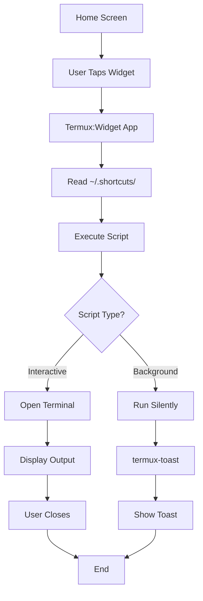
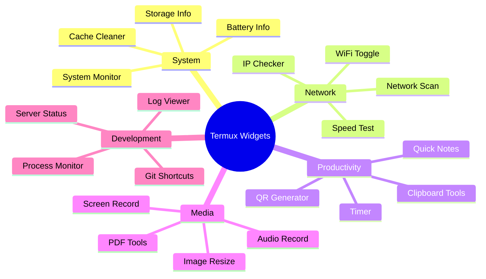
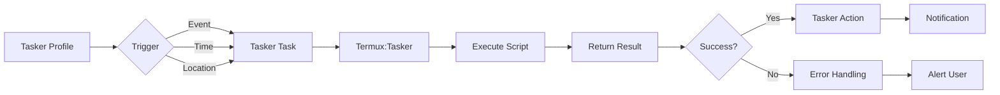
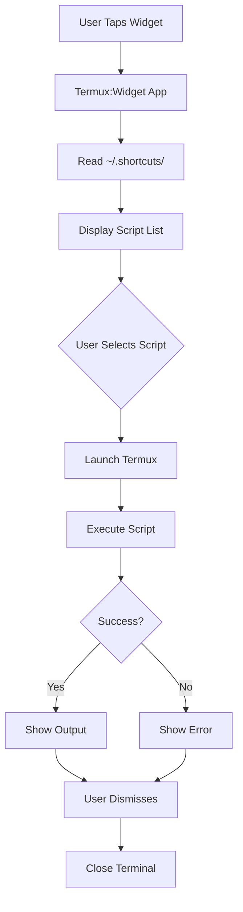
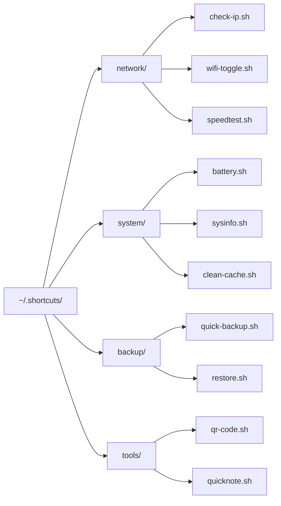

# Chapter 44: Termux Widgets & Shortcuts

```
╔═══════════════════════════════════════════════════════════════════════════════╗
║                                                                               ║
║  📱 CHAPTER 44: TERMUX WIDGETS & SHORTCUTS                                   ║
║  ━━━━━━━━━━━━━━━━━━━━━━━━━━━━━━━━━━━━━━━━━━━━━━━━━━━━━━━━━━━━━━━━━━━━━━━━━━━━━  ║
║                                                                               ║
║  🔘 Home Screen Widgets | ⚡ One-Tap Actions | 🎯 Tasker Integration          ║
║  🚀 Quick Access | 🤖 Automation Hub | 💡 Smart Shortcuts                    ║
║                                                                               ║
║  ┌─────────────┐  ┌─────────────┐  ┌─────────────┐  ┌─────────────┐          ║
║  │   Module 7  │  │  Chapter    │  │  Duration   │  │  Difficulty │          ║
║  │  Utilities  │  │  44 of 61   │  │  15-20 Min  │  │  ⭐⭐ Inter. │          ║
║  └─────────────┘  └─────────────┘  └─────────────┘  └─────────────┘          ║
║                                                                               ║
╚═══════════════════════════════════════════════════════════════════════════════╝
```

> **Module:** 7 - Utilities  
> **Chapter:** 44 of 61  
> **Duration:** 15-20 Minutes  
> **Difficulty:** ⭐⭐ Intermediate  

---

## 📋 Chapter Overview

| Section | Content |
|---------|---------|
| Video Script | Complete Hindi narration with timestamps |
| Technical Guide | Termux:Widget, shortcuts, Tasker integration, automation |
| Commands Reference | All widget and shortcut commands |
| Practice Exercises | Hands-on widget creation tasks |
| Troubleshooting | Common widget issues |
| Video Assets | Thumbnail, description, tags |

---

## 🎬 VIDEO SCRIPT (Complete Hindi Narration)

```
═══════════════════════════════════════════════════════════════════════════════
TERMUX FULL COURSE - CHAPTER 44
Title: Termux Widgets & Shortcuts | Home Screen Automation | Tasker Integration
Duration: 15-20 Minutes
═══════════════════════════════════════════════════════════════════════════════

[INTRO - 0:00 to 0:50]
─────────────────────────────────────────────────────────────────────────────

Namaskar Dosto! Welcome back to Termux Full Course by T3rmuxk1ng!

Aaj ka chapter bahut exciting hai - Termux Widgets & Shortcuts!

Socho, aapka phone ek powerful Linux machine hai Termux ke saath. Lekin har 
baar Termux open karo, command type karo, script run karo - ye repetitive 
hai na?

Kya aisa ho ki ek tap pe sab kuch ho jaaye? WiFi toggle, quick backup, 
speed test, IP check - sab home screen se?

Haan, ye possible hai Termux:Widget ke saath!

Aaj hum seekhenge:
✓ Termux:Widget installation aur setup
✓ ~/.shortcuts directory structure
✓ Single-tap scripts banana
✓ Tasker integration for advanced automation
✓ Home screen widgets
✓ Quick settings tiles
✓ Notification shortcuts
✓ Voice commands with Tasker
✓ 15+ practical widget examples

Chaliye shuru karte hain!

---

[SECTION 1: TERMUX:WIDGET INTRODUCTION - 0:50 to 3:00]
─────────────────────────────────────────────────────────────────────────────

Sabse pehle samjhte hain - Termux:Widget kya hai?

Termux:Widget ek add-on app hai jo aapke Termux scripts ko home screen 
pe shortcuts ki tarah dikhata hai. Single tap pe script execute ho jaata hai.

Key Features:

┌─────────────────────────────────────────────────────────────────────────┐
│                    TERMUX:WIDGET FEATURES                                │
├──────────────────────┬──────────────────────────────────────────────────┤
│ Feature              │ Description                                     │
├──────────────────────┼──────────────────────────────────────────────────┤
│ Home Screen Shortcuts│ Scripts directly on home screen                 │
│ Single Tap Execute   │ No terminal needed for execution                │
│ Folders Support      │ Organize scripts in folders                     │
│ Tasker Integration   │ Connect with Tasker automation                  │
│ Custom Icons         │ Scripts show as list in widget                  │
│ Background Execution │ Scripts run silently                            │
│ Output Display       │ Optional toast notifications                    │
└──────────────────────┴──────────────────────────────────────────────────┘

Termux:Widget kyun use karein?

1. Quick Access - Termux open karne ki zarurat nahi
2. One-Tap Actions - Simple tasks ek tap mein
3. Professional Feel - Custom launcher jaisa experience
4. Automation Gateway - Tasker ke saath integrate karein
5. Productivity - Time saving for repetitive tasks

Real-world use cases:
• WiFi/Bluetooth toggle
• Quick backup button
• System info widget
• Speed test shortcut
• IP address checker
• Quick note taker
• Server status checker
• Database backup button
• Cache cleaner
• Network scanner trigger

---

[SECTION 2: INSTALLATION & SETUP - 3:00 to 5:30]
─────────────────────────────────────────────────────────────────────────────

Ab install karte hain Termux:Widget ko!

⚠️ IMPORTANT: F-Droid se install karein, Play Store se NAHI!

Step 1: Install Termux:Widget

    # F-Droid app kholen
    # Search: Termux:Widget
    # Install button press karein

Step 2: Termux mein setup

    # Shortcuts directory create karein
    mkdir -p ~/.shortcuts

    # Verify directory created
    ls -la ~ | grep shortcuts

    # Optional: Tasker directory bhi
    mkdir -p ~/.termux/tasker

Directory structure samjhein:

    ~/.shortcuts/              # Main shortcuts folder
    ├── script1.sh            # Direct shortcut
    ├── script2.sh            # Another shortcut
    └── folder/               # Folder of shortcuts
        ├── script3.sh
        └── script4.sh

Important Paths:

┌─────────────────────────────────────────────────────────────────────────┐
│                    TERMUX WIDGET PATHS                                   │
├─────────────────────────────────────────────────────────────────────────┤
│ ~/.shortcuts/           │ Home screen widget scripts                    │
│ ~/.shortcuts/tasks/     │ Tasker integration scripts                    │
│ ~/.termux/tasker/       │ Alternative Tasker scripts location           │
│ ~/.termux/boot/         │ Boot scripts (different from widgets)         │
└─────────────────────────────────────────────────────────────────────────┘

Step 3: Widget Add Karna

1. Home screen pe long press karein
2. "Widgets" option select karein
3. Scroll karke "Termux:Widget" dhundhein
4. Hold and drag to home screen
5. Widget show karega scripts list

Widget sizes available:
• Small (1x1) - Single script name
• Medium (2x1) - Multiple scripts list
• Large (2x2) - Folder with many scripts

---

[SECTION 3: CREATING YOUR FIRST WIDGET - 5:30 to 8:00]
─────────────────────────────────────────────────────────────────────────────

Chaliye apna pehla widget banate hain!

[EXAMPLE 1: Simple Hello Widget]

    nano ~/.shortcuts/hello.sh

Script content:

    #!/bin/bash
    # Simple Hello Widget
    
    echo "Hello from Termux Widget!"
    echo "Current time: $(date)"
    sleep 3

Make executable:

    chmod +x ~/.shortcuts/hello.sh

Test karein:
1. Home screen pe widget add karein
2. Widget mein "hello" script dikhega
3. Tap karein
4. Terminal open hoga aur script run hoga

[EXAMPLE 2: System Info Widget]

    nano ~/.shortcuts/sysinfo.sh

    #!/bin/bash
    # System Information Widget
    
    clear
    echo "═══════════════════════════════════"
    echo "       SYSTEM INFORMATION"
    echo "═══════════════════════════════════"
    echo ""
    echo "📅 Date: $(date '+%Y-%m-%d %H:%M:%S')"
    echo "📱 Device: $(getprop ro.product.model)"
    echo "🤖 Android: $(getprop ro.build.version.release)"
    echo ""
    echo "═══════════════════════════════════"
    echo "       MEMORY STATUS"
    echo "═══════════════════════════════════"
    free -h
    echo ""
    echo "═══════════════════════════════════"
    echo "       DISK USAGE"
    echo "═══════════════════════════════════"
    df -h / 2>/dev/null | tail -1
    echo ""
    echo "Press Enter to close..."
    read

Make executable:

    chmod +x ~/.shortcuts/sysinfo.sh

[EXAMPLE 3: Quick Note Widget]

    nano ~/.shortcuts/quicknote.sh

    #!/bin/bash
    # Quick Note Widget
    
    NOTES_FILE="/sdcard/quick_notes.txt"
    
    echo "═══════════════════════════════════"
    echo "         QUICK NOTE"
    echo "═══════════════════════════════════"
    echo ""
    echo "Enter your note (press Enter to save):"
    read note
    
    if [ -n "$note" ]; then
        echo "[$(date '+%Y-%m-%d %H:%M')] $note" >> "$NOTES_FILE"
        echo ""
        echo "✅ Note saved!"
        echo ""
        echo "Recent notes:"
        tail -5 "$NOTES_FILE"
    else
        echo "No note entered."
    fi
    
    sleep 2

---

[SECTION 4: WIDGET EXAMPLES - NETWORK TOOLS - 8:00 to 11:00]
─────────────────────────────────────────────────────────────────────────────

Ab network related widgets banate hain!

[EXAMPLE 4: IP Address Widget]

    nano ~/.shortcuts/check-ip.sh

    #!/bin/bash
    # IP Address Checker Widget
    
    clear
    echo "═══════════════════════════════════"
    echo "       IP ADDRESS INFO"
    echo "═══════════════════════════════════"
    echo ""
    
    # Internal IP
    echo "🏠 Internal IP:"
    ifconfig 2>/dev/null | grep -o 'inet addr:[0-9.]*' | cut -d: -f2
    echo ""
    
    # External IP
    echo "🌍 External IP:"
    external_ip=$(curl -s ifconfig.me 2>/dev/null)
    if [ -n "$external_ip" ]; then
        echo "   $external_ip"
    else
        echo "   Unable to fetch (check internet)"
    fi
    echo ""
    
    # WiFi Info
    echo "📶 WiFi Info:"
    termux-wifi-connectioninfo 2>/dev/null | python3 -c "
import sys, json
try:
    data = json.load(sys.stdin)
    print(f\"   SSID: {data.get('ssid', 'N/A')}\")
    print(f\"   IP: {data.get('ip', 'N/A')}\")
except:
    print('   WiFi not connected or API not available')
" 2>/dev/null || echo "   Install termux-api for WiFi info"
    
    echo ""
    echo "Press Enter to close..."
    read

[EXAMPLE 5: Speed Test Widget]

    nano ~/.shortcuts/speedtest.sh

    #!/bin/bash
    # Speed Test Widget
    
    clear
    echo "═══════════════════════════════════"
    echo "         SPEED TEST"
    echo "═══════════════════════════════════"
    echo ""
    
    # Check if speedtest-cli installed
    if ! command -v speedtest-cli &> /dev/null; then
        echo "Installing speedtest-cli..."
        pkg install speedtest-cli -y 2>/dev/null || pip install speedtest-cli
    fi
    
    echo "Running speed test..."
    echo "Please wait..."
    echo ""
    
    speedtest-cli --simple 2>/dev/null || {
        echo "Speed test failed. Check internet connection."
    }
    
    echo ""
    echo "Press Enter to close..."
    read

[EXAMPLE 6: WiFi Toggle Widget]

    nano ~/.shortcuts/wifi-toggle.sh

    #!/bin/bash
    # WiFi Toggle Widget
    
    # Check current WiFi state
    wifi_state=$(termux-wifi-connectioninfo 2>/dev/null | grep -c "ssid" || echo "0")
    
    if [ "$wifi_state" -gt 0 ]; then
        echo "Turning WiFi OFF..."
        termux-wifi-enable false
        sleep 1
        echo "WiFi is now OFF"
    else
        echo "Turning WiFi ON..."
        termux-wifi-enable true
        sleep 3
        echo "WiFi is now ON"
        # Show connected network
        termux-wifi-connectioninfo 2>/dev/null | python3 -c "
import sys, json
try:
    data = json.load(sys.stdin)
    print(f\"Connected to: {data.get('ssid', 'Unknown')}\")
except:
    print('Connecting...')
" 2>/dev/null
    fi
    
    sleep 2

[EXAMPLE 7: Network Scanner Widget]

    nano ~/.shortcuts/network-scan.sh

    #!/bin/bash
    # Quick Network Scanner Widget
    
    clear
    echo "═══════════════════════════════════"
    echo "       NETWORK SCANNER"
    echo "═══════════════════════════════════"
    echo ""
    
    # Get local network
    local_ip=$(ifconfig 2>/dev/null | grep -o 'inet addr:[0-9.]*' | head -1 | cut -d: -f2)
    network="${local_ip%.*}.0/24"
    
    echo "Scanning network: $network"
    echo "This may take a moment..."
    echo ""
    
    # Quick ping sweep
    if command -v nmap &> /dev/null; then
        nmap -sn "$network" 2>/dev/null | grep "Nmap scan"
    else
        echo "Installing nmap..."
        pkg install nmap -y
        nmap -sn "$network" 2>/dev/null | grep "Nmap scan"
    fi
    
    echo ""
    echo "Press Enter to close..."
    read

---

[SECTION 5: WIDGET EXAMPLES - SYSTEM TOOLS - 11:00 to 13:30]
─────────────────────────────────────────────────────────────────────────────

Ab system related widgets banate hain!

[EXAMPLE 8: Battery Info Widget]

    nano ~/.shortcuts/battery.sh

    #!/bin/bash
    # Battery Information Widget
    
    clear
    echo "═══════════════════════════════════"
    echo "       BATTERY STATUS"
    echo "═══════════════════════════════════"
    echo ""
    
    termux-battery-status 2>/dev/null | python3 -c "
import sys, json
try:
    data = json.load(sys.stdin)
    level = data.get('percentage', 'N/A')
    status = data.get('status', 'N/A')
    health = data.get('health', 'N/A')
    temp = data.get('temperature', 'N/A')
    
    print(f'🔋 Level: {level}%')
    print(f'⚡ Status: {status}')
    print(f'💚 Health: {health}')
    if temp != 'N/A':
        print(f'🌡️ Temperature: {temp}°C')
    
    # Battery bar
    bar_length = int(level / 5)
    bar = '█' * bar_length + '░' * (20 - bar_length)
    print(f'\n[{bar}] {level}%')
except:
    print('Unable to get battery info')
    print('Make sure termux-api is installed')
" || echo "Install termux-api package"
    
    echo ""
    echo "Press Enter to close..."
    read

[EXAMPLE 9: Storage Cleaner Widget]

    nano ~/.shortcuts/clean-cache.sh

    #!/bin/bash
    # Cache Cleaner Widget
    
    clear
    echo "═══════════════════════════════════"
    echo "       CACHE CLEANER"
    echo "═══════════════════════════════════"
    echo ""
    
    # Calculate cache size before
    echo "Calculating cache size..."
    cache_before=$(du -sh $PREFIX/var/cache/apt 2>/dev/null | cut -f1)
    echo "Current cache: $cache_before"
    echo ""
    
    # Clean apt cache
    echo "Cleaning package cache..."
    pkg clean
    apt autoremove -y 2>/dev/null
    
    # Clean tmp
    echo "Cleaning temp files..."
    rm -rf $TMPDIR/* 2>/dev/null
    
    # Clean pip cache if exists
    if command -v pip &> /dev/null; then
        echo "Cleaning pip cache..."
        pip cache purge 2>/dev/null
    fi
    
    # Calculate cache size after
    cache_after=$(du -sh $PREFIX/var/cache/apt 2>/dev/null | cut -f1)
    
    echo ""
    echo "✅ Cleaning complete!"
    echo "Cache after: $cache_after"
    echo ""
    
    sleep 2

[EXAMPLE 10: Process Monitor Widget]

    nano ~/.shortcuts/process-monitor.sh

    #!/bin/bash
    # Process Monitor Widget
    
    clear
    echo "═══════════════════════════════════"
    echo "       TOP PROCESSES"
    echo "═══════════════════════════════════"
    echo ""
    
    echo "CPU Usage:"
    echo "----------------------------------------"
    ps aux --sort=-%cpu 2>/dev/null | head -10
    echo ""
    echo "Memory Usage:"
    echo "----------------------------------------"
    ps aux --sort=-%mem 2>/dev/null | head -10
    echo ""
    
    # Quick summary
    echo "Summary:"
    echo "  Total processes: $(ps aux | wc -l)"
    echo "  Memory: $(free -h | grep Mem | awk '{print $3 "/" $2}')"
    echo ""
    
    echo "Press Enter to close..."
    read

---

[SECTION 6: ADVANCED WIDGETS - 13:30 to 15:30]
─────────────────────────────────────────────────────────────────────────────

Ab kuch advanced widgets banate hain!

[EXAMPLE 11: Quick Backup Widget]

    nano ~/.shortcuts/quick-backup.sh

    #!/bin/bash
    # Quick Backup Widget
    
    BACKUP_DIR="/sdcard/TermuxBackups"
    DATE=$(date +%Y%m%d_%H%M%S)
    
    clear
    echo "═══════════════════════════════════"
    echo "       QUICK BACKUP"
    echo "═══════════════════════════════════"
    echo ""
    
    mkdir -p "$BACKUP_DIR"
    
    echo "Creating backup..."
    echo "Please wait..."
    echo ""
    
    # Backup scripts
    tar -czf "$BACKUP_DIR/scripts_$DATE.tar.gz" \
        -C ~ shortcuts 2>/dev/null
    
    # Backup important configs
    tar -czf "$BACKUP_DIR/configs_$DATE.tar.gz" \
        -C ~ .bashrc .profile .tmux.conf 2>/dev/null
    
    # Create combined backup
    tar -czf "$BACKUP_DIR/full_backup_$DATE.tar.gz" \
        -C ~ shortcuts .bashrc .profile 2>/dev/null
    
    echo "✅ Backup complete!"
    echo ""
    echo "Backup saved to: $BACKUP_DIR"
    echo "Files created:"
    ls -lh "$BACKUP_DIR" | tail -5
    echo ""
    
    # Keep only last 5 backups
    cd "$BACKUP_DIR"
    ls -t full_backup_*.tar.gz 2>/dev/null | tail -n +6 | xargs rm -f 2>/dev/null
    
    sleep 3

[EXAMPLE 12: Server Status Widget]

    nano ~/.shortcuts/server-status.sh

    #!/bin/bash
    # Server Status Check Widget
    
    # Define servers to check
    SERVERS=(
        "google.com:80:Google"
        "github.com:443:GitHub"
        "youtube.com:443:YouTube"
    )
    
    clear
    echo "═══════════════════════════════════"
    echo "       SERVER STATUS"
    echo "═══════════════════════════════════"
    echo ""
    
    for server in "${SERVERS[@]}"; do
        IFS=':' read -r host port name <<< "$server"
        
        if timeout 3 bash -c "echo >/dev/tcp/$host/$port" 2>/dev/null; then
            echo "✅ $name ($host) - Online"
        else
            echo "❌ $name ($host) - Offline"
        fi
    done
    
    echo ""
    echo "Checked at: $(date '+%H:%M:%S')"
    echo ""
    echo "Press Enter to close..."
    read

[EXAMPLE 13: QR Code Generator Widget]

    nano ~/.shortcuts/qr-code.sh

    #!/bin/bash
    # QR Code Generator Widget
    
    clear
    echo "═══════════════════════════════════"
    echo "       QR CODE GENERATOR"
    echo "═══════════════════════════════════"
    echo ""
    
    echo "Enter text/URL for QR code:"
    read text
    
    if [ -z "$text" ]; then
        echo "No input provided!"
        sleep 2
        exit
    fi
    
    # Install qrencode if not present
    if ! command -v qrencode &> /dev/null; then
        echo "Installing qrencode..."
        pkg install qrencode -y
    fi
    
    OUTPUT="/sdcard/qr_code.png"
    
    qrencode -o "$OUTPUT" "$text"
    
    echo ""
    echo "✅ QR Code generated!"
    echo "Saved to: $OUTPUT"
    echo ""
    echo "Content: $text"
    
    # Optional: Share the QR code
    termux-share "$OUTPUT" 2>/dev/null
    
    sleep 2

[EXAMPLE 14: Quick Command Widget]

    nano ~/.shortcuts/quick-cmd.sh

    #!/bin/bash
    # Quick Command Widget
    
    clear
    echo "═══════════════════════════════════"
    echo "       QUICK COMMANDS"
    echo "═══════════════════════════════════"
    echo ""
    
    echo "Select a command:"
    echo ""
    echo "1) Show IP Address"
    echo "2) Check Battery"
    echo "3) Clear Cache"
    echo "4) Update Packages"
    echo "5) Show Storage"
    echo "6) Kill Background Apps"
    echo ""
    echo "Enter choice (1-6):"
    read choice
    
    case $choice in
        1) curl -s ifconfig.me ;;
        2) termux-battery-status ;;
        3) pkg clean && echo "Cache cleared!" ;;
        4) pkg update && pkg upgrade -y ;;
        5) df -h ;;
        6) am kill-all 2>/dev/null && echo "Background apps killed" ;;
        *) echo "Invalid choice" ;;
    esac
    
    echo ""
    sleep 2

---

[SECTION 7: TASKER INTEGRATION - 15:30 to 17:30]
─────────────────────────────────────────────────────────────────────────────

Ab Tasker integration dekhte hain!

Tasker ek powerful automation app hai Android ke liye. Termux:Tasker se 
integration karein.

Installation:
1. Tasker install karein (Play Store)
2. Termux:Tasker install karein (F-Droid)

Tasker Scripts Directory:

    mkdir -p ~/.termux/tasker

Tasker Script Example:

    nano ~/.termux/tasker/battery-alert.sh

    #!/bin/bash
    # Battery Alert for Tasker
    
    # Get battery level
    battery=$(termux-battery-status | grep -o '"percentage": [0-9]*' | grep -o '[0-9]*')
    
    if [ "$battery" -lt 20 ]; then
        termux-notification --title "Low Battery" --content "Battery at $battery%!"
        echo "low"
    else
        echo "ok"
    fi

Tasker Setup Steps:
1. Tasker → Profiles → New Profile
2. State → Power → Battery Level
3. Set range (e.g., 0-20)
4. Add Task → Plugin → Termux:Tasker
5. Select script: battery-alert.sh

Voice Commands with Tasker:

    nano ~/.termux/tasker/voice-command.sh

    #!/bin/bash
    # Voice Command Handler
    
    # Get command from Tasker variable
    command="%VOICE_COMMAND"
    
    case "$command" in
        "wifi on")
            termux-wifi-enable true
            ;;
        "wifi off")
            termux-wifi-enable false
            ;;
        "battery")
            termux-battery-status
            ;;
        "ip")
            curl -s ifconfig.me
            ;;
        *)
            echo "Unknown command: $command"
            ;;
    esac

Quick Settings Tiles (Android 7+):

Termux scripts ko Quick Settings panel mein add karein:

    # Create tile script
    nano ~/.shortcuts/tile-wifi.sh

    #!/bin/bash
    # Quick Settings Tile - WiFi Toggle
    
    wifi_state=$(termux-wifi-connectioninfo 2>/dev/null | grep -c "ssid")
    
    if [ "$wifi_state" -gt 0 ]; then
        termux-wifi-enable false
        termux-toast "WiFi Disabled"
    else
        termux-wifi-enable true
        termux-toast "WiFi Enabled"
    fi

Notification Shortcuts:

    nano ~/.shortcuts/notification-controls.sh

    #!/bin/bash
    # Notification with Action Buttons
    
    termux-notification \
        --title "Termux Controls" \
        --content "Quick actions available" \
        --action "termux-wifi-enable true" \
        --button1 "WiFi On" \
        --button1-action "termux-wifi-enable true" \
        --button2 "WiFi Off" \
        --button2-action "termux-wifi-enable false" \
        --button3 "Status" \
        --button3-action "termux-battery-status"

---

[SECTION 8: WIDGET BEST PRACTICES - 17:30 to 19:00]
─────────────────────────────────────────────────────────────────────────────

Widget banate waqt yaad rakhein ye best practices:

1. SHEBANG LINE
   - Hamesha #!/bin/bash first line mein
   - Ensures script runs correctly

2. EXECUTABLE PERMISSION
   - chmod +x script.sh zaroor karein
   - Without this, script run nahi hoga

3. FULL PATHS
   - Cron aur widgets mein limited PATH
   - Use /data/data/com.termux/files/usr/bin/...

4. ERROR HANDLING
   - Check if commands exist
   - Use command -v || pkg install

5. USER FEEDBACK
   - Show progress messages
   - Use termux-toast for quick feedback
   - Use termux-notification for results

6. TIMEOUT
   - Long operations mein timeout use karein
   - Network operations ke liye important

7. CLEANUP
   - Temporary files delete karein
   - Old backups rotate karein

Organized Folder Structure:

    ~/.shortcuts/
    ├── network/
    │   ├── check-ip.sh
    │   ├── wifi-toggle.sh
    │   └── speedtest.sh
    ├── system/
    │   ├── battery.sh
    │   ├── sysinfo.sh
    │   └── clean-cache.sh
    ├── backup/
    │   ├── quick-backup.sh
    │   └── restore.sh
    └── tools/
        ├── qr-code.sh
        ├── quicknote.sh
        └── clipboard.sh

---

[SECTION 9: SUMMARY & HOMEWORK - 19:00 to 20:00]
─────────────────────────────────────────────────────────────────────────────

To dosto, Termux Widgets & Shortcuts ka chapter complete! Let's summarize:

✅ Termux:Widget installation from F-Droid
✅ ~/.shortcuts directory setup
✅ Single-tap script creation
✅ 15+ practical widget examples
✅ Network tools widgets
✅ System tools widgets
✅ Tasker integration
✅ Voice commands setup
✅ Quick settings tiles
✅ Notification shortcuts
✅ Best practices

Important Commands:

┌─────────────────────────────────────────────────────────────────────────┐
│                    CHAPTER 44 - IMPORTANT COMMANDS                       │
├─────────────────────────────────────────────────────────────────────────┤
│ mkdir -p ~/.shortcuts          │ Create shortcuts directory             │
│ chmod +x script.sh             │ Make script executable                 │
│ termux-toast "message"         │ Show toast notification                │
│ termux-notification ...        │ Create notification                    │
│ termux-wifi-enable true/false  │ Toggle WiFi                            │
│ termux-battery-status          │ Get battery info                       │
│ termux-share file              │ Share file                             │
│ termux-clipboard-set "text"    │ Set clipboard                          │
│ curl -s ifconfig.me            │ Get external IP                        │
│ qrencode -o qr.png "text"      │ Generate QR code                       │
└─────────────────────────────────────────────────────────────────────────┘

HOMEWORK:
1. Ek WiFi toggle widget banao
2. Ek battery info widget banao
3. Ek quick note widget banao
4. Ek custom widget banao apni need ke hisaab se

Next Chapter 45 mein hum SSH Server setup seekhenge!

Agar video helpful lagi:
👍 Like karein
🔔 Subscribe karein
💬 Questions comment mein poochein

Thank you for watching! See you in Chapter 45!

═══════════════════════════════════════════════════════════════════════════════
```

---

## 📖 TECHNICAL GUIDE

### 1. Termux:Widget Architecture

```
┌─────────────────────────────────────────────────────────────────────────┐
│                    TERMUX:WIDGET ARCHITECTURE                            │
├─────────────────────────────────────────────────────────────────────────┤
│                                                                          │
│   ┌─────────────────────────────────────────────────────────────────┐   │
│   │                    Android Home Screen                           │   │
│   │                                                                   │   │
│   │   ┌─────────────────┐                                            │   │
│   │   │ Termux:Widget   │                                            │   │
│   │   │ ┌─────────────┐ │                                            │   │
│   │   │ │ script1.sh  │ │  ← Tap to execute                          │   │
│   │   │ │ script2.sh  │ │                                            │   │
│   │   │ │ folder/     │ │                                            │   │
│   │   │ └─────────────┘ │                                            │   │
│   │   └─────────────────┘                                            │   │
│   └─────────────────────────────────────────────────────────────────┘   │
│                                   │                                      │
│                                   ▼                                      │
│   ┌─────────────────────────────────────────────────────────────────┐   │
│   │                 ~/.shortcuts/ directory                          │   │
│   │                                                                   │   │
│   │   ├── script1.sh          (Direct shortcut)                      │   │
│   │   ├── script2.sh          (Direct shortcut)                      │   │
│   │   └── folder/             (Folder of shortcuts)                  │   │
│   │       ├── script3.sh                                             │   │
│   │       └── script4.sh                                             │   │
│   └─────────────────────────────────────────────────────────────────┘   │
│                                   │                                      │
│                                   ▼                                      │
│   ┌─────────────────────────────────────────────────────────────────┐   │
│   │                    Script Execution                              │   │
│   │                                                                   │   │
│   │   1. Termux app opens (minimized window)                        │   │
│   │   2. Script runs with bash interpreter                          │   │
│   │   3. Output displays in terminal                                │   │
│   │   4. Terminal closes when script completes                      │   │
│   └─────────────────────────────────────────────────────────────────┘   │
│                                                                          │
└─────────────────────────────────────────────────────────────────────────┘
```

### 2. Directory Structure

```bash
# Main shortcuts directory
~/.shortcuts/

# Tasker integration directory
~/.termux/tasker/

# Boot scripts directory (different from widgets)
~/.termux/boot/

# Recommended organization
~/.shortcuts/
├── network/
│   ├── check-ip.sh
│   ├── wifi-toggle.sh
│   ├── speedtest.sh
│   └── network-scan.sh
├── system/
│   ├── battery.sh
│   ├── sysinfo.sh
│   ├── storage.sh
│   └── clean-cache.sh
├── backup/
│   ├── quick-backup.sh
│   ├── backup-configs.sh
│   └── restore.sh
├── tools/
│   ├── qr-code.sh
│   ├── quicknote.sh
│   ├── clipboard.sh
│   └── timer.sh
└── development/
    ├── git-pull.sh
    ├── server-start.sh
    └── log-view.sh
```

### 3. Widget Script Template

```bash
#!/bin/bash
#===============================================
# Script Name: [name].sh
# Description: [What the script does]
# Author: [Your name]
# Version: 1.0
#===============================================

# Clear screen for clean output
clear

# Header
echo "═══════════════════════════════════"
echo "       [WIDGET NAME]"
echo "═══════════════════════════════════"
echo ""

# Main logic here
# ...

# Footer
echo ""
echo "Press Enter to close..."
read

# Or for auto-close
# sleep 3
```

### 4. Executable Permissions

```bash
# Make single script executable
chmod +x ~/.shortcuts/script.sh

# Make all scripts executable
chmod +x ~/.shortcuts/*.sh

# Make all scripts in subdirectories executable
find ~/.shortcuts -type f -name "*.sh" -exec chmod +x {} \;

# Verify permissions
ls -la ~/.shortcuts/
```

### 5. Widget Execution Flow

```
┌─────────────────────────────────────────────────────────────────────────┐
│                    WIDGET EXECUTION FLOW                                 │
├─────────────────────────────────────────────────────────────────────────┤
│                                                                          │
│   User taps widget item                                                 │
│           │                                                              │
│           ▼                                                              │
│   Termux:Widget app receives intent                                     │
│           │                                                              │
│           ▼                                                              │
│   Termux app launches (if not running)                                  │
│           │                                                              │
│           ▼                                                              │
│   Script file is read from ~/.shortcuts/                                │
│           │                                                              │
│           ▼                                                              │
│   Bash interpreter executes script                                      │
│           │                                                              │
│           ▼                                                              │
│   Script runs with user's environment                                   │
│           │                                                              │
│           ▼                                                              │
│   Output displays in Termux window                                      │
│           │                                                              │
│           ▼                                                              │
│   Script completes or user exits                                        │
│           │                                                              │
│           ▼                                                              │
│   Termux window closes/minimizes                                        │
│                                                                          │
└─────────────────────────────────────────────────────────────────────────┘
```

---

## 🔧 COMPLETE WIDGET EXAMPLES

### Widget 1: WiFi Toggle

```bash
#!/bin/bash
# WiFi Toggle Widget

# Check current WiFi state
wifi_state=$(termux-wifi-connectioninfo 2>/dev/null | grep -c "ssid" || echo "0")

if [ "$wifi_state" -gt 0 ]; then
    termux-wifi-enable false
    termux-toast "WiFi Disabled"
else
    termux-wifi-enable true
    sleep 2
    termux-toast "WiFi Enabled"
fi
```

### Widget 2: Quick Note

```bash
#!/bin/bash
# Quick Note Widget

NOTES_FILE="/sdcard/quick_notes.txt"

echo "═══════════════════════════════════"
echo "         QUICK NOTE"
echo "═══════════════════════════════════"
echo ""
echo "Enter your note:"
read note

if [ -n "$note" ]; then
    echo "[$(date '+%Y-%m-%d %H:%M')] $note" >> "$NOTES_FILE"
    echo "✅ Note saved!"
else
    echo "No note entered."
fi

sleep 2
```

### Widget 3: System Info

```bash
#!/bin/bash
# System Info Widget

clear
echo "═══════════════════════════════════"
echo "       SYSTEM INFORMATION"
echo "═══════════════════════════════════"
echo ""
echo "📅 Date: $(date '+%Y-%m-%d %H:%M:%S')"
echo "📱 Device: $(getprop ro.product.model)"
echo "🤖 Android: $(getprop ro.build.version.release)"
echo ""
echo "--- Memory ---"
free -h
echo ""
echo "--- Storage ---"
df -h / 2>/dev/null | tail -1
echo ""
read -p "Press Enter to close..."
```

### Widget 4: Speed Test

```bash
#!/bin/bash
# Speed Test Widget

clear
echo "═══════════════════════════════════"
echo "         SPEED TEST"
echo "═══════════════════════════════════"
echo ""

if ! command -v speedtest-cli &> /dev/null; then
    echo "Installing speedtest-cli..."
    pkg install speedtest-cli -y 2>/dev/null || pip install speedtest-cli
fi

echo "Running speed test..."
speedtest-cli --simple

echo ""
read -p "Press Enter to close..."
```

### Widget 5: IP Address

```bash
#!/bin/bash
# IP Address Widget

clear
echo "═══════════════════════════════════"
echo "       IP ADDRESS INFO"
echo "═══════════════════════════════════"
echo ""

echo "🏠 Internal IP:"
ifconfig 2>/dev/null | grep "inet " | grep -v 127.0.0.1 | awk '{print $2}'

echo ""
echo "🌍 External IP:"
curl -s --connect-timeout 5 ifconfig.me 2>/dev/null || echo "Unable to fetch"

echo ""
read -p "Press Enter to close..."
```

### Widget 6: Battery Info

```bash
#!/bin/bash
# Battery Info Widget

clear
echo "═══════════════════════════════════"
echo "       BATTERY STATUS"
echo "═══════════════════════════════════"
echo ""

termux-battery-status 2>/dev/null | python3 -c "
import sys, json
try:
    data = json.load(sys.stdin)
    level = data.get('percentage', 'N/A')
    status = data.get('status', 'N/A')
    health = data.get('health', 'N/A')
    
    print(f'🔋 Level: {level}%')
    print(f'⚡ Status: {status}')
    print(f'💚 Health: {health}')
    
    # Visual bar
    bar_length = int(level / 5)
    bar = '█' * bar_length + '░' * (20 - bar_length)
    print(f'\n[{bar}] {level}%')
except:
    print('Install termux-api')
" || echo "Install termux-api package"

echo ""
read -p "Press Enter to close..."
```

### Widget 7: Cache Cleaner

```bash
#!/bin/bash
# Cache Cleaner Widget

clear
echo "═══════════════════════════════════"
echo "       CACHE CLEANER"
echo "═══════════════════════════════════"
echo ""

echo "Cleaning package cache..."
pkg clean 2>/dev/null

echo "Cleaning temp files..."
rm -rf $TMPDIR/* 2>/dev/null

echo "Running autoremove..."
apt autoremove -y 2>/dev/null

echo ""
echo "✅ Cleaning complete!"
echo ""
sleep 2
```

### Widget 8: Quick Backup

```bash
#!/bin/bash
# Quick Backup Widget

BACKUP_DIR="/sdcard/TermuxBackups"
DATE=$(date +%Y%m%d_%H%M%S)

mkdir -p "$BACKUP_DIR"

echo "Creating backup..."

tar -czf "$BACKUP_DIR/backup_$DATE.tar.gz" \
    -C ~ shortcuts .bashrc .profile 2>/dev/null

echo "✅ Backup saved to $BACKUP_DIR"

# Keep only last 5 backups
cd "$BACKUP_DIR"
ls -t backup_*.tar.gz 2>/dev/null | tail -n +6 | xargs rm -f 2>/dev/null

sleep 2
```

### Widget 9: QR Code Generator

```bash
#!/bin/bash
# QR Code Generator Widget

clear
echo "═══════════════════════════════════"
echo "       QR CODE GENERATOR"
echo "═══════════════════════════════════"
echo ""

echo "Enter text/URL:"
read text

[ -z "$text" ] && exit

if ! command -v qrencode &> /dev/null; then
    pkg install qrencode -y
fi

OUTPUT="/sdcard/qr_code.png"
qrencode -o "$OUTPUT" "$text"

echo ""
echo "✅ QR Code saved to: $OUTPUT"

termux-share "$OUTPUT" 2>/dev/null

sleep 2
```

### Widget 10: Network Scanner

```bash
#!/bin/bash
# Network Scanner Widget

clear
echo "═══════════════════════════════════"
echo "       NETWORK SCANNER"
echo "═══════════════════════════════════"
echo ""

# Get local network
local_ip=$(ifconfig 2>/dev/null | grep "inet " | grep -v 127.0.0.1 | awk '{print $2}' | head -1)
network="${local_ip%.*}.0/24"

echo "Scanning: $network"
echo ""

if ! command -v nmap &> /dev/null; then
    pkg install nmap -y
fi

nmap -sn "$network" 2>/dev/null | grep "Nmap scan"

echo ""
read -p "Press Enter to close..."
```

### Widget 11: Server Status

```bash
#!/bin/bash
# Server Status Widget

clear
echo "═══════════════════════════════════"
echo "       SERVER STATUS"
echo "═══════════════════════════════════"
echo ""

SERVERS=(
    "google.com:80:Google"
    "github.com:443:GitHub"
    "youtube.com:443:YouTube"
)

for server in "${SERVERS[@]}"; do
    IFS=':' read -r host port name <<< "$server"
    
    if timeout 3 bash -c "echo >/dev/tcp/$host/$port" 2>/dev/null; then
        echo "✅ $name - Online"
    else
        echo "❌ $name - Offline"
    fi
done

echo ""
echo "Checked: $(date '+%H:%M:%S')"
echo ""
read -p "Press Enter to close..."
```

### Widget 12: Clipboard Manager

```bash
#!/bin/bash
# Clipboard Manager Widget

HISTORY_FILE=~/.clipboard_history

clear
echo "═══════════════════════════════════"
echo "       CLIPBOARD MANAGER"
echo "═══════════════════════════════════"
echo ""

echo "1) Save current clipboard"
echo "2) View history"
echo "3) Clear history"
echo ""
echo "Choice:"
read choice

case $choice in
    1)
        content=$(termux-clipboard-get 2>/dev/null)
        echo "[$(date '+%H:%M')] $content" >> "$HISTORY_FILE"
        echo "Saved: $content"
        ;;
    2)
        [ -f "$HISTORY_FILE" ] && tail -10 "$HISTORY_FILE" || echo "No history"
        ;;
    3)
        rm -f "$HISTORY_FILE"
        echo "History cleared"
        ;;
esac

sleep 2
```

### Widget 13: Timer

```bash
#!/bin/bash
# Timer Widget

clear
echo "═══════════════════════════════════"
echo "           TIMER"
echo "═══════════════════════════════════"
echo ""

echo "Enter minutes:"
read minutes

[ -z "$minutes" ] && exit

seconds=$((minutes * 60))

echo ""
echo "Timer set for $minutes minutes"
echo "Starting..."
echo ""

while [ $seconds -gt 0 ]; do
    mins=$((seconds / 60))
    secs=$((seconds % 60))
    printf "\r⏱️  %02d:%02d remaining  " $mins $secs
    sleep 1
    ((seconds--))
done

echo ""
echo ""
echo "⏰ TIME'S UP!"
termux-vibrate -d 1000
termux-notification --title "Timer" --content "Time's up!"

sleep 2
```

### Widget 14: Quick Commands Menu

```bash
#!/bin/bash
# Quick Commands Menu Widget

clear
echo "═══════════════════════════════════"
echo "       QUICK COMMANDS"
echo "═══════════════════════════════════"
echo ""

echo "1) Show IP Address"
echo "2) Check Battery"
echo "3) Clear Cache"
echo "4) Update Packages"
echo "5) Show Storage"
echo "6) System Info"
echo ""
echo "Choice:"
read choice

case $choice in
    1) curl -s ifconfig.me ;;
    2) termux-battery-status ;;
    3) pkg clean && echo "Done!" ;;
    4) pkg update && pkg upgrade -y ;;
    5) df -h ;;
    6) 
        echo "Device: $(getprop ro.product.model)"
        echo "Android: $(getprop ro.build.version.release)"
        free -h
        ;;
esac

echo ""
sleep 2
```

### Widget 15: Weather

```bash
#!/bin/bash
# Weather Widget

clear
echo "═══════════════════════════════════"
echo "           WEATHER"
echo "═══════════════════════════════════"
echo ""

# You can change the city
CITY="Delhi"

if command -v curl &> /dev/null; then
    weather=$(curl -s "wttr.in/$CITY?format=3" 2>/dev/null)
    echo "📍 $weather"
    echo ""
    
    # Detailed weather
    curl -s "wttr.in/$CITY?0" 2>/dev/null | head -15
else
    echo "curl not available"
fi

echo ""
read -p "Press Enter to close..."
```

---

## 📋 COMMANDS REFERENCE

### Directory Setup Commands

```bash
# Create shortcuts directory
mkdir -p ~/.shortcuts

# Create tasker directory
mkdir -p ~/.termux/tasker

# Create organized structure
mkdir -p ~/.shortcuts/{network,system,backup,tools,dev}

# List all shortcuts
ls -la ~/.shortcuts/

# Find all script files
find ~/.shortcuts -name "*.sh"
```

### Permission Commands

```bash
# Make script executable
chmod +x ~/.shortcuts/script.sh

# Make all scripts executable
chmod +x ~/.shortcuts/*.sh

# Make all scripts executable recursively
find ~/.shortcuts -type f -name "*.sh" -exec chmod +x {} \;

# Check permissions
ls -la ~/.shortcuts/
```

### Termux API Commands for Widgets

```bash
# Toast notification
termux-toast "Message here"

# Notification
termux-notification --title "Title" --content "Content"

# WiFi control
termux-wifi-enable true
termux-wifi-enable false

# Battery status
termux-battery-status

# Clipboard
termux-clipboard-get
termux-clipboard-set "text"

# Share file
termux-share /path/to/file

# Vibrate
termux-vibrate -d 500

# Torch/Flashlight
termux-torch on
termux-torch off

# Volume
termux-volume music 10

# Contact list
termux-contact-list

# Send SMS
termux-sms-send -n number "message"

# Phone call
termux-telephony-call number

# Location
termux-location

# Camera photo
termux-camera-photo photo.jpg
```

### Network Commands for Widgets

```bash
# External IP
curl -s ifconfig.me

# Internal IP
ifconfig | grep "inet " | grep -v 127.0.0.1

# WiFi info
termux-wifi-connectioninfo

# Network scan (requires nmap)
nmap -sn 192.168.1.0/24

# Speed test (requires speedtest-cli)
speedtest-cli --simple

# Check port
timeout 3 bash -c "echo >/dev/tcp/host/port"
```

### System Commands for Widgets

```bash
# Device info
getprop ro.product.model
getprop ro.build.version.release

# Memory
free -h

# Storage
df -h /

# Processes
ps aux --sort=-%cpu | head -10

# CPU info
cat /proc/cpuinfo | grep "model name" | head -1

# Uptime
uptime

# Clean cache
pkg clean
apt autoremove -y
```

### File Commands for Widgets

```bash
# Create backup
tar -czf backup.tar.gz -C ~ shortcuts

# Extract backup
tar -xzf backup.tar.gz -C ~

# QR code (requires qrencode)
qrencode -o qr.png "text"

# Quick note
echo "$(date): note" >> /sdcard/notes.txt

# Find files
find /sdcard -name "*.pdf" 2>/dev/null | head -10
```

---

## 📊 MERMAID DIAGRAMS

### Diagram 1: Widget Execution Flow



### Diagram 2: Widget Organization Structure



### Diagram 3: Tasker Integration Flow



---

## ⚡ COMMAND CHEATSHEET

| Command | Purpose | Syntax | Example |
|---------|---------|--------|---------|
| `mkdir -p ~/.shortcuts` | Create shortcuts dir | `mkdir -p ~/.shortcuts` | Widget scripts location |
| `chmod +x script.sh` | Make executable | `chmod +x file.sh` | Required for widgets |
| `termux-toast` | Show toast message | `termux-toast "message"` | Quick feedback |
| `termux-notification` | Create notification | `termux-notification --title "T" --content "C"` | Detailed alert |
| `termux-vibrate` | Vibrate device | `termux-vibrate` | Tactile feedback |
| `termux-clipboard-set` | Set clipboard | `termux-clipboard-set "text"` | Copy to clipboard |
| `termux-clipboard-get` | Get clipboard | `termux-clipboard-get` | Read clipboard |
| `termux-share` | Share content | `termux-share file` | Share files/text |
| `termux-wifi-enable` | Toggle WiFi | `termux-wifi-enable true/false` | WiFi control |
| `termux-battery-status` | Battery info | `termux-battery-status` | Get battery data |
| `termux-telephony-call` | Make call | `termux-telephony-call number` | Dial number |
| `termux-sms-send` | Send SMS | `termux-sms-send -n num "msg"` | Send message |
| `termux-location` | Get location | `termux-location` | GPS coordinates |
| `termux-sensor` | Sensor data | `termux-sensor -s sensor_name` | Read sensors |

---

## 🎯 LEARNING PATH VISUALIZATION

```
╔══════════════════════════════════════════════════════════════════════════════╗
║                    TERMUX WIDGETS MASTERY PATH                               ║
╠══════════════════════════════════════════════════════════════════════════════╣
║                                                                              ║
║  LEVEL 1: BEGINNER (Week 1)                                                 ║
║  ┌─────────────────────────────────────────────────────────────────────┐    ║
║  │ ⬜ Install Termux:Widget from F-Droid                               │    ║
║  │ ⬜ Create ~/.shortcuts directory                                    │    ║
║  │ ⬜ Add first widget to home screen                                  │    ║
║  │ ⬜ Create simple "Hello World" widget                               │    ║
║  │ ⬜ Understand executable permissions                                │    ║
║  └─────────────────────────────────────────────────────────────────────┘    ║
║                              │                                               ║
║                              ▼                                               ║
║  LEVEL 2: INTERMEDIATE (Week 2)                                             ║
║  ┌─────────────────────────────────────────────────────────────────────┐    ║
║  │ ⬜ Create system info widgets                                       │    ║
║  │ ⬜ Build network tools widgets                                      │    ║
║  │ ⬜ Use termux-toast for feedback                                    │    ║
║  │ ⬜ Organize widgets in folders                                      │    ║
║  │ ⬜ Create utility widgets (backup, clean)                            │    ║
║  └─────────────────────────────────────────────────────────────────────┘    ║
║                              │                                               ║
║                              ▼                                               ║
║  LEVEL 3: ADVANCED (Week 3+)                                                ║
║  ┌─────────────────────────────────────────────────────────────────────┐    ║
║  │ ⬜ Integrate with Tasker                                            │    ║
║  │ ⬜ Create interactive widgets with menus                            │    ║
║  │ ⬜ Build automation workflows                                       │    ║
║  │ ⬜ Use notifications with actions                                   │    ║
║  │ ⬜ Create widget suites (multiple related widgets)                   │    ║
║  └─────────────────────────────────────────────────────────────────────┘    ║
║                              │                                               ║
║                              ▼                                               ║
║  LEVEL 4: EXPERT (Ongoing)                                                  ║
║  ┌─────────────────────────────────────────────────────────────────────┐    ║
║  │ ⭐ Voice-controlled widgets                                         │    ║
║  │ ⭐ Location-based automation                                        │    ║
║  │ ⭐ Complex multi-app integrations                                   │    ║
║  │ ⭐ Custom widget themes                                             │    ║
║  └─────────────────────────────────────────────────────────────────────┘    ║
║                                                                              ║
╚══════════════════════════════════════════════════════════════════════════════╝
```

---

## 🔧 TOOL COMPARISON TABLE

| Feature | Termux:Widget | Termux:Tasker | Tasker | Termux:Boot |
|---------|---------------|---------------|--------|-------------|
| **Home Screen Shortcut** | ✅ | ❌ | ❌ | ❌ |
| **Manual Trigger** | ✅ | ✅ | ✅ | ❌ |
| **Auto Trigger (Time)** | ❌ | ✅ | ✅ | ❌ |
| **Event Triggers** | ❌ | ✅ | ✅ | ❌ |
| **Boot Execution** | ❌ | ❌ | ✅ | ✅ |
| **Complex Automation** | ❌ | ✅ | ✅ | ❌ |
| **Learning Curve** | Easy | Medium | Steep | Easy |
| **Termux Integration** | ✅ Native | ✅ Native | ⚠️ Plugin | ✅ Native |

### Widget Script Types

| Type | Description | Use Case |
|------|-------------|----------|
| **Interactive** | Opens terminal for user input | Menus, prompts, forms |
| **Background** | Runs silently, shows toast | Quick tasks, toggles |
| **Notification** | Creates detailed notification | Status reports, alerts |
| **Silent** | No output at all | Background maintenance |

---

## 🚀 PRACTICAL CHALLENGES

### Challenge 1: Build a System Dashboard Widget

**Objective:** Create a comprehensive system information widget.

```bash
#!/bin/bash
# System Dashboard Widget

clear
echo "═══════════════════════════════════"
echo "       SYSTEM DASHBOARD"
echo "═══════════════════════════════════"
echo ""

# Device Info
echo "📱 Device Information"
echo "─────────────────────────────────────"
echo "  Model: $(getprop ro.product.model)"
echo "  Android: $(getprop ro.build.version.release)"
echo "  Kernel: $(uname -r)"
echo ""

# Battery
echo "🔋 Battery Status"
echo "─────────────────────────────────────"
termux-battery-status 2>/dev/null | python3 -c "
import sys, json
try:
    data = json.load(sys.stdin)
    pct = data.get('percentage', 'N/A')
    status = data.get('status', 'N/A')
    health = data.get('health', 'N/A')
    temp = data.get('temperature', 'N/A')
    bar = '█' * (pct // 10) + '░' * (10 - pct // 10)
    print(f'  [{bar}] {pct}%')
    print(f'  Status: {status}')
    print(f'  Health: {health}')
except:
    print('  Unable to read battery')
" 2>/dev/null || echo "  termux-api required"
echo ""

# Storage
echo "💾 Storage"
echo "─────────────────────────────────────"
df -h / 2>/dev/null | tail -1 | awk '{print "  Used: "$3" / "$2" ("$5")"}'
echo ""

# Network
echo "🌐 Network"
echo "─────────────────────────────────────"
internal_ip=$(ifconfig 2>/dev/null | grep -o 'inet addr:[0-9.]*' | head -1 | cut -d: -f2)
external_ip=$(curl -s ifconfig.me 2>/dev/null)
echo "  Internal: ${internal_ip:-Not connected}"
echo "  External: ${external_ip:-No internet}"
echo ""

echo "═══════════════════════════════════"
echo "Press Enter to close..."
read
```

**Success Criteria:**
- [ ] All system info is displayed
- [ ] Battery bar shows correctly
- [ ] Network info is accurate

---

### Challenge 2: Create a Quick Tools Widget

**Objective:** Build a multi-function utility widget with menu selection.

```bash
#!/bin/bash
# Quick Tools Widget

show_menu() {
    clear
    echo "═══════════════════════════════════"
    echo "       QUICK TOOLS"
    echo "═══════════════════════════════════"
    echo ""
    echo "  1) 📋 Clipboard Manager"
    echo "  2) 📱 Device Info"
    echo "  3) 🌐 IP Address"
    echo "  4) 🔋 Battery"
    echo "  5) 🧹 Clear Cache"
    echo "  6) ⏰ Timer"
    echo "  7) 📝 Quick Note"
    echo "  8) 📤 Share File"
    echo "  9) 🔔 Notification Test"
    echo "  0) Exit"
    echo ""
    echo -n "Select [0-9]: "
}

clipboard_manager() {
    echo ""
    echo "1) Get Clipboard"
    echo "2) Set Clipboard"
    echo -n "Choice: "
    read choice
    
    case $choice in
        1)
            content=$(termux-clipboard-get 2>/dev/null)
            echo "Clipboard: $content"
            ;;
        2)
            echo -n "Enter text: "
            read text
            termux-clipboard-set "$text"
            echo "✅ Copied!"
            ;;
    esac
}

timer_tool() {
    echo -n "Enter seconds: "
    read seconds
    
    for ((i=seconds; i>0; i--)); do
        echo -ne "\r⏰ $i seconds remaining..."
        sleep 1
    done
    echo -e "\r✅ Time's up!          "
    termux-vibrate
    termux-notification --title "Timer" --content "Time's up!"
}

quick_note() {
    NOTES_FILE="/sdcard/quick_notes.txt"
    echo -n "Enter note: "
    read note
    echo "[$(date '+%Y-%m-%d %H:%M')] $note" >> "$NOTES_FILE"
    echo "✅ Note saved!"
}

# Main loop
while true; do
    show_menu
    read choice
    
    case $choice in
        1) clipboard_manager ;;
        2)
            clear
            echo "📱 $(getprop ro.product.model)"
            echo "🤖 Android $(getprop ro.build.version.release)"
            ;;
        3) echo "IP: $(curl -s ifconfig.me)" ;;
        4) termux-battery-status ;;
        5)
            pkg clean
            echo "✅ Cache cleared!"
            ;;
        6) timer_tool ;;
        7) quick_note ;;
        8)
            echo -n "File path: "
            read file
            termux-share "$file"
            ;;
        9)
            termux-notification --title "Test" --content "Widget working!"
            echo "✅ Notification sent!"
            ;;
        0) exit 0 ;;
        *) echo "Invalid choice" ;;
    esac
    
    echo ""
    echo "Press Enter to continue..."
    read
done
```

**Success Criteria:**
- [ ] Menu displays all options
- [ ] All tools work correctly
- [ ] Navigation is smooth

---

### Challenge 3: Build a Network Toolkit Widget

**Objective:** Create a comprehensive network diagnostics widget.

```bash
#!/bin/bash
# Network Toolkit Widget

clear
echo "═══════════════════════════════════"
echo "       NETWORK TOOLKIT"
echo "═══════════════════════════════════"
echo ""

# Get network info
get_network_info() {
    echo "📡 Network Interfaces"
    echo "─────────────────────────────────────"
    
    # Internal IPs
    ifconfig 2>/dev/null | grep -A1 "wlan\|rmnet\|wlan0" | grep inet | while read line; do
        ip=$(echo "$line" | grep -o 'inet addr:[0-9.]*' | cut -d: -f2)
        [ -n "$ip" ] && echo "  🏠 Internal IP: $ip"
    done
    
    # External IP
    echo -n "  🌍 External IP: "
    curl -s --max-time 5 ifconfig.me 2>/dev/null || echo "No internet"
    echo ""
}

# WiFi info
get_wifi_info() {
    echo "📶 WiFi Information"
    echo "─────────────────────────────────────"
    
    termux-wifi-connectioninfo 2>/dev/null | python3 -c "
import sys, json
try:
    data = json.load(sys.stdin)
    print(f\"  SSID: {data.get('ssid', 'N/A')}\")
    print(f\"  IP: {data.get('ip', 'N/A')}\")
    print(f\"  Speed: {data.get('link_speed', 'N/A')} Mbps\")
except:
    print('  Not connected to WiFi')
" 2>/dev/null || echo "  termux-api required"
    echo ""
}

# Speed test
speed_test() {
    echo "⚡ Speed Test"
    echo "─────────────────────────────────────"
    
    if ! command -v speedtest-cli &> /dev/null; then
        echo "  Installing speedtest-cli..."
        pkg install speedtest-cli -y 2>/dev/null || pip install speedtest-cli
    fi
    
    echo "  Running speed test..."
    speedtest-cli --simple 2>/dev/null || echo "  Test failed"
}

# DNS check
dns_check() {
    echo "🔍 DNS Resolution"
    echo "─────────────────────────────────────"
    
    for domain in google.com youtube.com github.com; do
        echo -n "  $domain: "
        nslookup $domain 2>/dev/null | grep -A1 "Name:" | grep Address | head -1 | awk '{print $2}' || echo "Failed"
    done
    echo ""
}

# Ping test
ping_test() {
    echo "🏓 Ping Test"
    echo "─────────────────────────────────────"
    
    for host in 8.8.8.8 google.com; do
        echo -n "  $host: "
        ping -c 1 -W 2 $host 2>/dev/null | grep time= | sed 's/.*time=\(.*\) ms/\1 ms/' || echo "Timeout"
    done
    echo ""
}

# Port scan (quick)
port_scan() {
    echo -n "Enter host to scan: "
    read host
    echo "Scanning common ports on $host..."
    
    for port in 22 80 443 8080; do
        (echo >/dev/tcp/$host/$port) 2>/dev/null && echo "  Port $port: Open" || echo "  Port $port: Closed"
    done
}

# Main menu
echo "1) Network Info"
echo "2) WiFi Info"
echo "3) Speed Test"
echo "4) DNS Check"
echo "5) Ping Test"
echo "6) Port Scan"
echo "0) Exit"
echo ""
echo -n "Select: "
read choice

case $choice in
    1) get_network_info ;;
    2) get_wifi_info ;;
    3) speed_test ;;
    4) dns_check ;;
    5) ping_test ;;
    6) port_scan ;;
    0) exit 0 ;;
esac

echo ""
echo "Press Enter to close..."
read
```

**Success Criteria:**
- [ ] All network tools work
- [ ] Results are accurate
- [ ] Error handling is proper

---

## 📖 GLOSSARY & TERMINOLOGY

| Term | Definition |
|------|------------|
| **Widget** | Home screen shortcut that executes Termux scripts |
| **Shortcut** | Quick-access script in ~/.shortcuts/ |
| **termux-api** | Package for Android system integration |
| **termux-toast** | Quick popup message on screen |
| **termux-notification** | Create Android notification |
| **Tasker** | Android automation app |
| **Termux:Tasker** | Tasker plugin for Termux |
| **Termux:Boot** | Plugin for boot scripts |
| **Intent** | Android message for app communication |
| **Broadcast** | System-wide message in Android |
| **Profile** | Tasker trigger condition |
| **Task** | Tasker action sequence |
| **Scene** | Tasker custom UI |
| **Variable** | Tasker data storage |
| **Project** | Collection of profiles/tasks/scenes |
| **Clipboard** | System copy-paste buffer |
| **Share Intent** | Android sharing mechanism |
| **Background Service** | Process running without UI |
| **Quick Settings Tile** | Notification shade toggle |

---

## 💼 CAREER INSIGHTS

### Mobile Development & Automation Career Path

```
┌─────────────────────────────────────────────────────────────────────────────┐
│                        CAREER PROGRESSION                                    │
├─────────────────────────────────────────────────────────────────────────────┤
│                                                                             │
│  ENTRY LEVEL                                                               │
│  ├── Mobile Tester          ──▶ $45,000 - $60,000/year                   │
│  ├── App Support            ──▶ $40,000 - $55,000/year                   │
│  └── Script Developer       ──▶ $45,000 - $65,000/year                   │
│                                                                             │
│  MID LEVEL                                                                 │
│  ├── Mobile Developer       ──▶ $80,000 - $120,000/year                  │
│  ├── Automation Engineer    ──▶ $85,000 - $130,000/year                  │
│  ├── Android Developer      ──▶ $90,000 - $140,000/year                  │
│  └── QA Engineer            ──▶ $70,000 - $100,000/year                  │
│                                                                             │
│  SENIOR LEVEL                                                              │
│  ├── Senior Android Dev     ──▶ $130,000 - $180,000/year                 │
│  ├── Mobile Architect       ──▶ $150,000 - $220,000/year                 │
│  ├── DevOps Mobile          ──▶ $120,000 - $170,000/year                 │
│  └── Platform Engineer      ──▶ $140,000 - $200,000/year                 │
│                                                                             │
│  SPECIALIZED                                                               │
│  ├── Flutter Developer      ──▶ $100,000 - $160,000/year                 │
│  ├── React Native Dev       ──▶ $95,000 - $150,000/year                  │
│  └── Mobile Security        ──▶ $120,000 - $180,000/year                 │
│                                                                             │
└─────────────────────────────────────────────────────────────────────────────┘
```

### Key Skills Developed in This Chapter

| Skill | Industry Application | Job Relevance |
|-------|---------------------|---------------|
| Shell scripting | All technical roles | ⭐⭐⭐⭐⭐ |
| Android integration | Mobile development | ⭐⭐⭐⭐⭐ |
| User interface design | UX/UI | ⭐⭐⭐ |
| Automation logic | DevOps, QA | ⭐⭐⭐⭐⭐ |
| API integration | Development | ⭐⭐⭐⭐ |
| Error handling | All engineering | ⭐⭐⭐⭐⭐ |
| User experience | Product development | ⭐⭐⭐⭐ |

### Companies Hiring These Skills
- **Tech Giants:** Google, Samsung, Xiaomi
- **Apps:** WhatsApp, Instagram, Telegram
- **Startups:** Mobile-first companies
- **Enterprise:** SAP, Salesforce mobile
- **Automation:** Zapier, IFTTT

---

## 📋 AUTOMATION SCRIPT TEMPLATES

### Template 1: Quick Settings Widget

```bash
#!/bin/bash
#===============================================
# Quick Settings Widget
# Toggle common settings with one tap
#===============================================

show_toast() {
    termux-toast "$1"
}

toggle_wifi() {
    state=$(termux-wifi-connectioninfo 2>/dev/null | grep -c "ssid")
    if [ "$state" -gt 0 ]; then
        termux-wifi-enable false
        show_toast "WiFi OFF"
    else
        termux-wifi-enable true
        show_toast "WiFi ON"
    fi
}

toggle_bluetooth() {
    # Requires root or additional permissions
    show_toast "Bluetooth toggle requires root"
}

show_ip() {
    ip=$(curl -s ifconfig.me 2>/dev/null)
    show_toast "IP: ${ip:-No internet}"
}

case "$1" in
    wifi) toggle_wifi ;;
    bt) toggle_bluetooth ;;
    ip) show_ip ;;
    *)
        echo "Usage: $0 {wifi|bt|ip}"
        ;;
esac
```

### Template 2: Status Reporter Widget

```bash
#!/bin/bash
#===============================================
# Status Reporter Widget
# Reports system status via notification
#===============================================

REPORT=""

# Battery
BATTERY=$(termux-battery-status 2>/dev/null | grep -o '"percentage": [0-9]*' | grep -o '[0-9]*')
REPORT="${REPORT}🔋 Battery: ${BATTERY}%\n"

# Storage
STORAGE=$(df -h / 2>/dev/null | tail -1 | awk '{print $5}' | tr -d '%')
REPORT="${REPORT}💾 Storage: ${STORAGE}% used\n"

# Network
IP=$(curl -s --max-time 3 ifconfig.me 2>/dev/null)
if [ -n "$IP" ]; then
    REPORT="${REPORT}🌐 Online: $IP\n"
else
    REPORT="${REPORT}🌐 Offline\n"
fi

# Time
REPORT="${REPORT}⏰ $(date '+%H:%M')"

termux-notification \
    --title "System Status" \
    --content "$REPORT" \
    --priority low
```

### Template 3: Multi-Action Widget

```bash
#!/bin/bash
#===============================================
# Multi-Action Widget
# Single widget with multiple actions
#===============================================

ACTIONS_FILE="/tmp/widget_actions"

# Show notification with action buttons
termux-notification \
    --title "Quick Actions" \
    --content "Tap to expand" \
    --button1 "📷 Screenshot" \
    --button1-action "termux-screen-capture -o /sdcard/screenshot_\$(date +%s).png" \
    --button2 "📋 IP" \
    --button2-action "termux-toast \$(curl -s ifconfig.me)" \
    --button3 "🔋 Battery" \
    --button3-action "termux-toast \"Battery: \$(termux-battery-status | grep -o '\"percentage\": [0-9]*' | grep -o '[0-9]*')%\"" \
    --ongoing \
    --id "quick_actions"

echo "Quick Actions notification created"
echo "Tap buttons to execute actions"
```

---

## 💻 PRACTICE EXERCISES

### Exercise 1: Basic Widget Creation

```bash
# Task: Create a simple greeting widget

# Step 1: Create shortcuts directory
mkdir -p ~/.shortcuts

# Step 2: Create greeting script
cat > ~/.shortcuts/greeting.sh << 'EOF'
#!/bin/bash
clear
echo "═══════════════════════════════════"
echo "         GREETING"
echo "═══════════════════════════════════"
echo ""
hour=$(date +%H)
if [ $hour -lt 12 ]; then
    echo "🌅 Good Morning!"
elif [ $hour -lt 17 ]; then
    echo "☀️ Good Afternoon!"
elif [ $hour -lt 21 ]; then
    echo "🌆 Good Evening!"
else
    echo "🌙 Good Night!"
fi
echo ""
echo "Time: $(date '+%H:%M:%S')"
echo "Date: $(date '+%A, %B %d, %Y')"
sleep 3
EOF

# Step 3: Make executable
chmod +x ~/.shortcuts/greeting.sh

# Step 4: Add widget to home screen
# Long press home screen → Widgets → Termux:Widget → Drag to screen

# Step 5: Test by tapping the widget
```

### Exercise 2: Network Widget Suite

```bash
# Task: Create multiple network-related widgets

# Create network folder
mkdir -p ~/.shortcuts/network

# Widget 1: Check IP
cat > ~/.shortcuts/network/check-ip.sh << 'EOF'
#!/bin/bash
echo "External IP: $(curl -s ifconfig.me)"
echo "Internal IP: $(ifconfig | grep 'inet ' | grep -v 127.0.0.1 | awk '{print $2}')"
sleep 3
EOF

# Widget 2: WiFi Toggle
cat > ~/.shortcuts/network/wifi-toggle.sh << 'EOF'
#!/bin/bash
state=$(termux-wifi-connectioninfo 2>/dev/null | grep -c ssid)
if [ $state -gt 0 ]; then
    termux-wifi-enable false
    termux-toast "WiFi OFF"
else
    termux-wifi-enable true
    termux-toast "WiFi ON"
fi
EOF

# Widget 3: Speed Test
cat > ~/.shortcuts/network/speedtest.sh << 'EOF'
#!/bin/bash
clear
echo "Running speed test..."
speedtest-cli --simple
sleep 5
EOF

# Make all executable
chmod +x ~/.shortcuts/network/*.sh
```

### Exercise 3: System Monitor Widget

```bash
# Task: Create a comprehensive system monitoring widget

cat > ~/.shortcuts/system-monitor.sh << 'EOF'
#!/bin/bash
clear
echo "╔════════════════════════════════════╗"
echo "║       SYSTEM MONITOR               ║"
echo "╚════════════════════════════════════╝"
echo ""
echo "┌─ DEVICE ─────────────────────────┐"
echo "│ Model: $(getprop ro.product.model)"
echo "│ Android: $(getprop ro.build.version.release)"
echo "│ Uptime: $(uptime -p)"
echo "└──────────────────────────────────┘"
echo ""
echo "┌─ MEMORY ─────────────────────────┐"
free -h | sed 's/^/│ /'
echo "└──────────────────────────────────┘"
echo ""
echo "┌─ STORAGE ────────────────────────┐"
df -h / | tail -1 | awk '{print "│ Used: " $3 " / " $2 " (" $5 ")"}'
echo "└──────────────────────────────────┘"
echo ""
echo "┌─ TOP PROCESSES ──────────────────┐"
ps aux --sort=-%mem | head -6 | sed 's/^/│ /'
echo "└──────────────────────────────────┘"
echo ""
read -p "Press Enter to close..."
EOF

chmod +x ~/.shortcuts/system-monitor.sh
```

### Exercise 4: Quick Backup Widget

```bash
# Task: Create a backup widget with progress notification

cat > ~/.shortcuts/backup.sh << 'EOF'
#!/bin/bash

BACKUP_DIR="/sdcard/Backups"
DATE=$(date +%Y%m%d_%H%M%S)

termux-toast "Starting backup..."

mkdir -p "$BACKUP_DIR"

# Create backup
tar -czf "$BACKUP_DIR/termux_$DATE.tar.gz" \
    -C ~ shortcuts .bashrc .profile 2>/dev/null

# Get size
SIZE=$(du -h "$BACKUP_DIR/termux_$DATE.tar.gz" | cut -f1)

# Notify
termux-notification \
    --title "Backup Complete" \
    --content "Size: $SIZE | Saved to Backups folder"

# Cleanup old backups (keep last 5)
cd "$BACKUP_DIR"
ls -t termux_*.tar.gz 2>/dev/null | tail -n +6 | xargs rm -f 2>/dev/null

termux-toast "Backup saved: $SIZE"
EOF

chmod +x ~/.shortcuts/backup.sh
```

### Exercise 5: Tasker Integration

```bash
# Task: Set up Tasker integration with Termux

# Step 1: Create tasker directory
mkdir -p ~/.termux/tasker

# Step 2: Create a script for Tasker
cat > ~/.termux/tasker/battery-check.sh << 'EOF'
#!/bin/bash
# This script can be called from Tasker

battery=$(termux-battery-status | grep -o '"percentage": [0-9]*' | grep -o '[0-9]*')

if [ "$battery" -lt 20 ]; then
    echo "low"
    termux-notification --title "Low Battery" --content "Battery at $battery%"
elif [ "$battery" -lt 50 ]; then
    echo "medium"
else
    echo "high"
fi
EOF

chmod +x ~/.termux/tasker/battery-check.sh

# Step 3: In Tasker
# - Create Profile: State → Power → Battery Level (0-20)
# - Add Task: Plugin → Termux:Tasker
# - Select: battery-check.sh
```

---

## ⚠️ TROUBLESHOOTING

### Problem 1: Widget Not Showing Scripts

```bash
# Cause: Directory not created or wrong location

# Solution: Verify shortcuts directory
ls -la ~/.shortcuts/

# Create if not exists
mkdir -p ~/.shortcuts

# Check correct path
echo $HOME
# Should be: /data/data/com.termux/files/home

# If using wrong path, create symlink
ln -s /data/data/com.termux/files/home/.shortcuts ~/.shortcuts
```

### Problem 2: Script Not Executing

```bash
# Cause: Script not executable

# Solution: Check permissions
ls -la ~/.shortcuts/script.sh

# Make executable
chmod +x ~/.shortcuts/script.sh

# Verify shebang line
head -1 ~/.shortcuts/script.sh
# Should be: #!/bin/bash

# Test script directly
bash ~/.shortcuts/script.sh
```

### Problem 3: "Permission Denied" Error

```bash
# Cause: Missing execute permission or wrong interpreter

# Solution 1: Add execute permission
chmod +x ~/.shortcuts/*.sh

# Solution 2: Check script syntax
bash -n ~/.shortcuts/script.sh

# Solution 3: Check for hidden characters (Windows line endings)
file ~/.shortcuts/script.sh

# Fix if needed
dos2unix ~/.shortcuts/script.sh
# Or
sed -i 's/\r$//' ~/.shortcuts/script.sh
```

### Problem 4: Widget Shows Empty List

```bash
# Cause: No scripts in shortcuts directory

# Solution: Add scripts
echo '#!/bin/bash' > ~/.shortcuts/test.sh
echo 'echo "Hello"' >> ~/.shortcuts/test.sh
chmod +x ~/.shortcuts/test.sh

# Verify
ls ~/.shortcuts/

# Refresh widget
# Remove and re-add widget to home screen
```

### Problem 5: Termux API Commands Not Working

```bash
# Cause: termux-api not installed

# Solution: Install termux-api package
pkg install termux-api -y

# Also install Termux:API app from F-Droid

# Test API
termux-battery-status

# If still not working, check app permissions
# Settings → Apps → Termux:API → Permissions
```

### Problem 6: Widget Closes Immediately

```bash
# Cause: Script has errors or completes too fast

# Solution 1: Add pause at end
echo "read -p 'Press Enter...'" >> ~/.shortcuts/script.sh

# Solution 2: Add sleep
echo "sleep 5" >> ~/.shortcuts/script.sh

# Solution 3: Debug script
bash -x ~/.shortcuts/script.sh
```

### Problem 7: Network Commands Fail

```bash
# Cause: No internet or timeout

# Solution 1: Check internet
ping -c 3 google.com

# Solution 2: Add timeout to curl
curl -s --connect-timeout 10 ifconfig.me

# Solution 3: Use alternative services
curl -s icanhazip.com
curl -s ipecho.net/plain
```

### Problem 8: Tasker Integration Not Working

```bash
# Cause: Wrong directory or permissions

# Solution: Check tasker directory
ls -la ~/.termux/tasker/

# Scripts must be executable
chmod +x ~/.termux/tasker/*.sh

# Check Tasker plugin settings
# Tasker → Task → Plugin → Termux:Tasker
# Ensure correct script is selected
```

---

## 🎬 VIDEO ASSETS

### Thumbnail Concepts

**Option A: Widget Showcase**
```
┌────────────────────────────────────┐
│  [Phone Home Screen Mockup]        │
│                                    │
│   📱 Termux Widgets                │
│   ┌────────────┐                   │
│   │ WiFi Toggle│ ← One Tap!        │
│   │ Speed Test │                   │
│   │ Quick Note │                   │
│   └────────────┘                   │
│                                    │
│   HOME SCREEN AUTOMATION           │
│   [T3rmuxk1ng Logo]                │
└────────────────────────────────────┘
```

**Option B: Feature List**
```
┌────────────────────────────────────┐
│  ⚡ TERMUX WIDGETS                  │
│                                    │
│  ✅ One-Tap Scripts                │
│  ✅ Home Screen Shortcuts          │
│  ✅ Tasker Integration             │
│  ✅ 15+ Widget Examples            │
│                                    │
│  Chapter 44 | T3rmuxk1ng           │
└────────────────────────────────────┘
```

**Option C: Before/After**
```
┌────────────────────────────────────┐
│  ❌ Before: Open Termux            │
│     Type Command                   │
│     Wait for Output                │
│  ────────────────────────────────  │
│  ✅ After: One Tap                 │
│     Script Runs                    │
│     Done!                          │
│                                    │
│  [T3rmuxk1ng]                      │
└────────────────────────────────────┘
```

### Video Description Template

```markdown
📱 Termux Full Course - Chapter 44: Termux Widgets & Shortcuts

🔥 In this video you'll learn:
• Termux:Widget installation and setup
• Creating home screen shortcuts
• 15+ practical widget examples
• Tasker integration for automation
• Network tools widgets
• System monitoring widgets

⏱️ Timestamps:
0:00 - Introduction
0:50 - Termux:Widget Introduction
3:00 - Installation & Setup
5:30 - Creating Your First Widget
8:00 - Network Tools Widgets
11:00 - System Tools Widgets
13:30 - Advanced Widgets
15:30 - Tasker Integration
17:30 - Best Practices
19:00 - Summary

📥 Required Apps:
• Termux (F-Droid)
• Termux:Widget (F-Droid)
• Termux:API (F-Droid)
• Tasker (Play Store - Optional)

📝 Widget Scripts:
All scripts available in the course materials!

📚 Full Course Playlist:
[PLAYLIST LINK]

📱 Follow T3rmuxk1ng:
• YouTube: @T3rmuxk1ng
• Telegram: [LINK]

#Termux #TermuxWidgets #T3rmuxk1ng #TermuxCourse #AndroidAutomation #Tasker

---
⚠️ Disclaimer: This video is for educational purposes only.
```

### Tags List

```
termux widgets, termux shortcuts, termux widget tutorial,
termux home screen, termux automation, termux tasker,
termux api, termux course, termux hindi, termux tutorial,
android widgets, android automation, termux scripts,
termux tips, t3rmuxk1ng, termux course hindi,
one tap shortcuts, termux quick settings, termux notification,
termux wifi toggle, termux speed test, termux ip check,
termux system info, termux battery widget, termux backup widget
```

### Hashtags

```
#Termux #TermuxWidgets #TermuxShortcuts #AndroidAutomation 
#TermuxTutorial #TermuxHindi #T3rmuxk1ng #TermuxCourse 
#TaskerIntegration #HomeScreenWidgets #TermuxAPI 
#OneTapScripts #TermuxTips #AndroidHacking
```

---

## 📚 ADDITIONAL RESOURCES

### Official Documentation

| Resource | Link |
|----------|------|
| Termux Wiki | https://wiki.termux.com/ |
| Termux:Widget GitHub | https://github.com/termux/termux-widget |
| Termux:Tasker GitHub | https://github.com/termux/termux-tasker |
| Tasker Wiki | https://tasker.joaoapps.com/ |

### Related Packages

| Package | Purpose |
|---------|---------|
| termux-api | Termux API commands |
| termux-widget | Home screen widgets |
| termux-tasker | Tasker integration |
| termux-boot | Boot scripts |
| termux-float | Floating terminal |

### Useful Third-Party Tools

| Tool | Purpose |
|------|---------|
| Tasker | Advanced automation |
| Automate | Visual automation |
| MacroDroid | Simple automation |
| QR & Barcode | QR code generation |

---

## ✅ CHAPTER CHECKLIST

Before moving to Chapter 45, verify:

- [ ] Termux:Widget installed from F-Droid
- [ ] ~/.shortcuts directory created
- [ ] At least 3 widgets created and working
- [ ] Scripts have executable permissions
- [ ] Widget appears on home screen
- [ ] Scripts execute correctly when tapped
- [ ] Termux:API installed for API commands
- [ ] Tasker integration attempted (optional)
- [ ] Network widgets tested
- [ ] System widgets tested

---

## 🎯 NEXT CHAPTER PREVIEW

**Chapter 45: SSH Server Setup in Termux**

- Installing OpenSSH server
- SSH configuration files
- Key-based authentication
- Port forwarding
- SSH tunneling
- Remote access to Android
- Security best practices
- SSH over internet

---

**Chapter Complete! 🎉**

*Created by T3rmuxk1ng | Termux Full Course*

---

## 🎮 INTERACTIVE QUIZ

Test your Termux Widgets knowledge! Click to reveal answers.

<details>
<summary><b>Q1: What directory contains Termux widget scripts?</b></summary>

**Answer: ~/.shortcuts/**

Widget scripts must be placed in `~/.shortcuts/` directory. The Termux:Widget app reads from this location to display shortcuts on your home screen.
</details>

<details>
<summary><b>Q2: How do you make a widget script executable?</b></summary>

**Answer: chmod +x script.sh**

`chmod +x ~/.shortcuts/script.sh` grants execute permission. Without this, the script won't run when tapped.
</details>

<details>
<summary><b>Q3: Which Termux add-on app is required for home screen widgets?</b></summary>

**Answer: Termux:Widget**

Install Termux:Widget from F-Droid (not Play Store). Then add the widget to your home screen from the widgets menu.
</details>

<details>
<summary><b>Q4: What is the purpose of termux-toast command?</b></summary>

**Answer: Display quick notification messages**

`termux-toast "message"` shows a temporary toast notification - perfect for quick feedback in widget scripts without blocking the interface.
</details>

<details>
<summary><b>Q5: How do you organize widgets into folders?</b></summary>

**Answer: Create subdirectories in ~/.shortcuts/**

`mkdir ~/.shortcuts/network` - Folders appear as submenus in the widget, organizing related scripts together.
</details>

<details>
<summary><b>Q6: What command toggles WiFi using Termux API?</b></summary>

**Answer: termux-wifi-enable true/false**

`termux-wifi-enable true` turns WiFi on, `termux-wifi-enable false` turns it off. Requires termux-api package.
</details>

<details>
<summary><b>Q7: How do you get the current external IP address in a widget?</b></summary>

**Answer: curl -s ifconfig.me**

`curl -s ifconfig.me` returns your public IP address. Can be combined with `termux-toast` for quick display.
</details>

<details>
<summary><b>Q8: What is the correct shebang line for bash scripts?</b></summary>

**Answer: #!/bin/bash**

The shebang `#!/bin/bash` must be the first line of the script. It tells the system to use bash interpreter.
</details>

<details>
<summary><b>Q9: How do you create a notification with action buttons?</b></summary>

**Answer: termux-notification with --button flags**

```bash
termux-notification --title "Title" --content "Message" \
  --button1 "Action" --button1-action "command"
```
</details>

<details>
<summary><b>Q10: Where are Tasker integration scripts stored?</b></summary>

**Answer: ~/.termux/tasker/**

Scripts in `~/.termux/tasker/` can be called from Tasker using the Termux:Tasker plugin.
</details>

<details>
<summary><b>Q11: How do you generate a QR code in Termux?</b></summary>

**Answer: qrencode -o output.png "text"**

Install with `pkg install qrencode`, then create QR codes: `qrencode -o qr.png "https://example.com"`
</details>

<details>
<summary><b>Q12: What does `termux-battery-status` return?</b></summary>

**Answer: JSON with battery information**

Returns JSON containing: percentage, status (charging/discharging), health, and temperature. Parse with jq or Python.
</details>

<details>
<summary><b>Q13: How do you share a file using Termux API?</b></summary>

**Answer: termux-share filename**

`termux-share /sdcard/file.pdf` opens Android share dialog. Add `--action send` for direct sharing.
</details>

<details>
<summary><b>Q14: What is the benefit of numbered script names?</b></summary>

**Answer: Scripts appear in alphabetical order in widget**

Naming scripts like `01-backup.sh`, `02-status.sh` ensures they appear in the desired order in the widget list.
</details>

<details>
<summary><b>Q15: How do you display system info in a widget?</b></summary>

**Answer: Combine multiple commands**

```bash
echo "Date: $(date)"
echo "Device: $(getprop ro.product.model)"
free -h | grep Mem
```
Use `clear` at the start and `read` at the end for better display.
</details>

---

## 🎯 INTERVIEW QUESTIONS

### Q1: Explain the Termux:Widget architecture and how it integrates with Android.

**Answer:**
**Architecture Flow:**
1. User places Termux:Widget on home screen
2. Widget reads `~/.shortcuts/` directory
3. User taps script name in widget
4. Termux app launches (minimal window)
5. Script executes with bash interpreter
6. Output displays in terminal
7. Terminal closes when script completes

**Integration Points:**
- **File System**: Scripts stored in accessible directory
- **Android Intent**: Widget sends intent to launch Termux
- **Permission Model**: Inherits Termux app permissions
- **API Access**: Can use termux-api for device features

**Key Considerations:**
- Scripts run with minimal environment (use full paths)
- No stdin available (design for non-interactive use)
- Output limited to terminal window
- Can use termux-toast for non-blocking feedback

### Q2: How would you design a widget system for a power user?

**Answer:**
```bash
# Organized structure
~/.shortcuts/
├── 00-dashboard.sh          # Quick system overview
├── 01-network/
│   ├── check-ip.sh          # External IP
│   ├── wifi-toggle.sh       # WiFi on/off
│   ├── speed-test.sh        # Network speed
│   └── network-scan.sh      # Local network scan
├── 02-system/
│   ├── battery.sh           # Battery status
│   ├── storage.sh           # Disk usage
│   ├── clean-cache.sh       # Clean caches
│   └── process-monitor.sh   # Top processes
├── 03-backup/
│   ├── quick-backup.sh      # Fast backup
│   ├── full-backup.sh       # Complete backup
│   └── restore.sh           # Restore from backup
├── 04-tools/
│   ├── qr-generate.sh       # Create QR code
│   ├── quick-note.sh        # Save note
│   └── clipboard.sh         # Clipboard manager
└── 05-development/
    ├── git-status.sh        # Check repos
    ├── server-start.sh      # Start local server
    └── log-view.sh          # View recent logs
```

**Design Principles:**
1. Numbered prefixes for ordering
2. Logical folder categorization
3. Consistent output formatting
4. Error handling with toast notifications
5. Non-interactive where possible

### Q3: What are the limitations of Termux widgets and how do you work around them?

**Answer:**
| Limitation | Workaround |
|------------|------------|
| No stdin | Design scripts to not require input; use dialogs if needed |
| Minimal environment | Set full paths; source profile explicitly |
| Terminal closes on completion | Add `read` at end for pause; use notifications |
| No background execution | Use `nohup cmd &` for background tasks |
| Limited output space | Use clear/compact formatting; paginate output |
| Battery optimization | Add Termux to exemption list |
| Screen size | Keep output concise; use scrolling |

**Example workaround for interactive input:**
```bash
# Instead of read, use dialog
pkg install dialog
result=$(dialog --inputbox "Enter value:" 8 40 3>&1 1>&2 2>&3)
echo "You entered: $result"
```

### Q4: How do you implement cross-widget communication?

**Answer:**
```bash
# Shared state file approach
STATE_FILE=~/.widget_state

# Widget A: Set state
set_state() {
    echo "$1=$2" >> "$STATE_FILE"
}

# Widget B: Read state
get_state() {
    grep "^$1=" "$STATE_FILE" | cut -d= -f2
}

# Example: Network widget sets status
# check-network.sh
if ping -c 1 google.com &>/dev/null; then
    set_state "network" "online"
    termux-toast "Online"
else
    set_state "network" "offline"
    termux-toast "Offline"
fi

# Example: Backup widget checks network first
# quick-backup.sh
network=$(get_state "network")
if [ "$network" != "online" ]; then
    termux-toast "No network - backup skipped"
    exit 1
fi
# Proceed with backup...
```

**Alternative approaches:**
- Named pipes for real-time communication
- SQLite database for structured data
- Shared preferences via termux-api
- File-based message queue

### Q5: Compare Termux:Widget with Tasker for automation.

**Answer:**
| Feature | Termux:Widget | Tasker |
|---------|---------------|--------|
| Learning curve | Low (bash scripts) | Medium (visual builder) |
| Flexibility | High (full shell access) | Medium (defined actions) |
| Speed | Fast execution | Slightly slower |
| Integration | Termux ecosystem | Android ecosystem |
| Triggers | Manual tap only | Time, location, event, state |
| Cost | Free | Paid |
| Customization | Full script control | Limited to Tasker actions |

**When to use each:**
- **Termux:Widget**: Quick manual actions, system tasks, development tools
- **Tasker**: Event-based automation, location triggers, complex conditions
- **Combined**: Use Tasker to call Termux scripts for best of both worlds

### Q6: Design a widget that displays real-time cryptocurrency prices.

**Answer:**
```bash
#!/bin/bash
# ~/.shortcuts/crypto-price.sh

clear
echo "═══════════════════════════════════"
echo "      CRYPTO PRICE CHECKER"
echo "═══════════════════════════════════"
echo ""

# Define coins to track
COINS=("bitcoin" "ethereum" "solana")

for coin in "${COINS[@]}"; do
    price=$(curl -s "https://api.coingecko.com/api/v3/simple/price?ids=$coin&vs_currencies=usd" | \
            grep -o '"usd":[0-9.]*' | cut -d: -f2)
    
    if [ -n "$price" ]; then
        case $coin in
            bitcoin)  symbol="₿ BTC" ;;
            ethereum) symbol="Ξ ETH" ;;
            solana)   symbol="◎ SOL" ;;
            *)        symbol="$coin" ;;
        esac
        printf "%-12s $%'.2f\n" "$symbol:" "$price"
    fi
done

echo ""
echo "Updated: $(date '+%H:%M:%S')"
echo ""
echo "Press Enter to close..."
read
```

### Q7: How do you handle errors in widget scripts?

**Answer:**
```bash
#!/bin/bash
# Robust widget script template

# Error handling setup
set -e  # Exit on error
trap 'error_handler $? $LINENO' ERR

error_handler() {
    local exit_code=$1
    local line=$2
    termux-toast "Error at line $line (code: $exit_code)"
    echo "Error occurred. Check logs."
    exit $exit_code
}

# Check dependencies
check_command() {
    if ! command -v "$1" &>/dev/null; then
        echo "Installing $1..."
        pkg install "$1" -y || {
            termux-toast "Failed to install $1"
            exit 1
        }
    fi
}

# Validate inputs
validate_input() {
    if [ -z "$1" ]; then
        termux-toast "Error: $2 required"
        exit 1
    fi
}

# Main script
check_command "curl"
check_command "jq"

result=$(curl -s "https://api.example.com/data")
validate_input "$result" "API response"

# Process and display
echo "$result" | jq '.data'
termux-toast "Success!"

# Cleanup on exit
trap 'rm -f /tmp/widget_*' EXIT
```

### Q8: Implement a widget that creates and manages notes.

**Answer:**
```bash
#!/bin/bash
# ~/.shortcuts/notes-manager.sh

NOTES_DIR=/sdcard/TermuxNotes
mkdir -p "$NOTES_DIR"

show_menu() {
    clear
    echo "═══════════════════════════════════"
    echo "         NOTES MANAGER"
    echo "═══════════════════════════════════"
    echo ""
    echo "1) New Note"
    echo "2) View Notes"
    echo "3) Search Notes"
    echo "4) Delete Note"
    echo "5) Quick Note (one-liner)"
    echo ""
    echo "Enter choice:"
    read choice
    
    case $choice in
        1) create_note ;;
        2) view_notes ;;
        3) search_notes ;;
        4) delete_note ;;
        5) quick_note ;;
        *) echo "Invalid choice" ;;
    esac
}

create_note() {
    echo ""
    echo "Enter note title:"
    read title
    [ -z "$title" ] && return
    
    echo "Enter note content (Ctrl+D to save):"
    cat > "$NOTES_DIR/${title}.txt"
    echo ""
    termux-toast "Note saved!"
}

view_notes() {
    echo ""
    echo "Recent notes:"
    ls -lt "$NOTES_DIR"/*.txt 2>/dev/null | head -10 | while read -r line; do
        file=$(echo "$line" | awk '{print $NF}')
        echo "📄 $(basename "$file" .txt)"
    done
    echo ""
    echo "Press Enter..."
    read
}

search_notes() {
    echo ""
    echo "Enter search term:"
    read term
    grep -l "$term" "$NOTES_DIR"/*.txt 2>/dev/null | while read -r file; do
        echo "--- $(basename "$file" .txt) ---"
        grep -i "$term" "$file" | head -3
        echo ""
    done
    read
}

quick_note() {
    echo ""
    echo "Enter quick note:"
    read note
    echo "[$(date '+%Y-%m-%d %H:%M')] $note" >> "$NOTES_DIR/quick_notes.txt"
    termux-toast "Quick note saved!"
}

show_menu
```

### Q9: How would you implement a widget-based dashboard system?

**Answer:**
```bash
#!/bin/bash
# ~/.shortcuts/dashboard.sh

clear
echo "╔══════════════════════════════════════╗"
echo "║         SYSTEM DASHBOARD             ║"
echo "╠══════════════════════════════════════╣"
echo ""

# Row 1: Date & Time
echo "║ 📅 $(date '+%Y-%m-%d %A')            "
echo "║ 🕐 $(date '+%H:%M:%S')               "
echo "╠──────────────────────────────────────╣"

# Row 2: Battery
battery_info=$(termux-battery-status 2>/dev/null)
if [ -n "$battery_info" ]; then
    level=$(echo "$battery_info" | grep -o '"percentage": [0-9]*' | grep -o '[0-9]*')
    status=$(echo "$battery_info" | grep -o '"status": "[^"]*"' | cut -d'"' -f4)
    bar=$(printf '█%.0s' $(seq 1 $((level/10))))
    echo "║ 🔋 Battery: $level% [$bar    ]"
    echo "║    Status: $status"
fi
echo "╠──────────────────────────────────────╣"

# Row 3: Network
external_ip=$(curl -s --max-time 3 ifconfig.me 2>/dev/null)
wifi_info=$(termux-wifi-connectioninfo 2>/dev/null)
if [ -n "$wifi_info" ]; then
    ssid=$(echo "$wifi_info" | grep -o '"ssid": "[^"]*"' | cut -d'"' -f4)
    echo "║ 📶 WiFi: $ssid"
fi
echo "║ 🌐 IP: ${external_ip:-Offline}"
echo "╠──────────────────────────────────────╣"

# Row 4: Storage
storage=$(df -h / 2>/dev/null | tail -1)
used=$(echo "$storage" | awk '{print $3}')
total=$(echo "$storage" | awk '{print $2}')
percent=$(echo "$storage" | awk '{print $5}')
echo "║ 💾 Storage: $used / $total ($percent used)"
echo "╠──────────────────────────────────────╣"

# Row 5: Memory
mem=$(free -h 2>/dev/null | grep Mem)
mem_used=$(echo "$mem" | awk '{print $3}')
mem_total=$(echo "$mem" | awk '{print $2}')
echo "║ 🧠 Memory: $mem_used / $mem_total"
echo "╚══════════════════════════════════════╝"

echo ""
echo "Press Enter to close..."
read
```

### Q10: What security considerations apply to Termux widgets?

**Answer:**
1. **File Permissions**
   - Scripts are executable by design
   - Store sensitive data outside `~/.shortcuts/`
   - Use `chmod 600` for config files with passwords

2. **Input Validation**
   ```bash
   # Never trust user input
   safe_input=$(echo "$input" | tr -cd '[:alnum:]_-')
   ```

3. **Network Security**
   - Use HTTPS for API calls
   - Validate SSL certificates
   - Don't embed API keys in scripts

4. **Storage Security**
   - Use Android's scoped storage
   - Encrypt sensitive files
   - Clear temp files after use

5. **Execution Security**
   ```bash
   # Prevent concurrent execution
   LOCK_FILE=/tmp/widget.lock
   [ -f "$LOCK_FILE" ] && exit 0
   touch "$LOCK_FILE"
   trap 'rm -f "$LOCK_FILE"' EXIT
   ```

6. **Audit Trail**
   ```bash
   log_action() {
       echo "$(date): $1" >> ~/.logs/widget_audit.log
   }
   ```

---

## 🔥 REAL-WORLD SCENARIOS

### Scenario 1: Network Admin Quick Tools

```
┌──────────────────────────────────────────────────────────────────────────┐
│                                                                          │
│  SITUATION: Network administrator needs quick access to network tools   │
│                                                                          │
├──────────────────────────────────────────────────────────────────────────┤
|                                                                          │
│  PROBLEM:                                                                │
│  • Need quick access to network diagnostics                             │
│  • Must check server status rapidly                                     │
│  • Want one-tap network scanning                                        │
│  • Need IP and connectivity info instantly                              │
|                                                                          │
│  SOLUTION:                                                               │
|  ┌────────────────────────────────────────────────────────────────────┐ │
│  │ # ~/.shortcuts/network/admin-panel.sh                               │ │
│  │                                                                     │ │
│  │ #!/bin/bash                                                         │ │
│  │ clear                                                               │ │
│  │ echo "═══════════════════════════════════"                          │ │
│  │ echo "      NETWORK ADMIN PANEL"                                    │ │
│  │ echo "═══════════════════════════════════"                          │ │
│  │                                                                     │ │
│  │ # Get local IP                                                      │ │
│  │ local_ip=$(ifconfig 2>/dev/null | grep -o 'inet addr:[0-9.]*' \    │ │
│  │     | head -1 | cut -d: -f2)                                        │ │
│  │ echo "🏠 Local IP: $local_ip"                                       │ │
│  │                                                                     │ │
│  │ # Get external IP                                                   │ │
│  │ echo "🌍 External IP: $(curl -s --max-time 3 ifconfig.me)"         │ │
│  │                                                                     │ │
│  │ # DNS Check                                                         │ │
│  │ echo "📡 DNS: $(nslookup google.com 2>/dev/null | grep Server)"    │ │
│  │                                                                     │ │
│  │ # Ping key servers                                                  │ │
│  │ echo ""                                                             │ │
│  │ echo "Server Status:"                                               │ │
│  │ for server in google.com github.com youtube.com; do                │ │
│  │     if ping -c 1 -W 2 $server &>/dev/null; then                    │ │
│  │         echo "  ✅ $server"                                         │ │
│  │     else                                                            │ │
│  │         echo "  ❌ $server"                                         │ │
│  │     fi                                                              │ │
│  │ done                                                                │ │
│  │                                                                     │ │
│  │ # Quick port scan (local network)                                   │ │
│  │ echo ""                                                             │ │
│  │ echo "Quick Network Scan:"                                          │ │
│  │ network="${local_ip%.*}.0/24"                                       │ │
│  │ nmap -sn "$network" 2>/dev/null | grep "Nmap scan" | head -5       │ │
│  └────────────────────────────────────────────────────────────────────┘ │
|                                                                          │
│  RESULT: Complete network diagnostics in single tap                     │
│                                                                          │
└──────────────────────────────────────────────────────────────────────────┘
```

### Scenario 2: Developer Productivity Widget

```
┌──────────────────────────────────────────────────────────────────────────┐
│                                                                          │
│  SITUATION: Developer wants quick access to development tools           │
│                                                                          │
├──────────────────────────────────────────────────────────────────────────┤
|                                                                          │
│  PROBLEM:                                                                │
│  • Need quick git operations                                            │
│  • Want to start/stop local servers easily                              │
│  • Check project status rapidly                                         │
│  • View logs without opening terminal                                   │
|                                                                          │
│  SOLUTION:                                                               │
|  ┌────────────────────────────────────────────────────────────────────┐ │
│  │ # ~/.shortcuts/dev/dev-menu.sh                                      │ │
│  │                                                                     │ │
│  │ #!/bin/bash                                                         │ │
│  │ PROJECTS_DIR=~/projects                                             │ │
│  │                                                                     │ │
│  │ clear                                                               │ │
│  │ echo "═══════════════════════════════════"                          │ │
│  │ echo "      DEVELOPER QUICK MENU"                                   │ │
│  │ echo "═══════════════════════════════════"                          │ │
│  │ echo ""                                                             │ │
│  │                                                                     │ │
│  │ echo "1) Git Status All Projects"                                   │ │
│  │ echo "2) Start Python Server"                                       │ │
│  │ echo "3) Start Node Server"                                         │ │
│  │ echo "4) View Recent Logs"                                          │ │
│  │ echo "5) Check Processes"                                           │ │
│  │ echo "6) Kill Port Process"                                         │ │
│  │ echo ""                                                             │ │
│  │ echo "Choice:"                                                      │ │
│  │ read choice                                                         │ │
│  │                                                                     │ │
│  │ case $choice in                                                     │ │
│  │     1)                                                              │ │
│  │         for dir in $PROJECTS_DIR/*/; do                             │ │
│  │             if [ -d "$dir/.git" ]; then                             │ │
│  │                 echo "📁 $(basename $dir)"                          │ │
│  │                 cd "$dir" && git status -s                          │ │
│  │             fi                                                      │ │
│  │         done                                                        │ │
│  │         ;;                                                          │ │
│  │     2)                                                              │ │
│  │         echo "Port (default 8000):"                                 │ │
│  │         read port                                                   │ │
│  │         port=${port:-8000}                                          │ │
│  │         tmux new -d -s pyserver "python -m http.server $port"      │ │
│  │         termux-toast "Python server on :$port"                     │ │
│  │         ;;                                                          │ │
│  │     6)                                                              │ │
│  │         echo "Port to kill:"                                        │ │
│  │         read port                                                   │ │
│  │         pid=$(lsof -t -i:$port 2>/dev/null)                        │ │
│  │         [ -n "$pid" ] && kill $pid && termux-toast "Killed :$port" │ │
│  │         ;;                                                          │ │
│  │ esac                                                                │ │
│  │                                                                     │ │
│  │ echo ""                                                             │ │
│  │ echo "Press Enter to close..."                                      │ │
│  │ read                                                                │ │
│  └────────────────────────────────────────────────────────────────────┘ │
|                                                                          │
│  RESULT: Full development toolkit accessible from home screen           │
│                                                                          │
└──────────────────────────────────────────────────────────────────────────┘
```

### Scenario 3: Quick Settings Dashboard

```
┌──────────────────────────────────────────────────────────────────────────┐
│                                                                          │
│  SITUATION: User wants quick toggles and status in one place            │
│                                                                          │
├──────────────────────────────────────────────────────────────────────────┤
|                                                                          │
│  PROBLEM:                                                                │
│  • Multiple settings scattered across Android                           │
│  • Want unified control panel                                           │
│  • Need quick status overview                                           │
│  • One-tap toggles for common actions                                   │
|                                                                          │
│  SOLUTION:                                                               │
|  ┌────────────────────────────────────────────────────────────────────┐ │
│  │ # ~/.shortcuts/quick-settings.sh                                    │ │
│  │                                                                     │ │
│  │ #!/bin/bash                                                         │ │
│  │ while true; do                                                      │ │
│  │     clear                                                           │ │
│  │     echo "═══════════════════════════════════"                      │ │
│  │     echo "      QUICK SETTINGS"                                     │ │
│  │     echo "═══════════════════════════════════"                      │ │
│  │     echo ""                                                         │ │
│  │                                                                     │ │
│  │     # Current status                                                │ │
│  │     wifi_status=$(termux-wifi-connectioninfo 2>/dev/null \         │ │
│  │         | grep -c "ssid" || echo "0")                               │ │
│  │     battery=$(termux-battery-status 2>/dev/null \                  │ │
│  │         | grep -o '"percentage": [0-9]*' | grep -o '[0-9]*')       │ │
│  │                                                                     │ │
│  │     [ "$wifi_status" -gt 0 ] && wifi_icon="📶" || wifi_icon="📵"   │ │
│  │     echo "$wifi_icon WiFi    | 🔋 Battery: ${battery}%"             │ │
│  │     echo ""                                                         │ │
│  │                                                                     │ │
│  │     echo "1) WiFi Toggle"                                           │ │
│  │     echo "2) Check IP"                                              │ │
│  │     echo "3) Speed Test"                                            │ │
│  │     echo "4) Battery Details"                                       │ │
│  │     echo "5) Clear Cache"                                           │ │
│  │     echo "6) System Info"                                           │ │
│  │     echo "q) Exit"                                                  │ │
│  │     echo ""                                                         │ │
│  │     echo "Choice:"                                                  │ │
│  │     read choice                                                     │ │
│  │                                                                     │ │
│  │     case $choice in                                                 │ │
│  │         1)                                                          │ │
│  │             if [ "$wifi_status" -gt 0 ]; then                       │ │
│  │                 termux-wifi-enable false                            │ │
│  │                 termux-toast "WiFi OFF"                             │ │
│  │             else                                                    │ │
│  │                 termux-wifi-enable true                             │ │
│  │                 termux-toast "WiFi ON"                              │ │
│  │             fi                                                      │ │
│  │             sleep 2                                                 │ │
│  │             ;;                                                      │ │
│  │         2)                                                          │ │
│  │             ip=$(curl -s --max-time 3 ifconfig.me)                  │ │
│  │             termux-toast "IP: $ip"                                  │ │
│  │             ;;                                                      │ │
│  │         q) exit 0 ;;                                                │ │
│  │     esac                                                            │ │
│  │ done                                                                │ │
│  └────────────────────────────────────────────────────────────────────┘ │
|                                                                          │
│  RESULT: Unified control panel with toggles and status                  │
│                                                                          │
└──────────────────────────────────────────────────────────────────────────┘
```

### Scenario 4: Personal Finance Tracker Widget

```
┌──────────────────────────────────────────────────────────────────────────┐
│                                                                          │
│  SITUATION: Track expenses quickly without opening an app               │
│                                                                          │
├──────────────────────────────────────────────────────────────────────────┤
|                                                                          │
│  PROBLEM:                                                                │
│  • Need to log expenses on-the-go                                       │
│  • Want quick entry without app overhead                                │
│  • Need to see running totals                                           │
│  • Export for monthly review                                            │
|                                                                          │
│  SOLUTION:                                                               │
|  ┌────────────────────────────────────────────────────────────────────┐ │
│  │ # ~/.shortcuts/finance/expense-tracker.sh                           │ │
│  │                                                                     │ │
│  │ #!/bin/bash                                                         │ │
│  │ DATA_FILE=/sdcard/finances/expenses.csv                             │ │
│  │ mkdir -p $(dirname "$DATA_FILE")                                    │ │
│  │                                                                     │ │
│  │ # Create file with headers if not exists                            │ │
│  │ [ ! -f "$DATA_FILE" ] && echo "date,category,amount,note" \        │ │
│  │     > "$DATA_FILE"                                                  │ │
│  │                                                                     │ │
│  │ clear                                                               │ │
│  │ echo "═══════════════════════════════════"                          │ │
│  │ echo "      EXPENSE TRACKER"                                         │ │
│  │ echo "═══════════════════════════════════"                          │ │
│  │                                                                     │ │
│  │ # Show today's total                                                │ │
│  │ today=$(date +%Y-%m-%d)                                             │ │
│  │ today_total=$(awk -F, -v d="$today" '$1==d {sum+=$3} END {print sum}'\│ │
│  │     "$DATA_FILE" 2>/dev/null)                                       │ │
│  │ echo "Today's spending: ₹${today_total:-0}"                         │ │
│  │                                                                     │ │
│  │ # This month's total                                                │ │
│  │ month=$(date +%Y-%m)                                                │ │
│  │ month_total=$(awk -F, -v m="$month" '$1~m {sum+=$3} END {print sum}'\│ │
│  │     "$DATA_FILE" 2>/dev/null)                                       │ │
│  │ echo "This month: ₹${month_total:-0}"                               │ │
│  │ echo ""                                                             │ │
│  │                                                                     │ │
│  │ echo "1) Add Expense"                                               │ │
│  │ echo "2) View Recent"                                               │ │
│  │ echo "3) Category Summary"                                          │ │
│  │ echo ""                                                             │ │
│  │ read choice                                                         │ │
│  │                                                                     │ │
│  │ case $choice in                                                     │ │
│  │     1)                                                              │ │
│  │         echo "Amount:"; read amount                                 │ │
│  │         echo "Category (food/transport/bills/other):"; read cat     │ │
│  │         echo "Note:"; read note                                     │ │
│  │         echo "$today,$cat,$amount,$note" >> "$DATA_FILE"            │ │
│  │         termux-toast "Added ₹$amount"                               │ │
│  │         ;;                                                          │ │
│  │     2)                                                              │ │
│  │         tail -10 "$DATA_FILE" | column -t -s','                     │ │
│  │         ;;                                                          │ │
│  │     3)                                                              │ │
│  │         awk -F, 'NR>1 {cat[$2]+=$3} END {for(c in cat) \            │ │
│  │             print c": ₹"cat[c]}' "$DATA_FILE" | sort                │ │
│  │         ;;                                                          │ │
│  │ esac                                                                │ │
│  │                                                                     │ │
│  │ read                                                                │ │
│  └────────────────────────────────────────────────────────────────────┘ │
|                                                                          │
│  RESULT: Quick expense logging with running totals                      │
│                                                                          │
└──────────────────────────────────────────────────────────────────────────┘
```

### Scenario 5: Home Automation Control

```
┌──────────────────────────────────────────────────────────────────────────┐
│                                                                          │
│  SITUATION: Control smart home devices from Termux widgets              │
│                                                                          │
├──────────────────────────────────────────────────────────────────────────┤
|                                                                          │
│  PROBLEM:                                                                │
│  • Multiple smart home apps needed                                      │
│  • Want unified control interface                                       │
│  • Need quick access to common actions                                  │
│  • Automate routine sequences                                           │
|                                                                          │
│  SOLUTION:                                                               │
|  ┌────────────────────────────────────────────────────────────────────┐ │
│  │ # ~/.shortcuts/smarthome/control.sh                                 │ │
│  │                                                                     │ │
│  │ #!/bin/bash                                                         │ │
│  │ # Configuration - adapt to your setup                               │ │
│  │ HOME_ASSISTANT_URL="http://192.168.1.100:8123"                      │ │
│  │ HA_TOKEN="your_long_lived_token"                                    │ │
│  │                                                                     │ │
│  │ ha_call() {                                                         │ │
│  │     local service=$1 entity=$2                                      │ │
│  │     curl -s -X POST \                                               │ │
│  │         -H "Authorization: Bearer $HA_TOKEN" \                      │ │
│  │         -H "Content-Type: application/json" \                       │ │
│  │         "$HOME_ASSISTANT_URL/api/services/$service" \               │ │
│  │         -d "{\"entity_id\": \"$entity\"}"                           │ │
│  │ }                                                                   │ │
│  │                                                                     │ │
│  │ clear                                                               │ │
│  │ echo "═══════════════════════════════════"                          │ │
│  │ echo "      SMART HOME CONTROL"                                     │ │
│  │ echo "═══════════════════════════════════"                          │ │
│  │ echo ""                                                             │ │
│  │                                                                     │ │
│  │ echo "1) 🔆 All Lights On"                                          │ │
│  │ echo "2) 🌙 All Lights Off"                                         │ │
│  │ echo "3) 🌅 Evening Mode"                                           │ │
│  │ echo "4) 🏠 Home Mode"                                              │ │
│  │ echo "5) 🚪 Away Mode"                                              │ │
│  │ echo "6) 📊 Status Check"                                           │ │
│  │ echo ""                                                             │ │
│  │ read choice                                                         │ │
│  │                                                                     │ │
│  │ case $choice in                                                     │ │
│  │     1)                                                              │ │
│  │         ha_call light/turn_on group.all_lights                      │ │
│  │         termux-toast "All lights on"                                │ │
│  │         ;;                                                          │ │
│  │     2)                                                              │ │
│  │         ha_call light/turn_off group.all_lights                     │ │
│  │         termux-toast "All lights off"                               │ │
│  │         ;;                                                          │ │
│  │     3)                                                              │ │
│  │         ha_call light/turn_on light.living_room \                   │ │
│  │             '{"brightness_pct": 30, "kelvin": 2700}'                │ │
│  │         ha_call light/turn_on light.bedroom \                       │ │
│  │             '{"brightness_pct": 20, "kelvin": 2700}'                │ │
│  │         termux-toast "Evening mode activated"                       │ │
│  │         ;;                                                          │ │
│  │     5)                                                              │ │
│  │         ha_call homeassistant/turn_off group.all                    │ │
│  │         termux-toast "Away mode - all devices off"                  │ │
│  │         ;;                                                          │ │
│  │     6)                                                              │ │
│  │         curl -s -H "Authorization: Bearer $HA_TOKEN" \              │ │
│  │             "$HOME_ASSISTANT_URL/api/states" | \                    │ │
│  │             jq -r '.[] | select(.entity_id | contains("sensor")) \  │ │
│  │             | "\(.attributes.friendly_name): \(.state)"' | head -10 │ │
│  │         ;;                                                          │ │
│  │ esac                                                                │ │
│  │                                                                     │ │
│  │ read                                                                │ │
│  └────────────────────────────────────────────────────────────────────┘ │
|                                                                          │
│  RESULT: Complete smart home control from single widget                 │
│                                                                          │
└──────────────────────────────────────────────────────────────────────────┘
```

---

## 📊 ARCHITECTURE DIAGRAMS

### Diagram 1: Widget Execution Flow

```
┌─────────────────────────────────────────────────────────────────────────┐
│                    WIDGET EXECUTION FLOW                                 │
├─────────────────────────────────────────────────────────────────────────┤
│                                                                          │
│   ┌─────────────────┐                                                   │
│   │  Home Screen    │                                                   │
│   │  ┌───────────┐  │                                                   │
│   │  │Termux:    │  │                                                   │
│   │  │Widget     │  │                                                   │
│   │  │           │  │                                                   │
│   │  │ script1.sh│  │                                                   │
│   │  │ script2.sh│  │                                                   │
│   │  │ folder/   │  │                                                   │
│   │  └───────────┘  │                                                   │
│   └────────┬────────┘                                                   │
│            │ Tap                                                        │
│            ▼                                                             │
│   ┌─────────────────────────────────────┐                               │
│   │      Android Intent                 │                               │
│   │      (launch Termux)                │                               │
│   └──────────────┬──────────────────────┘                               │
│                  │                                                       │
│                  ▼                                                       │
│   ┌─────────────────────────────────────┐                               │
│   │   ~/.shortcuts/script.sh            │                               │
│   │                                     │                               │
│   │   #!/bin/bash                       │                               │
│   │   echo "Running..."                 │                               │
│   │   termux-toast "Done!"              │                               │
│   └──────────────┬──────────────────────┘                               │
│                  │                                                       │
│                  ▼                                                       │
│   ┌─────────────────────────────────────┐                               │
│   │      Terminal Output                │                               │
│   │      (minimal window)               │                               │
│   └─────────────────────────────────────┘                               │
│                                                                          │
└─────────────────────────────────────────────────────────────────────────┘
```

### Diagram 2: Widget Directory Structure

```
┌─────────────────────────────────────────────────────────────────────────┐
│                    WIDGET DIRECTORY STRUCTURE                            │
├─────────────────────────────────────────────────────────────────────────┤
│                                                                          │
│   ~/.shortcuts/                                                          │
│   │                                                                      │
│   ├── 00-dashboard.sh          ◀ Quick system overview                  │
│   │                                                                      │
│   ├── network/                  ◀ Folder appears as submenu             │
│   │   ├── check-ip.sh                                                  │
│   │   ├── wifi-toggle.sh                                               │
│   │   ├── speedtest.sh                                                 │
│   │   └── network-scan.sh                                              │
│   │                                                                      │
│   ├── system/                                                           │
│   │   ├── battery.sh                                                   │
│   │   ├── storage.sh                                                   │
│   │   └── clean-cache.sh                                               │
│   │                                                                      │
│   ├── backup/                                                           │
│   │   ├── quick-backup.sh                                              │
│   │   └── restore.sh                                                   │
│   │                                                                      │
│   └── tools/                                                            │
│       ├── qr-code.sh                                                   │
│       └── quick-note.sh                                                │
│                                                                          │
│   ~/.termux/                                                             │
│   ├── tasker/                   ◀ Tasker integration scripts            │
│   │   └── battery-alert.sh                                             │
│   │                                                                      │
│   └── boot/                     ◀ Boot scripts (different)             │
│       └── startup.sh                                                   │
│                                                                          │
└─────────────────────────────────────────────────────────────────────────┘
```

### Diagram 3: Termux API Integration

```
┌─────────────────────────────────────────────────────────────────────────┐
│                    TERMUX API INTEGRATION                                │
├─────────────────────────────────────────────────────────────────────────┤
│                                                                          │
│   ┌─────────────────────────────────────────────────────────────────┐   │
│   │                    Widget Script                                 │   │
│   │                                                                   │   │
│   │   termux-toast "Message"          ──────▶ Toast notification     │   │
│   │   termux-notification ...         ──────▶ System notification    │   │
│   │   termux-wifi-enable true/false   ──────▶ WiFi control          │   │
│   │   termux-battery-status           ──────▶ Battery info          │   │
│   │   termux-share file               ──────▶ Share dialog          │   │
│   │   termux-clipboard-set "text"     ──────▶ Clipboard             │   │
│   │   termux-vibrate                  ──────▶ Vibration             │   │
│   │   termux-torch on/off             ──────▶ Flashlight            │   │
│   │   termux-volume 50                ──────▶ Volume control        │   │
│   │                                                                   │   │
│   └──────────────────────────────────────────────────────────────────┘   │
│                                                                          │
│   INTEGRATION WITH OTHER APPS:                                           │
│                                                                          │
│   ┌─────────────┐     ┌─────────────┐     ┌─────────────┐              │
│   │   Tasker    │◀───▶│Termux:Tasker│◀───▶│~/.termux/   │              │
│   │   App       │     │   Plugin    │     │  tasker/    │              │
│   └─────────────┘     └─────────────┘     └─────────────┘              │
│                                                                          │
│   ┌─────────────┐     ┌─────────────┐     ┌─────────────┐              │
│   │  Android    │     │ Termux:Boot │     │~/.termux/   │              │
│   │   Boot      │────▶│    App      │────▶│   boot/     │              │
│   └─────────────┘     └─────────────┘     └─────────────┘              │
│                                                                          │
└─────────────────────────────────────────────────────────────────────────┘
```

---

## 🔗 RELATED CHAPTERS

| Chapter | Title | Relationship |
|---------|-------|--------------|
| Ch25 | Termux API | API commands used in widgets |
| Ch19 | Shell Scripting | Writing widget scripts |
| Ch43 | Task Automation | Cron integration with widgets |
| Ch45 | SSH Server | Remote widget triggers |
| Ch37 | Process Management | Background widget processes |
| Ch17 | Package Management | Installing required packages |
| Ch40 | System Monitoring | System info widgets |

---

## 🏆 BONUS ADVANCED CONTENT

### Technique 1: Dynamic Widget Generator

```bash
#!/bin/bash
# ~/.shortcuts/tools/widget-generator.sh
# Generate widgets dynamically from templates

WIDGETS_DIR=~/.shortcuts
TEMPLATES_DIR=~/.widget_templates

mkdir -p "$TEMPLATES_DIR"

# Template system
create_template() {
    local name=$1
    local command=$2
    
    cat > "$TEMPLATES_DIR/$name.template" << EOF
#!/bin/bash
# Generated widget: $name
clear
echo "═══════════════════════════════════"
echo "      ${name^^}"
echo "═══════════════════════════════════"
echo ""
$command
echo ""
echo "Press Enter to close..."
read
EOF
}

# Generate widget from template
generate_widget() {
    local template=$1
    local output_name=$2
    
    if [ -f "$TEMPLATES_DIR/$template.template" ]; then
        cp "$TEMPLATES_DIR/$template.template" "$WIDGETS_DIR/$output_name.sh"
        chmod +x "$WIDGETS_DIR/$output_name.sh"
        termux-toast "Widget $output_name created!"
    else
        termux-toast "Template not found"
    fi
}

# Interactive generator
clear
echo "Widget Generator"
echo "1) Create template"
echo "2) Generate widget"
echo "3) List templates"
read choice

case $choice in
    1)
        echo "Template name:"
        read name
        echo "Command:"
        read cmd
        create_template "$name" "$cmd"
        ;;
    2)
        echo "Available templates:"
        ls "$TEMPLATES_DIR"/*.template 2>/dev/null | xargs -n1 basename
        echo "Template name:"
        read template
        echo "Widget name:"
        read widget
        generate_widget "$template" "$widget"
        ;;
    3)
        ls "$TEMPLATES_DIR"/*.template 2>/dev/null
        ;;
esac
```

### Technique 2: Widget State Manager

```bash
#!/bin/bash
# state-manager.sh - Share state between widgets

STATE_DIR=~/.widget_states
mkdir -p "$STATE_DIR"

# Set state
set_state() {
    local key=$1
    local value=$2
    echo "$value" > "$STATE_DIR/$key"
}

# Get state
get_state() {
    local key=$1
    local default=${2:-}
    
    if [ -f "$STATE_DIR/$key" ]; then
        cat "$STATE_DIR/$key"
    else
        echo "$default"
    fi
}

# Toggle state
toggle_state() {
    local key=$1
    local current=$(get_state "$key" "off")
    
    if [ "$current" = "on" ]; then
        set_state "$key" "off"
        echo "off"
    else
        set_state "$key" "on"
        echo "on"
    fi
}

# Increment counter
increment_counter() {
    local key=$1
    local count=$(get_state "$key" "0")
    ((count++))
    set_state "$key" "$count"
    echo "$count"
}

# Example usage in widgets:
# wifi_mode=$(get_state "wifi_mode" "auto")
# new_mode=$(toggle_state "dark_mode")
# backup_count=$(increment_counter "backup_count")
```

### Technique 3: Widget Notification Hub

```bash
#!/bin/bash
# notification-hub.sh - Centralized notification management

NOTIFICATION_LOG=~/.logs/notifications.log
mkdir -p $(dirname "$NOTIFICATION_LOG")

# Priority levels
PRIORITY_LOW=0
PRIORITY_NORMAL=1
PRIORITY_HIGH=2
PRIORITY_URGENT=3

notify() {
    local title=$1
    local content=$2
    local priority=${3:-$PRIORITY_NORMAL}
    
    # Log notification
    echo "$(date '+%Y-%m-%d %H:%M:%S') [$priority] $title: $content" \
        >> "$NOTIFICATION_LOG"
    
    # Decide notification type based on priority
    case $priority in
        $PRIORITY_LOW)
            # Just log, no notification
            ;;
        $PRIORITY_NORMAL)
            termux-toast "$content"
            ;;
        $PRIORITY_HIGH)
            termux-notification \
                --title "$title" \
                --content "$content" \
                --sound
            ;;
        $PRIORITY_URGENT)
            termux-notification \
                --title "🚨 $title" \
                --content "$content" \
                --sound \
                --vibrate 500,200,500 \
                --led-color FF0000 \
                --priority high
            termux-vibrate -d 1000
            ;;
    esac
}

# Quick notification helpers
notify_success() {
    notify "Success" "$1" $PRIORITY_NORMAL
}

notify_error() {
    notify "Error" "$1" $PRIORITY_HIGH
}

notify_alert() {
    notify "Alert" "$1" $PRIORITY_URGENT
}

# Usage examples:
# notify_success "Backup completed"
# notify_error "Network connection failed"
# notify_alert "Server is down!"
```

---

## 📝 CHAPTER SUMMARY CHECKLIST

### Core Concepts Mastered
- [ ] Termux:Widget installation from F-Droid
- [ ] ~/.shortcuts directory structure
- [ ] Widget script creation
- [ ] Executable permissions (chmod +x)
- [ ] Home screen widget placement
- [ ] Folder organization for widgets
- [ ] Termux:Tasker integration

### Tools Installed
- [ ] Termux:Widget app (F-Droid)
- [ ] Termux:Tasker app (optional)
- [ ] termux-api package
- [ ] qrencode (QR code generation)
- [ ] dialog (interactive prompts)

### Widget Types Created
- [ ] System information widgets
- [ ] Network utility widgets
- [ ] Battery monitoring widgets
- [ ] Quick backup widgets
- [ ] QR code generator
- [ ] Quick note widget
- [ ] Server status checker
- [ ] Process monitor

### API Commands Learned
- [ ] termux-toast - Quick notifications
- [ ] termux-notification - System notifications
- [ ] termux-wifi-enable - WiFi control
- [ ] termux-battery-status - Battery info
- [ ] termux-share - Share files
- [ ] termux-clipboard-set - Clipboard
- [ ] termux-vibrate - Vibration feedback

### Best Practices
- [ ] Use numbered prefixes for ordering
- [ ] Add error handling to scripts
- [ ] Use full paths for commands
- [ ] Provide feedback with toast notifications
- [ ] Keep output concise and readable
- [ ] Test widgets after creation

---

## 📊 MERMAID DIAGRAMS

### Widget Execution Flow



### Widget Organization Structure



---

## ⚡ UTILITY COMMAND CHEATSHEET

### Widget Script Commands

| Task | Command | Notes |
|------|---------|-------|
| **Create shortcuts dir** | `mkdir -p ~/.shortcuts` | Required directory |
| **Make executable** | `chmod +x script.sh` | Required for execution |
| **Test script** | `bash script.sh` | Verify before widget use |
| **List widgets** | `ls ~/.shortcuts/` | Show all scripts |

### Termux API Commands

| Task | Command | Notes |
|------|---------|-------|
| **Toast notification** | `termux-toast "message"` | Quick popup |
| **System notification** | `termux-notification --title "T" --content "C"` | Persistent alert |
| **Get clipboard** | `termux-clipboard-get` | Read clipboard |
| **Set clipboard** | `termux-clipboard-set "text"` | Write clipboard |
| **Battery status** | `termux-battery-status` | Battery info JSON |
| **WiFi info** | `termux-wifi-connectioninfo` | WiFi details |
| **Toggle WiFi** | `termux-wifi-enable true/false` | Control WiFi |
| **Vibrate** | `termux-vibrate` | Haptic feedback |
| **Share file** | `termux-share file` | Share dialog |
| **Take screenshot** | `termux-screenshot -o file.png` | Capture screen |

### Widget Template Pattern

| Section | Code |
|---------|------|
| Header | `#!/bin/bash` |
| Clear | `clear` |
| Title | `echo "═══ WIDGET NAME ═══"` |
| Logic | Your code |
| Footer | `read -p "Press Enter..."` |

---

## 🎯 LEARNING PATH VISUALIZATION

### Widget Mastery Journey

```
┌─────────────────────────────────────────────────────────────────────────────┐
│                    TERMUX WIDGETS MASTERY PATH                               │
├─────────────────────────────────────────────────────────────────────────────┤
│                                                                              │
│  LEVEL 1: BEGINNER (Days 1-3)                                               │
│  ════════════════════════════                                                │
│  ┌──────────────┐  ┌──────────────┐  ┌──────────────┐                       │
│  │Install App   │─▶│Create Dir    │─▶│First Widget │                       │
│  │ F-Droid     │  │ ~/.shortcuts │  │ Hello World │                       │
│  └──────────────┘  └──────────────┘  └──────────────┘                       │
│         │                                                                      │
│         ▼                                                                      │
│  LEVEL 2: INTERMEDIATE (Days 4-7)                                            │
│  ════════════════════════════════                                             │
│  ┌──────────────┐  ┌──────────────┐  ┌──────────────┐  ┌──────────────┐    │
│  │System Widgets│─▶│Network Tools │─▶│API Commands  │─▶│Toast/Notify  │    │
│  │ Battery/Info│  │ IP/WiFi     │  │ termux-*     │  │ Feedback     │    │
│  └──────────────┘  └──────────────┘  └──────────────┘  └──────────────┘    │
│         │                                                                      │
│         ▼                                                                      │
│  LEVEL 3: ADVANCED (Week 2)                                                  │
│  ════════════════════════════                                                   │
│  ┌──────────────┐  ┌──────────────┐  ┌──────────────┐  ┌──────────────┐    │
│  │Folder Org    │─▶│Tasker Integ │─▶│Error Handle │─▶│Multi-step    │    │
│  │ Categories  │  │ Event-based │  │ Try/Catch   │  │ Workflows    │    │
│  └──────────────┘  └──────────────┘  └──────────────┘  └──────────────┘    │
│         │                                                                      │
│         ▼                                                                      │
│  LEVEL 4: EXPERT (Week 3+)                                                   │
│  ══════════════════════════                                                   │
│  ┌──────────────┐  ┌──────────────┐  ┌──────────────┐  ┌──────────────┐    │
│  │Custom Widgets│─▶│Automation   │─▶│Widget Library│─▶│Distribution  │    │
│  │ For Your App│  │ Pipelines   │  │ Reusable    │  │ Share/Export │    │
│  └──────────────┘  └──────────────┘  └──────────────┘  └──────────────┘    │
│                                                                              │
└─────────────────────────────────────────────────────────────────────────────┘
```

### Skills Progression Matrix

| Skill Area | Beginner | Intermediate | Advanced | Expert |
|------------|----------|--------------|----------|--------|
| Widget Creation | Simple scripts | System widgets | API integration | Custom solutions |
| Organization | Single folder | Categories | Hierarchical | Full ecosystem |
| Feedback | Basic output | Toast notifications | Rich notifications | Custom UI |
| Integration | Termux only | Termux:API | Tasker | Full automation |
| Error Handling | None | Basic checks | Try/catch | Self-healing |

---

## 🔧 TOOL COMPARISON TABLE

### Widget App Comparison

| Feature | Termux:Widget | Quick Settings | Tasker | Launcher Shortcuts |
|---------|---------------|----------------|--------|---------------------|
| **Customization** | ⭐⭐⭐⭐⭐ | ⭐⭐ | ⭐⭐⭐⭐⭐ | ⭐⭐⭐ |
| **Script Support** | ✅ Full | ❌ | ✅ Actions | ❌ |
| **Folder Support** | ✅ | ❌ | ✅ | ❌ |
| **One-Tap Execute** | ✅ | ✅ | ✅ | ✅ |
| **Terminal Output** | ✅ | ❌ | ❌ | ❌ |
| **Learning Curve** | Easy | Easy | Medium | Easy |
| **Flexibility** | Maximum | Limited | Maximum | Limited |

### Notification Types Comparison

| Type | Duration | Use Case |
|------|----------|----------|
| **Toast** | 2-3 sec | Quick confirmations |
| **Notification** | Until dismissed | Important alerts |
| **Vibrate** | Instant | Haptic feedback |
| **Dialog** | Until tap | User input needed |

---

## 🚀 PRACTICAL AUTOMATION CHALLENGES

### Challenge 1: Network Dashboard Widget
**Objective:** Create a comprehensive network status widget.

```bash
#!/bin/bash
# ~/.shortcuts/network/dashboard.sh

clear
echo "══════════════════════════════"
echo "    🌐 NETWORK DASHBOARD"
echo "══════════════════════════════"
echo ""

# Internal IP
echo "📱 Internal IP:"
ifconfig 2>/dev/null | grep "inet " | head -1 | awk '{print "   " $2}'
echo ""

# External IP
echo "🌍 External IP:"
curl -s ifconfig.me 2>/dev/null || echo "   Unable to fetch"
echo ""

# WiFi Info
echo "📶 WiFi Status:"
termux-wifi-connectioninfo 2>/dev/null | python3 -c "
import sys, json
try:
    d = json.load(sys.stdin)
    print(f'   SSID: {d.get(\"ssid\", \"N/A\")}')
    print(f'   Signal: {d.get(\"rssi\", \"N/A\")} dBm')
except: print('   Not connected')
"
echo ""

# Speed test option
echo "══════════════════════════════"
read -p "Run speed test? (y/n): " choice
if [ "$choice" = "y" ]; then
    echo ""
    speedtest-cli --simple 2>/dev/null || echo "Speed test failed"
fi
```

### Challenge 2: Quick Action Menu Widget
**Objective:** Create an interactive menu with multiple actions.

```bash
#!/bin/bash
# ~/.shortcuts/quick-menu.sh

while true; do
    clear
    echo "══════════════════════════════"
    echo "    ⚡ QUICK ACTION MENU"
    echo "══════════════════════════════"
    echo ""
    echo "1) 📋 Copy IP to Clipboard"
    echo "2) 🔋 Battery Status"
    echo "3) 🧹 Clear Cache"
    echo "4) 📱 System Info"
    echo "5) 🔔 Test Notification"
    echo "6) 🚪 Exit"
    echo ""
    read -p "Select (1-6): " choice
    
    case $choice in
        1)
            IP=$(curl -s ifconfig.me)
            termux-clipboard-set "$IP"
            termux-toast "IP copied: $IP"
            ;;
        2)
            termux-battery-status | python3 -c "
import sys, json
d = json.load(sys.stdin)
print(f'🔋 Level: {d.get(\"percentage\")}%')
print(f'⚡ Status: {d.get(\"status\")}')
"
            read -p "Press Enter..."
            ;;
        3)
            termux-toast "Cleaning cache..."
            pkg clean 2>/dev/null
            termux-toast "Cache cleared!"
            ;;
        4)
            clear
            echo "═══ SYSTEM INFO ═══"
            echo "Time: $(date)"
            echo "Device: $(getprop ro.product.model)"
            echo "Android: $(getprop ro.build.version.release)"
            echo "Disk: $(df -h / | tail -1)"
            read -p "Press Enter..."
            ;;
        5)
            termux-notification --title "Test Alert" --content "Widget working!" --sound
            ;;
        6)
            exit 0
            ;;
        *)
            termux-toast "Invalid choice"
            ;;
    esac
done
```

### Challenge 3: Auto-Backup Widget with Progress
**Objective:** Create a backup widget with visual feedback.

```bash
#!/bin/bash
# ~/.shortcuts/backup/quick-backup.sh

BACKUP_DIR="/sdcard/TermuxBackups"
DATE=$(date +%Y%m%d_%H%M%S)

termux-toast "Starting backup..."
termux-wake-lock

mkdir -p "$BACKUP_DIR"

# Show progress
echo "Backing up scripts..."
tar -czf "$BACKUP_DIR/scripts_$DATE.tar.gz" ~/scripts 2>/dev/null
termux-toast "Scripts done..."

echo "Backing up configs..."
tar -czf "$BACKUP_DIR/configs_$DATE.tar.gz" \
    ~/.bashrc ~/.profile ~/.tmux.conf 2>/dev/null
termux-toast "Configs done..."

# Cleanup old backups (keep last 5)
cd "$BACKUP_DIR"
ls -t *.tar.gz 2>/dev/null | tail -n +6 | xargs rm -f 2>/dev/null

termux-wake-unlock

# Get backup size
SIZE=$(du -sh "$BACKUP_DIR" 2>/dev/null | cut -f1)

termux-notification \
    --title "✅ Backup Complete" \
    --content "Saved to $BACKUP_DIR (Total: $SIZE)" \
    --action "termux-open $BACKUP_DIR"
```

---

## 📖 GLOSSARY & TERMINOLOGY

### Widget Terms

| Term | Definition |
|------|------------|
| **Termux:Widget** | Add-on app for home screen shortcuts |
| **Shortcut** | Script file in ~/.shortcuts/ |
| **Toast** | Quick popup notification |
| **Notification** | Persistent system alert |
| **Termux:API** | Bridge between Termux and Android |
| **Tasker** | Android automation app |
| **Wake Lock** | Prevent screen sleep |

### Directory Terms

| Term | Definition |
|------|------------|
| **~/.shortcuts/** | Main widget scripts directory |
| **~/.termux/tasker/** | Tasker integration scripts |
| **~/.termux/boot/** | Boot-time scripts |
| **Shebang** | `#!/bin/bash` - script interpreter |
| **Executable** | Script with +x permission |

### API Commands

| Command | Function |
|---------|----------|
| **termux-toast** | Show quick message |
| **termux-notification** | Create system notification |
| **termux-clipboard-get** | Get clipboard content |
| **termux-clipboard-set** | Set clipboard content |
| **termux-battery-status** | Get battery info |
| **termux-wifi-enable** | Control WiFi |
| **termux-share** | Share files/text |
| **termux-vibrate** | Vibrate device |

---

## 💼 CAREER INSIGHTS

### Skills Learned & Industry Applications

| Skill | Industry Application | Job Role |
|-------|---------------------|----------|
| **CLI Automation** | Script development | DevOps Engineer |
| **Mobile Development** | Android automation | Mobile Developer |
| **UX Design** | Interface design | Product Designer |
| **API Integration** | System integration | Backend Developer |
| **Scripting** | Tool creation | SRE Engineer |

### Career Paths Utilizing These Skills

```
┌─────────────────────────────────────────────────────────────────────────┐
│                    CAREER PATH OPPORTUNITIES                             │
├─────────────────────────────────────────────────────────────────────────┤
│                                                                          │
│  MOBILE AUTOMATION ENGINEER                                              │
│  ├── Android automation                                                 │
│  ├── Custom tooling                                                     │
│  ├── Productivity solutions                                             │
│  └── Average Salary: $85,000 - $130,000                                │
│                                                                          │
│  DEVOPS ENGINEER                                                        │
│  ├── CI/CD automation                                                   │
│  ├── Infrastructure scripting                                          │
│  ├── Pipeline development                                               │
│  └── Average Salary: $95,000 - $140,000                                │
│                                                                          │
│  PRODUCTIVITY ENGINEER                                                  │
│  ├── Workflow optimization                                              │
│  ├── Tool development                                                  │
│  ├── User experience                                                   │
│  └── Average Salary: $80,000 - $120,000                                │
│                                                                          │
│  BACKEND DEVELOPER                                                      │
│  ├── API development                                                   │
│  ├── System integration                                                │
│  ├── Automation services                                               │
│  └── Average Salary: $90,000 - $140,000                                │
│                                                                          │
└─────────────────────────────────────────────────────────────────────────┘
```

### Interview Questions Related to This Topic

1. **How would you design a widget for frequent tasks?**
   - Identify common actions
   - Minimize taps needed
   - Provide clear feedback

2. **Compare Termux widgets vs native Android shortcuts.**
   - Widgets: Full scripting power, terminal output
   - Shortcuts: Faster, no terminal, limited options

3. **How do you handle errors in widgets?**
   - Try/catch blocks
   - User feedback via toast
   - Logging for debugging

---

## 📋 AUTOMATION SCRIPT TEMPLATES

### Template 1: Basic Widget Structure

```bash
#!/bin/bash
#===========================================
# Widget Template
# Save to: ~/.shortcuts/widget-name.sh
#===========================================

clear
echo "══════════════════════════════"
echo "    WIDGET TITLE"
echo "══════════════════════════════"
echo ""

# Your code here

echo ""
read -p "Press Enter to close..."
```

### Template 2: API-Powered Widget

```bash
#!/bin/bash
#===========================================
# API Widget Template
#===========================================

clear
echo "═══ SYSTEM STATUS ═══"
echo ""

# Battery
termux-battery-status 2>/dev/null | python3 -c "
import sys, json
d = json.load(sys.stdin)
print(f'🔋 Battery: {d.get(\"percentage\")}% ({d.get(\"status\")})')
"

# Network
echo "🌐 IP: $(curl -s ifconfig.me 2>/dev/null)"

# Storage
echo "💾 Disk: $(df -h / | tail -1 | awk '{print $4}') free"

read -p "Press Enter..."
```

### Template 3: Action Widget

```bash
#!/bin/bash
#===========================================
# Action Widget Template
#===========================================

termux-toast "Starting action..."

# Your action here
# Example: Backup, cleanup, etc.

termux-notification \
    --title "Action Complete" \
    --content "Task finished successfully"
```

### Template 4: Interactive Menu Widget

```bash
#!/bin/bash
#===========================================
# Interactive Menu Template
#===========================================

while true; do
    clear
    echo "═══ MENU ═══"
    echo "1) Option 1"
    echo "2) Option 2"
    echo "3) Exit"
    echo ""
    read -p "Choice: " choice
    
    case $choice in
        1) echo "Action 1"; sleep 2 ;;
        2) echo "Action 2"; sleep 2 ;;
        3) exit 0 ;;
    esac
done
```

### Template 5: Clipboard Widget

```bash
#!/bin/bash
#===========================================
# Clipboard Widget Template
#===========================================

# Get data
DATA=$(your-command-here)

# Copy to clipboard
termux-clipboard-set "$DATA"

# Notify user
termux-toast "Copied: $DATA"
```

---

## 💡 PRO TIPS BOX (10 Advanced Tips)

> 💡 **Pro Tip #1:** Name widget scripts with numbers prefix (e.g., `01-backup.sh`, `02-status.sh`) - they appear in alphabetical order in the widget!

> 💡 **Pro Tip #2:** Use `termux-toast "message"` for quick feedback in widgets - non-intrusive and disappears automatically.

> 💡 **Pro Tip #3:** Always use full paths in widget scripts since they run with minimal environment. Use `/data/data/com.termux/files/home/` instead of `~`.

> 💡 **Pro Tip #4:** Add error handling to widget scripts: `[ -z "$1" ] && termux-toast "Error: No input" && exit 1`

> 💡 **Pro Tip #5:** Use `termux-notification --title "Title" --content "Message" --sound` for important alerts that need attention.

> 💡 **Pro Tip #6:** Organize widgets in folders: `~/.shortcuts/network/`, `~/.shortcuts/system/` - they appear as submenus in the widget!

> 💡 **Pro Tip #7:** For quick clipboard operations: `termux-clipboard-set "$(command)"` to copy output directly to clipboard.

> 💡 **Pro Tip #8:** Use `termux-wake-lock` at the start of long-running widget scripts to prevent screen sleep, and `termux-wake-unlock` at the end.

> 💡 **Pro Tip #9:** Combine Tasker with Termux widgets for location-based automation - Tasker triggers widget based on GPS coordinates.

> 💡 **Pro Tip #10:** Test widget scripts in terminal first before moving to `~/.shortcuts/` - easier to debug with visible output.

---

## 🔥 REAL WORLD USE CASES

### Use Case 1: Quick Backup Widget

```bash
#!/bin/bash
# ~/.shortcuts/backup/quick-backup.sh

BACKUP_DIR="/sdcard/QuickBackups"
DATE=$(date +%Y%m%d_%H%M%S)

# Show progress
termux-toast "Starting backup..."

# Prevent screen sleep
termux-wake-lock

# Create backup
mkdir -p "$BACKUP_DIR"
tar -czf "$BACKUP_DIR/backup_$DATE.tar.gz" \
    -C ~/scripts . 2>/dev/null

# Cleanup old backups (keep last 5)
cd "$BACKUP_DIR"
ls -t backup_*.tar.gz | tail -n +6 | xargs rm -f 2>/dev/null

# Release wake lock
termux-wake-unlock

# Notify user
termux-notification \
    --title "Backup Complete" \
    --content "Saved to $BACKUP_DIR" \
    --action "termux-open $BACKUP_DIR"
```

### Use Case 2: Network Status Widget

```bash
#!/bin/bash
# ~/.shortcuts/network/network-status.sh

# Get network info
IP_INTERNAL=$(ifconfig 2>/dev/null | grep "inet addr" | grep -v "127.0.0.1" | awk '{print $2}' | cut -d: -f2 | head -1)
IP_EXTERNAL=$(curl -s --max-time 5 ifconfig.me 2>/dev/null || echo "No internet")
WIFI_SSID=$(termux-wifi-connectioninfo 2>/dev/null | grep -o '"ssid":"[^"]*"' | cut -d'"' -f4)

# Create notification with info
termux-notification \
    --title "Network Status" \
    --content "IP: $IP_EXTERNAL" \
    --button1 "Copy IP" \
    --button1-action "termux-clipboard-set '$IP_EXTERNAL'" \
    --button2 "Speed Test" \
    --button2-action "speedtest-cli --simple"

# Show toast
termux-toast "IP: $IP_EXTERNAL"
```

### Use Case 3: System Cleaner Widget

```bash
#!/bin/bash
# ~/.shortcuts/system/clean-cache.sh

termux-toast "Cleaning..."
termux-wake-lock

# Calculate before
BEFORE=$(du -sh $PREFIX/var/cache/apt 2>/dev/null | cut -f1)

# Clean package cache
pkg clean 2>/dev/null
apt autoremove -y 2>/dev/null

# Clean temp
rm -rf $TMPDIR/* 2>/dev/null

# Clean pip cache
pip cache purge 2>/dev/null

# Calculate after
AFTER=$(du -sh $PREFIX/var/cache/apt 2>/dev/null | cut -f1)

termux-wake-unlock

# Notify
termux-notification \
    --title "Cleanup Complete" \
    --content "Cache: $BEFORE → $AFTER"
```

### Use Case 4: Quick Note Widget

```bash
#!/bin/bash
# ~/.shortcuts/tools/quick-note.sh

NOTES_FILE="/sdcard/quick_notes.txt"

# Get input via dialog
termux-dialog text \
    --title "Quick Note" \
    --hint "Enter your note..." \
    --input-method hidden \
    > /tmp/note_input.json

# Parse input
NOTE=$(cat /tmp/note_input.json | jq -r '.text')
rm /tmp/note_input.json

if [ -n "$NOTE" ] && [ "$NOTE" != "null" ]; then
    echo "[$(date '+%Y-%m-%d %H:%M')] $NOTE" >> "$NOTES_FILE"
    termux-toast "Note saved!"
else
    termux-toast "Cancelled"
fi
```

### Productivity Hacks

| Task | Manual Time | Widget Time |
|------|-------------|-------------|
| Check IP | 30 seconds | 1 tap |
| Backup scripts | 2 minutes | 1 tap |
| Clean cache | 1 minute | 1 tap |
| Quick note | Open app → Type | 1 tap + type |
| Toggle WiFi | Settings → Toggle | 1 tap |

### Daily Automation Ideas

1. **Morning Status Widget** - Check battery, storage, and notifications
2. **Quick Backup Widget** - One-tap backup of important files
3. **Network Analyzer** - Full network diagnostics
4. **Clipboard History** - Quick access to recent clipboard items
5. **Timer Widget** - Quick timer for common durations

---

## ⚡ QUICK REFERENCE CARD

### Widget Setup Commands

| Task | Command |
|------|---------|
| Create directory | `mkdir -p ~/.shortcuts` |
| Make executable | `chmod +x ~/.shortcuts/*.sh` |
| List widgets | `ls ~/.shortcuts/` |
| Create subfolder | `mkdir -p ~/.shortcuts/folder` |

### termux-api Commands

| Task | Command |
|------|---------|
| Show toast | `termux-toast "message"` |
| Notification | `termux-notification --title "T" --content "C"` |
| Clipboard get | `termux-clipboard-get` |
| Clipboard set | `termux-clipboard-set "text"` |
| WiFi enable | `termux-wifi-enable true` |
| WiFi disable | `termux-wifi-enable false` |
| WiFi info | `termux-wifi-connectioninfo` |
| Battery status | `termux-battery-status` |
| Take screenshot | `termux-screenshot -o file.png` |
| Share file | `termux-share file.txt` |
| Dialog input | `termux-dialog text --title "T"` |
| Vibrate | `termux-vibrate -d 500` |
| Wake lock | `termux-wake-lock` |
| Wake unlock | `termux-wake-unlock` |

### Widget Script Template

```bash
#!/bin/bash
# Basic widget template

# Header
clear
echo "═══════════════════════════════════"
echo "       WIDGET NAME"
echo "═══════════════════════════════════"
echo ""

# Prevent sleep for long operations
termux-wake-lock

# Main logic here
# ...

# Cleanup
termux-wake-unlock

# Feedback
termux-toast "Complete!"
```

---

## 🏆 BONUS: POWER USER TIPS

### Advanced Widget Examples

```bash
#!/bin/bash
# ~/.shortcuts/tools/multi-tool.sh

show_menu() {
    clear
    echo "═══════════════════════════════════"
    echo "       MULTI-TOOL WIDGET"
    echo "═══════════════════════════════════"
    echo ""
    echo "1) 📋 Show IP Address"
    echo "2) 🔋 Battery Status"
    echo "3) 🧹 Clean Cache"
    echo "4) 💾 Quick Backup"
    echo "5) 📶 Network Info"
    echo "6) 📝 Quick Note"
    echo "7) 📷 Screenshot"
    echo "8) 🔔 Test Notification"
    echo ""
    echo "Enter choice (1-8):"
}

show_menu
read choice

case $choice in
    1)
        IP=$(curl -s ifconfig.me)
        termux-clipboard-set "$IP"
        termux-toast "IP: $IP (copied!)"
        ;;
    2)
        termux-battery-status | python3 -c "
import sys, json
data = json.load(sys.stdin)
print(f\"Battery: {data['percentage']}%\")
print(f\"Status: {data['status']}\")
"
        ;;
    3)
        termux-toast "Cleaning..."
        pkg clean && apt autoremove -y
        termux-toast "Done!"
        ;;
    4)
        termux-toast "Backing up..."
        tar -czf /sdcard/backup_$(date +%Y%m%d).tar.gz ~/scripts
        termux-toast "Backup saved!"
        ;;
    5)
        termux-wifi-connectioninfo | python3 -c "
import sys, json
data = json.load(sys.stdin)
print(f\"SSID: {data.get('ssid', 'N/A')}\")
print(f\"IP: {data.get('ip', 'N/A')}\")
"
        ;;
    6)
        echo "Enter note:"
        read note
        echo "[$(date)] $note" >> /sdcard/notes.txt
        termux-toast "Saved!"
        ;;
    7)
        termux-screenshot -o /sdcard/screenshot_$(date +%Y%m%d_%H%M%S).png
        termux-toast "Screenshot saved!"
        ;;
    8)
        termux-notification --title "Test" --content "Notification works!" --sound
        ;;
    *)
        termux-toast "Invalid choice"
        ;;
esac

echo ""
echo "Press Enter to close..."
read
```

### Tasker Integration Template

```bash
#!/bin/bash
# ~/.termux/tasker/location-task.sh

# Receive location from Tasker
LATITUDE="$1"
LONGITUDE="$2"

# Do something based on location
if [ -n "$LATITUDE" ]; then
    # Save location log
    echo "$(date): $LATITUDE, $LONGITUDE" >> ~/location_log.txt
    
    # Check if near home
    # Add your home coordinates
    HOME_LAT="28.6139"
    HOME_LNG="77.2090"
    
    # Calculate distance (simplified)
    # ... distance calculation ...
    
    # Return result to Tasker
    echo "location_logged"
fi
```

---

## 📝 CHAPTER SUMMARY: What You Learned

### Key Takeaways

- ✅ **Widget Installation** - Install Termux:Widget from F-Droid (not Play Store!)
- ✅ **Directory Setup** - Create `~/.shortcuts/` for widget scripts
- ✅ **Script Creation** - Make executable with `chmod +x`
- ✅ **Organization** - Use folders for categorized widgets
- ✅ **termux-api** - Use API commands for notifications, clipboard, etc.
- ✅ **Tasker Integration** - Connect with Tasker for advanced automation
- ✅ **User Feedback** - Use toast notifications and dialogs
- ✅ **Wake Locks** - Prevent screen sleep during long operations
- ✅ **Error Handling** - Always handle errors gracefully
- ✅ **Testing** - Test scripts in terminal before making widgets

### Skills Acquired

| Skill | Level |
|-------|-------|
| Widget Creation | ⭐⭐⭐⭐⭐ |
| termux-api | ⭐⭐⭐⭐ |
| Tasker Integration | ⭐⭐⭐ |
| Script Organization | ⭐⭐⭐⭐ |
| User Interface Design | ⭐⭐⭐ |

---

## 🔧 AUTOMATION SCRIPTS

### Ready-to-Use Widgets

**1. IP Checker Widget:**
```bash
#!/bin/bash
# ~/.shortcuts/network/check-ip.sh
IP=$(curl -s --max-time 5 ifconfig.me || echo "Offline")
termux-clipboard-set "$IP"
termux-notification --title "IP Address" --content "$IP"
```

**2. Battery Widget:**
```bash
#!/bin/bash
# ~/.shortcuts/system/battery.sh
termux-battery-status | python3 -c "
import sys, json
data = json.load(sys.stdin)
level = data['percentage']
status = data['status']
print(f'Battery: {level}% ({status})')
"
echo ""
echo "Press Enter to close..."
read
```

**3. Quick Text Widget:**
```bash
#!/bin/bash
# ~/.shortcuts/tools/quick-text.sh
echo "Enter text to copy:"
read text
termux-clipboard-set "$text"
termux-toast "Copied to clipboard!"
```

### Widget Organization

```
~/.shortcuts/
├── network/
│   ├── check-ip.sh
│   ├── wifi-toggle.sh
│   └── speedtest.sh
├── system/
│   ├── battery.sh
│   ├── sysinfo.sh
│   └── clean-cache.sh
├── backup/
│   ├── quick-backup.sh
│   └── restore.sh
├── tools/
│   ├── quick-note.sh
│   ├── screenshot.sh
│   └── timer.sh
└── dev/
    ├── git-status.sh
    └── server-start.sh
```

---

## 🚀 WORKFLOW OPTIMIZATION

### Speed Up Daily Tasks

| Task | Manual Steps | Widget Steps |
|------|--------------|--------------|
| Check external IP | Browser → Search | 1 tap |
| Toggle WiFi | Settings → WiFi | 1 tap |
| Quick backup | Terminal → Type command | 1 tap |
| Take screenshot | Button combo | 1 tap |
| Clear cache | Multiple commands | 1 tap |

### Efficiency Tips

1. **Use Folders** - Organize widgets by category
2. **Use Clear Names** - Name scripts descriptively
3. **Add Feedback** - Always show toast or notification
4. **Handle Errors** - Show user-friendly error messages
5. **Test First** - Always test in terminal before widgetizing

---

## 📊 COMPARISON TABLES

### Widget Methods

| Method | Speed | Flexibility | Learning Curve |
|--------|-------|-------------|----------------|
| Home Widget | Fast | High | Medium |
| Quick Settings Tile | Fastest | Medium | Easy |
| Notification Buttons | Medium | Medium | Easy |
| Tasker Integration | Medium | Highest | Hard |

### termux-api Functions

| Function | Use Case | Speed |
|----------|----------|-------|
| termux-toast | Quick feedback | Instant |
| termux-notification | Important alerts | Instant |
| termux-clipboard | Copy/paste | Instant |
| termux-dialog | User input | Fast |
| termux-screenshot | Screen capture | Fast |
| termux-battery-status | Battery info | Fast |
| termux-wifi-* | WiFi control | Fast |

---

## 🔗 RELATED CHAPTERS

| Chapter | Topic | Relationship |
|---------|-------|--------------|
| Ch39 | YouTube Downloaders | Create download widget |
| Ch40 | File Compression | Create backup widget |
| Ch41 | Image/Media Tools | Create image widget |
| Ch42 | PDF Tools | Create PDF widget |
| Ch43 | Task Automation | Widgets trigger automation |

---

## 🎮 INTERACTIVE QUIZ

### Test Your Knowledge (10 Questions)

**Q1:** Where should widget scripts be placed?
- A) `~/bin/`
- B) `~/.shortcuts/`
- C) `~/scripts/`
- D) `/usr/local/bin/`

**Q2:** Which command shows a quick toast message?
- A) `termux-message`
- B) `termux-toast`
- C) `termux-alert`
- D) `termux-popup`

**Q3:** How do you make a script executable?
- A) `chmod 755 script.sh`
- B) `chmod +x script.sh`
- C) `execute script.sh`
- D) Both A and B

**Q4:** Which termux-api command copies text?
- A) `termux-copy`
- B) `termux-clipboard-set`
- C) `termux-set-clipboard`
- D) `termux-paste`

**Q5:** How do widget folders appear?
- A) As separate widgets
- B) As submenus in the widget
- C) They don't work in folders
- D) As tabs

**Q6:** What prevents screen sleep?
- A) `termux-nosleep`
- B) `termux-wake-lock`
- C) `termux-keep-awake`
- D) `termux-screen-on`

**Q7:** Which creates a user input dialog?
- A) `termux-input`
- B) `termux-dialog`
- C) `termux-prompt`
- D) `termux-ask`

**Q8:** Where should Tasker scripts be placed?
- A) `~/.shortcuts/tasks/`
- B) `~/.termux/tasker/`
- C) `~/.tasker/`
- D) `~/scripts/tasker/`

**Q9:** What's the best way to handle errors?
- A) Let script fail silently
- B) Show error toast to user
- C) Ignore errors
- D) Exit without message

**Q10:** How do you get WiFi information?
- A) `termux-wifi-status`
- B) `termux-wifi-connectioninfo`
- C) `termux-wifi-info`
- D) `termux-network-info`

**Answers:** 1-B, 2-B, 3-D, 4-B, 5-B, 6-B, 7-B, 8-B, 9-B, 10-B

---

## 🎯 AUTOMATION CHALLENGES

### Challenge 1: Dashboard Widget
**Objective:** Create a widget that shows:
- Battery percentage
- Storage usage
- Network status
- Quick action buttons

### Challenge 2: Smart WiFi Widget
**Objective:** Create a widget that:
- Shows current WiFi status
- Toggles WiFi on tap
- Shows connected SSID
- Has button to forget network

### Challenge 3: Backup Manager Widget
**Objective:** Create a widget that:
- Shows last backup time
- Has backup button
- Has restore button
- Shows backup size

### Challenge 4: Quick Note Widget
**Objective:** Create a widget that:
- Opens input dialog
- Saves note with timestamp
- Shows recent notes
- Has share button

### Challenge 5: Developer Widget
**Objective:** Create a widget that:
- Shows git status
- Has commit button
- Shows current branch
- Has push/pull buttons

---

## 📝 SCRIPT WRITING EXERCISES

### Exercise A: Status Widget
Create a widget that shows system status:
```bash
#!/bin/bash
# Your code here
```

### Exercise B: Toggle Widget
Create a widget that toggles a setting:
```bash
#!/bin/bash
# Your code here
```

### Exercise C: Multi-Action Widget
Create a widget with a menu of actions:
```bash
#!/bin/bash
# Your code here
```

---

**End of Chapter 44 Upgrade**
