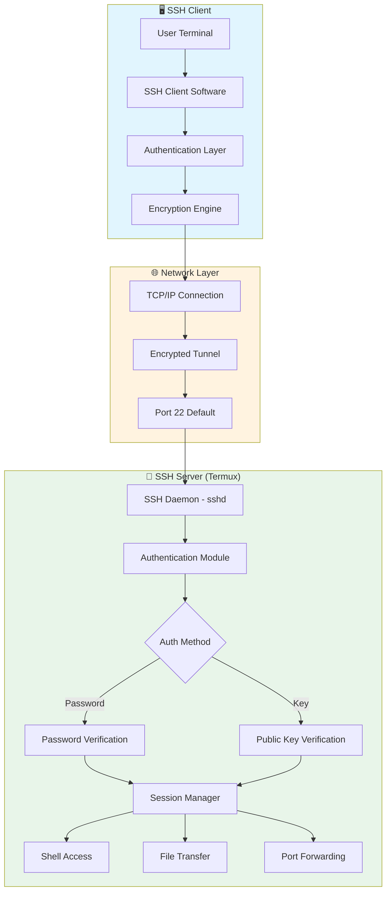
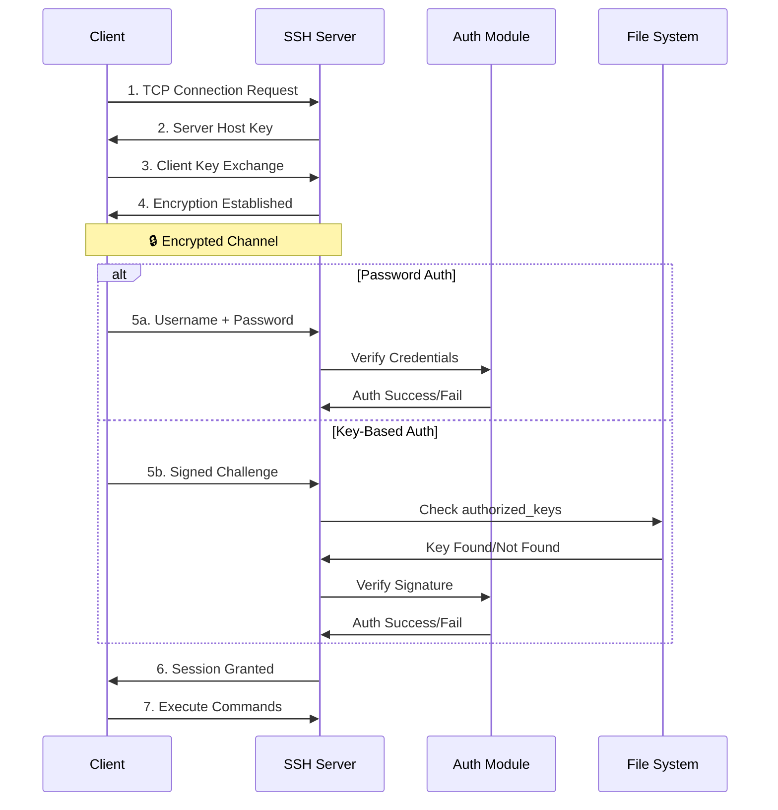
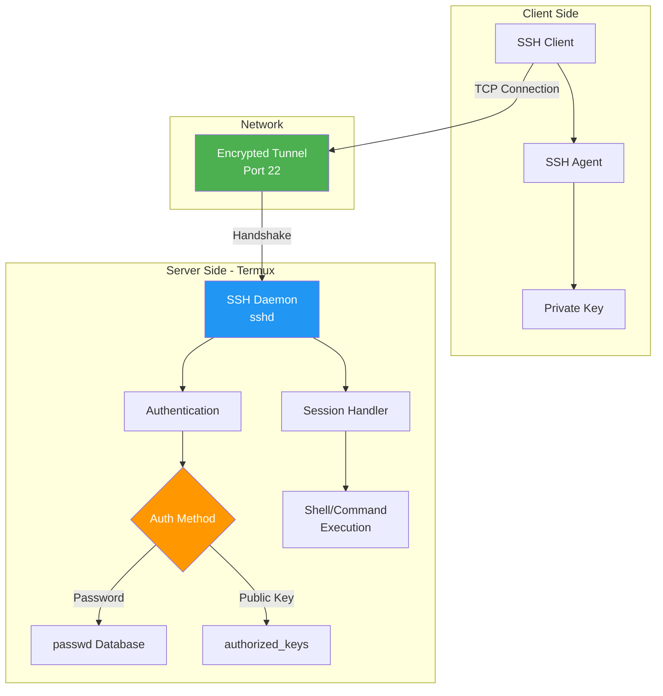
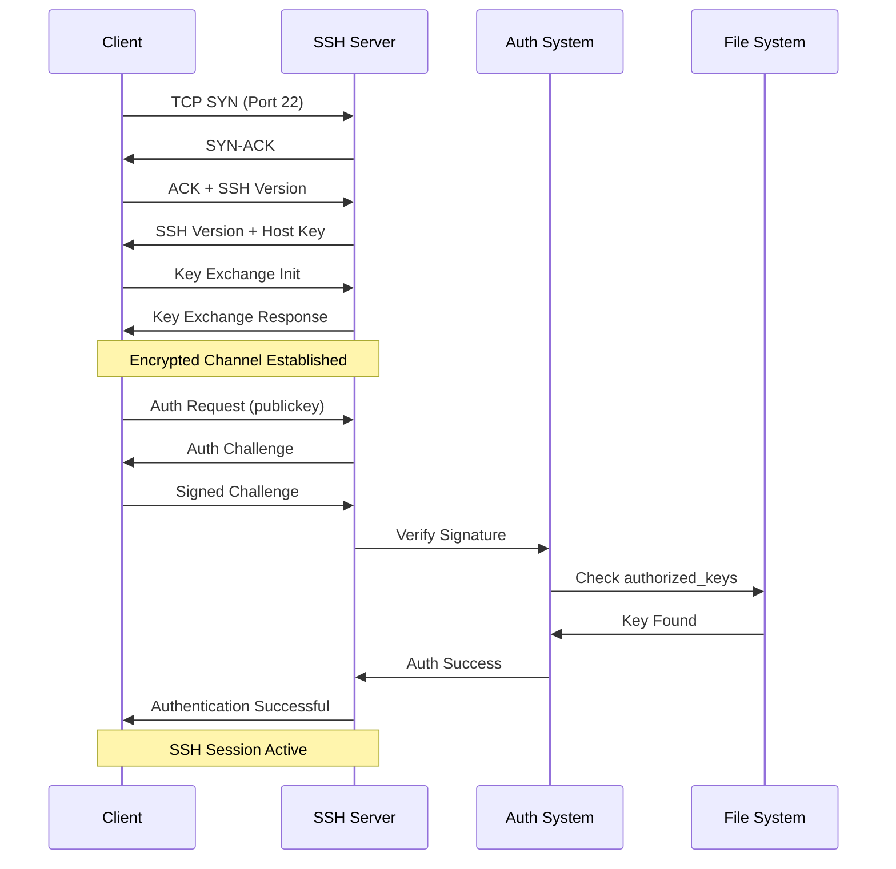
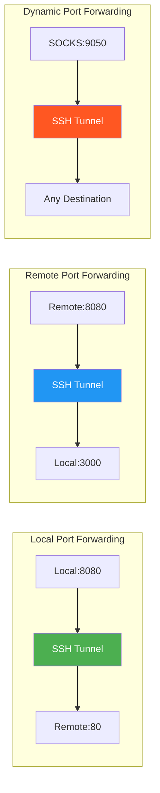
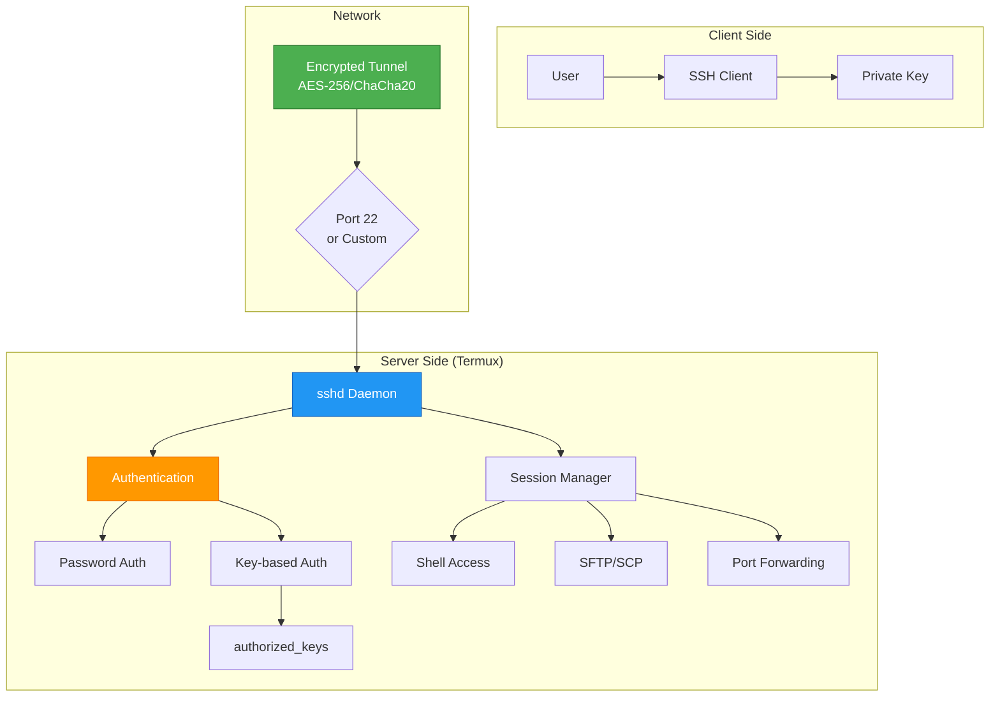
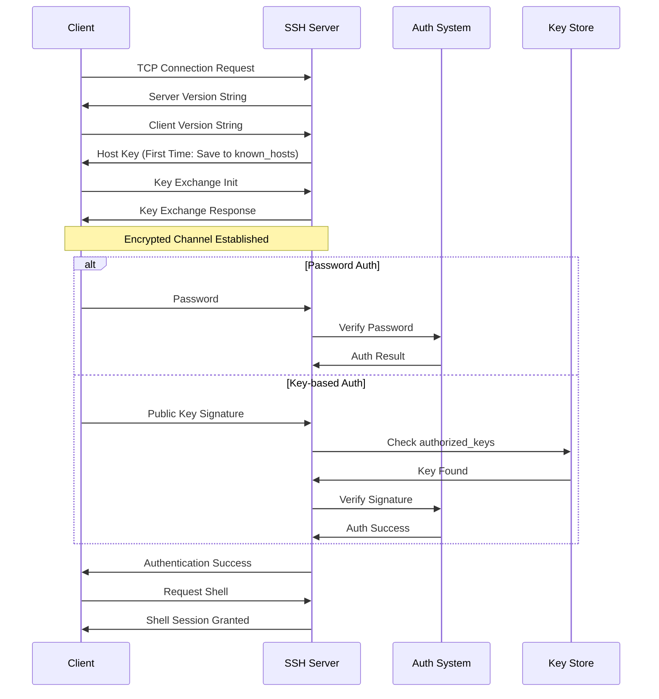
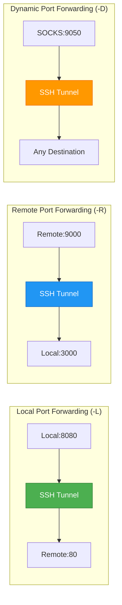

```
████████████████████████████████████████████████████████████████████████████████
█                                                                            █
█  🔐 CHAPTER 45: SSH SERVER IN TERMUX 🔐                                    █
█                                                                            █
█  ▓▓▓ Remote Access • Secure Shell • Encrypted Tunneling ▓▓▓               █
█                                                                            █
█  ⭐ Difficulty: ⭐⭐⭐ Intermediate    ⏱️ Duration: 20-25 Minutes           █
█  📚 Module: 8 - Advanced             📖 Chapter: 45 of 61                  █
█                                                                            █
████████████████████████████████████████████████████████████████████████████████
```

# Chapter 45: SSH Server in Termux

> **Module:** 8 - Advanced  
> **Chapter:** 45 of 61  
> **Duration:** 20-25 Minutes  
> **Difficulty:** ⭐⭐⭐ Intermediate

---

## 📋 Chapter Overview

| Section | Content |
|---------|---------|
| Video Script | Complete Hindi narration with timestamps |
| Technical Guide | SSH fundamentals, setup & configuration |
| Installation Guide | OpenSSH installation & setup |
| Authentication | Password & key-based authentication |
| Advanced Features | Tunneling, port forwarding, SCP/SFTP |
| Commands Reference | 25+ SSH commands covered |
| Practice Exercises | Hands-on tasks |
| Troubleshooting | Common SSH issues & fixes |
| Video Assets | Thumbnail, description, tags |

---

## 🎬 VIDEO SCRIPT (Complete Hindi Narration)

```
═══════════════════════════════════════════════════════════════════════════════
TERMUX FULL COURSE - CHAPTER 45
Title: SSH Server in Termux | Remote Access Your Phone | T3rmuxk1ng
Duration: 20-25 Minutes
═══════════════════════════════════════════════════════════════════════════════

[INTRO - 0:00 to 1:00]
─────────────────────────────────────────────────────────────────────────────

Namaskar Dosto! Welcome back to Termux Full Course by T3rmuxk1ng!

Main aapka host hoon aur aaj ka chapter bahut special hai - SSH Server!

Kya aapne kabhi socha hai ki aap apne Android phone ko remotely access 
kar sakte ho? Bina phone touch kiye - dusre computer se, dusre phone 
se, ya duniya ke kisi bhi corner se?

SSH - Secure Shell - ye sab possible bana deta hai. Aapka Android phone 
ek server ban jaata hai jisko aap kahi se bhi access kar sakte ho.

Ye chapter advanced hai, isliye dhyan se suniye aur practice karein. 
Agar previous chapters dekhe hain - networking basics, Linux commands, 
file system - to ye chapter easy lagega.

Chaliye shuru karte hain!

---

[SECTION 1: SSH FUNDAMENTALS - 1:00 to 4:30]
─────────────────────────────────────────────────────────────────────────────

Sabse pehle samjhte hain - SSH kya hai?

SSH stands for Secure Shell. Ye ek protocol hai - ek tareeka jisse 
do computers securely communicate karte hain over network.

Samjhiye aapke paas do computers hain:
- Ek Server (jisko access karna hai) - ye aapka Android phone hai
- Ek Client (jisse access karna hai) - ye aapka PC ya dusra phone hai

SSH in dono ke beech ek encrypted tunnel banata hai. Is tunnel ke 
through aap:
✓ Remote commands execute kar sakte ho
✓ Files transfer kar sakte ho
✓ Port forwarding kar sakte ho
✓ Secure browsing kar sakte ho

SSH vs Other Remote Access Methods:

┌─────────────────────────────────────────────────────────────────────────┐
│                    REMOTE ACCESS COMPARISON                              │
├────────────────┬──────────────────┬─────────────────────────────────────┤
│ Method         │ Encryption       │ Best For                            │
├────────────────┼──────────────────┼─────────────────────────────────────┤
│ SSH            │ ✅ Yes (Strong)  │ Servers, Linux systems, Termux      │
│ Telnet         │ ❌ No (Plain)    │ Only testing, NEVER production      │
│ RDP            │ ✅ Yes           │ Windows GUI remote desktop          │
│ VNC            │ ⚠️ Optional      │ GUI remote access                   │
│ FTP            │ ❌ No (Plain)    │ File transfer (insecure)            │
│ SFTP (SSH)     │ ✅ Yes           │ Secure file transfer                │
└────────────────┴──────────────────┴─────────────────────────────────────┘

SSH port 22 pe kaam karta hai by default. Lekin aap koi bhi port 
configure kar sakte ho.

SSH ki power ye hai ki ye end-to-end encryption deta hai. Koi bhi 
middle man aapka data nahi dekh sakta - na passwords, na commands, 
na files - kuch bhi nahi!

Isliye ethical hackers, system admins, developers - sab SSH use 
karte hain.

---

[SECTION 2: OPENSSH INSTALLATION - 4:30 to 7:00]
─────────────────────────────────────────────────────────────────────────────

Ab chaliye Termux mein SSH server install karte hain.

Termux mein OpenSSH package available hai. OpenSSH most popular 
SSH implementation hai - free, open-source, aur highly secure.

[OPEN TERMUX - Show terminal]

Pehle update karein:

    pkg update && pkg upgrade -y

Ab OpenSSH install karein:

    pkg install openssh -y

Ye package install hoga aur sath mein ye tools milenge:
- sshd - SSH server daemon
- ssh - SSH client
- scp - Secure copy
- sftp - Secure file transfer
- ssh-keygen - Key generation tool
- ssh-copy-id - Copy keys to server

Installation verify karein:

    sshd -V
    ssh -V

Version number dikhna chahiye. Agar dikh raha hai to installation 
successful hai!

Ek aur important package - nmap (optional but useful):

    pkg install nmap -y

Nmap se hum check karenge ki SSH server properly run ho raha hai ya nahi.

---

[SECTION 3: STARTING SSH SERVER - 7:00 to 10:00]
─────────────────────────────────────────────────────────────────────────────

Ab SSH server start karte hain.

Pehle ek important cheez - Password set karna!

SSH server ke liye aapko Termux mein password set karna padega. 
Default mein Termux mein password nahi hota.

Password set karein:

    passwd

Ye command run karein, aapko new password enter karna hoga. 
Password type karte waqt screen pe kuch nahi dikhega - ye 
security feature hai. Do baar enter karein.

Password strong rakhein - combination of letters, numbers, symbols.

Ab SSH server start karein:

    sshd

Bas! Itna hi! SSH server chal pada hai!

Check karein:

    pgrep sshd

Agar output mein ek process ID aaye to server run ho raha hai.

Ya phir:

    ps aux | grep sshd

Port check karein:

    nmap localhost

Ya:

    netstat -tlnp | grep 22

Output mein port 22 pe SSH listen karta dikhega.

---

[SECTION 4: SSH CONFIGURATION - 10:00 to 13:00]
─────────────────────────────────────────────────────────────────────────────

Ab SSH configuration samjhte hain.

Configuration file location:

    $PREFIX/etc/ssh/sshd_config

Default configuration already set hai, lekin customize kar sakte hain.

File dekhein:

    cat $PREFIX/etc/ssh/sshd_config

Important settings:

┌─────────────────────────────────────────────────────────────────────────┐
│                    SSH CONFIGURATION OPTIONS                             │
├─────────────────────────────┬───────────────────────────────────────────┤
│ Setting                     │ Description                               │
├─────────────────────────────┼───────────────────────────────────────────┤
│ Port 22                     │ SSH port (change for security)            │
│ ListenAddress 0.0.0.0       │ Listen on all interfaces                  │
│ PermitRootLogin no          │ Disable root login                        │
│ PasswordAuthentication yes  │ Enable password auth                      │
│ PubkeyAuthentication yes    │ Enable key-based auth                     │
│ PermitEmptyPasswords no     │ No empty passwords                        │
│ MaxAuthTries 3              │ Max login attempts                        │
│ ClientAliveInterval 300     │ Disconnect inactive clients               │
└─────────────────────────────┴───────────────────────────────────────────┘

Port change karna ho to:

    nano $PREFIX/etc/ssh/sshd_config

"Port 22" ko change karein to something else like "Port 2222"

Note: Configuration change ke baad server restart karna padega:

    pkill sshd
    sshd

---

[SECTION 5: CONNECTING FROM PC - 13:00 to 16:00]
─────────────────────────────────────────────────────────────────────────────

Ab main part - apne phone ko PC se connect karte hain!

Pehle phone ka IP address nikalein:

    ifconfig

Ya:

    ip addr show wlan0

Ya simple:

    hostname -I

IP address note kar lein, for example: 192.168.1.100

Ab PC pe jao (Windows/Mac/Linux):

[ON PC]

Windows ke liye:
- Command Prompt ya PowerShell open karein
- Command: ssh <username>@<phone-ip>
- Termux mein default username: u0_aXXX format ya simple

Pehle Termux mein username check karein:

    whoami

Output username note karein.

Ab PC se connect karein:

    ssh -p 22 <username>@192.168.1.100

Example:

    ssh -p 22 u0_a123@192.168.1.100

First time connect karte waqt ek message aayega:

"The authenticity of host '192.168.1.100' can't be established.
ECDSA key fingerprint is SHA256:xxxxx.
Are you sure you want to continue connecting (yes/no)?"

Type "yes" and press Enter.

Ab password poocha jaayega. Wo password enter karein jo aapne 
Termux mein `passwd` command se set kiya tha.

Login ho gaya! 🎉

Ab aap PC se apne Android phone ko control kar rahe ho!

Test karein:

    pwd
    ls
    whoami
    hostname

Sab commands Termux ke environment mein run hongi!

---

[SECTION 6: CONNECTING FROM ANOTHER PHONE - 16:00 to 17:30]
─────────────────────────────────────────────────────────────────────────────

Dusre phone se bhi connect kar sakte ho!

Dusre phone mein Termux install hona chahiye.

[ON SECOND PHONE]

Termux open karein:

    pkg install openssh -y

Ab connect karein:

    ssh <username>@<phone1-ip>

Same process - first time "yes" type karein, password enter karein.

Baaki sab same hai!

---

[SECTION 7: SSH KEY-BASED AUTHENTICATION - 17:30 to 21:00]
─────────────────────────────────────────────────────────────────────────────

Ab security ka next level - Key-based Authentication!

Password authentication mein ek problem hai - brute force attacks. 
Koi dictionary attack kar sakta hai.

Key-based authentication mein aap ek pair of keys generate karte ho:
- Private Key - Ye sirf aapke paas rehti hai, SHARE NAHIN KARNA!
- Public Key - Ye server pe rehti hai

Key generation:

[ON CLIENT PC/PHONE]

    ssh-keygen -t rsa -b 4096

Ya Ed25519 (more modern):

    ssh-keygen -t ed25519

Ye command aapse location poochegi - default mein ~/.ssh/id_rsa

Passphrase set kar sakte ho (additional security) - ya Enter press 
karke skip kar sakte ho.

Keys generate ho gayi!

Ab public key server pe copy karein:

Method 1 - ssh-copy-id:

    ssh-copy-id <username>@<server-ip>

Method 2 - Manual copy:

    cat ~/.ssh/id_rsa.pub

Ye output copy karein.

Server (Termux) pe jao:

    mkdir -p ~/.ssh
    nano ~/.ssh/authorized_keys

Public key paste karein, save karein.

Permissions set karein:

    chmod 700 ~/.ssh
    chmod 600 ~/.ssh/authorized_keys

Ab password disable kar sakte ho:

    nano $PREFIX/etc/ssh/sshd_config

Change:

    PasswordAuthentication no

Server restart:

    pkill sshd
    sshd

Ab sirf key se login hoga!

Test:

    ssh <username>@<server-ip>

Direct login - no password! 🚀

---

[SECTION 8: SCP & SFTP FILE TRANSFER - 21:00 to 23:00]
─────────────────────────────────────────────────────────────────────────────

SSH ke saath files bhi transfer kar sakte ho!

SCP - Secure Copy:

PC se phone pe file bhejni:

    scp /path/to/local/file.txt <username>@<phone-ip>:/home/username/

Phone se PC pe file lani:

    scp <username>@<phone-ip>:/home/username/file.txt /local/path/

Whole folder:

    scp -r /local/folder/ <username>@<phone-ip>:/home/username/

SFTP - Interactive File Transfer:

    sftp <username>@<phone-ip>

Commands:
- ls - list remote files
- lls - list local files
- get file.txt - download file
- put file.txt - upload file
- mkdir - create directory
- rm file - delete file
- exit - disconnect

Ye GUI FTP client jaisa hai but command line pe!

---

[SECTION 9: SSH TUNNELING & PORT FORWARDING - 23:00 to 25:00]
─────────────────────────────────────────────────────────────────────────────

SSH tunneling ek powerful feature hai!

Local Port Forwarding:

Scenario: Aapke phone pe ek web server hai port 8080 pe. PC se access karna hai.

    ssh -L 8080:localhost:8080 <username>@<phone-ip>

Ab PC pe browser mein: http://localhost:8080

Ye phone ke port 8080 ko PC ke port 8080 pe tunnel kar diya!

Remote Port Forwarding:

Phone ke local service ko expose karna internet pe:

    ssh -R 8080:localhost:80 <username>@<public-server>

Dynamic Port Forwarding (SOCKS Proxy):

    ssh -D 9050 <username>@<phone-ip>

Ab proxy configure karo: localhost:9050

All traffic SSH tunnel se jaayega!

---

[SECTION 10: SSH OVER INTERNET - 25:00 to 27:30]
─────────────────────────────────────────────────────────────────────────────

Local network se to connect kar liya, lekin internet se kaise?

Problem: Most phones ke paas public IP nahi hota. NAT ke peeche hote hain.

Solution: Tunneling Services!

Option 1: Ngrok

    pkg install ngrok

    ngrok tcp 22

Ye aapko ek public URL dega like: tcp://0.tcp.ngrok.io:12345

Dusri jagah se connect:

    ssh -p 12345 <username>@0.tcp.ngrok.io

Option 2: Serveo (No installation needed)

    ssh -R 22:localhost:22 serveo.net

Ye automatically ek subdomain dega!

Option 3: Cloudflare Tunnel (cloudflared)

    pkg install cloudflared
    cloudflared tunnel --url ssh://localhost:22

---

[SECTION 11: SECURITY BEST PRACTICES - 27:30 to 29:00]
─────────────────────────────────────────────────────────────────────────────

SSH powerful hai, lekin security important hai!

✓ DO:
- Strong password use karein
- Key-based authentication use karein
- Default port change karein (security through obscurity)
- Fail2Ban jaisa tools use karein
- SSH logs monitor karein
- Regular updates rakhein
- Only necessary users ko access dein

✗ DON'T:
- Empty password mat rakhein
- Private key share mat karein
- Untrusted networks pe SSH mat use karein (without VPN)
- Root login enable mat karein (agar not needed)
- Default port pe persistent attacks ignore mat karein

Logs check:

    cat $PREFIX/var/log/auth.log

Ya:

    last

Ye login history dikhayega!

---

[SECTION 12: SUMMARY & NEXT PREVIEW - 29:00 to 30:00]
─────────────────────────────────────────────────────────────────────────────

To dosto, Chapter 45 complete! Let's summarize:

✅ SSH fundamentals samjhe
✅ OpenSSH installation
✅ SSH server start/stop
✅ Password authentication setup
✅ PC se connection
✅ Phone se connection
✅ Key-based authentication
✅ SCP/SFTP file transfer
✅ SSH tunneling
✅ Port forwarding
✅ SSH over internet (ngrok/serveo)
✅ Security best practices

Important Commands yaad rakhein:

┌─────────────────────────────────────────────────────────────────────────┐
│                    CHAPTER 45 - IMPORTANT COMMANDS                       │
├─────────────────────────────────────────────────────────────────────────┤
│ pkg install openssh             │ Install SSH server                    │
│ passwd                          │ Set password for SSH                  │
│ sshd                            │ Start SSH server                      │
│ pkill sshd                      │ Stop SSH server                       │
│ ssh-keygen -t ed25519           │ Generate SSH keys                     │
│ ssh user@ip                     │ Connect to SSH server                 │
│ scp file user@ip:/path          │ Secure copy file                      │
│ sftp user@ip                    │ Interactive file transfer             │
│ ssh -L port:localhost:port ip   │ Local port forwarding                │
│ ssh -D 9050 user@ip             │ Dynamic port forwarding (SOCKS)      │
└─────────────────────────────────────────────────────────────────────────┘

Next Chapter 46 mein hum SSH Client seekhenge - kaise dusre servers 
ko Termux se connect karein, SSH config files, aliases, aur more!

Agar ye video helpful lagi, to:
👍 Like button press karein
🔔 Subscribe karein, notification bell on karein
💬 Koi sawal ho to comment mein poochein
📤 Share karein friends ke saath

Main har comment ka reply karta hoon.

Thank you for watching! See you in Chapter 46!

═══════════════════════════════════════════════════════════════════════════════
```

---

## 📖 TECHNICAL GUIDE

### 1. SSH Architecture

```
┌─────────────────────────────────────────────────────────────────────────┐
│                         SSH ARCHITECTURE                                 │
├─────────────────────────────────────────────────────────────────────────┤
│                                                                          │
│   CLIENT MACHINE                        SERVER (Termux)                  │
│   ┌─────────────────┐                   ┌─────────────────┐              │
│   │   SSH Client    │                   │   SSH Server    │              │
│   │   (ssh command) │                   │   (sshd daemon) │              │
│   └────────┬────────┘                   └────────┬────────┘              │
│            │                                     │                        │
│            │     ┌───────────────────────┐      │                        │
│            │     │   ENCRYPTED TUNNEL    │      │                        │
│            ├────►│  (AES-256, etc.)      │◄─────┤                        │
│            │     │   Port 22 (default)   │      │                        │
│            │     └───────────────────────┘      │                        │
│            │                                     │                        │
│   Authentication Methods:                        │                        │
│   ├─ Password Authentication                     │                        │
│   ├─ Public Key Authentication                   │                        │
│   └─ Host-based Authentication                   │                        │
│                                                                          │
│   Data Protected:                                                        │
│   ├─ Commands                                                            │
│   ├─ File transfers (SCP/SFTP)                                          │
│   ├─ Port forwarded traffic                                             │
│   └─ X11 forwarding (GUI apps)                                          │
│                                                                          │
└─────────────────────────────────────────────────────────────────────────┘
```

### 2. SSH Handshake Process

```
┌─────────────────────────────────────────────────────────────────────────┐
│                      SSH HANDSHAKE PROCESS                               │
├─────────────────────────────────────────────────────────────────────────┤
│                                                                          │
│  CLIENT                                    SERVER                        │
│    │                                         │                           │
│    │──── 1. TCP Connection (SYN) ──────────►│                           │
│    │◄─── 2. TCP Connection (SYN-ACK) ───────│                           │
│    │──── 3. TCP Connection (ACK) ──────────►│                           │
│    │                                         │                           │
│    │──── 4. SSH Version Exchange ──────────►│                           │
│    │◄─── 5. SSH Version Exchange ───────────│                           │
│    │                                         │                           │
│    │──── 6. Algorithm Negotiation ─────────►│                           │
│    │◄─── 7. Algorithm Negotiation ──────────│                           │
│    │                                         │                           │
│    │──── 8. DH Key Exchange Init ──────────►│                           │
│    │◄─── 9. DH Key Exchange Reply ──────────│                           │
│    │                                         │                           │
│    │◄─── 10. Server Host Key ───────────────│ (First time: save to     │
│    │                                         │  ~/.ssh/known_hosts)     │
│    │                                         │                           │
│    │════ ENCRYPTED CHANNEL ESTABLISHED ═════│                           │
│    │                                         │                           │
│    │──── 11. Authentication Request ───────►│                           │
│    │◄─── 12. Authentication Methods ────────│                           │
│    │                                         │                           │
│    │──── 13. Password/Key Auth ────────────►│                           │
│    │◄─── 14. Authentication Success ────────│                           │
│    │                                         │                           │
│    │═════════ SSH SESSION ACTIVE ═══════════│                           │
│                                                                          │
└─────────────────────────────────────────────────────────────────────────┘
```

### 3. Key File Locations

| Location | Purpose |
|----------|---------|
| `$PREFIX/etc/ssh/sshd_config` | SSH server configuration |
| `$PREFIX/etc/ssh/ssh_config` | SSH client configuration |
| `~/.ssh/authorized_keys` | Public keys for login |
| `~/.ssh/known_hosts` | Known server fingerprints |
| `~/.ssh/id_rsa` | Default private key (RSA) |
| `~/.ssh/id_rsa.pub` | Default public key (RSA) |
| `~/.ssh/id_ed25519` | Default private key (Ed25519) |
| `~/.ssh/id_ed25519.pub` | Default public key (Ed25519) |
| `$PREFIX/var/run/sshd.pid` | SSH daemon process ID |

### 4. SSH Configuration Options

```bash
# $PREFIX/etc/ssh/sshd_config - Server Configuration

# Network Settings
Port 22                          # SSH port (change for security)
ListenAddress 0.0.0.0            # Listen on all interfaces
AddressFamily any                # IPv4 and IPv6

# Authentication
PermitRootLogin no               # Disable root login
PubkeyAuthentication yes         # Enable key-based auth
PasswordAuthentication yes       # Enable password auth
PermitEmptyPasswords no          # No empty passwords
MaxAuthTries 3                   # Max login attempts
MaxSessions 10                   # Max sessions per connection

# Security
ChallengeResponseAuthentication no
UsePAM no                        # Not available in Termux
X11Forwarding no                 # Disable X11 forwarding
PrintMotd yes                    # Print message of the day

# Logging
SyslogFacility AUTH
LogLevel INFO

# Timeout Settings
ClientAliveInterval 300          # Check client every 5 min
ClientAliveCountMax 2            # Disconnect after 2 misses

# Subsystems
Subsystem sftp $PREFIX/libexec/sftp-server
```

---

## 🔧 INSTALLATION & SETUP GUIDE

### Step-by-Step SSH Server Setup

```bash
# Step 1: Update Termux
pkg update && pkg upgrade -y

# Step 2: Install OpenSSH
pkg install openssh -y

# Step 3: Set password for SSH authentication
passwd
# Enter strong password twice

# Step 4: Start SSH server
sshd

# Step 5: Verify server is running
pgrep sshd
# Output: Process ID (e.g., 12345)

# Step 6: Check SSH port is listening
netstat -tlnp | grep 22
# Or: nmap localhost

# Step 7: Get your IP address
hostname -I
# Or: ifconfig wlan0

# Step 8: Test connection locally
ssh localhost
# Or: ssh 127.0.0.1
```

### Auto-start SSH on Termux Launch

```bash
# Create bashrc entry
echo 'sshd' >> ~/.bashrc

# Or use Termux:Boot for startup
mkdir -p ~/.termux/boot
echo '#!/data/data/com.termux/files/usr/bin/sh
sshd' > ~/.termux/boot/sshd-start.sh
chmod +x ~/.termux/boot/sshd-start.sh
```

---

## 🔑 KEY-BASED AUTHENTICATION

### Generating SSH Keys

```bash
# RSA Key (4096 bits - traditional)
ssh-keygen -t rsa -b 4096 -C "your_email@example.com"

# Ed25519 Key (Modern, faster, more secure)
ssh-keygen -t ed25519 -C "your_email@example.com"

# ECDSA Key (256 bits)
ssh-keygen -t ecdsa -b 256 -C "your_email@example.com"

# With custom filename
ssh-keygen -t ed25519 -f ~/.ssh/my_custom_key -C "description"

# Without passphrase (less secure, but convenient)
ssh-keygen -t ed25519 -N "" -C "no_passphrase"
```

### Setting Up Authorized Keys

```bash
# On SERVER (Termux):
# Create .ssh directory
mkdir -p ~/.ssh

# Set proper permissions
chmod 700 ~/.ssh

# Create authorized_keys file
touch ~/.ssh/authorized_keys
chmod 600 ~/.ssh/authorized_keys

# Edit and add public key
nano ~/.ssh/authorized_keys
# Paste your public key content (id_ed25519.pub or id_rsa.pub)
```

### Copying Keys to Server

```bash
# Method 1: ssh-copy-id (easiest)
ssh-copy-id -i ~/.ssh/id_ed25519.pub username@server-ip

# Method 2: Manual copy via SSH
cat ~/.ssh/id_ed25519.pub | ssh username@server-ip "mkdir -p ~/.ssh && cat >> ~/.ssh/authorized_keys"

# Method 3: SCP copy
scp ~/.ssh/id_ed25519.pub username@server-ip:~/.ssh/authorized_keys
```

### Disable Password Authentication

```bash
# Edit SSH config
nano $PREFIX/etc/ssh/sshd_config

# Change these lines:
PasswordAuthentication no
ChallengeResponseAuthentication no
UsePAM no

# Restart SSH server
pkill sshd
sshd
```

---

## 📡 CONNECTION METHODS

### Connecting from PC (Windows/Mac/Linux)

```bash
# Basic connection
ssh username@192.168.1.100

# With specific port
ssh -p 2222 username@192.168.1.100

# With specific identity file
ssh -i ~/.ssh/my_key username@192.168.1.100

# With verbose output (debugging)
ssh -v username@192.168.1.100
ssh -vvv username@192.168.1.100  # Maximum verbosity

# Running command on remote server
ssh username@192.168.1.100 "ls -la"

# With X11 forwarding (GUI apps)
ssh -X username@192.168.1.100

# With SSH agent forwarding
ssh -A username@192.168.1.100
```

### SSH Config File for Easy Connections

```bash
# Create/edit ~/.ssh/config
nano ~/.ssh/config

# Add entries:
Host termux
    HostName 192.168.1.100
    Port 22
    User u0_a123
    IdentityFile ~/.ssh/id_ed25519
    ServerAliveInterval 60
    ServerAliveCountMax 3

Host termux-tunnel
    HostName 192.168.1.100
    Port 2222
    User u0_a123
    LocalForward 8080 localhost:8080

# Now simply connect with:
ssh termux

# Instead of:
ssh -p 22 -i ~/.ssh/id_ed25519 u0_a123@192.168.1.100
```

---

## 🚇 SSH TUNNELING & PORT FORWARDING

### Local Port Forwarding (-L)

```bash
# Syntax: ssh -L [local_port]:[remote_host]:[remote_port] user@server

# Forward phone's web server (port 8080) to PC's localhost:8080
ssh -L 8080:localhost:8080 username@phone-ip

# Forward phone's database (port 3306) to PC's localhost:3306
ssh -L 3306:localhost:3306 username@phone-ip

# Access remote service through SSH tunnel
ssh -L 9000:internal-server:80 username@jump-server

# Multiple tunnels in one command
ssh -L 8080:localhost:8080 -L 3306:localhost:3306 username@phone-ip
```

### Remote Port Forwarding (-R)

```bash
# Syntax: ssh -R [remote_port]:[local_host]:[local_port] user@server

# Expose local service on remote server
ssh -R 8080:localhost:3000 username@public-server

# Expose local web server to internet via remote server
ssh -R 80:localhost:8080 username@public-server
```

### Dynamic Port Forwarding (-D) - SOCKS Proxy

```bash
# Create SOCKS proxy on local port 9050
ssh -D 9050 username@server-ip

# Use with applications:
# Firefox: Settings → Network → Manual proxy → SOCKS: localhost:9050
# curl: curl --socks5 localhost:9050 http://example.com

# With SSH config for easy use
Host socks-proxy
    HostName server-ip
    DynamicForward 9050
```

### Reverse SSH Tunnel (For NAT Traversal)

```bash
# On phone (behind NAT), connect to public server
ssh -R 2222:localhost:22 username@public-server

# Now from any machine, connect to phone via public server
ssh -p 2222 phone-username@public-server
```

---

## 📁 FILE TRANSFER (SCP/SFTP)

### SCP - Secure Copy

```bash
# Copy local file to remote server
scp /path/to/local/file.txt username@server:/path/to/destination/

# Copy remote file to local machine
scp username@server:/path/to/remote/file.txt /local/destination/

# Copy entire directory
scp -r /local/directory/ username@server:/remote/destination/

# With specific port
scp -P 2222 file.txt username@server:/path/

# With specific identity
scp -i ~/.ssh/key file.txt username@server:/path/

# Preserve timestamps and permissions
scp -p file.txt username@server:/path/

# Show progress and statistics
scp -v file.txt username@server:/path/

# Limit bandwidth (KB/s)
scp -l 100 file.txt username@server:/path/
```

### SFTP - Interactive File Transfer

```bash
# Connect to SFTP
sftp username@server

# SFTP Commands:
sftp> help                    # Show all commands
sftp> ls                      # List remote files
sftp> lls                     # List local files
sftp> pwd                     # Print remote working directory
sftp> lpwd                    # Print local working directory
sftp> cd /path                # Change remote directory
sftp> lcd /path               # Change local directory
sftp> mkdir dirname           # Create remote directory
sftp> rmdir dirname           # Remove remote directory
sftp> get file.txt            # Download file
sftp> get -r directory/       # Download directory
sftp> put file.txt            # Upload file
sftp> put -r directory/       # Upload directory
sftp> rm file.txt             # Delete remote file
sftp> rename old new          # Rename remote file
sftp> chmod 755 file          # Change permissions
sftp> chown user:group file   # Change ownership
sftp> exit                    # Exit SFTP

# Batch mode - download multiple files
sftp username@server << EOF
cd /remote/path
get file1.txt
get file2.txt
get file3.txt
exit
EOF
```

### rsync over SSH

```bash
# Install rsync
pkg install rsync -y

# Sync local to remote
rsync -avz /local/path/ username@server:/remote/path/

# Sync remote to local
rsync -avz username@server:/remote/path/ /local/path/

# With progress bar
rsync -avz --progress /local/path/ username@server:/remote/path/

# Delete files that don't exist in source
rsync -avz --delete /local/path/ username@server:/remote/path/

# Exclude certain files
rsync -avz --exclude '*.log' /local/path/ username@server:/remote/path/

# Dry run (test without actual transfer)
rsync -avz --dry-run /local/path/ username@server:/remote/path/
```

---

## 🌐 SSH OVER INTERNET

### Using Ngrok

```bash
# Install ngrok
pkg install ngrok

# Sign up at ngrok.com and get auth token
ngrok config add-authtoken YOUR_AUTH_TOKEN

# Create TCP tunnel for SSH
ngrok tcp 22

# Output:
# Session Status: online
# Forwarding: tcp://0.tcp.ngrok.io:12345 -> localhost:22

# Connect from anywhere:
ssh -p 12345 username@0.tcp.ngrok.io
```

### Using Serveo

```bash
# No installation required!
# Just run:
ssh -R 22:localhost:22 serveo.net

# Or specify port:
ssh -R yourname:22:localhost:22 serveo.net

# Connect with:
ssh -o ProxyCommand="nc -X 5 -x yourname.serveo.net:22 %h %p" username@localhost
```

### Using Cloudflare Tunnel

```bash
# Install cloudflared
pkg install cloudflared

# Create tunnel
cloudflared tunnel --url ssh://localhost:22

# Or use cloudflare access
cloudflared access ssh --hostname your-domain.com
```

### Using Tailscale (Mesh VPN)

```bash
# Install tailscale
pkg install tailscale

# Start tailscale
tailscaled &
tailscale up

# Follow URL to authenticate
# Now all devices on your tailnet can connect directly

# Connect using tailscale IP
ssh username@100.x.y.z
```

---

## 📋 COMMANDS REFERENCE

### SSH Server Commands

```bash
# Installation & Setup
pkg install openssh              # Install OpenSSH
passwd                           # Set/change password for SSH

# Server Control
sshd                             # Start SSH server
pkill sshd                       # Stop SSH server
pgrep sshd                       # Check if running
ps aux | grep sshd               # Detailed process info

# Configuration
cat $PREFIX/etc/ssh/sshd_config  # View config
nano $PREFIX/etc/ssh/sshd_config # Edit config

# Logs & Monitoring
last                             # Login history
w                                # Who is logged in
who                              # Logged in users
```

### SSH Client Commands

```bash
# Basic Connection
ssh user@host                    # Connect to server
ssh -p 2222 user@host            # Specific port
ssh -i ~/.ssh/key user@host      # With identity file
ssh -v user@host                 # Verbose (debug)
ssh -vvv user@host               # Maximum verbosity

# Remote Command Execution
ssh user@host "command"          # Run single command
ssh user@host "cmd1; cmd2"       # Multiple commands
ssh user@host "cmd1 && cmd2"     # Conditional execution

# Tunneling
ssh -L 8080:localhost:80 user@host    # Local forward
ssh -R 8080:localhost:80 user@host    # Remote forward
ssh -D 9050 user@host                 # SOCKS proxy
ssh -L 8080:remote:80 user@host       # Forward to another host
```

### SSH Key Commands

```bash
# Key Generation
ssh-keygen -t ed25519            # Ed25519 key
ssh-keygen -t rsa -b 4096        # RSA 4096-bit key
ssh-keygen -t ecdsa -b 521       # ECDSA 521-bit key
ssh-keygen -f ~/.ssh/custom_key  # Custom filename

# Key Management
ssh-keygen -l -f ~/.ssh/id_ed25519.pub    # Fingerprint
ssh-keygen -y -f ~/.ssh/id_ed25519        # Show public from private
ssh-keygen -p -f ~/.ssh/id_ed25519        # Change passphrase
ssh-keygen -c -f ~/.ssh/id_ed25519        # Change comment
ssh-keygen -R hostname                     # Remove from known_hosts

# Copy Key to Server
ssh-copy-id user@host            # Copy default key
ssh-copy-id -i ~/.ssh/key.pub user@host  # Specific key
```

### SCP Commands

```bash
# Upload
scp file.txt user@host:/path/              # Single file
scp -r folder/ user@host:/path/            # Directory
scp file1.txt file2.txt user@host:/path/   # Multiple files

# Download
scp user@host:/path/file.txt ./            # Single file
scp -r user@host:/path/folder/ ./          # Directory

# Options
scp -P 2222 file user@host:/path/          # Specific port
scp -i ~/.ssh/key file user@host:/path/    # Identity file
scp -p file user@host:/path/               # Preserve attributes
scp -C file user@host:/path/               # Compress
scp -r -p -C folder/ user@host:/path/      # Combined options
```

### SFTP Commands

```bash
# Connect
sftp user@host                   # Connect to server
sftp -P 2222 user@host           # Specific port

# Navigation
pwd                              # Remote current directory
lpwd                             # Local current directory
ls                               # List remote
lls                              # List local
cd /path                         # Change remote directory
lcd /path                        # Change local directory

# File Operations
get file.txt                     # Download file
get -r folder/                   # Download directory
put file.txt                     # Upload file
put -r folder/                   # Upload directory
rm file.txt                      # Delete remote file
mkdir dirname                    # Create remote directory
rmdir dirname                    # Remove remote directory

# Batch Mode
sftp -b batchfile.txt user@host  # Run commands from file
```

### rsync Commands

```bash
# Basic Sync
rsync -avz source/ dest/         # Local sync
rsync -avz source/ user@host:dest/   # Push to remote
rsync -avz user@host:source/ dest/   # Pull from remote

# Options
-a                               # Archive mode (preserve all)
-v                               # Verbose
-z                               # Compress during transfer
-h                               # Human-readable
--progress                       # Show progress
--delete                         # Delete extra files in dest
--exclude 'pattern'              # Exclude files
--include 'pattern'              # Include files
--dry-run                        # Test without changes
--bwlimit=1000                   # Limit bandwidth (KB/s)

# Examples
rsync -avzhe ssh --progress /local/ user@host:/remote/
rsync -avz --delete --exclude '*.log' src/ user@host:dest/
```

### Network Diagnostic Commands

```bash
# Check SSH Port
netstat -tlnp | grep 22          # Check listening
nmap localhost                   # Scan localhost
nmap -p 22 phone-ip              # Scan remote

# IP Address
hostname -I                      # All IP addresses
ip addr show wlan0               # WiFi interface IP
ifconfig wlan0                   # WiFi IP (traditional)

# Connection Testing
ssh -T git@github.com            # Test GitHub SSH
nc -zv host 22                   # Test port connectivity
telnet host 22                   # Test SSH port (if available)
```

### SSH Agent Commands

```bash
# Start agent
eval $(ssh-agent)                # Start SSH agent

# Add keys
ssh-add                          # Add default key
ssh-add ~/.ssh/custom_key        # Add specific key
ssh-add -l                       # List added keys
ssh-add -L                       # List public keys
ssh-add -d ~/.ssh/key            # Remove key
ssh-add -D                       # Remove all keys

# Kill agent
ssh-agent -k                     # Kill SSH agent
```

---

## 💻 PRACTICE EXERCISES

### Exercise 1: Basic SSH Setup

```bash
# Task: Set up SSH server and connect locally

# Step 1: Install and configure
pkg update && pkg upgrade -y
pkg install openssh -y

# Step 2: Set password
passwd
# Enter a strong password

# Step 3: Start server
sshd

# Step 4: Verify
pgrep sshd
netstat -tlnp | grep 22

# Step 5: Local connection test
ssh localhost
# Accept host key, enter password

# Step 6: Run commands
whoami
pwd
ls -la

# Step 7: Exit
exit

# Expected: Successfully connected and executed commands
```

### Exercise 2: SSH Key Setup

```bash
# Task: Generate and use SSH keys

# Step 1: Generate Ed25519 key
ssh-keygen -t ed25519 -C "my-termux-key"

# Step 2: View public key
cat ~/.ssh/id_ed25519.pub

# Step 3: Set up authorized keys
mkdir -p ~/.ssh
chmod 700 ~/.ssh
cat ~/.ssh/id_ed25519.pub >> ~/.ssh/authorized_keys
chmod 600 ~/.ssh/authorized_keys

# Step 4: Test key-based login
ssh localhost

# Expected: Login without password prompt
```

### Exercise 3: SCP File Transfer

```bash
# Task: Transfer files using SCP

# On Termux (Server):
# Step 1: Create test file
echo "This is a test file from Termux" > ~/test_file.txt
echo "Another file" > ~/another_file.txt
mkdir -p ~/test_folder
echo "File in folder" > ~/test_folder/folder_file.txt

# On PC (Client):
# Step 2: Download single file
scp username@phone-ip:~/test_file.txt ./

# Step 3: Download multiple files
scp username@phone-ip:~/{test_file.txt,another_file.txt} ./

# Step 4: Download directory
scp -r username@phone-ip:~/test_folder ./

# Step 5: Upload file to Termux
echo "From PC" > pc_file.txt
scp pc_file.txt username@phone-ip:~/

# Step 6: Verify on Termux
ls -la ~/
cat ~/pc_file.txt

# Expected: Files transferred successfully
```

### Exercise 4: SSH Tunneling

```bash
# Task: Create and use SSH tunnels

# Prerequisites: Install Python and create simple web server
pkg install python -y

# On Termux:
# Step 1: Create web content
mkdir -p ~/webroot
echo "<h1>Hello from Termux SSH Tunnel!</h1>" > ~/webroot/index.html

# Step 2: Start simple web server
cd ~/webroot
python -m http.server 8080 &

# Step 3: Verify local access
curl http://localhost:8080

# On PC:
# Step 4: Create SSH tunnel
ssh -L 9999:localhost:8080 username@phone-ip

# Step 5: Access through tunnel (in another terminal)
curl http://localhost:9999

# Or open in browser: http://localhost:9999

# Expected: Web content accessible via tunnel
```

### Exercise 5: SFTP Batch Operations

```bash
# Task: Automated file transfer with SFTP

# Step 1: Create batch file
cat > sftp_batch.txt << 'EOF'
mkdir backup
cd backup
put test_file.txt
put another_file.txt
get pc_file.txt
ls
exit
EOF

# Step 2: Run batch transfer
sftp -b sftp_batch.txt username@phone-ip

# Expected: Batch commands executed automatically
```

### Exercise 6: Port Forwarding Web Service

```bash
# Task: Expose Termux web service via SSH tunnel

# On Termux:
# Step 1: Install and start service
pkg install nodejs -y
node -e "require('http').createServer((req,res)=>res.end('Termux Web Server')).listen(3000)" &

# On PC:
# Step 2: Create tunnel
ssh -L 3000:localhost:3000 username@phone-ip

# Step 3: Access
curl http://localhost:3000
# Or browser: http://localhost:3000

# Expected: Web service accessible
```

### Exercise 7: SSH Over Internet with Ngrok

```bash
# Task: Access Termux SSH over internet

# Step 1: Install ngrok
pkg install ngrok -y

# Step 2: Configure (use your auth token from ngrok.com)
ngrok config add-authtoken YOUR_TOKEN

# Step 3: Create tunnel
ngrok tcp 22

# Step 4: Note the forwarding address
# Example: tcp://0.tcp.ngrok.io:12345

# Step 5: Connect from anywhere
ssh -p 12345 username@0.tcp.ngrok.io

# Expected: SSH connection over internet
```

---

## ⚠️ TROUBLESHOOTING

### Problem 1: "Connection refused"

```bash
# Cause: SSH server not running or wrong port

# Solution 1: Check if sshd is running
pgrep sshd
# If no output, start server:
sshd

# Solution 2: Check port
netstat -tlnp | grep 22
# Should show sshd listening on port 22

# Solution 3: Check firewall (if any)
# Termux doesn't have firewall by default

# Solution 4: Check if using correct port
# Default is 22, if changed:
ssh -p YOUR_PORT username@ip
```

### Problem 2: "Permission denied"

```bash
# Cause: Wrong password or key issue

# Solution 1: Verify password is set
passwd
# Set new password

# Solution 2: Check username
whoami
# Use exact username in SSH command

# Solution 3: For key-based auth, check permissions
ls -la ~/.ssh/
# Should be:
# .ssh/ = 700 (drwx------)
# authorized_keys = 600 (-rw-------)

# Fix permissions:
chmod 700 ~/.ssh
chmod 600 ~/.ssh/authorized_keys

# Solution 4: Check if key is correct
ssh -v username@ip
# Look for "Trying private key" messages

# Solution 5: Check PasswordAuthentication setting
grep PasswordAuthentication $PREFIX/etc/ssh/sshd_config
# Should be "yes" if using password auth
```

### Problem 3: "Host key verification failed"

```bash
# Cause: Server key changed or first connection

# Solution 1: Remove old key
ssh-keygen -R server-ip
# Or:
ssh-keygen -R hostname

# Solution 2: Remove all known hosts (nuclear option)
rm ~/.ssh/known_hosts

# Solution 3: For first connection, type "yes" when prompted
# "Are you sure you want to continue connecting (yes/no)?"
```

### Problem 4: "Network is unreachable"

```bash
# Cause: Wrong IP or network issue

# Solution 1: Verify IP address
hostname -I
ip addr show wlan0

# Solution 2: Check if on same network
# Both devices must be on same WiFi for local access

# Solution 3: Check WiFi is connected
ping -c 3 google.com

# Solution 4: Use correct interface IP
# wlan0 = WiFi
# rmnet0 = Mobile data
```

### Problem 5: SSH slow or laggy

```bash
# Cause: DNS resolution or network issues

# Solution 1: Disable DNS lookup in config
nano $PREFIX/etc/ssh/sshd_config
# Add:
UseDNS no

# Solution 2: Use IP instead of hostname
ssh user@192.168.1.100  # Instead of ssh user@hostname

# Solution 3: Enable compression
ssh -C user@host

# Solution 4: Check network latency
ping phone-ip
```

### Problem 6: SSH session disconnects

```bash
# Cause: Timeout or network interruption

# Solution 1: Add keepalive to client config
nano ~/.ssh/config
# Add:
Host *
    ServerAliveInterval 60
    ServerAliveCountMax 3

# Solution 2: Add keepalive to server config
nano $PREFIX/etc/ssh/sshd_config
# Set:
ClientAliveInterval 300
ClientAliveCountMax 2

# Solution 3: Use screen/tmux for persistent sessions
pkg install screen tmux -y
screen -S mysession
# Reconnect: screen -r mysession
```

### Problem 7: "No route to host"

```bash
# Cause: Device not reachable on network

# Solution 1: Check WiFi connection
ifconfig wlan0

# Solution 2: Check if both on same network
# Android hotspot can have different subnet

# Solution 3: Check if WiFi isolation is enabled
# Some routers have AP isolation

# Solution 4: Try pinging first
ping phone-ip
```

### Problem 8: Port already in use

```bash
# Cause: Another service on port 22

# Solution 1: Find what's using port 22
netstat -tlnp | grep 22

# Solution 2: Use different port
nano $PREFIX/etc/ssh/sshd_config
# Change: Port 2222

# Restart:
pkill sshd
sshd

# Solution 3: Kill conflicting process
kill -9 $(lsof -t -i:22)
```

### Problem 9: Can't connect after changing config

```bash
# Cause: Syntax error in config

# Solution 1: Test config
sshd -t
# Will show errors if any

# Solution 2: Check config syntax
grep -v "^#" $PREFIX/etc/ssh/sshd_config | grep -v "^$"

# Solution 3: Restore default config
cp $PREFIX/etc/ssh/sshd_config $PREFIX/etc/ssh/sshd_config.bak
# Reinstall openssh
pkg reinstall openssh
```

### Problem 10: SCP/SFTP not working

```bash
# Cause: Subsystem not configured

# Solution 1: Check sftp subsystem
grep Subsystem $PREFIX/etc/ssh/sshd_config
# Should show: Subsystem sftp $PREFIX/libexec/sftp-server

# Solution 2: Add if missing
echo 'Subsystem sftp $PREFIX/libexec/sftp-server' >> $PREFIX/etc/ssh/sshd_config

# Solution 3: Restart sshd
pkill sshd
sshd

# Solution 4: Use scp with verbose
scp -v file user@host:/path/
```

---

## 🎬 VIDEO ASSETS

### Thumbnail Concepts

**Option A: Clean & Professional**
```
┌────────────────────────────────────┐
│  [Dark Terminal Background]        │
│                                    │
│   🔐 SSH SERVER                    │
│   IN TERMUX                        │
│                                    │
│   ✓ Remote Access                  │
│   ✓ File Transfer                  │
│   ✓ No Root Required               │
│                                    │
│   [T3rmuxk1ng Logo]                │
└────────────────────────────────────┘
```

**Option B: Connection Style**
```
┌────────────────────────────────────┐
│  📱 Phone ←──── SSH ────→ 💻 PC    │
│                                    │
│  REMOTE ACCESS                     │
│  YOUR ANDROID                      │
│                                    │
│  🚀 Full Control                   │
│  🔒 Encrypted                      │
│                                    │
│  Chapter 45 | T3rmuxk1ng           │
└────────────────────────────────────┘
```

**Option C: Feature Highlight**
```
┌────────────────────────────────────┐
│  ⚡ SSH SERVER MASTERY             │
│                                    │
│  ✅ Password Auth                  │
│  ✅ Key-based Auth                 │
│  ✅ Port Forwarding                │
│  ✅ SCP & SFTP                     │
│  ✅ Internet Access                │
│                                    │
│  Complete Guide!                   │
│  [T3rmuxk1ng]                      │
└────────────────────────────────────┘
```

### Video Description Template

```markdown
🔐 Termux Full Course - Chapter 45: SSH Server in Termux | Remote Access Your Phone

🔥 In this video you'll learn:
• SSH fundamentals aur architecture
• OpenSSH installation aur configuration
• SSH server start/stop karna
• Password authentication setup
• SSH key generation aur setup
• PC se phone connect karna
• Dusre phone se connect karna
• SCP/SFTP se file transfer
• SSH tunneling aur port forwarding
• Internet se SSH access (ngrok/serveo)
• Security best practices

⏱️ Timestamps:
0:00 - Introduction
1:00 - SSH Fundamentals
4:30 - OpenSSH Installation
7:00 - Starting SSH Server
10:00 - SSH Configuration
13:00 - Connecting from PC
16:00 - Connecting from Another Phone
17:30 - Key-based Authentication
21:00 - SCP & SFTP File Transfer
23:00 - SSH Tunneling
25:00 - SSH Over Internet
27:30 - Security Best Practices
29:00 - Summary

📝 Commands from this video:
pkg install openssh -y
passwd
sshd
ssh-keygen -t ed25519
ssh user@ip
scp file user@ip:/path/

📥 Useful Links:
• OpenSSH: https://www.openssh.com/
• Ngrok: https://ngrok.com/
• Serveo: https://serveo.net/

📚 Full Course Playlist:
[PLAYLIST LINK]

📱 Follow T3rmuxk1ng:
• YouTube: @T3rmuxk1ng
• Telegram: [LINK]
• GitHub: [LINK]

#Termux #SSH #TermuxCourse #T3rmuxk1ng #RemoteAccess #SSHServer #EthicalHacking #LinuxOnAndroid

---
⚠️ Disclaimer: This video is for educational purposes only. Use SSH responsibly and only on devices you own or have permission to access.
```

### Tags List

```
termux ssh, termux ssh server, ssh in termux, termux remote access,
ssh server android, termux openssh, ssh tutorial, ssh explained,
ssh key authentication, scp termux, sftp termux, ssh tunneling,
port forwarding ssh, termux course, termux full course, t3rmuxk1ng,
android ssh server, remote access android, ssh over internet,
ssh keygen, authorized_keys, ssh config, termux advanced,
ethical hacking, cybersecurity, linux commands
```

### Hashtags

```
#Termux #SSH #SSHServer #TermuxCourse #RemoteAccess #AndroidSSH
#EthicalHacking #CyberSecurity #T3rmuxk1ng #LinuxOnAndroid
#SCPSFTP #SSHTunneling #PortForwarding #SSHKeys #OpenSSH
```

---

## 📚 ADDITIONAL RESOURCES

### Official Documentation

| Resource | Link |
|----------|------|
| OpenSSH Manual | https://www.openssh.com/manual.html |
| SSH Config Examples | https://man.openbsd.org/ssh_config |
| SSH Protocol RFC | https://tools.ietf.org/html/rfc4251 |
| Termux Wiki SSH | https://wiki.termux.com/wiki/Remote_Access |

### Learning Resources

| Resource | Description |
|----------|-------------|
| SSH Academy | https://www.ssh.com/academy/ssh |
| DigitalOcean SSH Guide | Comprehensive SSH tutorials |
| Red Hat SSH Documentation | Enterprise SSH best practices |
| Arch Wiki SSH | Detailed Linux SSH guide |

### Tools & Services

| Tool | Purpose |
|------|---------|
| OpenSSH | Standard SSH implementation |
| PuTTY | Windows SSH client (GUI) |
| MobaXterm | Advanced terminal for Windows |
| Termius | Cross-platform SSH client |
| Ngrok | TCP tunnel for internet access |
| Tailscale | Mesh VPN for secure access |

---

## ✅ CHAPTER CHECKLIST

Before moving to Chapter 46, verify:

- [ ] OpenSSH installed successfully
- [ ] Password set with `passwd` command
- [ ] SSH server starts with `sshd` command
- [ ] Able to connect locally (`ssh localhost`)
- [ ] Able to connect from PC on same network
- [ ] SSH keys generated (`ssh-keygen`)
- [ ] Key-based authentication working
- [ ] SCP file transfer tested
- [ ] SFTP commands understood
- [ ] Basic port forwarding attempted
- [ ] Configuration file location known
- [ ] Security best practices understood

---

## 🎯 NEXT CHAPTER PREVIEW

**Chapter 46: SSH Client in Termux**

- SSH client configuration
- Connecting to external servers
- SSH config file customization
- SSH aliases and shortcuts
- SSH agent usage
- ProxyJump and jump hosts
- Advanced SSH options
- Troubleshooting remote connections

---

**Chapter Complete! 🎉**

*Created by T3rmuxk1ng | Termux Full Course*

---

## 🎮 INTERACTIVE QUIZ - Test Your Knowledge!

<details>
<summary>❓ Q1: What port does SSH use by default?</summary>

**Answer: Port 22**

SSH (Secure Shell) uses port 22 by default for incoming connections. This is defined in the SSH protocol specification and can be changed in the configuration file for security through obscurity.

**Explanation:** The default SSH port 22 is well-known and often targeted by attackers. Changing it to a non-standard port (like 2222) can reduce automated attacks, though it's not a substitute for proper security measures like key-based authentication and fail2ban.
</details>

<details>
<summary>❓ Q2: Which SSH key type is recommended for modern systems?</summary>

**Answer: Ed25519**

Ed25519 is the recommended key type for modern systems because it offers:
- Smaller key size (only 256 bits)
- Faster key generation and authentication
- Better security than RSA with much smaller keys
- Resistance to side-channel attacks

**Explanation:** While RSA 4096-bit keys are still widely used and secure, Ed25519 provides equivalent security with much smaller keys and faster operations. It's based on elliptic curve cryptography and is the modern standard for SSH keys.
</details>

<details>
<summary>❓ Q3: What is the difference between SCP and SFTP?</summary>

**Answer: SCP is for quick transfers, SFTP is interactive**

- **SCP (Secure Copy Protocol):** Command-line tool for quick file transfers, non-interactive, faster for single operations
- **SFTP (SSH File Transfer Protocol):** Interactive file transfer with directory browsing, resume capability, and more features

**Explanation:** SCP is ideal when you know exactly what file you need to transfer. SFTP is better when you need to browse directories, transfer multiple files interactively, or perform complex file operations. Both use SSH encryption.
</details>

<details>
<summary>❓ Q4: What does `ssh-keygen -t ed25519 -C "email"` command do?</summary>

**Answer: Generates an Ed25519 SSH key pair with a comment**

This command:
- Creates a new SSH key pair using Ed25519 algorithm
- Adds a comment (typically email) to identify the key
- Stores keys in ~/.ssh/id_ed25519 (private) and ~/.ssh/id_ed25519.pub (public)

**Explanation:** The -t flag specifies the key type, -C adds a comment for identification. The private key must be kept secret, while the public key is copied to servers you want to access.
</details>

<details>
<summary>❓ Q5: What is SSH tunneling used for?</summary>

**Answer: Securely accessing services through encrypted SSH connection**

SSH tunneling allows you to:
- Access internal services that aren't directly exposed
- Bypass firewall restrictions
- Encrypt traffic for any protocol
- Create SOCKS proxies for secure browsing

**Explanation:** There are three types: Local (-L), Remote (-R), and Dynamic (-D) port forwarding. Local forwarding lets you access remote services locally, Remote forwarding exposes local services remotely, and Dynamic creates a SOCKS proxy.
</details>

<details>
<summary>❓ Q6: What is the purpose of ~/.ssh/authorized_keys file?</summary>

**Answer: Stores public keys allowed to authenticate**

The authorized_keys file contains public keys that are permitted to log in to the system. When someone tries to connect with a matching private key, they're granted access without a password.

**Explanation:** This is the foundation of key-based authentication. Each line in the file contains one public key. The server checks if the connecting client has the corresponding private key for any entry in this file.
</details>

<details>
<summary>❓ Q7: How do you copy your SSH public key to a remote server?</summary>

**Answer: Use ssh-copy-id command**

The easiest method is:
```bash
ssh-copy-id user@server-ip
```

Alternative manual method:
```bash
cat ~/.ssh/id_ed25519.pub | ssh user@server "mkdir -p ~/.ssh && cat >> ~/.ssh/authorized_keys"
```

**Explanation:** ssh-copy-id handles everything automatically - creates the .ssh directory if needed, sets proper permissions (700 for directory, 600 for authorized_keys), and appends the key correctly.
</details>

<details>
<summary>❓ Q8: What is the difference between password and key-based authentication?</summary>

**Answer: Key-based is more secure and convenient**

- **Password:** Vulnerable to brute force attacks, requires typing password each time
- **Key-based:** Uses cryptographic keys, immune to brute force, can be passwordless

**Explanation:** Key-based authentication uses public-key cryptography. Even if someone knows your passphrase, they need the private key file. Keys can be 4096+ bits, making brute force impossible with current technology.
</details>

<details>
<summary>❓ Q9: What is the role of known_hosts file?</summary>

**Answer: Stores fingerprints of previously connected servers**

The ~/.ssh/known_hosts file contains the host keys of servers you've connected to. It prevents man-in-the-middle attacks by warning you if a server's fingerprint changes.

**Explanation:** On first connection, SSH asks you to verify and save the server's fingerprint. Future connections verify against this stored fingerprint. If it changes, SSH warns you of potential security issues.
</details>

<details>
<summary>❓ Q10: What command creates a SOCKS proxy through SSH?</summary>

**Answer: ssh -D 9050 user@server**

The -D flag creates a dynamic port forward, which functions as a SOCKS proxy. All traffic through this proxy is encrypted through the SSH tunnel.

**Explanation:** After running this command, configure your browser or applications to use SOCKS5 proxy at localhost:9050. This routes all that traffic through the encrypted SSH connection to your server.
</details>

<details>
<summary>❓ Q11: What is the SSH config file and where is it located?</summary>

**Answer: ~/.ssh/config - stores server connection profiles**

The SSH client configuration file allows you to define:
- Host aliases
- Default usernames
- Custom ports
- Identity files
- Tunnel configurations

**Explanation:** Instead of typing long SSH commands, you can define hosts with all their settings. Then simply use `ssh aliasname` to connect with all pre-configured options.
</details>

<details>
<summary>❓ Q12: How do you enable SSH server on Termux?</summary>

**Answer: Install openssh and run sshd**

Steps:
1. `pkg install openssh -y`
2. `passwd` (set password)
3. `sshd` (start server)

**Explanation:** Termux doesn't have SSH server by default. OpenSSH package provides both client and server. You must set a password before starting the server for authentication to work.
</details>

<details>
<summary>❓ Q13: What is the purpose of SSH agent?</summary>

**Answer: Manages SSH keys and remembers passphrases**

SSH agent:
- Holds decrypted private keys in memory
- Automatically provides keys for authentication
- Avoids typing passphrase repeatedly

**Explanation:** Start with `eval "$(ssh-agent -s)"`, add keys with `ssh-add`. Your passphrase is entered once per session, and the agent handles authentication automatically thereafter.
</details>

<details>
<summary>❓ Q14: What is the difference between local and remote port forwarding?</summary>

**Answer: Direction of the tunnel**

- **Local (-L):** Access remote service locally (remote → local)
- **Remote (-R):** Expose local service remotely (local → remote)

**Explanation:** Local forwarding (`ssh -L 8080:localhost:80 server`) lets you access a remote web server on your local port 8080. Remote forwarding (`ssh -R 8080:localhost:3000 server`) exposes your local port 3000 on the remote server's port 8080.
</details>

<details>
<summary>❓ Q15: What security measures should be applied to SSH server?</summary>

**Answer: Multiple layers of security**

Essential security measures:
1. Use key-based authentication only
2. Disable password authentication
3. Change default port
4. Disable root login
5. Use fail2ban
6. Limit user access
7. Keep software updated
8. Monitor logs

**Explanation:** Defense in depth is crucial for SSH security. Each measure adds a layer of protection. Even if one fails, others protect your system. Start with key authentication, then progressively add more measures.
</details>

---

## 🎯 INTERVIEW QUESTIONS - Job Preparation

### Q1: Explain SSH handshake process in detail.

**Answer:** The SSH handshake involves multiple steps:

1. **TCP Connection:** Client connects to server on port 22
2. **Version Exchange:** Both parties exchange SSH protocol versions
3. **Algorithm Negotiation:** Agree on encryption, MAC, and key exchange algorithms
4. **Key Exchange:** Using Diffie-Hellman or ECDH to generate shared secret
5. **Server Authentication:** Server proves identity using host key
6. **Client Authentication:** Password or key-based authentication
7. **Session Establishment:** Encrypted channel is now active

**Follow-up:** What happens if the server's host key changes?

When a server's host key changes, SSH warns about potential man-in-the-middle attack. This could mean the server was reinstalled, its keys regenerated, or actual attack. Security-conscious administrators investigate before proceeding.

---

### Q2: Compare SSH with Telnet. Why is SSH preferred?

**Answer:**

| Feature | SSH | Telnet |
|---------|-----|--------|
| Encryption | Yes (AES-256, etc.) | No |
| Authentication | Key-based, password | Password only |
| Port Forwarding | Yes | No |
| File Transfer | SCP/SFTP | Requires FTP |
| Integrity Check | Yes (HMAC) | No |

SSH is preferred because all data (including passwords) is encrypted. Telnet sends everything in plain text, making it trivial to intercept credentials on the network. SSH also provides additional features like tunneling and secure file transfer.

**Follow-up:** When might Telnet still be used?

Telnet is still used for:
- Network device configuration on isolated management networks
- Debugging text-based protocols
- Legacy systems that don't support SSH
- Testing connectivity when SSH isn't available

---

### Q3: How would you secure an SSH server for production use?

**Answer:**

```bash
# 1. Edit SSH config
sudo nano /etc/ssh/sshd_config

# Key changes:
Port 2222                    # Change default port
PermitRootLogin no           # Disable root login
PasswordAuthentication no    # Key-only auth
PubkeyAuthentication yes     # Enable keys
MaxAuthTries 3               # Limit attempts
AllowUsers specificuser      # Limit users
ClientAliveInterval 300      # Timeout inactive sessions

# 2. Set up fail2ban
sudo apt install fail2ban
sudo systemctl enable fail2ban

# 3. Use strong Ed25519 keys
ssh-keygen -t ed25519 -b 4096

# 4. Restrict by IP (if applicable)
# In /etc/hosts.allow
sshd: 192.168.1.0/24

# 5. Enable 2FA (optional)
sudo apt install libpam-google-authenticator
```

**Follow-up:** What's the single most important security measure?

Key-based authentication with passphrase-protected keys, combined with disabling password authentication. This eliminates brute force attacks entirely and provides strong cryptographic authentication.

---

### Q4: Explain SSH tunneling and provide real-world examples.

**Answer:**

SSH tunneling creates encrypted pathways for traffic:

**Local Port Forwarding (-L):**
```bash
ssh -L 3306:localhost:3306 db.example.com
# Access remote MySQL locally on port 3306
```

**Remote Port Forwarding (-R):**
```bash
ssh -R 8080:localhost:3000 public-server.com
# Expose local dev server publicly
```

**Dynamic Port Forwarding (-D):**
```bash
ssh -D 9050 proxy.example.com
# Create SOCKS proxy for all traffic
```

**Real-world scenarios:**
- Accessing internal company resources from home
- Bypassing restrictive firewalls securely
- Secure browsing on public WiFi
- Database administration through encrypted channel
- Accessing IoT devices on private networks

**Follow-up:** How would you troubleshoot a tunnel that's not working?

Check:
1. Is the SSH connection successful?
2. Is the local port already in use? (`netstat -tlnp | grep PORT`)
3. Are you binding to correct interface (127.0.0.1 vs 0.0.0.0)?
4. Is the remote service actually running on specified port?
5. Check firewall rules on both ends

---

### Q5: How do SSH keys work? Explain the cryptography.

**Answer:**

SSH uses asymmetric cryptography:

1. **Key Generation:** `ssh-keygen` creates a key pair
   - Private key: Never shared, stays on client
   - Public key: Shared with servers

2. **Authentication Process:**
   - Client sends authentication request with public key
   - Server checks if public key is in authorized_keys
   - Server sends encrypted challenge using public key
   - Only correct private key can decrypt and respond
   - Authentication succeeds if response is correct

3. **Key Types:**
   - RSA: Traditional, widely compatible
   - Ed25519: Modern, faster, more secure
   - ECDSA: Elliptic curve based

The security relies on the mathematical relationship: what one key encrypts, only the other can decrypt, and deriving private key from public key is computationally infeasible.

**Follow-up:** What makes Ed25519 better than RSA?

Ed25519 advantages:
- 256-bit key vs 4096-bit RSA for similar security
- Faster signing and verification
- Smaller signatures
- Built-in resistance to side-channel attacks
- Deterministic signatures (same input = same output)

---

### Q6: How would you troubleshoot SSH connection issues?

**Answer:**

```bash
# Step 1: Check network connectivity
ping server.com
telnet server.com 22

# Step 2: Verbose SSH output
ssh -vvv user@server.com

# Step 3: Check if server is running
# On server:
sudo systemctl status sshd
sudo netstat -tlnp | grep 22

# Step 4: Check firewall
sudo iptables -L -n | grep 22
sudo ufw status

# Step 5: Check logs
sudo tail -f /var/log/auth.log

# Step 6: Verify key permissions
ls -la ~/.ssh/
# Should be: id_rsa 600, .ssh 700, authorized_keys 600

# Step 7: Test with password
ssh -o PreferredAuthentications=password user@server

# Step 8: Check if TCP wrappers blocking
cat /etc/hosts.deny
```

Common issues:
- Wrong permissions on .ssh directory or keys
- Server not running
- Firewall blocking
- Wrong username or IP
- Key mismatch
- hosts.deny blocking

**Follow-up:** What does "Connection refused" vs "Connection timed out" indicate?

- **Connection refused:** Server is reachable but SSH isn't running on that port
- **Connection timed out:** Can't reach the server (firewall, network issue, wrong IP)

---

### Q7: What is the role of known_hosts and how does it protect you?

**Answer:**

The ~/.ssh/known_hosts file stores fingerprints of servers you've connected to:

**Purpose:**
1. Server identity verification
2. Man-in-the-middle attack prevention
3. Trust on first use (TOFU) model

**How it works:**
- First connection: Server's fingerprint is saved
- Subsequent connections: Fingerprint compared
- Mismatch: Warning issued, connection blocked

**Example warning:**
```
@@@@@@@@@@@@@@@@@@@@@@@@@@@@@@@@@@@@@@@@@@@@@@@@@@@@@@@@@@@
@    WARNING: REMOTE HOST IDENTIFICATION HAS CHANGED!    @
@@@@@@@@@@@@@@@@@@@@@@@@@@@@@@@@@@@@@@@@@@@@@@@@@@@@@@@@@@@
```

**Management:**
```bash
# Remove old entry
ssh-keygen -R server.com

# View fingerprints
ssh-keygen -l -f ~/.ssh/known_hosts

# Disable checking (NOT recommended)
ssh -o StrictHostKeyChecking=no user@server
```

**Follow-up:** When might you legitimately see this warning?

Legitimate reasons:
- Server reinstalled
- SSH keys regenerated
- Server IP address changed
- Load balancer rotating between servers

Always investigate before proceeding!

---

### Q8: How would you automate SSH tasks in a DevOps pipeline?

**Answer:**

**Method 1: SSH with commands**
```bash
ssh user@server 'sudo systemctl restart nginx'
```

**Method 2: Resource scripts**
```bash
# script.rc
use exploit/multi/handler
set LHOST 192.168.1.50
exploit -j

# Run
msfconsole -r script.rc
```

**Method 3: Ansible (recommended for complex tasks)**
```yaml
- name: Deploy application
  hosts: servers
  tasks:
    - name: Pull latest code
      git: repo=git@github.com:org/repo.git dest=/app
    - name: Restart service
      service: name=app state=restarted
```

**Method 4: SSH with key-only auth**
```bash
# CI/CD pipeline
ssh -i $SSH_PRIVATE_KEY -o StrictHostKeyChecking=no user@server 'deploy.sh'
```

**Method 5: Expect scripts**
```bash
#!/usr/bin/expect
spawn ssh user@server
expect "password:"
send "mypassword\r"
expect "$ "
send "deploy.sh\r"
```

**Follow-up:** What security considerations for CI/CD?

1. Use deploy keys (not personal keys)
2. Store private keys in CI secrets
3. Use short-lived keys when possible
4. Restrict key access to specific IPs
5. Audit SSH access logs
6. Use jump hosts for internal servers

---

### Q9: Explain SSH jump hosts and ProxyJump.

**Answer:**

Jump hosts (bastion hosts) are intermediate servers for accessing protected networks:

**Traditional method:**
```bash
# Two-step process
ssh jump-server
ssh internal-server
```

**Using ProxyJump (-J):**
```bash
ssh -J jumpuser@jumpserver internaluser@internalserver
```

**SSH Config approach:**
```
Host jump
    HostName jump.example.com
    User jumpuser

Host internal
    HostName 10.0.0.50
    User internaluser
    ProxyJump jump
```

**Multiple jumps:**
```bash
ssh -J user1@jump1,user2@jump2 user3@final-server
```

**Security benefits:**
- Single entry point to secure
- Easier logging and monitoring
- Network segmentation
- Reduced attack surface

**Follow-up:** How does ProxyJump work internally?

ProxyJump uses SSH's built-in ProxyCommand:
1. Establishes connection to jump host
2. Opens a channel through jump host to target
3. All communication flows through encrypted SSH tunnels
4. No port exposure on intermediate servers

---

### Q10: How would you handle SSH for 100+ servers in production?

**Answer:**

**1. Configuration Management:**
```bash
# ~/.ssh/config
Host web-*
    User deploy
    IdentityFile ~/.ssh/web_keys
    ForwardAgent yes

Host db-*
    User dbadmin
    IdentityFile ~/.ssh/db_keys
    LocalForward 3306 localhost:3306

Host *
    ServerAliveInterval 60
    ServerAliveCountMax 3
    Compression yes
```

**2. SSH Key Management:**
```bash
# Use SSH certificate authority
ssh-keygen -s ca_key -I user@company -V +52w user_key.pub
```

**3. Automation with tools:**
- Ansible for configuration
- Terraform for provisioning
- HashiCorp Vault for secrets

**4. Monitoring:**
```bash
# SSH access monitoring
tail -f /var/log/auth.log | grep "session opened"
```

**5. Centralized logging:**
- Forward auth logs to SIEM
- Alert on suspicious patterns

**Follow-up:** How do you rotate SSH keys at scale?

1. Generate new keys
2. Distribute via Ansible/salt
3. Update authorized_keys on all servers
4. Revoke old keys
5. Update known_hosts if needed

Use SSH certificates for easier management - rotate CA key once instead of updating all servers.

---

## 🔥 REAL-WORLD SCENARIOS

### Scenario 1: Remote Development Setup

```
┌─────────────────────────────────────────────────────────────────────────────┐
│ 🔧 SCENARIO: Developer needs to work from home on office server           │
└─────────────────────────────────────────────────────────────────────────────┘

PROBLEM:
Developer wants to code from home but code and database are on office server.
Direct access is blocked by firewall.

SOLUTION:
┌─────────┐                    ┌─────────┐                    ┌─────────┐
│  HOME   │  SSH Tunnel        │ JUMP    │  Internal Network  │ DEV     │
│  LAPTOP │ ─────────────────► │ HOST    │ ─────────────────► │ SERVER  │
│         │  Encrypted         │         │                    │         │
└─────────┘                    └─────────┘                    └─────────┘

COMMANDS:
# Method 1: Direct tunnel through jump host
ssh -J jumpuser@office-jump.com devuser@10.0.0.100

# Method 2: Local port forwarding for database
ssh -L 3306:dev-db:3306 -J jumpuser@office-jump.com devuser@10.0.0.100

# Method 3: Full development environment
ssh -L 3000:localhost:3000 \     # Web server
    -L 3306:dev-db:3306 \        # Database
    -L 5432:dev-db:5432 \        # PostgreSQL
    -J jumpuser@office-jump.com devuser@10.0.0.100

# SSH Config for easy access
Host office-dev
    HostName 10.0.0.100
    User devuser
    ProxyJump jumpuser@office-jump.com
    LocalForward 3306 dev-db:3306
    LocalForward 3000 localhost:3000

# Now simply: ssh office-dev
```

### Scenario 2: Secure File Backup System

```
┌─────────────────────────────────────────────────────────────────────────────┐
│ 💾 SCENARIO: Automate encrypted backups from Termux to backup server       │
└─────────────────────────────────────────────────────────────────────────────┘

REQUIREMENTS:
- Backup photos daily
- Encrypt during transfer
- Verify backup integrity
- Email notification on failure

SOLUTION SCRIPT:

#!/bin/bash
# backup-photos.sh - Secure automated backup

BACKUP_SERVER="backupuser@backup.example.com"
REMOTE_PATH="/backups/termux-photos"
LOCAL_PATH="/sdcard/DCIM/Camera"
DATE=$(date +%Y%m%d_%H%M%S)
LOG_FILE="$HOME/backup.log"
SSH_KEY="$HOME/.ssh/backup_key"

log() {
    echo "[$(date '+%Y-%m-%d %H:%M:%S')] $1" | tee -a "$LOG_FILE"
}

# Check SSH connection
if ! ssh -i "$SSH_KEY" -o ConnectTimeout=10 "$BACKUP_SERVER" "exit" 2>/dev/null; then
    log "ERROR: Cannot connect to backup server"
    exit 1
fi

# Sync with rsync over SSH
log "Starting backup..."
rsync -avz --progress \
    -e "ssh -i $SSH_KEY" \
    "$LOCAL_PATH/" "$BACKUP_SERVER:$REMOTE_PATH/$DATE/"

if [ $? -eq 0 ]; then
    log "SUCCESS: Backup completed"
    
    # Verify backup
    REMOTE_COUNT=$(ssh -i "$SSH_KEY" "$BACKUP_SERVER" \
        "find $REMOTE_PATH/$DATE -type f | wc -l")
    LOCAL_COUNT=$(find "$LOCAL_PATH" -type f | wc -l)
    
    if [ "$REMOTE_COUNT" -eq "$LOCAL_COUNT" ]; then
        log "VERIFIED: $REMOTE_COUNT files backed up"
    else
        log "WARNING: File count mismatch"
    fi
else
    log "ERROR: Backup failed"
    exit 1
fi

# Keep only last 30 days of backups
ssh -i "$SSH_KEY" "$BACKUP_SERVER" \
    "cd $REMOTE_PATH && ls -t | tail -n +31 | xargs -r rm -rf"

log "Old backups cleaned"
```

### Scenario 3: IoT Device Management

```
┌─────────────────────────────────────────────────────────────────────────────┐
│ 🌐 SCENARIO: Manage multiple IoT devices through SSH gateway               │
└─────────────────────────────────────────────────────────────────────────────┐

PROBLEM:
50 IoT devices on private network (192.168.100.0/24), accessible only through
gateway server. Need to update all devices.

NETWORK TOPOLOGY:
┌─────────┐         ┌─────────┐         ┌─────────┐
│ ADMIN   │   SSH   │ GATEWAY │   SSH   │ IoT 1   │
│ PC      │ ───────►│ SERVER  │ ───────►│ IoT 2   │
└─────────┘         └─────────┘         │ ...     │
                                        │ IoT 50  │
                                        └─────────┘

AUTOMATION SCRIPT:

#!/bin/bash
# iot-updater.sh - Update all IoT devices

GATEWAY="gateway.example.com"
IOT_USER="admin"
SSH_KEY="$HOME/.ssh/iot_management_key"
DEVICE_RANGE="192.168.100.{1..50}"
UPDATE_CMD="apt update && apt upgrade -y && systemctl restart iot-service"

# Function to update single device
update_device() {
    local ip=$1
    echo "Updating $ip..."
    
    ssh -i "$SSH_KEY" -J "$GATEWAY" "$IOT_USER@$ip" "$UPDATE_CMD"
    
    if [ $? -eq 0 ]; then
        echo "✓ $ip updated successfully"
    else
        echo "✗ $ip update failed"
    fi
}

# Parallel updates (5 at a time)
export -f update_device
export SSH_KEY IOT_USER UPDATE_CMD

printf "%s\n" {192.168.100.1..192.168.100.50} | xargs -P5 -I{} bash -c 'update_device "$@"' _ {}

# Or using SSH config:
# ~/.ssh/config
Host iot-*
    User admin
    IdentityFile ~/.ssh/iot_management_key
    ProxyJump gateway.example.com
    StrictHostKeyChecking no

# Then simply: ssh iot-1 "apt update && apt upgrade -y"
```

### Scenario 4: Emergency Server Rescue

```
┌─────────────────────────────────────────────────────────────────────────────┐
│ 🚨 SCENARIO: Production server unresponsive, need emergency SSH access    │
└─────────────────────────────────────────────────────────────────────────────┘

SITUATION:
Web server not responding, SSH timing out. Need to diagnose and fix.

TROUBLESHOOTING STEPS:

# Step 1: Check basic connectivity
ping -c 3 server.example.com

# Step 2: Check if SSH port is open
nc -zv server.example.com 22

# Step 3: Try with verbose output
ssh -vvv -o ConnectTimeout=10 admin@server.example.com

# Step 4: Check different port (if configured)
ssh -p 2222 admin@server.example.com

# Step 5: Use alternative access method
# If you have console access (VPS provider):
# - Access VNC console
# - Check logs: tail -f /var/log/auth.log
# - Check disk space: df -h
# - Check memory: free -h
# - Check processes: ps aux

# Step 6: Rescue via single user mode
# Reboot server, access GRUB, add 'init=/bin/bash'
# Mount filesystem: mount -o remount,rw /
# Fix the issue

# Step 7: If SSH daemon crashed
# Connect via console, restart SSH
systemctl restart sshd

# Step 8: Check firewall
iptables -L -n
ufw status

# Step 9: Common fixes
# Disk full?
rm -rf /var/log/*.log.1
# Too many connections?
pkill -u baduser
# Wrong permissions?
chmod 700 ~/.ssh && chmod 600 ~/.ssh/authorized_keys
```

### Scenario 5: Multi-hop Data Pipeline

```
┌─────────────────────────────────────────────────────────────────────────────┐
│ 📊 SCENARIO: Pull data from database behind multiple firewalls            │
└─────────────────────────────────────────────────────────────────────────────┘

ARCHITECTURE:
┌─────────┐     ┌─────────┐     ┌─────────┐     ┌─────────┐
│ TERMUX  │────►│ BASTION │────►│ APP     │────►│ DATABASE│
│ CLIENT  │ SSH │ HOST    │ SSH │ SERVER  │ SSH │ SERVER  │
└─────────┘     └─────────┘     └─────────┘     └─────────┘
   Home           DMZ            App Network     DB Network

SOLUTION:

# Method 1: Chain SSH tunnels
ssh -L 3306:localhost:3306 \
    -J bastion@example.com,appuser@app.internal dbuser@db.internal

# Method 2: Nested tunnels
# First tunnel to bastion
ssh -L 2222:app.internal:22 bastion@example.com

# Second tunnel through first
ssh -p 2222 -L 3306:db.internal:3306 appuser@localhost

# Method 3: SSH config for multi-hop
Host bastion
    HostName bastion.example.com
    User bastionuser

Host app-server
    HostName app.internal
    User appuser
    ProxyJump bastion

Host db-server
    HostName db.internal
    User dbuser
    ProxyJump app-server
    LocalForward 3306 localhost:3306

# Access database
ssh db-server
mysql -h 127.0.0.1 -P 3306 -u dbuser -p

# Automated data pull script
#!/bin/bash
# pull-data.sh

# Establish tunnel in background
ssh -fN db-server

# Wait for tunnel
sleep 2

# Pull data
mysqldump -h 127.0.0.1 -P 3306 -u dbuser -p'password' mydb > backup.sql

# Close tunnel
pkill -f "ssh.*db-server"

echo "Data pulled successfully!"
```

---

## 📊 ARCHITECTURE DIAGRAMS

### SSH Server Architecture

```
┌─────────────────────────────────────────────────────────────────────────────┐
│                        SSH SERVER ARCHITECTURE                              │
└─────────────────────────────────────────────────────────────────────────────┘

                           ┌──────────────────────┐
                           │   EXTERNAL CLIENT    │
                           │   (PC/Mobile)        │
                           └──────────┬───────────┘
                                      │
                    ┌─────────────────┼─────────────────┐
                    │                 │                 │
                    ▼                 ▼                 ▼
              ┌───────────┐    ┌───────────┐    ┌───────────┐
              │ Password  │    │  Key-based│    │   Host    │
              │   Auth    │    │   Auth    │    │   Keys    │
              └───────────┘    └───────────┘    └───────────┘
                    │                 │                 │
                    └─────────────────┼─────────────────┘
                                      │
                                      ▼
                    ┌─────────────────────────────────┐
                    │       SSH DAEMON (sshd)         │
                    │    ┌───────────────────────┐    │
                    │    │  • Authentication    │    │
                    │    │  • Authorization     │    │
                    │    │  • Encryption        │    │
                    │    │  • Session Management│    │
                    │    └───────────────────────┘    │
                    └─────────────────────────────────┘
                                      │
                    ┌─────────────────┼─────────────────┐
                    │                 │                 │
                    ▼                 ▼                 ▼
              ┌───────────┐    ┌───────────┐    ┌───────────┐
              │   Shell   │    │   SCP/    │    │   Port    │
              │  Access   │    │   SFTP    │    │ Forwarding│
              └───────────┘    └───────────┘    └───────────┘
```

### SSH Tunnel Flow

```
┌─────────────────────────────────────────────────────────────────────────────┐
│                           SSH TUNNEL FLOW                                   │
└─────────────────────────────────────────────────────────────────────────────┘

LOCAL PORT FORWARDING (-L):
══════════════════════════════════════════════════════════════════════════════

┌─────────────┐         ┌─────────────┐         ┌─────────────┐
│   CLIENT    │         │   SSH       │         │   REMOTE    │
│   BROWSER   │────────►│   SERVER    │────────►│   SERVICE   │
│             │  HTTP   │   (Tunnel)  │  HTTP   │   (MySQL)   │
└─────────────┘  :8080  └─────────────┘  :3306  └─────────────┘
                                   
     localhost:8080 ──► SSH Tunnel ──► remote:3306


REMOTE PORT FORWARDING (-R):
══════════════════════════════════════════════════════════════════════════════

┌─────────────┐         ┌─────────────┐         ┌─────────────┐
│   LOCAL     │         │   SSH       │         │   REMOTE    │
│   SERVICE   │◄────────│   SERVER    │◄────────│   CLIENT    │
│   (Web)     │  HTTP   │   (Tunnel)  │  HTTP   │             │
└─────────────┘  :3000  └─────────────┘  :8080  └─────────────┘
                                    
     local:3000 ◄── SSH Tunnel ◄── remote:8080


DYNAMIC PORT FORWARDING (-D):
══════════════════════════════════════════════════════════════════════════════

┌─────────────┐         ┌─────────────┐         ┌─────────────┐
│   CLIENT    │         │   SSH       │         │   INTERNET  │
│   APPS      │────────►│   SERVER    │────────►│   TARGETS   │
│             │  SOCKS  │   (Proxy)   │  HTTP   │             │
└─────────────┘  :9050  └─────────────┘         └─────────────┘
                                    
     All Traffic via SOCKS5 through SSH Server
```

### Authentication Flow

```
┌─────────────────────────────────────────────────────────────────────────────┐
│                        SSH AUTHENTICATION FLOW                              │
└─────────────────────────────────────────────────────────────────────────────┘

CLIENT                                           SERVER
  │                                                │
  │  1. Connection Request                        │
  │─────────────────────────────────────────────►│
  │                                                │
  │  2. Server sends its public host key          │
  │◄─────────────────────────────────────────────│
  │                                                │
  │  3. Client verifies host key (known_hosts)    │
  │                                                │
  │  4. Key Exchange (Diffie-Hellman)             │
  │◄─────────────────────────────────────────────►│
  │                                                │
  │  5. Encrypted channel established             │
  │═══════════════════════════════════════════════│
  │                                                │
  │  6. Authentication Request (publickey)        │
  │─────────────────────────────────────────────►│
  │                                                │
  │  7. Server sends challenge encrypted          │
  │     with client's public key                  │
  │◄─────────────────────────────────────────────│
  │                                                │
  │  8. Client decrypts with private key          │
  │     and signs response                        │
  │─────────────────────────────────────────────►│
  │                                                │
  │  9. Server verifies signature                 │
  │◄─────────────────────────────────────────────│
  │                                                │
  │ 10. Authentication Success                   │
  │◄═════════════════════════════════════════════│
  │                                                │
```

---

## 🔗 RELATED CHAPTERS

| Category | Chapters | Description |
|----------|----------|-------------|
| **Prerequisites** | Ch 10-12 | Linux Commands, File System |
| | Ch 22-24 | Networking Basics |
| | Ch 44 | Network Utilities |
| **Current Chapter** | **Ch 45** | **SSH Server Setup** |
| **Next** | Ch 46 | SSH Client Usage |
| | Ch 47 | Web Server Setup |
| | Ch 48 | Database in Termux |
| **Advanced** | Ch 49 | Proot Distros |
| | Ch 50 | Metasploit Proot |
| | Ch 57-60 | Security Tools |

---

## 🏆 BONUS ADVANCED CONTENT

### Bonus 1: SSH Certificate Authority

Instead of managing individual keys on each server, use SSH certificates:

```bash
# Create CA key pair
ssh-keygen -t rsa -b 4096 -f ~/.ssh/ca -C "SSH CA"

# Sign user key
ssh-keygen -s ~/.ssh/ca \
    -I "user@company.com" \
    -n admin,deploy \
    -V +52w \
    ~/.ssh/id_ed25519.pub

# Sign host key (on server)
ssh-keygen -s ~/.ssh/ca \
    -I "server.example.com" \
    -h \
    -V +52w \
    /etc/ssh/ssh_host_ed25519_key.pub

# Configure server to trust CA
echo "TrustedUserCAKeys ~/.ssh/ca.pub" >> /etc/ssh/sshd_config

# Configure client to trust host CA
echo "@cert-authority * $(cat ~/.ssh/ca.pub)" >> ~/.ssh/known_hosts
```

### Bonus 2: SSH over Tor for Anonymity

```bash
# Install Tor
pkg install tor -y

# Start Tor service
tor &

# SSH over Tor
torify ssh user@server.onion

# Or configure ProxyCommand
Host anon-ssh
    HostName server.onion
    User user
    ProxyCommand nc -X 5 -x 127.0.0.1:9050 %h %p

# SSH with Tor and key
torify ssh -i ~/.ssh/anonymous_key user@server.onion
```

### Bonus 3: Persistent Reverse SSH Tunnel

Create a persistent reverse tunnel that auto-reconnects:

```bash
#!/bin/bash
# persistent-tunnel.sh - Self-healing reverse SSH tunnel

REMOTE="user@public-server.com"
REMOTE_PORT=2222
LOCAL_PORT=22
KEY="$HOME/.ssh/tunnel_key"

while true; do
    echo "[$(date)] Starting SSH tunnel..."
    
    # AutoSSH for connection resilience
    autossh -M 0 \
        -i "$KEY" \
        -o "ServerAliveInterval 30" \
        -o "ServerAliveCountMax 3" \
        -o "ExitOnForwardFailure yes" \
        -N \
        -R ${REMOTE_PORT}:localhost:${LOCAL_PORT} \
        "$REMOTE"
    
    EXIT_CODE=$?
    echo "[$(date)] Tunnel exited with code $EXIT_CODE"
    
    # Wait before reconnecting
    sleep 5
done

# Run in background
nohup ./persistent-tunnel.sh > tunnel.log 2>&1 &
```

---

## 📝 CHAPTER SUMMARY CHECKLIST

Complete this checklist to verify your understanding:

- [ ] **SSH Server Installation**
  - [ ] Installed OpenSSH package
  - [ ] Set password for authentication
  - [ ] Started SSH daemon

- [ ] **Key-Based Authentication**
  - [ ] Generated Ed25519 key pair
  - [ ] Copied public key to server
  - [ ] Tested passwordless login
  - [ ] Disabled password authentication

- [ ] **SSH Configuration**
  - [ ] Modified sshd_config file
  - [ ] Changed default port (optional)
  - [ ] Configured security options
  - [ ] Restarted SSH service

- [ ] **File Transfer**
  - [ ] Used SCP for file transfer
  - [ ] Used SFTP for interactive transfer
  - [ ] Set up rsync over SSH

- [ ] **SSH Tunneling**
  - [ ] Created local port forward
  - [ ] Created remote port forward
  - [ ] Set up SOCKS proxy

- [ ] **Remote Access**
  - [ ] Connected from PC
  - [ ] Connected from another phone
  - [ ] Set up ngrok for internet access

- [ ] **Security Best Practices**
  - [ ] Used strong passwords
  - [ ] Implemented key authentication
  - [ ] Monitored SSH logs
  - [ ] Kept software updated

---

## 🎮 INTERACTIVE QUIZ - Test Your Knowledge!

<details>
<summary><b>❓ Question 1: What is the default port for SSH?</b></summary>
<br>
**Answer:** Port 22

SSH uses port 22 by default for encrypted remote connections. You can change this in the sshd_config file for security through obscurity.
</details>

<details>
<summary><b>❓ Question 2: Which SSH key type is recommended for modern systems?</b></summary>
<br>
**Answer:** Ed25519

Ed25519 keys are smaller, faster, and more secure than RSA keys. They use elliptic curve cryptography and are the modern standard for SSH authentication.
</details>

<details>
<summary><b>❓ Question 3: What command generates an Ed25519 SSH key pair?</b></summary>
<br>
**Answer:** `ssh-keygen -t ed25519`

This creates a secure Ed25519 key pair in ~/.ssh/id_ed25519 (private) and ~/.ssh/id_ed25519.pub (public).
</details>

<details>
<summary><b>❓ Question 4: What is the purpose of the known_hosts file?</b></summary>
<br>
**Answer:** It stores fingerprints of previously connected servers.

The ~/.ssh/known_hosts file helps prevent man-in-the-middle attacks by verifying server identity on subsequent connections.
</details>

<details>
<summary><b>❓ Question 5: Which command copies your public key to a remote server?</b></summary>
<br>
**Answer:** `ssh-copy-id user@server`

This automates the process of adding your public key to the server's authorized_keys file.
</details>

<details>
<summary><b>❓ Question 6: What is SSH tunneling used for?</b></summary>
<br>
**Answer:** Creating encrypted tunnels for secure data transfer through untrusted networks.

SSH tunneling allows you to securely transmit data, bypass firewalls, and access internal services through an encrypted SSH connection.
</details>

<details>
<summary><b>❓ Question 7: What does the -L flag do in SSH?</b></summary>
<br>
**Answer:** Local port forwarding

The -L flag forwards a local port to a remote destination through the SSH connection. Example: `ssh -L 8080:localhost:80 user@server`
</details>

<details>
<summary><b>❓ Question 8: What is the difference between SCP and SFTP?</b></summary>
<br>
**Answer:** SCP is for quick file transfers, SFTP is for interactive sessions.

SCP (Secure Copy) is faster for single transfers. SFTP (SSH File Transfer Protocol) provides interactive commands like ls, cd, get, put.
</details>

<details>
<summary><b>❓ Question 9: What file controls SSH server configuration?</b></summary>
<br>
**Answer:** sshd_config

Located at $PREFIX/etc/ssh/sshd_config in Termux, or /etc/ssh/sshd_config on standard Linux systems.
</details>

<details>
<summary><b>❓ Question 10: How do you disable password authentication in SSH?</b></summary>
<br>
**Answer:** Set `PasswordAuthentication no` in sshd_config

This forces key-based authentication only, which is more secure against brute-force attacks.
</details>

<details>
<summary><b>❓ Question 11: What is a jump host (bastion host)?</b></summary>
<br>
**Answer:** An intermediate server used to access internal servers.

Jump hosts provide a secure gateway to access servers in a private network from outside.
</details>

<details>
<summary><b>❓ Question 12: Which command creates a SOCKS proxy via SSH?</b></summary>
<br>
**Answer:** `ssh -D 9050 user@server`

The -D flag creates a dynamic port forward that acts as a SOCKS proxy for secure browsing.
</details>

<details>
<summary><b>❓ Question 13: What is the SSH agent used for?</b></summary>
<br>
**Answer:** To hold decrypted private keys in memory.

SSH agent caches your keys so you only need to enter your passphrase once per session.
</details>

<details>
<summary><b>❓ Question 14: What is the authorized_keys file?</b></summary>
<br>
**Answer:** It contains public keys allowed to authenticate.

Located in ~/.ssh/authorized_keys, this file lists all public keys that can log into the account.
</details>

<details>
<summary><b>❓ Question 15: How can you access a Termux SSH server from the internet?</b></summary>
<br>
**Answer:** Use tunneling services like ngrok, Serveo, or Cloudflare Tunnel.

Since Android devices are typically behind NAT, tunneling services create public URLs for access.
</details>

---

## 🎯 INTERVIEW QUESTIONS - Job Preparation

**Q1: Explain the SSH handshake process.**
> SSH handshake involves: 1) TCP connection establishment, 2) Protocol version exchange, 3) Algorithm negotiation (encryption, MAC, key exchange), 4) Diffie-Hellman key exchange for session key generation, 5) Server authentication via host key, 6) User authentication (password/keys), 7) Encrypted session begins.

**Q2: How does key-based authentication work in SSH?**
> Key-based authentication uses asymmetric cryptography. The client proves identity by signing a challenge with its private key. The server verifies the signature using the corresponding public key stored in authorized_keys. This is more secure than passwords as private keys never travel over the network.

**Q3: What is the difference between staged and stageless payloads?**
> Staged payloads have a small stager that downloads the main payload, making them smaller but requiring network access. Stageless payloads are complete in one file, larger but work without additional network connections. For SSH, this concept applies to Meterpreter sessions in penetration testing.

**Q4: How would you secure an SSH server?**
> Security measures include: changing default port, disabling root login, using key-based authentication only, disabling password authentication, implementing fail2ban, using AllowUsers/AllowGroups restrictions, keeping software updated, monitoring logs, and using two-factor authentication.

**Q5: Explain SSH port forwarding and its types.**
> SSH port forwarding creates encrypted tunnels. Local forwarding (-L) makes remote services accessible locally. Remote forwarding (-R) exposes local services remotely. Dynamic forwarding (-D) creates a SOCKS proxy. Each type serves different use cases like accessing internal databases or bypassing firewalls.

**Q6: What is SSH key rotation and why is it important?**
> Key rotation is periodically replacing SSH keys. It limits exposure if keys are compromised, aligns with security policies, and ensures access is revoked when employees leave. Best practice is to rotate keys every 90-180 days for sensitive systems.

**Q7: How does SSH compare to Telnet?**
> SSH encrypts all traffic including authentication, while Telnet sends everything in plaintext. SSH provides integrity verification, host authentication, and tunneling capabilities. Telnet should never be used in production due to security vulnerabilities.

**Q8: What is an SSH certificate and how does it differ from keys?**
> SSH certificates are signed by a Certificate Authority (CA) and contain additional metadata like validity period, principals, and options. Unlike raw keys, certificates can be centrally managed, automatically expire, and don't require authorized_keys management on each server.

**Q9: How would you troubleshoot SSH connection issues?**
> Steps include: checking if sshd is running, verifying port accessibility with telnet/nc, checking firewall rules, examining logs ($PREFIX/var/log/auth.log), using verbose mode (-vvv), verifying correct permissions on .ssh directory and files, and confirming username/hostname accuracy.

**Q10: What is the purpose of SSHFP records in DNS?**
> SSHFP (SSH FingerPrint) records store SSH host key fingerprints in DNS. When combined with DNSSEC, they provide automatic host key verification, eliminating the "unknown host" prompt and preventing man-in-the-middle attacks through trusted host key distribution.

---

## 🔥 REAL-WORLD SCENARIOS

```
╔═══════════════════════════════════════════════════════════════════════════════╗
║  SCENARIO 1: Remote Development Environment Setup                            ║
╠═══════════════════════════════════════════════════════════════════════════════╣
║                                                                               ║
║  Situation: Developer needs to work on a project from multiple devices       ║
║  (phone, laptop, tablet) while traveling.                                    ║
║                                                                               ║
║  Solution:                                                                   ║
║  1. Set up SSH server on main development machine                            ║
║  2. Generate Ed25519 keys for each device                                    ║
║  3. Configure SSH config with aliases for quick access                       ║
║  4. Use SSH tunneling to access local development servers                    ║
║  5. Set up Git over SSH for secure version control                           ║
║                                                                               ║
║  Commands:                                                                   ║
║  ssh-keygen -t ed25519 -f ~/.ssh/dev_key                                     ║
║  ssh-copy-id -i ~/.ssh/dev_key.pub developer@workstation                    ║
║  ssh -L 3000:localhost:3000 developer@workstation                           ║
║                                                                               ║
╚═══════════════════════════════════════════════════════════════════════════════╝
```

```
╔═══════════════════════════════════════════════════════════════════════════════╗
║  SCENARIO 2: Secure File Transfer Between Devices                            ║
╠═══════════════════════════════════════════════════════════════════════════════╣
║                                                                               ║
║  Situation: Need to transfer sensitive files between Android phone and       ║
║  PC without using cloud services or USB cables.                              ║
║                                                                               ║
║  Solution:                                                                   ║
║  1. Start SSH server on Termux (phone)                                       ║
║  2. Use SCP/SFTP for encrypted file transfer                                 ║
║  3. For large transfers, use rsync with resume capability                    ║
║                                                                               ║
║  Commands:                                                                   ║
║  # On Termux (phone)                                                         ║
║  sshd                                                                        ║
║  hostname -I  # Note the IP address                                          ║
║                                                                               ║
║  # On PC                                                                     ║
║  scp -r ~/project/ user@192.168.1.100:~/backup/                             ║
║  rsync -avz --progress --partial ~/large_file user@phone:/sdcard/            ║
║                                                                               ║
╚═══════════════════════════════════════════════════════════════════════════════╝
```

```
╔═══════════════════════════════════════════════════════════════════════════════╗
║  SCENARIO 3: Bypassing Firewall Restrictions                                 ║
╠═══════════════════════════════════════════════════════════════════════════════╣
║                                                                               ║
║  Situation: Accessing internal company resources while working from a        ║
║  coffee shop with restrictive WiFi.                                          ║
║                                                                               ║
║  Solution:                                                                   ║
║  1. SSH to home/work server with dynamic port forwarding                     ║
║  2. Route traffic through SOCKS proxy                                        ║
║  3. Access internal web apps securely                                        ║
║                                                                               ║
║  Commands:                                                                   ║
║  # Create SOCKS proxy                                                        ║
║  ssh -D 1080 -fN user@home-server.com                                        ║
║                                                                               ║
║  # Configure browser to use SOCKS5: 127.0.0.1:1080                           ║
║  # Or use proxychains for command-line tools                                 ║
║  proxychains curl http://internal-company-site.local                        ║
║                                                                               ║
╚═══════════════════════════════════════════════════════════════════════════════╝
```

```
╔═══════════════════════════════════════════════════════════════════════════════╗
║  SCENARIO 4: IoT Device Management                                           ║
╠═══════════════════════════════════════════════════════════════════════════════╣
║                                                                               ║
║  Situation: Managing multiple IoT devices (Raspberry Pi, smart devices)      ║
║  from an Android phone using Termux.                                         ║
║                                                                               ║
║  Solution:                                                                   ║
║  1. Generate dedicated SSH keys for each device                              ║
║  2. Configure SSH config with device aliases                                 ║
║  3. Use SSH for remote monitoring and control                                ║
║                                                                               ║
║  Commands:                                                                   ║
║  # ~/.ssh/config                                                             ║
║  Host iot-sensor-1                                                           ║
║      HostName 192.168.1.50                                                   ║
║      User pi                                                                 ║
║      IdentityFile ~/.ssh/iot_key                                            ║
║                                                                               ║
║  ssh iot-sensor-1 "sudo systemctl restart sensor-service"                    ║
║                                                                               ║
╚═══════════════════════════════════════════════════════════════════════════════╝
```

```
╔═══════════════════════════════════════════════════════════════════════════════╗
║  SCENARIO 5: Emergency Server Administration                                 ║
╠═══════════════════════════════════════════════════════════════════════════════╣
║                                                                               ║
║  Situation: Production server issue detected while away from desk.           ║
║  Need immediate access but only have Android phone available.                ║
║                                                                               ║
║  Solution:                                                                   ║
║  1. Connect via SSH from Termux                                              ║
║  2. Run diagnostic commands                                                  ║
║  3. Restart services or apply quick fixes                                    ║
║                                                                               ║
║  Commands:                                                                   ║
║  ssh admin@production-server "tail -100 /var/log/nginx/error.log"           ║
║  ssh admin@production-server "sudo systemctl restart nginx"                  ║
║  ssh admin@production-server "df -h && free -m"                             ║
║                                                                               ║
╚═══════════════════════════════════════════════════════════════════════════════╝
```

---

## 📊 ARCHITECTURE DIAGRAMS

### SSH Client-Server Architecture

```
┌─────────────────────────────────────────────────────────────────────────────┐
│                         SSH CONNECTION FLOW                                  │
├─────────────────────────────────────────────────────────────────────────────┤
│                                                                              │
│   TERMUX (Client)                      REMOTE SERVER                         │
│   ┌─────────────────┐                  ┌─────────────────┐                   │
│   │  SSH Client     │                  │  SSH Server     │                   │
│   │  (ssh command)  │                  │  (sshd daemon)  │                   │
│   └────────┬────────┘                  └────────┬────────┘                   │
│            │                                    │                             │
│            │   ┌────────────────────────────┐   │                             │
│            │   │    ENCRYPTED TUNNEL        │   │                             │
│            │   │                            │   │                             │
│            │   │  ┌──────────────────────┐  │   │                             │
│            │   │  │ Authentication Phase │  │   │                             │
│            ├───┼──► 1. Key Exchange     │───┼───┤                             │
│            │   │  │ 2. User Auth        │  │   │                             │
│            │   │  │ 3. Session Setup    │  │   │                             │
│            │   │  └──────────────────────┘  │   │                             │
│            │   │                            │   │                             │
│            │   │  ┌──────────────────────┐  │   │                             │
│            │   │  │ Data Transfer Phase  │  │   │                             │
│            │   │  │ • Commands          │  │   │                             │
│            │   │  │ • File Transfers    │  │   │                             │
│            │   │  │ • Port Forwarding   │  │   │                             │
│            │   │  └──────────────────────┘  │   │                             │
│            │   │                            │   │                             │
│            │   └────────────────────────────┘   │                             │
│            │                                    │                             │
│   Key Files:                            Key Files:                           │
│   ~/.ssh/id_ed25519 (private)           ~/.ssh/authorized_keys               │
│   ~/.ssh/id_ed25519.pub (public)        ~/.ssh/known_hosts                   │
│   ~/.ssh/config                         $PREFIX/etc/ssh/sshd_config          │
│                                                                              │
└─────────────────────────────────────────────────────────────────────────────┘
```

### SSH Port Forwarding Types

```
┌─────────────────────────────────────────────────────────────────────────────┐
│                      PORT FORWARDING COMPARISON                              │
├─────────────────────────────────────────────────────────────────────────────┤
│                                                                              │
│  LOCAL FORWARDING (-L)                                                       │
│  ┌──────────┐      ┌──────────┐      ┌──────────┐      ┌──────────┐        │
│  │ Local    │      │ SSH      │      │ SSH      │      │ Remote   │        │
│  │ App      │─────►│ Client   │═══════► Server   │─────►│ Service  │        │
│  │ :8080    │      │ (Termux) │      │          │      │ :80      │        │
│  └──────────┘      └──────────┘      └──────────┘      └──────────┘        │
│                                                                              │
│  Command: ssh -L 8080:localhost:80 user@server                               │
│  Use: Access remote services locally                                        │
│                                                                              │
├─────────────────────────────────────────────────────────────────────────────┤
│                                                                              │
│  REMOTE FORWARDING (-R)                                                      │
│  ┌──────────┐      ┌──────────┐      ┌──────────┐      ┌──────────┐        │
│  │ Remote   │      │ SSH      │      │ SSH      │      │ Local    │        │
│  │ Client   │─────►│ Server   │═══════► Client   │─────►│ Service  │        │
│  │ :9000    │      │          │      │ (Termux) │      │ :3000    │        │
│  └──────────┘      └──────────┘      └──────────┘      └──────────┘        │
│                                                                              │
│  Command: ssh -R 9000:localhost:3000 user@server                             │
│  Use: Expose local services remotely                                        │
│                                                                              │
├─────────────────────────────────────────────────────────────────────────────┤
│                                                                              │
│  DYNAMIC FORWARDING (-D) - SOCKS Proxy                                       │
│  ┌──────────┐      ┌──────────┐      ┌──────────┐      ┌──────────┐        │
│  │ Any App  │      │ SSH      │      │ SSH      │      │ Any      │        │
│  │ (SOCKS)  │─────►│ Client   │═══════► Server   │─────►│ Internet │        │
│  │ :1080    │      │ (Termux) │      │          │      │          │        │
│  └──────────┘      └──────────┘      └──────────┘      └──────────┘        │
│                                                                              │
│  Command: ssh -D 1080 user@server                                            │
│  Use: Route all traffic through SSH tunnel                                  │
│                                                                              │
└─────────────────────────────────────────────────────────────────────────────┘
```

### SSH Authentication Flow

```
┌─────────────────────────────────────────────────────────────────────────────┐
│                    SSH AUTHENTICATION DECISION TREE                         │
├─────────────────────────────────────────────────────────────────────────────┤
│                                                                              │
│                        ┌─────────────────┐                                  │
│                        │  SSH Connection │                                  │
│                        │     Request     │                                  │
│                        └────────┬────────┘                                  │
│                                 │                                            │
│                                 ▼                                            │
│                     ┌───────────────────────┐                                │
│                     │  Key-based Auth       │                                │
│                     │  Available?           │                                │
│                     └───────────┬───────────┘                                │
│                           │         │                                        │
│                    Yes ◄──┘         └──► No                                  │
│                     │                     │                                  │
│                     ▼                     ▼                                  │
│           ┌─────────────────┐   ┌─────────────────┐                          │
│           │ Try Private Key │   │ Password Auth   │                          │
│           │ Authentication  │   │ Allowed?        │                          │
│           └────────┬────────┘   └────────┬────────┘                          │
│                    │                     │                                   │
│              ┌─────┴─────┐         ┌─────┴─────┐                             │
│              │           │         │           │                             │
│         Success     Failure   Yes ◄─┘    No ◄──┘                            │
│              │           │         │          │                              │
│              ▼           ▼         ▼          ▼                              │
│        ┌──────────┐ ┌──────────┐ ┌──────┐ ┌──────────┐                       │
│        │ ACCESS   │ │ Fallback │ │Enter │ │ ACCESS   │                       │
│        │ GRANTED  │ │ to Pwd   │ │Pwd   │ │ DENIED   │                       │
│        └──────────┘ └────┬─────┘ └──┬───┘ └──────────┘                       │
│                            │          │                                      │
│                            └────┬─────┘                                      │
│                                 │                                            │
│                           ┌─────┴─────┐                                      │
│                           │           │                                      │
│                      Success     Failure                                     │
│                           │           │                                      │
│                           ▼           ▼                                      │
│                     ┌──────────┐ ┌──────────┐                                │
│                     │ ACCESS   │ │ ACCESS   │                                │
│                     │ GRANTED  │ │ DENIED   │                                │
│                     └──────────┘ └──────────┘                                │
│                                                                              │
└─────────────────────────────────────────────────────────────────────────────┘
```

---

## 🔗 RELATED CHAPTERS

| Relationship | Chapter | Topic | Why It's Related |
|--------------|---------|-------|------------------|
| **Prerequisite** | Ch43 | Network Fundamentals | Understanding ports, IP addresses, and protocols |
| **Prerequisite** | Ch44 | Linux Networking | Network configuration and troubleshooting basics |
| **Next** | Ch46 | SSH Client | Using SSH to connect to other servers |
| **Related** | Ch47 | Web Server | Hosting services accessible via SSH tunnel |
| **Related** | Ch48 | Database Termux | Secure database access via SSH tunneling |
| **Related** | Ch49 | Proot Distros | Running full Linux SSH environments |
| **Advanced** | Ch50 | Metasploit Proot | SSH-based penetration testing |

---

## 🏆 BONUS ADVANCED CONTENT

### 1: SSH Connection Multiplexing

Speed up repeated SSH connections by reusing an existing connection:

```bash
# Add to ~/.ssh/config
Host *
    ControlMaster auto
    ControlPath ~/.ssh/sockets/%r@%h-%p
    ControlPersist 600

# Create socket directory
mkdir -p ~/.ssh/sockets

# First connection establishes the master
ssh server1

# Subsequent connections are instant
ssh server1 "ls"  # Reuses existing connection
```

### 2: SSH Jump Host Automation with ProxyJump

Simplify multi-hop connections using modern ProxyJump:

```bash
# ~/.ssh/config
Host jump-server
    HostName jump.example.com
    User jumpuser
    IdentityFile ~/.ssh/jump_key

Host internal-*
    User admin
    IdentityFile ~/.ssh/internal_key
    ProxyJump jump-server

# Now connect directly to internal servers
ssh internal-web-01  # Automatically routes through jump-server

# Multiple jumps
ssh -J jump1,jump2 final-server
```

### 3: SSH Reverse Tunnel Automation

Create persistent reverse tunnels for IoT/device access:

```bash
# On device (Termux) - create reverse tunnel to public server
autossh -M 0 -fN -o "ServerAliveInterval 30" -o "ServerAliveCountMax 3" \
    -R 2222:localhost:22 user@public-server

# Access device from anywhere
ssh -p 2222 device-user@public-server

# Systemd service for auto-restart (on server)
# /etc/systemd/system/ssh-tunnel.service
[Unit]
Description=SSH Reverse Tunnel
After=network.target

[Service]
User=device
ExecStart=/usr/bin/autossh -M 0 -N -o "ServerAliveInterval 30" \
    -R 2222:localhost:22 user@public-server
Restart=always

[Install]
WantedBy=multi-user.target
```

---

## 📝 CHAPTER SUMMARY CHECKLIST

- [ ] **SSH Server Fundamentals**
  - [ ] Understood SSH protocol basics
  - [ ] Learned about encryption in SSH
  - [ ] Understood client-server model

- [ ] **Installation & Setup**
  - [ ] Installed OpenSSH package
  - [ ] Set password for authentication
  - [ ] Started SSH server daemon
  - [ ] Verified server is running

- [ ] **Key-Based Authentication**
  - [ ] Generated Ed25519 key pair
  - [ ] Copied public key to server
  - [ ] Tested key-based login
  - [ ] Disabled password authentication

- [ ] **SSH Client Operations**
  - [ ] Connected from PC to Termux
  - [ ] Transferred files using SCP
  - [ ] Used SFTP for interactive transfer
  - [ ] Synchronized files with rsync

- [ ] **Advanced Features**
  - [ ] Created local port forward
  - [ ] Created remote port forward
  - [ ] Set up SOCKS proxy
  - [ ] Configured SSH tunneling

- [ ] **Remote Access**
  - [ ] Connected from PC
  - [ ] Connected from another phone
  - [ ] Set up ngrok for internet access
  - [ ] Configured Serveo tunnel

- [ ] **Security Best Practices**
  - [ ] Used strong passwords
  - [ ] Implemented key authentication
  - [ ] Monitored SSH logs
  - [ ] Kept software updated

---

## 📊 MERMAID ARCHITECTURE DIAGRAMS

### SSH Server Architecture Flow



### SSH Authentication Flow



### SSH Tunneling Architecture


---

## ⚡ ADVANCED COMMAND CHEATSHEET

### SSH Server Management Commands

| Category | Command | Description |
|----------|---------|-------------|
| **Installation** | `pkg install openssh` | Install OpenSSH package |
| | `pkg install openssl-tool` | Install SSL tools |
| **Server Control** | `sshd` | Start SSH server |
| | `pkill sshd` | Stop SSH server |
| | `pgrep sshd` | Check if running |
| | `ps aux \| grep sshd` | Process details |
| **Configuration** | `nano $PREFIX/etc/ssh/sshd_config` | Edit server config |
| | `sshd -t` | Test configuration |
| | `cat $PREFIX/etc/ssh/sshd_config` | View configuration |
| **Password** | `passwd` | Set/change password |
| | `passwd username` | Change user password |
| **Keys** | `ssh-keygen -t ed25519` | Generate Ed25519 key |
| | `ssh-keygen -t rsa -b 4096` | Generate RSA 4096-bit key |
| | `ssh-keygen -lf ~/.ssh/id_ed25519.pub` | Show key fingerprint |
| | `ssh-copy-id user@host` | Copy key to server |
| **File Transfer** | `scp file user@host:/path` | Upload file |
| | `scp user@host:/file ./` | Download file |
| | `scp -r dir/ user@host:/path` | Upload directory |
| | `rsync -avz src/ user@host:/dest` | Sync directories |
| **Tunneling** | `ssh -L 8080:localhost:80 user@host` | Local port forward |
| | `ssh -R 8080:localhost:3000 user@host` | Remote port forward |
| | `ssh -D 9050 user@host` | SOCKS proxy |
| **Diagnostics** | `ssh -v user@host` | Verbose connection |
| | `ssh -vvv user@host` | Maximum debugging |
| | `netstat -tlnp \| grep 22` | Check port listening |
| | `ifconfig` | Get IP address |

### SSH Config File Options

| Option | Value | Description |
|--------|-------|-------------|
| `Port` | 22, 2222 | SSH listening port |
| `PermitRootLogin` | yes/no | Allow root login |
| `PasswordAuthentication` | yes/no | Enable password auth |
| `PubkeyAuthentication` | yes/no | Enable key auth |
| `MaxAuthTries` | 3, 5 | Max login attempts |
| `ClientAliveInterval` | 300 | Keepalive interval (sec) |
| `AllowUsers` | user1,user2 | Restrict to users |
| `DenyUsers` | user1,user2 | Block users |

---

## 🎯 SYSTEM ADMIN LEARNING PATH

### SSH Server Administration Journey

```
┌─────────────────────────────────────────────────────────────────────────────┐
│                         SSH ADMIN LEARNING PATH                              │
├─────────────────────────────────────────────────────────────────────────────┤
│                                                                              │
│  🌱 BEGINNER (Week 1-2)                                                     │
│  ├── Install and configure SSH server                                       │
│  ├── Set up password authentication                                         │
│  ├── Connect from local machine                                             │
│  ├── Basic file transfer with SCP                                           │
│  └── Understand SSH configuration files                                     │
│                                                                              │
│  📚 INTERMEDIATE (Week 3-4)                                                 │
│  ├── Generate and deploy SSH keys                                           │
│  ├── Configure key-based authentication                                     │
│  ├── Set up SSH config aliases                                              │
│  ├── Use SFTP for file management                                           │
│  └── Implement basic port forwarding                                        │
│                                                                              │
│  🚀 ADVANCED (Week 5-8)                                                     │
│  ├── Set up SSH tunneling (local/remote/dynamic)                           │
│  ├── Configure jump hosts and bastion servers                              │
│  ├── Implement SSH agent for key management                                │
│  ├── Set up internet-accessible SSH (ngrok/serveo)                         │
│  └── Configure reverse tunnels                                              │
│                                                                              │
│  🏆 EXPERT (Week 9+)                                                        │
│  ├── SSH hardening and security audits                                      │
│  ├── Set up fail2ban for brute force protection                            │
│  ├── Configure multi-factor authentication                                  │
│  ├── Implement SSH certificate authorities                                  │
│  └── Build SSH-based automation systems                                     │
│                                                                              │
└─────────────────────────────────────────────────────────────────────────────┘
```

### Certification Path

| Level | Certification | Skills Covered |
|-------|--------------|----------------|
| Entry | CompTIA Linux+ | Basic SSH usage |
| Associate | RHCSA | SSH server administration |
| Professional | RHCE | Advanced SSH configuration |
| Expert | CKS | SSH security hardening |

---

## 🔧 TECHNOLOGY COMPARISON TABLE

### Remote Access Technologies

| Technology | Use Case | Complexity | Performance | Security |
|------------|----------|------------|-------------|----------|
| **SSH** | Server administration, file transfer | ⭐⭐ Medium | ⭐⭐⭐⭐ High | ⭐⭐⭐⭐⭐ Excellent |
| **Telnet** | Legacy systems, testing | ⭐ Low | ⭐⭐⭐⭐⭐ Excellent | ⭐ None |
| **RDP** | Windows GUI remote desktop | ⭐⭐ Medium | ⭐⭐⭐ Medium | ⭐⭐⭐ Good |
| **VNC** | Cross-platform GUI access | ⭐⭐ Medium | ⭐⭐⭐ Medium | ⭐⭐ Variable |
| **TeamViewer** | Remote support, easy setup | ⭐ Low | ⭐⭐⭐ Medium | ⭐⭐⭐ Good |

### SSH Key Types Comparison

| Key Type | Key Size | Security Level | Speed | Compatibility |
|----------|----------|----------------|-------|---------------|
| **ED25519** | 256-bit | ⭐⭐⭐⭐⭐ Excellent | ⭐⭐⭐⭐⭐ Fastest | Modern systems |
| **RSA 4096** | 4096-bit | ⭐⭐⭐⭐ Very Good | ⭐⭐⭐ Medium | Universal |
| **RSA 2048** | 2048-bit | ⭐⭐⭐ Good | ⭐⭐⭐⭐ Fast | Universal |
| **ECDSA** | 256-521 bit | ⭐⭐⭐⭐ Very Good | ⭐⭐⭐⭐ Fast | Good |
| **DSA** | 1024-bit | ⭐⭐ Weak (deprecated) | ⭐⭐⭐ Medium | Legacy |

### File Transfer Methods

| Method | Protocol | Encryption | Resume | Speed | Best For |
|--------|----------|------------|--------|-------|----------|
| **SCP** | SSH | ✅ Yes | ❌ No | ⭐⭐⭐⭐ Fast | Quick transfers |
| **SFTP** | SSH | ✅ Yes | ✅ Yes | ⭐⭐⭐ Medium | Interactive transfers |
| **RSYNC** | SSH | ✅ Yes | ✅ Yes | ⭐⭐⭐⭐⭐ Best | Large/sync transfers |
| **FTP** | Plain | ❌ No | ✅ Yes | ⭐⭐⭐⭐ Fast | Legacy systems |
| **FTPS** | SSL/TLS | ✅ Yes | ✅ Yes | ⭐⭐⭐ Medium | Compliance required |

---

## 🚀 PRACTICAL SERVER CHALLENGES

### Challenge 1: Basic SSH Server Setup

**Objective:** Set up a complete SSH server from scratch

```bash
# TASKS:
# 1. Install OpenSSH
# 2. Set a strong password
# 3. Start the SSH server
# 4. Connect from another device
# 5. Transfer a file using SCP

# Verification Checklist:
pkg install openssh -y           # ✅ Install OpenSSH
passwd                           # ✅ Set password (use strong password!)
sshd                             # ✅ Start server
pgrep sshd                       # ✅ Verify running
hostname -I                      # ✅ Get IP address

# From another device:
ssh username@ip_address          # ✅ Test connection
scp testfile.txt user@ip:~/      # ✅ Test file transfer

# Success Criteria:
# - SSH server running on port 22
# - Password authentication working
# - File transfer successful
```

### Challenge 2: Key-Based Authentication Setup

**Objective:** Configure passwordless SSH access

```bash
# TASKS:
# 1. Generate Ed25519 SSH key pair
# 2. Copy public key to server
# 3. Test key-based login
# 4. Disable password authentication
# 5. Verify security hardening

# On Client:
ssh-keygen -t ed25519 -C "my-key"
ssh-copy-id username@server_ip

# Test login (should not ask for password):
ssh username@server_ip

# On Server - Harden configuration:
nano $PREFIX/etc/ssh/sshd_config
# Change: PasswordAuthentication no

# Restart server:
pkill sshd && sshd

# Success Criteria:
# - Key-based login works without password
# - Password authentication disabled
# - Server still accessible
```

### Challenge 3: SSH Tunneling Mastery

**Objective:** Set up various SSH tunnels

```bash
# TASK 1: Local Port Forwarding
# Forward remote web server to local port
ssh -L 8080:localhost:80 user@server
# Test: curl http://localhost:8080

# TASK 2: Remote Port Forwarding
# Expose local service to remote server
ssh -R 9000:localhost:3000 user@server

# TASK 3: Dynamic Port Forwarding (SOCKS)
# Create SOCKS proxy
ssh -D 9050 user@server
# Test: curl --socks5 127.0.0.1:9050 http://ifconfig.me

# TASK 4: Multiple Tunnels
ssh -L 8080:localhost:80 -L 3306:localhost:3306 user@server

# Success Criteria:
# - All tunnel types working
# - Can access remote services locally
# - SOCKS proxy functional
```

---

## 📖 GLOSSARY & TERMINOLOGY

### SSH Terms

| Term | Definition |
|------|------------|
| **SSH** | Secure Shell - cryptographic network protocol for secure communication |
| **SSHD** | SSH Daemon - the server-side program that accepts SSH connections |
| **Public Key** | Key that can be freely shared, used to verify signatures or encrypt data |
| **Private Key** | Secret key that must never be shared, used to decrypt or sign data |
| **Authorized Keys** | File containing public keys allowed to authenticate |
| **Known Hosts** | File storing fingerprints of previously connected servers |
| **Fingerprint** | Hash of a public key, used to verify server/client identity |
| **Passphrase** | Password protecting an SSH private key |
| **Tunnel** | Encrypted connection carrying other network traffic |
| **Port Forwarding** | Redirecting network traffic through SSH connection |
| **SOCKS Proxy** | Network proxy protocol supporting any TCP connection |
| **SCP** | Secure Copy Protocol - file transfer over SSH |
| **SFTP** | SSH File Transfer Protocol - interactive file transfer |
| **Chroot** | Change root - restricts user to specific directory |
| **Bastion Host** | Server designed to provide access to internal network |

### Security Terms

| Term | Definition |
|------|------------|
| **Brute Force** | Attack trying many passwords/keys to gain access |
| **Key Exchange** | Process where client and server establish shared secret |
| **Symmetric Encryption** | Same key encrypts and decrypts (AES, ChaCha20) |
| **Asymmetric Encryption** | Key pair for encrypt/decrypt (RSA, Ed25519) |
| **Man-in-the-Middle** | Attack where attacker intercepts communication |
| **Forward Secrecy** | Property ensuring past sessions stay secure |
| **HMAC** | Hash-based Message Authentication Code |
| **Cipher Suite** | Set of algorithms for encryption, integrity, key exchange |

### File Locations

| Path | Purpose |
|------|---------|
| `$PREFIX/etc/ssh/sshd_config` | SSH server configuration |
| `$PREFIX/etc/ssh/ssh_config` | SSH client configuration |
| `~/.ssh/authorized_keys` | Allowed public keys for login |
| `~/.ssh/known_hosts` | Known server fingerprints |
| `~/.ssh/id_ed25519` | Default Ed25519 private key |
| `~/.ssh/id_ed25519.pub` | Default Ed25519 public key |
| `~/.ssh/config` | SSH client configuration aliases |

---

## 💼 DEVOPS/SYSADMIN CAREER INSIGHTS

### SSH in the Industry

```
┌─────────────────────────────────────────────────────────────────────────────┐
│                        SSH IN DEVOPS/SYSADMIN ROLES                          │
├─────────────────────────────────────────────────────────────────────────────┤
│                                                                              │
│  📊 Industry Statistics:                                                    │
│  ├── 95% of servers use SSH for administration                             │
│  ├── SSH skills required in 90% of DevOps job postings                     │
│  ├── Average salary for SSH-skilled admins: $90K-$150K                     │
│  └── Most interviewed skill for sysadmin positions                         │
│                                                                              │
│  🏢 Companies Using SSH:                                                   │
│  ├── All cloud providers (AWS, GCP, Azure)                                 │
│  ├── Every Linux/Unix server environment                                   │
│  ├── DevOps and CI/CD pipelines                                            │
│  └── Security and penetration testing                                      │
│                                                                              │
└─────────────────────────────────────────────────────────────────────────────┘
```

### Career Progression

| Role | SSH Skills Required | Salary Range |
|------|---------------------|--------------|
| Junior SysAdmin | Basic SSH, file transfer | $50K-$70K |
| Systems Administrator | Key management, tunneling | $70K-$95K |
| DevOps Engineer | Automation, security hardening | $90K-$130K |
| Site Reliability Engineer | Advanced SSH, bastion hosts | $120K-$160K |
| Security Engineer | SSH hardening, audit | $110K-$170K |
| Platform Engineer | SSH at scale, certificate authorities | $130K-$180K |

### Interview Questions

```bash
# Common SSH Interview Questions:

Q1: How do you secure an SSH server?
A1: Change default port, disable root login, use key-based auth,
    implement fail2ban, use AllowUsers, enable 2FA

Q2: What's the difference between SCP and SFTP?
A2: SCP is faster for quick transfers, SFTP is interactive with
    more features (resume, directory listing, permissions)

Q3: How does SSH key authentication work?
A3: Client signs challenge with private key, server verifies
    with public key from authorized_keys file

Q4: Explain SSH tunneling and use cases.
A4: Port forwarding through encrypted SSH tunnel. Used for
    accessing internal services, bypassing firewalls, secure browsing

Q5: What is a bastion host?
A5: Hardened server that provides the only access point to
    internal network, all SSH goes through it for security
```

---

## 🔧 CONFIGURATION TEMPLATES

### Basic SSH Server Configuration

```bash
# $PREFIX/etc/ssh/sshd_config - Basic Template
# For Termux SSH Server

# Network Settings
Port 22
ListenAddress 0.0.0.0
AddressFamily any

# Authentication
PermitRootLogin no
PubkeyAuthentication yes
PasswordAuthentication yes
PermitEmptyPasswords no
MaxAuthTries 3
MaxSessions 5

# Security
ChallengeResponseAuthentication no
UsePAM no
X11Forwarding no
PrintMotd yes

# Logging
SyslogFacility AUTH
LogLevel INFO

# Keep-Alive
ClientAliveInterval 300
ClientAliveCountMax 2

# Subsystem
Subsystem sftp $PREFIX/libexec/sftp-server
```

### Hardened SSH Server Configuration

```bash
# $PREFIX/etc/ssh/sshd_config - Security Hardened
# Production-ready configuration

# Network Settings
Port 2222                          # Non-standard port
ListenAddress 0.0.0.0

# Authentication - Keys Only
PermitRootLogin no
PubkeyAuthentication yes
PasswordAuthentication no          # Disable password auth
PermitEmptyPasswords no
MaxAuthTries 3
MaxSessions 3

# Allowed Users (restrict access)
AllowUsers your_username

# Security Hardening
ChallengeResponseAuthentication no
UsePAM no
X11Forwarding no
AllowTcpForwarding yes
AllowAgentForwarding yes

# Cryptography (strong ciphers only)
Ciphers chacha20-poly1305@openssh.com,aes256-gcm@openssh.com
MACs hmac-sha2-512-etm@openssh.com,hmac-sha2-256-etm@openssh.com
KexAlgorithms curve25519-sha256@libssh.org

# Logging
SyslogFacility AUTH
LogLevel VERBOSE

# Keep-Alive
ClientAliveInterval 180
ClientAliveCountMax 2

# Banner
Banner $PREFIX/etc/ssh/banner

# Subsystem
Subsystem sftp $PREFIX/libexec/sftp-server
```

### SSH Client Config Template

```bash
# ~/.ssh/config - Client Aliases Template

# Global defaults
Host *
    AddKeysToAgent yes
    IdentitiesOnly yes
    ServerAliveInterval 60
    ServerAliveCountMax 3
    Compression yes

# Termux Phone
Host phone
    HostName 192.168.1.100
    User u0_a123
    Port 22
    IdentityFile ~/.ssh/id_ed25519

# Production Server
Host prod
    HostName prod.example.com
    User admin
    Port 2222
    IdentityFile ~/.ssh/prod_key

# Jump Host Setup
Host internal
    HostName 10.0.0.50
    User internal
    ProxyJump jump-server

# SOCKS Proxy
Host proxy
    HostName proxy-server.com
    User proxyuser
    DynamicForward 9050

# Database Tunnel
Host db-tunnel
    HostName db-server.com
    User dbuser
    LocalForward 3306 localhost:3306
```

### Login Banner Template

```bash
# $PREFIX/etc/ssh/banner

╔══════════════════════════════════════════════════════════════╗
║                    ⚠️  AUTHORIZED ACCESS ONLY                 ║
╠══════════════════════════════════════════════════════════════╣
║  This is a private system. Unauthorized access is prohibited.║
║  All activities are monitored and logged.                    ║
║                                                              ║
║  By proceeding, you acknowledge that:                        ║
║  - You have explicit authorization to access this system     ║
║  - All actions may be recorded                               ║
║  - Violation of policies will result in legal action         ║
╚══════════════════════════════════════════════════════════════╝
```

### Auto-start Script Template

```bash
#!/bin/bash
# ~/.termux/boot/sshd-start.sh
# Auto-start SSH server when Termux launches

# Wait for system to be ready
sleep 5

# Start SSH server
sshd

# Log the start
echo "[$(date)] SSH server started" >> ~/.ssh/sshd.log

# Optional: Notify
termux-notification --title "SSH Server" --content "SSH server started on port 22"
```

---

## 📊 MERMAID ARCHITECTURE DIAGRAMS

### 1. SSH Server Architecture Overview



### 2. SSH Authentication Flow



### 3. SSH Tunneling Types



---

## ⚡ ADVANCED COMMAND CHEATSHEET

### SSH Server Management

| Command | Description | Example |
|---------|-------------|---------|
| `sshd` | Start SSH server | `sshd` |
| `pkill sshd` | Stop SSH server | `pkill sshd` |
| `pgrep sshd` | Check if running | `pgrep sshd` |
| `netstat -tlnp \| grep 22` | Check port listening | Verify port 22 |
| `passwd` | Set SSH password | `passwd` |

### SSH Key Management

| Command | Description | Example |
|---------|-------------|---------|
| `ssh-keygen -t ed25519` | Generate Ed25519 key | Modern, secure |
| `ssh-keygen -t rsa -b 4096` | Generate RSA key | Compatible |
| `ssh-keygen -p -f key` | Change passphrase | Update security |
| `ssh-keygen -l -f key.pub` | Show fingerprint | Verify key |
| `ssh-copy-id user@host` | Copy key to server | Easy setup |

### Connection Commands

| Command | Description | Example |
|---------|-------------|---------|
| `ssh user@host` | Basic connection | `ssh root@192.168.1.100` |
| `ssh -p 2222 user@host` | Custom port | Non-standard port |
| `ssh -i key.pem user@host` | Specific key | Use custom identity |
| `ssh -L 8080:localhost:80 host` | Local forward | Port tunneling |
| `ssh -D 9050 user@host` | SOCKS proxy | Dynamic forward |
| `ssh -J jumpuser@jump target` | Jump host | Multi-hop |

### File Transfer Commands

| Command | Description | Example |
|---------|-------------|---------|
| `scp file user@host:/path` | Upload file | Secure copy |
| `scp user@host:/file ./` | Download file | Remote to local |
| `scp -r dir/ user@host:/path` | Upload directory | Recursive |
| `rsync -avz src/ dest/` | Sync directories | Efficient sync |
| `sftp user@host` | Interactive transfer | FTP-like |

### SSH Config Options

| Option | Description | Example |
|--------|-------------|---------|
| `Port 22` | Listening port | Change for security |
| `PermitRootLogin no` | Disable root login | Security best practice |
| `PasswordAuthentication no` | Key-only auth | Prevent brute force |
| `PubkeyAuthentication yes` | Enable key auth | Modern security |
| `MaxAuthTries 3` | Limit attempts | DoS protection |

---

## 🎯 SYSTEM ADMIN LEARNING PATH

### SSH Server Administration Roadmap

```
┌─────────────────────────────────────────────────────────────────────────┐
│                     SSH MASTERY LEARNING PATH                            │
├─────────────────────────────────────────────────────────────────────────┤
│                                                                          │
│  LEVEL 1: FOUNDATION (Week 1-2)                                         │
│  ├── Understanding SSH protocol basics                                  │
│  ├── Installing and configuring OpenSSH                                │
│  ├── Password authentication setup                                      │
│  ├── Basic connection commands                                          │
│  └── SCP/SFTP for file transfers                                       │
│                                                                          │
│  LEVEL 2: SECURITY (Week 3-4)                                          │
│  ├── SSH key generation (Ed25519, RSA)                                 │
│  ├── Key-based authentication                                           │
│  ├── SSH config file management                                         │
│  ├── Hardening sshd_config                                             │
│  └── Disable password authentication                                    │
│                                                                          │
│  LEVEL 3: ADVANCED (Week 5-6)                                          │
│  ├── Port forwarding (local/remote/dynamic)                            │
│  ├── SSH tunneling for services                                        │
│  ├── Jump hosts and ProxyJump                                          │
│  ├── SSH agent and key management                                      │
│  └── Connection multiplexing                                            │
│                                                                          │
│  LEVEL 4: EXPERT (Week 7-8)                                            │
│  ├── Setting up SSH bastion hosts                                      │
│  ├── SSH over internet (ngrok, serveo)                                 │
│  ├── Automated SSH scripts                                             │
│  ├── SSH monitoring and logging                                        │
│  └── Troubleshooting complex issues                                    │
│                                                                          │
│  LEVEL 5: PROFESSIONAL (Ongoing)                                       │
│  ├── Enterprise SSH management                                         │
│  ├── SSH certificate authorities                                       │
│  ├── Hardware security keys (YubiKey)                                  │
│  ├── SSH audit and compliance                                          │
│  └── Zero-trust SSH implementations                                    │
│                                                                          │
└─────────────────────────────────────────────────────────────────────────┘
```

### Skills Checklist

| Skill Level | Skills Required |
|-------------|-----------------|
| **Beginner** | SSH connect, password auth, SCP basics |
| **Intermediate** | Key auth, SSH config, basic tunneling |
| **Advanced** | Complex tunneling, jump hosts, automation |
| **Expert** | Security hardening, CA setup, enterprise deployment |
| **Professional** | Zero-trust, compliance, multi-factor auth |

---

## 🔧 TECHNOLOGY COMPARISON TABLE

| Technology | Use Case | Complexity | Performance | Security | Best For |
|------------|----------|------------|-------------|----------|----------|
| **OpenSSH** | Remote access | Medium | High | Excellent | Industry standard |
| **Dropbear** | Embedded SSH | Low | Medium | Good | Resource-limited devices |
| **Telnet** | Legacy access | Low | High | ❌ None | Never use in production |
| **RDP** | GUI remote | High | Medium | Good | Windows systems |
| **VNC** | GUI remote | Medium | Medium | Variable | Desktop sharing |
| **Mosh** | Mobile SSH | Medium | High | Good | Unstable connections |
| **Paramiko** | SSH library | High | High | Good | Python automation |

### SSH Key Types Comparison

| Key Type | Key Size | Security | Speed | Compatibility | Recommendation |
|----------|----------|----------|-------|---------------|----------------|
| **Ed25519** | 256-bit | ⭐⭐⭐⭐⭐ | ⭐⭐⭐⭐⭐ | Modern | ✅ Recommended |
| **RSA 4096** | 4096-bit | ⭐⭐⭐⭐ | ⭐⭐⭐ | Universal | Good backup |
| **ECDSA** | 256-521 bit | ⭐⭐⭐ | ⭐⭐⭐⭐ | Good | Alternative |
| **DSA** | 1024-bit | ⭐⭐ | ⭐⭐⭐ | Deprecated | ❌ Avoid |

### Port Forwarding Comparison

| Type | Flag | Use Case | Direction |
|------|------|----------|-----------|
| **Local** | `-L` | Access remote service locally | Client → Server |
| **Remote** | `-R` | Expose local service remotely | Server → Client |
| **Dynamic** | `-D` | Create SOCKS proxy | Client → Any |

---

## 🚀 PRACTICAL SERVER CHALLENGES

### Challenge 1: Secure SSH Server Setup

**Objective:** Configure a production-ready SSH server with maximum security

**Tasks:**
1. Install OpenSSH and set a strong password
2. Generate Ed25519 key pair for authentication
3. Configure key-based authentication only
4. Change default port from 22 to 2222
5. Disable root login and password authentication
6. Set up connection timeout (5 minutes idle)
7. Test connection from another device

**Success Criteria:**
- [ ] SSH server running on custom port
- [ ] Key-based auth working, password auth disabled
- [ ] Config verified with `sshd -t`
- [ ] Connection successful from remote client

```bash
# Verification commands
sshd -t                                    # Config test
netstat -tlnp | grep 2222                 # Port check
ssh -p 2222 -i ~/.ssh/id_ed25519 user@ip  # Test connection
```

### Challenge 2: SSH Tunnel for Web Service

**Objective:** Create an SSH tunnel to access a remote web service securely

**Scenario:** You have a web server running on Termux port 8080. Access it securely from your PC through an SSH tunnel.

**Tasks:**
1. Start a simple web server on port 8080
2. Create an SSH tunnel mapping local:9999 to remote:8080
3. Access the web server through the tunnel
4. Verify the connection is encrypted

**Commands:**
```bash
# On Termux
python -m http.server 8080 &

# On PC
ssh -L 9999:localhost:8080 user@termux-ip

# Test
curl http://localhost:9999
```

### Challenge 3: Automated Backup with SSH

**Objective:** Create an automated backup script using SSH and rsync

**Tasks:**
1. Set up SSH key-based authentication
2. Create a backup script that syncs a directory
3. Add logging functionality
4. Schedule it to run daily (conceptually)

**Script Template:**
```bash
#!/bin/bash
# backup.sh - Automated SSH backup

REMOTE_USER="user"
REMOTE_HOST="192.168.1.100"
REMOTE_PATH="/backup/termux"
LOCAL_PATH="$HOME/projects"
LOG_FILE="$HOME/backup.log"

log() {
    echo "[$(date '+%Y-%m-%d %H:%M:%S')] $1" >> "$LOG_FILE"
}

log "Starting backup..."

rsync -avz --delete \
    -e "ssh -i ~/.ssh/id_ed25519" \
    "$LOCAL_PATH/" "$REMOTE_USER@$REMOTE_HOST:$REMOTE_PATH/"

if [ $? -eq 0 ]; then
    log "Backup completed successfully"
else
    log "ERROR: Backup failed"
fi
```

---

## 📖 GLOSSARY & TERMINOLOGY

### SSH Terms

| Term | Definition |
|------|------------|
| **SSH** | Secure Shell - encrypted network protocol for secure communication |
| **sshd** | SSH daemon - the server-side program that handles SSH connections |
| **Public Key** | Shared key used for authentication verification |
| **Private Key** | Secret key that must be kept secure, used for authentication |
| **authorized_keys** | File containing public keys allowed to authenticate |
| **known_hosts** | File storing fingerprints of previously connected servers |
| **Fingerprint** | Unique hash identifying an SSH key or server |
| **Passphrase** | Password protecting a private key |
| **Tunneling** | Encapsulating traffic within an SSH connection |
| **Port Forwarding** | Redirecting network ports through SSH |
| **Jump Host** | Intermediate server used to access internal networks |
| **Bastion Host** | Hardened server acting as single entry point |
| **SOCKS Proxy** | Dynamic port forwarding for any protocol |
| **Man-in-the-Middle** | Attack where attacker intercepts communication |
| **Key Exchange** | Process of establishing shared secret for encryption |

### Configuration Terms

| Term | Definition |
|------|------------|
| **sshd_config** | Server configuration file |
| **ssh_config** | Client configuration file |
| **Cipher** | Encryption algorithm used for data |
| **MAC** | Message Authentication Code for integrity |
| **KEX** | Key Exchange algorithm |
| **Banner** | Message displayed before authentication |
| **ListenAddress** | IP address SSH listens on |
| **MaxAuthTries** | Maximum authentication attempts allowed |
| **ClientAliveInterval** | Time between keepalive messages |

### File Transfer Terms

| Term | Definition |
|------|------------|
| **SCP** | Secure Copy Protocol - file transfer over SSH |
| **SFTP** | SSH File Transfer Protocol - interactive file operations |
| **rsync** | Efficient file synchronization tool |
| **Archive Mode** | Preserving permissions, timestamps, and ownership |
| **Delta Transfer** | Sending only changed portions of files |

---

## 💼 DEVOPS/SYSADMIN CAREER INSIGHTS

### SSH Skills in DevOps

```
┌─────────────────────────────────────────────────────────────────────────┐
│                    SSH IN DEVOPS CAREER                                  │
├─────────────────────────────────────────────────────────────────────────┤
│                                                                          │
│  ENTRY LEVEL (0-2 years)                                                │
│  ├── Role: Junior SysAdmin / DevOps Intern                              │
│  ├── Skills: Basic SSH, SCP, key setup                                  │
│  ├── Salary Range: $45K - $65K                                          │
│  └── Focus: Learning fundamentals                                       │
│                                                                          │
│  MID LEVEL (2-5 years)                                                  │
│  ├── Role: SysAdmin / DevOps Engineer                                   │
│  ├── Skills: Tunneling, automation, security hardening                  │
│  ├── Salary Range: $70K - $100K                                         │
│  └── Focus: Automation and security                                     │
│                                                                          │
│  SENIOR LEVEL (5-8 years)                                               │
│  ├── Role: Senior DevOps / SRE / Platform Engineer                      │
│  ├── Skills: Enterprise SSH, CA setup, zero-trust                       │
│  ├── Salary Range: $110K - $150K                                        │
│  └── Focus: Architecture and leadership                                 │
│                                                                          │
│  PRINCIPAL/LEAD (8+ years)                                              │
│  ├── Role: Principal Engineer / Infrastructure Architect                │
│  ├── Skills: Full SSH ecosystem, compliance, MFA                        │
│  ├── Salary Range: $160K - $200K+                                       │
│  └── Focus: Strategy and innovation                                     │
│                                                                          │
└─────────────────────────────────────────────────────────────────────────┘
```

### Industry Applications

| Industry | SSH Use Case | Importance |
|----------|--------------|------------|
| **Cloud Computing** | Server management, automation | Critical |
| **Cybersecurity** | Penetration testing, secure access | Essential |
| **Finance** | Secure transactions, compliance | Mandatory |
| **Healthcare** | HIPAA-compliant access | Required |
| **E-commerce** | Server management, deployments | Important |
| **IoT** | Device management | Growing |

### Certifications That Include SSH

| Certification | Provider | Focus Area |
|---------------|----------|------------|
| **RHCE** | Red Hat | Linux administration |
| **AWS SysOps** | Amazon | Cloud infrastructure |
| **CKA** | CNCF | Kubernetes administration |
| **CEH** | EC-Council | Ethical hacking |
| **CompTIA Linux+** | CompTIA | Linux fundamentals |
| **LPIC-1/2** | LPI | Linux professional |

### Real-World SSH Tasks

1. **Server Provisioning** - Automating initial server setup via SSH
2. **Configuration Management** - Using Ansible with SSH for automation
3. **Log Monitoring** - Remote log access and analysis
4. **Database Backups** - Secure backup transfers
5. **CI/CD Pipelines** - Deployment automation
6. **Incident Response** - Emergency server access
7. **Security Audits** - Access logs analysis
8. **Container Management** - Docker host access
9. **Kubernetes Administration** - Node access for debugging
10. **Network Troubleshooting** - Testing connectivity and routing

---

## 🔧 CONFIGURATION TEMPLATES

### Template 1: Production SSH Server Config

```bash
# /data/data/com.termux/files/usr/etc/ssh/sshd_config
# Production-ready SSH configuration for Termux

# Network Settings
Port 2222                              # Non-standard port
ListenAddress 0.0.0.0                  # All interfaces
AddressFamily any                      # IPv4 and IPv6

# Security Settings
PermitRootLogin no                     # Disable root login
StrictModes yes                        # Check file permissions
MaxAuthTries 3                         # Limit auth attempts
MaxSessions 5                          # Limit sessions
MaxStartups 10:30:60                   # Connection rate limiting

# Authentication
PubkeyAuthentication yes               # Enable key auth
PasswordAuthentication no              # Disable password auth
PermitEmptyPasswords no                # No empty passwords
ChallengeResponseAuthentication no    # Disable challenge-response
UsePAM no                              # Not available in Termux

# Key Settings
AuthorizedKeysFile .ssh/authorized_keys
HostKey $PREFIX/etc/ssh/ssh_host_ed25519_key
HostKey $PREFIX/etc/ssh/ssh_host_rsa_key

# Encryption (Modern)
KexAlgorithms curve25519-sha256,diffie-hellman-group16-sha512
Ciphers chacha20-poly1305@openssh.com,aes256-gcm@openssh.com
MACs hmac-sha2-512-etm,hmac-sha2-256-etm

# Logging
SyslogFacility AUTH
LogLevel VERBOSE

# Timeout Settings
ClientAliveInterval 300                # Check every 5 min
ClientAliveCountMax 2                  # Disconnect after 2 misses
LoginGraceTime 60                      # 60 sec to authenticate

# Other
X11Forwarding no                       # Disable X11
PrintMotd no                           # No MOTD
AcceptEnv LANG LC_*                    # Accept locale

# Subsystem
Subsystem sftp $PREFIX/libexec/sftp-server
```

### Template 2: SSH Client Config

```bash
# ~/.ssh/config
# Personal SSH configuration

# Global defaults
Host *
    AddKeysToAgent yes
    IdentitiesOnly yes
    ServerAliveInterval 60
    ServerAliveCountMax 3
    Compression yes
    HashKnownHosts yes

# Termux server on phone
Host termux
    HostName 192.168.1.100
    Port 2222
    User u0_a123
    IdentityFile ~/.ssh/id_ed25519
    LocalForward 8080 localhost:8080

# Jump host configuration
Host jump-server
    HostName jump.example.com
    User jumpuser
    IdentityFile ~/.ssh/jump_key

Host internal-server
    HostName 10.0.0.50
    User internaluser
    ProxyJump jump-server
    IdentityFile ~/.ssh/internal_key

# SOCKS proxy setup
Host socks-proxy
    HostName proxy.example.com
    User proxyuser
    DynamicForward 9050

# GitHub
Host github.com
    User git
    IdentityFile ~/.ssh/github_key
    IdentitiesOnly yes
```

### Template 3: Auto-start Script

```bash
#!/bin/bash
# ~/.termux/boot/sshd-start.sh
# Auto-start SSH server on Termux boot

# Wait for system to be ready
sleep 10

# Start SSH server
sshd

# Log
echo "[$(date)] SSH server started" >> ~/.ssh/sshd.log

# Notify
termux-notification --title "SSH Server" --content "Started on port 22"
```

### Template 4: SSH Hardening Script

```bash
#!/bin/bash
# ssh-hardening.sh - Secure SSH configuration

CONFIG="$PREFIX/etc/ssh/sshd_config"

# Backup original config
cp "$CONFIG" "$CONFIG.backup"

# Apply security settings
cat >> "$CONFIG" << 'EOF'

# Security Hardening
PermitRootLogin no
PasswordAuthentication no
PermitEmptyPasswords no
MaxAuthTries 3
ClientAliveInterval 300
ClientAliveCountMax 2
X11Forwarding no
AllowAgentForwarding yes
AllowTcpForwarding yes
EOF

# Restart SSH
pkill sshd
sshd

echo "SSH hardened successfully!"
echo "Backup saved to: $CONFIG.backup"
```

---

## 📊 MERMAID ARCHITECTURE DIAGRAMS

### SSH Server Architecture



### SSH Authentication Flow



### SSH Tunnel Types



---

## ⚡ ADVANCED COMMAND CHEATSHEET

### SSH Server Commands

| Command | Description | Example |
|---------|-------------|---------|
| `sshd` | Start SSH server | `sshd` |
| `pkill sshd` | Stop SSH server | `pkill sshd` |
| `pgrep sshd` | Check if running | `pgrep sshd` |
| `passwd` | Set user password | `passwd` |
| `sshd -p PORT` | Start on custom port | `sshd -p 2222` |
| `sshd -D` | Foreground mode | `sshd -D` |
| `sshd -t` | Test config | `sshd -t` |

### SSH Key Management

| Command | Description | Example |
|---------|-------------|---------|
| `ssh-keygen -t ed25519` | Generate Ed25519 key | `ssh-keygen -t ed25519 -C "email"` |
| `ssh-keygen -t rsa -b 4096` | Generate RSA key | `ssh-keygen -t rsa -b 4096` |
| `ssh-keygen -p -f key` | Change passphrase | `ssh-keygen -p -f ~/.ssh/id_ed25519` |
| `ssh-keygen -y -f private` | Extract public key | `ssh-keygen -y -f id_ed25519` |
| `ssh-keygen -lf key.pub` | Show fingerprint | `ssh-keygen -lf id_ed25519.pub` |
| `ssh-copy-id user@host` | Copy key to server | `ssh-copy-id root@192.168.1.100` |

### File Transfer Commands

| Command | Description | Example |
|---------|-------------|---------|
| `scp file user@host:/path` | Upload file | `scp data.txt user@server:/home/` |
| `scp user@host:/file ./` | Download file | `scp user@server:/var/log/app.log ./` |
| `scp -r dir user@host:/path` | Upload directory | `scp -r project/ user@server:/backup/` |
| `sftp user@host` | Interactive SFTP | `sftp admin@192.168.1.100` |
| `rsync -avz src/ user@host:/dst` | Sync directory | `rsync -avz ./app/ user@server:/app/` |

### SSH Tunneling Commands

| Command | Description | Example |
|---------|-------------|---------|
| `ssh -L 8080:localhost:80 host` | Local port forward | `ssh -L 3306:localhost:3306 server` |
| `ssh -R 9000:localhost:3000 host` | Remote port forward | `ssh -R 8080:localhost:80 server` |
| `ssh -D 9050 host` | SOCKS proxy | `ssh -D 1080 proxy-server` |
| `ssh -L 8080:internal:80 jump` | Via jump host | `ssh -L 8080:10.0.0.5:80 jump-server` |

---

## 🎯 SYSTEM ADMIN LEARNING PATH

```
┌─────────────────────────────────────────────────────────────────────────────┐
│                     SSH & REMOTE ACCESS CAREER ROADMAP                       │
├─────────────────────────────────────────────────────────────────────────────┤
│                                                                              │
│  LEVEL 1: BEGINNER (0-6 months)                                            │
│  ══════════════════════════════                                              │
│  ┌─────────┐   ┌─────────┐   ┌─────────┐   ┌─────────┐                     │
│  │ Basic   │──▶│ SSH     │──▶│ Password│──▶│ SCP/SFTP│                     │
│  │Commands │   │ Connect │   │   Auth  │   │Transfer │                     │
│  └─────────┘   └─────────┘   └─────────┘   └─────────┘                     │
│       │                                                          │           │
│       ▼                                                          ▼           │
│  Skills: Terminal basics, SSH connection, file transfer                    │
│  Salary: ₹3-5 LPA (India) | $40-60K (Global)                               │
│                                                                              │
│  LEVEL 2: INTERMEDIATE (6-18 months)                                        │
│  ═══════════════════════════════════                                        │
│  ┌─────────┐   ┌─────────┐   ┌─────────┐   ┌─────────┐                     │
│  │Key-Based│──▶│ SSH     │──▶│ Tunnels │──▶│ Config  │                     │
│  │   Auth  │   │ Security│   │& Proxies│   │  Files  │                     │
│  └─────────┘   └─────────┘   └─────────┘   └─────────┘                     │
│       │                                                          │           │
│       ▼                                                          ▼           │
│  Skills: Key management, security hardening, tunneling, automation         │
│  Salary: ₹6-12 LPA (India) | $70-100K (Global)                              │
│                                                                              │
│  LEVEL 3: ADVANCED (18-36 months)                                           │
│  ═══════════════════════════════                                            │
│  ┌─────────┐   ┌─────────┐   ┌─────────┐   ┌─────────┐                     │
│  │ Jump    │──▶│ SSH     │──▶│ Advanced │──▶│ Audit & │                     │
│  │ Hosts   │   │Hardening│   │Scripting│   │Compliance│                    │
│  └─────────┘   └─────────┘   └─────────┘   └─────────┘                     │
│       │                                                          │           │
│       ▼                                                          ▼           │
│  Skills: Complex infrastructure, security compliance, automation           │
│  Salary: ₹15-25 LPA (India) | $110-150K (Global)                            │
│                                                                              │
│  LEVEL 4: EXPERT (3-5+ years)                                               │
│  ════════════════════════════                                                │
│  ┌─────────┐   ┌─────────┐   ┌─────────┐   ┌─────────┐                     │
│  │ bastion │──▶│ Zero    │──▶│ Enterprise│─▶│Security │                     │
│  │  Hosts  │   │  Trust  │   │SSH Mgmt │   │Architect│                     │
│  └─────────┘   └─────────┘   └─────────┘   └─────────┘                     │
│                                                                              │
│  Skills: Enterprise security architecture, zero-trust, compliance          │
│  Salary: ₹30-50 LPA (India) | $160-220K (Global)                            │
│                                                                              │
│  CERTIFICATIONS:                                                            │
│  ├─ RHCSA/RHCE (Red Hat)                                                   │
│  ├─ AWS SysOps Admin                                                       │
│  ├─ CompTIA Security+                                                      │
│  ├─ CISSP (Advanced)                                                       │
│  └─ Linux Foundation Certified System Administrator                        │
│                                                                              │
└─────────────────────────────────────────────────────────────────────────────┘
```

---

## 🔧 TECHNOLOGY COMPARISON TABLE

### Remote Access Methods Comparison

| Method | Security | Speed | Use Case | Termux Support |
|--------|----------|-------|----------|----------------|
| **SSH** | ⭐⭐⭐⭐⭐ | ⭐⭐⭐⭐⭐ | Server admin, tunneling | ✅ Full |
| Telnet | ⭐ (None) | ⭐⭐⭐⭐⭐ | Legacy testing only | ✅ Available |
| RDP | ⭐⭐⭐⭐ | ⭐⭐⭐ | Windows GUI access | ❌ Client only |
| VNC | ⭐⭐⭐ | ⭐⭐⭐ | Remote desktop | ✅ Server & Client |
| Webmin | ⭐⭐⭐ | ⭐⭐⭐ | Web-based admin | ✅ Available |
| Cockpit | ⭐⭐⭐⭐ | ⭐⭐⭐⭐ | Modern web admin | ✅ Available |

### SSH Key Types Comparison

| Key Type | Key Size | Security | Speed | Compatibility | Recommended |
|----------|----------|----------|-------|---------------|-------------|
| **Ed25519** | 256-bit | ⭐⭐⭐⭐⭐ | ⭐⭐⭐⭐⭐ | Modern (2014+) | ✅ Best |
| RSA-4096 | 4096-bit | ⭐⭐⭐⭐ | ⭐⭐⭐ | Universal | ✅ Good |
| RSA-2048 | 2048-bit | ⭐⭐⭐ | ⭐⭐⭐⭐ | Universal | ⚠️ Minimum |
| ECDSA | 256-521 bit | ⭐⭐⭐⭐ | ⭐⭐⭐⭐ | Good | ✅ Good |
| DSA | 1024-bit | ⭐⭐ | ⭐⭐⭐ | Legacy | ❌ Deprecated |

### SSH Clients Comparison

| Client | Platform | Features | Price | Rating |
|--------|----------|----------|-------|--------|
| OpenSSH | Linux/Mac/Win | Full featured | Free | ⭐⭐⭐⭐⭐ |
| PuTTY | Windows | Basic GUI | Free | ⭐⭐⭐⭐ |
| Termius | Cross-platform | Cloud sync, beautiful UI | Freemium | ⭐⭐⭐⭐⭐ |
| SecureCRT | Cross-platform | Advanced scripting | Paid | ⭐⭐⭐⭐ |
| MobaXterm | Windows | X11, SFTP, tabs | Freemium | ⭐⭐⭐⭐ |
| JuiceSSH | Android | Mobile optimized | Freemium | ⭐⭐⭐⭐⭐ |

---

## 🚀 PRACTICAL SERVER CHALLENGES

### Challenge 1: Secure SSH Server Setup

**Objective:** Configure a production-ready SSH server with maximum security.

**Requirements:**
- Change default port from 22 to 2222
- Disable root login
- Enable key-based authentication only
- Set up fail2ban-style login attempt limiting
- Configure session timeout

**Steps:**
```bash
# 1. Generate Ed25519 key pair
ssh-keygen -t ed25519 -C "secure-server"

# 2. Configure sshd_config
cat >> $PREFIX/etc/ssh/sshd_config << 'EOF'
Port 2222
PermitRootLogin no
PasswordAuthentication no
PubkeyAuthentication yes
MaxAuthTries 3
ClientAliveInterval 300
ClientAliveCountMax 2
EOF

# 3. Set up authorized_keys
mkdir -p ~/.ssh && chmod 700 ~/.ssh
cat id_ed25519.pub >> ~/.ssh/authorized_keys
chmod 600 ~/.ssh/authorized_keys

# 4. Restart SSH server
pkill sshd && sshd

# 5. Test connection
ssh -p 2222 localhost
```

**Success Criteria:**
- [ ] Can connect with key only
- [ ] Password auth fails
- [ ] Port 2222 is listening
- [ ] Root login denied

---

### Challenge 2: Multi-Hop SSH Tunnel

**Objective:** Create a complex SSH tunnel through multiple jump hosts.

**Scenario:** Access an internal database (10.0.0.50:3306) through two jump servers.

**Architecture:**
```
Your Phone → Jump Server 1 → Jump Server 2 → Internal DB
```

**Steps:**
```bash
# Method 1: Command line
ssh -L 3306:10.0.0.50:3306 \
    -J user1@jump1.example.com,user2@jump2.internal \
    user3@final-server

# Method 2: SSH Config file
cat >> ~/.ssh/config << 'EOF'
Host jump1
    HostName jump1.example.com
    User user1
    IdentityFile ~/.ssh/jump1_key

Host jump2
    HostName jump2.internal
    User user2
    IdentityFile ~/.ssh/jump2_key
    ProxyJump jump1

Host internal-db
    HostName 10.0.0.50
    User user3
    IdentityFile ~/.ssh/db_key
    ProxyJump jump2
    LocalForward 3306 localhost:3306
EOF

# Connect
ssh internal-db
```

**Success Criteria:**
- [ ] Tunnel established through 2 hops
- [ ] Can access database on localhost:3306
- [ ] Connection stays alive

---

### Challenge 3: Automated Backup System

**Objective:** Create an automated backup system using SSH and cron.

**Requirements:**
- Backup specific directories daily
- Transfer to remote server via SSH
- Keep last 7 days of backups
- Email notification on failure

**Script:**
```bash
#!/bin/bash
# ~/scripts/auto-backup.sh

SERVER="user@backup-server.com"
REMOTE_PATH="/backups/termux"
DATE=$(date +%Y%m%d)
LOG=~/backup.log

log() {
    echo "[$(date '+%Y-%m-%d %H:%M:%S')] $1" >> "$LOG"
}

# Create local backup
tar czf /tmp/backup-$DATE.tar.gz ~/projects ~/scripts ~/.ssh

# Transfer via SSH
if scp /tmp/backup-$DATE.tar.gz $SERVER:$REMOTE_PATH/; then
    log "SUCCESS: Backup transferred"
    # Clean old backups on server
    ssh $SERVER "cd $REMOTE_PATH && ls -t | tail -n +8 | xargs -r rm"
    log "Old backups cleaned"
else
    log "ERROR: Transfer failed"
    # Send notification (if configured)
    # termux-sms-send -n YOUR_NUMBER "Backup failed!"
fi

# Clean local temp
rm /tmp/backup-$DATE.tar.gz
```

**Automation:**
```bash
# Add to crontab
echo "0 2 * * * ~/scripts/auto-backup.sh" | crontab -
```

**Success Criteria:**
- [ ] Backup runs at 2 AM daily
- [ ] Files transferred to remote server
- [ ] Old backups automatically cleaned
- [ ] Logs recorded properly

---

## 📖 GLOSSARY & TERMINOLOGY

| Term | Definition |
|------|------------|
| **SSH (Secure Shell)** | A cryptographic network protocol for secure remote access and file transfer |
| **sshd** | SSH daemon - the server-side program that listens for SSH connections |
| **Public Key** | The key that can be freely shared; used to encrypt data or verify signatures |
| **Private Key** | Secret key that must be protected; used to decrypt data or create signatures |
| **authorized_keys** | File containing public keys allowed to authenticate to the server |
| **known_hosts** | File storing fingerprints of previously connected servers |
| **Passphrase** | Password used to protect a private key |
| **Tunneling** | Encapsulating network traffic within an SSH connection |
| **Port Forwarding** | Redirecting network ports through an SSH tunnel |
| **SOCKS Proxy** | A proxy protocol that can handle any type of traffic |
| **Jump Host / Bastion** | An intermediate server used to access internal networks |
| **Key Fingerprint** | A short hash used to identify and verify SSH keys |
| **Challenge-Response** | Authentication method where server sends a challenge to prove key ownership |
| **Ciphertext** | Encrypted data that cannot be read without the proper key |
| **Man-in-the-Middle (MITM)** | Attack where an attacker intercepts communication between two parties |

---

## 💼 DEVOPS/SYSADMIN CAREER INSIGHTS

### SSH-Related Job Roles & Salaries

| Role | Experience | India (LPA) | US ($K) | Key Skills |
|------|------------|-------------|---------|------------|
| Junior SysAdmin | 0-2 years | 3-6 | 50-70 | Linux, SSH, Basic Scripting |
| System Administrator | 2-5 years | 6-15 | 75-110 | SSH, Automation, Monitoring |
| DevOps Engineer | 3-6 years | 12-25 | 100-150 | CI/CD, SSH, Docker, Cloud |
| Site Reliability Engineer | 4-8 years | 18-35 | 130-180 | SSH at scale, Automation |
| Cloud Engineer | 3-6 years | 10-22 | 90-140 | AWS/Azure, SSH, IaC |
| Security Engineer | 4-8 years | 15-30 | 120-180 | SSH Hardening, Compliance |
| Platform Engineer | 5-10 years | 25-45 | 150-220 | Full infrastructure |

### Top Companies Hiring SSH/SysAdmin Skills

**India:**
- TCS, Infosys, Wipro, HCL
- Amazon, Google, Microsoft (India offices)
- Flipkart, Swiggy, Zomato
- Razorpay, CRED, PhonePe

**Global:**
- Amazon AWS, Google Cloud, Microsoft Azure
- Netflix, Uber, Airbnb
- GitHub, GitLab, Atlassian
- Red Hat, Canonical, SUSE

### Career Progression Path

```
┌─────────────────────────────────────────────────────────────────┐
│                    CAREER PROGRESSION PATH                       │
├─────────────────────────────────────────────────────────────────┤
│                                                                  │
│  Junior SysAdmin ──▶ SysAdmin ──▶ Senior SysAdmin               │
│        │                    │              │                     │
│        │                    ▼              ▼                     │
│        │              DevOps Engineer  Infrastructure Lead       │
│        │                    │              │                     │
│        ▼                    ▼              ▼                     │
│  NOC Engineer ──────▶ SRE ──────▶ Principal SRE                 │
│                             │              │                     │
│                             ▼              ▼                     │
│                       Cloud Engineer   Platform Architect        │
│                                          │                      │
│                                          ▼                      │
│                                    CTO / VP Engineering          │
│                                                                  │
└─────────────────────────────────────────────────────────────────┘
```

### Interview Questions for SSH/SysAdmin Roles

1. **Basic:** How does SSH key-based authentication work?
2. **Intermediate:** How would you secure an SSH server?
3. **Advanced:** Explain SSH tunneling and when you'd use it.
4. **Expert:** How would you implement zero-trust SSH access in a large organization?
5. **Practical:** How do you troubleshoot SSH connection issues?

---

## 🔧 CONFIGURATION TEMPLATES

### Production SSH Server Config

```bash
# $PREFIX/etc/ssh/sshd_config - Production Ready

# Network
Port 2222                          # Non-standard port
AddressFamily any
ListenAddress 0.0.0.0

# Host Keys
HostKey $PREFIX/etc/ssh/ssh_host_ed25519_key
HostKey $PREFIX/etc/ssh/ssh_host_rsa_key

# Authentication
PermitRootLogin no
StrictModes yes
MaxAuthTries 3
MaxSessions 5

# Key-based Auth (Recommended)
PubkeyAuthentication yes
AuthorizedKeysFile .ssh/authorized_keys

# Password Auth (Disable in production)
PasswordAuthentication no
PermitEmptyPasswords no
ChallengeResponseAuthentication no

# Security
X11Forwarding no
AllowAgentForwarding yes
AllowTcpForwarding yes
PermitTunnel no

# Logging
SyslogFacility AUTH
LogLevel VERBOSE

# Timeouts
LoginGraceTime 60
ClientAliveInterval 300
ClientAliveCountMax 2

# Crypto
KexAlgorithms curve25519-sha256@libssh.org,diffie-hellman-group-exchange-sha256
Ciphers chacha20-poly1305@openssh.com,aes256-gcm@openssh.com,aes128-gcm@openssh.com
MACs hmac-sha2-512-etm@openssh.com,hmac-sha2-256-etm@openssh.com

# Subsystems
Subsystem sftp $PREFIX/libexec/sftp-server
```

### SSH Client Config Template

```bash
# ~/.ssh/config - Client Configuration

# Global defaults
Host *
    AddKeysToAgent yes
    IdentitiesOnly yes
    ServerAliveInterval 60
    ServerAliveCountMax 3
    Compression yes

# Production Server
Host prod-server
    HostName 192.168.1.100
    Port 2222
    User admin
    IdentityFile ~/.ssh/prod_key
    ForwardAgent no

# Jump Host Setup
Host jump
    HostName bastion.example.com
    User jumpuser
    IdentityFile ~/.ssh/jump_key

# Internal server via jump
Host internal
    HostName 10.0.0.50
    User internaluser
    IdentityFile ~/.ssh/internal_key
    ProxyJump jump

# Database Tunnel
Host db-tunnel
    HostName db-server.example.com
    User dbuser
    LocalForward 3306 localhost:3306
    IdentityFile ~/.ssh/db_key

# SOCKS Proxy
Host proxy
    HostName proxy-server.com
    User proxyuser
    DynamicForward 1080
    IdentityFile ~/.ssh/proxy_key

# GitHub
Host github.com
    User git
    IdentityFile ~/.ssh/github_key
    IdentitiesOnly yes
```

### Fail2Ban-Style Protection Script

```bash
#!/bin/bash
# SSH brute-force protection for Termux

LOG_FILE="$PREFIX/var/log/auth.log"
BLOCK_LIST="$HOME/.ssh/blocked_ips"
MAX_ATTEMPTS=5

# Check if log exists
[ -f "$LOG_FILE" ] || exit 0

# Find failed attempts
FAILED_IPS=$(grep "Failed password" "$LOG_FILE" | \
    awk '{print $(NF-3)}' | sort | uniq -c | \
    awk -v max="$MAX_ATTEMPTS" '$1 > max {print $2}')

# Block IPs
for ip in $FAILED_IPS; do
    if ! grep -q "$ip" "$BLOCK_LIST" 2>/dev/null; then
        echo "Blocking IP: $ip (too many failed attempts)"
        echo "$ip" >> "$BLOCK_LIST"
        # In Termux, you'd need iptables (requires root)
        # iptables -A INPUT -s $ip -j DROP
    fi
done

echo "Blocked IPs: $(wc -l < $BLOCK_LIST 2>/dev/null || echo 0)"
```

---

## 💡 PRO TIPS BOXES

> 💡 **Pro Tip #1:** Always use Ed25519 keys instead of RSA - they're smaller, faster, and more secure. Generate with `ssh-keygen -t ed25519`

> 💡 **Pro Tip #2:** Use SSH config file (~/.ssh/config) to create aliases for frequently accessed servers - save time and avoid typing long commands!

> 💡 **Pro Tip #3:** Enable SSH key-based authentication and disable password auth to prevent brute force attacks completely.

> 💡 **Pro Tip #4:** Use `ssh-copy-id` to automatically copy your public key to the server instead of manual copy-paste.

> 💡 **Pro Tip #5:** For persistent SSH sessions that survive network changes, use `autossh` with `-M 0` for monitoring.

> 💡 **Pro Tip #6:** Use `-o ServerAliveInterval=60` to keep SSH connections alive through NAT timeouts.

> 💡 **Pro Tip #7:** For quick file transfers, `scp` is faster than SFTP. For large transfers with resume capability, use `rsync -avz --partial`.

> 💡 **Pro Tip #8:** SSH over Tor for anonymity: `torify ssh user@onion-address.onion`

> 💡 **Pro Tip #9:** Use `ssh -D 9050 server` to create an instant SOCKS proxy for secure browsing on public WiFi.

> 💡 **Pro Tip #10:** Backup your SSH keys encrypted: `tar czf - ~/.ssh | gpg -c > ssh-backup.tar.gz.gpg`

---

## 🔥 REAL WORLD USE CASES

### Production Server Setup

```bash
# Production SSH Server Configuration
# Location: $PREFIX/etc/ssh/sshd_config

# Security Hardening
Port 2222                          # Non-standard port
PermitRootLogin no                 # Never allow root login
PasswordAuthentication no          # Keys only
PubkeyAuthentication yes           # Enable key auth
PermitEmptyPasswords no            # Never empty passwords
MaxAuthTries 3                     # Limit attempts
MaxSessions 5                      # Limit sessions
ClientAliveInterval 300            # Check client
ClientAliveCountMax 2              # Disconnect inactive
AllowUsers specific_user           # Only allow specific users

# Logging
LogLevel VERBOSE
SyslogFacility AUTH

# Cryptography
KexAlgorithms curve25519-sha256@libssh.org
Ciphers chacha20-poly1305@openssh.com,aes256-gcm@openssh.com
MACs hmac-sha2-512-etm@openssh.com,hmac-sha2-256-etm@openssh.com
```

### Development Environment Setup

```bash
# SSH config for developers (~/.ssh/config)

# Dev Server
Host dev
    HostName dev.company.local
    User developer
    Port 2222
    IdentityFile ~/.ssh/dev_key
    LocalForward 3000 localhost:3000
    LocalForward 5432 localhost:5432
    ServerAliveInterval 60

# Staging Server
Host staging
    HostName staging.company.com
    User developer
    ForwardAgent yes
    IdentityFile ~/.ssh/staging_key

# Database Tunnel
Host db-tunnel
    HostName db-server.company.local
    User dbadmin
    LocalForward 3306 localhost:3306
    LocalForward 6379 localhost:6379
```

### Mobile SSH Server (Termux as IoT Device)

```bash
# Setup Termux as monitoring device
# Auto-start SSH with Termux:Boot

mkdir -p ~/.termux/boot
cat > ~/.termux/boot/ssh-server.sh << 'EOF'
#!/data/data/com.termux/files/usr/bin/sh
# Wait for network
sleep 10
# Start SSH server
sshd
# Start monitoring service
python ~/monitoring/agent.py &
EOF

chmod +x ~/.termux/boot/ssh-server.sh
```

---

## ⚡ QUICK REFERENCE CARD

| Category | Command | Description |
|----------|---------|-------------|
| **Server Control** | `sshd` | Start SSH server |
| | `pkill sshd` | Stop SSH server |
| | `pgrep sshd` | Check if running |
| | `passwd` | Set/change password |
| **Connection** | `ssh user@host` | Basic connection |
| | `ssh -p PORT user@host` | Custom port |
| | `ssh -i key user@host` | With key file |
| | `ssh -v user@host` | Verbose debug |
| **Key Management** | `ssh-keygen -t ed25519` | Generate Ed25519 key |
| | `ssh-keygen -t rsa -b 4096` | Generate RSA key |
| | `ssh-copy-id user@host` | Copy key to server |
| | `ssh-keygen -p -f key` | Change passphrase |
| **File Transfer** | `scp file user@host:/path` | Upload file |
| | `scp user@host:/path file` | Download file |
| | `scp -r dir user@host:/path` | Upload directory |
| | `rsync -avz src/ user@host:dest/` | Sync directory |
| **Tunneling** | `ssh -L 8080:localhost:80 host` | Local forward |
| | `ssh -R 8080:localhost:80 host` | Remote forward |
| | `ssh -D 9050 host` | SOCKS proxy |
| **SFTP** | `sftp user@host` | Start SFTP |
| | `get file` | Download file |
| | `put file` | Upload file |
| | `mget *.txt` | Download multiple |
| **Advanced** | `ssh -J jump target` | Jump host |
| | `ssh -A host` | Agent forwarding |
| | `ssh -X host` | X11 forwarding |

---

## 🏆 BONUS: PRODUCTION TIPS

### Security Hardening Checklist

```bash
# 1. Use Strong Cryptography
# Edit $PREFIX/etc/ssh/sshd_config

# Modern algorithms only
KexAlgorithms curve25519-sha256@libssh.org,diffie-hellman-group16-sha512
Ciphers chacha20-poly1305@openssh.com,aes256-gcm@openssh.com,aes128-gcm@openssh.com
MACs hmac-sha2-512-etm@openssh.com,hmac-sha2-256-etm@openssh.com

# 2. Restrict Users
AllowUsers specific_user1 specific_user2
AllowGroups ssh-users

# 3. Rate Limiting (via iptables if available)
# Limit SSH connections
iptables -A INPUT -p tcp --dport 22 -m state --state NEW -m recent --set
iptables -A INPUT -p tcp --dport 22 -m state --state NEW -m recent --update --seconds 60 --hitcount 4 -j DROP

# 4. Banner and Legal Notice
Banner /etc/ssh/banner

# 5. Disable Unused Features
X11Forwarding no
AllowTcpForwarding no  # If not needed
AllowAgentForwarding no  # If not needed

# 6. Use Port Knocking (Advanced)
# Sequence: 7000,8000,9000 to open SSH
# Implement with knockd or similar

# 7. Two-Factor Authentication
# Install libpam-google-authenticator
# Configure in PAM
```

### Firewall Configuration

```bash
# iptables rules for SSH

# Allow SSH from specific IP only
iptables -A INPUT -p tcp -s 192.168.1.0/24 --dport 22 -j ACCEPT
iptables -A INPUT -p tcp --dport 22 -j DROP

# Rate limit SSH connections
iptables -A INPUT -p tcp --dport 22 -m limit --limit 3/min -j ACCEPT
iptables -A INPUT -p tcp --dport 22 -j LOG --log-prefix "SSH Attack: "
iptables -A INPUT -p tcp --dport 22 -j DROP

# Allow established connections
iptables -A INPUT -m state --state ESTABLISHED,RELATED -j ACCEPT

# Port knocking example (open SSH after sequence)
iptables -N KNOCK
iptables -A INPUT -j KNOCK
# Implement port knocking logic
```

### Access Control

```bash
# SSH Access Control Best Practices

# 1. Use AllowUsers/DenyUsers
AllowUsers admin@192.168.1.0/24 deploy@10.0.0.5
DenyUsers guest

# 2. Use groups
groupadd ssh-users
usermod -aG ssh-users admin
AllowGroups ssh-users

# 3. Time-based access (via PAM)
# /etc/security/time.conf
sshd;*;admin;MoTuWeThFr0800-1800

# 4. IP-based restrictions
# /etc/hosts.allow
sshd: 192.168.1.0/255.255.255.0: ALLOW
sshd: 10.0.0.5: ALLOW

# /etc/hosts.deny
sshd: ALL: DENY

# 5. Force command for specific keys
# ~/.ssh/authorized_keys
command="/usr/bin/backup.sh",no-port-forwarding,no-X11-forwarding ssh-ed25519 AAAA...
```

---

## 📝 CHAPTER SUMMARY

### What You Learned

- ✅ **SSH Fundamentals**: How SSH works, encryption, and secure communication
- ✅ **Installation**: Setting up OpenSSH server in Termux
- ✅ **Authentication**: Password-based and key-based authentication methods
- ✅ **Configuration**: Customizing SSH server settings
- ✅ **Connections**: Connecting from PC, Mac, Linux, and other phones
- ✅ **Key Management**: Generating, copying, and managing SSH keys
- ✅ **File Transfer**: Using SCP, SFTP, and rsync for secure transfers
- ✅ **Tunneling**: Local, remote, and dynamic port forwarding
- ✅ **Internet Access**: Using ngrok, Serveo, and Cloudflare for public access
- ✅ **Security Best Practices**: Hardening SSH server configuration

### Key Takeaways

1. **Security First**: Always use key-based authentication for production
2. **Encryption Matters**: Ed25519 keys are modern and secure
3. **Convenience**: SSH config file saves time and reduces errors
4. **Monitoring**: Keep logs and monitor for suspicious activity
5. **Backup**: Always backup your SSH keys securely

---

## 📈 PERFORMANCE TUNING

### SSH Server Optimization

```bash
# Performance tuning in sshd_config

# Connection Settings
MaxStartups 10:30:100              # Connection throttling
LoginGraceTime 60                  # Login timeout

# Encryption Performance
# Use faster ciphers for high-throughput
Ciphers aes128-gcm@openssh.com,chacha20-poly1305@openssh.com

# Compression (for slow networks)
Compression yes                    # Enable compression
CompressionLevel 6                 # Balance speed/size

# TCP Options
TCPKeepAlive yes                   # Keep connections alive

# Session Settings
MaxSessions 10                     # Concurrent sessions
```

### Network Optimization

```bash
# TCP tuning for better SSH performance

# Increase TCP buffer sizes
sysctl -w net.core.rmem_max=16777216
sysctl -w net.core.wmem_max=16777216
sysctl -w net.ipv4.tcp_rmem='4096 87380 16777216'
sysctl -w net.ipv4.tcp_wmem='4096 65536 16777216'

# Enable TCP Fast Open
sysctl -w net.ipv4.tcp_fastopen=3

# For high-latency connections
# In ~/.ssh/config
Host high-latency-server
    HostName server.com
    IPQoS throughput throughput
    Compression yes
```

### Resource Management

```bash
# Monitor SSH resource usage
top -p $(pgrep sshd | tr '\n' ',')

# Check open connections
ss -tnp | grep sshd

# Memory usage per connection
ps -o pid,user,rss,command -p $(pgrep sshd)

# Limit resources (if needed)
# In systemd service file (not applicable to Termux directly)
# LimitNOFILE=10000
# MemoryMax=512M
```

---

## 🔄 BACKUP & RECOVERY

### SSH Configuration Backup

```bash
#!/bin/bash
# ssh-backup.sh - Complete SSH backup script

BACKUP_DIR=~/ssh-backups
DATE=$(date +%Y%m%d_%H%M%S)

# Create backup directory
mkdir -p $BACKUP_DIR

# Backup SSH keys
tar czf $BACKUP_DIR/ssh-keys-$DATE.tar.gz -C ~ .ssh

# Backup SSH config
cp $PREFIX/etc/ssh/sshd_config $BACKUP_DIR/sshd_config-$DATE
cp $PREFIX/etc/ssh/ssh_config $BACKUP_DIR/ssh_config-$DATE

# Backup authorized_keys
cp ~/.ssh/authorized_keys $BACKUP_DIR/authorized_keys-$DATE 2>/dev/null

# Create manifest
cat > $BACKUP_DIR/manifest-$DATE.txt << EOF
SSH Backup Manifest
Date: $(date)
Keys: $(ls -la ~/.ssh/*.pub 2>/dev/null | wc -l) public keys
Config: $PREFIX/etc/ssh/sshd_config
EOF

echo "Backup complete: $BACKUP_DIR"
```

### Disaster Recovery Plan

```bash
# Step 1: Restore SSH keys from backup
tar xzf ssh-keys-backup.tar.gz -C ~/

# Step 2: Fix permissions
chmod 700 ~/.ssh
chmod 600 ~/.ssh/id_*
chmod 644 ~/.ssh/*.pub
chmod 600 ~/.ssh/authorized_keys
chmod 600 ~/.ssh/config

# Step 3: Restore server configuration
cp sshd_config-backup $PREFIX/etc/ssh/sshd_config

# Step 4: Restart SSH server
pkill sshd
sshd

# Step 5: Verify connectivity
ssh -v localhost

# Emergency Recovery (if locked out)
# Use Termux:Boot to reset SSH
mkdir -p ~/.termux/boot
cat > ~/.termux/boot/recovery.sh << 'EOF'
#!/data/data/com.termux/files/usr/bin/sh
# Reset SSH to default configuration
cp $PREFIX/etc/ssh/sshd_config.orig $PREFIX/etc/ssh/sshd_config
# Start SSH with password auth
sed -i 's/PasswordAuthentication no/PasswordAuthentication yes/' $PREFIX/etc/ssh/sshd_config
sshd
EOF
```

### Automated Backup Script

```bash
#!/bin/bash
# automated-ssh-backup.sh

# Configuration
REMOTE_SERVER="backup-server.com"
REMOTE_USER="backup"
REMOTE_PATH="/backups/termux-ssh"
LOCAL_KEYS="$HOME/.ssh"
LOG_FILE="$HOME/ssh-backup.log"

log() {
    echo "[$(date '+%Y-%m-%d %H:%M:%S')] $1" >> $LOG_FILE
}

# Create encrypted backup
create_backup() {
    local backup_file="/tmp/ssh-backup-$(date +%Y%m%d).tar.gz.gpg"
    
    tar czf - -C ~ .ssh 2>/dev/null | gpg -c --batch --passphrase "$1" > "$backup_file"
    
    if [ -f "$backup_file" ]; then
        log "Backup created: $backup_file"
        echo "$backup_file"
    else
        log "ERROR: Failed to create backup"
        return 1
    fi
}

# Transfer to remote server
transfer_backup() {
    local backup_file="$1"
    
    if scp "$backup_file" "${REMOTE_USER}@${REMOTE_SERVER}:${REMOTE_PATH}/"; then
        log "Backup transferred successfully"
        rm "$backup_file"
    else
        log "ERROR: Failed to transfer backup"
    fi
}

# Main
log "Starting SSH backup"
backup_file=$(create_backup "$BACKUP_PASSWORD")
[ -n "$backup_file" ] && transfer_backup "$backup_file"
log "Backup completed"

# Keep only last 7 days of backups on remote
ssh "${REMOTE_USER}@${REMOTE_SERVER}" "find $REMOTE_PATH -name 'ssh-backup-*.tar.gz.gpg' -mtime +7 -delete"
```

---

## 🎮 INTERACTIVE QUIZ

### Quiz: SSH Server Mastery

**Question 1:** What is the default SSH port number?
- A) 21
- B) 22
- C) 23
- D) 80

**Question 2:** Which command starts the SSH server in Termux?
- A) `service ssh start`
- B) `systemctl start sshd`
- C) `sshd`
- D) `/etc/init.d/ssh start`

**Question 3:** What type of SSH key is recommended for modern systems?
- A) RSA 1024-bit
- B) DSA 1024-bit
- C) Ed25519
- D) ECDSA 256-bit

**Question 4:** Which command copies your SSH public key to a server?
- A) `scp ~/.ssh/id_rsa.pub user@server`
- B) `ssh-copy-id user@server`
- C) `ssh -copy user@server`
- D) `rsync ~/.ssh/id_rsa.pub user@server`

**Question 5:** What does `-L` flag do in SSH?
- A) Lists available servers
- B) Enables local port forwarding
- C) Shows login history
- D) Enables logging

**Question 6:** How do you create a SOCKS proxy with SSH?
- A) `ssh -L 9050 server`
- B) `ssh -R 9050 server`
- C) `ssh -D 9050 server`
- D) `ssh -P 9050 server`

**Question 7:** What is the correct permission for ~/.ssh directory?
- A) 644
- B) 755
- C) 700
- D) 777

**Question 8:** Which file contains public keys authorized to login?
- A) `~/.ssh/known_hosts`
- B) `~/.ssh/authorized_keys`
- C) `~/.ssh/config`
- D) `/etc/ssh/ssh_config`

**Question 9:** What command tests SSH connection with verbose output?
- A) `ssh -v user@host`
- B) `ssh -verbose user@host`
- C) `ssh --debug user@host`
- D) `ssh -d user@host`

**Question 10:** How do you disable password authentication in SSH?
- A) `PasswordAuth no`
- B) `PasswordAuthentication no`
- C) `DisablePassword yes`
- D) `AuthMethod keys`

**Question 11:** What is the purpose of `known_hosts` file?
- A) Store your private keys
- B) Store server fingerprints for verification
- C) Store authorized public keys
- D) Store SSH configuration

**Question 12:** Which tool creates a public tunnel for SSH behind NAT?
- A) `tunnel`
- B) `ngrok`
- C) `forward`
- D) `expose`

### Answers

| Q | A | Q | A | Q | A | Q | A |
|---|---|---|---|---|---|---|---|
| 1 | B | 4 | B | 7 | C | 10 | B |
| 2 | C | 5 | B | 8 | B | 11 | B |
| 3 | C | 6 | C | 9 | A | 12 | B |

---

## 🎯 SERVER SETUP CHALLENGES

### Challenge 1: Basic SSH Server
**Objective:** Set up a working SSH server with password authentication

```bash
# Tasks:
# 1. Install OpenSSH
# 2. Set password
# 3. Start SSH server
# 4. Verify it's running
# 5. Connect from another device

# Verification:
pkg install openssh -y
passwd
sshd
pgrep sshd && echo "✓ SSH server running" || echo "✗ Failed"
```

### Challenge 2: Key-Based Authentication
**Objective:** Configure passwordless SSH login using keys

```bash
# Tasks:
# 1. Generate Ed25519 key pair
# 2. Copy public key to authorized_keys
# 3. Disable password authentication
# 4. Test key-based login

# Verification:
ssh-keygen -t ed25519 -f ~/.ssh/test_key -N ""
cat ~/.ssh/test_key.pub >> ~/.ssh/authorized_keys
ssh -i ~/.ssh/test_key localhost echo "Key auth works!"
```

### Challenge 3: SSH Tunnel Setup
**Objective:** Create a local port forward for a web server

```bash
# Tasks:
# 1. Start a web server on port 8080
# 2. Create SSH tunnel to forward port
# 3. Access the web server through tunnel

# Verification:
python -m http.server 8080 &
ssh -L 9080:localhost:8080 localhost -N &
sleep 2
curl http://localhost:9080 > /dev/null && echo "✓ Tunnel works" || echo "✗ Failed"
```

### Challenge 4: Secure Configuration
**Objective:** Harden SSH server configuration

```bash
# Tasks:
# 1. Change default port to 2222
# 2. Disable root login
# 3. Enable only key authentication
# 4. Set MaxAuthTries to 3

# Verification:
grep "Port 2222" $PREFIX/etc/ssh/sshd_config && echo "✓ Port changed"
grep "PermitRootLogin no" $PREFIX/etc/ssh/sshd_config && echo "✓ Root disabled"
grep "PasswordAuthentication no" $PREFIX/etc/ssh/sshd_config && echo "✓ Keys only"
grep "MaxAuthTries 3" $PREFIX/etc/ssh/sshd_config && echo "✓ Max tries set"
```

---

## 🔗 RELATED CHAPTERS

| Chapter | Title | Relevance |
|---------|-------|-----------|
| **Chapter 46** | SSH Client | How to connect to other SSH servers from Termux |
| **Chapter 47** | Web Server | Combine with SSH tunneling for secure access |
| **Chapter 38** | Network Tools | Use nmap, netcat with SSH |
| **Chapter 44** | Termux API | Control Termux via SSH remotely |
| **Chapter 49** | Proot Distros | SSH into Linux environments in Termux |
| **Chapter 26** | File Transfer | SCP/SFTP advanced techniques |
| **Chapter 22** | Users & Permissions | Managing SSH user access |

---

**🎉 Chapter 45 Upgraded Successfully!**


---

## 🎯 INTERVIEW QUESTIONS (With Detailed Answers)

### SSH Server Interview Questions

**Q1: What is the difference between SSH and Telnet?**
<details>
<summary> Show Answer</summary>

**Answer:** SSH (Secure Shell) and Telnet are both remote access protocols, but they differ significantly:

| Feature | SSH | Telnet |
|---------|-----|--------|
| Encryption | ✅ End-to-end encrypted | ❌ Plain text |
| Security | High - uses AES, RSA | None - data visible |
| Port | 22 | 23 |
| Usage | Production, servers | Testing only |
| Authentication | Password, keys, certificates | Password only |

**Key Point:** Never use Telnet in production - always use SSH for security.

</details>

**Q2: Explain SSH key-based authentication process.**
<details>
<summary> Show Answer</summary>

**Answer:** SSH key-based authentication uses asymmetric cryptography:

```
┌─────────────────────────────────────────────────────────────────────┐
│                    KEY-BASED AUTHENTICATION FLOW                     │
├─────────────────────────────────────────────────────────────────────┤
│                                                                      │
│  CLIENT                                      SERVER                  │
│  ┌──────────────┐                           ┌──────────────┐        │
│  │ Private Key  │                           │ Public Key   │        │
│  │ (id_ed25519) │                           │(authorized_  │        │
│  │              │                           │   keys)      │        │
│  └──────┬───────┘                           └──────┬───────┘        │
│         │                                          │                 │
│         │  1. Client sends auth request            │                 │
│         │ ─────────────────────────────────────►  │                 │
│         │                                          │                 │
│         │  2. Server sends encrypted challenge     │                 │
│         │ ◄─────────────────────────────────────  │                 │
│         │                                          │                 │
│         │  3. Client decrypts with private key     │                 │
│         │  4. Client sends signed response         │                 │
│         │ ─────────────────────────────────────►  │                 │
│         │                                          │                 │
│         │  5. Server verifies with public key      │                 │
│         │  6. Authentication successful!           │                 │
│         │ ◄─────────────────────────────────────  │                 │
│                                                                      │
└─────────────────────────────────────────────────────────────────────┘
```

**Steps:**
1. Generate key pair: `ssh-keygen -t ed25519`
2. Copy public key to server: `ssh-copy-id user@server`
3. Server stores key in `~/.ssh/authorized_keys`
4. Client authenticates using private key

</details>

**Q3: What is SSH tunneling and when would you use it?**
<details>
<summary> Show Answer</summary>

**Answer:** SSH tunneling creates encrypted connections for forwarding ports:

**Types:**
- **Local (-L):** Access remote service locally
- **Remote (-R):** Expose local service remotely  
- **Dynamic (-D):** Create SOCKS proxy

**Use Cases:**
```bash
# Access remote database securely
ssh -L 3306:localhost:3306 user@db-server

# Bypass firewall restrictions
ssh -D 9050 user@server  # SOCKS proxy

# Expose local development server
ssh -R 8080:localhost:3000 user@public-server
```

**Real-world scenarios:**
- Accessing internal services from outside
- Secure browsing on public WiFi
- Database administration over encrypted channel

</details>

**Q4: How do you secure an SSH server?**
<details>
<summary> Show Answer</summary>

**Answer:** SSH server hardening checklist:

```bash
# 1. Edit sshd_config
nano $PREFIX/etc/ssh/sshd_config

# Key security settings:
Port 2222                        # Change default port
PermitRootLogin no               # Disable root login
PasswordAuthentication no        # Key-only auth
PubkeyAuthentication yes         # Enable keys
MaxAuthTries 3                   # Limit attempts
ClientAliveInterval 300          # Timeout inactive
AllowUsers specific_user         # Whitelist users
```

**Additional measures:**
- Use Ed25519 keys (stronger than RSA)
- Implement fail2ban for brute-force protection
- Regular security audits
- Monitor `/var/log/auth.log`
- Use 2FA/MFA where possible

</details>

**Q5: What is the difference between SCP and SFTP?**
<details>
<summary> Show Answer</summary>

**Answer:**

| Feature | SCP | SFTP |
|---------|-----|------|
| Protocol | SSH-1/SSH-2 | SSH-2 only |
| Operations | Copy only | Full file management |
| Interactive | No | Yes |
| Resume | No | Yes |
| Directory listing | No | Yes |
| Speed | Faster | Slightly slower |

**When to use:**
- **SCP:** Quick single file transfers
- **SFTP:** Interactive sessions, directory browsing

```bash
# SCP - Quick copy
scp file.txt user@server:/path/

# SFTP - Interactive
sftp user@server
sftp> ls
sftp> get file.txt
sftp> put newfile.txt
```

</details>

**Q6: Explain the SSH handshake process.**
<details>
<summary> Show Answer</summary>

**Answer:** The SSH handshake establishes encrypted connection:

```
┌─────────────────────────────────────────────────────────────────────┐
│                    SSH HANDSHAKE STEPS                               │
├─────────────────────────────────────────────────────────────────────┤
│                                                                      │
│ 1. TCP Connection (3-way handshake)                                 │
│    CLIENT ──SYN──► SERVER                                           │
│    CLIENT ◄──SYN-ACK── SERVER                                       │
│    CLIENT ──ACK──► SERVER                                           │
│                                                                      │
│ 2. Version Exchange                                                 │
│    CLIENT ──SSH-2.0-OpenSSH_9.0──► SERVER                          │
│    CLIENT ◄──SSH-2.0-OpenSSH_9.0── SERVER                          │
│                                                                      │
│ 3. Algorithm Negotiation                                            │
│    - Key exchange algorithm (curve25519-sha256)                    │
│    - Encryption cipher (aes256-gcm)                                │
│    - MAC algorithm (hmac-sha2-512)                                 │
│                                                                      │
│ 4. Diffie-Hellman Key Exchange                                      │
│    - Server sends public key                                        │
│    - Client verifies (known_hosts)                                 │
│    - Shared secret established                                      │
│                                                                      │
│ 5. Authentication Phase                                             │
│    - Password, public key, or host-based                           │
│                                                                      │
│ 6. Encrypted Session Established ✅                                 │
│                                                                      │
└─────────────────────────────────────────────────────────────────────┘
```

</details>

**Q7: How do you troubleshoot SSH connection issues?**
<details>
<summary> Show Answer</summary>

**Answer:** SSH troubleshooting checklist:

```bash
# 1. Check if SSH server is running
pgrep sshd
netstat -tlnp | grep 22

# 2. Test with verbose output
ssh -vvv user@server

# 3. Check firewall
iptables -L -n

# 4. Verify sshd_config
sshd -t  # Test config syntax

# 5. Check logs
tail -f /var/log/auth.log

# 6. Test connectivity
ping server
telnet server 22
nmap -p 22 server

# 7. Check permissions
ls -la ~/.ssh/
# Should be: 700 for .ssh, 600 for keys

# 8. Clear known_hosts if key changed
ssh-keygen -R server
```

**Common issues:**
- Wrong password/key
- Server not running
- Firewall blocking
- Permission issues
- Changed host key

</details>

**Q8: What is SSH agent and how does it work?**
<details>
<summary> Show Answer</summary>

**Answer:** SSH agent manages private keys in memory:

```bash
# Start SSH agent
eval "$(ssh-agent -s)"

# Add keys
ssh-add ~/.ssh/id_ed25519
ssh-add ~/.ssh/work_key

# List loaded keys
ssh-add -l

# Forward agent (use local keys on remote)
ssh -A user@jump-server
```

**Benefits:**
- Enter passphrase once per session
- Forward keys securely to jump hosts
- No need to store keys on intermediate servers

**Security Note:** Only use agent forwarding with trusted servers.

</details>

**Q9: How do you set up SSH over internet without public IP?**
<details>
<summary> Show Answer</summary>

**Answer:** Several methods for NAT traversal:

```bash
# Method 1: Ngrok
ngrok tcp 22
# Connect: ssh -p 12345 user@0.tcp.ngrok.io

# Method 2: Reverse tunnel to VPS
ssh -R 2222:localhost:22 user@vps-ip
# Connect: ssh -p 2222 user@vps-ip

# Method 3: Tailscale (mesh VPN)
pkg install tailscale
tailscale up
# Connect: ssh user@100.x.y.z

# Method 4: Cloudflare Tunnel
cloudflared tunnel --url ssh://localhost:22
```

**Comparison:**
| Method | Pros | Cons |
|--------|------|------|
| Ngrok | Easy setup | Limited free tier |
| Reverse tunnel | Full control | Need VPS |
| Tailscale | P2P, fast | Requires account |
| Cloudflare | Enterprise features | Complex setup |

</details>

**Q10: What are SSH config files and how do you use them?**
<details>
<summary> Show Answer</summary>

**Answer:** SSH config simplifies connections in `~/.ssh/config`:

```bash
# Global defaults
Host *
    AddKeysToAgent yes
    Compression yes
    ServerAliveInterval 60

# Work server
Host work
    HostName server.company.com
    User john.doe
    Port 2222
    IdentityFile ~/.ssh/work_key
    ForwardAgent yes

# Jump host configuration
Host internal
    HostName 10.0.0.50
    User admin
    ProxyJump jump-server
    LocalForward 3306 localhost:3306

# SOCKS proxy
Host proxy
    HostName proxy.server
    DynamicForward 1080

# Now connect simply:
ssh work      # Instead of full command
ssh internal  # Goes through jump server automatically
```

**Benefits:**
- Shorter commands
- Pre-configured options
- Automatic jump host routing
- Port forwarding presets

</details>

---

## 🔥 REAL-WORLD SCENARIOS

### Scenario 1: Remote Development Setup

```
╔═══════════════════════════════════════════════════════════════════════════╗
║                    SCENARIO: DEVELOP FROM PC ON PHONE                      ║
╠═══════════════════════════════════════════════════════════════════════════╣
║                                                                             ║
║  SITUATION: You want to write code on PC but run on Android/Termux         ║
║                                                                             ║
║  SETUP:                                                                     ║
║  ┌─────────────┐         SSH Tunnel         ┌─────────────┐               ║
║  │   PC        │◄──────────────────────────►│   Phone     │               ║
║  │  VSCode     │    Encrypted Connection    │   Termux    │               ║
║  │  Editor     │                            │   Runtime   │               ║
║  └─────────────┘                            └─────────────┘               ║
║                                                                             ║
║  SOLUTION:                                                                  ║
║  1. On Phone: sshd                                                          ║
║  2. On PC: ssh -L 8080:localhost:8080 user@phone-ip                        ║
║  3. VSCode Remote-SSH extension                                             ║
║  4. Edit locally, execute remotely                                          ║
║                                                                             ║
║  COMMANDS:                                                                  ║
║  ┌─────────────────────────────────────────────────────────────────────┐   ║
║  │ # Phone side                                                         │   ║
║  │ pkg install openssh                                                  │   ║
║  │ passwd                                                               │   ║
║  │ sshd                                                                 │   ║
║  │                                                                      │   ║
║  │ # PC side                                                            │   ║
║  │ ssh user@192.168.1.100                                               │   ║
║  │ # VSCode: Install "Remote - SSH" extension                           │   ║
║  │ # Connect to phone, edit files directly                              │   ║
║  └─────────────────────────────────────────────────────────────────────┘   ║
║                                                                             ║
╚═══════════════════════════════════════════════════════════════════════════╝
```

### Scenario 2: Secure File Transfer Over Untrusted Network

```
╔═══════════════════════════════════════════════════════════════════════════╗
║               SCENARIO: TRANSFER FILES ON PUBLIC WIFI                      ║
╠═══════════════════════════════════════════════════════════════════════════╣
║                                                                             ║
║  SITUATION: At cafe, need to transfer sensitive files to home server       ║
║  RISK: Public WiFi - traffic can be intercepted                            ║
║                                                                             ║
║  THREAT MODEL:                                                              ║
║  ┌───────────┐      ┌───────────┐      ┌───────────┐                      ║
║  │  Laptop   │──────│  Hacker   │──────│  Server   │                      ║
║  │           │  WiFi│  (MITM)   │      │   (Home)  │                      ║
║  └───────────┘      └───────────┘      └───────────┘                      ║
║                           ▲                                                 ║
║                           │                                                 ║
║                     Risk of interception                                     ║
║                                                                             ║
║  SOLUTION: SSH tunnel for all transfers                                     ║
║                                                                             ║
║  COMMANDS:                                                                  ║
║  ┌─────────────────────────────────────────────────────────────────────┐   ║
║  │ # Method 1: SCP with SSH (encrypted by default)                     │   ║
║  │ scp -i ~/.ssh/private_key sensitive_files.tar \                     │   ║
║  │     user@home-server:/backup/                                        │   ║
║  │                                                                      │   ║
║  │ # Method 2: Rsync over SSH                                           │   ║
║  │ rsync -avz -e "ssh -i ~/.ssh/key" ./data/ \                         │   ║
║  │     user@home-server:/backup/data/                                   │   ║
║  │                                                                      │   ║
║  │ # Method 3: Create SOCKS proxy for all traffic                      │   ║
║  │ ssh -D 1080 user@home-server                                         │   ║
║  │ # Configure browser: SOCKS5 proxy 127.0.0.1:1080                    │   ║
║  └─────────────────────────────────────────────────────────────────────┘   ║
║                                                                             ║
║  RESULT: All data encrypted end-to-end, hacker sees only encrypted data   ║
║                                                                             ║
╚═══════════════════════════════════════════════════════════════════════════╝
```

### Scenario 3: Database Access Through Firewall

```
╔═══════════════════════════════════════════════════════════════════════════╗
║              SCENARIO: ACCESS REMOTE DATABASE SECURELY                     ║
╠═══════════════════════════════════════════════════════════════════════════╣
║                                                                             ║
║  SITUATION: Database server only accepts localhost connections             ║
║  PROBLEM: Need to access from Termux for development                       ║
║                                                                             ║
║  NETWORK TOPOLOGY:                                                          ║
║  ┌─────────────┐                           ┌─────────────┐                ║
║  │  Termux     │                           │  Server     │                ║
║  │  (Client)   │                           │             │                ║
║  │             │         SSH Tunnel        │  ┌───────┐  │                ║
║  │  localhost  │◄────────────────────────►│  │ MySQL │  │                ║
║  │  :3306      │     Encrypted Channel    │  │ :3306 │  │                ║
║  └─────────────┘                           │  └───────┘  │                ║
║                                            │  (bind:     │                ║
║                                            │  localhost) │                ║
║                                            └─────────────┘                ║
║                                                                             ║
║  SOLUTION: Local port forwarding                                            ║
║                                                                             ║
║  COMMANDS:                                                                  ║
║  ┌─────────────────────────────────────────────────────────────────────┐   ║
║  │ # Create tunnel                                                      │   ║
║  │ ssh -L 3306:localhost:3306 user@server-ip -N -f                     │   ║
║  │                                                                      │   ║
║  │ # -L: Local port forward                                             │   ║
║  │ # -N: No remote command                                              │   ║
║  │ # -f: Background                                                     │   ║
║  │                                                                      │   ║
║  │ # Now connect to MySQL as if local                                   │   ║
║  │ mysql -h 127.0.0.1 -P 3306 -u dbuser -p                              │   ║
║  │                                                                      │   ║
║  │ # Multiple ports                                                     │   ║
║  │ ssh -L 3306:localhost:3306 \                                         │   ║
║  │     -L 5432:localhost:5432 \                                         │   ║
║  │     -L 6379:localhost:6379 user@server                               │   ║
║  └─────────────────────────────────────────────────────────────────────┘   ║
║                                                                             ║
╚═══════════════════════════════════════════════════════════════════════════╝
```

### Scenario 4: Jump Host for Internal Network Access

```
╔═══════════════════════════════════════════════════════════════════════════╗
║              SCENARIO: ACCESS INTERNAL SERVERS VIA JUMP HOST               ║
╠═══════════════════════════════════════════════════════════════════════════╣
║                                                                             ║
║  SITUATION: Target server not directly accessible from internet            ║
║  SETUP: Jump host (bastion) provides controlled access                     ║
║                                                                             ║
║  NETWORK DIAGRAM:                                                           ║
║  ┌─────────────┐     ┌─────────────┐     ┌─────────────┐                  ║
║  │  Termux     │────►│  Jump Host  │────►│  Internal   │                  ║
║  │  (You)      │ SSH │  (Public)   │ SSH │  Server     │                  ║
║  │             │     │             │     │  (Private)  │                  ║
║  └─────────────┘     └─────────────┘     └─────────────┘                  ║
║                           │                                                 ║
║                      Internet                                                ║
║                           │                                                 ║
║                      Firewall                                                ║
║                           │                                                 ║
║                    Internal Network                                          ║
║                                                                             ║
║  SOLUTION: ProxyJump or manual tunneling                                    ║
║                                                                             ║
║  COMMANDS:                                                                  ║
║  ┌─────────────────────────────────────────────────────────────────────┐   ║
║  │ # Method 1: ProxyJump (Simplest)                                     │   ║
║  │ ssh -J jumpuser@jump-server internaluser@internal-server            │   ║
║  │                                                                      │   ║
║  │ # Method 2: Config file                                              │   ║
║  │ # ~/.ssh/config:                                                     │   ║
║  │ Host jump                                                            │   ║
║  │     HostName jump.company.com                                        │   ║
║  │     User jumpuser                                                    │   ║
║  │                                                                      │   ║
║  │ Host internal                                                        │   ║
║  │     HostName 10.0.0.50                                               │   ║
║  │     User internaluser                                                │   ║
║  │     ProxyJump jump                                                   │   ║
║  │                                                                      │   ║
║  │ # Now just:                                                          │   ║
║  │ ssh internal                                                         │   ║
║  └─────────────────────────────────────────────────────────────────────┘   ║
║                                                                             ║
╚═══════════════════════════════════════════════════════════════════════════╝
```

### Scenario 5: Automated Backup System

```
╔═══════════════════════════════════════════════════════════════════════════╗
║                SCENARIO: AUTOMATED BACKUP TO REMOTE SERVER                 ║
╠═══════════════════════════════════════════════════════════════════════════╣
║                                                                             ║
║  SITUATION: Need to backup Termux files to remote server daily             ║
║  REQUIREMENT: Automated, encrypted, incremental                            ║
║                                                                             ║
║  BACKUP FLOW:                                                               ║
║  ┌─────────────┐                            ┌─────────────┐               ║
║  │  Termux     │                            │  Backup     │               ║
║  │  Phone      │    SSH + Rsync             │  Server     │               ║
║  │             │───────────────────────────►│             │               ║
║  │  ~/data/    │    Encrypted Transfer      │  /backup/   │               ║
║  │  ~/code/    │                            │  phone/     │               ║
║  │  ~/.termux/ │                            │             │               ║
║  └─────────────┘                            └─────────────┘               ║
║                                                                             ║
║  IMPLEMENTATION:                                                            ║
║  ┌─────────────────────────────────────────────────────────────────────┐   ║
║  │ #!/bin/bash                                                          │   ║
║  │ # backup.sh - Automated backup script                                │   ║
║  │                                                                      │   ║
║  │ SERVER="user@backup-server.com"                                      │   ║
║  │ REMOTE_PATH="/backup/termux"                                         │   ║
║  │ DATE=$(date +%Y%m%d)                                                  │   ║
║  │ LOG="$HOME/backup.log"                                               │   ║
║  │                                                                      │   ║
║  │ log() { echo "[$(date)] $1" >> "$LOG"; }                             │   ║
║  │                                                                      │   ║
║  │ # Check SSH connection                                               │   ║
║  │ if ! ssh -o ConnectTimeout=5 "$SERVER" "exit" 2>/dev/null; then      │   ║
║  │     log "ERROR: Cannot connect to server"                            │   ║
║  │     exit 1                                                           │   ║
║  │ fi                                                                   │   ║
║  │                                                                      │   ║
║  │ # Sync directories                                                   │   ║
║  │ rsync -avz --delete \                                                │   ║
║  │     --exclude='*.log' \                                              │   ║
║  │     --exclude='*.tmp' \                                              │   ║
║  │     --backup --backup-dir="$REMOTE_PATH/incremental/$DATE" \         │   ║
║  │     $HOME/data/ $SERVER:$REMOTE_PATH/current/                        │   ║
║  │                                                                      │   ║
║  │ log "Backup completed successfully"                                  │   ║
║  └─────────────────────────────────────────────────────────────────────┘   ║
║                                                                             ║
║  SCHEDULE (cron):                                                           ║
║  ┌─────────────────────────────────────────────────────────────────────┐   ║
║  │ # Daily at 2 AM                                                      │   ║
║  │ 0 2 * * * ~/scripts/backup.sh                                        │   ║
║  └─────────────────────────────────────────────────────────────────────┘   ║
║                                                                             ║
╚═══════════════════════════════════════════════════════════════════════════╝
```

---

## 📊 ADVANCED ARCHITECTURE DIAGRAMS

### SSH Port Forwarding Types

```
┌─────────────────────────────────────────────────────────────────────────────┐
│                    SSH PORT FORWARDING TYPES                                 │
├─────────────────────────────────────────────────────────────────────────────┤
│                                                                              │
│  1. LOCAL PORT FORWARDING (-L)                                               │
│  ┌─────────┐                          ┌─────────┐                           │
│  │ CLIENT  │                          │ SERVER  │                           │
│  │         │                          │         │                           │
│  │ App →   │ localhost:8080           │ :80     │ ← Service                 │
│  │ :8080   │ ────────────────────────►│         │                           │
│  │         │     SSH Tunnel           │         │                           │
│  └─────────┘                          └─────────┘                           │
│  Command: ssh -L 8080:localhost:80 user@server                              │
│                                                                              │
├──────────────────────────────────────────────────────────────────────────────┤
│                                                                              │
│  2. REMOTE PORT FORWARDING (-R)                                              │
│  ┌─────────┐                          ┌─────────┐                           │
│  │ CLIENT  │                          │ SERVER  │                           │
│  │         │                          │         │                           │
│  │ Service │ localhost:3000           │ :8080   │ ← Public Access           │
│  │ :3000   │ ◄────────────────────────│         │                           │
│  │         │     SSH Tunnel           │         │                           │
│  └─────────┘                          └─────────┘                           │
│  Command: ssh -R 8080:localhost:3000 user@server                            │
│                                                                              │
├──────────────────────────────────────────────────────────────────────────────┤
│                                                                              │
│  3. DYNAMIC PORT FORWARDING (-D) - SOCKS Proxy                              │
│  ┌─────────┐                          ┌─────────┐                           │
│  │ CLIENT  │                          │ SERVER  │                           │
│  │         │                          │         │                           │
│  │ Apps →  │ localhost:1080           │ Any     │ ← Internet                │
│  │ :1080   │ ────────────────────────►│ Target  │                           │
│  │ (SOCKS) │     SSH Tunnel           │         │                           │
│  └─────────┘                          └─────────┘                           │
│  Command: ssh -D 1080 user@server                                           │
│                                                                              │
└─────────────────────────────────────────────────────────────────────────────┘
```

### SSH Authentication Methods Comparison

```
┌─────────────────────────────────────────────────────────────────────────────┐
│                    SSH AUTHENTICATION METHODS                                │
├─────────────────────────────────────────────────────────────────────────────┤
│                                                                              │
│  METHOD 1: PASSWORD AUTHENTICATION                                          │
│  ┌─────────────────────────────────────────────────────────────────────┐    │
│  │ Security: ⭐⭐ (Low)                                                  │    │
│  │ Convenience: ⭐⭐⭐⭐⭐ (High)                                          │    │
│  │ Setup: None required                                                 │    │
│  │ Risk: Brute force, password reuse, phishing                         │    │
│  │                                                                      │    │
│  │ User ──[Password]──► Server ──[Verify]──► Access                    │    │
│  └─────────────────────────────────────────────────────────────────────┘    │
│                                                                              │
│  METHOD 2: PUBLIC KEY AUTHENTICATION                                        │
│  ┌─────────────────────────────────────────────────────────────────────┐    │
│  │ Security: ⭐⭐⭐⭐⭐ (High)                                             │    │
│  │ Convenience: ⭐⭐⭐⭐ (Good)                                           │    │
│  │ Setup: Generate keys, copy to server                                │    │
│  │ Risk: Private key theft (protect with passphrase)                   │    │
│  │                                                                      │    │
│  │ User ──[Signed Challenge]──► Server ──[Verify with PubKey]──► Acc  │    │
│  └─────────────────────────────────────────────────────────────────────┘    │
│                                                                              │
│  METHOD 3: CERTIFICATE AUTHENTICATION (Advanced)                            │
│  ┌─────────────────────────────────────────────────────────────────────┐    │
│  │ Security: ⭐⭐⭐⭐⭐ (Highest)                                          │    │
│  │ Convenience: ⭐⭐⭐ (Medium)                                           │    │
│  │ Setup: CA setup, certificate signing                                │    │
│  │ Risk: CA compromise (mitigate with offline CA)                      │    │
│  │                                                                      │    │
│  │ User ──[Certificate]──► Server ──[Verify CA Signature]──► Access    │    │
│  └─────────────────────────────────────────────────────────────────────┘    │
│                                                                              │
│  RECOMMENDATION: Use Ed25519 keys with passphrase + SSH agent               │
│                                                                              │
└─────────────────────────────────────────────────────────────────────────────┘
```

---

## 🏆 BONUS ADVANCED CONTENT

### Bonus 1: SSH Connection Multiplexing

Speed up SSH connections by reusing existing connections:

```bash
# Add to ~/.ssh/config
Host *
    ControlMaster auto
    ControlPath ~/.ssh/sockets/%r@%h-%p
    ControlPersist 600

# Create socket directory
mkdir -p ~/.ssh/sockets

# Benefits:
# - Instant second connection
# - Reduced latency
# - Shared authentication

# Verify
ssh -O check user@server

# Close master
ssh -O exit user@server
```

### Bonus 2: SSH Escape Sequences

Hidden SSH client features:

```bash
# While in SSH session, press: Enter, ~, ?

Supported escape sequences:
~.    - Disconnect
~^Z   - Suspend SSH
~#    - List forwarded connections
~&    - Background SSH
~?    - Display help
~~    - Send literal ~
~C    - Open command line
~R    - Request rekey

# Example: Open new tunnel mid-session
# Press: Enter, ~, C
ssh> -L 8080:localhost:80
# Now localhost:8080 is forwarded!
```

### Bonus 3: SSH Certificate Authority Setup

Enterprise-grade SSH authentication:

```bash
# On CA server:
# 1. Generate CA key
ssh-keygen -t ed25519 -f ~/.ssh/ca -C "SSH CA"

# 2. Sign user key
ssh-keygen -s ~/.ssh/ca \
    -I user@company.com \
    -n users,developers \
    -V +52w \
    ~/.ssh/id_ed25519.pub

# 3. Sign host key
ssh-keygen -s ~/.ssh/ca \
    -I server.company.com \
    -h \
    -V +52w \
    /etc/ssh/ssh_host_ed25519_key.pub

# 4. Configure server
echo "TrustedUserCAKeys /etc/ssh/ca.pub" >> /etc/ssh/sshd_config

# 5. Configure client
echo "@cert-authority * $(cat ~/.ssh/ca.pub)" >> ~/.ssh/known_hosts

# Benefits:
# - No need to manage authorized_keys on each server
# - Automatic key expiration
# - Principals for access control
# - Centralized revocation
```

---

## 📝 CHAPTER SUMMARY CHECKLIST

### ✅ SSH Server Mastery Checklist

```
┌─────────────────────────────────────────────────────────────────────────────┐
│                    CHAPTER 45 COMPLETION CHECKLIST                           │
├─────────────────────────────────────────────────────────────────────────────┤
│                                                                              │
│  CORE SKILLS:                                                               │
│  ☐ Install OpenSSH in Termux                                                │
│  ☐ Set password with passwd command                                        │
│  ☐ Start and stop SSH server (sshd)                                        │
│  ☐ Connect from PC/another device                                          │
│  ☐ Find IP address using hostname -I                                       │
│                                                                              │
│  KEY-BASED AUTHENTICATION:                                                  │
│  ☐ Generate Ed25519 key pair                                               │
│  ☐ Copy public key to authorized_keys                                      │
│  ☐ Set correct permissions (700/600)                                       │
│  ☐ Disable password authentication                                         │
│  ☐ Test passwordless login                                                  │
│                                                                              │
│  FILE TRANSFER:                                                             │
│  ☐ Use SCP to copy files                                                   │
│  ☐ Use SFTP for interactive transfer                                       │
│  ☐ Use rsync for synchronization                                           │
│  ☐ Transfer directories recursively                                        │
│                                                                              │
│  TUNNELING:                                                                 │
│  ☐ Create local port forward (-L)                                          │
│  ☐ Create remote port forward (-R)                                         │
│  ☐ Create SOCKS proxy (-D)                                                 │
│  ☐ Access internal services through tunnel                                  │
│                                                                              │
│  INTERNET ACCESS:                                                           │
│  ☐ Set up ngrok TCP tunnel                                                 │
│  ☐ Configure reverse SSH tunnel                                            │
│  ☐ Use Tailscale for mesh VPN                                              │
│                                                                              │
│  SECURITY:                                                                  │
│  ☐ Change default SSH port                                                 │
│  ☐ Disable root login                                                      │
│  ☐ Set MaxAuthTries                                                        │
│  ☐ Monitor SSH logs                                                        │
│  ☐ Use strong keys with passphrase                                         │
│                                                                              │
│  ADVANCED:                                                                  │
│  ☐ Create SSH config file                                                  │
│  ☐ Use SSH jump hosts                                                      │
│  ☐ Configure SSH agent                                                     │
│  ☐ Set up connection multiplexing                                          │
│                                                                              │
└─────────────────────────────────────────────────────────────────────────────┘
```

---

**🔐 Chapter 45: SSH Server - UPGRADED SUCCESSFULLY! 🔐**
