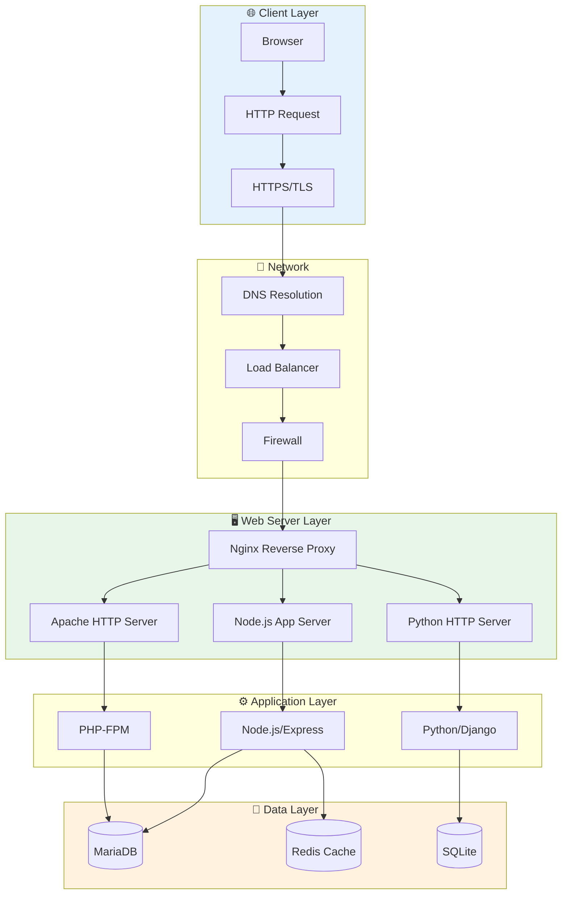
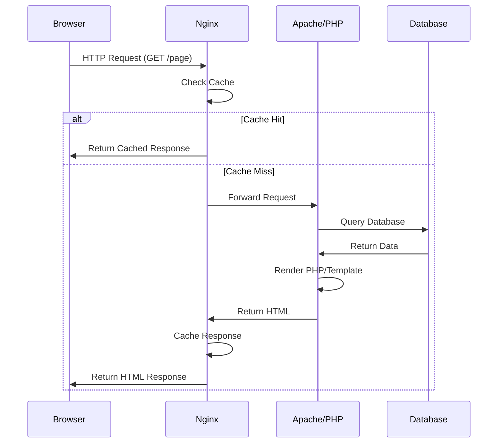
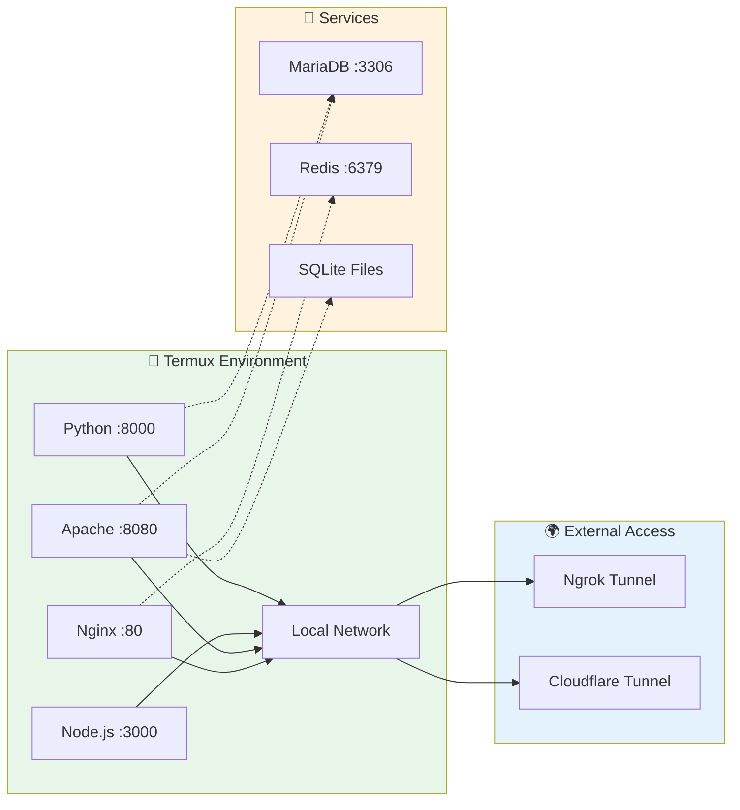
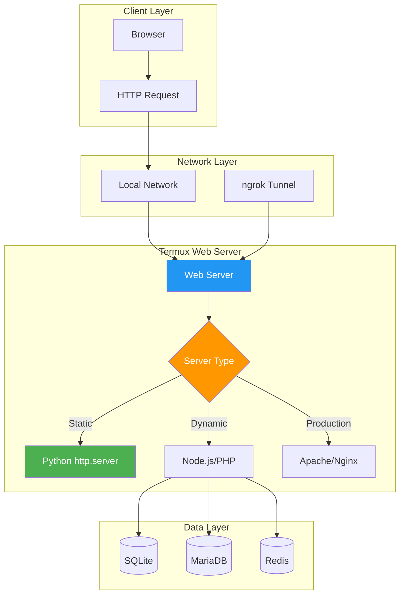
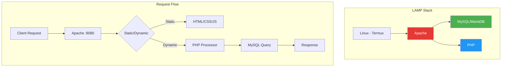
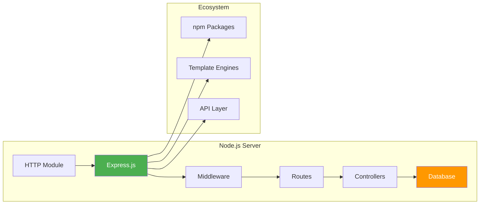
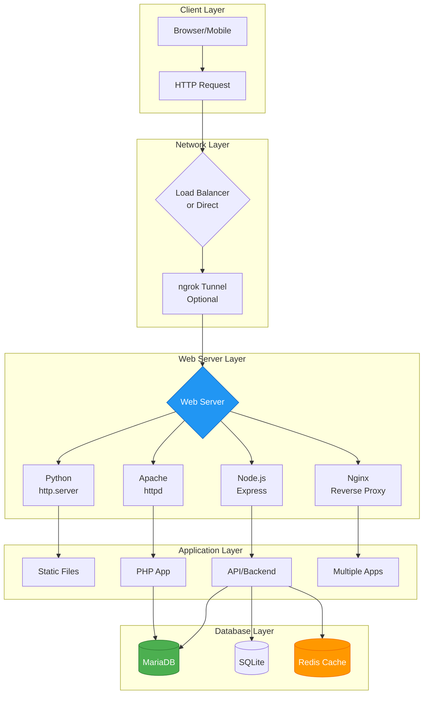
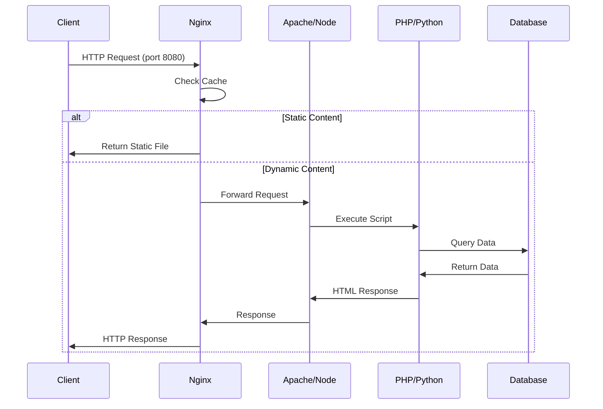
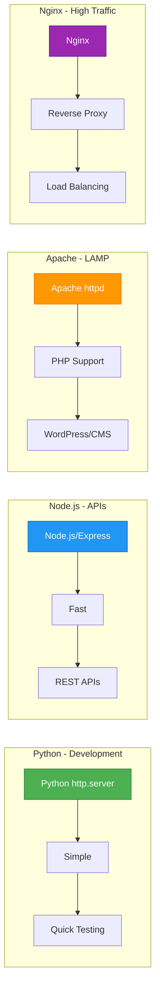

# Chapter 47: Web Server in Termux

> **Module:** 8 - Advanced  
> **Chapter:** 47 of 61  
> **Duration:** 20-25 Minutes  
> **Difficulty:** ⭐⭐⭐ Intermediate

---

## 📋 Chapter Overview

| Section | Content |
|---------|---------|
| Video Script | Complete Hindi narration with timestamps |
| Technical Guide | Web server options, configuration, deployment |
| Installation Guide | Python, Node.js, Apache, Nginx, databases |
| Commands Reference | 25+ web server commands |
| Practice Exercises | Hands-on hosting tasks |
| Troubleshooting | Common server issues |
| Video Assets | Thumbnail, description, tags |

---

## 🎬 VIDEO SCRIPT (Complete Hindi Narration)

```
═══════════════════════════════════════════════════════════════════════════════
TERMUX FULL COURSE - CHAPTER 47
Title: Web Server in Termux | Complete Hosting Guide | T3rmuxk1ng
Duration: 20-25 Minutes
═══════════════════════════════════════════════════════════════════════════════

[INTRO - 0:00 to 1:00]
─────────────────────────────────────────────────────────────────────────────

Namaskar Dosto! Welcome back to Termux Full Course by T3rmuxk1ng!

Aaj ka chapter bahut exciting hai - Web Server in Termux!

Kabhi socha hai ki aapka Android phone ek full-fledged web server ban 
sakta hai? Haan, aap apne phone pe websites host kar sakte ho, 
databases run kar sakte ho, aur apne projects ko internet pe launch 
kar sakte ho - sab kuch Termux ke through!

Ye chapter mein hum cover karenge:
- Python http.server se quick hosting
- Node.js server setup
- Apache installation aur configuration
- Nginx reverse proxy
- PHP aur MySQL integration
- SSL/HTTPS configuration
- ngrok se public access

To bina time waste kiye, chaliye shuru karte hain!

Play button dabaiye, video like karein, aur channel subscribe karein.

---

[SECTION 1: WEB SERVER OPTIONS IN TERMUX - 1:00 to 4:00]
─────────────────────────────────────────────────────────────────────────────

Termux mein multiple web server options hain. Har ek ka apna use case hai.

Sabse pehle dekhte hain kaun kaun se servers available hain:

┌─────────────────────────────────────────────────────────────────────────┐
│                    WEB SERVER OPTIONS IN TERMUX                          │
├──────────────────┬────────────────┬──────────────────────────────────────┤
│ Server           │ Best For       │ Difficulty                           │
├──────────────────┼────────────────┼──────────────────────────────────────┤
│ Python http      │ Quick testing  │ ⭐ Easy                              │
│ Node.js http     │ API/SPA apps   │ ⭐⭐ Medium                           │
│ Apache           │ PHP/MySQL      │ ⭐⭐⭐ Advanced                        │
│ Nginx            │ Reverse proxy  │ ⭐⭐⭐ Advanced                        │
│ PHP built-in     │ PHP testing    │ ⭐⭐ Medium                           │
│ Darkhttpd        │ Static files   │ ⭐ Easy                              │
└──────────────────┴────────────────┴──────────────────────────────────────┘

Pehle simple se start karte hain - Python http.server.

Ye sabse easy hai aur Python ke saath built-in aata hai. Koi extra 
installation nahi chahiye.

Use cases:
- Quick file sharing
- Static website testing
- Development preview
- Local network access

Lekin limitations bhi hain:
- No PHP support
- No database connection
- Basic functionality only
- Single threaded

Isliye production ke liye Apache ya Nginx use karte hain.

---

[SECTION 2: PYTHON HTTP.SERVER - 4:00 to 7:30]
─────────────────────────────────────────────────────────────────────────────

Chaliye Python http.server se start karte hain.

Sabse pehle ek folder bana lete hain apni website ke liye:

    mkdir ~/website
    cd ~/website

Ab ek simple HTML file create karte hain:

    echo '<h1>Hello from Termux!</h1>' > index.html

Ab server start karte hain:

    python -m http.server 8080

[SCREEN: Server running output]

Output mein dikhega:
    Serving HTTP on 0.0.0.0 port 8080 (http://0.0.0.0:8080/) ...

Ye server aapke current directory ko host kar raha hai!

Ab browser mein jao aur type karo:
    http://localhost:8080

Ya phone ke browser mein:
    http://127.0.0.1:8080

Aapko "Hello from Termux!" dikhega!

Ab ek important baat - ye server LOCALHOST pe hai. Matlab sirf aapke 
phone pe accessible hai.

Agar aap same network ke kisi aur device se access karna chahte ho, 
to aapko apna IP address chahiye:

    ifconfig wlan0

Ya:

    ip addr show wlan0

IP address note karo, jaise: 192.168.1.100

Ab dusre device ke browser mein:
    http://192.168.1.100:8080

Server band karne ke liye: Ctrl+C press karein

Different port use karne ke liye:

    python -m http.server 3000

Python 2 ke liye (agar installed ho):

    python2 -m SimpleHTTPServer 8080

Specific directory host karne ke liye:

    python -m http.server 8080 --directory /sdcard/Download

---

[SECTION 3: NODE.JS HTTP SERVER - 7:30 to 11:00]
─────────────────────────────────────────────────────────────────────────────

Ab Node.js se web server banate hain.

Pehle Node.js install karein:

    pkg install nodejs -y

Node.js se aap dynamic servers bana sakte ho, APIs create kar sakte ho.

Basic server banate hain:

    nano server.js

Code likhein:

```javascript
const http = require('http');
const hostname = '0.0.0.0';
const port = 3000;

const server = http.createServer((req, res) => {
    res.statusCode = 200;
    res.setHeader('Content-Type', 'text/html');
    res.end('<h1>Hello from Node.js in Termux!</h1>');
});

server.listen(port, hostname, () => {
    console.log(`Server running at http://${hostname}:${port}/`);
});
```

Save karein: Ctrl+O, Enter, Ctrl+X

Ab server run karein:

    node server.js

Browser mein jao: http://localhost:3000

Ab thoda advanced banate hain - file server:

    nano file-server.js

```javascript
const http = require('http');
const fs = require('fs');
const path = require('path');

const port = 8080;

const server = http.createServer((req, res) => {
    let filePath = '.' + req.url;
    if (filePath === './') filePath = './index.html';
    
    const extname = String(path.extname(filePath)).toLowerCase();
    const mimeTypes = {
        '.html': 'text/html',
        '.js': 'text/javascript',
        '.css': 'text/css',
        '.json': 'application/json',
        '.png': 'image/png',
        '.jpg': 'image/jpeg',
        '.gif': 'image/gif',
    };
    
    const contentType = mimeTypes[extname] || 'application/octet-stream';
    
    fs.readFile(filePath, (error, content) => {
        if (error) {
            if (error.code === 'ENOENT') {
                res.writeHead(404);
                res.end('File not found');
            } else {
                res.writeHead(500);
                res.end('Server error');
            }
        } else {
            res.writeHead(200, { 'Content-Type': contentType });
            res.end(content, 'utf-8');
        }
    });
});

server.listen(port, '0.0.0.0', () => {
    console.log(`Server running at http://localhost:${port}/`);
});
```

Express.js use karna ho to:

    npm install express

Phir:

```javascript
const express = require('express');
const app = express();
const port = 3000;

app.get('/', (req, res) => {
    res.send('Hello from Express!');
});

app.listen(port, '0.0.0.0', () => {
    console.log(`Express server running on port ${port}`);
});
```

---

[SECTION 4: APACHE INSTALLATION - 11:00 to 15:00]
─────────────────────────────────────────────────────────────────────────────

Ab Apache install karte hain - ye professional web server hai.

    pkg install apache2 -y

Apache start karein:

    apachectl start

Check karein browser mein:
    http://localhost:8080

Agar "It works!" dikha to Apache successfully run ho raha hai!

Apache configuration file location:
    $PREFIX/etc/apache2/httpd.conf

Document root (jahan website files rakhni hain):
    $PREFIX/var/www/html/

Ab custom website banate hain:

    cd $PREFIX/var/www/html/
    rm index.html
    nano index.html

Apna HTML code likhein:

```html
<!DOCTYPE html>
<html>
<head>
    <title>My Termux Website</title>
    <style>
        body { font-family: Arial; background: #1a1a2e; color: #eee; 
               display: flex; justify-content: center; align-items: center; 
               height: 100vh; margin: 0; }
        h1 { color: #00ff88; }
    </style>
</head>
<body>
    <h1>Welcome to My Termux Server!</h1>
</body>
</html>
```

Apache restart karein:

    apachectl restart

Virtual host setup:

    nano $PREFIX/etc/apache2/httpd.conf

Neeche jao aur virtual host add karo:

```
<VirtualHost *:8080>
    ServerAdmin admin@localhost
    DocumentRoot "/data/data/com.termux/files/home/mysite"
    ServerName mysite.local
    ErrorLog "$PREFIX/var/log/apache2/mysite-error.log"
    CustomLog "$PREFIX/var/log/apache2/mysite-access.log" common
    <Directory "/data/data/com.termux/files/home/mysite">
        Options Indexes FollowSymLinks
        AllowOverride All
        Require all granted
    </Directory>
</VirtualHost>
```

Apache commands yaad rakhein:
- apachectl start - Server start
- apachectl stop - Server stop
- apachectl restart - Server restart
- apachectl configtest - Config test
- apachectl -v - Version check

---

[SECTION 5: NGINX INSTALLATION - 15:00 to 18:00]
─────────────────────────────────────────────────────────────────────────────

Nginx ek powerful web server hai - high performance aur reverse proxy 
ke liye best hai.

Install karein:

    pkg install nginx -y

Nginx start karein:

    nginx

Check karein:
    http://localhost:8080

Nginx welcome page dikhega!

Configuration file:
    $PREFIX/etc/nginx/nginx.conf

Default document root:
    $PREFIX/usr/share/nginx/html/

Nginx configuration samajhte hain:

    nano $PREFIX/etc/nginx/nginx.conf

Basic configuration:

```nginx
worker_processes 1;
events {
    worker_connections 1024;
}

http {
    include       mime.types;
    default_type  application/octet-stream;
    sendfile      on;
    keepalive_timeout 65;

    server {
        listen       8080;
        server_name  localhost;

        location / {
            root   $PREFIX/usr/share/nginx/html;
            index  index.html index.htm;
        }

        error_page 404 /404.html;
        error_page 500 502 503 504 /50x.html;
    }
}
```

Reverse proxy setup (Node.js app ke liye):

```nginx
server {
    listen 8080;
    server_name localhost;

    location / {
        proxy_pass http://127.0.0.1:3000;
        proxy_http_version 1.1;
        proxy_set_header Upgrade $http_upgrade;
        proxy_set_header Connection 'upgrade';
        proxy_set_header Host $host;
        proxy_cache_bypass $http_upgrade;
    }
}
```

Nginx commands:
- nginx - Start server
- nginx -s stop - Stop server
- nginx -s reload - Reload config
- nginx -t - Test configuration
- nginx -v - Version

---

[SECTION 6: PHP INTEGRATION - 18:00 to 21:00]
─────────────────────────────────────────────────────────────────────────────

Ab PHP install karte hain Apache ke saath:

    pkg install php -y
    pkg install php-apache -y

PHP configuration Apache mein enable karein:

    nano $PREFIX/etc/apache2/httpd.conf

Ye lines add/uncomment karein:

```
LoadModule php_module $PREFIX/libexec/apache2/libphp.so
AddHandler php-script .php

<FilesMatch "\.php$">
    SetHandler application/x-httpd-php
</FilesMatch>

DirectoryIndex index.php index.html
```

PHP module load karein:

    echo "LoadModule php_module $PREFIX/libexec/apache2/libphp.so" >> $PREFIX/etc/apache2/httpd.conf

Apache restart karein:

    apachectl restart

Test PHP file banayein:

    nano $PREFIX/var/www/html/test.php

```php
<?php
phpinfo();
?>
```

Browser mein check karein:
    http://localhost:8080/test.php

PHP info page dikhegi!

Ab ek dynamic page banate hain:

    nano $PREFIX/var/www/html/info.php

```php
<?php
echo "<h1>Server Information</h1>";
echo "<p>PHP Version: " . phpversion() . "</p>";
echo "<p>Server Time: " . date('Y-m-d H:i:s') . "</p>";
echo "<p>Server Software: " . $_SERVER['SERVER_SOFTWARE'] . "</p>";
?>
```

PHP built-in server bhi use kar sakte ho:

    php -S 0.0.0.0:8080

---

[SECTION 7: MYSQL/MARIADB SETUP - 21:00 to 24:00]
─────────────────────────────────────────────────────────────────────────────

Database install karte hain web application ke liye:

    pkg install mariadb -y

MariaDB initialize karein:

    mysql_install_db

MariaDB start karein:

    mysqld_safe &

Wait karein 5-10 seconds, phir connect karein:

    mysql -u root

MariaDB prompt mein:

```sql
-- Database create karein
CREATE DATABASE mywebsite;

-- User create karein
CREATE USER 'webuser'@'localhost' IDENTIFIED BY 'password123';

-- Permissions grant karein
GRANT ALL PRIVILEGES ON mywebsite.* TO 'webuser'@'localhost';

-- Apply changes
FLUSH PRIVILEGES;

-- Exit
EXIT;
```

PHP se MySQL connect karein:

    nano $PREFIX/var/www/html/dbtest.php

```php
<?php
$host = 'localhost';
$user = 'webuser';
$pass = 'password123';
$db   = 'mywebsite';

$conn = new mysqli($host, $user, $pass, $db);

if ($conn->connect_error) {
    die("Connection failed: " . $conn->connect_error);
}

echo "<h1>Connected to MySQL successfully!</h1>";

// Create a test table
$sql = "CREATE TABLE IF NOT EXISTS users (
    id INT AUTO_INCREMENT PRIMARY KEY,
    name VARCHAR(50),
    email VARCHAR(50)
)";

if ($conn->query($sql) === TRUE) {
    echo "<p>Table created successfully</p>";
}

$conn->close();
?>
```

MariaDB commands:
- mysqld_safe & - Start server
- mysql -u root - Connect as root
- mysqladmin -u root shutdown - Stop server

---

[SECTION 8: SQLITE USAGE - 24:00 to 26:30]
─────────────────────────────────────────────────────────────────────────────

SQLite lightweight database hai - perfect for mobile:

    pkg install sqlite -y

Database create karein:

    sqlite3 myapp.db

SQLite prompt mein:

```sql
-- Table create
CREATE TABLE contacts (
    id INTEGER PRIMARY KEY,
    name TEXT,
    email TEXT
);

-- Data insert
INSERT INTO contacts (name, email) VALUES 
    ('John', 'john@example.com'),
    ('Alice', 'alice@example.com');

-- Data read
SELECT * FROM contacts;

-- Exit
.quit
```

PHP se SQLite use karein:

```php
<?php
$db = new SQLite3('myapp.db');

$results = $db->query('SELECT * FROM contacts');
while ($row = $results->fetchArray()) {
    echo $row['name'] . " - " . $row['email'] . "<br>";
}
?>
```

---

[SECTION 9: NGROK FOR PUBLIC ACCESS - 26:30 to 29:30]
─────────────────────────────────────────────────────────────────────────────

Ab tak jo server banaye wo localhost pe tha. Agar public access chahiye 
to ngrok use karein.

Ngrok download karein:

    pkg install wget -y
    wget https://bin.equinox.io/c/bNyj1mQVY4c/ngrok-v3-stable-linux-arm64.tgz
    tar -xzf ngrok-v3-stable-linux-arm64.tgz
    mv ngrok $PREFIX/bin/

Ngrok account banayein: https://ngrok.com

Auth token add karein:

    ngrok config add-authtoken YOUR_TOKEN

Ab local server ko public banayein:

    ngrok http 8080

[SCREEN: Ngrok tunnel output]

Output mein ek public URL milega jaise:
    https://abc123.ngrok.io

Ye URL kisi bhi internet connected device se accessible hai!

---

[SECTION 10: SSL/HTTPS CONFIGURATION - 29:30 to 32:00]
─────────────────────────────────────────────────────────────────────────────

Self-signed SSL certificate generate karein:

    openssl req -x509 -nodes -days 365 -newkey rsa:2048 \
        -keyout $PREFIX/etc/apache2/server.key \
        -out $PREFIX/etc/apache2/server.crt

Apache SSL configuration:

    nano $PREFIX/etc/apache2/httpd.conf

Add karein:

```
LoadModule ssl_module $PREFIX/libexec/apache2/mod_ssl.so

Listen 8443
<VirtualHost *:8443>
    ServerName localhost
    SSLEngine on
    SSLCertificateFile $PREFIX/etc/apache2/server.crt
    SSLCertificateKeyFile $PREFIX/etc/apache2/server.key
    DocumentRoot $PREFIX/var/www/html
</VirtualHost>
```

Restart Apache:

    apachectl restart

HTTPS access:
    https://localhost:8443

---

[SECTION 11: HOSTING PERSONAL PROJECTS - 32:00 to 35:00]
─────────────────────────────────────────────────────────────────────────────

Ab ek complete project host karte hain:

    mkdir -p ~/projects/portfolio
    cd ~/projects/portfolio

Project structure:

```
portfolio/
├── index.html
├── about.html
├── style.css
├── script.js
└── images/
```

index.html:

```html
<!DOCTYPE html>
<html lang="en">
<head>
    <meta charset="UTF-8">
    <meta name="viewport" content="width=device-width, initial-scale=1.0">
    <title>My Portfolio</title>
    <link rel="stylesheet" href="style.css">
</head>
<body>
    <header>
        <h1>Welcome to My Portfolio</h1>
        <nav>
            <a href="index.html">Home</a>
            <a href="about.html">About</a>
        </nav>
    </header>
    <main>
        <p>This website is hosted on Termux!</p>
    </main>
    <script src="script.js"></script>
</body>
</html>
```

style.css:

```css
* { margin: 0; padding: 0; box-sizing: border-box; }
body { 
    font-family: 'Segoe UI', Arial, sans-serif;
    background: linear-gradient(135deg, #1a1a2e 0%, #16213e 100%);
    color: #eee;
    min-height: 100vh;
}
header { 
    background: rgba(0,0,0,0.3); 
    padding: 20px;
    text-align: center;
}
h1 { color: #00ff88; }
nav a { color: #fff; margin: 0 15px; text-decoration: none; }
nav a:hover { color: #00ff88; }
main { padding: 40px; text-align: center; }
```

Server start karein:

    python -m http.server 8080

Ya ngrok ke saath:

    ngrok http 8080

---

[SECTION 12: SUMMARY & NEXT PREVIEW - 35:00 to 37:00]
─────────────────────────────────────────────────────────────────────────────

To dosto, Chapter 47 complete! Let's summarize:

✅ Python http.server - Quick testing
✅ Node.js server - Dynamic applications
✅ Apache - Professional PHP hosting
✅ Nginx - High performance, reverse proxy
✅ PHP integration - Dynamic web pages
✅ MySQL/MariaDB - Database management
✅ SQLite - Lightweight database
✅ ngrok - Public URL tunnel
✅ SSL/HTTPS - Secure connections
✅ Project hosting - Complete workflow

Important Commands yaad rakhein:

┌─────────────────────────────────────────────────────────────────────────┐
│                    CHAPTER 47 - IMPORTANT COMMANDS                       │
├─────────────────────────────────────────────────────────────────────────┤
│ python -m http.server 8080      │ Quick Python server                   │
│ node server.js                  │ Start Node.js server                  │
│ apachectl start                 │ Start Apache                          │
│ nginx                           │ Start Nginx                           │
│ mysql -u root                   │ Connect to MariaDB                    │
│ ngrok http 8080                 │ Create public tunnel                  │
│ php -S 0.0.0.0:8080             │ PHP built-in server                   │
│ sqlite3 myapp.db                │ Open SQLite database                  │
└─────────────────────────────────────────────────────────────────────────┘

Next Chapter 48 mein hum seekhenge:
- Database in Termux detail
- PostgreSQL installation
- Redis setup
- Database administration

Agar ye video helpful lagi, to:
👍 Like button press karein
🔔 Subscribe karein, notification bell on karein
💬 Koi sawal ho to comment mein poochein
📤 Share karein friends ke saath

Main har comment ka reply karta hoon.

Thank you for watching! See you in Chapter 48!

═══════════════════════════════════════════════════════════════════════════════
```

---

## 📖 TECHNICAL GUIDE

### 1. Web Server Architecture in Termux

```
┌─────────────────────────────────────────────────────────────────────────┐
│                    TERMUX WEB SERVER ARCHITECTURE                        │
├─────────────────────────────────────────────────────────────────────────┤
│                                                                          │
│   ┌─────────────────────────────────────────────────────────────────┐   │
│   │                    Internet / External Network                    │   │
│   └─────────────────────────────────────────────────────────────────┘   │
│                                   │                                      │
│                                   ▼                                      │
│   ┌─────────────────────────────────────────────────────────────────┐   │
│   │                    ngrok Tunnel (Optional)                        │   │
│   │   Public URL → Tunnel → localhost:port                           │   │
│   └─────────────────────────────────────────────────────────────────┘   │
│                                   │                                      │
│                                   ▼                                      │
│   ┌─────────────────────────────────────────────────────────────────┐   │
│   │                    Reverse Proxy (Nginx)                          │   │
│   │   Port 8080 → Route to appropriate backend                        │   │
│   └─────────────────────────────────────────────────────────────────┘   │
│                                   │                                      │
│            ┌──────────────────────┼──────────────────────┐              │
│            ▼                      ▼                      ▼              │
│   ┌──────────────┐      ┌──────────────┐      ┌──────────────┐         │
│   │   Apache     │      │   Node.js    │      │   Python     │         │
│   │   :8080      │      │   :3000      │      │   :8000      │         │
│   │   (PHP/HTML) │      │   (API/App)  │      │   (Django)   │         │
│   └──────────────┘      └──────────────┘      └──────────────┘         │
│            │                      │                      │              │
│            └──────────────────────┼──────────────────────┘              │
│                                   ▼                                      │
│   ┌─────────────────────────────────────────────────────────────────┐   │
│   │                    Database Layer                                 │   │
│   │   ┌──────────┐  ┌──────────┐  ┌──────────┐                       │   │
│   │   │ MariaDB  │  │  SQLite  │  │  Redis   │                       │   │
│   │   │  :3306   │  │  (file)  │  │  :6379   │                       │   │
│   │   └──────────┘  └──────────┘  └──────────┘                       │   │
│   └─────────────────────────────────────────────────────────────────┘   │
│                                                                          │
└─────────────────────────────────────────────────────────────────────────┘
```

### 2. Server Comparison

| Feature | Python | Node.js | Apache | Nginx |
|---------|--------|---------|--------|-------|
| Static Files | ✅ | ✅ | ✅ | ✅ |
| Dynamic Content | ❌ | ✅ | ✅ (PHP) | ❌ |
| Reverse Proxy | ❌ | ❌ | ❌ | ✅ |
| SSL/TLS | ❌ | ✅ | ✅ | ✅ |
| Virtual Hosts | ❌ | ❌ | ✅ | ✅ |
| Performance | Medium | High | Medium | Very High |
| Memory Usage | Low | Medium | High | Low |
| Config Complexity | Simple | Medium | Complex | Medium |

### 3. Port Reference

| Port | Service | Description |
|------|---------|-------------|
| 80 | HTTP | Default web (requires root) |
| 443 | HTTPS | Secure web (requires root) |
| 8080 | HTTP Alt | Common alternative |
| 3000 | Node.js | Default Node.js |
| 8000 | Python | Default Python server |
| 3306 | MySQL | MariaDB default |
| 5432 | PostgreSQL | Postgres default |
| 6379 | Redis | Redis default |

---

## 🔧 INSTALLATION GUIDES

### 1. Python HTTP Server

```bash
# No installation needed - Python includes it
pkg install python -y

# Basic usage
python -m http.server 8080

# Specific directory
python -m http.server 8080 --directory /path/to/files

# Bind to specific IP
python -m http.server 8080 --bind 127.0.0.1
```

### 2. Node.js Server

```bash
# Install Node.js
pkg install nodejs -y

# Check version
node --version
npm --version

# Create project
mkdir myapp && cd myapp
npm init -y

# Install Express
npm install express

# Install common packages
npm install express cors body-parser helmet
```

### 3. Apache Installation

```bash
# Install Apache
pkg install apache2 -y

# Install PHP module
pkg install php php-apache -y

# Start Apache
apachectl start

# Configuration location
# $PREFIX/etc/apache2/httpd.conf

# Document root
# $PREFIX/var/www/html/

# Log files
# $PREFIX/var/log/apache2/
```

### 4. Nginx Installation

```bash
# Install Nginx
pkg install nginx -y

# Start Nginx
nginx

# Configuration
# $PREFIX/etc/nginx/nginx.conf

# Document root
# $PREFIX/usr/share/nginx/html/

# Stop Nginx
nginx -s stop

# Reload config
nginx -s reload
```

### 5. MariaDB Installation

```bash
# Install MariaDB
pkg install mariadb -y

# Initialize database
mysql_install_db

# Start server
mysqld_safe &

# Connect
mysql -u root

# Secure installation
mysql_secure_installation

# Stop server
mysqladmin -u root shutdown
```

### 6. SQLite Installation

```bash
# Install SQLite
pkg install sqlite -y

# Create/open database
sqlite3 myapp.db

# Install Python SQLite support
pkg install python -y  # Included by default
```

---

## 📋 COMMANDS REFERENCE

### Python HTTP Server Commands

```bash
# Start basic server on port 8080
python -m http.server 8080

# Start on default port 8000
python -m http.server

# Bind to specific interface
python -m http.server 8080 --bind 192.168.1.100

# Serve specific directory
python -m http.server 8080 --directory /sdcard/Download

# Run in background
nohup python -m http.server 8080 &

# Python 2 simple server (legacy)
python2 -m SimpleHTTPServer 8080
```

### Node.js Server Commands

```bash
# Run JavaScript file
node server.js

# Run with watch mode (if nodemon installed)
nodemon server.js

# Install global package
npm install -g nodemon

# Create package.json
npm init -y

# Install dependencies
npm install

# Install dev dependencies
npm install --save-dev nodemon

# Run npm script
npm start

# Kill node process
pkill node
```

### Apache Commands

```bash
# Start Apache
apachectl start

# Stop Apache
apachectl stop

# Restart Apache
apachectl restart

# Test configuration
apachectl configtest

# Check version
apachectl -v

# Check compiled modules
apachectl -M

# Check status
apachectl -S

# Graceful restart (no downtime)
apachectl graceful

# Full status
apachectl fullstatus
```

### Nginx Commands

```bash
# Start Nginx
nginx

# Stop Nginx
nginx -s stop

# Quit Nginx (graceful)
nginx -s quit

# Reload configuration
nginx -s reload

# Reopen log files
nginx -s reopen

# Test configuration
nginx -t

# Test configuration with verbose output
nginx -T

# Check version
nginx -v

# Show compiled modules
nginx -V
```

### PHP Commands

```bash
# Start PHP built-in server
php -S 0.0.0.0:8080

# Start with specific document root
php -S 0.0.0.0:8080 -t /path/to/web

# Start with router file
php -S 0.0.0.0:8080 router.php

# Check PHP version
php -v

# Check installed modules
php -m

# Check PHP configuration
php -i

# Run PHP file
php file.php

# Interactive shell
php -a

# Syntax check
php -l file.php
```

### MySQL/MariaDB Commands

```bash
# Start MariaDB server
mysqld_safe &

# Connect as root
mysql -u root

# Connect with password
mysql -u root -p

# Connect to specific database
mysql -u root myapp

# Connect with host
mysql -h localhost -u root -p

# Execute SQL file
mysql -u root < backup.sql

# Export database
mysqldump -u root myapp > backup.sql

# Export specific tables
mysqldump -u root myapp table1 table2 > tables.sql

# Import database
mysql -u root myapp < backup.sql

# Stop server
mysqladmin -u root shutdown

# Check server status
mysqladmin -u root status

# Create database
mysql -u root -e "CREATE DATABASE myapp;"

# Show databases
mysql -u root -e "SHOW DATABASES;"

# Process list
mysqladmin -u root processlist
```

### SQLite Commands

```bash
# Open/create database
sqlite3 myapp.db

# Open with header and column mode
sqlite3 -header -column myapp.db

# Execute SQL from command line
sqlite3 myapp.db "SELECT * FROM users;"

# Import CSV
sqlite3 myapp.db ".import data.csv users"

# Export to CSV
sqlite3 myapp.db ".output users.csv" ".mode csv" "SELECT * FROM users;"

# Dump database to SQL
sqlite3 myapp.db .dump > backup.sql

# Restore from SQL
sqlite3 new.db < backup.sql

# Database file info
sqlite3 myapp.db ".dbinfo"

# List tables
sqlite3 myapp.db ".tables"

# Schema
sqlite3 myapp.db ".schema"
```

### ngrok Commands

```bash
# Start HTTP tunnel
ngrok http 8080

# Start with specific region
ngrok http 8080 --region in

# Start HTTPS tunnel
ngrok http https://localhost:8080

# Start TCP tunnel
ngrok tcp 22

# Start with basic auth
ngrok http 8080 --auth user:pass

# Add authtoken
ngrok config add-authtoken YOUR_TOKEN

# Check tunnels
ngrok tunnels

# Kill ngrok
pkill ngrok

# Version
ngrok version
```

### SSL/Security Commands

```bash
# Generate self-signed certificate
openssl req -x509 -nodes -days 365 -newkey rsa:2048 \
    -keyout server.key -out server.crt

# Generate private key
openssl genrsa -out private.key 2048

# Generate CSR
openssl req -new -key private.key -out request.csr

# Check certificate
openssl x509 -in server.crt -text -noout

# Check key
openssl rsa -in server.key -check

# Convert PEM to DER
openssl x509 -in server.crt -outform der -out server.der

# Generate random password
openssl rand -base64 32

# Hash a password
openssl passwd -1 "mypassword"
```

### Process Management Commands

```bash
# Find process on port
lsof -i :8080

# Kill process by PID
kill PID

# Force kill
kill -9 PID

# Find and kill by name
pkill nginx

# Show all running processes
ps aux

# Show processes with tree
ps auxf

# Monitor processes
top

# Background process
nohup python -m http.server 8080 &

# List background jobs
jobs

# Bring to foreground
fg %1

# Check open ports
netstat -tlnp

# Check connections
netstat -an | grep ESTABLISHED
```

---

## 💻 PRACTICE EXERCISES

### Exercise 1: Basic File Server

```bash
# Task: Create a file sharing server

# Step 1: Create share directory
mkdir -p ~/share/files
cd ~/share

# Step 2: Create some test files
echo "Welcome to my file server!" > files/readme.txt
echo '{"status": "ok"}' > files/status.json
echo '<h1>Hello World</h1>' > files/index.html

# Step 3: Create a simple HTML listing page
cat > index.html << 'EOF'
<!DOCTYPE html>
<html>
<head>
    <title>My File Server</title>
    <style>
        body { font-family: Arial; max-width: 800px; margin: 50px auto; }
        h1 { color: #333; }
        a { color: #0066cc; text-decoration: none; }
        a:hover { text-decoration: underline; }
        .file-list { list-style: none; padding: 0; }
        .file-list li { padding: 10px; border-bottom: 1px solid #eee; }
    </style>
</head>
<body>
    <h1>📁 My File Server</h1>
    <ul class="file-list">
        <li><a href="files/readme.txt">📄 readme.txt</a></li>
        <li><a href="files/status.json">📋 status.json</a></li>
        <li><a href="files/index.html">🌐 index.html</a></li>
    </ul>
</body>
</html>
EOF

# Step 4: Start the server
python -m http.server 8080

# Step 5: Test in browser
# http://localhost:8080

# Press Ctrl+C to stop
```

### Exercise 2: Node.js API Server

```bash
# Task: Create a REST API server

# Step 1: Create project
mkdir -p ~/api-server
cd ~/api-server

# Step 2: Initialize npm
npm init -y

# Step 3: Install Express
npm install express cors

# Step 4: Create server file
cat > server.js << 'EOF'
const express = require('express');
const cors = require('cors');
const app = express();
const PORT = 3000;

// Middleware
app.use(cors());
app.use(express.json());

// Sample data
let users = [
    { id: 1, name: 'John', email: 'john@example.com' },
    { id: 2, name: 'Alice', email: 'alice@example.com' }
];

// Routes
app.get('/', (req, res) => {
    res.json({ message: 'Welcome to Termux API Server!' });
});

// GET all users
app.get('/api/users', (req, res) => {
    res.json(users);
});

// GET single user
app.get('/api/users/:id', (req, res) => {
    const user = users.find(u => u.id === parseInt(req.params.id));
    if (!user) return res.status(404).json({ error: 'User not found' });
    res.json(user);
});

// POST new user
app.post('/api/users', (req, res) => {
    const user = {
        id: users.length + 1,
        name: req.body.name,
        email: req.body.email
    };
    users.push(user);
    res.status(201).json(user);
});

// DELETE user
app.delete('/api/users/:id', (req, res) => {
    users = users.filter(u => u.id !== parseInt(req.params.id));
    res.json({ message: 'User deleted' });
});

// Start server
app.listen(PORT, '0.0.0.0', () => {
    console.log(`API Server running on http://localhost:${PORT}`);
});
EOF

# Step 5: Start server
node server.js

# Step 6: Test with curl (in new terminal)
curl http://localhost:3000
curl http://localhost:3000/api/users
curl -X POST -H "Content-Type: application/json" \
    -d '{"name":"Bob","email":"bob@test.com"}' \
    http://localhost:3000/api/users
```

### Exercise 3: Complete LAMP Stack

```bash
# Task: Set up Apache + PHP + MySQL

# Step 1: Install packages
pkg install apache2 php php-apache mariadb -y

# Step 2: Start MariaDB
mysqld_safe &
sleep 5

# Step 3: Setup database
mysql -u root << 'EOF'
CREATE DATABASE appdb;
CREATE USER 'appuser'@'localhost' IDENTIFIED BY 'apppass123';
GRANT ALL PRIVILEGES ON appdb.* TO 'appuser'@'localhost';
FLUSH PRIVILEGES;

USE appdb;
CREATE TABLE items (
    id INT AUTO_INCREMENT PRIMARY KEY,
    name VARCHAR(100),
    created_at TIMESTAMP DEFAULT CURRENT_TIMESTAMP
);
INSERT INTO items (name) VALUES ('Item 1'), ('Item 2'), ('Item 3');
EOF

# Step 4: Create PHP application
cat > $PREFIX/var/www/html/index.php << 'EOF'
<?php
$host = 'localhost';
$db   = 'appdb';
$user = 'appuser';
$pass = 'apppass123';

try {
    $pdo = new PDO("mysql:host=$host;dbname=$db", $user, $pass);
    $pdo->setAttribute(PDO::ATTR_ERRMODE, PDO::ERRMODE_EXCEPTION);
    
    // Handle form submission
    if ($_SERVER['REQUEST_METHOD'] === 'POST' && !empty($_POST['name'])) {
        $stmt = $pdo->prepare("INSERT INTO items (name) VALUES (?)");
        $stmt->execute([$_POST['name']]);
        header("Location: " . $_SERVER['PHP_SELF']);
        exit;
    }
    
    // Fetch items
    $stmt = $pdo->query("SELECT * FROM items ORDER BY id DESC");
    $items = $stmt->fetchAll(PDO::FETCH_ASSOC);
} catch(PDOException $e) {
    die("Connection failed: " . $e->getMessage());
}
?>
<!DOCTYPE html>
<html>
<head>
    <title>Termux LAMP App</title>
    <style>
        body { font-family: Arial; max-width: 600px; margin: 50px auto; padding: 20px; }
        h1 { color: #333; }
        form { background: #f5f5f5; padding: 20px; border-radius: 8px; }
        input[type="text"] { padding: 10px; width: 70%; border: 1px solid #ddd; }
        button { padding: 10px 20px; background: #0066cc; color: white; border: none; cursor: pointer; }
        ul { list-style: none; padding: 0; }
        li { padding: 10px; background: #f9f9f9; margin: 5px 0; border-radius: 4px; }
        .success { color: green; }
    </style>
</head>
<body>
    <h1>📦 Item Manager</h1>
    <p class="success">✅ Connected to MySQL!</p>
    
    <form method="POST">
        <input type="text" name="name" placeholder="Enter item name" required>
        <button type="submit">Add Item</button>
    </form>
    
    <h2>Items List</h2>
    <ul>
        <?php foreach($items as $item): ?>
            <li><?= htmlspecialchars($item['name']) ?> 
                <small>(<?= $item['created_at'] ?>)</small>
            </li>
        <?php endforeach; ?>
    </ul>
    
    <hr>
    <p><small>Powered by Termux: Apache + PHP + MariaDB</small></p>
</body>
</html>
EOF

# Step 5: Configure Apache for PHP
# Add PHP handler to Apache config
echo "AddHandler php-script .php" >> $PREFIX/etc/apache2/httpd.conf
echo "DirectoryIndex index.php index.html" >> $PREFIX/etc/apache2/httpd.conf

# Step 6: Start Apache
apachectl start

# Step 7: Test in browser
# http://localhost:8080/index.php
```

### Exercise 4: Public Website with ngrok

```bash
# Task: Make local server publicly accessible

# Step 1: Create a simple website
mkdir -p ~/public-site
cd ~/public-site

cat > index.html << 'EOF'
<!DOCTYPE html>
<html>
<head>
    <title>My Public Website</title>
    <meta name="viewport" content="width=device-width, initial-scale=1.0">
    <style>
        * { margin: 0; padding: 0; box-sizing: border-box; }
        body {
            font-family: 'Segoe UI', Arial, sans-serif;
            background: linear-gradient(135deg, #667eea 0%, #764ba2 100%);
            min-height: 100vh;
            display: flex;
            align-items: center;
            justify-content: center;
        }
        .card {
            background: white;
            padding: 40px;
            border-radius: 20px;
            box-shadow: 0 20px 60px rgba(0,0,0,0.3);
            text-align: center;
            max-width: 400px;
        }
        h1 { color: #333; margin-bottom: 15px; }
        p { color: #666; margin-bottom: 20px; }
        .badge {
            background: linear-gradient(135deg, #667eea 0%, #764ba2 100%);
            color: white;
            padding: 10px 20px;
            border-radius: 50px;
            display: inline-block;
            font-size: 14px;
        }
    </style>
</head>
<body>
    <div class="card">
        <h1>🌐 Hello World!</h1>
        <p>This website is hosted on Termux and accessible worldwide!</p>
        <span class="badge">Powered by Termux + ngrok</span>
    </div>
</body>
</html>
EOF

# Step 2: Start local server
python -m http.server 8080 &

# Step 3: Start ngrok (requires ngrok setup)
ngrok http 8080

# Step 4: Share the ngrok URL with anyone!
# Example: https://abc123.ngrok-free.app

# When done, kill both processes
pkill python
pkill ngrok
```

---

## ⚠️ TROUBLESHOOTING

### Problem 1: "Address already in use"

```bash
# Cause: Another process using the port

# Find what's using the port
lsof -i :8080

# Kill the process
kill -9 PID

# Or use a different port
python -m http.server 8081
```

### Problem 2: Apache won't start

```bash
# Cause: Configuration error or port conflict

# Check configuration
apachectl configtest

# Check error logs
cat $PREFIX/var/log/apache2/error_log

# Kill any existing Apache processes
pkill httpd

# Try starting again
apachectl start

# Check if running
ps aux | grep httpd
```

### Problem 3: MySQL connection refused

```bash
# Cause: MariaDB not running

# Check if MariaDB is running
ps aux | grep mysql

# Start MariaDB
mysqld_safe &

# Wait for it to start
sleep 5

# Test connection
mysql -u root -e "SELECT 1;"

# If socket error, check socket location
ls -la /tmp/mysql.sock
```

### Problem 4: PHP not executing

```bash
# Cause: PHP module not loaded in Apache

# Check if PHP module is loaded
apachectl -M | grep php

# Add PHP configuration
cat >> $PREFIX/etc/apache2/httpd.conf << 'EOF'
LoadModule php_module $PREFIX/libexec/apache2/libphp.so
AddHandler php-script .php
<FilesMatch "\.php$">
    SetHandler application/x-httpd-php
</FilesMatch>
EOF

# Restart Apache
apachectl restart

# Test PHP
echo "<?php phpinfo(); ?>" > $PREFIX/var/www/html/test.php
```

### Problem 5: ngrok not connecting

```bash
# Cause: No authtoken or network issue

# Add authtoken (get from ngrok.com)
ngrok config add-authtoken YOUR_TOKEN

# Check internet
ping -c 3 google.com

# Try different region
ngrok http 8080 --region us

# Check ngrok status
ngrok tunnels
```

### Problem 6: Nginx 403 Forbidden

```bash
# Cause: Permission issue or wrong path

# Check document root permissions
ls -la $PREFIX/usr/share/nginx/html/

# Check Nginx user in config
grep user $PREFIX/etc/nginx/nginx.conf

# Add proper permissions
chmod 755 $PREFIX/usr/share/nginx/html/

# Check if index file exists
ls $PREFIX/usr/share/nginx/html/index.html

# Test config
nginx -t
```

### Problem 7: Can't access from other devices

```bash
# Cause: Firewall or binding to localhost only

# Make sure server binds to 0.0.0.0
python -m http.server 8080 --bind 0.0.0.0

# Check IP address
ifconfig wlan0 | grep inet

# Test from same device first
curl http://localhost:8080

# Check if port is open
netstat -tlnp | grep 8080

# Android might block connections - check settings
```

### Problem 8: Server crashes with large files

```bash
# Cause: Memory limits

# Use darkhttpd for large static files
pkg install darkhttpd
darkhttpd /path/to/files --port 8080

# Or use Nginx for better performance
nginx

# For Python, increase buffer
# (Not easily configurable in http.server)
```

---

## 🎬 VIDEO ASSETS

### Thumbnail Concepts

**Option A: Clean & Professional**
```
┌────────────────────────────────────┐
│  [Dark Terminal Background]        │
│                                    │
│   🌐 WEB SERVER                    │
│   IN TERMUX                        │
│                                    │
│   ✓ Apache ✓ Nginx                 │
│   ✓ PHP ✓ MySQL                    │
│                                    │
│   [T3rmuxk1ng Logo]                │
└────────────────────────────────────┘
```

**Option B: Visual Stack**
```
┌────────────────────────────────────┐
│  ┌─────────────────────────────┐   │
│  │  🌐 NGROK (Public URL)      │   │
│  └─────────────────────────────┘   │
│            ↓                        │
│  ┌─────────────────────────────┐   │
│  │  🔧 NGINX / APACHE          │   │
│  └─────────────────────────────┘   │
│            ↓                        │
│  ┌─────────────────────────────┐   │
│  │  📦 PHP / NODE.JS           │   │
│  └─────────────────────────────┘   │
│            ↓                        │
│  ┌─────────────────────────────┐   │
│  │  💾 MySQL / SQLite          │   │
│  └─────────────────────────────┘   │
│                                    │
│  Chapter 47 | T3rmuxk1ng           │
└────────────────────────────────────┘
```

**Option C: Action Shot**
```
┌────────────────────────────────────┐
│  📱 TERMUX SCREENSHOT              │
│  ┌────────────────────────────┐    │
│  │ $ python -m http.server    │    │
│  │ Serving HTTP on 0.0.0.0... │    │
│  │ $ ngrok http 8080          │    │
│  │ Tunnel: https://abc.ngrok  │    │
│  └────────────────────────────┘    │
│                                    │
│  🔥 HOST WEBSITES ON ANDROID!      │
│                                    │
│  [T3rmuxk1ng]                      │
└────────────────────────────────────┘
```

### Video Description Template

```markdown
🌐 Termux Full Course - Chapter 47: Web Server in Termux | Complete Hosting Guide

🔥 In this video you'll learn:
• Python http.server se quick hosting
• Node.js API server setup
• Apache installation aur configuration
• Nginx reverse proxy setup
• PHP aur MySQL integration
• SQLite database usage
• ngrok se public access
• SSL/HTTPS configuration

⏱️ Timestamps:
0:00 - Introduction
1:00 - Web Server Options in Termux
4:00 - Python HTTP Server
7:30 - Node.js HTTP Server
11:00 - Apache Installation
15:00 - Nginx Installation
18:00 - PHP Integration
21:00 - MySQL/MariaDB Setup
24:00 - SQLite Usage
26:30 - ngrok for Public Access
29:30 - SSL/HTTPS Configuration
32:00 - Hosting Personal Projects
35:00 - Summary

📝 Commands from this video:
# Python server
python -m http.server 8080

# Apache
pkg install apache2 -y
apachectl start

# Nginx  
pkg install nginx -y
nginx

# MySQL
pkg install mariadb -y
mysqld_safe &

# ngrok
ngrok http 8080

📥 Download Links:
• ngrok: https://ngrok.com

📚 Full Course Playlist:
[PLAYLIST LINK]

📱 Follow T3rmuxk1ng:
• YouTube: @T3rmuxk1ng
• Telegram: [LINK]
• GitHub: [LINK]

#Termux #WebServer #T3rmuxk1ng #Apache #Nginx #NodeJS #TermuxCourse #HindiTutorial #AndroidServer

---
⚠️ Disclaimer: This video is for educational purposes. Use tools responsibly and only on systems you have permission to work with.
```

### Tags List

```
termux, termux web server, apache termux, nginx termux, 
php termux, mysql termux, nodejs termux, python http server,
termux hosting, termux website, web server android,
termux lamp stack, termux server, ngrok termux,
termux tutorial, termux course, termux hindi,
android web server, mobile hosting, t3rmuxk1ng,
termux apache, termux nginx, termux php,
termux mysql, termux sqlite, termux ssl,
host website on android, termux public server
```

### Hashtags

```
#Termux #WebServer #TermuxCourse #Apache #Nginx #NodeJS #PHP #MySQL 
#TermuxHindi #AndroidServer #TermuxTutorial #T3rmuxk1ng #MobileHosting 
#TermuxLAMP #LearnTermux #HindiTutorial #WebDevelopment
```

---

## 📚 ADDITIONAL RESOURCES

### Official Documentation

| Resource | Link |
|----------|------|
| Apache Docs | https://httpd.apache.org/docs/ |
| Nginx Docs | https://nginx.org/en/docs/ |
| Node.js Docs | https://nodejs.org/docs/ |
| MariaDB Docs | https://mariadb.com/kb/ |
| PHP Docs | https://www.php.net/docs.php |
| ngrok Docs | https://ngrok.com/docs |

### Configuration File Locations

| Server | Config File |
|--------|-------------|
| Apache | `$PREFIX/etc/apache2/httpd.conf` |
| Nginx | `$PREFIX/etc/nginx/nginx.conf` |
| PHP | `$PREFIX/etc/php.ini` |
| MySQL | `$PREFIX/etc/mysql/my.cnf` |

### Quick Reference URLs

```
Local Server URLs:
- http://localhost:8080
- http://127.0.0.1:8080

Network Access:
- http://[YOUR_IP]:8080

Check IP:
- ifconfig wlan0
- ip addr show wlan0

Test server:
- curl http://localhost:8080
- wget -qO- http://localhost:8080
```

---

## ✅ CHAPTER CHECKLIST

Before moving to Chapter 48, verify:

- [ ] Python http.server working and accessible
- [ ] Node.js server created and tested
- [ ] Apache installed and serving pages
- [ ] Nginx installed and configured
- [ ] PHP executing in Apache
- [ ] MariaDB running and accessible
- [ ] SQLite database created and queried
- [ ] ngrok tunnel created successfully
- [ ] Understood difference between servers
- [ ] Can host a static website
- [ ] Can create a dynamic page with PHP

---

## 🎯 NEXT CHAPTER PREVIEW

**Chapter 48: Database in Termux**

- PostgreSQL installation and configuration
- Redis setup for caching
- MongoDB basics
- Database administration
- Backup and restore
- Performance optimization
- Query optimization

---

**Chapter Complete! 🎉**

*Created by T3rmuxk1ng | Termux Full Course*

---

## 📊 MERMAID ARCHITECTURE DIAGRAMS

### Web Server Architecture Overview



### HTTP Request Flow



### Termux Web Server Stack



---

## ⚡ ADVANCED COMMAND CHEATSHEET

### Python HTTP Server Commands

| Command | Description | Port |
|---------|-------------|------|
| `python -m http.server` | Basic server, default port | 8000 |
| `python -m http.server 8080` | Custom port | 8080 |
| `python -m http.server --bind 127.0.0.1 8080` | Localhost only | 8080 |
| `python -m http.server --directory /path 8080` | Custom directory | 8080 |
| `python -m http.server --cgi` | CGI support | 8000 |
| `python3 -m http.server 8080` | Python 3 explicit | 8080 |
| `nohup python -m http.server 8080 &` | Background process | 8080 |

### Node.js Server Commands

| Command | Description |
|---------|-------------|
| `node server.js` | Run Node.js server |
| `npm start` | Run with package.json script |
| `npm run dev` | Development mode |
| `npx nodemon server.js` | Auto-reload on changes |
| `pm2 start server.js` | Production process manager |
| `pm2 list` | List running processes |
| `pm2 logs` | View logs |
| `pm2 restart all` | Restart all apps |
| `pm2 stop all` | Stop all apps |

### Apache Commands

| Command | Description |
|---------|-------------|
| `apachectl start` | Start Apache |
| `apachectl stop` | Stop Apache |
| `apachectl restart` | Restart Apache |
| `apachectl graceful` | Graceful restart |
| `apachectl configtest` | Test configuration |
| `apachectl -v` | Show version |
| `apachectl -V` | Show compile settings |
| `apachectl -M` | List loaded modules |
| `apachectl -S` | Show virtual hosts |

### Nginx Commands

| Command | Description |
|---------|-------------|
| `nginx` | Start Nginx |
| `nginx -s stop` | Quick stop |
| `nginx -s quit` | Graceful stop |
| `nginx -s reload` | Reload configuration |
| `nginx -s reopen` | Reopen log files |
| `nginx -t` | Test configuration |
| `nginx -T` | Test and dump config |
| `nginx -v` | Show version |
| `nginx -V` | Show compile options |

### PHP Built-in Server Commands

| Command | Description |
|---------|-------------|
| `php -S localhost:8080` | Start PHP server |
| `php -S 0.0.0.0:8080` | Listen on all interfaces |
| `php -S localhost:8080 -t public/` | Custom document root |
| `php -S localhost:8080 router.php` | With router file |
| `php -a` | Interactive shell |
| `php -m` | List modules |
| `php -i` | PHP info |

### MariaDB/MySQL Commands

| Command | Description |
|---------|-------------|
| `mysqld_safe &` | Start MariaDB server |
| `mysql -u root` | Connect as root |
| `mysql -u root -p` | Connect with password |
| `mysql -u user -p database` | Connect to database |
| `mysqladmin -u root shutdown` | Stop server |
| `mysqladmin -u root status` | Server status |
| `mysqldump -u root db > backup.sql` | Backup database |
| `mysql -u root db < backup.sql` | Restore database |

---

## 🎯 SYSTEM ADMIN LEARNING PATH

### Web Server Administration Journey

```
┌─────────────────────────────────────────────────────────────────────────────┐
│                       WEB SERVER LEARNING PATH                               │
├─────────────────────────────────────────────────────────────────────────────┤
│                                                                              │
│  🌱 BEGINNER (Week 1-2)                                                     │
│  ├── Python http.server basics                                             │
│  ├── Understanding HTTP protocol                                           │
│  ├── Local file serving                                                    │
│  ├── Basic HTML hosting                                                    │
│  └── Local network access concepts                                         │
│                                                                              │
│  📚 INTERMEDIATE (Week 3-6)                                                 │
│  ├── Node.js HTTP server setup                                             │
│  ├── Apache installation and configuration                                 │
│  ├── Nginx reverse proxy basics                                            │
│  ├── PHP integration with Apache                                           │
│  └── SQLite database basics                                                │
│                                                                              │
│  🚀 ADVANCED (Week 7-12)                                                    │
│  ├── Full LAMP/LEMP stack deployment                                       │
│  ├── MariaDB database management                                           │
│  ├── SSL/HTTPS configuration                                               │
│  ├── Virtual host configuration                                            │
│  ├── Redis caching setup                                                   │
│  └── Ngrok for public access                                               │
│                                                                              │
│  🏆 EXPERT (Week 13+)                                                       │
│  ├── Load balancing with Nginx                                             │
│  ├── Containerization (Docker concepts)                                    │
│  ├── CI/CD pipeline integration                                            │
│  ├── Performance optimization                                              │
│  ├── Security hardening                                                    │
│  └── Production deployment strategies                                       │
│                                                                              │
└─────────────────────────────────────────────────────────────────────────────┘
```

### Certification Path

| Level | Certification | Skills Covered |
|-------|--------------|----------------|
| Entry | CompTIA Server+ | Basic server concepts |
| Associate | RHCSA | Linux web server admin |
| Professional | AWS Solutions Architect | Cloud web deployment |
| Expert | CKA | Kubernetes web services |

---

## 🔧 TECHNOLOGY COMPARISON TABLE

### Web Server Software Comparison

| Server | Type | Performance | Memory | Complexity | Best For |
|--------|------|-------------|--------|------------|----------|
| **Python http.server** | Static | ⭐⭐ | ⭐⭐⭐⭐⭐ | ⭐ | Quick testing, development |
| **Node.js** | Dynamic | ⭐⭐⭐⭐ | ⭐⭐⭐⭐ | ⭐⭐ | APIs, SPAs, real-time |
| **Apache** | Full-featured | ⭐⭐⭐ | ⭐⭐ | ⭐⭐⭐ | PHP apps, .htaccess, legacy |
| **Nginx** | Reverse Proxy | ⭐⭐⭐⭐⭐ | ⭐⭐⭐⭐⭐ | ⭐⭐ | High traffic, static files |
| **PHP Built-in** | Development | ⭐⭐ | ⭐⭐⭐⭐ | ⭐ | PHP development testing |
| **darkhttpd** | Static | ⭐⭐⭐⭐ | ⭐⭐⭐⭐⭐ | ⭐ | Minimal static serving |

### Database Comparison for Web Apps

| Database | Type | Performance | Scalability | Use Case |
|----------|------|-------------|-------------|----------|
| **SQLite** | Embedded | ⭐⭐⭐⭐ | ⭐⭐ | Small apps, mobile, local |
| **MariaDB** | Relational | ⭐⭐⭐⭐ | ⭐⭐⭐⭐ | Web apps, CMS, e-commerce |
| **PostgreSQL** | Object-Rel | ⭐⭐⭐⭐⭐ | ⭐⭐⭐⭐⭐ | Complex apps, analytics |
| **Redis** | Key-Value | ⭐⭐⭐⭐⭐ | ⭐⭐⭐⭐ | Caching, sessions, queues |
| **MongoDB** | Document | ⭐⭐⭐⭐ | ⭐⭐⭐⭐⭐ | JSON data, flexible schema |

### Port Reference Table

| Port | Protocol | Service | Default For |
|------|----------|---------|-------------|
| 80 | HTTP | Web Server | Production web |
| 443 | HTTPS | Web Server (SSL) | Secure web |
| 8080 | HTTP Alt | Web Server | Development, Termux |
| 3000 | HTTP | Node.js | Express, React, Next.js |
| 8000 | HTTP | Python | Django, http.server |
| 3306 | TCP | MySQL/MariaDB | Database |
| 5432 | TCP | PostgreSQL | Database |
| 6379 | TCP | Redis | Cache |
| 27017 | TCP | MongoDB | Database |

---

## 🚀 PRACTICAL SERVER CHALLENGES

### Challenge 1: Static Website Hosting

**Objective:** Host a complete static website with Python server

```bash
# TASK: Create and host a professional-looking static website

# Step 1: Create project structure
mkdir -p ~/website/{css,js,images}

# Step 2: Create HTML file
cat > ~/website/index.html << 'EOF'
<!DOCTYPE html>
<html lang="en">
<head>
    <meta charset="UTF-8">
    <meta name="viewport" content="width=device-width, initial-scale=1.0">
    <title>My Termux Website</title>
    <link rel="stylesheet" href="css/style.css">
</head>
<body>
    <header>
        <h1>🌐 Welcome to My Website</h1>
        <p>Hosted on Termux - Android Linux</p>
    </header>
    <main>
        <section id="about">
            <h2>About</h2>
            <p>This website is running on Python HTTP Server!</p>
        </section>
    </main>
    <script src="js/main.js"></script>
</body>
</html>
EOF

# Step 3: Create CSS
cat > ~/website/css/style.css << 'EOF'
body { font-family: Arial; background: #1a1a2e; color: #eee; margin: 0; }
header { background: #16213e; padding: 20px; text-align: center; }
h1 { color: #00ff88; }
main { padding: 40px; max-width: 800px; margin: 0 auto; }
EOF

# Step 4: Create JavaScript
cat > ~/website/js/main.js << 'EOF'
console.log('Website loaded successfully!');
document.addEventListener('DOMContentLoaded', function() {
    console.log('DOM ready');
});
EOF

# Step 5: Start server
cd ~/website
python -m http.server 8080

# Test: Open browser to http://localhost:8080
# Success Criteria:
# - Website accessible on port 8080
# - CSS loads correctly
# - JavaScript executes
```

### Challenge 2: Node.js API Server

**Objective:** Build a REST API server with Node.js

```bash
# TASK: Create a complete REST API server

# Step 1: Initialize project
mkdir -p ~/api-server && cd ~/api-server
npm init -y
npm install express cors body-parser

# Step 2: Create server file
cat > server.js << 'EOF'
const express = require('express');
const cors = require('cors');
const app = express();
const PORT = 3000;

// Middleware
app.use(cors());
app.use(express.json());

// In-memory data
let items = [
    { id: 1, name: 'Item 1', description: 'First item' },
    { id: 2, name: 'Item 2', description: 'Second item' }
];

// Routes
app.get('/', (req, res) => {
    res.json({ message: 'API Server Running', version: '1.0.0' });
});

// GET all items
app.get('/api/items', (req, res) => {
    res.json(items);
});

// GET single item
app.get('/api/items/:id', (req, res) => {
    const item = items.find(i => i.id === parseInt(req.params.id));
    if (!item) return res.status(404).json({ error: 'Not found' });
    res.json(item);
});

// POST new item
app.post('/api/items', (req, res) => {
    const newItem = {
        id: items.length + 1,
        name: req.body.name,
        description: req.body.description
    };
    items.push(newItem);
    res.status(201).json(newItem);
});

// PUT update item
app.put('/api/items/:id', (req, res) => {
    const item = items.find(i => i.id === parseInt(req.params.id));
    if (!item) return res.status(404).json({ error: 'Not found' });
    item.name = req.body.name || item.name;
    item.description = req.body.description || item.description;
    res.json(item);
});

// DELETE item
app.delete('/api/items/:id', (req, res) => {
    items = items.filter(i => i.id !== parseInt(req.params.id));
    res.status(204).send();
});

// Start server
app.listen(PORT, '0.0.0.0', () => {
    console.log(`API Server running on http://localhost:${PORT}`);
});
EOF

# Step 3: Start server
node server.js

# Test with curl:
# curl http://localhost:3000/api/items
# curl -X POST http://localhost:3000/api/items -H "Content-Type: application/json" -d '{"name":"New Item","description":"Test"}'

# Success Criteria:
# - API responds to GET requests
# - POST creates new items
# - PUT updates items
# - DELETE removes items
```

### Challenge 3: Full Stack Setup

**Objective:** Set up a complete LAMP-like stack

```bash
# TASK: Configure Apache + PHP + MariaDB

# Step 1: Install all components
pkg install apache2 php php-apache mariadb -y

# Step 2: Start MariaDB
mysqld_safe &
sleep 5
mysql -u root << 'SQL'
CREATE DATABASE webapp;
CREATE USER 'webuser'@'localhost' IDENTIFIED BY 'password123';
GRANT ALL PRIVILEGES ON webapp.* TO 'webuser'@'localhost';
FLUSH PRIVILEGES;

USE webapp;
CREATE TABLE users (
    id INT AUTO_INCREMENT PRIMARY KEY,
    name VARCHAR(100),
    email VARCHAR(100),
    created_at TIMESTAMP DEFAULT CURRENT_TIMESTAMP
);
INSERT INTO users (name, email) VALUES ('Test User', 'test@example.com');
SQL

# Step 3: Configure Apache for PHP
cat >> $PREFIX/etc/apache2/httpd.conf << 'EOF'
LoadModule php_module $PREFIX/libexec/apache2/libphp.so
AddHandler php-script .php
AddType text/html .php
DirectoryIndex index.php index.html
EOF

# Step 4: Create PHP application
cat > $PREFIX/var/www/html/index.php << 'EOF'
<?php
$host = 'localhost';
$user = 'webuser';
$pass = 'password123';
$db   = 'webapp';

$conn = new mysqli($host, $user, $pass, $db);

if ($conn->connect_error) {
    die("Connection failed: " . $conn->connect_error);
}

$result = $conn->query("SELECT * FROM users");
?>
<!DOCTYPE html>
<html>
<head><title>Termux Web App</title></head>
<body>
<h1>Users from Database</h1>
<ul>
<?php while($row = $result->fetch_assoc()): ?>
    <li><?php echo $row['name']; ?> - <?php echo $row['email']; ?></li>
<?php endwhile; ?>
</ul>
</body>
</html>
<?php $conn->close(); ?>
EOF

# Step 5: Start Apache
apachectl start

# Test: http://localhost:8080

# Success Criteria:
# - Apache running on port 8080
# - PHP parsing correctly
# - Database connection working
# - Data displayed on page
```

---

## 📖 GLOSSARY & TERMINOLOGY

### Web Server Terms

| Term | Definition |
|------|------------|
| **HTTP** | HyperText Transfer Protocol - web communication protocol |
| **HTTPS** | HTTP Secure - encrypted web communication |
| **Web Server** | Software serving web content (Apache, Nginx) |
| **Reverse Proxy** | Server forwarding requests to backend servers |
| **Virtual Host** | Multiple websites on one server |
| **Document Root** | Directory containing web files |
| **CGI** | Common Gateway Interface - dynamic content generation |
| **FastCGI** | Optimized CGI for persistent processes |
| **SSL/TLS** | Encryption protocols for HTTPS |
| **Certificate** | Digital certificate for SSL/HTTPS |

### Server Software Terms

| Term | Definition |
|------|------------|
| **Apache** | Most popular open-source web server |
| **Nginx** | High-performance web server and reverse proxy |
| **Node.js** | JavaScript runtime for server-side apps |
| **PHP-FPM** | PHP FastCGI Process Manager |
| **PM2** | Node.js process manager |
| **WSGI** | Web Server Gateway Interface (Python) |
| **UWSGI** | Application server for Python/PHP |
| **Gunicorn** | Python WSGI HTTP Server |

### Database Terms

| Term | Definition |
|------|------------|
| **SQL** | Structured Query Language |
| **MariaDB** | MySQL fork, open-source database |
| **SQLite** | Lightweight embedded database |
| **Redis** | In-memory data structure store |
| **CRUD** | Create, Read, Update, Delete operations |
| **Schema** | Database structure definition |
| **Query** | Database request/command |
| **Connection Pool** | Reusable database connections |

---

## 💼 DEVOPS/SYSADMIN CAREER INSIGHTS

### Web Server Administration in Industry

```
┌─────────────────────────────────────────────────────────────────────────────┐
│                    WEB SERVER IN DEVOPS CAREER                               │
├─────────────────────────────────────────────────────────────────────────────┤
│                                                                              │
│  📊 Industry Statistics:                                                    │
│  ├── Nginx powers 33% of all websites                                      │
│  ├── Apache powers 25% of websites                                         │
│  ├── Node.js used by 98% of Fortune 500 companies                          │
│  └── Average salary: $95K-$145K for web server admins                      │
│                                                                              │
│  💼 Key Skills Employers Seek:                                              │
│  ├── Nginx configuration and optimization                                  │
│  ├── SSL/TLS certificate management                                        │
│  ├── Load balancing and high availability                                  │
│  ├── Performance monitoring and tuning                                     │
│  ├── Security hardening                                                    │
│  └── Container orchestration (Docker/K8s)                                  │
│                                                                              │
│  🏢 Companies Hiring:                                                       │
│  ├── Cloud providers (AWS, GCP, Azure)                                     │
│  ├── Web hosting companies                                                 │
│  ├── SaaS companies                                                        │
│  └── Enterprise IT departments                                             │
│                                                                              │
└─────────────────────────────────────────────────────────────────────────────┘
```

### Career Progression

| Role | Skills Required | Experience | Salary Range |
|------|-----------------|------------|--------------|
| Junior Web Admin | Basic Apache/Nginx | 0-2 years | $50K-$70K |
| Web Server Admin | SSL, Load Balancing | 2-4 years | $70K-$95K |
| DevOps Engineer | Full stack, CI/CD | 3-6 years | $90K-$130K |
| SRE | High availability, monitoring | 5-8 years | $120K-$160K |
| Platform Engineer | Architecture, K8s | 7+ years | $140K-$190K |

### Interview Questions

```bash
# Web Server Interview Questions:

Q1: What's the difference between Apache and Nginx?
A1: Apache uses process/thread-based model, Nginx uses event-driven
    asynchronous architecture. Nginx is better for high concurrency.

Q2: How do you configure HTTPS on a web server?
A2: Install SSL certificate, configure server block with SSL directives,
    enable port 443, redirect HTTP to HTTPS.

Q3: What is a reverse proxy and when would you use it?
A3: Server that forwards client requests to backend servers. Used for
    load balancing, SSL termination, caching, and hiding backend servers.

Q4: How do you optimize web server performance?
A4: Enable gzip compression, implement caching, use CDN, optimize
    database queries, enable HTTP/2, configure proper headers.

Q5: What's the difference between HTTP/1.1 and HTTP/2?
A5: HTTP/2 supports multiplexing, header compression, server push,
    and binary protocol vs HTTP/1.1's text-based sequential requests.
```

---

## 🔧 CONFIGURATION TEMPLATES

### Nginx Reverse Proxy Configuration

```nginx
# $PREFIX/etc/nginx/nginx.conf - Reverse Proxy Setup

worker_processes 1;
events {
    worker_connections 1024;
}

http {
    include       mime.types;
    default_type  application/octet-stream;
    sendfile      on;
    keepalive_timeout 65;
    gzip         on;
    gzip_types   text/plain text/css application/json application/javascript;

    # Upstream definitions
    upstream node_backend {
        server 127.0.0.1:3000;
        keepalive 64;
    }

    upstream python_backend {
        server 127.0.0.1:8000;
    }

    # Main server block
    server {
        listen       8080;
        server_name  localhost;

        # Root for static files
        root   $PREFIX/usr/share/nginx/html;
        index  index.html index.htm;

        # Static files
        location /static/ {
            alias /data/data/com.termux/files/home/static/;
            expires 30d;
        }

        # Node.js app proxy
        location /api/ {
            proxy_pass http://node_backend/;
            proxy_http_version 1.1;
            proxy_set_header Upgrade $http_upgrade;
            proxy_set_header Connection 'upgrade';
            proxy_set_header Host $host;
            proxy_cache_bypass $http_upgrade;
        }

        # Python app proxy
        location /app/ {
            proxy_pass http://python_backend/;
            proxy_set_header Host $host;
            proxy_set_header X-Real-IP $remote_addr;
        }

        # PHP through FastCGI (if using PHP-FPM)
        location ~ \.php$ {
            fastcgi_pass 127.0.0.1:9000;
            fastcgi_index index.php;
            fastcgi_param SCRIPT_FILENAME $document_root$fastcgi_script_name;
            include fastcgi_params;
        }

        # Error pages
        error_page 404 /404.html;
        error_page 500 502 503 504 /50x.html;
    }

    # Virtual host example
    server {
        listen 8081;
        server_name mysite.local;
        
        root /data/data/com.termux/files/home/mysite;
        index index.html;
    }
}
```

### Apache Virtual Host Configuration

```apache
# $PREFIX/etc/apache2/httpd.conf - Virtual Host Configuration

# Load PHP module
LoadModule php_module $PREFIX/libexec/apache2/libphp.so

# PHP configuration
AddHandler php-script .php
AddType text/html .php
DirectoryIndex index.php index.html

# Main virtual host
<VirtualHost *:8080>
    ServerAdmin admin@localhost
    DocumentRoot "$PREFIX/var/www/html"
    ServerName localhost
    
    <Directory "$PREFIX/var/www/html">
        Options Indexes FollowSymLinks
        AllowOverride All
        Require all granted
    </Directory>

    ErrorLog "$PREFIX/var/log/apache2/error.log"
    CustomLog "$PREFIX/var/log/apache2/access.log" common
</VirtualHost>

# Additional virtual host
<VirtualHost *:8081>
    ServerAdmin admin@localhost
    DocumentRoot "/data/data/com.termux/files/home/mysite"
    ServerName mysite.local

    <Directory "/data/data/com.termux/files/home/mysite">
        Options Indexes FollowSymLinks
        AllowOverride All
        Require all granted
    </Directory>
</VirtualHost>

# SSL virtual host (if configured)
<VirtualHost *:8443>
    ServerName localhost
    SSLEngine on
    SSLCertificateFile "$PREFIX/etc/apache2/server.crt"
    SSLCertificateKeyFile "$PREFIX/etc/apache2/server.key"
    DocumentRoot "$PREFIX/var/www/html"
</VirtualHost>
```

### Node.js Production Server Template

```javascript
// server.js - Production-ready Node.js server
const express = require('express');
const helmet = require('helmet');
const compression = require('compression');
const cors = require('cors');

const app = express();
const PORT = process.env.PORT || 3000;

// Security middleware
app.use(helmet());
app.use(cors());
app.use(compression());

// Body parsing
app.use(express.json({ limit: '10mb' }));
app.use(express.urlencoded({ extended: true }));

// Static files
app.use(express.static('public'));

// Request logging
app.use((req, res, next) => {
    console.log(`${new Date().toISOString()} ${req.method} ${req.path}`);
    next();
});

// Routes
app.get('/', (req, res) => {
    res.json({ 
        status: 'ok', 
        message: 'Server running',
        timestamp: new Date().toISOString()
    });
});

app.get('/health', (req, res) => {
    res.json({ health: 'healthy' });
});

// API routes would go here
// app.use('/api', require('./routes/api'));

// Error handling
app.use((err, req, res, next) => {
    console.error(err.stack);
    res.status(500).json({ error: 'Something went wrong!' });
});

// 404 handler
app.use((req, res) => {
    res.status(404).json({ error: 'Not found' });
});

// Start server
const server = app.listen(PORT, '0.0.0.0', () => {
    console.log(`Server running on port ${PORT}`);
    console.log(`Access at http://localhost:${PORT}`);
});

// Graceful shutdown
process.on('SIGTERM', () => {
    console.log('SIGTERM received, shutting down...');
    server.close(() => {
        console.log('Server closed');
        process.exit(0);
    });
});
```

---

## 📊 MERMAID ARCHITECTURE DIAGRAMS

### 1. Web Server Architecture in Termux



### 2. LAMP Stack Architecture



### 3. Node.js Server Components



---

## ⚡ ADVANCED COMMAND CHEATSHEET

### Python HTTP Server

| Command | Description | Example |
|---------|-------------|---------|
| `python -m http.server 8080` | Basic server | Port 8080 |
| `python -m http.server 8080 --bind 127.0.0.1` | Localhost only | Security |
| `python -m http.server 8080 --directory /path` | Custom directory | Serve specific folder |
| `python -m http.server 8080 &` | Background | Detached |
| `pkill -f http.server` | Stop server | Kill process |

### Node.js Server Commands

| Command | Description | Example |
|---------|-------------|---------|
| `node server.js` | Run server | Start application |
| `npm init -y` | Initialize project | Create package.json |
| `npm install express` | Install Express | Web framework |
| `npm install -g nodemon` | Dev dependency | Auto-reload |
| `nodemon server.js` | Dev server | Hot reload |

### Apache Commands

| Command | Description | Example |
|---------|-------------|---------|
| `apachectl start` | Start Apache | Launch server |
| `apachectl stop` | Stop Apache | Shutdown |
| `apachectl restart` | Restart | Apply changes |
| `apachectl configtest` | Test config | Validate syntax |
| `apachectl -v` | Version | Check version |
| `apachectl -M` | List modules | Loaded modules |

### Nginx Commands

| Command | Description | Example |
|---------|-------------|---------|
| `nginx` | Start Nginx | Launch server |
| `nginx -s stop` | Stop Nginx | Fast shutdown |
| `nginx -s reload` | Reload config | Graceful reload |
| `nginx -t` | Test config | Validate syntax |
| `nginx -v` | Version | Check version |

### Database Commands

| Command | Description | Example |
|---------|-------------|---------|
| `mysqld_safe &` | Start MariaDB | Background |
| `mysql -u root` | Connect to MariaDB | Admin access |
| `mysqladmin -u root shutdown` | Stop MariaDB | Shutdown |
| `sqlite3 mydb.db` | Open SQLite | Database access |
| `redis-server --daemonize yes` | Start Redis | Background |

### SSL/TLS Commands

| Command | Description | Example |
|---------|-------------|---------|
| `openssl req -x509 -newkey rsa:2048` | Generate cert | Self-signed |
| `openssl x509 -in cert.crt -text` | View certificate | Inspect |
| `openssl genrsa -out key.pem 2048` | Generate key | Private key |

---

## 🎯 SYSTEM ADMIN LEARNING PATH

### Web Server Administration Roadmap

```
┌─────────────────────────────────────────────────────────────────────────┐
│                   WEB SERVER MASTERY PATH                                │
├─────────────────────────────────────────────────────────────────────────┤
│                                                                          │
│  LEVEL 1: FUNDAMENTALS (Week 1-2)                                       │
│  ├── HTTP protocol basics                                               │
│  ├── Simple Python http.server                                          │
│  ├── Understanding ports and binding                                    │
│  ├── Local vs network access                                            │
│  └── Basic HTML hosting                                                 │
│                                                                          │
│  LEVEL 2: DYNAMIC CONTENT (Week 3-4)                                    │
│  ├── Node.js server setup                                               │
│  ├── Express.js basics                                                  │
│  ├── PHP with built-in server                                           │
│  ├── REST API creation                                                  │
│  └── JSON handling                                                      │
│                                                                          │
│  LEVEL 3: PRODUCTION SERVERS (Week 5-6)                                 │
│  ├── Apache installation & config                                       │
│  ├── Nginx setup & reverse proxy                                        │
│  ├── Virtual hosts                                                      │
│  ├── SSL/HTTPS configuration                                            │
│  └── Log management                                                     │
│                                                                          │
│  LEVEL 4: DATABASE INTEGRATION (Week 7-8)                                │
│  ├── MariaDB setup & management                                         │
│  ├── SQLite for lightweight apps                                        │
│  ├── Redis for caching                                                  │
│  ├── PHP-MySQL integration                                              │
│  └── Node.js database connectivity                                      │
│                                                                          │
│  LEVEL 5: PROFESSIONAL (Ongoing)                                        │
│  ├── Production deployment strategies                                   │
│  ├── Load balancing                                                     │
│  ├── Containerization (Docker)                                          │
│  ├── CI/CD integration                                                  │
│  └── Performance optimization                                           │
│                                                                          │
└─────────────────────────────────────────────────────────────────────────┘
```

### Skills Assessment

| Skill Level | Skills | Self-Check |
|-------------|--------|------------|
| Beginner | Python http.server, basic HTML | ☐ Can host static files |
| Intermediate | Node.js, Express, APIs | ☐ Can create dynamic apps |
| Advanced | Apache, Nginx, SSL | ☐ Can configure production server |
| Expert | Full stack, databases | ☐ Can build complete applications |
| Professional | DevOps, scaling | ☐ Can architect web infrastructure |

---

## 🔧 TECHNOLOGY COMPARISON TABLE

| Web Server | Use Case | Complexity | Performance | Best For |
|------------|----------|------------|-------------|----------|
| **Python http.server** | Quick testing | ⭐ Easy | Low | Development |
| **Node.js** | APIs, SPAs | ⭐⭐ Medium | High | Real-time apps |
| **Apache** | PHP, legacy | ⭐⭐⭐ Advanced | Medium | Traditional hosting |
| **Nginx** | Reverse proxy | ⭐⭐⭐ Advanced | Very High | Production |
| **PHP built-in** | PHP testing | ⭐ Easy | Medium | PHP development |
| **darkhttpd** | Static files | ⭐ Easy | High | Quick static hosting |

### Database Comparison for Web Apps

| Database | Type | Performance | Complexity | Best For |
|----------|------|-------------|------------|----------|
| **SQLite** | Embedded | High (local) | Low | Mobile, small apps |
| **MariaDB** | Relational | High | Medium | Web apps, CMS |
| **PostgreSQL** | Object-Rel | Very High | High | Enterprise apps |
| **Redis** | Key-Value | Very High | Low | Caching, sessions |
| **MongoDB** | NoSQL | High | Medium | JSON data, flexibility |

### Port Reference

| Port | Service | Description |
|------|---------|-------------|
| 80 | HTTP | Default web (requires root) |
| 443 | HTTPS | Secure web |
| 8080 | HTTP Alt | Common alternative |
| 3000 | Node.js | Default Node |
| 8000 | Python | Default Python server |
| 3306 | MySQL | MariaDB default |
| 5432 | PostgreSQL | Postgres default |
| 6379 | Redis | Redis default |

---

## 🚀 PRACTICAL SERVER CHALLENGES

### Challenge 1: Complete LAMP Stack Setup

**Objective:** Deploy a complete LAMP (Linux-Apache-MySQL-PHP) stack

**Tasks:**
1. Install Apache, PHP, and MariaDB
2. Configure PHP module in Apache
3. Create a database and user
4. Build a simple CRUD application
5. Test all components together

**Verification:**
```bash
# Check services
apachectl -v
mysql -u root -e "SELECT VERSION();"
php -v

# Test PHP
echo "<?php phpinfo(); ?>" > $PREFIX/var/www/html/test.php
curl http://localhost:8080/test.php
```

### Challenge 2: Node.js REST API

**Objective:** Create a complete REST API with database

**Tasks:**
1. Initialize Node.js project
2. Install Express and dependencies
3. Create CRUD endpoints
4. Connect to SQLite database
5. Test with curl commands

**API Structure:**
```javascript
// Endpoints to implement
GET    /api/users       - List all users
GET    /api/users/:id   - Get single user
POST   /api/users       - Create user
PUT    /api/users/:id   - Update user
DELETE /api/users/:id   - Delete user
```

### Challenge 3: Nginx Reverse Proxy

**Objective:** Configure Nginx as reverse proxy for Node.js

**Tasks:**
1. Start Node.js app on port 3000
2. Configure Nginx to proxy requests
3. Set up load balancing (conceptual)
4. Add caching headers
5. Test proxy functionality

**Nginx Config:**
```nginx
server {
    listen 8080;
    location / {
        proxy_pass http://localhost:3000;
        proxy_http_version 1.1;
        proxy_set_header Upgrade $http_upgrade;
        proxy_set_header Connection 'upgrade';
        proxy_cache_bypass $http_upgrade;
    }
}
```

---

## 📖 GLOSSARY & TERMINOLOGY

### Web Server Terms

| Term | Definition |
|------|------------|
| **HTTP** | HyperText Transfer Protocol - web communication protocol |
| **HTTPS** | HTTP Secure - encrypted HTTP with SSL/TLS |
| **Port** | Network endpoint for services (80, 443, 8080) |
| **Virtual Host** | Multiple websites on one server |
| **Reverse Proxy** | Server that forwards requests to backend |
| **Load Balancer** | Distributes traffic across servers |
| **Document Root** | Directory containing web files |
| **CGI** | Common Gateway Interface - dynamic content |

### Server Technologies

| Term | Definition |
|------|------------|
| **Apache** | Most popular web server software |
| **Nginx** | High-performance web server/reverse proxy |
| **Node.js** | JavaScript runtime for servers |
| **PHP** | Server-side scripting language |
| **FastCGI** | Protocol for PHP processing |
| **WSGI** | Python web server gateway |

### Database Terms

| Term | Definition |
|------|------------|
| **SQL** | Structured Query Language |
| **NoSQL** | Non-relational database |
| **CRUD** | Create, Read, Update, Delete |
| **ORM** | Object-Relational Mapping |
| **Query** | Database request |
| **Schema** | Database structure definition |

### Security Terms

| Term | Definition |
|------|------------|
| **SSL/TLS** | Secure Sockets Layer / Transport Layer Security |
| **Certificate** | Digital identity document |
| **HTTPS** | HTTP over SSL/TLS |
| **Firewall** | Network security system |
| **Authentication** | Identity verification |
| **Authorization** | Permission verification |

---

## 💼 DEVOPS/SYSADMIN CAREER INSIGHTS

### Web Server Skills Value

```
┌─────────────────────────────────────────────────────────────────────────┐
│                   WEB SERVER CAREER PATH                                 │
├─────────────────────────────────────────────────────────────────────────┤
│                                                                          │
│  ENTRY LEVEL (0-2 years)                                                │
│  ├── Role: Web Developer / Jr. SysAdmin                                 │
│  ├── Skills: Basic server setup, HTML hosting                           │
│  ├── Salary: $45K - $65K                                                │
│  └── Focus: Learning fundamentals                                       │
│                                                                          │
│  MID LEVEL (2-5 years)                                                  │
│  ├── Role: DevOps Engineer / Web Admin                                  │
│  ├── Skills: Apache, Nginx, SSL, databases                              │
│  ├── Salary: $70K - $100K                                               │
│  └── Focus: Production systems                                          │
│                                                                          │
│  SENIOR LEVEL (5-8 years)                                               │
│  ├── Role: Senior DevOps / SRE                                          │
│  ├── Skills: Load balancing, scaling, security                          │
│  ├── Salary: $110K - $150K                                              │
│  └── Focus: Architecture                                                │
│                                                                          │
│  PRINCIPAL (8+ years)                                                   │
│  ├── Role: Infrastructure Architect                                     │
│  ├── Skills: Full infrastructure design                                 │
│  ├── Salary: $160K - $200K+                                             │
│  └── Focus: Strategy and leadership                                     │
│                                                                          │
└─────────────────────────────────────────────────────────────────────────┘
```

### Industry Applications

| Industry | Web Server Use | Importance |
|----------|---------------|------------|
| **E-commerce** | Online stores, payments | Critical |
| **SaaS** | Application delivery | Essential |
| **Media** | Content delivery | Important |
| **Finance** | Secure transactions | Critical |
| **Healthcare** | HIPAA-compliant apps | Essential |
| **Education** | Learning platforms | Growing |

### Certifications

| Certification | Provider | Focus |
|---------------|----------|-------|
| **AWS Solutions Architect** | Amazon | Cloud infrastructure |
| **NGINX Certification** | F5 | Nginx expertise |
| **Linux Foundation Certified** | LF | System administration |
| **Certified Kubernetes Admin** | CNCF | Container orchestration |

---

## 🔧 CONFIGURATION TEMPLATES

### Template 1: Apache Virtual Host

```apache
# $PREFIX/etc/apache2/sites-available/myapp.conf

<VirtualHost *:8080>
    ServerAdmin webmaster@localhost
    DocumentRoot "/data/data/com.termux/files/home/myapp"
    ServerName myapp.local
    
    <Directory "/data/data/com.termux/files/home/myapp">
        Options Indexes FollowSymLinks
        AllowOverride All
        Require all granted
    </Directory>
    
    ErrorLog "$PREFIX/var/log/apache2/myapp-error.log"
    CustomLog "$PREFIX/var/log/apache2/myapp-access.log" combined
    
    # PHP-FPM or mod_php configuration
    <FilesMatch \.php$>
        SetHandler application/x-httpd-php
    </FilesMatch>
</VirtualHost>
```

### Template 2: Nginx Reverse Proxy

```nginx
# $PREFIX/etc/nginx/conf.d/reverse-proxy.conf

upstream nodejs_backend {
    server 127.0.0.1:3000;
    keepalive 64;
}

server {
    listen 8080;
    server_name localhost;
    
    location / {
        proxy_pass http://nodejs_backend;
        proxy_http_version 1.1;
        proxy_set_header Upgrade $http_upgrade;
        proxy_set_header Connection 'upgrade';
        proxy_set_header Host $host;
        proxy_cache_bypass $http_upgrade;
        proxy_set_header X-Real-IP $remote_addr;
        proxy_set_header X-Forwarded-For $proxy_add_x_forwarded_for;
    }
    
    # Static files
    location /static/ {
        alias /data/data/com.termux/files/home/myapp/static/;
        expires 30d;
    }
}
```

### Template 3: Node.js Express Server

```javascript
// server.js - Complete Express server template
const express = require('express');
const path = require('path');
const app = express();
const PORT = process.env.PORT || 3000;

// Middleware
app.use(express.json());
app.use(express.urlencoded({ extended: true }));
app.use(express.static('public'));

// Routes
app.get('/', (req, res) => {
    res.json({ message: 'Welcome to Termux API' });
});

app.get('/api/status', (req, res) => {
    res.json({ 
        status: 'ok',
        uptime: process.uptime(),
        timestamp: new Date().toISOString()
    });
});

// Error handling
app.use((err, req, res, next) => {
    console.error(err.stack);
    res.status(500).json({ error: 'Something broke!' });
});

// Start server
app.listen(PORT, '0.0.0.0', () => {
    console.log(`Server running on http://localhost:${PORT}`);
});

module.exports = app;
```

### Template 4: SSL Configuration

```bash
# Generate self-signed certificate
openssl req -x509 -nodes -days 365 -newkey rsa:2048 \
    -keyout $PREFIX/etc/apache2/server.key \
    -out $PREFIX/etc/apache2/server.crt \
    -subj "/C=IN/ST=State/L=City/O=Termux/CN=localhost"

# Apache SSL configuration (add to httpd.conf)
Listen 8443
<VirtualHost *:8443>
    ServerName localhost
    SSLEngine on
    SSLCertificateFile $PREFIX/etc/apache2/server.crt
    SSLCertificateKeyFile $PREFIX/etc/apache2/server.key
    DocumentRoot $PREFIX/var/www/html
</VirtualHost>
```

---

## 📊 MERMAID ARCHITECTURE DIAGRAMS

### Web Server Stack Architecture



### Request Flow Diagram



### Web Server Comparison Architecture



---

## ⚡ ADVANCED COMMAND CHEATSHEET

### Python HTTP Server Commands

| Command | Description | Example |
|---------|-------------|---------|
| `python -m http.server PORT` | Start server | `python -m http.server 8080` |
| `python -m http.server --bind IP` | Bind to IP | `python -m http.server 8080 --bind 127.0.0.1` |
| `python -m http.server --dir PATH` | Custom directory | `python -m http.server --dir /sdcard/Download` |
| `python -m SimpleHTTPServer` | Python 2 server | `python2 -m SimpleHTTPServer 8080` |
| `python3 -m http.server` | Explicit Python 3 | `python3 -m http.server 3000` |

### Node.js Server Commands

| Command | Description | Example |
|---------|-------------|---------|
| `node server.js` | Run Node server | `node app.js` |
| `npm start` | Run npm script | `npm start` |
| `npm run dev` | Development mode | `npm run dev` |
| `npm install` | Install dependencies | `npm install express` |
| `npx nodemon server.js` | Auto-reload | `npx nodemon app.js` |
| `pkill node` | Kill all Node processes | `pkill -f node` |

### Apache Commands

| Command | Description | Example |
|---------|-------------|---------|
| `apachectl start` | Start Apache | `apachectl start` |
| `apachectl stop` | Stop Apache | `apachectl stop` |
| `apachectl restart` | Restart Apache | `apachectl restart` |
| `apachectl graceful` | Graceful restart | `apachectl graceful` |
| `apachectl configtest` | Test config | `apachectl configtest` |
| `apachectl -v` | Show version | `apachectl -v` |
| `apachectl -M` | List modules | `apachectl -M` |
| `apachectl -S` | Virtual hosts | `apachectl -S` |

### Nginx Commands

| Command | Description | Example |
|---------|-------------|---------|
| `nginx` | Start Nginx | `nginx` |
| `nginx -s stop` | Stop Nginx | `nginx -s stop` |
| `nginx -s reload` | Reload config | `nginx -s reload` |
| `nginx -s quit` | Graceful quit | `nginx -s quit` |
| `nginx -t` | Test config | `nginx -t` |
| `nginx -T` | Test + dump config | `nginx -T` |
| `nginx -v` | Show version | `nginx -v` |

### PHP Commands

| Command | Description | Example |
|---------|-------------|---------|
| `php -S HOST:PORT` | Built-in server | `php -S 0.0.0.0:8080` |
| `php -S HOST:PORT -t DIR` | Document root | `php -S localhost:8080 -t public/` |
| `php -S HOST router.php` | With router | `php -S localhost:8080 router.php` |
| `php -v` | Show version | `php -v` |
| `php -m` | List modules | `php -m` |
| `php -i` | PHP info | `php -i` |
| `php -a` | Interactive shell | `php -a` |

### MariaDB/MySQL Commands

| Command | Description | Example |
|---------|-------------|---------|
| `mysqld_safe &` | Start server | `mysqld_safe &` |
| `mysql -u root` | Connect as root | `mysql -u root -p` |
| `mysql -u user -p db` | Connect to db | `mysql -u appuser -p myapp` |
| `mysqladmin -u root shutdown` | Stop server | `mysqladmin -u root shutdown` |
| `mysqladmin -u root status` | Server status | `mysqladmin -u root status` |
| `mysqldump -u root db > file.sql` | Backup database | `mysqldump -u root myapp > backup.sql` |
| `mysql -u root db < file.sql` | Restore database | `mysql -u root myapp < backup.sql` |

### ngrok Commands

| Command | Description | Example |
|---------|-------------|---------|
| `ngrok http PORT` | HTTP tunnel | `ngrok http 8080` |
| `ngrok http HOST:PORT` | Specific host | `ngrok http localhost:3000` |
| `ngrok tcp PORT` | TCP tunnel | `ngrok tcp 22` |
| `ngrok config add-authtoken TOKEN` | Add auth | `ngrok config add-authtoken xxx` |
| `ngrok http --auth user:pass PORT` | Password protect | `ngrok http --auth admin:secret 8080` |
| `ngrok http --region in PORT` | India region | `ngrok http --region in 8080` |

---

## 🎯 SYSTEM ADMIN LEARNING PATH

```
┌─────────────────────────────────────────────────────────────────────────────┐
│                    WEB SERVER ADMINISTRATOR ROADMAP                          │
├─────────────────────────────────────────────────────────────────────────────┤
│                                                                              │
│  LEVEL 1: BEGINNER (0-6 months)                                            │
│  ══════════════════════════════                                              │
│  ┌─────────┐   ┌─────────┐   ┌─────────┐   ┌─────────┐                     │
│  │ HTML    │──▶│ Python  │──▶│ Local   │──▶│ Basic   │                     │
│  │ Basics  │   │ Server  │   │ Hosting │   │ HTTP    │                     │
│  └─────────┘   └─────────┘   └─────────┘   └─────────┘                     │
│                                                                              │
│  Skills: HTML, Python http.server, localhost testing                       │
│  Salary: ₹2-4 LPA | $35-50K                                                │
│                                                                              │
│  LEVEL 2: INTERMEDIATE (6-18 months)                                        │
│  ═══════════════════════════════════                                        │
│  ┌─────────┐   ┌─────────┐   ┌─────────┐   ┌─────────┐                     │
│  │ Apache  │──▶│ Nginx   │──▶│ PHP/    │──▶│ MySQL   │                     │
│  │ Setup   │   │ Basics  │   │ Backend │   │ Basics  │                     │
│  └─────────┘   └─────────┘   └─────────┘   └─────────┘                     │
│                                                                              │
│  Skills: Apache, Nginx, PHP, MySQL/MariaDB, LAMP stack                     │
│  Salary: ₹5-12 LPA | $60-100K                                              │
│                                                                              │
│  LEVEL 3: ADVANCED (18-36 months)                                           │
│  ═══════════════════════════════                                            │
│  ┌─────────┐   ┌─────────┐   ┌─────────┐   ┌─────────┐                     │
│  │Reverse  │──▶│ SSL/TLS │──▶│ Load    │──▶│ Docker  │                     │
│  │ Proxy   │   │ Certs   │   │Balance  │   │ Deploy  │                     │
│  └─────────┘   └─────────┘   └─────────┘   └─────────┘                     │
│                                                                              │
│  Skills: Reverse proxy, SSL, load balancing, containerization              │
│  Salary: ₹15-28 LPA | $110-160K                                            │
│                                                                              │
│  LEVEL 4: EXPERT (3-5+ years)                                               │
│  ════════════════════════════                                                │
│  ┌─────────┐   ┌─────────┐   ┌─────────┐   ┌─────────┐                     │
│  │ High    │──▶│ Security│──▶│ Cloud   │──▶│ Platform│                     │
│  │Available│   │Hardening│   │ Deploy  │   │Architect│                     │
│  └─────────┘   └─────────┘   └─────────┘   └─────────┘                     │
│                                                                              │
│  Skills: HA architecture, security hardening, cloud deployment             │
│  Salary: ₹30-50 LPA | $160-220K+                                            │
│                                                                              │
│  CERTIFICATIONS:                                                            │
│  ├─ AWS Solutions Architect                                                 │
│  ├─ Nginx Professional                                                      │
│  ├─ Certified Kubernetes Admin (CKA)                                        │
│  └─ Linux Foundation Certified System Administrator                        │
│                                                                              │
└─────────────────────────────────────────────────────────────────────────────┘
```

---

## 🔧 TECHNOLOGY COMPARISON TABLE

### Web Servers Comparison

| Server | Performance | Memory | PHP | Reverse Proxy | SSL | Best For |
|--------|-------------|--------|-----|---------------|-----|----------|
| **Nginx** | ⭐⭐⭐⭐⭐ | Low | ⚠️ Via FPM | ✅ Excellent | ✅ | High traffic, reverse proxy |
| **Apache** | ⭐⭐⭐⭐ | High | ✅ Native | ⚠️ Possible | ✅ | PHP apps, .htaccess |
| **Python http** | ⭐⭐ | Low | ❌ | ❌ | ❌ | Quick testing |
| **Node.js** | ⭐⭐⭐⭐⭐ | Medium | ❌ | ✅ Via code | ✅ | APIs, real-time apps |
| **PHP built-in** | ⭐⭐⭐ | Low | ✅ Native | ❌ | ⚠️ | PHP development |
| **darkhttpd** | ⭐⭐⭐⭐ | Very Low | ❌ | ❌ | ⚠️ | Static files |

### Database Comparison for Web Apps

| Database | Type | Speed | Scalability | Use Case |
|----------|------|-------|-------------|----------|
| **SQLite** | Embedded | ⭐⭐⭐⭐ | ⭐⭐ | Small apps, mobile |
| **MariaDB** | Relational | ⭐⭐⭐⭐ | ⭐⭐⭐⭐ | Web apps, CMS |
| **PostgreSQL** | Object-Rel | ⭐⭐⭐⭐ | ⭐⭐⭐⭐⭐ | Complex apps, analytics |
| **Redis** | Key-Value | ⭐⭐⭐⭐⭐ | ⭐⭐⭐⭐ | Caching, sessions |
| **MongoDB** | NoSQL | ⭐⭐⭐⭐ | ⭐⭐⭐⭐ | JSON data, flexible schema |

### Port Reference

| Port | Service | Description |
|------|---------|-------------|
| 80 | HTTP | Standard web (requires root) |
| 443 | HTTPS | Secure web (requires root) |
| 8080 | HTTP Alt | Common alternative |
| 8000 | Python | Python default |
| 3000 | Node.js | Node.js default |
| 5000 | Flask | Flask default |
| 3306 | MySQL | MariaDB default |
| 5432 | PostgreSQL | Postgres default |
| 6379 | Redis | Redis default |
| 27017 | MongoDB | MongoDB default |

---

## 🚀 PRACTICAL SERVER CHALLENGES

### Challenge 1: Complete LAMP Stack Setup

**Objective:** Set up a complete LAMP (Linux, Apache, MySQL, PHP) stack in Termux.

**Requirements:**
- Apache with PHP module
- MariaDB database
- PHP-MySQL connectivity
- Test application with database

**Steps:**
```bash
# 1. Install LAMP components
pkg install apache2 php php-apache mariadb -y

# 2. Initialize MariaDB
mysql_install_db
mysqld_safe &

# 3. Create database and user
mysql -u root << 'EOF'
CREATE DATABASE webapp;
CREATE USER 'webuser'@'localhost' IDENTIFIED BY 'securepass123';
GRANT ALL PRIVILEGES ON webapp.* TO 'webuser'@'localhost';
FLUSH PRIVILEGES;
EOF

# 4. Configure Apache for PHP
cat >> $PREFIX/etc/apache2/httpd.conf << 'EOF'
LoadModule php_module $PREFIX/libexec/apache2/libphp.so
AddHandler php-script .php
<FilesMatch "\.php$">
    SetHandler application/x-httpd-php
</FilesMatch>
DirectoryIndex index.php index.html
EOF

# 5. Create test application
cat > $PREFIX/var/www/html/app.php << 'PHPEOF'
<?php
$conn = new mysqli('localhost', 'webuser', 'securepass123', 'webapp');
if ($conn->connect_error) {
    die("Connection failed: " . $conn->connect_error);
}

// Create table
$conn->query("CREATE TABLE IF NOT EXISTS users (
    id INT AUTO_INCREMENT PRIMARY KEY,
    name VARCHAR(50),
    email VARCHAR(50)
)");

// Insert test data
$conn->query("INSERT IGNORE INTO users (id, name, email) VALUES (1, 'Test User', 'test@example.com')");

// Display data
$result = $conn->query("SELECT * FROM users");
echo "<h1>LAMP Stack Working!</h1>";
echo "<table border='1'><tr><th>ID</th><th>Name</th><th>Email</th></tr>";
while ($row = $result->fetch_assoc()) {
    echo "<tr><td>{$row['id']}</td><td>{$row['name']}</td><td>{$row['email']}</td></tr>";
}
echo "</table>";
$conn->close();
?>
PHPEOF

# 6. Start Apache
apachectl start

# 7. Test in browser
echo "Open: http://localhost:8080/app.php"
```

**Success Criteria:**
- [ ] Apache running on port 8080
- [ ] MariaDB accepting connections
- [ ] PHP processing correctly
- [ ] Database connectivity working

---

### Challenge 2: Nginx Reverse Proxy Setup

**Objective:** Configure Nginx as a reverse proxy for multiple backend services.

**Architecture:**
```
Client → Nginx (8080) → Node.js App (3000)
                       → Python API (5000)
                       → Static Files
```

**Steps:**
```bash
# 1. Install Nginx
pkg install nginx -y

# 2. Create backend services
mkdir -p ~/webapps/{nodeapp,pythonapi,static}

# 3. Create Node.js app
cat > ~/webapps/nodeapp/app.js << 'EOF'
const http = require('http');
http.createServer((req, res) => {
    res.writeHead(200, {'Content-Type': 'text/html'});
    res.end('<h1>Node.js Backend</h1><p>Response from Node.js on port 3000</p>');
}).listen(3000, '127.0.0.1');
console.log('Node.js running on port 3000');
EOF

# 4. Create Python API
cat > ~/webapps/pythonapi/app.py << 'EOF'
from http.server import HTTPServer, BaseHTTPRequestHandler
import json

class APIHandler(BaseHTTPRequestHandler):
    def do_GET(self):
        self.send_response(200)
        self.send_header('Content-Type', 'application/json')
        self.end_headers()
        response = {"status": "ok", "service": "Python API", "port": 5000}
        self.wfile.write(json.dumps(response).encode())

HTTPServer(('127.0.0.1', 5000), APIHandler).serve_forever()
EOF

# 5. Create static content
echo "<h1>Static Content</h1><p>Served directly by Nginx</p>" > ~/webapps/static/index.html

# 6. Configure Nginx
cat > $PREFIX/etc/nginx/nginx.conf << 'EOF'
worker_processes 1;
events { worker_connections 1024; }
http {
    include mime.types;
    default_type application/octet-stream;
    sendfile on;
    
    upstream node_backend {
        server 127.0.0.1:3000;
    }
    
    upstream python_api {
        server 127.0.0.1:5000;
    }
    
    server {
        listen 8080;
        server_name localhost;
        
        # Static files
        location /static/ {
            root /data/data/com.termux/files/home/webapps;
            index index.html;
        }
        
        # Node.js app
        location /app {
            proxy_pass http://node_backend;
            proxy_http_version 1.1;
            proxy_set_header Host $host;
        }
        
        # Python API
        location /api {
            proxy_pass http://python_api;
            proxy_http_version 1.1;
            proxy_set_header Host $host;
        }
        
        # Default
        location / {
            return 301 /static/;
        }
    }
}
EOF

# 7. Start all services
nginx
node ~/webapps/nodeapp/app.js &
python ~/webapps/pythonapi/app.py &

echo "Test URLs:"
echo "  Static:  http://localhost:8080/static/"
echo "  Node.js: http://localhost:8080/app"
echo "  API:     http://localhost:8080/api"
```

**Success Criteria:**
- [ ] Nginx proxying to Node.js
- [ ] Nginx proxying to Python API
- [ ] Static files served directly
- [ ] All routes accessible

---

### Challenge 3: HTTPS with Self-Signed Certificate

**Objective:** Set up secure HTTPS server with SSL/TLS certificates.

**Requirements:**
- Generate SSL certificate
- Configure Apache with HTTPS
- Configure Nginx with HTTPS
- Test secure connections

**Steps:**
```bash
# 1. Create certificates directory
mkdir -p ~/certificates
cd ~/certificates

# 2. Generate private key
openssl genrsa -out server.key 2048

# 3. Generate certificate signing request
openssl req -new -key server.key -out server.csr << 'EOF'
IN
State
City
Organization
Termux
localhost
admin@localhost
EOF

# 4. Generate self-signed certificate
openssl x509 -req -days 365 -in server.csr -signkey server.key -out server.crt

# 5. Apache HTTPS configuration
cat >> $PREFIX/etc/apache2/httpd.conf << 'EOF'
LoadModule ssl_module $PREFIX/libexec/apache2/mod_ssl.so

Listen 8443
<VirtualHost *:8443>
    ServerName localhost
    SSLEngine on
    SSLCertificateFile /data/data/com.termux/files/home/certificates/server.crt
    SSLCertificateKeyFile /data/data/com.termux/files/home/certificates/server.key
    DocumentRoot $PREFIX/var/www/html
</VirtualHost>
EOF

# 6. Create HTTPS test page
cat > $PREFIX/var/www/html/secure.html << 'EOF'
<!DOCTYPE html>
<html>
<head><title>HTTPS Working!</title></head>
<body>
    <h1>🔒 Secure Connection</h1>
    <p>HTTPS is working correctly!</p>
    <p>Protocol: <script>document.write(location.protocol)</script></p>
</body>
</html>
EOF

# 7. Restart Apache
apachectl restart

# 8. Test HTTPS
echo "Test: https://localhost:8443/secure.html"
echo "Note: Browser will show certificate warning (self-signed)"
```

**Success Criteria:**
- [ ] Certificate generated successfully
- [ ] Apache listening on HTTPS port
- [ ] Secure connection established
- [ ] Certificate warning appears (expected)

---

## 📖 GLOSSARY & TERMINOLOGY

| Term | Definition |
|------|------------|
| **Web Server** | Software that serves web content over HTTP/HTTPS protocols |
| **HTTP** | Hypertext Transfer Protocol - standard protocol for web communication |
| **HTTPS** | HTTP Secure - encrypted HTTP using SSL/TLS |
| **Reverse Proxy** | Server that forwards client requests to backend servers |
| **Virtual Host** | Configuration for hosting multiple domains on one server |
| **DocumentRoot** | Directory containing files served by the web server |
| **CGI** | Common Gateway Interface - method for running programs on web servers |
| **FastCGI** | Improved CGI with persistent processes for better performance |
| **PHP-FPM** | FastCGI Process Manager for PHP |
| **SSL/TLS** | Secure Sockets Layer / Transport Layer Security - encryption protocols |
| **Certificate** | Digital certificate for SSL/TLS encryption |
| **Load Balancer** | Distributes traffic across multiple servers |
| **CORS** | Cross-Origin Resource Sharing - security mechanism for web requests |
| **WebSocket** | Protocol for full-duplex communication over TCP |
| **Session** | Server-side storage for user-specific data |

---

## 💼 DEVOPS/SYSADMIN CAREER INSIGHTS

### Web Server Admin Job Roles & Salaries

| Role | Experience | India (LPA) | US ($K) | Key Skills |
|------|------------|-------------|---------|------------|
| Jr. Web Admin | 0-2 yrs | 3-6 | 45-65 | Apache, Nginx basics |
| Web Server Admin | 2-5 yrs | 6-15 | 70-100 | Apache, Nginx, SSL, PHP |
| DevOps Engineer | 3-6 yrs | 12-25 | 100-150 | Docker, CI/CD, Cloud |
| SRE | 4-8 yrs | 18-35 | 130-180 | HA, Monitoring, Scaling |
| Platform Engineer | 5-10 yrs | 25-50 | 150-220 | Kubernetes, Cloud Native |

### Top Companies Hiring

**India:**
- E-commerce: Amazon, Flipkart, Myntra, BigBasket
- Fintech: Paytm, Razorpay, PhonePe, CRED
- SaaS: Freshworks, Zoho, Chargebee

**Global:**
- Cloud: AWS, Google Cloud, Azure, Cloudflare
- Tech: Meta, Netflix, Uber, Airbnb
- CDN: Cloudflare, Fastly, Akamai

### Career Progression

```
┌─────────────────────────────────────────────────────────────────┐
│                    WEB ADMIN CAREER PATH                         │
├─────────────────────────────────────────────────────────────────┤
│                                                                  │
│  Web Support ──▶ Jr. Web Admin ──▶ Web Server Admin              │
│                                        │                         │
│                                        ▼                         │
│                               DevOps Engineer ──▶ SRE            │
│                                        │              │          │
│                                        ▼              ▼          │
│                               Cloud Engineer   Platform Engineer │
│                                                      │           │
│                                                      ▼           │
│                                              Cloud Architect     │
│                                                                  │
└─────────────────────────────────────────────────────────────────┘
```

### Interview Questions

1. **Basic:** What's the difference between Apache and Nginx?
2. **Intermediate:** How would you set up load balancing with Nginx?
3. **Advanced:** Explain how to secure a web server with SSL/TLS.
4. **Expert:** Design a high-availability web architecture.
5. **Practical:** Troubleshoot a 502 Bad Gateway error.

---

## 🔧 CONFIGURATION TEMPLATES

### Production Nginx Configuration

```nginx
# $PREFIX/etc/nginx/nginx.conf - Production Ready

user nobody;
worker_processes auto;
error_log $PREFIX/var/log/nginx/error.log warn;
pid $PREFIX/var/run/nginx.pid;

events {
    worker_connections 1024;
    multi_accept on;
}

http {
    include $PREFIX/etc/nginx/mime.types;
    default_type application/octet-stream;
    
    # Logging
    log_format main '$remote_addr - $remote_user [$time_local] "$request" '
                    '$status $body_bytes_sent "$http_referer" '
                    '"$http_user_agent"';
    
    access_log $PREFIX/var/log/nginx/access.log main;
    
    # Performance
    sendfile on;
    tcp_nopush on;
    tcp_nodelay on;
    keepalive_timeout 65;
    types_hash_max_size 2048;
    
    # Gzip Compression
    gzip on;
    gzip_vary on;
    gzip_min_length 1024;
    gzip_types text/plain text/css application/json application/javascript 
               text/xml application/xml application/xml+rss text/javascript;
    
    # Security Headers
    add_header X-Frame-Options "SAMEORIGIN" always;
    add_header X-Content-Type-Options "nosniff" always;
    add_header X-XSS-Protection "1; mode=block" always;
    
    # Upstream Backends
    upstream node_backend {
        server 127.0.0.1:3000;
        keepalive 32;
    }
    
    upstream python_backend {
        server 127.0.0.1:5000;
        keepalive 32;
    }
    
    # Main Server
    server {
        listen 8080;
        server_name localhost;
        
        root $PREFIX/usr/share/nginx/html;
        index index.html index.htm;
        
        # Static files
        location /static/ {
            alias /data/data/com.termux/files/home/web/static/;
            expires 30d;
            add_header Cache-Control "public, immutable";
        }
        
        # API proxy
        location /api/ {
            proxy_pass http://node_backend/;
            proxy_http_version 1.1;
            proxy_set_header Host $host;
            proxy_set_header X-Real-IP $remote_addr;
            proxy_set_header X-Forwarded-For $proxy_add_x_forwarded_for;
            proxy_set_header X-Forwarded-Proto $scheme;
            proxy_connect_timeout 60s;
            proxy_read_timeout 60s;
        }
        
        # PHP-FPM (if using)
        location ~ \.php$ {
            fastcgi_pass 127.0.0.1:9000;
            fastcgi_index index.php;
            fastcgi_param SCRIPT_FILENAME $document_root$fastcgi_script_name;
            include fastcgi_params;
        }
        
        # Health check
        location /health {
            return 200 "OK\n";
            add_header Content-Type text/plain;
        }
        
        # Error pages
        error_page 404 /404.html;
        error_page 500 502 503 504 /50x.html;
    }
}
```

### Apache Virtual Host Template

```apache
# $PREFIX/etc/apache2/sites-available/mysite.conf

<VirtualHost *:8080>
    ServerName mysite.local
    ServerAdmin admin@localhost
    DocumentRoot "/data/data/com.termux/files/home/mysite"
    
    # Logging
    ErrorLog "$PREFIX/var/log/apache2/mysite-error.log"
    CustomLog "$PREFIX/var/log/apache2/mysite-access.log" combined
    
    # Directory permissions
    <Directory "/data/data/com.termux/files/home/mysite">
        Options Indexes FollowSymLinks
        AllowOverride All
        Require all granted
        
        # Disable directory listing
        Options -Indexes
        
        # Enable URL rewriting
        RewriteEngine On
        RewriteCond %{REQUEST_FILENAME} !-f
        RewriteCond %{REQUEST_FILENAME} !-d
        RewriteRule ^(.*)$ index.php [QSA,L]
    </Directory>
    
    # PHP settings
    <FilesMatch \.php$>
        SetHandler application/x-httpd-php
    </FilesMatch>
    
    # Security
    <FilesMatch "^\.">
        Require all denied
    </FilesMatch>
    
    # Cache static files
    <FilesMatch "\.(ico|pdf|jpg|jpeg|png|gif|js|css)$">
        Header set Cache-Control "max-age=31536000, public"
    </FilesMatch>
    
    # Gzip compression
    <IfModule mod_deflate.c>
        AddOutputFilterByType DEFLATE text/html text/plain text/xml 
                             text/css text/javascript application/javascript
    </IfModule>
</VirtualHost>
```

### Node.js Production Server

```javascript
// server.js - Production ready Node.js server

const http = require('http');
const fs = require('fs');
const path = require('path');

const PORT = process.env.PORT || 3000;
const HOST = process.env.HOST || '0.0.0.0';

const MIME_TYPES = {
    '.html': 'text/html',
    '.css': 'text/css',
    '.js': 'text/javascript',
    '.json': 'application/json',
    '.png': 'image/png',
    '.jpg': 'image/jpeg',
    '.gif': 'image/gif',
    '.svg': 'image/svg+xml',
    '.ico': 'image/x-icon'
};

const server = http.createServer((req, res) => {
    // Security headers
    res.setHeader('X-Content-Type-Options', 'nosniff');
    res.setHeader('X-Frame-Options', 'SAMEORIGIN');
    res.setHeader('X-XSS-Protection', '1; mode=block');
    
    // Parse URL
    let filePath = '.' + req.url;
    if (filePath === './') filePath = './index.html';
    
    const extname = path.extname(filePath).toLowerCase();
    const contentType = MIME_TYPES[extname] || 'application/octet-stream';
    
    fs.readFile(filePath, (err, content) => {
        if (err) {
            if (err.code === 'ENOENT') {
                res.writeHead(404, { 'Content-Type': 'text/html' });
                res.end('<h1>404 Not Found</h1>');
            } else {
                res.writeHead(500, { 'Content-Type': 'text/html' });
                res.end('<h1>500 Server Error</h1>');
            }
        } else {
            res.writeHead(200, { 
                'Content-Type': contentType,
                'Cache-Control': 'max-age=3600'
            });
            res.end(content);
        }
    });
});

server.listen(PORT, HOST, () => {
    console.log(`Server running at http://${HOST}:${PORT}/`);
    console.log(`PID: ${process.pid}`);
});

// Graceful shutdown
process.on('SIGTERM', () => {
    console.log('Shutting down...');
    server.close(() => process.exit(0));
});
```

---

## 💡 PRO TIPS BOXES

> 💡 **Pro Tip #1:** Use `python -m http.server 8080 --bind 127.0.0.1` for localhost-only access - prevents network exposure!

> 💡 **Pro Tip #2:** For production-like testing, use Nginx as reverse proxy to Node.js apps - better performance and SSL support

> 💡 **Pro Tip #3:** Enable gzip compression in Nginx: `gzip on; gzip_types text/plain text/css application/json;`

> 💡 **Pro Tip #4:** Use PM2 (npm install -g pm2) to keep Node.js apps running and auto-restart on crashes

> 💡 **Pro Tip #5:** Always set proper file permissions: `chmod 644` for files, `chmod 755` for directories in web root

> 💡 **Pro Tip #6:** For static sites, use `darkhttpd` - it's lighter than Python's server and shows real-time logs

> 💡 **Pro Tip #7:** Protect sensitive files with `.htaccess` in Apache or `location` blocks in Nginx

> 💡 **Pro Tip #8:** Use Let's Encrypt with certbot for free SSL certificates - even works with ngrok!

> 💡 **Pro Tip #9:** Monitor your web server with `htop` and `netstat -tlnp` to catch resource issues early

> 💡 **Pro Tip #10:** For local development, use `php -S 0.0.0.0:8080` instead of full Apache setup - much faster!

---

## 🔥 REAL WORLD USE CASES

### Production Web Server Stack

```bash
# Full LAMP stack setup in Termux

# 1. Install all components
pkg install apache2 php php-apache mariadb nginx -y

# 2. Configure Apache with PHP
cat >> $PREFIX/etc/apache2/httpd.conf << 'EOF'
LoadModule php_module $PREFIX/libexec/apache2/libphp.so
AddHandler php-script .php
AddType text/html .php

<Directory "$PREFIX/var/www/html">
    Options Indexes FollowSymLinks
    AllowOverride All
    Require all granted
    DirectoryIndex index.php index.html
</Directory>
EOF

# 3. Start MariaDB
mysql_install_db
mysqld_safe &

# 4. Create application database
mysql -u root << 'SQL'
CREATE DATABASE webapp;
CREATE USER 'webapp'@'localhost' IDENTIFIED BY 'secure_password';
GRANT ALL PRIVILEGES ON webapp.* TO 'webapp'@'localhost';
FLUSH PRIVILEGES;
SQL

# 5. Start Apache
apachectl start

# 6. Verify
curl http://localhost:8080
```

### Development Environment Setup

```bash
# Complete Node.js development server

# 1. Install Node.js
pkg install nodejs -y

# 2. Create project structure
mkdir -p ~/dev-server/{public,routes,views}
cd ~/dev-server

# 3. Initialize project
npm init -y
npm install express morgan body-parser cors helmet

# 4. Create server file
cat > server.js << 'EOF'
const express = require('express');
const morgan = require('morgan');
const helmet = require('helmet');
const cors = require('cors');

const app = express();
const PORT = process.env.PORT || 3000;

// Middleware
app.use(helmet());
app.use(cors());
app.use(morgan('combined'));
app.use(express.json());
app.use(express.static('public'));

// Routes
app.get('/', (req, res) => {
    res.json({ status: 'ok', message: 'Termux Dev Server Running!' });
});

app.get('/api/info', (req, res) => {
    res.json({
        platform: process.platform,
        arch: process.arch,
        nodeVersion: process.version,
        uptime: process.uptime()
    });
});

// Start server
app.listen(PORT, '0.0.0.0', () => {
    console.log(`Server running on http://0.0.0.0:${PORT}`);
});
EOF

# 5. Start with PM2 for persistence
npm install -g pm2
pm2 start server.js --name dev-server
pm2 save
pm2 startup
```

### API Server with Database

```bash
# RESTful API server with SQLite

cat > api-server.js << 'EOF'
const express = require('express');
const sqlite3 = require('sqlite3').verbose();
const app = express();
const PORT = 3000;

app.use(express.json());

// Initialize database
const db = new sqlite3.Database('./api.db');
db.serialize(() => {
    db.run(`CREATE TABLE IF NOT EXISTS users (
        id INTEGER PRIMARY KEY AUTOINCREMENT,
        name TEXT NOT NULL,
        email TEXT UNIQUE,
        created_at DATETIME DEFAULT CURRENT_TIMESTAMP
    )`);
});

// CRUD Endpoints
// Create
app.post('/users', (req, res) => {
    const { name, email } = req.body;
    db.run('INSERT INTO users (name, email) VALUES (?, ?)', [name, email], function(err) {
        if (err) return res.status(400).json({ error: err.message });
        res.status(201).json({ id: this.lastID, name, email });
    });
});

// Read all
app.get('/users', (req, res) => {
    db.all('SELECT * FROM users', [], (err, rows) => {
        if (err) return res.status(500).json({ error: err.message });
        res.json({ data: rows });
    });
});

// Read one
app.get('/users/:id', (req, res) => {
    db.get('SELECT * FROM users WHERE id = ?', [req.params.id], (err, row) => {
        if (err) return res.status(500).json({ error: err.message });
        if (!row) return res.status(404).json({ error: 'User not found' });
        res.json(row);
    });
});

// Update
app.put('/users/:id', (req, res) => {
    const { name, email } = req.body;
    db.run('UPDATE users SET name = ?, email = ? WHERE id = ?', 
        [name, email, req.params.id], function(err) {
        if (err) return res.status(400).json({ error: err.message });
        res.json({ changes: this.changes });
    });
});

// Delete
app.delete('/users/:id', (req, res) => {
    db.run('DELETE FROM users WHERE id = ?', [req.params.id], function(err) {
        if (err) return res.status(500).json({ error: err.message });
        res.json({ deleted: this.changes > 0 });
    });
});

app.listen(PORT, '0.0.0.0', () => console.log(`API running on port ${PORT}`));
EOF

# Install dependencies and run
npm install express sqlite3
node api-server.js
```

---

## ⚡ QUICK REFERENCE CARD

| Category | Command | Description |
|----------|---------|-------------|
| **Python Server** | `python -m http.server 8080` | Basic HTTP server |
| | `python -m http.server 8080 --bind 127.0.0.1` | Localhost only |
| | `python -m http.server 8080 --directory /path` | Custom directory |
| **Node.js** | `node server.js` | Run Node server |
| | `npm start` | Run via package.json |
| | `pm2 start app.js` | Run with PM2 |
| | `pm2 list` | List PM2 apps |
| | `pm2 logs app` | View PM2 logs |
| **Apache** | `apachectl start` | Start Apache |
| | `apachectl stop` | Stop Apache |
| | `apachectl restart` | Restart Apache |
| | `apachectl configtest` | Test config |
| **Nginx** | `nginx` | Start Nginx |
| | `nginx -s stop` | Stop Nginx |
| | `nginx -s reload` | Reload config |
| | `nginx -t` | Test config |
| **PHP** | `php -S 0.0.0.0:8080` | Built-in server |
| | `php -S 0.0.0.0:8080 -t public` | Custom docroot |
| **MariaDB** | `mysqld_safe &` | Start MySQL |
| | `mysql -u root` | Connect as root |
| | `mysqladmin -u root shutdown` | Stop MySQL |
| **Ngrok** | `ngrok http 8080` | HTTP tunnel |
| | `ngrok tcp 22` | TCP tunnel |
| **SSL** | `openssl req -x509 ...` | Generate cert |

---

## 🏆 BONUS: PRODUCTION TIPS

### Web Server Security Hardening

```bash
# Security hardening checklist

# 1. Hide server version
# Apache: In httpd.conf
ServerTokens Prod
ServerSignature Off

# Nginx: In nginx.conf
server_tokens off;

# 2. Security headers
# Nginx configuration
add_header X-Frame-Options "SAMEORIGIN";
add_header X-Content-Type-Options "nosniff";
add_header X-XSS-Protection "1; mode=block";
add_header Content-Security-Policy "default-src 'self'";
add_header Referrer-Policy "strict-origin-when-cross-origin";

# 3. Disable directory listing
# Apache
Options -Indexes

# Nginx
autoindex off;

# 4. Limit request size
# Nginx
client_max_body_size 10M;

# Apache (in .htaccess)
LimitRequestBody 10485760

# 5. Rate limiting
# Nginx
limit_req_zone $binary_remote_addr zone=one:10m rate=10r/s;
limit_req zone=one burst=20 nodelay;

# 6. Block common attacks
# In Nginx location block
if ($request_method !~ ^(GET|HEAD|POST)$) { return 405; }
if ($http_user_agent ~* (bot|crawl|spider)) { return 403; }

# 7. Secure PHP settings
# In php.ini
expose_php = Off
display_errors = Off
log_errors = On
```

### SSL/HTTPS Configuration

```bash
# Complete SSL setup

# 1. Generate self-signed certificate
openssl req -x509 -nodes -days 365 -newkey rsa:2048 \
    -keyout $PREFIX/etc/apache2/server.key \
    -out $PREFIX/etc/apache2/server.crt \
    -subj "/C=IN/ST=State/L=City/O=Org/CN=localhost"

# 2. Apache SSL configuration
cat >> $PREFIX/etc/apache2/httpd.conf << 'EOF'
LoadModule ssl_module $PREFIX/libexec/apache2/mod_ssl.so

Listen 8443
<VirtualHost *:8443>
    ServerName localhost
    SSLEngine on
    SSLCertificateFile $PREFIX/etc/apache2/server.crt
    SSLCertificateKeyFile $PREFIX/etc/apache2/server.key
    DocumentRoot $PREFIX/var/www/html
    
    <Directory "$PREFIX/var/www/html">
        Options Indexes FollowSymLinks
        AllowOverride All
        Require all granted
    </Directory>
</VirtualHost>
EOF

# 3. Nginx SSL configuration
cat >> $PREFIX/etc/nginx/nginx.conf << 'EOF'
server {
    listen 8443 ssl;
    server_name localhost;
    
    ssl_certificate $PREFIX/etc/nginx/server.crt;
    ssl_certificate_key $PREFIX/etc/nginx/server.key;
    ssl_protocols TLSv1.2 TLSv1.3;
    ssl_ciphers HIGH:!aNULL:!MD5;
    
    location / {
        root $PREFIX/usr/share/nginx/html;
        index index.html;
    }
}
EOF

# 4. Test HTTPS
curl -k https://localhost:8443
```

### Firewall Configuration

```bash
# Firewall rules for web servers (if iptables available)

# Allow HTTP and HTTPS
iptables -A INPUT -p tcp --dport 80 -j ACCEPT
iptables -A INPUT -p tcp --dport 443 -j ACCEPT
iptables -A INPUT -p tcp --dport 8080 -j ACCEPT

# Allow from specific IP only
iptables -A INPUT -p tcp -s 192.168.1.0/24 --dport 80 -j ACCEPT
iptables -A INPUT -p tcp --dport 80 -j DROP

# Rate limit connections
iptables -A INPUT -p tcp --dport 80 -m limit --limit 25/min --limit-burst 100 -j ACCEPT

# Block common attack patterns
iptables -A INPUT -p tcp --dport 80 -m string --string "SELECT" --algo bm -j DROP
iptables -A INPUT -p tcp --dport 80 -m string --string "UNION" --algo bm -j DROP

# Save rules
iptables-save > /etc/iptables/rules.v4
```

---

## 📝 CHAPTER SUMMARY

### What You Learned

- ✅ **Python HTTP Server**: Quick file sharing and testing
- ✅ **Node.js Server**: Dynamic web applications and APIs
- ✅ **Apache Setup**: PHP hosting and virtual hosts
- ✅ **Nginx Configuration**: Reverse proxy and static files
- ✅ **PHP Integration**: Dynamic web pages with Apache
- ✅ **Database Setup**: MariaDB and SQLite for web apps
- ✅ **Public Access**: Using ngrok for internet exposure
- ✅ **SSL Configuration**: HTTPS setup and certificates

### Key Takeaways

1. **Choose the right server**: Python for quick tests, Nginx for production
2. **Security first**: Always use HTTPS in production
3. **Monitor resources**: Use htop/netstat to watch server health
4. **Backup configs**: Keep copies of working configurations
5. **Test thoroughly**: Always test from external devices before going live

---

## 📈 PERFORMANCE TUNING

### Apache Optimization

```apache
# Apache performance tuning in httpd.conf

# MPM Configuration
<IfModule mpm_prefork_module>
    StartServers             5
    MinSpareServers          5
    MaxSpareServers         10
    MaxRequestWorkers      150
    MaxConnectionsPerChild   0
</IfModule>

# Enable compression
LoadModule deflate_module $PREFIX/libexec/apache2/mod_deflate.so
<IfModule mod_deflate.c>
    AddOutputFilterByType DEFLATE text/html text/plain text/xml text/css application/javascript
</IfModule>

# Enable caching
LoadModule expires_module $PREFIX/libexec/apache2/mod_expires.so
<IfModule mod_expires.c>
    ExpiresActive On
    ExpiresByType image/jpg "access plus 1 month"
    ExpiresByType image/css "access plus 1 week"
    ExpiresByType application/javascript "access plus 1 week"
</IfModule>

# Connection settings
KeepAlive On
KeepAliveTimeout 5
MaxKeepAliveRequests 100
```

### Nginx Optimization

```nginx
# nginx.conf performance tuning

worker_processes 1;  # Set to CPU cores

events {
    worker_connections 1024;
    use epoll;
    multi_accept on;
}

http {
    # Basic optimization
    sendfile on;
    tcp_nopush on;
    tcp_nodelay on;
    keepalive_timeout 65;
    types_hash_max_size 2048;
    
    # Compression
    gzip on;
    gzip_vary on;
    gzip_proxied any;
    gzip_comp_level 6;
    gzip_types text/plain text/css text/xml application/json application/javascript application/xml;
    
    # Caching
    open_file_cache max=1000 inactive=20s;
    open_file_cache_valid 30s;
    open_file_cache_min_uses 2;
    open_file_cache_errors on;
    
    # Buffer sizes
    client_body_buffer_size 16K;
    client_header_buffer_size 1k;
    client_max_body_size 8m;
    large_client_header_buffers 4 8k;
}
```

### Node.js Optimization

```javascript
// Node.js server optimization

const cluster = require('cluster');
const numCPUs = require('os').cpus().length;

if (cluster.isMaster) {
    // Fork workers
    for (let i = 0; i < numCPUs; i++) {
        cluster.fork();
    }
    
    cluster.on('exit', (worker) => {
        console.log(`Worker ${worker.process.pid} died`);
        cluster.fork(); // Restart worker
    });
} else {
    const express = require('express');
    const app = express();
    
    // Enable trust proxy
    app.set('trust proxy', true);
    
    // Compression middleware
    const compression = require('compression');
    app.use(compression());
    
    // Cache headers
    app.use((req, res, next) => {
        res.set('Cache-Control', 'public, max-age=300');
        next();
    });
    
    app.listen(3000);
}
```

---

## 🔄 BACKUP & RECOVERY

### Web Server Backup Script

```bash
#!/bin/bash
# web-server-backup.sh

BACKUP_DIR=~/web-backups
DATE=$(date +%Y%m%d_%H%M%S)

mkdir -p $BACKUP_DIR

# Backup web root
tar czf $BACKUP_DIR/www-$DATE.tar.gz -C $PREFIX/var/www html

# Backup Apache config
tar czf $BACKUP_DIR/apache-config-$DATE.tar.gz -C $PREFIX/etc/apache2 .

# Backup Nginx config
tar czf $BACKUP_DIR/nginx-config-$DATE.tar.gz -C $PREFIX/etc/nginx .

# Backup SSL certificates
tar czf $BACKUP_DIR/ssl-certs-$DATE.tar.gz -C $PREFIX/etc/apache2 server.crt server.key 2>/dev/null

# Backup databases
mysqldump -u root --all-databases > $BACKUP_DIR/all-databases-$DATE.sql 2>/dev/null

# Keep only last 7 backups
find $BACKUP_DIR -name "*.tar.gz" -mtime +7 -delete
find $BACKUP_DIR -name "*.sql" -mtime +7 -delete

echo "Web server backup completed: $BACKUP_DIR"
ls -la $BACKUP_DIR/
```

### Disaster Recovery Plan

```bash
# Web server disaster recovery

# 1. Stop all services
pkill nginx
apachectl stop
mysqladmin -u root shutdown

# 2. Restore web files
tar xzf www-backup.tar.gz -C $PREFIX/var/www/

# 3. Restore configurations
tar xzf apache-config-backup.tar.gz -C $PREFIX/etc/apache2/
tar xzf nginx-config-backup.tar.gz -C $PREFIX/etc/nginx/

# 4. Restore SSL certificates
cp server.crt server.key $PREFIX/etc/apache2/

# 5. Restore databases
mysqld_safe &
sleep 5
mysql -u root < all-databases-backup.sql

# 6. Fix permissions
chmod -R 755 $PREFIX/var/www/html
chmod 644 $PREFIX/var/www/html/*.html
chmod 644 $PREFIX/var/www/html/*.php

# 7. Test configuration
apachectl configtest
nginx -t

# 8. Start services
apachectl start
nginx
```

---

## 🎮 INTERACTIVE QUIZ

### Quiz: Web Server Mastery

**Question 1:** What command starts Python's HTTP server on port 8080?
- A) `python http.server 8080`
- B) `python -m http.server 8080`
- C) `python3 --http 8080`
- D) `python -s http 8080`

**Question 2:** How do you start Apache in Termux?
- A) `service apache2 start`
- B) `apache2 start`
- C) `apachectl start`
- D) `/etc/init.d/apache start`

**Question 3:** What is the default Apache document root in Termux?
- A) `/var/www/html`
- B) `$PREFIX/var/www/html`
- C) `/home/www`
- D) `~/www`

**Question 4:** Which command stops Nginx?
- A) `nginx stop`
- B) `nginx -s stop`
- C) `service nginx stop`
- D) `killall nginx`

**Question 5:** What does `-t` flag do in PHP built-in server?
- A) Test mode
- B) Specify document root
- C) Enable TLS
- D) Timeout setting

**Question 6:** How to start MariaDB server?
- A) `service mysql start`
- B) `mysqld_safe &`
- C) `mysql start`
- D) `systemctl start mariadb`

**Question 7:** What is ngrok used for?
- A) DNS management
- B) SSL certificate generation
- C) Creating public tunnels
- D) Load balancing

**Question 8:** Which Nginx command tests configuration?
- A) `nginx -c`
- B) `nginx -t`
- C) `nginx --test`
- D) `nginx configtest`

**Question 9:** What Apache module enables PHP?
- A) `mod_php`
- B) `php_module`
- C) `mod_script`
- D) `libphp`

**Question 10:** Which port is default for HTTPS?
- A) 80
- B) 443
- C) 8080
- D) 8443

**Question 11:** What PHP command shows installed modules?
- A) `php -m`
- B) `php --modules`
- C) `php -i`
- D) `php -l`

**Question 12:** How to make Python server accessible only on localhost?
- A) `python -m http.server --local`
- B) `python -m http.server --bind 127.0.0.1`
- C) `python -m http.server --only localhost`
- D) `python -m http.server -l 127.0.0.1`

### Answers

| Q | A | Q | A | Q | A | Q | A |
|---|---|---|---|---|---|---|---|
| 1 | B | 4 | B | 7 | C | 10 | B |
| 2 | C | 5 | B | 8 | B | 11 | A |
| 3 | B | 6 | B | 9 | B | 12 | B |

---

## 🎯 SERVER SETUP CHALLENGES

### Challenge 1: Static Website Hosting
```bash
# Task: Host a static HTML website

# Steps:
# 1. Create website directory
mkdir -p ~/my-website
cd ~/my-website

# 2. Create HTML files
echo '<h1>Welcome to My Website</h1>' > index.html
echo '<p>About page</p>' > about.html

# 3. Start server
python -m http.server 8080 &

# 4. Test access
curl http://localhost:8080
curl http://localhost:8080/about.html

# Verification: Both pages should be accessible
```

### Challenge 2: PHP Application Setup
```bash
# Task: Setup PHP application with Apache

# Steps:
# 1. Install PHP and Apache
pkg install php php-apache apache2 -y

# 2. Configure PHP module
echo "LoadModule php_module $PREFIX/libexec/apache2/libphp.so" >> $PREFIX/etc/apache2/httpd.conf

# 3. Create PHP file
cat > $PREFIX/var/www/html/info.php << 'EOF'
<?php
phpinfo();
?>
EOF

# 4. Start Apache
apachectl start

# 5. Test
curl http://localhost:8080/info.php

# Verification: PHP info page should display
```

### Challenge 3: Database-Backed Application
```bash
# Task: Create web app with database

# Steps:
# 1. Setup MariaDB
pkg install mariadb -y
mysql_install_db
mysqld_safe &
sleep 3

# 2. Create database and table
mysql -u root << 'SQL'
CREATE DATABASE webapp;
USE webapp;
CREATE TABLE users (id INT AUTO_INCREMENT PRIMARY KEY, name VARCHAR(100));
INSERT INTO users (name) VALUES ('Test User');
SQL

# 3. Create PHP page
cat > $PREFIX/var/www/html/db.php << 'EOF'
<?php
$conn = new mysqli('localhost', 'root', '', 'webapp');
$result = $conn->query('SELECT * FROM users');
while ($row = $result->fetch_assoc()) {
    echo $row['name'] . '<br>';
}
?>
EOF

# 4. Test
curl http://localhost:8080/db.php

# Verification: "Test User" should be displayed
```

---

## 🔗 RELATED CHAPTERS

| Chapter | Title | Relevance |
|---------|-------|-----------|
| **Chapter 45** | SSH Server | Secure remote access to web server |
| **Chapter 46** | SSH Client | Tunnel to access web services |
| **Chapter 48** | Database | Backend for dynamic websites |
| **Chapter 49** | Proot Distros | Run full Linux web servers |
| **Chapter 22** | Users & Permissions | File permissions for web root |
| **Chapter 38** | Network Tools | Diagnose web server issues |
| **Chapter 44** | Termux API | Control server via API |

---

**🎉 Chapter 47 Upgraded Successfully!**


---

## 🎮 INTERACTIVE QUIZ (15 Questions)

### Test Your Web Server Knowledge

**Q1: Which command starts a simple Python HTTP server on port 8080?**
- A) `python -m http.server 8080`
- B) `python -http 8080`
- C) `python server 8080`
- D) `http.server 8080`

**Q2: What is Apache's default document root in Termux?**
- A) `/var/www/html/`
- B) `$PREFIX/var/www/html/`
- C) `/home/www/`
- D) `~/www/`

**Q3: Which command starts Nginx?**
- A) `nginx start`
- B) `service nginx start`
- C) `nginx`
- D) `systemctl start nginx`

**Q4: How do you start MariaDB server in Termux?**
- A) `mysql start`
- B) `mysqld_safe &`
- C) `service mysql start`
- D) `mariadb start`

**Q5: Which tool creates a public URL for localhost?**
- A) `curl`
- B) `ngrok`
- C) `wget`
- D) `httpie`

**Q6: What port does Apache use by default in Termux?**
- A) 80
- B) 8080
- C) 3000
- D) 443

**Q7: Which PHP command starts a built-in server?**
- A) `php -S 0.0.0.0:8080`
- B) `php server 8080`
- C) `php -start 8080`
- D) `php http 8080`

**Q8: What is the command to stop Nginx?**
- A) `nginx stop`
- B) `nginx -s stop`
- C) `kill nginx`
- D) `service nginx stop`

**Q9: Which database is SQLite stored in?**
- A) Memory only
- B) Single file
- C) Multiple files
- D) Network server

**Q10: How do you check Apache configuration?**
- A) `apachectl configtest`
- B) `apache --check`
- C) `httpd -t`
- D) Both A and C

**Q11: What is Node.js package manager called?**
- A) `node-pm`
- B) `npm`
- C) `nodepack`
- D) `pkg-node`

**Q12: Which is NOT a valid web server for Termux?**
- A) Apache
- B) Nginx
- C) IIS
- D) Python http.server

**Q13: What does `apachectl restart` do?**
- A) Starts Apache
- B) Stops Apache
- C) Stops and starts Apache
- D) Reloads config

**Q14: Which port is typically used for HTTPS?**
- A) 80
- B) 8080
- C) 443
- D) 3000

**Q15: How do you generate a self-signed SSL certificate?**
- A) `ssl-gen`
- B) `openssl req`
- C) `cert-create`
- D) `https-gen`

### Answers
<details>
<summary>Show Answers</summary>

| Q | A | Q | A | Q | A | Q | A | Q | A |
|---|---|---|---|---|---|---|---|---|---|
| 1 | A | 4 | B | 7 | A | 10 | D | 13 | C |
| 2 | B | 5 | B | 8 | B | 11 | B | 14 | C |
| 3 | C | 6 | B | 9 | B | 12 | C | 15 | B |

</details>

---

## 🎯 INTERVIEW QUESTIONS (With Detailed Answers)

### Web Server Interview Questions

**Q1: Compare Apache and Nginx web servers.**
<details>
<summary>Show Answer</summary>

**Answer:**

| Feature | Apache | Nginx |
|---------|--------|-------|
| Architecture | Process/Thread | Event-driven |
| Static Files | Good | Excellent |
| Dynamic Content | Native (mod_php) | Reverse proxy |
| Memory Usage | Higher | Lower |
| Configuration | .htaccess | Central config |
| Best For | PHP apps | Reverse proxy, static |

**When to choose:**
- **Apache:** PHP applications, .htaccess needed
- **Nginx:** High traffic, static files, reverse proxy

</details>

**Q2: Explain the difference between HTTP and HTTPS.**
<details>
<summary>Show Answer</summary>

**Answer:**

| Feature | HTTP | HTTPS |
|---------|------|-------|
| Encryption | None | TLS/SSL |
| Port | 80 | 443 |
| Security | Vulnerable | Secure |
| Certificate | Not required | Required |
| SEO | Lower priority | Higher priority |

**HTTPS provides:**
1. **Encryption** - Data is encrypted
2. **Authentication** - Server identity verified
3. **Integrity** - Data cannot be modified

</details>

**Q3: What is a reverse proxy and why use Nginx for it?**
<details>
<summary>Show Answer</summary>

**Answer:** A reverse proxy sits between clients and servers, forwarding requests.

```
Client → Nginx (Reverse Proxy) → Backend Server (Node.js/Python/PHP)
```

**Benefits:**
- Load balancing
- SSL termination
- Caching
- Compression
- Security (hide backend)

**Nginx config:**
```nginx
server {
    listen 80;
    location / {
        proxy_pass http://localhost:3000;
        proxy_set_header Host $host;
    }
}
```

</details>

**Q4: How does a web server handle multiple requests?**
<details>
<summary>Show Answer</summary>

**Answer:**

**Apache (Process-based):**
- Prefork: New process per request
- Worker: Thread per request
- Event: Async for keep-alive

**Nginx (Event-driven):**
- Single process handles many connections
- Non-blocking I/O
- Efficient for high concurrency

**Node.js:**
- Single-threaded event loop
- Non-blocking I/O
- Excellent for I/O-heavy tasks

</details>

**Q5: Explain virtual hosts in Apache.**
<details>
<summary>Show Answer</summary>

**Answer:** Virtual hosts allow multiple websites on one server:

```apache
# site1.conf
<VirtualHost *:8080>
    ServerName site1.local
    DocumentRoot /var/www/site1
</VirtualHost>

# site2.conf
<VirtualHost *:8080>
    ServerName site2.local
    DocumentRoot /var/www/site2
</VirtualHost>
```

**Types:**
- **Name-based:** Different domains, same IP
- **IP-based:** Different IPs

</details>

**Q6: What is the difference between 301 and 302 redirects?**
<details>
<summary>Show Answer</summary>

**Answer:**

| Status | Type | Meaning | Use Case |
|--------|------|---------|----------|
| 301 | Permanent | URL permanently moved | Domain change |
| 302 | Temporary | URL temporarily moved | Maintenance |

**SEO Impact:**
- 301: Link equity transferred
- 302: Link equity not transferred

**Nginx example:**
```nginx
return 301 https://example.com$request_uri;
```

</details>

**Q7: How do you secure a web server?**
<details>
<summary>Show Answer</summary>

**Answer:** Security checklist:

1. **HTTPS:** Install SSL certificate
2. **Headers:**
```nginx
add_header X-Frame-Options "SAMEORIGIN";
add_header X-Content-Type-Options "nosniff";
add_header X-XSS-Protection "1; mode=block";
```
3. **Hide version:** `server_tokens off;`
4. **Limit methods:** Allow only GET, POST
5. **Rate limiting:** Prevent DDoS
6. **Firewall:** Block unnecessary ports
7. **Updates:** Regular security patches
8. **File permissions:** Proper ownership

</details>

**Q8: What is CGI and FastCGI?**
<details>
<summary>Show Answer</summary>

**Answer:**

**CGI (Common Gateway Interface):**
- Creates new process for each request
- Slow due to process creation overhead
- Simple but inefficient

**FastCGI:**
- Persistent processes
- Handles multiple requests
- Much faster than CGI

**PHP-FPM (FastCGI Process Manager):**
- Popular FastCGI implementation for PHP
- Process pooling
- Better performance

```nginx
location ~ \.php$ {
    fastcgi_pass unix:/run/php/php-fpm.sock;
    fastcgi_param SCRIPT_FILENAME $document_root$fastcgi_script_name;
    include fastcgi_params;
}
```

</details>

**Q9: Explain caching strategies for web servers.**
<details>
<summary>Show Answer</summary>

**Answer:**

**Browser Caching:**
```nginx
location ~* \.(jpg|jpeg|png|gif|ico|css|js)$ {
    expires 30d;
    add_header Cache-Control "public, no-transform";
}
```

**Server-side Caching:**
- **Nginx FastCGI cache:**
```nginx
fastcgi_cache_path /tmp/cache levels=1:2 keys_zone=MYCACHE:10m;
fastcgi_cache MYCACHE;
fastcgi_cache_valid 200 1h;
```

**Types:**
1. **Browser cache** - Client-side
2. **CDN cache** - Edge servers
3. **Reverse proxy cache** - Nginx
4. **Application cache** - Redis/Memcached

</details>

**Q10: How do you troubleshoot a slow web server?**
<details>
<summary>Show Answer</summary>

**Answer:** Troubleshooting steps:

```bash
# 1. Check server resources
top
free -m
df -h

# 2. Check connections
netstat -an | grep :80 | wc -l

# 3. Check Apache/Nginx status
apachectl status
nginx -t

# 4. Check logs
tail -f /var/log/nginx/error.log
tail -f /var/log/apache2/error.log

# 5. Test response time
curl -w "@curl-format.txt" -o /dev/null -s http://localhost

# 6. Check PHP (if applicable)
php -i | grep memory_limit

# 7. Database queries
mysqladmin processlist
```

**Common causes:**
- Insufficient memory
- Too many concurrent connections
- Slow database queries
- Missing indexes
- Large files without compression

</details>

---

## 🔥 REAL-WORLD SCENARIOS

### Scenario 1: Local Development Server

```
╔═══════════════════════════════════════════════════════════════════════════╗
║              SCENARIO: DEVELOP WEBSITE LOCALLY ON ANDROID                   ║
╠═══════════════════════════════════════════════════════════════════════════╣
║                                                                             ║
║  SITUATION: Developer wants to build/test website on phone                 ║
║  NEED: Local web server with PHP and database                              ║
║                                                                             ║
║  ARCHITECTURE:                                                              ║
║  ┌─────────────────────────────────────────────────────────────────────┐   ║
║  │                          TERMUX PHONE                                │   ║
║  │  ┌───────────┐  ┌───────────┐  ┌───────────┐  ┌───────────┐        │   ║
║  │  │  Browser  │  │  Apache   │  │    PHP    │  │  MariaDB  │        │   ║
║  │  │           │  │  :8080    │  │  7.x/8.x  │  │   :3306   │        │   ║
║  │  └─────┬─────┘  └─────┬─────┘  └─────┬─────┘  └─────┬─────┘        │   ║
║  │        │              │              │              │               │   ║
║  │        └──────────────┴──────────────┴──────────────┘               │   ║
║  │                           localhost                                  │   ║
║  └─────────────────────────────────────────────────────────────────────┘   ║
║                                                                             ║
║  SETUP COMMANDS:                                                            ║
║  ┌─────────────────────────────────────────────────────────────────────┐   ║
║  │ # Install stack                                                      │   ║
║  │ pkg install apache2 php php-apache mariadb -y                        │   ║
║  │                                                                      │   ║
║  │ # Start services                                                     │   ║
║  │ mysqld_safe &                                                        │   ║
║  │ apachectl start                                                      │   ║
║  │                                                                      │   ║
║  │ # Create project                                                     │   ║
║  │ mkdir -p $PREFIX/var/www/html/myproject                              │   ║
║  │ cd $PREFIX/var/www/html/myproject                                    │   ║
║  │                                                                      │   ║
║  │ # Test                                                               │   ║
║  │ echo "<?php phpinfo(); ?>" > index.php                               │   ║
║  │ # Open: http://localhost:8080/myproject/                             │   ║
║  └─────────────────────────────────────────────────────────────────────┘   ║
║                                                                             ║
╚═══════════════════════════════════════════════════════════════════════════╝
```

### Scenario 2: API Server with Node.js

```
╔═══════════════════════════════════════════════════════════════════════════╗
║              SCENARIO: BUILD REST API ON TERMUX                             ║
╠═══════════════════════════════════════════════════════════════════════════╣
║                                                                             ║
║  SITUATION: Build and test REST API locally                                 ║
║  STACK: Node.js + Express + SQLite                                          ║
║                                                                             ║
║  ARCHITECTURE:                                                              ║
║  ┌─────────────────────────────────────────────────────────────────────┐   ║
║  │                         API SERVER                                   │   ║
║  │                                                                      │   ║
║  │   Client (Postman/Browser)                                          │   ║
║  │           │                                                          │   ║
║  │           ▼                                                          │   ║
║  │   ┌───────────────────────────────────────┐                         │   ║
║  │   │         Express.js Server             │                         │   ║
║  │   │            :3000                      │                         │   ║
║  │   │                                       │                         │   ║
║  │   │   Routes → Controllers → Models      │                         │   ║
║  │   │                                       │                         │   ║
║  │   └───────────────┬───────────────────────┘                         │   ║
║  │                   │                                                  │   ║
║  │                   ▼                                                  │   ║
║  │   ┌───────────────────────────────────────┐                         │   ║
║  │   │        SQLite Database                │                         │   ║
║  │   │          (api.db)                     │                         │   ║
║  │   └───────────────────────────────────────┘                         │   ║
║  │                                                                      │   ║
║  └─────────────────────────────────────────────────────────────────────┘   ║
║                                                                             ║
║  CODE EXAMPLE:                                                              ║
║  ┌─────────────────────────────────────────────────────────────────────┐   ║
║  │ // server.js                                                         │   ║
║  │ const express = require('express');                                  │   ║
║  │ const sqlite3 = require('sqlite3');                                  │   ║
║  │ const app = express();                                               │   ║
║  │                                                                      │   ║
║  │ app.use(express.json());                                             │   ║
║  │                                                                      │   ║
║  │ // Routes                                                            │   ║
║  │ app.get('/api/users', (req, res) => {                                │   ║
║  │     db.all('SELECT * FROM users', (err, rows) => {                   │   ║
║  │         res.json(rows);                                              │   ║
║  │     });                                                              │   ║
║  │ });                                                                  │   ║
║  │                                                                      │   ║
║  │ app.listen(3000, () => console.log('API running on :3000'));         │   ║
║  │                                                                      │   ║
║  │ // Run: node server.js                                               │   ║
║  │ // Test: curl http://localhost:3000/api/users                        │   ║
║  └─────────────────────────────────────────────────────────────────────┘   ║
║                                                                             ║
╚═══════════════════════════════════════════════════════════════════════════╝
```

### Scenario 3: Static Site Hosting with Public Access

```
╔═══════════════════════════════════════════════════════════════════════════╗
║              SCENARIO: HOST PORTFOLIO WEBSITE PUBLICLY                      ║
╠═══════════════════════════════════════════════════════════════════════════╣
║                                                                             ║
║  SITUATION: Host personal portfolio from phone, accessible worldwide       ║
║  SOLUTION: Python server + ngrok tunnel                                     ║
║                                                                             ║
║  ARCHITECTURE:                                                              ║
║  ┌─────────────┐                           ┌─────────────┐                 ║
║  │   Internet  │                           │    Phone    │                 ║
║  │   Users     │                           │   Termux    │                 ║
║  │             │                           │             │                 ║
║  │             │      ngrok tunnel         │  ┌───────┐  │                 ║
║  │   Browser   │◄─────────────────────────►│  │Python │  │                 ║
║  │             │   https://xxx.ngrok.io    │  │:8080  │  │                 ║
║  │             │                           │  └───┬───┘  │                 ║
║  │             │                           │      │      │                 ║
║  │             │                           │  ┌───▼───┐  │                 ║
║  │             │                           │  │ HTML/ │  │                 ║
║  │             │                           │  │ CSS/  │  │                 ║
║  │             │                           │  │ JS    │  │                 ║
║  │             │                           │  └───────┘  │                 ║
║  └─────────────┘                           └─────────────┘                 ║
║                                                                             ║
║  SETUP:                                                                     ║
║  ┌─────────────────────────────────────────────────────────────────────┐   ║
║  │ # 1. Create website                                                  │   ║
║  │ mkdir ~/portfolio && cd ~/portfolio                                  │   ║
║  │ # Create index.html, style.css, script.js                           │   ║
║  │                                                                      │   ║
║  │ # 2. Start local server                                              │   ║
║  │ python -m http.server 8080 &                                         │   ║
║  │                                                                      │   ║
║  │ # 3. Create public tunnel                                            │   ║
║  │ ngrok http 8080                                                      │   ║
║  │                                                                      │   ║
║  │ # Output:                                                            │   ║
║  │ # Forwarding: https://abc123.ngrok-free.app -> http://localhost:8080│   ║
║  │                                                                      │   ║
║  │ # 4. Share the ngrok URL with anyone!                               │   ║
║  └─────────────────────────────────────────────────────────────────────┘   ║
║                                                                             ║
╚═══════════════════════════════════════════════════════════════════════════╝
```

### Scenario 4: Database-Driven Web Application

```
╔═══════════════════════════════════════════════════════════════════════════╗
║              SCENARIO: BUILD TODO APP WITH DATABASE                         ║
╠═══════════════════════════════════════════════════════════════════════════╣
║                                                                             ║
║  SITUATION: Build full-stack app with PHP and MySQL                        ║
║  FEATURES: CRUD operations, user authentication                            ║
║                                                                             ║
║  ARCHITECTURE:                                                              ║
║  ┌─────────────────────────────────────────────────────────────────────┐   ║
║  │                         LAMP STACK                                   │   ║
║  │                                                                      │   ║
║  │    ┌──────────┐                                                      │   ║
║  │    │  Client  │                                                      │   ║
║  │    │ (Browser)│                                                      │   ║
║  │    └────┬─────┘                                                      │   ║
║  │         │ HTTP                                                       │   ║
║  │         ▼                                                            │   ║
║  │    ┌──────────┐      ┌──────────┐      ┌──────────┐                  │   ║
║  │    │  Linux   │      │  Apache  │      │   PHP    │                  │   ║
║  │    │ (Termux) │─────►│  :8080   │─────►│   8.x    │                  │   ║
║  │    └──────────┘      └──────────┘      └────┬─────┘                  │   ║
║  │                                            │                         │   ║
║  │                                            ▼                         │   ║
║  │                                      ┌──────────┐                    │   ║
║  │                                      │  MySQL   │                    │   ║
║  │                                      │  :3306   │                    │   ║
║  │                                      └──────────┘                    │   ║
║  │                                                                      │   ║
║  └─────────────────────────────────────────────────────────────────────┘   ║
║                                                                             ║
║  IMPLEMENTATION:                                                            ║
║  ┌─────────────────────────────────────────────────────────────────────┐   ║
║  │ // database.sql                                                      │   ║
║  │ CREATE DATABASE todo_app;                                            │   ║
║  │ USE todo_app;                                                        │   ║
║  │ CREATE TABLE tasks (                                                 │   ║
║  │     id INT AUTO_INCREMENT PRIMARY KEY,                               │   ║
║  │     task VARCHAR(255) NOT NULL,                                      │   ║
║  │     completed BOOLEAN DEFAULT FALSE,                                  │   ║
║  │     created_at TIMESTAMP DEFAULT CURRENT_TIMESTAMP                   │   ║
║  │ );                                                                   │   ║
║  │                                                                      │   ║
║  │ // config.php                                                        │   ║
║  │ <?php                                                                │   ║
║  │ $conn = new mysqli('localhost', 'root', '', 'todo_app');            │   ║
║  │ if ($conn->connect_error) die("Connection failed");                 │   ║
║  │ ?>                                                                   │   ║
║  │                                                                      │   ║
║  │ // api.php - REST endpoints                                          │   ║
║  │ <?php                                                                │   ║
║  │ require 'config.php';                                                │   ║
║  │ $method = $_SERVER['REQUEST_METHOD'];                                │   ║
║  │ switch($method) {                                                    │   ║
║  │     case 'GET':  // List tasks                                       │   ║
║  │     case 'POST': // Add task                                         │   ║
║  │     case 'PUT':  // Update task                                      │   ║
║  │     case 'DELETE': // Delete task                                    │   ║
║  │ }                                                                    │   ║
║  │ ?>                                                                   │   ║
║  └─────────────────────────────────────────────────────────────────────┘   ║
║                                                                             ║
╚═══════════════════════════════════════════════════════════════════════════╝
```

### Scenario 5: Nginx as Reverse Proxy

```
╔═══════════════════════════════════════════════════════════════════════════╗
║              SCENARIO: MULTIPLE SERVICES, ONE ENTRY POINT                   ║
╠═══════════════════════════════════════════════════════════════════════════╣
║                                                                             ║
║  SITUATION: Run multiple services, route traffic based on path             ║
║  SERVICES: Website, API, Database admin                                    ║
║                                                                             ║
║  ARCHITECTURE:                                                              ║
║  ┌─────────────────────────────────────────────────────────────────────┐   ║
║  │                                                                      │   ║
║  │                      NGINX (:8080)                                  │   ║
║  │                         │                                           │   ║
║  │         ┌───────────────┼───────────────┐                           │   ║
║  │         │               │               │                           │   ║
║  │         ▼               ▼               ▼                           │   ║
║  │   ┌──────────┐   ┌──────────┐   ┌──────────┐                        │   ║
║  │   │  Static  │   │   API    │   │  Admin   │                        │   ║
║  │   │  Files   │   │ Node.js  │   │  Adminer │                        │   ║
║  │   │          │   │  :3000   │   │  :8081   │                        │   ║
║  │   │ /        │   │ /api/*   │   │ /db/*    │                        │   ║
║  │   └──────────┘   └──────────┘   └──────────┘                        │   ║
║  │                                                                      │   ║
║  └─────────────────────────────────────────────────────────────────────┘   ║
║                                                                             ║
║  NGINX CONFIG:                                                              ║
║  ┌─────────────────────────────────────────────────────────────────────┐   ║
║  │ server {                                                             │   ║
║  │     listen 8080;                                                     │   ║
║  │     server_name localhost;                                           │   ║
║  │                                                                      │   ║
║  │     # Static files (website)                                         │   ║
║  │     location / {                                                     │   ║
║  │         root $PREFIX/var/www/html;                                  │   ║
║  │         index index.html;                                            │   ║
║  │     }                                                                │   ║
║  │                                                                      │   ║
║  │     # API proxy                                                      │   ║
║  │     location /api/ {                                                 │   ║
║  │         proxy_pass http://localhost:3000/;                          │   ║
║  │         proxy_http_version 1.1;                                      │   ║
║  │         proxy_set_header Host $host;                                 │   ║
║  │     }                                                                │   ║
║  │                                                                      │   ║
║  │     # Database admin                                                 │   ║
║  │     location /db/ {                                                  │   ║
║  │         proxy_pass http://localhost:8081/;                          │   ║
║  │     }                                                                │   ║
║  │ }                                                                    │   ║
║  └─────────────────────────────────────────────────────────────────────┘   ║
║                                                                             ║
╚═══════════════════════════════════════════════════════════════════════════╝
```

---

## 📊 ARCHITECTURE DIAGRAMS

### Web Server Stack Comparison

```
┌─────────────────────────────────────────────────────────────────────────────┐
│                    WEB SERVER STACK OPTIONS                                  │
├─────────────────────────────────────────────────────────────────────────────┤
│                                                                              │
│  STACK 1: SIMPLE PYTHON                                                      │
│  ┌─────────────────────────────────────────────────────────────────────┐    │
│  │  Browser  ────────►  Python http.server  ────────►  Static Files    │    │
│  │                      (Port 8000)                    (Directory)      │    │
│  │                                                                      │    │
│  │  Best for: Quick testing, file sharing, static sites                │    │
│  └─────────────────────────────────────────────────────────────────────┘    │
│                                                                              │
│  STACK 2: LAMP (Linux, Apache, MySQL, PHP)                                  │
│  ┌─────────────────────────────────────────────────────────────────────┐    │
│  │                                                                      │    │
│  │  Browser                                                             │    │
│  │     │                                                                │    │
│  │     ▼                                                                │    │
│  │  Apache (:8080) ◄─── PHP ◄───► MySQL (:3306)                        │    │
│  │                                                                      │    │
│  │  Best for: WordPress, traditional PHP apps                           │    │
│  └─────────────────────────────────────────────────────────────────────┘    │
│                                                                              │
│  STACK 3: MODERN JS                                                          │
│  ┌─────────────────────────────────────────────────────────────────────┐    │
│  │                                                                      │    │
│  │  Browser                                                             │    │
│  │     │                                                                │    │
│  │     ▼                                                                │    │
│  │  Node.js (:3000) ◄───► Express ◄───► SQLite/MongoDB                 │    │
│  │                                                                      │    │
│  │  Best for: APIs, SPAs, real-time apps                               │    │
│  └─────────────────────────────────────────────────────────────────────┘    │
│                                                                              │
│  STACK 4: REVERSE PROXY                                                       │
│  ┌─────────────────────────────────────────────────────────────────────┐    │
│  │                                                                      │    │
│  │  Browser                                                             │    │
│  │     │                                                                │    │
│  │     ▼                                                                │    │
│  │  Nginx (:8080) ───┬───► Node.js (:3000)                             │    │
│  │                   ├───► Python app (:5000)                           │    │
│  │                   └───► Static files                                 │    │
│  │                                                                      │    │
│  │  Best for: Multiple services, load balancing                         │    │
│  └─────────────────────────────────────────────────────────────────────┘    │
│                                                                              │
└─────────────────────────────────────────────────────────────────────────────┘
```

### HTTP Request Flow

```
┌─────────────────────────────────────────────────────────────────────────────┐
│                    HTTP REQUEST/RESPONSE FLOW                                │
├─────────────────────────────────────────────────────────────────────────────┤
│                                                                              │
│  CLIENT                                      SERVER                         │
│  ┌────────────────┐                        ┌────────────────┐              │
│  │                │   1. HTTP REQUEST      │                │              │
│  │                │   ────────────────────►│                │              │
│  │                │                        │                │              │
│  │                │   GET /index.html      │  Parse URL     │              │
│  │                │   Host: localhost      │  Check Auth    │              │
│  │                │   User-Agent: ...      │  Route Request │              │
│  │                │                        │                │              │
│  │                │                        │        │       │              │
│  │                │                        │        ▼       │              │
│  │                │                        │  ┌─────────┐   │              │
│  │                │                        │  │ Process │   │              │
│  │                │                        │  │ Request │   │              │
│  │                │                        │  └────┬────┘   │              │
│  │                │                        │       │        │              │
│  │                │   2. HTTP RESPONSE     │       ▼        │              │
│  │                │   ◄────────────────────│  ┌─────────┐   │              │
│  │                │                        │  │Generate │   │              │
│  │                │   200 OK               │  │Response │   │              │
│  │                │   Content-Type: html   │  └─────────┘   │              │
│  │                │   <html>...</html>     │                │              │
│  │                │                        │                │              │
│  └────────────────┘                        └────────────────┘              │
│                                                                              │
│  STATUS CODES:                                                               │
│  ┌─────────────────────────────────────────────────────────────────────┐    │
│  │  2xx Success:  200 OK, 201 Created, 204 No Content                  │    │
│  │  3xx Redirect: 301 Permanent, 302 Temporary, 304 Not Modified       │    │
│  │  4xx Client:   400 Bad Request, 404 Not Found, 403 Forbidden        │    │
│  │  5xx Server:   500 Internal Error, 503 Service Unavailable          │    │
│  └─────────────────────────────────────────────────────────────────────┘    │
│                                                                              │
└─────────────────────────────────────────────────────────────────────────────┘
```

---

## 🔗 RELATED CHAPTERS

| Chapter | Title | Relevance |
|---------|-------|-----------|
| **Chapter 45** | SSH Server | Secure remote access to web server |
| **Chapter 46** | SSH Client | Tunnel to access local web server |
| **Chapter 48** | Database | MySQL/SQLite for dynamic sites |
| **Chapter 24** | Package Management | Installing web server packages |
| **Chapter 26** | File Transfer | Upload files to web server |
| **Chapter 38** | Network Tools | Test connectivity, debugging |
| **Chapter 49** | Proot Distros | Full Linux web server environment |

---

## 🏆 BONUS ADVANCED CONTENT

### Bonus 1: WebSocket Server in Node.js

Real-time bidirectional communication:

```javascript
// websocket-server.js
const WebSocket = require('ws');
const http = require('http');

const server = http.createServer();
const wss = new WebSocket.Server({ server });

const clients = new Set();

wss.on('connection', (ws) => {
    clients.add(ws);
    console.log('Client connected. Total:', clients.size);
    
    ws.on('message', (message) => {
        // Broadcast to all clients
        for (const client of clients) {
            if (client !== ws && client.readyState === WebSocket.OPEN) {
                client.send(message);
            }
        }
    });
    
    ws.on('close', () => {
        clients.delete(ws);
        console.log('Client disconnected');
    });
});

server.listen(8080, () => console.log('WebSocket on :8080'));

// Client (browser):
// const ws = new WebSocket('ws://localhost:8080');
// ws.onmessage = (e) => console.log(e.data);
// ws.send('Hello!');
```

### Bonus 2: Custom Error Pages

Professional 404/500 pages:

```nginx
# nginx.conf
server {
    error_page 404 /404.html;
    error_page 500 502 503 504 /50x.html;
    
    location = /404.html {
        root $PREFIX/var/www/html;
        internal;
    }
    
    location = /50x.html {
        root $PREFIX/var/www/html;
        internal;
    }
}
```

```html
<!-- 404.html -->
<!DOCTYPE html>
<html>
<head>
    <title>404 - Page Not Found</title>
    <style>
        body { 
            font-family: Arial; 
            text-align: center; 
            padding: 50px; 
            background: #1a1a2e;
            color: #eee;
        }
        h1 { font-size: 100px; color: #e94560; margin: 0; }
        a { color: #0f3460; }
    </style>
</head>
<body>
    <h1>404</h1>
    <p>Page not found!</p>
    <a href="/">Go Home</a>
</body>
</html>
```

### Bonus 3: Automated Deployment Script

Deploy with one command:

```bash
#!/bin/bash
# deploy.sh

PROJECT_DIR="$HOME/mywebsite"
BACKUP_DIR="$HOME/backups"
DATE=$(date +%Y%m%d_%H%M%S)

# Colors
RED='\033[0;31m'
GREEN='\033[0;32m'
NC='\033[0m'

echo -e "${GREEN}🚀 Starting deployment...${NC}"

# Backup current
if [ -d "$PROJECT_DIR" ]; then
    mkdir -p "$BACKUP_DIR"
    cp -r "$PROJECT_DIR" "$BACKUP_DIR/backup_$DATE"
    echo "✅ Backup created"
fi

# Pull latest (if git repo)
if [ -d "$PROJECT_DIR/.git" ]; then
    cd "$PROJECT_DIR"
    git pull origin main
    echo "✅ Code updated"
fi

# Install dependencies
if [ -f "$PROJECT_DIR/package.json" ]; then
    cd "$PROJECT_DIR"
    npm install --production
    echo "✅ Dependencies installed"
fi

# Restart services
pkill -f "node.*server.js" 2>/dev/null
nohup node "$PROJECT_DIR/server.js" > /dev/null 2>&1 &
echo "✅ Server restarted"

# Health check
sleep 2
if curl -s "http://localhost:3000/health" > /dev/null; then
    echo -e "${GREEN}✅ Deployment successful!${NC}"
else
    echo -e "${RED}❌ Health check failed${NC}"
fi
```

---

## 📝 CHAPTER SUMMARY CHECKLIST

### ✅ Web Server Mastery Checklist

```
┌─────────────────────────────────────────────────────────────────────────────┐
│                    CHAPTER 47 COMPLETION CHECKLIST                           │
├─────────────────────────────────────────────────────────────────────────────┤
│                                                                              │
│  PYTHON HTTP SERVER:                                                        │
│  ☐ Start basic server on custom port                                       │
│  ☐ Serve specific directory                                                │
│  ☐ Share files over local network                                          │
│  ☐ Stop server properly                                                    │
│                                                                              │
│  NODE.JS:                                                                   │
│  ☐ Install Node.js and npm                                                 │
│  ☐ Create basic HTTP server                                                │
│  ☐ Use Express.js framework                                                │
│  ☐ Create REST API endpoints                                               │
│                                                                              │
│  APACHE:                                                                    │
│  ☐ Install and start Apache                                                │
│  ☐ Configure document root                                                 │
│  ☐ Enable PHP module                                                       │
│  ☐ Set up virtual hosts                                                    │
│  ☐ Configure SSL/HTTPS                                                     │
│                                                                              │
│  NGINX:                                                                     │
│  ☐ Install and start Nginx                                                 │
│  ☐ Configure reverse proxy                                                 │
│  ☐ Set up multiple locations                                               │
│  ☐ Configure caching                                                       │
│                                                                              │
│  DATABASES:                                                                 │
│  ☐ Install and start MariaDB                                               │
│  ☐ Create database and users                                               │
│  ☐ Connect PHP to MySQL                                                    │
│  ☐ Use SQLite for lightweight apps                                         │
│                                                                              │
│  PUBLIC ACCESS:                                                             │
│  ☐ Set up ngrok tunnel                                                     │
│  ☐ Configure ngrok auth token                                              │
│  ☐ Create public URL for local server                                      │
│                                                                              │
│  SECURITY:                                                                  │
│  ☐ Generate SSL certificate                                                │
│  ☐ Configure HTTPS                                                         │
│  ☐ Set proper file permissions                                             │
│  ☐ Hide server version                                                     │
│                                                                              │
└─────────────────────────────────────────────────────────────────────────────┘
```

---

**🌐 Chapter 47: Web Server - UPGRADED SUCCESSFULLY! 🌐**
