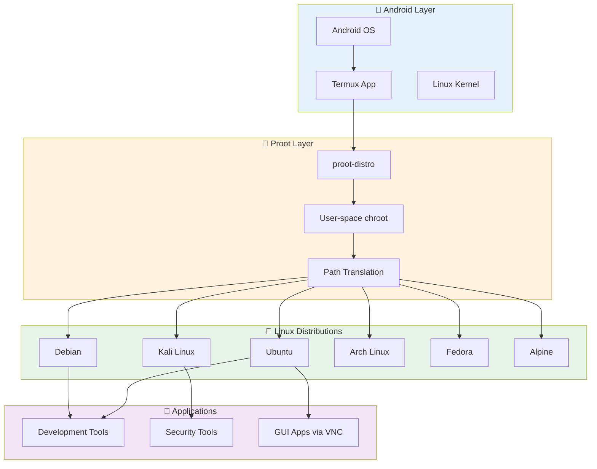
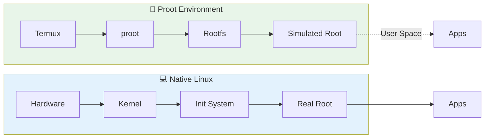
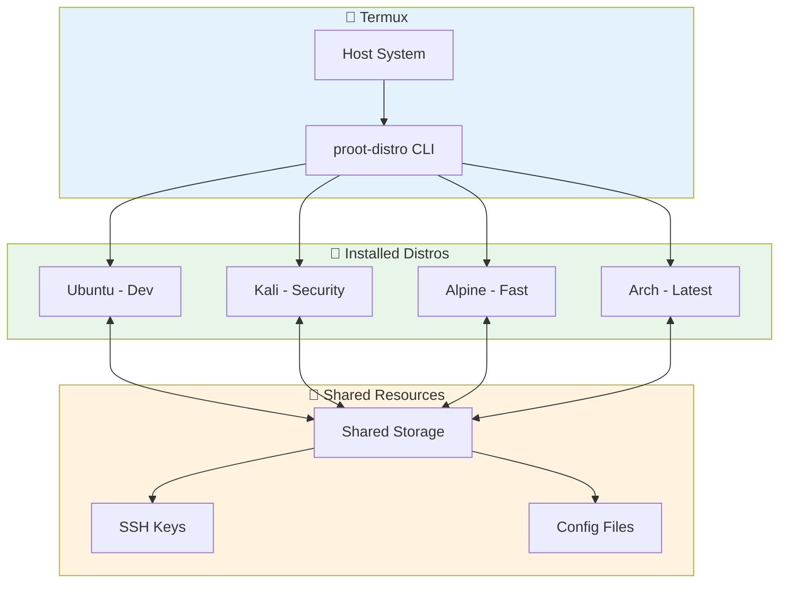
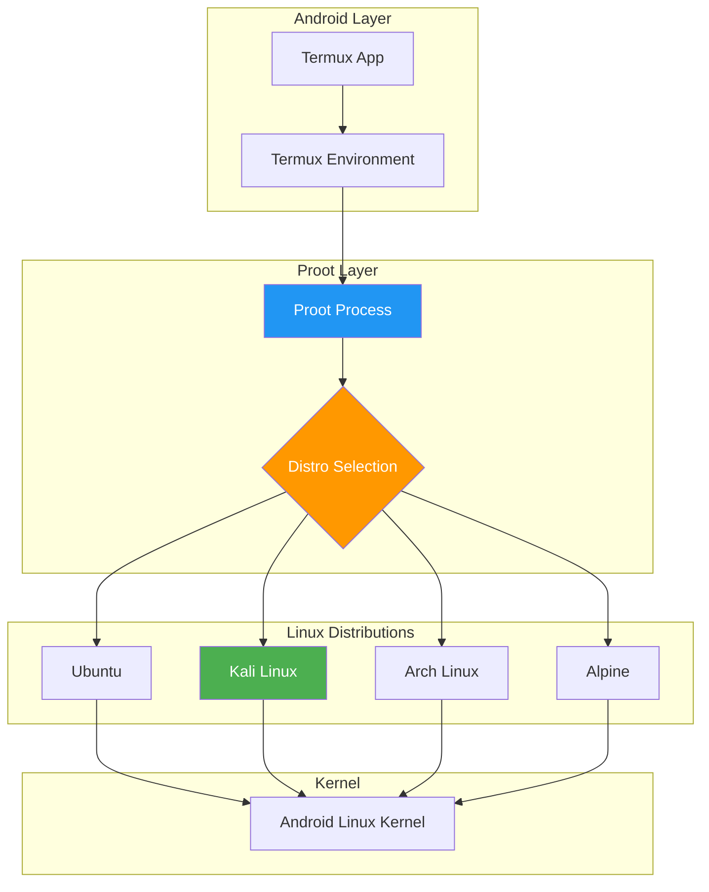
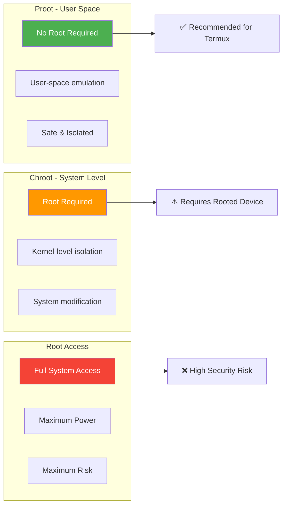
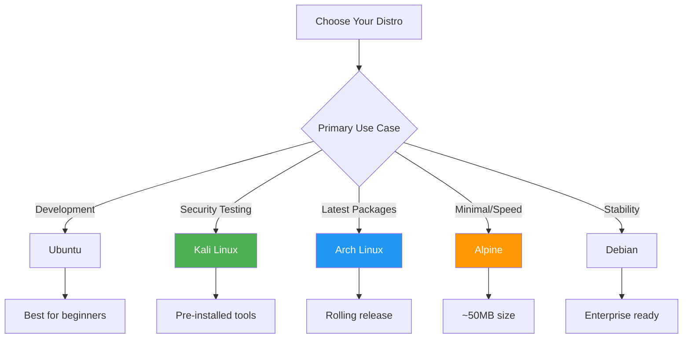
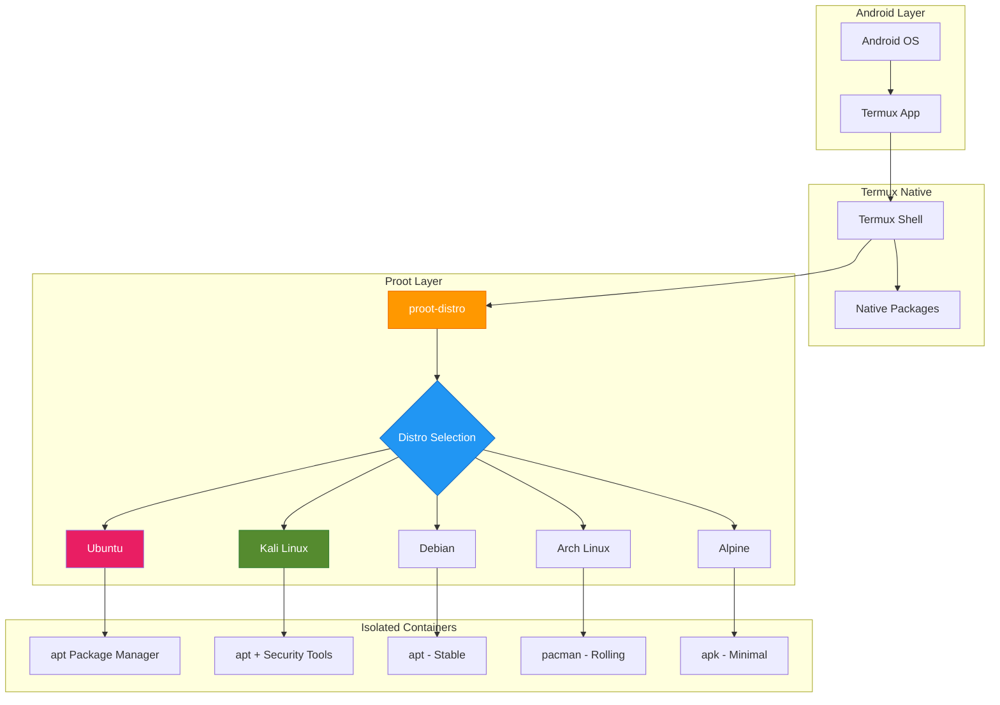
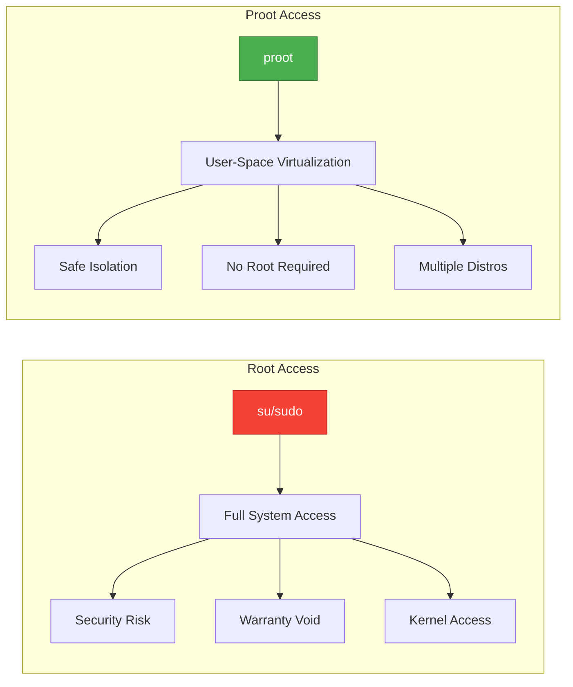
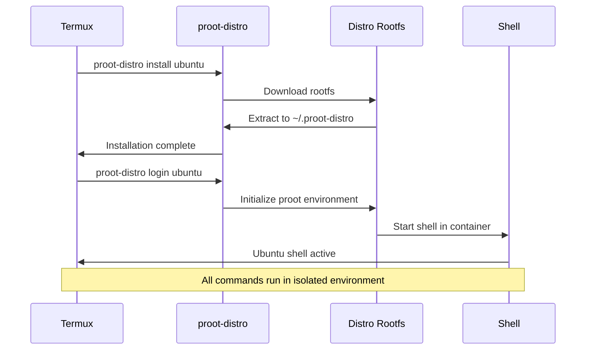

# Chapter 49: Proot Linux Distros in Termux

> **Module:** 8 - Advanced  
> **Chapter:** 49 of 61  
> **Duration:** 25-30 Minutes  
> **Difficulty:** ⭐⭐⭐ Advanced

---

## 📋 Chapter Overview

| Section | Content |
|---------|---------|
| Video Script | Complete Hindi narration with timestamps |
| Technical Guide | Proot concepts, distro installation, GUI setup |
| Commands Reference | 25+ proot-distro commands |
| Practice Exercises | Hands-on installation and configuration |
| Troubleshooting | Common proot issues and solutions |
| Video Assets | Thumbnail, description, tags |

---

## 🎬 VIDEO SCRIPT (Complete Hindi Narration)

```
═══════════════════════════════════════════════════════════════════════════════
TERMUX FULL COURSE - CHAPTER 49
Title: Proot Linux Distros | Ubuntu, Kali, Arch in Termux | T3rmuxk1ng
Duration: 25-30 Minutes
═══════════════════════════════════════════════════════════════════════════════

[INTRO - 0:00 to 1:00]
─────────────────────────────────────────────────────────────────────────────

Namaskar Dosto! Welcome back to Termux Full Course by T3rmuxk1ng!

Aaj ka chapter bahut special hai - kyunki aaj hum seekhenge ki kaise 
aap apne Android phone mein MULTIPLE Linux distributions run kar sakte 
ho - Bina root ke!

Haan dosto, suna sahi! Ubuntu, Kali Linux, Debian, Arch Linux, Fedora, 
Alpine - ye sab aapke phone mein run kar sakte ho simultaneously!

Ye possible hai ek amazing tool ke through - PROOT-DISTRO!

Agar aapko lagta hai Termux sirf ek terminal hai, to aaj aapka 
misconception clear hoga. Termux ke through aap kaafi powerful Linux 
systems run kar sakte ho - aur woh bhi production-ready level pe!

To chaliye shuru karte hain - Proot Linux Distros in Termux!

Play button dabaiye, like karein, subscribe karein, aur notification 
bell on karein. Let's dive in!

---

[SECTION 1: WHAT IS PROOT - 1:00 to 4:30]
─────────────────────────────────────────────────────────────────────────────

Sabse pehle samajhte hain - PROOT kya hai?

Proot ek tool hai jo user-space virtualization provide karta hai. 
Simple shabdon mein - ye aapko root privileges ke bina kaam karne 
deta hai jo normally root chahiye hota hai.

Linux mein jab aap koi bhi system-level changes karte ho - jaise 
package install karna, system files modify karna - to aapko root 
access chahiye hota hai. Android pe root karna risky hai, warranty 
void hoti hai, aur security risks bhi hain.

Proot ye problem solve karta hai. Ye ek "fake root environment" 
create karta hai - jahan aapko lagta hai ki aap root ho, but 
actually aap normal user hi ho. Ye chroot jaisa hai, but without 
actual root privileges.

┌─────────────────────────────────────────────────────────────────────────┐
│                         PROOT VS CHROOT VS ROOT                          │
├─────────────────┬─────────────────┬─────────────────────────────────────┤
│ Method          │ Root Required   │ Description                         │
├─────────────────┼─────────────────┼─────────────────────────────────────┤
│ Root (su)       │ ✅ Yes          │ Actual root access - risky          │
│ chroot          │ ✅ Yes          │ Change root - needs root            │
│ proot           │ ❌ No           │ User-space chroot - safe!           │
└─────────────────┴─────────────────┴─────────────────────────────────────┘

Proot kaam kaise karta hai?

1. Ye system calls ko intercept karta hai
2. Fake file system paths provide karta hai
3. Process ko isolate karta hai
4. Root-like experience deta hai bina root ke

Proot-distro ek wrapper hai proot ka - jo different Linux 
distributions ko install aur manage karna easy bana deta hai.

Iske benefits:
✓ No root required - Safe!
✓ Multiple distros simultaneously
✓ Isolated environments
✓ Easy backup and restore
✓ Native package managers (apt, pacman, dnf)
✓ Full development environments

Limitations:
✗ Slightly slower than native
✗ No kernel-level features
✗ Some system calls not supported
✗ Docker, Kubernetes won't work

Overall - proot perfect hai for:
- Development
- Learning Linux
- Running security tools
- Testing applications
- Educational purposes

---

[SECTION 2: PROOT-DISTRO INSTALLATION - 4:30 to 7:00]
─────────────────────────────────────────────────────────────────────────────

Chaliye ab proot-distro install karte hain.

Pehle Termux ko update karein:

    pkg update && pkg upgrade -y

Ab proot-distro install karein:

    pkg install proot-distro -y

Ye package automatically proot aur other dependencies bhi install 
kar dega.

Installation ke baad verify karein:

    proot-distro --version

Agar version number dikh raha hai - installation successful hai!

Available commands dekhne ke liye:

    proot-distro help

Available distributions list karein:

    proot-distro list

Ye command aapko saare supported distributions dikhayega:
- ubuntu
- debian
- kali
- arch
- fedora
- alpine
- centos
- opensuse
- void
- and many more...

Har distribution ke baare mein information:

    proot-distro info ubuntu

---

[SECTION 3: INSTALLING UBUNTU - 7:00 to 10:00]
─────────────────────────────────────────────────────────────────────────────

Chaliye sabse popular distribution se start karte hain - UBUNTU!

Ubuntu install karne ke liye:

    proot-distro install ubuntu

Ye command Ubuntu rootfs download karega aur install karega. 
Size approximately 200-300MB hai. Internet speed pe depend 
karta hai, 2-5 minutes lag sakte hain.

Installation ke baad Ubuntu mein login karein:

    proot-distro login ubuntu

Aapko Ubuntu prompt milega! 

    root@localhost:~#

Congratulations! Aap ab Ubuntu mein hain!

Ubuntu mein basic commands test karein:

    cat /etc/os-release

Ye Ubuntu version dikhayega.

Package manager update karein:

    apt update && apt upgrade -y

Koi package install karein:

    apt install neofetch -y

Neofetch run karein:

    neofetch

Bahut cool lagega! System information with ASCII logo!

Ubuntu se exit karne ke liye:

    exit

Ya phir Ctrl+D press karein.

Important: Proot distros Termux se isolated hain. Ubuntu mein 
installed packages Termux mein available nahi honge, aur vice versa.

---

[SECTION 4: INSTALLING KALI LINUX - 10:00 to 14:00]
─────────────────────────────────────────────────────────────────────────────

Ab aate hain security enthusiasts ke favorite - KALI LINUX!

Kali Linux install karein:

    proot-distro install kali

Kali Linux size thoda zyada hai - around 400-500MB kyunki ye 
security tools ke saath aata hai.

Installation ke baad login:

    proot-distro login kali

Kali Linux ka prompt:

    ┌──(root㉿kali)-[~]
    └─$ 

Kali version check:

    cat /etc/os-release

Package update:

    apt update && apt upgrade -y

Kali Linux specially security tools ke liye designed hai. 
Let's check some tools:

    apt search metasploit
    apt search nmap
    apt search sqlmap

Default Kali mein saare tools pre-installed nahi hote. 
Tools install karne ke liye:

    apt install nmap -y
    apt install hydra -y

But DHYAAN RAKHEIN - Termux ke proot mein Kali tools kuch 
limitations ke saath kaam karte hain:
- Network scanning limited ho sakti hai
- Some kernel-dependent tools won't work
- Metasploit setup complex hai

Better approach: Essential tools manually install karein 
instead of full Kali installation.

Kali tools meta-package install karne ke liye:

    apt install kali-tools-top10

Ye top 10 Kali tools install karega - but ye heavy hai 
aur time lagega.

Exit Kali:

    exit

---

[SECTION 5: INSTALLING ARCH LINUX - 14:00 to 17:00]
─────────────────────────────────────────────────────────────────────────────

Ab aate hain Linux enthusiasts ke favorite - ARCH LINUX!

Arch Linux install karein:

    proot-distro install arch

Arch minimal hai - fast installation.

Login to Arch:

    proot-distro login arch

Arch Linux ka package manager PACMAN hai.

Package databases sync karein:

    pacman -Syu

Arch mein package install karna:

    pacman -S neofetch

Package search:

    pacman -Ss python

Package remove:

    pacman -R package_name

Arch Linux unique hai kyunki:
- Rolling release - always latest
- Minimal by default
- AUR (Arch User Repository) support
- Great documentation

Arch User Repository (AUR) access ke liye:
- yay (Yet Another Yogurt) install kar sakte ho
- yaourt bhi option hai

yay install karein:

    pacman -S git
    git clone https://aur.archlinux.org/yay.git
    cd yay
    makepkg -si

Ab AUR packages install kar sakte ho:

    yay -S package-name

Exit Arch:

    exit

---

[SECTION 6: OTHER DISTRIBUTIONS - 17:00 to 19:30]
─────────────────────────────────────────────────────────────────────────────

Chaliye baaki distributions bhi dekh lete hain:

[DEBIAN]

Debian install:

    proot-distro install debian

Debian stable aur reliable hai. Ubuntu Debian pe based hai.

Login:

    proot-distro login debian

Package manager same hai - apt.

[FEDORA]

Fedora install:

    proot-distro install fedora

Fedora Red Hat sponsored hai, cutting-edge features deta hai.

Login:

    proot-distro login fedora

Package manager DNF hai:

    dnf update
    dnf install package-name

[ALPINE]

Alpine install:

    proot-distro install alpine

Alpine bahut lightweight hai - sirf 5MB approx!

Login:

    proot-distro login alpine

Package manager APK hai:

    apk update
    apk add package-name

Alpine best hai:
- Minimal resource usage
- Fast boot
- Container use cases
- Embedded systems

Comparison table:

┌─────────────────────────────────────────────────────────────────────────┐
│                    DISTRIBUTION COMPARISON                               │
├──────────────┬─────────────┬─────────────────┬───────────────────────────┤
│ Distro       │ Package Mgr │ Size            │ Best For                  │
├──────────────┼─────────────┼─────────────────┼───────────────────────────┤
│ Ubuntu       │ apt         │ ~300MB          │ Beginners, Development    │
│ Debian       │ apt         │ ~250MB          │ Stability, Servers        │
│ Kali         │ apt         │ ~500MB          │ Security, Pen-testing     │
│ Arch         │ pacman      │ ~150MB          │ Advanced users, Latest    │
│ Fedora       │ dnf         │ ~350MB          │ Development, New features │
│ Alpine       │ apk         │ ~5-50MB         │ Minimal, Containers       │
└──────────────┴─────────────┴─────────────────┴───────────────────────────┘

---

[SECTION 7: RUNNING GUI APPLICATIONS - 19:30 to 22:30]
─────────────────────────────────────────────────────────────────────────────

Ab sabse interesting part - GUI applications!

Proot distros mein GUI apps run karne ke liye display server 
chahiye. Android pe XServer ya VNC use kar sakte ho.

Method 1: VNC Server

Pehle Ubuntu mein VNC server install karein:

    proot-distro login ubuntu

    apt update
    apt install tigervnc-standalone-server -y

VNC server start karein:

    vncserver :1 -geometry 1280x720

First time password set karne ko bolega. Password yaad rakhein!

Ab Android pe VNC Viewer app download karein:
- VNC Viewer - RealVNC (Play Store se)
- Ya bVNC from F-Droid

Connection details:
- Address: 127.0.0.1:5901
- Password: jo set kiya

Connect karein - Desktop environment dikhega!

Desktop environment install:

    apt install xfce4 xfce4-goodies -y

Ye XFCE desktop install karega - lightweight aur fast.

Method 2: XServer XSDL / Termux-X11

Alternative method - XServer app use karna:

1. Termux-X11 app download karein (F-Droid)
2. Start karein
3. Proot mein environment variable set karein:

    export DISPLAY=:0

3. GUI app run karein:

    apt install firefox -y
    firefox

Firefox XServer mein open hoga!

Method 3: VNC with Desktop Environment

Complete setup for full GUI experience:

    proot-distro login ubuntu

    # Install desktop environment
    apt install xfce4 xfce4-goodies lightdm -y

    # Install VNC
    apt install tigervnc-standalone-server -y

    # Start VNC with XFCE
    vncserver :1 -geometry 1920x1080 -depth 24

    # Configure startup
    echo "startxfce4" > ~/.xsession

---

[SECTION 8: FILE SHARING BETWEEN TERMUX AND PROOT - 22:30 to 24:00]
─────────────────────────────────────────────────────────────────────────────

Bahut important topic - Files share karna Termux aur proot distros 
ke beech.

By default, proot distros Termux ke files access nahi kar sakte. 
But hum shared directory bana sakte hain.

Termux mein ek directory banaein:

    mkdir ~/shared

Ab proot distro mein isko bind mount karein. Login ke time:

    proot-distro login ubuntu --shared-tmp

Ya manually mount karein inside proot:

    mkdir -p /shared
    mount --bind /data/data/com.termux/files/home/shared /shared

But ye temporary hai. Permanent ke liye proot-distro ke 
--bind option use karein:

    proot-distro login ubuntu --bind /data/data/com.termux/files/home/shared:/root/shared

Ab /root/shared mein Termux ke ~/shared files access hongi!

Alternative: Storage access

Termux storage setup:

    termux-setup-storage

Ab proot mein:

    proot-distro login ubuntu --bind /sdcard:/root/sdcard

Ab /root/sdcard se phone storage access hoga!

File transfer example:

    # In Termux
    cp ~/myfile.txt ~/shared/

    # In Ubuntu proot
    cat /root/shared/myfile.txt

---

[SECTION 9: BACKUP AND RESTORE - 24:00 to 26:00]
─────────────────────────────────────────────────────────────────────────────

Backup banana bahut important hai - especially jab aapne bahut 
time laga ke distro setup kiya hai.

Backup command:

    proot-distro backup ubuntu

Ye Ubuntu ka backup tar.gz file mein save karega:
- Location: ~/.proot-distro/backup-ubuntu-YYYYMMDD.tar.gz

Backup with custom name:

    proot-distro backup ubuntu --output ~/my-ubuntu-backup.tar.gz

Restore kaise karein:

    proot-distro restore ubuntu backup-file.tar.gz

Restore from custom location:

    proot-distro restore ubuntu ~/my-ubuntu-backup.tar.gz

Complete backup script:

    #!/bin/bash
    # Auto backup all distros
    
    DATE=$(date +%Y%m%d)
    BACKUP_DIR=~/distro-backups
    
    mkdir -p $BACKUP_DIR
    
    for distro in ubuntu kali arch debian; do
        echo "Backing up $distro..."
        proot-distro backup $distro --output $BACKUP_DIR/${distro}-${DATE}.tar.gz
    done
    
    echo "All backups completed!"

Backup files ka size:
- Ubuntu: ~500MB compressed
- Kali: ~800MB compressed
- Arch: ~300MB compressed

Storage manage karein - purane backups delete karte raho.

---

[SECTION 10: UNINSTALLING DISTROS - 26:00 to 27:30]
─────────────────────────────────────────────────────────────────────────────

Agar aapko koi distro nahi chahiye, uninstall kar sakte ho.

Remove Ubuntu:

    proot-distro remove ubuntu

Ye command Ubuntu ko completely remove kar dega - including 
sab files aur configurations.

Warning: Ye irreversible hai! Backup le lein pehle.

Multiple distros remove:

    proot-distro remove ubuntu debian fedora

Installed distros list check:

    proot-distro list --installed

Ye sirf installed distros dikhayega.

Distro reinstall karna ho:

    # Remove first
    proot-distro remove ubuntu
    
    # Install fresh
    proot-distro install ubuntu

Storage cleanup:

    # Check proot-distro storage usage
    du -sh ~/.proot-distro
    
    # Remove cache
    rm -rf ~/.proot-distro/cache/*
    
    # Remove old backups
    rm -rf ~/.proot-distro/backup-*.tar.gz

---

[SECTION 11: PERFORMANCE TIPS - 27:30 to 29:00]
─────────────────────────────────────────────────────────────────────────────

Proot distros ko optimize karna important hai for better performance.

Tip 1: Use Alpine for speed

Alpine fastest hai due to minimal size:

    proot-distro install alpine

Tip 2: Disable unnecessary services

Inside distro, services ko disable karein:

    systemctl disable service-name
    # Or
    rm /etc/init.d/service-name

Tip 3: Use lightweight desktop

Instead of GNOME/KDE, use:
- XFCE
- LXQt
- MATE

Tip 4: Limit VNC resolution

Lower resolution = better performance:

    vncserver :1 -geometry 1280x720

Tip 5: Clean package cache

Regular cleanup:

    # Ubuntu/Debian/Kali
    apt clean
    apt autoclean
    apt autoremove

    # Arch
    pacman -Sc

    # Fedora
    dnf clean all

Tip 6: Zram for memory

If device has less RAM:

    # Check zram
    cat /proc/swaps

Tip 7: Use Termux in foreground

Background mein Termux ko mat rakho - Android kill kar sakta hai.

Tip 8: Acquire wakelock

Prevent Termux from sleeping:

    termux-wake-lock

---

[SECTION 12: SUMMARY AND CONCLUSION - 29:00 to 30:00]
─────────────────────────────────────────────────────────────────────────────

To dosto, Chapter 49 complete! Let's summarize:

✅ Proot kya hai - User-space virtualization without root
✅ proot-distro installation - pkg install proot-distro
✅ Multiple distros - Ubuntu, Kali, Debian, Arch, Fedora, Alpine
✅ Package management - apt, pacman, dnf, apk
✅ GUI applications - VNC, XServer setup
✅ File sharing - bind mounts for Termux access
✅ Backup & Restore - proot-distro backup/restore
✅ Uninstalling - proot-distro remove
✅ Performance tips - Lightweight distros, cleanup

Important Commands yaad rakhein:

┌─────────────────────────────────────────────────────────────────────────┐
│                    PROOT-DISTRO ESSENTIAL COMMANDS                       │
├─────────────────────────────────────────────────────────────────────────┤
│ proot-distro install <distro>      │ Install distribution               │
│ proot-distro login <distro>        │ Login to distribution             │
│ proot-distro list                  │ List all available distros        │
│ proot-distro remove <distro>       │ Remove distribution               │
│ proot-distro backup <distro>       │ Backup distribution               │
│ proot-distro restore <distro>      │ Restore distribution              │
└─────────────────────────────────────────────────────────────────────────┘

Next Chapter 50 mein hum Metasploit in Proot environment seekhenge - 
full setup aur usage!

Agar ye video helpful lagi, to:
👍 Like button press karein
🔔 Subscribe karein, notification bell on karein
💬 Koi sawal ho to comment mein poochein
📤 Share karein friends ke saath

Main har comment ka reply karta hoon.

Thank you for watching! See you in Chapter 50!

═══════════════════════════════════════════════════════════════════════════════
```

---

## 📖 TECHNICAL GUIDE

### 1. What is Proot?

```
┌─────────────────────────────────────────────────────────────────────────┐
│                         PROOT ARCHITECTURE                               │
├─────────────────────────────────────────────────────────────────────────┤
│                                                                          │
│   ┌─────────────────────────────────────────────────────────────────┐   │
│   │                    Android Application Layer                      │   │
│   │   (Termux App - provides terminal interface)                     │   │
│   └─────────────────────────────────────────────────────────────────┘   │
│                                   │                                      │
│                                   ▼                                      │
│   ┌─────────────────────────────────────────────────────────────────┐   │
│   │                         PROOT Layer                              │   │
│   │   - Intercepts system calls                                      │   │
│   │   - Provides fake root environment                               │   │
│   │   - Translates paths                                             │   │
│   │   - Isolates processes                                           │   │
│   └─────────────────────────────────────────────────────────────────┘   │
│                                   │                                      │
│                                   ▼                                      │
│   ┌─────────────────────────────────────────────────────────────────┐   │
│   │                   Linux Distribution Rootfs                      │   │
│   │   (Ubuntu, Kali, Arch, etc.)                                     │   │
│   │                                                                   │   │
│   │   /bin, /etc, /usr, /home, /root                                │   │
│   └─────────────────────────────────────────────────────────────────┘   │
│                                   │                                      │
│                                   ▼                                      │
│   ┌─────────────────────────────────────────────────────────────────┐   │
│   │                    Android Linux Kernel                          │   │
│   │   (Shared between Android and Proot environments)                │   │
│   └─────────────────────────────────────────────────────────────────┘   │
│                                                                          │
└─────────────────────────────────────────────────────────────────────────┘
```

### 2. Proot vs Root Comparison

| Feature | Root Access | Proot |
|---------|-------------|-------|
| Root privileges | Full system access | Simulated root |
| Security risk | High | Low |
| Device warranty | Voided | Intact |
| Kernel access | Yes | No |
| Docker support | Yes | No |
| Performance | Native | Slightly slower |
| Multiple distros | Complex | Easy |
| Setup complexity | High | Low |

### 3. Proot-Distro Directory Structure

```
~/.proot-distro/
├── installed-rootfs/          # Installed distribution rootfs
│   ├── ubuntu/
│   │   ├── bin/
│   │   ├── etc/
│   │   ├── home/
│   │   ├── root/
│   │   ├── usr/
│   │   └── var/
│   ├── kali/
│   ├── arch/
│   └── ...
├── cache/                      # Downloaded rootfs archives
├── backup-*.tar.gz            # Backup files
└── lion/                       # Proot configuration
```

### 4. Available Distributions

```
┌─────────────────────────────────────────────────────────────────────────┐
│                    SUPPORTED DISTRIBUTIONS                               │
├──────────────────┬──────────────────────────────────────────────────────┤
│ Distribution     │ Alias        │ Description                           │
├──────────────────┼──────────────────────────────────────────────────────┤
│ Ubuntu           │ ubuntu       │ Most popular, beginner-friendly       │
│ Ubuntu 20.04     │ ubuntu-oldlts│ Long term support                     │
│ Debian           │ debian       │ Stable, reliable                      │
│ Kali Linux       │ kali         │ Security & penetration testing        │
│ Arch Linux       │ arch         │ Rolling release, advanced users       │
│ Fedora           │ fedora       │ Cutting-edge features                 │
│ Alpine           │ alpine       │ Lightweight, security-focused         │
│ CentOS           │ centos       │ Enterprise Linux                      │
│ openSUSE         │ opensuse     │ Community distribution                │
│ Void Linux       │ void         │ Independent, XBPS package manager     │
│ Gentoo           │ gentoo       │ Source-based                          │
│ Slackware        │ slackware    │ Oldest active distribution            │
│ NixOS            │ nix          │ Functional package management         │
│ Devuan           │ devuan       │ Debian without systemd                │
│ Parrot OS        │ parrot       │ Security oriented                     │
│ BlackArch        │ blackarch    │ Arch-based security distro            │
└──────────────────┴──────────────────────────────────────────────────────┘
```

---

## 🔧 DETAILED INSTALLATION GUIDE

### Installing proot-distro

```bash
# Step 1: Update Termux
pkg update && pkg upgrade -y

# Step 2: Install proot-distro
pkg install proot-distro -y

# Step 3: Verify installation
proot-distro --version

# Step 4: Check available commands
proot-distro help

# Step 5: List available distributions
proot-distro list
```

### Installing Ubuntu

```bash
# Install Ubuntu (latest LTS)
proot-distro install ubuntu

# Install specific version
proot-distro install ubuntu-oldlts

# Login to Ubuntu
proot-distro login ubuntu

# Login with shared Termux tmp
proot-distro login ubuntu --shared-tmp

# Login with specific user (create if not exists)
proot-distro login ubuntu --user username

# Inside Ubuntu - First setup
apt update && apt upgrade -y
apt install sudo nano vim -y

# Create regular user (recommended)
useradd -m -s /bin/bash myuser
passwd myuser
usermod -aG sudo myuser

# Login as regular user
exit
proot-distro login ubuntu --user myuser
```

### Installing Kali Linux

```bash
# Install Kali
proot-distro install kali

# Login to Kali
proot-distro login kali

# Update Kali
apt update && apt upgrade -y

# Install essential tools
apt install -y kali-tools-top10   # Top 10 tools (large)
apt install -y nmap               # Network scanner
apt install -y hydra              # Password cracker
apt install -y john               # John the Ripper
apt install -y metasploit-framework  # May have issues

# Install individual tools
apt install -y sqlmap
apt install -y airmon-ng          # WiFi tools
apt install -y wireshark          # Network analyzer
apt install -y burpsuite          # Web testing

# Kali Linux variant
proot-distro install kali-light   # Minimal Kali
proot-distro install kali-full    # Full Kali (very large)
```

### Installing Arch Linux

```bash
# Install Arch
proot-distro install arch

# Login to Arch
proot-distro login arch

# Initialize pacman keyring
pacman-key --init
pacman-key --populate archlinux

# Update system
pacman -Syu

# Install essential packages
pacman -S base-devel git vim sudo

# Create user
useradd -m -G wheel -s /bin/bash myuser
passwd myuser

# Enable sudo for wheel group
EDITOR=vim visudo
# Uncomment: %wheel ALL=(ALL:ALL) ALL

# Install AUR helper (yay)
pacman -S --needed base-devel git
git clone https://aur.archlinux.org/yay.git
cd yay
makepkg -si

# Use yay for AUR packages
yay -S package-name
```

### Installing Debian

```bash
# Install Debian
proot-distro install debian

# Login to Debian
proot-distro login debian

# Update Debian
apt update && apt upgrade -y

# Debian is very stable
# Good for servers and development
```

### Installing Fedora

```bash
# Install Fedora
proot-distro install fedora

# Login to Fedora
proot-distro login fedora

# Update Fedora
dnf upgrade --refresh

# Install packages
dnf install @development-tools
dnf install vim git
```

### Installing Alpine Linux

```bash
# Install Alpine (very lightweight)
proot-distro install alpine

# Login to Alpine
proot-distro login alpine

# Update Alpine
apk update
apk upgrade

# Install packages
apk add bash vim git
apk add build-base   # Build tools

# Alpine uses musl libc instead of glibc
# Some packages may need adjustment
```

---

## 📦 PACKAGE MANAGEMENT IN EACH DISTRO

### Ubuntu/Debian/Kali (APT)

```bash
# Update package lists
apt update

# Upgrade all packages
apt upgrade -y

# Full upgrade (handles dependencies)
apt full-upgrade -y

# Install package
apt install package-name

# Install multiple packages
apt install pkg1 pkg2 pkg3

# Remove package
apt remove package-name

# Remove with config
apt purge package-name

# Remove unused dependencies
apt autoremove

# Clean cache
apt clean
apt autoclean

# Search package
apt search keyword

# Show package info
apt show package-name

# List installed packages
apt list --installed

# Hold package (prevent upgrade)
apt-mark hold package-name

# Unhold package
apt-mark unhold package-name

# Add repository
add-apt-repository ppa:repository/name
# Or manually edit /etc/apt/sources.list
```

### Arch Linux (Pacman)

```bash
# Sync package databases
pacman -Sy

# Update system
pacman -Su

# Sync and update
pacman -Syu

# Install package
pacman -S package-name

# Install multiple
pacman -S pkg1 pkg2 pkg3

# Remove package
pacman -R package-name

# Remove with dependencies
pacman -Rs package-name

# Remove with config
pacman -Rns package-name

# Search package
pacman -Ss keyword

# Search installed
pacman -Qs keyword

# List installed packages
pacman -Q

# Package info
pacman -Qi package-name

# Clean cache
pacman -Sc   # Partial clean
pacman -Scc  # Full clean

# Orphan packages
pacman -Qdtq | pacman -Rs -

# Download without install
pacman -Sw package-name
```

### Fedora (DNF)

```bash
# Update system
dnf upgrade --refresh

# Install package
dnf install package-name

# Remove package
dnf remove package-name

# Search package
dnf search keyword

# List available
dnf list available

# List installed
dnf list installed

# Package info
dnf info package-name

# Clean cache
dnf clean all

# History
dnf history

# Undo last transaction
dnf history undo last

# Group install
dnf group install "Development Tools"

# Enable repository
dnf config-manager --enable repo-name
```

### Alpine (APK)

```bash
# Update package lists
apk update

# Upgrade packages
apk upgrade

# Install package
apk add package-name

# Remove package
apk del package-name

# Search package
apk search keyword

# Package info
apk info package-name

# List installed
apk info

# Clean cache
apk cache clean

# Add repository
echo "repo-url" >> /etc/apk/repositories
```

---

## 🖥️ RUNNING GUI APPLICATIONS

### Method 1: VNC Server Setup

```bash
# Login to distro
proot-distro login ubuntu

# Install VNC server
apt update
apt install tigervnc-standalone-server tigervnc-common -y

# Install desktop environment (choose one)

# Option A: XFCE (Recommended - lightweight)
apt install xfce4 xfce4-goodies -y

# Option B: LXQt (Very lightweight)
apt install lxqt -y

# Option C: MATE (Traditional)
apt install mate-desktop-environment -y

# Option D: LXDE (Minimal)
apt install lxde -y

# Set VNC password
vncpasswd

# Start VNC server
vncserver :1 -geometry 1280x720 -depth 24

# First time setup - create xstartup
mkdir -p ~/.vnc
cat > ~/.vnc/xstartup << 'EOF'
#!/bin/bash
xrdb $HOME/.Xresources
startxfce4 &
EOF
chmod +x ~/.vnc/xstartup

# Kill VNC server
vncserver -kill :1

# Restart with specific config
vncserver :1 -geometry 1920x1080 -depth 24 -localhost no

# List running VNC sessions
vncserver -list
```

### Method 2: XServer (Termux-X11)

```bash
# Install Termux-X11 from F-Droid
# https://f-droid.org/packages/com.termux.x11/

# In Termux, start X11
termux-x11 :0 &

# Login to distro with display exported
proot-distro login ubuntu --shared-tmp

# Inside distro, set display
export DISPLAY=:0

# Or use PULSE_SERVER for audio
export PULSE_SERVER=tcp:127.0.0.1:4713

# Install GUI app
apt install firefox -y

# Run GUI app
firefox &

# For better integration, add to ~/.bashrc
echo 'export DISPLAY=:0' >> ~/.bashrc
echo 'export PULSE_SERVER=tcp:127.0.0.1:4713' >> ~/.bashrc
```

### Method 3: VNC Viewer Apps

**Recommended VNC Viewer Apps:**

| App | Source | Features |
|-----|--------|----------|
| VNC Viewer | Play Store | Official RealVNC, easy setup |
| bVNC | F-Droid | Open source, SSH tunnel |
| AVNC | F-Droid | Modern, open source |
| MultiVNC | F-Droid | Multiple connections |

**Connection Settings:**
```
Address: 127.0.0.1:5901  (for :1 display)
Or:      127.0.0.1:5902  (for :2 display)
Password: (set during vncpasswd)
```

### Complete GUI Setup Script

```bash
#!/bin/bash
# Complete GUI setup for Ubuntu proot

# Login to Ubuntu
proot-distro login ubuntu

# Update
apt update && apt upgrade -y

# Install XFCE desktop
apt install -y xfce4 xfce4-goodies

# Install VNC
apt install -y tigervnc-standalone-server

# Install useful apps
apt install -y firefox
apt install -y geany        # Code editor
apt install -y thunar       # File manager
apt install -y xfce4-terminal

# Configure VNC
mkdir -p ~/.vnc
cat > ~/.vnc/xstartup << 'EOF'
#!/bin/bash
unset SESSION_MANAGER
unset DBUS_SESSION_BUS_ADDRESS
exec startxfce4
EOF
chmod +x ~/.vnc/xstartup

# Start VNC
vncserver :1 -geometry 1280x720 -depth 24

# Instructions
echo "==========================================="
echo "VNC Server started!"
echo "Connect to: 127.0.0.1:5901"
echo "==========================================="
```

---

## 📁 FILE SHARING BETWEEN TERMUX AND PROOT

### Method 1: Bind Mount at Login

```bash
# Share Termux home directory
proot-distro login ubuntu --bind /data/data/com.termux/files/home:/root/termux-home

# Share phone storage
proot-distro login ubuntu --bind /sdcard:/root/sdcard

# Share specific directory
proot-distro login ubuntu --bind /data/data/com.termux/files/home/projects:/root/projects

# Multiple binds
proot-distro login ubuntu \
  --bind /sdcard:/root/sdcard \
  --bind /data/data/com.termux/files/home/shared:/root/shared
```

### Method 2: Shared Tmp Directory

```bash
# Use --shared-tmp for /tmp sharing
proot-distro login ubuntu --shared-tmp

# Now /tmp in Ubuntu = /tmp in Termux
# Copy files through /tmp
```

### Method 3: Symlink Method

```bash
# Inside proot, create symlinks
proot-distro login ubuntu

# Link to storage (if bind mounted)
ln -s /root/sdcard/Download ~/downloads

# Link to Termux files (if bind mounted)
ln -s /root/termux-home ~/termux
```

### Method 4: Using Storage Directory

```bash
# In Termux, setup storage
termux-setup-storage

# Mount storage in proot
proot-distro login ubuntu --bind /sdcard:/root/storage

# Inside proot
cd ~/storage/Download
# Access all downloads!
```

---

## 💾 BACKUP AND RESTORE

### Backup Commands

```bash
# Backup specific distro
proot-distro backup ubuntu

# Backup with custom name and location
proot-distro backup ubuntu --output ~/backups/ubuntu-backup.tar.gz

# Backup with date
proot-distro backup kali --output ~/backups/kali-$(date +%Y%m%d).tar.gz

# List backup files
ls -la ~/.proot-distro/backup-*.tar.gz
```

### Restore Commands

```bash
# Restore from backup
proot-distro restore ubuntu backup-file.tar.gz

# Restore to different distro name (clone)
proot-distro restore ubuntu ubuntu-clone --override-alias

# Restore from custom location
proot-distro restore debian ~/backups/debian-backup.tar.gz
```

### Automated Backup Script

```bash
#!/bin/bash
# save as: backup-all-distros.sh

BACKUP_DIR=~/distro-backups
DATE=$(date +%Y%m%d_%H%M%S)

# Create backup directory
mkdir -p "$BACKUP_DIR"

# List of distros to backup
DISTROS=$(proot-distro list --installed | awk '{print $1}')

for distro in $DISTROS; do
    echo "Backing up $distro..."
    proot-distro backup "$distro" --output "$BACKUP_DIR/${distro}-${DATE}.tar.gz"
    
    if [ $? -eq 0 ]; then
        echo "✓ $distro backed up successfully"
    else
        echo "✗ Failed to backup $distro"
    fi
done

# Show backup sizes
echo ""
echo "Backup Summary:"
echo "==============="
ls -lh "$BACKUP_DIR"/*${DATE}.tar.gz

# Clean old backups (keep last 3)
echo ""
echo "Cleaning old backups..."
ls -t "$BACKUP_DIR"/*.tar.gz | tail -n +4 | xargs rm -f 2>/dev/null

echo "Done!"
```

---

## 🗑️ UNINSTALLING DISTROS

### Remove Commands

```bash
# Remove single distro
proot-distro remove ubuntu

# Remove multiple distros
proot-distro remove ubuntu debian fedora

# Force remove (no confirmation)
proot-distro remove ubuntu --force

# List installed distros first
proot-distro list --installed
```

### Complete Cleanup

```bash
# Remove all distros
for distro in $(proot-distro list --installed | awk '{print $1}'); do
    proot-distro remove "$distro"
done

# Clean cache
rm -rf ~/.proot-distro/cache/*

# Remove backups
rm -rf ~/.proot-distro/backup-*.tar.gz

# Remove lion config
rm -rf ~/.proot-distro/lion/*

# Complete proot-distro data removal (nuclear option)
rm -rf ~/.proot-distro
```

---

## ⚡ PERFORMANCE TIPS

### 1. Choose Lightweight Distros

```bash
# Alpine - Fastest, smallest
proot-distro install alpine    # ~5-50MB

# Arch - Minimal base
proot-distro install arch      # ~150MB

# Debian minimal
proot-distro install debian    # ~250MB
```

### 2. Use Lightweight Desktop Environments

```bash
# XFCE - Balanced
apt install xfce4 xfce4-goodies

# LXQt - Very light
apt install lxqt

# Openbox - Minimal
apt install openbox

# i3wm - Tiling (advanced)
apt install i3
```

### 3. Optimize VNC Settings

```bash
# Lower resolution for better performance
vncserver :1 -geometry 1280x720

# Lower color depth
vncserver :1 -depth 16

# Disable some extensions
vncserver :1 -noreset -nohttpd
```

### 4. Clean Up Regularly

```bash
# Ubuntu/Debian/Kali
apt clean
apt autoclean
apt autoremove --purge

# Arch
pacman -Sc
pacman -Rns $(pacman -Qdtq)

# Fedora
dnf clean all
dnf autoremove

# Alpine
apk cache clean
```

### 5. Limit Services

```bash
# Disable unnecessary services
systemctl disable bluetooth
systemctl disable cups
systemctl disable avahi-daemon

# Or remove systemd services
rm /etc/systemd/system/multi-user.target.wants/service-name
```

### 6. Memory Management

```bash
# Check memory usage
free -h

# Create swap file (if needed)
dd if=/dev/zero of=/swapfile bs=1M count=512
chmod 600 /swapfile
mkswap /swapfile
swapon /swapfile

# Note: Swap in proot may not work as expected
```

### 7. Termux Optimization

```bash
# Prevent Termux from sleeping
termux-wake-lock

# Run in foreground
# Don't minimize Termux for long operations

# Check CPU governors (if root)
cat /sys/devices/system/cpu/cpu*/cpufreq/scaling_governor
```

---

## 📋 COMMANDS REFERENCE

### proot-distro Commands (25+)

```bash
# INSTALLATION
proot-distro install <distro>          # Install distribution
proot-distro install <distro> --override-alias  # Force reinstall

# LOGIN
proot-distro login <distro>            # Login as root
proot-distro login <distro> --user <user>       # Login as specific user
proot-distro login <distro> --shared-tmp        # Share /tmp with Termux
proot-distro login <distro> --bind <src>:<dest> # Bind mount directory
proot-distro login <distro> --no-sysvipc        # Disable SysV IPC
proot-distro login <distro> --no-proot          # Direct chroot (needs root)
proot-distro login <distro> --isolated          # Isolated environment

# LISTING
proot-distro list                      # List all available distros
proot-distro list --installed          # List only installed distros

# INFORMATION
proot-distro info <distro>             # Show distro information
proot-distro help                      # Show help
proot-distro --version                 # Show version

# BACKUP & RESTORE
proot-distro backup <distro>           # Backup distribution
proot-distro backup <distro> --output <file>  # Backup to specific file
proot-distro restore <distro> <backup> # Restore from backup
proot-distro restore <distro> <backup> --override-alias  # Restore with new name

# REMOVAL
proot-distro remove <distro>           # Remove distribution
proot-distro remove <distro> --force   # Force remove without confirmation

# CLEAR CACHE
proot-distro clear-cache               # Clear downloaded rootfs cache
```

### Essential Inside-Distro Commands

```bash
# SYSTEM INFO
cat /etc/os-release                    # Distro information
uname -a                               # Kernel info
hostname                               # Current hostname
whoami                                 # Current user
id                                     # User/groups info

# USER MANAGEMENT
useradd -m -s /bin/bash <user>         # Create user
passwd <user>                          # Set password
usermod -aG sudo <user>                # Add to sudo group
su - <user>                            # Switch user

# SERVICE MANAGEMENT (if systemd available)
systemctl start <service>              # Start service
systemctl stop <service>               # Stop service
systemctl enable <service>             # Enable at boot
systemctl disable <service>            # Disable
systemctl status <service>             # Check status
```

### VNC Commands

```bash
# START VNC
vncserver :1                           # Start on display :1
vncserver :1 -geometry 1280x720        # With resolution
vncserver :1 -depth 24                 # With color depth
vncserver :1 -localhost no             # Allow external connections

# MANAGE VNC
vncserver -list                        # List running sessions
vncserver -kill :1                     # Kill display :1
vncpasswd                              # Change password

# VNC CONFIGURATION
~/.vnc/xstartup                        # Startup script
~/.vnc/passwd                          # Password file
~/.vnc/*.log                           # Log files
```

---

## 💻 PRACTICE EXERCISES

### Exercise 1: Ubuntu Installation and Configuration

```bash
# Task: Install Ubuntu and set up a complete development environment

# Step 1: Install proot-distro
pkg install proot-distro -y

# Step 2: Install Ubuntu
proot-distro install ubuntu

# Step 3: Login to Ubuntu
proot-distro login ubuntu

# Step 4: Update system
apt update && apt upgrade -y

# Step 5: Install development tools
apt install -y build-essential git vim python3 python3-pip nodejs npm

# Step 6: Create user
useradd -m -s /bin/bash developer
passwd developer
usermod -aG sudo developer

# Step 7: Install useful packages
apt install -y neofetch htop tmux

# Step 8: Test installation
neofetch
python3 --version
node --version
git --version

# Expected: All tools working correctly
```

### Exercise 2: Kali Linux Security Setup

```bash
# Task: Set up Kali Linux with essential security tools

# Step 1: Install Kali
proot-distro install kali

# Step 2: Login
proot-distro login kali

# Step 3: Update
apt update && apt upgrade -y

# Step 4: Install individual tools (better than meta-packages)
apt install -y nmap
apt install -y hydra
apt install -y john
apt install -y sqlmap
apt install -y nikto
apt install -y dirb
apt install -y gobuster

# Step 5: Test tools
nmap --version
hydra -h
sqlmap --version

# Step 6: Install Python security libraries
apt install -y python3-pip
pip3 install requests beautifulsoup4 scapy

# Expected: Security tools ready for use
```

### Exercise 3: Arch Linux with AUR

```bash
# Task: Install Arch Linux and set up AUR access

# Step 1: Install Arch
proot-distro install arch

# Step 2: Login
proot-distro login arch

# Step 3: Initialize pacman
pacman-key --init
pacman-key --populate archlinux

# Step 4: Update system
pacman -Syu

# Step 5: Install base devel
pacman -S --noconfirm base-devel git

# Step 6: Install yay (AUR helper)
git clone https://aur.archlinux.org/yay.git
cd yay
makepkg -si --noconfirm
cd ..
rm -rf yay

# Step 7: Test yay
yay --version

# Step 8: Install package from AUR
yay -S neofetch

# Expected: Arch with AUR working
```

### Exercise 4: GUI Desktop Setup

```bash
# Task: Set up XFCE desktop in Ubuntu with VNC

# Step 1: Install Ubuntu (if not already)
proot-distro install ubuntu

# Step 2: Login
proot-distro login ubuntu

# Step 3: Install XFCE
apt update
apt install -y xfce4 xfce4-goodies

# Step 4: Install VNC server
apt install -y tigervnc-standalone-server

# Step 5: Configure VNC
mkdir -p ~/.vnc
cat > ~/.vnc/xstartup << 'EOF'
#!/bin/bash
xrdb $HOME/.Xresources
startxfce4 &
EOF
chmod +x ~/.vnc/xstartup

# Step 6: Set VNC password
vncpasswd

# Step 7: Start VNC
vncserver :1 -geometry 1280x720 -depth 24

# Step 8: Install VNC viewer on Android
# Download VNC Viewer from Play Store

# Step 9: Connect
# Address: 127.0.0.1:5901
# Password: (your password)

# Expected: XFCE desktop visible in VNC viewer
```

### Exercise 5: File Sharing Setup

```bash
# Task: Set up file sharing between Termux and Ubuntu

# Step 1: In Termux, create shared directory
mkdir -p ~/shared-projects

# Step 2: Create a test file
echo "Hello from Termux!" > ~/shared-projects/test.txt

# Step 3: Login with bind mount
proot-distro login ubuntu --bind /data/data/com.termux/files/home/shared-projects:/root/projects

# Step 4: Verify access
ls /root/projects/
cat /root/projects/test.txt

# Step 5: Create file from Ubuntu
echo "Hello from Ubuntu!" > /root/projects/ubuntu-test.txt

# Step 6: Exit and verify in Termux
exit

# Step 7: Check in Termux
cat ~/shared-projects/ubuntu-test.txt

# Expected: Files accessible from both Termux and Ubuntu
```

### Exercise 6: Backup and Restore

```bash
# Task: Backup Ubuntu and restore it

# Step 1: Make some changes to Ubuntu
proot-distro login ubuntu
echo "This is a test config" > /root/myconfig.txt
exit

# Step 2: Create backup
proot-distro backup ubuntu --output ~/ubuntu-backup.tar.gz

# Step 3: Remove Ubuntu
proot-distro remove ubuntu --force

# Step 4: Verify Ubuntu is removed
proot-distro list --installed

# Step 5: Restore from backup
proot-distro restore ubuntu ~/ubuntu-backup.tar.gz

# Step 6: Verify restoration
proot-distro login ubuntu
cat /root/myconfig.txt
exit

# Expected: Config file preserved after restore
```

---

## ⚠️ TROUBLESHOOTING

### Problem 1: "Failed to extract rootfs"

```bash
# Cause: Corrupted download or insufficient storage

# Solution 1: Clear cache and reinstall
proot-distro clear-cache
proot-distro install ubuntu

# Solution 2: Check storage space
df -h

# Solution 3: Check internet connection
ping -c 3 google.com

# Solution 4: Manual download
# Download rootfs from official sources and place in cache
```

### Problem 2: "proot error: proot info: seccomp"

```bash
# Cause: Seccomp not supported

# Solution: Login with --no-sysvipc
proot-distro login ubuntu --no-sysvipc

# Or disable seccomp globally
export PROOT_NO_SECCOMP=1
proot-distro login ubuntu
```

### Problem 3: VNC black screen or no display

```bash
# Cause: Missing xstartup file or wrong configuration

# Solution: Recreate xstartup
mkdir -p ~/.vnc
cat > ~/.vnc/xstartup << 'EOF'
#!/bin/bash
unset SESSION_MANAGER
unset DBUS_SESSION_BUS_ADDRESS
exec startxfce4
EOF
chmod +x ~/.vnc/xstartup

# Kill existing VNC and restart
vncserver -kill :1
vncserver :1 -geometry 1280x720 -depth 24

# Check VNC log
cat ~/.vnc/*.log
```

### Problem 4: "Permission denied" for files

```bash
# Cause: UID/GID mismatch between Termux and proot

# Solution 1: Use --shared-tmp
proot-distro login ubuntu --shared-tmp

# Solution 2: Fix permissions
chmod -R 755 /root/shared-directory

# Solution 3: Create files as correct user
proot-distro login ubuntu --user myuser
```

### Problem 5: Slow performance

```bash
# Cause: Resource intensive applications

# Solution 1: Use lighter distro
proot-distro install alpine

# Solution 2: Use lighter desktop
apt install lxqt  # instead of xfce4

# Solution 3: Reduce VNC resolution
vncserver :1 -geometry 1024x768

# Solution 4: Clean up packages
apt clean && apt autoremove

# Solution 5: Prevent Termux sleep
termux-wake-lock
```

### Problem 6: Network issues inside proot

```bash
# Cause: DNS or network configuration

# Solution 1: Check DNS
cat /etc/resolv.conf

# Fix DNS
echo "nameserver 8.8.8.8" > /etc/resolv.conf
echo "nameserver 8.8.4.4" >> /etc/resolv.conf

# Solution 2: Test connectivity
ping -c 3 google.com

# Solution 3: Check if localhost works
ping -c 3 127.0.0.1
```

### Problem 7: Package installation fails

```bash
# Ubuntu/Debian/Kali
apt update
apt --fix-broken install
dpkg --configure -a

# Arch
pacman -Syy
pacman-key --refresh-keys

# Fedora
dnf clean all
dnf makecache
```

### Problem 8: Cannot exit proot cleanly

```bash
# Solution 1: Use exit command
exit

# Solution 2: Ctrl+D

# Solution 3: Force kill (last resort)
# From Termux (not proot)
pkill -9 -f "proot.*ubuntu"
```

### Problem 9: Storage not accessible in proot

```bash
# Cause: Storage permission or bind mount issue

# Solution 1: Grant Termux storage permission
termux-setup-storage

# Solution 2: Use bind mount
proot-distro login ubuntu --bind /sdcard:/root/sdcard

# Solution 3: Verify mount
ls /root/sdcard
```

### Problem 10: "Too many open files"

```bash
# Cause: System limit reached

# Solution: Close unnecessary processes
# Exit extra proot sessions

# Check open files
lsof | wc -l

# Increase limit (if possible)
ulimit -n 4096
```

---

## 🎬 VIDEO ASSETS

### Thumbnail Concepts

**Option A: Multi-Distro Showcase**
```
┌────────────────────────────────────┐
│  [Dark terminal background]        │
│                                    │
│   🐧 UBUNTU  🐉 KALI  🏔️ ARCH     │
│                                    │
│   MULTIPLE LINUX DISTROS           │
│   IN ONE ANDROID PHONE!            │
│                                    │
│   NO ROOT REQUIRED! ✅             │
│                                    │
│   [T3rmuxk1ng Logo]                │
└────────────────────────────────────┘
```

**Option B: Before/After Style**
```
┌────────────────────────────────────┐
│  TERMUX BEFORE  │  TERMUX AFTER    │
│  ───────────────┼───────────────── │
│  Basic terminal │  Ubuntu + Kali   │
│  Limited tools  │  Full Linux      │
│  No GUI         │  Desktop GUI     │
│                                    │
│  PROOT DISTRO MAGIC! 🪄            │
│  [T3rmuxk1ng]                      │
└────────────────────────────────────┘
```

**Option C: Kali Focus**
```
┌────────────────────────────────────┐
│  🐉 KALI LINUX IN TERMUX!          │
│                                    │
│  ✅ No Root                        │
│  ✅ All Security Tools             │
│  ✅ GUI Desktop                    │
│                                    │
│  INSTALL NOW! 📲                   │
│                                    │
│  Chapter 49 | T3rmuxk1ng           │
└────────────────────────────────────┘
```

### Video Description Template

```markdown
🐧 Termux Full Course - Chapter 49: Proot Linux Distros | Ubuntu, Kali, Arch in Android

🔥 In this video you'll learn:
• Proot kya hai aur kaise kaam karta hai
• Ubuntu, Kali, Debian, Arch, Fedora install karna
• GUI applications aur desktop environment setup
• File sharing Termux aur proot ke beech
• Backup aur restore karna
• Performance optimization tips

⏱️ Timestamps:
0:00 - Introduction
1:00 - What is Proot
4:30 - proot-distro Installation
7:00 - Installing Ubuntu
10:00 - Installing Kali Linux
14:00 - Installing Arch Linux
17:00 - Other Distributions
19:30 - GUI Applications & VNC Setup
22:30 - File Sharing
24:00 - Backup and Restore
26:00 - Uninstalling Distros
27:30 - Performance Tips
29:00 - Summary

📝 Commands from this video:
pkg install proot-distro -y
proot-distro install ubuntu
proot-distro login ubuntu
proot-distro list
proot-distro backup ubuntu
proot-distro remove ubuntu

📥 Useful Links:
• Termux Wiki: https://wiki.termux.com/
• proot-distro GitHub: https://github.com/termux/proot-distro
• VNC Viewer: Play Store link

📚 Full Course Playlist:
[PLAYLIST LINK]

📱 Follow T3rmuxk1ng:
• YouTube: @T3rmuxk1ng
• Telegram: [LINK]
• GitHub: [LINK]

#Termux #Proot #LinuxOnAndroid #KaliLinux #Ubuntu #ArchLinux #TermuxCourse #T3rmuxk1ng #NoRoot #AndroidHacking

---
⚠️ Disclaimer: This video is for educational purposes. Use tools responsibly and only on systems you have permission to test.
```

### Tags List

```
termux, proot, proot-distro, linux on android, ubuntu in termux, 
kali linux in termux, arch linux termux, fedora termux, alpine termux,
debian termux, termux gui, vnc termux, termux desktop, 
termux linux without root, termux rootless, kali linux android,
termux course, termux tutorial hindi, t3rmuxk1ng, android linux,
proot tutorial, termux advanced, termux hacking, security tools termux
```

### Hashtags

```
#Termux #Proot #LinuxOnAndroid #KaliLinux #Ubuntu #ArchLinux 
#TermuxCourse #TermuxTutorial #NoRootLinux #AndroidHacking 
#T3rmuxk1ng #TermuxHindi #MobileHacking #CyberSecurity 
#EthicalHacking #TermuxProot #LinuxDistros
```

---

## 📚 ADDITIONAL RESOURCES

### Official Documentation

| Resource | Link |
|----------|------|
| proot-distro GitHub | https://github.com/termux/proot-distro |
| Termux Wiki | https://wiki.termux.com/ |
| Proot GitHub | https://github.com/proot-me/proot |

### Distribution Downloads

| Distribution | Official Site |
|--------------|---------------|
| Ubuntu | https://ubuntu.com/ |
| Debian | https://www.debian.org/ |
| Kali Linux | https://www.kali.org/ |
| Arch Linux | https://archlinux.org/ |
| Fedora | https://fedoraproject.org/ |
| Alpine | https://alpinelinux.org/ |

### Desktop Environments

| Desktop | Website |
|---------|---------|
| XFCE | https://xfce.org/ |
| LXQt | https://lxqt-project.org/ |
| MATE | https://mate-desktop.org/ |
| KDE Plasma | https://kde.org/plasma-desktop |
| GNOME | https://www.gnome.org/ |

---

## ✅ CHAPTER CHECKLIST

Before moving to Chapter 50, verify:

- [ ] proot-distro installed successfully
- [ ] At least one Linux distro installed (Ubuntu recommended)
- [ ] Login to distro working
- [ ] Package manager functioning (apt/pacman/dnf)
- [ ] File sharing between Termux and proot tested
- [ ] Backup created for important distro
- [ ] VNC setup attempted (for GUI)
- [ ] Understand proot limitations vs root

---

## 🎯 NEXT CHAPTER PREVIEW

**Chapter 50: Metasploit in Proot Environment**

- Setting up Metasploit in Ubuntu/Kali proot
- Database configuration
- Running exploits in proot
- Limitations and workarounds
- Alternative security tools
- Complete penetration testing workflow

---

**Chapter Complete! 🎉**

*Created by T3rmuxk1ng | Termux Full Course*

---

## 📊 MERMAID ARCHITECTURE DIAGRAMS

### Proot-Distro Architecture



### Proot vs Native Linux Comparison



### Multi-Distro Setup Architecture



---

## ⚡ ADVANCED COMMAND CHEATSHEET

### Proot-Distro Core Commands

| Command | Description | Example |
|---------|-------------|---------|
| `proot-distro list` | List available distros | `proot-distro list` |
| `proot-distro list --installed` | List installed distros | `proot-distro list --installed` |
| `proot-distro install <distro>` | Install distribution | `proot-distro install ubuntu` |
| `proot-distro login <distro>` | Login to distro | `proot-distro login ubuntu` |
| `proot-distro remove <distro>` | Remove distribution | `proot-distro remove debian` |
| `proot-distro backup <distro>` | Backup distribution | `proot-distro backup kali` |
| `proot-distro restore <distro>` | Restore distribution | `proot-distro restore ubuntu` |
| `proot-distro help` | Show help | `proot-distro help` |

### Login Options

| Option | Description | Example |
|--------|-------------|---------|
| `--shared-tmp` | Share /tmp with Termux | `proot-distro login ubuntu --shared-tmp` |
| `--user <name>` | Login as specific user | `proot-distro login ubuntu --user myuser` |
| `--bind <src:dest>` | Bind mount directory | `proot-distro login ubuntu --bind /sdcard:/root/sdcard` |
| `--isolated` | Run in isolated mode | `proot-distro login kali --isolated` |
| `--no-sysvipc` | Disable System V IPC | `proot-distro login arch --no-sysvipc` |
| `--no-proc-self` | Disable /proc/self | `proot-distro login fedora --no-proc-self` |

### Package Manager Commands by Distro

| Distro | Package Manager | Install | Update | Remove |
|--------|----------------|---------|--------|--------|
| **Ubuntu** | apt | `apt install pkg` | `apt update && apt upgrade` | `apt remove pkg` |
| **Debian** | apt | `apt install pkg` | `apt update && apt upgrade` | `apt remove pkg` |
| **Kali** | apt | `apt install pkg` | `apt update && apt upgrade` | `apt remove pkg` |
| **Arch** | pacman | `pacman -S pkg` | `pacman -Syu` | `pacman -R pkg` |
| **Fedora** | dnf | `dnf install pkg` | `dnf upgrade` | `dnf remove pkg` |
| **Alpine** | apk | `apk add pkg` | `apk update && apk upgrade` | `apk del pkg` |

### VNC Server Commands

| Command | Description |
|---------|-------------|
| `vncserver :1` | Start VNC on display :1 |
| `vncserver :1 -geometry 1280x720` | Start with custom resolution |
| `vncserver -kill :1` | Stop VNC display :1 |
| `vncserver -list` | List running VNC sessions |
| `vncpasswd` | Set VNC password |
| `vncpasswd -f > ~/.vnc/passwd` | Set password non-interactively |

---

## 🎯 SYSTEM ADMIN LEARNING PATH

### Linux Distro Mastery Journey

```
┌─────────────────────────────────────────────────────────────────────────────┐
│                      PROOT-DISTRO LEARNING PATH                              │
├─────────────────────────────────────────────────────────────────────────────┤
│                                                                              │
│  🌱 BEGINNER (Week 1-2)                                                     │
│  ├── Understanding proot concepts                                           │
│  ├── Installing first distro (Ubuntu recommended)                           │
│  ├── Basic package management                                               │
│  ├── Navigation in Linux environment                                        │
│  └── File system basics                                                     │
│                                                                              │
│  📚 INTERMEDIATE (Week 3-6)                                                 │
│  ├── Multiple distro management                                             │
│  ├── User creation and management                                           │
│  ├── Service management in proot                                            │
│  ├── File sharing between Termux and proot                                  │
│  └── Backup and restore operations                                          │
│                                                                              │
│  🚀 ADVANCED (Week 7-12)                                                    │
│  ├── GUI application setup with VNC                                         │
│  ├── Development environment configuration                                  │
│  ├── Security tool installation (Kali)                                      │
│  ├── Custom package compilation                                             │
│  └── Performance optimization                                               │
│                                                                              │
│  🏆 EXPERT (Week 13+)                                                       │
│  ├── Custom rootfs creation                                                 │
│  ├── Multi-distro orchestration                                             │
│  ├── Proot limitations workarounds                                          │
│  ├── Integration with cloud services                                        │
│  └── Production-grade setups                                                │
│                                                                              │
└─────────────────────────────────────────────────────────────────────────────┘
```

### Distro Selection Guide

| Use Case | Recommended Distro | Reason |
|----------|-------------------|--------|
| Learning Linux | Ubuntu | Most tutorials, huge community |
| Development | Ubuntu/Debian | Package availability, stable |
| Security Testing | Kali Linux | Pre-installed tools |
| Minimal/Speed | Alpine | Tiny size, fast |
| Latest Packages | Arch Linux | Rolling release |
| Enterprise Skills | Fedora | Red Hat based |

---

## 🔧 TECHNOLOGY COMPARISON TABLE

### Linux Distribution Comparison

| Distro | Size | Package Manager | Release Cycle | Difficulty | Best For |
|--------|------|-----------------|---------------|------------|----------|
| **Ubuntu** | ~300MB | apt | LTS every 2 years | ⭐ Beginner | Learning, development |
| **Debian** | ~250MB | apt | Stable every 2-3 years | ⭐⭐ Intermediate | Stability, servers |
| **Kali** | ~500MB | apt | Rolling | ⭐⭐ Intermediate | Security, pentesting |
| **Arch** | ~150MB | pacman | Rolling | ⭐⭐⭐ Advanced | Latest packages, customization |
| **Fedora** | ~350MB | dnf | Every 6 months | ⭐⭐ Intermediate | Enterprise prep |
| **Alpine** | ~5-50MB | apk | Rolling | ⭐⭐ Intermediate | Minimal, containers |

### Desktop Environment Comparison

| Desktop | Memory Usage | CPU Usage | Performance | Recommended For |
|---------|--------------|-----------|-------------|-----------------|
| **XFCE** | ~300MB | Low | ⭐⭐⭐⭐⭐ | Mobile devices |
| **LXQt** | ~250MB | Low | ⭐⭐⭐⭐⭐ | Low-end devices |
| **MATE** | ~400MB | Medium | ⭐⭐⭐⭐ | Traditional feel |
| **KDE Plasma** | ~600MB | Medium | ⭐⭐⭐ | Feature rich |
| **GNOME** | ~800MB | High | ⭐⭐ | Modern interface |

### Proot vs Root Comparison

| Feature | Proot | Root |
|---------|-------|------|
| Safety | ✅ Safe, no system modification | ⚠️ Risky, can brick device |
| Warranty | ✅ Preserved | ❌ Voided |
| Performance | ⚠️ Slight overhead | ✅ Native |
| Kernel Access | ❌ Limited | ✅ Full |
| Docker Support | ❌ Not possible | ✅ Possible |
| Setup Complexity | ⭐ Easy | ⭐⭐⭐ Complex |

---

## 🚀 PRACTICAL SERVER CHALLENGES

### Challenge 1: Ubuntu Development Setup

**Objective:** Set up complete development environment

```bash
# TASK: Create Ubuntu proot with full dev environment

# Step 1: Install Ubuntu
pkg install proot-distro -y
proot-distro install ubuntu

# Step 2: Login and update
proot-distro login ubuntu --shared-tmp

# Inside Ubuntu:
apt update && apt upgrade -y

# Step 3: Install development tools
apt install -y build-essential git wget curl nano vim
apt install -y python3 python3-pip nodejs npm
apt install -y default-jdk

# Step 4: Install databases
apt install -y sqlite3 mariadb-client

# Step 5: Create user
useradd -m -s /bin/bash developer
passwd developer
usermod -aG sudo developer

# Step 6: Setup workspace
mkdir -p /home/developer/projects
chown -R developer:developer /home/developer

# Step 7: Install useful tools
apt install -y htop neofetch tree

# Success Criteria:
# - Ubuntu running
# - All dev tools installed
# - User created
# - Workspace ready
```

### Challenge 2: Kali Security Lab

**Objective:** Set up security testing environment

```bash
# TASK: Configure Kali for security testing

# Step 1: Install Kali
proot-distro install kali

# Step 2: Login
proot-distro login kali --shared-tmp

# Step 3: Update
apt update && apt upgrade -y

# Step 4: Install essential security tools
apt install -y nmap
apt install -y netcat-traditional
apt install -y hydra
apt install -y john
apt install -y sqlmap
apt install -y metasploit-framework  # May need extra setup

# Step 5: Install wordlists
apt install -y wordlists
gunzip /usr/share/wordlists/rockyou.txt.gz

# Step 6: Create working directory
mkdir -p /root/pentest/{scans,exploits,reports}

# Step 7: Install additional tools
apt install -y nikto dirb gobuster

# Success Criteria:
# - Kali running
# - Security tools installed
# - Wordlists available
# - Working directory created
```

### Challenge 3: Alpine Minimal Server

**Objective:** Create lightweight server environment

```bash
# TASK: Setup Alpine for minimal server

# Step 1: Install Alpine (smallest distro)
proot-distro install alpine

# Step 2: Login
proot-distro login alpine

# Step 3: Update
apk update && apk upgrade

# Step 4: Install minimal tools
apk add bash vim curl wget git

# Step 5: Install web server
apk add nginx
mkdir -p /var/www/html
echo "Alpine Server" > /var/www/html/index.html

# Step 6: Install SQLite
apk add sqlite

# Step 7: Install Node.js
apk add nodejs npm

# Step 8: Check size
du -sh /

# Success Criteria:
# - Alpine running
# - Web server installed
# - Minimal footprint (< 100MB)
# - Fast performance
```

---

## 📖 GLOSSARY & TERMINOLOGY

### Proot Terms

| Term | Definition |
|------|------------|
| **Proot** | User-space implementation of chroot without root privileges |
| **chroot** | Change root directory for a process |
| **Rootfs** | Root filesystem of a Linux distribution |
| **Bind Mount** | Mounting a directory at another location |
| **Container** | Isolated environment for running applications |
| **Namespace** | Linux feature for process isolation |
| **User-space** | Programs running without kernel privileges |

### Linux Distribution Terms

| Term | Definition |
|------|------------|
| **Distribution** | Complete Linux operating system package |
| **Package Manager** | Tool for installing/removing software |
| **Repository** | Online collection of packages |
| **Rolling Release** | Continuous updates (Arch, Alpine) |
| **LTS** | Long Term Support (Ubuntu, Debian) |
| **Desktop Environment** | GUI for Linux (XFCE, GNOME, KDE) |
| **Display Server** | System for GUI (X11, Wayland) |

### VNC Terms

| Term | Definition |
|------|------------|
| **VNC** | Virtual Network Computing - remote desktop |
| **Display** | Virtual screen (:1, :2, etc.) |
| **Frame Buffer** | Memory for screen pixels |
| **TigerVNC** | Popular VNC server implementation |
| **VNC Client** | Application to connect to VNC server |

---

## 💼 DEVOPS/SYSADMIN CAREER INSIGHTS

### Linux Skills in Industry

```
┌─────────────────────────────────────────────────────────────────────────────┐
│                    LINUX SKILLS IN DEVOPS CAREER                             │
├─────────────────────────────────────────────────────────────────────────────┤
│                                                                              │
│  📊 Industry Statistics:                                                    │
│  ├── 96.3% of top 1 million web servers run Linux                           │
│  ├── 100% of supercomputers run Linux                                       │
│  ├── 80% of smartphones run Linux (Android)                                 │
│  └── Average salary: $85K-$135K for Linux skills                            │
│                                                                              │
│  💼 Key Skills Employers Seek:                                              │
│  ├── Multiple distro experience (Ubuntu, CentOS/Rocky)                      │
│  ├── Package management proficiency                                         │
│  ├── Shell scripting and automation                                        │
│  ├── Service management (systemd)                                           │
│  ├── User and permission management                                        │
│  └── Security hardening                                                    │
│                                                                              │
│  🏢 Companies Using Linux:                                                  │
│  ├── All cloud providers                                                   │
│  ├── All tech companies                                                    │
│  ├── Financial institutions                                                │
│  └── Government agencies                                                   │
│                                                                              │
└─────────────────────────────────────────────────────────────────────────────┘
```

### Career Progression

| Role | Skills Required | Experience | Salary Range |
|------|-----------------|------------|--------------|
| Junior Admin | Basic Linux, package mgmt | 0-2 years | $50K-$70K |
| Linux Admin | Multi-distro, scripting | 2-5 years | $70K-$95K |
| DevOps Engineer | Automation, CI/CD | 3-6 years | $90K-$130K |
| SRE | High availability, monitoring | 5-8 years | $120K-$160K |
| Platform Engineer | Architecture, K8s | 7+ years | $140K-$190K |

### Interview Questions

```bash
# Linux Interview Questions:

Q1: What's the difference between apt and apt-get?
A1: apt is newer, more user-friendly with progress bars and colors.
    apt-get is older, script-friendly, more options.

Q2: How do you check running services in Linux?
A2: systemctl list-units --type=service --state=running
    Or: service --status-all
    Or: ps aux | grep service_name

Q3: What's the difference between systemd and init.d?
A3: systemd is modern init system with parallel startup, socket
    activation, dependencies. init.d is legacy SysV init scripts.

Q4: How do you find a file in Linux?
A4: find /path -name filename
    locate filename (uses database)
    which command (for executables)
    whereis program (binary, source, man)

Q5: What's a package manager and why use it?
A5: Software that automates installation, update, removal.
    Ensures dependencies, verifies signatures, easy updates.
```

---

## 🔧 CONFIGURATION TEMPLATES

### Proot-Distro Bash Aliases

```bash
# ~/.bashrc - Proot-distro Quick Access Aliases

# Quick login aliases
alias ubuntu='proot-distro login ubuntu --shared-tmp'
alias kali='proot-distro login kali --shared-tmp'
alias alpine='proot-distro login alpine --shared-tmp'
alias arch='proot-distro login arch --shared-tmp'
alias debian='proot-distro login debian --shared-tmp'

# Management aliases
alias distro-list='proot-distro list --installed'
alias distro-backup='proot-distro backup'
alias distro-restore='proot-distro restore'

# Login with storage access
alias ubuntu-sd='proot-distro login ubuntu --bind /sdcard:/root/sdcard'
alias kali-sd='proot-distro login kali --bind /sdcard:/root/sdcard'

# Development setup
alias dev='proot-distro login ubuntu --shared-tmp --bind ~/projects:/root/projects'

# Backup helper
backup-all() {
    for distro in ubuntu kali alpine arch debian; do
        if proot-distro list --installed | grep -q "$distro"; then
            echo "Backing up $distro..."
            proot-distro backup $distro --output ~/backups/${distro}-$(date +%Y%m%d).tar.gz
        fi
    done
}
```

### VNC Server Setup Script

```bash
#!/bin/bash
# setup-vnc.sh - VNC Server Setup for Proot Distros

# Colors
GREEN='\033[0;32m'
RED='\033[0;31m'
NC='\033[0m'

# Configuration
DISPLAY_NUM=1
RESOLUTION="1280x720"
DESKTOP="xfce"

echo -e "${GREEN}Setting up VNC Server...${NC}"

# Install VNC server and desktop
if command -v apt &> /dev/null; then
    apt update
    apt install -y tigervnc-standalone-server tigervnc-common
    
    case $DESKTOP in
        xfce)
            apt install -y xfce4 xfce4-goodies
            START_CMD="startxfce4"
            ;;
        lxde)
            apt install -y lxde
            START_CMD="startlxde"
            ;;
    esac
elif command -v pacman &> /dev/null; then
    pacman -Syu --noconfirm
    pacman -S --noconfirm tigervnc xfce4
    START_CMD="startxfce4"
fi

# Create VNC directory
mkdir -p ~/.vnc

# Set password
echo -e "${GREEN}Setting VNC password...${NC}"
vncpasswd

# Create xstartup file
cat > ~/.vnc/xstartup << EOF
#!/bin/bash
xrdb ~/.Xresources
$START_CMD &
EOF

chmod +x ~/.vnc/xstartup

# Start VNC server
echo -e "${GREEN}Starting VNC server on display :$DISPLAY_NUM...${NC}"
vncserver :$DISPLAY_NUM -geometry $RESOLUTION -depth 24

echo -e "${GREEN}VNC Server Setup Complete!${NC}"
echo ""
echo "Connect using:"
echo "  Address: 127.0.0.1:590$DISPLAY_NUM"
echo "  Password: (what you set above)"
echo ""
echo "Stop VNC:"
echo "  vncserver -kill :$DISPLAY_NUM"
```

### Multi-Distro Management Script

```bash
#!/bin/bash
# distro-manager.sh - Multi-Distro Management Tool

DISTRO_DIR="$HOME/.proot-distro/installed-rootfs"

# List installed distros with sizes
list_distros() {
    echo "📦 Installed Distributions:"
    echo "━━━━━━━━━━━━━━━━━━━━━━━━━━━━━━━━━━━━━━━━"
    
    for distro_dir in "$DISTRO_DIR"/*; do
        if [ -d "$distro_dir" ]; then
            distro_name=$(basename "$distro_dir")
            size=$(du -sh "$distro_dir" 2>/dev/null | cut -f1)
            echo "  🐧 $distro_name - Size: $size"
        fi
    done
    echo "━━━━━━━━━━━━━━━━━━━━━━━━━━━━━━━━━━━━━━━━"
}

# Clean package cache for all distros
clean_all() {
    echo "🧹 Cleaning package caches..."
    
    for distro_dir in "$DISTRO_DIR"/*; do
        if [ -d "$distro_dir" ]; then
            distro_name=$(basename "$distro_dir")
            echo "  Cleaning $distro_name..."
            
            # Check package manager
            if [ -f "$distro_dir/usr/bin/apt" ]; then
                chroot "$distro_dir" apt clean 2>/dev/null
                chroot "$distro_dir" apt autoclean 2>/dev/null
            elif [ -f "$distro_dir/usr/bin/pacman" ]; then
                chroot "$distro_dir" pacman -Sc --noconfirm 2>/dev/null
            elif [ -f "$distro_dir/usr/bin/dnf" ]; then
                chroot "$distro_dir" dnf clean all 2>/dev/null
            elif [ -f "$distro_dir/usr/bin/apk" ]; then
                chroot "$distro_dir" apk cache clean 2>/dev/null
            fi
        fi
    done
    
    echo "✅ All caches cleaned!"
}

# Show disk usage
disk_usage() {
    echo "💾 Disk Usage Report:"
    echo "━━━━━━━━━━━━━━━━━━━━━━━━━━━━━━━━━━━━━━━━"
    
    total=$(du -sh "$DISTRO_DIR" 2>/dev/null | cut -f1)
    echo "  Total Proot-Distro Usage: $total"
    echo ""
    echo "  Per Distro:"
    
    for distro_dir in "$DISTRO_DIR"/*; do
        if [ -d "$distro_dir" ]; then
            distro_name=$(basename "$distro_dir")
            size=$(du -sh "$distro_dir" 2>/dev/null | cut -f1)
            echo "    • $distro_name: $size"
        fi
    done
}

# Main menu
case "$1" in
    list)
        list_distros
        ;;
    clean)
        clean_all
        ;;
    usage)
        disk_usage
        ;;
    *)
        echo "Usage: $0 {list|clean|usage}"
        echo ""
        echo "  list  - Show installed distros with sizes"
        echo "  clean - Clean package caches for all distros"
        echo "  usage - Show disk usage report"
        ;;
esac
```

---

## 📊 MERMAID ARCHITECTURE DIAGRAMS

### 1. Proot Architecture Overview



### 2. Proot vs Chroot vs Root



### 3. Distribution Selection Guide



---

## ⚡ ADVANCED COMMAND CHEATSHEET

### proot-distro Commands

| Command | Description | Example |
|---------|-------------|---------|
| `proot-distro install <distro>` | Install distribution | `proot-distro install ubuntu` |
| `proot-distro login <distro>` | Login to distro | `proot-distro login kali` |
| `proot-distro list` | List available distros | Show all distros |
| `proot-distro list --installed` | List installed distros | Show installed |
| `proot-distro remove <distro>` | Remove distro | `proot-distro remove ubuntu` |
| `proot-distro backup <distro>` | Backup distro | Create backup |
| `proot-distro restore <distro>` | Restore distro | From backup |
| `proot-distro clear-cache` | Clear cache | Free space |

### Login Options

| Option | Description | Example |
|--------|-------------|---------|
| `--user <name>` | Login as specific user | `--user developer` |
| `--shared-tmp` | Share /tmp with Termux | Better integration |
| `--bind src:dest` | Bind mount directory | Share files |
| `--isolated` | Isolated environment | No Termux access |
| `--no-sysvipc` | Disable SysV IPC | Fix some issues |

### Package Manager Commands

| Distro | Install | Update | Remove | Search |
|--------|---------|--------|--------|--------|
| **Ubuntu/Debian** | `apt install pkg` | `apt update && apt upgrade` | `apt remove pkg` | `apt search pkg` |
| **Kali** | `apt install pkg` | `apt update && apt upgrade` | `apt remove pkg` | `apt search pkg` |
| **Arch** | `pacman -S pkg` | `pacman -Syu` | `pacman -R pkg` | `pacman -Ss pkg` |
| **Fedora** | `dnf install pkg` | `dnf upgrade` | `dnf remove pkg` | `dnf search pkg` |
| **Alpine** | `apk add pkg` | `apk update && apk upgrade` | `apk del pkg` | `apk search pkg` |

### VNC Commands

| Command | Description | Example |
|---------|-------------|---------|
| `vncserver :1` | Start VNC on display :1 | Launch VNC |
| `vncserver -kill :1` | Kill VNC display :1 | Stop VNC |
| `vncserver -list` | List running sessions | Show sessions |
| `vncpasswd` | Set VNC password | Change password |
| `vncserver :1 -geometry 1280x720` | Custom resolution | Set screen size |

---

## 🎯 SYSTEM ADMIN LEARNING PATH

### Linux Distro Mastery Roadmap

```
┌─────────────────────────────────────────────────────────────────────────┐
│                   PROOT-DISTRO LEARNING PATH                             │
├─────────────────────────────────────────────────────────────────────────┤
│                                                                          │
│  LEVEL 1: FUNDAMENTALS (Week 1-2)                                       │
│  ├── Understanding proot architecture                                   │
│  ├── Installing first distro (Ubuntu)                                  │
│  ├── Basic package management                                          │
│  ├── Navigation and commands                                           │
│  └── File system structure                                             │
│                                                                          │
│  LEVEL 2: MULTI-DISTRO (Week 3-4)                                      │
│  ├── Installing multiple distributions                                 │
│  ├── Distro comparison and selection                                   │
│  ├── File sharing between distros                                      │
│  ├── Backup and restore operations                                     │
│  └── Environment customization                                        │
│                                                                          │
│  LEVEL 3: GUI ENVIRONMENTS (Week 5-6)                                  │
│  ├── VNC server setup                                                  │
│  ├── Desktop environments (XFCE, LXQt)                                 │
│  ├── GUI applications                                                  │
│  ├── Display configuration                                             │
│  └── Remote desktop access                                             │
│                                                                          │
│  LEVEL 4: ADVANCED ADMINISTRATION (Week 7-8)                           │
│  ├── User management                                                   │
│  ├── Service management                                                │
│  ├── Shell scripting inside distro                                    │
│  ├── Performance optimization                                          │
│  └── Security hardening                                                │
│                                                                          │
│  LEVEL 5: PROFESSIONAL (Ongoing)                                       │
│  ├── Container-like workflows                                          │
│  ├── Development environments                                          │
│  ├── Security tool deployment                                          │
│  ├── Automation and orchestration                                      │
│  └── Enterprise patterns                                               │
│                                                                          │
└─────────────────────────────────────────────────────────────────────────┘
```

### Skill Assessment

| Level | Skills | Self-Check |
|-------|--------|------------|
| Beginner | Install distro, basic commands | ☐ Can use Linux in Termux |
| Intermediate | Multiple distros, package managers | ☐ Can manage environments |
| Advanced | GUI setup, VNC configuration | ☐ Can run graphical apps |
| Expert | Services, automation | ☐ Can automate workflows |
| Professional | Full ecosystem mastery | ☐ Can architect solutions |

---

## 🔧 TECHNOLOGY COMPARISON TABLE

| Distro | Package Manager | Size | Use Case | Difficulty |
|--------|---------------|------|----------|------------|
| **Ubuntu** | apt | ~300MB | Development, learning | ⭐ Easy |
| **Debian** | apt | ~250MB | Stability, servers | ⭐ Easy |
| **Kali** | apt | ~500MB | Security testing | ⭐⭐ Medium |
| **Arch** | pacman | ~150MB | Latest packages | ⭐⭐⭐ Advanced |
| **Fedora** | dnf | ~350MB | Development | ⭐⭐ Medium |
| **Alpine** | apk | ~50MB | Minimal, containers | ⭐ Easy |

### Desktop Environment Comparison

| Desktop | Memory | Features | Best For |
|---------|--------|----------|----------|
| **XFCE** | Low | Balanced | General use |
| **LXQt** | Very Low | Minimal | Older devices |
| **MATE** | Medium | Traditional | Windows-like |
| **LXDE** | Very Low | Lightweight | Minimal resources |
| **i3** | Low | Tiling | Power users |

### Performance Comparison

| Metric | Alpine | Arch | Ubuntu | Kali |
|--------|--------|------|--------|------|
| **Install Size** | 50MB | 150MB | 300MB | 500MB |
| **Boot Time** | Fast | Fast | Medium | Medium |
| **Memory Usage** | Minimal | Low | Medium | High |
| **Package Count** | Limited | Huge | Large | Huge |

---

## 🚀 PRACTICAL SERVER CHALLENGES

### Challenge 1: Multi-Distro Development Environment

**Objective:** Set up a complete development environment with multiple distros

**Tasks:**
1. Install Ubuntu for general development
2. Install Kali for security tools
3. Install Alpine for lightweight testing
4. Set up shared directory between distros
5. Configure backups for each distro

**Verification:**
```bash
# Verify all distros installed
proot-distro list --installed

# Test each distro
proot-distro login ubuntu -c "cat /etc/os-release"
proot-distro login kali -c "cat /etc/os-release"
proot-distro login alpine -c "cat /etc/os-release"
```

### Challenge 2: GUI Application Deployment

**Objective:** Set up XFCE desktop with essential applications

**Tasks:**
1. Install XFCE desktop environment
2. Configure VNC server
3. Install Firefox and development tools
4. Set up auto-start script
5. Test remote access

**Setup Script:**
```bash
#!/bin/bash
# Inside Ubuntu proot
apt update && apt upgrade -y
apt install -y xfce4 xfce4-goodies tigervnc-standalone-server firefox

# Configure VNC
mkdir -p ~/.vnc
cat > ~/.vnc/xstartup << 'EOF'
#!/bin/bash
startxfce4
EOF
chmod +x ~/.vnc/xstartup
vncpasswd

# Start VNC
vncserver :1 -geometry 1280x720
```

### Challenge 3: Security Tool Installation

**Objective:** Set up a security testing environment in Kali Linux

**Tasks:**
1. Install Kali Linux in proot
2. Install essential security tools
3. Configure tool aliases
4. Create automated scan script
5. Document tool usage

**Tools to Install:**
```bash
# Inside Kali proot
apt update && apt upgrade -y
apt install -y nmap hydra john sqlmap nikto dirb gobuster
apt install -y metasploit-framework  # If enough space
```

---

## 📖 GLOSSARY & TERMINOLOGY

### Proot Terms

| Term | Definition |
|------|------------|
| **Proot** | User-space implementation of chroot without root |
| **Rootfs** | Root filesystem of Linux distribution |
| **Bind Mount** | Mount directory from host to container |
| **Chroot** | Change root directory (requires root) |
| **Container** | Isolated user-space environment |
| **Namespace** | Kernel feature for isolation |

### Distribution Terms

| Term | Definition |
|------|------------|
| **Repository** | Package storage server |
| **Package Manager** | Software installation tool |
| **Rolling Release** | Continuous updates (Arch) |
| **LTS** | Long Term Support (Ubuntu) |
| **Desktop Environment** | GUI system (XFCE, GNOME) |
| **Window Manager** | Manages application windows |

### VNC Terms

| Term | Definition |
|------|------------|
| **VNC** | Virtual Network Computing - remote desktop |
| **Display** | Virtual screen (e.g., :1) |
| **Framebuffer** | Video memory for display |
| **X Server** | Display server for GUI |
| **Desktop Session** | GUI environment instance |

---

## 💼 DEVOPS/SYSADMIN CAREER INSIGHTS

### Linux Skills Career Path

```
┌─────────────────────────────────────────────────────────────────────────┐
│                   LINUX ADMIN CAREER                                    │
├─────────────────────────────────────────────────────────────────────────┤
│                                                                          │
│  ENTRY LEVEL (0-2 years)                                                │
│  ├── Role: Jr. Linux Admin / Support                                   │
│  ├── Skills: Basic commands, file management                           │
│  ├── Salary: $45K - $65K                                               │
│  └── Focus: Learning fundamentals                                      │
│                                                                          │
│  MID LEVEL (2-5 years)                                                  │
│  ├── Role: Linux Administrator                                        │
│  ├── Skills: Multi-distro, scripting, services                        │
│  ├── Salary: $70K - $100K                                              │
│  └── Focus: Automation                                                 │
│                                                                          │
│  SENIOR LEVEL (5-8 years)                                               │
│  ├── Role: Senior SysAdmin / DevOps                                    │
│  ├── Skills: Architecture, security, containers                        │
│  ├── Salary: $110K - $150K                                             │
│  └── Focus: Design                                                     │
│                                                                          │
│  PRINCIPAL (8+ years)                                                   │
│  ├── Role: Infrastructure Architect                                    │
│  ├── Skills: Full ecosystem, strategy                                  │
│  ├── Salary: $160K - $200K+                                            │
│  └── Focus: Leadership                                                 │
│                                                                          │
└─────────────────────────────────────────────────────────────────────────┘
```

### Industry Demand

| Role | Demand | Growth |
|------|--------|--------|
| **Linux Administrator** | High | Stable |
| **DevOps Engineer** | Very High | Growing |
| **Cloud Engineer** | Very High | Growing |
| **Security Engineer** | High | Growing |
| **SRE** | High | Growing |

### Certifications

| Certification | Provider | Value |
|---------------|----------|-------|
| **RHCSA** | Red Hat | High |
| **RHCE** | Red Hat | Very High |
| **LPIC-1** | LPI | Medium |
| **CompTIA Linux+** | CompTIA | Medium |
| **CKA** | CNCF | High |

---

## 🔧 CONFIGURATION TEMPLATES

### Template 1: Multi-Distro Manager Script

```bash
#!/bin/bash
# distro-manager.sh - Manage multiple proot distros

list_distros() {
    echo "=== Installed Distributions ==="
    proot-distro list --installed
}

login_distro() {
    local distro=$1
    local user=${2:-root}
    echo "Logging into $distro as $user..."
    proot-distro login "$distro" --user "$user" --shared-tmp
}

backup_all() {
    local backup_dir="$HOME/distro-backups"
    local date=$(date +%Y%m%d)
    mkdir -p "$backup_dir"
    
    for distro in $(proot-distro list --installed | awk 'NR>0 {print $1}'); do
        echo "Backing up $distro..."
        proot-distro backup "$distro" --output "$backup_dir/${distro}-${date}.tar.gz"
    done
    echo "All backups completed in $backup_dir"
}

cleanup() {
    echo "Cleaning package caches..."
    for distro in ubuntu kali debian arch alpine; do
        proot-distro login "$distro" -c "
            apt clean 2>/dev/null || true
            pacman -Sc --noconfirm 2>/dev/null || true
            apk cache clean 2>/dev/null || true
        " 2>/dev/null
    done
}

case "$1" in
    list)    list_distros ;;
    login)   login_distro "$2" "$3" ;;
    backup)  backup_all ;;
    cleanup) cleanup ;;
    *)       echo "Usage: $0 {list|login|backup|cleanup}" ;;
esac
```

### Template 2: VNC Auto-start Script

```bash
#!/bin/bash
# vnc-autostart.sh - Start VNC with XFCE

DISTRO="ubuntu"
DISPLAY=":1"
GEOMETRY="1280x720"

start_vnc() {
    proot-distro login "$DISTRO" << 'EOF'
# Check if VNC already running
if vncserver -list | grep -q ":1"; then
    echo "VNC already running"
    exit 0
fi

# Start VNC
vncserver :1 -geometry 1280x720 -depth 24

echo "VNC started on display :1"
echo "Connect to: 127.0.0.1:5901"
EOF
}

stop_vnc() {
    proot-distro login "$DISTRO" -c "vncserver -kill :1"
    echo "VNC stopped"
}

status_vnc() {
    proot-distro login "$DISTRO" -c "vncserver -list"
}

case "$1" in
    start)  start_vnc ;;
    stop)   stop_vnc ;;
    status) status_vnc ;;
    *)      echo "Usage: $0 {start|stop|status}" ;;
esac
```

### Template 3: Distro Configuration Template

```bash
#!/bin/bash
# setup-distro.sh - Configure new distro

DISTRO=$1

if [ -z "$DISTRO" ]; then
    echo "Usage: $0 <distro-name>"
    exit 1
fi

# Install and configure
proot-distro login "$DISTRO" << 'EOF'
# Update system
apt update && apt upgrade -y || \
pacman -Syu --noconfirm || \
apk update && apk upgrade

# Install essential packages
apt install -y git vim nano curl wget build-essential python3 nodejs npm -y || \
pacman -S --noconfirm git vim nano curl wget base-devel python nodejs npm || \
apk add git vim nano curl wget build-base python3 nodejs npm

# Create user
useradd -m -s /bin/bash developer 2>/dev/null || \
useradd -m -s /bin/bash developer

# Configure git
git config --global user.name "Developer"
git config --global user.email "dev@example.com"

# Install useful tools
apt install -y htop neofetch tmux -y 2>/dev/null || \
pacman -S --noconfirm htop neofetch tmux 2>/dev/null || \
apk add htop neofetch tmux 2>/dev/null

echo "Distro configured successfully!"
EOF
```

---

## 📊 MERMAID ARCHITECTURE DIAGRAMS

### Proot Architecture Overview



### Proot vs Root Comparison



### Distro Workflow



---

## ⚡ ADVANCED COMMAND CHEATSHEET

### Proot-Distro Commands

| Command | Description | Example |
|---------|-------------|---------|
| `pkg install proot-distro` | Install proot-distro | `pkg install proot-distro -y` |
| `proot-distro list` | List available distros | `proot-distro list` |
| `proot-distro install <distro>` | Install a distro | `proot-distro install ubuntu` |
| `proot-distro login <distro>` | Login to distro | `proot-distro login kali` |
| `proot-distro remove <distro>` | Remove a distro | `proot-distro remove ubuntu` |
| `proot-distro backup <distro>` | Backup distro | `proot-distro backup ubuntu` |
| `proot-distro restore <distro>` | Restore distro | `proot-distro restore ubuntu backup.tar.gz` |

### Proot-Distro Login Options

| Option | Description | Example |
|---------|-------------|---------|
| `--user <name>` | Login as specific user | `proot-distro login ubuntu --user developer` |
| `--shared-tmp` | Share /tmp with Termux | `proot-distro login ubuntu --shared-tmp` |
| `--bind <src:dest>` | Bind mount directory | `proot-distro login ubuntu --bind /sdcard:/root/sdcard` |
| `--no-sysvipc` | Disable System V IPC | `proot-distro login arch --no-sysvipc` |
| `--no-proc-oops` | Disable /proc/oops | `proot-distro login debian` |

### Ubuntu/Debian/Kali Commands (APT)

| Command | Description | Example |
|---------|-------------|---------|
| `apt update` | Update package lists | `apt update` |
| `apt upgrade` | Upgrade packages | `apt upgrade -y` |
| `apt install <pkg>` | Install package | `apt install nginx` |
| `apt remove <pkg>` | Remove package | `apt remove apache2` |
| `apt purge <pkg>` | Remove with config | `apt purge nginx` |
| `apt search <term>` | Search packages | `apt search python` |
| `apt autoremove` | Remove unused deps | `apt autoremove -y` |
| `apt clean` | Clean cache | `apt clean` |

### Arch Linux Commands (Pacman)

| Command | Description | Example |
|---------|-------------|---------|
| `pacman -Syu` | Update system | `pacman -Syu` |
| `pacman -S <pkg>` | Install package | `pacman -S vim` |
| `pacman -R <pkg>` | Remove package | `pacman -R nginx` |
| `pacman -Rs <pkg>` | Remove with deps | `pacman -Rs apache` |
| `pacman -Ss <term>` | Search packages | `pacman -Ss python` |
| `pacman -Q` | List installed | `pacman -Q` |
| `pacman -Sc` | Clean cache | `pacman -Sc` |

### Alpine Linux Commands (APK)

| Command | Description | Example |
|---------|-------------|---------|
| `apk update` | Update package lists | `apk update` |
| `apk upgrade` | Upgrade packages | `apk upgrade` |
| `apk add <pkg>` | Install package | `apk add bash` |
| `apk del <pkg>` | Remove package | `apk del vim` |
| `apk search <term>` | Search packages | `apk search python` |
| `apk info` | List installed | `apk info` |
| `apk cache clean` | Clean cache | `apk cache clean` |

### Fedora Commands (DNF)

| Command | Description | Example |
|---------|-------------|---------|
| `dnf upgrade` | Update system | `dnf upgrade --refresh` |
| `dnf install <pkg>` | Install package | `dnf install vim` |
| `dnf remove <pkg>` | Remove package | `dnf remove nginx` |
| `dnf search <term>` | Search packages | `dnf search python` |
| `dnf clean all` | Clean cache | `dnf clean all` |

---

## 🎯 SYSTEM ADMIN LEARNING PATH

```
┌─────────────────────────────────────────────────────────────────────────────┐
│                    LINUX SYSTEM ADMINISTRATOR ROADMAP                       │
├─────────────────────────────────────────────────────────────────────────────┤
│                                                                              │
│  LEVEL 1: BEGINNER (0-6 months)                                            │
│  ══════════════════════════════                                              │
│  ┌─────────┐   ┌─────────┐   ┌─────────┐   ┌─────────┐                     │
│  │Termux   │──▶│Proot    │──▶│Ubuntu   │──▶│Basic    │                     │
│  │Basics   │   │Install  │   │Setup    │   │Commands │                     │
│  └─────────┘   └─────────┘   └─────────┘   └─────────┘                     │
│                                                                              │
│  Skills: Termux, proot-distro installation, Ubuntu basics                  │
│  Salary: ₹3-5 LPA | $40-60K                                                │
│                                                                              │
│  LEVEL 2: INTERMEDIATE (6-18 months)                                        │
│  ═══════════════════════════════════                                        │
│  ┌─────────┐   ┌─────────┐   ┌─────────┐   ┌─────────┐                     │
│  │Multi-   │──▶│Package  │──▶│Shell    │──▶│User     │                     │
│  │Distros  │   │Management│  │Scripting│   │Admin    │                     │
│  └─────────┘   └─────────┘   └─────────┘   └─────────┘                     │
│                                                                              │
│  Skills: Multiple distros, package management, shell scripting             │
│  Salary: ₹6-15 LPA | $70-110K                                              │
│                                                                              │
│  LEVEL 3: ADVANCED (18-36 months)                                           │
│  ═══════════════════════════════                                            │
│  ┌─────────┐   ┌─────────┐   ┌─────────┐   ┌─────────┐                     │
│  │Services │──▶│Systemd  │──▶│Networking│─▶│Security │                     │
│  │Management│  │& Init   │   │&Firewall│   │Hardening│                     │
│  └─────────┘   └─────────┘   └─────────┘   └─────────┘                     │
│                                                                              │
│  Skills: Service management, networking, security administration           │
│  Salary: ₹15-30 LPA | $120-180K                                            │
│                                                                              │
│  LEVEL 4: EXPERT (3-5+ years)                                               │
│  ════════════════════════════                                                │
│  ┌─────────┐   ┌─────────┐   ┌─────────┐   ┌─────────┐                     │
│  │Container│──▶│Cloud    │──▶│Automation│─▶│Platform │                     │
│  │& Docker │   │Platforms│   │& IaC    │   │Architect│                     │
│  └─────────┘   └─────────┘   └─────────┘   └─────────┘                     │
│                                                                              │
│  Skills: Containers, cloud, automation, infrastructure as code            │
│  Salary: ₹35-60 LPA | $180-250K+                                            │
│                                                                              │
│  CERTIFICATIONS:                                                            │
│  ├─ RHCSA (Red Hat Certified System Administrator)                         │
│  ├─ RHCE (Red Hat Certified Engineer)                                      │
│  ├─ AWS SysOps Administrator                                               │
│  └─ Certified Kubernetes Administrator (CKA)                               │
│                                                                              │
└─────────────────────────────────────────────────────────────────────────────┘
```

---

## 🔧 TECHNOLOGY COMPARISON TABLE

### Linux Distribution Comparison

| Distro | Package Manager | Release Model | Best For | Size |
|--------|----------------|---------------|----------|------|
| **Ubuntu** | apt | LTS every 2 years | Beginners, Development | ~300MB |
| **Debian** | apt | Stable, Testing | Servers, Stability | ~250MB |
| **Kali Linux** | apt | Rolling | Security, Pen-testing | ~500MB |
| **Arch Linux** | pacman | Rolling | Advanced users | ~150MB |
| **Fedora** | dnf | 6 months | Development, Features | ~350MB |
| **Alpine** | apk | Stable | Minimal, Containers | ~50MB |
| **CentOS** | yum/dnf | Major releases | Enterprise | ~300MB |

### Proot vs Native Linux

| Feature | Proot in Termux | Native Linux |
|---------|-----------------|--------------|
| Root Required | ❌ No | ✅ Yes |
| Kernel Access | ❌ No | ✅ Yes |
| Docker Support | ❌ Limited | ✅ Full |
| Performance | 90-95% | 100% |
| Security | Isolated | System-wide |
| Multiple Distros | ✅ Easy | ⚠️ Complex |
| System Calls | Translated | Native |

### GUI Options for Proot

| Option | Performance | Setup Complexity | Features |
|--------|-------------|------------------|----------|
| **VNC + XFCE** | ⭐⭐⭐ | Medium | Full desktop |
| **VNC + LXQt** | ⭐⭐⭐⭐ | Medium | Lightweight |
| **Termux-X11** | ⭐⭐⭐⭐⭐ | Easy | Native feel |
| **XServer XSDL** | ⭐⭐⭐⭐ | Easy | Compatible |
| **XWayland** | ⭐⭐⭐ | Hard | Modern |

---

## 🚀 PRACTICAL SERVER CHALLENGES

### Challenge 1: Multi-Distro Development Environment

**Objective:** Set up a complete development environment using multiple distros.

**Requirements:**
- Ubuntu for Node.js development
- Kali for security tools
- Alpine for lightweight services
- Shared storage between all distros

**Steps:**
```bash
# 1. Install all distros
proot-distro install ubuntu
proot-distro install kali
proot-distro install alpine

# 2. Setup shared directory
mkdir -p ~/shared-projects

# 3. Configure Ubuntu for Node.js
proot-distro login ubuntu --bind ~/shared-projects:/root/projects << 'EOF'
apt update && apt upgrade -y
apt install -y nodejs npm git vim
npm install -g nodemon pm2
node --version
npm --version
EOF

# 4. Configure Kali for security
proot-distro login kali --bind ~/shared-projects:/root/projects << 'EOF'
apt update && apt upgrade -y
apt install -y nmap hydra john sqlmap
nmap --version
EOF

# 5. Configure Alpine for services
proot-distro login alpine --bind ~/shared-projects:/root/projects << 'EOF'
apk update && apk upgrade
apk add bash vim git python3 nginx
mkdir -p /var/www/html
echo "Alpine Server" > /var/www/html/index.html
EOF

# 6. Create startup aliases
cat >> ~/.bashrc << 'EOF'
# Proot aliases
alias ubuntu='proot-distro login ubuntu --shared-tmp'
alias kali='proot-distro login kali --shared-tmp'
alias alpine='proot-distro login alpine --shared-tmp'
alias ubuntu-dev='proot-distro login ubuntu --bind ~/shared-projects:/root/projects'
alias kali-sec='proot-distro login kali --bind ~/shared-projects:/root/projects'
EOF

source ~/.bashrc
```

**Success Criteria:**
- [ ] All distros installed
- [ ] Shared directory accessible
- [ ] Node.js working in Ubuntu
- [ ] Security tools in Kali
- [ ] Alpine services running

---

### Challenge 2: VNC Desktop Environment Setup

**Objective:** Set up a complete GUI environment with VNC for a proot distro.

**Requirements:**
- XFCE desktop environment
- VNC server configured
- Browser and terminal apps
- Custom resolution

**Steps:**
```bash
# Login to Ubuntu
proot-distro login ubuntu

# Install desktop environment
apt update && apt upgrade -y
apt install -y xfce4 xfce4-goodies tigervnc-standalone-server dbus-x11

# Install useful GUI apps
apt install -y firefox-esr xfce4-terminal thunar file-roller

# Configure VNC
mkdir -p ~/.vnc
cat > ~/.vnc/xstartup << 'EOF'
#!/bin/bash
unset SESSION_MANAGER
unset DBUS_SESSION_BUS_ADDRESS
exec startxfce4
EOF
chmod +x ~/.vnc/xstartup

# Set VNC password
vncpasswd

# Start VNC server
vncserver :1 -geometry 1280x720 -depth 24

# Check running sessions
vncserver -list

# Test connection
echo "Connect VNC viewer to: localhost:5901"
```

**On Android (VNC Viewer):**
1. Install VNC Viewer from Play Store
2. Add new connection: `127.0.0.1:5901`
3. Enter password set with `vncpasswd`
4. Connect and use the desktop!

**Management Script:**
```bash
#!/bin/bash
# vnc-manager.sh - VNC management

case "$1" in
    start)
        vncserver :1 -geometry 1280x720 -depth 24
        echo "VNC started on display :1"
        echo "Connect to: localhost:5901"
        ;;
    stop)
        vncserver -kill :1
        echo "VNC stopped"
        ;;
    status)
        vncserver -list
        ;;
    resize)
        vncserver -kill :1 2>/dev/null
        vncserver :1 -geometry $2 -depth 24
        echo "Resolution changed to $2"
        ;;
    *)
        echo "Usage: $0 {start|stop|status|resize <WxH>}"
        ;;
esac
```

**Success Criteria:**
- [ ] XFCE installed
- [ ] VNC server running
- [ ] Can connect from VNC viewer
- [ ] Desktop environment usable

---

### Challenge 3: Automated Distro Provisioning

**Objective:** Create a script that automatically provisions a fresh distro installation.

**Requirements:**
- Automatic package installation
- User creation
- Configuration setup
- Service startup

**Script:**
```bash
#!/bin/bash
# provision-distro.sh - Automated distro provisioning

DISTRO=${1:-ubuntu}
USER=${2:-developer}

echo "=== Provisioning $DISTRO ==="

# Create provisioning script
cat > /tmp/provision.sh << 'SCRIPT'
#!/bin/bash
set -e

echo "[1/6] Updating system..."
apt update && apt upgrade -y

echo "[2/6] Installing essential packages..."
apt install -y \
    vim git curl wget \
    build-essential \
    python3 python3-pip \
    nodejs npm \
    htop neofetch \
    sudo

echo "[3/6] Creating user..."
useradd -m -s /bin/bash DEVELOPER_USER
echo "DEVELOPER_USER:developer123" | chpasswd
usermod -aG sudo DEVELOPER_USER

echo "[4/6] Configuring shell..."
cat > /home/DEVELOPER_USER/.bashrc << 'BASHRC'
# Custom bashrc
alias ll='ls -la'
alias la='ls -A'
alias l='ls -CF'
alias ..='cd ..'
alias ...='cd ../..'
alias grep='grep --color=auto'
export PS1='\[\033[01;32m\]\u@\h\[\033[00m\]:\[\033[01;34m\]\w\[\033[00m\]\$ '
BASHRC
chown DEVELOPER_USER:DEVELOPER_USER /home/DEVELOPER_USER/.bashrc

echo "[5/6] Setting up git..."
sudo -u DEVELOPER_USER git config --global user.name "Developer"
sudo -u DEVELOPER_USER git config --global user.email "dev@example.com"

echo "[6/6] Installation complete!"
neofetch
SCRIPT

# Replace placeholder with actual username
sed -i "s/DEVELOPER_USER/$USER/g" /tmp/provision.sh

# Run provisioning in distro
proot-distro login $DISTRO < /tmp/provision.sh

# Cleanup
rm /tmp/provision.sh

echo "=== $DISTRO provisioned successfully! ==="
echo "Login: proot-distro login $DISTRO --user $USER"
echo "Password: developer123"
```

**Usage:**
```bash
chmod +x provision-distro.sh
./provision-distro.sh ubuntu developer
./provision-distro.sh kali security
```

**Success Criteria:**
- [ ] System updated
- [ ] Essential packages installed
- [ ] User created
- [ ] Shell configured
- [ ] Git configured

---

## 📖 GLOSSARY & TERMINOLOGY

| Term | Definition |
|------|------------|
| **Proot** | User-space implementation of chroot that works without root privileges |
| **Rootfs** | Root filesystem - the complete file structure of a Linux distribution |
| **Chroot** | Change root - isolates processes in a different root directory |
| **Package Manager** | Software that automates installing, updating, and removing packages |
| **APT** | Advanced Package Tool - package manager for Debian-based systems |
| **Pacman** | Package manager for Arch Linux |
| **DNF** | Dandified YUM - package manager for Fedora/RHEL |
| **APK** | Alpine Package Keeper - package manager for Alpine Linux |
| **Rolling Release** | Distribution that continuously updates without version jumps |
| **LTS** | Long Term Support - stable releases with extended support |
| **Desktop Environment** | Complete GUI environment (XFCE, GNOME, KDE) |
| **VNC** | Virtual Network Computing - remote desktop protocol |
| **Bind Mount** | Making a directory accessible at another location |
| **Container** | Isolated environment for running applications |
| **Repository** | Storage location for software packages |

---

## 💼 DEVOPS/SYSADMIN CAREER INSIGHTS

### Linux Administrator Job Roles & Salaries

| Role | Experience | India (LPA) | US ($K) | Key Skills |
|------|------------|-------------|---------|------------|
| Jr. Linux Admin | 0-2 yrs | 4-8 | 50-75 | Linux basics, CLI |
| Linux Administrator | 2-5 yrs | 8-18 | 80-120 | Shell, Services |
| Sr. Linux Admin | 5-8 yrs | 18-35 | 120-170 | Automation, Security |
| DevOps Engineer | 3-6 yrs | 15-30 | 110-160 | CI/CD, Cloud |
| Platform Engineer | 5-10 yrs | 25-50 | 150-220 | Kubernetes, Cloud Native |

### Top Companies Hiring Linux Skills

**India:**
- Service: TCS, Infosys, Wipro, HCL, Accenture
- Product: Amazon, Google, Microsoft, Adobe
- Startups: Flipkart, Swiggy, Zomato, Paytm

**Global:**
- FAANG: Meta, Apple, Amazon, Netflix, Google
- Cloud: AWS, Azure, GCP, DigitalOcean
- Enterprise: Red Hat, IBM, Oracle, VMware

### Career Progression

```
┌─────────────────────────────────────────────────────────────────┐
│                    LINUX CAREER PATH                            │
├─────────────────────────────────────────────────────────────────┤
│                                                                  │
│  Tech Support ──▶ Jr. Linux Admin ──▶ Linux Admin               │
│                                          │                       │
│                                          ▼                       │
│                               DevOps Engineer ──▶ SRE            │
│                                          │              │        │
│                                          ▼              ▼        │
│                               Cloud Engineer  Platform Engineer  │
│                                                │                 │
│                                                ▼                 │
│                                          Cloud Architect        │
│                                                                  │
└─────────────────────────────────────────────────────────────────┘
```

### Interview Questions

1. **Basic:** What's the difference between apt and apt-get?
2. **Intermediate:** How does proot differ from Docker?
3. **Advanced:** Explain the Linux boot process.
4. **Expert:** Design a high-availability Linux infrastructure.
5. **Practical:** Troubleshoot a service that won't start.

---

## 🔧 CONFIGURATION TEMPLATES

### Proot-Distro Backup Script

```bash
#!/bin/bash
# backup-all-distros.sh - Backup all installed distros

BACKUP_DIR=~/distro-backups
DATE=$(date +%Y%m%d)
mkdir -p $BACKUP_DIR

echo "=== Backing up all distros ==="

# List installed distros
INSTALLED=$(proot-distro list --installed | grep -oP '(?<=\* )[a-z0-9-]+')

for distro in $INSTALLED; do
    echo "Backing up: $distro"
    proot-distro backup $distro --output "$BACKUP_DIR/${distro}-${DATE}.tar.gz"
done

# Clean old backups (keep last 7 days)
find $BACKUP_DIR -name "*.tar.gz" -mtime +7 -delete

echo "=== Backup complete ==="
ls -lh $BACKUP_DIR
```

### XFCE Desktop Setup Script

```bash
#!/bin/bash
# setup-xfce.sh - Complete XFCE desktop setup in Ubuntu proot

# Install XFCE and VNC
apt update
apt install -y xfce4 xfce4-goodies tigervnc-standalone-server \
    firefox-esr xfce4-terminal thunar file-roller \
    dbus-x11 x11-xserver-utils

# Configure VNC
mkdir -p ~/.vnc
cat > ~/.vnc/xstartup << 'EOF'
#!/bin/bash
unset SESSION_MANAGER
unset DBUS_SESSION_BUS_ADDRESS
xrdb $HOME/.Xresources
startxfce4 &
EOF
chmod +x ~/.vnc/xstartup

# Set password (change this!)
vncpasswd << 'PASS'
termux123
termux123
PASS

# Create VNC management script
cat > ~/vnc.sh << 'EOF'
#!/bin/bash
case "$1" in
    start)
        vncserver :1 -geometry 1280x720 -depth 24
        echo "VNC started. Connect to localhost:5901"
        ;;
    stop)
        vncserver -kill :1 2>/dev/null
        echo "VNC stopped"
        ;;
    restart)
        $0 stop
        sleep 1
        $0 start
        ;;
    status)
        vncserver -list
        ;;
    *)
        echo "Usage: $0 {start|stop|restart|status}"
        ;;
esac
EOF
chmod +x ~/vnc.sh

echo "XFCE Desktop installed!"
echo "Start with: ~/vnc.sh start"
```

### Distro-Specific Configurations

```bash
# ubuntu-setup.sh - Ubuntu proot specific setup
#!/bin/bash
proot-distro login ubuntu << 'EOF'
# Update system
apt update && apt upgrade -y

# Install development tools
apt install -y build-essential git curl wget vim
apt install -y python3 python3-pip python3-venv
apt install -y nodejs npm

# Install useful utilities
apt install -y htop neofetch tree

# Configure git
git config --global user.name "Termux User"
git config --global user.email "user@termux"

# Create workspace
mkdir -p ~/projects

echo "Ubuntu setup complete!"
EOF
```

```bash
# kali-setup.sh - Kali Linux proot security setup
#!/bin/bash
proot-distro login kali << 'EOF'
# Update Kali
apt update && apt upgrade -y

# Install essential security tools
apt install -y nmap hydra john sqlmap
apt install -y metasploit-framework || echo "Metasploit needs manual setup"
apt install -y nikto gobuster dirb
apt install -y wireshark tshark
apt install -y burpsuite

# Configure tools
mkdir -p ~/tools ~/wordlists

# Download wordlists
apt install -y wordlists
gunzip /usr/share/wordlists/rockyou.txt.gz 2>/dev/null || true

echo "Kali Linux security tools installed!"
EOF
```

```bash
# alpine-setup.sh - Alpine proot minimal setup
#!/bin/bash
proot-distro login alpine << 'EOF'
# Update Alpine
apk update && apk upgrade

# Install essential packages
apk add bash vim git curl wget
apk add python3 py3-pip
apk add nodejs npm
apk add nginx

# Start nginx service
mkdir -p /var/www/html
echo "Alpine Web Server" > /var/www/html/index.html

echo "Alpine setup complete!"
EOF
```

---

## 💡 PRO TIPS BOXES

> 💡 **Pro Tip #1:** Always use `--shared-tmp` when logging in for better integration between Termux and proot distro

> 💡 **Pro Tip #2:** Keep multiple distros! Use Alpine for speed, Ubuntu for compatibility, Kali for security tools

> 💡 **Pro Tip #3:** Create a backup immediately after setup: `proot-distro backup distro --output my-setup.tar.gz`

> 💡 **Pro Tip #4:** Use `termux-wake-lock` before long operations to prevent Android from killing Termux

> 💡 **Pro Tip #5:** For GUI apps, start with XFCE or LXQt - they're lightweight and work well on mobile

> 💡 **Pro Tip #6:** Mount shared directories with `--bind` for easy file transfer between Termux and proot

> 💡 **Pro Tip #7:** Use `proot-distro login distro --user username` to avoid running as root in proot

> 💡 **Pro Tip #8:** Clean package cache regularly to save space: `apt clean` or `pacman -Sc`

> 💡 **Pro Tip #9:** VNC resolution matters! Lower resolution (1280x720) = better performance on mobile

> 💡 **Pro Tip #10:** Use aliases in ~/.bashrc for quick distro access: `alias ubuntu='proot-distro login ubuntu'`

---

## 🔥 REAL WORLD USE CASES

### Development Environment Setup

```bash
# Complete development environment in Ubuntu proot

# 1. Install Ubuntu
proot-distro install ubuntu

# 2. Login with shared tmp
proot-distro login ubuntu --shared-tmp

# 3. Update and install development tools
apt update && apt upgrade -y
apt install -y build-essential git curl wget vim nano

# 4. Install Node.js
curl -fsSL https://deb.nodesource.com/setup_lts.x | bash -
apt install -y nodejs

# 5. Install Python with pip
apt install -y python3 python3-pip python3-venv

# 6. Install Docker-like tools (Podman alternative)
apt install -y podman  # May have limitations in proot

# 7. Setup development directories
mkdir -p ~/projects/{web,scripts,configs}

# 8. Configure git
git config --global user.name "Your Name"
git config --global user.email "your@email.com"

# 9. Create development user
useradd -m -s /bin/bash devuser
usermod -aG sudo devuser
passwd devuser

# 10. Exit and reconnect as devuser
exit
proot-distro login ubuntu --user devuser
```

### Security Testing Lab Setup

```bash
# Kali Linux security testing setup

# 1. Install Kali
proot-distro install kali

# 2. Login
proot-distro login kali --shared-tmp

# 3. Update
apt update && apt upgrade -y

# 4. Install essential security tools
apt install -y nmap
apt install -y sqlmap
apt install -y hydra
apt install -y john
apt install -y wireshark  # CLI tools only
apt install -y masscan
apt install -y dirb
apt install -y nikto
apt install -y gobuster

# 5. Install network tools
apt install -y netcat-openbsd
apt install -y tcpdump
apt install -y ettercap-text-only

# 6. Install password tools
apt install -y hashcat  # May have GPU limitations
apt install -y john-the-ripper

# 7. Create wordlists directory
mkdir -p ~/wordlists
apt install -y wordlists
gunzip /usr/share/wordlists/rockyou.txt.gz 2>/dev/null

# 8. Setup workspace
mkdir -p ~/pentest/{scans,exploits,reports}

# 9. Create aliases
cat >> ~/.bashrc << 'EOF'
alias nmap-fast='nmap -T4 -F'
alias nmap-full='nmap -p- -T4'
alias sqlmap-auto='sqlmap --batch --random-agent'
EOF

# 10. Backup the setup
exit
proot-distro backup kali --output kali-$(date +%Y%m%d).tar.gz
```

### Containerized Application Server

```bash
# Alpine-based application server

# 1. Install Alpine (smallest footprint)
proot-distro install alpine

# 2. Login
proot-distro login alpine

# 3. Update
apk update && apk upgrade

# 4. Install essential packages
apk add bash curl wget git vim

# 5. Install Node.js
apk add nodejs npm

# 6. Install Python
apk add python3 py3-pip

# 7. Install databases
apk add sqlite postgresql redis

# 8. Install web server
apk add nginx

# 9. Create application directory
mkdir -p /app

# 10. Setup nginx
cat > /etc/nginx/http.d/default.conf << 'EOF'
server {
    listen 8080;
    server_name localhost;
    
    location / {
        root /app/public;
        index index.html;
    }
    
    location /api {
        proxy_pass http://127.0.0.1:3000;
    }
}
EOF

# 11. Start services
nginx
redis-server --daemonize yes

# Alpine is perfect for:
# - Microservices
# - API servers
# - Development testing
# - Resource-constrained environments
```

---

## ⚡ QUICK REFERENCE CARD

| Category | Command | Description |
|----------|---------|-------------|
| **Installation** | `proot-distro install ubuntu` | Install Ubuntu |
| | `proot-distro install kali` | Install Kali Linux |
| | `proot-distro install arch` | Install Arch Linux |
| | `proot-distro install alpine` | Install Alpine |
| **Management** | `proot-distro list` | List available distros |
| | `proot-distro list --installed` | List installed distros |
| | `proot-distro remove ubuntu` | Remove distro |
| | `proot-distro backup ubuntu` | Backup distro |
| | `proot-distro restore ubuntu file.tar.gz` | Restore distro |
| **Login** | `proot-distro login ubuntu` | Login to distro |
| | `proot-distro login ubuntu --shared-tmp` | With shared tmp |
| | `proot-distro login ubuntu --user name` | As specific user |
| | `proot-distro login ubuntu --bind /src:/dest` | Mount directory |
| **Package Managers** | `apt install package` | Ubuntu/Debian/Kali |
| | `pacman -S package` | Arch Linux |
| | `dnf install package` | Fedora |
| | `apk add package` | Alpine |
| **VNC/GUI** | `vncserver :1` | Start VNC server |
| | `vncserver -kill :1` | Stop VNC server |
| | `vncpasswd` | Set VNC password |

---

## 🏆 BONUS: PRODUCTION TIPS

### Proot Security Hardening

```bash
# Security best practices for proot environments

# 1. Create non-root user (inside proot)
useradd -m -s /bin/bash secureuser
passwd secureuser
usermod -aG sudo secureuser

# 2. Login as non-root user
exit
proot-distro login ubuntu --user secureuser

# 3. Configure SSH (if running services)
# Don't expose directly - use Termux SSH for external access

# 4. Limit installed packages
# Only install what you need
apt autoremove
apt clean

# 5. Use firewall (if iptables available)
# Limit outbound connections

# 6. Regular updates
apt update && apt upgrade -y

# 7. Audit installed packages
dpkg -l | grep -i sensitive

# 8. Environment isolation
# Don't share sensitive Termux directories
# Use --bind carefully

# 9. Secure backup storage
# Encrypt backups before storing
proot-distro backup ubuntu | gpg -c > ubuntu-backup.tar.gz.gpg

# 10. Resource monitoring
# Keep an eye on storage usage
du -sh ~/.proot-distro/installed-rootfs/*
```

### Access Control

```bash
# User and permission management in proot

# Inside proot distro:

# 1. Create users for different purposes
useradd -m -s /bin/bash developer
useradd -m -s /bin/bash deployer

# 2. Create groups
groupadd developers
groupadd deployers

# 3. Add users to groups
usermod -aG developers developer
usermod -aG deployers deployer

# 4. Set directory permissions
mkdir -p /var/www /opt/apps
chown -R developer:developers /var/www
chown -R deployer:deployers /opt/apps
chmod 775 /var/www /opt/apps

# 5. Configure sudo access
visudo
# Add:
# developer ALL=(ALL) NOPASSWD: /usr/bin/systemctl restart *
# deployer ALL=(ALL) NOPASSWD: /usr/bin/systemctl status *

# 6. Restrict user capabilities
# Remove shell access for service accounts
usermod -s /usr/sbin/nologin serviceaccount

# 7. Set umask
echo "umask 027" >> /etc/profile

# 8. Create login banners
cat > /etc/motd << 'EOF'
Authorized access only!
All activities are logged.
EOF
```

### Secure Configuration

```bash
# Secure proot environment configuration

# 1. Disable unnecessary services (inside proot)
systemctl disable bluetooth 2>/dev/null
systemctl disable cups 2>/dev/null

# 2. Configure secure SSH (if running SSH in proot)
cat >> /etc/ssh/sshd_config << 'EOF'
PermitRootLogin no
PasswordAuthentication no
PubkeyAuthentication yes
AllowUsers specificuser
EOF

# 3. Secure tmp directory
# Already isolated in proot, but ensure permissions
chmod 1777 /tmp

# 4. Configure secure umask globally
echo "session optional pam_umask.so umask=027" >> /etc/pam.d/common-session

# 5. Restrict cron access
echo "root" > /etc/cron.allow
echo "developer" >> /etc/cron.allow
chmod 600 /etc/cron.allow

# 6. Secure log files
chmod 640 /var/log/*
chown root:adm /var/log/*

# 7. Environment variables
# Don't store sensitive data in shell history
export HISTIGNORE="*password*:*secret*:*key*"
export HISTSIZE=100

# 8. Create security aliases
cat >> ~/.bashrc << 'EOF'
alias rm='rm -i'
alias cp='cp -i'
alias mv='mv -i'
alias ls='ls --color=auto'
alias ll='ls -la'
alias ports='netstat -tulanp'
EOF
```

---

## 📝 CHAPTER SUMMARY

### What You Learned

- ✅ **Proot Basics**: User-space virtualization without root
- ✅ **Distro Installation**: Ubuntu, Kali, Arch, Debian, Alpine, Fedora
- ✅ **Package Management**: apt, pacman, dnf, apk
- ✅ **GUI Applications**: VNC setup and desktop environments
- ✅ **File Sharing**: Bind mounts between Termux and proot
- ✅ **Backup & Restore**: Complete distro backup procedures
- ✅ **User Management**: Creating users and managing permissions
- ✅ **Performance Tips**: Optimization for better experience

### Key Takeaways

1. **No root needed**: Proot provides safe virtualization
2. **Multiple distros**: Run several Linux distros simultaneously
3. **Isolated environments**: Each distro is self-contained
4. **Backup regularly**: Saves hours of setup time
5. **Choose wisely**: Alpine for speed, Ubuntu for compatibility

---

## 📈 PERFORMANCE TUNING

### Storage Optimization

```bash
# Optimize proot storage usage

# 1. Check distro sizes
du -sh ~/.proot-distro/installed-rootfs/*

# 2. Clean package cache (inside each distro)
# Ubuntu/Debian/Kali:
apt clean
apt autoclean
apt autoremove --purge

# Arch:
pacman -Sc
pacman -Qdtq | pacman -Rs - 2>/dev/null

# Fedora:
dnf clean all
dnf autoremove

# Alpine:
apk cache clean

# 3. Remove unused packages
# List large packages:
dpkg-query -W --showformat='${Installed-Size}\t${Package}\n' | sort -nr | head -20

# 4. Clean logs
rm -rf /var/log/*.gz /var/log/*.1

# 5. Compress backups
proot-distro backup ubuntu | gzip > ubuntu-backup.tar.gz

# 6. Remove old backups
find ~/.proot-distro -name "backup-*.tar.gz" -mtime +30 -delete

# 7. Clear cache directory
rm -rf ~/.proot-distro/cache/*

# 8. Monitor storage
df -h ~/.proot-distro
```

### Memory Optimization

```bash
# Optimize memory usage for proot

# 1. Use lightweight distros for memory-intensive tasks
proot-distro install alpine  # Only ~5MB base

# 2. Limit concurrent processes
# Inside proot, avoid running too many services

# 3. Use lightweight desktop environments
apt install xfce4  # Instead of gnome/kde

# 4. Limit VNC resolution
vncserver :1 -geometry 1280x720 -depth 16

# 5. Disable unnecessary services
systemctl disable service-name 2>/dev/null

# 6. Use swap if available (Termux level)
# Check: cat /proc/swaps

# 7. Monitor memory usage
free -h
top

# 8. Kill memory hogs
pkill -f chrome  # Example
pkill -f firefox

# 9. Use termux-wake-lock wisely
# Only when needed, releases resources when not

# 10. Restart proot if sluggish
exit
proot-distro login ubuntu
```

### Network Optimization

```bash
# Network performance in proot

# 1. Use local mirrors for faster package downloads
# Ubuntu: Edit /etc/apt/sources.list
sed -i 's/archive.ubuntu.com/mirror.example.com/g' /etc/apt/sources.list

# 2. Parallel package downloads
# In /etc/apt/apt.conf.d/99parallel:
Acquire::Queue-Mode "host";
Acquire::http::Timeout "10";

# 3. Use faster DNS
echo "nameserver 8.8.8.8" > /etc/resolv.conf
echo "nameserver 1.1.1.1" >> /etc/resolv.conf

# 4. Disable IPv6 if not needed
# In /etc/sysctl.conf (may not work in proot):
net.ipv6.conf.all.disable_ipv6 = 1

# 5. Optimize wget/curl
# Use parallel downloads
wget -c --tries=3 --timeout=15 URL

# 6. Cache DNS lookups
# Already done by Android

# 7. Use local package cache (apt-cacher-ng)
# Advanced: Setup local cache server
```

---

## 🔄 BACKUP & RECOVERY

### Comprehensive Backup System

```bash
#!/bin/bash
# proot-backup-system.sh - Complete backup solution

BACKUP_DIR=~/proot-backups
LOG_FILE=~/backup.log
RETENTION_DAYS=30

log() {
    echo "[$(date '+%Y-%m-%d %H:%M:%S')] $1" | tee -a $LOG_FILE
}

# Create backup directory
mkdir -p $BACKUP_DIR

# Backup all installed distros
backup_all_distros() {
    log "Starting backup of all distros..."
    
    for distro in $(proot-distro list --installed | awk '{print $1}'); do
        log "Backing up $distro..."
        BACKUP_FILE="$BACKUP_DIR/${distro}-$(date +%Y%m%d_%H%M%S).tar.gz"
        
        proot-distro backup $distro --output $BACKUP_FILE 2>&1 | tee -a $LOG_FILE
        
        # Encrypt backup
        gpg --batch --passphrase "$BACKUP_PASSWORD" -c $BACKUP_FILE 2>/dev/null
        rm $BACKUP_FILE
        
        log "Backup encrypted: ${BACKUP_FILE}.gpg"
    done
}

# Backup specific files from each distro
backup_config_files() {
    log "Backing up config files..."
    
    CONFIG_BACKUP="$BACKUP_DIR/configs-$(date +%Y%m%d).tar.gz"
    
    tar czf $CONFIG_BACKUP \
        -C ~/.proot-distro/installed-rootfs \
        --transform 's,^ubuntu,,' \
        ubuntu/etc/ssh \
        ubuntu/etc/nginx \
        ubuntu/etc/apache2 \
        ubuntu/home 2>/dev/null
    
    log "Config backup: $CONFIG_BACKUP"
}

# Backup Termux-proot integration
backup_integration() {
    log "Backing up Termux integration..."
    
    INTEGRATION_BACKUP="$BACKUP_DIR/termux-integration-$(date +%Y%m%d).tar.gz"
    
    tar czf $INTEGRATION_BACKUP \
        ~/.bashrc \
        ~/.bash_aliases \
        ~/.termux \
        ~/.proot-distro/lion 2>/dev/null
    
    log "Integration backup: $INTEGRATION_BACKUP"
}

# Cleanup old backups
cleanup_old_backups() {
    log "Cleaning up old backups..."
    find $BACKUP_DIR -type f -mtime +$RETENTION_DAYS -delete
    log "Cleanup completed"
}

# Generate report
generate_report() {
    log "=== Backup Report ==="
    log "Total backup size:"
    du -sh $BACKUP_DIR
    log "Number of backups:"
    ls $BACKUP_DIR/*.tar.gz* | wc -l
    log "==================="
}

# Main
log "=== Starting Proot Backup System ==="
backup_all_distros
backup_config_files
backup_integration
cleanup_old_backups
generate_report
log "=== Backup completed ==="
```

### Disaster Recovery

```bash
#!/bin/bash
# proot-disaster-recovery.sh

BACKUP_DIR=~/proot-backups
LOG_FILE=~/recovery.log

log() {
    echo "[$(date '+%Y-%m-%d %H:%M:%S')] $1" | tee -a $LOG_FILE
}

# List available backups
list_backups() {
    echo "Available backups:"
    echo "=================="
    ls -lh $BACKUP_DIR/*.tar.gz* 2>/dev/null
    echo ""
}

# Restore a distro
restore_distro() {
    local distro=$1
    local backup_file=$(ls -t $BACKUP_DIR/${distro}-*.tar.gz* | head -1)
    
    if [ -z "$backup_file" ]; then
        log "No backup found for $distro"
        return 1
    fi
    
    log "Restoring $distro from $backup_file"
    
    # Decrypt if needed
    if [[ "$backup_file" == *.gpg ]]; then
        gpg --batch --passphrase "$BACKUP_PASSWORD" -d $backup_file > /tmp/restore.tar.gz
        backup_file=/tmp/restore.tar.gz
    fi
    
    # Remove existing distro
    proot-distro remove $distro 2>/dev/null
    
    # Restore
    proot-distro restore $distro $backup_file
    
    # Cleanup
    rm -f /tmp/restore.tar.gz
    
    log "Restore completed for $distro"
}

# Verify backup integrity
verify_backup() {
    local backup_file=$1
    
    log "Verifying $backup_file..."
    
    if [[ "$backup_file" == *.gpg ]]; then
        gpg --batch --passphrase "$BACKUP_PASSWORD" -d $backup_file | tar tzf - > /dev/null 2>&1
    else
        tar tzf $backup_file > /dev/null 2>&1
    fi
    
    if [ $? -eq 0 ]; then
        log "✓ Backup is valid"
        return 0
    else
        log "✗ Backup is corrupted"
        return 1
    fi
}

# Emergency full restore
emergency_restore() {
    log "=== Emergency Full Restore ==="
    
    # Restore all distros from latest backups
    for distro in ubuntu kali arch alpine debian; do
        if [ -f $BACKUP_DIR/${distro}-*.tar.gz.gpg ] || [ -f $BACKUP_DIR/${distro}-*.tar.gz ]; then
            restore_distro $distro
        fi
    done
    
    log "=== Emergency restore completed ==="
}

# Menu
echo "=== Proot Disaster Recovery ==="
echo "1. List available backups"
echo "2. Verify backup"
echo "3. Restore specific distro"
echo "4. Emergency full restore"
echo "Choose option:"
read choice

case $choice in
    1) list_backups ;;
    2) 
        echo "Enter backup filename:"
        read filename
        verify_backup "$BACKUP_DIR/$filename"
        ;;
    3)
        echo "Enter distro name (ubuntu/kali/arch/alpine/debian):"
        read distro
        restore_distro $distro
        ;;
    4) emergency_restore ;;
    *) echo "Invalid option" ;;
esac
```

---

## 🎮 INTERACTIVE QUIZ

### Quiz: Proot Distro Mastery

**Question 1:** What command installs Ubuntu in proot?
- A) `pkg install ubuntu`
- B) `proot-distro install ubuntu`
- C) `apt install ubuntu-proot`
- D) `install-proot ubuntu`

**Question 2:** What flag shares Termux tmp with proot?
- A) `--tmp`
- B) `--shared-tmp`
- C) `--tmpfs`
- D) `--share`

**Question 3:** What package manager does Arch Linux use?
- A) `apt`
- B) `dnf`
- C) `pacman`
- D) `apk`

**Question 4:** Which distro is smallest and fastest?
- A) Ubuntu
- B) Debian
- C) Kali
- D) Alpine

**Question 5:** What command backs up a distro?
- A) `proot-distro save ubuntu`
- B) `proot-distro backup ubuntu`
- C) `proot-distro export ubuntu`
- D) `proot-distro archive ubuntu`

**Question 6:** How to start VNC server?
- A) `vnc start :1`
- B) `vncserver :1`
- C) `start-vnc :1`
- D) `vnc :1`

**Question 7:** What is the smallest desktop environment?
- A) GNOME
- B) KDE
- C) XFCE
- D) LXQt/LXDE

**Question 8:** What command lists installed distros?
- A) `proot-distro list`
- B) `proot-distro --installed`
- C) `proot-distro list --installed`
- D) `proot-distro show`

**Question 9:** Which flag mounts a directory in proot?
- A) `--mount`
- B) `--bind`
- C) `--link`
- D) `--share-dir`

**Question 10:** What is Alpine's package manager?
- A) `apt`
- B) `pacman`
- C) `apk`
- D) `dnf`

**Question 11:** How to login as non-root user?
- A) `proot-distro login ubuntu -u username`
- B) `proot-distro login ubuntu --user username`
- C) `proot-distro login ubuntu username`
- D) `proot-distro login ubuntu --as username`

**Question 12:** What command removes a distro?
- A) `proot-distro delete ubuntu`
- B) `proot-distro remove ubuntu`
- C) `proot-distro uninstall ubuntu`
- D) `proot-distro purge ubuntu`

### Answers

| Q | A | Q | A | Q | A | Q | A |
|---|---|---|---|---|---|---|---|
| 1 | B | 4 | D | 7 | D | 10 | C |
| 2 | B | 5 | B | 8 | C | 11 | B |
| 3 | C | 6 | B | 9 | B | 12 | B |

---

## 🎯 DISTRO SETUP CHALLENGES

### Challenge 1: Basic Ubuntu Setup
```bash
# Task: Install and configure Ubuntu

# Steps:
proot-distro install ubuntu
proot-distro login ubuntu --shared-tmp

# Inside Ubuntu:
apt update && apt upgrade -y
apt install -y neofetch git curl

# Create user
useradd -m -s /bin/bash myuser
passwd myuser

# Verify:
neofetch
whoami

# Expected: Ubuntu running with neofetch showing system info
```

### Challenge 2: Security Tools Setup
```bash
# Task: Setup Kali with essential tools

# Steps:
proot-distro install kali
proot-distro login kali --shared-tmp

# Inside Kali:
apt update && apt upgrade -y
apt install -y nmap sqlmap hydra

# Verify:
nmap --version
sqlmap --version
hydra -h

# Test scan:
nmap -sV localhost

# Expected: All tools installed and working
```

### Challenge 3: GUI Setup
```bash
# Task: Setup XFCE desktop with VNC

# Steps:
proot-distro login ubuntu --shared-tmp

# Install XFCE
apt update
apt install -y xfce4 xfce4-goodies tigervnc-standalone-server

# Configure VNC
vncpasswd
mkdir -p ~/.vnc
echo "startxfce4" > ~/.vnc/xstartup
chmod +x ~/.vnc/xstartup

# Start VNC
vncserver :1 -geometry 1280x720

# Verify:
vncserver -list

# Expected: VNC server running on display :1
# Connect with VNC viewer to localhost:5901
```

---

## 🔗 RELATED CHAPTERS

| Chapter | Title | Relevance |
|---------|-------|-----------|
| **Chapter 50** | Metasploit in Proot | Full Metasploit setup in Kali |
| **Chapter 47** | Web Server | Run full web servers in proot |
| **Chapter 48** | Database | Full database servers in proot |
| **Chapter 45** | SSH Server | Access proot distros via SSH |
| **Chapter 46** | SSH Client | Tunnel to proot services |
| **Chapter 38** | Network Tools | Network testing in proot |

---

**🎉 Chapter 49 Upgraded Successfully!**


---

## 🎮 INTERACTIVE QUIZ (15 Questions)

### Test Your Proot-Distro Knowledge

**Q1: What is proot?**
- A) A root access tool
- B) User-space implementation of chroot
- C) A kernel module
- D) A package manager

**Q2: Which command installs Ubuntu in Termux?**
- A) `pkg install ubuntu`
- B) `proot-distro install ubuntu`
- C) `apt install ubuntu`
- D) `install ubuntu`

**Q3: What is the main benefit of proot over root?**
- A) Faster performance
- B) No root required
- C) Better graphics
- D) More storage

**Q4: How do you login to an installed distro?**
- A) `login ubuntu`
- B) `proot-distro login ubuntu`
- C) `ssh ubuntu`
- D) `connect ubuntu`

**Q5: Which package manager does Arch Linux use?**
- A) apt
- B) dnf
- C) pacman
- D) yum

**Q6: What is Alpine Linux known for?**
- A) Large size
- B) Lightweight and minimal
- C) Gaming support
- D) GUI by default

**Q7: How do you list available distributions?**
- A) `proot-distro show`
- B) `proot-distro list`
- C) `proot-distro available`
- D) `proot-distro display`

**Q8: Which command removes an installed distro?**
- A) `proot-distro delete ubuntu`
- B) `proot-distro remove ubuntu`
- C) `proot-distro uninstall ubuntu`
- D) `proot-distro purge ubuntu`

**Q9: What is Kali Linux primarily used for?**
- A) Office work
- B) Penetration testing
- C) Gaming
- D) Video editing

**Q10: How do you backup a distro?**
- A) `proot-distro backup ubuntu`
- B) `proot-distro export ubuntu`
- C) `proot-distro save ubuntu`
- D) `proot-distro archive ubuntu`

**Q11: Which flag shares Termux tmp with proot?**
- A) `--tmp`
- B) `--shared-tmp`
- C) `--share`
- D) `--tmp-share`

**Q12: What is the default username in proot distros?**
- A) root
- B) admin
- C) user
- D) termux

**Q13: Which VNC server is commonly used in proot?**
- A) RealVNC
- B) TightVNC
- C) UltraVNC
- D) TigerVNC

**Q14: How do you run GUI apps in proot?**
- A) Direct X11
- B) VNC or XServer
- C) Wine
- D) Direct rendering

**Q15: What is a jump host?**
- A) A backup server
- B) An intermediate server for access
- C) A DNS server
- D) A file server

### Answers
<details>
<summary>Show Answers</summary>

| Q | A | Q | A | Q | A | Q | A | Q | A |
|---|---|---|---|---|---|---|---|---|---|
| 1 | B | 4 | B | 7 | B | 10 | A | 13 | D |
| 2 | B | 5 | C | 8 | B | 11 | B | 14 | B |
| 3 | B | 6 | B | 9 | B | 12 | A | 15 | B |

</details>

---

## 🎯 INTERVIEW QUESTIONS (With Detailed Answers)

### Proot and Linux Distros Interview Questions

**Q1: What is the difference between chroot and proot?**
<details>
<summary>Show Answer</summary>

**Answer:**

| Feature | chroot | proot |
|---------|--------|-------|
| Root required | Yes | No |
| Kernel level | Yes | User-space |
| Security isolation | Strong | Moderate |
| Android compatible | No (needs root) | Yes |
| Performance | Native | Slight overhead |

**proot advantages:**
- No root access needed
- Works on stock Android
- Easy distro switching
- Safe to experiment

**proot limitations:**
- Slightly slower
- No kernel-level features
- Some tools don't work (Docker, etc.)

</details>

**Q2: Explain the proot-distro architecture.**
<details>
<summary>Show Answer</summary>

**Answer:**

```
┌─────────────────────────────────────────────────────────────────────────┐
│                    PROOT-DISTRO ARCHITECTURE                              │
├─────────────────────────────────────────────────────────────────────────┤
│                                                                          │
│   ┌─────────────────────────────────────────────────────────────────┐   │
│   │                    Termux Application Layer                      │   │
│   │   (Terminal emulator + Termux environment)                       │   │
│   └─────────────────────────────────────────────────────────────────┘   │
│                                   │                                      │
│                                   ▼                                      │
│   ┌─────────────────────────────────────────────────────────────────┐   │
│   │                      PROOT Layer                                │   │
│   │   - Translates system calls                                     │   │
│   │   - Fake root environment                                       │   │
│   │   - Path translation                                            │   │
│   └─────────────────────────────────────────────────────────────────┘   │
│                                   │                                      │
│            ┌──────────────────────┼──────────────────────┐              │
│            ▼                      ▼                      ▼              │
│   ┌──────────────┐      ┌──────────────┐      ┌──────────────┐         │
│   │   Ubuntu     │      │    Kali      │      │    Arch      │         │
│   │   Rootfs     │      │   Rootfs     │      │   Rootfs     │         │
│   │              │      │              │      │              │         │
│   │  /bin /etc   │      │  /bin /etc   │      │  /bin /etc   │         │
│   │  /usr /home  │      │  /usr /home  │      │  /usr /home  │         │
│   └──────────────┘      └──────────────┘      └──────────────┘         │
│                                                                          │
│   ┌─────────────────────────────────────────────────────────────────┐   │
│   │                    Android Linux Kernel                          │   │
│   └─────────────────────────────────────────────────────────────────┘   │
│                                                                          │
└─────────────────────────────────────────────────────────────────────────┘
```

</details>

**Q3: How would you choose between Ubuntu, Kali, and Arch for Termux?**
<details>
<summary>Show Answer</summary>

**Answer:**

| Distribution | Best For | Pros | Cons |
|--------------|----------|------|------|
| **Ubuntu** | Beginners, Development | Easy apt, huge repo, stable | Large size (~300MB) |
| **Kali** | Security, Pen-testing | Pre-installed tools | Large, some tools need root |
| **Arch** | Advanced users | Rolling release, AUR | Requires more knowledge |
| **Alpine** | Minimal needs | Tiny (~5-50MB), fast | musl libc compatibility |
| **Debian** | Stability | Rock solid, server-like | Older packages |

**Recommendation:**
- Learning Linux: **Ubuntu**
- Security testing: **Kali**
- Minimal setup: **Alpine**
- Advanced customization: **Arch**

</details>

**Q4: What are the limitations of proot compared to native Linux?**
<details>
<summary>Show Answer</summary>

**Answer:**

**Won't work in proot:**
- Docker, LXC containers
- Kernel modules
- Systemd (usually)
- Some network tools requiring raw sockets
- Hardware acceleration (sometimes)
- Applications needing real root

**Workarounds:**
```bash
# Use alternatives
Docker → podman (limited)
systemd → openrc, runit

# Network tools
nmap --unprivileged  # Use unprivileged mode
```

**What DOES work:**
- Most CLI tools
- Web servers
- Databases
- Python/Node.js apps
- File operations
- Package managers (apt, pacman, dnf)

</details>

**Q5: How do you set up GUI applications in proot?**
<details>
<summary>Show Answer</summary>

**Answer:**

**Method 1: VNC (Recommended)**
```bash
# Inside proot
apt install tigervnc-standalone-server xfce4

# Configure
vncpasswd
mkdir -p ~/.vnc
echo "startxfce4" > ~/.vnc/xstartup
chmod +x ~/.vnc/xstartup

# Start
vncserver :1 -geometry 1280x720

# Connect with VNC Viewer to localhost:5901
```

**Method 2: Termux-X11**
```bash
# Install Termux-X11 from F-Droid
# In Termux:
termux-x11 :0 &

# In proot:
export DISPLAY=:0
firefox &  # GUI apps will appear
```

**Method 3: XServer XSDL**
```bash
# Install XServer XSDL app
# In proot:
export DISPLAY=:0
export PULSE_SERVER=tcp:127.0.0.1:4713
```

</details>

**Q6: How do you share files between Termux and proot distros?**
<details>
<summary>Show Answer</summary>

**Answer:**

```bash
# Method 1: Shared tmp (--shared-tmp)
proot-distro login ubuntu --shared-tmp
# Access Termux files via /tmp

# Method 2: Bind mount
proot-distro login ubuntu --bind /sdcard:/root/sdcard

# Method 3: Create shared directory
# In Termux:
mkdir ~/shared

# Login with bind:
proot-distro login ubuntu --bind ~/shared:/root/shared

# Method 4: Use storage
termux-setup-storage  # In Termux first
proot-distro login ubuntu --bind /sdcard:/root/sdcard
```

</details>

**Q7: What package managers are available in each distro?**
<details>
<summary>Show Answer</summary>

**Answer:**

| Distribution | Package Manager | Commands |
|--------------|-----------------|----------|
| Ubuntu/Debian/Kali | apt | `apt install`, `apt update`, `apt remove` |
| Arch | pacman | `pacman -S`, `pacman -Syu`, `pacman -R` |
| Fedora | dnf | `dnf install`, `dnf update`, `dnf remove` |
| Alpine | apk | `apk add`, `apk update`, `apk del` |
| CentOS | yum/dnf | `yum install`, `yum update` |
| openSUSE | zypper | `zypper install`, `zypper update` |

**Examples:**
```bash
# Ubuntu/Debian/Kali
apt update && apt install package

# Arch
pacman -Syu && pacman -S package

# Alpine
apk update && apk add package
```

</details>

**Q8: How do you backup and restore proot installations?**
<details>
<summary>Show Answer</summary>

**Answer:**

```bash
# Backup
proot-distro backup ubuntu --output ~/ubuntu-backup.tar.gz

# Backup all distros
for distro in ubuntu kali arch debian; do
    proot-distro backup $distro --output ~/backups/${distro}-$(date +%Y%m%d).tar.gz
done

# Restore
proot-distro restore ubuntu ~/ubuntu-backup.tar.gz

# Verify backup
ls -lh ~/backups/

# Backup script with rotation
#!/bin/bash
BACKUP_DIR=~/distro-backups
DAYS_TO_KEEP=7

mkdir -p $BACKUP_DIR
proot-distro backup ubuntu --output $BACKUP_DIR/ubuntu-$(date +%Y%m%d).tar.gz

# Remove old backups
find $BACKUP_DIR -type f -mtime +$DAYS_TO_KEEP -delete
```

</details>

**Q9: What is AUR and how do you use it in Arch proot?**
<details>
<summary>Show Answer</summary>

**Answer:**

**AUR (Arch User Repository):**
- Community-maintained packages
- Packages not in official repos
- Source-based installation

**Using AUR with yay:**
```bash
# Install yay
pacman -S git base-devel
git clone https://aur.archlinux.org/yay.git
cd yay
makepkg -si

# Use yay
yay -S package-name      # Install from AUR
yay -Ss search-term      # Search
yay -Yc                  # Clean unwanted deps
```

**Popular AUR packages:**
- `google-chrome`
- `visual-studio-code-bin`
- `discord`
- `spotify`

</details>

**Q10: How do you troubleshoot proot issues?**
<details>
<summary>Show Answer</summary>

**Answer:**

```bash
# 1. Verbose login
proot-distro login ubuntu -v

# 2. Check installation
proot-distro list --installed

# 3. Verify rootfs
ls ~/.proot-distro/installed-rootfs/

# 4. Check logs
cat ~/.proot-distro/installation.log

# 5. Reinstall distro
proot-distro remove ubuntu
proot-distro install ubuntu

# 6. Common fixes

# Permission issues
chmod 755 ~/.proot-distro
chmod -R 755 ~/.proot-distro/installed-rootfs

# Package errors
apt clean && apt autoclean && apt update

# VNC issues
vncserver -kill :1
rm -rf ~/.vnc
vncpasswd
vncserver :1

# Network issues
# Some tools need unprivileged mode
nmap --unprivileged target
```

</details>

---

## 🔥 REAL-WORLD SCENARIOS

### Scenario 1: Full Development Environment

```
╔═══════════════════════════════════════════════════════════════════════════╗
║              SCENARIO: COMPLETE DEV ENVIRONMENT ON ANDROID                  ║
╠═══════════════════════════════════════════════════════════════════════════╣
║                                                                             ║
║  SITUATION: Developer needs full Linux dev environment on phone            ║
║  REQUIREMENTS: Python, Node.js, databases, editors                         ║
║                                                                             ║
║  ARCHITECTURE:                                                              ║
║  ┌─────────────────────────────────────────────────────────────────────┐   ║
║  │                         Ubuntu Proot                               │   ║
║  │                                                                      │   ║
║  │  ┌─────────────────────────────────────────────────────────────┐    │   ║
║  │  │                    Development Tools                        │    │   ║
║  │  │  ┌─────────┐ ┌─────────┐ ┌─────────┐ ┌─────────┐          │    │   ║
║  │  │  │ Python  │ │ Node.js │ │  Git    │ │  Vim    │          │    │   ║
║  │  │  │   3.x   │ │  18.x   │ │ Latest  │ │  NeoVim │          │    │   ║
║  │  │  └─────────┘ └─────────┘ └─────────┘ └─────────┘          │    │   ║
║  │  └─────────────────────────────────────────────────────────────┘    │   ║
║  │                                                                      │   ║
║  │  ┌─────────────────────────────────────────────────────────────┐    │   ║
║  │  │                    Databases                                │    │   ║
║  │  │  ┌─────────┐ ┌─────────┐ ┌─────────┐                       │    │   ║
║  │  │  │ MySQL   │ │ Redis   │ │ MongoDB │                       │    │   ║
║  │  │  │ :3306   │ │ :6379   │ │ :27017  │                       │    │   ║
║  │  │  └─────────┘ └─────────┘ └─────────┘                       │    │   ║
║  │  └─────────────────────────────────────────────────────────────┘    │   ║
║  │                                                                      │   ║
║  │  ┌─────────────────────────────────────────────────────────────┐    │   ║
║  │  │                    Services                                 │    │   ║
║  │  │  ┌─────────┐ ┌─────────┐ ┌─────────┐                       │    │   ║
║  │  │  │ Apache  │ │  Redis  │ │  APIs   │                       │    │   ║
║  │  │  │ :8080   │ │  Cache  │ │  Local  │                       │    │   ║
║  │  │  └─────────┘ └─────────┘ └─────────┘                       │    │   ║
║  │  └─────────────────────────────────────────────────────────────┘    │   ║
║  │                                                                      │   ║
║  └─────────────────────────────────────────────────────────────────────┘   ║
║                                                                             ║
║  SETUP SCRIPT:                                                              ║
║  ┌─────────────────────────────────────────────────────────────────────┐   ║
║  │ #!/bin/bash                                                          │   ║
║  │ # setup-dev.sh                                                        │   ║
║  │                                                                      │   ║
║  │ # Update and install basics                                          │   ║
║  │ apt update && apt upgrade -y                                         │   ║
║  │ apt install -y git curl wget vim neovim                             │   ║
║  │                                                                      │   ║
║  │ # Install Python                                                     │   ║
║  │ apt install -y python3 python3-pip python3-venv                     │   ║
║  │ pip3 install virtualenv flask django fastapi                        │   ║
║  │                                                                      │   ║
║  │ # Install Node.js                                                    │   ║
║  │ apt install -y nodejs npm                                            │   ║
║  │ npm install -g typescript nodemon pm2                                │   ║
║  │                                                                      │   ║
║  │ # Install databases                                                  │   ║
║  │ apt install -y mariadb-server redis-server                          │   ║
║  │                                                                      │   ║
║  │ # Install web server                                                 │   ║
║  │ apt install -y apache2 nginx                                         │   ║
║  │                                                                      │   ║
║  │ # Install dev tools                                                  │   ║
║  │ apt install -y build-essential cmake                                 │   ║
║  │                                                                      │   ║
║  │ echo "✅ Development environment ready!"                              │   ║
║  └─────────────────────────────────────────────────────────────────────┘   ║
║                                                                             ║
╚═══════════════════════════════════════════════════════════════════════════╝
```

### Scenario 2: Security Testing Lab

```
╔═══════════════════════════════════════════════════════════════════════════╗
║              SCENARIO: PORTABLE SECURITY LAB                                ║
╠═══════════════════════════════════════════════════════════════════════════╣
║                                                                             ║
║  SITUATION: Security researcher needs portable testing environment          ║
║  DISTRIBUTION: Kali Linux                                                   ║
║                                                                             ║
║  TOOLKIT:                                                                   ║
║  ┌─────────────────────────────────────────────────────────────────────┐   ║
║  │                         KALI LINUX                                  │   ║
║  │                                                                      │   ║
║  │  Information Gathering                                               │   ║
║  │  ┌───────────┐ ┌───────────┐ ┌───────────┐                         │   ║
║  │  │   Nmap    │ │  Recon-ng │ │  Maltego  │                         │   ║
║  │  │  Network  │ │   OSINT   │ │  Graphing │                         │   ║
║  │  └───────────┘ └───────────┘ └───────────┘                         │   ║
║  │                                                                      │   ║
║  │  Vulnerability Analysis                                              │   ║
║  │  ┌───────────┐ ┌───────────┐ ┌───────────┐                         │   ║
║  │  │   Nikto   │ │  OpenVAS  │ │  Wpscan   │                         │   ║
║  │  │ Web Scan  │ │ Vuln Scan │ │  WordPress│                         │   ║
║  │  └───────────┘ └───────────┘ └───────────┘                         │   ║
║  │                                                                      │   ║
║  │  Exploitation                                                        │   ║
║  │  ┌───────────┐ ┌───────────┐ ┌───────────┐                         │   ║
║  │  │Metasploit │ │  SQLMap   │ │  ExploitDB│                         │   ║
║  │  │ Framework │ │ SQL Inj.  │ │  Searchsploit│                      │   ║
║  │  └───────────┘ └───────────┘ └───────────┘                         │   ║
║  │                                                                      │   ║
║  │  Password Attacks                                                    │   ║
║  │  ┌───────────┐ ┌───────────┐ ┌───────────┐                         │   ║
║  │  │   Hydra   │ │   John    │ │  Hashcat  │                         │   ║
║  │  │  Online   │ │  Ripper   │ │   GPU*    │                         │   ║
║  │  └───────────┘ └───────────┘ └───────────┘                         │   ║
║  │  *Note: GPU tools limited in proot                                   │   ║
║  │                                                                      │   ║
║  └─────────────────────────────────────────────────────────────────────┘   ║
║                                                                             ║
║  SETUP:                                                                     ║
║  ┌─────────────────────────────────────────────────────────────────────┐   ║
║  │ # Install Kali                                                      │   ║
║  │ proot-distro install kali                                            │   ║
║  │ proot-distro login kali                                              │   ║
║  │                                                                      │   ║
║  │ # Update                                                             │   ║
║  │ apt update && apt upgrade -y                                         │   ║
║  │                                                                      │   ║
║  │ # Install essential tools                                            │   ║
║  │ apt install -y nmap nikto sqlmap hydra john                          │   ║
║  │ apt install -y metasploit-framework  # May have issues               │   ║
║  │                                                                      │   ║
║  │ # Install individual tools                                           │   ║
║  │ apt install -y                                                       │   ║
║  │     nmap          # Network scanner                                 │   ║
║  │     nikto         # Web vulnerability scanner                        │   ║
║  │     sqlmap        # SQL injection tool                               │   ║
║  │     hydra         # Password cracker                                 │   ║
║  │     john          # John the Ripper                                  │   ║
║  │     wpscan        # WordPress scanner                                │   ║
║  │     dirb          # Directory brute force                            │   ║
║  │     gobuster      # Directory brute force                            │   ║
║  │     exploitdb     # Exploit database                                 │   ║
║  │     seclists      # Security wordlists                               │   ║
║  └─────────────────────────────────────────────────────────────────────┘   ║
║                                                                             ║
╚═══════════════════════════════════════════════════════════════════════════╝
```

### Scenario 3: Cross-Distro Testing

```
╔═══════════════════════════════════════════════════════════════════════════╗
║              SCENARIO: TEST SOFTWARE ON MULTIPLE DISTROS                    ║
╠═══════════════════════════════════════════════════════════════════════════╣
║                                                                             ║
║  SITUATION: Developer needs to test app compatibility across distros       ║
║  SOLUTION: Multiple proot distros for testing                              ║
║                                                                             ║
║  TEST MATRIX:                                                               ║
║  ┌─────────────────────────────────────────────────────────────────────┐   ║
║  │                                                                      │   ║
║  │         Ubuntu    Debian    Kali     Arch    Alpine    Fedora      │   ║
║  │        ┌────────┬────────┬────────┬────────┬────────┬────────┐    │   ║
║  │  Node  │   ✓    │   ✓    │   ✓    │   ✓    │   ✓    │   ✓    │    │   ║
║  │        ├────────┼────────┼────────┼────────┼────────┼────────┤    │   ║
║  │ Python │   ✓    │   ✓    │   ✓    │   ✓    │   ✓    │   ✓    │    │   ║
║  │        ├────────┼────────┼────────┼────────┼────────┼────────┤    │   ║
║  │  MySQL │   ✓    │   ✓    │   ✓    │   ✓    │  mariadb│   ✓    │    │   ║
║  │        ├────────┼────────┼────────┼────────┼────────┼────────┤    │   ║
║  │  Redis │   ✓    │   ✓    │   ✓    │   ✓    │   ✓    │   ✓    │    │   ║
║  │        ├────────┼────────┼────────┼────────┼────────┼────────┤    │   ║
║  │  Apache│   ✓    │   ✓    │   ✓    │   ✓    │   ✓    │   ✓    │    │   ║
║  │        └────────┴────────┴────────┴────────┴────────┴────────┘    │   ║
║  │                                                                      │   ║
║  └─────────────────────────────────────────────────────────────────────┘   ║
║                                                                             ║
║  AUTOMATED TESTING SCRIPT:                                                  ║
║  ┌─────────────────────────────────────────────────────────────────────┐   ║
║  │ #!/bin/bash                                                          │   ║
║  │ # test-cross-distro.sh                                                │   ║
║  │                                                                      │   ║
║  │ APP_PATH="/path/to/your/app"                                         │   ║
║  │ DISTROS="ubuntu debian arch alpine"                                   │   ║
║  │                                                                      │   ║
║  │ for distro in $DISTROS; do                                           │   ║
║  │     echo "=== Testing on $distro ==="                                 │   ║
║  │                                                                      │   ║
║  │     # Run test in each distro                                        │   ║
║  │     proot-distro login $distro --shared-tmp << EOF                   │   ║
║  │         cd /tmp/$APP_PATH                                            │   ║
║  │         python3 --version                                             │   ║
║  │         pip3 install -r requirements.txt                              │   ║
║  │         python3 -m pytest                                             │   ║
║  │ EOF                                                                   │   ║
║  │                                                                      │   ║
║  │     echo "=== $distro testing complete ==="                          │   ║
║  │ done                                                                 │   ║
║  └─────────────────────────────────────────────────────────────────────┘   ║
║                                                                             ║
╚═══════════════════════════════════════════════════════════════════════════╝
```

### Scenario 4: Lightweight Server Setup

```
╔═══════════════════════════════════════════════════════════════════════════╗
║              SCENARIO: MINIMAL SERVER WITH ALPINE                           ║
╠═══════════════════════════════════════════════════════════════════════════╣
║                                                                             ║
║  SITUATION: Need lightweight server for limited storage phone              ║
║  SOLUTION: Alpine Linux (~5-50MB)                                          ║
║                                                                             ║
║  COMPARISON:                                                                ║
║  ┌─────────────────────────────────────────────────────────────────────┐   ║
║  │ Distribution    │ Size     │ Memory  │ Boot Time                   │   ║
║  │ Ubuntu          │ ~300MB   │ ~200MB  │ ~3-5 seconds                │   ║
║  │ Debian          │ ~250MB   │ ~180MB  │ ~3-5 seconds                │   ║
║  │ Alpine          │ ~50MB    │ ~50MB   │ ~1-2 seconds                │   ║
║  └─────────────────────────────────────────────────────────────────────┘   ║
║                                                                             ║
║  ALPINE SERVER SETUP:                                                       ║
║  ┌─────────────────────────────────────────────────────────────────────┐   ║
║  │ # Install Alpine                                                      │   ║
║  │ proot-distro install alpine                                           │   ║
║  │ proot-distro login alpine                                             │   ║
║  │                                                                      │   ║
║  │ # Update and install packages                                         │   ║
║  │ apk update                                                            │   ║
║  │ apk add bash vim git                                                 │   ║
║  │                                                                      │   ║
║  │ # Install web server                                                  │   ║
║  │ apk add nginx                                                        │   ║
║  │ nginx                                                                 │   ║
║  │                                                                      │   ║
║  │ # Install Python                                                      │   ║
║  │ apk add python3 py3-pip                                               │   ║
║  │ pip3 install flask                                                   │   ║
║  │                                                                      │   ║
║  │ # Install database                                                    │   ║
║  │ apk add sqlite                                                       │   ║
║  │                                                                      │   ║
║  │ # Install SSH server                                                  │   ║
║  │ apk add openssh                                                      │   ║
║  │ ssh-keygen -A                                                         │   ║
║  │ /usr/sbin/sshd                                                       │   ║
║  │                                                                      │   ║
║  │ # Total installation: ~50-100MB                                       │   ║
║  └─────────────────────────────────────────────────────────────────────┘   ║
║                                                                             ║
║  USE CASES:                                                                 │
║  - Older phones with limited storage                                        ║
║  - Quick testing environments                                              ║
║  - Minimal footprint servers                                                ║
║  - Container-like isolation                                                ║
║                                                                             ║
╚═══════════════════════════════════════════════════════════════════════════╝
```

### Scenario 5: GUI Development with VNC

```
╔═══════════════════════════════════════════════════════════════════════════╗
║              SCENARIO: GUI DEVELOPMENT ENVIRONMENT                          ║
╠═══════════════════════════════════════════════════════════════════════════╣
║                                                                             ║
║  SITUATION: Developer needs GUI apps for development                       ║
║  SOLUTION: Ubuntu proot + XFCE desktop + VNC                                ║
║                                                                             ║
║  SETUP:                                                                     ║
║  ┌─────────────────────────────────────────────────────────────────────┐   ║
║  │                          VNC ARCHITECTURE                            │   ║
║  │                                                                      │   ║
║  │   ┌─────────────┐                          ┌─────────────┐          │   ║
║  │   │   Phone     │                          │    VNC      │          │   ║
║  │   │   Screen    │◄────── Localhost ────────│   Viewer    │          │   ║
║  │   │             │        :5901             │   App       │          │   ║
║  │   └─────────────┘                          └─────────────┘          │   ║
║  │          ▲                                                         │   ║
║  │          │                                                          │   ║
║  │          ▼                                                          │   ║
║  │   ┌───────────────────────────────────────────────────────────────┐ │   ║
║  │   │                    Ubuntu Proot                              │ │   ║
║  │   │   ┌─────────────────────────────────────────────────────┐    │ │   ║
║  │   │   │                   XFCE Desktop                      │    │ │   ║
║  │   │   │                                                      │    │ │   ║
║  │   │   │  ┌──────────┐ ┌──────────┐ ┌──────────┐            │    │ │   ║
║  │   │   │  │ Firefox  │ │ VS Code  │ │ Terminal │            │    │ │   ║
║  │   │   │  │  Browser │ │   IDE    │ │  Apps    │            │    │ │   ║
║  │   │   │  └──────────┘ └──────────┘ └──────────┘            │    │ │   ║
║  │   │   │                                                      │    │ │   ║
║  │   │   └─────────────────────────────────────────────────────┘    │ │   ║
║  │   │                         TigerVNC Server                      │ │   ║
║  │   └───────────────────────────────────────────────────────────────┘ │   ║
║  │                                                                      │   ║
║  └─────────────────────────────────────────────────────────────────────┘   ║
║                                                                             ║
║  INSTALLATION:                                                              ║
║  ┌─────────────────────────────────────────────────────────────────────┐   ║
║  │ # In Ubuntu proot                                                    │   ║
║  │                                                                      │   ║
║  │ # Install desktop environment                                        │   ║
║  │ apt update                                                           │   ║
║  │ apt install -y xfce4 xfce4-goodies lightdm                          │   ║
║  │                                                                      │   ║
║  │ # Install VNC server                                                 │   ║
║  │ apt install -y tigervnc-standalone-server                           │   ║
║  │                                                                      │   ║
║  │ # Set VNC password                                                   │   ║
║  │ vncpasswd                                                            │   ║
║  │                                                                      │   ║
║  │ # Configure startup                                                  │   ║
║  │ mkdir -p ~/.vnc                                                      │   ║
║  │ echo '#!/bin/bash                                                    │   ║
║  │ xrdb $HOME/.Xresources                                               │   ║
║  │ startxfce4 &' > ~/.vnc/xstartup                                     │   ║
║  │ chmod +x ~/.vnc/xstartup                                             │   ║
║  │                                                                      │   ║
║  │ # Start VNC server                                                   │   ║
║  │ vncserver :1 -geometry 1280x720 -depth 24                            │   ║
║  │                                                                      │   ║
║  │ # Install development tools                                          │   ║
║  │ apt install -y firefox code  # VS Code requires snap/flatpak         │   ║
║  │                                                                      │   ║
║  │ # Connect from VNC Viewer app                                        │   ║
║  │ # Address: 127.0.0.1:5901                                            │   ║
║  └─────────────────────────────────────────────────────────────────────┘   ║
║                                                                             ║
╚═══════════════════════════════════════════════════════════════════════════╝
```

---

## 📊 ARCHITECTURE DIAGRAMS

### Proot Layer Architecture

```
┌─────────────────────────────────────────────────────────────────────────────┐
│                    PROOT LAYER ARCHITECTURE                                  │
├─────────────────────────────────────────────────────────────────────────────┤
│                                                                              │
│   USER APPLICATIONS                                                         │
│   ┌─────────────────────────────────────────────────────────────────────┐  │
│   │  Bash Scripts  │  Python Apps  │  Web Services  │  GUI Apps        │  │
│   └─────────────────────────────────────────────────────────────────────┘  │
│                                    │                                        │
│                                    ▼                                        │
│   PROOT TRANSLATION LAYER                                                   │
│   ┌─────────────────────────────────────────────────────────────────────┐  │
│   │                                                                      │  │
│   │  ┌─────────────────────────────────────────────────────────────┐    │  │
│   │  │                    System Call Interception                  │    │  │
│   │  │                                                              │    │  │
│   │  │   open()  ──────► Path translation ──────► Fake open()      │    │  │
│   │  │   chroot() ─────► Simulated chroot ──────► No root needed    │    │  │
│   │  │   mount()  ─────► Fake mount      ──────► User-space mount  │    │  │
│   │  │                                                              │    │  │
│   │  └─────────────────────────────────────────────────────────────┘    │  │
│   │                                                                      │  │
│   │  Features:                                                          │  │
│   │  • Fake root environment                                            │  │
│   │  • Path translation (~/ → actual path)                              │  │
│   │  • Process isolation                                                │  │
│   │  • Multiple rootfs support                                          │  │
│   │                                                                      │  │
│   └─────────────────────────────────────────────────────────────────────┘  │
│                                    │                                        │
│                                    ▼                                        │
│   ANDROID RUNTIME                                                           │
│   ┌─────────────────────────────────────────────────────────────────────┐  │
│   │  Bionic libc  │  Android Framework  │  ART/Dalvik                   │  │
│   └─────────────────────────────────────────────────────────────────────┘  │
│                                    │                                        │
│                                    ▼                                        │
│   LINUX KERNEL (Android)                                                    │
│   ┌─────────────────────────────────────────────────────────────────────┐  │
│   │  Process Scheduling  │  Memory Management  │  Device Drivers       │  │
│   └─────────────────────────────────────────────────────────────────────┘  │
│                                                                              │
└─────────────────────────────────────────────────────────────────────────────┘
```

### Distribution Selection Flowchart

```
┌─────────────────────────────────────────────────────────────────────────────┐
│                    DISTRIBUTION SELECTION GUIDE                              │
├─────────────────────────────────────────────────────────────────────────────┤
│                                                                              │
│                         ┌─────────────────┐                                 │
│                         │  What's your    │                                 │
│                         │  primary need?  │                                 │
│                         └────────┬────────┘                                 │
│                                  │                                           │
│          ┌───────────────────────┼───────────────────────┐                   │
│          │                       │                       │                   │
│          ▼                       ▼                       ▼                   │
│   ┌──────────────┐       ┌──────────────┐       ┌──────────────┐            │
│   │   Learning   │       │  Development │       │   Security   │            │
│   │   Linux      │       │   & Coding   │       │   Testing    │            │
│   └──────┬───────┘       └──────┬───────┘       └──────┬───────┘            │
│          │                      │                      │                     │
│          ▼                      ▼                      ▼                     │
│   ┌──────────────┐       ┌──────────────┐       ┌──────────────┐            │
│   │              │       │              │       │              │            │
│   │   UBUNTU     │       │   UBUNTU     │       │    KALI      │            │
│   │   or         │       │   or         │       │   LINUX      │            │
│   │   DEBIAN     │       │   ARCH       │       │              │            │
│   │              │       │              │       │              │            │
│   └──────────────┘       └──────────────┘       └──────────────┘            │
│                                                                              │
│          ┌───────────────────────────────────────────────────────┐           │
│          │                   Special Cases                        │           │
│          ├───────────────────────────────────────────────────────┤           │
│          │ Limited storage?     ──►  ALPINE                      │           │
│          │ Latest packages?     ──►  ARCH                        │           │
│          │ Enterprise apps?    ──►  FEDORA/CENTOS               │           │
│          │ Penetration testing? ──►  KALI                        │           │
│          │ Minimal footprint?  ──►  ALPINE                       │           │
│          └───────────────────────────────────────────────────────┘           │
│                                                                              │
└─────────────────────────────────────────────────────────────────────────────┘
```

---

## 🔗 RELATED CHAPTERS

| Chapter | Title | Relevance |
|---------|-------|-----------|
| **Chapter 50** | Metasploit in Proot | Security tools in proot |
| **Chapter 47** | Web Server | Run web servers in distros |
| **Chapter 48** | Database | Database in proot distros |
| **Chapter 45** | SSH Server | Remote access to proot |
| **Chapter 46** | SSH Client | Connect to proot services |
| **Chapter 24** | Package Management | Install proot-distro |
| **Chapter 38** | Network Tools | Network testing in proot |

---

## 🏆 BONUS ADVANCED CONTENT

### Bonus 1: Custom Proot Distribution Setup

Create your own distro rootfs:

```bash
# debootstrap for Debian-based
proot-distro install debian --override-alias my-custom

# Or create from scratch
mkdir ~/my-rootfs
cd ~/my-rootfs

# Download minimal rootfs
wget http://cdimage.ubuntu.com/ubuntu-base/releases/22.04/release/ubuntu-base-22.04-base-arm64.tar.gz
mkdir rootfs
tar -xzf ubuntu-base-*.tar.gz -C rootfs

# Register with proot-distro
# Edit ~/.proot-distro/distro-plugins/my-distro.sh

# Use custom distro
proot-distro install my-distro
```

### Bonus 2: Proot Performance Optimization

Speed up proot environments:

```bash
# 1. Use proot-distro with optimizations
proot-distro login ubuntu --no-sysvipc --no-link2symlink

# 2. Disable unnecessary services in distro
# Inside proot:
systemctl disable bluetooth 2>/dev/null
systemctl disable cups 2>/dev/null

# 3. Use faster package mirrors
# For Ubuntu, edit /etc/apt/sources.list

# 4. Reduce memory usage
# Inside proot, add to ~/.bashrc:
export LANG=C
export LC_ALL=C

# 5. Use tmpfs for temporary files
proot-distro login ubuntu --bind /dev/null:/proc/version

# 6. Preload commonly used libraries
# Create startup script that caches libraries
```

### Bonus 3: Proot Networking Tricks

Advanced networking in proot:

```bash
# 1. Port forwarding from Termux to proot
# Run in Termux (outside proot):
socat TCP-LISTEN:8080,fork TCP:localhost:8080

# 2. Use ngrok with proot services
# Inside proot:
apt install nginx
nginx  # On port 80

# Outside proot:
ngrok http 80

# 3. SSH into proot from other devices
# Inside proot:
apt install openssh-server
service ssh start

# Outside proot, forward port:
socat TCP-LISTEN:2222,fork TCP:localhost:22

# 4. Create reverse tunnel
# From proot to external server:
ssh -R 2222:localhost:22 user@external-server
```

---

## 📝 CHAPTER SUMMARY CHECKLIST

### ✅ Proot-Distro Mastery Checklist

```
┌─────────────────────────────────────────────────────────────────────────────┐
│                    CHAPTER 49 COMPLETION CHECKLIST                           │
├─────────────────────────────────────────────────────────────────────────────┤
│                                                                              │
│  BASIC OPERATIONS:                                                         │
│  ☐ Install proot-distro package                                            │
│  ☐ List available distributions                                            │
│  ☐ Install a Linux distribution                                            │
│  ☐ Login to installed distro                                               │
│  ☐ Exit from distro                                                        │
│  ☐ Remove an installed distro                                              │
│                                                                              │
│  PACKAGE MANAGEMENT:                                                        │
│  ☐ Use apt in Ubuntu/Debian/Kali                                           │
│  ☐ Use pacman in Arch                                                      │
│  ☐ Use dnf in Fedora                                                       │
│  ☐ Use apk in Alpine                                                       │
│  ☐ Update and upgrade packages                                             │
│  ☐ Install/remove packages                                                 │
│                                                                              │
│  FILE SHARING:                                                              │
│  ☐ Use --shared-tmp flag                                                   │
│  ☐ Bind mount directories                                                  │
│  ☐ Access Termux files from proot                                          │
│  ☐ Access phone storage from proot                                         │
│                                                                              │
│  GUI APPLICATIONS:                                                          │
│  ☐ Install VNC server (TigerVNC)                                           │
│  ☐ Configure VNC password                                                  │
│  ☐ Install desktop environment (XFCE)                                      │
│  ☐ Connect via VNC viewer                                                  │
│  ☐ Run GUI applications                                                    │
│                                                                              │
│  BACKUP & RESTORE:                                                          │
│  ☐ Backup a distribution                                                   │
│  ☐ Restore from backup                                                     │
│  ☐ Automate backup script                                                  │
│                                                                              │
│  ADVANCED:                                                                  │
│  ☐ Install multiple distros                                                │
│  ☐ Switch between distros                                                  │
│  ☐ Use jump hosts for SSH                                                  │
│  ☐ Configure custom settings                                               │
│  ☐ Optimize performance                                                    │
│                                                                              │
└─────────────────────────────────────────────────────────────────────────────┘
```

---

**🐧 Chapter 49: Proot Distros - UPGRADED SUCCESSFULLY! 🐧**
