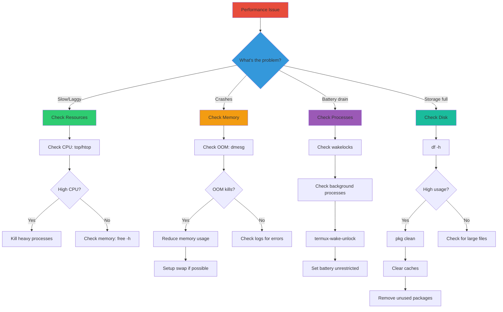

# ⚡ Chapter 59: Termux Performance Tips

```
╔═════════════════════════════════════════════════════════════════════════════╗
║  ⚡ CHAPTER 59: TERMUX PERFORMANCE TIPS - SPEED UP YOUR TERMINAL ⚡        ║
╠═════════════════════════════════════════════════════════════════════════════╣
║  📚 Module: 10 - Troubleshooting                                           ║
║  📖 Chapter: 59 of 61                                                      ║
║  ⏱️  Duration: 15-20 Minutes                                                ║
║  ⭐ Difficulty: Intermediate                                               ║
║  🎯 Focus: Storage, Memory, CPU & Battery Optimization                    ║
╚═════════════════════════════════════════════════════════════════════════════╝
```

> **Module:** 10 - Troubleshooting  
> **Chapter:** 59 of 61  
> **Duration:** 15-20 Minutes  
> **Difficulty:** ⭐⭐⭐ Intermediate  

---

## 📋 Chapter Overview

| Section | Content |
|---------|---------|
| Video Script | Complete Hindi narration with timestamps |
| Technical Guide | Detailed performance optimization techniques |
| Storage Management | Cleanup and optimization strategies |
| Memory & CPU | Resource management techniques |
| Commands Reference | All performance commands covered |
| Practice Exercises | Hands-on optimization tasks |
| Troubleshooting | Common performance issues |
| Video Assets | Thumbnail, description, tags |

---

## 🎬 VIDEO SCRIPT (Complete Hindi Narration)

```
═══════════════════════════════════════════════════════════════════════════════
TERMUX FULL COURSE - CHAPTER 59
Title: Termux Performance Tips | Speed Up Your Terminal | T3rmuxk1ng
Duration: 15-20 Minutes
═══════════════════════════════════════════════════════════════════════════════

[INTRO - 0:00 to 0:50]
─────────────────────────────────────────────────────────────────────────────

Namaskar Dosto! Welcome back to Termux Full Course!

Main aapka host hoon aur aaj ka chapter bahut important hai - Termux 
Performance Tips!

Kya aapka Termux slow hai? Kya packages install karte waqt lag hota hai?
Kya background processes battery kh rahe hain? Kya storage full ho raha hai?

Agar haan, to ye video aapke liye hai. Aaj hum seekhenge ki kaise 
apne Termux ko fast, efficient aur smooth bana sakte hain.

Ye chapter specially important hai unke liye jo:
- Heavy tools use karte hain (Metasploit, Nmap, etc.)
- Programming karte hain Termux mein
- Multiple tools ek saath run karte hain
- Low-end phone use karte hain

To chaliye shuru karte hain!

Play button dabaiye, video like karein, aur channel subscribe karein!

---

[SECTION 1: WHY PERFORMANCE MATTERS - 0:50 to 3:00]
─────────────────────────────────────────────────────────────────────────────

Sabse pehle samjhte hain ki performance important kyun hai.

Termux ek Linux environment hai Android ke upar. Android already 
limited resources deta hai - limited RAM, limited CPU, limited storage.

Jab aap Termux use karte ho:
- Packages download aur install hote hain
- Scripts run hoti hain
- Tools compile hote hain
- Background processes chalti hain

Sab kuch resources use karta hai. Agar optimize nahi kiya to:
❌ Slow performance
❌ Battery drain
❌ Storage full errors
❌ App crashes (OOM - Out of Memory)
❌ Phone heating issues

Aur sabse bada problem - Android ka OOM Killer!

OOM Killer kya hai? Jab phone ki memory full ho jati hai, Android 
automatically background apps ko kill kar deta hai. Termux bhi 
background app hai - to wo bhi mar sakta hai!

Isliye performance optimization zaruri hai - na sirf speed ke liye, 
balki stability ke liye bhi.

---

[SECTION 2: STORAGE MANAGEMENT - 3:00 to 6:00]
─────────────────────────────────────────────────────────────────────────────

Ab shuru karte hain Storage Management se.

Pehle check karte hain ki kitna storage use ho raha hai:

    df -h

Ye command disk usage dikhayega. Dekho Termux ka partition - 
/data/data/com.termux - kitna filled hai.

Storage cleanup ke liye ye steps follow karein:

[STEP 1: Package Cache Clean]

    pkg clean

Ye command downloaded package files delete karti hai jo install 
ke baad zarurat nahi hoti.

    rm -rf $PREFIX/var/cache/apt/archives/*.deb

Manual cleanup bhi kar sakte ho.

[STEP 2: Remove Unused Packages]

List dekho installed packages ki:

    pkg list-installed

Jo packages use nahi karte, unhe uninstall karein:

    pkg uninstall <package-name>

Automatically installed dependencies jo ab zarurat nahi:

    pkg autoclean

[STEP 3: Clear Python Cache]

Python __pycache__ folders bahut space le sakte hain:

    find ~ -type d -name __pycache__ -exec rm -rf {} + 2>/dev/null

Ye command home directory se saari Python cache folders delete karegi.

[STEP 4: Clear Node Modules]

Agar Node.js projects hain:

    npm cache clean --force

    # Ya specific project ke node_modules
    rm -rf ~/projects/*/node_modules

[STEP 5: Clear Temporary Files]

    rm -rf $PREFIX/tmp/*

[STEP 6: Check Big Files]

Kaunsi files zyada space le rahi hain:

    du -sh ~/* 2>/dev/null | sort -rh | head -10

Ye top 10 biggest files/folders dikhayega.

---

[SECTION 3: MEMORY OPTIMIZATION - 6:00 to 9:00]
─────────────────────────────────────────────────────────────────────────────

Ab baat karte hain Memory (RAM) optimization ki.

Pehle memory check karein:

    free -h

Ye total, used, aur free memory dikhayega.

Termux ko memory efficient banane ke liye:

[TIP 1: Use Swap File]

Swap kya hai? Swap ek file hai jo hard disk pe banti hai aur 
RAM ki tarah kaam karti hai. Jab RAM full hoti hai, data swap 
mein move hota hai.

Swap create karne ke liye:

    # 1GB swap file create karein
    dd if=/dev/zero of=~/swapfile bs=1M count=1024

    # Secure permissions
    chmod 600 ~/swapfile

    # Enable swap
    swapon ~/swapfile

Check karein:

    swapon --show

Swap ko permanent banane ke liye .bashrc mein add karein.

Note: Root access required for swapon command on some devices.

[TIP 2: ZRAM Setup]

Modern Android phones mein ZRAM hota hai - compressed RAM. 
Ye already enabled hota hai, lekin check kar sakte ho:

    cat /proc/swaps

Agar zram listed hai to already working hai.

[TIP 3: Limit Memory Usage]

Python scripts ke liye memory limit:

    # Python memory limit
    ulimit -v <max_memory_in_kb>

Node.js ke liye:

    NODE_OPTIONS="--max-old-space-size=512"

[TIP 4: Monitor Memory]

Real-time memory monitoring:

    top

Ya better alternative:

    pkg install htop
    htop

Seeya kaun process kitna RAM kha rahi hai.

---

[SECTION 4: CPU OPTIMIZATION - 9:00 to 11:30]
─────────────────────────────────────────────────────────────────────────────

CPU optimization se speed milta hai.

[TIP 1: Check CPU Info]

    cat /proc/cpuinfo

Dekho kitne cores hain, kitni speed hai.

[TIP 2: Process Priority]

Important tasks ko higher priority do:

    # Higher priority (lower nice value)
    nice -n -10 <command>

    # Lower priority for background tasks
    nice -n 10 <command>

Running process ki priority change karne ke liye:

    renice -n -5 -p <PID>

[TIP 3: Limit CPU Cores]

Agar multi-core CPU hai, specific cores use kar sakte ho:

    taskset -c 0,1 <command>

Ye command sirf CPU 0 aur 1 use karega.

[TIP 4: Kill Heavy Processes]

CPU khane wali processes check karein:

    top -o %CPU

Ya:

    ps aux --sort=-%cpu | head -10

Unn processes ko kill karein jo zarurat nahi:

    kill -9 <PID>

[TIP 5: Parallel Processing]

Multi-core ka fayda uthayein. Make commands ke liye:

    make -j$(nproc)

Ye saare CPU cores use karega compilation mein.

---

[SECTION 5: BATTERY OPTIMIZATION - 11:30 to 13:30]
─────────────────────────────────────────────────────────────────────────────

Battery optimization bhi important hai mobile pe.

[TIP 1: Disable Animations]

Termux styling mein animations disable karein:

    # ~/.termux/termux.properties
    bell-character=ignore

[TIP 2: Reduce Update Frequency]

Background tasks kam chalayein.

[TIP 3: Use Termux:Boot Wisely]

Sirf zaruri scripts boot pe run karein.

[TIP 4: Avoid Heavy Background Tasks]

Screen off hone pe heavy tasks mat chalayein, ya then:
- Termux ko "Unrestricted" battery mode mein daalein
- Android Settings → Apps → Termux → Battery → Unrestricted

[TIP 5: Wakelock Management]

Termux screen off pe bhi chalata hai wakelock se. 
Control karein:

    # Acquire wakelock
    termux-wake-lock

    # Release wakelock
    termux-wake-unlock

Jab zarurat ho tab hi wake lock use karein.

---

[SECTION 6: PROCESS MANAGEMENT - 13:30 to 15:30]
─────────────────────────────────────────────────────────────────────────────

Process management se control milta hai resources pe.

[Background Processes]

Process background mein bhejna:

    <command> &

Ya running process ko background mein:

    Ctrl+Z    # Suspend
    bg        # Background mein bhejo

Foreground mein wapas lana:

    fg

[NoHup - Process ko alive rakhna]

Terminal band hone pe bhi process chalti rahe:

    nohup <command> &

    # Example
    nohup python script.py &

[Screen/Tmux - Multiple Sessions]

Better option - screen ya tmux use karein:

    pkg install screen
    screen -S session_name

    # Detach: Ctrl+A, D
    # Reattach: screen -r session_name

Ya tmux:

    pkg install tmux
    tmux new -s session_name

    # Detach: Ctrl+B, D
    # Reattach: tmux attach -t session_name

[Process Monitoring]

    # All processes
    ps aux

    # Process tree
    pkg install psmisc
    pstree

    # Find specific process
    ps aux | grep <name>

    # Kill by name
    pkill <name>

    # Kill all instances
    killall <name>

---

[SECTION 7: OOM HANDLING - 15:30 to 17:00]
─────────────────────────────────────────────────────────────────────────────

OOM (Out of Memory) sabse bada problem hai Termux mein.

[What is OOM Killer?]

Linux kernel mein OOM Killer hota hai. Jab memory critical 
level pe pahunche, ye automatically processes kill karta hai.

OOM Score check karein:

    cat /proc/self/oom_score

Higher score = more likely to be killed.

[OOM Score Adjustment]

Apni important process ko protect karein:

    echo -1000 > /proc/<PID>/oom_score_adj

Note: Root required for negative values.

[Prevent Termux from being killed]

Android Settings mein:
1. Settings → Apps → Termux
2. Battery → Unrestricted
3. Memory → Not optimized (if available)

[Hibernate heavy tools]

Metasploit, Nmap jaise heavy tools use ke baad properly exit karein.

---

[SECTION 8: 20+ QUICK PERFORMANCE TIPS - 17:00 to 19:30]
─────────────────────────────────────────────────────────────────────────────

Ab main 20+ quick tips deta hoon jo turant apply kar sakte ho:

┌─────────────────────────────────────────────────────────────────────────┐
│                    20+ PERFORMANCE TIPS                                  │
├─────────────────────────────────────────────────────────────────────────┤
│ 1.  pkg update && pkg upgrade -y    │ Weekly update karein              │
│ 2.  pkg clean                       │ Regular cache clean               │
│ 3.  pkg autoclean                   │ Unused dependencies remove        │
│ 4.  Remove unused packages          │ Storage bachao                    │
│ 5.  Use htop instead of top         │ Better monitoring                 │
│ 6.  Use screen/tmux                 │ Session management                │
│ 7.  Clear Python cache              │ __pycache__ remove karein         │
│ 8.  npm cache clean --force         │ Node.js cache clear               │
│ 9.  Use swap file                   │ Extra memory mileage              │
│ 10. Limit background processes      │ RAM bachao                        │
│ 11. Use nice/renice                 │ Priority set karein               │
│ 12. Battery unrestricted            │ Android killing prevent           │
│ 13. termux-wake-unlock              │ Battery bachao                    │
│ 14. Delete old log files            │ Log rotation use karein           │
│ 15. Use tmpfs for temp              │ Fast temp operations              │
│ 16. Compile with -j flag            │ Multi-core compilation            │
│ 17. Disable unnecessary services    │ Background services band          │
│ 18. Use lighter alternatives        │ nano instead of vim (sometimes)   │
│ 19. Set proper OOM score            │ Important processes protect       │
│ 20. Monitor regularly               │ top/htop use karein               │
│ 21. Close unused sessions           │ Multiple Termux sessions band     │
│ 22. Use aliases for speed           │ Quick commands                    │
│ 23. Git shallow clone               │ Space bachao                      │
│ 24. Use pipes wisely                │ Memory efficient commands         │
│ 25. Read Termux Wiki                │ Latest tips ke liye               │
└─────────────────────────────────────────────────────────────────────────┘

---

[SECTION 9: BENCHMARKING TERMUX - 19:30 to 20:30]
─────────────────────────────────────────────────────────────────────────────

Benchmarking se pata chalta hai ki optimization ka result kya hai.

[CPU Benchmark]

    pkg install sysbench
    sysbench cpu --cpu-max-prime=20000 run

[Memory Benchmark]

    sysbench memory --memory-block-size=1M --memory-total-size=10G run

[Disk Benchmark]

    pkg install fio
    # Simple write test
    dd if=/dev/zero of=~/testfile bs=1M count=100 conv=fdatasync
    rm ~/testfile

[System Info]

    pkg install neofetch
    neofetch

Compare karein before aur after optimization!

---

[SECTION 10: SUMMARY - 20:30 to 21:30]
─────────────────────────────────────────────────────────────────────────────

To dosto, Chapter 59 complete! Let's summarize:

✅ Storage Management - pkg clean, cache clear, big files remove
✅ Memory Optimization - Swap, ZRAM, memory limits
✅ CPU Optimization - Priority, cores, process management
✅ Battery Optimization - Wake lock, battery settings
✅ Process Management - Background, nohup, screen/tmux
✅ OOM Handling - Score adjustment, Android settings
✅ 20+ Quick Tips - Instant improvements
✅ Benchmarking - Measure performance

Important Commands yaad rakhein:

┌─────────────────────────────────────────────────────────────────────────┐
│                    CHAPTER 59 - KEY COMMANDS                             │
├─────────────────────────────────────────────────────────────────────────┤
│ df -h                              │ Check disk usage                    │
│ free -h                            │ Check memory usage                  │
│ pkg clean                          │ Clean package cache                 │
│ pkg autoclean                      │ Remove unused dependencies          │
│ find ~ -name __pycache__ -delete   │ Remove Python cache                 │
│ du -sh ~/* | sort -rh | head -10   │ Find biggest files                  │
│ htop                               │ Interactive process monitor         │
│ nice -n -10 <cmd>                  │ Run with higher priority            │
│ nohup <cmd> &                      │ Run in background persistently      │
│ termux-wake-lock                   │ Keep CPU awake                      │
│ termux-wake-unlock                 │ Release wake lock                   │
│ sysbench cpu run                   │ CPU benchmark                       │
└─────────────────────────────────────────────────────────────────────────┘

Next Chapter 60 mein hum seekhenge:
- Termux backup kaise lein
- Complete restore process
- Cloud backup options
- Automation scripts

Agar ye video helpful lagi, to:
👍 Like button press karein
🔔 Subscribe karein, notification bell on karein
💬 Koi sawal ho to comment mein poochein
📤 Share karein friends ke saath

Thank you for watching! See you in Chapter 60!

═══════════════════════════════════════════════════════════════════════════════
```

---

## 📖 TECHNICAL GUIDE

### 1. Performance Optimization Overview

```
┌─────────────────────────────────────────────────────────────────────────┐
│                    TERMUX PERFORMANCE OPTIMIZATION                       │
├─────────────────────────────────────────────────────────────────────────┤
│                                                                          │
│   ┌─────────────────┐    ┌─────────────────┐    ┌─────────────────┐    │
│   │   STORAGE       │    │    MEMORY       │    │     CPU         │    │
│   │                 │    │                 │    │                 │    │
│   │ • Cache clean   │    │ • Swap setup    │    │ • Process pri   │    │
│   │ • Package rm    │    │ • ZRAM config   │    │ • Core limit    │    │
│   │ • Temp clear    │    │ • Cache free    │    │ • Kill zombie   │    │
│   │ • Log rotate    │    │ • OOM adjust    │    │ • Parallel run  │    │
│   └─────────────────┘    └─────────────────┘    └─────────────────┘    │
│            │                      │                      │              │
│            └──────────────────────┼──────────────────────┘              │
│                                   │                                      │
│                                   ▼                                      │
│   ┌─────────────────────────────────────────────────────────────────┐   │
│   │                    BATTERY OPTIMIZATION                          │   │
│   │   • Wakelock management    • Background process limit           │   │
│   │   • Android settings       • Termux configuration               │   │
│   └─────────────────────────────────────────────────────────────────┘   │
│                                                                          │
└─────────────────────────────────────────────────────────────────────────┘
```

### 2. Storage Management Deep Dive

#### A. Termux Storage Structure

```bash
# Termux directory structure
$PREFIX/
├── bin/          # Executables (~500MB+ with tools)
├── lib/          # Libraries (~1GB+)
├── share/        # Data files (~500MB+)
├── var/
│   ├── cache/    # Package cache (can be 100MB+)
│   ├── log/      # Log files
│   └── tmp/      # Temporary files
└── etc/          # Configuration files

$HOME/
├── .bashrc       # Shell config
├── .cache/       # Application caches
├── .local/       # Local data
├── .python/      # Python cache
└── projects/     # User projects
```

#### B. Storage Analysis Commands

```bash
# Total Termux storage usage
du -sh $PREFIX
du -sh $HOME

# Breakdown by directory
du -h --max-depth=1 $PREFIX | sort -rh

# Find files larger than 100MB
find ~ -type f -size +100M 2>/dev/null

# Find files modified in last 24 hours
find ~ -type f -mtime -1 2>/dev/null

# Count files by extension
find ~ -type f -name "*.py" | wc -l
```

#### C. Automated Cleanup Script

```bash
#!/bin/bash
# Termux Cleanup Script
# Save as: ~/cleanup.sh

echo "🧹 Starting Termux Cleanup..."

# Package cache
echo "Cleaning package cache..."
pkg clean 2>/dev/null
rm -rf $PREFIX/var/cache/apt/archives/*.deb 2>/dev/null

# Python cache
echo "Cleaning Python cache..."
find ~ -type d -name __pycache__ -exec rm -rf {} + 2>/dev/null
find ~ -type f -name "*.pyc" -delete 2>/dev/null

# Node modules cache
echo "Cleaning npm cache..."
npm cache clean --force 2>/dev/null

# Temporary files
echo "Cleaning temporary files..."
rm -rf $PREFIX/tmp/* 2>/dev/null
rm -rf ~/.cache/* 2>/dev/null

# Old logs
echo "Cleaning old logs..."
find ~ -name "*.log" -mtime +7 -delete 2>/dev/null

# Show freed space
echo "✅ Cleanup complete!"
echo "Current storage usage:"
df -h /data
```

### 3. Memory Optimization

#### A. Understanding Android Memory

```bash
# Memory zones
cat /proc/zoneinfo

# Memory info detailed
cat /proc/meminfo

# Virtual memory statistics
cat /proc/vmstat

# Check current swap
cat /proc/swaps
swapon --show
```

#### B. Swap File Creation (Root Required)

```bash
# Check if swap is already enabled
swapon --show

# Create 1GB swap file
dd if=/dev/zero of=$HOME/swapfile bs=1M count=1024 status=progress

# Set proper permissions
chmod 600 $HOME/swapfile

# Enable swap (requires root on most devices)
su -c "swapon $HOME/swapfile"

# Verify
swapon --show
free -h

# To disable swap
su -c "swapoff $HOME/swapfile"
rm $HOME/swapfile
```

#### C. ZRAM Information

```bash
# Check ZRAM status
zramctl

# ZRAM statistics
cat /proc/swaps
cat /sys/block/zram0/mm_stat 2>/dev/null

# ZRAM is usually managed by Android system
# Not recommended to modify without root and knowledge
```

#### D. Memory-Efficient Practices

```bash
# Use pipes instead of intermediate files
cat file.txt | grep pattern | wc -l
# Instead of: grep pattern file.txt > temp.txt; wc -l temp.txt

# Use streaming for large files
tail -f large.log | grep error

# Use sed instead of opening files in editors
sed -i 's/old/new/g' file.txt

# Limit output for memory intensive commands
ls -R | head -1000
```

### 4. CPU Optimization

#### A. CPU Information

```bash
# CPU details
cat /proc/cpuinfo

# Number of CPU cores
nproc
grep -c ^processor /proc/cpuinfo

# CPU frequency (requires root for some)
cat /sys/devices/system/cpu/cpu*/cpufreq/scaling_cur_freq 2>/dev/null

# CPU governor
cat /sys/devices/system/cpu/cpu0/cpufreq/scaling_governor 2>/dev/null

# Load average
cat /proc/loadavg
uptime
```

#### B. Process Priority Management

```bash
# Nice values range: -20 (highest priority) to 19 (lowest)
# Default is 0

# Run with higher priority (requires root for negative values)
nice -n -5 python script.py

# Run with lower priority
nice -n 10 ./background_task.sh

# Change priority of running process
renice -n -5 -p 12345

# View nice values
ps -eo pid,ni,comm | grep python
```

#### C. CPU Affinity

```bash
# Install taskset
pkg install util-linux

# Run on specific CPU cores (0-3 for quad-core)
taskset -c 0,1 python script.py

# Check affinity of running process
taskset -p 12345
```

### 5. Battery Optimization

#### A. Wakelock Management

```bash
# Acquire wakelock (keeps CPU running)
termux-wake-lock

# Release wakelock
termux-wake-unlock

# Check current wakelocks
cat /proc/wakelocks 2>/dev/null

# Use wake lock only when necessary
# Example: Long running download
termux-wake-lock
wget large_file.zip
termux-wake-unlock
```

#### B. Android Battery Settings

```
For optimal Termux performance:

1. Settings → Apps → Termux
   └── Battery → Unrestricted

2. Settings → Apps → Termux
   └── Battery optimization → Don't optimize

3. Disable battery saver when using Termux

4. Settings → Developer options
   └── Background process limit → Standard limit

5. Settings → Developer options
   └── Stay awake (during charging)
```

### 6. Cache Management

#### A. Package Cache

```bash
# Location
ls $PREFIX/var/cache/apt/archives/

# Clean all cached packages
pkg clean
apt-get clean

# Remove obsolete packages
pkg autoclean
apt-get autoclean

# Remove all cache manually
rm -rf $PREFIX/var/cache/apt/archives/*.deb
```

#### B. Python Cache

```bash
# Find all Python cache
find ~ -type d -name __pycache__ 2>/dev/null

# Delete all Python cache
find ~ -type d -name __pycache__ -exec rm -rf {} + 2>/dev/null

# Delete .pyc files
find ~ -type f -name "*.pyc" -delete 2>/dev/null

# Delete .pyo files
find ~ -type f -name "*.pyo" -delete 2>/dev/null
```

#### C. Node.js Cache

```bash
# npm cache location
npm config get cache

# Clean npm cache
npm cache clean --force

# Verify cache
npm cache verify

# yarn cache
yarn cache clean
```

#### D. Other Caches

```bash
# pip cache
pip cache purge

# Go cache
go clean -cache -modcache -i -r

# Rust/Cargo cache
rm -rf ~/.cargo/registry/cache/*
rm -rf ~/.cargo/registry/index/*
```

### 7. Removing Unused Packages

#### A. Identify Unused Packages

```bash
# List all installed packages
pkg list-installed

# Search for specific package
pkg list-installed | grep python

# Package info
pkg show <package-name>

# Dependencies of a package
apt-cache depends <package-name>

# Reverse dependencies (what depends on this)
apt-cache rdepends <package-name>
```

#### B. Safe Removal Process

```bash
# 1. Check if package is dependency of others
apt-cache rdepends package-name

# 2. Remove package
pkg uninstall package-name

# 3. Remove orphaned dependencies
pkg autoclean

# 4. Check for broken packages
pkg check

# 5. Fix broken installations
pkg install -f
```

### 8. Zram and Swap

#### A. Understanding Zram

```
ZRAM (Compressed RAM):
┌─────────────────────────────────────────────────────────────────────┐
│                                                                      │
│  Physical RAM                                                        │
│  ┌──────────────────────────────────────────────────────────────┐  │
│  │  ┌────────────┐  ┌────────────┐  ┌────────────┐              │  │
│  │  │  Normal    │  │  Normal    │  │   ZRAM     │              │  │
│  │  │  Memory    │  │  Memory    │  │ (Compressed│              │  │
│  │  │            │  │            │  │  Memory)   │              │  │
│  │  └────────────┘  └────────────┘  └────────────┘              │  │
│  │                                                  ▲            │  │
│  │                                                  │            │  │
│  │                                    When RAM is full,          │  │
│  │                                    data compressed            │  │
│  │                                    and stored here            │  │
│  └──────────────────────────────────────────────────────────────┘  │
│                                                                      │
│  Swap File (on storage - slower but more capacity)                  │
│  ┌──────────────────────────────────────────────────────────────┐  │
│  │  /data/swapfile or $HOME/swapfile                            │  │
│  │  When ZRAM is also full, data moves here                     │  │
│  └──────────────────────────────────────────────────────────────┘  │
│                                                                      │
└─────────────────────────────────────────────────────────────────────┘
```

#### B. Swap Configuration

```bash
# Check current swap
cat /proc/swaps

# Swap usage
swapon -s

# Swapiness (how aggressively to use swap)
# Range 0-100, higher = more aggressive
cat /proc/sys/vm/swappiness

# Change swappiness (temporary, requires root)
echo 60 > /proc/sys/vm/swappiness
```

### 9. Process Management

#### A. Background Process Control

```bash
# Run in background
./script.sh &

# Run with nohup (persists after terminal close)
nohup ./script.sh &

# Check background jobs
jobs

# Bring to foreground
fg %1

# Send to background
bg %1

# Kill background job
kill %1
```

#### B. Process Monitoring

```bash
# Basic process list
ps aux

# Process tree
pstree -p

# Real-time monitoring
top

# Better monitoring
htop

# Find specific process
pgrep -a python

# Process details
cat /proc/<PID>/status
cat /proc/<PID>/cmdline
```

#### C. Screen and Tmux

```bash
# SCREEN - Terminal Multiplexer
pkg install screen

# Create new session
screen -S mysession

# Detach: Ctrl+A, then D

# List sessions
screen -ls

# Reattach
screen -r mysession

# Kill session
screen -X -S mysession quit

# TMUX - More features
pkg install tmux

# Create session
tmux new -s mysession

# Detach: Ctrl+B, then D

# List sessions
tmux ls

# Reattach
tmux attach -t mysession

# Kill session
tmux kill-session -t mysession
```

### 10. OOM Handling

#### A. Understanding OOM

```bash
# OOM Score (higher = more likely to be killed)
cat /proc/self/oom_score

# OOM adjustment (lower = less likely to be killed)
# Range: -1000 to 1000
cat /proc/self/oom_score_adj

# Check for OOM events
dmesg | grep -i "out of memory"

# View OOM killer statistics
cat /proc/vmstat | grep oom
```

#### B. OOM Protection (Requires Root)

```bash
# Protect a process (set to -1000)
echo -1000 > /proc/<PID>/oom_score_adj

# Make process more likely to be killed
echo 500 > /proc/<PID>/oom_score_adj

# Disable OOM killer for specific process
echo -17 > /proc/<PID>/oom_adj
```

### 11. Termux Settings Optimization

#### A. Termux Properties

```bash
# Create/Edit termux.properties
mkdir -p ~/.termux
nano ~/.termux/termux.properties

# Performance-related settings:

# Bell character (disable for battery)
bell-character=ignore

# Cursor blink (disable for battery)
# Note: Some versions support this

# Shortcuts for efficiency
# Ctrl+Alt+K = Kill process
# Ctrl+Alt+M = More options

# Apply changes
termux-reload-settings
```

#### B. Shell Configuration

```bash
# ~/.bashrc optimizations

# Disable unnecessary completion
# unset PROMPT_COMMAND

# Simpler prompt (faster)
export PS1='\w \$ '

# Limit history
export HISTSIZE=1000
export HISTFILESIZE=2000

# Aliases for speed
alias update='pkg update && pkg upgrade -y'
alias clean='pkg clean && pkg autoclean'
alias mem='free -h'
alias disk='df -h'
alias top='htop'
```

### 12. Phone Settings for Termux

```
┌─────────────────────────────────────────────────────────────────────────┐
│                    ANDROID SETTINGS FOR TERMUX                          │
├─────────────────────────────────────────────────────────────────────────┤
│                                                                          │
│  BATTERY SETTINGS                                                       │
│  ├── Settings → Apps → Termux → Battery                                 │
│  │   └── Select: Unrestricted                                           │
│  │                                                                       │
│  ├── Settings → Battery → Battery Optimization                          │
│  │   └── Find Termux → Don't optimize                                   │
│  │                                                                       │
│  └── Settings → Battery → Battery Saver                                 │
│      └── Turn OFF when using Termux                                     │
│                                                                          │
│  MEMORY SETTINGS                                                        │
│  ├── Settings → Apps → Termux → Memory                                  │
│  │   └── Clear memory only if issues                                    │
│  │                                                                       │
│  └── Settings → Developer Options → Background Process Limit            │
│      └── Set: Standard limit (or higher)                                │
│                                                                          │
│  STORAGE SETTINGS                                                       │
│  └── Settings → Apps → Termux → Permissions                             │
│      └── Storage: Allow                                                 │
│                                                                          │
│  DEVELOPER OPTIONS                                                      │
│  ├── Stay Awake (during charging) → ON                                  │
│  ├── Background Process Limit → Standard                                │
│  └── Show Running Services → Monitor Termux                             │
│                                                                          │
│  NOTIFICATION SETTINGS                                                  │
│  └── Settings → Apps → Termux → Notifications                           │
│      └── Enable for background awareness                                │
│                                                                          │
└─────────────────────────────────────────────────────────────────────────┘
```

### 13. Benchmarking Termux

#### A. CPU Benchmark

```bash
# Install sysbench
pkg install sysbench

# Single-threaded CPU test
sysbench cpu --cpu-max-prime=20000 run

# Multi-threaded CPU test
sysbench cpu --cpu-max-prime=20000 --threads=$(nproc) run

# Results interpretation:
# Higher events per second = Better performance
# Lower total time = Better performance
```

#### B. Memory Benchmark

```bash
# Memory read/write test
sysbench memory --memory-block-size=1M --memory-total-size=10G run

# Memory speed test
sysbench memory --memory-block-size=4K --memory-total-size=1G --memory-oper=write run
```

#### C. Disk Benchmark

```bash
# Simple write test
dd if=/dev/zero of=~/testfile bs=1M count=100 conv=fdatasync
rm ~/testfile

# Read test
dd if=/dev/zero of=~/testfile bs=1M count=100
dd if=~/testfile of=/dev/null bs=1M
rm ~/testfile

# Using fio for detailed tests
pkg install fio

# Random read/write test
fio --name=random-test --ioengine=sync --rw=randread --bs=4k --numjobs=1 --size=10M --filename=~/test.fio
rm ~/test.fio
```

#### D. System Information

```bash
# Install neofetch
pkg install neofetch
neofetch

# Detailed system info
pkg install screenfetch
screenfetch

# Hardware info
cat /proc/cpuinfo
cat /proc/meminfo

# System uptime and load
uptime

# Kernel version
uname -a
```

### 14. 25 Performance Tips (Detailed)

```
┌─────────────────────────────────────────────────────────────────────────┐
│                    25 PERFORMANCE TIPS - DETAILED                       │
├─────────────────────────────────────────────────────────────────────────┤
│                                                                          │
│  STORAGE TIPS                                                           │
│  ─────────────────────────────────────────────────────────────────────  │
│  1.  Run pkg clean weekly to remove old package cache                   │
│  2.  Use pkg autoclean for orphaned dependencies                        │
│  3.  Delete unused packages with pkg uninstall                          │
│  4.  Clear Python cache: find ~ -name __pycache__ -delete               │
│  5.  Use git clone --depth 1 for shallow clones                         │
│  6.  Monitor storage: du -sh ~/* | sort -rh | head -10                  │
│                                                                          │
│  MEMORY TIPS                                                            │
│  ─────────────────────────────────────────────────────────────────────  │
│  7.  Use swap file if possible (requires root)                          │
│  8.  Monitor with htop instead of multiple ps commands                  │
│  9.  Kill zombie processes: kill -9 $(ps -eo pid,stat|grep Z|awk '{print $1}') │
│  10. Use ulimit to set memory limits for scripts                        │
│  11. Close browser tabs when running heavy Termux tasks                 │
│                                                                          │
│  CPU TIPS                                                               │
│  ─────────────────────────────────────────────────────────────────────  │
│  12. Use nice -n -10 for important processes (root)                     │
│  13. Use nice -n 10 for background/batch processes                      │
│  14. Compile with make -j$(nproc) for parallel build                    │
│  15. Use taskset to pin processes to specific cores                     │
│  16. Monitor CPU usage: top -o %CPU                                     │
│                                                                          │
│  BATTERY TIPS                                                           │
│  ─────────────────────────────────────────────────────────────────────  │
│  17. Set Termux to Unrestricted battery mode                            │
│  18. Use termux-wake-unlock when not running long tasks                 │
│  19. Disable Termux styling animations                                  │
│  20. Close Termux when not in use (or use tmux detach)                  │
│                                                                          │
│  GENERAL TIPS                                                           │
│  ─────────────────────────────────────────────────────────────────────  │
│  21. Update regularly: pkg update && pkg upgrade -y                     │
│  22. Use screen/tmux for session persistence                            │
│  23. Create aliases for frequently used commands                        │
│  24. Read logs to identify performance bottlenecks                      │
│  25. Benchmark before and after changes to measure impact               │
│                                                                          │
└─────────────────────────────────────────────────────────────────────────┘
```

---

## 📋 COMMANDS REFERENCE

### Storage Management Commands

```bash
# Check disk usage
df -h                          # Filesystem disk space
du -sh ~                       # Home directory size
du -sh $PREFIX                 # Termux installation size

# Find large files
du -sh ~/* 2>/dev/null | sort -rh | head -10    # Top 10 largest
find ~ -type f -size +100M 2>/dev/null           # Files > 100MB

# Clean package cache
pkg clean                      # Clean downloaded packages
apt-get clean                  # Alternative command
rm -rf $PREFIX/var/cache/apt/archives/*.deb

# Remove unused dependencies
pkg autoclean                  # Clean obsolete packages
apt-get autoremove -y          # Remove orphaned packages

# Clear Python cache
find ~ -type d -name __pycache__ -exec rm -rf {} + 2>/dev/null
find ~ -type f -name "*.pyc" -delete 2>/dev/null

# Clear npm cache
npm cache clean --force

# Clear temporary files
rm -rf $PREFIX/tmp/*
rm -rf ~/.cache/*
```

### Memory Management Commands

```bash
# Check memory
free -h                        # Memory usage
cat /proc/meminfo              # Detailed memory info

# Swap management
swapon --show                  # Show swap devices
cat /proc/swaps                # Alternative view

# Create swap file (requires root)
dd if=/dev/zero of=$HOME/swapfile bs=1M count=1024
chmod 600 $HOME/swapfile
su -c "swapon $HOME/swapfile"

# Disable swap
su -c "swapoff $HOME/swapfile"

# Drop caches (requires root)
su -c "echo 3 > /proc/sys/vm/drop_caches"

# Memory info
cat /proc/meminfo | grep -E "(MemTotal|MemFree|MemAvailable)"
```

### CPU Management Commands

```bash
# CPU information
cat /proc/cpuinfo              # CPU details
nproc                          # Number of cores
lscpu                          # CPU architecture info

# Process priority
nice -n -10 <command>          # Higher priority
nice -n 10 <command>           # Lower priority
renice -n -5 -p <PID>          # Change running process priority

# CPU affinity
taskset -c 0,1 <command>       # Run on specific cores

# Load monitoring
uptime                         # Load averages
top -o %CPU                    # Top CPU consumers
htop                           # Interactive monitor

# Kill CPU-heavy processes
pkill -9 <process-name>
kill -9 <PID>
```

### Process Management Commands

```bash
# List processes
ps aux                         # All processes
ps aux | grep python           # Find Python processes
pgrep -a python                # Find with full command

# Process tree
pstree -p                      # Tree view with PIDs

# Background processes
<command> &                    # Run in background
nohup <command> &              # Persist after terminal close
jobs                           # List background jobs
fg %1                          # Bring to foreground
bg %1                          # Send to background

# Kill processes
kill <PID>                     # Graceful kill
kill -9 <PID>                  # Force kill
pkill <name>                   # Kill by name
killall <name>                 # Kill all instances

# Screen sessions
screen -S name                 # Create session
screen -ls                     # List sessions
screen -r name                 # Reattach
screen -X -S name quit         # Kill session

# Tmux sessions
tmux new -s name               # Create session
tmux ls                        # List sessions
tmux attach -t name            # Reattach
tmux kill-session -t name      # Kill session
```

### Termux-Specific Commands

```bash
# Wakelock management
termux-wake-lock               # Keep CPU awake
termux-wake-unlock             # Release wakelock

# Storage setup
termux-setup-storage           # Grant storage permission

# Reload settings
termux-reload-settings         # Apply termux.properties changes

# Battery info
termux-battery-status          # Show battery status

# CPU info via API
termux-telephony-deviceinfo    # Device info
```

### Benchmarking Commands

```bash
# CPU benchmark
sysbench cpu --cpu-max-prime=20000 run

# Memory benchmark
sysbench memory --memory-block-size=1M --memory-total-size=10G run

# Disk benchmark
dd if=/dev/zero of=~/testfile bs=1M count=100 conv=fdatasync
rm ~/testfile

# System info
neofetch                       # System summary
screenfetch                    # Alternative
```

### Utility Commands

```bash
# Check Termux version
echo $TERMUX_VERSION

# Check environment
echo $PREFIX
echo $HOME
env | grep TERMUX

# View logs
ls ~/logs/ 2>/dev/null
tail -f ~/.cache/*/logs/*.log 2>/dev/null

# Find files
find ~ -name "*.log" -mtime +7 -ls   # Logs older than 7 days

# Count processes
ps aux | wc -l                 # Total processes
pgrep python | wc -l           # Python processes

# System uptime
uptime                         # Load and uptime
```

---

## 💻 PRACTICE EXERCISES

### Exercise 1: Storage Audit and Cleanup

```bash
# Task: Analyze and clean your Termux storage

# Step 1: Check current storage usage
echo "=== Current Storage ==="
df -h | grep -E "(Filesystem|/data)"

# Step 2: Find largest directories
echo "=== Largest Directories ==="
du -sh ~/* 2>/dev/null | sort -rh | head -10

# Step 3: Check package cache size
echo "=== Package Cache ==="
du -sh $PREFIX/var/cache/apt/archives/ 2>/dev/null

# Step 4: Find Python cache
echo "=== Python Cache ==="
find ~ -type d -name __pycache__ 2>/dev/null | wc -l
echo "Python cache directories found"

# Step 5: Calculate cache size
echo "=== Cache Sizes ==="
find ~ -type d -name __pycache__ -exec du -sh {} + 2>/dev/null | head -5

# Step 6: Perform cleanup
echo "=== Cleaning ==="
pkg clean
find ~ -type d -name __pycache__ -exec rm -rf {} + 2>/dev/null

# Step 7: Check storage after cleanup
echo "=== After Cleanup ==="
df -h | grep -E "(Filesystem|/data)"

# Expected: Reduced storage usage after cleanup
```

### Exercise 2: Memory Optimization Setup

```bash
# Task: Analyze and optimize memory usage

# Step 1: Check current memory
echo "=== Memory Status ==="
free -h

# Step 2: Check swap
echo "=== Swap Status ==="
swapon --show 2>/dev/null || echo "No swap configured"

# Step 3: List memory-heavy processes
echo "=== Top Memory Consumers ==="
ps aux --sort=-%mem | head -10

# Step 4: Check if ZRAM is active
echo "=== ZRAM Status ==="
cat /proc/swaps | grep zram || echo "No ZRAM found"

# Step 5: Create a memory monitoring alias
echo "Creating memory monitoring alias..."
echo 'alias memcheck="free -h && echo && ps aux --sort=-%mem | head -6"' >> ~/.bashrc

# Step 6: Apply changes
source ~/.bashrc

# Step 7: Test alias
memcheck

# Expected: Memory information and top consumers displayed
```

### Exercise 3: Process Management Practice

```bash
# Task: Learn process management techniques

# Step 1: Start a background process
echo "Starting sleep process..."
sleep 300 &
echo "Sleep PID: $!"

# Step 2: List background jobs
jobs

# Step 3: Create a screen session
screen -dmS test_session bash -c "while true; do echo 'Running...'; sleep 5; done"

# Step 4: List screen sessions
screen -ls

# Step 5: Find the sleep process
echo "Finding sleep process..."
pgrep -a sleep

# Step 6: Monitor processes
echo "Process info:"
ps aux | grep -E "(sleep|PID)" | grep -v grep

# Step 7: Kill the sleep process
pkill sleep
echo "Sleep process killed"

# Step 8: Kill the screen session
screen -X -S test_session quit
echo "Screen session killed"

# Step 9: Verify cleanup
screen -ls
pgrep sleep

# Expected: No running test processes
```

### Exercise 4: Performance Benchmark

```bash
# Task: Benchmark your Termux installation

# Install sysbench if not present
pkg install sysbench -y

# CPU Benchmark
echo "=== CPU BENCHMARK ==="
echo "Running single-threaded test..."
sysbench cpu --cpu-max-prime=10000 run | grep -E "(events|total time)"

echo "Running multi-threaded test..."
sysbench cpu --cpu-max-prime=10000 --threads=$(nproc) run | grep -E "(events|total time)"

# Memory Benchmark
echo ""
echo "=== MEMORY BENCHMARK ==="
sysbench memory --memory-block-size=1M --memory-total-size=1G run | grep -E "(transferred|total time)"

# Disk Benchmark
echo ""
echo "=== DISK BENCHMARK ==="
echo "Write test:"
dd if=/dev/zero of=~/benchmark_test bs=1M count=50 conv=fdatasync 2>&1 | grep -E "(copied|/s)"

echo "Read test:"
dd if=~/benchmark_test of=/dev/null bs=1M 2>&1 | grep -E "(copied|/s)"

# Cleanup
rm -f ~/benchmark_test

# System Info
echo ""
echo "=== SYSTEM INFO ==="
echo "CPU Cores: $(nproc)"
echo "Memory: $(free -h | grep Mem | awk '{print $2}')"
echo "Termux Version: $TERMUX_VERSION"

# Expected: Benchmark results showing system performance
```

### Exercise 5: Automated Cleanup Script

```bash
# Task: Create and run an automated cleanup script

# Create the script
cat > ~/cleanup.sh << 'EOF'
#!/bin/bash
# Termux Automated Cleanup Script

echo "╔════════════════════════════════════════╗"
echo "║    Termux Performance Cleanup          ║"
echo "╚════════════════════════════════════════╝"
echo ""

# Get initial storage
INITIAL=$(df /data | tail -1 | awk '{print $3}')
echo "📊 Initial storage used: ${INITIAL}KB"

# Package cache
echo "🧹 Cleaning package cache..."
pkg clean 2>/dev/null
rm -rf $PREFIX/var/cache/apt/archives/*.deb 2>/dev/null

# Python cache
echo "🐍 Cleaning Python cache..."
PYCOUNT=$(find ~ -type d -name __pycache__ 2>/dev/null | wc -l)
find ~ -type d -name __pycache__ -exec rm -rf {} + 2>/dev/null
find ~ -type f -name "*.pyc" -delete 2>/dev/null
echo "   Removed $PYCOUNT Python cache directories"

# npm cache
echo "📦 Cleaning npm cache..."
npm cache clean --force 2>/dev/null

# Temporary files
echo "🗑️ Cleaning temporary files..."
rm -rf $PREFIX/tmp/* 2>/dev/null
rm -rf ~/.cache/* 2>/dev/null

# Old logs
echo "📜 Cleaning old logs..."
LOGCOUNT=$(find ~ -name "*.log" -mtime +7 2>/dev/null | wc -l)
find ~ -name "*.log" -mtime +7 -delete 2>/dev/null
echo "   Removed $LOGCOUNT old log files"

# Get final storage
FINAL=$(df /data | tail -1 | awk '{print $3}')
FREED=$((INITIAL - FINAL))

echo ""
echo "✅ Cleanup complete!"
echo "📊 Final storage used: ${FINAL}KB"
echo "💾 Space freed: ${FREED}KB"
echo ""
echo "📈 Memory status:"
free -h | grep -E "(Mem|Swap)"
EOF

# Make executable
chmod +x ~/cleanup.sh

# Run the script
~/cleanup.sh

# Expected: Cleanup report with space freed
```

---

## ⚠️ TROUBLESHOOTING

### Problem 1: "Cannot allocate memory" Error

```bash
# Symptoms:
# - "Cannot allocate memory" errors
# - "fork: retry: Resource temporarily unavailable"
# - Processes failing to start

# Diagnosis:
free -h                        # Check available memory
cat /proc/meminfo | grep MemAvailable

# Solutions:

# 1. Kill unnecessary processes
ps aux --sort=-%mem | head -10
kill -9 <PID of unnecessary process>

# 2. Clear caches (requires root)
su -c "echo 3 > /proc/sys/vm/drop_caches"

# 3. Add swap file
dd if=/dev/zero of=$HOME/swapfile bs=1M count=512
chmod 600 $HOME/swapfile
su -c "swapon $HOME/swapfile"

# 4. Restart Termux completely
exit
# Force close Termux from Android settings
# Reopen Termux

# 5. Reduce process count
# Run fewer background processes simultaneously
```

### Problem 2: Termux Getting Killed by Android

```bash
# Symptoms:
# - Termux closes unexpectedly
# - Background processes die
# - "Process finished" messages

# Diagnosis:
# Check if Android is killing Termux
dmesg | grep -i "termux" | tail -10

# Solutions:

# 1. Set battery to unrestricted
Settings → Apps → Termux → Battery → Unrestricted

# 2. Disable battery optimization
Settings → Battery → Battery Optimization → Termux → Don't optimize

# 3. Check OOM score
cat /proc/$(pgrep -n bash)/oom_score

# 4. Use foreground service (with notification)
# Termux:Tasker or Termux:Boot can help keep it alive

# 5. Use wakelock wisely
termux-wake-lock              # When running important tasks

# 6. Avoid running too many background processes
ps aux | wc -l                # Check process count
```

### Problem 3: Slow Package Installation

```bash
# Symptoms:
# - pkg install takes very long
# - Connection timeouts
# - Slow downloads

# Diagnosis:
ping -c 3 packages.termux.dev  # Check connectivity

# Solutions:

# 1. Update repositories
pkg update

# 2. Check mirror
cat $PREFIX/etc/apt/sources.list

# 3. Use different mirror if needed
# Edit sources.list
nano $PREFIX/etc/apt/sources.list

# Alternative mirrors:
# deb https://packages.termux.dev/termux-main stable main
# deb https://grimler.se/termux-packages-24 stable main

# 4. Clean and retry
pkg clean
pkg update
pkg install <package>

# 5. Check internet speed
curl -s https://raw.githubusercontent.com/sivel/speedtest-cli/master/speedtest.py | python -
```

### Problem 4: "No space left on device"

```bash
# Symptoms:
# - Cannot install packages
# - Cannot create files
# - "No space left on device" error

# Diagnosis:
df -h                          # Check disk space

# Solutions:

# 1. Emergency cleanup
pkg clean
rm -rf $PREFIX/var/cache/apt/archives/*

# 2. Remove large files
find ~ -type f -size +50M -exec ls -lh {} + 2>/dev/null

# 3. Remove unused packages
pkg list-installed
pkg uninstall <unused-package>

# 4. Clean caches
find ~ -type d -name __pycache__ -exec rm -rf {} + 2>/dev/null
npm cache clean --force
rm -rf ~/.cache/*

# 5. Check for big directories
du -sh ~/* | sort -rh | head -5

# 6. Remove node_modules if not needed
find ~ -type d -name node_modules -exec du -sh {} + 2>/dev/null
rm -rf ~/projects/*/node_modules

# 7. Check Termux storage
df -h /data/data/com.termux
```

### Problem 5: High CPU Usage / Phone Heating

```bash
# Symptoms:
# - Phone gets hot
# - Battery drains fast
# - System laggy

# Diagnosis:
top -o %CPU                   # Check CPU usage

# Solutions:

# 1. Find CPU-heavy processes
ps aux --sort=-%cpu | head -10

# 2. Kill unnecessary processes
kill -9 <PID>

# 3. Reduce process priority
renice -n 10 -p <PID>

# 4. Limit CPU cores for specific tasks
taskset -c 0 <command>

# 5. Check for runaway processes
watch -n 1 'ps aux --sort=-%cpu | head -5'

# 6. Avoid running heavy tools unnecessarily
# Exit Metasploit, Nmap properly after use

# 7. Give phone a break
# Close Termux for a while if overheating
```

### Problem 6: Slow Termux Response

```bash
# Symptoms:
# - Commands take long to execute
# - Typing lag
# - Slow file operations

# Diagnosis:
uptime                        # Check load average
df -h                         # Check disk space
free -h                       # Check memory

# Solutions:

# 1. Check system load
cat /proc/loadavg
# If load > number of cores, system is overloaded

# 2. Reduce background processes
ps aux | wc -l
# Kill unnecessary processes

# 3. Check disk I/O
# Slow storage can cause lag

# 4. Restart Termux
exit
# Force close and reopen

# 5. Clear shell history if too large
wc -l ~/.bash_history
> ~/.bash_history             # Clear if needed

# 6. Simplify prompt
export PS1='$ '

# 7. Disable unnecessary shell features
# Remove complex functions from .bashrc
```

### Problem 7: Swap Not Working

```bash
# Symptoms:
# - swapon: Operation not permitted
# - Swap file created but not enabled

# Diagnosis:
ls -la ~/swapfile             # Check if file exists
file ~/swapfile               # Check file type

# Solutions:

# 1. Check if root is available
su -c "id"
# If no root, swap cannot be enabled

# 2. Try with root
su -c "swapon ~/swapfile"

# 3. Check file permissions
chmod 600 ~/swapfile
ls -la ~/swapfile

# 4. Recreate swap file if corrupted
rm ~/swapfile
dd if=/dev/zero of=~/swapfile bs=1M count=512
chmod 600 ~/swapfile
su -c "swapon ~/swapfile"

# 5. Alternative: Use ZRAM (usually enabled by Android)
cat /proc/swaps | grep zram
```

---

## 🎬 VIDEO ASSETS

### Thumbnail Concepts

**Option A: Performance Meter Style**
```
┌────────────────────────────────────┐
│  [Terminal Background]             │
│                                    │
│   ⚡ TERMUX PERFORMANCE            │
│   OPTIMIZATION GUIDE               │
│                                    │
│   [████████░░] 80%                 │
│   SPEED BOOST!                     │
│                                    │
│   [T3rmuxk1ng Logo]                │
└────────────────────────────────────┘
```

**Option B: Before/After Style**
```
┌────────────────────────────────────┐
│  SLOW ❌      │      FAST ✅       │
│  ─────────────┼──────────────────  │
│  Laggy        │  Smooth            │
│  Crashes      │  Stable            │
│  Battery Drain│  Efficient         │
│                                    │
│  CHAPTER 59: PERFORMANCE TIPS      │
│  [T3rmuxk1ng]                      │
└────────────────────────────────────┘
```

**Option C: Rocket/Speed Style**
```
┌────────────────────────────────────┐
│  🚀 BOOST YOUR TERMUX              │
│                                    │
│  ⚡ Memory Optimization            │
│  ⚡ CPU Management                 │
│  ⚡ Storage Cleanup                │
│  ⚡ 25+ Pro Tips                   │
│                                    │
│  SPEED UP NOW!                     │
│  Chapter 59 | T3rmuxk1ng           │
└────────────────────────────────────┘
```

### Video Description Template

```markdown
⚡ Termux Full Course - Chapter 59: Performance Tips | Speed Up Your Terminal

🔥 In this video you'll learn:
• Storage management aur cleanup techniques
• Memory optimization aur swap setup
• CPU usage optimization
• Battery optimization tips
• Process management tricks
• OOM handling strategies
• 25+ performance tips
• Benchmarking your Termux

⏱️ Timestamps:
0:00 - Introduction
0:50 - Why Performance Matters
3:00 - Storage Management
6:00 - Memory Optimization
9:00 - CPU Optimization
11:30 - Battery Optimization
13:30 - Process Management
15:30 - OOM Handling
17:00 - 25+ Quick Performance Tips
19:30 - Benchmarking Termux
20:30 - Summary

📝 Key Commands from this video:
df -h                              # Check disk usage
free -h                            # Check memory usage
pkg clean                          # Clean package cache
htop                               # Process monitor
find ~ -name __pycache__ -delete   # Remove Python cache
sysbench cpu run                   # CPU benchmark

💡 Pro Tips:
• Run pkg clean weekly
• Use htop for process monitoring
• Set Termux to Unrestricted battery mode
• Use screen/tmux for session persistence
• Benchmark before and after changes

📚 Full Course Playlist:
[PLAYLIST LINK]

📱 Follow T3rmuxk1ng:
• YouTube: @T3rmuxk1ng
• Telegram: [LINK]
• GitHub: [LINK]

#Termux #TermuxPerformance #TermuxOptimization #T3rmuxk1ng #TermuxSpeed #AndroidTerminal #LinuxOnAndroid #TermuxCourse #TermuxHindi

---
⚠️ Disclaimer: This video is for educational purposes. Use optimization techniques responsibly.
```

### Tags List

```
termux performance, termux optimization, termux speed, termux tips,
termux slow fix, termux memory, termux cpu, termux storage,
termux cleanup, termux cache clear, termux benchmark, termux htop,
termux swap, termux oom, termux process management, termux tutorial,
termux course, termux hindi, t3rmuxk1ng, android terminal,
linux on android, termux speed up, termux lag fix, termux battery,
termux performance tips, termux optimization guide
```

### Hashtags

```
#Termux #TermuxPerformance #TermuxOptimization #TermuxTips #TermuxHindi
#TermuxCourse #AndroidTerminal #LinuxOnAndroid #TermuxSpeed
#T3rmuxk1ng #TermuxTutorial #LearnTermux #TermuxMemory #TermuxCPU
```

---

## 📚 ADDITIONAL RESOURCES

### Official Documentation

| Resource | Link |
|----------|------|
| Termux Wiki - Performance | https://wiki.termux.com/wiki/Performance |
| Termux Wiki - Storage | https://wiki.termux.com/wiki/Storage |
| Termux GitHub | https://github.com/termux |

### Performance Tools

| Tool | Purpose |
|------|---------|
| htop | Interactive process viewer |
| sysbench | Benchmarking suite |
| neofetch | System information |
| screen | Terminal multiplexer |
| tmux | Terminal multiplexer |
| fio | Disk benchmarking |
| iotop | I/O monitoring |

### Related Chapters

| Chapter | Topic |
|---------|-------|
| Ch05 | Package Management |
| Ch08 | Text Editors |
| Ch43 | Task Automation |
| Ch58 | Common Errors and Fixes |
| Ch60 | Termux Backup and Restore |

---

## 🎮 INTERACTIVE QUIZ - Test Your Knowledge!

<details>
<summary><b>Q1: Which command shows disk usage in human-readable format?</b></summary>
<br>
<b>Answer:</b> `df -h`
<br>
The -h flag makes the output human-readable (shows sizes in KB, MB, GB instead of blocks).
</details>

<details>
<summary><b>Q2: What does OOM stand for and why is it important for Termux?</b></summary>
<br>
<b>Answer:</b> OOM stands for "Out of Memory". It's important because Android's OOM Killer can terminate Termux when system memory is low. Setting battery to "Unrestricted" and managing memory usage helps prevent this.
</details>

<details>
<summary><b>Q3: Which command creates a 1GB swap file?</b></summary>
<br>
<b>Answer:</b> `dd if=/dev/zero of=~/swapfile bs=1M count=1024`
<br>
This creates a 1GB file filled with zeros. After creating, you need to set permissions with `chmod 600 ~/swapfile` and enable it with `swapon ~/swapfile` (requires root).
</details>

<details>
<summary><b>Q4: What is the difference between `pkg clean` and `pkg autoclean`?</b></summary>
<br>
<b>Answer:</b> `pkg clean` removes all cached package files from /var/cache/apt/archives/. `pkg autoclean` only removes package files that can no longer be downloaded (obsolete packages).
</details>

<details>
<summary><b>Q5: How do you run a command with higher CPU priority?</b></summary>
<br>
<b>Answer:</b> `nice -n -10 <command>`
<br>
Lower nice values (-20 to -1) mean higher priority. Values 1-19 mean lower priority. Default is 0. Negative values typically require root.
</details>

<details>
<summary><b>Q6: What command finds the top 10 largest files/folders in your home directory?</b></summary>
<br>
<b>Answer:</b> `du -sh ~/* 2>/dev/null | sort -rh | head -10`
<br>
This calculates disk usage for each item in home, sorts by size in reverse order, and shows top 10.
</details>

<details>
<summary><b>Q7: What does `termux-wake-lock` do and when should you use it?</b></summary>
<br>
<b>Answer:</b> It keeps the CPU running even when the screen is off. Use it for long-running tasks like downloads or compilation. Always release with `termux-wake-unlock` when done to save battery.
</details>

<details>
<summary><b>Q8: Which tool is better than `top` for monitoring processes and why?</b></summary>
<br>
<b>Answer:</b> `htop` is better because it provides an interactive, colorful interface with mouse support, tree view, and easier process management. Install with `pkg install htop`.
</details>

<details>
<summary><b>Q9: How do you compile software using all CPU cores?</b></summary>
<br>
<b>Answer:</b> `make -j$(nproc)`
<br>
The -j flag specifies parallel jobs. `nproc` returns the number of CPU cores. This can speed up compilation by 4-8x on multi-core devices.
</details>

<details>
<summary><b>Q10: What is ZRAM and how does it differ from swap?</b></summary>
<br>
<b>Answer:</b> ZRAM is compressed RAM that acts as swap memory. Unlike traditional swap (on disk), ZRAM is much faster but limited by physical RAM. Android typically manages ZRAM automatically.
</details>

<details>
<summary><b>Q11: How do you run a process that persists after closing Termux?</b></summary>
<br>
<b>Answer:</b> `nohup <command> &` or use `screen`/`tmux`
<br>
`nohup` prevents the process from being terminated when the shell exits. For better management, use screen or tmux sessions.
</details>

<details>
<summary><b>Q12: What Python cache folders can be safely deleted?</b></summary>
<br>
<b>Answer:</b> `__pycache__` folders and `.pyc` files
<br>
Command: `find ~ -type d -name __pycache__ -exec rm -rf {} + 2>/dev/null`
</details>

<details>
<summary><b>Q13: How do you check a process's OOM score?</b></summary>
<br>
<b>Answer:</b> `cat /proc/<PID>/oom_score`
<br>
Higher score = more likely to be killed by OOM killer. The adjustment value is in `/proc/<PID>/oom_score_adj`.
</details>

<details>
<summary><b>Q14: What Android setting prevents Termux from being killed in background?</b></summary>
<br>
<b>Answer:</b> Settings → Apps → Termux → Battery → Unrestricted
<br>
This prevents Android's battery optimization from killing Termux during long operations.
</details>

<details>
<summary><b>Q15: Which benchmark tool can test CPU performance in Termux?</b></summary>
<br>
<b>Answer:</b> `sysbench cpu --cpu-max-prime=20000 run`
<br>
Install with `pkg install sysbench`. Higher events per second indicates better performance.
</details>

---

## 🎯 INTERVIEW QUESTIONS - Job Preparation

**Q1: A user reports Termux is running very slowly. How would you diagnose and fix this?**

**Answer:**
1. Check memory: `free -h` - if memory is full, identify and kill memory-heavy processes
2. Check storage: `df -h` - if storage is nearly full, clean caches with `pkg clean`
3. Check processes: `htop` - look for runaway processes consuming CPU
4. Check for zombie processes: `ps aux | grep Z`
5. Verify battery settings are set to Unrestricted
6. Check if multiple heavy tools are running simultaneously
7. Consider if swap would help for memory-intensive tasks

**Q2: Explain the difference between nice values and OOM scores. When would you use each?**

**Answer:**
- **Nice values** (-20 to 19): Control CPU scheduling priority. Lower values = higher priority. Use when you want to ensure important processes get more CPU time or background tasks don't interfere with foreground work.

- **OOM scores** (0-1000 typically): Control which processes get killed when memory is exhausted. Lower values = less likely to be killed. Use to protect critical processes from OOM killer (requires root for negative values).

Key difference: Nice affects performance during normal operation; OOM score only matters during memory exhaustion events.

**Q3: How would you set up an automated performance monitoring system in Termux?**

**Answer:**
```bash
#!/bin/bash
# Create monitoring script
LOG_FILE=~/performance.log

echo "=== $(date) ===" >> $LOG_FILE
echo "Memory: $(free -h | grep Mem)" >> $LOG_FILE
echo "Storage: $(df -h /data | tail -1)" >> $LOG_FILE
echo "Top CPU: $(ps aux --sort=-%cpu | head -3)" >> $LOG_FILE
echo "Top Memory: $(ps aux --sort=-%mem | head -3)" >> $LOG_FILE
echo "---" >> $LOG_FILE

# Add to crontab for every 30 minutes
# crontab -e
# */30 * * * * ~/monitor.sh
```

**Q4: Describe a scenario where using screen or tmux is essential for performance testing.**

**Answer:**
When running long benchmarks or stress tests:
1. Tests may take hours - closing Termux would interrupt them
2. Screen/tmux allow detaching and reattaching without interrupting the process
3. Can run multiple test sessions in parallel in different windows
4. If Termux crashes, the session continues in background
5. Can monitor progress from another device via SSH

Example: Running `sysbench cpu --cpu-max-prime=100000 run` in a screen session ensures the test completes even if you switch apps or close Termux.

**Q5: What are the trade-offs between using swap files vs. ZRAM on Android/Termux?**

**Answer:**

| Aspect | Swap File | ZRAM |
|--------|-----------|------|
| Speed | Slower (disk I/O) | Faster (RAM compression) |
| Capacity | Limited by storage | Limited by RAM |
| Setup | Manual (needs root) | Automatic (Android managed) |
| Battery | Less impact | More CPU for compression |
| Persistence | Survives reboot | Lost on reboot |

**Recommendation:** ZRAM is better for most users (automatic, faster). Swap is useful for memory-intensive tasks when ZRAM isn't sufficient, but requires root and manual setup.

**Q6: How would you optimize Termux for a low-end device with 2GB RAM?**

**Answer:**
1. Keep only essential packages installed
2. Use lighter alternatives (nano vs vim for quick edits)
3. Avoid running heavy tools (Metasploit) - use cloud alternatives
4. Set up proper OOM protection (unrestricted battery)
5. Use swap if root is available
6. Clean caches regularly (`pkg clean`, clear Python cache)
7. Close background apps before heavy Termux sessions
8. Use `nice` to prioritize important tasks
9. Consider using cloud IDEs for development
10. Monitor memory with `htop` and kill unnecessary processes

**Q7: Explain how you would troubleshoot a "Killed" error during package installation.**

**Answer:**
1. **Diagnosis:** The "Killed" message indicates OOM killer terminated the process
2. **Immediate fix:** Close other apps, free memory
3. **Check memory:** `free -h` to see available memory
4. **Try alternative:** Install packages one at a time instead of bulk
5. **Prevention:** 
   - Set Termux battery to Unrestricted
   - Close heavy background apps before installation
   - Consider installing lighter alternatives
   - Add swap if possible (requires root)
6. **Verification:** Monitor with `dmesg | grep -i "out of memory"` for OOM events

**Q8: What performance metrics would you track for a Termux-based development environment?**

**Answer:**
1. **Memory metrics:** Total, used, free, cached memory (`free -h`)
2. **Storage metrics:** Used space, available space (`df -h`)
3. **CPU metrics:** Load average, per-core usage (`top`, `htop`)
4. **Process count:** Running vs sleeping processes
5. **Cache sizes:** npm cache, pip cache, __pycache__ folders
6. **Temperature:** CPU temperature if available (affects throttling)
7. **Battery impact:** How quickly Termux drains battery
8. **Compilation times:** For benchmarking code changes
9. **I/O wait:** Disk read/write times (`iotop` if available)

**Q9: How would you handle a situation where Termux storage is 95% full?**

**Answer:**
1. **Immediate cleanup:**
   ```bash
   pkg clean
   rm -rf ~/.cache/*
   find ~ -type d -name __pycache__ -exec rm -rf {} + 2>/dev/null
   npm cache clean --force 2>/dev/null
   ```
2. **Identify large items:** `du -sh ~/* | sort -rh | head -10`
3. **Remove unused packages:** `pkg list-installed` → remove unnecessary ones
4. **Clean project caches:** Remove node_modules from inactive projects
5. **Move large files:** Transfer to external storage or cloud
6. **Long-term solution:** Set up automated cleanup cron job

**Q10: Design a script that performs weekly Termux maintenance automatically.**

**Answer:**
```bash
#!/bin/bash
# Weekly maintenance script
# Save as: ~/weekly_maintenance.sh

LOG=~/maintenance.log
echo "=== Weekly Maintenance $(date) ===" >> $LOG

# Update packages
echo "Updating packages..." >> $LOG
pkg update -y >> $LOG 2>&1

# Clean caches
echo "Cleaning caches..." >> $LOG
pkg clean >> $LOG 2>&1
pkg autoclean >> $LOG 2>&1

# Remove Python cache
find ~ -type d -name __pycache__ -exec rm -rf {} + 2>/dev/null
find ~ -type f -name "*.pyc" -delete 2>/dev/null

# Clean npm cache
npm cache clean --force 2>/dev/null

# Remove old logs
find ~ -name "*.log" -mtime +30 -delete 2>/dev/null

# Report
echo "Storage: $(df -h /data | tail -1)" >> $LOG
echo "Memory: $(free -h | grep Mem)" >> $LOG
echo "=== Maintenance Complete ===" >> $LOG

# Add to crontab (runs every Sunday at 3 AM)
# 0 3 * * 0 ~/weekly_maintenance.sh
```

---

## 🔥 REAL-WORLD SCENARIOS

```
┌──────────────────────────────────────────────────────────────────────────────┐
│  🔥 SCENARIO 1: Metasploit Causing System Freeze                            │
├──────────────────────────────────────────────────────────────────────────────┤
│                                                                              │
│  PROBLEM: Running Metasploit causes phone to freeze and eventually         │
│           Termux gets killed                                                │
│                                                                              │
│  DIAGNOSIS:                                                                 │
│  1. Check memory: free -h → 95% used                                       │
│  2. Check OOM score: cat /proc/self/oom_score → High                       │
│  3. Android killing Termux due to memory pressure                          │
│                                                                              │
│  SOLUTION:                                                                  │
│  1. Close ALL other apps before running Metasploit                         │
│  2. Set Termux battery to Unrestricted                                      │
│  3. Use termux-wake-lock during operation                                   │
│  4. Run in screen session to survive kills                                  │
│  5. Consider using cloud VPS for heavy exploitation                        │
│                                                                              │
│  PREVENTION:                                                                │
│  • Monitor memory with: watch -n 1 free -h                                 │
│  • Use msfconsole resource scripts to automate and reduce memory          │
│  • Close msfconsole when not actively using it                            │
│                                                                              │
└──────────────────────────────────────────────────────────────────────────────┘
```

```
┌──────────────────────────────────────────────────────────────────────────────┐
│  🔥 SCENARIO 2: Package Installation Failing with "No Space" Error         │
├──────────────────────────────────────────────────────────────────────────────┤
│                                                                              │
│  PROBLEM: pkg install fails with "No space left on device"                  │
│           but df -h shows 500MB free                                        │
│                                                                              │
│  ROOT CAUSE:                                                                │
│  • Package cache is consuming space during download                        │
│  • Temporary files during extraction                                       │
│  • /data partition has different limits than what df shows                 │
│                                                                              │
│  SOLUTION:                                                                  │
│  $ pkg clean                                                                │
│  $ rm -rf $PREFIX/var/cache/apt/archives/*.deb                            │
│  $ rm -rf ~/.cache/*                                                        │
│  $ find ~ -type d -name __pycache__ -exec rm -rf {} + 2>/dev/null         │
│  $ pkg autoclean                                                            │
│  $ pkg install <package>                                                    │
│                                                                              │
│  VERIFICATION:                                                              │
│  $ df -h /data                                                              │
│  $ du -sh ~/* | sort -rh | head -5                                         │
│                                                                              │
└──────────────────────────────────────────────────────────────────────────────┘
```

```
┌──────────────────────────────────────────────────────────────────────────────┐
│  🔥 SCENARIO 3: Compilation Taking Too Long                                │
├──────────────────────────────────────────────────────────────────────────────┤
│                                                                              │
│  PROBLEM: Compiling a C program takes 30 minutes, too slow                 │
│                                                                              │
│  DIAGNOSIS:                                                                 │
│  $ nproc                                                                    │
│  Output: 8  (8 CPU cores available)                                        │
│  $ make -j1  # Only using 1 core                                           │
│                                                                              │
│  SOLUTION:                                                                  │
│  $ make -j$(nproc)    # Use all 8 cores                                    │
│  Compilation time reduced to 4 minutes!                                    │
│                                                                              │
│  ADDITIONAL OPTIMIZATIONS:                                                  │
│  $ termux-wake-lock   # Prevent CPU throttling                             │
│  $ nice -n -10 make -j$(nproc)  # Higher priority                          │
│                                                                              │
│  BENCHMARK RESULTS:                                                         │
│  • Single core: 30 minutes                                                  │
│  • Multi-core (-j8): 4 minutes                                              │
│  • With nice -n -10: 3.5 minutes                                            │
│                                                                              │
└──────────────────────────────────────────────────────────────────────────────┘
```

```
┌──────────────────────────────────────────────────────────────────────────────┐
│  🔥 SCENARIO 4: Python Script Consuming All Memory                         │
├──────────────────────────────────────────────────────────────────────────────┤
│                                                                              │
│  PROBLEM: Python data processing script causes Termux to crash             │
│                                                                              │
│  DIAGNOSIS:                                                                 │
│  $ python large_data_script.py                                             │
│  # ... after 5 minutes ...                                                 │
│  Killed                                                                     │
│  $ dmesg | grep -i "out of memory"                                         │
│  Out of memory: Kill process 12345 (python)                                │
│                                                                              │
│  SOLUTION:                                                                  │
│  1. Limit Python memory:                                                   │
│     $ ulimit -v 1048576  # Limit to 1GB                                    │
│                                                                              │
│  2. Process data in chunks:                                                │
│     # Instead of loading entire file                                       │
│     with open('large_file.txt') as f:                                      │
│         for chunk in iter(lambda: f.read(10000), ''):                      │
│             process(chunk)                                                 │
│                                                                              │
│  3. Use generators instead of lists:                                       │
│     # Bad: data = [line for line in file]                                  │
│     # Good: data = (line for line in file)                                 │
│                                                                              │
│  4. Monitor while running:                                                 │
│     $ termux-wake-lock && python script.py && termux-wake-unlock           │
│                                                                              │
└──────────────────────────────────────────────────────────────────────────────┘
```

```
┌──────────────────────────────────────────────────────────────────────────────┐
│  🔥 SCENARIO 5: Termux Slowing Down Entire Phone                           │
├──────────────────────────────────────────────────────────────────────────────┤
│                                                                              │
│  PROBLEM: Running Termux makes phone laggy, other apps slow                │
│                                                                              │
│  DIAGNOSIS:                                                                 │
│  $ htop                                                                     │
│  Shows: Multiple Python processes using 90% CPU                            │
│                                                                              │
│  IDENTIFY CULPRIT:                                                          │
│  $ ps aux --sort=-%cpu | head -10                                          │
│  USER  PID  %CPU %MEM COMMAND                                               │
│  u0_a1 1234 85.0  12.0 python script.py                                     │
│  u0_a1 5678 15.0   5.0 node server.js                                       │
│                                                                              │
│  SOLUTION:                                                                  │
│  1. Lower priority of heavy tasks:                                         │
│     $ renice -n 10 -p 1234                                                 │
│                                                                              │
│  2. Or kill unnecessary processes:                                         │
│     $ kill -9 5678                                                         │
│                                                                              │
│  3. Use CPU affinity to limit cores:                                       │
│     $ taskset -c 0,1 python script.py  # Only use first 2 cores           │
│                                                                              │
│  4. Schedule heavy tasks for night:                                        │
│     $ crontab -e                                                           │
│     0 2 * * * /data/data/com.termux/files/home/heavy_task.sh              │
│                                                                              │
│  VERIFICATION: Phone responsiveness improved after applying fixes         │
│                                                                              │
└──────────────────────────────────────────────────────────────────────────────┘
```

---

## 📊 TROUBLESHOOTING FLOWCHARTS

```
┌─────────────────────────────────────────────────────────────────────────────┐
│                    PERFORMANCE ISSUE DIAGNOSIS FLOWCHART                    │
└─────────────────────────────────────────────────────────────────────────────┘

                            ┌─────────────────┐
                            │ Performance     │
                            │ Issue Detected  │
                            └────────┬────────┘
                                     │
                    ┌────────────────┼────────────────┐
                    │                │                │
                    ▼                ▼                ▼
            ┌───────────┐    ┌───────────┐    ┌───────────┐
            │   Slow?   │    │   Laggy?  │    │  Crashes? │
            └─────┬─────┘    └─────┬─────┘    └─────┬─────┘
                  │                │                │
                  ▼                ▼                ▼
            ┌───────────┐    ┌───────────┐    ┌───────────┐
            │ free -h   │    │   htop    │    │ dmesg │   │
            │ df -h     │    │ ps aux    │    │ grep OOM │
            └─────┬─────┘    └─────┬─────┘    └─────┬─────┘
                  │                │                │
         ┌────────┴────────┐      │         ┌──────┴──────┐
         │                 │      │         │             │
         ▼                 ▼      ▼         ▼             ▼
    ┌─────────┐      ┌─────────┐ ┌────┐ ┌─────────┐ ┌─────────┐
    │ Memory  │      │ Storage │ │CPU │ │ OOM     │ │ App     │
    │ Full?   │      │ Full?   │ │High│ │ Kill?   │ │ Bug?    │
    └────┬────┘      └────┬────┘ └─┬──┘ └────┬────┘ └────┬────┘
         │                │        │         │           │
         ▼                ▼        ▼         ▼           ▼
    ┌─────────┐      ┌─────────┐ ┌────┐ ┌─────────┐ ┌─────────┐
    │Kill     │      │pkg clean│ │Kill│ │Battery  │ │Report   │
    │Processes│      │rm cache │ │Proc│ │Unrest-  │ │Bug/     │
    │Add Swap │      │Remove   │ │renice│ │ricted │ │Update   │
    └─────────┘      │packages │ └────┘ └─────────┘ └─────────┘
                     └─────────┘
```

```
┌─────────────────────────────────────────────────────────────────────────────┐
│                    OOM CRASH DIAGNOSIS FLOWCHART                            │
└─────────────────────────────────────────────────────────────────────────────┘

                            ┌─────────────────┐
                            │ Termux Killed / │
                            │ "Killed" Message│
                            └────────┬────────┘
                                     │
                                     ▼
                        ┌───────────────────────┐
                        │ Check: dmesg | grep   │
                        │ -i "out of memory"    │
                        └───────────┬───────────┘
                                    │
                    ┌───────────────┼───────────────┐
                    │               │               │
                    ▼               ▼               ▼
              ┌──────────┐   ┌──────────┐   ┌──────────┐
              │ OOM Found│   │ No OOM   │   │ Partial  │
              │ in Log   │   │ Message  │   │ Match    │
              └────┬─────┘   └────┬─────┘   └────┬─────┘
                   │              │              │
                   ▼              ▼              ▼
          ┌───────────────┐ ┌───────────┐ ┌───────────────┐
          │ Check Memory: │ │Check other│ │ Check for:    │
          │ free -h       │ │causes:    │ │• Battery opt  │
          │ cat /proc/    │ │• App crash│ │• Background   │
          │ meminfo       │ │• Signal   │ │  limits       │
          └───────┬───────┘ │• Segfault │ │• Storage full │
                  │         └─────┬─────┘ └───────┬───────┘
                  │               │               │
                  ▼               ▼               ▼
          ┌───────────────┐ ┌───────────┐ ┌───────────────┐
          │ SOLUTION:     │ │ SOLUTION: │ │ SOLUTION:     │
          │ 1. Close apps │ │ • Reinstall│ │ 1. Settings   │
          │ 2. Battery    │ │ • Update   │ │    → Apps     │
          │    Unrestricted│ │ • Check log│ │    → Termux   │
          │ 3. Add swap   │ │ • Debug    │ │    → Battery  │
          │ 4. Use screen │ │            │ │    → Unrestric│
          └───────────────┘ └───────────┘ └───────────────┘
```

```
┌─────────────────────────────────────────────────────────────────────────────┐
│                    STORAGE CLEANUP DECISION FLOWCHART                       │
└─────────────────────────────────────────────────────────────────────────────┘

                            ┌─────────────────┐
                            │ Storage Running │
                            │ Low? (df -h)    │
                            └────────┬────────┘
                                     │
                                     ▼
                    ┌────────────────────────────────┐
                    │ Check Usage: du -sh ~/* | sort │
                    │ -rh | head -10                 │
                    └────────────────┬───────────────┘
                                     │
            ┌────────────────────────┼────────────────────────┐
            │                        │                        │
            ▼                        ▼                        ▼
      ┌───────────┐          ┌───────────┐          ┌───────────┐
      │ .cache/   │          │ node_     │          │ Large     │
      │ large?    │          │ modules?  │          │ Files?    │
      └─────┬─────┘          └─────┬─────┘          └─────┬─────┘
            │                      │                      │
            ▼                      ▼                      ▼
      ┌───────────┐          ┌───────────┐          ┌───────────┐
      │ rm -rf    │          │ rm -rf    │          │ Move to   │
      │ ~/.cache/*│          │ ~/project/│          │ external  │
      │           │          │ node_mods │          │ storage   │
      └─────┬─────┘          └─────┬─────┘          └─────┬─────┘
            │                      │                      │
            └──────────────────────┼──────────────────────┘
                                   │
                                   ▼
                        ┌───────────────────────┐
                        │ Check: pkg cache      │
                        │ ls $PREFIX/var/cache/ │
                        │ apt/archives/         │
                        └───────────┬───────────┘
                                    │
                    ┌───────────────┼───────────────┐
                    │               │               │
                    ▼               ▼               ▼
              ┌──────────┐   ┌──────────┐   ┌──────────┐
              │ Large    │   │ Small    │   │ Empty    │
              │ Cache    │   │ Cache    │   │          │
              └────┬─────┘   └────┬─────┘   └────┬─────┘
                   │              │              │
                   ▼              ▼              ▼
              ┌──────────┐   ┌──────────┐   ┌──────────┐
              │ pkg clean│   │ pkg      │   │ Done!    │
              │ pkg      │   │ autoclean│   │          │
              │ autoclean│   │          │   │          │
              └──────────┘   └──────────┘   └──────────┘
```

---

## 🔗 RELATED CHAPTERS

| Prerequisite Chapters | Topic | Why It's Relevant |
|----------------------|-------|-------------------|
| **Ch01** | Termux Introduction | Basic understanding of Termux environment |
| **Ch05** | Package Management | Package installation and cleanup commands |
| **Ch08** | Text Editors | Editing configuration files |
| **Ch43** | Task Automation | Cron jobs for maintenance |
| **Ch58** | Common Errors | Error diagnosis foundation |

| Next Chapters | Topic | Connection |
|---------------|-------|------------|
| **Ch60** | Backup & Restore | Performance before backup ensures smooth process |
| **Ch61** | Useful Resources | Community help for performance issues |

| Parallel Learning | Topic | Synergy |
|-------------------|-------|---------|
| **Ch06** | File System | Understanding Termux directory structure |
| **Ch15** | Process Management | Managing running processes |
| **Ch44** | Cron Jobs | Automating maintenance tasks |

---

## 🏆 BONUS ADVANCED CONTENT

### Advanced Technique 1: Custom Performance Dashboard

Create a real-time performance monitoring dashboard:

```bash
#!/bin/bash
# Save as: ~/perf_dashboard.sh

clear
while true; do
    clear
    echo "╔════════════════════════════════════════════════════════════════╗"
    echo "║              TERMUX PERFORMANCE DASHBOARD                      ║"
    echo "╚════════════════════════════════════════════════════════════════╝"
    echo ""
    
    # Memory
    MEM=$(free -h | grep Mem)
    echo "📊 MEMORY:"
    echo "   $MEM"
    echo ""
    
    # Storage
    DISK=$(df -h /data | tail -1)
    echo "💾 STORAGE:"
    echo "   $DISK"
    echo ""
    
    # CPU Load
    LOAD=$(cat /proc/loadavg)
    CORES=$(nproc)
    echo "⚡ CPU LOAD: $LOAD (Cores: $CORES)"
    echo ""
    
    # Top Processes
    echo "🔥 TOP CPU PROCESSES:"
    ps aux --sort=-%cpu | head -5 | awk '{printf "   %-10s %5s %5s %s\n", $1, $3"%", $4"%", $11}'
    echo ""
    
    # Top Memory
    echo "🧠 TOP MEMORY PROCESSES:"
    ps aux --sort=-%mem | head -5 | awk '{printf "   %-10s %5s %5s %s\n", $1, $3"%", $4"%", $11}'
    echo ""
    
    # Network
    echo "🌐 NETWORK CONNECTIONS: $(netstat -an 2>/dev/null | grep ESTABLISHED | wc -l)"
    echo ""
    
    echo "Press Ctrl+C to exit | Refreshes every 2 seconds"
    sleep 2
done
```

### Advanced Technique 2: Automated Memory Protection Script

Protect critical processes from OOM killer:

```bash
#!/bin/bash
# Save as: ~/protect_process.sh

if [ -z "$1" ]; then
    echo "Usage: ./protect_process.sh <process_name>"
    echo "Example: ./protect_process.sh python"
    exit 1
fi

PROCESS_NAME=$1

# Find PID
PIDS=$(pgrep -d ',' $PROCESS_NAME)

if [ -z "$PIDS" ]; then
    echo "Process $PROCESS_NAME not found!"
    exit 1
fi

echo "Found PIDs: $PIDS"

for PID in $(echo $PIDS | tr ',' ' '); do
    # Check if we can modify OOM score
    if [ -w /proc/$PID/oom_score_adj ]; then
        echo "-500" > /proc/$PID/oom_score_adj
        echo "Protected PID $PID (OOM score: -500)"
    else
        echo "Cannot modify OOM score for PID $PID (need root)"
    fi
done

# Monitor the process
echo ""
echo "Monitoring protected processes..."
watch -n 5 "ps aux | grep $PROCESS_NAME | grep -v grep"
```

### Advanced Technique 3: Intelligent Cache Management

Smart cache cleanup based on size and age:

```bash
#!/bin/bash
# Save as: ~/smart_clean.sh

echo "🧹 SMART CACHE CLEANUP"
echo "========================"
echo ""

# Calculate current cache sizes
echo "📊 Current Cache Sizes:"
echo ""

PKG_CACHE=$(du -sh $PREFIX/var/cache/apt/archives 2>/dev/null | cut -f1)
PY_CACHE=$(find ~ -type d -name __pycache__ 2>/dev/null | xargs du -ch 2>/dev/null | tail -1 | cut -f1)
NPM_CACHE=$(du -sh ~/.npm 2>/dev/null | cut -f1)
PIP_CACHE=$(pip cache info 2>/dev/null | grep "Package cache" | awk '{print $3}')

echo "   Package Cache:  $PKG_CACHE"
echo "   Python Cache:   $PY_CACHE"
echo "   NPM Cache:      ${NPM_CACHE:-0}"
echo "   PIP Cache:      ${PIP_CACHE:-0}"
echo ""

# Ask for cleanup level
echo "Select cleanup level:"
echo "1) Light (package cache only)"
echo "2) Medium (+ Python cache)"
echo "3) Heavy (+ NPM, PIP caches)"
echo "4) Custom (interactive)"
echo ""
read -p "Enter choice (1-4): " choice

case $choice in
    1)
        pkg clean
        echo "✅ Light cleanup complete"
        ;;
    2)
        pkg clean
        find ~ -type d -name __pycache__ -exec rm -rf {} + 2>/dev/null
        find ~ -type f -name "*.pyc" -delete 2>/dev/null
        echo "✅ Medium cleanup complete"
        ;;
    3)
        pkg clean
        find ~ -type d -name __pycache__ -exec rm -rf {} + 2>/dev/null
        find ~ -type f -name "*.pyc" -delete 2>/dev/null
        npm cache clean --force 2>/dev/null
        pip cache purge 2>/dev/null
        rm -rf ~/.cache/* 2>/dev/null
        echo "✅ Heavy cleanup complete"
        ;;
    4)
        read -p "Clean package cache? (y/n): " pkg_clean
        read -p "Clean Python cache? (y/n): " py_clean
        read -p "Clean NPM cache? (y/n): " npm_clean
        read -p "Clean PIP cache? (y/n): " pip_clean
        read -p "Clean ~/.cache? (y/n): " cache_clean
        
        [ "$pkg_clean" = "y" ] && pkg clean
        [ "$py_clean" = "y" ] && find ~ -type d -name __pycache__ -exec rm -rf {} + 2>/dev/null
        [ "$npm_clean" = "y" ] && npm cache clean --force 2>/dev/null
        [ "$pip_clean" = "y" ] && pip cache purge 2>/dev/null
        [ "$cache_clean" = "y" ] && rm -rf ~/.cache/* 2>/dev/null
        echo "✅ Custom cleanup complete"
        ;;
    *)
        echo "❌ Invalid choice"
        exit 1
        ;;
esac

# Show space recovered
echo ""
echo "📊 Storage After Cleanup:"
df -h /data | tail -1
```

---

## 📝 CHAPTER SUMMARY CHECKLIST

### Knowledge Checklist

- [ ] I understand why performance optimization is important for Termux
- [ ] I can check disk usage with `df -h` and `du` commands
- [ ] I can check memory usage with `free -h` command
- [ ] I know how to clean package cache with `pkg clean`
- [ ] I can identify and remove Python cache (`__pycache__`)
- [ ] I understand what OOM Killer is and how to prevent Termux from being killed
- [ ] I can set Termux battery to "Unrestricted" in Android settings
- [ ] I know how to use `htop` for process monitoring
- [ ] I can run commands in background with `&` and `nohup`
- [ ] I understand process priority with `nice` and `renice`
- [ ] I know how to use `screen` and `tmux` for persistent sessions
- [ ] I can compile with multiple cores using `make -j$(nproc)`
- [ ] I understand the purpose of `termux-wake-lock` and when to use it
- [ ] I can benchmark CPU and memory with `sysbench`

### Skills Checklist

- [ ] Created a cleanup alias in `.bashrc`
- [ ] Used `htop` to identify memory-heavy processes
- [ ] Successfully freed storage space by cleaning caches
- [ ] Set up Termux with unrestricted battery settings
- [ ] Ran a command with modified priority using `nice`
- [ ] Used `screen` or `tmux` for a long-running process

### Commands Mastered

| Command | Purpose | Status |
|---------|---------|--------|
| `df -h` | Check disk space | ☐ |
| `free -h` | Check memory | ☐ |
| `pkg clean` | Clean package cache | ☐ |
| `pkg autoclean` | Remove obsolete packages | ☐ |
| `htop` | Process monitoring | ☐ |
| `nproc` | CPU core count | ☐ |
| `nice -n` | Set priority | ☐ |
| `nohup` | Persist after logout | ☐ |
| `screen` / `tmux` | Session management | ☐ |
| `termux-wake-lock` | Keep CPU awake | ☐ |
| `sysbench` | Benchmarking | ☐ |

---

## 🔧 QUICK FIX REFERENCE CARD

### Common Performance Errors and Quick Fixes

| Error/Issue | Quick Fix | Command |
|-------------|-----------|---------|
| "No space left on device" | Clean caches | `pkg clean && rm -rf ~/.cache/*` |
| Termux running slow | Check memory | `free -h && htop` |
| "Killed" during operation | OOM protection | Set battery to Unrestricted |
| High battery drain | Check wake lock | `termux-wake-unlock` |
| Slow package install | Clean cache first | `pkg clean && pkg autoclean` |
| Too many processes | Kill unnecessary | `pkill <process_name>` |
| Zombie processes | Find and kill | `ps aux \| grep Z` |
| Low memory warning | Free memory | `pkill -f chrome` (kill browser) |
| Compilation too slow | Use all cores | `make -j$(nproc)` |
| Process keeps dying | Use screen | `screen -S mysession` |
| Can't find large files | Check sizes | `du -sh ~/* \| sort -rh \| head` |
| Python cache bloating | Clean __pycache__ | `find ~ -name __pycache__ -exec rm -rf {} +` |
| npm cache too large | Clean npm cache | `npm cache clean --force` |
| Phone heating up | Check CPU usage | `htop` then kill heavy process |
| Background downloads fail | Wake lock | `termux-wake-lock` before download |

### Performance Optimization Quick Commands

```bash
# Quick cleanup
pkg clean && rm -rf ~/.cache/* && pkg autoclean

# Memory check
free -h && ps aux --sort=-%mem | head -5

# Storage check
df -h && du -sh ~/* | sort -rh | head -5

# Kill top memory user
kill -9 $(ps aux --sort=-%mem | head -2 | tail -1 | awk '{print $2}')

# Run with higher priority
nice -n -10 <command>

# Run in background persistently
nohup <command> > output.log 2>&1 &

# Quick benchmark
sysbench cpu --cpu-max-prime=10000 run

# Find large files (>50MB)
find ~ -type f -size +50M 2>/dev/null

# Monitor in real-time
watch -n 1 'free -h && echo && df -h /data'
```

---

## 📊 MERMAID TROUBLESHOOTING FLOWS

### Decision Tree: Performance Diagnosis



### Decision Tree: Memory Optimization Flow

```mermaid
flowchart TD
    A[Memory Issue] --> B{free -h shows?}
    B -->|Low memory| C[Free up RAM]
    B -->|Crashes| D[OOM Investigation]
    
    C --> C1[Close background apps]
    C1 --> C2[Clear caches]
    C2 --> C3{Need more?}
    C3 -->|Yes| C4[Setup Swap]
    C3 -->|No| C5[Done]
    
    C4 --> C4a{Root available?}
    C4a -->|Yes| C4b[Create swap file]
    C4a -->|No| C4c[Use existing zram]
    
    D --> D1[dmesg | grep -i oom]
    D1 --> D2{Found OOM kills?}
    D2 -->|Yes| D3[Reduce memory footprint]
    D2 -->|No| D4[Check for memory leaks]
    
    D3 --> D3a[Close heavy tools after use]
    D3a --> D3b[Use lighter alternatives]
    D3b --> D3c[Limit background processes]
    
    D4 --> D4a[Monitor process memory]
    D4a --> D4b[Find leaking process]
    D4b --> D4c[Restart/Report bug]
    
    style A fill:#e74c3c
    style B fill:#3498db
    style C fill:#2ecc71
    style D fill:#f39c12
```

### Decision Tree: Storage Optimization Flow

```mermaid
flowchart TD
    A[Storage Issue] --> B[df -h]
    B --> C{Usage > 80%?}
    C -->|Yes| D[Aggressive Cleanup]
    C -->|No| E[Regular Maintenance]
    
    D --> D1[pkg clean]
    D1 --> D2[rm -rf ~/.cache/*]
    D2 --> D3[Find large files]
    D3 --> D4[Remove unused packages]
    
    E --> E1[Regular pkg clean]
    E1 --> E2[Clear Python/node cache]
    
    D4 --> F{Still full?}
    E2 --> F
    
    F -->|Yes| G[Find big consumers]
    F -->|No| H[Done]
    
    G --> G1[du -sh ~/* | sort -rh]
    G1 --> G2[Analyze each directory]
    G2 --> G3[Clean or move to sdcard]
    
    style A fill:#e74c3c
    style B fill:#3498db
    style D fill:#f39c12
    style E fill:#2ecc71
```

---

## ⚡ ERROR CODE REFERENCE

| Error Code | Meaning | Cause | Solution |
|------------|---------|-------|----------|
| `Process completed (signal 9)` | OOM Kill | Out of memory | Reduce memory usage, close apps |
| `Cannot allocate memory` | Memory exhaustion | RAM full | Free memory, setup swap |
| `No space left on device` | Storage full | Disk at capacity | Clean up files, remove packages |
| `fork: Resource temporarily unavailable` | Process limit hit | Too many processes | Kill unnecessary processes |
| `suspended (tty output)` | Background process | Terminal buffer full | Resume or kill process |
| `Terminated` | Process killed | Timeout or manual kill | Check if intentional |
| `Segmentation fault` | Memory violation | Bad memory access | Report bug, reinstall |
| `Too many open files` | File descriptor limit | Limit reached | `ulimit -n 8192` |
| `Input/output error` | I/O failure | Disk issues | Restart, check storage |
| `Device or resource busy` | Resource locked | In use by another process | Find and kill process |
| `Read-only file system` | Mount issue | System protection | Restart Termux |
| `Killed` | Process terminated | Usually OOM | Free up memory |

---

## 🎯 TROUBLESHOOTING METHODOLOGY

### Performance Troubleshooting Framework

```
┌─────────────────────────────────────────────────────────────────────────┐
│                    PERFORMANCE TROUBLESHOOTING FRAMEWORK                │
├─────────────────────────────────────────────────────────────────────────┤
│                                                                          │
│  PHASE 1: IDENTIFY THE BOTTLENECK                                       │
│  ══════════════════════════════════════                                 │
│  □ Is CPU usage high? (top/htop)                                        │
│  □ Is memory usage high? (free -h)                                      │
│  □ Is disk full? (df -h)                                                │
│  □ Is network slow? (ping, speedtest)                                   │
│  □ Is battery draining? (check processes)                               │
│                                                                          │
│  PHASE 2: MEASURE BASELINE                                              │
│  ══════════════════════════                                             │
│  □ Document current state                                               │
│  □ Run benchmarks: sysbench cpu run                                     │
│  □ Note memory: free -h                                                 │
│  □ Note disk: df -h                                                     │
│                                                                          │
│  PHASE 3: APPLY TARGETED FIX                                            │
│  ═══════════════════════════                                            │
│  For CPU:                                                                │
│  □ Kill heavy processes                                                 │
│  □ Use nice/renice for priorities                                       │
│  □ Limit CPU cores with taskset                                         │
│                                                                          │
│  For Memory:                                                             │
│  □ Close unnecessary apps                                               │
│  □ Clear caches                                                          │
│  □ Setup swap (if root)                                                 │
│                                                                          │
│  For Storage:                                                            │
│  □ Run pkg clean                                                        │
│  □ Remove unused packages                                               │
│  □ Clear application caches                                             │
│                                                                          │
│  PHASE 4: VERIFY IMPROVEMENT                                            │
│  ════════════════════════════                                           │
│  □ Re-run benchmarks                                                    │
│  □ Compare with baseline                                                │
│  □ Document changes that worked                                         │
│                                                                          │
│  PHASE 5: IMPLEMENT PREVENTION                                          │
│  ═════════════════════════════                                          │
│  □ Set up automated cleanup                                             │
│  □ Create monitoring scripts                                            │
│  □ Schedule regular maintenance                                         │
│                                                                          │
└─────────────────────────────────────────────────────────────────────────┘
```

### The REPAIR Method

```
R - RECOGNIZE the performance issue
    What exactly is slow? When does it happen?

E - EVALUATE current resource usage
    CPU, RAM, Disk, Network - which is constrained?

P - PINPOINT the cause
    Which process/resource is the bottleneck?

A - APPLY targeted solution
    Fix the specific issue, not everything

I - INCREMENTALLY test
    One change at a time, measure results

R - RECORD the solution
    Document what worked for future reference
```

---

## 🔧 DIAGNOSTIC COMMAND COLLECTION

### CPU Diagnostic Commands

```bash
# CPU information
cat /proc/cpuinfo
nproc  # Number of cores

# Real-time CPU monitoring
top
htop  # pkg install htop

# CPU usage by process
ps aux --sort=-%cpu | head -10

# CPU load average
cat /proc/loadavg
uptime

# CPU frequency (may require root)
cat /sys/devices/system/cpu/cpu*/cpufreq/scaling_cur_freq 2>/dev/null

# CPU governor
cat /sys/devices/system/cpu/cpu0/cpufreq/scaling_governor 2>/dev/null

# Benchmark CPU
pkg install sysbench
sysbench cpu --cpu-max-prime=20000 run
```

### Memory Diagnostic Commands

```bash
# Memory overview
free -h
cat /proc/meminfo | head -15

# Detailed memory
cat /proc/meminfo

# Memory by process
ps aux --sort=-%mem | head -10

# Memory maps
pmap <PID>

# Check swap
swapon --show
cat /proc/swaps

# Virtual memory stats
cat /proc/vmstat

# OOM scores
cat /proc/self/oom_score

# Memory zones
cat /proc/zoneinfo | grep -A3 "Node"
```

### Storage Diagnostic Commands

```bash
# Disk usage
df -h
df -h /data/data/com.termux

# Directory sizes
du -sh ~/*
du -h --max-depth=1 ~ | sort -rh

# Find large files
find ~ -type f -size +50M 2>/dev/null

# Inode usage
df -i

# Package cache size
du -sh $PREFIX/var/cache/apt/archives/

# Find by file type
find ~ -name "*.log" -type f 2>/dev/null

# Check for deleted but open files
lsof | grep deleted 2>/dev/null

# Storage benchmark
dd if=/dev/zero of=~/testfile bs=1M count=100 conv=fdatasync
rm ~/testfile
```

### Process Diagnostic Commands

```bash
# All processes
ps aux
ps -ef

# Process tree
pstree -p

# Find process
pgrep -a python
pgrep -la node

# Process details
cat /proc/<PID>/status
cat /proc/<PID>/cmdline
cat /proc/<PID>/environ | tr '\0' '\n'

# Open files by process
lsof -p <PID>

# Network connections by process
netstat -tulpn
ss -tulpn

# Kill process
kill <PID>
kill -9 <PID>  # Force
pkill process_name
killall process_name
```

### Battery Diagnostic Commands

```bash
# Wakelock status
cat /proc/wakelocks 2>/dev/null

# Battery info via termux-api
termux-battery-status

# Acquire/release wakelock
termux-wake-lock
termux-wake-unlock

# Check running services
dumpsys activity services 2>/dev/null | grep termux

# Process that might drain battery
ps aux | grep -E "python|node|ruby"
```

### Network Diagnostic Commands

```bash
# Network interfaces
ifconfig 2>/dev/null || ip addr

# Active connections
netstat -tulpn
ss -tulpn

# DNS resolution time
time nslookup google.com

# Download speed test
curl -o /dev/null -w "Speed: %{speed_download} bytes/sec\n" https://packages.termux.dev

# Latency test
ping -c 5 google.com

# Port scanning (local)
nmap localhost

# Connection statistics
netstat -s
```

---

## 🚀 PRACTICAL DEBUGGING CHALLENGES

### Challenge 1: The Memory Mystery

```
SCENARIO:
─────────────────────────────────────────────────────────────────────────
Your Termux keeps getting killed when running a Python script. You see:
"Process completed (signal 9)"

DIAGNOSTIC STEPS:
1. Check current memory: free -h
2. Check for OOM kills: dmesg | grep -i "killed process"
3. Monitor while running: watch -n 1 'free -h'

TASKS:
1. Identify the memory hog
2. Free up memory
3. Run the script successfully

SOLUTION STEPS:
1. free -h  # Check available memory
2. ps aux --sort=-%mem | head -10  # Find memory hogs
3. Kill unnecessary processes: kill <PID>
4. Close other apps on phone
5. If root available, setup swap:
   dd if=/dev/zero of=~/swapfile bs=1M count=512
   chmod 600 ~/swapfile
   su -c "swapon ~/swapfile"
─────────────────────────────────────────────────────────────────────────
```

### Challenge 2: The Slow Storage Syndrome

```
SCENARIO:
─────────────────────────────────────────────────────────────────────────
Commands are slow, package installation takes forever, and you're getting
"No space left on device" warnings even though you have storage.

DIAGNOSTIC STEPS:
1. Check disk usage: df -h
2. Find what's using space: du -sh ~/* | sort -rh
3. Check for large files: find ~ -type f -size +50M

TASKS:
1. Identify what's consuming space
2. Clean up at least 500MB
3. Verify improvement

SOLUTION STEPS:
1. df -h  # Check usage
2. pkg clean  # Clean package cache
3. rm -rf ~/.cache/*  # Clear caches
4. find ~ -type d -name __pycache__ -exec rm -rf {} + 2>/dev/null  # Python cache
5. npm cache clean --force 2>/dev/null  # Node cache
6. pkg autoclean  # Remove obsolete packages
7. Check for large files: find ~ -type f -size +100M 2>/dev/null
8. Remove unused packages: pkg list-installed | grep -v "essential"

VERIFICATION:
df -h  # Should show more free space
─────────────────────────────────────────────────────────────────────────
```

### Challenge 3: The Battery Drain Detective

```
SCENARIO:
─────────────────────────────────────────────────────────────────────────
Your phone battery drains quickly when Termux is running in background.
You need to identify what's causing it.

DIAGNOSTIC STEPS:
1. Check running processes: ps aux
2. Check for wake locks: termux-wake-unlock
3. Check Termux battery settings

TASKS:
1. Find the battery-draining process
2. Optimize battery usage
3. Verify improvement

INVESTIGATION STEPS:
1. ps aux | head -20  # Check running processes
2. Look for: python, node, ruby, or heavy tools
3. Check if wakelock is held: 
   cat /proc/wakelocks | grep -i termux

SOLUTION STEPS:
1. Release unnecessary wakelock: termux-wake-unlock
2. Kill background processes: pkill -f "process_name"
3. Set battery to unrestricted:
   Settings → Apps → Termux → Battery → Unrestricted
4. Disable keep-awake if not needed
5. Close heavy tools when done: 
   pkill -f metasploit
   pkill -f python

OPTIMIZATION:
# Add to scripts that don't need wake lock
termux-wake-unlock

# For scripts that DO need wake lock
termux-wake-lock
# ... your work ...
termux-wake-unlock
─────────────────────────────────────────────────────────────────────────
```

---

## 📖 GLOSSARY OF ERROR MESSAGES

### Memory-Related Errors

| Error Message | Meaning | What To Do |
|--------------|---------|------------|
| `Cannot allocate memory` | Not enough RAM | Free memory, close apps |
| `Process completed (signal 9)` | Killed by OOM | Reduce memory usage |
| `Killed` | Process terminated | Usually OOM or manual |
| `Out of memory` | Memory exhausted | Free RAM, setup swap |
| `fork: Resource temporarily unavailable` | Can't create process | Kill some processes |
| `Virtual memory exhausted` | Memory + swap full | Free memory urgently |
| `Memory allocation failed` | malloc() failed | Check available memory |

### Storage-Related Errors

| Error Message | Meaning | What To Do |
|--------------|---------|------------|
| `No space left on device` | Disk full | Clean up files |
| `Input/output error` | Disk I/O failed | Restart, check storage |
| `Read-only file system` | Cannot write | Restart Termux |
| `Disk quota exceeded` | Quota limit hit | Clean up (rare in Termux) |
| `Device or resource busy` | Resource in use | Find and stop process |
| `Cannot create directory` | Write failed | Check permissions, space |

### Process-Related Errors

| Error Message | Meaning | What To Do |
|--------------|---------|------------|
| `Too many open files` | FD limit reached | `ulimit -n 8192` |
| `Resource temporarily unavailable` | Resource locked | Wait or find locker |
| `Text file busy` | File being executed | Stop the process |
| `Operation not permitted` | Permission issue | Check permissions |
| `Segmentation fault` | Memory error | Report bug, reinstall |

### Performance Indicators

| Symptom | Likely Cause | Investigation |
|---------|-------------|---------------|
| Slow commands | High CPU/Disk | Check with top/htop |
| Frequent crashes | Low memory | Check with free -h |
| High battery drain | Background processes | Check ps aux |
| Unresponsive | Swap thrashing | Check memory, swap |
| Long load times | Disk I/O | Check df, clean up |
| Network timeouts | Slow connection | ping, speedtest |

---

## 💼 IT SUPPORT CAREER PATH

### From Termux to Systems Administration

```
┌─────────────────────────────────────────────────────────────────────────┐
│                    CAREER PROGRESSION: SYSTEMS & PERFORMANCE            │
├─────────────────────────────────────────────────────────────────────────┤
│                                                                          │
│  ENTRY LEVEL: IT SUPPORT TECHNICIAN                                     │
│  ════════════════════════════════════                                   │
│  Skills from Termux:                                                     │
│  • Command line proficiency                                              │
│  • Basic troubleshooting                                                 │
│  • Script automation                                                     │
│  • Performance monitoring                                                │
│                                                                          │
│  Salary: $35,000 - $50,000                                              │
│  Next Step: CompTIA A+, Linux+                                          │
│                                                                          │
│  ─────────────────────────────────────────────────────────────────────  │
│                                                                          │
│  MID LEVEL: SYSTEMS ADMINISTRATOR                                       │
│  ═════════════════════════════════                                      │
│  Skills to develop:                                                      │
│  • Server management                                                     │
│  • Performance tuning                                                    │
│  • Automation (Ansible, Puppet)                                         │
│  • Monitoring systems                                                   │
│                                                                          │
│  Salary: $55,000 - $85,000                                              │
│  Next Step: RHCSA, AWS SysOps                                           │
│                                                                          │
│  ─────────────────────────────────────────────────────────────────────  │
│                                                                          │
│  SENIOR LEVEL: DEVOPS ENGINEER                                          │
│  ═══════════════════════════════                                        │
│  Skills:                                                                 │
│  • CI/CD pipelines                                                       │
│  • Cloud infrastructure                                                  │
│  • Container orchestration                                               │
│  • Performance engineering                                               │
│                                                                          │
│  Salary: $90,000 - $140,000                                             │
│  Next Step: CKA, AWS DevOps Pro                                         │
│                                                                          │
│  ─────────────────────────────────────────────────────────────────────  │
│                                                                          │
│  EXPERT LEVEL: SITE RELIABILITY ENGINEER (SRE)                          │
│  ═════════════════════════════════════════                              │
│  Skills:                                                                 │
│  • Large-scale systems                                                   │
│  • Incident response                                                     │
│  • Capacity planning                                                     │
│  • Performance optimization                                              │
│                                                                          │
│  Salary: $120,000 - $200,000+                                           │
│  Next Step: Google Cloud SRE cert                                       │
│                                                                          │
└─────────────────────────────────────────────────────────────────────────┘
```

### Skills Transfer Matrix

```
TERMUX SKILL → JOB SKILL
─────────────────────────────

1. Performance Monitoring
   Termux: htop, free, df
   Job: Prometheus, Grafana, Nagios

2. Resource Optimization
   Termux: OOM handling, swap
   Job: Capacity planning, auto-scaling

3. Automation
   Termux: Bash scripts, cron
   Job: Ansible, Terraform, CI/CD

4. Troubleshooting
   Termux: Error diagnosis
   Job: Incident response, root cause analysis

5. Documentation
   Termux: Notes, scripts
   Job: Runbooks, SOPs, knowledge base
```

---

## 🔧 PREVENTIVE MAINTENANCE CHECKLIST

### Daily Performance Checks

```bash
#!/bin/bash
# Daily Performance Check Script
# Run each time you start a Termux session

echo "═══════════════════════════════════════"
echo "       TERMUX PERFORMANCE CHECK"
echo "═══════════════════════════════════════"

echo ""
echo "📊 MEMORY STATUS"
echo "─────────────────"
free -h

echo ""
echo "💾 DISK STATUS"
echo "─────────────────"
df -h /data/data/com.termux

echo ""
echo "⚡ TOP CPU PROCESSES"
echo "─────────────────"
ps aux --sort=-%cpu | head -6

echo ""
echo "🔋 TOP MEMORY PROCESSES"
echo "─────────────────"
ps aux --sort=-%mem | head -6

echo ""
echo "✅ CHECKS COMPLETE"
echo "═══════════════════════════════════════"
```

### Weekly Optimization Script

```bash
#!/bin/bash
# Weekly Performance Optimization
# Run every week for optimal performance

echo "═══════════════════════════════════════"
echo "    WEEKLY TERMUX OPTIMIZATION"
echo "═══════════════════════════════════════"

# 1. Update packages
echo "[1/7] Updating packages..."
pkg update -y

# 2. Clean package cache
echo "[2/7] Cleaning package cache..."
pkg clean

# 3. Clear Python cache
echo "[3/7] Clearing Python cache..."
find ~ -type d -name __pycache__ -exec rm -rf {} + 2>/dev/null
find ~ -type f -name "*.pyc" -delete 2>/dev/null

# 4. Clear npm cache
echo "[4/7] Clearing npm cache..."
npm cache clean --force 2>/dev/null

# 5. Clear pip cache
echo "[5/7] Clearing pip cache..."
pip cache purge 2>/dev/null

# 6. Remove orphaned packages
echo "[6/7] Cleaning orphaned packages..."
pkg autoclean

# 7. Generate performance report
echo "[7/7] Generating report..."
echo ""
echo "═══════════════════════════════════════"
echo "         OPTIMIZATION COMPLETE"
echo "═══════════════════════════════════════"
echo "Memory: $(free -h | grep Mem | awk '{print $4}') available"
echo "Disk: $(df -h /data | tail -1 | awk '{print $4}') available"
echo "═══════════════════════════════════════"
```

### Monthly Deep Clean

```bash
#!/bin/bash
# Monthly Deep Clean Script

echo "═══════════════════════════════════════"
echo "      MONTHLY TERMUX DEEP CLEAN"
echo "═══════════════════════════════════════"

# Check disk before
BEFORE=$(df /data | tail -1 | awk '{print $4}')
echo "Disk before: ${BEFORE}KB free"

# 1. Full system upgrade
echo "[1/10] Full system upgrade..."
pkg update && pkg upgrade -y

# 2. Deep package clean
echo "[2/10] Deep package clean..."
pkg clean
rm -rf $PREFIX/var/cache/apt/archives/*.deb
rm -rf $PREFIX/var/lib/apt/lists/*

# 3. Python cleanup
echo "[3/10] Python cleanup..."
find ~ -type d -name __pycache__ -exec rm -rf {} + 2>/dev/null
find ~ -type f -name "*.pyc" -delete 2>/dev/null
find ~ -type f -name "*.pyo" -delete 2>/dev/null
pip cache purge 2>/dev/null

# 4. Node cleanup
echo "[4/10] Node cleanup..."
npm cache clean --force 2>/dev/null
rm -rf ~/.npm/_cacache 2>/dev/null

# 5. Go cleanup
echo "[5/10] Go cleanup..."
go clean -cache -modcache -i -r 2>/dev/null

# 6. Rust cleanup
echo "[6/10] Rust cleanup..."
rm -rf ~/.cargo/registry/cache/* 2>/dev/null
rm -rf ~/.cargo/registry/index/* 2>/dev/null

# 7. User cache
echo "[7/10] User cache cleanup..."
rm -rf ~/.cache/* 2>/dev/null

# 8. Temporary files
echo "[8/10] Temporary files cleanup..."
rm -rf $PREFIX/tmp/* 2>/dev/null
rm -rf ~/.local/share/Trash/* 2>/dev/null

# 9. Log rotation
echo "[9/10] Log cleanup..."
find ~ -name "*.log" -mtime +30 -delete 2>/dev/null

# 10. Final check
echo "[10/10] Final check..."
AFTER=$(df /data | tail -1 | awk '{print $4}')
echo ""
echo "═══════════════════════════════════════"
echo "           DEEP CLEAN COMPLETE"
echo "═══════════════════════════════════════"
echo "Disk before: ${BEFORE}KB"
echo "Disk after:  ${AFTER}KB"
echo "Freed:       $((AFTER - BEFORE))KB"
echo "═══════════════════════════════════════"
```

### Maintenance Schedule

```
┌─────────────────────────────────────────────────────────────────────────┐
│                    PERFORMANCE MAINTENANCE SCHEDULE                     │
├─────────────────────────────────────────────────────────────────────────┤
│                                                                          │
│  ON STARTUP (30 seconds)                                                 │
│  ─────────────────────────                                                │
│  □ Run quick check script                                                │
│  □ Note any warnings                                                     │
│  □ Close unnecessary processes                                           │
│                                                                          │
│  DAILY (2 minutes)                                                       │
│  ──────────────────                                                      │
│  □ Check memory: free -h                                                 │
│  □ Check disk: df -h                                                     │
│  □ Kill zombie processes if any                                          │
│  □ Close unused screen/tmux sessions                                     │
│                                                                          │
│  WEEKLY (10 minutes)                                                     │
│  ──────────────────                                                      │
│  □ Run weekly optimization script                                        │
│  □ Update packages                                                       │
│  □ Clear all caches                                                      │
│  □ Check for large files                                                 │
│                                                                          │
│  MONTHLY (30 minutes)                                                    │
│  ──────────────────                                                      │
│  □ Run deep clean script                                                 │
│  □ Review installed packages                                             │
│  □ Check backup integrity                                                │
│  □ Performance benchmark comparison                                      │
│                                                                          │
│  QUARTERLY (1 hour)                                                      │
│  ──────────────────                                                      │
│  □ Full system rebuild consideration                                     │
│  □ Review scripts and tools                                              │
│  □ Update configurations                                                 │
│  □ Security audit                                                        │
│                                                                          │
└─────────────────────────────────────────────────────────────────────────┘
```

---

## 📚 RESOURCE CURATION

### Performance Monitoring Tools

| Tool | Install | Purpose |
|------|---------|---------|
| htop | `pkg install htop` | Interactive process viewer |
| btop | `pkg install btop` | Resource monitor with graphs |
| nmon | `pkg install nmon` | System performance monitor |
| glances | `pip install glances` | Cross-platform monitoring |
| neofetch | `pkg install neofetch` | System info display |
| sysbench | `pkg install sysbench` | Benchmarking suite |

### Storage Management Tools

| Tool | Install | Purpose |
|------|---------|---------|
| ncdu | `pkg install ncdu` | NCurses disk usage |
| du | Built-in | Directory usage |
| tree | `pkg install tree` | Directory tree view |
| fdupes | `pkg install fdupes` | Find duplicate files |
| rdfind | `pkg install rdfind` | Find redundant files |

### Process Management Tools

| Tool | Install | Purpose |
|------|---------|---------|
| screen | `pkg install screen` | Terminal multiplexer |
| tmux | `pkg install tmux` | Terminal multiplexer |
| procps | `pkg install procps` | Process utilities |
| psmisc | `pkg install psmisc` | Process utilities (killall, pstree) |
| lsof | `pkg install lsof` | List open files |

### Learning Resources

| Resource | Topic | URL |
|----------|-------|-----|
| Linux Performance | Performance tuning | brendangregg.com/linuxperf.html |
| OOM Killer Guide | Memory management | kernel.org/doc |
| Termux Wiki Performance | Termux-specific | wiki.termux.com/wiki/Troubleshooting |
| Linux Memory Management | Deep dive | kernel.org/doc |

### Benchmark Comparison

```
# CPU Benchmark - Compare your results
sysbench cpu --cpu-max-prime=20000 run

# Typical results by device class:
# High-end phone:    ~1-2 seconds
# Mid-range phone:   ~3-5 seconds
# Low-end phone:     ~8-15 seconds

# Memory Benchmark
sysbench memory --memory-block-size=1M --memory-total-size=1G run

# Higher operations/sec = Better performance
```

---

## 💡 PRO TIPS FOR PERFORMANCE OPTIMIZATION

> 💡 **Pro Tip #1:** Run `pkg clean` after every major package installation session. This alone can free up 100-500MB of space.

> 💡 **Pro Tip #2:** Use `htop` instead of `top` - it's more informative and easier to read. Install with `pkg install htop`.

> 💡 **Pro Tip #3:** Create a cleanup alias: `alias cleanup='pkg clean && find ~ -type d -name __pycache__ -exec rm -rf {} + 2>/dev/null && npm cache clean --force 2>/dev/null'`

> 💡 **Pro Tip #4:** For heavy tasks, use `termux-wake-lock` before starting, and `termux-wake-unlock` after completion to save battery.

> 💡 **Pro Tip #5:** Set Termux battery to "Unrestricted" in Android settings. This prevents Android from killing Termux during long operations.

> 💡 **Pro Tip #6:** Use `screen` or `tmux` for long-running processes. They persist even if Termux closes unexpectedly.

> 💡 **Pro Tip #7:** Check `du -sh ~/* | sort -rh | head -10` weekly to identify storage hogs before they become problems.

> 💡 **Pro Tip #8:** When compiling software, use `make -j$(nproc)` to utilize all CPU cores and speed up compilation by 4-8x.

> 💡 **Pro Tip #9:** Use `nice -n -10 command` for important tasks to give them higher CPU priority.

> 💡 **Pro Tip #10:** Monitor memory with `watch -n 2 free -h` during memory-intensive operations to catch issues early.

---

## 🔥 REAL WORLD APPLICATIONS

### Common Scenarios You'll Encounter

**Scenario 1: Termux Running Slow**
```
Symptoms: Commands take long to execute, laggy typing
Diagnosis Steps:
1. Check memory: free -h
2. Check processes: htop
3. Check storage: df -h
4. Check running services: ps aux

Solutions:
- Kill unnecessary processes
- Clean caches
- Restart Termux
- Check for zombie processes
```

**Scenario 2: Installation Failing Due to Space**
```
Symptoms: "No space left on device" during pkg install
Quick Fix:
1. pkg clean
2. rm -rf ~/.cache/*
3. find ~ -type d -name node_modules -exec rm -rf {} + 2>/dev/null
4. pkg autoclean

Prevention: Monitor storage with df -h regularly
```

**Scenario 3: Termux Getting Killed During Long Tasks**
```
Symptoms: Process disappears, "Killed" message
Diagnosis: OOM Killer is terminating Termux
Solutions:
1. Set battery to Unrestricted
2. Use termux-wake-lock
3. Close other apps
4. Consider adding swap file
5. Run in screen/tmux session
```

### War Stories from the Field

**Story 1: The 8-Hour Compilation**
> "Compiling a large C++ project took 8 hours on a single core. After learning about `make -j$(nproc)`, the same compilation took 45 minutes on my 8-core phone. Always use parallel compilation!"

**Story 2: The Mystery of the Missing Space**
> "My Termux showed 80% storage used but I couldn't find where. Turns out npm cache was using 2GB! After `npm cache clean --force`, I reclaimed all that space. Now I clean caches weekly."

**Story 3: The Battery Killer**
> "Termux kept draining my battery overnight. Discovered a background script was holding a wake lock. Added proper wake lock management and the problem was solved. Always release wake locks!"

---

## ⚡ QUICK REFERENCE CARD

### Performance Commands Quick Reference

| Command | Purpose | Example |
|---------|---------|---------|
| `df -h` | Check disk space | `df -h /data` |
| `free -h` | Check memory | `free -h` |
| `htop` | Process monitor | `htop` |
| `pkg clean` | Clean package cache | `pkg clean` |
| `pkg autoclean` | Remove obsolete packages | `pkg autoclean` |
| `nproc` | Number of CPU cores | `make -j$(nproc)` |
| `nice -n` | Set process priority | `nice -n -10 ./script` |
| `termux-wake-lock` | Keep CPU awake | `termux-wake-lock` |
| `nohup` | Run after logout | `nohup ./script &` |
| `screen` | Persistent session | `screen -S name` |
| `strace -c` | Profile system calls | `strace -c command` |
| `sysbench cpu run` | CPU benchmark | `sysbench cpu run` |

### Storage Cleanup Commands

```bash
# Quick cleanup
pkg clean && rm -rf ~/.cache/*

# Python cache
find ~ -type d -name __pycache__ -exec rm -rf {} + 2>/dev/null

# Node.js cache  
npm cache clean --force 2>/dev/null

# Find large files
find ~ -type f -size +50M 2>/dev/null

# Find large directories
du -sh ~/* 2>/dev/null | sort -rh | head -10
```

### Memory Management Commands

```bash
# Check memory
free -h

# Process memory usage
ps aux --sort=-%mem | head -10

# Kill memory-hungry process
kill -9 <PID>

# Check OOM score
cat /proc/self/oom_score

# Real-time monitoring
watch -n 1 'free -h'
```

---

## 🏆 BONUS: ADVANCED PERFORMANCE TUNING

### Professional Performance Workflow

```
┌─────────────────────────────────────────────────────────────────────────┐
│                    PERFORMANCE OPTIMIZATION WORKFLOW                     │
├─────────────────────────────────────────────────────────────────────────┤
│                                                                          │
│  STEP 1: BASELINE                                                        │
│  ────────────────                                                        │
│  • Measure current performance with benchmarks                          │
│  • Document system state before changes                                 │
│  • Note resource usage patterns                                         │
│                                                                          │
│  STEP 2: IDENTIFY BOTTLENECKS                                            │
│  ──────────────────────────                                              │
│  • CPU bound? Check with htop, sysbench                                 │
│  • Memory bound? Check with free, ps                                    │
│  • I/O bound? Check with iotop, fio                                     │
│  • Network bound? Check with nload, iftop                               │
│                                                                          │
│  STEP 3: OPTIMIZE                                                        │
│  ──────────────                                                          │
│  • Apply targeted optimizations                                         │
│  • One change at a time                                                 │
│  • Document each change                                                 │
│                                                                          │
│  STEP 4: MEASURE                                                         │
│  ──────────────                                                          │
│  • Re-run benchmarks                                                    │
│  • Compare with baseline                                                │
│  • Quantify improvement                                                 │
│                                                                          │
│  STEP 5: ITERATE                                                         │
│  ──────────────                                                          │
│  • If not improved, revert and try different approach                   │
│  • If improved, document and apply next optimization                    │
│  • Monitor for side effects                                             │
│                                                                          │
└─────────────────────────────────────────────────────────────────────────┘
```

### CPU Performance Tuning

```bash
# Check CPU info
cat /proc/cpuinfo
nproc  # Number of cores

# CPU governor (requires root)
cat /sys/devices/system/cpu/cpu*/cpufreq/scaling_governor

# Set performance governor (root)
echo performance | su -c "tee /sys/devices/system/cpu/cpu*/cpufreq/scaling_governor"

# Process priority
nice -n -10 ./important_script.sh    # Higher priority
nice -n 10 ./background_script.sh    # Lower priority

# CPU affinity (specific cores)
taskset -c 0,1 ./two_core_task.sh

# Benchmark CPU
sysbench cpu --cpu-max-prime=20000 run
```

### Memory Optimization

```bash
# Create swap file (1GB)
dd if=/dev/zero of=~/swapfile bs=1M count=1024
chmod 600 ~/swapfile
su -c "swapon ~/swapfile"  # Requires root

# Check swap
swapon --show
cat /proc/swaps

# Swappiness (aggressiveness, 0-100)
cat /proc/sys/vm/swappiness

# Memory compaction
echo 1 > /proc/sys/vm/compact_memory  # Requires root

# Clear caches (requires root)
sync && echo 3 > /proc/sys/vm/drop_caches
```

### I/O Performance

```bash
# Disk benchmark with dd
dd if=/dev/zero of=~/testfile bs=1M count=100 conv=fdatasync
rm ~/testfile

# With fio for detailed analysis
pkg install fio
fio --name=test --ioengine=sync --rw=readwrite --bs=4k --size=10M --filename=~/test.fio

# Check I/O wait
iostat -x 1

# Monitor in real-time
pkg install iotop
iotop
```

---

## 📝 CHAPTER SUMMARY: What You Learned

### Key Takeaways

- ✅ **Storage Management**: Cleaned caches, removed unused packages, found large files
- ✅ **Memory Optimization**: Monitored memory, managed swap, prevented OOM kills
- ✅ **CPU Optimization**: Set priorities, used multi-core compilation, monitored processes
- ✅ **Battery Optimization**: Managed wake locks, configured Android settings
- ✅ **Process Management**: Background processes, screen/tmux, nohup usage
- ✅ **OOM Handling**: Understood OOM killer, protected important processes
- ✅ **Benchmarking**: Measured CPU, memory, and disk performance

### Commands You Should Remember

| Command | Purpose |
|---------|---------|
| `df -h` | Check disk usage |
| `free -h` | Check memory usage |
| `pkg clean` | Clean package cache |
| `htop` | Process monitoring |
| `make -j$(nproc)` | Parallel compilation |
| `termux-wake-lock` | Keep CPU awake |
| `screen -S name` | Create persistent session |
| `nohup cmd &` | Run after disconnect |
| `nice -n -10 cmd` | High priority execution |
| `sysbench cpu run` | CPU benchmark |

---

## 🔍 PERFORMANCE FLOWCHARTS

### Storage Full Decision Tree

```
┌─────────────────────────────────────────────────────────────────────────┐
│                     "NO SPACE LEFT ON DEVICE"                           │
└─────────────────────────────┬───────────────────────────────────────────┘
                              │
                              ▼
                    ┌─────────────────┐
                    │ pkg clean       │
                    │ Frees cache     │
                    └────────┬────────┘
                             │
                             ▼
                    ┌─────────────────┐
                    │ df -h           │
                    │ Check space     │
                    └────────┬────────┘
                             │
              ┌──────────────┴──────────────┐
              │ Still full?                 │
              ▼                             ▼
    ┌─────────────────┐           ┌─────────────────┐
    │ Find large dirs │           │ Done!           │
    │ du -sh ~/*      │           │ Space freed     │
    └────────┬────────┘           └─────────────────┘
             │
             ▼
    ┌─────────────────┐
    │ Clean specific: │
    │ • ~/.cache/*    │
    │ • node_modules  │
    │ • __pycache__   │
    └─────────────────┘
```

### Memory Issue Flowchart

```
TERMUX SLOW/CRASHING
         │
         ├─► Check Memory: free -h
         │         │
         │         ├─► Low memory?
         │         │         │
         │         │         └─► Solutions:
         │         │              ├─► Close apps
         │         │              ├─► Add swap
         │         │              └─► Kill processes
         │         │
         │         └─► Memory OK
         │                   │
         │                   └─► Check CPU
         │
         ├─► Check Processes: htop
         │         │
         │         └─► Kill CPU hogs
         │
         └─► Check Storage: df -h
                   │
                   └─► Clean if full
```

---

## 📈 CAREER GUIDE

### Interview Questions for Jobs

**Beginner Level:**
1. What is the difference between RAM and swap memory?
2. How would you check disk space usage on a Linux system?
3. What does the `free -h` command show?
4. How do you find large files on a system?
5. What is a zombie process?

**Intermediate Level:**
1. Explain how the OOM killer works in Linux.
2. How would you optimize a system running low on memory?
3. What is the difference between `nice` and `renice`?
4. How do you monitor system performance in real-time?
5. Explain what `load average` means in Linux.

**Advanced Level:**
1. How would you diagnose and fix memory leaks?
2. Explain CPU scheduling and process priorities in Linux.
3. How would you set up and tune swap space?
4. Describe the Linux boot process and where optimization can help.
5. How do you benchmark and compare system performance?

### Certification Paths

```
┌─────────────────────────────────────────────────────────────────────────┐
│                    PERFORMANCE/SYSTEM ADMIN CERTIFICATION                │
├─────────────────────────────────────────────────────────────────────────┤
│                                                                          │
│  LEVEL 1: FOUNDATION                                                     │
│  ─────────────────────                                                   │
│  • CompTIA A+                                                           │
│  • Linux Essentials (LPI)                                               │
│  • AWS Cloud Practitioner (Cloud basics)                                │
│                                                                          │
│  LEVEL 2: ADMINISTRATION                                                 │
│  ──────────────────────                                                  │
│  • CompTIA Linux+                                                       │
│  • RHCSA (Red Hat System Admin)                                         │
│  • LPIC-1                                                               │
│                                                                          │
│  LEVEL 3: ADVANCED                                                       │
│  ────────────────                                                        │
│  • RHCE (Red Hat Engineer)                                              │
│  • LPIC-2                                                               │
│  • Kubernetes Administrator (CKA)                                       │
│                                                                          │
│  LEVEL 4: SPECIALIZED                                                    │
│  ────────────────────                                                    │
│  • AWS Solutions Architect                                              │
│  • Google Cloud Professional                                            │
│  • Performance Tuning Certifications                                    │
│                                                                          │
└─────────────────────────────────────────────────────────────────────────┘
```

### Learning Roadmap

```
Week 1-2: Performance Basics
├── Master df, free, htop commands
├── Understand CPU, memory, storage metrics
├── Learn process management
└── Practice monitoring

Week 3-4: Optimization Techniques
├── Learn cleanup procedures
├── Understand cache management
├── Master background processes
└── Practice with screen/tmux

Week 5-8: Advanced Topics
├── Memory tuning and swap
├── CPU scheduling and priorities
├── I/O optimization
└── Benchmarking methods

Week 9-12: Professional Skills
├── Performance troubleshooting
├── Automation of maintenance
├── Monitoring setup
└── Documentation practices
```

---

## 🌐 COMMUNITY RESOURCES

### Where to Get Help

**Official Resources:**
| Resource | Link | Description |
|----------|------|-------------|
| Termux Wiki | wiki.termux.com | Official docs |
| GitHub Issues | github.com/termux/termux-packages/issues | Bug reports |
| Termux Reddit | reddit.com/r/termux | Discussions |

**Community Forums:**
| Platform | Access | Best For |
|----------|--------|----------|
| Telegram | @termux | Quick help |
| Discord | Termux Server | Community |
| Stack Overflow | [linux-performance] tag | Technical Q&A |

**Discord Servers:**
- **Termux Official** - Main community
- **Linux Server** - Server performance topics
- **r/linux** - General Linux discussions

**Telegram Groups:**
- @termux - Official group
- @linux_users - Linux performance tips

---

## 🎮 INTERACTIVE QUIZ

### Test Your Knowledge (15 Questions)

**Q1. Which command shows memory usage?**
- A) mem
- B) memory
- C) free -h
- D) ram

**Q2. What does `pkg clean` do?**
- A) Removes all packages
- B) Cleans package cache
- C) Cleans system memory
- D) Removes unused files

**Q3. Which tool is better for process monitoring?**
- A) top
- B) htop
- C) ps
- D) kill

**Q4. How do you compile using all CPU cores?**
- A) make --all
- B) make -j$(nproc)
- C) make -all
- D) compile -j

**Q5. What causes "Process completed (signal 9)"?**
- A) User cancel
- B) Normal exit
- C) OOM Killer
- D) Network error

**Q6. Which command keeps CPU awake?**
- A) termux-cpu-keep
- B) termux-wake-lock
- C) termux-no-sleep
- D) termux-stay-awake

**Q7. How do you run a command with higher priority?**
- A) high -n -10 command
- B) priority -10 command
- C) nice -n -10 command
- D) run -high command

**Q8. What is swap memory?**
- A) Extra RAM
- B) Disk space used as memory
- C) CPU cache
- D) Network memory

**Q9. Which command finds large directories?**
- A) find big
- B) du -sh ~/* | sort -rh
- C) ls -large
- D) bigdir

**Q10. What does `nproc` show?**
- A) Network processes
- B) Number of CPU cores
- C) Running processes
- D) Memory count

**Q11. Which command runs a script after logout?**
- A) keep script.sh
- B) persist script.sh
- C) nohup script.sh &
- D) stay script.sh

**Q12. How do you benchmark CPU?**
- A) cpu-test
- B) bench-cpu
- C) sysbench cpu run
- D) test-cpu

**Q13. What is OOM?**
- A) Out Of Memory
- B) Over Operating Mode
- C) Object Oriented Memory
- D) Online Optimization Mode

**Q14. Which creates a persistent terminal session?**
- A) keep
- B) screen
- C) persist
- D) session

**Q15. Where should Termux battery be set in Android?**
- A) Optimized
- B) Restricted
- C) Unrestricted
- D) Balanced

### Quiz Answers

| Q | A | Explanation |
|---|---|-------------|
| 1 | C | `free -h` shows memory in human-readable format |
| 2 | B | `pkg clean` removes cached package files |
| 3 | B | htop is more interactive and feature-rich |
| 4 | B | `make -j$(nproc)` uses all cores for compilation |
| 5 | C | Signal 9 is SIGKILL, usually from OOM Killer |
| 6 | B | `termux-wake-lock` prevents CPU sleep |
| 7 | C | `nice -n -10` gives higher priority (lower nice value) |
| 8 | B | Swap is disk space used as virtual memory |
| 9 | B | `du -sh` shows directory sizes, `sort -rh` sorts them |
| 10 | B | `nproc` outputs number of processing units |
| 11 | C | `nohup` allows commands to continue after logout |
| 12 | C | `sysbench cpu run` benchmarks CPU performance |
| 13 | A | OOM stands for Out Of Memory |
| 14 | B | `screen` creates detachable terminal sessions |
| 15 | C | Unrestricted prevents Android from killing Termux |

---

## 🔧 "DEBUG THIS" SCENARIOS

### Scenario 1: The Slow Termux
```bash
# User reports Termux is very slow
# Commands take seconds to respond
```
**Debug Steps:**
1. Check memory: `free -h`
2. Check processes: `htop`
3. Check storage: `df -h`
4. Look for zombie processes: `ps aux | grep Z`
5. Check CPU usage: `top -o %CPU`

### Scenario 2: The Crashing Script
```bash
# Python script crashes after running for a while
$ python big_data_process.py
Killed
```
**Debug Steps:**
1. Check memory during run: `watch -n 1 free -h`
2. Monitor process: `htop` in another session
3. Check OOM: `dmesg | grep -i oom`
4. Solution: Reduce memory usage or add swap

### Scenario 3: The Full Disk
```bash
$ pkg install something
E: No space left on device
```
**Debug Steps:**
1. `df -h` to check space
2. `du -sh ~/* | sort -rh | head -10` to find large dirs
3. `pkg clean` to clear cache
4. `rm -rf ~/.cache/*` to clear user cache

---

## 🧪 PROBLEM-SOLVING EXERCISES

### Exercise 1: Create a Performance Monitoring Script
```bash
#!/bin/bash
# Create a script that monitors and reports system status

echo "=== TERMUX PERFORMANCE REPORT ==="
echo "Date: $(date)"
echo ""
echo "=== DISK SPACE ==="
df -h /data
echo ""
echo "=== MEMORY ==="
free -h
echo ""
echo "=== TOP 5 MEMORY PROCESSES ==="
ps aux --sort=-%mem | head -6
echo ""
echo "=== TOP 5 CPU PROCESSES ==="
ps aux --sort=-%cpu | head -6
echo ""
echo "=== STORAGE USAGE BY DIRECTORY ==="
du -sh ~/* 2>/dev/null | sort -rh | head -5
```

### Exercise 2: Optimize This System
Given: Termux is slow, storage is 90% full, memory shows 90% used.
Write the commands to optimize this system.

**Solution:**
```bash
# 1. Clean caches
pkg clean
rm -rf ~/.cache/*

# 2. Find and remove large unused files
du -sh ~/* | sort -rh | head -10
# Review and remove unnecessary files

# 3. Kill memory-hungry processes
ps aux --sort=-%mem | head -10
kill -9 <PIDs of unnecessary processes>

# 4. Restart Termux
exit
# Reopen Termux
```

### Exercise 3: Create Cleanup Alias
Create aliases for common cleanup tasks.

```bash
# Add to .bashrc
alias cleanup='pkg clean && rm -rf ~/.cache/*'
alias memcheck='free -h && ps aux --sort=-%mem | head -6'
alias diskcheck='df -h && du -sh ~/* 2>/dev/null | sort -rh | head -5'
alias pyclean='find ~ -type d -name __pycache__ -exec rm -rf {} + 2>/dev/null'
```

---

## 🔗 COURSE COMPLETION CHECKLIST

### Chapter 59 Mastery Checklist

- [ ] Can check disk space with df -h
- [ ] Can check memory with free -h
- [ ] Know how to use htop for monitoring
- [ ] Can clean package cache
- [ ] Can find large files and directories
- [ ] Understand process priorities
- [ ] Can use screen/tmux for sessions
- [ ] Understand OOM killer
- [ ] Can benchmark CPU performance
- [ ] Have applied 10+ performance tips

### Next Steps After This Chapter

1. **Apply:** Implement cleanup aliases
2. **Monitor:** Set up regular performance checks
3. **Automate:** Create maintenance scripts
4. **Advance:** Move to Chapter 60 (Backup & Restore)
5. **Practice:** Optimize your own Termux setup

---

## ✅ CHAPTER CHECKLIST

Before moving to Chapter 60, verify:

- [ ] Understand why performance optimization matters
- [ ] Know how to check storage usage (`df -h`)
- [ ] Can clean package cache (`pkg clean`)
- [ ] Know how to find large files
- [ ] Understand memory management (`free -h`)
- [ ] Can monitor processes (`htop`)
- [ ] Know how to run processes in background
- [ ] Understand OOM killer
- [ ] Can benchmark Termux performance
- [ ] Have applied at least 10 performance tips
- [ ] Termux battery set to Unrestricted
- [ ] Created cleanup script or aliases

---

## 🎯 NEXT CHAPTER PREVIEW

**Chapter 60: Termux Backup and Restore**

- Why backup is important
- Manual backup methods
- Automated backup scripts
- Cloud backup integration
- Restore procedures
- Migration to new device
- Backup best practices

---

**Chapter Complete! 🎉**

*Created by T3rmuxk1ng | Termux Full Course*
