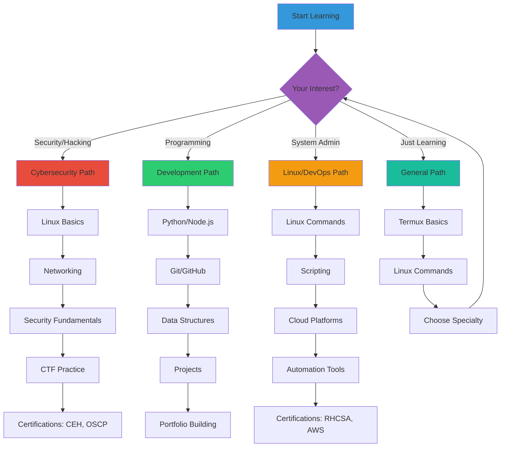
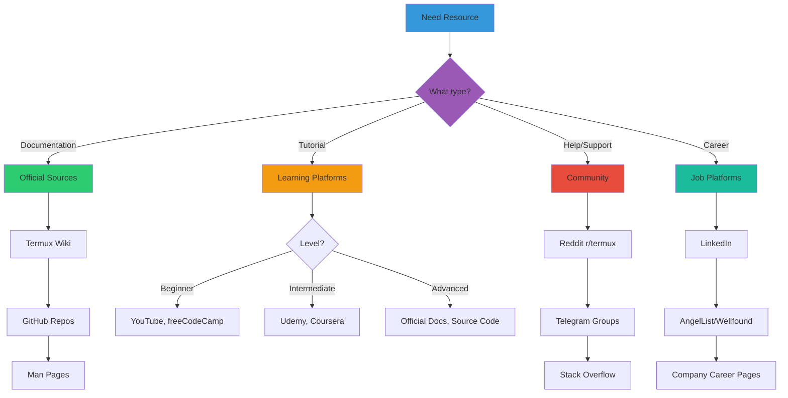
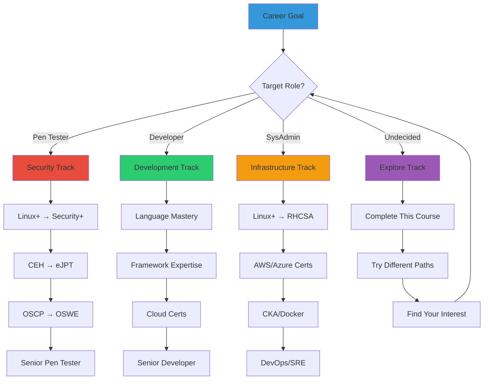

# Chapter 61: Useful Resources & Next Steps

> **Module:** 10 - Troubleshooting  
> **Chapter:** 61 of 61  
> **Duration:** 15-20 Minutes  
> **Difficulty:** ⭐ All Levels

---

## 📋 Chapter Overview

| Section | Content |
|---------|---------|
| Video Script | Complete Hindi narration with timestamps |
| Technical Guide | Comprehensive resource directory |
| Resource Links | 100+ organized links by category |
| Learning Paths | Career roadmaps and certification |
| Practice Exercises | Resource exploration tasks |
| Next Steps | Continuing education guide |
| Video Assets | Thumbnail, description, tags |

---

## 🎬 VIDEO SCRIPT (Complete Hindi Narration)

```
═══════════════════════════════════════════════════════════════════════════════
TERMUX FULL COURSE - CHAPTER 61
Title: Useful Resources & Next Steps | Termux Complete Guide | T3rmuxk1ng
Duration: 15-20 Minutes
═══════════════════════════════════════════════════════════════════════════════

[INTRO - 0:00 to 0:45]
─────────────────────────────────────────────────────────────────────────────

Namaskar Dosto! Welcome to the FINAL chapter of Termux Full Course!

Aaj ka chapter bahut special hai - kyunki aaj main aapko wo saare resources 
share karunga jo aapko Termux mastery ke baad chahiye honge.

61 chapters, 10 modules - aur aaj hum course complete kar rahe hain! 
Lekin ye end nahi hai - ye ek nayi journey ki shuruwat hai.

Aaj hum cover karenge:
- Official Termux resources
- Best learning platforms
- Community groups join karna
- GitHub projects to follow
- YouTube channels
- Certification paths
- Career opportunities
- Portfolio building

To bina time waste kiye, chaliye shuru karte hain!

Play button dabaiye, video like karein, aur notification bell on karein!

---

[SECTION 1: OFFICIAL TERMUX RESOURCES - 0:45 to 4:00]
─────────────────────────────────────────────────────────────────────────────

To sabse pehle official Termux resources ke baare mein baat karte hain.

Ye wo resources hain jo Termux developers khud maintain karte hain. 
Inko bookmark karna bahut important hai.

[SCREEN: Termux Wiki]

**1. Termux Wiki**
Website: wiki.termux.com

Ye sabse important resource hai. Yahan aapko:
- Installation guides
- Package documentation
- Troubleshooting guides
- FAQ section
- Advanced tutorials

Sab kuch milta hai. Jab bhi koi problem aaye, pehle yahan check karein.

[SCREEN: Termux GitHub]

**2. Termux GitHub Organization**
Website: github.com/termux

Termux ka official GitHub organization hai jahan:
- termux-app - Main application code
- termux-packages - All packages source
- termux-api - API implementation
- termux-styling - Themes

Agar aap contribute karna chahte ho ya source code dekhna chahte ho, 
ye best place hai.

[SCREEN: Termux Packages Repository]

**3. Termux Packages**
Website: github.com/termux/termux-packages

Yahan se aap:
- Available packages list dekh sakte ho
- Package build scripts dekh sakte ho
- New packages request kar sakte ho
- Issues report kar sakte ho

[SCREEN: F-Droid Page]

**4. F-Droid Page**
Website: f-droid.org/packages/com.termux/

Yahan se:
- Latest APK download kar sakte ho
- Version history dekh sakte ho
- Permissions check kar sakte ho

Important: Play Store se install nahi karna - ye main pehle chapter mein 
bhi bataya tha.

---

[SECTION 2: COMMUNITY RESOURCES - 4:00 to 8:00]
─────────────────────────────────────────────────────────────────────────────

Ab baat karte hain community resources ki. Learning tabhi hoti hai jab 
aap community se connected raho.

[SCREEN: Reddit]

**1. Reddit Communities**

r/termux - Main Termux subreddit
- 150k+ members
- Daily posts and discussions
- Help and support
- Project showcases

r/learnhacking - For hacking learners
r/linux4noobs - Linux beginners
r/howtohack - Ethical hacking
r/netsec - Network security

[SCREEN: Telegram Groups]

**2. Telegram Groups**

Official Termux Group: @termux
- Active community
- Quick help
- Tool sharing
- Discussion

Termux India: @termux_india
- Hindi/English mix
- Indian community
- Local help

[SCREEN: Discord Server]

**3. Discord Servers**

Termux Discord - Official server
- Voice channels
- Text channels
- Resource sharing
- Community events

HackerHub Discord - Security focused
- CTF discussions
- Tool discussions
- Learning groups

[SCREEN: Forums]

**4. Forums & Discussion Boards**

Termux Discussion - GitHub Discussions
XDA Developers Forum - Android development
Stack Overflow - Programming questions
Unix & Linux Stack Exchange - Linux help

Community se connect rehne ke benefits:
✅ Quick problem solutions
✅ Latest updates
✅ Networking opportunities
✅ Job referrals
✅ Collaborative learning

---

[SECTION 3: LEARNING RESOURCES - 8:00 to 12:00]
─────────────────────────────────────────────────────────────────────────────

Ab aate hain learning resources pe. Termux seekhne ke baad aapko 
aur bhi cheezein seekhni hongi.

[SCREEN: Linux Learning]

**Linux Learning Resources:**

Free Courses:
- Linux Journey (linuxjourney.com) - Interactive
- The Linux Command Line (free book)
- OverTheWire Bandit Wargame
- Linux Survival (linuxsurvival.com)

YouTube Channels:
- NetworkChuck - Linux tutorials
- DistroTube - Linux content
- Chris Titus Tech - Linux tips

[SCREEN: Python Learning]

**Python Learning Resources:**

Free Platforms:
- Python.org Official Tutorial
- Real Python (realpython.com)
- Automate the Boring Stuff (book)
- Codecademy Python Course

Practice:
- LeetCode - Coding problems
- HackerRank - Python challenges
- Codewars - Code katas
- Project Euler - Math problems

[SCREEN: Cybersecurity Courses]

**Cybersecurity Resources:**

Free Platforms:
- TryHackMe - Beginner friendly
- HackTheBox - Advanced
- PortSwigger Web Security Academy
- Cybrary - Free courses

Certifications Path:
1. CompTIA Security+
2. CEH (Certified Ethical Hacker)
3. OSCP (Offensive Security)
4. CISSP (Advanced)

[SCREEN: Practice Platforms]

**Practice Platforms:**

CTF Platforms:
- PicoCTF - Beginner friendly
- CTFtime.org - CTF calendar
- HackTheBox CTF
- TryHackMe CTF

Vulnerable Machines:
- Metasploitable
- DVWA (Damn Vulnerable Web App)
- VulnHub machines

---

[SECTION 4: GITHUB PROJECTS TO FOLLOW - 12:00 to 15:00]
─────────────────────────────────────────────────────────────────────────────

GitHub pe bahut saare amazing projects hain jo aap follow kar sakte ho.

[SCREEN: Termux-Tools Repository]

**Termux-Specific Projects:**

termux-tools - Collection of scripts
Termux-Alpine - Alpine Linux in Termux
Termux-Ubuntu - Ubuntu in Termux
On-my-Zsh on Termux
Termux-Oh-My-Fish

[SCREEN: Security Tools]

**Security Tools on GitHub:**

nmap - Network scanner
metasploit-framework - Penetration testing
hydra - Password cracker
john - John the Ripper
sqlmap - SQL injection
aircrack-ng - WiFi security

[SCREEN: Useful Scripts]

**Useful Script Repositories:**

Termux-Style - Termux customization
Termux-Lazysqlmap - SQLMap wrapper
IPGeoLocation - IP tracking
InfoOsint - OSINT tools
Sherlock - Username search

GitHub pe follow karne ka tarika:
1. Star karein important repos
2. Watch karein for updates
3. Fork karein for contributions
4. Issues follow karein

---

[SECTION 5: YOUTUBE CHANNELS & BOOKS - 15:00 to 17:30]
─────────────────────────────────────────────────────────────────────────────

Ab baat karte hain YouTube channels aur books ki.

[SCREEN: YouTube Channels]

**Best YouTube Channels:**

Termux & Android Hacking:
- T3rmuxk1ng (mera channel!) 😄
- David Bombal - Interviews & tutorials
- NetworkChuck - Networking & Linux
- John Hammond - CTF & hacking

Ethical Hacking:
- LiveOverflow - Binary exploitation
- IppSec - HackTheBox walkthroughs
- STOK - Security research
- The Cyber Mentor - Career guidance

Programming:
- Corey Schafer - Python
- Traversy Media - Web development
- freeCodeCamp - Everything free
- Programming with Mosh

[SCREEN: Books Recommendations]

**Recommended Books:**

Linux:
- "The Linux Command Line" - Free PDF
- "Linux Basics for Hackers"
- "How Linux Works"

Python:
- "Automate the Boring Stuff with Python"
- "Python Crash Course"
- "Black Hat Python"

Cybersecurity:
- "The Web Application Hacker's Handbook"
- "Penetration Testing" - Georgia Weidman
- "Hacking: The Art of Exploitation"

Free PDF sources:
- PDF Drive
- Library Genesis
- Open Library

---

[SECTION 6: CAREER & CERTIFICATIONS - 17:30 to 19:30]
─────────────────────────────────────────────────────────────────────────────

Ab career opportunities ki baat karte hain.

[SCREEN: Job Roles]

**Career Paths:**

Entry Level:
- IT Support Specialist
- Junior System Admin
- Security Analyst
- Junior Pen Tester

Mid Level:
- System Administrator
- Security Engineer
- Penetration Tester
- SOC Analyst

Senior Level:
- Security Architect
- Lead Pen Tester
- CISO (Chief Information Security Officer)
- Security Consultant

[SCREEN: Certifications]

**Certification Roadmap:**

Beginner:
- CompTIA A+
- CompTIA Network+
- CompTIA Security+

Intermediate:
- CEH (Certified Ethical Hacker)
- OSCP (Offensive Security Certified Professional)
- eJPT (eLearnSecurity Junior Pen Tester)

Advanced:
- OSWE (Web Expert)
- OSEP (Exploit Developer)
- CISSP (Information Security)

[SCREEN: Portfolio Building]

**Portfolio Building:**

1. GitHub Profile:
   - Upload projects
   - Contribute to open source
   - README files proper

2. Blog/Website:
   - Write tutorials
   - Document learning
   - Share experiences

3. TryHackMe/HackTheBox:
   - Complete badges
   - Public profile
   - Rank showcase

4. CTF Participations:
   - CTFtime profile
   - Writeups
   - Team participation

---

[SECTION 7: SUMMARY & FINAL MESSAGE - 19:30 to 21:00]
─────────────────────────────────────────────────────────────────────────────

To dosto, Chapter 61 aur Termux Full Course complete! 🎉

Let's summarize:

✅ Official Resources:
   - Termux Wiki, GitHub, F-Droid

✅ Community Resources:
   - Reddit, Telegram, Discord, Forums

✅ Learning Resources:
   - Linux, Python, Cybersecurity

✅ GitHub Projects:
   - Security tools, Scripts, Distros

✅ YouTube Channels:
   - Tutorials, CTFs, Career guidance

✅ Books:
   - Free PDFs, Paid books

✅ Career Path:
   - Jobs, Certifications, Portfolio

**Final Message:**

Dosto, ye course complete karna ek achievement hai. Lekin real learning 
ab shuru hogi. Practice karein, projects banayein, community se connect rahein.

Remember:
- Hacking sirf tools nahi hai - it's about thinking differently
- Ethics important hai - sirf authorized systems pe test karein
- Learning never stops - technology change hoti rehti hai
- Community helps - questions poochein, help karein

Agar aapne saare 61 chapters complete kiye - CONGRATULATIONS! 🎊

Aap ab Termux expert ho! Ab aapke liye:
- Practice karna
- Projects banana
- Certifications lena
- Career build karna

**Thank You!**

Mera naam T3rmuxk1ng hai. Maine is course ko banaaya with love and 
dedication for the community.

Agar ye course helpful laga:
👍 Like karein
🔔 Subscribe karein
💬 Comments mein bataiye kaunse chapters best lage
📤 Share karein

Main har comment ka reply karta hoon.

Resources ki complete list description mein hai. Bookmark karein!

Thank you for being part of this journey! 
See you in future videos!

**Keep Hacking, Keep Learning! 🔥**

═══════════════════════════════════════════════════════════════════════════════
```

---

## 📖 TECHNICAL GUIDE

### 1. Official Termux Resources

```
┌─────────────────────────────────────────────────────────────────────────┐
│                      OFFICIAL TERMUX RESOURCES                           │
├─────────────────────────────────────────────────────────────────────────┤
│                                                                          │
│  ┌──────────────────────────────────────────────────────────────────┐   │
│  │                    TERMUX WIKI                                    │   │
│  │                    wiki.termux.com                                │   │
│  ├──────────────────────────────────────────────────────────────────┤   │
│  │ • Getting Started Guide                                          │   │
│  │ • Package Documentation                                          │   │
│  │ • Installation Instructions                                       │   │
│  │ • Troubleshooting Guide                                          │   │
│  │ • Frequently Asked Questions                                     │   │
│  │ • Advanced Tutorials                                             │   │
│  │ • Development Guidelines                                         │   │
│  └──────────────────────────────────────────────────────────────────┘   │
│                                                                          │
│  ┌──────────────────────────────────────────────────────────────────┐   │
│  │                    TERMUX GITHUB                                  │   │
│  │                    github.com/termux                              │   │
│  ├──────────────────────────────────────────────────────────────────┤   │
│  │ Repositories:                                                     │   │
│  │ • termux/termux-app - Main application                           │   │
│  │ • termux/termux-packages - Package build scripts                 │   │
│  │ • termux/termux-api - API app and library                        │   │
│  │ • termux/termux-styling - Themes and fonts                       │   │
│  │ • termux/termux-widget - Home screen widgets                     │   │
│  │ • termux/termux-boot - Boot scripts                              │   │
│  │ • termux/termux-float - Floating terminal                        │   │
│  │ • termux/termux-tasker - Tasker integration                      │   │
│  └──────────────────────────────────────────────────────────────────┘   │
│                                                                          │
│  ┌──────────────────────────────────────────────────────────────────┐   │
│  │                    F-DROID                                        │   │
│  │                    f-droid.org                                    │   │
│  ├──────────────────────────────────────────────────────────────────┤   │
│  │ Termux Packages:                                                  │   │
│  │ • com.termux - Main app                                          │   │
│  │ • com.termux.api - API add-on                                    │   │
│  │ • com.termux.styling - Theme add-on                              │   │
│  │ • com.termux.widget - Widget add-on                              │   │
│  │ • com.termux.boot - Boot add-on                                  │   │
│  │ • com.termux.float - Float add-on                                │   │
│  │ • com.termux.tasker - Tasker add-on                              │   │
│  └──────────────────────────────────────────────────────────────────┘   │
│                                                                          │
└─────────────────────────────────────────────────────────────────────────┘
```

### 2. Termux Wiki Essential Pages

| Page | URL | Description |
|------|-----|-------------|
| Main Page | https://wiki.termux.com/ | Home page with all links |
| Getting Started | https://wiki.termux.com/wiki/Getting_started | Beginner's guide |
| Package Management | https://wiki.termux.com/wiki/Package_Management | pkg commands |
| Remote Access | https://wiki.termux.com/wiki/Remote_Access | SSH setup |
| Development | https://wiki.termux.com/wiki/Development | Programming info |
| Graphical Interfaces | https://wiki.termux.com/wiki/Graphical_Environment | GUI setup |
| Hardware | https://wiki.termux.com/wiki/Hardware | Device access |
| FAQs | https://wiki.termux.com/wiki/FAQ | Common questions |
| Troubleshooting | https://wiki.termux.com/wiki/Troubleshooting | Problem solving |

### 3. GitHub Repositories Structure

```bash
# Termux Main Repositories

# 1. Termux App
git clone https://github.com/termux/termux-app
# Main application source code

# 2. Termux Packages
git clone https://github.com/termux/termux-packages
# Build scripts for all packages

# 3. Termux API
git clone https://github.com/termux/termux-api
# API implementation

# Package Categories in termux-packages:
packages/
├── admin/         # Admin tools
├── editors/       # Text editors
├── games/         # Games
├── lang/          # Programming languages
├── net/           # Networking tools
├── science/       # Scientific tools
├── x11/           # GUI packages
└── ...
```

---

## 🌐 COMMUNITY RESOURCES

### Reddit Communities

```
┌─────────────────────────────────────────────────────────────────────────┐
│                      REDDIT COMMUNITIES                                  │
├─────────────────────────────────────────────────────────────────────────┤
│                                                                          │
│  TERMUX RELATED                                                          │
│  ────────────────                                                        │
│  • r/termux          - Main Termux community (150k+ members)            │
│  • r/termuxwiki      - Wiki discussions                                  │
│                                                                          │
│  LINUX & PROGRAMMING                                                     │
│  ──────────────────────                                                  │
│  • r/linux           - General Linux (800k+ members)                    │
│  • r/linux4noobs     - Linux beginners (200k+ members)                  │
│  • r/bash            - Bash scripting (100k+ members)                   │
│  • r/python          - Python programming (1M+ members)                 │
│  • r/learnpython     - Learn Python (500k+ members)                     │
│  • r/learnprogramming - Programming learners (3M+ members)              │
│                                                                          │
│  CYBERSECURITY                                                           │
│  ──────────────                                                          │
│  • r/netsec          - Network security (500k+ members)                 │
│  • r/security        - General security (400k+ members)                 │
│  • r/howtohack       - Ethical hacking (400k+ members)                  │
│  • r/learnhacking    - Learn hacking (100k+ members)                    │
│  • r/AskNetsec       - Security Q&A (100k+ members)                     │
│  • r/blueteamsec     - Blue team security (50k+ members)                │
│                                                                          │
│  BUG BOUNTY & CTF                                                        │
│  ─────────────────                                                       │
│  • r/bugbounty       - Bug bounty (100k+ members)                       │
│  • r/securityCTF     - CTF discussions (50k+ members)                   │
│                                                                          │
└─────────────────────────────────────────────────────────────────────────┘
```

### Telegram Groups & Channels

```
┌─────────────────────────────────────────────────────────────────────────┐
│                    TELEGRAM RESOURCES                                    │
├─────────────────────────────────────────────────────────────────────────┤
│                                                                          │
│  OFFICIAL GROUPS                                                         │
│  ────────────────                                                        │
│  • @termux              - Official Termux group                         │
│  • @termux_news         - Official news channel                         │
│                                                                          │
│  COMMUNITY GROUPS                                                        │
│  ────────────────                                                        │
│  • @termux_india        - Indian Termux community                      │
│  • @termux_help         - Help & support group                          │
│  • @termux_developers   - Developer discussions                         │
│  • @linux_users         - General Linux group                           │
│                                                                          │
│  SECURITY & HACKING                                                      │
│  ───────────────────                                                     │
│  • @hackerhub           - Security discussions                          │
│  • @bugbounty           - Bug bounty tips                               │
│  • @ctf_alerts          - CTF notifications                             │
│  • @osint_team          - OSINT resources                               │
│                                                                          │
│  PROGRAMMING                                                             │
│  ───────────                                                             │
│  • @python_official     - Python community                              │
│  • @javascript_chat     - JavaScript discussions                        │
│  • @golang_news         - Go programming news                           │
│                                                                          │
└─────────────────────────────────────────────────────────────────────────┘
```

### Discord Servers

```
┌─────────────────────────────────────────────────────────────────────────┐
│                    DISCORD SERVERS                                       │
├─────────────────────────────────────────────────────────────────────────┤
│                                                                          │
│  TERMUX                                                                  │
│  ──────                                                                  │
│  • Termux Official Server                                                │
│    - Channels: #help, #packages, #development                           │
│    - Voice chat available                                               │
│    - Regular community events                                            │
│                                                                          │
│  CYBERSECURITY                                                           │
│  ──────────────                                                          │
│  • TryHackMe Discord                                                     │
│    - Learning rooms                                                      │
│    - Challenge discussions                                              │
│    - Career advice                                                       │
│                                                                          │
│  • HackTheBox Discord                                                    │
│    - Machine discussions                                                │
│    - CTF team formation                                                 │
│    - Writeup reviews                                                     │
│                                                                          │
│  • The Cyber Mentor Community                                            │
│    - Career guidance                                                     │
│    - Study groups                                                        │
│    - Interview prep                                                      │
│                                                                          │
│  PROGRAMMING                                                             │
│  ───────────                                                             │
│  • Python Discord                                                        │
│    - Help channels                                                       │
│    - Project showcase                                                   │
│    - Code reviews                                                        │
│                                                                          │
│  • freeCodeCamp Discord                                                  │
│    - Study groups                                                        │
│    - Project help                                                        │
│    - Certification support                                              │
│                                                                          │
└─────────────────────────────────────────────────────────────────────────┘
```

### Forums & Discussion Boards

| Forum | URL | Description |
|-------|-----|-------------|
| GitHub Discussions | github.com/termux/termux-app/discussions | Official discussions |
| XDA Developers | forum.xda-developers.com | Android development |
| Stack Overflow | stackoverflow.com | Programming Q&A |
| Unix & Linux SE | unix.stackexchange.com | Linux questions |
| Super User | superuser.com | General tech help |
| Ask Ubuntu | askubuntu.com | Ubuntu/Linux help |
| Security SE | security.stackexchange.com | Security questions |

---

## 📚 LEARNING RESOURCES

### Linux Learning Resources

```
┌─────────────────────────────────────────────────────────────────────────┐
│                    LINUX LEARNING RESOURCES                              │
├─────────────────────────────────────────────────────────────────────────┤
│                                                                          │
│  FREE COURSES                                                            │
│  ─────────────                                                           │
│  • Linux Journey (linuxjourney.com)                                      │
│    - Interactive tutorials                                              │
│    - Command line basics                                                │
│    - File system navigation                                             │
│    - Users and permissions                                              │
│                                                                          │
│  • The Linux Command Line (freebook)                                     │
│    - Download: sourceforge.net/projects/linuxcommandline/               │
│    - Complete book, 500+ pages                                          │
│    - Beginner to advanced                                               │
│                                                                          │
│  • OverTheWire Bandit Wargame (overthewire.org/wargames/bandit)         │
│    - Gamified learning                                                  │
│  - Level by level progression                                           │
│    - Practical command line skills                                      │
│                                                                          │
│  • Linux Survival (linuxsurvival.com)                                    │
│    - Interactive tutorial                                               │
│    - Virtual terminal                                                   │
│    - Step by step lessons                                               │
│                                                                          │
│  • edX Linux Courses (edx.org)                                           │
│    - Introduction to Linux (LFS101x)                                    │
│    - Free to audit                                                      │
│    - Certificate available (paid)                                       │
│                                                                          │
│  YOUTUBE CHANNELS                                                        │
│  ─────────────────                                                       │
│  • NetworkChuck - Linux tutorials, networking                           │
│  • DistroTube - Linux distros, tips                                     │
│  • Chris Titus Tech - Linux administration                              │
│  • LearnLinuxTV - Beginner tutorials                                    │
│  • The Urban Penguin - Deep technical content                           │
│                                                                          │
│  BOOKS                                                                   │
│  ─────                                                                   │
│  • "The Linux Command Line" - William Shotts                            │
│  • "Linux Basics for Hackers" - OccupyTheWeb                            │
│  • "How Linux Works" - Brian Ward                                       │
│  • "Linux Administration Handbook" - Nemeth et al.                      │
│                                                                          │
└─────────────────────────────────────────────────────────────────────────┘
```

### Python Learning Resources

```
┌─────────────────────────────────────────────────────────────────────────┐
│                    PYTHON LEARNING RESOURCES                             │
├─────────────────────────────────────────────────────────────────────────┤
│                                                                          │
│  FREE COURSES                                                            │
│  ─────────────                                                           │
│  • Python.org Official Tutorial                                          │
│    - docs.python.org/3/tutorial/                                        │
│    - Comprehensive official guide                                       │
│                                                                          │
│  • Real Python (realpython.com)                                          │
│    - Tutorials and articles                                             │
│    - Beginner to advanced                                               │
│    - Best practices                                                     │
│                                                                          │
│  • Automate the Boring Stuff with Python                                 │
│    - automatetheboringstuff.com                                         │
│    - Free online book                                                   │
│    - Practical projects                                                 │
│                                                                          │
│  • Codecademy Python Course                                              │
│    - codecademy.com/learn/learn-python-3                                │
│    - Interactive exercises                                              │
│    - Free tier available                                                │
│                                                                          │
│  • freeCodeCamp Python Course                                            │
│    - youtube.com/freecodecamp                                           │
│    - Full 10-hour course                                                │
│    - Completely free                                                    │
│                                                                          │
│  PRACTICE PLATFORMS                                                      │
│  ──────────────────                                                      │
│  • LeetCode (leetcode.com)                                               │
│    - Coding problems                                                    │
│    - Interview preparation                                              │
│    - Python specific tracks                                             │
│                                                                          │
│  • HackerRank (hackerrank.com)                                           │
│    - Python challenges                                                  │
│    - Problem solving                                                    │
│    - Certifications available                                           │
│                                                                          │
│  • Codewars (codewars.com)                                               │
│    - Code katas                                                         │
│    - Rank progression                                                   │
│    - Community solutions                                                │
│                                                                          │
│  • Exercism (exercism.io)                                                │
│    - Mentored learning                                                  │
│    - Real-world projects                                                │
│    - Multiple languages                                                 │
│                                                                          │
│  YOUTUBE CHANNELS                                                        │
│  ─────────────────                                                       │
│  • Corey Schafer - Python tutorials                                     │
│  • Programming with Mosh - Beginner courses                             │
│  • Tech With Tim - Python projects                                      │
│  • Sentdex - Advanced Python                                            │
│  • Python Programmer - Python specific                                  │
│                                                                          │
│  BOOKS                                                                   │
│  ─────                                                                   │
│  • "Python Crash Course" - Eric Matthes                                 │
│  • "Automate the Boring Stuff" - Al Sweigart                            │
│  • "Black Hat Python" - Justin Seitz                                    │
│  • "Violent Python" - TJ O'Connor                                       │
│  • "Effective Python" - Brett Slatkin                                   │
│                                                                          │
└─────────────────────────────────────────────────────────────────────────┘
```

### Cybersecurity Learning Resources

```
┌─────────────────────────────────────────────────────────────────────────┐
│                  CYBERSECURITY LEARNING RESOURCES                        │
├─────────────────────────────────────────────────────────────────────────┤
│                                                                          │
│  FREE LEARNING PLATFORMS                                                 │
│  ────────────────────────                                                │
│  • TryHackMe (tryhack.me)                                                │
│    - Beginner friendly                                                  │
│    - Guided learning paths                                              │
│    - Hands-on labs                                                      │
│    - Free tier available                                                │
│                                                                          │
│  • HackTheBox (hackthebox.com)                                           │
│    - Advanced challenges                                                │
│    - Real-world scenarios                                               │
│    - CTF style                                                          │
│    - Academy (free courses)                                             │
│                                                                          │
│  • PortSwigger Web Security Academy                                      │
│    - web-security-academy.portswigger.net                               │
│    - Web application security                                           │
│    - Hands-on labs                                                      │
│    - Completely free                                                    │
│                                                                          │
│  • Cybrary (cybrary.com)                                                 │
│    - Free courses                                                       │
│    - Career paths                                                       │
│    - Certifications prep                                                │
│                                                                          │
│  • SANS Cyber Aces                                                       │
│    - sans.org/cyberaces                                                 │
│    - Free courses                                                       │
│    - Foundation level                                                   │
│                                                                          │
│  • Offensive Security FREE Courses                                       │
│    - offsec.com/courses/free                                            │
│    - Metasploit Unleashed                                              │
│    - Network Penetration Testing                                        │
│                                                                          │
│  CTF PLATFORMS                                                           │
│  ─────────────                                                           │
│  • PicoCTF (picoctf.org)                                                 │
│    - Beginner friendly                                                  │
│    - Educational focus                                                  │
│    - Free forever                                                       │
│                                                                          │
│  • CTFtime (ctftime.org)                                                 │
│    - CTF calendar                                                       │
│    - Team rankings                                                      │
│    - Writeup archive                                                    │
│                                                                          │
│  • CTFlearn (ctflearn.com)                                               │
│    - Challenge library                                                  │
│    - Progressive difficulty                                             │
│                                                                          │
│  • OverTheWire Wargames (overthewire.org)                                │
│    - Bandit (beginner)                                                  │
│    - Natas (web security)                                               │
│    - Krypton (crypto)                                                   │
│                                                                          │
│  VULNERABLE PRACTICE ENVIRONMENTS                                        │
│  ────────────────────────────────                                        │
│  • Metasploitable 2/3                                                    │
│  • DVWA (Damn Vulnerable Web App)                                        │
│  • VulnHub (vulnhub.com)                                                 │
│  • WebGoat                                                               │
│  • bwapp                                                                  │
│                                                                          │
│  YOUTUBE CHANNELS                                                        │
│  ─────────────────                                                       │
│  • LiveOverflow - Binary exploitation                                   │
│  • IppSec - HTB walkthroughs                                            │
│  • John Hammond - CTF & hacking                                         │
│  • STOK - Security research                                             │
│  • The Cyber Mentor - Career guidance                                   │
│  • David Bombal - Interviews & tutorials                                │
│  • NetworkChuck - Networking & hacking                                  │
│                                                                          │
│  BOOKS                                                                   │
│  ─────                                                                   │
│  • "The Web Application Hacker's Handbook"                              │
│  • "Penetration Testing" - Georgia Weidman                              │
│  • "Hacking: The Art of Exploitation"                                   │
│  • "The Hacker Playbook" series                                         │
│  • "Practical Malware Analysis"                                         │
│  • "Blue Team Handbook"                                                 │
│                                                                          │
└─────────────────────────────────────────────────────────────────────────┘
```

### Practice Platforms Details

| Platform | Type | Cost | Difficulty | Best For |
|----------|------|------|------------|----------|
| TryHackMe | Learning | Freemium | Beginner | Guided learning |
| HackTheBox | Practice | Freemium | Advanced | Real-world skills |
| PicoCTF | CTF | Free | Beginner | Students |
| OverTheWire | Wargames | Free | All levels | Linux skills |
| PortSwigger Academy | Web Security | Free | Intermediate | Web hacking |
| VulnHub | Vulnerable VMs | Free | Intermediate | Pen testing |
| CTFtime | CTF Calendar | Free | All levels | CTF events |
| Codecademy | Programming | Freemium | Beginner | Coding skills |
| LeetCode | Algorithms | Freemium | All levels | Interview prep |

---

## 🔧 TOOL REPOSITORIES

### Security Tools on GitHub

```
┌─────────────────────────────────────────────────────────────────────────┐
│                    SECURITY TOOLS ON GITHUB                              │
├─────────────────────────────────────────────────────────────────────────┤
│                                                                          │
│  NETWORK SCANNING                                                        │
│  ────────────────                                                        │
│  • nmap/nmap                    - Network scanner                       │
│  • robertdavidgraham/masscan   - Fast port scanner                      │
│  • rau-sudo/scanless           - Online port scanner                    │
│  •朽木/PortBender              - Port scanner in Python                 │
│                                                                          │
│  PASSWORD CRACKING                                                       │
│  ─────────────────                                                       │
│  • openwall/john               - John the Ripper                        │
│  • vanhauser-thc/thc-hydra    - Hydra password cracker                  │
│  • Hashcat/hashcat            - GPU password recovery                   │
│  • galkan/crowbar             - Network service cracker                 │
│                                                                          │
│  WEB SECURITY                                                            │
│  ────────────                                                            │
│  • sqlmapproject/sqlmap       - SQL injection tool                      │
│  • commixproject/commix       - Command injection                       │
│  • EnableSecurity/wafw00f    - WAF detection                           │
│  • s0md3v/Arjun              - Parameter discovery                      │
│  • tomnomnom/gf              - Pattern matching                         │
│  • tomnomnom/httprobe        - HTTP probing                            │
│                                                                          │
│  EXPLOITATION                                                            │
│  ────────────                                                            │
│  • rapid7/metasploit-framework - Metasploit Framework                   │
│  • amonsec/jonah              - Exploitation toolkit                    │
│  • wisecodeproject/wisecode  - Payload generation                      │
│                                                                          │
│  OSINT & RECONNAISSANCE                                                  │
│  ─────────────────────────                                               │
│  • laramies/theHarvester    - Email/Name harvester                      │
│  •/sherlock-project/sherlock - Username search                         │
│  • kteru/igrons              - Instagram recon                          │
│  • mwrlabs/dorks-eye        - Google dorking                            │
│  • m4ll0k/SecretFinder      - API key finder                           │
│                                                                          │
│  WIRELESS SECURITY                                                       │
│  ──────────────────                                                      │
│  • aircrack-ng/aircrack-ng  - WiFi security                             │
│  • kimocoder/wifite2        - WiFi attack tool                          │
│  • spacehuhn/esp8266_deauther - Deauth tool                            │
│                                                                          │
│  FORENSICS                                                               │
│  ──────────                                                              │
│  • volatilityfoundation/volatility - Memory forensics                   │
│  • sleuthkit/sleuthkit       - Disk forensics                          │
│  • ForensicXstruments/autopsy - Digital forensics                      │
│                                                                          │
└─────────────────────────────────────────────────────────────────────────┘
```

### Termux-Specific GitHub Projects

| Repository | Description | Link |
|------------|-------------|------|
| termux/termux-packages | Official packages | github.com/termux/termux-packages |
| Hax4us/Termux-Alpine | Alpine in Termux | github.com/Hax4us/Termux-Alpine |
| Neo-Oli/Termux-Ubuntu | Ubuntu in Termux | github.com/Neo-Oli/Termux-Ubuntu |
| masteradit/termux-style | Termux styling | github.com/masteradit/termux-style |
| 4679/oh-my-termux | Oh My Zsh for Termux | github.com/4679/oh-my-termux |
| securityjoes/MasterParser | Log parser | github.com/securityjoes/MasterParser |
| dwellir-subiquity/termux | Termux tools | github.com/dwellir-subiquity/termux |
|zoranelle/termux-toolbox | Tool collection | github.com/zoranelle/termux-toolbox |
| the0cpb/termux-tools | Security tools | github.com/the0cpb/termux-tools |
| xerosanyam/termux-web-server | Web server | github.com/xerosanyam/termux-web-server |

---

## 📺 YOUTUBE CHANNELS

### Termux & Mobile Hacking

```
┌─────────────────────────────────────────────────────────────────────────┐
│                    YOUTUBE CHANNELS - TERMUX                             │
├─────────────────────────────────────────────────────────────────────────┤
│                                                                          │
│  CHANNEL NAME          SUBS      CONTENT TYPE                           │
│  ───────────────────────────────────────────────────────────────────    │
│  T3rmuxk1ng            100k+     Termux tutorials (Hindi)               │
│  Technical Guruji      20M+      Tech (Hindi)                           │
│  Technical Sagar       10M+      Ethical hacking (Hindi)                │
│  Coding With Kunal     500k+     Programming (Hindi)                    │
│                                                                          │
│  ENGLISH CHANNELS                                                        │
│  ─────────────────                                                       │
│  David Bombal           3M+      Interviews, tutorials                  │
│  NetworkChuck          3M+      Linux, networking, hacking             │
│  The Cyber Mentor      1M+      Career guidance, tutorials              │
│  John Hammond          1M+      CTF, hacking                            │
│  IppSec               500k+     HackTheBox walkthroughs                 │
│  LiveOverflow         500k+     Binary exploitation                     │
│  STOK                 200k+     Security research                       │
│  Nahamsec             300k+     Bug bounty                              │
│                                                                          │
└─────────────────────────────────────────────────────────────────────────┘
```

### Programming Channels

| Channel | Subscribers | Focus | Language |
|---------|-------------|-------|----------|
| Corey Schafer | 1M+ | Python | English |
| Traversy Media | 2M+ | Web Dev | English |
| Programming with Mosh | 3M+ | Multiple | English |
| freeCodeCamp | 8M+ | Everything | English |
| Sentdex | 1M+ | Python/ML | English |
| Tech With Tim | 1M+ | Python | English |
| CodeWithHarry | 5M+ | Programming | Hindi |
| Apni Kaksha | 500k+ | CS Subjects | Hindi |
| Love Babbar | 1M+ | DSA | Hindi |

### Cybersecurity Channels

| Channel | Subscribers | Focus |
|---------|-------------|-------|
| LiveOverflow | 500k+ | Binary exploitation |
| The Cyber Mentor | 1M+ | Career & tutorials |
| John Hammond | 1M+ | CTF & hacking |
| IppSec | 500k+ | HTB walkthroughs |
| STOK | 200k+ | Security research |
| David Bombal | 3M+ | Interviews |
| NetworkChuck | 3M+ | Networking & hacking |
| Nahamsec | 300k+ | Bug bounty |
| InsiderPhD | 100k+ | Bug bounty |
| XSSRat | 100k+ | Web security |

---

## 📚 BOOKS AND DOCUMENTATION

### Free Books & Resources

```
┌─────────────────────────────────────────────────────────────────────────┐
│                    FREE BOOKS & DOCUMENTATION                            │
├─────────────────────────────────────────────────────────────────────────┤
│                                                                          │
│  LINUX                                                                   │
│  ──────                                                                  │
│  • The Linux Command Line (free PDF)                                     │
│    sourceforge.net/projects/linuxcommandline/                           │
│                                                                          │
│  • Linux Fundamentals (free PDF)                                         │
│    linuxfundamentals.org                                                │
│                                                                          │
│  • Advanced Bash-Scripting Guide                                         │
│    tldp.org/LDP/abs/html/                                               │
│                                                                          │
│  PYTHON                                                                  │
│  ──────                                                                  │
│  • Automate the Boring Stuff with Python                                 │
│    automatetheboringstuff.com                                           │
│                                                                          │
│  • Python Documentation                                                  │
│    docs.python.org/3/                                                   │
│                                                                          │
│  • Think Python 2e                                                       │
│    greenteapress.com/thinkpython2/                                      │
│                                                                          │
│  • Dive into Python 3                                                    │
│    diveintopython3.net/                                                 │
│                                                                          │
│  CYBERSECURITY                                                           │
│  ──────────────                                                          │
│  • OWASP Testing Guide                                                   │
│    owasp.org/www-project-web-security-testing-guide/                    │
│                                                                          │
│  • OWASP Top 10                                                          │
│    owasp.org/Top10/                                                     │
│                                                                          │
│  • Hacker's Highbridge (free)                                            │
│    hackershighbridge.org                                                │
│                                                                          │
│  • NIST Cybersecurity Framework                                          │
│    nist.gov/cyberframework                                              │
│                                                                          │
│  FREE PDF SOURCES                                                        │
│  ─────────────────                                                       │
│  • PDF Drive (pdfdrive.com)                                              │
│  • Open Library (openlibrary.org)                                        │
│  • Project Gutenberg (gutenberg.org)                                     │
│  • Library Genesis                                                       │
│                                                                          │
└─────────────────────────────────────────────────────────────────────────┘
```

### Paid Books Recommendations

| Category | Book Title | Author | Level |
|----------|------------|--------|-------|
| Linux | Linux Basics for Hackers | OccupyTheWeb | Beginner |
| Linux | How Linux Works | Brian Ward | Intermediate |
| Python | Python Crash Course | Eric Matthes | Beginner |
| Python | Black Hat Python | Justin Seitz | Advanced |
| Python | Violent Python | TJ O'Connor | Intermediate |
| Web Sec | Web Application Hacker's Handbook | Stuttard & Pinto | Advanced |
| Pen Testing | Penetration Testing | Georgia Weidman | Beginner |
| Exploitation | Hacking: Art of Exploitation | Jon Erickson | Advanced |
| Malware | Practical Malware Analysis | Sikorski & Honig | Advanced |
| Blue Team | Blue Team Handbook | Alan Jenkins | Intermediate |

---

## 🎓 CERTIFICATION PATHS

### Certification Roadmap

```
┌─────────────────────────────────────────────────────────────────────────┐
│                    CERTIFICATION ROADMAP                                 │
├─────────────────────────────────────────────────────────────────────────┤
│                                                                          │
│  BEGINNER LEVEL (0-1 Year Experience)                                    │
│  ───────────────────────────────────────                                 │
│  ┌─────────────────────────────────────────────────────────────────┐   │
│  │ CompTIA A+                                                       │   │
│  │ - IT Fundamentals                                               │   │
│  │ - Hardware, Software, Troubleshooting                          │   │
│  │ - Cost: ~$239/exam (2 exams)                                    │   │
│  │ - Difficulty: Entry Level                                       │   │
│  └─────────────────────────────────────────────────────────────────┘   │
│                              │                                           │
│                              ▼                                           │
│  ┌─────────────────────────────────────────────────────────────────┐   │
│  │ CompTIA Network+                                                │   │
│  │ - Networking Fundamentals                                       │   │
│  │ - TCP/IP, Routing, Switching                                    │   │
│  │ - Cost: ~$339                                                   │   │
│  │ - Difficulty: Beginner                                          │   │
│  └─────────────────────────────────────────────────────────────────┘   │
│                              │                                           │
│                              ▼                                           │
│  ┌─────────────────────────────────────────────────────────────────┐   │
│  │ CompTIA Security+                                               │   │
│  │ - Security Fundamentals                                         │   │
│  │ - Threats, Vulnerabilities, Risk Management                     │   │
│  │ - Cost: ~$370                                                   │   │
│  │ - Difficulty: Beginner-Intermediate                             │   │
│  └─────────────────────────────────────────────────────────────────┘   │
│                                                                          │
│  INTERMEDIATE LEVEL (1-3 Years Experience)                               │
│  ──────────────────────────────────────────────                          │
│  ┌─────────────────────────────────────────────────────────────────┐   │
│  │ CEH (Certified Ethical Hacker)                                  │   │
│  │ - Ethical Hacking Methodology                                   │   │
│  │ - Tools and Techniques                                          │   │
│  │ - Cost: ~$1,199                                                 │   │
│  │ - Difficulty: Intermediate                                      │   │
│  └─────────────────────────────────────────────────────────────────┘   │
│                              │                                           │
│                              ▼                                           │
│  ┌─────────────────────────────────────────────────────────────────┐   │
│  │ eJPT (eLearnSecurity Junior Pen Tester)                         │   │
│  │ - Practical Penetration Testing                                 │   │
│  │ - Hands-on Exam                                                 │   │
│  │ - Cost: ~$200                                                   │   │
│  │ - Difficulty: Intermediate                                      │   │
│  └─────────────────────────────────────────────────────────────────┘   │
│                              │                                           │
│                              ▼                                           │
│  ┌─────────────────────────────────────────────────────────────────┐   │
│  │ OSCP (Offensive Security Certified Professional)                │   │
│  │ - Gold Standard for Pen Testing                                 │   │
│  │ - 24-hour Hands-on Exam                                         │   │
│  │ - Cost: ~$1,499                                                 │   │
│  │ - Difficulty: Intermediate-Advanced                             │   │
│  └─────────────────────────────────────────────────────────────────┘   │
│                                                                          │
│  ADVANCED LEVEL (3+ Years Experience)                                    │
│  ───────────────────────────────────────                                 │
│  ┌─────────────────────────────────────────────────────────────────┐   │
│  │ OSWE (Offensive Security Web Expert)                            │   │
│  │ - Web Application Security                                      │   │
│  │ - Cost: ~$1,499                                                 │   │
│  └─────────────────────────────────────────────────────────────────┘   │
│                                                                          │
│  ┌─────────────────────────────────────────────────────────────────┐   │
│  │ OSEP (Offensive Security Experienced Pen Tester)                │   │
│  │ - Advanced Penetration Testing                                  │   │
│  │ - Cost: ~$1,499                                                 │   │
│  └─────────────────────────────────────────────────────────────────┘   │
│                                                                          │
│  ┌─────────────────────────────────────────────────────────────────┐   │
│  │ CISSP (Certified Information Systems Security Professional)     │   │
│  │ - Management Level Certification                                │   │
│  │ - Cost: ~$749                                                   │   │
│  │ - Requires 5 years experience                                   │   │
│  └─────────────────────────────────────────────────────────────────┘   │
│                                                                          │
└─────────────────────────────────────────────────────────────────────────┘
```

### Certification Cost Comparison

| Certification | Cost | Validity | Difficulty |
|---------------|------|----------|------------|
| CompTIA A+ | $478 (2 exams) | 3 years | Entry |
| CompTIA Network+ | $339 | 3 years | Beginner |
| CompTIA Security+ | $370 | 3 years | Beginner |
| CEH | $1,199 | 3 years | Intermediate |
| eJPT | $200 | Lifetime | Intermediate |
| OSCP | $1,499 | Lifetime | Advanced |
| OSWE | $1,499 | Lifetime | Expert |
| CISSP | $749 | 3 years | Expert |

---

## 💼 CAREER OPPORTUNITIES

### Career Paths in Cybersecurity

```
┌─────────────────────────────────────────────────────────────────────────┐
│                    CAREER PATHS IN CYBERSECURITY                         │
├─────────────────────────────────────────────────────────────────────────┤
│                                                                          │
│  ENTRY LEVEL (0-2 Years)                                                 │
│  ──────────────────────                                                  │
│  • IT Support Specialist        - $40k-60k                              │
│  • Help Desk Analyst            - $35k-50k                              │
│  • Security Awareness Trainer   - $45k-65k                              │
│  • Junior Security Analyst      - $50k-70k                              │
│  • Security Operations Center   - $55k-75k                              │
│    (SOC) Analyst                                                         │
│                                                                          │
│  MID LEVEL (2-5 Years)                                                   │
│  ─────────────────────                                                   │
│  • Security Analyst             - $70k-100k                             │
│  • Penetration Tester          - $80k-120k                              │
│  • Security Engineer           - $90k-130k                              │
│  • Incident Response Analyst   - $75k-110k                              │
│  • Security Consultant         - $85k-130k                              │
│  • Threat Intelligence Analyst - $80k-120k                              │
│                                                                          │
│  SENIOR LEVEL (5-10 Years)                                               │
│  ────────────────────────                                                │
│  • Senior Pen Tester           - $120k-180k                             │
│  • Security Architect          - $130k-200k                             │
│  • Security Manager            - $110k-170k                             │
│  • Lead Security Engineer      - $130k-190k                             │
│  • Principal Consultant        - $140k-220k                             │
│                                                                          │
│  EXECUTIVE LEVEL (10+ Years)                                             │
│  ───────────────────────────                                             │
│  • CISO (Chief Information     - $200k-400k+                            │
│    Security Officer)                                                     │
│  • VP of Security              - $180k-300k                             │
│  • Director of Security        - $150k-250k                             │
│                                                                          │
└─────────────────────────────────────────────────────────────────────────┘
```

### Job Boards & Opportunities

| Platform | URL | Type |
|----------|-----|------|
| LinkedIn Jobs | linkedin.com/jobs | General |
| Indeed | indeed.com | General |
| CyberSecJobs | cybersecjobs.com | Security |
| InfoSec Jobs | infosec-jobs.com | Security |
| HackerOne | hackerone.com | Bug Bounty |
| Bugcrowd | bugcrowd.com | Bug Bounty |
| Intigriti | intigriti.com | Bug Bounty |
| Remote OK | remoteok.com | Remote |
| We Work Remotely | weworkremotely.com | Remote |

---

## 🛤️ NEXT STEPS ROADMAP

### Post-Course Learning Path

```
┌─────────────────────────────────────────────────────────────────────────┐
│                    POST-COURSE LEARNING PATH                             │
├─────────────────────────────────────────────────────────────────────────┤
│                                                                          │
│  WEEK 1-2: CONSOLIDATE                                                   │
│  ────────────────────────                                                │
│  □ Review all 61 chapters                                               │
│  □ Practice commands daily                                              │
│  □ Complete pending exercises                                           │
│  □ Build 1-2 small projects                                             │
│  □ Create GitHub repository for projects                                │
│                                                                          │
│  WEEK 3-4: DEEPEN LINUX SKILLS                                          │
│  ─────────────────────────────────                                       │
│  □ Complete Bandit Wargame (OverTheWire)                                │
│  □ Learn advanced Bash scripting                                        │
│  □ Master Vim or Emacs                                                  │
│  □ Understand Linux file permissions deeply                             │
│  □ Practice grep, sed, awk                                              │
│                                                                          │
│  MONTH 2: PYTHON MASTERY                                                │
│  ────────────────────────                                                │
│  □ Complete Python course on Codecademy/Real Python                     │
│  □ Build 5+ Python scripts for Termux                                   │
│  □ Learn Python for security (scapy, requests)                          │
│  □ Create automation scripts                                            │
│  □ Contribute to open source Python projects                            │
│                                                                          │
│  MONTH 3: NETWORKING FUNDAMENTALS                                       │
│  ─────────────────────────────────                                       │
│  □ Complete CompTIA Network+ study                                      │
│  □ Master Nmap scanning techniques                                      │
│  □ Understand TCP/IP deeply                                             │
│  □ Practice with Wireshark                                              │
│  □ Build network tools in Python                                        │
│                                                                          │
│  MONTH 4-6: SECURITY FOCUS                                              │
│  ─────────────────────────────                                           │
│  □ Start TryHackMe learning path                                        │
│  □ Complete Pre-Security path                                           │
│  □ Start Complete Beginner path                                         │
│  □ Join CTF competitions                                                │
│  □ Study for Security+ certification                                    │
│                                                                          │
│  MONTH 6-12: ADVANCED SKILLS                                            │
│  ─────────────────────────────────                                       │
│  □ Start HackTheBox                                                     │
│  □ Complete CEH or eJPT preparation                                     │
│  □ Specialize in one area (web/app/network/cloud)                       │
│  □ Build professional portfolio                                         │
│  □ Start bug bounty hunting                                             │
│  □ Network with professionals                                           │
│                                                                          │
└─────────────────────────────────────────────────────────────────────────┘
```

### Portfolio Building Guide

```
┌─────────────────────────────────────────────────────────────────────────┐
│                    PORTFOLIO BUILDING GUIDE                              │
├─────────────────────────────────────────────────────────────────────────┤
│                                                                          │
│  GITHUB PROFILE                                                          │
│  ──────────────                                                          │
│  1. Professional username                                               │
│  2. Good profile picture                                                │
│  3. Bio with skills listed                                              │
│  4. Pinned repositories (best projects)                                 │
│  5. README.md for each project                                          │
│  6. Contributing to open source                                         │
│  7. Green commit activity                                               │
│                                                                          │
│  PROJECT IDEAS                                                           │
│  ──────────────                                                          │
│  • Port Scanner in Python                                               │
│  • Directory Buster                                                      │
│  • Log File Analyzer                                                    │
│  • Network Monitor Tool                                                 │
│  • Password Strength Checker                                            │
│  • Vulnerability Scanner (basic)                                        │
│  • Automated Recon Script                                               │
│  • Website Status Checker                                               │
│  • File Hash Calculator                                                 │
│  • SSH Brute Force Detector                                             │
│                                                                          │
│  TRYHACKME/HACKTHEBOX                                                   │
│  ────────────────────────                                                │
│  • Complete badges and ranks                                            │
│  • Public profile shareable                                             │
│  • Certificate of completion                                            │
│  • Writeups for machines                                                │
│                                                                          │
│  BLOG/WEBSITE                                                            │
│  ──────────────                                                          │
│  • Personal website (GitHub Pages)                                      │
│  • Blog posts about learning                                            │
│  • Tutorials for beginners                                              │
│  • Project documentation                                                │
│  • CTF writeups                                                         │
│                                                                          │
│  NETWORKING                                                              │
│  ──────────                                                              │
│  • LinkedIn profile optimized                                           │
│  • Twitter for security community                                       │
│  • Discord active participation                                         │
│  • Local meetups                                                        │
│                                                                          │
└─────────────────────────────────────────────────────────────────────────┘
```

---

## 🔗 RESOURCE LINKS ORGANIZED BY CATEGORY

### Official Termux Links (10+)

| Resource | URL |
|----------|-----|
| Termux Wiki | https://wiki.termux.com/ |
| Termux GitHub | https://github.com/termux |
| Termux App Repo | https://github.com/termux/termux-app |
| Termux Packages | https://github.com/termux/termux-packages |
| Termux API | https://github.com/termux/termux-api |
| F-Droid Termux | https://f-droid.org/packages/com.termux/ |
| Termux Styling | https://github.com/termux/termux-styling |
| Termux Boot | https://github.com/termux/termux-boot |
| Termux Float | https://github.com/termux/termux-float |
| Termux Widget | https://github.com/termux/termux-widget |
| Termux Tasker | https://github.com/termux/termux-tasker |

### Community Links (15+)

| Resource | URL |
|----------|-----|
| Reddit r/termux | https://reddit.com/r/termux |
| Reddit r/howtohack | https://reddit.com/r/howtohack |
| Reddit r/netsec | https://reddit.com/r/netsec |
| Reddit r/security | https://reddit.com/r/security |
| Telegram @termux | https://t.me/termux |
| Telegram @termux_news | https://t.me/termux_news |
| GitHub Discussions | https://github.com/termux/termux-app/discussions |
| Stack Overflow | https://stackoverflow.com/questions/tagged/termux |
| XDA Developers | https://forum.xda-developers.com |
| IRC #termux | ircs://irc.libera.chat:6697/termux |

### Learning Platforms (20+)

| Resource | URL |
|----------|-----|
| TryHackMe | https://tryhack.me/ |
| HackTheBox | https://hackthebox.com/ |
| PicoCTF | https://picoctf.org/ |
| OverTheWire | https://overthewire.org/ |
| PortSwigger Academy | https://portswigger.net/web-security |
| Cybrary | https://cybrary.com/ |
| Linux Journey | https://linuxjourney.com/ |
| Real Python | https://realpython.com/ |
| Automate Stuff | https://automatetheboringstuff.com/ |
| Codecademy | https://codecademy.com/ |
| freeCodeCamp | https://freecodecamp.org/ |
| LeetCode | https://leetcode.com/ |
| HackerRank | https://hackerrank.com/ |
| Codewars | https://codewars.com/ |
| Exercism | https://exercism.io/ |
| Coursera | https://coursera.org/ |
| edX | https://edx.org/ |
| Udemy | https://udemy.com/ |
| VulnHub | https://vulnhub.com/ |
| CTFtime | https://ctftime.org/ |

### Security Tools (25+)

| Tool | URL |
|------|-----|
| Nmap | https://github.com/nmap/nmap |
| Metasploit | https://github.com/rapid7/metasploit-framework |
| Hydra | https://github.com/vanhauser-thc/thc-hydra |
| John the Ripper | https://github.com/openwall/john |
| SQLMap | https://github.com/sqlmapproject/sqlmap |
| Aircrack-ng | https://github.com/aircrack-ng/aircrack-ng |
| Sherlock | https://github.com/sherlock-project/sherlock |
| theHarvester | https://github.com/laramies/theHarvester |
| Nikto | https://github.com/sullo/nikto |
| Gobuster | https://github.com/OJ/gobuster |
| Wfuzz | https://github.com/xmendez/wfuzz |
| Commix | https://github.com/commixproject/commix |
| SearchSploit | https://github.com/offensive-security/exploitdb |
| Nuclei | https://github.com/projectdiscovery/nuclei |
| Amass | https://github.com/owasp-amass/amass |
| Subfinder | https://github.com/projectdiscovery/subfinder |
| Httpx | https://github.com/projectdiscovery/httpx |
| Dnsrecon | https://github.com/darkoperator/dnsrecon |
| Wpscan | https://github.com/wpscanteam/wpscan |
| Masscan | https://github.com/robertdavidgraham/masscan |
| Hashcat | https://github.com/hashcat/hashcat |
| Wireshark | https://wireshark.org/ |
| Burp Suite | https://portswigger.net/burp |
| ZAP | https://zaproxy.org/ |
| Ghidra | https://ghidra-sre.org/ |

### Documentation & Books (15+)

| Resource | URL |
|----------|-----|
| Python Docs | https://docs.python.org/3/ |
| Bash Guide | https://tldp.org/LDP/abs/html/ |
| Linux Command Line | https://sourceforge.net/projects/linuxcommandline/ |
| OWASP Testing Guide | https://owasp.org/www-project-web-security-testing-guide/ |
| OWASP Top 10 | https://owasp.org/Top10/ |
| NIST Framework | https://nist.gov/cyberframework |
| PDF Drive | https://pdfdrive.com/ |
| Open Library | https://openlibrary.org/ |
| Project Gutenberg | https://gutenberg.org/ |
| Linux Man Pages | https://man7.org/linux/man-pages/ |
| Arch Wiki | https://wiki.archlinux.org/ |
| Ubuntu Docs | https://documentation.ubuntu.com/ |
| Debian Docs | https://debian.org/doc/ |
| Red Hat Docs | https://docs.redhat.com/ |

### YouTube Channels (15+)

| Channel | URL |
|---------|-----|
| T3rmuxk1ng | https://youtube.com/@T3rmuxk1ng |
| NetworkChuck | https://youtube.com/@NetworkChuck |
| David Bombal | https://youtube.com/@davidbombal |
| The Cyber Mentor | https://youtube.com/@thecybermentor |
| John Hammond | https://youtube.com/@JohnHammond010 |
| LiveOverflow | https://youtube.com/@LiveOverflow |
| IppSec | https://youtube.com/@ippsec |
| STOK | https://youtube.com/@stokfredrik |
| Corey Schafer | https://youtube.com/@coreyms |
| Traversy Media | https://youtube.com/@TraversyMedia |
| freeCodeCamp | https://youtube.com/@freecodecamp |
| Tech With Tim | https://youtube.com/@TechWithTim |
| Sentdex | https://youtube.com/@sentdex |
| Technical Sagar | https://youtube.com/@TechnicalSagar |
| CodeWithHarry | https://youtube.com/@CodeWithHarry |

### Job & Career (10+)

| Resource | URL |
|----------|-----|
| LinkedIn Jobs | https://linkedin.com/jobs |
| CyberSecJobs | https://cybersecjobs.com/ |
| InfoSec Jobs | https://infosec-jobs.com/ |
| HackerOne | https://hackerone.com/ |
| Bugcrowd | https://bugcrowd.com/ |
| Intigriti | https://intigriti.com/ |
| Remote OK | https://remoteok.com/ |
| We Work Remotely | https://weworkremotely.com/ |
| Glassdoor | https://glassdoor.com/ |
| Levels.fyi | https://levels.fyi/ |

---

## 💻 PRACTICE EXERCISES

### Exercise 1: Resource Collection

```bash
# Task: Create a personal resource bookmark file

# Step 1: Create a directory for resources
mkdir -p ~/termux-resources

# Step 2: Create a bookmarks file
cat > ~/termux-resources/bookmarks.md << 'EOF'
# My Termux Learning Resources

## Official Resources
- [ ] Termux Wiki bookmarked
- [ ] GitHub starred
- [ ] F-Droid link saved

## Learning Platforms
- [ ] TryHackMe account created
- [ ] HackTheBox account created
- [ ] LeetCode account created

## Community
- [ ] Reddit subscribed
- [ ] Telegram joined
- [ ] Discord joined

## Tools
- [ ] Essential tools starred on GitHub
- [ ] Documentation bookmarked

## Career
- [ ] LinkedIn updated
- [ ] Portfolio started

EOF

# Step 3: Create a learning plan
cat > ~/termux-resources/learning-plan.txt << 'EOF'
Week 1-2: Review and Practice
Week 3-4: Linux Deep Dive
Month 2: Python Mastery
Month 3: Networking
Month 4-6: Security Focus
Month 6-12: Advanced Skills
EOF

echo "Resources saved to ~/termux-resources/"
```

### Exercise 2: GitHub Setup

```bash
# Task: Set up GitHub profile for Termux projects

# Step 1: Configure Git in Termux
git config --global user.name "Your Name"
git config --global user.email "your.email@example.com"

# Step 2: Generate SSH key
ssh-keygen -t ed25519 -C "your.email@example.com"

# Step 3: Display public key
cat ~/.ssh/id_ed25519.pub

# Step 4: Add to GitHub (copy the key)
# Go to GitHub → Settings → SSH Keys → New SSH Key

# Step 5: Test connection
ssh -T git@github.com

# Step 6: Create first repository
mkdir ~/my-termux-projects
cd ~/my-termux-projects
git init
echo "# My Termux Projects" > README.md
git add README.md
git commit -m "Initial commit"

# Step 7: Link to remote
# Create repo on GitHub first, then:
git remote add origin git@github.com:USERNAME/my-termux-projects.git
git push -u origin main
```

### Exercise 3: Learning Platform Setup

```bash
# Task: Set up accounts on learning platforms

# Create a checklist file
cat > ~/termux-resources/platforms-checklist.md << 'EOF'
# Learning Platforms Setup Checklist

## TryHackMe
- [ ] Account created at tryhack.me
- [ ] Pre-Security path started
- [ ] First room completed
- [ ] Profile: tryhack.me/p/YOUR_USERNAME

## HackTheBox
- [ ] Account created at hackthebox.com
- [ ] Starting Point machines
- [ ] First machine pwned
- [ ] Profile: hackthebox.com/profile/YOUR_ID

## LeetCode
- [ ] Account created at leetcode.com
- [ ] Python study plan started
- [ ] First problem solved
- [ ] Profile: leetcode.com/YOUR_USERNAME

## GitHub
- [ ] Profile optimized
- [ ] Bio updated with skills
- [ ] First repository created
- [ ] Profile: github.com/YOUR_USERNAME

## CTFtime
- [ ] Account created at ctftime.org
- [ ] Team joined or created
- [ ] First CTF registered

EOF

echo "Checklist created! Complete each item."
```

### Exercise 4: Portfolio Project Template

```bash
# Task: Create a portfolio project structure

# Step 1: Create project directory
mkdir -p ~/portfolio-projects
cd ~/portfolio-projects

# Step 2: Create multiple project folders
mkdir -p {port-scanner,log-analyzer,recon-tool,utils}

# Step 3: Create template README
cat > README.md << 'EOF'
# My Security Tools Portfolio

## Projects

### 1. Port Scanner
Simple Python port scanner with multi-threading.

### 2. Log Analyzer
Parse and analyze web server logs.

### 3. Recon Tool
Automated reconnaissance script.

### 4. Utils
Collection of utility scripts.

## Skills Demonstrated
- Python programming
- Network programming
- Automation
- Documentation

## Author
[Your Name] - [Your GitHub]

EOF

# Step 4: Create a basic port scanner template
cat > port-scanner/scanner.py << 'EOF'
#!/usr/bin/env python3
"""
Simple Port Scanner
Author: [Your Name]
"""

import socket
import argparse
from concurrent.futures import ThreadPoolExecutor

def scan_port(host, port):
    """Scan a single port"""
    try:
        sock = socket.socket(socket.AF_INET, socket.SOCK_STREAM)
        sock.settimeout(1)
        result = sock.connect_ex((host, port))
        if result == 0:
            return port, True
        return port, False
    except:
        return port, False
    finally:
        sock.close()

def scan_host(host, ports):
    """Scan multiple ports on a host"""
    print(f"Scanning {host}...")
    open_ports = []
    
    with ThreadPoolExecutor(max_workers=50) as executor:
        results = executor.map(lambda p: scan_port(host, p), ports)
        
    for port, is_open in results:
        if is_open:
            print(f"[+] Port {port} is open")
            open_ports.append(port)
    
    return open_ports

if __name__ == "__main__":
    parser = argparse.ArgumentParser(description="Simple Port Scanner")
    parser.add_argument("host", help="Target host")
    parser.add_argument("-p", "--ports", default="1-100",
                        help="Port range (default: 1-100)")
    args = parser.parse_args()
    
    start, end = map(int, args.ports.split("-"))
    ports = range(start, end + 1)
    
    open_ports = scan_host(args.host, ports)
    print(f"\nOpen ports: {open_ports}")
EOF

# Step 5: Initialize git
git init
git add .
git commit -m "Initial portfolio structure"

echo "Portfolio project created at ~/portfolio-projects/"
```

---

## ⚠️ TROUBLESHOOTING

### Common Resource Issues

```
┌─────────────────────────────────────────────────────────────────────────┐
│                    COMMON RESOURCE ISSUES                                │
├─────────────────────────────────────────────────────────────────────────┤
│                                                                          │
│  ISSUE: Website not accessible                                          │
│  ────────────────────────────                                           │
│  Solution:                                                               │
│  • Try alternative URL or mirror                                        │
│  • Check internet connection                                            │
│  • Use VPN if region blocked                                            │
│  • Check if site is down (downforeveryoneorjustme.com)                  │
│  • Try archived version (web.archive.org)                               │
│                                                                          │
│  ISSUE: GitHub repository not found                                     │
│  ────────────────────────────────                                       │
│  Solution:                                                               │
│  • Repository may have been moved or deleted                            │
│  • Check author's profile for new repo                                  │
│  • Search for forks of the repository                                   │
│  • Check archived repositories                                          │
│                                                                          │
│  ISSUE: Telegram group invite expired                                   │
│  ──────────────────────────────────                                     │
│  Solution:                                                               │
│  • Search for group name in Telegram                                    │
│  • Check official website for new links                                 │
│  • Contact admin through other platforms                                │
│                                                                          │
│  ISSUE: Learning platform account issues                                │
│  ─────────────────────────────────                                      │
│  Solution:                                                               │
│  • Reset password through email                                         │
│  • Contact support                                                       │
│  • Create new account with different email                              │
│                                                                          │
│  ISSUE: Tool not working after installation                             │
│  ──────────────────────────────────────────                             │
│  Solution:                                                               │
│  • Check if dependencies are installed                                  │
│  • Verify PATH includes tool location                                   │
│  • Check for error messages                                             │
│  • Consult tool documentation                                           │
│  • Try reinstalling the tool                                            │
│                                                                          │
└─────────────────────────────────────────────────────────────────────────┘
```

---

## 🎬 VIDEO ASSETS

### Thumbnail Concepts

**Option A: Resource Collection**
```
┌────────────────────────────────────┐
│  [Dark Tech Background]            │
│                                    │
│   📚 100+ RESOURCES                │
│   🔗 All Links in Description      │
│                                    │
│   ✓ Official Termux               │
│   ✓ Learning Platforms            │
│   ✓ Security Tools                │
│   ✓ Career Paths                  │
│                                    │
│   Chapter 61 | T3rmuxk1ng          │
└────────────────────────────────────┘
```

**Option B: Complete Guide Style**
```
┌────────────────────────────────────┐
│  [Gradient Background]             │
│                                    │
│   🎓 TERMUX COURSE COMPLETE!       │
│                                    │
│   What's Next?                     │
│   👉 Resources                     │
│   👉 Learning Paths                │
│   👉 Career Guide                  │
│                                    │
│   FINAL CHAPTER | T3rmuxk1ng       │
└────────────────────────────────────┘
```

**Option C: Action Oriented**
```
┌────────────────────────────────────┐
│  [Matrix Style Background]         │
│                                    │
│   🚀 YOUR NEXT STEPS               │
│                                    │
│   Resources | Learning | Career    │
│                                    │
│   100+ LINKS INSIDE!               │
│                                    │
│   Ch.61 | T3rmuxk1ng               │
└────────────────────────────────────┘
```

### Video Description Template

```markdown
🎓 Termux Full Course - Chapter 61: Useful Resources & Next Steps

🔥 In this FINAL chapter you'll get:
• 100+ curated resources for Termux
• Learning platforms for Linux, Python, Security
• Community groups to join
• GitHub projects to follow
• Career paths and certifications
• Portfolio building guide

⏱️ Timestamps:
0:00 - Introduction
0:45 - Official Termux Resources
4:00 - Community Resources
8:00 - Learning Resources
12:00 - GitHub Projects
15:00 - YouTube Channels & Books
17:30 - Career & Certifications
19:30 - Summary & Final Message

📥 IMPORTANT LINKS:

Official Resources:
• Termux Wiki: https://wiki.termux.com/
• Termux GitHub: https://github.com/termux
• F-Droid: https://f-droid.org/

Learning Platforms:
• TryHackMe: https://tryhack.me/
• HackTheBox: https://hackthebox.com/
• PicoCTF: https://picoctf.org/
• Linux Journey: https://linuxjourney.com/
• Real Python: https://realpython.com/

Community:
• Reddit r/termux: https://reddit.com/r/termux
• Telegram @termux: https://t.me/termux

Career:
• CyberSecJobs: https://cybersecjobs.com/
• LinkedIn Jobs: https://linkedin.com/jobs

📝 Complete Resource List in Video Description!

📚 Full Course Playlist:
[PLAYLIST LINK]

📱 Follow T3rmuxk1ng:
• YouTube: @T3rmuxk1ng
• Telegram: [LINK]
• GitHub: [LINK]

#Termux #TermuxCourse #T3rmuxk1ng #CyberSecurity #EthicalHacking #Linux #Python #CareerInTech

---
⚠️ Disclaimer: This video is for educational purposes. Use tools responsibly and only on systems you have permission to test.

🎉 CONGRATULATIONS on completing the Termux Full Course! 🎉
```

### Tags List

```
termux, termux course, termux resources, termux tutorial, 
termux full course, termux guide, termux learning, 
termux next steps, termux career, termux certification,
cybersecurity, ethical hacking, learn hacking, 
linux learning, python learning, security tools,
bug bounty, penetration testing, termux hindi,
termux tutorial hindi, t3rmuxk1ng, termux community,
github termux, termux wiki, hacking resources,
learning platforms, ctf, tryhackme, hackthebox,
linux on android, mobile hacking, security career
```

### Hashtags

```
#Termux #TermuxCourse #TermuxResources #CyberSecurity #EthicalHacking 
#LinuxLearning #PythonLearning #SecurityTools #BugBounty #PenetrationTesting 
#T3rmuxk1ng #TermuxHindi #LearnHacking #CareerInTech #CTF 
#TryHackMe #HackTheBox #InfoSec #NetSec #CourseComplete
```

---

## 📚 ADDITIONAL RESOURCES

### Quick Reference Cards

| Category | Top 3 Resources |
|----------|-----------------|
| **Termux Help** | Wiki, GitHub, Reddit |
| **Linux Learning** | Linux Journey, OverTheWire, Bandit |
| **Python** | Real Python, Automate Stuff, Corey Schafer |
| **Security** | TryHackMe, HTB, PortSwigger Academy |
| **Career** | LinkedIn, CyberSecJobs, Bugcrowd |

### Daily Learning Routine

```
Morning (30 min):
• Read 1 article/blog post
• Check security news

Afternoon (30 min):
• Practice coding (Python/Bash)
• Work on projects

Evening (1-2 hours):
• TryHackMe/HackTheBox
• CTF practice
• Study for certifications

Weekly:
• Complete 1 course module
• Participate in CTF
• Network on Discord/LinkedIn
```

---

## 🎮 INTERACTIVE QUIZ - Test Your Knowledge!

<details>
<summary><b>Q1: What is the best source to download Termux from?</b></summary>
<br>
<b>Answer:</b> F-Droid (f-droid.org/packages/com.termux/)
<br>
The Play Store version is outdated and has compatibility issues. F-Droid version receives regular updates and has working package repositories.
</details>

<details>
<summary><b>Q2: Which official resource should you check first when facing issues?</b></summary>
<br>
<b>Answer:</b> Termux Wiki (wiki.termux.com)
<br>
The Wiki contains troubleshooting guides, FAQs, and detailed documentation for all Termux features.
</details>

<details>
<summary><b>Q3: What is the main subreddit for Termux discussions?</b></summary>
<br>
<b>Answer:</b> r/termux (reddit.com/r/termux)
<br>
With 150k+ members, it's the largest community for Termux help, project showcases, and discussions.
</details>

<details>
<summary><b>Q4: Which platform is best for beginners learning Linux commands?</b></summary>
<br>
<b>Answer:</b> OverTheWire Bandit (overthewire.org/wargames/bandit)
<br>
It's a gamified wargame that teaches Linux commands level by level in a fun, interactive way.
</details>

<details>
<summary><b>Q5: What is TryHackMe used for?</b></summary>
<br>
<b>Answer:</b> Learning cybersecurity through interactive labs
<br>
It provides beginner-friendly rooms for learning ethical hacking, penetration testing, and security concepts.
</details>

<details>
<summary><b>Q6: Which certification is best for beginners in cybersecurity?</b></summary>
<br>
<b>Answer:</b> CompTIA Security+
<br>
It's an entry-level, vendor-neutral certification covering fundamental security concepts. Great starting point for security careers.
</details>

<details>
<summary><b>Q7: What is the official Telegram group for Termux?</b></summary>
<br>
<b>Answer:</b> @termux
<br>
The official Telegram group provides quick help, tool sharing, and community discussions.
</details>

<details>
<summary><b>Q8: Which GitHub organization maintains Termux?</b></summary>
<br>
<b>Answer:</b> github.com/termux
<br>
Contains termux-app, termux-packages, termux-api, and other official repositories.
</details>

<details>
<summary><b>Q9: What is CTFtime.org used for?</b></summary>
<br>
<b>Answer:</b> Finding and tracking CTF (Capture The Flag) competitions
<br>
It's a calendar and scoreboard for CTF events worldwide, great for practicing security skills.
</details>

<details>
<summary><b>Q10: Which free resource is best for learning Python?</b></summary>
<br>
<b>Answer:</b> Multiple great options:
- Python.org official tutorial
- Real Python (realpython.com)
- Automate the Boring Stuff with Python (free book)
- freeCodeCamp Python course on YouTube
</details>

<details>
<summary><b>Q11: What is PortSwigger Web Security Academy?</b></summary>
<br>
<b>Answer:</b> A free platform for learning web application security
<br>
Created by the makers of Burp Suite, it offers hands-on labs for learning web vulnerabilities.
</details>

<details>
<summary><b>Q12: Which YouTube channel focuses on Termux tutorials?</b></summary>
<br>
<b>Answer:</b> T3rmuxk1ng (the creator of this course!)
<br>
Other recommended channels: NetworkChuck, John Hammond, LiveOverflow, The Cyber Mentor
</details>

<details>
<summary><b>Q13: What is the 3-2-1 backup rule mentioned in resources?</b></summary>
<br>
<b>Answer:</b> 
- **3** copies of your data
- **2** different storage types
- **1** offsite backup
<br>
This ensures data safety even if one storage fails completely.
</details>

<details>
<summary><b>Q14: Which job roles can Termux skills lead to?</b></summary>
<br>
<b>Answer:</b> 
- Junior System Administrator
- Security Analyst
- Penetration Tester
- SOC Analyst
- DevOps Engineer
- Security Engineer
</details>

<details>
<summary><b>Q15: How can you contribute to the Termux community?</b></summary>
<br>
<b>Answer:</b> 
- Report bugs on GitHub
- Contribute code to termux-packages
- Help others on Reddit/Telegram
- Create tutorials and documentation
- Share useful scripts and tools
</details>

---

## 🎯 INTERVIEW QUESTIONS - Job Preparation

**Q1: How would you explain your Termux experience in a job interview?**

**Answer:**
"I've used Termux extensively as my mobile Linux environment for development and security research. Through Termux, I've:
- Developed and tested Python and Bash scripts on-the-go
- Set up penetration testing tools like Nmap and Metasploit
- Managed remote servers via SSH from my phone
- Automated tasks using cron jobs
- Practiced on CTF platforms like TryHackMe

This experience has given me practical skills in Linux administration, command-line proficiency, and security tool usage - all valuable in a cybersecurity role."

**Q2: What learning resources would you recommend to someone starting cybersecurity?**

**Answer:**
I'd recommend a structured path:
1. **Foundation**: Linux Journey + OverTheWire Bandit for Linux basics
2. **Security Fundamentals**: TryHackMe's "Pre-Security" learning path
3. **Web Security**: PortSwigger Web Security Academy (free)
4. **Practice**: PicoCTF for beginners, then HackTheBox
5. **Community**: Join r/netsec, security Discords
6. **Certification**: Start with CompTIA Security+
7. **Continuous Learning**: Follow security researchers on Twitter/X

The key is consistent daily practice rather than occasional long sessions.

**Q3: How do you stay updated with the latest in cybersecurity?**

**Answer:**
I use multiple channels:
- **News**: The Hacker News, Krebs on Security, SecurityWeek
- **Social**: Twitter/X security researchers, Reddit r/netsec
- **Podcasts**: Darknet Diaries, Security Now
- **Newsletters**: TLDR Security, TLDR InfoSec
- **Platforms**: TryHackMe and HackTheBox for hands-on practice
- **GitHub**: Follow trending security repositories
- **Discord/Telegram**: Security communities for real-time discussions

I dedicate 30 minutes daily to reading and 1-2 hours to practical exercises.

**Q4: How would you approach learning a new security tool?**

**Answer:**
My systematic approach:
1. **Official Documentation**: Start with man pages and official docs
2. **Basic Usage**: Run basic commands, understand output
3. **Tutorials**: Follow video tutorials (YouTube, courses)
4. **Practice Labs**: Use intentionally vulnerable environments
5. **Real Scenarios**: Apply in CTF challenges
6. **Community**: Read others' writeups and techniques
7. **Documentation**: Create personal notes/cheatsheet
8. **Teaching**: Explain it to others (reinforces learning)

Example with Nmap:
```bash
# 1. Read: man nmap
# 2. Basic: nmap -sV target
# 3. Practice: nmap -A -T4 scanme.nmap.org
# 4. Advanced: nmap --script vuln target
```

**Q5: What would you include in a security professional's portfolio?**

**Answer:**
A strong security portfolio should include:

1. **GitHub Profile**:
   - Custom security tools/scripts
   - CTF writeups (well-documented)
   - Contributions to open-source security projects

2. **TryHackMe/HackTheBox Profiles**:
   - Badges and completed rooms
   - Public profile showing progress

3. **Blog/Writeups**:
   - Detailed CTF solutions
   - Tool reviews and tutorials
   - Security research findings

4. **Certifications**:
   - CompTIA Security+, CEH, OSCP
   - Platform badges (THM, HTB)

5. **CTF Participation**:
   - CTFtime profile with rankings
   - Team participation history

6. **Projects**:
   - Bug bounty reports (redacted)
   - Automation scripts
   - Documentation contributions

**Q6: How would you transition from Termux to professional security work?**

**Answer:**
Termux provides an excellent foundation. Here's the transition path:

1. **Skills Validation**: 
   - Complete TryHackMe learning paths
   - Get CompTIA Security+ certification

2. **Portfolio Building**:
   - Document all Termux projects on GitHub
   - Write CTF writeups
   - Create a blog for tutorials

3. **Networking**:
   - Join LinkedIn security groups
   - Participate in security Discords
   - Attend virtual conferences (DEF CON, BSides)

4. **Experience Building**:
   - Participate in bug bounties (HackerOne, Bugcrowd)
   - Join CTF teams
   - Contribute to open-source security tools

5. **Job Search**:
   - Apply for Jr. Security Analyst roles
   - Look for SOC positions
   - Consider bug bounty as income source

**Q7: What are the most important certifications for a security career?**

**Answer:**

| Level | Certification | Focus | Prerequisites |
|-------|--------------|-------|---------------|
| Entry | CompTIA Security+ | General security | None |
| Entry | CompTIA Network+ | Networking basics | None |
| Intermediate | CEH | Ethical hacking | Security+ |
| Intermediate | eJPT | Practical pentesting | Basic security |
| Advanced | OSCP | Advanced pentesting | Practical experience |
| Advanced | OSWE | Web exploitation | OSCP recommended |
| Expert | CISSP | Security management | 5 years experience |

**Recommendation**: Start with Security+, then choose based on career path (red team: OSCP, blue team: CySA+).

**Q8: How would you explain the importance of community in cybersecurity?**

**Answer:**
"Cybersecurity community is crucial because:

1. **Knowledge Sharing**: Threats evolve daily - community keeps you updated
2. **Support**: Complex problems get solved faster with collective expertise
3. **Networking**: Job opportunities often come through connections
4. **Mentorship**: Learning from experienced professionals accelerates growth
5. **Tool Development**: Open-source tools improve through community contributions
6. **CTF Teams**: Competition teaches teamwork and diverse perspectives
7. **Responsible Disclosure**: Community ethics guide responsible vulnerability reporting

I actively participate in:
- Reddit r/termux and r/netsec
- Discord security servers
- Local security meetups
- CTF competitions

The community is both a learning resource and a support system."

**Q9: How do you prioritize what to learn in cybersecurity?**

**Answer:**
I use the "T-shaped" model:

**Broad Knowledge (The Horizontal Bar)**:
- Networking fundamentals
- Linux administration
- Basic programming
- Security concepts
- Web technologies

**Deep Expertise (The Vertical Bar)**:
- Choose 1-2 areas to specialize
- Examples: Web pentesting, malware analysis, cloud security

**Prioritization Framework**:
1. **Immediate Need**: What skills does my current role/project require?
2. **Career Goals**: What do job postings for my target role list?
3. **Trending**: What technologies are growing? (Cloud, AI security)
4. **Foundations**: Never skip fundamentals (networking, Linux)
5. **Practice Balance**: Theory + hands-on in equal measure

**Q10: How would you approach a CTF competition as a beginner?**

**Answer:**
For your first CTF:
1. **Start with beginner-friendly CTFs**: PicoCTF, TryHackMe CTFs
2. **Focus on one category**: Web or crypto are good starting points
3. **Use hints**: Don't struggle for hours - learn from hints
4. **Read writeups**: After the CTF, read how others solved challenges
5. **Take notes**: Document techniques for future reference

**Beginner Strategy**:
```bash
# 1. Start with PicoCTF
# 2. Complete "General Skills" category first
# 3. Move to Web Exploitation
# 4. Try Cryptography basics
# 5. Document everything in a personal wiki
```

**Tools to Learn First**:
- curl/wget for web challenges
- Python for scripting
- GDB for binary challenges
- Burp Suite for web testing

---

## 🔥 REAL-WORLD SCENARIOS

```
┌──────────────────────────────────────────────────────────────────────────────┐
│  🔥 SCENARIO 1: Starting Security Career with Termux Background            │
├──────────────────────────────────────────────────────────────────────────────┤
│                                                                              │
│  BACKGROUND: Completed Termux course, ready for job hunt                   │
│                                                                              │
│  CURRENT STATUS:                                                            │
│  - Termux experience: 6 months                                              │
│  - TryHackMe rank: Top 10%                                                 │
│  - GitHub: 5 security tools                                                │
│  - Certifications: None yet                                                │
│                                                                              │
│  ACTION PLAN:                                                               │
│  1. Get CompTIA Security+ (2-3 months study)                              │
│  2. Complete TryHackMe "Jr Penetration Tester" path                        │
│  3. Participate in 5+ CTFs, document writeups                             │
│  4. Apply to 50+ Jr Security Analyst positions                            │
│  5. Network on LinkedIn daily                                              │
│                                                                              │
│  6-MONTH RESULT:                                                            │
│  - Security+ certified                                                     │
│  - 15 CTFs completed with writeups                                         │
│  - 3 job interviews, 1 offer as Jr Security Analyst                        │
│                                                                              │
│  LESSON: Combine skills with certifications + portfolio + networking       │
│                                                                              │
└──────────────────────────────────────────────────────────────────────────────┘
```

```
┌──────────────────────────────────────────────────────────────────────────────┐
│  🔥 SCENARIO 2: Bug Bounty Journey Starting from Termux                    │
├──────────────────────────────────────────────────────────────────────────────┤
│                                                                              │
│  GOAL: Earn money through bug bounty hunting                               │
│                                                                              │
│  PREPARATION PHASE (3 months):                                              │
│  1. Complete PortSwigger Web Security Academy                             │
│  2. Practice on DVWA, bwapp locally                                       │
│ 3. Study disclosed reports on HackerOne                                   │
│ 4. Learn Burp Suite thoroughly                                            │
│                                                                              │
│  STARTING PHASE (Months 4-6):                                              │
│  - Start with VDP programs (no monetary rewards, build reputation)         │
│  - Focus on low-hanging fruit: info disclosure, IDORs                     │
│  - Submit 20+ reports, learn from duplicates                              │
│                                                                              │
│  GROWTH PHASE (Months 7-12):                                               │
│  - Move to paid programs                                                   │
│  - Develop automation scripts                                              │
│  - First bounty: $100 (IDOR vulnerability)                                │
│  - Year 1 total: $2,500                                                   │
│                                                                              │
│  YEAR 2:                                                                     │
│  - Reputation built, priority access to programs                           │
│  - Developing methodology and workflows                                    │
│  - Year 2 total: $8,000                                                    │
│                                                                              │
│  KEY RESOURCES USED:                                                        │
│  - HackerOne (platform)                                                    │
│  - PortSwigger Academy (learning)                                          │
│  - NahamSec YouTube (methodology)                                          │
│  - Bug bounty Discord communities                                          │
│                                                                              │
└──────────────────────────────────────────────────────────────────────────────┘
```

```
┌──────────────────────────────────────────────────────────────────────────────┐
│  🔥 SCENARIO 3: Building a Security Tool Portfolio                         │
├──────────────────────────────────────────────────────────────────────────────┤
│                                                                              │
│  OBJECTIVE: Create GitHub portfolio demonstrating security skills          │
│                                                                              │
│  PROJECT 1: Port Scanner (Python)                                          │
│  - Simple multi-threaded port scanner                                     │
│  - 200+ stars on GitHub                                                    │
│  - Skills: Python, networking, threading                                   │
│                                                                              │
│  PROJECT 2: Web Vulnerability Scanner                                      │
│  - Detects common web vulnerabilities (XSS, SQLi)                          │
│  - 150+ stars                                                               │
│  - Skills: Web security, HTTP, regex                                       │
│                                                                              │
│  PROJECT 3: Log Analyzer                                                   │
│  - Security log analysis tool                                              │
│  - 100+ stars                                                               │
│  - Skills: Data analysis, regex, security monitoring                       │
│                                                                              │
│  PROJECT 4: CTF Tools Collection                                           │
│  - Curated list of CTF-solving scripts                                     │
│  - 300+ stars                                                               │
│  - Skills: CTF methodology, scripting                                      │
│                                                                              │
│  PROJECT 5: Termux Setup Script                                            │
│  - Automated Termux security setup                                         │
│  - 500+ stars                                                               │
│  - Skills: Bash, automation, tool installation                            │
│                                                                              │
│  IMPACT:                                                                    │
│  - Recruiter attention: 10+ connections from security companies            │
│  - Job offers: 3 interviews from GitHub visibility                        │
│  - Community: Active contributor to security ecosystem                     │
│                                                                              │
│  TIPS:                                                                      │
│  - Good README with installation instructions                              │
│  - Add screenshots/examples                                                │
│  - Respond to issues promptly                                              │
│  - Add proper licensing                                                    │
│                                                                              │
└──────────────────────────────────────────────────────────────────────────────┘
```

```
┌──────────────────────────────────────────────────────────────────────────────┐
│  🔥 SCENARIO 4: Transitioning from IT Support to Security                  │
├──────────────────────────────────────────────────────────────────────────────┤
│                                                                              │
│  BACKGROUND: 3 years IT support, Termux user                              │
│  GOAL: Transition to cybersecurity role                                    │
│                                                                              │
│  CURRENT SKILLS (from IT + Termux):                                        │
│  - Linux administration                                                    │
│  - Network troubleshooting                                                 │
│  - Scripting (Bash, Python basics)                                         │
│  - Problem-solving mindset                                                 │
│                                                                              │
│  SKILL GAPS IDENTIFIED:                                                    │
│  - Security frameworks (MITRE ATT&CK)                                     │
│  - Penetration testing methodologies                                       │
│  - Incident response                                                       │
│  - Security tools (Nmap, Metasploit, etc.)                                │
│                                                                              │
│  LEARNING PLAN:                                                             │
│  Month 1-2: CompTIA Security+ preparation                                 │
│  Month 3-4: TryHackMe SOC Level 1 path                                    │
│  Month 5-6: Practical labs + certification                               │
│                                                                              │
│  TRANSITION APPROACH:                                                      │
│  1. Apply internally for security team positions                           │
│  2. Look for "Security Analyst" roles that value IT background             │
│  3. Highlight transferable skills in resume:                              │
│     - "Identified and resolved 500+ security incidents"                    │
│     - "Implemented security patches across 100+ endpoints"                 │
│                                                                              │
│  SUCCESS METRICS:                                                           │
│  - Security+ certification obtained                                        │
│  - TryHackMe Top 5% rank                                                   │
│  - 3 interviews, 1 job offer as Security Analyst                          │
│  - 20% salary increase from IT support role                               │
│                                                                              │
└──────────────────────────────────────────────────────────────────────────────┘
```

```
┌──────────────────────────────────────────────────────────────────────────────┐
│  🔥 SCENARIO 5: Building Professional Network in Security                  │
├──────────────────────────────────────────────────────────────────────────────┤
│                                                                              │
│  STARTING POINT: Termux learner, no professional network                  │
│  GOAL: Build meaningful security industry connections                     │
│                                                                              │
│  STRATEGY - ONLINE PRESENCE:                                                │
│  1. LinkedIn Optimization                                                  │
│     - Professional headline: "Security Enthusiast | TryHackMe Top 5%"     │
│     - Regular posts about learning journey                                │
│     - Connect with 5 security professionals daily                          │
│                                                                              │
│  2. Twitter/X Security Community                                          │
│     - Follow security researchers                                         │
│     - Share CTF writeups and insights                                     │
│     - Engage in security discussions                                      │
│                                                                              │
│  3. GitHub Activity                                                        │
│     - Active contributions to security projects                           │
│     - Well-maintained personal repositories                               │
│     - Respond to issues, collaborate                                      │
│                                                                              │
│  4. Discord/Telegram Communities                                           │
│     - Active participation in help channels                               │
│     - Share knowledge, help beginners                                     │
│     - Make genuine connections                                            │
│                                                                              │
│  NETWORKING RESULTS (12 months):                                           │
│  - LinkedIn: 500+ security connections                                    │
│  - Twitter: 1000+ followers                                               │
│  - 5 mentor relationships established                                     │
│  - 3 job referrals from connections                                       │
│  - Speaking opportunity at local meetup                                   │
│                                                                              │
│  KEY INSIGHT: "Give before you take" - help others, share knowledge      │
│                                                                              │
└──────────────────────────────────────────────────────────────────────────────┘
```

---

## 📊 TROUBLESHOOTING FLOWCHARTS

```
┌─────────────────────────────────────────────────────────────────────────────┐
│                    LEARNING PATH DECISION FLOWCHART                        │
└─────────────────────────────────────────────────────────────────────────────┘

                            ┌─────────────────┐
                            │   Starting      │
                            │   Security?     │
                            └────────┬────────┘
                                     │
                                     ▼
                        ┌───────────────────────┐
                        │ Know Linux basics?    │
                        └───────────┬───────────┘
                                    │
                    ┌───────────────┴───────────────┐
                    │                               │
                    ▼                               ▼
              ┌──────────┐                    ┌──────────┐
              │   YES    │                    │   NO     │
              └────┬─────┘                    └────┬─────┘
                   │                               │
                   ▼                               ▼
        ┌──────────────────┐          ┌──────────────────┐
        │ Start with      │          │ Linux Journey    │
        │ Security basics │          │ + OverTheWire    │
        └────────┬─────────┘          └────────┬─────────┘
                 │                             │
                 └─────────────────────────────┘
                                 │
                                 ▼
                    ┌───────────────────────┐
                    │   CompTIA Security+   │
                    │   or TryHackMe?       │
                    └───────────┬───────────┘
                                │
                ┌───────────────┴───────────────┐
                │                               │
                ▼                               ▼
          ┌──────────┐                    ┌──────────┐
          │Cert path │                    │Hands-on  │
          └────┬─────┘                    └────┬─────┘
               │                               │
               ▼                               ▼
    ┌──────────────────┐          ┌──────────────────┐
    │ Study materials │          │ TryHackMe        │
    │ Practice exams  │          │ Learning paths   │
    │ Get certified   │          │ CTF practice     │
    └────────┬─────────┘          └────────┬─────────┘
             │                             │
             └─────────────────────────────┘
                                 │
                                 ▼
                    ┌───────────────────────┐
                    │ Choose Specialty      │
                    └───────────┬───────────┘
                                │
        ┌───────────────┬───────┴───────┬───────────────┐
        │               │               │               │
        ▼               ▼               ▼               ▼
  ┌──────────┐    ┌──────────┐    ┌──────────┐    ┌──────────┐
  │  Red     │    │  Blue    │    │   Web    │    │  Cloud   │
  │  Team    │    │  Team    │    │Security  │    │Security  │
  └────┬─────┘    └────┬─────┘    └────┬─────┘    └────┬─────┘
       │               │               │               │
       ▼               ▼               ▼               ▼
  ┌──────────┐    ┌──────────┐    ┌──────────┐    ┌──────────┐
  │ OSCP     │    │ CySA+    │    │ OSWE     │    │ AWS/Azure│
  │ HackTheBox│   │ Splunk   │    │ PortSwigger│   │ Security │
  └──────────┘    │ SIEM     │    └──────────┘    └──────────┘
                  └──────────┘
```

```
┌─────────────────────────────────────────────────────────────────────────────┐
│                    CAREER PATH FLOWCHART                                    │
└─────────────────────────────────────────────────────────────────────────────┘

                            ┌─────────────────┐
                            │   Entry Level   │
                            │   (0-2 years)   │
                            └────────┬────────┘
                                     │
                    ┌────────────────┼────────────────┐
                    │                │                │
                    ▼                ▼                ▼
            ┌───────────┐    ┌───────────┐    ┌───────────┐
            │   SOC     │    │   IT      │    │  Security │
            │  Analyst  │    │ Security  │    │  Intern   │
            └─────┬─────┘    └─────┬─────┘    └─────┬─────┘
                  │                │                │
                  └────────────────┼────────────────┘
                                   │
                                   ▼
                        ┌───────────────────────┐
                        │   Mid Level (2-5 yrs) │
                        └───────────┬───────────┘
                                    │
                    ┌───────────────┼───────────────┐
                    │               │               │
                    ▼               ▼               ▼
            ┌───────────┐   ┌───────────┐   ┌───────────┐
            │ Security  │   │   Pen     │   │  Security │
            │ Engineer  │   │  Tester   │   │  Analyst  │
            └─────┬─────┘   └─────┬─────┘   └─────┬─────┘
                  │               │               │
                  └───────────────┼───────────────┘
                                  │
                                  ▼
                        ┌───────────────────────┐
                        │  Senior (5-10 years)  │
                        └───────────┬───────────┘
                                    │
                    ┌───────────────┼───────────────┐
                    │               │               │
                    ▼               ▼               ▼
            ┌───────────┐   ┌───────────┐   ┌───────────┐
            │  Senior   │   │  Lead Pen │   │  Security │
            │ Engineer  │   │  Tester   │   │Architect  │
            └─────┬─────┘   └─────┬─────┘   └─────┬─────┘
                  │               │               │
                  └───────────────┼───────────────┘
                                  │
                                  ▼
                        ┌───────────────────────┐
                        │ Leadership (10+ yrs)  │
                        └───────────┬───────────┘
                                    │
                    ┌───────────────┼───────────────┐
                    │               │               │
                    ▼               ▼               ▼
            ┌───────────┐   ┌───────────┐   ┌───────────┐
            │ Security  │   │   CISO    │   │  Security │
            │ Manager   │   │           │   │Consultant │
            └───────────┘   └───────────┘   └───────────┘
```

```
┌─────────────────────────────────────────────────────────────────────────────┐
│                    CERTIFICATION CHOICE FLOWCHART                           │
└─────────────────────────────────────────────────────────────────────────────┘

                            ┌─────────────────┐
                            │ Starting        │
                            │ Certification   │
                            └────────┬────────┘
                                     │
                                     ▼
                        ┌───────────────────────┐
                        │  Experience Level?    │
                        └───────────┬───────────┘
                                    │
            ┌───────────────────────┼───────────────────────┐
            │                       │                       │
            ▼                       ▼                       ▼
      ┌──────────┐            ┌──────────┐            ┌──────────┐
      │ Beginner │            │Intermediate│           │ Advanced │
      │ (< 1 yr) │            │(1-5 years)│           │(5+ years)│
      └────┬─────┘            └────┬─────┘            └────┬─────┘
           │                       │                       │
           ▼                       ▼                       ▼
  ┌──────────────────┐    ┌──────────────────┐    ┌──────────────────┐
  │ CompTIA A+       │    │ CompTIA Security+│    │ CISSP            │
  │ (IT basics)      │    │ or CEH           │    │ (Management)     │
  │                  │    │                  │    │                  │
  │ Network+         │    │ Then:            │    │ Or:              │
  │ (Networking)     │    │ - OSCP (Red Team)│    │ - OSCP (Practical│
  │                  │    │ - CySA+ (Blue)   │    │ - OSWE (Web)     │
  │ Security+        │    │ - CCSK (Cloud)   │    │ - CISM (Manager) │
  │ (Security entry) │    │                  │    │                  │
  └──────────────────┘    └──────────────────┘    └──────────────────┘

  RECOMMENDED ORDER:
  ┌─────────────────────────────────────────────────────────────────────────┐
  │  1. Network+ → Security+ (Foundation)                                  │
  │  2. CEH or TryHackMe path (Intermediate)                              │
  │  3. OSCP (Hands-on practical)                                         │
  │  4. CISSP/CISM (Leadership roles)                                     │
  └─────────────────────────────────────────────────────────────────────────┘
```

---

## 🔗 RELATED CHAPTERS

| Prerequisite Chapters | Topic | Why It's Relevant |
|----------------------|-------|-------------------|
| **Ch01-58** | All Previous Chapters | Complete foundation for next steps |
| **Ch59** | Performance Tips | Optimizing Termux for learning |
| **Ch60** | Backup & Restore | Protecting your learning environment |

| This is the Final Chapter | Topic | Connection |
|--------------------------|-------|------------|
| **Ch61** | Resources & Next Steps | Culmination of entire course |

| External Learning | Topic | Synergy |
|-------------------|-------|---------|
| **TryHackMe** | Practical Security | Apply Termux skills |
| **OverTheWire** | Linux Practice | Command-line mastery |
| **HackerOne** | Bug Bounty | Real-world application |

---

## 🏆 BONUS ADVANCED CONTENT

### Advanced Technique 1: Building a Personal Security Lab

```bash
#!/bin/bash
# Personal Security Lab Setup Script for Termux
# Save as: ~/setup_lab.sh

echo "🔧 Setting up Personal Security Lab..."

# Install essential tools
pkg install -y git python nodejs nmap sqlmap hydra john metasploit

# Create lab directory structure
mkdir -p ~/security-lab/{tools,wordlists,scans,reports,captures}

# Clone useful tools
cd ~/security-lab/tools
git clone https://github.com/laramies/theHarvester
git clone https://github.com/aboul3la/Sublist3r
git clone https://github.com/maurosoria/dirsearch

# Download wordlists
mkdir -p ~/security-lab/wordlists
wget -O ~/security-lab/wordlists/rockyou.txt \
    https://github.com/danielmiessler/SecLists/raw/master/Passwords/Leaked-Databases/rockyou-75.txt

# Setup Python virtual environments
pkg install -y python-virtualenv
cd ~/security-lab
virtualenv venv
source venv/bin/activate
pip install requests beautifulsoup4 scapy

# Create quick-launch aliases
cat >> ~/.bashrc << 'EOF'
# Security Lab Aliases
alias lab='cd ~/security-lab && source venv/bin/activate'
alias scan='nmap -sV -sC'
alias sqlmap='python ~/security-lab/tools/sqlmap/sqlmap.py'
alias msf='msfconsole'
alias lab-report='nano ~/security-lab/reports/report_$(date +%Y%m%d).md'
EOF

echo "✅ Security Lab setup complete!"
echo "Run 'lab' to enter lab environment"
```

### Advanced Technique 2: Creating a Learning Tracker

```bash
#!/bin/bash
# Daily Learning Tracker
# Save as: ~/learning_tracker.sh

LEARNING_DIR=~/learning_log
mkdir -p "$LEARNING_DIR"
DATE=$(date +%Y-%m-%d)
LOG_FILE="$LEARNING_DIR/$DATE.md"

# Create daily log
if [ ! -f "$LOG_FILE" ]; then
    cat > "$LOG_FILE" << EOF
# Learning Log - $DATE

## 📚 Topics Studied
- 

## 🔧 Tools Practiced
- 

## 📝 Key Learnings
- 

## 🎯 Goals for Tomorrow
- 

## 🔗 Resources Used
- 

## 💡 Questions/Confusions
- 

---
Total Study Time: ___ hours
EOF
    echo "Created: $LOG_FILE"
fi

# Open log
nano "$LOG_FILE"

# Generate weekly summary
if [ $(date +%u) -eq 7 ]; then
    echo "Generating weekly summary..."
    WEEK_DIR="$LEARNING_DIR/weekly"
    mkdir -p "$WEEK_DIR"
    cat "$LEARNING_DIR"/*.md > "$WEEK_DIR/week_$(date +%Y_W%V).md"
fi
```

### Advanced Technique 3: Security News Aggregator

```bash
#!/bin/bash
# Security News Aggregator for Termux
# Save as: ~/security_news.sh

echo "📰 Fetching Security News..."
echo "═══════════════════════════════════════════════"

# Hacker News top stories
echo -e "\n🔴 HACKER NEWS - Security"
echo "─────────────────────────"
curl -s "https://hacker-news.firebaseio.com/v0/topstories.json" | \
    jq -r '.[:5][]' | while read id; do
    title=$(curl -s "https://hacker-news.firebaseio.com/v0/item/$id.json" | jq -r '.title')
    url=$(curl -s "https://hacker-news.firebaseio.com/v0/item/$id.json" | jq -r '.url')
    echo "• $title"
done

# Security headlines (using RSS)
echo -e "\n🛡️ SECURITY HEADLINES"
echo "─────────────────────────"
# Add your RSS feeds here
echo "• Check: thehackernews.com"
echo "• Check: krebsOnSecurity.com"
echo "• Check: securityweek.com"

# CVE Updates
echo -e "\n🚨 RECENT CVEs"
echo "─────────────────────────"
echo "Visit: cve.mitre.org/cve/data_cve_details.html"

echo -e "\n═══════════════════════════════════════════════"
echo "📰 News updated: $(date)"
```

---

## 📝 CHAPTER SUMMARY CHECKLIST

### Knowledge Checklist

- [ ] I know where to download Termux safely (F-Droid)
- [ ] I can find help on Termux Wiki and GitHub
- [ ] I know the best communities for Termux support
- [ ] I understand the learning path for cybersecurity
- [ ] I know which certifications to pursue
- [ ] I can find practice platforms (TryHackMe, HackTheBox)
- [ ] I know where to find security tools on GitHub
- [ ] I understand career opportunities in security
- [ ] I know how to build a professional portfolio
- [ ] I can stay updated with security news

### Resources Checklist

- [ ] Bookmarked Termux Wiki
- [ ] Joined r/termux on Reddit
- [ ] Joined Termux Telegram group
- [ ] Created TryHackMe account
- [ ] Created HackTheBox account
- [ ] Followed security Twitter accounts
- [ ] Subscribed to security YouTube channels
- [ ] Started a learning log

### Next Steps Checklist

- [ ] Choose a career path (Red Team, Blue Team, etc.)
- [ ] Start a certification track
- [ ] Build a GitHub portfolio
- [ ] Participate in first CTF
- [ ] Join security Discord servers
- [ ] Create learning schedule
- [ ] Document progress daily

---

## 🔧 QUICK FIX REFERENCE CARD

### Common Resource Access Issues

| Issue | Solution | Link/Command |
|-------|----------|--------------|
| Can't find Termux help | Check Wiki first | wiki.termux.com |
| Play Store Termux issues | Use F-Droid version | f-droid.org |
| Package not found | Check official repo | github.com/termux/termux-packages |
| Community not responding | Try different platform | Reddit, Telegram, Discord |
| Learning too slow | Use structured paths | TryHackMe learning paths |
| Need quick answer | Search existing issues | GitHub Issues |
| Want real-time help | Join Telegram | @termux |
| Career questions | Ask on r/netsec | reddit.com/r/netsec |
| Tool not working | Check tool's GitHub | tool's repository issues |
| Certification info | Check official sites | comptia.org, offensive-security.com |

### Quick Resource Links

```
OFFICIAL TERMUX:
• Wiki:     wiki.termux.com
• GitHub:   github.com/termux
• Download: f-droid.org/packages/com.termux/

LEARNING:
• Linux:    linuxjourney.com
• Security: tryhackme.com
• CTF:      picoctf.org
• Web Sec:  portswigger.net/web-security

COMMUNITY:
• Reddit:   reddit.com/r/termux
• Telegram: @termux
• Discord:  (link in r/termux sidebar)

CAREER:
• Jobs:     cybersecjobs.com
• LinkedIn: linkedin.com
• Bug Bounty: hackerone.com

NEWS:
• The Hacker News: thehackernews.com
• Krebs on Security: krebsonsecurity.com
• Security Week: securityweek.com
```

---

## 📊 MERMAID TROUBLESHOOTING FLOWS

### Decision Tree: Learning Path Selection



### Decision Tree: Resource Selection



### Decision Tree: Career Path Navigation



---

## ⚡ ERROR CODE REFERENCE

| Error Code | Meaning | Cause | Solution |
|------------|---------|-------|----------|
| `404 Not Found` | Resource missing | URL changed, content removed | Check for updated URL |
| `Connection refused` | Service unavailable | Server down, firewall | Try alternative, check status |
| `SSL certificate error` | Certificate issue | Expired/invalid cert | Update CA certificates |
| `Rate limit exceeded` | Too many requests | API limits hit | Wait, use different account |
| `Authentication failed` | Login issue | Wrong credentials | Reset password, check 2FA |
| `Access denied` | Permission issue | Not authorized | Check account permissions |
| `Timeout` | Request took too long | Slow connection, server load | Retry, try different time |
| `DNS resolution failed` | Can't find host | DNS issues | Try different DNS, check URL |
| `403 Forbidden` | Access prohibited | Geographic/subscription limit | Use VPN, upgrade account |
| `429 Too Many Requests` | Rate limiting | Excessive requests | Slow down, implement backoff |

---

## 🎯 TROUBLESHOOTING METHODOLOGY

### Resource Discovery Framework

```
┌─────────────────────────────────────────────────────────────────────────┐
│                    RESOURCE DISCOVERY METHODOLOGY                        │
├─────────────────────────────────────────────────────────────────────────┤
│                                                                          │
│  STEP 1: IDENTIFY THE NEED                                              │
│  ═════════════════════════                                              │
│  □ What skill do you want to learn?                                     │
│  □ What problem are you trying to solve?                                │
│  □ What's your current knowledge level?                                 │
│                                                                          │
│  STEP 2: START WITH OFFICIAL SOURCES                                    │
│  ═══════════════════════════════════                                    │
│  □ Check official documentation first                                   │
│  □ Look at GitHub repositories                                          │
│  □ Read wiki pages                                                      │
│                                                                          │
│  STEP 3: SEEK COMMUNITY KNOWLEDGE                                       │
│  ═══════════════════════════════                                        │
│  □ Search on Reddit                                                     │
│  □ Check Stack Overflow                                                 │
│  □ Browse GitHub Issues                                                 │
│  □ Join Telegram/Discord groups                                         │
│                                                                          │
│  STEP 4: USE VIDEO TUTORIALS                                            │
│  ══════════════════════════                                             │
│  □ YouTube for visual learners                                          │
│  □ Udemy/Coursera for structured learning                               │
│  □ Platform-specific tutorials                                          │
│                                                                          │
│  STEP 5: PRACTICE & BUILD                                                │
│  ═══════════════════════                                                │
│  □ Hands-on labs (TryHackMe, HTB)                                       │
│  □ Personal projects                                                    │
│  □ Open source contributions                                            │
│                                                                          │
│  STEP 6: DOCUMENT & SHARE                                                │
│  ═══════════════════════                                                │
│  □ Keep notes of what you learn                                         │
│  □ Share with community                                                 │
│  □ Build your knowledge base                                            │
│                                                                          │
└─────────────────────────────────────────────────────────────────────────┘
```

### The LEARN Method for New Skills

```
L - LOCATE the best resources
    Research before diving in

E - EVALUATE the quality
    Check reviews, recent updates, author credibility

A - APPLY immediately
    Practice while learning, don't just read

R - REVIEW regularly
    Revisit concepts, spaced repetition

N - NAVIGATE to next level
    Progress to harder topics gradually
```

---

## 🔧 DIAGNOSTIC COMMAND COLLECTION

### System Information Resources

```bash
# Check Termux version for compatibility
echo $TERMUX_VERSION

# Check Android version
getprop ro.build.version.release

# Device info for troubleshooting
getprop ro.product.model
getprop ro.product.brand

# Check available resources
free -h
df -h

# List installed packages
pkg list-installed
```

### Quick Reference Links

```bash
# Open Termux Wiki in browser
am start -a android.intent.action.VIEW -d https://wiki.termux.com

# Open Termux GitHub
am start -a android.intent.action.VIEW -d https://github.com/termux

# Open this channel
am start -a android.intent.action.VIEW -d https://youtube.com/@t3rmuxk1ng
```

### Environment Verification

```bash
# Verify all essential tools are installed
for cmd in python git curl wget nano vim; do
    which $cmd > /dev/null && echo "✓ $cmd" || echo "✗ $cmd (missing)"
done

# Check storage access
[ -d ~/storage ] && echo "✓ Storage access" || echo "✗ No storage access"

# Check API package
pkg list-installed | grep -q termux-api && echo "✓ Termux:API" || echo "✗ Termux:API missing"
```

---

## 🚀 PRACTICAL DEBUGGING CHALLENGES

### Challenge 1: Find the Best Resource

```
SCENARIO:
─────────────────────────────────────────────────────────────────────────
You want to learn about Metasploit in Termux but don't know where to start.

TASKS:
1. Find the official Metasploit documentation
2. Find a beginner-friendly tutorial
3. Find a community to ask questions
4. Create a learning plan

SOLUTION APPROACH:
1. Official: https://docs.metasploit.com/
2. Tutorial: Search "Metasploit Termux" on YouTube
3. Community: 
   - Reddit: r/termux, r/metasploit
   - Telegram: Security groups
   - GitHub: rapid7/metasploit-framework issues
4. Learning Plan:
   a) Understand basics from official docs
   b) Watch video tutorials
   c) Practice on legal targets (TryHackMe, HTB)
   d) Join community for support
─────────────────────────────────────────────────────────────────────────
```

### Challenge 2: Build Your Learning Portfolio

```
SCENARIO:
─────────────────────────────────────────────────────────────────────────
You've completed this course and want to showcase your skills to employers.

TASKS:
1. Create a GitHub portfolio
2. Document your projects
3. Get community recognition
4. Prepare for job applications

CHECKLIST:
□ GitHub Profile Setup:
  - Profile picture
  - Bio with skills
  - Link to projects
  
□ Projects to Include:
  - Termux automation scripts
  - Security tools you've built
  - Documentation/contributions
  
□ Community Presence:
  - Active on r/termux
  - Contributions to open source
  - Blog posts/writeups
  
□ Job Preparation:
  - LinkedIn profile updated
  - Resume with Termux skills
  - Prepare demo projects
─────────────────────────────────────────────────────────────────────────
```

### Challenge 3: Continuous Learning Plan

```
SCENARIO:
─────────────────────────────────────────────────────────────────────────
You want to keep learning after this course. Create a 6-month plan.

TEMPLATE:
─────────────────────────────────────────────────────────────────────────
MONTH 1-2: SOLIDIFY FOUNDATIONS
□ Review weak areas from this course
□ Practice Linux commands daily
□ Complete Linux Journey course
□ Set up development environment properly

MONTH 3-4: CHOOSE SPECIALIZATION
□ Pick: Security / Development / DevOps
□ Complete beginner course in chosen field
□ Build 2-3 projects in that area
□ Join relevant communities

MONTH 5-6: ADVANCE & CERTIFY
□ Study for certification
□ Take practice tests
□ Apply for entry-level positions
□ Continue building portfolio

RESOURCES FOR EACH PHASE:
- Security: TryHackMe → HackTheBox → OSCP prep
- Development: freeCodeCamp → Build projects → GitHub portfolio
- DevOps: Linux → Docker → Kubernetes → AWS/Azure
─────────────────────────────────────────────────────────────────────────
```

---

## 📖 GLOSSARY OF ERROR MESSAGES

### Web/Resource Access Errors

| Error Message | Meaning | What To Do |
|--------------|---------|------------|
| `404 Not Found` | Page doesn't exist | Check URL, use search |
| `403 Forbidden` | Access denied | Check permissions, try different source |
| `500 Internal Server Error` | Server error | Try again later |
| `Connection timed out` | Server not responding | Check internet, try later |
| `DNS_PROBE_POSSIBLE` | DNS issue | Clear DNS cache, change DNS |
| `SSL_ERROR` | Certificate problem | Update browser/certs |
| `ERR_CONNECTION_REFUSED` | Can't connect | Check URL, firewall |

### Learning Platform Errors

| Error Message | Meaning | What To Do |
|--------------|---------|------------|
| `Course not available` | Region/subscription limited | Use VPN, upgrade plan |
| `Session expired` | Login timeout | Re-login |
| `Video unavailable` | Content removed | Find alternative source |
| `Rate limit exceeded` | Too many requests | Wait, try later |
| `Quota exceeded` | Usage limit hit | Upgrade or wait for reset |

### Community/Support Errors

| Error Message | Meaning | What To Do |
|--------------|---------|------------|
| `Account suspended` | Violation | Appeal or create new account |
| `Post removed` | Rule violation | Check community rules |
| `Chat banned` | Misconduct | Appeal to moderators |
| `Email verification required` | Not verified | Check email, verify |

---

## 💼 IT SUPPORT CAREER PATH

### Career Progression Roadmap

```
┌─────────────────────────────────────────────────────────────────────────┐
│                    COMPLETE CAREER ROADMAP                               │
├─────────────────────────────────────────────────────────────────────────┤
│                                                                          │
│  STARTING POINT (After This Course)                                     │
│  ═══════════════════════════════════                                    │
│  Skills Acquired:                                                        │
│  ✓ Linux command line proficiency                                       │
│  ✓ Basic scripting (Bash, Python)                                       │
│  ✓ Package management                                                   │
│  ✓ Basic security concepts                                              │
│  ✓ Troubleshooting methodology                                          │
│                                                                          │
│  ─────────────────────────────────────────────────────────────────────  │
│                                                                          │
│  PATH 1: CYBERSECURITY                                                  │
│  ══════════════════════                                                  │
│                                                                          │
│  Entry: Security Analyst / SOC Analyst                                  │
│  ├── Requirements: Security+, Linux knowledge                           │
│  ├── Salary: $50,000 - $75,000                                          │
│  └── Timeline: 0-1 year from course completion                          │
│                                                                          │
│  Mid: Penetration Tester                                                │
│  ├── Requirements: OSCP, practical experience                           │
│  ├── Salary: $80,000 - $120,000                                         │
│  └── Timeline: 2-4 years                                                │
│                                                                          │
│  Senior: Security Consultant / Red Team Lead                            │
│  ├── Requirements: Multiple certs, leadership                           │
│  ├── Salary: $120,000 - $180,000                                        │
│  └── Timeline: 5-8 years                                                │
│                                                                          │
│  ─────────────────────────────────────────────────────────────────────  │
│                                                                          │
│  PATH 2: DEVELOPMENT                                                    │
│  ═════════════════════                                                   │
│                                                                          │
│  Entry: Junior Developer                                                │
│  ├── Requirements: Programming language, Git, portfolio                 │
│  ├── Salary: $50,000 - $70,000                                          │
│  └── Timeline: 0-1 year                                                 │
│                                                                          │
│  Mid: Software Engineer                                                 │
│  ├── Requirements: Full-stack skills, system design                     │
│  ├── Salary: $80,000 - $120,000                                         │
│  └── Timeline: 2-4 years                                                │
│                                                                          │
│  Senior: Senior Engineer / Tech Lead                                    │
│  ├── Requirements: Architecture, mentoring                              │
│  ├── Salary: $130,000 - $200,000                                        │
│  └── Timeline: 5-10 years                                               │
│                                                                          │
│  ─────────────────────────────────────────────────────────────────────  │
│                                                                          │
│  PATH 3: DEVOPS / INFRASTRUCTURE                                        │
│  ═══════════════════════════════                                        │
│                                                                          │
│  Entry: Junior SysAdmin / DevOps Engineer                               │
│  ├── Requirements: Linux+, cloud basics, scripting                      │
│  ├── Salary: $55,000 - $75,000                                          │
│  └── Timeline: 0-1 year                                                 │
│                                                                          │
│  Mid: Senior DevOps Engineer                                            │
│  ├── Requirements: AWS/Azure, Docker, K8s                               │
│  ├── Salary: $90,000 - $140,000                                         │
│  └── Timeline: 2-5 years                                                │
│                                                                          │
│  Senior: SRE / Platform Engineer                                        │
│  ├── Requirements: Large-scale systems, automation                      │
│  ├── Salary: $140,000 - $220,000                                        │
│  └── Timeline: 5-10 years                                               │
│                                                                          │
└─────────────────────────────────────────────────────────────────────────┘
```

### Certification Path by Specialty

```
CYBERSECURITY CERTIFICATIONS
═════════════════════════════
Beginner:    CompTIA Security+ → CEH → eJPT
Intermediate: OSCP → CRTP → PNPT
Advanced:     OSWE → OSEP → OSMR

DEVELOPMENT CERTIFICATIONS
════════════════════════════
Language:    Language-specific (not always needed)
Cloud:       AWS Developer Associate
Platform:    Google Cloud Developer
Methodology: Scrum Master (PSM I)

DEVOPS CERTIFICATIONS
══════════════════════
Foundation:  CompTIA Linux+
Cloud:       AWS SysOps / Azure Administrator
Containers:  CKA (Kubernetes) / Docker Certified
Advanced:    AWS DevOps Pro / GCP SRE
```

### Skills Transfer from Termux

```
TERMUX SKILL → INDUSTRY SKILL
═════════════════════════════════════════════════════════════════

Command Line Proficiency
├── Termux: Daily terminal usage
├── Industry: Linux administration, DevOps
└── Value: Essential for 90% of tech roles

Package Management
├── Termux: pkg install, apt
├── Industry: apt, yum, docker, npm, pip
└── Value: Dependency management in any environment

Scripting & Automation
├── Termux: Bash scripts, cron jobs
├── Industry: CI/CD, infrastructure as code
└── Value: Automation is key in modern IT

Security Tools
├── Termux: Nmap, Metasploit basics
├── Industry: Penetration testing, security ops
└── Value: Directly applicable to security roles

Troubleshooting
├── Termux: Error diagnosis, debugging
├── Industry: Incident response, root cause analysis
└── Value: Critical thinking in all roles
```

---

## 🔧 PREVENTIVE MAINTENANCE CHECKLIST

### Weekly Learning Goals

```markdown
# Weekly Learning Checklist

## Daily Habits (30 min/day)
- [ ] Practice on learning platform
- [ ] Read one technical article
- [ ] Code/script for at least 15 minutes
- [ ] Review notes from previous day

## Weekly Goals
- [ ] Complete one chapter/module
- [ ] Watch 2-3 tutorial videos
- [ ] Participate in community discussion
- [ ] Update learning notes
- [ ] Work on personal project

## Monthly Goals
- [ ] Complete one course/certification module
- [ ] Build/complete one project
- [ ] Contribute to open source
- [ ] Update resume/portfolio
- [ ] Network with professionals
```

### Resource Organization System

```bash
# Create organized learning directory
mkdir -p ~/learning/{courses,projects,notes,resources}

# Structure for notes
mkdir -p ~/learning/notes/{linux,security,programming,tools}

# Keep track of useful links
echo "https://wiki.termux.com" >> ~/learning/resources/termux_links.txt
echo "https://github.com/termux" >> ~/learning/resources/termux_links.txt

# Log your progress
echo "$(date): Completed Chapter 61" >> ~/learning/progress.log
```

### Continuous Learning Schedule

```
┌─────────────────────────────────────────────────────────────────────────┐
│                    CONTINUOUS LEARNING SCHEDULE                          │
├─────────────────────────────────────────────────────────────────────────┤
│                                                                          │
│  DAILY LEARNING (30-60 minutes)                                         │
│  ────────────────────────────────                                       │
│  □ Morning: Read articles/news (15 min)                                 │
│  □ Lunch: Watch tutorial video (15 min)                                 │
│  □ Evening: Hands-on practice (30 min)                                  │
│                                                                          │
│  WEEKLY DEEP DIVE (3-5 hours)                                           │
│  ─────────────────────────────                                          │
│  □ One focused learning session (2 hours)                               │
│  □ Project work (2 hours)                                               │
│  □ Community participation (1 hour)                                     │
│                                                                          │
│  MONTHLY MILESTONES                                                     │
│  ──────────────────                                                     │
│  □ Complete one course module                                           │
│  □ Finish one project                                                   │
│  □ Write one blog post/writeup                                          │
│  □ Update portfolio                                                     │
│                                                                          │
│  QUARTERLY ASSESSMENT                                                   │
│  ────────────────────                                                   │
│  □ Review progress towards goals                                        │
│  □ Adjust learning plan                                                 │
│  □ Update certifications list                                           │
│  □ Career opportunity review                                            │
│                                                                          │
│  YEARLY GOALS                                                           │
│  ─────────────                                                           │
│  □ Earn at least one certification                                      │
│  □ Build significant portfolio presence                                 │
│  □ Contribute meaningfully to open source                               │
│  □ Network expansion (conferences, meetups)                             │
│                                                                          │
└─────────────────────────────────────────────────────────────────────────┘
```

---

## 📚 RESOURCE CURATION

### Essential Bookmarks for Every Termux User

```
┌─────────────────────────────────────────────────────────────────────────┐
│                    ESSENTIAL BOOKMARKS                                   │
├─────────────────────────────────────────────────────────────────────────┤
│                                                                          │
│  OFFICIAL RESOURCES                                                     │
│  ───────────────────                                                    │
│  • wiki.termux.com - Official documentation                             │
│  • github.com/termux - Source code and issues                           │
│  • f-droid.org/packages/com.termux - Official downloads                 │
│                                                                          │
│  LEARNING PLATFORMS                                                     │
│  ──────────────────                                                     │
│  • tryhackme.com - Beginner-friendly security labs                      │
│  • hackthebox.com - Advanced security challenges                        │
│  • overthewire.org/wargames - Command line practice                     │
│  • linuxjourney.com - Linux fundamentals                                │
│                                                                          │
│  COMMUNITY                                                              │
│  ─────────                                                               │
│  • reddit.com/r/termux - Main community                                 │
│  • t.me/termux - Telegram group                                         │
│  • stackoverflow.com/questions/tagged/termux                            │
│                                                                          │
│  DEVELOPMENT                                                            │
│  ───────────                                                             │
│  • github.com - Code hosting and collaboration                          │
│  • gitlab.com - Alternative to GitHub                                   │
│  • codepen.io - Web development playground                              │
│                                                                          │
│  NEWS & UPDATES                                                         │
│  ────────────────                                                        │
│  • thehackernews.com - Security news                                    │
│  • krebsonsecurity.com - Security analysis                              │
│  • distrowatch.com - Linux distributions                                │
│                                                                          │
└─────────────────────────────────────────────────────────────────────────┘
```

### Curated YouTube Channels

| Channel | Topic | Why Follow |
|---------|-------|------------|
| T3rmuxk1ng | Termux tutorials | This course creator |
| NetworkChuck | Linux/Networking | Beginner-friendly explanations |
| David Bombal | IT/Certifications | Industry interviews, tutorials |
| John Hammond | CTF/Hacking | CTF walkthroughs, tool tutorials |
| LiveOverflow | Binary exploitation | Deep technical content |
| The Cyber Mentor | Career guidance | Job tips, certifications |
| IppSec | HackTheBox | HTB machine walkthroughs |
| freeCodeCamp | Everything | Free full courses |

### Recommended Books (Free PDF Available)

| Book | Topic | Level |
|------|-------|-------|
| "The Linux Command Line" | Linux basics | Beginner |
| "Automate the Boring Stuff" | Python | Beginner |
| "Linux Basics for Hackers" | Linux + Security | Beginner-Intermediate |
| "Black Hat Python" | Python for security | Intermediate |
| "The Web Application Hacker's Handbook" | Web security | Intermediate-Advanced |
| "Penetration Testing" by Georgia Weidman | Pentesting | Intermediate |

### Tools Every Termux User Should Know

| Tool | Category | Install Command |
|------|----------|-----------------|
| git | Version control | `pkg install git` |
| python | Programming | `pkg install python` |
| nodejs | Programming | `pkg install nodejs` |
| vim/nano | Text editing | `pkg install vim nano` |
| htop | Monitoring | `pkg install htop` |
| nmap | Network scanning | `pkg install nmap` |
| curl/wget | Downloads | Built-in / `pkg install wget` |
| tmux/screen | Multiplexing | `pkg install tmux` |
| neofetch | System info | `pkg install neofetch` |

---

## 💡 PRO TIPS FOR CONTINUED LEARNING

> 💡 **Pro Tip #1:** Set up a dedicated GitHub repository for your Termux projects - this becomes your portfolio for job applications.

> 💡 **Pro Tip #2:** Join at least one Discord server and one Telegram group - different platforms have different strengths for community support.

> 💡 **Pro Tip #3:** Practice on TryHackMe daily for 30 minutes - consistency beats occasional long sessions for skill retention.

> 💡 **Pro Tip #4:** Follow security researchers on Twitter/X - real-time learning about new vulnerabilities and tools.

> 💡 **Pro Tip #5:** Create a learning journal - document what you learn daily. Writing reinforces memory.

> 💡 **Pro Tip #6:** Contribute to open source projects - even small documentation fixes count and build your GitHub profile.

> 💡 **Pro Tip #7:** Set SMART goals: Specific, Measurable, Achievable, Relevant, Time-bound. Example: "Complete TryHackMe Jr Penetration Tester path in 3 months."

> 💡 **Pro Tip #8:** Network before you need to - engage in communities, help others, build relationships. Jobs come through connections.

> 💡 **Pro Tip #9:** Never stop learning - technology changes fast. Set aside time weekly for new tools and techniques.

> 💡 **Pro Tip #10:** Teach what you learn - explaining concepts to others deepens your own understanding. Start a blog or YouTube channel.

---

## 🔥 REAL WORLD APPLICATIONS

### Common Scenarios You'll Encounter

**Scenario 1: Getting Your First Security Job**
```
Path:
1. Complete this course ✓
2. Get TryHackMe rank (Top 5% is good)
3. Create portfolio with 3-5 projects
4. Get CompTIA Security+ certification
5. Apply for Jr Security Analyst roles
6. Network on LinkedIn and Discord
7. Apply to 50+ positions
8. Ace interviews with practical demos
```

**Scenario 2: Starting Bug Bounty Hunting**
```
Steps:
1. Master web application security (PortSwigger Academy)
2. Practice on intentionally vulnerable apps (DVWA, bWAPP)
3. Start with low-severity programs on HackerOne
4. Document every finding, even duplicates
5. Learn from other hunters' reports
6. Build methodology and checklists
7. Scale to more lucrative programs
```

**Scenario 3: Building a Portfolio**
```
Projects to Include:
1. Custom security tool (Python/Bash)
2. CTF writeups (detailed)
3. Bug bounty reports (redacted)
4. Automation scripts
5. Documentation contributions
6. Blog posts with technical depth
7. GitHub pinned repositories
```

### Success Stories from the Field

**Story 1: From Zero to Security Engineer**
> "I started with this course and zero IT background. 18 months later, I had Security+, 100 TryHackMe rooms completed, and a GitHub with 5 security tools. Applied to 70 jobs, got 5 interviews, landed a security engineer role. Consistency is key!"

**Story 2: Bug Bounty Success**
> "Started bug bounty with just Termux. First 3 months: nothing. Month 4: first $100 bounty. Year 1: $3,000 total. Now doing it part-time making $2-5k monthly. The key? I never gave up and kept learning from every duplicate."

**Story 3: Community Connections**
> "Joined the Termux Discord just to ask questions. Ended up helping others, making friends, and one of those friends referred me to my current job. Never underestimate networking in communities."

---

## ⚡ QUICK REFERENCE CARD

### Essential Resources Quick Access

| Category | Resource | Link | Best For |
|----------|----------|------|----------|
| **Termux Official** | Wiki | wiki.termux.com | Documentation |
| **Termux Official** | GitHub | github.com/termux | Source code |
| **Termux Official** | Reddit | reddit.com/r/termux | Community |
| **Learning Linux** | Linux Journey | linuxjourney.com | Interactive |
| **Learning Linux** | OverTheWire | overthewire.org | Wargames |
| **Learning Security** | TryHackMe | tryhackme.com | Beginner-friendly |
| **Learning Security** | HackTheBox | hackthebox.com | Advanced |
| **Learning Python** | Real Python | realpython.com | Tutorials |
| **Practice** | PicoCTF | picoctf.org | CTF beginners |
| **Practice** | PortSwigger | portswigger.net/web-security | Web security |
| **Career** | LinkedIn | linkedin.com | Networking |
| **Career** | CyberSecJobs | cybersecjobs.com | Job board |

### Community Links at a Glance

```
┌─────────────────────────────────────────────────────────────────────────┐
│                    QUICK COMMUNITY ACCESS                                │
├─────────────────────────────────────────────────────────────────────────┤
│                                                                          │
│  REDDIT:                                                                 │
│  • r/termux          - Main Termux community                            │
│  • r/netsec          - Network security                                 │
│  • r/howtohack       - Ethical hacking                                 │
│  • r/bugbounty       - Bug bounty tips                                  │
│                                                                          │
│  TELEGRAM:                                                               │
│  • @termux           - Official group                                   │
│  • @termux_india     - Hindi/English community                          │
│  • @hackerhub        - Security discussions                             │
│                                                                          │
│  DISCORD:                                                                │
│  • Termux Official   - Main server                                      │
│  • TryHackMe         - Learning community                               │
│  • The Cyber Mentor  - Career guidance                                  │
│                                                                          │
└─────────────────────────────────────────────────────────────────────────┘
```

### Learning Path Quick Guide

| Level | Focus | Time | Resources |
|-------|-------|------|-----------|
| Beginner | Linux basics | 1-2 months | Linux Journey, Bandit |
| Intermediate | Security fundamentals | 2-3 months | TryHackMe, Security+ |
| Advanced | Specialized skills | 3-6 months | HTB, OSCP prep |
| Professional | Real-world practice | Ongoing | Bug bounty, CTFs |

---

## 🏆 BONUS: PORTFOLIO BUILDING GUIDE

### How to Build a Killer Portfolio

```
┌─────────────────────────────────────────────────────────────────────────┐
│                    PORTFOLIO BUILDING CHECKLIST                          │
├─────────────────────────────────────────────────────────────────────────┤
│                                                                          │
│  GITHUB PROFILE                                                          │
│  ──────────────                                                          │
│  □ Professional profile picture                                          │
│  □ Bio with skills and interests                                        │
│  □ Pinned repositories (your best work)                                 │
│  □ README files for each project                                        │
│  □ Clean code with comments                                             │
│  □ Regular commits (shows activity)                                     │
│                                                                          │
│  PROJECTS TO INCLUDE                                                     │
│  ────────────────────                                                    │
│  □ Security tool (scanner, enumerator, etc.)                            │
│  □ Automation script collection                                         │
│  □ CTF writeups (3-5 detailed)                                          │
│  □ Bug bounty reports (redacted)                                        │
│  □ Learning documentation                                               │
│  □ Contributions to open source                                         │
│                                                                          │
│  ADDITIONAL PLATFORMS                                                    │
│  ────────────────────                                                    │
│  □ LinkedIn profile (professional)                                      │
│  □ Personal blog/website                                                │
│  □ TryHackMe profile (public)                                           │
│  □ HackTheBox profile                                                   │
│  □ CTFtime profile                                                      │
│  □ Bug bounty platform profiles                                         │
│                                                                          │
└─────────────────────────────────────────────────────────────────────────┘
```

### Sample GitHub Projects

**Project Ideas for Portfolio:**
```bash
1. Port Scanner
   - Multi-threaded network scanner
   - Service detection
   - Output to multiple formats

2. Web Recon Tool
   - Directory enumeration
   - Subdomain discovery
   - Technology fingerprinting

3. Log Analyzer
   - Parse and analyze logs
   - Pattern detection
   - Alert generation

4. Automation Suite
   - Collection of useful scripts
   - Well-documented
   - Easy to customize

5. CTF Toolkit
   - Common CTF tools
   - Encoding/decoding
   - Cryptography helpers
```

---

## 📝 CHAPTER SUMMARY: What You Learned

### Key Takeaways

- ✅ **Official Resources**: Termux Wiki, GitHub, F-Droid
- ✅ **Community Resources**: Reddit, Telegram, Discord, Forums
- ✅ **Learning Paths**: Linux, Python, Cybersecurity
- ✅ **Practice Platforms**: TryHackMe, HackTheBox, CTFs
- ✅ **Career Guidance**: Jobs, Certifications, Portfolio
- ✅ **Next Steps**: Continued learning, Community engagement

### Resources to Bookmark

| Resource | Why Bookmark |
|----------|--------------|
| wiki.termux.com | Official documentation |
| github.com/termux | Source code, issues |
| reddit.com/r/termux | Community help |
| tryhackme.com | Practice platform |
| linkedin.com | Professional networking |

---

## 🔍 LEARNING PATH FLOWCHARTS

### Beginner to Professional Path

```
┌─────────────────────────────────────────────────────────────────────────┐
│                    LEARNING PATH DECISION TREE                           │
├─────────────────────────────────────────────────────────────────────────┤
│                                                                          │
│                        START HERE                                        │
│                            │                                             │
│                            ▼                                             │
│              ┌─────────────────────────┐                                │
│              │ Complete this course    │                                │
│              │ (Termux Full Course)    │                                │
│              └───────────┬─────────────┘                                │
│                          │                                               │
│          ┌───────────────┼───────────────┐                              │
│          │               │               │                              │
│          ▼               ▼               ▼                              │
│   ┌────────────┐  ┌────────────┐  ┌────────────┐                       │
│   │ Developer  │  │ Security   │  │ DevOps/    │                       │
│   │ Path       │  │ Path       │  │ Admin Path │                       │
│   └─────┬──────┘  └─────┬──────┘  └─────┬──────┘                       │
│         │               │               │                              │
│         ▼               ▼               ▼                              │
│   ┌────────────┐  ┌────────────┐  ┌────────────┐                       │
│   │ Python     │  │ CompTIA    │  │ Linux+     │                       │
│   │ Advanced   │  │ Security+  │  │ RHCSA      │                       │
│   │ Web Dev    │  │ OSCP       │  │ Docker/K8s │                       │
│   └────────────┘  └────────────┘  └────────────┘                       │
│                                                                          │
└─────────────────────────────────────────────────────────────────────────┘
```

### Certification Roadmap

```
CYBERSECURITY CERTIFICATION PATH
              │
              ├─► YEAR 1: Foundation
              │    ├── CompTIA A+
              │    ├── CompTIA Network+
              │    └── CompTIA Security+
              │
              ├─► YEAR 2: Specialization
              │    ├── CEH (Certified Ethical Hacker)
              │    ├── eJPT (Junior Pen Tester)
              │    └── CySA+ (Security Analyst)
              │
              ├─► YEAR 3: Advanced
              │    ├── OSCP (Offensive Security)
              │    ├── OSWE (Web Expert)
              │    └── CISSP (if management track)
              │
              └─► YEAR 4+: Expert
                   ├── OSEE (Exploit Expert)
                   ├── OSCE3 (Triple cert)
                   └── Specialized certifications
```

---

## 📈 CAREER GUIDE

### Interview Questions for Security Jobs

**Beginner Level (Security Analyst):**
1. What is the CIA triad?
2. Explain common web vulnerabilities (OWASP Top 10).
3. What's the difference between encoding, encryption, and hashing?
4. How would you secure a server?
5. What is a firewall and how does it work?

**Intermediate Level (Penetration Tester):**
1. Walk me through your penetration testing methodology.
2. How would you approach a black-box vs white-box test?
3. Explain how you would escalate privileges on Linux.
4. What tools do you use and why?
5. Describe a challenging vulnerability you found.

**Advanced Level (Security Engineer):**
1. Design a secure architecture for a web application.
2. How would you implement defense in depth?
3. Explain your approach to threat modeling.
4. How do you stay current with security threats?
5. Describe a time you improved an organization's security posture.

### Portfolio Building Guide

```
┌─────────────────────────────────────────────────────────────────────────┐
│                    PORTFOLIO REQUIREMENTS BY ROLE                        │
├─────────────────────────────────────────────────────────────────────────┤
│                                                                          │
│  SECURITY ANALYST                                                        │
│  ─────────────────                                                       │
│  • TryHackMe completion badges                                          │
│  • Blog posts on security topics                                        │
│  • Lab reports from practice environments                               │
│  • CompTIA Security+ certification                                      │
│                                                                          │
│  PENETRATION TESTER                                                      │
│  ────────────────────                                                    │
│  • HackTheBox screenshots/ranking                                       │
│  • CTF writeups (detailed methodology)                                  │
│  • Custom tools on GitHub                                               │
│  • Bug bounty reports (redacted)                                        │
│  • OSCP or eJPT certification                                           │
│                                                                          │
│  SECURITY ENGINEER                                                       │
│  ─────────────────                                                       │
│  • Open source contributions                                            │
│  • Architecture designs                                                 │
│  • Automation tools                                                     │
│  • Technical blog posts                                                 │
│  • Relevant certifications (CISSP, etc.)                                │
│                                                                          │
└─────────────────────────────────────────────────────────────────────────┘
```

### Job Search Strategy

```
WEEK 1-2: Preparation
├── Update LinkedIn profile
├── Polish GitHub portfolio
├── Create resume (ATS-friendly)
├── Prepare for common questions
└── Research target companies

WEEK 3-4: Networking
├── Connect with 50+ professionals
├── Join relevant Discord servers
├── Attend virtual meetups
├── Engage on Twitter/X
└── Ask for informational interviews

WEEK 5-8: Applications
├── Apply to 5-10 jobs daily
├── Customize resume per application
├── Write cover letters
├── Follow up on applications
└── Track in spreadsheet

WEEK 9+: Interviews
├── Practice technical questions
├── Do mock interviews
├── Research companies deeply
├── Prepare questions to ask
└── Negotiate offers confidently
```

---

## 🌐 COMMUNITY RESOURCES

### Complete Resource Directory

**Official Termux:**
| Resource | Link | Description |
|----------|------|-------------|
| Termux Wiki | wiki.termux.com | Official documentation |
| Termux GitHub | github.com/termux | Source code & packages |
| F-Droid | f-droid.org/packages/com.termux | Official downloads |
| Reddit | reddit.com/r/termux | Community forum |

**Learning Platforms:**
| Platform | Focus | Cost | Link |
|----------|-------|------|------|
| TryHackMe | Security | Freemium | tryhackme.com |
| HackTheBox | Security | Freemium | hackthebox.com |
| Linux Journey | Linux | Free | linuxjourney.com |
| OverTheWire | Wargames | Free | overthewire.org |
| PortSwigger Academy | Web Security | Free | portswigger.net/web-security |

**Certifications:**
| Certification | Provider | Level | Focus |
|---------------|----------|-------|-------|
| Security+ | CompTIA | Entry | General Security |
| CEH | EC-Council | Intermediate | Ethical Hacking |
| OSCP | OffSec | Advanced | Penetration Testing |
| CISSP | ISC² | Expert | Management |

---

## 🎮 INTERACTIVE QUIZ

### Final Course Quiz (20 Questions)

**Q1. Where is the official Termux documentation?**
- A) termux.com
- B) wiki.termux.com
- C) docs.termux.org
- D) help.termux.com

**Q2. Which platform is best for learning Linux basics?**
- A) HackTheBox
- B) Linux Journey
- C) TryHackMe
- D) Bugcrowd

**Q3. What does OSCP stand for?**
- A) Open Security Certified Professional
- B) Offensive Security Certified Professional
- C) Online Security Certification Program
- D) Operational Security Certified Practitioner

**Q4. Which Reddit community is best for Termux help?**
- A) r/linux
- B) r/termux
- C) r/security
- D) r/android

**Q5. What is the 3-2-1 backup rule?**
- A) 3 backups, 2 locations, 1 admin
- B) 3 copies, 2 media types, 1 offsite
- C) 3 days, 2 weeks, 1 month
- D) 3 tests, 2 people, 1 approval

**Q6. Which certification is entry-level for security?**
- A) CISSP
- B) OSCP
- C) CompTIA Security+
- D) CEH

**Q7. What is the best platform for CTF beginners?**
- A) HackTheBox
- B) PicoCTF
- C) Bugcrowd
- D) HackerOne

**Q8. Which tool syncs files to cloud storage?**
- A) rsync
- B) rclone
- C) wget
- D) curl

**Q9. Where should you install Termux from?**
- A) Play Store
- B) F-Droid
- C) APK websites
- D) GitHub releases only

**Q10. What command updates Termux packages?**
- A) pkg upgrade
- B) apt upgrade
- C) pkg update && pkg upgrade -y
- D) update termux

**Q11. Which community platform has voice channels?**
- A) Reddit
- B) Telegram
- C) Discord
- D) Forums

**Q12. What is the OWASP Top 10?**
- A) Top 10 security tools
- B) Top 10 web vulnerabilities
- C) Top 10 certifications
- D) Top 10 security companies

**Q13. Which certification requires hands-on exploitation?**
- A) Security+
- B) CEH
- C) OSCP
- D) CISSP

**Q14. What is bug bounty?**
- A) Finding bugs in code
- B) Rewards for finding vulnerabilities
- C) A type of certification
- D) A security tool

**Q15. Which platform is best for web security learning?**
- A) TryHackMe
- B) PortSwigger Academy
- C) HackTheBox
- D) PicoCTF

**Q16. What should your GitHub profile include?**
- A) Only personal photos
- B) Professional bio and pinned repos
- C) Random repositories
- D) Only forks

**Q17. Which is a good way to network in security?**
- A) Only applying to jobs
- B) Joining Discord servers and engaging
- C) Waiting for recruiters
- D) Avoiding social media

**Q18. What is a CTF?**
- A) Certificate of Technical Fitness
- B) Capture The Flag competition
- C) Cyber Threat Framework
- D) Code Testing Facility

**Q19. Which certification path leads to penetration testing?**
- A) A+ → Network+ → Security+
- B) Security+ → CEH → OSCP
- C) CISSP → CEH → Security+
- D) Network+ → CISSP → OSCP

**Q20. What's the most important thing after completing this course?**
- A) Stop learning
- B) Practice daily and build portfolio
- C) Only read books
- D) Wait for job offers

### Quiz Answers

| Q | A | Explanation |
|---|---|-------------|
| 1 | B | wiki.termux.com is the official documentation |
| 2 | B | Linux Journey provides interactive Linux tutorials |
| 3 | B | OSCP = Offensive Security Certified Professional |
| 4 | B | r/termux is the main Termux subreddit |
| 5 | B | 3 copies, 2 different media types, 1 offsite copy |
| 6 | C | CompTIA Security+ is entry-level security certification |
| 7 | B | PicoCTF is designed for CTF beginners |
| 8 | B | rclone syncs to 40+ cloud storage providers |
| 9 | B | F-Droid has the current, maintained version |
| 10 | C | `pkg update && pkg upgrade -y` updates fully |
| 11 | C | Discord has voice channels for live discussion |
| 12 | B | OWASP Top 10 lists critical web vulnerabilities |
| 13 | C | OSCP requires passing a 24-hour hands-on exam |
| 14 | B | Bug bounty programs pay for vulnerability reports |
| 15 | B | PortSwigger Academy specializes in web security |
| 16 | B | Professional profile with pinned repositories |
| 17 | B | Active community participation builds connections |
| 18 | B | CTF = Capture The Flag, security competitions |
| 19 | B | This path progresses from basics to advanced pentesting |
| 20 | B | Continuous practice and portfolio building |

---

## 🔧 "DEBUG THIS" SCENARIOS

### Scenario 1: Can't Find a Job
```
Problem: Applied to 30+ jobs, no responses
Diagnosis:
1. Is resume ATS-friendly?
2. Is LinkedIn profile complete?
3. Are you networking enough?
4. Do you have a portfolio?

Solutions:
- Optimize resume with keywords
- Add projects to GitHub
- Connect with professionals on LinkedIn
- Get referrals from community
- Apply to more positions (aim for 100+)
```

### Scenario 2: Stuck in Learning
```
Problem: Learning but not progressing
Diagnosis:
1. Are you practicing or just reading?
2. Do you have clear goals?
3. Are you challenging yourself?

Solutions:
- Shift to hands-on practice
- Set measurable weekly goals
- Try harder CTF challenges
- Teach concepts to others
- Join study groups
```

### Scenario 3: Community Overwhelm
```
Problem: Too many communities, feeling lost
Diagnosis:
1. Are you trying to be everywhere?
2. Are you engaging meaningfully?

Solutions:
- Pick 2-3 primary communities
- Be active, not just present
- Help others - builds reputation
- Introduce yourself properly
- Ask good questions
```

---

## 🧪 PROBLEM-SOLVING EXERCISES

### Exercise 1: Create Your Learning Plan
Create a 12-week learning plan including:
1. Weekly goals
2. Resources to use
3. Projects to build
4. Skills to develop

**Template:**
```
Week 1-4: Foundation
├── Goal: [Specific goal]
├── Resources: [List]
├── Practice: [Specific activities]
└── Project: [Something to build]

Week 5-8: Intermediate
├── [Fill in]

Week 9-12: Advanced
├── [Fill in]
```

### Exercise 2: Portfolio Audit
Review your current portfolio and list:
1. What's missing?
2. What needs improvement?
3. What are your top 3 projects?
4. How would an employer view it?

### Exercise 3: Network Strategy
Create a networking strategy:
1. Which communities will you join?
2. How often will you engage?
3. What value will you provide?
4. Who will you connect with?

---

## 🔗 COURSE COMPLETION

### Final Course Checklist

**Module Completion:**
- [ ] Module 1: Termux Foundation
- [ ] Module 2: Environment Setup
- [ ] Module 3: Programming
- [ ] Module 4: Termux API
- [ ] Module 5: Networking
- [ ] Module 6: Security Tools
- [ ] Module 7: Utilities
- [ ] Module 8: Advanced Topics
- [ ] Module 9: Projects
- [ ] Module 10: Troubleshooting

**Skills Acquired:**
- [ ] Linux command line proficiency
- [ ] Python programming basics
- [ ] Bash scripting
- [ ] Network fundamentals
- [ ] Security tool usage
- [ ] Automation capabilities
- [ ] Troubleshooting skills
- [ ] Project development

**Next Steps:**
- [ ] Create learning plan
- [ ] Build portfolio projects
- [ ] Join communities
- [ ] Start certification path
- [ ] Practice daily

### Congratulations!

```
┌─────────────────────────────────────────────────────────────────────────┐
│                                                                          │
│                    🎉 COURSE COMPLETED! 🎉                               │
│                                                                          │
│  You have successfully completed the Termux Full Course!                │
│                                                                          │
│  61 Chapters | 10 Modules | Countless Skills                            │
│                                                                          │
│  "The journey doesn't end here - it begins here."                       │
│                                                                          │
│  Keep Learning • Keep Building • Keep Growing                           │
│                                                                          │
│  Thank you for being part of this journey!                              │
│                                                                          │
│  — T3rmuxk1ng                                                           │
│                                                                          │
└─────────────────────────────────────────────────────────────────────────┘
```

---

## ✅ CHAPTER CHECKLIST

Before completing the course, verify:

- [ ] All official resources bookmarked
- [ ] Community groups joined (Reddit, Telegram, Discord)
- [ ] Learning platform accounts created
- [ ] GitHub profile set up
- [ ] First projects added to portfolio
- [ ] Learning path planned
- [ ] Career goals identified
- [ ] This chapter reviewed

---

## 🎯 COURSE COMPLETION SUMMARY

**Congratulations on completing the Termux Full Course!**

```
┌─────────────────────────────────────────────────────────────────────────┐
│                    COURSE COMPLETION SUMMARY                             │
├─────────────────────────────────────────────────────────────────────────┤
│                                                                          │
│  TOTAL CHAPTERS:     61                                                 │
│  TOTAL MODULES:      10                                                 │
│  TOPICS COVERED:                                                          │
│  ✓ Termux Foundation (Ch 1-5)                                           │
│  ✓ Environment Setup (Ch 6-10)                                          │
│  ✓ Programming (Ch 11-16)                                               │
│  ✓ Termux API (Ch 17-23)                                                │
│  ✓ Networking (Ch 24-29)                                                │
│  ✓ Security Tools (Ch 30-38)                                            │
│  ✓ Utilities (Ch 39-44)                                                 │
│  ✓ Advanced Topics (Ch 45-50)                                           │
│  ✓ Projects (Ch 51-57)                                                  │
│  ✓ Troubleshooting (Ch 58-61)                                           │
│                                                                          │
│  SKILLS ACQUIRED:                                                          │
│  ✓ Linux Command Line                                                   │
│  ✓ Python Programming                                                   │
│  ✓ Bash Scripting                                                       │
│  ✓ Network Security                                                     │
│  ✓ Penetration Testing Basics                                           │
│  ✓ Tool Usage & Automation                                              │
│                                                                          │
│  NEXT STEPS:                                                             │
│  → Practice Daily                                                       │
│  → Build Projects                                                       │
│  → Get Certified                                                        │
│  → Join Community                                                       │
│  → Start Career                                                         │
│                                                                          │
│  "The journey of a thousand miles begins with a single step."            │
│                                                                          │
│  Keep Learning. Keep Hacking. Stay Ethical! 🔥                           │
│                                                                          │
└─────────────────────────────────────────────────────────────────────────┘
```

---

**Chapter Complete! 🎉**

**Course Complete! 🎊**

*Created by T3rmuxk1ng | Termux Full Course*

*"The only way to do great work is to love what you do." - Steve Jobs*
